# JELENTÉS 

a központi költségvetésből kutatás-fejlesztési célokra fordított pénzeszközök hasznosulásának ellenőrzéséről

---

2. Államháztartás Központi Szintjét Ellenőrző Igazgatóság
2.1 Teljesítmény Ellenőrzési FőcsoportIktatószám: V-33-120/2003-2004.Témaszám: 682
Vizsgálat-azonosító szám: V0142
Az ellenőrzést felügyelte:
Bihary Zsigmond
főigazgató
Az ellenőrzés végrehajtásáért felelős:
Kemény Emil
főcsoportfőnök
Az ellenőrzést vezette:
Bittó Zoltán
osztályvezető főtanácsos
Az ellenőrzést végezték:

| Belovai Sándorné számvevő tanácsos, főtanácsadó | dr. Mihály Sándor számvevő tanácsos, főtanácsadó | Deák Tamásné számvevő tanácsos, tanácsadó |
| :--: | :--: | :--: |
| Varga Szabolcs számvevő tanácsos | dr. Halmné Harsányi Zsuzsa számvevő | dr. Novák Zsuzsanna Csilla számvevő |
| Federics Adrienn számvevő | Jankó Géza számvevő | Samu István számvevő gyakornok |

A témához kapcsolódó eddig készített számvevőszéki jelentések:
címe
sorszáma
Jelentés az Országos Tudományos Kutatási Alap (OTKA) működésének pénzügyi-gazdasági ellenőrzéséről (1990.)
Jelentés az Országos Műszaki Fejlesztési Bizottság és a Központi 148
Műszaki Fejlesztési Alap pénzügyi-gazdasági ellenőrzéséről (1993.)
Jelentés a Magyar Tudományos Akadémia fejezet működésének 174 ellenőrzéséről (1993.)
Jelentés a magyar tudományos kutatási és fejlesztési tevékenységet 290 támogató PHARE segélyprogramok végrehajtásának vizsgálatáról (1996.)

Jelentés a Magyar Tudományos Akadémia fejezet működésének 0223 ellenőrzéséről (2002.)
Jelentés a felsőoktatási intézményhálózat integrációjának 0311 ellenőrzéséről (2003.)

---

# TARTALOMJEGYZÉK 

BEVEZETÉS ..... 7
I. ÖSSZEGZŐ MEGÁLLAPÍTÁSOK, KÖVETKEZTETÉSEK, JAVASLATOK ..... 10
II. RÉSZLETES MEGÁLLAPÍTÁSOK ..... 18

1. Az országos és fejezeti szintű kutatás-fejlesztési tevékenység céljai, állami támogatása és működési feltételei ..... 18
1.1. Az állami támogatás szerepe a nemzetgazdasági szintű K+F tevékenység alakulásában ..... 18
1.1.1. Nemzetgazdasági célkitűzések ..... 18
1.1.2. A K+F tevékenység koordinálása, támogatása ..... 19
1.1.3. Nemzetgazdasági K+F mutatók alakulása ..... 21
1.1.4. A K+F tevékenység állami nyilvántartási rendszere ..... 22
1.2. A fejezeti szintű K+F tevékenység alakulása ..... 25
1.2.1. A fejezetek ágazati K+F stratégiái ..... 25
1.2.2. A fejezetek K+F irányítása, szervezeti rendszere ..... 26
1.2.3. Az állami K+F támogatások és ráfordítások alakulása ..... 28
2. A központi- és ágazati K+F programok, kutatási feladatok végrehajtása és eredményessége ..... 33
2.1. A központi programok (KMÜFA, NKFP, OTKA) általános működésének rendszere ..... 33
2.1.1. A Központi Műszaki Fejlesztési Alapprogram (KMÜFA) ..... 36
2.1.2. A Nemzeti Kutatási és Fejlesztési Programok (NKFP) ..... 38
2.1.3. Az Országos Tudományos Kutatási Alapprogramok (OTKA) ..... 39
2.2. Ágazati programok, kutatási feladatok végrehajtása ..... 41
2.3. Befejezett K+F projektek eredményessége ..... 43
3. A költségvetési kutató-fejlesztő helyek tevékenységének eredményessége ..... 45
3.1. A kutatóintézetek feladatellátása, céljaik teljesítése ..... 45
3.2. A felsőoktatási kutatóhelyek feladatellátása, céljaik teljesítése ..... 51
3.3. Az egyéb kutatóhelyek feladatellátása, céljaik teljesítése ..... 53
4. Utóellenőrzés ..... 54

---

# MELLÉKLETEK 

1. sz. melléklet Észrevételek és az azokra adott válaszok
2. sz. melléklet A hazai K+F tevékenység 2000-2003. évek közötti állami támogatási rendszerének folyamatábrája
3. sz. melléklet A magyarországi K+F tevékenység 2004. január 1-től hatályos irányításának folyamatábrája
4. sz. melléklet A hazai K+F ráfordítások a GDP százalékában 1988-2002. között
5. sz. melléklet A hazai K+F ráfordítás és a költségvetési K+F ráfordítás alakulása 1992-2002. között
6. sz. melléklet $\mathrm{K}+\mathrm{F}$ ráfordítások a GDP százalékában a környező és a legfejlettebb országokban, 2000-2001. (diagram)
7. sz. melléklet Az állami források aránya a teljes K+F ráfordításon belül a környező és a legfejlettebb országokban, 2000-2001. (diagram)
8. sz. melléklet A hazai kutatás-fejlesztési ráfordítások pénzügyi források szerinti megoszlása (diagram)
9. sz. melléklet A magyarországi kutatásra rendelkezésre álló állami támogatás és annak felhasználása a vizsgált időszakban a költségvetési és zárszámadási törvények alapján
10. sz. melléklet A hazai K+F tevékenység állami támogatásának szerkezete
11. sz. melléklet A központi költségvetés K+F ráfordításainak szakfeladatok szerinti bontása fejezetenként
12. sz. melléklet A kutatási szakfeladatok K+F ráfordításai a 2000-2002. években
13. sz. melléklet A központi K+F programok jellemző adatai
14. sz. melléklet A K+F programok helyszíni ellenőrzésbe vont befejezett projektjei
15. sz. melléklet Az ellenőrzésbe vont költségvetési kutató-fejlesztő intézetek felsorolása
16. sz. melléklet A helyszíni ellenőrzésre kijelölt kutatóhelyek
17. sz. melléklet A költségvetési kutatóintézetek fontosabb pénzügyi adatai
18. sz. melléklet A költségvetési kutatóintézetek teljesítménymutatói
19. sz. melléklet Teljesítménymutatók és kritériumok a K+F pénzeszközök hasznosulása ellenőrzéséhez
20. sz. melléklet Kérdésfa a K+F tevékenység állami támogatása ellenőrzéséhez

FÜGGELÉK A fejezetek K+F irányító-koordináló tevékenységének és ágazati K+F programjainak jellemzői

---

# RÖVIDÍTÉSEK JEGYZÉKE 

| áfa | Általános forgalmi adó |
| :--: | :--: |
| AKP | Akadémiai Kutatási Pályázatok |
| Aktv. | A Magyar Tudományos Akadémiáról szóló 1994. évi XL. törvény |
| Ámr. | Államháztartás működési rendjéről szóló 217/1998. (XII. 30.) Korm. rendelet |
| APEH-SZTADI | Adó- és Pénzügyi Ellenőrzési Hivatal Számítástechnikai és Adóelszámolási Intézet |
| ÁSZ | Állami Számvevőszék |
| ÁSZ FEMI | Állami Számvevőszék Fejlesztési és Módszertani Intézet |
| BKÁE | Budapesti Közgazdaságtudományi és Államigazgatási Egyetem |
| BME | Budapesti Műszaki és Gazdaságtudományi Egyetem |
| BMF | Budapesti Műszaki Főiskola |
| DE | Debreceni Egyetem |
| ELGI | Eötvös Loránd Geofizikai Intézet |
| ELTE | Eötvös Loránd Tudományegyetem |
| ESzCsM | Egészségügyi, Szociális és Családügyi Minisztérium |
| ERTI | Erdészeti Tudományos Intézet |
| ETT | Egészségügyi Tudományos Tanács |
| EU | Európai Unió |
| FKFP | Felsőoktatási Kutatási és Fejlesztési Pályázat |
| FVM | Földművelésügyi és Vidékfejlesztési Minisztérium |
| GDP | Bruttó Hazai Termék |
| GKM | Gazdasági és Közlekedési Minisztérium |
| GYISM | Gyermek-, Ifjúsági és Sportminisztérium |
| IHM | Informatikai és Hírközlési Minisztérium |
| KÉKI | Központi Élelmiszertudományi Kutatóintézet |
| KF | Kecskeméti Főiskola |
| KFHÁT | Kutatás-fejlesztési Helyettes Államtitkárság |
| Kht. | Közhasznú társaság |
| KMÜFA | Központi Műszaki Fejlesztési Alapprogram |
| KSH | Központi Statisztikai Hivatal |
| KTIA | Kutatási és Technológiai Innovációs Alap |
| KvVM | Környezetvédelmi és Vízügyi Minisztérium |
| $\mathrm{K}+\mathrm{F}$ | Kutatás-fejlesztés |
| MÁFI | Magyar Állami Földtani Intézet |
| MeH | Miniszterelnöki Hivatal |
| MTA | Magyar Tudományos Akadémia |
| NKFP | Nemzeti Kutatási és Fejlesztési Programok |
| NKNYR | Nemzeti Kutatás-nyilvántartási Rendszer |
| NKTH | Nemzeti Kutatási és Technológiai Hivatal |

---

| OECD | Gazdasági Együttműködési és Fejlesztési Szervezet |
| :-- | :-- |
| OGY | Országgyűlés |
| OM | Oktatási Minisztérium |
| OMFB | Országos Műszaki Fejlesztési Bizottság |
| OTKA | Országos Tudományos Kutatási Alapprogramok |
| SZMSZ | Szervezeti és Működési Szabályzat |
| SZTE | Szegedi Tudományegyetem |
| PhD | A régebbi kandidátusi fokozatnak megfelelő tudományos |
|  | minősítés (Philologiae Doctor) |
| PM | Pénzügyminisztérium |
| Rt. | Részvénytársaság |
| TDK | Tudományos Diákköri Pályázat |
| TéT | Tudomány és Technológia |
| UNESCO | Egyesült Nemzetek Szervezetének Nevelésügyi, Tudomá- |
|  | nyos és Kulturális Szervezete |

---

# ÉRTELMEZÉSEK 

| Alapkutatás: | olyan kísérleti és elméleti munka, amelynek elsődleges célja új ismeretek megszerzése a jelenségek alapvető lényegéről és a megfigyelhető tényekről, bármiféle konkrét alkalmazás és felhasználás szándéka nélkül. |
| :--: | :--: |
| Alkalmazott kutatás: | új ismeretek megszerzésére irányuló eredeti vizsgálat, amelyet elsődlegesen valamely konkrét gyakorlati cél érdekében végeznek. |
| Egyéb kutatóhely: | központi vagy helyi költségvetési szervezet vagy költségvetési rend szerint gazdálkodó egyéb szervezet intézménye, amely nem kizárólagos alapfeladatként vagy alapfeladata mellett folyamatosan végez kutatási tevékenységet. |
| Felsőoktatási kutatóhely: | egyetemi, főiskolai szervezeti egység, amely az oktató-nevelő munka mellett, esetleg attól elkülönítve kutatómunkát végez. Számbavételi egységei a felsőoktatási intézmények egységei (intézet, laboratórium, tanszékcsoport vagy önállóan működő tanszék, klinika, továbbá a felsőoktatási intézmények mellett működő kutatóintézetek). |
| Kísérleti fejlesztés: | olyan rendszeres tevékenység, amely a kutatásból és/vagy a gyakorlati tapasztalatokból nyert meglévő ismereteken alapul, és új anyagok, termékek és eszközök előállítására, új eljárások, módszerek és szolgáltatások bevezetésére és a már előállítottak vagy bevezetettek lényeges tökéletesítésére irányul. |
| Konzorcium: | jogi- és gazdasági önállóságukat megőrző szervezetek tipikus együttműködési formája, melyek célja bizonyos feladatok közös végrehajtása. A feladatok tartalmát és mértékét, valamint időtartamát is pontosan meghatározzák. |
| Költségvetési kutatófejlesztő intézet: | olyan önálló jogi személyiséggel rendelkező költségvetési szervezet, amelynek alaptevékenysége a kutatás-fejlesztés, tevékenységében a K+F túlnyomó hányadot képvisel. |
| Kutatás-fejlesztés: | minden olyan alkotó jellegű tevékenység, melynek a célja az ismeretanyag bővítése, beleértve a természetre, az emberiségre, a társadalomra és a kultúrára vonatkozó ismereteket, ezek felhasználását, új alkalmazási lehetőségek kidolgozását. A kutatás-fejlesztés jellemzői: az alkotás eleme, az újdonság eleme, a tudományos módszerek alkalmazása és új ismeret létrehozása. A K+F három típusú tevékenységet ölel fel: az alapkutatást, az alkalmazott kutatást és a kísérleti fejlesztést. |
| K+F eredményességi mutatók: | a kutatás-fejlesztési tevékenység egyes fázisaiból megjelenő produktumok mérésére szolgáló indikátorok (bibliometria, szabadalmi statisztika, stb.). |
| K+F ráfordítás: | a kutatásra fordított folyó költségek és beruházások együttes összege, függetlenül attól, hogy hazai vagy külföldi forrásból származnak, illetve, hogy a pénzforrás eredetileg kutatás-fejlesztésre vagy más célra állt rendelkezésre. |

---

K+F személyi állomány: minden közvetlenül kutatás-fejlesztésre alkalmazott személy, továbbá azok, akik közvetlen K+F szolgáltatást nyújtanak.
Spin-off vállalkozás: a felsőoktatási intézményekből, kutatóhelyekből kiváló új, magas technológiai szintű, tudás intenzív vállalkozás, amely menedzseli a $\mathrm{K}+\mathrm{F}$ eredményeket és felkutatja a hasznosításra, alkalmazásra vállalkozó partnereket.

---

# JELENTÉS 

## a központi költségvetésből kutatás-fejlesztési célokra fordított pénzeszközök hasznosulásának ellenőrzéséről

## BEVEZETÉS

A magyarországi gazdasági növekedés fenntartása és európai uniós versenyképességünk szempontjából meghatározó jelentőségű az innováció és a kutatási, fejlesztési tevékenység erősítése, eredményességének és hatékonyságának növelése. A világ legfejlettebb országaiban a gazdaság növekedésének 70-80%-át a tudás-alap biztosítja. ${ }^{1}$

A K+F három típusú tevékenységet ölel fel: az alapkutatást, az alkalmazott kutatást és a kísérleti fejlesztést. A szakirodalom a K+F tevékenység bemeneteként (input) alapvetően a $\mathrm{K}+\mathrm{F}$ kiadásokat és a személyi állományt, kimeneteként (output) az eredményesség mutatószámait tartja nyilván.

A Magyar Köztársaság Alkotmánya értelmében a Kormány feladata a tudományos és kulturális fejlesztés állami feladatainak meghatározása és az ezek megvalósulásához szükséges feltételek biztosítása. A kutatás-fejlesztési célokra biztosított állami pénzeszközök összegét az éves költségvetési törvények tartalmazzák, melyek rögzítik a központi és ágazati $\mathrm{K}+\mathrm{F}$ programok, célelőirányzatok, a költségvetési gazdálkodási rendszerben működő kutatóhelyek és az egyéb $\mathrm{K}+\mathrm{F}$ célú tevékenységek támogatását. A vizsgált 2000-2003 közötti időszakban a központi K+F programok célját, felhasználásának módját és az ezzel kapcsolatos feladatokat az Országos Tudományos Kutatási Alapprogramokról (OTKA) szóló 1997. évi CXXXVI. törvény, a Központi Műszaki Fejlesztési Alapprogramokról (KMÜFA) szóló, többször módosított 98/1996. (VII. 10.) Korm. rendelet és a Nemzeti Kutatási és Fejlesztési Programok (NKFP) lebonyolításának szabályairól szóló 201/2000. (XI. 29.) Korm. rendelet tartalmazta.

A nemzetgazdasági kutatás-fejlesztési célkitűzéseket a mindenkori kormányprogramok rögzítik. Mind az 1998. évi, mind a 2002. évi kormányprogram K+F célkitűzései között kapott helyet az innovációs tevékenység ösztönzése, a programok eredményességének javítása, a K+F ráfordítások GDP-hez mért arányának növelése, s ezen belül a közvetlen állami támogatás összegének fokozatos

[^0]
[^0]:    ${ }^{1}$ Az ÁSZ Fejlesztési és Módszertani Intézet által 2004. júniusában készített „Privatizáció Magyarországon" c. tanulmány összegzése rögzíti: „Egyetértés van abban, hogy a magyar nemzetgazdaság adottságait, a XXI. század követelményeit alapul véve

 Magyarország egy tudásalapú, szellemi és magas szakmai tudásra épülő gazdaság megteremtésével integrálódhat sikeresen mind az EU-ba, mind az egyre inkább globalizálódó világgazdaságba."

---

emelése. A kormányzat 2000. évben „Tudomány- és technológiapolitika 2000" elnevezéssel hosszú távú stratégiai irányelveket és cselekvési programot adott közre. Ez képezte alapját a Kormány tudomány- és technológiapolitikájának megvalósítását szolgáló intézkedésekről szóló 1073/2000. (VIII. 31.) Korm. határozatnak és az ebben meghatározott nemzeti kutatási és fejlesztési programok indításának.

A tudomány- és technológiapolitika legfelső kormányzati egyeztető fóruma a Tudomány és Technológiapolitikai Kollégium. A kutatás-fejlesztés országos koordináló tevékenységéért 2003. év végéig az oktatási miniszter volt felelős. A Magyar Tudományos Akadémia - az MTA-ról szóló 1994. évi XL. törvény szerint - a tudomány művelésével, támogatásával és képviseletével kapcsolatos közfeladatokat ellátó köztestület.
2004. január 1-től változások történtek a K+F tevékenység állami irányításában és finanszírozásában. A tudomány- és technológiapolitikai tevékenység ellátásáért felelős kormányzati szervként létrejött a Nemzeti Kutatási és Technológiai Hivatal (NKTH), mely az OM fejezeten belül, fejezeti jogosultsággal rendelkező, önállóan gazdálkodó költségvetési szervezet, egyúttal a Kutatási és Technológiai Innovációs Alap (KTIA) kezelője. A 2003. évi XC. törvény hozta létre a Kutatási és Technológiai Innovációs Alapot a KMÚFA és az NKFP egyesítésével, valamint a gazdasági társaságok meghatározott köre által befizetendő innovációs járulék biztosításával.

A költségvetési törvényekben a kutatás-fejlesztésre előirányzott állami támogatás összege 2000-ben 33,6 Mrd Ft, 2003-ban 62,6 Mrd Ft volt. (Ezek az adatok nem tartalmazzák a felsőoktatási intézmények oktatási és kutatási alapfeladat ellátására együttesen biztosított intézményfinanszírozási összegek előre nem meghatározható $\mathrm{K}+\mathrm{F}$ ráfordítását.) A központi költségvetés területén - a KSH adatai és fejezeti felmérés alapján - kutatási tevékenységet 1756 kutatófejlesztő helyen végeztek (2002. évi adat). Ebből a fejezetek által fenntartott kutató-fejlesztő intézetek száma 57, a felsőoktatási kutatóhelyek száma $1613^{2}$, az egyéb költségvetési kutatóhelyek száma 86.

Az ellenőrzés végrehajtására az Állami Számvevőszékről (ÁSZ) szóló 1989. évi XXXVIII. törvény 2. § (3), (5) valamint a 17. § (3) bekezdésében foglaltak adtak jogszabályi alapot.

Az ellenőrzés célja annak értékelése volt, hogy

- az országos és fejezeti szintű kutatás-fejlesztési tevékenység célkitűzései, irányítása és állami támogatása eredményesen valósult-e meg, biztosította-e a $\mathrm{K}+\mathrm{F}$ tevékenység megfelelő működési feltételeit;
- a központi és ágazati $\mathrm{K}+\mathrm{F}$ programok, kutatási feladatok pályáztatási és lebonyolítási rendszere szabályszerűen és eredményesen biztosította-e a kitű-

[^0]
[^0]:    ${ }^{2}$ A felsőoktatási kutatóhely - az Értelmezéseknek megfelelően - nem azonos egy önálló költségvetési kutatóhellyel, mivel egyetlen nagy egyetemen nagyszámú "felsőoktatási kutatóhely" működik.

---

zött célok elérését, a befejezett K+F projektek az innovációs szemléletben is hoztak-e eredményeket;

- az állami támogatásban részesülő kutató-fejlesztő helyek (kutató-fejlesztő intézetek, felsőoktatási kutatóhelyek, egyéb kutatóhelyek) eredményesen és hatékonyan használták-e fel az intézményi alapellátást és a K+F programok biztosította pénzeszközöket.

Az ellenőrzés alapvető témakörét a K+F tevékenység állami támogatása alakulásának és hasznosulásának vizsgálata képezte. Jelen ellenőrzés a rendelkezésre álló adatok miatt alapvetően a 2000-2002 közötti időszakra fókuszált, de a 2003. év és a helyszíni ellenőrzés lezárásáig terjedő időszak (2004. március) folyamataira is irányult. A befejezett projektek vizsgálatánál - tekintettel a kutatás-fejlesztések hosszabb futamidejére - a 2000 előtti időszakra is kitekintett.

Az ellenőrzés magában foglalta a K+F állami támogatással rendelkező fejezetek, azok kutatóhelyei, valamint az állami pénzforrásokból megvalósuló központi és ágazati $\mathrm{K}+\mathrm{F}$ programok, kutatási célelőirányzatok, s azon belül a kiválasztott befejezett projektek, illetve hasznosításukban részt vevő szervezetek állami pénzeszköz felhasználásának teljesítmény-szemléletű ellenőrzését. A helyszíni ellenőrzés 7 fejezetre (OM, MTA, ESzCsM, FVM, GKM, IHM, KvVM) és annak 16 kijelölt kutatási intézményére, ezen belül a 326 felsőoktatási kutatóhelyet magában foglaló 3 felsőoktatási intézményre, továbbá a 3 központi $\mathrm{K}+\mathrm{F}$ programra (OTKA, KMÜFA, NKFP) és 13 ágazati programra, célelőirányzatra s együttesen azok 33 befejezett projektjére terjedt ki. Két fejezetnél (KSH, PM) az adatkérést követően szakmai konzultációk zajlottak.

A központi költségvetésből kutatás-fejlesztési célokra fordított pénzeszközök hasznosulásának rendszerszemléletű átfogó ellenőrzésére az ÁSZ működése alatt eddig még nem került sor ${ }^{3}$. Az ellenőrzés a teljesítmény-ellenőrzés módszerével történt, amelynek során az értékelés az eredményesség és hatékonyság elemeit foglalta magában. Az ellenőrzés szempontjainak megalapozását képező teljesítménymutatókat, kritériumokat, valamint az un. kérdésfát a 19. és 20. sz. mellékletek tartalmazzák.

A jelentést megküldtük észrevételezésre az ellenőrzésbe vont költségvetési fejezetek vezetőinek és a Magyar Tudományos Akadémia elnökének, akik levelükben a jelentésre nem tettek észrevételt (1/1-1/9. melléklet).

[^0]
[^0]:    ${ }^{3}$ Korábban csak az elkülönült K+F pénzalapok (OTKA, KMÜFA) és az irányító-koordináló szervezetek (OMFB, MTA) pénzügyi-gazdasági ellenőrzése valósult meg.

---

# I. ÖSSZEGZŐ MEGÁLLAPÍTÁSOK, KÖVETKEZTETÉSEK, JAVASLATOK 

A hazai kutatás-fejlesztési tevékenység az 1990-es évektől piacgazdasági környezetbe került. Ehhez való alkalmazkodása lassú és nehézkes volt, a kialakult $\mathrm{K}+\mathrm{F}$ tevékenységi és kutatóhelyi szerkezet miatt. ${ }^{4}$ A hazai kutatás-fejlesztésben a meghatározó részt az alap- és alkalmazott kutatásokat végző költségvetési kutatóhelyek képezték. Jelenleg inkább a kínálat- és nem a keresletvezérelt K+F tevékenység a jellemző. Ennek okai közé tartoznak a magyar gazdaság fejlettségi szintje, a hazai vállalkozások nem kellő innováció érzékenysége és a K+F-ben továbbra is meghatározó részarányú állami megrendelői-támogatói pozíció.

A magyarországi K+F ráfordítás a bruttó hazai termék (GDP) %-ában, és ebből a költségvetés és a vállalkozási szektor részesedése az elmúlt másfél évtizedben, a rendelkezésre álló KSH adatok szerint a következőképpen alakult:
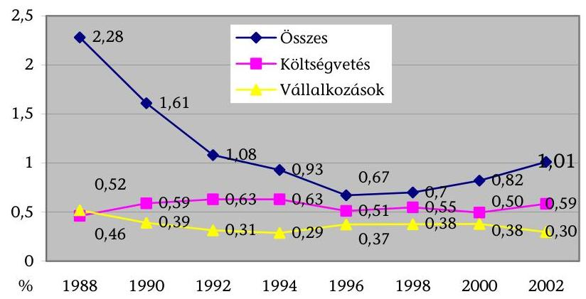

A bruttó hazai termékhez mért nemzetgazdasági K+F ráfordítás az 1996. évi 0,67\%-os mélypontról, 2002-re 1,01\%-ra nőtt és 171,5 Mrd Ft-ot tett ki$^5$, amin belül az állami részarány $59 \%$-os volt. Nem teljesült a 2000. évi kormányzati irányelvekben 2002-re előirányzott 1,5\%-os GDP ráfordítási arány és ennek 50\%-os vállalkozási részaránya, a vállalkozási szféra alacsony mértékű részvállalása miatt. A magyarországi kutatóhelyek több mint kétharmada költségve-

[^0]
[^0]:    ${ }^{4}$ A magyarországi privatizációról készített összegező ÁSZ FEMI tanulmány VII. fejezete megállapítja, hogy a magyar gyakorlatban a privatizáció elsőbbsége érvényesült, a gazdaság- és piacszerkezet átalakításával szemben. Teljesen félreismert volt, hogy mely területeken vannak esélyek - más kisebb államokhoz hasonlóan - egy-egy nemzeti karakterű ipari „zászlóshajó" (az adott területen nemzetközileg is széles körben elfogadott, innovációs termékeket előállító vállalat) kiépítésére és honi tőkéhez köthető tulajdonlására.
    ${ }^{5}$ Nemzetközi összehasonlítást tekintve hazánk a közép-európai régió középmezőnyében foglal helyet a GDP-hez viszonyított $\mathrm{K}+\mathrm{F}$ ráfordítások terén, de jelentősen elmarad a fejlett országoktól, ahol ez az arány 3-4\%-ot tesz ki. (Svédországban van a legmagasabb érték 4,27\%-os aránnyal.) Az EU tagállamainak átlaga 1,99\% volt 2002-ben.

---

tési gazdálkodási rendszerben működő kutatóhely. A vállalkozási K+F helyek 28\%-ot képviselnek ${ }^{6}$. A társadalom kutatásorientáltságát leginkább kifejező, egy lakosra jutó $\mathrm{K}+\mathrm{F}$ ráfordítás hazánkban az EU átlag $22 \%$-át, az ezer lakosra jutó kutatók száma az EU-átlag 53\%-át tette ki 2001-ben.

Magyarországnak az Európai Unió tagjaként és az Európai Kutatási Térség résztvevőjeként figyelembe kell vennie azt az uniós célkitűzést, hogy 2010-re a nemzetgazdasági $\mathrm{K}+\mathrm{F}$ ráfordítások a GDP 3\%-át tegyék ki. E ráfordítások 2/3-át a vállalkozásoknak kellene finanszírozniuk, mely cél elérésének alapvető feltétele a vállalkozások aktivizálódása. A kormányzati szándék 2006-ra 1,8-1,9\%os GDP részarányt irányoz elő. A célkitűzés megvalósításában az új Kutatási és Technológiai Innovációs Alap jut kiemelt szerephez, mely elkülönített állami pénzalapként, vállalkozási társfinanszírozással együtt biztosít pénzeszközöket a gazdasági társaságok által közvetetten vagy közvetlenül megvalósított kutatási és innovációs tevékenységekre, köztük az EU-s pályázatokra.

A K+F tevékenység megalapozásában (input oldal) az állami szerepvállalás alapvető tényezői: az irányító-koordináló tevékenység, a költségvetési finanszírozású kutatóhelyi szervezeti rendszer és K+F létszáma, a kutatás-fejlesztés állami támogatása, illetve ennek K+F ráfordításokban való megjelenése. Az állami feladati körbe tartozó kutatás-fejlesztés irányítási, szervezeti és támogatási rendszerét a túlzott tagoltság, a megfelelő koncentráltság hiánya és az ezekből adódó nem kellő hatékonyság, valamint a hasznosulási problémák jellemzik.

Az ellenőrzött időszakban a hazai kutatás-fejlesztés állami irányítása, koordinációja megosztott volt. Egyaránt irányító-koordináló feladatokat látott el az OM kormányzati szinten és külön a felsőoktatásban, az MTA (akadémiai kutatás), valamint egyes fejezetek is (FVM, KvVM, ESzCsM - ágazati kutatások). A tudomány helyzetéről szóló éves beszámolókat az MTA elnöke terjeszti az Országgyűlés elé. 2004-től fontos, de nem elégséges előrelépés, hogy a kormányzati feladatok összefogására megalakult a Nemzeti Kutatási és Technológiai Hivatal (a volt OMFB, illetve az OM Kutatás-fejlesztési Helyettes Államtitkársága átszervezéseként), amelynek nem teljes körű az irányító-koordináló szerepe. Feladat- és hatásköre nem terjed ki az alapkutatással összefüggő állami feladatokra, és nem érinti az akadémiai törvényben szabályozott szervezetek funkcióit sem.

A K+F tevékenység egészét - a köz-, non-profit- és a vállalkozási szférára, valamint a természetes személyekre vonatkozóan - törvény nem szabályozza, csak kormányzati irányelv és a kormányprogramok célkitűzései. A törvényi rendelkezések hiánya is hozzájárult az állami támogatás nem kellő hasznosulásához, a költségvetési kutatóhelyek és a vállalkozások közötti lassú tudásáramláshoz. A 2003. év végéig működő központi K+F programok céljait, feladatait, felhasz-

[^0]
[^0]:    ${ }^{6}$ Az OECD hazánk kutatás-fejlesztéséről 1990-es években készített jelentése a legnagyobb hiányosságot abban látta, hogy a kutatások több mint 70\%-át az akadémiai és a minisztériumok alá tartozó ágazati intézetek végezték. Az OECD országokban ez az intézeti részarány $30 \%$. A jelentés szerint hangsúlyt a technológia elterjesztésére, a gazdasági hasznosulásra kell helyezni.

---

nálásuk előírásait különböző szintű jogszabályok biztosították, nem pótolva az egységes törvényi szintű szabályozást.

Az állami finanszírozású költségvetési kutatóhelyek képezik a K+F tevékenység szellemi potenciáljának bázisát. A kutatóhelyek 72\%-a költségvetési kutatóhely, a K+F létszám 71\%-a költségvetési létszám. Ezek az arányok tükrözik a hazai $\mathrm{K}+\mathrm{F}$ torz szerkezetét, mivel a költségvetési kutatóhelyek elsősorban alap- és alkalmazott kutatást végeznek. Az éves állami támogatás $68 \%$-a alap- és alkalmazott kutatást szolgált. A költségvetési kutatóhelyeken belül 92\%-ot képvisel a felsőoktatási kutatóhelyek száma, mely részarány a felsőoktatási intézmények 2000-ben végrehajtott integrációja nyomán sem változott, nem történt meg az intézményeken belül a kutatási erőforrások koncentrációja ${ }^{7}$. Az MTA irányítása alá tartozó kutatóintézetek konszolidációja az 1990-es évek közepén zajlott autonóm köztestületi hatáskörben, a tervezett intézeti változtatások nem teljes körű végrehajtásával ${ }^{8}$. A költségvetési kutatóhelyek - pályázatokon kívüli - alaptevékenységének ellátásához és az állami támogatás elnyeréséhez nem kapcsolódik teljesítményorientált követelményrendszer sem a kutató-fejlesztő intézeteknél, sem a felsőoktatási kutatóhelyeken.

Az akadémiai kutató-fejlesztő intézetek és a felsőoktatási intézmények kutatási tématerületei gyakran párhuzamosságokat ${ }^{9}$, de egyben szervezetek közötti versenyhelyzetet is jeleznek. Az állami fenntartású agrárgazdasági kutatóintézeti hálózatban is vannak szervezeti és tevékenységi átfedések. A felsőoktatási intézmények kutatóhelyeinek K+F létszáma (5999 fő) - az oktatói besorolásból adódóan - nem tükrözi a valós oktató-kutatói szellemi potenciált. Az akadémiai és felsőoktatási kutatóhelyek együttműködése az 1990-es évek második felének együttműködéséhez képest javult, részt vesznek az ésszerű koncentrációt biztosító kutatóközpontok,

 regionális tudományos központok kialakításában.

A K+F tevékenység finanszírozásának évtizedek óta állandó és meghatározó eleme az állami támogatás, mely az ellenőrzött időszakban - a kormányzati célkitűzéseknek megfelelően - mind nominál-, mind reálértéken folyamatosan emelkedett, az alap- és alkalmazott kutatás növekvő összegű és részarányú, a kísérleti fejlesztés növekvő összegű, de csökkenő részarányú változása mellett. Az irányelvek szerint nőtt a projektfinanszírozás aránya és összege, főként az NKFP 2001. évi elindításával. A 2002. év állami támogatásából 20%-ot az intézményfinanszírozás, 58%-ot a projektfinanszírozás, míg 22%-ot az egyéb célú (tevékenységi és szervezeti) támogatás tette ki. A projektfinanszírozás négyötödét

[^0]
[^0]:    ${ }^{7}$ Lásd a 0311 sorszámú ÁSZ-jelentést a felsőoktatási intézményhálózat integrációjának ellenőrzéséről.
    ${ }^{8}$ Az MTA kutatóintézetek konszolidációjával kapcsolatban a 0223 sorszámú ÁSZ-jelentés - az MTA fejezet működésének ellenőrzéséről - megállapítja, hogy 4 intézet felsőoktatási intézményekbe történő integrálására a közgyűlési határozattól eltérően az OM eltérő álláspontja miatt nem került sor.
    ${ }^{9}$ Az OECD-jelentés ajánlásai szerint szükséges az intézeti alapkutatási párhuzamosságok megszüntetése az egyetemi és akadémiai kutatóhelyek együttműködése, szükség esetén összevonása.

---

a központi programok, egyötöd részét az ágazati kutatási célelőirányzatok képezték, megfelelően tükrözve a központi elképzeléseket.

A költségvetési kutatóhelyek intézményfinanszírozásában nem teljesült az alapellátás biztosítására vonatkozó 2000. évi kormányzati irányelv. A hiányzó működési költségeket a többcsatornás K+F finanszírozás keretében pályázati forrásból pótolták az intézetek. Alapvető problémát jelentett a kutatóintézeti alapellátás egységes tartalmú meghatározásának hiánya. Az alapellátásról eddig csak az MTA és PM között zajlott megegyezés nélküli tárgyalás.

A felsőoktatás finanszírozásán belül a kutatás-fejlesztési tevékenység - az oktatás-képzés mellett másik felsőoktatási alapfeladat - számszerűsített támogatása nem fejezi ki a feladat valódi jelentőségét. A felsőoktatási kutatóhelyek kutatási normatívák szerinti állami támogatásának előirányzata mindössze 2%-os arányt képviselt az OM egységes felsőoktatási intézményfinanszírozásán belül. A tényleges felsőoktatási K+F ráfordítás az összes kiadáson belül 2002-ben közelítette a 15%-os kormányzati célt. A támogatási előirányzat és a ráfordítási arány alakulása közötti különbség oka az volt, hogy a felsőoktatási intézmények saját bevételeikből, pályázati forrásokból és az intézményfinanszírozásra kapott támogatásaikból egyaránt fordítottak kutatás-fejlesztési tevékenységre. A felsőoktatási kutatási normatívák meghatározásában alapvetően a K+F tevékenység egységes nemzetközi értékelését szolgáló un. Frascati Kézikönyv ${ }^{10}$ szerinti bemeneti tényezők - oktatói létszám, doktori képzésben résztvevők száma, pályázati aktivitás - játszanak szerepet, a tényleges kimeneti tényezőket - a megbízásos tevékenységek kivételével - nem veszik figyelembe.

A központi programokon belül az OTKA alapkutatást, az NKFP alap- és alkalmazott kutatást és innovációt, a KMÜFA kísérleti fejlesztést szolgált. Az évenkénti állami támogatás összege - eltérő jellegüknek megfelelően - változó volt. A vizsgált 2000-2003. években az eredeti előirányzatokhoz képest a programokat 1,2 Mrd Ft, a K+F tevékenységet 2004. év márciusában 4,2 Mrd Ft összegű költségvetési zárolás érte. Mind a központi programoknál, mind az ágazati programoknál és célelőirányzatoknál jellemző a témák túlzott tagolódása, a pályázati pénzeszközök elaprózódása, különösen az OTKA, valamint az egészségügyi, környezetvédelmi és agrár előirányzatok esetében. Problémát okozott a pályáztatás koordinálásának hiánya is. Jellemző a hosszabb átfutási idejű, K+F tevékenységhez nem igazodó utólagos, havi elosztású kincstári finanszírozási gyakorlat. A K+F tevékenység 2003. évi EU-harmonizációval összefüggő, 25%-os áfa-kulcs alá sorolása csökkentette a kutatásra fordítható összegek reálértékét.

A kutatás-fejlesztési tevékenység támogatására szánt állami források 61 nevesített jogcímen, különböző közgazdasági tartalmú előirányzatokként szerepelnek a fejezetek költségvetésében. A K+F célú költségvetési előirányzatok között egyaránt jelen van a tevékenységi és szervezeti szemlélet. A kutatás-fejlesztési előirányzatok 10%-át nem az alapkutatás és műszaki fejlesztés funkciókódokhoz,

[^0]
[^0]:    ${ }^{10}$ A kézikönyv az OECD kiadványaként a kutatással és a kísérleti fejlesztéssel kapcsolatos felmérésekhez javasolt egységes gyakorlatot foglalja magában. Magyar fordítása 1996-ban jelent meg.

---

hanem más funkciójú ágazati kódokhoz sorolták a központi költségvetésben. Ezért az nem ad teljes képet a valós K+F támogatásokról és ráfordításokról. A jelenleg használt költségvetési kutatás-fejlesztési funkciók - alapkutatás, műszaki fejlesztés - nem pontosak, nem felelnek meg a K+F fogalmi kategóriáknak. A központi költségvetés nem alkalmazza az EU-ban is használt tevékenységi típusok szerinti tervezést és beszámoltatást.

A K+F állami támogatását és ráfordítását számba vevő, nyilvántartó rendszerek nincsenek összhangban egymással. Ez eredményezte azt, hogy 2002. évben a költségvetési szervezetek K+F ráfordításaként a költségvetési beszámolók szakfeladati összesítése (APEH-SZTADI gyűjtés) 76 Mrd Ft-ot, a KSH ilyen irányú adatszolgáltatása 100 Mrd Ft-ot mutatott ki. Az eltérés a rendszerek számbavételi különbözőségein túl, az adatszolgáltató felhasználó szervezetek statisztikai és számviteli adatainak különbözőségét is mutatja. A kutatási szakfeladatokon elszámolt honvédelmi és belügyi kiadások minimálisak voltak. A 2002. évtől működő Nemzeti Kutatás-nyilvántartó Rendszer nem teljes körű, csak a központi programok és az ágazati kutatási feladatok egy részének számbavételét oldja meg, a kutatóhelyek állami támogatás felhasználását nem regisztrálja. A megállapított hiányosságok többsége mögött (K+F programok jogszabályi és gyakorlati összehangolása, kutatás-nyilvántartás) a nem megfelelő ágazati irányítás áll.

A kutatási programok, célelőirányzatok szakmai feladatainak, illetve a kutatófejlesztő helyek által végzett kutatási feladatoknak a teljesítése megfelelt a kitűzött és a támogatási szerződésekben foglalt céloknak. Az állami támogatás a költségvetési forráscsökkentések és a kutatóintézeti alapellátás hiányosságai ellenére is biztosította a K+F tevékenység alapvető működési feltételeit.

A K+F állami támogatásának kritikus területe az un. kibocsátási oldal: az eredményesség mérése és a hasznosulás. A kutatási eredmények gyakorlati hasznosítása nem elégséges, nem megfelelő a tudásáramlás a kutatóhelyek és a vállalkozások között. Ennek egyik oka, hogy a költségvetési kutatóhelyek által végzett K+F tevékenység közel 70%-a alap- és alkalmazott kutatás, mely kutatói érdekeltség, közvetítő és piaci igény hiányában kevésbé kerül tovább az innovációs láncban. Másik ok, hogy a kis- és közepes vállalatok nem kooperatívak, fogadó-készek a kutatás-fejlesztési eredmények átvételére, hasznosítására. (A multinacionális cégek jellemzően saját, külföldi K+F-et alkalmaznak, adaptálnak. ${ }^{11}$ ) Hiányzik a szervezett tudás-átadás az alapkutatást végző költségvetési szervezetek és a kísérleti fejlesztéssel, innovációval foglalkozó gazdasági szervezetek között. Nem működik az alap- és alkalmazott kutatási eredmények továbbfejlesztéséhez a szükséges finanszírozási, érdekeltségi és intézményi rendszer. A költségvetési intézmények - kutatási eredményeik hasznosí-

[^0]
[^0]:    ${ }^{11}$ A már említett ÁSZ FEMI tanulmány II. fejezete tartalmazza azt, hogy a külföldi szakmai tulajdonosok általában követik azt a nemzetközileg általános és sokak által leírt gyakorlatot, miszerint elsősorban anyavállalatuknál, illetve a globális vállalatnak valamely fejlett országban található központjában (tehát az itteni cég szempontjából, külföldön) előállított K+F terméket hasznosítják. Ennek következtében a magánosított magyarországi vállalatokban a korábban folytatott K+F tevékenység csökkent, vagy éppen teljesen leépült, jó esetben önálló vállalkozásba már korábban kimenekült.

---

tására - csak külön kormányengedéllyel hozhatnak létre gazdasági társaságot. A központi programoknál (NKFP, KMÜFA) a konzorciumi társulás előrelépést jelent az alkalmazott kutatást végző felsőoktatási kutatóhelyek és a gazdasági szféra szereplői közötti közös célú kutatásokban, de ezt a társulási formát jogszabály nem definiálja. Nem megoldott a kutatási eredmények menedzselése és annak finanszírozása sem. A Kormány által kitűzött 5%-os mértékű, kutatási eredményeket ismertető ráfordítás három fejezet (ESzCsM, KvVM, IHM) programjai kivételével nem valósult meg.

A kutatás-fejlesztés innovációs szemléletű, egységes és összehasonlítható mérési- és értékelési rendszerét még nem alakították ki. A tudományterületek, kutatóhelyek és programtípusok sajátosságai miatt eltérő mutatószámokon alapuló kutatási teljesítménymérést alkalmaz az MTA az akadémiai kutatóintézeteknél, az OM a felsőoktatási kutatóhelyeknél, továbbá a programirodák a központi program-témák esetében. A megfelelő, összehasonlítható értékelési gyakorlat hiányában nem valósult meg a visszacsatolási folyamat a finanszírozáshoz sem. Az OTKA Bizottság a jogszabályi kötelezettsége ellenére nem tekintette át az innovációra alkalmas eredményeket. Egyes minisztériumok (FVM, GKM) egyáltalán nem értékelték a felügyeletük alá tartozó ágazati programok, kutatási feladatok végrehajtását. Az FVM irányítása alá tartozó 26 kutatóhely értékelési módszerét sem dolgozták ki.

A költségvetési kutató-fejlesztő helyek teljesítménye - az alapkutatást végző akadémiai kutatóintézetek és felsőoktatási kutatóhelyek esetében - kevéssé piac- és gyakorlatorientált. Eredményeiket főként a publikációk, szakkönyvek száma és az idézettségi mutatók jellemzik. Ezek a vizsgált időszakban emelkedést mutattak. A bejelentett és elfogadott kutatóintézeti szabadalmak száma csökkenő az érdekeltség hiánya, a szabadalmi költségek növekedése és a korábbi nagy megrendelő cégek privatizációja miatt. A mezőgazdasági kutatóhelyek piac-közeli szervezetek, de költségvetési kötöttségek, valamint megrendelő és vevő hiánya miatt gyakran bevételi, értékesítési nehézségekkel küzdenek. Ennek ellenére kutatási eredményeik hasznosítása, gyakorlati átadása növekedő.

A központi és ágazati kutatási programok eredményessége - sajátosságaiknál fogva - különböző. A programirodák a hasznosulást nem kísérték figyelemmel. A 33 befejezett projekt vizsgálata alapján leginkább a KMÜFA témák hasznosultak a gyakorlatban, 3 esetben termékgyártást eredményeztek. Az OTKA alapkutatási témáira sok publikáció és kevés szabadalom volt jellemző. Az NKFP témák - 2001. évi indításuk miatt - csak csekély része zárult le, eredményességük később mérhető. Az ágazati kutatási programfeladatok gyakorlati célokat tükröznek, de hasznosításuk mérése nem megoldott. A vizsgált projekteknél 7 új termék és 5 új eljárás jött létre, amelyek átlagon felüli, 36%-os innovációs eredményességet tükröznek. A programok közül alapvetően a KMÜFA és az NKFP esetében érvényesült az alkalmazott állami támogatási formák ösztönző hatása - visszatérítési kötelezettség alkalmazása 2002-ig, illetve kötelező saját rész biztosítása -, amely az alkalmazott kutatások növekedésében és gazdasági hasznosítási eredményekben jelentkezett.

Az utóellenőrzés során megállapítottuk, hogy az 1990. évi OTKA és az 1993. évi OMFB-KMÜFA ellenőrzés során tett ÁSZ-javaslat óta sem készült el a K+F tevékenység gazdasági és társadalmi jelentőségének megfelelő, rövid- és hosszú távú szakmai célokat meghatározó, törvényi szintű szabályozása. Az EU-csatlakozáskor nincs a súlyponti területek meghatározásával elfogadott nemzetgazdasági innovációs stratégia. Az OTKA-nál megvalósult a befejezett kutatások értékelési metodikájának kialakítása. A KMÜFA-témák pályáztatása szakszerűen, a Kutatásfejlesztési Pályázati és Kutatáshasznosítási Iroda keretében, a teljesítések ellenőrzésének esetleges végrehajtásával zajlott.

A helyszíni ellenőrzés megállapításainak hasznosítása mellett javasoljuk:

# a Kormánynak: 

1. Dolgoztasson ki hosszabb távú, átgondolt tudomány-, technológia- és innovációpolitikai stratégiát; e gazdaságorientált stratégia határozza meg a K+F tevékenység prioritásait, súlyponti szakmai-ágazati területeit, összhangban csatlakozásunkkal az Európai Kutatási Térséghez.
2. Készítse elő a kutatás-fejlesztésről és a technológiai innovációról szóló keretjellegű törvény elfogadtatását; e törvény és további jogszabályok tartalmazzanak előírásokat a K+F eredmények szervezett hasznosulása érdekében, különös tekintettel a költségvetési kutatóhelyek és a vállalkozási szféra közötti közvetítő, tanácsadó - un. spin-off - szervezetek létesítésére, a közös részvételű gazdasági társaság alapítás kötöttségeinek oldására és a kockázati tőke bevonására.
3. Végeztesse el a jogszabályi környezet vizsgálatával együtt a K+F kormányzati feladatvégrehajtás irányítási- és szervezeti rendszerének átfedéseket kiszűrő, a tárcák közötti koordinációt erősítő, valamint az állami támogatás hatékonyabb felhasználását célzó finanszírozási mechanizmusának felülvizsgálatát, ez utóbbin belül az egységes tartalmú kutatóintézeti alapellátás meghatározását.

## az oktatási
 miniszternek:

1. Kezdeményezze a felsőoktatási intézmények állami kutatási támogatásában a teljesítményarányos finanszírozás súlyának növelését, ezzel párhuzamosan minden felsőoktatási intézményben és kutatóhelyen nevesítsenek kutatói követelményrendszert, valamint a felsőoktatási kutatóhelyek támogatás-számítási alapjában vegyék figyelembe a kutatás eredményességét jellemző teljesítménymutatókat.
2. Alakítson ki a Nemzeti Kutatási és Technológiai Hivatal stratégiai feladatellátása keretében a kutatás-fejlesztési eredmények számbavételére országos monitoringrendszert, továbbá a K+F pályázatoknál EU-konform kritériumrendszert, valamint a központi programok, pályázati témák értékeléséhez EU kompatibilis innovációs értékelési- és mutatószám rendszert, melyhez finanszírozási visszacsatolási rendszer is kapcsolódik; az értékelési rendszerben kapjon kiemelt szerepet a tudás- és technológia átadás, a K+F eredmények gyakorlati hasznosulása.
3. Biztosítson a Nemzeti Kutatási és Technológiai Hivatalon keresztül módszertani szakmai segítséget a hazai $\mathrm{K}+\mathrm{F}$ adatok és mutatószámok egységes, összehasonlítható, teljes körű, információs rendszerének kötelező kialakításához, a statisztikai és pénzügyi beszámolók összhangjának megteremtéséhez, valamint a hazai kutatóintézetek és a felsőoktatási kutatóhelyek alap- és alkalmazott kutatási eredményeinek és a gazdasági szféra innovációs eredményeinek értékeléséhez; kísérje figyelemmel a K+F produktumok Országgyűlés felé történő értékelési kötelezettségének teljesítését.

---

# a pénzügyminiszternek: 

Gondoskodjon a költségvetési beszámolási rend szabályozása során a K+F-re vonatkozó szakfeladat-rend korszerűsítéséről, a tevékenységi típusoknak megfelelő költségvetési tervezés és beszámoltatás összhangjának megteremtéséről, valamint a Központi Statisztikai Hivatal elnökével közösen a K+F ráfordítások szakmai tevékenységek szerinti egységes, EU kompatibilis és megbízható számbavételének biztosításáról.

## a fejezetek felügyeletét ellátó szervek vezetőinek:

1. Vizsgálják felül eddigi K+F támogatási gyakorlatukat és a felülvizsgálat alapján koncentrált módon állítsák össze a fejezeti költségvetés K+F forrásait; értékeljék a támogatások hasznosulását.
2. Segítsék elő az ágazati K+F célelőirányzatok pályáztatásakor eredményességi követelmények előírásával, tárcaközi pályáztatás szervezésével, a kutatóhelyek értékelési rendszerének kidolgozásával és megvalósításával, valamint az innovációra alkalmas pályázati eredmények értékelésével, átadásával a közpénzek felhasználásának hatékonyságjavulását, a vállalkozási szféra versenyképességét.
3. Kísérjék figyelemmel az ellenőrzés megállapításainak, javaslatainak hasznosítását a kutatás-fejlesztésben érintett intézményeknél, gondoskodjanak azok megvalósításáról, a visszacsatolás érvényesítéséről.

---

# II. RÉSZLETES MEGÁLLAPÍTÁSOK 

## 1. Az ORSZÁGOS ÉS FEJEZETI SZINTŰ KUTATÁS-FEJLESZTÉSI TEVÉKENYSÉG CÉLJAI, ÁLLAMI TÁMOGATÁSA ÉS MŰKÖDÉSI FELTÉTELEI

### 1.1. Az állami támogatás szerepe a nemzetgazdasági szintű $\mathrm{K}+\mathrm{F}$ tevékenység alakulásában

### 1.1.1. Nemzetgazdasági célkitűzések

Az Alkotmány 35. § (1) f.) pontja szerint a Kormány határozza meg a tudományos és kulturális fejlesztés állami feladatait, és biztosítja az ezek megvalósulásához szükséges feltételeket. A nemzetgazdasági szintű kutatásfejlesztési célkitűzéseket a kormányprogramok, valamint a kormányzati irányelvként meghatározott 2000. évi stratégiai cselekvési program tartalmazták a vizsgált időszakban.

A célokat jogszabályi szinten nem rögzítették, a célkitűzésekről való beszámolás időpontját, módját nem jelölték meg. Mérhető eredménykategóriában a GDP arányos $\mathrm{K}+\mathrm{F}$ ráfordítás mértékét és belső arányait határozták meg, határidő megjelölésével együtt.

Az 1998. évi kormányprogramban a kutatás-fejlesztési kapacitások növelése, az oktatás, azon belül is a felsőoktatás fejlesztése szerepelt az első helyen. A kutatás-fejlesztés támogatásának arányát a hazai össztermék (GDP) 1\%-ára, középtávon 1,5\%-ára kívánta növelni a Kormány - amit a 106/1999. (XII. 22.) OGY határozat is rögzített -, melynek 20-25\%-át alapkutatásra kell fordítani. A Kormány közép és hosszú távú stratégia kidolgozását, karbantartását vállalta.

A Kormány átfogó, hosszú távú kutatás-fejlesztési stratégiát dolgozott ki 2000-ben „Tudomány és technológiapolitika 2000" címmel, melyben rögzítette az adott helyzetet, és abból kiindulva fogalmazta meg a célokat és tennivalókat az emberi erőforrás, az intézményi szerkezet, a finanszírozás, az infrastruktúra és a nemzetközi együttműködés vonatkozásában. Stratégiai területeken nemzeti kutatási és fejlesztési programok indítását jelölte meg. Meghatározták, hogy 2002-re az 1,5\%-os ráfordításból 50\%-ot a vállalati szférának kell finanszíroznia. A hosszú távú stratégia törvényi szintre emelése vagy más jogszabályi rögzítése nem történt meg.

A 2002. májusában elfogadott kormányprogram 2003-2006 között a közvetlen költségvetési támogatás, és a közvetett gazdaság- és tudománypolitikai ösztönzők révén egyenletes növekedést irányzott elő. A program célkitűzése szerint a kormányzati ciklus végére a felsőoktatási intézményekben a kutatásfejlesztési felhasználást az összes kiadáson belül 15\%-ra kell növelni, és a K+F

---

programok 5\%-át az elért eredmények alkalmazásának az ismertetésére kell fordítani.

Magyarország 1999-ben csatlakozott az Európai Unió (EU) 5. Kutatási és Technológiafejlesztési és Demonstrációs Keretprogramjához. A 6. Keretprogram indításakor a tagállamok a barcelonai nyilatkozatban elhatározták, hogy 2010-ig az Unió tagországaiban átlagosan a hazai össztermék 3\%-ára kell emelni a kutatási ráfordításokat, és e ráfordítások 2/3-át a vállalkozásoknak kell finanszírozni.

Ennek figyelembevételével a Kormány az ellenőrzés időszakában kialakítás és egyeztetés alatt álló, a kutatás-fejlesztésről és a technológiai innovációról szóló törvény koncepciójában 2006-ra jelölte meg a K+F ráfordítások GDP-hez viszonyított arányának 1,8-1,9\%-ra emelését.

# 1.1.2. A K+F tevékenység koordinálása, támogatása 

Nemzetgazdasági szinten a kutatás-fejlesztés irányítása nem átfogó, működési rendszere nem egységes. A Kormány tudomány- és technológiapolitikai elveinek kialakítása a 1038/2000. (V. 5.) határozattal létrehozott és a 1033/2003. (IV. 18.) határozattal megújított Tudomány- és Technológiapolitikai Kollégium, és annak Tudományos Tanácsadó Testületének volt a feladata. A K+F tevékenység országos összehangolása az oktatási miniszter feladat- és hatáskörébe tartozott, de a tudomány általános helyzetéről az Aktv. szerint az MTA, mint köztestület számol be az Országgyűlésnek.

Az MTA a 2002. évi tevékenységéről a Kormány számára készített tájékoztatójában jelezte, hogy 2002-ben nem működött a Tudomány- és Technológiapolitikai Kollégium, nem valósult meg a folyamatos tudománypolitikai egyeztetés, koordináció.

A Tudomány- és Technológiapolitikai Kollégiumról, valamint a tudomány- és technológiapolitika kormányzati irányítási és végrehajtási rendszerének megújításával kapcsolatos feladatokról szóló 1033/2003. (IV. 18.) Korm. határozattal a Tudomány- és Technológiapolitikai Kollégium feladata az innovációt érintő kérdések véleményezésére, döntés-előkészítésére és az összehangolására változott.
2004. január 1-től a kormányzati tudomány-, technológia- és innovációpolitika kidolgozása - a kormányprogramhoz képest megkésve - a 216/2003. (XII. 11.) Korm. rendelettel létrejött Nemzeti Kutatási és Technológiai Hivatal (NKTH) feladat- és hatáskörébe tartozik, ami az Oktatási Minisztérium (OM) fejezetén belül fejezeti jogosultsággal rendelkező önálló cím. A Hivatalt a Kormány irányítja és az oktatási miniszter felügyeli. (A hazai $\mathrm{K}+\mathrm{F}$ tevékenység állami támogatási és irányítási rendszerének folyamatábráját az 2-3. sz. melléklet mutatja be.)

A kutatás-fejlesztés állami támogatási rendszere alapvetően megfelelt az alapellátáson és a pályázati rendszeren alapuló kétcsatornás finanszírozási elképzelésnek, de az ágazati programokra, kutatási előirányzatokra a széttagoltság volt a jellemző. A költségvetési törvény kutatási

---

előirányzatai alapján a vizsgált 2000-2002. években az intézményfinanszírozás és az egyéb K+F szervezetek támogatása a teljes állami támogatás 54,6-41,9\%-át, a kutatási programok támogatása - növekvő mértékben, elsősorban az NKFP indításával - 45,4-58,1\%-át tette ki.

Az állami támogatás összegében részben tükröződtek vissza a nemzetgazdasági prioritások. Az OTKA költségvetési támogatása 2000. és 2002. között több mint kétszeresére, 114,7\%-kal emelkedett, de a 2003-2004. évekre jóváhagyott költségvetési támogatás összege már nem a további forrásnövelés szellemének megfelelően alakult. A célkitűzéseknek megfelelően 2001-ben megindult a Nemzeti Kutatási és Fejlesztési Programok (NKFP) pályázati rendszere.

Az állami támogatás nem biztosította - a 2000. évi kormányzati irányelvekkel szemben - a kutatóintézeti és az egyetemi kutatások alapfinanszírozását. E téren problémát jelentett az egységes tartalmú kutatóintézeti alapellátás meghatározásának hiánya. Az alapellátásról eddig csak az MTA és PM között zajlott megegyezés nélküli tárgyalás. Az állami támogatás az MTA intézeteinél - az MTA fejezet által végzett és a PM által is ismert számítások szerint - az intézetek alapellátásának 76,8-80,3\%-át fedezte a vizsgált években, az agrárgazdasági kutatóintézeteknél az alapellátás 50-60\%-át fedezte az FVM számításai szerint. A felsőoktatás kutatás-fejlesztési forrásából a normatív támogatás aránya évről évre csökkent a 2000. évi kormányzati cselekvési program célkitűzésével szemben.

A K+F tevékenység állami támogatását a költségvetési elvonások súlytották. A 2000-2003. években a központi programokat 1,2 Mrd Ft, a kutatás-fejlesztés egészét az államháztartás egyensúlyi helyzetének javításához szükséges rövid és hosszabb távú intézkedésekről szóló 2050/2004. (III. 11.) Korm. határozattal 4,2 Mrd Ft összegű csökkenés érte.

A vizsgált évek alatt az Áfa törvény változásai hátrányosan érintették a K+F területét. A 2003. évtől a kutatási tevékenységet a kedvezményes 12\%-os áfa körből a 25\%-os körbe sorolták át (az EU-harmonizációval összefüggésben), ami a kutatásra fordítható összegek reálértékét lecsökkentette. 2004. január 1-jétől az Áfa törvény módosításának K+F tevékenységre gyakorolt negatív hatása, hogy az államháztartási támogatáshoz kapcsolódó forgalmi adó levonási jog tilalma miatt a beszerzések áfa tartalma nem vonható le.

Az Országgyűlés 2003. novemberében fogadta el a Kutatási és Technológiai Innovációs Alapról (KTIA) szóló XC. törvényt, mely 2004. január 1-jén lépett hatályba. Az Alap működtetésére vonatkozóan az ellenőrzés nem rendelkezik tapasztalatokkal, mert az Alap kezelését végző NKTH a helyszíni ellenőrzés zárásakor állt fel.

Az Alap révén biztosítják a Nemzeti Fejlesztési Terv innovációt érintő intézkedéseinek hazai társfinanszírozását, valamint az utófinanszírozással megvalósuló külföldi támogatású kutatások fogadásához szükséges áthidaló pénzforrásokat is. Az Alap két fő bevételi forrása a központi költségvetési támogatás és a gazdasági társaságok által befizetendő járulék.

---

# 1.1.3. Nemzetgazdasági K+F mutatók alakulása 

Az állami szerepvállalás meghatározó volt a hazai kutatásfejlesztésben. A kutatóhelyek 72,4\%-a és a kutatók 71\%-a az állami szektorban folytatta tevékenységét. A KSH szerint a K+F ráfordítás 58,5\%-át az állami költségvetés biztosította 2002-ben. A költségvetési szerepvállalás jellemző számai egyúttal a hazai $\mathrm{K}+\mathrm{F}$ torz szerkezetét is tükrözik, mivel a költségvetési kutatóhelyek elsősorban alapkutatást végeznek, az éves állami támogatási összeg 68\%-a is alap- és alkalmazott kutatást szolgál.

A K+F tevékenység egységes nemzetközi értékelését szolgáló ún. Frascati Kézikönyvben meghatározott két fő $\mathrm{K}+\mathrm{F}$ bemeneti adatot $-\mathrm{K}+\mathrm{F}$ ráfordítás, kutatói létszám - tekintve Magyarország az EU átlagának 22-66\%-át éri el. A társadalom kutatásorientáltságát leginkább kifejező mutató az egy lakosra jutó K+F ráfordítás 2001-ben - az OECD-ben használt vásárlóerő paritáson számolva az EU átlag 21,9\%-át érte el.

Magyarországon az 1000 lakosra jutó kutatók száma az EU átlag 52,7\%-át teszi ki. Az 1000 munkavállalóra jutó kutatók száma 3,8, ami az uniós átlag (5,8 fő) 66,1\%-a. A vizsgált időszakot megelőző évtizedben a létszám drasztikusan, negyedével csökkent, jelenleg az 1991. évi szinttel közel azonos: 14,9 ezer fő. 2002-ben 100 kutató-fejlesztőre 33 fő segédszemélyzet jutott. A kutatói létszám megoszlásának regionális aránytalansága jellemző volt 2002-ben is, a kutatók 66,2\%-a Közép-Magyarországon folytatta tevékenységét.

A KSH adatai szerint a tudományos fokozattal rendelkezők közül a magasabb életkorúak aránya 2000-2002 között négy és fél százalékponttal, 83,8\%-ra emelkedett. Az MTA köztestületi tagjainak átlagéletkora folyamatosan csökkent, 2002-ben 58 év volt.

A kutatóhelyek száma 2000-2002 között - a vállalkozási és a felsőoktatási kutatóhelyek növekedése nyomán - 20,1\%-kal emelkedett, míg a kutatói létszám csak 3,9\%-kal nőtt, ami azt eredményezte, hogy az egy K+F helyre jutó kutatók száma hétről hatra csökkent. A költségvetési kutatóhelyek száma 14\%-kal 1756-ra emelkedett, de arányuk négy százalékkal 72,4\%-ra csökkent.

Az MTA a tudomány 2001-2002-es tevékenységéről szóló beszámolójában felhívta az Országgyűlés figyelmét, hogy míg a magyar tudományt hagyományai és az egyes kutatók, műhelyek produktumai alapján a világ élvonalába tartozónak tartja számon a közvélemény
 és a döntéshozók is, addig a feltételrendszert jellemző adatok alapján Magyarország az EU jelenlegi sereghajtóival van egy szinten. Ugyanakkor a magyar kutatói teljesítmények a publikációk mennyisége, idézettsége alapján jobbak az EU átlagánál. A kutatásra fordított összeghez viszonyítva pedig a magyar kutatók publikálnak a legtöbbet (1 millió USD egyetemi és kutatóintézeti ráfordításra 107 nemzetközi publikáció jut).

A K+F kimeneti adatairól a bibliometriai és a szabadalmi tevékenységről állnak rendelkezésre adatok. A kutatás-fejlesztés társadalmi hasznosulása mindig lényegesen több mint a kimutatható haszon, ami a gazdasági növekedés és az általános tudásszint növekedésében jelentkezik. 2002-ben a hazai intézmények összesen 207 találmányt jelentettek be a Magyar Szabadalmi Hivatalnál, ami 15,6%-os növekedést jelent 2000-hez képest. A hazai intézmények szabadalmi

---

bejelentéséből 53,9%-ot képezett az állami finanszírozású kutatóhelyek teljesítménye, melyből az akadémiai intézetek 20%-kal részesedtek. A külföldön bejelentett magyar találmányok 24,1%-a származott a költségvetési szférából.

Az Európai Szabadalmi Hivatalhoz 2001-ben 190 magyar találmányi bejelentés érkezett, ez egy millió lakosra vetítve 19 darab, ami jelentősen elmarad az EU 161-es átlagától.

Az egy publikációra jutó idézettség tekintetében a 20. helyen, a kutatói létszámra vetített publikációk számát tekintve pedig a 30. helyen áll Magyarország. (1990-1998-ra vonatkozó adatok alapján.) 2002-ben a megjelent folyóiratcikkek 96%-a származott költségvetési kutatóhelytől.

A 2002. évben a Bruttó Hazai Termék 1,01%-át (171 Mrd Ft-ot) fordítottak K+F célokra - elmozdulva az 1996. évi 0,67%-os mélypontról -, ami még jelentős mértékben elmarad az 1,5%-os célkitűzéstől. Nemzetközi összehasonlításban az EU átlaga 1,99%. (Magyarország GDP arányos K+F ráfordításának és az állami források arányának nemzetközi összehasonlítását a 4-7. sz. melléklet ábrái mutatják be.)

A K+F ráfordítások a vizsgált időszakban növekedést mutattak: az 1999. évi 78,2 Mrd Ft-ról, mely a hazai összterméknek mindössze a 0,68%-át jelentette, 2000-ben 105,4 Mrd Ft-ra (0,82%), 2001-re pedig 140,6 Mrd Ft-ra (0,94%) nőtt.

A költségvetési források aránya a vizsgált időszakban a célkitűzésekkel szemben nem csökkent, sőt, a 2000. évi 49%-ról 2002-re 59%-ra nőtt. Az Európai Unióban a jelenlegi 35%-os állami részesedést is csökkenteni kívánják. Az állami ráfordítás összege a 2000-2002. évek között 52,2 Mrd Ft-ról 100,4 Mrd Ft-ra, 92%-kal emelkedett. A vállalkozói szféra 2002-ben a K+F ráfordítások 29,7%-át finanszírozta meg, ami jelentősen elmaradt a tervezett 50%-os aránytól. (A K+F ráfordítások pénzügyi forrásait a 8. sz. melléklet mutatja be.) A teljes ráfordításból az alapkutatás részesedése 31-33,7% között mozgott a megcélzott 20-25%-os arány helyett.

# 1.1.4. A K+F tevékenység állami nyilvántartási rendszere 

Nemzetgazdasági szinten a KSH készít nyilvántartást a hazai kutatás-fejlesztési tevékenységről. A KSH éves jelentésében közölt állami K+F ráfordítási adatok jelentősen eltértek a költségvetési intézmények beszámolóiban szereplő kutatási szakfeladatok és a zárszámadási törvények K+F adataitól.

A nemzetgazdasági, és ezen belül a költségvetési szektor K+F adatairól az Országos Adatgyűjtési Programról szóló évenkénti kormányrendeletek alapján a KSH készít összesítést. A kutatás-fejlesztésről szóló éves jelentések tartalmazzák a magyarországi K+F létszám-, ráfordítás-, és eredményességi adatait a főbb szektorok - az intézeti, felsőoktatási és vállalkozási - szerinti bontásban. A KSH statisztikái a kutatóhelyeknek kiküldött önkitöltős kérdőíveken alapulnak, amelyet az intézményvezetők, gazdasági vezetők aláírásukkal hitelesítenek.

A 2002. évben a felsőoktatási kutatóhelyeknek - tanszékeknek - 2200 db kérdőívet küldött ki a KSH, ezeknek 10%-a nemleges válasszal érkezett vissza. Az inté-

---

zeti szektor 350 db kérdőívet kapott, melynek 54%-át küldték vissza, ebből 143 db rendelkezett adattartalommal, 49 nemleges. A megkérdezett vállalkozói kör 65%-a küldte vissza a kérdőívet, ebből 29%-ban szerepelt adat, 36% nemleges volt.

A kérdőívek nem az intézményi beszámolók szerint épülnek fel. A KSH a kutatóhelyekről beérkezett kérdőívek adatait kiegészíti a költségvetési törvény végrehajtása szerint a KMÜFA és az NKFP tényleges kiadásainak és a kutatóhelyek által bevallott ráfordításoknak a különbözetével. Ennek az összege 2002-ben 6,2 Mrd Ft volt. Ugyancsak kalkulált adatként jelennek meg a tudományos fokozattal rendelkezők tiszteletdíjára, illetménykiegészítésére, az ösztöndíjasok illetményére költségvetési forrásból kifizetett összegek, 2002-ben összesen 5 Mrd Ft.

Az állami szektor ráfordításairól a KSH mellett a költségvetési szervek szakfeladat rendje és a költségvetés végrehajtásáról szóló törvények kutatási funkciókódjai (F01.d: alapkutatás; F01.e: műszaki fejlesztés) alapján képzett adatok is rendelkezésre állnak.

A háromfajta összesítés különböző szerkezettel és belső tartalommal készült. A KSH nettó (áfa nélküli), míg a másik két nyilvántartás bruttó szemléletben gyűjti az adatokat. További eltérés, hogy a KSH nyilvántartása összesíti a vállalkozási szektor által felhasznált állami támogatásokat, de a költségvetési szervezetek államháztartáson kívüli bevételeit nem tartalmazza.

A szakfeladat rend és a költségvetés végrehajtási törvény a költségvetési szervezetek, illetve előirányzatok tényleges kiadásait összegzi, ami tartalmazza az államháztartáson kívüli bevételeket is. A kétféle kimutatás nem egyezhet meg egymással, mivel a funkciókód szerinti gyűjtés teljes alcímeket és jogcímcsoportokat sorol a kutatás-fejlesztés körébe, függetlenül attól, hogy az adott előirányzatnak van-e K+F szakfeladata vagy sem. Tehát a kutatási funkciókódok alapján történő kigyűjtés nem ad teljes képet a valós K+F ráfordításokról és támogatásokról.

Például a funkciókódok alapján nem sorolják a kutatások közé az FVM agrárkutató intézeteinek előirányzatát és az ágazati kutatásokat, ellenben alapkutatási funkciókóddal van ellátva az MTA Doktori Tanács Titkársága, amelynek nincs kutatási szakfeladata.

# A 2002. évben a KSH jelentése szerint 100,4 Mrd Ft volt az állami költségvetés K+F ráfordítása, a költségvetési szervezetek kutatási szakfeladatainak összesítése alapján 76,4 Mrd Ft, a 2002. évi költségvetés végrehajtásáról szóló törvény kutatási funkciókódjai szerint 61 Mrd Ft. 

A kutatási funkciókóddal ellátott és a nem kutatási kóddal szereplő, de kutatást szolgáló nevesített előirányzatok tényleges támogatási összege 2000-ben 29 Mrd Ft, 2002-ben - 61 előirányzaton keresztül - 53,7 Mrd Ft volt, ami 85,1%-os növekedést jelent. (A kutatás-fejlesztést szolgáló költségvetési előirányzatok támogatási adatait a 9-10. sz., a szakfeladatok szerinti adatokat a 11-12. sz. melléklet tartalmazza.) Ezenkívül a helyszíni ellenőrzések alapján nem nevesítetten támogattak kutatási feladatokat a GKM-nél és a KvVM-nél, amelynek az összege 2000-ben 1 Mrd Ft, 2002-ben 1,3 Mrd Ft volt, továbbá az OM normatív kutatástámogatása - évenkénti összege 2,4-1,8 Mrd Ft között változott - az állami intézmények költségvetésébe beépült.

---

Magyarországon a K+F tevékenységben nincs egységes tudományterületi osztályozás. Az MTA három tudományterületet - társadalomtudomány, élettelen természettudomány és élettudomány - különböztet meg. A 169/2000. (IX. 29.) Korm. rendelet nyolc tudományterületet (természettudományok, műszaki tudományok, orvostudományok, agrártudományok, társadalomtudományok, bölcsészettudományok, művészetek és hittudomány) határoz meg. Jelenleg ez utóbbi felosztást tartalmazza a Nemzeti Kutatásnyilvántartási rendszer is. A kutatás-fejlesztés területén nemzetközileg elismert és a K+F mérése területén standarddá vált „Kutatásra és kísérleti fejlesztésre irányuló felmérésekhez javasolt egységes gyakorlat", vagyis az un. Frascati kézikönyv nemzetközi ajánlása hat tudományterületet (természettudományok, műszaki tudományok, orvostudományok, mezőgazdasági tudományok, társadalomtudományok, humán tudományok) sorol fel, és a KSH is ehhez hasonló rendszerben gyűjti az adatokat. A költségvetési beszámolóban a szakfeladatok besorolási rendje öt tudományterületi szakfeladatot különböztet meg (természettudomány-, orvostudomány-, agrártudomány és műszaki tudomány, valamint humán és társadalomtudományi kutatás és kísérleti fejlesztés).

A költségvetés végrehajtásáról szóló törvények nem tudományterület, hanem a kutatás típusa szerint mutatják ki a kutatás ráfordításait, megkülönböztetve alapkutatást és műszaki fejlesztést. Utóbbi besorolás nem felel meg az általánosan elfogadott kutatási típusoknak: alapkutatás, alkalmazott kutatás, kísérleti fejlesztés.

A Nemzeti Kutatás-nyilvántartási Rendszert (NKNYR) a 160/2001. (IX. 12.) Korm. rendelettel hozták létre azzal a céllal, hogy az államilag támogatott kutatás-fejlesztési témákat, projekteket nyilvántartsa, archiválja, növelje az átláthatóságot. A rendszer alkalmassá tehető a halmozott pénzügyi támogatások azonosítására, a párhuzamos támogatások kiszűrésére.

Az adatszolgáltatás a 2002. január 1-je után megkötött kutatás-fejlesztési szerződésekre, az országos kutatási programokra kötelező. A 2002. előtt megkezdett kutatásokról és a közpénzt igénybe nem vevő kutatásokról az adatszolgáltatás önkéntes.

Az adatokat a támogató szervezetek szolgáltatják a rendeletben meghatározott adattartalommal. Az adatszolgáltatás a jogszabályban meghatározott pályáztatóktól megtörtént. Egyes fejezeteknél (GKM, GYISM) nem pályázati úton történt a felhasználás, az ESzCsM által beküldött adatlapok összegeket nem tartalmaznak, adatszolgáltatásuk nem teljes körű.

A nyilvántartás teljes körűségét az ellenőrzött időszakban nem vizsgálták. Erre a pályáztatók részéről a pályázati projektekre és összegükre vonatkozóan megküldött összesített adatok ismeretében lenne mód. Ez a gyakorlat azonban nem alakult ki.

Az ellenőrzés befejezésének időpontjában (2004. február) a rendszerben 2445 projekt volt rögzítve. A rendszerben nyilvántartott projektek összes értéke (2000-2007) 66 Mrd Ft támogatási, 22 Mrd Ft saját részből és 1 Mrd Ft egyéb forrásból tevődött össze.

---

Az ellenőrzés megállapította, hogy a NKNYR-ben az államilag támogatott kutatási témák, projektek adatainak számbavétele nem teljes körű. A kormányrendelet 3 központi és 9 ágazati program kutatási feladat adatainak nyilvántartását tartalmazza. (Jelen ÁSZ vizsgálat 13 ágazati kutatási célelőirányzat tapasztalatait rögzíti.) Az OM nem tett eleget az NKNYR továbbfejlesztésére vonatkozó 2248/2001. (IX. 12.) Korm. határozat előírásnak, hogy az állami támogatások teljes körének, így az intézményi finanszírozású témáknak is meg kell jelennie a rendszerben.

# 1.2. A fejezeti szintű K+F tevékenység alakulása 

### 1.2.1. A fejezetek ágazati K+F stratégiái

A helyszíni ellenőrzésbe vont hét fejezet közül a vizsgált időszak alatt két fejezet (OM és IHM) nem készített, a GKM részben rendelkezett középtávú kutatási-fejlesztési stratégiával. Az OM "Felsőoktatási kutatáspolitika 2000" című dokumentumot készített. Az elkészült és jóváhagyott stratégiai tervek heterogének voltak, eltérő ciklusra, különböző időpontban és különböző mélységben készültek el. Közös jellemzőjük volt, hogy az elkészült középtávú koncepciókhoz nem kapcsolódtak mérhető célok.

Az OM fejezetnél ágazati K+F stratégiai terv nem készült. A hosszabbtávú célok, prioritások a „Tudomány és Technológiapolitika 2000" című dokumentumban, a középtávúak a kormányprogramokban kerültek meghatározásra.

Az MTA középtávú koncepcióját a közgyűlés 2002 novemberében fogadta el, amelyben 9 fő témakörben fogalmazták meg a kutatás irányait. A koncepcióban a kutatás-fejlesztést szolgáló fejezeti kezelésű előirányzatokkal, programokkal nem foglalkoztak. A koncepciót az akadémiai kutatóintézetek által készített hároméves stratégia alapozta meg.

Az FVM ágazati K+F stratégiáját 2000. évben hagyták jóvá, a prioritásokat 5 fejezetben foglalták össze. A fejezet címek alatt felsorolt megoldandó feladatokat súlyozás nélkül sorolták fel, azok rész- és véghatáridőket nem tartalmaztak. Az ellenőrzési időszak 3 évében a stratégiát nem aktualizálták, így a kormányzati célkitűzésekkel sem hozták összhangba.

A KvVM-nél rendelkeztek ágazati K+F stratégiával, amely a környezet védelmének általános szabályairól szóló 1995. évi LIII. tv. és a kormányzati célkitűzések alapján kerültek kidolgozásra. Ebben meghatározták a célokat és prioritásokat fejezeti és programszinten egyaránt. Az ágazati K+F stratégia 2002-2003-ra megfelelt a környezetvédelmi törvény előírásainak.

A GKM fejezetnél a minisztérium nem fogalmazott meg irányelveket a gazdasági ágazatra, és a közlekedési ágazat - az általános közlekedési politikán kívül - sem rendelkezett tárca szintű stratégiával.

Az ESzCsM 2000-2006-ig szóló K+F stratégiával rendelkezik, amely megfelel a kormány által meghirdetett „Johan Béla Nemzeti Fejlesztési Program" népegészségügyi célkitűzéseinek.

Az IHM 2002. május 27-én alakult meg, ezért a minisztérium
 2002-ben önálló stratégiával nem rendelkezett. A minisztérium felügyelete alá került közös megalapodás alapján a Magyar Űrkutatási Iroda, amely 2000. évben elkészítette stratégiáját.

# 1.2.2. A fejezetek K+F irányítása, szervezeti rendszere 

A vizsgált időszakban az ellenőrzésbe vont fejezetek közül 7 fejezet felügyelete alatt, nagy számú kutató-fejlesztő hely működött, számuk a 2000. évi 1506-ról 2002. évre 1700 helyre emelkedett. A kutatóhelyek 95%-át az OM felügyelete alatt működő felsőoktatási K+F kutatóhelyek alkották. A kutatóintézetek száma kis mértékben, a 2000. évi 54-ről 57-re emelkedett, amelynek mindkét évben a legnagyobb hányadát (74%)-át az MTA kutatóintézetei alkották. Jelentősebb számú kutatóintézettel - 2002. évben 14 intézettel - rendelkezett még az FVM, a KSH felügyelete alatt 2, az OM-nél 1 intézet működött.

A kutató-fejlesztő helyek létszáma kis mértékben 14,6 ezer főről 14 ezer főre mérséklődött, amelynek eredményeként az 1 kutatóhelyre eső átlaglétszám 2002. évre 9,7 főről 8,2 főre csökkent.

A kutatás-fejlesztési tevékenység ágazati irányítására, koordinálására különböző szervezeti kereteket és feltételeket alakítottak ki az egyes fejezetek, amelyek nem minden esetben biztosították az ágazati szakmai felügyelet megfelelő szintű és tartalmú ellátását. Az előforduló gyakori átszervezések a K+F tevékenység koordinációját, a megalapozott szakmai munkavégzést esetenként hátrányosan befolyásolták.

A tevékenység irányítását növekvő számú - 2000-ben 20, 2002-ben 22 - K+F szervezeti egység látta el, a szervezeti egységek 171 főről 146,3 főre történő csökkentett összlétszáma mellett. Ezzel 8,6 főről 6,7 főre csökkent a tevékenység koordinálásával foglalkozó egységek átlaglétszáma is.

Az MTA szervezeti feltételei biztosították a fejezeti szintű K+F tevékenység irányítását és koordinálását. A programok lebonyolítását végző szervezetek területén azonban párhuzamosság is tapasztalható volt (lásd Függelék).

Az MTA szervezeti struktúrája nem változott, felügyelete alá tartozó összes intézményeinek száma - lényegében az intézetek számának 36-ról 38-ra történő emelkedésével - 61-ről 63-ra változott. Létszáma és a tudományos bizottságok száma kis mértékben bővült. A két év alatt bekövetkezett létszámemelkedés során kedvezőtlenül alakult a kutatói létszám aránya, amely a 2000. évi 76%-ról 2002. évre 66%-ra esett vissza.

Az OM fejezet kutatás-fejlesztési feladatainak szervezeti, irányítási feltételei a 2000-2003. évek között jelentősen megváltoztak. A kormány 2000. január 1-jétől az OMFB-t megszüntette és jogutódjaként az OM szervezetén belül megalakult a KFHÁT. Az átszervezés előnyökkel és hátrányokkal is járt egyaránt (lásd Függelék). Az átszervezéssel nem sikerült megoldani a kutatás-fejlesztési tevékenység belső szervezeti széttagoltságát, azonban a két kutatás-fejlesztési terület összevonásával a fejezeti szintű irányítás egységesebbé vált.

A K+F irányításban újabb változást hozott a Kutatási és Technológiai Innovációs Alap 2004. évben történt létrehozása, az egységes kormányzati szintű irányítás azonban ezzel a változtatással nem oldódott meg, ugyanis az NKTH feladat- és hatásköre nem terjed ki az alapkutatással összefüggő állami feladatokra és nem érinti az akadémiai törvényben szabályozott szervezetek funkcióit sem.

Az FVM kutatási programjait lebonyolító szervezet létszáma az elvárt és szabályzatban rögzített feladatok maradéktalan végrehajtására nem volt elegendő a vizsgált időszakban. Az agrár ágazat K+F feladatait a Kutatási és Fejlesztési Osztály látta el. A 7 fős létszám folyamatosan több száz pályázat (2002-ben 838 db) előkészítését, lebonyolítását, ellenőrzését végezte.

Az FVM felügyelete alá 14 költségvetési kutatóintézet tartozott, szakmai felügyeletet 12 társasági formában működő szervezet - Kht., Kft., Rt. - felett gyakorolt a tárca. A 14 intézet főállású állományi létszáma 2002-ben 1126 fő, ebből a kutató-fejlesztő 393 fő volt. A 2000. évhez viszonyítva az összes létszám 4%-kal, a kutató-fejlesztők száma 13%-al nőtt.

Az ESzCsM fejezetnél az ágazati szintű K+F tevékenység koordinálását az ETT Titkárság Kutatásszervezési Osztálya az SZMSZ-ben foglaltaknak megfelelően látta el.

A KvVM fejezet csak a vizsgált időszak egy részében rendelkezett szervezeti feltételekkel a fejezeti K+F tevékenység irányítására és koordinálására, a fejezeti szintű irányítás szervezeti feltételei folyamatosan változtak. Az irányító, koordináló szervezetet 2000. évben megszüntették, 2001-től 4 fős Kutatási Önálló Osztályt, majd 2003-tól Kutatási és Oktatáspolitikai Főosztályt, 2004-től Kutatási és Oktatási Önálló Osztályt hoztak létre.

Az ellenőrzésbe vont fejezetek összességében megfelelően kialakították a K+F támogatások felosztásához szükséges pályázati rendszereiket. A támogatási szerződések megkötésével biztosították a pályázatok számonkérését, rész- és záró beszámolókon keresztül a szakmai és pénzügyi teljesítéseket, nem megfelelő teljesítés esetén az esetleges szankciók alkalmazását.

Az FVM-nél a Kutatási és Fejlesztési Osztály a hatályos SZMSZ szerint nyilvántartja és ellenőrzi a pénzügyi elszámolások szabályosságát. A beszámolókon, részbeszámolókon keresztül történt ellenőrzések esetenként tártak fel problémákat.

A KvVM-nél fejezeti szinten ellenőrzik az állami támogatás felhasználását és a K+F programok végrehajtásának eredményeit, az ellenőrzés kialakított rendszere megfelelő volt. A támogatások felhasználást a K+F tevékenység pályázati szerződéseinek lezárását követően értékelő témalapok alkalmazásával, a programok végrehajtása eredményeinek minősítését - a szerződések lezárása után 1-2 évvel később - utóértékelő témalapok alkalmazásával ellenőrzik.

Az MTA-nál az állami támogatások felhasználásának ellenőrzését az Ellenőrzési Önálló Osztály látta el. Alapvető feladatát - a fejezet felügyelete alá tartozó intézmények kétévenkénti átfogó költségvetési felügyeleti ellenőrzését - megvalósította. A költségvetési ellenőrzések alkalmával az intézeteknél egy-egy pályázat, pénzeszközátadás felhasználásának szabályosságát vizsgálták, de az ellenőrzésük nem terjedt ki a fejezeti kezelésű előirányzatok átfogó ellenőrzésére.

# 1.2.3. Az állami K+F támogatások és ráfordítások alakulása 

A kutatás-fejlesztésre az adott költségvetési funkciókódok alapján a K+F tevékenységhez sorolt, valamint a költségvetési törvényben nem oda sorolt, de ellenőrzésünk alapján oda tartozó előirányzott állami támogatások nagysága a vizsgált időszakban 33,6 Mrd Ft-ról 59,7 Mrd Ft-ra - a kormánycélkitűzéseknek megfelelően lényegesen - megemelkedett. Ezen belül az alapkutatásokra jóváhagyott támogatások összege 2,2-szeresére, összes támogatáson belüli aránya 54,5%-ról 67,6%-ra nőtt. A műszaki fejlesztés állami támogatásának 1,5-szeresére történő emelkedése 28,2%-ról 23,7%-ra történő részarány csökkenést jelentett. A nevesített K+F előirányzatok részaránya 17,3%-ról 8,7%-ra csökkent.

A kutatás-fejlesztéssel kapcsolatos állami támogatások a Magyar Köztársaság költségvetésében számos, 2002. évben mintegy 61 címen (alcímen, jogcímen), 12 fejezet költségvetésében jelentek meg. Ebből 10 helyen hagytak jóvá intézményi támogatásokat, 4 jogcímen találhatók a központi és 20 jogcímen a különféle ágazati programok. Egyéb K+F jogcímen 27 soron hagytak jóvá támogatásokat. Az előirányzatok széttagoltságát fokozta és áttekinthetőségét nehezítette, hogy az adott fejezetnél megtervezett és jóváhagyott forrásokat vagy azok egy részét átadták más fejezetnek.

Az MTA több évtizede kiemelt feladatának tekinti és koordinálja a Balatonnal kapcsolatos kutatási feladatok megoldását. A MEH a Balaton ökológiai állapotának és vízminőségének javítása érdekében hozott kormányhatározatok alapján évente anyagi támogatást biztosított a stratégiai döntések tudományos megalapozását szolgáló kutatási tevékenységhez. Ezek elvégeztetésére, értékelésére, az eredmények kiadványban történő közzétételére a MeH és az MTA évente együttműködési megállapodást kötött. A program 2000. évi átvett támogatásának értéke 70 M Ft, a 2002. évben 82,7 M Ft volt.

A MeH és az MTA között stratégiai fontosságú kutatási területek hatékony művelése érdekében, egy évre szóló 300 M Ft-os támogatással 2003-ban jött létre a megállapodás. Az előirányzatot a MEH fejezetnél tervezték meg és átadták az MTA-nak.

A KvVM és az MTA közötti Kutatási Együttműködési Megállapodás alapján a 2000-2002 közötti időszakra évi 100 M Ft pénzeszköz átadással biztosított támogatást 7 K+F projekt elkészítésére. A megállapodás keretjellegű volt, a pénzeszköz átadást követően az MTA feladata volt az alvállalkozói szerződések megkötése.

A KvVM és az OM Környezetvédelmi Műszaki Fejlesztési Pályázat 2000. és 2002. évi kerete egyaránt 100 M Ft volt. A pályázat évenként került meghirdetésre az OM-KvVM közös finanszírozásában, együttműködési megállapodás alapján.

Az IHM és az MTA között 2003-ban jött létre 300 M Ft-os támogatással megállapodás a tudásalapú információs társadalom fejlődése és fejlesztése érdekében. További 300 M Ft-os megállapodást kötött az IHM a BME-vel a műszaki és természettudományi, illetve a társadalomtudományi kutatási programokban és feladatokban való együttműködés érdekében.

A vizsgált két év viszonylatában a fejezetek által közölt adatok szerint a kutatás-fejlesztési célú támogatások kisebb mértékben növekvő hányadát fordították közvetlen kutatás-fejlesztési feladatok finanszírozására. Ezen belül lényegesen erősödött - a 2000. évi 28,2%-ról 2002. évre 46,4%-ra - a központi programok által finanszírozott pályázatok támogatása. A növekedést elsősorban a 2001. évtől bevezetett NKFP előirányzata idézte elő, ezáltal kisebb súlyt kapott az intézményfinanszírozás aránya, amelynek mértéke 29,6%-ról 19,6%-ra esett vissza. Az ágazati programok részaránya az összes támogatáson belül szintén - 17,2%-ról 11,7%-ra - csökkent.

A fejezeteket ért minden évben bekövetkezett forráselvonások következtében gyakran hátrányt szenvedtek a kutatás-fejlesztésre jóváhagyott támogatási előirányzatok is.

Az MTA költségvetését többször sújtotta elvonás. A 2000-2003. évek között Kormányhatározatok alapján összesen 1 929,1 M Ft-ot zároltak illetve vontak el.

Az OTKA 2000. költségvetési év során a 2000. év elején kialakult árvízi katasztrófahelyzet pénzügyi fedezetének biztosításáról szóló 2076/2000. (IV. 11.) Korm. határozat hatásaként az Alapprogramok támogatását 66,5 M Ft-tal csökkentették, így a tényleges költségvetési támogatása 3101,1 M Ft-ra mérséklődött. 2002. évi eredeti támogatási előirányzata 6801,1 M Ft-ra emelkedett, amelyből műszerpályázatra 1400 M Ft jutott. Az Alapprogramok támogatási előirányzata 2003. évre 6700 M Ft-ra csökkent. Ebből 500 M Ft-ot jelentett a műszerpályázatok támogatása. A 2003. évi gazdasági és pénzügyi folyamatok várható alakulásához kapcsolódó intézkedésekről szóló 2133/2003. (VI. 19.) Korm. határozat alapján 2,5%-ot, 167,5 M Ft csökkentést ráterhelt az MTA irányító szervezete az OTKA előirányzatára, így a tényleges támogatás 6532,5 M Ft-ra csökkent.

A felsőoktatás területén a kutatási normatívák szerinti állami támogatás 2002. évben mindössze 2%-os arányt képviselt az OM oktatási intézményfinanszírozásán belül. A szakfeladatok szerinti arány a kormánycélkitűzések szerinti 15%-os mérték közelítésének részben eleget tett, mert a felsőoktatási kutatóhelyek K+F ráfordításainak az összes kiadásokon belüli tényleges aránya 12%-os volt. A támogatási előirányzat és a ráfordítási arány alakulása közötti különbség oka az volt, hogy a felsőoktatási intézmények saját bevételeikből, pályázati forrásokból és az intézményfinanszírozásra kapott támogatásaikból egyaránt fordítottak kutatás-fejlesztési tevékenységre.

Jellemzően a kutatás-fejlesztés irányítását és koordinálását végző két fő fejezeten - MTA és az OM - keresztül történt a K+F támogatások meghatározó részének elosztása. A támogatások növekvő hányadának - 2000-ben 80,7%-ának, 2002-ben 91,1%-ának - felosztását bízta az Országgyűlés e két fejezetre, s a fennmaradó rész ágazati programokon keresztül történő odaítélése maradt további tíz fejezetre.

A kutatási szakfeladatokon ráfordításokat 12 fejezet számolt el a vizsgált időszakban, ebből 8 fejezet mutatott ki mindkét évben ráfordításokat. Az elszámolt K+F ráfordítások 44 Mrd Ft-ról 76,4 Mrd Ft-ra, 73,5%-kal nőttek.

Az összesített adatok azt mutatják, hogy a fejezetek mérlegbeszámolói nem a valós képet mutatják, mert egyes esetekben irreálisan alacsony számot mutatnak, más esetben olyan kiadásokat is elszámoltak K+F szakfeladatnak, amelyek nem tartoznak a kutatás-fejlesztés körébe.

A Honvédelmi Minisztérium 2000. évi, szakfeladaton kimutatott kutatás-fejlesztési kiadásai 4 M Ft-ot, 2002. évi kiadásai mindössze 2 M Ft-ot tettek ki. A Belügyminisztérium 2000. évben mindössze 1 M Ft-os K+F kiadás összeget számolt el.
 Holott mindkét fejezet rendelkezik felsőoktatási intézménnyel és kutatóhelyekkel.

A GKM-nél az Európai Integráció Kutatások előirányzat terhére 2002-ben egy tanulmány készítésén kívül a kutatási témaköröktől eltérő kézikönyv megjelentetését, tájékoztató füzet és hatástanulmány készítését finanszírozták.

Az MTA fejezet tényleges kiadásai a 2000. évi 28,0 Mrd Ft-ról 2002. évben 45,4 Mrd Ft-ra, 61,8%-kal, dinamikusan emelkedtek, amelyeket változatlanul mindkét évben 66%-os arányban a támogatások és 34%-ban a saját bevételek finanszíroztak.

A tevékenységek osztályozása szerint az MTA intézményeinek kutatásfejlesztéssel kapcsolatos szakfeladataira elszámolt kiadások a teljes fejezeti költségvetési kiadásoknak csökkenő - 63,1-59,5% - hányadát képezték a két év viszonylatában. 25,8%-ról 30,6%-ra emelkedett a kutatást, kísérleti fejlesztést kiegészítő tevékenységek és a fejezeti kezelésű speciális elszámolások aránya, a fennmaradó 11,1-9,9%-ot 14 egyéb más szakfeladat kiadásai alkották.

A kutatás és kísérleti fejlesztés szakfeladatokon kimutatott támogatás (felügyeleti szervtől kapott támogatás) aránya a kiadásokhoz képest alacsonyabb, 49,8-48,9%-os volt a vizsgált években. A kisebb részarány oka az, hogy a fejezeti kezelésű előirányzatok teljesítése átvett pénzeszközként a kutatóhelyek bevételei között jelent meg.

A költségvetés végrehajtási törvény a funkciókódok alapján nem sorolta a kutatások közé az MTA Titkárság Igazgatása, az Akadémiai tiszteletdíjak és a hozzátartozói ellátási díjak, az MTA Könyvtára, az MTA Jóléti intézmények és a fejezeti tartalék címek támogatását. Nem sorolta ebbe a körbe a Balaton állapotának javítását szolgáló kutatási feladatot sem, amely azonban egyértelműen kutatásfejlesztési téma.

# Eltérés volt a KSH által és a fejezet költségvetési beszámolójában kimutatott, kutatás-fejlesztésre fordított kiadások között. A 2002. évben a 45,4 Mrd Ft fejezeti ráfordításból a szakfeladatok alapján 27,0 Mrd Ft, a KSH adatgyűjtése szerint 23,5 Mrd Ft volt a kutatásra és kísérleti fejlesztésre fordított összeg. A két adat között mutatkozó 13%-os eltérés a KSH adatgyűjtés és a költségvetési mérlegbeszámolás különböző szemléletmódjából adódott. 

A közpénzek felhasználásáról, a köztulajdon használatának nyilvánosságáról, átláthatóbbá tételéről és ellenőrzésének bővítéséről szóló "Üvegzseb" törvényből eredő, és az államháztartási információs és működési rendszer korszerűsítését szolgáló egyes feladatokról szóló 1096/2003. (IX. 11.) Korm. határozatban foglaltak végrehajtását elősegítő kiegészítő feladatokkal nyer megoldást a fenti problémára. A kormányhatározat 10. pontja szerint a szakmai tevékenységről történő

---

beszámolás egységes kereteinek a kialakítása, annak a pénzügyi beszámolókkal való megfelelő kapcsolat megteremtése a PM, a KSH és a tárcák közös feladata, határideje 2004. december 31.

A teljes fejezeti támogatás összegéből a tényleges K+F intézményfinanszírozás kutatóintézetek és a támogatott kutatóhelyek - eredeti előirányzata 2002-ben 8908,3 M Ft volt, ami 9,2%-kal haladta meg a bázisidőszakot. A támogatási előirányzat 14753,4 M Ft-ban teljesült, ami 51,0%-os növekedésnek felel meg.

Az MTA kutatás-fejlesztési hálózat finanszírozási rendszerében a köztestületi feladatok ellátása és az intézetek működése az ún. alapellátásból - állami támogatásból -, a kutatóintézetek az elnyert kutatás-fejlesztési pályázatok (OTKA, KMÜFA, NKFP, stb.) és egyéb saját bevételeiből tevődik össze.

Az MTA részére biztosított állami tudomány-támogatás alapvetően nem volt összhangban a kormány által megfogalmazott technológiapolitikai - az 1998. és a 2002. évi kormányprogramokban és a „Tudomány és Technológiapolitika 2000" című, a Kormány tudomány és technológiapolitikai elveiben és cselekvési programjában leírt - elképzelésekkel. A programokban megfogalmazott célok közül nem valósult meg a kutatóhelyek alapellátásának (alapműködésének) biztosítása és a kutatási minőség fenntartásához kapcsolódó dologi források növelése. Az OTKA forrásai 2002-ig ugyan jelentősen bővültek, de azt követően szinten maradtak, illetve a jelenlegi elvonások miatt csökkentek.

Az 1998. évi kormányprogram értelmében a költségvetésnek kell fedeznie a kutatóhelyek alapműködését, alapellátását. Az MTA által összeállított és a Pénzügyminisztérium által ismert kimutatás szerint a vizsgált 2000-2002. években az állami támogatás az alapellátásnak csak 76,8-80,3%-át fedezte.

Az intézményfinanszírozás teljesítésének részaránya a fejezeti támogatásból a vizsgált időszakban csökkent, 2000. évben 53,1%-ot, 2002. évben 49,2%-ot képviselt.

Az MTA fejezet kutatási programjait finanszírozó tényleges támogatás 3321,2 M Ft-ról 7234,4 M Ft-ra 117,8%-kal emelkedett. A növekedés döntő hányadát az OTKA források bővülése tette ki, amely összhangban állt a kormányprogram és a „Tudomány és Technológiapolitika 2000" című cselekvési program céljával. Az MTA intézeteinek költségvetési támogatása is jelentősen növekedett a vizsgált időszakban, ez azonban a 2002. évi közalkalmazotti bérek emelésének fedezetét jelentette.

A forrásbővülés következményeként a programfinanszírozás aránya a fejezeti támogatásokon belül 18,1%-ról 23,8%-ra emelkedett.

Együttesen az intézmény-, és a programfinanszírozás az MTA tényleges költségvetési támogatásának 73,0%-át tette ki a 2002. évben, ami két százalékos növekedést jelent a bázisidőszakhoz képest.

A 2002. évben a költségvetési támogatás kutatási szakfeladatok szerinti 48,9%-os és a költségvetési címek szerinti 73%-os aránya közötti eltérést a pénzeszközátadással teljesített OTKA támogatás - aránya 22,7% - okozta, mivel az OTKA 70%-a a fejezeten kívülre került, a 30% pedig az intézetek saját bevételei között jelent meg.

Az egyéb-, és a kutatást kiegészítő, kisegítő támogatás a vizsgált időszakban közel az egyharmadát tette ki az állami támogatásnak.

Az egyéb K+F támogatás körébe tartozott a beruházás, felújítás, tudós társaságok, a kutatóintézeti konszolidáció, kutatói bérrendezés, átlagkereset emelése.

Kutatást kiegészítő, kisegítő támogatás a Titkárság, az MTA Széchenyi Irodalmi és Művészeti Akadémia, az MTA Könyvtára, Területi Akadémiai Központok, kutatást kiszolgáló szervek, jóléti intézmények, OTKA Iroda, Nagy Imre Emlékház, fejezeti tartalék.

Az OM fejezetnél a kutatás-fejlesztésre fordítható források 2000-2002-ben összességében kellő fedezetet nyújtottak az elfogadott programok teljesítéséhez, azonban az igények jelentősebbek voltak a lehetőségeknél. Az ágazat kutatás-fejlesztési forrásai jelentősen növekedtek, elsősorban a KMÜFA és az NKFP előirányzatainak emelésével. A források a kiemelt programokban meghatározott célok teljesítéséhez megfelelő fedezetet biztosítottak, a teljesítés azonban elmaradt a rendelkezésre álló előirányzattól és jelentős maradvány képződött.

A benyújtott felsőoktatási kutatás-fejlesztési pályázatokból 2000-2001 között a fiatal kutatók pályaindító pályázatánál az elfogadottak aránya 30%-os, a doktori iskoláknál 100%-os, a Tudományos Diákkörök pályázatnál (TDK) 98%-os volt.

A KMÜFA pályázatok elfogadottsági aránya 2000-ben 58%-os, 2001-ben 57%-os, 2002-ben 56%-os volt. Az NKFP 124 nyertes pályázata 2001-ben a benyújtott pályázatok 60%-át tette ki.

A fejezetnél megtervezett kutatás-fejlesztési támogatások összege - amely intézmény-finanszírozást nem tartalmazott - a 2000. évben 11,1 Mrd Ft volt, amelynek összege 2002. évre 28,7 Mrd Ft-ra nőtt, közel megháromszorozódott. A jelentős emelkedés elsősorban az NKFP belépése és a műszaki fejlesztési célelőirányzat, valamint az EU-5. Kutatási, Technológiafejlesztési és Demonstrációs Keretprogram előirányzat emelkedésének a következménye volt. Indokolatlanul alacsony előirányzat - 2002. évben a teljes K+F programok előirányzatának mindössze 8%-a - jutott nevesítve a felsőoktatási kutatási programokra.

A felsőoktatás kutatás-fejlesztési céljai a kormányprogramokban kiemelt súllyal szerepeltek. Új programok indításához, az elnyert EU-s pályázatok megvalósításához a költségvetési támogatások növekedését irányozták elő.

Nagyobb értékű támogatást irányoztak elő a fiatal kutatók pályaindításához, a doktorandusz képzés megerősítéséhez, az oktatói gárda színvonalas utánpótlásának biztosításához, a Tudományos Diákkörök működéséhez.

A felsőoktatási terület tevékenysége a kutatás-fejlesztési előirányzat kialakításával és felhasználásával, a kutatási feladatok és programok megújításával, továbbfejlesztésével - a lehetőségek figyelembevételével - a kormányzati célok teljesítésére irányult.

A felsőoktatás kutatás-fejlesztési forrása a fejezet költségvetésében a 2000. évi 3485,9 M Ft-ról 2001-ben 2718,8 M Ft-ra csökkent, 2002-ben pedig 4134,8 M Ft-ra emelkedett. A költségvetési forrás összegéből a normatív támogatás aránya évről-évre csökkent (71, 67,5, illetve 44,4%-ra), a pályázati összegek aránya pedig ezzel párhuzamosan növekedett. A pályázati igények növekedése, a támogatások célirányosabb felhasználása és elszámolása idézte elő a forrás-megosztás arányának módosulását. A támogatások ütemes, időarányos felhasználását kedvezőtlenül befolyásolta, hogy az intézmények mindkét évben késve jutottak hozzá a forrásokhoz.

A fejezetnél - az integrációval összhangban - megszűnt a normatív támogatás kötelező minimuma, amely 1999-ig a támogatási keret 0,1%-a volt és 1999-ben elérte az 1,3 M Ft-ot. Újabb módosításra került sor 2002-ben, amellyel ösztönöztek a felsőoktatási intézményeket a költségvetésen kívüli források fokozottabb igénybevételére.

Növelték a felosztásnál az intézmények aktivitási arányát és a doktori iskolai mutatók alapján felosztott összeg arányát, csökkentették a tudományos, illetve mester fokozattal rendelkező oktatók-kutatók súlyozott létszámarányát. Az intézmények a kapott támogatást belső szabályzataik alapján osztották fel, a nagyobb intézmények decentralizáltan, kari szintre lebontva, a kisebb intézmények intézményi szinten. A nem kutatási célú felhasználás az előző évekhez képest csökkent.

2000-ben a szabályozás késedelmes megjelenése miatt a szerződéseket csak késve kötötték meg, az intézmények csak szeptemberben jutottak a támogatáshoz. A 2002. évben a támogatás felosztására év végén került sor, emiatt a felhasználásra nem maradt idő.

A felsőoktatási kutatási normatívák meghatározásában csak a kapacitásadatok - oktatói létszám, doktori képzésben résztvevők száma, pályázati aktivitás - játszanak szerepet, a K+F kimeneti tényezőket - a megbízásos tevékenység kivételével - nem veszik figyelembe.

# 2. A KÖZPONTI- ÉS ÁGAZATI K+F PROGRAMOK, KUTATÁSI FELADATOK VÉGREHAJTÁSA ÉS EREDMÉNYESSÉGE 

### 2.1. A központi programok (KMÜFA, NKFP, OTKA) általános működésének rendszere

A központi programok létrehozását, célját, feltételrendszerét és működtetését nem egységes szintű jogi háttér, hanem két különböző szintű jogszabály határozta meg. Az Országos Kutatási Alapprogramokról (OTKA) törvény, a Központi Műszaki Fejlesztési Alapprogramról (KMÜFA) és a Nemzeti Kutatási és Fejlesztési Programokról (NKFP) kormányrendeletek rendelkeztek. A programok részben céljaikban és a költségvetésben biztosított éves keretösszegek nagyságrendjében különböznek egymástól.

---

Az OTKA előirányzatából olyan tudományos kutatások, illetőleg azok végzéséhez és az eredmények nyilvánosságra hozatalához szükséges feltételek létrehozása támogatható nyilvános pályázati rendszerben, amelyektől új tudományos törvényszerűségek felismerése, ismeretek, módszerek, eljárások kidolgozása várható. Az alapprogramokból jellemzően alapkutatásokat és műszerbeszerzéseket támogattak.

A KMÜFA pályázati típusai döntően (70%) az alkalmazott kutatások és a kísérleti fejlesztések támogatását szolgálták. A pályázatok célja a technológiai innováció támogatása, a K+F infrastruktúra fejlesztése és a fejlesztési eredmények terjesztése, illetve gazdasági hasznosítása.

Az NKFP célja olyan átfogó kutatási, fejlesztési és innovációs projektek megvalósításának támogatása, amelyek hozzájárulnak az ország versenyképességének növeléséhez, a tudásalapú gazdaság, illetve társadalom kiépüléséhez. A szabályozás szerint az NKFP első négy programjában az alapkutatás aránya maximálisan 30% lehet, a többit alkalmazott kutatásra és kísérleti fejlesztésre kell fordítani.

A költségvetési törvények különböző mértékű állami támogatást irányoztak elő az egyes programokra a vizsgált időszakban, amely a 2000. évi kormányzati irányelvekben foglalt növekedési céloknak megfelelt. Az éves állami támogatás eredeti és módosított előirányzata a KMÜFA-nál volt a legmagasabb, ezt követte az NKFP és az OTKA rendelkezésére bocsátott állami forrás nagysága. A 2002. évi kormányzati irányelvekkel ellentétben a 2003. évben mindhárom állami forrásnál visszaesés következett be. Ennek oka, hogy a költségvetési törvényben alacsonyabb összeggel fogadták el az előirányzatokat. (13. sz. melléklet)

A programok 2000. évi eredeti előirányzatai a fenti nagyságrendi sorrendet követve a KMÜFA esetében 6,3 Mrd Ft, az OTKA-nál 3,2 Mrd Ft volt, az NKFP ebben az évben jött létre. A módosított előirányzatok 9,9 Mrd Ft-ra és 3,1 Mrd Ft-ra módosultak.

A 2002. évi költségvetésben jóváhagyott eredeti előirányzatok megemelkedtek, amelynek eredménye a KMÜFA-nál 10,9 Mrd Ft-os, NKFP-nél 10,0 Mrd Ft-os és az OTKA-nál
 6,8 Mrd Ft-os eredeti előirányzat volt. A jóváhagyott forrásokat az év során 13,2 Mrd Ft-ra, illetve 8,1 Mrd Ft-ra módosították, az OTKA-nál a módosított előirányzat változatlanul 6,8 Mrd Ft maradt.

A központi programokból elnyerhető forrásokat az érvényes jogszabályi előírások szerint meghatározó mértékben pályázati úton lehetett elnyerni, a KMÜFA-nál a tárgyévi kiadások 5%-át meg nem haladó mértékben pályázaton kívül is. A pályáztatás feltételeit és bonyolítását a kezelő szervezetek és a hozzájuk tartozó bizottságok megfelelően kiépítették és megvalósították, az elbírálás rendszere és szempontjai alapvetően biztosították a beérkezett pályázatok objektív értékelését és rangsorolását.

Az elnyert támogatásokhoz való hozzájutás feltételei az egyes programok esetében nem voltak egységesek, így azok ösztönző hatása is eltérő volt. A támogatási forma ösztönző hatása a kockázatvállalásban (megfelelő mértékű saját rész) és a visszafizetési kötelezettség mértékében nyilvánult meg, amellyel érdekeltté tették a pályázókat az eredmény elérésében. Az NKFP

---

és az OTKA kutatás-fejlesztésre fordítható, visszatérítési kötelezettség nélküli támogatásokat, míg a KMÜFA vissza nem térítendő és visszafizetési kötelezettség mellett egyaránt nyújtott támogatásokat ítélt oda pályázóinak, ez utóbbi a vizsgált időszakot követően megszűnt.

Az ellenőrzött időszakot megelőzően a KMÜFA esetében jellemző volt a 100%-os visszatérítési kötelezettség, amelynek motivációja abban volt, hogy olyan kutatás-fejlesztés valósuljon meg, amelynek az eredményessége biztosítja az igénybe vett állami támogatás visszafizetését. Ezt követően a pályázati kiírásokban jelent meg, hogy milyen feltételek mellett volt mód visszafizetési kedvezményre, amely pályázatonként változó, 0-50% közötti mértékű volt, míg 2002. évtől ez teljesen meg is szűnt.

Az ellenőrzött időszakban a visszatérítési kedvezmény elsősorban a nem vállalkozói területet érintette. A kis- és középvállalatok fejlesztési tevékenységének elősegítésére a saját forrás és állami támogatás arányával kedveztek, amely szerint a pályázat költségének a 65%-át biztosították állami támogatásból a korábban általános 50-50%-os arány helyett.

Különbség mutatkozott abban is, hogy a KMÜFA és az NKFP támogatás igényléséhez a pályázóknak saját forrást is biztosítani kellett, az OTKA esetében ez nem volt feltétel.

A központi K+F programok eredményességét nem teljes mértékben lehetett megítélni, annak ellenére, hogy a pályázati feltételek között szerepelt a várható eredmény leírása. Az eredményesség mérésére szolgáló adatok és mutatók csak részben álltak rendelkezésre. Az eredményesség áttekinthetőségét nehezítette az egyes jogszabályokban is kötelezően előírt beszámolási, értékelési feladatok elmaradása. A megfelelő, általános, összehasonlítható értékelési gyakorlat hiányában nem valósult meg a visszacsatolási folyamat a finanszírozáshoz sem.

Az NKFP-nél és a KMÜFA-nál a támogatásokkal összefüggésben megjelent publikációkat nem kísérték figyelemmel, arról nyilvántartás nem készült.

Az OTKA Bizottság írásban közösen nem értékelte az OMFB-vel (2004. január 1-től jogutódja a Kutatási és Technológiai Innovációs Tanács) az innovációra alkalmas pályázati eredményeket az OTKA tv. 7. § (3) bekezdésében előírtaknak megfelelően.

Az NKFP-ről történő beszámolási kötelezettséget tekintve csak részben érvényesültek az előírások. A jóváhagyott Ügyrendben foglaltaknak megfelelően a Programirányító Testület évenként kellett, hogy értékelje az NKFP előrehaladását. A Programtanácsok értékelése és javaslata alapján át kellett volna tekinteni a kutatási eredmények hasznosulását, amelynek a Programirányító Testület nem tett eleget.

A 251/2002. (XII. 5.) Korm. rendelet 8. § (1) bekezdésében foglaltak ellenére a NKFP eszközeinek felhasználásáról az oktatási miniszter a Kormánynak történő évenkénti beszámolási kötelezettségének nem tett eleget. A Kormánynak ezt követően kellett volna tájékoztatnia az OGY Oktatási és Tudományos Bizottságát, valamint a Tudomány- és Technológiapolitikai Kollégiumot.

---

A pénzforrások felhasználását nehezítette a kutatás-fejlesztési feladatokhoz jobban igazodó finanszírozási mechanizmus hiánya, valamint a kintlévő lejárt előlegek magas állománya és többszörösére emelkedése. A projektek finanszírozása a KMÜFA és NKFP esetében utólagosan történt, de a 3 alkalommal történő előleg igénybevételi lehetőséggel részben előfinanszírozásúvá váltak. Az OTKA pályázatok kezdetben előre finanszírozták a kutatásokat, 2003. évtől 1/12-es, a kutatások jellegéhez nem szerencsésen igazodó finanszírozási gyakorlat működik.

A 2000-2002. években az újonnan indult OTKA szerződések esetén a kutatóhelyre az éves támogatás egy összegben, a korábbi években megkötött szerződésekre az éves támogatás két részletben került átutalásra, mindenkor figyelembe véve a beszámolási kötelezettségek teljesítését. A 2003. évtől kezdődően a támogatások 1/12-es kiutalásban, az előirányzatok átadásával történtek. Különösen nagy problémát okoz a havonkénti kiutalási rendszer a műszer-beszerzéseknél, ahol az eszközök beszerzését követően kell kiegyenlíteni a számlát.

A KMÜFA-ból fedezett kutatási programok finanszírozása a részteljesítések elszámolásának beérkezésével, utófinanszírozással történt, de előleg igénybevételére a projekt megvalósítása során - a többször módosított 217/1998. (XII. 30.) Korm. rendelet 91. § (6) bekezdése értelmében - maximum háromszor, egyenként a támogatás 25%-ának megfelelő összeggel lehetőség nyílt. A mikro-, kis- és középvállalkozásoknak minősülő kedvezményezettek részére legfeljebb az odaítélt támogatási összeg mértékének 50%-áig nyújtható támogatási előleg. Ugyanakkor az előlegek határidőre történő elszámolása az ellenőrzött időszakban sok esetben nem történt meg, ezért ezek a kintlévőségek számottevő összeget képviseltek. Az előlegek állománya 2003. december 31-én összesen 3,6 Mrd Ft volt, amelyből a lejárt határidejűek összege - 291 pályázó nem számolt el időben - 3,2 Mrd Ft volt.

Az NKFP projektek indulásától, 2001. év végétől kezdődően a folyósított előleg összege 11,3 Mrd Ft-ot tett ki, amelyből 6,2 Mrd Ft-tal az érintettek elszámoltak. A 2003. év decemberi záró állomány 5 Mrd Ft-ot tett ki. Ebből a lejárt határidejű előleg állomány összege 3,7 Mrd Ft volt.

# 2.1.1. A Központi Műszaki Fejlesztési Alapprogram (KMÜFA) 

Az ellenőrzött időszakban a KMÜFA - 2001. évtől célelőirányzat - irányításában és kezelésében folyamatos szervezeti változás ment végbe, amely nem kedvezett a feladatellátásnak. A Nemzeti Kutatási és Technológiai Hivatal a korábbi OMFB, majd OM KFHÁT által ellátott feladatokkal kapcsolatos tevékenységeket foglalja magában, amely a kutatás átfogó irányítását, felügyeletét továbbra sem oldotta meg.

A Műszaki fejlesztési célelőirányzat pályázati céljai teljesültek, amelyek a kormányprogrammal (alkalmazott kutatás-fejlesztési pályázat, biotechnológia) tartalmilag összhangban voltak. Az állami támogatás növelésére vonatkozó cél nem teljesült, mert a rendelkezésre álló állami forrás volumene 2003. évben a 2000. évhez viszonyítva kis mértékű, azaz 5%-os csökkenést mutat.

A pályáztatások, elbírálások, a projektek megvalósulási folyamatában megtörtént értékelések szabályszerűen történtek. Az előírástól eltérően a szerződésköté-

---

sek időpontjának elhúzódása, a szerződésekben foglalt jogcím szerinti pénzeszköz-felhasználás és a határidők esetében merültek fel eltérések, amelyek szerződés-módosítást vontak maguk után.

A pályázatok finanszírozásában a kedvezményezett saját része, és a támogatás aránya 50-50%-ban érvényesült jellemzően, a támogatási összeg visszafizetési kötelezettsége mellett. A támogatási rendszer 2002-től megváltozott, vissza nem térítendő finanszírozássá válása szűkítette az ellenőrzött időszakban rendelkezésre álló Műszaki fejlesztési célelőirányzatot. Emellett a pályázók a megállapodás szerinti visszafizetési kötelezettséget sem teljesítették, mivel 2000-2003. években összesen 586 M Ft elmaradás keletkezett.

A 2000-ben meghirdetett Kooperációs Kutatási Központok elnevezésű pályázat végrehajtása során tapasztaltak azt tükrözték, hogy a pályázatban részt vett egyetemeken a K+F tevékenységek intézményi szintű integrációja létrejött. A gazdasági szférával és az egyéb kutatóintézetek tevékenységével való integráció azonban még nem érte el a kívánt szintet. Nem látszik egyértelműen az a technológiai áttörés, ami a pályázat eredeti kiírásában alapvető feltételként szerepelt. A pályázatok nagy részében a fejlett ipari országokban meglévő eredményekhez és az ottani magas színvonalú technológiához való felzárkózás vagy követés volt a kitűzött cél.

Az elnyert pályázatokra 2000. évben 12270 M Ft-ot, 2002-ben összesen 10620 M Ft-ot, vagyis 14%-kal kevesebb forrást használtak fel, amely az elfogadott pályázatok számában is visszaesést eredményezett. A 2000. évi pályáztatás során 2751 db pályázatot fogadtak el, míg 2002-ben 34%-kal kevesebb, 1808 db volt a nyertes pályázatok száma. Az összes pályázatot tekintve minden évben átlag 56-58%-os volt az elfogadási arány, amely mögött az egyes pályázati típusok nagy szórása, 19-70%-os aránya áll.

A hasznosulás, eredményesség szempontjából a KMÜFA pályázatok céljukat tekintve széles körűek, amelyet a pályázati típusok száma - 13-15 féle - is mutat. Ezek egy része olyan alkalmazott kutatásra irányuló pályázat volt, amelyik produktum (termék) létrehozásával zárult. Az egyes pályázatoknak más-más jellegű eredménye és hatása volt.

A tematikus pályázatokban előtérbe kerültek a közhasznú projektek (pl. az egészségügyben az új diagnosztikai eljárások kialakítása, az informatikában az adatbiztonság növelése), amelyek hatása ténylegesen csak hosszabb távon jelentkezhet.

A „Kooperációs Kutatási Központok" pályázatokban nyújtott támogatással az adott terület kutatás-fejlesztésben érdekelt szereplői közötti kapcsolatok erősödését, vállalkozói kutatási források bevonását kívánták elérni, amelynek keretében hosszú távú kutatási, képzési, valamint a tudás- és technológia transzferre vonatkozó együttműködésre szerződhettek a K+F-ben érdekelt magyarországi működési területű tőkeerős cégek és a felsőoktatási intézmények. Ez az együttműködés a gazdasági szférával és az egyéb kutatóintézetekkel még nem hozta meg a kívánt eredményt.

---

A csúcstechnológiai szerződéseknél a további beruházás indukálása (korszerű technológiát alkalmazó, legalább harminc fő felsőfokú kutatót legalább öt évig alkalmazó új kutatóhely létrehozása) a cél. A kutatóbázis beruházásának része a támogatásból létrehozott K+F infrastruktúra, illetve a kutatói állomány oktatására szükséges ráfordítás. A csúcstechnológiai szerződéseknél a befejezést követően kerül sor a szerződésben vállalt foglalkoztatási kötelezettség teljesítésére.

A kutatási feladatok befejezésekor a záró jegyzőkönyvek a kitűzött célok eléréséről tanúskodtak. Hiányosságként állapítható meg, hogy vezetői szintű, kutatási eredményeket értékelő dokumentációk az ellenőrzött időszakban nem készültek. Az Országgyűlés felé történő évenkénti beszámolási kötelezettség sem teljesült. Nem került sor a létrejött termékek, produktumok értékelésére, amely a következő pályázat során a döntés elvét, gyakorlatát szükség szerint befolyásolhatná.

Az ellenőrzés tapasztalata szerint a kutatási eredmények szabadalmi szintű megjelenésében a kutató-fejlesztő szakemberek nem érdekeltek, így ilyen teljesítmény-mutató nem érvényesült.

A pályáztatónál nincs információ, illetve dokumentáció a kedvezményezetteknél jelentkező hatásokról, amely a kutatási tevékenység hasznosulását tükrözné.

# Az ellenőrzési időszakban a KMÜFA forrásból nyújtott támogatások társadalmi-gazdasági hasznosulását, a stratégiai célok megvalósulását átfogóan nem kísérték figyelemmel. 

### 2.1.2. A Nemzeti Kutatási és Fejlesztési Programok (NKFP)

Az OM Kutatás-fejlesztési Helyettes Államtitkárság (KFHÁT) látta el az NKFP forrásaiból finanszírozott pályázati programok kidolgozását és szakmai irányítását, valamint az OM Alapkezelő Igazgatóságán keresztül történő működtetését. A KFHÁT a programok lebonyolításához a 2000-2005. évekre kiterjedően kutatás-fejlesztési stratégiát készített. A pályázati kiírás során az életminőség javítását célzó, az információs és kommunikációs technológiák, a környezetvédelmi és anyagtudomány, az agrárgazdasági és biotechnológiai, valamint a nemzeti örökség és a jelenkori társadalmi kihívások kutatását szolgáló programokat hirdették meg. Az ellenőrzött időszak végén csupán néhány projekt (7 kutatás) fejeződött be, miután a pályázatok hároméves futamidejűek és emellett jelentős időeltolódással indultak.

## Az NKFP keretében meghirdetett pályázatok tartalmilag megfeleltek a kormányprogramban rögzítetteknek, az állami támogatás növelésére vonatkozó cél azonban nem érvényesült folyamatosan (5,7 Mrd, 10,0 Mrd, 7,6 Mrd).

Az NKFP elsősorban olyan K+F projekteket támogat, amelyeket egyetemi, kutatóintézeti kutatóegységek által vezetett konzorciumok valósítanak meg. Ezekben közreműködnek az eredmények hasznosításában résztvevő vállalkozások is. Ugyanakkor a létrejövő konzorciumokat jogszabály nem definiálja.

---

Az oktatási miniszter Ügyrendben rögzítette, hogy az NKFP előrehaladásáról a Programirányító Testület évenkénti értékelést végezzen, amelynek nem
 tettek eleget.

A pályáztatás az elbírálás, a finanszírozás, a több hónapos időeltolódástól eltekintve az előírásoknak megfelelően történt, míg a beszámolási kötelezettségnek csak részben tettek eleget. Az NKFP eredményeiről a közvéleményt sajtótájékoztatóval, interneten tájékoztatták.

A benyújtott és elfogadott pályázatok aránya az 5 pályázati programnál változó volt. A pályázatok támogatási igényét tekintve megállapítható volt, hogy a pályázatban megjelölt költségigényt nem finanszírozták meg teljes egészében, amely szintén változó mértékű az egyes programok között.

A 2001. évi pályázatnál összesen (412 db-ból 124 volt elfogadott) 30%-os az elfogadási arány, amely a pályázati programok között 26-43% közötti arányokból alakult ki.

A 2002. évi pályázatoknál összességében a beérkezett pályázatok (285 db) 27%-a nyert elfogadást (77 db). Az öt program között ez az arány 18 és 48% közötti.

A projektek tevékenységét tekintve a finanszírozás módja - jogcím szerinti tervezés - nem volt elég rugalmas, ezért a tervezettől való eltérés szerződésmódosításokat eredményezett.

Ösztönző hatást fejtett ki, hogy olyan projektekkel kell megjelenni a pályázatokban, amelyekhez a vállalkozások is kapcsolódnak a saját forrásuk hozzáadásával.

Ezzel a kutatásra fordítható pénzeszközök összege 2001-ben megduplázódott, 20 Mrd Ft támogatással 40 Mrd Ft volt a teljes - három évre szóló - projekt költség. A 2002. évi 10 Mrd Ft támogatással 15,6 Mrd Ft értékű projekt megvalósítása válik lehetővé.

Nem alakítottak ki olyan értékelő rendszert, amely összhangban van a stratégiai prioritásokkal, ami abból is következik, hogy a projektek jellemzően még nem zárultak le.

A témafelelősök számítógépes nyilvántartási rendszeren kísérték figyelemmel a szerződésben foglaltak teljesítését, esetenként - 2003. évben 11 - helyszíni ellenőrzésre került sor. A csekély számú - mindössze 7 befejezett - téma ellenőrzésénél a záró jegyzőkönyvek megfelelően tartalmazták az elért eredményeket, amelyek összhangban voltak a pályázati célokkal.

A termelés számára átadható innovációs termék/produktum tekintetében a szakmailag befejezett projektek után piackutatásra van szükség, ami az ellenőrzés időpontját követő időszakot érinti.

# 2.1.3. Az Országos Tudományos Kutatási Alapprogramok (OTKA) 

Az OTKA Bizottság a törvényben foglaltaknak megfelelően meghatározta a pályázatok általános elveit és a témakörök céljait, amelyet az OTKA SZMSZ-e tartalmazott.

---

A Bizottság által meghozott határozatok összhangban álltak a kormányprogramban megfogalmazott célokkal, amely szerint az élettudományi kutatások támogatásának meghatározó arányt kell képviselniük az összes támogatáson belül.

Az OTKA lebonyolítását végző szervezeti egységek a törvényben és az SZMSZ-ben foglaltaknak megfelelően biztosították az Alapprogramok működését. Az OTKA pályázatok megfelelőségét négyszintű bírálati rendszerrel (opponens, zsűri, kollégium, OTKA Bizottság) végezték, ami garantálja a magas színvonalú elbírálást, de lelassítja a tematikus pályázatok kiértékelését. Az Iroda álláspontja szerint ez hasonló a nemzetközi gyakorlathoz.

Az OTKA eredeti költségvetési támogatási előirányzata 2000. és 2002. között a kormányprogram és a „Tudomány és Technológiapolitika 2000" címú cselekvési program céljainak megfelelően jelentősen, 3167,6 M Ft-ról 6801,1 M Ft-ra emelkedett. A 2003. évre jóváhagyott költségvetési támogatás összege már nem a 2002. évi kormányprogramban megfogalmazott további forrásnövelés szellemének megfelelően alakult, mert a költségvetési törvényben jóváhagyott előirányzata 6700 M Ft-ra csökkent. A támogatási forrásokat tovább csökkentették a 2000. és 2003. években végrehajtott elvonások. További hátrány érte az előirányzatot a kutatási tevékenység kedvezményes, 12%-os áfa körből 25%-os körbe történő átsorolása miatt, amely a kutatásra fordítható összegek reálértékét lényegesen lecsökkentette.

A pályázatok meghirdetésénél reális követelményeket határoztak meg, a kiírások biztosították az esélyegyenlőség elvét. A pályázati kiírások és a programcélok között megfelelő volt az összhang.

A pályázati témaköröket a lehető legnagyobb nyilvánosság előtt hirdették meg. A felhívások az SZMSZ-nek megfelelően megjelentek az OTKA hírlevélben, az Alapprogram honlapján és egy országos napilapban, valamint az űrlapokat eljuttatták a nagyobb kutatóhelyekre is.

A benyújtott és az elnyert tematikus pályázatok megfelelő arányt mutattak. A kért és a támogatott pályázati összeg aránya 2002-ben 54,3% volt, ami majdnem hét százalékos növekedést mutat a 2000. évhez képest. Az egy elfogadott tematikus pályázatra jutó átlagos támogatás 7490,1 E Ft-ra, 85,3%-kal emelkedett, amely a tudományterületenkénti tématámogatással azonosan, összhangban állt az OTKA Bizottság szándékával.

A támogatási szerződések biztosították a kutatási feladatok teljesítését. Az OTKA ellenőrzési rendszere a több éves kutatások és az évenkénti elszámolási kötelezettségek miatt rendkívül munkaigényes. A zárójelentések szakmai bírálatát négy szempont szerint, megfelelően végezték el.

Az OTKA alapkutatási jellegéből következően a legfőbb eredményt a publikációk és az arra kapott hivatkozások száma jelenti. Megállapítható, hogy 2000. évről 2001. évre mind a publikációk száma, mind az 1 pályázatra vetített publikációk száma emelkedett, bár ezek a számadatok bizonyos halmozódásokat is mutatnak.

---

A befejezett pályázatok ellenőrzése során tapasztaltak szerint, ha egy témavezetőnek 2 pályázatánál időbeli átfedés tapasztalható - adott esetben 1997-2001-ig és 2000-2004-ig -, a 2000. évben megjelent ugyanazon publikációkat mindkét pályázat lezárásakor számba veszik. A tájékoztatás szerint ennek oka, hogy általában egy kutatási témára elnyert pályázati összeg nem fedezi a teljes kutatást.

A beküldött zárójelentések alapján a támogatásban részesült és 2000. évben lezárt kutatásokhoz kapcsolódóan megjelent publikációk száma 9987 db volt, amely 10,27 db publikációt jelentett 1 pályázatra vetítve.

A 2001-ben befejezett témákból megjelent publikációk száma 10347 db volt, ami 1 pályázatra jutó 11,54 db publikációnak felel meg. Az OTKA kutatásokból származó bejelentett találmányok és elfogadott szabadalmak számáról a Bizottság külön nyilvántartást nem vezetett.

# 2.2. Ágazati programok, kutatási feladatok végrehajtása 

A költségvetési törvényekben az ágazati kutatási programok a fejezeti kezelésű előirányzatokon belül az ágazati célelőirányzatok között szerepelnek. A 2002. évben kutatási funkciókódok alapján 9, nem kutatási kóddal ellátva összesen 20 előirányzat sorolható a kutatást, illetve annak feltételeit megalapozó programok közé, melyekből 13 került ellenőrzésre.

## Az ágazati kutatás-fejlesztési programok lebonyolítása megfelelő volt, de a programok eredményességének egységes mérése és értékelése nem volt megoldott.

A végrehajtásaként jelentkező konkrét eredményekről - tudományos publikációk, szabadalmak, termékek száma - a felsőoktatási, a gazdasági és részben a földművelési ágazatban nyilvántartást nem vezettek, így nem alakítható ki pontos kép a programok eredményességéről.

Az ágazati programok szétaprózott kutatási támogatást tettek lehetővé. A programokra a sok pályázó sokféle jogcímen történő alacsony összegű támogatása volt jellemző. A kialakított programok a költségvetési törvényben való megjelenésüket és a hozzájuk rendelt pénzforrások nagyságát tekintve heterogének voltak.

A költségvetési törvényben való megjelenés tekintetében például az OM felsőoktatási kutatási program előirányzata 8 témakört foglalt magába 2002-ben, amelyek 20-1251,1 M Ft között szóródtak. Az MTA fejezeten belül minden témakör külön előirányzatként szerepelt, a programok támogatása 17-755,4 M Ft között változott.

Az FKFP 2000. évben nyertes két éves pályázatainak 1,8 M Ft, az 1999. évben nyertes három éves pályázatainak átlagos támogatása 3,4 M Ft volt. Az FVM 2001. évi egyéves pályázatai 4,5 M Ft, a 2002. évi egyéves pályázatai 6,5 M Ft támogatást kaptak. Az ESzCsM 2000. évben indított három éves pályázatainak maximális összege 1,6 M Ft/év volt.

Az ágazati programok eredeti előirányzata a 2000. évben 5,8 Mrd Ft-ot, a 2002. évben 7 Mrd Ft-ot tett ki, ami 20,7%-os emelkedést jelent. Mindezek mellett a helyszíni ellenőrzések alapján még hét előirányzatból támogattak részben ku-

---

tatási feladatokat a GKM-nél és a KvVM-nél, amelynek a teljesített összege 2000-ben 1 Mrd Ft, 2002-ben 1,3 Mrd Ft volt.

Az NKFP megjelenésével a kutatási programokon belül az ágazati programok részesedése a 2000-2002. között - az eredeti előirányzatok alapján - 37,9%-ról 20,1%-ra csökkent.

# A vizsgált időszakban az Ámr. nem szabályozta következetesen a kutatási programokra vonatkozó összehangolási kötelezettségeket, mert két fejezetnél (MTA, OM) előfordultak azonos vagy hasonló célt szolgáló fejezeti kezelésű előirányzatok, amelyek nem tartoztak az összehangolási körbe.

Posztdoktorok teljes foglalkoztatását támogatja az OTKA posztdoktori pályázata és az OM fejezetnél a Békésy György, a Magyary Zoltán posztdoktori és 2003. évtől a Deák Ferenc ösztöndíj. Emellett fiatal PhD hallgatók támogatását szolgálta az MTA-nál a fiatal kutatók támogatása elnevezésű fejezeti kezelésű előirányzat, és posztdoktorok kiegészítő jellegű támogatását biztosította a Bolyai János Kutatási ösztöndíj is. A posztdoktori foglalkoztatás - fejezeti vélemény szerint - nem oldható meg az ország szükségletének szintjén egyetlen program forrásából.

Hasonló célt, alapkutatási témapályázatokat támogatott az MTA-nál az AKP, az OTKÁ-nál a tematikus pályázatok és az OM-nél az FKFP. Az OTKA konferenciaszervezés, -részvétel pályázattal párhuzamosan működött a természettudományok területén a KMÚFA mecenatúra pályázata.

Az Ámr. 7. sz. melléklete szerint négy ágazati - (Agrárkutatási feladatok támogatása; Felsőoktatási kutatási program; EszCsM - Ágazati kutatásfejlesztés; Akadémiai Kutatási Pályázatok forrása) és egy központi (KMÚFA) kutatási programot kellett összehangolni egymással, amely kötelezettségnek eleget tettek.

A K+F programokat kezelő szervezetek megfelelően biztosították a programok lebonyolítását. A pályázati kiírások és az elbírálás biztosította az esélyegyenlőség elvét. A pályázatokat utólagos jelleggel, vissza nem térítendő formában támogatták, amelyek a fejezetek közötti előirányzat átadás és ennek következtében a pénzügyi teljesítés elhúzódása miatt egyre nagyobb problémát jelentett a kutatóhelyek számára.

Ellentmondás húzódik a több éves kutatások és a pályázatok finanszírozása között. Az éves támogatási előirányzatokat minden esetben az adott évi költségvetési törvény deklarálja, az elfogadott kutatási témák azonban átlagosan több éves futamidejűek. A költségvetési évben előleg nyújtására a többször módosított 217/1998. (XII. 30.) Korm. rendelet 91. § (3)-(6) bekezdései lehetőséget biztosítanak. Emellett a vizsgált időszakban az időarányostól eltérő finanszírozás kérésének lehetősége is fennállt.
2003. január 1-től az államháztartás működési rendjéről szóló 217/1998. (XII. 30.) Korm. rendelet 46. § (6) bekezdése alapján a fejezeti kezelésű előirányzatok fejezetek közötti átadását - pénzeszközátadás helyett - előirányzat módosítással kellett végrehajtani, amely a lebonyolítási és a forráshoz való hozzájutási időt növelte.

---

Például az MTA Enzimológiai Intézetnek a 2003. évre járó, 3193 E Ft összegű, havonként járó Széchenyi professzori ösztöndíj folyósítását az OM január helyett szeptemberben kezdte el, s amelyet szeptember-december hónapokban 4 egyenlő részben utalt át. Az Intézet az ösztöndíjat az esedékességnek megfelelően, januártól havonta kiutalta a kedvezményezettnek.

Az elfogadott K+F témák száma megfelelő arányt mutatott a benyújtott pályázatok darabszámával - például az IHM-nél 79%, az ESzCsM-nél 58% volt a támogatási arány -, de ez a megítélt összegek elaprózódásával járt együtt.

A megkötött támogatási szerződések megfelelő alapot biztosítottak a kutatási feladatok teljesítéséhez. A támogatások felhasználásának egyedi értékelési rendszerét az OM és a GKM kivételével minden fejezet kialakította. Pályázaton kívüli támogatást a vizsgált hét fejezet programjaiból háromnál - FVM, ESzCsM, KvVM - nyújtottak. Az egyedi elbírálás rendszere megfelelően szabályozott volt.

A 2002. évi kormányprogramban megfogalmazott azon cél, miszerint a kutatási programok 5%-át az eredmények ismertetésére kell fordítani - három fejezet (ESzCsM, KvVM, IHM) kivételével nem érvényesült.

# 2.3. Befejezett K+F projektek eredményessége 

A KSH adatai szerint a 2002. évben országosan a kutatott témák több mint egyharmadát - 8848 db - eredményesen befejezték.
 A folyamatban levő projektek száma 2002-ben 22228 db volt, ami azt jelentette, hogy 100 kutatóra átlagosan 149 kutatási téma jutott. Ez a források elaprózódását mutatja, mivel kis összegű forrásokból a kutatáshoz szükséges összeg csak több pályázat útján érhető el.

A Nemzeti Kutatás-nyilvántartási Rendszerben a helyszíni ellenőrzés végéig a befejezett projektek száma összesen 136 db volt, közülük a tevékenység jellegénél fogva 123 esetében nem várható szabadalom. 10 projekt esetében a téma jellegénél fogva nem kizárt, de az adatlapon nem jelezték, egy projekt esetében várható (Dísznapraforgó nemesítése), és összesen két projektnél (Szintetikus vizsgáló berendezés, az UMC modulrendszerű fejlesztése) történt meg a szabadalmaztatás.

Az ellenőrzés során történt tájékoztatás szerint a szabadalmi eljárások lebonyolítása, költségigénye nem motiválja a kutató-fejlesztő szervezeteket. Az érintetteknek, ezen belül elsősorban a költségvetési szerveknek nem biztosított az ehhez szükséges pénzforrás (kivétel a GKM célzott, erre vonatkozó, pályázati úton elnyerhető forrása). A kutató-fejlesztő szervezetek nem érdekeltek a szabadalmi eljárás lefolytatásában, a szabadalmi védelem fenntartásában. A szabadalmi bejelentés egyszeri költsége 100 E Ft, Európára kiterjedően több millió Ft költséget jelent. Ezen túl a szabadalom fenntartása évenkénti díjfizetést von maga után.

A három központi és a hét fejezethez tartozó ágazati programból helyszíni ellenőrzésre - a projektek összege és tárgya alapján - kiválasztott 33 kutatási témából 31 eredményesen megvalósult, amelyből két szabadalmi bejelentés született. Egy kutatási téma folyamatban volt, egy sikertelenül zárult. A kiválasztott K+F projektek keretösszege 742,2 M Ft volt. A felhasználó szervezetek közül 20 költségvetési szervezet, 13 gazdasági társaság volt. (Az ellenőrzött K+F témákat a 14. sz. melléklet tartalmazza.)

Az ellenőrzött projektek a pályázati feltételeknek megfeleltek, a végrehajtás során a témavezetők az előírásoknak megfelelően beszámoltak, és értékelték a kutatás eredményeit. A szakmai elbíráló szervezetek véleménye alapján a lezárt K+F témák új ismereteket hoztak és igazoltak korábbi tudományos felfedezéseket. A projektek zárásaként közvetlen pénzügyi hatás, többleteredmény az alkalmazott kutatásoknál és a kísérleti-fejlesztéseknél következett be. Az alapkutatást támogató programoknál az eredmény publikációk formájában, a tudásanyag növekedésében és a fiatal kutatók tudományos minősítésének megszerzésében jelent meg.

Az OTKA négy kiválasztott témájából összesen 76 publikáció született. Az eredményként feltüntetett publikációk több témakutatásnál is megjelentek, mivel az alacsony pályázati összegek miatt több forrásból volt biztosított a kutatások végrehajtása. Ez azt jelenti, hogy a kutatási eredmények nehezen számon kérhetőek és értékelhetőek, azzal együtt, hogy az OTKA a zárójelentések ellenőrzését elvégzi.

Az állami támogatás alapvetően hozzájárult a vállalt feladatok teljesítéséhez, de a pályázatok alacsony összegei miatt a KMÜFA és az NKFP kivételével általában nem finanszírozták meg a témakutatásokat.

A KMÜFA és az NKFP első négy programjának kiválasztott témakutatásai a saját forrás kiegészítésére szolgáltak, a KMÜFA esetében 100%-os visszafizetési kötelezettséggel. A pályázatok futamideje az IHM-nél és az FVM-nél egy év, a KMÜFA esetében 4-9 év között mozgott. Utóbbi esetben a hosszú átfutási időt a visszafizetési kötelezettség átütemezése okozta. A támogatás összegét tekintve a kiválasztott kutatási témák az NKFP esetében 41,9-181 M Ft, a KMÜFÁ-nál 40-50 M Ft között változtak, míg az ESzCsM ágazati programja 1,5-1,6 M Ft/év támogatást biztosított.

Az OTKA kutatások ráfordításaiból megállapítható volt, hogy az elnyert támogatás hozzájárult az intézetek alapellátásba tartozó költségeinek biztosításához. A pályázóknak problémát jelentett a kutatás költségeinek több évre való megtervezése és a költségnemek közötti átjárás.

A végrehajtott projektek a KMÜFA és részben a KvVM területén váltottak ki továbbgyűrűző hatásokat, de a nemzetközi együttműködést az alapkutatási projektek is elősegítették.

A tárcaszintű kutatási tématervek támogatása egy-egy témavezető részére kerülnek jóváhagyásra, ami csak egy kis részét képezi az intézményben folyó kutatások költségének. A kutatóhely a támogatott tématervnél csak mint pénzkezelő és a technikai hátteret biztosító szervezet vesz részt.

Az ellenőrzött K+F témák befejezéseként az állami támogatás igénybevételével 7 új termék (KMÜFA: 3; NKFP: 2; KvVM: 1; IHM: 1) és 5 új eljárás (ESzCsM: 4; IHM: 1) jött létre, nemzetközi megítélés szempontjából is. A kimagasló eredmények ugyanakkor elfedik a hazai K+F alacsony innovációs képességét. A KMÜFÁ-nál a befejezést követően is alkalmazzák a kutatás eredményét, illetve gyártják a termékeket, amelyek elősegítették a pályázó cég versenyképességét, eredményességét. Az export- és nyereségnövekedéshez való hozzájárulás a három KMÚFA projektnél következett be.

A befejezett projektek hozzájárultak a kutatóhelyek „versenypozíciójának" erősödéséhez részben a tárgyi infrastruktúra javításával - tárgyi eszköz és készletbeszerzés -, valamint a publikációk révén a szellemi vagyon gyarapodását, a szervezet hírnevének emelését eredményezték.

Foglalkoztatási hatás a programok közül jellegénél fogva egyedül a KMÚFÁnál következett be. Környezeti- és társadalmi hatások az alap- és alkalmazott kutatási témákból hosszabb távon érvényesülnek.

# 3. A KÖLTSÉGVETÉSI KUTATÓ-FEJLESZTŐ HELYEK TEVÉKENYSÉGÉNEK EREDMÉNYESSÉGE 

### 3.1. A kutatóintézetek feladatellátása, céljaik teljesítése

Az állami finanszírozású költségvetési kutatóhelyek száma az összes kutatóhely 72%-át tette ki. A kutatóintézetek K+F tevékenységüket kutatási tervekkel megalapozva végzik. Éves kutatási tervvel valamennyi intézmény rendelkezett, és a vizsgált időszakban kezdődött meg a középtávú, jellemzően 3, illetve 5 évre szóló koncepciók, stratégiák kialakítása. (Az ellenőrzésbe vont kutatóintézeteket a 15. sz. melléklet, a helyszíni ellenőrzésre kijelölt kutatóhelyeket a 16. sz. melléklet sorolja fel.)

Az akadémiai kutatóintézetek 3 éves koncepciójukat 2001-2002. folyamán készítették el. Az MTA közgyűlése 2002. novemberében fogadta el a Magyar Tudományos Akadémia és kutatóhelyeinek középtávú kutatás-fejlesztési koncepcióját. A programok alapvető és konkrét kutatási célokat rögzítettek. A tudományos szempontok, az intézményi célok és az ágazati célkitűzések mellett fontos prioritás lett a vállalkozási bevétel növelése is. Az intézeti alapfeladatok, az intézeti programok és a középtávú koncepciók összhangját megteremtették. A tervekben előirányzott célkitűzések megvalósulását legalább évente értékelték intézményvezetői és kutatócsoporti, illetve osztály szinten. A teljesítménymutatók, mint a publikációk száma, impakt faktora (idézettsége), esetenként a pályázati aktivitás, a bevétel-szerzés éves alakulását csak elvétve vették figyelembe az értékelésnél.

A Kémiai Kutatóközpont a megvalósítást teljesítménymutatókkal értékelte évente. Nemcsak az intézményvezetés és az osztályok, hanem a Nemzetközi Tudományos Tanácsadó Testület is, a kutatási eredményesség, a publikációk száma és impakt faktora, a pénzügyi egyensúly biztosítása, részvétel a pályázatokon, fiatal kutatók nevelése, nemzetközi kapcsolatok szempontjából. A Kutatóközponthoz tartozó Kémiai Intézetnél a teljesítménymutatókat szervezeti egységenként értékelték, az Igazgatótanács elemezte ezeket. A mutatószámokat a vizsgált időszakban (2003-ig) az alapfinanszírozás elosztásánál is alkalmazták.

Az Enzimológiai Intézet a megvalósulást intézményvezetői szinten és kutatócsoporti szinten is értékelte a publikációs aktivitás és az idézettség teljesítménymutatóival.

A Régészeti Intézet az éves terv megvalósítását a tudományos beszámolókban értékelte. A teljesítménymutatóknak kisebb a jelentősége a társadalomtudományok területén, ahol a szakértői értékelésnek van meghatározó szerepe.

Az Oktatási Kutatóintézet nem értékelte a kutatási terv megvalósítását, a kutatási eredményeket szakmai beszámolókban rögzítették.

A kutatóintézetek teljes körűen el tudták látni feladataikat a rendelkezésre álló feltételekkel. Az emberi erőforrás hasznosításában pozitív változás volt, hogy a kutatói létszám az intézetek átlagos állományi létszámánál jelentősebb mértékben nőtt, valamint a tudatos fiatalítás következtében nőtt a 35 év alatti szakemberek aránya. A kutatói segédszemélyzet aránya csökkent, vagy változatlan maradt. A fiatal kutatók PhD tevékenységének ösztönzésével a minősített kutatók részarányának a növelése volt a cél.

A Régészeti Intézetnél a 35 év alattiak aránya 33%, 7%-os növekedést mutatott, az intézmény megfelelően gondoskodott a magas képzettségű kutatóállomány utánpótlásáról is. A kutatók 70, illetve 72%-ának volt tudományos fokozata a 2000-2002. években.

Az Oktatáskutató Intézetnél létszámcsökkentést irányoztak elő, a kutatói állomány fiatalítására nem volt mód. A kutatók 77-86%-a rendelkezett tudományos fokozattal.

Az Agrárgazdasági Kutatóintézetnél a jelentős fiatalítással sikerült megállítani a fluktuációt.

Az Erdészeti Tudományos Intézet az azonos diszciplínákhoz tartozó szakembereket egy-egy állomásra koncentrálta, amivel a hatékonyság nagyfokú javulását érte el.

A Mezőgazdasági Biotechnológiai Kutatóközpontnál az új belépők 75%-a doktorandusz volt.

Az ágazati kutatóintézetek között az eddig lezajlott szervezeti korszerűsítések, konszolidáció ellenére is maradtak átfedések és párhuzamosságok. Az Akadémia 1998-2000. között intézeti összevonásokat, átalakításokat hajtott végre. Az ÁSZ 2000. évi átfogó ellenőrzése egyetértett az Akadémia illetékes szervezetei véleményével, miszerint a korszerűsítés nem lezárt, hanem időszakonként felülvizsgálatot igénylő feladat, amit az erőforrások és a versenyképesség függvényében folytatni szükséges. A vizsgálat utalt az OECD jelentésére is, mely a magyar tudomány-technológia és innovációs politika legnagyobb hiányosságát abban látta, hogy a kutatások több, mint 70%-át az akadémiai és az ágazati intézetek végezték, míg az OECD országokban ez a részarány 30%. A szervezet felhívta a figyelmet az alapkutatásokban a párhuzamosságok megszüntetésére együttműködések, összevonások révén. ${ }^{12}$

[^0]
[^0]:    ${ }^{12} 223$ sz. Jelentés a Magyar Tudományos Akadémia fejezet működésének ellenőrzéséről

A Kémiai Kutatóközpont esetében az egységes központi keretbe történő integrálás megtörtént, a teljes szervezeti integráció azonban nem. Az intézeti programokban párhuzamosságok tapasztalhatók, az intézetigazgatókkal szemben a munkáltatói jogot nem a kutatóközpont, hanem az MTA elnöke gyakorolja.

Az ágazati intézmények döntő része tevékenységét, kutatási tervét és programjait egyeztette, összehangolta az azonos, vagy hasonló területeken kutató társintézményekkel, illetve közös kutatásokban egyesítették erőforrásaikat.

A Régészeti Intézet az ELTE Régészettudományi Intézetével, a Magyar Nemzeti Múzeummal folytatott közös kutatást.

Az Erdészeti Tudományos Intézet kutatási keretterveit, programjait a Nyugat-Magyarországi Egyetemmel egyeztette, nincsenek átfedések.

Az Állattenyésztési és Takarmányozási Kutató Intézet a Szent István Egyetemmel és a Nyugat-Magyarországi Egyetemmel tart fenn munkakapcsolatot hasonló célból.

Valamennyi vizsgálatba bevont intézmény bekapcsolódott a nemzetközi tudományos élet vérkeringésébe. Jellemzően több csatornán keresztül, így az EU 5. és 6. keretprogram, az európai és tengeren túli egyetemi kapcsolatok, a TéT együttműködés, közös kutatások formájában törekedtek korszerű tudományos eredmények létrehozására. A nemzetközi eredményesség bizonyítéka, hogy már 6 akadémiai intézmény rendelkezik az Európai Kiválósági Központ címmel.

Legutóbb a Kémiai Kutatóközpont két kutatóhelyének ítélte oda a nemzetközi zsűri a 3 évre szóló, jelentős anyagi támogatással járó címet biomolekuláris kutatásokért, illetve a nanoszerkezetű anyagok kutatásáért.

A Mezőgazdasági Biotechnológiai Kutatóközpontot Közép-Kelet-Európa nemzetközi regionális kutatóközpontjaként tartják számon, az UNESCO elismerését követően.

Az ágazati kutatóintézetek és a gazdaság között a kapcsolat a jellemzően alapkutatást végző akadémiai és az OM alá tartozó intézeteknél alig alakult ki. Az akadémiai kutatóintézetek jellemzően a felsőoktatási intézményekkel tartanak fenn kiterjedt kapcsolatokat. A tudásáramlás közös laboratóriumok, kutatócsoportok, illetve a kutatóintézetekhez kihelyezett tanszékek tevékenysége révén folyamatos volt. A mobilitás az oktatók kutatói tevékenysége keresztül valósult meg elsősorban.

Az Enzimológiai Intézet az ELTE, DE, SZTE, BME azonos területen kutató tanszékeivel, az Országos Hematológiai és Immunológiai Intézettel, a Richter Gedeon Rt.-vel tartott kapcsolatot.

A Régészeti Intézet vállalkozási tevékenységet Alapító Okirata szerint sem végezhetett, a gazdasággal való kapcsolatot az autópálya építésekhez kapcsolódó régészeti területfeltárások alkották.

Az FVM irányítása alá tartozó intézetek kutatási eredményeik hasznosítása, szolgáltatásnyújtás, mint a gazdálkodók, illetve szervezeteik számára nyújtott szaktanácsadási tevékenység, új fajták szabadalmaztatása, illetve hatósági tevékenységükön keresztül kötődtek a gazdasághoz.

Az Erdészeti Tudományos Intézet a gyakorlati erdőgazdálkodásban hasznosította eredményeit, illetve
 szakhatósági feladatai vannak. Vállalati és szakigazgatási megbízásaiból származó bevételei a vizsgált időszakban az ötszörösükre növekedtek.

A Mezőgazdasági Biotechnológiai Központ eredményei iránt a hazai érdeklődés csekély volt, szabadalmai 6-8-10 év múlva jelennek meg termékekben. A külföldi érdeklődés élénkebb volt.

A Központi Élelmiszertudományi Kutatóintézet (Központi Élelmiszeripari Kutatóintézet) régi gazdasági kapcsolatai elhaltak: a korábbi nagyvállalatokat felvásárló multinacionális cégek még nem kapcsolódtak be a hazai kutatásokba, a kisvállalkozások nem tudtak érdemben bedolgozni, nehéz kutatásokban érdekeltté tenni őket.

Az agrár- és élelmiszeripar területén tevékenykedő kutatóintézetek számos ponton kapcsolódtak az oktatáshoz: az óraadáson, illetve a PhD tevékenység támogatásán túl kihelyezett tanszékeket működtettek, helyet adnak a hallgatók gyakorlati képzésének. Együttműködés valósult meg az Akadémiával az OTKA pályázatok keretén belül, valamint bizottságok munkájában is.

Az Érdi Gyümölcs és Dísznövénytermesztési Kutatási Fejlesztési Kht. a felsőoktatással (BKÁE Kertészeti Főiskolai Kar, DE, KF) óraadás, PhD, közös kutatások révén szoros kapcsolatot tartott fenn. Közös pályázatai voltak az MTA intézeteivel, az ELTE-vel, az ERTI-vel, a KÉKI-vel is.

# Az intézményi alapellátás finanszírozása terén komoly problémát je-

lentett az alapellátás egységes tartalmú meghatározásának hiánya. A költségvetési intézményfinanszírozás az intézmények tényleges bevételeinek csökkenő hányadát biztosította. A vizsgált költségvetési kutatóintézetek összes bevételén belül a pályázati források aránya 19,9%-ról 22,2%-ra nőtt. Az alapfeladat ellátásához nélkülözhetetlenek voltak a saját bevételek és a pályázati források, amelyek kiegészítették az alapellátás nem elégséges felügyeleti szervi támogatását. Az intézetek véleménye szerint az állami támogatás tervezése az intézmények költségelemzéseitől függetlenül történt, megalapozott tervezésről nem lehetett beszélni. (A költségvetési kutatóintézetek fontosabb pénzügyi adatait a 17. sz. melléklet rögzíti.)

A Kémiai Kutatóközpont esetében a dologi kiadásoknak csak a 25, illetve 16%-át fedezte a felügyeleti szervtől kapott állami támogatás.

A Régészeti Intézetnél az alapellátás a személyi juttatások 55%-át, a dologi kiadások 29%-át biztosította.

Az Állattenyésztési és Takarmányozási Kutatóintézet feladatellátását a költségvetési juttatás 48%-ban fedezte. A hiányzó forrást bérbeadásból, pályázatokból biztosították.

Az Erdészeti Tudományos Intézet kiadásainak csak 28%-át fedezte az alapellátás. A fák hosszú életciklusához való igazodás, az eredmények hosszú idő alatti hasznosulása miatt ezt a kutatási ágat világszerte az állam finanszírozza.

---

Az állami támogatás alultervezettségének rendszerbeli oka volt az, hogy az Ámr. 38 § (2) rendelkezése értelmében - a duplikáció elkerülése miatt nem lehetett eredeti előirányzatként megtervezni az elemi költségvetésben a felügyeleti szervnél, más fejezetnél jóváhagyott fejezeti kezelésű előirányzatok felhasználását még akkor sem, ha erről a kedvezményezettnek tudomása volt. A feladatfinanszírozásra kapott, illetve a pályázati forrásokból szerzett juttatások ütemezése is gondot okozott az intézeteknek. A havi részletekre bontott keret utólagosan engedélyezett lehívása, a pályázatok elhúzódó elbírálása egyaránt likviditási gondot okozott az év első felében.

Pozitív változás volt, hogy megkezdődött a tárgyi feltételek, az infrastruktúra lassú korszerűsödése. Nőtt a berendezések nettó értéke, és javult a használhatósági mutató is. A javulás egyértelműen és kizárólag a pályázati források nagyarányú bővülésének az eredménye, amelyek azonban még így sem érték el a kívánt korszerűségi szintet.

A kutatáshoz elengedhetetlen berendezések nettó értéke az Enzimológiai Intézetnél 175%-kal nőtt, javult a használhatósági mutató is, 36,6%-ról 42,7%-ra, de nőtt a 0-ra leírt, még használatban lévő eszközök bruttó értéke is.

A fejezeti kutatóhelyek tevékenységében és számviteli elszámolásaiban nem különítették el az alap-és az alkalmazott kutatás, illetve a kísérleti fejlesztés bevételeit és ráfordításait. A nyilvántartásokat a kutatási témák szerint vezették. A K+F ráfordítások a vizsgált intézmények többségénél nem tartalmaztak nem ebbe a fogalomkörbe tartozó tevékenységeket. A működési kiadásokon belül a személyi juttatások meghatározó hányadot képviseltek, a tényleges kiadásoknak legalább 50-71%-át jelentették, intézménytől függően. Az alapfeladatok ellátása során néhány intézmény már figyelembe vette a teljesítmény-követelmények alakulását, nemcsak a minősítések, az éves értékelések, hanem a támogatás felosztásának meghatározásakor is. A feladatellátásra biztosított központi források a teljesítménykövetelmények érvényesítését nem ösztönözték.

A Kémiai Kutatóközpont Kémiai Intézetnél az alapellátás felosztása 2003-ig a teljesítmény értékelésének figyelembe vételével történt. 2003-tól, mivel a bér és a járulékok aránya már meghaladta a 90%-ot, a felosztás már csak bér- és létszámarányosan történt.

A pályázati források és a saját bevételek nyújtottak fedezetet a kutatási produktumok ún. változó költségeinek fedezésére. A kutatóintézeteknél általánosan elterjedt, hogy az intézményi alapellátást részben pályázati forrásokból biztosították. Egyes pályázati feltételek rögzítették ennek az ún. rezsi-hozzájárulásnak a mértékét, az OTKA 15%-ot, az NKFP legfeljebb 30%-ot. A kutatási témák finanszírozása az elnyert támogatások késedelmes kifizetése miatt okozott feszültségeket az intézmények gazdálkodásában. A vizsgált időszakban az államháztartáson kívüli források összege jelentősen, nem ritkán a kétszeresére, illetve háromszorosára nőtt. Jellemzően a belföldi bevételek nőttek dinamikusabban. A kutatási témák közül az utófinanszírozásos pályázatok, (NKFP, EU pályázatok) és 2003-tól a havi előirányzat átadással folyósított OTKA pályázatok finanszírozása okozott gondot a pályázóknak, mert nem rendelkeztek megfelelő forgótőkével, vagy tartalékkal erre a célra.

---

A Kémiai Kutatóközpont csak a folyamatosan bővülő pályázati forrásoknak és a pénzügyi fegyelemnek köszönhetően tudta megőrizni likviditását. Az EU keretprogram a csatlakozást megelőző időszakban előleget biztosított, ez a kedvezmény a csatlakozást követően megszűnik.

A pályázati tevékenység aktivitása és eredményessége is javult. Javulás a publikációk, szakkönyvek számában és az idézettségi mutatókban volt. A bejelentett és megadott szabadalmak száma erőteljesen csökkent: az érdekeltség hiánya, a szabadalmi költségek növekedése és a külföldi érdekeltségű cégek magyarországi jelenlétű saját hasznosítású eredményei miatt. Az intézetek a pályázati rendszer értékelése során örvendetesnek tartották a dinamikus forrásbővülést, jónak a pénzügyi ellenőrzést. A felhívások némelyike nem volt kellően kidolgozva, illetve a részleteket késve határozták meg, ezzel nem hagytak elegendő időt színvonalas pályázat összeállítására. Kritikával illették az elbírálás lassúságát, áttekinthetetlenségét. Az intézetek az elszámolást lassúnak, az adminisztrációt szükségtelenül bonyolultnak ítélték. Rámutattak továbbá a hazai keretösszegek emelésének szükségességére, melyek az EU pályázatoktól esetenként jelentősen elmaradtak. A nagyobb kutatóhelyeken - például ELTE, Kémiai Kutatóközpont - pályázati iroda is működött, a kapcsolattartást a kutatóhelyek többsége megfelelőnek minősítette. A meghirdetett programok jellemzően találkoztak a felhasználói, kutatói igényekkel.

Az Erdészeti Tudományos Intézet esetében előfordult, hogy a pályázatok nem a felhasználói igényeket tükrözték, ezért az Intézetnek kellett vevőt találni kutatásainak eredményeire.

A kutatóhelyi K+F aktivitási teljesítménymutatók a helyszíni ellenőrzésbe vont valamennyi akadémiai és ágazati kutatóintézet esetében javultak. Az egy kutatóra jutó pályázati összeg 26%-kal, és a kutatási célú saját bevételek 59%-kal növekedtek. A kutatói létszámbővülésnél erőteljesebb volt a forrásnövekedés, és a pályázatok készítésében is nagyobb a gyakorlata a kutatóknak. Az egy kutatóra jutó kutatási célú kiadás 2002-re 42%-kal, 10,2 M Ft-ra emelkedett. Az Akadémiánál is hasonló nagyságú, 10,9 M Ft volt az egy kutatóévre jutó kiadás, a növekedés mértéke meghaladta az átlagot és 60%-ot tett ki. Az FVM-nél egy kutatóév 17,7 M Ft-ba került 2002-ben, ami 101%-os emelkedést jelent a bázisidőszakhoz képest. (A költségvetési kutatóintézetek teljesítménymutatóit a 18. sz. melléklet tartalmazza.)

Az Enzimológiai Intézetnél az 1 kutatóra jutó pályázatok száma és az elnyert összeg 200%-ra, az 1 kutatóra jutó K+F felhasználás 132%-kal nőtt.

A Régészeti Intézet eredményességét a megjelent publikációk jellemzik: a könyveké háromszorosára, a cikkeké 15%-kal nőtt. A hivatkozások száma 17,4% növekedése 1 főre vetítve 10% javulást jelez.

Az Állattenyésztési és Takarmányozási Kutatóintézetnél a hazai pályázatokból elnyert összeg a négyszeresére nőtt, a pályázati munka hatékonysága is kiemelkedő: a benyújtott pályázatok 68%-át elnyerték 2002-ben.

---

# 3.2. A felsőoktatási kutatóhelyek feladatellátása, céljaik teljesítése 

A felsőoktatási intézmények 2000. évi integrációja változatlanul hagyta a felsőoktatási kutatóhelyek számát. Nem történt meg a kutatási erőforrások koncentrációja az intézményeken belül $^{13}$, ezért változatlanul 93%-ot képviseltek a felsőoktatási kutatóhelyek a költségvetési kutatóhelyeken belül.

A felsőoktatási intézmények kutatási tevékenységüket intézményfejlesztési, stratégiai tervük részeként, az érintett egyetemek és főiskolák az intézményhálózat integrációjához kapcsolódóan alapozták meg. A meglévő feltételek, az elért eredmények, a forrás-, infrastruktúra- és műszerigény felmérését követően alakították ki a prioritásokat. Kiemelték a szakmai színvonal emelését, a tevékenységet tematikus csoportokba való szervezését, a hasonló területen működő kutatócsoportok tevékenységének összehangolását, széles körű kapcsolatrendszer kialakítását a gazdasággal, az ipari környezettel. A kiemelt országos és nemzetközi programokhoz való kapcsolódás révén, a kapcsolódó karokkal és intézetekkel való együttműködéssel a kutatási fejlesztési központtá válás is megfogalmazódott a célok között.

A BME a stratégiailag fontos területeken célul tűzte ki a Kiválósági Központ cím elnyerését. Az eredményeket felmutató közösségek működési feltételeinek javítását kiemelten támogatta.

Az egyetemi, főiskolai kutatóhelyek a rendelkezésükre álló feltételekkel el tudták látni feladatukat. A szellemi kapacitás a vizsgált intézményeknél rendelkezésre állt, a minősített oktatók számának a növekedése, a doktori iskolák aktivitása javuló feltételeket jelez. A magas képzettségű kutatóállomány utánpótlása, a fiatal kutatók megtartása révén az emberi erőforrások hasznosításában pozitív változást eredményezett.

Az ELTE-n csökkent ugyan a fiatal kutatók aránya (61,7%-ra), a doktori iskolák azonban kiemelkedő, 25% növekedést mutatnak.

A BMF eszközeit más egyetemek doktoranduszainak a rendelkezésére bocsátotta. A fiatal oktatóknak kutatói ösztöndíjat alapított. Minősített oktatóinak száma 12%-kal nőtt a vizsgált időszakban.

[^0]
[^0]:    $^{13}$ A felsőoktatási intézményhálózat integrációjának ellenőrzéséről készített 0311 sorszámú, 2003. évi ÁSZ-jelentés rögzítette azt, hogy a felsőoktatási intézmények átalakítása a kutatás-fejlesztési tevékenységet érintette a legkevésbé. Az intézmények 70%-ában nem történt meg a kutatási-szervezeti egységek átalakítása, viszont a tudományszervezői egységek kialakítása lezajlott. A kutatási eredmények oktatásban való alkalmazását csak az intézmények fele kísérte figyelemmel. Az integrálódott felsőoktatási intézmények K+F tevékenységét változatlan teljesítménymutatók jellemezték az ellenőrzött időszak alatt. Ez alól a kutatási aktivitás növekedése képez kivételt, amely a pályázati forráslehetőségek bővülésével hozható összefüggésbe, s nem magával az integrációval. Más hazai és külföldi szervezettel az intézmények többsége az integrációt követően is tartott fenn kutatási együttműködést, de ezek a korábbi kapcsolatokra épültek.

---

A pályázati tevékenységet segítő koordináló szervezetek, pályázati irodák a napi operatív tudományszervezés feladatait ellátták. A növekvő információigények kiszolgálásán túl az ügykezelés meggyorsítására, a szerződések nyilvántartására is igény van. A koordináló irodák tevékenységét folyamatosan bővítik, hogy képesek legyenek a pályázatok érdemi, tartalmi feldolgozására, a befejezett pályázatok értékelésére, a hasznosulás nyomon követésére. A pályázati nyilvántartási rendszernek általános hiányossága, hogy a nemzetközi, köztük az EU pályázatokat sem tartalmazta. A kiterjedt nemzetközi együttműködésre jellemző a társ intézményekkel, kutatóintézetekkel kétoldalú kapcsolatok ápolása, részvétel a TéT programokban, uniós pályázatokon. A jelenlegi együttműködést nehezíti, hogy a hazai és az európai uniós szabályozás harmonizációja még nem valósult meg teljes mértékben. Az elnyert pályázatokhoz szükséges 10% önrész megelőlegezése a felsőoktatási intézmények finanszírozásában állandó feszültség forrása.

A felsőoktatási kutatóhelyek és a gazdaság kapcsolata - a döntően csak alapkutatást végző intézmények kivételével - fejlődik. Az alkalmazott kutatással foglalkozó egyetemek és főiskolák pályázati tevékenységük, elsősorban az
 KMÜFA és NKFP pályázatok során konzorciumi formában működtek együtt az ipari partnerekkel. Nem ritka, hogy a pályázatban előírt önrész előfinanszírozása miatt az ipari partner nyújtotta be a pályázatot. A gazdaság szereplőinek a kutatási tevékenységbe történő bevonása segítségével jelentős forrásbővülésre, bevételszerzésre nyílt lehetősége az egyetemeknek, főiskoláknak. Az azonos, vagy hasonló tevékenységet végző kutatóintézetekkel való együttműködés, kutatási munkamegosztás a szellemi és technikai erőforrások hatékonyabb kihasználását segítette elő. A felsőoktatási intézményrendszer integrációja indukált együttműködési törekvéseket a doktori képzésben, új diszciplináris kutatások indításában.

A feladatellátáshoz rendelkezésre álló forrásokon belül az állami támogatás szerepe meghatározó volt, a vizsgált időszakban jelentősen bővült. A normatív támogatás növekedését meghaladó mértékben nőtt a KMÜFA, OTKA majd az NKFP programok keretében elnyert támogatások összege. Az alapellátásból kutatásra jellemzően az elnyert pályázatok önrészének finanszírozása miatt fordítottak az intézmények. Kutatási forrásból alapellátásra a pályázati feltételekben is rögzített rezsi költségek fedezetére történt felhasználás.

Az ELTE forrásain belül a normatív támogatás 34,5%-kal, az FKFP 253,9%-kal, az OTKA 284%-kal nőtt.

A BME fejezeti támogatása 47,5%-kal, az FKFP-ből származó forrása 121,2%-kal bővült. A legeredményesebb bevételszerző felsőoktatási intézmény: forrásainak csaknem 1/3-a, 2002-ben 1438 M Ft, vállalkozásból származott.

A BMF saját bevétele jelentősen, 51%-kal esett vissza a vizsgált időszakban, amit csak részben ellensúlyozott a normatív támogatás 48%-os emelése, a pályázati források többszörös növekedése.

A kutatási bevételeket és ráfordításokat kutatástípusok szerint csak a BME különítette el a nyilvántartásaiban. Az alapfeladatok ellátása során a karok részére biztosított normatív támogatás (90%) elosztása létszámarányosan és

---

teljesítmény-követelmények figyelembe vételével, a kutatási aktivitás arányában történt a BMF esetében. A kutatási aktivitást a minősített oktatói létszám nagysága, a hazai és nemzetközi pályázatok bevételei és a doktori képzésben való részvétel szerint értékelték. A szervezeti egységek belső pályáztatás útján részesültek a támogatásból.

A felsőoktatási intézmények pályázati tevékenysége a vizsgált időszakban erősödött. Az elnyert illetve befejezett pályázatok száma alig változott, a keretösszegek nagysága viszont a többszörösére nőtt. A pályázati rendszert az intézmények a kutatás-fejlesztés kulcsfontosságú finanszírozási forrásának tartják. A kiírók nem minden esetben vették figyelembe a felsőoktatás eltérő szabályozását, ami a folyamatos egyeztetési kényszer miatt felesleges többlet terheket rótt a pályázókra. A nemzetközi pályázatokban való eligazodáshoz esetenként kevésnek bizonyult a kutatók jogi, pénzügyi szakismerete. Mindenütt gond volt az előfinanszírozás, a saját önrész előteremtése. A pályázó kutatóhelyek nem kaptak visszajelzést az általuk benyújtott OTKA, KMÜFA és NKFP pályázatok értékelésének részleteiről.

A kutatási aktivitás teljesítménymutatóit a vizsgált intézmények nem mindegyike értékelte ${ }^{14}$. A felsőoktatási intézményeknél a forrásbővülés következtében nőtt az egy kutatóra, illetve egy pályázatra eső bevétel.

A BME kiemelkedő bevételszerző tevékenysége mellett nőtt a pályázati aktivitása: az 1 kutatóra jutó pályázatok száma a kétszeresére, az egy kutatóra jutó K+F felhasználás 32%-kal nőtt.

# 3.3. Az egyéb kutatóhelyek feladatellátása, céljaik teljesítése 

A helyszíni ellenőrzésbe bevont kutatóhelyek középtávú 3, illetve 5 évre szóló tervet, és ennek alapján éves önálló kutatási tervet is készítettek. Teljesítmény-mutatókat nem alkalmaznak. A szakember állományon belül nőtt a minősített kutatók aránya, a magas képzettségű fiatal kutatókat tanulmányi szerződésekkel ösztönözték tudományos fokozat szerzésére.

Az Országos Meteorológiai Szolgálatnál 38-ról 44%-ra nőtt a fiatal kutatók részaránya. A MÁFI esetében csökkent a 40 év alattiak aránya 38-ról 23%-ra.

A széleskörű, egyetemekkel, intézetekkel fenntartott hagyományos nemzetközi kapcsolatok mellett az EU programokba is bekapcsolódtak. A gazdasággal fenntartott kapcsolatok szükségszerűen alakultak ki, a működési kiadásaik nagyobb hányadát saját bevételekből fedezték. A gazdasági társaságok megrendelései új produktumok kifejlesztését segítették elő.

Az ELGI esetében a saját bevételek tették ki a működési kiadások 2/3-át, a MÁFI esetében a felét.

[^0]
[^0]:    ${ }^{14}$ Az ÁSZ 0311 sz. jelentése a felsőoktatás integrációjáról megállapította, hogy a kutatási eredmények oktatásban való alkalmazását az intézmények fele kísérte figyelemmel.

---

Az intézményi K+F tevékenység személyi feltételeit az elnyert pályázati forrásokkal és a saját bevételekkel együtt biztosította az állami finanszírozás - a tudatosan alkalmazott többcsatornás finanszírozási rendszer alapján. A feladatellátáshoz szükséges források 25-30%-át saját bevételből fedezték. A pályázatok általában nem fedezték a kutatások teljes költségeit.

A költségvetés tervezésekor a kiadási oldalt a kutatási terv szempontjainak megfelelően kellett kialakítani, a fedezetül szolgáló forrás oldalon a költségvetési támogatás nagyságát a saját bevétel beszámításával határozták meg. A kutatási produktumokat jellemzően pályázati forrásból finanszírozták, az alapellátásból közvetett módon, a helyiségek, eszközök, adatarchívumok rendelkezésre bocsátásával biztosították a kutatások alapfeltételeit. Az elnyert pályázatok önrészének az előteremtése, a havi bontásban csepegtetett támogatás feszültséget okozott a finanszírozásban.

A kutatóhelyi aktivitás, a bevételszerző tevékenység erősödött, a megbízások száma 10%-kal nőtt, a pályázatok részaránya az összes bevételből a 2000. évi 5%-ról 10%-ra emelkedett az Országos Meteorológiai Szolgálatnál.

A kutatóhelyi K+F ráfordítások jelentős arányban tartalmaztak a feladatkörön kívül eső ráfordításokat. A személyi juttatások aránya a működési költségek jelentős, növekvő hányadát teszi ki.

A MÁFI-nál 38-ról 48%-ra, az ELGI-nél 28-ról 36%-ra növekedett a személyi juttatások aránya a működési költségeken belül.

A kutató szervezetek véleménye szerint a pályázati rendszer megfelelő működéséhez hiányzik egy országos szinten koordináló szervezet. Az elnyerhető összegek alacsonyak, a témák meghirdetésétől a beadási határidőig rendelkezésre álló idő gyakran kevés a megalapozott költségvetés elkészítéséhez.

# 4. UTÓELLENŐRZÉS 

Az Állami Számvevőszék az 1990. évben ellenőrizte az Országos Tudományos Kutatási Alap és az 1993. évben az Országos Műszaki Fejlesztési Bizottság és a Központi Műszaki Fejlesztési Alap pénzügyi-gazdasági működését.

Mindkét jelentés javasolta a Kormánynak, hogy készítse el a kutatás-fejlesztési tevékenység működését és összehangolt szabályozását meghatározó törvénytervezetet, és azt terjessze az Országgyűlés elé. A tudomány- és technológiapolitika rövid- és hosszú távú szakmai céljait meghatározó törvényi szintű szabályozás a vizsgált időszakban nem valósult meg. A Kormány a 1089/2003. (XI. 4.) határozatában döntött a kutatás-fejlesztésről és a technológiai innovációról szóló törvénytervezet készítéséről.

A törvénytervezetben konkrétan szabályozandó javaslatokból a visszatérítési kötelezettséggel terhelt támogatások témaköreit, a visszafizetés mértékét és időintervallumát a KMÜFA-ra vonatkozó kormányrendeletek általánosságban rögzítették. A 2002. évtől kezdődően a visszafizetési kötelezettség megszűnt. A

---

KMÜFA felhasználási jogcímeit az ellenőrzött időszakban a fejezeti kezelésű szabályzat határozta meg.

# Az OTKA jelentésben javasoltak közül megvalósult a befejezett kutatások értékelési metodikájának kialakítása és nyilvánosságra hozatala. 

Az Alapprogrammok pénzeszközeiből beszerzett állóeszközök tulajdonjogát rendezték, azt a pályázatot elnyert intézet könyveiben kell nyilvántartani. A befejezett kutatások maradványait vissza kell fizetni az OTKA-nak. A pályázati rendszer és az elbírálások is nyilvánosak lettek, a bírálatokat név nélkül minden pályázó megkapja.

Az OMFB vezetésének javasoltak közül az Alap kezelésével kapcsolatban a mecenatúra pályázatok működésének szabályozása, a pályázatok keretében költségvetést pótló támogatások kizárása tekintetében a korábbi gyakorlat jellemzően nem változott. Az intézménynél alkalmazásban lévő kutató a konferencián történő részvételhez (előadás tartása esetén) a költség egyik részét (pl. utazási költség) pályázza, a másik részét (pl. regisztrációs díj) az intézmény finanszírozza. A további KMÜFA pályázatok lebonyolítása szakszerűen zajlott.

A szerződéskötések előkészítését, a teljesítések folyamatos ellenőrzését végző, a javaslatnak megfelelő pénzügyi szakapparátus a 2003. évben alakult meg a Kutatás-fejlesztési Pályázati és Kutatáshasznosítási Iroda személyében. A teljesítések ellenőrzését esetlegesen hajtották végre.

A Hivatal átszervezésének mielőbbi indokolt befejezéséről szóló javaslatnak nem tettek eleget, a szervezeti változások a jelenlegi ellenőrzési időszakot is végig jellemezték.

Az OMFB Hivatala 2000. január 1-jével az Oktatási Minisztérium Kutatásfejlesztési Helyettes Államtitkárságává alakult és ebben a formában működött 2003. december 31-ig. A Helyettes Államtitkárságból 2004. január 1-jén megalakult a Nemzeti Kutatási és Technológiai Hivatal, amelynek felügyeletét - tárca felelősségtől függetlenül - az oktatási miniszter látja el. A pályázatokat a Pályázati és Költségvetési Főosztály kezelte. A későbbiekben, 2001. július 1-től létrejött az OM Alapkezelő Igazgatósága a pályázatok kezelésére, amelyen belül működött a K+F pályázati iroda és mellette a Szakképzési terület pályázati irodája. Az oktatási miniszter a pénzügyminiszterrel egyetértésben 2003. augusztus 1-től megalapította a Kutatás-fejlesztési Pályázati és Kutatáshasznosítási Irodát (KPI), amely az alaptevékenységének keretében biztosítja a kutatás-fejlesztési pályázatok finanszírozását. További átszervezésként - a Kutatás-fejlesztési Helyettes Államtitkárság megszűnését követően - 2004. január 1-től létrejött a Nemzeti Kutatási és Technológiai Hivatal, amely az Innovációs Alapot felügyeli és kezeli, amely a kutatási források egy részét foglalja magában (KMÜFA, NKFP).

Budapest, 2004. augusztus 1.

| Melléklet: | 20 db | 25 lap |
| :-- | --: | --: |
| Függelék: | 1 db | 5 lap |

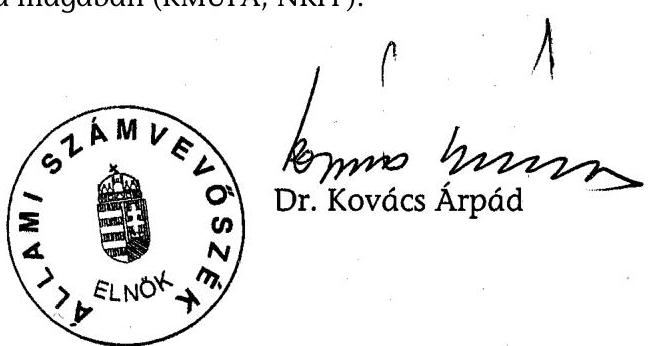

---

1. sz. melléklet

a V-33-120/2003-2004. sz. jelentéshez

# ÉSZREVÉTELEK ÉS AZ AZOKRA ADOTT VÁLASZOK

---

# Dr. Kovács Árpád 

Elnök

## ÁLLAMI SZÁMVEVŐSZÉK

Budapest

## Tisztelt Elnök Úr!

Tájékoztatom, hogy a központi költségvetésből kutatás-fejlesztési célokra fordított pénzeszközök hasznosulásának ellenőrzéséről készített - V-33-110/2003-2004. számú összefoglaló jelentésben foglalt megállapításokat tudomásul vettem, észrevételt nem teszek.

Budapest, 2004. július 22.
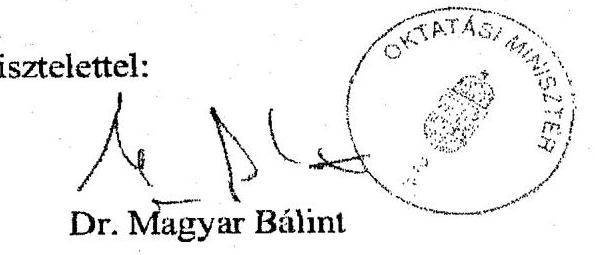

---

# A MAGYAR KÖZTÁRSASÁG   FÖLDMŰVELÉSÜGYI ÉS VIDÉKFEJLESZTÉSI MINISZTERE 

62220/1/2004.
Hiv.: V-33-110/2003-2004.

Dr. Kovács Árpád elnök úr részére

Állami Számvevőszék

## Budapest 4.

Pf: 54
1364

## Tisztelt Elnök Úr!

Az Állami Számvevőszék „A központi költségvetésből kutatás-fejlesztési célokra fordított pénzeszközök hasznosulásának ellenőrzéséről" című V-33-110/2003-2004. számú jelentésével kapcsolatosan észrevételt nem teszek.

Budapest, 2004. július 8.
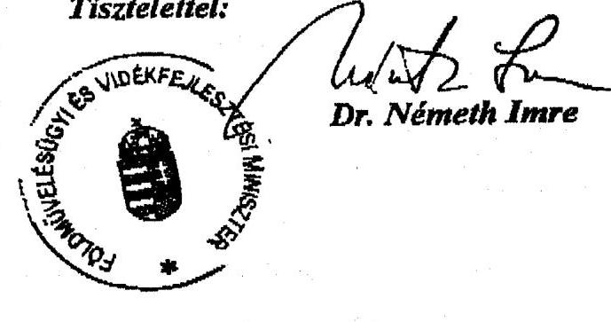

---

# Miniszter 

III-5/136/13./2004

## Dr. Kovács Árpád úr   elnök

Állami Számvevőszék

## Budapest

## Tisztelt Elnök Úr!

A központi költségvetésből kutatási célokra fordított pénzeszközök ellenőrzéséről a V-33-11/2003-2004. sz. program alapján a Gazdasági és Közlekedési Minisztérium fejezetnél folytatott ellenőrzésről készült - Dr. Réthy Imre közigazgatási államtitkár úrral előzetesen egyeztetett jelentéshez észrevételt nem teszünk.

Az ellenőrzés során tanúsított segítőkész együttműködésüket megköszönöm.

Az ellenőrzés alapján - a fejezetek vezetőinek tett javaslatokkal összefüggésben - elrendelt intézkedéseimről az előírt határidőn belül tájékoztatom Elnök Urat.

Budapest, 2004. július 20.

Tisztelettel
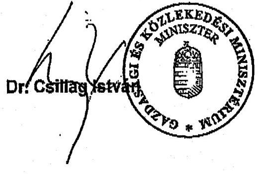

---

# EGÉSZSÉGÜGYI, SZOCIÁLIS ÉS CSALÁDÜGYI MINISZTÉRIUM MINISZTER 

Iktatószám: 26302-8/2004-0018PÜF
Előadó: Domokos Sándor
Hivatkozási szám: V-33-110/2003-2004.
Telefon: 301-7905

Dr. Kovács Árpád elnök részére

Állami Számvevőszék
Budapest

Tisztelt Elnök Úr!

Hivatkozva a 2004. július 6-án kelt V-33-110/2003-2004. iktatószámú levelére, melyben megküldte a központi költségvetésből kutatás-fejlesztési célokra fordított pénzeszközök hasznosulásának ellenőrzéséről szóló - Dr. Pordán Endre Közigazgatási Államtitkárral előzetesen egyeztetett - jelentésüket, tájékoztatom Elnök Urat, hogy a jelentés ránk vonatkozó részével kapcsolatban észrevételt nem teszek.

Budapest, 2004. július 20.
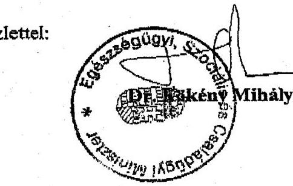

---

# Magyar Tudományos Akadémia

FŐTITKÁR

1051 BUDAPEST, ROOSEVELT TÉR 9.

TELEFON: 311-9812 FAX: 312-8483

1/5. sz. melléklet a V-33-120/2003-2004. sz. jelentéshez

|  *F.138/6/2001.* | *F.138/6/2001.*  |
| --- | --- |
|  |   |

Bihary Zsigmond úrnak, főigazgató

Állami Számvevőszék

Budapest

Tisztelt Főigazgató Úr!

Hivatkozással a V-33-88/2003. számú levelére, tájékoztatom, hogy a Magyar Tudományos Akadémia a központi költségvetésből kutatás-fejlesztési célokra fordított pénzeszközök hasznosulásának ellenőrzéséről készített jelentés-tervezetben foglaltakkal egyetért.

Budapest, 2004. május 31.

Üdvözlettel:

Dr. Kroó Norbert

---

# Magyar Tudományos Akadémia

**ELNÖK**

1051 BUDAPEST, ROOSEVELT TÉR 9.
TELEFON: 332-7176 FAX: 332-8043

Dr. Kovács Árpád úrnak,
az Állami Számvevőszék
elnöke

**Állami Számvevőszék**

Budapest

Tisztelt Elnök Úr!

Hivatkozással a V-33-110/2003-2004. számú levelére, tájékoztatom, hogy a Magyar Tudományos Akadémia a központi költségvetésből kutatás-fejlesztési célokra fordított pénzeszközök hasznosulásának ellenőrzéséről készített jelentés-tervezetben foglaltakkal egyetért.

Budapest, 2004. július 23.

Üdvözlettel

I. V.
 E. Szilveszter*

---

Központi Statisztikai Hivatal
Főnök
$733-200 / 1 / 2004$.

Dr. Kovács Árpád úrnak
elnök
Állami Számvevőszék

# Budapest 

## Tisztelt Elnök Úr!

Köszönettel vettem a V-33-110/2003-2004. számon megküldött - a központi költségvetésből kutatás-fejlesztési célokra fordított pénzeszközök hasznosulásának ellenőrzéséről készített - jelentést, melyhez észrevételt nem kívánok tenni.

A jelentés megállapításai, javaslatai alapján a Központi Statisztikai Hivatalban intézkedési terv készítése nem indokolt.

Budapest, 2004. július 15.
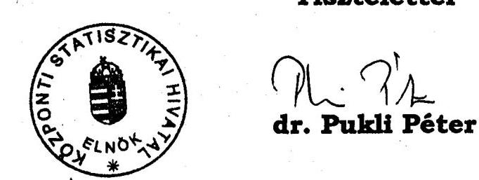

Központi Statisztikai Hivatal 1024 Budapest, Keleti K. u. 5-7. $\boxtimes$ Pf.: 51. Budapest 1525
(361) 201-9246 - (36) 202-0739 e-mail: peter.pukli@ksh.gov.hu
Internet: http://www.ksh.hu

---

# 1/8. sz. melléklet 

a V-33-120/2003-2004. sz. jelentéshez

## MAGYAR KÖZTÁRSASÁG

KÖRNYEZETVÉDELMI ÉS VÍZÜGYI MINISZTÉRIUMA

## ElI - 237 / 4 / 2004.

## Dr. Kovács Árpád úrnak, elnök

Állami Számvevőszék

## Budapest

$$
\begin{aligned}
& \text { ATM-4091/2004 } \\
& \text { Bihay } \\
& \text { Nays lidilichity } \\
& \text { of.19. } \\
& \text { fory 3 }
\end{aligned}
$$

Tisztelt Elnök Úr!
A központi költségvetésből kutatás-fejlesztési célokra fordított pénzeszközök hasznosulásának ellenőrzéséről készített számvevőszéki jelentést megkaptam, az abban foglaltakra észrevételt nem kívánok tenni, azt elfogadom.

A jelentésben javaslatként megfogalmazottak realizálására a tárca részéről elrendelt intézkedésekről 30 napon belül a megkeresésében foglaltaknak megfelelően a szükséges tájékoztatást megteszem.

Budapest, 2004. július „ $K_{n}$.
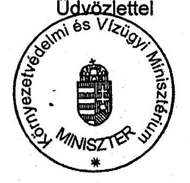
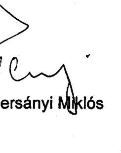

---

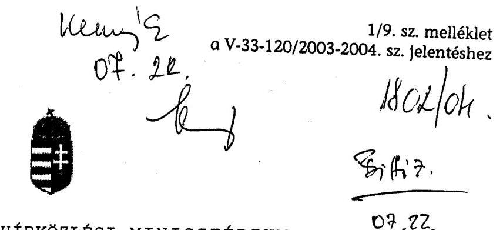

# Dr. Kovács Árpád 

Elnök
Ikt.sz.: 5322/7/2002.
Állami Számvevőszék
Hiv.: V-33-110/2003-2004

## Budapest

## Tisztelt Elnök Úr!

Köszönettel vettem a központi költségvetésből kutatás-fejlesztési célokra fordított pénzeszközök hasznosulásának ellenőrzéséről készített jelentést.

A vizsgálat megállapításaival egyetértek, azokra észrevételt nem kívánok tenni.
Az Állami Számvevőszékről szóló 1989. évi XXXVIII. törvényben előírt kötelezettségemnek 30 napon belül az ellenőrzési jelentés megállapításai alapján született javaslatok megvalósítására kidolgozott intézkedési tervet benyújtom.

Budapest, 2004. július „ $1 / 2$ "

Tisztelettel:
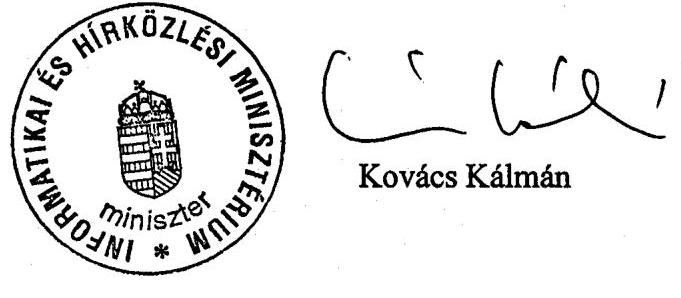

---

2. sz. melléklet
a V-33-120/2003-2004. sz. jelentéshez

A hazai K+F tevékenység 2000-2003. évek közötti állami támogatási rendszerének
folyamatábrája

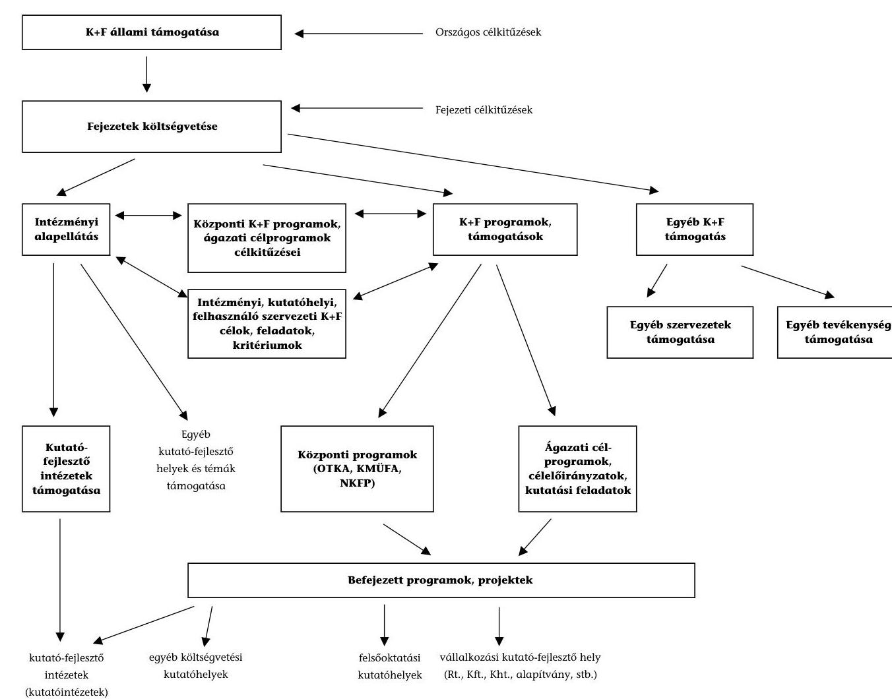

---

# A magyarországi K+F tevékenység 2004. január 1-től hatályos irányításának folyamatábrája 

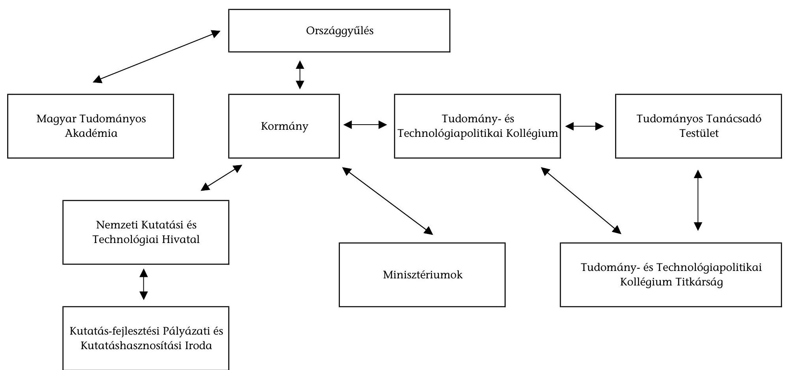

---

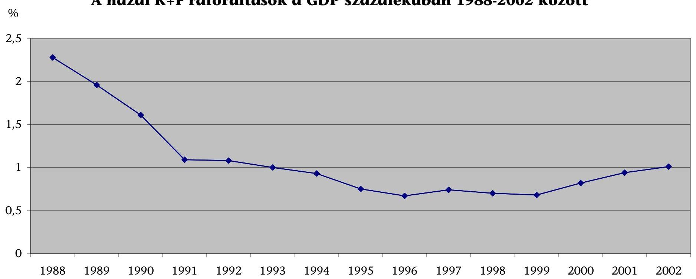

# A hazai K+F ráfordítások a GDP százalékában 1988-2002 között

Forrás: KSH, Kutatás és Fejlesztés 2001, 2002

---

4. sz. melléklet

a V-33-120/2003-2004. sz. jelentéshez

---

# A hazai K+F ráfordítás és a költségvetési K+F ráfordítás alakulása 1992-2002 között

|  Ssz. | Évek | K+F ráfordítás (Mrd Ft) | K+F ráfordítás (GDP \%) | Költségvetési K+F ráfordítás (\%) | Költségvetési K+F ráfordítás (Mrd Ft) | Üzleti K+F ráfordítás (\%) | Egyéb hazai K+F ráfordítás (\%) | Külföldi K+F ráfordítás (\%)  |
| --- | --- | --- | --- | --- | --- | --- | --- | --- |
|  1 | 1992 | 31,6 | 1,08 | 62,9 | 19,9 | 31,3 | 2,9 | 2,9  |
|  2 | 1993 | 35,3 | 1,00 | 64,9 | 22,9 | 28,6 | 4,0 | 2,5  |
|  3 | 1994 | 40,3 | 0,93 | 63,0 | 25,4 | 28,7 | 4,7 | 3,6  |
|  4 | 1995 | 42,3 | 0,75 | 55,1 | 23,3 | 36,2 | 4,0 | 4,7  |
|  5 | 1996 | 46,0 | 0,67 | 51,2 | 23,6 | 37,4 | 6,9 | 4,5  |
|  6 | 1997 | 63,6 | 0,74 | 54,8 | 34,9 | 36,4 | 4,6 | 4,2  |
|  7 | 1998 | 71,2 | 0,70 | 54,7 | 38,9 | 37,7 | 2,8 | 4,8  |
|  8 | 1999 | 78,2 | 0,68 | 53,2 | 41,6 | 38,5 | 2,7 | 5,6  |
|  9 | 2000 | 105,4 | 0,82 | 49,5 | 52,2 | 37,8 | 2,1 | 10,6  |
|  10 | 2001 | 140,6 | 0,94 | 53,6 | 75,4 | 34,8 | 2,4 | 9,2  |
|  11 | 2002 | 171,5 | 1,01 | 58,5 | 100,4 | 29,7 | 1,4 | 10,4  |

Forrás: NKTH

---

# K+F ráfordítások a GDP százalékában a környező és a legfejlettebb országokban, 2000-2001. 

■2000
■2001
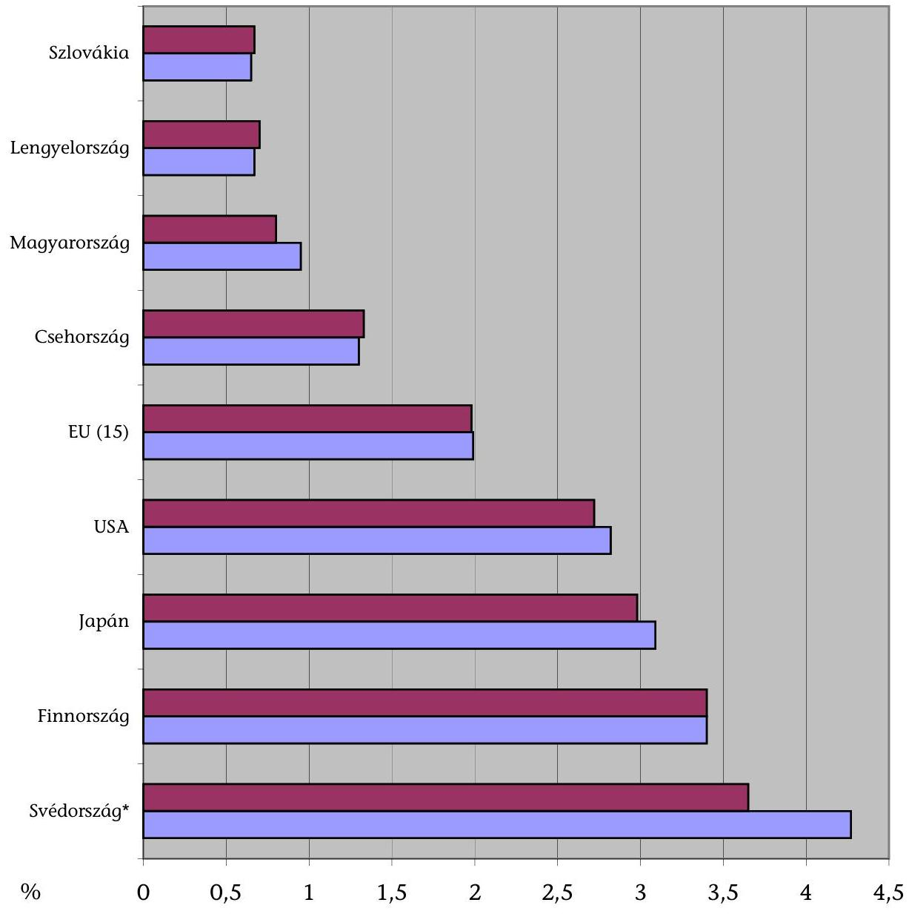
*Svédország 1999-2001-es adat
Forrás: OECD, Main Science and Technológy Indicators, May 2003., Eurostat, www.europa.eu.int/comm/eurostat

---

# Az állami források aránya a teljes K+F ráfordításon belül a környező és a legfejlettebb országokban, 2000-2001. 

■2001 ■2000
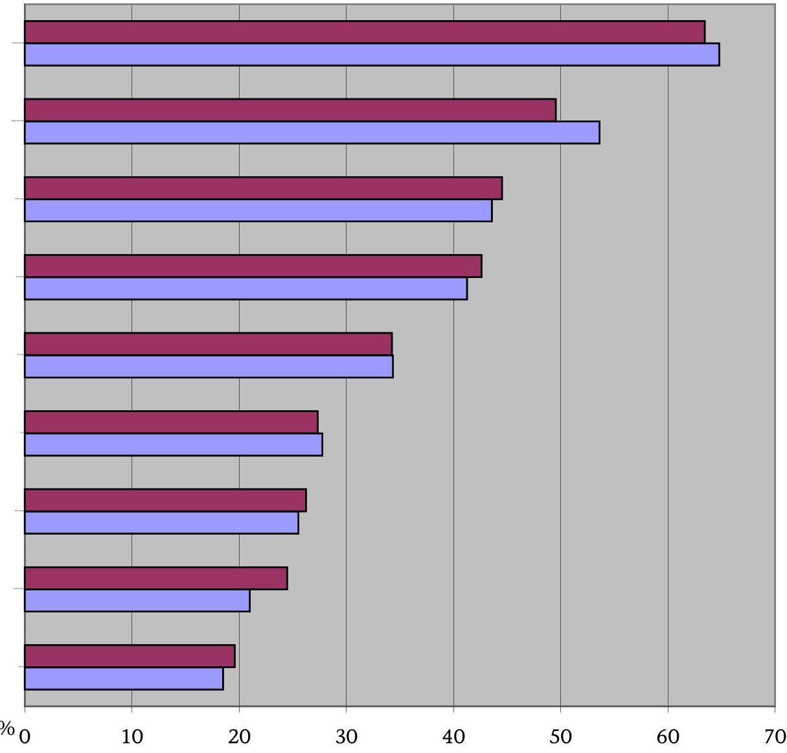
*Svédország 1999-2001-es adat
Forrás: Eurostat, www.europa.eu.int/comm/eurostat

---

.

---

# A hazai kutatás-fejlesztési ráfordítások pénzügyi források szerinti megoszlása (diagram) 

Vállalkozások ráfordítása
Külföldi pénzforrás
2000. év: 105388 M Ft
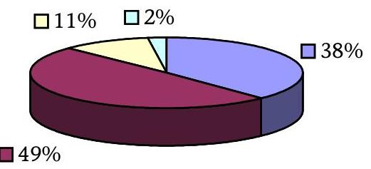
2001. év: 140605 M Ft
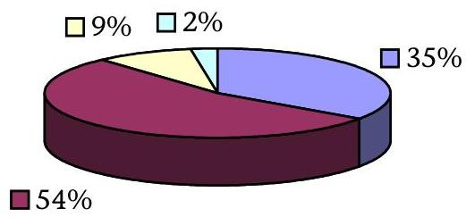
2002. év: 171470 M Ft
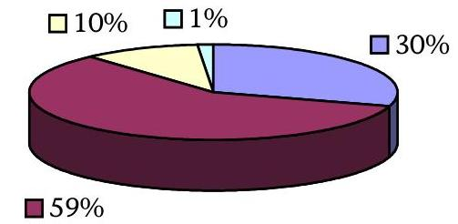

Forrás: KSH, Kutatás és Fejlesztés 2001, 2002

---

# A magyarországi kutatásra rendelkezésre álló állami támogatás és annak felhasználása a vizsgált időszakban a költségvetési és zárszámadási törvények alapján

|  Funkció-
kódok | Megnevezés | 2000. év |  | 2001. év |  | 2002. év |  | 2003. év |   |
| --- | --- | --- | --- | --- | --- | --- | --- | --- | --- |
|   |  | előirányzat | teljesítés | előirányzat | teljesítés | előirányzat | teljesítés | előirányzat |   |
|   | X. Miniszterelnökség | 1721,4 | 1739,6 | 222,6 | 476,4 | 726,3 | 983,0 | 652,5 |   |
|  F01.d | Magyar Közigazgatási Intézet | 88,5 | 127,7 | 93,9 | 153,7 | 97,6 | 137,9 | 132,5 |   |
|  F01.d | Avicenna, Közel-Kelet Kutatások
Közalapítvány |  |  |  | 200,0 |  | 62,0 |  |   |
|  F01.d | Bólyai Műhely Közhasznú Alapítvány
támogatása |  |  |  |  |  | 50,0 |  |   |
|  F01.d | Modernizációs és Integrációs Program
támogatása** | 132,9 | 111,9 | 128,7 | 122,7 | 128,7 | 123,1 | 150,0 |   |
|  F01.d | Európai Összehasonlító
Kisebbségkutatások Közalapítvány |  |  |  |  |  | 60,0 | 50,0 |   |
|  F01.d | Természeti és Társadalombarát Fejlődésért
Közalapítvány | 1500,0 | 1500,0 |  |  | 500,0 | 500,0 | 50,0 |   |
|  F01.d | Politikatörténeti Alapítvány |  |  |  |  |  | 50,0 | 270,0 |   |
|   | XVIII. Külügyminisztérium | 81,4 | 79,7 | 95,7 | 95,7 | 95,7 | 95,7 | 135,7 |   |
|  F01.d | Alapítványok támogatása: Teleki László
Alapítvány | 62,2 | 79,7 | 95,7 | 95,7 | 95,7 | 95,7 | 135,7 |   |
|  F01.d | Európai Összehasonlító
Kisebbségkutatások Közalapítvány | 19,2 |  |  |  |  |  |  |   |
|   | XX. Oktatási Minisztérium | 72,0 | 52,0 | 7520,0 | 4373,6 | 13184,0 | 6531,8 | 9790,0 |   |
|  F01.d | Osztrák-Magyar Tudományos és
Kooperációs Alapítvány | 52,0 | 52,0 |  |  |  |  |  |   |
|  F01.d | Nemzeti kutatás-fejlesztési program* |  |  | 5752,0 | 4296,0 | 10000,0 | 6419,9 | 7600,0 |   |
|  F01.d | Felsőoktatási kutatási program** |  |  | 884,0 | 77,6 | 2300,0 | 111,9 | 890,0 |   |
|  F01.d | Nemzetközi tagdíjak |  |  | 854,0 |  | 854,0 |  | 1300,0 |   |
|  F01.d | Tudománypolitikai támogatás | 20,0 |  | 30,0 |  | 30,0 |  |  |   |

---

|  Funkció-kódok | Megnevezés | 2000. év |  | 2001. év |  | 2002. év |  | 2003. év |   |
| --- | --- | --- | --- | --- | --- | --- | --- | --- | --- |
|   |  | előirányzat | teljesítés | előirányzat | teljesítés | előirányzat | teljesítés | előirányzat |   |
|   | XXIII. Nemzeti Kulturális Örökség Minisztériuma | 200,0 | 200,0 | 306,0 | 300,0 | 332,0 | 598,2 | 133,0 |   |
|  F01.d | Az 1956-os Magyar Forradalom Történetének Dokumentációs és Kutatóintézete Közalapítvány támogatása (2002-ben X. fejezet) |  |  | 6,0 |  |  | 50,0 | 133,0 |   |
|  F01.d | Demokrácia kutatások Magyar Központja Alapítvány támogatása |  |  |  |  |  | 11,0 |  |   |
|  F01.d | Közép- és Kelet-európai Történelem és Társadalom kutatásért Közalapítvány programja | 175,0 | 175,0 | 275,0 | 275,0 | 307,0 | 512,2 |  |   |
|  F01.d | Közép- és Kelet-európai Történelem és Társadalom kutatásért Közalapítvány működése | 25,0 | 25,0 | 25,0 | 25,0 | 25,0 | 25,0 |  |   |
|   | XXIV. Gyermek-, Ifjúsági és Sportminisztérium | 10,0 | 2,7 | 0,0 | 0,0 | 0,0 | 0,0 | 0,0 |   |
|  F01.d | Ifjúságtudományi kutatások támogatása** | 10,0 | 2,7 |  |  |  |  |  |   |
|   | XXI. Egészségügyi Minisztérium | 2,0 | 0,0 | 0,0 | 0,0 | 0,0 | 0,0 | 0,0 |   |
|  F01.d | Munkaügyi kutatás beruházásai | 2,0 |  |  |  |  |  |  |   |
|   | XXV. Informatikai és Hírközlési Minisztérium | 84,1 | 84,1 | 84,9 | 84,9 | 85,6 | 85,6 | 100,2 |   |
|  F01.d | Magyar Úrkutatási Iroda | 84,1 | 84,1 | 84,9 | 84,9 | 85,6 | 85,6 | 100,2 |   |
|   | XXXI. Központi Statisztikai Hivatal | 141,3 | 165,1 | 182,1 | 228,7 | 186,4 | 251,0 | 279,1 |   |
|  F01.d | KSH Népességtudományi Kutató Intézet | 45,6 | 70,1 | 59,9 | 101,1 | 61,2 | 114,7 | 105,0 |   |
|  F01.d | KSH Gazdaságelemzési és Informatikai Kutatóintézet | 95,7 | 95,0 | 122,2 | 127,6 | 125,2 | 136,3 | 174,1 |   |
|   | XXXIII. Magyar Tudományos Akadémia | 16 006,1 | 16 449,8 |
 | 21 150,2 | 20 763,5 | 25 774,0 | 26 796,2 | 33 009,6 |   |
|  F01.d | MTA Doktori Tanács Titkársága | 1 673,9 | 2 151,5 | 2 147,9 | 2 779,9 | 2 250,1 | 3 020,4 | 2 768,5 |   |

---

|  Funkció-kódok | Megnevezés | 2000. év |  | 2001. év |  | 2002. év |  | 2003. év  |
| --- | --- | --- | --- | --- | --- | --- | --- | --- |
|   |  | előirányzat | teljesítés | előirányzat | teljesítés | előirányzat | teljesítés | előirányzat  |
|  F01.d | MTA Széchenyi Irodalmi és Művészeti Akadémiái | 10,3 | 11,1 | 12,1 | 12,3 | 12,4 | 16,5 | 16,4  |
|  F01.d | MTA Matematikai és természettudományi kutatóintézetek | 3 719,2 | 4 321,8 | 3 946,9 | 4 844,5 | 4 026,5 | 6 364,5 | 7 855,4  |
|  F01.d | MTA Életudományi kutatóintézetek | 1 973,3 | 2 368,8 | 2 091,5 | 2 679,9 | 2 124,7 | 3 455,6 | 4 201,7  |
|  F01.d | MTA Társadalomtudományi kutatóintézetek | 1 573,4 | 2 029,9 | 1 724,7 | 2 554,4 | 1 763,5 | 3 220,2 | 3 843,0  |
|  F01.d | MTA Területi akadémiai központok | 90,2 | 123,7 | 112,9 | 116,2 | 114,5 | 168,2 | 152,1  |
|  F01.d | MTA Kutatást kiszolgáló szervek | 673,0 | 874,0 | 721,2 | 774,8 | 727,3 | 1 324,7 | 1 247,2  |
|  F01.d | MTA Támogatott kutatóhelyek Irodája | 889,8 | 1 050,0 | 967,1 | 1 256,2 | 993,6 | 1 713,1 | 2 183,3  |
|  F01.d | OTKA Iroda | 175,9 | 175,9 | 182,3 | 183,5 | 187,0 | 207,3 | 331,0  |
|  F01.d | Alapkutatás beruházásai |  | 0,9 | 565,0 | 1,9 | 565,0 | 46,4 | 300,0  |
|  F01.d | Tudós társaságok támogatása | 13,6 | 15,6 | 26,6 | 6,6 | 26,6 | 26,6 | 27,1  |
|  F01.d | Tudományos könyv- és folyóirat kiadás | 107,1 | 78,1 | 147,5 | 127,0 | 147,5 | 120,4 | 157,5  |
|  F01.d | Fiatal kutatók pályázatos támogatása | 277,3 |  | 282,7 |  | 291,4 | 2,1 | 887,0  |
|  F01.d | Nemzeti Stratégiai Kutatások | 120,0 | 69,3 | 106,9 |  | 106,9 |  | 106,9  |
|  F01.d | Akadémiai Kutatási Pályázatok Forrása | 166,3 | 10,5 | 126,1 | 89,8 | 126,1 | 95,9 | 126,1  |
|  F01.d | Nagy Imre Emlékház működtetésének alapítványi támogatása | 35,0 | 34,4 | 34,3 | 34,3 | 34,3 | 34,3 | 34,4  |
|  F01.d | Határon túli magyar tudósok kutatásainak támogatása | 50,0 |  | 147,0 |  | 147,0 |  | 47,0  |
|  F01.d | Arany János Közalapítvány támogatása |  |  |  | 100,0 |  | 100,0 | 100,0  |
|  F01.d | Kutatói bérrendezés (Átlagkereset emelése) | 500,0 |  | 1 448,0 |  | 1 200,0 |  |   |
|  F01.d | Szakmai feladatok teljesítése |  | 24,2 | 270,0 | 83,2 | 3 106,9 | 78,9 | 653,5  |
|  F01.d | Intézményekhez le nem bontott bevétel |  |  |  |  |  |  |   |
|  F01.d | OTKA kutatási témapályázatok | 3 167,6 | 3 101,1 | 4 201,1 | 4 201,1 | 5 401,1 | 5 401,1 | 6 200,0  |
|  F01.d | OTKA műszerpályázatok |  |  | 900,0 | 900,0 | 1 400,0 | 1 400,0 | 500,0  |
|  F01.d | Bolyai ösztöndíj | 614,0 | 9,0 | 722,2 | 17,9 | 755,4 |  | 829,9  |

---

|  Funkció-kódok | Megnevezés | 2000. év |  | 2001. év |  | 2002. év |  | 2003. év  |
| --- | --- | --- | --- | --- | --- | --- | --- | --- |
|   |  | előirányzat | teljesítés | előirányzat | teljesítés | előirányzat | teljesítés | előirányzat  |
|  F01.d | Központi kezelésű felajánlások | 176,2 |  | 266,2 |  | 266,2 |  | 441,6  |
|   | F01.d (alapkutatás) összesen | 18 318,3 | 18 773,0 | 29 561,5 | 26 322,8 | 40 384,0 | 35 341,5 | 44 100,1  |
|   | XV. Gazdasági és Közlekedési Minisztérium | 1 428,6 | 0,0 | 0,0 | 0,0 | 0,0 | 0,0 | 0,0  |
|  F01.e | Országos Műszaki Fejlesztési Bizottság Hivatala | 1 428,6 |  |  |  |  |  |   |
|   | XX. Oktatási Minisztérium | 8 062,0 | 6 508,3 | 10 355,0 | 8 938,4 | 14 150,0 | 12 285,8 | 11 060,0  |
|  F01.e | Műszaki fejlesztési célelőirányzatok (KMÚFA) | 6 300,0 | 4 746,3 | 8 750,0 | 7 333,4 | 10 940,0 | 9 075,8 | 8 960,0  |
|  F01.e | EU-FP 5 keretprogram | 1 762,0 | 1 762,0 | 1 605,0 | 1 605,0 | 3 210,0 | 3 210,0 | 2 100,0  |
|  F01.e | Műszaki Fejlesztési hozzájárulások visszatérülése |  |  |  |  |  |  |   |
|   | XXIII. Nemzeti Kulturális Örökség Minisztériuma | 0,0 | 0,0 | 0,0 | 0,0 | 0,0 | 0,0 | 0,0  |
|  F01.e | Europalia Hungária Rendezvénysorozat |  |  |  |  |  |  |   |
|   | F01.e (műszaki fejlesztés) összesen | 9 490,6 | 6 508,3 | 10 355,0 | 8 938,4 | 14 150,0 | 12 285,8 | 11 060,0  |
|   | I. K+F FUNKCIÓK ÖSSZESEN | 27 808,9 | 25 281,3 | 39 916,5 | 35 261,2 | 54 534,0 | 47 627,3 | 55 160,1  |
|   | X. Miniszterelnökség | 0,0 | 0,0 | 0,0 | 0,0 | 0,0 | 0,0 | 300,0  |
|   | Kormány - MTA közötti megállapodások kiadásai |  |  |  |  |  |  | 300,0  |
|   | XII. Földművelésügyi és Vidékfejlesztési Minisztérium | 2 025,6 | 2 115,8 | 2 720,6 | 4 092,6 | 3 030,0 | 4 812,8 | 5 378,3  |
|  F10 | Agrárkutató intézetek | 1 485,6 | 1 769,0 | 2 084,6 | 3 807,8 | 2 394,0 | 4 470,2 | 3 705,2  |
|  F11 | Mezőgazdasági, erdő, hal- és vadgazdálkodási célú kutatási beruházások | 100,0 |  | 100,0 | 20,0 | 100,0 |  |   |
|  F12 | Agrárkutatási feladatok támogatása | 440,0 | 346,8 | 536,0 | 264,8 | 536,0 | 342,6 | 1 673,1  |
|   | XV. Gazdasági és Közlekedési Minisztérium | 360,0 | 114,6 | 410,0 | 0,0 | 450,0 | 0,0 | 111,8  |
|   | Technológiai kutatási feladatok |  |  |  |  |  |  | 60,0  |
|  F12.d | Kutatási feladatok | 360,0 | 114,6 | 410,0 |  | 450,0 |  | 51,8  |

---

|  Funkció-kódok | Megnevezés | 2000. év |  | 2001. év |  | 2002. év |  | 2003. év |   |
| --- | --- | --- | --- | --- | --- | --- | --- | --- | --- |
|   |  | előirányzat | teljesítés | előirányzat | teljesítés | előirányzat | teljesítés | előirányzat |   |
|   | XVI. Környezetvédelmi és Vízügyi Minisztérium | 0,0 | 0,0 | 0,0 | 0,0 | 0,0 | 0,0 | 68,7 |   |
|  F12.d | Kutatási feladatok |  |  |  |  |  |  | 68,7 |   |
|   | XX. Oktatási Minisztérium | 3 043,4 | 1 444,0 | 1 037,7 | 863,9 | 1 340,9 | 625,4 | 820,0 |   |
|  F04.d | Felsőoktatási központi kutatási előirányzat | 1 004,0 | 643,7 |  |  |  |  |  |   |
|  F04.d | OKTK Közalapítvány támogatása | 90,0 | 90,0 | 90,0 | 90,0 | 90,0 | 90,0 | 100,0 |   |
|  F04.c | OM - MTA határon túli támogatás | 30,0 |  | 30,0 |  | 30,0 |  |  |   |
|   | Szent-Györgyi Albert Ösztöndíj |  |  |  |  |  |  | 170,0 |   |
|  F04.c | Doktorandusz hallgatók ösztöndíja | 33,1 | 20,5 | 21,5 | 21,5 | 21,5 | 21,5 |  |   |
|  F04.c | Széchenyi Professzori ösztöndíj | 1 886,3 | 689,8 | 896,2 | 752,4 | 1 199,4 | 513,9 | 550 |   |
|   | XXI. Egészségügyi, Szociális és Családügyi Minisztérium | 300,0 | 3,4 | 188,0 | 188,0 | 240,0 | 285,0 | 400,0 |   |

 F05.a | Ágazati kutatásfejlesztés** | 300,0 | 3,4 | 188,0 | 188,0 | 240,0 | 285,0 | 400,0 |   |
|   | XXIII. Nemzeti Kulturális Örökség Minisztériuma | 0,0 | 0,0 | 160,0 | 13,0 | 43,0 | 16,9 | 18,5 |   |
|   | XX. századi történelmi kutatások |  |  | 117,0 |  |  |  |  |   |
|  F08.b | K+F tevékenység működési célú támogatása |  |  | 43,0 | 13,0 | 43,0 | 16,9 | 18,5 |   |
|   | XXIV. Gyermek-, Ifjúsági és Sportminisztérium | 78,0 | 47,0 | 78,0 | 496,6 | 92,0 | 304,7 | 142,0 |   |
|  F08.f | Sporttudomány | 30,0 |  | 30,0 | 451,3 | 42,0 | 257,2 | 92,0 |   |
|  F05.e | Drogkutatások, vizsgálatok támogatása** | 48,0 | 47,0 | 48,0 | 45,3 | 50,0 | 47,5 | 50,0 |   |
|   | XXV. Informatikai és Hírközlési Minisztérium | 0,0 | 0,0 | 0,0 | 0,0 | 0,0 | 0,0 | 200,0 |   |
|  F01.f | Kutatási feladatok** |  |  |  |  |  |  | 200,0 |   |
|   | XXXIII. Magyar Tudományos Akadémia | 0,0 | 29,1 | 0,0 | 32,8 | 0,0 | 35,9 | 0,0 |   |
|  F14 | Balaton állapotának javítását szolgáló kutatási feladatok** |  | 29,1 |  | 32,8 |  | 35,9 |  |   |

---

|  Funkció-kódok | Megnevezés | 2000. év |  | 2001. év |  | 2002. év |  | 2003. év |   |
| --- | --- | --- | --- | --- | --- | --- | --- | --- | --- |
|   |  | előirányzat | teljesítés | előirányzat | teljesítés | előirányzat | teljesítés | előirányzat |   |
|   | II. NEVESÍTETT K+F ELŐIRÁNYZATOK | 5 807,0 | 3 753,9 | 4 594,3 | 5 686,9 | 5 195,9 | 6 080,7 | 7 439,3 |   |
|   | III. MINDÖSSZESEN (I.+II.) | 33 615,9 | 29 035,2 | 44 510,8 | 40 948,1 | 59 729,9 | 53 708,0 | 62 599,4 |   |
|   | Ebből: -költségvetési kutatóhelyek támogatása | 9 955,2 | 11 916,4 | 11 218,7 | 15 623,1 | 11 714,9 | 19 715,0 | 22 318,9 |   |
|   | -*központi programok | 9 467,6 | 7 847,4 | 19 603,1 | 16 730,5 | 27 741,1 | 22 296,8 | 23 260,0 |   |
|   | -*ágazati programok | 5 769,0 | 2 290,6 | 5 134,8 | 1 933,0 | 6 999,9 | 1 868,7 | 7 471,5 |   |
|   | -egyéb K+F támogatás | 8 424,1 | 6 980,8 | 8 554,2 | 6 661,5 | 13 274,0 | 9 827,5 | 9 549,0 |   |

***A szakmai feladatok teljesítése elnevezésű előirányzatból a helyszíni ellenőrzés 280 M Ft-ot minősített ágazati kutatás-fejlesztési programtámogatásnak

---

# A hazai K+F tevékenység állami támogatásának szerkezete 

$\square$ Intézményfinanszírozás
$\square$ Központi programok
$\square$ Ágazati programok
$\square$ Egyéb K+F támogatás
2000. év: 33.615,9 M Ft
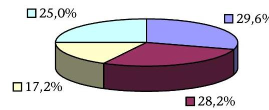
2001. év: 44.510,8 M Ft
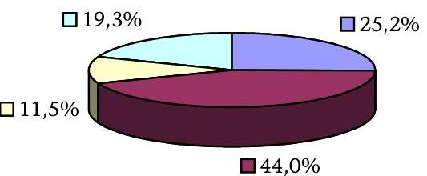
2002. év: 59.729,9 M Ft
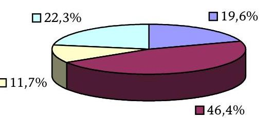
2003. év: 62.599,4 M Ft
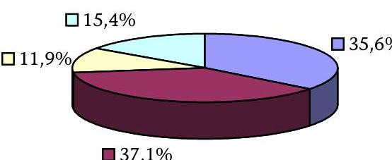

---

# A központi költségvetés K+F ráfordításai szakfeladatok szerinti bontása fejezetenként

|  Fejezet
száma | Fejezet megnevezése | 2000 | 2002 | Index 2002 /
2002  |
| --- | --- | --- | --- | --- |
|  I | Országgyúlés | 0 | 0 | $0,0 \%$  |
|  II | Köztársasági Elnökség | 0 | 0 | $0,0 \%$  |
|  III | Alkotmánybíróság | 0 | 0 | $0,0 \%$  |
|  IV | Országgyúlési Biztos Hivatala | 0 | 0 | $0,0 \%$  |
|  V | Állami Számvevőszék | 0 | 114 | $0,0 \%$  |
|  VI | Bíróságok | 0 | 0 | $0,0 \%$  |
|  VIII | Legfőbb Úgyészség | 153 | 199 | $130,1 \%$  |
|  X | Miniszterelnökség | 0 | 0 | $0,0 \%$  |
|  XI | Belügyminisztérium | 1 | 0 | $0,0 \%$  |
|  XII | Földművelésügyi és Vidékfejlesztési Minisztérium | 4636 | 7638 | $164,8 \%$  |
|  XIII | Honvédelmi Minisztérium | 4 | 2 | $50,0 \%$  |
|  XIV | Igazságügyi Minisztérium | 0 | 0 | $0,0 \%$  |
|  XV | Gazdasági Minisztérium | 1434 | 1888 | $131,7 \%$  |
|  XVI | Környezetvédelmi és Vízügyi Minisztérium | 0 | 0 | $0,0 \%$  |
|  XVIII | Külügyminisztérium | 0 | 0 | $0,0 \%$  |
|  XX | Oktatási Minisztérium | 17602 | 35012 | $198,9 \%$  |
|  XXI | Egészségügyi, Szociális és Családügyi Minisztérium | 1885 | 2255 | $119,6 \%$  |
|  XXII | Pénzügyminisztérium | 0 | 0 | $0,0 \%$  |
|  XXIII | Nemzeti Kulturális Örökség Minisztériuma | 282 | 1631 | $578,4 \%$  |
|  XXIV | Gyermek-, Ifjúsági és Sportminisztérium | 0 | 72 | $0,0 \%$  |
|  XXVI | Foglalkoztatáspolitikai és Munkaügyi Minisztérium | 0 | 73 | $0,0 \%$  |
|  XXX | Gazdasági Versenyhivatal | 0 | 0 | $0,0 \%$  |
|  XXXI | Központi Statisztikai Hivatal | 321 | 486 | $151,4 \%$  |
|  XXXIII | Magyar Tudományos Akadémia | 17688 | 26999 | $152,6 \%$  |
|  XXXIV | Történeti Hivatal | 0 | 0 | $0,0 \%$  |
|   | Összesen | 44006 | 76369 | 173,5\%  |

Megjegyzés: A költségvetési beszámolók APEH-SZTADI feldolgozásának adatai

---

# A kutatási szakfeladatok K+F ráfordításai a 2000-2002. években 

2000. év: 44 Mrd Ft
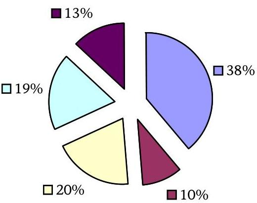

■ Természettudományok

Orvostudományok

Agrártudományok

Műszaki tudományok

Humán és
társadalomtudományok
2002. év: 76,4 Mrd Ft
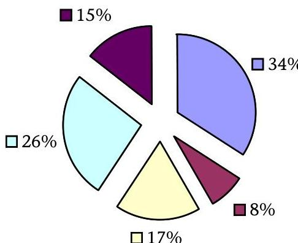
$\square$ Természettudományok

Orvostudományok

Agrártudományok

Műszaki tudományok

Humán és
társadalomtudományok

---

# A központi K+F programok jellemző adatai

|  Megnevezés | KMÜFA |  |  | NKFP |  |  | OTKA |  |   |
| --- | --- | --- | --- | --- | --- | --- | --- | --- | --- |
|   | 2000. év | 2002. év | Index \% | 2000. év | 2002. év | Index \% | 2000. év | 2002. év | Index \%  |
|  Eredeti előirányzat (MFt) | 6300,0 | 10940,0 | 173,7 | 5752,0 | 10000,0 | 173,9 | 3167,5 | 6801,1 | 214,7  |
|  Tényleges felhasznált előirányzat (MFt) | 5106,0 | 7544,0 | 147,7 | 1900,0 | 5959,0 | 313,6 | 3101,1 | 6801,1 | 219,3  |
|  Összes beadott pályázat száma (db) | 4702,0 | 3224,0 | 68,6 | 412,0 | 285,0 | 69,2 | 1678,0 | 3626,0 | 216,1  |
|  Összes beadott pályázati keretösszeg (MFt) | 39482,0 | 35438,0 | 89,7 | 59016,0 | 34919,0 | 59,2 | 2233,8 | 12452,9 | 557,5  |
|  Összes elnyert pályázat száma (db) | 2751,0 | 1808,0 | 65,7 | 124,0 | 77,0 | 62,1 | 3033,0 * | 4210,0 * | 138,8  |
|  Összes elnyert pályázati keretösszeg (MFt) | 12270,0 | 10620,0 | 86,6 | 20571,0 | 10216,0 | 49,7 | 3225,4 * | 6609,2 * | 204,9  |
|  Összes befejezett kutatási témák száma (db) |  | 7081,0 |  | 7,0 | 0,0 | 0,0 | 1014,0 | 1042,0 | 102,8  |
|  Egyedi döntés alapján támogatott kutatások száma (db) | 174,0 | 133,0 | 76,4 | 0,0 | 0,0 | 0,0 | 3,0 | 6,0 | 200,0  |
|  Leállított,visszavont pályázatok száma (db) | 27,0 | 18,0 | 66,7 | nincs információ |  | 0,0 | 11,0 | 13,0 | 118,2  |
|  Leállított, visszavont pályázatok összege (MFt) | 123,0 | 106,0 | 86,2 |  |  |  | 10,9 | 13,2 | 121,1  |
|  Publikációk száma összesen | nincs nyilvántartás |  |  | nincs összesítés |  | 0,0 | 9987,0 | 13418,0 | 134,4  |
|  ebből: könyvek száma (db) | - | - | - | - | - | - | - | - | -  |
|  szakfolyóirat cikkek száma (db) | - | - | - | - | - | - | - | - | -  |

[^0] [^0]: * összes támogatott pályázat száma, illetve keretösszege

---

# A K+F programok helyszíni ellenőrzésbe vont befejezett projektjei

|  Fejezet megnevezése | Program megnevezése | Téma címe | Felhasználó szervezet | Elnyert
összeg | Befeje-
zés éve  |
| --- | --- | --- | --- | --- | --- |
|  Oktatási
Minisztérium | Központi Műszaki
Fejlesztési
Alapprogram | BOTANI (EUREKA-992) Software
szerszámok új generációjának kifejlesztése
software re- és reverse engineering
tevékenységek támogatása az üzleti
életben | SORING Számítástechnikai Kft.,
Budapest | 47600 | 2000  |
|   |  | Precíziós multiréteg technológia
kifejlesztése neutronoptikai kutatási
eszközök előállítása | MIRROTRON Műszaki Fejlesztő és
Szolgáltató Kft., Budapest | 49000 | 2001  |
|   |  | T5 fénycsőcsalád kifejlesztése | GE HUNGARY Ipari és Kereskedelmi
Rt., Budapest | 40000 | 2001  |
|   |  | HHFB fejlesztés | Karcher-Balogh Kft. | 50000 | 2000  |
|   | Nemzeti Kutatási
és Fejlesztési
Programok | Haszonjármú forgalom irányítása fedélzeti
és távinformáció felhasználásával | MTA Számítástechnikai és
Automatizálási Kutatóintézete | 198000 | 2003  |
|   |  | Heller-Forgó száraz erőművi
hűtőrendszerhez tartozó acélszerkezetű,
természetes huzatú hűtőtornyok új
családjának

 kifejlesztésére | Energiagazdálkodási Rt. | 125600 | 2003  |
|   |  | A magyar gazdaság európai
felzárkózásának nemzetközi környezet és
belső feltételei | Kopint-Datorg Rt. | 41900 | 2003  |

---

|  Fejezet megnevezése | Program megnevezése | Téma címe | Felhasználó szervezet | Elnyert összeg | Befejezés éve  |
| --- | --- | --- | --- | --- | --- |
|  Oktatási Minisztérium | Felsőoktatási
Kutatási és
Fejlesztési Pályázat | Génbelövéses transzformációs rendszer fejlesztése és széleskörű bevezetése a termesztett növények nemesítésében | Eötvös Loránd Tudományegyetem | 7200 | 2001  |
|   |  | Az emberi váz- és izomrendszer biomechanikai vizsgálata | Budapesti Gazdasági és Műszaki Egyetem | 7000 | 2001  |
|   |  | Számítógépes asztrofizika | Eötvös Loránd Tudományegyetem | 5605 | 2001  |
|   |  | Szabadtéri falfelületek gyors biológiai szennyeződésének okai | Budapesti Gazdasági és Műszaki Egyetem | 4400 | 2001  |
|  Magyar
Tudományos
Akadémia | Országos
Tudományos
Kutatási
Alapprogram | Citromatrix architektúrája és glükóz metabolizmus | MTA Szegedi Biológiai Központ Enzimológiai Intézet | 9000 | 2001  |
|   |  | Matematikai fizika és valószínűség számítás fizikai kontextusban | MTA Rényi Alfréd Matematikai Kutatóintézet | 20272 | 2002  |
|   |  | Arany János kritikai kiadása | MTA Irodalomtudományi Intézet | 8865 | 2001  |
|   |  | A baktériumok flagelláris filamentumainak önszerveződése és polimorfizmusa | MTA Szegedi Biológiai Központ Enzimológiai Intézet | 6200 | 2001  |
|  Földművelésügyi és Vidékfejlesztési Minisztérium | Nemesítést elősegítő támogatás | Molekuláris markerezés és genetikai térképezés genetikai betegségekkel szemben ellenálló új, hazai paprikafajták előállítása érdekében | Mezőgazdasági Biotechnológiai Kutatóközpont, Gödöllő | 18000 | 2001  |
|   |  | Cseresznye és meggy nemesítés betegségekkel szembeni ellenállóképesség javítása | Érdi Gyümölcs- és
Dísznövénytermesztési Kutató-
Fejlesztő Kht., Budapest | 16000 | 2001  |
|   | Agrár K+F feladatok megvalósítása | Élő élesztő etetése különböző állatfajokkal | Állattenyésztési és Takarmányozási Kutatóintézet, Herceghalom | 10000 | 2002  |

---

|  Fejezet megnevezése | Program megnevezése | Téma címe | Felhasználó szervezet | Elnyert
összeg | Befejezés éve  |
| --- | --- | --- | --- | --- | --- |
|  Földművelésügyi és Vidékfejlesztési Minisztérium | Beruházások támogatása pályázat | Az egynyári disznóvény nemesítés és fajtafenntartás során előállított virágmagfeldolgozás műszaki feltételeinek megteremtése | Érdi Gyümölcs- és
Dísznövénytermesztési Kutató-
Fejlesztő Kht., Budapest | 14558 | 2002  |
|  Gazdasági és Közlekedési Minisztérium | Kutatási feladatok | Környezetkímélő közlekedéspolitika megvalósítását szolgáló intézkedések kidolgozása, hatásaik környezeti, műszaki, gazdasági elemzése | Közlekedéstudományi Intézet Rt., Budapest | 8000 | 2000  |
|   |  | Az EU 5-ös keretprogramban nyert "COMPRIS" nemzetközi kutatási projekt 2002. évi magyar finanszírozási feladatai | Közlekedéstudományi Intézet Rt., Budapest | 7300 | 2005  |
|  Egészségügyi, Szociális és Családügyi Minisztérium | Egészségügyi tudományos kutatási pályázat | A hepatitis C vírus (HCV) szerepe a hepatocarcinogenesisben | Semmelweis Egyetem Általános Orvostudományi Kar I. sz. Patológiai és Kísérleti Rákkutató Intézet | 4800 | 2002  |
|   |  | Krónikus mozgásszervi fájdalmak csillapítására alkalmas új opioid származékok kutatása | Semmelweis Egyetem Gyógyszertudományi Kar Farmakológiai és Farmakoterápiás Intézet | 4500 | 2002  |
|   |  | Környezeti klasztogén hatások kimutatása | Országos "Frederic Joliot-Curie" Sugárbiológiai és Sugáregészségügyi Kutató Intézet | 4800 | 2002  |
|   |  | Kémiai biztonság: környezeti vegyi anyagok embriotxikus-teratogén hatásának kimutatása | Fodor József Országos
Közegészségügyi Központ, Budapest | 4800 | 2002  |

---

|  Fejezet megnevezése | Program megnevezése | Téma címe | Felhasználó szervezet | Elnyert
összeg | Befejezés éve  |
| --- | --- | --- | --- | --- | --- |
|  Környezetvédelmi és Vízügyi Minisztérium | Vízügyi
Célelőirányzat | A Duna-vízgyűjtőbeli országok hidrológiai együttműködéséből Magyarországra háruló feladatok ellátása | Vízgazdálkodási Tudományos Kutató Rt., Budapest | 5000 | 2000  |
|   |  | Javaslat a belvíz és a helyi vízkár kutatásfejlesztés koncepciójára, figyelembevéve az 1998-2000. évek hidrometerológiai eseményeit | Vízgazdálkodási Tudományos
Kutató Rt., Budapest | 2400 | 2000  |
|   | Környezetvédelmi
Alap Célfeladat | Nitrogén mérleg meghatározása a légkör és egy lucfenyves állomány között | Országos Meteorológiai Szolgálat Levegőkörnyezet-elemző Osztály | 4000 | 2002  |
|   |  | Hosszú éghajlati adatsorok minőségellenőrzése, a homogenizálási eljárások fejlesztése | Országos Meteorológiai Szolgálat Levegőkörnyezet-elemző Osztály | 1200 | 2000  |
|  Informatikai és Hírközlési Minisztérium |  | Percepciós folyamatok változása barokamrában létrehozott hipoxiás állapotban | MTA Pszichológiai Kutatóintézet | 3500 | 2002  |
|   |  | A mikrogravitáció hatása a humán sejtek funkcióira | Országos Epidemiológiai Központ Mikrobiológiai Kutatócsoport | 3500 | 2002  |
|   |  | Részvétel a NASA által szervezett CASSINI űrmisszióban | MTA Központi Fizikai Kutató Intézet Részecske- és Magfizikai Kutatóintézet | 4200 | 2002  |
|   |  | A SAS2-P1 telemetria ellenőrző rendszerének kifejlesztése és tesztelése | BL-Electronics Bt., Solymár | 5000 | 2002  |

---

# Az ellenőrzésbe vont költségvetési kutató-fejlesztő intézetek felsorolása 

| Költségvetési kutatóhelyek megnevezése | Kutatóhelyek száma |
| :--: | :--: |
| 1. Kutató-fejlesztő intézetek |  |
| MTA fejezet | 40 |
| MTA Állatorvostudományi Kutató Intézet |  |
| MTA Atommagkutató Intézete |  |
| MTA Balatoni Limnológiai Kutató Intézete |  |
| MTA Enzimológiai Intézet |  |
| MTA Etnikai-Nemzeti Kisebbségkutató Intézet |  |
| MTA Filozófiai Intézete |  |
| MTA Földrajztudományi Kutató Intézet |  |
| MTA Földtudományi Kutatóközpont |  |
| MTA Geodéziai és Geofizikai Kutató Intézet |  |
| MTA Irodalomtudományi Intézet |  |
| MTA Jogtudományi Intézet |  |
| MTA Kémiai Kutatóközpont |  |
| MTA KFKI Atomenergia Kutató Intézet |  |
| MTA KFKI Részecske- és Magfizikai Kutató Intézet |  |
| MTA KFKI Szilárdtestfizikai és Optikai Kutató Intézet |  |
| MTA Kísérleti Orvostudományi Kutató Intézet |  |
| MTA Konkoly Thege Miklós Csillagászati Kutató Intézet |  |
| MTA Közgazdaságtudományi Intézet |  |
| MTA Kutatásszervezési Intézet |  |
| MTA Mezőgazdasági Kutató Intézet |  |
| MTA Műszaki Fizikai és Anyagtudományi Kutató Intézet |  |
| MTA Művészettörténeti Kutató Intézet |  |
| MTA Néprajzi Kutató Intézete |  |
| MTA Növényvédelmi Kutató Intézet |  |
| MTA Nyelvtudományi Intézet |  |
| MTA Ökológiai és Botanikai Kutató Intézet |  |
| MTA Politikai Tudományok Intézete |  |
| MTA Pszichológiai Intézete |  |
| MTA Régészeti Intézete |  |
| MTA Regionális Kutatások Központja |  |
| MTA Rényi Alfréd Matematikai Kutató Intézet |  |

---

| Költségvetési kutatóhelyek megnevezése | Kutatóhelyek száma |
| :--: | :--: |
| MTA Számítástechnikai és Automat. Kutató Intézet (SZTAKI) |  |
| MTA Szegedi Biológiai Központ |  |
| MTA Szociológiai Kutatóintézet |  |
| MTA Talajtani és Agrokémiai Kutató Intézet |  |
| MTA Támogatott Kutatóhelyek Irodája |  |
| MTA Társadalomkutató Központ |  |
| MTA Történettudományi Intézet |  |
| MTA Világgazdasági Kutató Intézet |  |
| MTA Zenetudományi Intézet |  |
| FVM fejezet | 14 |
| Agrárgazdasági Kutató és Informatikai Intézet |  |
| Állattenyésztési és Takarmányozási Kutatóintézet |  |
| Erdészeti Tudományos Intézet |  |
| FVM Mezőgazdasági Gépesítési Intézet |  |
| FVM Szőlészeti és Borászati Kutató Intézet Kísérleti Pincészete, Bp. |  |
| FVM Szőlészeti és Borászati Kutató Intézet, Eger |  |
| FVM Szőlészeti és Borászati Kutató Intézet, Pécs |  |
| FVM Szőlészeti és Borászati Kutató Intézet, Badacsony (különvált Pécstől) |  |
| FVM Szőlészeti és Borászati Kutató Intézet |  |
| Halászati és Öntözési Kutatóintézet |  |
| Kisállattenyésztési és Takarmányozási Kutató Intézet |  |
| Központi Élelmiszertudományi Kutatóintézet |  |
| Mezőgazdasági Biotechnológiai Kutatóközpont |  |
| Földmérési és Távérzékelési Intézet |  |
| OM fejezet | 1 |
| Oktatáskutató Intézet |  |
| KSH fejezet | 2 |
| ECOSTAT-KSH Gazdaságelemző és Informatikai Intézet |  |
| KSH Népességtudományi Kutató Intézet |  |
| Kutatóintézetek összesen: | 57 |

---

# A helyszíni ellenőrzésre kijelölt kutatóhelyek 

| Fejezet megnevezése | Kutatóhely megnevezése |
| :--: | :--: |
| Oktatási Minisztérium |  |
|  | Kutatóintézet: $\quad$ Oktatáskutató Intézet |
|  | Felsőoktatási intézmények és kutatóhe-   lyeik: $\quad$ Budapesti Műszaki és Gazdaságtudományi Egye-   tem   Eötvös Loránd Tudományegyetem   Budapesti Műszaki Főiskola |
| Magyar Tudományos Akadémia |  |
|  | Kutatóintézet: $\quad$ MTA Kémiai Kutatóközpont   MTA SZBK Enzimológiai Intézet   MTA Régészeti Intézet |
| Földművelésügyi és Vidékfejlesztési Minisztérium |  |
|  | Kutatóintézet: $\quad$ Agrárgazdasági Kutató és Informatikai Intézet   Erdészeti Tudományos Intézet   Központi Élelmiszertudományi Kutatóintézet   Mezőgazdasági Biotechnológiai Kutatóközpont   Érdi Gyümölcs- és Dísznövénytermesztési Kutató-   fejlesztő Kht.   Állattenyésztési és Takarmányozási Kutatóintézet |
| Gazdasági és Közlekedési Minisztérium |  |
|  | Egyéb költségvetési kutatóhely: $\quad$ Magyar Állami Földtani Intézet   Magyar Állami Eötvös Loránd Geofizikai Intézet |
| Környezetvédelmi és Vízügyi Minisztérium |  |
|  | Egyéb költségvetési kutatóhely: $\quad$ Országos Meteorológiai Szolgálat |

---

# A költségvetési kutatóintézetek fontosabb pénzügyi adatai

|  Sorsz. | Megnevezés | 2000. év | 2002. év | Index  |
| --- | --- | --- | --- | --- |
|   |  | tény |  | $\%$  |
|  1. | Bevételek összesen | 25743,9 | 39466,8 | $153 \%$  |
|  2. | Pályázati bevételek | 5118,9 | 8783,7 | $172 \%$  |
|   | Ebből: MTA | 3475,2 | 5971,7 | $172 \%$  |
|   | FVM | 1588,5 | 2739,5 | $172 \%$  |
|   | OM | 0,1 | 0,2 | $200 \%$  |
|   | KSH | 55,1 | 72,3 | $131 \%$  |
|  3. | Ebből: állami támogatás | 2462,5
 | 5294,7 | $215 \%$  |
|   | - OTKA | 385,9 | 981,4 | $254 \%$  |
|   | - KMÜFA | 406,0 | 655,8 | $162 \%$  |
|   | - NKFP |  | 875,2 |   |
|   | - Kutatási célelőirányzatok | 1670,7 | 2782,3 | $167 \%$  |
|  4. | Intézményi saját bevételből | 1721,7 | 2736,6 | $159 \%$  |
|  5. | Külföldi forrásból | 934,7 | 752,4 | $80 \%$  |
|  6. | Kiadások összesen | 21013,5 | 32154,0 | $153 \%$  |
|  7. | Ebből: kutatásra fordított összeg | 20437,9 | 31130,1 | $152 \%$  |
|  8. | Személyi juttatások | 9105,5 | 14461,0 | $159 \%$  |
|  9. | Dologi kiadások | 9291,1 | 12035,4 | $130 \%$  |
|  10. | Beruházási kiadások | 2616,9 | 5657,6 | $216 \%$  |
|  11. | Kutatási beruházási kiadások | 1949,0 | 4261,2 | $219 \%$  |

---

# A költségvetési kutatóintézetek teljesítménymutatói 

| Sorsz. | Megnevezés | 2000. év | 2002. év | Index |
| :--: | :--: | :--: | :--: | :--: |
|  |  | tény |  | \% |
| 1. | Elnyert pályázatok száma (db) | 1564,0 | 1522,0 | $97 \%$ |
| 2. | Elnyert hazai pályázatok (db) | 1346,0 | 1373,0 | $102 \%$ |
| 3. | Pályázók száma (fő) | 1379,0 | 1726,0 | $125 \%$ |
| 4. | Pályázatot elnyert pályázatok száma (fő) | 1231,0 | 1378,0 | $112 \%$ |
| 5. | Kutatók átlagos statisztikai létszáma (fő) | 2823,0 | 3053,0 | $108 \%$ |
| 6. | K+F segédszemélyzet (fő) | 1391,0 | 1340,0 | $96 \%$ |
| 7. | Egyéb alkalmazottak száma (fő) | 1369,0 | 1340,0 | $98 \%$ |
| 8. | Publikált könyvek száma (db) | 418,0 | 580,0 | $139 \%$ |
|  | Ebből: idegen nyelven | 107,0 | 185,0 | $173 \%$ |
| 9. | Publikált cikkek száma (db) | 6402,0 | 6948,0 | $109 \%$ |
|  | Ebből: idegen nyelven | 3384,0 | 3559,0 | $105 \%$ |
| 10. | Beadott szabadalmi jelentések száma (db) | 42,0 | 36,0 | $86 \%$ |
| 11. | Elfogadott szabadalmi jelentések száma (db) | 30,0 | 27,0 | $90 \%$ |
| 12. | Bevezetésre került szabadalmak (fő) | 5,0 | 14,0 | $280 \%$ |
| 13. | Nemzetközi együttműködésben kutatott témák (db) | 532,0 | 642,0 | $121 \%$ |
| 14. | Egy kutatóra jutó elnyert pályázat (db) | 1,1 | 0,9 | $78 \%$ |
| 15. | Egy kutatóra jutó elnyert támogatás (M Ft) | 5,6 | 7,1 | $126 \%$ |
| 16. | Egy kutatóra jutó szabadalmi bejelentés (db) | 0,03 | 0,02 | $67 \%$ |
| 17. | Egy kutatóra jutó publikáció (db) | 5,0 | 4,4 | $88 \%$ |
| 18. | Egy kutatóra jutó K+F segédszemélyzet (fő) | 1,0 | 0,8 | $77 \%$ |

---

# Teljesítménymutatók és kritériumok a K+F pénzeszközök hasznosulása ellenőrzéséhez 

## Főbb ellenőrzési témák, területek:

1. Az országos és fejezeti szintű K+F tevékenység, annak célkitűzései és állami támogatása hasznosulása.
2. A központi- és ágazati K+F programok, kutatási feladatok végrehajtása, eredményessége.
3. A kutatóhelyek (kutató-fejlesztő intézetek, felsőoktatási kutató-fejlesztő helyek, egyéb kutató fejlesztő helyek) K+F tevékenységének eredményessége, hatékonysága.

A teljesítményellenőrzés főbb kérdései:

1. Főkérdés: A központi költségvetési pénzeszközök megfelelően biztosítják-e a kutatás-fejlesztési célkitűzések megvalósítását?

## 2. Vizsgálati témakörök szerinti alkérdések:

2.1. Az országos és fejezeti szintű kutatás-fejlesztési tevékenység céljai, állami támogatása és működési feltételei biztosították-e a K+F tevékenység erősödését?
2.2. Eredményes volt-e a K+F programok lebonyolítása és végrehajtása?
2.3. A kutató-fejlesztő helyek (intézetek, felsőoktatási- és egyéb K+F helyek) feladataik ellátása során elérték-e kitűzött céljaikat?

---

# 1. Országos és fejezeti célkitűzéseknél: 

- a kormányprogramok fő célkitűzéseinek teljesítése
- minden K+F területen a közvetlen állami támogatás növelése, a kutatási minőség fenntartásához szükséges dologi források növelése
- a nemzetgazdasági szintű K+F mutatók alakulásában az állami támogatás részesedése
2. programoknál, kutatási feladatoknál:
- a programcélok teljesítése, a program-támogatások növelése
- a K+F eredmények hasznosulása, produktum (termék) formájában történő megjelenése
- a tudástranszfer megteremtése a tudományos és az üzleti szféra között
3. Kutató-fejlesztő szervezeteknél:
- a K+F célok elérése, teljesítése, megfeleltetése a kutatóintézeti alapító okiratban és a kutatási tervekben foglaltaknak, valamint az új ismeret létrehozásának
- az egy kutatóra jutó K+F bevétel és ráfordítás alakulása
- az egy kutatóra jutó megbízások alakulása

---

- a kutatói létszám, a minősített oktató-kutató és a doktoranduszok számának növekedése, a kutatói szféra fiatalítása
- a bevételszerző tevékenység alakulása, ezen belül, az állami támogatás és a K+F ráfordítás növekedése
- a kutatási aktivitás növekedése, az elnyert pályázatok számának emelkedése
- a K+F tevékenységből származó szabadalmak számának növekedése
- az EU-programokbeli eredményesség fokozása

# Az ellenőrzést támogató módszerek: 

- Strukturált teljesítményellenőrzési kérdésfa kidolgozása (az ellenőrzés fő- és alkérdéseinek, kritériumainak meghatározását követően).
- Tanúsítványi adatok bekérése a költségvetési kutatási-fejlesztő intézetek teljes körétől.
- Kérdőíves felmérés a központi és ágazati K+F programok teljes köréről, valamint teljeskörűen a költségvetési kutatóintézetekről.
- Fókuszcsoport szervezése két alkalommal:

1. A javasolt ellenőrzési szempontok kialakításához és megalapozásához.
2. A helyszíni ellenőrzés megállapításainak, következtetéseinek értékeléséhez.

- Interjúk készítése a helyszíni ellenőrzés során a K+F tevékenységben résztvevő személyekkel.
- Összehasonlító elemzés végzése az országos és nemzetközi K+F adatok alapján, valamint a K+F intézetek tanúsítványi adatai felhasználásával.

---

# Kérdésfa   a K+F tevékenység állami támogatása ellenőrzéséhez 

## Fő kérdés: A központi költségvetési pénzeszközök megfelelően biztosítják-e a kutatás-fejlesztési célkitűzések eredményes megvalósítását?

1. Az országos és fejezeti szintű kutatás-fejlesztési tevékenység céljai, állami támogatása és működési feltételei biztosították-e a K+F tevékenység erősödését?
1.1 Az állami támogatás biztosította-e nemzetgazdasági szinten a kutatás-fejlesztési célok teljesítését?
1.1.1 Készült-e átfogó kormányzati stratégia a kutatás-fejlesztésről a vizsgált időszakra vonatkozóan? A kormány meghatározott-e pontos célokat a K+F területre? A jogszabályi környezet és annak változása segítette-e a kutatási-fejlesztési tevékenységet, a célokat jogszabályi szinten rögzítették-e? Meghatározták-e a célokról való beszámolás időpontját, módját? Működött-e kormányzati szinten a K+F tevékenységet koordináló szervezet, testület?
1.1.2 A K+F állami támogatásának jelenlegi rendszere és támogatási összegei - intézményi alapellátás, programok támogatása, egyéb szervezeti támogatás - összhangban vannak-e a kormányzati célkitűzésekkel? Az állami támogatás rendszerében és támogatási összegében visszatükröződnek-e prioritások, fontossági szempontok? A központi költségvetésből gazdálkodó kutatóhelyek K+F létszáma, szakmai- és korösszetétele tendenciájában megfelelően biztosítja-e az országos célkitűzések és feladatok ellátását?
1.1.3 Javultak-e a nemzetgazdasági K+F mutatók a vizsgált időszak végére ( $\mathrm{K}+\mathrm{F}$ ráfordítás/GDP, állami költségvetés aránya, kutatók száma/kutatóhely/összlakosság)? Nemzetközi összehasonlításban javult-e Magyarország K+F tevékenysége? Teljesültek-e a nemzetgazdasági célkitűzések? Ebben meghatározó szerepe van-e az állami támogatásnak?
1.1.4 Van-e kormányzati szinten megbízható, a valós nemzetgazdasági helyzetet tükröző nyilvántartás a K+F-ről? A kormányzat ismeri-e az összes állami forrásból megvalósuló kutatás-fejlesztési témát, pályázatot?

---

1.2 A fejezetek szabályozási, értékelési, ellenőrzési rendszere, ágazati-szakmai felügyelete biztosítja-e a K+F célkitűzésekhez igazodó feladatok eredményes megvalósítását?
1.2.1 A fejezetek - a kormányzati célkitűzésekre alapozva - rendelkeznek-e ágazati $\mathrm{K}+\mathrm{F}$ stratégiával? Meghatároztak-e pontos célokat, prioritásokat fejezeti szinten és programjaikban a kutatás-fejlesztésre vonatkozóan? Rendeltek-e határidőket a célok, s az abból adódó feladatok végrehajtásához?
1.2.2 A fejezet rendelkezik-e szervezeti feltételekkel a fejezeti szintű K+F tevékenység irányítására és koordinálására? Nyilvántartják-e (statisztika, költségvetési beszámoló) és értékelik-e fejezeti szinten a K+F tevékenységet, annak ráfordításait? Ellenőrzik-e az állami támogatás felhasználását, a kutató-fejlesztő helyek tevékenységeinek és a K+F programok végrehajtásának eredményeit?
1.2.3 A fejezeti kezelésű előirányzatokat, célelőirányzatokat (programokat, témaköröket) az eredeti előirányzat szerint valósították-e meg? Módosították-e az előirányzatot, volt-e elvonás, átcsoportosítás? A programok pályázati forrásainak évenkénti alakulása megfelelően biztosította-e a K+F célok meghirdetését és azok pályázati végrehajtását?
1.2.4 Megfelelő volt-e az összhang az országos és az ágazati programok célkitűzései között? Az országos K+F programok és az ágazati kutatási programok állami támogatási rendszere átláthatóan épül-e fel? Vannak-e átfedések a támogatási célok között? Az azonos támogatási célt szolgáló fejezeti kezelésű előirányzatoknál alkalmazták-e az összehangolás általános szabályait?
1.2.5 Az MTA és a felsőoktatás részére biztosított állami tudománytámogató és finanszírozó tevékenység megfelel-e a kormányzati elképzeléseknek? Az MTA és az OM részéről meghatározott célok és finanszírozási előirányzatok biztosítják-e az akadémiai kutatóintézetek, felsőoktatási intézmények és kutatóhelyek eredményes feladatellátását? A felsőoktatási intézmények K+F ráfordításainak összege közelíti-e az előirányzott $15 \%$-os költségvetési kiadás-részesedést?

# 2. Eredményes volt-e a K+F programok lebonyolítása és megvalósítása? 

2.1 Megfelelő volt-e a lebonyolítás szervezeti és működési háttere, szabályozása, a pályáztatás rendszere biztosította-e a programcélok teljesítését?
2.1.1 Biztosították-e a lebonyolító szervezeti egységek (program irodák) a programok megfelelő működtetését? Rendelkezésre álltak-e a szükséges erőforrások a működéshez? A pályáztatást, elbírálást, finanszírozást és értékelést a programokat irányító, koordináló fejezeteknél és pályáztató szervezeteknél megfelelő szervezettséggel és szakemberek irányításával, közreműködésével végezték-e? A pályáztatásra,

---
 terveknek megfelelően valósultak-e meg? A pénzügyi terv szerint alakultak-e a kifizetések? Az éves- és a zárójelentéseket mind elfogadták-e? Az el nem fogadott kutatási témák támogatását módosították, megszüntették-e? Végeznek-e menetközbeni, befejezetlen témákra irányuló ellenőrzést és értékelést? A záró értékelésnél megfelelő hangsúlyt kap-e az elért eredmények összhangja az állami támogatással és a ráfordításokkal, valamint a termelés számára átadható innovációs produktum/termék előállítása?

---

2.1.7 A programok végrehajtásaként jelentkeznek-e konkrét eredmények: szabadalmak, termékek stb. – a kutatási szféra és az üzleti szféra közötti tudás-átadásban? Megfelelően, koordináltan gondoskodnak-e a programok eredményeinek nyilvánosságra hozataláról, menedzseléséről? A felhasználói körrel való együttműködési formák bővültek-e? A végrehajtott programoknál érvényesül-e az a kormányzati célkitűzés, hogy a K+F pénzeszközök 5%-át az eredmények és alkalmazási lehetőségek ismertetésére kell fordítani?
2.1.8 Nyújtottak-e pályázaton kívüli támogatást? Az egyedi elbírálás rendszere megfelelően szabályozott-e? Az egyedi elbírálás alapján támogatott témák pályázati úton nem tudtak volna-e forráshoz jutni?
2.2 A befejezett K+F témák eredményesen megvalósultak-e?
2.2.1 A befejezett témák a pályázatban vállalt eredményekkel zárultak-e? Volt-e eltérés, elemezték-e ennek az okait? A programfelelősök részéről menetközben történt-e folyamatelemzés, végeztek-e monitoring tevékenységet, mely eredményjavuláshoz vezetett?
2.2.2 A lezárt K+F téma hozott-e új ismereteket, igazolt-e korábbi tudományos felfedezéseket? Az új ismereteknek mekkora jelentősége van a szaktudomány és a nemzetközi megítélés szempontjából? A projekt zárásaként közvetlen pénzügyi hatás, többleteredmény jelentkezett-e? Az állami támogatás biztosította-e a projekt eredményességét?
2.2.3 Váltott-e ki továbbgyűrűző hatásokat a végrehajtott projekt, különös tekintettel a kis- és középvállalkozásokra? Hozott-e eredményeket a regionális és a nemzetközi együttműködések terén vagy a multinacionális vállalatokkal való kapcsolatépítésben?
2.2.4 Alkalmazott K+F és kísérleti fejlesztés esetén a téma (projekt) biztosította-e az új terméket, eljárást, szolgáltatást, módszert? Hozzájárult az export- és nyereségnövekedéshez, új munkahelyek teremtéséhez?
2.2.5 A befejezett téma (projekt) hozzájárult-e a szervezet versenypozíciójának javításához, mérhető eszközeinek (tárgyi infrastruktúra) javulásához? Biztosított-e szellemi vagyon növekedést (a K+F személyi állomány színvonala, képzettsége, tárgyiasult szakmai vagyon, mint publikációk, szellemi tulajdon-szabadalom, szerzői jog, stb.), továbbá az informális szellemi vagyonnövelést (tudásanyag növekedése, szervezeti együttműködési készség, szervezeti goodwill stb.)?
2.2.6 A lezárt projekt biztosította-e a szervezeten kívüli hatásokat, mint beinduló új gazdasági tevékenységet, foglalkoztatási hatást, pozitív vagy negatív környezeti hatásokat, együttműködési hálózat fejlődését vagy egyéb társadalmi hatásokat?

---

# 3. A kutató-fejlesztő helyek (intézetek, felsőoktatási- és egyéb K+F helyek) feladataik ellátása során elérték-e kitűzött céljaikat? 

3.1 Megalapozta-e kutatási terv az intézmény K+F tevékenységét a vizsgált időszakban? Megvalósultak-e a tervekben előirányzott célkitűzések? A kutatóhely értékelte-e a kutatási terv megvalósítását, az éves teljesítménymutatók alakulását?
3.2 Az intézmények a rendelkezésükre álló feltételekkel teljes körűen el tudták-e látni feladataikat? Kimutatható-e pozitív változás az emberi erőforrások hasznosításában? A kutatási szervezetek rendelkeznek-e megfelelő, a K+F feladatok ellátásához nélkülözhetetlen kutató-fejlesztő szakember állománnyal (főfoglalkozású minősített oktatók-kutatók, doktoranduszok)? A feladatok ellátásához elégséges-e a K+F segédszemélyzet, az egyéb fizikai és nem fizikai állomány? Az intézmény gondoskodik-e a magas képzettségű kutatóállomány utánpótlásáról, a pályakezdő és fiatal kutatók munkába állításáról, annak ösztönzéséről?
3.3 Az intézményi szervezet biztosította-e a kutatási feladatok ellátását? Az azonos vagy hasonló tevékenységi körrel rendelkező intézetek, K+F helyek működése megfelelően kiegészíti-e egymást vagy párhuzamos feladatvégzést biztosít? A kutatóhely rendelkezik-e eredményeket biztosító nemzetközi együttműködésekkel, különös tekintettel az Európai Kutatási Térségbe történő megfelelő magyar beilleszkedésre, valamint az EU Kutatási és Technológia Fejlesztési Keretprogramjában való részvételre?
3.4 Megfelelő-e a kutatóhelyek és a gazdaság kapcsolata? Kialakult-e már meglévő kutatói kapcsolat és mobilitás a felsőoktatási intézmények, az akadémiai intézetek és a vállalati kutatóhelyek között? A kutatóintézetek, felsőoktatási kutatóhelyek végeznek-e közös kutatásokat? Pozitív hatással volt-e a felsőoktatási intézményhálózat integrációja a felsőoktatási kutatásokra?
3.5 A költségvetési kutatóhelyek feladatainak ellátásához szükséges források rendelkezésre álltak-e a vizsgált időszakban? Az állami támogatás tervezése megalapozott volt-e? Az intézményi alapellátás megfelelően biztosítja-e a K+F tevékenység személyi és tárgyi feltételeit?
3.6 A kutatóhelyek tevékenységében és számviteli elszámolásában megfelelően elkülöníthetők-e az alapkutatás, az alkalmazott kutatás és a kísérleti fejlesztés bevételei és ráfordításai? A kutatóhelyi K+F ráfordítások tartalmaznak-e a K+F tevékenység fogalomkörébe nem tartozó tevékenységeket (pl.: megvalósíthatósági tanulmány, üzleti politika kialakítása, minőségbiztosítás, piackutatás, éves rutinszerű szoftverfejlesztés stb.)? A működési költségeken belül meghatározó hányadot képviselnek-e a személyi juttatások? Az intézetek előírnak-e teljesítménykövetelményeket alapfeladataik ellátása során?
3.7 A kutatási produktumok előállításának ún. változó költségeit jellemzően pályázati források biztosítják-e? Pályázati forrásokból finanszíroztak-e az intézményi alapellátást? Okozott-e feszültséget a K+F helyek gazdálkodásában a kutatási témák finanszírozása és számszerűsítették-e azt? Felhasználtak-e államháztartáson kívüli, külföldi forrásokat, nőtt-e ezek aránya? Gondot jelentett-e a pályázatok előfinanszírozása?

---

3.8 Javult-e a pályázati tevékenység? Megfelelő volt-e a kapcsolattartás a kiíró szervezetekkel, időben értesültek-e a témakörök meghirdetéséről? Működött-e pályázati tevékenységet koordináló iroda? A meghirdetett programok találkoztak-e a felhasználói igényekkel témakörök, határidő, futamidő szerint? Megfelelőnek tartják-e a pályázati rendszereket az intézetek?
3.9 A kutatóhelyi K+F aktivitási teljesítménymutatók javultak-e? A kutatóhelyek bevételszerző tevékenysége erősödött-e? Nőtt-e a külső megbízások száma és összege, valamint a termelésbe átadott K+F ismeretek, eredmények száma és értéke? A fajlagos, egy kutatóra jutó hatékonysági mutatók kedvezően alakultak-e a vizsgált időszakban?

---

# FÜGGELÉK

---

# A FEJEZETEK K+F IRÁNYÍTÓ-KOORDINÁLÓ TEVÉKENYSÉGEINEK ÉS ÁGAZATI K+F PROGRAMJAINAK JELLEMZŐI 

## 1. A FEJEZETEK K+F IRÁNYÍTÓ-KOORDINÁLÓ TEVÉKENYSÉGE

Az MTA szervezeti feltételei biztosították a fejezeti szintű K+F tevékenység irányítását és koordinálását, de a programok lebonyolítását végző szervezetek tevékenységi területén párhuzamosság is tapasztalható volt a hasonló vagy közel azonos tartalmú programok működtetése miatt.

Az MTA fejezetén belül a 2003. évtől két, stratégiai kutatásokkal foglalkozó program működik egymás mellett, kormányhatározatok és a Kormánnyal kötött megállapodás alapján.

Az MTA szervezetének felépítését az Alapszabály határozta meg, ami megfelelő, konkrét szabályozással szól az Akadémia szervezeti és működési rendjéről.

Az MTA szervezet (akadémikusok, tudomány képviselői, akik tudományos feladattal rendelkeznek) tagolódása nem változott, négy részre tagolódik: a tudományos testületekre, a közgyűlésre és megválasztott testületeire és képviselőire, a kutatóhelyekre és a működésüket irányító-értékelő testületekre, valamint a gazdálkodó szervezetre.

A köztestületi tagok alkották a tudományos osztályokat és bizottságokat, amelyek az Akadémia tudományágazat, illetve tudományágak szerint szervezett egységei. Az MTA köztestületi tevékenysége a tudományos testületekben valósult meg. A köztestületi tevékenységet a vizsgált három évben változatlanul 11 tudományos osztály, a tudományos bizottságok, amelyek száma 113-ról 128-ra emelkedett és a regionális központokban működő 5 területi bizottság segítette.

Az MTA felügyelete alá tartozó intézmények száma, létszáma és a tudományos bizottságok száma kis mértékben bővült. A teljes akadémiai hálózat létszáma a 2002. év folyamán 5358 fő volt, amely 1,6%-os növekedést jelentett a 2000. évhez képest. Az Akadémia különböző testületi egységeit a köztestületi tagok alkották, a nem akadémikus köztestületi tagok száma 2002-ben 9865 fő volt, akiknek 13%-a dolgozott akadémiai kutatóintézetben.

A közvetlen kutatás-fejlesztést megtestesítő MTA intézeti struktúra – a 2000. évi ÁSZ-vizsgálathoz képest – kisebb mértékben változott. Az akadémia intézeteinek száma a Társadalomkutató Központ és az Etnikainemzeti Kisebbségkutató Intézet 2001. január 1-jei megalakulásával 36-ról 38-ra emelkedett a vizsgált időszakban. A szorosan vett kutató-fejlesztő helyekhez tartoznak a felsőoktatási intézményekben az MTA-val közösen létrejött kutatóhelyek, amelyeket az MTA Támogatott Kutatóhelyek Irodája fog össze. A kutatóhálózat létszáma és területi szétaprózottsága is növekedett, számuk az

---

új, 2003. évi ciklustól 138-ról összesen 171-re nőtt. A kutatóhálózatban a 2000. év során alkalmazott létszáma 429 fő, ebből a kutatói létszám 325 fő volt. A 2002. év folyamán alkalmazott 521 fő létszámból kutatói munkakörben 346 fő dolgozott. Ez azt jelentette, hogy egy kutatóhelyre vetítve átlag 2,4-2,5 fő kutató tevékenységét finanszírozta meg az MTA.

Az Akadémia közvetlen kutatást szolgáló intézményeinek (társadalomtudományi, matematikai- és természettudományi, élettudományi kutatóintézetei, Kutatásszervezési Intézet és a Támogatott Kutatóhelyek Irodája) átlagos állományi létszáma a 2000. évi 4634 főről 4734 főre, 2,5%-kal emelkedett. Ebből a kutatói létszám ennél nagyobb mértékben – 7,6%-kal – nőtt, és átlaglétszámuk elérte a 2629 főt 2002. évben. Arányuk az összlétszámon belül 55,5%-os volt.

Az OM fejezet kutatás-fejlesztési feladatainak szervezeti, irányítási feltételei 2000-2003 között jelentősen megváltoztak. A Kormány 2000. január 1-től megszüntette az Országos Műszaki Fejlesztési Bizottság Hivatalát és jogutódként az OM-et jelölte ki, az OM szervezetében Kutatás-Fejlesztési Helyettes Államtitkárságot hoztak létre.

Az OM Felsőoktatási és Tudományos Ügyek Helyettes Államtitkárság átszervezésével többször változott a szakmai feladatokat ellátó főosztály megnevezése és részben feladatköre is. A Tudományos Ügyek Főosztálya feladatait a Felsőoktatási Pályázatok és Programok Főosztálya vette át kibővített feladatokkal. A főosztály elnevezését 2003-tól Felsőoktatási Tudományos Ügyek és Pályázatok Főosztályára változtatták, amely egyértelműbben utal feladataira.

A 2000. évben végrehajtott átszervezés egyaránt járt előnyökkel és hátrányokkal. Az előnyök az irányításban és a források összehangolásában, felhasználásában jelentkeztek.

A szervezeti átalakítás során a Kutatás-fejlesztési Helyettes Államtitkárság (KFHÁT) területét többször átvilágították, szervezete egyszerűsödött, létszáma kis mértékben csökkent.

A felsőoktatási intézmények a kutatás-fejlesztéshez a 2000-2002. közötti években jelentősebb pályázati forráshoz, költségvetési támogatáshoz jutottak az előző időszakhoz képest (2000: 3485,9 M Ft, 2001: 2718,8 M Ft, 2002-ben: 4134,8 M Ft).

Vállalati, érdekképviseleti szervek (kamarák) kifogásolták, hogy a vállalati versenyképesség-orientált kutatások, a technológiai innováció kérdései háttérbe szorultak.

A KMÜFA területét hátrányosan érintette, hogy forrásainak egy részét 2001-2002-ben átcsoportosították oktatási pályázatok finanszírozására (középiskolai szertárpályázatok, felsőoktatási informatikai pályázatok).

Az átszervezéssel nem sikerült megszüntetni a kutatás-fejlesztési tevékenység belső szervezeti széttagoltságát, a feladatok összehangoltabb végrehajtását, összességében azonban a két kutatás-fejlesztési terület összevonásával a fejezeti szintű irányítás egységesebbé vált.

---

A kutatás-fejlesztés szervezeti irányításában újabb változást hozott a Kutatási és Technológiai Innovációs Alap 2004. évi létrehozása, amelynek kezelésére a KFHÁT-t kiemelték az OM szervezetéből és ennek bázisán 2004. január 1-jével a Kormány fejezeti jogosultsággal létrehozta a Nemzeti Kutatási és Technológiai Hivatalt. A Hivatal kormányzati felügyeletét az oktatási miniszter látja el, de ez a funkcionális irányításra nem terjed ki. A kutatás-fejlesztés irányítása továbbra is széttagolt, a források felhasználásánál nem érvényesül a hatékonyabb koordináció, hiányzik az egységes pályázati rendszer kialakítása. A kutatás-fejlesztés egységes kormányzati szintű irányítása ezzel a változtatással nem oldódott meg.

A GKM jogelődeinél a Közlekedési és Vízügyi Minisztérium és a GM gyakorlatában – a 2000-2002. években – a kutatási feladatok koordinálását és a beszerzések lebonyolítását a forrás előirányzat szakmai kezelője végezte. Ez alól kivétel a Kutatási feladatok című, közlekedési kutatásokra fordítható költségvetési előirányzat, amelynek szervezési feladatait a Fejlesztési Főosztály bonyolította.

A két fejezet összevonása után 2003-ban ez a koordinációs feladat a Közgazdasági Főosztály hatáskörébe került. A főosztály összegyűjtötte a minisztérium teljes költségvetésében 11 előirányzaton rendelkezésre álló forrásokat, valamint a szakterületek kutatási igényeit, és egyeztetés után a Miniszteri Kollégium döntött a kutatási témák elfogadásáról. A fejezet K+F tevékenységet saját hatáskörben nem végzett, így erre K+F személyzettel sem rendelkezett. A K+F tevékenység koordinálására 2002-ben mindössze 0,3 fő átlaglétszámot határoztak meg (kapcsolt munkakör).

A KvVM fejezet csak
 a vizsgált időszak egy részében rendelkezett szervezeti feltételekkel a fejezeti szintű K+F tevékenység irányítására és koordinálására, a fejezeti szintű irányítás szervezeti feltételei folyamatosan változtak.

A korábban 14 fős Kutatási és Műszaki Fejlesztési Főosztály létszáma 1998-ra 3 főre csökkent, majd 2000-re megszüntették. A kialakult problémák miatt 2001-től 4 fős önálló osztályt, majd 2003-tól Kutatási és Oktatáspolitikai Főosztályt hoztak létre. 2004-től a főosztályt csökkentett létszámmal ismét önálló osztályá szervezték át.

Vízügyi területen a kutatás-fejlesztési feladatok koordinációját a Közlekedési és Vízügyi Minisztérium, illetve az Országos Vízügyi Főigazgatóság kutatásszervezési egységei végezték.

# 2. AZ ÁGAZATI K+F PROGRAMOK ALAKULÁSA 

Az OM felsőoktatási kutatási programja a fiatal kutatók pályaindítását, az FKFP-t, a tudományos és mesteriskolák (állami és nem állami), a Tudományos Diákköri pályázat, az állam által elismert nem állami felsőoktatási intézmények normatív kutatástámogatását, a főiskolai pályázatot és a felsőoktatási intézmények áthúzódó kutatási feladatait támogatta 2002-ben. A felsőoktatási kutatási témák alapkutatás jellegűek voltak, kivéve a főiskolai pályázatokat.

---

A kialakított feladat- és hatáskör megosztás miatt az aktuális információk és a pénzügyi folyamatok követése nehézkes, és a pályázatok megvalósításának érdemi értékelése nem volt megoldott. A kutatási pályázatok megvalósításáról, eredményeiről, hasznosulásáról - a pályázatok összegezett feldolgozása hiányában - ágazati, fejezeti szintű információk nem álltak rendelkezésre.

A doktori iskolák részprogram támogatását 2002-ben átcsoportosítással csökkentették az intézményfinanszírozás javára és a tárgyévi kutatás-fejlesztés fedezetét a KMÜFA-ból 160,6 M Ft-tal, a NKFP-ből 250,0 M Ft-tal, összesen 410,6 M Ft-tal biztosították. A doktori iskolák 2003-ig 710 M Ft támogatást kaptak, 2004-ben 400 M Ft-ot. A három éves futamidőre jóváhagyott támogatás, amely 2119,1 M Ft volt, 1000 M Ft-tal csökkent.

Az MTA fejezeti kezelésű előirányzatai között - az OTKÁ-n kívül - nyolc ágazati kutatási program volt a vizsgált időszakban, melyekből céljait tekintve témakutatás támogatását három szolgálta, valamint öt további előirányzat kutatást segítő program volt. A fejezeti K+F programok nem tekinthetők olyan rendszerbe foglalt komplex programnak, mint az OTKA, a források nagysága és tagoltsága alapján.

Az Akadémiai Kutatási Pályázat a 2003. évben megszűnt, mivel a rendelkezésre álló nem számottevő előirányzat alapján nem tudták megteremteni a pályázatok témái és a források közötti összhangot. A Nemzeti Stratégiai Kutatások hasonló okok miatt stratégiai tanulmányokká alakultak át. A változások jelezték, hogy a 100-200 M Ft, vagy annál kevesebb forrással rendelkező programok nem gazdaságosak, és belőlük témakutatások hatékonyan nem finanszírozhatók.

Az FVM agrárkutatási támogatása elnevezésű program lebonyolítása részben volt eredményes. Az éves költségvetések tervezésénél a stratégiából az adott évre eredetileg tervezett ütem pályázatait nem lehetett hiánytalanul teljesíteni. A pályázatok elbírálásának, a támogatások odaítélésének szempontjai a vizsgált időszakban nem voltak egységesek. 2003-ban kidolgozták az egységes szempontrendszert, 2004-től pedig már előzetesen ki is hirdetik az értékelési szempontokat.

A lebonyolítói szervezet létszáma az elvárt, és a szabályzatban rögzített feladatok maradéktalan végrehajtására nem volt elegendő. A kutatási programok végrehajtásaként megjelenő konkrét eredményeket - szabadalmak, termékek stb. - az üzleti szféra részére átadott új elméleteket, a kutatási eredmények további sorsát nem követték nyomon.

Az FVM ágazati K+F programjának eredményeként a 2002. évben 1049 publikáció jelent meg, ami minimális, 2,6%-os növekedést jelentett 2000-hez képest.

A GKM-nél kutatásra rendelkezésre álló források felhasználása nem pályázati rendszerben, hanem közbeszerzéssel történt. A széttagoltság miatt nehezen volt kezelhető a rendelkezésre álló források felmérése, ami az egész végrehajtási folyamatot késleltette. 2003-ban a gazdasági ágazathoz tartozó szervezeti egységek 7 forrásból, a közlekedési ágazat egységei 8 forrásból juthattak tanulmányhoz vagy kutatáshoz.

---

A valódi $\mathrm{K}+\mathrm{F}$ ráfordítás mellett jelen voltak a $\mathrm{K}+\mathrm{F}$ tartalommal nem rendelkező, a döntéseket előkészítő, megvalósíthatóságot vizsgáló tanulmányok. A kutatások, elemzések, tanulmányok hasznosulását fejezeti szinten nem értékelték, fejezeti szintű közlekedési vagy közgazdasági témákat összesítő adatbázissal nem rendelkeztek.

Az ESzCsM állami támogatásában a programfinanszírozás másodlagos, ennek összege és aránya az egészségügyi kutatások állami támogatásán belül alacsony volt. A programfinanszírozásra biztosított támogatási keret elaprózva kerül szétosztásra. Mindezek következtében csak kis részben biztosította a K+F tevékenységet.

A kutatási témák egyedi értékelési rendszerét kialakították, de a program egészét jellemző eredményekről nyilvántartást nem vezettek. A nem megfelelő teljesítést a támogatási összeg visszatéríttetésével szankcionálták.

A KvVM költségvetésében a K+F pénzeszközöket a Környezetvédelmi alap célfeladatok keretéből biztosította. A 2002. évtől a K+F előirányzat kiegészült a jogelőd Közlekedési és Vízügyi Minisztérium költségvetéséből átadott kutatási feladatok és vízügyi célelőirányzat pénzeszközeivel.

A tárcaszintű feladatok megalapozását szolgáló előirányzatok a minisztérium hivatalainak, szakmai főosztályainak aktuális feladatellátását érintették, ezért nem tekinthetők komplex programnak. A K+F tevékenység kiadásai között nyilvántartott támogatási előirányzatok indokolatlanul növelték a kutatásfejlesztésre fordított tényleges kiadásainak összegét.

A Környezetvédelmi alap célfeladatokból finanszírozott Országos Környezettudományi és Természetvédelmi Kutatási Pályázat keretösszege a vizsgált időszakban csökkent, majd 2003-ban már nem biztosítottak előirányzatot a programra.

A 2002. évben megjelent publikációk száma 189 volt, ami 26%-os csökkentést mutat a bázisidőszakhoz képest. Az egyedi döntés alapján támogatott $\mathrm{K}+\mathrm{F}$ témák száma 63%-kal 83 darabra, összege 261,7 M Ft-ra két és félszeresére emelkedett.

Az IHM felügyelete alá tartozó magyar űrkutatás állami támogatásában a témapályázatok finanszírozása volt a meghatározó, például 2002-ben a támogatás 2/3-át tette ki. A témapályázatok finanszírozásában az alapkutatások mellett a kísérleti fejlesztések támogatása is jelentős arányú (2002-ben 35,5%, illetve 34,5%-ot tettek ki). Az alapkutatások eredményei elsődlegesen a hazai és nemzetközi publikációkban, illetve konferenciákon előadások keretében hasznosultak. A megjelent publikációk száma a 2000-2002 közötti időszakban 51%-kal, 112 darabra emelkedett.

# 3. AZ ELLENŐRZÖTT BEFEJEZETT PROJEKTEK JELLEMZŐI 

A KMÚFA ellenőrzött K+F témáinál az állami támogatás a saját rész kiegészítésére szolgált, 100%-os visszafizetési kötelezettséggel, aminek a pályázók eleget tettek, de két esetben halasztást kértek. A pályázatok futamideje 4-9 év között változott. A futamidő kisebb részét, 2-3 évet jelentetett a tényleges kutatás,

---

a fennmaradó időt a támogatás visszafizetése és a teljes pénzügyi zárás töltötte ki.

Az ellenőrzött projekteknél a pályázat benyújtása, illetve elfogadása és a szerződéskötés között több (5-7) hónapos eltolódás volt tapasztalható. A „T-5 fénycsőcsalád kifejlesztése" című projekt eredményeként a pályázó szabadalmi bejelentést tett.

Az OTKA pénzeszközeinek felhasználása alapvetően a kutatási cél elérése érdekében történt. A kutatás ráfordításaiból megállapítható, hogy az OTKA támogatás a 15%-os rezsiköltségen túl is hozzájárult a kutatóhelyek alapellátásába tartozó állandó költségek biztosításához, például folyóiratok beszerzése és a készletbeszerzéseken keresztül.

A négy témából a szakzsűrik hármat kiválóan, egyet jól megfeleltnek minősítettek. A projektek zárásaként közvetlen pénzügyi hatás az alapkutatás jellegénél fogva nem jelentkezett. A társadalomtudományok területén problémát jelentett a személyi kifizetések 30%-os maximalizálása, mivel ezen a területen jelentős volt az élőmunka felhasználása. További gondot okozott, hogy a kutatásokat, illetve annak költségeit és a költségarányokat nem lehetett több évre előre megtervezni és az egyes felhasználható költségcsoportok között nehéz volt az átjárás.

Az NKFP-ból rendelkezésre álló források felhasználása, a pályáztatás, elbírálás, a feladatteljesítéshez kapcsolódó bírálat - a határidő csúszásoktól eltekintve - előírásszerűen történtek. Az ellenőrzött projektek alapján megállapítható volt, hogy a kitűzött célok teljesültek. A záró jegyzőkönyvek tanúsága szerint a korábbi tudományos felfedezések igazolását és továbbfejlesztését tűzték ki célul és valósították meg.

A hasznosulási szakasz az ellenőrzés időtartamát meghaladó időszakban várható. Az NKFP 2. programjából a „Haszonjármű forgalom irányítása fedélzeti és távinformáció felhasználásával" című projekt esetében szabadalmi eljárás folyamatban volt.

Az FKFP témáinak teljesítéséről programvezetői beszámoló és önértékelés készült az OM által kialakított űrlap kitöltésével, amelynek mellékletét képezte a pénzügyi elszámolás, az eredmény-összefoglaló és az eredmény részletes ismertetése. A pályázatok közül három alapkutatás és egy alkalmazott kutatási téma volt. A munkaterv módosítása nem vált szükségessé. A munkatervben rögzített célok alapvetően teljesültek.

A megjelent publikációk mellett további eredménynek tekinthető a projektek doktori képzésre gyakorolt hatása, a programban résztvevők tudományos előmenetelének segítése (PhD fokozat, impakt faktor javítása). A kutatási témák egy kivétellel a vállalt határidőre befejeződtek, egy esetben került sor határidő hosszabbítására.

Az FVM befejezett témáinál folyamatos, menet közbeni monitoring tevékenység történt, ezek elemzése alapján tettek eredményességet javító intézkedéseket az intézetek vezetői. A négy témából egy kísérlet sikertelen volt, ennek meg-

---

ismétlése - az időközben módosított EU élelmiszerbiztonsági szabályozás következtében - aktualitását vesztette.

A kísérletet üszőkkel és emsékkel folytatták le, az etetés 4. hetében mind a 4 üsző elhullott, a boncolás során olyan mennyiségű kórokozót állapítottak meg, ami a kísérlet kiértékelését lehetetlenné tette.

Továbbgyűrűző hatások a vizsgált időszakban minimális számban jelentek meg. A multinacionális vállalatokkal való kapcsolatépítésben szintén nem lehetett sikerekről beszámolni.

A GKM vizsgált témái egyikéből finanszírozták az EU 5-ös keretprogramban elnyert „COMPRIS” nemzetközi kutatási projektet. A COMPRIS várható hasznosítása a képernyő kijelzős folyami információs rendszer és az automatikus hajóazonosítási rendszer hazai alkalmazásával, valamint a nemzeti információs központ létrehozásával valósul meg. A végrehajtott projekt továbbgyűrűző hatása a 2005-ös határidő után valósulhat meg.

A környezetkímélő közlekedéspolitikai intézkedések kidolgozása, hatásainak elemzése című projekt eredményeként elkészült jelentés alapján kormány előterjesztés készült, amely a szakmai és közigazgatási egyeztetés után nem került a Kormány elé. Az elkészült tanulmány aktualizált változatából 2003. júliusában újabb kormány előterjesztés készült, amely a környezetkímélő közlekedés és közlekedési infrastruktúrafejlesztés 2004-2015 évekre szóló stratégiáját és a végrehajtás cselekvési programját tartalmazta. Az előterjesztésből nem született kormányhatározat.

Az ESzCsM által finanszírozott kutatások eredményesen zárultak. Az ETT támogatás a vizsgált intézet eszközeinek mérhető javulását nem eredményezte. A befejezett téma erősítette az intézet versenypozícióját, nemzetközi elismertségét, szellemi vagyonnövekedést eredményezett, ez elsődlegesen a publikációk számában, tudásanyag növekedésben, fiatal kutatók tudományos minősítés megszerzésének segítésében mutatkozik meg.

A lezárt projekt intézeten kívüli hatást, mint új gazdasági tevékenységet, foglalkoztatási hatást nem eredményezett. Az ETT támogatás hozzájárult a kutatás eredményességéhez.

A KvVM területén vizsgált befejezett témákból kettőt a Vízügyi célelőirányzat, kettőt a Környezetvédelmi alap célelőirányzat keretéből finanszíroztak. A befejezett témák a pályázatban vállalt eredményekkel zárultak. A befejezett, vizsgált témák tudományos célú jellegük miatt új terméket, eljárást, szolgáltatást nem eredményeztek.

A lezárt projektek a felhalmozott szellemi vagyon növelésével hozzájárultak a szervezet versenypozíciójának javításához, a nemzetközi szervezeti együttműködés szakmai eredményei jól hasznosíthatók az EU Víz-Keretirányelv végrehajtása során. A vizsgált témák társadalmi és gazdasági hatásai, pozitív környezetvédelmi következményei az eltelt idő rövidsége miatt még nem érzékelhetők. A programfelelősök menetközben nem végeztek folyamatelemzést, illetve monitoring tevékenységet.

---

Az IHM űrkutatási témapályázatai 2002. évben eredményesen, a pályázatokban vállalt feladatok teljesítésével zárultak. A kutatások több új ismeretet eredményeztek. Az elért eredményekről nemzetközi konferenciákon és publikációkban számoltak be.

Az eredmények lehetőséget teremtettek nemzetközi projektbe való bekapcsolódásra. A kutatás eredményei hozzájárultak az intézetek versenypozíciójának erősödéséhez. A lezárt projektek nem gazdasági eredmény célúak voltak. Az állami támogatás hozzájárult a kutatás eredményességéhez. Az intézetek a közzétett eredmények következtében további jelentős nemzetközi kapcsolatokat szereztek.

Budapest, 2004. augusztus
