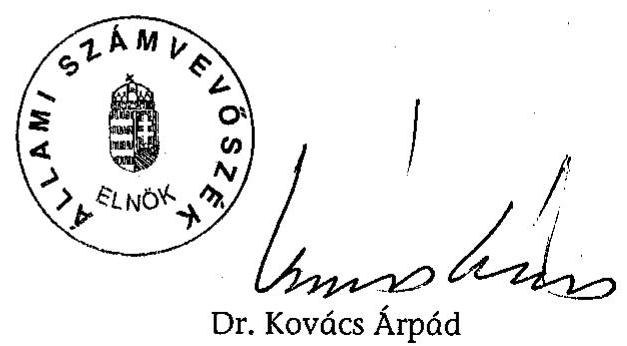

# JELENTÉS 

a Munkáspárt 2002-2003. évi gazdálkodása törvényességének ellenőrzéséről

---

3. Önkormányzati és Területi Ellenőrzési Igazgatóság
3.1. Szabályszerüségi Ellenőrzési Főcsoport
Iktatószám: V-1005-029/2004.
Témaszám: 699
Vizsgálat-azonosító szám: V0134
Az ellenőrzést felügyelte:
Dr. Lóránt Zoltán
főigazgató
Az ellenőrzés végrehajtásáért felelős:
Dr. Elek János
általános főigazgató helyettes
Az ellenőrzést vezette:
Horváth Balázs
osztályvezető főtanácsos
Az összefoglaló jelentést készítette:
Dr. Faragóné Tóth Mária
tanácsos
Az ellenőrzést végezték:
Dr. Faragóné Tóth Mária Szendrey Lajos
tanácsos számvevő

# A témához kapcsolódó eddig készített számvevőszéki jelentések: 

címe
sorszáma
A Munkáspárt 1992-1993. évi gazdálkodása törvényességének 230 ellenőrzése
A Munkáspárt 1994-1995. évi gazdálkodása törvényességének 339 ellenőrzése
A Munkáspárt 1996-1997. évi gazdálkodása törvényességének 9842 ellenőrzése
A Munkáspárt 1998-1999. évi gazdálkodása törvényességének 0041 ellenőrzése
A Munkáspárt 2000-2001. évi gazdálkodása törvényességének 0303 ellenőrzése

---

# TARTALOMJEGYZÉK 

BEVEZETÉS ..... 5
I. ÖSSZEGZŐ MEGÁLLAPÍTÁSOK, KÖVETKEZTETÉSEK, JAVASLATOK ..... 6
II. RÉSZLETES MEGÁLLAPÍTÁSOK ..... 9

1. A párt gazdálkodásáról szóló 2002-2003. évi beszámolók ..... 9
1.1. A teljes vizsgálati időszakra érvényes megállapítások ..... 9
1.2. A 2002. és 2003. évi beszámolók ..... 10
1.2.1. Bevételek ..... 10
1.2.2. Kiadások ..... 11
2. A pártnak a beszámoló összeállítására és az azt alátámasztó
könyvvezetésre vonatkozó belső szabályozása és gyakorlata ..... 12
2.1. Belső szabályozás rendszere ..... 12
2.2. A könyvvezetés gyakorlata, összhangja a törvényi és a belső előírásokkal ..... 13
2.3. Analitikus nyilvántartások ..... 14
2.4. A bizonylati elv és bizonylati fegyelem érvényesülése ..... 15
3. A párt bevételszerző gazdálkodó tevékenysége ..... 16
4. A gazdálkodással összefüggő, egyéb jogszabályokban foglalt előírások betartása ..... 16
4.1. Személyi jellegű kifizetések ..... 16
4.2. A társadalombiztosítási és egyéb jogszabályok rendelkezéseinek érvényesítése ..... 17
5. A párt belső ellenőrzésének rendszere ..... 18
5.1. A belső ellenőrzés rendszerének szabályozottsága ..... 18
5.2. A belső ellenőrzés múködése ..... 18
6. Az előző ellenőrzés megállapításaira tett intézkedések ..... 19
MELLÉKLETEK
7. számú A Párt 2002. évi gazdálkodásáról készített beszámoló
8. számú A Párt 2003. évi gazdálkodásáról készített beszámoló
9. számú A Párt 2002. évi módosított pénzügyi beszámolója
10. számú A Párt 2003. évi módosított pénzügyi beszámolója

---

.

---

# RÖVIDÍTÉSEK JEGYZÉKE 

| APEH | Adó és Pénzügyi Ellenőrzési Hivatal |
| :-- | :-- |
| ÁSZ | Állami Számvevőszék |
| KB | Központi Bizottság |
| Párt | Munkáspárt |
| Párttörvény | A pártok múködéséről és gazdálkodásáról szóló - többször   módosított - 1989. évi XXXIII. törvény |
| PEB | Pénzügyi Ellenőrző Bizottság |
| Számviteli törvény | A számvitelről szóló - többször módosított - 2000. évi C.   törvény |
| Szja tv. | A személyi jövedelemadóról szóló - többször módosított -   1995. évi CXVII. törvény |

---

.

---

# JELENTÉS 

## a Munkáspárt 2002-2003. évi gazdálkodása törvényességének ellenőrzéséről

## BEVEZETÉS

A pártok működéséről és gazdálkodásáról szóló - többször módosított - 1989. évi XXXIII. törvény (továbbiakban: párttörvény) 10. § (1) bekezdése, valamint az Állami Számvevőszékről szóló 1989. évi XXXVIII. törvény 5. §-a és a 16. § (2) bekezdése alapján a pártok gazdálkodása törvényességének ellenőrzésére az Állami Számvevőszék (továbbiakban: ÁSZ) jogosult. Az ÁSZ 2004. évi ellenőrzési tervének megfelelően vizsgálta a Munkáspárt (továbbiakban: Párt) 2002-2003. évi gazdálkodása törvényességét.

Az ellenőrzés célja annak megállapítása volt, hogy:

- a Párt által készített és a Magyar Közlönyben közétett éves beszámolók a törvényi előírásoknak megfelelnek-e;
- a könyvvezetés és a gazdálkodás során betartották-e a számvitelről szóló többször módosított - 2000. évi C. tv. (továbbiakban: számviteli törvény) és az egyéb jogszabályok rendelkezéseit és belső előírásokat;
- a Párt a múködéséhez szabályszerűen igénybe vehető forrásokat használt-e fel, nem folytatott-e a párttörvény által tiltott gazdálkodó tevékenységet, nem fogadott-e el tiltott vagyoni hozzájárulást, illetőleg adományt;

Az ellenőrzés körülményeit illetően rögzíteni szükséges, hogy az ÁSZ évek óta folyamatosan javasolja a Kormánynak a pártok ellenőrzéséről készített jelentéseiben a párttörvény módosítását, tekintettel arra, hogy

- a párttörvény 1. sz. melléklete szerinti beszámoló-mintához magyarázatot, kitöltési útmutatót nem készítettek a jogalkotók, így ennek kitöltése pártonként - kialakított számviteli politikájuknak megfelelően - eltérő lehet;
- a beszámoló-minta a számviteli törvény rendelkezéseivel nem harmonizál, nem felel meg sem a mérleg, sem az eredmény-kimutatás követelményeinek.

Az ellenőrzést az ÁSZ elnöke 13/2003. számú utasításával kiadott „Módszertan a pártok gazdálkodása törvényességének ellenőrzéséhez" c. kiadvány (továbbiakban: Módszertan) alapján készítettük elő és hajtottuk végre.

A helyszíni ellenőrzés: 2004. május 1 - június 4. között a Párt központjában történt.

---

# I. ÖSSZEGZŐ MEGÁLLAPÍTÁSOK, KÖVETKEZTETÉSEK, JAVASLATOK 

A Párt a 2002. és 2003. évi pénzügyi beszámolóit nem a párttörvényben előírt határidőben tette közzé. A 2002. évi gazdálkodásáról összeállított beszámolóját - határidő után egy évvel - a Magyar Közlöny 2004. április 27-i, 57. számában jelentette meg. A késedelmet döntően befolyásolta, hogy a Pártnál a 800-nál több szervezetre kiterjedő önálló gazdálkodási jogkört 42 gazdasági egységre korlátozták, de nem gondoskodtak a széleskörű gazdasági átszervezés szakszerű irányításának, bonyolításának feltételeiről. Mindez a 2003. évi pénzügyi beszámoló határidő csúszását is okozta, amely az előírt április 30. helyett május 4-én jelent meg a Magyar Közlöny 2004. évi 62. számában.

A Párt nyilvánossá tett éves beszámolói kizárólag a kiadási oldalon feleltek meg a valós tájékoztatás követelményének. A bevételekről nem teljes körűen adtak hiteles képet. A 2002. évi beszámolóban az országgyűlési jelöltállítás arányában kapott 12448 ezer Ft állami költségvetésből származó támogatást a - belső előírásoktól eltérően - képviselőcsoportnak nyújtott állami támogatásként szerepeltették. A 2003. évi bevételek között hasonlóan eltérő jogcímmel összefüggő téves tájékoztatás történt, mivel a magánszemélyektől befolyt 5276 ezer Ft összegű adományt jogi személyektől származónak közölték. A bevételek összesített adatát nem befolyásoló eltérések specifikus lényeges hibának minősültek. Erre tekintettel a Párt a Magyar Közlöny 86. számában közzétette mindkét évre - módosított pénzügyi beszámolóit.

A Párt a beszámolót megalapozó könyvvezetéséhez döntő részt 2001-től hatályos számviteli szabályozásokkal rendelkezett. A számviteli politikához kapcsolódott leltározási és leltárkészítési, valamint pénzkezelési szabályzat. A számviteli törvény előírása szerint nem gondoskodtak az eszközök és források értékelési szabályainak kialakításáról. A számviteli politikából hiányzott több, a gazdálkodó szervezet hatáskörébe utalt terület szabályozása. Az ÁSZ felhívására összeállított számlarend a törvényi rendelkezésekkel összhangban, a gazdasági sajátosságokra figyelemmel készült.

A könyvvezetés a kettős könyvvitel rendszerében, azonos program alapján, számítógépes feldolgozással történt. Az alkalmazott könyvelési program az ellenőrzéshez szükséges adatokat biztosította. A főkönyvi könyvelést határozatlan idejű szerződés alapján könyvelő vállalkozó végezte. A könyvvezetésben nem érvényesültek következetesen a törvényi és belső előírások. A számlakijelölés gyakorlata nem felelt meg a Párt számlarendjének. A főkönyvi könyveléshez 2002. évben a tételeket egyáltalán nem kontírozták. Az ellenőrzött főkönyvi számlákon mindkét évben előfordult, hogy adományt vagy tagdíjat nem a jogcímének megfelelően könyveltek. Nem valósult meg a könyvvezetés naprakészsége, illetve az előírt elszámolási, zárlati határidők betartása. A 2002. évre vonatkozó könyvelést szabálytalanul 2004-ben zárták le, így nem valósulhatott meg a következő évi főkönyv határidőben történő, szabályszerű megnyitása sem. A könyvvezetési szabálytalanságok miatt az éves beszámolók összeállítása

---

során nem érvényesültek a valódiság, a világosság, a tartalom elsődlegessége a formával szemben számviteli alapelvek.

Az analitikus nyilvántartások körét meghatározták, tartalmát szabályozták. A könyveléshez kapcsolódó részletező nyilvántartásokat teljes körűen és szabályszerűen vezették. Az eszközöket és forrásokat mindkét évben előírások szerint leltározták.

A Pártnál a kötelezettségvállalás és utalványozás rendjét meghatározták. A gazdálkodási jogkörök gyakorlását a 2003. évi átszervezéssel jelentősen leszűkítették. A vizsgált időszakban a meghatározott vezetők vállaltak kötelezettséget, az utalványozást a pártvezetőség döntése alapján feljogosított személyek végezték.

A bizonylatolás alaki és tartalmi követelményei következetesen nem érvényesültek. Az előfordult szabálytalanságok közül tartalminak minősült, hogy a bizonylatok mintegy egyharmadán az ellenőrzés ténye nem volt igazolt, a banki és pénztári tranzakciók dokumentálásához kisebb hányadban nem csatoltak alapbizonylatot, továbbá nem bizonylatolták a vegyes könyveléseket, javításokat és átvezetéseket.

A Párt bevételszerző gazdálkodó tevékenysége összhangban állt a párttörvény rendelkezéseivel. Saját bevételei szabályozott tagdíj befizetésből, egyéb hozzájárulásokból és adományokból, tulajdonában lévő ingatlan díj ellenében történő hasznosításból, tárgyi eszközök értékesítéséből, valamint kamatbevételből és biztosítási kártérítésből származtak. A könyvelésben vizsgált tételek szerint a párttörvényben tiltott forrásból származó vagyoni hozzájárulást nem fogadott el, gazdasági részesedést nem szerzett.

A Párt a helyi és területi szervei által bérelt önkormányzati ingatlanokhoz kapcsolódóan megállapította az ingyenes és kedvezményes díjtétel, illetve a tényleges piaci ár közötti különbözetet. A bérleti díjkedvezmény formájában kapott nem pénzbeli juttatások értékét 6200 ezer Ft összeggel a 2003. évi beszámolóban a párttörvény vonatkozó előírásaihoz igazodóan szerepeltették.

A Párt az adózási és társadalombiztosítási jogszabályokban előírt bevallási kötelezettségét rendszeresen teljesítette. A kötelező nyilvántartásokat áttekinthetően vezették. A kifizetett munkabérekből, bérjellegű jövedelmekből az adóelőlegeket és a járulékokat levonták, a munkáltatót terhelő befizetési kötelezettségeket megállapították. A költségvetést megillető befizetéseket időszakonként egy havi késéssel teljesítették. Nyilvántartásai szerint ebből eredő hátralékai nem keletkeztek. A főkönyvi könyvelés adatait az APEH folyószámlával nem egyeztették.

A Párt gazdálkodásának, pénzügyi tevékenységének belső ellenőrzési rendszerét hatályos alapdokumentumok szabályozták. A szervezeti szabályzat szerint választott pénzügyi ellenőrző bizottsági ellenőrzés kétszintűen működött. A gazdálkodási és vagyonkezelési szabályzat értelmében a megyei és budapesti bizottságok elnökei a pénztárellenőri feladatokat is kötelesek voltak ellátni. A központi ellenőrzési testület a gazdálkodás törvényességét érintő tevékenységről, érdemi megállapításról szóló dokumentumokat nem tudott a vizsgálatot

---

végzők rendelkezésére bocsátani. A Párt éves beszámolóját egyik évben sem ellenőrizték, költségvetését nem véleményezték. A Budapesten választott bizottság a kerületeket rendszeresen ellenőrizte és ennek tényét jegyzőkönyvileg dokumentálta. A területileg megválasztott PEB elnökök a pénztárellenőri feladatokat igazoltan teljesítették. A folyamatba épített ellenőrzés nem funkcionált. A vezetői ellenőrzés a kialakított új elszámolási rendszer alapján utólagosan valósult meg. A központi pénztárnál a pénztárellenőr kijelöléséről nem gondoskodtak.

A Párt az előző ellenőrzés törvényességi felhívására intézkedési tervet fogadott el, mely az ÁSZ felhívásával összhangban készült. Ennek végrehajtása során összeállították a számlarendet, rendelkeztek a bizonylati rend és bizonylati fegyelem előírásairól. A pénzügyi szabályok betartása érdekében egységes szerkezetbe foglalt gazdálkodási és vagyonkezelési szabályzatot adtak ki, figyelemmel a törvényesség érdekében végrehajtott átszervezésre is. A jogtalan gazdálkodásból származó bevételét a költségvetésbe befizette. A 2000-2001. évi gazdálkodásának módosított pénzügyi beszámolóját jelentős határidőkéséssel, a vizsgálat időszakában jelentették meg.

A helyszíni ellenőrzés megállapításainak hasznosítása mellett az Állami Számvevőszék elnöke felhívja

# a Párt elnökét 

1. Intézkedjen a számviteli politika számviteli törvénynek megfelelő kiegészítésére, az eszközök és források értékelési szabályainak előírására.
2. Gondoskodjon a könyvvezetés szabályszerűségéről és az éves beszámoló határidőben történő megjelentetéséről.
3. Szerezzen érvényt teljes körűen a számviteli törvényben meghatározott alapelveknek, különös tekintettel a valódiság, a világosság, a tartalom elsődlegessége a formával szemben elvek érvényesülésének.
4. A megbízható és valós könyvvezetés érdekében szerezzen érvényt a bizonylatok tartalmi és alaki követelményei betartásának.
5. Gondoskodjon a belső ellenőrzési rendszer szabályszerű, rendszeres működéséről.

A helyszíni ellenőrzés megállapításainak hasznosítása mellett javasoljuk:

## a Kormánynak

Kezdeményezze a párttörvény következők szerinti módosítását:
A korábbi pártellenőrzések alapján tett jelzésekre is figyelemmel azon, a pártok számviteli nyilvántartási és beszámolási rendszerét érintő ellentmondások feloldását, amelyek a pártok múködéséről és gazdálkodásáról szóló - többször módosított 1989. évi XXXIII. Törvény, valamint a 2001. január 1. napjától hatályos új számviteli törvény között továbbra is fennállnak.

---

# II. RÉSZLETES MEGÁLLAPÍTÁSOK 

## 1. A PÁRT GAZDÁlKODÁSÁról SZÓLÓ 2002-2003. ÉVI BESZÁmolók

### 1.1. A teljes vizsgálati időszakra érvényes megállapítások

A Párt a 2002. évi és 2003. évi beszámolóját nem a párttörvény 9. § (1) bekezdésében meghatározott, tárgyévet követő április 30-ai határidőre tette közzé.

A Párt a 2002. évi gazdálkodásáról összeállított beszámolóját - egy éves késés-sel- a Magyar Közlöny 2004. április 27-i, 57. számában jelentette meg. A 2003. évi gazdálkodásról szóló beszámolót késéssel, 2004. május 4-én a Magyar Közlöny 62. számában tette közzé (1., 2. sz. melléklet).

A késedelmet döntően befolyásolta, hogy a Pártnál - az előző ÁSZ vizsgálat által feltárt hiányosságok kiküszöbölése érdekében - a 800-nál több szervezetre kiterjedő önálló gazdálkodási jogkört 42 gazdasági egységre korlátozták, de nem gondoskodtak a széleskörű gazdasági átszervezés szakszerű irányításának, szabályszerű bonyolításának feltételeiről. A feladatok végrehajtásában kialakult pénzügyi-elszámolási együttműködés elégtelennek bizonyult. Mindez a 2003. évi pénzügyi beszámoló határidő csúszásához vezetett.

A Párt nyilvánossá tett éves beszámolói nem feleltek meg a megbízható és valós tájékoztatás követelményének, mivel a bevételekről nem adtak hiteles képet. A 2002. évi beszámolóban az országgyűlési jelöltállítás arányában kapott 12448 ezer Ft támogatást képviselőcsoportnak nyújtott állami támogatásként szerepeltették. Az összeg állami költségvetésből származó támogatásnak minősült, melynek tényleges teljesítése 53600 ezer Ft-tal szemben 66048 ezer Ft volt. A 2003. évi bevételek között hasonlóan eltérő jogcímmel összefüggő téves tájékoztatás történt, mivel a magánszemélyektől befolyt 5276 ezer Ft összegű adományt jogi személyektől származónak közöltek. A kiegyenlítő jellegű, így a bevételek összesített adatát nem befolyásoló évenkénti eltérések specifikus - lényeges - hibának minősültek.

Az éves összesített bevételt érintően a Párt 2003. évben 105 ezer Ft-tal többet mutatott ki, ugyanis belső pénzmozgást tagdíznak könyveltek. Az eltérés mértéke nem minősült lényegesnek.

A nyilvánosságra hozott beszámolók összeállítása során nem érvényesültek a számviteli törvény 15. § (3),(4) és 16. § (3) bekezdése szerinti valódiság, világosság, tartalom elsődlegessége a formával szemben alapelvek.

A Párt az ellenőrzés megállapításaira figyelemmel módosította, majd újból, formai hibával megjelentette a vizsgált időszak beszámolóit a Magyar Közlöny 2004. évi 86. számában (3., 4. sz. melléklet).

---

# 1.2. A 2002. és 2003. évi beszámolók 

### 1.2.1. Bevételek

A tagdíj beszámolósoron 2002. évben közölt 14436 ezer Ft és 2003. évben közzétett 15728 ezer Ft összeg nem a valós helyzetet tükrözte.

A Párt a tagdíjaknál 2002. évben a főkönyvi zárástól eltérően 100 ezer Ft-tal kevesebbet szerepeltetett a megjelent beszámolóban. Továbbá 10 ezer Ft adományt tagdíjnak könyveltek, ellentétesen a tartalom elsődlegessége a formával szemben alapelvével (számviteli törvény 16. §. 3 bekezdés). A tagdíj összegének az ellenőrzés megállapításaival módosított értéke 14526 ezer Ft.

2003-ban a tagdíjak között 105 ezer Ft tagdíjnak nem minősülő belső pénzmozgást könyveltek. Ennek nagy része a nagykanizsai és gödöllői alapszervezet pénzmaradvány befizetése volt, melyet az átvezetési számla helyett tagdíj számlán számoltak el. Figyelembe véve az adományok között tévesen szerepeltetett 10 ezer Ft tagdíjat, az ellenőrzés által feltárt eltérésekkel a tagdíjak 2003. évi helyes összege 15633 ezer Ft. A szabálytalanságokkal sérült a valódiság és a tartalom elsődlegessége a formával szemben elve (számviteli törvény 15. § (3) és 16. § (3) bekezdés).

A tagdíjfizetés módját a gazdálkodási és vagyonkezelési szabályzatukban rögzítették. Előírása szerint a tagdíjakról a helyi szervezeteknél vezették az analitikát.

Az állami költségvetésből származó támogatás teljesítése mindkét időszakban eltért az előirányzattól.
ezer forintban

| 2002. évi módosított előirányzat | 53600 |
| :-- | :--: |
| tényleges teljesítés | 66048 |
| 2003. évi módosított előirányzat | 39800 |
| tényleges teljesítés | 39538 |

A Párt a 2002. évi beszámolójában ezen a soron 53600 ezer Ft-ot szerepeltetett. Belső előírásától eltérően az országgyűlési választások jelöltállításának arányában kapott 12448 ezer Ft költségvetési támogatást a 3. soron képviselőcsoportnak nyújtott állami támogatásként jelölte. A Párt ilyen támogatásban nem részesülhetett, így a közvélemény tájékoztatása nem volt hiteles.

A 2003. évben teljesült, a Magyar Államkincstár adatszolgáltatásával egyezően közzétett összeg, az előirányzathoz képest, az ÁSZ felhívása alapján szabályszerűen csökkent 262 ezer Ft-tal.

Egyik vizsgált évben sem a párttörvény 1. sz. mellékletében meghatározott tartalommal mutatták ki az egyéb hozzájárulások, adományok összegét. A

---

2002-2003. évi beszámolóban a 4. soron nem közölték az egyéb hozzájárulások, adományok összesített adatát.

Az 2003. évi beszámolóban egyéb hozzájárulások, adományok jogi személyektől beszámolósoron 5276 ezer Ft-ot közöltek. Az ellenőrzés megállapította, hogy a jelzett összeg magánszemélyektől származott. Ezzel megsértették a valódiság elvét (számviteli törvény 15 §. (3) bekezdése).

Az egyéb hozzájárulások, adományok magánszemélyektől beszámolósor a tagdíjakhoz kapcsolódóan mindkét évben 10 -10 ezer Ft-tal, de ellenkező előjellel eltért. Továbbá az előző bekezdésben jelzett összeget e soron kellett volna szerepeltetni.

Az egy adományozóktól származó befizetéseket nem összesítették. A vizsgált mintában szereplő esetekben egy szervtől, vagy személytől származó értékhatárt meghaladó befizetés nem fordult elő.

Az egyéb bevétel jogcímeit a Párt belső szabályzatai rögzítették, és ennek megfelelően kerültek a beszámolóba. A 2002. évi egyéb bevételek 78\%-a két gépkocsi és egy ingatlan eladásából származott. A 2003. évi egyéb bevételek $60 \%$-a pénzforgalomhoz nem kapcsolódó ingyenes, illetve kedvezményes önkormányzati ingatlanhasználat bérleti díj kedvezményeként került elszámolásra.

# 1.2.2. Kiadások 

A Párt a számlarendjében előírtak szerint a főkönyvi számlák megfelelő csoportosításával biztosította a működési és politikai tevékenységek kiadásainak szétválasztását. A múködési jogcímek mellett a szervezet sajátosságait tükröző politikai költség alcsoportokat hozott létre.

A vizsgált években érvényesült a múködési kiadások jogcímeinek azonossága. A Párt előírásaiban rögzítettekkel összhangban van a politikai tevékenység kiadása, amely 2002-ben 72716 ezer Ft, 2003-ban 23474 ezer Ft volt. A 2002. évi magasabb összegű politikai kiadás az országgyűlési választásokkal volt összefüggésben.

A beszámolóban közölt támogatás egyéb szervezeteknek jogcímú összeg helyesen csak bíróság által bejegyzett szervezeteknek nyújtott támogatást tartalmaz.

Az eszközbeszerzés sor a belső szabályzata szerinti értékhatár feletti gépjár-mű- és irodabútor vásárlásokat tartalmazta a főkönyvi zárlattal megegyezően.

A vizsgált években érvényesült a kiadások következetes elszámolása, a kiadási beszámoló sorok egyeztek a főkönyvi számlákkal, nyilvántartásokkal. A Párt kiadásainak összesített 2002. évi 141889 ezer Ft, 2003. évi 60767 ezer Ft adata megbízhatónak bizonyult.

---

# 2. A PÁRTNAK A BESZÁmoló ÖSSZEÁLlítÁsÁRA És AZ AZT ALÁTÁMASZTÓ KÖNYVVEZETÉSRE VONATKOZÓ BELSŐ SZABÁLYOZÁSA ÉS GYAKORLATA 

### 2.1. Belső szabályozás rendszere

A Párt beszámolását, könyvvezetését meghatározó számviteli politika 2001től - változatlan formában - hatályos. A számviteli törvény szerint ehhez kapcsolódik a leltárkészítési és leltározási szabályzat, valamint a pénzkezelési szabályzat. A számviteli törvény 14. § (5) bekezdése szerint elmulasztották szabályozni az eszközök és források értékelését.

Az elfogadott számviteli politika rögzíti a kettős könyvvezetési forma alkalmazását; meghatározza az évközi és év végi zárlatok időpontját, feladatait, az éves beszámoló összeállításának rendjét, határidejét; szabályozza az ellenőrzés, az önellenőrzés által feltárt előző évet vagy éveket érintő jelentősebb hibák minősítését, a hibahatások mértékét, továbbá a megbízható és valós képet lényegesen befolyásoló hiba nagyságát.

A számviteli politika a beszámoló elkészítésekor és a könyvvezetés során érvényesítendő számviteli alapelvek (számviteli törvény 15-16. §) közül csak a valódiság és összemérés elvét rögzítette. Nem szerepel a szabályzatban a teljesség, az óvatosság, a bruttó elszámolás, a tartalom elsődlegessége a formával szemben, a világosság, a következetesség, a folytonosság, a lényegesség stb. elve.

## Továbbá nem tartalmazza:

- az egyes eszköz és forráscsoportok választott értékelési eljárásait (számviteli törvény 57-68. §);
- az értékelésnél mit tekint a Párt lényegesnek, nem lényegesnek, továbbá jelentős összegnek, nem jelentős összegnek (számviteli törvény 16. § (4) bekezdés);
- a bekerülési érték tartalmát (számviteli törvény 47-51. §);
- az értékvesztések kezelését (számviteli törvény 54. §).

A Párt az ÁSZ felhívására 2002-ben pótolta a számlarendi szabályozást. A számlarend minden főkönyvi számla számát és megnevezését tartalmazza, kijelöli a számlakapcsolatok ellenőrzési pontjait. Kialakították a számlarendben foglaltakat alátámasztó bizonylati rendet. A Párt sajátosságainak megfelelően szabályozták az egyéb bevételek, a működési, a politikai tevékenység és az egyéb kiadások körét.

A számviteli politika előírásai alapján a szabályzat rendelkezik a főkönyvi számlákhoz kapcsolódó analitikus nyilvántartási kötelezettségről, az analitikus nyilvántartások vezetésének módjáról és tartalmáról.

A Pártnál a leltározással és a pénzkezeléssel kapcsolatos követelmények megfelelően szabályozottak. Az elkészített szabályzatok tartalmazzák a szabályzat

---

tárgyával kapcsolatos fogalmakat, feladatokat; rögzítik a feladatok végrehajtásának módszereit, bizonylatait, dokumentációját.

A Párt házipénztári és pénzkezelési szabályzata 2003. elejéig országos érvénynyel, több mint 800 szervezetre vonatkozott. A Párt 2002. decemberi Kongreszszusi határozata és új szervezeti szabályzata az önálló gazdálkodási jogkörrel rendelkező szervezetek körét 42 gazdasági egységre szűkítette. A megváltozott gazdálkodási hatásköröket, a vagyonkezelési és pénzkezelési előírásokat a 2003. március 29-étől hatályos gazdálkodási és vagyonkezelési szabályzatba foglalták.

A szabályzat keretei között meghatározták a gépkocsik használatát, a külföldi kiküldetés elszámolását, az elszámolási előlegek és a reprezentációs kifizetések nyilvántartását és elszámolását.

# 2.2. A könyvvezetés gyakorlata, összhangja a törvényi és a belső előírásokkal 

A könyvvezetés rendszerének szabályozása az előző ÁSZ vizsgálat alapján a megyei, illetve fővárosi összesítések rendszerét megszüntette. A Párt a központjában egy „főkönyvelőséget" hozott létre. Ennek feladata volt a csökkentett számú önelszámoló egységektől, illetve a központi pénztártól bekért és ellenőrzött alapbizonylatok könyvelése. Ezen egységeknek a havi pénzmozgásról öszszesítésben, a pénztárjelentés kíséretében az eredeti bizonylatok becsatolásával kellett elszámolni.

A Párt a beszámolóját mindkét ellenőrzött év vonatkozásában a kettős könyvvitel rendszerében központilag rögzített gazdálkodási adatok, a KB, a budapesti és a megyei pártszervezetek pénztár- és bankforgalmáról készült tételes, pénzforgalmi szemléletű könyvelés összesítése alapján, a főkönyvi kivonatból és analitikus nyilvántartásokból állította össze.

A könyvvezetést - azonos számítógépes program alapján - külső vállalkozóval végeztette, 2002. január 10-én kötött, határozatlan idejű szerződés alapján. A számítógépes könyvelésből a zárást követően minden szükséges adat lekérdezhető volt az ellenőrzés igényei szerint.

## A könyvvezetés gyakorlata a következőkben részletezett szabálytalanságok miatt nem volt összhangban a törvényi és belső előírásokkal.

- A számlakijelölés gyakorlata nem felelt meg a Párt számviteli politikájának, számlarendjének. A főkönyvi könyveléshez 2002-ben a tételeket egyáltalán nem kontírozták, 2003-ban a főkönyvi számlák kijelölése a minta 3\%-os arányában a számlarend előírásaitól eltérően történt.
- Az ellenőrzött főkönyvi számlákon esetenként nem csak az ott elszámolható tételek voltak megtalálhatók. Az 1.2.1. pontban részletezettek szerint előfordult, hogy adományt tagdíznak, tagdíjat adománynak, illetve pénzmaradványt tagdíznak könyveltek le. A téves könyvelések miatt a beszámolóban lényeges hiba nem keletkezett.

---

- A főkönyvi könyvelésben a belső előírásoktól eltérően a bizonylatok dátumát szabálytalanul a feldolgozás dátumával helyettesítették. Ennek következtében romlott a könyvelés áttekinthetősége.
- A könyvvezetés naprakészsége és a belső előírások határidőinek betartása nem valósult meg. A 2002. évre vonatkozó könyvelést szabálytalanul 2004ben fejezték be (számviteli törvény 12. § (1) bekezdés). Ezzel hozható összefüggésbe, hogy a beszámoló nem készült el határidőre (párttörvény 9. § (1) bekezdése).
- A ciklikusan ismétlődő zárlati munkálatokat a könyvelés késése miatt nem végezték el időben, akadályozva ezzel a következő év időben történő nyitását. A folyamatos könyvelés teljessé tétele érdekében megfelelő kiegészítő, egyeztető, összesítő könyvelési munkát és a számlák technikai zárását időben el kellett volna végezni (számviteli törvény 164. § (1) bekezdés).

# 2.3. Analitikus nyilvántartások 

A Pártnál a főkönyvi könyveléshez és a házipénztári pénzkezeléshez kapcsolódó analitikus nyilvántartások körét és tartalmát meghatározták. A vizsgált időszakban a belső előírásoknak megfelelően a tárgyi eszközökről, a követelésekről, a szállítói tartozásokról, a készpénzforgalomról, a szigorú számadású nyomtatványokról, valamint az adóhatósággal szembeni kötelezettségekről vezettek analitikus nyilvántartást.

A Pártnál a 2002-2003. években az eszközbeszerzéseket teljes körűen nyilvántartásba vették. A Párt az 50 ezer Ft értékhatár feletti tárgyi eszközökről a szabályzata szerint egyedi nyilvántartó kartont is vezetett. A Pártnál az előző ÁSZ jelentésben kifogásolt értékcsökkenési leírást pótlólag megállapították és a jelen helyszíni ellenőrzés észrevételére figyelemmel a főkönyvben is lekönyvelték.

A főkönyvi könyvelésbe beépített - személyenkénti - analitika és folyószámla vezetés biztosította a követelések, kötelezettségek folyamatos naprakész nyilvántartását és a szintetikus könyveléssel való egyezőségét. A vizsgált időszakban év végi vevő követelés nem volt. A szállítókkal szembeni tartozások állományát a főkönyvvel egyeztették.

Az eszközöket és forrásokat mindkét időszakban december 31-i fordulónappal a leltározási szabályzatnak megfelelően, teljes körűen leltározták. A leltározást szabályszerűen dokumentálták, eltéréseket nem mutattak ki.

A Párt a készpénzforgalom nyilvántartására egységesen előírt időszaki pénztárjelentést vezetett. A nyilvántartások szerint a pénztár működése, a pénztárzárlatok végrehajtása az - ellenőrzés kivételével - szabályszerű volt. A vizsgált pénztárak közül a központi, a Budapest, X. kerületi és Bács-Kiskun megyei pénztárakban dokumentált pénztárellenőrzés nem volt.

A Pártnál az utólagos elszámolásra kiadott előlegek nyilvántartásának tartalmát, az engedélyezés jogcímeit, az elszámolás szabályait a pénzkezelési szabályzatban meghatározták. A Párt szervezeteinél az elszámolási előlegekről

---

előírás szerinti részletességű analitikus nyilvántartást vezettek. Az kiadott előlegek elszámolása határidőben megtörtént, korábbi előleg elszámolása nélkül újabb előleget nem folyósítottak. Az előző ÁSZ vizsgálat felhívására a Szabolcs-Szatmár-Bereg megyei szervezetnél jegyzőkönyvileg rendezték a 25 ezer Ft öszszegű előleg elszámolását.

A Pártnál szigorú számadású nyomtatványként kezelik a készpénzcsekket, a bevételi és kiadási pénztárbizonylatot, az időszaki pénztárjelentést és mindazokat az értékjegyeket, amelyek fizetési eszköznek minősülnek. A szigorú számadású nyomtatványokat a vizsgált szervezeteknél teljes körűen nyilvántartották.

# 2.4. A bizonylati elv és bizonylati fegyelem érvényesülése 

A kötelezettségvállalást és utalványozást 2002-ig a gazdálkodással kapcsolatos gazdasági vezetői szabályzatokban és utasításokban, illetve 2003-tól az új gazdálkodási és vagyonkezelési szabályzatban szabályozták.

A szabályozás szerint képviseleti jog illette meg a Párt elnökét, valamint a megyei, budapesti szervezetek elnökeit. A kötelezettségvállalási jogot az ellenőrzött időszakban - a vizsgálattal érintett esetekben - arra jogosult személyek gyakorolták.

Az utalványozási jogot 2002 évben az alapszervezeteknél az alapszervezeti titkár gyakorolhatta. A választó kerületi, megyei szerveknél és a központban az utalványozásra jogosult személyeket meghatározták. A gazdasági átszervezéssel magasabb szintre került az utalványozási jogkör gyakorlása, mivel 2003. márciustól utalványozási jogot a megyei és budapesti elnökök, elnökségi tagok kaphattak.

Az ellenőrzés a bizonylati fegyelem érvényesülését a Párt központjában évenként egy-egy havi, Budapesten a VII., és X. kerületi, a Bács-Kiskun és Szabolcs-Szatmár-Bereg megyei teljes bank- és pénztárforgalom átvizsgálásával, továbbá a beszámolóhoz kiemelt minta alapján végezte.

A pénzforgalom mintegy 30\%-át kitevő banki átutalások utalványozása a Párt belső szabályozása szerint történt.

A gazdasági tételek bizonylatolásában előforduló szabálytalanságok közül tartalminak minősült, hogy a központi, a Budapest, X. kerületi és Bács-Kiskun megyei pénztárakban 2002. évben a bizonylatok 38\%-án, 2003-ben 35\%-án az ellenőrzés ténye nem volt igazolt. Mindkét évi banki és pénztári tranzakciók dokumentációjához 1,4\%-ban nem csatolták az alapbizonylatot; továbbá nem állítottak ki belső bizonylatot a vegyes könyvelésekről, a könyvelési javításokat, átkönyveléseket nem dokumentálták.

Mindezek folytán következetesen nem érvényesültek a bizonylatolás számviteli törvényben és számlarendben meghatározott alaki és tartalmi követelményei.

---

# 3. A PÁRT BEVÉTELSZERZŐ GAZDÁLKODÓ TEVÉKENYSÉGE 

A Párt saját bevételei szabályozott tagdíj befizetésből, egyéb hozzájárulásokból és adományokból, a tulajdonában lévő ingatlan dí ellenében történő hasznosításából, tárgyi eszközök értékesítéséből, valamint kamatbevételből és biztosítási kártérítésből származtak. A Párt bevételszerző tevékenysége összhangban állt a párttörvény rendelkezéseivel.

A Pártnak az 1992. évben alapított egyszemélyes Kft. nyereségéből bevétele nem volt. Más gazdasági társaságot nem alapított, tiltott részesedést nem szerzett, értékpapírt nem vásárolt, illetve értékpapírral nem rendelkezett.

A Párt könyvviteli nyilvántartásában vizsgált tételek szerint a párttörvény 4. §ában tiltott forrásból származó vagyoni hozzájárulást nem fogadott el.

A párttörvény 6. § (1) bekezdés b) pontban engedélyezett gazdálkodó tevékenység keretében a Párt a tulajdonában álló Budapest, VIII., Baross u. 61. sz. alatti ingatlan egyes helyiségeit szerződéssel bérbe adta.

A Párt a helyi és területi szervei által bérelt önkormányzati ingatlanokhoz kapcsolódóan - a párttörvény vonatkozó előírásaihoz igazodóan - megállapította az ingyenes és kedvezményes díjtétel, illetve a tényleges piaci ár közötti különbözetet. Az önkormányzati képviselőtestület döntése alapján, bérleti díjkedvezmény formájában kapott nem pénzbeli juttatások értékét 6200 ezer Ft öszszeggel a 2003. évi beszámolóban első alkalommal szerepeltette.

A pénzforgalom nélküli bevétel a párttörvény értelmében nem kifogásolható. ${ }^{1}$

## 4. A GAZDÁLKODÁSSAL ÖSSZEFÜGGŐ, EGYÉB JOGSZABÁLYOKBAN FOGLALT ELŐÍRÁSOK BETARTÁSA

### 4.1. Személyi jellegú kifizetések

A külföldi kiküldetések elszámolásával kapcsolatos feladatokat a Párt szabályozta. A folyósítandó napidíj mértékét normatívan meghatározták. A szabályozásban a kiküldetésre kiutazó személyek számát, az utazás módját elnökségi határozat elfogadásához kötötték. A Pártnál 2002. évben három, 2003. évben egy kiutazás volt. A külföldi kiküldetések elrendelése, nyilvántartása és elszámolása megfelelt a Párt belső szabályzatában foglaltaknak, jogszabályi előírásoknak.

A Párt alapfeladatának teljesítéséhez a tömegközlekedési eszközökön kívül magántulajdonú gépkocsi Párt céljaira történő használatát engedélyezte.

[^0]
[^0]:    ${ }^{1}$ Ebben a tárgykörben precedens értékű az Alkotmánybíróság 47/2002. (X.11.) AB számú határozata, valamint a Legfelsőbb Bíróság Kfv. VI. 37.770/2001/7. számú jogerős ítélete.

---

A Párt a hivatalos célú jármúhasználatot szabályozta, melyben rögzítették a használat módját, a költségtérítés elszámolási rendjét. A költség elszámoláshoz egységesen az Szja tv. 25 § (3) bekezdés előírása szerinti kiküldetési rendelvényt alkalmazta. A kifizetések szabályszerűen, adómentes normatív mértékkel teljesültek.

A Párt tulajdonában álló gépkocsik futásteljesítményéről menetlevelet vezettek. A menetlevelekből az utazás hivatalos célja nem volt egyértelmúen igazolt, mert a budapesti forgalomnál nem tüntették fel a megállás helyet és a felkeresett partner megnevezését. Ezek kivételével a nyilvántartás megfelelt az Szja tv. 5. mellékletének II. 7. pontjában előirt adatkövetelményeknek.

A Párt dolgozóinak a vidéki munkába járással összefüggő költségtérítést folyósított. A kifizetéseket normatív mértékkel teljesítették és a bérlet leadásához kötötték.

# 4.2. A társadalombiztosítási és egyéb jogszabályok rendelkezéseinek érvényesítése 

Az adózási és társadalombiztosítási jogszabályokban előirt bevallási kötelezettségének a Párt eleget tett.

A bevallások adatai egyeztek az analitikus nyilvántartásokkal. A Pártnál a kötelező nyilvántartásokat áttekinthetően vezették. A kifizetett munkabérekből és bér jellegű jövedelmekből az adóelőlegeket és a járulékokat levonták. Gondoskodtak az Szja bevallásához szükséges munkáltatói igazolás kiadásáról. A külföldi kiküldetés napidíja adóköteles részéből az adót és járulékot levonták.

A Pártnak az adózással és a társadalombiztosítással kapcsolatos elszámolásai, nyilvántartásai megegyeztek a főkönyvi könyveléssel és a bevallással.

A Párt az adó- és társadalombiztosítási befizetési kötelezettségeit pénzhiány miatt, évenként hat hónapon át egy havi késéssel teljesítette. Nyilvántartásai szerint e miatt 2002. és 2003. évben év végi hátralékai nem keletkeztek, ennek egyeztetéséhez az APEH által kiadott folyószámla kivonatot bemutatni nem tudtak.

A Pártnál a vizsgált időszakban adó- és társadalombiztosítási hatóság ellenőrzést nem végzett. A Párt a korábbi ÁSZ jelentés alapján a költségvetési kötelezettségével kapcsolatban önellenőrzést végzett és 2004. májusi bevallásában elvégezte a külföldi kiküldetés napidíjának korrekcióját.

A Párt a reprezentációs kiadásokat szabályozta, adófizetési kötelezettsége nem keletkezett, mivel a kifizetés az Szja tv. 69.§ (7) bekezdés a) pontja szerinti mértéket nem érte el.

---

# 5. A PÁRT BELSŐ ELLENŐRZÉSÉNEK RENDSZERE 

### 5.1. A belsó ellenőrzés rendszerének szabályozottsága

A Párt gazdálkodásának, pénzügyi és számviteli tevékenységének belső ellenőrzési rendszerét hatályos alapdokumentumok szabályozták.

A Párt hatályos szervezeti szabályzata szerint a választott testületi ellenőrzés rendszere két szinten épül fel. A szabályozás konkrétan rendelkezik az ellenőrző szervek megválasztásáról és feladatköréről.

A központi PEB feladata, hogy a két kongresszus között folyamatosan segítse és ellenőrizze a Párt gazdálkodását. Tevékenységéről a kongresszusnak köteles beszámolni.

A testület 2003-ban, saját ügyrendben is meghatározta konkrét feladatait, valamint múködésének és ügyvitelének rendjét.

A Párt 2003-tól hatályba lépett gazdálkodási és vagyonkezelési szabályzata szerint a megyei és budapesti PEB elnökei a pénztárellenőri feladatokat is kötelesek ellátni.

A szervezeti szabályzat szerint a gazdasági vezető hatáskörébe tartozik a Párt vagyonának kezelése, pénzügyeinek irányítása, továbbá a költségvetés összeállítása és a gazdálkodással összefüggő adatszolgáltatási kötelezettségek teljesítése.

### 5.2. A belső ellenőrzés múködése

A Párt 2002. december 6-i évi Kongresszusán beszámolt a testület 2002. évi munkájáról, de érdemi vizsgálatot nem végeztek, illetve erről dokumentumot nem adtak át. A testület a 2003. évi feladatait munkatervben rögzítette, de a gazdálkodáshoz kapcsolódó konkrét ellenőrzésekről nem tudtak számot adni. A PEB a Párt éves beszámolóját egyik évben sem ellenőrizte, költségvetését nem véleményezte.

A Budapesten választott bizottság a kerületeket rendszeresen ellenőrizte és ennek tényét jegyzőkönyvileg dokumentálta. A területileg megválasztott PEB elnökök a pénztárellenőri feladatokat igazoltan teljesítették. A központi pénztárnál a pénztárellenőr kijelöléséről nem gondoskodtak.

A Pártnál összeállított költségvetés kizárólag a központi szervezetre készült, nem tartalmazta a megyei és helyi szervek előirányzatait és a Párt Központi Bizottsága ezt hagyta jóvá.

A folyamatba épített ellenőrzés nem múködött. A vezetői ellenőrzés a kialakított új elszámolási rendszer alapján utólagosan valósult meg. A bizonylatokat ellenőrizték, ezáltal a bizonylati hiányosságok 90\%-át kijavították.

---

# 6. Az elöző elLENŐRZÉs MEGÁLlapítÁsAIRA TETT INTÉZKEDÉSEK 

Az ÁSZ 0303 sorszámú jelentésében foglalt törvényességi felhívások alapján a Párt a hiányosságok megszüntetésére 2002. novemberében intézkedési tervet készített. Az intézkedési terv az ÁSZ felhívásával összhangban készült, a feladatok egy részénél határidőt és felelőst határozott meg.

Az intézkedési terv alapján a számlarendet elkészítették, és ebben rendelkeztek a bizonylati rend és bizonylati fegyelem előírásairól. A pénzügyi szabályok betartása érdekében egységes szerkezetbe foglalt gazdálkodási és vagyonkezelési szabályzatot adtak ki.

A Párt tulajdonában nem álló ingatlanok hasznosításából eredő jogtalan gazdálkodási tevékenységét megszüntette. A jogtalan gazdálkodásból származó 262 ezer Ft befizetést határidőben teljesítette.

A Pártnál a feladatok döntő részét jelentős határidőkéséssel hajtották végre.
A 2000-2001. évi gazdálkodásáról szóló pénzügyi beszámolójának újbóli közzétételére - egy éves késéssel - 2004. május 25 -én, a Magyar közlöny 70. számában került sor.

A Párt a törvényesség érdekében gazdálkodási rendjét megváltoztatta. Ennek keretében megvonta több száz helyi szervezet önálló gazdálkodási jogkörét. Az átszervezés végrehajtásához hiányoztak a szervezett irányítás, a hozzáértő bonyolítás feltételei.

Budapest, 2004. augusztus" 9. " 8

Melléklet: $\quad 4 \mathrm{db}$

---

# A Munkásp. 2002. évi pénzügyi beszámolója 

## Bevételek

1. Tagdijak ..... 14436
2. Állami költségvetésböl származó támogatás ..... 53600
3. Képviselöcsoportnak nyújtott állami támogatás ..... 12448
4. Egyéb hozzájárulások, adományok
4.1. Jogi személyektól
4.2. Jogi személynek nem minősülő gazdasági társaságto̊l ..... 73
4.3. Magánszemélyektól ..... 11828
5. A párt által alapított vállalat és kft. nyereségéből származó bevétel ..... 12828
6. Egyéb bevétel ..... 105313
Összes bevétel a gazdasági évben: ..... 105313
Kiadások
7. Támogatás a párt országgyülési csoportja számára
8. Támogatás egyéb szervezetnek ..... 504
9. Vállalkozás alapítására forditott összegek
10. Müködési kiadások ..... 50543
11. Eszközbeszerzés ..... 7102
12. Politikai tevékenység kiadásai ..... 72716
13. Egyéb kiadások ..... 11024
Összes kiadás a gazdasági évben: ..... 141889
Karacs Lajosné s. k., gazdasági vezetö

---

# A Központi Kárrendezési Iroda közleménye 

A Központi Kárrendezési Iroda a Magyar Közlöny 2004. évi 27. számában a 2415. oldalon megjelent Föt város árverési hirdetményét a 0204/2c, a 0206a, a 0206c, a 0257/1b, a 0257/1c, a 0265/3a és a 0265/4a erdő müvelési ágú helyrajzi számokra vonatkozóan „társas müvelési kötelezettséggel" kiegésziti.

Központi Kárrendezési Iroda

A Munkáspárt 2003. évi pénzügyi beszámolója

Ezer forintban
Bevételek

1. Tagdijak 15728
2. Állami költségvetésbő̉ származó támogatás 39538
3. Képviselöcsoportnak nyújtott állami támogatás
4. Egyéb hozzájárulások, adományok
4.1. Jogi személyektől 5276
4.2. Jogi személynek nem minősülő gazdasági társaságtól
4.3. Magánszemélyektől
5. A párt által alapított vállalat és kft. nyereségéből származó bevétel
6. Egyéb bevételek 10301

Osszes bevétei a gazdasági évben: 70843

## Kiadások

1. Támogatás a párt országgyưlési csoportja számára
2. Támogatás egyéb szervezeteknek 560
3. Vállalkozások alapítására fordított összegek
4. Müködési kiadások 35728
5. Eszközbeszerzések 247
6. Politikai tevékenység kiadásai 23474
7. Egyéb kiadások 758

Osszes kiadás a gazdasági évben: 60767

---

# A Munkáspárt 2002. évi módosított pénzügyi beszámolója 

## Bevételek

1. Tagdijak ..... 14526
2. Állami költségvetésből származó támogatás ..... 66048
3. Képviselöcsoportnak nyújtott állami támogatás ..... -
4. Egyéb hozzájárulások, adományok
4.1. Jogi személyektól ..... 11911
4.1.1. Belföldiektól (az 500000 Ft feletti hozzájárulás nevesitve) ..... 73
4.1.2. Külföldiektől (a 100000 Ft feletti hozzájárulás nevesitve) ..... 4.2. Jogi személynek nem minősülő gazdasági társaságtól
4.2.1. Belföldiektől (az 500000 Ft feletti hozzájárulás nevesitve) ..... 4.2.2. Külföldiektől (a 100000 Ft feletti hozzájárulás nevesitve) ..... 4.3. Magánszemélyektól
4.3.1. Belföldiektől (az 500000 Ft feletti hozzájárulás nevesitve) ..... 11838
4.3.2. Külföldiektől (a 100000 Ft feletti hozzájárulás nevesitve) ..... 5. A párt által alapított vállalat és kft. nyereségéből származó bevéte!
5. Egyéb bevételek ..... 12828
Összes bevéte! a gazdasági évben: ..... 105313
Kiadások
6. Támogatás a párt országgyűlési csoportja számára ..... -
7. Támogatás egyéb szervezeteknek ..... 504
8. Vállalkozások alapítására forditott összegek ..... -
9. Müködési kiadások ..... 50543
10. Eszközbeszerzések ..... 7102
11. Politikai tevékenység kiadásai ..... 72716
12. Egyéb kiadások ..... 11034
Összes kiadás a gazdasági évben: ..... 141889
Karacs Lajosné s. k., gazdasági vezető.

---

# A Munkáspárt 2003. évi módosított pénzügyi beszámolója 

## Bevételek

1. Tagdijak ..... 15633
2. Állami költségvetésböl származó támogatás ..... 39538
3. Képviselöcsoportnak nyújtott állami tämogatás ..... -
4. Egyéb hozzájárulások, adományok ..... 5226
4.1. Jogi személyektól ..... -
4.1.1. Belföldiektól (az 500000 Ft feletti hozzájárulás nevesitve) ..... -
4.1.2. Külföldiektól (a 100000 Ft feletti hozzájárulás nevesitve) ..... -
4.2. Jogi személynek nem minősülő gazdasági társaságtól ..... -
4.2.1. Belföldiektól (az 500000 Ft feletti hozzájárulás nevesitve) ..... -
4.2.2. Külföldiektól (a 100000 Ft feletti hozzájárulás nevesitve) ..... -
4.3. Magánszemélyektól ..... 5266
4.3.1. Belföldiektól (az 500000 Ft feletti hozzájárulás nevesitve) ..... -
4.3.2. Külföldiektól (a 100000 Ft feletti hozzájárulás nevesitve) ..... -
5. A párt által alapított vállalat és kft. nyereségéből származó bevétel ..... -
6. Egyéb bevételek ..... 10301
Összes bevétel a gazdasági évbnen: ..... 70738
Kiadások
7. Támogatás a párt országgyúlési csoportja számára ..... -
8. Támogatás egyéb szervezeteknek ..... 560
9. Vállalkozások alapitására forditott összegek ..... -
10. Müködési kiadások ..... 35728
11. Eszközbeszerzések ..... 247
12. Politikai tevékenység kiadásai ..... 23474
13. Egyéb kiadások ..... 758
Összes kiadás a gazdasági évben: ..... 60767