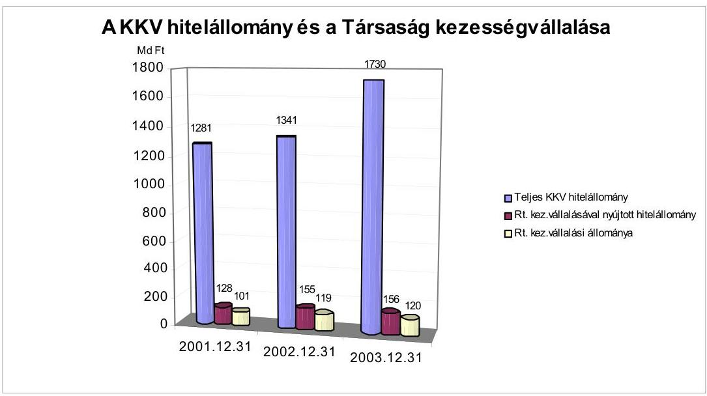
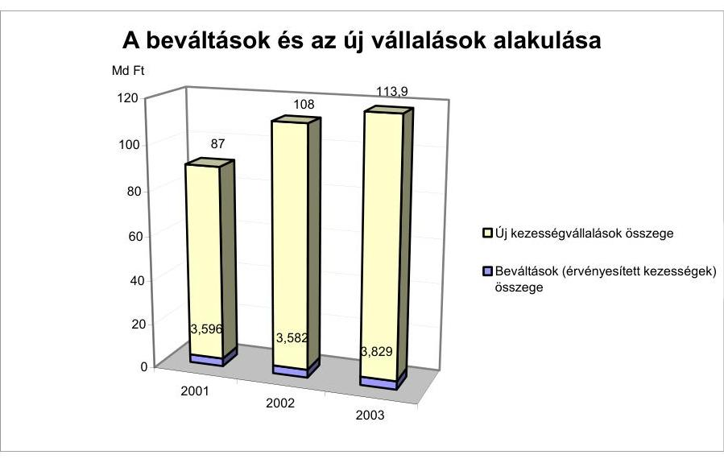
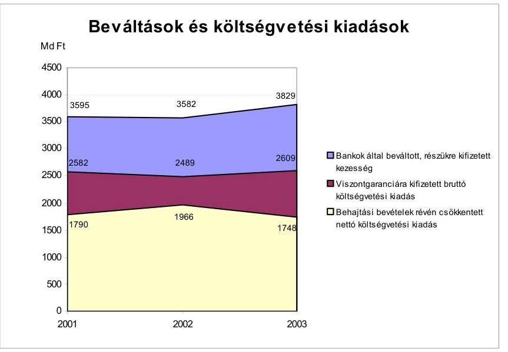
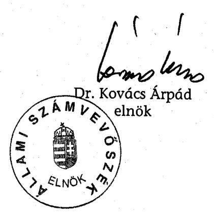
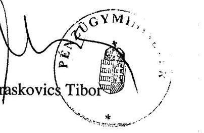

# JELENTÉS 

a Hitelgarancia Rt. múködésének és a
központi költségvetés végrehajtásához kapcsolódó tevékenységének ellenôrzésérôl

---

# 2. Államháztartás Központi Szintjét Ellenőrző Igazgatóság 

2.1. Teljesítmény Ellenőrzési Főcsoport
V-36-40/2003-2004.
Témaszám: 686.
Vizsgálat-azonosító szám: V0111

## Az ellenőrzést felügyelte:

Bihary Zsigmond
föigazgató

## Az ellenőrzés végrehajtásáért felelős:

## Kemény Emil

főcsoportfőnök

## Az ellenőrzést vezette:

## Makkai Mária

főcsoportfőnökhelyettes

## Az ellenőrzést végezték:

| Kun Eszter | Németh Béláné |
| :-- | :-- |
| számvevő | főtanácsadó |

Lucza Anikó
számvevő gyakornok

Tornai József
tanácsadó

A témához kapcsolódó eddig készített számvevőszéki jelentések:
$\begin{array}{llllll}\text { Jelentés a Magyar Köztársaság 2002. évi költségvetése } & 0329 . \\ \text { végrehajtásának ellenőrzéséről }\end{array}$
Vélemény a Magyar Köztársaság 2001. és 2002. évi költségvetési 0034. törvényjavaslatáról
Vélemény a Magyar Köztársaság 2003. évi költségvetési 0241. törvényjavaslatáról

---

# TARTALOMJEGYZÉK 

BEVEZETÉS ..... 5
I. ÖSSZEGZŐ MEGÁLLAPÍTÁSOK, KÖVETKEZTETÉSEK, JAVASLATOK ..... 7
II. RÉSZLETES MEGÁLLAPÍTÁSOK ..... 12

1. A Társaság feladata, szervezete és szabályozottsága ..... 12
1.1. A Társaság feladata ..... 12
1.2. A tulajdonosi szerkezet, az állam tulajdonosi joggyakorlása ..... 13
1.3. A vezető testületek működése ..... 15
1.4. A szervezeti struktúra ..... 16
1.5. A belső szabályozási és információs rendszer ..... 18
1.5.1. A belső szabályozási rendszer ..... 18
1.5.2. Az információs rendszer ..... 18
1.6. A múködés személyi- és tárgyi feltételei ..... 19
2. Az üzletpolitika és üzleti tevékenység ..... 20
2.1. Az üzletpolitika és az üzleti terv meghatározása ..... 20
2.2. Az üzleti tevékenység alakulása ..... 21
2.2.1. A szerződésállomány összetétele, változása ..... 21
2.2.2. A Társaság díjpolitikája ..... 22
2.2.3. A beváltások kockázatának kezelése ..... 23
2.2.4. Az EU csatlakozás hatása ..... 24
2.3. A készfizető kezesség beváltása és az állami viszontgarancia érvényesítése ..... 25
2.3.1. A követelésállomány alakulása, minősítése ..... 26
2.3.2. A követelésbehajtás módja, eredményessége ..... 27
2.4. Az Rt. kapcsolata a központi költségvetéssel ..... 28
2.4.1. A viszontgarancia érvényesítése ..... 28
2.4.2. A GKM díjtámogatása ..... 29
2.4.3. A Széchenyi hitelkártyához kapcsolódó beruházás ..... 30
3. Az Rt. gazdálkodása, az eredményre ható tényezők ..... 30
3.1. Az eredményre ható tényezők ..... 31
3.2. A múködési költségek alakulása ..... 32

---

# MELLÉKLETEK 

1. sz. A pénzügyminiszter észrevétele
2. sz. Az üzleti tervek teljesítése
3. sz. Teljesítményellenőrzési kritériumok
4. sz. Struktúrált kérdések

---

# RÖVIDÍTÉSEK JEGYZÉKE 

| Áht. | Az államháztartásról szóló 1992. évi XXXVIII. törvény |
| :-- | :-- |
| ÁPV Rt. | Állami Privatizációs és Vagyonkezelő Részvénytársaság |
| ÁVÜ | Állami Vagyonügynökség |
| EU | Európai Unió |
| EIB | Európai Beruházási Bank |
| FB | Felügyelő Bizottság |
| FHB | Földhitel és Jelzálogbank |
| FVM | Földmúvelésügyi és Vidékfejlesztési Minisztérium |
| Gt. | A gazdasági társaságokról szóló 1997. évi CXLIV. Törvény |
| GKM | Gazdasági és Közlekedési Minisztérium |
| HIR | Hitelgarancia Információs Rendszer |
| Hpt. | A hitelintézetekről és pénzügyi vállalkozásokról szóló |
|  | 1996. évi CXII. törvény |
| IG | Igazgatóság |
| KKV | Kis- és közepes vállalkozások |
| Kvtv. | Költségvetési törvény |
| MFB Rt. | Magyar Fejlesztési Bank Rt. |
| MKB | Magyar Külkereskedelmi Bank |
| MK Rt. | Magyar Követeléskezelő Rt. |
| MRP | Munkavállalói Résztulajdonos Program |
| MVA | Magyar Vállalkozásfejlesztési Alapítvány |
| PM | Pénzügyminisztérium |
| PSZÁF | Pénzügyi Szervezetek Állami Felügyelete |
| Rt. Társaság | Hitelgarancia Rt. |
| SZMSZ | Szervezeti és Múködési Szabályzat |
| Szt. | A számvitelről szóló 2000. évi C. törvény |
| TJKSZ | Támogatásokat és Járadékokat Kezelő Szervezet |
| CT | Céltartalék |

---

.

---

# JELENTÉS 

## a Hitelgarancia Rt. múködésének és a központi költségvetés végrehajtásához kapcsolódó tevékenységének ellenőrzéséről

## BEVEZETÉS

A Hitelgarancia Részvénytársaságot (továbbiakban: Társaság, illetve Rt.) a Magyar Állam és magyarországi hitelintézetek alapították 1992-ben. A Magyar Állam közvetlen tulajdonosi részesedése 2003. december 31-én 50,02\%, a Magyar Fejlesztési Bank Rt.-n és az Export-Import Bank Rt.-n keresztül további 14,32\% közvetett tulajdona volt, így összesen a közgyűlési szavazatok 64,34\%ával rendelkezett. A közvetlen tulajdonosi jogokat 2002. május 27-től az Állami Privatizációs és Vagyonkezelő Rt. gyakorolja.

A Társaság 1997-től a hitelintézetekről és a pénzügyi vállalkozásokról szóló 1996. évi CXII. törvény (továbbiakban: Hpt.) hatálya alá tartozó pénzügyi vállalkozás. Kizárólagos tevékenysége - a részvénytulajdonos bankok és takarékszövetkezetek által a kis- és középvállalkozások részére nyújtott hitelekhez és bankgaranciákhoz - készfizető kezesség nyújtása. Készfizető kezességet 1998-tól kockázati tőkebefektetések kapcsán is nyújthat.

A kis- és középvállalkozások társadalmi súlyát jelzi, hogy e szektor 2003. évben a vállalkozások összes árbevételéből $40 \%$-kal, az összes exportból $17 \%$-kal részesedett, de ennél jóval fontosabb, hogy kis és középvállalkozásoknál dolgozik a foglalkoztatottak mintegy 65-70\%-a. ${ }^{1}$

A kis- és középvállalkozásokról, fejlődésük támogatásáról szóló 1999. évi XCV. törvényben meghatározott vállalkozások hitelintézetekkel szembeni kötelezettségeiért a Társaság által vállalt készfizető kezesség, és az abból származó fizetési kötelezettség 70\%-ára a központi költségvetés a mindenkori költségvetési törvényben meghatározott keretösszegig viszontgaranciát vállal.

Az Állami Számvevőszék a Társaságnál átfogó ellenőrzést még nem végzett. A központi költségvetés ellenőrzése keretében - mint az állami viszontgarancia előirányzat megalapozottsága, a zárszámadás ellenőrzése - az Állami Számvevőszék folyamatosan végez vizsgálatokat a Társaságnál.

Az ellenőrzés jogalapját az Állami Számvevőszékről szóló 1989. évi XXXVIII. tv. 2. § (6) bekezdése képezte.

[^0]
[^0]:    ${ }^{1}$ Forrás a PSZÁF 2003. évről szóló jelentése.

---

# Az ellenőrzés célja annak értékelése volt hogy: 

- a Társaság múködése, tevékenysége megfelelt-e a törvényi előírásoknak, az állami tulajdonosok, ezen belül a közvetlen állami tulajdonosi jogokat gyakorló Állami Privatizációs és Vagyonkezelő Rt., valamint a múködését szabályozó Pénzügyminisztérium elvárásainak, a belső szabályzatoknak;
- a Társaság által vállalt készfizető kezesség összhangban van-e a költségvetési törvény előírásaival, a költségvetési (viszontgarancia miatti) kiadások indokoltak voltak-e;
- az elszámolások megfeleltek-e a szabályoknak;
- a Társaság tevékenysége hogyan befolyásolta a kis- és középvállalkozások tevékenységét, és a vállalkozások gazdasági fejlődésének elősegítésén keresztül az állami gazdaságpolitika megvalósítását.

Az ellenőrzés a Társaság 2002-2003. évi tevékenységére irányult, de szükség szerint a 2002. évet megelőző időszakra is kiterjedt. A Társaság múködését a helyszíni ellenőrzés végéig (2004. május 7.) figyelemmel kísértük. Az ellenőrzés a Társaság múködését szabályszerűségi és eredményességi szempontok alapján értékelte. Az ellenőrzés szempontjainak megalapozását képező teljesítményellenőrzési kritériumokat és az azokra épült struktúrált kérdéseket a 3. és 4. sz. mellékletek tartalmazzák.

A központi költségvetés végrehajtásához kapcsolódó megállapításokat a Magyar Köztársaság 2003. évi költségvetése végrehajtásának ellenőrzéséről szóló ÁSZ jelentés fogja tartalmazni.

A jelentést egyeztetésre megküldtük a pénzügyminiszternek. Válaszlevele másolatát az 1. sz. melléklet tartalmazza.

---

# I. ÖSSZEGZŐ MEGÁLLAPÍTÁSOK, KÖVETKEZTETÉSEK, JAVASLATOK 

A Társaság 1992 óta múködik. Az alapítás célját, az Rt. feladatait jogszabály nem határozta meg, azt az Alapító Okirat tartalmazza. E szerint a Társaság feladata a hitelintézetek által nyújtott hitelekhez kapcsolódó készfizető kezességvállaláson keresztül a piaci viszonyok erősítése, a kis- és középvállalkozások fejlődésének és működőképességük feltételeinek javítása. A Társaság részére a mindenkori költségvetési törvény meghatározza a kezességvállalási állomány és az állam által vállalható viszontgarancia maximumát. A törvény által meghatározott korlátokat az Rt. betartotta. ${ }^{2}$ Az Rt. tevékenysége az ellenőrzött időszakban a megfelelően kidolgozott üzleti terven alapult és azon keresztül volt mérhető.

A Társaságot alapítása óta az állami és magántulajdon együttes megléte jellemzi, ami eddigi múködése során problémát nem okozott, az állami szándékok a hitelintézeti érdekekkel jól ötvöződtek. A hiteleket nyújtó hitelintézetek számára a Társaság által vállalt készfizető kezesség kockázatmentes biztosítékot jelent a hozzájuk kapcsolódó állami viszontgarancia révén, ezért a hitelintézetek abban érdekeltek, hogy minél több hitelt, minél szélesebb körben és kedvező díjtétellel vehessenek igénybe a hitelfelvevők. Tulajdonosként az az érdekük - amely egybeesik az állami érdekkel is -, hogy a Társaság tevékenysége kiegyensúlyozott, vagyoni helyzete stabil legyen, bevételei fedezzék a ráfordításokat.

A Társaság tevékenységének hatása a kis- és középvállalkozások tevékenységére közvetetten mutatható ki. Az Rt. a mikro-, kis- és középvállalkozások részére nyújtott teljes banki hitelek 12\%-ára (2002), illetve 9\%-ára (2003) vállalt kezességet. A Társaság kezességvállalása - a hitelekre és azok kamataira - az ellenőrzött időszakban (beleértve 2001. évet is, mint bázis évet) 309 milliárd Ft volt, amely 28500 db hitelszerződéshez és ezáltal 400 milliárd Ft hitelkihelyezéshez kapcsolódott. A kezességvállaláshoz az állam viszontgaranciát vállalt. Az ellenőrzött időszakban a viszontgarancia érvényesítése miatti kiadás a költségvetési előirányzaton belül maradt, annak 25 (2002), illetve 57\%-át (2003) tette ki, ezáltal 1 millió Ft hitelnyújtás elősegítése 17600 Ft-os költségvetési kiadással párosult. ${ }^{3}$

[^0]
[^0]:    ${ }^{2}$ A Magyar Köztársaság 2002. évi költségvetése végrehajtásának ellenőrzéséről szóló ÁSZ jelentés A. 2.4. pontja szerint: „Az állami kezesség és viszontgarancia érvényesítésére a Kvtv. 2002-re 19,5 milliárd Ft-ot irányozott elő a XXII. PM fejezet 18. címén. Az előirányzatok összességeikben mintegy 17,5\%-ra teljesültek." Ennek az előirányzatnak része a Hitelgarancia Rt. is.
    Ugyanezen jelentés B. 3.5. pontja szerint „A Kvtv. előirása szerint a Hitelgarancia Rt. által vállalt készfizetőkezesség állománya 2002. december 31-én a 180 milliárd Ft-ot nem haladhatta meg. A kezességállomány ezen időpontban 118,6 milliárd Ft volt, amely összeg 65,9\%-os keretkihasználást jelentett."
    ${ }^{3}$ A Jelentés a Magyar Köztársaság 2002. évi költségvetési végrehajtásának ellenőrzéséről szóló ÁSZ jelentés (140. oldal) a következőt tartalmazza: A garanciabeváltás és megtérülés

---

A Társaság vagyoni helyzete stabil volt, a mérlegfőösszeg közel 80\%-át a saját tőke tette ki. Az Rt. hatékony gazdálkodása következtében a közvetlen állami tulajdon folyamatosan növekedett, az alapításkori 2 milliárd Ft-ról 2003. december 31-re 10,4 milliárd Ft-ra emelkedett. A vagyon növekedésében a nyereséges gazdálkodáson túl az is szerepet játszott, hogy az Rt. mentesült a társasági adó fizetése alól és a tulajdonosok - az alapítástól kezdődően - osztalékot nem vontak ki a Társaságtól. A kezességvállaláshoz kapcsolódó díjtételek 2002től emelkedtek. A Társaság elmúlt két éves múködésében tapasztaltak az állami érdekek érvényesülését támasztották alá, úgy, hogy tevékenysége megfelelt a törvényi előírásoknak és a belső szabályzatoknak.

A Társaság szervezetének, irányításának és múködésének szabályozottsága alapvetően megfelelő volt.

Az ellenőrzött időszakban a Társaság szervezete és irányítása nem változott, ami hozzájárult a stabil és kiegyensúlyozott múködéshez. Az irányításra a centrális vezetés volt jellemző, ami jól szolgálta az Rt. speciális tevékenységi körét. Emellett a feladatok és hatáskörök jól elhatároltak voltak, elősegítették a folyamatba épített és a vezetői ellenőrzést.

A Társaság vezető testületei (FB, igazgatóság) a Gt. előírásainak megfelelően működtek, ugyanakkor a Hpt.-vel ellentétben a kockázatvállalást szabályozó utasítások jóváhagyása nem tartozott az igazgatóság hatáskörébe.

A függetlenített belső ellenőrzés az FB szakmai felügyelete alá tartozik. Az Rt. egy fő belső ellenőrt foglalkoztat, amely az üzleti tevékenység sajátosságai alapján elégséges. Az ellenőrzések egy-egy üzleti területet átfogóan vizsgálnak. A belső ellenőrzés által feltárt hibákat, hiányosságokat a vizsgálatok alatt
dokumentumai alapján megállapítható, hogy a garantőr szervezetek a vonatkozó előírásokat betartják. Eredményes tevékenységet végeznek a szervezetek - köztük a Hitelgarancia Rt. annak érdekében, hogy a garanciabeváltás miatti összegek minél nagyobb mértékben megtérüljenek.

---

megszüntették és ezért a belső szabályzat szerint készítendő intézkedési terv a Társaságnál nem készült.

A tulajdonosi jogokat az állam nevében 2002. május 26-ig a pénzügyminiszter, ezt követően az ÁPV Rt. gyakorolja. Az ÁPV Rt. rendszeres adatszolgáltatási kötelezettséget ír elő a Társaság számára. A tulajdonosi joggyakorló az üzleti folyamatokba nem avatkozott be, az üzleti terv jóváhagyása előtti egyeztető folyamatba azonban közvetlenül bekapcsolódik. Az üzleti terv készítésére kialakított ÁPV Rt. gyakorlat azt eredményezi, hogy a Társaságnak kétszer kell elkészíteni a tervet és stratégiát, valamint az ÁPV Rt.-nek is kétszer kell foglalkozni az ezekhez kapcsolódó döntéshozatallal. Ennek oka az, hogy az ÁPV Rt.-nek a 2004. évi üzleti tervét - a PM útmutatása alapján - 2003. decemberében kellett elkészíteni. Az üzleti terv összeállításához kérte meg az ÁPV Rt. a hozzárendelt vagyonába tartozó társaságok előzetes üzleti tervét. Az ÁPV Rt. megfelelően közvetítette a bérezéssel kapcsolatos állami elvárásokat, amelyeket az Rt. betartott.

A Társaság szerepvállalásával, tevékenységének jellemzőivel kapcsolatos kö-zép- vagy hosszú távú elvárásokat kormányzati szinten nem rögzítettek. Ezért az állami tulajdonosi elvárások teljesítésének minősítése nem volt lehetséges.

A Társaság irányító és ellenőrző testületei időszaki beszámolókon keresztül értékelik a Társaság által elvégzett munkát, amelyek az üzleti folyamatok szöveges magyarázatát tartalmazzák. A kis- és középvállalkozásokról és támogatásukról, ezen belül a Társaság tevékenységéről is a GKM évente beszámolót készít a Kormány részére, aki azt benyújtja az Országgyűlés részére. A beszámoló értékeli e vállalkozások előző évi fejlődését, gazdálkodásuk fő folyamatait. A jelentések tartalma megfelel a vonatkozó jogszabályok előirásainak, tartalmi követelményeinek. A kormányzati beszámolók a múltbeli tényeket és adatokat értékelik, a jövőben követendő stratégiai célkitűzéseket, elvárásokat nem határozzák meg a kis- és középvállalkozói szektor támogatásában résztvállaló (részben) állami intézményekre, társaságokra, így az Rt.-re sem. Ez utóbbinak az ad különös jelentőséget, hogy a kis- és középvállalkozói körbe tartozó társaságok száma - az EU-s szabályokhoz igazodva - szinte teljesen lefedi a magyarországi vállalkozói kört.

A Társaság 2003. december 31-én 119,8 milliárd Ft értékben 15800 db készfizető kezességvállalási szerződést tartott nyilván. Az Rt. üzleti aktivitása 2002. évben $24 \%$-kal nőtt, a 2003. évi növekedés $5,5 \%$ volt, és ez teljes egészében a Széchenyi hitelkártyához adott kezességvállalásokból adódott. A kis- és középvállalkozásoknál a likviditási gondok miatt a rövid lejáratú, éven belüli hitelek domináltak és a fejlesztési hiteligények háttérbe szorultak.

Az egyes hitelügyletekhez kapcsolódó kezességvállalások (amelyek a teljes hitelösszegnek átlagosan 66\%-ai) 3,6\%-át váltották be a bankok. Ez közvetetten arra utal, hogy a kis- és középvállalkozások tevékenysége a Társaság biztosítéki hátterével megerősödött. A hitelintézetek által érvényesített készfizető kezességvállalások (beváltások) megfeleltek a Társaság üzletszabályzatában foglalt feltételeknek (pl.: a szerződés hitelintézet általi szabályszerű felmondása, a hitelintézet az ügyfelet felszólította a teljesítésre, stb.). Így a beváltások és a költségvetés kiadásai indokoltak és szabályszerűek voltak. A kockázatmegosztás jól

---

múködött, mivel átlagosan a bankot $34 \%$, a költségvetést $46 \%$ és az Rt.-t 20\% kockázat terhelte. A Társaság a követelések (a Bankok által beváltott kezességek) után a várható veszteség fedezetére értékvesztést számol el, mivel a behajtásokkal elért bevétel a követelések átlagosan 37\%-a. A 2002-2003. években összességében az értékvesztés elszámolása megfelelő volt. Az ügyletek 8,6\%ánál $45 \%$-kal kevesebb volt az értékvesztés a tényleges veszteség összegénél, ami abból adódott, hogy a hitelintézetek nem adtak információkat a fedezetek értékének változásáról, a követelésbehajtás helyzetéről, és azokat az Rt. az értékvesztés elszámolásánál nem vette/vehette figyelembe. ${ }^{4}$

A költségvetési viszontgarancia érvényesítése során az elszámolások rendre megtörténtek az Rt. és a Támogatásokat és Járadékokat Kezelő Szervezet (továbbiakban: TJKSZ) között.

[^0]
[^0]:    ${ }^{4}$ A Magyar Köztársaság 2002. évi költségvetése végrehajtásának ellenőrzéséről szóló ÁSZ jelentés (138. oldal) megállapította, hogy: „Az érintett bankok nem jártak el kellő gondossággal, nem teljesítették a hitel biztosítékokra előírt feltételeket."

---

A Társaság az ellenőrzött időszakban nyereséges volt, ami az üzleti aktivitáson túl a szabad pénzeszközök hasznosításának és a takarékos költséggazdálkodásnak a következménye. A szabad pénzeszközök befektetését a Társaság saját maga végzi el, amelynek során együttesen érvényesül a hozam maximalizálására és a biztonságra való törekvés. 2003. évben az összes befektetéseken belül az állampapírok állománya átlagosan $72 \%$ volt.

A Társaságnál a múködési költségek viszonylag állandóak voltak és indokolatlan tételeket nem tartalmaztak. Az összes ráfordítás és kiadás 50-55\%-a volt a múködési költség, amelyen belül a bér és a személyi jellegű kiadás meghatározó volt. Ezt befolyásolta a létszám csekély mértékű növekedése és az, hogy az átlagkeresetek változása a tulajdonos által meghatározott kereteken belül maradt mindkét évben.

A részletes megállapítások hasznosításán túl javasoljuk:
az ÁPV Rt. igazgatóságának hogy

- kísérje figyelemmel a Hitelgarancia Rt. igazgatóságának tett ajánlások megvalósulását;
a Hitelgarancia Rt. igazgatóságának, hogy
- a Hpt. előírásainak megfelelően az igazgatóság hatáskörébe tartozzon a kötelezettségvállalással foglalkozó szabályzatok elfogadása;
- a Társaság követelje meg a bankokkal kötött megállapodások betartását, különösen a követelésbehajtás helyzetével kapcsolatos információk átadását.

A helyszíni ellenőrzés megállapításainak hasznosítása mellett javasoljuk:

# a Kormánynak 

Tekintse át a kis- és középvállalkozások helyzetéről az Országgyűlésnek benyújtott beszámolók keretében az Rt. e szektor támogatásában betöltendő szerepét, különös tekintettel az EU csatlakozás hatására és gondoskodjon a Társasággal kapcsolatos hosszú távú, a kormányzati támogatási szándékot figyelembe vevő stratégia kidolgozásáról.

---

# II. RÉSZLETES MEGÁLLAPÍTÁSOK 

## 1. A TÁRSASÁG FELADATA, SZERVEZETE ÉS SZABÁLYOZOTTSÁGA

### 1.1. A Társaság feladata

A Társaság a Hpt. hatálya alá tartozó pénzügyi vállalkozás, amely kizárólag készfizető kezességvállalást végez. Készfizető kezességet csak a tulajdonos hitelintézetek kis- és középvállalkozói körébe tartozó ügyfelei részére, azok hitelintézetekkel szembeni kötelezettségeihez nyújt.

A kezességvállalási tevékenységet a Magyar Állam viszontgarancia nyújtásával segíti. A viszontgarancia mértéke a Társaságot terhelő fizetési kötelezettségek 70\%-a. A Társaság részére kifizethető viszontgarancia összegét és a készfizető kezesség év végi állományának maximumát a mindenkori költségvetési törvény tartalmazza. A törvény meghatározza a kezességvállalásban részesíthető kedvezményezetti kört, az egy vállalkozás részére vállalható kezesség maximumát, illetve a kezesség maximális arányát a hitelintézeti követeléshez.

Az állami viszontgarancia vállalásának és érvényesítésének feltételeit 2002. december 31-ig a 48/1997. (XII. 31.), 2003. január 1-jétől a 48/2002. (XII. 28.) PM rendeletek szabályozzák.

2002-ben azok a természetes személyek, gazdasági és közhasznú társaságok, szövetkezetek, MRP szervezetek vehették igénybe a Társaság által nyújtott készfizető kezességet, amelyek létszáma - az MRP szervezetek kivételével - nem haladta meg a hitelfelvétel időpontjában a 250 főt. 2003. január 1-jétől a kis- és középvállalkozásokról szóló 1999. évi XCV. tv. hatálya alá tartozó vállalkozások hiteleihez és bankgaranciáihoz nyújt készfizető kezességet a Társaság, amely törvény a korábbi létszámkorláton túl árbevételhez és a mérlegfőösszeghez köti a kezességvállalást.

A társaság megalapításának célját, feladatait jogszabály nem rögzítette. Az 1992 decemberében elfogadott alapító okirat - amely megfelelt a Gt. előírásoknak - alapján a Társaság feladata a készfizető kezességvállaláson keresztül a piaci viszonyok erősítése, a kis- és középvállalkozások fejlődésének és ezzel múködőképességük feltételeinek javítása.

Az alapítás céljának teljesítése közvetetten mérhető, a kezességvállalással biztosított, illetve a teljes, kis- és középvállalkozói szektor felé kiáramló hitelállomány alakulásával. A Társaság 2002-2003-ban a teljes banki, mikró-, kis- és középvállalkozások részére nyújtott hitelek 12, illetve 9\%-ára ${ }^{5}$ vállalt kezességet.

[^0]
[^0]:    ${ }^{5}$ Az alapadatok a PSZÁF 2003. évi beszámolójából és a Társaságtól származnak.

---

A Társaság tevékenysége ezáltal hatott a hitelintézetek teljesítményére és eredményére. Az állam által viszontgarantált, a Társaság által nyújtott kezesség a Bankok számára kockázatmentes biztosítékként szolgál. Ezzel a biztosítéki háttérrel a bankok olyan hiteleket is jóváhagytak, amelyeket kezességvállalás nélkül elutasítottak volna. Az ezáltal indukált hitelek nagyságrendje azonban a rendelkezésre álló adatokból nem számszerúsíthető.

A Társaság kezességvállalásával érintett, a 2002-2003-ban meghirdetett Euro-pa-hitelprogram, agrárhitelezés, Széchenyi hitelkártya esetén az államilag meghirdetett konstrukció miatt fix kamatot számítanak fel a hitelintézetek. A kamattámogatást a hitelintézetek részére a költségvetés téríti.

# 1.2. A tulajdonosi szerkezet, az állam tulajdonosi joggyakorlása 

A Társaságot a Magyar Állam, 25 bank, 40 szövetkezeti hitelintézet, 10 kamara és más érdekvédelmi szervezet, illetve a Magyar Vállalkozásfejlesztési Alapítvány hozta létre 1992-ben 3541,5 millió Ft alaptőkével. Alapításkor a Magyar Állam közvetlen tulajdonosi részesedése 56,47\% volt. A Társaság jegyzett tőkéjét egy alkalommal, 1994-ben 1270,1 millió Ft-tal emelték, amelyben a Magyar Állam közvetetten, az Állami Vagyonügynökség révén vett részt.

A tőkeemelés, az ÁVÜ által birtokolt részvények átadása a PM-nek és MFB Rt.nek, a bankprivatizációk, illetve az új hitelintézeti és egyéb tulajdonosok belépése következményeként 2003. december 31 -én az állam közvetlen tulajdoni aránya $50,02 \%$ volt, míg a közvetett állami tulajdon mértéke - az MFB Rt.-n és az Eximbank Rt.-én keresztül - 14,32\% lett.

A Hpt. 43. § (3) bekezdése alapján a legalább öt százalékos tulajdonrésszel rendelkező részvényesek közvetett tulajdonának azonosítására alkalmas adatait is nyilván kell tartani a Társaság részvénykönyvében. Ennek a követelménynek a Társaság azért nem tett eleget, mert az ilyen tulajdonrésszel rendelkező részvényesek nem jelentették be közvetett tulajdoni részesedésüket a Társaságnak.

Az Rt.-ben az állami és magántulajdon párhuzamos léte sem a közgyűlés, sem az irányító és ellenőrző testületek tevékenysége tekintetében nem okozott problémát.

A Társaságot az állam részéről a vizsgált időszakban 2001. január 1-jétől 2002. május 26-ig a pénzügyminiszter, 2002. május 27-től az Állami Privatizációs és Vagyonkezelő Rt. felügyeli (felügyelte).

A Pénzügyminisztérium tulajdonosi joggyakorlása alatt rövidtávú elvárásokat nem közvetített a Társaság felé: az üzletpolitikára, az üzleti tervre vonatkozóan az állami tulajdonos írásban is kifejezett elvárásokkal nem élt.

Az ÁPV Rt. tulajdonosi joggyakorlása során az üzleti terv jóváhagyása előtti egyeztető folyamatba közvetlenül bekapcsolódik, részletes elvárásokkal élve. Az ÁPV Rt. a tényleges üzleti folyamatokba nem avatkozik be, a vizsgált időszakban a törvényekben, jogszabályokban foglalt előírásokra vonatkozó keretszabályozást végzett, illetve ellenőrizte a bérezéssel kapcsolatos állami elvárások

---

teljesülését. Rendszeres adatszolgáltatási kötelezettséget írt elő, amely elsősorban a mérleg- és eredményadatok terv szerinti teljesítésének, a bérfejlesztési korlátozások betartásának ellenőrzését szolgálta. Az ÁPV Rt. az általa felügyelt vállalkozásoknál alkalmazott gyakorlatot érvényesíti a Társaságnál (például a vezérigazgató alapbérének meghatározása, az üzleti terv elkészítésének időpontja esetében).
2003. november 28 -tól az akkor elfogadott Alapítói Okirat alapján a vezérigazgató személyi alapbérének meghatározása nem az igazgatóság, hanem - figyelemmel az Áht. 95/A §-ában és az ÁPV Rt. javadalmazási szabályzatában megállapított elvekre - a közgyűlés hatáskörét képezi. Ez ellentmond a Hpt. 64. §-ának, miszerint az ügyvezetőkkel kapcsolatban a munkáltatói jogokat az igazgatóság gyakorolja. A Társaság végül a közgyűlés által elfogadott javadalmazási szabályzat előírásait alkalmazza, azaz csak az alapbérre vonatkozó kategóriát határozza meg, azon belül az igazgatóság dönt.

A Társaság közgyűlése a gazdasági társaság legfőbb szervére vonatkozó Gt. előírásainak megfelelően működött a vizsgált időszakban. Rendkívüli közgyűlést egyszer, 2003. novemberében hívtak össze, a 2003. évi XXIV. (ún. üvegzseb) törvényben foglalt előírások érvényesítése, alapító okiratban való rögzítése céljából.

A közgyűlési szavazások alkalmával, illetve a tulajdonosi joggyakorlók által a vezető testületekbe delegált tagok minden alkalommal elfogadták a Társaság által készített - éves, negyedéves - beszámolókat, üzleti jelentéseket.

A Társaság jövőbeni szerepvállalásával, tevékenységének jellemzőivel kapcsolatos közép- vagy hosszú távú elvárásokat kormányzati szinten nem rögzítettek.

A kis- és középvállalkozásokról és fejlődésük támogatásáról szóló 1999. évi XCV. törvény alapján a szektor tevékenységét a Gazdasági és Közlekedési Minisztérium évente értékelte és a Kormány elé terjesztette. 2004. május 1-től a korábbi törvényt hatályon kívül helyező 2004. évi XXXIV. törvény alapján az értékelést kétévente kell a miniszternek elkészítenie. A miniszter által kidolgozott beszámolót a Kormány az Országgyűlés elé terjesztette.

A beszámoló a KKV szektor támogatásában részt vevő intézmények és vállalkozások tevékenységét összefoglaló adatokkal jellemzi (a Társaság esetén a kezességvállalás összege, benyújtott kérelmek-, szerződések száma, garantált hitel összege, lehívás összege), és nem tartalmazza - a törvény nem írja elő - a tőlük elvárt feladatokat, valamint az általuk nyújtott támogatási formák értékelését.

Az EU-csatlakozás kisvállalkozásokra gyakorolt várható hatásait nem mutatták be, melynek oka az volt, hogy a beszámoló készítésekor a csatlakozással kapcsolatos tárgyalási folyamatok kimenetele nem volt ismert, egyes támogatási programok EU által való elfogadása nem volt prognosztizálható.

Az EU-csatlakozásra való felkészülési folyamat elemzése során a beszámoló bemutatta a létrehozott intézményeket, a kiadott információs füzeteket, azonban konkrét - a jogszabályi környezet módosulásával kapcsolatos - változásokkal és azok hatásaival nem foglalkozott/foglalkozhatott.

---

# 1.3. A vezető testületek múködése 

A Társaság igazgatóságának múködését az alapító okirat, illetve a testület ügyrendje határozza meg. A vizsgált időszakban folyamatosan 10 fővel működött az irányító testület, az alapító okiratban előírt jelölési arányoknak megfelelően. A tagok felét a Magyar Köztársaság Kormánya, egyet az MFB Rt. delegál. Elnöknek hagyományosan az állami tulajdonos által delegált tagot választották meg.

A rendkívüli közgyűlésen elfogadott határozat alapján 2003. november 28-tól szavazategyenlőség esetén az elnök szavazata már nem dönt, ami az állami tulajdonos érdekérvényesítési lehetőségeinek beszűkülését okozhatja. A változást az igazgatóság ügyrendjében nem aktualizálták. A Társaság levélbeni tájékoztatása szerint a 2004. június 23 -ai igazgatósági ülésen az ügyrendet módosították.

A Gt. igazgatóságra vonatkozó előírásainak a Társaság megfelelt.
A Hpt. 77. §-a alapján a pénzügyi intézmény köteles a kihelyezések és kötelezettségvállalások megalapozottságát, áttekinthetőségét, a kockázatok felmérésének ellenőrzését és csökkentését lehetővé tévő, az igazgatóság által elfogadott belső szabályzatot kidolgozni és alkalmazni. A Társaság kockázatvállalást szabályozó utasításainak jóváhagyása a Hpt. előírása ellenére nem tartozik igazgatósági hatáskörbe.

A felügyelő bizottság múködését az alapító okirat és a testület saját ügyrendje szabályozza.

Az alapító okiratban meghatározott arányoknak megfelelően négy tagot jelöl a Magyar Köztársaság Kormánya, egyet a nagybankok, egyet a kisbankok, takarékszövetkezetek, egyet az érdekképviseletek és az MVA. Az elnököt az állami tulajdonos adja.

A 2003. évi XXIV. tv. alapján módosított Áht. előírása szerint a bizottság elnökét az Állami Számvevőszék javaslata alapján választják a tagok. Ezzel kapcsolatban intézkedés nem történt, mivel a jogszabályi rendelkezés csak az elnöki tisztség megüresedésére vonatkozik.

A vizsgált időszakban folyamatosan csökkent a testület létszáma, 2002. júniustól az addigi 7 főről 6 főre, majd 2003. júliustól 5 főre. A 2003. novemberi rendkívüli közgyűlésen a testület újra 7 főre bővült. Az ÁPV Rt. ekkor megválasztott jelöltjével kapcsolatban azonban összeférhetetlenség áll fenn.

A tag a helyszíni vizsgálat befejezéséig nem mondott le tagságáról, illetve az ÁPV Rt. sem tett intézkedést az összeférhetetlenség megszüntetése érdekében. A tag az üléseken nem vesz részt, tiszteletdíjat részére a Társaság nem fizetett ki.

A jegyzőkönyvek szerint a testület az általa megtárgyalt témákról, vizsgálatokról írásos jelentéseket nem készít, hanem a belső ellenőrzés, illetve az egyes tagok szóbeli beszámolóit vitatja meg és hagyja jóvá.

---

Az ülések napirendi pontjai a testület munka- és ellenőrzési tervében előírtaknak megfeleltek. Egyes témákat időbeni késéssel tárgyaltak, így azok aktualitásukat vesztették, (pl. 2003. I-III. negyedévi üzleti tevékenység értékelését 2004. január hónapban tárgyalták). Ennek oka a testület létszámának csökkenése volt, illetve az, hogy a tagok nem vettek részt a határozatképességhez szükséges létszámban.

A Hpt. 66. §-a a testület feladatai között rögzíti a belső ellenőri jelentésben foglalt javaslatok és intézkedések végrehajtásának ellenőrzését is. A testület ilyen ellenőri funkciót nem gyakorolt, melynek oka, hogy a belső ellenőrzések a Társaság múködését veszélyeztető hibát nem tártak fel. A belső ellenőr által feltárt hiányosságokat a Társaság a vizsgálatok alatt megszüntette.

A belső ellenőrzés által végzett vizsgálatok tapasztalatait a vizsgálattal munkaterv alapján évente egyszer tárgyalja a bizottság, miközben a Hpt. két alkalmat határoz meg. A belső ellenőr az aktuális vizsgálatokról az FB üléseken beszámol, és vizsgálati anyagait a Testület teljes terjedelemben megkapja. A belső ellenőr évente, a közgyűlést megelőzően elkészített beszámolóját a testület észrevételezés nélkül minden évben megtárgyalta és tudomásul vette.

# 1.4. A szervezeti struktúra 

A szervezet 7 igazgatóságból, egy titkárságból és a belső ellenőrt, a vezérigazgatót, illetve helyetteseit magában foglaló vezérigazgatóságból áll. Osztályokat a szervezetben nem alakítottak ki.

A Társaság SZMSZ-e 1999. január 1-jétől hatályos. Szervezeti változás a vizsgált időszakban nem volt.

Az egyes szervezeti egységek (igazgatóságok) külön ügyrenddel nem rendelkeznek, az SZMSZ-ben meghatározott feladataik részletezését vezérigazgatói utasítás tartalmazza. A szervezeti felépítés sajátossága, hogy nem a vezérigazgató felügyelete alá tartozik a jogi és humánpolitikai terület.

A vezérigazgatóhelyettesek három-három igazgatóság munkájáért felelnek. Ezen szervezeti egységek alapvetően adminisztratív-, számviteli feladatokat, vagy közvetlen üzleti tevékenységet szolgáló teendőket látnak el.

A két vezérigazgatóhelyettes között megoszlik a kezességvállalási kérelmek formai és tartalmi vizsgálatának felügyelete. Külön vezérigazgatóhelyettes felügyeli a kezességvállalási kérelmek befogadását, a döntést megelőző vizsgálatát, illetve a minősítéshez és a készfizető kezesség beváltásához kapcsolódó feladatokat. A tevékenységeknek ilyen fajta felügyeleti különválasztása hozzájárul a „több szem" elvének érvényesítéséhez, de nem hátráltatja az üzleti folyamatokat.

A szervezeti egységek dolgozói munkaköri leírással rendelkeznek, amely részletesen meghatározza a munkatársak feladatait, felelősségi körét.

A vezérigazgató egyszemélyben dönt a 20 millió Ft-ot meghaladó kezesség beváltásának jóváhagyásáról, az ez esetben követendő behajtási eljárásról és ösz-

---

szegkorlát nélkül a követelések egyedi engedményezéséről. Az 500 ezer Ft feletti beszerzések szintén a vezérigazgató hatáskörét képezik, a kialakult gyakorlat szerint azonban az ennél kisebb összegű, a szabályzat szerint vezérigazgató helyettesi hatáskörbe tartozó kifizetéseket is ő hagyja jóvá.

A vezérigazgató helyettesek jogosultak a külön szabályzatokban meghatározott összeghatárig üzleti típusú döntést hozni.

A két helyettes közötti feladat- és hatásköri megosztás átfedést nem tartalmaz, ezért a felelősség egyértelműen megállapítható. A vezérigazgatóhelyettesek ellátják egymás, illetve a vezérigazgató helyettesítését is.

A vezérigazgatón és helyettesein kívül az üzleti tevékenységgel kapcsolatos döntéshozatalban három bizottság vesz részt. Az üzleti döntéseket meghozó bizottságok saját ügyrenddel nem rendelkeznek, feladataikat, döntési hatáskörüket a vonatkozó utasítások jelölik ki.

A folyamatba épített ellenőrzés helyei a szervezeti egységek feladatait előíró szabályzat vagy a munkaköri leírások alapján azonosíthatók.

Az FB szakmai felügyelete alá tartozó függetlenített belső ellenőrzés jogait, feladatait, a belső ellenőrrel szemben támasztott követelményeket és az ellenőrzés eljárási szabályait belső utasításban szabályozza a Társaság, amely megfelel a Hpt.-ben foglalt előírásoknak.

A Társaság egy belső ellenőrt foglalkoztat. Ez a létszám a foglalkoztatottak száma és a folytatott üzleti tevékenység sajátosságai alapján elégséges. A belső ellenőr munkatervét a felügyelő bizottság és a vezérigazgató hagyja jóvá.

A munkaterv mindkét vizsgált évben 5-5 vizsgálatot írt elő a belső ellenőr részére, aki részt vett a felügyelő bizottság munkatervében szereplő reá kiosztott ellenőrzési feladatok végrehajtásában is. 2002-ben a vezérigazgató egy rendkívüli vizsgálat elvégzésére adott megbízást.

Az ellenőrzések egy-egy üzleti területet átfogóan vizsgálnak, céljellegú vizsgálatra évente 1-2 alkalommal került sor. A vizsgálatok nem terjedtek ki a beszerzések, a számviteli politika, a támogatástartalom ellenőrzésére, a banki együttműködési megállapodások belső ellenőri vizsgálatára (azt a felügyelő bizottság ellenőrizte).

Utóellenőrzés a vizsgált időszakban nem volt, azonban egyes témákat (pl. befektetési tevékenység, beváltási tevékenység) minden évben vizsgált a belső ellenőr. A felügyelő bizottság részére adott tájékoztatás alapján az illetékes szervezeti egységek a vizsgálat alatt, illetve azt követően megtették a szükséges intézkedéseket.

---

# 1.5. A belső szabályozási és információs rendszer 

### 1.5.1. A belső szabályozási rendszer

A szabályzatok mind a Társaság üzleti, mind adminisztratív típusú tevékenységét széleskörűen és részletesen szabályozzák. Az üzleti területet a szabályzatok átfogóan, folyamatszerűen kezelik. Azonosíthatóak a feladatok végrehajtásáért és a döntéshozatalért felelős szervezeti egységek, testületek vagy vezetők. Az egyes utasítások a hatályos jogszabályi előírásoknak megfelelnek.

A Társaság rendelkezik a Hpt. 13. § (1) bekezdésében előírt, az Szt.-nek megfelelő számviteli és nyilvántartási renddel, a prudens múködésre vonatkozó belső szabályzatokkal, a rendkívüli helyzetek kezelésére vonatkozó tervvel, illetve a 47. § (2) bekezdésében a csak a hitelintézetekre előírt aláírási jogra vonatkozó belső szabályzattal is.

A Társaságnál az SZMSZ szerint minden terület a saját tevékenységére vonatkozó jogszabályi változásokat figyeli, és kezdeményezi a területére vonatkozó szabályzatok módosítását. A kezességvállalás rendjéről szóló szabályzaton két esetben nem vezették át a belső döntéseket. (A vezérigazgatóhelyettes döntési jogköre 20 millió Ft-ról 50 millió Ft-ra emelkedett, a biztosíték-csere, illetve kiengedés, a prolongáció és egyéb szerződés módosítások eljárási rendjét Garancia Bizottsági határozat szabályozta). Így a gyakorlat nem felelt meg a szabályzat előírásainak.
2003. december 31-én 73 vezérigazgatói utasítás volt érvényben. A szabályzatok közül 26 darab (36\%) foglalkozott az üzleti terület szabályozásával. 16 utasítás (22\%) vonatkozik a gazdálkodásra, a humánpolitikai kérdéseket 11 szabályzat (15\%) érintette. Az adminisztrációval, ügyvitelszervezéssel kapcsolatos hatályos utasítások száma 20 darab volt (27\%). Több esetben megfigyelhető a módosítások halmozódása. Az egységes szerkezet hiánya az átláthatóságot és alkalmazhatóságot megnehezíti.

A személygépkocsi-használatról 12 szabályzat rendelkezett, melyből 11 darab az eredeti módosítását tartalmazza. A kezességvállalás feltételeivel foglalkozó szabályzat három módosítása nem segíti az egyértelmú értelmezést.

### 1.5.2. Az információs rendszer

A mérleg- és eredménytervek teljesítését, illetve az üzleti tevékenységet az igazgatóság részére készített negyedéves beszámolók elemzik. A beszámolók kétféle - számviteli, illetve üzleti - szempontból is értékelik a tevékenységet.

A kontrolling-folyamatokért felelős igazgatóságok - a negyedéves beszámolókon túl - kétheti-havi rendszerességgel, illetve ad-hoc jelleggel számolnak be az üzleti és pénzügyi folyamatokról a vezetés részére. Ezek a tájékoztatók elsősorban a számszaki adatok bemutatására irányulnak, a negyedéves beszámolókhoz képest részletesebb módon.

---

Az üzleti állományra vonatkozó adatokat a HIR-ben tárolt kezességvállalási portfolió adatainak lekérdezésével, a mérleg és eredménykimutatás adatait a főkönyvi rendszerből a vezetői információs igények alapján nyerik.

A HIR hozzájárul a kezességvállalási állományhoz tartozó ügyletek állapotának követéséhez, támogatja a döntés-előkészítést (pl. minősítés), könnyíti az ügyviteli feladatok ellátását (pl. szerződéskészítés), és alapja a vezetői informá-ció-szolgáltatásnak.

Az értékelések, elemzések a hangsúlyt az éven belüli üzleti folyamatokra, azaz az új kezességvállalások számára, összegére és azok terv szerinti teljesítésére helyezik.

# 1.6. A múködés személyi- és tárgyi feltételei 

A Hpt. 13. § (1) bekezdése szerint a Társaságnak a pénzügyi szolgáltatási tevékenység végzésére alkalmas személyi és tárgyi feltételeket kell biztosítania, amelynek a Társaság megfelelt.
2003. december 31-én 63 fő volt a szervezet létszáma, melyből 2 fő részmunkaidőben látja el feladatait, így az egyes szervezeti egységek átlagos létszáma 7 fő. A vizsgált időszakban 1 fő teljes és 2 fő részmunkaidős munkatárssal nőtt a szervezet létszáma. A felvételek elsősorban az informatikai területet érintették a 2002. évben lefolytatott PSZÁF vizsgálat során megfogalmazott javaslatok eredményeként. A 2003. év végén állományban lévő munkatársak 48\%-a több mint 6 éves, $38 \%$-a 3-6 éves munkaviszonyban áll a Társasággal.

Az ügyvezetők közül a vezérigazgató 6 éve, helyettesei a működés kezdete óta állnak munkaviszonyban a Társasággal, ami a stabil, kiegyensúlyozott múködéshez járult hozzá.

A 2003. év végén statisztikai állományban lévő munkatársak 80\%-a, azaz 50 fő felsőfokú végzettségű. A folyamatos tanfolyami képzések 2003-ban 43 főt érintettek.

A szervezeti egységek vezetői évenként értékelik a munkatársak teljesítményét. A pontozásos értékelés során öt kategóriába sorolják a beosztottakat. A kifizetett jutalmak nagyságát ez az értékelés, illetve a közvetlen felettes javaslata határozza meg.

A Társaság rendelkezik a feladatai ellátásához szükséges eszközökkel. 2002-ben összesen 122,3 millió Ft értékben, 2003-ban 60,6 millió Ft értékben történt beruházás. A 2002. évi beruházás $70 \%$-át szoftver, a további $30 \%$-ot pedig a hardver, az irodatechnikai, a gépjármú beszerzések tették ki, amelyek indokoltak voltak.

A 2003. évben a beruházások értéke 50\%-kal csökkent, melyből arányaiban $41 \%$-kal részesedtek a hardweres termékek, $35 \%$-kal a gépjármúvek és $24 \%$-kal az informatikai termékek.

A tárgyi eszközök és immateriális javak (szoftverek) vásárlását ajánlatkérés előzte meg.

---

A 2003. évi gépjármúbeszerzések során két forgalmazótól kértek be ajánlatot, melyek közül a kedvezményesebb árút választották. A meglévő (lecserélendő) járműveket értékbecslést követően adták el. Az eladási ár a szúrópróbaszerűen kiválasztott járműveknél megegyezett az értékbecslésben szereplő értékkel, és magasabb volt a nyilvántartási értéknél. Az eladott járművek életkora 4-5 év között volt.

# 2. Az ÜZLETPOLITIKA ÉS ÜZLETI TEVÉKENYSÉG 

### 2.1. Az üzletpolitika és az üzleti terv meghatározása

A Társaság 2001 májusáig stratégiát, vagy középtávú üzletpolitikát, terveket nem dolgozott ki, addig az éves üzleti tervek rendszerét alkalmazták. Ekkor meghatározták a legfontosabb célokat, úgy mint a kis- és középvállalkozói szektor hitelekhez juttatása, a kormányzati programokhoz való csatlakozás.

Az üzletpolitika a 2001-2003. évekre vonatkozott, a növekedési pályákra egy dinamikus és egy mérsékelt ütemű változatot határoztak meg. Ezek közül a dinamikus fejlődésre vonatkozó üzletpolitikát hagyta jóvá az igazgatóság. Az eltelt időszak tényszámai a célkitűzések helyességét visszaigazolták.

A Társaság 2002. évben elkészítette a középtávú üzletpolitikával összhangban álló, számszaki adatokat tartalmazó középtávú üzleti tervet, kidolgozta a hároméves gördülő tervezés feltételrendszerét, amely lehetőséget biztosít a hosszú távú tervezésre.

A középtávú terv a kezességvállalás volumenét helyezte központi helyre. Háromféle növekedési pályára végeztek számításokat, amelyeket megalapozott indoklásokkal támasztottak alá. A középtávú üzletpolitikát elfogadó 2002. szeptemberi igazgatósági határozat nem rögzítette, hogy a három változat közül melyiket fogadták el. Az IG ülés jegyzőkönyvéből derül ki, hogy melyik változat mellett döntöttek.

Az új középtávú terv már 5 éves, a 2003-2007 közötti időszakra vonatkozik. Az anyag színvonala jó, megfelelő indoklások támasztják alá a számításokat, az egyes részek logikailag kapcsolódnak egymáshoz, a makrogazdasági összefüggéseket jól fejtik ki. A terv gyenge pontja az, hogy az idősor adatainak tervezésekor a valószínűsített növekedési ütemeket a 2003. I-III. negyedévi tényszámok alapján, és a 2003. várható éves számokból kiindulva határozták meg. Az ÁSZ vizsgálat időszakában már véglegesnek tekintett tényleges 2003. évi adatok eltérnek ezektől, mivel a prognózis bizonytalan adatokra épült. A probléma kiváltó oka az volt, hogy a többségi tulajdonosi jogokat gyakorló ÁPV Rt. felkérte az Rt.-t a tervezési munka előrehozatalára a 2003. I-III. negyedéves tényadatokra alapozva, ezzel egyidőben a 2004. évi éves üzleti terv előzetes változatát is el kellett készíteniük.

A Társaság 2002-2003-ban elkészítette a középtávú üzletpolitikával és tervvel összhangban álló éves üzleti tervét. Ezekben kiemelt cél volt a nyereséges múködés, amelyet a takarékos költséggazdálkodással, a szabad pénzeszközök biztonságos befektetésével (állampapír), a behajtások hatékony kezelésével kívántak elérni.

---

Az éves üzleti tervek kiemelt elemeinek teljesítési mutatószámait az 2. sz. melléklet tartalmazza. Az eltérések - bár pozitív irányúak - számottevőek, amelyben több körülmény játszott szerepet. Az egyik az állampapír (vagy más értékpapírok) hozama, amelyre a társaságnak nincs ráhatása. A másik a Széchenyi kártyahitelekhez kapcsolódó kezességvállalási igények emelkedése, mivel a tervezés időszaka után a kormányzat megemelte a kamattámogatást és a hitelmaximum 5 millió Ft-ra nőtt. A harmadik tényező a kezességbeváltások pesszimista megítélése, tervezése, amely növelte a tervtől való eltérést. Ezeknek alapján a mérleg szerinti eredmény teljesítése 2002. évben 173,3\%, 2003. évben $135,7 \%$ lett.

Az Rt. két üzleti tervet is készített 2004-re. Az első 2003 októberében készült el, a fő tulajdonos ÁPV Rt. kérése alapján. Az ÁPV Rt. igazgatósága által is jóváhagyott üzleti terv a 2003 októberében előre jelzett 2003-as várható adatokra épült. Az Rt. 2004. március 17-i igazgatósági ülésre - a tényszámok ismeretében - új 2004. éves üzletpolitikát és tervet dolgozott ki, amelyet az éves rendes közgyűlés elé terjesztettek.

# 2.2. Az üzleti tevékenység alakulása 

### 2.2.1. A szerződésállomány összetétele, változása

A viszontgaranciára kifizethető összeget és az év végi kezességvállalási állomány maximumát a mindenkori költségvetési törvény határozza meg. A Társaság mindkét évben a költségvetési törvényben előírt kezességvállalási korlátokat betartotta. A 2002. december 31-ei 180 milliárd Ft-os felső határ mellett a kezességvállalás állománya 118,6 milliárd Ft lett. 2003. december 31-én a lehetséges 200 milliárd Ft-tal szemben 119,8 milliárd Ft volt. Az egy vállalkozás által igénybe vehető maximális garanciát nem lépte túl a társaság. A kezességvállalási állomány 2002. év végén az előző évhez viszonyítva 17,9 milliárd Ft-tal, 2003. év végén pedig az előző év végi állapothoz képest 1,2 milliárd Fttal nőtt. Ebben az játszott szerepet, hogy a Társaság a banki megállapodások feltételeit kedvezőbbé tette és új megállapodásokat is kötött. Az Rt. továbbá csatlakozott a Széchenyi hitelkártya programhoz, illetve aktív kapcsolatot alakított ki a hitelintézetekkel.

A Társaság 2003. december 31-ei kezességvállalási állománya 15,8 ezer db szerződéshez kapcsolódott. (Ebből a Széchenyi hitelkártya 7,5 ezer db volt 17 milliárd Ft összegben.) A 2003. év végi kezességvállalási portfolió úgy alakult ki, hogy az előző év végi 118,6 milliárd Ft állományt növelte a 2002. és 2001. évi vállalások összege, a 2003. évi kezességvállalások összege 113,9 milliárd Ft-ot tett ki. Ezt csökkentette a törlesztések és beváltások során kivezetett összeg (112,7 milliárd Ft).

Az üzleti aktivitás (az éven belül megkötött szerződések) a 2001. évi 87 milliárd Ft-ról 2002. évre 108 milliárd Ft-ra (24\%-kal) nőtt, majd 2003. évben a Társaság 113,9 milliárd Ft értékű új kezességvállalást teljesített.

A 2003. évi 5,5\%-os növekedés teljes egészében a Széchenyi hitelkártyához adott kezességvállalásokból adódott, e nélkül az aktivitás értéke ( $10 \%$-kal) csökkent. A készfizető kezességvállalási szerződések db száma (Széchenyi hitel-

---

kártya nélkül) 16\%-kal mérséklődött, ugyanakkor az átlagos szerződés értéke $8 \%$-kal nőtt. A szerződésszám mérséklődését az okozta, hogy a mikrovállalkozások számára a Széchenyi hitelkártya konstrukció kedvezőbb feltételeket biztosított a korábban igénybevett hitelek kondícióival szemben.

A 28 bankkal és csaknem a teljes takarékszövetkezeti körrel kapcsolatban álló Rt. szerződött állományának 81-87\%-át 8-9 bank szerződései fedik le. Mindhárom évben ugyanahhoz a három hitelintézethez fúződött a kezességvállalások közel fele. 2003-ban további két bank 10\%-os, így az öt bank együtt már $66 \%$-os részesedést ért el az adott évi új vállalásokból.

Az év végi állomány ágazati megoszlása szerint mindhárom évben a mezőgazdaság, a kereskedelem és a szolgáltatás között oszlott meg a szerződések 73-75\%-a és a kezességvállalási állomány 62-64\%-a.

A Társaság 2003. évi kezességvállalásainak darabszámából 83\%-ot a banki megállapodások keretében kötött szerződések tették ki, melyből 57\% a Széchenyi hitelkártyához kapcsolódó kezességvállalás. 2003-ban az egyedileg bírált ügyek száma $17 \%$-ot ért el.

A vonatkozó utasítás külön bírálati folyamatot határoz meg az egyedi készfizető kezességekre, illetve a hitelintézetekkel kötött megállapodások alapján vállalt készfizető kezességvállalásokra. Ez utóbbiak esetében egyszerúsített eljárással történik a kezességvállalás. Az ügyletek során nincs külön döntéshozatal, a Társaság a megállapodásban rögzített feltételek teljesítését ellenőrzi. Az Rt.-nél évente elemzik a megállapodások tapasztalatait.

Az éven belüli kezességek részaránya évről évre növekedett, mivel a kis- és középvállalkozásokra jellemző likviditási gondok miatt rövidlejáratú hiteleket vettek fel, és háttérbe szorult a fejlesztési hitelek iránti igény. A fejlesztés elősegítését szolgáló Európai Technológiai Felzárkóztatási Beruházási Hitelprogramhoz 1,3 milliárd Ft kezességet vállalt a Társaság 2 milliárd Ft hitelhez kapcsolódóan. (A hitelprogram 2003-2004. évi előirányzata 80 milliárd Ft volt.)

A kezességvállalások összetételét az Rt. rendszeresen elemzi és ezeket felhasználja az üzletpolitika és díjpolitika kialakításához, a minősítési és céltartalékképzési döntések megalapozásához. A kezességvállalási kérelmek bírálatának rendszerét szabályozták. A bírálati szempontok a szabályzat alapján 2002. december 31-ig nem voltak formalizáltak. A 2003. január 1-jétől életbe lépő új bírálati rendszer a korábbinál részletesebb és a szubjektív tényezők szerepe minimális lett.

# Az ügyletek jóváhagyása a szabályzatnak megfelelő döntési szinten történt. 

### 2.2.2. A Társaság díjpolitikája

2002. augusztus 15-től üzletpolitikai megfontolásból az éven belüli kezességvállalások díját $0,5 \%$-ról $0,8 \%$-ra, majd 2003. január 1-jétől 1,2\%-ra emelték. Az évet meghaladó hiteleknél a díj mértéke változatlan maradt. A Széchenyi hitelkártyához kapcsolódó kezességvállalásért - a konstrukció gyenge fede-

---

zettsége miatt - az átlagosnál magasabb, 2\%-os díjat határozott meg a Társaság.

A mezőgazdasági tőkepótló hiteleknél a díjfizetés mértékét jogszabály állapítja meg, ( 10 millió Ft hitelösszegig 1\%/évben, 10 millió Ft hitelösszeg felett a kezességvállalás mértékének függvényében 1,2\%-1,5\%/évben).

Az Rt. eddigi díjrendszerébe nem épültek be a szerződés módosítás, fedezet módosítás, illetve a prolongációhoz kapcsolódó költségek. 2004. május 1-jétől új, felépítésében az eddigiektől eltérő díjrendszert vezetett be a Társaság. A díjazást a készfizető kezességvállalások mértékéhez kötődő sávokban alakították ki. A minimum díjat 1000 Ft-ról 10000 Ft-ra emelték. Bevezették az ügyviteli díjat, mely a kezességvállalási szerződések módosítása, fedezetcsere, és fedezet kiengedés esetén a fennálló hiteltartozás garantált összegétől függ.

# 2.2.3. A beváltások kockázatának kezelése 

A kockázatkezelés célja, hogy feltérképezze a készfizető kezesi szerződés aláírását követően az adós fizetőképességében bekövetkező változásokat, valamint a külső kockázatnövelő tényezőket.

Az Rt.-nél három figyelési szintet alkalmaznak:

- maximális figyelmet érdemlő cégek, akik 100 millió Ft-ot meghaladó összesített hitelállománnyal rendelkeznek;
- médium kategóriába kerültek az 50-100 millió Ft összesített hitelállománynyal rendelkező cégek;
- minimális figyelési kategóriába kerültek az ennél kisebb garantált hitelállománnyal rendelkező cégek.

A Társaságnál a 100 millió Ft feletti kezességvállalási ügyletek kapcsán a kezesség fennállása alatt legalább egyszer helyszíni vizsgálatot tartanak és figyelik a megállapodások beváltási arányait.

A Társaság rendelkezik a minősítési, valamint céltartalék és értékvesztés elszámolási rendszerrel, amely megfelel a 14/2001. (III. 9.) PM rendelet előírásainak, annak ellenére, hogy az csak a hitelintézetekre vonatkozik. A szabályzat módosításai során csökkentették a mérlegen kívüli eszközökre képezhető céltartalék mértékét. 2003-tól a benyújtott kérelmeket két kategóriába (problémamentes, külön figyelendő) sorolja be az Rt. a korábbi négy helyett (előző kettő, valamint átlag alatti, kétes). A külön figyelendő kategóriában nem kötelező céltartalékot képezni.

A Széchenyi Vállalkozói Hitelkártyához kapcsolódó kezességvállalások minősítésére külön szabályzat vonatkozik. Ezeknek csak kétféle minősítése van, külön figyelendő, vagy probléma jelentkezése esetén rossz minősítés.

A Társaságnál az ügylet minősítése függ az adós ágazati helyzetétől, a jövedelemtermelő képességétől, valamint attól, hogy a hitelt vissza tudja-e fizetni.

---

Az átlagon felüli kockázatú ágazatokba tartozó ügyletek után az adott sávban maximális céltartalékot képez az Rt.

Az EU csatlakozás miatt változó szabályozási háttér, és piaci körülmények hatását még nem lehet reálisan felmérni. Az óvatosság elve alapján a veszélyesebb ágazatokra az év végi mérlegben, már a külön figyelendő minősítésű ügyek tekintetében is, a sáv felső határértékére állították be a céltartalékot.

A Társaság monitoring, minősítési és céltartalékképzési tevékenysége mind a belső, mind a külső szabályok előírásainak megfelelt.

# 2.2.4. Az EU csatlakozás hatása 

Az EU csatlakozásra való felkészülés során a 163/2001. (IX. 14.) Korm. rendelet szabályozta a vállalkozásoknak nyújtott állami támogatások tilalma alóli mentességek egységes rendjét. A Társaság készfizető kezességvállalása a mögötte álló állami viszontgarancia miatt állami támogatásnak minősül. Annak érdekében, hogy a Társaság az EU csatlakozás után az állami támogatást nyújtó kezességvállalását folytatni tudja, azokat bejelentette a hivatkozott kormányrendelet szerinti időpontban és az ott megjelölt szervezetnek (Támogatásokat Vizsgáló Iroda).

A vállalkozások múködését finanszírozó hitelekhez vállalt kezességek csekély összegű (de minimis) támogatási körbe tartoznak. A rendelet alapján a garanciát igénybevevő vállalkozás három év alatt, kezességvállalás jogcímen kapott támogatásainak támogatástartalma nem haladhatja meg a százezer eurónak megfelelő Ft összeget. A vállalkozások részére - a bankokon keresztül - 2003. január 1-jétől a Társaság adja meg az igazolást a támogatástartalom mértékéről.

A támogatástartalom a 163/2001. (IX. 14.) Korm. rendelet, illetve az azt hatályon kívül helyező 85/2004. (IV. 19.) Korm. rendelet szerint a piacon a készfizető kezességvállalásért feltételesen fizetendő díj és a ténylegesen fizetett díj jelenértékének különbözete. Az Rt. vállalkozásonként szabályszerű nyilvántartást vezet a szerződésenként nyújtott támogatástartalom összegéről és időpontjáról.

A 2005/2004. (I. 22.) Korm. határozat 3. pontja értelmében a mezőgazdaságot érintően az Európai Bizottság számára a létező programok bejelentése a Földművelési és Vidékfejlesztési miniszter feladata. A bejelentés határideje a csatlakozás időpontjától számított 4 hónap, azaz 2004. szeptember 1.

A Társaság 2004. március 23-án levélben felkérte az FVM államtitkárát, hogy a mezőgazdasági és halászati ágazatban a termékek előállításához, feldolgozásához és kereskedelméhez nyújtott hitelekhez, illetve bankgaranciákhoz kapcsolódó kezességvállalást, mint létező támogatási programot jelentse be. A levélhez csatolták a Társaság által alkalmazott módszertant megalapozó képleteket és alapvetéseket is.

Az FVM-ben - a Társaságnak adott tájékoztatás szerint - megkezdték az előkészítő munkát, azonban a támogatástartalom módszertanának kidolgozása még megoldandó feladat.

---

Az EU csatlakozás miatt nem volt nyújtható állami támogatás a 163/2001. (IX. 14.) Korm. rendelet 40. § (4) bekezdése szerint az exporttevékenységet folytató, illetve a szállítási ágazatban tevékenykedő vállalkozásoknak. A 48/2002. (XII. 28.) PM rendelet 2003. április 1-jétől - ellentétben a hivatkozott kormányrendelettel - lehetőséget nyújtott a készfizető kezességvállalásra a szállítási ágazgatnak.

A 163/2001. (IX. 14.) Korm. rendeletet a 85/2004. (IV. 19.) Korm. rendelet 2004. május 1-jétől hatályon kívül helyezte.

A 85/2004. (IV. 19.) Korm. rendeletben megjelölt, az Európai Unió Bizottsága által elfogadott 69/2001/EK bizottsági rendelet szerint a szállítási szektorban és az exporttal kapcsolatos tevékenységek esetében csekély összegű támogatás továbbra sem nyújtható. 2004. május 1-jétől a 48/2002. (XII. 28.) PM rendelet kimondja, hogy a készfizető kezességvállalásra a bizottsági rendeletben foglaltakat kell alkalmazni, azonban továbbra sem jeleníti meg kivételként a szállítási ágazatot. Jogszabályi ellentét azonban nem állapítható meg, mivel az EK bizottsági rendelet kötelezően alkalmazandó a tagországokban, és felülírja a nemzeti jogszabályokat.

# 2.3. A készfizető kezesség beváltása és az állami viszontgarancia érvényesítése 

Az Rt.-nél a készfizető kezesség beváltási rendjéről a 2/1995. vezérigazgatói utasítás rendelkezik, amely megfelel a 48/2002. (XII. 28.) PM rendelet előírásainak.

Az Rt. kezessége a felmondás időpontjában fennálló banki követelésre terjed ki. A vállalt mérték feletti összeg a hitelt folyósító Bank kockázatvállalása. A kezességhez kapcsolódó állami viszontgarancia alapján az Rt. által garantált követelés $70 \%$-a államilag garantált követelésnek minősül.

A hitel visszafizetésének kockázata így megoszlik a Bank, a központi költségvetés és az Rt. között. A vizsgált időszakban a bankok által folyósított 400 milliárd Ft hitelnek átlagosan 66\%-ára ( 263 milliárd Ft) vállalt az Rt. készfizető kezességet és $34 \%$-os része ( 137 milliárd Ft) képezte a banki kockázatot.

A kezességvállalás a hitelek kamataira is kiterjedt. A kamatokra vállalt kezesség összege 46 milliárd Ft, így a Társaság összes kezességvállalása 309 milliárd Ft volt.

A 2001-2003. évek között 28500 db hitelszerződéshez adott az Rt. kezességvállalási nyilatkozatot, ezáltal 400 milliárd Ft hitelhez jutottak a kis- és középvállalkozók. Ebből a Széchenyi hitelkártya konstrukcióban 9,2 ezer db szerződéssel 18 milliárd Ft hitelt vettek fel az adósok. A három év átlagában az egy ügyfélre jutó hitelfelvétel megközelítette a 20 millió Ft-ot, 2003. évre 22,5 millió Ft-ra nőtt (Széchenyi hitelkártya nélkül számítva). A Széchenyi hitelkártyánál 2 millió Ft volt az átlagos ügyfelenkénti hitelfelvétel.

A három év során 11 milliárd Ft értékben érvényesítették a hitelintézetek a készfizető kezességet, amely az összes kezességvállalás 3,57\%-a volt. 2003. évre a beváltási arány 3,32\%-ra csökkent, mert a beváltott hitelek átlagos ösz-

---

szege kisebb mértékben nőtt mint a teljes portfolió átlaga. A 18 hitelt nyújtó bank közül 5 bank a kezességvállalások $61 \%$-át, a beváltott ügyletek értékének 58\%-át képviseli. 2001. évről 2003. évre 6,8\%-kal nőtt a beváltások összege. 2001-2002. évben 3,6-3,6 milliárd Ft, 2003. évben 3,8 milliárd Ft kezességet érvényesítettek a bankok. A kezesség beváltását követően az Rt. tulajdonába került a követelés garantált része, melyből a behajtási tevékenység során 3,2 milliárd Ft térült meg.

A beváltási tevékenység értékeléséhez kapcsolódik az a tény, hogy 2002. évben 210 millió Ft és 2003. évben 683 millió Ft kezességbeváltás összegét a Társaság felfüggesztette. A felfüggesztést az indokolta, hogy egy bank egyik fiókja hitelezésével kapcsolatban nyomozás indult. A nyomozás és vádemelés kimenetelének függvényében a jövőben sor kerülhet a közel 900 millió Ft egyösszegű kifizetésére.

A fennmaradó 7,8 milliárd Ft-os veszteséget részben (70\%-ban) a költségvetés fedezte a viszontgarancia révén ( 5,5 milliárd Ft), a további $30 \%$-os rész az Rt.-t terhelte ( 2,3 milliárd Ft).

A költségvetés számára az Rt. garancianyújtási tevékenysége (pénzforgalmi szemléletben) 5,5 milliárd Ft értékű költségvetési kiadási vonzatot jelentett. A költségvetési kiadás a kezességvállalások 1,76\%-át tette ki, azaz 1 millió Ft - a hitelekre és a kamatokra vállalt - kezességhez 17600 Ft állami kiadás párosult.

Az Rt. a beváltások okait átfogóan 1999. évben elemezte utoljára. Ezt az elemzést felhasználta a készfizető kezességvállalási kérelem elbírálásakor, elutasításkor, amennyiben az ügylet és ügyfél kockázat meghaladta az Rt. által vállalható kockázat mértékét. A kockázat mérséklése érdekében az időszerű elemzést indokolja a korábbinál magasabb ügyletszám és az eltérő minőségi ügyfélkör, amelynek elkészítése folyamatban volt a vizsgálat során.

A beváltások ágazati összetétele 2002. évben azonos volt a garanciavállalások ágazati összetételével, így arányosnak tekinthetők.

A beváltásról 20 millió Ft értékhatárig vezérigazgatóhelyettes, 20 millió Ft felett vezérigazgató dönt előterjesztés alapján.

# 2.3.1. A követelésállomány alakulása, minősítése 

A beváltott kezességeket a Társaság a követelései között tartja nyilván, melynek állománya 2001. év december 31-én 3611 millió Ft, 2002. év végén 5234 millió Ft volt, ez 45\%-os növekedést jelentett. 2003. év végén az Rt. 6432 millió Ft értékú követelést tartott nyilván, amely az előző évhez képest 22,9\%-os növekedésnek felel meg. Ez abból adódott, hogy a kezességvállalás növekedésével (5,5\%) a beváltások összege is arányosan nőtt (5,5\%). Az Rt. a követelésállomány 22,0\%-át a 2002 előtti évektől, 30\%-át a 2002. évtől és $48 \%$-át a 2003. évtől behajtások alatt levő ügyleteknél tartja nyilván.

A 2003. december 31-i követelésállomány 37\%-a 5 bankhoz tartozó ügyfélkör felé fennálló követelés, melyek a garanciaállományból 60\%-ban részesednek, így beváltási arányszámuk kedvezőnek tekinthető. Ezt a fordított

---

arányt jól tükrözik a követelések minősítései is. Az 5 nagy bank ügyfelei felé fennálló követelés minősítése után átlag 70\%-os értékvesztést, míg a többi bank ügyfeleivel szembeni követelések után átlagosan 80\%-os értékvesztést számolt el az Rt. A teljes követelésállomány után az átlagos értékvesztés a 2001. és 2002. évi 73\%-ról 2003. évre 76\%-ra nőtt.
2003. évben az elszámolt értékvesztés összege 2002. évhez viszonyítva 34,5\%kal nőtt, ebből $22,7 \%$-os növekedést a követelések emelkedése, $11,8 \%$-ot pedig a minősítések során elszámolt értékvesztés \%-os növekedése okozta.

Az értékvesztés elszámolása az Rt.-nél megfelelő volt, mivel a tényleges, ügyletenkénti veszteséget a vizsgált időszak minden évében megközelítette, illetve fedezte.
2001. évben 607 millió Ft értékvesztés kivezetése mellett, a behajtások vesztesége 618 millió Ft volt, így az értékvesztés $2 \%$-kal volt kevesebb, mint az elszámolt veszteség. 2002. évben 353 millió Ft értékvesztés kivezetése mellett 333 millió Ft volt az ügyletek vesztesége és 2003. évben a 429 millió Ft-os veszteségre 454 millió Ft elszámolt értékvesztés adott fedezetet. 2002-2003. évben az értékvesztés 6\%$6 \%$-kal haladta meg az elszámolt veszteséget.

Az ellenőrzés során a 2003. évi értékvesztést és ügyletenkénti veszteséget vizsgálva megállapítható, hogy 217 követelés kivezetése, értékesítése történt meg, ebből 8,6\%-nál tapasztalható jelentős - 45,0\%-nál magasabb - eltérés a tényleges veszteség és a kivezetett értékvesztés között. Ezekben az esetekben az értékvesztés alulképzésének oka, hogy a behajtási eljárás során a követelések behajtását végző bankok nem szolgáltatnak pontos információt a biztosítékokról és a fedezeti értékekről. A behajtási eljárás során a fedezetek nem voltak érvényesíthetőek a bank által számított értéken.

Az Rt. a kezességvállalási szerződésben kiköti a bank beszámolási kötelezettségét, de a banknak a beváltás után már nem fúződik érdeke az információ átadásához, ezért az Rt. erről hiányos tájékoztatást kap. Az értékvesztés elszámolásánál az Rt. emiatt nem tudta figyelembe venni az adós tényleges gazdasági helyzetét.

# 2.3.2. A követelésbehajtás módja, eredményessége 

A követelésbehajtás módjáról és az elszámolás rendjéről a 12/1997. és a 10/2000. sz. vezérigazgatói utasítás rendelkezik, amely áttekinthetően ad útmutatást a tevékenység bonyolításáról, a hatáskörökről. A követelések behajtását - az ügyféllel történő megállapodások kivételével - az Rt. által megbízott bankok végzik el, megbízási díj ellenében. A követelések behajtásának jogszabályi kereteit 1996. január 1-jétől kezdődően a mindenkori költségvetési törvény és az eljárást részletesen szabályozó 48/1997. (XII. 31.) és a 48/2002. (XII. 28.) PM rendelet határozza meg. A törvény általános kötelezettségként előírja, hogy az Rt. köteles mindent megtenni a követelések behajtása érdekében.

2001-2003. évek között 617 ügyletnél fejeződött be a behajtási folyamat, ez 7,4 milliárd Ft ügyfelekkel szembeni követelés rendezését jelentette, melynek következtében 2,7 milliárd Ft bevételre tett szert a Társaság. Az átlagos bruttó - behajtási költségek nélküli - megtérülés $37 \%$-os volt, és a 2001. évi

---

34\%-ról 2003. évre 42\%-ra nőtt. A behajtási bevétel 2001. évben 1026 millió Ft volt, majd 2002. évben visszaesett 668 millió Ft-ra. Ennek oka, hogy az Rt. a nagyszámú, kisösszegű hitelekhez kapcsoló követeléseket csomagszerűen értékesítette (engedményezte) és a mögöttük álló gyengébb biztosítékok miatt ez alacsony bevételt eredményezett. 2003. évben 1019 millió Ft-os behajtási bevételt számolt el az Rt. és ez 217 ügylet befejezését jelentette.

A behajtást terhelő költségek a 3 év során 137 millió Ft-ot tettek ki és a 2000-2001. évi 53-54 millió Ft-ról 2003. évre 30 millió Ft-ra csökkentek, ezzel a követelések nettó megtérülésének átlaga 35\%-os volt.

A követelés behajtási módjai közül döntően a követelés engedményezése a meghatározó. A 3 év során e módszerrel zárták le az ügyletek 81\%-át. 2003. évben azonban ezek aránya 74\%-ra csökkent. Ezzel a konstrukcióval 30\%-os bruttó megtérülést realizáltak.

Az Rt.-nél az engedményezés rendje szabályozott. Követelés engedményezésre akkor kerül sor, ha a hatósági eljárások időigénye az 1 évet meghaladja, vagy várható behajtási bevétel nem éri el a követelés $10 \%$-át, a követelés mögött nincs megfelelő fedezet, és a követelés limitára (meghatározott feltételeknek megfelelő ár kiszámítása) alacsonyabb az engedményezésre tett vételi ajánlatnál.

Az engedményezés lehet egyedi és csomagszerú. Az engedményezés által elért átlagos bruttó megtérülés a csomagszerú értékesítésnél $24 \%$-os, az egyedi engedményezésnél $42 \%$-os volt.

A követelés behajtás eredményes módszere az ügyféllel való megállapodás, ebből az Rt. 100\%-os megtérülést ért el, de aránya a behajtási módozatok között átlagosan $10 \%$ volt, évente javuló arányban.

A felszámolási eljárással lezárt ügyletekből a behajtások 8\%-kal részesedtek és átlagos megtérülésük csekély, $8 \%$-os a teljesített kezességhez viszonyítva. Végrehajtással átlagosan 66\%-os bruttó megtérülést ért el az Rt., ezzel a módszerrel a teljesített kezességek 1\%-át lehetett behajtani.

A Széchenyi vállalkozói hitelkártyához kapcsolódó kifizetések elenyészőek voltak a 18 milliárd Ft-os hitelállományhoz viszonyítva, 12 millió Ft volt a beváltott garancia, és ezt a Magyar Követeléskezelő Rt.-vel megkötött keretszerződés szerint az MK Rt. engedményezéssel vásárolja meg annak 10\%-áért.

Az összes követelést érintően a behajtási napok száma - amely a kezesség beváltásától a behajtási eljárások lezárásáig terjed - a 3 év alatt átlagosan 428 nap volt, azonban évente növekszik a behajtási idő.

# 2.4. Az Rt. kapcsolata a központi költségvetéssel 

### 2.4.1. A viszontgarancia érvényesítése

A költségvetési viszontgarancia forrása a költségvetési törvény PM fejezetében az állam által vállalt kezesség és viszontgarancia címen előirányzott összeg.

---

Az Rt. a viszontgarancia érvényesítése iránti igényét a TJKSZ-nek nyújtja be. Az Rt. és a TJKSZ viszontgarancia szerződésben rögzítették megállapodásuk és együttműködésük feltételeit, a szerződés összhangban áll a jogszabályokkal.

A szerződésben foglaltak teljesültek, egy előírás - az átutalás 15 munkanapos határidejének teljesülése - kivételével.

A TJKSZ - az Rt. által a készfizető kezességvállalási szerződésben foglaltakkal szemben - a kifizetett összeg 70\%-ának 15 munkanapon belüli átutalását az ügyletek 30\%-ánál 5-15 nappal lépte túl. A TJKSZ átlagosan 16 munkanap alatt teljesítette a kifizetéseket a vizsgált időszakban.

A TJKSZ a szerződés 16.5. pontjában előírt ellenőrzési kötelezettségét - a dokumentális ellenőrzés vonatkozásában - csak egyszer, 2003. évben gyakorolta.

A szerződésben a TJKSZ rendszeres adatszolgáltatást ír elő a Társaság részére a megkötött és beváltott készfizető kezességvállalásokról, valamint a beváltási költségekről és bevételekről. A negyedéves adatszolgáltatásnak az Rt. megfelelő tartalommal, határidőre eleget tett.

A Széchenyi vállalkozói kártyahitelekhez kapcsolódóan külön viszontgarancia szerződést kötött az Rt. és a TJKSZ.

Alapvető különbség a két szerződés között az, hogy a Széchenyi kártyához kapcsolódó viszontgarancia szerződésnél a TJKSZ, az Rt. által a készfizető kezességvállalási szerződésből származó fizetési kötelezettséget engedményezéséből származó vételárral csökkenve igényli a TJKSZ-től.

Az Rt.-nek a TJKSZ felé benyújtott viszontgarancia igénye 2002. évre csekély mértékben (3\%-kal) csökkent 2553 millió Ft-ra, majd 2003. évben 2743 millió Ft-ra (7,4\%) nőtt úgy, hogy a kezességvállalások beváltása 7,2\%-kal emelkedett. A költségvetési előirányzat 2001. évben 36,9\%-ban, 2002. évben 25\%-ban, 2003. évben 56,7\%-ban teljesült. Az előirányzat teljesítés 3 év átlagában $35,5 \%$-os volt.

A behajtási bevétel, valamint a behajtással összefüggő költségek különbözetének 70\%-a a költségvetést illeti. Ez a 2001. évi 792 millió Ft-ról 2003. évben 861 millió Ft-ra nőtt. A Széchenyi hitelkártyához kapcsolódóan a nettó költségvetési kiadás 1 millió Ft volt 2003. évben.

# 2.4.2. A GKM díjtámogatása 

A Társaság ügyfelei a költségvetési törvény GKM fejezetébe tartozó kis- és középvállalkozói célelőirányzatból a 40 millió Ft-ot meg nem haladó garantált hiteleikhez kapcsolódó készfizető kezességvállalások díjának megfizetéséhez díjtámogatásban részesülnek. Ennek mértéke a készfizető kezességvállalási díj 50\%-a és kiterjed a prolongációra is. A díjtámogatásra a GKM és az Rt. együttműködési megállapodást kötött.

A díjtámogatás igénybevétele az Rt. részéről az elszámolási ív benyújtásával történik a díj megfizetését követő hó 15 -ig, a GKM-nek pedig 15 munkanapon

---

belül kell átutalnia a díjtámogatást. Az átutalások átlagos késedelme 12-13 naptári napot tesz ki. Az Rt. az éves adatokat vállalkozói méretkategóriánként (mikró, kis, közép) összegzi, a költségvetési pénz felhasználásáról pedig rövid beszámolót készít a GKM részére.

A kis és középvállalkozói célelőirányzat felhasználása 2001. évben 60\%-os volt, míg 2003. évben meghaladta a $80 \%$-ot, amely megfelelőnek minősíthető. 2003-ban az előirányzat összege 280 millió Ft volt. A 2001. és 2003. év közötti növekedés $175 \%$-os. A növekedést az okozta, hogy a támogatott kezességvállalás 20 millió Ft-ról 40 millió Ft-ra nőtt.

# 2.4.3. A Széchenyi hitelkártyához kapcsolódó beruházás 

A Széchenyi kártya hitelkonstrukcióhoz kapcsolódó készfizető kezességvállalási tevékenységhez az Rt. 73\%-os kezességvállalása kapcsolódott. Az Rt.-nél jelentős informatikai beruházást kellett végrehajtani.

A GKM mint támogató a teljes informatikai beruházás költségvetését limitálta 65 millió Ft- + ÁFA összegben. A GKM a fejlesztéshez 28 millió Ft+ ÁFA vissza nem térítendő támogatást nyújtott, amelyet 2002. december 31-én 34,8 millió Ft értékben átutalt az Rt. részére. A beruházás költségei az előirányzaton belül maradtak ( 60,2 millió Ft). A rendszert múködőképes állapotban, a specifikációnak megfelelő tartalommal és formában telepítették.

A támogatási keretszerződés teljesítéséről az Rt. beszámolt a GKM-nek. Az Rt. a keretszerződés 4. pontjának azon feltételeit nem teljesítette, hogy a Széchenyi kártya bevezetésének tapasztalatairól negyedévente tájékoztató jelentést készít a GKM részére, de ezt a minisztérium sem igényelte.

## 3. Az Rt. GAZDÁlKODÁSA, AZ EREDMÉNYRE HATÓ TÉNYEZŐK

A mérlegfőösszeg 2001-2003. között 5,2\%-kal emelkedett, értéke 2003. december 31-én 26,3 milliárd Ft volt, amelynek változása a nyereséges gazdálkodásra vezethető vissza.

A mérleg szerkezetének pozitív jellemzője a saját tőke magas aránya (2002-ben 77,2\%, 2003-ban 79,1\%), amelynek összetevői 2003. december 31-én a következők voltak:

Adatok: millió Ft-ban

| Jegyzett tőke | 4811,6 |
| :-- | --: |
| Eredménytartalék | 14844,7 |
| Mérleg szerinti eredmény (+) | 1110,3 |
| Összesen | 20766,6 |

A saját tőke 13,7\%-kal nőtt a 2001. december 31-i állományhoz viszonyítva. A saját tőke alakulását kedvezően érintette, hogy az Rt. a társasági adóról és osztalékadóról szóló 1996. évi LXXXI. tv. 5. sz. melléklet 11. pontja alapján nem minősül a társasági adó alanyának és a tulajdonosok osztalékot az alapítás

---

óta nem vontak ki. Az Rt. hatékony gazdálkodása következtében a közvetlen állami tulajdon - saját tőke értéken számított összege - folyamatosan növekedett. Az évek során az alapításkori 2000 millió Ft-ról 2003. december 31-re 10 387,2 millió Ft lett.

A pénzeszközök, valamint az állampapírok és más értékpapírok záróállománya a mérlegfőösszegen belül 2002. év végén 88,7\%-ot, 2003. december 31-én $90,6 \%$-ot tett ki. A saját forrás és a likvid eszközök magas részesedése azt mutatja, hogy a Társaság pénzügyi helyzete kiegyensúlyozott volt a 2001-2003. években.

# 3.1. Az eredményre ható tényezők 

Az eredmény összetevőit és változását a következő táblázat tartalmazza:
Érték: millió Ft-ban

| Megnevezés | Évek |  |  |  |  |
| :--: | :--: | :--: | :--: | :--: | :--: |
|  | 2001. | 2002. |  | 2003. |  |
|  |  | tény adat | változás   M Ft-ban | tény adat | változás   M Ft-ban |
| 1 Bevételek összesen | 3270,2 | 3158,6 | $-111,6$ | 3551,0 | $+392,4$ |
| 2. Költségek, ráfordítások összesen | $-1593,1$ | $-1420,9$ | $+172,2$ | $-1553,5$ | $-132,6$ |
| 3. Értékvesztés, céltartalék képzés, visszairás és felhasználás különbözete | $-427,9$ | $-346,1$ | $+81,8$ | $-887,2$ | $-541,1$ |
| 4. Mérleg szerinti eredmény | 1249,2 | 1391,6 | $+142,4$ | 1110,3 | $-281,3$ |

(elöjelek az eredményre gyakorolt hatás szerint, változás az előző évhez képest)
A két fő bevételi forrás összege (kapott kamatok és kamatjellegű bevételek, egyéb pénzügyi szolgáltatás bevételi (díjbevételek)) a 2001. évi 3,24 milliárd Ftról 3,49 milliárd Ft-ra emelkedett, ami 7,7\%-os bővülésnek felel meg. Ez egyrészt a díjbevételek 2001-ről 2003-ra történő 49,2\%-os növekedésére, másrészt a kapott kamatok és kamatjellegú bevételek $11,4 \%$-os visszaesésének együttes hatására vezethető vissza. Ezáltal a hozambevételek aránya a $68 \%$-os mértékről $56 \%$-ra mérséklődött.

2001-2003-ban az Rt. szabad pénzeszközeinek befektetéseiből származó hozambevétel összességében $92 \%$-kal, 202 millió Ft-tal csökkent. A fő ok, hogy a hozamszintek jelentősen mérséklődtek 10,9\%-ről 8,83\%-ra és ennek hatására a befektetésekből származó bevétel 469 millió Ft-tal csökkent. Ezt ellensúlyozta a befektethető pénzeszközök volumenének növekedése.

A hozamszint alakulásában szerepet játszott a portfolió szerkezetének a változása is, amely 2003-ban átalakult. Az alacsonyabb hozamú EIB, MKB kötvény és a jelzáloglevelek aránya a teljes állományon belül a 2002. évi $17 \%$-kal szemben 2003. évre $28 \%$-os szintre nőtt. Az FHB jelzálogleveleket 2003 áprilisában vásárolták, amelyek az átlagosnál (akkor) magasabb hozamúak és hosszabb futamidejűek voltak. Az éves átlagos állampapír hozamszint az előző befektetési formák hozamánál magasabb lett, mivel a II. félévben a piaci kamatok megemelkedtek. A 2002-2003. évek közötti hozambevétel változáson belül a portfolió szerkezetének módosulása 26 millió Ft bevétel kiesést okozott.

---

Az Rt. befektetési tevékenysége a saját vagyon növekedéséből származó szabad pénzeszközök folyamatos hasznosítását, a különböző értékpapírokkal való gazdálkodást jelenti. Az Rt. a pénzeszközök befektetésének feladatát saját maga látja el. A Társaság befektetéspolitikájában együttesen érvényesült a hozam maximalizálására és a biztonságra való törekvés. A befektetési tevékenységeket külön vezérigazgatói utasítás szabályozza.

A költségek és ráfordítások 2001-ről 2003-ra 40 millió Ft-tal csökkentek. Az általános igazgatási költség növekedése a teljes időszakban 12,0\%-os volt, ami az inflációt figyelembevéve elfogadható mértéket jelent.

A 2003. évi eredmény változásában a jövőbeni veszteségekre és a kockázatokra képzett tartalékolás ráfordítás igénye volt a legjelentősebb tényező.

# 3.2. A múködési költségek alakulása 

A múködési költségek a tevékenység változásához viszonyítva állandó költségnek tekinthetők, arányuk nem változott. A 2002-2003. években a garanciavállalás eredménye $12,6 \%$-kal nőtt, míg a működési költségek $4,5 \%$-kal emelkedtek.

2003-ban a kezességvállalás 402 millió Ft-os nyeresége a 985 millió Ft-os múködési ráfordításnak alig $41 \%$-át érte el, a szabad pénzeszközök befektetéséből elért eredmény egyenlítette ki az alaptevékenység veszteségét. 2002-ben az arányok hasonlóak voltak.

Az általános igazgatási költségen belül 2003. évben a bérek és a bérjellegú kifizetések (619,2 millió Ft) részaránya 72,3\% volt. Az Rt. bérgazdálkodását mindkét évben behatárolta, hogy az egy főre jutó keresetnövekedés mértékét a tulajdonosok határozták meg. 2002-ben 10\%-kal, 2003-ban 4,5\%-kal emelkedhettek az átlagkeresetek, amely 2003. év átlagában 6304161 Ft/fő/év volt. A vezetőknél $50 \%$-os éves prémium, valamint két havi további bér képezi az alapbéren felüli jövedelmet. Nincs külön prémium rendszer, azt csak esetenként külön célfeladatokra alkalmazzák. A személyi jellegű egyéb kifizetések és a bérjárulékok összege 2003. évben az összes igazgatási költség 27\%-át tették ki és 2002ről 2003. évre nem változott a kifizetett összeg.

A bérgazdálkodást, a bértömeget meghatározó keresetszabályozás előírását betartották, a létszám a vizsgált időszakban csak 3\%-kal nőtt, a bérköltség felhasználás szabályszerű volt.

Az igazgatási költségek másik legnagyobb tétele (2003. évben az összköltség 17\%-a) az iroda helyiségek bérleti díja. Az irodabérlés összes költsége (bérleti díj, parkoló, közös költség) 2002-ben 130,9 millió Ft, 2003-ban 145,3 millió Ft volt (a 2001. évi hasonló kiadás 148,8 millió Ft volt).

---

A költségek 10,7\%-át - 92,1 millió Ft-ot - a közvetlen üzemeltetési kiadások teszik ki.

A múködési költségek nem tartalmaznak indokolatlan tételeket és a változások mértéke elfogadható, ezt alátámasztja, hogy az összegük 2003-ban a 2001. évi szint alatt maradt.

Budapest, 2004. szeptember" 16 "

Melléklet: $\quad 4 \mathrm{db} \quad 2$ lap

---

# 2765 

H-1051 BUDAPEST V., JÓZSEF NÁDOR TÉR 2-4. POSTACÍM: 1369 BUDAPEST. POSTAFIÓK 481.

TELEFON: 327-2111 FAX: 318-0738
E-MAIL: tibor.draskovics@pm.gov.hu

## PÉNZÜGYMINISZTER

Dr. Kovács Árpád úr részére elnök

## Állami Számvevőszék

## Budapest

Apáczai Csere János utca 10. 1051

Tárgy: A Hitelgarancia Rt. átfogó vizsgálat

## Tisztelt Elnök Úr!

A Hitelgarancia Rt. müködésének és a központi költségvetés végrehajtásához kapcsolódó tevékenységének ellenőrzéséről szóló jelentést köszönettel megkaptam, shhoz észrevételt nem teszek.

A Társasággal kapcsolatos hosszú távú stratégia kidolgozására vonatkozó javaslathoz kiegészítésként megjegyzem, hogy a Hitelgarancia Rt 50,02 \%-ban állami tulajdonú, az alapító okirata alapján a stratégiai jellegű kérdések eldöntéséhez a tulajdonosok $75 \%$-os egyetértése szükséges.

Budapest, 2004. augusztus „ 70 ."

Üdvözlettel:

---

# Az üzleti tervek teljesítése 

| Adatok: \%-ban |  |  |  |  |
| :--: | :--: | :--: | :--: | :--: |
| Megnevezés | Évek | adatok az előző évi \%-ban |  | a tervteljesités |
|  |  | tervezett | tényleges |  |
| kezességvállalás összege | 2002. | 117,2 | 124,0 | 105,8 |
|  | 2003. | 95,0 | 105,6 | 111,1 |
| év végi záróállomány | 2002. | 119,2 | 117,8 | 98,8 |
|  | 2003. | 109,6 | 100,8 | 91,5 |
| garanciabeváltások | 2002. | 166,7 | 100,0 | 60,0 |
|  | 2003. | 173,6 | 105,5 | 60,8 |
| díjbevétel | 2002. | 117,3 | 114,3 | 97,6 |
|  | 2003. | 107,0 | 133,0 | 124,3 |
| hozambevétel | 2002. | 78,5 | 88,4 | 112,6 |
|  | 2003. | 76,1 | 98,6 | 129,6 |
| képzett céltartalék | 2002. | 92,5 | 97,5 | 105,4 |
|  | 2003. | 83,3 | 87,1 | 104,6 |
| működési költségek (ált. ig. költségek) | 2002. | 119,1 | 108,4 | 91,0 |
|  | 2003. | 112,1 | 103,3 | 92,2 |
| mérleg szerinti eredmény | 2002. | 64,3 | 111,4 | 173,3 |
|  | 2003. | 58,8 | 79,8 | 135,7 |

Megjegyzés: ahol a tervezett adatokat intervallumokban határozták meg, ott a középső érték volt a viszonyítási alap

---

# Kritériumok a Hitelgarancia Rt. müködését és a központi költségvetés végrehajtásához kapcsolódó tevékenységét ellenőrző vizsgálathoz 

## Szabályszerüségi kritériumok:

- A kis- és középvállalkozásokról, fejlődésük támogatásáról szóló 1999. évi XCV. törvény előírásainak betartása a kezességet igénybevevő vállalkozások esetében.
- A mindenkori költségvetési törvényekben meghatározott, a viszontgaranciára vonatkozó állományi limitek betartása.
- A 163/2001. (IX. 14.) sz. Korm. rendelet támogatástartalomra vonatkozó előírásainak érvényesítése.
- A 48/2002. (XII. 28.) sz. PM rendeletnek a készfizető kezesség mértékére, a viszontgarancia igénybevételének feltételeire és a kötelező adatszolgáltatásra vonatkozó előírásainak követése.
- A kezességvállalási folyamat belső szabályozottsága és a szabályok gyakorlati végrehajtása.

## Eredményességi kritériumok:

- A kormányzati gazdaságpolitikai célok elérése a Társaság kezességvállalási állományának, valamint a vállalkozói hitelek, bankgaranciák alakulásának ismeretében.
- A veszteségek minimalizálása érdekében végzett kockázatelemzési és kockázatkezelési tevékenység minősítése.
- A nettó költségvetési kiadásoknak, valamint a Társaság ráfordításainak az üzleti tevékenységhez viszonyított alakulása, a költségvetési törvényben meghatározott előirányzatok betartása.

## A kritériumok kialakításának alapjai:

- A fent hivatkozott jogszabályok Társaságra vonatkozó előírásai, korlátai, mint az aktuális gazdaságpolitika eszközei.
- A Társaság belső szabályozási rendszere, a vizsgált időszakot érintően született igazgatósági határozatok, negyedéves, éves beszámolók.
- A Társaság számviteli nyilvántartásai, értékvesztés- és céltartalék elszámolási rendszere.

---

# Struktúrált kérdések 

## a Hitelgarancia Rt. múködését és a központi költségvetés végrehajtásához kapcsolódó tevékenységének ellenőrzéséhez

Fő kérdés: A Hitelgarancia Rt. kezességvállalási tevékenysége megfelel-e a kormányzati gazdaságpolitikában elvárt céloknak?

1. Milyen tendenciák érvényesülnek a kis- és középvállalkozások körében nyújtott kezességvállalási tevékenység során?
1.1. A kezességvállalási kérelmek elbírálási rendszere milyen - hitelintézetektől eltérő - sajátosságokat érvényesít? A kérelmek milyen arányban kerülnek jóváhagyásra? Mekkora a kérelmek átlagos átfutási ideje?
1.2. A kezességvállalások állományi adatai (nagysága; lejárat, hitelösszeg és annak kezességgel fedezett aránya, ágazat szerinti összetétele) teljesítik-e az üzleti tervben kitűzött célokat? A terv-tény adatok eltérése esetén milyen intézkedéseket tett a Társaság?
1.3. A banki hitelezés aktivitása hogyan változott a kezességvállalások hatására, illetve ezen keresztül a Társaság tevékenysége mennyiben segítette elő a kis- és középvállalkozások fejlődését?
1.4. A Társaság céltartalék elszámolása milyen elvárásokat teljesít, mennyiben tér el a hitelintézetek gyakorlatától? Hogyan változott a kezességvállalási állomány nagysága, minősítés szerinti összetétele?
1.5. A jogszabályi környezet kellőképpen igazodik-e a Társaság tevékenységéhez?
2. A Társaság kockázatkezelési rendszere milyen elvárásokat követ, és eredményes-e?
2.1. A kezességvállalások milyen arányban kerülnek beváltásra? Megfigyelhetőek-e tendenciák, melyeket a Társaság kockázatkezelése figyelemmel kísér-e?
2.2. A Társaság értékvesztés-elszámolása fedezi-e a bukások, illetve a behajthatatlan-, állami viszontgaranciával nem fedezett követelések összegét?
2.3. Mekkora a megtérülési arány az általános, valamint a Széchenyi kártyahitelhez kapcsolódó behajtások esetében? Mekkora a behajthatatlan ügyletek aránya?
2.4. Mekkora az átlagos behajtási idő, az elszámolt költség az egyes behajtási formák esetén, milyen tendenciák érvényesülnek?
2.5. A viszontgarancia érvényesítéséből származó nettó költségvetési kifizetések hogyan alakultak, és összhangban állnak-e a költségvetési előirányzat nagyságával?
2.6. A dijbevételek mennyiben fedezik az üzleti tevékenység ráfordításait? Az eredményesség érdekében milyen döntéseket hozott a Társaság?