# JELENTÉS 

az Állami Privatizációs és Vagyonkezelő
Rt. 2003. évi működésének és a központi
költségvetés végrehajtásához kapcsolódó
tevékenységének ellenőrzéséről
$\overline{0444}$
J/11021. 2004. augusztus

---

# 2. Államháztartás Központi Szintjét Ellenőrző Igazgatóság 

2.3. Átfogó Ellenőrzési Főcsoport

Iktatószám: V-02-43/2004.
Témaszám: 694
Vizsgálat-azonosító szám: V0130

## Az ellenőrzést felügyelte:

Bihary Zsigmond
főigazgató
Az ellenőrzés végrehajtásáért felelős:
Hegedűsné dr. Müllern Veronika
főcsoportfőnök
Simon Ákosné
főigazgató-helyettes (a központi költségvetés végrehajtásához kapcsolódó tevékenységet érintően)
Az ellenőrzést vezette:
dr. Podonyi László
igazgatóhelyettes
A számvevői jelentések feldolgozásában és a jelentés összeállításában közreműködött:

Vati László
számvevő tanácsos
Az ellenőrzést végezték:

| Bátory Béláné   számvevő tanácsos   tanácsadó | György Mária   számvevő | dr. Kemenczei Rezső   számvevő tanácsos |
| :-- | :-- | :-- |
| Lödiné Cser Zsuzsa   számvevő | dr. Németh Klára   számvevő tanácsos | Rideg Margit   számvevő tanácsos   főtanácsadó |
| Uglár László   számvevő tanácsos   főtanácsadó | Vati László   számvevő tanácsos | dr. Zelei Andrásné   külső munkatárs |

A témához kapcsolódó eddig készített számvevőszéki jelentések: címe
sorszáma
Jelentés az Állami Vagyonügynökség 1991. évi tevékenységéről 113
Jelentés az Állami Vagyonkezelő Rt. tevékenységének ellenőrzéséről 157
Jelentés az Állami Vagyonügynökség 1992. évi tevékenységének 158 ellenőrzéséről
Jelentés az Állami Vagyonügynökség 1993. évi tevékenységének 214 ellenőrzéséről
Jelentés az Állami Vagyonkezelő Rt. 1993. évi tevékenységének 224 ellenőrzéséről
Jelentés az Állami Vagyonügynökség költségvetési cím pénzügyi- 239 gazdasági ellenőrzéséről
Jelentés az Állami Vagyonkezelő Rt. által a Budapest Bank Rt.-nek juttatott tőketartalék-átadás ellenőrzéséről
Jelentés az Állami Vagyonügynökség és az Állami Vagyonkezelő 285 Rt. 1994. évi tevékenységének, valamint a jogutód szervezet 285 megalakulási költségeinek az Állami Privatizációs és Vagyonkezelő Rt.-nél végzett ellenőrzésről
Jelentés az Állami Privatizációs és Vagyonkezelő Rt. 1995. évi 350 tevékenységéről
Jelentés az Állami Privatizációs és Vagyonkezelő Rt. 1996. évi 401 tevékenységének ellenőrzéséről
Jelentés az Állami Privatizációs és Vagyonkezelő Rt. hozzárendelt 9830 vagyonnal kapcsolatos 1997. évi tevékenységének ellenőrzéséről
Jelentés az Állami Privatizációs és Vagyonkezelő Rt. Rt. 1998. évi 9926 működésének és a központi költségvetés végrehajtásához kapcsolódó tevékenységének ellenőrzéséről
Jelentés az Állami Privatizációs és Vagyonkezelő Rt. 0031 tevékenységének ellenőrzéséről, a hozzárendelt vagyon alakulásának, privatizációjának és működésének ellenőrzéséről
Jelentés az Állami Privatizációs és Vagyonkezelő Rt. 2000. évi 0116 működésének és a központi költségvetés végrehajtásához kapcsolódó tevékenységének ellenőrzéséről
Jelentés az Állami Privatizációs és Vagyonkezelő Rt. 2001. évi 0233 működésének és a központi költségvetés végrehajtásához kapcsolódó tevékenységének ellenőrzéséről
Jelentés az Állami Privatizációs és Vagyonkezelő Rt. 2002. évi 0330 működésének és a központi költségvetés végrehajtásához kapcsolódó tevékenységének ellenőrzéséről

---

# TARTALOMJEGYZÉK 

BEVEZETÉS ..... 5
I. ÖSSZEGZŐ MEGÁLLAPÍTÁSOK, KÖVETKEZTETÉSEK, JAVASLATOK ..... 7
II. RÉSZLETES MEGÁLLAPÍTÁSOK ..... 14

1. A Társaság működésének szabályozottsága, a feladat és a szervezeti rend összhangja ..... 14
1.1. A szervezeti és működési rend összhangja ..... 14
1.2. A feladatellátást és a szervezeti-működési feltételeket érintő jogszabályi változások, a szerződésmenedzselés ..... 15
1.3. A hozzárendelt vagyont érintő beszámolási rendszer változása ..... 15
2. A hozzárendelt vagyon változása és a központi költségvetés végrehajtásához kapcsolódó tevékenység ..... 17
2.1. Az éves bevételek alakulása ..... 18
2.1.1. A bevételek összetétele és összhangja az üzleti tervvel ..... 18
2.1.2. Privatizációs tranzakciók ..... 21
2.1.2.1. A kereskedelmi bankok privatizációja ..... 22
2.1.2.2. A Forrás Rt. privatizációja ..... 24
2.1.2.3. A Hajógyári Sziget Vagyonkezelő Kft. privatizációja ..... 28
2.1.3. Követelésállomány és követeléskezelés ..... 30
2.2. A hozzárendelt vagyon ráfordításai ..... 31
2.2.1. A privatizációs törvény alapján megvalósult ráfordítások ..... 31
2.2.2. Az egyéb kötelezettség alapján megvalósult ráfordítások ..... 34
2.2.3. A hozzárendelt vagyon változását nem eredményező ráfordítások ..... 38
2.3. Privatizációs tartalék képzése ..... 41
2.3.1. A tartalék feltöltése, a tartalék összetételének változása ..... 41
2.3.2. A privatizációs tartalék felhasználása ..... 42
2.3.3. A privatizációs tartalékkal összefüggő kötelezettségek ..... 47
3. A Társaság saját vagyonának működtetése ..... 51
4. A belső és külső ellenőrzés ..... 54

---

# MELLÉKLETEK 

1. Jelentéstervezetre tett észrevételek és az arra adott válaszunk
2. Az ÁPV Rt. szervezeti felépítése (2003. január 1-jétől hatályos)
3. A 2003. évi költségvetési előirányzatok és az ÁPV Rt. üzleti terve
4. Követelésállomány
5. Tranzakciós költségek
6. Az ÁPV Rt. működő társaságainak és vállalatainak 2003. évi változásai
7. A működő társaságok gazdálkodása és a kisebbségi tulajdonú társaságok értékesítése
8. A Forrás Rt.-be apportált részesedések
9. Az erdőgazdasági társaságok környezetvédelmi támogatásának teljesítményellenőrzése
10. Tanúsítványok

---

# RÖVIDÍTÉSEK JEGYZÉKE 

| áfa | általános forgalmi adó |
| :--: | :--: |
| Áht. | Az államháztartásról szóló 1992. évi XXXVIII. tv. |
| ÁSZ | Állami Számvevőszék |
| BA | BUSSINES ASSISTANT integrált számviteli rendszer |
| BEI | Belső Ellenőrzési Igazgatóság |
| FB | Felügyelő Bizottság |
| FHB Rt. | Földhitel és Jelzálogbank Rt. |
| GM | Gazdasági Minisztérium |
| Gt. | A gazdasági társaságokról szóló 1997. évi CXLIV. tv. |
| HM | Honvédelmi Minisztérium |
| IG | Igazgatóság |
| KVI | Kincstári Vagyoni Igazgatóság |
| Kvtv. | A Magyar Köztársaság 2003. évi költségvetéséről szóló 2002. évi LXII. tv. |
| MeH | Miniszterelnöki Hivatal |
| MFB | Magyar Fejlesztési Bank |
| MVM | Magyar Villamos Művek Rt. |
| NFA | Nemzeti Földalap |
| PEH | privatizációs ellenérték hányad |
| PIR | privatizációs információs rendszer |
| PM | Pénzügyminisztérium |
| Priv. tv. | Az állam tulajdonában lévő vállalkozói vagyon értékesítéséről szóló 1995. évi XXXIX. tv. |
| RJGY | Részvényesi Jogok Gyakorlója |
| SZMSZ | Szervezeti és Működési Szabályzat |
| SZP | Számviteli Politika |
| Sztv. | A számvitelről szóló 2000. évi C. tv. |

---

.

---

# JELENTÉS 

## az Állami Privatizációs és Vagyonkezelő Rt. 2003. évi működésének és a központi költségvetés végrehajtásához kapcsolódó tevékenységének ellenőrzéséről

## BEVEZETÉS

Az ÁPV Rt. egyszemélyes részvénytársaság, 9698 millió Ft névértékű részvénye névre szóló és forgalomképtelen, a részvényesi jogokat - azok kivételével, amelyeket a 1995. évi XXXIX. törvény az állam tulajdonában lévő vállalkozói vagyon értékesítéséről a Kormány hatáskörébe utal - a pénzügyminiszter gyakorolja.

Az ÁPV Rt. hozzárendelt vagyona 2003. év elején 779002 millió Ft, a mérlegben szereplő kötelezettségei a hozzárendelt vagyon terhére 52398 millió Ft, saját vagyona 13086 millió Ft volt, amely év végére 11117 millióra apadt.

A Társaság 2003. évi privatizációs tevékenységét a 2002. évben hivatalba lépett Kormány programja határozta meg, amely a privatizáció újraindítását és felgyorsítását tűzte ki célul. Az új program megvalósítása gyakorlatilag 2003-ban realizálódott. A privatizáció politikai döntés alapján történő újraindításával az ÁPV Rt. ismét nettó költségvetési befizetővé vált. Az új stratégiához kapcsolódott az állam vállalkozói vagyonának egységes kezelése is. A privatizációs törvényben foglaltakkal összhangban az ÁPV Rt. lett az állami vállalkozói vagyon privatizációjának valós felelőse. Az egységes vagyonkezelés jegyében az ÁPV Rt.-hez kerültek a korábban az ágazati minisztériumok, a Kincstári Vagyoni Igazgatóság (KVI) és a Magyar Fejlesztési Bank (MFB) portfóliójába tartozó vagyonelemek. Az új stratégia eredményeként megszűnt a Társaság szerepvállalása a kormányzati beruházási programokban, amely nem tartozott az ÁPV Rt. alapvető - a privatizáció és a hozzárendelt vagyon kezelése - feladatkörébe.

A Társaság 2003. évi működésének, gazdálkodásának és üzleti tervezésének kereteit az éves költségvetési törvény kiadási előirányzatai és a Kormány privatizációs programjának koncepciója határozták meg.

A Részvényesi Jogok Gyakorlója (RJGY) által jóváhagyott üzleti tervvel rendelkezett a Társaság 2003-ban. A jóváhagyott eredeti és módosított üzleti terv szerinti bevételek a költségvetési törvény ráfordítási előirányzatainak teljesítéséhez a fedezetet biztosították.

A privatizációval és vagyonkezeléssel összefüggő ráfordításokra, a tartalékfeltöltésre és a központi költségvetés felé osztalék-befizetési kötelezettségre összesen 99060 millió Ft-ot irányzott elő az éves költségvetési törvény. A törvénymódosítás az előirányzatot 115848 millió Ft-ra növelte.

---

A költségvetés és az üzleti terv összhangja abban az értelemben fennállt, hogy az RJGY által jóváhagyott eredeti és módosított üzleti terv szerint az összes bevétel fedezetet nyújtott az éves költségvetési törvény összes előirányzatának teljesítésére. A terv és a költségvetési törvény összhangja azonban nem állt fenn a tételek és tételcsoportok összeállítása tekintetében.

Az ellenőrzés célja annak értékelése volt, hogy:

- a Társaság szervezeti és működési rendszere biztosította-e a szakmai feladatok hatékony és eredményes ellátását, összhangban volt-e a feladatokkal;
- gazdaságos, célszerű és eredményes volt-e a Társaság hozzárendelt vagyonának változása és az egyes portfóliók kezelése; a törvényi előírásokkal összhangban teljesültek-e a költségvetési törvényben a Társaság tevékenységét érintő előirányzatok, kötelezettségek, garanciavállalások;
- a Társaság gazdálkodásában érvényesültek-e a szabályszerűségi, takarékossági szempontok; az üzleti tervében meghatározott célkitűzéseknek megfelelőek voltak-e a működési bevételei, ráfordításai;
- összehangoltan működött-e a Társaság belső ellenőrzése az Igazgatósággal, a Felügyelő Bizottsággal és a kormányzati-felügyeleti ellenőrzéssel.

Utóellenőrzésként figyelemmel kísértük az előző években feltárt hiányosságokra tett javaslataink hasznosulását is. Ellenőrzésünk a 2003. évre terjedt ki, de a helyszíni ellenőrzés befejezéséig figyelemmel kísértük a főbb gazdaságipénzügyi folyamatokat. Az ellenőrzés jogszabályi alapját az Állami Számvevőszékről szóló 1989. évi XXXVIII. törvény 17. § (1), és részben az állam tulajdonában lévő vállalkozói vagyon értékesítéséről szóló 1995. évi XXXIX. törvény (Priv. tv.) 25. § (1) bekezdésében foglaltak képezik. A Priv. tv. és az államháztartásról szóló 1992. évi XXXVIII. törvény (Áht.) 104. § (3) bek. előírásai szerint az Állami Számvevőszék feladata a Társaság tevékenységének ellenőrzése. A helyszíni ellenőrzés befejezésekor még nem készült el az ÁPV Rt. jelentése az RJGY számára, amely alapján a Kormány beterjeszthette volna a Parlament részére az éves gazdálkodásáról szóló jelentést. Az ÁSZ számára készített beszámoló alapján végzett helyszíni ellenőrzésünk alapján teszünk eleget jelentési kötelezettségünknek.

A jelentéshez csatolt mellékletek részletes megállapításokat és kiegészítő információkat tartalmaznak a Társaság hozzárendelt vagyonának 2003. évi változásáról; a szervezeti felépítésről, a költségvetési előirányzatokról és az üzleti tervről, a követelésállományról; a tranzakciós költségekről; állami tulajdonban lévő gazdasági társaságok eredményességét biztosító stratégiai intézkedésekről; a Forrás Rt.-be apportált részesedésekről és a környezetvédelmi támogatások teljesítményellenőrzéséről.

A jelentéstervezetet egyeztettük az ÁPV Rt. vezérigazgatójával, a jelentést a pénzügyminiszterrel. Az adott észrevételeket és az arra adott válaszainkat az 1. sz. melléklet tartalmazza.

---

# I. ÖSSZEGZŐ MEGÁLLAPÍTÁSOK, KÖVETKEZTETÉSEK, JAVASLATOK 

Az ÁPV Rt.-nél 2003-ban a feladatokhoz jobban igazodó szervezeti átalakítás volt, ez azonban a jogi területen még mindig nincs összhangban a feladatokkal. Az ÁPV Rt. saját vagyonának beszámolási rendszere megfelelő, a hozzárendelt vagyon értékelése sajátos. A hozzárendelt vagyonba tartozó társaságok együttes gazdálkodási eredménye javult az előző évhez viszonyítva. A privatizáció felgyorsult, a tranzakciók összességében eredményesek voltak, az egyes tranzakcióknál azonban hiányosságok is előfordultak. A privatizációs tartalékból történt kifizetéseknél a részletesen vizsgált tételek egyharmadánál, amely a teljes összeg 3%-a, nem érvényesültek az ÁPV Rt. érdekei.

A 2003. áprilisában befejezett szervezeti átalakítás a privatizációs feladatok ellátását javította. A szervezetátalakítás elsődlegesen a tranzakciós területeket érintette, mivel az ágazati tagozódást felváltotta a funkcionális munkamegosztás. A tranzakciós vezérigazgató-helyettesek irányítása alatt privatizációs igazgatóságot, valamint vagyonkezelő és privatizációt előkészítő igazgatóságot hoztak létre, ezáltal szervezetileg elkülönítették a vagyonkezelést és a privatizációs feladatokat. Az átalakítás mértéke a feladatoknak még nem felel meg teljes körűen. A szűkülő állami vagyoni kör és a szerződések utógondozásának növekvő szerepe még nem jelenik meg teljes mértékben az ÁPV
 Rt. szervezetében. A jogi természetű feladatoknál is szűk keresztmetszet jelentkezik. A tulajdonosi joggyakorlás jelenlegi szabályozása a felelős gazdálkodást esetenként akadályozza. A szerződések utógondozásának keretei, feltételei és szankciói nem épültek be a privatizációs törvénybe.

A hozzárendelt vagyon nyilvántartásával és gazdálkodásával kapcsolatos könyvvezetés és beszámolási rendszer megfelel a számviteli politikában (SZP) és az RJGY által előírtaknak, azonban eltér a számviteli törvény általános szabályaitól. A Társaság által folytatott és kialakított gyakorlat sajátos. Mindezek hatására az RJGY által meghatározott beszámolóból a megbízható vagyoni-, pénzügyi-, jövedelmi helyzet nehezen értékelhető az RJGY határozatainak ismerete nélkül.

Az ÁPV Rt. hozzárendelt vagyonnal kapcsolatos könyvvezetése és beszámolási rendszere a vállalkozási és az államháztartási szervek számvitelének sajátos ötvözete.

A technikai számlákat a vagyon változásának és átvezetésének kimutatásához, a bankszámlák közötti átvezetésekhez, a bánatpénznek, mint idegen pénzforrásnak a bankszámlára történő átvezetéséhez, követelések nyilvántartására használták. A technikai számlák túlzott közbeiktatása a gazdasági események számviteli elszámolásának megítélését nehezíti.

A Társaság a Priv. tv. alapján a 2002. évre szóló vagyont érintő változtatásait teljes körűen 2002-2003. években hajtotta végre. A hozzárendelt vagyon

---

2003-ban 12,1 milliárd Ft-tal nőtt, amelyből a 2002-ről áthúzódó vagyonérték 0,9 milliárd Ft-ot tett ki.

A tranzakciókból származó sajáttőke-érték a működő társaságoknál 24,6 milliárd Ft-tal növekedett, miközben az állománycsoportba tartozó társaságok száma 167 db-ról 158-ra csökkent. A gazdálkodás eredményességéből a vagyonnövekmény 34,6 milliárd Ft volt.

A hozzárendelt vagyonba tartozó működő társaságok 2003-ban az együttes teljesítményt tekintve hatékonyabbak voltak, mint 2002-ben. Az adózás előtti eredmények azt mutatják, hogy 2003-ban véget ért az 1999. évtől tartó eredménycsökkenés. A 2003. évi gazdálkodás pozitívuma, hogy több jelentős társaság - Szerencsejáték Rt., MOL Rt., Richter Rt. - megtartotta kiemelkedő piaci pozícióját. A Szerencsejáték Rt. és a Budapest Airport Rt. kimagasló jövedelmezősége volt a húzóerő az ÁPV Rt. kizárólagos tulajdona csoportban. Teljesítményükkel hozzájárultak, hogy az ÁPV Rt. működő társaságainál a 2002. évi veszteség után 2003-ra nyereség képződjön. Több társaság - MALÉV Rt, Szövetkezeti Üzletrészhasznosító Kft., Magyar Villamos Művek csoport - viszont jelentős veszteséget halmozott fel. Ezen veszteségek részben kormányzati intézkedésekre vezethetők vissza.

A többségi tulajdonú társaságok jövedelmezősége 2003-ban is negatív volt, bár a 2002. évhez hasonlítva javult a mutató. Kedvező tény, hogy a 2003-ban veszteséges társaságok számának növekedése ellenére az ÁPV Rt. tulajdoni hányadára jutó veszteség az előző évihez viszonyítva csökkent. Az ÁPV Rt. részesedése a magas tőkemegtérülési mutatóval rendelkező cégekben kevés kivételtől eltekintve alacsony. Ebből következik, hogy a tulajdoni hányaddal súlyozott tőkearányos adózás előtti jövedelmezősége elmarad a teljes portfólió jövedelmezőségétől.

A kisebbségi tulajdonú részesedések értékesítése öt társaságot érintett, a szerződési ár négy társaságnál nem haladta meg a saját tőke értékét. A profiltisztítás érdekében az ÁPV Rt. több esetben is elfogadta az alacsony árajánlatot. A kisebbségi tulajdonú részesedések aránya a teljes portfólión belül 2003-ban növekedett. A vagyonpolitikai irányelvek a kisebbségi részesedések hasznosítására is tartalmaznak stratégiát. A mielőbbi eredményes - főként árverésen alapuló - értékesítésen kívül lehetséges célként jelölik meg „gazdaságos" mennyiségek forgalmazását.

A Társaság 2003. évi működésének, gazdálkodásának és üzleti tervezésének kereteit a költségvetési törvény kiadási előirányzatai és a Kormány privatizációs programjának koncepciója határozták meg.

A Társaság bevételi tervének végrehajtása az év közben megváltozott gazdasági körülmények miatt módosult. A teljesítésben a főösszegek megvalósulása volt az alapvető kritérium.

---

Az ÁPV Rt. 2003-ban az RJGY által jóváhagyott üzleti tervvel rendelkezett. ${ }^{1} \mathrm{~A}$ beterjesztett tervjavaslatok jóváhagyásának folyamata három hónapot igényelt. A bevételek teljesítése nem a terv szerinti összetételben alakult.

Az RJGY által jóváhagyott eredeti- és módosított üzleti terv szerinti bevételek a költségvetési törvény ráfordítási előirányzatainak teljesítéséhez a fedezetet biztosították. Az éves költségvetési törvény tervszámait a Társaság beépítette az üzleti tervébe, de az időközi politikai döntések következtében azok teljes megvalósítása nem minden esetben tartozott a hatáskörébe (pl.: MOL Rt. privatizációja).

Az eredeti üzleti terv - a Kvtv. indokolásában foglaltaknak megfelelően megközelítőleg 200 milliárd Ft összes bevétel mellett jelentős (mintegy 100 milliárd Ft) nagyságrendű befizetés teljesítését is feltételezte a központi költségvetés javára. Az eredeti üzleti tervben meghatározott bevételek és kiadások egyenlege még fedezetet nyújtott volna 100 milliárd Ft befizetés teljesítésére. Az RJGY által jóváhagyott módosított üzleti terv - a Társaság tervmódosítási javaslatával szemben - már csak 57 milliárd Ft befizetésére nyújtott fedezetet.

A 2003. évi üzleti terv privatizációs célkitűzéseiben a bankprivatizáció lezárása és a kárpótlási jegyek bevonása kapott hangsúlyt. Az egyedi vizsgálatra bevont tranzakciók a Postabank Rt., a Földhitel és Jelzálogbank Rt., a Konzumbank Rt., a Forrás Rt. és a Hajógyári Sziget Vagyonkezelő Kft. társaságokra terjedt ki. A Forrás Rt. privatizációja ellenőrzése kiterjedt az apportált társasági részesedésekre is.

A privatizációs tranzakciók előtt a külső szakértőkkel végeztetett vagyonértékelések szakszerűségét és piaci értékítéletét megkérdőjelezi, hogy egyes esetekben a felértékelés közel feléért (Hajógyári Sziget Kft.), más esetben pedig duplájáért sikerült eladni a meghirdetett vagyonrészt (Postabank Rt.). Az év privatizációjaként szereplő Postabank Rt. privatizációs szakértőjének, aki egyben az értékesítési ár meghatározására is javaslatot tett, feladata volt a vevőjelölt állítása is. E kettős szerepkörből következően megkérdőjelezhető a sikerdíj megállapítása és kifizetése az értékesítés bevétele alapján.

A privatizációs tranzakciók közül a Postabank Rt. elszámolása bonyolult, nehezen áttekinthető. A Kormány ugyanis előírta, hogy 2003-ban végre kell hajtani a Postabank privatizációját. Így a tranzakció eredménye már 2003-ban megjelent az ÁPV Rt. pénzforgalmi elszámolásában, miközben a bevételek és kiadások kompenzációs technikával történő elszámolása a Magyar Posta Rt. és az ÁPV Rt. között csak 2004-ben valósulhatott meg.

A saját számlás bizományi szerződés keretében értékesítésre kerülő, bizományba átvett, a megbízó (Magyar Posta Rt.) által leszámlázott eszközök (Postabank Rt. részvényei) 2003. évi összege 13420 millió Ft volt. A 2003. évi tranzakció végrehajtásához szükséges határozatot az ÁPV Rt. felterjesztette a Kormány-

[^0]
[^0]:    ${ }^{1}$ Az Állami Számvevőszék az ÁPV Rt. 2002. évi működésének ellenőrzése kapcsán a pénzügyminiszternek javasolta, hogy a Társaság jóváhagyott üzleti terv alapján végezze tevékenységét.

---

nak, az RJGY a kormányhatározatra hivatkozva 2003. XII. 17-én határozatot adott ki, melynek alapján a tranzakció 2003. december 19-én megtörtént. Az erre vonatkozó Kormányhatározatot 2004 áprilisában utólag adták ki.

A Forrás Rt. apportjának a vagyonértékelési szempontjainál egységesen nem rögzítették a jelentős ingatlanvagyon mértékét, társaságonként egyedi értékelést alkalmaztak. A társaságonkénti egyedi értékelés nem konzekvens. A Tokaj Rt.-nél és a Kontur Rt.-nél csak üzleti értékelést készítettek, ennek eredményeképpen került a Tokaj Rt. 23%-os csomagja 486,7 millió Ft apportértéken a Forrás Rt.-be, amellett hogy míg az ingatlanok könyv szerinti értékével is a saját tőke 2002-ben 8 milliárd Ft-os nagyságrendet képviselt, illetve ezért jelentett a Kontur Rt. 43,05%-os tulajdoni hányada 180 millió Ft-os értéket, ahol a vagyonértékelő szerint az 1,5 milliárd Ft-os saját tőke felét ingatlanok teszik ki. A vagyonértékelők a kisebbségi részesedéseket a nemzetközi gyakorlatnak megfelelően 20-30%-kal csökkentett értéken értékelték. A Forrás Rt. apportjában olyan társaságok is voltak, amelyek az ÁPV Rt.-nek előzőleg többségi tulajdont biztosítottak. Ez a módszer leértékelte volna az apportot. Ennek csökkentésére az ÁPV Rt. szerződést kötött a Forrás Rt.-vel a bevitt apport együttértékesítési jogosultságairól és kötelezettségeiről. Az ÁPV Rt. a bevonható kárpótlási jegyek értékét a kibocsátótól és a piaci szereplőktől megszerezhető információk alapján 8 milliárd Ft-ra mérte fel. A tranzakció célja a teljes pakett bevonása volt. Ténylegesen a tervezett részvénymennyiség felét értékesítették kárpótlási jegy ellenében. A Forrás részvényei a helyszíni vizsgálat végén a kibocsátási ár alatt forogtak a Budapesti Értéktőzsdén. A Cartográphia Kft. apportálás előtti vagyonértékelésénél a társaság többségi állami tulajdonban állt, emiatt értékét csökkentették. A 2003. január 1-jén hatályba lépett módosított Priv. tv. a társaság 50%+1 szavazatmértékű tartós állami tulajdonlását megszüntette és teljes mértékben privatizálható körbe helyezte, a vagyonértéket a diszkont nélküli ársáv alsó összegében aktualizálta.

A Hajógyári Sziget Vagyonkezelő Kft. privatizációs tranzakciója során a Hajógyári szigeten lévő római kori Hadriánus palota rom-műemlék törvény szerinti állami tulajdonba vétele nem valósult meg. Az ÁPV Rt. olyan privatizációs megoldást alkalmazott, amelynek során a műemlékingatlan feletti 90,95%-os állami befolyást biztosító tulajdoni jog egyidejű megszűnésével a műemlékingatlan teljes egészében magántársasági tulajdonba került. A műemlék állami tulajdonba kerülése jövőbeni határidős intézkedések - visszavásárlásra szóló opciós jog érvényesítése - végrehajtásától függ. Ez a megoldás a műemlékvédelem megvalósítása szempontjából magas kockázatú, amelyhez a nemzeti kulturális örökségért felelős miniszter nem adta jóváhagyását. További problémát jelent, hogy az eltérő eredménnyel zárult vagyonértékelések következtében a műemlék vagyoningatlanra az egyik vagyonértékeléshez kötődően megállapított ár helyessége is kérdéses.

A Priv. tv. lehetővé teszi, hogy az ÁPV Rt. szakértői és tanácsadó szervezetek közreműködésével is végezze az értékesítést, annak érdekében, hogy tehermentesítsék az ÁPV Rt. munkatársait az értékesítés közvetlen végrehajtása alól, és lehetővé tegyék számukra, hogy a tranzakciók kontrolljával foglalkozzanak, illetőleg a legfontosabb, a legnagyobb, a legkiemeltebb vállalatok értékesítésére koncentrálják erőiket. A mindenkori költségvetési törvény évről évre alátámasztás nélkül, az ÁPV Rt. előterjesztése alapján határozza meg ezen elői-

---

rányzat keretét. A hozzárendelt vagyon értékesítésének előkészítésével kapcsolatos kiadások, egyes kifizetések, illetve egyes költségek nagyságának indokoltsága nincs alátámasztva. Ehhez hozzájárul az is, hogy a konkrét értékek jellemzően a pályázati felhívások során, a potenciális közreműködőket versenyeztetve alakulnak ki. Az ÁPV Rt. a privatizáció és vagyonkezelés feladatainak gondos tulajdonosként való elvégzésére alakult. Ez feltételezi, hogy magas képzettségű, illetve kvalitású szakembereket alkalmaz erre a célra. Továbbra is jelentős a privatizációknál a tanácsadói közreműködés. A jelentősebb privatizációk esetében kormányzati döntés kötelezte az ÁPV Rt.-ot arra, hogy tanácsadó igénybevételével hajtsa végre a privatizációt.

A környezetvédelmi támogatásban részesülő Nitrokémia Rt. az éves költségvetési törvényben biztosított és leutalt keretösszeget 2003-ig évek múlva használta fel környezetvédelmi fejlesztésekre és kármentesítésekre. A 2001-re leutalt keretösszeg egy részét - az előkészítő tanulmányok elkészítésének hosszú átfutási ideje miatt - 2003-ban használta fel környezetvédelmi fejlesztésekre és kármentesítésekre.

2004-re az éves költségvetési törvény nem biztosít fedezetet a honvédelmi célokra feleslegesnek minősített és a Társaság részére átadott ingó vagyoni eszközök és készletek értékesítésére és vagyonkezelésére.

Az ÁPV Rt. privatizációs tartalékra az erre a célra megnyitott bankszámlán különített el fedezetet. A privatizációs tartalék összetétele megváltozott. A Kvtv.nek megfelelően a nyitó állományban lévő részvényeket a nyilvántartási értékükkel megegyező készpénz fejében a hozzárendelt vagyonba áthelyezték. A tartalék fedezetét 2003. december 31-én teljes egészében készpénz (40 367 millió Ft) alkotta. A tartalék fedezete céljára elkülönített részvények készpénz ellenében történő cseréjét - bár arra jogszerűen került sor - a kiegészítő mellékletben nem indokolták meg.

A privatizációs tartalék felhasználásához kapcsolódó megtérülések összege a Kvtv. szerint a privatizációs tartalék feltöltésére fordítható, és a feltöltésre előirányzott összeg ezzel túlléphető. A
 Társaság a megtérült összegeket az egyéb bevételek között számolta el, de a privatizációs tartalékot ezekkel az összegekkel csak részben töltötte fel.

Az ÁPV Rt. a jótállással, szavatossággal és kezességvállalással kapcsolatos kötelezettségek még nem esedékes összegére függő kötelezettség címén 61330 millió Ft céltartalékot képzett. Ebből a Postabank Rt. eladásával kapcsolatos jogszavatosság alapján fennálló garanciák 980 millió Ft-ot, a kereskedelmi garanciák miatt pedig 4964 millió Ft-ot jelentenek.

A privatizációs tartalékban 2003. január 1-jén 60055 millió Ft értékű vagyon volt: 5071 millió Ft készpénz az elkülönített bankszámlán, 10149 millió Ft értékű gázközmű-kötvény és könyv szerinti értéken 44835 millió Ft részvény. Mindebből 2003-ban 28849 millió Ft értékű kifizetés történt, amely az elfogadott módosított tervnél 17119 millió Ft-tal - 37,2%-kal - kevesebb. A korábbi évekkel szemben 2003-ban likviditási problémák nem akadályozták a tervezett kifizetések teljesítését. Az ellenőrzött kifizetések jogcíme megfelelt a költségvetési törvényben megengedett kifizetési jogcímeknek, elszámolásuk

---

megfelelően dokumentált és pontos volt. Előfordultak azonban olyan esetek is, amikor a kifizetést megelőző eljárásokban kifogásolható volt az időtényező kezelése, a jogi képviselet szakszerűsége, az ÁPV Rt. érdekének nem egyértelmű figyelembe vétele. Az elvont vagyontárgyak után beálló kezesi felelősség rendezése kifizetési csoportban egy peres ügyben az ÁPV Rt. jogi képviseletével megbízott ügyvédi iroda a fellebbezési határidőt egy nappal túllépte, ezért fellebbezését az első fokú bíróság hivatalból elutasította. Napi 75586 Ft összegű kamat terhe mellett mintegy négy és fél hónapon át terhelte emiatt a késedelmi kamat az ÁPV Rt.-t a két felperes javára.

Egy cég elvont vagyona ügyében az elsőfokú ítélet alapján az egyik felperessel peren kívül úgy egyezett meg az ÁPV Rt., hogy rövid időn belül az egyezséget maga is több szempontból kifogásolhatónak találta. Fellebbezés-kiegészítésével azonban a bíróság érdemben nem foglalkozott, hiszen a felhozott kifogásokat, tényeket az elsőfokú eljárásban kellett volna érvényesítenie az ÁPV Rt.-nek, de azt elmulasztották.

Az önkormányzatokat a belterületi földek után megillető járandóságok címén - az OTP átalakulása kapcsán - egyik önkormányzatnak kifizetett mintegy 112 millió Ft kamat feleslegesen növelte az ÁPV Rt. kiadásait, ugyanis az önkormányzatnak jogi úton érvényesíthető kamatkövetelése nem volt.

A privatizációs tartalékot terhelő kötelezettségeknél a függő kötelezettségek nyilvántartásával, bemutatásával, a céltartalék képzésével kapcsolatos saját előírásait az ÁPV Rt. 2003-ban több tekintetben nem tartotta be. Pl. a függő kötelezettségek adatai nem teljes körűek: hiányzik a kimutatásból az ÁPV Rt. konszernfelelősségéből származó kötelezettségének becsült maximuma. A kötelezettségek állományváltozásának nyilvántartására vonatkozó utasítás előírásait a gyakorlat nem követte: nincs egyértelműen meghatározva, hogy a függő kötelezettségek adatainak rögzítéséért ki a felelős; az adatbázis karbantartásának ellenőrzése az utasításban leírtak szerint nem működik. A Társaság tájékoztatása szerint a hibák kijavítását már a helyszíni ellenőrzés során megkezdte. A beszámoló kiegészítő melléklete a céltartalék-képzés kapcsán szól a konszernfelelősségből adódó kötelezettségekről, de ezekre nem képeztek céltartalékot, mert az ÁPV Rt. eddig ezt a kötelezettségét nem ismerte el. E téren az ÁPV Rt. az álláspontjának felülvizsgálatára kényszerül, mert a Legfelsőbb Bíróság 2004 nyarán precedens értékű döntést hozott a konszernfelelősség ügyében.

A saját vagyon működtetése 2003-ban megfelelő személyi és tárgyi feltételeket biztosított a privatizációs és a vagyonkezelői tevékenységhez. A Társaság működési bevételei és ráfordításai általában a tervezett célkitűzéseknek megfelelően, a költségvetési törvényben előírt keretek között alakultak.

Az ÁPV Rt. belső ellenőrzési rendszere a tevékenységének megfelelően sokrétűen tagolt. A Felügyelő Bizottság javaslataira 2003-tól minden esetben válaszolt a menedzsment, és a döntéseinél azokat figyelembe vette.

Korábbi vizsgálataink alapján tett javaslataink részben megvalósultak.

---

A helyszíni ellenőrzés megállapításainak hasznosítása mellett javasoljuk:

# a Kormánynak 

fontolja meg az ÁPV Rt. jelenlegi beszámolórendszerének kormányrendeletben való egységes szabályozását.

## a pénzügyminiszternek

1. követelje meg az ÁPV Rt.-től a privatizációs tranzakciók előkészítésének előirányzatainál a korábbi tranzakciók járulékos költségeinek feldolgozását, elősegítve a költségigény reálisabb meghatározását;
2. vizsgáltassa meg a Hajógyári Sziget Vagyonkezelő Kft.-ben lévő műemlékingatlan visszavásárlására kötött szerződésben rögzített árat, és a reális ár figyelembevételével intézkedjen a szóban forgó ingatlan állami tulajdonba vétele érdekében;
3. intézkedjen, hogy az ÁPV Rt. Igazgatóságának elnöke

- vizsgálja felül az ÁPV Rt. kötelezettségeire vonatkozó adatok nyilvántartási rendszerét, rögzítse egyértelműen és áttekinthetően az adatkezeléssel, adatellenőrzéssel kapcsolatos feladatokat, jogosultságokat, felelősségeket;
- vegye figyelembe a vagyonelemek megbontással való értékesítésénél a vagyonértékelők ajánlásait, a piac értékítéletét.

## a Felügyelő Bizottság elnökének

1. vizsgálja meg az FB, hogy a privatizációs tartalékot érintő peres ügyekben - különös tekintettel az elvont vagyontárgyak után beálló kezesi felelősség és a konszernfelelősség alapján történő kifizetésekre - az ÁPV Rt. képviselete megfelelő szakszerűséggel, érdekérvényesítéssel történt-e;
2. vizsgálja meg a FB, hogy az önkormányzatokat a belterületi földek után az 1989. évi XIII. tv. alapján megillető járandóságok tárgyában hozott 466/2002. (X.31.) IG sz. határozat végrehajtása - kiemelten az OTP átalakulásával kapcsolatban 1996-ban kötött szerződésekre benyújtott pótlólagos igényekre - minden kifizetés, illetve elutasítás esetében az előírásnak megfelelően, azonos elbírálás szerint, jogszerűen történt-e.

---

# II. RÉSZLETES MEGÁLLAPÍTÁSOK 

## 1. A TÁRSASÁG MŰKÖDÉSÉNEK SZABÁLYOZOTTSÁGA, A FELADAT ÉS A SZERVEZETI REND ÖSSZHANGJA

### 1.1. A szervezeti és működési rend összhangja

Az ÁPV Rt. Igazgatósága 2003 áprilisában tárgyalta az ÁPV Rt. szervezeti változásainak végrehajtásáról szóló tájékoztatót, amelyet 145/2003. (IV. 3.) sz. határozatával fogadott el, megállapítva, hogy a jelenlegi szervezeti átalakítás a privatizációs feladatok végrehajtására alkalmassá tette a szervezetet.

A szervezet átalakítása elsődlegesen a tranzakciós területeket érintette. Az ágazati tagozódást felváltotta a funkcionális munkamegosztás. A vagyonkezelés és a privatizáció feladatait szervezetileg elkülönítették. Az átalakítástól azt várták, hogy a két fő feladatra épülő szervezeti felépítés elősegíti az egységes elvek szerinti működést, és a felelősségi viszonyok egyértelműbbé válnak.

Az ÁSZ 2002. évi jelentése megállapította, hogy a Társaság szervezete a jogi munkavégzés területén nincs összhangban a feladatokkal. A Társaság jogi apparátusának minden előterjesztést véleményezni kellett, és ezzel a leterheltségük olyan mértékű volt, amely további feladat ellátását már nem tette lehetővé. A peres ügyekben a tárgyalásokon való részvételt, a különböző bírósági beadványok elkészítését döntően megbízott ügyvédek közreműködésével végezték. Ez a 2003. évi ellenőrzéskor sem változott. Az ÁSZ-ellenőrzés által az ÁPV Rt. Igazgatóságának javasolt intézkedés nem történt meg, saját apparátusának nagysága és szerkezete a végrehajtandó jogi feladatokkal továbbra sincs összhangban.

A munkakörök 2003-ra tervezett áttekintése megkezdődött, de tekintettel a 2004. évi üzleti tervben tervezett létszámleépítésre, megoldása jelenleg sem várható.

A privatizációs tranzakciók a korábbi évekhez mérten összetettebb folyamatok eredményeként mennek végbe. Az uniós tagság követelményeihez igazított jogi és pénzügyi intézményrendszer azt eredményezte, hogy megsokasodtak és átalakultak a Társaságon kívüli döntésmechanizmusok és döntési kompetenciák. 2003-ban a 2002. évi kormányváltás mellett az uniós csatlakozásra való felkészülés is vízválasztót jelentett. A privatizációs folyamatok bővültek, ugyanakkor az ÁPV Rt. tulajdonképpen a vállalati ki- és felvásárlás egyik piaci szereplőjévé vált. A változás a Priv. tv. 23. § (1) bek. d) pontjában rögzített módosításában is tükröződik, amelynek alapján különböző vagyonelemek vásárlása vált lehetővé az ÁPV Rt. számára.

---

# 1.2. A feladatellátást és a szervezeti-működési feltételeket érintő jogszabályi változások, a szerződésmenedzselés 

A Ptk. 28. §-a értelmében az állam nevében a képviseleti jogosultságot a pénzügyminiszter gyakorolja. Az ÁPV Rt. az állam vállalkozói vagyona tekintetében rendelkezik képviseleti jogosultsággal. Ugyanakkor mint speciális részvénytársaságot a pénzügyminiszter, mint az egyedüli részvényesi jogok gyakorlója felügyeli. A tulajdonosi jogokat gyakorló szervezet változhat törvényileg és - végrehajtását tekintve - kormányrendelkezés alapján. A tulajdonosi joggyakorlás maga tartalmazza az értékesítés, a vagyonkezelés és a vagyonkezelésbe adás jogát, a nyilvántartás és az ellenőrzés kötelezettségét.

A szerződésmenedzselés célja a Priv. tv. 2-4. §-ban megfogalmazott privatizációs követelményeknek a privatizációs szerződésekben alkalmazott változatainak a nyomon követése, és teljesítésüknek jogi és egyéb eszközökkel való kikényszerítése.

A szerződésmenedzselést a Felszámolási és Szerződésmenedzselési Igazgatóság végzi, a 24/2003. számú Vezérigazgatói utasítás alapján a Jogi Vezérigazgatóság által biztosított szakmai háttérrel. Az eljárási rend szabályozásától függetlenül nincs megfelelő szintű jogszabályba, vagy határozatba foglalva az eladó által szavatolható és szavatolandó kötelezettségek köre.

Az elmúlt évben 1042 db szerződést zártak le, ebből 465 előprivatizációs szerződés volt. A szerződésmenedzselés tevékenységének értékelését vizsgálatunk idején a Felügyelő Bizottság előkészítette, de tárgyalását elhalasztotta.

A szerződések utógondozásának jogi, szervezeti keretei, speciális szerződéses feltételei és szankciórendszere nem épültek be a Priv. tv.-be. Az ehhez szükséges parlamenti és kormányzati akarat eddig hiányzott. A még meglévő privatizálandó vagyon kezelésére a törvény és a kapcsolódó jogszabályi kör módosítása, megújítása halaszthatatlanná vált.

### 1.3. A hozzárendelt vagyont érintő beszámolási rendszer változása

Az állami tulajdont képező vagyon nyilvántartásával és gazdálkodásával kapcsolatos számviteli tevékenységet 2003-ban a 219/2000. (XII. 1.) Korm. rendeletben, a Priv. tv. 21-23. §-ban, az RJGy 20/2003. (VIII. 5.) határozatában és a 493/2003. sz. IG. határozattal életbelépett Számviteli Politikában foglaltak határozták meg. A Számviteli Politikát az ÁPV Rt. érvényes döntési rendje szerint jóváhagyásra nem terjesztették fel az RJGy-nek.

Az Sztv-ben rögzített alapelvek közül a valódiság és világosság elve sajátosan érvényesült, melynek következtében az állam tulajdonában lévő, ÁPV Rt.-hez rendelt vagyon egyes elemeinek értékelése esetenként eltért a számviteli törvényben rögzített elvektől és előírásoktól.

A sajátosságokat rögzítő kormányrendelet ugyanakkor nem tartalmaz részletes számviteli (jogi) előírást. A hozzárendelt vagyonnal való gazdálkodást, könyvvezetést és beszámoló készítést érintő számviteli tevékenységet ezért elsősorban

---

az RJGY és a Számviteli Politika szabályozza, míg a számviteli törvény előírásait az RJGY és a Számviteli Politika által nem érintett területeken veszik figyelembe.

A Számviteli Politika 2003. évi módosítását a Kvtv. 5-6. §-ban és a 13. sz. mellékletében foglalt változások indokolták.

A társaságoktól elvont osztalékot, összhangban a költségvetési törvény előírásával, a központi költségvetésbe befizették.

A Postabank Rt. és Konzumbank Rt. privatizációjának saját számlás bizományosi értékesítésként történő elszámolása keretében mindkét bank részvényeit megvásárolták, a vételárat vagyontárgy vásárlása címén kiadásként (ráfordításként), az értékesítés ellenértékét pedig saját privatizációs bevételként számolták el.

A privatizációs tartalékkal kapcsolatos belső szabályozás szerint a tartalékfeltöltés a hozzárendelt vagyon és a tartalék bankszámla közötti pénzmozgásként (átvezetésként) jelenik meg. A központi költségvetéstől privatizációs tartalék feltöltése címén kapott juttatások 2000-2002 között több mint 170 milliárd Ft volt.

A mérlegbeszámoló tartalma és szerkezete az RJGY határozatának mellékletében foglaltak szerint (évente) változik. A Kvtv. módosításait követve az éves beszámoló egyes sorainak tartalma eltér a számviteli törvény szabályozásaitól, a világosság elve is korlátozottan érvényesül, a beszámoló gazdasági, számviteli tartalma pedig nehezen értelmezhető az RJGY határozatainak ismerete nélkül.

A Számlarend a megnyitott főkönyvi számlák ismertetése mellett nem mutatja be a főkönyvi és az analitikus nyilvántartások közötti kapcsolatot.

A hozzárendelt vagyonnal kapcsolatos számviteli-informatikai feladatokat a BUSINESS ASSISTANT (BA) rendszer elégíti ki, amely a saját vagyon és hozzárendelt vagyon változását, a gazdasági eseményeket egy rendszerben, egyetlen adatbázis alkalmazásával kezeli. A rendszer jó vagy rossz működése a beszámoló megbízhatóságát és a könyvvezetés szabályszerűségét befolyásolja,
 ezért szükséges - mivel erre nem került sor - a belső működési folyamatok leírása, a főkönyvi és analitikus könyvelési rendszerként való működés rögzítése.

A hozzárendelt vagyon értékelése megfelel a 20/2003. sz. RJGY határozatban foglaltaknak, a vagyonelemek többségét a mérlegben a saját tőke tulajdonarányos értékén mutatják ki.

A Számviteli Politika változása a hozzárendelt vagyon eszközeinek és forrásainak alakulására is hatással volt.

A Számviteli Politika szerint a privatizációs tartalékként elkülönített részvények forrása - bár a főkönyvi számlából nem állapítható meg - az eredménytartalék volt. Ezzel az indokolással a részvény-készpénz csere lebonyolításával párhuzamosan 44952 millió Ft névértékű részvénynek megfelelő összeggel csökkentették az eredménytartalékot.

---

A privatizációs törvény alapján 9 értékesített társaságban rendelkeznek különleges tulajdonosi jogokat biztosító szavazatelsőbbségi részvénnyel. A két fél közötti szerződésen alapuló (létesítő okirat, alapító okirat rögzíti) vagyoni értékű jognak minősülő, az állam részére többlet jogokat biztosító részvényeket névértéken tartják nyilván (9 db részvény 38000 Ft).

Az ÁPV Rt.-re a vagyon bevételéből alapított társaságokkal kapcsolatban nem terjed ki a konszolidálás követelménye.

# 2. A hozzárendelt vagyon változása és a központi költségvetés végrehajtásához kapcsolódó tevékenység 

A hozzárendelt vagyonba tartozó működő társaságok körét a 2001. és 2002. évi Kvtv. módosításáról rendelkező 2002. évi XXIII. törvény 19. §-a megváltoztatta. Ennek megfelelően módosult a Priv. tv. tartós állami tulajdonú társasági részesedéssel működő társaságok felsorolását tartalmazó melléklete. A hozzárendelt vagyont érintő változtatásokat 2002-2003. években hajtotta végre a Társaság. A hozzárendelt vagyon 2003-ban 12,1 milliárd Ft-tal nőtt.
A tranzakciókból származó saját tőkeérték a működő társaságoknál 24,6 milliárd Ft-tal növekedett, miközben az állománycsoportba tartozó társaságok száma 167 db-ról 158-ra csökkent. A gazdálkodás eredményességéből a vagyon növekménye 34,6 milliárd Ft volt.
Az év végén 158 társaságban rendelkezett részesedéssel az ÁPV Rt., amelyből 102 volt nyereséges. A 2002. évi záró állományban lévő 167 cégből 138 társaság volt nyereséges. A 2003. évi tulajdoni hányadra jutó nyereség 74,9 milliárd Ft. Ez jelentős javulást mutat a 2002. évi 39,7 milliárd Ft-os nyereséghez képest. A veszteséges társaságok száma 2003-ban 56 volt, lényegesen több a 2002. évi 29 db cégnél. A veszteséges társaságok számának növekedése alapvetően két tényezővel van összefüggésben. Egyrészt a 2003. évi természeti körülmények alakulása miatt két társaság kivételével a többségi agrártársaságok veszteségesek, másrészt év közben az MFB Rt.-től megvásárolt társaságok többsége szintén veszteséges. Kedvező viszont, hogy a veszteséges társaságok számának növekedése ellenére az ÁPV Rt. tulajdoni hányadra jutó veszteség értéke a 2002. évi 66,4 milliárd Ft-ról 2003-ban 38,2 milliárd Ft-ra csökkent.

A tartós állami tulajdonban lévő társaságok száma az év során 76 db-ról 38-ra változott, amely értékben 81206 millió Ft csökkenést eredményez. A teljes mértékben privatizálható társaságok száma pedig az év során 91 db-ról 120-ra történő változással, értékben 105820 millió Ft-tal nőtt.

A hozzárendelt vagyon változásának alakulását a 6. sz. melléklet tartalmazza.

---

A társaságok csoportosítása tevékenységük szerint történik. A portfólió csoportok eredményei jövedelmezőségi mutatók alapján értékelhetők. Az egyik legfontosabb a tőkearányos jövedelmezőség (ROE). ${ }^{2}$

A 25% feletti állami tulajdonrésszel rendelkező társaságok ROE mutatója 2003-ban 4,5%-os szintet ért el. A pozitív mutató kialakulásában meghatározó szerepe van a Richter Rt.-nek, ahol az ÁPV Rt. 25% tulajdoni résszel rendelkezik.

A kisebbségi tulajdonrészesedések értékesítése öt társaságot érintett, a szerződési ár négy társaságnál nem haladta meg a saját tőke értékét. A kisebbségi tulajdonú részesedések aránya a Társaság teljes portfólióján belül növekedett.

Az ÁPV Rt. 2002. évi tevékenységéről szóló ÁSZ-jelentés már tartalmazta, hogy a kisebbségi tulajdonrészek értékesítésének intenzitását fokozni kell minden technikai forma igénybevételével. Erre a legalkalmasabbak az árverések. A Társaság 2003-ban árverést nem tartott. Az értékesítés, hasznosítás más eredményes módját azonban alkalmazták, így kisebbségi részesedéseket apportált a Forrás Rt.-be.

A „vagyonpolitikai irányelvek" a kisebbségi részesedések hasznosítására is tartalmaz stratégiát. A mielőbbi eredményes - főként árverésen alapuló - értékesítésen kívül lehetséges célként jelöli meg „gazdaságos" mennyiségek forgalmazását. A megvalósítás a gyakorlatban nem mutatkozik.

A portfólió-csoportok eredményeit, a nyereséges és veszteséges társaságok számának alakulását, a kisebbségi tulajdon értékesítésének eredményeit a 7. sz. melléklet részletesen mutatja be.

# 2.1. Az éves bevételek alakulása 

### 2.1.1. A bevételek összetétele és összhangja az üzleti tervvel

A hozzárendelt vagyonnal kapcsolatos 2003. évi bevétel összesen 160,3 milliárd Ft volt. A Társaság Igazgatósága a féléves tervfelülvizsgálat alapján a bevételi terv 248 milliárd Ft-ra történő megemelésére tett javaslatot RJGY-nek, aki ezzel szemben az eredetinél is alacsonyabb összeget - 178,5 milliárd Ft-ot - hagyott jóvá. A teljesített bevétel az RJGY által elfogadott eredeti tervhez mérten 18%-kal, a módosított tervhez viszonyítva 10%-kal volt alacsonyabb.

[^0]
[^0]:    ${ }^{2}$ A sajáttőke-arányos nyereség ROE = adózás előtti eredmény/saját tőke. Arra ad választ, hogy a tulajdonosok által birtokolt saját tőke az adott időszakban mekkora hozamot biztosított az egyéb gazdasági szereplők (pl. hitelezők) követeléseinek kielégítése után.

---

A bevételi terveket és a teljesítés mértékét a következő tábla mutatja:

| Megnevezés | Eredeti terv | Módosított   terv | Tény | Eredeti terv   teljesítése | Módosított   terv teljesítése |
| :-- | --: | --: | --: | --: | --: |
| IG/RJGY jóváhagyás hónapja | II./III. hó | X./XII. hó |  |  |  |
|  |  | millió Ft |  |  | \% |
| Privatizációs bevételek | 132802 | 150389 | 134264 | 101,1 | 89,3 |
| Vagyonhasznosítási bevétel | 200 | 117 | 139 | 69,5 | 118,8 |
| Privatizációs kárpótlási jegy bevétel | 18000 | 8726 | 8232 | 45,7 | 94,3 |
| Értékesítés és vagyonhasznosítás   összesen | $\mathbf{151002}$ | $\mathbf{159232}$ | $\mathbf{142635}$ | $\mathbf{94,5}$ | $\mathbf{89,6}$ |
| Kapott osztalék, részesedés | $\mathbf{8000}$ | $\mathbf{14030}$ | $\mathbf{14089}$ | $\mathbf{176,1}$ | $\mathbf{100,4}$ |
| Egyéb bevételek | 37234 | 5256 | 3555 | 9,5 | 67,6 |
| BEVÉTELEK ÖSSZESEN | 196236 | 178518 | 160279 | 81,7 | 89,8 |

A privatizációból származó bevétel volt a meghatározó. A privatizáció politikai döntés alapján történő felerősödésével a hozzárendelt vagyon összes bevételéből a privatizációs bevételek részesedése az előző évi 48%-kal szemben már 89,3%-ot képviselt, és abszolút értékben mintegy 134-szerese az előző év 10 millió Ft privatizációs bevételéhez viszonyítva. A 134,3 milliárd Ft privatizációs bevétel 91,4%-a a bankprivatizációból - Postabank Rt., Földhitel és Jelzálogbank Rt., Konzumbank Rt. - származott, amelyen belül a Postabank Rt. részvények értékesítése 74,7%-ot képviselt.

A vagyonhasznosítási bevétel a privatizációs bevételhez mérten jelentéktelen, 0,1% nagyságrendű volt. A 139 millió Ft bevétel alapvetően a KVI kezelésű HM ingatlanok és a rendelt vagyonban lévő volt HM ingatlanok bérleti díjait, valamint az egyéb vagyonhasznosítási bevételeket tartalmazza.

A kárpótlási jegy bevétele a pénzforgalmi tervben olyan összeg - a bevételi és a ráfordítási oldalon azonos összeggel beállított átfutó tétel -, amely mögött nem áll pénzbeli befolyás, csupán a hozzárendelt vagyon csökkenése, mivel egyes tranzakciók esetében elfogadott fizetési mód a készpénz mellett a kárpótlási jeggyel történő kiegyenlítés. A Kvtv. 19 milliárd Ft értékben kárpótlási jegy bevonását irányozott elő. A Társaság 18 milliárd Ft bevételt tervezett ezzel a céllal. Az 1 milliárd Ft különbözet átcsoportosításával számolt, hivatkozva a törvényi felhatalmazásra, amely a pénzügyminiszter hozzájárulásával a kiadási előirányzat-csoporton belül az átcsoportosítást megengedte. Az átcsoportosításra nem került sor, mert a költségvetési előirányzat módosítása a tervezett bevételt 8,7 milliárd Ft-ra csökkentette. A megvalósult kárpótlási jegy bevonás 8,2 milliárd Ft volt, amelynek döntő része - 7,1 milliárd Ft - a Forrás Rt. részvényeinek kárpótlási jegy ellenében történt értékesítésének eredménye. Az eredeti terv szerint a bevétel elérése érdekében olyan üzleti részesedéseket, üzletrészeket, ingatlanokat apportál a Forrás Rt.-be, amelyekkel a Forrás részvények

---

megfelelő tőzsdei kínálatot fognak biztosítani a kárpótlási jegyek teljes mennyiségének bevonására.

Az osztalékbefizetés a költségvetési törvény 8 milliárd Ft-os előirányzatával szemben 14,1 milliárd Ft értékben teljesült. A jelentős mértékű túlteljesítést az RJGY írta elő a terv módosításakor. A tényleges bevétel 32%-a a működő társaságok osztalékelőleg befizetéséből eredt.

Az egyéb bevételek eredetileg tervezett összege magas volt, mert a Postabank Rt. tervezett privatizációs bevételét is tartalmazta. A terv módosításakor az összeg 5,3 milliárd Ft-ra módosult, a szokásosan ide sorolt bevételi forrásoknak - kamatbevétel, kölcsön visszafizetések, áfa visszautalások, stb. - megfelelően. A tényleges bevétel 3,6 milliárd Ft összeggel 67,6%-ban teljesült.

Az egyéb bevételek soron nyilvántartott, a végelszámolásból és a felszámolásból eredően összesen 266 millió Ft-ot realizáltak. Ebből a felszámolásból származó bevétel 263 millió Ft, míg a felszámolási eljárás alatti cégekkel kapcsolatos kiadások - regisztrációs díj befizetések - 1 millió Ft volt, a tervezett bevétel pedig 6 millió Ft volt.

A Társaság Igazgatósága az üzleti terveket a Kvtv.-t és annak módosítását megelőzően a törvényi javaslatok alapján állította össze és terjesztette fel az RJGY-nek jóváhagyásra. A véglegesített törvényi feltételeknek, valamint az RJGY által előírt változtatásoknak megfelelően a terveket tételesen nem aktualizálták. Az eredeti terv úgy fogalmazott, hogy az esetleges kieső privatizációs bevételeket a 2004. évi privatizációs programban szereplő társaságok értékesítésének előrehozatalával pótolja. A terv módosításakor az RJGY a beterjesztett tételes javaslattal szemben jelentősen, mintegy 70 milliárd Ft-tal alacsonyabb bevételi összeget hagyott jóvá. Az így csökkentett összeg szerint a bevételi tételeket nem korrigálták.

Az eredeti és a módosított bevételi tervjavaslatokban olyan tételek is szerepeltek, amelyek értékesítése 2003-ban már tárgytalan volt, vagy az engedélyező kormányhatározatok meghozatalához szükséges előterjesztések hiányában 2004. évi értékesítésük volt biztosabb. Egyes tételek esetében a privatizáció előkészítéséhez rendelkezésre álló idő rövidsége, esetenként a még tisztázatlan tulajdonjogi kérdések tették bizonytalanná értékesítésük 2003. évi befejezését. A tervekben olyan társaságok, társasági részesedések és ingatlanok privatizációja is szerepelt, amelyekhez bevételi értékek nem kapcsolódtak. A tervezett privatizációs tételek a 196 milliárd Ft összegű eredeti bevételi tervben 50 milliárd Ft bizonytalan bevételi összeget képviseltek. Ezek a tételek: a Szerencsejáték Rt., a Nemzeti Tankönyvkiadó Rt., a MOL Rt., a MALÉV Rt., az Antenna Hungária Rt., a Dunaferr Rt. és ingatlanai, a MAHART Rt. és ingatlanai, az MTV Rt. székháza, továbbá a mezőgazdasági társaságok.

Az eredeti és a módosított bevételi terv együttesen 35 privatizációs tételt tartalmazott. A tényleges bevételt 9 tétel adta. A privatizációs bevételi terv végösszegének 89,3%-os teljesítését a Postabank Rt. részvényeinek a tervezetthez képest háromszoros értéken megvalósított eladása
 biztosította.

---

A tervezés sajátossága volt, hogy a tervek az Igazgatóság, majd az RJGY általi jóváhagyásának menete hónapokat igényelt. A 2002. év végén összeállított tervjavaslatot az Igazgatóság 2003. februárjában, az RJGY pedig márciusban hagyta jóvá. A féléves tényadatok alapján módosított tervet az Igazgatóság októberben hagyta jóvá, és az RJGY december 23-án fogadta el. A felterjesztett bevételi terveket az elhúzódó jóváhagyási folyamat ellenére sem aktualizálták. Ez magyarázza, hogy az év végén elfogadott tervmódosítás is csak 89,8%-ban teljesült.

Rendhagyó tervezést mutatott az is, hogy a bevételi terv teljesítésének a kockázata magas volt. A tervezés az éves bevételek év végi realizálásával számolt. Az eredeti üzleti terv 71%-ban, a módosított terv 88%-ban a IV. negyedévben vélte elérni a teljesítést. A bevételi oldalnak az időarányos teljesítéstől való nagyarányú eltérése a ráfordítások évközi teljesítésének folyamatosságát is kizárta.

A privatizációból származó bevételek mértéke, és ezen keresztül a költségvetésbe befizetendő bevételi-kiadási egyenleg összege a menedzsment - vezérigazgató és helyettesei - részére megállapított prémiumfeladatokban a szakmai feladatokon keresztül 10%-nál alacsonyabb mértékben szerepeltek.

# 2.1.2. Privatizációs tranzakciók 

Az állam tulajdonában álló kereskedelmi bankok privatizációjáról a Kormány a 2004/2003. (V. 20.) határozatával döntött. A kormányhatározat végrehajtása érdekében az ÁPV Rt. és a Magyar Posta Rt. között 2003. május 19-én, az ÁPV Rt. és a Magyar Fejlesztési Bank Rt. között 2003. március 28-án bizományosi szerződés jött létre a Postabank Rt., illetve a Konzumbank Rt. részvénycsomagjainak értékesítése céljából.

A forgalomban lévő kárpótlási jegyek bevonására vonatkozó intézkedésekről a 1176/2002. (X. 10.) Korm. határozat rendelkezett. Az ÁPV Rt. a kormányhatározatban foglaltak végrehajtását a Forrás Vagyonkezelési és Befektetési Rt. (Forrás Rt.) részvényeinek tőzsdei bevezetésével kívánta megoldani.

Az ÁPV Rt. a privatizálandó cégek vagyonértékeltetését a tranzakciók előtt elvégeztette. Azonban a vagyonértékelések szakszerűségét és piaci értékítéletét megkérdőjelezi, hogy egyes esetekben a felértékelés harmadáért, közel feléért (Hajógyári Sziget Kft., Forrás Rt.), más esetben pedig közel duplájáért sikerült eladni a meghirdetett vagyonrészt (Postabank Rt.).

Az egyedi vizsgálatba bevont tranzakciók a Postabank Rt., a Földhitel és Jelzálogbank Rt., a Konzumbank Rt., a Forrás Rt. és a Hajógyári Sziget Vagyonkezelő Kft. társaságokra terjedt ki. Az ellenőrzött tranzakciók szerződéses értéke összesen 135,4 milliárd Ft volt, ami a tárgyévben realizált értékesítés 94,3%-át tette ki. A vizsgált tranzakciók felölelték a teljes bankprivatizációs tevékenységet és a kárpótlásijegy-bevonási tranzakciók 86,2%-át. A Forrás Rt. privatizációja ellenőrzésének keretében a vizsgálat kiterjedt a Hungaropharma Rt., a Kontúr Kereskedelmi Rt., a TESCO Rt., a Tokaj Kereskedőház Rt., a HM Centrál Mosodák Rt. és a Cartographia Kft. hozzárendelt vagyonba tartozó, majd a Forrás Rt.-be apportált társasági részesedésekre is.

---

A vizsgált tranzakciókkal kapcsolatos 2003. évben felmerült költségek mértékét és összetételét az 5. sz. melléklet tartalmazza.

# 2.1.2.1. A kereskedelmi bankok privatizációja 

A Postabank Rt. privatizációja volt a 2003-as év legjelentősebb tranzakciója, amely a privatizációs bevételnek közel háromnegyedét tette ki. A privatizáció lebonyolítására a Kormány döntésének megfelelően az ÁPV Rt. - Versenyeztetési Szabályzatával összhangban - külső tanácsadókat bízott meg. A tanácsadói, versenyeztetési és sikerdíjak (összege közel 900 millió Ft) csökkentették a privatizáció tényleges bevételét, miközben nem számszerűsíthető a tanácsadók közreműködésének konkrét eredménye. Az értékesítési ár közel kétszerese volt az értékbecsléseknek.

A tranzakció lebonyolítására az ÁPV Rt. Versenyeztetési Szabályzata szerint kiválasztott privatizációs tanácsadó, a Concorde Rt. a megkötött szerződés alapján 2003. júniusában elkészítette a privatizáció I. szakaszának írásos dokumentumát. (A tanácsadó feladata volt többek között a Postabank Rt. átvilágítása, a vevőállítás, valamint az eladási ár meghatározása.) A munkáért 69 millió Ft-ot fizettek ki, mely 6 millió Ft költségtérítést is tartalmazott.

Hiányzott a megfelelő gondosság és körültekintés, amikor az ÁPV Rt. megbízást kötött a külső tanácsadóval a vagyonértékelésre. A tanácsadó feladata volt a vevőállítás is, ezért tevékenységéért sikerdíjat határoztak meg. A szerepkörből következően a sikerdíj miatt veszélybe került az érték független meghatározása.

A privatizációs tranzakcióknál törvényileg alátámasztott eljárás, hogy a vagyonértékelést független szakértő készítse el. Mivel a fenti tanácsadó cég érdekelt volt az eladásban a sikerdíj miatt, az ÁPV Rt. a vagyonvesztés kockázatának elkerülésére nem fogadta el a Concorde Rt. sávosan - 47000 - 59000 millió Ft - meghatározott eladásiár-javaslatát. Ezért gyorsított tárgyalásos közbeszerzési eljárás alapján 2003. augusztus 26-án az Interauditor Kft.-t - mint független vagyonértékelési szakértőt - megbízta, hogy a vagyonértékelés során készítse el a Postabank Rt. üzletértékelését, továbbá betétállományának, annak összetételének, szerkezetének, valamint a Magyar Posta Rt.-vel való kapcsolatának az elemzését. Az írásos anyag 2003. szeptember 23-án elkészült, melyben 53000 millió Ft-ban határozták meg a Postabank Rt. értékét. A Kft. részére szakértői díjként 68 millió Ft-ot fizettek ki. Lényegében megegyező összegű szerződést kötött az Interauditor Kft.-vel, holott a megbízási szerződésben rögzített feladatok csak egyharmadát tették ki a Concorde Rt. szerződésében foglaltaknak. Mindkét vagyonértékelés hasonló összeget állapított meg. A Postabank Rt. ezen összegek kétszeres értékén kelt el.

A Postabank Rt. részvényeinek 96,76%-a Magyar Posta Rt. (MP) tulajdonában állt, az ÁPV Rt. 3,21%-kal rendelkezett. Az MP Rt. és az ÁPV Rt. között létrejött bizományosi szerződés szerint az MP Rt. postabanki részvénycsomagjának értékesítési limitára a könyv szerinti érték volt. A szerződés szerint az ÁPV Rt.-t tevékenységéért a limitár feletti értékesítés esetén 10% bizományosi díj illeti meg.

A részvénycsomag értékesítésére az ÁPV Rt. kétfordulós pályázatot írt ki. A pályázat lényeges kikötései közé tartozott a teljes vételár készpénzben történő kifizetése.

---

A nyertes Erste Bank AG-val az értékesítésre vonatkozó szerződést 2003. október 20-án a dolgozói részvénycsomaggal csökkentett pakettre, 99274 millió Ft összegben megkötötték. 2003. december 16-án a vevő a teljes vételárat megfizette.

A Postabank privatizációs bevételének elszámolása több lépésben történt. A vételárat „saját számlás bizományosi" konstrukcióban számlázták a vevőnek, így azt az ÁPV Rt. is 2003. évi bevételként teljes mértékben elszámolta. A bevételt az ÁPV Rt. a költségvetési törvény által nevesített kiadási jogcímekre fordította, a privatizációs tartalék készpénz feltöltését végezte el, illetve 41,98 milliárd Ft-ot - az osztalékbevételen felül - a költségvetésbe befizetett.

A Postabank privatizációjából a Magyar Posta Rt.-t a bizományosi díj levonása után megillető összeg 91,636 milliárd Ft volt, amelyre a Magyar Posta a számlát az ÁPV Rt.-nek 2003. december 16-án benyújtotta. Ebből részteljesítésként 13420 millió Ft-ot az ÁPV Rt. 2003. december 18-án, 25 millió Ft-ot 2004. január 16-án átutalt. Az MP Rt. részére történt készpénzutalás összegét annak alapján határozták meg, hogy az MP Rt.-nek a privatizáció közvetlen következményeként milyen többletterhei keletkeztek.

A fennmaradó összeget, azaz 78191 millió Ft-ot IG felhatalmazás alapján 2004. május 14-ei kompenzációs nappal összevezettek az MP Rt. tőkeleszállítása és a Magyar Posta osztalékelvonás ÁPV Rt. követeléseként megjelenő összegével.

A részletezett elszámolás bonyolult. A Magyar Posta Rt. a jegyzett tőke felemelésével 33,9 milliárd Ft könyv szerinti értéken kapta a Postabankot.

A bonyolult elszámolási módhoz az vezetett, hogy az ÁPV Rt. nem rendelkezett elegendő forrással a részvénycsomag megvásárlásához, amely közvetlenül lehetővé tette volna a privatizációs bevételnek, ill. nyereségnek a hozzárendelt vagyonban történő megjelenését; valamint a tőkeleszállítás útján történő részvényelvonás átfutási ideje mintegy 5-6 hónapot vett volna igénybe, ami időben jelentősen eltolhatta volna a tranzakció megkezdését; továbbá a tőkepiacról szóló 2001. évi CXX. törvény 68. § (1) bekezdésében foglalt előírások szerint az ÁPV Rt.-nek bármelyik fenti eljárást követően nyilvános vételi ajánlatot kellett volna tennie a birtokába nem került részvényekre. A nyilvános vételi ajánlati eljárás átfutási ideje további minimum 2 hónap.

Az elszámolási mód az ÁPV Rt. pénzforgalmi szemléletű kimutatásában a 2003. évben - az előzőekben részletezett, osztalékkal és tőkeleszállítással 2004-ben ellentételezett - 78191 millióval több eredményt hozott, mint amennyit az ügylet a Magyar Postával történő 2003. évi teljes elszámolása jelentett volna. Az árbevétel ugyanis teljes egészében 2003-ban jelentkezett, ugyanakkor a kiadásoknak az átutalt 13,42 milliárd Ft feletti részét (a tőkeleszállítás és az osztalék) a 2004. évi bevételekkel szemben számolják el. Ezt igazolja az elszámolást érintő 30/2003. (XII. 17.) RJGY határozat is, amelynek 2. pontja szerint a fennmaradt 78216 millió Ft a 2004. évi Kvtv. hatályba lépését követően számolható el kiadásként, a vagyontárgyak vásárlása előirányzat terhére.

---

A Kormány elvárása volt a Postabank tranzakció 2003. évi zárása és az ebből befolyó bevétel befizetése a központi költségvetésbe. Az ÁPV Rt. 2003. évi bevételi tervének lényeges eleme volt a tranzakcióból származó bevétel (mintegy 70%-a az összes 2003. évi bevételnek). Az ÁPV Rt. az idő rövidsége miatt a bizományi díjas elszámolást választotta.

A Kormány kereskedelmi bankok privatizációjára vonatkozó határozatának végrehajtása érdekében az ÁPV Rt., a Magyar Fejlesztési Bank Rt. és Tőketárs Kft. között 2003. május 28-án bizományosi szerződés jött létre a Konzumbank Rt. részvénycsomagjának, valamint az MFB Rt. közvetett és közvetlen tulajdonában álló, a Konzumbank elhelyezését szolgáló ingatlan tulajdonosa, a Tüköry-Center Kft. értékesítése céljából.

Az MFB Rt.-nek, illetve a Tőketárs Kft.-nek az ÁPV Rt.-t megillető 162 millió Ft bizományosi díj levonását követően átutalt 10644 millió Ft-ot az ÁPV Rt. A 30/2003. (XII. 17.) RJGY határozatnak megfelelően 2004-ben számolta el a vagyontárgyak vásárlása előirányzat terhére. Így 2003-ban a Konzumbank privatizációjából származó árbevétel is - a Postabankéhoz hasonlóan - kiadásai nélkül javította az ÁPV Rt. a pénzforgalmi szemléletű kimutatásait.

# 2.1.2.2. A Forrás Rt. privatizációja 

Az ÁPV Rt. 2003. évi üzleti tervének privatizációs célkitűzéseiben a bankprivatizáció lezárása és a kárpótlási jegyek bevonása kapott hangsúlyt. A forgalomban lévő kárpótlási jegyek bevonására vonatkozó intézkedésekről a 1176/2002. (X. 10.) Korm. határozat rendelkezett. Ennek a kormányhatározatnak a végrehajtására a Forrás Rt.-t jelölte ki a 15/2002. (X. 10.) RJGY határozat. A Forrás Rt. vagyonnal történő feltöltését több ütemben tervezték, amelyből az első ütem 2002-ben, a második ütem 2003-ban valósult meg.

A Forrás Rt. apportjának vagyonértékelési szempontjai között nem rögzítették egységesen a jelentős ingatlanvagyon értékét. Az alkalmazott egyedi értékelések nem voltak konzekvensek. Emiatt a jelentős eszközértékű társaságoknál nem megfelelő súllyal vették figyelembe az eszközöket (Tokaj Rt., Kontúr Rt.). Így a tényleges eszközértékhez viszonyítva feléért-harmadáért kerültek az apportba. A kisebbségi részesedéseket a vagyonértékelők 20-30%-os csökkentett értékben határozták meg. Az ÁPV Rt.-ben korábban többségi tulajdonú társaságok apportjánál a veszteség csökkentése érdekében együttértékesítési megállapodást kötött az ÁPV Rt. és a Forrás Rt. A Cartographia Kft.-nél a privatizálható hányad változása után a vagyonértékelés alsó összegét vették alapul. A Kft. eszköz-apportjának fajlagos mutatói (négyzetméter ár) jelentősen elmaradnak az ingatlanok szokásos piaci árától. A Forrás Rt.-be apportált vagyonelemek jogi auditját a Forrás Rt. elvégeztette.

Az ÁPV Rt.-nek a Forrás Rt.-ben fennálló részesedésének kárpótlási jegy ellenében történő nyilvános forgalomba hozatalában
 a CA IB Rt. működött közre. A kialakított cserearánynak megfelelően egy 1000 Ft címletértékű kárpótlási jegyért egy 1000 Ft névértékű Forrás részvényt jegyezhetett a kárpótlási jegy tulajdonos. Az ÁPV Rt. a teljes forgalomban lévő kárpótlási jegyek értékét a kibocsátótól és a piaci szereplőktől megszerezhető információk alapján 8 milliárd Ft-ban mérte fel. A tranzakció célja a teljes kárpótlási jegy-pakett bevonása

---

volt. A ténylegesen bevont kárpótlási jegy 4084 millió Ft, névértéke 7114 millió Ft volt. A kárpótlási jegyek felmért mennyiségéből a felkínált részvénymennyiség közel felét sikerült kárpótlási jegy ellenében értékesíteni.

A Forrás részvényei vizsgálatunk ideje alatt 2004 májusában a kibocsátási ár alatt, 820-860 Ft közötti áron forogtak a Budapesti Értéktőzsdén.

Az apport 2003. évi, II. üteme 22 társasági részesedést és 7 db ingatlant tartalmazott. A vagyonelemeket az apportálás előtt értékeltették. A vagyonértékelési szempontokat előzetesen rögzítették, amely szerint kisebbségi részesedések általában üzleti, a többségi részesedések általában eszközalapú és üzleti értékeléssel történik azzal, hogy a kisebbségiek esetében amennyiben jelentős az ingatlanvagyon, úgy eszközalapú értékelést is kell alkalmazni. A „jelentős" ingatlanvagyon mértékét egységesen nem határozták meg. A munkacsoport által a társaságonként meghatározott mérték nem volt konzekvens. Így például a Tokaj Rt.-nél, valamint a Kontur Rt.-nél a több milliárdos jelentős eszközérték ellenére sem az eszközértékelés alapján határozták meg az apportot.

Az apportban szereplő kisebbségi részvénycsomagok az ÁPV Rt.-nél jellemzően eredetileg is - az apporttal azonos mértékű - kisebbségi tulajdonban voltak.

Fentiek közül kivétel az Antenna Hungária és a Tokaj Kereskedőház Rt.-k, amelyek az ÁPV Rt. többségi tulajdonában állnak, valamint a Hungaropharma Rt., amelynek ÁPV Rt.-s 49,99%-ából 10% került az apportba. Ezekkel a csomagokkal kapcsolatban 2003. június 12-én az ÁPV Rt. szerződést kötött a Forrás Rt.-vel „együttértékesítési jogosultságokról és kötelezettségekről" címmel. A Forrás Rt. egyebek mellett kötelezettséget vállalt arra, hogy a vételi joggal érintett 152 838 db Antenna Hungária részvényeket 2005. december 31-ig nem idegeníti el és nem terheli meg.

A Forrás Rt.-be apportált kisebbségi részesedések között több is van, amelyek többségi tulajdonosait korábban az ÁPV Rt. privatizálta, tehát nem kisebbségként kerültek az ÁPV Rt. hozzárendelt vagyonába. Ezek közé tartozik a Hungaropharma Rt. is, amelynek 10%-a került a Forrás Rt. apportjába.

Speciális társasági részesedés került a Forrás apportjába a TESCO Kft.-vel. A Kft. jogelődje a TESCO Nemzetközi Műszaki-Tudományos Együttműködési Iroda 1962. január 17-én állami vállalatként alakult meg. Az Állami Vagyonügynökség (ÁVÜ) 1991. december 1-jével alakította át az Irodát Kft.-vé az 1989. évi XIII. törvény alapján. ${ }^{3}$ A Priv. törvény 1997-ben történt módosítása a társasá-

[^0]
[^0]:    ${ }^{3}$ A társaság élete nem problémamentes, korábbi tevékenységéből következően kötelezettségek terhelik. Az UVATERV (Út-, Vasúttervező Vállalat) és a TESCO (Műszaki Tudományos Együttműködési Iroda /külkereskedelmi vállalat/) 1983. október 4-én exportbizományi szerződést hoztak létre, a Tripoli (Libia) metró tervezési projekt kapcsán. A magyar cégek a vállalkozási szerződésben kikötött előleget felvették, ugyanakkor a líbiai fél a szerződés pénzügyi lezárása és a teljesítés elismerése elől elzárkózott. A szerződés a magyar felet terhelő garanciális szerződéseket tartalmaz, melyek az előleg visszafizetésére, illetve a jóteljesítésre vonatkoznak.

---

got 25%+1 szavazat mértékéig a tartós állami tulajdonban tartandó társaságok közé sorolta. A 2002. évi költségvetési törvény módosította az 1995. évi XXXIX. törvény mellékletét, amelynek értelmében a tartós állami tulajdoni részesedés a társaságban megszűnt. Az ÁPV Rt. az Igazgatóság 68/2003. (I. 30.) IG sz. határozatával a társaság 76,368%-os üzletrészét a FORRÁS Rt.-be apportálta.

A TESCO Kft.-vel kapcsolatos líbiai ügyet terhelő garanciabeváltás kockázata az ügy jogi körülményei változásának függvénye.

A Tokaj Kereskedőház Rt. a tartósan állami tulajdonban maradó vállalkozói vagyon kezeléséről és hasznosításáról szóló 1992. évi LIII. törvény alapján alakult állami vállalatból (állami gazdaságból) részvénytársasággá. A társaság az ÁPV Rt. hozzárendelt vagyonában 2837 millió Ft névértéken, 100%-os állami tulajdonban állt a 23%-os mértékben a Forrás Rt.-be apportálását megelőzően.

A társaság 100%-os részvénycsomagjának értéke a 2002. október 31. időpontra vonatkozóan jövedelemtermelő képesség alapján 2211 millió Ft, eszközalapú értékelés alapján 8723 millió Ft értéket képviselt a vagyonértékelő szerint. A Forrás Rt.-be apportált 23%-mértékű részvénycsomag 486,7 millió Ft értéken került a Forrás Rt. apportjába.

A Forrás apport részét képezte a Cartographia Kft. üzletrésze, amely az 1954-ben alapított Kartográfiai Társaság jogutódjaként 2002-ben került az ÁPV Rt.-hez a Földművelésügyi és Vidékfejlesztési Minisztériumtól. Az ÁPV Rt. Igazgatósága az Rt. 90%-os tulajdonrészét a Forrás Rt.-be apportálta. A fennmaradó 10%-ot felkínálta a társaság dolgozóinak, amelyből azok csak egy kisebb részt, együttesen mindössze 14,44 millió Ft értékben vásároltak meg. A fennmaradt, a dolgozók által le nem jegyzett mennyiséget az ÁPV Rt. a Forrás Rt.-nek értékesítette.

Az apportálás előtti vagyonértékelés idején a társaság tartós többségi állami tulajdonban állt, amely miatt értékét csökkentették. Az értékelést annak ellenére nem aktualizálták, hogy a Priv. tv. 2003. január 1-én hatályba lépett módosítása a Cartographia 50%+1 szavazat mértékű tartós állami tulajdonlását megszüntette és a társaságot a teljes mértékben privatizálható körbe helyezte. Az ÁPV Rt. a társasági részesedést 630 millió Ft értéken apportálta.

Az értékelésen belül az eszközértékelés során a vagyonértékelő a Budapest, XIV. Nagy Lajos király útja 135 sz. (Bosnyák tér sarok) alatt található Cartographia székház 6835 m² nagyságú földterületét 53 millió Ft-ra (azaz 7754 Ft/m²), a rajta levő épületeket (nettó 3203 m², 70%-os műszaki állapot) és építményeket 336 millió Ft-ra, az egész ingatlant 393 millió Ft-ra értékelte.

A Forrás Rt. 2003. évi beszámolója szerint az apportba kapott 90%-os Cartographia tulajdoni hányadot, valamint a munkavállalói csomagból megvásárolt részvényeket nyilvános pályázat keretében értékesítették, amely során a tulajdonostárs élt elővásárlási jogával, és megvásárolta a közvetlen irányítást jelentő pakettet.

A Cartographia vagyonértékelésével megbízott vagyonértékelő a cégértéket az eszközértékelés és az üzletértékelés eredményének figyelembe vételével 700-800

---

millió Ft-ban határozta meg. Az átadott dokumentációban foglaltak szerint a vagyonértékelő a társaság piaci értékét, hivatkozva az 50%+1 mértékű tartós állami tulajdonra a cégértéknél alacsonyabb összegűre, 600 millió Ft-ra tette. Tekintettel arra, hogy menet közben a társaság kikerült a tartós körből, az ÁPV Rt. az átadott 90%-os mértékű részvénycsomag apportértékét diszkont nélkül határozta meg, és a cégértéket a megadott értéksáv alsó határa alapján 630 millió Ft-os összegben szabta meg.

A Forrás Rt. apportjának összetétele tanulsággal szolgál arra nézve, hogy a hozzárendelt vagyon társaságainak részekben történő eladása, illetve apportálása, a társaságok túlzott feldarabolása nem feltétlenül a lehető legjobb privatizációs bevételt, illetve apportálás esetén a legnagyobb értékű társasági részesedést eredményezi.

Ez a megoldás az állami vagyon értékesítéséből származó bevételek szempontjából

- egyrészt a kisebbségi tulajdonrészek kizárólagosan üzleti értékelése miatt,
- másrészt a kisebbségi tulajdonrészek értékének diszkontálása miatt
nem feltétlenül eredményez optimumot.
Ezért különösen indokolt annak a mérlegelése, hogy egy-egy működő társaságot részletekben vagy egészben, illetve minél nagyobb csomagokban kínál-e a vagyonkezelő eladásra, akár az ÁPV Rt. saját hatáskörű döntéséről, akár kormányhatározattal szabályozott értékesítésről van szó.

A kisebbségi csomagok értékesítésével kapcsolatban a vagyonértékelők általános érvényű megállapításokat is tettek. Pl. a Hungaropharma Rt. részvénycsomag értékelése esetében - amelynél a részekben történő értékesítésre kormányhatározat kötelezte az ÁPV Rt.-t - a 10%-os mértékű tulajdonrésznek, mint a Forrás Rt. apportjának vagyonértékeléséhez adott értékelői kiegészítésben így nyilatkoznak: „A nemzetközi értékelési gyakorlatban az 50%-nál kisebb szavazati arányt képviselő részvénycsomag esetében kisebbségi diszkontot alkalmaznak, amelynek mértéke azt tükrözi, hogy az adott kisebbségi tulajdonos nem képes a társaság irányítására, mindennapi üzletvitelének és stratégiai döntéseinek befolyásolására." „A kisebbségi diszkont mértéke - tulajdonosi részesedés mértékétől függően - a nemzetközi gyakorlatnak megfelelően általában 30-50% között található."

A kisebbségi tulajdonosi jogok értékelésénél a kisebbségi diszkont mértékének még a részesedés mértéke által indokolttól eltérő megállapítását is eredményezhetik a körülmények. A Hungaropharma Rt. Forrás Rt.-be apportált 10%-os csomagjának 30%-os diszkontját a vagyonértékelő még a következőkkel is indokolta: „A részvénycsomag likviditási értékét csökkenti, hogy az értékesítésre kerülő 10%-os részvénycsomag a jelenlegi 50%+1 szavazatot tulajdonló konzorciumnak nem jelentene addicionális tulajdonosi jogosítványokat, azaz a konzorcium számára nem biztosítana közvetlen irányítást a Társaságban. Egy esetleges új tulajdonos számára sem érhető el a jelentős befolyást biztosító 25%+1 szavazat tulajdoni hányad." Ez egyúttal azt is jelenti, hogy a pakett értékelésekor ki kell térni az adott, eseti körülményekre, tulajdonosi viszonyokra, amelyek egy-egy csomag reális értékét befolyásolhatják.

---

A több részletben történő értékesítés a legnagyobb tulajdonosnak kedvezhet leginkább - vételi szándék esetén különösen, ha a pakett az előbb említettekkel ellentétben addicionális jogokat is biztosíthat számára -, hiszen így általában olcsóbban juthat többségi, vagy közvetlen irányítást biztosító tulajdoni hányadhoz, mintha a teljes részvénycsomagot egy ütemben kellett volna megvásárolnia.

Példa a fentiekre a korábban a Dominancia Rt. va. (végelszámolás alatt) tulajdonában állt Kontúr Kereskedelmi Rt. 43,05%-át kitevő, 380 millió Ft névértékű csomagjának sorsa is, amelyet a vagyonértékelő 130-180 millió Ft közé értékelt. A Kontúr Rt. részvényeinek 100%-a nem volt az ÁPV Rt. tulajdonában.

Az értékelő megállapításai szerint a cég stabil, a társaság könyv szerinti saját tőkéje a jegyzett tőke 173%-a, a cég üzleti értéke azonban - tekintettel arra, hogy a társaság üzletmenetére a kisebbségi tulajdonosnak ráhatása nincs, a cég osztalékot nem fizet, a jövedelmezőség alacsony - csupán a jegyzett tőke névértékének 50-60%-a. (Az értékelés - a benne hivatkozottak szerint - az ÁPV Rt. előírásainak megfelelően csak üzletértékelést tartalmaz, annak ellenére, hogy a saját tőke értékének felét a vagyonértékelő szerint ingatlanok teszik ki.) Az ÁPV Rt. tájékoztatása szerint a többségi tulajdonos nem tette lehetővé a teljes vagyonértékelést.

A Kontúr 43,05%-os részvénycsomagját a Forrás Rt. 2003 júniusában apport értéken, 180 millió Ft-ért, két részletben történő fizetéssel értékesítette. A vevő a korábbi (1993 óta) többségi tulajdonos Fotex Rt. volt, aki így igen kedvező áron jutott a cégben közvetlen irányítást biztosító tulajdoni hányadhoz.

# 2.1.2.3. A Hajógyári Sziget Vagyonkezelő Kft. privatizációja 

Az ÁPV Rt. a Hajógyári Sziget Vagyonkezelő Kft. (HSZV) üzletrészének privatizációja során figyelmen kívül hagyta a kulturális örökség védelméről szóló 2001. évi LXIV. törvény rendelkezéseit.

A HSZV-t 1991-ben az ÁVÜ alapította 1 millió Ft jegyzett tőkével. Még ebben az évben két tőkeemelésre kerül sor: az alapító a jegyzett tőkét 1396 millió Ft-ra emelte, majd a Ganz Danubius Hajóépítő Rt. (GD) apportált 2169 millió Ft-ot a cégbe, köztük a Hadriánus Palotát is. A GD Rt. a megszerzett üzletrészétől több lépcsőben megvált. Az MFB Rt. jogelődje 1994-ig több lépcsőben 1068 millió Ft üzletrészt szerzett.

1997-ben az MFB a HSZV-ben lévő üzletrészét egy külföldi jogi személynek értékesítette, akinek tulajdoni részesedése 2003-ra 30,85%-ra emelkedett. Az ÁPV Rt. részesedése 66,79%,
 több kisebb cég részesedése pedig 2,38% volt a privatizáció előtt. A tulajdonosi viszonyoktól eltérően a privatizációig az ÁPV Rt. szavazati aránya 90,95% volt.

A Hadriánus palota romingatlant az 1995. (V. 10.) Korm. rendelet védett műemléknek nyilvánította. A romingatlant az 1996. évi CXXIV. törvény alapján át kellett volna adni térítésmentesen a Kincstári Vagyoni Igazgatóságnak, amit az ÁPV Rt. - a tulajdonosi szerkezetből adódó problémákra is visszavezethetően - nem hajtott végre. (A törvény az ÁPV Rt. tulajdonában lévő műemléki ingatlanokra vonatkozott, a szóban forgó ingatlan viszont nem képezte az ÁPV Rt. tulajdonát.)

A kulturális örökség védelméről szóló 2001. évi LXIV. törvény 35. §-a szerint a műemlékeket kizárólagos állami tulajdonban kell tartani, illetve amennyiben az

---

ingatlan tulajdonjoga nem az államé, úgy azt az állam javára meg kell szerezni. Erre azonban nem került sor.

Az ÁPV Rt. a HSZV üzletrészének tervezett privatizációjára tekintettel felvette a kapcsolatot a Kulturális Örökségvédelmi Hivatallal. A Hivatal 2003. április 2-i levelében azzal értett egyet, hogy a műemlékingatlan állami tulajdonlását az ÁPV Rt. kivásárlással, majd azt követően a KVI részére átadással biztosítja. A Nemzeti Kulturális Örökség Minisztériumának vezetője 2003. október 6-i levelében megerősítette a Hivatal álláspontját.

Az ÁPV Rt. figyelmen kívül hagyta a miniszteri állásfoglalást és a teljes üzletrészét a 2003. október 30-án aláírt adás-vételi szerződéssel értékesítette a budapesti székhelyű ERCORNER Kft.-nek. (Ezáltal a HSzV Kft. teljes egészében magántulajdonba került.) Az ÁPV Rt. által kezdeményezett taggyúlési határozat alapján a HSzV Kft. 5 éven belüli visszavásárlási jogot biztosított a műemléki romingatlanra a Magyar Állam részére. Ezen jog alapján a KVI opciós adásvételi szerződést kötött a HSzV Kft.-vel - az üzletrész teljes értékesítési árát figyelembe véve - 1028 millió Ft-os áfá-val növelt, az eltérő vagyonértékelések miatt nem egyértelműen alátámasztott fix áron.

Az ÁPV Rt. üzletrészének értékesítése két alkalommal meghirdetett és a második esetben érvényesnek nyilvánított pályázattal valósult meg. Az első, 2003. április 24-én, május 28-i beadási határidővel és 6,6 Mrd Ft limitárral meghirdetett pályázatra nem érkezett ajánlat. Ezt követően az ÁPV Rt. a 393/2003. (VII. 10.) IG sz. határozata szerint új, limitár nélküli, készpénzfizetéses, nyílt kétfordulós pályázatot hirdetett meg. A második alkalommal meghirdetett pályázaton - az értékelő bizottság bírálata alapján - az ÁPV Rt. Igazgatósága a 528/2003. (X. 16.) számú határozatával a budapesti székhelyű Ercorner Kft. ajánlatát eredményesnek nyilvánította.

Az ÁPV Rt. tulajdonrészeinek átruházására két adásvételi szerződést kötött az Ercorner Kft.-vel. Az adásvételi szerződés 2003. október 30-án, illetve 2004. január 21-én lépett hatályba. A 100 millió Ft bánatpénzen felüli vételárat a vevő 4499 millió Ft, és 1 millió Ft értékben 2003. december, illetve 2004. február hónapban az ÁPV Rt. részére átutalta.

A tényleges értékesítési ár megalapozottsága két szempontból is megkérdőjelezhető: vagy a műemlék romingatlan áraránya tételes értékesítési áron belül indokolatlanul magas, vagy a többi ingatlanrész alulértékelt a romingatlanhoz képest.

Az első pályázathoz a 6,6 milliárd Ft - áfa nélküli - limitárat a vagyonértékelést végző Reorg Rt. 2003. február 18-i értékelése alapján állapították meg. Ezen belül a műemlék romingatlanra külön értékelés készült. A vagyonértékelő az ingatlan árának megállapításához a III. kerületi átlagos telekár 50%-kal csökkentett értékéből indult ki, tekintettel a műemléki korlátozásra és a be nem építhetőségből fakadó értékcsökkenésre.

A második, 2003. szeptember 3-án zárult pályázathoz a Pricewaterhouse-Coopers Ingatlantanácsadó Kft. - 2003. augusztus 31-i értékelési határnappal, 2003. szeptember 24-én megkötött szerződés alapján - végezte el a vagyonértékelést. A vagyonértékelés eredményét (4408 millió Ft - áfa nélkül) a 2003. október 16-i eredményhirdetést megelőzően kapta kézhez az ÁPV Rt.

---

# 2.1.3. Követelésállomány és követeléskezelés 

A Társaság Igazgatósága 9/2003. (I. 9.) határozatával jóváhagyta a követeléskezelési szabályzatát. ${ }^{4}$ A szabályzat rendelkezik a követelések nyilvántartásba vételének módjáról, a követelések behajtására teendő intézkedésekről, meghatározva az abban résztvevő szervezeti egységek (jogi igazgatóság, pénzügyi és számviteli igazgatóság, felszámolási és szerződésmenedzselési igazgatóság) szerepét.

Az adósok minősítésére, az értékvesztés elszámolására vonatkozó szabályokat a mindenkor érvényben lévő „Eszközök és források értékelési szabályzata" című vezérigazgatói utasítás tartalmazza.

A szabályzatok összeghatárhoz kötve meghatározzák az önálló hatáskörben megtehető lépéseket, valamint a behajthatatlannak minősített követelések hitelezési veszteségként történő leírásának szabályait.

A behajthatatlan követelések leírását 1 millió Ft-ig a pénzügyi és számviteli ügyvezető igazgató, 150 millió Ft-ig a gazdasági vezérigazgató-helyettes, e fölött pedig a vezérigazgató engedélyezheti.

A vevők és adósok jogcímenként elszámolt értékvesztésének összegét, a követelésekre elszámolt értékvesztéseket és visszaírásokat fajtánként a 4. sz. melléklet mutatja be.

A követelések bruttó nyitó állománya 40,7 milliárd Ft-ról 36,9 milliárd Ft-ra csökkent az év végére. Pozitív tendenciaként nettó értéken a követelések 21,5 milliárd Ft-ról 22 milliárd Ft-ra emelkedtek, az értékvesztések 19,2 milliárd Ft-ról 14,9 milliárd Ft-ra csökkenésével, ami azt jelenti, hogy a követelések behajtásának esélyei megemelkedtek.

A vevői követelések között mutatják ki a belföldi és külföldi vevők részére kiszámlázott és a mérleg-fordulónapig ki nem egyenlített követelések összegét; az egyéb követelések között pedig a hozzárendelt vagyon privatizációjával, illetve a privatizálandó vagyon kezelésével összefüggésben egyéb dokumentumok alapján előírt, a mérleg fordulónapján fennálló különféle követelések összegét. (Ilyenek pl. a halasztott fizetésből adódó követelések éven belül esedékes törlesztő részlete, a nem teljesített, szerződésben vállalt kötelezettségből adódó követelések, a maradványvagyonból származó, illetve jogerős ítéletben foglalt követelések, követelésvásárlás könyv szerinti értéke stb.) A kamat- és kötbérköveteléseket a mérlegkészítés időpontjáig befolyt összegben mutatják ki.

A követelések egy része végelszámolásokból, felszámolásokból adódik. Az állomány az év eleje és év vége között számottevően nem változott, a bruttó érték 3%-kal emelkedett. Úgy a nyitó, mint a záró állomány mindösszesen 1% nettó értékkel szerepel a nyilvántartásokban, ami az állomány nagyságának

[^0]
[^0]:    ${ }^{4}$ Az ÁSZ már az ÁPV Rt. 2001. évi működésének és a központi költségvetés végrehajtásához kapcsolódó tevékenységének ellenőrzéséről szóló jelentésében hiányolta a szabályozást. (36. oldal 3. bekezdés)

---

kis elmozdulása mellett nagyon lassú és bizonytalan megtérülést mutat. Az ÁPV Rt. tulajdonú cégeknél 2003-ban két társaság és három vállalat felszámolása kezdődött meg. A felszámolással érintett portfólióba 300 cég tartozik, amelyek közül 92 cég felszámolása befejeződött, 208 cég áll eljárás alatt.

Az adott előlegek állománya az év folyamán 35,7%-kal csökkent. A HM ingatlanokkal kapcsolatos követelések értéke 8,8 milliárd Ft-ról 5,8 milliárd Ft-ra csökkent.

# 2.2. A hozzárendelt vagyon ráfordításai 

A Kvtv. a 2003. évi privatizációval és vagyonkezeléssel összefüggő ráfordítások, a költségvetési befizetési kötelezettség és tartalékfeltöltés eredeti előirányzatát 115848 millió Ft-ban határozta meg.

Az ÁPV Rt. a bevételekből a Kvtv. 13. sz. mellékletében szereplő kiadási előirányzatok teljesítésére 2003. évben összesen 118234 millió Ft-ot fordított, a központi költségvetésbe a Kvtv. 5. § (1) bek. alapján 41983 millió Ft-ot fizetett be, míg a hozzárendelt vagyon bankszámlájának év végi záróállománya 1025 millió Ft volt.

Az állami vagyon utáni osztalékbevételek esetében - a Kvtv. 5. § (2) bekezdésében foglaltaknak megfelelően 14089 millió Ft társaságoktól elvont osztalék - központi költségvetésbe történő befizetésével teljesítették.

### 2.2.1. A privatizációs törvény alapján megvalósult ráfordítások

A hozzárendelt vagyon értékesítésének előkészítésével kapcsolatos ráfordításokra a Kvtv. 13. számú mellékletének I./1./a) pontja 4000 millió Ft-ot irányzott elő, illetve a privatizáció felgyorsulása esetén ennek az összegnek 1500 millió Ft-tal történő túllépésére is lehetőséget ad.

A módosított üzleti terv ezt az összeget 2993 millió Ft-ra csökkentette, a tényleges ráfordítás a pénzforgalmi kimutatás szerint pedig 2816 millió Ft volt, így ezzel a teljesítéssel a költségvetési előirányzat 51%-át érte el.

A pénzforgalmi szemléletű kimutatásban elszámolt egyes költségtípusok közül az alábbiak képviselnek a legnagyobb értéket, illetve arányt:

- értékesítési jutalék 804 millió Ft, 28%;
- szakértői, tanácsadói díj, pályáztatás költségei 601 millió Ft, 21%;
- forgalomba hozatal költségei 505 millió Ft, 18%;
- hirdetési, PR költségek 254 millió Ft, 9%;
- ügyvédi díjak 294 millió Ft, 10%.

A Priv tv. 27. § (1) bekezdése szerint a Társaság a hozzárendelt vagyont közvetlenül, a tőkepiac intézményrendszerén keresztül, illetve befektetési alapokon és befektetési vállalkozásokon keresztül köteles értékesíteni. A törvény 23. §-a ren-

---

delkezik arról, hogy a vagyonból befolyó bevételeket többek között a vagyon értékesítésének előkészítéséhez szükséges intézkedések költségeire, - a törvény indokolásában felsoroltak alapján - a vagyon értékesítésében közreműködők díjazására, és az értékesítéssel kapcsolatban felmerülő költségekre fordíthatja. Ezen törvény 27. §-ának indokolása tér ki többek között arra is, hogy a törvény lehetővé teszi - az elmúlt időszakban már bevált módszerekhez hasonlóan -, hogy szakértői és tanácsadó szervezet közreműködésével is végezze az értékesítést. Mivel a privatizáció alanyi köre meglehetősen széles, így bizonyos eljárások tehermentesítik a Társaság munkatársait az értékesítés közvetlen végrehajtása alól, s lehetővé teszik számukra, hogy a tranzakciók kontrolljával, az értékesítés ellenőrzésével foglakozzanak, illetőleg a legfontosabb vállalatok értékesítésére koncentrálják erőiket.

A mindenkori költségvetési törvény évről évre a Társaság előterjesztése alapján határozza meg ezen előirányzat keretét.

A Kvtv. a Társaság privatizációra és a vagyonkezelésre létrejött szervezetének működtetésére megfelelő keretösszeget határoz meg minden évben.

A fentiek alapján a Társaság saját maga által kialakított gyakorlatot, illetve ennek függvényében jelentkező igényeit a törvényhozás mindenkor teljes mértékben figyelembe vette, s mind törvényileg, mind pénzügyileg igen tág és szabad lehetőséget kapott, illetve kap tevékenységének teljesítéséhez.

A szakértői, tanácsadó díjak között számoltak el két jogi szolgáltatásként leszámlázott költséget. A Társaság Igazgatósága a 369/2003. (VI. 19) sz. határozatában a Recski Ércbányák Rt., a Hidrotech Kft. és a Mecsekérc Rt. átalakításával kapcsolatosan felmerülő jogi munkák feladataihoz külső jogi szervezet bevonásáról döntött. A Társaság egy ügyvédi irodával kötött megbízási szerződést az alábbiak teljesítésére:

- az érintett társaságok szervei által tárgyalásra kerülő előterjesztések készítésében folyamatos közreműködésére;
- az érintett társaságokban az átalakulásra vonatkozó üléseken való részvételre;
- folyamatos kapcsolattartásra az ÁPV Rt. és az érintett társaságok könyvvizsgálóival;
- az érintett társaságok cégbírósági iratainak megszerkesztésére, cégbíróságon jogi képviseletre;
- az érintett társaságok tulajdonában levő ingatlanok felderítésére, tulajdonviszonyainak rendezésére, képviseletre a földhivataloknál az államigazgatási eljárásban.

A megbízási díj összege 45 millió Ft volt.
A társaságok működésének problémái korábban keletkeztek, hiszen az ÁPV Rt. által biztosított forrásból minimális szinten működő társaságok voltak már korábban is.

---

A Társaság 9 millió Ft összegben megbízott egy ügyvédi irodát a Terror Háza elszámolásának és jogi aspektusainak elemzésére és ellenőrzésére. Az írásos szakvélemény elsősorban számviteli, és nem jogi hiányosságokat tárt fel. Jogi kérdés az elszámolással kapcsolatban csak egyetlen esetben merült fel, éspedig abban, hogy a Közép- és Kelet-európai Történelem és Társadalom Kutatásért Közalapítvány (Terror Háza beruházása) részére a 2296/2000. (XII. 7.) Korm. hat. 1.c) pontja alapján juttatott 2500 millió Ft felhasználásának elszámolását az ÁPV Rt. elfogadhatja-e, avagy nem; ha nem, mennyi az az összeg, amely nem fogadható el, s azzal az ÁPV
 Rt. részéről mi a teendő. Az ügyvédi iroda az elfogadás melletti döntést javasolja, mivel az „elszámolás el nem fogadása nem releváns, mert nincs jogkövetkezménye”.

Felesleges volt egy támogatás-elszámolás elfogadásához való döntéshez külső számviteli szakértő (ügyvédi iroda alvállalkozója), illetve egyetlen jogi döntéshez külső ügyvédi iroda igénybevétele. Sem a munka időigénye, sem specialitása nem haladta meg a Társaság szakembereinek az alkalmasságát.

A Kvtv. 13. mellékletének I./1./b) pontja alapján a Társaság 1550 millió Ft keretösszeget használhatott fel a vagyonkezeléssel összefüggő ráfordításokra. A módosított üzleti terv ezt 973 millió Ft-ra csökkentette, a ténylegesen megvalósult ráfordítás a pénzforgalmi kimutatás szerint 841 millió Ft, a főkönyvi kivonat szerint pedig 675 millió Ft. A pénzforgalmi kimutatás szerint a legnagyobb tételt a vagyonkezelési díjak 732 millió Ft összegben képezik.

# A hozzárendelt vagyonba tartozó társaságok támogatásával kapcsolatos ráfordításokra a Kvtv. 13. mellékletének I./1./c) pontja 550 millió Ft 

összeget irányozott elő, a módosított üzleti terv alapján ezt az összeget 734 millió Ft-ra emelték, amiből 622 millió Ft valósult meg.

A Kvtv. 5. §-ának (10) bekezdése értelmében a Társaságnak az előirányzatban meghatározott célú döntéseinél figyelembe kell vennie a vállalkozásoknak nyújtott állami támogatások tilalma alóli mentességek egységes rendjéről szóló 163/2001. (IX. 14.) Korm. rendelet 41. §-ban, valamint a 49-51. §-ában meghatározottakat. Eszerint az EU-PM-TVI-nek (Támogatásokat Vizsgáló Iroda) felé az ÁPV Rt. bejelentési, előzetes véleményeztetési, tájékoztatási kötelezettséggel tartozik.

A Társaság 2/2003. számú Vezérigazgatói utasításban, a forrásallokációs rendjének szabályozásában rendelkezik a törvényhely betartásáról.

A Társaság 622 millió Ft-ból 350 millió Ft-ot az erdészeti társaságoknak nyújtotta az erdőfelújításban bekövetkezett aszálykárok, továbbá 100 millió Ft-ot az Egererdő Rt. részére az erdészeti infrastruktúrában bekövetkezett károk helyreállítására. A Római Szerződés 87. cikk (2) bekezdés b) pontja az állami támogatásokra vonatkozó tiltó rendelkezése hatálya alól kiveszi a természeti katasztrófák és egyéb rendkívüli események következtében keletkező károk elhárítására nyújtott segélyeket, ezért e támogatásokról nem keletkezett bejelentési, előzetes véleményeztetési kötelezettség az EU-PM-TVI felé.

A Kvtv. 5. § (7) bekezdésének értelmében a 13. számú melléklet I./2./e), II./1., II./2., II./4. pontok szerinti előirányzatok esetében a Társaság egyedi 1000 millió Ft feletti döntéseihez a Kormány egyedi jóváhagyása szükséges.

---

# lió Ft feletti döntéseihez a Kormány egyedi jóváhagyása szükséges. 

Nevezetesen a vagyontárgyak vásárlásánál, a privatizációval és vagyonkezeléssel kapcsolatos reorganizációs célú kifizetéseknél, üzleti célú befektetéseknél, valamint részesedések vásárlása az MFB Rt.-től jogcímek kiadásának döntése során. A Társaság a Kormány jóváhagyását az alábbi tranzakciókhoz volt köteles beszerezni:

- privatizációval és vagyonkezeléssel kapcsolatos reorganizációs kifizetéseknél a Malév Rt. részére 7 milliárd Ft tőkejuttatás, valamint az FHB Rt. 2,5 milliárd Ft tőkeemelése;
- vagyontárgyak vásárlása 13,4 milliárd Ft.

A Társaság a tőkeemelések engedélyezéséhez a kormányhatározatot beszerezte, az utóbbihoz csak RJGY határozat volt a tranzakció idején. Az ehhez szükséges jóváhagyó Kormányrendelet csak 2004 áprilisában jelent meg.

### 2.2.2. Az egyéb kötelezettség alapján megvalósult ráfordítások

A Társaság hozzárendelt vagyonába tartozó vagyonelemekkel kapcsolatos környezetvédelmi feladatok végrehajtásához a forrást az évenkénti költségvetési törvény biztosítja. A törvény alapján a környezetvédelmi feladatokra fordított forrásokkal a hozzárendelt vagyon csökken.

A portfólióba tartozó vállalatok, társaságok, illetve egyéb vagyontárgyak esetében az állam tulajdonosi felelősségével kapcsolatos környezetvédelmi feladatok szakmai tartalmát a környezetvédelmi törvény, a környezetvédelemre vonatkozó kormány-, és miniszteri rendeletek, hatósági kötelezés, illetve adott esetekben kormányhatározatok rögzítik.

A Kvtv. 13. számú mellékletének I./2. b. pontja során 3000 millió Ft előirányzat szerepel erre a feladatra. A Társaság eredeti üzleti tervében a törvénynek megfelelően ez az összeg szerepel ezen feladatok végrehajtására. A terv szerint legjelentősebb tétel a Nitrokémia Rt. részére kármentesítés céljára adandó 800 millió Ft, a környezetvédelmi fejlesztések támogatására az agrárgazdasági társaságoknak 275 millió Ft, a Volán társaságoknak 675 millió Ft, egyéb társaságoknak adandó 50 millió Ft támogatás.

A tervet teljesítették. A legnagyobb kiadás a Nitrokémia Rt. részére kifizetett 1260 millió Ft támogatás, amelyet a 466/2003. (IX. 11.) IG. számú határozattal 1307,6 millió Ft-ban állapított meg az ÁPV Rt. Ebből az összegből 507,6 millió Ft-ot a 2001. évben előfinanszírozásként adott és a 2003-ig fel nem használt rész teszi ki. A Nitrokémia Rt. részére juttatott környezetvédelmi támogatások: 1999. évben 1100 millió Ft, 2000-ben 1115 millió Ft, 2001-ben 1495 millió Ft. A 2002. évben a korábbi évek forrásjuttatásainak elhúzódó felhasználása miatt a tervezett 1000 millió Ft támogatás nem valósult meg.

Az 1999-2000. évekre adott 2215 millió Ft támogatás fel nem használása miatt egy elkülönített bankszámlán 127,4 millió Ft kamatbevétele volt a Nitrokémia Rt.-nek. A 2000. évre juttatott 1115 millió Ft támogatásból 2002. év közepéig 446,4 millió Ft-ot nem használtak fel. A környezetvédelmi támogatások így a Társaság pénzügyi eredményét növelve javították a csődhelyzet előtt lévő társa-

---

ság gazdálkodásának eredményességét. A vezetők 2003-ig nem voltak érdekeltek a környezetvédelmi beruházások és kármentesítések időben történő elvégzésében. A 2003. évi környezetvédelmi kármentesítési terv a Nitrokémia Rt.-nél teljesült, az erről szóló beszámolót az ÁPV Rt. Igazgatósága a 151/2004. (III. 18.) IG sz. határozatával elfogadta.

Mivel a támogatásban részesülő Nitrokémia Rt. az évenkénti költségvetési törvényekben biztosított és 2003-ig leutalt keretösszeget évek múlva használta fel környezetvédelmi fejlesztésekre és kármentesítésekre, ezért kockázatos, hogy továbbra is a csődhelyzet előtt álló társasággal végezteti a környezetvédelmi feladatokat, és ehhez az ÁPV Rt. további környezetvédelmi támogatást ad.

Az ÁPV Rt. szerint nem jelent kockázatot az esetleges csődhelyzet kezelése, mivel 100%-ban tulajdonosa a cégnek.

A Nitrokémia Rt.-n kívül támogatásban részesült a Hidrotech Kft. az általa kezelt Gyöngyösoroszi bánya területének rekultivációs munkáival, valamint az agrártársaságok, a Volán társaságok és egyéb társaságok környezetvédelmi fejlesztéseikkel kapcsolatosan. Ezen kívül 10 agrártársaság, a Dunaferr Rt., az MIngatlan Rt. és a Siotour Rt. környezetvédelmi átvilágítási dokumentációjára 163,8 millió Ft-ot költöttek.

Az erdőgazdasági társaságok környezetvédelmi támogatási rendszerét teljesítmény-ellenőrzés módszerével vizsgáltuk, amelyet a 9. sz. melléklet tartalmaz. A teljesítményellenőrzés a környezetvédelmi támogatások eredményességére összpontosult. Az eredményesség és hatékonyság kritériumát az jelentette, hogy az állami támogatásból megvalósult környezetvédelmi feladatok végrehajtása megfelelt-e a kitűzött célnak.

Az erdőgazdasági társaságoknak juttatott 50 millió Ft támogatást jól előkészítve, a szükséges határozatok időben történő megalkotásával és folyamatos ellenőrzéssel bonyolították le.

A környezetvédelmi támogatások eredményesek voltak, mert a kitűzött célokat a támogatási kereten belül megvalósították. Az illegálisan lerakott szemetet maradéktalanul elszállították. A további szemétlerakások csökkentése érdekében hatékony intézkedéseket tettek.

Az erdészeti társaságok a környezetvédelmi munkák döntő hányadát külső vállalkozókkal végeztették, mert saját kapacitások korlátozottan álltak rendelkezésre ilyen jellegű munkák végzésére.

Az ÁPV Rt. a programot utólag finanszírozta, kifizetések csak a munkák elszámolását követően voltak. A társaságok vezető testületeinek zárójelentést kellett készíteniük az elvégzett feladatokról, műszaki tartalmukról és költségeiről, külön alapbizonylatokat az ÁPV Rt. nem kért be. Mivel az ÁPV Rt. a munkák ellenőrzésére a társaságok felügyelő bizottságait kérte fel, így azok terjesztették fel az elszámolásokat a kifizetési javaslattal.

A volt szovjet ingatlanok környezetvédelmi kárainak elhárítására fordított kiadásokra a Kvtv. 13. számú melléklete 1000 millió Ft-ot tartalmazott. A Társaság eredeti és módosított üzleti terve egyaránt erről a várható

---

kiadásról szól. A tényleges teljesítés 767,6 millió Ft volt. Legjelentősebb kiadások a Tököli laktanya és repülőtér (388,3 millió Ft), valamint a kiskunlacházai laktanya és repülőtér (volt szovjet ingatlanok) kármentesítési munkálatai voltak. Ezeken kívül a kalocsai, a kunmadarasi, a mezőkövesdi és polgárdi ingatlanokkal kapcsolatosan merültek fel kiadások. A kivitelezési munkálatok a megkötött szerződéseknek megfelelő ütemben folytak. A műszaki ellenőrzés a szerződésekben vállaltaknak megfelelően történt.

A HM-től átvett tárgyi eszközök és készletek vagyonkezelésével és értékesítésével kapcsolatos ráfordításokra a Kvtv. 13. sz. mellékletének I./2. d) pontja 2000 millió Ft-ot tartalmazott. A Társaság eredeti éves üzleti tervébe ugyanezt az összeget állította be felhasználásként. A módosított üzleti tervben szintén a 2000 millió Ft felhasználása mellett döntöttek. A terv végrehajtása során végül ezen a költséghelyen 1684 millió Ft-ot mutattak ki. A 84,2%-os teljesítés miatt szembetűnő a tervezés körülményeinek nehéz követése.

A Kormány 1999-ben a 2183/1999. (VII. 23.) sz. határozatával úgy döntött, hogy a honvédelmi célokra a továbbiakban feleslegessé váló ingó és ingatlan vagyont zártkörű értékesítés keretében (zártkörű elhelyezés) adja át a Honvédelmi Minisztérium az ÁPV Rt. részére. A kormányhatározat alapján a Társaság a 2000. évi költségvetésről szóló 1999. évi CXXV. törvénnyel kapott az Országgyűléstől felhatalmazást az átvételre. Majd ezt követte a 2000. évi CXXXIII. tv. is, amely a 2001. és 2002. évekre is előírta, hogy a honvédelmi miniszter által feleslegesnek minősített tárgyi eszközöket és készleteket térítésmentesen a hozzárendelt vagyonba kell átadni, a kincstári vagyoni körből való kivonásukat követően. Ugyanezt rögzítette a 2003. évre szóló Kvtv. 5. § (12) bekezdése is.

Az átvett ingatlanokkal kapcsolatosan 1999-ben a Társaság a HM-mel kötött megállapodás alapján 9,86 milliárd Ft-ot átutalt az átadónak.

Az ingatlanok átvételi folyamatát az 1999-ben a HM-mel kötött két megállapodás szabályozza. Ezek alapján a birtokba adást követően az átvevőnek kell megelőlegezni a hozzárendelt vagyonba történő nyilvántartásba vételig felmerült kiadásokat. A költségek elszámolása az átadásra kerülő ingatlanokból befolyó bevételek terhére, a bevételekből való levonással történik. A megállapodás előírja az ingatlanokkal kapcsolatos elszámolási kötelezettséget. A HM által átadott ingatlanokat az átvevő értékesíti. Az átadó vállalta, hogy mindaddig térítésmentesen ad át további felesleges ingatlanokat, ameddig a portfólió privatizációjából befolyó vételár a megállapodásban foglaltak szerint felmerült költségek levonása után el nem éri az 1999-2000. években átutalt összeget.

2003-ig két megállapodás alapján vettek birtokba ingatlanokat, amelyeknél a kincstári vagyoni körből történő kivonás még nem történt meg az átvétel idején. Az ehhez szükséges feltételek megteremtése az ÁPV Rt.-t terhelte, amihez több hatósággal kellett egyeztetéseket lefolytatni, amelynek eredményeként több száz ingatlant sikerült a hozzárendelt vagyonba felvenni. Ezek fő jellemzője, hogy egy részük jogilag még mindig rendezetlennek tekinthető, mivel az ÁPV Rt. vagyonkezelői joga nincs bejegyezve az ingatlan-nyilvántartásba. Az ingatlanok nagy része 50 millió Ft alatti értékű. Az ingatlanokkal kapcsolatos fő tevékenység a nyilvántartásokkal kapcsolatos rendezetlenségek tisztázása.

---

2002-ben három kormányhatározat 20 darab volt HM-ingatlan térítésmentes átadásáról rendelkezett, amelynek végrehajtása 2003 januárjában fejeződött be. 2003-ban további 5 volt HM-ingatlan átadásáról született kormányhatározat, amelynek végrehajtására az év végén és 2004 januárjában került sor. Az év során 30 HM ingatlan értékesítését kísérelték meg. Ebből 10 ingatlant sikerült értékesíteni, amelyből 236 millió Ft bevétel származott. A 9,86 milliárd Ft-os megállapodás terhére eddig csak 7 milliárd Ft értékben sikerült ingatlanokat értékesíteni. Az elszámolás folyamatban van a Honvédelmi Minisztériummal. A 2003. évi költségvetési tv. 5. § (12) bek. alapján megkötött megállapodás szerint a továbbiakban térítésmentesen átveendő ingatlanokból származó bevételeket is beszámítják a két korábbi megállapodás elszámolásába. A keretmegállapodás alapján 2003-ban ingatlanátadás nem volt.

A törvényi előírások alapján a honvédelmi célokra feleslegesnek ítélt állami tulajdonú ingó
 vagyon a Társaság hozzárendelt vagyonába került. Az átvevő feladata a teljes körű vagyonkezelés, ezen belül a felszámolás és megsemmisítés is, valamint a bevételeket eredményező értékesítés is. Az átvett ingó vagyon tömegében az általános eszközökön és készleteken kívül nagy mennyiségű haditechnikai eszköz és készlet is szerepel. Az átadásra tervezett ingó vagyon sajátosságai miatt hosszabb idejű előkészítő munka után a Társaság felkészült az átvételre. A felkészülési folyamat során szabályozta az értékesítés és vagyonkezelés rendszerét. Ennek részeként a tevékenység konkrét végrehajtására megbízási szerződést kötött a HM Elektronikai, Logisztikai és Vagyonkezelő Rt.-vel. A felesleges ingó vagyon átadása a HM-mel 2000-ben kötött megállapodás keretében történt.

Az értékesítéseket a HM Elektronikai, Logisztikai és Vagyonkezelő Rt. az állami vagyonra vonatkozó, érvényben lévő törvények, rendeletek, határozatok alapján, nyilvános és zártkörű pályázatok kiírásával, nyilvános árverések meghirdetésével és tárgyalásos eljárás útján végezte.

A HM-től átvett ingó vagyonnal kapcsolatos bevételek és kiadások alakulását a következő táblázat mutatja millió Ft-ban:

| Év | Bevétel | Kiadás |
| :--: | :--: | :--: |
| 2000 | 46,382 | 122,918 |
| 2001 | 183,864 | 672,565 |
| 2002 | 378,929 | 1442,883 |
| 2003 | 650,886 | 1497,257 |
| Összesen | $\mathbf{1 260,061}$ | $\mathbf{3 735,623}$ |

A táblázatból látható, hogy a Társaságnak az ingó vagyonnal kapcsolatos kiadásai háromszor nagyobbak a bevételeknél. Így évenként biztos eredményrontó hatása van az átvett ingó vagyonnak a hozzárendelt vagyonnal való gazdálkodásnál. Ennek ellenére a 2004-re az éves költségvetési törvény nem biztosít fedezetet a honvédelmi célokra feleslegesnek minősített, és a Társaság részé-

---

re átadott ingó vagyoni eszközök és készletek értékesítésére és vagyonkezelésére.

A vagyontárgyak vásárlása, valamint a privatizációval és vagyonkezeléssel kapcsolatos reorganizációs kifizetésekre a Kvtv. 13. mellékletében a kormányzati szektor hiányát érintő ráfordítások között a vagyontárgyak vásárlására 250 millió Ft-ot irányzott elő. A törvény módosítása után a kormányzati szektor hiányát érintő ráfordítások között 650 millió Ft, a kormányzati szektor hiányát nem érintő ráfordítások között 13420 millió Ft összegű keret állt rendelkezésre a vagyontárgyak vásárlására. A Társaság ezután módosította üzleti tervét, s a fenti két tétel (650+13 420) összegét a kormányzati szektor hiányát nem érintő ráfordítások között állította be 14070 millió Ft összegben. A tényleges ráfordítás összege 13420 millió Ft volt, mely a saját számlás bizományosi szerződés keretében értékesítésre kerülő, bizományba átvett, a megbízó (Magyar Posta Rt.) által leszámlázott eszközök (Postabank Rt. részvényei) 2003. évi összege.

# 2.2.3. A hozzárendelt vagyon változását nem eredményező ráfordítások 

A privatizációval és vagyonkezeléssel kapcsolatos reorganizációs kifizetésekre a költségvetési törvény 13. mellékletében a kormányzati szektor hiányát nem érintő ráfordítások között szereplő privatizációval és vagyonkezeléssel kapcsolatos reorganizációs célú kifizetések előirányzata 10700 millió Ft volt, majd a törvény módosítása után ez a keret 3900 millió Ft-ra, a kormányzati szektor hiányát érintő ráfordítások közötti privatizációval és vagyonkezeléssel kapcsolatos reorganizációs kifizetések keret pedig 7800 millió Ft-ra változott. A Társaság módosított üzleti tervében e két tétel összegét, azaz 11700 millió Ft-ot a kormányzati szektor hiányát nem érintő ráfordítások között állította be. A tényleges kifizetés 11604 millió Ft volt. Ebben az összegben a MALÉV Rt.-nek 7000 millió Ft tőkejuttatás, az FHB Rt. részére 2500 millió Ft tőkeemelés, valamint további társaságok részére nyújtott, mintegy 1286 millió Ft összegű tulajdonosi kölcsön volt a legjelentősebb.

A Kormány a 2322/2003. (XII. 13.) határozatában engedélyezte a MALÉV Rt. 7000 millió Ft-os tőkerendezését 2003. évben. A tőkejuttatásra a saját tőkének az alaptőke kétharmada alá való csökkenése miatti - Gt. szerinti kötelező - tőkeleszállítása (11 000 millió Ft-ról 111 millió Ft-ra) miatt került sor. A MALÉV Rt. 2003. évi eredményei alapján a veszteség 13494 millió Ft lett.

Az ÁPV Rt. Felügyelő Bizottsága 2003. október 23-án elkészítette az Ellenőrzési Jelentését a MALÉV Rt. 1998-2002 közötti gazdálkodásának vizsgálatáról. A jelentés helyesen ítélte meg a tulajdonos, a Malév Rt. igazgatósága, valamint a menedzsment szerepét a folyamatban és arra a következtetésre jutott, hogy a tulajdonos állam, illetve képviselői számára nem állt rendelkezésre kellő mélységű információ a Társaságnál lezajló folyamatokról. A MALÉV Rt. tőkeellátása többek között emiatt is akadozott, késett, hogy sohasem volt elegendő egy stratégia maradéktalan végigviteléhez. ${ }^{5}$ A Malév Rt. (gyakran változó) vezetése nem alkotott - a vele szembeni folyamatos türelmetlenség miatt nem is alkothatott - életképes stratégiát.

A 2003. évi veszteség kialakulásának főbb okait az FB abban látta, hogy a MALÉV Rt. 2001-2002-ben - a flotta megújításának, valamint a regionális hálózat kiépítésével kapcsolatos koncepció elfogadásával - erőforrásainak megléte nélküli fejlesztésekbe, gépvásárlásokba kezdett; a pénzügyi forrásokhoz szükséges kormányzati döntések 2003-ig húzódtak, addig rövid lejáratú hitelekkel próbálták fedezni az időközben megindult projektek, a teljesülő szerződések forrásigényét. 2003 március-májusra a hitelkamatok okozta többletterheket a szezonális bevételkiesés, valamint az iraki háborús helyzet miatt is az utazás-visszaesés csak növelte. 2003 májusára a Malév Rt. élére új menedzsment került, a szervezeti- és létszám-intézkedések rövid teljesítménycsökkenést okoztak, és növelték a költségeket is (felmondási, végkielégítési kifizetések, új munkaerőszerzés céljából „fejvadász" cégek díjai stb.).

Az FHB Rt.-ben a 2094/2003. (V. 20). Korm. határozat alapján az ÁPV Rt. 2500 millió Ft tőkeemelést hajtott végre a 2003. május 23-i közgyűlésén. A 2165/2003. (VII. 22.) Korm. határozat úgy módosította a privatizációs döntést, hogy a közvetlen és közvetett állami tulajdonú részvények legfeljebb 50%-1 szavazat mértékéig kerüljenek eladásra.

A tulajdonosi kölcsönök juttatásának döntési jogköréről a 1125/1999. (XII. 13.), illetve az azt módosító 1208/2002. (XII. 21.) Korm. határozat rendelkezik. Az összesen 1286 millió Ft összegű tulajdonosi kölcsönök juttatásáról és felhasználásáról minden esetben az ÁPV Rt. Igazgatósága döntött.

A Nemzeti Lóverseny Kft. részére az ÁPV Rt. összesen 685 millió Ft (300+265 millió Ft+120 millió Ft Áfa fizetés) tulajdonosi kölcsönt nyújtott működésének finanszírozására. Ebből 120 millió Ft-ot a Kincsem Parki Beruházások ÁFA finanszírozási kötelezettség teljesítéséhez nyújtott. Ezzel a kölcsönnel a Kft. tartozása az ÁPV Rt. felé 3623 millió Ft-ot tesz ki, melynek fedezeteként a Társaság ingatlanjaira jelzálogjogot jegyeztettek be.

A Nemzeti Lóverseny Kft. és a Magyar Lóversenyfogadást Szervező Kft. 100%-os állami tulajdonban álló társaságok, amelyek a lóversenyzéssel kapcsolatos szervezési-rendezési és a fogadásszervezéssel kapcsolatos feladatokat látják el. A társaságok együttes működése hosszú évek óta folyamatosan veszteséges (500-600 millió Ft/év), és a tulajdonos által a működésükhöz biztosított források csak a veszteségek kompenzálását szolgálták.

A lóverseny vertikum gazdaságos működésének alapvető feltétele a fogadási forgalom olyan mértékű növelése, amely a vertikum minden résztvevőjének a megfelelő szintű bevételek biztosításán keresztüli eredményes működését teszi lehetővé. a 2279/1999. (XI. 5.) Korm. határozat rendelkezik a lóversenyzés

[^0]
[^0]:    ${ }^{5}$ 2001-ben 9200 millió Ft tőkeemelés, 2001 és 2002-ben 4000 millió Ft rövid lejáratú állami hitel, egyéb támogatások állami garanciavállalás, Comfort letterek, valamint iparűzési adó és vámkedvezmények formájában

---

megújítása érdekében a lóversenyfogadás-szervezés 10 éves időtartamú koncesszióba adásáról, - amely a PM hatáskörébe tartozik -, de a mai napig nem valósult meg, részben az infrastrukturális (Kincsem parki beruházás) fejlesztés elhúzódása miatt. A korábban leállt Kincsem Parki Beruházás a 2003. október 6-ai szerződésmódosítások aláírását követően újraindult.

Mindezek miatt a tulajdonosi kölcsönök megtérülését az ÁPV Rt. a fedezetként kapott, a Nemzeti Lóverseny Kft. tevékenységéhez nem szükséges ingatlanok értékesítése által látja biztosítottnak. Ugyanakkor 2003 végéig az ÁPV Rt. nem intézkedett hatékonyan ezen ingatlanok megosztásáról és értékesítéséről, mert csak a megosztásra vonatkozó megállapodások születtek meg, de a földhivatal még nem jegyezte be azokat. Ezzel szemben a visszafizetési határidők újabb és újabb meghosszabbításával csak halmozódott a tulajdonosi kölcsönök összege.

A Társaság további tulajdonosi kölcsönt nyújtott a Komáromi MG Rt. részére 220 millió Ft, a Kisrókus 2000 Kft. részére 130 millió Ft, a Tisza Cipő Rt. részére 115 millió Ft összegben. A Tisza Cipő cégcsoport rövidtávú működésének, reorganizációjának finanszírozása, valamint Martfű és régiója foglalkoztatási gondjainak enyhítése céljából nyújtotta a Társaság a kamatmentes tulajdonosi kölcsönt. A reorganizációs célokat szolgáló tőkeemelés 818 millió Ft-os összegét 12 Volán társaság mellett 3 egyéb társaság kapta az év végén.

A költségvetési törvény 13. sz. mellékletének II./2. pontjában az üzleti célú kifizetések címén 6350 millió Ft-ot irányzott elő. Az üzleti tervben is ennyi összeg szerepel. Tényleges ráfordításként pedig 5847 millió Ft valósult meg. Ezen költséghelyen a döntési hatásköri szabályoknak megfelelően csak a Társaság Igazgatóságának hatáskörében adható tőkeemelések kerültek elszámolásra. Ezek közül a legjelentősebb a 23 Volán társaság részére 5200 millió Ft, 3 erdészeti társaság részére 347 millió Ft, valamint a Vadex Rt. részére 153 millió Ft összegű tőkejuttatás volt.

A Volán társaságoknak alaptőke-emeléssel juttatott pénzügyi forrás egy részét igazgatósági határozatok alapján az autóbusz-rekonstrukciós program folytatásaként új és 8 évnél nem idősebb használt autóbuszok beszerzésére, egyedi beruházási célokra, környezetvédelmi és reorganizációs célokra használhatják fel. A határozatok elrendelik a felhasználás ellenőrzését (a társaságok igazgatóságai negyedévente beszámolnak a társaságok felügyelő bizottságainak), határidejét (2004. december 31.), valamint a felhasználásig elkülönített számlán való kezelését. Tiltja az összeg egyéb működési célra való átmeneti felhasználását, de lehetőséget biztosít a szabad pénzügyi forrás összegének magyar állampapírokba történő befektetésére. A felügyelő bizottságok részére a negyedéves elszámolás megtörtént, az autóbuszok beszerzésére a közbeszerzési pályázat lezajlott, vagy folyamatban van. A szabad pénzügyi források többnyire elkülönített számlán vannak lekötve, csak néhány társaság fektette állampapírokba.

Az erdőgazdaságok a tőkeemelést projektfinanszírozásra, árvízvédelmi berendezések megerősítésére, árvíz okozta károk helyreállítására, valamint egyéb fejlesztésekre kapták. A Vadex Rt. a tőkeemelést felvásárló hálózatának korszerűsítése céljából kapta.

---

# 2.3. Privatizációs tartalék képzése 

A privatizációs tartalék képzésének kötelezettségét a privatizációs törvény 23. § (2) bekezdése az (1) bekezdés b) pontjában megjelölt célok szerinti - kezességből, szavatossági, hitel visszafizetési kötelezettségből, vagy más igényekből eredő - tárgyévet terhelő kiadásokra és a tárgyévet követő időszak várható kötelezettségei fedezetére írja elő. A 2003. évi felhasználás jogcímeit a Kvtv. 13. sz. melléklete - a jótállással, szavatossággal és kezességvállalással kapcsolatos kötelezettségek fedezetére - állapította meg. A privatizációs tartalék céljára rendelkezésre álló összeg kezelésére vonatkozóan a privatizációs törvény 24. § (3) bekezdése a fedezet elkülönített bankszámlán történő vezetését írja elő.

### 2.3.1. A tartalék feltöltése, a tartalék összetételének változása

Az ÁPV Rt. privatizációs tartalékként az erre a célra megnyitott bankszámlán a különített el fedezet.

A Társaság a Kvtv. 13. sz. mellékletében meghatározott - jótállással, szavatossággal és kezességvállalással kapcsolatos - kötelezettségek még nem esedékes összegére függő kötelezettség címén az óvatosság elve alapján, a számviteli törvény szerint 61329,5 millió Ft céltartalékot képzett.

A privatizációs tartalék összetétele megváltozott. A Richter Gedeon Rt.
 valamint MOL Rt. részvénycsomagokat - a Kvtv. 5. § (14) bekezdésében foglaltaknak megfelelően - a 44952,9 millió Ft nyilvántartási értékkel megegyező készpénz ellenérték fejében kicserélték, és a részvényeket a Kvtv. 13. sz. melléklet II./6. előirányzata terhére a hozzárendelt vagyonba áthelyezték. A tartalék fedezetét 2003. XII. 31-én teljes egészében készpénz alkotta.

A tartalék fedezete céljára elkülönített részvények készpénz ellenében történő cseréjét - bár arra a Kvtv., valamint az azt módosító 2003. évi XCV. törvény alapján jogszerűen került sor - a kiegészítő mellékletben nem indokolták meg. A privatizációs tartalék záró pénzkészletének legkisebb összegét a Kvtv. 5. § (6) bekezdése 4000 millió forintban határozta meg. A részvény-készpénz csere következtében ezt az összeget a privatizációs tartalék elkülönített bankszámláján rendelkezésre álló záró pénzkészlet jelentősen meghaladta, 2003. december 31-én 40366,6 millió Ft volt.

A privatizációs tartalék felhasználásához kapcsolódó megtérülések összege - a Kvtv. 5. § (13) bekezdésének megfelelően - a privatizációs tartalék feltöltésére fordítható, és a feltöltésre előirányzott összeg túlléphető. A privatizációs tartalékból korábbi években történt kifizetésekkel kapcsolatos bármilyen jogcímen történt megtérülés összegét az egyéb bevételek között számolta el a Társaság, az összeggel a privatizációs tartalékot részben töltötték fel.

A privatizációs tartalék feltöltésére a saját bevételek terhére történő jóváhagyott 2003. évi 7500 millió Ft előirányzat teljesítése 7857,6 millió Ft volt.

A hozzárendelt állami vagyon értékesítéséből és kezeléséből származó bevételek felhasználásáról, valamint a kiadási előirányzatok teljesítése után fennmaradó bevételekből a központi költségvetésbe történő befizetés mértékéről a Kvtv. 5. §

---

(1) bekezdése rendelkezik. A bevételeket a társaság a Kvtv. 13. sz. mellékletében részletezett kiadásokra fordíthatja, a kiadási előirányzatok teljesítése utáni bevételeknek 1000 millió forint összegű záró pénzkészletet meghaladó része a privatizációs tartalék növelésére fordítható, míg a fennmaradó részt a központi költségvetésbe kell befizetni.

Az ÁPV Rt. a privatizációs és vagyonkezelési bevételeknek a kiadási előirányzatok teljesítése után fennmaradó részéből vagyonhasznosítás jogcímén a központi költségvetésbe 41982,5 millió Ft, a társaságoktól elvont osztalék címén további 14089,3 millió Ft befizetést teljesített.

# 2.3.2. A privatizációs tartalék felhasználása 

A Priv. tv. 23. §-ának (2) bekezdése szerint az ÁPV Rt.-t terhelő kezességből, szavatossági, hitel-visszafizetési kötelezettségből, vagy más igényből eredő, a tárgyévet követő időszak várható kiadásainak fedezetére tartalékot köteles képezni a Társaság. A privatizációs tartalék képzésére fordítható összeget és felhasználásának jogcímeit a mindenkor hatályos éves költségvetési törvény határozza meg.

A Kvtv. szerint az előző évhez képest 2003-ban 3 jogcímmel szűkült, 1 jogcímmel pedig bővült a privatizációs tartalék felhasználhatóságának köre.

2003-ban a Kvtv. nem engedte meg a privatizációs tartalékból rendezni

- a tartósan állami tulajdonú társaságok tőkehelyzetét;
- a tartalékban lévő értékpapírok, részesedések értékesítésével kapcsolatos költségeket;
- az állam vagyon- és gazdaságpolitikai tevékenységét támogató intézkedésekkel, válsághelyzetek megszüntetésével összefüggő kiadásokat.

Új kifizetési jogcím volt a konszernfelelősségből származó kötelezettség rendezése.

A Priv. tv. 24/A §-ának (3) bekezdése szerint a jótállással, szavatossággal, kezességvállalással kapcsolatos kötelezettségek fedezetére szolgáló összeget elkülönített számlán kell vezetni.

A privatizációs tartalékban 2003. január 1-jén 60055 millió Ft értékű vagyon volt: 5071 millió Ft készpénz az elkülönített bankszámlán, 10149 millió Ft értékű gázközmű kötvény, és könyv szerinti értéken 44835 millió Ft részvény.

2002 decemberében 40901 millió Ft-ra tervezték a tartalék 2003. évi felhasználását, amit az Igazgatóság és az RJGY is jóváhagyott. 2003 októberében az Igazgatóság elfogadott egy módosított felhasználási tervet, amelyben a főösszeg 39906 millió Ft-ra változott, és a részösszegek is megváltoztak. Az RJGY viszont 2003. december végén nem ezt a főösszeget, hanem 45968 millió Ft-os felhasználást hagyott jóvá. A módosítás jóváhagyását kérő vezérigazgatói levélben ugyanis a tartalék módosított kiadásai közé még beállították a libiai reverzális levelekből eredő 6062 millió Ft összegű kötelezettség várható kifizetését

---

is. Ezt a Társaság Igazgatóságának, az Állami Számvevőszéknek és a Társaság Felügyelő Bizottsága részére készített beszámoló nem említi.

Az éves beszámoló 11. számú táblázatában és külön az ÁSZ részére kiállított 4. sz. tanúsítványban a privatizációs tartalék 2003. évi módosított, tervezett felhasználásának részletező számai hiányosak, a főszám nem egyezik meg a részszámok összegével. A módosított terv részösszegei közül ugyanis kimaradt a líbiai reverzális levelekre tervezett kifizetés, ezért a részek összege helyesen nem 45968 millió Ft, hanem csak 39906 millió Ft.

A 2003. évi tényleges kifizetés a privatizációs tartalékból 28849 millió Ft volt, amely az elfogadott módosított tervnél 17119 millió Ft-tal - 37,2%-kal - kevesebb. Nem került sor a líbiai reverzális levelekre tervezett 6062 millió Ft kifizetésére. Az elvont vagyontárgyak után beálló kezesi felelősség miatt pedig 5290 millió Ft-tal, az önkormányzati járandóságok rendezésére pedig 3421 millió Ft-tal kevesebbet fizetett ki a Társaság. Összegszerűen kisebb - de arányát tekintve nagyobb - elmaradás volt a módosított tervhez képest a konszernfelelősség alapján történő kifizetéseknél (390 millió Ft), a szerződéses kapcsolaton alapuló tartozás (1100 millió Ft) és a privatizációs ellenértékhányad kifizetésénél (707 millió Ft).

# A beszámolóban nincs szó arról, hogy miért nem sikerült terv szerint teljesíteni a kifizetéseket, illetve milyen pénzügyi következményei lehetnek a tervezett kifizetések elmaradásának. Az okok és következmények bemutatását az FB sem hiányolta a beszámolóról készített véleményében. 

A 2003. évi likviditási jelentések alapján megállapítható, hogy áprilistól kezdődően a tartalékszámla heti záró egyenlege 3 esetet kivéve nem érte el a 2 milliárd Ft-ot, sőt augusztusban és szeptemberben jellemzően alacsonyabb volt 1 milliárdnál is. Amint a számla havi nyitó egyenlege 1 milliárd alá csökkent, megtörtént a feltöltés képzéssel vagy részvényátcsoportosítással. Júniusban 342 millió Ft, szeptemberben 1500 millió Ft, októberben 2000 millió Ft és decemberben 3000 millió Ft és 38111 millió Ft értékű részvényt helyeztek át készpénz ellenében a hozzárendelt vagyonba. December 3. hetében került sor az év utolsó és egyben legnagyobb - 38 milliárd Ft-os - részvényátcsoportosítására. Ezt követően decemberben mindösszesen 1,3 milliárd Ft-ot fizettek ki a privatizációs tartalék elkülönített bankszámlájáról. Az ÁPV Rt. Felügyelő Bizottsága korábban évről évre szóvá tette a tartalékszámla likviditási nehézségeit, a 2003. évet értékelve azonban már nem. A beszámolóról készített véleményében megállapította, hogy „...a privatizációs tartalék likviditását nagymértékben befolyásoló döntés volt...a privatizációs tartalékban kezelt részvények ellenérték fejében történő, hozzárendelt vagyonba való áthelyezése." Mindezek alapján feltételezhető, hogy 2003-ban likviditási problémák nem akadályozták a tervezett kifizetések teljesítését.

A privatizációs tartalékból megvalósult kifizetések jogcíme megfelelt a Kvtv. 5. § (4) a-m) pontjaiban megengedett kifizetési jogcímeknek, elszámolásuk megfelelően dokumentált és pontos.

Az előző évhez képest 2003-ban a privatizációs tartalék főkönyvi könyvelésében pozitív változás volt, hogy az ÁSZ észrevételei alapján azokban az esetek-

---

ben, amikor az elszámolt, kifizetendő járandóságot a Társaság követelésének beszámításával csökkenteni lehetett, a csökkentő tételt, valamint a privatizációs tartalékot illető más megtérüléseket - az Sztv. bruttó elszámolásra vonatkozó elvét betartva - a 9-es számlaosztályban bevételként számolták el. A tartalék adott évi ráfordításait nem kisebbítették ezekkel a tételekkel.

A mintába eső kifizetéseknél jogcímenként egy-egy esetben részletesen ellenőriztük, hogy a Társaság megfelelő gondossággal járt-e el az ügyek megoldása során. A részletesen megvizsgált esetek 70%-ában az ÁPV Rt. eljárása szakszerű volt, a társaság érdekei érvényesültek. Két esetben a társaság által megbízott jogi irodák eljárásában nem érvényesültek az ÁPV Rt. érdekei, hiányzott a szakszerűség. Egy esetben az ÁPV Rt. saját eljárásában a késedelmi kamatfizetés teljesítésénél nem az elvárható gondossággal járt el.

A kifogásolt megbízások közül a Szentlőrinci Állami Gazdaság ügyében a fellebbezési határidő túllépése miatt az ÁPV Rt.-nek fölösleges kiadása keletkezett. A felperesek az elsőfokú ítélet elleni fellebbezésüket már a felterjesztés előtt visszavonták.

Az elsőfokú ítélet kelte 2002. december 5-e volt. Ebben a bíróság 117,6 millió Ft tőketartozás, 270,4 millió Ft késedelmi kamat és 3,6 millió perköltség megfizetésére kötelezte az ÁPV Rt.-t. A késedelmi kamatot 79028194 Ft tőke után, évi 34,91%-os kamatlábbal, 1993. október 7-től a kifizetés napjáig kellett megfizetni. A napi kamat összege tehát 75586 Ft volt. Az elsőfokú ítélet egy 2003. június 20-án kelt végzéssel visszamenőleg azért emelkedett jogerőre 2003. február 8-án, mert az ÁPV Rt. jogi képviseletével megbízott ügyvédi iroda a fellebbezési határidőt egy nappal túllépte, ezért fellebbezését az első fokú bíróság hivatalból elutasította. Az elutasítást az ÁPV Rt. megfellebbezte, de másodfokon 2003. május 13-án jóváhagyták a fellebbezés elutasítását. Az erről szóló végzést 2003. július 1-jén vette át az ÁPV Rt., a kifizetésre 2003. július 23-án került sor.

Az ügyben a felperesek is fellebbezést nyújtottak be, ezért az ítélet ténylegesen utólag emelkedhetett jogerőre 2003. február 8-án. Az elsőfokú bíróság a felperesek fellebbezését befogadta. Az ÁPV Rt. fellebbezését elutasító végzés elleni jogorvoslat kezdeményezése nem változtatott a fennálló jogi helyzeten, egészen a felperesi fellebbezés visszavonásáig. A felperesek fellebbezése önmagában is alkalmas volt az ítélet jogerőre emelkedésének megakadályozására, de a felperesek még a felterjesztés előtt - azaz legkésőbb március elején - visszavonták fellebbezésüket. Erről az ÁPV Rt. megbízottja a periratok folyamatos figyelemmel kísérésével meggyőződhetett volna.

Az ÁPV Rt. a Szentlőrinci Állami Gazdasággal kapcsolatos perben megvizsgálta az ügyvédi iroda eljárását és károkozást nem állapított meg.

A kifogásolt másik esetben - a BULAV-tól elvont vagyon ügyében - az elsőfokú ítélet alapján az egyik felperessel peren kívül úgy egyezett meg az ÁPV Rt., hogy az egyezséget később maga is több szempontból kifogásolhatónak találta. A másodfokú bírósághoz felterjesztett fellebbezés-kiegészítéssel azonban a bíróság már érdemben nem foglalkozott, hiszen a felhozott kifogásokat, tényeket az elsőfokú eljárásban kellett volna érvényesíteni az ÁPV Rt.-nek, de azt elmulasztotta.

Az ÁPV Rt. az egyezség megkötését követően - tekintettel arra, hogy pénzügyi kockázattal nem járt - pertaktikai okokból folytatta a másodfokú eljárást. Az

---

elsőfokon - az ÁPV Rt. elismerése alapján - hozott, az ÁPV Rt.-vel szemben előzetesen végrehajthatóvá nyilvánított ítélettel szemben az egyezség több mint 57 millió forintos megtakarítást eredményezett a társaságnál. Ez a megtakarítás azonban - az ugyanezen ügyben a másik felperessel folytatott per kimenetele alapján - legfeljebb csökkenti az elsőfokú eljárásban hiányosan benyújtott beadványból adódó mintegy 150 millió Ft-os többletkötelezettséget. ${ }^{6}$ Az ÁPV Rt. jogi képviselője a perben hozott elsőfokú ítéletet nem tartotta megfelelőnek, ezért folytatódott másodfokon is a peres eljárás.

A BULAV-val kapcsolatos perben és a Szentlőrinci Állami Gazdasággal kapcsolatos perben is az ÁPV Rt.-t marasztaló elsőfokú ítéletek meghozatalát követően történt képviseletváltás, és ekkor vont be az ÁPV Rt. külső jogi képviselőt az ügyek intézésébe. Mindkét perben - az egyéb vagyonelvonásból eredő kezesi felelősséggel kapcsolatos perekkel egyező módon - ugyanaz az ügyvédi iroda lett kijelölve a peres ügyek további intézésére. Az ÁPV Rt. szerint az egyéb peres ügyek kapcsán elért sikerük és az egyéb ügyekben tanúsított
 eljárásuk összevetve a Szentlőrinci Állami Gazdasággal kapcsolatos ügyben a bíróság által mulasztásként értékelt magatartásukkal megbízásuk megszüntetését nem indokolta.

A leírt két esetben a kifizetéseket megelőző eljárásokban kifogásolható az időtényező kezelése, a jogi képviselet szakszerűsége, az ÁPV Rt. érdekének nem egyértelmű figyelembe vétele. Ez ráirányítja a figyelmet arra, hogy az ÁPV Rt. a külső jogi képviseleteknél nem minden esetben tudta kontrollálni az érdekképviseletét. A két üggyel kapcsolatban a megbízott ügyvédi irodákkal szemben az ÁPV Rt. semmilyen igénnyel nem lépett fel.

Más jellegű problémát vet fel a vizsgált késedelmi kamat kifizetése, ahol a belső jogi munka szakszerűsége és az ÁPV Rt. érdekeinek nem egyértelmű figyelembe vétele állapítható meg. Az ÁPV Rt.-nek a kamat kifizetése 112 millió Ft felesleges kiadást jelentett. A 2001. június 11-én született jogerős ítéletnél már ismert volt a 2/1998. számú polgári jogegységi határozat. A jogerős ítélet szerint a 1996. január 30-án kötött megállapodás érvényes. A megállapodás teljesítettnek tekinthető, ezért az Önkormányzat az ÁPV Rt.-vel szemben jogos kamatköveteléssel már nem léphetett fel. A megállapodásban az szerepel, hogy amennyiben az Önkormányzat a járandóságát megkapja, további követelése nincs.

A privatizációs tartalék összes kiadásának mintegy 17,5%-át kitevő késedelmi kamatok kapcsán az önkormányzatokat a belterületi földek után az 1989. évi XIII. tv. alapján megillető járandóságok címén Pécs Megyei Jogú Város Önkormányzatának 46,9 millió Ft tőkésített kamat és 64,7 millió Ft kamat kifizetése volt. Pécs Megyei Jogú Város Önkormányzatának kifizetett tőkésített kamat és kamat feleslegesen növelte az ÁPV Rt. kiadásait. (Ez nem következhetett volna be, ha az ÁPV Rt. 1996-ban szerződésszerűen teljesíti vállalt kötelezettségeit.)
${ }^{6}$ Az ÁPV Rt. Jogi Igazgatóságának becslése a vezérigazgatónak írt - 2003. október 30-án kelt - feljegyzésében.

---

A Pécs Megyei Jogú Város Önkormányzatával kötött 1996. évi megállapodás, amelyet az OTP átalakulása kapcsán 1996. január 30-án kötöttek, és amelyben a fizetési határidő 1996. január 30., de az ÁPV Rt. csak február 14-én fizetett, piaci alapokon nyugvó, felülvizsgálatot nem igénylő megállapodásnak tekinthető, ${ }^{7}$ hiszen az önkormányzat 1995-ben bíróság előtt peresítette a 74039000 Ft névértékű részvényigényét, amelyet az ÁPV Rt. 120%-os árfolyamon fizetett meg az 1996 elején kötött megállapodás szerint. 1999-ben az önkormányzat a megállapodást - a járandóság természetbeni kiadásáért - bíróság előtt megtámadta. A 2001. júniusi jogerős bírói ítélet a keresetet elutasította, a megállapodást pénzügyi vonatkozásban is érvényesnek minősítette. A Legfelsőbb Bíróság 2/2002. Polgári jogegységi határozata új helyzetet teremtett az 1996. évben kötött megállapodás értelmezésében. Ebben a helyzetben az ÁPV Rt. Pécs Város Önkormányzata részéről perújítással számolhatott volna, de ez a jogegységi határozat kihirdetésétől számított hat hónapon belül nem következett be. Pécs város pótlólagos igényének elutasítása esetén az ÁPV Rt.-nek pertől nem kellett volna tartani, hiszen az érvényes megállapodás szerint az önkormányzatnak jogi úton érvényesíthető kamatkövetelése - a megállapodásban kikötött késedelmi kamaton kívül - nem volt.

Megállapításunkat a Legfelsőbb Bíróság - a Fővárosi Bíróság elsőfokú ítéletét helybenhagyó - jogerős ítéletére (GF.II.32.941/2000/6. számú 2001. június 11.) alapoztuk. A Fővárosi Bíróság 22.G.75917/1999/17. számon 2000. október 10-én hozott ítélete indoklási részének 7. oldalán megállapította, hogy az Önkormányzat és az ÁPV Rt. között 1996. január 31-én létrejött Megállapodás nem érvénytelen. A Megállapodás 3.2. pontja alapján az Önkormányzatot 88846800 Ft összegű részvénymegváltás illette meg, melyet az ÁPV Rt. teljesített. A Megállapodás 2.3. pontja szerint az „Önkormányzat kijelenti..., hogy az ÁPV Rt.-vel szemben...további követelést nem támaszt." A peres felek kezdeményezése által bíróság előtt feltárt tényállás a bíróság jogerős ítéletében - az ott leírtak szerint - rögzül. Felülvizsgálat vagy perújítás lehet folyamatban, amely a jogerős ítéletben foglaltakat meghatározott jogi keretek között megváltoztathatja, azonban a jogerős ítélet a feleket kötelezi. Az ÁPV Rt.-nek a jogerős ítélet alapján tudomással kellett

[^0]
[^0]:    ${ }^{7}$ Az önkormányzatokat a belterületi földek után az 1989. évi XIII. tv. alapján megillető járandóságok kifizetésére az ÁPV Rt. 1996-ban tömegesen kötött megállapodásokat, melyekben a vállalt fizetési határidőket 1-7 nappal túllépte. 2001-ben nem szerződésszerű teljesítés címén az önkormányzatok ezeket a megállapodásokat bíróság előtt megtámadták, és a késve kifizetett járandóság után járó kamatot - amelyről egyébként az ÁPV Rt. által nem szerződésszerűen teljesített megállapodásban lemondtak - tőkésítve, kamatostul megítélték nekik. Az ÁPV Rt. Igazgatósága - pótlólagos igénybejelentések kapcsán - a 466/2002. (X. 31.) IG sz. határozatával elrendelte „az 1989. évi XIII. tv. szerinti belterületi földek utáni járandóságok rendezésére 1996-ban létrejött, az ÁPV Rt. részéről nem szerződésszerűen teljesített megállapodások utólagos felülvizsgálatát a tőkésített kamatkötelezettségek tekintetében." A határozat szerint a nem peresített igények rendezésének feltétele az volt, hogy az ÁPV Rt.-nél fellelhető iratanyagok között rendelkezésre álljon az elévülést vélhetően megszakító dokumentum. A határozatban nincs kimondva, nem egyértelmű, hogy az elévülés mire vonatkozik. A határozat egyúttal hatályon kívül helyezte az 568/1997. (VII. 9.) sz. határozatot, amely ugyancsak elrendelte felülvizsgálni az 1996-ban kötött megállapodásokat. E szerint a helyes járandóságot tartalmazó, készpénzben, de névértéktől eltérő árfolyamon megváltott járandóságok esetében az árfolyamot az ÁPV Rt. piaci alapokon nyugvó üzleti megállapodás részeként kezeli, felülvizsgálatát nem tartja indokoltnak.

---

bírnia arról, hogy az érvényes Megállapodás szerint az Önkormányzatnak jogi úton érvényesíthető kamatkövetelése nincs.

Az ÁPV Rt. jogértelmezése szerint azért maradt nyitva az Önkormányzat előtt a lehetőség a tőkésített kamatkövetelés peres eljárásban történő érvényesítésére, mert a megállapodás 2.3. pontja szerinti joglemondó nyilatkozat hatálybalépése elmaradt, mivel az ÁPV Rt. nem szerződésszerűen teljesített.

A Társaság Felügyelő Bizottságának 2003. II. félévi munkatervében a 19. pont alatt szerepelt „Az ÁPV Rt. és jogelődei által vállalt kezesi, garanciavállalási, környezetvédelmi, konszernjogi és egyéb jogszabályon, bírói ítéleten alapuló, vagy szerződésben vállalt kötelezettségek elemző áttekintése." A tervezett vizsgálat elvégzésének határideje 2003. szeptember 30. volt, de ezt a vizsgálatot más feladatok miatt nem végezték el.

A privatizációs tartalék 2003. évi tervezett és tényleges kiadásait a 4. sz. tanúsítvány mutatja be.

# 2.3.3. A privatizációs tartalékkal összefüggő kötelezettségek 

A Társaság az SZP-ben a hozzárendelt vagyonnal kapcsolatos kötelezettségeit két fő csoportba sorolja: a mérlegben szereplő kötelezettségekre (normatív), és a mérlegben nem szereplő kötelezettségekre (várható).

A normatív kötelezettség tartalma, jogosultja, esedékessége és összege ismert, ezért azokat a mérlegnek tartalmaznia kell.

A várható kötelezettségek esedékességének időpontja, összege még bizonytalan, ezért nem szerepelhetnek a mérlegben. A várható kötelezettségek múltbeli, illetve folyamatban lévő ügyletekből, szerződésekből származó, várhatóan felmerülő fizetési kötelezettségek. Az SZP ezeknek két alcsoportját különbözteti meg: a függő kötelezettségeket és a biztos jövőbeni kötelezettségeket. (Az utóbbi alcsoportba tartozó ügyletek - pl. határidős ügyletekből származó visszavonhatatlan fizetési kötelezettség - gyakorlatilag a Társaságnál nem fordulnak elő, az éves beszámolók ezzel a kötelezettségcsoporttal nem is foglalkoznak.)

A függő kötelezettségeket a Társaság a „0"-ás számlaosztályban fajtánként köteles nyilvántartani, illetve az éves beszámoló kiegészítő mellékletében fajtánként köteles bemutatni a mérlegen kívüli tételek között.

A normatív kötelezettségek várható kamatára, a függő kötelezettségekre és a biztos jövőbeni kötelezettségekre a SZP szerint a Társaságnak analitikus nyilvántartással alátámasztott céltartalékot kell képezni. A képzett céltartalék összegét, a képzés alapelveit a kiegészítő mellékletben jogcímenként kell bemutatni.

A privatizációs tartalékot terhelő kötelezettségek részben a normatív kötelezettségek között, részben a „0"-ás számlaosztályban kimutatott függő kötelezettségek között találhatók. A hozzárendelt vagyon számviteli nyilvántartásából - a főkönyvi számlák nem teljesen megfelelő elnevezései ellenére - nagyrészt kiválaszthatók.

---

A főkönyvi kivonatban a hozzárendelt vagyont terhelő szállítói kötelezettségeket csak 2 főkönyvi számla képviseli: a belföldi és a külföldi szállítók. A privatizációs tartalékot terhelő kötelezettségek között viszont vannak olyanok, amelyeket elismerésükkor szállítói kötelezettségként vesznek nyilvántartásba, és a privatizációs tartalék elkülönített bankszámlájáról egyenlítenek ki. A számviteli-pénzügyi program biztosítja ugyan, hogy az ilyen szállítói számlákat a privatizációs tartalék elkülönített bankszámlájáról egyenlítsék ki, viszont nem látható, hogy vannak-e év végén ilyen típusú elismert, de ki nem egyenlített kötelezettségek.

A „469 Privatizációs tartalékot terhelő kötelezettségek" főkönyvi számlacsoportban nem szerepelnek az önkormányzati járandóságok, a PEH, a villamosipari dolgozók járandóságának stb. nyilvántartási számlái. Ezek a „447 Normatív kötelezettségek" számlacsoport részei, holott a normatív kötelezettségek egyben a privatizációs tartalékot terhelő kötelezettségek is, a privatizációs tartalékot terhelő kötelezettségek viszont egyben normatív kötelezettségek is.

A függő kötelezettségek nyilvántartásával, bemutatásával, a céltartalék képzésével kapcsolatos saját előírásait a Társaság nem tartotta be az alábbiak szerint:

- A beszámoló alapjául szolgáló főkönyvi kivonat a függő kötelezettségek 2003. évi záró adatai helyett a 2003. évi nyitó - egyben a 2002. évi záró - adatokat tartalmazta a „0"-ás számlaosztályban. A 2003. évi nyitó adatok sem teljes körűek, illetve hibásak is vannak közöttük.

Hiányzik pl.: a kimutatásból - a várható kötelezettségek közül - az ÁPV Rt. konszernfelelősségéből származó kötelezettségének becsült maximuma. Ezt az adatot pedig már 2002-ben is kiszámította a Felszámolási és Szerződésmenedzselési Igazgatóság.

Hibás az elvont vagyon utáni kezességből származó várható kötelezettség (a becsült maximum) nyitó adata.

Hibás a kereskedelmi garancia címén kimutatott várható kötelezettség 2003. évi nyitó adata is a CD Hungary Rt. miatt várható kötelezettségre vonatkozó adat eltérése következtében. ${ }^{8}$

- A „0"-ás számlaosztályban - a számlarend szerint - a várható kötelezettségek címén a normatív kötelezettségek kamata, a függő kötelezettségek és a biztos jövőbeni kötelezettségek nyilvántartási számlacsoportjának kellene szerepelni. A beszámoló alapjául szolgáló főkönyvi kivonat viszont csak a függő kötelezettségek főkönyvi számláit tartalmazta. ${ }^{9}$

A normatív kötelezettségek kamatára 2002-ben is képeztek céltartalékot, 5083 millió Ft-ot, amely összeg a céltartalékképzés erre vonatkozó alapelve szerint egyben az átlagkamatlábbal számított teljes összeg is.

- A függő kötelezettségek becsült maximumának 2003. évi záró adatait a kiegészítő mellékletben sem mutatták be. Ezek az adatok csak a céltartalék-

[^0]
[^0]:    ${ }^{8}$ Az ÁPV Rt. tájékoztatása szerint a végleges beszámolóban az átvezetéseket elvégezték.
    ${ }^{9}$ Az ÁPV Rt. tájékoztatása szerint a végleges beszámolóban az átvezetéseket elvégezték.

---

képzés analitikájából ismerhetők meg, amely viszont nem része az éves beszámolónak.

- A kötelezettségek változásának nyilvántartására vonatkozó szabályokat a Társaság vagyon-nyilvántartási rendszerének működését szabályozó 22/2003. számú vezérigazgatói utasítás tartalmazza. Az utasítás 2003. február 28-tól kezdődően a helyszíni vizsgálat idején is hatályos volt. Az utasításban olyan hibák is vannak, amelyek alapján egyértelmű, hogy a gyakorlat nem követhette - és nem is követte - az utasítás előírásait. Pl. a megnevezett szervezeti egységek közül a Humánerőforrás-gazdálkodási Igazgatóság feladatkörébe nem tartoznak a neki címzett fontos feladatok, ezért az adatbázis karbantartásának ellenőrzése az utasításban leírtak szerint nem működik. Vagy: nincs egyértelműen meghatározva, hogy a függő kötelezettségek adatainak rögzítéséért ki a felelős. Az adatbázis karbantartását gyakorlatilag a PIR adatkezelő csoport végzi, de ezt a fenti utasítás nem is említi. A PIR
 múködtetési és ellenőrzési rendjéről szóló 41/1995. sz. VIG. utasítás sem említi, hogy a PIR adatkezelő csoport a függő kötelezettségek nyilvántartásáért, illetve a céltartalék képzéséért is felelős. A Társaság már a helyszíni ellenőrzés során megkezdte a 22/2003. sz. VIG. utasítás módosításának kidolgozását a hibák kijavítása céljából.
- A beszámoló kiegészítő melléklete a céltartalék-képzés kapcsán a 2003. év végén fennálló függő kötelezettségek között nem mutatta be a MALÉV részvények és a Forrás Rt. apportjának visszavásárlási kötelezettségét, pedig ezekre céltartalékot is képeztek. ${ }^{10}$ Ugyanakkor szólt a konszernfelelősségből adódó kötelezettségekről és a gázközmű-vagyonnal összefüggő önkormányzati járandóságokról, holott ezekre nem képeztek céltartalékot. A konszernfelelősségből származó jövőbeni kötelezettségekre az ÁPV Rt. azért nem képzett céltartalékot, mert az ilyen típusú kötelezettségét eddig nem ismerte el. A könyvvizsgáló ezt tudomásul vette. ${ }^{11}$ Az ÁPV Rt. tájékoztatása szerint a hozzárendelt vagyonára vonatkozó végleges beszámoló Kiegészítő melléklete bemutatja a Malév részvények és a Forrás Rt. apportjának visszavásárlási kötelezettségével kapcsolatos céltartalékot.

A főkönyvi kivonat 2003. évi nyitó adataiból és a 2003. évi céltartalék-képzés analitikájából összeállított alábbi táblázat a 2003. év végi bruttó állományra képzett céltartalékot mutatja be. A függő kötelezettségek bruttó állománya az ilyen típusú kötelezettségek felső határát jelenti az adott év végén. Ebből az állományból a beváltási valószínűségek alapján képzett céltartalék fejezi ki a várható tényleges kötelezettséget a következő évben.

[^0]
[^0]:    ${ }^{10}$ Az ÁPV Rt. tájékoztatása szerint a végleges beszámolóban az átvezetéseket elvégezték.
    ${ }^{11}$ A Legfelsőbb Bíróság Gazdasági Tanácsa 2004. június 23-án a Szolnoktej Rt. ügyében precedensértékű döntést hozott. Az 1988. évi Gt. tv. alapján az ÁPV Rt. konszernfelelőssége 75% tulajdoni hányad esetén már vitathatatlan, azaz korlátlanul felel az irányítása alá tartozó társaságok tartozásaiért.

---

A függő kötelezettségekre (tőke + kamat) képzett céltartalék*
(millió Ft)

| Függő kötelezettség megnevezése | 2003. 12. 31.   (céltartalék) |
| :-- | --: |
| Garanciából és szavatosságból eredő kötelezettség | 12980 |
| Elvont vagyon utáni kezesség | 23963 |
| Konszernfelelősségből felmerülő kötelezettség | 785 |
| Privatizációs ellenérték hányad (PEH) | 8815 |
| Önkormányzati járandóság belterületi földek után, ill. alapí- | 11232 |
| tói jogon | 92 |
| Reverzális levelek utáni kötelezettség | 779 |
| Részvény-visszavásárlási kötelezettség (MALÉV) | 966 |
| Apport-visszavásárlási kötelezettség (Forrás Rt.) | 59612 |
| Tőkepótlási kötelezettség (ÁPV Rt. társaságoknál) |  |
| ÖSSZESEN |  |

* A Felszámolási és Szerződésmenedzselési Igazgatóság beszámolójából, illetve nyilvántartásából vett adatok.

A táblázatban felsorolt kötelezettségek közül az apport-visszavásárlási és a tőkepótlási kötelezettség 2004-ben sem terhelheti a privatizációs tartalékot. Ezek nélkül 2003. dec. 31-én a Társaság 57867 millió Ft-ra becsülte azon függő kötelezettségeket, amelyek ha realizálódnának, a privatizációs tartalékot terhelnék 2004-ben.

Az 57867 millió Ft-ban viszont nem szerepel a konszernfelelősség alapján valószínűsíthető ráfordítások értéke. Erre a Társaság jelenleg nem képez tartalékot, annak ellenére, hogy 2003-ban a tárgyban 25 per volt folyamatban, és kimenetelük még ismeretlen. A 2004. évi üzleti tervében konszernfelelősség alapján 1904 millió Ft kifizetését tervezi a Társaság. Figyelembe véve, hogy a privatizációs tartalék terhére 2002-ben 19541 millió Ft, 2003-ban 14125 millió Ft ráfordítást számoltak el, a céltartalék nagysága önmagában nem jelent kockázatot 2004-ben a függő kötelezettségek elszámolásakor.

A Társaság háttérfelelősségére (elvont vagyon miatt beálló kezesi felelősség, konszernfelelősség) alapozott hitelezői követelések között milliárdos nagyságrendű az állami követeléskezelők - pl. az APEH, a Magyar Követeléskezelő Rt. (MKK Rt.), az Oktatási Minisztérium, a VPOP - érdekeltsége. A meg nem térülőnek vélt állami követeléseket - pályáztatás útján történő engedményezése esetén - töredék összegért magáncégek szerezhetik meg, amelyeknek megéri peres úton kamatostul behajtani azokat. (Más követeléseknél ez gyakorlattá vált.) A Társaság már 2002-ben javasolta az RJGY-nek, hogy az ÁPV Rt.-t - közvetve az államot - terhelő kötelezettség csökkentése érdekében foglalkozzon ezzel a problémával. Az RJGY erre a javaslatra nem válaszolt. 2003 szeptemberében az

---

APEH-hel megegyezett az ÁPV Rt., az MKK Rt. pedig a megállapodásig felfüggesztette követeléseinek értékesítését.

A privatizációs tartalékot terhelő függő kötelezettségek 57867 millió Ft-os céltartaléka mellett a Társaság 2003 végén 1718 millió Ft céltartalékot képzett a privatizációs tartalékot terhelő normatív kötelezettségek kamatára.

A kamat alapját képező, a 2003. évi mérlegben szereplő kötelezettségek (tőke):
millió Ft

| Megnevezés | 2002. 12. 31. | 2003. 12.31. |
| :-- | :--: | :--: |
| Privatizációs ellenérték-hányad (PEH) | 66 | 6 |
| Az önkormányzatokat alapítói jogon megillető járandóság | 1707 | 715 |
| Az önkormányzatokat a belterületi földek után megillető járandóság az 1989. évi XIII. tv. alapján | 3108 | 976 |
| Az önkormányzatokat a belterületi földek után megillető járandóság az 1992. évi LIV. tv. alapján | 583 | 295 |
| ÖSSZESEN | 5464 | 1992 |

A fentieken kívül 2003 végén is voltak a hozzárendelt vagyon mérlegében olyan - szintén a privatizációs tartalékot terhelő - normatív kötelezettségek, amelyek után céltartalékot képezni nem lehet, hiszen egyértelműen elismert kötelezettségekről van szó. Ilyenek a villamosenergia-ipari dolgozók járandósága 1037 millió Ft, és a privatizációs tartalékot terhelő egyéb kötelezettségek 32 millió Ft, összesen: 1069 millió Ft. A villamosenergia-ipari társaságok privatizációja kapcsán a dolgozókat megillető járandóságok kerete - az 1995. július 4-én a pénzügyminiszter, a privatizációért felelős tárca nélküli miniszter, a Villamosenergia-ipari Dolgozók Szakszervezeti Szövetsége és a Bánya- és Energiaipari Dolgozók Szakszervezete által kötött megállapodás szerint 8,6 milliárd Ft - 2004-ben kimerül.

A privatizációs tartalékot terhelő egyértelműen elismert kötelezettségek a kárpótlási jegyek életjáradékra váltásából következő kötelezettségek. Az Országos Nyugdíjfolyósító által elszámolt járadékokat 2003-ban a Társaság átutalta, kifizetetlen elszámolás 2003 végén nem volt. 2004-re a terv szerint 2870 millió Ft-ról érkezik elszámolás.

# 3. A TÁRSASÁG SAJÁT VAGYONÁNAK MŰKÖDTETÉSE 

A Kvtv. 13. számú melléklete a hozzárendelt vagyon bevételeiből a Társaság működési költségeire 5000 millió Ft-ot irányzott elő. A Magyar Köztársaság 2001. és 2002. évi költségvetésének 2002. évi végrehajtásáról szóló 2003. évi XCV. törvény 41. § (17) bekezdése szerint a saját vagyon működtetésére 2003. évben felhasználható összeg - a székház értékesítés bevételeire tekintettel 2500 millió Ft-ra csökkent.

---

A Társaság saját tőkéjének 2003. évi nyitó állománya 13086 millió Ft volt, záró állománya 2003. végére 11117 millió Ft-ra, 15%-kal csökkent, melyből a jegyzett tőke - 9698 millió Ft - nem változott. Mérlegfőösszege 13546 millió Ftról 12015 millió Ft-ra, 11%-kal csökkent. A Társaság éves pénzügyi üzleti terv alapján gazdálkodott, a gazdálkodás I. félévi számadatai ismeretében az éves tervét felülvizsgálta, szabályszerűen módosította.

A Priv. tv. 21. § alapján elkülönítette a saját és a jogszabály szerint hozzárendelt vagyont. Saját vagyonként kezelte a Társaság működéséhez kapcsolódó eszközöket és forrásokat.

A Társaság számviteli politikával, számlarenddel rendelkezett, összeállításakor az Sztv. és a 219/2000. (XII. 11.) Kormányrendelet előírásait, valamint az ÁPV Rt. általánostól eltérő speciális helyzetét figyelembe vették. A leltározás, az eszköznyilvántartás a vizsgált időszakban szabályozott volt. A Társaság számviteli nyilvántartásának, gazdálkodásának, valamint vezetői információs rendszerének adatbázisát és értékelési eszközrendszerét a saját vagyon vonatkozásában is a 2000. évben bevezetett, bizonylati elven alapuló, gazdaságiesemény-központú, a zártságot, a valódiságot és a teljes körűséget megteremtő Business Assistant integrált pénzügyi-számviteli rendszer képezte.

A saját vagyonnal való gazdálkodásnál az év legfontosabb eseménye a Budapest, Pozsonyi úti székház épületének értékesítése, majd visszabérlése volt. A tranzakció az üzleti tervnek megfelelően bonyolódott. Kifogásolható volt az eljárás elhúzódása, illetve a nem nyertes pályázó nem megfelelő időben történt tájékoztatása.

A Társaság 2003. évi feladatainak ellátását 250 fő létszámmal tervezte, az előző évhez képest történő létszámnövekedést az üzleti tervben a privatizáció felgyorsításával, a volumenében történő változással, az új privatizációs technikák igényével, a kapcsolódó tranzakciós területek erősítése szükségességével indokolták. Az éves átlagos statisztikai állományi létszám 244 főben realizálódott, az év folyamán 43 fő létesített munkaviszonyt, és 25 fő lépett ki, a létszámnövekedés nem valósult meg, a záró létszám 248 fő volt.

A Társaság munkavállalói a jogszabály által előírt juttatásokban részesültek, a jutalmazás rendszerét, a javadalmazást szabályozták, az Áht. 95/A § (5) alapján a cégiratok között letétbe helyezték. A Társaság számára engedélyezett keresetfejlesztés mértéke 2003. évben bruttó 6% volt, amely 5,99%-ban valósult meg. Az elmaradt többletfoglalkoztatás, a munkaerőmozgásnál keletkezett megtakarítások következtében a személyi jellegű ráfordítások a 2003. évi üzleti tervhez képest 87%-ban teljesültek.

A Társaság a megszűnt munkaviszonyú munkavállalók iratanyagai esetében a vonatkozó jogszabályoknak megfelelően járt el. Az ellenőrzött személyi iratanyagok a megszűnt munkaviszonyú munkavállalók vonatkozásában teljes körűen tartalmazták az előírt igazolásokat.

A Társaság a saját vagyonból - az ellátandó kiegészítő jellegű feladatok, háttértevékenység végrehajtására - alapította a PRIV-DAT Dokumentum Archiváló és Tároló Kft.-t, illetve megvásárolta a HUNGALU-SERVICE Kft.-t. A két kft.

---

működése a Társaság alaptevékenysége körébe tartozó feladatainak ellátásához, a privatizációs iratok rendezése, kezelése, tárolása, archiválása, őrzése feladataihoz, illetve a székházának üzemeltetéséhez, működéséhez kapcsolódott. A saját vagyon ráfordításait terhelte a hozzárendelt vagyonba tartozó PRI-MAN Kft. működtetése, mely a privatizáció tárgykörébe tartozó lezárt tranzakciók utógondozását végezte.

A kapcsolt vállalkozások nagymértékben elősegítették a Társaság alapfeladatainak ellátását. Tevékenységüket az ÁPV Rt. által jóváhagyott üzleti tervnek megfelelően végezték. Lehetőséget teremtettek az időlegesen hiányzó létszám esetleges pótlására, foglalkoztatására is. A foglalkoztatásokat kirendelés, megbízási szerződés keretében valósították meg.

A 2003. évi munkaügyi jogszabályváltozások következtében a munkaviszonyszerű, munkaszerződés-kötés nélküli foglalkoztatást szolgáló szerződéseket meg kell szűntetni, a munkavégzés alapjául szolgáló színlelt szerződések helyett a munkavégzés alapjául szolgáló jogviszonyra vonatkozó foglalkoztatási jogszabályokat kell alkalmazni. A jogszabályváltozás a kirendelést időben korlátozta. Ezért a munkaügyi, foglalkoztatási helyzetet az ÁPV Rt. és a vállalkozások között kialakított rendszer vonatkozásában át kell tekinteni. A megbízási szerződések felülvizsgálata folyamatban van. Az ÁPV Rt. vezérigazgatójának 2004. augusztus 19-én kelt levele szerint „A megbizási szerződések felülvizsgálata megtörtént és a jogszabályoknak megfelelően átalakításra kerültek."

A vállalkozásba bevitt vagyon elszámolása szabályszerűen megtörtént. A Társaság mérlegében kapcsolt vállalkozásait a Részesedések mérlegsoron tartotta nyilván. Az alapított, illetve vásárolt társaságok szervezeti módosulásai a rendelkezésre álló iratanyag alapján követhetők voltak, a változások bejelentése a Cégbíróságon, illetve az adóhatóságnak minden esetben szabályosan megtörtént.

A Társaság a 2003. évet veszteséggel zárta, de kapcsolt vállalkozásai nyereséget könyvelhettek el. Az ÁPV Rt. a kapcsolt vállalkozásaitól osztalékot nem vont el.

A Társaság a saját vagyonból alapított, illetve vásárolt kapcsolt vállalkozásai működését független könyvvizsgálók ellenőrizték, és a Felügyelő Bizottságok felügyelték. A kft.-k működésének személyi, tárgyi feltételeit, gazdálkodását érintően rendszeres tulajdonosi ellenőrzés valósult meg.

---

# 4. A BELSŐ ÉS KÜLSŐ ELLENŐRZÉS 

Az ÁPV Rt. 2003. évi belső ellenőrzési feladatai a kormányprogram által meghirdetett növekvő privatizációs tevékenységéhez, illetőleg az MFB
 Rt.-től átvett jelentős számú társaság vizsgálatához kapcsolódott. A Felügyelő Bizottság elmúlt évi beszámolója szerint a Felügyelő Bizottság és a Belső Ellenőrzési Igazgatóság (BEI) I-II. félévi munkatervei tartalmilag azonosak voltak. A munkatervi feladatokat a BEI munkatársai az FB által kijelölt előterjesztő taggal együttműködve végezték.

A testületi működést a Gt. 34. §-a biztosítja a Felügyelő Bizottság számára a tagi működés felelősségének érintetlenül hagyása mellett.

Az FB 2003. évi munkájáról készült beszámoló összefoglalóan tartalmazza a belső ellenőrzés munkatervi feladatainak végrehajtását, valamint az FB tevékenységét.

A Kormánnyal történő kapcsolattartás szervezeti egysége az Igazgatási és Kormányzati Kapcsolatok Igazgatósága. A korábbi évekhez képest megnőtt egyeztetési feladatok miatt a szervezeti egység tevékenysége a döntési, végrehajtási feladatokra koncentrálódott.

A Felügyelő Bizottság 2003-ban több eljárási rendet érintő határozatot hozott, vagy intézkedést javasolt.

Javasolta az Igazgatóság elnökének és az RJGY-nek a figyelmét felhívni arra, hogy éljenek a Priv. tv. 12. §-ban foglalt lehetőséggel, amely szerint az Igazgatóság döntését megelőzően az Igazgatóság elnöke a döntéshozatali eljárás egyidejű felfüggesztése mellett kivételesen kérheti, hogy a Részvényesi Jogok Gyakorlója az adott ügyben állásfoglalásért a Kormányhoz forduljon.

Az ÁPV Rt. 2002. IV. negyedévi tevékenységéről szóló igazgatósági beszámoló 20/2003. (IV. 30.) sz. FB határozatban előadott véleményében javasolta az Igazgatóság részére azon beszámolók felülvizsgáltatását, amelyekhez törvényi előírás FB véleményezési kötelezettséget kapcsol, továbbá felhívta a figyelmet a beszámolók, tájékoztatók határidejére és az RJGY-vel való megfelelésre.

Az ÁPV Rt. részesedésével működő társaságoknál végzett humánpolitikai döntésvizsgálat eredményeiről szóló 26/2003. (V. 23.) sz. FB határozatban az Igazgatóságnak és az Ügyvezetésnek javasolta, hogy teremtse meg a társaságok belső és külső szabályzatainak és végrehajtásuknak az összhangját; rendelje el a közgyűlési jegyzőkönyvek nyilvántartását, tartalmuk ellenőrzését és az erről szóló szabályzatok kialakítását; biztosítsa az igazgatósági döntések, közgyűlési határozatok és cégbírósági átvezetések összhangját, kontrollját; minden esetben értékelje az ÁPV Rt.-hez tartozó társaságok Felügyelő Bizottsági tagjainak és tisztségviselőinek tevékenységét, melynek dokumentuma jelenjen meg a döntést előkészítő előterjesztésben.

Az ÁPV Rt. hozzárendelt vagyonába kerülő, illetőleg abból kikerülő vagyonelemek átadás-átvételi gyakorlatának elemző vizsgálatáról készült ellenőrzési jelentésről szóló 36/2003. (VII. 2.) sz. FB határozatban több esetben megállapí-

---

totta, hogy a vagyonelemek átvételét szabályozó vezérigazgatói utasítás szerinti átvételi dokumentációt nem csatolták az átadás-átvételről kötött megállapodásokhoz. Ajánlást fogalmazott meg a vizsgálatok végrehajtásának eljárási szabályzatával kapcsolatban.

Az Ikarus Járműgyártó Rt. privatizációs szerződése kapcsán (16/2003. (IV. 11.) sz. hat.) a Felügyelő Bizottság javasolta az Igazgatóság részére a vevői kötelezettségek figyelemmel kísérését, a privatizációnál a szankciók egyértelmű meghatározását és megfelelő határidőben történő érvényesítését, valamint következetesebb szerződésmenedzselés folytatását.

A 42/2003. (VII. 2.) sz. FB határozat a Nemzeti Lóverseny Kft. és a Magyar Lóversenyfogadást Szervező Kft. gazdálkodásáról és működéséről szóló előzetes ellenőrzési jelentést fogadta el, jelezve az Igazgatóságnak a Kincsem Parkban történő beruházással kapcsolatos ellentmondásokat. Az FB a végső vizsgálati jelentésében -figyelembe véve az Igazgatóság észrevételeit- feltárta a két társaság működéséből adódó veszteségeket, elismerve az ÁPV Rt. menedzsmentjének a beruházás folytatása érdekében tett erőfeszítéseit, és kihangsúlyozta az új, korszerű lóversenypálya beruházás mielőbbi befejezésének szükségességét.

A 2003. évi első féléves vezérigazgatói utasítások ellenőrzése során az ÁPV Rt. többségi tulajdonú társaságai vezetői munkájának értékelése során a Felügyelő Bizottság megállapította, hogy a 49/2003. sz. VIG utasítás nem biztosítja az érintetteknek az értékelés előzetes megismerésének és észrevételezésének jogát, szankciórendszert nem tartalmaz, és nem foglalkozik a munkajogi és személyiségi jogi következményekkel. Az FB észrevételének megfelelően a vezérigazgatói utasítás az 58/2003. sz. VIG utasítással, 2003. október 9-ei hatállyal, még az értékelések megkezdése előtt módosult.

A társaság könyvvizsgálója az ellenőrzési munka során a Belső Ellenőrzési Igazgatósággal és az FB-vel többirányú kapcsolatot alakított ki. A könyvvizsgálat során a vonatkozó törvényeken túl a Priv. tv.-ben meghatározottakat vette figyelembe a véleménye kialakításánál. A hozzárendelt vagyonba tartozó társaságok könyvvizsgálóinak megállapításait és munkáit az ÁPV Rt. könyvvizsgálója figyelemmel kíséri. A vagyonváltozásra vonatkozó megállapításokat feldolgozza, és a végleges véleményadásnál azokat beépíti a zárójelentésébe.

A korábbi vizsgálataink megállapításaival összhangban a Kormány benyújtotta az Országgyűlésnek a privatizációs törvény 25. § (2) bekezdésében foglaltaknak megfelelően az ÁPV Rt. tevékenységéről, a tulajdonában álló, valamint a hozzárendelt vagyon alakulásáról, hasznosításának eredményéről az eddig be nem terjesztett beszámolókat. Kezdeményezte továbbá, hogy a privatizációs tartalék készpénz állományának nagyságát a kötelezettségek, a várható fizetési terhek arányában, ne pedig a tartalékban lévő részvények állományának nagyságától függően határozza meg a költségvetési törvény. A pénzügyminiszter intézkedett, hogy az ÁPV Rt. jóváhagyott üzleti terv alapján végezze tevékenységét. Intézkedett, hogy a Társaság éves számviteli politikája időben elkészüljön. A pénzügyminiszter nem kezdeményezte a 2002. évi zárszámadási törvényjavaslatban a Reorg-Apport Rt.-től visszatérült 5,6 milliárd Ft költségvetési támogatás központi költségvetésbe történő visszafizetését, vagy az ÁPV Rt. privatizációs tartalékába helyezését. A pénzügymi-

---

niszter 2003-ban nem intézkedett az MVM Rt.-től a 2001. év után járó osztalék elvonásáról. Az elvont osztalék befizetése a központi költségvetésbe 2004 januárjában történt meg.

A korábbi javaslataink hasznosulását részletesen az adott fejezetek tartalmazzák.

Budapest, 2004. augusztus " 31 "

Melléklet: $\quad 10 \mathrm{db} \quad 30$ lap
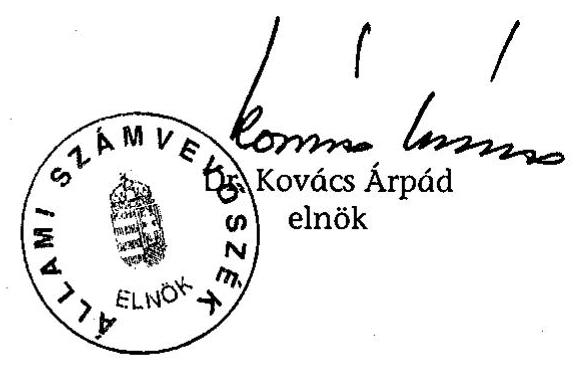

---

# Mellékletek jegyzéke 

1. Jelentéstervezetre tett észrevételek és az arra adott válaszunk
2. Az ÁPV Rt. szervezeti felépítése (2003. január 1-jétől hatályos)
3. A 2003. évi költségvetési előirányzatok és az ÁPV Rt. üzleti terve
4. Követelésállomány
5. Tranzakciós költségek
6. Az APV Rt. működő társaságainak és vállalatainak 2003. évi változásai
7. A működő társaságok gazdálkodása és a kisebbségi tulajdonú társaságok értékesítése
8. A Forrás Rt.-be apportált részesedések
9. Az erdészeti társaságok környezetvédelmi támogatásának teljesítményellenőrzése
10. Tanúsítványok

---

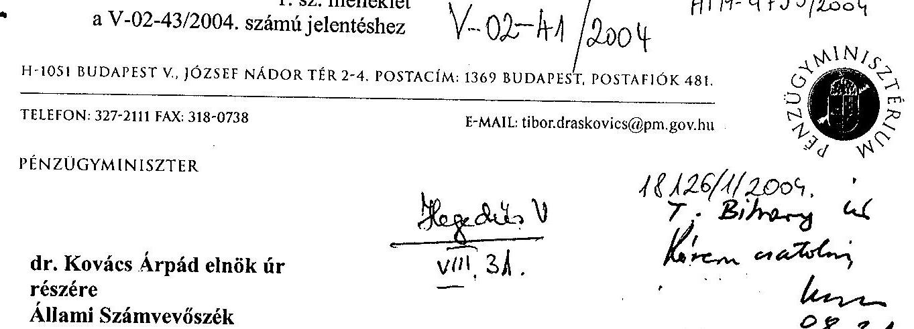

Tisztelt Elnök úr!

Az Állami Privatizációs és Vagyonkezelő Rt. 2003. évi működésének és a központi költségvetés végrehajtásához kapcsolódó tevékenységének ellenőrzéséről szóló Jelentés tervezetéhez az alábbi észrevételeket teszem.
A tervezet a korábbi változatokhoz képest jelentősen változott, részben az ÁPV Rt. és a PM által tett észrevételeknek köszönhetően. A jelenlegi változat ajánlásai összességében elfogadhatók, azonban az értékelő részekben néhány szakszerűtlen és pontatlan, egyes esetekben negatív előítéleteket tükröző megfogalmazás található.

# 1. A hatásköröket érintő megállapítások 

1. A Hajógyári Sziget Vagyonkezelő Kft. privatizációs tranzakciójával kapcsolatban a Jelentés tervezete azt kifogásolja, hogy a társaság tulajdonát képező területen álló Hadrianus Palotával kapcsolatban az ÁPV Rt. figyelmen kívül hagyta a kulturális örökség védelméről szóló 2001. évi LXIV. törvény rendelkezéseit (29. old.).
Fontos felhívni a figyelmet arra, hogy egyrészt a vonatkozó törvény a műemlék épületek állami tulajdonba történő megszerzését a Kulturális Örökségvédelmi Hivatal számára írja elő, másrészt az ÁPV Rt. számára az Áht. kifejezetten tiltja (!) az ilyen ingatlan megvásárlását. Az idézett törvény rendelkezéseinek végrehajthatósága érdekében az ÁPV Rt. -- a privatizáció során - öt éves vagyonértékelésen alapuló opciós vételi lehetőséget biztosított a KVI számára az ingatlan megvásárlására.
2. A Jelentés tervezete megállapítja, hogy a pénzügyminiszter nem intézkedett az MVM Rt. 2001. évi osztalékának elvonásáról (56. old.).
A hiányolt intézkedés végrehajtására a pénzügyminiszter nem rendelkezik hatáskörrel, tekintettel arra, hogy a társaság felett a tulajdonosi jogokat az ÁPV Rt. gyakorolja. A hatáskörrel rendelkező ÁPV Rt. üzleti megfontolásból adott haladékot a társaságnak az osztalék befizetésére - több részletben - 2003. decemberéig. A társaság 2004. januárban az osztalékot befizette.

---

# II. Az egyes tranzakciók végrehajtására vonatkozó megállapítások - kiemelve a Postabank Rt. értékesítésére vonatkozó megállapításokat 

1. A Jelentés tervezete megkérdőjelezi az ÁPV Rt. által készített vagyonértékelések szakszerűségét és „piaci értékítéletét" azzal az indokkal, hogy az értékesítésre felajánlott vagyon egyes esetekben a vagyonértékelés során megállapított érték alatt, más esetekben e felett kelt el (9. oldal).
Téves az az elképzelés, mely szerint a vagyonértékelés alapján kialakuló értéknek és a majdani tényleges értékesítési árnak egyeznie kell. Maga a vagyonértékelés statikus jellegű, alapvetően az eszközök, vagyontárgyak adott pillanatban becsült értékének megállapítására irányul, míg egy értékesítési eljárásban kialakuló vételár azt tükrözi, hogy a vevő, a jövőbeni megtérülés szempontjából, az adott pillanatban, mennyit hajlandó az adott vagyontárgy megszerzésére áldozni.
2. A Jelentés állítása szerint a Postabank Rt. privatizációs szakértőjének, aki egyben az értékesítési ár meghatározására is javaslatot tett, feladata volt a vevőjelölt állítása is. E kettős szerepkörből következően megkérdőjelezhető a sikerdíj megállapítása és kifizetése az értékesítés bevétele alapján (9. oldal).
A megállapítással kapcsolatban az alábbiakra szeretném felhívni a figyelmet:

- A Postabank Rt. nem rendelkezett privatizációs szakértővel. A folyamatban privatizációs tanácsadó alkalmazására került sor, akit az ÁPV Rt. bízott meg bizonyos szakmai feladatok ellátásával. A Postabank Rt., illetve annak részvényei az adásvétel tárgyát képezték, melynek tulajdonosi jogait a Magyar Posta Rt. gyakorolta, s aki az ÁPV Rt-t bízta meg az értékesítés lebonyolításával.
- A privatizációs tanácsadó nem tett javaslatot az értékesítési árra, hanem azt mérte fel (az eladó, vagyis a megbízója számára!), hogy mennyit érhet meg egy hipotetikus vevő számára az adott részvénycsomag (árindikáció). Az árazást a befektetők végezték (saját tanácsadóik segítségével!), akik elsősorban a Postabank Rt. számukra értelmezett üzleti értékét vették alapul.
- A privatizációs tanácsadó vevőjelölt állítási feladata valamilyen félreértésen alapulhat. A vevők maguk jelentkeztek, maguk döntöttek a pályázaton való részvételükről. A tanácsadó nyilvánvalóan mindent megtett annak érdekében, hogy nagy és állandó legyen az érdeklődés, ennek következtében pedig a verseny az értékesítésre felajánlott részvényekért.
- A fentiek alapján nem értelmezhető tehát a tanácsadó „kettős szerepköré", mivel a Jelentés tervezetében felvázoltak egyike sem tartozott a tanácsadó feladatai közé. Azt pedig nyilván nem lehet kifogásolni, hogy a tanácsadó a folyamatos és intenzív érdeklődés fenntartására törekedett, hogy az így kialakuló erős verseny minél nagyobb bevételt eredményezzen az eladó, azaz megbízója számára. Éppen ezért nem hogy kifogásolható, hanem éppen helyénvaló a realizált bevétellel arányos sikerdíj megállapítása, azaz a megbízó és a megbízott érdekeinek összehangolása.

3. A Jelentés tervezetében szereplő állítás szerint a tanácsadóknak fizetett tanácsadói, versenyeztetési és sikerdíjak csökkentették a privatizáció tényleges bevételét, miközben nem számszerűsíthető a tanácsadó közreműködésének konkrét eredménye (22. oldal).

---

A privatizáció tényleges bevétele annyi, amennyi: kerekítve 101,3 milliárd forint, bár a Jelentés tervezete nem tér ki arra, hogy „bevétel"-ként mely szervezet bevételéről szól. Tény, hogy a bevétellel szemben (minden érintett szereplőnél) állnak költségek, ráfordítások, amelyek között a tanácsadói és egyéb díjak is szerepelnek. Ezzel együtt az értékesítésből származó bevétel és az ezzel összefüggő ráfordítások külön számviteli fogalmak, külön tartalommal és az elszámolásukra vonatkozó külön szabályokkal.
A befektetési tanácsadói szolgáltatás (ugyanúgy, mint a menedzsment, a tulajdonosi jogok gyakorlója, vagy akár a tárgykörben számos határozatot hozó Kormány) közvetlen és közvetett hozzájárulásának értéke maradéktalan pontossággal nem határozható meg. Ez azonban az élet minden területén, minden egyes szolgáltatás esetében felróható lenne. Ha csak és kizárólag a Jelentés tervezetében foglalt megállapításokból indulunk ki, akkor a hipotetikus vevő szempontjából becsült üzleti érték (ld. korábban) és a tényleges eladási
 ár közötti különbséget lehetne a tanácsadó által hozzáadott értékként kezelni. Ebben az esetben pedig az egy egységnyi ráfordítás eredményeként elért többlet-bevétel, mint mutató, kifejezetten kiemelkedő. Itt szükséges megjegyezni még - a tényszerűség kedvéért - hogy a privatizációs tanácsadó pályázat keretében került kiválasztásra, többek között azért, mert az általa beadott pályázat a sikerdíj mértékére (egyéb, az előzetesen meghatározott értékelési kritériumok mellett) a legalacsonyabb ajánlatot tartalmazta. E sikerdíj mértéke egyébként (mind önmagában, mind az ehhez hozzászámított költségtérítésel együttesen) nemzetközi összehasonlításban is igen alacsonynak tekinthető; alatta marad mind a nemzetközi, mind a hazai gyakorlatban alkalmazott mértékeknek.
4. A Jelentés tervezete kifogásolja az ÁPV Rt. körültekintését és gondosságát a tanácsadó megbízása során, valamint kifogásolja az Interauditor Kft. és a Concorde Rt. feladatai közötti átfedést. Ezzel egyidejűleg megkérdőjelezi a vagyonértékelés függetlenségét (22. oldal).
A Jelentés egészén végigvonul az a tévedés, amely nem tesz különbséget a vagyonértékelésre vonatkozó megbízás végterméke, a vagyonértékelés, valamint az értékesítési tanácsadó által (az eladó számára!) kalkulált üzleti érték meghatározása közötti. Az, hogy a vagyonértékelés, és az üzleti értékelés hasonló eredményre vezetett, még nem jelenti azt, hogy ugyanazon módszertan alapján készült. Mindössze annyit, hogy a bank eszközeinek értékelésével, valamint a jövőbeni jövedelemtermelő képességének, fejlődési lehetőségének értékelésével összegszerűen hasonló eredményt kaptunk.
Fontos hangsúlyozni, hogy a két feladat mind tartalmában, mind módszertanában, mind felelősségi vonatkozásaiban, mind pedig jogszabályi megítélésében jelentősen eltér egymástól.
Kérem, hogy szíveskedjen a fenti észrevételeket tudomásul venni és azok alapján a Jelentés tervezetét átdolgozni.

Budapest, 2004. augusztus 31.;
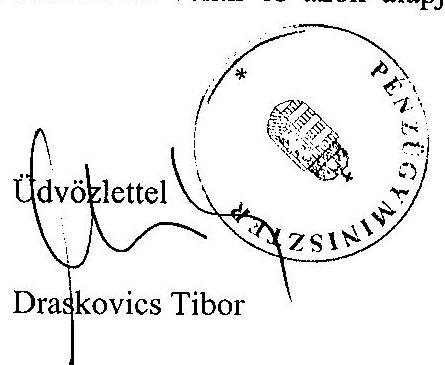

---

# Dr. Draskovics Tibor úr 

miniszter
Pénzügyminisztérium

## Budapest

## Tisztelt Miniszter Úr!

Megköszönöm az Állami Privatizációs és Vagyonkezelő Rt. 2003. évi működésének és a központi költségvetés végrehajtásához kapcsolódó tevékenységének ellenőrzéséről készített jelentésre soron kívül adott észrevételeit, és azokkal kapcsolatban - levele sorrendjében - a következőkről tájékoztatom.

Mindenek előtt szeretném jelezni, hogy a szokásosnál többször egyeztettük a tervezeteket az ÁPV Rt.-vel, és ennek következtében azokat - anélkül, hogy a tényszerű megállapításokat módosítanunk kellett volna - pontosítottuk, kiegészítettük, annak érdekében, hogy felesleges vitákkal ne terheljük az Országgyűlést és a közvéleményt. Sajnálattal állapítom azonban meg, hogy erőfeszítéseink részben hiábavalónak bizonyultak, nevezetesen Miniszter Úr több kérdésben lényegében kritika nélkül magáévá tette az ÁPV Rt.-nek a megelőző egyeztetés során bizonyítottan megalapozatlan észrevételeit. A PM helyettes államtitkárral pedig nem maradt véleménykülönbségünk. Mindez kiderül a Miniszter úr által észrevételezett jelentés 1.sz. mellékletéből.
I. A hatásköröket érintő megállapítások:

1. További érvelés helyett mellékelem Hiller István miniszter úrnak a 2003. október 6-i levelét, valamint Kamarás Miklós vezérigazgató úr 2003. október 14-i válaszát. Ez utóbbival kapcsolatban szeretném felhívni Miniszter úr szíves figyelmét, hogy Vezérigazgató úr érdemben nem reagált Miniszter úr álláspontjára, miközben a felvázolt megoldást a műemlék védelem megvalósítása szempontjából az ellenőrzés nagy kockázatúnak minősítette.
2. Az Állami Privatizációs és Vagyonkezelő Rt. 2002. évi működésének és a központi költségvetés végrehajtásához kapcsolódó tevékenységének ellenőrzéséről szóló J/4940 számú jelentésünkben arról adtunk számot, hogy az MVM Rt. nem tett eleget osztalék-befizetési kötelezettségének. Az ÁPV Rt. - törvénysértő módon - a 2002. szeptemberi osztalék-befizetési határidőt először 2003. júniusára, majd decemberére módosította. Továbbá megsértették a számviteli törvényt, mivel az osztalék megfizetésének kétségessége miatt 100%-os értékvesztést számoltak el az ÁPV Rt. 2002. évi beszámolójában. Ezért javasoltuk a pénzügyminiszternek, hogy mint a részvényesi jogok gyakorlója intézkedjen az MVM Rt.-től származó osztalékelvonás teljesítésének kikényszerítéséről. Javaslatunkat a Pénzügyminisztérium tudomásul vette. Ennek ellenére 2003. december 31-ig nem történt meg az osztalék-befizetés, ezért kényszerültünk annak tényszerű rögzítésére, hogy a pénzügyminiszter a szükséges intézkedéseket nem tette meg.

Álláspontunk szerint a tények ismeretében a hatályos jogszabályok alapján a pénzügyminiszter, mint a részvényesi jogok gyakorlója, valamint az ÁPV Rt. felügyeletét ellátó miniszter nem háríthatja el ilyen, és hasonló esetekben az intézkedési kötelezettségét.
II. Az egyes tranzakciók végrehajtására vonatkozó megállapítások:

1. A vagyonértékelések szakszerűségét és piaci értékítéletét megkérdőjelező összegző megállapításunkat (9. oldal 5. bekezdés), a 22. és 23. oldalon részletezett tények alapozzák meg. Ezek közül két körülményre szeretném Miniszter úr figyelmét felhívni: a Postabank Rt.-t közel dupla áron értékesítették a vagyonértékelésben, illetve az árindikációban meghatározott értékhez képest; a Hajógyári Sziget Vagyonkezelő Kft. üzletrészt az első vagyonértékelés közel feléért privatizálták (a két vagyonértékelésre hat hónapon belül került sor).
2. Az fel sem merült az ellenőrzés részéről, hogy a Postabank Rt.-nek privatizációs szakértővel kellett volna rendelkeznie. A Magyar Posta Rt. - amint erre a Miniszter Úr is utal levelében - az ÁPV Rt.-t bízta meg a Bank értékesítésének lebonyolításával, aki ezt a feladatot továbbadta a privatizációs tanácsadójának, vagy szakértőjének. A tanácsadó újabb tanácsadókat vont be az értékesítés előkészítésének és lebonyolításának folyamatába. Így teljes értékesítési láncolat alakult ki, annak ellenére, hogy az ÁPV Rt. fő feladata a jelentős privatizációs tranzakciók lebonyolítása. Ehhez rendelkezik a megfelelő apparátussal. Az egyéb kisebb horderejű privatizációkat is külső szakértők bevonásával bonyolította le, ezért elvárható volt, hogy saját erejét a legnagyobb feladatra koncentrálja.

Miniszter úr ismeretétől eltérően feladata volt a privatizációs tanácsadónk a vevőjelölt állítása is, ami a megkötött szerződés 5.1.1 pontjában szerepel: „Amennyiben az ÁPV Rt. jelen szerződés időbeni hatálya alatt vagy annak aláírásától számított tizenkét hónapon belül bármilyen harmadik féllel -amely részt vett a Pénzügyi Tanácsadó által folytatott eladásban vagy a Pénzügyi Tanácsadó mutatta be - kötelező érvényű megállapodást ír alá a Társaságban meglévő érdekeltségének részleges vagy teljes eladásáról, a Pénzügyi Tanácsadót az ÁPV Rt. részéről sikerdíj illeti meg....". Megállapításunkat alátámasztja Kamarás Miklós vezérigazgató úr jelentés-tervezetünkre adott válaszának következő része is: „Megítélésünk szerint a vételár nagysága kifejezetten összefügg a tanácsadó működésével, hiszen az is feladata volt, hogy közreműködjön pl. a vevőállításban". A tanácsadó „kettős szerepköré" tehát kétségtelen tény.
3. Az számunkra is természetes, hogy a privatizációnak vannak költségei. Az előzőekben leírtak alapján azonban a konkrét esetben a költségek nem voltak megfelelően feladatoldalról alátámasztva. Ezen kifogásolt gyakorlat megszüntetése érdekében is

---

fogalmaztuk meg a Miniszter úrnak címzett 1. számú javaslatunkat. Erre, valamint az előző pontban leírtakra is figyelemmel a sikerdij mértéke nem tekinthető megalapozottnak.
4. Amint a jelentésünkből kiderül a tanácsadók tevékenységében nemcsak a vagyonértékelés és az árindikáció kapcsán fordultak elő átfedések, hanem a betétállomány összetételének és szerkezetének elemzésénél, valamint a Postabank és Magyar Posta Rt. kapcsolatrendszerének átvilágításánál is.

Kérem Miniszter urat, hogy a levelemben foglaltakat elfogadni, illetve tudomásul venni szíveskedjék.

Tájékoztatásul megemlítem, hogy a kialakult gyakorlatunknak megfelelően a továbbiakban a jelentés mellékletét képezi az észrevételeit tartalmazó levelének és az arra adott válaszomnak a másolata.

Budapest, 2004. augusztus 31.

Melléklet: 2 db
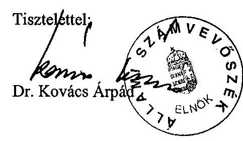

---

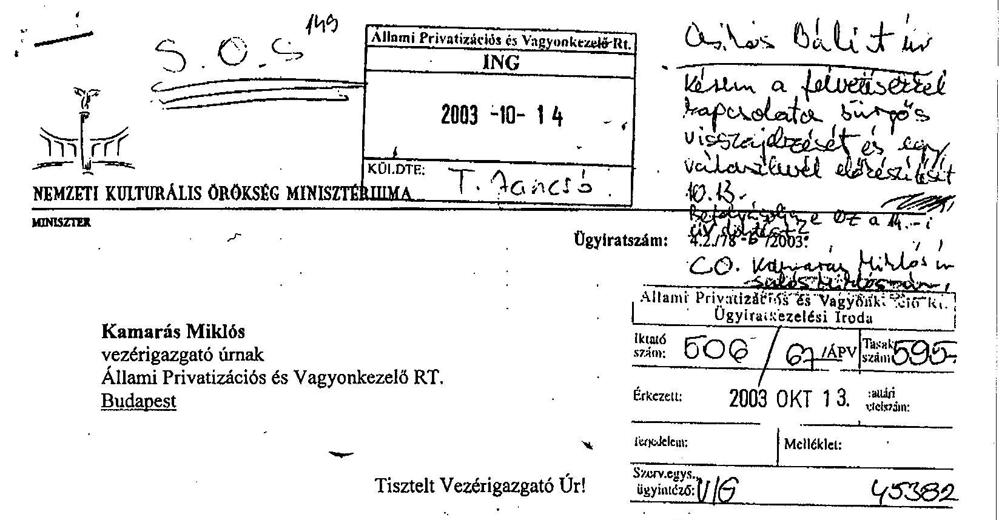

Az ÁPV Rt. tulajdonában lévő, a Hajógyári Sziget Vagyonkezelő Kft-ben birtokolt üzletrész tervezett privatizációja tárgyában fordulok Önhöz.

Tárcánk nemrégiben értesült arról, hogy az ÁPV Rt. pályázati felhívást tett közzé a HSZV Kft. tulajdonában lévő üzletrészének privatizációjára, amely a döntően, de közvetett módon állami tulajdonban lévő ingatlanok magánkézbe adását jelenti. Mint Ön is tudja, ez érinti az aquincumi helytartó palotájának romjait rejtő 18386/4 hrsz-ú, korábban a műemlékvédelemről szóló 1997. évi LIV. törvény, jelenleg a kulturális örökség védelméről szóló 2001. évi LXIV. törvény (a továbbiakban Kövt.) mellékletében szereplő kiemelt műemléki ingatlant is.

Tárcánk sajnálattal észlelte, hogy az ÁPV Rt. e területre irányuló privatizációs szándékát előzetesen nem egyeztette a minisztériummal, és a tárcát nem értesítette a privatizációs pályázati felhívás közzétételéről sem, holott e szándék a tárcát, mint a kulturális örökség, így a műemlékek védelméért felelős intézményt, alapvetően érinti. Amennyiben a privatizáció sikerrel jár, annak következtében a jelenleg, ha közvetetten is, de döntően többségi állami tulajdonban lévő kiemelt műemléki ingatlan tulajdoni helyzete alapvetően megváltozhat, mivel fennáll a veszélye annak, hogy a többségi állami tulajdonos helyett magánkézbe kerül.

A későbbi konfliktusok megelőzése érdekében már most szeretném Önnek jelezni, hogy a kiemelt műemlék tulajdonjogának magánkézbe kerüléséhez tárcánk a hatályos törvényi szabályozás alapján nem járulhat hozzá. A Kövt. 44. § (1) bekezdésében foglaltak szerint műemlék bármely jogcímen való átruházásához, megterheléséhez, a vagyonkezelő kijelöléséhez vagy megváltoztatásához, illetve bármely jogügylethez, amelynek következtében az állam tulajdonjoga megszűnik a műemlék felett, a miniszter jóváhagyása szükséges, ha a műemlék az állam tulajdonában van. Tekintettel arra, hogy a HSZV Kftben az ÁPV Rt. a privatizációs felhívás szerint 66,7%-os tulajdonrészt birtokol, a kiemelt műemléki ingatlan is ilyen arányban képez állami tulajdont, így annak megszűnéséhez a

---

miniszter jóváhagyása szükséges. Tekintettel arra, hogy a Kövt. 33. §-a szerint a törvény mellékletében szereplő műemlékeket, illetve műemlék-együtteseket kizárólagos állami tulajdonban kell tartani, illetve, amennyiben tulajdonjoguk nem az állam javára van bejegyezve, a tulajdonjogot az állam javára meg kell szerezni, az ingatlan privatizációjához semmiképpen nem járulhatunk hozzá.

E tárgyban utalni szeretnék az ÁPV Rt. korábbi elnök-vezérigazgatója, Gansperger Gyula által 2000. decemberében (160/42/APV/2000 iktatószámon) miniszter úrnak írott levélre, amelyben a HSZV Kft. üzletrészének tervezett privatizációjához kérte tárcánk állásfoglalását. Tárcánk válaszában a kiemelt műemléki ingatlanra vonatkozó, ma is hatályos törvényi előírásra tekintettel elutasította a privatizációt, ahogy most sem támogathatjuk annak megvalósulását.

A kiemelt műemléki ingatlan állami tulajdonba történő térítésmentes átadását az 1996. évi CXXIV. törvény 9. §-a is előírta, amely szerint „Az ÁPV Rt. 1997. december 31-ig pénzbeli térítés nélkül adja át a KVI-nek a saját, illetve a hozzárendelt vagyonába tartozó,... valamint külön törvény szerint az állam tulajdonából ki nem adható műemléki ingatlanokat."

Az ÁPV Rt. által a privatizációba bevonni szándékozott további ingatlanokkal kapcsolatban fel szeretném hívni szíves figyelmét arra, hogy az érintett terület teljes egészében műemléki illetve régészeti védettség alatt áll, ami a leendő tulajdonosok számára jelentős korlátozásokat jelent. Javaslom, hogy amennyiben eddig még nem történt meg, az ÁPV Rt. egyeztessen a kulturális örökségvédelem hatósági feladatait ellátó Kulturális Örökségvédelmi Hivatallal, a védetté nyilvánított régészeti lelőhelyekre és műemlékekre ugyanis a használatukat és kezelésüket jelentősen befolyásoló előírások vonatkoznak.

Kérem, hogy a törvényi előírások megtartása érdekében szíveskedjék a levelemben foglaltaknak megfelelően eljárni.

Budapest, 2003. október 6.
Tisztelettel:
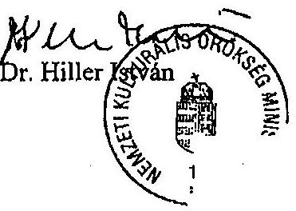

---

# Állami Privatizációs és Vagyonkezelő Rt. Hungarian Privatization and State Holding Company

## Vezérigazgató

dr. Hiller István
miniszter

Nemzeti Kultúrális Örökség Minisztériuma
H-1077 Budapest
Wesselényi u. 20-22.

Tel: 350-2808, 359-0547
Fax: 349-4368
Isz:
Úi: dr. Jancsó Antal

Budapest, 2003. október 14.

## Tárgy: A Hajógyári Sziget Vagyonkezelő Kft. üzletrészének privatizációja

Tisztelt Miniszter Úr!

A Hajógyári Sziget Vagyonkezelő Kft. (HSZV Kft.) üzletrészének privatizációja tárgyában írott levelében foglaltakra válaszolva az alábbiakról tájékoztatom.

A privatizációról meghozott döntést megelőzően az ÁPV Rt. részletesen megvizsgálta mindazokat a problémákat, melyekre Ön levelében felhívta az ÁPV Rt. figyelmét. Az előkészítés során az ÁPV Rt. többször folytatott egyeztetést a Kulturális Örökségvédelmi Hivatallal és a Pénzügyminisztérium kincstári vagyonért felelős vezetőivel,
 valamint a Kincstári Vagyoni Igazgatóság képviselőivel. Hosszas viták eredményeként alakult ki az a - Kulturális Örökség védelméről szóló tv, az Ált. és a Privatizációs tv. előírásait is figyelembe vevő - megoldás, mely alapján az állami tulajdonú üzletrész privatizációját megelőzően aláírásra került egy opciós szerződés a HSZV Kft. és a KVI között. Ez a szerződés megteremtette a lehetőségét annak, hogy a Magyar Állam 5 évre rögzített áron egyoldalú nyilatkozattal megvásárolhassa a kizárólagos állami tulajdon tárgyai közé sorolt ingatlant a tulajdonos HSZV Kft.-től. Levelünkhöz mellékeljük az e tárgyban folytatott levelezést.

Egyúttal ezúton meghívom az ÁPV Rt. Igazgatóságának 2003. október 16-i ülésére, melyen a HSZV Kft. privatizációs pályázatának elbírálásáról fog dönteni az Igazgatóság.

Üdvözlettel:

Kamarás Miklós
vezérigazgató

Állami:
Mazel
os X. 14. 1322

H 1111 BUDAPEST, PÖZSÖNYI ÚT 50. TEL. :30 1: 237 4400. FAX :30 1: 237 4109
E H-1100 BUDAPEST, PL 708 - INTERNET, WWW.APVRT.HU

---

AEF: 944/04 Yeredes V

1. sz. melléklet a V-02-43/2004. számú jelentéshez

ÁLLAMI PRIVATIZÁCIÓS ÉS VAGYONKEZELŐ RT.

HUNGARIAN PRIVATIZATION AND STATE HOLDING COMPANY

VEZÉRIGAZGATÓ

36802/2004

Bihary Zsigmond
főigazgató

Állami Számvevőszék

H-1051 Budapest
Apáczai Csere János u. 10

ÁLLAMI SZÁMVEVŐSZÉK
ÖGYVITELI IRODA

ÁT M-1036/04
2004 08 23

Tel: 350-2808, 359-0547
Fax: 349-4368

18.11.19. /ÁPV/2004.

Budapest, 2004. augusztus 19.

Tárgy: Az ÁPV Rt. 2003. évi működésének vizsgálatáról készült ÁSZ jelentés
véleményezése

Tisztelt Főigazgató Úr!

Az alábbiakban összefoglaltuk az ÁPV Rt. menedzsmentjének észrevételeit az ÁPV
Rt. 2003. évi működésének és a központi költségvetés végrehajtásához kapcsolódó
tevékenységének ellenőrzéséről szóló V-02-24/2004. Témaszám: 694 ÁSZ jelentés
tervezetére.

A Jelentés készítésével kapcsolatban előzetesen megjegyezzük, hogy az ÁSZ 2003.
évi jelentésének jelen, 4. változata korábbi észrevételeink, pontosításaink jelentős
részét figyelembe vette.

Az észrevételeket témák szerint csoportosítottuk, jelzést téve, hogy az anyag mely
részében található tárgyalásuk.

A Jelentéshez adott észrevételek

A Postabank Rt. eladásához kapcsolódóan

I. Összegző megállapítások, következtetések, javaslatok és a
2.1.2.1. A kereskedelmi bankok privatizációja

11-1133 BUDAPEST. PÖZSÖNYI ÚT 56
60 H-1399 BUDAPEST. PF. 708

TEL.: (36 1) 237-4400. FAX: (36 1) 237-4100
INTERNET: WWW.APVRT.HU

---

# 9. oldal és 20-21. oldal 

A privatizációs tanácsadó feladatai között nem szerepelt az értékesítési ár meghatározása és a tanácsadó nem is tett javaslatot az értékesítési ár meghatározására. Ebből következően a sikerdíj megállapításának és kifizetésének megkérdőjelezésével nem értünk egyet, a tanácsadónak nem volt kettős szerepkör. Az ÁPV Rt. nem bízta meg a privatizációs tanácsadót vagyonértékelésre, nem is adott vagyonértékelést a tanácsadó, az ÁPV Rt. nem fogadott el vagyonértékelést a privatizációs tanácsadótól.
Nem készült két vagyonértékelés, illetve vagyonértékelést csak az ezzel megbízott Interauditor Kft. készített.

A Jelentés nem támasztja alá azon megállapítását, mely szerint hiányzott a megfelelő gondosság a vagyonértékelő megbízásánál. Az ÁPV Rt. a hazai és nemzetközi gyakorlatban is elismert módszerrel bonyolította le a teljes folyamatot, beleértve a közreműködők kiválasztását.

Az ÁPV Rt. Felügyelő Bizottsága külön megvizsgálta a tranzakció teljes folyamatát és kiemelte annak szakszerűségét.

## A Forrás Rt. értékesítéséhez kapcsolódóan

### 2.1.2.2. A Forrás Rt. privatizációja

## fejezet

## 22-25. oldal

A Cartographia vagyonértékelésével megbízott vagyonértékelő a cégértéket az eszközértékelés és az üzletértékelés eredményének figyelembe vételével 700-800 millió Ft-ban határozta meg. Az átadott dokumentációban foglaltak szerint a vagyonértékelő a társaság piaci értékét, hivatkozva az 50%+1 mértékű tartós állami tulajdonra a cégértéknél alacsonyabb összegűre, 600 millió Ft-ra tette. Tekintettel arra, hogy menetközben a társaság kikerült a tartós körből, az ÁPV Rt. az átadott 90%-os mértékű részvénycsomag apportértékét a diszkont nélkül határozta meg, és a cégértéket a megadott értéksáv alsó határa alapján, 630 millió Ft-os összegben szabta meg.

## A Hajógyári Sziget Vagyonkezelő Kft. értékesítéséhez és a múemlék romhoz kapcsolódóan

I. Összegző megállapítások, következtetések, javaslatok és a
2.1.2.3. A Hajógyári Sziget Vagyonkezelő Kft. privatizációja
fejezetek
9-10. oldal és 25-26. oldal

---

A Hajógyári Sziget Vagyonkezelő Kft. privatizációs tranzakciójáról az összegző megállapítások körében az I. fejezet (9. oldal) továbbra is azt tartalmazza, hogy az ÁPV Rt. „a műemlékingatlant tartalmazó üzletrészt magánkézbe adta, miközben a műemlék állami tulajdonba kerülését jövőbeni határidős intézkedések végrehajtásától tette függővé."

Az ÁPV Rt. a Hajógyári Sziget Vagyonkezelő Kft. privatizációja során a Hadriánus palota rom-műemléknek helyt adó ingatlant nem adta magánkézbe, még ideiglenesen sem, az ingatlan tulajdoni helyzete az értékesítés során változatlan maradt. A „műemlék ingatlant tartalmazó üzletrész" megfogalmazás nem helytálló, az üzletrész a társaság tagjainak tulajdonosi jogait testesíti meg, és nem a társaság egyes vagyoni elemeit tartalmazza. Az ingatlan a privatizáció előtt, és a privatizáció után is társasági tulajdonban volt, illetve maradt.

A jelentés szövege - bár a megállapítás finomodott - továbbra is azt a látszatot kelti, mintha az ÁPV Rt. kötelezettsége lett volna az érintett műemlék megszerzése, továbbá az elővásárlási jog biztosításával a műemlék ingatlan megszerzésére feljogosított szerv bármilyen joga sérült volna. Az alkalmazott privatizációs megoldás ezzel szemben azt szolgálta, hogy egy többletlehetőséget biztosítson az ingatlan megszerzésére anélkül, hogy akár a Kulturális Örökségvédelmi Hivatal, akár a Kincstári Vagyoni Igazgatóság jogszabályok által biztosított intézkedési lehetőségei csorbulnának.

A kulturális örökség védelméről szóló 2001. évi LXIV. törvény azon fordulata, miszerint az érintett ingatlanokat „állami tulajdonban kell tartani" nem volt alkalmazható, kizárólag a második fordulat figyelembe vétele merülhetett fel, azaz az ingatlan állam javára történő megszerzése. A hivatkozott törvény 33. §-a alapján fennálló, meghatározott ingatlanok állam javára történő megszerzésének kötelezettsége - a hatályos jogszabályoknak és az államháztartásról szóló 1992. évi XXXVIII. törvény 109/B. §-a d) 1. pontjának megfelelően - nem az ÁPV Rt., hanem a Kulturális Örökségvédelmi Hivatal, illetve a Kincstári Vagyoni Igazgatóság feladatkörébe tartozik. Az ÁPV Rt. a privatizáció során alkalmazott konstrukcióval az előzőekben megnevezett, törvényi kötelezettség teljesítésére feljogosított szerv tulajdonszerzését tette lehetővé és segítette elő. A tranzakció során az ÁPV Rt. a jogszabályoknak megfelelően járt el, mulasztás nem terheli. Az ÁPV Rt. feladatkörében eljárva - a kulturális örökség védelméről szóló 2001. évi LXIV. törvény 33. §-a alapján nem volt jogosult, illetve köteles az ingatlan megszerzésére, tulajdonszerzése ugyanis az ingatlannak nem a kincstári vagyoni körbe, hanem az állam vállalkozói vagyoni körébe kerülését eredményezte volna.

A jelentés mostani változatában már hangsúlyozott szerepet kap az is, hogy az opciós szerződésben kikötött vételárat, illetve az elkészült vagyonértékeléseket is megalapozatlannak tartja az ÁSZ. A jelentés pénzügyminiszter részére megfogalmazott 2. számú javaslata is arra utal, hogy az ingatlan visszavásárlására kikötött ár nem reális, ezért annak megvizsgálása szükséges. Megállapítható, hogy az ÁSZ jelentés ezen ügyet bemutató részletes és összegző megállapításai (azaz az I. és a II. fejezet) között nincs összhang.

---

A Hadriánus palota romját takaró műemléki ingatlan törvényi előírás szerinti állami tulajdonba vétele nem az ÁPV Rt. feladata, ilyen feladatot az ÁPV Rt. részére semmilyen jogszabály nem ír elő. Az ÁPV Rt. nem rendelkezik sem hatáskörrel, sem a műemlékvédelem speciális eszközeivel a feladat végrehajtására. (A kulturális örökség védelméről szóló 2001. évi LXIV. törvény mellékletében szerepel a HSZV Kft. tulajdonában álló Budapest, III. 18386/4 hrsz. alatti, természetben a 1033. Budapest, Hajógyári-szigeten lévő, 7 ha $4676 \mathrm{~m}^{2}$ alapterületű, ún. Hadrianus palota ingatlan. A vonatkozó törvény 33. §-a szerint a mellékletben szereplő ingatlanokat kizárólagos állami tulajdonban kell tartani, illetve amennyiben az érintett ingatlan tulajdonjoga nem az államé, úgy azt az állam javára meg kell szerezni. A feladatot a törvény a KÖH hatáskörébe sorolja. A törvényi cél megvalósítása érdekében a KÖH megvásárolhatja /vételi ajánlatot tehet/, élhet az elővásárlási jogával, kártalanítás mellett kisajátíthatja az ingatlant.)
Mivel ingatlan adásvételre az ÁPV Rt. az Áht. kincstári vagyonra vonatkozó rendelkezései miatt (Áht. 109/B § d)/1. pontja értelmében a kincstári vagyonba tartozik az állami tulajdonban lévő műemlék ingatlan) nem köthetett szerződést, mert az erre vonatkozó jogügylet törvényellenes (és semmis) lenne, oly módon segítette elő az állami tulajdonszerzést, hogy kezdeményezte a HSZV és a KVI között opciós adásvételi szerződés megkötését, amely ügylet megvalósult.

A „műemlék ingatlant tartalmazó üzletrész" megfogalmazás nem helytálló, az üzletrész a társaság tagjainak tulajdonosi jogait testesíti meg, és nem a társaság egyes vagyoni elemeit tartalmazza. Az ingatlan a privatizáció előtt, és a privatizáció után is társasági tulajdonban volt, illetve maradt.
Az ÁPV Rt. a műemlék állami tulajdonba kerülését nem tette jövőbeni határidős intézkedések végrehajtásától függővé, hanem a kulturális örökség védelméről szóló 2001. évi LXIV. törvény szerint meglévő műemlékvédelmi eszközrendszert a HSZV Kft-ben meglévő tulajdonosi befolyása révén egy további piaci lehetőséggel, a HSZV Kft. és a KVI között létrehozott opciós szerződéssel bővítette. A privatizációs megoldás semmilyen kockázatot a műemlékvédelem szempontjából nem jelent. A jelen privatizációs tranzakciónak, illetve az opciós adásvételi szerződésnek a Kulturális Örökség védelmi Hivatal és a nemzeti kulturális örökségért felelős miniszter részéről történő jóváhagyását nem írja elő jogszabály.

Az eltérő eredménnyel zárult vagyonértékelések alapján a műemlék vagyoningatlan árát megalapozottan nem lehet aránytalanul magasnak minősíteni, tekintettel arra, hogy az opciós adásvételi szerződés megkötését megelőzően készült ingatlan értékbecslés az adott ingatlan piaci forgalmi értékét állapította meg, mely érték az opciós adásvételi szerződésben szereplő értékkel egyező, míg az opciós adásvételi szerződés megkötését követően készült vagyonértékelés az üzletrész piaci forgalmi értékét határozta meg. Egyebekben lehetőség van arra, hogy -abban az esetben, ha felmerül, hogy a piaci forgalmi érték alacsonyabb az opciós árnál- az opciós jog érvényesítése helyett a kisajátítási eljárást folytassák le az arra illetékesek.

A fentieket figyelembe véve ismételten kiemeljük, hogy a hivatkozott törvény rendelkezései a KÖH hatáskörébe sorolja az adott ingatlan állami tulajdonba vételét, annak végrehajtása nem tartozik az ÁPV Rt. hatáskörébe, illetve a törvény semmilyen konkrét feladatot vagy kötelezettséget nem írt elő az ÁPV Rt. számára az üzletrész privatizációjával kapcsolatban.

---

Az ingatlan adásvételére az ÁPV Rt. az Áht. kincstári vagyonra vonatkozó rendelkezései miatt (Áht. 109/B § d)/1. pontja értelmében a kincstári vagyonba tartozik az állami tulajdonban lévő műemlék ingatlan) nem köthetett szerződést, ezért került kidolgozásra a későbbiekben megvalósított javaslat.
Az ÁPV Rt. nem biztosított szerződésben 5 éven belüli visszavásárlási jogot a műemléki romingatlanra a Magyar Állam részére. Az ÁPV Rt. által kezdeményezett taggyűlési határozat alapján a HSZV Kft. biztosított vételi jogot 5 évre a Magyar Állam részére opciós szerződés keretében. Az aránytalanul magas fix árra vonatkozó megállapításával kapcsolatosan lásd a jelen levél 4. oldal 3. bekezdését.

A megállapításban értelmezhetetlen a tételes értékesítési ár, benne az ingatlan árarányára vonatkozó meghatározás akkor, amikor az ÁPV Rt. üzletrész értékesítést hajtott végre. A vagyonértékelések során meghatározott értékek összevetése (üzletrészek, ingatlanok értéke) téves megközelítés. Nem lehet összehasonlítani az üzletrész értékesítést a HSZV Kft. általi ingatlanértékesítés lehetőségét megteremtő opciós ügylettel.
Megjegyezzük, hogy az ÁPV Rt. mintegy 66%-os üzletrészt értékesített, míg a hivatkozott opciós szerződésben egy ingatlan 100%-ára vonatkozó érték szerepel.

A Jelentés fentiekkel kapcsolatos javaslata megítélésünk szerint nem érinti az ÁPV Rt-t.

# A privatizációs költségek tervezéséhez kapcsolódóan 

I. Összegző megállapítások, következtetések, javaslatok fejezethez
10. oldal

Az ÁPV Rt.
 kiadási előirányzatainak meghatározása minden évben így 2003-ban is, a kiadott tervezési körlevélben meghatározott szempontok szerint, az ÁPV Rt. által megadott tételes alátámasztással és indoklással történik. A költségvetési törvény terjedelmi korlátai miatt ezek a részletes indoklások a törvény szövegében, mellékleteiben nem jelennek meg, de a tervezési dokumentumokból az „alátámasztások” lekövethetőek. A ráfordítások tényleges alakulása függvénye annak, hogy az adott évre tervezett privatizációs programot milyen mértékben sikerül megvalósítani. Különösen érvényes ez a sikerdíjas szolgáltatások esetére. A szolgáltatások igénybevétele jellemzően Kbt. szerinti pályáztatással történik, melynek kimenetele szintén jelentős költségmódosító tényező lehet. 2003. évben az ÁPV Rt. igazgatósága által elfogadott módosított terve ezen a soron 2.993 MFt tervszámot tartalmazott, mely 2.816 MFt összegben teljesült.

Az elvont vagyontárgyak utáni kezesi felelősség rendezése ügyében kifogásolt két ügyhöz és az önkormányzati belterületi föld utáni járandóságok rendezése

---

# körében vizsgált ügyhöz, a Pécs Megyei Jogú Város Önkormányzata részére történt kifizetéshez kapcsolódóan 

I. Összegző megállapítások, következtetések, javaslatok és a
2.3.2. A privatizációs tartalék felhasználása
fejezetek
11. oldal és 38-41. oldal

A Szentlőrinci Állami Gazdasággal kapcsolatos perrel összefüggésben a jelentés továbbra is marasztaló megállapítást tartalmaz, bár az ÁPV Rt. észrevételének egyes elemeit átvette. A jelentés 38. oldala utolsó bekezdésének utolsó mondatában továbbra is szerepel az a megállapítás, hogy amikor az ÁPV Rt. jogi képviselője az ÁPV Rt. fellebbezését elutasító végzés elleni jogorvoslati kérelmét előterjesztette, már tudható volt az a tény, hogy a felperesek fellebbezésüket visszavonták. Ez a megállapítás nem helytálló, a felperesek fellebbezésüket ekkor még nem vonták vissza.

Azt az ÁSZ jelentése már elismeri, hogy a felperesek fellebbezése önmagában is alkalmas volt az ítélet jogerőre emelkedésének megakadályozására, de újabb fordulatként azt rója az ÁPV Rt. terhére, hogy „megbizottja a periratok folyamatos figyelemmel kísérésével meggyőződhetett volna” arról, hogy a fellebbezésüket a felperesek időközben visszavonták. Az ÁSZ ezen megállapítása nem életszerű, mert a jogi képviselő azt követően, hogy meggyőződött arról, hogy a jogorvoslati lehetőséggel határidőn belül éltek a felek, a gyakorlat szerint nem ellenőrzi hetente a bíróságon az egyes ügyek iratanyagait, hiszen azokban általában ezt követően a következő, várható esemény a bíróság intézkedése.

A BULAV-val kapcsolatos üggyel összefüggésben a jelentés továbbra is marasztaló megállapításokat tartalmaz, és csak az apró betűvel szedett részekbe emel be bizonyos tényállási elemeket. Az anyagban új elemként jelenik meg az a megállapítás, hogy az előzetesen végrehajthatóvá nyilvánított ítélettel szemben az egyezség több mint 57 millió forintos megtakarítást eredményezett. Ehhez a megállapításhoz füzi a számvevő – mintegy ellensúlyozásként – a következő mondatot, ami számunkra értelmezhetetlen: „Ez a megtakarítás – a másik felperessel folytatott per kimenetele alapján – csökkenti az elsőfokú eljárásban hiányosan benyújtott keresetből adódó mintegy 150 millió Ft-os többletkötelezettséget.” Az ÁPV Rt. e perben ugyanis alperes volt, keresetlevelet nem nyújtott be.

A következő bekezdésben továbbra is azt az ÁPV Rt.-re sérelmes megállapítást teszi a jelentés, hogy az ÁPV Rt. a külső jogi képviseleteknél nem minden esetben tudja kontrollálni az érdekképviseletét. Ezt a következtetést annak ellenére vonja le, hogy az apró betűs részben megjeleníti azt a korábbi álláspontunkat, hogy az eljárt ügyvédi iroda más ügyek kapcsán jelentős sikereket ért el.

A Pécs Megyei Jogú Város Önkormányzata ügyével kapcsolatosan álláspontunkat ismételten, részletesen rögzítjük, és a leghatározottabban visszautasítjuk a

---

számvevői marasztaló megállapításokat és a jogi érvelésünk helytállóságát kétségbevonó jelentésbeli megjegyzéseket.

A jelentés I. fejezetében, a 11. oldal első bekezdésében és a II. fejezetben a 39. oldal utolsó bekezdésétől elemzi az ügyet. Többszöri észrevételünk ellenére a jelentés továbbra is azt állapítja meg, hogy az Önkormányzat részére kifizetett összeg fölöslegesen került teljesítésre, mert arra az ÁPV Rt. peres eljárással nem lett volna kényszeríthető.

A számvevői anyag megállapításai azon kérdés körül koncentrálódnak, hogy az ÁPV Rt. és az Önkormányzat között 1996. januárjában kötött megállapodás érvényes volt-e. Tekintettel arra, hogy az Önkormányzat által indított perben 2001. június 11-én született ítélet szerint a bíróság a kérdéses megállapodást érvényesnek tartotta, a számvevői anyag ezt akként értékeli, hogy a kamatok tekintetében az Önkormányzatnak – minthogy az ÁPV Rt. a megállapodásban foglalt kötelezettségeit teljesítette – további igénye nem lehet, illetve azt bíróság előtt nem érvényesítheti.

Le kell szögezni azonban, hogy az ügyben a fő kérdés nem a megállapodás érvényességének kérdése. Az önkormányzatok több hasonló ügyben több jogcímen kísérelték meg a bíróságok előtt a megállapodások érvénytelenségének megállapítását, azonban ezeknek a követeléseknek a bíróságok nem adtak helyt. (A megállapodás érvényessége tehát sem ebben a konkrét esetben, sem a többi hasonló megállapodás kapcsán nem képezi vita tárgyát az ÁPV Rt. és az önkormányzatok között.) Ugyanakkor 2/2002. PJE számú jogegységi határozatában megállapította a Legfelsőbb Bíróság, hogy az ÁPV Rt. nem szerződésszerű teljesítése miatt a megállapodásokban az önkormányzatok részéről tett joglemondó nyilatkozatok nem léptek hatályba. Ennek értelmében tehát az önkormányzatok további igénnyel léphettek fel, amely tény a megállapodások érvényességét nem érintette. (Ezen jogegységi határozat, valamint az ennek meghozatalát követően kialakult ítélkezési gyakorlat szolgált alapjául a 466/2002.(X.31.) IG számú határozatnak.)

Téves az a 41. oldal 1. bekezdés 4. sorában található megállapítás, mely szerint a 2001. október 10-én meghozott ítélet 7. oldalán az eljáró bíróság megállapította, hogy a megállapodás „teljes egészében érvényes”. Az ítélet a megállapodásra vonatkozóan annyit rögzít, hogy az nem érvénytelen és nem is semmis. Az önkormányzat a kérdéses perben nem érvényesített tőkésített kamatkövetelés iránt igényt, nem hivatkozott külön a joglemondó nyilatkozat hatálytalanságára, így ezt a kérdést a bíróság nem is vizsgálhatta. Azt is meg kell jegyezni, hogy az ítélet meghozatalakor még nem is született meg a joglemondó nyilatkozatra vonatkozó 2/2002. PJE számú jogegységi határozat.

Amennyiben a jelentés nem változik, kérjük, hogy az alábbiak kerüljenek beépítésre a jelentés 41. oldalán „Az érvelés nem helytálló…” kezdetű bekezdést követően:

Az ÁPV Rt. szerint az ÁSZ érvelése nem helytálló, mert nem az egész megállapodás érvénytelensége, hanem a megállapodás 2.3. pontja szerinti joglemondó nyilatkozat – ÁPV Rt. nem szerződésszerű teljesítése miatti hatálybalépésének elmaradása miatt maradt nyitva az Önkormányzat előtt a lehetőség a tőkésített kamatkövetelés peres eljárásban történő érvényesítésére.

---

Még ugyanebben a részben a 40. oldalon a lábjegyzetben említi meg a jelentés, hogy a 466/2002.(X.31.) IG számú határozatban nincs kimondva és nem egyértelmű, hogy az elévülés mire vonatkozik. Tekintettel arra, hogy a kérdéses határozat egyértelműen a tőkésített kamatkövetelésekre vonatkozik, álláspontunk szerint nem szorul további magyarázatra, ezért nem szükséges külön deklarálni, hogy az elévülés a tőkésített kamatkövetelések elévülésére vonatkozik. Megjegyzi a jelentés azt is, hogy az említett határozattal az Igazgatóság hatályon kívül helyezte az 568/1997.(VII.9.) számú határozatot, mely szerint a megállapodások felülvizsgálatát nem tartja indokoltnak az ÁPV Rt. Szükséges kiemelni, hogy a két határozat között 5 év telt el, amely alatt számos ítélet, jogegységi határozat született, amelyek alapvetően befolyásolták a belterületi földjárandóságok kezelését. Minthogy az ügylet egyéb szereplői (önkormányzatok, bíróságok) az időközben megszületett joganyagoknak megfelelően lépnek fel az ÁPV Rt.-vel szemben, az 1997-es határozat hatályban tartása egyértelműen többletköltséget jelentett volna az ÁPV Rt. részére, mivel így mindazon tételeket, amelyeket peres eljárások nélkül fizetett meg az ÁPV Rt., perköltséggel, és jelentős kamattöbblettel kellett volna teljesíteni.

# A megbízási szerződések felülvizsgálatához 

3. A társaság saját vagyonának működtetés fejezethez
46. oldal

A megbízási szerződések felülvizsgálata megtörtént és a jogszabályoknak megfelelően átalakításra kerültek.

Kérjük észrevételeink figyelembe vételét.

Üdvözlettel:
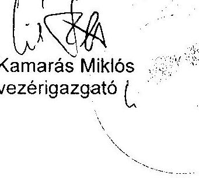

---

# Kamarás Miklós úr 

vezérigazgató
ÁPV Rt.

## Budapest

## Tisztelt Vezérigazgató Úr!

Megköszönöm az Állami Privatizációs és Vagyonkezelő Rt. 2003. évi működésének és a központi költségvetés végrehajtásához kapcsolódó tevékenységének ellenőrzéséről készített jelentéstervezetünkre, soron kívül adott észrevételeiket. Azokkal kapcsolatban – levele sorrendjében – a következőkről tájékoztatom.

A Postabank Rt. privatizációjába bevont külső szakértők megbízási szerződéseinek ismételt áttanulmányozása egyértelműen alátámasztja azon megállapításainkat, hogy a megbízásokban átfedések voltak az üzletértékelésnél, az árindikáció meghatározásánál, a betétállomány összetételének és szerkezetének elemzésénél, valamint a Postabank és az MP Rt. kapcsolatrendszerének átvilágításánál. Az értékbecslésekhez képest az eladási ár közel kétszeres volt, miközben nem számszerűsítették a tanácsadók közreműködésének konkrét eredményét. Mindezek alapján nem áll módunkban a jelentéstervezet kifogásolt szövegrészét módosítani.

A Cartographia Kft. vagyonértékelésével kapcsolatos szövegrészt (27. oldal első bekezdés) javaslatának megfelelően kiegészítettük.

A Hajógyári Sziget Vagyonkezelő Kft. privatizációs tranzakciójára tett észrevétel alapján a műemlékingatlanra, a magánkézbe adásra és a visszavásárlási jog biztosítására vonatkozó leírásokat tovább pontosítottuk annak érdekében, hogy a leírtak ne kelthessék azt a látszatot, hogy az ÁPV Rt. kötelezettsége lett volna a műemlék megszerzése és a tranzakció során az ÁPV Rt. jogszabályt sértett volna, továbbá, hogy az opciós adás-vételi szerződés jóváhagyása a KÖH, vagy a nemzeti kulturális miniszter hatásköre lett volna, és az opciós szerződésben kikötött árért az ÁPV Rt. lenne a felelős. Ugyanakkor kifogásoljuk a vagyonértékelés gyakorlatát, ami viszont az ÁPV Rt.-hez kapcsolódik. Mindez javaslatainkból is közvetlenül kiderül, hogy az opciós ár felülvizsgálata azt érintheti, aki a szerződést a Magyar Állam nevében aláírta. Megjegyzem, hogy megítélésem szerint a korábbi megfogalmazások sem adtak alapot az Önök szerinti értelmezésre.

Levelében az ÁPV Rt. kiadási előirányzatainak meghatározásával kapcsolatban leírtakat gyakorlatilag szó szerint tartalmazza a jelentés 31. oldala.

---

A rendelkezésünkre álló iratok ismételt áttanulmányozása alapján

- kihagytuk a Szentlőrinci Állami Gazdasággal kapcsolatos perrel összefüggésben a kifogásolt mondatot, mivel a felperesek fellebbezése visszavonásának ideje (legkésőbb 2003. március 8.) csak vélhetően esett egybe az ÁPV Rt. fellebbezésének keltével (2003. március 5.);
- a BULAV üggyel összefüggésben kiegészítettük a többletkötelezettséggel kapcsolatos megállapításunkat (a jelentés 44. oldal utolsó bekezdés, 45. oldal első bekezdés és lábjegyzet);
- a Pécs Megyei Jogú Város Önkormányzata ügyével kapcsolatban úgy ítéljük meg, hogy a kialakult helyzet módot adott az eltérő jogszabályi értelmezésre. Szeretném jelezni, hogy az ÁSZ ellenőrzési gyakorlatában minden esetben az állami érdekek érvényesítése szempontjából a szigorúbb értelmezés szerint alakítja ki álláspontját. Természetesen az ÁPV Rt. jogértelmezését feltüntetjük a jelentésben. Egyidejűleg a korábbi „az ÁPV Rt. szerint” kezdetű bekezdést elhagyjuk, mivel az nincs összhangban a mostani észrevételükkel.

Levelükre hivatkozva beépítjük a jelentéstervezetbe, hogy a megbízási szerződések felülvizsgálata megtörtént és a jogszabályoknak megfelelően átalakításra kerültek.

Kérem Vezérigazgató urat, hogy a levelemben foglaltakat elfogadni, illetve tudomásul venni szíveskedjék. Tájékoztatásul megemlítem, hogy a kialakult gyakorlatunknak megfelelően a továbbiakban a jelentés mellékletét képezi az ÁPV Rt. észrevételeit tartalmazó levelének és az arra adott válaszunk másolata.

Budapest, 2004. augusztus 23.

Tisztelettel:
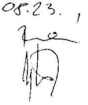

Bihary Zangmond

---

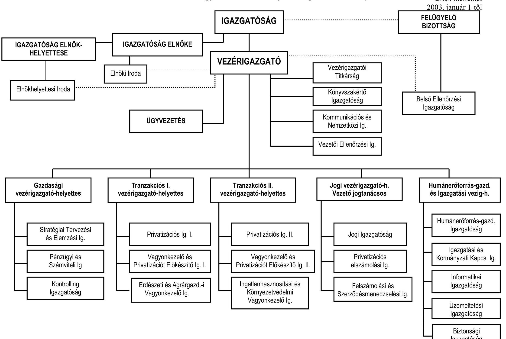

# Állami Privatizációs és Vagyonkezelő Részvénytársaság szervezeti felépítése

## 2. sz. melléklet
## 2003. január 1-től

### IGAZGATÓSÁG ELNÖK
### HELYETTESE

### IGAZGATÓSÁG ELNÖKE

### IGAZGATÓSÁG ELNÖKE

### Igazgatóhelyettes Iroda

### ÜGYVEZETÉS

### ÜGYVEZETÉS

### IGAZGATÓSÁG

### Vezérigazgató

### Titkárság

### Könyvvizsgáló
### Igazgatóság

### Kommunikációs és Nemzetközi Ig.

### Vezetői Ellenőrzési Ig.

### Indafizációk

### Indafizációk

### Indafizációk

### Indafizációk

### Indafizációk

###

 Indafizációk

### Indafizációk

### Indafizációk

### Indafizációk

### Indafizációk

### Indafizációk

### Indafizációk

### Indafizációk

### Indafizációk

### Indafizációk

### Indafizációk

### Indafizációk

### Indafizációk

### Indafizációk

### Indafizációk

### Indafizációk

### Indafizációk

### Indafizációk

### Indafizációk

### Indafizációk

### Indafizációk

### Indafizációk

### Indafizációk

### Indafizációk

### Indafizációk

### Indafizációk

---

# A 2003. évi költségvetési előirányzatok és az ÁPV Rt. üzleti terve

|   |  |  |  |  | Érték millió forintban |  |   |
| --- | --- | --- | --- | --- | --- | --- | --- |
|   | Kvt. előirányzat | Terv javaslat | Terv | Kvt. módosítás | Terv módosítási javaslat | Módosított Terv | Tény  |
|  BEVÉTELEK ÖSSZESEN |  | 196236 | 196236 |  | 248018 | 178518 | 160279  |

|  I. A kormányzati szektor hiányát érintő ráfordítások | 25300 | 40550 | 41550 | 31000 | 37516 | 35956 | 34552  |
| --- | --- | --- | --- | --- | --- | --- | --- |
|  a hozzárendelt vagyon előkészítésének költségei, az értékesítéssel kapcsolatban felmerülő kiadások, díjak [1. § (9)-(10) bek., 23. § (1) bek. a) és f) pontok] | 4000 | 4000 |  | 4000 | 4210 |  | 2816  |
|  vagyonkezeléssel összefüggő ráfordítások [23. § (1) bek. e) pont] | 1550 | 1500 |  | 1500 | 1500 |  | 841  |
|  a hozzárendelt vagyonba tartozó társaságok támogatása [23. § (1) bek. g) pont], forrásátadás, kamatátvállalás, válságkezelés | 550 | 550 |  | 550 | 550 |  | 622  |
|  az ÁPV Rt. működési költségei [23. § (1) bek. h) pont] | 5000 | 2500 |  | 2500 | 2500 |  | 2500  |
|  osztalékbefizetési kötelezettség a központi költségvetés felé | 8000 | 8000 | 8000 | 8000 | 14030 | 14030 | 14089  |
|  az ÁPV Rt. és a jogelődök portföliójába tartozó vállalatok, társaságok, illetve egyéb vagyontárgyak esetén az állam tulajdonosi felelősségével kapcsolatos környezetvédelmi feladatok finanszírozása | 3000 | 3000 |  | 3000 | 3000 |  | 3000  |
|  a volt szovjet ingatlanok környezetvédelmi kárelhárítása | 1000 | 1000 |  | 1000 | 1000 |  | 768  |
|  a HM-tól átvett (tárgyi eszközök) vagyonelemek kezelésével és értékesítésével kapcsolatos ráfordítások | 2000 | 2000 |  | 2000 | 2000 |  | 1684  |
|  a)1 Kárpótlási jegy bevonása |  | 18000 |  |  | 8726 |  | 8232  |
|  b)1 Vagyontárgyak vásárlása | 250 |  |  | 650 |  |  |   |
|  c)1 A privatizációval és vagyonkezeléssel kapcsolatos reorganizációt célú kifizetések |  |  |  | 7800 |  |  |   |
|  II. A kormányzati szektor hiányát nem érintő ráfordítások | 73760 | 57496 | 55010 | 84848 | 86080 | 85640 | 83682  |
|  a)2 Kárpótlási jegy bevonása | 19000 |  |  | 8726 |  |  |   |
|  b)2 Vagyontárgyak vásárlása |  | 250 | 250 | 13420 | 14070 | 13420 | 13420  |
|  c)2 A privatizációval és vagyonkezeléssel kapcsolatos reorg.célú kifizetések | 10700 | 10700 | 10700 | 3900 | 11700 | 11910 | 11604  |
|  Üzleti célú befektetések | 6350 | 6350 | 6350 | 6350 | 6350 | 6350 | 5847  |
|  Részesedések vásárlása MFB-től | 20000 | 10000 | 20000 | 0 | 0 | 0 | 0  |
|  Privatizációs tartalék feltöltése | 8685 | 8685 | 8685 | 7500 | 7500 | 7500 | 7858  |
|  Privatizációs tartalék feltöltése megtérülésekből |  | 1486 |  |  | 1508 | 1508 |   |
|  További tartalékfeltöltés előirányzat átcsoportosítás (kárpótlási jegy ráfordítás kölönbözetésből) |  | 1000 |  |  |  |  |   |
|  Tartalék többletfeltöltés előirányzat átcsoportosítással a pénzügyminiszter engedélye alapján |  | 10000 |  |  |  |  |   |
|  Részvény-átcsoportosítás a privatizációs tartalékból készpénz ellenében | 9025 | 9025 | 9025 | 44952 | 44952 | 44952 | 44953  |
|  RÁFORDÍTÁSOK ÖSSZESEN | 99060 | 98046 | 96560 | 115848 | 123596 | 121596 | 118234  |

| EGYENLEG (központi költségvetésbe történő befizetésre fordítható) | 98690 |  | 125420 | 56922 | 41983 |  |  |  |  |  |  |  |

---

# KÖVETELÉSÁLLOMÁNY 

millió Ft

|  | 2003. január 1. |  |  | 2003. december 31. |  |  |
| :--: | :--: | :--: | :--: | :--: | :--: | :--: |
|  | Bruttó érték | Értékvesztés | Nettó érték | Bruttó érték | Értékvesztés | Nettó érték |
| Követelések áruszállításból és szolgáltatásból (vevők) | 1216 | 1063 | 153 | 2411 | 1339 | 1072 |
| Egyéb követelések |  |  |  |  |  |  |
| Osztalékkövetelések | 2094 | 2091 | 3 | 2068 | 71 | 1997 |
| Később számlázandó privatizációs bevételek | 478 | 262 | 216 | 400 | 249 | 151 |
| Végelszámolásból, felsz. eredő tulajdonosi és egyéb követelések | 11065 | 10950 | 115 | 11511 | 11396 | 115 |
| HM-ingatlanokkal kapcsolatos követelések | 8797 | 0 | 8797 | 5837 | 0 | 5837 |
| Rövid lejáratú tulajdonosi kölcsön | 4415 | 4235 | 180 | 1452 | 1452 | 0 |
| Tőkeleszállítás miatti követelés |  |  |  | 3000 |  | 3000 |
| Éven belüli reorganizációs hitel | 410 | 310 | 100 | 492 | 272 | 220 |
| Válságkeretből adott visszatérítendő támogatás | 215 | 215 | 0 | 0 | 0 | 0 |
| ÁFA követelés (bevallott még ki nem utalt) | 1449 | 0 | 1449 | 484 | 0 | 484 |
| Követelés az önkormányzatoktól | 75 | 75 | 0 | 77 | 75 | 2 |
| Adott előleg | 4354 | 0 | 4354 | 2799 | 0 | 2799 |
| Saját vagyonnal szembeni követelés | 0 | 0 | 0 | 117 | 0 | 117 |
| Átutalt, be nem jegyzett tőkeemelés | 6151 | 0 | 6151 | 6210 | 0 | 6210 |
| Követelések összesen | 40719 | 19201 | 21518 | 36858 | 14854 | 22004 |

---

# Tranzakciós költségek a vizsgált privatizációs tranzakcióknál 2003-ban 

| Fökönyvi szám | Költség nemek | HSzV Kft. | Forrás Rt. | Konzum-   bank Rt. | FHB Rt. | Postabank Rt. |
| :--: | :--: | :--: | :--: | :--: | :--: | :--: |
| 7711 | Tőkeemelés |  |  |  | 2500,00 |  |
| 71101 | Vagyonértékelés díja | 10,80 |  |  | 12,00 | 54,56 |
| 71102 | Szakértői, tanácsadói díj, pályáztatási költségek. | 0,08 | 54,90 | 0,09 | 141,31 | 109,73 |
| 71103 | Hirdetési és PR költségek. | 1,84 | 85,45 | 2,14 | 4,19 | 20,54 |
| 71106 | Forgalomba hozatal költségei |  |  |  | 335,60 |  |
| 71107 | Értékesítési jutalékok |  |  |  |  | 804,00 |
| 71108 | Ügyvédi díjak | 0,37 | 5,15 | 0,98 | 0,36 |  |
| 71113 | Fordítás, tolmácsolás | 0,04 | 0,03 | 0,06 | 0,06 | 0,35 |
| 71119 | Egyéb privatizációval összefüggő kiadás |  | 0.07 |  |  | 0,12 |
| 72103 | Hirdetési és PR költségek. |  |  |  |  | 0,06 |
|  | Költségek összesen | 13,13 | 145,53 | 3,27 | 2993,52 | 893,36 |

---

# Az ÁPV Rt. működő társaságainak és vállalatainak 2003. évi változásai 

Az ÁPV Rt. által kezelt vagyon a Priv. tv. 2002. évi módosítása alapján 2002. július 27-i hatállyal a következő társaságokkal egészült ki:

Magyar Posta Rt. 100\%, Mertcontrol Minőségellenőrző Rt. 25\%+1 szavazat, Távközlési Innovációs Rt. fa. 25\%+1 szavazat, Cartographia Kft. 50\%+1 szavazat, HM Central Mosodák Rt. 50\%+1 szavazat, Hitelgarancia Rt. 50\%+1 szavazat állami részesedéssel.

A törvényi módosítás teljes körűen 2003. évben realizálódott. A Mertcontrol Minőségellenőrző Rt és a HM Central Mosodák Rt. hozzárendelt vagyonba való átvétele a vagyoni érték egyeztetések miatt 2003-ban történt meg.

A Priv. tv módosulása - 2003. január 1-i hatállyal - a Budapest Airport Rt.-t 25%+1% és a Sportlétesítmények Vállalat Rt.-t 75% részesedéssel is az ÁPV Rt. hozzárendelt vagyonába helyezte. A 2003. évi költségvetésről szóló 2002. LXII. tv. a Sportlétesítmények Vállalat Rt.-re vonatkozó rendelkezést azonban 2002. december 31. hatállyal törölte. A 2003. évi költségvetési törvény módosításának 105. § d) pontja hatályon kívül helyezte a Priv. tv. 70. § (9) bekezdését, mely szerint az FHB Rt. állami tulajdonban lévő részvényei tekintetében a tulajdonosi jogokat a pénzügyminiszter gyakorolja. Ennek következtében érvénybe lépett a Priv. tv. hatályos 7. § (11) bekezdése, mely szerint az FHB Rt. feletti tulajdonosi joggyakorló - a törvény hatályba lépésétől, azaz 2003. január 1-től - az ÁPV Rt.

A hozzárendelt vagyon növelésén túlmenően - a 2002. december 31.-i állapothoz viszonyítva - a Priv. tv. melléklete 2003. január 1. hatállyal átrendezte a tulajdonrészek kezelésére vonatkozó rendelkezéseket, amely következtében tartós állami tulajdon státuszból 40 db társaságot privatizálhatóvá minősített.

A felsorolt törvényi rendelkezésekkel a 2003-as évben az ÁPV Rt. hozzárendelt vagyona a Budapest Airport Rt. 8 milliárd Ft, a HM Centrál Mosodák 0,86 milliárd Ft, a Mertcontrol Rt. 0,05 milliárd Ft és az FHB Rt. részvények 2,3 milliárd Ft nyilvántartási értéken történt térítésmentes átvételével 12,1 milliárd Ft-tal növekedett. A 2003. évben az RJGY-nek a hozzárendelt vagyon nyilvántartási és beszámolási rendszerére vonatkozó szabályozása
 a 20/2003.(VIII. 5.) sz. határozatban került kiadásra. Ennek megfelelően a hozzárendelt vagyonról készített 2003. évi mérleg a társasági részesedéseket két helyen tartalmazza. A befektetett pénzügyi eszközök mérlegcsoport „részesedések" során a tartós részesedéseket, a forgóeszközök mérlegcsoport „részvények és üzletrészek" során pedig a privatizálható részesedéseket. Ezek értéke a társaságok tárgyévi mérlegében (konszolidált mérlegében) szereplő, az állami tulajdoni hányadnak megfelelő saját tőkeérték. Az aranyrészvényeket jegyzett tőkeértéken tartják nyilván. Az ÁPV Rt. által 2000. január 1. után beszerzett értékpapírok (részvények és üzletrészek) nyilvántartási értéke megegyezik a tényleges beszerzési értékkel. A pri-

---

vatizációs tartalékba helyezett részesedések nyilvántartási értéke nem változik. A negatív saját tőkével rendelkező működő társaságok esetében a nyilvántartási érték nulla.

A működő állami vállalatok száma 2 db-ról 1 db-ra csökkent. A KOLOR Híradástechnikai Háztartási Gépjavító Tanácsi Kisvállalat végelszámolással megszűnt. Az Intranszmas Magyar-Bolgár Társaság maradt az egyetlen vállalat az eredmény elszámolása után 127 millió Ft saját tőkeértékkel.

A hozzárendelt vagyon változását a tranzakciók és a működő társaságok gazdálkodásának összesítésével az 1. sz. tanúsítvány tartalmazza.

A működő társaságoknál a tranzakciókból adódó saját tőke 24,6 milliárd Ft-tal növekedett miközben az állománycsoportba tartozó társaságok száma 167 db-ról 158 db-ra csökkent.

Az átértékelések hatását is tartalmazó gazdálkodás eredményességéből a kimutatás szerint a hozzárendelt vagyon 130,3 milliárd Ft-tal növekedett. Ezen belül az ÁPV Rt.-re jutó mérleg szerinti eredmény 11,7 milliárd Ft, amely már nem tartalmazza a 2003-ban az üzleti terv szerint elvont 69,1 milliárd Ft osztalékot. Az elvont osztalék egy része 22,8 milliárd Ft a társaságok eredményes gazdálkodáshoz kötött, a további 46,3 milliárd Ft pedig a bekövetkező egyéb változásokból adódik. A bekövetkező egyéb változás, hogy a Magyar Posta Rt.-től elvont 46,3 milliárd Ft osztalékból a Postabank értékesítéséhez köthető 44,3 milliárd Ft, a MAHART Rt.-től elvont osztalék - 2 milliárd Ft - pedig teljes mértékben csak az ingatlan értékesítésekből származik.

Vásárlás útján 14 társaság került a hozzárendelt vagyonba a számviteli politikában előírtak szerinti bekerülési értéken. Ez a nyilvántartási érték egyértelműen nincs összefüggésben azzal, hogy a vásárolt társaságok az adott évben hogyan gazdálkodtak. Több jelentős társaság élt az eszközök piaci értékelésének lehetőségével, amely a saját tőke összegét növelte. Itt meghatározó a Magyar Posta Rt.-nél a 26,5 milliárd Ft-os, és az MVM Rt.-nél az 54,3 milliárd Ft-os felértékelésből származó vagyonnövekedés. Vannak még a társaságok saját tőkéjét (konszolidált saját tőkéjét) érintő olyan egyéb mozgások, amelyek nem kapcsolódnak az eredményekhez és nem köthetők az ÁPV Rt. tranzakcióihoz sem. Értékben ezek 27,2 milliárd Ft-tal szerepelnek a kimutatásban.

Összegezve a bekövetkező egyéb változások értéke a táblázatban 118,5 milliárd Ft, amely az átértékelések hatását is tartalmazó gazdálkodás eredményességéhez kötött ÁPV Rt.-re jutó mérleg szerinti eredménnyel együtt adja a kimutatásban szereplő 130,3 milliárd Ft vagyonnövekedést. A fenti levezetésből a gazdálkodás eredményessége szerinti vagyonérték az ÁPV Rt.-re jutó mérleg szerinti 11,7 milliárd Ft eredmény, és a társaságok eredményessége alapján elvont 22,9 milliárd Ft osztalék összege, azaz 34,6 milliárd Ft.

Az ÁPV Rt. 2003. évi végleges beszámolójában két társaság nyilvántartási értéke, melyek vásárlás során kerültek az ÁPV Rt. hozzárendelt vagyonába, az auditálás során a könyvvizsgáló javaslatára leértékelésre került 15220 millió Ft értékben (Dunaferr Vámügynökség Kft. 346 millió Ft-tal, SZÖVÜR Szövetkezeti Üzletrészhasznosító Kft. 14874 millió Ft-tal). Indoka a cégek jelentős tőkevesztése, amelynek figyelmen kívül hagyása - az ÁPV Rt. könyveiben beszerzési értéken való nyilvántartás esetén - a társasági vagyon jelentős túlértékelését

---

eredményezte volna. A leértékelés elszámolása a vagyonelemek és az állammal szembeni kötelezettségek csökkenéseként történt meg. Az ÁPV Rt. végleges beszámolójában, a hozzárendelt vagyonban bekövetkezett változások kimutatásánál (1. sz. tanúsítvány), ez az összeg a gazdálkodás eredményessége csökkenés oszlopában szerepel. Az ÁSZ beszámolóhoz előzetesen megadott vagyoni adatokban a 15220 millió Ft-os vagyoncsökkenés szerepel, mivel az a végleges beszámoló elkészülte előtt került összeállításra.

Az ÁPV Rt. a hozzárendelt vagyont a Priv. tv. 2003. január 1-től hatályos melléklete szerint tartja nyilván, tartós állami tulajdonban lévő társaságok és teljes mértékben privatizálható társaságok bontásban. A tartós állami tulajdonban tartandó és a privatizálható társaságok számát a 2. sz. tanúsítvány tartalmazza. A tartós állami tulajdonban lévő társaságok száma az év során 76 db-ról 38 db-ra változott, amely értékben 81,2 milliárd Ft csökkenést eredményez. A teljes mértékben privatizálható társaságok száma pedig az év során 91 db-ról 120-ra történő változással, értékben 105,8 milliárd Ft-tal nőtt. A növekedést és csökkenést előidéző tényezőket - a működő társaságoknál - az alábbi táblázat tartalmazza:

| Megnevezés | Növekedés |  | Csökkenés |  | Összesen |  |
| :-- | --: | --: | --: | --: | --: | --: |
|  | db | millió Ft | db | millió Ft | db | millió Ft |
| Átvett, átadott | 3 | 12112 | 0 | 0 | 3 | 12112 |
| Vásárolt, értékesített | 14 | 9156 | 7 | 17345 | 7 | -8189 |
| Tőkeemelés, tőkeleszállítás | 0 | 22650 | 0 | 3000 | 0 | 19650 |
| Egyéb | 43 | 99673 | 62 | 98632 | -19 | 1041 |

Az átvétel/átadás soron a 12,1 milliárd Ft törvényi hatásként a 3 db társaság (Budapest Airport Rt., HM Centrál Mosodák, Mertcontrol Rt.) és az FHB Rt. részvények nyilvántartási értéken történt térítésmentes átvételéből származik.

A vásárlás/értékesítés tranzakciós műveleteiből kitűnik, hogy az ÁPV Rt. csak 8,2 milliárd Ft-tal több vagyonelemet értékesített, mint amennyit vásárolt és az értékesítés volumene összesen 17,3 milliárd Ft.

Tőkeemelés/tőkeleszállítás soron összesen 22,6 milliárd Ft szerepel tőkeemelésként. Ebből a Forrás Rt. 12,3 milliárd Ft, MALÉV Rt. 7 milliárd Ft, FHB Rt 2,7 milliárd Ft, és 5 társaság pedig 0,6 milliárd Ft értékben részesült. Tőkeleszállítás -3 milliárd Ft- a Váltó 4 Libra Rt.-nél történt.

Egyéb tranzakciós műveletek - átcsoportosítások, szétválás, beolvasztás, megszűnés, felszámolás, dolgozói részvények bevonása, saját tőkehelyesbítés, idegen tőkeemelés - egyenlege 1 milliárd Ft.

---

# A működő társaságok 2003. évi gazdálkodása és a kisebbségi tulajdonú társaságok értékesítése 

Az ÁPV Rt. hozzárendelt vagyonába tartozó működő társaságok 2003. évi tőkearányos jövedelmezőségét cégcsoportok szerint az 1. sz. ábra szemlélteti.

Az Agrár társaságok Bábolna csoportot nem tartalmazó portfóliója a 2002. évi 0,18%-os jövedelmezőségi szinttel szemben a 2003. évben 10,9% veszteséget szenvedett el, amelyet döntően az aszályos időjárás miatti hozamcsökkenés okozott a kalászos gabonák és a kukoricatermesztésben. Kedvezőtlen értékesítési feltételek léptek fel azonban a sertés-, baromfi-, tej-, és tojás-ágazatokban is. A társaságok adottságai egyébként a 3-5%-os tőkearányos jövedelmezőségi szint teljesítését lehetővé tennék. A társaságcsoportban a legkedvezőbb tőkearányos jövedelmezőséget a Balatoni Halászati Rt. érte el (21%), amely azonban eseti vagyontárgy értékesítés következménye. A Fertő-tavi Nádgazdaság Rt. -64,1%-os saját tőke arányos vesztesége egyrészt a társaságnál bekövetkezett nagy értékű értékvesztés következménye, de az értékesíthető nád mennyiségének elmaradása is pénzügyi zavarokat okoz a társaságnál.

Bábolna csoportnál 2003-ban 2,98 milliárd Ft veszteség került elszámolásra, amely a 2002. évi 7,7 milliárd Ft-os veszteséghez viszonyítva megfelelő eredményként értékelhető. A kötelezettség állomány eléri a 30 milliárd Ft-ot. A kamatkiadások és a törlesztések miatt a társaság jövedelmezőségi mutatója 153,6%.

Az erdőgazdaságok jövedelmezőségi mutatója a 2002. évi 1,71%-ról a 2003. évben 2,8%-ra nőtt, ami újabb fellendülést alapoz meg a portfólió számára. A forint árfolyamának második félévi gyengülése javította a hazai erdőgazdaságok és fafeldolgozó üzemek versenypozícióit a nyugat-európai versenypiacokon. A legkedvezőbb ROE mutatóval a Szombathelyi Erdészeti Rt. (7,5%) rendelkezik. A cég szempontjából az is kedvező, hogy a fa fajai között igen nagy arányt képvisel a fenyő, szemben a jelenlegi piaci körülmények között nehezen értékesíthető bükkfa fajjal. A Bakonyi Erdészeti és Faipari Rt. jövedelmezőségi mutatója a legalacsonyabb (0,6%), ami elsősorban a 2003. évben adóelszámolási vitából származó bírság következménye.

A Volán csoport 2003. évi 2%-os jövedelmezősége lényegében egyező a 2002. évben kimutatott 1,8%-kal, mert a társaságok adottságai sem változtak. A csoport társaságaiban az élmezőny 6-7%-os ROE mutatószint teljesítésére képesek. A Volán csoport gazdálkodását alapvetően meghatározza, hogy - jogszabályi és törvényi előírások alapján - nagyrészt közellátási feladatokat végeznek. Az ellátási felelősség miatt kénytelenek olyan területeken is járatokat üzemeltetni, amelyek jelentős veszteséget eredményeznek. Ezáltal működésükhöz az állami támogatás nélkülözhetetlen. A megállapított hatósági árak - a feladatok hatósági előírása mellett (menetrend) - jelenleg nem biztosítják a társaságok hosszú távú biztonságos működését. A központi és önkormányzati árkiegészítések - melyek a kedvezményes árakat a hatósági ár szintjére egészítik ki - a veszteségekre nem nyújtanak fedezetet. A társaságok működését alapvetően meghatá-

---

rozó járműállomány átlagos életkora 10 év feletti, cseréjük több éve megoldhatatlan. A cégek szinten tartó beruházásaikat nem tudják megvalósítani, még úgy sem, hogy ezek jelentős részét központi támogatás fedezi. A Balaton Volán Rt. érte el 2003-ban a legmagasabb (8,7%) tőkearányos jövedelmezőségi szintet, amely döntően vagyontárgy értékesítéséből származik. A Nógrád Volán Rt. évek óta veszteséges, jövedelmezősége (-42%), mert a megye területén élők fizetőképessége alacsony, és a településszerkezet miatt a járatkihasználtság sem éri el a kívánt szintet.

Jelentős súlyú, kiemelt cégeknél az ÁPV Rt. teljes portfóliójának több mint kétharmadát képviseli az árbevétel, a saját tőke és a teljes eszközvagyon szempontjából is. A tőkearányos jövedelmezőségi mutató 2003-ban 8%-ra nőtt. Az eredményt alapvetően a Szerencsejáték Rt., a Richter Rt., és a MAHART Rt. teljesítménye alakította. A Szerencsejáték Rt. rekord jövedelmezőségi szintet (40%) ért el, mert a hazai szerencsejáték-piacon a társaság szélesedő kínálatát növekvő kereslet fogadta. A MAHART Rt. jelentős eredménye (2 milliárd Ft) kizárólag ingatlan értékesítésből származik, amely nélkül a gazdálkodása veszteséges.
Bankok és biztosítók csoport jövedelmezőségi szintje 2003-ban 12,3%. A hitelintézetek és a biztosító cégek (Eximbank Rt., MEHIB Rt., FHB Rt., Hitelgarancia Rt.) 2003. évben 6,2 milliárd Ft nyereséget értek el, ami a 2002. évi 2,4 milliárd Ft-nál lényegesen magasabb.
Tartós állami tulajdonban lévő cégeknél (25% felett) 2003-ban az átlagos jövedelmezőség 5,3% volt. Ide tartoznak az erdőgazdaságok, két bank, egy biztosító és az egyéb tartós társaságok közé sorolt cégek.
Egyéb tartós társaságok jövedelmezősége 2003. évben 6,9%. A csoportban a legjobb jövedelmezőséget (24,6%) a Nemzeti Tankönyvkiadó Rt. érte el. A Herendi Porcelánmanufaktúra 1,2%-os jövedelmezőségi szintje a korábbi évekhez képest kifejezetten alacsonyabb, mert a porcelán termékek iránti kereslet visszaesett.

A privatizálható cégek (25% felett) átlagos jövedelmezőségi szintje 4,3%. A privatizálható társaságok a 2003. évben összességében nyereségesek.
Privatizálható egyéb többségi cégek -17,4%-os vesztesége döntően a Nemzeti Lóverseny Kft. -31,2%, és a Váltó-4 Libra Rt. -25,9% veszteségeiből következik.

Privatizálható egyéb kisebbségi cégek
 jövedelmezőségi szintje 2003. évben 0,4%. A társaságcsoport meghatározó tagja a Vértesi Erőmű Rt, amit 2003. évben sikertelenül próbált az ÁPV Rt. értékesíteni, ezért 2004. évben a vagyonkezelőnek a reorganizációs programban is részt kell venni.
MFB volt cégei 2003-ban összességében -8,5%-os veszteséget teljesítettek. Az ÁPV Rt. 14 társaságot vásárolt meg az MFB Rt.-től. A társaságok többsége veszteséges volt.

A hozzárendelt vagyonba tartozó működő társaságokat az eredményesség szempontjából nyereséges és veszteséges cégekre osztva az alábbi táblázat tartalmazza.

---

ÁPV Rt. tulajdonra jutó adózás előtti eredmény

| Megnevezés | Nyereséges (illetve   nullszaldós) | Veszteséges | Összesen |
| :-- | --: | --: | --: |
| Cégek száma 2002. évben (db) | 138 | 29 | 167 |
| Cégek eredménye 2002. évben (millió   Ft-ban) | 39712 | -66387 | -26675 |
| Cégek száma 2003. évben (db) | 102 | 56 | 158 |
| Cégek eredménye 2003. évben (millió   Ft-ban) | 74957 | -38171 | 36786 |

A 2003. évvégén 158 társaságban rendelkezett részesedéssel az ÁPV Rt., amelyből 102 volt nyereséges.

# Az ÁPV Rt. kizárólagos tulajdona (100%) 

A 2003. évi jövedelmezőség 15,4%. Az ide sorolt 50 cég közül 38 nyereséges. Az erdőgazdaságok 2003. évi összesített nyeresége 1,2 milliárd Ft. Kimagasló a Szerencsejáték Rt. 17,1 milliárd Ft eredménye. A törvényi rendelkezéssel 2003-ban a portfólióba került Budapest Airport Rt. eredménye 5,8 milliárd Ft. A 2002. évben veszteséges Magyar Posta Rt. a Postabank tranzakció nélkül 3,3 milliárd Ft eredménnyel zárta a 2003. évet. Továbbra is kedvezőtlen a Nitrokémia Rt. (1,2 milliárd Ft veszteség), és a Nemzeti Lóverseny Kft. (580 millió Ft veszteség) helyzete.

## Az ÁPV Rt. többségi tulajdona (50,0%-99,99%)

A 2003. évben -5,1%-os veszteségszint alakult ki. A csoport 64 cégéből 27 veszteséges. Az agrárgazdaságok 2003. évi összes vesztesége 4,1 milliárd Ft. (Bábolna Rt. nélkül). Az aszályos időjárás és piaci problémák egyszerre jelentkeztek. A Bábolna Rt. 2003. évben csökkentette veszteségét. A Volán társaságok együttes eredménye 597 millió Ft. Veszteséges a Magyar Villamos Művek csoport (3,59 milliárd Ft.), a Szövetkezeti Úzletrészhasznosító Kft. (6,9 milliárd Ft) és MALÉV Rt. (12,5 milliárd Ft).

## Az ÁPV Rt. jelentős tulajdona (25,0%-49,99%):

A. 2003. évi jövedelmezőség 17,8%. A csoportba 6 társaság tartozik. Kiemelkedő a Richter Rt. 36,9 milliárd Ft eredménye. A portfólióban az ÁPV Rt. tulajdonrészre jutó nyereség ellensúlyozni képes a többségi tulajdonú társaságoknál előállt veszteséget. Ez a társaságcsoport adja az árbevétel, a saját tőke és az eszközvagyon szempontjából is a hozzárendelt vagyon több mint kétharmadát.

A társaságok saját tőkére jutó eredményességét a 3. sz. ábra szemlélteti.
A teljes portfolió összesen 13,36%-os jövedelmezőséget ért el. A magas jövedelmezőségű jelentős társaságokban (MOL Rt., OTP Rt., Budapesti Elektromos Művek Rt.) a hozzárendelt vagyoni részesedés alacsony. Így az ÁPV Rt. tulajdon-

---

ni hányadára számítottan ugyanez a mutató 4,46%. Összehasonlítva a 2002. évben kimutatott -3,38-os veszteséggel, 7,84% növekedés mutatkozik.

A javulás mértékét szemlélteti az adózás előtti eredmények alakulását bemutató 3. sz. ábra. Az ÁPV Rt. működő társaságainál a 2002. évi 26,7 milliárd Ft-os veszteség a 2003. évben 36,8 milliárd Ft nyereségre változott. A 2003. évi gazdálkodás pozitívuma, hogy több jelentős társaság (Szerencsejáték Rt., MOL Rt., Richter Rt.) megtartotta kiemelkedő piaci pozícióját. Pozitív eredményt ért el a Magyar Posta Rt. a 2002. évi veszteséges gazdálkodással szemben. Nagyságrenddel csökkentette az MVM Rt. és a Bábolna Rt. a korábbi veszteségeit. A 2003. év javuló tendenciája ellenére több társaságnál veszteség keletkezett. Az agrár ágazatban a természeti körülmények és a piaci árak alakulása jelentős veszteséget okozott.

# A kisebbségi tulajdonok értékesítése 

A gazdasági társaságokról szóló 1997. évi CXLIV. törvény a többségi akarat érvényesülését biztosítja a különböző kérdések egyszerű vagy minősített többséget kívánó szabályozásával. Ennek alapján a társaságok működtetésére meghatározó befolyást csak többségi részvénytulajdonnal lehet gyakorolni. Egyes kérdésekben, amelyeket a törvény - vagy ezen felül a társaságok alapító okirata minősített többséghez köt, 25%+1 szavazattal érdemben befolyásolható a döntés. A privatizáció során ezért indokolt a kisebbségi - különösen a 10% alatti, amelyhez a törvényben még kisebbségvédelmi intézkedések sem tartoznak - portfólió mielőbbi értékesítése. A Priv. tv. 36. § (1) szerint a 25%+1 szavazatot el nem érő és a privatizációs portfolióba be nem vitt állami részesedést az ÁPV Rt. vagyonarányosan a társaság többi tagja, illetve a társaság számára vételre felajánlhatja. A Priv. tv. indoklása a kisebbségi részesedések értékesítésére a versenyeztetés mellett az árverést, a nyilvános ajánlattételt, illetőleg a zárt körű elhelyezést írja elő fő szabályként, felhasználva a nemzetközi tőkepiaci tapasztalatokat, amelyek szerint kisebbségi társasági részesedések versenyeztetés útján történő értékesítése a többségi részesedést birtoklók különleges jogaira tekintettel célszerűtlen, ehelyett más eljárásokat kell keresni.

A kisebbségi tulajdon értékesítés eredményességének megítéléséhez ad alapot a kisebbségi tulajdonlás főbb jellemzőinek áttekintése. A kisebbségi portfólió megoszlását mutatja az alábbi táblázat

| Megnevezés | Előzetes adatok 2003. 12. 31. |  | Megoszlás |
| :--: | :--: | :--: | :--: |
|  | ÁPV Rt. % | Saját tőke ÁPV Rt.   része (millió Ft) | % |
| MOL Rt. | 22,71 | 144414 | 70,7 |
| Richter Rt. | 25,00 | 50377 | 24,7 |
| Vértesi Erőmű Rt. | 29,96 | 5393 | 2,6 |
| Balatoni Hajózási Rt. | 48,99 | 13 | 0,1 |
| Hungaropharma Rt. | 15,02 | 1933 | 0,8 |
| Herendi Porcelán Rt. | 25+1 sz. | 1857 | 0,9 |
| Összes többi kisebbségi cég (38) |  | 355 | 0,2 |
| Kisebbségi ÁPV Rt. tulajdonú társaságok | 44 | 204242 | 100,0 |

---

Az ÁPV Rt. hozzárendelt vagyonának 2003. évi záró állományában 158 db működő társaságból 44 db a kisebbségi, összesen 204,2 milliárd Ft ÁPV Rt.-re jutó saját tőkerésszel. A kisebbségi tulajdonon belül a MOL Rt. 70,7%, a Richter Rt. 24,7%, a Vértes Erőmű Rt. 2,6% részarányú. Ez a három társaság adja a saját tőke ÁPV Rt.-re jutó részének 98%-át, értékben 200 milliárd Ft-ot. A többi cégé a fennmaradó 2%, amely értékben 4,2 milliárd Ft. Ehhez kapcsolódva a kisebbségi tulajdonlás néhány jellemzőjét az alábbi táblázat mutatja:

| Megnevezés | 2003. 01. 01. | 2003 12. 01.   (előzetes) | % |
| :-- | --: | --: | --: |
| Kisebbségi tulajdonú társaságok (db) | 59 | 44 | 74,58 |
| A társaságok jegyzett tőkéje (millió Ft) | 388682 | 366652 | 94,33 |
| ÁPV Rt. részesedésre eső jegyzett tőke (millió   Ft) | 44447 | 41006 | 92,26 |
| Átlag ÁPV Rt. tulajdoni hányad (%) | 11,44 | 11,18 |  |
| A társaságok saját tőkéje (millió Ft) | 943687 | 1341523 | 142,2 |
| ÁPV Rt. részesedésre eső saját tőke (millió   Ft) | 135555 | 204242 | 150,7 |
| Átlag ÁPV Rt. tulajdoni hányad (%) | 14,36 | 15,22 |  |
| ÁPV Rt. összes részesedése (teljes portfólió)   (millió Ft) | 716829 | 871728 | 121,7 |
| Kisebbségi tulajdonú részesedések az összes   részesedés %-ban | 18,91 | 23,42 |  |

A kisebbségi társaságok jegyzett tőkéjéből az ÁPV Rt.-re jutó rész 41 milliárd Ft, ami a 2003. évi nyitó értékhez viszonyítva 7,7%-os csökkenésnek felel meg. Az átlagos ÁPV Rt. részesedés így 11,2%. A jegyzett tőkeérték érdemben nem változott. A saját tőkében viszont a záró részesedés 15,2%-ra növekedett. Ez a MOL Rt. és a Richter Rt. 2003. évi eredmény-növekedéséből a képviselt tulajdoni részaránnyal arányosan adódik.

A kisebbségi tulajdonú részesedések az ÁPV Rt. teljes portfólióján belül a 2003. évben a nyitó 18,9%-ról a 23,4% záró arányt érték el.

A kisebbségi tulajdonú társaságok száma az 2003. évi nyitó állományban lévő 59-ről év végére 44-re csökkent. A csökkenés részben apportálásból, részben értékesítésből következett be.

---

A kisebbségi társaságok 2003. évi értékesítésére jellemző adatokat az alábbi táblázat mutatja:

| Megnevezés | Értékesített   % | Névérték | Saját tőkeérték | Szerződési   ár | Szerződési   ár/saját tőke |
| :-- | :--: | :--: | :--: | :--: | :--: |
| Alföldi Nyomda Rt. | 2,55 | 9450 | 22868 | 12460 | 54,49 |
| Agro-Summa Rt. | 25,01 | 5526 | 6004 | 4000 | 66,62 |
| Agro-M Mg. Rt. | 0,37 | 2000 | 2448 | 200 | 8,17 |
| Postabank Rt. I. | 1,21 | 242228 | 443184 | 1225996 | 276,63 |
| Postabank Rt. II. | 2,00 | 400000 | 732536 | 2024560 | 276,38 |
| Hungaropharma Rt. I. | 14,98 | 901470 | 1763348 | 1213198 | 68,80 |
| Hungaropharma Rt. II. | 0,02 | 1320 | 2354 | 1776 | 75,45 |
| Hungaropharma Rt. III. | 10,00 | 601880 | 1177134 | 810010 | 68,81 |
| Összesen |  | 2163874 | 4149876 | 5292200 | 127,53 |

A részesedések privatizációjánál a társaság saját tőke értéke az egyik jellemző mutató a megfelelő szerződési ár kialakításához. A szerződési ár viszonya a saját tőke értékhez tájékoztatást ad az értékesítés piaci körülményeiről.

A Postabank Rt. többségi részvényeivel együtt kerültek értékesítésre az ÁPV Rt. kezelésében lévő kisebbségi részvények is. Így vált elérhetővé a magas szerződési ár, amely a saját tőke értékéhez viszonyítva adja a 276,6% eredményt.

A kisebbségi részesedés értékesítésekor a megfelelő szerződési ár elérése igen nehéz, de a profiltisztítás érdekében több esetben is elfogadta az ÁPV Rt. az alacsony árajánlatot is.

Az állam nem rendelkezhet a Priv. tv. szerinti különleges jogosítványú szavazat-elsőbbségi részvénnyel csak ott, ahol a nemzetstratégia szempontjából ez elengedhetetlen. Ezért a Priv. tv. alapján (az 1 db szavazatelsőbbségi-, ill. aranyrészvény tulajdonlásán keresztül) tartós állami tulajdonban lévő CD Hungary Rt., Pick Szeged Rt., Herz Szalámigyár Rt., Kalocsai Fűszer Rt., OTP Bank Rt., Hungaropharma Rt., a Hungexpo Rt. és a Zsolnay Porcelángyár Rt. aranyrészvények megszűnnek és átalakulnak törzsrészvénnyé. Ebben a minősítésben kerülnek értékesítésre. A Gt. alapján szavazatelsőbbséget biztosító részvényekkel rendelkezik az ÁPV Rt. a Zsolnay Porcelánmanufaktúra Rt.-ben, a Hungaroton Music Rt.-ben és a Balatonboglári Borgazdaság Rt.-ben.

---

Az ÁPV Rt. hozzárendelt vagyonába tartozó, működő társaságok (25% felett) tőkearányos jövedelmezősége 2003. évben (Tulajdoni hányad alapján)
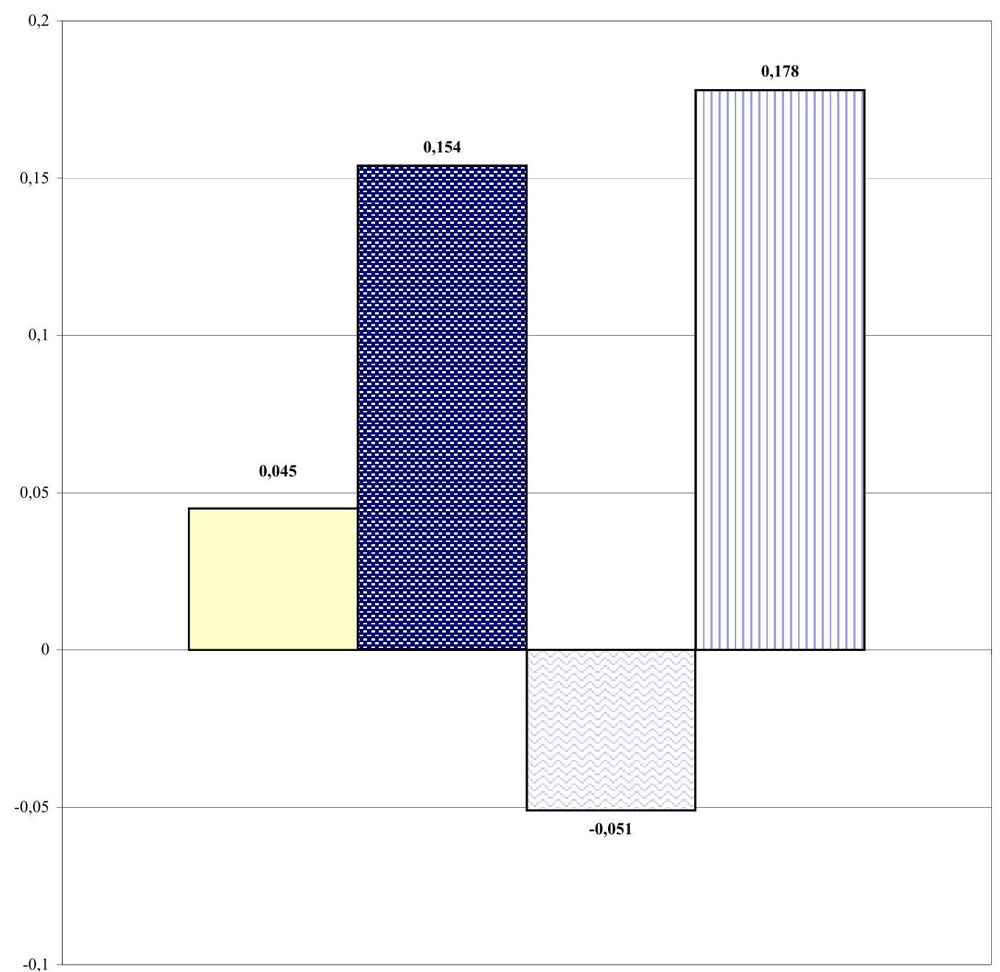

ROE mutató az egyes kategóriákban
$\square$ ÁPV Rt. cégei 25% felett
$\square$ Az ÁPV Rt. kizárólagos tulajdona (100%)
$\square$ Az ÁPV Rt. többségi tulajdona(50,00-99,99%)
$\square$ Az ÁPV Rt. jelentős tulajdona (25,00%-49,99%)

---

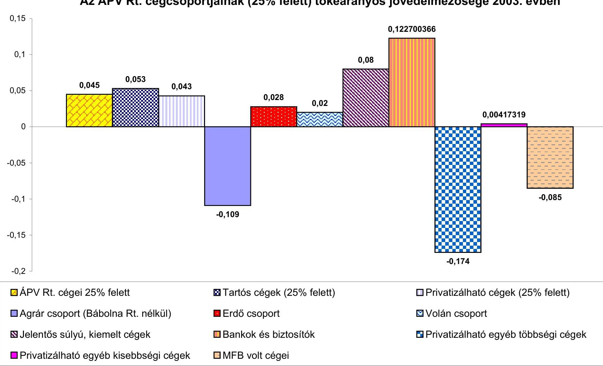

# Az ÁPV Rt. cégcsoportjainak (25% felett) tőkearányos jövedelmezősége 2003. évben

| 

 ÁPV Rt. cégei 25% felett | Tartós cégek (25% felett) | Privatizálható cégek (25% felett)  |
| --- | --- | --- |
|  Agrár csoport (Bábolna Rt. nélkül) | Erdő csoport | Volán csoport  |
|  Jelentős súlyú, kiemelt cégek | Bankok és biztosítók | Privatizálható egyéb többségi cégek  |
|  Privatizálható egyéb kisebbségi cégek | MFB volt cégei |   |

---

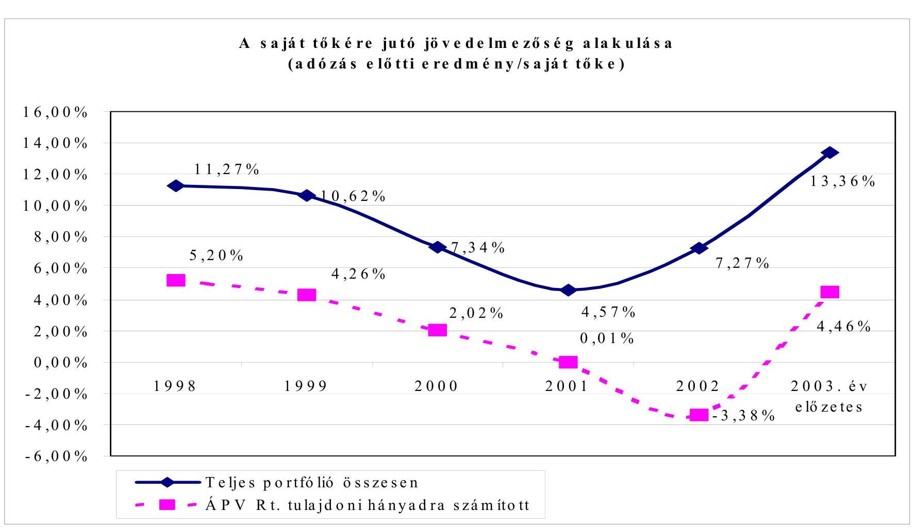

Forrás: ÁPV Rt. Kontrolling Információs Rendszer 2004. 05. 31-i adatközlés

---

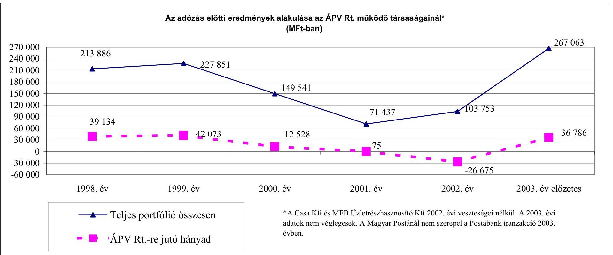

# Az adózás előtti eredmények alakulása az ÁPV Rt. működő társaságainál* (MFt-ban)

|  Adózás | ÁPV Rt. | ÁPV Rt. | ÁPV Rt.  |
| --- | --- | --- | --- |
|  270 000 | 213 886 | 227 851 | 149 541  |
|  240 000 |  |  |   |
|  210 000 |  |  |   |
|  180 000 |  |  |   |
|  150 000 |  |  |   |
|  120 000 |  |  |   |
|  90 000 |  |  |   |
|  60 000 |  |  |   |
|  30 000 |  |  |   |
|  0 |  |  |   |
|  -30 000 |  |  |   |
|  -60 000 |  |  |   |
|  1998. év |  |  |   |
|  1999. év |  |  |   |
|  2000. év |  |  |   |
|  2001. év |  |  |   |
|  2002. év |  |  |   |
|  2003. év előzetes |  |  |   |

*A Casa Kft és MFB Üzletrészhasznosító Kft 2002. évi veszteségei nélkül. A 2003. évi adatok nem véglegesek. A Magyar Postánál nem szerepel a Postabank tranzakció 2003. évben.

---

# 8. sz. melléklet

a V- 02-43/2004. számú jelentéshez Forrás Rt.-be apportált részesedések kimutatása

|   | ÁPV Rt.-nél lévő apportálás előtti |  |  | ÁPV Rt.-nél lévő apportba adott |  |   |
| --- | --- | --- | --- | --- | --- | --- |
|  Társaság megnevezése | tulajdoni
hányad | jegyzett tőke érték / eFt | nyilvántartási (saját tőke) érték /eFt | részesedés
mértéke a
teljes
üzletrész
arányában | jegyzett tőke érték / eFt | nyilvántartási (saját tőke) érték /eFt  |
|  ANKERBROT Rt. | 43,16% | 117700 | 80000 | 43,16% | 117700 | 80000  |
|  Antenna Hungária Rt. | 78,71% | 9347303 | 14171249 | 5,00% | 593740 | 900157  |
|  Bácska Agrár Rt. | 1,97% | 8910 | 21684 | 1,97% | 8910 | 21684  |
|  Borászati Vállalkozási Kft. | 22,92% | 200000 | 70000 | 22,92% | 200000 | 70000  |
|  Cartographia Kft. | 100,00% | 520000 | 885981 | 90,00% | 468000 | 797383  |
|  Finomhengermű Munkás Kft. | 22,07% | 75000 | 79064 | 22,07% | 75000 | 79064  |
|  FORTE Fotokémia Rt. | 3,66% | 39456 | 30467 | 3,66% | 39456 | 30467  |
|  HM Centrál Mosodák Rt. | 100,00% | 624320 | 862687 | 100,00% | 624320 | 862687  |
|  Hungaropharma Rt. | 49,99% | 3009400 | 5924385 | 10,00% | 601880 | 1184879  |
|  INNOVATEXT Rt. | 100,00% | 100000 | 89015 | 90,00% | 90000 | 80114  |
|  Kontur Kereskedelmi Rt. | 43,05% | 380010 | 180000 | 43,05% | 380010 | 180000  |
|  Mertcontrol Rt. | 25,08% | 32600 | 53368 | 25,08% | 32600 | 53368  |
|  MITT Rt. | 7,78% | 27224 | 25000 | 7,78% | 27224 | 25000  |
|  Muzeális Borforgalmazó Kft. | 32,02% | 65290 | 130000 | 32,02% | 65290 | 130000  |
|  Pécsi Építő és Tatarozó Rt. | 12,96% | 9365 | 22726 | 12,96% | 9365 | 22726  |
|  Pécsi Mg.Rt. | 9,73% | 27090 | 29016 | 9,73% | 27090 | 29016  |
|  Richter Gedeon Rt. | 25,16% | 4688477 | 36033860 | 0,16% | 29104 | 223682  |
|  Tesco Kft. | 76,37% | 190920 | 266300 | 76,37% | 190920 | 266300  |
|  Tokaj Kereskedőház Rt. | 100,00% | 2836780 | 7706864 | 23,00% | 652460 | 1772580  |
|  V.H.J. Kft. | 15,00% | 10500 | 14603 | 15,00% | 10500 | 14603  |
|  Zala Bútor Rt. | 21,10% | 124438 | 59962 | 21,10% | 124438 | 59962  |
|  Zalaegerszegi Agrár Kft. | 7,47% | 54150 | 35365 | 7,47% | 54150 | 35365  |
|  Összesen: |  | 22488933 | 66771596 |  | 4422157 | 6919037  |

---

# Az erdőgazdasági társaságok környezetvédelmi támogatásának teljesítményellenőrzése 

## A téma jelentősége

Az Állami Számvevőszék a 2001. és 2002. évi vizsgálata során megállapította, hogy az Állami Privatizációs és Vagyonkezelő Rt. portfóliójába tartozó társaságoknak nyújtott környezetvédelmi támogatásainál a támogatásban részesülő társaságok előfinanszírozás keretében jutottak forrásokhoz. Sok esetben sem előzetes tervvel, sem kivitelezési tervvel nem rendelkeztek a társaságok. A kapott forrásokkal évek múlva kellett elszámolni.

A ténylegesen elvégzett feladatok utófinanszírozásának folyamat-ellenőrzése indokolja, hogy a fenti témát választottuk a teljesítményellenőrzésre.

## A környezetvédelmi támogatás célja

Az Állami Privatizációs és Vagyonkezelő Rt. erdészeti portfoliójába tartozó társaságok a vagyonkezelésükbe tartozó erdőterületeiken illegálisan lerakott hulladékok felszámolása céljából az ÁPV Rt.-hez fordultak környezetvédelmi célú támogatásért. Az ÁPV Rt. 2003. évi üzleti tervében a „K.2.2. Az állam tulajdonosi feladatai kapcsán környezetvédelmi feladatok finanszírozása" megnevezés alatt az agrártársaságok részére 275 millió Ft keretösszeg szerepel. A beadott igénybejelentések alapján ebből a keretösszegből az erdőgazdaságok részére mintegy 50 millió Ft felhasználását tervezték a fenti célra. Az erdőgazdasági társaságoknak folyamatosan nagy terhet jelent a kezelt erdeikben történő illegális hulladéklerakás. A felszámolásra saját forrással csak korlátozottan rendelkeznek. Ezért az ÁPV Rt. fontosnak tartja a tulajdonosi forrás biztosítását a környezetvédelmi célú támogatásra.

## A környezetvédelmi feladatok jogszabályi háttere

Az 1996. évi LIV. törvény sok egyéb mellett meghatározza az erdőterületek látogatását az állampolgárok részéről üdülés, sportolás, pihenés kapcsán, és egyben meghatározza az erdőgazdálkodó ez irányú teendőit is. Konkrétan erre vonatkozik a fenti törvény 80. § (1) bekezdése, valamint a 80. § (3) bekezdése, amelyek kimondják, hogy:
„Az erdőterületen - annak rendeltetésétől függetlenül - üdülés és sportolás céljából gyalogosan bárki saját felelősségére ott tartózkodhat, melyet az erdőgazdálkodó tűrni köteles."
„Az erdőgazdálkodó köteles az erdőgazdálkodási tevékenysége során megrongálódott turistautat, turisztikai berendezést, létesítményt haladéktalanul az eredeti állapotában helyreállítani, illetve rendeltetésszerű használatra alkalmassá tenni..."

Az erdészeti társaságok évek óta eredménytelenül harcolnak azok ellen, akik a képződött kommunális hulladékot, építési törmeléket az erdőkben helyezik el.

---

Több esetben felvették a társaságok a kapcsolatot az illetékes önkormányzatokkal, azonban hathatós segítséget egy esetben sem kaptak. Számtalan feljelentést tettek a rendőrség felé az ismert és ismeretlen hulladékelhelyezők ellen. Azonban az elkövető a legtöbb esetben továbbra is vagy ismeretlen maradt, vagy ha ismert volt, az ellene lefolytatott eljárás eredménytelen volt, mert a kiszabott büntetés soha nem volt elrettentő erejű.

# Az ÁPV Rt. intézkedése a környezetvédelmi támogatások felhasználására 

A 486/2001. (XI. 29.) IG sz. határozat IX. pontjának végrehajtása, valamint javaslat az ÁPV Rt. hozzárendelt vagyonába tartozó egyes társaságok környezetvédelmi tevékenységének, az ÁPV Rt. által környezetvédelmi kárelhárításokhoz biztosított források felhasználásának és az ellenőrizhetőség hatékonyabbá tételének érdekében tárgyú előterjesztésre az alábbi határozatot hozta:

Az ÁPV Rt. portfoliójába tartozó társaságok környezetvédelmi kármentesítéseire és beruházásaira biztosított forrás felhasználása az alábbiak szerint történhet:

1. A környezetvédelmi támogatás iránti igényt a társaságok fogalmazzák meg a tulajdonos, az ÁPV Rt. felé.
2. Az igény megfogalmazásakor már egy programtervet is mellékelni kell, ahol ismertetik a környezetvédelmi kármentesítés, vagy beruházás műszaki tartalmát, költségigényét és a finanszírozás lehetséges formáit.
3. A társaságért felelős portfóliókezelő igazgatóság véleményezteti a programot a környezetvédelmi igazgatósággal. A program a feladat végrehajtására alkalmas keretprogramként funkcionál, annak műszaki, pénzügyi és időbeni ütemezésének kidolgozásával.
4. A keretprogramot a megvalósításhoz szükséges környezetvédelmi támogatás javaslatával az illetékes portfoliókezelő igazgatóság és az Egyedi Projektek és Környezetvédelmi Igazgatóság jóváhagyásra terjeszti elő.
5. Az előterjesztés kapcsán az ÁPV Rt. Igazgatósága határoz a program elfogadásáról az éves üzleti terv keretein belül, a környezetvédelmi támogatás odaítélésének a mértékéről, ütemezéséről és az általa szükségesnek tartott ellenőrzés formájáról.
6. A környezetvédelmi program kivitelezése alatt a támogatott társaság Igazgatósága és Felügyelő Bizottsága folyamatosan figyelemmel kíséri a beruházások, illetve a kármentesítések megvalósítását, a beruházást és a befejezést követő 60 napon belül jelentést készítenek azok pénzügyi, műszaki megvalósításáról és az ellenőrzésről. A társaság Igazgatósága és Felügyelő Bizottsága kövesse figyelemmel a környezetvédelmi program ÁPV Rt. által elfogadott keretprogramjának megfelelő kivitelezését, és amennyiben ettől eltérést tapasztal, jelentési kötelezettsége van az ÁPV Rt. felé.
7. Az ÁPV Rt. a programterv alapján ítéli meg, hogy közvetlenül, vagy megbízottja útján szükséges-e rendszeres (havi, vagy negyedéves ciklusban) ellenőrizni a program végrehajtását.
8. A környezetvédelmi program finanszírozása utófinanszírozásban történik. A finanszírozásról hozandó döntés előfeltétele a társaság vezető szerveinek

---

zárójelentése a tényleges bekerülési költségekről. Az utófinanszírozás mellett a társaságnak van arra lehetősége, hogy a kivitelezés pénzügyi és időbeni ütemezésének megfelelően az elvégzett kivitelezési munkák után részteljesítésről dokumentációt nyújtson be, és ennek felülvizsgálata után a teljes kivitelezési összeg egy részének átutalását kérje az ÁPV Rt.-től.
9. Előterjesztést kell készíteni az ÁPV Rt. döntéshozó fóruma részére a környezetvédelmi támogatási összeg, vagy részösszeg átutalásáról.

# Az erdészeti társaságok támogatása 

Az ÁPV Rt. ügyvezetése a 2003. augusztus 19-ei ügyvezetői értekezletén 9 erdészeti társaságnak összesen 50 millió Ft értékben adott vissza nem térítendő környezetvédelmi támogatást az alábbiak szerint:

1. Szombathelyi Erdészeti Rt. 5 millió Ft
2. Egererdő Rt. 5 millió Ft
3. Észak-Magyarországi Erdőgazdasági Rt. 5 millió Ft
4. Kiskunsági Erdészeti és Faipari Rt. 5 millió Ft
5. Pilis Parkerdő Rt. 10 millió Ft
6. Nagykunsági Erdészeti Rt. 5 millió Ft
7. Délalföldi Erdészeti Rt. 5 millió Ft
8.
 "Gyulaj" Erdészeti és Vadászati Rt. 5 millió Ft
9. Vadex Rt. 5 millió Ft

A támogatást az illegális szemétlerakó helyekről a szemét elszállítására és a hulladéklerakás megelőzésére a Magyar Köztársaság 2003. évi költségvetéséről szóló 2002. évi LXII. tv. 13. sz. melléklet I. 2. b. pontja szerint, az ÁPV Rt. portfóliójába tartozó társaságok esetén az állam tulajdonosi felelősségével kapcsolatos környezetvédelmi feladatok finanszírozása keret terhére, egyéb környezetvédelmi ráfordítások jogcímen kapták a társaságok.

A támogatott társaságok az illegális hulladéklerakás megakadályozása (megnehezítése) érdekében preventív intézkedésként a következőket hajtották végre:

- A veszélyeztetett erdőrészletek fokozott ellenőrzése a civil szervezetek bevonásával, figyelőszolgálat szervezésével;
- A gépkocsiforgalom lehetőség szerinti megakadályozása sorompók üzemeltetésével;
- A gépkocsi behajtás megakadályozása egyéb egyszerű eszközökkel (földmunkával: árok, töltés, növénytelepítés, stb.).

## A teljesítményellenőrzés módszere

Az Állami Számvevőszék által adaptált teljesítmény-ellenőrzési eljárással vizsgáltuk a támogatott társaságok iratanyagát a támogatással kapcsolatban. Meggyőződtünk az elvégzett teljesítések valódiságáról, a tervdokumentációk szerinti feladatmegoldásról.

---

A teljesítményellenőrzés a fenti témában nyújtott támogatások eredményességének vizsgálatára irányult. A vizsgálati program összeállítása és a vizsgálat lefolytatása az Állami Számvevőszék által adaptált és alkalmazott teljesítményellenőrzés módszertanát követte. A vizsgálati cél szerint az eredményesség és hatékonyság kritériumát az jelenti, hogy az állami támogatásból megvalósult környezetvédelmi feladat-végrehajtás megfelelt-e a kitűzött célnak.

# 1. A TÁMOGATÁS IRÁNTI IGÉNYEK MEGFOGALMAZÁSA ELŐTT KÉSZÜLT-E HELYZETÉRTÉKELÉS AZ ILLEGÁLISAN LERAKOTT ERDEI SZEMÉT HELYZETÉRŐL: 

Igen, a társaságok évek óta folyamatosan önerőből is végzik e feladatokat, évente felmérik a területük szennyezettségét.
1.1. Az 1996. évi LIV. törvény meghatároz-e konkrét kötelezettséget az állami erdőt kezelő szervezetekre a hulladéklerakások megelőzése és megszüntetése érdekében:

Igen, az 1996. évi LIV. törvény sok egyéb mellett meghatározza az erdőterület látogatását az állampolgárok részéről üdülés, sportolás, pihenés kapcsán, és egyben meghatározza az erdőgazdálkodó ez irányú teendőit is. Konkrétan erre vonatkozik az Evt. 80. § (1) bekezdése, valamint a 80. § (3) bekezdés.

### 1.2. Van-e felelőse az illegálisan elhelyezett szeméthalmok megszüntetésének:

Igen. a 2000. évi XLIII. törvény (a hulladékgazdálkodásról) 30. § 1-3. bekezdése értelmében a területileg illetékes önkormányzat a feladatot az erdő vagyonkezelőjére átháríthatja.

### 1.3. Egyértelműen megfogalmazták-e a környezetvédelmi feladatokat:

Igen, a feladat az illegális hulladéklerakók megszüntetése és a területeken az újabb hulladéklerakók kialakulását célzó intézkedések végrehajtása (47/2003. (VIII. 19.) ÜV. sz. határozat tartalmazza)
2. Az ÁPV Rt. BIZTOSÍTOTTA-E A KÖRNYEZETVÉDELMI TÁMOGATÁSI KERETET AZ ERDŐTÁRSASÁGOK RÉSZÉRE AZ ILLEGÁLIS SZEMÉTTELEPEK FELSZÁMOLÁSÁRA:

Igen, 2000-től minden évben sor került az illegális hulladéklerakók megszüntetésének és preventív intézkedések végrehajtásának támogatására. Az ÁPV Rt. 2003. évi üzleti terve e célra 50 M Ft -ot tartalmazott.

---

# 2.1. Készült-e előterjesztés az Igazgatóság részére a támogatások odaítélésének módszerére: 

Igen, a „Javaslat az agrártársaságok 2003. évi környezetvédelmi támogatási rendszerére" címmel. Ez alapján került kiadásra a 14/2003. (I. 16.) IG. sz. határozat. Ez részletesen rendelkezik a támogatások odaítélésének módszertanáról és szempontrendszeréről. A felhasználható keret nagysága ( 50 M Ft ) alapján a támogatások odaítéléséről a döntést az ÁPV Rt. ügyvezetése hozta meg (47/2003.(VIII. 19.) ÜV. sz. határozat).

### 2.2. Felmérték-e, hogy a feladat végrehajtásához mekkora összeget biztosít az éves költségvetési törvény:

Igen, de az ilyen célú környezetvédelmi forrásokból az erdészeti társaságok a munkákhoz ténylegesen szükséges forrásoknak csak töredékét kapják a keretek szűkössége miatt.

## 3. A TÁMOGATOTT TÁRSASÁGOK KIVÁLASZTÁSÁNAK FOLYAMATÁNÁL KÉSZÜLT-E ELŐTANULMÁNY:

Igen, az érintett társaságok minden esetben készítettek.

### 3.1. A pályázatok benyújtásakor rendelkeztek-e a támogatott társaságok a feladat elvégzésére vonatkozó tervvel:

Igen, a benyújtott kérelmek tartalmazták azokat. Mind naturáliákban, mind költségekben elkészítették a társaságok a végrehajtani tervezett feladatok terveit.

### 3.2. A társaságok éves üzleti terve lehetővé tette-e a munkák saját kapacitással történő elvégzését:

Részben, az erdészeti társaságok az erdészeti munkák döntő hányadát külső vállalkozókkal végeztetik, mert saját kapacitások korlátozottan állnak rendelkezésre ilyen jellegű munkák végzésére. Ebből eredően a feladatok egy részét tudták csak általában saját kapacitással megoldani, míg más részét vállalkozókkal végeztették.

## 4. A KÖRNYEZETVÉDELMI MUNKÁK ELVÉGZÉSE A TÁMOGATOTT TÁRSASÁGOKNÁL A TERVEKNEK MEGFELELŐEN TÖRTÉNT-E:

Igen, minden esetben.

### 4.1. Szükség volt-e közbeszerzési eljárásra:

Nem.

---

# 4.2. A munkák végrehajtását a kivitelezés során ellenőrizték-e a társaságoknál, volt-e külső szakértő alkalmazva: 

Igen, az ÁPV Rt. a munkák terveknek megfelelő végrehajtására a társaságok igazgatóságait, a munkák ellenőrzésére a társaságok felügyelő bizottságait kérte fel.

### 4.3. A megvalósításhoz szükséges erőforrásokat biztosították-e a támogatás kiutalásáig:

Nem, az érintett társaságoknak maguknak kellett a munkákat finanszírozni az elszámolásuk elfogadásáig.

## 5. Az ÁPV Rt. RÉSZÉRŐL MEGFELELŐ VOLT-E A KIVITELEZÉS ALATTI, VALAMINT AZ UTÓLAGOS ELSZÁMOLÁS ELLENŐRZÉSE:

Igen, az ÁPV Rt. a programot utólag finanszírozta, kifizetésekre csak a munkák elszámolását követően került sor. A társaság vezető testületeinek zárójelentést kellett készíteniük az elvégzett feladatokról, műszaki tartalmukról és költségeiről, külön alapbizonylatokat az ÁPV Rt. nem kért be. Mivel az ÁPV Rt. a munkák ellenőrzésére a társaságok felügyelő bizottságait kérte fel, így azok terjesztették fel az elszámolásokat a kifizetési javaslattal. Az ÁPV Rt-n belül az Erdészeti és Agrárgazdasági Vagyonkezelő Igazgatóság és a Környezetvédelmi Igazgatóság igazolta a teljesítéseket, és ezeket követően került sor a kifizetésekre.

### 5.1. Készült-e zárójelentés a program végrehajtásáról a támogatott társaságoknál:

Igen, minden esetben készült, és azt a vezető testületek megtárgyalták.

### 5.2. Az ÁPV Rt. az utófinanszírozás előtt bekérte-e a támogatott társaságok zárójelentését a program végrehajtásáról:

Igen, minden esetben bekérésre került, mivel az képezte a kifizetés engedélyezésének alapját, minden esetben csatolva lettek a pénzügy felé továbbított teljesítés igazolásokhoz.

### 5.3. Készült-e tájékoztató az ÁPV Rt. Igazgatósága részére a környezetvédelmi támogatási összeg átutalásáról:

Igen, mind a 2004. évi tervek elfogadásához 2003. decemberében készített, mind a 2003. évi üzleti év lezárásához 2004. májusában az erdészeti társaságokról készített tájékoztató előterjesztés tartalmazza az erdészeti társaságoknak 2003-ban kifizetett tulajdonosi támogatások ismertetését.

---

# 5.4. A környezetvédelmi támogatások eredményessége 

A környezetvédelmi támogatások eredményesek voltak, mert a kitűzött célokat a támogatási kereten belül megvalósították. Az illegálisan lerakott szemetet maradéktalanul elszállították. A további szemétlerakások csökkentése érdekében hatékony intézkedéseket tettek.

---

# TANÚSÍTVÁNYOK JEGYZÉKE 

1. A hozzárendelt vagyon változása - összesített kimutatás (2003)
2. A hozzárendelt vagyon változása tranzakciók alapján 2003-ban
3. Pénzforgalmi szemléletű eredménykimutatás az ÁPV Rt. hozzárendelt vagyon bevételeiről és kiadásairól 2003-ban
4. Privatizációs tartalék (2003)
5. ÁPV Rt. kötelezettségeinek alakulása
6. Az ÁPV Rt. eszközállományának változása 2003. évben
7. Az ÁPV Rt. forrásainak összetétele 2003. évben
8. Az ÁPV Rt. működéséhez kapcsolódó anyagjellegű ráfordítások alakulása
9. Az ÁPV Rt. átlagos állományi létszámának alakulása 2003. évben
10. Az ÁPV Rt. állományi létszámának alakulása 2003. évben
11. Az ÁPV Rt. működésével kapcsolatos személyi jellegű ráfordítások alakulása
12. Az ÁPV Rt. munkavállalóinak 2003. évi beosztásonkénti átlagkeresete
13. Az ÁPV Rt. működő társaságainak adatai 2003-ban
14. A 2003. évi ÁSZ beszámoló és az auditált beszámoló közötti főbb különbségek levezetése

---

.

---

A hozzárendelt vagyon változása 2003. évben - összesített kimutatás a 2003. évi éves beszámoló alapján

1. sz. tanúsítvány V-02 43/2004.

|  Megnevezés | Nyitó adatok |  |  |  | Vagyonváltozás |  |  |  |  |   |
| --- | --- | --- | --- | --- | --- | --- | --- | --- | --- | --- |
|   |  |  |  |  | Tranzakciók alapján* |  |  | Gazdálkodás
eredményessége |  | Záró adatok  |
|   |  |  |  |  | Növekedés | Csökkenés |  | Növekedés | Csökkenés |   |
|   | db | millió Ft |  |  | db | millió Ft |  |  |  |   |
|  1. Gazdasági társaságok | 236 | 717 064 |  | 63 | 143 730 | 82 | 119 129 | 148 594 | 40 734 | 217  |
|  1.1. Működő társaságok | 167 | 716 829 |  | 60 | 143 730 | 69 | 118 981 | 148 594 | 40 734 | 158  |
|  1.1.1. Tartós állami tulajdonban lévő | 76 | 325 169 |  | 2 | 2 974 | 40 | 84 180 | 44 387 | 742 | 38  |
|  ebből: részvénytársaság | 73 | 319 877 |  | 2 | 2 974 | 38 | 83 650 | 44 387 | 742 | 37  |
|  egyéb társaság | 3 | 5 292 |  | 0 | 0 | 2 | 530 | 0 | 0 | 1  |
|  1.1.2. Teljes mértékben privatizálható | 91 | 391 660 |  | 58 | 140 756 | 29 | 34 801 | 104 207 | 39 992 | 120  |
|  ebből: részvénytársaság | 58 | 343 631 |  | 51 | 136 427 | 17 | 24 277 | 103 775 | 23 389 | 92  |
|  egyéb társaság | 33 | 48 029 |  | 7 | 4 329 | 12 | 10 524 | 432 | 16 603 | 28  |
|  1.2. Végelszámolás alatt álló társaságok | 8 | 235 |  | 0 | 0 | 4 | 148 |  |  | 4  |
|  1.3. Felszámolás alatt álló társaságok | 61 | 0 |  | 3 | 0 | 9 | 0 |  |  | 55  |
|  2.Állami vállalatok | 116 | 339 |  | 5 | 0 | 25 | 12 |  |  | 96  |
|  2.1. Működő vállalatok | 2 | 127 |  | 0 | 0 | 1 | 0 |  |  | 1  |
|  2.2. Végelszámolás alatt álló vállalatok | 14 | 212 |  | 1 | 0 | 5 | 12 |  |  | 10  |
|  2.3. Felszámolás alatt álló vállalatok | 100 | 0 |  | 4 | 0 | 19 | 0 |  |  | 85  |
|  3. Elvont, vásárolt, átvett vagyonelemek |  | 41 554 |  |  | 104 658 |  | 119 733 |  |  |   |
|  3.1. Immateriális javak |  | 0 |  |  | 1 |  | 0 |  |  |   |
|  3.2.

 Ingatlanok |  | 41 004 |  |  | 1 847 |  | 17 307 |  |  |   |
|  3.3. Egyéb eszközök |  | 550 |  |  | 102 810 |  | 102 426 |  |  |   |
|  4. Termőföld |  | 2 600 |  |  | 0 |  | 8 |  |  |   |
|  5. Pénzkészlet |  | 7 296 |  |  | 223 243 |  | 189 117 |  |  |   |
|  6. Államkötvény | 1 014 857 | 10 149 |  |  | 0 | 1 014 857 | 10 149 |  |  | 0  |
|  7. Követelések |  | 23 486 |  |  | 73 833 |  | 7 958 |  |  |   |
|  8. Kötelezettségek |  | 114 264 |  |  | 113 617 |  | 30 052 |  |  |   |
|  HOZZÁRENDELT VAGYON ÖSSZESEN | 352 | 688 224 |  | 68 | 431 847 | 1 014 964 | 416 054 | 148 594 | 40 734 | 313  |

*A 4/a sz. melléklet összesített adatait tartalmazza

Budapest, 2004. július 28.

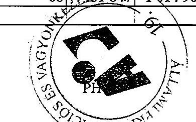

---

|  Megnevezés | Nyitó adatok 2003.01.01 |  |  |  |  |  |  |  |  |  |  |  |  |  |  |  |  |  |  |  |  |  |  |  |  |  |  |  |  |  |  |  |  |  |  |  |  |  |  |  |  |  |  |  |  |  |  |  |  |  |  |  |  |  |  |  |  |  |  |  |  |  |  |  |  |  |  |  |  |  |  |  |  |  |  |  |  |  |  |  |  |  |  |  |  |  |  |  |  |  |  |  |  |  |  |  |  |  |  |  | 

---

# Pénzforgalmi szemléletű eredménykimutatás az ÁPV Rt. hozzárendelt vagyon bevételeiről és kiadásairól 2003. évi végleges beszámolóban

M Ft-ban

|   |  | költs. Előirányzat | üzleti terv | tény  |
| --- | --- | --- | --- | --- |
|   | Hozzárendelt vagyon folyó tételek NYITÓEGYENLEGE |  | 2144 | 2144  |
|  B.1.1. | Privatizációs bevétel |  | 219735 | 134264  |
|  B.1.2. | Vagyonhasznosítási bevételei |  | 117 | 139  |
|  B.1.3. | Kárpótlási jegy |  | 8726 | 8232  |
|  B.1. | Értékesítés és vagyonhasznosítás összesen |  | 228732 | 142635  |
|  B.2. | Kapott osztalék, részesedés |  | 14030 | 14089  |
|  B.3. | Egyéb bevételek |  | 5256 | 3555  |
|  B.4. | Gázközmű államkötvény kamata |  |  |   |
|  B. | Rendelt vagyonnal kapcsolatos bevételek összesen (B.1.- B.4.) |  | 248018 | 160279  |
|  Hozzárendelt vagyon kiadások |  |  |  |   |
|  K.1.1. | Hozzárendelt vagyon értékesítése előkész.nek ktg. kiadások, díjak | 4000 | 4210 | 2822  |
|  K.1.2. | Vagyonkezeléssel összefüggő ráfordítások | 1500 | 1500 | 954  |
|  K.1.3. | Privatizációval és vagyonkezeléssel összefüggő reorg. kifizetések | 550 | 550 | 622  |
|  K.1.4. | Az ÁPV Rt. működési költségei | 2500 | 2500 | 2500  |
|  K.1.5. | Alacsony kamatozású államadósság törlesztés E-hitelből | 8726 | 8726 | 8232  |
|  K.1. | Ráfordítások az 1995. évi XXXIX. tv. 23. §-a alapján | 17276 | 17486 | 15130  |
|  K.2.1. | Osztalékbefizetési kötelezettség a Központi Költségvetés felé | 8000 | 14030 | 14089  |
|  K.2.2. | Az állam tulajdonosi fel. kapcsán környezetvédelmi fel. finanszírozása | 3000 | 3000 | 3000  |
|  K.2.3. | Volt szovjet ingatlanok környezetvédelmi kárelhárítása | 1000 | 1000 | 768  |
|  K.2.4. | HM-től átvett tárgyi eszk. értékesítése kapcsán előzetesen felmer. ktg.-ek | 2000 | 2000 | 1684  |
|  K.2.4.1. | ebből: vagyonátvétel megelőlegezés költségei |  |  |   |
|  K.2.5. | Egyéb kötelezettségek (RFH Rt., Áht. tv. 109/G § 6.bek.) |  |  |   |
|  K.2. | Ráfordítások az 2000. évi CXXXIII. tv. alapján | 14000 | 20030 | 19541  |
|  I. | Hozzárendelt vagyont csökkentő kiadások |  | 37516 | 36671  |
|  K.3. | Üzleti célú befektetések | 6350 | 6350 | 5728  |
|  K.4. | Reorganizációs célú kifizetések | 11700 | 11700 | 11604  |
|  K.5. | Vagyontárgyak vásárlása | 14070 | 14070 | 13420  |
|  K.6. | Fejlesztési projektek |  |  |   |
|  K.7. | Tartalék feltöltése | 7500 | 9008 | 7858  |
|  K.8. | Részvény átcsoportosítás a priv. tartalékból | 44952 | 44952 | 44953  |
|  II. | Hozzárendelt vagyon változását nem eredményező kiadások |  | 84572 | 83563  |
|  III. | Költségvetési törvény szerinti befizetés |  |  | 41982  |
|  K. | Kiadások összesen | 115848 | 123569 | 160216  |
|   | Az adózott időszak pénzügyi egyenlege |  |  | 63  |
|   | Bankszámlák közötti rendezés |  |  | -1182  |
|   | Hozzárendelt vagyon folyó tételek ZÁRÓEGYENLEGE |  |  | 1025  |

Budapest, 2004. június 30.

---

Privatizációs tartalék 2003. évi ÁSZ beszámolóban

|   |  | költs. előirányzat | üzleti   terv | tény  |
| --- | --- | --- | --- | --- |
|   | Privatizációs tartalék bankszámla nyitóegyenlege |  | 5071 | 5071  |
|   | Gázközmükötvény nyitó egyenlege |  | 10149 | 10149  |
|   | Privatizációs tartalékba helyezett részvények nyitóegyenlege |  | 44835 | 44835  |
|   | Privatizációs tartalék NYITÓEGYENLEGE |  | 60055 | 60055  |
|   | Privatizációs tartalékképzés Ft összege |  | 11288 | 10138  |
|   | Tartalékfeltöltés részvényátcsoportosítás miatt |  | 44952 | 44953  |
|   | Gázközmű kötelezettségre kapott/értékesített kötvények |  | -2280 | -2280  |
|   | Privatizációs tartalékba/ból helyezett/kivezetett részvények |  | -44835 | -44835  |
|  T.K. | Privatizációs tartalékképzés összesen |  | 9125 | 7976  |
|  T.F. | Összes forrás |  | 69180 | 68031  |
|  T.1. | Jótállással, szavatossággal, kezességvállalással kapcs. kifiz. |  | 3185 | 3119  |
|  T.2. | Készfizető kezességek, átvállalt tartozások kiegyenlítése |  | 91 | 93  |
|  T.3. | Konszernfelelősség alapján történő kifizetés |  | 625 | 235  |
|  T.4. | Elvont vagyontárgyak után beálló kezesi felelősség rendezése |  | 10095 | 4805  |
|  T.5. | Szerződéses kapcsolaton alapuló tartozás kiegyenlítése |  | 1125 | 25  |
|  T.6. | E-hitel garancialehívás teljesítése |  |  |   |
|  T.7. | Önkormányzati járandóság teljesítése |  | 9284 | 5863  |
|  T.8. | Privatizációs ellenérték hányad |  | 732 | 25  |
|  T.9. | Villamosipari dolgozók, energiaszektor priv.kapcs. kötött megállapodások fedezete |  | 1093 | 1335  |
|  T.10. | Kárpótlási jegyek életjáradékra váltása |  | 3188 | 2947  |
|  T.11. | A „reverzális levelek" alapján történő kifizetések |  |  |   |
|  T.12. | A gázközművekkel kapcsolatos önkormányzati igények rendezése |  | 10308 | 10170  |
|   | Ebből: pénzbeni rendezés |  |  | 2301  |
|   | államkötvénnyel való rendezés |  |  | 7869  |
|  T.13. | A privatizációs tartalékból történő kifizetésekkel kapcsolatos ráfordítások |  | 180 | 232  |
|  T. | Összes kiadás |  | 39906 | 28849  |
|   | Bankszámlák közötti rendezés |  |  | 1185  |
|   | Gázközmükötvény záróegyenlege |  |  |   |
|   | Privatizációs tartalékba helyezett részvények záróegyenlege |  |  |   |
|   | Privatizációs tartalék bankszámla záróegyenlege |  |  | 40367  |
|   | Privatizációs tartalék ZÁRÓEGYENLEGE |  |  | 40367  |

Budapest, 2004. június 30.

---

ÁPV Rt. kötelezettségeinek alakulása (2003. január 1 - 2003. december 31.)

|  Normatív kötelezettségek | 2003.01.01-i nyitó |  |  | Növekedés |  | Csökkenés |  |  | 2003. 12. 31-i záró |  |   |
| --- | --- | --- | --- | --- | --- | --- | --- |

 --- | --- | --- | --- |
|   | alap* |  | alap | korrekció | tárgyévi | korrekció | tárgyévi | alap | kamat | alap* | kamat |   |
|  PEH | 72 |  | 66 | 0 | 1 | 0 | 61 | 6 | 4 | 10 |   |
|  Önkormányzati járandóságok | 20 583 |  | 15 506 | 794 | 217 | 654 | 13 877 | 1 986 | 1 714 | 3 700 |   |
|  ebből Belterületi föld utáni járandóság | 8 189 |  | 3 691 | 714 | 217 | 212 | 3 139 | 1 271 | 1 642 | 2 913 |   |
|  ebből 1989. évi XIII. tv. szerint átalakult társas. | 7 134 |  | 3 108 | 588 | 34 | 208 | 2 546 | 976 | 1 369 | 2 345 |   |
|  1992. évi LIV. szerint átalakult társas. | 1 055 |  | 583 | 126 | 183 | 4 | 593 | 295 | 273 | 568 |   |
|  ebből Alapítói jog alapján járó járandóság | 2 286 |  | 1 707 | 80 | 0 | 442 | 630 | 715 | 72 | 787 |   |
|  ebből gázkötmű vagyon utáni kötelezettség | 10 108 |  | 10 108 | 0 | 0 | 0 | 10 108 | 0 | 0 | 0 |   |
|  Villamosípari dolgozók járandósága | 2 345 |  | 2 345 |  | 27 | 0 | 1 335 | 1 037 |  | 1 037 |   |
|  Egyéb kötelezettség | 12 333 |  | 12 333 | 0 | 122 742 | 0 | 0 | 135 075 | 0 | 135 075 |   |
|  ebből bánatpénz+szállítók+saját vagy. szembeni köt. | 2 941 |  | 2 941 | 0 | 86 344 | 0 | 0 | 89 285 | 0 | 89 285 |   |
|  Be nem jegyzett tőkeemelés | 6 151 |  | 6 151 | 0 | 59 | 0 | 0 | 6 210 | 0 | 6 210 |   |
|  Egyéb rövid lej. köt. | 3 076 |  | 3 076 | 0 | 10 561 | 0 | 0 | 13 637 | 0 | 13 637 |   |
|  Osztalék előleg | 0 |  | 0 | 0 | 4 516 | 0 | 0 | 4 516 | 0 | 4 516 |   |
|  Egyéb hosszú lej. köt. | 0 |  | 0 | 0 | 21 190 | 0 | 0 | 21 190 | 0 | 21 190 |   |
|  Priv. elők. kapcs. egyéb. köt. | 165 |  | 165 | 0 | 72 | 0 | 0 | 237 | 0 | 237 |   |
|  Normatív kötelezettségek összesen: | 35 333 |  | 30 250 | 794 | 122 987 | 654 | 15 273 | 138 104 | 1 718 | 139 822 |   |
|  Függő kötelezettségek |  |  |  |  |  |  |  |  |  |  |   |
|  Privatizációs szerződésebből eredő garancia és szavatosság | 11 110 |  | 11 046 | 230 | 6 253 | 0 | 4 549 | 12 980 | 0 | 12 980 |   |
|  ebből jogszavatosság | 5 804 |  | 5 740 | 0 | 1 290 | 0 | 1 471 | 5 559 | 0 | 5 559 |   |
|  kereskedelmi szavatosság | 358 |  | 358 | 230 | 4 963 | 0 | 0 | 5 551 | 0 | 5 551 |   |
|  környezetvédelmi garancia | 4 209 |  | 4 209 | 0 | 0 | 0 | 2 989 | 1 220 | 0 | 1 220 |   |
|  vagyonkezeléshez kapcsolódó garancia | 739 |  | 739 | 0 | 0 | 0 | 89 | 650 | 0 | 650 |   |
|  Elvont vagyon utáni kezesség | 29 042 |  | 10 727 | 0 | 0 | 0 | 5 951 | 4 776 | 19 188 | 23 964 |   |
|  PEH | 750 |  | 315 | 0 | 0 | 0 | 0 | 0 | 315 | 470 | 785  |
|  Önkormányzati járandóságok | 8 184 |  | 4 795 | 0 | 1 358 | 0 | 0 | 6 153 | 2 662 | 8 815 |   |
|  ebből Belter. Föld. (1989. évi XIII. tv.) | 5 554 |  | 4 405 | 0 | 943 | 0 | 0 | 5 346 | 1 655 | 6 981 |   |
|  ebből Belter. Föld. (1992. évi LIV. tv.) | 0 |  | 0 | 0 | 415 | 0 | 0 | 415 | 113 | 528 |   |
|  ebből Alapítói jog alapján járó járandóság | 2 830 |  | 392 | 0 | 0 | 0 | 0 | 392 | 914 | 1 306 |   |
|  Tőkepótlási kötelezettség (APV Rt. társaságok) | 84 |  | 84 | 0 | 882 | 0 | 0 | 966 | 0 | 966 |   |
|  Reverzális levelek utáni kötelezettség | 12 196 |  | 12 196 | 0 | 30 | 0 | 994 | 11 232 | 0 | 11 232 |   |
|  Egyéb kötelezettségek | 500 |  | 500 | 0 | 0 | 0 | 408 | 871 | 0 | 871 |   |
|  Apport visszavásárlás | 0 |  | 0 | 0 | 779 | 0 | 0 | 779 | 0 | 779 |   |
|  Malév Rt. részvény visszavásárlás | 500 |  | 500 | 0 | 0 | 0 | 408 | 92 | 0 | 92 |   |
|  Függő kötelezettségek összesen: | 61 866 |  | 39 663 | 250 | 510 | 8 523 | 0 | 11 902 | 37 293 | 22 320 | 59 613 |   |
|  Mindösszesen: | 97 199 |  | 69 913 | 1050 | 510 | 654 | 27 175 | 175 397 | 24 038 | 199 435 |  |   |

Budapest, 2004. augusztus 2.

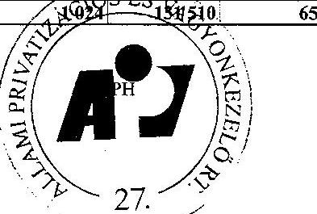

aláírás

---

Állami Privatizációs és Vagyonkezelő Rt.

Az ÁPV Rt. eszközállományának változása 2003. évi ÁSZ beszámolóhoz (saját vagyon)
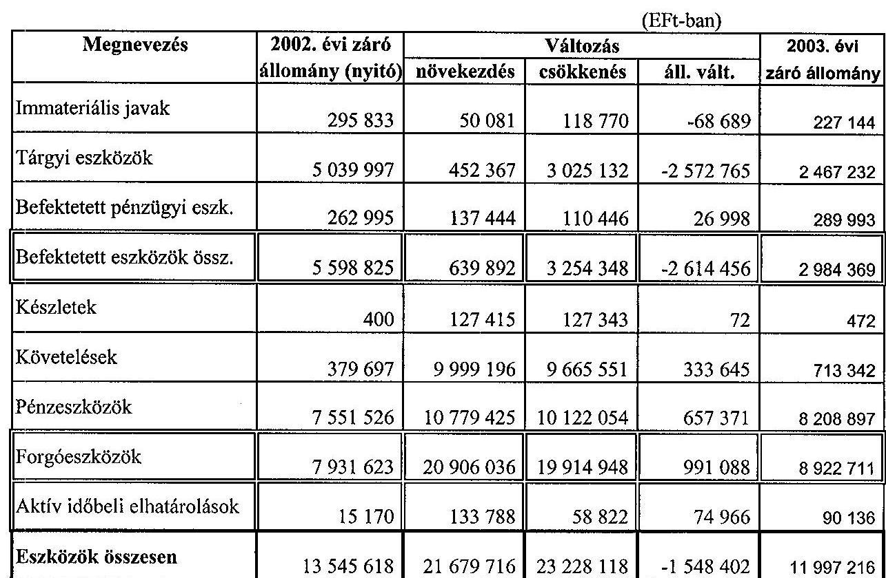

Budapest, 2004. július 28.
P.H.
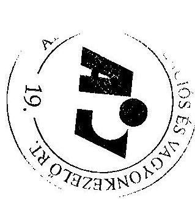

---

Állami Privatizációs és Vagyonkezelő Rt.

Az ÁPV Rt. forrásainak összetétele 2003. évi ÁSZ beszámolóhoz (saját vagyon)
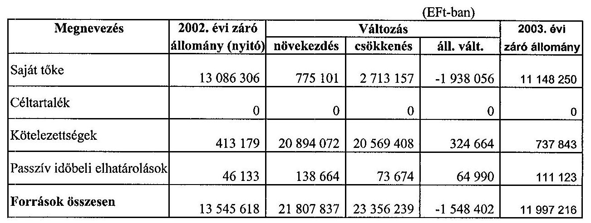

Budapest, 2004. július 28.
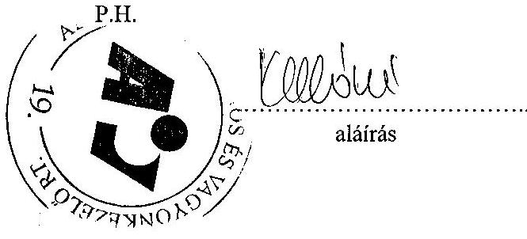

---

Állami Privatizációs és Vagyonkezelő Rt.

Az ÁPV Rt. működéséhez kapcsolódó anyagjellegű ráfordítások alakulása 2003. évi végleges beszámolóhoz (saját vagyon)
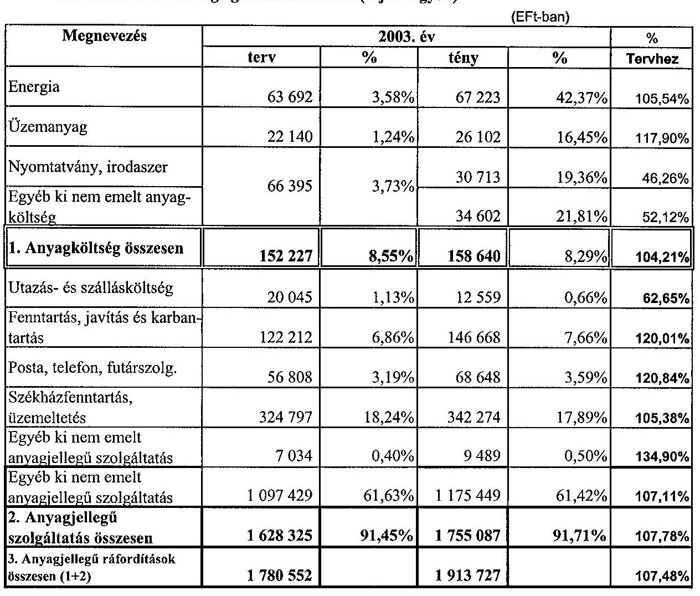

Budapest, 2004. július 28.
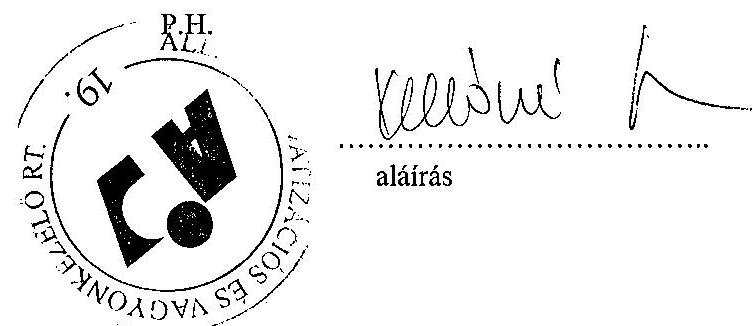

---

# Az ÁPV Rt. állományi létszámának alakulása 2003. évben 

létszámadatok: főben

| Megnevezés | 2003. év |  | Telj. %-a   tervhez |
| :-- | :--: | :--: | :--: |
|  |  | tény |  |
| Teljes munkaidőben foglalkoztatott | 248 | 242 | 97,6 |
| Részmunkaidőben foglalkoztatott | 2 | 2 | 100,0 |
| Állományi létszám összesen | 250 | 244 | 97,6 |

Budapest, 2004. március 02.
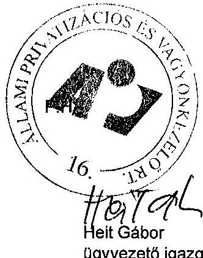

---

# Az ÁPV Rt. állományi létszámának alakulása 2003. évben 

létszámadatok: főben

| Beosztás | 2003. december 31. |  |
| :-- | :--: | :--: |
|  | Státusz | Betöltött állás |
| Felsővezetők |  | 6 |
| Ügyvezető igazgatók |  | 15 |
| Ügyvezető igazgató-helyettesek |  | 27 |
| Menedzserek |  | 133 |
| Ügyintézők |  | 67 |
| Ügyviteli dolgozók |  | 0 |
| Fizikai dolgozók |  | 0 |
| Összesen | 250 | 248 |

Budapest, 2004. március 02.
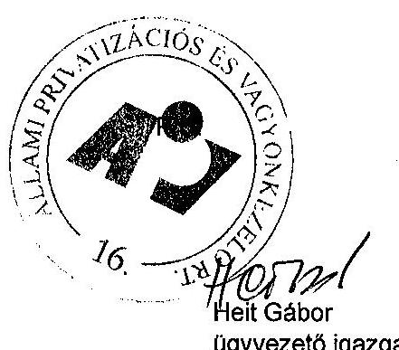

---

Állami Privatizációs és Vagyonkezelő Rt.

# Az ÁPV Rt. működésével kapcsolatos személyi jellegű ráfordítások alakulása 2003. évben

értékadatok: E Ft-ban

|  Megnevezés |  |  | 2003 év |  | Telj. %  |
| --- | --- | --- | --- | --- | --- |
|   | terv | % | tény | % | tervhez  |
|  Bérköltség | 1 971 153 | 51,09 | 1 784 042 | 52,79 | 90,51  |
|  ebből jutalmak | 173 630 | 4,50 | 152 096 | 4,50 | 87,60  |
|  Személyi jellegű kifizetések | 1 887 271 | 48,91 | 1 595 376 | 47,21 | 84,53  |
|  ebből: szerzői díjak | 0 | 0,00 | 0 | 0,00 | 0,00  |
|  étkezési hozzájárulás | 12 000 | 0,31 | 11 034 | 0,33 | 91,95  |
|  üdülési hozzájárulás | 7 500 | 0,19 | 6 299 | 0,19 | 83,99  |
|  albérleti hozzájárulás | 0 | 0,00 | 0 | 0,00 | 0,00  |
|  utazási hozzájárulás (munkábajárás) | 6 600 | 0,17 | 5 559 | 0,16 | 84,23  |
|  reprezentáció és üzleti ajándék | 41 000 | 1,06 | 30 076 | 0,89 | 73,36  |
|  segélyek | 4 000 | 0,10 | 1 410 | 0,04 | 35,25 
 |
|  saját gépjármű hivatali használata | 4 500 | 0,12 | 2 117 | 0,06 | 47,04  |
|  belföldi napidíj (állományon belüli) | 500 | 0,01 | 14 | 0,00 | 2,80  |
|  külföldi napidíj (állományon kívüli) | 5 000 | 0,13 | 1 727 | 0,05 | 34,54  |
|  betegszabadság | 23 000 | 0,60 | 15 573 | 0,46 | 67,71  |
|  egyéb személyi jellegű kifizetés | 716 549 | 18,57 | 641 776 | 18,99 | 89,56  |
|  munkáltatót terhelő táppénz | 6 500 | 0,17 | 1 844 | 0,05 | 28,37  |
|  nyugdíjpénztári hozzájárulás | 125 740 | 3,26 | 112 954 | 3,34 | 89,83  |
|  dolgozók életbiztosítása | 0 | 0,00 | 0 | 0,00 | 0,00  |
|  belső továbbképzés | 6 000 | 0,16 | 5 918 | 0,18 | 98,63  |
|  egészségpénztári hozzájárulás | 30 000 | 0,78 | 28 300 | 0,84 | 94,33  |
|  munkaruha | 92 934 | 2,41 | 89 728 | 2,66 | 96,55  |
|  társadalombiztosítási járulék | 805 448 | 20,88 | 641 047 | 18,97 | 79,59  |
|  Személyi jellegű ráfordítások összesen | 3 858 424 | 100,00 | 3 379 418 | 100,00 | 87,59  |

Budapest, 2004. május 18.

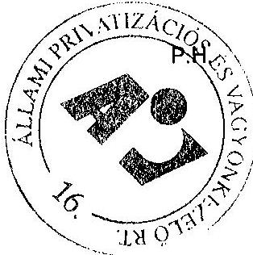

Helt Bábor ügyvezető igazgató

---

# Az ÁPV Rt. munkavállalóinak 2003. évi beosztásonkénti átlagkeresete 

| Sorszám | Beosztás | 2003. évi átlagkereset (Ft/fő/hó) |
| :--: | :-- | --: |
| 1 | Felsővezetők | 2497288 |
| 2 | Ügyvezető igazgatók | 1054762 |
| 3 | Ügyvezető igazgató-helyettesek | 756611 |
| 4 | Menedzserek | 481834 |
| 5 | Ügyintézők | 222735 |
| 6 | Ügyviteli dolgozók | 0 |
| 7 | Fizikai dolgozók | 0 |
| 8 | Összesen | 530063 |

Budapest, 2004. március 02.
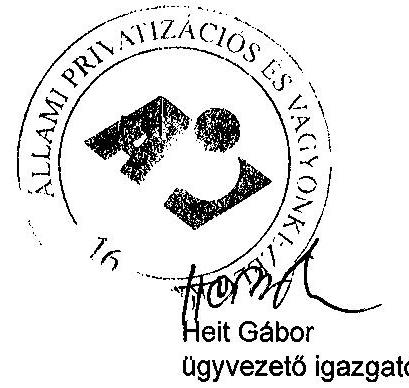

---

1. sz. tanúsítvány V-02- 43 /2004.

# Az ÁPV Rt. működő társaságainak adatai 2003. évben

|  Ssz. | Működő társaságok és társaságcsoportok | ÁPV Rt. tulajdoni hányad (%) | ÁPV Rt. tartós tulajdoni hányad (%) (2003. évi cégek) | Mérlegfőösszeg | (E Ft) | Saját tőke összesen (E Ft) | Saját tőke ÁPV Rt. tulajdonrész (E Ft) (számított)  |
| --- | --- | --- | --- | --- | --- | --- | --- |
|   |  | 2002. év | 2003. év | 2002. év | 2003. év | 2002. év | 2003. év  |
|   | Összesen |  |  |  | 2 957 744 424 | 3 859 887 694 | 1 323 589 091  |
|   | Agrár csoport |  |  |  | 105 768 903 | 107 101 089 | 44 994 698  |
|   | 1. Sábolna (csoport) | 98,87% | 98,87% |  | 43 090 218 | 45 205 296 | 5 670 548  |
|   | Agrár csoport 2003 (Sábolna Mg. Rt. nélkül) |  |  |  | 62 678 685 | 61 895 793 | 39 324 150  |
|   | 2. Abaúji Charolais Mezőgazdasági Rt. | 96,21% | 96,21% | 75% | 498 957 | 482 639 | 415 907  |
|   | 3. Alcsiszigeti Mg. (csoport) | 95,59% | 95,59% |  | 2 961 030 | 3 071 230 | 1 750 656  |
|   | 4. Balatoni Halászati Rt. | 95,10% | 95,93% | 75% | 1 855 072 | 1 617 100 | 558 975  |
|   | 5. Bácsaimási Agráripart Rt. | 93,83% | 93,83% |  | 4 267 783 | 4 250 560 | 2 777 901  |
|   | 6. Bólyi Mg. (csoport) | 90,59% | 90,59% | 75% | 17 539 762 | 17 532 087 | 7 738 451  |
|   | 7. Enyingi Agrár Rt. | 93,40% | 93,40% |  | 3 536 133 | 3 388 855 | 2 304 465  |
|   | 8. Fertő-tavi Nádgazdasági Rt. | 96,03% | 96,24% | 75% | 485 303 | 440 681 | 389 457  |
|   | 9. Hód-Mezőgazda Rt. | 95,79% | 95,79% | 75% | 6 106 029 | 5 713 457 | 4 098 122  |
|   | 10. Komáromi Mg. Termelő és Szolgáltató Rt. | 94,93% | 94,93% |  | 3 714 307 | 3 696 371 | 2 421 466  |
|   | 11. Martonseed Martonvásári Mg. Rt. | 100,00% | 100,00% | 50%+1 | 2 283 531 | 2 261 803 | 1 582 429  |
|   | 12. Mezőhegyesi Állami Ménesbítők Rt. | 94,52% | 94,52% |  | 6 465 580 | 6 717 887 | 3 884 247  |
|   | 13. Szerencsi Mg. Rt. | 94,57% | 94,57% |  | 4 316 358 | 4 214 237 | 3 394 670  |
|   | 14. Tokaji Kereskedőház Rt. | 100,00% | 77,00% | 100% | 8 650 850 | 8 308 886 | 7 707 404  |
|   | Erdő csoport |  |  |  | 54 730 244 | 57 101 761 | 41 655 095  |
|   | 15. Bakonyerdő Erdészeti és Faipari Rt. | 100,00% | 100,00% | 100% | 100% | 5 324 811 | 5 552 225  |
|   | 16. Délaföldi Erdészeti Rt. | 100,00% | 100,00% | 100% | 100% | 880 886 | 939 254  |
|   | 17. Egererdő Erdészeti Rt. | 100,00% | 100,00% | 100% | 100% | 4 004 727 | 4 135 561  |
|   | 18. Észak-Magyarországi Erdőgazdasági Rt. | 100,00% | 100,00% | 100% | 100% | 3 203 519 | 3 427 961  |
|   | 19. Gemenci Erdő- és Vadgazdaság Rt. | 100,00% | 100,00% | 100% | 100% | 1 731 161 | 1 974 872  |
|   | 20. GYULAJ Erdészeti és Vadászati Rt. | 100,00% | 100,00% | 100% | 100% | 1 200 384 | 1 283 254  |
|   | 21. Ipoly Erdő Rt. | 100,00% | 100,00% | 100% | 100% | 2 541 864 | 2 586 965  |
|   | 22. Kisafföldi Erdőgazdaság Rt. | 100,00% | 100,00% | 100% | 100% | 2 203 024 | 2 319 969  |
|   | 23. Kiskunsági Erdészeti és Faipari (csoport) | 100,00% | 100,00% | 100% | 100% | 3 521 494 | 3 695 190  |
|   | 24. Mecskai Erdészeti (csoport) | 100,00% | 100,00% | 100% | 100% | 2 964 289 | 3 127 910  |
|   | 25. Nagykunsági Erdészeti és Faipari Rt. | 100,00% | 100,00% | 100% | 100% | 1 201 591 | 1 313 519  |
|   | 26. Nyírsági Erdészeti Rt. | 100,00% | 100,00% | 100% | 100% | 2 813 751 | 3 084 490  |
|   | 27. Pási Parkerdő Rt. | 100,00% | 100,00% | 100% | 100% | 5 113 875 | 5 378 846  |
|   | 28. Somogyi Erdészeti és Faipari (csoport) | 100,00% | 100,00% | 100% | 100% | 5 435 066 | 5 792 095  |
|   | 29. Szombathelyi Erdészeti Rt. | 100,00% | 100,00% | 100% | 100% | 1 883 660 | 2 164 142  |
|   | 30. Tanulmányi Erdőgazdaság Rt. | 100,00% | 100,00% | 100% | 100% | 1 792 896 | 1 710 977  |

---

# Az ÁPV Rt. működő társaságainak adatai 2003. évben

|  Ssz. | Működő társaságok és társaságcsoportok | ÁPV Rt. tulajdoni hányad (%) |  | ÁPV Rt. tartós
tulajdoní hányad (%) (2003. évi cégek) |  | Mérlegfőösszeg | (E Ft) | Saját tőke összesen (E Ft) |  | Saját tőke ÁPV Rt. tul. rész (E Ft) (számított) |   |
| --- | --- | --- | --- | --- | --- | --- | --- | --- | --- | --- | --- |
|   |  | 2002.év | 2003.év | 2002.év | 2003.év | 2002.év | 2003.év | 2002.év | 2003.év | 2002.év | 2003.év  |
|  32 | Vértesi Erdészeti és Faipari Rt. | 100,00% | 100,00% | 100% | 100% | 1203970 | 1337451 | 1017763 | 1143076 | 1017763 | 1143076  |
|  33 | Zalai Erdészeti és Faipari (csoport) | 100,00% | 100,00% | 100% | 100% | 5621686 | 4603247 | 3705742 | 3824301 | 3705742 | 3824301  |
|   | Volán csoport |  |  |  |  | 72964191 | 82286382 | 38395841 | 42836370 | 35016542 | 39564480  |
|  34 | Ágria Volán Rt. | 90,39% | 90,68% | 50%+1 |  | 1448423 | 1615636 | 821192 | 854114 | 742275 | 774511  |
|  35 | Alba Volán Rt. | 92,06% | 94,69% | 50%+1 |  | 3870818 | 4386458 | 1810523 | 2091935 | 1666767 | 1980853  |
|  36 | Bakony Volán Rt. | 90,26% | 92,96% | 50%+1 |  |

 1298176 | 1365582 | 661777 | 793946 | 597320 | 738052  |
|  37 | Balaton Volán Rt. | 91,91\% | 94,20\% | 50\%+1 |  | 1794775 | 2037364 | 994152 | 1224900 | 913725 | 1153856  |
|  38 | Bács Volán Rt. | 90,11\% | 90,14\% | 50\%+1 |  | 819291 | 884286 | 469130 | 472919 | 422733 | 426286  |
|  39 | Borsod Volán Rt. | 90,97\% | 91,06\% | 50\%+1 |  | 4398679 | 4821280 | 2296600 | 2401922 | 2089217 | 2187190  |
|  40 | Gemenc Volán Rt. | 92,69\% | 92,92\% | 50\%+1 |  | 2203985 | 2570685 | 1248522 | 1255269 | 1157255 | 1166396  |
|  41 | Hajdú Volán Rt. | 91,26\% | 91,42\% | 50\%+1 |  | 3111708 | 3417126 | 1871132 | 1917237 | 1707595 | 1752738  |
|  42 | Hevesi Volán Rt. | 91,16\% | 91,31\% | 50\%+1 |  | 456011 | 585834 | 197196 | 198164 | 179764 | 180944  |
|  43 | Jász-Nagykun-Szolnok Volán (csoport) | 91,12\% | 91,21\% | 50\%+1 |  | 3103745 | 3500617 | 2203065 | 2350546 | 2007433 | 2143933  |
|  44 | Kapos Volán Rt. | 90,30\% | 91,24\% | 50\%+1 |  | 2633067 | 2918878 | 1424346 | 1439059 | 1286184 | 1312997  |
|  45 | Kisalföld Volán Rt. | 73,34\% | 73,34\% | 50\%+1 |  | 5135071 | 5246205 | 2659082 | 2818011 | 1950171 | 2066729  |
|  46 | Körös Volán Rt. | 92,10\% | 92,39\% | 50\%+1 |  | 2152904 | 2409042 | 1379970 | 1415178 | 1270952 | 1307483  |
|  47 | Kunság Volán (csoport) | 90,42\% | 90,47\% | 50\%+1 |  | 2642795 | 2558157 | 1241323 | 1296006 | 1123404 | 1172497  |
|  48 | Mátra Volán Rt. | 87,10\% | 87,21\% | 50\%+1 |  | 1285916 | 1354977 | 561627 | 564844 | 489177 | 492600  |
|  49 | Nógrád Volán Rt. | 90,62\% | 90,87\% | 50\%+1 |  | 1916552 | 2106153 | 855294 | 603854 | 775067 | 548731  |
|  50 | Pannon Volán Rt. (csoport) | 90,96\% | 91,03\% | 50\%+1 |  | 3957722 | 4216816 | 2143332 | 2146296 | 1949576 | 1953773  |
|  51 | Somogy Volán Rt. | 90,66\% | 93,00\% | 50\%+1 |  | 1407989 | 1483803 | 691316 | 624824 | 628747 | 767086  |
|  52 | Szabolcs Volán Rt. | 90,00\% | 90,00\% | 50\%+1 |  | 2974215 | 3182905 | 1451659 | 1464954 | 1306493 | 1318459  |
|  53 | Tisza Volán Rt. | 94,48\% | 94,80\% | 50\%+1 |  | 4667856 | 4570763 | 2262351 | 2349754 | 2137469 | 2227567  |
|  54 | Vas Volán Rt. | 90,52\% | 90,67\% | 50\%+1 |  | 2154605 | 2323883 | 862138 | 869048 | 780407 | 787966  |
|  55 | Vértes Volán (csoport) | 92,60\% | 92,60\% | 50\%+1 |  | 2837132 | 3197828 | 1396123 | 1406274 | 1283550 | 1302216  |
|  56 | Volánbusz (csoport) | 100,00\% | 100,00\% | 50\%+1 |  | 11789792 | 16127252 | 5852394 | 8933786 | 5852394 | 8933786  |
|  57 | Zala Volán (csoport) | 91,23\% | 91,23\% | 50\%+1 |  | 4902967 | 5435049 | 2961597 | 3143524 | 2701865 | 2667837  |
|   | Jelentős súlyú, kiemelt cégek |  |  |  |  | 1959323430 | 2638397411 | 895243178 | 1283449146 | 488727456 | 630913002  |
|  58 | Antenna Hungária (csoport) | 78,71\% | 73,71\% | 50\%+1 |  | 48700243 | 47949387 | 18003740 | 16904747 | 14170744 | 12460489  |
|  59 | Budapest Airport Rt. | 0,00\% | 100,00\% |  | 25\%+1 | 92361146 | 92050308 | 5911738 | 10733507 | 0 | 10733507  |
|  60 | Dunaferr (csoport) | 59,74\% | 60,53\% |  |  | 134718477 | 133557162 | 28830329 | 29332214 | 17223239 | 17754789  |
|  61 | Hungaropharma Gyógyszergyár (csoport) | 49,99\% | 15,00\% | 1. aranyr. | 1. aranyr. | 27940167 | 33455040 | 11848419 | 12401303 | 5923025 | 1860195  |
|  62 | Magyar Légiközlekedési (csoport) | 97,92\% | 99,93\% | 25\%+1 |  | 69574767 | 75246022 | 8334703 | 3494449 | 8161341 | 3492003  |
|  63 | Magyar Posta (csoport) | 100,00\% | 100,00\% | 100\% | 50\%+1 | 123833492 | 196490739 | 60294748 | 89771536 | 60294748 | 89771536  |
|  64 | Magyar Villamos Művek (csoport) | 99,86\% | 99,86\% | 50\%+1 | 50\%+1 | 392254000 | 448172000 | 237878000 | 288296000 | 237544971 | 287892386  |
|  65 | MAHART Magyar Hajózási (csoport) | 100,00\% | 100,00\% | 50\%+1 |  | 7254820 | 6118389 | 3428615 | 1377055 | 3428615 | 1377055  |

---

# Az ÁPV Rt. működő társaságainak adatai 2003. évben

|  Ssz. | Működő társaságok és társaságcsoportok | ÁPV Rt. tulajdonrészesedés (\%) |  | ÁPV Rt. tartós
tulajdonrészesedés (\%) (2003. évi cégek) |  | Mérlegfőösszeg | (E Ft) | Saját tőke összesen (E Ft) |  | Saját tőke ÁPV Rt. tul. rész (E Ft) (számított) |   |
| --- | --- | --- | --- | --- | --- | --- | --- | --- | --- | --- | --- |
|   |  | 2002.év | 2003.év | 2002.év | 2003.év | 2002.év | 2003.év | 2002.év | 2003.év | 2002.év | 2003.év  |
|  66 | MOL Magyar Olaj- és Gázipari (csoport) | 25,00\% | 22,73\% | 1. aranyr. | 1. aranyr. | 848159000 | 1356132000 | 351156000 | 635905000 | 87789000 | 144541207  |
|  67 | Richter Gedeon (csoport) | 25,16\% | 25,00\% |  |  | 177973000 | 205394000 | 154149000 | 178938000 | 38783888 | 44734500  |
|  68 | Szerencsejáték (csoport) | 100,00\% | 100,00\% | 100\% | 100\% | 36594318 | 43820364 | 15407888 | 16295335 | 15407888 | 16295335  |
|   | Hitelintézetek és biztosítók |  |  |  |  | 288152182 | 511134530 | 43128286 | 50215836 | 29638930 | 34432854  |
|  69 | Földhitel és Jelzálogbank Rt. | 35,37\% | 53,20\% |  |  | 115564918 | 310173282 | 5670982 | 11546688 | 2005826 | 6142836  |
|  70 | Hitelgarancia Rt. | 50,02\% | 50,02\% | 50\%+1 | 50\%+1 | 25457278 | 26269075 | 19656264 | 20766574 | 9832063 | 10387440  |
|  71 | Magyar Export-import Bank Rt. | 100,00\% | 100,00\% | 100\% | 100\% | 138466000 | 165608000 | 11654000 | 11709000 | 11654000 | 11709000  |
|  72 | Magyar Exporthitel Biztosító Rt. | 100,00\% | 100,00\% | 100\% | 100\% | 8663986 | 9084173 | 6147040 | 6193577 | 6147040 | 6193577  |
|   | Egyéb tartós és aranyrészvényes cégek |  |  |  |  | 94491518 | 78393615 | 35647100 | 33044645 | 9631074 | 8771595  |
|  73 | CD Hungary, Ing forg. és Szolg. Rt. | 0,01\% | 0,01\% | 1. aranyr. | 1. aranyr. | 18322126 | 10021912 | 97818 | 276963 | 10 | 28  |
|  74 | Herendi Porcelánmanufaktúra Rt. | 25,00\% | 25,00\% | 25\%+1 | 25\%+1 | 9176925 | 8694508 | 7389971 | 7428193 | 1847493 | 1857048  |
|  75 | Herz Szalámigyár Rt. | 0,00\% | 0,00\% | 1. aranyr. | 1. aranyr. | 4543569 | 4519245 | 1987663 | 2505101 | 0 | 0  |
|  76 | Kalocsai Fűszerpaprika Rt. | 0,00\% | 0,00\% | 1. aranyr. | 1. aranyr. | 2437529 | 2370629 | 1236637 | 1246506 | 0 | 0  |
|  77 | Nemzeti Tankönyvkiadó (csoport) | 100,00\% | 100,00\% | 50\%+1 | 25\%+1 | 3626906 | 3802327 | 3021662 | 2152610 | 3021662 | 2152610  |
|  78 | OTP Bank (csoport) | 0,00\% | 0,00\% | 1. aranyr. | 1. aranyr. |  |  |  |  |  |   |
|  79 | Pick (csoport) | 0,00\% | 0,00\% | 1. aranyr. | 1. aranyr. | 49163569 | 41939743 | 17151440 | 14673363 | 0 | 0  |
|  80 | Tiszavár Vízerőmű Kft. | 100,00\% | 100,00\% | 100\% | 100\% | 7220694 | 7045251 | 4761909 | 4761909 | 4761909 | 4761909  |
|   | Privatizálható többségi cégek |  |  |  |  | 97170373 | 97586157 | 45065956 | 47987909 | 44038296 | 39123148  |
|  81 | Autobusz-Invest Kft. | 100,00\% | 100,00\% |  |  | 5025313 | 4249721 | 747149 | 550116 | 747149 | 550116  |
|  82 | Budapest Fővárosi Útkarbantartó Kft. | 100,00\% | 100,00\% |  |  | 6347 | 4816 | -36245 | -42019 | -36245 | -42019  |
|  83 | Üsdög Fővárosi Útkarbantartó Kft. | 100,00\% | 100,00\% |  |  | 3722 | 14036 | -9903 | 4102 | -9903 | 4102  |
|  84 | Dunajen Vámügynökség Kft. | 50,40\% | 50,40\% |  |  | 268424 | 324523 | 246369 | 305683 | 124170 | 154064
  |
|  85 | ETERCEM Építőanyagipari Kft. | 100,00\% | 100,00\% |  |  | 594516 | 498447 | 486332 | 457822 | 486332 | 457822  |
|  86 | FORRAS Csoport | 100,00\% | 50,20\% |  |  | 9995982 | 17916123 | 2937189 | 16003923 | 2937189 | 8033969  |
|  87 | Helena Biokozmetikai Szalon Bt. | 96,77\% | 96,77\% |  |  |  |  |  |  | 0 | 0  |
|  88 | HUNNIA Főműstúdió Kft. | 100,00\% | 100,00\% |  |  | 146581 | 108485 | -38991 | 6149 | -38991 | 6149  |
|  89 | Kisrákus 2000 Kft. | 100,00\% | 100,00\% |  |  | 9534599 | 9523245 | 7925406 | 7386512 | 7925406 | 7386512  |
|  90 | M-ingatlan Rt. | 0,00\% | 100,00\% |  |  |  | 349327 |  | 259688 | 0 | 259688  |
|  91 | MAHART Szabadkikötő Rt. | 0,00\% | 100,00\% |  |  |  | 1794924 |  | 1520494 | 0 | 1520494  |
|  92 | MÁFILM Főműgyártási és Kultúrállami Rt. | 86,03\% | 86,03\% |  |  | 1564976 | 1605945 | 1417968 | 1387511 | 1219878 | 1193876  |
|  93 | Magyar Főmlaboratórium Kft. | 100,00\% | 100,00\% |  |  | 1005861 | 1034239 | 327026 | 367573 | 327026 | 367573  |
|  94 | Magyar Lóverseny Fogadást Szervező Kft. | 100,00\% | 100,00\% |  |  | 184708 | 185721 | 150129 | 134784 | 150129 | 134784  |
|  95 | MECSEKERC Környezetvédő Rt. | 100,00\% | 100,00\% |  |  | 3535368 | 4489522 | 1152749 | 1364507 | 1152749 | 1364507  |
|  96 | Mese Cukrászda Bt. | 99,13\% | 99,13\% |  |  | 33344 |  | 24157 |  | 23947 | 0  |
|  97 | Málenium Média Szolgáltató Központ Kft. | 100,00\% | 100,00\% |  |  | 5676105 | 5510211 | 5108910 | 5479656 | 5108910 | 5479656  |
|  98 | Mozgóképforgalmazási Rt. | 100,00\% | 100,00\% |  |  | 797384 | 777662 | 550053 | 580345 | 550053 | 580345  |

---

# Az ÁPV Rt. működő társaságainak adatai 2003. évben

|  Ssz. | Működő társaságok és társaságcsoportok | ÁPV Rt. tulajdonhányad (%) | ÁPV Rt. tartós
tulajdonhányad (%)
(2003. évi cégek) | Mérlegfőösszeg | (E Ft) | Saját tőke összesen (E Ft) | Saját tőke ÁPV Rt.tul. rész (E Ft)
(számított) |   |
| --- | --- | --- | --- | --- | --- | --- | --- | --- |
|   |  | 2002.év | 2003.év | 2002.év | 2003.év | 2002.év | 2003.év | 2002.év | 2003.év | 2002.év | 2003.év  |
|  99 | Nemzeti Lóverseny Kft. | 100,00\% | 100,00\% |  |  | 5761056 | 5873197 | 2435380 | 1856049 | 2435380 | 1856049  |
|  100 | Nitrokémia Vegyipari Rt. | 100,00\% | 100,00\% |  |  | 6022817 | 4907061 | 2467895 | 1309982 | 2467895 | 1309982  |
|  101 | Objektív Főműstúdió Kft. | 100,00\% | 100,00\% |  |  | 294040 | 239217 | 7314 | -1444 | 7314 | -1444  |
|  102 | Pannóniafilm Kft. | 100,00\% | 100,00\% |  |  | 226726 | 275561 | 182080 | 178788 | 182080 | 178788  |
|  103 | PRI-MAN Privatizációt Menedzselő Kft. | 100,00\% | 100,00\% |  |  | 140833 | 130532 | 75277 | 64839 | 75277 | 64839  |
|  104 | Prudent-Invest Rt. | 100,00\% | 100,00\% |  |  | 56231 | 125674 | 48247 | 108156 | 48247 | 108156  |
|  105 | REHAB Rt. | 50,00\% | 50,00\% | 50%+1 |  | 1453259 | 1495322 | 1058326 | 1087419 | 534163 | 543710  |
|  106 | REORG Gazdasági és Pénzügyi Rt. | 99,99\% | 99,99\% | 50%+1 |  | 722477 | 1014876 | 669525 | 710047 | 669458 | 709976  |
|  107 | Szövetkezeti Üzletrészhasznosító Kft. | 99,99\% | 99,99\% |  |  | 34890710 | 30025897 | 12000645 | 5125796 | 11999445 | 5125283  |
|  108 | Tisza Cipő Rt. | 80,73\% | 99,37\% |  |  | 908988 | 945604 | 891182 | 803250 | 719451 | 798190  |
|  109 | VALTO-4 Libra Rt. | 100,00\% | 100,00\% |  |  | 8320206 | 4186270 | 4231787 | 978181 | 4231787 | 978181  |
|   | Privatizálható kisebbségi cégek |  |  |  |  | 229274351 | 238718145 | 133310507 | 131571053 | 7151455 | 5766289  |
|  110 | AES-Tisza Erőmű Kft. (volt Rt. ) | 0,01\% | 0,01\% |  |  |  |  |  |  | 0 | 0  |
|  111 | ALFOLDINVEST Pénzügyi Szolgáltató Kft. | 4,10\% | 4,10\% |  |  | 248660 | 311457 | 60698 | 141435 | 2489 | 5799  |
|  112 | Balatonboglári Borg. Rt. | 0,00\% | 0,00\% |  |  | 4044673 | 3988033 | 3881999 | 3913593 | 0 | 0  |
|  113 | Budapest Elektronikus Művek Rt. | 0,09\% | 0,09\% |  |  | 127051000 | 128223003 | 69768000 | 70135000 | 62791 | 63122  |
|  114 | Carbigraphia Kft. | 100,00\% | 10,00\% | 50%+1 |  | 1313471 | 1279930 | 885951 | 886889 | 885951 | 88689  |
|  115 | D\&M ip. és Ker. Kft. | 30,00\% | 30,00\% |  |  | 2140 |  | 1129 |  | 339 | 0  |
|  116 | Egyesült Vegyiművek Rt. | 0,13\% | 0,13\% |  |  | 4974557 | 6064362 | 3425302 | 4010657 | 4453 | 5214  |
|  117 | Észak-magyarországi Áramszolgáltató Rt. | 0,01\% | 0,01\% |  |  |  |  |  |  | 0 | 0  |
|  118 | Győri EPFU Rt. | 10,00\% | 10,00\% |  |  | 1187098 |  | 943530 |  | 94353 | 0  |
|  119 | Hungaroring Sport Rt. | 2,33\% | 2,33\% |  |  | 8284539 | 8983363 | 7686357 | 7152897 | 179092 | 166663  |
|  120 | Hungaroton Music Rt. | 0,79\% | 0,79\% |  |  | 254209 | 236218 | 208358 | 209939 | 1646 | 1659  |
|  121 | Innovatex Rt. | 100,00\% | 5,61\% |  |  | 95010 | 96776 | 89015 | 90604 | 89015 | 5083  |
|  122 | La Prima Kft. | 5,00\% | 5,00\% |  |  | 54550 | 52359 | 6361 | 8483 | 318 | 424  |
|  123 | Lábod Rt. | 100,00\% | 10,00\% | 50%+1 |  | 656403 | 700708 | 346436 | 326737 | 346436 | 32674  |
|  124 | Metalloglobus Rt. | 0,01\% | 0,01\% |  |  | 5247340 | 4903299 | 4019416 | 3836167 | 402 | 384  |
|  125 | Rézkakas Kft. | 5,66\% | 5,66\% |  |  | 70057 | 68824 | 33410 | 62019 | 1891 | 3510  |
|  126 | Tiszántúli Áramszolgáltató Csoport | 0,01\% | 0,01\% |  |  |  |  |  |  | 0 | 0  |
|  127 | Transelektro Ganz Rock Rt. | 0,18\% | 0,18\% |  |  |  |  |  |  | 0 | 0  |
|  128 | Vértesi Erőmű Rt. | 29,96\% | 29,96\% |  |  | 31643813 | 39160373 | 18185477 | 18000837 | 5448369 | 5393051  |
|  129 | Villért Rt. | 4,89\% | 4,89\% |  |  | 876899 |  | 692861 |  | 33881 | 0  |
|  130 | AGROPRODUKT Mg. Rt. | 0,00\% | 0,00\% |  |  | 6069281 | 5967889 | 3045916 | 2809606 | 0 | 0  |
|  131 | Dalmandi Mg. Rt. | 0,00\% | 0,00\% |  |  | 5910627 | 5858125 | 3253413 | 3404678 | 0 | 0  |
|  132 | Déli-Pest Megyei Mezőgazdasági Rt. | 0,00\% | 0,00\% |  |  | 5120206 | 6305886 | 2893118 | 3487522 | 0 | 0  |
|  133 | Gödöllői Tangazdaság Rt. | 0,00\% | 0,00\% |  |  | 1473955 | 1424264 | 626045 | 453325 | 0 | 0  |

---

## Az ÁPV Rt. működő társaságainak adatai 2003. évben

|  Ssz. | Működő társaságok és társaságcsoportok | ÁPV Rt. tulajdonhányad (%) | ÁPV Rt. tartós
tulajdonhányad (%)
(2003. évi cégek) | Mérlegfőösszeg | (E Ft) | Saját tőke összesen (E Ft) | Saját tőke ÁPV Rt. túl. rész (E Ft)
(számított)  |
| --- | --- | --- | --- | --- | --- | --- | --- |
|   |  | 2002. év | 2003. év | 2002. év

 | 2003. év | 2002. év | 2003. év  |
|  134 | Herceghalmi Kísérleti Gazdaság Rt. | 0.00% | 0.00% |  | 2 270 170 | 1 558 730 | 1 057 211  |
|  135 | Hidasháti Mg. Rt. | 0.00% | 0.00% |  | 2 476 239 | 2 878 881 | 1 374 885  |
|  136 | Lajta-Hanság Rt. | 0.00% | 0.00% |  | 5 918 979 | 6 194 634 | 3 306 667  |
|  137 | Mezőfalvai Mg. Term. és Szolg. Rt. | 0.00% | 0.00% |  | 2 944 652 | 3 007 499 | 1 861 100  |
|  138 | Sárvári Mg. Rt. | 0.00% | 0.00% |  | 4 173 371 | 4 299 201 | 1 303 069  |
|  139 | Szarvási Mg. Termelő és Előfeld. Rt. | 0.00% | 0.00% |  | 2 083 978 | 2 327 459 | 1 337 396  |
|  140 | Szombathelyi Tangazdaság Rt. | 0.00% | 0.00% |  | 2 273 516 | 2 456 141 | 1 546 148  |
|  141 | Törökszentmiklósi Mg. Rt. | 0.00% | 0.00% |  | 2 554 758 | 2 374 734 | 1 471 211  |
|   | MFB-től vásárolt cégek |  |  |  | 55 869 232 | 49 168 604 | 46 238 430  |
|  142 | Aranykereszt Gondoskodás Háza Rt. | 0.00% | 88.88% |  | 159 518 |  | 74 242  |
|  143 | Agrárgazdasági Vagyonkezelő Kft. | 0.00% | 99.98% |  | 18 772 630 | 15 433 529 | 18 745 692  |
|  144 | Balazsi Hajózási Kft. | 0.00% | 48.99% |  | 4 250 560 | 4 730 744 | 3 361 571  |
|  145 | Borocó-Abaúj 2000 Vagyonkezelő Kft. | 0.00% | 98.98% |  | 1 235 184 | 558 322 | 1 063 442  |
|  146 | Cél MÉDIA Kommunikációs Rt. | 0.00% | 10.00% |  | 905 350 | 611 760 | 101 644  |
|  147 | Dél-Gabona Malomipari Rt. | 0.00% | 99.99% |  | 1 161 020 | 1 018 475 | 848 116  |
|  148 | ELMIB Első Magyar Infrastruktúra Bef. Rt. | 0.00% | 99.98% |  | 5 073 245 | 4 942 347 | 3 034 476  |
|  149 | Hozdánási Porcelán Rt. | 0.00% | 75.64% |  | 1 394 451 | 1 372 650 | 823 132  |
|  150 | Hungarpo Rt. | 0.00% | 82.01% | 1. aranyr. | 6 264 463 | 6 817 691 | 5 816 364  |
|  151 | Magyar Gázszolgáltató Kft. | 0.00% | 59.89% |  | 7 416 180 | 5 823 493 | 4 136 383  |
|  152 | Magyar Befektetési és Vagyonkezelő Rt. | 0.00% | 99.98% |  | 4 033 687 | 2 814 834 | 3 935 159  |
|  153 | Sodour Idegenforgalmi és Kárp. Rt. | 0.00% | 99.83% |  | 2 098 399 | 2 098 720 | 2 038 402  |
|  154 | Szabad Föld Rt. | 0.00% | 99.97% |  | 283 390 | 289 241 | 249 425  |
|  155 | Treport Vagyonhasznosító Kft. | 0.00% | 26.56% |  | 261 843 | 216 822 | 249 071  |
|  156 | Zsolnay Örökségkezelő Kht. | 0.00% | 99.71% |  | 375 773 | 401 846 | 370 674  |
|  157 | Zsolnay Porcelángyár Rt. | 0.00% | 92.88% | 1. aranyr. | 760 006 | 687 980 | 346 931  |
|  158 | Zsolnay Porcelánmanufaktúra Rt. | 0.00% | 100.00% |  | 1 423 533 | 1 350 150 | 1 043 706  |

Az aláhúzott cég adatai még nem véglegesek

A gazdálkodási adatok a 2003. évi kontrolling jelentés alapján készültek, ami nem minősül vagyonmérlegnek.

A Budapest Airport 2002. év után járó 1 900 M Ft-osztaléka az ÁPV Rt-nél 2003. évnél szerepel.

Tanúsítom, hogy az adatokra Kontrolling nyilvánvalóságai vonatkoznak.

Szecsei István ügyvezető igazgató

Kontrolling igazgatóság

---

# Az ÁPV Rt. működő társaságainak adatai 2003. évben

|  Ssz. | Működő társaságok és társaságcsoportok | Értékesítés nettó árbevétele (E Ft) |  |  |  |  | Állagos
statisztikai
létszám (fő) |  | Adózott eredmény
(E Ft) |  |  |  | ÁPV Rt.-re jutó Adózott
eredmény
(E FT) |  |  |  | ÁPV Rt.-re jutó
osztalék (2003. évi
cégkörnél) (E FT) |  |  |  | ROE (\%) |   |
| --- | --- | --- | --- | --- | --- | --- | --- | --- | --- | --- | --- | --- | --- | --- | --- | --- | --- | --- | --- | --- | --- |
|   |  | 2002.év |  | 2003.év |  | 2002.év | 2003.év | 2002.év |  | 2003.év |  | 2002.év |  | 2003.év |  | 2002.év |  | 2003.év |  |  |   |
|   | Összesen | 2992877661 | 3495413140 | 143863 | 124478 |  | -5020402 | 233716232 | -53171136 |  | 83400115 |  | 12271112 |  | 71781597 |  | 1,0 |  | 13,0 |  |   |
|   | Agrár csoport | 117169488 | 120054640 | 9790 | 9201 |  | -6716854 | -7023568 | -6687943 |  | -6786163 |  | 0 |  | 0 |  | -14,0 |  | -18,2 |  |   |
|  1 | Bábolna (csoport) | 67547771 | 72765225 | 3431 | 3142 |  | -6500419 | -3086204 | -6723574 |  | -3051330 |  | 0 |  | 0 |  | -114,4 |  | -153,6 |  |   |
|   | Agrár csoport 2003 (Bábolna Mg. Rt. nélkül) | 49621717 | 47289415 | 6359 | 6059 |  | 83565 | -3937364 | 35631 |  | -3734833 |  | 0 |  | 0 |  | 0,5 |  | -10,5 |  |   |
|  2 | Abaúji Charolais Mezőgazdasági Rt. | 310692 | 217668 | 73 | 76 |  | 27219 | -73569 | 26187 |  | -70781 |  | 0 |  | 0 |  | 0,5 |  | -20,3 |  |   |
|  3 | Alcsiszigeti Mg. (csoport) | 2334778 | 2426700 | 285 | 276 |  | 38385 | -262213 | 36692 |  | -250649 |  | 0 |  | 0 |  | 2,2 |  | -16,2 |  |   |
|  4 | Balatoní Halászati Rt. | 582932 | 666158 | 308 | 273 |  | -261737 | 145769 | -248912 |  | 139836 |  | 0 |  | 0 |  | -30,5 |  | 19,1 |  |   |
|  5 | Bácsalmási Agráripar Rt. | 3344803 | 3086449 | 598 | 567 |  | -110907 | -696121 | -104064 |  | -553170 |  | 0 |  | 0 |  | -4,0 |  | -32,4 |  |   |
|  6 | Bólyi Mg. (csoport) | 19035861 | 17485176 | 1633 | 1563 |  | 387581 | -864171 | 351110 |  | -782853 |  | 0 |  | 0 |  | 5,8 |  | -12,2 |  |   |
|  7 | Enyingi Agrár Rt. | 2772458 | 2977042 | 381 | 346 |  | 237033 | -254323 | 221389 |  | -237538 |  | 0 |  | 0 |  | 10,9 |  | -11,7 |  |   |
|  8 | Fertő-tavi Nádgazdasági Rt. | 379928 | 420377 | 132 | 128 |  | 6253 | -154048 | 6005 |  | -148256 |  | 0 |  | 0 |  | 1,6 |  | -64,1 |  |   |
|  9 | Hőst-Mezőgazda Rt. | 5837675 | 5545718 | 630 | 607 |  | 46414 | -497839 | 44460 |  | -476888 |  | 0 |  | 0 |  | 1,1 |  | -13,4 |  |   |
|  10 | Komáromi Mg. Termelő és Szolgáltató Rt. | 3435983 | 3001894 | 619 | 577 |  | -54943 | -617016 | -52157 |  | -585733 |  | 0 |  | 0 |  | -2,3 |  | -33,0 |  |   |
|  11 | Martonseed Martonvásári Mg. Rt. | 1140838 | 849960 | 183 | 173 |  | -128480 | -243266 | -128480 |  | -243266 |  | 0 |  | 0 |  | -8,1 |  | -17,0 |  |   |
|  12 | Mezőhegyesi Állami Ménesbírók Rt. | 5247180 | 4430994 | 711 | 708 |  | 6288 | -597807 | 5943 |  | -565047 |

 | 0 |  | 0 |  | 0,3 |  | $-18,4$ |  |   |
|  13 | Szerencsi Mg. Rt. | 3376577 | 3233692 | 500 | 484 |  | 239427 | 17023 | 226426 |  | 16099 |  | 0 |  | 0 |  | 7,6 |  | 0,6 |  |   |
|  14 | Tokaj Kereskedőház Rt. | 2122012 | 2947587 | 303 | 281 |  | $-348968$ | 160017 | $-348968$ |  | 123213 |  | 0 |  | 0 |  | $-4,6$ |  | 2,0 |  |   |
|   | Erdő csoport | 50104673 | 51381963 | 8111 | 7224 |  | 240372 | 1036485 | 240372 |  | 1036485 |  | 0 |  | 0 |  | 0,9 |  | 2,8 |  |   |
|  15 | Bakonyerdő Erdészeti és Faipari Rt. | 4511786 | 5329165 | 1084 | 923 |  | $-219000$ | 25941 | $-219000$ |  | 25941 |  | 0 |  | 0 |  | $-5,2$ |  | 0,0 |  |   |
|  16 | Délalföldi Erdészeti Rt. | 768949 | 778487 | 126 | 114 |  | 3602 | 6514 | 3602 |  | 6514 |  | 0 |  | 0 |  | 0,5 |  | 1,0 |  |   |
|  17 | Egererdő Erdészeti Rt. | 3033486 | 3348341 | 702 | 629 |  | $-86905$ | 50573 | $-86905$ |  | 50573 |  | 0 |  | 0 |  | $-3,3$ |  | 2,3 |  |   |
|  18 | Észak-Magyarországi Erdőgazdasági Rt. | 2628673 | 2833367 | 689 | 561 |  | 60269 | 69326 | 60269 |  | 69326 |  | 0 |  | 0 |  | 2,6 |  | 2,8 |  |   |
|  19 | Gemenci Erdő- és Vadgazdaság Rt. | 1827406 | 1987700 | 423 | 365 |  | 22233 | 10122 | 22233 |  | 10122 |  | 0 |  | 0 |  | 1,6 |  | 0,7 |  |   |
|  20 | GYULAI Erdészeti és Vadászati Rt. | 951419 | 943277 | 161 | 148 |  | 3678 | 12355 | 3678 |  | 12355 |  | 0 |  | 0 |  | 0,9 |  | 1,3 |  |   |
|  21 | Ipoly Erdő Rt. | 1295658 | 1368572 | 232 | 212 |  | 75732 | 66712 | 75732 |  | 66712 |  | 0 |  | 0 |  | 4,6 |  | 3,9 |  |   |
|  22 | Kisalföldi Erdőgazdaság Rt. | 2082356 | 2106205 | 279 | 265 |  | 45931 | 43564 | 45931 |  | 43564 |  | 0 |  | 0 |  | 3,2 |  | 2,6 |  |   |
|  23 | Kiskunsági Erdészeti és Faipari (csoport) | 4484056 | 4428091 | 299 | 333 |  | $-56549$ | 40002 | $-56549$ |  | 40002 |  | 0 |  | 0 |  | $-1,5$ |  | 1,6 |  |   |
|  24 | Mecseki Erdészeti (csoport) | 3149715 | 2953961 | 410 | 351 |  | $-16050$ | 45307 | $-16050$ |  | 45307 |  | 0 |  | 0 |  | 0,3 |  | 2,6 |  |   |
|  25 | Nagykunsági Erdészeti és Faipari Rt. | 1442787 | 1443126 | 247 | 236 |  | 36669 | 30765 | 36669 |  | 30765 |  | 0 |  | 0 |  | 4,3 |  | 3,6 |  |   |
|  26 | Nyírsági Erdészeti Rt. | 2789779 | 2867757 | 433 | 393 |  | 120661 | 108958 | 120661 |  | 108958 |  | 0 |  | 0 |  | 5,4 |  | 5,0 |  |   |
|  27 | Pilis Parkerdő Rt. | 3068640 | 3133208 | 459 | 404 |  | 33025 | 66116 | 33025 |  | 66116 |  | 0 |  | 0 |  | 1,0 |  | 1,9 |  |   |
|  28 | Somogyi Erdészeti és Faipari (csoport) | 5605394 | 5422127 | 528 | 461 |  | 98261 | 165739 | 98261 |  | 165739 |  | 0 |  | 0 |  | 3,0 |  | 4,3 |  |   |
|  29 | Szombathelyi Erdészeti Rt. | 2721760 | 2876536 | 564 | 535 |  | 100271 | 107138 | 100271 |  | 107138 |  | 0 |  | 0 |  | 8,0 |  | 7,5 |  |   |
|  30 | Tanulmányi Erdőgazdaság Rt. | 1115897 | 1033606 | 226 | 175 |  | $-21721$ | 13077 | $-21721$ |  | 13077 |  | 0 |  | 0 |  | $-1,5$ |  | 0,9 |  |   |
|  31 | VADEX Mezőföldi Erdő- és Vadgazd. Rt. | 3035195 | 2678257 | 510 | 445 |  | 7257 | 11770 | 7257 |  | 11770 |  | 0 |  | 0 |  | 0,5 |  | 0,7 |  |   |

---

# Az ÁPV Rt. működő társaságainak adatai 2003. évben

|  Ssz. | Működő társaságok és társaságcsoportok | Értékesítés nettó árbevétele (E Ft) |  | Átlagos statisztikai létszám (fő) |  | Adózott eredmény (E Ft) |  | ÁPV Rt.-re jutó Adózott eredmény (E FT) |  | ÁPV Rt.-re jutó osztalék (2003. évi cégkömét) (E FT) |  | ROE (\%) |   |
| --- | --- | --- | --- | --- | --- | --- | --- | --- | --- | --- | --- | --- | --- |
|   |  | 2002.év | 2003.év | 2002.év | 2003.év | 2002.év | 2003.év | 2002.év | 2003.év | 2002.év | 2003.év | 2002.év | 2003.év  |
|  32 | Vértesi Erdészeti és Faipari Rt. | 1265878 | 1419407 | 273 | 246 | 21209 | 19537 | 21209 | 19537 | 0 | 0 | 2,1 | 1,9  |
|  33 | Zalai Erdészeti és Faipari (csoport) | 4325841 | 4430773 | 466 | 428 | 11799 | 142969 | 11799 | 142969 | 0 | 0 | 0,8 | 4,9  |
|   | Volán csoport | 124400226 | 132324858 | 25277 | 25049 | 712136 | 823243 | 590445 | 732341 | 0 | 0 | 2,1 | 2,0  |
|  34 | Agria Volán Rt. | 3335266 | 3519709 | 714 | 712 | 6892 | 33972 | 6230 | 30806 |  | 0 | 1,7 | 4,0  |
|  35 | Alba Volán Rt. | 6770550 | 7252929 | 1429 | 1412 | 30331 | 23713 | 27923 | 22454 |  | 0 | 1,7 | 1,0  |
|  36 | Bakony Volán Rt. | 2399136 | 2493519 | 548 | 544 | 348 | 2262 | 314 | 2103 |  | 0 | 0,1 | 0,3  |
|  37 | Balaton Volán Rt. | 3016809 | 3146767 | 682 | 660 | 5603 | 100031 | 5334 | 94229 |  | 0 | 0,6 | 8,7  |
|  38 | Bács Volán Rt. | 1488191 | 1546098 | 337 | 331 | 6976 | 3682 | 6286 | 3499 |  | 0 | 1,5 | 0,8  |
|  39 | Borsod Volán Rt. | 7599408 | 8183856 | 2065 | 2023 | 54708 | 105972 | 49768 | 96498 |  | 0 | 2,3 | 4,4  |
|  40 | Gemenc Volán Rt. | 3768687 | 3881168 | 970 | 944 | 18106 | 7947 | 16782 | 7384 |  | 0 | 2,1 | 0,7  |
|  41 | Hajdú Volán Rt. | 5945573 | 6504056 | 1314 | 1333 | 112666 | 47396 | 102819 | 43329 |  | 0 | 7,4 | 2,9  |
|  42 | Halvani Volán Rt. | 744962 | 794945 | 189 | 184 | 620 | 1138 | 568 | 1039 |  | 0 | 0,3 | 0,6  |
|  43 | Jász-Nagykun-Szolnok Volán (csoport) | 5987015 | 6165253 | 626 | 630 | 240005 | 121611 | 218693 | 110921 |  | 0 | 12,0 | 5,2  |
|  44 | Kapos Volán Rt. | 4895065 | 5192430 | 843 | 821 | 1260 | 20923 | 1138 | 19090 |  | 0 | 0,1 | 1,5  |
|  45 | Kisalföldi Volán Rt. | 9040925 | 9796380 | 1814 | 1840 | 167843 | 158929 | 123096 | 116559 |  | 0 | 7,1 | 5,6  |
|  46 | Körös Volán
 Rt. | 3735619 | 3999786 | 821 | 823 | 94531 | 26600 | 87063 | 24761 |  | 0 | 6,9 | 1,8  |
|  47 | Kunság Volán (csoport) | 4951521 | 5482570 | 652 | 644 | 63331 | 58052 | 57264 | 52520 |  | 0 | 5,2 | 4,5  |
|  48 | Mátra Volán Rt. | 2101865 | 2265000 | 395 | 391 | 2290 | 3509 | 1995 | 3060 |  | 0 | 0,4 | 0,6  |
|  49 | Nógrád Volán Rt. | 3014116 | 3110486 | 818 | 799 | -83444 | -253520 | -75617 | -230374 |  | 0 | -9,8 | -42,0  |
|  50 | Pannon Volán Rt. (csoport) | 5652825 | 5872865 | 1255 | 1197 | 6990 | 5391 | 6358 | 4907 |  | 0 | 0,3 | 0,3  |
|  51 | Somló Volán Rt. | 2461173 | 2671582 | 524 | 516 | 2160 | 2398 | 1958 | 2230 |  | 0 | 0,3 | 0,3  |
|  52 | Szabolcs Volán Rt. | 4920741 | 5222804 | 1192 | 1179 | 94505 | 13295 | 85057 | 11966 |  | 0 | 6,5 | 0,9  |
|  53 | Tisza Volán Rt. | 6997376 | 7436639 | 1521 | 1524 | 138698 | 90456 | 131042 | 85752 |  | 0 | 6,1 | 3,8  |
|  54 | Vasi Volán Rt. | 3708239 | 3813417 | 862 | 835 | 4515 | 8060 | 4087 | 7308 |  | 0 | 0,5 | 0,9  |
|  55 | Vértes Volán (csoport) | 5612443 | 6188074 | 1138 | 1104 | 27889 | 22798 | 25825 | 21111 |  | 0 | 2,1 | 2,1  |
|  56 | VOLANBUSZ (csoport) | 18044660 | 18970293 | 3378 | 3436 | -383454 | 23930 | -383454 | 23930 |  | 0 | -6,6 | 0,3  |
|  57 | Zala Volán (csoport) | 8208074 | 8814232 | 1190 | 1167 | 98564 | 194298 | 89920 | 177258 |  | 0 | 3,3 | 6,2  |
|   | Jelentős súlyú, kiemelt cégek | 2342983647 | 2828255195 | 89147 | 71332 | 17820055 | 242820500 | -31107131 | 96556431 | 10830651 | 68651007 | 2,7 | 15,1  |
|  58 | Antenna Hungária (csoport) | 24706000 | 25489555 | 1006 | 912 | -1886460 | 165642 | -1484833 | 114724 |  | 875356 | -10,7 | 1,9  |
|  59 | Budapest Airport Rt. | 25743322 | 28844378 | 2015 | 2229 | 3798961 | 4262698 | 0 | 4262598 | 1900000 | 3680000 | 80,5 | 53,7  |
|  60 | DUNAFERR (csoport) | 151998638 | 170334239 | 8661 |  | -9550388 | -745487 | -5705402 | -451243 |  | 0 | -32,3 | -1,1  |
|  61 | Hungaropharma Gyógyszerker. (csoport) | 114530906 | 146126009 | 882 | 914 | 124073 | 1330365 | 62024 | 199555 | 39944 | 1 | 2,1 | 10,7  |
|  62 | Magyar Légiközlekedési (csoport) | 105182508 | 113044192 | 2610 | 2761 | -5571328 | -12518101 | -5455444 | -12509338 |  | 0 | -66,8 | -357,3  |
|  63 | Magyar Posta (csoport) | 130148798 | 141929648 | 43667 | 41097 | -8747098 | 49385281 | -8747086 | 49355281 | 0 | 46265213 | -14,5 | 66,9  |
|  64 | Magyar Villamos Művek (csoport) | 396782000 | 416289000 | 8577 | 377 | -33694000 | -3898006 | -33646828 | -3892543 |  | 0 | -14,1 | -1,2  |
|  65 | MAHART Magyar Hajózási (csoport) | 7909174 | 7640974 | 594 | 435 | -1144025 | 1854411 | -1144025 | 1854411 |  | 2020166 | -32,4 | 154,7  |

---

# Az ÁPV Rt. működő társaságainak adatai 2003. évben

|  Ssz. | Működő társaságok és társaságcsoportok | Értékesítés nettó árbevétele (E Ft) |  |  |  |  | Állagos
statisztikai
létszám (fő) |  | Adózott eredmény
(E Ft) |  |  |  | ÁPV Rt.-re jutó Adózott
eredmény
(E FT) |  |  |  | ÁPV Rt.-re jutó
osztalék (2003. évi
cégkörnél) (E FT) |  |  |  | ROE (\%) |   |
| --- | --- | --- | --- | --- | --- | --- | --- | --- | --- | --- | --- | --- | --- | --- | --- | --- | --- | --- | --- | --- | --- | --- |
|   |  | 2002.év |  | 2003.év |  | 2002.év | 2003.év |  | 2002.év | 2003.év |  | 2002.év | 2003.év |  | 2002.év | 2003.év |  | 2002.év | 2003.év |  |   |
|  66 | MOL Magyar Olaj- és Gázipari (csoport) | 1159657000 |  | 1504038000 |  | 15266 | 15932 |  | 39677000 | 154683000 |  | 9919250 |  | 35159446 |  | 1353114 |  | 740147 |  | 11,5 | 19,6 |   |
|  67 | Richter Gedeon (csoport) | 120013000 |  | 145916000 |  | 4701 | 5466 |  | 26347000 | 34503000 |  | 6628905 |  | 8625750 |  | 1537593 |  | 2050124 |  | 18,2 | 20,7 |   |
|  68 | Szerencsejáték (csoport) | 106312301 |  | 128603200 |  | 1168 | 1209 |  | 8466308 | 13837791 |  | 8466308 |  | 13837791 |  | 6000000 |  | 13000000 |  | 67,7 | 104,9 |   |
|   | Hitelintézetek és biztosító |  |  |  |  | 397 | 430 |  | 2242511 | 5247545 |  | 1272066 |  | 2803905 |  | 0 | 351145 |  | 5,7 | 12,3 |  |   |
|  69 | Földhitel és Jelzálogbank Rt. |  |  |  |  | 162 | 199 |  | 425392 | 4035698 |  | 150461 |  | 2146991 |  |  | 351143 |  | 9,2 | 42,9 |  |   |
|  70 | Hitelgarancia Rt. |  |  |  |  | 61 | 63 |  | 1391585 | 1110310 |  | 696071 |  | 565377 |  |  | 0 | 7,1 |  | 5,3 |  |   |
|  71 | Magyar Export-Import Bank Rt. |  |  |  |  | 105 | 100 |  | 412000 | 55000 |  | 412000 |  | 55000 |  |  | 0 | 4,4 |  | 0,6 |  |   |
|  72 | Magyar Exporthitel Biztosító Rt. |  |  |  |  | 69 | 68 |  | 13534 | 46537 |  | 13534 |  | 46537 |  |  | 0 | 0,3 |  | 1,1 |  |   |
|   | Egyéb tartós és aranyrészvényes cégek | 93100386 |  | 75004790 |  | 2600 | 2229 |  | 3282007 | 1004090 |  | 1024191 |  | 736847 |  | 628025 |  | 1550007 |  | 12,5 | 7,8 |   |
|  73 | CD Hungary, Ing forg. és Szolg. Rt. | 1192577 |  | 1886802 |  | 69 |  |  | 2136 | 179145 |  | 0 |  | 18 |  |  | 0 | 584,8 |  | 416,4 |  |   |
|  74 | Herendi Porcelánmanufaktúra Rt. | 5932917 |  | 6199862 |  | 1564 | 1484 |  | 262071 | 38223 |  | 65518 |  | 9556 |  |  | 0 | 4,4 |  | 1,2 |  |   |
|  75 | Herz Szalámigyár Rt. | 7843421 |  | 8129457 |  | 398 | 438 |  | 407354 | 617438 |  | 0 |  | 0 |  | 20 | 6 | 23,9 |  | 30,0 |  |   |
|  76 | Kiscsaládi Főzőpaprika Rt. | 2123148 |  | 2418959 |  | 249 |  |  | 2004 | 9868 |  | 0 |  | 0 |  | 0 | 0,2 |  | 0,9 |  |  |   |
|  77 | Nemzeti Tankönyvkiadó (csoport) | 5449471 |  | 5817350 |  | 221 | 210 |  | 408673 | 427273 |  | 408673 |  | 427273 |  | 75000 |  | 1250000 |  | 17,1 | 24,6 |   |
|  78 | OTP BANK (csoport) |  |  |  |  |  |  |  |  |  |  | 0 |  | 0 |  |  | 1 |  |  |  |  |  |   |
|  79
 | PICK (csoport) | 67116763 |  | 49071334 |  |  |  |  | 1649769 | -567857 |  | 0 |  | 0 |  | 0 | 0 | 11,7 |  | -2,2 |  |   |
|  80 | Tiszavíz Vízereőmű Kft. | 2442089 |  | 1481026 |  | 99 | 97 |  | 550000 | 300000 |  | 550000 |  | 300000 |  | 550000 |  | 300000 |  | 11,9 | 7,6 |   |
|   | Privatizálható többségi cégek | 15273720 |  | 21345296 |  | 1444 | 1457 |  | -17686569 | -7727756 |  | -17707376 |  | -8054748 |  | 803520 |  | 1023474 |  | -38,9 | -14,9 |   |
|  81 | AUTOBUSZ-INVEST Kft. | 658699 |  | 659592 |  | 2 | 2 |  | 469199 | 542966 |  | 469199 |  | 542966 |  | 800000 |  | 740000 |  | 62,8 | 98,7 |   |
|  82 | Budapest Filmstúdió Kft. | 9863 |  | 4168 |  | 5 |  |  | -26560 | -5774 |  | -26560 |  | -5774 |  |  | 0 |  |  |  |  |   |
|  83 | Dailig Filmstúdió Kft. | 0 |  | 0 |  | 0 |  |  | -5436 | 518 |  | -5436 |  | 518 |  |  | 0 |  |  | 16,1 |  |   |
|  84 | Dunaferr Vámügynökség Kft. | 248893 |  | 231618 |  | 21 | 21 |  | 65351 | 59314 |  | 32937 |  | 29894 |  |  | 0 | 32,4 |  | 23,7 |  |   |
|  85 | ETERCEM Építőanyagipari Kft. | 743829 |  | 530992 |  | 135 |  |  | 1707 | -28510 |  | 1707 |  | -28510 |  |  | 0 | 0,4 |  | -6,2 |  |   |
|  86 | FORRÁS Csoport | 277559 |  | 2690850 |  | 12 |  |  | 110328 | 581038 |  | 110328 |  | 291681 |  |  | 225885 |  | 4,6 | 4,6 |  |   |
|  87 | Helena Biokozmetikai Szalon Bt. |  |  |  |  |  |  |  |  |  |  | 0 |  | 0 |  |  | 0 |  |  |  |  |   |
|  88 | HUNNIA Filmstúdió Kft. | 24274 |  | 35665 |  | 8 | 5 |  | -12450 | 140 |  | -12450 |  | 140 |  |  | 0 |  |  | 2,3 |  |   |
|  89 | Kisrákos 2000 Kft. | 182793 |  | 485753 |  | 2 | 2 |  | -1872027 | -440121 |  | -1872027 |  | -440121 |  |  | 0 | -23,6 |  | -5,0 |  |   |
|  90 | M-ingatlan Rt. |  |  | 36211 |  |  | 30 |  |  | -10521 |  | 0 |  | -10521 |  |  | 0 |  |  | -4,1 |  |   |
|  91 | MAHART Szabadkikötő Rt. |  |  | 286818 |  |  | 210 |  |  | 18714 |  | 0 |  | 18714 |  |  | 0 |  |  | 1,2 |  |   |
|  92 | MÁFILM Filmgyártási és Kulturális Rt. | 156849 |  | 246530 |  | 19 | 17 |  | 398 | -30277 |  | 342 |  | -26047 |  |  | 0 | 0,0 |  | 0,4 |  |   |
|  93 | Magyar Filmlaboratórium Kft. | 1122775 |  | 1023887 |  | 102 | 86 |  | 49584 | 30738 |  | 49584 |  | 30738 |  |  | 0 | 19,1 |  | 10,3 |  |   |
|  94 | Magyar Lóverseny Fogadást Szervező Kft. | 1337028 |  | 1346563 |  | 23 | 23 |  | -6207 | -15345 |  | -6207 |  | -15345 |  |  | 0 | -4,1 |  | -11,4 |  |   |
|  95 | MECSEKERC Kömyvéd. Rt. | 695805 |  | 1633290 |  | 223 | 204 |  | 2825 | 55543 |  | 2825 |  | 55543 |  |  | 0 | 1,2 |  | 4,1 |  |   |
|  96 | Mese Cukrászda Bt. | 30954 |  |  |  |  |  |  | 23 |  |  | 23 |  | 0 |  |  | 0 | 0,1 |  |  |  |   |
|  97 | Millenium Média Szolgáltató Központ Kft. | 582528 |  | 610298 |  | 3 | 4 |  | 295023 | 370746 |  | 295023 |  | 370746 |  |  | 0 | 7,1 |  | 8,3 |  |   |
|  98 | Mozgóképforgalmazási Rt. | 788970 |  | 754766 |  | 66 | 65 |  | 16543 | 30292 |  | 16543 |  | 30292 |  |  | 0 | 3,0 |  | 5,8 |  |   |

---

# Az ÁPV Rt. működő társaságainak adatai 2003. évben

|  Ssz. | Működő társaságok és társaságcsoportok | Értékesítés nettó árbevétele (E Ft) |  |  |  |  | Átlagos
statisztikai
létszám (fő) |  | Adózott eredmény
(E Ft) |  |  |  | ÁPV Rt.-re jutó adózott
eredmény
(E FT) |  |  |  | ÁPV Rt.-re jutó
osztalék (2003. évi
cégkörnél) (E FT) |  |  |  | ROE (\%) |   |
| --- | --- | --- | --- | --- | --- | --- | --- | --- | --- | --- | --- | --- | --- | --- | --- | --- | --- | --- | --- | --- | --- |
|   |  | 2002.év | 2003.év |  |  |  | 2002.év | 2003.év |  | 2002.év | 2003.év |  | 2002.év | 2003.év |  | 2002.év | 2003.év |  |  |  |   |
|  99 | Nemzeti Lóverseny Kft. | 332835 | 345069 |  |  |  | 48 | -584787 |  | -583215 | -584787 |  | -583215 |  |  |  |  |  | -24,0 | -31,4 |   |
|  100 | Nitrokémia Vegyipari Rt. | 2456532 | 2353938 |  |  |  | 350 | 328 | -403787 | -1157912 |  | -403787 | -1157912 |  |  |  |  |  | -16,4 | -88,4 |   |
|  101 | Objektív Filmelőadó Kft. | 58615 | 105909 |  |  |  | 4 |  | 22 | -8768 | 22 |  | -8768 |  |  |  |  |  | 1,3 |  |   |
|  102 | Pannóniafilm Kft. | 92129 | 65195 |  |  |  | 31 | 26 | -25640 | -3292 |  | -25640 | -3292 |  |  |  |  |  | -14,1 | -1,8 |   |
|  103 | PRI-MÁN Privatizációt Menedzselő Kft. | 336887 | 340938 |  |  |  | 35 | 32 | 10438 | 2538 |  | 10438 | 2538 |  |  |  |  |  | 12976 | 16,9 | 4,7  |
|  104 | Prudent-Invest Rt. | 140529 | 144142 |  |  |  | 13 | 11 | 413 | 4909 | 413 |  | 4909 |  |  |  |  |  | 0 | 1,1 | 5,6  |
|  105 | REHAB Rt. | 2096632 | 2297272 |  |  |  | 274 | 281 | 23468 | 27276 |  | 11734 | 13638 |  | 3520 |  |  |  | 4092 | 2,8 | 3,0  |
|  106 | REORG Gazdasági és Pénzügyi Rt. | 371937 | 382273 |  |  |  | 31 | 30 | 41621 | 40522 |  | 41617 | 40518 |

 |  |  |  |  |  | 40521 | 6,8 | 5,9  |
|  107 | Szövetkezeti Üzletrészhasznosító Kft. | 1597549 | 50009 |  |  |  |  | 12 | -12 377 303 | -6 874 849 |  | -12 376 065 | -6 874 162 |  |  |  |  |  | -103,1 | -134,1 |   |
|  108 | Tisza Cipő Rt. | 28482 | 24661 |  |  |  | 13 | 9 | -115 003 | -80 932 |  | -92 842 | -80 422 |  |  |  |  |  | -12,9 | -10,1 |   |
|  109 | VÁLTO-4 Libra Rt. | 900763 | 4658889 |  |  |  | 24 | 11 | -3 344 312 | -253 606 |  | -3 344 312 | -253 606 |  |  |  |  |  | -79,0 | -25,9 |   |
|   | Privatizálható kisebbségi cégek | 232486977 | 250640374 |  |  |  | 6336 | 5774 | -1 397 118 | 1141450 |  | -795 758 | -28 120 |  | 11919 |  |  |  | 13626 | 6,39 | -3  |
|  110 | AES-Tisza Erőmű Kft. (volt Rt. ) |  |  |  |  |  |  |  |  |  |  | 0 | 0 |  | 182 |  |  |  | 124 |  |   |
|  111 | ALFÖLDINVEST Pénzügyi Szolgáltató Kft. | 19221 | 37764 |  |  |  |  | 5538 | 80737 |  | 227 | 3310 |  |  |  |  |  |  | 0 | 11,5 | 61,0  |
|  112 | Balatonboglári Borg. Rt. | 1752140 | 688211 |  |  |  |  | -2958 | 31594 |  | 0 | 0 |  |  |  |  |  |  | 0 | -0,1 | 0,9  |
|  113 | Budapest Elektromos Művek Rt. | 161229000 | 182861000 |  |  |  | 2041 | 1949 | 2100000 | 3277000 |  | 1890 | 2949 |  | 9186 |  |  |  | 11836 | 16,8 | 21,7  |
|  114 | Carbignathia Kft. | 1142859 | 1215946 |  |  |  | 140 |  | 36046 | 907 |  | 36046 | 91 |  | 1802 |  |  |  | 4,6 | 0,1 |   |
|  115 | D&M ip. és Ker. Kft. | 0 |  |  |  |  |  |  | -1122 |  |  | -337 | 0 |  |  |  |  |  | 1851 | -99,4 |   |
|  116 | Egyesült Vegyiművek Rt. | 7302727 | 6898305 |  |  |  |  |  | 333826 | -744 238 |  | 434 | -968 |  |  |  |  |  | 0 | 11,8 | -17,5  |
|  117 | Észak-magyarországi Áramszolgáltató Rt. |  |  |  |  |  |  |  |  |  |  | 0 | 0 |  | 40 |  |  |  |  |  |   |
|  118 | Győri ÉPFÜ Rt. | 872379 |  |  |  |  |  |  | 11404 |  |  | 1140 | 0 |  | 700 |  |  |  | 0 | 1,2 |   |
|  119 | Hungaroring Sport Rt. | 2411269 | 1907343 |  |  |  |  |  | -1387532 | 242623 |  | -32329 | 5653 |  |  |  |  |  | 0 | -18,1 | 3,39  |
|  120 | Hungarian Music Rt. | 30080 | 29280 |  |  |  |  |  | 2971 | 1581 |  | 23 | 12 |  |  |  |  |  | 0 | 1,4 | 0,8  |
|  121 | Innovatex Rt. | 96516 | 106178 |  |  |  |  |  | 1330 | 589 |  | 1330 | 33 |  |  |  |  |  | 0 | 1,49 | 1,8  |
|  122 | La Prima Kft. | 94840 | 171761 |  |  |  |  |  | 1449 | 2122 |  | 72 | 106 |  |  |  |  |  | 0 | 22,8 | 31,3  |
|  123 | Lábod Rt. | 254437 | 266955 |  |  |  |  | 49 | -102 082 | -20 535 |  | -102 082 | -2054 |  |  |  |  |  | 0 | -29,5 | -6,3  |
|  124 | Metalloglobus Rt. | 212466 | 176406 |  |  |  |  |  | -178596 | -103 381 |  | -18 | -10 |  |  |  |  |  | 0 | -4,4 | -2,7  |
|  125 | Rézkakas Kft. | 169258 | 197125 |  |  |  |  |  | -12293 | 17609 |  | -696 | 997 |  |  |  |  |  | 0 | -36,8 | 30,3  |
|  126 | Tiszántúli Áramszolgáltató Csoport |  |  |  |  |  |  |  |  |  |  | 0 | 0 |  |  |  |  |  | 0 |  |   |
|  127 | Transelektro Ganz Röck Rt. |  |  |  |  |  |  |  |  |  |  | 0 | 0 |  |  |  |  |  | 0 |  |   |
|  128 | Vértesi Erőmű Rt. | 28455635 | 28091881 |  |  |  | 4106 | 3776 | -2 341 251 | -127 637 |  | -701 439 | -38 240 |  |  |  |  |  | 0 | -11,7 | 0,4  |
|  129 | Villert Rt. | 585474 |  |  |  |  |  |  | -422 |  |  | -21 | 0 |  |  |  |  |  | 0 | -0,1 |   |
|  130 | AGROPRODUKT Mg. Rt. | 3945342 | 3819561 |  |  |  |  |  | 220876 | -286 713 |  | 0 | 0 |  | 1 |  |  |  | 1 | 7,2 | -10,6  |
|  131 | Dalmandi Mg. Rt. | 4391184 | 4055413 |  |  |  |  |  | 262645 | 13729 |  | 0 | 0 |  | 1 |  |  |  | 1 | 8,1 | 0,4  |
|  132 | Dél-Pest Megyei Mezőgazdasági Rt. | 4016185 | 3925262 |  |  |  |  |  | 70602 | -396 361 |  | 0 | 0 |  |  |  |  |  | 0 | 2,4 | -11,4  |
|  133 | Gödöllői Tangazdaság Rt. | 872525 | 819594 |  |  |  |  |  | -104 934 | -200 124 |  | 0 | 0 |  |  |  |  |  | 0 | -16,8 | -44,1  |

---

# Az ÁPV Rt. működő társaságainak adatai 2003. évben

|  Ssz. | Működő társaságok és társaságcsoportok | Értékesítés nettó árbevétele (E Ft) |  |  |  |  | Állagos
statisztikai
létszám (fő) |  | Adózott eredmény
(E Ft) |  |  |  |  | ÁPV Rt.-re jutó Adózott
eredmény
(E FT) |  |  |  | ÁPV Rt.-re jutó
osztalék (2003. évi
cégkörnél) (E FT) |  |  |  | ROE (\%) |   |
| --- | --- | --- | --- | --- | --- | --- | --- | --- | --- | --- | --- | --- | --- | --- | --- | --- | --- | --- | --- | --- | --- | --- |
|   |  | 2002.év |  | 2003.év |  | 2002.év | 2003.év |  | 2002.év | 2003.év |  | 2002.év |  | 2003.év |  | 2002.év | 2003.év |  | 2002.év | 2003.év |  |   |
|  134 | Herceghalmi Kísérleti Gazdaság Rt. | 1 518 565 |  | 1 316 450 |  |  |  | -309 099 |

 | -575 576 |  | 0 |  |  |  |  |  |  |  | 0 | -29,2 | -156,7 |   |
|  135 | Hidasháti Mg. Rt. | 1 967 673 |  | 2 627 421 |  |  |  | -231 179 | 1 721 |  | 0 |  |  |  |  |  |  |  | 0 | -16,8 | -44,1 |   |
|  136 | Lajta-Hanság Rt. | 3 213 194 |  | 3 157 505 |  |  |  | 67 389 | 89 093 |  | 0 |  |  |  |  |  |  |  | 1 | 2,8 | 3,2 |   |
|  137 | Mezőfalvai Mg. Term. és Szolg. Rt. | 1 488 665 |  | 1 488 940 |  |  |  | -74 656 | -145 066 |  | 0 |  |  |  |  |  |  |  | 0 | -4,6 | -8,1 |   |
|  138 | Sárvári Mg. Rt. | 2 515 612 |  | 2 612 739 |  |  |  | 125 163 | 100 231 |  | 0 |  |  |  |  |  |  |  | 1 | 10,3 | 8,6 |   |
|  139 | Szarvasi Mg. Termelő és Él.feid. Rt. | 1 377 953 |  | 1 569 588 |  |  |  | 61 874 | 46 339 |  | 0 |  |  |  |  |  |  |  | 0 | 4,6 | 3,3 |   |
|  140 | Szombathelyi Tangazdaság Rt. | 1 074 215 |  | 975 211 |  |  |  | 31 405 | 18 015 |  | 0 |  |  |  |  |  |  |  | 1 | 2,3 | 1,2 |   |
|  141 | Törökszentmiklási Mg. Rt. | 1 477 563 |  | 1 624 594 |  |  |  | 16 482 | -179 810 |  | 0 |  |  |  |  |  |  |  | 0 | 1,1 | -13,3 |   |
|   | MFB-től vásárolt cégek | 17 358 544 |  | 16 406 024 | 761 | 1 782 |  | -3 516 942 | -3 605 757 |  | 0 |  |  |  |  |  |  |  | 0 | -7,4 | -8,2 |   |
|  142 | Aranykereszt Gondoskodás Háza Rt. | 0 |  |  | 1 |  | 1 | -15 969 |  |  |  |  |  |  |  |  |  |  | 0 | -21,5 |  |   |
|  143 | Agrárgazdasági Vagyonkezelő Kft. | 798 385 |  | 4 | 2 |  | 3 | -1 399 886 | -869 925 |  | 0 |  |  |  |  |  |  |  | 0 | -7,1 | -5,2 |   |
|  144 | Balatori Hajózási Rt. | 1 654 429 |  | 1 794 328 |  |  | 390 | 32 870 | 64 357 |  | 0 |  |  |  |  |  |  |  | 0 | 1,1 | 1,7 |   |
|  145 | Borocó-Abaúj 2000 Vagyonkezelő Kft. | 80 |  | 105 |  |  | 1 | -290 687 | -721 692 |  | 0 |  |  |  |  |  |  |  | 0 | -27,3 | -211,2 |   |
|  146 | Cél. MÉCIA Kommunikációs Rt. | 4 221 491 |  | 3 223 779 |  |  | 6 | 3 721 | 115 867 |  | 0 |  |  |  |  |  |  |  | 0 | 11,57 |  |   |
|  147 | Dél-Gabona Malomipari Rt. | 986 306 |  | 1 108 490 | 64 |  | 57 | -86 465 | -14 938 |  | 0 |  |  |  |  |  |  |  | 0 | -10,2 | -1,6 |   |
|  148 | ELMIB Első Magyar Infrastruktúra Bef. Rt. | 546 219 |  | 608 264 |  |  | 21 | -709 779 | -389 205 |  | 0 |  |  |  |  |  |  |  | 0 | -23,4 | -10,7 |   |
|  149 | Hollónási Porcelán Rt. | 1 179 962 |  | 1 097 566 |  |  | 416 | -88 243 | -135 158 |  | 0 |  |  |  |  |  |  |  | 0 | -8,6 | -19,6 |   |
|  150 | Hungexpo Rt. | 5 029 339 |  | 5 618 689 | 279 |  | 247 | -30 966 | 195 463 |  | 0 |  |  |  |  |  |  |  | 0 | 160 307 | -0,1 | 4,4  |
|  151 | Magyar Gázszolgáltató Kft. | 285 251 |  | 565 379 |  |  | 20 | -172 279 | -260 148 |  | 0 |  |  |  |  |  |  |  | 0 | -4,2 | -5,5 |   |
|  152 | Magyar Befektetési és Vagyonkezelő Rt. | 92 902 |  | 29 000 |  |  | 18 | -590 861 | -1 429 889 |  | 0 |  |  |  |  |  |  |  | 0 | -17,6 | -57,3 |   |
|  153 | Sodour kiegénforgalmi és Ker. Rt. | 701 341 |  | 619 617 |  |  | 206 | 15 854 | 6 638 |  | 0 |  |  |  |  |  |  |  | 0 | 627 | 1,0 | 0,5  |
|  154 | Szabad Főid Rt. | 176 042 |  | 188 608 |  |  | 10 | 41 659 | 25 415 |  | 0 |  |  |  |  |  |  |  | 0 | 25 407 | 20,3 | 12,3  |
|  155 | Treport Vagyonhasznosító Kft. | 4 500 |  | 163 |  |  | 1 | -241 441 | -39 893 |  | 0 |  |  |  |  |  |  |  | 0 | -96,9 | -19,1 |   |
|  156 | Zsolnay Örökségkezelő Kht. | 36 014 |  | 37 075 |  |  | 1 | 12 835 | 15 835 |  | 0 |  |  |  |  |  |  |  | 0 | 3,5 | 4,1 |   |
|  157 | Zsolnay Porcelángyár Rt. | 465 275 |  | 397 515 | 43 |  | 38 | 189 143 | -91 943 |  | 0 |  |  |  |  |  |  |  | 0 | 54,5 | -35,5 |   |
|  158 | Zsolnay Porcelánmanufaktúra Rt. | 1 082 995 |  | 1 117 142 | 371 |  | 345 | -108 448 | -76 541 |  | 0 |  |  |  |  |  |  |  | 0 | -10,4 | -7,9 |   |

Az aláhúzott cég adatai még nem véglegesek. A gazdálkodási adatok a 2003. évi kontrolling jelentés alapján készültek, ami nem minősül vagyonmérlegnek. A Budapest Airport 2002. év után járó 1900 M Ft-os osztaléka az ÁPV Rt.-nél 2003. évnél szerepel.

Tanúsítom, hogy az adatok a Kontrolling nyilvántartással megegyeznek.

Szecsei Tamás ügyvezető igazgató

Kontrolling Igazgatóság

---

Állami Privatizációs és Vagyonkezelő Rt.
2003. évi ÁSZ-beszámoló és auditált beszámoló közötti főbb különbségek levezetése

Az ÁPV Rt. eszközállományának változása a 2003. évben (saját vagyon)
(ezer Ft)

|  | ÁSZ beszámoló adatai | Végleges beszámoló | Eltérés |
| :--: | :--: | :--: | :--: |
| Immateriális javak | 227144 | 227144 | 0 |
| Tárgyi eszközök | 2467232 | 2456657 | $-10575$ |
| Befektetett pénzügyi eszközök | 289993 | 289993 | 0 |
| Befektetett eszközök összesen | 2984369 | 2973794 | $-10575$ |
| Készletek | 472 | 472 | 0 |
| Követelések | 713342 | 676117 | $-37225$ |
| Pénzeszközök | 8208897 | 8208897 | 0 |
| Forgóeszközök | 8922711 | 8885486 | $-37225$ |
| Aktív időbeli elhatárolás | 90136 | 155655 | $+65519$ |
| Eszközök összesen | 11997216 | 12014935 | $+17719$ |

#
 Jelentős eltérések magyarázata: 

- Tárgyi eszközök:
- 50.482 Ft értékcsökkenési leírás visszaírásával 10.625.000 Ft értékű szűrőkészülék átsorolása a készletek közé (ÁSZ beszámolóban a szűrőkészülék 10.575.000 Ft értéken szerepelt), melyre 100%-ban értékvesztést számoltunk el a Generálmedpraxis Bt. részére történő 2004. évi térítésmentes átadás miatt.
- Követelések:
- KSZF-fel szemben kimutatott követelés (emeltdíjas közüzemi és bérleti költségek) a visszaküldött számlák alapján 27.879 Ft értékben visszavételre került
- NEKH-el szemben kimutatott követelés (emeltdíjas közüzemi és bérleti költségek) a visszaküldött számlák alapján 9.346 Ft értékben visszavételre került (Az ÁSZ beszámolóban mint a mérlegkészítéskori fennálló kiegyenlítetlen követelés volt kimutatva)
- Aktív időbeli elhatárolás:
- KSZF-fel szemben a díjemelés előtti összegű bevétel aktív elhatárolásként került kimutatásra 14.224 Ft
- NEKH-el szemben a díjemelés előtti összegű bevétel aktív elhatárolásként került kimutatásra 7.353 Ft
- A KVI vagyonába tartozó Dunaferr Rt. részvénycsomag megbízás alapján történő értékesítése kapcsán felmerült költség, privatizációs tanácsadás 2. fázisának a továbbszámlázása aktív időbeli elhatárolásként került kimutatásra 43.942 Ft összegben.

---

Állami Privatizációs és Vagyonkezelő Rt.
2003. évi ÁSZ-beszámoló és auditált beszámoló közötti főbb különbségek levezetése

Az ÁPV Rt. működéséhez kapcsolódó anyagjellegű ráfordítások alakulása 2003. évben (saját vagyon)
(ezer Ft)

|  | ÁSZ beszámoló adatai | Végleges beszámoló | Eltérés |
| :--: | :--: | :--: | :--: |
| Energia | 67223 | 67223 | 0 |
| Üzemanyag | 26102 | 26102 | 0 |
| Nyomtatvány, irodaszer | 30713 | 30713 | 0 |
| Egyéb ki nem emelt anyagköltség | 34602 | 34602 | 0 |
| 1. Anyagköltség összesen | 158640 | 158640 |  |
| Utazás és szállásköltség | 12559 | 12559 | 0 |
| Fenntartás, javítás és karbantartás | 146668 | 146668 | 0 |
| Posta, telefon, futárszolgálat | 68648 | 68648 | 0 |
| Székház fenntartás, üzemeltetés | 342274 | 342274 | 0 |
| 2. Anyagjellegű ráfordítás összesen | 1638045 | 1681987 | $+43942$ |
| 3. Egyéb szolgáltatás | 30951 | 35763 | $+4812$ |
| 4. Eladott (közvetített) szolgáltatás | 37295 | 37295 | 0 |
| 5. Anyagjellegű ráfordítás összesen (1+2) | 1864973 | 1913727 | $+48754$ |

Jelentősebb változások:

- A KVI vagyonába tartozó Dunaferr Rt. részvénycsomag megbízás alapján történő értékesítése kapcsán felmerült költség, privatizációs tanácsadás 2. fázisa passzív időbeli elhatárolásként került kimutatásra 43.942 Ft összegben
- Mérlegkészítés napja után érkezett 2003. évet érintő biztosítási számla időarányos összege (4.813 Ft)

---

Állami Privatizációs és Vagyonkezelő Rt.
2003. évi ÁSZ-beszámoló és auditált beszámoló közötti főbb különbségek levezetése

Az ÁPV Rt. forrásainak összetétele 2003. évben (saját vagyon)
(ezer Ft)

|  | ÁSZ beszámoló   adatai | Végleges beszámoló | Eltérés |
| :-- | --: | --: | --: |
| Saját tőke | 11148250 | 11117214 | -31036 |
| Céltartalék | 0 | 0 | 0 |
| Kötelezettségek | 737843 | 737843 | 0 |
| Passzív időbeli   elhatárolás | 111123 | 159878 | 48755 |
| Források összesen | 11997216 | 12014935 | +17719 |

# Jelentős eltérések magyarázata: 

- Saját tőke
- a saját tőke változása a mérleg szerinti eredmény változásából ered
- Passzív időbeli elhatárolás:
- A KVI vagyonába tartozó Dunaferr Rt. részvénycsomag megbízás alapján történő értékesítése kapcsán felmerült költség, privatizációs tanácsadás 2. fázisa passzív időbeli elhatárolásként került kimutatásra 43.942 Ft összegben
- Mérlegkészítés napja után érkezett 2003. évet érintő biztosítási számla időarányos összege (4.813 Ft)

---

Állami Privatizációs és Vagyonkezelő Rt 2003. évi ÁSZ-beszámoló és auditált beszámoló közötti főbb különbségek levezetése

# Vagyonváltozás

1. sz. tanúsítvány

|  A hozzárendelt vagyon változása 2003. évben - összesített kimutatás |  |  | (millió Ft)  |
| --- | --- | --- | --- |
|   | ÁSZ beszámoló
adatai | Végleges beszámoló | Eltérés  |
|  4/b vagyontábla sorai 1-
6-ig (1.sz. tanúsítvány) | 812.351 | 920.345 | 107.994  |
|  Követelések | 22.291 | 89.361 | 67.070  |
|  Kötelezettségek | 199.434 | 197.829 | -1.605  |
|  Hozzárendelt vagyon
összesen | 635.208 | 811.877 | 176.669  |

Az eltérések magyarázata: A 4/b vagyontábla (1. sz. tanúsítvány) 1-6 sorainak 107.994 MFt-os növekedésének okai: A 2. sz. tanúsítvány 1-6. sorának 134 MFt-os növekedése (részletezve ld. ott), valamint a társaságok gazdálkodásának eredményessége miatti 148.594 MFt-os növekedés és 40.734 MFt-os csökkenés eredményezi.

A követelések és kötelezettségek változását a 2. sz. tanúsítványban leírt tényezők eredményezik. 2. sz. tanúsítvány

|  A hozzárendelt vagyon változása tranzakciók alapján |  |  | (millió Ft)  |
| --- | --- | --- | --- |
|   | ÁSZ beszámoló
adatai | Végleges beszámoló | Eltérés  |
|  4/a vagyontábla sorai 1-
6-ig (2.sz. tanúsítvány) | 812.351 | 812.485 | 134  |
|  Követelések | 22.291 | 89.361 | 67.070  |
|  Kötelezettségek | 199.434 | 197.829 | -1.605  |
|  Hozzárendelt vagyon
összesen | 635.208 | 704.017 | 68.809  |

Az eltérések magyarázata: A 4/a vagyontábla (2. sz. tanúsítvány) 1-6 sorainak 134 MFt-os növekedését a Somló Volán Rt. 138 MFt-os tőkeemelése okozta, mely tranzakció cégbírósági bejegyzéséről az ÁSZ beszámoló után szereztünk tudomást, valamint az INNOVATEXT Rt. 4 MFt-os nyilvántartási

---

értékű üzletrészének dolgozók részére történő értékesítése okozta, melyről a könyvelési adatlap csak az ÁSZ beszámoló elkészülte után került kiállításra.

A követelések 67.070 MFt növekedésének okai:

- ÁFA követelés csökkenése: - 100 MFt

A rendelt vagyon adóhatósággal szembeni követelése a 2000. január 1-től bevezetett BA pénzügyi-számviteli rendszerben nyitó tételként helytelenül került rögzítésre. Az ÁPV Rt. főkönyvében fenti ok miatt kimutatott követelés 100 MFt mint APEH-hal szembeni követelés nem érvényesíthető, ezért az APEH folyószámlától való eltérésre a 2003. évi hozzárendelt vagyon végleges beszámolója során értékvesztést számoltunk el.

- Átutalt, de még be nem jegyzett tőkeemelés csökkenése - 515 MFt

Tőkeemelések bejegyzése miatti kivezetések; Somló Volán Rt. (132 MFt), Alba Volán Rt. (264 MFt).
Tőkeemelésre átutalt összeg könyvelésének helyesbítése miatti kivezetés; Pilisi parkerdő Rt. (119 MFt).

- Egyéb rövid lejáratú követelés növekedése 19 MFt
- Aktív időbeli elhatárolás növekedése 67.666 MFt

A 4/a táblázat követelések sora, az eddigi gyakorlattól eltérően - könyvvizsgálói javaslatra - tartalmazza az aktív időbeli elhatárolások összegét.

A kötelezettségek 1.605 MFt csökkenésének okai:

- Szállítói állomány csökkenése - 292 MFt

A Bancor Kft.(273 MFt) és Korányi Tamás (19 MFt) felé, bírósági ítélet alapján fennálló kötelezettség helyesbítése (nem szállítóval szembeni kötelezettség)

- A normatív és függő kötelezettségekre képzett céltartalék változása miatti csökkenés összesen: -6.939 MFt

Részletezve:

- Önkormányzati járandóság miatti céltartalék csökkenése - 2.108 MFt
- Priv. szerződésekből eredő garancia és szavatosság csökkenése - 1.352 MFt
- Reverzális levelek utáni céltartalék csökkenése - 3.658 MFt
- PEH (privatizációs ellenérték hányad) miatti céltartalék növ. 179 MFt
- A normatív kötelezettségek változása miatti növekedés összesen 384 MFt

Részletezve:

- Alapítói járandóság miatti kötelezettség növekedése 67 MFt
- Belter. földek miatti önkormányzati jár. növekedése 693 MFt
- Egyéb rövid lej. köt. csökkenése - 376 MFt
- Tőkepótlási kötelezettség növekedése Bábolna Rt. miatt 8.703 MFt
- Átutalt, de még be nem jegyzett tőkeemelés csökkenése (a követelések csökkenésénél leírtak szerint)

---

- Osztalék előleg miatt fennálló kötelezettség csökkenése a végleges beszámolót követően Szerencsejáték Rt. (4.500 MFt), Szabadföld Rt.(16 MFt) - 4.516 MFt
- Passzív időbeli elhatárolás miatti növekedés 1.570 MFt

A 4/a táblázat kötelezettségek sora, az eddigi gyakorlattól eltérően - könyvvizsgálói javaslatra - tartalmazza a passzív időbeli elhatárolások összegét.

# Hozzárendelt vagyon 

3. sz. tanúsítvány

Pénzforgalmi szemléletű eredménykimutatás az ÁPV Rt. hozzárendelt vagyon bevételeiről és kiadásairól 2003. évben
(millió Ft )

|  | ÁSZ beszámoló   adatai | Végleges beszámoló | Eltérés |
| :-- | --: | --: | --: |
| Bevételek | 160.279 | 160.279 | 0 |
| Kiadások | 160.216 | 160.216 | 0 |

## Privatizációs tartalék

4. sz. tanúsítvány

Privatizációs tartalék 2003. évben
(millió Ft )

|  | ÁSZ beszámoló   adatai | Végleges beszámoló | Eltérés |
| :-- | --: | --: | --: |
| Bevételek | 68.031 | 68.031 | 0 |
| Kiadások | 28.849 | 28.849 | 0 |

