# JELENTÉS 

## a középfokú oktatás feltételei alakulásának ellenőrzéséről

---

3. Önkormányzati és Területi Ellenőrzési Igazgatóság
3.2. Szabályszerűségi és Teljesítmény Ellenőrzési Főcsoport

Iktatószám: V-1003-27/2004.
Témaszám: 697
Vizsgálat-azonosító szám: V0128

# Az ellenőrzést felügyelte: 

Dr. Lóránt Zoltán
főigazgató
Az ellenőrzés végrehajtásáért felelős:
Németh Péterné
főcsoportfőnök

## Az ellenőrzést vezette:

## Turnheimné Lakos Zsuzsa

vizsgálatvezető, főcsoportfőnök-helyettes
A számvevői jelentések feldolgozásában és a jelentés összeállításában közreműködött:

Bocsi Sándor dr. Lacó Bálintné
számvevő főtanácsadó
számvevő főtanácsadó
Szikszainé Király Mária
számvevő tanácsos
Az ellenőrzést végezték:

| Alexovics Ágota | Bocsi Sándor | Czifra Erzsébet |
| :-- | :-- | :-- |
| számvevő tanácsos | számvevő főtanácsadó | számvevő tanácsadó |
| Fórián Erika | Holman Magdolna | Kispálné |
| számvevő tanácsos | számvevő | Wiedemann Györgyi |
|  |  | számvevő tanácsadó |
| Kozma Gábor | dr. Lacó Bálintné | Luhály Matild |
| számvevő | számvevő főtanácsadó | számvevő |
| Nagy Ervin Barnabás | Somodiné | Szikszainé |
| számvevő | Fehér Júlianna | Király Mária |
|  | számvevő tanácsos | számvevő tanácsos |
|  | Vécsey László | Vojcsekné |
|  | számvevő főtanácsadó | Szabó Ágnes |
|  |  | számvevő tanácsos |

A témához kapcsolódó eddig készített számvevőszéki jelentések:
Jelentés a szakképzési struktúra szerepéről a munkaerőpiaci 0321 igények kielégítésében
Jelentés az általános iskolai oktatás minőségének javítását szolgáló 0219 intézkedések ellenőrzésének tapasztalatairól

---

Jelentés a szakmunkásképzésre fordított pénzeszközök felhasználásának (a képzés eredményességének) ellenőrzéséről
Jelentés az alapfokú oktatásra fordított pénzeszközök felhasználásának vizsgálatáról (9818/1998.)
Jelentés az alapfokú oktatásra fordított pénzeszközök felhasználásának ellenőrzéséről (V-5/1992.)

---

# TARTALOMJEGYZÉK 

BEVEZETÉS ..... 5
I. ÖSSZEGZŐ MEGÁLLAPÍTÁSOK, KÖVETKEZTETÉSEK, JAVASLATOK ..... 8
II. RÉSZLETES MEGÁLLAPÍTÁSOK ..... 15

1. A középfokú oktatás működési keretei ..... 15
1.1. A közoktatás célrendszere ..... 15
1.1.1. A kiemelt területek céljai ..... 16
1.2. Az oktatási szabályozórendszer továbbfejlesztése ..... 19
1.3. A közoktatás irányítási rendszere ..... 23
1.3.1. A minisztériumi irányítás alakulása ..... 24
1.3.2. A fenntartói irányítást befolyásoló tényezők ..... 26
1.3.3. Az ágazati célok tükröződése a fenntartói feladat- meghatározásban és az intézményi célok kitűzésében ..... 29
2. A középfokú oktatás feltételrendszerének alakulása a vizsgált körben ..... 31
2.1. A vizsgálat által kiemelt feladatok helyi céljai és azok megvalósulása ..... 31
2.1.1. A kétszintű érettségi bevezetésére történő felkészülés ..... 33
2.1.2. A nyelvi képzés helyzete ..... 37
2.1.3. Az informatikai képzés helyzete ..... 40
2.2. A fenntartói döntések költségvetési megalapozottsága ..... 42
2.2.1. A vizsgált önkormányzatok és oktatási intézmények költségvetési helyzetének alakulása ..... 44
2.2.2. A gazdaságossági szempontok érvényesülése a középfokú oktatási intézmények tervezési folyamatában ..... 48
2.2.3. A kiemelt feladatok tervezése a fenntartói és intézményi költségvetésekben ..... 50
2.3. A feladatellátás tárgyi és személyi feltételei ..... 54
2.3.1. Tárgyi feltételek ..... 54
2.3.2. Az oktatás személyi feltételrendszere ..... 60
3. A feladatellátás értékelése és eredményessége ..... 64
3.1. Az ágazati intézkedések hatása az értékelési rendszerre ..... 64
3.2. Fenntartói beszámoltatás ..... 68
3.3. A kiemelt területek ellátásának eredményessége ..... 71

---

# MELLÉKLETEK 

1. számú Egy tanulócsoportra jutó tanulólétszám alakulása
2. számú A vizsgált önkormányzatok középiskolai feladatok ellátására fordított költségvetési kiadásainak alakulása
3. számú A vizsgált intézmények bevételeinek alakulása
4. számú Az idegen nyelv és számítástechnika oktatáshoz felhasznált külső források alakulása a vizsgált intézményekben
5. számú A számítógép állomány tényleges kormegoszlása és a tanulók korszerűségről alkotott véleményének alakulása a vizsgált intézményeknél

## FÜGGELÉKEK

1. számú A helyszíni ellenőrzésbe bevont önkormányzatok és oktatási intézmények jegyzéke
2. számú Tanulói kérdőívek összesített eredménye Válaszok a nyelvi és számítástechnikai képzésről
2/1. számú Tanulói kérdőívek összesített eredménye Válaszok az emelt szintű érettségiről

---

# RÖVIDÍTÉSEK JEGYZÉKE 

| Kt. | 1993. évi LXXIX. tv. a közoktatásról |
| :-- | :-- |
| KÁOKSZI | Kiss Árpád Országos Közoktatási Intézmény |
| OKÉV | Országos Közoktatási és Értékelési Vizsgaközpont |
| BM | Belügyminisztérium |
| OM | Oktatási Minisztérium |
| ÁSZ | Állami Számvevőszék |
| ECDL | Európai Számítógép-használói Jogosítvány |
| IHM | Informatikai és Hírközlési Minisztérium |
| SZAK | Szakértők és szakmai szolgáltatások igénybevételére kiírt |
|  | pályázat |

---

.

---

# JELENTÉS   a középfokú oktatás feltételei alakulásának ellenőrzéséről 

## BEVEZETÉS

A közoktatásról szóló többször módosított 1993. évi LXXIX. törvény részletesen szabályozza a közoktatás egyes területeit: az óvodai nevelést, a kollégiumi ellátást és az iskolai (általános és a középiskolai) oktatást.

A középfokú oktatás feladata, hogy megfelelően felkészült embereket bocsásson a felsőoktatás számára, illetve piacképes tudással készítse fel a munka világába készülőket. A középfokú oktatás intézményrendszerében (gimnázium, szakközépiskola és szakiskola) az utóbbi években lényegesen átalakult a képzés szerkezete. A gimnázium folytathat négy- hat- és nyolc évfolyamos oktatást. A szakközépiskolában az érettségit megelőzően általános műveltséget megalapozó képzés és a szakképzéshez kapcsolódóan a kilencedik évfolyamtól szakmai orientáció, a tizenegyedik évfolyamtól szakmacsoportos alapozás folyhat. A szakiskola a szakképesítés megszerzéséhez szükséges képzést végez. A gyakorlatban egyre több intézmény együtt látja el a három képzési típus feladatait.

A költségvetés oktatási kiadásainak 54\%-át, közel 504 milliárd Ft-ot 2002-ben az iskolai oktatásra fordították, ami 41\%-kal haladta meg a 2000. évi összeget. A 2002/2003. tanévben a nappali oktatásban résztvevő közel 1,5 millió iskolás 29\%-a tanult gimnáziumban és szakközépiskolában.

A közoktatás a magyar társadalom elsőrendű közügye. Az oktatási tárca felismerte, hogy a középfokú képzés akkor tud a legjobban az elvárásoknak megfelelni, ha prioritást biztosít a legfontosabb részterületeknek. Az oktatási kormányzat által kijelölt célok a társadalmi igények és az elmúlt évek tapasztalatai alapján fogalmazódtak meg. A záróvizsga rendszerének átalakítása, az idegen nyelv és az informatika oktatásának fejlesztése egyaránt szolgálja a felsőfokú képzésbe és a társadalmi munkamegosztásba történő eredményes bekapcsolódást. Vizsgálatunk során ezért a középfokú oktatás feltételein belül az említett részterületekre fordítottuk figyelmünket. A kiemelt területek közül az érettségi rendszerének átalakítása folyamatban van, ellenőrzésünk ezért alapvetően a feladat ágazati előkészítésére és a fenntartói, iskolai felkészülésre terjedhetett csak ki.

A 2004/2005. tanévtől ugyanis átalakul az érettségi és a felvételi vizsga teljes rendszere. Az új kétszintű érettségi kettős szerepet tölt majd be. Egyrészt - hagyományosan - lezárja a középiskolai tanulmányokat, másrészt kiváltja a fel-

---

vételit is, azaz nem kell majd külön felvételi vizsgát tenni. Ugyancsak e tanévtől intenzív nyelvi előkészítő osztályokat indíthatnak fenntartóik hozzájárulásával a középiskolák.

A 2001. évben végzett népszámlálás önbevalláson alapuló adatai szerint Magyarországon a teljes lakosság 19,2\%-a képes valamilyen idegen nyelven magát megértetni, illetve másokat megérteni. A hazai és nemzetközi kutatások hasonló következtetéssel zárultak, megállapításaik szerint a 15 év feletti lakosság 23-25\%-a tud valamilyen szinten az öt fő nyugati nyelv egyikén. Az Európai Bizottság megbízásából 2000-ben készített tanulmány eredményei alapján az EU tagországokban ez az arány 53\%.

Az informatikai ismeretek fejlesztése hazai és nemzetközi szinten egyaránt dinamikus kormányzati stratégiákat igényel. Az információs és kommunikációs technológia fejlesztése az Európai Bizottság innovációs programjaiban is kiemelt hangsúllyal szerepel, különösen az oktatás területén. Ennek figyelembevételével a kormányprogramban rögzítettek olyan feladatokat, amelyek lehetővé teszik a digitális írásbeliség fejlesztését a közoktatás területén is.

A kiemelt célok megvalósításának számtalan olyan feltétele van, amelynek megteremtése az ágazati irányítás, a fenntartók és az iskolák közös kompetenciája. Vizsgálatunk témája részben folytatása, illetve kiegészítése a korábban elvégzett, az általános iskolai oktatás minőségének javítását szolgáló intézkedések és a középfokú oktatás részét képező szakképzés ellenőrzésének.

A vizsgálat célja annak megállapítása volt, hogy

- a jogszabályi környezet változása segítette-e a kétszintű érettségire való felkészítés, az informatikai oktatás, a nyelvi képzés fejlesztése feltételrendszerének kialakítását;
- a középfokú oktatási intézmények megteremtették-e a kétszintű érettségire való felkészítés feltételeit;
- hogyan változtak az informatikai oktatás és a nyelvi képzés személyi, tárgyi feltételei;
- történt-e előrelépés a feladatellátás értékelése terén, ennek tapasztalatait hasznosították-e az oktatás céljainak meghatározásában, a feladatok megszervezésében, ellátásában.

A vizsgálat a 2000/2001. tanévtől a 2003/2004. tanévig, illetve a 2000-2002. gazdálkodási évekre vonatkozott. Az ellenőrzött önkormányzatok és intézmények jegyzékét az 1. sz. függelék tartalmazza.

A helyszíni ellenőrzés az Oktatási Minisztérium irányító tevékenységére és a középfokú oktatási intézményt fenntartó 300 önkormányzatból 24 irányító, feladatokat finanszírozó és ellenőrző szerepére, valamint ezen önkormányzatok 25 középfokú oktatás intézményének vizsgálatára terjedt ki. Ezzel párhuzamosan az oktatási intézmények közel 1400 - 11. évfolyamos - diákját kérdőívvel kerestük meg, hogy tájékozódjunk arról, hogyan ítélik meg nyelvi és informati-

---

kai tanulmányaik feltételeit, és hogyan készülnek a 2005. évi kétszintű érettségire. Ennek összesített eredményét a 2. sz. függelék mutatja be.

---

# I. ÖSSZEGZŐ MEGÁLLAPÍTÁSOK, KÖVETKEZTETÉSEK, JAVASLATOK 

A közoktatás fejlesztési céljait az oktatási tárca - figyelembe véve a kutatási eredményeket, a nemzetközi és hazai mérések alapján feltárt problémákat - a Nemzeti Fejlesztési Terv célrendszeréhez kapcsolódva fogalmazta meg középtávú közoktatás-fejlesztési stratégiájában. Az oktatás minőségének fejlesztése, az egyenlőtlenségek mérséklése, az élethosszig tartó tanulás megalapozása, az infokommunikációs technológiák ${ }^{1}$ alkalmazása érdekében a célok között kiemelt jelentőséget kapott az érettségi rendszerének átalakítása, az idegen nyelvi és az informatikai képzés fejlesztése.

A célok elérése érdekében a közoktatási törvény 2003. évi módosítása alapvetően átalakítja a középiskolák és a felsőoktatási intézmények kapcsolatát. Az érettségi követelmények meghatározásával, a felvételi eljárás kiiktatásával az volt a cél, hogy a diákok tudását egységes mérce alapján értékeljék, csökkenjen a tanulói túlterhelés és javuljon az esélyegyenlőség. Az eredeti elképzésektől eltérően a felsőoktatási intézmények - a diáklétszámtól függő finanszírozás miatt - a középszintű érettségit is elfogadják a felvételhez a bölcsész nyelvszakok kivételével. Mindezek figyelembevételével az emelt szintű érettségi térhódítása alapvetően a bevezetés sikerességétől, az egyéb kedvezmények (többletpontok, jeles minősítésű emelt szintű vizsgához kapcsolódó állami nyelvvizsga bizonyítvány) vonzerejétől függ, de a felsőfokú intézményeknek a felsőfokú képzésre történő felkészítés miatti ellenérdekeltsége is kihat rá.

A közoktatási törvény módosítása kapcsán kiemelt hangsúlyt kapott a nyelvi képzés és a kétszintű érettségire való felkészítés. Valamennyi intézményfenntartónak - intézményei számától függetlenül - intézkedési terv készítésével kell megalapozottabbá tenni döntéseit, minőségirányítási programban kell rögzítenie az intézményekkel szembeni elvárásait, az ebből adódó intézményi feladatokat. Ezzel összhangban kell lennie a 2004. június 30-ig elkészített intézményi minőségirányítási-, illetve a felülvizsgált pedagógiai programoknak. A jogszabályi környezet mindezekkel alapvetően segítette a kétszintű érettségire való felkészülést. Ennek ellenére a helyszíni ellenőrzés időszakában is voltak olyan szakmai vélemények, amelyek ugyan nem vitatták a vizsgarendszer változtatásának szükségességét, de annak jogi előkészítettségét - elsősorban a megvalósításra rendelkezésre álló rövid idő miatt - megkérdőjelezték.

A közoktatási törvény és az érettségi vizsga vizsgaszabályzatának kiadásáról szóló kormányrendelet módosításában előírt feladatok határidőre történő megvalósítása érdekében szorosabbá vált a tárca és az intézményfenntartók kapcsolata. A jogszabályváltozások feldolgozását segítő tájékoztató kiadványok, a

[^0]
[^0]:    ${ }^{1}$ Elektronikus adatátvitelen, feldolgozáson alapuló olyan tömeges méretekben elterjedt innováció, amely átfogja a gazdaság egészét, és új dimenziókat nyit a társadalmi kommunikációban is.

---

pedagógusok felkészítését szolgáló továbbképzések, a vizsgakövetelmények tesztelését és megismertetését célzó próba érettségik, az OM honlapján közzétett, az új követelményeket tükröző feladatok segítségével kívánja a

 tárca azt a megítélése szerint közel egy éves lemaradást pótolni, ami 2002. év végén - a jogszabályi feltételek kialakításának többéves elhúzódása miatt - fennállt a kétszintű érettségi 2005. évi bevezetéséhez.

A tárca szakmai felülvizsgálatát követően a rendelkezésre álló 1 milliárd Ft elegendő ebben az évben a kétszintű érettségire való felkészüléshez. Tekintettel arra, hogy egyes feladatokat kényszerűségből a következő évre ütemeztek át, és a következő évre számított 2,8 milliárd Ft tételes felülvizsgálata sem történt meg, ezért nem konkretizált a pénzügyi szükséglet reális nagyságrendje, így a 2005. évi költségvetés tervezése során biztosított előirányzat határozza meg a kétszintű érettségi bevezetésének sikerességét. A közoktatási törvény további módosításaiból adódó 1,6 milliárd Ft-os 2004. évi többletforrás igény - a kötelező költségvetési megtakarítási előírások miatt - nem áll rendelkezésre. A következő két évre e feladatra előzetes számítások szerint 6,7-12,3 milliárd Ft szükséges, melyek további csökkentése vagy átütemezése esetén ellehetetlenül a középiskolai oktatás elindított tartalmi modernizációja.

Az intézményfenntartó önkormányzatoknál a helyi irányításban nem történtek lényegi változások. A kisebb önkormányzatok nem megfelelő szakmai irányítási hátterük miatt nem tudnak eleget tenni stratégiai tervező feladataiknak, ami a térségi együttműködés gátja is lehet.

Az önkormányzatok által a vizsgált időszakot megelőzően elkészített intézkedési tervek a középiskolai területre általánosságban fogalmaztak meg teendőket. A kétszintű érettségire való felkészülést sem a fenntartók, sem az intézmények nem kezdték el 2003-ig. Ennek az is oka, hogy - bár a kétszintű érettségi rendszerét már 1996. óta tartalmazta a Kt., a tartalmi követelmények pontosítására pedig 2001-ben került sor - a felkészüléshez konkrét kiindulási pontot jelentő részletes vizsgakövetelményeket és -szabályzatot csak 2002-re készítette el az oktatási tárca, ami rövid időn belül módosult is. A Kt. módosítása alapján a fenntartóknak el kellett készíteniük minőségirányítási programjaikat. Ezek, illetve a helyszíni vizsgálat idejére már módosított pedagógiai programok konkrétabban foglalkoznak a kétszintű érettségi követelményeinek való megfelelés, valamint a nyelvi képzés fontosságával. Az informatikai, számítástechnikai képzési feladatokkal az önkormányzati intézkedési tervek csak általánosságban foglalkoznak.

Az oktatási feladatok eredményes ellátását, a közoktatási, ezen belül a középiskolai oktatási kiadások arányának alakulását a fenntartó önkormányzatok költségvetési helyzete, szemlélete határozza meg. Az államháztartás pénzügyi információs rendszere azonban nem biztosítja a középfokú oktatás ráfordításainak elkülönített számbavételét, mivel 1997. óta a közoktatásra vonatkozó kiadásokat összevontan mutatja be. Emiatt a pénzügyi ráfordítások elemzése gazdaságossági szempontból képzési típusonként, illetve szintenként lehetetlen. A többcélú intézmények kiadásainak számviteli megosztásához egységes mutatók nem állnak rendelkezésre. Képzési típusonként elkülönített fajlagos pénzügyi mutatók hiányában a költséghatékonysági szempontok nem szerepeltek kellő súllyal a fenntartói döntésekben, pedig azt az önkormányzati források

---

szűkülése egyre inkább indokolttá teszi. A vizsgált önkormányzatoknak mindössze 8,3%-a alkalmazta a tervezési folyamatokban a feladat-finanszírozás módszerét, amely általában a tanulólétszám vagy a tanulócsoportok számának változásához köti a fenntartói támogatást. Ez alapján határozzák meg a finanszírozott óraszámot, illetve a szükséges pedagógus létszámot.

Az emelt szintű érettségire való felkészítést a vizsgált intézményekben egy kivételével, ahol erre nem jelentkezett tanulói igény - a törvényben előírt vagy azt meghaladó mértékben megszervezték. A felkészítés iskolai kereteken belül - csoportos foglalkozásokon, illetve egyéni felkészítéssel - történt. A feladatok iskolák közötti együttműködés útján történő ellátására viszont az óratervi egyeztetések nehézségei miatt csak szűk körben, illetve - amennyiben a városban csak egy középiskola van - a földrajzi távolságok miatt egyáltalán nem kerülhetett sor. A felkészítéshez többletórákra a fenntartók döntő többsége nem biztosított fedezetet, ami a gimnáziumoknál - mivel felváltották a hasonló nagyságrendű fakultációs órákat - nem okozott gondot.

A pedagógusoknak az emelt szintű érettségire való felkészüléséhez a központi költségvetés normatív, kötött felhasználású támogatással járul hozzá, ám a továbbképzéseknek az előkészítés időigényessége miatt késői beindulása problémákat okozott.

A kétszintű érettségi vizsga bevezetésével a tanulóknak nem kell külön nyelvvizsgát letenniük a nyelvvizsga-bizonyítvány megszerzéséért. A vizsgakövetelmények közzététele segíti az iskolák közötti eltérő követelményszintek közelítését. Így a jövőben függetlenül attól, hogy a család anyagi háttere lehetővé teszi-e az iskolán kívüli nyelvoktatásban való részvételt a tanuló számára, az iskolai nyelvoktatás eredményes lehet.

Az emelt szintű érettségire történő felkészítésben való részvételi arányból nem határozható meg az emelt szinten érettségizők száma, ugyanis a Kt. szerint a felkészítésben való részvétel nem feltétele az emelt szintű érettségi letételének. Bár a vizsgált körben a tanulók kétharmada jár emelt szintű érettségire felkészítő foglalkozásra, felmérésünk szerint e körnek csak háromnegyede - és az e foglalkozásokra nem járók egy része - kíván emelt szintű érettségit tenni.

A kerettantervekben ajánlott óraszámtól az egyes intézmények pénzügyi lehetőségeik és a rendelkezésre álló személyi feltételeik függvényében eltérnek. Az ellátott nyelvi órák száma a 2003/2004. tanévben 65%-kal volt magasabb a vizsgált körben, mint amit a kerettanterv ajánl. Ez nemcsak a magasabb tanulói óraszámnak, hanem a csoportbontásnak is következménye. Az önkormányzatok az emelt óraszámú képzéshez - egy kivétellel - biztosították a fedezetet.

A szülői és tanulói igények alapján az intenzív nyelvi felkészítő osztályok indítását a fenntartók 83%-a engedélyezte. A tanulók felvételéért folytatott intézményi verseny miatt a fenntartók döntését általában nem előzte meg gazdaságossági számítás. A fenntartók - döntési jogukkal élve - a többletkiadásokat úgy korlátozták, hogy nem engedélyeztek az intézményekben tanulólétszám, tanulócsoport szám és költségnövekedést. Ez azonban négy év múlva mindenképpen jelentkezni fog, mivel a Kt. alapján ezen osztályokban a képzés időtar-

---

tama egy tanévvel kitolódik és a tizenkettedik helyett a tizenharmadik évfolyamon fejeződik be.

A nyelvi képzés területén a korábban általános pedagógus létszámhiány mérséklődött ugyan, de a kisvárosokban, a fővárosban, illetve a szakközépiskolákban még mindig kimutatható volt. Az összes túlóra és megbízásos óra közel 28%-a itt jelentkezett. Az idegen nyelvtudást - a pedagógusok és diákok megfelelő nyelvi alapképzettségének hiánya miatt - ma még ritkán hasznosítják más tárgyak oktatásánál.

A vizsgált intézmények taneszköz-hiánya a kötelező eszköz- és feleszerelésjegyzékben előírtakhoz képest 1,2 milliárd Ft volt, a 27,1 milliárd Ft összegű országos hiány 4,4%-a. Az intézmények 52%-a nem mutatott ki az idegen nyelv oktatásánál eszközhiányt. Az összes kimutatott hiánynak 4,8%-át tette ki a fennmaradó intézmények nyelvi képzéshez szükséges eszközeinek hiánya, holott az intézmények alig harmada rendelkezett nyelvi laborral, s ezek kihasználtsága sem volt megfelelő.

Az informatika tantárgy oktatása az egyes iskolák pedagógiai programjában eltérő súllyal szerepel, de a kerettantervi ajánlásnál mindenütt magasabb óraszámban oktatják a tantárgyat; a vizsgált körben a kerettantervhez képest átlagosan 2,3-szeres volt az ellátott órák száma. Ennek ellenére a diákok keveselték a tárgy oktatására rendelkezésre álló - elsősorban a gyakorlati időt. A vizsgált intézményeknek csak 40%-át érintette az informatika oktatásához szükséges eszközök hiánya, ami az összes eszközhiány 8,3%-át tette ki, de a meglévő számítógéppark felének használhatósági foka sem érte el a 30%-ot. Az elavult géppark akadályozza a korszerű programok alkalmazhatóságát is, de az önkormányzatok pénzügyi forrásai nem tették lehetővé a gépek korszerűsítését, cseréjét. E tárgy oktatásának személyi feltételei kedvezőbbek a nyelvi oktatásénál, mivel az e területen felmerült túlórák az összes túlórának mindössze 6%-át tették ki.

A nyelvi és számítástechnikai oktatáshoz 66%-kal több, összesen 114 millió Ft külső forráshoz jutottak az ellenőrzött iskolák 2003-ban, mint a vizsgált időszak elején. A nyelvoktatáshoz biztosított külső források közel 80%-át, a számítástechnikai oktatáshoz felhasznált külső forrásoknak pedig egyharmadát kitevő pályázati források jelentős segítséget biztosítottak az eszközök beszerzésében.

A tanulók kötelező, valamint - az érdeklődési körük alapján szervezhető - nem kötelező tanórai foglalkozásának heti időkeretét a Kt. rögzíti, aminél a fenntartók magasabb óraszámot is biztosíthatnak. A törvényben meghatározott időkeret finanszírozása azonban kötelező. A vizsgált oktatási intézmények költségvetési ellátottságában lényeges eltéréseket tapasztaltunk, közöttük olyanok is voltak, amelyek számára - a Kt. előírásait megsértve - az előírt órák fedezetét sem biztosította a fenntartó önkormányzat. Ezek az önkormányzatok középfokú oktatási intézményük működtetését annak ellenére látták el önként vállalt feladatként, hogy teherbíró képességüket meghaladta az intézmény forrásszükséglete.

---

A középfokú oktatási intézmények dologi kiadásainak emelkedésére a fenntartók fele nem biztosított inflációkövető finanszírozást, így a rendelkezésre álló pénzeszközök reálértékének csökkenése miatt ezen intézmények működtetésének körülményei a vizsgált időszakban romlottak. A középiskolai oktatás fajlagos kiadásainak növekedése két év alatt összesen 44,9%-os volt. Ezen belül a beruházási és felújítási fajlagos kiadások növekedése csak 21,9%-ot tett ki. Az önkormányzati beruházási és fejlesztési kiadások összességében 71,4%-os növekedése mellett a közoktatási intézmények hasonló kiadásainak alig több mint egyharmadnyi növekedése nem tekinthető elegendőnek. A Kt. ugyanis - a 2003. nyarán történt módosításáig, ami már lehetővé tette a szükséges eszközök 2008. augusztus végéig történő beszerzését - 2003. augusztus 31-ében határozta meg az oktatási intézmények kötelező eszköz- és felszerelésjegyzékében meghatározottak megvalósításának, beszerzésének végső határidejét.

A középiskolai fejlesztésekben számottevő a pályázaton elnyert források szerepe, bár a külső források (támogatások, átvett pénzeszközök) 43%-os növekedése az intézményi összes bevétel 83%-os növekedésétől jelentősen elmaradt. Az épületek korszerűsítését, új létesítmények építését a fenntartók önerőből nem tudják biztosítani, az elmaradó energia-racionalizálást segítő beruházások ugyanakkor lehetetlenné teszik az üzemeltetési költségek további csökkentését. A fejlesztések tekintetében legkedvezőtlenebb helyzetben azok a középfokú oktatási intézmények vannak, ahol az intézményi épületek tulajdonosa (városi önkormányzat) és a feladatellátás kötelezettje (megyei önkormányzat) nem azonos. A fenntartói felelősség ilyenkor megoszlik a két önkormányzat között, amelyek a korszerűtlen műszaki állapotokért egymást hibáztatják.

A közoktatás egységes értékelési és vizsgarendje még nem alakult ki, annak egyes elemeiben azonban történt előrelépés. A 2001/2002. tanévtől visszatérő mérésekkel vizsgálják a tanulók tantárgyi alapkészségeinek meglétét. E kompetencia szint felmérések egyben az iskolák mérési-értékelési gyakorlatának kialakítását is segítik. Eredményeik ismeretében az országos, régiós, illetve a hasonló nagyságú településeken működő iskolák eredményeivel válik összehasonlíthatóvá az intézmény saját eredménye. Az emelt szintű érettségi bevezetése kapcsán - az egységes értékelési rendszerből következően - a vizsgaeredményekből is következtetni lehet a jövőben az intézmény munkájának minőségére.

Továbbra sem tekinthető még rendszeresnek, egységesnek és helyi szinten szabályozottnak az oktatási intézmények szakmai beszámoltatása. Így a fenntartói célok megvalósulásáról a képviselő-testületek csak nem kaptak információt. Az önkormányzatok negyedénél a képviselő-testület, vagy bizottság napirendjén a középiskolákban folyó szakmai munka tapasztalatainak értékelése egyáltalán nem szerepelt. Az önkormányzati minőségirányítási programok kötelező tartalmi elemeik miatt - a jövőben várhatóan kedvezően fogják befolyásolni a beszámoltatási tevékenységet.

Az emelt szintű nyelvi és informatikai oktatás eredményességét a fenntartók kétharmada nem értékelte. A sikeresen nyelvvizsgát tett tanulók számának alakulásáról az önkormányzatok csak azóta rendelkeznek összesített információval, amióta a tanulók visszaigényelhetik annak díját az önkormányzaton keresztül. A számítástechnikai ismeretekből szerzett bizonyítványok, ECDL

---

vizsgák számát csak azokban az intézményekben figyelték, ahol emelt szintű informatikai képzést folytatnak, vagy az intézménynek ilyen vizsgáztatási joga
 van.

Az intézményekben végzett tanulói teljesítménymérések széleskörű nyilvánosságra hozatala nem kötelező, ezért az intézmények többsége nem tájékoztatta ezek eredményességéről – vagy kedvezőtlen eredményéről – sem a fenntartót, sem a szülőket. Így azonban elmaradt az intézményi intézkedések kötelező elrendelése, valamint azok végrehajtásának ellenőrzése. A nyilvánosság hiányában sem a szülő, sem a tanuló nem rendelkezik kellő információval a végzett diákok továbbtanulásáról, elhelyezkedéséről, az intézmény munkájának tartalmáról, színvonaláról, ami segíthetné iskolaválasztási döntéseiket.

A közszolgáltatás értékelésénél az egyik legfontosabb szempont a szolgáltatás igénybevevőjének elégedettsége. Ennek megismerésére végeztünk kérdőíves felmérést a vizsgált iskolák 11. évfolyamainak közel 1400 tanulójánál. Kérdéseink az intézmény oktatási stratégiájának ismeretére, az idegen nyelvi és az informatikai képzésre és az emelt szintű érettségi felkészítésre irányultak. A válaszokat, számítógépes feldolgozást követően felhasználtuk elemzéseinkhez. Ezzel a módszerrel olyan területekről jutottunk információhoz, ahol eddig más forrásból származó tényszerű adat nem állt rendelkezésre. A tanulók harmada nem kapott tájékoztatást az iskola oktatási stratégiájáról, ugyanekkora arányuk volt csak elégedett a nyelvoktatással, fele kevésnek tartotta az informatikai gyakorlási lehetőségeket, de szinte valamennyi diák felismerte személyes jövője szempontjából e két kiemelt terület jelentőségét. Az összegzett tanulói vélemények nem csak a mi munkánkat segítették, hanem az iskolai szintű összesítések átadásával az ellenőrzött intézmények vezetése is hasznosítható információhoz jutott a személyi-tárgyi feltételek megítéléséről és az oktatás színvonaláról.

A helyszíni vizsgálatok tapasztalatai alapján számos megállapítást tettünk és javaslatot fogalmaztunk meg. A javaslatokban felhívtuk az érintett önkormányzatok és intézmények figyelmét

- a középiskola-fenntartói irányítás személyi feltételeinek javítására,
- a költséghatékonysági szempontok érvényesítésére, az ellátandó feladatokhoz jobban igazodó költségvetési tervezési rendszer kialakítására,
- a pályázatok által nyújtott lehetőségek jobb kihasználására,
- a pedagógiai programok felülvizsgálata kapcsán a célkitűzések, konkrét feladatok meghatározására,
- az iskolában folyó szakmai munka tartalmával, eredményességével kapcsolatos nyilvánosság fokozására (pedagógiai programok, mérési-értékelési eredmények),
- az intézmények beszámoltatására, ellenőrzésük rendjének kialakítására,
- a szakmai ellenőrzések, mérések, értékelések gyakoriságának növelésére.

---

A középfokú oktatás területén kijelölt célok eredményes megvalósulásához vizsgálati tapasztalataink és főbb megállapításaink alapján javasoljuk

# az oktatási miniszternek: 

1. Kezdeményezze a pénzügyminiszternél, hogy a közoktatási törvényből adódó feladatok megvalósításához szükséges források rendelkezésre álljanak; kutassa fel azokat a forrásokat, melyek a kiemelt területek eredményességét elősegíthetik.
2. Szabályozza a tanulói teljesítmény mérések intézményi szintű nyilvánosságának megteremtése érdekében az eredmények közzétételének módját; kezdeményezze a végzett tanulók továbbtanulásáról adatok gyűjtését és eljuttatását az iskolákhoz.
3. Kezdeményezze a pénzügyminiszternél az elavult szakfeladat-rend felülvizsgálatát és megváltoztatását annak érdekében, hogy képzési típusonként, illetve szintenként történjen a fenntartó önkormányzatok szakfeladatonkénti beszámoltatása.
4. Kezdeményezze a Kormánynál, hogy – az intézmények működési kiadásainak hosszú távú csökkentése érdekében – a decentralizált források elosztása során kapjanak nagyobb szerepet az önkormányzatok közoktatási intézményeinek energia-racionalizálását szolgáló támogatások.
5. Hívja fel az OKÉV-ek figyelmét arra, hogy – azon önkormányzatok intézményeinél, amelyeknél miniszteri intézkedés, fenntartói, intézményi megkeresés alapján szakmai ellenőrzést végez – az ellenőrzés során vizsgálja meg azt is, hogy a fenntartók biztosítják-e a közoktatási törvényben előírt órák fedezetét, az intézmények működtetése megfelel-e a törvényben foglalt előírásoknak.

---

# II. RÉSZLETES MEGÁLLAPÍTÁSOK 

## 1. A KÖZÉPFOKÚ OKTATÁS MŰKÖDÉSI KERETEI

### 1.1. A közoktatás célrendszere

A fejlett országokban az oktatáspolitika legfontosabb céljai közé tartozik a közoktatás eredményességének elősegítése. Az oktatási tárca vezetése ennek érdekében erőfeszítéseket tett az ágazatpolitikai célkitűzések egységesebb és erőteljesebb érvényesítésére, a működés zavarainak kiszűrésére.

Az oktatás fejlesztése része annak a középtávú gazdaságpolitikai stratégiára épülő átfogó fejlesztési tervnek (Nemzeti Fejlesztési Terv, továbbiakban NFT), amit 2002. végén bocsátottak társadalmi vitára. Az oktatás koncepcionális kérdéseire az NFT Humánerőforrás-fejlesztési Operatív programjában megfogalmazottak segítségével kívánnak választ adni. A tervezett elképzelések között a közoktatás legégetőbb kérdései:

- az oktatási infrastruktúra fejlesztése,
- az oktatási, képzési rendszer korszerűsítése,
- a hátrányos helyzetű tanulók esélyegyenlőségének biztosítása
szerepelnek.
Az oktatási tárca kidolgozta a közoktatás eredményes működését segítő célrendszerét. Ezt – az NFT célrendszeréhez igazítottan – az OM a középtávú közoktatási-fejlesztési stratégiában (továbbiakban stratégia) fogalmazta meg.

Az OM 2003. áprilisában hozta nyilvánosságra a stratégia első változatát. Ebben hét prioritást fogalmazott meg, amelyek az ágazat vezetésének információi, a háttérintézmények javaslatai, a szakértők kutatásai, az oktatás eredményességének felmérései alapján kiemelten fontosak és egyben levezethetőek az NFT céljaiból.

A középtávú közoktatás-fejlesztési stratégia főbb céljai alkalmasak arra, hogy az operatív programok végrehajtásában az ágazati irányítást kellően támogassák. Ezek:

- az oktatás tárgyi feltételeinek javítása,
- a közoktatás költséghatékonyságának és irányításának javítása,
- az oktatás minőségének fejlesztése,
- az oktatási egyenlőtlenségek mérséklése,
- az egész életen át történő tanulás megalapozása a kulcskompetenciák fejlesztése révén,
- a pedagógus szakma fejlődésének támogatása,

---

- az információs és kommunikációs technológiák alkalmazásának fejlesztése.

# 1.1.1. A kiemelt területek céljai 

A legfontosabb koncepcionális célok – az oktatás minőségének fejlesztése, az egyenlőtlenségek mérséklése, az élethosszig tartó tanulás megalapozása, az infokommunikációs technológiák alkalmazása – megvalósítása érdekében az oktatáson belül kiemelt jelentőséget kapott az érettségi rendszerének átalakítása, az idegen-nyelv és az informatika képzés fejlesztése. A közoktatás megoldandó feladatainak megjelenítésében nagy segítséget jelentettek a hazai és nemzetközi mérések, melyek az alábbi főbb problémákra utaltak a középfokú oktatás rendszerében:

A tanulók „jelentős részének” nemzetközi viszonylatban sem megfelelő az olvasás-szövegértési képessége, a fejlettebb országok rangsorában e területen a mezőny utolsó harmadába kerültünk. Gondok mutatkoztak az elsajátított ismeretek gyakorlati alkalmazásában is.

A közoktatás jelenlegi működése nem csökkenti, hanem esetenként még növeli is a társadalmi esélykülönbségeket.

A tanulók munkaterheinek vizsgálata kimutatta, hogy „jelentős többségük” túlterhelt. A túlterheltség elsősorban a középiskolákban jelentkezik, ahol többségben vannak azok a tanulók, akik hetente negyvenöt óránál több időt fordítanak az iskolai tanulmányokra és a felkészülésre.

A közoktatás rendszeréből kikerülő fiatalok „többsége” – a hosszú képzési idő ellenére – nem beszél idegen nyelven. A felsőoktatásba bekerülő fiatalok mindössze egyharmada rendelkezik középfokú nyelvvizsgával, azt is többségében csak a szülők anyagi áldozatvállalásával, iskolán kívüli képzéssel tudják megszerezni.

Az iskolába már nem járók „többsége” nem tudja használni az informatikai eszközöket, nem rendelkezik az elméleti tudás gyakorlatban történő hasznosításának képességével.

Az oktatás színvonalának javítása nem képzelhető el a záróvizsga rendszerének átalakítása nélkül. A változások gyökerei még a 90-es évek elejére nyúlnak vissza. Már ekkor megfogalmazódott az az igény, hogy a közoktatáshoz jobban igazodjon a felsőfokú intézmények felvételi rendszere. Ez a követelmény az átalakulások láncolatát indította el.

A tömegessé váló érettségi színvonalbeli problémákat vetett fel, melyre a felsőfokú intézmények egyedi felvételi rendszerekkel reagáltak. Az elmúlt évtizedben ezek a sajátos felvételi formák odáig jutottak, hogy a felvételi követelményrendszerben a középfokú oktatási anyaghoz egyáltalán nem kapcsolódó témakörök is megjelentek. Ezen igényekkel a középiskolás tanulók csak iskolán kívüli felkészítéssel tudtak lépést tartani, ami hosszabb távon a középfokú és a felsőfokú intézményrendszer vizsgarendszerének teljes aszinkronjához vezethetett volna.

Az idegen nyelv és az informatika területén a felmérések alapján feltárt helyzet azért is súlyos, mivel nehezíti a hazai és a nemzetközi munkaerőpiacra belépést, a sikeres életpálya indítását.

---

Az iskolai nyelvoktatás hiányosságairól árnyalt képet festett a minisztérium felkérése alapján készített tanulmány ${ }^{2}$. A megkérdezettek 76-81%-a szerint az iskola nem ad a diákoknak megfelelően használható, kommunikatív nyelvtudást. A középfokú oktatási intézményekben (különösen a szakiskolákban) a tanulmányaikat befejező diákok „jelentős része” nem tud idegen nyelven kommunikálni. Az érettségi idejére a tanulók „többségének” nincs nyelvvizsgája. Ennek oka, hogy az oktatási rendszerben (elsősorban a gimnáziumban) a különböző műveltségterületek folyamatos anyagbővülése mellett nincs elég idő a nyelvoktatásra. A rendelkezésre álló órakeret két nyelv oktatására oszlik meg, és nem marad elég idő az első nyelv elvárt színvonalú oktatására sem.

Annak felismerése, hogy az Európai Unióhoz történő csatlakozásunk idején még nem eredményes az iskolai nyelvoktatás, sürgetővé tette az idegen nyelv oktatásának fejlesztését. A teendők meghatározására a tárca az NFT Humán erőforrások fejlesztését szolgáló program fejezetével összhangban átfogó idegen nyelv oktatás-fejlesztési programot dolgozott ki. A program a közoktatáson kívül a szakképzés, felsőoktatás, felnőttkori képzés, valamint a lakosság nyelvi képzettségét elősegítő intézkedéseket is meghatározott. Megvalósításuk hozzájárulhat ahhoz, hogy az idegen nyelvek tanítása egységes és eredményes rendszerré váljon.
A feladatok meghatározásánál abból indultak ki, hogy az idegen nyelvi alapképzésnek a közoktatásban kell megvalósulnia, ennek keretében erősíteni kell a tanulók használható nyelvtudását, az adott szituációnak megfelelő nyelvhasználati képességét. Az így kidolgozott Világ-Nyelv program célja, hogy hazánk felzárkózzon az idegen nyelveket beszélő európai országok sorába, az iskolapadot elhagyó fiatalok rendelkezzenek legalább egy idegen nyelv középszintű és egy másik nyelv alapszintű ismeretével, képesek legyenek nyelvtudásukat fenntartani, továbbfejleszteni. Így a közoktatásban megszerzett nyelvi alapkészség, alapismeret megfelelő alapot tud biztosítani a tanulók számára a későbbi nyelvtanuláshoz, továbbtanulási és későbbi munkavállalási esélyeik is nőnek.

Az idegen nyelv mellett a másik fejlesztendő terület az informatika oktatása. A nyelvtudáshoz hasonlóan az infokommunikációs technológia alapú oktatás követelményrendszerének értelmében a jövőben a társadalmi életbe való integrálódás elengedhetetlen feltétele lesz az információs technikai jártasság, a „digitális írástudás”.

A 90-es évek közepén az ágazati minisztérium az eszközfejlesztést, a világháló ingyenes használatát tette lehetővé a Sulinet program keretében. A fejlesztések hatására a minisztérium adatai szerint a vizsgált időszak végéig 2385 oktatási intézmény csatlakozott a Sulinet hálózatához. A középfokú oktatási intézmények 99%-a rendelkezik korlátlan internet kapcsolattal és internet laborral.

A közoktatás feladata, hogy a jövő nemzedék rendelkezzen azokkal az alapvető képességekkel, amelyek szükségesek ahhoz, hogy felhasználói szinten elsajátítsa a személyi számítógép és az internet használatát, és munkájához alkalmazni tudja a világhálót. Az eddig végrehajtott fejlesztések még nem voltak

[^0]
[^0]:    ${ }^{2}$ Double Decker Kft: Közoktatási Problématérkép és koncepcióteszt

---

elégségesek ahhoz, hogy megakadályozzák a tanulók informatikai tudásának a szociális háttér különbözőségéből adódó differenciák kialakulását.

A tanulók információs és kommunikációs technológiai ismereteivel kapcsolatos felmérések szerint a magyar fiatalok információkezelési képessége jó, a tudásmérő tesztekben jól szerepelnek, alapismereteik megbízhatóak. A kooperatív tanulási formák hiányát mutatja azonban, hogy kevesen használják az internetet más iskola diákjaival, vagy akár a saját iskolákban tanulókkal való közös munkához. Az interneten keresztül szervezett, végzett munka még ritkaságnak számít a magyar iskolákban. ${ }^{3}$ A minisztérium felmérései szerint az eszköz használatban korlátozó tényezőként jelentkezik a pedagógusok informatikai ismerete és készsége is; csak kis hányaduk képes az informatikai eszközök használatára és még kisebb hányaduk alkalmazza azt pedagógiai gyakorlatában.

A tárca kidolgozta azokat a főbb feladatokat, amelyek segítik az ágazati célok megvalósulását. E tennivalók beépültek ${ }^{4}$ a Magyar Információs Társadalom Stratégia célrendszerébe:

- Minden diák, akit értelmi képességei erre alkalmassá tesznek, megkapja azt az informatikai alapot, ami a felsőoktatási képzésben való részvételhez szükséges. Aki nem tanul tovább, az is tudja alapfokon használni a számítógépet, és el tud igazodni az interneten, tudja tudását egész életén át bővíteni;
- adja meg az iskola azt a tudást

 és készséget, ami az információs társadalomban való eligazodáshoz, boldoguláshoz szükséges;
- ki kell alakítani a közoktatásban használt oktatási anyagokat átfogóan kezelő és nyilvántartó rendszereket;
- kapjanak meg minden segítséget az iskolák ahhoz, hogy a tanulókat korszerű módszerekkel meg tudják tanítani legalább még két nyelven beszélni a magyaron kívül;
- legyen általános a tanárok ösztönzése a folyamatos önképzésre, tudásuk rendszeres megújítására;
- a tanulókban alakítsák ki az igényt és a képességet az egész életen át való tanulásra.

A célkitűzések megvalósítására az OM középtávú közoktatás-fejlesztési stratégiája folyamatos hardver- és szoftverfejlesztést irányzott elő. A meglévő oktatási hiányosságokon kívül erre elsősorban az infokommunikációs eszközök igen gyors technológiai avulása miatt van szükség. A Kormány által megfogalmazott információs technológiai cél ${ }^{5}$, hogy az informatikát hatékonyan alkalmazzák a különböző ágazatokban (tudomány, pénzügy, kereskedelem, közlekedés, oktatás, egészségügy). Ennek megvalósítása

[^0]
[^0]:    ${ }^{3}$ Jelentés a magyar közoktatásról 2003. OKI kiadvány
    ${ }^{4}$ Az 1214/2002. (XII. 28.) sz. Korm.határozat előírásai alapján
    ${ }^{5}$ 1071/1998. (V.22.) Korm.határozat

---

érdekében elengedhetetlen, hogy növekedjen az otthonában is számítógépet használó pedagógusok, állampolgárok száma, ami indokolttá tette a megvásárlás különböző módon (adókedvezmény) történő támogatását.

A stratégiai célok elérése érdekében az oktatási minisztérium 25 célprogram, illetve intézkedési csomag megvalósítását tűzte ki. Ezek közül több szorosan kapcsolódik az információs társadalom fejlesztéséhez. A legfontosabb részcélok: a pedagógusok informatikai eszközökkel való ellátottságának javítása, a hardver- és szoftverellátás fejlesztése, elektronikus oktatási tartalom fejlesztés és szolgáltatás kiszélesítése, e-learning technikák használatának beépítése az oktatásba, a pedagógusképzés és továbbképzésben az infokommunikációs kompetenciák kialakítása. A tárca célkitűzései között szerepel és egyeztetés alatt áll az az elképzelés, hogy 2005-től az a tanuló, aki akár középszinten, akár emelt szinten jelesre érettségizik informatikából, ilyen irányú igénye esetén ECDL bizonyítványt kapjon.

# 1.2. Az oktatási szabályozórendszer továbbfejlesztése 

A kitűzött célok elérése érdekében az oktatási tárca először a közoktatás tartalmi szabályozását kívánta módosítani. A szabályozórendszer működésének áttekintése csak az oktatás alapvető gondjainak feltérképezése után történhetett meg. Az ágazat irányítói a hazai oktatás kulcskérdéseinek feltárásával a minisztérium háttérintézményeit és kutatóintézeteket bízták meg. A vizsgált időszakban ilyen volt többek között az Országos Közoktatási Intézet keretén belül működő Oktatáspolitikai Elemzések Központja, mely a tartalmi munka fejlesztésére fogalmazott meg javaslatot.

A kutatások már korábban egyértelműen megállapították, hogy az eredményességben csak akkor várható előrelépés, ha a kimenetet és a követelményszintet egységesítik, átalakítják a középfokú oktatást lezáró záróvizsga rendszerét.

Az oktatás eredményességére, a tartalmi munkára legnagyobb hatással az érettségi rendszerének megváltoztatása lehet. A kétszintű érettségi rendszerét már a közoktatási törvény 1996. évi módosítása ${ }^{6}$ tartalmazta. A kétszintű érettségire történő felkészítés általános szabályaira, a vizsga részeire 1997-ben hoztak végrehajtási rendeletet ${ }^{7}$, melynek értelmében az új vizsgarendszert 2004-ben vezették volna be. Az új záróvizsga és a felsőoktatási felvételi összehangolása, a tantárgyi követelmények részletes kidolgozása azonban elhúzódott, ami lehetővé tette, hogy figyelembe vegyék és érvényesítsék az Európa Tanács idegen nyelv oktatására vonatkozó ajánlásait, annak szintrendszerét. Hosszú ideig csak részkérdések rendezése folyt, így 2000-ben egy évvel kitolták a bevezetés határidejét. ${ }^{8}$

A középfokú oktatást lezáró vizsga rendszerének és a felsőfokú intézménybe történő felvételi eljárás rendjének megváltoztatására az ágazat vezetése 2003-ban törvényjavaslatot készített. A javaslat alapján elfogadott jogszabály a -

[^0]
[^0]:    ${ }^{6}$ 1996. évi LXII. tv. 7.§ Hatályos 1996. IX. 1-től
    ${ }^{7}$ 100/1997. (VI.13.) Korm. rendelet az érettségi vizsga vizsgaszabályzatának kiadásáról
    ${ }^{8}$ A 16/2000. (II. 11.) Korm. rendelet 2005. május-júniusi vizsgaidőszakra változtatta a határidőt

---

közoktatási törvényt módosító - 2003. évi LXI. törvény (továbbiakban: Kt. módosítása), amely alapvetően átalakítja a középiskolák és a felsőoktatási intézmények kapcsolatát. Megszünteti 2005-től a felsőoktatási intézmények felvételi eljárását, mivel egyértelműen kimondja, a felsőoktatási intézményekbe történő felvétel alapja az érettségi vizsgán elért eredmény, de nem határozza meg, hogy milyen érettségi vizsga letételére van szükség a felsőoktatási intézményi felvételhez. Ez a főiskolák és egyetemek jogkörébe tartozik. A bevezetésre kerülő kétszintű érettségi rendszere egyben tartalmi modernizációt is jelent.

A tartalmi modernizáció keretében új mérési eszközök jelentek meg, melyek szükségszerűen beépülnek a középfokú oktatási intézmények tantárgyi követelményrendszerébe. Az emelt szintű vizsga egy külső mérés is egyben, ezért az eredeti célján túl az adott iskola képzési eredményességére is felhívhatja a figyelmet. Pozitív fejleménye a kétszintű érettségi rendszernek az is, hogy a magyar közoktatás történetében a vizsgált időszakban jelent meg először nyilvános joganyagban az érettségi követelményrendszere.

A Kt. módosítása kapcsán kiemelt hangsúlyt kapott a nyelvi képzés és a kétszintű érettségire való felkészítés.

E témakörök közül a legkedvezőbb fogadtatást, a legnagyobb támogatottságot a nyelvi képzés fejlesztésével kapcsolatos elképzelések kapták, mindenki egyetértett az iskolai nyelvoktatás korszerűsítésének szükségességével, a kommunikatív kompetenciák erősítésével. A kétszintű érettségi bevezetése kapcsán abban egyértelmű volt a véleményezők állásfoglalása, hogy a tanulók leterheltségének csökkentése érdekében meg kell szüntetni a felsőoktatási intézményekbe történő felvétel külön vizsgarendjét, a vizsga szintjével, a lebonyolítással kapcsolatosan azonban voltak és még ma is akadnak eltérő vélemények.

A Kt. módosításával kapcsolatos feladatok - ezen belül a vizsgálat témakörébe tartozók - forrásszükségletét részben az OKÉV, részben az OM számszerűsítette, amelyből kiderül, hogy a meglévő források a tárca intézkedései, egyeztetései ellenére sem elégségesek a maradéktalan megvalósításhoz.

A törvénymódosítás miatt szükségessé vált az iskolai pedagógiai programok felülvizsgálata. Ehhez kötelezően szakértőt kell igénybe venni, melynek költségeihez az intézmény fenntartók a SZAK 2004. pályázat keretében juthatnak anyagi támogatáshoz. A pályáztatás a helyszíni vizsgálat idején kezdődött, ami megkésettnek tűnik a pedagógiai programok módosítására előírt 2004. június 30-i határidő betarthatósága szempontjából.

A 2004/2005. tanévtől induló nyelvi előkészítő osztályok költségeihez a 2004. évi költségvetési törvény 3. sz. mellékletében foglaltak szerinti normatív állami hozzájárulás igényelhető.

A törvénymódosítás költségeihez való hozzájárulást biztosítják a 2004. évi költségvetési törvényben a kötött felhasználású normatívák egyes jogcímei is.

A kétszintű érettségire történő felkészüléshez 10 ezer Ft/pedagógus, a közoktatási intézményekben meglévő informatikai berendezések, felszerelések korszerűsítésére, fejlesztésére és működtetésével összefüggő, illetve taneszközök és

---

felszerelések beszerzésére 2200 Ft/tanuló költségvetési támogatás áll rendelkezésre.

A középfokú oktatás kiemelt céljaira (kétszintű érettségi, idegen nyelv, informatika oktatása) a vizsgált időszakban a következő összegeket használta fel az ágazat az OM kimutatása szerint:

A kiemelt célokra fordított támogatások ezer Ft-ban

| Támogatott cél | 2001. | 2002. | 2003. |
| :-- | --: | --: | --: |
| Idegen nyelv oktatás | 20870 | 112000 | 62400 |
| Informatika oktatás | 2834290 | 3537000 | 4589387 |
| Kétszintű érettségi | 44963 | 90000 | 117229 |

Az idegen nyelv tanulás segítése érdekében belföldi és külföldi programokat, regionális és országos vizsgálatokat, országos reprezentatív idegen nyelvi tudásszintmérést finanszíroztak.

Az informatika oktatását a Sulinet adathálózati szolgáltatása költségfedezetének biztosításával, a kifejlesztett digitális tananyagok integrálásával segítették elő.

A kétszintű érettségi kialakításához a KÁOKSZI-nak a részletes érettségi vizsgakövetelmények és vizsgaleírások, valamint a tanári kézikönyv kéziratának elkészítésére, az OKÉV-nek pedig az akkreditációs eljárás rendjének kidolgozására és az érettségi vizsga fejlesztésének koordinációs feladataira nyújtottak támogatást.

A kétszintű érettségire történő felkészülés 2003-2005. évre vonatkozó folyamattervét és költségigényét az OKÉV feladatokra lebontva és időbeni ütemezésben elkészítette. Az ütemterv teljesítésének aktuális kérdéseiről a miniszteri értekezlet részére havonta készült jelentés.

A feladatok ellátásának folyamatos figyelemmel kísérése mellett sem ismert az emelt szinten érettségit tevők létszáma, valamint a költségek várható nagyságrendje. Ez részben abból adódik, hogy a helyszíni vizsgálat időpontjában nem voltak konkrét adatok arra vonatkozóan, hogy 2005-ben a tanulók milyen arányban kívánnak az egyes tantárgyakból emelt szinten érettségit tenni.

Az emelt szintű érettségire történő felkészítésben való részvételi arányból nem határozható meg az emelt szinten érettségizők száma, ugyanis a közoktatási tv. szerint a felkészítésben való részvétel nem feltétele az emelt szintű érettségi letételének.

Az OKÉV előzetes számításai szerint a kétszintű érettségi bevezetésének költségkihatása 2004-ben 1,8; 2005-ben 2,8 milliárd Ft. A 2003. novemberi államtitkári értekezlet 2004-re közel 1 milliárd Ft-os ráfordítást tartott reálisnak. A számítások tételes felülvizsgálata a helyszíni vizsgálat lezárásának időpontjában még folyamatban volt. Kedvezőtlenül befolyásolták a pénzügyi források alakulását a 2004. évi költségvetési megszorító intézkedések, melyek hatására a fejezeti kezelésű előirányzatok körében e címen tervezett elő-

---

irányzatokat is csökkentettek. Mindezek következtében a helyszíni vizsgálatok idején az OM fejezetben a kétszintű érettségivel kapcsolatos költségekre 600 millió Ft állt rendelkezésre. Ebből a 2004. május-június hónapban megszervezett próba-érettségi várható költsége 130 millió Ft volt. A középiskolai tanárok érettségire való felkészítésének költségeihez eredetileg az OM fejezetben tervezett támogatást - mintegy 370 millió Ft összegben a BM költségvetési fejezet tartalmazza a helyi önkormányzatoknak biztosított normatív, kötött felhasználású támogatások között. A zökkenőmentes, biztonságos lebonyolításhoz olyan további feladatok ellátására is szükség lehet, amiket kényszerűségből 2005-re ütemeztek át.

A tárca szükségesnek látta már 2004-ben megkezdeni a 2005. őszén esedékes érettségi előkészületeit is. Ennek költségei azonban nem kerültek be az idei fejezeti költségvetésbe. A feladatok egy része a következő évre tolódott át, ezáltal csökkentek az érettségi rendszer kontroll lehetőségei (a vizsgafeladatok előzetes tesztelése, a vizsgák lebonyolítási, szervezési feladatainak előzetes felmérése, a lehetséges hibák kiszűrése).

Az általunk kiemelt témakörökön túlmenően a Kt.-ben, annak módosításaiban olyan feladatokat fogalmaztak meg, amelyek feltétlenül szükségesek a közoktatás tartalmi megújításához. A szociális hátrányok leküzdésének elősegítésére a felzárkóztatás, az egyéni foglalkozások növelése, az átlagos osztálylétszámok módosítása, az egészségnevelő pedagógusok alkalmazása; a feladatok struktúrájának átalakítására az órakeret korlátok újrarendezése, a tanulói időkeret csökkentése szolgál. Ezek a teendők nem képezték ugyan részletes vizsgálati szempontjainkat, de a közoktatás eredményes működéséhez elengedhetetlenek. Megvalósításuk többletköltség igényeit a minisztérium az alábbiak szerint számszerűsítette:

A többletköltségek ütemezése* millió Ft

| Megnevezés | 2004 | 2005 | 2006 |
| :-- | :--: | :--: | :--: |
| A korábbi törvénymódosításokból   adódó többletköltség | 1100 | 2050 | -68 |
| A közoktatási tv. 2003. évi módosítás-   sából adódó többletek | 481 | 4719 | 12405 |
| Együtt | 1581 | 6769 | 12337 |

* Az adatok nem tartalmazzák a kétszintű érettségi költségigényét. Az adatok a többletköltségek (órakeret korlátok megszűnése, könyvtáros tanárok és szabadidő szervezők belépése), valamint a megtakarítások (tanulói időkeret csökkenése) egyenlegéből állnak össze.

A törvénymódosítás végrehajtásához 2003-ban nem állt rendelkezésre a költségvetésben forrás, mivel a módosításra később került sor, mint a költségvetés jóváhagyására. A 2004. évre kalkulált 1581 millió Ft forrásigény költségvetési fedezete - a tárca költségvetési szakembereinek tájékoztatása szerint az ágazat számára kötelezően előírt költségvetési megtakarítás miatt - sem áll rendelkezésre. Egyelőre - 290 millió Ft nagyságrendben - a SZAK 2004 pályázati forrás szolgálhat a feladatok egy része teljesítésének
 fede-

---

zetéül. Az elkövetkező két évben a 2004. évihez képest többszörös forrásigény jelentkezik.

# 1.3. A közoktatás irányítási rendszere 

A közoktatás ágazati irányításával kapcsolatos feladatokat az oktatási miniszter látja el. Irányítói jogköre egyrészről a szakmai tartalmi kérdések meghatározásában, illetőleg kiadásában, másrészről jogszabályalkotás, a közoktatási irányítási rendszer működtetésében valósul meg. Az ágazatra jellemző erősen decentralizált irányítási rendszer a résztvevők - a fenntartók és intézményeik - számára a jogszabályi keretek között nagy mozgásteret biztosít, ami kihatott és részben elő is segítette az indokolatlan ellátásbeli és minőségbeli egyenlőtlenségek kialakulását, fennmaradását. Ennek ellensúlyozására a közoktatás irányítási rendszerében 2000. és 2003. között érzékelhetően növekedett a központi állami irányítás szerepköre. A működési mechanizmust alapvetően meghatározó szervezeti változások a tanulói teljesítményszint-mérés, a vizsgarendszer, a minőségbiztosítás, a pedagógus-továbbképzés területén voltak. Az OKÉV létrehozásával erősödött a regionális szint, irányítási szintként megjelent a kistérségi szint, új központi szakmai intézmények jelentek meg.

A tárca elsősorban a jogszabályalkotással kívánt hatni a közoktatás működésére. Kezdeményezésére nagyobb arányú módosítások történtek a közoktatási törvényben, amelyeket követett a végrehajtási rendelkezések módosítása is. Új törvény született a tankönyvpiac rendjéről, kormány- és miniszteri rendeletek terjedtek ki korábban nem szabályozott területekre: a kerettantervek alkalmazására, a középiskolai záróvizsgára, a közoktatás minőségbiztosítására és minőségfejlesztésére.

A közoktatás irányítói a helyi szereplők számára több olyan kötelező feladat teljesítését is előírták, amelyek összefüggnek az indokolatlan ellátásbeli és minőségbeli különbségek felszámolásával, a központi célrendszer megvalósításának megalapozásával, az oktatás szervezeti-működési kereteinek javításával.

- A helyi döntések megalapozottságának javítása érdekében 2000. július 31-ig a legalább két oktatási intézményt fenntartók számára a Kt. előírta Feladat-ellátási, Intézmény-hálózat Működtetési és Fejlesztési Terv (továbbiakban: intézkedési terv) készítését. A közoktatási törvény 2003. évi módosítása már valamennyi közoktatási feladatot ellátó önkormányzat számára előírta az intézkedési terv készítését.
- A tartalmi követelmények változásának megfelelően az iskoláknak a vizsgált időszakban két alkalommal, 2001. szeptember elsejéig és 2004. június 30-ig módosítani kellett nevelési és pedagógiai programjukat.
- A fenntartói irányítás kereteinek kitöltését segítették azzal, hogy 2003. szeptember 1-től a fenntartók számára előírta a Kt. 2003. évi módosítása a helyi közoktatási intézményrendszer egészére vonatkozó minőségirányítási program kidolgozását. Ebben rögzíteni kellett a fenntartók elvárásait az egyes intézmények irányában, az elvárásokból adódó intézményi feladatokat, a fenntartói irányítás keretében tervezett szakmai, törvényességi, pénzügyi ellenőrzések rendjét. Az intézményi minőségirányítási programnak - amelyet 2004. június 30-ig kellett elkészíteni és a nevelési és pedagógiai programmal együtt megküldeni a fenntartónak - összhangban kell lennie a fenntartó minőségirányítási programjával.

- A szervezeti keretek pontosítása érdekében a Kt. módosítása alapján felül kellett vizsgálni az intézmények alapító okiratait.
- A fenntartói felelősség erősítése érdekében az intézmény szervezeti alapdokumentumai (szervezeti és működési szabályzat, a pedagógiai program és helyi tanterv) mellett a törvény módosítása az intézményi házirendek, a minőségirányítási programok érvényességét is fenntartói jóváhagyáshoz köti.
- Az intézményeknek 2003. augusztus 31-i állapotnak megfelelően tájékoztatást kellett készíteniük a fenntartóik részére a minimális (kötelező) eszköz és felszerelési jegyzékben foglaltak teljesüléséről.

Ezek a kötelezettségek erősítették az intézményirányítás kereteit, lehetőséget teremtettek a fenntartóknak elvárásaik - így a kiemelt közoktatási feladatokhoz kapcsolódóak - megjelenítésére és az azokból eredő intézményi feladatok előírásaira.

# 1.3.1. A minisztériumi irányítás alakulása 

Az ágazaton belül a közoktatási szakterület központi irányításában is átalakítások történtek. A szakterület irányításában nagyobb súlyt kapott a közoktatás tartalmi szabályozása és a joganyag-előkészítési tevékenység.

A vizsgált időszakban a minisztériumnak az általános irányítási feladatai mellett különösen a közoktatás - vizsgálatunk által is - kiemelt területeinek (kétszintű érettségi, idegen nyelv, informatika oktatása) átalakítására kellett a figyelmet összpontosítania. A jogi háttér biztosítását követően különböző intézkedésekre került sor.

A 2004. őszétől induló intenzív nyelvi előkészítő osztályok megszervezéséhez a tárca ajánlást adott ki a kötelező tanítási órák felosztására.

Az első változatban az elképzelések szerint a szakközépiskola és a gimnázium eltérő órakeretben vezette volna be a nyelvi előkészítőt. A vélemények alapján ezt a két iskolatípusnál egységesítették, és így alakult ki, hogy az időkeret legalább 40%-ában idegen nyelvi, a fennmaradt időkeret 25%-ában informatikai oktatást kell bevezetni.

A tartalmi feladatok kidolgozásához meghatározták, hogy a tanulók képességeinek fejlesztéséhez milyen tantárgyi modulokat javasolnak, a nyelvoktatáshoz módszertani segítséget adtak. A tárca részletes ajánlása 2004. márciusában került fel az OM honlapjára. Az anyanyelvi beszédkultúra oktatásához digitális tananyagot készítettek, melyet az iskolák számára folyamatosan továbbítanak.

A közép- és emelt szintű érettségi általános és részletes követelményeit a - 2003. év végén megszűnt - KÁOKSZI Érettségi és Vizsgafejlesztő Központja, a Nemzeti Szakképzési Intézet, valamint az OM által felkért független szakértők dolgozták ki. A kidolgozott tervezeteket különféle szakmai fórumokon megvitatták és reprezentatív minta alapján összeállított középfokú oktatási intézmények tanulói körében folyamatosan tesztelték. Ennek alapján a szakmai körök által indokoltnak minősített követelményszint-csökkentéseket elvégezték, majd módosították és kiegészítették 2003. május, illetve szeptember hónapban az érettségi vizsga részletes követelményeiről szóló rendeletet. A kétszintű érettségire való felkészülésre, a 2005-ben esedékes vizsgák zökkenőmentes lebonyolítására folyamatterv és annak mellékleteként költség-tervezet készült. A kapcsolódó dokumentumokat az OKÉV készítette el. Ahhoz, hogy az érettségi reform minden elemében meg tudjon felelni a célkitűzéseknek, 2003-ban és 2004-ben próba érettségi vizsgákat szerveztek.

Az iskolák 2003-ban felkérésre, de önkéntesen vettek részt a programban és a kötelező érettségi tárgyakból a 11. évfolyamos diákok körében tartottak próba érettségit, elsősorban a követelményszint tesztelése érdekében. A mintában szereplő 42 középiskolából iskolánként középszinten 15 diák vállalta a részvételt, akik négy tantárgyból (magyar nyelv és irodalom, matematika, történelem, idegen nyelv) tettek írásbeli vizsgát. Közülük 5 tanulót kértek fel szóbeli vizsgára is. Emelt szinten iskolánként, tantárgyanként 2 tanuló vett részt a programban. Az idegen nyelv esetében angol és német nyelvből szerveztek vizsgát. Emelt szintű érettségire olyan diákok jelentkezését kérték, akik a választott nyelvből középfokú nyelvvizsgával, vagy ahhoz közeli nyelvtudással rendelkeztek.
2004. május 17-én valamennyi középiskolás bevonásával megismételték a próba érettségit. Minden diák egy általa választott tárgyból tehetett próbavizsgát. Az előzetes összegzések szerint alapvetően pozitív tapasztalatok születtek. A rendszer működésének javítására a szervezési területen szükséges nagyobb összpontosítás, mert egy-két esetben expediálási problémák is előfordultak. További tanulsága a próbaérettséginek, hogy az idegen nyelvi érettségire történő felkészítésnél az eddigieknél nagyobb figyelmet kell fordítani a hallott gépi szöveg értésére.

A próbaérettségi fő célkitűzése az volt, hogy választ kapjanak a vizsga lebonyolításával kapcsolatos mindazon kérdésekre, melyek - a jogszabályok, az iskolai eszközellátottság, a képzések szervezésének szintjén - a lebonyolításhoz elengedhetetlenül szükségesek. Jelentős eredménye a próba vizsgának, hogy a tanulók kipróbálhatták tudásukat, és a jövőben ez a tapasztalat meghatározó lesz abban, hogy a közép- vagy az emelt szintű érettségire jelentkeznek. A döntést befolyásolhatja a visszajelzés a központilag javított dolgozatokról. A tárca 2004. szeptemberre tervezi, hogy minden egyes tanuló javított dolgozatát és az iskolára vonatkozó összegezett tapasztalatot visszajuttatja a tanintézethez.

A 2003-ban végrehajtott próbaérettségi összköltsége 39 millió Ft volt. A tárca részére a próba-érettségi szervezésével, lebonyolításával kapcsolatos tapasztalatokat az OKÉV összegezte. Megfogalmazása szerint a vizsgakövetelmények és formák várhatóan pozitív hatással lesznek az egyes tantárgyak oktatásának pedagógiai gyakorlatára, a diákok felkészítésére. A vizsgák technikai lebonyolításával, az eredmények értékelésével kapcsolatosan több javaslat is megfogalmazódott. Ezek szakmai fórumok által történő megvitatása, tárcán belüli egyeztetése folyamatban van, melynek alapján a közeljövőben várható az érettségi vizsga vizsgaszabályzatának kiadásáról szóló kormányrendelet ${ }^{9}$ újbóli módosítása. A próbaérettségi kapcsán a vizsgáztatók részéről javaslatként, kritikai észrevételként fogalmazódott meg, hogy:

- a kétszintű érettségi a tanulók komoly felkészítését igényli, melyet jelentős mértékben segítene a kidolgozott minta feladatsorok számának növelése,
- a rendelkezésre álló tankönyvek nem alkalmazkodnak a korszerűbb követelményekhez,
- elmaradás jelentkezik a pedagógusok felkészítésében.

A jogszabályi változtatásokból adódó feladatok végrehajtására szűk időkeret áll a minisztérium rendelkezésére. A tárca megítélése szerint a kétszintű érettségi 2005. évi bevezetéséhez 2002. év végén közel egy éves volt a lemaradás. Elsősorban a tantárgyi követelményrendszer terén kellett nagyobb hátrányt leküzdeni, s a folyamatterv szerinti ütemezés alapján meg kell valósítani a pedagógusok felkészítését a kétszintű érettségi lebonyolítására. Jelenleg folyik a közép- és az emelt szintű érettségihez a mintafeladatok és az útmutató kidolgozása, melyeket a tárca a vizsgaszabályzatra vonatkozó kormányrendelet módosítását követően, várhatóan a tanévkezdésre juttat el - CD formájában - a középfokú oktatási intézményekhez. Az elkészült mintafeladatokat folyamatosan helyezik fel a minisztérium honlapjára.

A középfokú oktatásban elindított változások lebonyolításához gyors, megbízható, átlátható kapcsolatrendszerre van szükség a tárca, az intézményfenntartók és az iskolák között. A 2002. évet megelőzően a kapcsolat a tájékoztatási rendszeren keresztül elsősorban az iskolákkal volt szoros, míg fenntartóikkal az indokoltnál és szükségesnél lazább. Az ebből adódó félreértések, alulinformáltság miatt az ágazat vezetése alapvetően megváltoztatta tájékoztatási rendszerét és az információs csatornák kiépítését a fenntartók irányában is továbbfejlesztette.

# 1.3.2. A fenntartói irányítást befolyásoló tényezők 

A magyar közoktatás-irányítási rendszerben a Kt. alapján széleskörű a helyi szintű felelősség. A helyi döntések meghatározó módon befolyásolják a közoktatás minőségét. A közoktatás eredményességére - a kiemelt terület ellátásának színvonalára - emiatt döntő hatása van a fenntartói irányításnak. Az irányítás színvonalát főleg az intézményhálózat összetettsége, a fenntartói felkészültség minősége és az irányító szerv kapacitása befolyásolja.

Az intézményhálózatban alapvetően a negatív demográfiai folyamatok, és az erre választ kereső intézkedések voltak a jellemzőek. Országos viszonylatban az elmúlt évtized második felétől az iskoláskorú korosztályok állandósult alacsony létszáma miatt az oktatási intézmények folyamatosan kapacitás-kihasználatlansággal és mérethatékonysági problémával küszködtek. A kedvezőtlen demográfiai helyzet a vizsgált időszakban már érintette a középfokú intézmény-

[^0]
[^0]:    ${ }^{9}$ 100/1997. (VI. 13.) Korm. rendelet

---

rendszert is. A középiskolás (15-19 év közötti) korosztályok létszáma a megfigyelt időszakban 5,2%-kal csökkent, ennek ellenére a nappali tagozaton, középfokon tanulók száma 3%-kal emelkedett ${ }^{10}$. A fordított arányosság többek között annak a következménye, hogy a középfokú oktatási intézmények eredményes lépéseket tettek az alacsonyabb korosztályok elérésére (ún. kisgimnáziumokban történő oktatás), és érettségi utáni képzési formák kiterjesztésére.

Az ellenőrzött körben is hasonló folyamatok voltak megfigyelhetőek, mivel az általános és középiskolás tanulók számának együttes 3,1%-os csökkenése mellett a középfokú intézményekben nappali rendszerű általános műveltséget megalapozó iskolai oktatásban részesülő tanulók száma 4,7%-kal emelkedett. A vizsgált időszak végén a középiskolai képzésben résztvevő tanulók több mint háromnegyed része (78,2%) járt olyan iskolába, ahol többféle képzési típust is folytatnak (4-6-8 évfolyamos gimnáziumi oktatás, szakközépiskolai képzés, két tannyelvű tanítás), számuk összességében 6,4%-kal haladta meg a két évvel korábbit.

A vizsgált időszakban a középiskolai oktatáson belül országos méretekben csökkenő ütemben, mindössze 1%-kal nőtt a korábban meredeken emelkedő gimnáziumi létszám aránya. Az ezt megelőző négy évben a gimnáziumi tanulólétszám aránya 5,8%-kal emelkedett ${ }^{11}$. Az ellenőrzött
 körben a szakközépiskolai és a 6-8 évfolyamos gimnáziumi feladat-ellátási helyek változatlansága mellett a 4 évfolyamos gimnáziumi képző helyek száma emelkedett (az időszak kezdetén 46 helyen, a végén 49 helyen folytattak ilyen képzést). Nemcsak a képző helyek száma, hanem az oktatás körülményeit legjobban jellemző tanulócsoportok száma is emelkedett: 6,3%-os növekedése meghaladta a tanulólétszám 5,6%-os gyarapodását. A zsúfoltság mérséklődése azonban csak a szakképzési évfolyamokban jellemző, a változások egyértelműen a szakképzési rendszer átalakulására vezethetők vissza.

A szakképzés - a szakképzési törvény előírásai alapján - a 13-15. évfolyamokra tevődött át. Az érettségit követően az elmúlt években ugrásszerűen megnőtt a felsőfokú intézményekbe bekerülők száma. Az egyébként is csökkenő létszámú évfolyamokból egyre kisebb arányban tanultak szakmát. A vizsgált körben a szakképző évfolyamokon 2000-ben mindössze 24,7 fő tanult egy csoportban, ami az időszak végére tovább csökkent 12,6%-kal, a szakképző évfolyamok nélküli középfokú oktatásban az időszak elején lévő 28,9 fő/tanulócsoport 1,7%-kal tovább emelkedett. (Az 1 tanulócsoportra jutó tanulólétszám alakulását az 1. sz. melléklet mutatja be).
A gimnáziumok a kilencvenes években a szakképzési hozzájárulásból való részesedés reményében fokozatosan szakképzési területekkel bővítették kínálatukat. A két tannyelvű oktatásban részesülő tanulócsoportok száma 19,8%-kal emelkedett. Az oktatott korosztály és a képzés időtartamának bővülése kihatott az intézmények oktatási stratégiájára, de a fenntartói döntéseket is befolyásolta.

[^0]
[^0]:    ${ }^{10}$ Jelentés a magyar közoktatásról 2003. OKI
    ${ }^{11}$ Jelentés a magyar közoktatásról 2003. OKI

---

A fenntartóknak az intézményhálózatra kiterjedő döntései mögött alapvetően gazdasági okokat kell keresni. Az ellenőrzött önkormányzatok intézményhálózatának struktúrájában már a 90-es években végbementek a jelentősebb változások (Sopron, Pécs). A tanulólétszám a vizsgált időszakban folyamatosan tovább csökkent, így a középiskolák finanszírozásánál előtérbe került a kapacitások jobb kihasználása. Ennek érdekében felvetődött intézmények összevonása, esetleg megyei önkormányzat részére történő átadása is.

Az iskolák pénzügyi okokból történő átadására három önkormányzatnál (Szerencs, Veszprém megyei Önkormányzat, Dunaújváros) került sor.

A vizsgált önkormányzati kör kétharmad része hajtott végre az intézményhálózatát érintően valamilyen változtatást, esetleg szűkítette vagy - a terület érzékeny volta miatt - csak tervezte szűkíteni az intézményhálózatot összevonásokkal, átszervezéssel.

Kaposváron, Pásztón korábban önálló gazdálkodási jogkörrel rendelkező kollégiumot integráltak a középiskolához, melytől elsősorban a pénzügyi hatékonyság javulását remélik.
Szécsényben megvizsgálták az általános iskola, a gimnázium, és a szakközépiskola közös igazgatóság alatti működtetésének lehetőségét. Az oktatási bizottság azonban a tantestületek és a szülők ellenállása alapján nem javasolta a terv megvalósítását.

Pakson a felkért szakértők az oktatási intézmények átszervezésére tettek javaslatot. A helyszíni ellenőrzés idejéig az önkormányzat még nem hozott döntést az átszervezésről.

A Veszprém megyei közgyűlés - a racionálisabb gazdálkodás megvalósítása érdekében a szakmai és jogi önállóság megtartása mellett - az azonos településen lévő oktatási intézmények gazdasági feladatainak koncentráltabb ellátását tartotta indokoltnak. A közös gazdasági szervezet kialakításának vizsgálatát a Pénzügyi és Ellenőrzési, valamint az Oktatási Bizottság hatáskörébe utalta. A két bizottság - az érintett ajkai három intézmény, zirci két intézmény és várpalotai három intézmény vezetésének bizottsági meghallgatását követően az intézményi ellenállást figyelembe véve a gazdasági racionalizálásként adott javaslatot elvetette. A bizottsági ülésen hozzászóló szakemberek többsége a gazdasági összevonással a szakmai önállóságot nem látta biztosítottnak.

A mérethatékonysági problémák megoldása érdekében az ellátott feladatok bővülésével is találkoztunk. Négy esetben még a kötelező koordinációs eljárások mellőzésével is bővítették a képzési irányokat (Hajdúszoboszló, Százhalombatta, Szécsény, Dunaföldvár).

A vizsgálat tapasztalata, hogy a helyi irányítás szervezeti kereteiben nem történtek lényegi változások. A településméret alapvetően determinálja a különbségeket. A kisvárosi önkormányzati hivataloknál előfordult, hogy nem az előírt képzettséggel és végzettséggel rendelkező dolgozót alkalmaztak az oktatásirányításban. A feladatokat kapcsolt munkakörben látta el a hivatal dolgozója (Enying, Dunaföldvár, Szécsény, Pásztó). Ezeknek az önkormányzatoknak egyéb módon kell biztosítani a fenntartói irányítással összefüggő döntés-előkészítő munkát.

---

A nem megfelelő szakmai irányítási háttér nem csak az operatív fenntartói feladatoknál jelenthet nehézséget, hanem az együttműködés, a stratégiai tervezés felértékelődésével komoly akadálya lehet az eredményes közoktatási térségi együttműködésnek, a felvetődő koncepcionális kérdések megválaszolásának, a hosszú távú célok kialakításának is.

A vizsgált időszakban az intézményirányítási feladatok között kiemelt szerepet kaptak a távlati tervezői, stratégiai teendők (intézkedési terv, minőségirányítási program elkészítése). Kellő munkaerő kapacitás és megfelelően képzett szakelőadó nélkül ezt a hosszú távra meghatározó munkát jó minőségben nem lehetett elkészíteni. Az iskoláknak 2001-ben módosítani kellett a pedagógiai programjaikat. A Kt. 1999. évi változtatása erre az alkalomra felfüggesztette a programok jóváhagyásához a szakvélemény kötelező kikérését. A fenntartók éltek e lehetőséggel, így a szakmai vélemény megformálásánál csak saját szakmai kompetenciájukra hagyatkoztak, az irányítás szakmai hiányosságai pedig végső soron az oktatás eredményességére hatnak kedvezőtlenül.

# 1.3.3. Az ágazati célok tükröződése a fenntartói feladatmeghatározásban és az intézményi célok kitűzésében 

A fenntartók által koncepcionális feladatok meghatározására a vizsgált időszakban elkészítendő intézkedési tervek, minőségirányítási programok összeállításakor volt alkalom. Az önkormányzatok elkészítették a közoktatás feladat-ellátási és intézményhálózat működtetési terveket, melyekben a középfokú oktatási intézményekre konkrét feladatokat nem határoztak meg. A tervek tartalma, részletezettsége nagyon eltérő, azt jelentős mértékben meghatározza a közoktatás helyi, területi irányítóinak, szereplőinek elképzelése, anyagi mozgástere.

Pécs megyei jogú város intézkedési terve általános feladatként határozta meg a nyelvoktatás hatékonyságának fokozását, az informatikai képzés fontosságát, a számítógépes eszközpark folyamatos fejlesztését.
Kaposvár és Sopron intézkedési tervében fő célkitűzésének tekintette az Európai Unió kívánalmainak megfelelő számítástechnikai tudás és végzettség megszerzését, a középfokú nyelvvizsga megszerzését. Ezeket a pedagógiai programok elfogadásánál is hangsúlyozták.
Szécsény Város Önkormányzata 2002-2006 évekre szóló ciklusprogramjában is megfogalmazta, hogy az információs társadalom követelményeire tekintettel az oktatás minden területén kiemelten kell kezelni az informatikai oktatás és az idegen nyelvi képzés fejlesztését.
Pásztón a koncepcióban rögzítették, hogy minden tanuló számára lehetőséget kell biztosítani egy idegen nyelv beszédszintű ismeretére, és egy másik idegen nyelv legalább alapszintű elsajátítására. Indokoltnak tartották a már kialakult emelt szintű képzési formák megtartását.

A kisvárosok önkormányzatai a középfokú oktatást, mint városi létük meghatározóját értékelték, emiatt a 2000-ben elfogadott intézkedési terveikben a legfontosabb céljuk az volt, hogy deklarálják ezen iskolák fenntartásának fontosságát (Barcs, Kiskörös, Kiskunfélegyháza).

---

Az OM által kiemelt célok - kétszintű érettségi, az eddiginél lényegesen jobb minőségű nyelvtudás, készségszintű informatikai ismeret - új feladatot jelentettek a középfokú oktatási intézmények és fenntartóik számára is. A konkrét célok kijelölésénél is lényeges szerepet kapott az idegen nyelv és az informatika oktatásának kérdése. A felkészülés az intézmények szakmai feladata volt, az önkormányzatok ezek végrehajtásához konkrét iránymutatást nem adtak. A vizsgált 24 önkormányzat közül a többség (14) nem értékelte a pedagógiai programok intézményi szintű beváltását, és a folyamatban lévő felülvizsgálathoz sem adtak szempontokat. A pedagógiai programok átdolgozása során a kiemelt területek intézményi céljainak felülvizsgálatához kötődő szempontokat közel harmadrészük (7 önkormányzat) határozott csak meg: Hajdúszoboszló, Paks, Kiskőrös, Szerencs, Siklós, Kiskunfélegyháza, valamint a főváros XIV. kerületének képviselő-testületei tartották fontosnak, hogy az idegen nyelvoktatásra, az informatika képzésre, vagy mindkettőre feladatokat fogalmazzanak meg.

Az intézményi célokat lényegében behatárolták az OM kormányzat által kezdeményezett, az oktatás szervezeti-működési kereteinek javításával összefüggő feladatok. A központi intézkedések hatására a vizsgált időszakban felértékelődött a stratégiai tervező munka. Jelenleg három alapvető szinten kell az intézményeknek terveket készíteni:

- Az intézmény oktatás-nevelési stratégiájának középtávú célkitűzéseit a nevelőtestület által elfogadott pedagógiai programban kellett nevesíteni, amelynek része a nevelési program és a helyi tanterv.
- A feladatellátás operatív céljait, feladatait az adott tanév éves munkatervében kell összefoglalni.
- Az oktatás eredményességének folyamatos javítása érdekében a korábban elfogadott célok módosítása, új célok megfogalmazása, prioritások képzése szükséges, amihez a nevelőtestületek középtávra érvényes minőségirányítási programot fogadtak el.

Az iskolák a kedvezőtlen demográfiai folyamatokra, a munkaerő-piaci elvárásokra a különböző időszakokat átfogó tervek célrendszerének módosításával tudtak reagálni. A folyamatokat közvetlenül érzékelve a célok kiválasztásánál az intézmények voltak a meghatározóak a fenntartóval szemben. Elsősorban a tanulólétszám csökkenése miatt kerestek olyan megoldást, ami tükrözte a munkaerőpiac elvárásait is.

A pásztói Mikszáth Kálmán Gimnázium pedagógiai programjának kidolgozásakor nem volt szükség új irány meghatározására, mert ezt a tanulólétszám drasztikus csökkenése miatt már korábban megtették. Az intézmény vezetése a szülői és tanulói igények felmérése alapján olyan irányváltást határozott meg, amelyben az idegen nyelv és az informatika került kiemelésre.

---

# 2. A KÖZÉPFOKÚ OKTATÁS FELTÉTELRENDSZERÉNEK ALAKULÁSA A VIZSGÁLT KÖRBEN 

### 2.1. A vizsgálat által kiemelt feladatok helyi céljai és azok megvalósulása

Az ÁSZ által vizsgált kiemelt területekkel kapcsolatos elképzelések eltérő módon, mértékben jelennek meg az önkormányzati tervekben, egyéb dokumentumokban. Az önkormányzatok nagyfokú szakmai önállóságuk miatt a jogszabályi keretek között szabadon határozhatják meg az általuk vállalt feladatokat, azok ellátásának módját, így a prioritások kijelölésénél is tág teret kaphatnak a helyi elképzelések. A pénzügyi lehetőségeken túl a célok megfogalmazásában nagy szerepe van a különféle szakmai területek érdekérvényesítő képességének, a testületek feladatok iránti érzékenységének is.

Az önkormányzatok iskoláik számára az ellátandó feladatokat az alapító okiratokban fogalmazták meg, azt pedig, hogy mit várnak el az intézményektől, minőségirányítási programjaikban részletezték.

Dunaújvárosban az idegen nyelv és az informatika oktatására vonatkozó elvárások az - előírt törvényi határidő után elfogadott - Önkormányzati Minőségirányítási Programban szerepeltek először.
Sopron megyei jogú város minőségirányítási programjában a középfokú oktatási intézményekre vonatkozó elvárások között szerepel, hogy folytatódjon az idegen nyelvi kommunikáció fejlesztése, a gimnáziumi oktatás területén elvárják, hogy ösztönözzék a tanulókat az emelt szintű érettségi, valamint a nyelvvizsga megszerzésére, a szakközépiskolákban fejlesszék a szakmai idegen nyelvek oktatását.

Azok az önkormányzatok, amelyek nem fogalmaztak meg konkrét feladatokat, elvárásokat az intézményeik felé, akkor azonosulhattak a kiemelt feladatokkal, amikor jóváhagyták a középfokú oktatási intézmények pedagógiai programját, az éves költségvetési rendeletekben pénzügyi fedezetet biztosítottak az emelt szintű nyelvi és informatikai képzésre.

A fenntartók az iskolák szakmai elképzeléseit igyekeztek támogatni, de döntéseiket alapvetően a rendelkezésükre álló pénzügyi erőforrások befolyásolták. Változtatásokat is ott próbáltak kikényszeríteni, ahol komolyabb mérethatékonysági problémákat észleltek. A munkaerő-piaci viszonyok vagy a tanulók igényeinek módosulása miatt a vizsgált körben nem tervezték a fenntartásukban működő középiskolák képzési kínálatának módosítását.

A kétszintű érettségi bevezetésével kapcsolatos feladatokat már a Kt. 1996. évi módosítása és az érettségi vizsga vizsgaszabályzatának kiadásáról szóló kormányrendelet ${ }^{12}$ alapján szabályozni kellett volna az önkormányzati intézkedési tervekben, illetve az iskolák pedagógiai programjaiban. A végrehajtási rendelkezések hiányában azonban a témával - mint azt az 1.2. pontnál már említettük - az elkészített dokumentumokban sem az önkormányzatok, sem az intézmények nem foglalkoztak. A vizsgált önkormányzatok közül a Veszprém

[^0]
[^0]:    ${ }^{12}$ 100/1997. (VI. 13.) Korm. rendelet

---

Megyei Önkormányzat ugyan összehívta az igazgatókat a feladatok egyeztetésére, a felkészítés azonban a szükséges jogszabályi háttér hiányában megtorpant.

A rendelkezések egy része (tartalmi követelmények pontosítása, a vizsga formáinak meghatározása) viszonylag későn jelent meg
 (2001. június 13-án) ahhoz, hogy azt a pedagógiai programok 2001. szeptember 1-i határidejú módosításánál figyelembe vegyék. Ezzel együtt sem fogadható el, hogy - bár hatályos előírások vonatkoztak a záróvizsga átalakítására, - a vizsgált iskolák többsége pedagógiai programjában csak általánosságban utalt a kétszintű érettségire, az akkor elfogadott intézményi dokumentumok még nem tartalmaztak a kétszintű érettségivel kapcsolatos konkrét feladatokat.

A kétszintű érettségire történő felkészítéssel kapcsolatos feladatok, elvárások az egyes önkormányzatoknál a már 2003. őszén elkészített közoktatási minőségirányítási programokban megjelentek. Ezzel kapcsolatos megfogalmazásokkal az ellenőrzés hét önkormányzatnál találkozott (Kiskunfélegyháza, Kiskőrös, Zugló, Pásztó, Enying, Siklós, Sopron).

A pedagógiai programok 2004. évi módosításakor fogalmazódott meg a helyi tantervekben konkrét teendőként, kiemelt intézményi célként a kétszintű érettségi követelményeinek való megfelelés. (A helyszíni ellenőrzés időpontjáig elkészült a Janus Pannonius Gimnázium és Szakközépiskola Pécs, Táncsics Mihály Gimnázium és Szakközépiskola, Siklós módosított pedagógiai programja.)

A nyelvi képzés fontosságát, kiemelt szerepét az önkormányzati intézkedési tervek hangsúlyozzák. A nyelvoktatás fejlesztése, a képzés hatékonyságának növelése a tervekben általános célkitűzésként jelenik meg, de van olyan önkormányzat is, ahol nem jelenik meg utalásszerűen sem a tervekben a nyelvi képzés kiemelt feladata (Dunaújváros).

A helyszíni vizsgálat időpontjáig felülvizsgált pedagógiai programok 60%-a foglalkozik az idegen nyelv oktatással kapcsolatos feladatokkal. Egyes önkormányzatok esetében a nyelvoktatás kiemelt szerepe a gazdasági programban, közoktatás-fejlesztési koncepcióban is nevesítésre került. Konkrét feladatok, elvárások megfogalmazása azonban (Kaposvár megyei jogú város esetében) ritka.

E feladatok, elvárások pontosabb megfogalmazása terén is előrelépést jelentett a Kt. rendelkezése ${ }^{13}$, amely az önkormányzatok számára 2004. január 31-ig kötelező jelleggel minőségirányítási program készítését írja elő.

Több önkormányzat (Dunaföldvár, Paks, Dunaújváros, főváros, XVII. kerület Önkormányzata, Kiskőrös, Siklós) a minőségirányítási program keretében fogalmazta meg a nyelvi képzéssel kapcsolatos főbb elvárásait, mint a nyelvvizsgák számának növelését, a kommunikatív nyelvoktatás erősítésének igényét.

Az informatikai, számítástechnikai képzési feladatok kiemelt kezelése az önkormányzati intézkedési tervekben kevésbé követhető. A megfogalmazá-

[^0]
[^0]:    ${ }^{13}$ Kt. 129. § (5)

---

sok általánosságban foglalkoznak a terület fontosságával. Csak elvétve fordul elő olyan konkrét feladat-megfogalmazás - mint a főváros XV. kerületi önkormányzat közoktatási koncepciójában -, hogy az önkormányzat a tanulók részére visszatéríti az ECDL vizsga díját.

Az iskolák érzékelve az új elvárásokat, már a pedagógiai programok, illetve ezek részeként a helyi tantervek első átdolgozásakor is (2001.) prioritásként kezelték az idegen nyelv és az informatika oktatását. Az ellenőrzött 25 iskola közül mindössze kettő alapdokumentumaiban nem volt ennek nyoma (Enying, Dunaföldvár). A feladat kiemelt kezelése az éves óratervekben meghatározott óraszámokból követhető.

A vizsgált iskolák a kiemelt célok meghatározásánál figyelembe vették az idegen nyelv, informatika, emelt szintű érettségire történő felkészítés jogszabályi előírásait. A program fő irányainak kialakításánál a meglévő jogi kereteken túl az intézmények a nevelőtestület tapasztalataira és az iskola hagyományaira is alapozhattak.

A feladatok megszervezésénél segítséget jelentettek az OM körlevelei, a kiemelt területekre vonatkozó kiadványai is. (Tájékoztató a kétszintű érettségiről és más aktuális közoktatási feladatokról - körlevél, 2003. március 19. Kétszintű érettségi vizsga 2005. - Kiadvány, 2003. május; a Közoktatási törvény 2003. évi módosítása tervezetének véleményezésére szóló felhívás, Tájékoztató a nyelvi előkészítő osztály bevezetéséről - Oktatási miniszter 2003. szeptember 8-i körlevele.)

A vizsgálat tapasztalatai szerint az önkormányzati tervekben, iskolai pedagógiai programokban foglaltak nem kapnak kellő nyilvánosságot. A megkérdezett tanulóknak mintegy 60%-a nyilatkozott úgy, hogy kapott tájékoztatást iskolája pedagógiai programjáról, de kétharmaduk nem is tudja, hogy az hol olvasható. A tanulók iskolaválasztását sem az iskolában igénybe vehető szolgáltatások motiválják elsősorban, sokkal inkább az intézmény településen belüli és kívüli kedvező megítélése.

# 2.1.1. A kétszintű érettségi bevezetésére történő felkészülés 

A kétszintű érettségi jogszabályi előkészítésének elhúzódása miatt a tényleges bevezetésre, a kapcsolódó feladatok megszervezésére, ellátására, a tanárok felkészülésére, a tanulók felkészítésére legfeljebb két tanév áll rendelkezésre.

A rendelkezések megjelenését követően - az emeltszintű érettségire történő felkészítő foglalkozások megszervezését megelőzően - az iskolák tanítási órákon, rendkívüli szülői értekezleteken több alkalommal is részletesen tájékoztatták a diákokat, szülőket a várható változásokról. Ehhez a megjelent jogszabályokon túl az OM honlapjáról lehívható információk, a sajtóban elhangzottak adtak segítséget. A tanulókat az OM a 11. évfolyamosok részére szerkesztett rövid tájékoztatóval kívánta segíteni az eligazodásban. Mindezek ellenére a tanulók nem érzik az emeltszintű érettségi letételének előnyeit, mivel egyes bölcsész nyelvszakok kivételével az egyetemek, főiskolák a felvétel feltételeként elfogadják a középszinten tett érettségi eredményét is, így a tanulók, esetenként a pedagógusok sem érzékelték az emeltszintű érettségi vizsga jelentőségét. Ez hozzájárult ahhoz, hogy a tanulók még februárban is úgy érezték, a kétszintű érettségiről, letételének előnyeiről nem kaptak kellő tájékoztatást.

---

A kérdőívvel megkeresett tanulók válasza alapján a diákok 39%-a elégedett, további 40%-uk részben elégedett a kapott tájékoztatással. A két tannyelvű képzésben részesülők kevésbé tájékozottak, mivel ezen oktatási formára vonatkozó követelményszintek, feladatsorok egy része még kidolgozás alatt áll. E tanulók kötelező jelleggel ugyan csak 2006-tól érettségiznek a kétszintű érettségi szabályai szerint, de a jogszabályok lehetővé teszik, hogy a tanulók már 2005-ben is emelt szinten érettségizzenek.

A helyszíni vizsgálat lezárását követően a kétszintű érettségivel kapcsolatosan időközben megjelentetett kiadványok, a 2004. májusában lebonyolított próbaérettségi tapasztalatai hozzájárultak a jobb tájékoztatáshoz.

Az érettségi vizsga vizsgaszabályzatának kiadásáról szóló kormányrendelet előírja, hogy a középiskoláknak a kötelező érettségi vizsgatárgyakon felül - helyi tantervükben foglaltak szerint - legalább két tantárgyból lehetővé kell tenniük a tanulók emelt szintű érettségi vizsgára történő felkészülését.

A felkészítő foglalkozások megszervezését megelőzően valamennyi intézményben előzetes igényfelmérést végeztek, s annak alapján szervezték meg az induló foglalkozásokat. A megkérdezett tanulók mintegy 39%-a nyilatkozott úgy, hogy az emelt szintű érettségire történő felkészítés kapcsán az iskolák korlátozó tényezőt határoztak meg. Ennek oka az, hogy kevés jelentkező esetén az iskolák a foglalkozások önálló megszervezésére nem vállalkoztak.

A tanulók igényei alapján a vizsgált intézményekben - Enying kivételével, ahol erre nem volt tanulói igény - a felkészítő foglalkozások beindultak. Az önkormányzatok egy része (főváros XV., XVII. kerülete, Kaposvár megyei jogú város, Paks város) - külső pályázati források felhasználásával - a felkészítéshez szakértői javaslatot készíttetett, a felkészítések megszervezéséhez, az intézmények közötti kooperációhoz, egyeztetésekhez pedig közvetlenül is segítséget nyújtott.

Az emelt szintű érettségire történő felkészítésben részt vevők száma, a tantárgyak köre jelentős szóródást mutat az intézmények között. Nem ritka (főváros Zugló 11, XV. kerület 10, III. kerület 10, Szécsény 11, Dunaújváros 11 tantárgyból), hogy a kötelező érettségi tárgyakon kívül 6-7 tantárgyból is megszervezték az emeltszintű érettségire történő felkészítést. Ugyanakkor az is előfordult, hogy - elegendő számú jelentkező hiányában - valamennyi kötelező tantárgyból sem szerveztek emelt szintű felkészítést (Siklós város vizsgált intézményében, a soproni Vas- és Villamosipari Szakképző Iskola és Gimnáziumban magyar nyelv- és irodalomból), így azt egyéni vagy csoportos foglalkozás keretében, esetleg más középiskolában veszik igénybe a tanulók.

A tanulókat a jelentkezéstől esetenként visszatartja, hogy az emeltszintű érettségire való felkészítés eredményességét is értékelni kell, ami az éves osztályzatba beleszámít. A kapcsolódó értékelési rendszer (a külön tanulócsoportban, illetve egyénileg történő felkészítés eredményének beszámítása) kialakításához az iskolák a tárcától vártak segítséget.

Gazdaságossági megfontolásokból a tárca szorgalmazására az önkormányzatok intézkedési terveikben szerepeltették a felkészítő foglalkozások intézmé-

---

nyi kereteken túlmutató megszervezését. Erre azonban csak szűk körben került sor, mivel az iskolák közötti óratervi egyeztetések rendkívül bonyolult, sokszor megoldhatatlan feladatot jelentettek.

Iskolák közötti együttműködés keretében történik a tanulók felkészítése magyar nyelv- és irodalomból a soproni Vas- és Villamosipari Szakképző Iskola és Gimnáziumban. Dunaújváros megyei jogú város vizsgált intézményében rajzból, Pakson kémiából és földrajzból.

A nagyobb intézmények önállóan tudták megszervezni a foglalkozásokat, úgy, hogy a tanuló a teljes időtartamon belül azonos tanulócsoportban tanuljon. Ha erre nem volt lehetőség, a többlet órákat délutáni kötelező foglalkozás keretében az évfolyam különböző tanulócsoportjainak diákjaiból szervezték. Azon tantárgyakból pedig, amelyekkel kapcsolatosan csak elvétve fordult elő igény emeltszintű érettségire történő felkészítésre, egyéni foglalkozás keretében látják el a feladatokat (Veszprém megyei önkormányzat vizsgált intézménye).

A felkészítő foglalkozások órakeretét jórészt a korábbi fakultációs órák órakerete terhére biztosították. A vizsgált intézményekben a 11. évfolyamosok emeltszintű érettségire történő felkészítésére a 2003/2004. tanévben az összes ellátott óraszám 3,9%-át használták fel az iskolák. Az összes óraszámon belül a feladatra fordított órák aránya azonban - az iskola oktatási struktúrájától is függően - jelentős szóródást mutat, annak szélső értékei 0,8% (Sopron Vas- és Villamosipari Szakképző Iskola és Gimnázium), illetve 7,5% (Siklós város vizsgált intézménye).

Az intézményekben az emelt szintű érettségire való felkészítésben érintett 1397 tanulót kérdeztünk meg - többek között arról is -, hogy jár-e emelt szintű érettségire felkészítő foglalkozásra. Az 1363 válaszadó kétharmada vesz részt átlagosan 1,9 emelt szintű tantárgyi felkészítésben:

|  | Emelt szintű érettségire   felkészítő foglalkozásra   járó tanulók száma a kö-   vetkező évben érettségiző   tanulók %-ában | 1 főre eső emelt szintű   érettségire történő felkészí-   tés tantárgyszáma   tantárgy/tanuló |
| :-- | :--: | :--: |
| Összes megkérdezett tanulók | 65,6 | 1,9 |
| Ebből: | 73,9 | 1,9 |
| - 4 évfolyamos gimnáziumi   képzésben részesülők |  |  |
| - 6-8. évfolyamos gimnázi-   umi képzésben részesül | 86,6 | 2,0 |
| - Két-tannyelvű gimnázium-   ban tanul | 92,3 | 2,0 |
| - Szakközépiskolai tanuló | 22,8 | 1,3 |

Az igénybe vett emeltszintű felkészítő foglalkozások 63,5%-át a kötelező érettségi tárgyak teszik ki. A tanulóknak közel negyede veszi igénybe a felkészítést idegen nyelvből (beleértve az első és a második idegen nyelvet is), amit sorrendben a történelem, valamint a magyar nyelv és irodalom követ. A nem kö-

---

telező érettségi tantárgyak az emelt szintű érettségire való felkészítés 36,5%-át jelentik. Felmérésünk szerint e tantárgyak közül számítástechnika foglalkozásra jár a tanulók közel 18%-a.

A kapuvári gimnáziumban az emelt szintű érettségire felkészítő idegen nyelvi és informatikai képzésben részt vevő tanulók létszáma közel háromszorosa a magyarból, történelemből és matematikából együttesen emelt szintű érettségire felkészítő oktatásban részesülő diákokénak.

A felkészítő foglalkozások megszervezése, tantárgyfelosztáson belüli óraszámának ellátása az oktató-nevelő munka más területein fennakadást nem okozott, ugyanakkor az iskolák problémaként vetették fel, hogy:

- a pedagógusok felkészítése késve indult. Az első tanfolyamok beindítására a vizsgakövetelmények kidolgozását, a továbbképzés akkreditációját, majd a képzést a későbbiekben folytatók egy részének kiképzését követően - 2004. év márciusától került sor, amikor már javában folyt a tanulók részére az emelt szintű érettségire történő felkészítés,
- az újszerű követelményeket tükröző (kidolgozott mintafeladatok) feladatok bár az OM folyamatosan bővíti ezek során internetes honlapján - korlátozott számban állnak rendelkezésre.

Az emelt szintű érettségire felkészítő foglalkozásokon való részvétel csak lehetőség a diákok részére, nem kötelezi őket
 a magasabb követelményeket támasztó érettségi vizsga letételére. Az emelt szintű érettségire felkészítő foglalkozásra járó tanulók negyede - jelenlegi elképzelései szerint - a középszintű érettségi vizsgát választja. Az emelt szintű órákon résztvevők közül legnagyobb arányban a két-tannyelvű gimnazisták (31,3\%), illetve a szakközépiskolások (30,3\%) tekintenének el az emelt szintű vizsgától.

Az OKÉV 2003. elején az érettségiztető iskolák körében felmérést végzett arra vonatkozóan, hogy 2005-ben tanulóik várhatóan mely vizsgatárgyból és milyen szinten fognak érettségizni. Az előzetes országos adatok szerint a 91200 fő érettségiző mintegy 402 ezer vizsgát tesz le, melyből az emelt szinten várható vizsgák aránya mintegy 15\%. Az emelt szintű felkészítésen résztvevők közel negyede nem kíván e lehetőséggel élni.

Felmérésünk szerint a megkérdezett tanulók 55\%-a kíván emelt szinten érettségit tenni, ebből egy tantárgyból 16,5\%, két tantárgyból 26\%. Ez azt jelenti, hogy a válaszadók egy része emelt szintű felkészítés nélkül tervezi az emelt szintű érettségi letételét. Az emelt szintű érettségi vizsgák mintegy 56\%-a a kötelező érettségi tantárgyakból - ennek 40\%-a idegen nyelvből - várható. A választható tárgyakból tervezett emelt szintű érettségi vizsgák közel negyedét a második idegen nyelv teszi ki. Hasonló mértékű a számítástechnikából tervezett érettségik aránya is. Az egyes intézmények között az adatok tekintetében jelentős a szóródás.

A megkérdezett tanulók közül az Óbudai Gimnáziumban a tanulók 91,5\%-a, ezen belül a 6-8. évfolyamos gimnáziumi képzésben részt vevők 96,6\%-a kíván emelt szinten érettségit tenni. Ugyanezen adatok a soproni Széchenyi István Gimnázium esetében 53,1, illetve 56,3\%. Az abonyi Kinizsi Pál Gimnázium és Szakközépiskola megkérdezett tanulóinak azonban csak 27,3\%-a kíván e lehetőséggel élni.

Az újszerű megmérettetésre leginkább a 6-8. évfolyamos gimnáziumok tanulói, valamint a magas színvonalon oktató intézmények jó átlageredménnyel rendelkező diákjai vállalkoznának.

# 2.1.2. A nyelvi képzés helyzete 

A helyszíni vizsgálatok tapasztalata, hogy - függetlenül attól, hogy mely dokumentumokban rögzítettektől - a nyelvoktatást az intézmények kiemelten kezelik. Ez oly módon érzékelhető, hogy a nyelvtudás fontosságát felismerve az iskolák lehetőségeik függvényében növelik e tantárgyak óraszámait, a fenntartók pedig az oktatáshoz nélkülözhetetlen pénzügyi forrásokat biztosítják.

Az idegen nyelvek oktatása az egyes intézményekben folyó oktató-nevelő munkában eltérő súllyal szerepel. Az ajánlott idegen nyelvi órák számát a kerettantervek évfolyamonként rögzítik, de ezek nem foglalkoznak a második idegen nyelv szakközépiskolai oktatásával.

A kerettantervekben ajánlott óraszámtól az egyes intézmények helyi tanterveikben pénzügyi lehetőségeik és a rendelkezésre álló személyi feltételeik függvényében térnek el. A vizsgált intézményekben a középiskolák 5-12. évfolyamán, valamint a két-tannyelvű gimnáziumi képzésben az ellátott órák számát, azon belül a nyelvoktatásra fordított időkeret súlyát, annak a 2000/2001-2003/2004. tanévek közötti változását az alábbi táblázat szemlélteti:

| Megnevezés | 2000/2001. | 2003/2004. | Változás   (%) |
| :-- | :--: | :--: | :--: |
|  | Tanév |  |  |
| Tantárgyfelosztás alapján ellátott   összes óraszám | 17729 óra/hét | 18556 óra/hét | $+4,7$ |
| Ellátott idegen nyelvi órák száma | 4961 óra/hét | 5363 óra/hét | $+8,1$ |
| Idegen nyelvi órák aránya az összes   ellátott órán belül | $28,0 \%$ | $28,9 \%$ | $+0,9$ |
| Idegen nyelvi órák a kerettantervek   által ajánlott órákhoz viszonyítva | $162,6 \%$ | $164,9 \%$ | $+2,3$ |

Az idegen nyelvi órák aránya az összes ellátott óraszámon belül a 2003/2004. tanévben $28,9 \%$. Ez az arány, valamint a kerettantervekben ajánlott nyelvi óraszámokhoz viszonyított eltérés átlagosan jelentős, de intézményenként differenciált. A vizsgált körben az összes óraszámon belül - az intézmények által elkészített tanúsítványok adatai szerint - az idegen nyelvi órák arányának szélső értékei 14,4\% (Vas- és Villamosipari Szakképző Iskola és Gimnázium, Sopron), illetve 34,7\% (Móra Ferenc Gimnázium, Kiskunfélegyháza). Nem ritka, hogy intézményi szinten a nyelvi órák száma a kerettantervben ajánlott nyelvi órák számának 2,5-szeresét is meghaladja (Kapuvár, Százhalombatta, Szécsény, Pásztó, Kiskunfélegyháza városok, főváros III. kerület vizsgált intézményeiben). A többlet óraszám egyrészt abból adódik, hogy az intézményekben az idegen nyelvet az egyes évfolyamokon az ajánlotthoz mérten magasabb óraszám-ban, másrészt, hogy csoportbontásban, esetenként többszörösen bontott csoportokban oktatják.

A kérdőíves felmérésben részt vett tanulók körében a nyelvi csoportok átlaglétszáma 14,5 fő/csoport, nem ritka azonban a 10 fő körüli csoportlétszám (Kapuvár, Barcs).

Kazincbarcika, Sopron megyei jogú város, Kiskőrös, Szécsény önkormányzatok vizsgált intézményeiben a nyelvoktatás megszervezése kapcsán a tanulók körében tudásszint felmérést végeznek és az oktatást annak figyelembevételével ún. nívócsoportokban végzik.

A vizsgálatba bevont intézmények kétharmadában az idegen nyelvet minimum egy osztályban emelt óraszámban (azaz a kerettantervben ajánlott óraszámnál magasabb időkeretben, éves szinten tantárgyanként minimum 276 órában) oktatják. Az emeltszintű nyelvoktatásban részesülő tanulók létszáma az ellenőrzött önkormányzatok intézményeiben 12,5\%-kal emelkedett, mivel az ilyen típusú képzést folytató intézmények egy-hatoda 2001-ben indította felmenő rendszerben az emelt szintű képzést.

Százhalombattán az emelt szintű nyelvoktatásban részt vett gimnáziumi és szakközépiskolai tanulók száma a 2003/2004. tanévben több mint 2,5-szerese volt a 2000/2001. tanévi létszámnak. A főváros XVII. kerületi önkormányzat vizsgált intézményében ezen oktatásban résztvevők száma ugyanezen időszakban 31\%-kal emelkedett.

Az iskolákban - az országos tendenciáknak megfelelően - a leggyakrabban oktatott idegen nyelv az angol, sorrendben ez követi a német és a francia. A 11. évfolyamos tanulók körében végzett elégedettségi vizsgálatunk összesített adatai szerint az iskolai nyelvoktatás megítélése, a leadott órák száma, az iskolán kívüli nyelvoktatásban való részvétel, valamint az elért eredmények között szoros összefüggés van.

Adatok %-ban

|  | Tanulói vélemény az idegen   nyelvoktatás színvonaláról |  | Nyelvvizsgával   rendelkezők   a megkérdezett   tanulók arányában | Iskolán kívüli   nyelvoktatásban   is részt vevő tanulók aránya |
| :-- | :--: | :--: | :--: | :--: |
|  | nagyon jó   jó | közepes   gyenge |  |  |
| Nyelvet alap órában tanulók | 60,7 | 39,4 | 12,4 | 38,5 |
| Nyelvet emelt szinten tanulók | 77,4 | 22,6 | 32,1 | 52,6 |

Az iskolák idegen nyelvvel többet foglalkozó, jobb eredményeket elérő diákjai körében - bár nagyobb arányban járnak iskolán kívüli nyelvórára is - az iskolai nyelvoktatás is kedvezőbb megítélésben részesült.

A megkérdezett tanulók 16,4\%-a rendelkezik valamilyen szintű, államilag elismert C típusú nyelvvizsgával egyenértékű bizonyítvánnyal. A nyelvvizsgával rendelkezők aránya mind képzési típusonként, mind intézményenként eltérő.

A nyelvvizsgával rendelkezők számában attól függően is eltérés tapasztalható, hogy a tanuló milyen képzési formában vesz részt. A tapasztalatok szerint a legkisebb arányban a szakközépiskolai tanulók, valamint a hagyományos 4 osztályos gimnáziumok nem emelt szintű nyelvi képzésben részesülő tanulói rendelkeznek idegen nyelvből nyelvvizsgával.

Míg az enyingi Bocsor István Gimnáziumban a megkérdezett tanulók közül senki sem rendelkezik nyelvvizsgával, a százhalombattai Széchenyi István Szakközépiskolában a tanulók 11,5\%-a, az Óbudai Gimnáziumban 60\%-uk rendelkezik nyelvvizsgával.

A nyelvvizsga megszerzésében, a tanulók nyelvi tudásában szerepe van az iskolán kívüli nyelvoktatásnak is. Erre vonatkozóan országosan pontos adatok nem állnak rendelkezésre. A kérdéssel kapcsolatosan a pedagógusok véleménye is megoszlik. Egyesek szerint az iskolán kívüli nyelvoktatás igénybe vétele meghatározó részben többlet gyakorlási lehetőséget biztosít a tanulók számára, míg mások szerint ezen oktatás létjogosultságát az adja, hogy az iskolai oktatás és a nyelvvizsga követelményei között jelentős módszerbeli eltérések voltak és még ma is vannak. A megkérdezett tanulók 42,3\%-a iskolán kívüli nyelvoktatásban is részt vesz, ezen belül a nyelvet emelt szinten tanulók körében nagyobb ez az arány (52,6\%).

A középiskolákból kikerülő diákok nyelvi előképzettsége attól függően is eltérő, hogy iskolai évfolyamon milyen tantervi előírás (kerettanterv, helyi tanterv) szerint folyik az idegen nyelv oktatása. Ez az egyes évfolyamokon - az éppen hatályos jogszabályoknak megfelelően - más-más lehet, így a különböző évfolyamokon tanuló diákok tanulmányaik során más-más óraszámban tanulják az idegen nyelvet. Az egyes iskolák közötti eltérő követelményszintek közelítését segíti a közép- és emelt szintű érettségi vizsga részletes követelményeinek közzététele.

A kétszintű érettségi részletes tantárgyi követelményeinek érvényesítésével az iskolai nyelvoktatás és a nyelvvizsga követelményszintje közötti eltérés várhatóan megszűnik. A nyelvi képzettség fejlesztésének része, hogy 2005-től ha a tanuló idegen nyelvből - illetve a nyelvoktató kisebbségi oktatásban, nemzeti és etnikai kisebbségi nyelvből - emelt szintű érettségi vizsgát tesz és legalább 60\%-os eredményt elér, középfokú C, 40-59\% elérése esetén alapfokú C típusú államilag elismert nyelvvizsga bizonyítvánnyal egyenértékű okiratot kap. Így a tanulóknak a nyelvvizsga bizonyítvány megszerzéséért nem kell külön nyelvvizsgát letenniük. Ezzel egyidejűleg 2005-től a középfokú C típusú nyelvvizsga bizonyítvány nem váltja ki az idegen nyelvből történő érettségi vizsgát.

A tanulók nyelvi kommunikációs készségének fejlesztésében jelentős szerepe van az intézmények külföldi cserekapcsolatainak. Különösen kedvezőek a tapasztalatok azon intézményekben, mint Kazincbarcika, Paks, a Veszprém megyei önkormányzat várpalotai intézménye, Pásztó, melyekben egyidejűleg több külföldi intézménnyel is szoros kapcsolat alakult ki. Segítik a tanulók szókincsének bővítését, a rendszeresen, családok körében szervezett csereüdülések, közös tanulmányi kirándulások, az iskola munkájáról a külföldi partnereknek tartott bemutatkozások.

A vizsgált körben csak két intézményben (Siklós, főváros XV. kerület vizsgált intézménye) nem alakult ki cserekapcsolat külföldi partnerintézménnyel.

Annak érdekében, hogy hazánk felzárkózzon az idegen nyelvet beszélő európai országok sorába és az iskolapadot elhagyó fiatalok megfelelő nyelvi előképzettséggel rendelkezzenek a továbbtanuláshoz és a későbbi munkavállaláshoz, a 2004/2005. tanévtől nyelvi előkészítő osztályok indulhatnak.

A vizsgálattal érintett önkormányzatok 83,3\%-a engedélyezte, hogy intézményeiben a 2004/2005. tanévtől kezdődően nyelvi előkészítő osztály induljon. A vizsgált települések 16,7\%-ánál (Enying, Kaposvár, Kapuvár, Százhalombatta) nem indítanak nyelvi előkészítő osztályokat. E lehetőséggel csak a későbbiek folyamán kívánnak élni előzetes felmérések, körültekintőbb vizsgálatok tapasztalatai alapján, illetve a szükséges feltételek megteremtése esetén.

A fenntartói döntések meghozatalában szerepe volt az intézmények által közvetített szülői és tanulói igényeknek. A tanulók felvételéért folytatott intézményi verseny arra ösztönözte a fenntartókat, hogy mindazon intézmények számára, amelyek indítani kívánják ezen osztályokat, azt lehetővé tegyék. Emiatt sok esetben elvi döntést hozott a fenntartó az osztály indíthatóságáról valamely más osztály helyett.

Pécs megyei jogú város önkormányzata körlevélben kereste meg 2003. augusztusában intézményeit, hogy részt kívánnak-e venni a 9. évfolyamon indítható intenzív nyelvi előkészítő programban. Ezzel párhuzamosan az általános iskolákon keresztül kérdőíveket juttattak el a 8. osztályos tanulók és szüleik számára az igények felmérése érdekében. A nyilatkozók közül 676 fő válaszolt igennel a nyelvi előkészítésben történő részvételre. Felmérték azt is, hogy milyen nyelvből igényelnék az intenzív nyelvi felkészítő osztály indítását. A válaszok alapján 9 középiskolában engedélyezték az indítást, amivel csak 8 iskola élt. Az önkormányzat fenntartásában működő középiskolákba végül 473 tanuló jelentkezett nyelvi előkészítő osztályba.

# 2.1.3. Az informatikai képzés helyzete 

A nyelvtudáshoz hasonlóan a jövőben a társadalmi életbe való integrálódás elengedhetetlen feltétele lesz az
 információs technikai jártasság, a digitális írástudás. Az informatikai ismeretek elsajátítását a tanulók is fontosnak tartják, 93,2%-uk gondolja, hogy a számítástechnikai felhasználói ismereteket hasznosítani fogják későbbi tanulmányaik, munkavégzésük során is. A megkérdezett tanulók 12%-a tanulja a tantárgyat emelt szinten. A tanulók 23,5%-a ugyanakkor nem is ismeri a számítástechnikai végzettséget adó ECDL vizsga lehetőségét.

Az informatika tantárgy oktatása az egyes iskolák pedagógiai programjában eltérő súllyal szerepel, a képzési típusonként is változó. A gimnáziumokra vonatkozó kerettantervi ajánlás az informatika oktatását a 9. évfolyamon heti 2 órában határozza meg. Ennél azonban mindenütt magasabb óraszámban oktatják a tantárgyat. Különösen jelentős a szerepe az informatikának egyes szakközépiskolákban, ahol a szakirányú informatikai képzés mellett egyéb szakmák - közgazdasági - szakmai előkészítő, majd később szakmai oktatásában is meghatározó ezen megszerzett ismeretek alkalmazása (számítógépes szövegszerkesztés, táblázatkezelői programok).

---

Az ellenőrzött középiskolákban a számítástechnika, informatika oktatásával kapcsolatos órák száma, az ellátott feladatokon belüli súlya a vizsgált időszakban az alábbiak szerint változott:

| Megnevezés | 2000/2001. | 2003/2004. | Változás   (%) |
| :-- | :--: | :--: | :--: |
|  | Tanév |  |  |
| Tantárgyfelosztás alapján ellátott   számítástechnikai, informatikai órák   száma | 880 óra/hét | 974 óra/hét | +10,7 |
| Kerettantervek alapján javasolt szá-   mítástechnikai órák száma | 425 óra/hét | 422 óra/hét | -0,7 |
| Számítástechnikai, informatikai órák   aránya az összes ellátott órákon belül | 5,0% | 5,2% | +0,2 |
| Számítástechnikai órák a kerettanter-   vek által javasolt órák %-ában | 207,1% | 230,8% | +23,7 |

Településenként, intézményenként jelentősek az eltérések. A kerettantervek által javasolt óraszámtól való eltérést az is befolyásolja, hogy a számítástechnikai szaktantermekben hány munkaállomás áll rendelkezésre.

A számítástechnikai képzés tárgyi feltételeinek javításában meghatározó szerepe van a szakképzési pénzeszközöknek. Az iskolák - amennyiben azt személyi tárgyi feltételeik megengedték -, bekapcsolódtak az Országos Képzési Jegyzék (OKJ) szerinti szakmai oktatásba. Ezzel elérhetővé vált számukra a szakképzési pénzeszközök pályázati úton való elnyerése. Ugyanakkor a képzésben való részvétellel lehetővé vált az is - ami különösen a gimnáziumok esetében volt fontos -, hogy a tanulók az érettségi megszerzésével párhuzamosan, illetve azt követően szakmai végzettséget is szerezzenek (középfokú szoftverüzemeltetői végzettség).

A számítástechnika tantárgy oktatásával - a diákok körében végzett felmérésünk szerint - a tanulók 57,7%-a volt elégedett. A diákok véleménye eltér annak függvényében, hogy milyen az iskola számítástechnikai eszközökkel való ellátottsága, hogyan alakul a heti tanítási órák száma, emelt szinten tanulják-e a tantárgyat. Ez tükröződik az alábbi táblázat adataiból is.

|  | A tanulóknak az   iskola számítástech-   nikai képzésével   kapcsolatos elége-   dettsége (%) | Tanulók körében az   iskola számítástechni-   kai eszközökkel való   ellátottságának meg-   ítélése (%) | Tanulók átlagos   számítógép hasz-   nálati ideje   (óra/hét) |
| :-- | :--: | :--: | :--: |
|  | (nagyon jó, illetve jó) |  |  |
| Számítástechnikát   emelt szinten tanu-   lók | 76,2 | 74,2 | 13,8 |
| Nem emelt szintű   oktatásban részesülő   tanulók | 55,1 | 62,1 | 7,2 |

---

A kérdőívet kitöltő tanulók közel fele nem tartotta elegendőnek az informatika tárgy oktatására rendelkezésre álló időt. Az, hogy emelt szinten tanulják-e a tárgyat, alapvetően nem határozta meg a tanórák mennyiségéről alkotott véleményüket. A két ismérv (az óraszámokkal való elégedettség és a milyen szinten tanulja a tárgyat) közötti kapcsolat a közepesnél valamivel lazább, 46%.14 Ez azt jelenti, hogy az óraszámok mennyiségéről alkotott véleményüket 46%-ban határozta meg az, hogy milyen szintű (emelt, vagy alapóra) oktatásban vettek részt. A válaszok 54%-a a gyakorlásra fordítható idő, míg 15%-a az elméleti óraszám növelését igényelné a számítástechnikai képzésben.

#### Abstract

A számítógépeknek a tanulók által tanórán kívül történő használata az egyes intézményekben eltérő mértékben és módon szabályozott. A választ adó tanulóknak mindössze 36,3%-a nyilatkozott úgy, hogy tanórán kívül az iskola számítógépein bármikor lehetősége van gyakorolni. A legtöbb intézményben tanári felügyelet - és regisztrációs kötelezettség, illetve a hozzáférés szükség szerinti korlátozása - mellett általában délután 16, esetleg 18 óráig a szaktantermek valamennyi berendezését korlátlanul használhatják a diákok. A szaktantermeken kívül a könyvtárban, klubhelyiségben is helyeztek el számítógépeket internet hozzáféréssel, amit a tanulók szintén igénybe vehetnek. Ugyanakkor például Dunaújváros vizsgált intézményében a tanulók csak a számítógépes szakkör keretében használhatják délután a szaktantermek berendezéseit.

A tanulók meghatározó része (a válaszadók 85,8%-a) otthoni számítógépes háttérrel is rendelkezik. E téren is azonban nagyok az eltérések. A fővárosi III. és XV. kerületben lévő iskolák megkérdezett osztályaiban szinte valamennyi tanuló (családja) rendelkezett otthon személyi számítógéppel, míg a kisebb városokban (Enying, Abony) e lehetőséggel a tanulók csak kisebb arányban tudnak élni. Felmérésünk szerint az otthoni gépek 54,6%-a alkalmas arra, hogy a tanulók gyakorolhassák rajta az iskolában tanultakat, s mintegy 42,2%-os mértékű az otthoni internet használati lehetőség. A tanulók körében az átlagos internet-használati idő 4,9 óra/hét.

# 2.2. A fenntartói döntések költségvetési megalapozottsága 

A fenntartó és az iskola által kitűzött célok megvalósítására kihat költségvetési kondícióik alakulása. A 2001/2002-es tanévben az OKI empirikus adatfelvétel során az iskolaigazgatóktól információkat kért arról, hogy „az iskola működésére ható hat különböző területen mekkora hatása van az országos és a helyi oktatáspolitikának, az iskolavezetésnek és a tanári karnak, illetve más külső szereplőknek. Az igazgatók csak a finanszírozás és gazdálkodás, illetve az intézményi infrastruktúra esetében tulajdonítottak meghatározó szerepet az önkormányzatoknak"15. A finanszírozási elégtelenség tehát hátrányosan befolyásolhatja az ágazat által kitűzött oktatáspolitikai célok érvényesítését. A jelenlegi, nagymértékben decentralizált oktatási rendszerben az iskolafenntartó önkormányzatok költségvetési helyzetének alakulása elősegítheti, vagy hátráltat-

[^0]
[^0]:    14 Yule-féle asszociációs együttható
    15 Hermann Zoltán: A helyi költségvetési döntéshozatal szerepe az iskolák finanszírozásában

---

hatja az oktatási feladatok hatékony, eredményes megvalósítását. Emiatt az ágazati irányításnak feltétlenül szükséges lenne, hogy pontos pénzügyi információkkal rendelkezzen legalább település- és képzési típusonként az iskolák fajlagos kiadásainak alakulásáról.

1997-től kezdődően - a költségvetési szervek részletes költségvetési előirányzatainak összeállítására szolgáló pénzügyminisztériumi tájékoztató szerint - egy közös funkcionális számlán („szakfeladaton”) kell a számviteli elszámolások során rögzíteni a közoktatási kiadásokat. A pénzügyminisztériumi tájékoztató 5. számú mellékletében rögzített előírások szerint „a nappali rendszerű, általános műveltséget megalapozó iskolai oktatás” szakfeladaton kell elszámolni az általános iskolák, gimnáziumok, szakközépiskolák, valamint a szakiskolai oktatás általános műveltséget megalapozó pedagógiai szakaszának évfolyamaival kapcsolatos kiadásokat. Az államháztartás pénzügyi információs rendszere (elemi költségvetés, elemi költségvetési beszámoló) ezért 1997. óta nem szolgáltat alapadatokat a közoktatásba tartozó képzési típusonként, illetve szintenként a kiadások alakulásáról. Ugyan az oktatási statisztika tartalmazza képzési típusonként és szintenként a tanulók, illetve tanulócsoportok számának alakulását, de hasonló bontású pénzügyi adatok hiányában ezek fajlagos ráfordításait nem tudja bemutatni, így a középiskolai oktatást jellemző kiadások sem elemezhetők.

Az önkormányzatok feladatonként történő beszámolását lehetővé tevő szakfe-ladat-rend elavult, és nem alkalmas az Európai Unió által is igényelt képzési típusonkénti, illetve képzési szintenkénti pénzügyi adatok bemutatására. Ezt a problémát az ÁSZ már korábbi oktatási tárgyú vizsgálatában is jelezte16 az oktatási tárca felé, de a megoldás még várat magára.

A vegyes képzési profilú intézmények elterjedése nehezíti képzési típusonkénti adatok gyűjtését. Az intézményi struktúrák ilyen jellegű átalakulása helyi szinten problémát okoz az intézményeknek és a fenntartóknak is a feladatok ellátásával kapcsolatos kiadások felosztásában. A számviteli elszámolási szabályok közül hiányoznak azonban azok a mutatók, amelyek a feladat közös ellátásával kapcsolatos kiadások egységes, az oktatást jellemző megosztási szempontja lehetnek.

A költségvetési helyzet és az oktatási feladatok eredményes ellátása közötti szoros összefüggés miatt fontosnak tartjuk annak bemutatását, hogy a vizsgált önkormányzatok költségvetési kondíciói miként alakultak, ehhez képest hogyan változtak a közoktatási, illetve a középiskolai kiadások. (A 2. sz. melléklet mutatja be a vizsgált önkormányzatok ezen kiadásainak alakulását.)

Mivel az önkormányzatok számviteli elszámolási rendszerében a középiskolai adatok elkülönített nem kerülnek kimutatásra, ezért a helyszíni ellenőrzés során - annak érdekében, hogy a középfokú oktatás fajlagos ráfordításai hozzávetőleg megállapíthatók legyenek - a vegyes képzést folytató intézmények esetében a kiadásokat a különböző képzések között az ellátott órák arányában, a beruházásokat pedig szükség szerinti kigyűjtéssel kértük megbontani. A közoktatási intézményi vagyon működtetésével kapcsolatos kiadások megosztását nem kértük, ezért a középiskolai kiadásokban nem szerepelnek az ezen a szakfeladaton elszámolt kiadások. Meg kell itt jegyezni, hogy volt olyan intézmény, ahol annak

[^0]
[^0]:    16 Jelentés az általános iskolai oktatás minőségének javítását szolgáló intézkedések tapasztalatairól 2002. június

---

ellenére, hogy ezt a szakfeladatot 1997-től kezdődően alkalmazni kell, nem itt szerepeltették az eszközvagyon működtetésével kapcsolatos kiadásokat, hanem azok elszámolása a nappali rendszerű általános műveltséget megalapozó oktatás szakfeladaton történt (Százhalombatta). A kiadások felosztása során figyelmen kívül hagytuk azt, hogy a középiskolában oktató pedagógusok bére magasabb, mint az általános iskolai oktatásban, ami tovább növelné az általunk kimutatott - középiskolákat érintő - kiadásokat.

# 2.2.1. A vizsgált önkormányzatok és oktatási intézmények költségvetési helyzetének alakulása 

A vizsgálatba vont középiskolát fenntartó 24 önkormányzat - amelyek az összes középiskolát fenntartó önkormányzat 8%-át teszik ki - költségvetési kiadásai együttesen 2000-ről 2002-re 43,4%-kal növekedtek. Ezen belül a működési költségvetés kiadásai 37,3%-kal, a felhalmozási kiadások pedig 77,6%-kal nőttek. A felhalmozási célú kiadások dinamikus emelkedésének eredményeként 2002. évre az összes kiadáson belül a működési kiadások részaránya a bázisidőszaki 85,1%-ról 81,5%-ra csökkent.
Az önkormányzatok működési kiadásain belül a közoktatási kiadások részesedése 2000-ről 2002-re 26,1%-ról 26,8%-ra nőtt. Az önkormányzati működési kiadások változását (+37,3%) a közoktatási működési kiadások növekedése csak 3,8% ponttal haladta meg annak ellenére, hogy a pedagógusok 2002. szeptemberétől 50%-os bérfejlesztésben részesültek, ami a személyi juttatások és munkaadókat terhelő járulékok kiadásait éves szintre átszámítva mintegy 16-17%-kal emelte meg 2002-ben. Kedvezőbb volt a helyzet a középiskolai oktatásnál, ahol az önkormányzatok kiadásai az intézmények fő tevékenységének elszámolására szolgáló szakfeladaton 50%-kal nőttek.

Az egyes önkormányzatok működési költségvetésében a közoktatási kiadások részesedése 2002-ben 16,9%-53% között alakult. A legkisebb arányt a Veszprém Megyei Önkormányzatnál, a legnagyobbat pedig Kiskőrös működési kiadásain belül jelentették a közoktatási kiadások. Az eltérő részesedési arányok az önkormányzatok eltérő feladatstruktúrájával magyarázhatók.

A vizsgálatba vont önkormányzatok 75%-ánál a 2000. évi bázishoz viszonyítva az önkormányzati kiadásokon belül nőtt a közoktatásra fordított működési kiadások aránya. Azoknál az önkormányzatoknál, ahol a közoktatási kiadások részesedési aránya csökkent, ott vagy az intézmények száma csökkent (Veszprém megye), vagy az önkormányzat
 anyagi helyzete miatt kellett megszorító intézkedéseket tenni (Hajdúszoboszló), esetleg az önkormányzatnál nagy volumenű fejlesztések indultak be, amelyek az arányt lefelé mozdították el (Abony, Siklós). Százhalombattán a közoktatási intézmények jó anyagi ellátottságúak voltak, ezért a közoktatási kiadások növekedése a vizsgált időszakban elmaradt (15,6%) a működési kiadások önkormányzati szintű növekedésétől, ami 22,3%-os volt.

A vizsgált önkormányzatok körében általánosan jellemző volt, hogy a középiskolai oktatás kiadásai nagyobb arányban emelkedtek, mint a közoktatási kiadások együttesen, aminek oka a középiskolai tanulólétszám és -csoportszám növekedése volt.

A vizsgálatba vont önkormányzatok felhalmozási (azon belül csak a beruházási és felújítási) kiadásai, valamint az oktatást érintő fejlesztési célú kiadások az alábbiak szerint alakultak:

---

millió Ft

| Megnevezés | 2000. | Meg-   oszlás   %-a | 2002. | Meg-   oszlás   %-a | Változás   %-a   2002/2000 |
| :-- | :--: | :--: | :--: | :--: | :--: |
| Felhalmozási kiadások | 21490,3 | - | 38168,2 | - | 77,6 |
| Ebből:   Önkormányzati beruházási és   felújítási kiadások | 16429,0 | 100,0 | 28161,3 | 100,0 | 71,4 |
| ebből:   Közoktatást érintő beruházási és   felújítási kiadások* | 2499,8 | 15,2 | 3396,9 | 12,1 | 35,9 |
| Középiskolákat érintő beruhá-   zási és felújítási kiadások | 1254,9 | 7,6 | 1547,4 | 5,5 | 23,3 |

*A volumenét tekintve közel 1 milliárd Ft-os növekedés kétharmada, a kaposvári önkormányzatnál címzett támogatással megvalósítás alatt álló kollégium fejlesztése volt.

Miközben az önkormányzatoknál megvalósított beruházások és felújítások együttes összege 71,4%-kal emelkedett, addig a közoktatásra fordított felhalmozási kiadások növekedése csak 35,9%-os volt. A közoktatást érintő fejlesztések alig több, mint egyharmadnyi növekedése azonban nem minősíthető elégségesnek, mivel törvényi előírás alapján ezeknek a fejlesztéseknek a kényszere a vizsgált időszakban – még ránehezedett az önkormányzatokra. A fenntartóknak – a Kt. előírásai alapján – oktatási intézményeikben 2003. augusztus végéig (ezt a törvényi határidőt a 2003. júniusi Kt. módosítás 2008. augusztusig tolta ki) kellett volna a kötelező eszköz- és felszerelés jegyzékben meghatározott eszközhiányt pótolniuk, az ehhez szükséges fejlesztéseket megvalósítaniuk. Mindez azt mutatja, hogy az önkormányzatok – a jogszabályi előírások ellenére – sem kezelték súlyának megfelelően a közoktatási intézményeknél szükséges fejlesztéseket. Ezt az is alátámasztja, hogy a vizsgált időszakban, az ellenőrzött önkormányzatok felénél csökkentek a közoktatást érintő fejlesztési kiadások.

A középiskolákat érintő beruházási és felújítási kiadások együttesen 23,3%-kal – a közoktatás egészét érintő fejlesztési kiadásoknál is kisebb mértékben – növekedtek. Ez azzal magyarázható, hogy a középiskolák tárgyi eszköz ellátottsága vizsgálati tapasztalatunk szerint kedvezőbb képet mutat, mint a közoktatás más szereplőié. A középiskolákat érintő beruházási és felújítási kiadások aránya az önkormányzati összes beruházási és felújítási kiadáson belül 2000. évben 7,6% volt, ami 2002-re 5,5%-ra csökkent. A középiskolai fejlesztési kiadások alakulásának pontos megítélését nehezíti, hogy az önkormányzati költségvetési beszámolókban nem minden esetben jelennek meg az önkormányzati fenntartásban lévő középfokú oktatási intézményekre fordított fejlesztési kiadások. A megyei önkormányzatok részére átadott intézmények esetében a megyei és a városi önkormányzatok közötti közoktatási megállapodások értelmében az épületekkel kapcsolatos fejlesztési, felújítási kiadások a tulajdonos önkormányzatokat terhelik (ezek túlnyomó többségben a városok). Emiatt a középiskolák épületeire fordított kiadások nem

---

jelennek meg a megyei önkormányzat beruházási és felújítási kiadásai között, vagyis az adott önkormányzat összevont költségvetési beszámolójának adatai nem nyújtanak teljes körű, és pontos információt az intézményre fordított tényleges beruházások és felújítások alakulásáról.

A Veszprém Megyei Önkormányzat a középfokú oktatási intézmények feladatellátásra történő átvételekor a városi önkormányzatoktól az üzemeltetést biztosító épületvagyont nem vette tulajdonba. Egyúttal megállapodott a városi önkormányzatokkal, hogy az épületvagyon fejlesztési kiadásai a tulajdonos önkormányzatot terhelik.

Kazincbarcika városi önkormányzatnál a Borsod-Abaúj-Zemplén Megyei Önkormányzatnak átadott középfokú oktatási intézmények épületeinek fejlesztése továbbra is a városi költségvetést terheli, – ugyanakkor az intézmények működésével kapcsolatos kiadások a megyei önkormányzatnál kerülnek elszámolásra így Kazincbarcikán a középfokú oktatáshoz kapcsolódóan rendelkezésünkre bocsátott fejlesztési adatok a város által ténylegesen ellátott fenntartói (üzemeltetési) feladatoknál több kiadást tartalmaznak.

Az egy középiskolai tanulóra jutó működési és felhalmozási kiadás az érintett önkormányzatoknál (a vagyon működtetése nélkül, ami tapasztalati adataink szerint az összes kiadás közel egyharmadát jelenti) 2000-ben 247 ezer Ft volt, 2002-ben pedig 358 ezer Ft. A középiskolai oktatás fajlagos kiadásának növekedése két év alatt összesen 44,9%-os volt, melyből a működési és fejlesztési kiadások változását az alábbi táblázat szemlélteti:
ezer Ft

| Megnevezés | 2000. | 2002. | Vált. % |
| :-- | :--: | :--: | :--: |
| Középiskolákat érintő beruházási és felújítási   kiadások összesen | 1254940 | 1547409 | 23,3 |
| Középiskolák működési kiadásai (intézményi   vagyon működtetésére költött kiadások nélkül) | 7809958 | 11712214 | 50,0 |
| Középiskolai oktatásban részesülő tanulók   száma (fő) | 36707 | 37081 | 1,0 |
| 1 középiskolai tanulóra jutó működési kiadás (üzemeltetési kiadások nélkül) | 212,8 | 315,9 | 48,4 |
| 1 középiskolai tanulóra jutó beruházási és   felújítási kiadások | 34,2 | 41,7 | 21,9 |
| 1 középiskolai tanulóra jutó önkormányzati   kiadás | 247 | 358 | 44,9 |

A dologi előirányzatok alultervezése az intézményeket a takarékos gazdálkodásra, megszorító intézkedések bevezetésére kényszerítette. Voltak olyan önkormányzatok is, ahol az előző évhez képest csökkentették a dologi előirányzatokat (Dunaföldvár, Barcs) annak ellenére, hogy nem történt szervezeti változás. Jellemző volt, hogy az önkormányzatok év közben, ha az intézményi szükségletek indokolták, pótelőirányzatként biztosították a közüzemi díjak miatt jelentkező többletköltségeket. Egyre inkább elterjedőben van – különösen a feladat-finanszírozással működő önkormányzatoknál –, hogy a közüzemi szolgáltatások előirányzatait az előző évi fogyasztási adatok és a tárgyévi árak alapján tervezik meg a költségvetésben, ezen kívül a dologi kiadások többletének fedezetére az intézmények saját bevételi többleteinek, az iskolai alapítványoknak és az átvett pénzeszközöknek kell fedezetet nyújtania. Egyes kiadási előirányzatok meghatározásánál az eredeti költségvetés szintjén így az „alultervezés” jellemző.

Az épületek karbantartására fordítható kiadások nagyságrendje évek óta alacsony, és csak arra elegendő, hogy az intézmények működése még kielégítő módon biztosított legyen. A dologi kiadások reálértékének csökkenése azzal járt együtt, hogy az intézmények működésének körülményei folyamatosan romlottak. A vizsgálatba vont önkormányzatok közül csak Százhalombatta esetében tapasztaltuk, hogy az inflációt jelentősen meghaladó mértékben (2000-ről 2002-re 31,7%-kal) nőttek az oktatási intézmények dologi előirányzatai.

A fenntartó önkormányzatok anyagi lehetőségeit gyakran meghaladja az épület-felújítások, szerkezeti korszerűsítések, épületrekonstrukciók forrás szükséglete. Emiatt az önkormányzatok is keresik fejlesztési forrásaik központi kiegészítésének lehetőségeit. A tervezett fejlesztések nagy részét önerőből nem tudják biztosítani, ezért mindaddig nem kezdik meg a beruházásokat, míg nem nyernek pályázati forrást. Az épületek korszerűsítésében, építésében meghatározó szerepe van a területi kiegyenlítést szolgáló fejlesztési célú támogatásoknak. A sikertelen pályázatok miatt az intézményi fejlesztési szükségleteket a fenntartók folyamatosan halogatják, ami kedvezőtlen hatást gyakorol az épületek állagára, műszaki színvonalára. Az elmaradó energiaracionalizálást segítő beruházások akadályozzák az üzemeltetési költségek további csökkentését. A korszerűtlen, leromlott állagú épületek mindamellett kedvezőtlen hangulati hatással vannak mind a pedagógusokra, mind a tanulókra.

Az intézményi fejlesztések finanszírozásában meghatározó a pályázaton elnyert források szerepe. Az intézményi eszközbeszerzések forrásai többnyire az intézményi saját bevételek, a pályázati pénzeszközök és a pályázatokhoz biztosított önkormányzati önrész. Az oktatási intézmények pályázati forrásaik alakulásáról és felhasználásáról a fenntartók felé általában a költségvetési beszámolóik szöveges részében adnak számot. Az önkormányzatok 37,5%-a azonban az intézmények által szolgáltatott adatokat nem összesíti, abból elemzéseket nem készít, következtetéseket nem von le. A pályázati önrészt az önkormányzatok finanszírozzák és sikeres pályázat esetén bontják le az előirányzatokat az intézményi költségvetésekbe.

A vizsgált körben az oktatási intézmények összes bevétele 2000-ről 2002-re 44,1%-kal nőtt. (Az ellenőrzött intézmények bevételeinek alakulását a 3. számú melléklet tartalmazza.) A bevételek összetételében, az egyes bevételfajták arányában jelentős arányeltolódás nem következett be. A bevételeken belül az önkormányzati támogatás (intézményfinanszírozás) növekedési üteme volt a legmagasabb, 45,7%-os. A külső forrásokat tartalmazó támogatások és átvett pénzeszközök növekedése ettől elmaradt, 34,9%-ot tett ki. Mindebből azt a következtetést lehet levonni, hogy a külső forrásoknak az intézmények finanszírozásában betöltött szerepe a vizsgált időszakban csökkent. Az átvett pénzeszközökön belül a pályázati úton elnyert támogatások a

---

vizsgált időszakban 66,1%-kal emelkedtek, de az ennél jelentősebb forrást képviselő Szakképzési Alaptól kapott pénzeszközök – más bevételi fajták növekedési ütemétől elmaradva – mindössze 11,1%-kal emelkedtek.

A közoktatási intézményeken belül kedvezőbben alakultak a középiskolai oktatást érintő bevételek. Az összes bevétel 83%-os növekedésén belül a támogatások és átvett pénzeszközök növekedése 43%-os volt. A bevételek összetételén belül így ez utóbbi források részesedése a bázisidőszaki 22,7%-os részesedési arányhoz képest 17,7%-ra esett vissza.

# 2.2.2. A gazdaságossági szempontok érvényesülése a középfokú oktatási intézmények tervezési folyamatában 

A középfokú oktatási intézményekben az ellátási színvonalkülönbség számottevő, és szoros összefüggésben van a fenntartó önkormányzat költségvetési helyzetével. Az önkormányzati források szűkülése miatt a költséghatékonysági szempontok egyre inkább előtérbe kerülnek, melynek eredményeként a tervezési folyamatban gyakrabban alkalmaznak a feladatellátást jellemző mutatószámokat (osztálylétszám, tanulók száma, tanulócsoportok száma, pedagógusok létszáma, tantárgyfelosztás alapján ellátott óraszám). A vizsgálatba vont önkormányzatok 75%-ánál a középfokú oktatási intézmények költségvetésének tervezése során érvényesítettek gazdaságossági szempontokat.

Az intézményi költségvetések előirányzatainak meghatározásánál Pécs, Veszprém megye, Siklós, Százhalombatta, Abony és Dunaföldvár önkormányzata nem határozott meg olyan mutatószámokat, amelyeket az előirányzatok kialakításánál figyelembe vettek volna. Ezeknél az önkormányzatoknál más-más okokkal volt magyarázható a gazdaságossági szempontok nélkülözése. Többnyire a bázisszemléletű költségvetési tervezéshez való ragaszkodás, vagy az önkormányzat jó anyagi helyzete tette ezt lehetővé.

A Veszprém Megyei Önkormányzatnál „ráépítéses jellegű” költségvetési tervezéssel több éven keresztül konzerválták az intézmények között meglévő ellátási szintkülönbségeket. Az intézmények ellátási színvonalbeli különbségét ugyancsak növelte, hogy tárgyi- és taneszköz-ellátásuk alakulása saját bevételeik, szakképzési pénzeszközeik, valamint pályázaton elnyert forrásaik alakulásától függött. Mivel az oktatási intézményekben az egy tanulóra jutó fajlagos kiadások 2003. évi tervszinten 194,9-526,8 ezer Ft között szóródtak, ezért a 2004. évi költségvetési koncepció elfogadásakor az intézmények feladatfinanszírozásának bevezetéséről döntött a Közgyűlés. Külső céggel kötöttek megbízást a feladatfinanszírozás intézményi szintű megvalósítására.

Bázisszemléletű költségvetési tervezési módszerrel határozták meg évről-évre az előirányzatok nagyságát Százhalombattán is, ahol az oktatási intézmények költségvetési előirányzatainak tervezéséhez szintén nem határoztak meg mutatószámokat, szabályozókat. A vizsgált években a költségvetési rendeletben ugyan meghatározták az intézmények létszámkeretét, de a jóváhagyott álláshelyek indokoltságát a feladatok figyelembe vételével a fenntartó nem vizsgálta. A vizsgált időszakban 361547 Ft/főről 500604 Ft/főre (38,5%-kal) nőtt az egy tanulóra jutó kiadások nagysága a középfokú oktatási intézményekben.

---

Dunaföldváron a tervezés folyamatában nyújtotta be a gimnázium forrásigényét. Az elkészített terv összevont adatokat tartalmazott. A Polgármesteri Hivatal a
 benyújtott igényt nem egyeztette, szakmailag nem vizsgálta fölül. A költségvetési előirányzatokat a képviselő-testület az intézmény benyújtott igénye, az előző évi tényadatok és az önkormányzat anyagi lehetősége alapján hagyta jóvá. Az előirányzatok kialakításánál a Kt-ben előírt tanórai foglalkozások mértékével nem foglalkoztak, a minimális osztálylétszámról nem rendelkeztek.

Azok az önkormányzatok, amelyek törekedtek a költséghatékonysági szempontok érvényesítésére, különböző mutatószámok alapján tervezték intézményeik kiadási előirányzatait. A személyi juttatások meghatározásakor az engedélyezett pedagógus létszámot vették figyelembe. A létszámokat a tantárgyfelosztásban meghatározott óraszám alapján hagyták jóvá. Néhány önkormányzatnál (Sopron, Paks, Pásztó, Szécsény) fokozottan figyelemmel voltak a túlórák alakulására, korlátozására és a hozzá tartozó előirányzat megalapozott meghatározására. A dologi előirányzatok nagyságát - a feladatfinanszírozást megvalósító önkormányzatok (főváros XIV. kerület és III. kerület) kivételével - általában az infláció alatt határozták meg. Ezzel kényszerítették takarékosságra az oktatási intézményeket a fenntartók.

A feladat-finanszírozás rendszerét a vizsgált időszakban az ellenőrzött önkormányzatok közül mindössze két (8,3%) fővárosi kerületi önkormányzat alkalmazta az oktatási intézmények költségvetésének tervezésében. Veszprém Megye Önkormányzata 2003. novemberében hozott döntést arról, hogy 2004. évben minden intézményében megteremti a feltételeit a feladat-finanszírozás alkalmazhatóságának. A feladat-finanszírozással megvalósuló költségvetési tervezési módszer esetén az intézmények elsődleges feladatává a tervezési folyamatban az válik, hogy a jogszabályok alapján megfogalmazott szakmai igényeket és azok számszerúsített hatását a költségvetési egyeztetések során közvetítsék a fenntartó önkormányzat felé.

A főváros XIV. kerületi önkormányzatnál a költségvetés készítésekor a személyi kiadások előirányzatát a pedagógus státuszok száma, a tanulócsoportok száma, illetve az ezek számítási alapjául szolgáló, a tantárgyfelosztások segítségével meghatározott óraszám alapján tervezték meg. A feladatváltozások finanszírozását az óraszámok és a tanulócsoportok számának változásához kötötték. A tervezési dokumentumokban követhető volt az egyes feladatokban és a tanulócsoportok számában jelentkező változásoknak az óraszámokra, illetve a pedagógus státuszok számára gyakorolt hatása és az előirányzat-változás mértéke.

Sopron önkormányzata évek óta helyi szinten kidolgozott normatív jellegű tervezési módszert alkalmaz. Ez a tervezési mechanizmus közelít a feladatfinanszírozáshoz, de kevésbé feladat-orientált. A költségvetés tervezése során a bérjellegű kiadások meghatározásánál a tantárgyfelosztás szerinti óraszámból indulnak ki. A tényleges létszámot a besorolás szerinti bérekkel ismerik el, és 2003-tól az üres álláshelyekre eső tartós túlóra mennyiségét átlagóradíjjal tervezik. A dologi kiadások tervezéséhez a fenntartó intézménytípusonként meghatározott normatívákat alkalmaz.

Az önkormányzatok a tervezési folyamatba bevonják az intézményeket. A vizsgálatba vont önkormányzatok közül csak egy önkormányzat (főváros XV. kerület) nem egyeztette az intézmény vezetésével az önkormányzati költségve-

---

tésben megtervezett, az iskolát érintő fejlesztési célú elképzeléseket. A jogszabályban kötelezően előírt órakereten felül a fenntartók 75%-a nyújtott fedezetet az intézmények többletóra igényére is. Két önkormányzat azonban - a Kt. előírásait megsértve - még a Kt.-ben előírt órák fedezetét sem biztosította intézményei számára. Ezeknek az önkormányzatoknak a teherbíró képessége nem alkalmas középfokú oktatási intézményeik fenntartására, mégis ragaszkodnak az intézmény városi működtetéséhez.

Siklós önkormányzata az intézmény működtetéséhez önkormányzati pénzeszközöket nem biztosít. A költségvetés tervezésekor 2003. és 2004. évben az előirányzatokat a normatív állami támogatás figyelembe vételével állapították meg. A normatív állami hozzájáruláson kívül az önkormányzat támogatást nem nyújtott az intézményeknek, csak a feladatellátáshoz kapcsolódó állami támogatásoknak megfelelő összeget adta át. Az iskola által teljesített tanórák száma alacsonyabb, mint a jogszabályban kötelező és nem kötelező tanórai foglalkozásokra előírt órakeret.

Enying önkormányzata a 2000/2001-es tanévben anyagi problémák miatt (diákotthon átalakításával kapcsolatos tárgyi feltételek megteremtése) a Kt. 52. § (3), (7) bekezdései alapján ellátandó óraszámoknak csupán 70%-át volt képes finanszírozni. A 2003/2004. tanévben az elvi óraszámnak 92%-át fedezte az önkormányzat.

Azt, hogy a fenntartó önkormányzatok költségvetési pozíciója nagymértékben befolyásolja a középfokú intézmények ellátási színvonalát, alátámasztja az is, hogy a vizsgálatba vont intézmények költségvetési ellátottságában lényeges nagyságrendű eltéréseket tapasztaltunk:

Százhalombattán a középfokú oktatási intézmények költségvetési kiadásainak csak 32%-ára nyújt fedezetet az államtól a feladat ellátásához biztosított normatív hozzájárulás. Hajdúszoboszló önkormányzatánál a vizsgált időszakban a középiskolák kiadásainak 69%-át fedezte az állami támogatás.

A Veszprém Megyei Önkormányzat éves költségvetési rendeleteiben minden évben bemutatta, hogy a normatív állami hozzájáruláson felül az intézmények működéséhez mennyi önkormányzati egyéb forrást kell biztosítani. Az intézményi működési kiadásokhoz az állami támogatáson felül 2000-ben 15%-ot, 2001-ben 11,5%-ot, 2002-ben 4,7%-ot, 2003-ban 12,3%-ot kellett - költségvetési rendeleti szinten - biztosítani az önkormányzatnak. Mindez azt mutatja, hogy az önkormányzat középfokú oktatási intézményei működési kiadásainak 85-95%-ára nyújtott fedezetet - eredeti költségvetés szinten - a vizsgált időszakban az oktatási célok megvalósításához kapott állami támogatás.

# 2.2.3. A kiemelt feladatok tervezése a fenntartói és intézményi költségvetésekben 

Helyszíni vizsgálatunk során az ellenőrzésbe vont intézményektől tájékoztató adatokat kértünk arról, hogy a vizsgálatunk tárgyát képező kiemelt területek (informatikaoktatás, idegen nyelvi képzés) finanszírozásában milyen szerepet töltöttek be a kapott külső források.

Az idegen nyelv és a számítástechnika oktatáshoz felhasznált külső források alakulását a következő ábra szemlélteti:

---

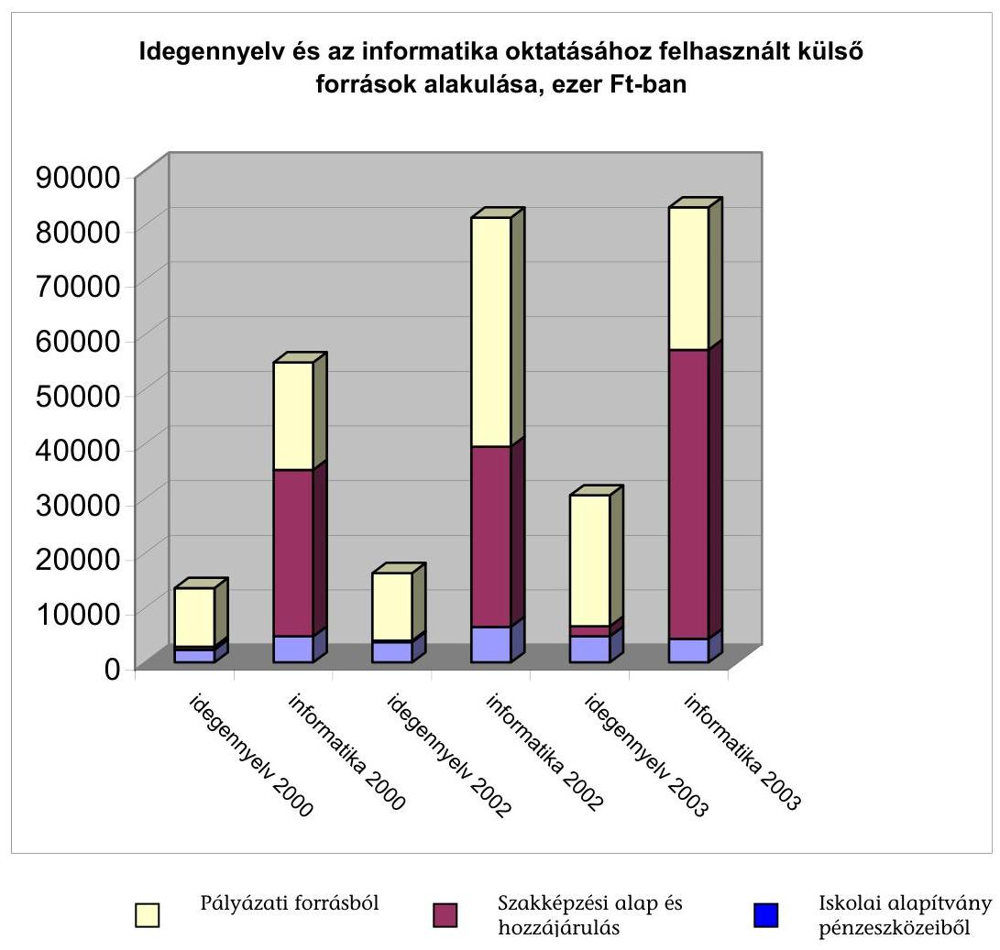

A vizsgált intézmények - 4. számú mellékletben részletezett - összesített adataiból megállapítható, hogy a számítástechnika oktatásához felhasznált külső források között 2000-ről 2003-ra növekedett a szerepe a Szakképzési Alapból kapott támogatásoknak. Míg 2000. évben a külső források 55,5%-át tette ki a szakképzési hozzájárulás, addig 2003-ban már 63,5%-át. Csökkent a szerepe ugyanakkor az iskolai alapítványi pénzeszközöknek a számítástechnikai eszközbeszerzésekben, abszolút összege és részesedési aránya is csökkent. A számítástechnika oktatásához felhasznált külső források növekedése 2000-ről 2003. évre 51,6% volt.

Dinamikusabb volt a külső források növekedése az idegen nyelvek oktatásában, ahol 124,5%-kal nőttek 2000-ről 2003-ra a bevont külső források, de így is csak alig több, mint harmadát tették ki a számítástechnika oktatásához felhasznált külső forrásoknak. Az iskolai alapítványok ugyan megduplázták az e célú támogatásukat, mégis szerepük a finanszírozásban itt is csökkent. Az OM által meghirdetett és működtetett Világnyelv program egyes moduljai esetében az intézmények nem pénzbeli támogatást is kapnak az idegen nyelvi képzés fejlesztése kapcsán. A pedagógusok a program részeként ingyenesen részesülhetnek továbbképzésben, vagy kidolgozott nyelvoktatási módszereket kapnak. Ingyenesen biztosított a pályázaton nyert, pedagógus továbbképzésnek minősülő „mértékelés” programban való részvétel is, ami a mérés, értékelés területén fog segítséget nyújtani az idegen nyelvek oktatásában. Emiatt megállapítható, hogy az idegen nyelvek oktatására fordított külső források növekedése az intézményekben dinamikusabb volt, mint amit pénzügyi adataik mutatnak, csak ezek a kiadások nem az intézményi költségvetés, hanem a fejezeti költségvetés szintjén jelentkeznek.

A vizsgálatba vont intézmények körében az egy tanulócsoportra jutó nyelvi oktatáshoz felhasznált külső forrás 2000-ről 2003-ra 119%-kal nőtt, így 34,8 ezer Ft-ról 76,2 ezer Ft-ra emelkedett. A számítástechnika oktatásához felhasznált egy tanulócsoportra¹⁷ jutó külső források ugyanezen időszakban 48%-kal nőttek, 135,2 ezer Ft-ról 200,1 ezer Ft-ra emelkedtek.

Az oktatási intézmények pályázati aktivitása jelentős eltéréseket mutatott a vizsgált körben, ami természetes. Ez azért okozott problémát, mert a vizsgált időszakban az eszközfejlesztések körében a pályázatok nem kiegészítették a meglévő lehetőségeket, hanem alapvetően csak ezek a források jöhettek számba a fejlesztésnél. Ezáltal hozzájárultak az ellátási különbségek fennmaradásához.

A Kt. előírásainak megfelelően az önkormányzatok képviselő-testületei (közgyűlései) a megyei fejlesztési tervekben meghatározták az egyes intézményekben indítható osztályok számát. A Kt. 2003. évi módosítását követően az alapító okiratokban is rögzítésre kerültek az intézményi maximális létszámok, az indítható tanulócsoportok számai. Mivel a fenntartó önkormányzatok igyekeznek szem előtt tartani a gazdaságossági szempontokat, ezért arra törekszenek, hogy intézményeik kihasználtsága megfelelő legyen. Mindennek ellenére a vizsgált körben a maximális osztálylétszámtól való eltérés mértékét a Kt. módosításában tett előírásokat figyelembe véve - az önkormányzatok 41,7%-a dokumentáltan nem határozta meg.

A fenntartók egy része oktatási koncepciójában azt határozta meg, hogy milyen osztálylétszám alatt nem indítható osztály. Kiskőrös ezt a létszámot 28 főben, a Veszprém Megyei Önkormányzat 30 főben határozta meg. Miklós Önkormányzatánál fenntartói jogkör a maximálisnál alacsonyabb létszámú osztály indításának engedélyezése. A főváros III. kerületi, illetve XV. kerületi önkormányzatok az engedélyezett helyi tantervek figyelembe vételével minden évben közlik az intézményekkel, hogy hány osztály finanszírozását tudják vállalni. Kaposvár önkormányzata határozatban döntést hozott arról, hogy a maximális osztálylétszámtól való eltérés intézményeiben +/-20% lehet.

Az ellenőrzött önkormányzatok 20%-a feltételhez kötötte a 2004/2005-ös tanévtől a nyelvi felkészítő osztályok indulását. Az osztályok csak akkor lesznek indíthatók, ha a beiskolázáskor a létszám lehetővé teszi az osztály gazdaságos működtetését (Kiskőrös, Veszprém megyei önkormányzat, Hajdúszoboszló, Dunaújváros, Sopron). A képviselő-testületi döntéseket általában nem előzték meg gazdaságossági számítások. Csak néhány önkormányzat foglalkozott azzal, hogy döntésének a jövőben milyen költség, illetve óratervi kihatásai lesz-

[^0]
[^0]: ¹⁷ A vegyes profilú iskolák miatt a mutató számításánál az általános iskolai, illetve szakképző osztályokat is figyelembe vettük a tanulócsoportok számában, mivel ezeket az eszközöket ők is használják.

---

nek. Ezeknél megalapozott előterjesztések alapján hozták meg a nyelvi előkészítő osztályok indításáról szóló döntést.

A főváros XIV. kerületi önkormányzat egy osztályban járult hozzá intenzív nyelvi felkészítő oktatás indításához. Az önkormányzati döntés előterjesztésében a képzésnek a tanulócsoportok számára gyakorolt hatását a 2013/2014-es tanévig elkészített részletes tervben mutatták be. A terv kitért a heti órakeret várható változására, az óraszámok szerkezetének alakulására és a tanteremigény bemutatására. A tervet számszaki adatokkal alátámasztva, a több évre várható finanszírozási szükségletet (többlet óraszámok) megállapítva készítették el.

Dunaújváros önkormányzatánál az új képzési forma bevezetésénél a közgyűlési döntés-előkészítéshez az előterjesztésben rögzíteni kellett, hogy mi indokolja a képzés indítását, adottak-e hozzá a személyi és tárgyi feltételek. Be kellett mutatni az indítandó osztálylétszám tervezett minimumát, a várható költségek nagyságát, annak viszonyát a normatív támogatáshoz.

Az intenzív nyelvi felkészítő osztályok 2004. szeptemberében történő indításához az önkormányzatok 91,6%-a nem tervezett pótlólagos forrásokat, mivel az osztályok indíthatóságának a fenntartók azt a feltételt szabták, hogy az nem járhat tanulólétszám- és költségnövekedéssel. Az iskolák személyi és tárgyi feltételei - néhány kivételtől eltekintve - lehetővé teszik az osztályok többletköltség nélküli elindítását. A fenntartók többnyire csak azzal számolnak, hogy ezekkel az osztályokkal kapcsolatosan többletköltségek csak négy év múlva jelentkeznek, mivel a Kt. alapján ezen osztályokban a képzés időtartama egy tanévvel kitolódik.

Az emelt óraszámú idegen nyelvi, valamint informatikai képzéshez a vizsgált önkormányzatok általában (Siklós kivételével) biztosították a fedezetet. A tervezés folyamatában már az intézményi eredeti előirányzatokba beépültek a források, mivel a tantárgyfelosztásban szereplő óraszámok ellátásához a szükséges pénzeszközöket a fenntartók biztosították.

Külön céllal megjelölt előirányzatot az emelt szintű érettségire felkészítő oktatáshoz 2003-ban csak Hajdúszoboszló városi önkormányzat tervezett költségvetésében, amit év közben az intézményi szükségletek alapján adott át intézményeinek. A céltartalékban elkülönített 2000 ezer Ft-ból 800 ezer Ft-ot használtak fel. A Veszprém Megyei Önkormányzat 2004. évben ugyancsak céltartalékban tervezte meg az emelt szintű érettségire való felkészítés fedezetét. Az előirányzatot
 év közben az intézményi igények alapján fogják lebontani. Kaposvár önkormányzata minden évben meghatározta az előző évhez képest az óratöbbleteket, melyek fedezetére az önkormányzat költségvetési rendeletében céltartalékot határoznak meg. Ennek lebontása a fenntartó előzetes elfogadása alapján, az intézményi kéréseknek megfelelően, a belépés tényleges időpontjában történt.

Az emelt szintű érettségire való felkészítéshez az önkormányzatok 91,6%-a a többletórákra nem nyújtott fedezetet. Az intézményeknek ezeket az órákat a jogszabályi kereteken és a korábban engedélyezett többletórákra biztosított előirányzatokon belül kellett megoldani. A gimnáziumok többségében ezek az órák nem jelentettek többletórát a korábbi időszakhoz képest, mivel a felvételire felkészítő fakultációs órák hasonló nagyságrendet jelentettek. A szakközépiskoláknál kisebb arányúak voltak korábban a fakultációs órák, így a törvényben rögzített feltételek szerint az emelt szintű felkészíté-

---

shez többletórákra volt szükség. Ennek finanszírozásához pótelőirányzatot 2003. végéig az intézmények számára csak Sopron és Hajdúszoboszló városok biztosítottak.

# 2.3. A feladatellátás tárgyi és személyi feltételei 

A vizsgálat témakörébe tartozó, a Kt.-ben előírt feladatok nem csak a központi költségvetéstől, hanem az intézményektől, fenntartóiktól is jelentős pénzügyi forrásokat igényelnek. Az intézmények megfelelő tárgyi ellátottsága és a szükséges személyi feltételek megléte ugyanakkor nélkülözhetetlen feltétele az oktatási feladatok eredményes megvalósításának.

### 2.3.1. Tárgyi feltételek

A Kt. előírása értelmében a közoktatási intézmények fenntartóinak 2003. augusztus 31-ig kellett gondoskodniuk a kötelező eszköz- és felszerelési jegyzékben ${ }^{18}$ felsorolt eszközök, felszerelések beszerzéséről, illetve létesítmények pótlásáról. A Kt. 2003. évi módosítása alapján azoknak a fenntartóknak, amelyek a kötelezettségüket nem teljesítették, 2003. december 31-ig kötelességük volt az OKÉV felé a hiány összegét és a teljesítés pénzügyi ütemezését jelezni. Az ÁSZ korábbi alternatív javaslatait ${ }^{19}$ is figyelembe véve a pótlásra mérlegelés alapján 2008. december 31-ig kaphattak halasztást.

Az országosan összesített adatok szerint a középfokú oktatási intézményt fenntartó önkormányzatok mindössze 6,2%-a teljesítette a jegyzékben foglaltakat. Az önkormányzatok ugyanekkora aránya nem jelentette a teljesítésre vonatkozó adatokat. (A vizsgált körben Százhalombatta város nem adott a helyszíni ellenőrzés időpontjáig jelentést az eszköz és felszerelés jegyzék alakulásáról). Országos szinten a középfokú oktatási intézményekben összesen 27,1 milliárd Ft összegű taneszközhiányt mutattak ki. A vizsgálatunk által érintett önkormányzatoknál ez az összeg 1,2 milliárd Ft, ami 4,4%-át teszi ki az ország összes önkormányzatánál fennálló középfokú intézményi eszközhiánynak.

A teljesítendő feltételek közül a helyiségek, létesítmények pótlása a legköltségesebb. A kisebb városokban (Dunaföldvár, Pásztó, Barcs, Siklós) ez néhány tízmilliós, a nagyobbaknál már több száz milliós tétel (Kaposvár, Dunaújváros, Kazincbarcika). Még nagyobb lenne a kimutatott hiány, ha minden önkormányzat szerepeltette volna ezeket a létesítményeket (aula, orvosi szoba, nyelvi labor). A helyszíni vizsgálati tapasztalatok szerint az összesített adatok tartalma eltérő. A felmért összegben 5 önkormányzat (Paks, Enying, Hajdúszoboszló, Sopron, Veszprém Megyei Önkormányzat) nem mutatta ki a helyiség, szaktantermek kialakításának költségét, amit azzal indokoltak, hogy

- pótlását 2008-ig nem tartják reálisan megvalósíthatónak,

[^0]
[^0]:    ${ }^{18}$ 11/1994. (VI.8.) MKM. rendelet 7. sz. melléklet
    ${ }^{19}$ Jelentés az általános iskolai oktatás minőségének javítását szolgáló intézkedések ellenőrzésének tapasztalatairól (2002. június).

---

- megítélésük szerint a tanulólétszám várható csökkenése ellensúlyozza a hiányt,
- az eredményes oktatáshoz egyes létesítmények nem feltétlenül szükségesek,
- a jegyzékben a nem a tulajdonukban szereplő iskolaépületekkel kapcsolatos hiányt nem mutatták ki, mivel álláspontjuk szerint a pótlás a tulajdonos önkormányzatot terheli.

A vizsgálatba bevont intézmények összes eszközhiánya 193 millió Ft volt. Négy vizsgált intézménynél (főváros III. kerület, XV. Kerület, Széchenyi Gimnázium Százhalombatta, Pécs Janus Pannonius Gimnázium) az eszköz és felszerelési jegyzékben előírtak teljesítését állapíthatta meg az ellenőrzés. A többi intézménynél átlagosan 9,2 millió Ft-ot kell még az eszköz és felszerelési jegyzék előírásainak teljesítésére fordítani. A műveltségi területek közül az informatika oktatáshoz szükséges eszközök hiánya $\mathbf{8,3}$%, a nyelvi képzéshez szükséges eszközök hiánya 4,8%-ot képvisel.

Előfordult a vizsgált körben is, hogy az eszközhiány túlnyomórészt e kiemelt területeken jelentkezett. Szerencs önkormányzatánál a hiány közel kétharmad részben az informatika és az idegen nyelv területét érintette.

A intézmények 60%-a a számítástechnika terén, 52%-a pedig az idegen nyelv oktatásnál az előírt feltételek teljesítéséről adott számot. A nem teljes eszközállománnyal rendelkező intézményeknél az informatika műveltségi területen átlagosan 1,6 millió Ft, az élő idegen nyelvnél 0,8 millió Ft ráfordítása szükséges még. A legnagyobb összegű hiány a 10 ezer fő feletti és a megyei jogú, megyei önkormányzati fenntartású iskoláknál volt. Ezek az önkormányzatok vállalkoztak gyakrabban a nagyobb eszközigényű képzésre (szakközépiskola, két-tannyelvű oktatás), de itt jelentkezett a legtöbbször a létesítmény és elhelyezési probléma is.

A vizsgált önkormányzatok az eszközök kihasználtságáról nem rendelkeztek adatokkal. Az oktatási intézmények épületeinek állagát a fenntartók kevesebb, mint egyharmada mérette fel. A számbavételt követő ütemterv készítést sok esetben a pénzügyi lehetőségek gátolták.

Százhalombattán az éves költségvetésbe állították be a létesítmények hiányosságainak pótlására szolgáló fedezetet. A több tízmilliós igények megvalósítására több éves ütemtervet készítettek a Veszprém megyei önkormányzatnál, Pécs megyei jogú városnál, a fővárosi XIV. és XV. kerületi önkormányzatnál. Siklós a hiányosságok pótlására címzett támogatásra nyújtott be pályázatot. Abonyban a felmérést követően nem állítottak össze a végrehajtásra ütemtervet.
Az elmúlt három évben érzékelhetően javult a létesítménnyel való ellátottság. Az egyes intézmények között azonban nagyok a különbségek, amelyek alapvetően a fenntartók anyagi teherbírását tükrözik. Az 1 osztályteremre jutó tanulók száma országos szinten 39,4 fő${ }^{20}$, a vizsgált körben 29,6 fő, ami azonban az egyes intézmények tekintetében nagy szóródást mutat. A vizsgált körben, az időszak végén a szóródás terjedelme meghaladta az átlagot (Sopron

[^0]
[^0]:    ${ }^{20}$ Oktatási Évkönyv 2002/2003

---

Széchenyi Gimnázium 18,9 - Pásztó 50,6). Ez utóbbi azt jelzi, hogy ebben az intézményben olyan teremhiány volt, hogy osztályteremnek nem minősíthető helyiségben is folyt oktatás (kollégium). Még nagyobbak az eltérések a szaktanterem ellátottságban.

Százhalombattán a 16 tanulócsoport számára 9 osztályterem és 14 szaktanterem áll rendelkezésre, míg Enyingen az osztálytermeken kívül semmilyen szaktanterem, sem nyelvi labor, sem számítástechnikai terem nincs.

Az informatika oktatás szaktanterem feltételei túlnyomórészt elfogadhatóak. A három év alatt 14%-kal nőtt a számítástechnikai termek száma, ugyanezen idő alatt a tanulócsoportok száma csak 2,5%-kal emelkedett. Az egy szaktanteremre jutó tanulócsoportok száma érzékelhetően csökkent (8,3-ról 7,4-re).

Az oktató munkát alapvetően befolyásolhatja a meglévő eszközök használhatósági szintje is. Az elhasználódott, megrongálódott eszközök nem segítik a tanítást. Pótlásukra pénzügyi okokból azonban zömében csak a hiányzó felszerelések beszerzése után kerülhet sor.

A vizsgált iskoláknál (2000/2001. tanévről a 2003/2004. tanévre) egyharmad résszel növekedett a számítógépek száma. Ez a gyarapodás sem tudta azonban ellensúlyozni a gépek használhatóságának csökkenését. A számítástechnika területén rendkívül meghatározó az eszközök állapota, erkölcsi, eszmei avultsága, használhatósági szintje. A berendezések három év alatt teljesen amortizálódnak. Az ellenőrzött időszak végén az intézmények háromnegyed részénél a használhatósági szint kisebb volt mint 50%.
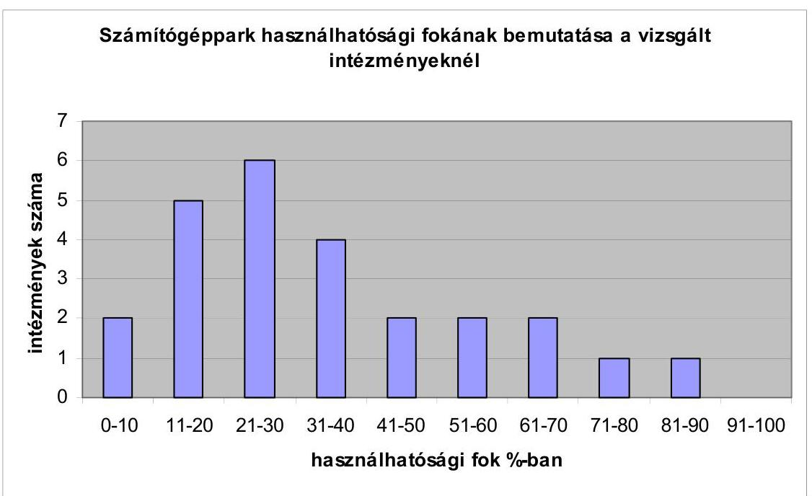

Még kedvezőtlenebb a kép, ha a számítógépek korszerűségét tekintjük. A kimutatások szerint a legfeljebb egy éves színvonalnak megfelelő gépek részaránya az elmúlt három évben 10%-kal csökkent, és az összes gépnek kevesebb, mint ötödrészét teszi ki. A tényleges helyzet ennél némileg kedvezőbb, mivel az elmúlt három évben volt olyan pályázat, ahol az elnyert gé-

---

peket tartós használatba kapták, így ezek értéke nem szerepelhet a nyilvántartásban.

A kisvárosokban és a vizsgált fővárosi iskolákban különösen nagy arányú volt a több, mint öt éves színvonalnak megfelelő géppark aránya (37,9 és 44,6%).

A fővárosi XVII. kerületi Kőrösi Csoma Gimnázium teljes számítógép-állománya régebbi öt évnél.

Ezek az iskolák még többségében azokkal a gépekkel dolgoznak, amelyeket a kilencvenes évek közepén indított Sulinet program keretéből kaptak. Ezzel együtt a megkérdezett diákok fele jónak, vagy nagyon jónak tartotta a géppark korszerűségét.

A számítógéppark kormegoszlását, illetve a tanulók véleményét a használt számítógépek korszerűségéről a 5. sz. melléklet mutatja be.

# Az elavult géppark akadályozza a korszerű programok alkalmazha-

tóságát is. Az oktatásban az IHM Tisztaszoftver Programja keretében lehetővé válik a jogtiszta szoftverek nagyobb volumenű használata. Ennek a pozitív kezdeményezésnek komoly gátja lehet a meglévő korszerűtlen számítógép állomány, mivel ezeken már nem lehet az új programokat futtatni.

A meglévő gépek kétharmada szolgálja közvetlenül az oktatást, melynek szintén kétharmada az, amely a tanulók számára szabadon hozzáférhető. Pozitívum, hogy közel 30%-kal növekedett a számítástechnikai munkaállomások száma, egy munkaállomásra a vizsgált időszak végén a megfigyelt intézményeknél 11,9 tanuló jutott. Az egy munkaállomásra jutó tanulók számában a vizsgált intézményeknél jelentős eltérések voltak, mivel átlagosan 7,3 fő/munkaállomással, 62%-kal tértek el az átlagtól.

Az egyes intézmények ellátottságában nagyok a különbségek. A vizsgált körben az egy munkaállomásra jutó tanulólétszám mutatója 3,5 fő/számítógépes munkaállomás (Sopron Vas- és Villamosipari Szakképző Intézet és Gimnázium), illetve 29,9 fő/munkaállomás (Hajdúszoboszló) szélső értékek között alakult. Általános tapasztalat, hogy a gépek beszerzésénél azok az intézmények vannak helyzeti előnyben, amelyeknek lehetőségük van a Szakképzési Alapból, szakképzési hozzájárulásból támogatáshoz jutni. A gépek számának növelésére többféle megoldással lehetett találkozni.

Előfordult, hogy az iskola bérleti díj fejében jutott számítógépekhez. A soproni Széchenyi Gimnázium számítógépes tanfolyamnak adott helyet, a teremhasználat ellenében használhatta a számítógépeket iskolai célra.

A dunaföldvári Magyar László Gimnázium 2001. és a 2002. években alapítványi pénzeszközök segítségével valósított meg jelentős fejlesztést. Két számítógéptermet alakítottak ki, melyhez a két év alatt 33 db új számítógépet és egyéb számítástechnikai eszközöket vásároltak.

A százhalombattai Széchenyi István Gimnázium és Szakközépiskola eszközigényét csaknem teljes egészében a szakképzési hozzájárulásból fedezte.

---

A vizsgált intézmények három év alatt a számítástechnikai oktatás fejlesztéséhez 116 millió Ft szakképzési rendeltetésű pénzeszközt használtak fel, amely az összes e célra ráfordított külső forrás 52,9%-át jelentette. Az önkormányzatok nem biztosítottak elegendő forrást a gépek korszerűsítésére, cseréjére. Kevés jó példa volt a számítástechnikai eszközök beszerzésére.

A Veszprém megyei önkormányzat által fenntartott Thuri György Gimnázium és Szakközépiskolában a vizsgált időszakban a Nemzeti Szakképzési Intézet által meghirdetett pályázati kiírás alapján központi forrásból kicserélték a Sulinet program keretében kapott, és amortizálódott gépeket. Ez kedvezően hatott az átlagos használhatósági szint alakulására is.

Az OM stratégiájában meghatározó szerepet tölt be az informatikai jártasság erősítése. A kormányhatározattal elfogadott Magyar Informatika Stratégia egyik deklarált célja, hogy minden középiskolás tudja alapfokon használni a számítógépet, és el tudjon igazodni az Interneten. Mivel hazánkban az otthoni géphasználat lehetőségei még korlátozottak, ezért a célok csak úgy valósíthatóak meg, ha a szociális hátrányban lévő tanulók az iskolában gyakorolhatják az Internet használatot. A vizsgált körben megkérdezett diákok kevesebb, mint fele rendelkezett otthoni Internet kapcsolattal (lásd még a 2.1.3. pontban). Az iskolai eszközhasználat feltételrendszere alapvetően adott. Valamennyi ellenőrzött iskolában van Internet hozzáférés, ilyen a munkaállomások több mint 90%-a. Az ellenőrzött időszak elején a gépek négyötödrésze volt a
 világhálóra kapcsolva. A vizsgált intézmények negyedrészében valamennyi számítógépről létesíthető internetes kapcsolat, míg két intézményben (Siklós, Pécs) ennek aránya nem éri el a 40%-ot. A digitális kultúra elsajátításához azonban elengedhetetlen, hogy a tanuló a tanórán kívül is a világhálóhoz tudjon kapcsolódni. Erre azért is szükség van, mert a szakmai felmérések szerint kevesen használják az internetet más iskola diákjaival, vagy akár a saját iskolákban tanulókkal való közös munkához. Az interneten keresztül szervezett, végzett munka is ritkaságnak számít a magyar iskolákban. ${ }^{21}$ Ennek feltétele csak akkor biztosított, ha a délutáni órákban vagy egyéb, a tanuló számára nem kötött időben is rendelkezésre áll az internet csatlakozás. A vizsgált iskolákban ugyan 44%-kal nőtt az ilyen csatlakozással rendelkező gépek száma, de a megkérdezett tanulók 7,3%-a szerint még így sincs soha lehetőség a tanórán kívül internetezésre, csak egynegyed részük nyilatkozott úgy, hogy bármikor van erre módja.

[^0]
[^0]:    ${ }^{21}$ Jelentés a magyar közoktatásról 2003. OKI kiadvány

---

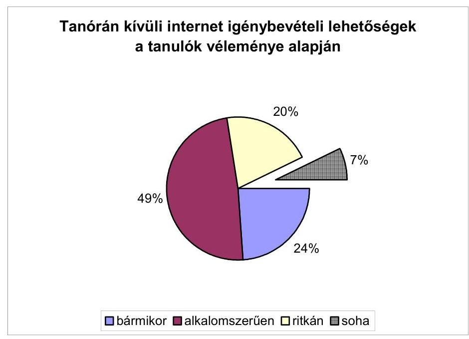

Az internetet az iskolák zömében a Sulinet program keretében működtetik, költségeihez a tárca a vizsgált időszakban éves szinten 1,7-2,2 milliárd Ft-tal járult hozzá. A Sulinet keretében történő internet használat kiépítése még a kilencvenes évek második felében történt, ez az adatkapcsolat - szakmai vélemények szerint - ma már kevésbé mondható korszerűnek. A géppark bővülése, az igénybevevők számának emelkedése miatt a régi formában történt rácsatlakozás csak lassú adatátvitelt tesz lehetővé. Ezért több intézmény (Pásztó, Mikszáth Kálmán Gimnázium), ahol azt a pénzügyi források lehetővé tették, más megoldást keresett (szélessávú ADSL vonal kiépítése).

Az idegen-nyelv oktatásban mára teljesen meghonosodtak azok a módszerek, amelyekhez korszerű technika szükséges (nyelvoktató programok, nyelvtani és auditív tesztek, multimédiás eszközök használata).

Az intézményeknél kimutatott hiányzó eszközöknek kevesebb mint 5%-a csak a nyelvoktatással kapcsolatos hiány, de ez a műveltségi terület sem mentes az eszközellátottság feszültségeitől. A felszerelési jegyzék követelményként írja elő a nyelvi laboratóriumok használatát. A vizsgált intézmények kevesebb, mint harmada rendelkezett ezzel, és az elmúlt három évben egyetlen intézményben sem alakítottak ki újat.

További probléma, hogy ahol van nyelvi laboratórium, ott sem használták ki megfelelően.

A megkérdezett tanulók 72,2%-a szerint a tanórák kevesebb mint 20%-ában alkalmazzák a nyelvi labor nyújtotta lehetőségeket.

Bár ennek az eszköznek a megítélése a nyelvtanárok körében is vitatott, a tapasztalatok szerint a már ismert egyéb audiovizuális, multimédiás eszközök használatának gyakorisága sem elfogadható.

A kérdőívre válaszoló tanulók nagyobb része (58,6%) szerint ritkán használnak a nyelvtanuláshoz eszközöket.

---

Az idegen-nyelv oktatás eredményességéhez járul hozzá az említett eszközök alkalmazása. Éppen a legutóbbi (2004. májusi) próba-érettségi - a minisztérium által még csak szóban jelzett - tapasztalatai erősítik meg, hogy a hallott szöveg megfelelő értése nélkül sikertelen lehet a nyelvvizsgát kiváltó érettségi. A szövegértést a nyelvi labor, a nyelvoktatás egyéb eszközeinek nagyobb arányú alkalmazásával lehet javítani.

Az új követelményszint alapján felértékelődött e műveltségi terület felszereltségének állapota és a megfelelő eszközök alkalmazási gyakorisága. Ezt támasztja alá a tanulók nyelvoktató eszközökre vonatkozó elégedettsége.
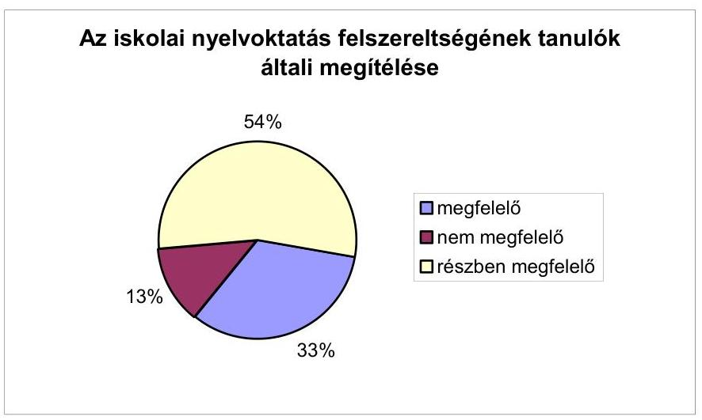

Amíg a számítástechnikai felszereltséget a diákok több mint a fele jó színvonalúnak értékelte, a nyelvoktatás felszereltségét egyharmaduk ítélte csak megfelelőnek.

# 2.3.2. Az oktatás személyi feltételrendszere 

Az oktatás személyi feltételrendszere az oktatás színvonalát nagyban meghatározza. Az elmúlt három évben több olyan intézkedés (központi béremelés, szakmai szolgáltatásokra nyújtott központi támogatás) is született, amely jótékony hatású volt az ágazat - ezen belül a kiemelt területek - személyi feltételeinek javulására. A középiskolákban fő munkaviszony keretében foglalkoztatott pedagógusok létszáma 2000-2003. között országos szinten 7,3%-kal$^{22}$, a vizsgált intézményekben 5,9%-kal nőtt, és meghaladta a tanulólétszám 5,3%-os emelkedését. A gyarapodás részben az üres álláshelyek betöltésének, részben pedig az óraadók helyett főállású pedagógusok alkalmazásának a következménye. Az ellenőrzött körben egyharmaddal csökkent a betöltetlen pedagógus munkahelyek száma. Az elmúlt tanév elején a teljes munkaidős pedagógus létszám 1,6%-a nem volt betöltve.

Legkevesebb ilyen státusz a fővárosi kerületekben (0,4%), a legtöbb a 10 ezer fő alatti települések intézményeinél volt (9,3%).

[^0]
[^0]:    ${ }^{22}$ Oktatási évkönyv 2002/2003

---

A kisvárosok intézményeiben még előfordult a személyi feltételeknél hiányosság. Főleg az idegen-nyelv oktatáshoz volt nehéz főállású pedagógust alkalmazni.

A foglalkoztatottak létszáma, összetétele általában összhangban volt az ellátandó feladattal. Három esetben a helyszíni vizsgálat már előre jelezte, hogy az ősszel beindítandó nyelvi előkészítő osztályok személyi feltételei megoldandók (Siklós Táncsics Mihály Gimnázium és Szakközépiskola, Dunaföldvár Magyar László Gimnázium, Sopron, Vas- Villamosipari Szakközépiskola és Gimnázium). A kiemelt területek korábbi pedagógus létszám hiánya és fluktuációja csökkent, de még mindig kimutatható, elsősorban a kisvárosokban, a szakközépiskolákban és az oktatások kívüli egyéb területek munkaerő-elszívó hatása miatt a fővárosban.

A kisebb városokban a létszámhiány gyakoribb probléma (Siklós nyelvtanár). A szécsényi Kőrösi Csoma Sándor Gimnázium és Szakközépiskolában az elmúlt tanévben idegen-nyelv szakosoknál 47,5%, az informatika szakosoknál 55,5%-os volt a fluktuáció.

Az enyingi Bocsor István Gimnázium az idegen nyelvoktatás terén a 2002/2003. tanévre elérte, hogy rendelkezett a csoportbontást is lehetővé tevő főállású pedagógus létszámmal. E tantárgyakból volt a legnagyobb a létszám fluktuáció. A legutóbbi tanévben a váltás 46%-os volt. A német nyelv oktatásához 1 fő óraadóra van szükségük. Az informatika képzés személyi feltételeinek megteremtése is gondot okozott az intézmény számára. Főállású matematika-informatika szakos középiskolai tanárt csak a 2003/2004. tanévtől sikerült alkalmazniuk. Jelenleg 1 fő óraadót is foglalkoztatniuk kell.

Néhány intézményben átmenetileg (szülés, GYES miatt) jelentkezett 1-1 fő létszámhiány (Kiskunfélegyháza számítástechnikai végzettségű tanár, de ugyanitt heti 48 óra oktatására főállású angol nyelvtanárt nem tudtak felvenni). Dunaújvárosban a Bánki Donát Gimnázium és Szakközépiskolában angol nyelvszakos tanár hiányzott, de az informatika oktatására 2 fő óraadót kellett alkalmazni.

A főváros XIV. kerületében, a Teleki Blanka Gimnáziumban az informatikai oktatói állomány az elmúlt években többször kicserélődött.

Az oktatás során a tanárváltás sok esetben hátrányosan érintheti a diákok tanulmányi előmenetelét. Az idegen nyelv oktatásánál a gyakori személycsere továbbra is jellemző. A megkérdezett 11. évfolyamos diákok közel négyötöd részének a középiskolai tanulmányai során már legalább egyszer történt tanárváltás, egynegyed részénél kettőnél többször is volt változás.

---

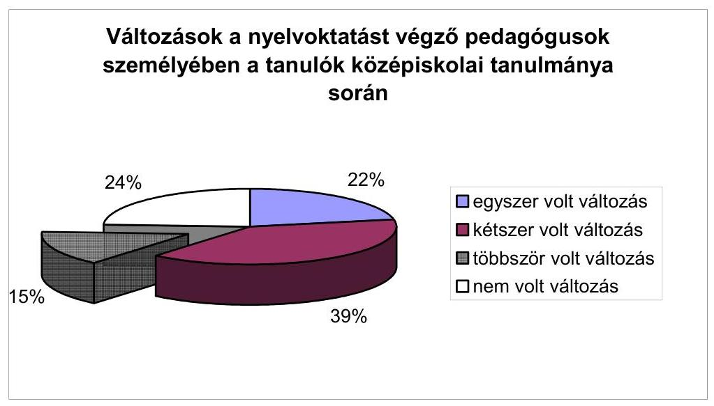

Egy műveltségi terület kiemelt kezelését alapvetően a feladat teljesítésére biztosított óraszám határozza meg. Ez mutatja valójában, hogy mennyire tartják fontosnak ezeket az órákat. A jelenlegi szabályozás egy tantárgyra csak a minimális óraszámot rögzíti, az intézménynek kell saját szabályzataiban (pedagógiai program, helyi tanterv) megállapítani a saját óraszámait, ami egyben a tárgy oktatásának alapvető feltételrendszerét is behatárolja. A vizsgált körben átlagosan a jogszabályban rögzített óraszámhoz képest az idegen nyelvi órák közel 40%-át tették ki többletórák. Ez az arány három év alatt nem változott. Pozitívum, hogy valamennyi ellenőrzött iskola nagyobb óraszámban oktatta az idegen nyelvet, mint a jogszabályban meghatározott minimális óra (lásd még a 2.1.2. pontban). Az iskola oktatási-nevelési céljától függően azonban lényeges eltérések tapasztalhatók.

Az informatika oktatására fordított óraszámon belül 56,4%-ot tesznek ki - a jogszabályi előíráshoz képest - a ténylegesen ellátott többletórák. A vizsgált időszak kezdetén még volt olyan intézmény (Széchenyi István Gimnázium) ahol nem volt többletóra, de a legutóbbi tanévben már mindenhol nagyobb volt a tényleges óraszám a minimálisnál.

Általában az előírt óraszám legalább egyötödével több órát állítottak be a tantárgyfelosztásba, de nem volt ritka a háromszoros óramennyiség sem (Janus Pannonius Gimnázium, Móra Ferenc Gimnázium, Bocskai István Gimnázium, Bánki Donát Gimnázium, Teleki Blanka Gimnázium, Felsőbúki Nagy Pál Gimnázium, Vas- és Villamosipari Szakképző iskola és Gimnázium, Mikszáth K Gimnázium és Postaforgalmi Szakközépiskola, Széchenyi István Szakközépiskola és Gimnázium, Vak Bottyán Gimnázium).

A legalacsonyabb többlet is meghaladta a tíz százalékot. Ilyen mértékű volt az informatika többletóra a Táncsics Mihály Gimnázium és Szakképző Iskola, Széchenyi István Gimnázium, valamint a Kőrösi Csoma Sándor Gimnázium és Szakközépiskola tantárgyfelosztásában.

A személyi feltételrendszer egyik lényeges területe a pedagógusok túlóráztatásának a helyzete. Túlzott mértéke sem az oktatás, sem az egyén számára nem kedvező, de az is ismert tény, hogy pedagógusok számára ugyanakkor ez jövedelemszerzési lehetőség is. A helyszíni ellenőrzéssel érintett in-

---

tézményekben az összes óraszámon belül a túlmunkában ellátott órák aránya kismértékben (16,2%-ról 17,6%-ra) emelkedett.

Továbbra sem megnyugtató az idegen nyelvi órák személyi feltétele, mivel az összes túlóra és megbízási dí ellenében ellátott óraszám több, mint egynegyede ennél a műveltségi területnél jelentkezett. Az ily módon ellátott órák aránya az informatika tantárgyból mindössze 6%. Az intézmények között, illetve azon belül pedagógusonként is nagy eltéréseket lehetett megfigyelni.

A kiemelt területeken egy főállású tanár általában kevesebb, mint heti három órát túlórázott. A túlórák eloszlása azonban nem egyenletes. Egyes intézményekben az egy főfoglalkozású pedagógusra vetített összes túlóra átlaga az elmúlt tanévben meghaladta a heti öt órát (Kőrösi Csoma Gimnázium és Szakközépiskola Szécsény, Toldi Lakótelepi Általános Iskola és Gimnázium, Széchenyi Ferenc Középiskola és Kollégium).

A Petőfi Sándor Gimnáziumnál és a Bánki Donát Gimnázium és Szakközépiskolánál három órát némileg meghaladó volt az egy tanárra jutó heti nyelvi túlóra. A Bánki Donát Gimnázium és Szakközépiskolánál az informatika túlórák száma is meghaladta a heti négy órát, ennél a műveltségi területnél a többi ellenőrzött iskolában három óra alatt volt a számfejtett túlórák száma. A vizsgált időszak első évében Abonyban egy nyelvszakos tanár heti 9 óra túlórát teljesített, ezzel az éves maximálisan megengedett túlóraszámát 62%-kal túllépve.

Volt olyan intézmény, ahol a magas túlóraszámban az is közrejátszott, hogy az önkormányzat (Sopron megyei jogú város) pénzügyi problémáira hivatkozva zárolta az intézmények üres álláshelyeinek számát, így a tantervi órákat csak túlórával lehetett biztosítani.

Az oktatásban a szaktanárok részére támogatást nyújthat a kiemelt területeken az anyanyelvi tanár és a rendszergazda.

Az idegen nyelvi kommunikáció javítása érdekében a vizsgált időszakban az ellenőrzött fenntartók közül 10 helyen alkalmaztak anyanyelvi tanárt (Pécs, Dunaújváros, Kaposvár, Veszprém megyei önkormányzat, főváros III. és XIV. kerület, Kiskunfélegyháza, Pásztó, Barcs). A 2003/2004. tanévben az ellenőrzött intézményeknek csak ötödrészében (Zugló, Kiskunfélegyháza, Barcs, Pásztó, Szécsény) szerződtettek összesen 8 fő anyanyelvi lektort. Az ilyen segítő foglalkoztatással olyan kiadások (lakhatás megoldása, utazási hozzájárulás) is párosulnak, amelyek jelentős mértékben igénybe vehetik az adott fenntartó pénzügyi lehetőségeit.

A számítógépeket az iskolákban hálózatba kapcsolva működtetik. A rendszer üzemeltetéséhez képzett szakemberre van szükség. Költségtakarékossági megfontolásokból ezeket a feladatokat külső személy, szervezet megbízásával látták el, vagy azt a tantestület egyik kijelölt szaktanára végezte. Ez a megoldás csak a kisebb számítógép-állománnyal rendelkezők számára lehet megoldás. Rendszergazdát csak a nagyobb, jelentős gépparkkal rendelkező iskolák alkalmaztak.

Az oktató-nevelő munka továbbfejlesztésében, a pedagógusok felkészültségének növelésében jelentős szerepe van a továbbképzéseknek. A meg-

---

felelő területen és időben szervezett továbbképzés lényegesen javíthatja az oktatás személyi
 feltételeit. A Kt. hétévenként kötelező továbbképzést ír elő a pedagógusoknak, melynek ütemezésére az intézményeknek tervet kell kidolgozni. A jól összeállított továbbképzési terv segít megvalósítani az intézménynek az alapdokumentumaiban deklarált céljait, az egyén számára pedig szakmai fejlődést biztosíthat. A vizsgált intézményekben a főállású tanárok valamivel több, mint egytizede további szakmai képesítésért tanult. Hasonló arányban vettek részt egyéb akkreditált továbbképzéseken is. Három évvel ezelőtt a vizsgált intézményeknél ez az arány kétszer ennyi volt. A vizsgált időszakban a kiemelt területek közül az informatikai továbbképzések voltak a meghatározóak. Az elmúlt tanévben a tanfolyamon részt vett pedagógusok ötödét informatikai területen képezték tovább. A szakmai elvárásokhoz képest azonban még ez sem magas, mert az elmúlt három évben összesen csak 17 fő (a főállású pedagógusok 1,4%-a) szerzett ECDL képesítést, és 30 fő (a főállású pedagógusok 2,6%-a) az Országos Képesítési Jegyzékben szereplő képzettséget. Valamilyen szintű tanfolyami képzésben a vizsgált intézmények pedagógusainak 10-50%-a vett részt. Az oktatási ágazat célrendszerében azt fogalmazták meg, hogy az egyéb (nem informatika) tárgyak oktatásánál is napi gyakorlat legyen a számítástechnika alkalmazása. Ezt a célt csak informatikában is jártas szaktanárokkal lehet teljesíteni, ennek hiányában nem tudják alkalmazni az OM által a jövő tanév elejétől folyamatosan megjelenő digitális tananyagokat.

Hasonló elvárás, hogy az idegen nyelvtudást fel kell használni a többi tárgyak tanításánál is (idegen nyelvű szakirodalom megismerése, szakmai idegen nyelv megismerése). A tantestület tagjainak jelentős része életkorából adódóan (idősebb korosztály) nem rendelkezik a szükséges nyelvi alapképzettséggel (soproni Vas-Villamosipari Szakközépiskolában a pedagógusok kétharmada 45 éven felüli). Ez is indokolhatja, hogy az elmúlt három évben még az informatikai képzettségnél is alacsonyabb arányban szereztek a pedagógusok nyelvvizsgát. A vizsgált időszakban a főállású tanárok alig több mint egy százaléka tett C típusú nyelvvizsgát. A vizsgált iskolákban a korösszetétel függvényében általában 20% alatti a nem nyelvtanárok állami nyelvvizsga aránya, de például Dunaújvárosban, Enyingen nincs ilyen végzettségű tanár. Pozitívum, hogy a tárca által indított programok néhány éven belül itt is változást hozhatnak.

A Világ-Nyelv program keretében Kazincbarcikán 11, Szerencsen 14 fő kezdte meg az alapfokú nyelvtanfolyamot.

# 3. A feladatellátás értékelése és eredményessége 

### 3.1. Az ágazati intézkedések hatása az értékelési rendszerre

Az intézményes értékelés esetlegessége, rendszertelensége a közoktatás régi gondja ${ }^{23}$. Tartós eredményt elérni csak az oktatás folyamatos mérésével, értéke-

[^0]
[^0]:    ${ }^{23}$ Jelentés az általános iskolai oktatás minőségének javítását szolgáló intézkedések tapasztalatairól (2002. június)

---

lésével lehet. Az értékelés rendszerének kiépítése, tudatos működtetése tehát az ágazat elsőrendű érdeke. A célok megvalósulását csak jól működő pedagógiai értékelési rendszer támogathatja. A közoktatás minőségét, eredményességét több területen lehet nyomon követni. A hagyományos megfigyelések a tanulói teljesítményekre irányulnak, de a rendszerszemléletű értékelés nem tekinthet el a folyamatos megfigyelésekre épülő tevékenységektől sem. A vizsgált időszakban kedvező változást hozott az értékelés rendszerében a pedagógia szakmai szolgáltatások igénybevételének központi támogatási rendszere. Segítségével többletforráshoz jutottak a tanulói teljesítményvizsgálatok, és az oktatás, mint rendszer megfigyelésére is nagyobb lehetőség nyílt. Pozitívum, hogy - figyelemmel az Állami Számvevőszék 2002-ben tett javaslatára is - az OM kezdeményezésére normatív kötött felhasználású támogatás segíti a fenntartókat a pedagógiai szakmai szolgáltatások igénybevételében.

Az intézményfenntartó önkormányzatok az állami költségvetésből 2003-ban először, majd 2004-ben ismét, normatív módon kapnak $720 \mathrm{Ft} /$ tanuló kötött felhasználású támogatást a pedagógiai szakmai szolgáltatások igénybe vételére. Így e források terhére a fenntartók a pedagógiai intézetektől, szakértőktől például mérés-értékelést, az iskolai munka fejlesztésére irányuló tanácsadást rendelhettek meg.

A szakmai szolgáltatások igénybevételének támogatásán túl intézkedések születtek az értékelési rendszer kiépítésére is. 2002-ben az oktatási miniszter rendelettel szabályozta a minőségbiztosítást és minőségfejlesztést, meghatározta a minőségfejlesztéssel kapcsolatos feladatokat. ${ }^{24}$ Ebben elrendelték valamennyi intézménynek az önértékelésen alapuló minőségfejlesztési tevékenység kialakítását.

A Kt. 2003. évi módosítása már nemcsak az intézmény, hanem a fenntartó számára is kötelező feladatokat írt elő a minőségirányítás területén. Ezzel lehetőség nyílt arra, hogy a fenntartók felelősségét is erősítsék ebben a kérdésben.

A Kt. módosítása valamennyi iskola számára előírta saját minőségfejlesztési rendszer kiépítését, amit a fenntartó által jóváhagyott önálló dokumentumban (minőségirányítási program) kell rögzíteni. Ebben az okmányban kell leírni az intézmény működési folyamatait, elsősorban a vezetési, tervezési, ellenőrzési, mérési, értékelési feladatokat.

A Kt. módosítása az intézményértékelések terén is jelentős változást eredményezhet. Az önkormányzati rendszer létrehozása óta először ebben a jogszabályban írták elő kötelezően a fenntartók számára, hogy négyévenként legalább egy alkalommal ellenőrizzék a közoktatási intézmények gazdálkodását, működésük törvényességét és hatékonyságát, valamint a szakmai munka eredményességét. ${ }^{25}$ Ezzel megvalósult az Állami Számvevőszék 2002-ben végzett vizsgálatában megfogalmazott ajánlás, amely az

[^0]
[^0]:    ${ }^{24}$ 3/2002. (II. 15.) OM rendelet
    ${ }^{25}$ 2003. évi LXI. törvény. 70.§ (1) bekezdés, hatályos 2003. IX. 1-től

---

oktatási miniszter részére javasolta a szakmai ellenőrzés kötelező gyakoriságának meghatározását ${ }^{26}$.

A közoktatás egységes értékelési és vizsgarendjének kialakítása érdekében az elmúlt időszakban előrelépés történt. Az országos szintű mérések körét a mindenkori tanév rendjéről szóló miniszteri rendelet szabályozza. Eszerint az előírt mérések ugyanazon évfolyamon visszatérően vizsgálják az alapkészségek meglétét úgy, hogy a KÁOKSZI az iskoláktól 20-20 tanulóról kér be adatokat az országos átlag és a viszonyítási adatsorok elkészítéséhez. A tanévenként sorra kerülő vizsgálat az országos kompetenciamérés elnevezést kapta.

Első alkalommal a 2001/2002-es tanévben az első, ötödik és kilencedik évfolyamos tanulók körében került sor teljes körű mérésre az olvasás-szövegértés és a matematika témakörben. A következő tanévben bonyolították le a sorrendben második kompetenciamérést, amely a közoktatási rendszer hatodik és tizedik évfolyamán tanuló diákok ugyanabban a tárgykörben megszerzett eszköztudásának megismerésére irányult. A felmérés azt vizsgálta, hogy a tanulók képesek-e a tudásukat az életben hasznosítani, alkalmazni és további ismeretszerzésre felhasználni. A felmérés tesztjei ezért alapvetően nem a tantervi követelmények teljesítését mérték, hanem azt, hogy a diákok mennyire képesek a tanultakat aktivizálni, valódi problémákat, helyzeteket megoldani. A mérésben 3877 iskola vett részt, és összesen 120796 hatodik osztályos, valamint 110175 tizedik osztályos tanuló töltötte ki a teszteket.

A méréseknek kettős céljuk volt: egyrészt a tanulók kompetenciaszintjének felmérése két jól definiált területen, másrészt az iskolák mérési-értékelési gyakorlatának kialakítása, hogy számukra is hozzáférhetőek legyenek azok az adatok, amelyekkel intézményük helyi szintű értékelését el tudják végezni.

- Ezt szolgálja az Iskolajelentés, amely elsősorban az iskolavezetésnek nyújt tájékoztatást az iskola pozíciójáról az összes részt vevő iskolával való összehasonlításban országosan, régiónként, településtípusonkénti bontásban. Ebből az intézmények megtudhatják, hogy iskolájuk tanulói hol helyezkednek el, mennyire térnek el pozitív vagy negatív irányban az átlagtól.
- Az eredmények feldolgozásához készült iskolai szoftverek segítségével a tanárok az eredmények helyi szintű értékelését tudják elvégezni akár feladatonként, osztályokra bontva, de a kiválasztott 20 fős csoport mellett az iskola összes tanulójának százalékos eredményét is meg tudják határozni összehasonlítva az országos, régió adatokkal.

Az értékelési rendszerben a 2003. májusi mérést követően új elem is megjelent. Az iskolák és fenntartóik arról is visszajelzést kaptak, hogy két - az önálló tanulás esélyeit alapvetően meghatározó - területen (olvasás-szövegértés és matematikaalkalmazás) hogyan alakul az iskola által hozzáadott pedagógiai érték: jobban vagy gyengébben teljesítettek-e a tanulók a szülői háttér alapján elvárhatóhoz képest. Ez azért lényeges, mert az intézmény szakmai mun-

[^0]
[^0]:    ${ }^{26}$ Jelentés az általános iskolai oktatás minőségének javítását szolgáló intézkedések tapasztalatairól 2002. június

---

kájáról a pedagógiai hozzáadott érték alapján lehet következtetéseket levonni. 

A közoktatás értékelésének hatékonysága nagyban függ a nyilvánosságától. E téren nincs még teljes áttörés a magyar közoktatásban. A területileg összegezett anyagok nyilvánossága már jelenleg is biztosított, az egyedi, intézményi mérési eredmények nyilvánossága terén azonban nem történt előrelépés, pedig ezek legalább annyira fontos információk egy iskola tevékenységéről, mint a célrendszerét tartalmazó pedagógiai program. A központilag szervezett mérések eredményeit az intézmények mindig megkapták, legutoljára már a fenntartókhoz is eljuttatták az intézmények tevékenységét összefoglaló „Iskolai jelentések"-et.

A középfokú képzést a Kt. módosítása alapján 2005-től lezáró emelt szintű érettségi a közoktatási feladatok értékelésének új összetevője. Az itt született eredmények nem csak a tanuló, hanem az intézmény munkájára is következtetni engednek. Ha közvetetten is, de hatott a mérési rendszerre a lebonyolított 2003. évi próba-érettségi is, melynek - a minisztérium véleménye szerint - az egyik fő tanulsága éppen az volt, hogy a kétszintű érettségi bevezetésének sikeressége nem képzelhető el a pedagógusok megfelelő felkészítése nélkül.

A közoktatási törvény és végrehajtási rendeleteinek módosítása átértékelésre késztette a pedagógusok továbbképzési rendszerét is. A pedagógusok felkészítése az érettségi követelményeire, az új vizsgáztatási és értékelési módszerekre a tárca által kidolgozott folyamattervben foglaltak alapján egy tanfolyam keretében történik.

Azon vizsgatárgyak (a kötelező érettségi tárgyak) esetében, ahol várhatóan magas lesz a vizsgázók létszáma a vizsgáztatók képzése két lépcsőben történik. Először az OKI vizsgafejlesztő szakemberei tantárgyanként 30 multiplikátort képeznek ki egy 60 órás tanfolyam keretében, majd ezek a képzők képezik ki a vizsgáztatókat 30 órás (idegen nyelvek esetében 45 órás) akkreditált továbbképzéseken.

Az első 5 vizsgatárgy multiplikátorainak képzése 2004. januárjában befejeződött. Február végén indult további 5, és a későbbiekben terv szerint még 7 vizsgatárgyból tervezik a képzők kiképzését. Hátra van még további 10 vizsgatárgyhoz a vizsgáztató képzés akkreditálása és beindítása.

A pedagógusok felkészítéséhez lefolytatták az első akkreditált továbbképzéseket, melyek alapján áprilistól a megyei, illetve fővárosban a kerületi pedagógiai intézetek meghirdették magyar nyelv- és irodalomból, történelemből, matematikából a 30, angol és német nyelvből a 45 órás továbbképzéseket.

Az első öt tantárgy után a többi tantárgyból a vizsgálat időszakában készültek a felkészítő tanfolyamok akkreditációi, ezt követően indulhatnak az emelt szinten érettségiztetők tanfolyamai. E képzések finanszírozásához az iskolák az éves továbbképzési támogatás mellett a külön, e célra felhasználható támogatást is igénybe vehetik (10 ezer Ft/fő normatíva).

Az akkreditált továbbképzések beindítása a vizsgák lebonyolítását végző pedagógusok munkáját segítheti, de a tanulók emelt szinten történő fel-

---

készítéséhez csak kevésbé tud hozzájárulni, hiszen a tanulók körében e foglalkozások már közel egy éve folynak.

Az OM számításai szerint a kétszintű érettségire való felkészítés a középiskolai tanárok legalább egyharmadát érinti. A továbbképzések finanszírozása vegyes formában történik, a költségvetési források és a pedagógusok fedezik a költségeket.

Az emelt szintű érettségire történő felkészítésben a tárca felmérése szerint részt vesznek azok a pedagógusok is, akik csak középszintű érettségiztetést végeznek. Ezáltal országosan egységesebb lehet a vizsga lebonyolítása, a vizsgarendszer működtetése.

A szakközépiskolákban oktatott szakmai előkészítő tárgyak vizsgáztatóinak képzése a Nemzeti Szakképzési Intézet (NSZI) feladata. A helyszíni vizsgálat idejében a képzések tematikájának kidolgozását végezték, szeptemberben tervezik ezeknek a továbbképzéseknek az indítását.

# 3.2. Fenntartói beszámoltatás 

A középfokú oktatási intézményeket
 fenntartó önkormányzatok képviselőtestületei, illetőleg – átruházott hatáskör esetén – oktatási bizottságai nem rendelkeznek összegzett, önkormányzati szintű információkkal az intézményeikben folyó emelt szintű képzésekről. Az intézmények alapító okiratainak a jogszabályi előírások értelmében nem kötelező tartalmi eleme annak megjelölése, hogy az intézmény mely tantárgyakból végezhet emelt szintű oktatást. A képviselőtestület számára az intézményi pedagógiai programok, valamint a tanévenként megküldött tantárgyfelosztások nyújtanak csak lehetőséget az emelt szinten oktatott tantárgyak körének követésére. A pedagógiai programok jóváhagyásakor intézményenként kapnak tájékoztatást arról, hogy az egyes iskolákban milyen tantárgyakból folyik emelt szintű oktatás. Összesített információval a polgármesteri (önkormányzati) hivatalok oktatási feladatokat ellátó egységei sem rendelkeznek a vizsgált önkormányzatok 29%-ánál (Paks, Dunaföldvár, Pásztó, Szécsény, Hajdúszoboszló, Szerencs, Veszprém megye) arról, hogy az intézményekben konkrétan mely tantárgyakból, milyen tanulólétszám mellett folyik emelt óraszámú oktatás.

Az emelt óraszámban oktatott tantárgyak köréről csak az OM Közoktatási Információs Irodájának az Interneten közzétett „a felvételt hirdető magyarországi iskolák hivatalos tagozatkód jegyzékéből” lehet tájékozódni. Ezt az adatbázist azonban a középfokú oktatási intézmények csak a középiskolai felvételik időszakában frissítik. Az információk pedig nem a beindított, hanem a felvételre meghirdetett képzési típusokra és tagozatokra vonatkoznak. A tényleges helyzet az intézmények iránti kereslet függvényében, a beiskolázást követően alakul ki. Erről azonban az intézményeknek sem a fenntartók felé, sem a tanévenkénti statisztikai jelentésben nem kell tájékoztatást adniuk. Emiatt sem az emelt óraszámban oktatott tantárgyak köréről, sem az emelt szintű képzésben részesülő tanulók számáról nem áll rendelkezésre fenntartói, illetve országos szintű, hivatalosnak tekinthető összesített kimutatás.

A fenntartó önkormányzatok az emelt szintű érettségire felkészítő foglalkozásokban résztvevő tanulók számáról sem tudtak a helyszíni ellenőrzések során tájékoztatást adni. Azoknál a települési önkormányzatoknál volt megoldott – de ott sem teljes körűen – az információ beszerzése, ahol kevés számú középfokú oktatási intézményt tartanak fenn. Ez a vizsgált önkormányzatok egyharmadát jelentette. A hiányos informáltság nehezíti az oktatási intézményhálózat irányítására, hatékony működtetésére vonatkozó megalapozott döntések meghozatalát, s a célok megvalósulásának ellenőrzését.

A középfokú oktatási intézményeknek a képviselőtestületek által történő beszámoltatása változatos képet mutat. Egységesség figyelhető meg azonban abban a tekintetben, hogy szakmai beszámoltatásra ötévente, a vezetői megbízatás lejártakor mindenképpen sor kerül. Ezen túlmenően azonban a képviselőtestületek (közgyűlések), illetve bizottságaik előtti szakmai beszámolók, értékelések nem voltak általánosak.

Szécsényben, Kaposváron és Enyingen a fenntartó önkormányzat, illetve illetékes bizottsága minden évben beszámoltatta az iskola vezetőjét az ellátott feladatok teljesítéséről és annak elfogadásáról határozatban döntött.

Barcson és Kazincbarcikán az oktatási intézmények vezetőinek kétévente kell beszámolniuk a képviselő-testületnek az intézményben végzett tevékenységről. A főváros XV. kerületi önkormányzat bizottsága előtt is kétévente adtak számot munkájukról a középfokú oktatási intézmények.

Az önkormányzatok 25%-ánál a testület, vagy bizottság napirendjén a középiskolákban folyó szakmai munka tapasztalatainak értékelése egyáltalán nem szerepelt (Siklós, főváros III. kerület, Sopron, Százhalombatta, Paks), vagy a testületi és bizottsági beszámoltatás nem terjedt ki az intézmények teljes körére, és csak ritkán fordult elő.

A Veszprém Megyei Közgyűlés Oktatási Bizottsága a vizsgált négy éves időszak alatt 13 középfokú oktatási intézményéből kettő szakmai beszámolóját tűzte napirendjére. Dunaföldvár önkormányzata négy év alatt egyszer számoltatta be gimnáziumát az ellátott feladatokról.

Írásos részletes tájékoztatást valamennyi önkormányzati hivatal évente kért az intézményektől a végzett munkáról, annak eredményességéről. A tanév végi értékeléshez a helyszíni vizsgálat időpontjáig csak néhány önkormányzat dolgozott ki szempontokat (Kaposvár, Dunaföldvár, főváros XIV. kerület), többségében az intézmények vezetői maguk határozták meg, hogy miként adnak számot az intézményi munkatervben elhatározott feladatok megvalósulásáról.

A tevékenység színvonalának elemzéséhez mutatókat sem a fenntartó önkormányzatok, sem az iskolák nem dolgoztak ki. Azok jellemzően a nevelőtestületi értekezleteken elhangzottakat tartalmazzák, melyről jegyzőkönyv készül, így azt továbbítják az önkormányzatok hivatalába.

A beszámolókból követhető az iskolák tanulóinak tanulmányi átlaga, az érettségizők száma, az érettségin elért átlageredmények, a tanulmányi versenyeken való részvétel, az elért helyezés.

Az intézményvezetők más iskolák hasonló tartalmú adataival nem rendelkeznek, így munkájuk eredményességét illetően összehasonlítást csak informális úton kapott információk alapján tudnak végezni. Mindezen tapasztalatok azt

---

támasztják alá, hogy a fenntartói beszámoltatás színvonala a korábbiakhoz képest a vizsgált időszakban sem javult.

A beszámoltatási tevékenység színvonalát várhatóan kedvezően fogja befolyásolni a Kt. 2003. évi módosítása (85. § (7) bekezdés), ami előírta az önkormányzatok minőségirányítási programjának elkészítését. Az előírás alapján 2003. végén a vizsgálatba vont önkormányzatoknál megkezdődött az ellenőrzési feladatok, intézményekkel szembeni elvárások konkrét meghatározása, a szakmai, törvényességi és pénzügyi ellenőrzési rend kialakítása. Ez a helyi szinten szabályozott eljárási rend segíteni fogja, hogy a fenntartó minden intézménye azonos szempontok alapján adjon számot tevékenységéről, ugyanakkor rendszeressé teszi a képviselő-testületek előtti beszámoltatást. A helyszíni ellenőrzés időpontjáig az volt a kialakult gyakorlat, hogy az önkormányzatok polgármesteri hivatalainak szakmai szakigazgatási egységei kapták meg az éves munkaterveket, a tanév végi intézményvezetői beszámolókat, a külső szakértők által végzett szakmai ellenőrzésekről készült anyagokat, a fenntartó által elrendelt tanulói teljesítménymérésekről szóló tájékoztatókat. Az ezekből nyert információknak a képviselő-testületek felé történő szintetizált továbbítása azonban nem történt meg.

A Veszprém Megyei Önkormányzat Oktatási Irodája akkor sem tartotta indokoltnak a közgyűlés tájékoztatását, amikor a tanulói teljesítménymérés során a külső szakértő megállapította, hogy az idegen nyelvoktatás színvonala az érintett iskolában nem megfelelő, mert a tanulók teljesítménye még a 25%-ot sem éri el.

Az ellenőrzött időszakban a középfokú oktatási intézményeket fenntartó önkormányzatok külső szakmai ellenőrzéseket SZAK pályázati pénzeszközök felhasználásával végeztethettek. Azok az önkormányzatok, amelyek pályázati pénzeszközökhöz nem jutottak, saját forrásaikból a külső szakértők díjazását nem vállalták. Az ellenőrzött önkormányzatok harmada nem végeztetett külső szakmai ellenőrzést négy év alatt. A külső szakmai ellenőrzés elmaradásának, vagy alacsony számának okaként Kapuvár, Sopron, valamint Szécsény önkormányzata a szükséges pénzeszközök hiányát nevezte meg.

Az ellenőrzött önkormányzatok kétharmadánál nem terjedt ki az intézmények teljes körére az általában 3-4 évente egyszer végzett szakmai ellenőrzés. Az intézményi pedagógiai programok szakértővel történő véleményeztetési kötelezettségüknek az önkormányzatok eleget tettek.

A szakértők által adott javaslatok végrehajtásában az egyes önkormányzatok között igen eltérőek a tapasztalatok. Általánosan jellemző, hogy a testületek megtárgyalják az anyagokat, de a javaslatokat nem fogadják el, azok végrehajtása érdekében nem intézkednek. Különösen igaz ez a költséghatékonysági intézkedések megtételére irányuló szakértői véleményeknél.

Hajdúszoboszlón a dologi kiadások növekedésének okait, valamint a túlórák magas számának indokoltságát látta szükségesnek felülvizsgálni a szakértő a Közgazdasági Szakközépiskolánál. Ilyen irányú további ellenőrzést azonban a képviselő-testület nem rendelt el.

Kiskőrös önkormányzata a két középiskolája működésének hatékonyságát, gazdaságosságát elemeztette SZAK pályázati pénzeszköz bevonásával. A szakértői jelentésben alternatív javaslatként megfogalmazott intézkedések egyikét sem haj-

---

totta végre a képviselő-testület, az intézményeket nem vonta össze, a feladatot a megyei önkormányzatnak nem adta át.

# 3.3. A kiemelt területek ellátásának eredményessége 

Az oktatásban a feladatellátás eredményességét komplexen tükröző, összevethető adatok nem állnak rendelkezésre, arról különböző részinformációk útján tájékozódhatunk (az intézményvezetői beszámoló jelentések tartalma, mérések tapasztalatai, vizsgaeredmények, tanulói lemorzsolódások adatai).

A vizsgálatunk által kiemelt területek oktatása eredményességét tükrözi, hogy a tanulók milyen mértékben rendelkeznek nyelvvizsgával, ECDL vizsgával vagy számítástechnikai ismeretek elsajátítását igazoló egyéb vizsgákkal (szoftverüzemeltetői), milyen mértékben tudják hasznosítani az e területen elért eredményeiket más tantárgyak tanulásában.

Az idegen nyelv használata más tárgyak oktatásánál, tanulásánál ma még nem jellemző, az nagymértékben a tanulók, tanárok nyelvismeretének, az idegen nyelvek napi használata iránti készségnek a függvénye. Ugyanakkor a vizsgált körben volt olyan intézmény is (Kiskőrös), ahol angol nyelvi színjátszó csoport működik, idegen nyelvi tananyag prezentációkat, esszét (Várpalota), kiselőadásokat (Kaposvár) készítenek, vagy például a településről készítendő idegen nyelvű prospektusok kidolgozásában vesznek részt a tanulók (Hajdúszoboszló).

Az emelt szintű nyelvi és informatikai oktatás eredményességét a fenntartó önkormányzatok kétharmada nem értékelte. Az intézmények a tanév végi beszámolókban számot adnak a polgármesteri (önkormányzati) hivataloknak a tanév során a tanulók által elért eredményekről, a tanulmányi versenyeken való részvételről, annak eredményességéről.

Az intézményi beszámolók 58,8%-a tért ki az idegen nyelv oktatás területén végzett tevékenységre, az informatika oktatással kapcsolatos értékelés a beszámolók 54,2%-ában jelent meg. Az eredményeket összesített formában az önkormányzatok hivatalainak csak harmada tartotta nyilván (Százhalombatta, főváros XVII. kerület, Kapuvár, Dunaújváros, Pécs, főváros XV. kerület, Siklós, Sopron).

A sikeres középfokú nyelvvizsgát tett tanulók számának alakulásáról az önkormányzatok csak azóta rendelkeznek összesített és számszerű információval, amióta a nyelvvizsga költségének visszatérítését az önkormányzatokon keresztül igényelhetik a tanulók. Mindez arra utal, hogy az intézményfenntartó önkormányzatok nem fordítanak kellő figyelmet a nyelvoktatás eredményességének értékelésére.

Felmérésünk szerint a megkérdezett tanulók mintegy 16,4%-a (227 fő) rendelkezett valamilyen szintű nyelvvizsgával. E tanulók köre a középiskolákból kikerülő diákok esetében magasabb, ugyanis számos tanuló a nyelvvizsga letételére csak közvetlenül az érettségit megelőzően vállalkozik. Szembetűnő azonban – s az iskolai nyelvoktatás eredményességét illetően is elgondolkodtató –, hogy a nyelvi képzés terén elért eredmények, valamint az iskolán kívüli nyelvoktatásban való részvétel között milyen szoros az összefüggés.

---

# Az iskolán kívüli nyelvtanulás és az eredményesség összefüggése 

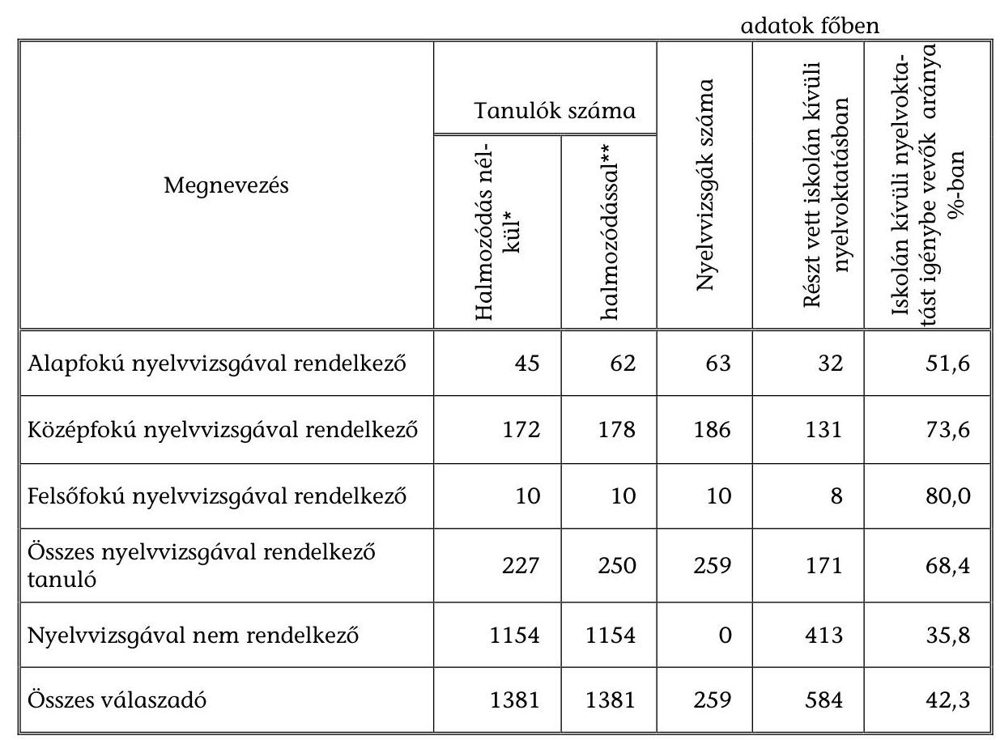

* A különböző szintű, de több nyelvvizsgával rendelkező tanulókat ott vettük számba, amelyik végzettsége az idegen nyelv tekintetében a legmagasabb.
** Azok a tanulók, akik több különböző fokú nyelvvizsgával rendelkeznek, minden nyelvvizsga szinthez besorolásra kerültek.

A számítástechnikai ismeretekből szerzett bizonyítványok, ECDL vizsgák számát csak azokban az intézményekben figyelik, ahol emelt szintű informatikai képzést folytatnak, vagy az intézménynek ilyen vizsgáztatási joga van.

Az államilag elismert vizsgákon kívül a különböző tudásszint mérések is információt adhatnak az eredményességről. Az angol és német nyelvből 2003. májusában lebonyolított országos kompetenciamérésben az intézmények többsége központi felkérés alapján vett részt, de a vizsgált intézmények negyede (Hajdúszoboszló, Dunaföldvár, Pásztó, Pécs, Szécsény, Százhalombatta) saját kezdeményezés alapján csatlakozott ahhoz. A vizsgált intézményekben a mérések eredményeiről részletes adatok – a soproni Vas- és Villamosipari Szakképző Iskola és Gimnázium kivételével – nem álltak rendelkezésre, arról az iskolák tájékoztatást még nem kaptak.

Az OKÉV által összesített adatok, a mérések, értékelések közzétett tapasztalatai szerint a felmért populáció átlageredményei rendkívül széles skálán mozognak. A jelentős eltérések az egyéni és iskolai teljesítményekre egyaránt jellemzőek. A felmérés megállapítása szerint a tanulók alapvető nyelvi kompetenciái hiányosak. A teljesítmények képzési típus szerint is élesen elhatárolódnak, legjobban a

---

két tannyelvű képzésben részt vevők teljesítenek, míg a középiskolán belül a leggyengébb teljesítményeket a szakközépiskolai tanulók nyújtották országos szinten. Egyértelmű összefüggést állapított meg a felmérés a település mérete, a résztvevők szüleinek iskolázottsága, valamint a tanulók nyelvi eredményei között „településlejtő”.

Az idegen nyelv oktatás terén az intézmények, illetve a fenntartó önkormányzatok saját hatáskörben csak három esetben kezdeményeztek tanulói teljesítmény-méréseket (Barcs, Veszprém megye, főváros XVII. kerület).

Az OKÉV szervezésében végzett méréseken kívül 4 vizsgált intézményben (Kiskőrös, Barcs, Paks városokban, illetve a soproni Széchenyi István Gimnáziumban) végzett a Szegedi Tudományegyetem nyelvi kompetencia mérését. A mérésekre az egyetem
 részéről történt megkeresések alapján került sor. A pedagógiai szakmai szolgáltató szervezetek a középiskolák megrendelése alapján 2 vizsgált intézményben (Szécsény, főváros XVII. kerület) végeztek külső mérést.

Az informatika terén tanulói teljesítménymérés mindössze két önkormányzatnál (Kapuvár, főváros XVII. kerület) volt. Várhatóan ez az új záróvizsgarendszerrel változni fog, mert a végzettek a jeles eredménnyel ECDL bizonyítványt fognak kapni.

A mérések eredményei nem kapnak kellő nyilvánosságot, bár azt a tantestületi értekezleteken a pedagógusok megvitatják, a szükséges következtetéseket levonják és intézkedéseket fogalmaznak meg az eredmények javítása érdekében, arról azonban még a fenntartót sem tájékoztatják. A fenntartó önkormányzatok 12,5%-a még arról sem rendelkezett információval, hogy intézményei körében a vizsgált időszakban volt-e idegen nyelvből, vagy informatikából tudásszint mérés. A teljesítménymérések iskolai adatairól tájékoztatót a helyi médiákban (újság és helyi televízió) csak Százhalombatta Város Önkormányzata tett közzé. A szülők tájékoztatására is ritkán kerül sor (Kiskőrös és Veszprém megye vizsgált intézményeinél).

Kedvező tendenciaként értékelhető, hogy az intézményekben előrelépés történt a belső értékelés rendszerének kialakításában. A változást a minőségfejlesztésre, minőségirányításra vonatkozó központi előírások indukálták.

Szerencs városban az elmúlt 3 évben a tanulók részére rendszeresen Cambridge próbanyelvvizsgát szerveztek. Kazincbarcika város és Veszprém megyei önkormányzat vizsgált intézményeiben 2 évente rendszeresen visszatérő jelleggel mérik a tanulók tudásszintjét, ezen túlmenően a diákok, pedagógusok körében elégedettségi vizsgálatokat is végeznek.

Az eredményesség lemérhető a lemorzsolódás alakulásában is. A tanulmányok megszakadása a tanuló és az intézmény számára egyaránt kudarc. A vizsgált időszakban a tanulói lemorzsolódás a 8 osztályos, illetve a két-tannyelvű gimnáziumokban, valamint a szakközépiskolákban nőtt, míg a hagyományos 4 osztályos, valamint a 6 osztályos gimnáziumokban mérséklődött. A 2002/2003. tanévben a legnagyobb mérvű lemorzsolódás a szakközépiskolákban (4 év alatt 22,4%), illetve a 8 évfolyamos gimnáziumi képzésben végzettek körében tapasztalható (8 év alatt 37,5%). Az előbbi iskolatípusnál a

---

tanulók előképzettségének hiányosságai, az utóbbi esetben pedig a korai irányváltás okozott nagyobb mértékű csökkenést.

Intézmények tekintetében az alacsony lélekszámú településen működő iskolákban (Abony, Enying), illetve egyes fővárosi kerületi iskolákban (főváros XVI, XVII. kerület) volt a legmagasabb a képzésből kimaradók, illetve évfolyamot ismétlők aránya.

A jelenlegi vizsgarendszerben külső vizsgaként csak az ún. közös érettségifelvételi vizsga funkcionált. Azok a tanulók, akik eredményesebben készültek fel a vizsgára nagyobb arányban kérték a közös felvételin elért jegyük érettségiként történő beszámítását. Az ellenőrzött intézményekben a 2002/2003-ban érettségizett 2208 tanuló közül mindössze 225 fő (10,2%) kérte a közös érettségi írásbeli felvételin elért érdemjegy érettségi jegyként való figyelembe vételét.

Az iskolai oktatás eredményességére utalhat, hogy a végzett tanulók hogyan tudják hasznosítani a későbbiekben (munkába állás, továbbtanulás során) az idegen nyelv, informatika tantárgyból szerzett tudásukat. E tekintetben az intézmények szinte semmilyen visszajelzéssel nem rendelkeznek.

A középiskolák végzett tanulóik felsőfokú oktatási intézményekbe történő felvételéről részletes, megbízható adatokkal nem rendelkeznek, egyes tanulók továbbtanulásáról az intézmények informális úton a tanulók, szülők, ismerősök tájékoztatásából értesülnek. A továbbtanulásokkal kapcsolatosan információt azon kimutatásokból nyerhetnek, amelyek öt év átlaga alapján a felvettek számának figyelembevételével rangsorolják a középfokú oktatási intézményeket.

Budapest, 2004. szeptember 20.

| Melléklet: | 5 db | 5 lap |
| :-- | :-- | :-- |
| Függelék: | 3 db | 5 lap |

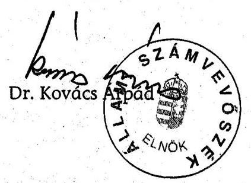

---

# Egy tanulócsoportra jutó tanulólétszám alakulása a vizsgált önkormányzatoknál

|  Megnevezés | Középiskolai képzés összesen |  |  | ebből szakképző évfolyamok |  |  | szakképző évfolyamok nélkül össz. |  |   |
| --- | --- | --- | --- | --- | --- | --- | --- | --- | --- |
|   | 2000. év | 2003. év | \% | 2000. év | 2003. év | \% | 2000. év | 2003. év | \%  |
|  Megyei Jogú Városok | 28,3 | 28,5 | 100,7 | 23,8 | 21,7 | 91,2 | 29 | 29,7 | 102,4  |
|  Fővárosi kerületek | 28,8 | 28,3 | 98,3 | 26,3 | 21,9 | 83,3 | 28,9 | 29 | 100,3  |
|  10 ezer főnél nagyobb városok | 28,5 | 27,4 | 96,1 | 27,1 | 21,4 | 79 | 28,7 | 29 | 101  |
|  10 ezer főnél kisebb városok | 27,2 | 27,9 | 102,6 | - | - | - | 27,2 | 27,9 | 102,6  |
|  Vizsgált önkormányzatok összesen | 28,4 | 28,2 | 99,3 | 24,7 | 21,6 | 87,4 | 28,9 | 29,4 | 101,7  |

---

# A vizsgált önkormányzatok középiskolai feladatok ellátására fordított költségvetési kiadásainak alakulása

|  Megnevezés | 2000. | Megoszlás
$\%$-a | 2002. | Megoszlás
$\%$-a | Index %-a
2002/2000  |
| --- | --- | --- | --- | --- | --- |
|  Önkormányzati költségvetési kiadások összesen | 143874717 | 100,0 | 206261587 | 100,0 | 143,4  |
|  Önkormányzati működési kiadások összesen | 122384388 | 85,1 | 168093360 | 81,5 | 137,3  |
|  ebből: oktatási feladatok ellátására, intézmények működtetésére
fordított kiadások* | 31913998 | 22,2 | 45040020 | 21,8 | 141,1  |
|  ebből: középiskolák nappali rendszerű általános műveltséget
megalapozó kiadásai** | 7809958 | 5,4 | 11712214 | 5,7 | 150,0  |
|  Önkormányzati felhalmozási kiadások összesen | 21490329 | 14,9 | 38168227 | 18,5 | 177,6  |
|  ebből: beruházási kiadások | 13062490 | 9,1 | 23900320 | 11,6 | 183,0  |
|  ebből: oktatással összefüggő beruházási kiadások | 1638281 | 1,1 | 2465485 | 1,2 | 150,5  |
|  ebből: középiskolát érintő beruházási kiadások | 949711 | 0,7 | 1242861 | 0,6 | 130,9  |
|  felújítási kiadások | 3366525 | 2,3 | 4260985 | 2,1 | 126,6  |
|  ebből: oktatással összefüggő felújítási kiadások | 861513 | 0,6 | 931400 | 0,5 | 108,1  |
|  ebből: középiskolát érintő felújítási kiadások | 305229 | 0,2 | 304548 | 0,1 | 99,8  |

* 80120-80590 szakfeladat, 75176 szakfeladat kiadása összesen. A 80121-4 Nappali rendszerű általános műveltséget megalapozó oktatás szakfeladaton elszámolt kiadások közép- és általános iskolák közötti megosztását a tantárgyfelosztás szerinti óraszámok alapján kértük elvégezni (középiskolai képzésnek minősítettük az oktatási statisztika módszertanának megfelelően a 6-8. évfolyamos képzés teljes óraszámát a két-tannyelvű gimnáziumi képzés 0-ik évfolyamát is).

---

# A vizsgált intézmények bevételeinek alakulása

|  Megnevezés | 2000. évi tény |  |  |  | 2002. évi tény |  |  |  | Index \% | Index \%  |
| --- | --- | --- | --- | --- | --- | --- | --- | --- | --- | --- |
|   | Összesen | Meg-
oszlás
aránya
$\%$ | Középisko-
lai okt.
érintő be-
vételek * | Meg-
oszlás
aránya
$\%$ | Összesen | Meg-
oszlás
aránya
$\%$ | Középisko-
lai oktatást
érintő be-
vételek* | Meg-
oszlás
aránya
$\%$ | Összes változás
2002/2000 | $\begin{aligned} & \text { Középisk. okt. } \\ & \text { 2002/2000 } \end{aligned}$  |
|  Bevételek összesen | 3237198 | 100 | 689607 | 100 | 4666092 | 100 | 1261528 | 100 | 144,1 | 183,0  |
|  ebből:
Intézményi működési bevételek | 233297 | 7,2 | . | . | 327955 | 7,0 | . | . | 140,6 | .  |
|  Önkormányzati támogatás | 2649695 | 81,9 | . | . | 3860267 | 82,7 | . | . | 145,7 | .  |
|  Támogatásokra átvett pénzeszközök | 354206 | 10,9 | 156293 | 22,7 | 477870 | 10,3 | 223506 | 17,7 | 134,9 | 143,0  |
|  ebből:
Pályázati úton elnyert támogatás | 73784 | 2,3 | 57247 | 8,3 | 122542 | 2,6 | 100182 | 7,9 | 166,1 | 175,0  |
|  Szakképzési Alapból átvett pénzeszköz | 161119 | 5,0 | 92285 | 13,4 | 179039 | 3,8 | 111097 | 8,8 | 111,1 | 120,4  |

[^0] [^0]: * az összes bevétel megosztása a vegyes profilú intézmények esetében az ellátott órák arányában történt

---

Az idegen nyelv és számítástechnika oktatáshoz felhasznált külső források alakulása a vizsgált intézményekben
adatok ezer Ft-ban

| Megnevezés | 2000. | $\begin{aligned} & \text { M} \\ & \% \\ & \% \end{aligned}$ | 2002. | $\begin{aligned} & \text { M} \\ & \% \\ & \% \end{aligned}$ | 2003. | $\begin{aligned} & \text { M} \\ & \% \\ & \% \end{aligned}$ | Változás   $\%$-a |
| :--: | :--: | :--: | :--: | :--: | :--: | :--: | :--: |
| Az idegen nyelv oktatáshoz felhasznált külső források | 13608 | 100 | 16352 | 100 | 30556 | 100 | 24,5 |
| Ebből: Iskolai alapítványok pénzeszközeiből | 2335 | 17,1 | 3725 | 22,8 | 4772 | 15,6 | 4,4 |
| Szakképzési hozzájárulásból | 541 | 4,0 | 250 | 1,5 | 1825 | 6,0 | 137,3 |
| Pályázati forrásból | 10732 | 78,9 | 12377 | 75,7 | 23959 | 78,4 | 23,2 |
| Számítástechnika oktatáshoz felhasznált külső források | 54896 | 100 | 81367 | 100 | 83243 | 100 | 51,6 |
| Ebből: Iskolai alapítványok pénzeszközeiből | 4763 | 8,7 | 6511 | 8,0 | 4314 | 5,2 | -9,5 |
| Szakképzési pénzeszközökből | 30469 | 55,5 | 32960 | 40,5 | 52854 | 63,5 | 73,5 |
| Pályázati forrásból | 19664 | 35,8 | 41896 | 51,5 | 26075 | 31,3 | 32,6 |

---

# A számítógép állomány tényleges kormegoszlása és a tanulók korszerűségről alkotott véleményének alakulása 

Számítógéppark kormegoszlásának bemutatása
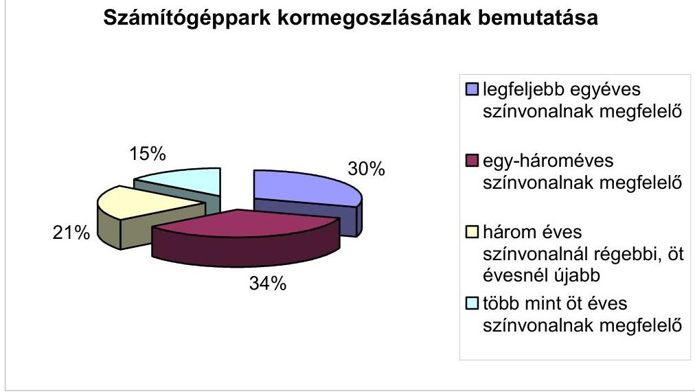

A számítógéppark korszerűség szerinti megoszlása a megkérdezett tanulók véleménye szerint
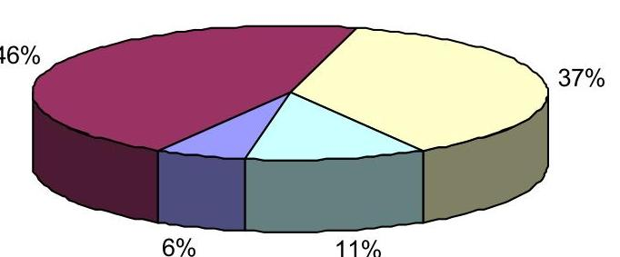
$\square$ nagyon jó $\square$ jó $\square$ közepes $\square$ gyenge

---

# A helyszíni ellenőrzésbe bevont önkormányzatok és oktatási intézmények jegyzéke

|  Megye: | Vizsgált önkormányzatok: | Intézmények:  |
| --- | --- | --- |
|  Baranya | Pécs Megyei Jogú Város | Janus Pannonius Gimnázium és Szakközépiskola  |
|   | Siklós Város | Táncsics Mihály Gimnázium és Szakképző Iskola Intenzív Középiskola  |
|  Bács-Kiskun | Kiskunfélegyháza Város | Móra Ferenc Gimnázium  |
|   | Kiskőrös Város |

 | Petőfi Sándor Gimnázium, Kertészeti Szakközépiskola és Kollégium  |
|  Borsod-Abaúj-Zemplén | Kazincbarcika Város | Ságvári Endre Gimnázium  |
|   | Szerencs Város | Bocskai István Gimnázium és Közgazdasági Szakközépiskola  |
|  Fejér | Dunaújváros | Bánki Donát Gimnázium és Szakközépiskola  |
|   | Enying Város | Bocsor István Gimnázium  |
|  Főváros | III. kerület | Öbudai Gimnázium  |
|   | XIV. kerület | Teleki Blanka Gimnázium  |
|   | XV. kerület | Dózsa György Gimnázium  |
|   | XVII. kerület | Körösi Csoma Sándor Általános Iskola és Gimnázium  |
|  Győr-Moson-Sopron | Sopron Megyei Jogú Város | Széchenyi István Gimnázium  |
|   |  | Vas- és Villamosipari Szakképző Iskola és Gimnázium  |
|   | Kapuvár Város | Felsőbúki Nagy Pál Gimnázium  |
|  Hajdú-Bihar | Hajdúszoboszló Város | Hőgyes Endre Gimnázium és Szakközépiskola  |
|  Nógrád | Pásztó Város | Mikszáth Kálmán Gimnázium és Postaforgalmi Szakközépiskola  |
|   | Szécsény Város | Körösi Csoma Sándor Általános Iskola és Gimnázium  |
|  Pest | Abony Város | Kinizsi Pál Gimnázium és Szakközépiskola  |
|   | Százhalombatta Város | Széchenyi István Szakközépiskola és Gimnázium  |
|  Somogy | Kaposvár Megyei Jogú Város | Toldi Lakótelepi Általános Iskola és Gimnázium  |
|   | Barcs Város | Széchenyi Ferenc Középiskola és Kollégium  |
|  Tolna | Dunaföldvár Város | Magyar László Gimnázium  |
|   | Paks Város | Vak Bottyán Gimnázium  |
|  Veszprém | Veszprém Megyei Önkormányzat | Thuri György Gimnázium és Szakközépiskola  |

---

# Tanulói kérdőívek összesített eredménye 

## Válaszok a nyelvi és számítástechnikai képzésről

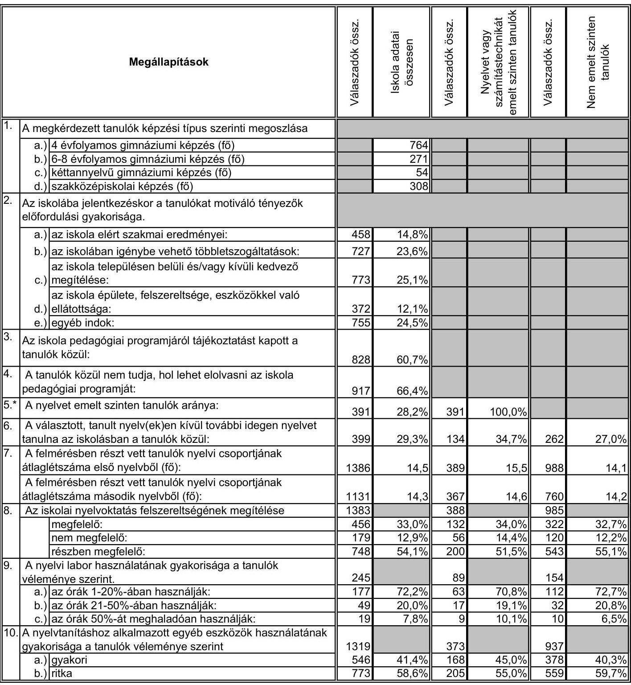

---

2/1. sz. függelék a V-1003/2004. sz. vizsgálathoz

|  Megállapítások |  |  |  |  |  |   |
| --- | --- | --- | --- | --- | --- | --- |
|   |  |  |  |  |  | Válaszadók össz.  |
|  11. A tanulók véleménye az idegen nyelv oktatás színvonaláról |  | 1388 |  | 389 |  | 991  |
|   | nagyon jó | 128 | 9,2% | 65 | 16,7% | 62  |
|   | jó | 779 | 56,1% | 236 | 60,7% | 539  |
|   | közepes | 407 | 29,3% | 76 | 19,5% | 329  |
|   | gyenge | 74 | 5,3% | 12 | 3,1% | 61  |
|  12. A nyelvoktatást végző pedagógusok személyében a tanulók középiskolai tanulmánya során. |  | 1079 |  | 264 |  | 809  |
|   | a.) egyszer volt változás: | 543 | 50,3% | 119 | 45,1% | 421  |
|   | b.) kétszer volt változás: | 204 | 18,9% | 43 | 16,3% | 161  |
|   | c.) többször volt változás: | 332 | 30,8% | 102 | 38,6% | 227  |
|  13. A tanulók közül államilag elismert "C" típusú nyelvvizsgával egyenértékű bizonyítvánnyal rendelkezik: |  |  |  |  |  |   |
|   | a.) alapszintű nyelvvizsgával rendelkező tanulók (fő) |  | 62 |  | 33 |   |
|   | a.) alapszintű nyelvvizsgák száma (db): |  | 63 |  | 34 |   |
|   | b.) középszintű nyelvvizsgával rendelkező tanulók (fő): |  | 178 |  | 89 |   |
|   | középszintű nyelvvizsgák száma (db): |  | 186 |  | 92 |   |
|   | c.) felsőfokú nyelvvizsgával rendelkező tanulók (fő): |  | 10 |  | 4 |   |
|   | felsőfokú nyelvvizsgák száma (db): |  | 10 |  | 4 |   |
|  14. Iskolán kívüli nyelvoktatásban részt vevő tanulók aránya: |  | 584 | 42,3% | 203 | 52,6% | 380  |
|  15. Az iskolán kívüli nyelvtanulás módjai (halmozódással): |  |  |  |  |  |   |
|   | a.) egyénileg magántanárhoz járt (fő): |  | 438 |  | 167 |   |
|   | b.) csoportosan járt magántanárhoz (fő): |  | 65 |  | 19 |   |
|   | c.) szervezett, tanfolyami nyelvoktatásban vett részt (fő): |  | 155 |  | 54 |   |
|   | d.) egyéb módon tanult (fő): |  | 117 |  | 27 |   |
|  16. A számítástechnikát emelt szinten tanulók aránya: |  | 1367 | 12,0% | 164 | 100,0% |   |
|  17. A számítástechnikai órák mennyiségéről adott tanulói vélemények: |  | 1381 |  | 161 |  | 1193  |
|   | a.) kevésnek tartja az óraszámot: | 677 | 49,0% | 46 | 28,6% | 621  |
|   | b.) megfelelőnek ítéli az órák mennyiségét: | 662 | 47,9% | 113 | 70,2% | 532  |
|   | c.) kevesebb órát tart szükségesnek: | 42 | 3,0% | 2 | 1,2% | 40  |
|  18. Az iskola számítástechnikai képzésével kapcsolatos tanulói elégedettség. |  | 1386 |  | 164 |  | 1194  |
|   | a.) nagyon elégedett: | 85 | 6,1% | 20 | 12,2% | 65  |
|   | b.) elégedett: | 715 | 51,6% | 105 | 64,0% | 594  |
|   | c.) kevésbé elégedett: | 366 | 26,4% | 29 | 17,7% | 332  |
|   | d.) nem elégedett: | 220 | 15,9% | 10 | 6,1% | 203  |
|  19. A számítástechnikai képzésben a tanulók az alábbi változásokat igényelnék: (halmozódással) |  |  |  |  |  |   |
|   | a.) növelni kellene az elméleti óraszámot (fő): |  | 251 |  | 28 |   |
|   | b.) csökkenteni kellene az elméleti óraszámot (fő): |  | 188 |  | 20 |   |
|   | c.) a gyakorlásra fordítható időt kellene növelni (fő): |  | 885 |  | 81 |   |
|   | d.) csökkenteni kellene a gyakorlásra fordítható időt (fő): |  | 17 |  | 7 |   |
|   | e.) egyiket sem változtatná (fő): |  | 311 |  | 46 |   |
|  20. Nem tartja elegendőnek a tanóra keretében a gyakorlási lehetőséget: |  | 645 | 46,8% | 42 | 25,9% | 591  |
|  21. Tanórán kívül gyakorlási lehetőség az iskolai számítógépeken: |  | 1387 |  | 164 |  | 1195  |
|   | a.) bármikor: | 504 | 36,3% | 72 | 43,9% | 421  |
|   | b.) ritkán: | 587 | 42,3% | 66 | 40,2% | 509  |
|   | c.) szinte soha: | 75 | 5,4% | 5 | 3,0% | 69  |
|   | d.) nem tudja, mert nincs erre az iskolában szüksége: | 221 | 15,9% | 21 | 12,8% | 196  |

---

2/1. sz. függelék a V-1003/2004. sz. vizsgálathoz

|  Megállapítások |  |  |  |  |  |   |
| --- | --- | --- | --- | --- | --- | --- |
|   |  |  |  |  |  | Válaszadók össz.  |
|  22. A tanulók szerint az iskola számítástechnikai eszközökkel való ellátottsága |  |  |  |  |  |   |
|  a.) mennyiségét tekintve: |  | 1390 |  | 163 |  | 1198  |
|   | nagyon jó | 164 | 11,8% | 38 | 23,3% | 123  |
|   | jó | 720 | 51,8% | 83 | 50,9% | 621  |
|   | közepes | 404 | 29,1% | 28 | 17,2% | 367  |
|   | gyenge | 102 | 7,3% | 14 | 8,6% | 87  |
|  b.) a géppark-állomány korszerűségét tekintve: |  | 1384 |  | 164 |  | 1191  |
|   | nagyon jó | 81 | 5,9% | 10 | 6,1% | 70  |
|   | jó | 631 | 45,6% | 83 | 50,6% | 536  |
|   | közepes | 513 | 37,1% | 48 | 29,3% | 456  |
|   | gyenge | 159 | 11,5% | 23 | 14,0% | 129  |
|  23. A tanulók véleménye szerint a számítógépet a tanultak gyakorlására a tanítási órák |  | 1360 |  | 163 |  | 1170  |
|  a.) 1-30%-ában használták: |  | 170 | 12,5% | 5 | 3,1% | 159  |
|  b.) 31-50%-ában használták: |  | 390 | 28,7% | 36 | 22,1% | 348  |
|  c.) 50%-nál több órán használták: |  | 800 | 58,8% | 122 | 74,8% | 663  |
|  24. Az Internet igénybevételére az iskolában a tanórán kívül a tanulóknak lehetősége van. |  | 1235 |  | 145 |  |

 |  | 1065  |
|  a.) bármikor: |  | 294 | 23,8\% | 51 | 35,2\% | 238  |
|  b.) alkalomszerűen: |  | 602 | 48,7\% | 64 | 44,1\% | 522  |
|  c.) ritkán: |  | 249 | 20,2\% | 21 | 14,5\% | 225  |
|  d.) soha: |  | 90 | 7,3\% | 9 | 6,2\% | 80  |
|  25. A tanulók közül otthon számítógéppel rendelkezik: |  | 1197 | 85,8\% | 155 | 94,5\% | 1016  |
|  26. Az otthoni gép alkalmas arra, hogy a tanuló gyakorolhassa rajta az iskolában tanultakat: |  | 1294 |  | 159 |  | 1108  |
|  a.) igen: |  | 707 | 54,6\% | 102 | 64,2\% | 592  |
|  b.) nem: |  | 173 | 13,4\% | 8 | 5,0\% | 161  |
|  c.) részben: |  | 414 | 32,0\% | 49 | 30,8\% | 355  |
|  27. A tanulók közül otthon internet használattal rendelkezik: |  | 560 | 42,2\% | 65 | 41,4\% | 484  |
|  28. A heti átlagos számítógéphasználat a tanulók körében (szélső értékek kiszűrésével) (óra): |  | 1300 | 7,8 | 160 | 13,8 | 1113  |
|  a.) ebből: átlagos internet használat ideje (óra) |  | 1018 | 4,9 | 121 | 5,7 | 878  |
|  29. A tanulók szerint a jövőben szüksége lesz számítástechnikai felhasználói ismeretekre: |  | 1285 | 93,2\% | 157 | 96,3\% | 1100  |
|  30. A tanulók közül nem ismeri a számítástechnikai végzettséget adó ECDL vizsga lehetőségét: |  | 327 | 23,5\% | 24 | 14,8\% | 295  |

- 5-15. válaszoknál a második oszlopban külön vizsgáltuk azoknak a tanulóknak a válaszait, akik emelt szintű nyelvi oktatásban részesülnek. 16-30. válaszoknál a második oszlopban külön vizsgáltuk azoknak a tanulóknak a válaszait, akik emelt szintű számítástechnikai oktatásban részesülnek.

---

# Tanulói kérdőívek összesített eredménye 

Válaszok az emelt szintű érettségiről

| Megállapítások |  |  |  |  |  |  |  |  |  |  |
| :--: | :--: | :--: | :--: | :--: | :--: | :--: | :--: | :--: | :--: | :--: |
| 31 | Nem mérte fel a tanulók szerint az iskola, hogy mely tárgyakból kívánnak emelt szintű érettségit tenni. | 1377 | $6,6 \%$ | 752 | $5,7 \%$ | 269 | $2,6 \%$ | 53 | $5,7 \%$ | 303 | $12,5 \%$ |
| 32 | A tanulók szerint az igények felmérésekor az iskola határozott meg korlátozó tényezőket: | 1373 | $39,3 \%$ | 752 | $40,3 \%$ | 267 | $50,6 \%$ | 53 | $41,5 \%$ | 301 | $26,6 \%$ |
| 33 | Az emelt szintű érettségire felkészítést |  |  |  |  |  |  |  |  |  |
|  | a.) saját iskolában tudja igénybe venni (fő): | 1176 | 1176 | 673 | 673 | 223 | 223 | 49 | 49 | 231 | 231 |
|  | b.) más iskolában tudja igénybe venni (fő): | 110 | 110 | 47 | 47 | 39 | 39 | 4 | 4 | 20 | 20 |
|  | (halmozódás lehetséges volt) |  |  |  |  |  |  |  |  |  |  |
| 34 | A tanulók elégedettsége az iskola által adott tájékoztatással: |  |  |  |  |  |  |  |  |  |  |
|  | a.) a kétszintű érettségiről: |  |  |  |  |  |  |  |  |  |  |
|  |  | igen | 539 | 38,9\% | 297 | 39,2\% | 89 | $33,0 \%$ | 5 | $9,4 \%$ | 148 | $48,4 \%$ |
|  |  | nem | 297 | $21,4 \%$ | 162 | $21,4 \%$ | 68 | $25,2 \%$ | 33 | $62,3 \%$ | 34 | $11,1 \%$ |
|  |  | részben | 550 | $39,7 \%$ | 298 | $39,4 \%$ | 113 | $41,9 \%$ | 15 | $28,3 \%$ | 124 | $40,5 \%$ |
|  | b.) az emelt szintű érettségi letételének előnyeiről |  |  |  |  |  |  |  |  |  |  |
|  |  | igen | 519 | $38,2 \%$ | 284 | $38,1 \%$ | 90 | $33,5 \%$ | 6 | $11,3 \%$ | 139 | $47,8 \%$ |
|  |  | nem | 296 | $21,8 \%$ | 161 | $21,6 \%$ | 63 | $23,4 \%$ | 30 | $56,6 \%$ | 42 | $14,4 \%$ |
|  |  | részben | 544 | $40,0 \%$ | 301 | $40,3 \%$ | 116 | $43,1 \%$ | 17 | $32,1 \%$ | 110 | $37,8 \%$ |
| 35 | A tanulók közül emelt szintű érettségire felkészítő foglalkozásra jár |  | 894 | $65,6 \%$ | 551 | $73,8 \%$ | 226 | $86,6 \%$ | 48 | $92,3 \%$ | 69 | $22,8 \%$ |
|  | a.) az egy főre eső tantárgyszám |  | 913 | 1,9 | 563 | 1,9 | 236 | 2,0 | 48 | 2,0 | 66 | 1,3 |
|  | ebből: kötelező érettségi tantárgy egy főre eső értéke |  | 722 | 1,5 | 439 | 1,6 | 194 | 1,5 | 37 | 1,7 | 52 | 1,2 |
| 36 | Az emelt szintű érettségire felkészítő foglalkozásra járó tanulók közül nem kíván emelt szintű érettségit tenni: |  | 229 | $25,1 \%$ | 148 | $26,3 \%$ | 46 | $19,5 \%$ | 15 | $31,3 \%$ | 20 | $30,3 \%$ |
| 37 | Jelenlegi elképzeléseik szerint a tanulók emelt szinten kívánnak érettségit tenni: |  | 770 | $55,1 \%$ | 456 | $59,7 \%$ | 204 | $75,3 \%$ | 36 | $66,7 \%$ | 74 | $24,0 \%$ |
|  | a.) egy tantárgyból: |  | 231 | $16,5 \%$ | 127 | $16,6 \%$ | 54 | $19,9 \%$ | 7 | $13,0 \%$ | 43 | $14,0 \%$ |
|  | b.) két tantárgyból: |  | 363 | $26,0 \%$ | 210 | $27,5 \%$ | 107 | $39,5 \%$ | 18 | $33,3 \%$ | 28 | $9,1 \%$ |
|  | c.) három, vagy több tantárgyból: |  | 176 | $12,6 \%$ | 119 | $15,6 \%$ | 43 | $15,9 \%$ | 11 | $20,4 \%$ | 3 | $1,0 \%$ |
|  | Kötelező érettségi tárgyból kíván emelt szintű érettségit tenni (fő): |  | 660 | 660 | 396 | 396 | 179 | 179 | 32 | 32 | 53 | 53 |
|  |  | idegen nyelvből (fő) | 264 | 264 | 145 | 145 | 82 | 82 | 14 | 14 | 23 | 23 |
|  | A választható tárgyak közül kíván emelt szintű érettségit tenni (fő): |  | 520 | 520 | 318 | 318 | 130 | 130 | 26 | 26 | 46 | 46 |
|  | számítástechnikából (fő) |  | 136 | 136 | 77 | 77 | 23 | 23 | 5 | 5 | 31 | 31 |
|  | második idegen nyelvből (fő) |  | 120 | 120 | 74 | 74 | 35 | 35 | 10 | 10 | 1 | 1 |

---

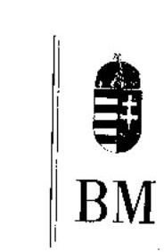

BELBGYHISISZTER

Iktatószám: 1-a 2/33/2004.

Dr. Kovács Árpád úrnak, elnök

Állami Számvevőszék

# Budapest 

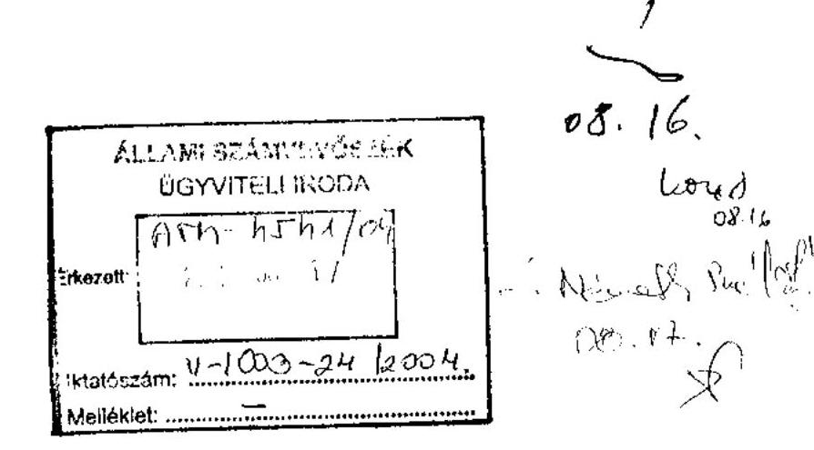

Tisztelt Elnök Úr!

Köszönettel vettem „A középfokú oktatás feltételei alakulásának ellenőrzéséről" címmel készített jelentés-tervezet megküldését, melynek megállapításait, adatait munkánk során hasznosíthatjuk.
A Közigazgatási Szolgáltatások Korszerűsítési Programja keretében e kérdés nagy jelentőséggel bír.

Budapest, 2004. augusztus „ $\boldsymbol{\eta}$."
Tisztelettel:

Dr. Lamperth Mónika 4

---

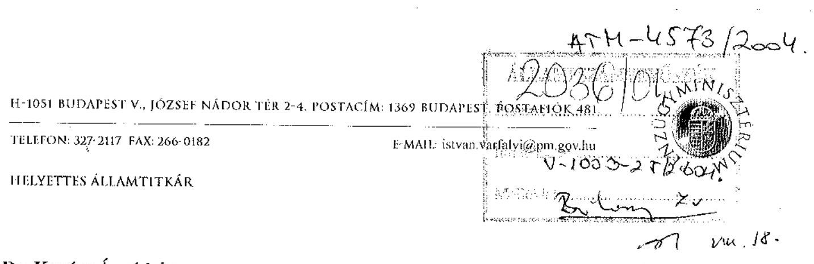

Dr. Kovács Árpád úr
Elnök
Állami Számvevőszék
Budapest

Tisztelt Elnök Úr!
Köszönettel vettem a középfokú oktatás feltételei alakulásáról szóló jelentés tervezetét.
Amellett, hogy elsődlegesen szakmai szempontú ellenőrzést végeztek munkatársai, pénzügyi, költségvetési szempontból is igen hasznos, és a következőkben számunkra is irányt mutató megállapítások szerepelnek az anyagban.

Az oktatási miniszternek tett egyes javaslataikhoz kapcsolódva a következőket szeretném jelezni:

- A közoktatásra fordítható források nagysága és növekménye, ezen belül is az oktatáspolitika prioritásának érvényesítése a mindenkori központi költségvetési koncepciók függvénye lehet.
- Partnerek vagyunk abban, hogy a közoktatás gazdaságosságát, hatékonyságát képzési szintenként mérhető szakfeladat-rendszerrel támasztsuk alá.
- Egyetértünk azzal, hogy kapjanak nagyobb szerepet az OKÉV-ek az önkormányzati intézmények jogszerű működtetésének biztosításában, segítésében, azonban e téren nemcsak a szakmai, tárgyi feltételek megléte, hanem a működtetés, illetve intézményfenntartás indokoltsága, a megyei fejlesztési tervekkel való összhangja is legyen a vizsgálati célok között. Nemcsak az eszköz(óra)-hiányt, hanem a célszerűtlen, drága és nem megfelelő színvonalú működtetést is szükséges lenne szankcionálni. Utóbbihoz azonban a közoktatási törvény nem tartalmaz mértékadó követelményeket.

Ismételten megköszönve munkatársai munkáját kérem tájékoztatásom szíves elfogadását.
Budapest, 2004. augusztus „H,,

Tisztelettel:
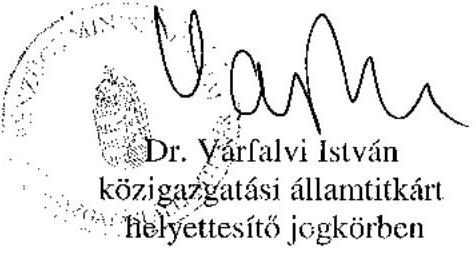

---

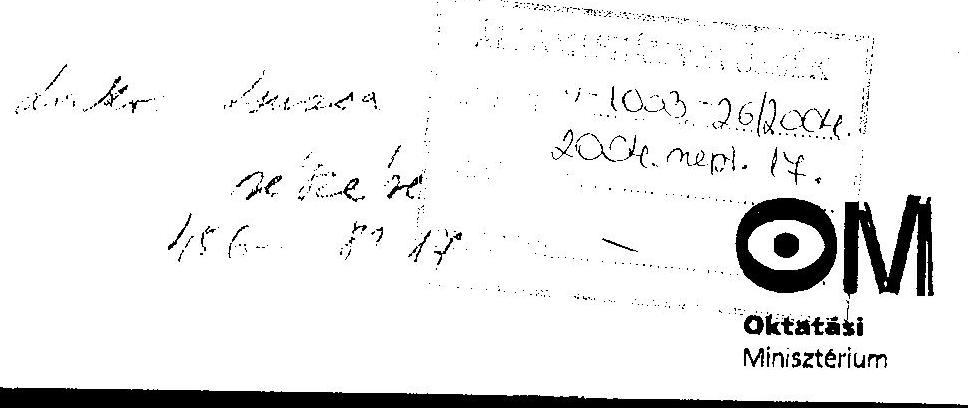

Iktatószám: 25216-3/2004.
Hiv.szám: V-1003-23/2004.

Állami Számvevőszék
Dr. Kovács Árpád
elnök úr részére

Budapest
Pf.: 54.

1364

Tisztelt Elnök Úr!
Hivatkozással a V-1003-23/2004. iktatószámú, az Állami Számvevőszék 2004. évi ellenőrzési terve alapján a középfokú oktatás feltételeinek alakulása ellenőrzésétől készített jelentés tervezetére, a leírtakkal kapcsolatban észrevételt nem teszek.

Budapest, 2004. szeptember 5.
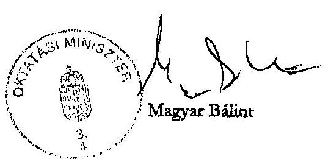

