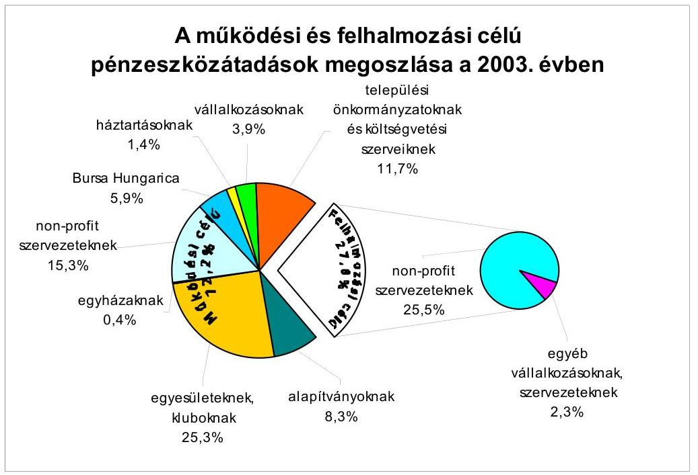
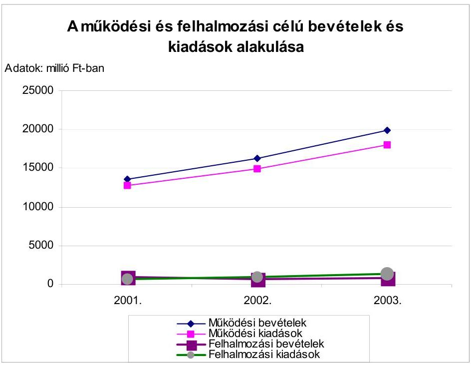
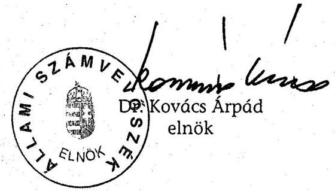
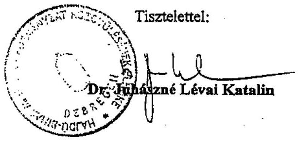

# JELENTÉS 

## a Hajdú-Bihar Megyei Önkormányzat gazdálkodásának átfogó ellenőrzéséről

---

3. Önkormányzati és Területi Ellenőrzési Igazgatóság
3.3. Átfogó Ellenőrzések Főcsoport
Iktatószám: V-1002-4/29/14/2004.
Témaszám: 692
Vizsgálat-azonosító szám: V0162

# Az ellenőrzést felügyelte: 

Dr. Lóránt Zoltán
főigazgató
Az ellenőrzés végrehajtásáért felelős:
Dr. Sepsey Tamás
igazgató
Az ellenőrzést vezette:
Csecserits Imréné
főcsoportfőnök-helyettes

## Az ellenőrzést végezték:

Kozák György
főtanácsadó
Pálfi András
számvevő tanácsos
Molnár Mária
külső munkatárs

## A témához kapcsolódó- elmúlt három évben -készített számvevőszéki jelentések:

| címe | sorszáma |
| :-- | --: |
| Jelentés a közbeszerzésről szóló törvény végrehajtásának | 0109 |
| ellenőrzéséről |  |
| Jelentés az általános iskolai oktatás minőségének javítását szolgáló | 0219 |
| intézkedések ellenőrzésének tapasztalatairól |  |
| Jelentés a megyei, fővárosi illetékhivatali tevékenysége | 0243 |
| ellenőrzéséről |  |
| Jelentés a helyi önkormányzatok tartós szociális ellátási | 0317 |
| feladatainak ellenőrzéséről az idősek otthonainál |  |

Jelentéseink az Országgyűlés számítógépes hálózatán és az Interneten a www.asz.hu címen is olvashatók.

---

# TARTALOMJEGYZÉK 

BEVEZETÉS ..... 5
I. ÖSSZEGZŐ MEGÁLLAPÍTÁSOK, KÖVETKEZTETÉSEK, JAVASLATOK ..... 7
II. RÉSZLETES MEGÁLLAPÍTÁSOK ..... 19

1. A költségvetés tervezésének, végrehajtásának, az Önkormányzat vagyongazdálkodásának és a zárszámadás elkészítésének szabályszerűsége ..... 19
1.1. A költségvetési rendelet jóváhagyásának, módosításának, az előirányzatok nyilvántartásának és betartásának szabályszerűsége ..... 19
1.2. A gazdálkodás szabályozottsága, a bizonylati rend és fegyelem szabályszerűsége ..... 25
1.3. A pénzügyi-számviteli feladatok ellátásának informatikai támogatottsága ..... 35
1.4. Az önkormányzati vagyon nyilvántartása, számbavétele ..... 37
1.5. A vagyonnal való gazdálkodás szabályszerűsége, célszerűsége, nyilvánossága ..... 39
1.6. A céljelleggel nyújtott támogatások szabályszerűsége ..... 50
1.7. A közbeszerzési eljárások szabályszerűsége ..... 54
1.8. A zárszámadási kötelezettség teljesítésének szabályszerűsége ..... 56
2. Az önkormányzati feladatok és a rendelkezésre álló források összhangja ..... 58
2.1. A feladatok meghatározása és szervezeti keretei ..... 58
2.2. A költségvetés egyensúlyának helyzete ..... 60
2.3. A feladatok finanszírozása ..... 63
3. A belső irányítási, ellenőrzési rendszer működésének értékelése ..... 67
3.1. Az ellenőrzési rendszer kialakítása, működése ..... 67
3.2. A könyvvizsgálati kötelezettség teljesítése ..... 68
3.3. A korábbi számvevőszéki ellenőrzések javaslatainak hasznosulása ..... 69

---

# MELLÉKLETEK 

1. számú Az önkormányzati vagyon nagyságának alakulása (1 oldal)
2. számú Az Önkormányzat 2003. évi bevételeinek és kiadásainak alakulása (1 oldal)
3. számú Az Önkormányzat gazdálkodását meghatározó adatok, mutatószámok (1 oldal)
4. számú Egyes önkormányzati feladatok finanszírozása (1 oldal)

5/a. számú A pénzügyi befektetések hozama 2001. év (1 oldal)
5/b. számú A pénzügyi befektetések hozama 2002. év (1 oldal)
5/c. számú A pénzügyi befektetések hozama 2003. év (1 oldal)
5/d. számú A 2003. évi pénzügyi befektetések elemzése (1 oldal)
6. számú Dr. Juhászné Lévai Katalin polgármester úrhölgy észrevétele (1 oldal)

---

# RÖVIDÍTÉSEK JEGYZÉKE 

Ötv.
Áht.
Ámr.
Kbt.
Számv. tv.
Htv.

Vhr.

Ltv.

Ktv.
költségvetési törvény

Tpt.
Ber.
ÁSZ
Illetékhivatal
Önkormányzat
Közgyűlés
Közgyűlés elnöke
főjegyző
Hivatal
Közgazdasági iroda
SzMSz
ügyrend
vagyongazdálkodási
rendelet
DERMÁK
NYÍRÁPO
TITÁSZ
a helyi önkormányzatokról szóló 1990. évi LXV. törvény az államháztartásról szóló 1992. évi XXXVIII. törvény az államháztartás múködési rendjéről szóló 217/1998. (XII. 30.) Korm. rendelet
a közbeszerzésekről szóló 1995. évi XL. törvény
a számvitelről szóló 2000. évi C. törvény
a helyi önkormányzatok és szerveik, a köztársasági megbízottak, valamint egyes centrális alárendeltségű szervek feladat- és hatásköreiről szóló 1991. évi XX. törvény
az államháztartás szervezetei beszámolási és könyvvezetési kötelezettségének sajátosságairól szóló 249/2000. (XII. 24.) Korm. rendelet
a lakások és helyiségek bérletére, valamint az elidegenítésükre vonatkozó egyes szabályokról szóló 1993. évi LXXVIII. törvény
a köztisztviselők jogállásáról szóló 1992. évi XXIII. törvény
a Magyar Köztársaság 2003. évi költségvetéséről szóló 2002. évi LXII. törvény
a tőkepiacról szóló 2001. évi CXX. törvény
193/2003. (XI. 26.) Korm. rendelet a költségvetési szervek belső ellenőrzéséről
Állami Számvevőszék
Hajdú-Bihar Megyei Illetékhivatal
Hajdú-Bihar Megyei Önkormányzat
Hajdú-Bihar Megyei Közgyűlés
Hajdú-Bihar Megyei Közgyűlés elnöke
Hajdú-Bihar Megyei Önkormányzat főjegyzője
Hajdú-Bihar Megye Önkormányzatának Hivatala
Hajdú-Bihar Megyei Önkormányzat Hivatalának Közgazdasági Irodája
a Hajdú-Bihar Megyei Önkormányzatnak a Közgyűlés és szervei Szervezeti és Müködési Szabályzatáról szóló 3/1999. (IV. 1.) számú rendelete
a Közgyűlés elnöke és a főjegyző együttes utasítása a Haj-dú-Bihar Megyei Önkormányzat Hivatala Gazdasági Szervezetének Úgyrendjéről
a Hajdú-Bihar Megyei Önkormányzatnak a vagyonáról és a vagyongazdálkodás szabályairól szóló 10/1999. (XII. 1.) számú rendelete
Derecskei Mentálhigiénés és Ápolási Központ
Nyíradonyi Ápolási Központ
Tiszántúli Áramszolgáltató Rt.

---

.

---

# JELENTÉS   a Hajdú-Bihar Megyei Önkormányzat gazdálkodásának átfogó ellenőrzéséről 

## BEVEZETÉS

Az Önkormányzat gazdálkodását az Ötv. 92. § (1) bekezdése, valamint az Áht. 120/A. § (1) bekezdése alapján az ÁSZ Önkormányzati és Területi Ellenőrzési Igazgatósága a V-1002-4/2004. számú ellenőrzési program szerint vizsgálta.

## Az ellenőrzés célja annak értékelése volt, hogy:

- az önkormányzati gazdálkodás törvényességét, szabályszerűségét biztosított-ták-e a tervezés, a költségvetés végrehajtása, a vagyongazdálkodás és a zárszámadás során;
- az Önkormányzat által ellátott feladatok és az azokhoz rendelkezésre álló források összhangja biztosított volt-e, különös tekintettel egyes kiemelt feladatokra;
- a gazdálkodás szabályszerűségét biztosító kontrollok ${ }^{1}$ megfelelően segitettéke a végrehajtást.

Az ellenőrzött időszak: a 2003. év, valamint a vagyon értékének és összetételének változását befolyásoló döntések, a gazdálkodás szervezeti megoldása és a feladatok-források változása tekintetében a 2001-2002. évek is.

Hajdú-Bihar megye az ország negyedik legnépesebb megyéje, a népességszám 2003. évben 561 ezer fő volt, s az urbanizáció fokát jelzi, hogy a lakosság $77,5 \%$-a városokban él.

Az Önkormányzat 26 költségvetési szervet tart fenn, amelyekből 24 önállóan gazdálkodik, s a feladatok ellátásában további négy közhasznú társaság és hét alapítvány vesz részt. A 2003. évi költségvetés módosított előirányzata 21600 millió Ft, a saját vagyon 9300 millió Ft volt. Az önkormányzati feladatokat ellátók 2003. évi engedélyezett létszáma 4676 fő, amelyből 173 fő köztisztviselő. A közgyűlési tagok száma 40 fő, akiknek a munkáját 13 állandó bizottság segíti.

[^0]
[^0]:    ${ }^{1}$ A gazdálkodás szabályszerűségét biztosító kontroll alatt értjük a kiépített és működő belső irányítási és szabályozási rendszert, valamint a belső ellenőrzési funkciók ellátását.

---

A Közgyűlés elnökének és két alelnökének személye a 2002. évi önkormányzati választásokat követően változott, a főjegyző 1996. január 1-jétől látja el e feladatát. (Az Önkormányzat gazdálkodását meghatározó adatokat, mutatószámokat a jelentés 3. számú melléklete tartalmazza).

---

# I. ÖSSZEGZŐ MEGÁLLAPÍTÁSOK, KÖVETKEZTETÉSEK, JAVASLATOK 

Az Önkormányzat a választási ciklus időtartamára a feladatellátás szervezésének és fejlesztésének fő irányát, a gazdálkodás céljait kijelölő gazdasági programmal az Ötv. előírásait megsértve nem rendelkezett. A Közgyűlés a 2003. évben elfogadta a Hajdú-Bihar megyei Stratégiai Fejlesztési és Cselekvési Tervet, amelynek részeként a 2004. évben a Hivatal szakmai koncepciókat, munkaanyagokat készített elő, azonban azokat a Közgyűlés még nem tárgyalta meg.

A 2003. és a 2004. évi költségvetés tervezésével és megállapításával kapcsolatos határidőket betartották, az előírt egyeztetéseket, véleményeztetéseket elvégezték. A költségvetési koncepció az Ámr-ben előírtaknak megfelelő tartalommal készült és elfogadásával a Közgyűlés döntött a részletes terv kimunkálása során követendő elvekről, a mértékekről, a költségvetés megalapozottságát elősegítő intézkedésekről. A főjegyző a költségvetési rendelettervezetek összeállítása során a koncepcióban meghatározottakat érvényesítette, az Ámr-ben meghatározott egyeztetési kötelezettségének eleget tett. A Közgyűlés a költségvetési rendelet elfogadását megelőzően döntött az előirányzatok megalapozását szolgáló intézkedésekről, rendeletmódosításokról és a 2003. évi költségvetés főösszegét 17574,2 millió Ft-ban, a 2004. évit 18747,1 millió Ft-ban határozta meg. A költségvetési rendelet elfogadásával megsértették az Áht. előírásait, mivel a költségvetési bevételek és kiadások egyenlegeként a hiányt nem mutatták be, a rendelet normaszövegében a bevételeket költségvetési szervenként, továbbá a felújítási előirányzatokat célonként, a felhalmozási kiadásokat feladatonként nem állapították meg és a Hivatal előirányzatait feladatonként nem részletezték. A Közgyűlés elnöke a koncepcióhoz az önkormányzati bizottságok és a költségvetési rendelettervezethez a Pénzügyi bizottság által kialakított véleményeket az Ámr. kötelező rendelkezése ellenére írásban nem csatolta. Az Áht. előírásait megsértve a költségvetés és zárszámadás előterjesztésével együtt benyújtandó mérlegek, kimutatások tartalmi követelményeit rendeletben nem szabályozták és a közvetett támogatásokat tartalmazó kimutatást, annak szöveges indoklását a költségvetési rendelettervezethez nem csatolták.

A költségvetési előirányzatok és rendeletek évközi módosításai során a hatáskörökre, a gyakoriságra vonatkozó jogszabályi előírásokat betartották, a Közgyűlés a 2003. évi költségvetési rendeletet hét alkalommal módosította. A módosított előirányzatok hiteltérdemlően dokumentáltak, az erről vezetett nyilvántartások teljes körűek, megfelelően részletezettek voltak, adataik megegyeztek a beszámolókban szerepeltetett számadatokkal.

Az operatív gazdálkodás során a Hivatalnál a kiemelt előirányzatokat betartották. Az Áht. előírásainak megsértésével a 2002. évben 12 intézménynél a Közgyűlés által meghatározott 20 előirányzatot, a 2003. évben nyolcnál 15 kiemelt előirányzatot túlléptek, amelynek mértéke időrendben 0,5-9,5\%, illetve 0,4-71,8\% között szóródott. Az előirányzat túllépések okait nem vizsgálták, felelősségrevonásra nem került sor.

---

A gazdálkodás önkormányzati szintű szabályozása az Ötv. előírásainak megfelelő. Az SzMSz-ben a pénz- és vagyongazdálkodással összefüggő hatásköröket meghatározott keretek között a Közgyűlés elnöke és a bizottságok kaptak. A szabályzatban előírt kötelezettség ellenére az átruházott hatáskörök 2002. évi gyakorlásáról a beszámolás nem történt meg.

A Hivatal SzMSz-e a gazdálkodással összefüggő feladatok közül az Ámr. 10. §-a rendelkezései ellenére nem tartalmazza az alapító okirat keltét, számát; az alap- és kiegészítő tevékenységek körét, forrásait; a feladatmutatók megnevezését, körét; a költségvetés végrehajtására szolgáló számlaszámot; az ÁFA alanyiság tényét; a költségvetés tervezésével és végrehajtásával kapcsolatos különleges előírásokat, feltételeket; a szervezeti egységek vezetőjének azon jogosítványait, amelyek körében a Hivatal képviselőjeként járhat el. A gazdasági szervezet ügyrendje az Ámr. előírásainak megfelelő tartalommal készült. Az operatív gazdálkodással összefüggő jogkörök gyakorlása és azok ellenőrzésének rendjét a Közgyűlés elnöke és a főjegyző együttes utasításban meghatározta. Az Ámr. előírásaival ellentétesen adtak jogosultságot a szabályzatban az Illetékhivatal, mint részjogkörű költségvetési egység vezetőjének arra, hogy az Illetékhivatalban szabályozza a kötelezettségvállalások és utalványozások ellenjegyzésének, az érvényesítésnek, továbbá a szakmai teljesítés igazolásának rendjét, mivel az operatív gazdálkodással kapcsolatos jogkörök gyakorlására megbízást jogszerűen csak az önálló, vagy részben önálló költségvetési szerv vezetője adhat. A főjegyző az együttes utasításban a teljesítések szakmai igazolásának módjáról nem rendelkezett, s csak általánosságban határozta meg az azt végző személyeket, továbbá a kötelezettségvállalások nyilvántartásának rendjét nem az Ámr. előírásainak megfelelően szabályozta. Az Illetékhivatal vezetője jogszabályon alapuló felhatalmazási jogosultsággal nem rendelkezett, ennek ellenére, az Ámr. előírásait figyelmen kívül hagyva kötelezettségvállalási, utalványozási jogkör gyakorlására felhatalmazta munkatársát

A Hivatalban a számviteli politika kialakítása megtörtént és ahhoz kapcsolódóan a pénzügyi-számviteli feladatok ellátásához szükséges belső szabályzatokat elkészítették. A számviteli politikában az eszközök piaci értékelésére, továbbá a terven felüli értékcsökkenés elszámolásának szempontjaira vonatkozó rendelkezéseket a Számv. tv. és a Vhr. előírásait megsértve ellentmondásosan határozták meg. Az immateriális javak, tárgyi eszközök üzembehelyezése dokumentálásának szabályait a Vhr. kötelező rendelkezése ellenére nem alakították ki. A leltározási szabályzat nem tartalmazza az üzemeltetésre átadott eszközök leltárfelvételével kapcsolatos speciális feladatokat, eljárási rendet. Az eszközök és források értékelési szabályzatában az értékvesztés és annak visszaírása részletes szabályait a készletek és követelések tekintetében nem határozták meg. A pénzkezelési szabályzatban a házipénztáron kívüli készpénzkezelés rendjét, közöttük a valutapénztári, továbbá a konyha pénz- és értékkezelésével kapcsolatos nyilvántartási, elszámoltatási teendőket nem rögzítették.

A számlarend a Vhr. előírása ellenére nem tartalmazza az immateriális javak, tárgyi eszközök, üzemeltetésre, kezelésre átadott eszközök analitikus nyilvántartásának formáját, tartalmát, a főkönyvi könyveléssel való egyeztetésük módját, gyakoriságát, azok megtörténtének dokumentálását. Nem tartalmaz előírásokat a szabályzat továbbá a használt és munkahelyen használatban lé-

---

vő, illetve a személyes használatba adott eszközök nyilvántartására vonatkozóan. A számlarend részeként jóváhagyott bizonylati rendben a Számv. tv. előírásait megsértve a főkönyvi számlákat érintő gazdasági események bizonylatait nem nevesítették, az összegző bizonylatok formáját nem határozták meg. Az Önkormányzat belső szabályzatainak az előzőekben nem minősített rendelkezései a Számv. tv., a Vhr. és az Önkormányzat rendeleteinek előírásaival összhangban tartalmazzák a hivatali teendőket, eljárási rendet. A gazdálkodással összefüggő és a számviteli politika részét képező szabályzatok esetében azonban az időtállóságot nem biztosították, mivel a szabályzatok egyes lapjai szabadon cserélhetők, az azokban szereplő változások azonosíthatóságát nem biztosították.

A munkafolyamatba épített belső ellenőrzési feladatokat a szabályzatokban és a munkaköri leírásokban hiányosan, vagy nem egyértelmű elhatárolással fogalmazták meg. Nem rendelkeztek a selejtezéseknek, az eszközök értékelésének, továbbá a házipénztáron kívüli pénzkezelésnek az ellenőrzéséről. A szakmai teljesítés igazolásával kapcsolatos teendők a munkaköri leírásokban nem szerepelnek. A több dolgozó által ellátott feladatok esetében a munkamegosztást a munkaköri leírásokban nem rögzítették.

A Hivatal könyvviteli nyilvántartásaiban elszámolt gazdasági műveletekről, eseményekről a Számv. tv-ben foglaltak szerinti bizonylatok rendelkezésre álltak, azok megfeleltek az általános alaki, tartalmi követelményeknek, a beruházások, felújítások aktiválásáról azonban a Számv. tv. megsértésével bizonylatot nem állítottak ki és az Ámr-ben előírtak ellenére a banki és pénztári bizonylatok utalványain a kötelezettségvállalások nyilvántartásának sorszámát nem tüntették fel. A bizonylatok adatait a Számv. tv. és a Vhr. előírásainak megfelelően rögzítették a különböző nyilvántartásokban. A bizonylatok, az analitikus nyilvántartások és a főkönyvi könyvelés adatai közötti egyeztetéseket - a dolgozók lakásépítési támogatása kivételével - elvégezték.

A gazdálkodási jogkörök gyakorlása során az élelmiszervásárlások tekintetében - az Áht. előírásait megsértve - a kötelezettségvállalás nem írásban történt, ezzel összefüggésben a munkafolyamatba épített ellenőrzési kötelezettségének nem tett eleget az érvényesítő és az utalvány ellenjegyzője. A céljelleggel juttatott támogatások esetében a bizottsági döntések alapján megkötött szerződéseket kötelezettségvállalóként - az Ámr. előírásaival ellentétesen - a bizottság elnöke írta alá, aki a gazdálkodási jogkörök szabályzata szerint ilyen jogosultsággal nem rendelkezett. A készpénzkezelés során a pénzkezelési szabályzat előírásaival ellentétesen a konyhai bevételeket naponkénti gyakoriság helyett három-öt naponként fizették be a pénztárba és üzemanyag-vásárlásra rendszeresen folyósítottak további előlegeket, miközben az előzővel az elszámolás nem történt meg, s az elszámolásra megszabott határidőket túllépték.

A Hivatal pénzügyi-számviteli feladatait kiszolgáló informatikai rendszer, és az ahhoz kapcsolódó eszközellátottság jól kiépített. Az üzem- és adatbiztonság a szoftverekbe épített mechanizmusok révén megfelelő, viszont azok dokumentációja hiányos. A váratlan események esetére katasztrófa-elhárítási terv és az alkalmazott rendszerekről üzemeltetési leírás nem készült. A pénzügyi ügyviteli folyamatoknak, az információs rendszernek rendszergazdai szintű felelős vezetője nincs, a pénzügyi-ügyviteli folyamatokról átfogó leírás nem készült.

---

A meglévő szoftverek lehetőségeit nem kellően kihasználva, manuálisan vezettek egyes nyilvántartásokat.

Az Önkormányzat a vagyongazdálkodás helyi szabályait rendeletben rögzítette és folyamatosan aktualizálta. A célszerűen megosztott hatáskörök és a kialakított eljárási szabályok alkalmasak a vagyon megóvására, a gazdálkodásban közremúködők felelősségének érvényesítésére. A tulajdonosi jogok közül a vagyont múködtetők részére az indokoltnál nagyobb mértékű hatáskört a használhatatlanná minősített eszközök selejtezése terén biztosítottak azáltal, hogy az értékre vonatkozó korlátok meghatározása nélkül a költségvetési szervek vezetőire bízták a vonatkozó belső szabályzat elkészítését. A vagyon értékét, összetételét befolyásoló intézkedések során a gazdálkodásban közreműködők a vagyongazdálkodási rendeletben előírtakat betartották.

A vagyon számbavételének és nyilvántartásának rendjét a Vhr-ben előírtaknak megfelelően alakították ki. A törzsvagyont elkülönítették, az eszközöket, forrásokat tartalmazó főkönyvi és analitikus nyilvántartásokat megfelelően vezetik, a vagyoni állapotról, annak változásáról a Közgyűlés számára a szükséges információkat folyamatosan biztosították. A 2003. évben a dolgozók lakásépítési támogatásából fennálló hátralékokról vezetett nyilvántartás és az ingatlankataszter pontosítása elmaradt.

Az évenkénti leltározási kötelezettségnek maradéktalanul nem tettek eleget, mert az Ámr. előírása ellenére az adott kölcsönök év végi állományát nem leltározták. A Számv. tv. előírásait megsértve, az eszközök közül az adósok és a vevők 2003. év végi minősítését, értékelését, a tőzsdén nem forgalmazott részesedések érték-megállapításának dokumentálását elmulasztották, a tőzsdén forgalmazott részvényt a korábban elszámolt értékvesztés visszaírása helyett piaci értéken vették nyilvántartásba (az értékváltozást értékhelyesbítésként könyvelték), a várhatóan meg nem térülő követelésekre értékvesztést nem számoltak el, az értékpapírok év végi értékét a beszerzéskori felhalmozott kamattal együtt állapították meg, az illeték-követeléseket a mérlegben a ténylegesnél alacsonyabb összegben mutatták ki.

Az Önkormányzat vagyona a vizsgált időszakban főként a központi forrásokkal megvalósuló beruházások révén gyarapodott. A fejlesztések együttes értéke az amortizáció összegét meghaladta, a vagyoni érték három év alatt 14,5\%-kal nőtt. Emellett a pénzügyi-gazdasági egyensúlyt sikerült megőrizni, a 2003. december 31-i adósságállomány a készpénz és pénzügyi befektetések együttes öszszegénél alacsonyabb.

A Közgyűlés 1999. évi döntése alapján a vagyon bővítése céljából az Áht. előírásait megsértve a költségvetési gazdálkodástól elkülönített forrást hoztak létre beruházási és felújítási alap elnevezéssel. A vagyongazdálkodási rendeletben ezen alapba helyezett összeg portfoliókezelésbe adásra vonatkozó előírás sérti az Ötv. önkormányzati tulajdonnal való gazdálkodási hatáskörrel kapcsolatos előírásait. Az alap pénzügyi forrásának megteremtése érdekében a 2000. évben több mint 700 millió Ft értékben ingatlanokat értékesítettek, továbbá ide csoportosították a privatizációból, bérleti díjból, osztalékból a 2000-2003. években származó bevételeket. Az így képződött pénzügyi alap kamatoztatására az Ötv. előírásait megsértve 2000. évben portfoliókezelési szerződést kötöttek, amely-

---

ben az Önkormányzat pénzére és értékpapírjaira vonatkozó tulajdonosi jogokat is átruházták a portfoliókezelést végző gazdasági társaságra, amelyre az Ötv. szerint a közgyűlési hatáskörök nem ruházhatók át. A portfoliókezelési szerződést a 2002. évben a cég ez irányú tevékenységének megszüntetése miatt közös megegyezéssel felbontották és 2003. évtől új portfoliókezelővel kötöttek szerződést. A szerződés a hozamra és a tőke megóvására vonatozó ígéretet nem tartalmazott, a befektetési döntések kockázatát az Önkormányzat viselte. A hozamnövelésben a portfoliókezelő feltételhez kötött prémiumrendszer alapján volt érdekelt. A szerződés tartalmazta a befektetési kockázat csökkentése érdekében kialakított befektetési stratégiát, amely szerint a befektetési eszközök minimum $50 \%$-át, átlag $90 \%$-át olyan értékpapír képviselheti, amelyben foglalt kötelezettség teljesítéséért az állam készfizető kezességet vállal, vagy az MNB által kibocsátott belföldi értékpapír ${ }^{2}$. A befektetés hozama a 2001. évben 11\%, a 2002. évben $9,2 \%$ és a 2003. évben $0,8 \%$ volt, ${ }^{3}$ miközben a Hivatal az átmenetileg szabad pénzeszközök bankbetétként történő lekötésével időrendben $10,1 \%, 8,6 \%$, illetve $7,2 \%$-os kamatbevételt ért el. Az alapból beruházási, felújítási célú felhasználás nem történt.

A céljellegú támogatásokhoz kapcsolódó hivatali munkamegosztásra, a számadások cél szerinti felhasználások előírási, ellenőrzési feladataira vonatkozó szabályokat nem határozták meg. A Közgyűlés által odaítélt támogatások közül kettő, a Közgyűlés elnöke által támogatottak közül 11 szervezet számára az Áht. rendelkezését megsértve számadási kötelezettséget nem írtak elő. A közhasznú szervezetek részére odaítélt támogatások esetében megsértették a közhasznú szervezetekről szóló törvény előírásait is, mivel öt esetben a kötelező szerződéskötés elmaradt, további öt esetben a számadási kötelezettséget nem a szerződésben írták elő. A bizottságok 21, a Közgyűlés elnöke 13 esetben az Ötv. hatásköri szabályait megsértve és az SzMSz előírásaival ellentétesen közalapítványnak, alapítványnak juttatott támogatás odaítéléséről döntöttek. A támogatásokhoz kapcsolódóan - az Ámr. előírásaival ellentétesen - a kötelezettségvállalási jogkört 175 esetben felhatalmazás nélkül bizottsági elnök gyakorolta. A kapott elszámolások és a rendeltetésszerú felhasználásuk ellenőrzését az Áht. előírásait megsértve 16 szervezetnél nem biztosították, helyszíni ellenőrzést nem végeztek. A Közgyűlés és a Közgyűlés elnökének támogatási döntéseihez kapcsolódóan a számadási kötelezettség előírásának, a kapott számadások és a cél szerinti felhasználások ellenőrzési rendszerét nem alakították ki.

A közbeszerzésröl, illetve a Kbt. egyes szabályainak alkalmazásáról helyi rendelet készült, amelynek az előírásait betartották, az értékhatár feletti beszerzéseket szabályszerűen lefolytatott közbeszerzési eljárás keretében bonyolították le. A Kbt-ben és a helyi rendeletben meghatározott előírások alkalmazásához, az egyes feladatok besorolásához, az egybeszámítási kötelezettség megállapítá-

[^0]
[^0]:    ${ }^{2}$ A Közgyűlés a vagyonkezelői szerződést 2004. július 1-i határidővel felmondta, valamint döntött arról, hogy a számlavezető pénzintézetnél elhelyezett értékpapírok feletti tulajdonosi jogokat a továbbiakban az Önkormányzat gyakorolja.
    ${ }^{3}$ A forint árfolyam ingadozása és a jegybanki alapkamat felemelésének hatására a vásárolt államkötvények árfolyamértékében bekövetkező csökkenés miatt.

---

sához, a teljesítések nyomon követéséhez, illetve azok dokumentálásához szükséges információs rendszert nem munkálták ki.

A Közgyűlés elnöke a gazdálkodásról szóló beszámolási kötelezettségének eleget tett. A zárszámadási rendelet adatai a számviteli nyilvántartásokéval megegyezők voltak. A beszámolóban szereplő információk az Áht., Ámr. és Vhr. előírásainak megfelelően részletezettek voltak. Az előterjesztéshez az Áht. előírásait megsértve nem csatolták a közvetett támogatásokról szóló kimutatást, továbbá a közgyűlési döntéssel megvalósuló beruházások, felújítások eredeti előirányzatát nem tüntették fel. A zárszámadási rendelettervezetben a ténylegesen foglalkoztatottak létszámát nem mutatták ki. A 2002. évi pénzmaradvány megállapítása és jóváhagyása a jogszabályi előírásoknak megfelelően történt. A 2003. évi pénzmaradvány kimunkálása során az Ámr-ben előírtakat nem tartották be, mivel a Hivatalnál annak ellenére mutattak ki kötelezettséggel terhelt pénzmaradványként 15 millió Ft-ot, hogy annak ilyen minősítését megfelelő dokumentumok nem támasztották alá.

Az Önkormányzat a feladatellátási kötelezettségének eleget tett. A vizsgált időszakban a települési önkormányzatok kötelező feladatot nem adtak át a részére. Az Önkormányzat az önként vállalt feladatok körét, az ezekre fordított kiadásokat bővítette 2001-2003. év között. Ezek közül a legjelentősebbeket a vizsgált időszakban létrehozott közalapítvány és kht. látja el. A közalapítványt az uniós csatlakozás sikeresebbé tétele szándékával, míg a kht-t az M3-as autópálya építése kapcsán feltárt muzeális értékek megőrzésére, bemutatására hozták létre. Az utóbbi rendezvényszervezői feladatokat is ellát.

Az ellátott feladatok és a források összhangja, a gazdálkodás egyensúlya biztosított volt. Az illetékbevételből az eredetileg tervezetthez képest a 2001. évben $43,5 \%$-kal, a 2002. évben $30 \%$-kal, a 2003. évben $18 \%$-kal többet realizáltak és a sikeres pályázati tevékenység eredményeként a külső források több mint háromszorosára bővültek. Az Önkormányzat múködési célú bevételei meghaladták a múködési kiadásokat, a többletek a 2002. és a 2003. évben fedezetet nyújtottak felhalmozási kiadásokra is, így hitelfelvételre a tervezettnél kisebb összegben került sor.

A kötelező feladatok ellátásához felhasznált pénzeszközök forrásszerkezetében a közvetlen központi költségvetési hozzájárulások részaránya csökkent, a különbözet az Önkormányzat egyéb forrásait terhelte, mivel az e feladatot ellátó intézmények saját bevételei nem számottevőek. Az intézmények önfinanszírozó képessége az átlagosnál nagyobb bevétellel rendelkező idősek otthonaiban is csökkent, mivel a nagyobb jövedelemmel rendelkező gondozottak a magasabb színvonalú ellátást nyújtó más intézmények szolgáltatásait vették igénybe. A nevelőotthonokban fenntartott gyermekintézmények (óvoda, általános iskola) az alacsony kihasználtság miatt az átlagosnál lényegesen magasabb önkormányzati támogatást igényeltek. Az önként vállalt feladatok közül a jelentősebbek (az összes kiadás 1\%-át meghaladó részaránnyal rendelkezők) bevétellel ellensúlyozottak, a támogatásuk a kisebb összegű ilyen kiadásokkal együtt az Önkormányzat költségvetését mintegy 1\%-kal terhelték, így azok a kötelező feladatok ellátását nem veszélyeztették. Az Önkormányzat likviditási helyzete jó. Az előző évekhez hasonlóan 2003-ban is biztosították a fizetőképességet, amelyhez a kiskincstári rendszer alkalmazása is hozzájárult.

---

Az adósságot keletkeztető kötelezettségvállalások során az Ötv-ben meghatározott korlátot betartották. A költségvetés részeként elkészített előirányzatfelhasználási tervet folyamatosan aktualizálták, de az csak részben felelt meg az Ámr. előírásainak, mert az egyes időszakok közötti fizetési kötelezettségek áthúzódását nem tartalmazta.

A költségvetési előirányzatokat terhelő kötelezettségvállalások nyilvántartását az Ámr-ben előírtak ellenére hiányosan vezették, abban a megrendelésre kifizetett 2003. évi összegeknek csak 23,7\%-át szerepeltették. A manuálisan vezetett nyilvántartás az előirányzati adatokat nem tartalmazta, így abból a kötelezettségvállalások teljes körű számbavétele esetén sem állapítható meg a még felhasználható előirányzat összege.

A középületek akadálymentesítése érdekében az elmúlt három évben két intézménynél 0,4 millió, a Hivatalban a 2003. évben 3 millió Ft felhasználás történt. A 2003. december 31-én meglévő objektumoknak csak 17\%-a felel meg az akadálymentes megközelíthetőség követelményének. A fennmaradó 90 épületre vonatkozóan a felmérések, költségbecslések megkezdődtek, az eddigi ilyen célú felhasználást és a 2004. évi tervezett kiadásokat figyelembe véve a fogyatékos személyek jogairól és esélyegyenlőségük biztosításáról szóló törvényben meghatározott 2005. január 1-jei határidőre a feladatok elvégzése nem biztosítható.

Az Önkormányzat az Ötv-ben előírt ellenőrzési kötelezettségét teljesítette, az intézmények ellenőrzéséhez és a Hivatal függetlenített belső ellenőrzéséhez szükséges személyi feltételeket megteremtette. Az Áht. előírásait megsértve a 2003. évben nem gondoskodtak a hivatali belső ellenőrzés szervezeti függetlenségének megteremtéséről, a 2004. évtől biztosították azt. A Hivatal a kockázati tényezők figyelembevételével az Ámr-ben foglaltaknak megfelelően kockázatelemzést végzett. A hivatali belső ellenőrzésre elkészült a Ber. szerinti ellenőrzési kézikönyv, a stratégiai terv, a középtávú és a 2004. évre vonatkozó ellenőrzési terv, amelyet a főjegyző jóváhagyott. A vizsgálatokat az ellenőrzési szabályzatban meghatározott gyakorisággal, megfelelő színvonalon elvégezték. A megállapítások a céljellegű támogatások ellenőrzési tapasztalatai kivételével hasznosultak. A könyvvizsgálati kötelezettségnek eleget tettek, a könyvvizsgáló által megállapított - az ingatlanvagyon-kataszteri nyilvántartással kapcsolatos - hiányosságoknak csak 50\%-át szüntették meg. A korábbi számvevőszéki vizsgálatok javaslatainak 92,6\%-át hasznosították.

A helyszíni ellenőrzés megállapításai mellett a gazdálkodás szabályszerűségének és a munka színvonalának javítása érdekében javasoljuk:

# a Közgyűlés elnökének 

## a törvényes állapot helyreállítása és a jogszabályi előírások betartása érdekében

1. kezdeményezze a Közgyűlésnél a főjegyző által előkészített gazdasági programtervezet alapján az Önkormányzat több évre szóló gazdasági programjának meghatározását az Ötv. 91. § (1) bekezdésében előírtak betartása érdekében;

---

2. csatolja a költségvetési koncepció előterjesztéséhez az Ámr. 28. § (3) bekezdése szerint a bizottságok koncepciótervezetről alkotott véleményét;
3. csatolja az Ámr. 29. § (9) bekezdésében foglaltak alapján a költségvetési rendelettervezethez a Pénzügyi bizottság véleményét;
4. terjessze - a főjegyző által készített előterjesztés alapján - a Közgyűlés elé az Áht. 118. §-ában előírt mérlegek, kimutatások tartalmának meghatározásáról szóló rendelettervezetet;
5. követelje meg, hogy a költségvetési szervek az Áht. 93. § (1) bekezdésében foglaltaknak megfelelően a Közgyűlés által jóváhagyott előirányzatokon belül gazdálkodjanak. Az előirányzat-túllépések okait vizsgálják felül, indokolt esetekben kezdeményezzen személyes felelősségrevonást;
6. a nem szociális célra nyújtott céljellegű támogatások esetén
a) biztosítsa a támogatások odaítélése esetén az Ötv. 10. § (1) bekezdés d) pontjában előírtak betartását, miszerint a Közgyűlés hatásköréből nem ruházható át a közösségi célú alapítványi forrás átadása;
b) biztosítsa, hogy a támogatási szerződéseket az Ámr. 134. § (3) bekezdése figyelembevételével a kötelezettségvállalási hatáskörrel rendelkező írja alá;
7. intézkedjen annak érdekében, hogy a kötelezettségvállalások az élelmiszerbeszerzések esetében is az Ámr. 134. § (2) bekezdésében és a Hivatal gazdálkodási jogkörök szabályzatában előírtak szerint írásban történjenek;
8. kezdeményezze az Ötv. 8. § (2) bekezdése alapján, hogy a Közgyűlés határozza meg az Önkormányzat kötelező és önként vállalt feladatait, s azt, hogy ezeket milyen jogszabály alapján, milyen mértékben, milyen szervezeti keretek között látják el;
9. kezdeményezze a Közgyűlésnél a vagyongazdálkodási rendeletnek a portfoliókezelési szerződéssel kapcsolatos - Ötv. 9. § (3) bekezdésével ellentétes - rendelkezéseinek törlését;
10. kezdeményezze a Közgyűlésnél az Áht. 54. § (1) bekezdésében foglaltaknak nem megfelelő pénzügyi alap megszüntetését;

# a munka színvonalának javítása érdekében 

11. kezdeményezze, hogy a Közgyűlés a vagyongazdálkodásról szóló helyi rendeletben határozzon meg értékbeli korlátokat a vagyon működtetői részére a használhatatlanná vált vagyontárgyak selejtezéséhez kapcsolódóan;
12. kísérje figyelemmel a középületek akadálymentessé tételét, tekintettel a fogyatékosok jogairól és esélyegyenlőségük biztosításáról szóló 1998. évi XXVI. törvény 29. § (6) bekezdésében meghatározott 2005. január 1-i teljesítési határidőre;
13. kezdeményezze, hogy a számvevőszéki jelentést a Közgyűlés tárgyalja meg és a feltárt hiányosságok megszüntetése érdekében készíttessen intézkedési tervet;

---

# a föjegyzönek 

## a törvényes állapot helyreállítása és a jogszabályi előírások betartása érdekében

1. az éves költségvetés tervezése során
a) gondoskodjon arról, hogy az Áht. 8. § (1) bekezdésében foglaltaknak megfelelően a költségvetési bevételek és kiadások különbségeként a tervezett hiány a költségvetési rendelettervezetben bemutatásra kerüljön;
b) biztosítsa, hogy a költségvetési rendelettervezet a vonatkozó mellékletekre való hivatkozással tartalmazza az Áht. 69. § (1) bekezdés és az Ámr. 29. § (1) bekezdés szerinti részletezésű előirányzatokat;
c) készítse el a rendelettervezet előterjesztéséhez az Áht. 118. §-a alapján a közvetett támogatásokról szóló kimutatást és annak szöveges indoklását;
d) gondoskodjon arról, hogy a költségvetési rendelettervezet a Hivatal költségvetését az Ámr. 29. § (1) bekezdés e) pontja szerint feladatonkénti részletezésben, létszámkeretét az Áht. 69. § (1) bekezdésének megfelelően tartalmazza;
2. gondoskodjon arról, hogy az éves költségvetés részeként elkészülő, illetve szükség szerint karbantartandó előirányzat-felhasználási terv az Ámr. 2. § 57. pontjában foglaltak alapján tartalmazza a korábbi időszakról áthúzódó fizetési kötelezettségeket is;
3. a gazdálkodási és a pénzügyi-számviteli feladatok szabályozása tekintetében
a) kezdeményezze a Hivatal SzMSz-ének az Ámr. 10. § (4) bekezdés a), b), d), e), g), i), j) pontjai szerinti kiegészítését az alapító okirat keltével, számával; az alapés kiegészítő tevékenységek körével, forrásaival; a feladatmutatók megnevezésével, körével; a költségvetés végrehajtására szolgáló számlaszámmal; az ÁFA alanyiság tényével; a költségvetés tervezésével és végrehajtásával kapcsolatos különleges előírásokkal, feltételekkel; a szervezeti egységek vezetőjének azon jogosítványaival, amelyek körében a Hivatal képviselőjeként járhat el;
b) szabályozza az Illetékhivatalban az Ámr. 134-138. §-aiban foglaltaknak megfelelően a kötelezettségvállalások és utalványozások ellenjegyzésének, az érvényesítésnek és a szakmai teljesítések igazolásának rendjét, egyidejűleg ezek szabályozására vonatkozóan az Illetékhivatal vezetőjének adott jogosultságot szüntesse meg. Gondoskodjon arról, hogy az Illetékhivatal vezetője a kötelezettségvállalásra, utalványozásra adott felhatalmazásokat vonja vissza;
c) jelölje ki az Ámr. 135. § (3) bekezdésének előírásait figyelembe véve a szakmai teljesítés igazolását végzőket és határozza meg a szakmai teljesítés igazolásának módját;
d) gondoskodjon az Ámr. 134. § (6) bekezdésében előírtaknak megfelelően a kötelezettségvállalások nyilvántartási rendjének kialakításáról, vezetéséről oly módon, hogy abból az évenkénti kötelezettségvállalás összege megállapítható legyen;

---

e) rendelkezzen a számviteli politikában a Vhr. 8. § (5) bekezdés g) pontjában előírtak alapján a terven felüli értékcsökkenés elszámolásánál figyelembe veendő szempontokról, az elszámolás részletes rendjét az eszközök és források értékelési szabályzatában a Számv. tv. 53. § (1)-(2) bekezdésében foglaltak figyelembevételével szabályozza;
f) döntsön abban, hogy szükség van-e az eszközök piaci értéken történő értékelésére és a szabályozást e döntéstől függően alakítsa ki figyelembe véve a Vhr. 8. § (5) bekezdés h) pontja és a 32/A. § (1)-(7) bekezdéseinek előírásait;
g) szabályozza a számviteli politika részeként a Vhr. 8. § (7) bekezdésének megfelelően a beszerzett, előállított immateriális javak, tárgyi eszközök üzembe helyezése dokumentálásának módját;
h) egészítse ki az eszközök és források értékelési szabályzatát a Számv. tv. 55-56. §aiban és a Vhr. 31. §-ában előírt kötelezettségnek megfelelően a készletek és a követelések esetében az értékvesztés elszámolására és annak visszaírására vonatkozó szabályokkal;
i) egészítse ki a pénzkezelési szabályzatot a házipénztáron kívüli (valutapénztár, konyha) pénzkezelés rendjének és azok ellenőrzési feladatainak meghatározásával, az abban foglaltak végrehajtásáról gondoskodjon;
j) határozza meg - a Vhr. 49. § (2) bekezdésére figyelemmel a számlarendben - az immateriális javak, tárgyi eszközök üzemeltetésre átadott eszközök analitikus nyilvántartásának tartalmát, formáját;
szabályozza - a Számv. tv. 161. § (2) bekezdés c) pontjában foglaltaknak megfelelően - a főkönyvi számlák és az analitikus nyilvántartások egyeztetési módját, gyakoriságát, azok elvégzésének dokumentálását;
egészítse ki a bizonylati rendet - a Számv. tv. 161. § (2) bekezdés d) pontjára figyelemmel - a számlarendben foglaltakat alátámasztó bizonylati rend követelményeivel;
k) határozza meg a Vhr. 49. § (2) bekezdésében előírt kötelezettségként a számlarendben a használt és a munkahelyen használatban lévő, továbbá a személyes használatba adott eszközök nyilvántartásának formáját, tartalmát, vezetésének módját;
I) egészítse ki a Hivatal leltározási szabályzatát az üzemeltetésre átadott eszközök leltárfelvételi módjának meghatározásával, a Vhr. 37. § (1) bekezdésben előírt leltározási kötelezettség teljesítése érdekében;
4. a nem szociális célra nyújtott céljellegú támogatások esetén
a) írjon elő számadási kötelezettséget az Áht. 13/A. § (2) bekezdése alapján a juttatott összegek rendeltetésszerű felhasználásáról;
b) biztosítsa, hogy a közhasznú szervezetekről szóló 1997. évi CLVI. törvény 14. § (2) bekezdésében foglaltak betartása érdekében az Önkormányzat által közhasznú szervezetek részére megállapított támogatások folyósítása kizárólag írásbeli szerződés alapján történjen;

---

c) alakítsa ki és az Áht. 13/A. § (2) bekezdésében foglaltak biztosítása érdekében múködtesse a számadások, felhasználások ellenőrzési rendszerét a Közgyűlés és a Közgyűlés elnöke által hozott támogatási döntésekhez kapcsolódóan;
5. biztosítsa, hogy a dolgozók lakásépítési támogatásából fennálló hátralékok analitikus nyilvántartását naprakészen vezessék, továbbá az a Számv. tv. 161. § (3) bekezdésében foglaltak szerint a főkönyvi adatokkal megegyező legyen, valamint azok leltározását a Hivatal leltározási szabályzata szerint elvégezzék;
6. gondoskodjon arról, hogy az utalványozásra szolgáló írásbeli rendelkezésen az Ámr. 136. § (4) bekezdés h) pontja előírásainak megfelelően tüntessék fel a kötelezettségvállalás nyilvántartásba vételének sorszámát;
7. gondoskodjon arról, hogy az önkormányzati vagyon értékének megállapítása során
a) az Illetékhivatal által kimutatott teljes követelésállományra terjedjen ki az értékelés és az értékvesztést a Számv. tv. 55. § (1) bekezdése szerint a várhatóan meg nem térülő összegre számolják el;
b) a vevőkövetelések minősítését végezzék el, s az indokolt értékvesztést a Számv. tv. 55. § (1) bekezdése szerint számolják el;
c) a tőzsdén nem forgalmazott részesedések érték-megállapítását dokumentálják, a TITÁSZ részvény esetében az értékhelyesbítésként kimutatott összeget értékvesztés visszaírásaként a Számv. tv. 57. § (2) bekezdése szerint számolják el, továbbá az eddig elszámolt és vissza nem írt értékvesztést vegyék nyilvántartásba;
d) az értékpapírok könyvszerinti és mérlegszerinti értékét a Számv. tv. 50. § (3) bekezdés szerint a vásárláskori felhalmozott kamat nélkül állapítsák meg és tartsák nyilván;
8. a költségvetés végrehajtásáról készített zárszámadás esetében
a) biztosítsa, hogy az éves zárszámadásról szóló rendelettervezet - az Áht. 18. §ának előírása szerint - a költségvetési rendelettel összehasonlítható módon készüljön, a rendelettervezet szövege és mellékletei közötti kapcsolatot meghatározó hivatkozásokkal;
b) gondoskodjon arról, hogy a zárszámadás előterjesztésekor az Áht. 118. §-ában kötelezően előírt a 116. § 10. pontja szerinti közvetett támogatásokról szóló kimutatás és annak szöveges indoklása bemutatásra kerüljön, vagy azok nemlegességéről a zárszámadási előterjesztésben tájékoztatás szerepeljen;
c) biztosítsa, hogy a pénzmaradvány elszámolása során a Hivatal kötelezettségvállalással terhelt maradványaként csak az Ámr. 66. § (10) bekezdés előírásai figyelembevételével megállapított összeget mutassák ki;
9. gondoskodjon a pénzkezelési szabályzat azon rendelkezésének betartásáról, hogy újabb előleget csak a korábban felvett összeggel történő elszámolást követően lehet folyósítani és az elszámolási határidőket tartsák be;

---

# a munkaszínvonal javítása érdekében 

10. tegyen javaslatot az Önkormányzat SzMSz-ének módosítására, kiegészítésére annak érdekében, hogy a gazdálkodással összefüggő átruházott hatáskörök gyakorlói az önkormányzati választások évében a választást megelőzően számoljanak be a hatáskörök gyakorlásáról;
11. vizsgálja felül a munkaköri leírásokat és a Hivatal belső szabályzataival összhangban egészítse ki a hiányzó munkafolyamatba épített ellenőrzési feladatokkal, a több dolgozó munkakörébe is tartozó feladatok esetében a munkamegosztást határolja el;
12. szabályozza a céljelleggel nyújtott támogatásokhoz kapcsolódó hivatali munkamegosztást, határozza meg a számadások és a cél szerinti felhasználások előírásának ellenőrzésének feladatait;
13. gondoskodjon a Kbt. hatálya alá tartozó beszerzések olyan információs rendszeréről, amely áttekinthető képet ad azon beszerzésekről, amelyek egyedileg értékelendők, illetve amelyeknél figyelemmel kell lenni az összevonási kötelezettségére, valamint biztosítsa a teljesítések nyomon követelését, illetve azok dokumentálását;
14. gondoskodjon arról, hogy a Hivatal függetlenített belső ellenőrzése során a céljellegű támogatások esetében feltárt hiányosságok megszüntetésre kerüljenek;
15. gondoskodjon a Hivatal informatikai rendszerével történő biztonságos munkavégzés érdekében a váratlan események esetére katasztrófa-elhárítási terv, továbbá üzemeltetési leírás elkészítéséről, a pénzügyi információs rendszer üzemeltetéséhez rendszergazdai szintű felelős vezető kijelöléséről, tegye feladatává a pénzügyi-ügyviteli folyamatok átfogó leírásának elkészítését;
16. biztosítsa a gazdálkodással, pénzügyi-számviteli feladatok ellátásával kapcsolatos szabályzatok esetében az időtállóságot, illetve az azokban bekövetkezett változások tartalmának, hatálybalépési idejének utólagos azonosíthatóságát.

---

# II. RÉSZLETES MEGÁLLAPÍTÁSOK 

## 1. A KÖLTSÉGVETÉS TERVEZÉSÉNEK, VÉGREHAJTÁSÁNAK, AZ ÖNKORMÁNYZAT VAGYONGAZDÁLKODÁSÁNAK ÉS A ZÁRSZÁMADÁS ELKÉSZÍTÉSÉNEK SZABÁLYSZERŰSÉGE

### 1.1. A költségvetési rendelet jóváhagyásának, módosításának, az előirányzatok nyilvántartásának és betartásának szabályszerúsége

Az Önkormányzat - megsértve az Ötv. 91. § (1) bekezdésében előírtakat - a 2003. és a 2004. évi költségvetés tervező munkáihoz és a Közgyűlés által a választási ciklus időtartamára meghatározott gazdasági programmal nem rendelkezett. A Közgyűlés a 123/2003. (V. 23.) számú határozatával Megyei Stratégiai Fejlesztési és Cselekvési Tervet fogadott el, melyben a fejlesztés fő irányvonalait a következők szerint határozta meg:

- az Önkormányzat szolgáltató szerepének, társadalmi kapcsolatainak erősítése;
- Hajdú-Bihar megye felzárkóztatása az ország fejlettebb régióihoz;
- az Európai Unióhoz történő csatlakozásra való felkészülés és a regionális kapcsolatok fejlesztése.

A fő irányokhoz kapcsolódóan a Hivatalban szakmai koncepciók, munkaanyagok készültek, amelyekben - többek között - kidolgozták az önkormányzati feladatellátással kapcsolatos intézményfejlesztési és ellátási színvonal javítási célokat, azok eszközrendszerét. A Közgyűlés azonban ezeket még nem tárgyalta meg, döntést nem hozott.

A közbenső egyeztetés során a Közgyűlés elnöke és a főjegyző által közösen adott észrevétel szerint: „A helyi önkormányzatokról szóló módositott 1990. évi LXV. (a továbbiakban: Ötv.) több olyan rendelkezést tartalmaz, amelynek tartalmi elemeit, szerkezetét, információ-tartalmát sem az Ötv., sem más jogszabályok nem határozzák meg. Tekintve, hogy a jogalkotó adós maradt a fogalom minimális ismérveinek meghatározásával, egzakt definíció hiányában álláspontunk szerint a gazdasági program elfogadásának hiánya nem róható fel az önkormányzatnak.
Véleményünk szerint, mivel nincsenek meghatározva a gazdasági program elemei a megyei közgyülés 2002-2006. közötti időszakra szóló stratégiai fejlesztési terve alkalmas az önkormányzat célkitúzéseinek, gazdálkodási feltételeinek meghatározására. (Mellékeljük a megyei önkormányzat középtávú gazdasági és szakmai elképzeléseit megalapozó terveket és koncepciókat.)
Megfontolandónak tartjuk, hogy az önkormányzatoknál lefolytatott ellenőrzések ez irányú tapasztalatai alapján az Állami Számvevőszék kezdeményezze az Ötv. módositását, illetve az általa szükségesnek tartott jogszabály megalkotását."

Az Ötv. valóban nem rögzíti a gazdasági program tartalmára vonatkozó követelményeket. Véleményünk szerint a gazdasági programot nem helyettesítik, de a

---

hosszabb távra szóló tervezés alapját biztosítják az elkészített és a Közgyűlés által elfogadott szakmai koncepciók.
Az önkormányzatoknál lefolytatott ellenőrzések tapasztalatai alapján a belügyminiszternél kezdeményeztük az Ötv. ezen követelményének kiegészítését, pontosítását.

A 2003. és a 2004. évi költségvetési koncepciók előterjesztései az Ámr. 28. § (1) bekezdésében előírtak szerint tartalmazták a helyben képződő bevételeket főbb forrásonként, az ismert kötelezettségeket működési, felhalmozási kiadások szerint részletezésben és kimutatták a várható múködési, felhalmozási célú hiányt, valamint a tartalékok javasolt összegét. A főjegyző a koncepciók összeállításához az Ámr. 28. § (2) bekezdésének megfelelően áttekintette az önállóan és a részben önállóan gazdálkodó költségvetési szervek következő évre vonatkozó feladatait, az Önkormányzat bevételi forrásait. A koncepciókat a Közgyűlés elnöke az Áht. 70. §-ában meghatározott - november 30-i, illetve a helyi önkormányzati Képviselő-testület tagjai általános választásának évében december 15-i - határidőket betartva, 2002. december 13-án és 2003. november 26-án terjesztette a Közgyűlés elé.

A költségvetési koncepciókat az Önkormányzat 13 állandó bizottsága az SzMSz előírásainak megfelelően megtárgyalta, s a véleményeket határozatban rögzítette. Ezeket az Ámr. 28. § (3) bekezdésében előírtak ellenére a Közgyűlés elnöke nem csatolta az előterjesztésekhez. A Közgyűlésről készült jegyzőkönyvek szerint 2003-ban hét, 2004-ben nyolc bizottság elnöke köztük a Pénzügyi bizottságé mindkét évben - szóban adott tájékoztatást a bizottsági véleményekről, javaslatokról.

A Közgyűlés határozattal döntött a koncepciók elfogadásáról ${ }^{4}$, a további tervező munka során betartandó azon elvekről és szabályokról, amelyek a részletes költségvetések összeállítását megalapozták. Határozott a Közgyűlés a prioritásokról (intézményhálózat folyamatos működtetése, a kötelezően ellátandó feladatok elsőbbségének biztosítása), az illetmények, dologi kiadások, beruházások tervezésének konkrét feltételeiről, mértékéről, a hiány fedezetére igénybe vehető (tervezhető) hitelek felső határáról. Mindezeket a Hivatal a költségvetési rendelettervezetek összeállítása során figyelembe vette.

A költségvetési rendelettervezetek előkészítése során a Hivatal és az intézmények kiadási, bevételi előirányzatainak számszerű kimunkálását az Ámr. 26. §ában előírtak szerint végezték el, a javasolt előirányzatokat a tervévet megelőző év eredeti előirányzatából kiindulva, a szerkezeti változásokkal, szintre hozásokkal módosítva, az előirányzat többletekkel növelve számították ki.

A tervező munkát jól működő adatszolgáltatási rendszer segítette, amelynek keretében az intézmények és a Hivatal szervezeti egységei a tervezési útmutatónak, adatlapoknak megfelelő információkat, javaslatokat a megszabott határidőkben szolgáltatták.

[^0]
[^0]:    ${ }^{4}$ A Közgyűlés 190/2002. (XII. 13.); 279/2003. (XI. 26.) számú határozata a költségvetési koncepció elfogadásáról.

---

A főjegyzö a 2003. és a 2004. évi költségvetési rendelettervezeteket az Ámr. 29. § (4) bekezdés előírásainak megfelelően egyeztette a költségvetési szervek vezetőivel. Erről, valamint az érdekképviseleti szervekkel végzett egyeztetésekről jegyzőkönyvek készültek. A rendelettervezeteket az SzMSz előírásainak megfelelően az Önkormányzat állandó bizottságai megtárgyalták, s kialakított véleményüket határozatba foglalták.

Az Ötv. 92/C. § (2) bekezdése előírásainak megfelelően a rendelettervezeteket véleményezte az Önkormányzat állandó könyvvizsgálója, akinek írásos jelentése szerint azok valós (megalapozott) adatokat tartalmaztak, szerkezetük, tartalmuk megfelelt a jogszabályi előírásoknak és biztosítják a költségvetési egyensúlyt.

A Közgyűlés elnöke a 2003. évi költségvetési rendelettervezetet 2003. február 5-én, a 2004. évit 2004. február 13-án az Áht. 71. § (1) bekezdésében meghatározott határidőn belül ${ }^{5}$ terjesztette elő és csatolta a könyvvizsgáló írásos jelentését. A Pénzügyi bizottság véleményét az Ámr. 29. § (9) bekezdésében előírt kötelezettség ellenére a Közgyűlés elnöke az előterjesztéshez nem mellékelte. A Pénzügyi bizottság elnöke a bizottság véleményét és a módosító javaslatokat szóban ismertette és terjesztette elő a közgyűlésen.

A közbenső egyeztetés során a Közgyűlés elnöke és a főjegyző által közösen adott észrevétel szerint: „A költségvetésről szóló előterjesztések a bizottsági véleményekkel együtt kerültek megtárgyalásra.
A megyei közgyülés mind a költségvetési koncepció, mind az éves költségvetés elfogadása során megismerte a bizottságok álláspontját, döntött a módosító javaslatok elfogadásáról. A Pénzügyi Bizottság minden esetben a bizottsági vélemények, javaslatok ismeretében alakította ki álláspontját és ismertette azt a közgyülés előtt.
A költségvetési koncepcióhoz a bizottságok véleményét kikértük, az írásos anyag kiküldése után tárgyalták meg a közgyülés bizottságai az előterjesztést.
A bizottságok véleményeiről, javaslatairól összegzés készült, melyet a képviselők a napirend tárgyalása előtt megkaptak, továbbá a bizottságok elnökei a közgyülésen ismertették. A közgyülés tagjai tehát a bizottsági vélemények ismeretében hozták meg döntésüket."

Az észrevétel nem megalapozott, mivel az Ámr. 28. § (3) bekezdése és az Ámr. 29. §. (9) bekezdése is a vélemények csatolását írja elő, a vélemény szóban történő ismertetése és a napirend tárgyalása előtt a Közgyűlés ülésén rendelkezésre bocsátott összegző nem felel meg ennek a követelménynek.

A Közgyűlés elnöke az Áht. 71. § (2) bekezdésében foglaltak szerint a költségvetési rendelettervezetekkel együtt, vagy azt megelőzően a Közgyűlés elé terjesztette azokat a döntési javaslatokat, amelyek a tervezett elöirányzatokat megalapozták. A Közgyűlés döntött:

- az élelmezést nyújtó intézményekben alkalmazandó nyersanyagnorma megállapításáról;

[^0]
[^0]:    ${ }^{5}$ Az Áht. 71. § (1) bekezdése szerint a határidő a tárgyév február 15-e.

---

- az intézményi térítési díjak és a szociális igazgatásról és szociális ellátásokról szóló 1993. évi III. törvény 117/B. § (1) bekezdés alapján fizetendő egyszeri hozzájárulások mértékéről;
- az illetékek beszedésével kapcsolatos költségek megosztására vonatkozóan a Debrecen Megyei Jogú Városi Önkormányzattal kötött megállapodás jóváhagyásáról;
- az illetékügyi feladatokat ellátó dolgozók anyagi érdekeltségéről szóló rendelet módosításáról;
- a kitüntető díjak alapításáról és adományozásáról szóló rendelet módosításáról, végül
- a vagyongazdálkodási rendelet módosításáról.

A Közgyűlés által a rendeletben ${ }^{6}$ meghatározott 2003. évi költségvetés mérlegfőösszege 17 574,2 millió Ft volt, amelyből a bevételek között 200 millió Ft működési célú és 310,4 millió Ft felhalmozási célú hitel szerepelt. A 2004. évi 18 747,1 millió Ft-os főösszegből a működési célú hitel 300 millió Ft, a fejlesztési célú 256,3 millió Ft volt. A költségvetési rendelettervezetek öszszeállítása és a rendeletek elfogadásakor megsértették az Áht. 8. § (1) bekezdésében foglaltakat, mivel a költségvetési bevételek és kiadások egyenlegeként a hiányt a normaszövegben nem mutatták be. A költségvetési rendeletek szerkezete, tartalma tekintetében megsértették az Áht. 69. § (1) bekezdésében előírtakat, mert a rendeletek normaszövegében a múködési és felhalmozási célú bevételeket az Önkormányzat költségvetési szerveire nem állapították meg annak ellenére, hogy az ezt tartalmazó 2/a. számú mellékletet a rendelettervezetekhez csatolták.

A rendeletek 1. és 2. §-aiban az 1. számú melléklet (mérleg) szerinti részletezésben állapították meg a bevételi előirányzatokat, amely azt forrásonként részletezte, de költségvetési szervenként nem.

A közbenső egyeztetés során a Közgyűlés elnöke és a főjegyző által közösen adott észrevétel szerint: „A vizsgálati jelentés több alkalommal hiányosságként jelzi a rendeletek tartalmánál a normaszövegben való rögzítés elmaradását.
Az önkormányzat költségvetéséről alkotott rendeletekben a normaszöveg és a rendelet részét képező mellékletek szerves egységet alkotnak. Jogalkotási és jogalkalmazási szempontból a rendelet mellékletei a kötelező szabályokat megállapító norma részét képezik, az alkalmazás és alkalmazhatóság, illetve végrehajtás szempontjából nem tehető különbség a rendelet részei között."

Az észrevétel nem megalapozott, mivel a jóváhagyott költségvetés rendelet nem tartalmazott előírást, hivatkozást arra vonatkozóan, hogy az egyidejűleg bemutatott táblázatok, kimutatások a költségvetéshez kapcsolódnak, annak részét, mellékleteit képezik. A különböző adatokat tartalmazó kimutatások - a kapcsolódásra történő hivatkozás elmaradása miatt - nem képezték a költségvetés részét, nem alkottak azzal szerves egységet.

[^0]
[^0]:    ${ }^{6}$ Az Önkormányzat költségvetését a 2003. évben a 7/2003. (II. 14.) számú, a 2004. évben a 3/2004. (II. 27.) számú rendelettel fogadta el a Közgyűlés.

---

Az Ámr. 29. § (1) bekezdés c), d) pontjaiban előírtak ellenére a rendelet normaszövegében nem állapították meg a felújítási előirányzatokat célonként, a felhalmozási kiadásokat feladatonként annak ellenére, hogy az ezt részletező 3/b. számú mellékletet szintén csatolták a rendelettervezethez.

A költségvetési rendeletekben a Hivatal előirányzatait az Ámr. 29. § (1) bekezdés e) pontjában előírtak ellenére feladatonként nem részletezték.

A 2004. évi költségvetési rendelet 3. § (4) bekezdésében, illetve 4. számú mellékletében a Hivatal részére meghatározott létszámkeret nem megalapozott, mivel nem tartalmazza azt a 23,5 főt, akiknek személyi juttatás előirányzatát a Hivatal költségvetésében 34 millió Ft összegben megtervezték távmunka, közhasznú foglalkoztatás, pályakezdő diplomások támogatása jogcímén.

Az Áht. 67. § (3) bekezdésének megfelelően a rendeletben meghatározták a címrendet. A Közgyűlés - az Áht. 118. §-ában előírtakat megsértve - rendeletben nem határozta meg az Önkormányzat költségvetésének előterjesztésekor a Közgyűlés részére tájékoztatásul bemutatandó mérlegek, kimutatások tartalmi követelményeit. Ennek ellenére az előterjesztésekhez mindkét évben csatolták az Áht. 116. § 6. pontja szerinti összevont mérleget, a 9. pontja szerinti többéves kihatással járó döntések számszerűsítését évenkénti bontásban, valamint összesítve tartalmazó kimutatást, azok szöveges indoklásával. Az Áht. 118. §-ában előírtakat megsértve azonban nem mutatták be az Áht. 116. § 10. pontja szerinti közvetett támogatásokat tartalmazó kimutatást és annak szöveges indoklását és nem is nyilatkoztak a rendeletben a nemlegességéről.

A közbenső egyeztetés során a Közgyűlés elnöke és a főjegyző által közösen adott észrevétel szerint: „Az államháztartásról szóló módosított 1992. évi XXXVIII. törvény (a továbbiakban: Áht.) 118. §-ában foglalt rendeletalkotási kötelezettséget illetően álláspontunk szerint a megyei önkormányzatot nem terheli mulasztás.
A Kormány az Áht. 124. §-ában felhatalmazást kapott arra, hogy „... rendeletben állapítsa meg a költségvetési szervek tervezési, beszámolási és pénzellátási rendszerét, gazdálkodásának, számvitelének, nyilvántartásának, az államháztartási információs és számviteli rendszerének és ezen belül a 116. §-ban említett mérlegek tartalmának részletes szabályait...", s ennek a jogalkotói kötelezettségnek az államháztartás szervezetei beszámolási és könyivezetési kötelezettségének sajátosságairól szóló módosított 249/2000. (XII. 24.) Korm. rendelet (továbbiakban: Korm. rendelet) megalkotásával tett eleget.
Figyelemmel arra, hogy ez utóbbi jogszabály meghatározza a tájékoztatási célokat szolgáló mérlegek részletes tartalmát, az önkormányzati rendeletalkotás ütközne a jogalkotásról szóló módosított 1987. évi XI. törvény (a továbbiakban: Jat.) egyes rendelkezéseivel. A Jat. rögzíti, hogy az alacsonyabb szintü jogszabály nem lehet ellentétes a magasabb szintü jogszabállyal, illetve a szabályozás nem lehet párhuzamos vagy többszintü.
A közvetett támogatásokról kimutatás azért nem készült, mivel ilyen támogatást az önkormányzat nem nyújtott. A megállapítások ismeretében indokoltnak tartjuk, hogy az Állami Számvevőszék kezdeményezze az Áht., a Jat. és a 249/2000. (XII. 24.) Korm. rendelet rendelkezései közötti kollizió feloldását."

Az észrevételben foglaltakkal nem értünk egyet, mivel az Áht. a 124. § (2) bekezdés b) pontjában ugyan a Kormány részére is adott felhatalmazást, de az Áht. a 118. §-ban az önkormányzatok részére előírta, hogy az általuk rendeletben meg-

---

határozott tartalommal készítsék el a hivatkozott mérlegeket, kimutatásokat. Ezen mérlegek, kimutatások tartalmi követelményeit az államháztartás szervezetei beszámolási és könyvvezetési kötelezettségének sajátosságairól szóló 249/2000. (XII. 24.) Korm. rendelet nem tartalmazza. Az ellenőrzési tapasztalatok alapján javasoltuk a pénzügyminiszternek, hogy az Áht. 118. §-ban előírt mérlegek, kimutatások adattartalmának legalább keretjelleggel történő központi meghatározását kezdeményezze.
Az Áht. 118. §-ban hivatkozott Áht. 116. § 10. pontban előírt közvetett támogatásokat tartalmazó kimutatást az önkormányzatoknak vagy el kell készíteniük, vagy a zárszámadás előterjesztésében kell tájékoztatást nyújtani arról, hogy milyen indokok miatt - pl. nem volt ilyen támogatás - maradt el az erről szóló kimutatás elkészítése.

# A Közgyúlés a költségvetési rendeletek elfogadásával meghatározta a végrehajtással kapcsolatos főbb szabályokat: 

- az önállóan gazdálkodó költségvetési szerveknek az Ámr. 53. § (4) bekezdése szerinti előirányzat-módosítási hatáskörük gyakorlásának feltételeit;
- a pénzmaradvány elszámolására vonatkozóan az Ámr. 66. § (6) bekezdés szerinti előírásokat;
- az Áht. 8/A. § (1) bekezdés szerint a többletbevételek felhasználásának rendjét és a (3) bekezdés c) pontja szerinti évközi szabad pénzeszközök betétként való elhelyezésének rendjét;
- az Áht. 75. § alapján a hiány finanszírozásával összefüggő hitelműveleti hatásköröket;
- az intézményfinanszírozás rendjét;
- az Áht. 98. § (6) bekezdésében előírtak szerint meghatározták a költségvetési szervek tartozásállományának azt a mértékét és időtartamát, amelynek elérése esetén a Közgyűlés önkormányzati biztost jelöl ki.

Az Önkormányzat az Áht. 93. § (4) és az Ámr. 53. § (4) bekezdésében foglaltaknak megfelelően költségvetési rendeletében szabályozta az intézményi hatáskörben felhasználható többletbevételek körét, mértékét, s meghatározta azt, hogy a költségvetési szervek milyen feltételekkel módosíthatják előirányzataik főösszegét és a kiemelt előirányzatokat. Egyebekben a jóváhagyott előirányzatok közötti átcsoportosításról az Áht. 74. § (1) bekezdése, a költségvetés megváltoztatásáról rendeletének módosításával az Ámr. 53. § (1) bekezdése alapján a Közgyűlés döntött, tekintve, hogy nem élt a tartalékkal való rendelkezés (Áht. 73. § (3) bekezdés) és az előirányzat-átcsoportosítás (Áht. 74. § (2) bekezdés) jogának bizottságokra, közgyűlési elnökre való átruházás lehetőségével.

A Közgyűlés elnöke évközben az Országgyűléstől, a Kormánytól, költségvetési fejezettől, elkülönített alaptól kapott pótelőirányzatokról az Ámr. 53. § (2) bekezdésében foglaltak szerint tájékoztatta a Közgyűlést és azokkal a költségvetési rendeleteket módosították. Megtörtént a Közgyűlés tájékoztatása az Ámr. 53. § (6) bekezdése alapján az önállóan gazdálkodó költségvetési szervek saját hatáskörében végrehajtott előirányzat-módosításairól is. A Hivatal a rendeletmódosításokat megelőzően bekérte az önállóan gazdálkodó intézményektől az ál-

---

taluk végzett módosításokat, annak érdekében, hogy azokról a tájékoztatás és a költségvetési rendeletbe a beépítésük megtörténhessen.

Az előirányzat-módosításra irányuló előterjesztések részletes információt biztosítottak a Közgyűlés számára a pótelőirányzatok forrásairól, a módosítások okairól. A 2003. évi költségvetési rendeletet hét alkalommal módosították ${ }^{7}$. Az előirányzat-változtatások hiteltérdemlően dokumentáltak, az azokról vezetett nyilvántartások teljes körúek, az előirányzatok az Áht. 69. § (1) és az Ámr. 29. § (1) bekezdésének megfelelően részletezettek, áttekinthetőek, adataik megegyeznek a költségvetésben és a beszámolókban szerepeltetett számadatokkal.

Önkormányzati szinten a módosított kiadási előirányzatokat betartották a teljesítés során. A Hivatalban a jóváhagyott előirányzatokon belül gazdálkodtak, azonban a 2002. évben 12 intézménynél összesen 20, a 2003. évben nyolc intézménynél 15 kiemelt előirányzatot nem tartottak be. A más kiemelt előirányzatok terhére történ túllépések mértéke időrendben 0,5-9,5\%, illetve $0,4-71,8 \%$ között szóródott.

A 2002. évben a Kenézy Gyula Kórház-rendelőintézet a dologi kiadásait 8,5\%-kal (287,6 millió Ft-tal) túllépte, emellett felújítási kiadásként előirányzat nélkül teljesített 21,6 millió Ft-os kifizetést, a Területi Gyermekvédelmi Szakszolgálatnál az ellátottak pénzbeni juttatásaként 3,8\%-kal (7,7 millió Ft-tal) fizettek ki többet a Közgyűlés által megállapított előirányzatnál.

A 2003. évben a Dr. Kettesy Aladár Általános Iskola és Kollégiumnál a felhalmozási kiadások előirányzatát 21,2\%-kal (1110 ezer Ft-tal), a Mikepércsi Idősek Otthonánál a dologi kiadásokat 4,5\%-kal (4298 ezer Ft-tal), a Kenézy Gyula Kórházrendelőintézetnél a felújítási kiadásokat 71,8\%-kal ( 7180 ezer Ft-tal) lépték túl.

Az intézmények az előirányzat-túllépésekkel megsértették az Áht. 93. § (1) bekezdésében foglalt előírást, mely szerint a költségvetési szerv a jóváhagyott előirányzatokon belül köteles gazdálkodni. A túllépések okait nem vizsgálták, felelősségrevonás nem történt.

# 1.2. A gazdálkodás szabályozottsága, a bizonylati rend és fegyelem szabályszerúsége 

A Hajdú-Bihar Megyei Önkormányzat Közgyűlése és szervei Szervezeti és Müködési Szabályzatáról a Közgyűlés a többször módosított 3/1999. (IV. 1.) számú rendelettel döntött. Az önkormányzati gazdálkodással összefüggő hatáskörök egyrészét a Közgyűlés az SzMSz 3. számú mellékletében a bizottságaira és a Közgyűlés elnökére ruházta át:

## bizottsági hatáskörben

- döntenek a bizottsági pénzügyi keretek felhasználásáról;

[^0]
[^0]:    ${ }^{7}$ A Hajdú-Bihar Megyei Önkormányzat 11/2003. (IV. 25.); 12/2003. (V. 23.); 13/2003. (VI. 27.); 17/2003. (IX. 12.); 19/2003. (X. 22.); 20/2003. (XI. 26.); 2/2004. (II. 27.) számú rendeletei a 2003. évi költségvetési rendelet módosításáról.

---

- állapítják meg a Bursa Hungarica Ösztöndíjpályázathoz kapcsolódó megyei önkormányzati kiegészítő támogatás odaítélésének szabályait;
- döntenek a 18000 ezer Ft és ez alatti nettó forgalmi értékű ingatlanok adásvételéről, cseréjéről, az 50-100 ezer Ft nettó forgalmi értékű ingó dolog tulajdonjogának ingyenes átadásáról, a 2000 ezer Ft feletti nettó, egyedi nyilvántartási értékű ingó vagyon adásvételéről, a 100-1000 ezer Ft egyedi érték közötti behajthatatlan követelés törléséről;

# a Közgyűlés elnöke 

- jogosult a Közgyűlés döntése alapján vagyoni jogügyletek megkötésére, a vagyonhoz kapcsolódó tulajdonosi nyilatkozatok megtételére, a 201-2000 ezer Ft nettó egyedi nyilvántartási értékű ingóvagyon adásvételére. Dönt az 50 ezer Ft, vagy az alatti nettó forgalmi értékű ingó dolog tulajdonjogának ingyenes átadásáról;
- a vagyonkezelési szerződés keretében a vagyongazdálkodási rendelet 2. számú mellékletében meghatározottak szerinti döntéseket hozhat (csökkentheti, növelheti az elkülönített forrást, nyilatkozhat a portfolio megváltoztatása ügyében);
- dönt a Bursa Hungarica Ösztöndíjpályázathoz kapcsolódó megyei önkormányzati kiegészítő támogatásban részesülő személyekről, hallgatónkénti havi összegéről;
- a Közgyűlés által meghatározott céloknak megfelelően rendelkezik a költségvetési rendeletben részére meghatározott anyagi eszközökkel;
- dönt a 20-100 ezer Ft egyedi érték közötti behajthatatlan követelés törléséről.

Az SzMSz 4. § (2) bekezdése szerint az átruházott hatáskör gyakorlója az ennek keretében tett intézkedéseiről, azok eredményéről évente legalább egyszer számot ad a Közgyűlésnek. A beszámolás a 2001. évben hozott döntésekről 2002. február 15-én megtörtént, a 2002. évről elmaradt, a 2003. évinek a munkaterv szerinti időpontja 2004. május 28.

Az SzMSz magában foglalja a Hivatalnak, mint önállóan gazdálkodó költségvetési szervnek a szervezeti és múködési szabályzatát. Az SzMSz 49-51. §-ai és a 4., 5. számú mellékletek tartalmazzák a Hivatal szervezeti egységeit, feladatait és működési rendjét, szervezeti felépítését, nem részletezik azonban az Ámr. 10. § (4) bekezdés a), b), d), e), g), i), j) pontjaiban elöírtakat:

- az alapító okirat keltét, számát;
- az állami feladatként ellátott alaptevékenységet, benne elhatároltan a kisegítő, kiegészítő tevékenységek, valamint az azokat meghatározó jogszabály(ok) megjelölését, a feladatok, tevékenységek forrásait;
- a feladatmutatók megnevezését, körét;
- a költségvetés végrehajtására szolgáló számlaszámot, az általános forgalmi adó alanyiságának tényét;

---

- a költségvetés tervezésével és végrehajtásával kapcsolatos különleges előírásokat, feltételeket,
- a szervezeti egységek vezetőjének azon jogosítványait, amelyek körében a költségvetési szerv képviselőjeként járhat el.

A Hivatal gazdasági szervezetének az Ámr. 2003. december 31-ig hatályos 17. § (4) bekezdésében meghatározott tartalmú, 2003. évre érvényes ügyrendjét a főjegyző és a Közgyűlés elnöke határozta meg január 1-jétől a 63-1/2003., április 1-jétől a 63-11/2003., június 1-jétől a 63-13/2003. iktató szám alatt.

# Az operatív gazdálkodással összefüggő jogkörök gyakorlásának 

rendjéről a Közgyűlés elnöke és a főjegyzö együttesen döntött a 63-2/2003. szám alatt 2003. január 1-jei, a 63-12/2003. szám alatt 2003. április 1-jei hatállyal. A szabályzat szerint

- a kötelezettségvállalás értékhatárra való tekintet nélkül csak írásban ${ }^{8}$ történhet.
- A Közgyűlés elnöke kötelezettségvállalási jogkör gyakorlására 0,5 millió Ft összeghatárig két alelnökét, továbbá a személyi juttatások tekintetében öszszeghatár megjelölése nélkül a főjegyzőt, az előirányzatok meghatározott körére az Illetékhivatal vezetőjét hatalmazta fel.
- Utalványozásra a Közgazdasági iroda vezetője és helyettese összeghatárra való tekintet nélkül, a Közgazdasági iroda további négy dolgozója összeghatárhoz kötötten, valamint az előirányzatok meghatározott körére az Illetékhivatal vezetője kapott felhatalmazást.
- A főjegyző a kötelezettségvállalások ellenjegyzésére a Közgazdasági iroda vezetőjét, helyettesét, az utalványok ellenjegyzésére a Közgazdasági iroda vezetőjét, helyettesét és további hét dolgozóját hatalmazta fel.
- Érvényesítéssel a főjegyző a Közgazdasági iroda hat dolgozóját, az Illetékhivatal vezetője az Illetékhivatal két dolgozóját bízta meg, akik valamennyien rendelkeztek az Ámr. 135. § (2) bekezdésében előírt képesítéssel.
- Az Illetékhivatal vezetője jogosult az Illetékhivatalnál, mint a Hivatal részjogkörű költségvetési egységénél a kötelezettségvállalások és utalványozások ellenjegyzésének, az érvényesítésnek, a szakmai teljesítések igazolása rendjének szabályozására, amely ellentétes az Ámr. 134. § (1) bekezdése, 135. § (2) és (3) bekezdése, 137. § (2) bekezdésében foglaltakkal, mivel az Ámr. 15. § (1) bekezdés c) pontja szerinti részjogkörű költségvetési egységre vonatkozóan e jogkörök szabályozása, azokra az írásbeli megbízások kiadása a Közgyűlés elnökének és a főjegyzőnek a kompetenciája.

[^0]
[^0]:    ${ }^{8}$ Nem éltek az Ámr. 134. § (4) bekezdésében biztosított azon lehetőséggel, mely szerint nem szükséges előzetes írásbeli kötelezettségvállalás az 50 ezer Ft-ot el nem érő kifizetések esetében.

---

Az Illetékhivatal vezetője jogszabályon alapuló felhatalmazási jogosultsággal nem rendelkezett, ennek ellenére, az Ámr. 134. § (3) és a 136. § (2) bekezdésében foglaltakat figyelmen kívül hagyva , kötelezettségvállalási, utalványozási jogkör gyakorlására irodavezető-helyettes munkatársát felhatalmazta.

- A főjegyző az Ámr. 135. § (3) bekezdésében előírtak ellenére nem rendelkezett a szakmai teljesítés igazolásának módjáról, s csak általánosságban határozta meg az azt végző személyeket. (A szabályzat 7. pontja szerint a szakmai teljesítést a számlán, vagy a bizonylaton a szerződésben megjelölt személy, a szakmai iroda vezetője, vagy az általa megbízott személy, vagy a program felelőse igazolja.)
- A kötelezettségvállalásokhoz kapcsolódóan a nyilvántartási kötelezettséget meghatározták, a vezetett nyilvántartásból azonban az Ámr. 134. § (6) bekezdésében előírt évenkénti kötelezettségvállalás összege nem állapítható meg.
- Az összeférhetetlenség eseteit az Ámr. 135. § (5), 138. § (1)-(3) bekezdéseiben foglaltak szerint szabályozták. A tartós akadályoztatások esetére a szabályzat nem tartalmaz előírásokat, azonban az SzMSz 11. § (1), (2) bekezdésében kijelölték azt a testületi tagot, aki a Közgyűlés elnöki, alelnöki tisztség egyidejű betöltetlensége, illetve tartós akadályoztatása esetén, az Ámr. 138. § (4) bekezdés alapján, a kötelezettségvállalásra és utalványozásra is jogosult.

Az önkormányzati szintű egységes számviteli rendszer kialakítása, múködtetése érdekében a főjegyző a Htv. 140. § (1) bekezdés c) pontjában előírt kötelezettségének megfelelően legutóbb ÖH 1-4/2001. szám alatt adott ki részletes intézkedést az intézmények részére. Emellett a Hivatal Közgazdasági irodája részéről évente - a megjelent felső szintű jogszabályok, közgyűlési döntések, ellenőrzések tapasztalatai alapján - figyelemfelhívással éltek az aktuális számviteli kérdéseket illetően is.

Kialakították és a Vhr. 8. § (3)-(4) bekezdéseinek megfelelően írásban szabályozták a Hivatal számviteli politikáját, annak részeként, illetve ahhoz kapcsolódóan elkészítették az eszközök és források leltározási és leltárkészítési szabályzatát, az eszközök és források értékelésének szabályzatát, a pénzkezelési szabályzatot, továbbá a felesleges vagyontárgyak hasznosításának és selejtezésének szabályzatát és a számlarendet.

A Hivatalnál a számviteli politikában ${ }^{9}$ a Vhr. 8. § (5) bekezdésében előírtak alapján szabályozták, hogy a számviteli elszámolás és értékelés szempontjából mit tekintenek lényegesnek, nem lényegesnek, továbbá jelentős összegnek, nem jelentős összegnek ${ }^{10}$. Rögzítették a Vhr. 8. § (5) bekezdés a)-h) pontjaiban előírt

[^0]
[^0]:    ${ }^{9}$ A Közgyűlés elnöke és a főjegyző aláírásával a 63-8/2003. szám alatt iktatott, 2003. január 1-jétől hatályos dokumentumban írásban rögzítették azokat a döntéseket, amelyeket a Számv. tv. és a Vhr. a gazdálkodó szerv vezetőjének hatáskörébe utal és a különböző belső szabályzatok részletes kimunkálása során figyelembe kell venni.
    ${ }^{10}$ A számviteli politika szerint lényeges minden olyan adat, információ, amelynek elhagyása, vagy téves bemutatása befolyásolja az Önkormányzat valóságos vagyoni,

---

figyelembe veendő szempontokat, a Vhr. 8. § (8) bekezdésének megfelelően kijelölték a mérlegkészítés időpontját. Eszerint február 20-ig az értékelési feladatokat el kell végezni, illetve a költségvetési évre vonatkozóan a könyvekben a helyesbítések e nappal bezáróan végezhetők.

A számviteli politika 4.1. pontjában a terven felüli értékcsökkenés elszámolásának szempontjait a Számv. tv. 53. § (1), (2) bekezdésében foglaltakat megsértve határozták meg. A befektetett eszközök használhatósága helyett ugyanis a valós használatot jelölték meg, amit a Vhr. 8. § (6) bekezdése, illetve a 30. § (5), (6) bekezdései alapján a terv szerinti értékcsökkenés elszámolásánál lehet figyelembe venni. A 8.5.2. pontban ezzel szemben a Számv. tv. 53. § (1), (2) bekezdésében foglaltaknak megfelelő, a használhatóságot figyelembe vevő előírásokat tartalmaz a számviteli politika a terven felüli értékcsökkenés elszámolására.

A számviteli politikában nem rögzítették, hogy kívánnak élni az eszközök Vhr. 32. § (7), illetve 32/A. § (5) bekezdéseiben meghatározott piaci értéken történő értékelés lehetőségével. Ilyen előírást az eszközök és források értékelési szabályzata sem tartalmaz. Feleslegesen határozták meg ezért a Vhr. 8. § (5) bekezdés h) pontja szerinti a piaci érték és a nyilvántartási érték közötti jelentős összegnek számító mértéket, valamint a Számv. tv. 57. § (3) bekezdése szerinti értékhelyesbítés, értékelési tartalék kimutathatóságát. Mindkettő ugyanis csak a piaci érték alkalmazása esetén rögzíthető a könyvviteli nyilvántartásban.

A számviteli politika részeként a Vhr. 8. § (7) bekezdés kötelező előírásai ellenére nem rögzítették a beszerzett, illetve előállított immateriális javak, tárgyi eszközök üzembe helyezése dokumentálásának szabályait.

Az eszközök és források leltározási és leltárkészítési szabályzata ${ }^{11}$ tartalmazza a leltározás előkészítésével, megszervezésével, a szükséges személyi és tárgyi feltételek biztosításával, a végrehajtással, az egyeztetéssel, ellenőrzéssel, a leltárkülönbözetek rendezésével, a bizonylatolással kapcsolatos feladatokat. A szabályzat eszközönként és forrásonként rendelkezik a leltárfelvétel módjáról, gyakoriságáról, melynek keretében a tárgyi eszközök esetében is évenkénti leltározási kötelezettséget írtak elő, ezért a Vhr. 37. §-ának - a 2003. évben még hatályos - (4) bekezdésében meghatározott összesítő kimutatás tartalmát nem határozták meg. A Hivatal kezelésében lévő eszközökétől eltérő feladatot és módszert igénylő üzemeltetésre átadott eszközök leltározási
pénzügyi helyzetének megítélését. Jelentős összeg a raktári készletek leltározása során a kompenzálásnál, a káló elszámolásánál, ha ezek együttes értéke az 5\%-ot, az értékvesztés elszámolása során a követelések, készletek esetében a 20\%-ot, értékpapírok esetén $10 \%$-ot meghaladja. Jelentős összegű hibának tekintendő, ha egy adott évet érintően megállapított hibák és hibahatárok értékének együttes összege (előjeltől függetlenül) eléri az adott év mérlegfőösszegének 1\%-át, amely a Hivatal 2003. évi könyvviteli mérlegének főösszege alapján 45,7 millió Ft volt.
${ }^{11}$ A 2003. január 1-jétől hatályos és a 63-4/2003. számon iktatott szabályzat kiadmányozója a Közgyűlés elnöke és a főjegyző.

---

szabályait nem alakították ki és nem rögzítették. Ezekre is az általános előírásokat tekintették mérvadónak.

Az eszközök és források értékelési szabályzata ${ }^{12}$ nem tartalmazza a Számv. tv. 53. § (1), (2) bekezdés szerinti terven felüli értékcsökkenés elszámolásának részletes rendjét, 4.2.2. pontjában a tárgyi eszközök mérleg szerinti értékének meghatározásánál szerepel a feladat elvégzésére utalás: „A terven felüli értékcsökkenés elszámolásánál a Számv. tv. 53. §-ában foglaltakat kell figyelembe venni, tekintettel a Vhr. 30. § (10) bekezdésében foglaltakra." A Vhr. 31. §ában előírtak ellenére a készletekre és a követelésekre vonatkozóan az értékvesztés elszámolásának és visszaírásának részletes szabályait nem határozták meg.

A pénzkezelési szabályzatban ${ }^{13}$ meghatározták az Ámr. 103. § (6) bekezdése alapján megnyitható bankszámlák körét, rendeltetésüket, megjelölve azokat, amelyekről készpénz vehető fel. A szabályzat tartalmazza a házipénztári keret összegét, a készpénzfelvétel, a szállítás és őrzés rendjét, a pénztári átadásátvétel szabályait. Rögzítették a pénztáros, a pénztárellenőr feladatait, a helyettesítések rendjét, az előlegek igénybevételének, nyilvántartásának, elszámolásának, a szigorú számadású bizonylatok nyilvántartásának szabályait. A házipénztáron kívüli tevékenységek közül nem szabályozták a valutapénztár pénzkezelési rendjét. Nem tartalmazza a szabályzat a Hivatal részeként működő konyha pénzkezelésével összefüggő nyilvántartási, elszámoltatási teendőket.

A Hivatal saját konyhát üzemeltet, amelynek - mint házipénztáron kívüli pénzkezelő helynek - az átvett és értékesített étkezési jegyek, továbbá az étkezéskor leadott jegyek és étkezési utalványok nyilvántartási kötelezettségét előírták, annak formáját azonban nem határozták meg. Előírták az eladott ebédjegyek értékesítéséből beszedett készpénznek a házipénztárba napi gyakorisággal történő befizetési kötelezettségét, de nincsenek előírások az értékesített étkezési jegyekkel, s a további - konyha által átvett és használt - szigorú számadású nyomtatványokkal kapcsolatos elszámoltatási, ellenőrzési feladatokra. Az üdítő, savanyúság, kenyér készpénzes eladásához pénztárgépet múködtetnek, s az így beszedett összeg házipénztárba történő befizetésének gyakoriságát nem határozták meg. (A kialakult gyakorlat szerint ez havonta történik.)

A szabályozás hiányosságai ellenére az átvett és eladott, valamint az étkezéskor leadott (érvénytelenített) étkezési jegyek forgalma, a beszedett készpénz összege, a leadott étkezési utalványok értéke a helyben vezetett, hitelesítetlen nyilvántartások alapján megállapítható, ellenőrizhető, egyeztethető. Ugyancsak nyilvántartják a szigorú számadású nyomtatványként kezelt számlatömböket is.

[^0]
[^0]:    ${ }^{12}$ A szabályzat 2003. január 1-jétől hatályos és a 63-6/2003. szám alatt iktatták be.
    ${ }^{13}$ A Közgyűlés elnöke és a főjegyző által kiadmányozott szabályzat 2003. január 1-jétől hatályos, iktatószáma 63-3/2003.

---

A felesleges vagyontárgyak hasznosításának, selejtezésének szabály$\boldsymbol{z a t a}^{14}$ tartalmazza a felesleges vagyontárgyak feltárásával, hasznosításával, az értékesítés esetére az eladási ár megállapításával és a használhatatlanná vált eszközök selejtezésével kapcsolatos feladatokat, eljárási rendeket. Kijelölték a kapcsolódó ellenőrzési és dokumentálási feladatokat is. A szabályzat szerint a selejtté nyilvánításról bizottsági és szakértői vélemények alapján a főjegyző dönt.

A Hivatalnak az önköltségszámítás rendjére a Vhr. 8. § (9), (15) bekezdései és az Ámr. 9. § (5) bekezdés előírását figyelembe véve - tekintve, hogy vállalkozási tevékenységet nem folytat, saját üzemeltetésű konyháján az étkeztetésre normákat állapított meg és a nyersanyag felhasználáshoz anyagkiszabást készít, kiegészítő jellegű tevékenységét nem rendszeresen végzi - nem kellett szabályzatot készítenie.

A 2003. évben hatályos számlarend ${ }^{15}$ a Számv. tv. 161. § (2) bekezdés a), b) pontjában előírtaknak megfelelően tartalmazta az alkalmazásra kijelölt főkönyvi számlák jelölését és megnevezését, tartalmát, értékváltozásának jogcímeit, a számlákat érintő gazdasági eseményeket, a számlaösszefüggéseket.

A számlarendben a Vhr. 49. § (2) bekezdésében foglalt előírások ellenére - az immateriális javak, tárgyi eszközök, az üzemeltetésre és kezelésre átadott eszközök számlacsoportjában - nem szabályozták az analitikus nyilvántartások formáját, tartalmát, a főkönyvi könyveléssel való egyeztetés módját, gyakoriságát, azok megtörténtének dokumentálását. Megsértették ezzel a Számv. tv. 161. § (2) bekezdés c) pontjában foglaltakat is. Nincsenek előírások a használt és a munkahelyen használatban lévő, a belső előírás szerint mennyiségben vezetendő, továbbá a személyes használatba adott eszközök nyilvántartási formájára, tartalmára sem. A gyakorlatban a nyilvántartásokat a vagyonvédelmi követelményeknek megfelelően vezetik, az egyeztetéseket negyedévenként elvégzik.

A 2003. évre hatályos bizonylati rend ${ }^{16}$ a bizonylati elv és a bizonylati fegyelem általános követelményeit, a bizonylat fogalmát, alaki és tartalmi kellékeit határozta meg. A Számv. tv. 161. § (2) bekezdés d) pontjában foglaltakat megsértve a fókönyvi számlákat érintő gazdasági események bizonylatait nem nevesítették, az analitikus nyilvántartások alapján készítendő feladások (összegző bizonylatok) formáját nem határozták meg ${ }^{17}$. A csatolt bi-

[^0]
[^0]:    ${ }^{14}$ A Közgyűlés elnöke és a főjegyző által kiadmányozott szabályzat iktatószáma 63-7/2003., hatályos 2003. január 1-jétől.
    ${ }^{15}$ A Közgyűlés elnöke és a főjegyző által kiadmányozott számlarend, számlatükör 2003. január 1-jétől hatályos, 63-9/2003. szám alatt iktatták be.
    ${ }^{16}$ A Számv. tv. 161. § (2) bekezdés d) pontjában szabályozási kötelezettségként előírt, a számlarendben foglaltakat alátámasztó bizonylati rendet külön dokumentumban, a számlarend mellékleteként rögzítették.
    ${ }^{17}$ Az ÁSZ helyszíni ellenőrzésének időtartama alatt e hiányosságok egy részét már pótolták, a bizonylati rendet átdolgozták, azonosítható módon felsorolták és csatolták az

---

zonylatminták között a számlarendben nem volt előírás az illetékbeszedési számlán jóváírt befizetésekről történő feladás készítési kötelezettségre, annak tartalmára.

A gazdálkodással összefüggő és a számviteli politika részét képező belső szabályzatokat egy olyan iratgyűjtőben helyezték el, amelyből az egyes lapok szabadon cserélhetőek, így tartalmuk tetszés szerint, bármikor megváltoztathatók. A szabályzatok eredeti példányát is ilyen formában helyezték el az irattárban, így az időtállóság és az utólagos módosítás lehetőségének a kizárása nem biztosított. A szabadon cserélhető lapok nem tartalmazzák az eredeti és módosított szabályok megjelölését.

A munkaköri leírások a munkafolyamatba épített számviteli belső ellenőrzési feladatok közül nem tartalmazzák:

- a Közgazdasági irodavezető esetében a selejtezés végrehajtásának ellenőrzését, amit a felesleges vagyontárgyak hasznosításának, selejtezésének szabályzata a 4.5. pontjában az irodavezető feladataként ír elő;
- az értékelések ellenőrzésére vonatkozó feladatokat, amelyeket az eszközök és források értékelési szabályzatában sem írták elő;
- a házipénztáron kívüli pénzkezeléshez kapcsolódó kötelezettségeket (ezeket a pénzkezelési szabályzat sem tartalmazza).

A főkönyvi és az analitikus nyilvántartás egyeztetési, ellenőrzési kötelezettsége két dolgozó (számviteli főmunkatárs I., II.), a követelések és kötelezettségek, a függő kiadások és bevételek egyeztetése, a főkönyvi számlák zárásával kapcsolatos számviteli teendők elvégzése két-három dolgozó munkaköri leírásában szerepel, akik között a feladatok elhatárolása nem történt meg.

Az egyeztetési, ellenőrzési feladatok dokumentálásának módját a munkaköri leírások - analitikus könyvelő és számviteli ügyintéző részére meghatározottak kivételével - nem tartalmazzák.

Az operatív gazdálkodással összefüggő ellenőrzések közül a kötelezettségvállalás és utalványozás ellenjegyzésével, az érvényesítéssel kapcsolatos feladatokat a gazdasági szervezet ügyrendje, valamint a gazdálkodási jogkörök szabályzata részletesen tartalmazta és beépültek a dolgozók munkaköri leírásába is. A szakmai teljesítések igazolására vonatkozó feladat a Vagyongazdálkodási iroda vezetőjének munkaköri leírásában szerepel. Az általános megfogalmazás miatt azonban a feladat végrehajtása e munkaköri leírás alapján sem kérhető számon ${ }^{18}$.
alkalmazott bizonylatmintákat, meghatározták a tárgyi eszközök egyedi nyilvántartásának formáját.
${ }^{18}$ A Vagyongazdálkodási iroda vezetője a munkaköri leírása szerint: „Részt vesz az önkormányzat és az önkormányzat hivatala által kötött jogügyletek szakmai teljesitésének ellenőrzésében és igazolásában .... A teljesités igazolása a számviteli bizonylatra történő aláirással és a dátum megjelölésével történik."

---

A fókönyvi könyvelés, az analitikus nyilvántartások és a bizonylatok adatai közötti egyeztetéseket - a dolgozók lakásépítési támogatásából fennálló hátralékok kivételével - a Számv. tv. 165. § (4) bekezdésében foglaltaknak megfelelően elvégezték. A főkönyvben tételesen nem könyvelt adatok esetében a feladások megtörténtek, továbbá a zárlati feladatokat negyedéves gyakorisággal, illetve évvégén végrehajtották.

A tartósan adott kölcsönként kimutatott, a dolgozók lakásépítési támogatásából fennálló tartozásának összegét a 2003. december 31-i állapotnak megfelelően a Vhr. 37. § (3) bekezdésében foglaltak ellenére nem egyeztették. A mérlegben a főkönyvi könyvelés alapján mutatták ki a 40702 ezer Ft év végi állományt annak ellenére, hogy a pénzintézeti elszámolásban csupán 40423 ezer Ft szerepelt. Az eltérés okát a mérlegkészítés időpontjáig nem állapították meg. A főkönyv és a pénzintézeti elszámolásokból készült analitika közötti egyeztetést megakadályozta az is, hogy az utóbbi nem a december 31-i állapotnak megfelelő adatokat tartalmazta és lezárva nem volt.

A belföldi szállítói tartozások egyeztetését elvégezték, a negyedévenkénti és évvégi állományáról az áfa nyilvántartásból történő tételes kigyűjtéssel készítették el és a bizonylatokkal egyeztették azt a feladást, amelynek alapján lekönyvelték a főkönyvben az ebből adódó rövid lejáratú kötelezettségeket. A portfoliókezelésben lévő értékpapírok állományáról a kezelő által szolgáltatott információ alapján felfektetett analitikus nyilvántartásból készítették el a főkönyvben történő rögzítés alapját képező feladást.

Az üzemeltetésre átadott eszközök főkönyvi és analitikus nyilvántartás szerinti adatainak egyeztetése - a Hivatal kezelésében lévő tárgyi eszközökéhez hasonlóan - megtörtént. Az analitikus nyilvántartó az egyeztetés és egyezőség tényét a két nyilvántartás vonatkozó összegző adatainak gépi kiíratásával és dátummal ellátott kézjegyével dokumentálta.

A könyvviteli nyilvántartásban elszámolt gazdasági múveletekről, eseményekről a Számv. tv. 165. § (2) bekezdésében foglaltaknak megfelelő bizonylatok rendelkezésre álltak, azok megfeleltek az általános alaki, tartalmi követelményeknek. A számlák, egyszerűsített számlák, a számlát helyettesítő okmányok alaki, tartalmi hitelességének igazolása a Számv. tv. 167. § (3) bekezdésében meghatározottak szerint biztosított volt. A beruházások, felújítások aktiválása és azt követő állományba vétele a Számv. tv. 165. § (1) bekezdésében foglaltak megsértésével, bizonylat nélkül történt és elmaradt a Vhr. 8. § (7) bekezdés szerinti üzembehelyezési dokumentum kiállítása is.

A banki és pénztári bizonylatok utalványozására külön írásbeli rendelkezést (utalványt) alkalmaztak, amelyen az Ámr. 136. § (4) bekezdés h) pontjában előírtak ellenére a kötelezettségvállalási nyilvántartásba vétel sorszámát nem tüntették fel.

A kiadások teljesítésénél megsértették az Áht. 98. § (2) bekezdésének a kötelezettségvállalás írásban történő elvégzésére vonatkozó előírását és saját szabályzatukkal is ellentétesen jártak el tekintve, hogy az élelmiszervásárlásoknál a kötelezettségvállalás nem írásban történt. Ez a hiányosság a bizonylatok 6,5\%-át érintette, s ehhez kapcsolódóan a munkafolyamatba épített belső ellenőrzési kötelezettségének nem tett eleget az Ámr. 135. § (1) bekezdése alap-

---

ján az érvényesítő, az Ámr. 137. § (3) bekezdése alapján az utalvány ellenjegyzője.

A készpénzkezelés során az üzemi konyha, mint házipénztáron kívüli pénzkezelő hely nem tett eleget a pénzkezelési szabályzat 1.3.2. pontjában foglalt előírásnak, az ebédjegyek értékesítéséből beszedett készpénzt a házipénztárba az előírt naponkénti gyakorisággal szemben, három-öt naponta fizette be.

Az előlegek folyósítására, elszámolására, nyilvántartására a pénzkezelési szabályzat tartalmaz részletes előírásokat, és e feladatok közül a nyilvántartást emellett a bizonylati rend is szabályozza, részletesebb tartalommal. A pénzkezelési szabályzat 5.1. pontjában előírtak ellenére a 2003. évben 52 esetben folyósítottak 50-200 ezer Ft összegű újabb előleget mielőtt az előzőleg felvett összeggel az elszámoltatás megtörtént volna. Emellett az elszámolásra megszabott határidőket 29 alkalommal, átlagosan hét nappal túllépték. Az előlegekről vezetett számítógépes nyilvántartásban a felvétel jogcímét és a ténylegesen felhasznált összeget - a pénzkezelési szabályzat 5.1. és a bizonylati rend 12.4. pontjában előírtak ellenére - nem rögzítették.

A Hivatalban a gazdálkodási jogkörök közül a kötelezettségvállalás gyakorlása a Társadalmi, civil kapcsolatok és sportbizottság által a céljellegú támogatásokról hozott döntések esetében nem az Ámr-ben és a Hivatal gazdálkodási jogkörök szabályzatában előírtaknak megfelelően történt. A bizottsági döntések alapján megkötött támogatási szerződéseket a bizottság elnöke írta alá, mint kötelezettségvállaló annak ellenére, hogy az Ámr. 134. § (3) bekezdésének előírása szerint kötelezettséget a Közgyúlés elnöke, vagy az általa felhatalmazott személy vállalhat és a bizottság elnöke nem rendelkezett erre vonatkozó felhatalmazással.

A bizonylatok 3,2\%-ában arra nem jogosult személy gyakorolta a kötelezettségvállalást, s nem tett eleget a munkafolyamatba épített belső ellenőrzési kötelezettségének az Ámr. 134. § (2) bekezdése alapján a kötelezettségvállalás ellenjegyzője az Ámr. 135. § (1) bekezdés alapján az érvényesítő, az Ámr. 137. § (3) bekezdése alapján az utalvány ellenjegyzője.

A teljesítések szakmai igazolásával a gyakorlatban a különleges szakértelmet igénylő feladatok esetében a mennyiségi és minőségi követelmények együttes számonkérésére alkalmas személyt bíztak meg. Az egyéb gazdasági eseményeknél a teljesítés megtörténtét a kötelezettségvállaló és a Vagyongazdálkodási iroda vezetője a bizonylaton aláírásával igazolta.

A gazdálkodási jogkörök gyakorlása során az összeférhetetlenségi követelményeket betartották. Kötelezettségvállalás ellenjegyzése az Ámr. 134. § (9) bekezdés, illetve utalvány ellenjegyzése az Ámr. 137. § (4) bekezdése alapján utasításra nem történt a vizsgált időszakban.

A bevételeket és kiadásokat a Vhr. 9. számú melléklet 11. pontjában előírtaknak megfelelő szakfeladatokon könyvelték. A gazdasági műveletekről, eseményekről szóló számviteli bizonylatok adatait a könyvviteli nyilvántartásokban a Számv. tv. 165. § (1) bekezdésében foglaltaknak megfelelő-

---

en, a pénzforgalmat érintő bizonylatok adatait késedelem nélkül, készpénzforgalom esetén a pénzmozgással egyidejűleg, bankszámla forgalomnál a kivonat megérkezésekor a Vhr. 51. § a) pontjában, az egyéb gazdasági múveletek bizonylatait negyedévenként a Vhr. 51. § b) pontjában előírt időben rögzítették. A 2002. és a 2003. évi mérleg az eszközök és források adatait a főkönyvi kivonattal egyezően tartalmazza.

# 1.3. A pénzügyi-számviteli feladatok ellátásának informatikai támogatottsága 

A Hivatalnál alkalmazott számítástechnikai információs rendszer egybeépült az Informatikai Központ elnevezésű önállóan gazdálkodó költségvetési szerv bázisával.

Az Önkormányzat 1991-ben alapította meg az Informatikai Központ nevű, önállóan gazdálkodó költségvetési szervét, amelynek feladata a Hivatal információs rendszerének számítógépes kiszolgálása mellett a megyében múködő települési önkormányzatok hasonló jellegű feladatainak segítése, koordinálása. Az Informatikai Központ ezeken kívül szoftverfejlesztést is végez, illetve a szabad kapacitását szerződéses munkákkal tölti ki, melynek keretében a kormányzati portál, hatósági ügymenet modell, parlamenti, önkormányzati választások, térinformatika, SZOCINFO területeken végeztek informatikai rendszerfejlesztést.

Az önkormányzati szintű - a Hivatal és Informatikai Központ együtt - központi informatikai rendszert egy Activ Directory elnevezésű szoftver szolgálja ki, amelyhez hét szervergép (alrendszer) kapcsolódik. Emellett múködik egy független OTP szerver, amely a kiskincstár múködését biztosítja. Rendelkeznek továbbá egy BM kapcsolattal is, amelynek keretében választási, népesség-nyilvántartási feladatokat látnak el.

A központi hálózatba kapcsolt gépek, szoftverek tekintetében a rendszergazdai teendőket az Informatikai Központ látja el. Az ide nem tartozó - közöttük a pénzügyi informatikai - területek rendszergazdai teendőire vonatkozóan felelős személy nincs megbízva.
Informatikai stratégiával folyamatosan rendelkeztek, a legújabbat az ÁSZ vizsgálat időtartama alatt, a 80/2004. (III. 26.) számú határozatával fogadta el a Közgyűlés. A hivatali szinten érvényes adatvédelmi szabályzat 2003. augusztus 1-jétől hatályos. Ebben rendelkeztek a számítástechnikai adathordozókon rögzített adatok védelmével kapcsolatos teendőkről. A jogosultsági rendszerek az egyes szoftverek tekintetében kimunkáltak, működnek, de azokról írásos dokumentációk nem készültek. Az informatikai rendszerről önálló, átfogó üzemeltetési leírást, továbbá katasztrófaelhárítási tervet nem készítettek.
A pénzügyi-számviteli feladatokat ellátó Közgazdasági iroda 19 számítógépet használ, az ellátottság $0,9 \mathrm{db} /$ fő, a gépek átlagos életkora megfelelő ( $42 \%$-a egy év alatti, $42 \%$-a egy-három éves, $16 \%$-a három évnél idősebb). A CD Jogtár hálózatban múködik, s a Közgazdasági iroda munkatársai négy felhasználói jogosultsággal rendelkeznek. Internet kapcsolat hét főnek van biztosítva.
A Közgazdasági irodánál önálló státuszú számítástechnikust foglalkoztatnak, akinek munkaköri leírása szerint feladata a rendszerek folyamatos működésé-

---

nek biztosítása, az iroda számítógépes prezentációinak elkészítése, kapcsolat az intézményekkel.

A pénzügyi ügyviteli folyamatokról átfogó leírás nem készült, a Bizonylati szabályzatban vannak nevesítve azok a dokumentumok, amelyek számítógépes feldolgozás termékei.

Az adatállomány megtekintésére, továbbá az adatkezelésre (bevitel, törlés, módosítás) vonatkozó engedélyezési jogkörökröl csak a hálózatban múködtetett TATIGAZD-hoz (főkönyvi könyvelés) kapcsolódóan van dokumentáció, melyet a programból történő kiíratással állítottak elő. Ugyanilyen formában biztosított a felelősségi, a felhasználói, hozzáférési jogkörök dokumentációs rendszere is. A nem hálózatban múködtetett szoftverek esetében az indító jelszó biztosítja a szükséges védelmi, biztonsági követelményeket.

A főkönyvi könyvelés szoftverét a Magyar Államkincstár Hajdú-Bihar Megyei Területi Igazgatóságon keresztül telepíttették. A rendszergazdai teendőket is e szervezet látja el. Ez a program központilag elfogadott, támogatott, folyamatosan aktualizált. Ugyanez érvényes az analitikus nyilvántartások egy részére, s az egyéb pénzügyi nyilvántartások, elszámolások keretében használt szoftverekre is. Az intézményi bérszámfejtés és a kisértékű tárgyi eszközök nyilvántartási programjai szintén a Magyar Államkincstár Hajdú-Bihar Megyei Területi Igazgatóságától származnak. Más szervektől vásárolták viszont a házipénztári és a számlázó programot, amelyek megvásárlás után nem igényeltek módosítást, aktualizálást.

A programok teljes kapacitását nem használták ki a rendelkezésre álló analitikák közül a kötelezettségvállalások nyilvántartását nem hasznosították a vizsgált időszakban, helyette elkülönült formában, manuálisan tartották nyilván az adatokat. A 2004. évtől már ezt is használják, bár a nyilvántartás a helyszíni vizsgálat lezárása időpontjáig ${ }^{19}$ nem múködött megfelelően.

A pénzügyi alkalmazói szoftverek üzemeltetéséhez szükséges ismeretekkel a felhasználók rendelkeznek, melyeket a leírásokból, a vásárláskor kapott instrukciókból és a mindennapok gyakorlatából szereztek meg. A Közgazdasági iroda személyi állományának 30\%-a ezen túl minősített számítógép kezelői jogosítvánnyal (ECDL vizsga) is rendelkezik. Az egyes szoftvereknek csak a használati jogát vásárolták meg, ezért a rendszerleírásokat a forgalmazók nem adták át. A számlázó program kivételével viszont mindegyikhez kaptak olyan leírásokat, amelyek alapjaiban kielégítik a múködési leírás, az üzemeltetési dokumentáció és a felhasználói leírás követelményeit.

A számviteli bizonylatok elektronikus formában történő megőrzésével kapcsolatos - a Számv. tv. 169. § (5) bekezdésében előírt - követelményeket úgy biztosították, hogy azokat nem törölték a számítógépekből, bármikor megtekinthetők. (A 2000. évtől kezdődően minden főkönyvi könyvelési program, dokumentum újra indítható a számítógépen.) Az adatok az év végi zárást követően utólag már nem módosíthatók. A dokumentációk archiválva is vannak, 10 évre

[^0]
[^0]:    ${ }^{19}$ A helyszíni vizsgálat lezárásának időpontja 2004. május 19.

---

visszamenőlegesen floppy lemezekről bármikor visszatölthetők, újra indíthatók. A számítógépes rendszerekből csak a legfontosabb dokumentumokat - naplókat, teljes körű beszámolókat, főkönyvi kivonatokat - nyomtatták ki.

A feldolgozásokban csak vásárolt szoftvereket használtak, önálló fejlesztéseket nem hajtottak végre. A használatban lévőkön módosításokat nem kezdeményeztek. Az Informatikai Központtól viszont megrendeltek egy olyan segédprogramot, amelynek alkalmazásával a Hivatal pénztári forgalmát be tudták integrálni a kiskincstári rendszerbe.

# 1.4. Az önkormányzati vagyon nyilvántartása, számbavétele 

A Hivatal számvitelében a vagyon nyilvántartása a Számv. tv., a Vhr. és a vagyongazdálkodási rendeletben meghatározott szabályoknak megfelelően történik. A főkönyvi számlákhoz kapcsolódóan az analitikus nyilvántartásokat megfelelően vezetik, s az egyeztetésükről negyedévente - a mérlegkészítést megelőzően - gondoskodnak. A 2003. december 31-i állapotnak megfelelően a főkönyv és az analitika közötti egyezőség biztosított volt. A törzsvagyont a főkönyvben és az analitikában is elkülönítetten tartották nyilván.

A 2003. évi leltározási kötelezettségének a Hivatal - az adott kölcsönök kivételével - eleget tett.

A tartósan adott kölcsönként kimutatott, a dolgozók lakásépítési támogatásából fennálló tartozás összegét - a Vhr. 37. § (1) bekezdésben foglalt kötelezettség ellenére - nem leltározták. Az egyeztetés elmaradt és a mérleg alátámasztásaként nem csatoltak a kintlévőség pontos összegének megállapítására alkalmas dokumentumot.

A főjegyző 2003. december 15-én leltározási ütemtervet és utasítást adott ki a Hivatal nagyértékű és kisértékű tárgyi eszközeinek, anyagainak, készleteinek leltározására. A 63 leltározási körzet leltárfelvételére két fős bizottságokat alakítottak ki, s a jegyzői utasítás meghatározta az előkészítésért, irányításért, továbbá az ellenőrzésért felelős személyeket, s a körzetenkénti leltárfelvételek időpontjait is. Az immateriális javak, tárgyi eszközök és készletek, továbbá a készpénzállomány leltározása az utasítás szerint, nyilvántartás alapján, tételes mennyiségi felvétellel, a meghatározott időpontban történt.

Az önkormányzati feladatok korábbi átrendeződése következtében 490,3 millió Ft nettó értékű vagyon a feladatot átvevő települési önkormányzatok, állami szervek, gazdasági társaságok használatában van és a Hivatal nyilvántartásaiban üzemeltetésre átadott eszközként szerepel. Ezek közül a szociális jellegű feladatokra létrehozott egyszemélyes Kht-k 222,2 millió Ft, a városi tűzoltóságok 101,7 millió Ft és az Országos Vérellátó Szolgálat 160,4 millió Ft értékű megyei önkormányzati vagyont használnak. A további 6,1 millió Ft értéket képviselő vagyonrészt a Debrecen Megyei Jogú Városi Önkormányzat négy intézménye és a Hajdú-Bihar Megyei Közigazgatási Hivatal kapta meg üzemeltetésre. A 2003. évi leltározási ütemtervben valamennyi üzemeltető külön körzetként szerepelt és a leltárfelvétel tényét a kijelölt hivatali dolgozók jegyzőkönyvben rögzítették. A leltárfelvételi íveket és jegyzőkönyveket az üzemeltetők leltárfelelőse is ellátta kézjegyével.

---

A követelések, a pénzeszközök, az egyéb aktív és passzív pénzügyi elszámolások, továbbá a források leltározását az analitikus nyilvántartásokkal történő egyeztetéssel végezték.

A Hivatalban a számviteli politika részeként elkészített, az eszközök és források értékeléséről szóló szabályzat előírásait a 2003. évi beszámoló összeállítása során nem alkalmazták az alábbi eszközök vonatkozásában.

Az adósokkal szembeni követelésként az Illetékhivatal által a 2003. december 31-i állapotra vonatkozóan kimutatott illetékköveteléseket szerepeltették a mérlegben. A kintlévőség mérlegkészítést megelőző értékelése elmaradt. A Hivatal a tényleges 3385,9 millió Ft kintlévőségből azt a 969,9 millió Ft-os követelést mutatta ki a mérlegben, amellyel kapcsolatban behajtási cselekmények foganatosíthatók. A különbözetből

- 504,1 millió Ft olyan hátralék volt, amelynek a befizetési határideje még nem járt le;
- 352 millió Ft megfizetésére az Illetékhivatal részletfizetési kedvezményt, vagy fizetési halasztást adott;
- 1293,2 millió Ft azért nem szerepelhetett a behajtható hátralékok között, mert az ügyfél tartozásával kapcsolatos beadványának elbírálása még nem történt meg és
- 266,7 millió Ft volt a csőd- vagy felszámolási eljárás miatt felfüggesztett hátralék, amelynek a megtérülése bizonytalan.

Az értékelés elvégzésének, továbbá a várhatóan megtérülő hátralékok mérlegben történő szerepeltetésének elmulasztásával megsértették a Számv. tv. 46. § (3) és 65. § (1) bekezdésének az eszközök értékelésére és a mérlegben történő kimutatására vonatkozó előírását.

A vevők tartozásait a főkönyvi és analitikus nyilvántartásban szereplő könyv szerinti értékben vették számításba a 2003. évi mérlegkészítés során. A kimutatott 5,5 millió Ft-ból 0,4 millió Ft összegű volt az olyan 2001. és 2002. évi hátralék, amelyet különböző behajtási cselekmények révén nem sikerült realizálni, mert a tartozás egy részének jogosságát a vevők vitatták, így a teljes körű megtérülés bizonytalanná vált. Az egyedi értékelést, továbbá a könyv szerinti érték és a várhatóan megtérülő összeg különbözetére az értékvesztés elszámolását elmulasztották, megsértve ezzel a Számv. tv. 55. § (1) bekezdésében foglaltakat.

A részesedéseket a portfoliókezelő által megállapított értéken mutatták ki a mérlegben. A Hivatal az értékelés, illetve a megállapított érték helyességét dokumentáló bizonylatokat nem kérte be és nem csatolta a leltárhoz. A tőzsdére be nem vezetett gazdasági társaságokban meglévő tulajdonrészek év végi értékének megállapításához, a nyilvántartás szerinti érték meghatározásához, az értékvesztés elszámolásának, vagy visszaírásának szükségességét a Hivatal - a Számv. tv. 54. § (2) bekezdés c) pontjában előírtakat megsértve - nem ellenőrizte.

---

A tőzsdén forgalmazott 75,4 millió Ft névértékű TITÁSZ részvény értékét a Számv. tv. 54. § (2) bekezdés a) pontjában meghatározottak szerint a tőzsdei árfolyam alapján 61 millió Ft-ban állapították meg. A főkönyvi könyvelésben és a mérlegben a Számv. tv. 57. § (2) és (3) bekezdésében meghatározott - az értékvesztés visszaírására és az értékhelyesbítés elszámolására vonatkozó - szabályok megsértésével mutatták ki a megállapított értéket. A részvény értékéből a 2000., a 2001. és a 2002. években összesen 22,6 millió Ft értékvesztést számoltak el, így a 2003. évi 8,3 millió Ft-os értéknövekedés teljes összegét a Számv. tv. 57. § (2) bekezdése alapján értékvesztés visszaírásaként kellett volna elszámolni. Ténylegesen 7,5 millió Ft összegben történt visszaírás, a különbözetet ( 0,8 millió Ft-ot) az eszközök piaci értékelésének szabályait alkalmazva, a Számv. tv. 57. § (3) bekezdés szerinti értékhelyesbítésként mutatták ki.

A Számv. tv. 50. § (3) bekezdésében a vételár részét képező felhalmozott kamatra vonatkozó előírást megsértve és a Hivatal számviteli politikájában foglalt rendelkezésektől eltérően állapították meg a forgatási céllal vásárolt értékpapírok 2003. december 31-i nyilvántartási értékét. Az ilyen értékpapírokat a Számv. tv. 64. § (1) bekezdés szerint a mérlegben bekerülési értéken kell kimutatni, amely a Számv. tv. 50. § (3) bekezdése szerint nem tartalmazhatja a vételár részét képező felhalmozott kamatot. A Hivatal a befektetési portfolióban szereplő államkötvények értékét a 15,9 millió Ft felhalmozott kamattal növelt beszerzési értéken szerepeltette a mérlegben. (Az államkötvények árfolyamcsökkenésének mértéke nem érte el a Hivatal számviteli politikájában jelentős összegként meghatározott 10\%-ot, ezért értékvesztést nem kellett elszámolni.)

# 1.5. A vagyonnal való gazdálkodás szabályszerűsége, célszerúsége, nyilvánossága 

Az Önkormányzat a vagyonáról és a vagyongazdálkodás szabályairól szóló jelenleg hatályos rendeletét 1999. évben alkotta meg, amelyet a vizsgált időszakban két alkalommal módosított.

- A 7/2002. (VI. 21.) számú rendelettel a hatálya alá tartozó vagyoni kört, a korlátozottan forgalomképes vagyon meghatározását, az átminősítés és az elidegenítés, valamint a bérbeadással kapcsolatos versenyeztetés szabályait, továbbá a hatáskörök megosztását módosították.
- A 4/2003. (I. 31.) számú rendelettel a korábbi 5 millió Ft-ról 18 millió Ft-ra emelték azt az értékhatárt, amely alatt az ingatlanok adásvétele, cseréje nem a Közgyűlés hatáskörébe tartozik.

A módosításokkal kiegészült hatályos rendelet a teljes vagyoni körre tartalmazza az elöírásokat, külön is nevesítve és meghatározva a törzsvagyon körébe tartozó vagyonelemeket, illetve az egyéb vagyont. Rendelkezik továbbá a forgalomképesség szerinti besorolás megváltoztatásának szabályairól, az ezzel összefüggő hatáskörökről. Megtörtént a vagyonnyilvántartás főbb szabályainak és a beszámolás rendjének meghatározása is. A Közgyűlés részére a zárszámadás keretében - a vagyoni helyzet alakulásának figyelemmel kíséréséhez - a forgalomképesség szerinti csoportosításban be kell mutatni:

---

- az ingatlanokat és a vagyoni értékű jogokat, továbbá a befektetett pénzügyi eszközöket tételesen;
- az ingó vagyontárgyakat a vagyont múködtetőként összesítve, mérleg szerinti értékben.

A rendelet a tulajdonosi jogok gyakorlásával, közöttük az értékesítéssel, bérbeadással, ingyenes (térítésmentes) átadással, követelésekről való lemondás elrendelésével kapcsolatos hatásköröket megosztotta a Közgyúlés és a gazdálkodásban közremúködők között. Az értékhatártól függően ezekben a gazdasági eseményekben a Gazdasági és vagyongazdálkodási bizottság, a Közgyűlés elnöke, az Önkormányzat költségvetési szerveinek vezetői is döntést hozhatnak. A tulajdonosi jogok közül:

- a 18 millió Ft és az alatti nettó forgalmi értékű ingatlanok adásvételéről;
- az Önkormányzat vagyonának egy-öt évre, vagy határozatlan időre történő bérbe, haszonbérbe adásáról (kivéve az Önkormányzat 6/1999. (IV. 15.) számú rendeletének hatálya alá tartozó lakásingatlanokat);
- a 2 millió Ft fölötti nettó egyedi nyilvántartási értékű ingó vagyon adásvételéről
a döntés a Közgyúlés Gazdasági és vagyongazdálkodási bizottsága hatáskörébe tartozik;
- a 0,2-2 millió Ft nettó egyedi nyilvántartási értékű ingó vagyon adásvételéről a Közgyúlés elnöke dönt, míg
az Önkormányzat költségvetési szervei jogosultak
- az Önkormányzat nevében és képviseletében az Önkormányzat részére tulajdont szerezni;
- a használatukba adott és a kötelező feladatellátás keretében hasznosított vagyon ingyenes használatára, a kezelésébe adott vagyon hasznosítására, egy évre történő bérbeadására;
- a használatukban lévő 0,2 millió Ft és az alatti egyedi nettó nyilvántartási értékű ingó vagyontárgyak értékesítésére;
- az alapító okiratban meghatározott alaptevékenységük ellátásához nem hasznosítható földterületet a Közgyűlés elnökének hozzájárulásával egy gazdasági év időtartamra bérbe adni.

A Közgyűlés kizárólagos hatáskörébe tartozik azonban a vagyon alapítványba, gazdasági társaságba vitele, vagyonkezelési szerződés útján történő hasznosítása, apportálása, a kezességvállalás, vagy a vagyon egyéb módon történő megterhelése, az önkormányzati vagyon használatba adása. A Közgyűlés dönt továbbá az át nem ruházott vagyongazdálkodási feladatokról.

A feleslegessé vált vagyon hasznosítására és az elhasználódott eszközök selejtezésére vonatkozó szabályzatok elkészítését a rendelet - a főbb szabályok meghatározása nélkül - a költségvetési szervek vezetőinek feladatává tet-

---

te. E rendelkezéssel a Közgyűlés az ezzel összefüggő hatáskörét indokolatlanul, értékre vonatkozó korlátozás nélkül átruházta a vagyont múködtető költségvetési szervek részére.

A közbenső egyeztetés során a Közgyűlés elnöke és a főjegyző által közösen adott észrevétel szerint: „Nem értünk egyet a jelentésnek azzal a megállapításával, hogy a feleslegessé vált vagyon hasznosítására és az elhasználódott eszközök selejtezésére vonatkozó szabályzatok elkészítése kapcsán a megyei közgyülés az ezzel összefüggő hatáskörét indokolatlanul, korlátozás nélkül átruházta a vagyont müködtető költségvetési szervek részére.
A Korm. rendelet 37. §-ának (5) bekezdése alapján: „A leltározás és selejtezés részletes szabályait az államháztartás szervezete saját hatáskörben állapítja meg."
Álláspontunk szerint - a szabályozásban foglaltakra figyelemmel - a selejtezés szabályainak megállapítása tekintetében a költségvetési szervek önállóan járnak el. Mivel a hivatkozott jogszabály a selejtezés részletes szabályinak rögzitését nem megyei közgyülés hatáskörébe utalja, ezért a hatáskör átruházása e kérdésben nem értelmezhető.
A megyei közgyülés egyébként éppen a „korlátozás nélküli" helyzet megelőzése érdekében kötötte értékhatárhoz az eszközök leselejtezésének lehetőségét."

Az észrevétel nem megalapozott. A kormányrendelet 37. §-ának (5) bekezdése szerint a selejtezés részletes szabályait az államháztartás szervezete valóban saját hatáskörben állapítja meg. A vonatkozó belső szabályzat kidolgozása során azonban a tulajdonostól kapott hatáskört és annak rendelkezéseit a vagyont müködtetők kötelesek figyelembe venni. A vizsgálat ezért éppen az észrevételben is jelzett értékhatárhoz kötött korlátot hiányolta az Önkormányzat vagyongazdálkodási rendeletéből. Az Önkormányzat a költségvetési szervek használatába adott vagyon hasznosítására, értékesítésére vonatkozóan határozott meg értékhatárt, a selejtezésre nem.

A nyilvánosság és a kedvezőbb eladási ár, bérleti díj biztosítása érdekében a rendelet meghatározza azokat az értékhatárokat, amelyek felett értékesíteni (5 millió Ft), bérbe adni ( 2 millió Ft) csak nyilvános versenyeztetést követően, a legelőnyösebb ajánlatot tevő részére lehet.

Az Önkormányzat vagyoni helyzete a vizsgált időszakban stabil volt, a saját vagyonának könyv szerinti értéke folyamatosan emelkedett. A 2000. december 31-i állapothoz képest a saját (kötelezettségekkel csökkentett) vagyoni érték - az amortizációt lényegesen meghaladó fejlesztések révén 2003. december 31-re 14,5\%-kal emelkedett. Három év alatt a központi forrásokkal együtt megvalósuló beruházásokra, beszerzésekre fordított összes kiadás 2659 millió Ft, míg az elszámolt értékcsökkenés 1168 millió Ft volt. (Az önkormányzati vagyon nagyságának alakulását a jelentés 1. számú melléklete részletezi.)

A fejlesztések során kiemelt szempont volt a gépek, berendezések, felszerelések és a járművekkel való ellátottság javítása. Az előbbiek bruttó értéke döntően az egészségügyi gép-műszer beszerzések révén $90 \%$-kal, míg az utóbbiaké $77 \%$-kal nőtt három év alatt. Az ingatlanok bruttó értéke kisebb mértékben ( $12 \%$-kal), de az ezek bővítésére irányuló beruházás-állomány több mint harmincszorosára emelkedett a három év alatt, s a 2003. év végére meghaladta a 413 millió Ftot.

---

A befektetett eszközök együttes, 28\%-os növekedése mellett, a forgóeszközök (készletek, követelések, értékpapírok, pénzeszközök) értéke is több mint 34\%-kal nőtt, s a kötelezettségek - számottevő ( $166 \%$-os) növekedésük ellenére - nem haladták meg az értékpapírok és pénzeszközök együttes értékét. (A kötelezettségek 2003. december 31-i állománya 3304 millió Ft, az értékpapírok és pénzeszközöké 3398 millió Ft volt.)

A vagyon értékének változását alapvetően befolyásoló beruházásokra vonatkozó döntések során a testületi hatásköröket és a közbeszerzési törvény elöírásait betartották, a kötelezettségvállalások az arra hatáskörrel rendelkezők jogkörében, a költségvetésben megtervezett előirányzat mértékéig történtek. A szakmai teljesítések igazolásáról, a műszaki ellenőri feladatok ellátásáról gondoskodtak. A Számv. tv. 165. § (1) bekezdésében és a Vhr. 8. § 2003. január 1-jétől hatályos - (7) bekezdésében foglaltakat megsértve nem alakították ki az üzembehelyezés és az aktiválás (bruttó érték megállapítása) bizonylatolásának rendjét:

- Az Önkormányzat a 2002. évben pályázatot nyújtott be az Egészségügyi, Szociális és Családügyi Minisztériumhoz két lakásotthon megvalósításának támogatására. A pályázat benyújtását a Közgyűlés a 35/2002. (II. 15.) számú határozatával elfogadta, s egyidejűleg a 2002. évi költségvetésben a 2/2002. (II. 15.) számú rendelettel e feladatra 30 millió Ft pótelőirányzatot biztosított. A pályázatban elnyert összeg 8 millió Ft volt, amely a saját forrással kiegészülve a 2003. évben egy lakásotthon létesítésére nyújtott lehetőséget. A lakóingatlan vásárlásáról a hatáskörrel rendelkező Gazdasági és vagyongazdálkodási bizottság döntött (28/2003. (IV. 17.) számú határozat) és az adásvételi szerződést 2003. április 29-én a Közgyűlés elnöke írta alá. A 16 millió Ft-os vételárat az Illetékhivatal 2003. április 16-án kelt szakértői véleménye alapozta meg. Az ingatlan felújítása 4,8 millió Ft-ba került, amelyből az eredeti költségvetésben 3 millió Ft állt rendelkezésre, ezért 2 db vállalkozási szerződést kötöttek, az 1,8 millió Ft-os munka megrendelésére a költségvetés módosítását követően került sor. Az átadás 2003. szeptember 17-én megtörtént, üzembehelyezési okmányt nem állítottak ki, az aktiválást bizonylat nélkül a beruházás analitikus nyilvántartásában szereplő értékadatok alapján végezték el.
- Az üzembehelyezés dokumentálása és az aktiválás kivételével a pénzügyiműszaki lebonyolításra vonatkozó szabályok betartásával végezték a helyszíni ellenőrzésbe bevont további két beruházást is. A 33,5 millió Ft kiadással megvalósuló múzeum-felújítás múszaki átadása 2003. július 21-én megtörtént, ezt követően használatbavételi engedélyt nem állítottak ki, az ingatlan számviteli nyilvántartási értékét növelő beruházás bruttó értékének megállapítása - a Számv. tv. 165. § (1) bekezdésében foglaltakat megsértve - nem történt meg, a beruházásra kifizetett összeg a 2003. évi könyvviteli mérlegben - megsértve a Számv. tv. 26. § (7) bekezdésében foglaltakat - a beruházások között szerepelt. A Piac u. 54. szám alatti épületben a vizesblokk kialakítása 21,4 millió Ft-ba került, a használatbavételkor üzembehelyezési okmányt nem állítottak ki, az aktiválás szerinti összeg megállapítása az analitikus nyilvántartásban szereplő, elszámolt összeg alapján - a Számv. tv. 165. § (1) bekezdésében foglaltakat megsértve - bizonylat nélkül történt.

---

A feladatellátásban nélkülözhetőnek minősített ingatlanok értékesítése a 2000. évben megtörtént, a vizsgált időszakban csak kisebb értéket képviselő, feleslegessé vált eszközt adtak el. A Hivatal a 2003. évben összesen 1,6 millió Ft (általános forgalmi adóval növelt) értékben értékesített gépeket, berendezéseket. A felesleges vagyontárgyak hasznosításáról szóló szabályzat alapján (új gépek beszerzése miatt) feleslegessé minősített eszközöket a Hajdú-Bihari Napló 2003. december 6-i számában meghirdették. Összesen hat vételi ajánlat érkezett, ezek közül a Közgyűlés elnöke 2003. december 15-én a legnagyobb összegű árajánlatot tevővel kötötte meg az adásvételi szerződést. A vételár befizetése és az eszközök értékében bekövetkezett változás könyvviteli elszámolása megtörtént.

Vagyontárgy apportálása a 2003. évben nem történt, a létrehozott közhasznú társaság 3 millió Ft-os alapítói vagyonáról és 10 millió Ft-os múködési támogatásáról [172/2003. (VI. 27.) számú határozat], továbbá a közalapítvány 0,5 millió Ft-os alapítói vagyonáról [11/2003. (I. 31.) számú határozat] a Közgyűlés döntött.

A helyiségek bérbeadásáról a hatáskörrel rendelkező Gazdasági és vagyongazdálkodási bizottság döntött, a bérleti szerződésekbe a bérbeadó érdekeit védő garanciális feltételeket beépítették. Az utóbbit szolgálja többek között, hogy amennyiben a bérbeadás nem államháztartáson belüli szerv részére történik, egy havi bérleti díjnak megfelelő „kauciót" fizettetnek a bérlővel. (Pártok részére bérbeadás nem történt.)

A használhatatlanná vált eszközök selejtezését a Hivatalban a vonatkozó szabályzat előírásait betartva végezték. A 2003. évben egy alkalommal (november 30-án) történt - összesen 1,9 millió Ft bruttó értékű és teljesen „0"-ig leírt tárgyi eszköz - selejtezés. A szakértői véleményt beszerezték, a bizottságot a szabályzat előírásai szerint hozták létre, a selejtezési jegyzőkönyvet a hatáskörrel rendelkező főjegyző írta alá.

A követelések elengedésével kapcsolatos hatáskörök esetét és módját a vagongazdálkodási rendelet tartalmazza. A 20 ezer Ft alatti behajthatatlan öszszegek elengedéséről a költségvetési szervek vezetői, 20-100 ezer Ft közöttiekről a Közgyűlés elnöke, 100-1000 ezer Ft közöttiekről a Gazdasági és vagyongazdálkodási bizottság, az e felettiekről a Közgyűlés dönthet. A Hivatal nyilvántartásaiban lévő követelésekből behajthatatlanság címén törlés nem történt és az Önkormányzat intézményei sem kezdeményeztek a hatáskör gyakorlóinál ilyen intézkedést a 2003. évben. A Kenézy Gyula Kórház-rendelőintézet kérésére a Gazdasági és vagyongazdálkodási bizottság a 2004. március 31-i ülésén öszszesen 3,8 millió Ft-ot, a Közgyűlés elnöke 2004. február 25-én összesen 2 millió Ft-ot törölt ilyen címen. Mindkét intézkedést megelőzően az Önkormányzat könyvvizsgálója a követeléseket felülvizsgálta és behajthatatlanság címén való törlésükkel a Számv. tv., a Vhr. és a vagyongazdálkodási rendelet előírásai figyelembevételével egyetértett. A vagyongazdálkodási rendelet hatásköri szabályait betartották, a követelések egyedi értéke a Közgyűlés elnöke által töröltek esetében a 100 ezer Ft-ot, a bizottság esetében az 1 millió Ft-ot nem haladta meg.

---

Térítésmentes átadás a 2001-2003. években nem volt. A Hivatal beruházásában megvalósult intézményi célú létesítmények számviteli rendezését (aktiválást követően az intézmények részére történő átadást) a Pénzügyminisztérium által a beszámoló készítéséhez kiadott tájékoztatóban foglaltakkal ellentétesen nem térítésmentes átadásként, hanem egyéb csökkenésként, illetve növekedésként számolták el.

Terven felüli értékcsökkenést egy esetben számoltak el, egy folyamatban lévő beruházásnál, amelynek során a Számv. tv. 53. § (1) bekezdés b) pontjában és az 53. § (2) bekezdésében foglalt előírásokat betartották. Az Önkormányzat egyik intézménye (Kenézy Gyula Kórház-rendelőintézet) részére végzett beruházás kiviteli munkáival kapcsolatban kialakult vita miatt peres eljárást kezdeményeztek a kivitelezővel szemben. Erre tekintettel építésügyi igazságügyi szakértőt bíztak meg az addig elvégzett munka értékének megállapítására. A szakértő az Önkormányzat által részszámla alapján kifizetett 88,9 millió Ft-tal szemben, az elvégzett munka értékét 32,9 millió Ft-ban állapította meg. A Hivatal ezért a beruházás állományában keletkezett hiányra tekintettel a mérlegkészítéskor ismert piaci érték és a könyvszerinti érték különbözetét (56 millió Ft) terven felüli értékcsökkenésként számolta el.

A vagyon értékének és összetételének változását befolyásoló döntések, intézkedések a 2003. évi dokumentumok ellenőrzési tapasztalatai alapján, a fent leírtak szerint szabályszerűek és - a beruházási, felújítási céllal elkülönített forrás kezelése kivételével - célszerűek voltak.

A Közgyúlés a vagyongazdálkodási rendelet 9. §-ával az ott alkalmazott szóhasználat szerint „beruházási és felújítási alap"-nak nevezett, a költségvetési előirányzatoktól elkülönített forrást, pénzalapot hozott létre, melyet portfoliókezelő cég részére vagyonkezelés céljából átadott. A forrás rendelet szerinti elnevezésével és létrehozásával megsértették az Áht. 54. § (1) bekezdésében foglaltakat, miszerint Alapot létrehozni csak törvénnyel lehet a 4. §-ban meghatározottak szerinti állami feladat ellátására.

A közbenső egyeztetés során a Közgyűlés elnöke és a főjegyző által közösen adott észrevétel szerint: „A jelentés szerint azzal, hogy a megyei önkormányzat a költségvetési elöirányzatoktól elkülönített forrást - beruházási és felújítási alapot - hozott létre megsértette az Áht. 54. § (1) bekezdését, miszerint alapot létrehozni csak törvénynyel lehet az Áht. 4. §-ában meghatározott állami feladat ellátására. Álláspontunk szerint az Áht. 54. §-a „Az elkülönített állami pénzalapok költségvetése" címet viselő IV. fejezetben található, így értelemszerüen csak a címben nevesített alapokra vonatkozó rendelkezéseket tartalmazza.
Ezt az is alátámasztja, hogy az Áht. végrehajtására kiadott az államháztartás müködési rendjéről szóló módosított 217/1998. (XII. 30.) Korm. rendeletben is külön alcímként szerepel mind az elkülönített állami pénzalapok államháztartási alrendszere, mind a helyi önkormányzatok államháztartási alrendszere. Mivel az államháztartás két elkülönülő alrendszeréről van szó, az állami pénzalapokra vonatkozó rendelkezéseket az önkormányzat által létrehozott beruházási és felújítási alapra nem lehet értelmezni és alkalmazni.
Erre tekintettel álláspontunk szerint a beruházási és felújítási alap vagyonrendeletben történő létrehozásával a megyei önkormányzat nem követett el jogszabálysértést."

A „beruházási és felújítási alap" létrehozásával kapcsolatos észrevétel nem megalapozott, mert az Áht. 12. § (1) bekezdés szerint az államháztartás alrendszerei-

---

ben - így a helyi önkormányzatoknál is - minden pénzmozgásról el kell számolni és az államháztartás alrendszereinek minden költségvetési bevétele és költségvetési kiadása a költségvetésük részét képezi. Az Önkormányzat ezért jogszerűen nem rendelkezhetett arról, hogy a „beruházási és felújítási alap"-ba befizetett, egyébként az Önkormányzat költségvetési bevételének részét képező összeg - például kapott osztalék - ne képezze a költségvetési bevétel részét, valamint a „beruházási és felújitási alap"-ból történő kifizetések ne jelenjenek meg az Önkormányzat költségvetésében költségvetési kiadásként. A költségvetéstől elkülönített pénzügyi forrás „alap"-ként történő elnevezése sérti az Áht. 54. § (1) bekezdésében foglaltakat, mert az „alap"-ok létrehozásának, gazdálkodásának feltételeit az Áht. meghatározza és ezen feltételeknek az Önkormányzat által létrehozott „alap" nem felel meg. (Az államháztartás rendszerében az „alap" kifejezés tartalma meghatározott, az ettől eltérő feltételekkel kialakított „alap" elnevezése megtévesztő. $)^{20}$

A létrehozásnak a vagyongazdálkodási rendeletben megfogalmazott célja az ingatlanvagyon védelme és bővítése volt, amelynek érdekében a vagyongazdálkodási rendelet 9. § (3) bekezdése szerint
„Az alapba kell helyezni:
a) az ingatlanok elidegenítéséből származó, a rendelet hatályba lépése után befolyó bevételeknek 100\%-át,
b) az önkormányzat hivatala által hasznosított megyei önkormányzati tulajdonú helyiségek bérbeadásából származó nettó bevételeknek a költségvetési rendeletben meghatározott \%-át,
c) a privatizáció keretében az önkormányzatot megillető bevétel 50\%-át,
d) az önkormányzat tulajdonában álló részvényeket és az azok értékesítéséből származó bevétel $100 \%$-át,
e) az a-d) pontokban meghatározott források hozamát."

A vagyongazdálkodási rendelet 7/2003. (II. 14.) számú módosítása révén 2003. évtől a privatizációból származó bevétel teljes összegét az „alap"-ba kell helyezni. A módosítás szükségtelen és ellentétes volt az egyidejúleg elfogadott a 2003. évi költségvetésről szóló 7/2003. (II. 14.) számú rendelet 7. § (4) bekezdésével, mely szerint a 2003. évben a vagyongazdálkodási rendeletben meghatározott bevételek egyikét sem kellett befizetni az „alap"-ba.

A vagyongazdálkodási rendeletben meghatározott befizetési kötelezettség teljes körűen csak a 2000. évben volt kötelező érvényű, mivel a 2001. évben a 2/2001. (III. 1.) számú rendelet 7. § (4) bekezdése szerint és a 2002. évben a 13/2001. (XII. 14.) számú rendelet 7. § (4) bekezdése alapján a bérbeadásból származó bevételt nem kellett befizetni.

[^0]
[^0]:    ${ }^{20} \mathrm{Az}$ „alap" kifejezés alkalmazásának korlátaira más önkormányz6atok ellenőrzése során is felhívta az Állami Számvevőszék a figyelmet.

---

A vagyongazdálkodási és költségvetési rendeletekben meghatározott befizetési kötelezettségnek pontatlanul, illetve hiányosan tettek eleget:

Adatok: Ft-ban

| Év | Befizetendő | Tényleges befizetés | Különbség |
| :--: | :--: | :--: | :--: |
| 2000. | 570758961 | 480188661 | -90570300 |
| 2001. | 216406063 | 241337636 | 24931573 |
| 2002. | 40351786 | 43711230 | 3359444 |
| Összesen | 827516810 | 765237527 | -62279283 |

A Hivatal által a portfoliókezelő számlájára átutalt (tényleges befizetés) összegeken túl az „alap"-ba került a portfoliókezelő által a 2001., a 2002. és a 2003. években beszedett összesen 16,3 millió Ft osztalék, amelyet az Önkormányzat által a kezelőnek átadott részvények alapján fizettek a gazdasági társaságok. Az Önkormányzat pénzállományából ezzel együtt összesen 781,6 millió Ft felhalmozási célú elkülönítés történt az alapban.

A ténylegesen befizetett összegből 716 millió Ft az ingatlanok (felépítmény és telek) értékesítéséből származott. Az ingatlanok értékesítése a 2000. évben megtörtént, a következő évre csak az eladási ár egy részének a megfizetése húzódott át. Felhasználás a helyszíni vizsgálat időpontjáig (2004. május 19-ig) nem történt.

A vagyongazdálkodási rendelet 9. § (5) bekezdése alapján: „A beruházási és felújítási alapot elkülönítetten, vagyonkezelési szerződés keretében kell kezelni. Az erre vonatkozó részletes szabályokat e rendelet 2. számú melléklete tartalmazza." A 2. számú melléklet szerint pedig „A kiválasztott vagyonkezelővel a megyei önkormányzat portfoliókezelésre vonatkozó, határozatlan időre szóló megbízási szerződést köt harminc napos felmondási idővel." E rendelkezésekkel megsértették az Ötv. 9. § (1), (3) bekezdésében meghatározott - a testületi hatáskörök átruházására vonatkozó - előirásokat. A portfoliókezelési megbízással ugyanis a Közgyűlés a portfolióban szereplő összegre, illetve értékpapírokra vonatkozó Ötv. 80. § (1) bekezdésében biztosított tulajdonosi jogait (vétel, eladás) is átruházta a portfoliókezelő gazdasági társaságra, amelyet az Ötv. hivatkozott rendelkezése nem nevesít a közgyűlési hatáskörök gyakorlására felhatalmazhatók között.

A közbenső egyeztetés során a Közgyűlés elnöke és a főjegyző által közösen adott észrevétel szerint: „A jelentés kifogásolja, hogy a megyei önkormányzat vagyonkezelési szerzödést kötött, megsértve ezzel az Ötv. 9. § (3) bekezdésében foglaltakat, mivel a tulajdonosi jogait az Ötv. hivatkozott rendelkezésében nem nevesített szervre ruházta át.
A Magyar Köztársaság Alkotmányáról szóló módosított 1949. évi XX. törvény 44/A. § (1) bekezdés b) pontja, az Ötv. 1.§ (6) bekezdés b) pontja és 80. § (1) bekezdésének rendelkezései értelmében a képviselő-testület gyakorolja az önkormányzati tulajdon tekintetében a tulajdonost megilletö jogokat. A tulajdonosi joggal való rendelkezés azt jelenti, hogy a tulajdonjogból fakadó rendelkezési részjogosítványokat a képviselő-testület gyakorolhatja.
Az önkormányzat mint tulajdonos és a többi jogalany között a tulajdonjog tartalma

---

szempontjából nincs különbség, értelemszerüen mindazon dolgok tulajdonként tartozhatnak az önkormányzatok vagyonához is, mint a más jogalanyok vagyonához.
Ebből következik, hogy az önkormányzatok mindazoknak az ingóknak és ingatlanoknak a tulajdonosai lehetnek, amelyeken tulajdonjog szerezhető. A Magyar Köztársaság Polgári Törvénykönyvéről szóló módosított 1959. évi IV. törvény (továbbiakban: Ptk.) 94. §ának (2) bekezdéséből és az Ötv. 107. §-ának (2) bekezdéséből következően rendelkezhetnek pénz- és értékpapír-tulajdonnal.
Az önkormányzat a tulajdonában lévő értékpapírokkal - a Ptk-ban biztosított, tulajdonost megillető jogosítványok alapján - szabadon rendelkezhet, így nincs akadálya annak, hogy az értékpapírok hasznosítására vagyonkezelési szerzödést kössön.
A vagyonkezelési szerződés jelenleg nem önálló szerződéstípus a Ptk-ban tekintettel arra, hogy abban vegyesen érvényesülhetnek a megbizási és a vállalkozási szerződés vonásai.
A vagyonkezelés más vagyonának üzletszerü, értékmegóvásra és -növelésére törekvő használatát, birtoklását, valamint hasznosítását jelenti dijazás ellenében. A vagyonkezelési szerződés jogi jellegét tekintve az eredmény-, a gondossági-, és a vagyonmegőrzési kötelem elemeit ötvözi magában.
A megyei önkormányzat közgyúlése - mint tulajdonos - az Ötv. és a Ptk. fenti rendelkezési alapján a 39/2003. (II. 14.) MÖH határozatával közvetlenül adta a megbízást a vagyonkezelőnek. A megkötött szerzödéssel polgári jogi jogviszony jött létre a felek között. A közgyülés döntése nem a jogszabályokban meghatározott közhatalmi aktus, mivel a vagyonkezelő gazdálkodó szervezettel nem alá- és fölérendeltségi viszonyban áll.
A vagyonkezelési szerződésben a felek úgy állapodtak meg, hogy a tulajdonos önkormányzat az értékpapírok tulajdonjogát nem ruházta át a vagyonkezelőre, a vagyonkezelő a megbízási szerződés jellemzőjének megfelelően a megbízó (megyei önkormányzat) nevében, javára és képviseletében jár el.
Minderre figyelemmel megállapítható, hogy a megyei önkormányzat közgyúlése a hivatkozott jogszabályok rendelkezéseinek maradéktalan betartásával, hatáskör átruházás nélkül kötötte meg a vagyonkezelési szerzödést."

A vagyonkezelési szerződéssel kapcsolatos észrevétel nem megalapozott, mivel az Ötv. 80. § (1) bekezdés alapján az Önkormányzatot nem korlátozás nélkül, hanem az Ötv-ben meghatározott eltérésekkel illetik meg mindazok a jogok és terhelik mindazok a kötelezettségek, amelyek a tulajdonost megilletik, illetőleg terhelik. Ugyanezen jogszabály rögzíti azt is, hogy a tulajdonost megillető jogok gyakorlásáról a Közgyűlés jogosult rendelkezni. Az Ötv. 9.§ (3) bekezdésben a Közgyűlés nem kapott lehetőséget arra, hogy a tulajdonost megillető hatásköreit gazdasági társaságra ruházza. Az Ötv. 64.§ (8) bekezdésében csak a fővárosi és a kerületi önkormányzatok számára tette lehetővé, hogy az Önkormányzat saját vagyonának kezelésével más szervet is megbízhat. Az észrevételben foglaltaktól eltérően a megkötött portfolió-kezelési szerződés alapján a CIB Befektetési Alapkezelő Rt. nem a megbízó (megyei önkormányzat) nevében, hanem a szerződés szerint saját nevében eljárva jogosult értékpapír ügyleteket kötni a tőzsdén és tőzsdén kívül egyaránt, valamint a kezelt vagyon részét képező befektetési eszközöket kölcsönadni díjazás ellenében.

A vagyongazdálkodási rendelet előírta továbbá, hogy a portfolióba a készpénzbefizetések mellett át kell adni az Önkormányzat tulajdonában lévő részvényeket is.

A portfoliókezelés részletes szabályait a Közgyűlés a vagyongazdálkodásról szóló rendelet 2 . számú mellékletében határozta meg, emellett a befektetési kocká-

---

zat minimalizálása érdekében rögzítette a portfolió lehetséges összetételét, az egyes elemek maximális arányát. A kezelési szerződést a Közgyűlés elnöke ennek figyelembevételével kötötte meg 2000. január 12-én a Raiffeisen Értékpapír és Befektetési Rt-vel, amely a kezelői feladatokat 2002. december 31-ig látta el.

A Raiffeisen Értékpapír és Befektetési Rt-vel 2000. január 12-én kötött szerződésben a befektetési stratégiát a vagyongazdálkodási rendelet előírásaival összhangban határozták meg, eszerint

- a pénzeszközök lekötése legfeljebb a portfolió 5\%-os mértékéig, maximum három hónapos határidőre történhet;
- magyar állampapírokba kell fektetni a pénz legalább 75\%-át, maximum $100 \%$-át;
- a tőzsdére bevezetett részvények állománya maximum 5\% lehet;
- befektetési jegy minimum 10\%, maximum 25\% vásárolható;
- tőzsdei határidős ügyletek maximum a portfolió 5\%-ában köthetők.

A szerződés aláírásakor átadásra került összesen 89,8 millió Ft névértékú részvény, amelynek az átadáskori piaci értékét 64,9 millió Ft-ban határozták meg. A portfolió készpénzállományának feltöltése ezt követően a Hivatal átutalásai révén folyamatosan történt.

A kezelő a szerződésben vállalt kötelezettségének megfelelően járt el és a Hivatal által átutalt összegekből és a befolyt osztalékokból állampapírokat, illetve befektetési jegyet vásárolt. Az utóbbiak aránya a szerződésben szereplő mértéket nem haladta meg. A felhatalmazás ellenére részvényvásárlás nem történt, a szerződés keretében a kezelő az Önkormányzat által átadott ilyen értékpapírokat tartotta a portfolióban. A vizsgálat keretében ezért a kezelés eredményességét, a vagyongyarapodást a kezelő által forgalmazott (vásárolt és eladott) értékpapírok hozama alapján értékeltük. (A részletes számítást a jelentés 5/a., 5/b., 5/c. számú mellékletei tartalmazzák.)

A portfoliókezelés eredményeként a nettó haszon ${ }^{21}$ az átlagos befekte-tés-állományra vetítetten

- a 2001. évben 11,08\%, amely az állampapír piaci referenciahozamok ${ }^{22}$ $11 \%$-os mértékével megegyező;
- a 2002. évi 9,22\%, a referenciahozamnál (9,04\%) valamelyest nagyobb volt.

[^0]
[^0]:    ${ }^{21}$ A nettó haszon a portfolió kezelő által az Önkormányzat részére vásárolt és forgalmazott értékpapír-állomány január 1. és december 31. közötti tényleges piaci értékének növekményét az átlagos befektetés-állomány százalékában fejezi ki, amely a kezelő részére kifizetett költségek levonása után értendő.
    ${ }^{22}$ A referenciahozamok az elsődleges állampapír forgalmazók által aukción elérhető hozamokat tartalmazzák.

---

A Raiffeisen Értékpapír és Befektetési Rt. ezirányú tevékenységének 2002. december 31-i hatállyal történő megszűnése miatt a portfoliókezelési szerződést a 2002. évben közös megegyezéssel felbontották. Emiatt a Közgyűlés a 2002. évben a 235/2002. (XII. 27.) számú határozatával zártkörű pályázati eljárás lefolytatását rendelte el. A kiírást a Hivatal a Közgyűlés által kijelölt négy pénzintézetnek megküldte, s a beérkezett pályázatok alapján a Közgyűlés a 39/2003. (II. 14.) számú határozatával portfoliókezelőként a CIB Befektetési Alapkezelő Rt-t jelölte ki, amely cég rendelkezett a portfoliókezelési tevékenység ellátásához szükséges engedéllyel. A döntésben a javasolt befektetési stratégia mellett, meghatározó a kezelői díjra (alapdíjra) vonatkozó legalacsonyabb mértékű $(0,09 \%)$ ajánlat volt.

A Közgyűlés elnöke a szerződést - a tőkepiacról szóló 2001. évi CXX. törvény 128. § és 14. számú melléklete szerinti tartalommal - 2003. március 19-én kötötte meg. A meglévő befektetések állományát 2003. március 21 -én jegyzőkönyvben dokumentáltan átadták, a kijelölt pénzintézet ez időponttól kezdődően látta el a portfoliókezelést. A portfoliókezelő a szerződés alapján jogosult volt saját belátása szerint az Önkormányzat nevére a CIB Közép-Európai Nemzetközi Bank Rt-nél megnyitott ügyfél- és értékpapírszámlák javára és terhére, meghatározott befektetési eszközök vonatkozásában meghatározott mértékben (minimum-maximum és átlag meghatározása mellett) saját nevében eljárva értékpapír ügyleteket kötni a tőzsdén és tőzsdén kívül egyaránt, valamint a kezelt vagyon részét képező befektetési eszközöket kölcsönadni díjazás ellenében. A portfoliókezelő által meghatározott befektetési döntések kockázatát az Önkormányzat viselte. A portfoliókezelő részére a szerződés azt tartalmazta, hogy köteles a befektetési alapkezelőtől elvárható fokozott gondossággal eljárni. A szerződés a Tpt. 131. §-ában foglalt hozamra és a tőke megóvására vonatkozó ígéretet nem tartalmazott annak ellenére, hogy a CIB Befektetési Alapkezelő Rt ígéretéhez a közvetlen irányítást biztosító befolyással rendelkező CIB KözépEurópai Nemzetközi Bank Rt bankgarancia biztosítására jogosult volt. A szerződés tartalmazta a portfoliókezelő befektetési irányelvét, a lehetséges befektetési eszközök körére, részarányára vonatkozó, a befektetési kockázat csökkentése érdekében kialakított korlátokat. A korlátozás szerint a befektetési eszközök minimum $50 \%$-át, átlag $90 \%$-át olyan értékpapír képviselheti, amelyben foglalt kötelezettség teljesítéséért az állam készfizető kezességet vállal, vagy az MNB által kibocsátott belföldi értékpapír. A hozamnövelésben a portfoliókezelő az alapdíjon felüli a referenciahozam sávonkénti alakulásához kapcsolódó prémiumrendszer alapján volt érdekelt. A kezelő a befektetésekkel kapcsolatos pénzforgalmat a pénzintézetnél vezetett bankszámlán bonyolította le, amely felett kizárólagos rendelkezési jogot gyakorolt.

Részvényvásárlás a 2003. évben sem történt. A kezelő azonban az átvett diszkont kincstárjegyeket 953 millió Ft értékben értékesítette, s helyette 2005-2017. években lejáró államkötvényeket vásárolt. Az utóbbiak piaci értéke a forint árfolyam-ingadozása és a jegybanki alapkamat felemelése következtében a vásárlási árhoz viszonyítottan 2003. december 31-ig 39 millió Ft-tal csökkent. Az új kezelő által elért hozam így -1,9\%, a 2003. évi átlagos vagyongyarapodás pedig $0,8 \%$ volt. (Az utóbbit 0,55\%-

---

ra csökkenti az a 2400 ezer Ft összegű kezelési díj, amelyet a 2004. évben az előző évi tevékenysége alapján fizettek a portfoliókezelő részére ${ }^{23}$.)

A Hivatal az átmenetileg szabad pénzeszközök bankbetétként történő elhelyezése révén a 2001. évben 18,7 millió Ft, a 2002. évben 27,4 millió Ft, a 2003. évben 21,7 millió Ft kamatbevételt ért el, amely időrendi sorrendben $10,1 \%, 8,6 \%, 7,2 \%$-os nettó hozamnak felel meg, mivel a hasznosítással kapcsolatban kimutatható költség nem merült fel.

# 1.6. A céljelleggel nyújtott támogatások szabályszerűsége 

Az Önkormányzat a 2003. évben a főkönyvi könyvelés adatai szerint saját költségvetése terhére az Áht. 13/A. § (2) bekezdésének hatálya alá tartozó kifizetésként 78,5 millió Ft támogatást nyújtott államháztartáson kívüli szervezetek, magánszemélyek, illetve települési önkormányzatok és költségvetési szerveik részére. Ebből a múködési célú 56,7 millió Ft, a felhalmozási célú 21,8 millió Ft volt, a következő részletezés szerint.

| Megnevezés | millió Ft |
| :-- | --: |
| Múködési célú pénzeszközátadások | 56,7 |
| - alapítványoknak | 6,5 |
| - egyesületeknek, kluboknak, szövetségeknek | 19,9 |
| - egyházaknak | 0,3 |
| - non-profit egyéb szervezeteknek | 12,0 |
| - Bursa Hungarica (felsőoktatási ösztöndíj rendszerhez való hozzájárulás) | 4,6 |
| - háztartásoknak | 1,1 |
| - vállalkozásoknak | 3,1 |
| - települési önkormányzatoknak és költségvetési szerveiknek | 9,2 |
| Felhalmozási célú pénzeszközátadások | 21,8 |
| - non-profit szervezeteknek | 20,0 |
| - egyéb vállalkozásoknak, szervezeteknek | 1,8 |
| Összesen | 78,5 |

Az átadott pénzek 71\%-a a támogatott szervezetek által ellátott feladatok forrásait bővítette, 29\%-a tárgyi feltételek megteremtését segítette. A felhalmozási célú pénzátadások 92\%-ban a non-profit szervezethez történtek, a múködési

[^0]
[^0]:    ${ }^{23}$ A Közgyűlés a 190/2004. (V. 28.) számú határozatával a CIB Befektetési Alapkezelő Rt-vel kötött vagyonkezelői szerződést 2004. július 1-jei határidővel felmondta. A Közgyűlés a 209/2004. (VI. 25.) számú határozatával pedig arról döntött, hogy az alapot nem vagyonkezelési szerződés keretében, hanem a számlavezető pénzintézetnél vezetett értékpapír számlán kezelik. Az alap eszközei (értékpapírok) feletti tulajdonosi jogokat (vétel, eladás) a továbbiakban az Önkormányzat gyakorolja.

---

támogatásokból ennél lényegesen szélesebb kör részesedett, de közöttük is meghatározó az egyesületek, klubok, szövetségek és egyéb non-profit szervezetek feladataihoz való pénzbeni hozzájárulás volt.

A céljelleggel juttatott támogatás összegéről az összes kifizetések 51,6\%-ánál a Közgyűlés egyedileg, 38,8\%-ánál a Közgyűlés bizottságai, 9,6\%-ánál a Közgyűlés elnöke döntött ${ }^{24}$. A Hivatalban a céljellegú támogatásokról és a Közgyűlés által megállapított egyéb céljellegú feladatok előirányzatairól, azok felhasználásáról nyilvántartást vezetnek, amelyből megállapítható - döntéshozók és jogcímek szerinti részletezésben - az odaítélt és felhasznált támogatások összege.

A Közgyűlés a költségvetési rendelet elfogadásával döntött a támogatási jogcímekben és keretösszegekről, s meghatározta a bizottságok és a Közgyűlés elnöke által, saját hatáskörében felosztható előirányzatokat is. A bizottságok az előirányzatok felett a Közgyűlés által előzetesen jóváhagyott szakmai programoknak megfelelően rendelkezhettek, s a céljellegú támogatások 88,2\%át pályázati rendszerben ítélték oda a kedvezményezetteknek.

A céljellegú támogatásokhoz kapcsolódó szerződéskötési, elszámoltatási, ellenőrzési feladatokra és az azokban közremúködők közötti munkamegosztásra vonatkozó részletes szabályokat, eljárási rendet a Hivatal belső szabályzataiban nem alakították ki. Ennek is betudhatóan mindezekben egységes és a jogszabályi előírásoknak megfelelő gyakorlat nem alakult ki.

[^0]
[^0]:    ${ }^{24}$ A támogatások tételszáma összesen 468 volt, ebből a Közgyűlés hetet, a bizottságok 409-et, a Közgyűlés elnöke 52-t ítélt oda.

---

A bizottsági jogkörben hozott döntésekhez kapcsolódóan a támogatott szervezetek számára a számadási kötelezettséget minden esetben előírták. A közgyűlési döntés alapján támogatott hét szervezetből kettő számára (mindkettő közhasznú szervezet volt) összesen 22 millió Ft összegre (az odaítélt támogatás 54,3\%-a), a Közgyűlés elnökének döntése alapján támogatott 52 kedvezményezettből 11-nek (amelyből három közhasznú szervezet volt) összesen 0,9 millió Ft összegre (12,0\%) az Áht. 13/A. § (2) bekezdését megsértve nem írták elő a számadási kötelezettséget.

A közhasznú szervezetek esetében öt alkalommal a számadási kötelezettség előírásának elmulasztásán túl, megsértették a közhasznú szervezetekről szóló 1997. évi CLVI. törvény 14. § (2) bekezdésében szereplő azon előírást is, mely szerint a közhasznú szervezet - a normatív támogatás kivételével - csak írásbeli szerződés alapján részesíthető támogatásban. Nem kötöttek szerződést és nem határozták meg a számadási kötelezettséget:

- a DERMÁK Kht-val a részére 2003-2005. évekre megállapított összesen 43,8 millió Ft támogatásról, melyet a Kht. által elnyert címzett támogatással megvalósuló beruházás saját forrásaként biztosított a Közgyűlés (a 2003. évi részlet 20 millió Ft volt);
- a Hajdú Táncegyüttesért Kiemelkedően Közhasznú Alapítvánnyal, amelynek működési támogatására a Közgyűlés a 2003. évben 2 millió Ft-ot állapított meg.

A számadási kötelezettséget két bizottság által három alapítvány részére 0,3 millió Ft ( $0,7 \%$ ), a Közgyűlés elnöke által két alapítvány részére 0,2 millió Ft ( $2,6 \%$ ) összegekben megállapított támogatásokra a közhasznú szervezetekről szóló 1997. évi CLVI. törvény 14. § (2) bekezdésében előírt szerződés helyett a kedvezményezetteknek címzett levélben írták elő.

Az előírt esetekben a számadási kötelezettség teljesítéseként a felhasználást igazoló bizonylatok hiteles másolatát kérték be, az elszámolható költségek körét, az elszámolások formáját (a bizonylatok kimutatásba foglalását, a kiadások indokolását) - az Egészségügyi és Szociális, valamint a Társadalmi Civil Kapcsolatok és Sport bizottság kivételével - nem határozták meg.

A bizottsági hatáskörben hozott döntések esetében az elszámolásokat a bizottsági referensi feladatokat is ellátó szakirodákhoz küldik meg, ahol nyilvántartják és számon kérik a határidők betartását, a beküldött bizonylatmásolatok alapján szakmailag ellenőrzik a rendeltetésszerü felhasználást, s a számszaki egyezőséget.

A közgyűlési és a Közgyűlés elnöki döntésekhez kapcsolódóan az elszámoltatás, ellenőrzés rendszerét a gyakorlatban nem alakították ki, az elszámolás és azok felülvizsgálata hiányos. A felhasználás ellenőrzése a közgyűlési döntés alapján támogatott két szervezetnél (a támogatottak 28,6\%-a) és a Közgyűlés elnökének döntése alapján támogatott 14 szervezetnél (26,9\%) maradt el, ezzel megsértették az Áht. 13/A. § (2) bekezdésében foglalt előírást.

---

Az ellenőrzés elmaradt, a legnagyobb összegű közgyűlési döntés alapján 10 millió Ft-tal támogatott M3-as Kulturális, Információs és Rendezvényszervező Khtnál, továbbá a DERMÁK Kht. részére odaítélt 20 millió Ft felhasználása esetében.

A hatásköri szabályokat a közalapítványoknak, alapítványoknak juttatott támogatások tekintetében 34 esetben nem tartották be. Részükre bizottsági és közgyűlési elnöki döntések alapján is folyósítottak támogatásokat, ez a bizottsági döntések 5,1\%-át (21 tétel), a közgyűlési elnöki döntések 25\%-át (13 tétel) érintette, megsértették ezzel az Ötv. 10. § (1) bekezdés d) pontjában foglaltakat, az Önkormányzat SzMSz-ének 5. § d) pontjában előírtakkal is ellentétesen jártak el, mivel alapítványi forrás átvétele és átadása a Közgyűlés hatásköréből nem ruházható át.

A közbenső egyeztetés során a Közgyűlés elnöke és a főjegyző által közösen adott észrevétel szerint: „A jelentés szerint azzal, hogy bizottsági és elnöki döntések alapján került sor alapítványok, közalapítványok támogatására, a megyei önkormányzat nem tartotta be a hatásköri szabályokat és megsértette az Ötv. 10. § (1) bekezdés d) pontját, valamint a Hajdú-Bihar Megyei Önkormányzat Közgyülése és Szervei Szervezeti és Müködési Szabályzatáról szóló módosított 3/1999. (IV. 1.) MÖR rendelet (továbbiakban: SZMSZ) 5. § d) pontját. A hivatkozott rendelkezések szerint az alapítványi forrás átadása és átvétele a közgyülés hatásköréből nem ruházható át.
A nem egyértelmú törvényi szabályozás miatt a megyei önkormányzat állásfoglalást kért ez ügyben a Belügyminisztérium Önkormányzati Hivatal Önkormányzati Főosztályától. A Belügyminisztérium állásfoglalása szerint, ha a képviselőtestület bizottsága vagy a közgyülés elnöke pályázatot ír ki, ugyanazokat a szabályokat kell alkalmazni az összes pályázóra, függetlenül attól, hogy a pályázó alapítvány-e vagy sem."

Az alapítványi támogatási döntésekről szóló észrevétellel nem értünk egyet, mivel az Ötv. 10. § (1) bekezdés d) pontjában foglaltak az alapítvány részére adott támogatásokról szóló döntésekre vonatkoznak. A jogalkotásról szóló 1987. évi XI. törvény garanciális szabályainak mellőzésével hozott minisztériumi állásfoglalás nem minősül jogforrásnak.
Az Ötv. 10. § (1) bekezdés d) pontjában foglaltakkal összhangban az Önkormányzat SzMSz-e is rögzíti, hogy a Közgyűlés kizárólagos hatáskörébe tartozik alapítványi forrás átvétele-átadása.

A támogatásokhoz kapcsolódóan a hatásköri szabályokat a kötelezettségvállalási jogkör gyakorlása során is megsértették, mivel a Társadalmi, civil kapcsolatok és sportbizottság által hozott döntések esetében a szerződéseket a bizottság elnöke írta alá ( 175 esetben, az összes tétel 37,4\%-ában). Megsértették ezzel az Ámr. 134. § (3) bekezdését, miszerint kötelezettséget a Közgyűlés elnöke, vagy az általa felhatalmazott személy vállalhat.

A 2003. évben folyósított támogatásokhoz kapcsolódóan visszafizetési kötelezettség érvényesítésére egy esetben intézkedtek. Körösszakál Általános Művelődési Központ Napközi Otthonos Óvodája nem használt fel 20 ezer Ft támogatást, amelyet felszólításra visszautalt. A szakirodák 2004. február hónapban adtak írásban tájékoztatást a Közgazdasági iroda részére a 2003. évi támogatások elszámolásának megtörténtéről, ebben további jogszabálysértő, vagy nem rendeltetésszerú felhasználást, határidő mulasztást nem jeleztek. Támogatás folyósításának felfüggesztése az előírt számadási kötelezettség elmulasztása miatt nem történt.

---

# 1.7. A közbeszerzési eljárások szabályszerűsége 

A Kbt. 96. § (2) bekezdésében kapott felhatalmazással élve, az Önkormányzat megalkotta a közbeszerzési eljárás egyes kérdéseiről szóló 3/2003. (I. 31.) számú rendeletét, melynek hatálya nem volt egyértelmű. Az 1. § (1) bekezdése szerint a rendelet hatálya az Önkormányzat „által alapított helyi önkormányzati költségvetési szervekre terjed ki". A (2) bekezdésben meghatározottak alapján viszont nem terjed ki a rendelet hatálya az Önkormányzat „központosított kiadásabban" megjelenített, értékhatárt meghaladó beszerzésekre „mely eljárásoknál a Kbt. rendelkezéseit kell alkalmazni". A rendelet e kivétellel alkalmas volt a helyi sajátosságok - közreműködő személyek, bizottságok összetétele, ajánlatok felbontása, a bírálat szakmai előkészítése - érvényesítésére.

Az értékhatár alatti beszerzésekre vonatkozóan az Önkormányzatnak a beruházások és felújítások rendjéről szóló 3/1998. (III. 2.) számú rendelete tartalmazott előírásokat.

## Az Önkormányzat a 2003. évben két olyan beruházást végzett, amely a Kbt. hatálya alá tartozott.

A 249,2 millió Ft bekerülési költséggel, a 2002. évi indítással tervezett NYÍRÁPO Kht. (volt szociális otthon) teljes rekonstrukciója, akadálymentesítése és 100 férőhelyes bővítésével kapcsolatos eljáráshoz a Kbt., illetve a saját rendeletükben meghatározott összetételú előkészítő bizottságot létrehozták. A nyílt eljárás keretében feladott hirdetmény közzétételi dátuma 2002. november 6. volt. A hirdetmény a megismételt benyújtást követően, megjegyzés nélkül jelent meg. Az ajánlati felhívásban, illetve dokumentációban, az eljárásban szereplő határidők az előírásoknak megfelelően voltak rögzítve, amelyeket betartottak. Az ajánlati dokumentációt hét ajánlattevő vitte el, s ugyanennyi volt a beérkezett ajánlatok száma is. A borítékbontás 2003. február 4-én, határidőben megtörtént. Érvénytelen ajánlatok száma három volt, amelyek érvénytelenségét az eljárás során állapították meg. (Egy pályázó a hiánypótlást nem teljesítette, egyet a megfelelő referencia, egyet a tervezői költségvetés teljes körű beárazásának hiánya miatt zártak ki.) A pályázati kiírás szerint az elbírálás szempontja a legalacsonyabb összegü ellenszolgáltatás volt. A nyertes pályázó kiválasztása e megadott szempontok alapján történt. Az eredményhirdetésre 2003. március 4-én került sor. Az eljárás lezárását jelentő döntést a Közgyűlés elnöke hozta meg. A szerződés megkötésére 2003. március 13-án került sor. Az eljárás eredményéről szóló tájékoztatót 2003. március 15-én tették közzé. A kötelezettségvállalás a Közgazdasági iroda vezetőjének ellenjegyzésével történt. Szerződésmódosítás egy alkalommal a kivitelező jogos érdekeire tekintettel, a Kbt. 73. § (1) bekezdése alapján, műszaki szükségességből elrendelt olyan pótmunkák megrendelése miatt történt, amelyek a kiírásban és az árajánlatban nem szerepeltek. A módosítás kihatása 12,7 millió Ft volt, amely az eredeti előirányzat 5,6\%-át tette ki. A pótmunkák miatt a határidőt is módosították az elvégzendő munka jellegének megfelelően. A pótmunkák jellegükből adódóan a beruházás szerves részét képezték, ezért új vállalkozás bevonása a Kbt. 70. § (2) bekezdése értelmében nem vált szükségessé. A munka befejeződött, a vállalkozóval szemben szankciót nem alkalmaztak.

A Kbt. előírásainak betartásával bonyolították le a Hajdúszoboszlón kialakítandó négy darab, nyolc férőhelyes lakásotthon építésére, illetve az építési területen lévő két épület bontására vonatkozó közbeszerzési eljárást. Ennek keretében érvénytelen ajánlat, illetve kizárás nem volt, a kivitelezőt az összességében legked-

---

vezőbb ajánlat alapján választották ki, a kivitelezési szerződést módosítani nem kellett.

Az eljárások során a Kbt. előírásait, a határidőket betartották, az ajánlattevők jogorvoslati kérelemmel nem éltek, a Közbeszerzési döntőbizottság hivatalból eljárást nem kezdeményezett. A kivitelezők a vállalt határidőt biztosítani tudták, ezért velük szemben szankciót nem alkalmaztak.

A 2003. évben lefolytatott közbeszerzési eljárásokról az éves összegzést elkészítették és azt 2004. március 19-én a Közbeszerzések Tanácsa részére megküldték.

A Kbt. alkalmazásához, illetve annak dokumentálásához kapcsolódó információs rendszer - a fedezeti összeg, az összeg feletti rendelkezési jogosultság, a feladat egzakt műszaki tartalma, egybeszámítási kötelezettség, a beszerzés módja, esetleges csatlakozás központilag lebonyolított közbeszerzéshez - nem volt kimunkálva. Ilyen konkrét, átfogó feladattal megbízott személy nincs a Hivatalnál. Ennek szükségessége az informatikai eszközök beszerzése esetében a 2003. évben vált nyilvánvalóvá, mivel ezeket több szállítótól, különböző formában szerezték be.

A Hivatalban a 2003. év költségvetés eredeti előirányzatai között informatikai fejlesztések, gépbeszerzések címén 31,8 millió Ft-ot terveztek, amely évközben 57 millió Ft-ra módosult, s a tényleges felhasználás 37,1 millió Ft volt. Az összeg meghaladta a költségvetési törvényben meghatározott értékhatárt, s csak tételes vizsgálattal volt megállapítható, hogy miért nem kezdeményezték a közbeszerzési eljárás lefolytatását. A beszerzésre fordított összegből 5,3 millió Ft-ot az Illetékhivatal, mint részjogkörű költségvetési szerv használt fel. Az érvényben volt megállapodás szerint ezen előirányzatok feletti rendelkezési jog az Illetékhivatal vezetőjét illette meg, ezért nem esett az egybeszámítás kötelezettsége alá, 25,9 millió Ft értékű számítástechnikai eszközt közvetlenül, a Miniszterelnökség Közbeszerzési és Gazdasági Igazgatósága (MKGI) által lebonyolított beszerzéshez csatlakozva szereztek be. A fennmaradó 5,9 millió Ft értékben a szoftvereket, vegyes tárgyi eszközöket az Informatikai Központtól vásárolták. A szervezet vezetőjének nyilatkozata alapján ezeket az eszközöket az Informatikai Központ a Kbt. alapján, az MKGI által lebonyolított eljárásokhoz csatlakozva vásárolta és továbbszámlázta a Hivatal felé.

A Hivatalnál épületfelújítás címén a 2003. évi költségvetésben négy tárgyévi, illetve három, az előző évről áthúzódó feladatra összesen 116,8 millió Ft-ot terveztek. A tárgyévben ténylegesen csak két felújítást indítottak el, illetve ezekkel kapcsolatosan teljesítettek kifizetéseket, amelyeknek a teljes bekerülési költsége ( 7545 ezer Ft) alatta maradt a költségvetési törvényben meghatározott értékhatárnak ${ }^{25}$. Közbeszerzési eljárás lefolytatása ezért nem vált szükségessé.

Az épületek takarítását, őrzését és védelmét a Hivatal a 2003. évet megelőzően adta vállalkozásba. A megkötött, módosított vállalkozási szerződések vállalási

[^0]
[^0]:    ${ }^{25}$ A Magyar Köztársaság 2003. évi költségvetéséről szóló 2002. évi LXII. törvény 55. § (1) bekezdés c) pontja szerint 2003. december 31-ig a közbeszerzési értékhatár felújítások esetén 10 millió Ft .

---

árai nem érték el a Kbt. szerinti értékhatárt. Az élelmezésre felhasznált összeg 2003-ban 19,9 millió Ft volt, ami szintén nem tartozott a Kbt. hatálya alá.

# 1.8. A zárszámadási kötelezettség teljesítésének szabályszerűsége 

A Közgyűlés elnöke az Áht. 82. §-ában meghatározott határidőn belül (2003. április 25 -én) a könyvvizsgálói záradékkal ellátott egyszerűsített önkormányzati beszámolóval együtt terjesztette a Közgyülés elé a 2002. évi zárszámadási rendelettervezetet, s a gazdálkodásról, a költségvetésben biztosított pénzeszközök felhasználásról szóló beszámolót. A rendelettervezetet a könyvvizsgáló felülvizsgálta, az erről készült jelentés hiányosságot nem tartalmazott, s azt a Közgyűlés elnöke csatolta az előterjesztéshez.

A könyvvizsgáló által végzett felülvizsgálat kiterjedt a rendelet tartalmának és jogszabályi megfelelőségnek véleményezésére. Megállapításai szerint:

- a zárszámadást az elfogadott költségvetéssel összehasonlítható módon készítették el;
- az Áht-ban előírt mérlegeket csatolták;
- az évközi rendeletmódosítások a zárszámadási rendelettervezetbe beépültek;
- a rendelettervezet határidőre elkészült;
- a zárszámadási rendelettervezet és a beszámoló adategyezősége biztosított;
- a pénzmaradvány felülvizsgálata, az intézményi beszámolók átvétele, ellenőrzése megfelelően történt.

A zárszámadási rendelet eredeti és módosított előirányzatainak fő és részösszegei megegyeztek a költségvetési rendeletben szereplő eredeti, illetve a Közgyűlés által évközben elfogadott módosításokkal kiegészült összegével. A rendelet az Áht. 69. § (1) bekezdés előírása szerint tartalmazta a múködési és felhalmozási célú bevételeket és kiadásokat költségvetési szervenként részletezve és összesítve, továbbá az Ámr. 29. § (1) bekezdés h) pontja előírásának megfelelően mérlegszerűen bemutatta a működési, felhalmozási célú bevételi és kiadási előirányzatokat, azok teljesítését. A Hivatal kiadásainak teljesítését azonban - az Ámr. 29. § (1) bekezdés e) pontjában előírtak ellenére - nem részletezték feladatonként.

A zárszámadási rendelet 3/b. számú mellékletében a közgyűlési döntéssel megvalósuló célonként, illetve feladatonként meghatározott beruházások és felújítások eredeti előirányzatait nem tüntették fel. A rendelet 4. számú melléklete az Önkormányzat és intézményei engedélyezett létszámát, s annak változását tartalmazza, a tényleges létszámadatokat nem. A rendelet szövegében a létszámadatok megállapítása, jóváhagyása nem történt meg. Ezekkel megsértették az Áht. 18. §-ában foglalt előírást, miszerint a zárszámadást az elfogadott költségvetéssel összehasonlítható módon kell elkészíteni.

A zárszámadáshoz az Áht. 116. § 6. pontja szerinti összevont mérleget és a 9. pontja szerinti többéves kihatással járó döntések kimutatását a költségvetési rendelet szerinti szerkezetben és tartalommal csatolták. Mellékelték továbbá az

---

Áht. 116. § 8. pontja szerinti vagyonkimutatást a vagyongazdálkodási rendelet 4. §-a szerinti formában. A vagyonkimutatás az ingatlanokat, a vagyoni értékű jogokat és a befektetett pénzügyi eszközöket tételesen, az ingó vagyontárgyakat vagyonkezelőként és összesített mérleg szerinti értékben tartalmazta. Az Áhtban előírt mérlegek, kimutatások közül a zárszámadás előterjesztésekor az előírást megsértve tájékoztatásként nem mutatták be szöveges indokolással a közvetett támogatásokról szóló kimutatást és nem adtak tájékoztatást annak esetleges nemlegességéről.

A Közgyűlés az Önkormányzat zárszámadását rendelettel fogadta el, amelyben az Önkormányzat 2002. évi költségvetése teljesítésének bevételi főösszegét 17215,6 millió Ft-ban, kiadási főösszegét 15893,5 millió Ft-ban állapította $\mathrm{meg}^{26}$. A módosított előirányzathoz képest a bevételek $98,6 \%$-ra, a kiadások 91,0\%-ra teljesültek. A 2003. évi költségvetés teljesítésének bevételi főösszegét 20859,7 millió Ft-ban, kiadási főösszegét 19365,5 millió Ft-ban állapította meg a Közgyűlés, a módosított előirányzathoz képest a bevételek 96,7\%-ra, kiadások $89,8 \%$-ra teljesültek.

A jogszabályi előírásoknak megfelelően mutatták ki a Hivatal pénzmaradványát és döntöttek költségvetési szervenként a pénzmaradványról. (Vállalkozási tevékenységet az Önkormányzatnál, így a Hivatalban sem folytatnak.)

A költségvetési szervek 2002. évi beszámolóját az Ámr. 149. § (3) bekezdésében foglaltaknak megfelelően felülvizsgálták, s annak jóváhagyásáról az (5) bekezdésnek megfelelően írásbeli értesítést küldtek.

A 2002. évi zárszámadás és a költségvetési beszámoló adatainak egyezőségét biztosították.

A 2002. évi és a 2003. évi pénzmaradvány felülvizsgálatát a költségvetési beszámolók elkészítését megelőzően a Hivatal gazdasági szervezete elvégezte. A felülvizsgálatról jegyzőkönyvek készültek. A Hivatal a 2003. évi pénzmaradványának elszámolásában az Illetékhivatalt érintően kötelezettségvállalással terhelt maradványként mutattak ki

- 9 millió Ft 2003. évi személygépkocsi beszerzési előirányzatot, amelyet visszaigazolt megrendeléssel nem dokumentálták;
- 6 millió Ft irattár kialakítással kapcsolatos előirányzat maradványt, melyhez kapcsolódóan 2003. évről csak árajánlattal és egy 2004. évi visszaigazolatlan megrendeléssel rendelkeztek.

Az összegeknek kötelezettségvállalással terhelt maradványként történő kimutatása ellenétes az Ámr. 2003. december 31-ig hatályos 66. § (11) bekezdésében foglaltakkal, mely szerint a pénzmaradvány megálla-

[^0]
[^0]:    ${ }^{26}$ Az Önkormányzat 10/2003. (IV. 25.) számú rendelete a Hajdú-Bihar Megyei Önkormányzat 2002. évi zárszámadásáról, 6/2004. (IV. 23.) számú rendelete a 2003. évi zárszámadásról.

---

pítása során a kötelezettségvállalás dokumentumaként ezekben az esetekben szerződés, megállapodás, vagy visszaigazolt megrendelés fogadható el.

# 2. AZ ÖNKORMÁNYZATI FELADATOK ÉS A RENDELKEZÉSRE ÁLLÓ FORRÁSOK ÖSSZHANGJA 

### 2.1. A feladatok meghatározása és szervezeti keretei

Az SzMSz nem tartalmazza az Ötv. és az ágazati törvények által előírt kötelező és önként vállalt feladatokat, továbbá hogy azokat milyen mértékben és módon, milyen szervezeti keretek között látja el az Önkormányzat. Ezek meghatározásának szükségességét az Ötv. 1. § (1) bekezdésben kapott önrendelkezési jogosultság, a 8. § (2) bekezdésben előírtak, mely szerint az Önkormányzat maga határozza meg - a lakosság igényei alapján, anyagi lehetőségeitől függően - hogy mely feladatokat, milyen mértékben és módon lát el, továbbá a 9. § (4) bekezdésében biztosított lehetőség,- mely alapján a Közgyűlés a feladatkörébe tartozó közszolgáltatások céljából önkormányzati intézményt, vállalatot, más szervezetet alapíthat, vagy szövetkezet alapítását kezdeményezheti alapozza meg.

A közbenső egyeztetés során a Közgyűlés elnöke és a főjegyző által közösen adott észrevétel szerint: „Az önkormányzati feladatok és azok szervezeti keretei kapcsán rögzíti a jelentés, hogy sem az SZMSZ, vagy más dokumentum nem tartalmazza az Ötv. és az ágazati törvények által elöirt kötelezö és önként vállalt feladatokat, továbbá azt sem, hogy azokat milyen szervezeti keretek között látja el az önkormányzat.
Az önkormányzat kötelezö feladatait a jogszabályok tartalmazzák, így azokat a szervezeti és múködési szabályzatban taxative felsorolni - véleményünk szerint - nem indokolt, nem célszerü.
Az önkormányzat önként vállalt feladatait az SZMSZ 3. §-a tartalmazta, illetve az éves költségvetésről szóló rendelet melléklete is bemutatta az önként vállalt feladatokat az azok megvalósításához jóváhagyott elöirányzatokkal együtt."

Az észrevétel nem megalapozott, mivel az önkormányzatok kötelező feladatait a törvények az Önkormányzat típusától, a település nagyságától függően, esetenként a megoldási módban választási lehetőséget biztosítva rögzítik. A feladatok és források értékeléséhez, a jogszabályokban előírt feladatellátási kötelezettség teljesítéséhez szükséges, hogy a Közgyűlés az Ötv. 8. § (2) bekezdés alapján maga határozza meg, mely feladatokat, milyen mértékben és módon lát el.

Az Önkormányzat feladatellátási kötelezettségének eleget tett, a 2003. év végén a Hivatalon túl 23 önállóan, két részben önállóan (Levéltár, Jogtanácsosi iroda) gazdálkodó költségvetési szervvel, illetve egy részjogkörü (Illetékhivatal) költségvetési egységgel rendelkezett.

A 23 önállóan gazdálkodó költségvetési szerv kertében:

- gyermekvédelmi feladatokra négy intézményt;
- fogyatékos (gyengénlátók, értelmi, testi fogyatékosok) gyermekek oktatására, ellátására három intézményt;
- szakosított szociális ellátásra (időskorú, fogyatékos, pszichiátriai) öt intézményt;

---

- oktatással összefüggő feladatokra (középfokú oktatás, kollégiumi ellátás, művészeti szakképzés) három intézményt;
- közművelődési feladatokra (múzeum, könyvtár, levéltár, közművelődési tanácsadó szolgálat) három intézményt;
- pedagógiai és egyéb szakszolgálat keretében (informatikai, pedagógiai, gyógypedagógiai) három intézményt, míg
- az egészségügyi feladatok ellátására egy megyei kórház-rendelőintézetet
alapított, illetve tart fenn az Önkormányzat.
A költségvetési szervek mellett folyamatosan, más formában gazdálkodó szervek is szerepet kaptak a feladatellátásban. Az Önkormányzat a kötelező feladataihoz kapcsolódóan - a vizsgált időszakot megelőzően - létrehozott három egyszemélyes kht-nak a tulajdonosa, amelyek szociális feladatokat látnak el. Ezen kívül muzeális, illetve közkönyvtári, továbbá rendezvényszervezői feladatok ellátására a Közgyűlés 171/2003. (VI. 27.) számú határozatával létrehozta a M3 Kulturális és Rendezvényszervező Közhasznú Társaságot.

Az előterjesztés szerint Polgár és Görbeháza között, az autópálya csomópontjában többfunkciós pihenőhely kialakítását tervezték: „A Tiszán áthaladó M3-as autópálya metszési vonalán Polgár a régió első nagyobb települése, amely közvetlenül a Hortobágyi Nemzeti Park szélén helyezkedik el, a világörökség részét képező különleges természetföldrajzi mikrovilágban. E területen található az alföldi táj arculatát meghatározó, természetileg védett telek, illetve kunhalmok peremvidéke. E környezetben megvalósíthatóvá válik az ember-környezet-történeti táj közegében az élményekben gazdag pihenés. Ugyanakkor a pihenőpark lehetőséget nyújt a történeti ismeretek játékos elsajátítására, a rekonstruált berendezési eszközök, és az egykori tárgyi kultúra közegében azok tapintható valóságként való megismerése." A park további létesítményei helyszínei lehetnek különböző közösségi rendezvényeknek. A beruházás várható költsége 1827 millió Ft, amelyből 900 millió Ft-ot a Nemzeti Autópálya Rt. biztosít. A további összegeket szakminisztériumi és pályázati forrásból, valamint magántőke bevonásával tervezik biztosítani. A Kht. törzstőkéje 3 millió Ft, s a tervek szerint 2004. augusztus 1-jétől a kiadásait a tevékenység kapcsán befolyó bevételekből kell fedeznie. Addig a beruházással összefüggésben mintegy 14 millió Ft felhasználására kerül sor, ami az Önkormányzatot terheli.

A kéményseprőipari és fűtéstechnikai feladatokat a Hajdú-Bihar Megyei Fűtéstechnikai Szolgáltató Kft. (FÜTESZ Kft.) látja el.

Az Önkormányzatnak 2003. december 31-én hét alapítványa volt, amelyből négy a kötelezően ellátandó feladatokat segíti, három az önként vállalt alapvetően térségi feladatok ellátásához kapcsolódik.

Kötelező feladatellátáshoz kapcsolódó alapítványok:

- Hajdú-Bihar Megyei Közoktatási Közalapítvány, amelyet a közoktatási tevékenység támogatása céljából hoztak létre;
- Munkácsy-trilógiáért Közalapítvány a művészeti értékek megőrzésének támogatására;
- Nagyalföld Alapítvány feladata az alföld kutatási értékeinek megőrzése és fejlesztése;

---

- Kenézy Alapítvány (Kenézy Gyula Kórház-rendelőintézet), célja a kórház eszközeinek fejlesztése az európai színvonal megközelítése érdekében;
- Jövődért Alapítvány (Területi Gyermekvédelmi Szakszolgálat), amelyet a gyermekjólléti szolgáltatások fejlesztése érdekében alapítottak.

Nem kötelező feladathoz kapcsolódó alapítványok:

- Hajdú-Bihar Megyei Vállalkozásfejlesztési Alapítvány feladata a megye gazdaságának fejlesztése;
- Önzetlenség Hajdú-Bihar Megye Fejlődéséért Közalapítvány, célja a megye felzárkóztatásában és a megyében élő emberek életkörülményeinek javításában való közreműködés.

A hét alapítvány közül a vizsgált időszakban egyet hoztak létre.
A Közgyűlés a 11/2003. (I. 31.) számú határozatával Önzetlenség Hajdú-Bihar Megye Fejlődéséért elnevezésű közalapítványt hozott létre. Célja Magyarország, ezen belül Hajdú-Bihar Megye uniós csatlakozása - hosszabb távú - sikerességének érdekében a megye gazdasági, kulturális fejlődésének, a megye felzárkóztatásának elősegítése.

Az Önkormányzat hat gazdasági társaságban érdekelt. Ezeknél a tulajdonosi arány $0,000003 \%$, illetve $1,3 \%$-között szóródik. Ezekben a társaságokban nem a feladatellátás volt az alapvető motiváció hanem a befektetés, a részvétel, illetve az érdekérvényesítés lehetőségének biztosítása az adott gazdasági társaság tevékenységéhez kapcsolódóan.

A meglévő érdekeltségek közül egy az állami vállalatok privatizációja során keletkezett, amelyből jelenleg egy 1000 Ft névértékű részvény van az Önkormányzat birtokában, a tulajdonosi arány $0,000003 \%$-os. Infrastrukturális fejlesztéseket elősegítő két gazdasági társaságban névértéken 11470 ezer Ft, illetve 3000 ezer Ft részvénye van az Önkormányzatnak, ami $1 \%$, illetve 1,3\%-os tulajdonosi részesedét jelent. Árfolyamértéken ezek 4588 ezer Ft-ot, illetve 1 ezer Ft-ot képviselnek. Vásárlás címén két rt-ben érdekelt az Önkormányzat, névértéken 0,01\%, illetve $0,2 \%$-os tulajdonosi hányaddal. Ezek névértéken 1,5 ezer, illetve 75370 ezer Ft-ot testesítenek meg, árfolyamértékük 100\%, illetve $81 \%$-os.

Az Önkormányzat egy társulásban vesz részt (Tisza Vízgyűjtő Program Régió Önkormányzati Társulás), amelyet 2000-ben hét megyei önkormányzat összefogásával alapítottak, feladata környezetvédelmi teendők ellátása, érvényesítése.

A vizsgált időszakban kötelező feladatokat a települési önkormányzatoktól nem vettek át, illetve azok részére nem adtak át és nem történt változás a meglévő intézményhálózat összetételében sem.

# 2.2. A költségvetés egyensúlyának helyzete 

A költségvetésben a 2003. évben a Közgyűlés 200 millió Ft működési célú és 310,4 millió Ft felhalmozási célú hitelfelvételt tervezett. Felhalmozási célokra 2001. évben 700 millió Ft összegű hitelkeret szerződést kötöttek a számlavezető pénzintézettel, amelyből évente a még fel nem használt összegeket tervezték meg hitelfelvételként.

---

A 2001. június 7 -én megkötött szerződés 3. pontja szerint a hitel rendelkezésre tartásának, vagy igénybevételének határidejét 2003. február 28-ban rögzítették. A hitelszerződést módosították 2003. március 12-én, s az újabb határidőt 2004. június 30-ban állapították meg.

Múködési hitel felvétele nem vált szükségessé, mivel az Önkormányzat saját működési és illetékbevételei az eredetileg tervezett előirányzatokhoz képest 2001-ben 662 millió Ft-tal (38,3\%), 2002-ben 758 millió Ft-tal (36,2\%), 2003ban 677 millió Ft-tal ( $25,7 \%$ ) túlteljesültek. Az eredetileg tervezett előirányzatokhoz képest az Önkormányzat saját működési bevételei a 2001. évben 258 millió Ft-tal (32,3\%), a 2002. évben 398 millió Ft-tal (44\%), a 2003. évben 378 millió Ft-tal (38,7\%), az illetékbevételek a 2001. évben 404 millió Ft-tal (43,5\%), a 2002. évben 360 millió Ft-tal (30\%), a 2003. évben 299 millió Ft-tal (18\%) túlteljesültek. A múködési célú többletbevételből 2002-ben 247 millió Ft, 2003-ban 613 millió Ft fedezetül szolgált a felhalmozási célú bevételeket meghaladó beruházási, felújítási kiadásokra, így az ilyen célú hiteleket sem vették igénybe a tervezett mértékben.

A 700 millió Ft felhalmozási célú hitelkeretből 2001-ben 227 millió Ft, 2002-ben 163 millió Ft, 2003-ban 54 millió Ft, összesen 444 millió Ft került lehívásra.

A 2001-2003. évek között a múködési bevételek dinamikusan növekedtek, ezen belül is az illetékbevételek $47 \%$-kal, az alaptevékenységgel összefüggő és intézményi saját bevételek $25 \%$-kal.

A felhalmozási célú bevételek azonban csökkenő tendenciát mutatnak. 2001-ben ingatlan és földterület értékesítésből még 203 millió Ft bevétele volt az Önkormányzatnak, 2003-ban ilyen címen már nem realizáltak fejlesztési célú forrást.

A költségvetés bevételeinek és kiadásainak alakulása ${ }^{27}$
Adatok: millió Ft-ban

| Megnevezés | 2001. év   tény | 2002. év   tény | 2003. év   tény |
| :-- | :--: | :--: | :--: |
| Múködési bevételek | 13580 | 16263 | 19930 |
| Felhalmozási bevételek | 927 | 652 | 742 |
| Összes költségvetési bevétel | 14507 | 16915 | 20672 |
| Múködési bevétel az összes költségvetési bevétel \%-ában | 93,6 | 96,1 | 96,4 |
| Felhalmozási bevétel az összes   költségvetési bevétel \%-ában | 6,4 | 3,9 | 3,6 |
| Múködési kiadások | 12731 | 14876 | 17967 |
| Felhalmozási kiadások | 706 | 899 | 1355 |
| Összes költségvetési kiadás | 13437 | 15775 | 19322 |

[^0]
[^0]:    ${ }^{27}$ A táblázatban szereplő adatok a kiegyenlítő, függő, átfutó bevételeket és kiadásokat nem tartalmazzák.

---

| Megnevezés | 2001. év   tény | 2002. év   tény | 2003. év   tény |
| :-- | :--: | :--: | :--: |
| Múködési kiadás az összes költségvetési kiadás \%-ában | 94,7 | 94,3 | 93,0 |
| Felhalmozási kiadás az összes   költségvetési kiadás \%-ban | 5,3 | 5,7 | 7,0 |

A múködési bevételek a 2001. évi 13580 millió Ft-ról 2003. évben 19980 millió Ft-ra emelkedtek, miközben a felhalmozási forrásoknak az összes bevételen belüli részaránya 6,4\%-ról 3,6\%-ra mérséklődött. Az utóbbiak alacsony és évente csökkenő szintje következtében a beruházások részaránya - a múködési források egy részének fejlesztési célú igénybevétele mellett is - csupán 2003. évben érte el a $7 \%$-ot.

A feladatok megvalósításához külső forrásokat is igénybe vettek. Múködési és felhalmozási célra az államháztartáson belülről a 2001-2003 évek között átvett pénzeszközök összege - a társadalombiztosítási alapoktól és kezelőktől átvett összegek nélkül számítva - egyaránt több mint háromszorosára növekedett, aránya az összes bevételhez viszonyítva a 2003. évben 4,9\%-ot tett ki (2001-ben 2,3\%, 2002-ben 3,1\% volt). A növekedés különösen a 2003. évben volt jelentős két meghatározó tényező eredményeként.

- A Megyei Múzeumok Igazgatósága 2003-ban a Nemzeti Autópálya Rt-től régészeti feltárásokra és ásatásokra 583,4 millió Ft múködési célú és 29,8 millió Ft fejlesztési célú pénzt vett át, ez az államháztartáson belülről átvett pénzeszközök 60,6\%-a.

---

Az Önkormányzat és költségvetési szervei részéről a 2003. évben összesen 318 pályázatot nyújtottak be 2020,7 millió Ft pályázható összegre. Az ezekből 2004. március 14-ig megnyert pályázatok száma 197 db , összege 423,6 millió Ft (a 2003. évi összes bevétel $2 \%$-a), melyhez az Önkormányzatnak és intézményeinek 267,4 millió Ft saját forrást kell biztosítaniuk. Az elnyert támogatások részben a 2003. évi forrásokat növelték, részben a további években realizálódnak, s az érintett feladatokat átlagosan $60 \%$-ban (ezen belül a költségvetési szervek sikeres pályázatai esetén 70\%-ban) finanszírozzák. (Az elutasított pályázatok száma $98 \mathrm{db}, 23$ pályázat elbírálása folyamatban van.)

Az Önkormányzat a 2004. március 14-ig elbírált pályázataival többek között a gyermekvédelmi és szociális intézmények fejlesztéséhez és különféle felújításokhoz, korszerűsítésekhez (konyhai berendezések, fűtési rendszereket érintő) nyert támogatásokat, míg az intézmények informatikai, számítástechnikai eszközök, gépkocsik beszerzéséhez, számos rendezvény, kiállítás költségeihez jutottak pótlólagos forráshoz.

Az államháztartáson kívülről bevont források aránya csökkenő tendenciát mutat, az összes bevételhez viszonyítva a 2001. évben 0,8\%, a 2002. évben $0,5 \%$ és a 2003 . évben $0,4 \%$ volt.

Közülük jelentősebb tétel 46,6 millió Ft-tal ugyancsak a Megyei Múzeumok Igazgatósága által - vállalkozástól régészeti szakfelügyeletre, feltárásra - átvett pénzeszköz volt (az államháztartáson kívülről átvett pénzeszköz 50\%-a).

A Hivatalnak a külső források igénybevételére irányuló intézkedéseit, a pályázatok benyújtását, a saját erő vállalását és biztosítását közgyűlési döntések, felhatalmazások támasztják alá. (Az Önkormányzat 2003. évi bevételeinek és kiadásainak alakulását a jelentés 2. számú melléklete tartalmazza.)

# 2.3. A feladatok finanszírozása 

Az egyes kiemelt feladatok fajlagos bevételeinek, kiadásainak alakulására, a kiadások fedezeti összegeinek szerkezetére vonatkozóan részletes számításokat, kalkulációkat nem készítettek. (A vizsgálat keretében végzett számítások adatait a 4. számú melléklet tartalmazza.)

A források és kiadások alakulását befolyásolták a központi bérintézkedések - minimálbér-változások, közalkalmazottak bérének 2002. évi növelése - fedezetére kapott összegek, amelyeket évközbeni pótelőirányzatokkal, illetve a normatívák emelésével biztosított a központi költségvetés. A pótelőirányzatok a feladatok bekerülési költségének 2001-ben 3\%-át, 2002-ben 19,5\%át, 2003-ban 1\%-át finanszírozták. A feladatonkénti fajlagos ráfordítások nagyságrendjét emellett alapvetően a kapacitáskihasználtság alakulása határozta meg.

Az óvodai nevelés fajlagos ráfordítása a 2001-2003. évek között 56,7\%-kal nőtt, s 2003-ban $712154 \mathrm{Ft} /$ fő volt. Ebben meghatározó volt a ráfordítások 98,5\%-os emelkedése és az ellátottak számának 30\%-os növekedése. A finanszírozásban az állami szerepvállalás mértéke $26 \%$-os részaránnyal stagnált. Az intézmény kapacitása folyamatosan 25 férőhely volt, amelynek kihasznált-

---

sága a 2000. évi $40 \%$-ról 2003-ban $52 \%$-ra nőtt, s a javulás ellenére még mindig kedvezőtlen. Az óvodai nevelés feladatát hagyományos nevelőotthon keretében, annak szervezeti egysége a bentlakó gyermekek részére látja el.

Az általános iskolai oktatás fajlagos ráfordításainak növekedési üteme a vizsgált feladatok közül a legmagasabb. Három év alatt az egy tanulóra jutó kiadás $99,5 \%$-kal nőtt, s 2003-ban 496145 Ft/fő-ben realizálódott, amely az összes kiadás $33 \%$-os növekedése és az ellátotti létszám azonos mértékű ( $33 \%$-os) csökkenése mellett következett be. (E feladatot is, az óvodához hasonló céllal, egy hagyományos nevelőotthon szervezeti egységeként látták el.) A tanulói létszám csökkenését csak részben követte a tanulócsoportok számának (eggyel csökkent) változtatása, ezáltal a kapacitáskihasználás folyamatosan romlott. A 2001. évben a tanulói létszám 114 fő volt. Ez 2003-ra 76-ra változott. Az egy tanulócsoportra jutó tanulók átlaga 14,3-ról 10,9 főre mérséklődött. A központi támogatás a 2001. évi 49,2\%-kal szemben a 2003. évben a kiadásoknak $38,9 \%$-ára nyújtott fedezetet. Emiatt az önkormányzati pénzeszközök részaránya nőtt, mivel jelentősebb intézményi bevételek (2001-ben 0,1\% volt) nem voltak.

A középfokú iskolai oktatás fajlagos ráfordításainak növekedési üteme a három év viszonylatában 81,1\%-kal nőtt, s 2003-ban 342671 Ft/fő volt. Ez az összes kiadás $70,3 \%$-os növekedése, s az ellátotti létszám $6 \%$-os csökkenése mellett következett be. A feladat ellátása egy intézményben folyt, s a tanulói létszám csökkenését követte a tanulócsoportok számának (eggyel csökkent) változtatása, ezáltal a kapacitáskihasználás szinten maradt, sőt a 2001. évihez képest javult. A 2001. évben a tanulói létszám 268 fő volt, amely 2003ra 252 főre csökkent. Az egy tanulócsoportra jutó tanulók átlaga ugyanezen években 29,8 -ról 31,5 főre változott. A központi támogatás részesedése a finanszírozásból folyamatosan csökkent, s a 2001. évi $86 \%$-kal szemben, a 2003. évben a kiadásoknak csak $71 \%$-ára nyújtott fedezetet. Az önkormányzati pénzeszközök részaránya a 2001. évi $12 \%$-ról 2003-ra $27 \%$-ra nőtt, mivel az intézményi bevételek részaránya (mindhárom évben $2 \%$ volt) nem változott.

A nevelőotthoni és nevelőintézeti ellátás keretében a vizsgált időszakban 703 férőhelyet üzemeltettek. A 2003. év december 31-i állapot szerint ennek 61,5\%-a hagyományos nevelőotthon, 38,5\%-a úgynevezett lakóotthoni formában működött. (A nagylétszámú nevelőotthoni férőhelyekből a 20012003. közötti években 28 -nak a kiváltása történt meg.) A férőhely-kihasználás a 2001. évi $100 \%$-ról a 2003. évben $95,7 \%$-ra mérséklődött. A fajlagos ráfordítás növekedési üteme - az általános iskolai oktatását követően a legmagasabb - 73,2\%-os volt. A 2003. évi felhasználás 1628900 Ft/fő volt. Ebben meghatározó az összkiadás 65,6\%-os növekedése. Az állami hozzájárulás részaránya a 2001. évi 62,1\%-ról a 2003. évben 49,3\%-ra mérséklődött. A különbözet az önkormányzati egyéb forrásokat terhelte, mivel az intézményi bevételek részaránya minimálisan ( $1 \%$ körüli értékkel) növekedett.

A bentlakásos szociális intézményi ellátás területén a naturális és a pénzügyi mutatókra a stabilitás volt jellemző. Az egy ellátottra eső fajlagos kiadások a vizsgált időszakban 64,4\%-kal nőttek, s 2003-ban 2078489 Ft/fő-t tett ki. A fajlagos kiadások emelkedését alapvetően az összes kiadás növekedése okozta, mivel az ellátottak száma nem csökkent ( $1,2 \%$-kal nőtt). A központi

---

költségvetési források részaránya a 2001. évi 45,8\%-ról a 2003. évben 38,7\%-ra ( 7,1 százalékponttal) mérséklődött, az önkormányzati forrásoké ezt meghaladóan ( 9,7 százalékponttal) nőtt, mivel az intézményi bevétel ugyanezen mutatója 2,6 százalékponttal csökkent. Az utóbbi csökkenésének oka, hogy a potenciálisan magasabb térítési díjakat fizető ellátottak más szervezetek által fenntartott, magasabb szintű szolgáltatást nyújtó intézményeket részesítettek előnyben. (Az Önkormányzat által fenntartott 501 férőhely 98,4\%-a alap szintű ellátást biztosított.)

Az önként vállalt feladatokra kifizetett összeg a 2001. évi 517,1 millió Ft-ról a 2003. évben 882,5 millió Ft-ra, az összes kiadáson belüli részaránya 3,8\%-ról 4,6\%-ra emelkedett. A jelentősebb (az összkiadás 1\%-át meghaladó) önként vállalt feladatokhoz a kiadások nagyságrendjét megközelítő bevétel kapcsolódott:

- Az Informatikai Központnál az egyéb számítástechnikai tevékenység bevétele a települési önkormányzatoknak nyújtott szolgáltatások díjából, illetve informatikai rendszerfejlesztésekből származott.
- Az egészségügyi ellátás egyéb feladatai keretében a vényforgalmat lebonyolító patikai, drogambulanciai, detoxikáló állomás, felnőtt alkohológiai szolgáltatásokhoz kapcsolódott a kiadás és a bevétel.
- A munkahelyi vendéglátás keretében a konyhakapacitás kihasználása érdekében más szervek dolgozóinak étkeztetését is ellátják, a bevétel a térítési díjakból származott.

E feladatok együttes kiadása a 2001. és a 2002. évben megtérült és csak a 2003. évben haladta meg a bevételek összegét 57,5 millió Ft-tal.

Az önként vállalt feladatok között szerepel továbbá a nevelőotthonban fenntartott óvoda és általános iskola, amelyekkel kapcsolatban a saját bevételből, központi támogatásból meg nem térülő önkormányzati kiadás a 2003. évben 30 millió Ft volt.

Az önként vállalt feladatnak minősülő kisebb tételű kiadások együttes összege - a 2002. évi 0,8\%-os csökkenés kivételével - növekedett. Az ezekkel együtt számba vett nettó ${ }^{28}$ kifizetés összkiadáson belüli részaránya a 2001. évben $\mathbf{0 , 9 \%}$, a 2002. évben $\mathbf{0 , 5 \%}$ és a 2003. évben 1\% volt. Mindezek figyelembevételével az önként vállalt feladatok kiadásai nem veszélyeztették a kötelező feladatok ellátását.

Az Önkormányzat pénzállománya alakulásának folyamatos figyelemmel kísérése a kiskincstári rendszer keretében biztosított volt. Ennek eredményeként az intézmények bankszámlájára csak annyi összeget utaltak át, amely a napi likviditás fenntartása érdekében szükséges volt. Nem használták ki a rendszer adta teljes lehetőséget, az eseti átutalásokról naponta rendelkeztek, pedig a pénzintézet - felhatalmazás alapján - automatikusan is biztosítani tudja az intézmények folyamatos fizetőképességét.

[^0]
[^0]:    ${ }^{28}$ Nettó kifizetés alatt a bevételből meg nem térülő önkormányzati kiadásokat értjük.

---

Az éves költségvetés részeként, az Áht. 98. § (2) bekezdése alapján elkészítették az előirányzat-felhasználási tervet. Az azonban nem felelt meg az Ámr. 2. § 57. pontjában foglaltaknak, mivel az egyes időszakok (havi) közötti áthúzódásokat nem vették figyelembe.

Az Ámr. 134. § (6) bekezdésében előírt kötelezettségvállalások nyilvántartását a 2003. évben hiányosan vezették, mivel abban a tényleges kötelezettségvállalások 23,7\%-a szerepelt. A megrendelésben rögzített kötelezettségvállalás alapján kifizetett összeg a pénztárból 189,1 millió Ft, a bankszámláról 2300,7 millió Ft volt, ezekből a nyilvántartásban 8,3 millió Ft, illetve 582,1 millió Ft szerepelt. Nem szerepeltették a nyilvántartásban - többek között - a munkabéreket, a folyamatos szállítói szerződés alapján kifizetett üzemeltetési díjakat, élelmiszer beszerzéseket és a pénztári kiadások 96\%-át. Az egy-egy kiadási csoporthoz kapcsolódó kötelezettségvállalásokról, illetve teljesítésükről manuálisan vezetett analitika az előirányzati adatokhoz nem kapcsolódott, így a felhasználható szabad keret megállapításának ${ }^{29}$ lehetőségét nem biztosította.

A költségvetés előirányzatokat terhelő, adósságot keletkeztető kötelezettségvállalásokat, illetve az Ötv-ben meghatározott korlátokat, az éves költségvetés készítése során vizsgálták. Az adósságot keletkeztető kötelezettségvállalás felső határa a 2004. évi költségvetés eredeti előirányzata alapján 1598,2 millió Ft, amellyel szemben az éves kötelezettség 91,1 millió Ft. E számadatok alapján, az Ötv. 88. § (2)-(7) bekezdéseiben foglaltak szerinti korlátot betartották.

A középületek akadálymentessé tétele érdekében, az elmúlt három évben két intézménynél 0,4 millió Ft összegű felhasználás történt. A 2003. évi költségvetésben a Megyeháza akadálymentesítését 32 millió Ft bekerülési költséggel - melyből 24,5 millió Ft központi pénzalap - tervezték megvalósítani. A tervezett feladat a 2003. évben nem fejeződött be és a 7,5 millió Ft saját forrás terhére 3 millió Ft felhasználás történt.

A 2003. év augusztusában készült felmérés alapján az Önkormányzat tulajdonában lévő 109 ingatlan közül 19 felel meg a követelményeknek. A fennmaradó 90 közül háromnál az akadálymentesítés műszakilag csak jelentős anyagi ráfordítások (toldaléképítés, külső lift) árán oldható meg. Ebben a felmérésben, a 2004. évet terhelő szükségletet 47,6 millió Ft-ban jelölték meg, melyből 13 millió Ft volt a saját forrás. A 2004. évre a költségvetésben a Megyeháza munkálatainak folytatására 4,5 millió Ft, az Illetékhivatal akadálymentesítésére 7,9 millió Ft, míg pályázati önrész keretében 0,4 millió Ft felhasználást terveztek. Ez utóbbi öt-hat intézmény akadálymentesítési terveinek elkészítésére szolgál. A fogyatékos személyek jogairól, és esélyegyenlőségük biztosításáról szóló 1998. évi XXVI. törvény 29. § (6) bekezdésében az akadálymentessé tételre meghatározott 2005. január 1-i határidőre a közintézmények akadálymentes megközelíthetőségét az Önkormányzat a tervezett kiadásokkal nem tudja megoldani.

[^0]
[^0]:    ${ }^{29}$ A Áht. 98. § (3) bekezdése értelmében; A kötelezettségvállalás előtt meg kell győződni arról, hogy a jóváhagyott költségvetés fel nem használt és le nem kötött kiadási előirányzata biztosítja-e a fedezetet.

---

# 3. A BELSŐ IRÁNYÍTÁSI, ELLENŐRZÉSI RENDSZER MŰKÖDÉSÉNEK ÉRTÉKELÉSE 

### 3.1. Az ellenőrzési rendszer kialakítása, múködése

Az Önkormányzat az Ötv. 92. § (2) bekezdésében meghatározott ellenőrzési kötelezettsége teljesítéséhez szükséges személyi feltételeket kialakította. A korábbi ÁSZ vizsgálat javaslatainak megfelelően az ellenőrzési feladatokat ellátó dolgozók létszámát a 2001. évben kettőről három főre növelték. A főjegyző irányításával e dolgozók látták el az intézmények pénzügyi-gazdasági ellenőrzését és a Hivatal belső ellenőri feladatait egyaránt. A dolgozók felsőfokú iskolai végzettséggel és szakképesítéssel, hosszú szakmai gyakorlattal rendelkeznek.

A függetlenített belsö ellenőrzés funkcionális függetlenségének az Áht. - 2002. évi LXII. törvény 78. § (29) bekezdésével beiktatott és 2003. január 1jétől november 27-ig hatályos - 121/B. § (6) bekezdésében előírtak szerinti kialakítására késve, csak 2004. évben intézkedtek. A revizorok - közöttük a függetlenített belső ellenőrzési feladatokat ellátók - a Közgazdasági iroda állományába tartoztak, így a szervezeti alárendeltség tekintetében a függetlenség nem volt biztosított. A Közgyűlés 2004. évben intézkedett ${ }^{30}$ a revizori csoportnak közvetlenül a főjegyző irányítása alá tartozó önálló szervezeti egységgé nyilvánítására. A Hivatal a kockázati tényezők figyelembevételével az Ámr. 145/C. § (1) bekezdésében foglaltaknak megfelelően kockázatelemzést végzett. Kockázati tényezőknek tekintették többek között a vezetőváltást, a szervezeti változásokat, a pénzügyi-számviteli apparátus fluktuációját, a jelentős nagyságrendű beruházások lefolytatását. A Hivatal belső ellenőrzésére elkészült a Ber. 5. §-a szerinti ellenőrzési kézikönyv, a 18. § szerinti stratégiai terv, a középtávú és a 2004. évre vonatkozó ellenőrzési terv, amelyet a főjegyző jóváhagyott.

Az ellenőrzéseket a Közgyűlés által (a 83/2000. (IV. 28.) számú határozattal) elfogadott Ellenőrzési Szabályzat alapján, annak rendelkezéseit betartva végezték, amely az intézmények ellenőrzésének kétévenkénti gyakoriságát írta elő.

A Közgyűlés a 2003. évi feladatokat a 211/2002. (XII. 27.) számú határozatával elfogadott ellenőrzési tervben határozta meg. A terv 12 intézmény pénzügyi-gazdasági ellenőrzését irányozta elő, amelyet maradéktalanul teljesítettek. Emellett az intézmények három résztevékenységét érintő témavizsgálatot tartottak. Ennek keretében vizsgálták az ingatlankataszterhez nyújtott adatszolgáltatások helyességét, az intézményi kintlévőségek behajtására tett intézkedések hatékonyságát, a karbantartási előirányzatok tervezését, felhasználását.

A Hivatal tevékenységére irányuló függetlenített belső ellenőrzést a 2003. évben négy témában (közbeszerzés, számlázás, élelmezés, támogatások) terveztek. A tervben szereplő valamennyi vizsgálati feladatot végrehaj-

[^0]
[^0]:    ${ }^{30}$ Az Önkormányzat az 1/2004. (II. 15.) számú rendeletével módosította az SzMSz-t és önálló revizori csoportot hozott létre.

---

tották. Az ellenőrzést a jegyző által aláírt megbízólevél és jóváhagyott program alapján végezték. A megállapításokról jelentések készültek, azok tartalmazták a feltárt hiányosságok megszüntetésére vonatkozó javaslatokat is.

A 2003. évben a költségvetési intézményeknél végzett ellenőrzések realizálásának gyakorlata biztosította a megállapítások hasznosulását, a hiányosságok felszámolását. Az intézmények vezetőit intézkedési terv készítésére és annak végrehajtásáról szóló beszámolásra kötelezték, emellett - szükség esetén - utóvizsgálat keretében értékelték a végrehajtást. A 2003. évben végzett ellenőrzések alapján négy intézménynél került sor utóvizsgálatra a 2003., illetve a 2004. évben.

Súlyosabb mulasztás esetén a személyes felelősséget felvetették. A 2003. évben ennek hatására egy esetben magasabb vezetői megbízást vontak vissza (a Közgyűlés 268/2003. (X. 23.) számú határozata), s egy fő írásbeli figyelmeztetésben részesült.

A Hivatalnál végzett függetlenített belső ellenőrzések közül a közbeszerzéssel, a számlázással és az élelmezéssel kapcsolatos javaslatok realizálása megtörtént, mivel a jelentésben szereplő hiányosságok felszámolására a főjegyző határidők és felelősök megjelölésével intézkedési tervet készített, s azokat az érintettek részére végrehajtási utasítással megküldte. Az Önkormányzat által támogatott szervezetek, illetve személyek számára adott összegekkel kapcsolatos belső ellenőrzés megállapításait és javaslatait nem hasznosították. A tevékenység szabályozása elmaradt, a megállapodások megkötésével és az elszámoltatással kapcsolatos hiányosságok a belső ellenőrzést követően odaítélt támogatások esetében is előfordultak.

A Közgyűlés a felügyeleti és a Hivatal belső ellenőrzési tapasztalatairól éves rendszerességgel tájékoztatást kapott, emellett a közgyűlési döntést igénylő megállapítások esetében az adott vizsgálati jelentés tartalmát soron kívül is megvitatták. A 2002. évi beszámolót az 56/2003. (IV. 25.) számú határozatával fogadta el a Közgyűlés. A beszámoló az általános tapasztalatokon túl az egyes intézményeknél végzett ellenőrzések lényegesebb megállapításait és a hasznosításra tett intézkedéseket is tartalmazta. A beszámolót értékelve a Közgyűlés megállapította, hogy összességében felelősségteljes gazdálkodás jellemezte a 2002. évet, emellett felhívta az intézmények figyelmét az önkormányzati vagyon megőrzésére, gyarapítására, a követelések behajtására, a pályázati lehetőségek mind teljesebb kihasználására.

# 3.2. A könyvvizsgálati kötelezettség teljesítése 

A Közgyűlés az Ötv. 92/A. § (1) bekezdése előírásának megfelelően könyvvizsgálót bízott meg a folyamatos könyvvizsgálat ellátására, akivel az egyszerűsített tartalmú beszámolót is felülvizsgáltatta. A kiválasztásnál és megbízásnál betartották az Ötv. 92/B. § szerinti szakmai követelményekre és öszszeférhetetlenségre vonatkozó előírásokat. A könyvvizsgáló 2002-től vizsgálta a számviteli és vagyonkataszteri nyilvántartások egyezőségét is, jelentésében megállapította az eltéréseket és azok okait.

---

Az ingatlanvagyon-kataszterben nem szerepelt négy ingatlan 84,5 millió Ft bruttó értékkel. Ezek közül a 2003. évben két tételt rendeztek. A további két tétel öszszesen 70 millió Ft-os értékéről a kataszterben az I. lapot az ÁSZ vizsgálat időpontjáig nem állították ki, így azok az összesített könyvszerinti értékben nem szerepelnek.

A könyvvizsgáló a Hivatal és az intézmények összesített adatait tartalmazó 2002. évi egyszerűsített beszámolót - tekintve, hogy jelentős eltérést nem állapított meg - hitelesítő záradékkal látta el.

A könyvvizsgálói záradék szerint az egyszerúsített beszámoló az Önkormányzat 2002. december 31-én fennálló vagyoni, pénzügyi és jövedelmi helyzetéről megbízható és valós képet ad. A költségvetési beszámoló egyéb dokumentumainak az adatai az egyszerúsített beszámoló adataival összhangban vannak.

A mérlegben fellelt eltérést nem minősítette jelentősnek tekintve, hogy annak öszszevont egyenlege az $1 \%$-os mértéket nem érte el, s a korrekciókat a helyszíni vizsgálat befejezéséig elvégezték, azt a számvitelben rögzítették, így csupán figyelemfelhívó megjegyzéssel élt.

Fentieken túl a könyvvizsgáló 2003-ban a gazdálkodással és annak belső szabályozásával kapcsolatban tett észrevételeket, amelyeknek hasznosulására az intézkedéseket megtették.

# 3.3. A korábbi számvevőszéki ellenőrzések javaslatainak hasznosulása 

Az elmúlt három évben az ÁSZ négy témavizsgálatot tartott az Önkormányzatnál. A 2000. évben a közbeszerzésről szóló törvény végrehajtását, a 2001. évben az általános iskolai oktatás minőségének javítását szolgáló intézkedéseket, a 2002. évben a tartós szociális ellátási feladatok teljesítését és az Illetékhivatal tevékenységét ellenőrizte. A Közgyűlés elnöke az ellenőrzésekről elnöki jelentésben tájékoztatta a Közgyűlést. A hiányosságok megszüntetésére intézkedési tervek készültek, amelyeknek a végrehajtásával a négy vizsgálat megállapításai hasznosultak, mert az összesen 27 javaslat 92,6\%-ban realizálódott.

Az általános iskolai oktatás témakörében a vizsgálat megállapította, hogy az oktatás minőségének javítása érdekében a szükséges intézkedéseket megtették, megfogalmazták az elérendő célokat, feladatokat, kialakították a szakmai irányítás és koordináció, az értékelés és ellenőrzés rendszerét. A vizsgálat hiányosságot nem állapított meg, a jelentés javaslatot nem tartalmazott. Az Önkormányzat - a vizsgálatot követően is -, mint a közoktatási koordinációért felelős szervezet az együttműködést a pedagógiai szakszolgálati és szakmai szolgáltatási intézményén keresztül támogatja.

A szociális feladatellátás hatékonyabb megvalósítása érdekében az öt számvevőszéki javaslatot is figyelembe véve:

- A Közgyűlés a Szociális Szolgáltatástervezési Koncepciót a 299/2003. (XII. 19.) számú határozattal jóváhagyta. A koncepciót a megye településeitől bekért adatok feldolgozásával is megalapozták. A szociális igazgatásról és szociális ellátásokról szóló 1993. évi III. törvény 92. § (7) bekezdésében elő-

---

írt egyeztetési kötelezettségeiknek eleget tettek, azonban az intézményvezetőkkel történt véleményeztetést nem dokumentálták;

- A kht-k vonatkozásában a taggyűlés hatáskörébe tartozó fenntartói jogok érvényesítéséről a vizsgálatot követően a Közgyűlés a jogszabályoknak megfelelő formában döntött;
- A Hivatal a kht-k alapító okiratainak, az együttműködési megállapodásoknak, valamint a helyi rendeletnek a módosítására szükség szerint javaslatot tett a Közgyűlésnek;
- A szakmai feladatokat ellátó iroda a költségvetési koncepciók összeállítása előtt rendszeresen értékeli az intézmények működési feltételeit, s a szükséges pótlások forrásának biztosítását kezdeményezi.
A közbeszerzésről szóló törvény végrehajtásának ellenőrzéséről készült jelentés 11 javaslatot tartalmazott, amelyből kettő törvényességi, kilenc célszerűségi volt. A törvényességi javaslattal kapcsolatban az észrevételezett hiányosságokat, helytelen gyakorlatot megszüntették. A kilenc célszerűségi javaslat közül nyolcat megvalósítottak.

A közbeszerzések információs rendszerének kialakításával kapcsolatos javaslatot részben valósították meg. A közbeszerzési eljárás szükségességének megállapításához a költségvetési előirányzatok célirányos feldolgozása, folyamatos figyelése, a teljesítések nyomon követése továbbra sem megoldott.

A megyei, fövárosi illetékhivatali tevékenység ellenőrzéséről készült jelentésben szereplő 11 ÁSZ javaslat alapján a törvényes állapot helyreállítása, továbbá az illetékügyi feladatok hatékonyabb ellátása érdekében a szükséges intézkedéseket megtették, annak végrehajtását értékelték.
A főjegyző írásban felkérte a földhivatalok vezetőit az irattovábbítási kötelezettségük teljesítésére, s az Illetékhivatal vezető gondoskodik az illeték előlegek hatályos törvényi előírások szerinti megállapításáról. Az érdekeltségi rendszert az erről szóló önkormányzati rendelet módosításával a hatályos törvényi előírások szerint határozták meg, s az ügyintézési határidők betartását, a hátralékok eredményesebb behajtását ösztönző szabályokkal egészítették ki. Debrecen Megyei Jogú Várossal kötött, a költségek viselésére vonatkozó megállapodás tartalmazza a város részéről történő felülvizsgálat rendjét. Az illetékügyi feladatok ellátásához szükséges önkormányzati helyiségek bérleti díj ellenében történő igénybevételét megszüntették. Kiemelt figyelmet fordítanak a hátralékok behajtására, azon belül is a nehezebben behajtható tételekre, kialakították a különböző határidők figyelési rendjét a szükséges intézkedések időben történő megtételére.

Budapest, 2004. szeptember " 30 "

Melléklet: $\quad 6 \mathrm{db} . \quad 9$ lap

---

# Az önkormányzati vagyon nagyságának alakulása

|  Mérlegsor megnevezése | $\begin{aligned} & 2001 . \text { dec. } 31 . \ & \text { (ezer Ft) } \end{aligned}$ | $\begin{aligned} & 2002 . \text { dec. } 31 . \ & \text { (ezer Ft) } \end{aligned}$ | $\begin{aligned} & 2003 . \text { dec. } 31 . \ & \text { (ezer Ft) } \end{aligned}$ | Változás \%-a |  |   |
| --- | --- | --- | --- | --- | --- | --- |
|   |  |  |  | 2002/2001. | 2003/2002. | 2003/2001.  |
|  Immateriális javak | 43717 | 35155 | 47918 | 80,41 | 136,30 | 109,61  |
|  Tárgyi eszközök | 4952806 | 5274098 | 6369330 | 106,49 | 120,77 | 128,60  |
|  ebből: ingatlanok | 4085859 | 4048186 | 4253133 | 99,08 | 105,06 | 104,09  |
|  beruházások | 15862 | 211027 | 426515 | 1330,39 | 202,11 | 2688,91  |
|  Befektetett pénzügyi eszközök | 153714 | 156586 | 163359 | 101,87 | 104,33 | 106,27  |
|  Üzemeltetésre átadott eszközök | 512947 | 507396 | 490349 | 98,92 | 96,64 | 95,59  |
|  Befektetett eszközök összesen | 5663184 | 5973235 | 7070956 | 105,47 | 118,38 | 124,86  |
|  Forgóeszközök összesen | 4311233 | 4628422 | 5499863 | 107,36 | 118,83 | 127,57  |
|  ebből: követelések | 815459 | 708748 | 1198568 | 86,91 | 169,11 | 146,98  |
|  pénzeszközök | 1962998 | 2168809 | 2397994 | 110,48 | 110,57 | 122,16  |
|  Eszközök összesen | 9974417 | 10601657 | 12570819 | 106,29 | 118,57 | 126,03  |
|  Saját tőke összesen | 7082084 | 7116914 | 7904226 | 100,49 | 111,06 | 111,61  |
|  Tartalék összesen | 1087739 | 1143053 | 1359883 | 105,09 | 118,97 | 125,02  |
|  Kötelezettségek összesen | 1804594 | 2341690 | 3306710 | 129,76 | 141,21 | 183,24  |
|  ebből: rövid lejáratú kötelezettségek | 296455 | 410824 | 1165813 | 138,58 | 283,77 | 393,25  |
|  hosszú lejáratú kötelezettségek | 233040 | 390199 | 539111 | 167,44 | 138,16 | 231,34  |
|  Források összesen: | 9974417 | 10601657 | 12570819 | 106,29 | 118,57 | 126,03  |

---

# Az Önkormányzat 2003. évi bevételeinek és kiadásainak alakulása

Adatok: ezer Ft-ban

|  Mérlegsor megnevezése | Eredeti | Módosított | Teljesítés  |
| --- | --- | --- | --- |
|   | előirányzat |  |   |
|  Bevételek |  |  |   |
|  Intézményi müködési bevételek | 943395 | 1235465 | 1260406  |
|  Kamatbevételek | 33438 | 68203 | 93454  |
|  Gépjármüadó |  |  |   |
|  Helyi adók és kapcsolódó pótlékok, bírságok |  |  |   |
|  Illetékek | 1660000 | 1688000 | 1959386  |
|  Személyi jövedelemadó | 2083236 | 2103030 | 2103030  |
|  Egyéb átengedett adók, adójellegü bevételek |  |  |   |
|  Önkorm. megillető bírságok és egyéb sajátos bevételek |  |  |   |
|  Müködési célra átvett pénzeszközök | 8549650 | 10743790 | 10807270  |
|  Költségvetési kiegészítések, visszatérülések |  | 152828 | 153123  |
|  Felhalmozási és tőkejellegü bevételek | 378690 | 387854 | 195119  |
|  ebből: |  |  |   |
|  Tárgyi eszköz, immateriális javak értékesítése | 200000 | 201759 | 3861  |
|  Önkorm. lakások, egyéb helyiségek ért., cseréje |  |  |   |
|  Részesedések értékesítése |  | 3000 | 3000  |
|  Felhalmozási célra átvett pénzeszközök | 266657 | 449784 | 245681  |
|  Kölcsönök visszatérülése, igénybevétele |  |  |   |
|  Saját bevételek összesen | 13915066 | 16828954 | 16817469  |
|  Önkormányzat költségvetési támogatása | 2503230 | 2705193 | 2666770  |
|  Előző évi pénzmaradvány igénybevétele | 252550 | 1133304 | 1133304  |
|  Hitelek bevételei | 510426 | 510426 | 54159  |
|  Értékpapírok bevételei | 392927 | 392927 |   |
|  Egyéb finanszírozás bevételei |  |  | 187984  |
|  BEVÉTELEK MINDÖSSZESEN | 17574199 | 21570804 | 20859686  |
|  Kiadások |  |  |   |
|  Személyi juttatások | 8028895 | 8462649 | 7916846  |
|  Munkaadókat terhelő járulékok | 2617033 | 2738810 | 2626945  |
|  Dologi kiadások | 4449960 | 6946618 | 6478779  |
|  Egyéb folyó kiadások | 103470 | 258491 | 228413  |
|  Ellátottak pénzbeli juttatása | 236900 | 281878 | 272831  |
|  Müködési célú pénzeszköz átadás | 475790 | 458771 | 425221  |
|  Társadalom- és szociálpolitikai juttatások |  |  |   |
|  Tervezett maradvány, eredmény, tartalék | 24000 |  |   |
|  Felújítás | 109655 | 126704 | 89304  |
|  Intézményi beruházási kiadások | 1428109 | 2124295 | 1103800  |
|  Egyéb felhalmozási kiadások |  |  |   |
|  Részesedések vásárlása |  | 3500 | 3500  |
|  Felhalmozási célú pénzeszköz átadások | 30000 | 89437 | 30636  |
|  Kölcsönök törlesztése, nyújtása |  | 9264 | 17797  |
|  Hitelek törlesztése | 70387 | 70387 | 50000  |
|  Értékpapírok kiadásai |  |  | 77496  |
|  Egyéb finanszírozás kiadásai |  |  | 43886  |
|  KIADÁSOK MINDÖSSZESEN | 17574199 | 21570804 | 19365454  |

---

# Az Önkormányzat gazdálkodását meghatározó adatok, mutatószámok 

| Megnevezés | 2003. év |
| :--: | :--: |
| A megye állandó lakosainak száma (fő) | 562029 |
| A közgyülés tagjainak a száma (fő) | 40 |
| A közgyülés munkáját segítő állandó bizottságok száma (db) | 13 |
| Az Önkormányzati hivatalban foglalkoztatott köztisztviselők száma (fő) | 167 |
| Az összes vagyon értéke, a 2003. december 31-i számviteli mérleg szerint (millió Ft) | 12570 |
| Az adósságállomány értéke 2003. december 31-én (millió Ft) | 3307 |
| Az egy lakosra jutó adósságállomány ( Ft ) | 5884 |
| Az összes költségvetési bevétel (millió Ft) | 20860 |
| Ebből: saját bevétel (millió Ft), melyből | 16817 |
| helyi adóbevétel (millió Ft) | 0 |
| Az egy lakosra jutó összes költségvetési bevétel (Ft) | 37116 |
| Az egy lakosra jutó saját bevétel (Ft) | 29922 |
| Az egy lakosra jutó helyi adóbevétel (Ft) | 0 |
| Saját bevétel/Összes költségvetési bevétel (\%) | 80,6 |
| Helyi adó bevétel/Összes költségvetési bevétel (\%) | 0 |
| Az összes teljesített költségvetési kiadás (millió Ft) | 19322 |
| Ebből: felhalmozási célú kiadás (millió Ft) | 1355 |
| Az összes költségvetési kiadásból a felhalmozási kiadás részaránya (\%) | 7,0 |
| Az egy lakosra jutó költségvetési kiadás (Ft) | 34379 |
| Az egy lakosra jutó felhalmozási kiadás (Ft) | 2411 |
| Az Önkormányzat által fenntartott költségvetési intézmények száma (db) | 25 |
| Ebből: részben önállóan gazdálkodó (db) | 2 |
| Az Önkormányzat által fenntartott költségvetési intézményekben foglalkoztatott közalkalmazottak száma (fő) | 4101 |

---

# Egyes önkormányzati feladatok finanszírozása

|  Megnevezés | 2001. év | 2002. év | 2003. év | A finanszírozási források megoszlásának változása ( +/- százalékpont) |   |
| --- | --- | --- | --- | --- | --- |
|   |  |  |  | 2002-2001. év | 2003-2002. év  |
|  Bölcsődei ellátás: egy ellátottra jutó kiadás (Ft/fö) |  |  |  |  |   |
|  Egy ellátottra jutó kiadás változása (előző év $=100 \%$ ) |  |  |  |  |   |
|  A kiadások forrásának megoszlása (\%) |  |  |  |  |   |
|  - állami hozzájárulás, támogatás |  |  |  | - | -  |
|  - önkormányzati támogatás |  |  |  | - | -  |
|  - intézményi saját bevétel |  |  |  | - | -  |
|  Óvodai nevelés: egy ellátottra jutó kiadás (Ft/fö) |  |  |  |  |   |
|  Egy ellátottra jutó kiadás változása (előző év $=100 \%$ ) | 100,0 | 140,7 | 108,5 |  |   |
|  A kiadások forrásának megoszlása (\%) |  |  |  |  |   |
|  - állami hozzájárulás, támogatás | 25,2 | 20,1 | 25,7 | 5,1 | 5,6  |
|  - önkormányzati támogatás | 74,8 | 79,9 | 74,3 | 5,1 | 5,6  |
|  - intézményi saját bevétel | - | - | - | - | -  |
|  Általános iskolai oktatás: egy ellátottra jutó kiadás (Ft/fö) |  |  |  |  |   |
|  Egy ellátottra jutó kiadás változása (előző év $=100 \%$ ) | 100,0 | 128,5 | 155,2 |  |   |
|  A kiadások forrásának megoszlása (\%) |  |  |  |  |   |
|  - állami hozzájárulás, támogatás | 49,0 | 42,6 | 38,7 | 6,4 | 3,9  |
|  - önkormányzati támogatás | 50,9 | 57,4 | 61,3 | 6,5 | 3,9  |
|  - intézményi saját bevétel | 0,1 | - | - | 0,1 | -  |
|  Középiskolai oktatás: egy ellátottra jutó kiadás (Ft/fö) |  |  |  |  |   |
|  Egy ellátottra jutó kiadás változása (előző év $=100 \%$ ) | 100,0 | 132,8 | 136,4 |  |   |
|  A kiadások forrásának megoszlása (\%) |  |  |  |  |   |
|  - állami hozzájárulás, támogatás | 86,0 | 80,0 | 71,0 | 6,0 | 9,0  |
|  - önkormányzati támogatás | 12,0 | 18,0 | 27,0 | 6,0 | 9,0  |
|  - intézményi saját bevétel | 2,0 | 2,0 | 2,0 | - | -  |
|  Nevelőotthoni és nevelöintézeti ellátás: egy ellátottra jutó kiadás (Ft/fö) |  |  |  |  |   |
|  Egy ellátottra jutó kiadás változása (előző év $=100 \%$ ) | 100,0 | 139,5 | 124,1 |  |   |
|  A kiadások forrásának megoszlása (\%) |  |  |  |  |   |
|  - állami hozzájárulás, támogatás | 61,5 | 49,0 | 48,9 | 12,4 | 0,1  |
|  - önkormányzati támogatás | 36,8 | 50,3 | 50,2 | 13,5 | 0,1  |
|  - intézményi saját bevétel | 1,7 | 0,7 | 0,8 | 1,0 | 0,2  |
|  Nappali szociális intézményi ellátás: egy ellátottra jutó kiadás (Ft/fö) |  |  |  |  |   |
|  Egy ellátottra jutó kiadás változása (előző év $=100 \%$ ) |  |  |  |  |   |
|  A kiadások forrásának megoszlása (\%) | - | - | - |  |   |
|  - állami hozzájárulás, támogatás |  |  |  | - | -  |
|  - önkormányzati támogatás |  |  |  | - | -  |
|  - intézményi saját bevétel |  |  |  | - | -  |
|  Bentlakásos szociális intézményi ellátás: egy ellátottra jutó kiadás (Ft/fö) |  |  |  |  |   |
|  Egy ellátottra jutó kiadás változása (előző év $=100 \%$ ) | 100,0 | 131,7 | 123,4 |  |   |
|  A kiadások forrásának megoszlása (\%) |  |  |  |  |   |
|  - állami hozzájárulás, támogatás | 43,3 | 36,0 | 38,0 | 7,3 | 2,0  |
|  - önkormányzati támogatás | 39,7 | 49,0 | 47,5 | 9,3 | 1,5  |
|  - intézményi saját bevétel | 17,0 | 15,0 | 14,5 | 2,1 | 0,5  |

---

# A pénzügyi befektetések hozama 2001. év 

| január 1-jei nyitó állomány |  |
| :-- | --: |
| RAPA befektetési jegy | 38376290 Ft |
| állampapírok (kincstárjegy, MNB kötvény) | 206289969 Ft |
| lekötött betét | 250675000 Ft |
| készpénz | 2555 Ft |
| Összesen | 495343814 Ft |
| Befizetések |  |
| február 2. (tőke) | 233617550 Ft |
| június 19. (tőke) | 7720086 Ft |
| június 5. (osztalék) | 9044400 Ft |
| augusztus 30. (osztalék) | 195800 Ft |
| Összesen | 250577836 Ft |
| Nyitó állomány + befizetések | 745921650 Ft |
| december 31-i állomány |  |
| RAPA befektetési jegy | 42300015 Ft |
| Diszkont kincstárjegy | 595156436 Ft |
| államkötvény | 188021874 Ft |
| készpénz | 3556 Ft |
| Összesen | 825481881 Ft |
| Nettó növekmény/(záró-(induló+befizetés)/ | 79560231 Ft |
| Átlagos befektetésállomány |  |
| január 1-jétől | 495343814 Ft |
| február 2-i befizetés (233 617 550/365*333) | 213136011 Ft |
| június 5-i befizetés (9 044 400/365*210) | 5203627 Ft |
| június 19-i befizetés (7 720 086/365*196) | 4145580 Ft |
| augusztus 30-i befizetés (195 800/365*124) | 66518 Ft |
| Összesen | 717895555 Ft |
| Hozam (79 560 231/717 895 555*100) | 11,08\% |

---

# A pénzügyi befektetések hozama 2002. év 

január 1-jei nyitó állomány
RAPA befektetési jegy 42300015 Ft
állampapírok (kincstárjegy, MNB kötvény) 595156436 Ft
lekötött betét 188021874 Ft
készpénz 3556 Ft
Összesen
Befizetések
január 29. (tőke) 9585598 Ft
augusztus 30. (tőke) 5124436 Ft
december 28. (tőke) 29000000 Ft
május 21. (osztalék) 1507400 Ft
Összesen
Nyitó állomány + befizetések
december 31-i állomány
Diszkont kincstárjegy 928941965 Ft
államkötvény 18977346 Ft
készpénz 7102 Ft
Összesen
Nettó növekmény/(záró-(induló+befizetés)/
Átlagos befektetésállomány
január 1-jétől
825481881 Ft
január 29-i befizetés (9 585 598/365*337) 8850264 Ft
május 21-i befizetés (1 507 400/365*225) 929219 Ft
augusztus 30-i befizetés (5 124 632/365*124) 1740971 Ft
december 28-i befizetés (29 000 000/365*4) 317808 Ft
Összesen
Hozam (77 226 902/837 320 143*100)
$837320143 \mathrm{Ft}$
$9,22 \%$

---

# A pénzügyi befektetések hozama 2003. év 

január 1-jei nyitó állomány
Diszkont kincstárjegy ..... 928941965 Ft
államkötvény ..... 18977346 Ft
készpénz ..... 7102 Ft
Összesen ..... 947926413 Ft
Befizetések
június 3. (osztalék) ..... 5577380 Ft
Összesen ..... 5577380 Ft
Nyitó állomány + befizetések ..... 953503793 Ft
december 31-i állomány
Diszkont kincstárjegy ..... 172285492 Ft
államkötvény ..... 788889711 Ft
készpénz ..... 2225 Ft
Összesen ..... 961177428 Ft
Nettó növekmény/(záró-(induló+befizetés)/ ..... 7673635 Ft
Átlagos befektetésállomány
január 1-jétől ..... 947925413 Ft
június 3-i befizetés (5 577 380/365*212) ..... 3239465 Ft
Összesen ..... 951165878 Ft
Hozam (7 673 635/951 165 878*100) ..... $0,8 \%$

---

# A 2003. évi pénzügyi befektetések elemzése 

A december 31-én meglévő állampapír állomány
névértéke 978130000 Ft
bruttó árfolyamértéke (december 31.) 947919311 Ft
bruttó árfolyamértéke (2003. március 21. CIB
értékelés szerint)
966946876 Ft
A meglévő állomány értékesítése
D030611
313691675 Ft
D030416
273229448 Ft
D030409
52680000 Ft
D030806
164394425 Ft
D030709
149245828 Ft
Összesen
953241376 Ft
Induló és dec. 31-én is meglévő államkötvény 18819522 Ft
Meglévő befektetésből realizált bevétel+meglévő érték 972060898 Ft
Induló államkötvény kamata 1890000 Ft
Osztalékbevétel
55707380 Ft
A CIB által átvett portfólió bevétele összesen
A CIB által vásárolt
államkötvények kamata
16563206 Ft
kincstárjegyek árfolyamnyeresége
3160104 Ft
hozam összesen
A december 31-i állomány beszerzéskori értéke
Árfolyamcsökkenés
Aktuális bruttó ár
A CIB hozama (19 730 321-38 074 160)
A hozam \%-ban (18 343 839/979 528 278*100)
19723310 Ft
999251588 Ft
38074160 Ft
961184439 Ft
-18343839 Ft
$-1,9 \%$

---

A HAJDÚ-BIHAR MEGYEI KÖZGYÜLÉS
ELNÖKE
4024 Debrecen, Piac u. 54. Tel.: 52/507-501, fax: 52/507-550
OH: $172^{7} 5^{\prime} 2004$.

$$
\text { V-1002-4/29/13/2004. } \quad \text { Hivatkozási szám: V-1002-4/29/12/2004. }
$$

Dr. Kovács Árpád úrnak
elnök

# Állami Számvevőszék 

## BUDAPEST

Apácżai Csere János u. 10.
1052

## Tisztelt Elnők Úr!

Köszönettel vettem a Hajdú-Bihar Megyei Önkormányzat gazdálkodásának átfogó ellenőrzéséről készített számvevői jelentést.

Kérem, hogy a végleges jelentésben a Hajdú-Bihar Megyei Önkormányzat korábbi észrevételelt és az Állami Számvevőszék azokkal kapcsolatosan kialakított álláspontját is szíveskedjen közölni, mivel segítséget, iránymutatást nyújthatnak más önkormányzatok számára is.

Köszönöm Elnők Úrnak és munkatársainak a megyei önkormányzat átfogó ellenőrzésével kapcsolatos tevékenységét. Gondoskodok arról, hogy javaslataik kellő mértékben hasznosuljanak.

Debrecen, 2004. augusztus 6.
