# JELENTÉS 

a Magyar Nemzeti Bank 2003. évi múködésének ellenőrzéséről

---

2. Államháztartás Központi Szintjét Ellenőrző Igazgatóság
2.1. Teljesítmény Ellenőrzési FőcsoportIktatószám: V-10-26/2004.Témaszám: 714Vizsgálat-azonosító szám: V0138
Az ellenőrzést felügyelte:
Bihary Zsigmond
föigazgató
Az ellenőrzés végrehajtásáért felelős:Kemény Emilföcsoportfőnök
Az ellenőrzést vezette:Dr. Ocskovszki Jánosné
osztályvezető főtanácsos
Az ellenőrzést végezték:
Dr. Jártas Ágnes
számvevő tanácsos
Matuk Károly
számvevő
Nagy Ákos
számvevő
Verő Tünde
számvevő
A témához kapcsolódó eddig készített számvevőszéki jelentések:a Magyar Nemzeti Banknál alkalmazott teljesítményértékelési0438
rendszer múködésének ellenőrzése
a Magyar Nemzeti Bank belső (banküzemi) múködésének ..... 0328
ellenőrzése
a Magyar Nemzeti Bank 2002. évi múködésének ellenőrzése ..... 0340
a Magyar Nemzeti Bank múködésének ellenőrzése ..... 0238

---

# TARTALOMJEGYZÉK 

BEVEZETÉS ..... 5
I. ÖSSZEGZŐ MEGÁLLAPÍTÁSOK, KÖVETKEZTETÉSEK, JAVASLATOK ..... 7
II. RÉSZLETES MEGÁLLAPÍTÁSOK ..... 12

1. A közgyűlés és az igazgatóság tevékenysége ..... 12
2. A felügyelő bizottság tevékenysége ..... 13
2.1. A felügyelő bizottság munkaterve és annak végrehajtása ..... 13
2.2. Az Ellenőrzési főosztály tevékenysége ..... 14
3. A belső szabályozási tevékenység ..... 17
4. A működési költségek és beruházási ráfordítások alakulása ..... 18
4.1. A tervezési rendszer ..... 18
4.2. Múködési költségek ..... 19
5. A beruházások alakulása ..... 22
6. Befektetett eszközök állományának alakulása ..... 25
7. Az MNB gazdasági társaságokban való részvétele ..... 26
8. A mérleg szerinti eredmény és az eredménytartalék alakulása ..... 29
9. Látogatóközpont ..... 29
10. Az MNB költségvetési elszámolásai ..... 32

---

# MELLÉKLETEK 

1. számú melléklet MNB észrevétel
2. számú melléklet Az MNB múködési költségeinek alakulása
3. számú melléklet Az MNB személyi költségeinek alakulása

3/a. számú melléklet Az MNB személyi költségeinek alakulása 2000 - 2003.
4. számú melléklet Az MNB beruházási kiadásainak alakulása
5. számú melléklet A Látogatóközpont projekt folyamatábrája

---

# RÖVIDÍTÉSEK JEGYZÉKE 

Áht.
ÁPV. Rt.
ÁSZ
ÁSZ tv.
BÉT
BKB
BIS
GIRO Rt.
Gt.
KELER Rt.
Logisztikai Központ
MÁK Rt.
MNB
MNB törvény
PM
SZMSZ
1992. évi XXXVIII. törvény az államháztartásról

Állami Privatizációs és Vagyonkezelő Rt.
Állami Számvevőszék
1989. évi XXXVIII. törvény az Állami Számvevőszékről Budapesti Értéktőzsde
Beruházási és Költséggazdálkodási Bizottság
Nemzetközi Fizetések Bankja
GIRO Elszámolás-forgalmi Rt.
1997. évi CXLIV. törvény a gazdasági társaságokról

Központi Elszámolóház és Értéktár Rt.
MNB Logisztikai Központ
Magyar Államkincstár Rt.
Magyar Nemzeti Bank
2001. évi LVIII. törvény a Magyar Nemzeti Bankról

Pénzügyminisztérium
Szervezeti és Múködési Szabályzat

---

.

---

# JELENTÉS 

## a Magyar Nemzeti Bank 2003. évi múködésének ellenőrzéséről

## BEVEZETÉS

Az ÁSZ harmadik éve látja el ellenőrzési feladatait az MNB-nél. Az első vizsgálat az új jegybanktörvény hatályba lépése (2001. július 13.) utáni időszakra irányult és átfogóan vizsgálta az MNB irányítási rendszerét, valamint intézményi gazdálkodását. A 2003-ban végzett két számvevőszéki vizsgálat közül az egyik az MNB belső (banküzemi) múködését, ezen belül az MNB tervezési rendszerét, múködési költségeinek és beruházási kiadásainak alakulását, a kontrolling feladatokat támogató informatikai rendszer múködését értékelte. A másik ellenőrzés az MNB ellenőrzési rendszerében bekövetkezett törvényi változás végrehajtására, a szabályszerű múködésre és az egyéb feladatok ellátására terjedt ki. A 2004 júliusában nyilvánosságra hozott jelentés az MNB-nél alkalmazott teljesítményértékelési rendszer múködését értékelte.

Az ÁSZ - a folyamatos tulajdonosi ellenőrzés szervétől, az MNB felügyelő bizottságától eltérően - nem folyamatában, hanem utólag értékeli az MNB gazdálkodását és múködését; megállapításait és javaslatait tartalmazó jelentéseivel segíti az Országgyúlés ellenőrző munkáját. Az ÁSZ vizsgálatai jellegüket tekintve átfogó ellenőrzések. A kialakult gyakorlat szerint az MNB gazdálkodásának és múködésének vizsgálatakor az ÁSZ minden évben más-más területre helyezi a hangsúlyt, kibővítve egyes témák teljesítményértékelési szempontú vizsgálatával. Ellenőrzéseink során hasznosítjuk korábbi vizsgálataink eredményeit és a felügyelő bizottság ellenőrzési tevékenységének tapasztalatait.

A jelenlegi ellenőrzés célja annak értékelése volt, hogy:

- az MNB múködése megfelel-e a törvényesség követelményeinek, hogyan múködik az MNB ellenőrzési rendszere, megteremtették-e az ellenőrzési rendszerre vonatkozó szabályozások konzisztenciáját;
- az intézményi gazdálkodás megfelelt-e a jogszabályoknak és a belső szabályzatoknak;
- a belső gazdálkodásban, a múködési költségeknél és a beruházásoknál érvényesült-e a költségtakarékosság követelménye;
- az előző számvevőszéki ellenőrzések vizsgálati megállapításait, ajánlásait figyelembe vették-e, és történt-e intézkedés azok megvalósítására;
- a Látogatóközpont a jóváhagyott előirányzatból, a tervezett célnak megfelelően, a tervdokumentáció szerint és határidőre készült-e el.

---

Az ellenőrzés magában foglalta a Magyar Köztársaság 2003. évi költségvetése végrehajtásához kapcsolódó elszámolások szabályszerűségének vizsgálatát is.

Az ellenőrzésre az MNB-ről szóló 2001. évi LVIII. törvény 45. §-a alapján került sor. A törvény rendelkezése szerint az ÁSZ azt ellenőrzi, hogy az MNB működése és gazdálkodása megfelel-e a törvényeknek, más jogszabályoknak, az alapszabálynak és a közgyűlés határozatainak. Az ÁSZ hatásköre 2003. december 31-ig nem terjedt ki a 4. § (1) és (3)-(7) bekezdésben meghatározott feladatokra és azok eredményre gyakorolt hatására, 2004. január 1-jétől pedig a (2) bekezdésben foglalt feladatra sem.

Az ellenőrzés ezért nem terjedt ki a monetáris politika meghatározására és megvalósításra; a hivatalos deviza- és az aranytartalék képzésére és kezelésére; a devizatartalék vezetésével és az árfolyam-politika végrehajtásával kapcsolatban végzett devizaműveletekre; a belföldi elszámolási rendszerek kialakítására és szabályozására, azok biztonságos és hatékony működésének támogatására; a feladatai ellátásához szükséges statisztikai információk gyűjtésére és közzétételére; a pénzügyi rendszer stabilitásának, valamint prudenciális felügyeletére vonatkozó politika kialakításának és hatékony vitelének támogatására és 2004-től a bankjegy- és érmekibocsátásra.

Az ellenőrzés nem terjedt ki továbbá az MNB mérlege és beszámolója valódiságának ellenőrzésére, mivel azt külső könyvvizsgáló auditálta.

A vizsgálat a 2003. évi pénzügyi évre, illetve indokolt esetben az adott gazdasági esemény kezdetétől számított időszakra irányult, de szükség szerint a pénzügyi-gazdasági folyamatokat a helyszíni ellenőrzés befejezéséig figyelemmel kísérte.

A végleges jelentést megküldtük az MNB elnökének. Válaszlevelét a jelentés 1. számú melléklet tartalmazza.

---

# I. ÖSSZEGZŐ MEGÁLLAPÍTÁSOK, KÖVETKEZTETÉSEK, JAVASLATOK 

Az MNB - középtávú stratégiai célkitűzéseit követve - egyre csökkenő működési költségek mellett látja el a törvényben meghatározott feladatait. Az elmúlt három évben az MNB vezetése korszerűsítette a banküzemi múködést, átvilágította, átszervezte és újraszabályozta munkafolyamatait, hatékonyabban múködtette erőforrásait.

Az MNB igazgatósága 2003-ban a jogszabályoknak és a hatályos ügyrendjének megfelelően múködött. Ellátta operatív irányító feladatait, végrehajtotta munkatervét, megtárgyalt minden hatáskörébe tartozó ügyet. Ülésein összesen 71 határozatot hozott és havi rendszerességgel figyelemmel kísérte az MNB mérlegének és eredményének alakulását.

Az Országgyűlés - az MNB 2002. évi múködéséről készített ÁSZ jelentés javaslatait elfogadva - az MNB törvény módosításával egyértelművé tette a felügyelö bizottság és az igazgatóság irányítási hatáskörét az MNB belső ellenőrzési szervezete felett, továbbá a felügyelő bizottság közgyűléssel szembeni jelentéstételi kötelezettségét annak hatásköréhez igazította.

A felügyelő bizottság múködésének első teljes éve 2003. volt. A testület teljesítette a munkatervében kitűzött feladatokat, ügyrendjét összhangba hozta a módosított MNB törvény előírásaival. A napirendjére tűzött témákkal kapcsolatban több területet érintően is tett javaslatot az MNB vezetésének (pl.: hu-mánerőforrás-gazdálkodás, teljesítményértékelési rendszer, pályáztatás) és adott tájékoztatást a pénzügyminiszternek (pl.: Pénzjegynyomda Rt.).

A törvénymódosítás 2004 januárjától lépett életbe, így 2003-ban még az Ellenőrzési főosztály, mint a belső ellenőrzés függetlenített központi szerve, a felügyelő bizottság irányítása alatt állt. Az Ellenőrzési főosztály 2003-as munkatervét számszerűen túlteljesítette, 53 vizsgálat helyett 60 -at végzett. A tervezetthez képest több utóvizsgálatot végeztek, két pénzügyi ellenőrzést 2004-re átütemeztek, továbbá végrehajtottak három rendkívüli vizsgálatot.

A főosztály kapacitás-felhasználásának megoszlása kedvezőtlenül alakult az előző évhez képest. Kapacitásának 2003-ban kisebb hányadát fordította az alapfeladatát jelentő ellenőrzésekre. 2002-ben erőforrásainak 71 \%-át, 2003ban pedig $62 \%$-át kötötték le a vizsgálatok. A ténylegesen elvégzett vizsgálatok száma $40 \%$-kal emelkedett, alapvetően az utóvizsgálatok több mint kétszeres növekedése miatt. Nagyobb hangsúlyt kapott ( $8 \%$-ról $12 \%$-ra nőtt) a projektek figyelemmel kísérése és a pályáztatási folyamattal kapcsolatos feladatban való részvétel. A minőségbiztosításon túl az MNB szabályzatai alapján a pályáztatásoknál operatív feladatnak és folyamatba épített ellenőrzésnek tekinthető tevékenységet is végeztek a főosztály munkatársai, például bíráló bizottsági tagként. E tevékenység ellátása - megítélésünk szerint - nem egyeztethető össze a belső ellenőrzés alapelveivel és függetlenségével.

---

Az MNB 2003 januárjában kiadta Szervezeti és Múködési Szabályzatát, amely konzisztens egységbe foglalta a korábbi ügyrendeket és szabályzatokat. Az év végére befejezte szabályzatai felülvizsgálatát és az újraszabályozást. A Belső szabályozási önálló osztály 2003. évre előírt feladatait teljesítette. A szabályozási tevékenységet segíti egy - 2003-ban beszerzett - folyamatmodellező és dokumentációs rendszer is. Az ÁSZ javaslatának megfelelően a szabályzatokban a - korábbiakban feltárt - hiányosságot megszüntették. A hiányolt informatikai biztonsághoz kapcsolódó szabályzatok felülvizsgálatát az MNB - a 2003ban pályázaton kiválasztott nyertes céggel - 2004-ben végeztette el.

Az MNB vezetése fokozott hangsúlyt helyezett szabályzatai betartására, a felügyelő bizottság pedig célul tűzte ki a szabályzatok időtállóságának vizsgálatát.

Az MNB 2004. évi rendes közgyűlése elfogadta a 2003. évi üzleti évről szóló beszámolót és megállapította hogy az MNB mérlegfőösszege 4179 Mrd Ft, mérlegszerinti eredménye 78,5 Mrd Ft, amely 83,4 Mrd Ft-tal magasabb a 2002. évi eredménynél ( $-4,9 \mathrm{Mrd} \mathrm{Ft})$. Az eredményjavulás elsősorban a realizált árfolyamnyereség hatására következett be, de hozzájárult a banküzemi bevételek és ráfordítások egyenlegének mintegy 2 Mrd Ft-tal kedvezőbb alakulása is. Ez utóbbi javulását a múködési költségek 0,8 Mrd Ft-os csökkenése, az osztalék bevételek 0,7 Mrd Ft-os növekedése és a nem monetáris célú aranykészlet eladásából származó, mintegy 0,5 Mrd Ft-os nettó nyereség eredményezte.

Az MNB 2003. évi múködési költsége 12,7 Mrd Ft volt, amelynek kétharmadát a személyi költségek tették ki. Ez az arány az elmúlt három évben ugyanolyan mértékű volt, összege azonban évről-évre mérséklődött, 2003-ban a 2002. évinek 93 \%-a lett. Ezen belül csökkentő tényező volt a foglalkoztatottak alacsonyabb létszáma, viszont növelő hatást gyakorolt az új bérbesorolási rendszer bevezetése és a bérjellegú juttatások emelése.

A múködési költségeken belül a gazdálkodás gazdaságosságának javulását tükrözi az üzemeltetési költségek alakulása. A pályáztatások alkalmazásával és a kedvezőbb feltételű szolgáltatási szerződések megkötésével - a szolgáltatások változatlan színvonala mellett - ugyanannyit ( 1,4 Mrd Ft-ot) fordítottak erre a célra, mint az előző évben. Nominálértéken az üzemeltetés költségei alig haladták meg a 2001. évi költség $80 \%$-át.

A 2001-ben visszafogott és az azóta csak lassan élénkülő beruházási tevékenység miatt az elszámolt értékcsökkenés összege nem növekedett. Az eszközökön belül a tárgyi eszközök állományának csökkenése ( 2 Mrd Ft ) miatt az elszámolt értékcsökkenés 2003-ban nem érte el az 1,4 Mrd Ft-ot, szemben a 2002. évi 1,7 Mrd Ft-tal.

Az MNB vezetése a beruházásokra 2003. évben 4,2 Mrd Ft felhasználást tervezett, amelyből 3,3 Mrd Ft összegű fejlesztés valósult meg, a teljes előirányzat $78 \%$-a, a tartalék nélküli összeg $84 \%$-a. 2003-ban a beruházásokra fordított kiadás 2,3 Mrd Ft-tal volt magasabb, mint 2002-ben. A terv $16 \%$-kal alacsonyabb teljesülésében szerepe volt a pályáztatások eredményeként elért megtakarításoknak, néhány kisebb beszerzés törlésének, valamint annak, hogy egyes projektek határidejét módosították és átütemezték a következő évre.

---

Az MNB beruházásaira fordított összeg mintegy felét az utóbbi három évben az információtechnológiai fejlesztések tették ki. 2003-ban e célra közel 1 Mrd Ft-tal volt több a felhasználás, mint 2002-ben, de a tervezettnek nem érte el a $80 \%$ át. Az informatikai fejlesztések a jegybanki alapfeladatok ellátásához szükséges rendszerek fejlesztéséhez és korszerűsítéséhez kapcsolódtak.

Az MNB legnagyobb beruházása a Logisztikai Központ megvalósítása, amelyre 2003-ban 0,7 Mrd Ft-ot folyósítottak, az összes beruházási kiadás 20 \%-át. A projekt várható bekerülési költsége 12,5 Mrd Ft, üzembe helyezési határideje 2006. június 30. A beruházást a pénzügyminiszter - mint a tulajdonos Magyar Állam képviselője - költségesnek minősítette, hiányolta a megfelelően kidolgozott alternatív koncepciókat és ezért a beruházás tervét nem támogatta. Az MNB igazgatóságának a létesítmény megvalósításáról szóló döntését tudomásul vette, de véleményét továbbra is fenntartotta.

A beruházás egyes fázisaira (tervezés, lebonyolítás) az MNB pályázattal választotta ki üzleti partnereit és a pályázatok nyerteseivel 2004 januárjában a szerződéseket megkötötte. Közérdekú bejelentés alapján a pályázati eljárást az MNB felügyelő bizottsága megvizsgálta és megállapította, hogy a pályázat lebonyolítása nem volt jogellenes, bár „...a pályáztatás folyamatában az általános beszerzési gyakorlat alapelvei többszörösen sérültek".

Kiemelt beruházásként az MNB 320 M Ft ráfordítással kialakította főépületében a Látogatóközpontot. A létesítményt megfelelő előkészítés után, a tervezés és kivitelezés fázisaiban a költségtakarékossági szempontok érvényesítésével, a tervezett határidőre valósították meg. A Látogatóközpont a terveknek megfelelően mutatja be az MNB feladatait és közérthető módon, korszerű kommunikációs és multimédiás eszközökkel nyújt történelmi, pénz- és banktörténeti ismereteket. A létesítmény látogatottsága és népszerúsége növekszik.

Az MNB 2003-ban megkezdte egy azonnali tartalékközpont, ezen belül egy adattároló rendszer kialakítását, amelynek befejezése 2004 harmadik negyedévében várható. E célra 2003-ban 0,5 Mrd Ft-ot fordítottak.

Az igazgatóság által jóváhagyott tervszámok teljesülése mind a beruházási kiadások, mind a múködési költségek tekintetében kedvezőbben alakult, mint 2002-ben. A beruházási kiadások 2003-ban a tervezetthez képest $84 \%$-ban teljesültek, míg 2002-ben nem érték el a $30 \%$-ot, a múködési költségek 2003. évi összege a tervezett $92 \%$-át tette ki, szemben a 2002. évi $87 \%$-kal. A tényszámok tervezettet jobban megközelítő alakulása az MNB tervezési rendszere - az előző évi ÁSZ jelentésben is javasolt - megváltoztatásának irányában tett intézkedések eredményeit igazolják. Javult a tervezés megalapozottsága, a 2003. évi tervkészítés egyes fázisaiban a dokumentáltság hiánya még fennállt ugyan, de a megszüntetését elrendelő szabályzatot kidolgozták. A múködési költségek és a beruházási előirányzatok tervezett tartalékkeretei 2002-ben $7 \%$ és $22 \%$ volt, amely 2003-ban 5 és $20 \%$-ra csökkent. A 2004. évi tervezéskor az új szabályzat szerint már csak 1,5, illetve $5 \%$-kal számoltak.

Az MNB befektetett eszközeinek állományán belül továbbra is a tulajdoni részesedések aránya a meghatározó, mintegy $60 \%$. 2003. év végén hat belföldi és kettő nemzetközi társaságban rendelkezett részesedéssel. A társaságok gaz-

---

dálkodása eredményes volt. A három belföldi, 100 \%-os tulajdonú társaság adózott eredménye 0,3 Mrd Ft-tal nőtt és a várható osztalék ( $0,6 \mathrm{Mrd} \mathrm{Ft}$ ) is mintegy 0,2 Mrd Ft-tal emelkedik az előző évi eredmény után fizetetthez képest. A további három társaságtól várhatóan 1,6 Mrd Ft osztalékot realizálhat az MNB.

Az MNB a 100 \%-os tulajdonában álló Pénzjegynyomda Rt.-t állami vagyonkezelő szervezetnek tervezi átadni. Ez ügyben az egyeztetések 2001 őszén kezdődtek az érintett intézményekkel (Pénzügyminisztérium, ÁPV Rt., Kincstári Vagyoni Igazgatóság, Belügyminisztérium és a Nemzetbiztonsági Hivatal), de a vagyonkezelő kijelöléséről, az átadás módjáról és a társaság további múködtetéséről a kormányzati oldalon még nem született döntés. Az MNB felügyelő bizottsága több ízben - Országgyűlésnek készült beszámoló, pénzügyminiszternek írt levél, 2004. évi közgyűlés - felhívta a figyelmet a mielőbbi döntés szükségességére, mivel annak hiánya lassítja az MNB profiltisztítását.

A tárgyi eszközök állománya (6,8 Mrd Ft) közel 2 Mrd Ft-tal csökkent 2003-ban, alapvetően az állam részére térítés nélkül átadott ingatlanok miatt. Az ingatlanok birtokbaadása 2003 decemberében megtörtént, az energia ellátó rendszerek szétválasztása és átadása még nem zárult le.

2003-ban módosultak az MNB kapcsolatai a központi költségvetéssel. Az MNB törvény módosítása szerint az osztalékelőleg fizetési kötelezettség megszűnt, az osztalék fizetéséről szóló döntést közgyűlési hatáskörbe utalták. A közgyűlés amelyen a részvényesi jogokat a pénzügyminiszter gyakorolja - döntése alapján az MNB a 2003. évi eredménye terhére osztalékot nem fizetett.

A központi költségvetést az MNB-vel szemben fizetési kötelezettség nem terhelte, mivel a kiegyenlítési tartalékok pozitív egyenleggel zártak. Az MNB a Kincstári Egységes Számla egyenlegei után a kamatelszámolásokat zárt számítástechnikai rendszerben, szabályszerűen végezte.

Az ÁSZ által - az MNB működéséről - közzétett jelentésekben megfogalmazott javaslatokat az MNB vezetése elfogadta és hasznosította, amelyet a jelen vizsgálat is igazol.

A helyszíni ellenőrzés megállapításainak hasznosítása mellett javasoljuk:

# a pénzügyminiszternek 

Kezdeményezze a Pénzjegynyomda Rt. tulajdonosi helyzetének rendezését a forintbankjegy gyártás biztonságának fenntartása mellett.

## az MNB igazgatóságának

1. gondoskodjon a belső szabályzatok felülvizsgálatával és módosításával arról, hogy a folyamatba épített és függetlenített belső ellenőrzés feladatai egyértelműen elkülönüljenek;

---

2. építsenek be olyan garanciális elemeket szabályzataikba, amelyek biztosítják a függetlenített belső ellenőrzés számára feladatai befolyástól mentes ellátását, azzal, hogy ne legyen utasítható olyan operatívnak tekinthető tevékenységekre, amelyek végrehajtását később ellenőrizheti.

---

# II. RÉSZLETES MEGÁLLAPÍTÁSOK 

## 1. A KÖZGYŰLÉS ÉS AZ IGAZGATÓSÁG TEVÉKENYSÉGE

Az MNB igazgatóságának határozata alapján az éves rendes közgyűlést 2003. május 22 -ére hívták össze, amely megtárgyalta és elfogadta a 2002. évi auditált éves beszámolót.

Az MNB mérlegfőösszege 4232 Mrd Ft, a saját tőkéje 32,6 Mrd Ft, a központi költségvetéssel szembeni osztalékfizetési kötelezettsége 23,3 Mrd Ft, a költségvetés által 2003. március 31-ig megtérített kiegyenlítési tartalék 82,9 Mrd Ft volt.

Az igazgatóság 2003-ban, féléves munkatervei alapján, átlagosan havonta kétszer ülésezett. Megtárgyalta mindazokat a témákat, amelyek az ügyrendje alapján hatáskörébe tartoznak, ülésein összesen 71 határozatot hozott.

Hatszor módosította az SZMSZ-t, a módosítások egy részét a Kollektív szerződés rendelkezéseinek megváltoztatása, más részét pedig az átszervezések indokolták (Kommunikációs osztályok és Belső szabályozási önálló osztály kialakítása, Ellenőrzési főosztályt érintő feladatok változása). Négy határozatot hozott a banki belső szabályozással kapcsolatban (pl. a szabályozás felülvizsgálati projekt megszüntetése, a Belső szabályozási önálló osztály célkitűzéseinek elfogadása). Háromszor módosította a szakmai bizottságok ügyrendjét, amely az SZMSZ módosításának egy részével függ össze. Humánpolitikai témában ötször döntött (pl. vezető közgazdász cím odaítélése, a 2003. évi bérfejlesztési politika elfogadása). Az MNB etikai kódexének módosítására két határozatot hozott. Az egyik az üzletkötőkkel kapcsolatos a másik az etikai kódex egyes részeit érintő értelmezési javaslat volt. Az MNB emissziós feladatait érintően négyszer határozott, amely az érmegyártás, valamint a készpénzkezelési- és váltási díjakat érintette. Az azonnali tartalékközponttal kapcsolatban határozott az adattárolási- és mentési rendszer bérelt helyiségének kiválasztása és a munkahelyek kialakítása tárgyában. 46 határozat egyéb témájú volt, pl.: az MNB csatlakozása a TARGET rendszerhez, távmunka bevezetése (PILOT program), az MNB kockázatvállalási politikája, a Nemzetközi Bankárképző Rt. részvényeinek értékesítése, az igazgatóság 2004. első félévi munkaterve.

Az igazgatóság havi rendszerességgel tájékozódott a működési költségek és a beruházási kiadások, továbbá az MNB mérlegének és eredményének alakulásáról. Rendszeresen áttekintette a Monetáris Tanács ülésén hozott határozatokhoz kapcsolódó feladatokat. Megtárgyalta a főosztályok beszámolóit éves tevékenységükről, beszámoltatta a szakmai bizottságokat éves munkájukról.

2003-ban két alkalommal tartottak rendkívüli igazgatósági ülést. Az elsőn az igazgatóság az analitikus számlavezető rendszer cseréjére kiírt pályázat eredményét fogadta el, a másodikon pedig a korábbi igazgatósági ülésen elrendelt, további egyeztetéseket követően kialakított múködési költségek és beruházási kiadások 2004. évi pénzügyi tervét tárgyalta újra és hagyta jóvá.

Az igazgatósági üléseken rendszeresen részt vett a felügyelő bizottság és a tulajdonosi jogokat gyakorló pénzügyminiszter megbízott képviselője.

---

# 2. A FELÜGYELŐ BIZOTTSÁG TEVÉKENYSÉGE 

Az ÁSZ 2003. októberében közzétett, az MNB 2002. évi múködésének ellenőrzéséről szóló jelentésében törvénymódosítási javaslatokat fogalmazott meg a felügyelő bizottság feladat- és hatásköre tekintetében. ${ }^{1}$

A javaslatot elfogadva az Országgyúlés a 2003. december 28-án hatályba lépett 2003. évi CXV. törvénnyel ${ }^{2}$ módosította az MNB törvényt. A törvény egyértelművé tette a felügyelő bizottság és az igazgatóság irányítási és hatásköri kompetenciáit az MNB belső ellenőrzési szervezete (Ellenőrzési főosztály) felett.

Ezzel a felügyelő bizottság és az igazgatóság között a felügyelő bizottság ügyrendjével kapcsolatban 2003-ban kialakult véleményeltérés - a felügyelő bizottság betekintési és vizsgálati jogosultsága tekintetében - feloldódott. Az ügyrendi vita 2003-ban az ellenőrzési tevékenység ellátását nem gátolta. 2004 januárjától a felügyelő bizottság az új törvényi szabályozás szerint módosított ügyrendjének megfelelően múködik.

A törvénymódosítás az MNB sajátosságait figyelembe véve - a Gt. általános szabályaihoz képest - korlátozta a felügyelő bizottság közgyűléssel szembeni jelentéstételi kötelezettségét. Eszerint a felügyelő bizottságnak azokról a gazdasági és pénzügyi folyamatokról kell véleményt alkotnia az éves beszámoló kapcsán, amelyekre az MNB törvény szerint hatásköre van.

### 2.1. A felügyelő bizottság munkaterve és annak végrehajtása

A felügyelő bizottság első munkatervét a megalakulástól a 2003. évi közgyűlésig terjedő féléves időszakra, majd a másodikat éves munkatervként 2004 májusáig fogadta el. A munkatervet megküldték a pénzügyminiszternek, az Országgyúlés, valamint az Állami Számvevőszék elnökének. A felügyelő bizottság havonta ülésezett. Az ülésekre meghívta az MNB elnökét, a könyvvizsgálót, a belső ellenőrzés vezetőjét, az ÁSZ képviselőjét. A felügyelő bizottság 2003. évi munkatervét maradéktalanul teljesítette.

A felügyelő bizottság a munkatervben a meghatározott napirendi pontokon kívül az Ellenőrzési főosztály egy-egy kiválasztott vizsgálati jelentését is megtárgyalta. A napirendre túzött témákkal kapcsolatban készült feljegyzések, beszámolók alapján a felügyelő bizottság több területet érintően is fogalmazott

[^0]
[^0]:    ${ }^{1}$ Javaslat a Kormánynak:
    ,, Kezdeményezze az MNB-ről szóló 2001. évi LVIII. törvény módosítását annak érdekében, hogy:
    a.) az MNB belső ellenőrzési szervezete feletti irányítási jogkör a felügyelő bizottság MNB-ról szóló 2001. évi LVIII. törvényben meghatározott hatásköréhez igazodjon;
    b.) szükítse a felügyelő bizottság közgyüléssel szembeni jelentéstételi kötelezettségét (Gt. 32. § (3) bek.) azokra a gazdasági és pénzügyi folyamatokra, amelyekre az MNB-ről szóló 2001. évi LVIII. törvény szerint a felügyelő bizottságnak hatásköre van."
    ${ }^{2}$ 2003. évi CXV. törvény a Magyar Nemzeti Bankról szóló 2001. évi LVIII. törvény módosításáról.

---

meg észrevételt, javaslatot. Minderről a felügyelő bizottság tagjainak közös beszámolójában az Országgyúlés is tájékoztatást kapott.

A 2004. évi beszámolóban például:

- a humánerőforrás-gazdálkodás kapcsán a teljesítményértékelési rendszer kritikájaként fogalmazta meg a felügyelő bizottság, hogy „...az nem helyes, hogy a rendszer túlzottan nivellál, ezért javasolja a differenciálást erősitő megoldások alkalmazását. Emellett úgy gondolja, hogy a túlzottan jelentős szerephez jutó ún. fix bonuszt célszerú lenne beépiteni az alapbérbe (illetve esetleg egy részét a teljesítménytől függő részbe átcsoportositani.)"

A felügyelő bizottság észrevétele és javaslata összecseng az ÁSZ -2004 júliusában megjelent - az MNB-nél alkalmazott teljesítményértékelési rendszer múködésének ellenőrzéséről szóló jelentés megállapításaival;

- a felügyelő bizottság felhívta a figyelmet a Pénzjegynyomda Rt. jövőjének elhúzódó rendezése miatti vagyonvesztés kockázatára is;
- az új analitikus számlavezető rendszer beszerzésével kapcsolatban a felügyelő bizottság véleménye szerint „...a pályáztatás nem volt kellően előkészített, mert nem volt teljesen egyértelmú a tartalmi követelmények megfogalmazása, a tartalom és az árak szerepét nem megfelelően súlyozták."

# 2.2. Az Ellenőrzési főosztály tevékenysége 

2003-ban az MNB Ellenőrzési főosztálya, mint a belső ellenőrzés függetlenített központi szerve, a felügyelő bizottság irányítása alatt állt. 2004 januárjától az MNB törvény módosításával összhangban - a felügyelő bizottság ügyrendjének rendelkezése szerint: „A belső ellenőrzés szervezetét a felügyelő bizottság ... csak a hatáskörébe tartozó feladatok tekintetében irányitja." A főosztály feladata a felügyelő bizottság meghatározása szerint is: „...a Bank törvényes, szabályos kockázatmenedzselt, átlátható müködésének támogatása, a Bank és ügyfelei eszközeinek, a tulajdonos érdekeinek védelme". A főosztály feladatait a felügyelő bizottság által jóváhagyott éves munkaterv alapján látja el.

A tervezett és megvalósult vizsgálatok száma a következőképpen alakult:

|  | Vizsgálatok száma |  |
| :-- | :--: | :--: |
|  | 2002.   Tervezett/elvégzett | 2003.   Tervezett/elvégzett |
| Pénzügyi vizsgálatok | $18 / 16$ | $22 / 20$ |
| Emissziós jellegú vizsgálatok | $2 / 5$ | $4 / 4$ |
| Informatikai vizsgálatok | $12 / 7$ | $9 / 8$ |
| Utóvizsgálatok | $9 / 9$ | $18 / 25$ |
| Egyedileg elrendelt vizsgálatok | $-/ 6$ | $-/ 3$ |
| Összesen: | $41 / 43$ | $53 / 60$ |

Az Ellenőrzési főosztály a 2003-ra meghatározott munkatervében szereplő feladatokat három kivételével teljesítette. A két pénzügyi audit és az IT audit vizs-

---

gálat a főosztály létszámának csökkenése miatti kapacitáshiány és az elrendelt rendkívüli vizsgálatok miatt maradt el, ezeket a vizsgálatokat 2004-re átütemezték. Az utóvizsgálatok száma viszont héttel meghaladta a tervezetet.

2003-ban a főosztály 60 vizsgálatot végzett, 2002-ben 43-at. A vizsgálatok egyharmada (20) pénzügyi audit, egyötöde az IT és az emissziós jellegú vizsgálat (8+4) volt. Az előző évhez képest megnőtt az utóvizsgálatok száma (25), amely a pénzügyi audit és az IT audit osztályok által korábban tett megállapítások kapcsán született intézkedések végrehajtását ellenőrizte. 2003-ban kevesebb, 3 egyedileg elrendelt vizsgálat volt.

Ebből kettő a Pénzjegynyomda Rt-vel foglalkozott, egy pedig a stratégiai pénzkészlet meglétét ellenőrizte a könyvvizsgáló felkérésére, az MNB elnökének megbízása alapján.

Az Ellenőrzési főosztály megállapításairól folyamatos nyilvántartást vezet. Az azok alapján készült intézkedési tervek végrehajtását utóvizsgálatok keretében ellenőrzi. 2003-ban 122 megállapítással kapcsolatos intézkedést ellenőriztek utóvizsgálattal, amelyből 12-t nem ítéltek megfelelőnek, ezért 2004-ben az utóvizsgálatot megismételték.

Az Ellenőrzési főosztály megállapításainak státusza javuló tendenciát mutat. 2002 végén $22 \%$, 2003 végén $20 \%$ megállapítás volt auditált (utóvizsgálattal ellenőrzött). 2002-ben $53 \%$, 2003-ban $57 \%$ volt megoldott státuszú (az intézkedést befejezték). Folyamatban volt (az intézkedést megkezdték) 2002 végén 9 \%, 2003 végén $16 \%$. Nyitott státuszban (még nem történt intézkedés) a 2002-es év végén $16 \%$, 2003 végén $7 \%$ volt.

A főosztály a vizsgálatokon kívül a szabályzatokban rögzített egyéb, nem vizsgálati jellegű feladatait is ellátta, mint pl. a projekt követés, pályázatokon való részvétel és tanácsadás, valamint szabályzatok, szerződések véleményezése.

# A kapacitás felhasználás megoszlása 

|  | 2002. | 2003. |
| :-- | :--: | :--: |
| Vizsgálatok   (leányvállalati és utóvizsgá-   lattal együtt) | $71 \%$ | $62 \%$ |
| Projektkövetés, pályázatok | $8 \%$ | $12 \%$ |
| Véleményezés | $3 \%$ | $5 \%$ |
| Egyéb (tanfolyam, munka-   tervezés, egyéb tevékenység) | $18 \%$ | $21 \%$ |
| Összesen: | $100 \%$ | $100 \%$ |

A táblázat adataiból látható, hogy 2003-ban a főosztály erőforrásainak 62 \%át kötötték le a vizsgálatok, ugyanez az arány 2002-ben még $71 \%$ volt. Ugyanakkor $50 \%$-kal megnőtt az előző évhez képest a projektkövetésre, pályázatokra fordított kapacitás. A véleményezés is $70 \%$-kal több erőforrást kötött le, a kiadott 261 vélemény 109 db-bal több mint 2002-ben volt.

---

Az Ellenőrzési főosztály létszámkeretét 2002-ben folyamatosan 16 főre töltötték fel. 2003-ban a fluktuáció miatt egész évben volt betöltetlen státusz, az év végén a létszám 14 fő volt.

A függetlenített belső ellenőrzésről szóló szabályzat meghatározása szerint „...a főosztály tevékenységének célja, hogy az általa lefolytatott vizsgálatokkal megfelelő információkat nyújtson a Bank vezetésének és a felügyelő bizottságnak a banki szervezet müködésének szabályszerűségére, hatékonyságára, kockázatosságára nézve."

A főosztály 2003-ban kapacitásának kisebb hányadát fordította az alapfeladatát jelentő vizsgálatokra. A főosztály saját tevékenységéről készült statisztikája azt mutatja, hogy feladatain belül 2003-ban nagyobb hangsúlyt kapott a pályázatokban való részvétel és a projektkövetés. Mindkét feladata alapvetően a minőségbiztosítást szolgálja. Az Ellenőrzési főosztály fokozott jelenléte az MNB működésében pozitívum, de 2003-ban több ízben vett részt olyan tevékenységben is, amely operatív feladatnak minősíthető, pl: a nemzetközi fizető rendszer, a Bankmaster, az E-kereskedelem, a Logisztikai Központ, a Látogatóközpont projektekben a projekt felügyelő bizottság tagjaként és ez utóbbi két projekt esetében pedig a bíráló bizottság tagjaként is.

Megítélésünk szerint e tevékenységek egy része folyamatba épített ellenőrzésnek minősül. Az, hogy e feladatokat az Ellenőrzési főosztály végzi ellentétes az ellenőrzés általános alapelvével, és sérül a belső ellenőrzés függetlensége is. Az MNB belső szabályzata szerint a főosztály vezetője és vezető beosztású munkavállalói, valamint a beosztott auditorok nem bízhatók meg olyan operatív feladattal, amelyet utólag ellenőrizhetnek.

Hasonló következtetésre jutott a felügyelő bizottság is és tagjainak közös Országgyűlési beszámolójában kifejtette, hogy 2003-ban „...a vizsgálatokra és utóvizsgálatokra jutó 62 \%-os kapacitáshoz képest az egyéb tevékenységre fordított 38 \%-os erőforrás felhasználás, különösen a projektekben, pályázatokon való részvétel 12 \%-os aránya túlzott mértékü. Erre vonatkozóan elvi jellegü aggályok is felmerültek, mert nem szerencsés az, ha a belső ellenőrzés folyamatában is 'be van avatva' az olyan projektekbe, amelyeket később független helyzetből ellenőriznie kell".

Az Ellenőrzési főosztály havonta tájékoztatta a felügyelő bizottságot az ellenőrzési terv időarányos teljesítéséről és negyedévente előterjesztéseket készített az ellenőrzési ügyekben beszámoltatási és döntési joggal rendelkező vezetői fórum, az Audit bizottság részére. Ezekben tájékoztatást adott az elvégzett vizsgálatokról, a megállapítások alakulásáról, a javaslatok státuszáról (auditált, megoldott, folyamatban lévő, nyitott kategóriák szerint), továbbá a döntést igénylő megállapításokról és az utóvizsgálatok tapasztalatairól.

Az Audit bizottság ezen kívül megtárgyalta a belső ellenőrzés, a könyvvizsgáló, a felügyelő bizottság és az ÁSZ által tett megállapításokat is. Előzetesen elfogadta az éves ellenőrzési tervet és nyomon követte megvalósítását.

---

# 3. A BELSŐ SZABÁLYOZÁSI TEVÉKENYSÉG 

Az MNB 2003 januárjában kiadta Szervezeti és Múködési Szabályzatát, amely a korábbi ügyrendek, igazgatósági határozatokkal elfogadott szabályzatok és az etikai kódex konzisztens egységbe foglalt gyűjteménye.

Az igazgatóság 2003 áprilisában elfogadta a 2002-ben indított szabályozás felülvizsgálati projektről készült munkaközi beszámolót és úgy döntött, hogy azt lezárja és a jövőben a szabályozás felülvizsgálati tevékenységet önálló szervezeti egység, a Belső szabályozási önálló osztály látja el.

Az igazgatóság elfogadta a Belső szabályozási önálló osztály 2003. évre megfogalmazott feladatait: az új szabályzatok beépítése a rendszerbe, annak múködtetése és folyamatos karbantartása, a címszó és definíció gyűjtemény elkészítése. Az osztály a feladatait elvégezte, munkájáról 2004 januárjában tájékoztatta az igazgatóságot és a felügyelő bizottságot. A testületek a tájékoztatást tudomásul vették. A felügyelő bizottság célul tűzte ki a szabályozási feladatok múködésének és a szabályzatok időtállóságának vizsgálatát.

A szabályozási tevékenység támogatására a Beruházási és költséggazdálkodási bizottság (továbbiakban: BKB) felhatalmazást adott "célszoftver" pályázat kiírására és beszerzésére 15 M Ft összegben. Az ajánlatok közül az MNB céljainak legjobban megfelelő ARIS elnevezésű folyamatmodellező és dokumentációs rendszert választották, amely alkalmas a múködési folyamatok ábrázolására és azok zártságának ellenőrzésére. A rendszer beszerzésére 2003-ban 12,5 M Ft-ot fordítottak. A rendszer további bővítését 2004-ben tervezik.

Az ÁSZ 2003 októberében közzétett 0328. sz. jelentésében feltárta az ellentmondást a feleslegessé vált tárgyi eszközök értékesítéséről és elszámolásáról szóló egymásnak ellentmondó utasítások között és javasolta azok összhangba hozását. ${ }^{3}$

Az MNB a számlarendi magyarázat módosításával megszüntette az ellentmondásokat, a korrekció végrehajtását a belső ellenőrzés és a jelen vizsgálat is megállapította.

Az ÁSZ ugyanezen jelentése az MNB informatikai rendszere biztonságos múködésének szabályszerűségével kapcsolatban is fogalmazott meg kritikát, amely szerint még nem vizsgálták az MNB informatikai rendszerét a nemzetközi standardoknak való megfelelés szempontjából. ${ }^{4}$

[^0]
[^0]:    ${ }^{3}$ Javaslat az MNB elnökének:
    „Intézkedjen a felesleges eszközök és készletek hasznositásával kapcsolatos szabályzatok közötti ellentmondás megszüntetéséről."
    ${ }^{4}$ Javaslat az MNB elnökének:
    „Vizsgáltassa meg, hogy az MNB informatikai biztonsági rendszere mennyiben felel meg a nemzetközi standardoknak."

---

A BKB 2003. októberi ülésén jóváhagyta azt a projektet, amely az informatikai biztonsággal kapcsolatos szabályokat vizsgálja a nemzetközi szabványoknak és ajánlásoknak való megfelelőség szempontjából. A feladat elvégzésére pályázat alapján választották ki a nyertest, a megfelelőségre vonatkozó audit elvégzése 2004-ben befejeződött. Az audit eredményének értékelése, javaslatainak feldolgozása, az abból származó feladatok ütemezése folyamatban van. A projekt végrehajtását az ÁSZ a 2004. évi vizsgálata keretében fogja ellenőrizni. Az MNB a törvényi szabályozással összhangban, az alapelveinek megfelelően 2003. év végéig az újraszabályozási folyamatot befejezte.

# 4. A MÜKÖDÉSI KÖLTSÉGEK ÉS BERUHÁZÁSI RÁFORDÍTÁSOK ALAKULÁSA 

### 4.1. A tervezési rendszer

Az MNB költségeinek és ráfordításainak tervezési rendszerét részletesen a 2003 augusztusában közzétett, a belső (banküzemi) működésről szóló számvevőszéki jelentés vizsgálta. Ebben az ÁSZ megállapította, hogy a belső gazdálkodás teljes körűen, a jogszabályoknak megfelelően szabályozott. A jelentés javasolta a tervezés megalapozottságának javítását ${ }^{5}$ és a tervkészítés egyes fázisaiban az egyeztetések, módosítások indokoltságának dokumentálását. ${ }^{6}$ A 2003. évi tervezés folyamatában az utóbbi hiányosságok még fennálltak.

A javaslatokat elfogadva az MNB intézkedési tervet készített és arról tájékoztatta az ÁSZ-t, hogy terv készítési rendszerét már a 2003. évi pénzügyi terv összeállításakor pontosította, amelyet a 2003. évi adatok és a vizsgálat megállapításai is igazolnak. A terv teljesítése a működési költségeknél $92 \%$, a beruházások esetében $78 \%$ lett, szemben az előző évi $87 \%$-kal és $29 \%$-kal.
2004. év elején a tervezési szabályzatot módosították, minden tervezési fázisban kötelezővé tették a tervegyeztetések dokumentáltságát.

[^0]
[^0]:    ${ }^{5}$ „A tervkészitésért felelős szintek - költséggazdák és a Kontrolling föosztály - javaslata, illetve az igazgatóság elé terjesztett tervszámok közötti eltérések indokoltságát az ellenőrzés nem tudta vizsgálni, mivel azokat szóbeli egyeztetés alapján alakították ki, írásos dokumentum nem készült. Az egyeztetések dokumentálásáról szabályzat nem rendelkezett.
    ${ }^{6}$ A jóváhagyott keretek magukban foglalták a tartalékot is, amely a müködési költségeknél 7\% - 1 Mrd Ft -, a beruházásoknál 22\% - 0,6 Mrd Ft - volt. Az előterjesztés szerint a müködési költségeken belül az elöre nem látható kiadások pénzügyi fedezeteként 750 M Ft-ot terveztek, amelyet az igazgatóság indoklás nélkül további 250 M Ft-tal megemelt. A beruházási kiadásokhoz rendelt tartalék mértékét sem indokoltták, azt adminisztratív módon az alapösszeg százalékában határozták meg, amelynek mértéke - a tényleges felhasználás alapján - túlzott volt."

    Ezért az ÁSZ az MNB elnökének a tervezéssel kapcsolatban javasolta:
    „Követelje meg a tervezés megalapozottságának javitását.
    Gondoskodjon arról, hogy a tervkészités egyes fázisaiban az egyeztetések, a módosítások megalapozottságának és indokoltságának dokumentálása szabályozott legyen. "

---

A felügyelő bizottság az Országgyűlés számára készített beszámolójában megállapította, hogy „...a pénzügyi tervezés végeredményében jobb volt, mint 2002-ben, de a beruházások tervezésének megalapozottságát tovább kell mélyiteni, amire egyébként a 2004. évi szabálymódosítások megfelelő alapot szolgáltatnak."

Az Ellenőrzési főosztály éves munkaterve alapján ellenőrizte a 2003. évi költségterv összeállítását. A vizsgálat megállapításai a költségterv adatait nem változtatták meg, a tervszámokat a jelentés összességében elfogadásra javasolta. A tervkészítés folyamatában szabálytalanságot nem tártak fel.

Az Ellenőrzési főosztály 2003 novemberében vizsgálta a 2004. évi beruházási és költségterv összeállítását. Jelentésében javasolta, hogy a tervek megalapozottsága érdekében a költséggazdák követeljék meg a felhasználói igények dokumentáltságát és alátámasztottságát.

Az igazgatóság által jóváhagyott tervezési irányelvek alapján a tervezési szabályzat előírásainak megfelelően állították össze a költséggazdák költségterveiket. A tervezéskor főszabályként a nullabázisú tervezést alkalmazták, továbbá a költségértékek mellett a naturális jellemzőket is megtervezték annak érdekében, hogy elkülöníthetők legyenek az árszintváltozásból származó költséghatások.

# 4.2. Múködési költségek 

Az elmúlt három évben a működési költségek nominál értéken csökkenő tendenciát mutatnak. 2000-ben és 2001-ben közel azonos összegű volt, 2002-ben az előző évihez képest $11 \%$-kal , majd 2003-ban további $6 \%$-kal csökkent és 654 M Ft-tal volt alacsonyabb az 1998-as (13 354 M Ft) múködési költségeknél. (Az MNB múködési költségeinek alakulását az 2. sz. melléklet mutatja be.)

Az igazgatóság által jóváhagyott pénzügyi terv szerint 2003-ban a működési költségek főösszege 13970 M Ft volt, amelyből 665 M Ft , azaz a költségterv 5 \%-a központi tartalék. A központi tartalékot év közben az opcionális bérfejlesztés elmaradása miatt 155 M Ft-tal csökkentették, így a módosított költségterv főösszege 13815 M Ft-ra változott, a központi tartalékot a költséggazdák részére biztosított előirányzatból ( 13305 M Ft ) 15 M Ft -tal megemelték, ezzel a tartalék összege 525 M Ft lett. A tervmódosítást a szabályzatoknak megfelelően az igazgatóság hagyta jóvá.

A jóváhagyott múködési költségtervhez képest a tényleges felhasználás $92 \%$-os volt ( 12700 M Ft ), 590 M Ft-tal kevesebb a tartalék nélkül előirányzottnál.

---

A múködésre fordított költségek megoszlása 2001-2003

| Megnevezés | 2001 |  | 2002 |  | 2003 |  |
| :-- | --: | --: | --: | --: | --: | --: |
|  | M Ft | $\%$ | M Ft | $\%$ | M Ft | $\%$ |
| 1. Személyi költségek | 9841 | 64,7 | 9156 | 67,8 | 8547 | 67,3 |
| 2. IT költségek | 953 | 6,3 | 751 | 5,5 | 755 | 5,9 |
| 3. Üzemeltetési köl-   ségek | 1730 | 11,3 | 1412 | 10,5 | 1418 | 11,2 |
| 4. Értékcsökkenés | 2114 | 13,9 | 1653 | 12,2 | 1368 | 10,7 |
| 5. Egyéb költségek | 633 | 4,2 | 626 | 4,6 | 827 | 6,5 |
| 6. Átvezetések | -75 | $-0,4$ | -91 | $-0,6$ | -216 | $-1,6$ |
| 7. Költségek összesen | 15196 | $100 \%$ | 13507 | $100 \%$ | 12699 | $100 \%$ |

A múködési költségek kétharmadát mindkét évben a személyi költségek teszik ki. Ez az arány az elmúlt három évben ugyanaz maradt, összege viszont $93 \%$ ra esett vissza az előző évhez képest. A személyi költségek mérséklődése alapvetően a foglalkoztatottak számának csökkenésével függ össze (a záró létszám 2001-ben 1163 fő, 2002-ben 984 fő, 2003-ban 946 fő), de alakulására az új bérbesorolási rendszer bevezetése növelő hatással volt. (A személyi költségek alakulását a 3. és 3/a. számú melléklet mutatja be.)

Személyi jellegű költségekre 2003-ban összesen 8547 M Ft-ot fordítottak, amely megközelítőleg (101,7 \%) megfelelt a 2003-ra jóváhagyott tervnek és 609 M Fttal kevesebb, mint az előző évi tényleges kifizetés. A kiadások összege a $6 \%$-os alapbérfejlesztésnek, a választható béren kívüli juttatásokra fordított összeg növekedésének, az átlaglétszám csökkenésének (1058 fơről 958 főre) és a munkaviszony megszüntetésekhez kapcsolódó kifizetések nagyarányú (mintegy 75 \%-os) visszaesésének eredőjeként alakult ki.

Az igazgatóság a $6 \%$-os béremelésen túl kilátásba helyezett további 2,5 \% emelési lehetőséget az irányadónak tekintett kereskedelmi bankoknál megvalósult bérfejlesztések függvényében. Erre a központi tartalék keret biztosította volna a mintegy 155 M Ft-os fedezetet. Az opcionális bérfejlesztést az igazgatóság a piacon végrehajtott béremelések eredményének áttekintése után nem engedélyezte.

A bérekre kifizetett összeg 3396 M Ft-ot tett ki (a terv 101,7 \%-át), ez alig tér el a 2002. évi bérre fordított összegtől ( 3389 M Ft ). Jutalomra a tervezettnél 2,7 \%kal többet fizettek ki ( 1647 M Ft-ot), a 2002-ről áthúzódó bonuszok és a besorolási rendszer megváltozása miatt. A végkielégítések és felmentési költségek (152 M Ft) 23,6 \%-kal magasabbak a tervezettnél ( 123 M Ft ), de alig érték el a 2002ben ilyen címen kifizetett összeg ( 608 M Ft ) egy negyedét. A választható béren kívüli juttatások a tervnek megfelelően alakultak, mindössze 1,1 \%-kal maradtak el attól ( 334 M Ft ). Az egyéb jóléti alapjuttatások a tervezett 96,3 \%-át tették ki, összegszerűen 795 M Ft-ot. ${ }^{7}$

[^0]
[^0]:    ${ }^{7}$ Az egy före kifizetett bér és jutalom alakulását a 0438 sz. ÁSZ jelentés mutatja be.

---

A személyi költségeken belül alacsonyabb záró létszám mellett ugyanannyit terveztek és fizettek ki bérként, jutalomként, béren kívüli juttatásként, valamint egyéb jóléti juttatásként, mint az előző évben. Ennek oka egyrészt a végrehajtott béremelés és az új bérbesorolás, másrészt az átlagosnál magasabb munkaköri besorolású munkavállalók számának növekedése. Az átszervezések végéhez érve a végkielégítési és felmentési költségek visszaestek, értelemszerűen az ezek járulékaiként kifizetett összegek és a munkaviszonyhoz kapcsolódó jóléti alapjuttatások is, ez eredményezi a személyi költségek csökkenését az előző évhez képest.

Az üzemeltetési költségek aránya a múködési költségek mintegy 11 \%-a. Gyakorlatilag az előző évivel azonos és $18 \%$-kal alacsonyabb, mint 2001. évben. Ezen a címen a költségek 1418 M Ft-ot tettek ki a tervezett 1605 M Ft-tal szemben. A 187 M Ft megtakarítás $72 \%$-a ( 134 M Ft ) az elektromos és gépészeti berendezések karbantartási és javítási munkálatainak pályáztatásával és új szerződések megkötésével függött össze, $19 \%$-a a tervbe beállított, de a 2096/2003. (V. 29.) Korm. határozatban foglaltak alapján szükségtelenné vált ingatlan értékbecslés költségének elmaradásából keletkezett ( 35 M Ft ). A $9 \%$-ot a többi költségek (jármúvek, telefon, posta, pénzszállítás, nyomtatványok, irodaszerek) a tervezettnél alacsonyabb felhasználása tette ki. Egyedül az egyéb gépek és berendezések költségtervét lépték túl ( $11,2 \mathrm{M} \mathrm{Ft}$ ), amelyet a B épületből történő telefonáthelyezések indokoltak.

A harmadik legnagyobb költségcsoport az értékcsökkenés. A költségeken belüli aránya és összege egyaránt mérséklődött az eszközök állományának csökkenése miatt. 2003-ban a tárgyi eszközök állományának nettó értéke 1860 M Ft-tal volt kevesebb, mint 2002-ben. Míg 2001-ben 2114 M Ft feletti értékcsökkenést számolt el az MNB, addig ez 2003-ban 1368 M Ft lett.

Az összes múködési költségnek mintegy 6 \%-át kitevő IT költségek 2003-ban ( 755 M Ft) a 2002. évi költségek szintjén maradtak, amely 198 M Ft-tal kevesebb, mint 2001-ben.

2003-ban az egyéb költségek a 2001. és 2002. évi költségekhez képest 200 M Ft-tal megemelkedtek, amelynek oka a kommunikációs és kiküldetési költségek, valamint az adatvásárlásra fordított összegek növekedése. 2003-ban 827 M Ft kifizetés merült fel, az eredetileg tervezettnek megközelítőleg háromnegyede $(74 \%)$.

A kommunikációs költségek elmaradtak a tervezettől ( $69,7 \%$ ), viszont így is 25,2 \%-kal haladták meg az előző évit. Nem jelent meg minden tervezett belső kiadvány, viszont a külső kommunikáció, ezen belül a közönségtájékoztatás költségei jelentősen nőttek (itt számolták el a Látogatóközpont kiállításának megtervezését is).

Az egyéb vegyes költségekre 99 M Ft volt az éves keret, ebből 36 M Ft-ot használtak fel. A tervtől való eltérés elsődleges oka, hogy a Pénzjegynyomda Rt. és a KELER Rt. értékesítésével kapcsolatos 40 M Ft-ra tervezett szakértői díj nem merült fel 2003-ban.

---

# 5. A BERUHÁZÁSOK ALAKULÁSA 

Az MNB vezetése 2001-ben a tervezetthez képest csak a folyamatos múködéshez nélkülözhetetlen beruházások megvalósítását engedélyezte, így a felhasználás alig haladta meg az eredeti terv $30 \%$-át. A beruházásokra fordított összeg 2002-ben sem érte el az 1 Mrd Ft-ot. (Az MNB beruházási kiadásainak alakulását a 4. számú melléklet mutatja be.)

A beruházások 2003. évi kezdéssel előirányzott, eredeti, az igazgatóság által jóváhagyott tételes terve 2710 M Ft , a $20 \%$-os központi tartalékkerettel együtt 3280 M Ft volt. Ezt növelte a 2002. évről áthúzódó beruházások összege, (1618 M Ft) így 2003-ra a beruházások főösszege 4871 M Ft volt.

A beruházási tervet az igazgatóság többször módosította, a módosításokkal korrigált terv főösszege 4195 M Ft , amelyből a tartalék nélküli összeg 3919 M Ft.

A fejlesztési terv főösszege 676 M Ft-tal csökkent, ezáltal a módosított terv az eredetinek $86 \%$-a lett. A Logisztikai Központ nagyberuházás prognosztizált pénzügyi tervének 2003-ra várható előirányzatát 1149 M Ft-ról 654 M Ft-ra csökkentették. Egyes informatikai beruházások törlése vagy a következő évre történő átütemezése miatt 120 M Ft-tal lett kevesebb az eredeti terv. A központi tartalékból az évközi módosítások miatt összesen 266 M Ft-ot használtak fel, amely az 542 M Ft-os keret közel $50 \%$-a. A beruházási terv módosításait az igazgatóság határozatával jóváhagyta.

## A tervezett beruházások megvalósítási aránya

|  |  |  | millió Ft |
| :-- | --: | --: | --: |
|  | 2001. | 2002. | 2003. |
| Módosított terv (a beru-   házások tartalékkal nö-   velt főösszege,)   -ebből tartalék | 1400 | 3334 | 4195 |
|  | - | 600 | 276 |
| Tény | 656 | 973 | 3280 |
| Teljesülés | $47 \%$ | $29,2 \%$ | $78,2 \%$ |

2003-ban a beruházásokra, több mint háromszor annyit fordítottak, mint 2002-ben.

A beruházási tervből 3280 M Ft realizálódott, amely a korrigált tételes beruházási terv $83,7 \%$-a (a tartalékkal növelt összeg $78,1 \%$-a). Az MNB a pályáztatások eredményeképpen megtakarításokat ért el, néhány kisebb, tervezett beruházás elmaradt vagy szükségtelenné vált, illetve egyes projektek áthúzódtak a következő évre.

---

# A beruházási kiadások megoszlása 2001-2003 

| Megnevezés | 2001. |  | 2002. |  | 2003. |  |
| :-- | --: | --: | --: | --: | --: | --: |
|  | M Ft | $\%$ | M Ft | $\%$ | M Ft | $\%$ |
| 1. Információtechnológia | 336 | 51,1 | 543 | 55,8 | 1515 | 46,2 |
| 2. Pénzfeldolgozás | 43 | 6,7 | 27 | 2,8 | 317 | 9,7 |
| 3. Ingatlanok | 145 | 22 | 304 | 31,3 | 650 | 19,8 |
| 4. Gépjármú beszerzés | 50 | 7,6 | 14 | 1,4 | 47 | 1,4 |
| 5. Emissziós, logisztikai és   számítástechnikai köz-   pont | 2 | 0,3 | 20 | 2 | 669 | 20,4 |
| 6. Egyéb tárgyi eszközök | 80 | 12,3 | 65 | 6,7 | 81 | 2,5 |
| 7. Beruházások összesen | 656 | $100 \%$ | 973 | $100 \%$ | 3279 | $100 \%$ |

Az MNB beruházásainak mintegy felét az utóbbi három évben az információtechnológiai fejlesztések tették ki. Az erre fordított összeg a 2001-es és 2002-es évek visszafogott volumenéhez képest 2003-ban jelentősen, 972 M Ft-tal megnövekedett, de a tervezett beruházásoknak ( 2005 M Ft ) csak mintegy háromnegyedét valósították meg. Az informatikai fejlesztések a jegybanki alapfeladatok ellátásához szükséges operatív vagy statisztikai rendszerek fejlesztéséhez, a múködéshez szükséges szoftverek vásárlásához és fejlesztéséhez, valamint a belső hálózat üzemeltetéséhez és fejlesztéséhez kapcsolódnak.

A jegybanki statisztikai rendszer fejlesztésére tervezett ráfordítások 37,8 \%-ban teljesültek, mivel a két legnagyobb beruházás, az adattárház kialakítása és a monetáris statisztika fejlesztése áthúzódott 2004-re.

Az ingatlanokkal kapcsolatos beruházások az összes beruházás mintegy 20-30 \%-át tették ki, 2001-2003 között arányuk folyamatosan növekvő. 2001 óta külön soron jelenik meg az MNB legnagyobb beruházása, a Logisztikai Központ, amelyre 2003-ban a beruházási kiadások 20,4 \%-át fordították (telekvásárlás, tervezés). Ez és az egyéb ingatlanokkal összefüggő beruházások összege együttesen $40,2 \%$-os arányt képviselnek.

A Logisztikai Központra eredetileg tervezett 1149 M Ft-ot az igazgatóság 654 M Ft-ra csökkentette. 2003-ban 669 M Ft-ot költöttek e célra, amelyből 540 M Ft a telekvásárlás volt.

Az MNB legnagyobb beruházása a Logisztikai Központ megépítése. A projekt meghatározása szerint a létesítmény egy korszerű emissziós területet, a pénzverőt és egy tartalék számítógépközpontot foglal magában. Célja, hogy gazdaságos pénzfeldolgozást és tárolást biztosítson, és hogy megfeleljen az euro érme gyártási feltételeinek, valamint alkalmas legyen a pénzcsere lebonyolítására. A projekt megvalósítása a tervek szerint mintegy 12,5 Mrd Ft befektetést igényel és megvalósítási határideje 2006. június 30. A beruházásról az MNB igazgatósága 2003. június 24 -én döntött és egyben jóváhagyta a prognosztizált pénzügyi tervet is. A pénzügyminiszter - az MNB függetlenségének tiszteletben tartása mellett - kifejtette észrevételeit a beruházással kapcsolatban. A Logisztikai

---

Központot költségesnek és lassan megtérülőnek, továbbá a kereslet alakulása szempontjából a visszafogással ellentétes hatásúnak minősítette. Véleményében kifejtette, hogy a megépítés tervét nem támogatja.

Az MNB elnöke válaszában kijelentette, hogy a döntést megalapozott előkészítést követően hozták meg és „...az MNB igazgatósága a jegybanktörvényben az MNB-re háruló kötelezettségét szem előtt tartva, az országos készpénzellátással kapcsolatos felelősségéből kiindulva és az Európai Monetáris Unióhoz történő csatlakozásunkból adódó feladatokat is figyelembe véve döntött a beruházás megvalósításáról."

A pénzügyminiszter viszontválaszában tudomásul vette az igazgatóság döntését, de véleményét továbbra is fenntartotta.

2003 őszén az MNB pályázatot írt ki a tervezési (generáltervezés, bankbiztonsági tervezés, értéktári technológiai tervezés) és a lebonyolítói munkákra. A pályázatok nyerteseivel 2004. január végéig a szerződéseket megkötötték.

A pályázatokkal kapcsolatban - közérdekű bejelentés alapján - a felügyelő bizottság szakértő bevonásával vizsgálatot folytatott. A vizsgálat megállapította, hogy: "A pályázat lebonyolítása ... nem volt jogellenes ... A pályáztatás során viszont az általános beszerzési gyakorlat alapelvei többszörösen sérültek, amely tény azonban nem teszi semmissé, vagy jogilag megtámadhatóvá a pályáztatás eredményeit." Minderre tekintettel a felügyelő bizottság felhívta az MNB vezetésének figyelmét a feltárt hiányosságok jövőbeli elkerülésére.

A kiemelt beruházások között a Látogatóközpont megvalósítására 320 M Ft-ot fordítottak. A projekt megvalósítását a 9. fejezet részletezi.

A pénzfeldolgozáshoz kapcsolódóan 304 M Ft összegű beruházást terveztek, ebből 287 M Ft-ot a pénzfeldolgozó gépek felújítására. A vártnál magasabb javítási költség fedezetét a központi tartalék terhére engedélyezte az igazgatóság. A végleges költség ebben a költségcsoportban 317 M Ft volt, ami a korrigált terv $104,3 \%$-a.

Az MNB igazgatósága 2003 áprilisában döntött az azonnali tartalékközpont és ennek részeként az adattároló alrendszer kialakításáról. ${ }^{8}$ A teljes katasztrófatűrő háttér rendszer megvalósítására összesen 885 M Ft előirányzatot terveztek 2 ütemben (2003-ban 672 M Ft, 2004-ben 213 M Ft).

A tényleges felhasználás 541 M Ft volt, a projekt befejezése 2004. harmadik negyedévében várható.

A beruházásokkal összefüggésben 2003-ban bevezették a beruházási adatlapot, amely a tervezés fázisától kezdve nagyobb részletezésben és bontásban tartja

[^0]
[^0]:    ${ }^{8}$ Az ÁSZ az MNB (banküzemi) müködésének ellenőrzéséről kiadott 0328. számú jelentésében megállapította, hogy: „Az MNB központi informatikai rendszereit illetően ma még nem rendelkezik olyan katasztrófatürő háttér rendszerrel, amely a központi számítógépterem megsemmisülésekor, vagy jelentős sérülése esetén az MNB IT támogatását biztosítaná. Ezt a problémát a már tervezett Logisztikai Központ megvalósítása oldja meg véglegesen, addig is az MNB tervezi egy átmeneti háttér számítógép kapacitás kiépitését."

---

nyilván az egyes projekteket, mint 2002-ben. A beruházási adatlap havonként mutatja be a beruházások fizikai és pénzügyi teljesülését, lehetővé téve a beruházások folyamatos nyomon követését és a feladatok számon kérhetőségét. További hatása, hogy segítette a 2004. évi tervek részletesebb kidolgozását.

# 6. BEFEKTETETT ESZKÖZÖK ÁLLOMÁNYÁNAK ALAKULÁSA 

A befektetett eszközök 2003. évi nettó nyitóállománya 22828 M Ft volt és év végére 23270 M Ft-ra emelkedett. Ezen belül továbbra is a legmagasabb a tulajdoni részesedések aránya 59,1 \% (13 847 M Ft), az előző évi állománynál 819 M Ft-tal magasabb. Az MNB a Nemzetközi Fizetések Bankjában (továbbiakban: BIS) levő 1,33 \%-os részesedését 2003. március 31-ig arany svájci frankban tartotta nyilván, amely könyveiben 2173 M Ft-nak felelt meg. A BIS értesítése alapján, az általa megadott átváltási aránynak megfelelően az MNB részvényeinek devizanemét arany svájci frankról SDR-re konvertálta. A részvények névértéke év végén 3079 M Ft volt.

A tárgyi eszközök részaránya 29,2 \% (6795 M Ft), a 2002. évi 37,9 \%-hoz (8655 M Ft) képest. A tárgyi eszközök 73,4 \%-át képviselő ingatlanok, nyilvántartási értéke 2138 M Ft-tal csökkent.

A 2096/2003.(V. 29.) Korm. határozat rendelkezett arról, hogy az MNB a kizárólagos tulajdonában levő Budapest V. Hold u. 4. és a Budapest V. Szabadság tér 10-11. szám alatti ingatlanokat térítés nélkül a kincstári vagyon körébe átadja. A Pénzügyminiszter 2/2003. sz. részvényesi határozatában megjelölte az átadás határidejét.

A részvényesi határozatban megjelölt határidőt - 2003. október 1. - a partnerek nem tudták tartani, a szerződés többszöri egyeztetése miatt. Az átadásátvételi megállapodást 2003. november 20-án írták alá. Az ingatlanok birtokba adása december végéig megtörtént, azonban az elektromos és egyéb energia ellátó rendszerek átadása a vizsgálat ideje alatt még nem fejeződött be.

Ezen rendszerek központja a Hold utcai épületben volt. A bank biztonságos működése szempontjából tisztázni kellett az épületben üzemelő rendszerek szétválasztására vonatkozó lehetőségeket, tekintettel arra, hogy ezek az MNB Kincstártól való „függőségét generálták". A Működési szolgáltatások főosztálya szakértők bevonásával felmérést végzett, úgynevezett kockázati táblát dolgozott ki (biztonság, adatvédelem, stb.) és részletes megoldási javaslatokat tett. Ennek eredményeként egyes rendszereket szét kell választani és újakat kiépíteni (tartalék áramkör, szünetmentes egységek kiépítése, aggregátoros áramellátás biztosítása), egyes rendszereket az új tulajdonos átvesz 2004. július 1-től (fűtés és melegvíz szolgáltatás). A bank számításai szerint ezeknek a feladatoknak az elvégzésére 200 M Ft-ra van szükség, amelyet a 2004. évi beruházási terv tartalmazott és az igazgatóság jóváhagyott. A felmerülő költségek megosztásáról az MNB tárgyalásokat kezdeményezett a Kincstárral. A Kincstár szűkös költségvetésére hivatkozva kérte a 200 M Ft elengedését és ezt az MNB igazgatósága jóváhagyta.

Az MNB felülvizsgálta az irattári és raktári kapacitásait. 2003-ban a Soroksári úti raktárbázis egy részét irattározásra is alkalmas épületté alakították át, ezzel megszüntethették a Kén utcai ingatlan bérlését. Az épület átalakítása és a berendezés költsége 71,2 M Ft volt. Az ingatlanbérletért havonta 2,8 M Ft-ot fizettek, ezt alapul véve az átalakítás költségei 26 hónap alatt megtérülnek.

---

Az immateriális javak a befektetett eszközökön belül 5,6 \%-os részarányt képviselnek, állományuk az előző évhez viszonyítva 395 M Ft-tal emelkedett a szoftver termékek beszerzése és aktiválása miatt.

A beruházások állománya 997 M Ft-tal emelkedett az előző évhez viszonyítva, amelynek $60 \%$-a a Logisztikai központ építési területének megvásárlásához, $40 \%$-a technológiai korszerűsítéshez (BPS 3000 típusú bankjegyfeldolgozó gépsor felújítása 301 M Ft , videó-megfigyelő rendszerek kiépítése 96 M Ft ) kapcsolódik.

# 7. AZ MNB GAZDASÁGI TÁRSASÁGOKBAN VALÓ RÉSZVÉTELE 

Az MNB gazdasági társaságokban való részvételét az MNB törvény szabályozza. Ennek megfelelően csak a tevékenységével összefüggő és a törvényben megjelölt tevékenységre alapított társaságokban rendelkezik részesedéssel.

Az MNB befektetéseivel kapcsolatos elképzelését, terveit az adott intézménnyel összefüggő törvényi kötelezettsége határozza meg, illetve az, hogy a részére előírt feladatot tulajdoni rész nélkül is el tudja-e látni.

Az MNB-nek 2003. év végén 6 belföldi társaságban volt részesedése, amelyek könyv szerinti értéke 10796 M Ft , mindössze 31 M Ft-tal kevesebb, mint 2002ben, a Nemzetközi Bankárképző Rt-ben lévő tulajdoni hányad értékesítése miatt.

## A belföldi befektetések főbb adatai

| Megnevezés | Tul. hányad $\%$ | Tul. hányad $\%$ | Mérleg   szerinti   eredm. | Mérleg   szerinti   eredm. | Kapott   osztalék | Várható osztalék |
| :--: | :--: | :--: | :--: | :--: | :--: | :--: |
|  | 2002. | 2003 | 2002. | 2003. | 2003. | 2004. |
| Budapesti Értéktőzsde Rt. | 6,8 | 6,9* | 58 | 129 | 4 | 24 |
| GIRO   Elszám.forgalmi Rt. | 14,6 | 14,6 | 0 | 0 | 406 | 1298 |
| KELER Rt. | 50,0 | 50,0 | 882 | 1091 | 150 | 275 |
| Magyar Pénzverő Rt. | 100,0 | 100,0 | 0 | 238 | 138 | 238 |
| Nemzetközi Bankárképző Rt. | 14,6 | 0 | 0 | - | 6 | 0 |
| Pénzjegynyomda   Rt. | 100,0 | 100,0 | 160 | 259 | 256 | 323 |
| Bankjóléti Kft. v.a. | 100,0 | 100,0 | $-49$ | 248 | 0 | 0 |
| ÖSSZESEN | - | - | 1051 | 1965 | 960 | 2158 |

*A BÉT közgyűlésének határozata alapján a jegyzett tőke 550 M Ft-ról 541 M Ft-ra csökkent.

Az MNB belföldi befektetéseinek 2003. évi gazdálkodásáról szóló beszámoló szerint a társaságok 2003-ban eredményesen gazdálkodtak, mérleg szerinti

---

eredményük 1051 M Ft-ról 1965 M Ft-ra növekedett. Várható osztalékfizetésük 2004-ben, az előzetes adatok szerint 2158 M Ft lesz. Az MNB elvárásait a tulajdonosi képviselőn keresztül érvényesíti, a képviselő munkáját egy szakmai bizottság, a Tulajdonosi Bizottság támogatja. A bizottság az igazgatóság részére döntés előkészítő munkát végez, elősegítve a stratégiai és üzletpolitikai döntéseket.

Az MNB 100 \%-os tulajdonában álló társaságainál az adózott eredmény 337 M Ft-tal emelkedett és a várható osztalék is mintegy 170 M Ft-tal nőtt, amely a hatékony és racionális gazdálkodás megkövetelésének az eredménye.

A Magyar Pénzverő Rt. 2003. évi adózott eredménye 238 M Ft, közel háromszorosa a tervezettnek ( 85 M Ft ). Az eredmény növekedés a gyártási kapacitások és a kereskedelmi tevékenység növelésének hatása. A társaság az MNB megrendeléséből (forgalmi és emlékérme gyártás) 2003-ban 1188 M Ft bevételt realizált. 2004-ben a várható osztalékfizetése 238 M Ft. A Magyar Pénzverő Rt. 2003-ban kidolgozta a társaság 2004-2008 évi stratégiai tervét, amely az euro Magyarországon történő gyártásának feltételeit és a fejlesztés megvalósítását tartalmazza. Az Rt. 2004. évi üzleti tervét a Tulajdonosi Bizottság előterjesztése alapján az MNB igazgatósága elfogadta.

A Pénzjegynyomda Rt. 2003. évi adózott eredménye 118 M Ft, 57,8 \%-kal haladja meg a tervezett ( 75 M Ft ). Erre hatással volt a megrendelések évközi növekedése, a gyártásszervezés átalakítása (létszám átcsoportosítás) és az erőteljesebb marketing tevékenység. 2004-ben várható osztalékfizetés 323 M Ft.

Az MNB a Pénzjegynyomda Rt.-t állami vagyonkezelő szervezetnek tervezi átadni. A vagyonkezelő kijelöléséről, az átadás körülményeiről, valamint a társaság további múködéséről még nem született kormányzati oldalon döntés. Az MNB felügyelő bizottsága több ízben - a 2003. évi Országgyűlési beszámoló, pénzügyminiszternek írt levél, 2004. évi közgyűlés - felhívta a figyelmet a Pénzjegynyomda Rt. helyzetével kapcsolatos döntés elhúzódására (az egyeztetés 2001. ősze óta a helyszíni vizsgálatunk végéig nem zárult le). A döntés hiánya az MNB profiltisztítását hátráltatja.

Az MNB belső ellenőrzésének jelentését a Pénzjegynyomda Rt. és a Bankjóléti Kft. gazdálkodásával kapcsolatban az MNB Felügyelő Bizottsága tárgyalta. A társaság felügyelő bizottságának felkérésére és az MNB felügyelő bizottságának határozata alapján a Pénzjegynyomda Rt. tendereken történő részvételének, az ajánlatok gazdaságosságának és a kártyagyártási üzletágnak a helyzetét az Ellenőrzési főosztály vizsgálta. Az ellenőrzés több hiányosságot feltárt (pl: nem megfelelő szabályozottság, utasítások be nem tartása, formai hiányosságok), amelyek megszüntetésére intézkedési terv készült, végrehajtását a társaság felügyelő bizottsága figyelemmel kíséri.

A Bankjóléti Kft. végelszámolása 2003. február 1-től megkezdődött, az ingatlanok értékesítése ezzel párhuzamosan folytatódott. Az értékesítés előzetes értékbecslések alapján és a Tulajdonosi bizottság által jóváhagyott árakon történik. Az ingatlanok értékesítéséből 509 M Ft bevétel keletkezett, amelyből 400 M Ftot a Tulajdonosi bizottság határozata alapján a végelszámoló - végelszámolási

---

előlegként - az MNB bankszámlájára átutalt. A folyamatban levő peres ügyek miatt (Nánási úti sportteleppel kapcsolatban) a végelszámolás elhúzódik.

A belső ellenőrzés az éves munkaterve alapján ellenőrizte a Bankjóléti Kft. végelszámolását. Vizsgálati jelentésében döntően a számviteli nyilvántartásokkal és elszámolásokkal kapcsolatban tett megállapítást. Megállapításai és javaslatai végrehajtására készült intézkedési tervet a tulajdonosi bizottság elfogadta és folyamatosan figyelemmel kísérte.

# GIRO Rt. 

A 2003. évben a GIRO Rt. gazdálkodása javult, amely - az MNB tájékoztatója szerint - a társaságban történt fejlesztéseknek (konszolidációs adatszolgáltatási rendszer kialakítása, MÁK és intézményei közötti már működő program továbbfejlesztése) az eredménye. A 2003. évi eredménye alapján a várható osztalék 1298 M Ft. Az MNB 2002-ben elfogadott igazgatósági határozata alapján részesedését nem kívánja fenntartani az Rt.-ben. Az MNB tulajdonosi részesedésétől függetlenül is el tudja látni a feladatait, mert az MNB törvény alapján a bankközi klíringrendszer feletti ellenőrzési jogosultsága biztosított. Az értékesítés módját és idejét az igazgatóság a vagyonértékeléstől teszi függővé, amely a vizsgálat lezárásáig még nem fejeződött be.

Az MNB 2003-ban kezdeményezte a Fizetési Rendszer Fórum megalakítását, a GIRO Rt. aktív szerepvállalásával. 2003 januártól, a pontos banki statisztika érdekében, a társaság havonta jelentést küld a fizetési mérleg jogcímkódok használatáról az MNB-nek.

## Budapesti Értéktőzsde Rt.

Az MNB-nek a társaság múködésével kapcsolatosan törvényben előírt feladata, kötelezettsége nincs. Az igazgatóság 2002-ben határozatot hozott a meglevő tulajdoni rész értékesítésére.

A társaság tulajdonosi körében jelentős változás történt 2003-ban.
Az MNB információja szerint pénzügyi befektetők birtokába került a részvények közel $50 \%$-a. Korábban bankok, pénzintézetek alkották a tulajdonosi kört. A BÉT közgyűlése (2004. február 19.) arról döntött, hogy a két tőzsdét egyesíti. Az Értéktőzsdében 2004. május végén 68,8 \%-os tulajdont szerzett egy kereskedelmi bank vezette konzorcium, amely rendkívüli közgyűlés összehívását kezdeményezte 2004. június 29-re.

Az MNB 6,9 \%-os részvénycsomagjának jövőbeni helyzete a KELER Rt.-ben levő részesedésével függ össze.

Az MNB koncepciója a GIRO Rt. és a Budapesti Értéktőzsde Rt. értékesítésével kapcsolatban továbbra is változatlan.

A társaság eredménye alapján a 2003. üzleti év után várhatóan 24 M Ft osztalékot fizet.

---

# KELER Rt. 

Az MNB-nek 50\%-os részesedése van a társaságban, amely a központi értéktár és a határidős elszámolóház funkcióját látja el Magyarországon.

2004 májusában a tőzsdék egyesültek, tulajdonosi szerkezetük megváltozott és az új tulajdonosi kör 50 \%-os részt szerzett a KELER Rt.-ben. A Budapesti Árutőzsde döntött arról, hogy értékesíti $25 \%$-os tulajdoni hányadát. Az MNB tulajdonosi bizottsága úgy határozott, hogy az MNB élni fog elővásárlási jogával és ennek alapján tulajdoni hányadát 66,6 \%-ra emelné a KELER Rt.-ben. Az elővásárlási jog érvényesítése az MNB hosszútávú stratégiáját nem érinti, vagyis tulajdoni hányadát a későbbiekben értékesíteni kívánja. A várható osztalék 275 M Ft lesz.

## 8. A MÉRLEG SZERINTI EREDMÉNY ÉS AZ EREDMÉNYTARTALÉK ALAKULÁSA

Az MNB eredményének alakulását alapvetően a makrogazdasági folyamatok, a jegybanki tevékenység befolyásolja. Az ÁSZ hatásköre nem terjed ki az MNB alapfeladatainak és azok eredményre gyakorolt hatásának vizsgálatára, azt a könyvvizsgáló vizsgálja és az adatokat auditálja.

Az auditált adatok alapján 2003-ban az MNB mérleg szerinti eredménye ( 78464 M Ft) 83350 M Ft-tal magasabb volt, mint előző évben (-4886 M Ft). Az eredménytartalékot a 2002. üzleti év után fizetett osztalékra vették igénybe, így 23316 M Ft-tal csökkent 2002-höz képest, a 2003. évi felhasználás 4886 M Ft volt, így az eredménytartalék összege 2659 M Ft-ra módosult. Az MNB-nek 2003-ban osztalékelőleg fizetési kötelezettsége nem volt.

A banküzem bevételei ( 2588 M Ft) 2003-ban 1568 M Ft-tal haladták meg az előző évit. Ebből 683 M Ft növekmény a részesedések osztalékából és 805 M Ft a nem monetáris célú aranykészlet (készletként nyilvántartott aranyhulladék) eladásából származott. A banküzemi bevételek 58 \%-át a részesedések után kapott összesen 1503 M Ft osztalék tette ki, amelyből a belföldi társaságok által fizetett összeg 960 M Ft volt.

A banküzem múködési költségei 2003-ban 808 M Ft-tal csökkentek az előző évhez viszonyítva, múködési ráfordításai pedig 394 M Ft-tal emelkedtek. Ezen belül a banküzem bevételeinek és ráfordításainak egyenlege 2003-ban 10654 M Ft, 1982 M Ft-tal kedvezőbb az előző évinél, amelyet a bevételek növekedésén túl a banküzem múködési költségeinek és ráfordításainak 414 M Ft-os csökkenése eredményezett.

## 9. LÁTOGATÓKÖZPONT

A Látogatóközpont a kommunikációs lehetőségek széles körének felhasználásával mutatja be az MNB feladatait és tevékenységét abból a célból, hogy az intézmény ismertsége és népszerúsége a lakosság körében növekedjen.

---

A létesítményt az MNB főépületében a Kulturális Örökségvédelmi Hivatal engedélyével a volt deviza pénztár helyén alakították ki. Az 1976 óta múemlékvédelem alatt álló épületben a pénz történetét és az MNB tevékenységét bemutató kiállító terem mellett helyet kapott a szakkönyvtár, az érmemúzeum, az érmebolt, valamint egy előadóterem. A beruházást projekt keretében valósították meg, összesen mintegy 320 M Ft összegben.

A Látogatóközpont létrehozásáról és a megvalósítás pénzügyi feltételeinek biztosításáról az igazgatóság 2002 decemberében döntött. A beruházás erőforrásigényének felmérése megtörtént és a megvalósításhoz szükséges forrásokat biztosították. A Látogatóközpont létesítésével kapcsolatos döntéseket - az MNB-ről szóló törvény 52. § (4) bekezdésének d/ pontja előírásának megfelelően - az Igazgatóság, a megvalósítás tervezésével, kivitelezésével, ellenőrzésével és átvételével összefüggőeket pedig - a belső szabályzatokkal összhangban - BKB hozta meg.

A Szakkönyvtár, Érmemúzeum és kiállító terem kialakítását célzó rekonstrukció megvalósítására már 2002-ben is előirányoztak 162 M Ft-ot. A BKB 2002. november 20-i ülésén az előterjesztett projekt tartalmát nem fogadta el, hanem a központba tervezett három funkció (szakkönyvtár, érmemúzeum és kiállító terem, valamint előadóterem) egészére vonatkozó komplex tervet készíttetett. A módosított tervet december 11-i ülésén elfogadta, azzal, hogy a pénzügyi fedezet a 2003. évi beruházási tervben szerepel. A beruházás 2003-ra áthúzódott, megváltozott, kibővült és emiatt 90 M Ft-os további igény is felmerült. Az igazgatóság a kiállítás megtervezésére és a kiállítási tárgyak kivitelezésére 39 M Ftot, a pénz- és banktörténeti filmek készítésére 30 M Ft-ot hagyott jóvá.

A pályázatok tartalmi elemeit és a legfontosabb elvárásokat - a szabályzatok szerint - előzetesen megfogalmazták. A kiállítás tervezési- és a kivitelezési pályázatok elbírálására kialakított szempontrendszer hiányossága, hogy nem zárta ki a csődeljárás, felszámolás, illetve végelszámolás alatt álló társaságokat, hanem ezt a helyzetet csak pontcsökkentő tényezőként vették figyelembe. (Az e szempontok szerint elérhető pontszámok mindössze 1/3-át veszítette el a pályázó.) Ez a hiányosság az új szabályzat kiadásával megszűnt, mivel 2004. május 1-től az MNB a közbeszerzési törvény hatálya alá tartozik. A közbeszerzésről szóló 2003. évi CXXIX. tv. kizárja az eljárásból azokat az ajánlattevőket, amelyek végelszámolás alatt állnak, vagy csődeljárás, illetve felszámolási eljárás van folyamatban ellenük.

Külön-külön pályázatot írtak ki a műszaki tervezésre, a belső átalakítás kivitelezésére, a kiállítás megtervezésére és berendezésére, valamint a filmek elkészítésére. Az MNB beszerzéseiről és az ezekkel kapcsolatos szerződések előkészítésének rendjéről szóló szabályzat alapján történt a négy különböző témakörben a pályázatok értékelése, a nyertes pályázat kiválasztása. A megkötött szerződések megfeleltek a pályázati kiírásokban szereplő feltételeknek.

A gazdaságosság, a költségtakarékosság szempontjai az egyes pályázati eljárások során más-más módon és mértékben érvényesültek attól függően, hogy az MNB a négy kiírt pályázatnál hogyan határozta meg és rangsorolta az értékelés szempontjain belül az árat.

---

A műszaki tervezésnél a legnagyobb súllyal az ártényező szerepelt, a kivitelezésnél a pályázat második fordulójában pedig kizárólag az ár volt az elbírálás szempontja. A kiállítás tervezése és megvalósítása esetében a pályázatok tartalmi elemeinek összehasonlíthatatlansága miatt nem az ár volt meghatározó szempont. A filmek pályáztatásánál a 20-50 M Ft közötti ajánlatokat értékelték, a választás szempontja a filmek művészi értéke és információ-tartalma volt.

A Látogatóközpont megvalósítására megkötött szerződések tartalmazták a határidőkkel, a műszaki paraméterekkel és a minőségbiztosítással kapcsolatos garanciális elemeket.

A műszaki átalakítás az eredeti határidőre (2003. december 15.) megvalósult, a kiállítást 2004. március 19-én nyitották meg a nagyközönség előtt.

A műszaki tervezés és a kivitelezés időszakában a projektvezetés heti rendszerességgel konzultált a belső szervezeti egységekkel és a külső vállalkozások képviselőivel. Ellenőrizte a munka előrehaladását, felügyelte a szerződés szerinti teljesítést.

# A Látogatóközpont megvalósításának költségei 

|  | Múszaki tervzés,   tervezői   múvezetés | Építészeti,   múszaki   kivitelezés | Kiállítás-   tervezés és   berendezés | Filmkészítés,   vetítőterem | Összesen |
| :-- | :--: | :--: | :--: | :--: | :--: |
| Terv | 19 | 232 | 39 | 30 | 320 |
| Tény | 18 | 232 | 39 | 31 | 320 |

A Látogatóközpont a tervezett előirányzatból megvalósult. A szerződésekben rögzített szankcionálási lehetőséggel az MNB-nek nem kellett élnie.

A létesítményben a - pénztörténetet, a banktörténetet, Magyarország pénzeit, stb. bemutató vitrinekkel, interaktív és oktató PC-kel, valamint más gépekkel, műszerekkel és bútorokkal berendezett - kiállító terem, a könyvtár, az előadóés a vetítőterem, továbbá az érmebolt a terveknek megfelelően készült el. A Látogatóközpont közérthető és szórakoztató módon ad történelmi és pénztörténeti ismereteket.

A beruházás megvalósításáról két beszámoló készült. A Működési szolgáltatások főosztálya által készített projekt lezáró dokumentum elsősorban a Látogatóközpont kialakításának a tervezési és a kivitelezési munkafázisait és határidőit tárgyalta. Megállapította, hogy ,...a felhasználó szervezeti egységek az elkészült területet megelégedéssel vették át, hogy funkciójának megfelelően berendezzék és múködtethessék." A Külső kommunikációs önálló osztály által - 2004 áprilisában, az ügyvezetők számára - készített beszámoló a március 19-i megnyitó óta eltelt idő tapasztalatait tartalmazza, amelyek szerint a létesítmény elfogadottsága jó, látogatottsága a vártnál nagyobb.
(A Látogatóközpont projekt megvalósításának folyamatábráját az 5. számú melléklet mutatja be.)

---

# 10. AZ MNB KÖLTSÉGVETÉSI ELSZÁMOLÁSAI 

2003-ban az MNB-nek osztalékfizetési kötelezettsége nem volt. Az MNB-ről szóló 2001. évi LVIII. tv-t módosító 2003. évi CXV. tv. 15. §-a szerint: „Az MNB a Közgyűlés döntése alapján fizet a tárgyév eredményéből vagy az eredménytartalékból osztalékot." Az MNB 2004. május 20-i közgyűlésének döntése alapján az MNB a 2003. évi eredményből osztalékot nem fizetett.

A kiegyenlítési tartalékkal kapcsolatos előírásokat az MNB törvény 17. § (4) bekezdése tartalmazza. „Amennyiben az (1), illetve a (2) bekezdés szerinti kiegyenlitési tartalékok valamelyike a rendelkezésre álló adatok alapján negatív egyenlegü, akkor a negatív egyenleg mértékéig a tárgyévet követő év március 31-éig a központi költségvetés közvetlenül a megfelelő kiegyenlitési tartalék javára készpénzben térítést nyújt, amit a tárgyévi mérlegben el kell számolni." Mivel a 2003. év végén a kiegyenlítési tartalékok pozitív egyenlegűek voltak, ezáltal a központi költségvetésnek térítési kötelezettsége nem keletkezett. 2003. december 31-én a forintárfolyam kiegyenlítési tartalékának egyenlege 199240 M Ft volt. A deviza-értékpapírok kiegyenlítési tartalékainak egyenlege 2003. december 31-én 4198 M Ft volt.

A kiegyenlítési tartalékot könyvvizsgáló ellenőrizte és hiányosságot nem tárt fel.

Az államháztartásról szóló 1992. évi XXXVIII. törvény (Áht.) 18/C. § (3) bekezdése szerint „Az Áht. 18/B. § (1)-(2) bekezdésében foglaltak ellátásával kapcsolatos pénzforgalom lebonyolítására a Kincstár a Magyar Nemzeti Banknál pénzforgalmi számlával rendelkezik. A Kincstár a Magyar Nemzeti Banknál devizaszámlát nyithat és azon az e törvényben meghatározott tevékenységével kapcsolatban megszerzett devizát tarthatja és használhatja fel. A kincstári egységes számlára inkasszó (azonnali beszedési megbizás) nem nyújtható be, illetve a kincstári egységes számlára benyújtott inkasszó nem teljesíthető". Az Áht. 18/C. § (4) bekezdése alapján: „A (3) bekezdésben szereplő, a Magyar Nemzeti Bank által a kincstár részére vezetett pénzforgalmi számla, kincstári egységes számlaként, a kincstári kör szervezetei és feladatai (2) bekezdés szerinti pénzforgalmának lebonyolítását is szolgálja". A 18/D. § (1) bekezdése értelmében pedig: „A Magyar Nemzeti Bank a kincstári egységes számla mindenkori egyenlege után az egy hónapos jegybanki passzív múveletre meghirdetett kamatot fizeti. Ennek hiányában a kamat mértéke a jegybanki alapkamat. A kamatokat a központi költségvetés javára kell elszámolni."

A KESZ forintállománya után az MNB által fizetett kamat előirányzata - a Magyar Köztársaság 2003. évi költségvetéséről szóló 2002. évi LXII. törvény XLI. a központi költségvetés kamatelszámolásai, tőke visszatérülései, az adósság- és követeléskezelés költségei fejezet 2.4. Kincstári egységes számla forintbetét kamatelszámolásai alcímén - 33 592,1 M Ft volt. A teljesítés 25 599,7 M Ft ( $76,2 \%$ ) volt, 7992,4 M Ft-tal maradt el a tervezettől, mivel a KESZ állománya a 2003. évben alacsonyabb volt a tervezettnél. Ezt az sem ellensúlyozta, hogy a KESZ után fizetendő kamat mértékének (a jegybanki alapkamat) 2003. évi napi átlaga valamelyest meghaladta a tervezettet. A KESZ forintbetét kamatából származó bevétel egyeztetését végrehajtották, és a bevételt a XLI. 2. alcím előirányzatának teljesítéseként elszámolták.

---

Az MNB-nél vezetett devizaszámla kamatelszámolásainak előirányzata a 2003. évben 246 M Ft volt, a teljesítés 3184 M Ft , a tervezetthez képest jelentősen megnőtt betétállomány miatt.

Az MNB a kamatelszámolásokat zárt számítástechnikai rendszerben szabályszerűen végezte.

Budapest, 2004. október 19

Melléklet: $\quad 6 \mathrm{db} \quad 8$ lap
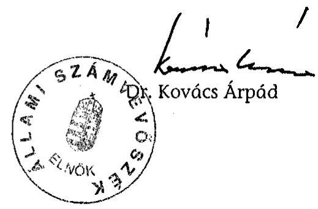

---

# MELLÉKLETEK 

a V-10-26/2004. sz. jelentéshez

---

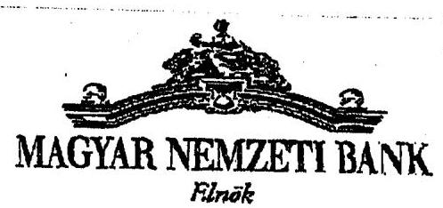

Dr. Kovács Árpád
elnök úr

# ÁLLAMI SZÁMVEVÖSZÉK 

## BUDAPEST

## Tisztelt Elnök Úr!

Megkaptam a Magyar Nemzeti Bank 2003. évi múködésének ellenôrzésérôl készített jelentésüket (ikt. szám: V-10-24/2004)

A jelentéshez észrevételt nem teszek.
Budapest, 2004. október 11.
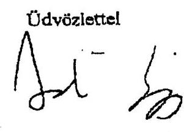

Járal Zaigmond

---

## **Az MNB működési költségeinek alakulása (M Ft)**

|   |  |  | tény |  |  |   |
| --- | --- | --- | --- | --- | --- | --- |
|  Évek | 1998. | 1999. | 2000. | 2001. | 2002. | 2003.  |
|  Működési költségek (M Ft) | 13354,0 | 13760,0 | 15158,0 | 15195,6 | 13507,3 | 12699,6  |

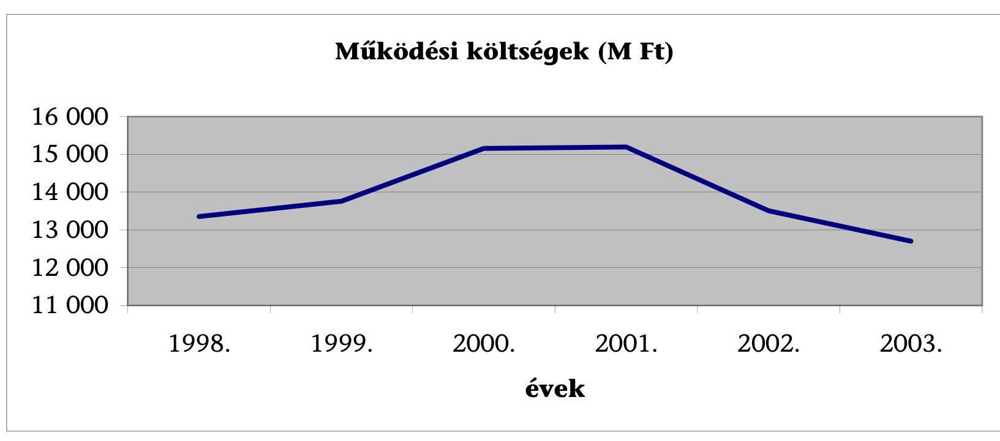

---

# Az MNB személyi költségeinek alakulása (M Ft)

|  Megnevezés | 2000. | 2001. | változás \%-a 2001/2000. | 2002. | változás \%-a 2002/2001. | 2003. | változás \%-a 2003/2002.  |
| --- | --- | --- | --- | --- | --- | --- | --- |
|  Bér | 3727,2 | 3686,0 | 98,9 | 3388,5 | 91,9 | 3395,8 | 100,2  |
|  Jutalom (prémium vagy bonusz) | 1755,4 | 1749,0 | 99,6 | 1606,6 | 91,9 | 1647,0 | 102,5  |
|  Végkielégítés, felmentés | 158,6 | 744,6 | 469,5 | 608,3 | 81,7 | 151,5 | 24,9  |
|  Járulékok | 2425,1 | 2514,3 | 103,7 | 2199,1 | 87,5 | 2032,1 | 92,4  |
|  Oktatás | 95,6 | 60,0 | 62,8 | 102,8 | 171,3 | 155,5 | 151,3  |
|  Egyéb juttatások | 1041,2 | 1074,3 | 103,2 | 1209,8 | 112,6 | 1128,5 | 93,3  |
|  Hírdetés, tanácsadói díj | 13,0 | 12,5 | 96,2 | 41,0 | 328,0 | 36,9 | 90,0  |
|  Személyi költségek összesen | 9216,1 | 9840,7 | 106,8 | 9156,1 | 93,0 | 8547,3 | 93,4  |

Az adatok az ÁSZ 2003. évi, az MNB banküzemi múködésének tárgyában készített jelentésében (2000-2002. évek), valamint a jelen vizsgálat során átadott adatokon (2003. év) alapulnak.

---

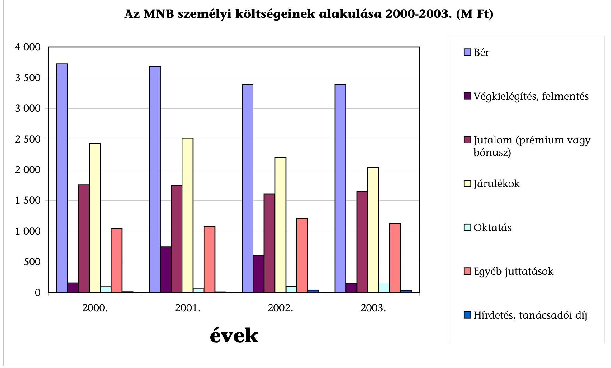

# Az MNB személyi költségeinek alakulása 2000-2003. (M Ft)

- **Bér**
  - **Végkielégítés**, felmentés
  - **Jutalom** (prémium vagy bónusz)
  - **Járulékok**
  - **Oktatás**
  - **Egyéb juttatások**
  - **Hírdetés**, tanácsadói díj

---

## **Az MNB beruházási kiadásainak alakulása (M Ft)**

|  Megnevezés | 1998. | 1999. | 2000. | 2001. | 2002. | 2003.  |
| --- | --- | --- | --- | --- | --- | --- |
|  Beruházások főösszege | 2770,0 | 3444,0 | 2327,0 | 656,4 | 972,7 | 3279,6  |

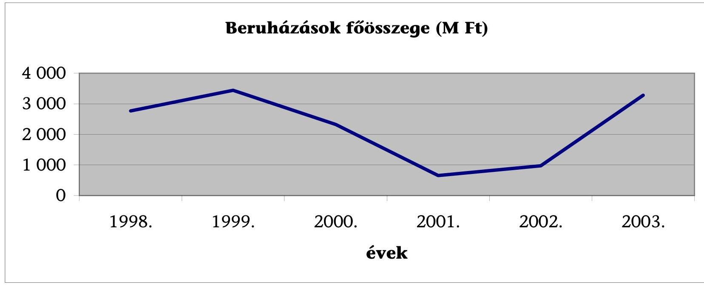

---

# LÁTOGATÓKÖZPONT 

## PROJEKT

## MEGVALÓSÍTÁSÁNAK FOLYAMATÁBRÁJA

---

|  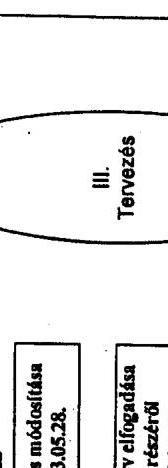 | 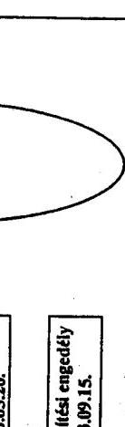  |
| --- | --- |
|  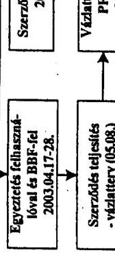 | 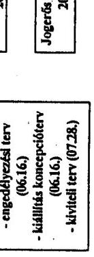  |
|  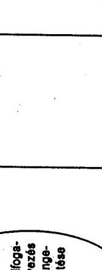 | 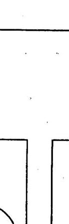  |
|  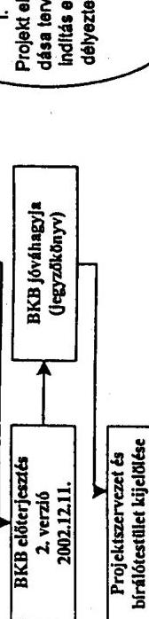 | 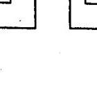  |

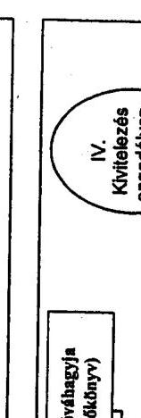

|  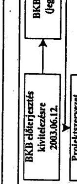 | 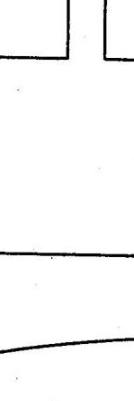  |
| --- | --- |
|  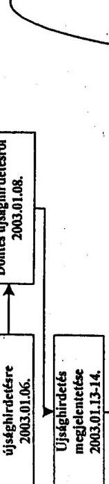 | 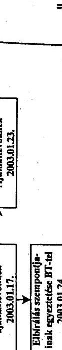  |

---

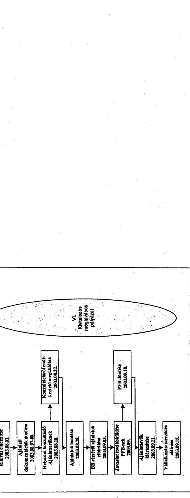

|  1. |  |  |  |  |  |  |  |  |  |  |  |  |  |  |  |  |  |  |  |  |  |  |  |  |  |  |  |  |  |  |  |  |  |  |  |  |  |  |  |  |  |  |  |  |  |  |  |  |  |  |  |  |  |  |  |  |  |  |  |  |  |  |  |  |  |  |  |  |  |  |  |  |  |  |  |  |  |  |  |  |  |  |  |  |  |  |  |  |  |  |  |  |  |  |  |  |  |  |  |  |  |