# JELENTÉS 

a gyógyszerek támogatási és
finanszírozási rendszerének, a fogyasztás helyzetének ellenőrzéséről

---

# 2. Államháztartás Központi Szintjét Ellenőrző Igazgatóság 

2.1 Teljesítmény Ellenőrzési Főcsoport

Iktatószám: V-37-113/2003-2004.
Témaszám: 687
Vizsgálat-azonosító szám: V0121

## Az ellenőrzést felügyelte:

Bihary Zsigmond
föigazgató

## Az ellenőrzés végrehajtásáért felelős:

## Kemény Emil

főcsoportfőnök

## Az ellenőrzést vezette:

## Söveges Erika

osztályvezető főtanácsos

## Az ellenőrzést végezték:

| Bartolák Márta számvevő | dr. Beregi Anna számvevő | Farkas Ildikó számvevő gyakornok |
| :--: | :--: | :--: |
| Federics Adrienn számvevő | Fekete Anikó Gyöngyi számvevő gyakornok | Kriston-Vizi János számvevő tanácsos |
| dr. Kuti Anna számvevő | Laskai Ede számvevő | Szendrődi Józsefné számvevő tanácsos, tanácsadó |
| Szólya Ildikó számvevő | Winter Zsuzsa számvevő | Zachár Péterné számvevő tanácsos |
| Csuti Lajos számvevő tanácsos | Hirka Mihály főtanácsadó | Iszakné Dóczé Katalin számvevő |
| Koronczai Sándorné számvevő tanácsos | Laki Dóra számvevő tanácsos | Nagy László Csaba számvevő |
| Pappné Dr. Szamosi Éva számvevő | Schósz Attiláné számvevő | Dr. Girinyi Margit külső munkatárs |
| Vargáné Loch Márta külső munkatárs |  |  |

---

# A témához kapcsolódó eddig készített számvevőszéki jelentések: 

címe
Sorszáma
Jelentés a társadalombiztosítás pénzügyi alapjai 1998. évi ..... 9928
költségvetése végrehajtásának ellenőrzéséről
Jelentés a társadalombiztosítás pénzügyi alapjai 1999. évi ..... 0025
költségvetés végrehajtásának ellenőrzéséről
Jelentés a társadalombiztosítás pénzügyi alapjai 2000. évi ..... 0127
költségvetés végrehajtásának ellenőrzéséről
Vélemény a társadalombiztosítás pénzügyi alapjainak 1998. évi ..... 403
költségvetési törvényjavaslatáról
Vélemény a társadalombiztosítás pénzügyi alapjainak 1999. évi ..... 9838
költségvetési törvényjavaslatáról
Vélemény a társadalombiztosítás pénzügyi alapjai 2000. évi ..... 9933
költségvetéséről
Vélemény a Magyar Köztársaság 2001. és 2002. évi költségvetési ..... 0034
törvényjavaslatáról
Vélemény a Magyar Köztársaság 2003. évi költségvetési ..... 0241
törvényjavaslatáról
Jelentés a Magyar Köztársaság 2001. évi költségvetése ..... 0232
végrehajtásának ellenőrzéséről
Jelentés a Magyar Köztársaság 2002. évi költségvetése ..... 0329
végrehajtásának ellenőrzéséről
Jelentés a "Külön keretes" gyógyszer-támogatási rendszer ..... 9811
működésének vizsgálatáról
Jelentés az Egészségbiztosítási Alap múködésének ellenőrzéséről ..... 0324
Jelentés az Egészségügyi Minisztérium fejezet múködésének ..... 0222
ellenőrzéséről
Jelentés az önkormányzati tulajdonban lévő kórházak pénzügyi ..... 0023
helyzetének, gazdálkodásának vizsgálatáról
Jelentés az állami és egyházi tulajdonban lévő kórházak, egyetemi ..... 0301
klinikák gazdálkodásának ellenőrzéséről

---

## Eierlikör (1)

Menge: 1 Drink

2 Zentiliter Zitronensaft
2 Zentiliter Zuckersirup
1 Zentiliter Zuckersirup
1 Zentiliter Zuckersirup
etwas Zitronensaft
etwas Zuckersirup
etwas Zuckersirup
etwas Zuckersirup
etwas Zuckersirup
etwas Zuckersirup
etwas Zuckersirup
etwas Zuckersirup
etwas Zuckersirup
etwas Zuckersirup
etwas Zuckersirup
etwas Zuckersirup
etwas Zuckersirup
etwas Zuckersirup
etwas Zuckersirup
etwas Zuckersirup
etwas Zuckersirup
etwas Zuckersirup
etwas Zuckersirup
etwas Zuckersirup
etwas Zuckersirup
etwas Zuckersirup
etwas Zuckersirup
etwas Zuckersirup
etwas Zuckersirup
etwas Zuckersirup
etwas Zuckersirup
etwas Zuckersirup
etwas Zuckersirup
etwas Zuckersirup
etwas Zuckersirup
etwas Zuckersirup
et

---

# TARTALOMJEGYZÉK 

BEVEZETÉS ..... 11
I. ÖSSZEGZŐ MEGÁLLAPÍTÁSOK, KÖVETKEZTETÉSEK, JAVASLATOK ..... 14
II. RÉSZLETES MEGÁLLAPÍTÁSOK ..... 24

1. Az állam szerepe a gyógyszerellátásban ..... 24
1.1. Társadalmi célkitűzések ..... 24
1.2. A gyógyszerek támogatásában és finanszírozásában közreműködő állami szervezetek feladatai ..... 25
1.3. A gyógyszerekre fordított közkiadások alakulása ..... 28
1.4. A gyógyszerforgalmazás rendszere ..... 29
2. A gyógyszerek támogatási és finanszírozási rendszere ..... 31
2.1. A gyógyszerek támogatási kategóriái ..... 31
2.2. A gyógyszerár- és támogatás megállapítása ..... 34
2.2.1. A gyógyszerek befogadása a támogatott körbe ..... 35
2.2.2. Ártárgyalások ..... 37
2.2.3. Árbefagyasztások ..... 38
2.2.4. Megállapodások a gyógyszergyártókkal ..... 39
2.3. A gyógyszertámogatások finanszírozása ..... 40
2.3.1. A gyógyszerkassza tervezése ..... 40
2.3.2. A gyógyszerkasszából teljesített kifizetések ..... 42
2.3.3. A támogatás volumen megállapodások ..... 44
2.3.4. A globális támogatás volumen megállapodások ..... 45
2.4. A gyógyszertámogatások folyósítása ..... 46
2.5. A gyógyszertámogatások elszámolásának ellenőrzése ..... 47
2.6. Az OEP gyógyszerügyi-információs rendszerei ..... 48
3. A gyógyszerfogyasztás helyzete, befolyásoló tényezői ..... 51
3.1. A gyógyszerfogyasztás helyzete ..... 51
3.1.1. A lakosság gyógyszerfogyasztása ..... 51
3.1.2. Az egészségügyi intézmények gyógyszerfelhasználása ..... 53
3.2. A gyógyszerfogyasztást befolyásoló tényezők ..... 54
3.2.1. A hazai gyógyszerválaszték ..... 54
3.2.2. A lakosság megbetegedési mutatói ..... 59
3.2.3. Az orvosok gyógyszerrendelése ..... 61
3.2.4. A gyógyszerek reklámozása és ismertetése ..... 63
3.3. Törekvések a gyógyszerfogyasztás befolyásolására ..... 66

---

3.3.1. A háziorvosok racionális gyógyszerrendelését ösztönző
rendszerek ..... 66
3.3.2. A közgyógyellátási rendszer átalakítása ..... 67
3.3.3. Az irányított betegellátási rendszer ..... 68
4. Utóellenőrzés ..... 69

# MELLÉKLETEK 

1. sz. melléklet: Észrevétel és arra adott válasz
2. sz. melléklet: Tizennégy OECD tagállam egészségügyi kiadása a GDP \%-ában
3. sz. melléklet: Gyógyszerekre fordított kiadások aránya a GDP \%-ában (1998-2002.)
4. sz. melléklet: Gyógyszerre fordított közkiadások (1998-2003.)
5. sz. melléklet: A gyógyszer életútja, a gyógyszertörzskönyvezés éremmodellje
6. sz. melléklet: A hazai egészségügyi szakellátás gyógyszer forgalmának egyszerúsített
vázlatai
7. sz. melléklet: A gyógyszerek nagykereskedelmi és kiskereskedelmi árrése
8. sz. melléklet: Támogatott gyógyszerek számának változása 1998-ról 2003-ra
9. sz. melléklet: A társadalombiztosítási támogatásba való befogadás és a támogatás
megállapításának fő lépései 2004. május 1-től
10. sz. melléklet: A támogatott gyógyszerkészítmények árváltozásai (1998-2004.)
11. sz. melléklet: Az egy vényre jutó gyógyszerforgalom alakulása támogatási kategóri-
ánként (Ft/db) (1998-2003.)
12. sz. melléklet: A gyógyszertámogatási kiadás megoszlása ATC csoportok szerint
13. sz. melléklet: A legnagyobb arányt képviselő 4 hatástani csoport 1 főre jutó fogyasz-
tása DD/1000 lakos/nap (1998-2002.)
14. sz. melléklet: Adatok és mutatók a gyógyszerek támogatási és finanszírozási rendszer-
rének értékeléséhez, elemzéséhez (1998-2003.)
15. sz. melléklet: Helyszínen ellenőrzött központi szervezetek és egészségbiztosítási pénz-
tárak
16. sz. melléklet: Teljesítménykritériumok értékelése a gyógyszerek támogatási és finan-
szírozási rendszerének, a fogyasztás helyzetének ellenőrzéséhez
17. sz. melléklet: Strukturált kérdésfa

## FÜGGELÉKEK

1. sz. függelék: Összesítés a gyógyszerek támogatási és finanszírozási rendszerének, a
fogyasztás helyzetének ellenőrzéséhez az orvosi szakmai kollégiumok
részére összeállított kérdőívekről
2. sz. függelék: A fekvőbetegellátó intézmények gyógyszergazdálkodása

---

# RÖVIDÍTÉSEK JEGYZÉKE 

| AB | Alkotmánybíróság |
| :--: | :--: |
| Áht. | Az Államháztartásról szóló 1992. évi XXXVIII. törvény |
| ÁFA | Általános forgalmi adó |
| ÁSZ | Állami Számvevőszék |
| ÁNTSZ | Állami Népegészségügyi és Tisztiorvosi Szolgálat |
| Ártörvény | Az árak megállapításáról szóló 1990. évi LXXXVII. törvény |
| ATC | Anatomical Therapeutical Classification |
| DDD | Defined Daily Dose |
| DOT | Day of treatment |
| E. Alap | Egészségbiztosítási Alap |
| Ebtv. | A kötelező egészségbiztosítás ellátásairól szóló 1997. évi LXXXIII. törvény |
| EMEA | European Agency for the Evaluation of Medicinal Products (Európai Gyógyszerértékelési Ügynökség) |
| ESKI | Egészségügyi Stratégiai Kutató Intézet |
| ESzCsM | Egészségügyi Szociális és Családügyi Minisztérium |
| EU | Európai Unió |
| EÜ90\% | Egészségügyi rendelkezés, 90\% |
| EÜ100\% | Egészségügyi rendelkezés, 100\% |
| EüM | Egészségügyi Minisztérium |
| Eütv. | Az egészségügyről szóló 1997. évi CLIV. törvény |
| FPEP | Fővárosi és Pest megyei Egészségbiztosítási Pénztár |
| FoNo | Formulae Normales, Szabványos Vényminta Gyűjtemény |
| GDP | Bruttó hazai termék |
| GKM | Gazdasági és Közlekedési Minisztérium |
| Gyógyszerkönyv | Magyar Gyógyszerkönyv |
| GYAB | Gyógyszer Alkalmazási Bizottság |
| GYSZK | Gyógyszerész Szakmai Kollégium |
| Gytv. | Az emberi felhasználásra kerül gyógyszerekről szóló 1998.   évi XXV. törvény |
| GTV | Globális támogatás volumen megállapodás |
| GVH | Gazdasági Versenyhivatal |
| HBCS | Homogén betegség csoport |
| IGYOSZ | Innovatív Gyógyszergyártók Országos Szövetsége |
| IBR | Irányított betegellátási rendszer |
| KSH | Központi Statisztikai Hivatal |
| MAGYOSZ | Magyar Gyógyszergyártók Országos Szövetsége |
| MÁK | Magyar Államkincstár |
| MEP | Megyei (fővárosi) Egészségbiztosítási Pénztár |
| MGYK | Magyar Gyógyszerész Kamara |
| MGYT | Magyar Gyógyszerészeti Társaság |

---

| MOK | Magyar Orvosi Kamara |
| :-- | :-- |
| NM | Népjóléti Minisztérium |
| OAI | Országos Alapellátási Intézet |
| OEP | Országos Egészségbiztosítási Pénztár |
| OGY | Országgyúlés |
| OGYI | Országos Gyógyszerészeti Intézet |
| OSAP | Országos Statisztikai Adatgyűjtési Program |
| OTH | Állami Népegészségügyi és Tisztiorvosi Szolgálat Országos |
|  | Tisztiorvosi Hivatala |
| OTC | Over-the-counter |
| PM | Pénzügyminisztérium |
| SzCsM | Szociális és Családügyi Minisztérium |
| SzMSz | Szervezeti és Múködési Szabályzat |
| TÁTB | Társadalombiztosítási Ár- és Támogatási Bizottság |
| WHO | World Health Organisation, az ENSZ Egészségügyi Vilá-   szervezete |

---

# ÉRTELMEZÉSEK 

Aktív fekvőbeteg-ellátás: A fekvőbeteg-ellátó intézményben történő gyógyító, megelőző, rehabilitáló tevékenység, amelyben az ápolási idő előre tervezhető, többnyire rövid időtartamú. Az ellátásban az orvos-szakmai tevékenység a meghatározó, az ellátás célja az egészségi állapot mielőbbi helyreállítása. A besorolásban nem játszik szerepet, hogy az ellátás akut vagy krónikus betegség miatt következik be.

Alkalmazási előírat: Az orvos, illetve a gyógyszerész részére szóló, a forgalomba hozatali engedélyben szereplő szakmai előírás, amely a gyógyszer legfontosabb adatait, az alkalmazás feltételeit és az esetleges mellékhatásait tartalmazza.

Antibiotikum:
ÁNTSZ:

ATC:

Betegtájékoztató:

DDD:

DOT:

Egyedi import:

Egyedi méltányosság:

Gyógyszer, amely gátolja a baktériumok szaporodását, illetve elpusztítja azokat.
Állami Népegészségügyi és Tisztiorvosi Szolgálat, a gyógyszerellátás vonatkozásában, az ESzCsM gyógyszerforgalmazást engedélyező, a gyógyszerészeti tevékenységet ellenőrző, illetve a kábítószer forgalmazást felügyelő szerve.
Anatomical Therapeutical Chemical Classification System, a gyógyszerek anatómiai, terápiás, illetve kémiai hatás szerinti osztályozása. A nemzetközi gyakorlatban, az árupiac meghatározására szolgáló 7 jegyből álló ötszintű kódrendszer, amely többek között jó közelítést ad a terápiás helyettesítőségre.
A betegnek és felhasználóknak szóló, a forgalomba hozatali engedélyben szereplő közérthető tájékoztatás, amely a gyógyszer legfontosabb adatait, az alkalmazás feltételeit és az esetleges mellékhatásait tartalmazza.
Defined Daily Dose, a gyógyszergyártók jelentései alapján a WHO által számított (évenként megújított), gyógyszer hatóanyag egy napi átlagos adagját kifejező mutató.
Day of treatment, a napi terápiás adagok száma (azt mutatja, hogy az egy dobozban lévő gyógyszer hány terápiás napra elegendő)
Amennyiben az alkalmazni kívánt hatóanyag Magyarországon törzskönyvezett készítményben nem hozzáférhető és az adott kórképben más terápiás alternatíva már nem áll rendelkezésre, illetve a rendelkezésre álló készítményre a beteg bizonyíthatóan nem vagy nem kívánt módon (gyógyszerallergia) reagál.
Az OEP főigazgatójának jogkörében az E. Alap költségvetésében meghatározott keretek között, jogszabály szerinti támogatással rendelhető gyógyszer árához nyújtott támogatást.

---

Ellátásszervező:

Engedélyezési eljárás:

Fekvőbeteg-szakellátás:

Fiókgyógyszertár:

Forgalomba hozatali engedély:

Forgalomból való kivonás:

Galenusi gyógyszer:

Generikum:

Gyártási tétel:

Egészségügyi szolgáltató, amely vállalja az érintett lakosság (a többször módosított 43/1999. Kormányrendelet 19. számú mellékletében meghatározott) kötelező egészségbiztosítási rendszerben térítésmentesen, illetve támogatás ellenében igénybe vehető egészségügyi ellátását, illetve az általa nem nyújtott szolgáltatások tekintetében az ellátások megszervezését.
A szolgáltató és finanszírozó között koordinátori feladata van. Összegyűjti, rendszerezi és továbbítja a szerződésben, illetve az útmutatóban előirt jelentéseket, valamint biztosítja a szolgáltatók és a finanszírozó közötti adatáramlást.
A gyógyszer törzskönyvezésével és forgalomba hozatala engedélyezésével kapcsolatos egységes eljárás.
A betegnek a lakóhelye közelében, fekvőbeteggyógyintézeti keretek között végzett egészségügyi ellátása. Ennek igénybevétele a külön jogszabályban foglaltak szerint a beteg folyamatos ellátását végző orvos, a kezelőorvos vagy az arra feljogosított más személy beutalása, valamint a beteg jelentkezése alapján történik. (Finanszírozási szempontból 2000. április 1-től a 6-24 órás sürgősségi ellátások, a 24 órán belül más intézetbe áthelyezett újszülöttek és a 0 alsó határnapú HBCs szerinti ellátások is ide tartoznak.) A finanszírozás módja szerint lehet aktív és krónikus fekvőbetegellátás.
A közforgalmú gyógyszertár részeként múködő, de azzal nem azonos telephelyű, elsődlegesen a betegek közvetlen gyógyszerellátását biztosító intézmény.
Az illetékes hatóság által kiadott, a gyógyszer embergyógyászati célra történő alkalmazhatóságát engedélyező és a törzskönyvi bejegyzést igazoló hatósági határozat.
Az OGYI hatásköre, melynek során gyógyászati célra alkalmatlannak nyilvánítja, és a forgalomból kivonja a már forgalmazás alatt álló gyógyszerkészítményt, ha az nem felel meg a forgalomba hozatali engedélyben rögzítetteknek, illetve ha az az alkalmazási előírás szerinti használat során egészségkárosodást okoz.
A Gyógyszerkönyvben vagy a Vényminta Gyűjteményben meghatározott összetételű és minőségű készítmény, melyet ezen előírások alapján gyártanak, nyilvántartanak és forgalmaznak.
A szabadalommal már nem védett hatóanyagot tartalmazó, az originális termékkel egyenértékűnek elismert gyógyszer.
A kiindulási anyagoknak, a csomagolóanyagoknak vagy a termékeknek az az előre megadott mennyisége, amely ugyanazon gyártási folyamatban vagy egy gyártási sorozatban készült és így azonosnak tekinthető.

---

Gyógyszer:

Gyógyszeranyag:
Gyógyszerellátás:

Gyógyszerforma:

Gyógyszerszállító által biztosított rabatt:

Gyógyszergyártás:
Gyógyszer gyártója:
Gyógyszer helyettesíthetősége:

Gyógyszerkészítmény:

Gyógyszer kiadhatósága:

Gyógyszernagykereskedelem:

Gyógyszer-promóció:
Gyógyszerreklámozás:

Gyógyszertörzskönyv:

Olyan anyag vagy azok keveréke, illetve olyan készítmény, amelyet betegség megelőzése, felismerése, kezelése vagy élettani funkció fenntartása, helyreállítása, javítása vagy módosítása céljából emberi szervezetben vagy emberi szervezeten alkalmaznak.
A hatóanyag és a segédanyag összefoglaló neve.
Azon tevékenységek összessége (gyártás, előállítás, forgalmazás), amelynek eredményeként a gyógyszer a közvetlen felhasználóhoz eljut.
A gyógyszer meghatározott alkalmazási módjának megfelelő megjelenése.
A szállító által ingyenesen juttatott gyógyszerként biztosított árkedvezmény.
Olyan termelő tevékenység, ahol ellenőrzött üzemi körülmények között gyógyszert állítanak elő.
Az a gazdálkodó szervezet, amely rendelkezik a gyógyszer gyártására jogosító hatósági engedéllyel.
Az orvos által vényen felírt gyógyszernek azonos hatóanyagú, hatáserősségű és gyógyszerformájú, de más elnevezésű termékkel történő kiválthatósága.
A gyógyszernek a hatóanyagot tartalmazó, általában segédanyagok hozzáadásával kialakított, emberi szervezeten vagy emberi szervezetben való alkalmazásra kész formája.
Az adott gyógyszerre vonatkozó, törzskönyvbe bejegyzett gyógyszerek esetében a gyógyszer törzskönyvezése során meghatározott, a forgalomba hozatali engedélyben és jogszabályban rögzített, magisztrális és galenusi gyógyszerek esetében a hatályos Magyar Gyógyszerkönyvben vagy a Szabványos Vényminta Gyűjteményben rögzített forgalmazhatósági korlátozás, amely szerint a gyógyszer orvosi rendelés alapján vagy e nélkül szerezhető be.
Azon gyógyszerellátási tevékenységek összessége, amelynek eredményeként a gyógyszer - ha jogszabály másként nem rendelkezik - az előállítótól a közvetlen lakossági gyógyszerellátóhoz eljut.
Adott gyógyszerkészítmények fogyasztásának (felírásának) ösztönzése a gyártók (forgalmazók) részéről.
Minden olyan információátadás és tevékenység, amely a gyógyszerrendelés, - forgalmazás vagy fogyasztás befolyásolását célozza, illetve arra alkalmas.
Közhitelű hatósági nyilvántartás, amely a magisztrális és a galenusi gyógyszerek kivételével a gyógyszerkészítmény elnevezését és jogszabályban meghatározott adatait tartalmazza.

---

Homogén betegségcsoportok (HBCS):

Intézeti gyógyszerellátás:

Intézeti gyógyszertár:

Járóbeteg szakellátás:

Kassza:

Kézi gyógyszertár:

Klinikai vizsgálat:

Közforgalmú gyógyszertár:

Közgyógyellátás:

Közvetlen lakossági gyógyszerellátás:

Krónikus fekvőbetegellátás:

A fekvőbeteg-ellátás finanszírozásában használt betegosztályozási rendszer. Közel azonos gyógyítási költségigényű betegségek orvosi szempontból is elfogadható csoportjai.

Az intézeti gyógyszertárban végzett azon gyógyszerellátási és gyógyszer-előállítási szaktevékenységek összessége, amelynek során az intézeti gyógyszertár a fekvőbetegintézményben ápolt betegek gyógyszerellátását biztosítja.
A fekvőbeteg gyógyintézet, illetve állategészségügyi intézmény részeként létrehozott, annak múködéséhez szükséges teljes körű gyógyszerellátást biztosító intézmény.

A beteg folyamatos ellátását, gondozását végző orvos beutalása vagy a beteg jelentkezése alapján, szakorvos által végzett egyszeri, illetve alkalomszerú egészségügyi ellátás, továbbá fekvőbeteg-ellátást nem igénylő krónikus betegség esetén a folyamatos szakorvosi gondozás. Az általános járóbeteg-szakellátást a beteg egészségi állapotának veszélyeztetése nélkül, rendszeres tömegközlekedés igénybevételével megközelíthetően (a továbbiakban: lakóhelyének közelében) kell biztosítani.

Az egészségbiztosítás költségvetésében a gyógyító- megelőző ellátások finanszírozására szolgáló előirányzati keret, mely egy-egy szolgáltatás fajtájához kapcsolódik. (pl.: járóbeteg szakellátás, gyógyszer, stb.).

A háziorvos, házi gyermekorvos (a továbbiakban: háziorvos) és az állatorvos gyógyító munkájához szükséges, a gyógyszerek meghatározott körét szolgáltató ellátási forma. (a gyógyszertárak létesítéséről és múködésük egyes szabályairól szóló 1994. évi LIV tv. 2.§. szerint)

A vizsgálati készítmény hatásosságának és relatív ártalmatlanságának bizonyítása céljából - az illetékes kutatásetikai bizottság jóváhagyása alapján - a készítményt törzskönyvező hatóság által engedélyezett vizsgálat.

Elsődlegesen a beteg emberek közvetlen és teljes körű gyógyszerellátását biztosító intézmény.

A gyógyszerellátás vonatkozásában, a szociálisan rászoruló személyek részére, egészségi állapotuk megőrzéséhez és helyreállításához, a gyógyszerek térítésmentes biztosítása.

Az a közforgalmú, fiók- és kézigyógyszertárban - külön jogszabályban meghatározott esetben az intézeti gyógyszertárban - végzett egészségügyi szakellátó tevékenység, amely során a gyógyszertár a gyógyszert és az alkalmazásával összefüggő szakmai információt a fogyasztók részére közvetlenül biztosítja.

Az a fekvőbeteg ellátó intézetben végzett tevékenység, amelynek időtartama, befejezése általában nem tervezhe-

---

Különös méltánylást érdemlő betegellátási érdek:

Magisztrális gyógyszer:

Meghatározott (fix) öszszegű támogatás:

Mellékhatás:

Morbiditás:

Mortalitás:

OGYI:

Originális termék:

Orvoslátogató (gyógyszerismertetó):
tő, hosszabb időszakot ölel fel. Az ellátásban az ápolás a meghatározó, és az ellátás deklarált célja az egészségi állapot stabilizálása, fenntartása, illetve helyreállítása.

Akkor áll fenn, ha a Magyarországon még nem törzskönyvezett gyógyszer orvosi kezelés során történő alkalmazásával esélye lehet a kezelés sikerességének, és ez Magyarországon már forgalomban lévő gyógyszertől nem várható.

Az a gyógyszerkészítmény, amelyet a gyógyszerész a gyógyszertárban a hatályos Magyar Gyógyszerkönyv vagy a Szabványos Vényminta Gyűjtemény rendelkezései alapján, egyedi orvosi előírásra vagy a Gyógyszerkönyv szerint nem erős hatásúnak minősülő anyagokból saját kezdeményezésére előállít.

Az azonos hatóanyagot tartalmazó, azonos beviteli és alkalmazási módú gyógyszerek, illetőleg gyógyszercsoportok, továbbá meghatározott betegségek (körképek) kezelésére egyaránt alkalmas termékek esetén alkalmazandó támogatás. A fix támogatás összegét a kiválasztott referenciatermék alapján az adott gyógyszercsoportra jellemző \%-os támogatási kulcs alapján határozzák meg.
A gyógyszer alkalmazásából következő káros, nem kívánt hatás, amely a gyógyszer-alkalmazási előírásban - vizsgálati készítmény esetén a vizsgálati tájékoztatóban - meghatározott szokásos adagokban a betegség megelőzése, felismerése, kezelése vagy élettani funkció helyreállítása, javítása során a gyógyszerkészítmény emberi szervezeten vagy emberi szervezetben történő alkalmazásakor következik be.

A vizsgált populáció megbetegedési viszonyai. A megbetegedés arányszáma az összlakosság számához viszonyítva: azt fejezi ki, hogy egy bizonyos területen bizonyos idő alatt (egy év) 100000 lakosból hány betegedett meg.
Egy adott populáció halálozási viszonyai. Valamilyen betegségben bekövetkezett halálozások arányszáma az összlakossághoz viszonyítva (egy év alatt 100000 lakosból hányan haltak meg egy bizonyos betegségben).
Országos Gyógyszerészeti Intézet, az ESzCsM által felügyelt, a gyógyszerek törzskönyvezésével és forgalomba hozatala engedélyezésével kapcsolatos hatósági feladatokat ellátó szerve.
Szabadalommal védett hatóanyagot tartalmazó készítmény, a védelmi időszak alatt.
A gyógyszer-gyártók termékeit a szakmai közönségnek bemutató, illetve azok felírási gyakorlatát befolyásolni kívánó személy.

---

Orvosi rendelvény nélkül kiadható gyógyszer: A nem vényköteles, a betegekre általában kevésbé veszélyes, orvosi rendelvény nélkül is kiadható gyógyszerek köre.

Protokoll:

Relatív ártalmatlanság:

Szakmai protokoll:

Százalékos támogatás:

Szervezési díj:

Szolgáltató:

Természetbeni ellátások:

Törzskönyvezett gyógy-
szerkészítmény:
Vény:

Minden olyan gyógyszer, amelyet az engedélyező hatóság a forgalomba hozatali engedélyben annak nyilvánít.
A nem vényköteles, a betegekre általában kevésbé veszélyes, orvosi rendelvény nélkül is kiadható gyógyszerek köre.

Meghatározott kezelés vagy beavatkozás elvégzéséhez szükséges események és tevékenységek rendszerezett listája, amely az egészségügyi ellátás megkívánt vagy minimális standardjának való megfelelést szolgálja.
A vizsgálati készítmény mellékhatásai által esetleg okozott kedvezőtlen hatás jelentősége a várható gyógyító hatáshoz képest csekély.
Szakmai irányelv (protokoll) tudományos bizonyítékokra (evidenciákra) és szakértői véleményekre támaszkodó szisztematikus, kifejlesztett állásfoglalás sorozat. Célja a tudomány jelenlegi állását tükröző szakmai állásfoglalása mind a betegek, mind az ellátók számára, különös tekintettel a beavatkozás lehetséges előnyeire és káros hatásaira, az egészségi állapotra és a beteg életminőségére vonatkozóan. Szakmai protokoll (protocol): egy adott intézményben egy meghatározott egészségügyi ellátás, kezelés vagy beavatkozás elvégzéséhez szükséges események és tevékenységek rendszerezett listája.
Az egyes gyógyszerek általános forgalmi adóval megnövelt fogyasztói árához nyújtott $0,50,70,90$, illetve $100 \%$ os mértékű támogatás.
Az irányított betegellátás koordinálásával és szervezésével, a modell-menedzsment múködésével kapcsolatban felmerült többlet feladatok kiadásának fedezetére szolgáló díj.
Az egészségbiztosítási törvény végrehajtásáról szóló 217/1997. (XII. 1.) Korm. rendelet szerint a külön jogszabály alapján egészségügyi szolgáltatás nyújtására jogosult természetes vagy jogi személy, illetve jogi személyiség nélküli szervezet.
Azok a természetben nyújtott szolgáltatások és támogatások, melyeket a biztosító terhére vesz igénybe a biztosított.
Megkülönböztető névvel és csomagolással forgalomba hozatalra engedélyezett, alkalmazásra kész készítmény.
A társadalombiztosítás által rendszeresített nyomtatvány, olyan gyógyszerek (tápszerek, gyógyászati segédeszközök, gyógyfürdőellátások) rendeléséhez, amelynek a közfinanszírozás alapjául, jogszabály által elfogadott árához a járóbeteg-ellátás keretében a társadalombiztosítás támogatást nyújt.

---

# JELENTÉS   a gyógyszerek támogatási és finanszírozási rendszerének, a fogyasztás helyzetének ellenőrzéséről 

## BEVEZETÉS

Az egészségügyi technológiák fejlődése, a betegségek korai szakaszban történő felismerése, az életminőség javulása, a lakosság korszerű kezelési terápiák iránti igénye, az idős korú népesség arányának növekedése valamennyi fejlett országban az egészségügyi, ezen belül a gyógyszerkiadások erőteljes emelkedéséhez vezetett.

A költségvetési törvényekben az E. Alap gyógyszer-támogatási előirányzata az 1998. évi 102,6 Mrd Ft-ról, 2003-ban 217,0 Mrd Ft-ra, a teljesített gyógyszerkiadások 135,5 Mrd Ft-ról 251,8 Mrd Ft-ra növekedtek. A társadalombiztosítás által támogatott gyógyszerek vényforgalma a vizsgált időszakban 129,6 Mrd Ftról 251,6 Mrd Ft-ra ( $94 \%$-kal) emelkedett.

A gyógyszerkiadások növekedésében feltétlenül szerepe volt annak, hogy a rendszerváltás utáni években hazánkban nem volt kiemelt szempont a gyógyszeripari politika, valamint a gyógyszerár- és támogatáspolitika közötti összhang megteremtése. ${ }^{1}$ A 90 -es évek elején lezajlott privatizációs folyamatokban az állam a gyógyszeripart nem kezelte kiemelt stratégiai ágazatként. Nem törekedett sem a tulajdon feletti állami dominancia megőrzésére, sem a menedzsment jogok megtartására. Nem ismerte fel, hogy a technológiai fejlődés, a globalizáció következményeként gyógyszeriparunk stratégiai fontosságúvá válhat. ${ }^{2}$

A hazai gyógyszergyárak privatizációjával az állam elvesztette a tulajdonosi érdekérvényesítés eszközrendszerét. Ezzel egyidejűleg nem építette ki az új körülményeknek megfelelő állami befolyásolás hatékony módszereit.

[^0]
[^0]:    ${ }^{1}$ Egyes nyugat-európai országokban napjainkban is fontosságot tulajdonítanak a két politika közötti optimális egyensúlynak, mivel kölcsönösen hatnak egymásra. Korlátozó támogatáspolitikával csökkenthetik a hazai gyógyszergyárak $\mathrm{K}+\mathrm{F}$ költségeit, amely hosszabb távon negatívan befolyásolhatja az új gyógyszerek kifejlesztését.
    ${ }^{2}$ Ezt állapítja meg az ÁSZ Fejlesztési és Módszertani Intézet magyarországi privatizációról készített tanulmánya. A tanulmány átfogóan elemzi a hazai gyógyszeripar - 1996-os évek végére befejeződött - magánosításának folyamatait: rámutat arra, hogy a gyógyszeripari privatizáció megfelelő gazdaságpolitika hiányában, átfogó stratégia nélkül, külső kényszerek hatására történt meg. Sikeressége alapvetően a menedzsmenten múlt. A gyógyszeripar privatizációja során több szabálytalanság történt. (lásd: Jelentés az ÁPV Rt. 1995. évi tevékenységének ellenőrzéséről)

---

A rendszerváltást követően valamennyi kormányzat úgy kereste folyamatosan a társadalombiztosítás és a lakosság gyógyszerkiadásai megfékezésének lehetőségét, hogy figyelmen kívül hagyta a támogatáspolitikának a gyógyszeriparra gyakorolt hatását és a problémát gyakorlatilag költségvetési kiadási kérdésként kezelte.

Ugyanakkor a megoldási elképzelések (referencia alapú árképzés, vényköteles gyógyszerek árszabályozása, generikus helyettesítés) - összhangban a fejlett országok törekvéseivel - azt célozták, hogy a rendelkezésre álló költségvetési forrásokból lehetővé váljon a lakosság igényeinek minél magasabb szintű teljesítése, a legnagyobb egészségnyereség és az ellátás színvonalának javítása mellett.

Ezen több szempontból ellentétes hatású elképzelések is hozzájárultak ahhoz, hogy a gyógyszerfogyasztás, támogatás és finanszírozás kérdése változatlanul napjaink egyik központi, megoldásra váró problémája. Mindezzel összefüggésben kérte fel a Kormány nevében a Magyar Köztársaság Miniszterelnöke 2003. szeptember 17-én kelt levelében az Állami Számvevőszéket a gyógyszerfogyasztás, a támogatás és finanszírozás ellenőrzésére.

A felkérésre a számvevőszéki munka két irányban indult meg. Egyrészt hozzákezdtünk egy tanulmány készítéséhez, amelyben az ÁSZ korábbi vizsgálati tapasztalatai mellett összefoglaltuk a gyógyszerszakmai elemzéseket, értékeléseket $^{3}$, másrészt elindítottuk a jelen ellenőrzést.

A gyógyszerügy területén kialakult problémákra a korábbi ÁSZ ellenőrzések folyamatosan felhívták a figyelmet. Javaslatainkban rámutattunk arra, hogy átfogó, rendszerszerű intézkedések szükségesek. Mindezekre figyelemmel, az ÁSZ 2004 -re irányozta elő a gyógyszertámogatási rendszer ellenőrzését. A Kormány felkérésére tekintettel az ÁSZ módosította a 2003. évi ellenőrzési tervét, és a vizsgálatot előre hozott határidővel, 2004-re áthúzódó ellenőrzésként végezte el.

Az ellenőrzést úgy ütemeztük, hogy a 2005. évi költségvetés tervezése során a tervező munkában résztvevők a számvevői jelentések és a számvevőszéki jelentés tervezet megismerésével hasznosíthassák az ellenőrzés megállapításait.

Az ellenőrzés célja annak értékelése volt, hogy

- a gyógyszerfogyasztás befolyásolására, a gyógyszerkiadások növekedési ütemének csökkentésére irányult állami intézkedések eredményes, célszerű és hatékony végrehajtásához rendelkezésre álltak-e a szükséges feltételek, az intézkedésekkel elérték-e a kitűzött egészségpolitikai célokat;
- eredményesen befolyásolták-e a gyógyszerek ár- és támogatási rendszerének, finanszírozásának módosításai a lakosság és a társadalombiztosítás gyógy-

[^0]
[^0]:    ${ }^{3}$ ÁSZ Fejlesztési és Módszertani Intézet: Gyógyszerfelhasználás és -finanszírozás - az Állami Számvevőszék ellenőrzési tapasztalatai az elmúlt években

---

szerkiadásainak alakulását, az E. Alap gyógyszerkasszájának költségvetési előirányzatait célszerűen és hatékonyan használták-e fel;

- a gyógyszer-támogatási kiadások, a fogyasztás növekedési tendenciájának megváltoztatására történtek-e újabb kezdeményezések, vannak-e további jövőbeni lehetőségek.

Az ellenőrzési célok megvalósításánál támaszkodtunk a francia, az angol és az Egyesült Államok számvevőszékeinek hasonló témakörű vizsgálati tapasztalataira, módszereire. Az ellenőrzést teljesítmény-ellenőrzés módszerével hajtottuk végre. Az ellenőrzés szempontjainak megalapozását képező teljesítménymutatókat, kritériumokat, valamint a strukturált kérdésfát a 16. és 17. számú mellékletek tartalmazzák.

Az ellenőrzés alapvetően az 1998-2003 közötti időszakra irányult, de az egyeztetési folyamat lezárásáig (2004. augusztus) figyelemmel kísértük a változásokat.

A helyszíni ellenőrzés az Egészségügyi Szociális és Családügyi Minisztériumra, a Pénzügyminisztériumra, az Országos Gyógyszerészeti Intézetre, az Országos Egészségbiztosítási Pénztárra, továbbá 6 területileg illetékes egészségbiztosítási pénztárra terjedt ki.

Az egyes orvosi szakmák gyógyszerrendeléssel és felhasználással, a támogatási rendszerrel kapcsolatos véleményének megismerése céljából - az egészségügyi tárcával előzetesen egyeztetett - kérdőívet dolgoztunk ki, amelyet valamennyi orvosi szakmai kollégium részére megküldtünk.

Szakmai konzultációk keretében a Magyar Gyógyszerész Kamaránál, a Magyar Orvosi Kamaránál, a Magyar Kórházszövetségnél, a Központi Statisztikai Hivatalnál, a Gazdasági Versenyhivatalnál, az Állami Népegészségügyi és Tisztiorvosi Szolgálatnál, az Országos Alapellátási Intézetnél, az Innovatív Gyógyszergyártók Szövetségénél, a Magyar Gyógyszergyártók Országos Szövetségénél tájékozódtunk.

Az ellenőrzésünket megnehezítette, hogy az egész kérdéskör értékelése szempontjából kulcsszerepet betöltő OEP-nél az illetékes felelősök személye kicserélődött.

Az ellenőrzés végrehajtására az Állami Számvevőszékről szóló 1989. évi XXXVIII. törvény 17.§ (6) bekezdésében foglaltak adtak jogszabályi alapot.

A jelentés-tervezetet észrevételezésre megküldtük az egészségügyi, szociális és családügyi miniszternek, aki levelében észrevételt tett. Levelét és az arra adott válaszunk másolatát az 1. számú mellékletek tartalmazzák.

---

# I. ÖSSZEGZŐ MEGÁLLAPÍTÁSOK, KÖVETKEZTETÉSEK, JAVASLATOK 

Az ellenőrzött időszakban (1998 - 2003) a társadalombiztosítási támogatási kiadások és ezen belül a gyógyszerkiadások több mint kétszeresre növekedése mellett a lakosság természetes mennyiségben kifejezett gyógyszerfogyasztása nem változott. A kiadásnövekedést nem a fokozódó gyógyszerfogyasztás, hanem olyan egyéb tényezők generálták, mint új, drágább gyógyszerek megjelenése a hazai gyógyszerpiacon, drágább készítmények bekerülése a támogatott körbe, egyes, már támogatott gyógyszerek áremelkedése, az orvosok változó rendelési szokása (a drágább, illetve a magasabban támogatott készítményeket írták fel; a kórházakban a drágább készítményekkel kezelték a fekvő betegeket), a lakosság által elfogyasztott gyógyszer struktúra változása (új, korszerűbb, de egyben drágább készítményekkel kezelték a betegeket, a reklámok új, korszerű készítmények fogyasztására ösztönöznek). A támogatás-növekedés okai tehát rendkívül összetettek.

A vizsgált időszakban megtett kormányzati intézkedések középpontjában az ár és támogatás szabályozása állt, a többi tényezőnek (a fogyasztás és a támogatásba fogadás ár- és költséghatékonyságának, az orvosok felírási szokásainak, a tájékoztatási és a promóciós gyakorlatnak) nem volt prioritása. Ezidáig nem sikerült a kiadások növekedési ütemének megfékezése, ami arra utal, hogy a gyógyszerügyet csak komplex módon, valamennyi befolyásoló tényező figyelembe vételével lehet kezelni. Csak az árak és támogatások szabályozása nem vezethet eredményre.

A vizsgált hat év alatt az E. Alap kiadásai megkétszereződtek. A gyógyszertámogatási kiadások ezen belül abszolút értékben szintén nőttek, de ennél kisebb mértékben, vagyis relatív részesedésük az E. Alapból csökkent.

Az OECD 2004. évi statisztikája szerint Magyarország 1998-ban a GDP 7,3\%-át, 2002-ben pedig 7,8\%-át fordította egészségügyre. GDP arányos gyógyszerkiadásaink az 1998. évi 1,8\%-ról, 2,1\%-ra emelkedtek 2002-ben.
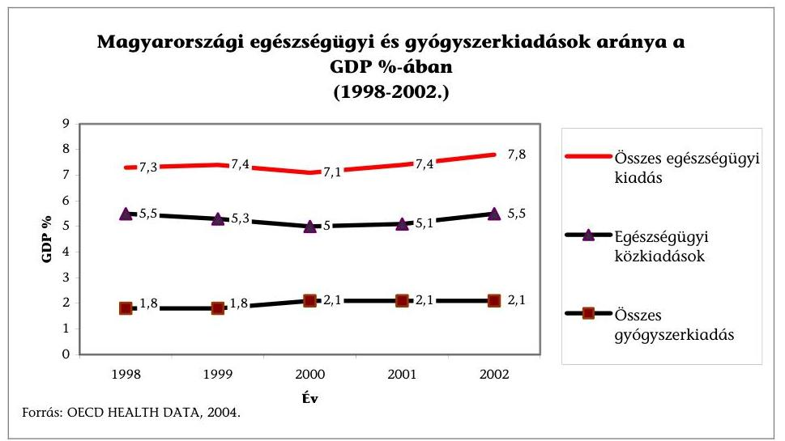

---

2002-ben az összes egészségügyi kiadás 30,7\%-át költöttük gyógyszerekre. Az alacsonyabb GDP-jű OECD tagországokra jellemző, hogy az egészségügyi kiadásaikon belül magasabb a gyógyszerkiadások aránya. A 23 európai tagországból ez az arány Szlovákiában és Magyarországon a legmagasabb (34\%, illetve 30,7\%) és Dániában a legalacsonyabb ( $8,9 \%)^{4}$ (2. és 3 . számú melléklet).

Az államnak az egészségügyért és a nemzetgazdaság egyensúlyáért egyszerre fennálló felelőssége, az orvosoknak a gyógyítási szabadsághoz való jogának és felelősségének követelménye, a gyógyszergyártók, forgalmazók piaci érdekei és a gyógyszerügyben szerepet játszó intézmények érdekei között az összhangot még nem sikerült megteremteni. Ennek alapvető oka, hogy a gyógyszerellátás területén nincs a célokhoz rendelt, hosszú távú stratégia, és a kialakult helyzetet tovább bonyolítja a gyógyszerügyben szereplők eltérő érdekérvényesítő képessége.

Az államnak egyidejűleg kell biztosítania a betegek legmagasabb szintű ellátását és a mindenkori költségvetés pénzügyi egyensúlyának betartását. Mindehhez egy gyógyszerbeszerzési „kényszer" és a globalizált gyógyszergyártók országhatárokon túl terjedő profitérdekei társulnak. A hazai gyógyszerpiacon vevőként monopolhelyzetben levő állam számára is kiszolgáltatott helyzetet eredményezhet országunk nemzetközi viszonylatban kisméretű vevői potenciálja.

A vizsgált években a kitűzött célokat - a gyógyszerkiadások növekedési ütemének megfékezését - nem sikerült megvalósítani, az ár- és támogatás rendszerének, finanszírozásának módosításai a lakosság és a társadalombiztosítás gyógyszerkiadásait nem csökkentették. A mindenkori kormányzat folyamatosan próbálkozott a gyógyszerkiadások növekedési ütemének visszafogásával. Az éves gyógyszerkeretek betartása érdekében folyamatosan „védekező mechanizmusokat" dolgoztak ki. A gyógyszerellátási rendszer egészét érintő hosszabb távú célokat vázoltak fel, a gyakorlatban azonban a gyógyszerárakra, illetve a gyógyszerkassza aktuális kiadásaira koncentráltak.

A vizsgált időszakban meghirdetett két népegészségügyi program nem tesz említést gyógyszerügyről, de az egészséges életmódról és az egészségtudatos szemléletről, a prevenció kiterjesztéséről megfogalmazott irányelvek befolyásolhatják a gyógyszerfelhasználást, a kapcsolódó társadalombiztosítási támogatás kiáramlását.

A kormányprogramokban megfogalmazott egészségpolitikai célok harmonizálása a gyógyszerkiadások csökkentésére tett intézkedésekben következetesen nem érvényesült. A gyógyszerellátás terén a kormányprogramok elsősorban a támogatási rendszer átalakítását célozták. A kitűzött egészségpolitikai célok eléréséhez szükséges jogszabályok nem épültek közép- és hosszú távú stratégiákra, a stratégiák kidolgozásához pedig hiányoznak a megfelelő feltételek. A gyógyszerellátás terén jellemzően rövidtávú intézkedések történtek. Elmaradt a gyógyszerügy komplex reformja, egy átfogó intézkedés-csomag elkészítése.

[^0]
[^0]:    ${ }^{4}$ Forrás: OECD Health Data 2004

---

A gyógyszerügyi területen állandósult a költségvetési krízishelyzet. A kiadások megfékezésére irányuló törekvések nemegyszer a lakosság, a gyártók és forgalmazók számára kiszámíthatatlan lépésekhez vezettek.

A gyógyszerfogyasztás befolyásolására, a gyógyszerkiadások növekedési ütemének csökkentésére irányult állami intézkedések eredményes végrehajtásához alapvető szabályozási, nyilvántartási feltételek hiányoztak.

A gyógyszerellátás sokszereplős folyamatában a jogalkotók, intézmények és hatóságok közötti szabályozási hatásköri kérdésekben a feladatok elhatárolásának, a végrehajtásban viselt felelősség egyértelmű megfogalmazásának a hiánya nem segítette elő a gyógyszertámogatási és finanszírozási rendszer átláthatóságát. Ez kihatott az ár- és támogatás megállapítás folyamataira is.

Az ár és támogatás megállapításában résztvevő központi szervezetek tevékenysége nem volt megfelelően koordinált. A jogszabályok nem rendelkeztek egyértelműen az ár és támogatás megállapításával kapcsolatban. Az árak rendszerszerű, nemzetközi - egyidejúleg több európai országra kiterjedő összehasonlító elemzésének gyakorlata nem alakult ki. Az OEP 2001-ben - az általa legolcsóbbnak tartott - spanyol, 2002-ben már a spanyol és a francia gyógyszerárakat elemezte.

A gyógyszerek befogadása a támogatott körbe nem volt átlátható folyamat. A befogadási és támogatási gyakorlat átláthatóságának hiánya miatt sem az elvek, sem a szabályozás, sem a döntési folyamatok nem voltak kiszámíthatók a gyógyszergyártók, a forgalmazók, és a lakosság számára. Az ártárgyalások, a támogatás volumen és globális támogatás volumen megállapodások előkészítésének dokumentálása az OEP-ben nem volt megfelelő.

A gyógyszerek költséghatékonyságának szempontját sem a befogadások, sem a támogatási kategóriákba való besorolások alkalmával rendszerszerűen nem vették figyelembe. Kiszámítható befogadási és támogatási elveket - az azonos hatóanyagú fix támogatású készítmények kivételével - jogszabályban, első alkalommal EU-csatlakozásunkkal egyidejúleg hirdettek meg.

A gyógyszerkiadások befolyásolásának azonnali - de kevéssé hatásos - eszközeit jelentették az árbefagyasztások, amelyek hosszabb távon nem fogták vissza a gyógyszertámogatási kiadások növekedését. A kitűzött támogatás kiáramlásmérséklési célokat nemegyszer jogszabályokkal ellentétes intézkedésekkel próbálták elérni (például az ártárgyalások előírt határidőben való megtartásának elmulasztásával, a tárgyalt gyógyszerkör szűkítésével, a megtárgyalt árak kihirdetésének elmaradásával).

A gyógyszerkassza kiadásainak tervezésekor az államháztartási egyensúly megőrzésének prioritása állt az egészségügyi szakmapolitikai érvekkel szemben. A kassza rendszeres alultervezéséhez kellően nem megalapozott kiadáscsökkentő intézkedések kapcsolódtak. A prognosztizált megtakarítási intézkedések hatását mindig felül-, a kiadásnövelő lépések hatását mindig alábecsülték.

---

A gyógyszerekre fordított közkiadások részesedése a GDP-ből 1999 óta nem változott (1,3\%). Ez arra utal, hogy a kassza alultervezése miatti előirányzat túllépés nagyobb hangsúlyt kapott, mint amekkorát a GDP arányos tényleges gyógyszerkiadás indokolt. A reális tervezés a döntéshozók számára világosabb és átláthatóbb helyzetet teremtett volna, és számonkérhetőbb lett volna az előirányzat betartása.

A gyártók forgalomarányos visszafizetési kötelezettségéről szóló támogatás volumen és a globális támogatás volumen-megállapodások bár rövidtávon mérsékelték az E. Alap hiányát, a gyógyszerfogyasztási tendenciákat nem befolyásolták. A gyógyszerkassza bezárása szintén nem volt hatással a kiadások alakulására.

A különkeretes gyógyszerek ${ }^{5}$ TAJ-szám szerinti hiteles elszámolása nem megoldott. A fekvőbeteg ellátásban felhasznált különkeretes készítményeket az intézetek természetben, a teljesítmény díjakon felül kapják meg, így a jelenlegi rendszerben egyértelműen nem zárható ki a különkeretes gyógyszerek esetleges kettős finanszírozásának a lehetősége. A méltányossági alapú gyógyszertámogatások kifizetésének nyilvántartása nem megfelelő.

A gyógyszertámogatások folyósítási szabályainak módosításai az ellátás biztonságát és a patikák fizetőképességének megőrzését szolgálták. A támogatások folyósítása átlátható, a patikák és a MEP-ek közötti szerződésen alapul. Az elszámolások központosítása lehetőséget ad az utalások naprakész követésére. A gyógyszertárak szerződéseit azonban a központosított utalással egyidejúleg nem módosította az OEP.

Az elszámolások ellenőrzésének hatékonyságát csökkenti, hogy a szabálytalan gyógyszerrendelés és támogatás elszámolás csak abban az esetben szankcionálható, ha bizonyítható az E. Alapnak okozott kár. A jogszabályok egyértelműen nem határozzák meg az E. Alapnak okozott kár fogalmát. A fogalom meghatározásának hiánya polgári peres eljárásokhoz vezetett.

Az OEP gyógyszerügyi információs rendszere 1998 és 2003 között folyamatosan fejlődött. A rendszerek múködtetése szempontjából állandósult kockázatot jelentettek a gyógyszer-ártámogatás és finanszírozás jogszabályainak gyakori módosításai.

Az OEP-nek - feladatellátása folyamatosságának érdekében - saját, így önálló gyógyszertörzs-adatállományokat kellett kialakítania. Ezen kívül - megfelelő belső szabályozás hiányában - több, egymástól független gyógyszeradattörzsállománya is létezik. Saját kezdeményezésében és saját forrására támaszkodva az OEP 2003-ban kezdte meg a közhiteles egészségügyi terméktörzsek kialakítását. A gyógyszerforgalmat nyilvántartó BÉVER, és korábbi adatokat

[^0]
[^0]:    ${ }^{5}$ Az általános rendszertől eltérően támogatott (ún. „különkeretes") gyógyszereket a gyógyszertárak nem forgalmazzák. A betegek meghatározott orvosi indikációkban, erre kijelölt kezelő-centrumokban, 100\%-os támogatással vehetik igénybe. A készítményeket az OEP központilag szerzi be. (Részletesen lásd a jelentés 32-33. oldalán.)

---

nyilvántartó Adattárház rendszerekből a lekérdezéseket nehezíti az egységes fogalom meghatározások, lekérdezési standardok hiánya.

A szakorvosok vényírási jogosultságának ellenőrzését nehezíti, hogy az OEP nem rendelkezik hiteles orvos-nyilvántartással. Ez akadályozza az egyes orvosi szakterületek gyógyszerfelhasználásának az elemzését is.

A folyamatos erőfeszítések elsősorban a rövidtávú pénzügyi szempontokra összpontosultak, és az elmúlt tíz évben háttérbe szorultak a fogyasztási szokásainkat és a gyógyszerkiadásokat alapvetően meghatározó egyéb tényezők. A mindenkori kormányzat számos - világszerte alkalmazott - intézkedést próbált adaptálni, ugyanakkor továbbra is adós maradt egy olyan, a bizonyítottan hatásos eszközzel, amely a gyógyszerfogyasztási szokásainkat eredményesen befolyásolhatná.

A lakosság gyógyszerfogyasztása - a felhasznált dobozok és a beváltott vények száma alapján - a vizsgált években számottevően nem emelkedett ( $+7 \%$, illetve $+3 \%$ ), a társadalombiztosítás és a lakosság mégis mintegy két és félszeresét költötte gyógyszerekre 2003-ban, mint 1998-ban. A kiadások növekedését nem a mennyiségi növekedés, hanem az új, egyre drágább készítmények fogyasztása, az árak és a támogatások változása, az orvosok gyógyszerrendelési szokásainak változása egyaránt okozhatta. Az egy dobozra jutó átlagos támogatási kiadás közel $50 \%$-kal volt több. A kiemelt támogatási kategóriában (Eü100\%) volt a legmagasabb lakossági felhasználás. 2003-ban járóbetegként - egy lakos átlagosan 40800 forintnyi gyógyszert fogyasztott.

Sem a szaktárca, sem az OEP nem elemzi azt, hogy a fogyasztás szerkezetének pontosan milyen irányú változása milyen mértékben és hogyan befolyásolta a gyógyszerkiadásaink növekedését, az ellenőrzés pedig ezeket nem pótolhatja.

A patikai forgalomban kapható, támogatott gyógyszerek hatástani csoportok szerinti megoszlása azt mutatja, hogy 1998-2003 között a legnagyobb társadalombiztosítási támogatás a szív- és érrendszeri megbetegedések gyógyítására alkalmazott gyógyszerekre jutott. Második helyen a központi idegrendszer, a harmadik helyen pedig a tápcsatorna és anyagcsere gyógyszerei találhatók.

A lakosság megbetegedési mutatóinak és a gyógyszerfogyasztási trendek összhangjának elemzése, az alkalmazott kezelési terápiák hatékonyságának követése megbízható morbiditási adatbázis hiányában nem lehetséges. Szintén a gyógyszerfelhasználás és a megbetegedések közötti kapcsolat elemzését akadályozó tényező, hogy a háziorvosoknál kezeltekről nincs pontos adatgyűjtési előírás, illetve nincs a lakosság körében előforduló megbetegedések részletes elemzését lehetővé tevő, megbízható morbiditási adatbázis. A gyógyszerfogyasztás korcsoportos trendjeit, az esetleges változások okait sem a szaktárca, sem az OEP nem elemzi rendszeresen.

A gyógyszerfogyasztást befolyásoló, a betegek további gyógyszerezését is előidézhető mellékhatásokról évente, egymillió lakosonként csupán 10-30 bejelentést regisztrálnak az OGYI-ban, az európai országokban átlagos 200-250 bejelentéssel szemben.

---

Az egészségügyi intézmények gyógyszer-felhasználására és beszerzéseire a döntéshozóknak nincs rálátása. Hiányzik az erre vonatkozó - megfelelő részletezettségű, döntéshozatalt támogató - állami adatgyűjtés. Ennek tulajdonítható, hogy a gyógyszerügyet érintő rendeletmódosítások (pl. ármegállapítások, áremelések és befagyasztások stb.) hatása az egészségügyi intézmények gyógyszergazdálkodására jelenleg nem értékelhető.

A lakosság és az egészségügyi intézmények együttes gyógyszerfelhasználásáról a nagykereskedők adataiból szerezhetünk naprakész információkat. A teljes hazai gyógyszerforgalomról nem készülnek részletes állami nyilvántartások. A döntéshozókat a gyógyszergyártókkal szemben kiszolgáltatottá teheti a független, állami adatok - és azok rendszeres elemzésének - a hiánya. A gyártók valamennyi gyógyszerforgalommal és -kiadással kapcsolatos adatot és információt rendszeresen elemeznek.

A hazai gyógyszerválasztékot jellemzi, hogy az OEP nyilvántartása szerint az 1998. évi 4715 -féle gyógyszerkészítménnyel szemben 2003-ban már 12659 termék kerülhetett forgalomba. Ebből 5690 terméket támogatott az OEP.

A törzskönyvezett és a társadalombiztosítás által támogatott gyógyszerek adatbázisai között jelenleg nincs megfeleltetés. Az OGYI-nál és az OEP-nél különböző gyógyszertörzsek találhatók. Az egymással összehangolt állami adatok hiánya a szabályozási tevékenységet nem segíti, de nem szolgálja az átláthatóságot, a megalapozott, eredményes és hatékony döntéshozatalt sem.

Az olcsóbb, ún. generikus gyógyszerek fogyasztásának ösztönzésére eddig megtett intézkedések eredményességének értékelhetőségét nehezíti, hogy a támogatott generikus gyógyszerekről nem készül állami nyilvántartás. A generikumok ösztönzését célzó gyógyszertári helyettesítésről szóló rendelkezés hatása - a helyettesítések nyilvántartásának hiányában - szintén nem értékelhető, a szakmai szervezetek szerint a helyettesítés nem múködik. Hiányoznak azok az orvosi szakmai szabályozási elemek, amelyek ösztönöznék a generikumok alkalmazását.

A hazai, illetve import gyógyszer egyértelmű fogalom meghatározásának hiánya miatt az OEP-nek nincs nyilvántartása arról, hogy pontosan hány támogatott hazai és import gyógyszerkészítmény van, és azok az E. Alap gyógyszerkasszájából milyen arányban részesülnek támogatásban.

Az orvosok rendelési szokásait befolyásoló gyógyszerterápiás ajánlások, terápiás protokollok alkalmazását a jogszabályok nem követelik meg. A vizsgált időszakban számos orvosi szakterület készített módszertani leveleket, szakmai ajánlásokat, terápiás protokollokat. Követelményrendszerük azonban nem egységes, az alkalmazhatóságukról nincs megbízható információ, költségelemzések általában nem kapcsolódnak hozzájuk. A több száz szakmai irányelv, módszertani ajánlás felülvizsgálatát ebben az évben kezdte meg az egészségügyi tárca.

A gyógyszerek reklámozását és ismertetését jellemzően szigorították a vizsgált időszak rendeletmódosításai, de enyhítő rendelkezések is születtek: 2003-tól gyógyszerismertetést végző orvos is rendelhet gyógyszert, illetve már

---

nemcsak orvos, hanem biológus, vegyész is lehet orvoslátogató. A gyógyszerismertetésre jogosult orvosok rendelési szokásairól eddig nem készültek értékelések.

Az orvosok új gyógyszerekkel kapcsolatos állami tájékoztatásának javítása nem kapott megfelelő hangsúlyt. Az orvosi szakmák kérdőíves felmérése szerint a gyógyszergyártóknak és a forgalmazóknak a termékismertetésben, a tájékoztatásban, a szakmai továbbképzésekben betöltött szerepe meghatározó. A gyógyszergyártók termékismertetőinek száma a vizsgált hat évben 2,5-szeresére (2097 főre) emelkedett. Az állam által alkalmazott gyógyszerismertetők létszáma az ellenőrzött években 40-50 fő volt. (A vizsgálat lezárásakor az OGYI 40 főt alkalmazott havi 25 órás munkaviszonyban.)

A növekvő gyógyszerkiadásokat részben előidéző gyártói promóció és reklámozás folyamatos feszültséget teremt a költségvetés korlátozott forrásaival és a társadalmi elvárásokkal. Az OECD 2004. évi statisztikája szerint 1998-2002 között hazánkban 9,8\%-kal emelkedett az egy főre jutó gyógyszereladás. 17 európai OECD tagországból Magyarország a negyedik helyen állt 2002-ben. ${ }^{6}$ A gyógyszerforgalmazók reklám- és promóciós költségeiről sem a szaktárcának, sem az OEP-nek nincs információja.

Az állam konzekvens, előretekintő cselekvéséhez jelenleg hiányzik a hosszútávú és konzisztens stratégia és ebből következően a megfelelő eszközrendszer az állami érdekek érvényesítéséhez, a gyártói promóció hatásos ellensúlyozásához, a gyógyszerfogyasztás szakmai befolyásolásához.

A promóció erősödésével szemben a gyógyszerismertetésben, a tájékoztatásban csökkent az állam szerepvállalása. A hazai gyógyszerellátási rendszerben hatósági és információs feladatokat ellátó OGYI múködtetéséhez a költségvetés 2004-től egyáltalán nem járul hozzá. Az intézet feladatellátásához a gyógyszergyártók és forgalmazók által befizetett hatósági eljárási díjak nyújtanak fedezetet. A törzskönyvezés és a forgalomba hozatali engedélyezés díjazása szabályozott, de a gyógyszerismertetői tevékenység hatósági eljárása ingyenes, a díjazásról nem rendelkezik jogszabály. Az intézetnek van alapító okirata, de nincs jóváhagyott SzMSz-e.

# A gyógyszerfelhasználás befolyásolását célzó újabb kezdeményezé- 

sek, jövőbeni lehetőségek és további központi intézkedések első lépéseként az OEP 2003-tól rendszeresen összesítő tájékoztatást küld a háziorvosok számára az általuk rendelt gyógyszerekről. A racionális gyógyszerrendelés kialakításához szükséges költségvetési keretek hiányában kétséges az eddig elért eredmények jövőbeli hasznosulása. A program eredményes megvalósítása feltételezi az orvosi-szakmai értékelés, az ösztönzés módszerének kidolgozását és rendszeres elemzését.

[^0]
[^0]:    ${ }^{6}$ A gyógyszereladások a legdinamikusabban Görögországban (18,7\%) Törökországban (10,5\%) és Szlovákiában $(10,5 \%)$ növekedtek. A legalacsonyabb növekedés Svájcban volt $(0,72 \%)$ : 319 USD/főről 328 USD/főre növekedett az egy főre jutó gyógyszereladás. Az OECD 23 európai tagállama közül a szervezet 2004-es statisztikájában 6-ról nem volt adat az egy főre jutó gyógyszereladást tekintve: Belgium, Luxemburg, Ausztria, Írország, Spanyolország és Lengyelország.

---

Az egészségügyi irányítás új, elektronikus chip-kártya bevezetésével tervezi kontrollálni a közgyógyellátás keretében biztosított gyógyszerek takarékosabb, személyre szabott fogyasztását. A rendszer technikai előkészítését 2003-2004ben lebonyolította az OEP. A vizsgálat lezárásakor a bevezetéshez még szükséges jogszabály-módosítások munkái zajlottak.

A modellkísérletként 1999-ben bevezetett irányított betegellátási rendszerben a gyógyszerkiadások is részei az anyagi érdekeltségnek. A kísérletben a gyógyszertámogatás-felhasználás általánosságban nem tér el számottevően az országos átlagtól. A rendszer egységesen szabályozott értékelési szempontjainak a kidolgozása még nem történt meg, múködésének eddigi tapasztalatait az OEP 2004 tavaszán értékelte. ${ }^{7}$

Az ÁSZ korábbi vizsgálatainak gyógyszer-támogatást érintő javaslatait az utóellenőrzés tapasztalatai szerint részben valósították meg. Nem történt elmozdulás a betegségcsoportok illetve gyógyszerek „különkeretes" támogatásba fogadási alapelveinek jogszabályi rögzítése terén, továbbá a fekvőbeteg ellátásban alkalmazott különkeretes gyógyszerek esetlegesen kettős finanszírozásának rendezésében. A gyógyszerkassza előirányzatának zárt jellege továbbra is megmaradt.

A gyógyszertámogatási és finanszírozási rendszer valamennyi területén történtek kezdeményezések. Módosítások napjainkban is folyamatban vannak, de a rendszer egészét tekintve alapvető változtatásra a vizsgált években nem került sor. A kiszámíthatóság, a hosszú távú stabilizáció érdekében a Kormány a helyszíni ellenőrzésünk lezárása után kezdte meg a gyógyszerpiaci rendtartásról szóló szabályozás előkészítését.

A helyszíni ellenőrzés megállapításainak hasznosítása mellett javasoljuk

# a Kormánynak: 

1. Dolgoztasson ki a gyógyszerellátás teljes rendszerére kiterjedő, átgondolt, hosszabb távra kiszámítható, komplex stratégiát, és egyidejűleg határozza meg a megvalósítás prioritási szempontjait, egészségügyi szakmai súlyponti területeit;
2. Intézkedjen arról, hogy a gyógyszerek támogatási és finanszírozási rendszerével kapcsolatos átgondolt, megalapozott intézkedések időben meghirdetésre kerüljenek, ezáltal hoszszabb távon biztosítsák a rendszer kiszámíthatóságát, átláthatóságát a gyártók, a forgalmazók és a lakosság számára egyaránt;
3. Biztosítsa a gyógyszerkassza költségvetési előirányzatának átgondolt, megalapozott tervezését, az egészségügyi szakmai szempontok érvényesülését a tervezés során, továbbá intézkedjen a gyógyszertámogatási kiadások növekedésének visszafogására elrendelt kormányzati intézkedések rendszeres értékeléséről, az elemzések tapasztalatainak hasznosulásáról;
[^0]
[^0]:    ${ }^{7}$ Az ÁSZ 2004. augusztus második felében kezdte meg az irányított betegellátási modell ellenőrzését, jelentését várhatóan 2005-ben hozza nyilvánosságra.

---

4. Intézkedjen az E. Alapnak okozott kár megállapítására kialakított eljárási rend egyértelmú jogi szabályozásáról az OEP ellenőrzéseinek hatékonyabbá tétele céljából;
5. Teremtse meg annak intézményes hátterét, hogy megalapozott, rendszeres nemzetközi gyógyszerár- és gyógyszerpiaci elemzések segítsék az állam döntéshozatali tevékenységét;
6. Értékelje a gyógyszergyártók és forgalmazók promóciós és reklám tevékenységének korlátozására, ellenőrzésére kialakított jelenlegi szabályozás eredményességét, tegyen további lépéseket annak szigorítása érdekében;
7. Méresse fel az állami szerepvállalás növelésének lehetőségét az orvosok és a lakosság gyógyszerekkel kapcsolatos tájékoztatásában, az egészségügyi dolgozók szakmai továbbképzéseiben;
8. Vizsgáltassa meg az Országos Gyógyszerészeti Intézet feladatainak ellátásához költségvetési források bevonásának szükségességét;
9. Kísérje figyelemmel az egészségügyi, szociális és családügyi miniszternek tett javaslatok végrehajtását,

# az egészségügyi, szociális és családügyi miniszternek: 

1. Gondoskodjon arról, hogy a gyógyszerek befogadásakor és támogatási kategóriákba való besorolásakor érvényesüljenek a költséghatékonyság szempontjai;
2. Gondoskodjon az Országos Egészségbiztosítási Pénztár és az Országos Gyógyszerészeti Intézet gyógyszeradatbázisai közötti összhang megteremtéséről, az adatok megfelelő kategorizálásáról, egységes értelmezéséről, továbbá arról, hogy az elemzésekhez, ellenőrzésekhez szükséges naprakész orvos-nyilvántartási adatok az OEP számára rendelkezésre álljanak;
3. Szabályozza az orvosi szakmai protokollok érvényesítésének ellenőrzését; a minőségfejlesztés jegyében a szakmai protokollok továbbfejlesztését és további közreadását, a betegségcsoportonkénti gyógyszerfogyasztás trendjeinek rendszeres értékelését;
4. Rendelje el az egészségügyi intézmények gyógyszerfelhasználása és -beszerzése egységes szempontok szerinti nyilvántartási és adatszolgáltatási rendszerének kidolgozását;
5. Szabályozza miniszteri rendeletben a gyógyszerismertetői tevékenység engedélyezéséért fizetendő díjakat, és hagyja jóvá az Országos Gyógyszerészeti Intézet Szervezeti és Múködési Szabályzatát.
6. Kérje fel az Országos Egészségbiztosítási Pénztár főigazgatóját, hogy:

- Rendszeresen modellezze és értékelje a gyógyszertámogatás és finanszírozás terén megtett intézkedések hatását, segítve a költségvetési tervezés megalapozását;
- Egységesítse a különkeretből finanszírozott gyógyszerek betegenkénti, TAJszámonkénti nyilvántartását, valamint a kettős finanszírozás lehetőségének kizárása érdekében végeztessen elemzést a HBCs-ben finanszírozott - a különkeretes gyógysze-

---

rekkel azonos hatóanyag-tartalmú - gyógyszerek költségeiről, továbbá alakíttassa ki a különkeretes gyógyszerfelhasználás egységes szempontok szerinti, ellenőrizhető rendszerét;

- Pontosítsa a méltányossági alapú gyógyszertámogatás nyilvántartásainak kezelését;
- Aktualizálja a gyógyszertári szerződéseket és tegyen lépéseket a patikai rendszergazdákkal való kapcsolat megfelelő szabályozása érdekében;
- Határozza meg a gyógyszertámogatással és finanszírozással kapcsolatos lekérdezésekhez szükséges fogalmakat, az informatikai rendszerekből lekérdezett adatok egységes értelmezése érdekében;
- Folytassa az irányított betegellátás gyógyszerfogyasztásra gyakorolt hatásának elemzését, valamint a racionálisabb gyógyszerfogyasztást befolyásoló orvosi érdekeltségi rendszer értékelését;
- Gondoskodjon a gyógyszerek támogatási és finanszírozási rendszerével kapcsolatos döntések, jogszabályi változások megfelelő dokumentálásáról.

7. Kísérje figyelemmel az Országos Egészségbiztosítási Pénztár főigazgatójának tett javaslatok végrehajtását.

---

# II. RÉSZLETES MEGÁLLAPÍTÁSOK 

## 1. Az Állam Szerepe a Gyógyszerellátásan

### 1.1. Társadalmi célkitűzések

A vizsgált időszakban meghirdetett két népegészségügyi program ${ }^{8}$ - egymástól tartalmilag nem eltérő módon - tíz évre meghatározta az egészségügyben kitűzött célokat és a megvalósítás eszközrendszerét.

A népegészségügyi programok nem kezelték kiemelten a gyógyszerügyet, de a megelőzésről, az egészséges életmódról és az egészségtudatos szemléletről, a prevenció kiterjesztéséről megfogalmazott irányelvek befolyásolhatják a gyógyszerfelhasználást, a társadalombiztosítási támogatás kiáramlását.

A vizsgált időszakban folyamatosan prioritásként fogalmazódott meg a gyógy-szerár- és támogatási rendszer olyan szabályozása, amely az egészségpolitikai, a népegészségügyi és az orvosi szakmai szempontok érvényesülése mellett biztosítja a költségvetési törvényben tervezett előirányzat betartását. Célul tűzték ki az orvosok érdekeltségi rendszerének bevezetését, a racionális gyógyszerfelírási rendszer kidolgozását, a gyógyszerfogyasztási struktúra befolyásolását.

A gyógyszerár- és támogatási rendszer szabályozásával kapcsolatos, a kormányprogramokban megfogalmazott feladatok elsősorban a támogatási rendszer átalakítását, a költségvetési kiadások csökkentését célozták. A programokban rendszerszerű megoldásokat vázoltak fel, azonban a gyakorlatban az intézkedéseket a gyógyszerárak, illetve a társadalombiztosítás kiadásainak aktuális helyzete befolyásolta.

A gyógyszerügy társadalmi fontosságát támasztja alá, hogy 1998 és 2003 között a gyógyszertámogatási és finanszírozási rendszerrel kapcsolatban 38 kormányhatározatot hoztak, közel 100 intézkedési ponttal. A határozatokban megfogalmazott intézkedések elsődleges célja a gyógyszerkassza előirányzatának betartása, kiadásainak csökkentése volt.

Az előkészítés során a gyógyszerkiadások növekedési ütemének visszafogására irányult intézkedéseket rendszeres szakmai, pénzügyi elemzésekkel nem alapozták meg, hatásukat utólag nem értékelték. A célokat, a beszámolás módját, időpontját jogszabályi szinten nem rögzítették.

A vizsgált időszakban a gyógyszerellátással kapcsolatban az Európai Uniós szabályok átvétele és a gyógyszerkiadások növekedési ütemének csökkentése állt a gyógyszerüggyel kapcsolatos jogi szabályozás középpontjában. A jogsza-

[^0]
[^0]:    ${ }^{8}$ A 2001. - 2010. évekre szóló Egészséges Nemzetért Népegészségügyi Program, valamint az Egészség Évtizedének Johan Béla Nemzeti Programja

---

bály módosítások többsége - ide nem értve az EU jogharmonizációs módosításokat - a kiadáscsökkentést célozta, aminek következtében az eljárási szabályok száma növekedett, kevésbé átlátható, rövid időn belül változó szabályozások születtek.

# 1.2. A gyógyszerek támogatásában és finanszírozásában közremúködő állami szervezetek feladatai 

Az egészségügyről szóló 1997. évi CLIV. törvény (Eütv.) 102. §-a értelmében a gyógyszerellátás az egészségügyi ellátás része, amelynek célja: a gyógyítómegelőző tevékenységhez a gyógyszerek hivatalos jegyzékében szereplő megfelelő minőségű, biztonságos, hatásos és költséghatékony gyógyszerek biztosítása.

A betegellátáshoz szükséges gyógyszerek biztosítása sokszereplős folyamatban valósul meg. A folyamatok szabályozása, a hatáskörök megosztása nem szavatolja a gyógyszerpiac zavartalan működését, a gyógyszerekhez való egyenlő esélyű hozzáférést és az ellenőrzést az állami és a lakossági gyógyszerkiadások alakulásában.

A törvények rendelkeznek a kötelező egészségbiztosítási ellátások általános szabályairól, a gyógyszerekről és a gyógyszertárakról, a gyógyszerek reklámozásáról, a gyógyszerész kamaráról.

A Kormány rendeleti szabályozással intézkedik a kötelező egészségbiztosításról, a közgyógyellátásról, a gyógyszergyártásról, az OEP által lefolytatott gyógyszerbeszerzési eljárásokról.

A települési önkormányzat képviselő testülete polgármestere, illetve jegyzője a közgyógyellátásra való jogosultság megállapításában játszik szerepet.

A gyógyszertámogatás és finanszírozás területén a Kormány, a szaktárca, az egészségbiztosító és az érintett központi szervek közötti koordináció, a feladat és hatáskörök megosztása, az érintettek felelőssége nem egyértelműen szabályozott. Az egyértelmú szabályozás hiánya, a változások gyakorisága az eredményes és hatékony döntéshozatali tevékenységet nem segítette.

Az Eütv. 150. §-a szerint a gyógyszerek forgalmazásával és rendelésével kapcsolatos tevékenységek meghatározása és összehangolása az egészségügyi szociális és családügyi miniszter feladata. Ebben a szerepében hatósági feladatokat is ellátó közintézmények - az ÁNTSZ és az OGYI - segítik munkáját.

A miniszter meghatározza az emberi felhasználásra kerülő gyógyszerek előállításának, minőségének, minőség-ellenőrzésének, törzskönyvezésének, forgalomba hozatalának, rendelésének, kiszolgáltatásának, ismertetésének szabályait, továbbá közzéteszi a gyógyszernek minősített termékekre vonatkozó külön jogszabályban meghatározott adatokat. Az egészségügyet irányító miniszter, a pénzügyminiszterrel egyetértésben, rendeletben állapítja meg a gyógyszerforgalmazókat megillető nagy- és kiskereskedelmi áréseket.

A gyógyszerek közpénzekből való finanszírozása területén a PM - és az E. Alap kezelőjeként - az OEP tölt be fontos szerepet.

---

A pénzügyminiszter feladata az állami felelősségvállalás érvényesülése érdekében a társadalombiztosítás pénzügyi alapjai költségvetésével, zárszámadásával, gazdálkodásával, beszámolásával kapcsolatos kormányzati feladatok ellátása. A hatáskörébe tartozó feladatok ellátása során folyamatosan biztosítja az érdekelt miniszter részvételét a feladatainak ellátását alátámasztó pénzügyi eszközrendszerre vonatkozó javaslatok kidolgozásában, továbbá részt vesz - elsősorban a pénzügyi feltételrendszerre vonatkozó javaslatok felülvizsgálatával, illetve megtételével - a más miniszterek feladatkörébe tartozó szakmai koncepciók (programok) kidolgozásában.

Az E. Alap felügyelete a vizsgált időszakban többször változott. ${ }^{9} \mathrm{~A}$ társadalombiztosítás igazgatási szerveinek irányításával kapcsolatos feladat és hatáskörökről szóló, többször módosított 131/1998. (VII. 23.) Korm. rendelet szerint az egészségbiztosítás központi hivatali szervét 1999. június 20-ig a MEH politikai államtitkára, 1999. június 21-től a pénzügyminiszter, majd 2001. január 1-től az egészségügyi, szociális és családügyi miniszter irányítja. Az irányító személy szervezetirányító jogkörében kinevezi az OEP főigazgatóját és annak helyetteseit, továbbá jóváhagyja annak SzMSz-ét.

A vizsgált időszakban valamennyi irányító személy feladat- és hatásköre volt az egészségbiztosítás szervezetét, igazgatását, felügyeletét, vagyon-gazdálkodását és feladatát érintő törvények tervezeteinek előterjesztése, mely kibővült a kormányrendeletek tervezeteinek előterjesztésével, továbbá a társadalombiztosítást érintő egyéb jogszabályok tervezetének véleményezésével.

A társadalombiztosítás központi hivatali szervei feladat- és hatásköreiről, valamint múködésének átmeneti szabályairól szóló kormányrendelet ${ }^{10}$ az egészségbiztosítási ágazat központi igazgatását végző OEP feladataként nevesíti, hogy közremúködik az egészségbiztosítási ellátásokkal, az egészségügyi ellátások finanszírozásával, a gyógyszer támogatással kapcsolatos jogszabályok előkészítésében, továbbá véleményezi a társadalombiztosítást és a társadalombiztosítási igazgatási szervek feladat- és hatáskörét érintő jogszabályok tervezeteit. Az OEP (döntéselőkészítőként) a támogatási és ártárgyalások bonyolítója, a beszerzési eljárások lefolytatója (vásárlói szerepkörben). A patikákkal történő forgalmazási szerződések megkötését, a patikák finanszírozását, a vényellenőrzési rendszer múködtetését is az OEP látja el.

Az ESzCsM és az OEP SzMSz-e nem egyértelmú a gyógyszerellátással kapcsolatos jogszabályok szakmai koncepciójának, illetve azok tervezetének elkészítésére vonatkozó feladat- és hatáskörök meghatározásában. Mindkét szervezet SzMSz-e szerint szervezeti egységek foglalkoznak stratégiai, koncepcionális kérdésekkel, elemzésekkel, reformmunkálatokkal, ugyanakkor egyik SzMSz-ben sem található rendelkezés arról, hogy ezek a tevékenysé-

[^0]
[^0]:    ${ }^{9}$ Az E. Alap felügyeletének, irányításának változásait az ÁSZ az E. Alap múködésének ellenőrzéséről a szóló 0324 számú jelentésében elemezte.
    ${ }^{10}$ A társadalombiztosítás központi hivatali szervei feladat- és hatáskörének, valamint múködésének átmeneti szabályairól szóló 75/1999. (V.21.) Korm. rendelet

---

# gek hogyan kapcsolódnak a szakmai döntésekhez és a jogszabályalkotáshoz. 

Az SzMSz-ek részletesen tartalmazzák a jogszabályok kibocsátásának, előkészítésének és értelmezésének rendjét. Minden jogszabály szövegtervezetének kidolgozása előtt kötelezővé teszik koncepció készítését. A koncepció előkészítéséért, illetőleg tartalmának szakmai és gazdasági helytállóságáért a feladatkörénél fogva alapvetően érintett főosztály vezetője a felelős. Az SzMSz-ek ezen következetes szabályozása azonban nincs összhangban az egyes személyek, illetve területek fe-ladat- és hatáskörének meghatározásával.
2002. július 15-től az OEP Gyógyszerügyi Főosztályának a feladata a gyógyszertámogatási rendszer elveinek kialakítása és karbantartása, továbbfejlesztésére javaslatok kidolgozása, a gyógyszertörzs kialakítása és karbantartása, a finanszírozással összefüggő feladatok végrehajtása, folyamatos kontrolling tevékenység végzése.

## Az OGYI a gyógyszerügyben meghatározó szerepet betöltő országos

intézet. Hatáskörébe tartozik a gyógyszerek törzskönyvezése, forgalombahozatalának engedélyezése, gyártási engedélyek kiadása, nagykereskedelmi tevékenység engedélyezése. Felügyeletét az egészségügyi, szociális és családügyi miniszter az ESzCsM illetékes főosztályvezetője útján gyakorolja. Az intézet feladatait és hatáskörét 1998. június 26-a óta nem miniszteri rendelet ${ }^{11}$, hanem az alapító okirata tartalmazza. Az alapító okiratban foglaltakat az SzMSz részletezi, azonban az intézet jóváhagyott SzMSz-szel nem rendelkezik.

Az ÁNTSZ ellátja a gyógyszerellátással kapcsolatos szakfelügyeletet, kijelöli azokat a gyógyszertárakat és egészségügyi intézményeket, amelyek a miniszter által meghatározott gyógyszereket és immunbiológiai készítményeket kötelesek készletükben tartani; a gyógyszerellátás vonatkozásában külön jogszabályban meghatározott hatósági feladatokat lát el. Az ÁNTSZ a gyógyszerellátással kapcsolatos feladatait az országos tisztifőgyógyszerész útján gyakorolja.

Az egészségügyi miniszter ágazatirányító tevékenységét a szakmai kollégiumok segítik. Bár az orvosi szakmai kollégiumoknak a gyógyszerártámogatási rendszer szabályozásában nincs közvetlen szerepe, tevékenységük hatással van a gyógyszertámogatás és finanszírozás rendszerére azáltal, hogy terápiás ajánlásaik befolyásolják a gyógyszert felíró orvosok rendelési szokásait.

A szakmai kollégiumok az egészségügyi, szociális és családügyi miniszter legmagasabb szintű javaslattevő, véleményező és tanácsadó szakmai testületei. A 2004. április 1-jén hatályba lépett miniszteri rendelet ${ }^{12}$ mind az orvosi, mind a gyógyszerészi szakmai kollégiumok kötelességévé teszi, hogy kidolgozzák, folyamatosan felülvizsgálják és közzétegyék a szakmai ajánlásokat, útmutatásokat és módszertani leveleket.

[^0]
[^0]:    ${ }^{11}$ Az Országos Gyógyszerészeti Intézetről szóló 9/1982. (VII. 21.) EüM rendelet
    ${ }^{12}$ A szakmai kollégiumokról szóló 20/2004. (III. 31.) ESzCsM rendelet

---

Az orvosi szakmai kollégiumok 87\%-a vélekedik úgy, hogy szerepük van az új gyógyszerek alkalmazásának meghonosításában, 64\%-uk szerint a gyógyszerterápiás szakmai ajánlások alkalmazása ésszerűbbé tenné a gyógyszerek támogatását, a támogatásra fordítható pénzeszközök elosztását. 79\%-uk szerint a betegek gyógyszeres kezelése költséghatékonyabb lenne, ha a biztosító az orvosi szakmák által elfogadott kezelési eljárásokat finanszírozná.

# A feladatok elhatárolása a gyógyszerárak vonatkozásában nem volt 

minden tekintetben egyértelmü. Az árakkal és támogatásokkal kapcsolatos javaslatok kidolgozásában, a döntés előkészítési folyamatokban - az Ebtv. végrehajtásáról szóló kormányrendelet szerint - több központi szervezet képviselőiből, és külső szakértőkből álló bizottságok működtek közre.

1998-ban és 1999-ben az árakra és a támogatásokra javaslatot tevő bizottság a PM, az NM és az OEP képviselőiből állt. 2000 nyarától az ESzCsM, a GKM, a PM és az OEP képviselőiből létrehozott TÁTB volt a gyógyszerek árára és a támogatására javaslatot tevő, véleményező szerv. 2003-tól az OEP által elfogadott ár a TÁTB véleményével együtt került a támogatási listát kihirdető egészségügyi miniszter és az egyetértési joggal rendelkező pénzügyminiszter elé.

A gyógyszerek támogatási körbe való befogadásában, az ár és a támogatás megállapításában részt vevő szervezetek köre, feladataik elhatárolása, felelőssége az Ebtv. végrehajtásáról szóló kormányrendeletben nem volt egyértelmúen meghatározott.

Az egészségügyi miniszter feladata volt a támogatás alapját képező ár elfogadása és kihirdetése. A PM feladata a költségvetési szempontok figyelembevétele, az OEP feladata pedig az ártárgyalások lebonyolítása volt. A tárgyalási feltételek meghatározásában közreműködő szervezetek pontos feladatait, felelősségét az Ebtv. végrehajtásáról szóló rendelet nem szabályozta.

A gyógyszerek támogatott körbe való befogadásban, az ár és a támogatás megállapításában 2004. május 1-ig kiemelt szerepe volt az EüM, a GKM, a PM és az OEP képviselőiből álló TÁTB-nek. ${ }^{13}$ A bizottság által javasolt árat és támogatást az egészségügyi miniszter a pénzügyminiszterrel egyetértésben fogadta el.

### 1.3. A gyógyszerekre fordított közkiadások alakulása

1998-2003 között a gyógyszertámogatási kiadások 135,5 Mrd Ft-ról 251,8 Mrd Ft-ra ( $85,9 \%$-kal) emelkedtek. A gyógyszerkassza eredeti előirányzatát minden évben túllépték, a teljesítés az eredeti előirányzatot 1998-ban 32\%kal, 2003-ban 16\%-kal haladta meg.

[^0]
[^0]:    ${ }^{13}$ A Társadalombiztosítási Ár- és Támogatási Bizottság feladat- és hatásköréről, valamint müködésének rendjéről szóló 112/2000. (VI. 29.) Korm. rendelet

---

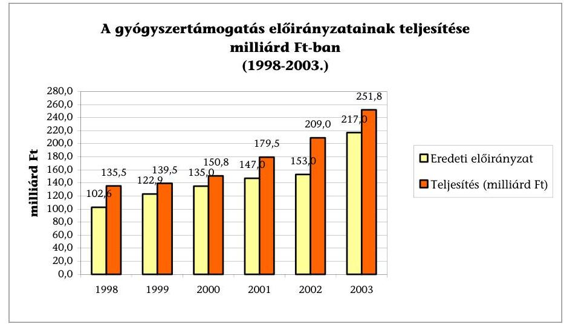

A vizsgált hat évben a gyógyszerkassza kiadásainak növekedése 25,4\%-kal volt alacsonyabb, mint az E. Alap összes kiadásának 111,3\%-os, és 15\%-kal mérsékeltebb, mint a természetbeni ellátások kiadásainak 100,8\%-os emelkedése.

A gyógyszertámogatások részesedése csökkent az E. Alapban és a természetbeni ellátásokban egyaránt. Míg 1998-ban az E. Alap kiadásainak 21,4\%-át tette ki a gyógyszertámogatás, addig 2003-ban 18,8\%-át. A természetbeni ellátásokon belüli aránya 29,6\%-ról 27,4\%-ra csökkent. (A csökkenés oka, hogy 2002-2003ban az egészségügyi dolgozók 50\%-os béremelésben részesültek, így a természetbeni ellátásokon belül emelkedett a gyógyító-megelőző kasszák kiadásainak aránya.)

Az Egyesült Államokban 1960-2000 között a gyógyszertámogatási kiadás a természetbeni ellátásokra fordított kiadások 10,0 - 9,4\%-a között mozgott. Az OECD átlag ugyanebben az időszakban $15 \%$ volt.

A költségvetés a közgyógyellátás keretében kiváltott gyógyszerekhez 1998-ban 9,9 Mrd Ft-tal, 2003-ban 15,9 Mrd Ft-tal járult hozzá.

Az egészségügyi intézmények (az OSAP statisztikai adatszolgáltatása szerint) 1998-ban 18 Mrd Ft-ot, 2003-ban 28,4 Mrd Ft-ot, azaz 57,4\%-kal többet költöttek gyári előállítású gyógyszerekre, mint hat évvel korábban.

Az E. Alap gyógyszertámogatási kiadásainak, a költségvetési hozzájárulás és az egészségügyi intézmények gyógyszerkiadásainak évenkénti alakulását a 4. számú melléklet mutatja be.

# 1.4. A gyógyszerforgalmazás rendszere 

Az emberi felhasználásra kerülő gyógyszerekről szóló 1998. évi XXV. törvény (Gyrtv.) alapján gyógyszernek nevezzük azokat a készítményeket, amelyeket betegség megelőzésére, felismerésére vagy élettani funkció fenntartására, helyreállítására, javítására és módosítása céljából emberi szervezetben vagy emberi szervezeten alkalmaznak.

---

A betegek háromféleképpen juthatnak hozzá a szükséges gyógyszerekhez: a közforgalmú patikákban orvosi rendelvényre (vényköteles gyógyszerek) vagy a saját döntésük alapján (a nem vényköteles, ún. OTC gyógyszerek), továbbá egészségügyi ellátások igénybevételekor (a kórházi kezelés idején, sürgősségi ellátás, bizonyos szakrendelési vagy esetleg háziorvosi beavatkozások során).

Az első csoport finanszírozása - részben vagy egészben - az E. Alap gyógyszerkasszájából történik. (Idetartoznak a támogatott, az ún. „különkeretes", a közgyógyellátás és az egyedi méltányosság keretében igénybevehető gyógyszerek is). A második csoportba a lakosság által vény nélkül, teljes áron megvásárolható gyógyszerek tartoznak. A kórházakban felhasznált gyógyszerekre a gyógyítómegelőző ellátások fekvőbeteg kasszáinak (aktív és krónikus) előirányzatai nyújtanak fedezetet, amelyek összege teljesítményarányosan jut el az intézményekhez (5. és 6 . számú mellékletek).

Magyarországon a gyógyszerek akkor hozhatók forgalomba, ha törzskönyvi bejegyzésük megtörtént, és erről a forgalomba hozatali engedéllyel egybekötött határozatot kiadták. A gyógyszerek törzskönyvezése és a forgalomba hozatal engedélyezése az OGYI feladata. ${ }^{14}$

A vizsgált időszakban a törzskönyvezés és a forgalombahozatal engedélyezéséhez szükséges alap dokumentációk $80 \%$-át angol, $15 \%$-át német és $5 \%$-át magyar nyelven, a kísérő iratokat (alkalmazási előirat, betegtájékoztató, címke) kötelezően magyar nyelven nyújtották be. ${ }^{15}$

Az emberi felhasználásra kerülő gyógyszerekkel kapcsolatos egyes engedélyezési eljárások során fizetendő igazgatási-szolgáltatási díjakról szóló 79/1999. (XII. 30.) EüM rendelet alapján a törzskönyvezésért, a forgalombahozatal engedélyezéséért a kérelmezők meghatározott eljárási díjat fizetnek. 2003-ban a törzskönyvezési eljárások bevétele az OGYI 1432 M Ft-os hatósági szolgáltatási bevételének $92,3 \%$-át tette ki.

# A törzskönyvezés során a vizsgált időszakban közzétett, szabályozott prioritási szempontok nem voltak. A benyújtás sorrendjétől függetlenül prioritást élveztek azok a kérelmek, amelyeknél a betegszervezetek, vagy az orvosi szakmai kollégiumok sürgős elbírálást kértek. 

A törzskönyvezett gyógyszer forgalomba hozható támogatás nélkül, vagy valamilyen mértékű társadalombiztosítási támogatásban részesülhet. A forgalmazást megelőzően a gyógyszert és annak árát az egészségügyi szaktárca, illetve a Gyógyszerész Kamara a hivatalos lapjában közzéteszi.

[^0]
[^0]:    ${ }^{14}$ EU-csatlakozásunkat követően alapvetően változnak a törzskönyvezés szabályai. A tagállamban a nemzeti engedélyeztetés mellett kétféle törzskönyvezési eljárás létezik: központosított és kölcsönös elismerési eljárás. 2004. május 1-től az EMEA által központilag törzskönyvezett gyógyszerek forgalomba hozatali engedélye az Európai Közösség egységes piacára szól. A kölcsönös elismerési eljárás azt jelenti, ha egy tagállam kiadja a forgalombahozatali engedélyt, a többi ország (ahova a gyártó beadja a forgalombahozatali kérelmét) kölcsönös elismeréssel élve 90 nap alatt lefolytatja az eljárást.
    ${ }^{15}$ Az EU-ban a gyógyszerek központi törzskönyvezése céljából benyújtott dokumentáció hivatalos nyelve az angol, csak a kísérő iratokat kell minden ország nyelvére lefordítani.

---

A gyógyszereket nagy- és kiskereskedők (közforgalmú, fiók, kézi és zárt forgalmú intézeti gyógyszertárak) forgalmazzák. Tevékenységük engedélyhez kötött, azt rendeletek szabályozzák.

A gyógyszerek forgalmazóit nagy- és kiskereskedelmi árrés illeti meg. A vizsgált időszakban a gyógyszerek nagykereskedelmi árrése 1999. július 15 -től ${ }^{16}$, a kiskereskedelmi árrés két alkalommal módosult (7. számú melléklet).

# 2. A GYÓGYSZEREK TÁMOGATÁSI ÉS FINANSZíROZÁSI RENDSZERE 

### 2.1. A gyógyszerek támogatási kategóriái

A gyógyszerek fogyasztói árához a társadalombiztosítás támogatást nyújthat. A támogatás alapja a gyógyszerek OEP által - a közfinanszírozás alapjául - elfogadott ára. Megállapításának szabályai a vizsgált időszakban alapvetően nem változtak.

A gyógyszerek támogatási jogcíme lehet normatív, ezen belül százalékos vagy fix összegű. A százalékos támogatás lehetséges mértéke $0,50,70,90$ vagy 100\%. Meghatározott betegségek gyógyszereire - egészségügyi jogcím alapján $90 \%$, meghatározott összeg vagy $100 \%$-os támogatás illeti meg a biztosítottakat.

## Az ún. hatóanyag alapú fix összegű támogatás bevezetése a gyógyszerkassza kiadásainak korlátozását célozta.

A hatóanyagalapú fix összegű támogatás elvének lényege, hogy az azonos hatóanyagú - bizonyos forgalom-részesedési és kiszerelési feltételeket is kielégítő legkedvezőbb árú, ún. referencia termék alapján határozzák meg az adott gyógyszercsoportban alkalmazott támogatás mértékét.

A referencia termék 2000. évi meghatározásának szabályai - a 9 hónapos piaci jelenlét és $6 \%$-os piaci részesedés - 2003-ra 6 hónapos forgalmazásra és $3 \%$-os részesedésre csökkent. Ez azt jelenti, hogy egy gyógyszer kisebb forgalmi részesedés mellett, rövidebb idő alatt válhatott referencia termékké. A referencia termék kiválasztása a gyártók és forgalmazók számára ellenőrizhetetlen volt, mert a termékek forgalmi adatait 2003-ig az OEP nem hozta nyilvánosságra ${ }^{17}$. Vítás esetekben a gyártó kérésére az adott fix csoport forgalmi részesedését az OEP közölte a gyártóval.

A fix összeggel támogatott termékek száma - a vizsgált időszak kormányzati célkitűzéseivel összhangban - 1998 és 2003 között 240\%-kal, 372-ről 1262-ra emelkedett. A fix összeggel támogatott termékek aránya a támogatott teljes gyógyszerkörben $20 \%$-ról $44 \%$-ra emelkedett.

[^0]
[^0]:    ${ }^{16}$ Az új árrés táblázat 1999. július 15-től lépett hatályba, [a 21/1999. (VI. 30.) EüM rendelettel módosított, a gyógyszerek kereskedelmi árréséről szóló 22/1992. (VIII. 19.) NM rendelet módosításáról szóló 13/1999. (V. 31.) EüM alapján]
    ${ }^{17}$ 2003-ban az OEP a honlapján megjelentette az első két negyedév részletes gyógyszerforgalmi adatait.

---

A fix csoportok létrehozásának feltételei a vizsgált időszakban módosultak. 2003-tól a kevesebb feltételt előíró szabályozás a pénzügyi szempontok érvényesítésének - az egyre több termék közül a legolcsóbb termék árától függő támogatás megállapításának - kedvezett.

A betegség alapú támogatást 2003-ban vezették be ${ }^{18}$. Az azonos betegségek kezelésére alkalmas - különböző hatóanyagú, de azonos hatású és alkalmazású - gyógyszerek fix támogatásának lehetőségét 1998 óta tartalmazta az Ebtv. végrehajtásáról szóló kormányrendelet. A rendelet azonban nem tartalmazott előírásokat a támogatás meghatározásának konkrét szabályaira.

A hazai gyakorlatban új támogatási elv bevezetésének előkészítését 2002. decembertől 2003. áprilisig az ESzCsM, a PM, a GKM, az OEP, a GVH, a MEP-ek delegáltja, valamint külső szakértőkből álló munkacsoport végezte. Az alkalmazandó módszerek hatásait próbaszámításokkal modellezték. 2003-ban 6 gyógyszercsoportnál való bevezetéstől ( 200 termék alacsonyabb támogatásával) 7,2 Mrd Ft, a teljes gyógyszerkörre való kiterjesztésétől 18 Mrd Ft megtakarítást vártak. 2004. évi kiterjesztésével 7 Mrd Ft megtakarítást prognosztizáltak.

A betegség alapú támogatás bevezetése - bizonyos támogatási kategóriákban, változatlan gyógyszerfogyasztási struktúra mellett - a lakossági terhek növekedését eredményezte. Részleges bevezetésének következtében a kiemelt (Eü 90\%) kategóriába tartozó gyógyszerek közel egyharmadának (326) emelkedett, és tizedének (96) csökkent a térítési díja. A normatív támogatott körben 91 gyógyszer térítési díja emelkedett, és 13 készítményé csökkent.

A betegségalapú támogatás bevezetésének lehetséges negatív hatásai miatt a TÁTB 2003. decemberi ülésén a szakszerű és részletes tájékoztatás fontosságát hangsúlyozta, mivel minden gyógyszercsoportban, minden betegségre maradtak olyan olcsó készítmények is, amelyekre áttérve a betegek gyógyszerkiadásai nem növekedtek volna.

# Az általános rendszertől eltérően támogatott ún. „különkeretes gyógyszereket" a gyógyszertárak nem forgalmazzák. A betegek meghatározott orvosi indikációkban, erre kijelölt kezelő-centrumokban 100\%-os támogatással vehetik igénybe. A készítményeket az OEP központilag szerzi be. 

A különkeretes körbe a súlyos betegségekben szenvedők rendkívül drága gyógyszerei tartoznak. A készítmények nem kerülnek gyógyszertári forgalomba, a betegekhez való eljuttatásuk az OEP-pel szerződésben álló koordináló központokon keresztül történik. A különkeretes gyógyszereket a betegek a járó- és fekvőbeteg ellátásban vehetik igénybe. Mindkét esetben az intézmények az ellátásért járó teljesítmény díjukon felül, természetben kapják meg a gyógyszereket. 2003-ban a külön keretből 15 ezer beteg részesült, átlagosan 1,1 M Ft/fő támogatásban.

[^0]
[^0]:    ${ }^{18}$ Az E. Alap 2003. évi gyógyszertámogatási előirányzatának betartásáról szóló 2356/2002. (XI. 28.) Korm. határozat adott felhatalmazást a betegségalapú támogatás bevezetésére. Az új támogatási formát 2003-tól alkalmazzák: február 1-től a fekélybetegség gyógyszereinél, majd szeptembertől a koleszterinszint csökkentők körében.

---

A különkeretből kezelt betegek gyógyszerfelhasználásának TAJ-szám szerinti hiteles elszámolása nem megoldott. Nem történt meg a különkeretbe tartozó készítmények költséghatékonysági szempontú elemzése sem.

Az ÁSZ évek óta kifogásolja, hogy a szerződések alapján leszállított gyógyszereket nem a tényleges felhasználás arányában, hanem tárolási nyilatkozatra fizette ki az OEP. Az ÁSZ kifogása ellenére erre 2003-ban is volt példa. A vizsgált időszakban a szállítók által biztosított áru-rabattok (az ingyenes gyógyszer formájában biztosított árengedmény) elkülöníthető és követhető nyilvántartása az OEP-ben nem volt biztosított.

A gyógyszerek árához egyedi méltányosság alapján- az Ebtv. 26. §-a és 50. §-a szerint - az OEP föigazgatója támogatást nyújthat.

A méltányossági alapú gyógyszertámogatásnak két fő esete van: egyrészt lehetőséget teremt arra, hogy a Magyarországon törzskönyvezett gyógyszer árához nyújtott, a meghatározott támogatási mértéket meghaladó támogatást biztosítson az OEP főigazgatója, vagy az adott támogatás igénybevételét más betegségre is engedélyezze. Másrészt a hazánkban még vagy már nem törzskönyvezett gyógyszerek - főigazgatói támogatással - egyedi import keretében beszerezhetők.
2002. november 1-től a 30/2002. (EB.K.9.), 2003. április 1-től a 28/2003. (EB.K.5.), majd a 48/2003. (EB.K.10.) számú OEP utasítás szabályozta a gyógyszerek méltányossági alapú támogatását. A 130/2003. (VIII. 22.) Korm. rendelettel az összes egészségbiztosítás keretében nyújtható méltányossági ellátás beépült az Ebtv. végrehajtásáról szóló kormányrendeletbe.

# A közgyógyellátás keretében nyújtott gyógyszertámogatás szabályozásában lényeges módosítás nem történt. 

A szociális igazgatásról és szociális ellátásokról szóló 1993. évi III. törvény szerint a közgyógyellátási igazolvánnyal rendelkező személyek térítésmentesen jogosultak a társadalombiztosítás által támogatott egyes gyógyszerekre. Közgyógyellátási jogosultság alanyi jogon, normatív alapon, illetve méltányosság alapján is megállapítható. A rászorulók így három különböző feltételrendszer szerint kapják meg igazolványaikat.

Alanyi közgyógyellátásra jogosultak a bentlakásos gyermek- és ifjúságvédelmi intézményben lakók, az átmeneti gondozottak, az átmeneti és tartós nevelésbe vett kiskorúak, a rendszeres szociális segélyben részesülők, a pénzellátásban részesülő hadigondozottak és a nemzeti gondozottak, a sorkatonai családi segélyben részesülők, a központi szociális segélyben részesülők, a rokkantsági járadékosok, akik az I., II. csoportú rokkantságuk alapján részesülnek nyugellátásban, baleseti nyugellátásban, valamint azon személyek, akik után a szülő vagy eltartó magasabb összegű családi pótlékban részesül.

Normatív közgyógyellátás: A települési önkormányzat jegyzője 1996. július elsejét követően hat hónap időtartamra közgyógyellátásra való jogosultságot állapíthat meg annak a személynek, akinek havi rendszeres gyógyszerköltsége az öregségi nyugdíj mindenkori legkisebb összegének a $10 \%$-át meghaladja.

---

Méltányossági közgyógyellátás: A települési önkormányzat képviselő-testülete annak is megállapíthatja a közgyógyellátásra való jogosultságát, aki szociálisan rászorult és gyógyszerköltsége olyan magas, hogy azt létfenntartása veszélyeztetése nélkül nem tudná viselni.

# 2.2. A gyógyszerár- és támogatás megállapítása 

A gyógyszertámogatási rendszer alapelveit a kötelező egészségbiztosításról szóló 1997. évi LXXXIII. törvény (Ebtv.) 21. §-a fogalmazza meg. A törvény szerint a gyógyszerekhez a fekvőbetegek térítésmentesen, a járóbetegek az adott gyógyszerre meghatározott társadalombiztosítási támogatással csökkentett áron jutnak hozzá.

Az ár- és támogatás szabályozás területeit az Ebtv. végrehajtásáról szóló kormányrendelet határozza meg: a támogatott gyógyszerek körének és az egyes gyógyszerek támogatási összegének megállapításához szükséges ár fogalmát, az ár elfogadására és a támogatás összegének meghatározására jogosult szervet, a támogatás alkalmazható mértékeit, valamint a támogatási összeg alapjául szolgáló árak elfogadásának és felülvizsgálatának általános szabályait.

A támogatott gyógyszerek árát, támogatásuk mértékét (az ún. „támogatási listát") 2001. június végéig az egészségügyi miniszter, 2001. júliustól 2003. január végéig a Kormány, 2003. februárról az EU-csatlakozásunkig az egészségügyi miniszter tette közzé. ${ }^{19}$ 2004. május 1-től az OEP közleményben hirdeti ki a támogatott gyógyszerek listáját. ${ }^{20}$

A gyógyszerek támogatási listája jelenleg 5490 féle terméket tartalmaz, a lista 1998 és 2004 között tizenhétszer módosult.

A napi feladatok ellátása mellett az OEP gyógyszerügyi főosztályán dolgozók idejét elsősorban a támogatási lista gyakori változása miatt szükséges rendeletmódosítások előkészítése, azok folyamatos egyeztetése kötötte le.

A jogszabály a társadalombiztosítás által nem támogatott gyógyszerek termelői és ajánlott fogyasztói árának a rendszeres közzétételét is előírja. ${ }^{21} 2002$ őszétől ez a Magyar Gyógyszerész Kamara feladata.

[^0]
[^0]:    ${ }^{19}$ A társadalombiztosítási támogatással rendelhető gyógyszerekről és a társadalombiztosítási támogatás alapjául elfogadott árához nyújtott társadalombiztosítási támogatásról szóló, többször módosított 2/1995. (II. 8.) NM rendelet.
    ${ }^{20}$ A törzskönyvezett gyógyszerek és a különleges táplálkozási igényt kielégítő tápszerek társadalombiztosítási támogatásba való befogadásának szempontjairól, és a befogadás vagy a támogatás megváltoztatásáról szóló 32/2004. (IV. 28.) ESzCsM rendelet szerint.
    ${ }^{21}$ A társadalombiztosítási támogatás nélkül forgalmazott gyógyszerekről szóló 25/1997. (VIII. 22.) NM rendelet 1.§ (1) bekezdése, majd 2000. december 4-től a gyógyszerek rendeléséről és kiadásáról szóló 3/1995. (II. 8.) NM rendelet 2/A. § (1) bekezdésének a) és b) pontja alapján a szakminisztérium tájékoztatója; 2002. szeptember 21-től a Magyar Gyógyszerész Kamaráról szóló 1994. évi LI. tv. 2. § (2) bekezdésének m) és 10 . § (2) bekezdés b) pontja, valamint a gyógyszerek rendeléséről és kiadásá-

---

# 2.2.1. A gyógyszerek befogadása a támogatott körbe 

A gyógyszerek befogadása a társadalombiztosítás által támogatott körbe együttjár az ár és a támogatás mértékének megállapításával.

Az Ebtv. végrehajtásáról szóló kormányrendelet szerint egy adott gyógyszer támogatásának összege attól függ, hogy a jogszabályban meghatározott szerv be-fogadta-e a társadalombiztosítás által támogatott körbe, mekkora árat határozott meg a támogatása alapjául, és az árához milyen támogatási mértéket rendelt.

Az Ebtv. végrehajtásáról szóló kormányrendelet - a fix támogatású csoportok létrehozásának feltételeit kivéve - részletesen nem határozza meg az egyes gyógyszerek támogatott körbe való befogadásának, különböző támogatási kategóriákba való besorolásának elveit, szempontjait.

A gyógyszerek befogadásának és a támogatási kategóriákba való besorolásának elveit közlemények, kormányhatározatok, a Kormány és a gyógyszergyártók megállapodásai tartalmazták. Az EU-csatlakozás óta egészségügyi miniszteri rendelet szabályozza ezeket a kérdéseket.

A befogadások és támogatások elveit a Népjóléti Minisztérium az Egészségbiztosítási Önkormányzattal közös közleményében 1996-ban hirdette ki ${ }^{22}$. Ebből a közleményből derült ki egy új termékkel megjelenő gyógyszerforgalmazó számára, hogy a magyar biztosítónál milyen támogatási mértékre pályázhat, de az nem, hogy a pozitív döntés érdekében pontosan milyen feltételeknek kell megfelelnie.

Befogadási szempontok alkalmazását az 1999 tavaszán és 2000 nyarán hozott kormányhatározatok írták elő. 2001-ben a befogadási folyamatot átláthatóbbá tette a - kormányzat és a gyógyszergyárak által aláírt - hároméves megállapodás.

A gyógyszerek befogadása és a támogatási kategóriákba való besorolása a vizsgált időszakban nem volt átlátható folyamat, a döntésekből hiányzott a rendszerszerűség és a kiszámíthatóság. Egységes befogadási alapelveket a vizsgált időszakban jogszabályban nem hirdettek meg.

A befogadásokat egészségpolitikai elvek (pl. a Népegészségügyi Programhoz kapcsolódóan a szív- és érrendszeri gyógyszerek preferálása), költségvetési megfontolások (pl. a befogadások elhalasztása, várható előirányzat túllépés miatti felfüggesztése), szociális (pl. egyedi méltányossági kifizetések során) és egyéb szempontok (pl. betegcsoportok érdekei, egyes orvosi szakmák lobby érdekei) egyaránt befolyásolták.
ról szóló 3/1995. (II. 8.) NM rendelet 2/A. § (1) bekezdés c) pontja alapján a Magyar Gyógyszerész Kamara közleménye.
${ }^{22}$ A Népjóléti Minisztérium és az Egészségbiztosítási Önkormányzat közleménye a gyógyszerek társadalombiztosítási támogatásának elveiről és az egyes gyógyszer-hatástani csoportokban elérhető maximális támogatás csökkentésének szempontjairól - Népjóléti Közlöny, 1996. évi 25. szám.

---

1998 és 2003 között - a befogadási elvek egyértelmű szabályozása nélkül is mintegy 70\%-kal emelkedett a társadalombiztosítás által támogatott gyógyszerek száma (8. számú melléklet).

# A gyógyszerek befogadását, támogatásuk megállapítását megelőzően a költséghatékonyságot rendszerszerüen nem vették figyelembe. 

A költséghatékony gyógyszer a beteget legkevésbé terhelő terápiát biztosítja, a lehető legkisebb ráfordítással, a legkisebb szövődmény és halálozási aránnyal, a legrövidebb táppénzzel és gyógyulási idővel. Bár a vizsgált időszakban folyamatos kormányzati elvárásként fogalmazódott meg a költséghatékonyság, ezeket a szempontokat komplex módon nem értékelték. A költséghatékonyság pénzügyi szempontokat, alacsony árat jelentett.

2001-2002-ben a befogadásra váró új gyógyszerek költséghatékonysági szempontok szerinti véleményezése az Egészségügyi Tudományos Tanács Gyógyszeralkalmazási Bizottságának (GYAB) feladata volt.

A GYAB állandó tagjai és szakértői között a gyógyszerészek és a gazdasági szakemberek mellett valamennyi orvosi szakterület képviselője is helyet kapott. A bizottság a gyógyításban áttörést eredményező készítményekre kiemelt, míg a nem meghatározó gyógyszerekre alacsonyabb támogatást javasolt. A GYAB 92 új hatóanyag és 600 -nál több új készítmény befogadását javasolta. A szaktárca a GYAB javaslatait nem tartotta megvalósíthatónak, mivel az áremelést és a betegek térítési díjának növekedését eredményezte volna. A bizottságot 2002-ben feloszlatták.

A kérdőíves felmérésben az orvosi szakmai kollégiumok szerint a GYAB volt az egyetlen olyan bizottság, amelynek keretében a szakmák lehetőséget kaptak arra, hogy beleszóljanak a gyógyszerek támogatási rendszerébe.

## A gyógyszerek költséghatékonysági szempontok szerinti elemzése terén - az Egészségügyi és Stratégiai Kutató Intézet (ESKI) létrehozásával - 2004. május 1-től történt jelentős előrelépés.

Az elképzelések szerint az ESKI feladata lesz a befogadásra váró gyógyszerek hatásosságának és költséghatékonyságának a vizsgálata, a közfinanszírozás alapjául elfogadott áraknak, a támogatások mértékének és a befogadásoknak a véleményezése. Ezentúl csak azok a termékek részesülhetnek támogatásban, amelyeket e szervezet javasol. A tervek szerint az ESKI rendszeresen felülvizsgálja majd a támogatott gyógyszerek körét, és javaslatot tesz az elavult készítmények támogatásának megszüntetésére, másokkal való helyettesítésére.

Jogszabályban első alkalommal EU-csatlakozásunkkal egyidejűleg került sor kiszámítható befogadási és támogatási elvek kihirdetésére. ${ }^{23}$

[^0]
[^0]:    ${ }^{23}$ A törzskönyvezett gyógyszerek és a különleges táplálkozási igényt kielégitő tápszerek társadalombiztosítási támogatásba való befogadásának szempontjairól és a befogadás vagy a támogatás megváltoztatásáról szóló 32/2004. (IV. 28.) ESzCsM rendeletben.

    A 89/105/EGK irányelv „transzparencia irányelv" nemzeti hatáskörben hagyja az árképzés és a gyógyszerek társadalombiztosítási támogatásba történő befogadásának szabályozását. Az irányelv szerint az árra és támogatásra vonatkozó, indoklással alátámasztott döntéseknek objektív és ellenőrizhető

---

Az új szabályozás értelmében a gyógyszerek támogatásáról, annak felülvizsgálatáról, megszüntetéséről az OEP ad ki államigazgatási határozatot. A támogatás megállapításáért a kérelmezőnek ezentúl eljárási díjat kell fizetnie. A gyógyszer támogatását kérelmezőnek normál eljárás esetén $1,5 \mathrm{M}$ Ft igazgatási díjat, egyszerűsített eljárás esetén 300 E Ft-ot kell befizetnie. Fellebbezéskor normál eljárásnál 1 M Ft , egyszerúsített eljárásnál 200 E Ft a fizetendő díj (9. számú melléklet).

# 2.2.2. Ártárgyalások 

Az Ebtv. végrehajtásáról szóló kormányrendelet a gyógyszergyártók és az állam között rendszeres egyeztetéseket, ártárgyalásokat ír elő. Az ártárgyalásokon a résztvevő állami szervezetek (ESzCsM és jogelődei, PM, OEP) képviselőiből álló bizottság a támogatandó gyógyszerek áráról és a támogatásuk mértékéről állapodik meg a gyártókkal. A támogatott gyógyszerek ára a vizsgált időszakban nyolcszor változott (10. számú melléklet).

Az ártárgyalások az Egészségügyi Minisztérium kezdeményezésére indultak, általános feltételeiket - az aktuális kormányhatározatok alapján - az egészségügyi és a pénzügyi tárca együtt fogalmazta meg. A tárgyalások meghirdetett általános feltételei követték a vonatkozó kormányhatározatokban megfogalmazott irányokat.

Az 1998 és 2000 közötti kormányhatározatok a támogatási kiadások kiáramlásának visszafogását várták a generikus gyógyszerek arányának növekedésétől, a fix támogatás kiterjesztésétől, a kiemelten támogatott gyógyszerkör szűkítésétől és az áraknak a nemzetközi árakkal való összehasonlításán alapuló csökkentésétől.

Az ártárgyaláson résztvevő hatóságok - az ESzCsM (és jogelődei), a PM, az OEP - előzetes felkészülés alapján folytatta le a tárgyalásokat a kormányhatározatoknak megfelelően. Az Ebtv. végrehajtásáról szóló kormányrendelet az ártárgyalásokat 2000. júliustól szabályozza. A 2003-tól módosított szabályozás növelte az árak és támogatások megállapításának átláthatóságát, elősegítve a gyártók és forgalmazók felkészülését. A vizsgált időszakban lezajlott ártárgyalások azonban nem minden esetben voltak összhangban a kormányrendelettel.

A már elfogadott gyógyszerárak 2002 őszi felülvizsgálatára - benyújtott ajánlat nélküli ártárgyalásra - a jogszabály nem adott felhatalmazást. 2003-ban az ártárgyalásokat az előírt határidőben nem hirdették meg. Az OEP 2003 tavaszán közzétett árcsökkentésre szóló felhívása nem felelt meg a hatályos rendelkezéseknek.

## Az ártárgyalások lebonyolításáról, azok dokumentálásáról eljárási

rend nem készült. A tárgyalások menete - megfelelő jogszabályi rendelkezések hiányában - az OEP által alkalmazott gyakorlat során alakult ki.

[^0]
[^0]:    kritériumokon kell alapulnia, a döntési folyamatnak átláthatónak és kiszámíthatónak kell lennie, és biztosítani kell a jogorvoslat lehetőségét. Az új szabályozás - a nyilvánosság, az átláthatóság és a méltányosság elve mellett - a költséghatékonyságot helyezi előtérbe. Az átláthatóság lehetővé teszi, hogy a tagországok betekinthessenek egymás árképzési és befogadási gyakorlatába.

---

A helyszíni ellenőrzési tapasztalataink szerint az ártárgyalások előkészítése, informatikai támogatottsága, az előkészítő és utómunkálatok dokumentálása nem minden tekintetben volt megfelelő.

2001-ben technikai szempontból nem volt biztosított az ártárgyalások zavartalan lefolytatása. A szükséges adatállományok és programok tárgyalásokat közvetlenül megelőző, ad-hoc előállítása, a törzsadat-állományok pontatlanságai, a hibás adatok esetenként a tárgyalási anyag módosítását tették szükségessé. 2001. április 13-án az Innovatív Gyógyszergyártók Egyesülete az ütemezett ártárgyalások elindításának számítástechnikai okok miatti késlekedéséről tájékoztatta az egészségügyi minisztert.

# 1998-tól a gyógyszerek árára benyújtott ajánlatok nemzetközi szintű összehasonlításához a legalacsonyabb nemzetközi gyógyszerár ismerete nem volt rendszerszerüen biztosított. 

Az ártárgyalások egyik szempontjaként a vizsgált időszakban folyamatos kormányzati elvárás volt a nemzetközi árak figyelembe vétele. Az összehasonlítás alapját képező „nemzetközi ár" pontos fogalmáról azonban nem volt rendelkezés. 1997 őszén a gyógyszerárak összehasonlításához Spanyolország - az OEP szerint az egyik legalacsonyabb gyógyszer árszintű ország - adatait használták. 2001-ben szintén a spanyol katalógus képezte a nemzetközi árelemzés alapját. A 2002 őszi ártárgyalásokhoz mintegy 50 cég 5000 termékére, egyszeri megbízással külső személy végezte el a spanyol és a francia árakkal való összehasonlítást.

A vizsgált hat évben az ártárgyalások mellett egyoldalú gyógyszerár és támogatás megállapításokra, ún. árbefagyasztásokra is sor került.

### 2.2.3. Árbefagyasztások

A Kormány - az ártörvény felhatalmazása alapján - a gyógyszerkassza kiadásainak mérséklése céljából, 2000-ben és 2004-ben rendelt el általános gyógy-szerár-befagyasztást. ${ }^{24}$

A 2000. évi árbefagyasztást megelőzően az egészségügyi miniszter az áremeléstől való tartózkodásra szólította fel a gyógyszergyártókat, akik a felszólítás ellenére sem léptek vissza a szándékuktól. Az éves előirányzat jelentős túllépésének valószínűsítése miatt a Kormány a teljes gyógyszerkörre árbefagyasztást rendelt el.

Az egészségügyi miniszter 1999. december 7-én levélben kért fel 38 gyógyszergyártót a tervezett áremeléseik felülvizsgálatára. A válaszadó 24 cég közül 17 elutasította a kérést és megerősítette áremelési szándékát. A társadalombiztosítás által nem támogatott gyógyszerek 2000 első félévi áremelkedése szintén hozzájárult az árbefagyasztás elrendeléséhez.

Az árbefagyasztást követően a támogatások 2001-től egyre magasabb ütemben (az előző évhez viszonyítva 2001-ben 16\%-kal, 2002-ben 17\%-

[^0]
[^0]:    ${ }^{24}$ A nem hatósági árral rendelkező termékekre az ártörvény 6 hónapos időtartamra árbefagyasztási lehetőséget biztosít.

---

kal és 2003-ban 19\%-kal) növekedtek. A támogatás növekedése, a kiemelt támogatási kategóriákban a gyógyszerfelhasználás mennyiségi emelkedése és az árbefagyasztás közötti összefüggést a szaktárca nem értékelte.

A Kormány az ártörvény felhatalmazására hivatkozva - a 2004. március 31én érvényes termelői árak 85\%-án - 2004. április 1-től befagyasztotta a gyógyszerek árát.

Az ártörvényben megfogalmazott felhatalmazást az Alkotmánybíróság (AB) nem találta megalapozottnak, így alkotmányellenessé nyilvánította az emberi felhasználásra kerülő gyógyszerek és egyes tápszerek átmeneti árszabályozásáról szóló, 2004. április 1-jén hatályba lépett 48/2004. (III. 19.) Korm. rendeletet. Határozatában az AB megállapította, hogy a gyógyszer árbefagyasztásról szóló jogszabály megalkotásakor a Kormány túllépte az ártörvényben adott felhatalmazás kereteit és a szükséges törvényi feltételek nélkül rendelkezett a gyógyszerek áráról.

A gyógyszerár-befagyasztások a kiadás-növekedések azonnali viszszafogását célzó, kényszer-intézkedések voltak. Hosszabb távon nem befolyásolták sem a gyógyszerkassza kiadásainak, sem a lakosság gyógyszerfogyasztásának alakulását. A 2000. és a 2004. évi árbefagyasztásokat - elsősorban a zavartalan gyógyszerellátás biztosítása érdekében - a Kormány és a gyógyszergyártók közötti megállapodások követték.

# 2.2.4. Megállapodások a gyógyszergyártókkal 

A vizsgált időszakban a Kormány két alkalommal - 2001-ben és 2004. júniusban - írt alá megállapodást a gyógyszergyártókkal. A 2001. évi megállapodást a 2000. évi, a 2004. júniusi megállapodást pedig az áprilisi árbefagyasztás előzte meg.

A 2001-ben aláírt „Hároméves megállapodás" átláthatóvá tette a támogatás meghatározásának folyamatát, ugyanakkor a gyógyszerkaszsza alakulása - az ár- és összetétel-változások elemzéseinek hiányában - nem vált kiszámíthatóbbá.

A megállapodás középpontjában az 50-70\%-os normatív körben támogatott fix készítmények álltak. Választékbővülést is garantált - a generikus és az originális termékek befogadása feltételeinek rögzítésével - új termékek (új kiszerelések, gyógyszerformák, új hatáserősségek) befogadására is lehetőséget adott. Lehetővé tette, hogy a $20 \%$-kal magasabb árú készítmények bekerüljenek a normatív támogatott körbe. Nem vette figyelembe a hatástani csoportokon belüli árkülönbségeket, a külföldi árakat, az infláció hatását és a forint árfolyamának erősödését sem. (Így a forint erősödése miatt gyógyszeráraink az Európában olcsónak számító spanyol, görög, és portugál árakat is meghaladták.) A megállapodás hatására a hazai gyógyszerárak $6 \%$-ot meghaladóan emelkedtek. A felsorolt okok miatt a hároméves megállapodást a Kormány 2002 nyarán felfüggesztette.

A megállapodás olyan feltételeket és elveket tartalmazott (befogadási feltételeket, gyógyszerárakkal kapcsolatos rendező elveket), amelyeket jogszabályokban kellett volna rendezni. A jogi szabályozás hiánya a megállapodás felmondását követően bizonytalan helyzetet idézett elő, mivel a benne foglalt témák

---

további kezeléséről nem volt központi iránymutatás. A felfüggesztés pillanatában a hároméves megállapodást helyettesítő egyéb szabályozási elképzelés, a gyógyszerügyi terület egészére kidolgozott koncepció nem volt.

A 2004. áprilisi árbefagyasztást követően - a 2004. július 1-től 2006. december 31-ig terjedő időszakra - a Kormány újabb megállapodást írt alá a gyógyszergyártókkal. A 2004. évben kötött megállapodás aláírásával a Kormány a lakosság gyógyszerellátásának biztonságára, a lakossági gyógyszerkiadások változatlan szinten tartására törekedett. A megállapodás másik kitűzött célja az volt, hogy a magyar gyógyszerpiac - a gyártók és a lakosság számára is - hosszabb távon kiszámítható és stabil maradjon.

A 2004-től hatályos 5\%-os gyógyszer ÁFA megemelte a gyógyszerárakat, miközben sem a társadalombiztosítási támogatás, sem a gyógyszerek termelői ára nem változott. A Kormány úgy döntött, hogy az ÁFA bevezetése miatti többletet nem hárítja rá a lakosságra és olyan megoldást keresett, amivel a többletterheket megosztja a társadalombiztosítás és a gyógyszergyártók között. A gyógyszerek 5\%-os ÁFA körbe sorolására az EU-harmonizációval összefüggésben került sor.

A megállapodás szerint a lakossági térítési díjak a támogatott, a nem támogatott gyógyszerek, valamint a különleges táplálkozási igényeket kielégítő tápszerek esetében a 2004. év végéig nem fognak emelkedni.

Ennek érdekében a gyógyszergyártók 2004-ben - a támogatott készítményekre vonatkozóan - 9 Mrd Ft befizetését vállalták az E. Alap javára. 2004. július 12006. december 31. között a társadalombiztosítás által támogatott gyógyszerek termelői árát euróban rögzítették. Garantálták, hogy áremelésre az euro-forint árfolyam $+/-6,25 \%$ sávon belüli változásáig nem kerül sor.

A Kormány és a gyógyszergyártók megállapodása a gyógyszerügy egészét érintő, átfogó szabályozás első lépésének tekinthető. Az érintett felek közötti megegyezés megteremtette a szükséges alapokat a hosszabb távon kiszámítható, stabil gyógyszer-támogatási és finanszírozási rendszer kialakításához.

# 2.3. A gyógyszertámogatások finanszírozása 

### 2.3.1. A gyógyszerkassza tervezése

Az E. Alap gyógyszerkasszájának eredeti előirányzata a vizsgált időszakban több mint kétszeresére - 102,5 Mrd Ft-ról 239,9 Mrd Ft-ra -, a kassza hiánya 32,9 Mrd Ft-ról 34,8 Mrd Ft-ra emelkedett.

---

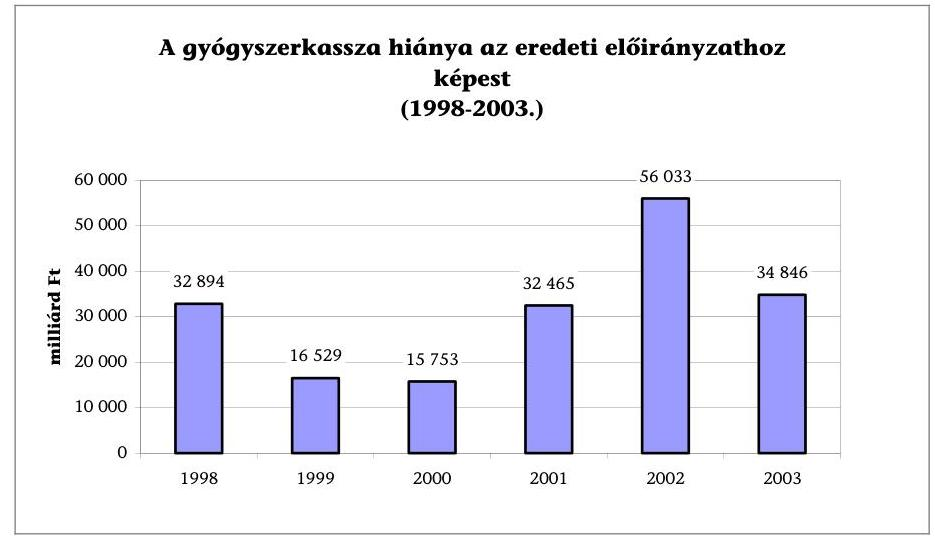

Az Áht. szerint az egészségügyi, szociális és családügyi (korábban egészségügyi) miniszter részt vesz az E. Alap költségvetésének tervezésében. A vizsgált időszakban azonban nem alakult ki megfelelő gyakorlat arra, hogy a szaktárca javaslatai miként érvényesülhetnek a tervezés során. Az éves keretek meghatározásakor az ESzCsM és az OEP javaslataival szemben a PM javaslatának volt prioritása.

Az OEP javaslatot tett a kassza előirányzatára, amelyet az ESzCsM-nek és a PMnek megküldött. A PM a javaslatot rendszerint nem fogadta el, és az éves előirányzatot jövőbeni kiadáscsökkentő intézkedésektől várt megtakarítások figyelembevételével határozta meg. A tervezett intézkedéseket megalapozott háttérszámítások nem támasztották alá, a hatásukat utólag nem elemezték.

Az előirányzatot valamennyi vizsgált évben túllépték. A tervezéskor nem vették figyelembe az új, drágább készítmények befogadásától várható többletkiadásokat, a gyógyszeráremelések hatását, a korábbi évek fogyasztási tendenciáit, 2004. január 1-től az 5\%-os gyógyszer ÁFA kiadásnövelő hatását sem.

A kassza túllépésére a szaktárca és az OEP általános indokokat nevesített: a tervezett és a tényleges árváltozások hatása jelentősen eltért egymástól, a terápiás struktúra változásait nem jól vették számításba, a támogatott körbe befogadott új készítményekkel kapcsolatos kiadásokat alábecsülték.

# A gyógyszer-támogatási előirányzat zárttá tétele nem volt hatással a 

kiadások növekedési ütemére, nem biztosította a költségvetési egyensúlymegőrzését. A gyógyszerkassza zárt előirányzata ellenére a támogatások vonatkozásában nincs kifizetési korlát.

A kassza előirányzat bezárásának és alultervezésének egyik állandósult következménye az lett, hogy a túllépés jogszabályi hátterét pótköltségvetés nélkül, az E. Alap költségvetésének zárszámadásáról szóló törvények teremtették meg. (például 1999-ben, 2000-ben és 2001-ben). Az időarányos előirányzat túllépések Kormány általi engedélyeztetése automatikussá vált.

A gyógyszerkiadások időarányos előirányzathoz viszonyított évközi túllépésének 10\%-ot (2004-et megelőzően 5\%-ot) meghaladó mértéke esetén a Kormány jóvá-

---

hagyása szükséges. 2001-ben 8 alkalommal, 2002-ben 11 alkalommal, 2003-ban 7 alkalommal engedélyezte a Kormány a túllépést.

# 2.3.2. A gyógyszerkasszából teljesített kifizetések 

Az E. Alap gyógyszertámogatási előirányzatából több célra történik kifizetés. A gyógyszerek árához nyújtott társadalombiztosítási támogatás mellett a patikák likviditási nehézségeinek áthidalására naptári éven belül visszafizetendő kamatmentes finanszírozási előlegre, vénykezelési díra és az IBR (irányított betegellátási modellkísérlet) 1999. évi bevezetése óta a szervezőknek fizetendő gyógyszermegtakarítási összegekre is fedezetet nyújt.

A gyógyszerkasszából teljesített kiadások legnagyobb részét (átlagosan $85-90 \%$-át) a térítésmentes és a normatív körbe tartozó gyógyszerek támogatása teszi ki.

A támogatási kiadások az előző évhez viszonyítva 2002-ben 17\%-kal és 2003-ban 19\%-kal emelkedtek. 2001-től az Eü90\%-os kategóriában évente 20\% feletti, 2003-ban a normatív $90 \%$-os kategóriában $50 \%$ feletti volt a támogatás emelkedése.

A gyógyszerkassza kiadásaiban emelkedett a különkeretes gyógyszerek aránya: 1998-ban a 135,5 Mrd Ft-os támogatási kiadásból 5,3\%-ot (7,2 Mrd Ft), 2003-ban a teljesített 251,8 Mrd Ft-ból már 6,6\%-ot (16,6 Mrd Ft) képviseltek. A vizsgált hatéves időszakban a különkeretes gyógyszerekre fordított OEP kiadások 130\%-kal emelkedtek.

Mrd Ft

| Év | Összes gyógyszer-   támogatás | A külön-keretes tá-   mogatás | Külön-keret aránya   (\%) |
| :--: | :--: | :--: | :--: |
| 1998 | 135,5 | 7,2 | 5,3 |
| 1999 | 139,5 | 7,3 | 5,3 |
| 2000 | 150,8 | 7,0 | 4,7 |
| 2001 | 179,5 | 12,8 | 7,1 |
| 2002 | 209,0 | 13,6 | 6,5 |
| 2003 | 251,8 | 16,6 | 6,6 |

A méltányossági gyógyszertámogatásoknak 2001-től van nevesített költségvetési előirányzata. Az előirányzatot az OEP eddig minden évben túllépte. 1998 és 2003 között a gyógyszerkiadások körében a méltányossági kifizetések növekedtek a legdinamikusabban, 0,1 Mrd Ft-ról 5,3 Mrd Ft-ra.

---

| Év | Betegszám | Összes méltányossági   kiadás |
| :--: | :--: | :--: |
| $\mathbf{1 9 9 8}$ | 234 | 0,1 |
| $\mathbf{1 9 9 9}$ | 256 | 0,2 |
| $\mathbf{2 0 0 0}$ | 783 | 0,9 |
| $\mathbf{2 0 0 1}$ | 1751 | 1,3 |
| $\mathbf{2 0 0 2}$ | 2054 | 3,7 |
| $\mathbf{2 0 0 3}$ | 3777 | 5,3 |

2003-ban 14-féle gyógyszerre a méltányossági támogatás 54\%-a, 2,87 Mrd Ft jutott. A 14 gyógyszer Magyarországon évek óta még nem törzskönyvezett készítmény volt.

Egyedi méltányosság címén az OEP főigazgatójának engedélye nélkül az illetékes szakfőosztály vezetője, illetve annak helyettese 1999 óta összesen 917,3 M Ft támogatás kifizetését engedélyezte. 2003-ban 17212 beteg 66 gyógyszerkészítményre 70, 90 és 100\%-os társadalombiztosítási támogatásban részesült A belső ellenőrzés által 2003-ban feltárt helyzetet követően az OEP főigazgatója intézkedési tervet készített.

A méltányossági alapú gyógyszertámogatások kifizetéseinek nyilvántartása nem megfelelő, mivel a BÉVER vényelszámoló és ellenőrző rendszer a méltányossági gyógyszer felhasználást nem tudja elkülönítetten kezelni. A kifizetések összegeit az Eü100\%, Eü90\%, illetve a normatív támogatásokra teljesített kifizetések tartalmazzák.

# A közgyógyellátás társadalombiztosítási támogatása 12,4 Mrd Ft-ról 

16,4 Mrd Ft-ra, a központi és önkormányzati költségvetés hozzájárulása 9,9 Mrd Ft-ról 15,9 Mrd Ft-ra emelkedett.
2002. január 1-től a gyógyszertáraknak - naptári éven belül visszafizetendő - kamatmentes finanszírozási előleg igénylésére van lehetőségük. Az előleg folyósítására az E. Alap gyógyszerkasszájának előirányzata nyújt fedezetet. 2002-ben 3 Mrd Ft, 2003-ban és 2004-ben 8 Mrd Ft volt a kifizethető gyógyszertári előleg nagyságrendje.

A 2001. évi patikai árrés-módosítás következtében a kisforgalmú patikák likviditási nehézségekkel küzdöttek. Múködőképességük megtartása érdekében - a Kormány döntésének megfelelően - 2002. január 1-től a patikák évente egy alkalommal (a tárgyévet megelőző év átlagos havi gyógyszertámogatásának 50\%áig, 2003. márciustól annak 60\%-áig) az OEP-től kamatmentes finanszírozási előleget igényelhetnek. Az előleg kérelmek elbírálását az OEP belső eljárási rendben szabályozta.

A gyógyszerkasszában önálló jogcímként 2003-ban szerepelt először a gyógyszertárak részére kifizetett, már korábban intézményesített

---

vénykezelési díj: 1,6 Mrd Ft előirányzattal szemben a teljesítés 1,4 Mrd Ft volt.

Erről a jogcímről alapvetően kétféle kifizetés történt: egyrészt a patikák a vény adatok rögzítéséért tételenként $2 \mathrm{Ft}+25 \%$ ÁFA vénykezelési díjat (összesen 393,8 M Ft-ot) kaptak, másrészt az alacsony forgalmú gyógyszertárak működőképességét javító finanszírozást szolgálta.

A kisforgalmú patikák működőképességének javítása céljából a Kormány 2003ban döntött a kiegészítő vénykezelési díj bevezetéséről. 2003 áprilisátóldecemberig havonta mintegy 1400 patika részesült összesen 993 M Ft kiegészítő vénykezelési díjban. A 22/2004. (IV. 1.) ESzCsM rendelet a Kormány által 2004. április 1-től elrendelt árbefagyasztás miatti veszteség kompenzálására határozta meg a kiegészítő vénykezelési díjat. A hivatkozott ESzCsM rendeletet az AB - az árbefagyasztásról szóló rendelkezéssel egyidejűleg - megsemmisítette.

A gyógyszerkassza terhére az irányított betegellátási modellkísérlet megtakarításaként első alkalommal 1999-ben 25,3 M Ft, majd 2003-ban 331,8 M Ft megtakarítás kifizetése történt meg (lásd a 3.3.3 pontban).

# 2.3.3. A támogatás volumen megállapodások 

Az E. Alap 2003. évi gyógyszertámogatási előirányzatának betartása, a kiadások mérséklése érdekében az Ebtv. végrehajtásáról szóló kormányrendelet meghatározott időszakra és támogatásokra - az OEP-et támogatás volumen megállapodások aláírására hatalmazta fel.

A támogatás volumen megállapodások célja az volt, hogy egy megadott értéken túl a gyártóra, illetve a forgalmazóra hárítsa át az egyes gyógyszerek többlet forgalmából származó kiadásokat. A megállapodásokkal új gyógyszerek befogadására került sor. (A támogatás volumen megállapodások keretében történt gyógyszer befogadásokat az Ebtv. végrehajtásáról szóló kormányrendelet nem szabályozta.)

A kiadások alakulásának a nemzetközi gyakorlatban elterjedt szabályozásával a gyártó vagy forgalmazó felelősséget vállal arra, hogy a megállapodott volumen (amelynek fejében az adott árat és ártámogatást megállapítják) túllépése esetén vagy visszafizeti a finanszírozónak az okozott többletterhet, vagy lecsökkenti az árat.

A 2003. februárban és augusztusban 11 betegségcsoport 16 gyógyszerére kötött megállapodásokban 4,7 Mrd Ft támogatás kiáramlása felett lépett érvénybe a forgalmazók E. Alap javára történő befizetési kötelezettsége. A közös kockázatú - részben visszafizetendő - támogatásvolumen nagysága 793 M Ft volt. A 2003. évi szerződések pénzügyi lezárását 2004. március végéig csak részben végezték el, az OEP-nél várható bevétel mindössze 60 M Ft volt.

A támogatási módot Magyarországon csak jól körülhatárolt, meghatározható számú beteget érintő betegségek gyógyszereinél vezették be, elsősorban a drága, innovatív termékekre, pl. Parkinson-kór és Alzheimer-betegség kezelésére szolgáló készítményekre, allergiaellenes és új típusú diabetes gyógyszerekre.

---

A rendszer Francia- és Spanyolországban a hazai gyártók preferálását is szolgálja, mert a megállapodásban rögzített támogatási szinthez a nemzetgazdasági hozzájárulás függvényében magasabb árat, illetve eladási volument biztosítanak a gyártónak. A francia gyakorlatban, amennyiben a gyártó túllépi az általa előzetesen vállalt forgalmi volument, akkor a túllépés $70 \%$-át vissza kell fizetnie a finanszírozó szervnek. A szerződéshez pontosan ismerni kell az egyes betegségek előfordulási gyakoriságát.

# 2.3.4. A globális támogatás volumen megállapodások 

A globális támogatás volumen megállapodás (GTV) a gyógyszerkiadások korlátozását célozta azáltal, hogy a kassza túlteljesülését a gyógyszergyártókra hárította.

A gyártók választásuk szerint két módon - a gyártó termékeire kifizetett támogatás összegének figyelembe vételével, vagy a piaci részesedése figyelembe vételével - szerződhettek a GTV keretében. A GTV-szerződések alapján az OEP-nek a gyógyszerforgalmazókkal szemben $9,6 \mathrm{Mrd}$ Ft követelése keletkezett, amelyből eddig $6,8 \mathrm{Mrd}$ Ft realizálódott. Az OEP számításai szerint még további $2,8 \mathrm{Mrd}$ Ft vár rendezésre.

A gyógyszergyártók - folyamatosan módosított, bonyolult visszafizetési algoritmus alapján kiszámolt - befizetési kötelezettségének pontos összege a végelszámolás hibája miatt (a kitűzött 2004. február 6-i határidő ellenére) még 2004. augusztus hónapban sem ismert. Az OEP számításaival kapcsolatban több gyártó jelezte, hogy számszaki fenntartásai vannak, és így augusztus hónapban még további egyeztetésekre kerül sor.

Az OEP számításait a gyógyszergyártók szövetségei által megbízott független auditor cég ellenőrizte. Az OEP által adott tájékoztatás szerint: „az auditori jelentésből az OEP nem kapott, mivel az auditálás a cégek megbízásából került elvégzésre". Az ellenőrzés során az auditor tevékenységének feltételeiről, körülményeiről, időtartamáról, az átadott adatállományokról sem tudott az OEP dokumentumokat bemutatni.

A gyógyszergyártók 2003-ban teljesített, GTV szerinti befizetései az E. Alap egészének a hiányát csökkentették. 2004-ben sem született jogszabályi rendelkezés arról, hogy a befizetések közvetlenül a gyógyszerkassza hiányát csökkentsék. 2004-ben az E. Alap gyógyszergyártói befizetésekből származó bevételei a gyó-gyító-megelőző intézmények energia áremelkedés miatti többletkiadásainak kompenzálására fordíthatók.

A GTV rövidtávon eredményes intézkedésnek tekinthető, mivel 6,8 Mrd Ft-tal növelte az E. Alap bevételeit. Hosszabb távon azonban nem alkalmas sem a gyógyszerfogyasztás befolyásolására, sem a gyógyszerkiadások visszafogására. Válságkezelő intézkedésnek tekinthető, és nem helyettesíti a gyógyszergyártók és a Kormány közötti megegyezést.

A gyógyszergyártók erőteljesen tiltakoztak a megállapodás ellen, egyértelműen kifejezték álláspontjukat, hogy átmeneti jellegűnek tekintik, szerintük kiszámítható ár- és támogatási rendszer szükséges.

---

# 2.4. A gyógyszertámogatások folyósítása 

A gyógyszertámogatások elszámolási rendjét jogszabályok ${ }^{25}$ és az OEP főigazgatói utasításai tartalmazzák. A támogatások folyósításának alapja a MEP-ek és a gyógyszertárak közötti finanszírozási szerződés.

A gyógyszertámogatások folyósításának szabályozásában bekövetkezett változásokkal a kormányzat a lakosság biztonságos gyógyszerellátására és a patikák jövedelmezöségének megőrzésére törekedett. Ennek érdekében került sor a gyógyszertárak kamatmentes finanszírozási előlegének, továbbá a kiegészítő vénykezelési díjnak a bevezetésére.

A fenti kormányzati intézkedésekkel a Magyar Gyógyszerész Kamara, a Magyar Gyógyszerészeti Társaság, a Magángyógyszerészek Országos Szövetsége és az Egészségügyi Minisztérium szándéknyilatkozatában foglaltak valósultak meg.
2002. márciustól a gyógyszertámogatások folyósítási rendszerében alapvető változtatást jelentett a központosított elszámolás és utalás bevezetése. Az új rendszer lehetővé tette az OEP számára a kiutalások naprakész követését.

A MEP-ek és a gyógyszertárak közötti finanszírozási szerződéseket a központosított utalás 2002. évi bevezetése óta az OEP a helyszíni vizsgálat lezárásakor még nem módosította.

A patikai szerződések 17. és 20. pontjai szerint nem az OEP, hanem továbbra is a területileg illetékes MEP intézkedik az elszámolások alapján járó társadalombiztosítási támogatási összegek átutalásáról.

A támogatások elszámolásának és folyósításának központosítása hatékonyabbá tette a MEP-ek vényellenőrzési tevékenységét azáltal, hogy az már a patikák elszámolásait tartalmazó mágneslemezek beolvasásával egyidejűleg megkezdődhet.

6 MEP-nél (Békés, Zala, Baranya, Veszprém, Főváros és Pest megye, Vasutas TB) végzett helyszíni ellenőrzési tapasztalataink igazolják, hogy az elszámolásokhoz, az ellenőrzésekhez az alkalmazott vénykezelő programok megfelelő információs hátteret nyújtanak.

Az OEP által működtetett gyógyszertári elszámolási rendszer hátránya, hogy nem teszi lehetővé a MEP-ek számára a jogalap nélküli támogatások visszavonását a patikák tárgyhót követő elszámolásaiból.

A gyógyszertárak elszámolásait manuális módszerekkel hasonlítják össze azzal a jegyzőkönyvvel, amely tartalmazza a patikák által megtérítendő összeget. Ha a gyógyszertár az összeget nem vitatja, a vényellenőrző rendszeren keresztül megtörténik a korrekció elszámolása és pénzügyi rendezése. A helyszínen ellenőrzött

[^0]
[^0]:    ${ }^{25}$ A gyógyszertámogatások folyósításának szabályait 1999-ig a társadalombiztosítási támogatással rendelhető gyógyszerek árához nyújtott támogatás igénybevételének és elszámolásának a szabályairól szóló 8/1994. (IV. 22.) NM rendelet tartalmazta. Ezt váltotta fel a járóbeteg ellátás keretében rendelt gyógyszerek, gyógyászati segédeszközök és gyógyfürdőellátások árához nyújtott támogatások elszámolásáról és folyósításáról szóló 134/1999. (VIII. 31.) Korm. rendelet.

---

MEP-ek részéről elvárásként fogalmazódott meg, hogy lehetőség legyen a korrekció kezdeményezésére.

# 2.5. A gyógyszertámogatások elszámolásának ellenőrzése 

A gyógyszertámogatások elszámolásának ellenőrzési területeit az Ebtv., valamint a MEP-ek és gyógyszertárak finanszírozási szerződései szabályozzák. A MEP ellenőrzései a rendelt gyógyszerek forgalmazására, kiszolgálására, valamint a támogatás elszámolására vonatkozó előírások betartására, az elszámolások valódiságára, továbbá a folyósított támogatások felhasználásának pénzügyi szabályszerűségére terjednek ki.

Az orvosok vényírási tevékenységét a MEP-ek gyógyszerész-szakmai és orvosiszakmai szempontból ellenőrzik. A gyógyszerész szakmai ellenőrzés keretében kerül sor a vények alaki és tartalmi vizsgálatára. Az orvos szakmai ellenőrzések kritériumai: felírhatóság, indikációk, hatásmechanizmus, gyógyszerkölcsönhatások, helyettesíthetőség, rendelési jogcímek.

A MEP-ek megfelelően szabályozott szempontok alapján folytatják le a vényírási tevékenység alaki-tartalmi, valamint az orvos és gyógyszerészszakmai ellenőrzéseket. Az OEP 2003-ban készítette el a gyógyszerész- és or-vos-szakmai ellenőrzések országosan egységes módszertanát. Bevezetésére azonban a helyszíni ellenőrzés lezárásáig még nem került sor.

A vizsgált időszakban csökkent a szankcionált vények száma, a viszszavont támogatási összegek nagyságrendje. A gyógyszertárak szankcionálásának oka - az alaki hiányosságok mellett - elsősorban az elszámolt mennyiségek téves rögzítése volt. Az orvosok jogkövető magatartását jelzi az orvos-szakmai ellenőrzések alapján kibocsátott fizetési felszólítások, szerződésfelfüggesztések és -felbontások alacsony száma.

2001-ben 146,7 M db támogatott vényből 15711-et szankcionáltak, és 70 M Ft-ot vontak vissza. A 2003. I. félévi gyógyszertári ellenőrzést követően 4263 db olyan vényt találtak, amely alapján 15 M Ft támogatás visszafizetésére kötelezték az érintett patikákat (téves számlázás, hiányosan kitöltött vény stb.) Jogosulatlan támogatás igénybevétele miatt 2003. I. félévében 5,6 M Ft összegben készült fizetési felszólítás az orvosok részére. Szerződést átlagosan 2-5 orvossal bontottak fel megyénként. Az orvos-szakmai ellenőrzések terén bekövetkezett változás, hogy 2003. január 1-én az OEP-ben megalakult az Elemzési és Szakmai Ellenőrzési Főosztály.

A szabálytalan gyógyszerrendelés és támogatás elszámolás csak abban az esetben szankcionálható, ha bizonyítható az E. Alapnak okozott kár. A MEP-ek számára a gyakorlatban nehézséget okoz a károkozás bizonyítása, mivel a jogszabályok egyértelmúen nem határozzák meg az E. Alapnak okozott kár fogalmát. Ebből adódóan jelenleg több polgári peres eljárás van folyamatban.

Ha az orvos jogosulatlanul rendelt gyógyszert és a beteg kiváltotta azt, akkor a szabályok szerint az E. Alapot kár nem éri annak ellenére, hogy szabálytalanság történt. A MEP ilyen esetekben figyelmeztetési lehetőséggel élhet, bírságolási lehetősége nincs.

---

A gyógyszertári elszámolásokkal kapcsolatos ellenőrzési feladatokat a BÉVER (vényelszámoló és ellenőrző) rendszer támogatja. A célellenőrzések hatékonyságának javítását szolgálta a rendszer 2002. évi központosítása. A gyógyszertári jelentések azonnali hibaszűrése miatt a központosított adatfeldolgozás beindulását követően javult az ellenőrzések hatékonysága.

A hibakódok kezelésével felhasználói oldalról lehetőség van a hibás vények automatikus kizárására, továbbá utólagos ellenőrzés céljából azonnali kijelölésére. Az ellenőrzések automatikus támogatását a hibalisták, illetve a havi zárás után készülő ún. TOP-listák jelentik. Havonta készül TOP-lista minden orvosra, háziorvosra, közgyógyellátási jogcímre, TAJ-számra és gyógyszerre.

# 2.6. Az OEP gyógyszerügyi-információs rendszerei 

Az OEP gyógyszerügyi információs rendszere a gyógyszerügyi terület országos szereplőivel együttműködve kialakított rendszer részét képezi. Az adatok kezelését azonban több ágazaton belüli és kívüli szervezet végzi. Az illetékes adatgazdákat nem jelölték ki, így ágazati szinten nem biztosított a gyógyszerüggyel kapcsolatos adatok konzisztenciája.

Az OEP 2000 közepén felmérte az általa használt, illetve feladatának ellátásához szükséges törzsadat-állományok helyzetét. A jogszabályok alapján a gyógyszer adatok részleges nyilvántartásában, illetve kezelésében 16 szervezet volt érintett, közel 20 jogszabály és utasítás rendelkezik az elvégzendő feladatokról.

Az érintett szervezetek közötti adatáramlás rendszerességének hiánya és nem megfelelő tartalma miatt az OEP-nek - a gyógyszertámogatással és finanszírozással kapcsolatos feladatellátása érdekében - önálló tartalmú és azonosítású törzsadat-állományokat kellett kialakítania.

A gyógyszertámogatás folyósítás és felhasználás terén a nyilvántartás vezetése az ESzCsM, illetve az OEP feladata, a törzskönyvi bejegyzések és törlések hivatalos adatforrása az OGYI. Az OEP-nek a gyógyszerüggyel kapcsolatos feladatellátása érdekében a szakminisztériumnál és az OGYI-nál meglévő állományoknál részletesebb gyógyszer-törzsadatokat kellett kialakítania. A szervezetek gyógyszeradatai között nincs megfeleltetés, egymással nem hangolhatók össze.

1998 és 2003 között az OEP gyógyszerügyi információs rendszere folyamatosan fejlődött, a fejlesztések átfogó, integrált rendszerek bevezetését célozták. Ezt a célt szolgálta a BÉVER vényfeldolgozó, ellenőrző és támogatás finanszírozó rendszer 2002. évi központi üzemeltetésének bevezetése. Továbbra is probléma maradt azonban a rendszert „kiszolgáló", a támogatás ellenőrzéséhez szükséges adatállományok központosított kezelése.

A gyógyszerek támogatásával és finanszírozásával kapcsolatos jogszabályok gyakori módosításai - az OEP gyógyszerügyi informatikai rendszereinek jogszabálykövetése, az általuk szolgáltatott adatok naprakészsége szempontjából - a vizsgált időszakban folyamatos kockázatot jelentettek. A rendelkezések figyelmen kívül hagyták a hatálybalépésük miatt szükségessé vált informatikai rendszer módosítások (illetve új rendszerek kialakításának) technológiai idejét. A vizsgált időszakban mindez gyakorlatilag

---

# lehetetlenné tette az elvégzendő informatikai fejlesztések megfelelő előkészítését és a végrehajtásban számos jogi és technikai problémát okozott. 

A több informatikai rendszert is érintő jogszabályváltozásoknak az érintett rendszereken történő átvezetése a fejlesztések összehangolását, az alkalmazások fejlesztőinek együttmúködését tette szükségessé, amely tovább növelte a módosítások átvezetésének időigényét. A gyógyszer finanszírozás területét érintő jogszabály módosítások a legtöbb esetben nemcsak a BÉVER, hanem a PÉNZELL rendszert is érintették.

Sem a fejlesztések, sem az üzemeltetés területén nem rendelkezett az OEP megfelelő dokumentációval az alkalmazói rendszerekről. Az informatikai szakterület részéről a fejlesztések koordinációja nem volt biztosított. Megfelelő dokumentálás hiánya miatt sem a gyógyszerügyi, sem az informatikai szakterület képviselői nem rendelkeztek alapvető információkkal a gyógyszerügyi területen a vizsgált időszakban megvalósult fejlesztésekről.

Az informatikai szakterületen 2003 végén kezdődtek meg azok a koordinációs folyamatok, amelyek a BÉVER rendszerrel szemben megfogalmazott fejlesztési és módosítási igényeket, az ezek megvalósításával kapcsolatos feladatokat célozták.

Megfelelő belső szabályozás hiányában az OEP-nél jelenleg is több, egymástól függetlenül karbantartott gyógyszer-törzsadat állomány létezik. Az OEP SzMSz-e a gyógyszerügyi főosztály feladatává tette a gyógy-szer-törzsadatok kialakítását, kezelését, karbantartását. Ebben a munkában az informatikai szakterület munkatársai azonban nem vettek részt. A nyilvántartó rendszerekről dokumentáció nem áll rendelkezésre.

Az OEP központi, hiteles orvos nyilvántartással nem rendelkezik. A megfelelő orvos nyilvántartás hiánya - a szakvizsgához kötődő gyógyszerrendelés esetén - nehezíti az orvosok vényírási jogosultságának ellenőrzését. Az adatok hiányának másik következménye az, hogy az egyes orvosi szakterületek gyógyszerfelhasználásának az elemzése, monitorozása így el sem kezdődhet, mivel a felírt gyógyszer és az orvos szakterület nem rendelhető egymáshoz.

Az OEP-nél csupán egy, az orvosi pecséteket nyilvántartó, elavult technológián alapuló rendszer múködik, amely nem alkalmas az orvos adatok naprakészen tartására, azok automatikus ellenőrzésére. (A nyilvántartási rendszer folyamatos aktualizálásának biztosítása szükségszerú, pl. az elveszett, megsemmisült stb. bélyegzők miatt.)

Az orvosokkal kapcsolatos adatok nyilvántartása a MOK feladata. Az adatok rendelkezésre állása érdekében az OEP és a MOK 2003 szeptemberében megállapodást írt alá. A helyszíni ellenőrzés lezárásakor az OEP számára az adatok még nem álltak rendelkezésre.

Az OEP saját kezdeményezésében és saját forrásaira támaszkodva 2003-ban elindította a közhiteles egészségügyi termék törzsadatállomány kialakítását. A nyilvántartási hiányosságok kiküszöbölésére indított projekt célja, hogy a folyamatokban érintett felelős intézmények által közösen fenntartott és jogosultságokkal szinkronizált adatbázis jöjjön létre. A fejlesztés első lépése a gyógyszer adatbázis kialakítása lesz az abban érintett intézmények (OGYI, ESzCsM, OEP, MGYK) közreműködésével.

---

A közgyógyellátási igazolványok nyilvántartását a MEP-ek végezték, azokat lokális (helyi) állományokban rögzítették. 2001 végén született döntés az orvos adatok, közgyógyellátási igazolványok és az egyedi engedélyek egységes központi nyilvántartásáról. Az előkészítés hiányosságai miatt egyik rendszert sem vezették még be. A feladatok felmérése sem a kiírás előtt, sem a fejlesztés kezdeti szakaszában nem történt meg megfelelően.

Az új orvos nyilvántartó rendszert 80\%-os teljesítéssel vette át az OEP, a befejezést saját forrásból tervezik megoldani. Az egyedi engedélyeket kezelő és nyilvántartó rendszer fejlesztésének az informatikai átvétele 2003 májusában, a rendszer használatával kapcsolatban a gyógyszerügyi szakterület észrevételeinek átvezetése 2004 februárjában megtörtént.

A méltányosságon alapuló egyedi engedélyek kezelését az OEP gyógyszerügyi főosztályán működő régi, lokális rendszer valósítja meg.

A központi TAJ-nyilvántartást a vizsgált időszakban vezették be. A központosított finanszírozás bevezetésével sor került az országos szinten központosított gyógyszertári törzsadat-állomány kialakítására. A legyártott és kiadott orvosi vények központi nyilvántartása megoldott.

A gyógyszerforgalommal, a gyógyszerfelhasználással kapcsolatos adatokat és információkat jelenleg két rendszer, a BÉVER és az Adattárház biztosítja. A BÉVER-ből közvetlenül a tárgyévi és azt megelőző év adatai érhetők el, míg az Adattárház 1998-ig visszamenőleg tárol adatokat.

A BÉVER-hez kapcsolódó rendszergazdai feladatokat a gyógyszerügyi főosztály finanszírozási osztályvezetője, az Adattárház rendszergazdai feladatait az informatikai szakterület látja el. A gyógyszer törzsadatok változásainak bekerülése a BÉVER-ből az Adattárházba nem automatizált.

Az Adattárházból történő lekérdezéseket nehezíti az egységes értelmezések és fogalom meghatározások (ún. „lekérdezési standardok") hiánya. Emiatt előfordulhat, hogy - a lekérdező informatikus és az azt megrendelő szakember eltérő fogalom értelmezése miatt - azonosnak gondolt témakörben különböző adatsorok készülnek.

Az OEP gyógyszer-információs rendszerének múködése, eljárási rendje, az adatok gyüjtésének és felhasználásának rendszere szabályozott volt, de a belső szabályok csak 2004. június 1-től rendelkeznek átfogóan az adatok mentési rendjéről, továbbá a mágneses adathordozón tárolt adatok biztonságáról. (E szabályok megfelelőségéről a helyszíni vizsgálat korábbi befejeződése miatt az ellenőrzés nem győződhetett meg.)

A gyógyszertári nyilvántartó és elszámoló rendszerekkel szemben az OEP - a szolgáltatott adatok formátumán túl - a rendszer zártságával kapcsolatos követelményeket nem fogalmazott meg.

Az országos szintű gyógyszertári forgalmi adatok forrásai a patikai nyilvántartó és elszámoló rendszerek. A rendszerek üzemeltetésére a gyógyszertárak közvetlenül szerződnek. A rendszergazdákkal szemben a finanszírozó OEP az üzemeltetéssel, adatvédelemmel kapcsolatban követelményeket nem támaszt. Erről sem a jogszabályokban, sem a MEP-ek és a gyógyszertárak szerződéseiben nincs rendel-

---

kezés. A MEP-ek a patikai rendszergazdák tevékenységéről - a jogszabály módosítások végrehajtása miatt fellépő nehézségeikről, üzemeltetési problémáikról stb. csupán esetleges információkkal rendelkeznek. Helyszíni vizsgálatunk lezárása után, a patikai rendszergazdákkal való kapcsolattartás rendezése céljából, az OEP-ben egyeztetések kezdődtek el.

# 3. A GYÓGYSZERFOGYASZTÁs HELYZETE, BEFOLYÁSOLÓ TÉNYEZŐI 

### 3.1. A gyógyszerfogyasztás helyzete

A gyógyszerfogyasztást - a mindenkori ár- és támogatáspolitika mellett - több tényező befolyásolja: a lakosság egészségi állapota, korcsoportos összetétele, az új készítmények megjelenése, az orvosok gyógyszer alkalmazási gyakorlata, a gyártók marketing tevékenysége, az orvosok és a betegek tájékozottsága.

### 3.1.1. A lakosság gyógyszerfogyasztása

A lakosság gyógyszerfogyasztása az egy lakosra jutó átlagos dobozmennyiséget illetően a vizsgált időszakban nem emelkedett, a társadalombiztosítás és a lakosság mégis közel két és félszer többet költött gyógyszerekre 2003-ban, mint 1998-ban. A tavalyi évben egy lakos átlagosan 41 E Ft-nyi gyógyszert fogyasztott.
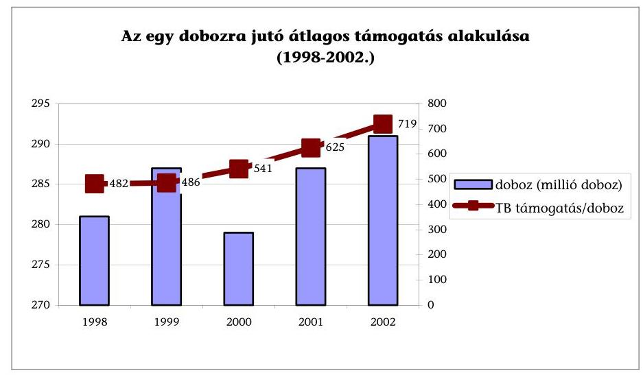

A társadalombiztosítás által támogatott gyógyszerek forgalma 155 Mrd Ft-ról 340 Mrd Ft-ra, a lakossági térítési díjak 64,3 Mrd Ft-ról 156,4 Mrd Ft-ra emelkedtek az OEP adatai szerint. Az átlagos támogatási arány az 1998. évi 70,4\%ról $61,5 \%$-ra csökkent.

---

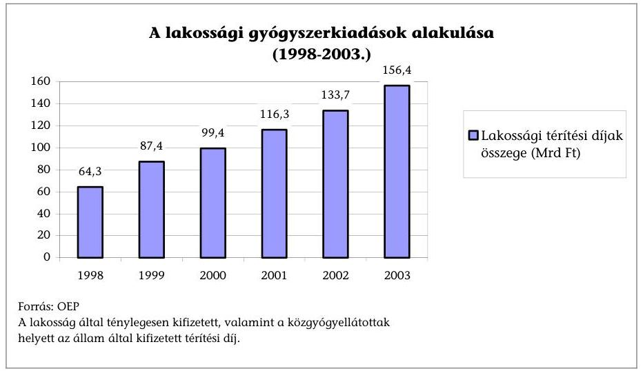

Forrás: OEP
A lakosság által ténylegesen kifizetett, valamint a közgyógyellátottak helyett az állam által kifizetett térítési díj.

A gyógyszerek iránti stabil lakossági keresletet jelzi a beváltott vények számának stagnálása. A vényforgalom a vizsgált években számottevően nem változott: az 1998. évi 156 millió db-ról 2003-ra 161 millió db-ra (3\%-kal) emelkedett. Ezzel szemben az egy vényre jutó támogatási kiadás 831 $\mathrm{Ft} / \mathrm{db}$-ról $1558 \mathrm{Ft} / \mathrm{db}$-ra nőtt. A tendencia arra utal, hogy a támogatás növekedését nem a gyógyszerfogyasztás mennyiségének a növekedése, hanem a termelői árak emelkedése, illetve a lakossági felhasználás struktúrájának a változása - a kiemelten támogatott készítmények felé való eltolódása - okozta (11. számú melléklet).

A vizsgált időszakot jellemző tendencia volt, hogy a lakosság egyre nagyobb részét egyre magasabban támogatott gyógyszerrel kezelték. Az Eü100\%-os kategóriában hat év alatt 93\%-kal, az Eü 90\%-os kategóriában $80 \%$-al, a fix támogatási kategóriában $79 \%$-kal nőtt az egy vényre jutó hazai gyógyszerforgalom. A fix támogatású gyógyszerek forgalmát a teljes támogatáshoz viszonyítva alacsonyabb növekedési ütem jellemezte.

A támogatott gyógyszerforgalom legnagyobb részét (84-85\%-át) a normatív és az egészségügyi kategóriák alkották. Az Eü100\%-os kategóriában volt a legmagasabb a gyógyszerek forgalma: 1998-ban mintegy 10-szerese, 2003-ban 11szerese a $0 \%$-os támogatási kategóriának.

A legkisebb mértékben a 70\%-os támogatású és a közgyógyellátási listán lévő gyógyszerek egy vényre jutó támogatott forgalma növekedett, 50 illetve 62\%kal. Az utóbbi a közgyógyellátási gyógyszerlista felülvizsgálatának hatását jelzi.

A vizsgált évek támogatott gyógyszerforgalmát befolyásoló tényezők hatásáról az OEP-ben és egyes MEP-ekben eseti elemzések készültek.

Az FPEP-ben készült elemzés szerint a fővárosban és Pest megyében a forgalmi adatokban csökkenés következett be azoknál a gyógyszereknél, amelyek támogatási mértékét az elmúlt években csökkentették, vagy kiemelték a támogatott körből. Ugyanakkor az új, drágább készítményeknél erőteljes növekedés mutatható ki. A támogatási lista változása befolyásolja a gyógyszerfogyasztási szokásainkat.

---

Az OGYI alapító okirata rögzíti, hogy rendszeresen elemzéseket készít a hazai gyógyszerfogyasztásról. Arra vonatkozóan, hogy az elemzéseket pontosan milyen adatokból, milyen ütemezéssel és tartalommal kell elvégeznie nincs rendelkezés. Az intézet megfelelő alapadatok és információk hiányában csupán eseti elemzéseket készített, az ehhez szükséges információkat gyógyszercégek kiadványaiból szerezte meg.

A vizsgált időszakban az OGYI egy ízben dolgozta fel - a számos esetben publikált szaktudományos igényű rész-munkákon túl - a 2002. év hazai gyógyszerfelhasználását összegző szemléletben.

Az egészségügyi szaktárca eddig nem támasztott igényt arra, hogy az OGYI az alapító okiratában foglaltaknak megfelelően - rendszeres elemzéseket készítsen a teljes hazai gyógyszerfelhasználás mennyiségi és minőségi változásairól.

# 3.1.2. Az egészségügyi intézmények gyógyszerfelhasználása 

A hazai egészségügyi intézmények gyógyszerfelhasználásáról Magyarországon még nem készült részletes, termékenkénti és hatástani csoportok szerinti központosított állami nyilvántartás.
2003. december 31-ig az egészségügyi intézmények a gyógyszerek beszerzéséről és felhasználásáról OSAP adatgyűjtés keretében szolgáltattak információkat a területileg illetékes MEP-ek részére. A statisztikai adatgyűjtés - hiányos információ tartalma miatt - a gyógyszerek támogatásával és finanszírozásával kapcsolatos jogszabály-alkotási folyamatokban nem hasznosulhatott. Nem volt alkalmas arra sem, hogy intézményi szinten segítséget nyújtson a gyógyszergazdálkodáshoz.

A jelentés adatai szerint a kórházak és szakrendelők 2003-ban 57,4\%-kal többet költöttek gyári előállítású gyógyszerek beszerzésére, mint hat évvel korábban. A statisztikai jelentés nem tartalmazott tételes információkat termékenkénti, hatóanyag csoportonkénti gyógyszerbeszerzésekről, felhasználásról, a beszerzési árak változásáról, a forgalmazók által kedvezményesen vagy térítés nélkül juttatott gyógyszerféleségekről, azok mennyiségéről. A beküldők felé visszacsatolás nem történt, a szolgáltatott adatok helyességét a MEP-ek nem ellenőrizték.

## A 2003. december 31-vel kormányrendelettel ${ }^{26}$ megszüntetett statisztikai adatgyűjtés helyébe hasonló, újabb nem lépett.

Az egészségügyi intézmények gyógyszerfelhasználásáról és -beszerzéséről az OEP egy bővebb, termékenkénti bontású adatszolgáltatási rendszert tervezett 2003 végén. A vizsgálat lezárásakor ezen a téren további eredmények még nem voltak.

Az egészségügyi intézmények által beszerzett gyógyszerek 2003-tól a 0\%-kal támogatott gyógyszerek körébe tartoznak. A kórházak számára ez a támogatá-

[^0]
[^0]:    ${ }^{26}$ Az Országos Statisztikai Adatgyűjtési Programról szóló 215/2003-as (XII 10.) Korm. rendelet

---

si listán kihirdetett gyógyszerárak maximumként való alkalmazását jelenti a saját hatáskörben, közvetlenül a nagykereskedőktől - beszerzett összes gyógyszerre nézve.

A kórházi gyógyszerkiadások fedezetét továbbra is a gyógyító-megelőző ellátások fekvőbeteg kasszái (aktív, krónikus) tartalmazzák, az összegek teljesítményarányosan jutnak el az intézményekhez. A gyógyító-megelőző kassza előirányzatának, a teljesítményarányos finanszírozás szabályainak változásai azonban nincsenek összefüggésben a gyógyszerek árváltozásaival.

A hatályos rendeletek szerint a gyógyszerek árához nyújtott támogatási mérték meghatározásának alapja a „közfinanszírozás alapjául" elfogadott ár. Az ártárgyalásokon a „közfinanszírozás alapjául" szolgáló árat és az ehhez tartozó 0\%-os támogatást az OEP a kórházi gyógyszerekre nézve is elfogadja úgy, hogy a kórházak gyógyszerforgalmáról nem rendelkezik részletes információkkal.

A kórházak és a rendelőintézetek gyógyszer-felhasználási adatairól 2003. december 31-ig a gyógyszer-nagykereskedők forgalmi statisztikai jelentéseiből kapott információt az egészségügyi szaktárca. A nagykereskedők által az ESzCsM részére teljesített adatszolgáltatási kötelezettség 2004. január 1-től megszűnt anélkül, hogy más adatgyűjtés helyettesítené.

Orvosi szakmai vélemények szerint a fekvőbeteg ellátó intézmények orvosainak gyógyszer alkalmazási gyakorlata a lakosság gyógyszerfogyasztási szokásait hosszabb távon meghatározó tényező. A teljes hazai gyógyszerfogyasztás megalapozott, átfogó elemzése és állam általi befolyásolása az egészségügyi intézmények gyógyszerfelhasználásának ismerete nélkül nem lehetséges.

# 3.2. A gyógyszerfogyasztást befolyásoló tényezők 

### 3.2.1. A hazai gyógyszerválaszték

Az új gyógyszerek megjelenése a gyógyszerféleségek számának növekedéséhez járul hozzá. A bővülő választék szakmai vélemények szerint ösztönzőleg hat a lakosság és kórházak gyógyszerfogyasztására.

Az OEP nyilvántartása szerint az 1998. évi 4715 féle gyógyszerkészítménnyel szemben 2003-ban már 12659 termék került forgalomba. A vizsgált időszakban 168\%-os volt a választékbővülés.

---

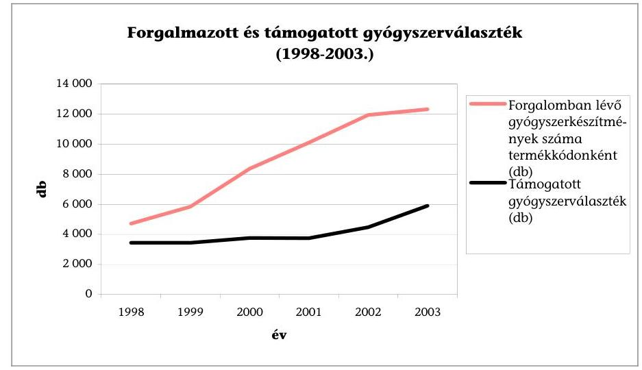

Az OEP-nél és az OGYI-nál a gyógyszerekről különböző, egymással össze nem hangolt nyilvántartásokat vezetnek. Az OGYI által törzskönyvezett és az OEP által támogatott gyógyszerek listája között nincs megfeleltetés.

Az OGYI gyógyszerforma és hatáserősség szerint törzskönyvezi és tartja nyilván a gyógyszereket. Az OEP - a támogatásával és finanszírozásával kapcsolatos feladatainak ellátásához - a törzskönyvezett gyógyszereket kiszerelési formánként is nyilvántartja.

Erre azért van szüksége, mert különböző kiszereléshez különböző támogatási öszszeg tartozik. A törzskönyvezett gyógyszerek és a különleges táplálkozási igényt kielégítő tápszerek társadalombiztosítási támogatásba való befogadásának szempontjaiból és a befogadás vagy a támogatás megváltoztatásáról szóló 32/2004. (IV. 26.) ESzCsM rendelet már szabályozza ezt a kérdést. Az előírást azonban csak abban az esetben lehet végrehajtani, ha az OGYI és az OEP megteremtik az egyértelmú kapcsolatot a gyógyszerlistáik között.

1998-tól 2003-ig az OGYI nyilvántartásában a törzskönyvezett, forgalomba hozható gyógyszerek száma 9,8\%-kal, 4581-ről 5029-re emelkedett. Az OEP szerint a patikai forgalomban kapható (különbözőféle kiszerelésű) vényköteles és vénynélküli gyógyszerek száma 2003-ban 12659 volt.

# Az OEP hatályos gyógyszer támogatási listáján több olyan készítmény található, amely egyidejüleg a törzskönyvből törölt gyógyszerek listáján is szerepel. 

Jogszabályi rendelkezés hiányában pontosan nem állapítható meg, hogy a társadalombiztosítás által még támogatott, de a törzskönyvből már törölt gyógyszer pontosan meddig lesz még forgalomban.

Ellenőrzésünk során a támogatási lista 1043 ellenőrzött tételéből 134 törzskönyvből törölt, de a társadalombiztosítás által még támogatott gyógyszert találtunk. (A 2004 májusban hatályos támogatási listán a törzskönyvből 2002-ben törölt gyógyszer is megtalálható.) A törzskönyvi törléssel egyidejúleg nem szűnik meg az adott gyógyszer forgalmazása, mivel az a szavatossági időn belül - „a rendelkezésre álló készlet erejéig" - még forgalmazható. A rendelkezésre álló készletről viszont sem a szaktárcának, sem az OGYI-nak, sem az OEP-nek nincs információja. Ha a törölt gyógyszer azonnali hatállyal lekerülne a támogatási listáról, a

---

gyógyszertárak készlete nem lenne értékesíthető, ez veszteséget okozna a forgalmazók számára.

A jogszabály nem írja elő a törzskönyvi törlés indoklását. Az OGYI megnézi ugyan, hogy a törölt gyógyszer helyettesíthető-e - vagy szükség esetén csak egyedi importtal oldható meg a betegek további ellátása -, de a gyógyszergyártót a törlési szándékában befolyásolni nem tudja. Kiugróan magas volt a törlések száma 2002-ben (679) és 2003-ban (524). Ezekben az években a törlések száma meghaladta a bejegyzések számát. Az OGYI-ban kapott tájékoztatás szerint általában akkor kerül sor egy gyógyszer törzskönyvi törlésére, ha a gyártónak a forgalmazás a hazai piacon már nem jövedelmező.

A bővülő gyógyszerválaszték kiadásnövelő hatása miatt világszerte előtérbe került az olcsóbb, ún. generikus gyógyszerek alkalmazásának jelentősége. ${ }^{27}$ A generikus gyógyszerek felhasználásának ösztönzését valamennyi egészségügyi kormányzat fontosnak tartotta, mivel az segítheti a hazai gyógyszerkiadások korlátozását.

A generikumok jellemzője, hogy az originális készítményekhez viszonyítva sokkal olcsóbbak. Ennek oka, hogy amikor egy originális gyógyszer szabadalma lejár, több gyártó is előállíthatja ugyanazt a készítményt anélkül, hogy terhelnék az eredeti hatóanyag magas kutatási költségei.

A generikus gyógyszerek felhasználásának ösztönzését célzó, a vizsgált években megtett kormányzati intézkedések hatásáról átfogó elemzések, értékelések nem készültek.

Az intézkedések eredményességi szempontok szerinti értékelését nehezíti, hogy a gyógyszer-támogatási kiadások tendenciái originális-generikus kritérium szerint nem elemezhetők. Ennek oka, hogy a támogatott generikumok számáról az OEP-ben nem készül nyilvántartás. A jövőben tervezett további intézkedések megalapozott előkészítését, hatásuk utólagos elemzését segítené a generikumok támogatott gyógyszerkörhöz viszonyított arányának az ismerete.

A Magyarországon forgalomba hozható originális készítmények száma jelenleg kétszeresen haladja meg a generikus gyógyszerek számát az OGYI törzskönyvi nyilvántartása szerint. Egymáshoz viszonyított $2 / 3: 1 / 3$ arányuk a vizsgált hat évben nem változott. 1998-ról 2003-ra a generikumok számának emelkedése alig 6\%-kal haladta meg az originális készítményekét.

[^0]
[^0]:    ${ }^{27}$ A generikus készítmények piacán a világon az Egyesült Államok, Kanada és Japán vezet, majd Nagy-Britannia és Németország következik. Ezekben az országokban a vények 30-50\%-án generikumot rendelnek. 2003-ban az EU-ban a felhasznált gyógyszerek mintegy 50\%-a generikum volt. Európában az elemzők további erőteljes növekedéseket prognosztizálnak 2007-ig a generikumok alkalmazása szempontjából, különösen az eddig nem számottevő francia, spanyol és olasz piacokon ( $30 \%$-os, $15 \%, 35 \%$-os növekedés). A magyarországi gyártók hazai eladásainak átlagosan 3/4-ét képviselik a generikumok.

---

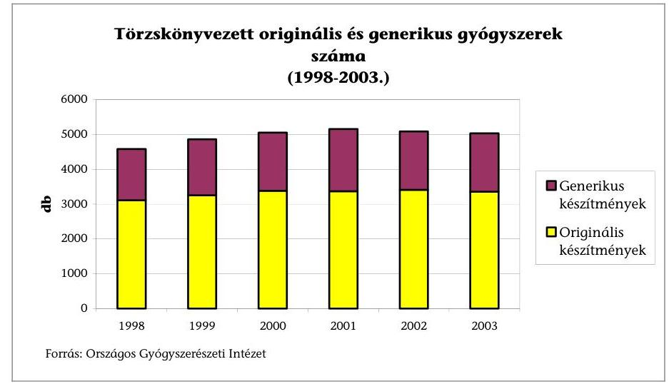

A generikus gyógyszerek rendelésének ösztönzését célozta az egyenértékú gyógyszerek helyettesíthetősége. Az intézkedés hatása nem értékelhető, mivel a helyettesítések számát az OEP nem tartja nyilván. Az OEP-nek nincs központi nyilvántartása arról, hogy a gyógyszertárakban hány recept beváltásakor került sor helyettesítésre. Így pontosan nem állapítható meg, hogy azt milyen arányban fogadják el a betegek és az sem, hogy az esetleges helyettesítések milyen kiadási megtakarítást jelentettek.

Az OEP adatbázisából a kiváltott gyógyszerek kérdezhetők le.
A gyógyszertárakban őrzött vények tételes ellenőrzésével lenne vizsgálható, hogy a receptre ugyanazt a készítményt írta-e fel az orvos, vagy helyettesítés történt.

# Orvosi és gyógyszerészi vélemények szerint az 1998 óta kormányrendeletben engedélyezett gyógyszertári helyettesítés a gyakorlatban nem múködik. 

Ha a felíró orvos a helyettesítést megengedi (és a vényen ezt megjelöli), az Ebtv. végrehajtásáról szóló kormányrendelet szerint a gyógyszerész köteles a betegek számára az olcsóbb készítmény felajánlására. A betegek általában nem kellően informáltak a helyettesítésről és ragaszkodnak a megszokott gyógyszereikhez. A lakosság egyenértékű gyógyszerekkel kapcsolatos hatékonyabb tájékoztatását segítheti az egészségügyi szaktárca által 2004 tavaszától múködtetett Dr. Info internetes portál.

Egy hazai piackutató intézet nemrég nyilvánosságra hozott reprezentatív felmérése szerint a betegek 72\%-ának ajánlott már fel gyógyszerválasztási lehetőséget az orvosa. A 60 évnél idősebbek az átlagnál nagyobb arányban bízzák orvosukra a döntést. A gyógyszer kiválasztásakor az ár főleg az 50 év felettieknél meghatározó.

Egyes európai országokban a generikus gyógyszerek felhasználását a felíró orvosok és a lakosság rendszeres tájékoztatásával próbálják ösztönözni.

A Francia Számvevőszék munkatársai 2001-ben ellenőrizték a gyógyszertári forgalmat, a lakossági gyógyszerfogyasztást. A generikumok fogyasztásának ösztönzésére a számvevők a rendelhető generikus gyógyszerek aktualizált listájának (az ún. „generikus listának") a havi közzétételét javasolták, az évente 2-3-szor

---

történő kihirdetéssel szemben. Javaslataik szerint költséghatékonysági elemzésekkel, az orvosok és gyógyszerészek továbbképzésével szintén ösztönözhető a generikumok fogyasztása.

Az OEP által támogatott gyógyszerek számának a változása, illetve az E. Alap gyógyszerkiadásainak tendenciái - megfelelő nyilvántartás hiányában - hazai-import gyógyszer-kritérium alapján nem elemezhetők.

Az OEP szerint a hazai és az import gyógyszer kategória nem értelmezhető. Az intézmény számára - a fogalmak meghatározásának hiánya miatt - nem egyértelmú, hogy a „gyártás helye, licence, a licence-el átadott promóciós jog, a csomagolás helye, az adózás helye" szempontjából kell egy gyógyszert hazainak vagy importnak tekintenie.

A hazai és az import gyógyszerekkel kapcsolatos törzskönyvezési, illetve forgalmi adatok az OGYI-nál, a gyártóknál, a nagykereskedőknél és a statisztikai kiadványokban megtalálhatók.
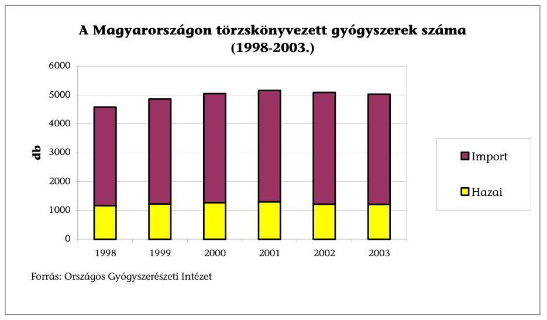

Az OGYI törzskönyvi nyilvántartásában hazainak tekintendő az a készítmény, amelyet Magyarország területén gyártanak függetlenül attól, hogy milyen nemzet tagja a törzskönyvi bejegyzést kérelmező. 1998-ban és 2003-ban a gyógyszerek átlagosan 24-25\%-a volt törzskönyvezett hazai készítmény, a többi import.

Megítélésünk szerint a társadalombiztosítás által támogatott hazai és import gyógyszerekre fordított közkiadások ismerete és rendszeres elemzése szükséges a döntéshozók számára, mivel egyes szakmai, gyógyszerforgalmazói publikációk szerint a hazai gyógyszerek háromszor olcsóbbak az importból származó készítményeknél.

Az OEP a hazai-import, originális-generikus gyógyszerek kategorizálása ügyében felvette a kapcsolatot az OGYI-val, azonban az adatok összehangolásában még nem történt előrelépés.

A gyógyszerek egyedi importja bővíti a gyógyszerválasztékot, növelve a lakosság és a társadalombiztosítás gyógyszerkiadásait.

Egyedi importtal a Magyarországon nem törzskönyvezett készítményekhez juthat hozzá a lakosság és a fekvőbeteg-ellátó intézmények. Az elmúlt években az egye-

---

di import iránti kérelmek jellemzően a törzskönyvezés alatt álló, vagy a hazai törzskönyvből már törölt készítményekre irányultak. Az egyedi importengedélyek száma közel kétszeresére emelkedett az elmúlt 3 évben és egyre növekvő támogatáskiáramlást generált. Egyedi importhoz 2003-ban az OEP 3777 betegnek nyújtott összesen 2,8 Mrd Ft támogatást.

EU-csatlakozásunk óta - a tagországokból származó - egyedi gyógyszerimportot a kórházaknak már nem kell az OGYI-val engedélyeztetni. 2004. május 1től az egyedi importról nem készül központosított nyilvántartás. Így már nincs közvetlen állami információ a fekvőbeteg intézmények egyedi import keretében beszerzett gyógyszereiről, annak költségkihatásairól.

# 3.2.2. A lakosság megbetegedési mutatói 

A hazai gyógyszerfogyasztás, a társadalombiztosítás és a lakosság gyógyszerkiadásainak növekedését meghatározó tényezők közül első helyen a lakosság egészségi állapota áll. Ezt támasztja alá az orvosi szakmai kollégiumok által megválaszolt kérdőívek összesítését követően felállított rangsor.

A lakosság körében előforduló megbetegedések részletes elemzését lehetővé tevő, megbízható megbetegedési (morbiditási) adatbázis nincs ${ }^{28}$ (kivéve az irányított betegellátási modellkísérlet körét). Országos szinten ez nehezíti a megbetegedési mutatók és a gyógyszerfogyasztási trendek kapcsolatának értékelését.

## A gyógyszerfelhasználás és a megbetegedések közötti kapcsolat elemzését akadályozó tényező, hogy a háziorvosoknál kezeltekről nincs pontos adatgyűjtési előírás. A lakosság gyógyszerfogyasztása és az adott klinikai szakterületre jellemző megbetegedési adatok között sincs megfeleltetés, a közöttük fennálló kapcsolatot nem elemzik.

A kórházi és a szakrendelői ellátásokról - a teljesítménydíjazás feltételeként megszabott adatjelentések részeként - a finanszírozó OEP havonta gyűjti a betegek adatait. A háziorvosi szolgálatoknak azonban nem kötelező rendszeresen adatot szolgáltatniuk a náluk befejezett ellátásban részesülő pácienseik betegségeiről.

Az OEP nyilvántartása szerint a legtöbbet a szív- és érrendszeri betegségek gyógyszereire „költi a társadalombiztosítás", ezt követik a központi idegrendszer, majd a tápcsatorna és anyagcsere betegségek gyógyszerei. Az egyes hatástani csoportok vényforgalma és a naturális mutatókban kifejezett összes lakossági gyógyszerfogyasztás változása azonos tendenciájú volt (12. számú melléklet).

A gyógyszer-támogatási kiadások hatástani (ATC) csoportok szerinti megoszlása azt mutatja, hogy 1998-2003. között a legnagyobb támogatás a szív- és érrendszeri megbetegedések gyógyítására alkalmazott gyógyszerekre jutott. Második helyen a központi idegrendszer, a harmadik helyen pedig a tápcsatorna és anyagcsere gyógyszerei találhatók.

[^0]
[^0]:    ${ }^{28}$ Ezt az ÁSZ az önkormányzati tulajdonban lévő kórházak pénzügyi helyzetének, gazdálkodásának vizsgálatáról szóló 0023 számú jelentésében is megállapította.

---

Az OECD 2004. évi statisztikai jelentése szerint Magyarországon a lakosság napi terápiás dózisban mért fogyasztása 1999 és 2002 között a szív- és érrendszeri gyógyszerek esetében $21 \%$-kal, a központi idegrendszer gyógyszereinél $10 \%$-kal, a tápcsatorna betegségei hatástani csoportban közel 5\%-kal növekedett (13. számú melléklet).

# Az egyes korcsoportok gyógyszer támogatására fordított kiadásokat elemezve megállapítható, hogy - más európai országhoz hasonlóan hazánkban is - az időskorúak gyógyszerfelhasználása a legnagyobb. 

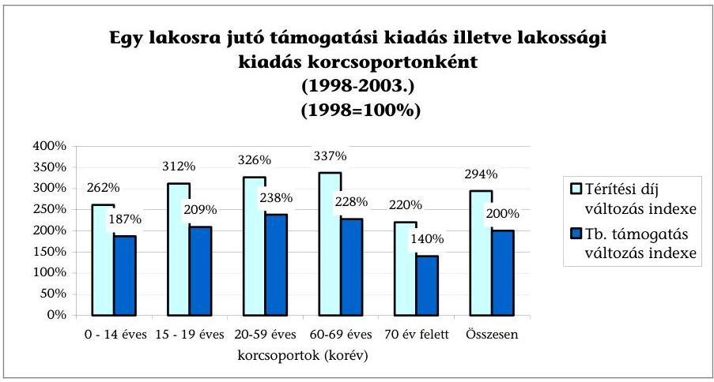

A nagyobb fogyasztás alapvetően az idősebb korúak között nagyobb arányban elforduló betegségek következménye.

Az OEP adatai szerint 1998-ban a 70 éven túli kategóriában 53.300 Ft , a 61-70 éves korcsoportban 23.400 Ft volt az egy főre jutó támogatott éves vényforgalom. A vizsgált években a legnagyobb lakossági kiadás növekedés a 60-69 évesek gyógyszereinél mutatkozott. Itt több mint háromszorosukra nőttek az egy lakosra átlagosan számított összegek. A 70 évesnél idősebbek átlagos gyógyszerkiadása megkétszereződött. 2003-ra valamennyi korcsoportban emelkedett az egy lakosra jutó átlagos támogatási kiadás.

A gyógyszerfogyasztás korcsoportonkénti trendjeit, az esetleges változások okait sem az OEP, sem a szaktárca nem elemzi rendszeresen, a fogyasztást befolyásoló tényezőkről speciális hatásvizsgálatok, értékelések nem készülnek.

A gyógyszerek mellékhatásai - mivel a megbetegedések jelentős hányadát okozzák - hozzájárulnak a gyógyszerfogyasztás növekedéséhez.

Norvégiában a kórházi felvételek 11\%-ára, Nagy-Britanniában 16\%-ára, Franciaországban 13\%-ára gyógyszer mellékhatások miatt került sor. Az Egyesült Államokban a mellékhatások a halálokok között a 4-6. helyet foglalják el.

Magyarországon a mellékhatás bejelentések száma - a nemzetközi adatokkal összehasonlítva - nagyon kevés. Az orvosok jogszabályban előírt negyedéves jelentési kötelezettsége az OGYI tájékoztatása szerint nem múködik. A szintén jogszabályban előírt súlyos és váratlan mellékhatások jelentése a jellemző. Míg az európai országokban 1 millió lakosra átlagosan 200-

---

250 bejelentés jut évente, addig Magyarországon ez nem haladja meg a 10-30at.

A gyógyszerek mellékhatásait az OGYI-nak kell bejelenteni. A nem klinikai vizsgálatból származó, ún. spontán jelentések kötelezettségét a Gytv. írja elő. A részletes szabályozást az emberi felhasználásra kerülő gyógyszerek törzskönyvezéséről és forgalomba hozataluk engedélyezéséről szóló 12/2001. (IV. 12.) EüM rendelet tartalmazza. A bejelentéseket megkönnyíti, hogy a szükséges, nemzetközi viszonylatban alkalmazott formanyomtatvány (az ún. „sárga lap") az OGYI honlapjáról letölthető. Az OGYI tájékoztatása szerint a spontán bejelentések 60-70\%a a gyógyszercégektől érkezik, számos esetben az orvosok is a gyógyszerforgalmazók közremúködésével jelentenek.

Az OGYI 700 kérdőívet küldött ki az orvosok részére annak érdekében, hogy mellékhatás bejelentési szokásaikat feltérképezze. A válaszok 78\%-a volt értékelhető. A válaszolók $65 \%$-a még soha nem jelentett be gyógyszer-mellékhatást (mert nem tudta hova kell küldeni, nem volt rá ideje stb.).

# 3.2.3. Az orvosok gyógyszerrendelése 

A társadalombiztosítási támogatás „utalványozásáról" a gyógyszer felírásakor az orvos dönt, ezáltal meghatározó szerepe van a lakosság gyógyszerfogyasztásában, a gyógyszerkiadások alakulásában.

A gyógyszerek rendeléséről és kiadásáról szóló 3/1995. (II. 8.) NM rendelet szerint gyógyszer felírására jogosult minden orvos és fogorvos, aki az orvosi diplomához kötött tevékenység folytatására jogosult és a külön jogszabályban ${ }^{29}$ meghatározott gyógyszer rendelésére jogosító bélyegzővel rendelkezik.

A rendelet kihirdetése óta több mint 30 -szor módosult, tartalmát tekintve azonban lényegesen nem változott. A változásokat az új gyógyszerek negyedévenkénti kihirdetései, továbbá a törzskönyvi bejegyzések és törlések okozták.

A hatályos Eütv. szerint az orvos gyógyítási szabadsága a tudományosan elfogadott vizsgálati és terápiás módszerek megválasztásában csak a jogszabályok által korlátozott. A jogszabályok azonban gyógyszerterápiás ajánlások, terápiás protokollok kötelező alkalmazását nem írják elő, az orvosok gyógyszerelési szokásait nem korlátozzák.

Az európai országokban az orvosok gyógyszer rendelési szokásainak (állam általi) befolyásolására többféle módszert alkalmaznak: pozitív és negatív gyógyszerlistákat ${ }^{30}$, terápiás ajánlásokat és orvosonként megállapított gyógyszerkereteket. Egyes országokban (például Franciaországban) a terápiás ajánlások alkalmazásában az orvosok anyagilag (pl. a javadalmazásukban) érdekeltek, az attól való eltérést szankcionálják.

[^0]
[^0]:    ${ }^{29}$ Az orvosi bélyegzőkről szóló 20/1991. (XI. 5.) NM rendelet
    ${ }^{30}$ A támogatásban részesülő termékeket pozitív listák, a kizárt gyógyszereket negatív listák tartalmazzák.

---

A vizsgált időszakban számos orvosi szakterület készített módszertani leveleket, szakmai ajánlásokat, terápiás protokollokat, gyógyszerterápiás eljárásokat. Követelményrendszerük azonban nem egységes, költségelemzések általában nem kapcsolódnak hozzájuk, az alkalmazhatóságukról nincs megbízható információ.

A szakmai kollégiumok által kitöltött kérdőívek szerint - szakterületének egy részére - 15 orvosi szakmai kollégium készített gyógyszerterápiás ajánlást. Az ajánlások száma szakmánként 1-5 közötti, bennük a válaszadók 61\%-a csak hatóanyagot, $10 \%$-a konkrét gyógyszereket, $29 \%$-a mindkettőt nevesített. A válaszadók kétharmada nyilatkozott úgy, hogy kidolgozásukkor költséghatékonysági szempontokra is figyelemmel volt. A kollégiumok $84 \%$-a saját szakterületükön továbbiak kidolgozását tartja szükségesnek.

A kérdőívek szerint rendszeresen 6, esetenként 16 kollégium kap visszacsatolást az ajánlásaik alkalmazásáról. 12 kollégium igen, 17 nem elemzi rendszeresen, hogy az ajánlásaik megfelelően alkalmazhatók-e. 27 kollégium szerint a kezelések mellékhatásait a szorosabb gyógyszerelési terápiák csökkentenék.

# Az orvosi szakmák nem kapnak visszacsatolást az általuk felhasznált gyógyszerek mennyiségéről és értékéről. A kérdőívek szerint az orvosi 

szakmai kollégiumok 87\%-a tartaná szükségesnek, hogy információval rendelkezzen a saját szakterületén felhasznált gyógyszerek mennyiségéről és értékéről.

Az OEP a gyógyszerrendeléssel kapcsolatos tájékoztatást 2003-ban a háziorvosoknál kezdte meg (lásd 3.3.1. pont). A bevezetés technikai tapasztalatait kiértékelte és erről tájékoztatta az ESzCsM-et, valamint a PM-et, de a hatás vizsgálatát az eltelt idő rövidsége miatt még nem végezhette el. A rendszer sorsának további alakításához szükséges a visszaigazolások hatásainak mielőbbi felmérése és értékelése.

Az orvosi szakterületek által eddig készített több száz szakmai irányelv, módszertani ajánlás felülvizsgálatát az egészségügyi szaktárca ebben az évben kezdte meg.

Az ESzCsM 2004. évre minőségfejlesztési projektet dolgozott ki, az Európában már bevezetett, bizonyítékokon alapuló („evidence based") protokollok hazai adaptációjára, költségigényük meghatározásával. Ennek alapján standard szempontrendszert állítottak össze a protokollfejlesztés módszereire, amelyet minisztériumi irányelvként jelentettek meg az Egészségügyi Közlönyben.

A 2004. április 1-jén hatályba lépett miniszteri rendelet ${ }^{31}$ mind az orvosi, mind a gyógyszerészi szakmai kollégiumok számára kötelezően előírja, hogy kidolgozza, folyamatosan felülvizsgálja és közzétegye a szakmai ajánlásokat, útmutatásokat és módszertani leveleket. Alkalmazásuk ellenőrzése a felügyelő szakorvosok feladata lesz.

[^0]
[^0]:    ${ }^{31}$ A szakmai kollégiumokról szóló 20/2004. (III. 31.) ESzCsM rendelet

---

# 3.2.4. A gyógyszerek reklámozása és ismertetése 

A gyógyszerreklámozás az orvosok rendelési szokásait, a betegek gyógyszerfogyasztását, a társadalombiztosítási támogatási, és az egészségügyi intézmények kiadásait egyaránt befolyásoló tényező.

A gyógyszerreklámozás magában foglalja az orvoslátogatói, gyógyszertárlátogatói tevékenységet, a termékismertető rendezvények, tudományos kongresszusok szponzorálását ${ }^{32}$. Irányulhat a lakosság vagy az egészségügyi szakemberek felé. Az uniós szabályokkal összhangban Magyarországon tilos a forgalomba hozatali engedéllyel nem rendelkező, a kizárólag vényre kiadható, a kórházi felhasználásra engedélyezett, illetve orvosi rendelők, gondozóintézetek részére beszerezhető gyógyszerek reklámozása, kivéve, ha az gyógyszerismertetésnek minősül. ${ }^{33}$

A gyógyszerek szélesebb körben történő reklámozását a gazdasági reklámtevékenységről szóló 1997. évi LVIII. törvény (a továbbiakban Grtv.) tette lehetővé. Ezt megelőzően az egészségügyről szóló 1972. évi II. törvény csak szakemberek számára, és csak egészségügyi intézményekben engedélyezte a gyógyszerek hirdetését. A Grtv. értelmében a lakosság részére a kizárólag vény nélkül kapható gyógyszerek reklámozhatók.

## A vizsgált időszakban bekövetkezett rendeletmódosítások jellemzően szigorították a gyógyszerek reklámozását. A gyógyszerforgalmazók reklám és promóciós költségeiről sem a szaktárcánál, sem az OEP-nél nem áll rendelkezésre információ.

Nemzetközi statisztikák szerint a gyártók a forgalom 12-15\%-át fordítják promócióra. Az Egyesült Államok gyógyszergyárai 1998-ban 12,5 Mrd USD-t, 2001-ben 19,1 Mrd USD-t költöttek promócióra, amely a teljes gyógyszerforgalom 12\%-át tette ki. Ennek 80\%-a irányult a felíró orvosokra.

A gyógyszeres terápiák fejlődéséről, az új készítményekről szóló információk elsősorban a gyógyszergyártók termékismertetőinek közvetítésével, illetve a gyártók által szponzorált konferenciákon jutnak el az orvosokhoz.

A gyógyszerismertetésben a gyártóknak van meghatározó szerepük a szakmai kollégiumok által kitöltött kérdőív szerint. A gyógyszergyárak után a második helyen az „egyéb" kategóriát nevesítették (pl. szakmai kiadványokat, továbbképzéseket, egyetemi tanszékeket, országos intézeteket). A szakmai kiadványok publikálásában és a szakmai továbbképzésekben szintén a gyógyszergyáraknak van meghatározó szerepük. Harmadik helyen áll az OGYI, majd ezt követi a média, és végül az ágazatirányító szaktárca.

[^0]
[^0]:    ${ }^{32}$ A Grtv. felhatalmazása alapján a gyógyszerreklámozás részletes szabályokat az egészségügyi, szociális és családügyi miniszter rendeletben határozza meg.
    ${ }^{33}$ Az Európai Parlament 2002. évi döntése alapján az EU-ban továbbra sem engedélyezik a vényköteles gyógyszerek reklámozását. A parlamenti döntést azzal indokolták, hogy az engedélyezés a gyógyszerfogyasztás növekedéséhez vezetne.

---

A válaszadó kollégiumok szerint a gyártóktól az új gyógyszerekről és terápiákról gyors, naprakész információkat kapnak a gyakorló orvosok. A kollégiumok a gyártói promóció hátrányának tartják a nem független, kontrollálatlan, orvosi szakmai információ átadást, továbbá azt, hogy egyes gyártók a másik készítmény negatív beállításával is megpróbálnak piacot szerezni. Az orvosi szakmák $42 \%$-a szerint további szigorításra lenne szükség a gyártók promóciós tevékenységének szabályozásában.

Finnországban - az orvosok és a gyógyszerészek körében - 2000-ben és 2002-ben is elvégzett felmérés eredményeként megállapították, hogy az orvosok a független, állami tájékoztatást preferálták a gyógyszercégek tájékoztatási tevékenységével szemben. Az érintett hatóságok rendszeresen monitorozzák, hogy a gyógyszerek törzskönyvezését, forgalmazását engedélyező hatóságtól konkrétan milyen információkra tartanak igényt az orvosok és gyógyszerészek.

Az orvoslátogatók tevékenységének engedélyezése és nyilvántartása az OGYI feladata. A tevékenység végzésére az OGYI államigazgatási határozatot és arcképes igazolványt ad ki. A gyógyszerismertetői engedély kiadása a vizsgálat lezárásakor ingyenes volt.

Az emberi felhasználásra kerülő gyógyszerek, gyógyszernek nem minősülő gyógyhatású készítmények reklámozásáról és ismertetéséről szóló 64/2003. (X. 31.) ESzCsM rendelet előírta, hogy az engedélyezés és a nyilvántartásba vétel diját külön jogszabályban kell meghatározni, de a vizsgálat lezárásáig ez nem történt meg.

A fent említett miniszteri rendelet lehetővé teszi, hogy a gyógyszerismertetői engedéllyel rendelkező orvos egészségügyi ellátást nyújtson, és a betegek számára gyógyszert írjon fel. A gyógyszerismertetői engedéllyel rendelkező orvosok gyógyszer-alkalmazási, rendelési szokásait sem a szaktárca, sem az OGYI, sem az OEP nem monitorozza, így nem ítélhető meg, hogy ez a „megengedő" rendelkezés befolyással van-e a lakosság gyógyszerfogyasztására.

A gyógyszerreklámozás szigorítására irányult jogszabályváltozások mellett, a korábbiakhoz képest enyhülést jelentett, hogy 2003-tól már nem csak orvos, fogorvos, vagy gyógyszerész lehet orvoslátogató, hanem biológus, vegyész, vagy egészségügyi főiskolát végzett személy is.

A gyógyszerismertetői engedéllyel rendelkezők száma a vizsgált 6 évben 2,5-szeresére emelkedett. Az 1998. évi 828 fővel szemben 2004. március 1-jén 2097 fő végezhetett gyógyszerismertetést.

Az egészségügyi szakemberek független információhoz jutását az OGYI-val szerződéses munkaviszonyban álló 40 gyógyszerismertető segíti. Az 1957 óta működő hálózat létszáma - a gyártói gyógyszerismertető hálózat bővülésével szemben - alacsony.

Az orvoslátogatók hatékonyabb ellenőrzése céljából a 64/2003. (X. 31.) ESzCsM rendelet bővítette az OGYI szankcionálási lehetőségeit.

A rendelet előírásainak megsértése esetén etikai eljárást kezdeményezhető a szakmai kamaránál, valamint ismételt jogszabálysértés esetén a reklámszolgáltató el-

---

leni határozatot az ESzCsM hivatalos lapjában közzéteheti és nyilvánosságra hozhatja, továbbá a gyógyszerismertetést végző személyt egy időre törölheti nyilvántartásából.

A gyógyszer reklámozás ellenőrzésében érintett központi szervek közötti feladat megosztás nem egyértelmúen szabályozott. A Grtv. 2004. évi módosításával az egészségügyi, szociális és családügyi miniszter felhatalmazást kapott, hogy a részletes szabályozás keretében meghatározza a reklámfelügyeleti eljárás lefolytatására jogosult szervek és az általuk végezhető eljárások körét.

A reklámtevékenységre vonatkozó rendelkezések betartásának ellenőrzését, valamint a szabálysértésekkel kapcsolatos eljárások lefolytatását a Fogyasztóvédelmi Főfelügyelőség, illetve felügyelőségek látják el. Egyes esetekben (pl. megtévesztő reklám) a Gazdasági Versenyhivatal, illetve a bíróság jár el. A rendelet az az OGYI-t jelöli meg szakhatóságként, aki szakvéleményt ad a határozathozatal előtt. A vizsgált időszakban a szakvélemények száma 12-45 között alakult, a határozatok alapján 100-200 E Ft-os bírságokat szabtak ki.

Az OGYI által - 2000. október és 2001. március között - ellenőrzött 112 patikai brosúrából 52 nem felelt meg a hatályos előírásoknak. (Például nem volt összhangban az elfogadott dokumentációval, vényköteles gyógyszert reklámozott stb.)

Az OGYI alapító okiratban foglalt tevékenysége a feladatkörével kapcsolatos információs és tájékoztatási rendszer múködtetése. Az egészségügyi szakemberek tájékoztatásában, szak és továbbképzésekben való részvételével, kiadványokkal, honlapjával, telefonos információ szolgáltatásával nyújt segítséget.

Az orvosi szakmai kollégiumok kérdőíves felmérése szerint a gyógyszercégeknek fontos szerepe van az egészségügyi szakemberek továbbképzéseinek támogatásában. A cégek az egészségügyi dolgozók kötelező továbbképzéseit is szponzorálják. (Jogszabály ezt nem tiltja.)

Az orvosok továbbképzéseinek gyógyszergyártók és forgalmazók általi szponzorálása sem a szaktárca, sem a finanszírozó OEP szerint „nem tartozik a cégek üdvözlendő tevékenységei közé". A gyártók gyógyszer-információs tevékenységének ellensúlyozása céljából azonban nem növekedett az állam szerepvállalása.

Az orvosok gyógyszerekkel kapcsolatos - alapító okiratba foglalt információs és tájékoztatási tevékenységéhez az állami költségvetés az OGYI számára nem biztosít forrást.

2004-től az OGYI teljes feladatellátásához a gyógyszergyártók és forgalmazók által befizetett hatósági díjak biztosítják a szükséges fedezetet. Az intézet 2004. évi költségvetési előirányzata 1,57 Mrd Ft. 2004-et megelőzően a költségvetési támogatás nem érte el az összes bevétel 10\%-át.

Az intézet egyes hatósági (például ellenőrzési) feladatainak ellátása - a függetlenség garantálása érdekében - azonban felveti az állami források bevonásának szükségességét.

---

Franciaországban - a függetlenség garantálása érdekében - a nemzeti törzskönyvező hatóság bevételéből minimum $25 \%$ állami finanszírozást tartanak szükségesnek. Kanadában legfeljebb a bevétel $66 \%$-a származhat a gyártók és forgalmazók befizetéseiből. Alapkövetelmény, hogy csak olyan tevékenységet finanszírozhatnak a gyártói befizetésekből, amelyhez kapcsolódóan az felmerült. Az Európa Parlament 2002-ben - a törzskönyvező és gyógyszerforgalmazást engedélyező nemzeti hatóságok finanszírozásában - az állami hozzájárulás fontosságát hangsúlyozta.

# 3.3. Törekvések a gyógyszerfogyasztás befolyásolására 

### 3.3.1. A háziorvosok racionális gyógyszerrendelését ösztönző rendszerek

A háziorvosi gyógyszerrendelés racionalizálása 2000 óta napirenden van. ${ }^{34} \mathbf{A}$ racionális gyógyszerfelírás pontos jelentését, céljait azonban a hatályos rendelkezésekben még nem határozták meg. A szabályozás a mindenkori - általában alultervezett - kassza előirányzatból való megtakarítást szabja feltételként. A „racionális" tehát ebben az értelemben „minél olcsóbb"ként értelmezhető.

A racionális gyógyszerfelírási rendszer kidolgozásával jelenleg egy operatív előkészítő bizottság foglalkozik. A bizottság a beteg szempontjából „optimális" gyógyszerrendelés ösztönzését célozta meg. (Az ún. minőségi gyógyszerezés ösztönzését, javasolják, elkerülendő az „alulgyógyszerezést"). Ennek a célnak az eléréséhez mintegy 2 Mrd Ft-ra becsülte a bizottság a szükséges ösztönző keret nagyságát. Az elképzelésük szerint szigorúbb ellenőrzések hozadéka kompenzálta volna a korszerű terápiák többletköltségeit.

A háziorvosok gyógyszerfelírási szokásainak racionalizálása érdekében az OEP információs rendszert alakított ki: 2003. júliustól a megyei pénztárak havonta tájékoztatják a háziorvosokat a gyógyszerrendeléseikről és az országos tendenciákról. ${ }^{35}$

A háziorvosok rendszeres havi kimutatást kapnak a hozzájuk bejelentkezett biztosítottak által kiváltott (a háziorvos által rendelteken túl más háziorvos, illetve szakorvosok által a saját praxisába tartozó betegeknek rendelt) gyógyszerekről és az ahhoz kapcsolódó TB támogatásról. Értesítést kapnak azokról a betegeikről, akik az adott hónapban 15 vénynél többet váltottak be a gyógyszertárakban, vagy 100 E Ft-nál magasabb értékű támogatást vettek igénybe (gyermek praxis esetén ez 10 vény és 50 E Ft ). 2004-től a tájékoztatás már nem papíron, hanem mágneses adathordozón történik.

Az OEP által múködtetett információs rendszer lehetőséget teremtett arra, hogy a háziorvosok gyógyszerfelírási szokásairól és a kiváltott gyógyszerek társada-

[^0]
[^0]:    ${ }^{34}$ Az Eü. tv. 2000. január 1.-i módosítása hatalmazta fel a Kormányt a háziorvosok racionális gyógyszerrendelését biztosító rendszer kialakítására.
    ${ }^{35}$ Az E. Alap 2003. évi gyógyszer támogatási előirányzatának betartásáról szóló 2356/2002. (XI. 28.) Korm. határozatban foglaltaknak megfelelően.

---

lombiztosítási támogatásáról a jövőben összehasonlító elemzések készüljenek. A tájékoztatási rendszer - bár egy fontos előrelépésnek tekinthető - önmagában még nem elegendő a háziorvosok gyógyszerelési szokásainak eredményes befolyásolásához. A program orvosi szakmai értékelési szempontjainak, ösztönzési módszereinek kidolgozása és azok rendszeres elemzése szükséges. Forrás hiányában az eddig elért eredmények jövőbeni hasznosulása kétséges.

Az E. Alap 2004. évi költségvetéséből - a költségvetési szigorító intézkedésekkel az orvosi érdekeltségi rendszerre előirányzott összegeket törölték.

A szakorvosok ma még nem kapnak tájékoztatást a gyógyszerrendeléseikről. A tájékoztatás kiterjesztését akadályozta, hogy az OEP-ben nem áll rendelkezésre a szakorvosi vizsgákat kezelő teljes körű és naprakész orvos nyilvántartás.

A racionális gyógyszerfelírási rendszer kidolgozását előkészítő operatív bizottság kereste annak lehetőségét, hogy az adatszolgáltatásba a szakorvosokat is bevonják. A tájékoztatás szükségességét azzal indokolták, hogy a szakorvosok gyógyszerrendelése jelentősen képes befolyásolni a háziorvosnál jelentkező betegek gyógyszeres terápiáit. A szakorvosok tájékoztatásának szükségességét az is indokolja, hogy az OEP szerint a gyógyszerkassza kiadásainak több mint felét a szakorvosok rendelése generálja.

# 3.3.2. A közgyógyellátási rendszer átalakítása 

A gyógyszerkiadásokat mérséklő intézkedések körében a közgyógyellátási rendszer átalakítása folyamatosan napirenden van. A vizsgált időszakban azonban a közgyógyellátás rendszerében, annak szabályozásában lényeges változás még nem történt.

A vizsgált időszakban intézkedési csomag készült a közgyógyellátási listán levő gyógyszerek - orvosi szakmai javaslatok alapján történő szűkítésére. 2004. januártól szűkítették a gyógyszert rendelő orvosok körét. Az OEP és a szaktárca véleménye szerint indokolt a közgyógyellátás szociális és egészségügyi okok szerinti elkülönítése. Ennek érdekében elkezdték a szociális törvény módosítását.

Az OEP ellenőrzési tapasztalatai azt mutatják, hogy a közgyógyellátásra jogosultak az esetek többségében a betegségük által indokolt mennyiséget meghaladóan részesülnek gyógyszerellátásban. Ennek megelőzésére olyan új eljárásrend bevezetése szükséges, amely - a szociális rászorultság és a térítésmentesség csorbítása nélkül - az egyén betegsége által indokolt gyógyszerfelhasználást segíti elő.

Az E. Alap 2003. évi gyógyszertámogatási előirányzatának betartásáról szóló 2356/2002. (XI. 28.) Korm. határozat szerint 2003. július 1-jétől a közgyógyellátásban meg kell valósítani az elektronikus pénztárca (chipkártyán tárolt személyes gyógyszerkeret) alkalmazását.

A gyógyszerügyi szakmai egyeztetések után a technikai megvalósításra pilot projekt indult. A pilot projektben 5 gyógyszertár vett részt. A projekt eredményeire alapozva 2003. decemberében nyílt közbeszerzési eljárást hirdettek meg. Az eljárás eredményét 2004. márciusában hirdették meg, a vizsgálat befejezésekor a

---

szerződést még nem kötötték meg. A tervezett rendszer on-line patikai adatkapcsolattal múködne, ezáltal a közgyógyellátás igénybevételét azonnal ellenőrizhetővé tenné. Az új rendszer bevezetéséhez szükséges jogszabály-módosítások előkészítése a helyszíni ellenőrzés lezárásának időpontjában még folyamatban volt.

# 3.3.3. Az irányított betegellátási rendszer 

Az irányított betegellátási rendszer 1999-ben indult. Bevezetésének célja a költségvetési keretek hatékonyabb felhasználása volt. Jogi hátterét a társadalombiztosítás pénzügyi alapjainak 1999. évi költségvetéséről szóló 1998. évi XCI. törvény teremtette meg. ${ }^{36}$

A fentiekben hivatkozott törvény szervezőkre bízta a betegellátás megszervezését és az érdekeltség közvetítését az egészségügyi szolgáltatók (kórházak, szakrendelők, háziorvosi szolgálatok stb.) felé. A vizsgálat lezárásakor a rendszer keretében 11 szervezőnél 1 millió lakos egészségügyi ellátása folyt.

Az IBR fejkvótán alapuló normatív finanszírozási rendszer. Normatív díjazás hivatott fedezni a szervezés és a megelőzés költségeit. Alapvető sajátossága, hogy a gyógyító-megelőző ellátási (háziorvosi, kórházi fekvőbeteg ellátási, járóbeteg szakellátási) és gyógyszertámogatási, gyógyászati segédeszköz és gyógyfürdő ellátási kasszák egymás között „átjárhatók". Ez az átjárhatóság lehetővé teszi, hogy az IBR szervezői a legkedvezőbb ellátás felé „irányítsák" a betegeket.

Az IBR-ben a gyógyszertámogatás nem tér el lényegesen az országos átlagtól. A szervezők körében „az egy betegre jutó gyógyszertámogatási összegek 2001-ben 1\%-kal voltak magasabbak az országos átlagnál." ${ }^{37}$ Az IBR múkódtetésének második és negyedik évében az egy lakosra jutó országos átlag gyógyszertámogatás $95 \%$-át, illetve $91,5 \%$-át mutatta ki az OEP.

Az IBR anyagilag érdekeltté teszi a résztvevőket a költségesebb mútéteket kiváltó gyógyszerterápiás ellátások kihasználásában és bővítésében. A gyógyszerrendelés elszigetelt pénzügyi-gazdasági értékelése azonban nem elegendő. A rendszer múködésének, eredményességének minősítéséhez a fekvőbeteg ellátás értékelése is elengedhetetlen.

Az OEP minden egyes ellátás számbavételével, minden szervezőnek különkülön, kasszánként kiszámítja az eredményeit. Ez az alapja az ellátásokban elért megtakarítások címén kifizetett díjazásoknak.

A gyógyszerkasszában a modellkísérlet 1999. évi megkezdésétől 2003. október 31-ig 950,3 M Ft elvi megtakarítást számítottak ki, de az ellátások racionalizálásának elismeréséül ennél 172,6 M Ft-tal többet, összesen 1.122,9 M Ft-ot fizettek ki.

[^0]
[^0]:    ${ }^{36}$ Az ÁSZ 2004. augusztus második felében kezdte meg az irányított betegellátási modell ellenőrzését, jelentését várhatóan 2005-ben hozza nyilvánosságra.
    ${ }^{37}$ Az Irányított Betegellátási Modell bemutatása, OEP, 2002. augusztus 7.

---

Ennek az az oka, hogy az esetleges szervezői veszteségnek a gyógyszerkasszára nincs hatása. Ezzel szemben a számított megtakarítást ténylegesen kifizeti az OEP a szervezőnek a gyógyszerkassza terhére (hacsak a szervező más kasszáit nem kell azok veszteségeinek erejéig „feltölteni" a gyógyszer-felhasználási megtakarításából).

2003-ban az IBR megtakarításaként a gyógyszerkassza terhére 331,8 M Ft-ot fizettek ki. A 2003. év gyógyszertámogatási megtakarítása összesen 365,6 M Ft volt.

Az, hogy az adott év gyógyszertámogatási jogcíméről mekkora összegű megtakarítás került kifizetésre, függ a bázisévben a szervezők részére kiutalt előlegektől és attól, hogy hogyan alakult a gyógyszertámogatásokban az IBR-nek a kiadásbevétel egyenlege, valamint a többi ellátás egyenlege.

A túlzott anyagi érdekeltség, a betegek „alulkezelésének" elkerülésére 2003-tól a jogszabályi rendelkezések visszafogták a prémiumként kifizethető megtakarításokat. A degresszíven megszabott prémiumhatárok feletti megtakarításokat veszteségkompenzálásra, fejlesztésre, illetve prevencióra kell fordítani.

# Az OEP rendszeresen készített értékeléseket az IBR-ben ellátott bete- 

gek gyógyszerfelhasználásáról. Az elemzett alapadatok, mutatószámok köre azonban változó volt, amely nem tette lehetővé a folyamatok, tendenciák egységes szemléletű bemutatását. Az egységes értékeléshez szükséges adatfajták kijelölésének és az egységes elemzési módszer meghatározásának hiányában az eddigi értékelésekre nehezen alapozhatók központi intézkedések.

Az IBR 2003 első félévében készült gyógyszerügyi értékeléséből látható, hogy a szervezők az Eü 100\%-os és a 100\%-os normatív támogatási jogcímeknél az országos átlagnál 5-10\%-kal kevesebb támogatási összeget vettek igénybe. Mérséklődött a modellkísérletbe bevont közgyógyellátottak gyógyszerfelhasználása.

Gyógyszerfelhasználás szempontjából kedvezően értékelhető, hogy az IBR-ben résztvevő háziorvosok számára - a bejelentkezettek TAJ-száma szerint - az OEP teljeskörű tájékoztatást nyújt, amely lehetővé teszi a más orvosok általi esetleges párhuzamos gyógyszerfelírások kiszűrését.

2002-ben az irányított betegellátás bővítési lehetőségeit munkacsoport vizsgálta. A munkacsoport a gyógyszertámogatással kapcsolatban két javaslatot tett. Az egyik az volt, hogy a gyógyszerkassza évközi - és ne az előző évi - változásait kövesse a fejkvóta számítása, a másik a patikák érdekeltségi rendszerbe vonásáról szólt. Megfelelően kidolgozott prognózis hiányában eddig nem rögzítették, hogy mi a bővíthetőség optimális üteme, és azt sem, hogy ettől milyen pozitív vagy negatív hatások várhatók.

## 4. UtóELLENŐRZÉS

Az Állami Számvevőszék 1998-ban önálló vizsgálat keretében ellenőrizte a „különkeretes" gyógyszertámogatási rendszert. Ezt követően a társadalombiztosítás pénzügyi alapjainak zárszámadásai keretében, majd az E. Alap átfogó ellenőrzésekor vizsgálta a különkeretes gyógyszerekre fordított kiadások alakulását.

---

Javaslataink közül a különkeretes gyógyszerek beszerzési folyamatának szabályozása a gyógyszerek és gyógyászati segédeszközök beszerzéséről és forgalmazásáról szóló 110/2000. (VI. 29.) Korm. rendelet, valamint a beszerzésre kerülő gyógyszerhatóanyagokról szóló 46/2000. (XII. 18.) PM-EüM együttes rendelet kihirdetésével teljesült.

Jogszabályok továbbra sem tartalmazzák a betegségcsoportok, illetve a gyógyszerek különkeretbe való befogadásának alapelveit. Nem történt elmozdulás a fekvőbeteg ellátásban alkalmazott különkeretes gyógyszerek esetleges kettős -gyógyító-megelőző kasszából és gyógyszerkasszából történő - finanszírozásának rendezése terén.

Előrelépés, hogy a különkeretes készítmények alkalmazásához szakmai protokollokat dolgoztak ki, de az OEP nem alakított ki rendszert a nyilvántartásukra. A szerződések nyilvántartása, a szállítások és fizetési teljesítések, a pénzügyi egyeztetések terén rendszeressé vált az együttmúködés az OEP gyógyszerügyi főosztálya és a számviteli főosztálya között. A gyógyszerek felhasználását számítógépes rendszerben - mennyiségben és betegenként azonosítható módon nem tartják nyilván.

Az E. Alap 2000. évi zárszámadásáról szóló ÁSZ jelentés javasolta az OEP főigazgatójának, hogy dolgozzon ki javaslatot az Ebtv. 26. §-a alapján nyújtható méltányossági ellátások egységes, betegérdekeket szem előtt tartó finanszírozási és támogatási rendjének szabályozására. A szabályozásra a 28/2003. számú főigazgatói utasítással került sor. A méltányossági ellátásokat a Kormány a 130/2003. (VIII. 22.) számú rendeletével szabályozta.

Az E. Alap 2002. évi zárszámadásának vizsgálatát követően az ÁSZ javasolta, hogy az Egészségügyi Minisztérium értékelje az irányított betegellátási modell gyógyszertámogatással kapcsolatos kérdéseit. A Magyar Köztársaság 2004. évi költségvetéséről és az államháztartás hároméves kereteiről szóló 2003. évi CXVI. tv. 112. §-a szerint az Országgyúlés felhatalmazta az egészségügyi, szociális és családügyi minisztert, hogy rendeletben határozza meg az irányított betegellátási modellkísérlet értékelésének módját és szakmai szempontjait. A rendelet a vizsgálat lezárásakor még nem készült el. Az irányított betegellátási rendszer 4 éves múködésének tapasztalatait az OEP 2004 elején értékelte.

Az E. Alap múködésének ellenőrzéséről szóló 2003. júliusi jelentésében az ÁSZ javasolta a gyógyszer támogatási előirányzat zárt jellegének a felülvizsgálatát. Az előirányzat zártságát nem oldották fel. A teljesített kifizetések időarányos előirányzathoz viszonyított túllépését 10\%-os mértékig a pénzügyminiszter, ezt meghaladóan a Kormány engedélyezi.

Budapest, 2004. október 18.

| Melléklet: | 17 db | 20 lap |
| :-- | --: | --: |
| Függelék: | 2 db | 6 lap |

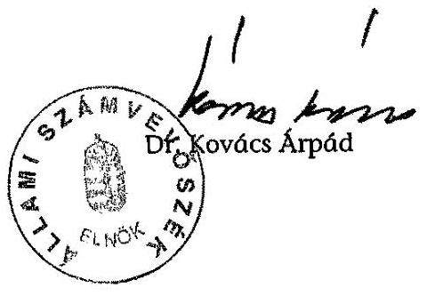

---

# MELLÉKLETEK

---

# EGÉSZSÉGÜGYI, SZOCIÁLIS ÉS CSALÁDÜGYI MINISZTÉRIUM   MINISZTER 

Szám: 34094-4/2004-0008GYO

Dr. Kovács Árpád
elnök úr részére

Állami Számvevőszék

## Budapest

## Tisztelt Elnök Úr!

A gyógyszerek támogatási és finanszírozási rendszerének, a fogyasztás helyzetének ellenőrzéséről készített jelentés megküldését köszönöm. A jelentéssel kapcsolatban az alábbi észrevételeket teszem.
A jelentés alapos elemzésről, a vizsgált terület többirányú megközelítésének igényéről tanúskodik, az egyes vizsgált területeket a gyógyszerellátási rendszer egészébe igyekeznek elhelyezni.

Egyetértek azon megállapítással, hogy a vizsgálatok lefolytatását nehezítette, hogy az ellátó rendszerre vonatkozó szabályozás s az ellátó rendszer gyakorlata, a vizsgálat időpontjában erőteljes „mozgásban" volt. Az árbefagyasztásra vonatkozó kormányzati döntés, a gyógyszergyártók és a kormány közötti megállapodás továbbá az EU tagság elnyerésével kapcsolatos munkák komoly befolyásoló tényezők voltak.

---

A jelentés az egységes fogalom használat érdekében „értelmezések" fejezetet is tartalmaz, amely azon meghatározásokat, fogalmakat írja körül, melyeket a vizsgált területeken munkálkodó szakemberek is eltérő tartalommal használnak.

Az összegző megállapítások, az intézkedésekre tett javaslatok korrektek, döntő többségük a rendszer működésének javítását szolgálja. Néhány esetben a javaslat már folyamatban lévő intézkedési tevékenységet jelöl meg. A megállapításokkal foglalkozó fejezetben többször használják az „állami adat", „független állami adat, „állami forrásból származó adat" fogalmát, amelynek részletes tartalmát viszont nem határozzák meg.

Élve az ellenőrzés alapján elrendelt intézkedésekről adandó válaszadás lehetőségével, már most jelzem, hogy a Kormány részére megfogalmazott javaslatok döntő többsége a szabályozott gyógyszerpiaci rendtartás koncepciójában szereplő témakör.

A Kormány részére tett javaslatokról a jelentésben szereplő sorrendben az alábbi összefoglalót adom:

1. A feladat teljesítése megkezdődött egyrészt a szabályozott gyógyszerpiacra vonatkozó törvény koncepciójának Kormány elé terjesztésével, másrészt a törvény norma szövegének szakmai egyeztetésével.
2. Az EU transzaperencia irányelvének átvételével kapcsolatos jogi szabályozás a kihirdetési, döntési határidőket megállapította, ami a feladat teljesítését jelenti.
3. A gyógyszerkiadások folyamatos figyelemmel kísérése és értékelése megtörténik. A gyógyszerek piacára vonatkozó új törvényi szabályozás e feladat teljesítéséhez is biztosít garanciális elemeket.
4. Az érintett tárcák bevonásával (IM, PM, MEH, ESZCSM és OEP) valamint a bírósági gyakorlat alapos elemzésével készülünk fel a feladat teljesítésére.
5. A feladat megfogalmazása során nem voltak figyelemmel a nemzetközi lehetőségekre (EU). A nemzetközi ár-összehasonlítás hazai rendszerének kialakítása érdekében már megkezdődtek az előkészületek, amelyeket az EU tervekkel indokolt összehangolni.
6. A gazdasági reklámtevékenységre vonatkozó törvény módosítására 2004. augusztus 1. napjával került sor. A törvényi szabályozás a gyógyszerpiaci rendtartás normaszövegeinek kimunkálása során tovább alakulhat. A feladat teljesítése folyamatban van.

---

7. Az állami szerepvállalás lehetőségeinek növelését a gyógyszerpiaci új szabályok kimunkálása során kell meghatározni.
8. Az OGYI számára költségvetési források biztosítását, új feladat ellátás (módszertani munka stb.) esetén tartjuk indokoltnak megvizsgálni.

Az egészségügyi szociális és családügyi miniszter részére tett javaslatok döntő százaléka már részben jogszabályi megfogalmazásra került, részben a fentebb említett törvényi szabályozás végrehajtási rendeleteiként kerülnek kidolgozásra.

Az OGYI Szervezeti és Működési Szabályzata jóváhagyásra került.
Az ÁSZ jelentés alapján elrendelt további intézkedésekről 30 napon belül tájékoztatást fogok adni.

Budapest, 2004. október $\mathcal{N}_{\text {A }}$.
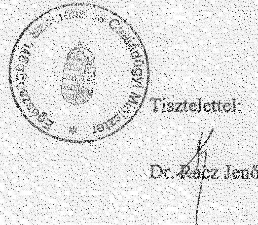

---

# Állami Számvevőszék 

## Dr. Rácz Jenő úr

miniszter
Egészségügyi, Szociális és Családügyi Minisztérium

## Budapest

## Tisztelt Miniszter Úr!

A gyógyszerek támogatási és finanszírozási rendszerének, a fogyasztás helyzetének ellenőrzéséről szóló jelentésünkre megküldött észrevételét köszönettel megkaptam.

Külön megköszönöm tájékoztatását a javaslatainkkal összefüggő, megkezdett, illetve folyamatban lévő vagy tervezett intézkedéseikről. Mindezek alapján úgy vélem, hogy együttes erőfeszítéseink már a közeli jövőben eredményre vezethetnek.

Tájékoztatom Miniszter urat, hogy az ellenőrzésről készült jelentést - kialakult gyakorlatunk szerint - az Ön észrevételeivel és az azokra adott válaszommal együtt küldőm meg az Országgyűlés elnökének, illetékes bizottságai elnökeinek és a Miniszterelnöknek.

Egyidejűleg miniszteri kinevezése alkalmából szeretném kifejezni jókívánságomat, munkájához sok sikert és jó egészséget kívánok.

Budapest, 2004. október 18 .

Tisztelettel:
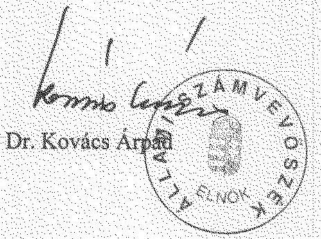

---

2. számú melléklet

a V-37-113/2003-2004. sz. jelentéshez

Tizennégy OECD tagállam egészségügyi kiadása a GDP %-ában

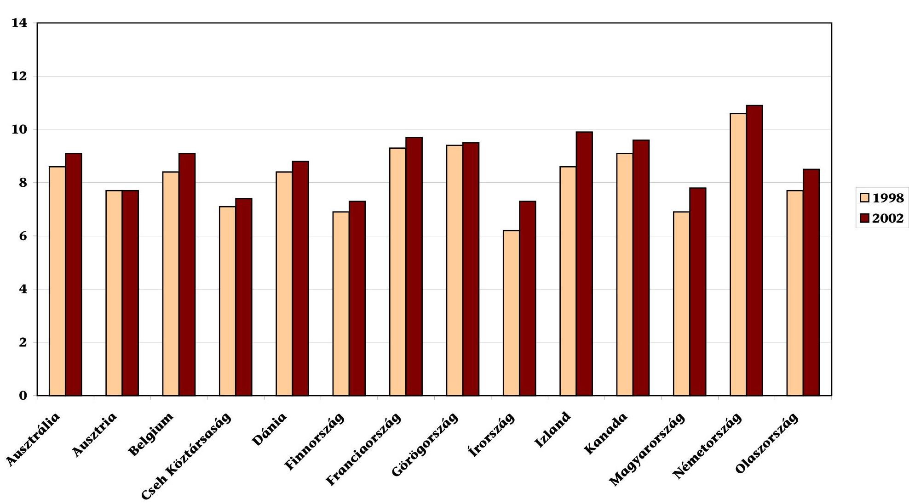

Forrás: OECD Health Data 2004.

---

# Gyógyszerekre fordított közkiadások aránya a GDP \%-ában 

(1998-2002.)
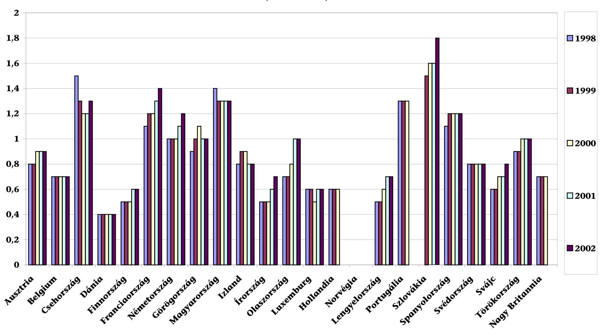

---

# Gyógyszerre fordított közkiadások (1998-2003.) 

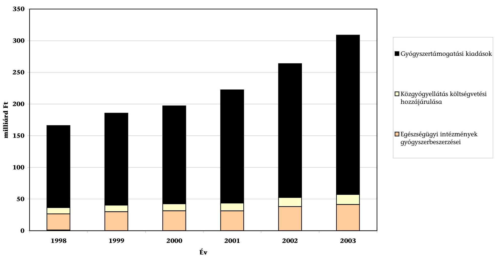

---

## A) A gyógyszer életútja

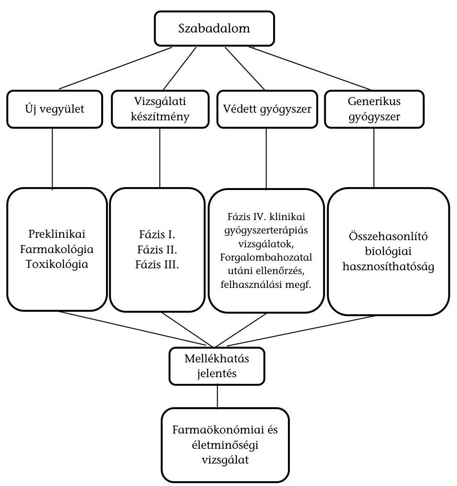

## B) A gyógyszertörzskönyvezés éremmodellje

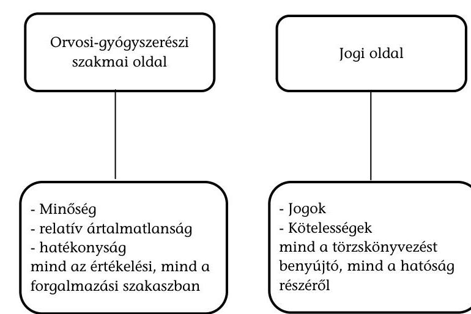

---

# A hazai egészségügyi szakellátás gyógyszer forgalmának egyszerúsített vázlatai 

A) Az intézményi gyógyszerek útjának vázlata
B) A gyógyszer elszámolás elvi folyamat vázlata*
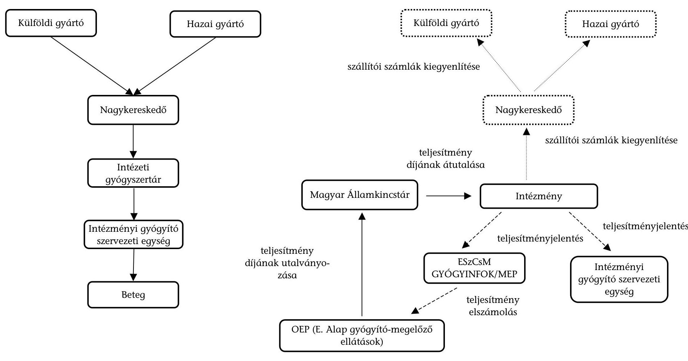

Megjegyzés:

* A vázlatok nem jelzik az egyes speciálisan támogatott (külön keretes stb.) gyógyszerek forgalmát.
" A gyógyszereket a finanszírozó nem elkülönítve, hanem a gyógyítási esemény teljesítményének összevont díjában finanszírozza.

---

# A gyógyszerek nagykereskedelmi és kiskereskedelmi árrése 

| Termelői ár 1997.01.15-től 1999.07.14-ig (Ft-ban) | Nagyker. árrés |  | Termelői ár 1999.07. 15-től napjainkig (Ft-ban) | Nagyker. árrés |  |
| :--: | :--: | :--: | :--: | :--: | :--: |
|  | \%-ban | Ft-ban |  | \%-ban | Ft-ban |
| 0,01 - 35,0 | 16 | - |  | 12 | - |
| 35,01 - 40,0 | - | 5,6 |  | 12 | - |
| 40,01 - 150,0 | 14 | - |  | 12 | - |
| 150,01 - 175,0 | - | 21 | 150,01 - 180,0 | - | 18 |
| 175,01 - 300,0 | 12,0 | - | 180,01 - 300,0 | 10 | - |
| 300,01 - 327,0 | - | 36 | 300,01 - 333,0 | - | 30 |
| 327,01 - 500,0 | 11,0 | - | 333,01 - 500,0 | 9 | - |
| 500,01 - 550,0 | - | 55 | 500,01 - 600,0 | - | 45 |
| 550,01 - 1000,0 | 10,0 | - | 600,01 - 1000,0 | 7,5 | - |
| 1000,01 - 1176,0 | - | 100 | 1000,01 - 1154,0 | - | 75 |
| 1176,01 - 2000 | 8,5 | - | 1154,01 - 2000,0 | 6,5 | - |
| 2000,01 - 2429,0 | - | 170 | 2000,01 - 2600,0 | - | 130 |
| 2429,01 - | 7 |  | 2600,01 - | 5 | - |

| Nagykereskedelmi ár (Ft-ban) | Kiskereskedelmi árrés 1997.01.15-től 2003.12.31-ig | Nagykereskedelmi ár (Ftban) | Kiskereskedelmi árrés 2004.01.01-től |
| :--: | :--: | :--: | :--: |
| 0 - 200 | 30\% | 0 - 500 | 26\% |
| 201 - 500 | 26\%, de legalább 60,-Ft | 501 - 590 | 130 Ft |
| 501 - 1500 | 20\%, de legalább 130,-Ft | 591 - 1500 | 22\% |
| 1501 - 3500 | 18\%, de legalább 300,-Ft | 1501 - 1737 | 330 Ft |
| 3501 - | 16\%, de legalább 630,-Ft, 2001.07.01-től 630,-Ft | 1738 - 3500 | 19\% |
|  |  | 3501 - 3911 | 665 Ft |
|  |  | 3912 - 5000 | 17\% |
|  |  | 5001 - | 850 Ft |

---

# Támogatott gyógyszerek számának változása 1998-ról 2003-ra

---

# A társadalombiztosítási támogatásba való befogadás és a támogatás megállapításának fö lépései 2004. május 1-től 

Forgalomba hozatali engedély tulajdonosa OEP
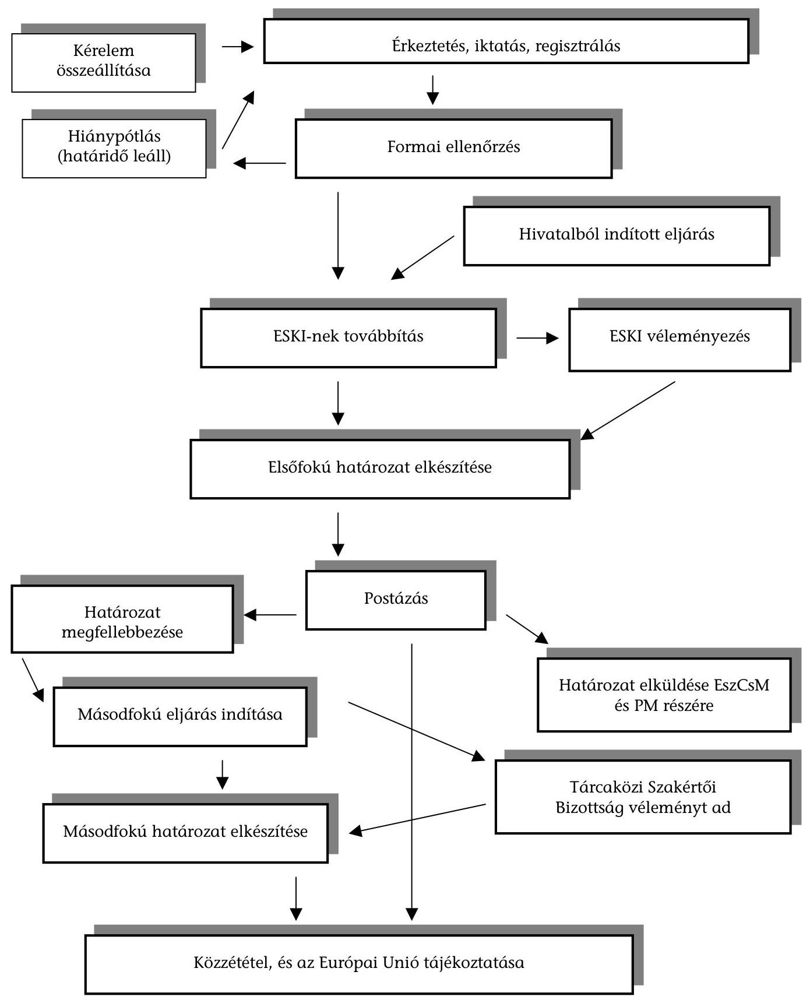

ESKI: Egészségügyi, Stratégiakutató Intézet

---

# A támogatott gyógyszerkészítmények árváltozásai (1998-2004.)

|  Árváltozás időpontja | Mértékét meghatározó tényezők | Várt árindex-
mérték (\%)
(gyártók,
Kormány) | KSH havi árindex (\%)
(lakossági térítési díjak
indexe)  |
| --- | --- | --- | --- |
|  1998. január 1. | a gyártói áremelési szándékok korlátozott elfogadása
nemzetközi árak alapján | 105,7 | 113,1  |
|  1999. március 1. | legfeljebb 3\%-os emelést fogadtak el | 103 | 110,2  |
|  1999. július 15. | nagykereskedelmi árrés 2\%pontos csökkentése | 102 | 117,7  |
|  2001. július 1. | 3 éves Megállapodás szerint: 6,3\%-os és 500,-Ft-os ár
alatt 10\%-os emelés, kiskereskedelmi árrés csökkentése | 107 | 112,8  |
|  2003. február 1. | gyártók 3 éves szerinti áremelési szándékának (106,4)
el nem fogadása, 600,-Ft alatti gyógyszerek árának
(és támogatásának) 20\%-os emelése | 103,2 | 103,3  |
|  2003. május 1. | helyettesíthető, drága termékek törlése
EÜ90 támogatású termékek köréből |  | 99,9  |
|  2003. július 1. | új típusú diabetes gyógyszerek támogatása,
alapanyagok áremelése |  | 101,1  |
|  2004. január 1. | 5\%-os áfa, betegség alapú támogatás: fix támogatás
kiterjesztésével drága, helyettesíthető termékek
támogatása csökken | 108 | 115,4  |

---

# Az egy vényre jutó gyógyszerforgalom alakulása támogatási kategóriánként (Ft/db) 

(1998-2003.)
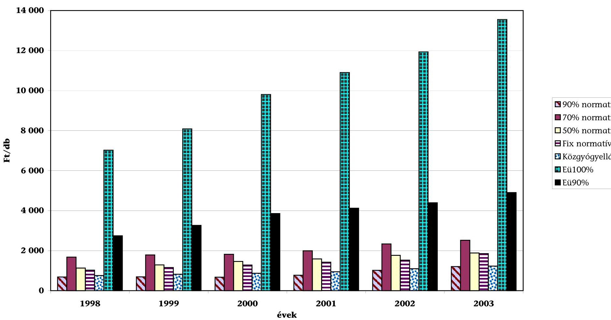

---

# A gyógyszertámogatási kiadás megoszlása ATC csoportok szerint 

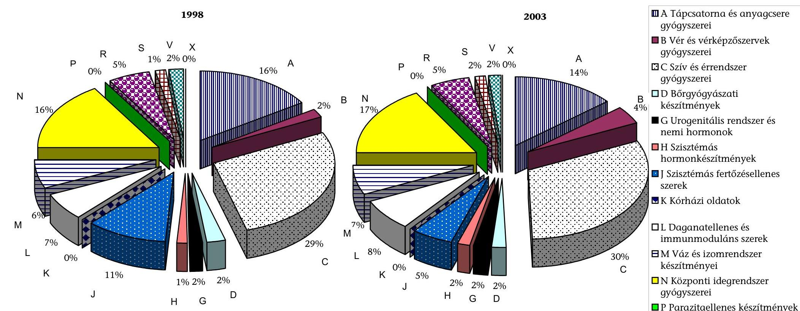

---

# A legnagyobb arányt képviselő 4 hatástani csoport 1 főre jutó fogyasztása DDD/1000 lakos/nap 

(1998-2002.)
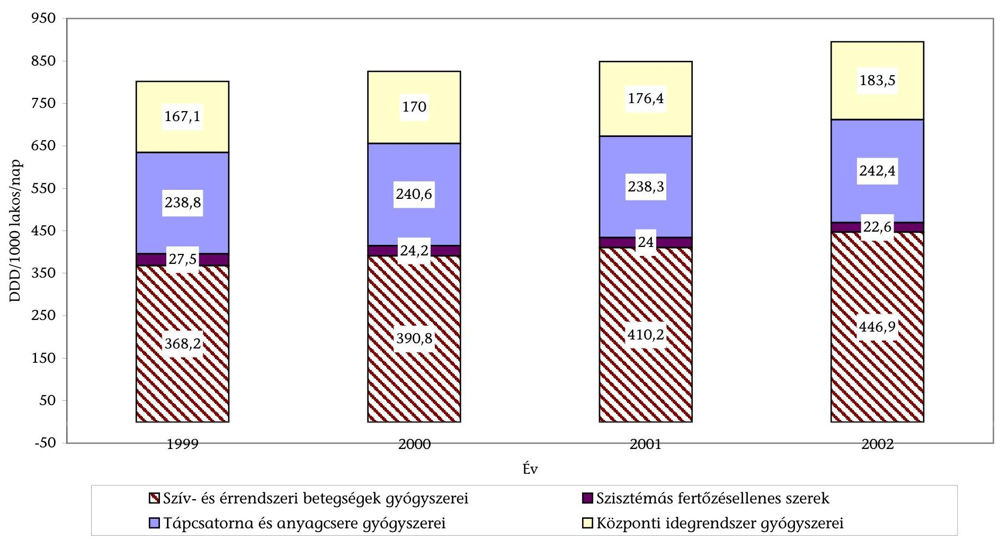

---

# Adatok és mutatók a gyógyszerek támogatási és finanszírozási rendszerének értékeléséhez, elemzéséhez (1998-2003.)

|  Sorsz. | Megnevezés | 1998 | 1999 | 2000 | 2001 | 2002 | 2003 | 2003/1998  |
| --- | --- | --- | --- | --- | --- | --- | --- | --- |
|   | ALAPADATOK |  |  |  |  |  |  |   |
|  1. | Gyógyszerforgalom összesen, fogyasztói áron (M Ft) (KSH, 2003. évi adat még nincs) | 191176 | 229758 | 250125 | 295483 | 344262 |  |   |
|  2. | Támogatott gyógyszerek forgalma fogyasztói áron (M Ft) (KSH, 2003. évi adat még nincs) | 162300 | 188082 | 204198 | 241292 | 283357 |  |   |
|  3. | Hazai gyógyszerválaszték (db) | 784 | 819 | 846 | 1295 | 1222 | 1209 | $154,2 \%$  |
|  4. | Import gyógyszerválaszték (db) | 3949 | 4196 | 4364 | 3861 | 3868 | 3810 | $96,5 \%$  |
|  5. | Támogatott gyógyszerválaszték (db) ${ }^{*}$ | 3435 | 3435 | 3752 | 3747 | 4472 | 5898 | $171,7 \%$  |
|  6. | Vények száma (ezer db) | 155792 | 162735 | 157744 | 163087 | 161778 | 161420 | $103,6 \%$  |
|  7. | Gyógyszerforgalom összesen, nagykereskedelmi áron (M Ft) | 178268 | 207575 | 229243 | 274698 | 327709 | 387975 | $217,6 \%$  |
|  8. | Originális készítmények száma (db) ${ }^{* *}$ | 3107 | 3251 | 3383 | 3369 | 3412 | 3352 | $107,9 \%$  |
|  9. | Generikumok száma (db) ${ }^{* *}$ | 1474 | 1607 | 1667 | 1787 | 1673 | 1677 | $113,8 \%$  |
|  10. | Gyógyszerforgalom összesen, kezelési napok számában (DOT) | 3699583473 | 3896076571 | 3987052531 | 4165602663 | 4388648812 | 4561143210 | $123,3 \%$  |
|   | MUTATÓSZÁMOK |  |  |  |  |  |  |   |
|  11. | Támogatás mértéke a teljes patikai gyógyszerforgalomra (\%) | $70,4 \%$ | $65,3 \%$ | $66,5 \%$ | $63,2 \%$ | $63,9 \%$ | $61,5 \%$ | $87,4 \%$  |
|  12. | Támogatás mértéke a támogatott gyógyszerforgalomra (\%) | $83,5 \%$ | $73,3 \%$ | $75,7 \%$ | $78,2 \%$ | $73,9 \%$ | $74,0 \%$ | $88,6 \%$  |
|  13. | Gyógyszer árszínvonal változás a KSH árindexe alapján (\%/év) | $114,3 \%$ | $112,2 \%$ | $103,1 \%$ | $109,3 \%$ | $102,6 \%$ | $105,6 \%$ | -  |
|  14. | Egy vényre eső támogatás (Ft/db) | 831 | 893 | 1025 | 1096 | 1306 | 1558 | $187,5 \%$  |
|  15. | Gyógyszerkiadások évente a GDP \%-ában (\%) | $1,9 \%$ | $2,0 \%$ | $1,9 \%$ | $2,0 \%$ | $2,1 \%$ | $2,2 \%$ | $116,1 \%$  |
|  16. | Generikus készítmények számaránya (\%) ${ }^{* *}$ | $32,2 \%$ | $33,1 \%$ | $33,0 \%$ | $34,7 \%$ | $32,9 \%$ | $33,3 \%$ | $103,6 \%$  |
|  17. | Egy lakosra jutó gyógyszerforgalom fogyasztói áron (Ft/fő/év) | 18204 | 22075 | 24251 | 27754 | 32184 |  |   |
|  18. | Egy lakosra jutó tb. ártámogatás összege (Ft/fő/év) | 12812 | 13416 | 14066 | 16330 | 19383 |  |   |
|  19. | A gyógyszer támogatás részesedése a természetbeni ellátásokon belül (\%) | $29,6 \%$ | $27,7 \%$ | $27,1 \%$ | $28,8 \%$ | $27,9 \%$ | $27,4 \%$ | $92,6 \%$  |

[^0] [^0]: *Január 1-i adatok. 2001-ben és 2003-ban az évközi változások hónapokkal súlyozott átlagértékei. ${ }^{* *}$ Az Országos Gyógyszerészeti Intézet adatai

---

# Helyszínen ellenőrzött központi szervezetek és egészségbiztosítási pénztárak 

## I. Helyszínen ellenőrzött központi szervezetek:

1. Országos Egészségbiztosítási Pénztár
2. Egészségügyi, Szociális és Családügyi Minisztérium
3. Országos Gyógyszerészeti Intézet
4. Pénzügyminisztérium

## II. Helyszínen ellenőrzött egészségbiztosítási pénztárak:

1. Baranya megyei Egészségbiztosítási Pénztár, Pécs
2. Békés megyei Egészségbiztosítási Pénztár, Békéscsaba
3. Fővárosi és Pest megyei Egészségbiztosítási Pénztár, Budapest
4. Veszprém megyei Egészségbiztosítási Pénztár, Veszprém
5. Zala megyei Egészségbiztosítási Pénztár, Zalaegerszeg
6. Vasutas Társadalombiztosítási Igazgatóság, Budapest

Az egészségbiztosítási pénztárak kiválasztása 8 kritérium alapján történt, az alábbiak szerint:

| Kritérium megnevezése |  |
| :-- | :-- |
| 1. | Külön-külön régióbeli elhelyezkedés; |
| 2. | Népesség száma; |
| 3. | Háziorvosokhoz bejelentkezettek száma; |
| 4. | Halálozások száma tényleges lakhely szerint; |
| 5. | A megyei lakosságarányt meghaladó orvosi vényrészesedés; |
| 6. | Az egy lakosra jutó összes, illetve támogatott gyógyszerforgalom az országos   átlag feletti illetve alatti; |
| 7. | A gyógyszertámogatás részesedése a lakosság arányát meghaladó illetve el   nem érő; |
| 8. | Az irányított betegellátási modellkísérletben való részvétel, mivel a „kísér-   letben" résztvevő egészségügyi intézmények anyagilag érdekeltek a gyógy-   szer közkiadások csökkentésében. |

Az egészségbiztosítási pénztárak kijelölésekor az Országos Egészségbiztosítási Pénztár érintett szakembereinek véleményét és az Állami Számvevőszék Önkormányzati és Területi Ellenőrzési Igazgatósága által rendelkezésünkre bocsátott munkaerő kapacitást is figyelembe vettük.

---

# Teljesítménykritériumok értékelése a gyógyszerek támogatási és finanszírozási rendszerének, a fogyasztás helyzetének ellenőrzéséhez

I. Főbb ellenőrzési területek: a gyógyszerek árképzési, és ártámogatási rendszere, a gyógyszerkassza kiadásai, finanszírozás, támogatás folyósítás, vényellenőrzés, a felíró orvosok ellenőrzése, gyógyszerfogyasztás, gyógyszerrendelés, és tájékoztatás,

|  Kritérium-
csoport (1-
től 4-ig) | Eredményességi kritérium |  | Eredmé-
nyességi
szint | Értékelés  |
| --- | --- | --- | --- | --- |
|  4/1. Gyógy-
szerforga-
lom, gyógy-
szerrende-
lés, és tájé-
koztatás | 1. | A leggyakoribb krónikus betegségek kezelésére kiadott terápiás ajánlások folyamatos bővítése és betartásának ellenőrzése. | teljesülés | a több száz szakmai irányelv szakmai felülvizsgálata megkezdődött, a protokollok végrehajtásának ellenőrzése érdekében a szakfelügyeleti rendszer átalakítását tervezi a háziorvosi hálózatban  |
|   | 2. | Az egészségügyi miniszteri rendeletek módosításakor a humán gyógyszerek szakmai cél reklámozásának szabályait oly módon megváltoztatni, hogy az új szabályozás ésszerű korlátok közé terelje a gyártók és forgalmazók reklámtevékenységét. | teljesülés | 2004-től folyamatban van  |
|   | 3. | A racionális gyógyszerfelírást elősegítő orvosi ösztönző rendszer kidolgozása, és a 2002. évi bevezetés feltételeinek megteremtése. | teljesülés | 2003 júliusától a háziorvosok részletes tájékoztatást kapnak a betegeik által kiváltott gyógyszerekről  |

---

|  Kritérium-
csoport (1-
től 4-ig) |  | Eredményességi kritérium | Eredmé-
nyességi
szint | Értékelés  |
| --- | --- | --- | --- | --- |
|  4/1. Gyógy-
szerforga-
lom, gyógy-
szerrende-
lés, és tájé-
koztatás | 4. | Az antibiotikumok indokolatlan rendelésének visszaszorítása, különös tekintettel a járóbeteg
ellátásban történő antibiotikum rendelés újraszabályozására. | teljesülés | az antibiotikumokra
vonatkozó szabályo-
zás nem jelent meg  |
|   | 5. | Az orvosok érdekeltségi rendszerének bevezetése a társadalombiztosítási támogatással történő
gyógyszerrendelési jogosultság módosításával. | teljesülés | folyamatban van  |
|  4/2. A
gyógyszerek
árképzési, és
ártámoga-
tási rend-
szere | 1. | Artárgyalások lebonyolítása a következő szempontokkal:
- a fix összegű támogatás kiterjesztése;
- a generikus helyettesíthetőség kiszélesítése; | teljesülés | teljesült,
figyelembe vették a
szempontok kihir-
detésénél  |
|   | 2. | Az egészségügyi rendelkezésre 100% és 90% támogatással rendelhető gyógyszerek körének fel-
lülvizsgálata oly módon, hogy azonos hatóanyag esetében az alacsonyabb napi terápiás költi-
ségű készítmény részesüljön kiemelt támogatásban. |  | részben teljesült
a felülvizsgálat 2001.
után megtörtént, az
elv nem érvényesült
maradéktalanul  |
|   | 3. | A jogszabályban nevesített speciális indikációk kivételével a vény nélkül rendelhető gyógysze-
rek társadalombiztosítás által történő támogatásának megszüntetése. |  | teljesült
megszüntették  |
|   | 4. | A támogatás alapjául szolgáló árak nem haladhatják meg a legolcsóbb európai árakat. |  | nem teljesült
nem voltak európai
katalógusok  |
|   | 5. | A támogatás alapjául szolgáló ármegállapodásra irányuló tárgyalások a hatóanyag-beszerzés
árelfogadásán alapuljanak, lefolytatásuk az összehasonlíthatóság érdekében azonos ható-
anyag esetében több gyártóval egy időben, különböző hatóanyagok esetében gyártónként és
gyógyszerenként. |  | teljesült
eszerint hirdették meg
és folytatták le  |
|   | 6. | A gyógyszer-támogatási előirányzat várható túllépésének ellensúlyozása. |  | részben teljesült
javaslatok folyamato-
san készültek, de az
eredményüket, hatá-
sukat nem elemezték,
részleges megvalósu-
lás  |

---

|  Kritérium-
csoport (1-
től 4-ig) |  | Eredményességi kritérium | Eredmé-
nyességi
szint | Értékelés  |
| --- | --- | --- | --- | --- |
|  4/2. A
gyógyszerek
árképzési, és
ártámoga-
tási rend-
szere | 7. | A járóbeteg-ellátás keretében rendelt gyógyszerek árához nyújtott támogatások elszámolásának
és folyósításának újraszabályozása a Kormány hatáskörében. | teljesülés | teljesült
jogszabályalkotással,
a jogszabályi megfelel
tettéts érdekében, a
134/1999. Korm. ren-
delettel  |
|   | 8. | Megállapodás a gyártókkal és a forgalmazókkal a 2000-2003. közötti időszakra a gyógyszerek
termelői, import beszerzési ár alakulására úgy, hogy az árak a tárgyalások időtartama alatt ne
növekedjenek. | teljesülés | teljesült
a hároméves megállapodásban figyelembe vették  |
|   |  | A megállapodásban arra törekedni, hogy az feleljen meg a Kormány dezinflációs politikájának,
azaz a gyógyszerek termelői, import beszerzési ára 2000-ben tovább ne emelkedjen, és 2001-
2003-ban ne haladja meg a tervezett inflációs mérték 70%-át. |  |   |
|   | 9. | Törekvés a 2000. évben lefolytatandó ártárgyalásokon az alábbiak érvényesítésére: |  |   |
|   |  | Csak azon új hatóanyagot tartalmazó gyógyszer és új generikus készítmények támogatási rend-
szerbe való befogadása történhet meg, amelyek a gyógyszerkassza betarthatósága szempontjából jelentős előnyökkel járnak. | teljesülés | teljesült
ezekkel a feltételekkel
hirdették meg  |
|   | 10. | A referencia-termék árát legalább 20%-kal meghaladó árszintű készítmény-támogatásban nem
részesülhet. |  | 2002-re teljesült  |
|   | 11. | A 2001. áprilistól érvényes gyógyszer-támogatás szabályozása az alábbi elvárások szerint:
- a támogatási rendszer feleljen meg a 89/105/EGK irányelvnek; |  | részben teljesült
2004. május 1-től
megkezdődött a módosítási javaslat kidolgozása az irányelv figyelembe vételére  |
|   | 12. | A támogatási rendszer az egészségpolitikai, népegészségügyi, orvos-szakmai szempontok figyelembevétele mellett biztosítsa a támogatási előirányzat betarthatóságát; |  | nem teljesült
az előirányzatot túllépték  |

---

|  Kritérium-
csoport (1-
től 4-ig) |  | Eredményességi kritérium | Eredmé-
nyességi
szint | Értékelés  |
| --- | --- | --- | --- | --- |
|  4/2. A
gyógyszerek
árképzési, és
ártámoga-
tási rend-
szere | 13. | A támogatási rendszer egészség-gazdaságtani elemzések eredményei alapján szelektáljon. | teljesülés | részben teljesült
a TÁTB 2000. nyarán
kezdte meg működését
és figyelembe vette a
javaslatok kialakításánál, de előkészítő
elemzések, anyagok
hiányában nem tudta
érvényesíteni a szem-
pontokat  |
|   | 14. | A támogatási rendszer a támogatás alapjául elfogadott ár meghatározott százaléka szerint dif-
ferenciált, de konkrét megjelenési formájában a lehető legszélesebb körben meghatározott (fix)
összegű; | teljesülés | részben teljesült
folytatódik a fix ösz-
szegű támogatás ki-
szélesítése  |
|   | 15. | A támogatások megállapításánál törekedni arra, hogy a költséghatékony gyógyszerek közül
elsőülegesen azok kapjanak támogatást, amelyek a betegségek gyógyítása szempontjából nélkülözhetetlenek; | teljesülés | részben teljesült
a költséghatékonysági
elemzéseket nem al-
kalmazzák a törekvés
ellenére  |
|   | 16. | Támogatásban csak az a gyógyszer részesülhet, amelynek a termelői ára nem magasabb az
európai OECD tagországok katalógusaiban kihirdetett legalacsonyabb termelői árnál. | teljesülés | nem teljesült
a szükséges adatok
hiánya miatt  |
|   | 17. | Az 50 %, és 70 %-kal támogatott körbe csak azon új hatóanyagok kerülhetnek be, melyek napi
terápiás költségre számított ára 2001-ben legfeljebb 20%-kal - 2002. és 2003. során legfeljebb
30%-kal - haladja meg az azonos négyszintű (ötjegyű) ATC-kód alá tartozó és 2000-ben már
támogatásban részesülő gyógyszer az emberi felhasználásra kerülő gyógyszerek, tápszerek ár-
megállapításáról szóló 108/2000. (VI. 29.) Korm. rendeletben meghatározott árát. | teljesülés | teljesült
2001. nyarán auto-
matikus befogadást
eredményezett  |
|   | 18. | Fix csoporton belüli referencia ár korlátozása a csoport-átlagárnál alacsonyabb egységnyi hatóanyagra vetített árú, legnagyobb forgalmú gyógyszer árára. | teljesülés | teljesült
beépült a 217/1997.
(XII. 1.) Korm. rende-
letbe  |

---

|  Kritérium-
csoport (1-
től 4-ig) |  | Eredményességi kritérium | Eredmé-
nyességi
szint | Értékelés  |
| --- | --- | --- | --- | --- |
|  4/2. A
gyógyszerek
árképzési, és
ártámoga-
tási rend-
szere | 19. | Az egészségügyi jogcím alapján 100%-os, illetve 90%-os támogatással rendelhető gyógyszerek
körének felülvizsgálata és a gyógyszeres terápia racionalizálása. | teljesülés | nem teljesült,
bár a GYAB javaslata
elkészült, de a tám-
gatási lista módosítá-
sánál nem hasznosult  |
|   | 20. | A közgyógyellátás jogcímén térítésmentesen beszerezhető gyógyszerek körének költséghaté-
konysági szempontok alapján történő felülvizsgálata és szükséges újraszabályozása. | teljesülés | nem teljesült
a költséghatékonysági
szempontok alapján
történő felülvizsgálat
és újraszabályozás
nem történt meg  |
|   | 21. | A közgyógyellátás intézmények felülvizsgálata és újraszabályozása. | teljesülés | részben teljesült,
jelenleg technikai
előkészületek folynak
(Elektronikus pénztá-
ca projekt)  |
|   | 22. | Az alábbi társadalombiztosítási kiadásokat mérséklő intézkedések kidolgozása:
- a betegség alapú támogatás bevezetése. | teljesülés | részben teljesült
2002-ben kezdődött,
azóta folyamatosan
bővül  |
|   | 23. | Az azonos hatóanyagú fix összegű támogatás kiszélesítése. |  | folyamatosan  |
|   | 24. | Az árvolumen megállapodások. |  | 2003. február 1-től
lépett életbe, új befo-
gadásokat szolgált, a
kiadásokat nem mér-
sékelte  |

---

|  Kritérium-
csoport (1-
től 4-ig) |  | Eredményességi kritérium | Eredmé-
nyességi
szint | Értékelés  |
| --- | --- | --- | --- | --- |
|  4/3. A
gyógyszer-
kassza ki-
adásai, fi-
nanszírozás,
támogatás-
folyósítás | 1. | Évenkénti, eredeti gyógyszer-támogatási előirányzatok megtartása. | teljesülés | nem teljesült  |
|   | 2. | A gyógyszertámogatás éves költségvetési előirányzatának zárása. (Első ízben a társadalombiz-
tosítás pénzügyi alapjainak 1999. évi költségvetéséről szóló 1998. évi XCI. tv.) | teljesülés | teljesült,
de az előirányzat be-
tarthatóságát nem
segítette elő  |
|  4/4. Vényel-
lenőrzés, a
felíró orvo-
sok ellenőr-
zése | 1. | Az ellenőrzés gyakoriságának növelése a felírt vények esetében. Visszaélés esetén a szabályta-
lanságot elkövető orvos társadalombiztosítási támogatással történő gyógyszerrendelési joga
megszüntetésének. kezdeményezése a hatályos kormányrendelet alapján. | teljesülés | teljesült  |
|   | 2. | Jelentés a vényellenőrzés hatékonyságáról és fejlesztéséről. | teljesülés | teljesült  |
|   | 3. | A visszaélések megelőzéséhez szükséges jogszabályi rendelkezések felülvizsgálata. | teljesülés | nem teljesült
a visszaéléseket kezelő
jogszabályi hátteret az
illetékes miniszter
nem módosította  |

# II. A teljesítményellenőrzés során alkalmazott módszereink:

- ÁSZ teljesítményellenőrzési útmutatójának áttekintése;
- jogszabályok, belső szabályzatok, egyéb dokumentumok értékelése, összehasonlító elemzése;
- egyéb információs források tanulmányozása (pl. Internet, intranet), nemzetközi és hazai szakirodalom áttekintése;
- korábbi, kapcsolódó ÁSZ anyagok áttekintése (előtanulmányok, számvevői jelentések, ÁSZ jelentések és tanulmányok);
- strukturált interjúk (az előkészítés és a helyszíni ellenőrzés szakaszában egyaránt) a vizsgálandó szervezetek tárgyban érintett munkatársaival;
- fókusz-csoport: az ellenőrzés előkészítő szakaszában, az ellenőrzési szempontok kialakításához;
- kérdőíves felmérés helyszínen nem ellenőrzött válaszadóknál;
- helyszíni ellenőrzés keretében dokumentumok, adatállományok, statisztikai kimutatások, indikátorok áttekintése, elemzése és értékelése, a vizsgálati programban foglaltak és a strukturált kérdésfa szerint;
- tanúsítványok elemzése és értékelése, bench-marking;

---

# STRUKTURÁLT KÉRDÉSFA 

## a gyógyszerek támogatási és finanszírozási rendszerének, a fogyasztás helyzetének ellenôrzéséhez

| Az ellenőrzés fő kérdése: | Eredményesek, célszerúek és hatékonyak voltak-e a gyógyszerkiadások növekedési ütemének mérséklése érdekében eddig megtett állami intézkedések? |
| :--: | :--: |
| Az ellenőrzés 3 legfőbb alkérdés csoportja: | 1. Rendelkezésre álltak-e a szükséges feltételek a gyógyszerek fogyasztásának állami befolyásolásához, a gyógyszerkiadások növekedési ütemének eredményes csökkentéséhez?   2. Eredményesen befolyásolták-e a gyógyszerek ár- és támogatási rendszerének, finanszírozásának módosításai a lakosság és a társadalombiztosítás gyógyszerkiadásainak alakulását, a gyógyszerkassza előirányzatait célszerűen és hatékonyan használták$e$ fel?   3. Történtek-e újabb kezdeményezések, van-nak-e további jövőbeni lehetőségek a gyógy-szer-támogatási kiadások, a fogyasztás növekedési tendenciájának megváltoztatására? |

---

# 1. Rendelkezésre álltak-e a szükséges feltételek a gyógyszerek fogyasztásának állami befolyásolásához, a gyógyszerkiadások növekedési ütemének eredményes csökkentéséhez? 

1.1. Egyértelmúen meghatározottak-e a gyógyszerfelhasználás, a forgalmazás, a rendelés és a támogatás alapelvei, jogszabályi környezete?
1.1.1 Meghatározták-e a gyógyszerfelhasználás, a forgalmazás, a rendelés és a támogatás rendszerének alapelveit, stratégiai céljait?
1.1.1.1. Az alapelvekből kiindulva készültek-e megalapozott rövid, közép és hosszú távú koncepciók, fogalmaztak-e meg egyértelmú, világos és végrehajtható stratégiai célkitűzéseket, folyamatosan értékelték és elemezték-e a kitűzött célok megvalósítása terén elért eredményeket?
1.1.1.2. Figyelembe vették-e a koncepciókat, a stratégiai célokat a mindenkori kormányzati célkitűzések megfogalmazásakor, összhangban voltak-e a koncepciók az egészségpolitikai célokkal?
1.1.2 Megfelelően szabályozott-e a gyógyszer fogalma, a felhasználás, forgalmazás, a rendelés és a támogatás rendszere?
1.1.2.1 Világosan, egyértelműen, egymással és az EU szabályozókkal összhangban definiálják-e a hatályos törvények, kormány és miniszteri rendeletek a gyógyszerek fogalmát, a felhasználás, a rendelés, a forgalmazás, és a támogatás rendszerét?
1.1.2.2 Folyamatosan értékelték-e a különböző rendelet-módosítások hatását a gyógyszerkiadások tendenciáira; komplex módon kezelték-e a gyógyszerkiadások szempontjából meghatározó területek szabályozását (felhasználás, rendelés, forgalmazás és támogatás) a rendeletek módosításait követően átláthatóbbá, egyértelműbbé és EU-konformmá vált-e a hazai gyógyszerszabályozási rendszer?
1.1.3 Megalapozottak voltak-e a gyógyszerkiadások befolyásolására, növekedési ütemének csökkentésére irányult kormányzati intézkedések?
1.1.3.1 Hozott-e komplex intézkedéseket a mindenkori kormányzat annak érdekében, hogy lassítsa a lakosság és a társadalombiztosítás, valamint az egészségügyi intézmények gyógyszerkiadásainak növekedési ütemét?
1.1.3.2 Tükröződtek-e az intézkedésekben népegészségügyi és orvosi szakmai prioritások, egészség-gazdaságtani, költséghatékonysági szempontok, vagy döntően adminisztratív jellegű beavatkozások történtek?
1.1.3.3 A gyógyszerkiadásokkal kapcsolatos egymást követő kormányhatározatok egymással összefüggésben voltak-e (vannak-e), szervesen egymásra épül-

---

tek-e, az újabb határozatok megfogalmazásakor figyelemmel voltak-e az előzőekkel elért eredményekre, rendszeresen monitorozták-e, folyamatosan elemezték-e és értékelték-e a hozott intézkedéseket, vizsgálták-e azok összhangját a stratégiai célokkal?

# 1.2. Növekedett-e a lakosság gyógyszerfogyasztása, történtek-e változások a fontosabb mutatók trendjeiben? 

1.2.1 Változott-e a gyógyszerkiadásokat nemzetgazdasági szinten jellemző mutatók értéke?
1.2.1.1 Változott-e a gyógyszerkiadások egy lakosra jutó összege, a GDP-hez, egészségügyi összkiadásokhoz viszonyított aránya, közkiadások aránya évenként és egyes nyugat-európai államokhoz viszonyítva?
1.2.1.2 Elemezték és értékelték-e rendszeresen ezen mutatók alakulását, és figyelembe vették-e a döntés-előkészítési folyamatokban?
1.2.2 Változtak-e a lakossági gyógyszerfogyasztás trendjei?
1.2.2.1 Változott-e az ezer lakosra jutó éves gyógyszerfogyasztás, a fogyasztói áron, továbbá a kezelési napok számában kifejezett éves gyógyszerforgalom, az egy főre jutó hazai, illetve import gyógyszerfogyasztás, a vényköteles és a vény nélküli gyógyszerek forgalma, egymáshoz viszonyított aránya, és a lakossági térítési díjak nagysága? Változott-e az originális készítmények és a generikumok egymáshoz viszonyított aránya a felhasznált lakossági gyógyszereken belül?
1.2.2.2 Évenként jelentős mértékű változások történtek? A hazai trendek hasonlítottak-e más nyugat-európai államok trendjeihez?
1.2.3 Változtak-e a lakossági gyógyszerfogyasztás korcsoportonkénti, illetve betegségcsoportonkénti megoszlásai?
1.2.3.1 Változott-e a korcsoportonkénti, illetve a betegségcsoportonkénti gyógyszerfogyasztás trendje, az egyes kor- és betegségcsoportok fogyasztásának egymáshoz viszonyított, értékben kifejezett aránya?
1.2.3.2 Kimutathatók-e azonos tendenciák a forintban kifejezett betegségcsoportonkénti (ATC) gyógyszerfogyasztás növekedésének dinamikája és a morbiditási, mortalitási adatok alakulása között?
1.3. Megfelelően szabályozták-e a gyógyszerek hazai piacon való forgalmazásának, a készítmények alkalmazhatóságának feltételrendszerét, megfelel-e a hatályos szabályozás az EU- elvárásoknak?
1.3.1 Meghatározták-e az új készítmények hazai piacra kerülésének, törzskönyvezésének, szabadalmazásának és forgalmazhatóságának feltételrendszerét?

---

1.3.1.1 Megfelelően és teljes körűen szabályozott-e a gyógyszerkészítmények hazai forgalmazhatóságának feltételrendszere, enyhültek-e az új készítmények piacra kerülésének jogi szabályai? Megfelelően szabályozott-e a törzskönyvezés rendje, és prioritási szempontjai? Változott-e a szabályozás az EU csatlakozás miatt? Minden tekintetben meg tudnak-e felelni a transzparencia elvének? Jelentős különbségek vannak-e a hazai és a nemzetközi eljárási gyakorlat között?
1.3.1.2 Érvényesülnek-e prioritások, orvos-szakmai, gyógyszerbiztonsági, minőségi és költséghatékonysági követelmények a törzskönyvezés során? Ezeket részletesen elemezték-e? Változott-e a törzskönyvezett készítmények köre és száma, a kérelmezők által befizetett összegek évenkénti nagysága, felhasználási célja?
1.3.1.3 Érvényesülnek-e preferenciák a szabályozásban az új, költséghatékonyabb gyógyszerek piacra kerülése terén, történtek-e változások az EU csatlakozás miatt? A jogszabályi változások elősegítették-e a költséghatékonyabb gyógyszerek szabadalmaztatását, milyen prioritási szempontok érvényesülnek a szabadalmaztatás engedélyezése során, EU-komform-e a szabadalmaztatás hazai rendje?
1.3.2 Bővült-e a hazai gyógyszerválaszték, növekedett-e a nagykereskedelmi áron számított gyógyszerforgalom, az originális készítmények illetve a generikumok forgalma, aránya, valamint a teljes forgalom támogatási kategóriánkénti összetétele, megoszlása?
1.3.2.1 Bővült-e a hazai gyógyszerválaszték, változott-e a nagykereskedelmi áron számított gyógyszerforgalom, növekedett-e a készítmények száma, az originális készítmények illetve a generikumok forgalma, egymáshoz viszonyított aránya?
1.3.2.2 Változott-e a teljes forgalom támogatási kategóriánkénti összetétele, megoszlása?
1.3.3 Változott-e az egyedileg importált gyógyszerek beszerzésének szabályozása, és a beszerzett készítmények köre, száma?
1.3.3.1 Változott-e az egyedileg importált gyógyszerek beszerzésének szabályozása, eljárási rendje?
1.3.3.2 Változott-e az egyedileg importált gyógyszerkészítmények köre, száma?
1.3.4 Szabályozottan folynak-e a klinikai gyógyszervizsgálatok?

---

1.3.4.1 Változtak-e a klinikai gyógyszervizsgálatok szabályai, engedélyezési feltételei, milyen források állnak rendelkezésre a vizsgálatokhoz?
1.3.4.2 Megfelelő-e, teljeskörű-e a klinikai gyógyszervizsgálatok szakmai és pénzügyi ellenőrzésének gyakorlata? Mennyiben térnek el a hazai tapasztalatok a nemzetközi tapasztalatoktól?
1.4. Megállapították-e a gyógyszerek reklámozásának, az eladások ösztönzésének feltételeit, az állami beavatkozás eszközeit, az orvosok és a betegek tájékoztatásának lehetőségeit?
1.4.1 Megalapozottak, előkészítettek voltak-e a gyógyszerkészítmények reklámozásának, illetve a gyártók és forgalmazók promóciós tevékenységének szabályozása és annak változásai?
1.4.1.1 Megfelelően szabályozott-e a gyógyszerreklámozás, a nemzetközi szabályozással összhangban változtak-e a gyógyszerkészítmények reklámozásának, illetve a gyártók és forgalmazók promóciós tevékenységének szabályozásai?
1.4.1.2 Megelőzték-e hatásvizsgálatok, konkrét elemzések a szabályozás változtatásait, illetve gyakoroltak-e hatást a szabály-változások a reklám- és a promóciós tevékenységre?
1.4.2 Tettek-e megalapozott lépéseket a gyártók promóciós tevékenységének korlátozására, a reklámozás befolyásolására? Felmerült-e ezen a területen az állam korlátozó szerepének a növelése?
1.4.2.1 Rendelkezésre állnak-e kielégítő, országos szintű információk a reklámozási, a gyártók promóciós tevékenységéről? Vannak-e becslések, elemzések a gyógyszerreklámok kiadásokra gyakorolt hatásáról?
1.4.2.2 Történtek-e megalapozott intézkedések a gyártók promóciós tevékenységének állami befolyásolására, korlátozására? Rendszeresen ellenőrzik-e a gyártók a reklámozást, a promóciót? Történik-e intézkedés az ellenőrzéseket követően?
1.4.3 Biztosítják-e és milyen eszközökkel a betegek, az orvosok, a gyógyszerészek tájékoztatását a gyógyszerek alkalmazásának kockázatairól, mellékhatásairól?

---

1.4.3.1 Változott-e a beteg, orvos- és gyógyszerész tájékoztatásának szabályozása az új gyógyszerekről, valamint a vényköteles és a vény nélküli gyógyszerek alkalmazásának kockázatairól, mellékhatásairól? Mi indokolta a változásokat? Elegendő és minden szempontból kielégítő-e a gyógyszerekkel kapcsolatos tájékoztatásra rendelkezésre álló információs hálózat, rendszer? Milyen hatást várnak a bonthatósági rendelet alkalmazásától?
1.4.3.2 Megfelelően és hatékonyan működik a mellékhatások jelentési rendszere, a gyógyszerek bonthatóságával kapcsolatos rendelet végrehajtásáról?
1.4.4 Tájékoztatják-e intézményesen a betegeket, a gyógyszert rendelő orvosokat és a gyógyszerészeket a gyógyszerkészítményekről és azok tulajdonságairól?
1.4.4.1 Létezik-e intézményes háttere a betegek, az orvosok és a gyógyszerészek gyógyszerekről való tájékoztatásának?
1.4.4.2 Vannak-e tapasztalatok az új gyógyszerekkel kapcsolatos továbbképzési tájékoztatásról, a felhasznált, a forgalmazott, a társadalombiztosítás által támogatott termékekről kialakított tájékoztatási rendszer működéséről?
1.4.5 Vannak-e az orvosoknak intézményes tájékozódási és továbbképzési lehetőségei új gyógyszerekről, ezek mellékhatásairól?
1.4.5.1 Megfelelően működnek-e orvosok gyógyszerekkel kapcsolatos tájékoztatásának, továbbképzésének intézményes (állami) formái? Megfelelően mű-ködik-e a gyógyszer-mellékhatások hazai jelentési rendszere? Milyen ellenőrzési tapasztalatok állnak rendelkezésre?
1.4.5.2Elegendő-e a jelenlegi állami rendszer, felmerült-e a bővítés igénye, megfelelő pénzügyi források állnak-e rendelkezésre ezek működtetésére?
1.5. Kialakítottak-e a gyógyszerek rendelését meghatározó, az orvosok rendelési szokásait befolyásoló módszereket, eszközöket és feltételeket?
1.5.1 Meghatározták-e és elemezték-e (milyen gyakorisággal) az orvosok gyógyszerrendelési szokásainak hatását a gyógyszerfogyasztásra, a -kiadások alakulására az orvosok gyógyszerelési gyakorlata?
1.5.1.1 Kimutathatták-e, elemezték-e a háziorvosok, a szakorvosok szerepét a gyógyszeres terápiák alkalmazásában?
1.5.1.2 Konkrét számokban kimutatható-e a háziorvosok, a szakorvosok szakmai tevékenységének szerepe a lakosság és a társadalombiztosítás gyógyszerkiadásainak alakulásában? Tettek-e ilyen irányú lépéseket?
1.5.2 Befolyásolja-e adminisztratív szabályozás az orvosok gyógyszerrendelési, gyógyszer-alkalmazási szokásait?

---

1.5.2.1 Érvényesülnek-e jogi, illetve egyéb szabályozási eszközök - gyógyszerelési algoritmusok, terápiás protokollok - a gyógyszerrendelés, az intézményi orvosi gyógyszeralkalmazás befolyásolására?
1.5.2.2 Végrehajtottak-e a gyógyszerfelírási, -alkalmazási (megválasztási) szokások racionalizálására irányuló központi intézkedéseket?
1.5.3 Történtek-e megalapozott, eredményes állami intézkedések a gyógyszerrendelés, a gyógyszerek kórházi alkalmazásának racionalizálására?
1.5.3.1 Hoztak-e megalapozott, eredményes állami intézkedéseket a gyógyszerrendelés, a gyógyszerek kórházi alkalmazásának racionalizálására?
1.5.3.2 Felmerült-e ennek az igénye a gyógyszerkiadások racionalizálására irányuló állami törekvések keretében?
1.5.4 Alátámasztott-e orvosi-szakmai szempontokkal a hatóanyag néven történő rendelés, gyógyszerészi helyettesítés rendszere?
1.5.4.1 Megfelelően alátámasztott-e orvosi-szakmai szempontokkal a hatóanyag néven történő rendelés, és érvényesül-e a gyakorlatban a kórházi elbocsátást követő hatóanyag (nem terméknév) szerinti gyógyszerrendelés?
1.5.4.2 Összegyűjtöttek-e értékelhető tapasztalatokat a gyógyszerészi helyettesítés rendszeréről?
1.5.5 Vannak-e megfelelő állami eszközök az ún. "generikumok" fogyasztásának ösztönzésére?
1.5.5.1 Jelenleg ösztönzi-e az állam az ún. "generikumok" fogyasztását?
1.5.5.2 Ha igen, akkor elemzik-e ezeknek az ösztönzőknek a kiadások alakulására gyakorolt hatását?
2. Eredményesen befolyásolták-e a gyógyszerek ár- és támogatási rendszerének, finanszírozásának módosításai a lakosság és a társadalombiztosítás gyógyszerkiadásainak alakulását, a gyógyszerkassza előirányzatait célszerűen és hatékonyan használták-e fel?
2.1. Van-e megfelelő eszközrendszer a gyógyszerár-megállapításra és az árszabályozásra?
2.1.1 Egyértelműen megfogalmazták-e a gyógyszerárak megállapításának alapelveit, szabályait és alkalmazandó módszereit? Történtek-e változások és milyen irányban?

---

2.1.1.1 Kialakították-e az ármegállapítás alapelveit, egyértelmű szabályait, eljárási rendjét, az árszabályozás hazai eszközrendszerét?
2.1.1.2 Értékelik-e és súlyozzák-e az árakat befolyásoló tényezőket, állapítanak-e meg ezekben prioritásokat? Milyen elemzések készülnek?
2.1.2. Kialakították-e a nagy- és kiskereskedelmi árrés megállapításának feltételrendszerét?
2.1.2.1 Megfelelően szabályozott-e a gyógyszer-árszabályozás eszközrendszere, a nagy- és kiskereskedelmi árrés megállapításának rendje?
2.1.2.2 Elemzik-e rendszeresen a gyógyszer árak, illetve az árrés mértékének alakulását befolyásoló tényezőket?
2.1.3 Végeznek-e hatásvizsgálatokat a termelői gyógyszerárak, a nagy- és kiskereskedelmi árrések változásaiból adódó hatások értékeléséhez?
2.1.3.1 Végeznek-e hatásvizsgálatokat a gyógyszer-áremelések, -csökkentések, illetve a gyógyszerek nagy- és kiskereskedelmi árrésének megváltoztatását megelőzően és azt követően?
2.1.3.2 Elemzik-e rendszeresen a lakosságot és a biztosítót egyaránt érintő árcsökkentések alakulását, illetve azoknak a gyógyszerkiadásokra gyakorolt hatását, okoztak-e ellátási, elszámolási, finanszírozási nehézségeket a gyógyszerárak, illetve az árrések mértékének változásai?
2.1.4 Kialakították-e a hazai és a külföldi gyógyszerárak összehasonlításának módszerét, illetve az ártárgyalásokon figyelembe veendő forint árfolyamok megállapításának a rendjét?
2.1.4.1 Alakítottak-e ki rendszeresen alkalmazandó értékelési eljárásokat, illetve összehasonlítják-e rendszerszerűen a hazai és a külföldi gyógyszerárakat az ártárgyalások eredményes lebonyolítása érdekében? Milyen kritériumrendszer alapján végzik a nemzetközi összehasonlításokat?
2.1.4.2. Értékelik-e, illetve aktualizálják-e a gyógyszer-ármegállapítás kialakított gyakorlatát, módszerét?
2.1.5 Eredményes-e, teljes körűen szabályozott-e, hatékony-e a gyógyszerártárgyalások gyakorlata?
2.1.5.1 Jogszabályi szinten egyértelműen, világosan szabályozottak-e a gyártók portfoliójába tartozó készítmények árának felülvizsgálati szempontjait, az ártárgyalások eljárási rendjét, illetve figyelembe veszik-e az ártárgyalások során a törzskönyvezési szabályokat?
2.1.5.2 Szabályszerű-e az ártárgyalások gyakorlata? Hány alkalommal és milyen szempontok szerint vannak ártárgyalásaik egy adott évben? Hogyan - mi-

---

lyen módszerekkel, szervezeti feltételek mellett - hozzák nyilvánosságra az ártárgyalások eredményét? Ellenőrzik-e rendszeresen az ártárgyalásokat, a kihirdetés folyamatát és milyen eszközökkel? Működik-e rendszeres, folyamatba épített ellenőrzés?
2.1.6. Megfelelően szabályozott-e a volumen-megállapodások rendszere?
2.1.6.1 Egyértelműen meghatározták-e a gyógyszerek ár-volumen és támogatásvolumen szerződéseinek feltételrendszerét?
2.1.6.2 Értékelték-e a volumenszerződések végrehajtását és annak hatásait?
2.2. Kialakították-e a gyógyszerek támogatotti körbe való bekerülésének feltételrendszerét?
2.2.1. Kialakították-e a gyógyszer-támogatási rendszer feltételrendszerét?
2.2.1.1 Alakítottak-e ki gyógyszer-támogatási alapelveket, illetve rövid és középtávú gyógyszer-támogatási koncepciókat?
2.2.1.2 Szabályozott-e a gyógyszerek támogatotti körbe való befogadásának módja, és érvényesül-e a Társadalombiztosítási Ár- és Támogatási Bizottság fel-adat- és hatásköre a gyógyszerek támogatási rendszerbe való bekerülése során?
2.2.2 Meghatározott-e a támogatott termékek körének és összetételének felülvizsgálati, módosítási feltételrendszere?
2.2.2.1 Szabályozott-e a támogatott termékek köre és összetétele módosításának eljárási rendje?
2.2.2.2 Értékelik-e az új támogatási kategóriák bevezetésének, az új indikációs körök kialakításának, a fix támogatotti kör változásainak a gyógyszerkiadásokra gyakorolt hatását?
2.2.3 Érvényesülnek-e költséghatékonysági szempontok a kiemelt támogatásban részesülő gyógyszerek körében?
2.2.3.1 Kialakított-e a kiemelt támogatásban részesülő - egészségügyi rendelkezésre írható, közgyógyellátotti listán szereplő termékek megállapításának rendje, illetve e termékek körének felülvizsgálati, módosítási, bővítési feltételrendszere?
2.2.3.2 Érvényesülnek-e költséghatékonysági és farmako-ökonomiai szempontok a kiemelt támogatásban részesülő - egészségügyi rendelkezésre írható, közgyógyellátotti listán szereplő termékek megállapítása során?
2.2.4 Eredményes volt-e a társadalombiztosítási támogatások mértékeinek szabályozási munkája?

---

2.2.4.1 Meghatározott-e a gyógyszerek társadalombiztosítási támogatási rendjének felülvizsgálati, módosítási feltételrendszere?
2.2.4.2 Előkészítettek és eredményesek voltak-e a támogatási mértékeket érintő kormányintézkedések?
2.3. Elegendő forrást biztosított-e a gyógyszerkassza a különböző jogcímú felhasználásokra?
2.3.1 Változott-e a gyógyszer támogatásokra elkülönített éves költségvetési előirányzatok és teljesítések összege, aránya és a fajlagos támogatási összegek értéke?
2.3.1.1 Meghaladták-e az éves gyógyszer támogatási kiadások az előirányzatok összegeit? Ha igen, mivel indokolták azt?
2.3.1.2 Változtak-e az előirányzatok és a teljesítések arányai az E. Alapon, illetve a természetbeni ellátásokon belül, valamint az egy vényre, illetve az egy lakosra jutó támogatási összegek mutatószámai?
2.3.2 Szabályozott-e a kassza tartalma, előirányzatának kialakítása, és annak módosítása?
2.3.2.1 Biztosított-e a törvényi előírásokkal összhangban lévő belső eljárási rend a kassza egyes elemeinek tervezéséhez?
2.3.2.2 Az előirányzat módosítások, továbbá a tényleges kiadások indokoltan ha-ladták-e meg az eredeti előirányzatok összegét, és megalapozottak voltak-e az előirányzatok módosításai, túllépései?
2.3.3 Rendelkeznek-e szempont rendszerrel a támogatott készítmények előirányzatának meghatározásához?
2.3.3.1 Átlátható és egyértelmű-e a szempont rendszer, továbbá biztosított-e betartása a napi gyakorlatban?
2.3.3.2 Meghatározott-e a szempontok érvényesítéséért felelős, és ellenőrzik-e a szempontok betartását?
2.3.4 Meghatározták-e a külön keretes gyógyszerek közé sorolás szempontjait?

---

2.3.4.1 Kidolgozták-e a jogszabályi előírásokkal összhangban lévő szabályozást a szempontokra, ami alapján új készítmények kerülhetnek a külön keretes gyógyszerek körébe, továbbá a beszerzésükre?
2.3.4.2 Milyen szempontok szerint tervezik meg az előirányzatot, szabályozták-e az előirányzat módosítás rendjét, és átláthatóak-e a módosítások szabályai, dokumentumai?
2.3.5 Szabályozottak-e a méltányossági támogatás feltételei és gyakorlata?
2.3.5.1 Szabályozott-e a méltányossági keret előirányzatának tervezési gyakorlata és az előirányzat módosítása, megfelel-e a gyakorlat a szabályozásnak, meghaladta-e a tényleges kiadás a módosítást, és indokolt volt-e az előirányzat túllépés?
2.3.5.2 Biztosított-e a döntések megalapozottsága egyedi import esetén, kialakították-e az egyedi import beszerzés szabályait, továbbá kitűnik-e a nyilvántartásokból, hogy Magyarországon törzskönyvezett vagy egyedi import gyógyszer volt a méltányosság tárgya?
2.3.6 Szabályszerűen végzik-e az irányított betegellátás modellkísérlet elvi folyószámla gyógyszer különbözeteinek elszámolását a lakossági gyógyszer támogatás előirányzattal szemben?
2.3.6.1 Ellenőrzöttek-e a modellkísérlet gyógyszer megtakarítási adatai?
2.3.6.2 Szabályszerű-e az elvi folyószámlák gyógyszerkülönbözeteinek elszámolása a gyógyszerkassza felé?
2.3.7 Változtak-e a közgyógyellátás szabályai?
2.3.7.1 Megalapozottak voltak-e az előirányzatok, és értékelték-e a ráfordítások alakulását?
2.3.7.2 Ellenőrizték-e, hogy a közgyógyellátás rendszerében a valóban rászorultak támogatása valósult meg továbbá, hogy megvalósultak-e a kitűzött célok a feladathoz rendelt ráfordításokkal?
2.3.8 Az elvárásoknak megfelelően finanszírozzák-e a vénykezelési díjat?
2.3.8.1 Pontosan meghatározták-e a vénykezelési díj, kiegészítő vénykezelési díj előirányzatának tartalmát és folyósításának feltételeit?
2.3.8.2 Változott-e a vénykezelési díj fizetésének szabályozottsága, előirányzata és teljesítése?
2.4. Voltak-e a gyógyszer-támogatások folyósítási rendszerét érintő eredményes kiadásmérséklő intézkedések?
2.4.1. Egyértelmű-e a gyógyszertámogatások folyósításának, finanszírozásának jogi

---

szabályozása, annak változásai, eljárási rendje, kedvezően hatottak-e a jogszabályváltozások, valamint a gyógyszerkiadások növekedési ütemének mérséklését célzó kormányzati intézkedések a támogatások finanszírozási rendszerére?
2.4.1.1 Változott-e, hány alkalommal, és milyen területen a gyógyszertámogatások folyósítási, finanszírozási technikája, ennek jogi szabályozása és eljárási rendje, megfelelően indokoltak, megalapozottak-voltak-e a változások ? Mi indokolta a változásokat?
2.4.1.2 Eredményesek voltak-e - és mely területen - a változtatások, hozzájárultake a gyógyszerkassza terhére történt kifizetések átláthatóbbá tételéhez?
2.4.2 Célszerű és eredményes volt-e a gyógyszerkassza bezárása, valamint a gyógyszertári előleg folyósítási rendszer változtatása?
2.4.2.1 A gyógyszerkassza zárttá tételét mi indokolta? Az intézkedés következtében hatékonyabb lett-e a támogatás folyósítási rendszere, milyen hatásai voltak az intézkedésnek a jogalkotó, az OEP és a MEP-ek szintjén egyaránt?
2.4.2.2 Gyakorolt-e tartós kedvező hatást a patikai előleg folyósítási rendszer megváltoztatása a finanszírozásra? A finanszírozás rendjének változásával egyidejűleg jogszerűen változott-e a gyógyszerkassza előirányzata?
2.4.3 Szabályszerűek voltak-e-a gyógyszerkasszából jogcímenként kiutalt összegek, a kiutalások analitikus nyilvántartási rendje?
2.4.3.1 Megfelelően szabályozott-e a gyógyszer támogatások és a korrekciók elszámolásának rendje az OEP-nél és a MEP-eknél egyaránt? A gyógyszerkassza terhére történt kifizetések szabályszerűek voltak-e?
2.4.3.2 Megfelel-e a számviteli szabályoknak az analitikus nyilvántartás rendje, OEP-nél és a MEP-eknél egyaránt? Adattartalma kielégítő-e?
2.4.4 Költségvetési-pénzügyi szempontból megalapozottak, megfelelően előkészítettek és szabályozottak voltak-e a gyártókkal kötött ár-volumen és támogatás volumen megállapodások?
2.4.4.1 Megfelelően alátámasztottak-e a megállapodásban foglalt visszafizetési kötelezettségek, teljes körűen megtörténtek-e visszafizetések, ellenőrzött adatokon alapultak e a befizetett összegek? Milyen módszerekkel határozták meg a visszafizetendő összegek nagyságát? Milyen összegek befizetése történt meg?
2.4.4.2 A hatályos jogszabályokkal összhangban volt-e visszafizetési kötelezettség, továbbá a visszafizetések pénzügyi elszámolása? Teljesültek-e a befizetések, és azok milyen hatással voltak a gyógyszerkasszára?
2.4.5 Célszerűen változtak-e a gyógyszertárak finanszírozásának szabályai?

---

2.4.5.1 Változott-e a gyógyszertárak finanszírozási rendjének szabályozása, megalapozottak-e a módosítások, az intézkedéseket megelőzték-e költséghatékonysági elemzések, eredményes volt-e a végrehajtás?
2.4.5.2 Megfelelően szabályozott-e a gyógyszer támogatások és a korrekciók elszámolásának rendje az OEP-nél és a MEP-eknél egyaránt? Betartották-e a szabályokat? Szabályszerúek-e voltak-e a gyógyszertári szerződéskötések?
2.5. Egységes szempontok szerint finanszírozza-e az OEP az egészségügyi intézmények gyógyszerek beszerzéseit?
2.5.1 Rendelkezésre áll-e egy egységes szempontok szerinti, országos nyilvántartás az intézmények gyógyszerkiadásairól és gyógyszerfelhasználásáról?
2.5.1.1 Milyen szabályok vonatkoznak a központi adatszolgáltatási és nyilvántartási rendszerre?
2.5.1.2 Megfelelően hasznosulnak-e az adatszolgáltatás keretében nyújtott információk? Összhangban van-e az adatszolgáltatás rendje, információtartalma az egészségügyi finanszírozás keretében előírt adatszolgáltatással?
2.5.2 Megfelelően szabályozott-e a gyógyszerek beszerzése, pénzügyi-számviteli nyilvántartási rendszere?
2.5.1.1 Van-e egységes, egyértelmú szabályozása az egészségügyi intézmények gyógyszer beszerzéseinek, a beszerzések során érvényesíthető ármegállapítási szabályoknak?
2.5.1.2 Érvényesülnek-e sajátosságok a gyógyító-megelőző ellátás kasszáinak teljesítményelvű gyógyszer finanszírozásában?
2.5.3 Változott-e az egészségügyi intézmények gyógyszerfelhasználása?
2.5.3.1 Gyűjtenek-e rendszeresen, központilag adatokat az intézmények gyógyszerbeszerzéseinek és gyógyszer felhasználásának összegeiről? Szerepeltetike nyilvántartásban az adatokat?
2.5.3.2 Hoztak-e központi intézkedéseket az intézmények gyógyszer felhasználásának visszaszorítására?
2.6. Eredményes-e a gyógyszer-információs rendszer müködése, a vényellenőrzés éss az orvosok ellenőrzése
2.6.1 Megfelelően, a felmerült igényeket kielégítően működik-e az OEP gyógyszerinformációs rendszere?

---

2.6.1.1. Szabályozottak-e a rendszer adatgyűjtési szempontjai, alkalmazott adatgyűjtési módszerei, lekérdezési lehetőségei?
2.6.1.2. Hasznosulnak-e a BÉVER rendszer adatai, mennyire használják ki az adat lekérdezési lehetőségeket? Milyen célra használják rendszeresen az adatokat?
2.6.2 Célszerűen és eredményesen működik-e az OEP gyógyszer-információs rendszere?
2.6.2.1 Szabályozott és célszerű-e a rendszeresen gyűjtött adatok felhasználása?
2.6.2.2 Hasznosulnak-e a gyűjtött információk az elemzésekben, a döntéselőkészítésekben?
2.6.3 Informálják-e a háziorvosokat az általuk rendelt gyógyszerekről?
2.6.3.1 Informálják-e az orvosokat a gyógyszerek mennyiségéről és támogatásáról?
2.6.3.2 Az orvosok által igénybevett támogatási összegekre gyakorolt hatásáról ké-szítenek-e elemzéseket? Vannak-e a tájékoztatás kiterjesztésének további lehetőségei?
2.6.4 Rendszeresen végeznek-e ellenőrzéseket a gyógyszer-támogatási rendszer, az orvosok vényírási szokásaira vonatkozóan, hasznosítják-e a tapasztalataikat, megállapításaikat?
2.6.4.1 Megfelelően szabályozott-e az orvosok vényírási tevékenységének ellenőrzési rendszere, eljárási rendje, az ellenőrzések szempontrendszere és gyakorisága?
2.6.4.2 Történnek-e az ellenőrzéseket követően szankcionálások, a jogosulatlan társadalombiztosítási támogatások-visszavonása jogszerű-e, növekedtek-e a visszavont évenkénti támogatási összegek, és milyen mértékben?
2.6.5 Vizsgálják-e az orvosok vényírási tevékenységének szabályosságát?
2.6.5.1 Szabályozott-e az orvosok vényírási tevékenységének ellenőrzési rendszere? Kidolgoztak-e ellenőrzési szempontokat?
2.6.5.2 Rendszeresek és eredményesek-e az ellenőrzések?
2.6.6 Készültek-e vizsgálati dokumentumok az orvosok vényírási tevékenységével kapcsolatban, szankcionálják-e az orvosok szabálytalan vényírási tevékenységét?

---

2.6.6.1 Jogszerű és eredményes-e a jogosulatlan támogatások visszafizettetésének, a szankcionálásnak a gyakorlata?
2.6.6.2 Pénzügyileg teljesültek-e az előírt visszavonások?

# 3. Történtek-e újabb kezdeményezések, vannak-e további jövőbeni lehetőségek a gyógyszer-támogatási kiadások, a fogyasztás növekedési tendenciájának megváltoztatására? 

3.1. Kezdeményezték-e egy költségtakarékos gyógyszerfelírási rendszer kialakítását?
3.1.1 Van-e olyan módszer, kezdeményezés ma a gyógyszerkiadások befolyásolására, amely elvi megtakarításokat eredményez a gyógyszerrendelés és felhasználás terén?
3.1.1.1 Egyértelműen kimutatható-e a gyógyszer kiadások megtakarítása az irányított betegellátási modellkísérletben?
3.1.1.2 Világosan, egyértelműen, szabályozottan meghatározták-e a gyógyszer „fejkvóta" számításának elveit, szempontjait?
3.1.2 Megfelelően dokumentáltak, alátámasztottak-e a gyógyszer-megtakarítások, esetleges veszteségek képződésének elvei, szempontjai, okai?
3.1.2.1 Gyógyszerek vonatkozásában szabályozták-e a kimutatható okot, a készített elemzéseket, értékeléseket, milyen hatásokat prognosztizáltak?
3.1.2.2 Rendszeresen ellenőrzik-e a megtakarításokat, veszteségeket, és intézked-nek-e a kiváltó okok feltárására?
3.1.3 Kimutatják-e az irányított betegellátási modellkísérletben keletkezett gyógyszer megtakarításokat?
3.1.3.1 Megbízhatóan számítják-e ki az irányított betegellátási modellkísérletben keletkezett gyógyszer megtakarításokat?
3.1.3.2 Összhangban vannak-e a kifizetett megtakarítások az ösztönzés céljaival?
3.1.4 Elemzik-e, értékelik-e az irányított betegellátási modellkísérlet megtakarításainak hatását a gyógyszer kiadásokra?
3.1.4.1 Prognosztizálták-e a modellkísérlet kiterjesztésének hatásait a gyógyszer kiadásokra?
3.1.4.2 Készültek-e elemzések, értékelések a modellkísérletben résztvevők gyógyszer felhasználási sajátosságairól? Hasznosultak-e az elemzések?
3.2. Vannak-e további kezdeményezések - közgazdasági és jogi lehetőségek - a ko-

---

rábban kialakult növekedési tendenciák megváltoztatására?
3.2.1 Végrehajtották-e a házi- és szakorvosok anyagi ösztönző rendszerének kialakítása és minősítése terén a megfogalmazott célkitűzéseket?
3.2.1.1 Megalapozottak, eredményesek voltak-e az intézkedések?
3.2.1.2 Jelentettek-e kimutatható előrelépést az intézkedések?
3.2.2 Vannak-e tapasztalatok, törekvések, további jövőbeni lehetőségek az egészségügyi intézmények gyógyszer felhasználásában érvényesíthető költéghatékonysági szempontokra?
3.2.2.1 Felmerült-e már az intézmények gyógyszerfelhasználásáról egy országosan egységes, pontos adatállomány iránti igény, és ha igen, milyen indokból?
3.2.2.2 Vannak-e hazai, nemzetközi tapasztalatok arról, hogy miként lehet költséghatékonnyá tenni a kórházakban a betegek gyógyszerelését, várha-tó-e ilyen irányú központi kezdeményezés?
3.2.3 A hazai gyógyszer ellátási, felhasználási és támogatási rendszer átalakítására történtek-e újabb kezdeményezéseket?
3.2.3.1 Rendelkezésre állnak-e konkrét javaslatok, elemzések a tervezett lépésekről, ezek illeszkednek-e a hosszú távú stratégiai elképzelésekhez?
3.2.3.2 Kapcsolódnak-e költségvetési pénzügyi szempontok, orvosi szakmai prioritások a tervezett lépésekhez? Készítettek-e a javaslatokhoz költséghatékonysági tanulmányokat, egészség-gazdaságtani elemzéseket?

---

# FÜGGELÉK

---

# Összesítés   a gyógyszerek támogatási és finanszírozási rendszerének, a fogyasztás helyzetének ellenőrzéséhez az orvosi szakmai kollégiumok részére összeállított kérdőívekről 

A vizsgálat előkészítési szakaszában kérdőívet állítottunk össze, amelyet az összes orvosi szakmai kollégium részére megküldtünk. A kérdőívben az egyes szakterületek gyógyszerekkel kapcsolatos tájékozottságáról, véleményéről kívántunk információkat szerezni. A kérdőíveket előzetesen egyeztettük az ESzCsM-mel és egyes orvosi szakmák képviselőivel. A kérdőíveket 5 szakmai kollégium nem töltötte ki jelezve, hogy az általuk képviselt szakterület a gyógyszerfogyasztás szempontjából nem releváns.

Valamennyi kollégium kedvezően fogadta a felkérésünket. Közreműködésüket ezúton szeretnénk megköszönni.

1. Vannak-e megbízható információik a saját szakterületükön felhasznált gyógyszerek menynyiségéről, értékéről?
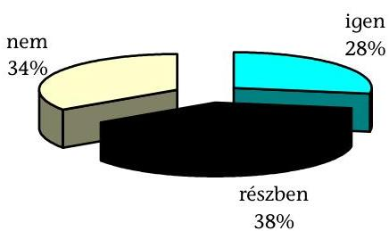

Az információk saját szakterületükön felhasznált gyógyszerek mennyiségéről, annak értékéről jelentősebb részben nem ismertek, vagy csak részben ismertek.
2. Szükségesnek tartják-e, hogy naprakész információjuk legyen a saját szakterületük által felhasznált gyógyszerek mennyiségéről és értékéről?
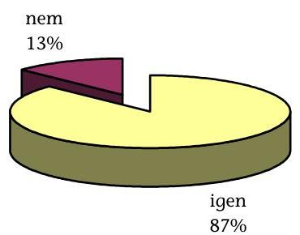

Az orvos szakmai szakterületek néhány kivétellel szükségesnek tartják, hogy információjuk legyen a szakterületük által felhasznált gyógyszerek mennyiségéről, azok pénzügyi értékéről.

---

3. Ha vannak megbizható információik, akkor ismereteik szerint a gyógyszer-fogyasztás összhangban van-e a szakterületük jellemzö morbiditási adataival, a megbetegedések számával?
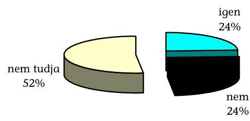

A gyógyszerfogyasztás összhangját az egyes betegségi adatokkal a kollégiumok jelentős része megfelelő adatgyűjtés hiányában egyáltalán nem ismeri. Az információval rendelkezők felének véleménye szerint a gyógyszerfogyasztás megfelel a hazai lakossági morbiditási viszonyoknak, másik fele szerint nem.
4. Állítsák sorrendbe 1-től 9-ig a hazai gyógyszerkiadások növekedését döntően befolyásoló tényezőket! (1-legbefolyásosabb, 9-legkevésbé befolyásos)

# A sorrend: 

1. a lakosság egészségi állapota, népegészségügyi mutatók
2. háziorvosok rendelése
3. szakorvosok rendelése
4. a hazai gyógyszerválaszték
5. kórházi orvosok rendelése (zárójelentés)
6. a gyártók reklám-, promóciós tevékenysége
7. a gyógyszer kereskedők kedvezményei, a rabattok nagysága
8. a gyógyszerterápiás ajánlások figyelmen kívül hagyása

A gyógyszerkiadások növekedését elsősorban befolyásolja a lakosság egészségi állapotának, a megbetegedéseknek az alakulása, a kórházi és egyéb szakorvosi javaslatok alapján történő gyógyszerrendelés figyelembevétele, a hazai gyógyszerválaszték bővülése és a háziorvosoknak a beteg szociális, valamint egyéb körülményei ismeretében tett módosításai a gyógyszerelési javaslaton. Mindez a gyógyszert rendelő orvosok részéről feltételezi a korszerű terápiás ismereteket. A kollégiumok egy része e vonatkozásban a képzést, továbbképzést nem tartja megfelelőnek. Ebből a szempontból kiemelt jelentősége van a szakmai szabályoknak, útmutatóknak.
5. Véleményük szerint szükség lenne-e a gyógyszerreklámozás, a gyártói promóció szabályozásának a szigorítására?
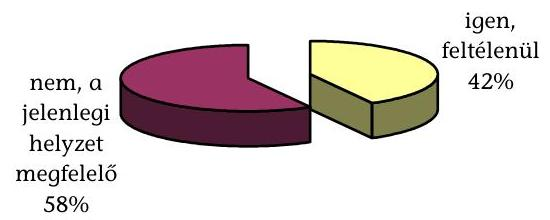

A gyógyszerreklámozás, a gyógyszergyártói promóció szigorítását a kollégiumok közel fele tartotta szükségesnek.

---

6. Önök szerint az orvosok új készítmények hatásaival és mellékhatásaival kapcsolatos tájékoztatásában kinek van döntő szerepe? (Állítsák sorrendbe 1-től 5-ig, 1-legnagyobb szerepe, 5 -legkisebb szerepe van)

A sorrend:

1. gyógyszergyár
2. egyéb, éspedig: szakmai publikációk, folyóiratok, szimpóziumok, továbbképzések
3. OGYI
4. média
5. szaktárca

A kollégiumok az Országos Gyógyszerészeti Intézetet a 3. helyre, a szaktárcát az 5. helyre sorolták., a gyógyszert rendelő orvosok új gyógyszerek hatásaival, mellékhatásaival kapcsolatos tájékoztatásában.

A kollégiumok szerint a gyógyszergyártók, kereskedők tájékoztatási tevékenysége lehetővé teszi az új gyógyszerek gyors ismertetését, az információterjesztést, és a továbbképzésekkel kapcsolatos szponzorálásaik is jelentősek. Hátrányként jelzik a szakma képviselői, hogy ez adott esetben a költséghatékonysági szempontok figyelmen kívül hagyásával történik.
7. Véleményük szerint a szakmai kollégiumuknak van-e szerepük az új gyógyszerek alkalmazásának meghonosításában?
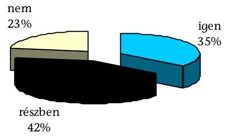
8. Befolyásolja-e az orvosok által a napi gyakorlatban alkalmazott gyógyszeres terápiát valamilyen adminisztratív jellegü szabályozó?
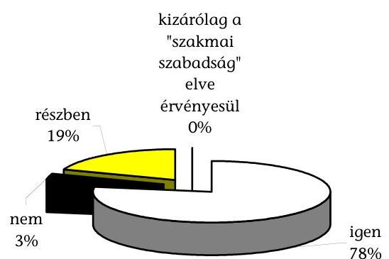

Az orvosok napi gyakorlatában alkalmazott gyógyszeres terápiát adminisztratívan a gyógyszerek rendelésére vonatkozó jogszabályok határozzák meg.

---

9. Készítettek-e jelenleg is érvényes gyógyszer-terápiás szakmai ajánlásokat, illetve ezek ré-szei-e ilyen egyéb terápiás ajánlásaiknak, szakmai irányelveiknek?
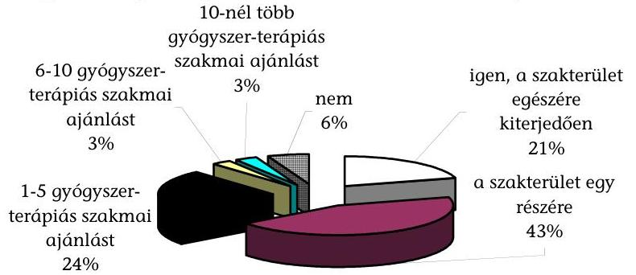
10. Mit jelölnek meg a gyógyszer-terápiás szakmai ajánlásaik?
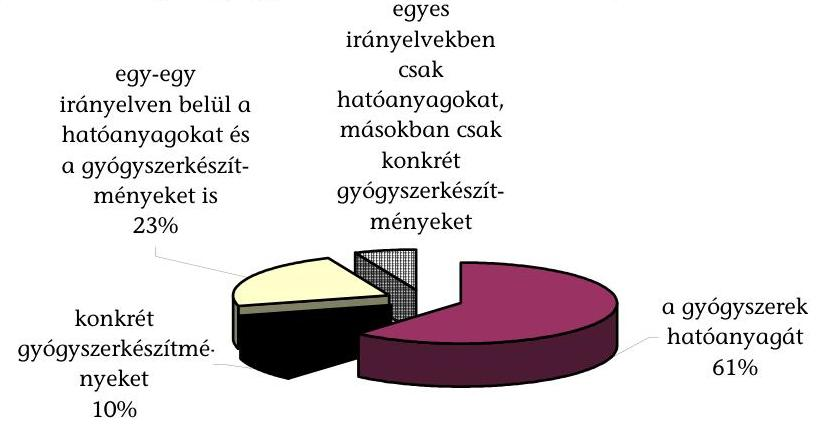
11. Szükségesnek tartják-e saját szakterületükre további gyógyszer-terápiás szakmai ajánlások kidolgozását, kiterjesztését?
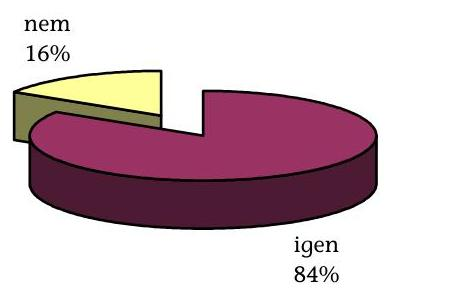
12. A gyógyszer-terápiás szakmai ajánlások kidolgozásakor figyelembe vesznek-e költséghatékonysági szempontokat is a szakmai szempontok mellett?
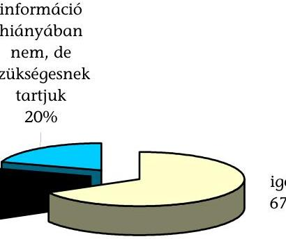

---

13. Vannak-e megbizható információik, visszajelzéseik az Önök által kidolgozott gyógyszerterápiás szakmai ajánlások alkalmazásáról, betartásáról?
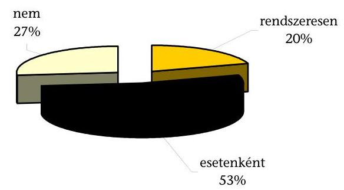
14. Vizsgálják-e rendszeresen, hogy a kidolgozott gyógyszer-terápiás szakmai ajánlások megfelelően alkalmazhatók-e?
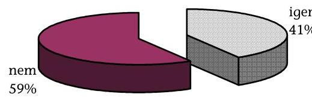
15. Önök szerint költséghatékonyabb lenne-e a betegek gyógyszeres kezelése, ha a biztositó az orvosszakmák által elfogadott kezelési eljárásokat, terápiás protokollokat finanszirozná?
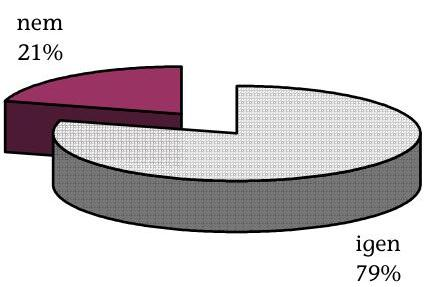
16. Önök szerint csökkentenék-e a farmakoterápiák kockázatait, a nemkívánatos mellékhatásokat a szorosabb gyógyszer-terápiás ajánlások?
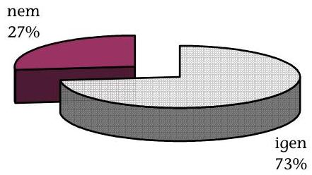

---

A 9-16. kérdésekre adott válaszokból a következő állapítható meg:
Az orvosi szakmai kollégiumok többsége szükségesnek tartja, hogy szakterületükre további gyógyszer-terápiás ajánlások kerüljenek kidolgozásra és bevezetésre. Ezek kidolgozása során jelenleg is érvényesülnek a költséghatékonysági szempontok.
A kollégiumok hiányolják a visszajelzéseket szakmai ajánlásaik alkalmazásáról, betartásáról, amelyek véleményük szerint nagyobbrészt eseti jellegűek. A szakmai kollégiumok többsége nem vizsgálta az általa kidolgozott terápiás javaslatok szélesebbkörű alkalmazhatóságát, terápiás és gazdaságossági kihatását.

Az orvosi szakmai kollégiumok szinte egyöntetű javaslata az, hogy a betegek gyógyszeres kezelését finanszírozza az Országos Egészségbiztosítási Pénztár az orvosi szakmák által elfogadott terápiás protokollok szerint. Ennek alapvető feltételeként a szakmai ajánlások betartásának ellenőrzését tartják szükségesnek. Természetesen a speciális és nagy gyógyszerigényű orvosi szakterületek sajátos szempontjait figyelembe kell venni. A gyógyszer-terápiás javaslatok alkalmazása csökkentené a farmakoterápiás kockázatokat. A kollégiumok szerint a gyógyszerreferens képviselhetné a szakterületet a gyógyszertámogatási rend, a gyógyszerrendelési szabályok megfelelőbb módosításában.
17. Véleményük szerint érdemi-e az együttmüködésük a Társadalombiztosítási Ár- és Támogatási Bizottsággal (TÁTB)?
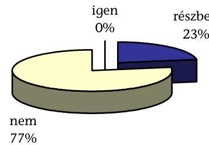
18. Szükségesnek, hasznosnak tartanák-e a rendszeres, intézményesített kapcsolattartást a TÁTB-vel?
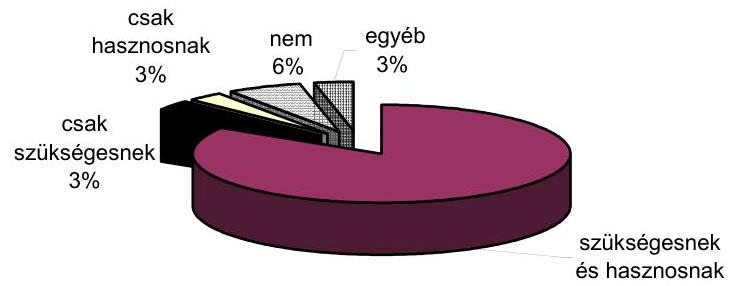

A Társadalombiztosítási Ár- és Támogatási Bizottsággal az orvosi szakmai kollégiumok nem működnek együtt, bár szinte mindegyikük szükségesnek tartaná ezt. Ezáltal lehetővé válna a terápiás ajánlások hatékonyabb érvényesítése, a gyógyszer ártámogatásra fordítható pénzforrások felhasználása.

---

19. Véleményük szerint a gyógyszer-terápiás szakmai ajánlások alkalmazása ésszerübbé te-szi-e a gyógyszerek ártámogatását, az ártámogatásra fordítható pénzforrások elosztását?
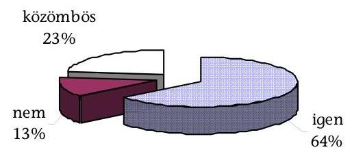

# ORVOSI SZAKMAI KOLLÉGIUMOK JEGYZÉKE 

1. Aneszteziológiai és Intenzív Terápiás Szakmai Kollégium
2. Belgyógyászati Szakmai Kollégium
3. Bőr- és Nemibetegségek Szakmai Kollégiuma
4. Csecsemő- és Gyermekgyógyászati Szakmai Kollégium
5. Foglalkozásorvostani Szakmai Kollégium
6. Fog- és szájbetegségek Szakmai Kollégiuma
7. Fül-orr-gégészeti Szakmai Kollégium
8. Gasztroenterológiai Szakmai Kollégium
9. Geriátriai Szakmai Kollégium
10. Gyermeksebészeti Szakmai Kollégium
11. Háziorvostani Szakmai Kollégium
12. Idegsebészeti Szakmai Kollégium
13. Infektológiai Szakmai Kollégium
14. Kardiológiai Szakmai Kollégium
15. Klinikai Immunológiai és Allergológiai Szakmai Kollégium
16. Megelőző Orvostani és Népegészségtani Szakmai Kollégium
17. Neurológiai Szakmai Kollégium
18. Nukleáris Medicina Szakmai Kollégium
19. Orvosi Laboratóriumi Vizsgálatok Szakmai Kollégiuma
20. Orvosi Mikrobiológiai Szakmai Kollégium
21. Ortopédiai Szakmai Kollégium
22. Igazságügyi Orvostani és Orvosszakértői Szakmai Kollégium
23. Oxyológiai- Sürgősségi, Honvéd- és Katasztrófaorvostani Szakmai Kollégium
24. Pathológiai Szakmai Kollégium
25. Pszichiátriai Szakmai Kollégium
26. Radiológiai Szakmai Kollégium
27. Rehabilitációs Szakmai Kollégium
28. Reumatológiai és Fizioterápiás Szakmai Kollégium
29. Sebészeti Szakmai Kollégium
30. Sportegészségügyi Szakmai Kollégium
31. Sugárterápiás és Onkológiai Szakmai Kollégium
32. Szemészeti Szakmai Kollégium
33. Szülészeti és Nőgyógyászati Szakmai Kollégium
34. Tranzfúziológiai, Haematológiai Szakmai Kollégium
35. Traumatológiai Szakmai Kollégium
36. Tüdőgyógyászati Szakmai Kollégium
37. Urológiai Szakmai Kollégium

---

# A fekvőbetegellátó intézmények gyógyszergazdálkodása 

Az egészségügyi intézményeket befolyásoló, napirenden lévő jogszabályváltozások (ellátásszervezés, kórháztörvény, finanszírozási módosítások, stb.) miatt az elmúlt években nem volt prioritása a kórházi gyógyszerügynek. A gyógyszerekkel kapcsolatos jogalkotási folyamatokban elsősorban a járóbeteg gyógyszerkassza alakulása volt az elsődleges szempont, és háttérbe szorult a rendelkezések kórházakra gyakorolt hatása.

Az intézményi gyógyszergazdálkodás a gyógyítás egyik legfontosabb és legköltségesebb eleme, a kórházak múködésében stratégiai fontossággal bír. A fekvőbetegellátó intézmények költségvetésében a gyógyszerköltségek dologi kiadásban kifejezett aránya az elmúlt években alig változott. Ezt állapítja meg a Magyar Kórházszövetség 2003-ban végzett (az intézmények 23\%-ára kiterjedő) reprezentatív felmérése. A felmérés szerint a gyógyszerekre fordított kiadás a kórházak dologi kiadásainak 12 $32 \%$-át teszi ki.

Bár a gyógyszer-portfólió a kórházak struktúrájától és gyógyító profiljától függően változik, mindenhol a gyári előállítású készítmények vezetnek: részesedésük a teljes gyógyszerfelhasználás $50-90 \%$-a között változik. E mellett az infúziók, kötszerek, a labor diagnosztikumok 5-30\%-os, míg a többi gyógytermék 5-10\%-os részarányt képvisel. A Kórházszövetség felmérésének kiértékelését a gyógyszer fogalmának intézmények általi különböző értelmezési és besorolási gyakorlata nehezíti.

A biztosított a kórházi orvosa által rendelt valamennyi gyógyszerre térítésmentesen jogosult arra az időtartamra, amíg az intézményben kezelik. A kórházi kezelés idején a beteg részére csak az intézeti gyógyszertár által bevételezett és onnan osztályokra, részlegekre kiadott gyógyszerek - ideértve a kórházi, klinikai vizsgálatok céljából érkezett készítmények - alkalmazhatók.

Az egészségügyi intézményekben a gyógyszerek beszerzése és felhasználása része a gazdálkodás általános rendjének. A gyógyításban betöltött szerepe, a kezeléséhez szükséges speciális szakértelem miatt azonban a gyógyszerbeszerzés és gyógyszer-felhasználás különleges szabályok alkalmazását is szükségessé teszi.

A kórházakban a változó betegszám és -összetétel miatt csak közelítéssel lehet éves gyógyszerbeszerzési tervet készíteni. A szakmai terápiás ajánlások változásai mellett, folyamatosan jelennek meg új, korszerúbb készítmények, amelyek szinte azonnal bekerülnek a napi terápiás gyakorlatba.

A teljes gyógyszerválaszték egyetlen intézeti gyógyszertárban sem tartható, ezért a zavartalan betegellátás biztosítása érdekében a gyógyszerek beszerzése az orvos és a gyógyszerész szoros együttmúködését is igényli. A gyógyszerválaszték, a készletek nagyságának figyelése a kórházakban folyamatosan napirenden van, hiszen a gyógyszergazdálkodás hiányosságai rövidtávon egy intézmény pénzügyi egyensúlyát veszélyeztethetik.

---

A kórházak a gyógyszerkészítményeket nagykereskedelmi áron, saját hatáskörben szerzik be. A nagykereskedelmi árat az egészségügyi miniszter a társadalombiztosítási támogatással rendelhető gyógyszerekről és a támogatás összegéről szóló rendeletével hirdeti ki. A kórházak gyógyszerbeszerzéseiről azonban nincs központosított, gyógyszerenkénti állami nyilvántartás. Így a gyógyszerekkel kapcsolatos rendeletmódosítások hatása, befolyása az intézményi gazdálkodásra a döntéshozók számára nem értékelhető.

A kórházi gyógyszerfelhasználás fedezetét továbbra is a gyógyító-megelőző ellátások fekvőbeteg kasszái (aktív, krónikus) tartalmazzák. Összege teljesítményarányosan jut el az intézményekhez, a HBCS-ben, illetve a krónikus napidijban elismert ráfordítások részét képezi.

# A gyártók és forgalmazók által felkínált akciók, rabattok, kedvező fizetési feltételek döntően befolyásolják a kórházak gyógyszer beszerzéseit. 

A kórházak és a gyógyszerforgalmazók megállapodott árai („lefelé") eltérhetnek a kihirdetett ártól. Az eltérés lehet árengedmény, százalékos arányban meghatározott számlaengedmény. Elfogadott gyakorlati módszer a vásárlási értékhez kötött, sávosan megállapított visszatérítés.

A pénzügyi elszámolás mellett a forgalmazók természetben is nyújtanak kedvezményeket a kórházaknak. Meghatározott gyógyszer vásárlása esetén rabattot, ingyenes készítményt biztosítanak előre megállapodott arányban. Ugyancsak térítésmentesen kaphatnak gyógyszert a kórházak a gyógyszer-nagykereskedők és forgalmazók karitatív adományai révén.

Szakmai elemzések, tanulmányok rámutatnak arra, hogy az intézményi gyógyszerfelhasználás egyre nagyobb részét teszik ki a gyártók és forgalmazók által felkínált akciók, rabattok. Központilag gyűjtött, részletes állami adatok ugyan nem állnak rendelkezésre, de becslések szerint a teljes gyógyszerfelhasználás mintegy 20-30\%-a ingyenesen jut el az intézményekbe. (A kórházak gyógyszerfelhasználásáról szóló OSAP-jelentések adatait figyelembe véve 5 Mrd Ft-ot is meghaladhatja az egészségügyi intézmények részére biztosított ingyen gyógyszer.)

Két korábbi ÁSZ-ellenőrzés is foglalkozott a kórházak gyógyszerfelhasználásával. ${ }^{1}$ Helyszíni ellenőrzési tapasztalataink igazolták, hogy ma is hiányoznak azok a szabályozók, amelyek alapján egységes előirások szerint tarthatnák nyilván a kórházi gyógyszereket. A Kórházszövetség tavalyi felmérése szintén rámutatott arra, hogy az intézmények nyilvántartásaiban alkalmazott különböző gyógyszer-besorolási gyakorlat nehezíti az intézményi gyógyszerfelhasználási szokások, növekedési trendek összehasonlító elemzését.

Egységes irányelvek hiányában a kórházak analitikus nyilvántartásaikban, a belső gazdálkodási rendszerükben gyógyszerként tartják nyilván a vásárolt gyári előállítású gyógyszereket, a magisztrális gyógyszerkészítményeket, a vegyszereket, a fertőtlenítő szereket, a diagnosztikumokat, a vérkészítményeket, a kötszereket, esetenként az altatógázt, és a röntgenfilmeket is. Csupán néhány intézményben valósították meg az egy

[^0]
[^0]:    1 Az önkormányzati kórházak pénzügyi helyzetének, valamint az állami és egyházi kórházak, egyetemi klinikák gazdálkodásának ellenőrzéséről szóló 0023 és 0301 számú ÁSZ-jelentések.

---

beteg kezelésével kapcsolatos gyógyszerköltségek esetszintű követését. A HBCS súlyszámarányai így elszakadhatnak az elméletileg meghatározott ráfordításoktól.

# A dologi költségek emelkedése a kórházakat szigorodó takarékoskodásra 

ösztönzi. Az intézmények gyógyszerköltségeik csökkentése érdekében folyamatosan bővítik gazdálkodási eszköztárukat. A kórházmenedzsment számos vezetési és szervezési technikát alkalmaz a fogyasztás racionális korlátozása és a megfelelő gyógyszerterápia érdekében.

A gyógyszergazdálkodást az intézményekben igazgatói szinten irányítják. A gyógyszerellátási feladataik összehangolása érdekében jogszabály írja elő Gyógyszerterápiás Bizottság múködtetését. Antibiotikum bizottságokkal, szigorú keretgazdálkodással és állandó ellenőrzéssel igyekeznek a gyógyszerfelhasználás növekedési ütemét mérsékelni.

A gyógyszer-alaplisták, terápiás protokollok és standardok alkalmazása intézményen belül egyes készítmények használatát jogosultsághoz köti, illetve kötelezően írja elő az olcsóbb gyógyszer-terápiák alkalmazását.

A gyógyszergazdálkodás hatékonyságának javítása a kórházakban az esetek nagyobb részében adminisztratív korlátozásban nyilvánul meg. A gazdálkodási keretek meghatározása, a készletek folyamatos figyelemmel kísérése szigorú korlátozást jelent a gyógyszerkiadások visszaszorításában, folyamatos értékelés és szankcionálás mellett.

Továbblépést az eredményesebb intézeti gyógyszergazdálkodásban a gazdasági és az orvos-szakma szorosabb együttműködése jelenthet. Ezt szolgálják az intézményekben egyre inkább terjedő érdekeltségi rendszerek, amelyek nem egy-egy teljesítménymutatóhoz, megállapított kerethez kötik a gyógyszer ráfordításokat, hanem a teljes kezelési tevékenység pénzben is kifejezhető eredményességét mérik.

A kórházi gyógyszergazdálkodás hatékonyságának növelését segítené az olyan-orvosi szakmai információs rendszerek széleskörű alkalmazása, amelyek keretében lehetővé válna az ellátott esetszintű ráfordítások gyűjtése és betegenkénti „eredmény" számítása.

Budapest, 2004. október