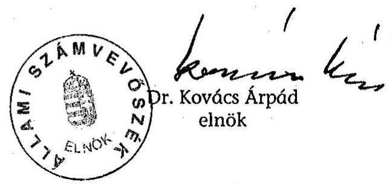
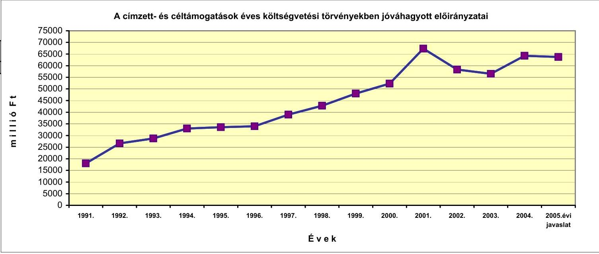
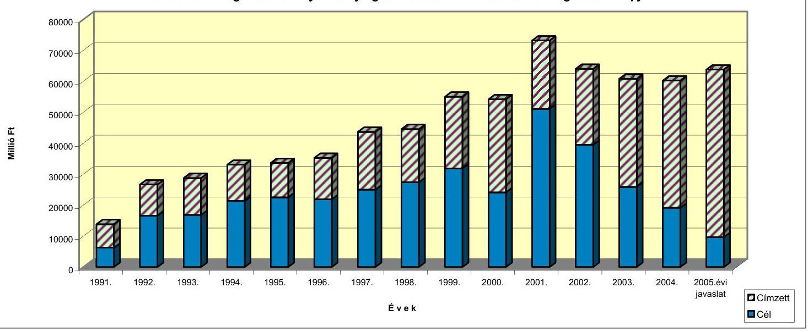
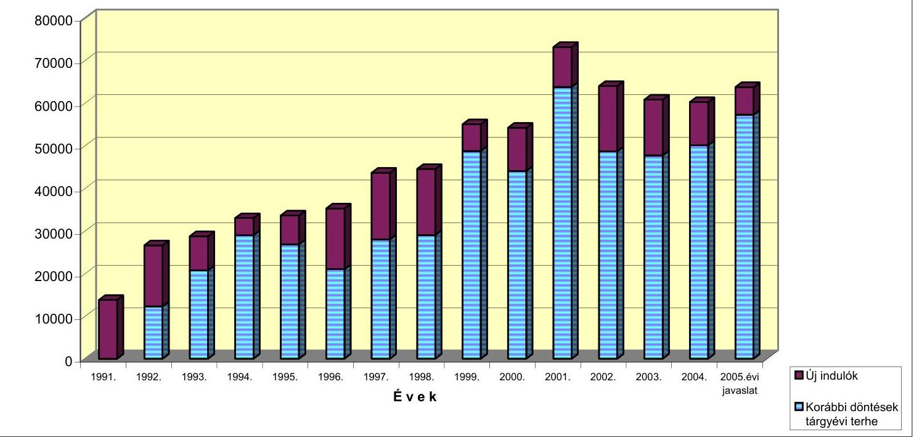

# VÉLEMÉNY 

a Magyar Köztársaság 2005. évi
költségvetési javaslatáról

| 0449 | T/11700/1. | 2004. október |
| :-- | :-- | :-- |

---

# 1. Szervezetirányítási és Múködtetési Igazgatóság 

Vizsgálat-azonosító szám: V0124-01
Az ellenőrzést felügyelte:
Dr. Csapodi Pál
főtitkár
Az ellenőrzés végrehajtásáért felelős:
Dr. Lévai János
általános főtitkárhelyettes
Az ellenőrzést vezette:
Horváthné Menyhárt Erika
osztályvezető főtanácsos
Az ellenőrzést végezték:

| Bojtos Rózsa | Göller Géza | Nagyné Lakhézi Éva |
| :-- | :-- | :-- |
| tanácsadó | főtanácsadó | számvevő |
| Dr. Somorjai Zsoltné | Szabó Balázs | Bálint Józsefné |
| számvevő tanácsos | tanácsos | címzetes főmunkatárs |

## 2. Államháztartás Központi Szintjét Ellenőrző Igazgatóság

Az ellenőrzést felügyelte:
Bihary Zsigmond
főigazgató
Az ellenőrzés végrehajtásáért felelős:
Simon Ákosné
főigazgató-helyettes
Az ellenőrzést vezették:

| Horváth Sándor   főcsoportfőnök-helyettes | Dr. Csépán Mária   Magdolna   igazgatóhelyettes | Norczen Győzőné   osztályvezető főtanácsos |
| :-- | :-- | :-- |
| Pongrácz Éva   osztályvezető főtanácsos | Szabóné Farkas Katalin   osztályvezető főtanácsos | Tolnai Lászlóné   osztályvezető főtanácsos |
| Az ellenőrzést végezték: |  |  |
| Asztalos Gézáné Dr.   külső munkatárs | Balázs Melinda   számvevő | Dr. Baji László   számvevő |
| Balkay Attila   számvevő | Bamberger Mária   tanácsadó | Beck Miklós   számvevő |
| Burenzsargal Narantuja   számvevő | Dancsóné Kuron Ildikó   számvevő | Deli Gáborné   számvevő |
| Dombovári Nóra   számvevő | Dr. Domján Eszter   számvevő | Farkas László   főtanácsadó |
| Fekete Győr László   számvevő | Fodor Edit   számvevő | Fogarasi Miklós   főtanácsadó |
| Dr. Fónyad Erzsébet   számvevő tanácsos | Gaálné Izsó Éva   számvevő tanácsos | Gömöri József   számvevő tanácsos |
| Görgényi Gábor   számvevő gyakornok | Gyarmati István   számvevő tanácsos | Hegedúsné Erdélyi Piroska   tanácsadó |

Jelentéseink az Országgyűlés számítógépes hálózatán és az Interneten a www.asz.hu címen is olvashatók.

---

Horváth József számvevő

Jankó Géza számvevő
Jiling Sámuel számvevő gyakornok

## Knoppné Szabó Ildikó

számvevő
Maklári Ferencné
főtanácsadó
Mihály Sándor
főtanácsadó
Nagy Ákos
számvevő
Pető Krisztina
számvevő gyakornok
Sinka Zoltán Lajos
számvevő gyakornok
Szabóné Simai Mária
számvevő
Szilágyi Zsuzsanna
tanácsadó

Dr. Vass Gábor
számvevő
Zagyi Judit
számvevő

Huszárné Borbás Melinda számvevő gyakornok

## Jáger Lajos

számvevő gyakornok
Dr. Juhászné Szima
Mária
számvevő tanácsos
Magyar Sára
számvevő gyakornok
Matuk Károly
számvevő
Molnár Bálint
számvevő gyakornok
Nagy József
számvevő tanácsos
Dr. Pósch Gábor
főtanácsadó
Dr. Sipos Dóra
számvevő tanácsos
Dr. Szávai Tamás
főtanácsadó
Szöllősiné Hrabóczki
Etelka
főtanácsadó
Verő Tünde
számvevő
Zaroba Szilvia
számvevő

Dr. Jakab Kornél
számvevő gyakornok
Jenei Zoltánné
számvevő gyakornok
Kincses Erzsébet Eszter
számvevő
Major Gizella
külső munkatárs
Dr. Mészáros Leila
számvevő
Molnár Katalint
számvevő gyakornok
Patai Tamás
számvevő tanácsos
Polyák Ferenc
számvevő
Szabó Erzsébet
számvevő tanácsos
Szilágyi Gyöngyi
főtanácsadó
Tóthné Nagy Éva
számvevő

Winter Zsuzsa
számvevő
Zakar László
számvevő

# 3. Önkormányzati és Területi Ellenőrzési Igazgatóság 

Az ellenőrzést felügyelte:
Dr. Lóránt Zoltán
főigazgató
Az ellenőrzés végrehajtásáért felelős:
Németh Péterné
főcsoportfőnök
Az ellenőrzést vezette:
Dr. Sallai Antal
osztályvezető főtanácsos
A helyszíni vizsgálati jelentések feldolgozásában és az összefoglaló elkészítésében közremúködött:
Dankó Géza
Kozák György
főtanácsadó
Az ellenőrzést végezték:
Ambrus Lajos
tunácsadó
Dr. Mezei Imréné
főtanácsadó
Dankó Géza
Kozák György
főtanácsadó
Szabó Tamás
számvevő tanácsos

---

# TARTALOMJEGYZÉK 

BEVEZETÉS ..... 9
I. ÖSSZEGZŐ MEGÁLLAPÍTÁSOK, KÖVETKEZTETÉSEK, JAVASLATOK ..... 13
II. RÉSZLETES MEGÁLLAPÍTÁSOK ..... 31
A) A KÖLTSÉGVETÉSI DOKUMENTUM TÖRVÉNYESSÉGI ÉS SZÁMSZAKI ELLENŐRZÉSE ..... 33

1. Az Áht. előírásainak érvényesülése a törvényjavaslatban ..... 35
2. A törvényjavaslat normaszövegéhez kapcsolódó észrevételek ..... 39
2.1. A költségvetési hiány ..... 39
2.2. Az állami kezességek ..... 39
2.3. A központi költségvetés előirányzat-módosítás nélkül teljesülő kiadásai és bevételei ..... 40
2.4. A kincstári vagyonhoz kapcsolódó befizetések ..... 40
2.5. Államháztartási tartalék ..... 41
2.6. Egyéb észrevételek a normaszöveghez ..... 41
2.7. Az államháztartási törvény (Áht.) módosítása ..... 42
3. A központi költségvetés kapcsolata az államháztartás más alrendszereivel ..... 43
3.1. A helyi önkormányzatok ..... 43
3.2. Az elkülönített állami pénzalapok ..... 43
3.3. A társadalombiztosítási alapok ..... 44
4. A törvényjavaslat mellékletei és indokolása ..... 45
4.1. A törvényjavaslat 1. és 2. sz. mellékleteinek egyezősége ..... 45
4.2. A központi költségvetés tartalék előirányzatai ..... 46
4.3. Az Európai Unióval kapcsolatos programok megjelenítése a költségvetésben ..... 46
4.4. A PPP-projektek bemutatása ..... 46
4.5. Beruházások ..... 47
4.6. Funkciókódok a törvényjavaslat mellékleteiben ..... 47

---

B) HELYSZÍNI ELLENŐRZÉS ..... 49
B1. AZ ÁLLAMHÁZTARTÁS KÖZPONTI SZINTJE ..... 51
B.1.1. KÖZPONTI KÖLTSÉGVETÉS ..... 51

1. A költségvetés makroszintű számításai ..... 51
2. A központi költségvetés közvetlen bevételi előirányzatai ..... 57
2.1. Gazdálkodó szervezetek befizetései ..... 57
2.1.1. Társasági adó ..... 57
2.1.2. Hitelintézetek és pénzügyi vállalkozások átmeneti különadója ..... 59
2.1.3. Egyszerűsített vállalkozói adó ..... 59
2.1.4. Bányajáradék ..... 60
2.1.5. Vám- és importbefizetések ..... 60
2.1.6. Játékadó ..... 62
2.1.7. Egyéb befizetések ..... 63
2.1.8. Környezetterhelési díj ..... 63
2.1.9. Energiaadó ..... 63
2.2. Fogyasztáshoz kapcsolt adók ..... 64
2.2.1. Általános forgalmi adó ..... 64
2.2.2. Regisztrációs adó ..... 65
2.2.3. Jövedéki adó ..... 66
2.3. A lakosság befizetései ..... 67
2.3.1. Személyi jövedelemadó ..... 67
2.3.2. Lakossági illetékek ..... 68
2.3.3. Egyéb lakossági adók ..... 69
2.4. Az MNB költségvetési elszámolásai ..... 69
2.5. A költségvetés központosított bevételei ..... 70
3. A központi költségvetés közvetlen kiadási előirányzatai ..... 70
3.1. A központi költségvetés kamatelszámolásai, tőke visszatérülései, az adósság- és követeléskezelés költségei ..... 72
3.2. Az állami kezességvállalás és -érvényesítés ..... 81
4. A fejezetek költségvetési előirányzatai ..... 85
4.1. A fejezeti tervezés irányítása, összehangolása ..... 85
4.2. Az intézmény- és feladat-felülvizsgálat eredményei ..... 89
4.3. Kiadási előirányzatok ..... 90
4.3.1. Létszám és személyi juttatások ..... 92
4.3.2. Dologi előirányzatok ..... 94
4.3.3. Fejezeti kezelésű előirányzatok ..... 95
4.3.4. Felhalmozási kiadások ..... 99

---

4.3.5. Az Európai Uniós tagsággal és a nemzetközi kapcsolatokkal összefüggő előirányzatok ..... 100
5. Bevételi előirányzatok ..... 102
B.1.2. ELKÜLÖNÍTETT ÁLLAMI PÉNZALAPOK ..... 105

1. Munkaerőpiaci Alap ..... 105
1.1. A foglalkoztatási helyzet várható alakulása és tényezői ..... 105
1.2. Az MPA 2005. évi költségvetésének tervezése ..... 106
2. Központi Nukleáris Pénzügyi Alap ..... 111
3. Wesselényi Miklós Ár- és Belvízvédelmi Kártalanítási Alap ..... 112
4. Kutatási és technológiai innovációs alap ..... 114
B.1.3. A TÁRSADALOMBIZTOSÍTÁS PÉNZÜGYI ALAPJAI ..... 116
5. A tervezés folyamata, egységes szempontjai ..... 116
6. A Nyugdíjbiztosítási Alap költségvetése ..... 117
2.1. A tervezés feltételei az Ny. Alapnál ..... 117
2.2. Az Ny. Alap bevételei ..... 118
2.3. Az Ny Alap kiadásainak tervezése ..... 120
2.4. Az ONYF múködési költségvetése ..... 121
7. Az Egészségbiztosítási Alap költségvetése ..... 123
3.1. A tervezés feltételei az E. Alapnál ..... 123
3.2. Az E. Alap bevételeinek tervezése ..... 124
3.3. Az E. Alap pénzügyi egyensúlya ..... 126
3.4. Az egészségbiztosítás ellátási kiadásainak tervezése ..... 126
3.4.1. Rokkantsági nyugellátások ..... 126
3.4.2. Pénzbeli ellátások ..... 127
3.4.3. Gyógyító-megelőző egészségügyi ellátás ..... 128
3.4.4. Gyógyszer-támogatás ..... 130
3.4.5. Gyógyászati segédeszköz támogatás ..... 132
3.4.6. Gyógyfürdő és egyéb gyógyászati ellátás támogatása ..... 133
3.4.7. Az irányított betegellátási rendszer további múködtetése, finanszírozása ..... 133
3.5. Az OEP múködési költségvetése ..... 135
B2. A HELYI ÖNKORMÁNYZATOK ..... 137
8. A helyi önkormányzatok pénzügyi szabályozó rendszerét érintő módosítások a költségvetési törvényjavaslatban ..... 137
9. A forrásszabályozás módosításának főbb jellemzői ..... 142
10. Az önkormányzati bevételek tervezése ..... 144

---

3.1. A normatív és egyéb állami hozzájárulások ..... 144
3.1.1. Normatív állami hozzájárulás és normatív részesedésű átengedett személyi jövedelemadó ..... 144
3.1.2. Normatív, kötött felhasználású támogatás ..... 149
3.1.3. Központosított előirányzatok ..... 151
3.1.4. A helyi önkormányzatok múködőképességének megőrzését szolgáló kiegészítő támogatások ..... 152
3.2. Fejlesztési támogatások ..... 153
3.2.1. Címzett és céltámogatások ..... 153
3.2.2. Területi kiegyenlítést célzó fejlesztési támogatás és a céljellegú decentralizált támogatási előirányzat ..... 155
3.2.3. A helyi önkormányzatok európai uniós, valamint hazai fejlesztési pályázatai saját forrás kiegészítésének támogatása ..... 155
3.2.4. Egyéb decentralizálásra került fejlesztési, felújítási célú előirányzatok ..... 156
3.2.5. Kiemelt fővárosi programok támogatása ..... 159
3.2.6. Az európai uniós források és az önkormányzati fejlesztési lehetőségek összefüggései ..... 159
3.3. Átengedett bevételek ..... 160
3.4. Saját források ..... 162

# MELLÉKLETEK 

1. számú Kimutatás az átengedett személyi jövedelemadó és önkormányzati támogatások rendelkezési jogosultság szerinti megoszlásáról
2. számú A normatív hozzájárulások jogcímenkénti és ágazatonkénti előirányzatainak változása
3. számú A normatív, kötött felhasználású támogatások jogcímenkénti és ágazatonkénti előirányzatainak változása
4. számú A központosított előirányzatok jogcímeinek és összegének változása
5. számú A címzett és céltámogatások előirányzatainak és odaítélt támogatásainak alakulás

---

# RÖVIDÍTÉSEK JEGYZÉKE 

| áfa | általános forgalmi adó |
| :--: | :--: |
| ÁFSz | Állami Foglalkoztatási Szolgálat |
| ÁHH | Államháztartási Hivatal |
| Áht. | Az államháztartásról szóló 1992. évi XXXVIII. törvény |
| AIK | Agrárintervenciós Központ |
| AAK Rt. | Állami Autópálya Kezelő Rt. |
| AKA Rt. | Alföldi Koncessziós Autópálya Részvénytársaság |
| ÁKK Rt. | Államadósság Kezelő Központ Rt. |
| ALB | Alkotmánybíróság |
| Ámr. | Az államháztartás múködési rendjéről szóló 217/1998. (XII. 30.) Korm. rendelet |
| APEH | Adó- és Pénzügyi Ellenőrzési Hivatal |
| APEH-SZTADI | Adó- és Pénzügyi Ellenőrzési Hivatal Számítástechnikai és Adatfeldolgozó Intézet |
| ÁPV Rt. | Állami Privatizációs és Vagyonkezelési Rt. |
| Art. | Az adózás rendjéről szóló 2003. évi XCII. törvény |
| ÁSZ | Állami Számvevőszék |
| ÁSZ-FEMI | Állami Számvevőszék Fejlesztési és Módszertani Intézet |
| ÁSZ tv. | Az Állami Számvevőszékről szóló 1989. évi XXXVIII. törvény |
| BC | Beruházásösztönzési Célelőirányzat |
| BÉT | Budapesti Értéktőzsde Rt. |
| BIR | Bíróságok |
| Bjt. | Bírák jogállásáról és javadalmazásáról szóló 1997. LXVII. törvény |
| BKV | Budapesti Közlekedési Vállalat Rt. |
| BM | Belügyminisztérium |
| BME | Budapesti Múszaki és Gazdaságtudományi Egyetem |
| Bsz | A bíróságok szervezetéről és igazgatásáról szóló 1997. évi LXVI. törvény |
| Cct | A helyi önkormányzatok címzett és céltámogatási rendszeréről szóló 1992. évi LXXXIX. törvény |
| CEB | Európa Tanács Fejlesztési Bank |
| CÉDE | Céljellegú decentralizált támogatás |
| E. Alap | Egészségbiztosítási Alap |
| EBB | Európai Beruházási Bank |
| EBRD | Európai Újjáépítési és Fejlesztési Bank |
| EMMA | Egységes Magyar Munkaügyi Alapnyilvántartás |
| EMOGA | Európai Mezőgazdasági Orientációs és Garancia Alap |
| EMU | Európai Monetáris Unió |
| ESA | Európa Statisztikai Adattár |
| ESZA | Európai Szociális Alap |
| ESzCsM | Egészségügyi, Szociális és Családügyi Minisztérium |
| EU | Európai Unió |
| EUPM | Európai Unió Rendőri Missziója |
| EURIBOR | Frankfurti EUR betéti kamatláb |
| EüM | Egészségügyi Minisztérium |
| eva | egyszerúsített vállalkozói adó |
| EXIMBANK Rt. | Magyar Export-Import Bank Rt. |

---

| FA | MPA Foglalkoztatási Alaprész |
| :--: | :--: |
| FH | Foglalkoztatási Hivatal |
| FKA | MPA Fejlesztési és Képzési Alaprész |
| Flt. | A foglalkoztatás elősegítéséről és a munkanélküliek ellátásáról szóló 1991. évi IV. törvény |
| FMM | Foglalkoztatáspolitikai és Munkaügyi Minisztérium |
| FPMNYI | Fővárosi és Pest Megyei Nyugdíjbiztosítási Igazgatóság |
| FVM | Földművelésügyi és Vidékfejlesztési Minisztérium |
| GDP | bruttó nemzeti termék |
| GFS | Government Financial Statistics |
| GKI | Gazdaság Kutató Intézet |
| GKM | Gazdasági és Közlekedési Minisztérium |
| GVH | Gazdasági Versenyhivatal |
| GVOP | Gazdasági Versenyképességi Operatív Program |
| GYED | Gyermekgondozási díj |
| GYES | Gyermekgondozási segély |
| GYET | Gyermeknevelési támogatás |
| GYISM | Gyermek-, Ifjúsági és Sportminisztérium |
| GySEV | Győr-Sopron-Ebenfurthi Vasút |
| Gyvt. | A gyermekek védelméről és a gyámügyi igazgatásról szóló 1997. évi XXXI. törvény |
| HEFOP | Humánerőforrás-fejlesztési Operatív Program |
| HIPC | Súlyosan Eladósodott Szegény Országok adósság-könnyítő program |
| HM | Honvédelmi Minisztérium |
| HM KHK | Magyar Honvédség Központi Honvéd Kórház |
| Hszt. | A fegyveres szervek hivatásos állományú tagjainak szolgálati viszonyáról szóló 1996. évi XLIII. törvény |
| Iasz | Az igazságügyi alkalmazottak szolgálati jogviszonyáról |
| IBR | Irányított Betegellátás Rendszere |
| IBRD | Nemzetközi Újjáépítési és Fejlesztési Bank |
| IH | PNSZ Információs Hivatal |
| IHM | Informatikai és Hírközlési Minisztérium |
| ILO | Nemzetközi Munkaügyi Szervezet |
| IM | Igazságügyi Minisztérium |
| IMF | Nemzetközi Valuta Alap |
| ISZIH | Igazságügyi Szakértői Intézetek Hivatala |
| IT Kht. | Információs Társadalom Kht. |
| ITD-H | Magyar Befektetési és Kereskedelemfejlesztési Kht. |
| Jöt. | A jövedéki adóról szóló 1997. CIII. törvény |
| KAIG | Kiemelt Adózók Igazgatósága (APEH) |
| Kbt. | A közbeszerzésekről szóló 2003. évi CXXIX. törvény |
| KE | Köztársasági Elnökség |
| KEH | Köztársasági Elnöki Hivatal |
| KEHI | Kormányzati Ellenőrzési Hivatal |
| KELER | Központi Elszámolóház és Értéktár Rt. |
| KESZ | Kincstári Egységes Számla |
| KfW | Kreditanstalt für Wiederaufbau (Újjáépítési és Hitelbank) |
| Kincstár | Magyar Államkincstár |
| KIOP | Környezetvédelmi és Infrastruktúra Operatív Program |
| Kjt. | A közalkalmazottak jogállásáról szóló 1992. évi XXXIII. |

---

|  | törvény |
| :--: | :--: |
| KKI | Központi Kárrendezési Iroda |
| KNPA | Központi Nukleáris Pénzügyi Alap |
| KOMT | Közalkalmazottak Országos Munkaügyi Tanácsa |
| Kp-i | központi |
| KSH | Központi Statisztikai Hivatal |
| KSZH | Miniszterelnökség Központi Szolgáltatási Főigazgatóság |
| KT | Közbeszerzések Tanácsa |
| Kt. | A közoktatásról szóló 1993. évi LXXIX. törvény |
| KTK | Kincstári Tranzakciós Kód |
| Ktv. | A köztisztviselők jogállásáról szóló 1992. évi XXIII. törvény |
| KüM | Külügyminisztérium |
| KVI | Kincstári Vagyoni Igazgatóság |
| Kvtv. | A Magyar Köztársaság 2004. évi költségvetéséről és az államháztartás hároméves kereteiről szóló 2003. évi CXVI. törvény |
| KvVM | Környezetvédelmi és Vízügyi Minisztérium |
| LRI | Légiforgalmi és Repülőtéri Igazgatóság |
| M | millió |
| MAB | Magyar Akkreditációs Bizottság |
| MÁK | Magyar Államkincstár |
| MAT | Munkaerőpiaci Alap Irányító Testülete |
| MÁV Rt. | Magyar Államvasutak Rt. |
| MBH | Magyar Bányászati Hivatal |
| ME | Miniszterelnökség |
| ME-EK | Miniszterelnökség Esélyegyenlőségi Kormányhivatal |
| MeH | Miniszterelnöki Hivatal |
| MEHIB Rt. | Magyar Exporthitel Biztosító Rt. |
| MEHIG | Miniszterelnöki Hivatal Igazgatása |
| MEP | Megyei Egészségbiztosítási Pénztár |
| MFB | Magyar Fejlesztési Bank Rt. |
| MH | Magyar Honvédség |
| MH KHK | Magyar Honvédség Központi Honvégkórház |
| MK | Munkaügyi Központ |
| MKK Rt. | Magyar Követeléskezelő Rt. |
| MKÜ | Magyar Köztársaság Ügyészsége |
| MNB | Magyar Nemzeti Bank |
| MPA | Munkaerőpiaci Alap |
| Mrd | milliárd |
| MTA | Magyar Tudományos Akadémia |
| MTRFH | Magyar Terület- és Regionális Fejlesztési Hivatal |
| MTV Rt. | Magyar Televízió Részvénytársaság |
| MÜI | Magyar Űrkutatási Iroda |
| MVH | Mezőgazdasági és Vidékfejlesztési Hivatal |
| NA | Nemzeti Autópálya Rt. |
| NATO | Észak Atlanti Szerződés Szervezete |
| NBH | PNSZ Nemzetbiztonsági Hivatal |
| NBSZ | NBSZ Nemzetbiztonsági Szakszolgálat |
| NFA | Nemzeti Földalap Program |
| NFH | Nemzeti Fejlesztési Hivatal |
| NHH | Nemzeti Hírközlési Hatóság |
| NHIT | Nemzeti Hírközlési és Informatikai Tanács |

---

| NIIF | Nemzeti Információs és Infrastruktúra Fejlesztési Program Iroda |
| :--: | :--: |
| NKÖM | Nemzeti Kulturális Örökség Minisztériuma |
| NKTH | Nemzeti Kutatási és Technológiai Hivatal |
| Ny. Alap | Nyugdíjbiztosítási Alap |
| OAH | Országos Atomenergia Hivatal |
| OBH | Országgyúlési Biztosok Hivatala |
| OECD | Gazdasági Együttmúködési és Fejlesztési Szervezet |
| OECF | Japan's Overseas Economic Cooperation Fund |
| OEP | Országos Egészségbiztosítási Pénztár |
| OFA | Országos Foglalkoztatási Közalapítvány |
| OGY | Országgyúlés |
| OGYH | Országgyúlés Hivatala |
| OKF | Országos Katasztrófavédelmi Főigazgatóság |
| OM | Oktatási Minisztérium |
| OMMF | Országos Munkabiztonsági és Munkaügyi Főfelügyelőség |
| OMSZI | Oktatási Minisztérium Szolgáltató Intézmény |
| OP | Operatív Program |
| OTIVA | Országos Takarékszövetkezeti Intézmény Védelmi Alap |
| OTKA | Országos Tudományos Kutatási Alapprogramok |
| PM | Pénzügyminisztérium |
| PM NAO Iroda | Pénzügyminisztérium Nemzeti Programengedélyező Iroda |
| PNSZ | Polgári Nemzetbiztonsági Szolgálatok |
| PPP | Public Private Partnership |
| Priv. tv. | Az állam tulajdonában lévő vállalkozói vagyon értékesítéséről szóló 1995. évi XXXIX. törvény |
| PSZÁF | Pénzügyi Szervezetek Állami Felügyelete |
| RA | MPA Rehabilitációs Alaprész |
| SZÉSZEK | Szénbányászati és Szerkezet-átalakítási Központ |
| SZF | Szerencsejáték Felügyelet |
| szja | személyi jövedelemadó |
| Szoc. tv. | A szociális igazgatásról és szociális ellátásról szóló 1993. évi III. törvény |
| Szt. | A számvitelről szóló 2000. évi C. törvény |
| TB alapok | Társadalombiztosítás pénzügyi alapjai |
| TERKI támogatás | Területi kiegyenlítést szolgáló fejlesztési támogatás |
| VP | Vám- és Pénzügyőrség |
| VPOP | Vám- és Pénzügyőrség Országos Parancsnoksága |

---

VE-3-004/2004.

# BEVEZETÉS 

Az Állami Számvevőszék (ÁSZ) az Alkotmány (32/C. § (1) bekezdés) és a számvevőszéki törvény (2. § (1) bekezdés) alapján véleményezi az állami költségvetési javaslat megalapozottságát, a bevételi előirányzatok teljesíthetőségét. Az államháztartási törvény (29. § (1) bekezdés) szerint az Országgyűlés a költségvetési törvényjavaslatot a számvevőszéki véleménnyel együtt tárgyalja.

A véleményt megalapozó ellenőrzés célja annak megállapítása volt, hogy

- a 2005. évi költségvetésről szóló törvényjavaslat bevételi és kiadási előirányzatainak megalapozottságát (a bevételi előirányzatok teljesíthetőségét, a kiadási előirányzatok indokoltságát) kielégítően biztosítják-e a tervezésnél alkalmazott módszerek, az állami feladatrendszer és a szabályozók javasolt módosításai;
- miként teljesültek az előirányzatok kialakítására kiadott tervezési köriratban és a fejezetenként összeállított tervezési tájékoztatóban foglaltak;
- a 2005-re, illetve 2006-2007. évekre kimunkált költségvetési irányszámoknál megfelelő módon vették-e számításba az EU-tól származó és egyéb fejlesztési forrásokat, az azokat kiegészítő hazai forrásigényt, az EU költségvetésébe való befizetési kötelezettséget;
- a költségvetési javaslat összeállítása megfelel-e az államháztartásról szóló törvény, valamint a végrehajtására kiadott kormányrendeletek előírásainak;
- a helyi önkormányzati pénzügyi szabályzórendszer változtatása hogyan hatott a költségvetési törvényjavaslat kidolgozására, a közigazgatási szolgáltatások korszerűsítésével, a helyi önkormányzati pénzügyi szabályozó rendszer továbbfejlesztésével kapcsolatos intézkedések eredményei miképpen jelennek meg a törvényjavaslatban;
- a költségvetési törvényjavaslatban az önkormányzati forrásszabályozás és támogatási rendszer tervezett változtatásai megalapozottak-e, a szabályozás egyes elemei egymással összhangban kerültek-e kialakításra;
- az átengedett források és támogatások javasolt nagyságrendjének kialakítása során az önkormányzatok számára meghatározott kötelező feladatokat megfelelően figyelembe vették-e;
- megalapozott számításokon alapulnak-e a helyi önkormányzatok támogatásainak kimunkálásához számba vett saját bevételek és szabályozott források, ezek hogyan hatnak az önkormányzatok tervezett pénzügyi egyensúlyi helyzetére.

---

Az OGY 24/2004. (III. 31.) határozatával döntött az M5 autópálya megvásárlására és továbbépítésére vonatkozó, 2004. II. 11-én bejelentett kormánydöntés alapján megkötött szerződések számvevőszéki vizsgálatáról.

Az ellenőrzést két ütemben a Magyar Köztársaság 2005. évi költségvetésének véleményezéséhez és a 2004. évi költségvetés végrehajtásának ellenőrzéséhez kapcsolódóan folytatjuk le. Az M5 autópálya megvásárlásával és továbbépítésével kapcsolatos 2005. évi előirányzatok megalapozottságáról szóló véleményünket a „Függelék"-ben a Gazdasági és Közlekedési Minisztérium fejezetnél szerepeltetjük.

Az állami költségvetésre vonatkozóan a helyszíni ellenőrzés a Pénzügyminisztérium tervező és koordináló tevékenységére és a pénzügyminiszter hatáskörébe tartozó, a nemzetgazdasági elszámolások részét képező fő bevételi jogcímekre, a költségvetési fejezetekre, az elkülönített állami pénzalapokra és a társadalombiztosítási alapokra irányult.

A helyszínen ellenőriztük az Országgyűlés (a fejezeten belül a fejezeti jogosítványú Közbeszerzések Tanácsa), a Köztársasági Elnökség, az Alkotmány-bíróság, az Országgyűlési Biztosok Hivatala, a Bíróságok, a Magyar Köztársaság Ügyészsége, a Miniszterelnökség (a fejezeten belül az EU Integráció, az Esélyegyenlőség, valamint a Polgári Nemzetbiztonsági Szolgálatok és a Kormányzati Ellenőrzési Hivatal fejezeti jogosítványú költségvetési szervek), a Belügyminisztérium, a Földművelésügyi és Vidékfejlesztési Minisztérium, a Honvédelmi Minisztérium, az Igazságügyi Minisztérium, a Gazdasági és Közlekedési Minisztérium, a Környezetvédelmi és Vízügyi Minisztérium, a Külügyminisztérium, az Egészségügyi, Szociális és Családügyi Minisztérium, az Oktatási Minisztérium (a fejezeten belül a Nemzeti Kutatási és a Technológiai Hivatal fejezeti jogosítványú költségvetési szerv), a Pénzügyminisztérium (a fejezeten belül a fejezeti jogosítványú Pénzügyi Szervezetek Állami Felügyelete), a Nemzeti Kulturális Örökség Minisztériuma, a Gyermek-, Ifjúsági és Sportminisztérium, az Informatikai és Hírközlési Minisztérium, a Foglalkoztatáspolitikai és Munkaügyi Minisztérium, a Gazdasági Versenyhivatal, a Központi Statisztikai Hivatal, a Magyar Tudományos Akadémia fejezetek tervezési munkáját.

Ellenőrzésünk kiterjedt - a nemzetgazdasági elszámolások körébe tartozó - A központi költségvetés kamatelszámolásai, tőkevisszatérülései, az adósság és követelés költségei technikai fejezetre, valamint az Elkülönített Állami Pénzalapok Államháztartási Alrendszer fejezeteire, a Munkaerőpiaci Alapra, a Központi Nukleáris Pénzügyi Alapra, a Wesselényi Miklós Ár- és Belvízvédelmi Kártalanítási Alapra, a Kutatási és Technológiai Innovációs Alapra és a Társadalombiztosítás Pénzügyi Alapjai Államháztartási Alrendszer fejezeteire, az Egészségbiztosítási Alapra és a Nyugdíjbiztosítási Alapra.

A helyszíni ellenőrzés befejezéséig ${ }^{1}$ (2004. szeptember 10.) a PM a fejezetek felügyeleti szervei számára a végleges tervezési irányszámokat nem tudta megadni. A helyszíni ellenőrzés befejezése után került sor a pályázati előirányzatok jóváhagyására, majd az azt követő hagyományos szerkezetű költségvetési elői-

[^0]
[^0]:    ${ }^{1}$ Az állami költségvetés, illetve a helyi önkormányzatok vonatkozásában a helyszíni ellenőrzések befejezése eltérő időpontot jelentett, de ahol erre lehetőségünk volt, ott a törvényjavaslat benyújtásáig folytattuk a helyszíni ellenőrzést.

---

rányzatok kialakítására. Ez után, a jelentős eltérések miatt egyeztetésekre került sor a fejezetek és a PM között, illetve egyes kérdésekben kormányzati döntések meghozatalára volt szükség.

A helyszíni ellenőrzést - a korábbi évek gyakorlatának megfelelően - a 2005. évi tervezési köriratban foglalt tartalom és feladat-ütemezés szerint folytattuk le. Ehhez képest azonban a Kormány által az Országgyúlésnek benyújtott törvényjavaslat - amelyet csak 2004. október 8-án kaptunk meg - fejezeti struktúrája lényegesen módosult. A változások mértékéről és irányairól menetközben semmiféle hivatalos tájékoztatást nem kaptunk.

A megváltozott költségvetési rend több fejezetet érintően teljesen új helyzetet teremtett, így az újonnan létrehozott fejezetek tervszámainak megalapozottságát nem állt módunkban megítélni. Ezért a Vélemény „Függelék"-ében a 2002. évi XI. törvény szerinti fejezeti rendben taglaljuk véleményünket, egyidejúleg jelezve, hogy a törvényjavaslat milyen változtatásokat eredményezett. További törést okozott a törvényjavaslat és az arról kialakított véleményünk közötti összhang szempontjából, hogy jelentős nagyságrendű kiadási előirányzat módosítására került sor.

A helyi önkormányzatok vonatkozásában a véleményt megalapozó ellenőrzés keretében a költségvetési törvényjavaslat helyi önkormányzatok költségvetési kapcsolatait meghatározó rendelkezéseinek törvényességét, a törvényjavaslat szerinti költségvetési kapcsolatokból (állami hozzájárulások, támogatások és átengedett személyi jövedelemadó) származó bevételek és számításba vett saját források megalapozottságát ellenőriztük.

A Pénzügyminisztérium, a Belügyminisztérium, az Oktatási Minisztérium és az Egészségügyi, Szociális és Családügyi Minisztérium költségvetési törvényjavaslattal kapcsolatos tervező munkájára terjedt ki a helyszíni vizsgálat.

A helyszíni ellenőrzés szeptember 30-i lezárásáig a 2005. évi költségvetési törvényjavaslat előirányzatainak megalapozásához szükséges közoktatási (Kt.), szociális (Szoctv.), gyermekvédelmi (Gyvt.), illetve a címzett és céltámogatásról (Cct.) szóló törvények tervezett módosításaira vonatkozó törvényjavaslatok nem álltak rendelkezésünkre, valamint a többcélú kistérségi társulásokról szóló törvényjavaslat ismételt benyújtására nem került sor. (A benyújtott költségvetési törvényjavaslatban a közoktatási törvény tervezett módosítása már szerepel.)

A hatályos jogrendszer nem tartalmaz előírást arra, hogy az ÁSZ-nak mennyi idő áll rendelkezésére a költségvetési törvényjavaslatra vonatkozó véleménye elkészítésére. Nincs szabályozva a határidő, amikor (ameddig) a teljes és végleges törvényjavaslatot a Kormány az Országgyúlés pénzügyi-gazdasági ellenőrző szerve számára átadja. A költségvetési törvényjavaslatot rendszerint az Országgyúlés elé benyújtással azonos időpontban kapja meg az ÁSZ. Ez minden évben eleve megnehezíti a véleményalkotás kialakításának munkaszervezését és ütemezését, feszítetté teszi a munkát. Az Áht.-ban elöírt szeptember 30-i határidő helyett ez évben a Kormány október 7-én nyújtotta be a költségvetési törvényjavaslatot az Országgyúlésnek.

---

Az ÁSZ a költségvetési törvényjavaslat véleményezése során messzemenően szem előtt tartja és alapelvként érvényesíti, hogy - a kialakult gyakorlat szerint - nem érinti az állami újraelosztás irányait és arányait, az azt befolyásoló, megalapozó politikai és gazdaságpolitikai döntéseket, mivel ezekre törvényi felhatalmazása nem terjed ki.

Az ÁSZ tudatosan törekszik arra, hogy - amennyire azt a költségvetési törvényjavaslat prezentációja lehetővé teszi - költségvetési véleményét mindinkább sztenderdizált módon, az évenkénti összehasonlítást lehetővé tevő szerkezetben adja közre.

A költségvetés bevételi tervszámai megalapozottságának minősítésénél a magas, közepes, illetve alacsony kockázat fogalmát használja az ÁSZ. Alacsony kockázat: az előirányzat teljesülése valószínűsíthető, az elmaradás nem jelentős összegű, illetve arányú. Közepes kockázat: az előirányzat várhatóan nem teljesül, az elmaradás 2\% körüli. Magas kockázat: az előirányzat várhatóan nem teljesül, az elmaradás 5\% körüli vagy azt meghaladó. A közepes és magas kockázat különösen figyelmet érdemel a nagy összegű bevételek (szja, áfa) esetében.

Az előirányzatok várható teljesülésének kockázatok szerinti minősítésénél a következőket vette alapul az ellenőrzés: a háttér számításokat, illetve azok megalapozottságát; a PM szerinti várható (2004. évi) teljesülést, figyelemmel az időarányos adatokra is; a jogszabályi változásokat és az előző évek teljesülésének alakulását és azok előirányzathoz való viszonyát.

Törekvésünk, hogy a zárszámadási jelentésekben tételesen visszatekintsünk a költségvetési törvényjavaslat megalapozottságára.

Véleményünk kialakításához az ÁSZ Fejlesztési és Módszertani Intézete (ÁSZ FEMI) háttérelemzést készített. Ezek az információk nem ellenőrzési tapasztalatokon, hanem kutató és elemző tevékenységen nyugvó kiegészítést jelentenek, melyeket véleményünk megfelelő részénél a vizsgálati megállapítások kiegészítéseként jelöltünk meg.

Lábjegyzetben utalunk a 2004-ben nyilvánosságra hozott jelentéseink azon megállapításaira és javaslataira, amelyek a tervezési munkafolyamat javítására irányultak.

A Magyar Köztársaság 2005. évi költségvetési törvényjavaslatáról készített számvevőszéki vélemény két kötetből áll. Az első kötet tartalmazza az ellenőrzés legfontosabb megállapításait és a javaslatokat, valamint a költségvetési törvényjavaslat törvényességi és számszaki ellenőrzésére és az államháztartás alrendszereire vonatkozó részletes ellenőrzési megállapításokat. A második kötet (Függelék) az egyes fejezetek tervezőmunkájáról, előirányzataik megalapozottságáról kialakított véleményünket foglalja magában. A megállapításokat alátámasztó példák részletesen - a betúkiemeléssel hivatkozott fejezeteknél - ebből ismerhetők meg.

---

# I. ÖSSZEGZŐ MEGÁLLAPÍTÁSOK, KÖVETKEZTETÉSEK, JAVASLATOK 

## A költségvetési dokumentum

A költségvetési dokumentum véleményezése során az ÁSZ évek óta hasonló megállapításokat kénytelen tenni. Nincs meghatározva a költségvetési törvényjavaslat dokumentumának tartalma, szerkezete, összeállításának metodikája. Az Áht.-nak az előterjesztésre vonatkozó - a teljesség igénye nélkül megfogalmazott - előírásait az éves költségvetési törvényjavaslatok csak részlegesen teljesítik. Az általános indokolás mellékletei, a bemutatott adattartalom, idősorok évről-évre változnak. Egyes adatok, kimutatások hiánya miatt nem ítélhető meg az Áht. vonatkozó előírásainak teljesítése.

Ez évben a költségvetési törvényjavaslat normaszövegéből, illetve törvényi mellékletéből hiányoznak egyes törvényerőre emelendő javaslati összegek (például a köztisztviselők illetményalapja, a közalkalmazottak illetménypótlék számítási alapja, kiegészítő támogatások stb.). Ez a törvényjavaslat megalapozottságát rontja.

A törvényjavaslatban a korábbi évekhez hasonlóan ez évben sem jelenik meg a többéves elkötelezettségek hatásainak, illetve a további 2 évre kitekintő előirányzatok bemutatása, az előírt bontású költségvetési létszámkeret, az államháztartás alrendszereire bontott államadósság. Pozitívan értékelhető azonban, hogy szerepel néhány olyan új, összefoglaló táblázat, amely az áttekintést jól szolgálja az adott területen.

A költségvetési törvényjavaslat ismételten több ponton tervezi módosítani az Áht.-t. A változtatások mértéke és gyakorisága - amint azt már többször jelezte az ÁSZ - rontja a törvény kiszámíthatóságát és nehezen összeegyeztethető az állam múködésének pénzügyi kereteit meghatározó törvényi jelleggel, ezért szükséges az Áht. felülvizsgálata és teljes megújítása.

A költségvetési dokumentumra vonatkozó megállapítások részletes kifejtése a vélemény első kötetének II. Részletes megállapítások fejezet A) „A költségvetési dokumentum törvényességi és számszaki ellenőrzése" c. pontjában találhatók.

---

# Az állami költségvetés 

## A központi költségvetés

A 2005-2007. évekre szóló tervezési munkafolyamat az Áht., az Ámr. előírásainak és a 2004. évi fejezeti rendnek megfelelően kezdődött meg és fejeződött be a tervezési munkában résztvevők szintjén szeptember 30-ával bezárólag. A Kormány 2004. október 7-én azonban már egy több szempontból lényegesen megváltozott struktúrájú és tartalmú törvényjavaslatot nyújtott be az Országgyűlésnek. A helyszíni ellenőrzés szeptember 10-i befejezéséig a fejezeti rend megváltoztatása mellett a legjelentősebb változtatást a gyorsforgalmi úthálózat költségvetésen kívüli finanszírozási rendje jelentette. A költségvetés pozícióját a tervezett konstrukció 196 Mrd Ft-tal módosította. A 2004. szeptember 30-án elkészített törvényjavaslat tervezetét az ÁSZ nem kapta meg, így tételesen nem állt módunkban nyomon követni a helyszíni ellenőrzésünk lezárását követő változtatásokat.

A PM 2004. április 15-ig benyújtotta a Kormány részére a következő három évre szóló, a költségvetési politika fő irányait és a költségvetési tervezés fő kereteit meghatározó költségvetési irányelveket. Az előterjesztés olyan elérhető makrogazdasági alappálya koncepció mentén készült, amely a 2004. május 15-én az Európai Bizottság részére benyújtott Konvergencia Program alapjait képezte.

A Kormány 2004 júniusában hozott döntése megerősítette a Konvergencia Programban meghatározott makrogazdasági pályát és a még döntést igénylő kérdések tisztázásával biztosította, hogy a 2004 júliusában kiadott tervezési köriratban a 2005-2007. évi költségvetési keretszámok összhangban legyenek a Konvergencia Programban meghatározott makrogazdasági mutatókkal. A tervezési körirat a költségvetési tervezés kereteit adó egyes makrogazdasági mutatókat - mint az export-import és az állóeszköz felhalmozás növekedése, az árszínvonal változása - az időközben megjelenő legújabb tényadatok figyelembevételével aktualizáltan tartalmazta.

A költségvetési irányelvek, a kockázati tényezőket is számba vevő alappálya meghatározásával, a tervezés folyamatában meghatározó tényezőként deklarálta az óvatosság elvét. Az EU-tagságból adódóan kiemelt jelentőséget kap ugyanis a programban foglalt célok hitelességének, megvalósíthatóságának megbízható alátámasztottsága.

Megítélésünk szerint a makrogazdasági mutatók tervezésében jelentkező óvatosságnak az felelne meg, illetve azt erősítené, ha a tervezés során meghatároznák és a költségvetési javaslat dokumentumában legalább utalásszerúen említenék azokat az eszközöket, illetve intézkedéseket, amelyekkel a kitüzött célok megvalósulását kívánják biztosítani.

---

Ez különösen azért is lényeges, mert a költségvetési törvényjavaslat általános indokolásában - a tájékoztatás szintjén - olyan, a költségvetést hosszú távon megterhelő fejlesztési elképzelések szerepelnek, melyeknek bekerülési költségét, finanszírozásának várható módját és azok költségvetést terhelő többéves hatását a Kormány nem mutatja be.

A gazdaságpolitika célkitúzéseiben továbbra is a versenyképesség növelése, a tőkevonzó képesség erősítése és a fenntartható növekedés áll. Ezek mellett a 2005. évi költségvetés tervezése során a korábbinál is nagyobb hangsúlyt kaptak az egyensúlyi feltételek megteremtése, közöttük az államháztartás hiányának csökkentésére irányuló törekvések.

A 2005-2007. évekre vonatkozó költségvetési tervezés bázisául szolgáló, a 2004. évi várható GDP ${ }^{2}$ mértékére készült számítások - a mértékadó elemző szervezetek legfrissebb, 2004-ben készült prognózisait is figyelembe véve - a 3,3-4\% közötti sávban helyezkednek el. A 2004. évi tervezési időszakhoz képest a növekedési lehetőségek megítélése kedvezőbb. A tervezési körirat 2004-re kb. 3,5\%-os, az azt követő három évre pedig 0,5-1\%-ponttal magasabb GDP növekedéssel számol.

A 2005-re prognosztizált 4\% körüli GDP növekedés teljesülése bizonyos kockázatokat hordoz, bár nagyságrendileg reálisnak tekinthető, figyelemmel a meghatározó európai gazdaságok kibontakozó élénkülésére.

A GDP felhasználási szerkezetét döntően (70\%-os arányban) a lakossági fogyasztás határozza meg. Magyarország a magas belső fogyasztás alapján az eurózóna átlaga fölötti növekedést ért el az elmúlt években. A fogyasztás növekedése ugyanakkor a reálbérekkel együtt meghaladta a termelékenység növekedését. Ezzel összefüggésben szerkezeti aránytalanságok és egyensúlyi problémák alakultak ki. A háztartások fogyasztásának növekedése 2003. negyedik negyedévétől lassulni kezdett, 2004-ben pedig jelentősen lelassult. A tervezési körirat szerint a lakossági fogyasztás növekedése 2004-ben 2\% körül várható, míg a 2005-2007 időszakra évenként 3\%-os növekedést tartalmaz a makropálya. A törvényjavaslatban a 2004. évi várható lakossági fogyasztás már 2,5-3\%-os növekedéssel szerepel, ami ugyancsak óvatos megközelítés és a második félévben csökkenő ütemű növekedést feltételez az első félévi 3,9\%-os fogyasztásnövekedéshez képest.

Az egy keresőre jutó reálbér mutatói 2004-re 0-1\% közötti, 2005-ben 3\%-os, a következő 2 évben 2-3\% közötti növekedéssel szerepelnek. A törvényjavaslat szerint az egy keresőre jutó reálbér 2005. évi növekedési prognózisa 2-4\%-os sávvá szélesedett. A sáv felső határa véleményünk szerint nincs összhangban a 2005-re tervezett 3\%-os lakossági fogyasztásnövekedéssel.

[^0]
[^0]:    ${ }^{2}$ A makrogazdasági mutatók alakulásáról kialakított véleményünket támasztja alá az ÁSZ FEMI 2005. évi költségvetési törvényjavaslat véleményezéséhez készített háttérelemzése.

---

A folyó fizetési mérleg a GDP \%-ában kifejezett hiányának 2004. évi növekedését a Konvergencia Program és a tervezési körirat is 8,5\%-os mértékben prognosztizálja. A mutató 2004-2005. évekre vonatkozó tervszámait a törvényjavaslat 0,5\%-ponttal megnövelt sávvá szélesíti, míg 2006-ra a korábbi sávhatár felső, $8 \%$-os növekedése körüli értékkel számol. A változtatások - az exportimport tervezett azonos dinamikájú növekedését figyelembe véve összefüggnek a gazdaság külső finanszírozási szükségletével.

Az államháztartás hiányának csökkentése a gazdaságpolitika súlyponti kérdése. Az államháztartási hiány a makrogazdasági mutatók legkockázatosabb tényezője a 2005-re vonatkozó tervezés és a 2006-2007. évi irányszámok tekintetében. A 2004. évi 4,6\%-os várható hiányt a helyszíni ellenőrzés lezárását követően, az I-VIII. havi tényadatok és a kockázati tényezők figyelembevételével történt felülvizsgálat eredményeként a PM már nem tartja megvalósíthatónak és a 2004. évi államháztartási hiányra vonatkozó prognózisát 5-5,3\%-ra módosította.

A központi költségvetés 2004. évi bevételeinek és kiadásainak kockázatai alapján a helyszíni ellenőrzésünk időszakában úgy ítéltük meg, hogy a 2004. évi hiány a GDP-hez viszonyított arány tekintetében meghaladja a 4,6\%-ot, amit a GDP növekedése feltehetően nem fog ellensúlyozni 2004 még hátralévő időszakában. A magasabb hiányra vonatkozó 2004. évi új várható értéket reálisabbnak ítéltük meg, de a 2005. évi 4,1\%-os arány betarthatóságát ennek ellenére kockázatosnak tartjuk, összefüggésben a hiány előrejelzésében tapasztalható bizonytalansággal is. Ezt alátámasztja a PM közleménye, mely szerint 2004. I-III. negyedévi - helyi önkormányzatok nélküli - államháztartási hiány 1284,2 Mrd Ft-ra emelkedett. Ez GDP arányosan 6,3\%-os deficitet jelent. Pozitívan értékelhető az államháztartási tartalék létrehozása, ami a 2005. évi költségvetési hiány elfutásának kockázatát csökkentheti.

2005-re a törvényjavaslat általános indoklása 4,6\%-ban prognosztizálja az államháztartás GDP százalékában kimutatott pénzforgalmi hiányát, az eredményszemléletűt (maastrichtit) pedig 4,7\%-ban számszerúsíti. A két deficitmutató közötti eltérést részletesen levezeti az indokolás.

A központi költségvetés 2005. évi vám- és adóbevételi előirányzatainak megalapozottsága nem nyújt megnyugtató képet. Ez a megállapítás - a teljesíthetőség kockázata - lényegében megegyezik az előző évek ellenőrzési tapasztalataival ${ }^{3}$.
${ }^{3}$ Az ÁSZ a 2003. évi költségvetésről szóló Véleményében egyes bevételi előirányzatok (társasági adó, pénzintézeti társasági adó, fogyasztási és jövedéki adó, vám- és importbefizetések, egyéb befizetések, bányajáradék) megvalósulásának kockázatára hívta fel a figyelmet. A 2003. év vonatkozásában e jelzések - az eredeti törvényi előirányzathoz viszonyított teljesítés tükrében - kis eltéréssel helytállónak bizonyultak. A 2004. évi költségvetésről készült számvevőszéki Vélemény szintén kockázatosnak ítélte meg több adóbevétel előirányzatának teljesülését. Ezt a legnagyobb adónemek (áfa, szja) 2004. évi eredeti előirányzatához viszonyított első kilenc havi időarányos alakulása megerősíti. A 2004. évi eredeti előirányzathoz képest a bevételekben jelentkező elmaradás az eddigi adatok szerint szintén a kockázati jelzések realitását támasztják alá.

---

A közvetlen bevételek jelentős (50\%) hányadát képező szja, társasági adó, EVA, jövedéki adó, lakossági illetékek, energiaadó, környezetterhelési díj, vám, bérfőzési szeszadó bevételek 2005. évi előirányzatai a helyszíni ellenőrzés lezárásakor - szeptember 10-én - még munkaanyag szintjén sem álltak az ellenőrzés rendelkezésére, mivel azok még nem készültek el. A bevételi számokról a költségvetési törvény beterjesztését közvetlenül megelőzően is folytak tárcán belüli egyeztetések. A végleges bevételi tervszámok meghatározása lényegében a költségvetési törvényjavaslat Országgyűlés elé terjesztésekor történt meg.

Az egyes bevételek (szja, energiaadó, lakossági illetékek) „tervszámainak" megalapozottságát ezért a 2004. október 1-jén rendelkezésre álló tartalmilag nem megfelelő - anyagok alapján véleményeztük. Voltak olyan adónemek (EVA, bérfőzési szeszadó), ahol még munkaanyagnak sem tekinthető egy mondatos tájékoztatás állt rendelkezésre, így ezek értékelésére nem volt módunk. A társasági adóra vonatkozó - munkaanyag szintű - tájékoztatóból hiányoztak azok a lényeges adatok (adóalap, adóalapot módosító tényezők, adókedvezmények), amelyek alapján az előirányzat teljesíthetősége megítélhető.

A PM munkaprogramjában megjelölt határidő után készült el a vámbefizetés és visszatérítés indokolásának szövegtervezete. Az ellenőrzés e bevételek realizálását - főképp az átálláskori hatások tervezési nehézsége miatt - magas kockázatúnak ítéli. A csatlakozást követő időszakra vonatkozóan a vámbevételek prognosztizálásánál (a háttérszámítások során) nem mérték fel kellő körültekintéssel az EU-n kívüli országokkal folytatott kereskedelem nagyságrendjét. Ennek tulajdonítható, hogy a 2004. évi időarányos adatok jelentősen elmaradtak a tervezettől (a csatlakozás utáni időszakra tervezett előirányzat $27,2 \%-a-12 \mathrm{Mrd} \mathrm{Ft}$ - teljesült szeptember 30-ig, melyből mindössze 2,9 Mrd Ft illeti a magyar vámigazgatást), így a bázisadatokon nyugvó 2005. évi vámbevételi tervszámokról sincs ok feltételezni, hogy azok megalapozottak lennének.

A 2005. évi költségvetési törvényjavaslat kiemelt céljainak elérése, mindenek előtt az államháztartás 2005. évi tervezett hiányának „kézben tartása" - a tervezett bevételi és kiadási előirányzatok ismeretében, valamint a szabályozási rendszerrel összefüggésben - különböző mértékű kockázatokat rejt magában. Ezek az egyes adóbevételi tervszámokkal, a kamatpálya meghatározásával, az előirányzat-módosítási kötelezettség nélkül teljesülő kiadási előirányzatok bővülésével vannak összefüggésben.

Az ellenőrzés - a rendelkezésére álló dokumentumok alapján - a nemzetgazdasági számlákon realizálódó bevételek várható teljesülésének 4614,8 Mrd Ft-os összegéből annak 44,6\%-át, 2058,0 Mrd Ft-ot (az áfát és az EU által visszatérített vám- és importbefizetéseket) magas, a 22,0\%-át, 1016,1 Mrd Ft-ot (az szja-ból származó bevételeket) közepes, további 33,4\%át, 1540,7 Mrd Ft-ot (bányajáradék, az egyéb befizetések, a játékadó, a környezetterhelési díj, az energiaadó, a lakossági illeték, regisztrációs adó, jövedéki

---

adó, valamint a hitelintézetek és pénzügyi vállalkozások külön adója) pedig alacsony kockázatúnak minősít.

Ezek alapján - számításaink szerint - a költségvetési törvényjavaslat mérleg szerinti bevételi föösszege $\mathbf{5 2 , 6 \%}$-ának teljesíthetősége hordoz közepes, illetve magas kockázatot.
Az államháztartás központi szintje nettó finanszírozási igényének (785,7 Mrd Ft) biztosításához, valamint a központi költségvetés lejáró adósságállományának megújításához szükséges forrásbevonás megtervezésére a már korábban jóváhagyott államadósság-kezelési stratégia alapján került sor. A finanszírozási tervben foglalt és a PM által elfogadott kamatpálya megvalósulásának esélye rendkívül csekély. A kamatpálya alakulása kockázatot jelent a 2005. év finanszírozási tervének teljesítésében.
A teljes nettó finanszírozási igény előirányzatának teljesítésében kockázati tényezőt jelenthet a privatizációs bevételeknek az előirányzatnál alacsonyabb összegú alakulása, ha az ÁPV Rt. számlaállománya elmarad a 2005. évre figyelembe vett 50000 M Ft-os szinttől. Amennyiben 2004 végén a költségvetés likviditási helyzete kedvezőtlenebb lesz a tervezettnél, több hitelelem előtörlesztése elmaradhat, növelve így a 2005. évi kamatkiadásokat. Kockázati tényezőként jelentkeznek az esetleges - nem tervezett - hitelátvállalások is.

A belföldi és külföldi követelések megtérüléséből származó bevételek 2005. évi előirányzatai, teljes körűek és megalapozottak, a teljesülés érvényes szerződéseken alapul. 2006-ban és 2007-ben e fejezet bevételi előirányzata - a kamatok mérséklődő hozama és a tőkekövetelések visszatérülésének csökkenése miatt - lényegesen csökken.

A jogszabályi és a Kormány által vállalt egyedi kezességekböl eredő fizetési kötelezettség munkaanyaga 2005-re 11043 M Ft kiadást tartalmaz 3 kezességvállalás várható beváltása miatt. Ezen kifizetések nagy valószínűséggel terhelik a költségvetést. Az agrárgazdasági kezességérvényesítéssel kapcsolatos költségvetési előirányzat tervezett összegét megalapozottnak ítéljük meg. A kezesség megtérülések munkaanyaga szerint a 2005. évre 1469,4 M Ft bevétel megalapozottan várható.

A viszontgarantőr szervezetek (Eximbank Rt., MEHIB Rt., Hitelgarancia Rt., Ag-rár-Vállalkozási Hitelgarancia Alapítvány) kezesség állományára vonatkozó normaszöveg és a kezességek érvényesítésére fedezetül szolgáló kiadási előirányzatok megalapozottak.

A törvényjavaslatban a központi költségvetés közvetlen kiadásainak többségénél, továbbá néhány kiemelt jelentőségű (pl. családi támogatások, egyéb szociális ellátások, lakástámogatás, EU-támogatások) előirányzatnál elő-irányzat-módosítási kötelezettség nélkül teljesíthetők a kiadások. A 2003. év és a 2004. első háromnegyedévének adatai, valamint az éves várható kiadások azt mutatják, hogy a 2005. évi központi költségvetés tervezett hiányának növekedéséhez - ezen kiadások előirányzattal szembeni túllépése miatt - jelentős mértékben hozzájárulhatnak. Az ebből adódó kockázatokat az államháztartási tartalék csökkentheti.

---

A fejezetek felügyeletét ellátó szervek a 2005. évre vonatkozó fejezeti tervező munkát a tervezési köriratban közölt makrogazdasági paraméterek tartásához szükséges támogatási előirányzat-csökkentések, általános és speciális szempontrendszerek és a költségvetési szervek keretszámai alapján kezdték meg. A HM fejezet 2005. évi kiadási főösszege a GDP 1,28\%-át teszi ki, szemben a NATO részére megküldött 1,76\%-os aránnyal. Ez mintegy 106 Mrd Ft-tal kevesebb költségvetési támogatást jelent a fejezetnek.

A fejezetek részére nem fejezeti (a fejezetek valamennyi előirányzatát magában foglaló) hanem csak intézményi szintű támogatási keretszámokat adtak meg 2005-re, míg a szakmai fejezeti kezelésű előirányzatok és a kormányzati beruházások támogatására szolgáló források elosztása belső kormányzati „versenyeztetéssel, pályáztatással" történt.

A 2005. évre vonatkozó fejezeti tervező munka jellemzője volt, hogy szakítva a korábbi évek - az ÁSZ által is kifogásolt - gyakorlatával, elöször alkalmazott egy új típusú, a kitüzött célokat jobban szolgáló tervezési módszert ${ }^{4}$. Ezek az elképzelések azonban úgy születtek meg, hogy nem határozták meg az állami feladatok körét, a közigazgatás átfogó reformját nem dolgozták ki. Mindezek hiányában nem lehet tudni, hogy az új, az ÁSZ korábbi javaslataira is figyelmet fordító, tervezési modellhez milyen folyamatok kapcsolódnak.

A Kormány által elindított tervezési modell gyakorlati alkalmazása során a tárcák továbbra sem gondoskodtak a feladatok átgondoltabb rangsorolásáról, az adott mozgástéren belül az igények reálisabb megítéléséről. Ezen hiányosságok is hozzájárultak ahhoz, hogy a tervező munka elhúzódott, jelentős többletmunkával járt együtt és különösen a fejezeti kezelésű előirányzatok tervezésénél maradéktalanul még nem hozta meg az elvárt eredményt.

A korábbi években mindig kiemelt hangsúlyt kapott a tervezési köriratban a fejezetek intézményrendszerének felülvizsgálata. Tapasztalataink szerint azonban a fejezetek nem vállaltak kezdeményező szerepet a végrehajtásban. 2004 során néhány fejezetnél megvalósultak a szervezetkorszerűsítő intézkedések, amelyek eredményeként intézmények megszüntetésére, átszervezésére került sor. A 2005-re vonatkozó tervező munka során ezen intézkedések pénzügyi-gazdasági hatása nem volt számszerűsíthető.

A már megvalósított, illetve elhatározott intézménykorszerűsítések, létszámleépítések megtakarításaiból, illetve a bevételek tervezett növelésével igyekeztek a tárcák biztosítani a személyi juttatások előirányzati fedezetét. A fejezetek egy része, illetve intézményeik a dologi kiadások, esetenként a fejezeti kezelésű, ezen belül a beruházási előirányzatok terhére megvalósított átcsoportosítással teremtették meg a fedezetet.

[^0]
[^0]:    ${ }^{4}$ A korábbi években a költségvetés megalapozottsági problémái is hozzájárultak ahhoz, hogy év közben korrekciókra, a hiány növekedésére kerüljön sor. Ezért is szorgalmazta az ÁSZ az elmúlt években - egy a megfelelő rendező elvek és egyértelmű célok ismeretében megvalósuló - új tervezési rend kialakítását.

---

A fejezeteknek a tervezési körirat szerint a dologi kiadások 5\%-os csökkentését kellett végrehajtani. A dologi kiadások előirányzata tervezésénél a fejezetek többsége érvényesítette a tervezési körirat azon követelményeit, hogy azok csak a saját bevételek növekményéből és a kiemelt előirányzatok közötti átcsoportosításból növelhetők.

A tervezési körirat értelmében a fejezeti kezelésű előirányzatok teljes összegükben kiemelésre kerültek a fejezeti keretszámokból. Ez mintegy 1000 Mrd Ft-ot tett ki. A 2005. évi támogatási igény jelentősen meghaladta a rendelkezésre álló forrásokat, a tervezési köriratban vázolt lehetőségeket. A többszöri költségvetési egyeztetéseket követően alkufolyamatban alakult ki a 2005. évi költségvetési javaslatban a fejezeti kezelésű előirányzatok támogatási kerete.

Kiemelt feladatként jelöli meg a törvényjavaslat az EU-források hazai társfinanszírozásának biztosítását és az infrastruktúra felzárkóztatását. Figyelemre méltó ugyanakkor, hogy az Emoga Garancia Alapból folyósítandó közvetlen mezőgazdasági támogatások 30 százalékpontnyi nemzeti kiegészítő támogatásának ( 93,6 Mrd Ft) forrását a költségvetés nem tartalmazza, ezek a kiadások a következő évek költségvetését terhelik meg. Már 2004-ben sem állt rendelkezésre a közvetlen uniós támogatáshoz kapcsolódó 91,6 Mrd Ft hazai forrás. Emiatt a kereskedelmi bankok biztosították az előfinanszírozást. Fedezet hiányában 2005-ben is e gyakorlat alkalmazására kényszerülhet az FVM. A pénzintézetek részére fizetendő 2004. évi lebonyolítási díj 2,4 Mrd Ft, amely a 2005. évi költségvetést terheli.

A GKM fejezet a 2005. évi Gyorsforgalmi úthálózati programra 237 900,0 M Ft támogatási igénnyel pályázott. A csökkentett determináció szerint először 196 071,5 M Ft-ra, majd további egyeztetés nélkül 33 052,0 M Ft-ra csökkent a költségvetési támogatás összege. A tervezett támogatás az M0 keleti szektor M-5-4 sz. főút közti szakasza, valamint az ezzel egy időben megvalósítandó Vecsés-Üllő elkerülő szakasz finanszírozásához sem elegendő, holott már meglévő szerződések alapján folyó beruházásokról van szó.

A Kormány a köz- és magánszféra („Public Private Partnership" - PPP) újszerú együttmúködése keretében kívánja megvalósítani a közúti infrastruktúra és börtönépítések, valamint az oktatási infrastruktúra fejlesztését.

A már épülő, vagy kivitelezés előtt álló autópályák koncesszióba adásának a jogi feltétele és a konstrukció garanciarendszere ${ }^{5}$ jelenleg nincs kidolgozva. A költségvetési törvényjavaslatban a Kormány nem mutatja be azokat a pénzügyi számításokat, amelyek összehasonlíthatóvá tennék a PPP-konstrukciót az állami építés és múködtetés ráfordításaival. Nagy kockázatot jelent az újonnan induló, illetve az összes folyamatban lévő PPP-projektek együttes pénzügyi kihatásának determinációja a jövőbeni költségve-

[^0]
[^0]:    ${ }^{5}$ A meghatározott projekten belül lényeges szempont, hogy a szerződés megfelelő garanciarendszert tartalmazzon, amely biztosítja, hogy sem az állam, sem a lakosság nem kerül kiszolgáltatott helyzetbe a futamidő alatt. Többéves brit számvevőszéki tapasztalat is alátámasztja ennek fontosságát.

---

tésekre, az állami adósságpozíciókra is. Éppen ezért szükség van a PPPkel érintett területeken olyan korlátok megalkotására, amelyek a hosszú távú kötelezettségvállalásoknak határt szabnak. A 2005. évi költségvetési törvényjavaslatban ilyen kezdeményezéssel már találkoztunk a felsőoktatás fejlesztésének finanszírozásával kapcsolatban.

A tervezési körirat alapján a GKM fejezetnél megtervezték az M5-ös autópályával kapcsolatos $22,3 \mathrm{Mrd}$ Ft rendelkezésre állási dí előirányzatot. A helyszíni ellenőrzés lezárása után a gazdasági és közlekedési miniszter által beterjesztett országgyűlési határozati javaslat jóváhagyása 2004. szeptember 20-án történt meg. A határozat szerint a GKM az Országgyűléstől felhatalmazást kapott arra, hogy megköthesse az AKA Rt.-vel a koncessziós szerződés 5. számú módosítását. A határozat tartalmazza a rendelkezésre állási díj összegét.

Az Útfenntartási és fejlesztési célelóirányzatnál a 2005. évi költségvetés tervezése során előzetesen egyeztetett 123 Mrd Ft-os forrásigény 95 Mrd Ft-os összegig determinációkat tartalmaz, és a költségvetésben szereplő 74,6 Mrd Ft-os előirányzat azt eredményezheti, hogy nem csak a fejlesztési feladatok megvalósításától kell eltekinteni, hanem a közúthálózat fenntartásának pénzügyi lehetősége is szűkül.

2005-ben a fejezeti kezelésű előirányzatok között pályázati programként kellett megtervezni a központi beruházásokat is. 2005-re csak állami feladatellátáshoz ágazati fejlesztési koncepció részét képező, illetve a Kormány döntési hatáskörébe tartozó, valamint a beruházás aktiválását követően is állami (kincstári) vagyonként maradó központi beruházásokat lehetett tervezni. A fenti kritériumoknak a tárcák a tervezés során eleget tettek.

A 2005. évre tervezett EU költségvetéséhez való hozzájárulások összesen 210 Mrd Ft-ot tesznek ki.

A 2005. évi költségvetési törvényjavaslat EU-forrásként 176 599,9 M Ft-ot tartalmaz. Ezt a tárcák bevételként és kiadásként egyaránt megtervezték. Ezt növeli az EU által vállalt visszatérítés 7915,7 M Ft összege, amely szabadon felhasználható forrás. A törvényjavaslatban nevesített programok, projektek, előcsatlakozási alapok még le nem zárt részeihez a hazai társfinanszírozás központi költségvetési forrása 90645,8 M Ft. Ennek megfelelően a 2005. évi költségvetésben megjelenő források és kiadások összege 275 161,4 M Ft.

A költségvetésen kívül unióból érkező pénzeszközök 139 617,9 M Ft-ot tesznek ki, amelyek sajátossága, hogy az EU-szabályok alapján a tagállamra előfinanszírozási kötelezettség hárul. A támogatások előfinanszírozását az ÁKK Rt. a finanszírozási tervben figyelembe vette.

A központi költségvetésre vonatkozó megállapítások részletes kifejtése a vélemény első kötetének II. "Részletes megállapítások" fejezet B) "Helyszíni ellenőrzés" B.1.1. "A központi költségvetés" c. pontjában, illetve a Függelék c. második kötet "A" részében található.

---

# Az elkülönített állami pénzalapok és a társadalombiztosítás pénzügyi alapjai 

A tervezési körirat az alapok költségvetésére keretösszegeket nem határozott meg, csak a tervezés általános és sajátos szempontjait fogalmazta meg, illetőleg a szükséges makro paramétereket. Az alapkezelők ezek alapján 2004. augusztus 2-ára készítették el javaslataikat. A költségvetés véleményezésének helyszíni vizsgálatai idején munkánkhoz e dokumentumok álltak rendelkezésre.

A tervezés peremfeltételei a tervezés későbbi fázisaiban módosultak, változtatások még a törvényjavaslat benyújtását megelőző október 6-i kormányülésen is történtek. Ez elsődlegesen a társadalombiztosítási alapok költségvetési javaslatának véleményezését nehezítette meg.

Az elkülönített állami pénzalapok (Munkaerőpiaci Alap, Központi Nukleáris Pénzügyi Alap, Wesselényi Miklós Ár- és Belvízvédelmi Kártalanítási Alap, Kutatási és Technológiai Innovációs Alap) költségvetési javaslatait illetően az államháztartási hiány szempontjából kockázati tényezőket nem érzékeltünk.

A Munkaerőpiaci Alap tervezési rendszerében alapvető változások nem következtek be, de a költségvetésben a tervezett adó- és járulékszabály változtatásokkal, valamint foglalkoztatáspolitikai intézkedésekkel összefüggően új jogcímek jelentek meg. Bevételi oldalon megemlítendő a vállalkozói járulék, a kiadási oldalon a járulékkedvezmény visszatérítése.

A költségvetési javaslat főösszege 278 703,8 M Ft. A bevételek között meghatározó munkaadói és munkavállalói járulékok előirányzatait felültervezettnek tartjuk, amit azonban várhatóan ellensúlyozni fog a szakképzési hozzájárulásból tervezett bevételek (több éves tapasztalaton alapuló) túlteljesülése.

A kiadási szerkezet nem tükrözi az uniós követelményeket is kielégítő aktív foglalkoztatáspolitika megvalósításához szükséges pénzeszközök elégséges nagyságát. Emelkedik az Alap befizetési kötelezettsége, a rehabilitációs foglalkoztatás kiadásainak támogatásához, illetve a munkanélküli ellátórendszer múködtetéséhez kapcsolódó pénzeszközátadással.

A Központi Nukleáris Pénzügyi Alap 2005. évi bevételi terve 29 506,1 M Ft, a kiadások összege 11 110,6 M Ft. A kiadások 2005. évi korlátozása miatt a kis- és közepes aktivitású hulladéktároló (Bátaapáti) 2008. évre tervezett befejezési határideje halasztást szenvedhet. Az Alap többlete az Alap felhalmozott egyenlegét növeli, ami 2005. végére a számítások szerint $83418,0 \mathrm{M}$ Ft-ra emelkedik.

A 2003-ban létrehozott Wesselényi Miklós Ár- és Belvízvédelmi Kártalanítási Alap eddigi múködésének tapasztalatai arra utalnak, hogy az eredeti cél elérése (a lakosságot ért káresemények enyhítése a megteremtett forrásokból) teljesen bizonytalan. A megkötött szerződésekből származó bevétel olyan csekély, hogy az még a szerződéskötések költségeit sem fedezi.

---

A 2004 januárjától múködő Kutatási és Technológiai Innovációs Alap a vállalkozások innovációs tevékenységének támogatását célozza. Az Alap múködéséről még nem rendelkezünk tapasztalatokkal. A bevételeket alapvetően a központi költségvetési támogatás és a vállalkozások által befizetett innovációs járulék biztosítja. A költségvetés megalapozottsága szempontjából bizonytalansági tényezőnek tekintjük, hogy a tervezéssel párhuzamosan zajlott az Alapról szóló törvény módosítása, aminek hatásait a költségvetési előirányzatok meghatározásánál még nem lehetett maradéktalanul figyelembe venni.

A társadalombiztosítás pénzügyi alapjai esetében jeleznünk kell a hiánnyal kapcsolatos kockázatot. A kockázatot erősíti, hogy az alapok járulék és hozzájárulás bevételeinek alakulása az azonos tervezési paraméterek ellenére sincs összhangban a keresetek (keresettömeg) alakulásával. Az APEH érdekeltségi rendszere nem kapcsolódik a járulékbevételek előirányzatainak teljesítéséhez.

A Nyugdíjbiztosítási Alap - Áht.-n alapuló - egyenleg követelménye 2002 óta nem érvényesül. A tervezett „0" egyenleg helyett a költségvetési évek növekvő összegű hiánnyal zárultak, aminek bekövetkezésére 2004-ben is számítani kell. Megítélésünk szerint (a munkáltatói nyugdíjbiztosítási és az egyéni nyugdíjjárulék bevételek előirányzatainak felültervezése miatt) az Alap költségvetésében 2005-re vonatkozóan akkor is hiány keletkezik, ha 2005-ben kiegészítő nyugdíjemelésre nem kerül sor.

Az Alap bevételi és kiadási főösszege a benyújtott költségvetés szerint 1853 473,8 M Ft. A költségvetési törvény tervezetében megadott paraméterek alapján januárban 6,25\%-os nyugdíjemelést kell végrehajtani.

Az Egészségbiztosítási Alap tervezett hiánya 340 359,5 M Ft. Úgy látjuk, hogy a munkáltatói egészségbiztosítási járulék, illetőleg az egyéni egészségbiztosítási járulékok esetében az E. Alap bevételi előirányzata is felültervezett, emiatt a tervezettet meghaladó hiány bekövetkezése valószínűsíthető. Emellett a kiadási oldalon a meghatározó természetbeni ellátások esetében is érzékelhető feszültség.

A gyógyító-megelőző egészségügyi ellátás előirányzatából a 2005-re biztosított többlet (bérnövekmény, 2004-ben befogadott kapacitások szintre-hozása, fejlesztések) megközelíti a 40 Mrd Ft-ot. Az egészségügyi ellátó rendszer reformja 2005-ben nem kezdődik meg, de a legfontosabb területeken a tervezett intézkedésekhez (az E. Alap, illetve az Egészségügyi Minisztérium költségvetésében) forrásokat biztosítanak.

Az E. Alap gyógyszertámogatással kapcsolatos 2005. évi kiadásainak alakulása nagymértékben függ a gyógyszergyártókkal kötött szerződés gyakorlati múködésétől, a végrehajtási-elszámolási kérdések megfelelő szabályozásától.

Az elkülönített állami pénzalapokra vonatkozó megállapítások részletes kifejtése a vélemény első kötetének II. Részletes megállapítások fejezet B) "Helyszíni ellenőrzés" B.1.2.) "Az elkülönített állami pénzalapok" c. pontjában, illetve a második Függelék c. kötet "B" részében található.

---

A társadalombiztosítási alapokra vonatkozó megállapítások részletes kifejtése a vélemény első kötetének II. Részletes megállapítások fejezet B) "Helyszíni ellenőrzés" B.1.3.) "A társadalombiztosítási alapok" c. pontjában, illetve a második Függelék c. kötet "C" részében található.

# A helyi önkormányzatok 

A Kormány a költségvetés-politikai főbb elvek keretében meghatározta azokat a célokat, amelyeket a helyi önkormányzatok pénzügyi szabályozásának módosításával, illetve a központi költségvetésből származó források tervezésével kíván érvényesíteni. A 2005. évre vonatkozóan a helyi közszolgáltatások társulások útján történő ellátásának ösztönzése, a legrosszabb helyzetben lévők életkörülményeinek javítása, a helyi tömegközlekedés és úthálózat felújításának támogatása, az uniós források felhasználásának ösztönzése és a közszolgáltatásban dolgozók reálbérének emelése kapott kiemelt figyelmet.

A célok mellett megfogalmazódott az államháztartási hiány mérséklésének igénye is, ezért a javaslat azzal számol, hogy a szükséges forrásokat részben a jelenleg meglévő önkormányzati feladatellátás szervezeti felülvizsgálata és átalakítása révén elérhető megtakarításokból kell biztosítani. Indokolt lenne ezért a közigazgatás modernizációjára irányuló korábbi kormányhatározatok alapján elkezdett munkának, valamint az ágazati feladat és hatáskörök felülvizsgálatának a felgyorsítása.

A többcélú kistérségi társulások megalakulásának ösztönzésére 6,5 milliárd Ft-ot, normatív múködési támogatásukra további 9 milliárd Ft-ot tartalmaz a javaslat. Az utóbbit a javaslat elfogadása esetén a 2004. szeptember 30-ig megalakult olyan társulások igényelhetik, amelyek konkrét feladatmutatókkal mérhető közoktatási, szociális és gyermekjóléti, belső ellenőrzési, valamint mozgókönyvtári feladatokat közösen látnak el. A törvényjavaslat benyújtásának időpontjáig, a támogatások fajlagos összegének meghatározásához szükséges információk nem álltak rendelkezésre, amely a tervezésben jelentős kockázati tényező. A törvényjavaslat szerint a támogatás mértékének, igénybevételének, folyósításának és elszámolásának részletes feltételeit a Kormány rendeletben szabályozza.

Az esélyegyenlőséget és hatékonyságot elősegítő feladatstruktúra kialakításának a legnagyobb tartalékai a közoktatás területén vannak, ahol ez a tanévkezdés időpontjához igazodóan alakítható ki. A törvényjavaslatban viszont nem fogalmazódott meg egyértelműen, hogy a szabályozás nem zárja ki azokat a kistérségeket e támogatási formából, amelyek 2005. szeptember 1-jével vállalják az általános iskolai oktatás közös megszervezését.

A szakmai és méretgazdaságossági követelmények teljesítését és közvetve a kistelepülések társulását ösztönözhetik a normatív hozzájárulások körébe beépülő kiegészítő hozzájárulások. A szabályozás megteremti az összhangot az önhibájukon kívül hátrányos helyzetű települések kiegészítő támogatásával is azáltal, hogy az utóbbiból a minimumkövetelményeket nem teljesítő önkormányzatokat kizárja. Az ösztönző rendszer következetességét gyengíti és egyben a haté-

---

konyságát is csökkenti, ugyanakkor hogy a közös feladatellátást ösztönző támogatások növekedése mellett megmarad minden korábbi - többek között az ez ellen ható - normatív hozzájárulási jogcím is.

A nyugdíjminimumra épülő szociális ellátások emelésére (rendszeres szociális segély, időskorúak járadéka, gyermekvédelmi támogatás stb.) és a szociális ellátások bővítésére tervezett többlettámogatás 26 milliárd Ft. A szociális és gyermekjóléti alapszolgáltatás szervezetei és feladatai normatíváit a szociális igazgatásról szóló törvény tervezett módosításának megfelelő új szerkezetben tartalmazza a javaslat.

A fejlesztési források közül a címzett és céltámogatások összege a 2004. évi zárolással csökkentett előirányzathoz képest 3,5 milliárd Ft-tal nő, amely 2005ben az eddigi kötelezettségvállalások fedezetén túl 4 milliárd Ft összegben új címzett és 2,5 milliárd Ft értékben új céltámogatott beruházások indításához szükséges forrást tartalmaz. Az uniós források igénybevételét felülről nyitott (szükségletnek megfelelően bővíthető), a 2004. évi előirányzatnál 3 milliárd Fttal nagyobb összegű támogatás segíti. A helyi tömegközlekedés támogatására javasolt összeg a 2004. évi csökkentett előirányzathoz képest 6 milliárd Ft-tal nő, emellett a fővárosi kerületek 2 milliárd Ft-os keretén túl 10 milliárd Ft-ot irányoztak elő a települési önkormányzatok számára az útburkolatok felújításához.

A fejlesztési döntések decentralizációja érdekében jelentős lépés, hogy a megyei területfejlesztési tanácsok mellett szerepet kapnak a regionális fejlesztési tanácsok is, amelyek a decentralizált területfejlesztési és szakmai fejlesztési programok, a regionális innováció, a céltámogatások, a települési hulladék közszolgáltatás fejlesztési támogatásán túl az útfelújításra javasolt összeg felosztásáról is döntenek. Az útfelújításra várhatóan beérkező igények és a rendelkezésre álló forrás közötti összhang megteremtéséhez szükségességes rangsoroláshoz, a települések úthálózatának állapotát leginkább ismerő kistérségek véleményezésével nem számol a javaslat.

A közszolgáltatásban dolgozók reálbérének javasolt emelkedése az önkormányzati támogatások növekményéből, helyi megtakarításokat eredményező szervezési intézkedésekből és a személyi jövedelemadó tábla tervezett módosítása révén valósulhat meg. Az önkormányzatok bérkiadásaihoz, a normatív hozzájárulások, támogatások fajlagos összegeinek javasolt emelésével a központi költségvetés 37,8 milliárd Ft-tal járul hozzá, amely a Pénzügyminisztérium számítása szerint a közszolgáltatásban dolgozó közalkalmazottak részére 4,5\%-os béremelést tesz lehetővé. A közalkalmazottak esetében így mintegy 1,5\%-os növekményre, a közigazgatásban pedig a teljes béremelés és a 13. havi illetmény visszapótlására a forrást helyi szervezési intézkedésekkel kell megteremteni. A szükségessé váló létszámcsökkentés egyszeri kiadásaira a 2004. évinél 19,3 milliárd Ft-tal nagyobb összegű támogatást tartalmaz a javaslat.

---

A nagymértékű megtakarítás csak a többcélú kistérségi társulások közös feladatellátását ösztönző támogatás eredményessége esetén valószínűsíthető, ezért is fontos, hogy az önkormányzatok érdekeltségét megteremtse a javaslat az oktatási intézmények 2005. szeptember 1-jével történő átszervezéséhez. A költségvetési törvény 2004-re a közszolgáltatás területén 6\%os béremelést irányzott elő, miközben annak végrehajtását - központi forrás hiányában - a bértáblák módosításával nem kényszerítette ki. A Pénzügyminisztérium felmérése szerint az önkormányzatok 26\%-a tudta végrehajtani a 2004. évi $6 \%$-os béremelést, a $74 \%$-uk számára a bértábla kétévi béremelést tartalmazó módosítása jelentős forráshiányt okozhat.

A törvényjavaslat önkormányzatokat érintő rendelkezéseinek kimunkálása során figyelembe vett törvénymódosítási javaslatok közül csak a közoktatási törvényre vonatkozó tervezet szerepel a költségvetési törvényjavaslatban. A szociális, a gyermekvédelmi, a címzett és céltámogatási törvény módosító javaslata nem került benyújtásra és elmaradt a többcélú kistérségi társulásokról szóló törvényjavaslat ismételt beterjesztése is, amely a vélemény kialakításánál bizonytalanságot jelentett.

A költségvetési törvényjavaslat normaszövege és a mellékletek között a megfelelő összhang biztosított. A javaslat 22. §-a rendelkezik a főváros és a kerületi önkormányzatok közötti forrásmegosztás jogszabályi hátterére, azok között viszont nem szerepel az Országgyűlés e tárgykörben alkotott 2003. évi CXIV. törvényre való hivatkozás.

Az önkormányzatok forrásszabályozásának módjában változást nem tartalmaz a javaslat, az egyes elemeinek korrekciói viszont az ésszerűbb feladatellátás ösztönzését, a feladatarányosabb finanszírozást, helyenként az adminisztráció egyszerűsítését célozzák. A normatív hozzájárulások rendszerében a közoktatás területén a hatékonyabb intézményhálózat kialakítását kiegészítő hozzázárulások ösztönzik, a szociális és gyermekjóléti ellátásban az általános (lakónépesség alapján megállapított) normatívák egy részét konkrét feladatmutatóhoz kapcsolódó hozzájárulások váltják fel, így e források azokhoz az önkormányzatokhoz jutnak el feladatarányosan, amelyek az adott tevékenységet ténylegesen ellátják. Ezek pozitív hatása vitathatatlan, tény ugyanakkor az is, hogy ezáltal a hozzájárulások rendszere tovább bővül, a tételesen meghatározott összegek száma nő.

Az ÁSZ által évek óta szorgalmazott egyszerúsítési lehetőségek közül a pedagógusok szakirodalom vásárlásának kötött felhasználású támogatása normatív alap-hozzájárulásba történő beépítését tartalmazza a javaslat. A belső ellenőrzési társulások támogatási előirányzata, a központosított előirányzatok helyett, a normatív kötött felhasználású támogatások között szerepel. A tervezéssel, elszámolással és ellenőrzéssel kapcsolatos feladatok egyszerűsítési lehetőségét látjuk ezeken túl a pedagógus szakvizsga és továbbképzés, illetve a szociális továbbképzés, szakvizsga támogatási előirányzatainak az alapnormatívákba történő beépítésével, mivel mindkét feladat ellátására jogszabályok kötelezik az önkormányzatokat. Korábbi javaslataink ellenére a törvénytervezet nem számol a felhasználási kötöttség feloldásával a pedagógiai szakszolgálat, a diáksporttal kapcsolatos feladatok, valamint a helyi önkormányzati tüzoltóságok támogatása esetében.

---

A törvényjavaslat szerint az önkormányzatoknak a központi költségvetési kapcsolatokból származó forrásai, az állami támogatások, hozzájárulások és szja részesedésük együttesen a 2004. évi 1250,9 milliárd Ft-os országgyúlési előirányzathoz képest 1334,6 milliárd Ft-ra (6,7\%-kal), a tervezett inflációt meghaladó mértékben emelkedik. A növekmény nagy részét olyan meghatározott feladatokra kapják a helyi önkormányzatok, amelyek végrehajtásával, illetve a felmerült költségekkel el kell számolniuk, így a felhasználási kötöttséggel engedélyezett hozzájárulások és támogatások együttes aránya a 2004. évi $24,1 \%$-ról $27,6 \%$-ra nő (a Vélemény 1. számú melléklete).

A központi költségvetésből juttatott forrásokon belül az állami hozzájárulások és támogatások aránya nő. Az utóbbiak együttes összege a 2004. évi 795,1 milliárd Ft-ról 867,7 milliárd Ft-ra ( $9,1 \%$-kal), míg a személyi jövedelemadó részesedés a 455,7 milliárd Ft-ról 466,9 milliárd Ft-ra ( $2,4 \%$-kal) emelkedik.

A törvényjavaslat szerint a helyi önkormányzatokat - a 2004. évhez hasonlóan - a településen beszedett személyi jövedelemadónak 40\%-a illeti meg. Az szja helyben maradó része változatlanul 10\%, a további 30\% normatív alapon kerül elosztásra, illetve a jövedelemkülönbségek mérséklésére szolgál.

Az önkormányzatokat együttesen megillető személyi jövedelemadónak a jövedelemkülönbségek mérséklésére javasolt aránya megközelítően az előző évivel azonos, így az utóbbi jogcímen a növekmény 3,3\%. Számottevően (29\%-kal) csökken a megyei önkormányzatok részesedése. Az állami hozzájárulások és támogatások fedezeteként javasolt személyi jövedelemadó aránya 1,5\%ponttal, abszolút összege $5,4 \%$-kal nő.

Az államháztartás egyensúlyi kockázatainak mérséklésére létrehozandó államháztartási tartalék részeként a helyi önkormányzatok is kötelesek az átengedett személyi jövedelemadó terhére céltartalékot képezni. A tartalék mértéke az állami támogatás és hozzájárulás együttes előirányzatának 2,5\%-a, azaz mintegy 21,7 milliárd Ft. A javaslat szerint az államháztartási bevételek kedvező alakulása esetén a Kormány engedélyezheti a tartalék feloldását, illetve pótlólagos támogatást biztosíthat az önkormányzatok számára.

A törvényjavaslathoz mellékelt mérlegek szerint a helyi önkormányzatok összes GFS rendszerú bevétele a 2005. évben 2776,5 milliárd Ft lesz, amely a 2004. évre számítottat $10,7 \%$-kal, a várható teljesítést $7,2 \%$-kal haladja meg. Az adatok azt feltételezik, hogy a helyi önkormányzatok saját bevételei a központi költségvetésből származó forrásokénál nagyobb mértékben emelkednek.

A Pénzügyminisztérium számítása szerint a saját bevételek közül az illeték $7,2 \%$-kal, a helyi adóbevétel $8,3 \%$-kal bővül. Az illetékbevételek növekedését döntően az illetéktörvény tervezett módosítására alapozzák, de a beszedési tevékenység hatékonyságának növelésére, a hátralékok csökkentésére irányuló ösztönző elem is szerepel a javaslatban. Az utóbbi szerint a 2004. június 30-án nyilvántartott hátralék meghatározott hányadának az 50\%-át akkor is kötelesek az illetékhivatalok a központi költségvetésbe átutalni, ha azt nem szedték be. A helyi adókról szóló törvény tervezett módosítása az önkormányzatok

---

mozgásterét bővíti azzal, hogy a tételes összegben meghatározott adónemek esetében lehetővé teszi az önkormányzatok számára a felső mértéktől legfeljebb $50 \%$-kal történő eltérést. Az iparűzési adóbevétel tervezett 8,7\%-os emelkedését pedig a gazdasági növekedés és az infláció mellett a helyi adóztatás hatékonyságának javítása alapozhatja meg, mivel az adómérték 2\%-os felső határát az adónemet bevezető helyi önkormányzatok nagy része már alkalmazza.

A legnagyobb mértékű (30,8\%-os) dinamikával a felhalmozási és tőke jellegű bevételek esetében számol a Kormány, ahol a többletbevétel az uniós forrásokból és az ahhoz kapcsolódó társfinanszírozásból, valamint a helyi finanszírozással megvalósuló fejlesztésekhez a fejezetektől átvett pénzeszközökből származik.

A helyi önkormányzatokra vonatkozó megállapítások részletes kifejtése a vélemény első kötetének II. Részletes megállapítások fejezet B) "Helyszíni ellenőrzés" B.2.) "A helyi önkormányzatok" c. pontjában található.

---

# JAVASLATOK 

A helyszíni ellenőrzés megállapításainak hasznosítása mellett javasoljuk:

## a Kormánynak

1. Kezdeményezze az államháztartási törvény teljes megújítását annak érdekében, hogy a törvény a költségvetési gazdálkodás alapszabályait időtállóan rögzítse. Ennek keretében a költségvetési tervezés és a zárszámadás készítés olyan tartalmi és munkaszervezési módosítását kezdeményezze, hogy a tervezés és a beszámolás reálisan végrehajtható és ellenőrizhető munkafolyamat legyen.
2. Dolgoztassa ki a köz- és magánszféra újszerű együttműködésének (PPP) jogi, garanciális és adminisztratív feltétel- és szabályrendszerét.
3. Gondoskodjon arról, hogy a fejezeti tervező munka során a tárcák tartsák be a feladatok kijelölésében a tervezési irányelvekben megfogalmazott követelményeket.
4. Gondoskodjon a költségvetési törvényjavaslat parlamenti tárgyalásához a helyi önkormányzatok címzett és céltámogatási rendszeréről szóló 1992. évi LXXXIX. törvény, a szociális igazgatásról és szociális ellátásokról szóló 1993. évi III. törvény, a gyermekek védelméről és a gyámügyi igazgatásról szóló 1997. évi XXXI. törvény módosítására vonatkozó törvényjavaslatok benyújtásáról.
5. A törvényjavaslat 5. számú mellékletének 24. sorában szereplő települési önkormányzati szilárd burkolatú belterületi utak felújításának támogatására szolgáló előirányzat igénybevételének részletes feltételeit meghatározó kormányrendeletben kerüljön meghatározásra, hogy a forrás regionális fejlesztési tanácsok által történő felosztása a kistérségi társulások véleménye, javaslata alapján történik.
6. Kezdeményezze, hogy a Magyar Köztársaság 2005. évi költségvetéséről szóló törvény elfogadása során valósuljanak meg:
a) Az Áht. pótköltségvetés készítésére vonatkozó 41. §-a az ÁSZ javaslatának megfelelően módosuljon ${ }^{6}$.
[^0]
[^0]:    ${ }^{6}$ Az ÁSZ a 2003. évről szóló zárszámadási jelentésében a következőt javasolta: Kezdeményezze az Áht. 41. § (1) bekezdés pótköltségvetés készítési kötelezettségre vonatkozó rendelkezés módosítását úgy, hogy a törvényi szakasz a kiadási föösszeg legfeljebb 2,5\%-ában meghatározott eltérést tegyen lehetővé pótköltségvetés készítési kötelezettség nélkül.

---

b) A törvényjavaslat 22. §-ában az alkalmazandó jogszabályi hivatkozások közé kerüljön beépítésre a fővárosi önkormányzat és a kerületi önkormányzatok közötti forrásmegosztásról szóló 2003. évi CXIV. törvény.
c) Határozzák meg a költségvetési törvényjavaslat 5. számú mellékletében a többcélú kistérségi társulások megalakulásának ösztönzése, vagy a többcélú kistérségi társulások normatív működési támogatására szolgáló előirányzat esetében, hogy a normatív működési támogatást a 2005. évben megalakuló többcélú kistérségi társulások is igényelhetik.

---

II. RÉSZLETES MEGÁLLAPÍTÁSOK

---

.

---

A) A költségvetési dokumentum törvényességi és számszaki ellenőrzése

---

.

---

# 1. Az Áht. ElőíÁSAINAK ÉRVÉNYESÜLÉSE A TÖRVÉNYJAVASLATBAN 

A költségvetési törvényjavaslat jóváhagyásakor tájékoztatásul az Országgyúlés elé terjesztendő mérlegekről, kimutatásokról az Áht. rendelkezik. A törvényjavaslatok ezen előírásokat évről-évre csak részlegesen teljesítik, így ezzel kapcsolatban az ÁSZ hasonló megállapításokat tesz ez évben is.

Az Áht. szinte folyamatos változásai mellett a költségvetési prezentációra vonatkozó előírások alapvetően változatlanok. Ezért ismételten jelezzük, hogy célszerű ezen előírásokat konkrétabbá tenni vagy a teljesíthetőség figyelembevételével módosítani, illetve ennek hiányában a hatályos törvényi előírásokat következetesen alkalmazni.

Fenntartjuk a korábbiakban több véleményünkben és jelentésünkben is megfogalmazottakat, hogy a költségvetési (zárszámadási) törvényjavaslat dokumentuma tartalmának, szerkezeti és összeállítási metodikájának meghatározása a jelzett problémát feloldhatná.

## A költségvetési dokumentumra vonatkozó rendelkezések

Az Áht. 8. § (4), illetve az Áht. 112. § (3) bekezdése előírja, hogy ki kell mutatni az államháztartás alrendszerei egyenlegének/államadósságának összefüggését és kapcsolatát az Európai Unió Túlzott Hiány Eljárása keretében előírt és jelentendő mutatóval: a kormányzati szektor hiányával/adósságával (maastrichti deficitmutató/adósságmutató).
A törvényjavaslat általános indokolása az államháztartás egészének (alrendszerekre bontás nélküli) költségvetési és maastrichti hiányának/adósságának eltérését mutatja be külön táblázatban.

Az Áht. 19. § (1) bekezdése alapján a költségvetési fejezet a költségvetési tervezés, végrehajtás és beszámolás szempontjából önállóan felügyelt, irányított szervek és előirányzatok összessége. Az Áht. 20. § (7) bekezdése szerint a központi költségvetés és az ellátandó feladat költségvetési kapcsolatának abban a szakmai cél szerinti költségvetési fejezetben kell megjelennie, amely fejezet felügyeletét ellátó szerv vezetője ellátja a számára e törvényben és a végrehajtására kiadott rendeletekben foglalt feladatokat. E mellett a (7) bekezdésben szereplő feladatok ellátásában eltérő szabályt a költségvetési törvény állapíthat meg, megjelölve a jogok és kötelezettségek ellátásáért felelőst a költségvetési évre vonatkozóan (Áht. 20. § (8) bekezdése).

A törvényjavaslatban újonnan beiktatott fejezetek jelennek meg (IX. Helyi önkormányzatok támogatásai, XVII. Területfejlesztés, XIX. EU Integráció, XXXIV. Nemzeti Kutatási és Technológiai Hivatal, XLII. A központi költségvetés fő bevételei), s az 52. § (3) bekezdés rendelkezik ezen fejezetek felett gyakorolt, meghatározott jogokról és kötelezettségekről.

---

A fejezetrend változása előremutató, az áttekintést segítő változás is lehet, de az átrendezés következetességének és pontosságának megítélésére a vélemény kialakítására rendelkezésre álló idő nem volt elégséges. Sem az általános, sem a részletes indokolás nem szól a fejezetrend változtatásáról, nem ad tájékoztatást a módosítás indokáról.

Az Áht. 22. §-a a költségvetési törvényben előirányozható kiadások meghatározása mellett rendelkezik arról, hogy az 50 milliárd forintot elérő vagy azt meghaladó értékű, több éves fizetési kötelezettséggel járó szerződések megkötése előtt - ha törvény másként nem rendelkezik - a Kormánynak az Országgyűlés felhatalmazását kell kérnie, bemutatva a szerződés főbb tartalmi elemeit, az állami finanszírozási szükségletet, ennek kereteit, illetve ütemezését.

A törvényjavaslatból a több éves kötelezettségek és hatások bemutatásának hiányában nem ítélhető meg, hogy várható-e ilyen tartalmú, az Országgyúlés felhatalmazásához kötött kötelezettségvállalás az év során.

Az Áht. 23. § (2) bekezdésének előírása szerint a szakmai programokkal összhangban álló központi beruházások hároméves programját évente ki kell dolgozni, és a költségvetési törvényjavaslattal egyidejűleg - annak részeként kell előterjeszteni. Az 1000 millió forint összköltség feletti beruházásokat tételesen, e összeghatár alatti projekteket összevontan kell bemutatni. A 25 milliárd forintot elérő vagy azt meghaladó összköltségű beruházásokhoz a költségvetési törvényjavaslatban az Országgyúlés előzetes felhatalmazását kell kérni.

A törvényjavaslat általános indokolásának beruházásokat bemutató melléklete nem tartalmazza a beruházások összköltségét, illetve azok három évre szóló kitekintő tervezését. A fejezeti indokolásokat bemutató kötetekben szerepelnek 2006-2007. évi adatok, illetve a folyamatban lévő beruházások projektenkénti összköltsége. A 2005-ben induló, új beruházások összköltségét azonban a táblázatok nem jelenítik meg projektenként. Ezen adatok hiányában nem ítélhető meg az Áht. hivatkozott előírásának pontos teljesítése.

A törvényjavaslat az Áht. 24. §-a szerinti bontásban bemutatja a költségvetési előirányzatokat, nem tartalmaz azonban összesített adatokat a létszámkeretre (a választott tisztségviselők és a foglalkoztatottak külön-külön) vonatkozóan. A fejezeti indokoló kötetekben az előírt megbontás nélkül szerepelnek a létszámadatok.

A törvényjavaslat megfelel az Áht. 31/A. §-ának, mely szerint az Országgyúlés a költségvetési törvényben az alapok, valamint a társadalombiztosítás pénzügyi alapjainak költségvetését alaponként, bevételeiket és kiadásaikat jogcímenként, illetve - amennyiben az alap múködéséről szóló törvény a jogcímek megválasztását az alappal rendelkező hatáskörébe utalja - összevont jogcímenként állapítja meg.

---

Az Áht. 33/A. § (3) bekezdése értelmében a költségvetési törvényben egyedileg meg kell határozni a jogi személyek által vállalható - viszontgaranciával biztosított - kezesség állományának felső határát. A követelményt a törvényjavaslat az ötödik fejezetben teljesíti.

Az Áht. 35. §-a szerint a Kormány felelős a költségvetési törvényjavaslat elkészítéséért és az e törvény 52. §-ában meghatározott szeptember 30-i határidőn belül az Országgyűlés elé terjesztéséért. A Kormány a törvényi előírással szemben október 7-én terjesztette a törvényjavaslatot az Országgyűlés elé.

Az Áht. 36. § (1) bekezdés b) és c) pontja szerint a Kormány a költségvetési törvényjavaslat benyújtásakor tájékoztatást ad a többéves elkötelezettséggel járó kiadási tételek későbbi évekre vonatkozó hatásairól, teljes körűen bemutatja a költségvetési évet követő 2 év várható előirányzatait, amelyeket a költségvetési év folyamatai és áthúzódó hatásai, a tervezett feladatellátási és szervezeti változások, valamint a gazdasági előrejelzések szerint állapítottak meg.

# A törvényjavaslat a következő 2 év várható előirányzatai teljes körú bemutatását nem tartalmazza. 

Egy éves kitekintést adnak a 2004-2006 közötti adatok bemutatásával az operatív programok (14. sz. melléklet), az Equal Közösségi kezdeményezés (15. sz. melléklet), a Kohéziós Alap (16. sz. melléklet), a Schengen Alap (17. sz. melléklet) és a Nemzeti Vidékfejlesztési Terv intézkedései szerinti kötelezettségvállalási keret-előirányzatokat tartalmazó táblázatok. A fejezeti indokolásokban a beruházásokra vonatkozóan jelenik meg 2 éves kitekintés. További elkötelezettségek bemutatása nem szerepel a törvényjavaslatban.

Legutóbb a 2003. év zárszámadásáról szóló jelentésében jelezte az ÁSZ, hogy az áttekintést nagyban segítené egy olyan kimutatás, amely egybegyújtené a több éves kihatású döntéseket és azok számszerüsített, évekre bontott összegeit.

Az Áht. 36. § (1) bekezdése a), d) és e) pontjai szerint a törvényjavaslat normaszövege önálló részébe rendezi a költségvetés előirányzatainak megalapozását szolgáló rendelkezéseket és törvénymódosításokat, indokolása röviden bemutatja a költségvetési törvény legfontosabb társadalmi és gazdasági hatásait, és értékeli a költségvetési évet megelőző időszak gazdasági, költségvetési folyamatait.

Az Áht. 42. § (5) bekezdése szerint a Kormány a kezességvállalásai alapján várhatóan esedékessé váló fizetési kötelezettségeit összesítve, az esedékessé válás valószínűsége szerint is bemutatva köteles a költségvetési törvényjavaslat indokolásában tájékoztatásul előterjeszteni. A kezesi beváltásra tervezett összeg kialakítását (PM fejezet 18. cím) a törvényjavaslat indokolásában levezeti, kivéve a törvényjavaslat 43. §-ában, a szintén PM fejezet 18. címből teljesíteni rendelt további háromféle kezesség - a kiállítási kezesség, a lakáscélú ingatlan építésére vonatkozó kezesség és a Priv.tv. 23. § (4) bekezdése alapján felmerülő fizetési kötelezettség - beváltásának tervezését.

---

Az Áht. 86. § (8) bekezdése szerint a Nyugdíjbiztosítási Alap költségvetéséről szóló törvényjavaslat benyújtásakor az Országgyúlésnek tájékoztatásul be kell mutatni a Nyugdíjbiztosítási Alap bevételeire és kiadásaira vonatkozóan öt évre, a demográfiai folyamatokra és azok hatásaira vonatkozóan ötven évre szóló előrejelzést. A törvényjavaslat fejezeti indokoló kötete tartalmazza az előrejelzéseket.

Az Áht. 86/B. § (4) bekezdése szerint a társadalombiztosítás pénzügyi alapjainak költségvetésében címként jelennek meg a múködési bevételek és kiadások, ezen belül alcímet alkotnak a központi hivatali szervek, az igazgatási szervek és a központi hivatali szervek által kezelt előirányzatok.

Az Áht. 112. § (1) bekezdés rendelkezése kimondja, hogy az államadósságot az államháztartás alrendszereire bontva kell nyilvántartani, és az Országgyúlés részére bemutatni. A törvényjavaslat a központi költségvetés bruttó adósságának alakulását mutatja be, de az alrendszerekre bontott államadósságot nem szerepelteti.

Az Áht. 115. §-a szerint az államháztartás mérlegeinek a költségvetés előterjesztésekor a vonatkozó év és az előző év várható, valamint az azt megelőző év tényadatait kell tartalmaznia. A törvényjavaslat és az általános indokolás mellékleteként előterjesztett mérlegekben az előirányzatok csak 2005-re vonatkozóan szerepelnek. Az előírás teljesítése csak a fejezeti indokolásban jelenik meg.

Az Áht. 116. §-ában tételesen előírt, az Országgyúlés részére bemutatandó mérlegeket és kimutatásokat az előterjesztés - a korábbi évekhez hasonlóan - nem tartalmazza teljes körűen. Az állam által nyújtott hitelek állományát (lejárat és eszközök szerinti bontásban) bemutató táblázatok, a többéves kihatással járó döntések számszerűsítése évenkénti bontásban és összesítve, valamint a közvetett támogatások (pl. adóelengedések, adókedvezmények) kimutatásai nem szerepelnek a törvényjavaslatban.

A központi költségvetés bruttó adósságának lejárati szerkezetére utalva az általános indokolás a 2005-ben lejáró adósságelemeket mutatja be. E tekintetben érdemi információt az adósság több évre előre látható lejárati szerkezetének bemutatása jelentene, amely az Áht. előírásának is jobban megfelelne.

Az Áht. 117. §-a szerint az alapokra (társadalombiztosítási alapok, elkülönített állami pénzalapok) vonatkozó, több éves kihatással járó döntések számszerúsítését (évenkénti bontásban és összesítve), valamint a közvetett támogatásokat tartalmazó mérlegeket szöveges indokolással együtt kell az Országgyúlés részére bemutatni. Az előterjesztés ez évben sem tartalmazza ezen mérlegeket és a hozzájuk kapcsolódó szöveges indokolásokat.

---

# 2. A TÖRVÉNYJAVASLAT NORMASZÖVEGÉHEZ KAPCSOLÓDÓ ÉSZREVÉTELEK 

### 2.1. A költségvetési hiány

A törvényjavaslat 1. § c) pontja 679,3 Mrd Ft-ban állapítja meg a központi költségvetés 2005. évi hiányát. A hiány finanszírozására, illetve az ehhez kapcsolódó tevékenységekre az Országgyúlés a törvényjavaslat 3. §-ában hatalmazza fel a pénzügyminisztert.

Az általános indokolás hivatkozott részében a kormányzati szektor hiányának 2005-re tervezett értéke a bruttó hazai termék 4,7\%-a. A 2004. évi költségvetésről és az államháztartás hároméves kereteiről szóló törvényben jóváhagyott és hatályban lévő - ugyanezen hiányra vonatkozó - törvényi előírás 2,8\%. A törvényi összhang megteremtése indokolt.

A költségvetési dokumentum bemutatja a hiány finanszírozásának és a központi költségvetés adósságkezelésének középtávú koncepcióját, melyben röviden összefoglalja a 2005-re, valamint a 2006-2007 közötti időszakra alkalmazandó adósságkezelési alapelveket.

### 2.2. Az állami kezességek

Az egyedi kezességek újonnan vállalható együttes összegének meghatározása a korábbi gyakorlathoz képest megváltozott. A kezességvállalási keretösszeget a kiadási főösszeg százalékában korlátozták az éves költségvetési törvények. Az Áht. nem rendelkezik a keret meghatározása módjáról, csak tényéről. A törvényjavaslat 33. §-a abszolút összegben jelöli meg az elvállalható állami kezességek értékét, a kötöttebb előírással függetlenítve azt a főösszeg változásától. A 125 Mrd Ft-os keretösszeg a kiadási fóösszeg 1,9\%-át teszi ki, 2004ben a kiadási főösszeg 2,5\%-a az előírás.

Új elemként jelenik meg, hogy a 2005-ben elvállalt és év közben lejáró kezességek lejáratuk után nem terhelik az egyedi kezességek keretét, így a felszabadult összegre ismételten vállalható kezesség.

Költségvetési éven belüli időtartam ez ideig képzőművészeti, ismeretterjesztő stb. kiállításokra vállalt kezességekre volt jellemző.

A törvényjavaslat 34. §-a az egyedi kezességeken túl meghatározza az ún. kiállítási kezességvállalások 2005. évi ( 30 Mrd Ft-os) állományi maximumát is, amely az év folyamán nem léphető túl. E rendelkezés az Áht. tervezett kiegészítésével áll összhangban, amely a törvényjavaslat 84. § (10) és (11) bekezdései alapján javasolja meghatározni a kiállítási garancia fogalmát és kapcsolódó szabályait.

A törvényjavaslat 36. §-a az MFB Rt. különféle állományi adataira vonatkozó határértékeket írja elő. A 2004. évi állományi előírásokhoz viszonyítva a paragrafus (1) és (2) bekezdésben meghatározott értékek nem változtak, a (3) bekezdésben leírt árfolyam-garancia együttes állománya a javaslat szerint több mint $50 \%$-kal ( 700 Mrd Ft-ra) növekedik. A részletes indokolás nem említi a

---

tervezett növekedés okait. Az (1)-(3) bekezdések „... állománya 2005. év folyamán legfeljebb ..." kitételű megfogalmazása már magában foglalja a (4) bekezdésben ismételten leírt kötöttséget is, hogy az állományi korlátok az év egyetlen napján sem léphetők túl.

A törvényjavaslat 44. §-ának rendelkezése a lakáscélú ingatlan építéséhez, vásárlásához nyújtandó állami kezességről rendelkezik. A kezesség vállalására vonatkozóan a paragrafus (1) és (3) bekezdésében is „külön jogszabályban meghatározott feltételek"-re utal. A részletes indokolás szerint e feltételeket rendelet fogja rögzíteni. A törvényjavaslat a rendelkezésből adódó várható költségvetési terhek mértékéről nem tájékoztat.

# 2.3. A központi költségvetés előirányzat-módosítás nélkül teljesülő kiadásai és bevételei 

Az Áht. 12. § (4) bekezdése szerint az éves költségvetés jóváhagyásakor meghatározott egyes kiadási előirányzatok előirányzat-módosítás nélkül is túlléphetők. Ezek csak olyan előirányzatok lehetnek, amelyek esetében törvényben, kormányrendeletben megállapított támogatásra, ellátásra vonatkozó jogosultság eredményezhet előirányzatot meghaladó kiadást. A törvényjavaslat 46. §-a nevesíti 2005-re az ún. automatikus előirányzatok körét.

Ezen előirányzatok aránya - a kiadási főösszeghez viszonyítva - csökkenő tendenciát mutatott. 1998-ban a kiadási főösszeg közel 54\%-át tették ki, majd folyamatosan csökkenve 2004-re mintegy 40\%-ot jelentettek. A 2005. évi törvényjavaslat szerint a kiadási fóösszeg mintegy 46\%-át teszik ki.

A törvényjavaslat 71. § a) pontja szerint a gyógyszertámogatás előirányzatmódosítás nélkül is túlléphető, míg a gyógyászati segédeszköz támogatás elői-rányzat-módosítás nélkül nem léphető túl. A két természetbeni ellátás egymástól és a korábbi évek gyakorlatától eltérő kezelését a törvényjavaslat nem indokolja.

### 2.4. A kincstári vagyonhoz kapcsolódó befizetések

A törvényjavaslat 8. § (1) és (2) bekezdéseinek előírásából adódóan a KVI 2005ben 30 Mrd Ft-ot köteles befizetni a központi költségvetésbe. Ez az előző évi tervezett befizetés százszorosa. Az általános indokolás e megemelt befizetési előírással kapcsolatban csak annyi tájékoztatást ad, hogy 2005-ben megkezdődhet a kincstári vagyonba tartozó ingatlanok hasznosításának racionalizálása.

A törvényjavaslat 9. §-a alapján a központi költségvetési szervek bevételeinek felhasználására vonatkozó rendelkezés az utóbbi évekhez képest változik, a kincstári vagyoni részesedés címén előírt befizetési kötelezettség mértéke 5\%-ról 15\%-ra nő. A helyiségek tartós és eseti bérbeadásából származó bevételekre vonatkozóan a befizetési kötelezettség mértékének meghatározása ellentmondásos, mivel a központi költségvetést megillető rész az (1) és (2) bekezdés szerint 15\%, a (3) bekezdés alapján 50\%. Az általános és a részletes indokolás szerint az 50\%-os befizetési kötelezettség az érvényes, ez esetben viszont a (2) bekezdés c) pont alatti felsorolásban ezt a bevételt nem kell szerepeltetni.

---

A törvényjavaslat 9. § (4) bekezdése az előző évekhez képest szélesebb körben határozza meg a befizetési kötelezettséggel terhelt szervezeteket. Az általános indokolás nem tájékoztat arról, hogy a befizetési kötelezettségek összegeinek meghatározásakor megtörtént-e a szervezetek kiadásainak, bevételeinek, illetve ellátandó állami feladataik összhangjának áttekintése.

# 2.5. Államháztartási tartalék 

A törvényjavaslat 51. §-ában államháztartási egyensúlyt biztosító tartalék létrehozását javasolja, meghatározva a tartalék forrását. Pozitívan értékelhető, hogy a 2005. évi költségvetési javaslat csökkenteni törekszik a túlzott mértékú államháztartási hiány kialakulásának kockázatát.

A paragrafus (3) bekezdése jelenlegi megfogalmazásában pontosan nem értelmezhetö, nem teszi egyértelmúvé, hogy a Kormány mire kapna felhatalmazást, így parttalan felhatalmazást adna az előirányzatok meghatározására. A paragrafus (4) bekezdésében az Országgyúlés felhatalmazza a Kormányt, hogy a gazdasági növekedés ismeretében és az államháztartás bevételei függvényében, azok kedvező alakulása esetén, az államháztartási tartalék felhasználását engedélyezze. E mellett a tartalék felhasználásán túl a tartalékolási körbe vont előirányzatoknál további túllépést is engedélyezhet a Kormány. A törvényjavaslat nem határozza meg, hogy mi tekinthető kedvező változásnak, illetve nem rendeli hozzá egyértelmúen (számszerúen) a bevételek alakulásához a tartalék felhasználási lehetőséget. A tartalék felhasználásán túli (az eredeti előirányzat 100\%-nál nagyobb), további túllépés engedélyezése értelmezhetetlen a költségvetési gazdálkodás tekintetében, hiszen az előirányzatok túllépésének szabályait az Áht. tartalmazza.

### 2.6. Egyéb észrevételek a normaszöveghez

A törvényjavaslat normaszövege nem tartalmazza az egyetemi tanári munkakör 1. fizetési fokozatának garantált illetményét, a közoktatási feladatot ellátó egyházi intézmény normatív hozzájáruláson túli kiegészítő támogatását, a közoktatási feladatot ellátó intézményt fenntartó kisebbségi önkormányzat normatív hozzájáruláson túli kiegészítő támogatását, a köztisztviselők illetményalapját és a közalkalmazottak illetménypótlék számítási alapját. A törvényjavaslat közalkalmazottak jogállásáról szóló törvény 1. sz. mellékletét meghatározó 20. sz. törvényi mellékletében sem szerepelnek számadatok.

A megalapozottság kockázatát növeli, ha az Országgyúlés elé terjesztett, végső formát öltött törvényjavaslatban nem szerepelnek a törvényerőre emelendő javaslati összegek.

A törvényjavaslat 110. § (2) bekezdésének rekreációs szabadsággal kapcsolatos előirása a jelenleg javasolt formájában kidolgozatlan, a jogalkalmazás számára nem egyértelmú szabályokat tartalmaz, melynek kiegészítése szükséges a munkáltatói intézkedések meghozatala érdekében.

---

Olyan megfogalmazást tartanánk indokoltnak, amely szerint egyértelmú, hogy a törvény hatályba lépését követően - azaz a rekreációs szabadság jogintézmény megszüntetése után - sem a szabadság kiadására, sem annak megváltására nem kerülhet sor. Mindazon köztisztviselők esetében, akiknek a jelenleg hatályos jogszabály alapján meg kell tervezni a jövő évi rekreációs szabadságát, felmerül majd a szabadság pénzbeli megváltásának értelmezési problémája.

# 2.7. Az államháztartási törvény (Áht.) módosítása 

A törvényjavaslat 84. §-a az Áht.-t ismét több helyen módosítani tervezi. Az államháztartási törvény megalkotásával az volt a cél, hogy az államháztartás vitelének fő szabályait külön törvény tartalmazza, és e szabályozások ne függjenek a Kormány aktuális gazdaságpolitikai döntéseitől. Az Áht. módosítási gyakorlata és gyakorisága rontja a törvény alapvető funkcióját, a megbízhatóságot és a szabályozás hitelességét. Ismételten jelezzük, hogy indokolt lenne az Áht. teljes felülvizsgálata és megújítása.

A költségvetés előirányzatainak megalapozását szolgáló Áht.-módosítások között találhatóak a pénzügyminiszter jogosultságát növelő, feladatait kibővítő változtatások, felhatalmazások, az Áht. korábbi módosítása hatására keletkező, illetve az Alkotmánybíróság határozatával összhangban levő rendelkezések beépítései is. Szerepel a törzskönyvi nyilvántartás jogalapjának megteremtése, az ún. kiállítási garancia bevezetése, a meghatározott feladatra létrejött társulások költségvetésből származó hozzájárulásainak igénylésére és elszámolására vonatkozó szabályok éves költségvetési törvényekből való átemelése az Áht.-ba is. A módosítás ezek mellett az irányba mutat, hogy koncentrálódjon a vagyon és hozadéka a KVI-nél és konkrétabbá váljanak a szervezet vagyonkezelési jogok visszavonásával kapcsolatos jogosítványai.

A törvényjavaslat az Áht. 18/B. § (1) bekezdését egy új x) ponttal tervezi kiegészíteni. E pont használja az „MVH" rövidítést, amely az Áht.-ban eddig még nem szerepelt, ezért indokolt az intézmény teljes nevének megjelölése (Mezőgazdasági és Vidékfejlesztési Hivatal).

Az Áht. pótköltségvetési törvényjavaslat készítésére vonatkozó 41. §ának - melynek szigorítását az ÁSZ a 2003. évi zárszámadásról készített jelentésében javasolta - tervezett módosítása gyakorlatilag érintetlenül hagyja a korábbi szabályozást. Az indokolás helytelenül tartalmazza azt, hogy az elő́terjesztő az Áht. 41. § (1) bekezdésében javasolt módosító rendelkezést az ÁSZ javaslatának megfelelően módosította. Az ÁSZ javaslata arra irányult, hogy legfeljebb 2,5\%-os eltérés legyen megengedhető az együttes egyenlegnél pótköltségvetés készítése nélkül. A tervezett módosítás ezzel szemben egy új lépcsőt iktat be a 2,5\%-os eltérés esetén, költségvetési törvénymódosítási kötelezettség előírásával. A javasolt módosító rendelkezés a Kormány részéről - az Országgyűlés jogalkotásával, ellenőrzésével megvalósulóan - bizonyos önkorlátozást jelent, azonban nem ez, hanem a pótköltségvetés készítési kötelezettség szigorítása volt az ÁSZ javaslata.

---

Az új bekezdés arra az értelmezésre is lehetőséget ad, hogy a 2,5\%-os kritérium elérésekor végrehajtandó költségvetési törvénymódosítás ismét 2,5\%-os mozgásteret ad a következő törvénymódosításig. Ez abból ered, hogy a törvény megszövegezése nem határozza meg egyértelmű viszonyítási pontként az Országgyűlés által elfogadott eredeti költségvetési törvény hiányát, hanem feltételként a „költségvetési törvényben megállapított" összegnek a „jóváhagyottól" való eltérést jelöli meg. Ezt a pontatlanságot a jelenleg hatályos Áht. 41. § (1) bekezdésében is korrigálni kellene.

# 3. A KÖZPONTI KÖLTSÉGVETÉS KAPCSOLATA AZ ÁLLAMHÁZTARTÁS MÁS ALRENDSZEREIVEL 

### 3.1. A helyi önkormányzatok

A helyi önkormányzatok és a központi költségvetés kapcsolatrendszere vonatkozásában a törvényjavaslat normaszövege és mellékletei összhangban állnak.

A törvényjavaslat 14-23. §-ai foglalkoznak a helyi önkormányzatok forrásainak szabályozásával. Az önkormányzati forrásszabályozás 2005-ben alapvetően változatlan maradna. A törvényjavaslat 18. §-a az önkormányzatokat megillető átengedett személyi jövedelemadót szabályozza. Az előző évivel megegyező arányban a bevallott személyi jövedelemadó $40 \%$-a illeti meg az önkormányzatokat, a helyben maradó személyi jövedelemadó is változatlanul $10 \%$.

A beszedett illetékek önkormányzatokat megillető része alapvetően megegyezik az előző évivel, az önkormányzatok továbbra is 50\%-kal részesednek az illetékbevételekből. Változást jelent az illetékhátralékok beszedéséhez kapcsolódó új szabályozás, a 2004. június 30 -án nyilvántartott hátralékból a végrehajtási cselekmények eredményeként befolyó illeték 20\%-a a központi költségvetést, 80\%a a fővárosi, megyei, illetve a megyei jogú városi önkormányzatokat illeti. Az illetékhátralékok beszedésének hatékonyságát célozza növelni az az új rendelkezés is, melynek alapján a hátralék meghatározott hányadának 50\%-át akkor is be kell fizetni a központi költségvetésbe, ha azt nem szedték be.

A gépjárműadó, termőföld-bérbeadásból származó jövedelem, a környezetvédelmi bírság és a szabálysértési pénz- és helyszíni bírság tekintetében nem történt változás a 2004-es évhez képest.

A törvényjavaslat alapján 2005-ben az önkormányzatok a központi költségvetési kapcsolatokból összesen 1334,6 Mrd Ft-ot kapnak, ez 6,7\%-kal több a 2004re előirányzottnál.

### 3.2. Az elkülönített állami pénzalapok

Az elkülönített állami pénzalapok köre 2004-ben tovább bővült a Kutatási és Technológiai Innovációs Alappal, amelyet a 2003. évi XC. törvény hozott létre. Így 2005 az első év, amikor az alap megjelenik a költségvetési törvényjavaslatban. Rendeltetése, hogy kiszámítható, biztos forrást jelentsen

---

a magyar gazdaság technológiai innovációjának ösztönzésére és támogatására. Az alap tervezett bevétele $36818,3 \mathrm{M}$ Ft, amelyből $12196,9 \mathrm{M}$ Ft a költségvetési támogatás. A támogatási előirányzat a XXXIV. Nemzeti Kutatási és Technológiai Hivatal fejezetben megjelenik.

A Munkaerőpiaci Alap az európai uniós csatlakozással kapcsolatban a Humánerőforrás-fejlesztési Operatív Program társfinanszírozására az alap 6,6 Mrd Ft forrást biztosít a törvényjavaslat 67. § (5) bekezdése értelmében. A törvényjavaslat 51. § (1) bekezdése államháztartási tartalék előirányzat létrehozásáról rendelkezik, melynek forrásához a Munkaerőpiaci Alap is hozzájárul. Mértéke a paragrafus d) pontja értelmében az Állami Foglalkoztatási Szolgálat múködése és fejlesztése cím kiadási előirányzatának 1\%-a.

A Központi Nukleáris Pénzügy Alap az atomenergiáról szóló törvény értelmében évente részesül költségvetési támogatásban, amelynek tervezett öszszege 2005-ben 5,8 Mrd Ft. A törvényjavaslat 64. §-a szerint a Paksi Atomerőmú Rt. 2005. évi befizetési kötelezettsége az alapba 23,8 Mrd Ft. Ez az alap bevételeinek $80 \%$-át jelenti.

A Wesselényi Miklós Ár- és Belvízvédelmi Kártalanítási Alap, amely a keletkezett ár- és belvízkárok enyhítésében való önkéntes részvétel ösztönzésére jött létre. Az alap bevételét az alapról szóló törvényben meghatározott feltételekkel létrejött szerződésekben foglalt önkéntes befizetések, valamint költségvetési támogatás képezi. Az alap tervezett bevétele 2005-ben 90 M Ft , amelyből költségvetési támogatás $84,5 \mathrm{M} \mathrm{Ft}$.

Az elkülönített állami pénzalapok tervezése a tervezési köriratban foglaltakkal összhangban történt. A Munkaerőpiaci Alap, a Wesselényi Miklós Ár- és Belvízvédelmi Kártalanítási Alap és a Kutatási és Technológiai Innovációs Alap tervezett egyenlege nulla. A Központi Nukleáris Pénzügyi Alap egyenlege 18,4 Mrd Ft.

# 3.3. A társadalombiztosítási alapok 

Az előző évek tendenciájához hasonlóan a társadalombiztosítási alapok kiadásai 2005-ben is meghaladják bevételeiket. A társadalombiztosítás hiányának rendezése zárszámadáskor a központi költségvetés terhére történik. Ezen kívül a központi költségvetés évről-évre növekvő mértékben ad át pénzeszközt az alapoknak.

|  | milliárd forintban |  |
| :-- | :-- | :-- |
|  | 2004 terv | 2005 terv |
| A TB Alapok hiánya | 286,8 | 340,3 |
| A kp.-i ktv. pénzeszköz átadása * | 318,8 | 401,1 |
| A TB Alapok hiánya a kp.-i ktv. pénzeszköz   átadása nélkül | 602,6 | 741,4 |

Forrás: a költségvetési törvényjavaslat, illetve a 2004. évi költségvetési törvény

[^0]
[^0]:    * A társadalombiztosítási alapok költségvetésében az 1. cím 6. alcímen tervezett elöirányzatból a központi költségvetési hozzájárulás és a magánnyugdijpénztárba átlépők miatti járulékkiesés pótlása.

---

Az Áht. 86. § (9) bekezdésének előírása szerint, ha a társadalombiztosítás alrendszerére vonatkozóan a pénzügyi tervekből, az előrejelzésekből és a rendszer múködéséből megállapítható, hogy az alapok bevételei - jelentős hiányt felhalmozva - tartósan nem fedezik a várható kiadásokat, a Kormánynak a társadalombiztosítás múködési, ellátási és finanszírozási rendszerét módosító, a bevételek és kiadások egyensúlyát helyreállító, a járulékok emelésével vagy egyes ellátások mérséklésével járó javaslatot kell tennie az Országgyűlésnek. A törvényjavaslat általános indokolása nem mutat be megújítási elképzeléseket a tartós egyensúlyhiány kiküszöbölésére, az ellátórendszer átfogó, reformértékű átalakítása a 2005. évi költségvetési törvényjavaslatban sem jelenik meg.

# 4. A TÖRVÉNYJAVASLAT MELLÉKLETEI ÉS INDOKOLÁSA 

A törvényjavaslat számozott mellékletei hivatottak megjeleníteni a legfontosabb döntési információkat, a jóváhagyásra javasolt előirányzatokat. Az általános és a fejezeti indokolások mellékletei ezeket további információkkal támasztják alá. Ez ideig még nem szabályozta a Kormány a költségvetéskor bemutatandó mellékletek, kimutatások részletes adattartalmát. A törvényjavaslat 1. sz. mellékletében - s ez évben az általános indokolás mellékleteiben is - csak a költségvetési évre tervezett (jóváhagyásra javasolt) előirányzatok szerepelnek. Az előirányzatok megítéléséhez, a döntés megalapozottságához, a törvényi előírás teljesítéséhez az előző év várható és az azt megelőző év tényadatait is be kell mutatni. Ezen idősorokat a fejezeti indokolásokat bemutató kötetek tartalmazzák, azonban e dokumentumokat nem a törvényjavaslattal együtt, hanem - a szabályozás szerint - később terjeszti be a Kormány az Országgyűlésnek.

A törvényjavaslatban a korábbi évekhez képest szerepel néhány olyan összefoglaló táblázat, amely az áttekintést jól szolgálja az adott területen. Ide sorolható az államháztartás főbb fejlesztési céljait, azok előirányzatait bemutató táblázat, valamint az EU-val kapcsolatos adatokat összefoglaló táblázat.

### 4.1. A törvényjavaslat 1. és 2. sz. mellékleteinek egyezősége

A központi költségvetés 1. sz. melléklete a központi költségvetési szervek, fejezeti kezelésű előirányzatok kiadásait és saját bevételeit, a saját bevétellel nem fedezett kiadások fedezetét biztosító költségvetési támogatást, valamint a központi költségvetési kiadásokat és bevételeket tartalmazza. A törvényjavaslat 2. sz. melléklete a központi költségvetés 2005. évi mérlege. Az 1. és 2. sz. melléklet adatai számszakilag megegyeznek.

A törvényjavaslat 2. sz. mellékleteként előterjesztett „A központi költségvetés mérlege" az előző évben kialakított szerkezet szerint kerül bemutatásra. Tartalmi változás, hogy a bevételi oldalon megjelennek a 2005-ben bevezetendő új adónemek, illetve bevételi jogcímek. A „Költségvetési szervek és fejezeti kezelésű előirányzatok" bevételei és kiadásai a mérleg szerinti részletezésben az általános indokolás mellékleteként bemutatott táblázat adataival nem egyeztethetőek, mivel abban a költségvetési szervi, a fejezeti kezelésű és a központi beruházási előirányzatok összevontan jelennek meg.

---

# 4.2. A központi költségvetés tartalék előirányzatai 

Az Áht. 25. §-a szerint a központi költségvetésben általános tartalékot kell képezni az előre nem tervezhető kiadásokra, illetve az elmaradó bevételek pótlására. A tartalék nagyságát az Áht. 26. § (1) bekezdése a kiadási főösszeg százalékában ( $0,5-2 \%$ között) határozza meg. Ez több évben az alsó határ közelében mozgott (2004-ben 0,51\%), 2005-re a kiadási főösszeg 0,9\%-át jelenti.

Az Áht. 38. § (2) bekezdése szerint céltartalék olyan, a központi költségvetésben meghatározott előirányzat, amely évközi központi (kormányzati) intézkedés fedezetéül szolgál, s amelynek célját és rendeltetését egyidejúleg meghatározták, azonban az előirányzat fejezet, cím, alcím szerinti felhasználásának megoszlása a költségvetési törvényjavaslat előkészítésekor még nem ismert.

2005-ben a X. ME fejezet 20. címén képzett $23100,0 \mathrm{M}$ Ft a központi költségvetési szerveknél, közszolgálati médiáknál, a MÁV Rt.-nél foglalkoztatottak létszámcsökkentésével, az EU-szakértők és a főtisztviselők járandóságával összefüggő kifizetések fedezetére szolgál.

### 4.3. Az Európai Unióval kapcsolatos programok megjelenítése a költségvetésben

Az Operatív Programok prioritásai szerinti kötelezettségvállalási keretelőirányzatokat bemutató 14. sz. törvényi melléklet és a Kohéziós Alap forrásaiból rendelkezésre álló kötelezettségvállalási keret-előirányzatokat összesítő 16. sz. melléklet adatai eltérnek a 2004. évi költségvetési törvény számozott mellékletében jóváhagyott adatoktól. Az eltérés okait sem a táblázatok - esetleges megjegyzés formájában - sem a törvényjavaslat indokolása nem jelzik.

### 4.4. A PPP-projektek bemutatása

A törvényjavaslat általános indokolásának VIII. fejezete a köz- és magánszféra újszerű együttmúködési formáiról (PPP) ad rövid leírást. Ez nem teljes körú és nem részletes, amit a kiadások nagyságrendje és az újszerű finanszírozási forma indokolna.

A törvényjavaslat nem mutatja be, hogy az állami feladatok közül milyen kiválasztási elvek, illetve folyamat során kerülnek meghatározásra a PPP-projektek, valamint azt, hogy a meghatározott projektek megvalósítása milyen előnyöket jelent a költségvetés szempontjából hosszú és rövid távon (hatékonyság, gazdaságosság).

Azért sem tekinthető megfelelő tájékoztatásnak a törvényjavaslat PPP-kel foglalkozó része, mivel hosszú távú elkötelezettséget jelentő döntések esetében nélkülözhetetlen a költségvetést terhelő több éves hatások konkrét számadatokkal való bemutatása.

---

Az Országgyűlés megfelelő tájékoztatása érdekében célszerű lett volna bemutatni a projektekkel kapcsolatban a költségvetést terhelő várható kifizetések (törlesztőrészletek, lízingdíjak, útdíjak, bérleti díjak) nagyságát projektenként és évenként, valamint a már folyamatban levő PPP-k költségvetési vonzatait a tárgyévre és a következő évekre.

A folyamatban lévő PPP-projektek közül az NKÖM fejezet fejezeti kezelésű előirányzatai között tervezett Művészetek Palotája megvalósításával és múködésével kapcsolatos kiadások 9475 M Ft-os összege nem szerepel az összefoglaló fejezetben.

Az általános indokolás hivatkozott fejezete az előkészítés alatt álló projektek között az MTV Rt. részére építendő székház beruházásról egyetlen sorban, a költségvetési vonzatok bemutatása nélkül tesz említést, holott az erről rendelkező 2179/2004. (VII. 19.) Korm. határozat szerint 2005 végéig a beruházásnak be kell fejeződnie.

A 2005. évi költségvetés egyik kiemelt célja a gyorsforgalmi úthálózat fejlesztése. A Magyar Köztársaság gyorsforgalmi közúthálózatának közérdekűségéről és fejlesztéséről szóló 2003. évi CXXVIII. törvény 3. § (1) bekezdése értelmében a gyorsforgalmi utak tervezéséhez és építéséhez szükséges pénzeszközökről - a központi költségvetésből, az Európai Unió támogatási alapjaiból megkapott pénzeszközökből, illetve a magántőke bevonása alapján rendelkezésre álló pénzeszközökből - a Kormány gondoskodik, s a törvény e feladatra 2005-re vonatkozóan 327 Mrd Ft-ot ír elő. A törvényjavaslatban nem található olyan öszszevont kimutatás, amelyből megállapítható lenne a gyorsforgalmi úthálózat fejlesztésére fordítandó teljes összeg, illetve annak költségvetésen kívüli finanszírozási forrásonkénti részletezése.

# 4.5. Beruházások 

Az előző évben a kormányzati beruházások előirányzatai az általános indokolás mellékleteként önálló táblázatban kerültek bemutatásra. Ettől eltérően a törvényjavaslat összevontan tartalmazza a központi beruházásokat, a költségvetési szervek előirányzatait és a szakmai fejezeti kezelésű előirányzatokat, csökkentve ezzel az áttekinthetőséget, az évek közötti összehasonlíthatóságot.

A törvényjavaslat általános indokolás mellékletében bemutatja az egyes beruházások finanszírozásához igénybe vett nemzetközi hitelek várható éves lehívásának alakulását. A bemutatott beruházások között olyan 2004-es beruházások is szerepelnek, melyekre 2005-ben nem terveztek költségvetési előirányzatot. Az indokolás nem igazít el arra nézve, hogy ezen beruházások költségvetési előirányzat nélkül, csak hitelből folytatódnak-e (pl. Felső-tiszai árvízvédelmi program, Közép-tiszai árvízvédelmi program).

### 4.6. Funkciókódok a törvényjavaslat mellékleteiben

A költségvetési és zárszámadási törvényjavaslatok 1. és 9-11. sz. mellékletei a 2002. évi zárszámadási törvényjavaslat benyújtása óta nem tartalmaznak funkciókódokat, így ezen mellékletek nem vethetőek össze az államháztartás és az egyes alrendszerek funkcionális szerkezetű mérlegeivel.

---

.

---

B) Helyszíni ellenőrzés

---

.

---

# B1. AZ ÁLLAMHÁZTARTÁS KÖZPONTI SZINTJE 

## B.1.1. KÖZPONTI KÖLTSÉGVETÉS

## 1. A KÖLTSÉGVETÉS MAKROSZINTŰ SZÁMÍTÁSAI

A gazdaságpolitika célkitűzéseiben továbbra is a versenyképesség növelése, a tőkevonzó képesség erősítése és a fenntartható növekedés áll. Ezek mellett a 2005. évi költségvetés tervezése során a korábbinál is nagyobb hangsúlyt kaptak az egyensúlyi feltételek megteremtése, közöttük az államháztartás hiányának csökkentésére irányuló törekvések.

A gazdaságpolitika és azzal összefüggésben a makropálya tervezésének fontos eleme az államháztartás hiányának megalapozott, reális prognózisa, ugyanis e mutató teljesítése tükrözi az EU számára a Konvergencia programban rögzített makropálya és az e keretek alapján elkészített 2005. évi költségvetés megalapozottságát és a Konvergencia program melletti elkötelezettséget.

A 2005-2007. évekre szóló tervezési munkafolyamat az Áht. és az államháztartás működési rendjéről szóló 217/1998. (XII. 30.) Korm. rendelet előírásainak megfelelően kezdődött meg. A PM 2004. április 15-ig benyújtotta a Kormány részére a következő három évre szóló költségvetési politika fő irányait és a költségvetési tervezés fő kereteit meghatározó költségvetési irányelveket. Az anyagot a gazdasági kabinet megtárgyalta. Az előterjesztés olyan elérhető makrogazdasági alappálya koncepcióra épült, amely a Konvergencia program alapjait képezte.

A költségvetési irányelvekről szóló előterjesztés ugyanakkor nem zárta ki az alappályánál gyorsabb növekedésre irányuló gazdaságpolitikát, de az előrejelzések módosítását a tényleges eredmények esetén tartotta indokoltnak.

A költségvetési irányelvek, a kockázati tényezőket is számba vevő alappálya meghatározásával, a tervezés folyamatát meghatározó tényezővé emelte az óvatosság elvét. Az EU tagságból adódóan kiemelt jelentőséget kap ugyanis a programban foglalt célok hitelessége, megvalósíthatósága.

Az óvatosság elvének fokozott érvényesítése különösen indokolt, az „Előcsatlakozási Gazdaságpolitikai Program (PEP 2003)" egyes mutatóinak előre jelzett és tényleges alakulása közötti eltéréseket tekintve. A GDP növekedése a 2003. évre prognosztizált kb. 3,5\%-kal szemben 3\%-ban, a GDP \%-ában kimutatott államháztartási hiány a kb. 5,9\%-os tervezettel szemben 6,2\%-ban valósult meg. A tervezési köriratban 2004-re jelzett kb. 3,5\%-os GDP növekedéssel szemben az I. félévi növekedés $4,1 \%$ volt.

---

A 2005-2008. évi középtávú gazdaságpolitikai programról készült előterjesztés részeként a Kormány 2004. május 12-i ülésén tárgyalta meg és fogadta el Magyarország Konvergencia programját, ami május 15 -én az EU Bizottság részére átadásra került. (A tervezési körirat szerint az irányszámok kialakítására csak a 2006. és a 2007. évekre vonatkozóan került sor.)

A Konvergencia program az EU előírásokat figyelembe vevő módszertan alapján készült, amelyet az EU-hoz újonnan csatlakozó országoknak a csatlakozást követően kellett kidolgozniuk. A szokásos ügymenet szerint minden év december 1-jéig a tagországok megküldik az EU Bizottság részére a következő év költségvetési keretszámait és makrogazdasági adatait tartalmazó Konvergencia programjukat. Ennek megfelelően 2004. évtől kezdődően Magyarországnak is december 1-jéig kell átadnia a költségvetési törvényjavaslat szerinti költségvetés keretszámait és a tényadatokkal aktualizált makropályát tartalmazó Konvergencia programot.

A Kormány 2004 júniusában tárgyalta meg a tervezési körirat elkészítését megalapozó előterjesztést azzal a céllal, hogy a 2005-2008. évekre készült Konvergencia programhoz kapcsolódóan két éves időtávra, a 2005-2006. évekre vonatkozóan kerüljenek meghatározásra a makrogazdasági és költségvetési paraméterek.

Az anyag tételesen foglalkozik azokkal a kockázati tényezőkkel, amelyek kedvezőtlen esetben a gazdaságpolitika mozgásterét szűkíthetik, és amelyek miatt nem lenne reális az alappályánál erőteljesebb gazdasági javulással történő számítás. A kockázati tényezők között szerepel többek között az olajárak prognosztizálttól eltérő emelkedése, a külső kereslet alakulása, a bérek és a termelékenység alakulása közötti összhang tervezettől eltérő viszonya, a kedvezőtlen folyamatok esetén bekövetkező hozam- és árfolyamváltozások, a külföldi befektetők magatartása stb.

A makropálya mutatók tervezésének realitását erősítené, ha a tervezés során meghatároznák azokat az eszközöket, illetve intézkedéseket, amelyekkel a kitűzött makrogazdasági pálya szerint a gazdasági folyamatok megvalósulhatnak.

Az előterjesztés alapján hozott döntés megerősítette a Konvergencia programban meghatározott makrogazdasági pályát és a még döntést igénylő kérdések tisztázásával biztosította, hogy a 2004. év júliusában kiadott tervezési köriratban a 2005-2007. évi költségvetési keretszámok szinkronban legyenek a Konvergencia Programban meghatározott makropályával. A tervezési körirat azonban a költségvetési tervezés kereteit adó egyes makrogazdasági mutatókat - mint az export-import és az állóeszköz felhalmozás növekedése, az árszínvonal változása - az időközben megjelenő legújabb tényadatok figyelembevételével aktualizáltan tartalmazza. A tervezési körirathoz képest - a helyszíni ellenőrzés lezárását követően elkészült - költségvetési törvényjavaslat makropálya mutatóiban is történtek változások a 2004. első háromnegyedévi tényadatok alapján.

Az uniós tagságból adódóan a 2005. évi költségvetési törvényjavaslat részét képezik az EU költségvetéséhez való hozzájárulások és a Magyarországnak, a csatlakozási szerződés alapján járó egyösszegű pénzforgalmi visszatérítés. A befizetési kötelezettségek tervezéséhez a PM Gazdaságpolitikai Főosztályán folyó makrogazdasági számítások eredményei is szükségesek. A Főosztály által szol-

---

gáltatott adatok biztosítják, hogy a költségvetési tervezés folyamatában, az EU részére történő befizetések tekintetében is egymással konzisztens és módszertanilag is megalapozott adatok alapján készüljenek a törvényjavaslat előirányzatainak számításai.

# A helyszíni ellenőrzés lezárásakor a rendelkezésre bocsátott anya- 

gokban szereplő információk, adatok nem voltak véglegesek, mivel a tervezési munkák még nem zárultak le. A törvényjavaslat 2004. október 8-án állt az ellenőrzés rendelkezésére, így az ellenőrzésnek nem állt módjában a folyamatokat teljes körűen értékelni, valamint a tervezés folyamatát a törvényjavaslat elkészültéig nyomon követni.

A gazdaság növekedésével és a GDP szerkezetének alakulásával szembeni pozitív várakozások közül a külső kereslet növekedése ösztönzően hatott a hazai gazdasági folyamatokra, amelyek részeként a szerkezetjavító intézkedések hatásai is jelentkeztek. A gazdasági folyamatok megítélésében, a PM és a mértékadó gazdaságelemző szervezetek (MNB, Ecostat, GKI, Kopint-Datorg, Pénzügykutató Rt.) között, kisebbek az eltérések, mint az előző tervezési ciklusban. Reálisnak tekinthető az a feltételezés, amely a külső feltételek javulásában jelöli meg 2004-2005. évi növekedési lehetőségeket, amelyhez az uniós tagság is tágabb teret biztosít. A világgazdasági prognózisok mind a fejlett, mind a fejlődő országok tekintetében az előző évinél erőteljesebb GDP növekedést jeleznek. Az államháztartási hiány mutató várható és célul kitűzött értékeinek megvalósulásában, a hiány összegének csökkentésére eddig meghozott és a tervezett intézkedések mellett a GDP növekedése is meghatározó.

A 2005-2007. évi költségvetési tervezés bázisául szolgáló, a 2004. évi várható GDP mértékére készült számítások - a mértékadó elemző szervezetek 2004. évben készült prognózisait is figyelembe véve - 3,3-4,0\% közötti sávban helyezkednek el. A 2004. évi tervezési időszakhoz képest a növekedési lehetőségek megítélése kedvezőbb. A tervezési körirat 2004-re kb. 3,5\%-os, az azt követő három évre pedig 0,5-1,0\%-ponttal magasabb GDP növekedéssel számol. Az ellenőrzés megítélése szerint az óvatos megközelítés indokolt, az előző tervezési ciklus 2003. évi előrejelzéseinek és a tényleges, 2,9\%-os növekedésének az összevetése alapján. A GDP 2004. I. negyedévi 4,2\%-os és a II. negyedévi 4,0\%os növekedéséhez mérten azonban alábecsült a 2004. évre a Konvergencia programban és a tervezési köriratban prognosztizált kb. 3,5\% mértékú növekedés. A törvényjavaslat már azzal számolt, hogy a GDP 2004. évi növekedését megalapozó gazdasági folyamatok a 2005. év tekintetében is tartósnak bizonyulnak. Ennek megfelelően a GDP 2004. évi várható növekedését 3,8-3,9\%-os sávvá szélesítették. A 2005. évi GDP növekedést ugyanakkor a - tervezés kiinduló feltételei között meghatározott - 3,5-4,0\%-os növekedési sáv felső határa körüli értékkel prognosztizálja a törvényjavaslat.

A GDP-vel kapcsolatos 2004. évi változásokat az óvatosság jellemzi, mivel a várható éves átlagos növekedés az I. félévi 4,1\%-os növekedés alatt van. A várható (3,8-3,9\%-os) adatok a II. félévre csökkenő növekedést feltételeznek. Ezáltal a 2005. évre prognosztizált 4\% körüli GDP növekedés teljesítése kockázatot hordoz.

---

A GDP felhasználási szerkezetét döntően ( $70 \%$-os arányban) a lakossági fogyasztás határozza meg. Magyarország a magas belső fogyasztás alapján az eurózóna átlaga fölötti növekedést ért el az elmúlt években. A belső fogyasztás részeként a lakossági fogyasztás növekedése a PM Gyorsjelentése szerint 2002ben $9,3 \%$, 2003-ban $6,5 \%$ volt, mely értékek messze meghaladták az adott év GDP növekedését. A fogyasztás növekedése ugyanakkor, a reálbérekkel együtt, meghaladta a termelékenység növekedését. Ezzel összefüggésben szerkezeti aránytalanságok és egyensúlyi problémák alakultak ki. A háztartások fogyasztásának növekedése 2003. negyedik negyedévétől lassulni kezdett, 2004-ben pedig jelentősen lelassult. A tervezési körirat szerint a lakossági fogyasztásnövekedése 2004-ben $2 \%$ körül várható, míg a 2005-2007. időszakra évenként $3 \%$-os növekedést tartalmaz a makropálya. A törvényjavaslatban a 2004. évi várható lakossági fogyasztás már 2,5-3\%-os növekedéssel szerepel, ami ugyancsak óvatos és a II. félévben csökkenő ütemű növekedést felételez az I. félévi $3,9 \%$-os fogyasztásnövekedéshez képest.

Az egy keresőre jutó reálbér mutatói pedig a 2004. évre 0-1\% közötti, 2005-ben $3 \%$-os, a következő két évben 2-3\% közötti növekedéssel szerepelnek. A törvényjavaslat szerint az egy keresőre jutó reálbér 2005. évi növekedési prognózisa 2 $4 \%$-os sávvá szélesedett. A sáv felső határa az ellenőrzés véleménye szerint nincs összhangban a törvényjavaslat szerinti 2005. évi 3\%-os lakossági fogyasztásnövekedéssel.

A bruttó állóeszköz-felhalmozásnak meghatározó szerepe van a - beruházás és export vezérelt gazdasági növekedésre irányuló - gazdaságpolitikai célkitűzésekben. A mutató 2004. évi növekedése a Konvergencia program szerint 6-8\%, a költségvetés kereteit meghatározó tervezési körirat szerint 7-9\% között várható. A törvényjavaslat az I. félévi adatok alapján további 1\%-ponttal növelte a mutató sávhatárainak 2004. évi várható alakulását. A 2005-2006. évekre prognosztizált növekedés mindkét dokumentumban 6-8\% közötti, míg a törvényjavaslat ezekre az évekre 1\%-ponttal magasabb növekedést tartalmaz. A fenntartható növekedés fontos tényezője a beruházási hányad vállalati beruházásokra alapozott növekedése. A vállalati beruházások eddig rendelkezésre álló 2004. I. negyedévi magas ütemű bővülést jelző adata alapján kockázatos lenne éves szintű következtetést levonni, mivel abban az előző évről áthúzódó beruházások aktiválásai is szerepet játszanak. A beruházások év közbeni alakulását pedig a vállalatok - kiemelkedő hozamot biztosító magas kamatszint miatti - megtakarítási hajlandóságai is befolyásolhatják. A vállalati beruházások kibontakozásában már a 2004. évtől számítanak az EU forrásokra, valamint az EU tagság és a külső konjunktúra javulásával összefüggésben a múködő tőke befektetések növekedésére. A gazdaságpolitikai elgondolások szerint a vállalati beruházások növekedésének hitelfedezeti oldalról nagyobb teret biztosít, ha az államháztartás finanszírozási szükséglete csökken a hiány mutató javulásával. E folyamatban az állam a rövid lejáratú kamatok csökkentésével és az infrastrukturális állami beruházásoknál vállalhat szerepet.

Az infláció csökkenésének, az árstabilitáshoz való közeledésnek a Konvergencia program szerint a piaci mechanizmusokon keresztül kell érvényesülnie. Az infláció csökkenését összehangolt fiskális és monetáris politikával kívánják elérni. A fogyasztói árszínvonal 2004. évi várható alakulása a tervezési körirat szerint kb. 6\%. A 2005. évben elérni kívánt inflációs érték kb. 4,5\%, majd az azt köve-

---

tő években fél-fél százalékponttal alacsonyabb. Ez a mutató a maastrichti kritériumok egyike. E szemszögből az inflációs célkitűzés az Európai Monetáris Unióhoz vezető konvergenciát is figyelembe veszi. Az ellenőrzés véleménye szerint - a fogyasztói árszínvonal 2004. első negyedévi 6,8\%-os és a második negyedévi $7,3 \%$-os növekedése, valamint a maginfláció ugyanezen időszakokban bekövetkezett 6, illetve 6,2\%-os emelkedése alapján - a tervezési köriratban a 2004. évre előre jelzett 6\%-os fogyasztói árszínvonal növekedés mértéke alábecsült. A Konvergencia program szerinti 6,5\%-os növekedés realitása is kockázatot hordoz az első két negyedév adatai alapján. A törvényjavaslat már - a 2004. évi első kilenc havi 7,0\%-os inflációs értéket figyelembe véve - 6,8\%-os inflációt tartalmaz a 2004. év egészére. A 2004. évi előrejelzés megközelítése a IV. negyedévben csak az infláció jelentős mértékű csökkenése mellett valósulhat meg.

A gazdaságpolitikai célkitűzésekkel összhangban a beruházások mellett a gazdasági növekedés másik jelentős tényezője az export bővülése. A 2003. év második felében a világgazdasági konjunkturális hatások eredményeként megerősödött a hazai gazdasági aktivitás, ami a belföldi vállalkozások reakciójában is megmutatkozott. A Konvergencia programban rögzített alappálya szerint a 2004. évi várható értékként és a 2006-2008. évekre 8-10\%-os exportnövekedéssel számoltak, kivéve a 2005. évet, amelyre 9-11\%-ot prognosztizáltak. A 2005. évi költségvetés kereteit megadó tervezési körirat a 2004. évre 2\%-ponttal, a törvényjavaslat pedig már 4\%-ponttal, míg a további három évben 1\%-ponttal nagyobb exportnövekedést prognosztizál. Az import tekintetében is eltérés van a két anyag indexsora között, de a különbségek az export-import alakulása szempontjából nem jelentenek aránybeli eltolódást. Az import növekedése 2004-ben várhatóan 1\%-ponttal marad el a kiviteltől, míg a 2005-2007. évek növekedési üteme az exporttal azonos mértékű lesz a törvényjavaslat szerint.

A fizetési mérleg GDP \%-ában kifejezett hiányának 2004. évi növekedését a Konvergencia program és a tervezési körirat is 8,5\%-os mértékben prognosztizálja. A mutató 2004-2005. évekre vonatkozó tervszámait a törvényjavaslat 0,5\%-ponttal megnövelt sávvá szélesíti ki, míg 2006. évre a korábbi sávhatár felső $8 \%$-os növekedése körüli értékkel számol. A változtatások az exportimport tervezett azonos dinamikájú növekedését figyelembe véve összefüggnek a gazdaság külső finanszírozási szükségletével.

Az államháztartás hiányának csökkentése a gazdaságpolitika súlyponti kérdése. Az államháztartási hiány a makropálya legkockázatosabb tényezője a 2005. évi tervezés és a 2006-2007. évi irányszámok tekintetében egyaránt.

A program kitér azokra a kockázatokra, amelyekkel a deficit-cél betartása szempontjából számolni kell.

A kockázati tényezők közé sorolja a program a túlzott maradvány-felhasználást, a felülről nyitott és a minisztériumok hatáskörébe tartozó előirányzatokat, továbbá a bevételi kockázatokat. Ez utóbbiak közé tartoznak az áfa bevételek prognosztizálásában rejlő, az uniós csatlakozással összefüggő bizonytalanságok.

---

Már az Előcsatlakozási program is feltárta a kiadási oldalon jelentkező kockázatokat, amelyek 2003-ban végül bekövetkeztek és hatással vannak a 2004. évi hiány alakulására is.

A Konvergencia program tartalmazza az államháztartási hiány GDP \%-ában kifejezett eredményszemléletű 2003. évi 5,9\%-os mutató alakulásának okait, a hiány csökkentésére hozott 2003. és 2004. évi intézkedéseket, valamint a tervezett költségvetéspolitikai intézkedéseket.

A 2004. évi 4,6\%-os várható államháztartási hiányt, a helyszíni ellenőrzés lezárását követően, az I-VIII. havi tényadatok és a kockázati tényezők figyelembevételével történt felülvizsgálat eredményeként a PM már nem tartja megvalósíthatónak. A GDP százalékában kifejezett 2004. évi államháztartási hiányra vonatkozó prognózisát a PM 5-5,3\%-ra módosította.

Az ellenőrzés a központi költségvetés ez évi bevételeinek és kiadásainak kockázatai alapján, a helyszíni vizsgálat időszakában úgy ítélte meg, hogy a 2004. évi hiány a GDP-hez viszonyított arány tekintetében meghaladja a 4,6\%-ot, amit a GDP növekedése feltehetően nem fog ellensúlyozni a 2004. év még hátralévő időszakában. A GDP százalékában kifejezett magasabb hiánymutatóra vonatkozó 2004. évi új várható értéket az ellenőrzés reálisabbnak ítéli meg. A PM közleménye szerint a 2004. I-III. negyedévi - önkormányzatok nélkül számított - államháztartási hiány 1284,2 Mrd Ft-ra emelkedett. A 2004. évre tervezett hiányt 39,6\%-kal haladja meg. Az 1284,2 Mrd Ft összegű pénzforgalmi hiány GDP arányosan 6,3\%-os deficitet jelent.

A 2005. évre a törvényjavaslat általános indokolása 4,6\%-ban prognosztizálja az államháztartás GDP százalékában kimutatott pénzforgalmi hiányát, az eredményszemléletűt (maastrichtit) pedig 4,7\%-ban számszerúsíti. A két deficitmutató közötti eltérést részletesen levezeti az indokolás.

# Az ESA 95 szerinti bruttó államadósság GDP-hez viszonyított aránya 

maastrichti kritérium. A mutató a Konvergencia program szerinti 2008-ig terjedő makropályán a 2004. évben lesz a legmagasabb, várhatóan 59,4\%. E mutató teljesülése a hiány emelkedéséből adódóan szintén kockázatossá vált. Az elkövetkező években a mutató értéke a Konvergencia program szerint 1,1-1,9\%-pont között fog csökkeni, melynek alakulása összefügg az adott évi hiány alakulásával.

A PM-ben a makrogazdasági folyamatok monitoringjában, a prognózisok készítésében és a makropálya tervezésében eddig is múködött az a szervezeti és intézményi kapcsolati rendszer, amely biztosítja a kormányzati munkához szükséges adatok áramlását és melynek keretében szoros kapcsolat van a nemzetgazdasági elemzéssel foglalkozó mértékadó intézményekkel. 2004-ben pénzügyminiszteri kezdeményezésre közös konzultációkat folytattak a GKI, a Kopint-Datorg, az Ecostat, a Pénzügykutató és az MNB vezető munkatársaival.

A konzultációk célja az volt, hogy a meghívottak kifejtsék álláspontjukat és érveiket azokon a pontokon, ahol a PM prognózisától lényegesen eltérő álláspontot képviselnek. E kapcsolat részeként a gazdaságpolitika és a költségvetés tervezése szempontjából fontos témákban a PM tanulmányokat is rendelt az adott intéz-

---

ményektől. Megújult a PM honlapja, amelyen rendszeres és időszaki elemzések, tájékoztatók és jelentések találhatók makrogazdasági témakörben.

A kapcsolati rendszerben és a különböző típusú információk biztosításában fontos szerepe van a KSH-val fennálló munkakapcsolatnak is.

A KSH adatai a vonatkozó időszaknál 2-3 hónappal később jelennek meg, ami a megalapozottságot lényegében nem befolyásolja, mert a kieső időszakot, a gazdasági folyamatok ismeretében prognosztizálják a PM-ben.

Rendszeres az együttmúködés az MNB-vel a makropálya prognózist, a monetáris és fiskális politikát (pl.: árfolyam politika) érintő kérdésekben. A PM-et az MNB Monetáris Tanácsában a miniszter, vagy a helyettes államtitkár képviseli.

Nemzetközi viszonylatban az EU Bizottsággal, az OECD-vel és az IMF-fel tartanak fenn kapcsolatot.

# 2. A KÖZPONTI KÖLTSÉGVETÉS KÖZVETLEN BEVÉTELI ELŐIRÁNYZATAI 

A Pénzügyminisztérium a személyi jövedelemadó, a társasági és osztalékadó, az eva, a hitelintézetek és pénzügyi vállalkozások átmeneti különadója, valamint a lakossági illetékek véleményezéséhez szükséges dokumentációt nemcsak a helyszíni ellenőrzés lezárását, hanem a vonatkozó törvények parlamenti benyújtását követően 2004. október 1-jén bocsátotta az ellenőrzés rendelkezésére.

A PM 2004. október 1-jén adott át az ellenőrzés részére egy 2004. szeptember 29-i keltezésű munkaanyagot. Ez az szja, a társasági és osztalékadó, az eva, valamint a hitelintézetek és pénzügyi vállalkozások különadójából származó bevételek előirányzat-tervezeteit tartalmazza. Ezen dokumentum nem volt alkalmas arra, hogy az ellenőrzés a vonatkozó előirányzat-tervezetek megalapozottságát minősíthesse.

A 2005. évi költségvetési törvényjavaslat a költségvetés fejezeti rendjében a főbb bevételeket - a korábbi évektől eltérően - a fejezeti rend megváltoztatásával XLII. A központi költségvetés fő bevételei megnevezéssel szerepelteti.

### 2.1. Gazdálkodó szervezetek befizetései

### 2.1.1. Társasági adó

A társasági adó 2005. évi munkaanyag szerinti előirányzat tervezete 448,3 Mrd Ft, ami 2,5\%-kal alacsonyabb, mint a 2004. évi előirányzat, viszont a 2004. évi várható teljesítésnél ( 424,9 Mrd Ft) 5,4\%-kal magasabb.

A 2005. évre javasolt előirányzat kialakításánál a PM a vállalkozások adózás előtti nyereségének 8,2\%-os növekedésével számolt, tekintettel a GDP változatlan áron számított - tervezési körirat szerinti - 3,5-4\%-os várható emelkedésére. (A költségvetési törvényjavaslat szerint a vállalkozások adózás előtti nyeresége 9,0\%-kal emelkedik, a fejezeti indokolás melléklete szerint 7\%-kal.)

---

A társasági adó törvény tervezett módosításai nem helyezik előtérbe a költségvetés bevételi érdekeit, hanem - a vállalkozások adóterhei enyhítése révén - a versenyképesség elősegítését, illetve az uniós irányelveknek való megfeleltetését (az osztalékadó mentesség feltételének változása) célozzák.

A versenyképesség javítását szolgáló módosítások, az iparűzési adó utáni adóalap csökkenés $25 \%$-ról $50 \%$-ra való emelése $5,7 \mathrm{Mrd} \mathrm{Ft}$, a kutatók és szoftver fejlesztők bérköltsége utáni adókedvezmény bevezetése 1,3 Mrd Ft, a pénzügyi vállalkozások kamatkülönbözete utáni adóalap csökkenés $6,1 \mathrm{Mrd}$ Ft bevétel kiesést jelentenek a PM számításai szerint.

A tervezés folyamatát kedvezően befolyásolta, hogy a tervezés alapjául szolgáló 2004. évi várható adatok megbízható közelítéséhez szükséges 2003. évi bevallások feldolgozottsági szintje - az előző évekét jelentősen meghaladva - elérte a $99,9 \%$-ot.

A 2004. május 31 -éig beérkezett 2003. évi bevallásokból ( 358742 db ) mindössze 333 db -ot nem dolgoztak fel. A 2002. évi bevallások feldolgozottsági szintje $96,9 \%$ volt.

A társasági adó előirányzat-tervezetének teljesülése valószínűsíthető, azonban ennek megalapozottsága a 2004. szeptember 29-én az ellenőrzés rendelkezésére álló munkaanyagok alapján nem volt megítélhető.

A költségvetési törvényjavaslat szerinti előirányzat 464,1 Mrd Ft. A munkaanyag szerinti előirányzat-tervezet ( 448,3 Mrd Ft) 15,8 Mrd Ft-tal történő megemelését nem indokolták.

A költségvetési törvényjavaslat fejezeti indokolása (annak melléklete kivételével) - a 2004. szeptember 29-i munkaanyaghoz képest - új információt nem tartalmaz. Az indokolás mellékletét képező - a társasági adó főbb alakulását szemléltető - kimutatás (fejezeti indokolások 42/11. oldal) adatai alapján megállapítható, hogy az előirányzat képzésénél - az ellenőrzés által már az előző években is jelzett - hiányok tapasztalhatók.

Az indokolás nem tér ki a társasági adóalap nagyságát befolyásoló lényeges tényezőkre, mindenekelőtt az adóalapot növelő, illetve csökkentő tételekre, amelyek egyenlege meghatározó a társasági adó fizetési kötelezettséget illetően. Ugyanakkor az indokolás részletesen tartalmazza az adóbevételek alakulására kisebb hatást gyakorló adókedvezményeket.

A PM számításai szerint az adózás előtti nyereséget módosító tételek egyenlegeként 855,0 Mrd Ft-tal csökken a társasági adóalap (ez a számított adó közel 130,0 Mrd Ft-os csökkenését jelenti). Az érvényesíthető adókedvezmény a mellékletben foglaltak szerint $92,7 \mathrm{Mrd} \mathrm{Ft}$.

A vállalkozások adózás előtti nyereségének növekedésére épülő előirányzat teljesülését - a bevétel kieséssel járó jogszabályváltozások mellett is - az ellenőrzés alacsony kockázatúnak értékeli.

---

# 2.1.2. Hitelintézetek és pénzügyi vállalkozások átmeneti különadója 

A központi költségvetés bevételeinek köre - átmenetileg - a hitelintézetek és a pénzügyi vállalkozások kamatkülönbözete utáni adóval bővül. Az előirányzattervezet a 2005. évre 37,8 Mrd Ft.

Az előirányzat-tervezet teljesülése megvalósíthatónak ítélhető. Az előirányzattól való kismértékű elmozdulás az adóalap (kamat különbözet) tervezettől ( 700 Mrd Ft ) eltérő alakulása esetén valószínűsíthető. A feltöltési kötelezettség mértéke azonban pozitív, de negatív irányba is módosíthatja az előirányzat teljesülését.

### 2.1.3. Egyszerúsített vállalkozói adó

Az eva 2005. évre munkaanyag szerinti tervezett előirányzata 70,3 Mrd Ft, amely $29 \%$-kal haladja meg a 2004. évi előirányzatot és $9 \%$-kal a 2004. évre várható bevételt.

A költségvetés általános indokolása mindössze annyit tartalmaz, hogy "az evara vonatkozó szabályozás 2005. évi változása a költségvetés bevételét érdemben nem befolyásolja."

Ezzel ellentétes az adókról, járulékokról és egyéb költségvetési befizetésekről szóló törvények 2005. évre vonatkozó módosítását részletező előterjesztés, amely - többek között - az eva-ban maradás feltételeinek kedvező változásáról ad tájékoztatást.

A 2004. évben az APEH törölte az adóalanyi körből azon vállalkozásokat, amelyek nem rendelkeztek pénzforgalmi bankszámlával és csak 4 év eltelte után jelentkezhetnek újra - az egyéb feltételek fennállása esetén - az eva körbe. A 2004. évre vonatkozóan - az átmeneti rendelkezés - ez utóbbi szigorítást megszünteti.

E feltételek javulásával az adóalanyi kör nagy valószínűséggel növekedni fog, ami közvetetten a bevételek növekedését eredményezheti.

Az előirányzat-tervezetről részletes indokolás, számítások, háttér anyagok nem álltak rendelkezésre, az előirányzat megalapozottsága nem volt értékelhető.

A költségvetési törvényjavaslat szerinti előirányzat 75,3 Mrd Ft. A 2004. szeptember 29-i munkaanyag szerinti előirányzat-tervezet ( 70,3 Mrd Ft) 5 Mrd Ft-tal történő növelését nem indokolták.

A költségvetési törvényjavaslat fejezeti indokolása - a 2004. szeptember 29-i munkaanyaghoz képest - új információt nem tartalmaz.

A melléklet a pénzforgalmi áthúzódások adatait, az eva alapját és a fizetendő adó összegét mutatja be, de a bevétel növekedést döntően befolyásoló adatokra, az adóalanyok számának és összetételének (egyéni és társas vállalkozó) tervezett alakulására nem tér ki.

---

Az APEH adatai szerint az adóalanyok száma a 2004. év elején regisztrált 59 059ról a harmadik negyedév végére 82824 -re emelkedett. A növekedés mértéke 40,2\%. Az egyéni vállalkozóknál nagyobb árbevételt realizáló társas vállalkozások száma a 2004. év eleji 24453 -ról a harmadik negyedév végére 38879 -re módosult. Az emelkedés mértéke 57,4\%.

Az előirányzat teljesíthetőségét az időarányos adatok alátámasztják.
2004. I-III. negyedévben a 2004. évre várhatóként jelzett 64,5 Mrd Ft bevétel $75,2 \%-a$, a 2004. október 15-i halmozott adatok szerint $98,3 \%$-a realizálódott.

A jogszabályi feltételek javulására, a vállalkozások számának és összetételének, valamint az általuk realizált árbevételek növekedésére tekintettel az ellenőrzés az előirányzat teljesülését alacsony kockázatúnak minősíti.

# 2.1.4. Bányajáradék 

A 2005. évi előirányzat-tervezet 20,1 Mrd Ft, amely a 2004. évi előirányzatot $5,7 \%$-kal és a várható teljesítést ( $19,5 \mathrm{Mrd} \mathrm{Ft}$ ) is $3,1 \%$-kal meghaladja.

A bányajáradék döntő részét ( $91,2 \%$-át) továbbra is a szénhidrogének utáni befizetések teszik ki. Ezen belül is a földgáztermelésből származó bevétel adja a 2005. évi tervezett bevétel $62,2 \%$-át.

A földgáz utáni tervezett bányajáradék befizetés a 2004. évi várható teljesítést (11,8 Mrd Ft) 6,7\%-kal haladja meg. Az előirányzat növekménye a termelés kismértékű csökkenése mellett, a földgáz viszonteladói díjának - ami 2003 augusztusától a bányajáradék fizetés alapja - növekedéséből adódik.

A kőolaj esetében a 2004. évi kiugróan magas 5,9\%-os mértékű növekményhez képest $2,2 \%$-os csökkenés várható. A tervezett összeg ( $5,7 \mathrm{Mrd} \mathrm{Ft}$ ) esetében a 2004. I. félévi világpiaci árak átlagával ( 34 USD/hordó) és a termelés mintegy $4 \%$-os csökkenésével számoltak a 2005. évre. (A 2004. évi várható teljesítés 5,4 Mrd Ft.)

A szilárd energiahordozók bányajáradék befizetése csökken, mert a bányatörvény módosításával a mélymúvelésű széntermékek mentesülnek a bányajáradék fizetési kötelezettség alól.

A 2004. évi várható bevétel, a rendelkezésre álló dokumentáció és a számítások alapján a 2005. évi javasolt előirányzat megalapozottnak tekinthető. A teljesülés várhatóan - a kőolaj világpiaci árának alakulásától eltekintve kockázatot nem tartalmaz.

### 2.1.5. Vám- és importbefizetések

A vám- és importbefizetésekből származó 2005. évi bevételeket 57,0 Mrd Ft összegben határozták meg, amelyből a nemzeti saját forrás (az EU-tól visszautalásként) bevétele 14 Mrd Ft , míg az Európai Uniót 43,0 Mrd Ft illeti meg. A tervezett magyar bevételt a számított vámvisszautalások 4 Mrd Ft-tal csökkentik, így a költségvetés bevétele 2005-ben 10 Mrd Ft összegü. (A korábbi évek

---

vámbiztosíték elszámolása a számítások szerint 1,5 Mrd Ft, amelynek visszautalása a kiadási számláról történik.)

A 2004. évben a csatlakozás előtti vámbevételek előirányzata 32 Mrd Ft volt, amely 36 Mrd Ft-ban realizálódott. A csatlakozás utáni előirányzat 44 Mrd Ft volt, a várható $31,5 \mathrm{Mrd}$ Ft összegű bevétellel szemben, melynek $75 \%$-a az EU közös költségvetését, $25 \%$-a a nemzeti költségvetést illeti. A várhatóan 12,5 Mrd Ft bevételkiesést - a PM szóbeli információja szerint - az import szerkezet uniós csatlakozás utáni változása befolyásolja (a számított mintegy ezer Mrd Ft összegű import a csatlakozás után a szabadkereskedelmi forgalomban realizálódik). A 2005. évi bevételi tervszámok kialakítására a 2004. évi várható adatok figyelembevételével került sor (a PM számításai szerint).

Az 57,0 Mrd Ft összegű tervezett bevétel a 2004. évi előirányzatnál 33,3\%-kal, míg a várható bevételnél 17,5\%-kal alacsonyabb.

A vám- és importbefizetések alakulását 2005-ben az EU által alkalmazott közösségi vámtarifa, az EU vámkódex és az azon alapuló nemzeti szabályok és az EU saját forrásai elszámolásának és utalásának szabályai befolyásolják.

Az ipari termékeknél a 2005. évben a nem szabadkereskedelmi forgalomban 1,71\% átlagos vámkulcsot terveznek az EU átlagvámkulcs alkalmazása miatt. (A 2004. évben a csatlakozás előtti 4 hónapban 2,4\%, a 2003. évben pedig 2,92\% volt.)

A szabadkereskedelmi forgalomban 0\% a vámkulcs, a teljes vámleépítés még 2001-ben megtörtént.

Az agrár termékeknél a nem szabadkereskedelmi forgalomban az átlagos vámkulcsot 1,71\%-ra tervezték. (A 2004. évben az átlagos számított vámkulcs 10\%, míg a csatlakozás utánit 1,64\%-ra tervezték.) Az agrár szabadkereskedelmi forgalomban a 2004. év első négy hónapjára alkalmazott 1,8\%-os kulccsal szemben a csatlakozás után 0\%-os átlagos vámkulccsal számoltak. A 2005. évi előirányzatot $0 \%$ vámkulccsal számolták.

A 2005. évre a számított végleges import növekedését 12,3\%-kal tervezték, ebből a nem szabadkereskedelmi forgalom 12,8\%-os, a szabadkereskedelmi forgalom 12,2\%-os növekedésével számoltak a 2004. évi várható importforgalomhoz viszonyítva.

A bevétel meghatározása során pénzforgalmi egyenlegként mínusz 3,1 Mrd Ftot vettek figyelembe. (A PM-től kapott szóbeli információ alapján a számításoknál ezen összeg az EU pénzforgalmi bevételénél került figyelembevételre.)

A rendelkezésre álló dokumentumokat, valamint a PM-től kapott szóbeli kiegészítéseket is figyelembe véve a tervezett bevétel nem kellően megalapozott, miután a 2004. évi várható bevételek kedvezőtlenül alakulnak ( 9,0 Mrd Ft-tal elmaradnak az előirányzattól). Az előző évek vámhatósági határozatai alapján a költségvetést megillető összegeket (beleértve a végrehajtásból származó bevételeket is) nem vették számításba. Nem mérték fel teljes körűen annak hatását sem, hogy mennyi bevételkiesést jelent a nemzeti költségvetésnek az, hogy "a harmadik országbeli" vámkezelések más EU tagállamban jelentkeznek. Az előirányzat teljesülése magas kockázatot tartalmaz.

---

A 2005. évi költségvetési törvényjavaslatban a központi költségvetés mérlegében a vám- és import befizetés alcím már nem a gazdálkodó szervezetek befizetései között szerepel, hanem az EU bevételeken belül, mint vámvisszatérítés.

Az XLII. a központi költségvetés fő bevételei fejezetben a 7. uniós elszámolások címen 2. Vámbeszedési költségmegtérítése alcímen jelenik meg a 10 Mrd Ft öszszegű előirányzat.

# 2.1.6. Játékadó 

A játékadó bevétel 2005. évi előirányzat-tervezete 64,2 Mrd Ft, ami a 2004. évi várható teljesítést mindössze $0,3 \%$-kal haladja meg.

A 2004. évi előirányzattal közel azonos összegű előirányzat arra épül, hogy a 2005. évben az adózási szabályok nem módosulnak és a piacon sem prognosztizálnak érzékelhető változást.

Az előirányzat teljesíthetőségét a 2004. I-VIII. havi tényadatok (40,2 Mrd Ft) is alátámasztják.

A 2005. évi előirányzat-tervezeten belül az egyes játék nemekből származó bevételek tervezett összege a 2004. évi előirányzathoz és a 2004. évi várható adatokhoz képest kis mértékben változott.

A pénznyerő automaták üzemeltetéséből származó tervezett bevételek összege nem változott a 2004. évihez képest, pedig a várható bevétel 1 Mrd Ft-tal csökken. A szöveges indokolás - a változatlan részelőirányzat mellett - „infláció alatti mértékű" növekedéssel számol a pénznyerő automatáknál.

A 2005. évi előirányzat-tervezet képzésénél a pénzforgalmi áthúzódások tekintetében a tervezés során nem kellő körültekintéssel jártak el. A tapasztalati adatokat figyelmen kívül hagyva az áthúzódások egyenlegeként több mint 1 Mrd Ft-ot szerepeltettek a 2004. évi várható adatok között és a 2005. évre további 5,2 Mrd Ft áthúzódást terveztek. A pénzforgalmi áthúzódások nagyságrendjének okaira az indokolások nem térnek ki.

A pénzforgalmi áthúzódások egyenlege a 2003. évben nem érte el a 0,1 Mrd Ft-ot és a 2004. évi előirányzat is csak 0,15 Mrd Ft-tal számolt.

A költségvetési törvényjavaslatra készített ÁSZ vélemény-tervezettel kapcsolatos észrevételek között a PM arról adott tájékoztatást, hogy a játékadó áthúzódások egyenlegének emelkedését az adómértékek (Lottó, pénznyerő automaták esetében 2004. évben történt) jelentős változása indokolja.

A pénzforgalmi áthúzódásoknál megállapítottakkal együtt is a 2005. évi előirányzat-tervezet alacsony kockázatot tartalmaz.

---

# 2.1.7. Egyéb befizetések 

Az egyéb (szankciókhoz kapcsolódó) befizetések 2005. évi előirányzat-tervezete 21,5 Mrd Ft, ami a 2004. évi előirányzattal megegyező összegű várható bevételt 2,4\%-kal haladja meg. A részletes indokolás a mérsékelt növekedési ütemet a jegybanki alapkamat (amely a késedelmi pótlék és az önellenőrzési pótlék mértékét módosítja) várható folyamatos csökkentésével magyarázza.

A 2005. évi előirányzat-tervezet megalapozottságát a 2004. évi időarányos adatok (az előirányzat 67\%-a az év I-VIII. hónapjában teljesült) erősítik. Kedvezőnek értékelhető, hogy a 2004. évi tervkészítési időszakban prognosztizált 2005. évi irányszámot ( 21,5 Mrd Ft) nem változtatták, mert nem merültek fel olyan tények és körülmények, melyek szükségessé tették volna azt.

Az előirányzat-tervezet képzését pozitívan befolyásolja, hogy az uniós csatlakozás következtében megszűnt a „piacrajutási támogatás megtérülése" jogcím. E (szankciókhoz nem tartozó) bevételi jogcím „Egyéb befizetések" alcímből való kivételét az ÁSZ az előző évek költségvetési törvényeiről szóló véleményében már többször javasolta.

### 2.1.8. Környezetterhelési díj

A környezetterhelési díj 2005. évi munkaanyag szerinti előirányzat-tervezete 11,5 Mrd Ft, ami a 2004. évi előirányzatnál 17,9\%-kal kevesebb, azonban a 2004. évi várható teljesítést $27,8 \%$-kal haladja meg. A 2004. évi előirányzattól való nagymértékű elmaradás okaira az indokolás csak részben tér ki.

A pénzforgalmi és az eredményszemléletű teljesülés közötti 2 Mrd Ft-os eltérés - a 2004. évben induló új adónemből adódó - okai az ellenőrzés véleményével megegyezően a PM indokolásban szerepelnek. Ez az áthúzódó összeg a 2005. évben realizálódik, és a további években a két számbavételi mód között kiegyenlítődik.

Bevételi bizonytalanságot jelent - az indokolásban leírt, várható jogszabály módosításból adódó - igénybe vehető kedvezmények mértéke, amely év közben kerül beszámításra.

A költségvetési törvényjavaslat szerinti előirányzat 9,0 Mrd Ft. A 2004. szeptember 29-i munkaanyag szerinti előirányzat-tervezet (11,5 Mrd Ft) 2,5 Mrd Fttal történő csökkentését nem indokolták. Az előirányzat megfelel a 2004. évi várható teljesítésnek, alacsony kockázatot a kedvezmények mértéke jelenthet.

### 2.1.9. Energiaadó

Az energiaadó a 2004. évben került bevezetésre. Az energiaadót a villamos energia és a földgáz használat után kell fizetni. A 2004. évre 11 Mrd Ft a tervezett bevétel az új adónemből, amelynek teljesülése a PM várakozásainak megfelelően alakul.

Az előirányzat-tervezet 10,7 Mrd Ft bevételt tartalmaz a 2005. évre. Az előirányzat a 2004. évihez képest lényegében nem változik, mivel az adótételek mértékében sem történik változás. Az adóvisszatérítési lehetőségek körének bő-

---

vülése miatt azonban a pénzforgalmi bevétel - a számítások szerint - mintegy 300 M Ft-tal csökken.

A 2005. évben nem tervezik módosítani az adó mértékét. A villamosenergia esetében megawattóránként továbbra is 186 Ft , míg a földgáz esetében gigajouleonként 56 Ft marad az adó mértéke.

A 2005. évi javasolt előirányzat a jogszabálymódosítások és a 2004. évi bevétel teljesülésének figyelembevétele mellett megalapozottnak tekinthető.

A Pénzügyminisztérium nem számol sem a forgalom bővülésével, sem pedig az adózói kör bővülésével az elkövetkező években.

# 2.2. Fogyasztáshoz kapcsolt adók 

### 2.2.1. Általános forgalmi adó

A 2005. évi általános forgalmi adó előirányzat-tervezete 1988,0 Mrd Ft, ami a 2004. évi előirányzatnál 4,4\%-kal, a 2004. évi várható teljesítésnél 17,3\%-kal (293 Mrd Ft-tal) nagyobb. Ez az összeg a 2005. évi prognosztizált GDP 9,0\%-a.

Az adóbevételek alakulását a PM szerint alapvetően a makrogazdasági folyamatok várható alakulása és a versenyképességet fokozó szabályozásbeli változások determinálják. Ezen felül a regisztrációs adó áfa alapba történő beszámítása javítja az államháztartás jövedelempozícióját.

A 2005. évben az áfa bevételek tervezésekor az export és a beruházások vezérelte gazdaság további élénkülésével számoltak. A reálkeresetek 2004. évihez képest magasabb, de továbbra is mérsékelt növekedése, az infláció lassuló ütemű emelkedése a lakosság vásárolt fogyasztásának a gazdaság teljesítményével arányos bővülését, illetve az áfa bevételek növekedését teszi lehetővé.

Az általános és fejezeti indokolásokból megállapítható, hogy a jogszabály módosítások elsősorban a versenyképesség fokozását (csoportos áfa alanyiság szabályozásának változása, a nagytömegú gépjárművek parkolási és úthasználati díja levonási tilalmának feloldása együttesen közel 3 Mrd Ft bevétel kieséssel jár) és az uniós jogharmonizációs kötelezettségekből adódó változásokat szolgálják. A költségvetési bevételek növelését mindössze a regisztrációs adó áfa alapba való beépítése ( 8 Mrd Ft ) célozza. A 2005. évben adómérték változást és átsorolást nem terveznek.

A reálkeresetek 3,8\%-os növekedéséből sem következik, hogy az áfa bevételek 81,4\%-át kitevő vásárolt fogyasztásból származó áfa bevétel 5,6\%-kal (86,1 Mrd Ft-tal) meghaladja a 2005. évben a 2004. évi várható bevételt.

A 2004. évi várhatóként jelzett bevétel ( 1695 Mrd Ft), amely 210 Mrd Ft-tal elmarad a 2004. évi előirányzattól is feszítettnek tekinthető, mivel 2004. I-IX. hónapjában mindössze 1118,2 Mrd Ft (66,0\%) folyt be a költségvetésbe.

A fejezeti indokolás mellékletét képező az áfa bevételek alakulását tartalmazó kimutatás a 2004. évi várható teljesítés szerint pénzforgalmi áthúzódásként 212,9 Mrd Ft egyenleget rögzít a 2003. évi 34,2 Mrd Ft és a 2005. évi 247,1 Mrd Ft tervezett áthúzódás különbözeteként. Az áthúzódás nagyságrend-

---

jében bekövetkezett változás azzal kapcsolatos, hogy a csatlakozást követően már nem a VP veti ki az import áfát, hanem az APEH illetékességében, önadózás útján kerül bevallásra és megfizetésre, illetve elszámolásra. A pénzforgalmi áthúzódás tervezett növekedését a 2003. évi tényadatok alátámasztják.

Az ellenőrzés a makrogazdasági folyamatok - PM által jelzett - várható kedvező alakulását, valamint a rendelkezésre bocsátott dokumentációk adatait figyelembe véve - a 2004. évi várható adatokra épülő - a 2005. évi előirányzattervezet teljesülését közepes kockázatúnak minősítette. A PM a közepes kockázatú minősítést korrektnek ítélte.

A költségvetési törvényjavaslat azonban az előirányzat-tervezetet - indokolás nélkül - 60 Mrd Ft-tal megemelve 2048 Mrd Ft-ban határozta meg. Az előirányzat a 2004. évi várható teljesítésnél 20,8\%-kal ( 353 Mrd Ft-tal) nagyobb. A 2004. évi várható teljesítéstől való elmaradásról, a bevételkiesés okairól a rendelkezésre álló dokumentációk nem nyújtanak információt. A 2004. október 18-ig befolyt áfa bevétel 1077,7 Mrd Ft, amely a várhatóként jelzett bevétel 63,6\%-a. Ez alacsonyabb arányú, mint az első háromnegyedévben realizált bevétel. A megemelt előirányzat-tervezet teljesülését - a fent leírtakra tekintettel - az ellenőrzés magas kockázatúnak értékeli.

A PM észrevételében jelezte, hogy
„A 2005. évi általános forgalmi adó pénzforgalmi előirányzata 2048 milliárd forint, ami a 2004. évi előirányzatnál 7,5\%-kal, a 2004. évi várható teljesítésnél 20,8\%-kal ( 353 milliárd forinttal) nagyobb. Ez az összeg a 2005. évi prognosztizált GDP 9,2\%-a."
„A jelentős pénzforgalmi növekmény abból adódik, hogy 2004. évben 10-11 havi áfa bevétel realizálódik a csatlakozás egyszeri hatásaként jelentkező, 203 milliárd forintot kitevő import áfa bevétel kiesés okán, míg 2005. évben - a korábbi időszaknak megfelelően - 12 havi áfa bevételre tesz szert a költségvetés. Így a növekmény valójában csak (353-203=) 150 milliárd forint, ami összhangban van a makrogazdasági mutatószámokkal. Ennek alapján a 2005. évi előirányzat ÁSZ által magas kockázatúnak tartott minősítését nem tartjuk indokoltnak."

# 2.2.2. Regisztrációs adó 

A regisztrációs adó 2005. évi előirányzat tervezete 62,6 Mrd Ft, amely a 2004. évi 64,8 Mrd Ft-os fogyasztási/regisztrációs adóbevételi előirányzatnál 2,2 Mrd Ft-tal, 3,4\%-kal kevesebb, a 2004. évi 61,0 Mrd Ft-os várható bevételnél 1,6 Mrd Ft-tal, 2,6\%-kal több.
(A fogyasztási adó az uniós csatlakozás következtében megszűnt.)
Az előirányzat-tervezet részletes számítási anyaggal alátámasztott. A 2003. évben meghatározott 2005. évi irányszám 62,8 Mrd Ft volt, mindössze 0,2 Mrd Ft-tal, 0,3\%-kal volt magasabb, mint a jelenleg kialakított 2005. évi előirányzat tervezet.

---

A PM indokolás szerint a 2004. évi várható adóbevételhez viszonyított mérsékelt növekedés okai a következők: a relatíve magas bázis, a számítások nem tartalmaznak volumennövekedést, továbbá az adótételek 5\%-os emelkedésével számolnak, kivéve a hengerúrtartalom szerinti két felső kategóriában, ahol az adótétel $10 \%$-os, illetve $14 \%$-os növekedésével számolnak.

A „relatíve" magas bázist illetően a Magyar Köztársaság 2004. évi költségvetési javaslatáról készült ÁSZ „Vélemény"-ben a 2004. évi - 61,8 Mrd Ft összegű javasolt előirányzatot feszítettnek, teljesülését közepes kockázatúnak minősítette az ellenőrzés. A helyszíni ellenőrzés lezárását követően ezt az összeget a PMben még tovább emelték, és a törvény szerinti költségvetési előirányzat 64,8 Mrd Ft lett. Ugyanakkor a 2004. évben - az időarányos tényadatok ismeretében - 61,0 Mrd Ft, az előirányzatnál 3,8 Mrd Ft-tal, 5,9\%-kal kevesebb bevétel teljesülését tekintik realizálhatónak.

A 2004. évi várható bevétel az év elején még befolyt fogyasztási adóbevételt (kb. 7,5 Mrd Ft), valamint 11 hónap (februártól decemberig) regisztrációs adó bevételeit tartalmazza, teljesülése az ellenőrzés szerint is realizálható.

A 2005. évre vonatkozóan az egyes jármúkategóriákból a belföldön történő forgalomba hozatal mennyiségét a 2004. évi várható bevételhez rendelt darabszámmal azonosan tervezték.

Az 5 vagy annál jobb környezetvédelmi besorolású járművek 8 kategóriájában összesen 217776 db-bal, az 5-nél rosszabb környezetvédelmi besorolású járművek 8 kategóriájában összesen 6000 db-bal számoltak.

A PM szóbeli tájékoztatása szerint ez az adótételek tervezett valorizálásával, valamint azzal függ össze, hogy a 2005. évtől a regisztrációs adó áfa alapot képez. Ez utóbbi jogszabályi változás keresletmérséklő hatással jár.

Az ellenőrzés véleménye szerint a tervezett mennyiségektől való eltérés - az 5 vagy annál jobb környezetvédelmi besorolású járművek forgalomba hozatalának kisebb növekedése (a motorkerékpárok utáni adókötelezettség belépése miatt), az 5-nél rosszabb környezetvédelmi besorolású járművek forgalomba hozatalának csökkenése (a magasabb adótételek visszatartó hatása miatt) nem zárható ki. Ezek a bevétel szempontjából egymás hatását kiegyenlíthetik.

A pénzforgalmi áthúzódás egyenlegeként - a 2004. évi adattal azonos összegben - beállított mínusz 200 M Ft elfogadható.

Összegzésképpen a 2005. évre tervezett regisztrációs adóbevétel a tervezett adótétel emelések megvalósulása esetén az ellenőrzés megítélése szerint teljesíthetőnek és alacsony kockázatúnak minősíthető.

# 2.2.3. Jövedéki adó 

A jövedéki adóbevétel 2005. évi munkaanyag szerinti előirányzat-tervezete 662,3 Mrd Ft, amely a 2004. évi 655,0 Mrd Ft költségvetési előirányzatnál 7,3 Mrd Ft-tal ( $1,1 \%$-kal), a 2004. évi 648,5 Mrd Ft várható bevételnél 13,8 Mrd Ft-tal ( $2,1 \%$-kal) magasabb.

---

Az előirányzat-tervezet a 2004. évben kialakított 691 Mrd Ft összegű irányszámnál 28,7 Mrd Ft-tal kisebb összegben, reálisabban került meghatározásra.

A tervezés során a jövedéki adók 2005. évi valorizációjával nem számoltak, és mérsékelt forgalomnövekedést vettek figyelembe - a cigaretta termékek kivételével. Ennek indokául az szolgált, hogy egyes termékek esetében a fogyasztói árszint már magasabb a környező országokban érvényesülőnél és ez a fogyasztás növekedésére kedvezőtlen hatást gyakorol.

Az üzemanyagok esetében az adó változatlan szintjével számoltak és 1-1,6\%-os forgalomnövekedést terveztek. Az EU direktívákkal való harmonizáció érdekében az üzemanyagok bio eredetű mennyiségére jövedéki adó visszatérítés érvényesül. E címen mintegy 3 Mrd Ft-ot vettek figyelembe. A kőolaj feldolgozási termékek bevételi terve így 395,2 Mrd Ft lett, a 2004. évi 389,0 Mrd Ft összegű várható bevételnél 6,2 Mrd Ft-tal, 1,6\%-kal magasabb.

A szeszesítalok esetében mintegy 2\%-os forgalomnövekedéssel számolva 70,9 Mrd Ft-ban határozták meg a bevételi tervet, a 2004. évi 69,6 Mrd Ft öszszegű várható bevételnél 1,3 Mrd Ft-tal, 1,9\%-kal magasabb összegben.

Az egyéb kőolajtermékek és a szőlőbor esetén a 2004. évi várható bevétellel azonos összeget - 0,8 Mrd Ft-ot, illetve 1,7 Mrd Ft-ot - terveztek.

A cigaretta termékeknél - fenntartva az EU minimum adószint elérése érdekében a korábbi években megvalósított megemelt adómértéket - további adóemeléssel nem számoltak, valamint a forgalom szinten tartását tervezték. A tervezett 195,3 Mrd Ft bevétel a magasabb átlagár miatt 4,5 Mrd Ft-tal, 2,3\%kal meghaladja a 2004. évi 190,8 Mrd Ft összegű, várható bevételt.

Az előirányzat tervezet teljesülése alacsony kockázatot tartalmaz. Az előirányzat-tervezettől való kisebb elmaradás nem zárható ki, ha - a környező országok kedvezőbb fogyasztói árszintje miatt kialakuló forgalom elterelődés következtében - a tervezett mérsékelt forgalomnövekedés is elmarad.

A költségvetési törvényjavaslat szerinti előirányzat 672,3 Mrd Ft, amelynek teljesülése már az alacsony kockázatú sáv felső határát érinti. Az indokolás szerint a 10 Mrd Ft bevételi többletet a vámhatóság hatékony adóbeszedési tevékenységétől és a forgalom élénkülésétől várják.

# 2.3. A lakosság befizetései 

### 2.3.1. Személyi jövedelemadó

Az államháztartási szintű munkaanyag szerinti szja bevételi előirányzat tervezet 1464,6 Mrd Ft, amelyből a központi költségvetés 1005,9 Mrd Ft-tal részesedik, a helyi önkormányzatok részére átengedett bevétel 458,7 Mrd Ft. A központi költségvetés 2005. évre javasolt előirányzata a 2004. évi előirányzatnál 3,1\%-kal alacsonyabb, azonban a 2004. évi várható teljesítésnél (930,6 Mrd Ft) $8,1 \%$-kal több.

---

A 2004. évi előirányzat-tervezet számításai azon alapulnak, hogy 2005-ben a bér- és keresettömeg 7,4\%-kal, míg az összevont adóalap 7,2\%-kal emelkedik. A tervezési körirat a bruttó átlagkereset növekedését ettől lényegesen alacsonyabban, 6-7\% közötti mértékben határozta meg. (A költségvetési törvényjavaslat szerint a bruttó átlagkereset növekedése 5-7\%.)

Az szja törvényváltozások az átlagos, illetve az átlag alatti jövedelemmel rendelkezők adóterhei csökkentését, valamint a viszonylag magasabb, havi 500 E Ft bruttó keresettel rendelkező adófizetők adókedvezményének megvonását célozzák. A törvénymódosítások fő elemei - adótábla kétkulcsossá tétele és az alsó sáv jelentős emelése, a kedvezmény-rendszer igénybevételének jövedelem függő korlátozása, az elkülönítetten adózó jövedelmek lineáris kulcsának emelése és a tőzsdei ügyletekből származó jövedelmek adókötelessé tétele - közül csak az utóbbiak irányulnak a bevételek növelésére.

A tervezett törvénymódosítás legnagyobb hatású változása az adótábla kétkulcsossá tétele. A 18\%-os kulcs 1,5 M Ft-ra történő szélesítésével a bevételkiesés a kiegészítő adójóváírás emelésével együtt - a PM számításai szerint - 104 Mrd Ft.

Az igénybe vehető kedvezmények korlátozásának kihatását nem számszerúsítették.

Az elkülönítetten adózó jövedelmek lineáris kulcsának 20-ról 25\%-ra való emelése közel 19 Mrd Ft bevételi növekményt eredményezhet.

A 2005. évre javasolt előirányzat teljesülését az ellenőrzés közepes kockázatúnak minősíti, mivel a bérkiáramlás várhatóan kisebb mértékű lesz a számításokban alapul vettnél. A minősítést alátámasztja, hogy a törvényjavaslat a bruttó bér- és keresetnövekedést 5-7\% közötti sávban határozza meg. Amenynyiben az érdekegyeztetés keretében a törvényjavaslat szerinti bér- és jövedelemkiáramlásról születik megegyezés és ezt a vállalkozói szféra betartja, ez esetben az előirányzat teljesítés kiszámíthatóbbá válik.

A költségvetési törvényjavaslat szerinti - államháztartási szintű - előirányzat 1482,9 Mrd Ft, melyből a központi költségvetést 1016,1 Mrd Ft illeti meg. Az előirányzat-tervezet (1464,6 Mrd Ft) 18,3 Mrd Ft-tal, illetve (1005,9 Mrd Ft) 10,2 Mrd Ft-tal történő megemelését nem indokolták.

# 2.3.2. Lakossági illetékek 

A Pénzügyminisztérium a vizsgálathoz szükséges dokumentációt a helyszíni ellenőrzés lezárását követően, október 1-jén bocsátotta az ellenőrzés rendelkezésére.

A lakossági illeték bevételek tervezett államháztartási szintű 2005. évi előirányzata 162,2 Mrd Ft, amelyből a központi költségvetést 99,6 Mrd Ft illeti meg. A központi költségvetés bevételi előirányzata a tervezett 2004. évi előirányzatot ( 86 Mrd Ft) 15,8\%-kal, míg a 2004-re várható bevételt ( 95 Mrd Ft) 4,8\%-kal haladja meg.

---

A 2004. év jelentős túlteljesülése, a visszterhes vagyonátruházási illetékek terven felüli teljesüléséből származik, amely a megélénkült ingatlanforgalom következménye.

A PM tájékoztatása szerint a 2004. évi várható illetékbevételhez viszonyítva a 2005. évben a mérséklődő ingatlanforgalom hatására csökkenés várható, azonban ezt az illetéktörvény módosulása kompenzálja.

Az illetéktörvény 2005. évre tervezett módosításai következtében, mintegy 6,6 Mrd Ft illetékbevétel többlet várható a következők szerint: az ingyenes vagyonszerzési illeték kedvezményi, mentességi rendszerének szűkítése 2,5 Mrd Ft, az új építésű lakás illetékmentességének átalakítása 1,5 Mrd Ft, a termőföld illetékmentességének megszűntetése $0,1 \mathrm{Mrd}$ Ft, a gépjármú szerzés illetékének emelése $0,5 \mathrm{Mrd}$ Ft, az eljárási illetékek valorizációja 2 Mrd Ft többletbevételt jelent.

# A lakossági illetékek 2005. évi előirányzat tervezete megalapozott, várható teljesülésének kockázata alacsony. 

### 2.3.3. Egyéb lakossági adók

Az előirányzatra vonatkozóan dokumentáció a helyszíni ellenőrzés lezárásának időpontjáig nem állt rendelkezésre. A költségvetési törvényjavaslatban a bérfőzési szeszadó bevétel 2005. évi előirányzata 3,5 Mrd Ft, ezt a 2004. évi várható bevételekhez hasonlóan tervezték. Az EU csatlakozás után lakossági vámbevételekkel a költségvetés külön nem számol, miután a lakossági vámbevételeket az összes vámbevétel tartalmazza.

### 2.4. Az MNB költségvetési elszámolásai

A helyszíni ellenőrzés során a rendelkezésre bocsátott dokumentum nem nyújtott elegendő információt arra, hogy az ellenőrzés az abban foglaltak megalapozottságát megítélhesse. A munkaanyag a tervezési munka módszertani leírását tartalmazta, az MNB eredményét döntő mértékben meghatározó kamatbevételek és -ráfordítások kialakításához szükséges kamatpálya, illetve az ÁKK Rt. legújabb finanszírozási terve nem állt az ellenőrzés rendelkezésére.

A költségvetési törvényjavaslat alapján a 2005. évre a XXII. Pénzügyminisztérium fejezet 27. MNB költségvetési kapcsolatainak elszámolása címen előirányzatot nem terveztek, a központi költségvetésnek e címen bevétele nem származik.

A 2005. évben az MNB Közgyűlése a 2004-es eredményekre és eredménytartalékra tekintettel fog dönteni - a 2004. január 1-jétől érvényes szabályok alapján - arról, hogy milyen nagyságú osztalékfizetésre nyílik lehetőség, és ebből a költségvetés mekkora hányadot kíván elvonni.

Az MNB a 2004. évben várhatóan veszteséget fog realizálni, mivel a devizatartalékon elérhető kamatbevétel alacsony szintet ér el a nemzetközi kamatok alakulása folytán, a kötelező tartalékon képződő haszon megszűnik az MNB azon törekvése következtében, hogy a kötelező tartalékokra a korábbinál magasabb, az alapkamattal megegyező kamatot fizessen, illetve a monetáris politikai célok érdekében magasan tartott alapkamat a forint kamategyenleget rontja. Az állam a

---

finanszírozás stabilitása és a monetáris célú devizatartalék növelése érdekében megnöveli devizahitel felvételét, mely ugyancsak eredményrontó hatású.

A fentiekre tekintettel a Közgyűlésnek nem lesz módjában osztalékfizetésről dönteni a 2004. évi eredmény terhére.

# 2.5. A költségvetés központosított bevételei 

A tervezési köriratban ún. vonal alatti tételként központi bevételi előirányzatként jelennek meg bevételek az FVM, GKM, KvVM, PM, NKÖM és IHM fejezeteknél.

A központosított bevételek tartalmi és számszaki meghatározása összhangban áll a vonatkozó jogszabályokkal, a fejezetek felügyeletét ellátó szervek a tervezés során figyelembe vették az előirányzatok várható teljesülését.

Az FVM fejezetnél 5 jogcímcsoportban (erdészeti, termőföldvédelmi, állattenyésztési, halgazdálkodási, vadgazdálkodási) 14 jogcímen 10 740,0 M Ft-ot terveztek.

A GKM fejezetnél Gazdaságfejlesztési támogatások visszatérülésére 900,0 M Ft, Gépjármúadó és túlsúlydi̇ címen 800,0 M Ft és Energia gazdálkodási célelőirányzat befizetése címen 28000,0 M Ft bevételt terveztek.

A KvVM fejezetnél a bírságokból, járulékokból és termékdíjakból várható bevételek tervezése az előző évek tapasztalati adatai alapján történtek. Három területen (termékdíjak körének bővítése, üvegház-hatás visszaszorítása, igénybevételi járulék bevezetése) folynak jogszabály előkészítő munkák.

Az NKÖM fejezetnél a kulturális járulékot tervezték 9600,0 M Ft összegben.
Az IHM fejezetnél a frekvenciagazdálkodási támogatások visszatérülése címen 40,0 M Ft-ot terveztek, a 2004. évi várható $90,0 \mathrm{M}$ Ft bevételhez viszonyítva. A bevétel csökkenését a visszatérítési kötelezettségek teljesítése okozza.

## 3. A KÖZPONTI KÖLTSÉGVETÉS KÖZVETLEN KIADÁSI ELŐIRÁNYZATAI

A pénzügyminiszter rendelkezése alatt álló, technikailag az egyes fejezeteknél ún. vonal alatti tételként megjelenített közvetlen kiadási előirányzatok.

A Lakástámogatások előirányzatát a 2005. évre a PM tervezte. A Lakástámogatások előirányzat a 2005. évtől a PM fejezetből a XVII. Területfejlesztés fejezet 6. Lakástámogatások cím 1. Egyéb lakástámogatások alcímbe kerül. A 2005. évre tervezett előirányzat összege 201 121,2 M Ft. A PM a lakástámogatás előirányzatát a 2004. első félév ( 98529 M Ft ), illetve a 2004. I-VIII. hónap (133 520,8 M Ft) adatainak figyelembevételével tervezte meg. A Magyar Köztársaság 2005. évi költségvetéséről szóló törvényjavaslat 46. § (1) bekezdésének 15. pontja értelmében e jogcím - a korábbi évekhez hasonlóan - továbbra is előirányzat-módosítási kötelezettség nélkül teljesülő kiadási és bevételi előirányzat.

---

A korábbi évek tapasztalatai alapján a Lakástámogatások előirányzata teljes egészében felhasználásra került. A felmerülő igények évek óta meghaladják a rendelkezésre álló forrást (2003-ban a teljesítés 168,2\% volt). A 2004. év első nyolc hónapjának teljesítési adatai is már 4,6\%-kal magasabbak a 2004. évi előirányzatnál ( 127700 M Ft ).

Az Egyéb lakástámogatások alcímen belül a PM - az általa kidolgozott, az előirányzat terhére ellátandó feladathoz igazodó - speciális jogcímeket alakított ki a lakáscélú állami támogatásokról szóló 12/2001. (I. 31.) Korm. rendelet alapján. Ezek a speciális jogcímek a Kormány döntése szerint évente változhatnak.

Az egyéb lakástámogatásokon belül a speciális jogcímekre (lakásépítési kedvezmény, adó-visszatérítési támogatás, mozgáskorlátozottak támogatása, megelőlegezett szociálpolitikai kedvezmény, folyósítási költségek, garancia érvényesítése, energiatakarékos felújítás támogatása, fix kamatok kiegészítése, lakásra megtakarítók áruvásárlási kölcsöne, lakástakarék-pénztári megtakarítások támogatása, kiegészítő kamattámogatás, jelzáloglevéllel finanszírozott hitelek kamattámogatása, forgóeszközhitelek kamattámogatása, törlesztési támogatás, önkormányzati lakástámogatás) megbontott előirányzatokat a 2004. évi várható kiadásokhoz igazítva, illetve a „kifutó" speciális jogcímeknél (Energiatakarékos felújítás támogatás, Fix kamatok kiegészítése, Lakásra megtakarítók áruvásárlási kölcsöne stb.) a hitelállomány csökkenésének figyelembevételével alakította ki a PM.

A családi támogatások, egyéb szociális ellátások és költségtérítések címén, jogszabályok alapján elszámolható kiadások előirányzatai részben a PM, részben az ESZCSM költségvetésében, ún. vonal alatti tételként szerepeltek évek óta. Az Állami Számvevőszék ellenőrzései során rendszeresen javasolta e kiadások egy fejezetben való szerepeltetésének szükségességét az áttekinthetőség, a tervezés és beszámolás során alkalmazható egységes jogszabály-értelmezés és folyósítási gyakorlat, valamint az ellenőrzési eljárások és módszerek következetes érvényesítése érdekében. A 2005. évi előirányzatok tervezése során döntöttek arról, hogy ezek az előirányzatok kerüljenek az átszervezett XXIV. Ifjúsági, Családügyi, Szociális és Esélyegyenlőségi Minisztérium fejezetbe, továbbra is vonal alatti tételként.

A Családi támogatások cím tételeit részben a családok támogatásáról szóló, többször módosított 1998. évi LXXXIV. törvény, továbbá az annak végrehajtásáról rendelkező 223/1998. (XII. 30.) Korm. rendelet előírásai szerint tervezték. Ezen belül a Családi pótlék tervezése a várható inflációt (4,5\%) követő növekedéssel, az Anyasági támogatás, a GYES és a GYET a vonatkozó törvényi kötelezettségnek megfelelően, a nyugdíjminimum emelkedésével azonosan (6,25\%) változik. A GYED és az Apákat megillető munkaidő-kedvezmény távolléti díjának megtérítése esetében figyelembe vették a keresetek növekedését (8,3\%) a GYED felső korlátjának változatlanul hagyásával ( $83000 \mathrm{Ft} /$ fő/hó).

A Egyéb szociális ellátások és költségtérítések címen előirányzott támogatások, járadékok, pótlékok és különféle jogcímen adott térítések tervezésénél a különféle nyugellátások jogszabályi előírások szerinti, azonos mértékű emelkedésével számoltak. A 11/3. Különféle jogcímen adott térítések 1. Közgyógyellátás előirányzat tervezésénél figyelembe vették azokat a z elképzeléseket, melyek szerint egyéni gyógyszer-keret kialakítását tervezik, ettől is re-

---

mélve a kiadások hatékonyabb felhasználását. Az itt tervezett további előirányzatok (Egészségügyi feladatok ellátásával kapcsolatos hozzájárulás, Ter-hesség-megszakítás) összegeit a tényleges adatokra és a várható tendenciákra alapozva tervezték.

A PM fejezetnél az Egyéb költségvetési kiadások cím 2005. évi javasolt előirányzata 16 822,0 M Ft. Az előző évhez viszonyított csökkenés meghatározó oka, hogy kártérítésre a 2004. évi kiugró értéket (5000,0 M Ft) követően indokoltan alacsonyabb összeget ( $1500,0 \mathrm{MFt}$ ) állítottak be.

A 2004. évi előirányzat 14 537,0 M Ft volt, a várható kiadás 20 395,0 M Ft. A tervezetthez viszonyított növekedés a magán- és jogi személyek kártérítésénél - jogerős ítélet alapján - a Postabank kisrészvényeseinek kártérítéséből, a helyi önkormányzatok állami támogatásának elszámolásából eredő fizetési kötelezettségnél a 2003. évi elszámolás áthúzódó hatásából, az ügyfélnek visszajáró vámbiztosíték és a felszámolásokkal kapcsolatos kiadások emelkedéséből származik. Az egyéb kiadások nagysága a 2002-2004. évek közötti időszakban ingadozott, amelynek oka, hogy a meghatározó tétel (az 1\%-os szja közcélú felhasználása) folyamatosan emelkedett, emellett egyes kiadások, pl. a korengedményes nyugdíjazás megfizetése megszűnt.

Az egyéb kiadások középtávú irányszámai mérsékelt növekedést prognosztizálnak az egyéb vegyes kiadások és az 1\%-os szja közcélú felhasználásának emelkedése miatt, a többi tétel változatlan összegű tervezése mellett.

A Kormányzati rendkívüli kiadások cím 2005. évi előirányzat tervezete 11 799,0 M Ft. A volt egyházi ingatlanok tulajdoni helyzetének rendezésére a korábbiakban évi 7000,0 M Ft összeget fordítottak, amelyet a 2005. évre 4556,0 M Ft-ra mérsékeltek, a kiadás a Nemzeti Kulturális Örökség Minisztériuma fejezetnél jelentkezik. A Pénzügyminisztérium fejezetnél tervezett pénzbeli kárpótlás 7243,0 M Ft.

A 24. Kormányzati rendkívüli kiadások címen belül 2004-ben a Pénzügyminisztériumnál a pénzbeli kárpótlás előirányzata 8268 M Ft , a Miniszterelnökségnél a volt egyházi ingatlanok tulajdoni helyzetének rendezése $7000,0 \mathrm{MFt}$, összesen 15268 M Ft volt. A 2004. évi várható teljesülés 14218,0 M Ft a pénzbeli kárpótlás tervezetthez viszonyított csökkenése miatt.

A tervezés során figyelembe vették a várható teljesítéseket, az azokra ható tényezőket, a jogszabályi rendelkezéseket és a megállapodások alapján meglévő kötelezettségeket. A 2003. évi tényadatok és a 2004. évi várható teljesítési adatok alapján a kialakított előirányzatok teljesíthetősége megbízhatóan prognosztizálható. Az előirányzatok teljesítése nem feltételezi jogszabályok (törvény, kormány- és egyéb rendeletek) módosítását.

# 3.1. A központi költségvetés kamatelszámolásai, tőke visszatérülései, az adósság- és követeléskezelés költségei 

Az államadóssággal kapcsolatos folyó kiadások és bevételek 2005. évi előirányzatait a XLI. A központi költségvetés kamatelszámolásai, tőke-visszatérülései, az adósság- és követeléskezelés költségei fejezet tartalmazza. Az általános in-

---

dokolás mellékleteként - tájékoztató jelleggel - bemutatásra kerül a központi költségvetés adósságának lejárati szerkezete is.

A fejezetben foglalt előirányzatok megfelelő részletezettséggel jelenítik meg a helyszíni ellenőrzés lezárásáig rendelkezésre álló adatokat.

A központi költségvetés adósságának várható összege - a költségvetési törvényjavaslatban - 2005. év végére ( $12555,4 \mathrm{Mrd} \mathrm{Ft}$ ) 6,4\%-kal lesz magasabb a 2004. év végére várható összegnél. A devizaadósság növekedési üteme magasabb lesz a forintadósság növekedési üteménél. 2005-ben a devizaadósság öszszege ( $3443,9 \mathrm{Mrd} \mathrm{Ft}$ ) 8,9\%-kal növekszik a 2004. év végére várható állományhoz viszonyítva és ennek következtében a devizaadósság tervezett aránya az adósságállományon belül 27,4\%-ot fog képviselni. A forintadósság 2005. év végi összege ( $9111,5 \mathrm{Mrd}$ Ft) 5,5\%-kal lesz több a 2004. év végére várható állományhoz képest. A forinthitelek állománya a törlesztések és a tervezett előtörlesztések következtében csökken, míg a hiányt finanszírozó államkötvények állománya növekszik.

Az adósságállománnyal kapcsolatos uniós előírásoknak való teljes körű megfelelés érdekében - az ún. maastrichti adósságmutató értékének meghatározásához - szükség van az ESA 95-ben definiált kormányzati szektor konszolidált adósságának ismeretére is.

A törvényjavaslat VII. fejezete szerint a kormányzati szektor konszolidált adóssága (maastrichti adósságmutató) 2005-ben a bruttó hazai termék (GDP) $58,6 \%$-át teszi ki.

Az ÁKK Rt. által elkészített 2005. évi finanszírozási tervben - a PM által megküldött prognózisnak, illetve a PM által jóváhagyott kamat-előrejelzésnek megfelelően - a központi költségvetés tervezett hiánya 679 325,6 M Ft, a társadalombiztosítási alapok hiánya 340359,5 M Ft az elkülönített állami pénzalapok többlete pedig 18 395,5 M Ft értékben szerepel. Az ÁKK Rt. három változatban készítette el a kamatkiadások és bevételek előrejelzését. (A tervezési körirat szerint egy forint hozamokból számított forward görbe, egy euró forward hozamokra illesztett csökkenő feláras hozampálya, valamint a PM-től kapott hozamprognózis szerint. Forwardkamatnak az azonnali kamatok által meghatározott, jövőbeli periódusokra vonatkozó kamatot nevezzük).

A harmadik (optimista) változat az első változat számításaihoz képest pénzforgalmi szemléletben 65 997,9 M Ft-tal alacsonyabb nettó kamatkiadást számszerúsített. Az ÁKK Rt. a Pénzügyminisztérium által hivatalosan megadott valamennyi kamatpálya alapján elkészítette az előirányzatot megalapozó finanszírozási tervet. A Pénzügyminisztérium a harmadik, ún. optimista kamatpálya és az arra épülő finanszírozási terv mellett döntött. Az ÁKK Rt. finanszírozási terve is ezen az optimista feltételezésen alapul. Ez azt jelenti, hogy szinte azonnal jelentős, mintegy 2 százalékpont körüli hozamesés szükséges a rövid oldalon. A PM által elfogadott - óvatosságot nélkülöző - kamatpálya ilyen módon való alakulásának valószínűsége rendkívül csekély. A kamatpálya alakulása kockázatot jelent a 2005. évi finanszírozási terv teljesítésében.

---

A 2004-ben megvalósuló magasabb pénzforgalmi kamatkiadás előirányzathoz viszonyított növekedését a kamatpálya változása és a magasabb költségvetési hiány okozta. A kamatpályát tekintve az ÁKK Rt. több változatban is elkészítette a 2004. évi tervezetet, amelyből a Pénzügyminisztérium a legoptimistább változatot hagyta jóvá, mely kamatprognózis nem számolhatott az MNB 2003. év végi 3\%-pontos kamatemelésének hatásával.

Az ÁKK Rt. által (a PM döntése alapján) elkészített várható pénzforgalmi kamatkiadás 2004-ben 119 485,4 M Ft-tal haladja meg a 2003. évi CXVI. törvény - a Magyar Köztársaság 2004. évi költségvetéséről és az államháztartás három éves kereteiről - által jóváhagyott, a központi költségvetés adóssága után fizetendő kamatkiadást.

A finanszírozási terv tartalmaz a 2005. évre 112554 M Ft rendkívüli privatizációs bevételt, 48260 M Ft-os bevételt, amely a mezőgazdasági támogatások előfinanszírozásából és az uniós visszatérítések egyenlegéből származik, valamint 15000 M Ft kiadást az MNB kiegyenlítési tartalékának feltöltésére. Ennek következtében az előirányzott teljes nettó éves finanszírozási igény 785 575,6 M Ft. A teljes nettó finanszírozási igény előirányzatának teljesítésében kockázati tényezőt jelenthet a privatizációs bevételeknek az előirányzatnál alacsonyabb összegű alakulása, ha az ÁPV Rt. számlaállománya elmarad a 2005. évi tervben figyelembe vett 50000 M Ft-os szinttől. Amennyiben a 2004. év végén a költségvetés likviditási helyzete kedvezőtlenebb lesz a tervezettnél, több hitelelem előtörlesztése elmaradhat, növelve így a 2005-ös kamatkiadásokat.

2003-ban az adósságszolgálattal kapcsolatos folyó kamatkiadás 86 848,9 M Fttal volt magasabb az előirányzathoz viszonyítva. Az adósság folyó kamatterhe növekedésének meghatározó okai a tervezettnél nagyobb összegű adósságállomány és hiány, valamint a nem tervezett hitelátvállalások és kötvényátadások voltak.

Az Áht. 8/A. § (1) bekezdésének 2001. november 19-étől hatályos módosítása kimondja, hogy „a költségvetés megállapításakor, illetve a költségvetés végrehajtásáról szóló beszámoláskor (a továbbiakban: zárszámadáskor) rendelkezni kell a költségvetési többlet felhasználásáról, zárszámadáskor jóvá kell hagyni a költségvetési hiány finanszírozásának módját." A módosítás nyomán egyértelmúvé vált, hogy a mindenkori hiány finanszírozása - elismerve a tevékenységgel szükségképpen együtt járó bizonytalanságot - az aktuális állampapírpiaci feltételeknek megfelelően történik.

A három államháztartási alrendszer összes finanszírozási igényéhez, valamint a központi költségvetés lejáró adósságállományának megújításához szükséges forrásbevonás megtervezésére a jóváhagyott államadósság-kezelési stratégia alapján került sor. A dokumentum az adósságkezelő feladatát a költségvetés finanszírozási szükségletének hosszú távon minimális költséggel, elfogadható kockázatok vállalása mellett, egységes szemléletben történő finanszírozásában határozza meg, figyelembe véve az aktuális gazdaságpolitikai környezet által támasztott feltételeket.

---

A devizában fennálló adósság kezelése során az alapvető cél a 2004. év végére várhatóan fennálló devizaadósság arányának (27\%) szinten tartása. A lejáratokat meghaladó deviza-kibocsátás a költségvetési hiány részbeni finanszírozását szolgálja. A deviza-kibocsátások célja a befektetői bázis szélesítése, felkészülés Magyarország EMU tagságára, illetve az elsődleges belföldi tőkepiaci feszültségek enyhítése.

Az előző évekhez hasonlóan 2005-ben is az államkötvény kibocsátások biztosítják a forintfinanszírozás jelentős részét. 2004-hez képest várhatóan emelkedni fog az 5 és 15 éves futamidejű kötvények részaránya.

A tervek szerint 2005-ben a diszkont kincstárjegyek volumene csökken. A diszkont kincstárjegyeket az adósságkezelés lehetőség szerint csak likviditáskezelési célból kívánja alkalmazni, a hiány finanszírozására nem.

A finanszírozási terv szerint 2005-ben a lakossági állampapírok állománya emelkedni fog, amely a tényleges lakossági kereslet függvényében változhat.

2005-ben fejlesztési célú devizahitel felvételére is sor kerül, amelynek tervezett összege 87 166,3 M Ft. E hitelek külföldi finanszírozási forrást jelentenek a Kormány által jóváhagyott fejlesztési, beruházási programok megvalósításához. Elsősorban az Európai Beruházási Banktól (EBB) és az Európa Tanács Fejlesztési Bankjától (CEB) tervezik a hitellehívásokat.

A központi költségvetés adósságával kapcsolatos folyó kiadásokra - pénzforgalmi szemléletben - 880 247,2 M Ft-ot irányoztak elő a 2005. évre. Ebből 868 377,7 M Ft a kamat - és 11 869,5 M Ft az egyéb kiadásokra tervezett öszszeg.

A devizában fennálló adósság után fizetendő kamatok 2005. évi tervezett előirányzata 145 792,1 M Ft, ami 20,5\%-kal haladja meg a 2004. évi várható értéket. Ezen kamatkiadás magában foglalja mind a devizahitelek, mind a devizakötvények kamatelszámolásait.

A devizahitelek kamatkiadásainak előirányzat tervezete a 2005. évre 50 893,3 M Ft, ami 843,2 M Ft-tal (1,6\%-kal) marad el a 2004-ben várható értéktől a 2004. évi lejáratoknak köszönhetően. A legnagyobb arányt az MNB-től 1997-ben átváltott devizaadósság kamatelszámolásai képviselik (56,4\%), amelynek összege 2245,4 M Ft-tal csökken a 2004. évihez viszonyítva.

A tervezett devizahitel kamatkiadás a következőket tartalmazza: Világbank, EBB, KfW, EBRD, ET Fejlesztési Bank hiteleinek kamatelszámolásait, a MÁV Rt.-től, GySEV Rt.-től 2000-ben, 2002-ben, az ÁAK Rt.-től 2002-ben, a Rendezvénycsarnok Ingatlanfejlesztő és Kezelő Rt.-től 2004-ben átvállalt hitelek, illetve az 1999-től felvett devizahitelek és a költségvetési devizabetétcélú hitel kamatelszámolásait.

A devizakötvények kamatkiadásainak előirányzat tervezete a 2005. évre 94 898,8 M Ft, ami 25 688,5 M Ft-tal (37,1\%-kal) meghaladja a 2004-ben várható értéket. Ez a 2004. évi, mintegy 3 Mrd euró értékű devizakötvény kibocsátás miatti állománynövekedés következménye.

---

A 2003. évben - 2002-vel ellentétben - a lejáró devizaadósság devizában került megújításra. 2004-ben a devizaadósság összegének növekedése várható a lejáratokat meghaladó kibocsátások révén. 2005-ben tovább növekszik a devizaadósság állománya a 2004. évihez képest, ami maga után vonja a kamatkiadások növekedését.

Az angol és amerikai kötvények állománycsökkenésével párhuzamosan azok 2005. évi tervezett kamatkiadásai is elmaradnak 1,8 M Ft-tal a 2004. évben várható kamatkifizetés összegétől.

A devizaadósság 2005. évi kamatterheinek 24 845,2 M Ft összegű növekedése két tényezőre vezethető vissza. Egyrészt a 2004. évi pozitív nettó deviza kibocsátás eredményeként a 2004. december 31-i állomány 22,6\%-ával, 583 775,4 M Ft-tal növekszik az adósságállomány a 2003. évihez viszonyítva. Ennek következtében növekszik a kamatkiadás mértéke. Másrészt a 2004. évinél várhatóan magasabb lesz 2005-ben az EURIBOR kamat, ami a kamatkiadások növekedését okozza.

A központi költségvetés devizában, illetve forintban fennálló adósságállományának aránya - annak ellenére, hogy az adósságállomány összességében növekszik - a teljes bruttó adósságon belül a 2004-2007. évek közötti időszak vonatkozásában közel azonos. A devizaadósság állománya 26,8-27,4\% között változik.

Ezen állományokhoz tartozó kamatelszámolások aránya elmozdulást mutat a devizában fennálló adósság kamatkiadásai javára az állománynövekedésnek köszönhetően.

2004-ben a devizaadósság kamatelszámolása a teljes kamatkiadás 13,9\%-a (120 946,8 M Ft), 2005-ben 16,8\%-a (145 792,1 M Ft), 2006-ban 18,3\%-a (152 128,2 M Ft), 2007-ben 19,4\%-a (161 443,0 M Ft).

A költségvetés forintban fennálló adóssága után a 2005. évre 722 585,6 M Ft kamatkiadást irányoztak elő. Ez ugyan 29 006,5 M Ft-os csökkenést jelent a 2004. évi várható teljesüléshez képest, de amennyiben a 2004. év folyamán kialakult magasabb állampapír-piaci hozamszint nem a tervezettnek megfelelően mérséklődik, és nem tudja ellensúlyozni a nominálisan növekvő adósságállományt terhelő kamatkiadásokat, az előirányzat magasabb összegben teljesülhet. A forintadósság kamata a központi költségvetés hiteleihez, államkötvényeihez és kincstárjegyeihez kapcsolódó folyó kamatkiadásokat foglalja magába.

A forinthitelek - az előző évek gyakorlatához hasonlóan - évről évre kisebb kamatkiadást jelentenek a költségvetésnek. A 2005. évre előirányzott összeg 3812,5 M Ft-ot tesz ki, amely 9061 M Ft-tal kevesebb a 2004. évi várható kiadásoknál. A csökkenő kamatkiadás oka, hogy a 2004. évi finanszírozási tervben év végére több hitelelem előtörlesztését tervezték. A 2005. évi kamatkiadás azonban növekedhet, ha az előtörlesztések nem valósulnak meg a költségvetés likviditási helyzete miatt.

A forinthitelek előirányzata az Útalaptól 1999-ben átvállalt, a MÁV-tól, a BKVtól 2002-ben, az NA Rt.-től és a Sportfolió Kht.-tól 2004-ben átvállalt hitelek kamatkiadásait tartalmazza.

---

Az államkötvények kamatelszámolásai alcímen 517 548,5 M Ft szerepel 2005. évi előirányzat-tervezetként. Ez 13 816,9 M Ft csökkenést jelent a 2004. évi várható értékhez képest annak ellenére, hogy a 2005. évi kibocsátás - az ÁKK Rt. prognózisa szerint - magasabb az előző évi várható értéknél. Ennek oka, hogy a 2004 folyamán megvalósuló magas hozamszint miatt pénzforgalmi szemléletben nagy összegű árfolyamveszteség keletkezett az államkötvények kibocsátásakor, mely 2005-ben a hozamok várható csökkenésével mérséklődni fog.

A piaci értékesítésű államkötvények után előirányzott kamatkiadás (440 413,1 M Ft) - a 2004-ben várható értékhez képest - 10 912,4 M Ft-tal csökken. A költségvetés finanszírozási és adósságmegújítási szükségletét az elmúlt években alapvetően a hiányt finanszírozó, piaci értékesítésű államkötvények biztosították, így állományuk és arányuk a teljes kötvényállományon belül évről évre emelkedett és emelkedik.

A nem piaci értékesítésű államkötvények kamatterhe (77 135,4 M Ft) 2904,5 M Ft-tal csökken a 2004. év várható teljesüléséhez képest. A nem piaci értékesítésű államkötvények nem vesznek részt a finanszírozásban, és állományuk a törlesztések és visszavásárlások révén folyamatosan csökken. A várható kamatcsökkenés miatt a kamatkiadások csökkenek.

A nem piaci értékesítésű államkötvények kamatkiadásain belül a legnagyobb tételeket a konszolidációval kapcsolatos kötvények 25037,6 M Ft-os és a kamatmentes adósság átalakítása céljából, 1996 végéig kibocsátott államkötvények kamatterhének 37 006,3 M Ft-os kiadásai jelentik.

A nem piaci kötvények között tervezték meg a Postabank konszolidációja során átadott összes kötvény kamatát, az önkormányzatoknak átadott, a gázközművekkel kapcsolatos kiadásai miatti tartalék feltöltését fedező kötvények kamatát, valamint az MFB-nek 2002 végén átadott kötvények kamatkiadását is. A Postabanknak adott kötvények után 6247,4 M Ft-ot, a gázközmű-kötvényekre 1461,2 M Ft-ot, az MFB-nek átadott kötvények után pedig 5281,4 M Ft-ot terveztek.

A kincstárjegyek kamatkiadásának 2005. évi előirányzat tervezete (201 224,6 M Ft) 6128,7 M Ft-tal meghaladja az előző évben várható értéket. A diszkont kincstárjegyeknél csökkenéssel, a lakossági kincstárjegyek esetében pedig növekvő kamatkiadással számolnak a 2004. évi várható teljesüléshez képest.

A 2005. évi finanszírozási terv szerint a diszkont kincstárjegyek állománya csökken és az éven belüli lejáratok ( 3 hónap és 6 hónap hátralévő futamidejú állampapírok) esetében már érvényesülhet a várt kamatcsökkenés hatása. A diszkont kincstárjegyek kibocsátása 1,4\%-kal csökken a 2004. évi várható összeghez képest. Az előirányzott kamatkiadás 2005-ben (139 569,0 M Ft) 27 628,9 M Ft-tal lesz kevesebb a 2004-ben fizetendőnél.

A lakossági kincstárjegyek kibocsátása 7,9\%-kal lesz több az előző évinél. A tervezett magasabb kamatkiadást ( 61655,6 M Ft) a 2004. évi magas hozamok okozzák. Az előirányzott kamatteher 2005-ben 21 500,2 M Ft-tal növekszik a 2004. évi várható értékhez viszonyítva.

---

Az adósság- és követeléskezelés egyéb kiadásainak 2005. évi előirányzata (11 869,5 M Ft) várhatóan 1127,5 M Ft-tal haladja meg az előző évi teljesítést. A növekedés elsősorban a forint elszámolásokkal kapcsolatban jelentkezik. Összességében 2005-re a devizajutalékok jogcímen 1273,8 M Ft, a forintjutalékok jogcímen 9725,7 M Ft, az állampapírok értékesítését támogató kommunikációs kiadások jogcímen 800,0 M Ft az előirányzat-tervezet.

A deviza elszámolásoknál felmerülő költségek az új devizakötvények kibocsátásakor fizetendő jutalékokat, a nemzetközi hitelminősítő szervezeteknek fizetett díjakat, valamint az 1997-ben átvállalt, MNB-vel szembeni devizaadósság törlesztésekor, illetve előtörlesztésekor esedékes jutalékokat foglalják magukba.

A forint elszámolások között kerülnek kimutatásra a lakossági papírok értékesítése után kifizetendő forgalmi jutalékok és az egyéb költségek (BÉT-, és KELERdíjak, az állampapírok előállításának nyomdaköltségei stb.), amelyek a 2004. évi várható összeget kis mértékben meghaladják. Az előző évekhez hasonlóan továbbra is a lakossági állampapírok (kincstári takarékjegyek és kamatozó kincstárjegyek) értékesítésének jutaléka teszi ki a forintjutalékok jelentős részét. A kincstári takarékjegyek után fizetendő jutalék összege a tervek szerint 5590,9 M Ft-ot, a kamatozó kincstárjegyek jutaléka várhatóan 3661,9 M Ft-ot tesz ki 2005-ben.

Az állampapírok értékesítését támogató kommunikációs kiadások 2005. évi előirányzat-tervezete ( 800 M Ft) megegyezik a 2004. évi előirányzattal. Ezen az alcímen történik a - törvényben előírt - tájékoztatási kötelezettséggel kapcsolatos, a hazai és külföldi megjelenéssel összefüggő, valamint az alternatív finanszírozási forrást jelentő lakossági papírok keresletének megtartását, illetve növelését szolgáló marketing kiadások elszámolása.

A Kincstár a költségvetés belföldi- és külföldi követeléseinek kezeléséhez kapcsolódó költségek kiadásaként a 2005. évre 70,0 M Ft-ot tervezett, ami nem haladja meg a 2004. évi várható értéket.

A belföldi követelések kezelésével kapcsolatos költségekre előirányzott összegnek részben a felszámolásokhoz kapcsolódó hitelezői követelések bejelentésének díjára, részben az esetlegesen a Kincstár által kezdeményezett felszámolások, vagy végrehajtások költségére kell fedezetet nyújtania.

A külföldi követeléskezelés költségeinek kidolgozása során a Kincstár a következő szempontokat vette figyelembe. Az orosz államadósság lebontásával kapcsolatosan befizetett óvadékot a pénzügyi elszámolási szerződést - pályázó cégnek fel nem róható okból történő - meghiúsulása esetén vissza kell fizetni a 1114/1997. (XI. 12.) Korm. határozat 5.pontja értelmében. 2004. július 1-jei hatállyal a Magyar Köztársaság 2004. évi költségvetéséről és az államháztartás hároméves kereteiről szóló 2003. évi CXVI. törvény módosította az államháztartásról szóló 1992. évi XXXVIII. törvény 18/B. § (1) bekezdésének c) pontját és hatályon kívül helyezte a 108/A. § (8) bekezdését. A módosítás eredményeként az MNB-nek a jelenleg az Áht. 108/A (8) bekezdésében szabályozott, a központi költségvetés külföldi követeléseivel kapcsolatos dokumentációs, nyilvántartási számlavezetési, egyéb nyilvántartási és kimutatás-készítési feladatai 2004. július 1. napjától megszűntek. A módosítás következtében az Áht. 18/B.§-ának (1) bekezdése módosított c) pontja szerint a Kincstár gondoskodik a központi költségvetés külföldi követeléseinek nyilvántartásáról, dokumentálásáról, a követelések állományát rögzítő számlák vezetéséről és az ezekről szóló negyedévenkénti összegző kimutatás elkészítéséről.

---

Az alcím 2004. évi várható kiadása 70 M Ft , amely $4,1 \%$-kal marad el az előirányzattól.

Az adóssággal kapcsolatos kamatbevételek elöirányzat-tervezete (89 007,5 M Ft) 2005-ben 24 905,1 M Ft-tal haladja meg a 2004. évi várható értéket. A többletbevétel majdnem teljes összege két ellentétes hatás eredőjeként alakul ki. Egyrészt az államkötvények értékesítésekor felmerülő felhalmozott kamatokból eredő bevételek 40 835,6 M Ft-os növekedéséből, másrészt a Kincstári Egységes Számla (KESZ) állománya utáni kamatbevétel 20 214,5 M Ft-os csökkenéséből származhat.

A devizában fennálló nemzetközi pénzügyi szervezetek és külföldi pénzintézetek belföldre kihelyezett hiteleinek kamatelszámolásai címen a 2005. évre a Kincstár 280,7 M Ft visszatérülést tervezett.

A 2005. évre a világbanki hitelek kamata előirányzat tervezete 247,3 M Ft, az EBB hitelek kamata előirányzat tervezete 33,4 M Ft.

A Kincstár az adatok összeállításánál a világbanki programok közül a 3596-HU Nyugdíjigazgatási és egészségbiztosítási programmal, a 3032-HU II. Közlekedési programmal; az EBB-nél előirányzott összegnél az LRI Légiforgalmi irányítás fejlesztése programmal számolt, mivel 2004-ben ezek tartoznak a visszterhes körbe.

Az OECF hitelhez kapcsolódó HUG P1 Várpalota és környéke környezetvédelmi rehabilitációs programnál szerződés szerinti kamatbevétellel nem számoltak, mivel a teljes kamat megfizetését a Magyar Állam átvállalta a központi költségvetés terhére.

A 2004. évben az alcím várható bevétele 401,4 M Ft, ami a tervezett 384 M Ft előirányzathoz képest 104,5\%-os megvalósulást jelent.

A világbanki hitelek várható kamat bevétele túlteljesítést mutat. Ennek oka, hogy a tényleges, illetve a várható kamatszint a tervezéskor prognosztizált mértékhez képest magasabb szinten alakult. Az EBB hitel esetében a kamatbevétel devizaértéke nem változott, azonban az árfolyamcsökkenés miatt a bevételek előreláthatólag 8,2\%-kal elmaradnak a 2004. évre tervezettől. Az OECF hitelek esetében késedelmikamat-bevétel várható, amely a fizetési nehézségekkel küzdő Ősi és Öskü önkormányzatok által törlesztendő részletek hátralékos befizetéséből képződik.

A 2005. évre az egyéb hitelek kamata jogcímen az állami kölcsönök kamatára 2 M Ft , a nem piaci értékesítésű államkötvények kamata jogcímen az alárendelt kölcsöntőke-kötvény kamatelszámolása jogcímen 1406,5 M Ft előirányzatot terveztek.

Az alárendelt kölcsöntőke-kötvényekhez kapcsolódó kamatbevétel a 3 hónapos diszkont-kincstárjegy hozamától függ.

A jogcím 2004. évi várható bevétele 1752,6 M Ft, ami a 2004. évi 1347,9 M Ft előirányzathoz képest 30\%-os növekedést jelent.

A túlteljesítés oka, hogy a II. félévi kamatidőszak kezdetét megelőző időszak kamatai a tervezettnél magasabb szinten alakultak.

---

A központi költségvetés forintkötvények után járó kamatbevételeinek nagy részét a piaci államkötvények többszöri kibocsátásakor jelentkező felhalmozott kamat teszi ki, amelynek nagysága a tervezettek szerint 2005-ben a 2004. évi várható összeghez képest a hozamok csökkenése miatt befolyó árfolyamnyereség következtében magasabb szinten alakulhat, 72091,2 M Ft-ot ér el az előirányzatok alapján.

Ezek a kamatok a legközelebbi kamatfizetés alkalmával kifizetésre kerülnek.
A KESZ forintbetét kamatbevételének 2005. évi előirányzat-tervezete (13 882,0 M Ft), ami 20214,5 M Ft-os csökkenést jelent a 2004. évi várható értékhez viszonyítva.

E kamatbevétel nagyságát alapvetően a KESZ állományváltozása és a jegybanki alapkamat mértéke befolyásolja. A KESZ forintbetét után kapott bevételek mérséklődését a KESZ átlagállományának és az alapkamatnak a tervezett csökkenése eredményezi.

Amennyiben az alapkamat nem a tervezettnek megfelelően mérséklődik, az előirányzat - ebből fakadóan - túlteljesülhet.

A fejezet kibővült a 2. cím, 5. Intervenciós felvásárlás előfinanszírozási költségének megtérítése alcímmel a 2005. évre 998,3 M Ft előirányzatot terveztek. A törvényjavaslat 28. §-a alapján a Mezőgazdasági és Vidékfejlesztési Hivatal köteles az intervenciós finanszírozás Európai Unió által folyósított kamattérítését - annak beérkezése után haladéktalanul - a központi költségvetés részére befizetni.

A 2005. évre a tőkekövetelések visszatérülésére 6809,9 M Ft - a Kincstár által javasolt és a Pénzügyminisztérium által kidolgozott - bevételt terveztek az érvényben lévő szerződések alapján.

A kormányhitelek lebontásából származó bevételre 3516,0 M Ft-ot, a nemzetközi pénzügyi szervezetektől és külföldi pénzintézetektől az állam által felvett és visszterhesen továbbkölcsönzött hitelek belföldi adósainak törlesztésére 1993,9 M Ftot, az állami kölcsöntőke visszatérüléséből jelentkező bevétellel nem számoltak, míg az állami alapjuttatás járadékából származó bevételre 1300 M Ft-ot irányoztak elő.

A Kincstár a 2005. évre a kormányhitelek visszatérülése alcímen 3516,0 M Ft bevételt tervezett.

A volt rubelrelációban nyújtott kormányhitelek tekintetében Laosz és Albánia esetében az adósságtörlesztés folyamatos. Laosztól 26,2 M Ft, Albániától 211,3 M Ft bevételt terveztek. Oroszország esetében rendelkezésre áll az érvényes államközi adósságrendezési megállapodás. A pályázók és az orosz partnereik között létrejött külkereskedelmi szerződésekben meghatározott szállítási ütemezések alapján 2005-ben 3167,6 M Ft költségvetési bevétellel számoltak.

A korábban dollárrelációban nyújtott kormányhitelek tekintetében a 2005. évben Törökországtól 83,4 M Ft bevételt terveztek. 2004. augusztus 2-án került aláírásra Nicaragua és a MEHIB Rt. között az adósság lebontását rögzítő megállapodás. Ennek alapján 27,5 M Ft költségvetési bevétellel számoltak Nicaraguától.

---

A többi viszonylat esetében az adósságrendezést célzó kormányzati erőfeszítések még nincsenek olyan stádiumban, hogy azok alapján tervezni lehessen a 20052007. évek közötti időszakban a költségvetési bevételeket.

A 2004. évben az alcím várható bevétele 16 379,6 M Ft. Az előirányzatot figyelembe véve (14 719,8 M Ft) 111,3\%-os megtérülésre lehet számítani.

# 3.2. Az állami kezességvállalás és -érvényesítés 

A PM-ben rendelkezésére álló dokumentumok lefedik az állami kezesség- és garanciavállalás teljes körét. A PM érintett főosztályai a PM közigazgatási államtitkára által jóváhagyott munkaprogram szerint (a garantőr szervezetek, az MFB Rt., az APEH és a Kincstár Rt. által készített anyagok alapján) kidolgozták az egyes előirányzatokra vonatkozó javaslataikat, a költségvetési törvény nor-maszöveg-javaslatát a részletes indokolással együtt és a munkaprogramban megjelölt határidőre megküldték a PM Költségvetési és Pénzügypolitikai Főcsoportnak.

A költségvetési törvény normaszöveg javaslata - eltérően a korábbi évek gyakorlatától - nem a kiadási főösszeg százalékában határozza meg a kezességvállalás mértékét, hanem összegszerűsíti azt keretösszeg formájában. A javaslat szerint a Kormány által 2005-ben újonnan elvállalható egyedi kezességek együttes összege nem haladhatja meg a 125000 M Ft -ot.

A javaslatban ezen kívül egy új jogcímen, nevesítetten további 30000 M Ft-os keretösszeg áll a Kormány rendelkezésére kiállítási garancia címén.

E javaslatok összhangban vannak az Áht. 33. § (1) bekezdésében foglaltakkal.
Az ellenőrzés a normaszöveg-javaslatban foglaltakat indokoltnak tartja, miután az elmúlt években a Kormány egyedi (az ún. \%-os keretet terhelő) kezességvállalásai jelentős összegben és arányban kiállításokhoz, illetve egyes műkincsekhez kapcsolódtak.

A kiadási főösszeg 2,5\%-os egyedi kezességvállalási keretének 2003-ban 18\%-át, 24500 M Ft-ot, 2004-ben 16\%-át, 24148 M Ft-ot, míg a 2005. évi munkaanyagban az összes kezességvállalási keretösszeg 19\%-át, 30000 M Ft-ot tesz ki a kiállításokhoz kapcsolódó kezességvállalások összege.

E kezességvállalások jelentősen eltérnek a gazdasági, infrastrukturális célú, hitelügyletekhez kapcsolódó kormányzati kezességvállalásoktól. A kulturális célt szolgáló állami kezességvállalások jellemzően biztosítási káreseményhez kapcsolódnak, továbbá e kezességvállalások - néhány kivételtől eltekintve (pl. Monet és társai c. kiállítás) - egy adott költségvetési évben lejárnak. E kezességvállalásokra - tárgyukból és jellegükből adódóan - nem, vagy csak részben alkalmazhatóak mind az Áht., mind a 151/1996. (X. 1.) Korm. rendelet előírásai. Jellegzetes példája ennek az esetleges kezesség beváltás és következményeinek érvényesítése a kötelezettel, azaz valamelyik állami tulajdonban lévő intézménnyel szemben. Nyilvánvaló, hogy adott esetben a több tízmilliárdos tartozást ezek az intézmények nem tudnák megfizetni, ezért törvényi rendelkezés (pl. az adott évi költségvetési törvényben) szükséges a tartozás elengedésére.

---

A tervezés időszakában ismert és a 2005. évben is érvényben lévő 37 egyedi (a kiadási főösszeg százalékában meghatározott keretet terhelő) kezességvállalás közül minden egyes (összesen 34) megkötött szerződés esetében megtörtént annak minősítése, hogy 2005-ben a kezesség milyen valószínűséggel kerül érvényesítésre. Az elvégzett minősítések alapján 10420 M Ft kifizetése várható. (Az Orosházi Agro-M Rt. hitelfelvételéhez, valamint a külső és nyugdíjas tulajdonban lévő mezőgazdasági szövetkezeti üzletrészek állami megvásárlásához kapcsolódó állami kezességvállalás.)

A kiadási főösszeg százalékában meghatározott keretet nem terhelő 2 egyedi kezességvállalás alapján kötött szerződés esetében az elvégzett minősítés eredményeként kifizetésre a 2005. évben várhatóan nem kerül sor.

A jogszabályon alapuló állami kezesség (nemzetközi hitelfelvételek, Diákhitel Központ Rt., MFB Rt., köztisztviselői lakáshitel, 1993. év előtti takarékbetétek) érvényesítése jogcímen 623 M Ft kerül 2005. évre várhatóan kifizetésre.

A köztisztviselők és a hivatásos állomány lakásépítéséhez, vásárlásához kapcsolódó készfizető kezesség érvényesítése miatt 623 M Ft kiadás várható a Magyar Államkincstár és az érintett bankok közös számítási módszere alapján. (Tekintettel arra, hogy a vonatkozó jogszabály 2003. évi módosítása tette lehetővé ezen kezesség rendelkezésre állását, így kellő tapasztalattal sem a PM, sem a helyszíni ellenőrzés nem rendelkezik a 2005. évre valószínúsített kezességbeváltási összeg megítéléséhez.)

A korábbi években beváltott kezességek megtérülésének munkaanyaga szerint a 2005. évre 1469,4 M Ft bevétel várható.

- Az egyedi és jogszabályi kezességek megtérülései 244,4 M Ft-ot tesznek ki a G-Modus Kft. (Postabank Rt.) és a Mezőhegyesi Ménesbirtok Rt. befizetéseiből 186,4, illetőleg 58 M Ft összeggel.
- Az agrárgazdasági kezességekből származó megtérülések mintegy 80 M Ft-ot tesznek ki.
- A garantőr szervezetektől (Eximbank Rt., MEHIB Rt., Hitelgarancia Rt., Agrárvállalkozási Hitelgarancia Alapítvány) a korábbi kezesség érvényesítések megtérüléseiből származó, várható költségvetési bevétel 1145 M Ft, mely öszszeg realizálása valószínú.
- A MEHIB Rt. kármegtérülésénél ( 200 M Ft ) oroszországi, ukrajnai, mozambiki, nicaraquai és szerb-montenegrói biztosítási ügyletekből származó bevételeket vették figyelembe.
- A Hitelgarancia Rt. és az Agrárvállalkozási Hitelgarancia Alapítvány bevételeit ( 800 M Ft , illetve 140 M Ft ) az előző évek megtérülési aránya alapján határozták meg, figyelembe véve a 2005. évben várhatóan befejeződő behajtásokat is.
- Az Eximbank Rt.-nél megtérülés nem várható a lezárt ügyletek miatt, továbbá annak következtében, hogy sem 2003-ban, sem 2004-ben kezességérvényesítésre nem került sor.

A törvényjavaslat ezen bevételek előirányzataként 1500 M Ft-ot tartalmaz. Ezen összeg teljesülése valószínűsíthető.

---

A normaszöveg-javaslat szerint az EXIMBANK Rt. által forrásszerzés céljából felvett hitelek és hitelintézetektől elfogadott betétek, valamint a kibocsátott kötvények együttes állománya 2005. december 31-én legfeljebb 220000 M Ft, továbbá a központi költségvetés terhére vállalható export célú garancia ügyletek állománya ugyanezen időpontban 80000 M Ft lehet.

A bevonható külső források - állománya a 2004. évi költségvetésben meghatározottal azonos összegű - a Bank tevékenységének évek óta tartó növekedését megalapozottan veszi figyelembe. (2004. I. félévében az állomány 174,5 Mrd Ft volt.)

A központi költségvetés terhére vállalható export célú garancia ügyletek (a 2000. évtől változatlan állományának) felső határa biztonsággal betartható, tekintettel az elmúlt évek viszonylag alacsony, egyúttal növekvő kihasználtságára (2000.: 39,9\%, 2001.: 41,2\%, 2003.: 51,2\%, 2004. I. félév: 50,8\%.)

Az Eximbank Rt. által vállalt garancia ügyletekből származó, a központi költségvetést terhelő fizetési kötelezettség munkaanyaga 2005-re mindössze 200 M Ft-ot tartalmaz. Az Eximbank Rt. jelenlegi portfoliója szerint 2005-ben nem várható jelentősebb összegű garanciabeváltás, így ezen a jogcímen a költségvetést terhelő kifizetés nem valószínűsíthető.

Mind az Eximbank Rt., mind a Pénzügyminisztérium úgy ítéli meg, hogy a Dunaferr Rt. export-szállításaihoz kötődő 13,6 Mrd Ft összegű garancia beváltására nem kerül sor a privatizáció közeli lezárása (a befektető tőkeemelése), valamint a finanszírozó bankok következetes magatartása eredményeként.

A normaszöveg-javaslat a MEHIB Rt. által vállalt, nem piacképes biztosítások állományát 2005. december 31-én legfeljebb 250000 M Ft-ban határozza meg. A társaság biztosítási tevékenységéből eredő fizetési kötelezettséget a munkaanyag 1000 M Ft összegben jelöli meg.

A nem piacképes biztosítások felső határát az elmúlt négy év költségvetési törvényei változatlan összegben határozták meg. Az ún. globál limit nagy biztonsággal betartható.

A 2000-2002 közötti évek kihasználtsága 32\%-ot meg nem haladó volt, 2003-ban a kihasználtság $34,7 \%$, továbbá a 2004. I. félévi állomány $78,4 \mathrm{Mrd} \mathrm{Ft}(31,3 \%)$ volt.

A biztosítási tevékenységből eredő kárfizetési kötelezettség meghatározásánál a 2003-ban indult délkelet-európai program várható hatásait, az Oroszországhoz kapcsolódó biztosítási kötelezettségvállalásokat, valamint a szomszédos országokba irányuló biztosítási tevékenység növekedését vették figyelembe.

Az ügyletek minősítése az Rt. egyedi biztosítások ügykezelésére vonatkozó szabályzata, valamint a 2004. II. félévére érvényes ország-kockázati besorolás és fedezeti politika alapján történt.

Mindezek figyelembevételével az állapítható meg, hogy a munkaanyagban szereplő kárfizetési összeg megalapozott, alacsony kockázatúnak minősíthető.

---

A normaszöveg-javaslat a Hitelgarancia Rt. által vállalható készfizető kezesség állományát 2005. december 31-én 200000 M Ft-ban határozza meg.

A garancia állomány felső határa figyelembe veszi az elmúlt években tapasztalt dinamikus állománybővülést, a Széchenyi Kártya bevezetését és az igénybe vehető hitel jelentősen megnövekedett összegét, valamint a normaszöveg-javaslat azon előírását, hogy a társaságot terhelő fizetési kötelezettségek 70\%-ára a költségvetés viszontgaranciát vállal. (A készfizető kezesség 2005. december 31-i állománya azonos a 2003. és 2004. évek költségvetésében meghatározott összeggel.)

A Hitelgarancia Rt. prognózisa és a 2004. I. félévi garanciák állománya (160,9 Mrd Ft) alapján a keret 70\%-os kihasználása valószínűsíthető.

A társaság garancia ügyleteiből eredő fizetési kötelezettséget a munkaanyag a 2005. évre 4000 M Ft összegben tartalmazza. Ezen összegtől valamivel (5-8\%kal) alacsonyabb összeg teljesülése valószínűsíthető, tekintettel a kis-, és középvállalkozói szektor várható piaci helyzetére és jövedelmezőségi, illetve likviditási pozíciójának alakulására vonatkozó prognózisokra, az ezekben meglévő bizonytalansági tényezőkre.

A normaszöveg-javaslat az Agrárvállalkozási Hitelgarancia Alapítvány által vállalható készfizető kezesség állományát 2005-ben 120000 M Ft-ban határozza meg. A készfizető kezesség állománya 2004. év I. félévében elérte a 79,5 Mrd Ft-ot és számolni lehet azzal, hogy az állomány további 15-20 Mrd Fttal bővül. Tekintettel arra, hogy 2005-ben további 25-30 Mrd Ft-os állománybővülés várható, és a lejáró kezességek 12 Mrd Ft-ot tesznek ki, az állomány prognosztizált értéke reális.

A munkaanyag a készfizető kezesség érvényesítése miatt a központi költségvetés kiadását 1000 M Ft összegben tartalmazza. A 2005-ben a kezesség érvényesítéséből származó, a költségvetést terhelő fizetési kötelezettségek munkaanyagban szereplő összege a várható állomány 8-10\%-át jelenti. Ezen összeg a tervezés időszakában számításba nem vehető, adott esetben kedvezőtlen gazdasági hatásokat eredményező tényezőkre is tekintettel - kellő fedezetet nyújt a költségvetés fizetési kötelezettségére azzal, hogy a munkaanyagban szereplő összeg 80-90\%-os teljesülése valószínűsíthető.

A Földművelési és Vidékfejlesztési Minisztérium fejezeti kezelésű előirányzatai között 3200 M Ft összeget jelölt meg az agrárgazdasági kezességérvényesítés forrásául.

Az ellenőrzés véleményével összhangban a PM is indokolatlanul magasnak tartja az FMV által tervezett összeget, ezért alternatív javaslatot dolgozott ki ezen alcímre. A helyszíni ellenőrzés véleménye szerint az 1000 M Ft összegű költségvetési kiadást tartalmazó változat tekinthető reálisnak azzal, hogy a tervezett összeg tartalékot is tartalmaz.

---

# 4. A fejeZeteK KÖltsÉGvetési elöirányzatai 

### 4.1. A fejezeti tervezés irányítása, összehangolása

A fejezetek felügyeletét ellátó szervek a 2005. évi tervező munkát a PM által 2004. júliusában megküldött tervezési köriratban közölt makrogazdasági prognózisok, a makrogazdasági paraméterek tartásához szükséges támogatási előirányzat-csökkentések, a központi költségvetési szervek számára meghatározott általános és speciális szempontrendszerek, valamint a fejezetenként meghatározott - csak a költségvetési szervek, a fejezetek 2005. évi „intézményi" támogatási keretszámai és nem az egyes fejezetek, a fejezetek valamennyi előirányzatát magában foglaló - keretszámai alapján kezdték meg.

A tervezésnél alapkövetelmény volt - a keretszámok kialakításánál figyelembe vett többletfeladatok mellett - a kormányprogramban meghatározott célkitűzések, illetve a 2005. évi prioritások megvalósítása, a kiadási oldal mérséklésének szükségessége, összefüggésben a makrogazdasági folyamatok alakulásával.

A tervezési köriratban foglaltak szerint a Kormány a 2005. évre kiemelt feladatának tekinti az egészségügy reformját, továbbá prioritásként kezeli a felsőoktatás átalakítását, a területfejlesztést és a kistérségi társulásokat. Mindezek figyelembe vételével fogadta el a 2005. év legfontosabb társadalom- és fejlesztéspolitikai prioritásokat.

A 2005-2007. évekre, a makrogazdasági szempontrendszer alapján, a gazdasági és pénzügyi mozgástéren belül - a Kormány álláspontja szerint - a költségvetés 2005. évi feladatai finanszírozási feltételeinek megteremtése elkerülhetetlenné teszi az államháztartás kiadásainak, kötelezettség-vállalásainak felülvizsgálatát, az intézményi struktúra már megkezdett átalakításának folytatását, a kiadások tartós csökkentését szolgáló megtakarítási lehetőségek feltárását.

A 2005. évi fejezeti tervező munka jellemzője volt, hogy szakítva a korábbi évek - az Állami Számvevőszék által is kifogásolt - gyakorlatával a hiánykövetelmény teljesítését biztosító forrás-keret, valamint a magasabb szintű társadalmi hatékonyságú közpénz felhasználás érdekében elöször valósított meg egy új típusú, a kitűzött célokat a korábban alkalmazottnál jobban szolgáló tervezési módszerrel.

Ennek megvalósítása érdekében tartalmazta a tervezési körirat a tervező munka fázisainak szétbontását „intézményi" keretszámok, illetve a fejlesztési többletek kidolgozásához kialakított ún. pályázati rendszer alapján való tervezésre.

A fejezetek részére ennek megfelelően nem fejezeti - a fejezetek valamennyi előirányzatát magában foglaló -, hanem fejezeti szintű „intézményi" támogatási keretszámokat adtak meg a 2005. évre, míg a szakmai fejezeti kezelésű előirányzatok és a kormányzati beruházások támogatására rendelkezésre álló források elosztása belső kormányzati „versenyeztetéssel, pályáztatással" történt.

---

Így a fejezetek részére megadott 2005. évi fejezeti szintű „intézményi" támogatási keretszámok, illetve a pályázati rendszer keretében megítélt összegek határozták meg a lehetséges kiadások mértékét.

A feladatok és a rendelkezésre álló források összhangjának megvalósítása érdekében a fejezetek által ellátott feladatok áttekintése, a szükséges jogszabályi háttér kidolgozása, a fejezetekhez tartozó intézményrendszer hatékonysági és takarékossági szempontú felülvizsgálata az elmúlt években minden tervezési köriratban kiemelt feladatként szerepelt a fejezetek felett felügyeletet gyakorló szervek részére. A kitűzött célokkal összhangban levő végrehatás azonban csak elvétve jelentkezett és érdemi áttörés ezen a területen nem volt és ennek hiányában a költségvetés megalapozottságának problémái előre vetítették a különböző korrekciók szükségességét és csökkentették a végrehajtás eredményességét. Az intézményrendszer finanszírozása egyre nagyobb terhet rótt a költségvetésre. Ezért is szorgalmazta az Állami Számvevőszék az elmúlt években egy a megfelelő rendező elvek és egyértelmű célok ismeretében megvalósuló új tervezési rend kialakítását.

A 2005. évi előirányzatok kialakításánál megvalósított tervezési módszer jó alapot jelenhet a korrekciók kényszerét nélkülöző, a feladatok és források összhangját megteremtő új tervezési rendnek. Ehhez azonban mindenképpen szükség van a megvalósítás érdekében meghozott jogszabályokban, az állami irányítás egyéb jogi eszközeiben megfogalmazott feladatok következetes végrehajtására.

Az „intézményi" támogatási keretszámok - a Honvédelmi Minisztérium fejezet kivételével - nem tartalmazták a feladatellátás növekedéséből származó fejlesztési igényeket, a fejezeti kezelésű- és felhalmozási, valamint az EU tagsággal kapcsolatos előirányzatokat. A PM által a 2005. évre javasolt 1257 452,5 M Ft „intézményi" támogatási keretszám 5,4\%-kal volt alacsonyabb, a 2005. évre javasolt támogatás a 2004. évi 1329 182,7 M Ft támogatási előirányzatnál.

A 2004. évi eredeti támogatási előirányzathoz viszonyítva a fejezetek részére a PM által javasolt 2005. évi „intézményi" keretszámok eltérései között - bár szinte valamennyi fejezetnél csökkenés tapasztalható - nagy a szóródás. A számok - a Honvédelmi Minisztérium fejezet kivételével - 91,3-140,0\% között szóródnak. A differenciálás a fejezetek részére ösztönzést adott, illetve kényszerítő erővel hatott a feladatellátás érdekében további hatékonysági intézkedések megtételére, a feladatok és a források összhangjának megteremtésére.

A HM fejezet támogatását (fejezeti kezelésű előirányzattal együtt) ennél is nagyobb mértékben, $82,7 \%$-ra ( $342008,5 \mathrm{M}$ Ft-ról $282871,6 \mathrm{M}$ Ft-ra) javasolták csökkenteni.

Az új tervezési rendszer megvalósításából következően a részletesebb intézményi szintű előirányzatok kialakítása elmaradt, így a későbbiekben a visszatervezés módszerével kerül sor azok meghatározására, ami újabb lehetőséget biztosít a fejezetet felügyelő szervek részére a még meg nem valósított, hatékony és célszerű feladatellátás érdekében megteendő intézkedések megvalósítására.

---

A 2005. évi előirányzatok kialakítását, megalapozottságát elősegítette, hogy a pályázati rendszer keretében - az „intézményi" támogatási keretszámokat meghaladó összegek pályázatai összeállításánál - a fejezetek részére megküldött tervezési körirat a szükséges információkat (a versenyeztetett programok adatlapjait, kitöltési útmutatót stb.) már tartalmazta.

A 2005. évi költségvetés kidolgozásánál alkalmazott módszer, a folyamatos egyeztetések időigénye - a pályázatok elbírálására a helyszíni ellenőrzés lezárását követően került sor -, valamint az elbírált pályázatok alapján megítélt támogatási többletek hagyományos költségvetési szerkezet szerinti kidolgozása a tervezési munka elhúzódásával, jelentős többletmunkával járt együtt, bár elősegítette az előirányzatok megalapozottságát. A pályázati döntések alapján, a támogatási összegek meghatározását követően kialakult feszültségek - a feladatok és a rendelkezésre álló források összhangjának megvalósítása érdekében - további egyeztetéseket igényeltek.

A pályázati igények egyeztetetését, a forrásokhoz igazodó előirányzatok kialakítását és ezáltal - az adott mozgástéren belül - az igények reálisabb megítélését, megalapozott előirányzatok kialakítását is szolgálta.

A Kormány a tervezési időszakban több alkalommal is foglalkozott a prioritások figyelembe vételével a fejezetek által benyújtott pályázatok elbírálásával, az elbírálás szempontjaival.

Az előző évtől eltérően a tervezési munkát mind a 2005. évi előirányzatok kialakításánál, kedvezően befolyásolta, hogy a PM által kiadott köriratban a hároméves gazdasági és pénzügyi mozgástér részletezésében a GDP várható alakulása mellett számszerúsítésre került az áremelkedés várható üteme. A tervezési munkát ugyanakkor hátrányosan befolyásolta, hogy az előirányzatok meghatározásának időszakában nem volt ismert az adótörvények várható változásának számszerúsíthető hatása.

A tervezési köriratban foglalt követelmények, prioritások érvényesítésére egyes fejezetek felügyeleti szerveinek egy része - a fejezet sajátosságaiból következően - nem adott ki a 2005. évi költségvetési előirányzatok fejezeti sajátosságait tükröző külön Útmutatót, Körlevelet (OGY, KE, ALB, OBH, BIR, MKÜ, GVH). Találkoztunk olyan megoldással is, hogy a tervezési köriratot a fejezet honlapján megjelenítette, így tette elérhetővé az intézmények részére (OM). A tervezési körirat megküldése mellett egyes fejezetek saját összeállítású Útmutatóban, Körlevélben hívták fel az intézmények figyelmét a tervezés legfontosabb előírásaira (ME, BM, HM, IM, GKM, KvVM, PM, NKÖM, GYISM, IHM, FMM, MTA).

---

A prioritásokkal, gazdasági lehetőségekkel összhangban álló előirányzatok kialakítása érdekében a tervezési köriratban foglaltakat meghaladó, a fejezetek, illetve az intézmények sajátosságait tükröző differenciálási szempontokat általában nem határoztak meg, bár néhány fejezetnél (BM, GKM, OM ${ }^{7}$, IHM, FMM, MTA) előfordult annak rögzítése is.

A kormányzat által régóta szorgalmazott, főként a homogén intézménycsoportokra kialakítandó feladatmutatók kidolgozására a fejezetek jelentős részénél nem került sor. Helyszíni ellenőrzésünk során egyes fejezeteknél azok kialakítását (BM, FMM), illetve azok használatát is tapasztaltuk (ME-MTRFH, IM). A PM fejezetnél az egyes területekre (pl.: személygépkocsik, mobiltelefon használat költségkerete, személyes reprezentációs keret stb.) dolgozott ki normákat, a fejezeti szintű szabályozás elkészítését azonban csak szeptemberben tervezte.

A közpénzek felhasználásáról, a köztulajdon használatának nyilvánosságáról, átláthatóbbá tételéről és ellenőrzésének bővítéséről szóló „Üvegzseb" törvényből eredő és az államháztartási információs és múködési rendszer korszerűsítését szolgáló egyes feladatokról szóló 1096/2003. (IX. 11.) Korm. határozat 4. pontja alapján a mutatószámok módszertana kidolgozásának határidejét 2004. április 30 -ában, a mutatók kidolgozásának határidejét 2004. szeptember 30 -ában jelölték meg.

A fejezetek felügyeleti szerveinek a 2005. évi költségvetés első változatát a PM részére 2004. augusztus 2-ig, illetve a pályázati eljárás keretében történő elnyerést követően a pályázathoz kapcsolódó további részletező táblákat 2004. augusztus 23 -ig kellett megküldeniük. A fejezetek felügyeleti szervei a tervezési köriratban foglalt határidőknek eleget tettek, egy fejezetnél tapasztaltuk a határidő elmulasztását (KvVM).

A 2005. évi költségvetési előirányzatok meghatározása során - a tervezési köriratban foglaltaknak megfelelően, a korábbi évekhez hasonlóan - a fejezetek felügyeleti szervei felmérték a jogszabályokban (törvény, kormányrendelet stb.), illetve az állami irányítás egyéb jogi eszközeiben (határozat, utasítás stb.) a fejezet és intézményeik részére meghatározott feladatokat. A feladatok és a források összhangjának megteremtése érdekében a jogszabályi előírások módosítása (a feladatok csökkentése) azonban sem a tervezési időszakot megelőzően - a konvergencia program kiadását követően -, sem a tervezés keretében nem valósult meg, a tervezési munkát döntően meghatározta a jelentősen csökkentett támogatási keretszámok betartásához szükséges intézkedések kidolgozása.

A 2005. évi költségvetés elfogadásának menetrendje, az év végéig hátralévő idő módot ad a hiányosságok pótlására, ezáltal a költségvetés kormányzati szándékkal összhangban levő végrehajtására.

[^0]
[^0]:    ${ }^{7}$ A felsőoktatás normatív finanszírozási rendszere múködésének ellenőrzéséről 2004. júliusban nyilvánosságra hozott 0433 sz. ÁSZ jelentés megállapította, hogy a felsőoktatás normatív finanszírozását nem sikerült a költségvetés hatékonysági tényezőjévé tenni, ennek ellenkezője ment végbe: a kezdeti hatékonysági tényezők fokozatosan háttérbe szorultak és végül a központi költségvetési juttatás elosztásának technikai eszközévé váltak.

---

A fejezetek felügyeleti szervei által - a 2005. évi „intézményi" támogatási keretszámokon felüli - a pályázati rendszer keretében igényelt előirányzatok összességükben a 2005. évre vonatkozóan jelentősek voltak. A többletigények a nagyobb és kisebb fejezeteknél egyaránt jellemzőek voltak (OGY, ALB, OBH, BIR, MKÜ, ME, BM, FVM, IM, GKM, KvVM, KüM, OM, ESZCSM, PM, NKÖM, GYISM, IHM, FMM, GVH, KSH, MTA).

A fejezetek által - a tervezési köriratban rögzített - pályázati rendszer keretében augusztusban benyújtott teljes igény 2084,4 Mrd Ft volt, amelyből a múködéshez kapcsolódó igény 713,8 Mrd Ft-ot tett ki.

A fejezetek által benyújtott támogatási igények szeptember hónapban 2148,4 Mrd Ft-ra módosultak, amelyhez 416,4 Mrd Ft EU-s forrás és 11,6 Mrd Ft egyéb bevétel kapcsolódott.

A fejezeti címrend módosítására - a már ismert, illetve tervezett változtatások ellenére három fejezet (IM, PM, GVH) kivételével a fejezetek felügyeleti szervei nem tettek javaslatot.

A GVH fejezet a költségvetési fejezetrenden belüli címrend megváltoztatását - a fejezetnek az I-VIII. fejezetek közé való besorolását - indítványozta. A helyszíni ellenőrzés befejezéséig a kezdeményezésre a fejezet nem kapott választ.

# 4.2. Az intézmény- és feladat-felülvizsgálat eredményei 

A korábbi években, a tervezési köriratokban mindig kiemelt hangsúlyt kapott a fejezetek intézményrendszerének felülvizsgálata, a felülvizsgálatok eredményeinek az éves költségvetési előirányzatokban való szerepeltetése, azonban a fejezetek - tapasztalataink szerint, amelyeket az éves költségvetésekről készített Véleményünkben le is írtunk - nem vállaltak kezdeményező szerepet, így érdemi áttörés ezen a területen nem volt.

A 2005. évi tervezési körirat - a korábbi évek gyakorlatától eltérően önálló, kiemelt pontban nem foglalkozik - a tervezés általános szempontjai között emeli ki az intézményrendszer átalakítását, illetve más tervezési szempontok között utal a költségvetési intézménykorszerúsítés folytatására, eredményeinek az előirányzatok kialakítása során való hasznosítására, a megvalósítására hozott kormányhatározatra, illetve a Kormány Jegyzőkönyvi Határozatára.

Az államháztartás egyensúlyi helyzetének javításához szükséges rövid és hosszú távú intézkedésekről szóló 2050/2004. (III. 11.) Korm. határozat IV. fejezete 7. pontjában került sor a költségvetési szerveket, alapítványokat, közalapítványokat, közhasznú társaságokat és gazdasági társaságokat érintő szervezeti átalakításról intézkedési terv kidolgozásának elrendelésére. Ezt megerősítette a Kormány 2004. június 2 -ai, az államháztartás hatékony múködését elősegítő szervezeti átalakításokról és az azt megalapozó intézkedésekről szóló Jegyzőkönyvi Határozata.

A kormányhatározatok alapján a 2004. év során már megvalósultak néhány fejezetnél szervezetkorszerűsítő intézkedések, amelyek eredményeként intézmények megszüntetésére, átszervezésére került sor (ME, HM, OM, ESZCSM). Az

---

elvégzett felmérések, átvilágítások alapján a megkezdett munka folytatását, tervezik, illetve más fejezeteknél további szervezetkorszerűsítéseket, átszervezéseket, a költségvetési körből való kiszervezéseket kívánnak megvalósítani (ME, BM, FVM, HM, IM, GKM, OM, ESZCSM, NKÖM, GYISM, KSH).

Az NKÖM fejezet jelezte, hogy a tárca által végre nem hajtott feladatoknak az az oka, hogy az intézmények és szervezetek feladatait átvilágító szakértői munka részben még jelenleg is folyamatban van, részben annak értékelése még nem történt meg. Így a szervezeti átvilágítás eredménye nélkül a feladatok végrehajtása értelmetlen.

Helyszíni ellenőrzésünk során csak az IM fejezetnél tapasztaltuk a kiemelt jelentőségű feladat végrehajtása pénzügyi-gazdasági hatásának számszerűsítését. (A PM tájékoztatása szerint más fejezetek, így pl.: a BM, az FVM, a GKM, az ESzCSM, a PM, az FMM és a KSH is számszerűsítette a szervezet-korszerűsítési feladatok pénzügyi-gazdasági hatását, de ezt a fejezetek közül csak a BM fejezet jelezte.)

Az IM a Központi Kárrendezési Irodánál (KKI) javaslatot dolgozott ki a KKI központi és megyei irodáinál a közigazgatás korszerúsítésére vonatkozó elvi elvárásokhoz igazodóan, a költségtakarékosság szem előtt tartásával - a létszámracionalizálással egybekötött - szervezeti átalakításra. A várható tartós éves megtakarítás 200,0 M Ft.

A BM fejezet jelezte, hogy a 2004. évben, a hatékonyabb gazdálkodás érdekében folyamatosan megtett költségtakarékos intézkedések hatását a tervezés során érvényesítették.

Az MKÜ fejezet korábbi költségvetési időszakokban végrehajtott intézmény- és feladatátcsoportosítás alapján, a KüM fejezet az intézménykorszerűsítés 2003. évi befejezése miatt az intézményi kör szűkítésével nem számolt.

A költségvetési támogatás csökkenése és a kieső forrás pótlását is szolgáló létszámleépítés ellenére a KvVM fejezet nem számolt az intézményi kör szűkítésével. A 2005. évi költségvetés tervezése során a fejezeti szinten nagyobb háttérintézménnyel, intézményhálózattal rendelkező fejezetek közül a PM, az FMM és az MTA fejezetek nem tettek lépéseket az intézményrendszer korszerűsítésére.

# 4.3. Kiadási elöirányzatok 

A 2005. évi költségvetés tervezési munkálatai keretében a kiadási elöirányzatok kialakítását a fejezetek PM által 2004 júliusában kiadott tervezési köriratban foglaltak alapján, valamint a tervezési körirat mellékleteként megküldött levélben a makrogazdasági paraméterek figyelembe vételével és érvényesítése céljából, az államháztartási hiány követelmény teljesítése érdekében a fejezetek részére megadott „intézményi" keretszámok alapján kezdték meg. A tervezési körirat tartalmazta, hogy a szakmai fejezeti kezelésű előirányzatokra és a központi beruházásokra külön kialakított belső kormányzati rendszerben pályázni kell.

---

A fejezetek részére megadott „intézményi" keretszámok kiadási előirányzatát a 2004. évi eredeti előirányzatból kiindulva határozták meg. Így ezek tartalmazták az államháztartás egyensúlyi helyzetének javításához szükséges rövid és hosszabb távú intézkedésekről hozott 2050/2004. (III. 11.) Korm. határozat alapján megvalósított zárolást; ezen túlmenően 5\%-os támogatási előirányzat-csökkentést; az ismert intézmény, illetve feladat átadásátvételekből származó változásokat; egyes, az általános tartalékból eredő és bázisba beépülő előirányzat-módosításokat; szintrehozásokat; közalkalmazotti körben a 2004. évben változtatásra került 13. havi illetmény visszapótlását; a központi és területi rendvédelmi szervek illetmény-kiegészítése emelésének bázisba építését; valamint a minisztériumok, a központi hivatalok, a háttérintézmények és a dekoncentrált szervezetek kivételével a központi költségvetési szerveknél a 2005. január 1-jétől hatályba lépő illetményemelés egy részének fedezetét.

A 2005. évi feladatok és a pénzügyi források összhangja a fejezeteknél - a tervezési munka kezdeti szakaszában - nem állt fenn, nem biztosított elegendő forrást a feladatok végrehajtására. Ez azonban annak is a következménye volt, hogy a feladatok és a rendelkezésre álló források összhangjának megvalósítása érdekében, a fejezetekhez tartozó intézményrendszer hatékonysági és takarékossági szempontú felülvizsgálata, a szükséges jogszabályi háttér kidolgozása - bár az az elmúlt években minden tervezési köriratban kiemelt feladatként szerepelt a fejezetek felett felügyeletet gyakorló szervek részére -, alapvetően elmaradt.

A jogszabályokban, az állami irányítás egyéb jogi eszközeiben, az EU-s csatlakozással kapcsolatosan megfogalmazott, illetve jelentkező feladatok a fejezeteknél - a megvalósított, illetve tervezett szervezetkorszerűsítések ellenére - létszámbővítési igényt és ebből következően támogatási többletigényt jelentett.

A múködési kiadásoknál (az intézményrendszeren belül a minisztériumok igazgatási címeinél, az intézményrendszer hasonló feladatot ellátó szervezeti egységeinek kiadási előirányzatainál), a fejezeti kezelésű előirányzatoknál, a központi beruházásoknál a támogatási keretszám csökkentése az előirányzatok közötti átcsoportosítás lehetőségét szűkítette.

A kiadási előirányzatok mérséklésére, a feladatok és források összhangjának megteremtésére a fejezetek felügyeleti szervei különböző intézkedéseket tettek.

A létszám és személyi juttatások tervezésénél a meghozott létszámcsökkentő intézkedések (BM, FVM, HM, IM, GKM, KvVM, KüM, OM, ESZCSM, PM, NKÖM, GYISM) mellett a fejezetek egy része, illetve intézményeik elsősorban a dologi kiadások, fejezeti kezelésű, illetve beruházási előirányzatok terhére megvalósított átcsoportosítással (ME, PM, NKÖM, GYISM), kísérelték meg feladataik megoldásának forrásszükségletét biztosítani. A tervezési munka során a forrásoldali hiányok felszámolására tett intézkedések - intézményrendszer felülvizsgálata, az ésszerű takarékosság elvének érvényesítése, a bevételek tényleges költségekhez igazítása stb. - érdemi változást a feszültségek feloldásában nem jelentettek.

---

A fejezetek pályázataiban benyújtott fejezeti kezelésú előirányzatok 2005. évi támogatási igénye jelentősen meghaladta a rendelkezésre álló forrásokat, a tervezési köriratban vázolt lehetőségeket. A fejezeti kezelésű programban igényelt költségvetési támogatási keretek az egyeztetések során a meghatározott determináció, illetve a csökkentett determináció összegére módosult, csökkent. A csökkentett forrásból történő feladat ellátás - az új feladatstruktúrára történő áttérésre való felkészülés hiányában -egyes fejezeteknél (ESZCSM, GKM, BM, OM,) feszültségeket okozott, amelynek feloldására, a feladatok és források összhangjának megteremtése érdekében, többszöri egyeztetésre került sor.

A fejezeti kezelésú előirányzatok között pályázati programként kellett tervezni - a tervezési köriratban foglaltak szerint - a központi beruházások előirányzatait. A fejezetek felügyeleti szervei figyelembe vették a prioritásokat, a beruházási előirányzatokat a teljes bekerülési költség figyelembe vételével alakították ki és a több évet érintő programoknál a három éves költségigényt évekre bontva határozták meg.

A 2004. évi költségvetési előirányzatnál alacsonyabb összegű pályázatot állítottak össze az FVM, IM, KvVM, OM, IHM, FMM fejezetek, a HM fejezet esetében azzal gyakorlatilag megegyező összegű pályázat került benyújtásra, míg egyes fejezetek (BM, ESZCSM, KSH, MTA) az előző évi költségvetésben jóváhagyott előirányzatnál lényegesen nagyobb támogatási igényt határoztak meg.

A pályázati programokra az FVM fejezet a pályázott támogatást elnyerte, az FMM fejezet nem részesült támogatásban, míg a többi fejezetnél a pályázati öszszeg 30-80\%-át hagyták jóvá.

A szűkös anyagi lehetőségek csak azt tették lehetővé, hogy a nem konkrét feladatra, csak az év közben ismertté váló kiadások fedezetéül szolgáló és kizárólag támogatással ellentételezetten tervezhető tartalék előirányzatot a fejezeteknek csak kis hányada (ME, BM, FVM, GKM, OM, GYISM, IHM) tervezzen.

# 4.3.1. Létszám és személyi juttatások 

A fejezetek a 2005. évi költségvetési létszámkeretet az előző év engedélyezett létszámából kiindulva tervezték. A tervezés során a prioritásokat figyelembe vették.

A jogszabályokban, az állami irányítás egyéb jogi eszközeiben (különböző kormányhatározatok), az EU-s csatlakozással kapcsolatosan megfogalmazott, illetve jelentkező feladatok a fejezeteknél - a megvalósított, illetve tervezett szervezetkorszerűsítések ellenére - létszámbővítési igényt és ebből következően támogatási többletigényt jelentett. Létszámfejlesztési igényt csak négy fejezet (KE, ALB, KüM, PM-PSZÁF) nem jelzett, míg a HM fejezet 4710 fős költségvetési létszámcsökkentést (ebből 2905 fő sorkatona) tervezett.

A fejezetek létszámbővítési igénye összesen 3541 főt tett ki, amely jelentős (5 1093 fő közötti) eltérést mutatott.

---

Az igényelt többletlétszám pénzügyi, támogatási fedezetét, a tervezési köriratban foglaltaknak megfelelően, csak pályázati úton, a prioritások és determinációk figyelembe vételével kialakított pályázattal lehetett elnyerni.

A tervezési köriratban foglaltak szerint a bruttó keresetnek a 2005. évben 6,5\%kal kell emelkedniük, aminek biztosítására döntő részben az illetményrendszerek módosításával, kisebb részben intézményszinten garantált, differenciált személyi ösztönzést megalapozó elemek beépítésével kerül sor. (A bruttó keresetek emelésének mértéke a tervezés során 6\%-ra változott.)

Az illetményemelést a minisztériumoknál, központi hivataloknál, háttérintézményeknél és a dekoncentrált szervezeteknél (kivétel az APEH) és köztisztviselői körben a 13. havi illetményt teljes egészében intézményi saját hatáskörű intézkedésekkel, központi költségvetési többlettámogatás nélkül kell megoldani, a többi területen 5\%-os mértékig a központi költségvetés támogatást nyújt, 1,5\%-ról intézményi szervezési intézkedésekkel kell gondoskodni.

Az intézkedés létszámcsökkentést kikényszerítő hatása egyes fejezeteknél - a fejezetek sajátosságaiból adódóan - nem volt megvalósítható (OGY, KE, ALB, OBH, BIR, MKÜ, ME-PNSZ, GVH). Egyes fejezeteknél a feladatváltozással összefüggésben többletlétszám igény fogalmazódott meg, amelyből kiemelkedően jelentős a BIR és az MKÜ fejezetek igénye.

A BIR fejezet 2005. évre javasolt létszámkerete 10785 fő, amely 53 fővel magasabb a 2004. évi engedélyezett korrigált létszámnál. A létszám növelése a jogszabályokon alapuló többletfeladatok miatt válik szükségessé. A Fővárosi Bíróságon történő közösségi védjegybíróság és mintaoltalmi bíróság felállítására 10 fő, a belső ellenőri létszám növelésére 32 fő és az EU tagállamaival folytatott bűnügyi együttműködéshez 11 fő indokolt.

Az MKÜ fejezetnél a fejlesztési igények részben a jogszabályok által meghatározott ellátandó feladatokat, részben az igazságszolgáltatási reform kiadási szükségleteit számszerűsítették. A fejlesztési igények jelentős, 106 fő létszám többletet is tartalmaznak.

Az ME fejezetnél a 2004. évi korrigált 1038 fővel szemben 2005-re csak 1000 fővel számoltak. A BM fejezetnél 212 fő, az IM fejezetnél 21 fő, a GKM fejezetnél 118 fő, a KvVM fejezetnél 1079 fő, a KüM fejezetnél 80 fő, a PM fejezetnél 824 fő, az ESZCSM fejezetnél 1436 fő, az NKÖM fejezetnél 60 fő, a GYISM fejezetnél 67 fő létszámcsökkentést irányoztak elő. Ezek egy része létszámleépítésből származó csökkenés, egy része egyes feladatok fejezettől való elkerülésének létszámvonzata.

A már megvalósított, illetve elhatározott intézménykorszerűsítések, a bevételek tervezett növelése mellett a fejezetek jelentős részénél létszámleépítéssel igyekeztek biztosítani a személyi juttatások többletének fedezetét (BM, FVM, HM, IM, GKM, KvVM, KüM, OM, ESZCSM, PM, NKÖM, GYISM, KSH). A létszámleépítések azonban a fejezetek egy részénél nem biztosították a személyi juttatások pénzügyi fedezetét. A fejezetek egy része, illetve intézményeik elsősorban a dologi kiadások, esetenként a fejezeti kezelésű, illetve a beruházási előirányzatok terhére megvalósított átcsoportosítással teremtették meg a személyi juttatások fedezetét (ME-MEHIG, ME-EK, ME-MTRFH, PM, NKÖM,

---

GYISM). Tapasztaltuk a személyi juttatások fedezetének állományon kívüli foglalkoztatás csökkentéséből származó tervezését is (ME-NFH).

A személyi juttatások előirányzatának tervezésekor a fejezetek a vonatkozó jogszabályi előírások és a tervezési köriratban foglaltak alapján mérték fel szükségleteiket. Ugyanakkor a fejezetek felügyeleti szervei jellemzően - az ME, KüM, NKÖM fejezetek kivételével - központilag nem alakítottak ki olyan irányelveket, amelyek a foglalkoztatás, a díjazás formáinak, mértékeinek meghatározására, a megbízási és tiszteletdíjak felülvizsgálatára, a teljesítménynyel nem arányos, illetve a feladatellátáshoz nem feltétlenül szükséges kifizetések mérséklésére, törlésére irányulnak. A tárcák a takarékosabb bérgazdálkodásra vonatkozó központi irányelvet nem adtak ki, az intézmények valós fog-lalkoztatási-díjazási szükségletét a tervezés kapcsán nem vizsgálták felül. Az egész évben folyamatosan ellátandó feladatok területén nem terveztek változást, nem számoltak külső foglalkoztatás miatti az engedélyezett létszámot érintő (ún. számlás) szerkezeti változással.

A fejezetek a jutalom tervezésénél az Ámr. 58. § (5), illetve az 59. § (2) bekezdéseiben, illetve a tervezési köriratban foglaltakat figyelembe vették. A szűkös anyagi lehetőségek azonban egyes fejezeteknél, illetve a fejezetek egyes intézményeinél nem tették lehetővé az engedélyezett mérték tervezését (OGY, ALB, MKÜ, PM, IHM).

A munkaadókat terhelő járulékok tervezésénél a fejezetek a tervezési köriratban meghatározottak szerint jártak el, az abban feltüntetett mértékkel alakították ki előirányzatukat.

# 4.3.2. Dologi előirányzatok 

A fejezeteknek, a PM által megadott, a 2005. évi „intézményi" támogatási keretszámok alapján - a 2004. évi eredeti támogatási előirányzatból kiindulva -, a dologi kiadások 5\%-os csökkentését is ki kell gazdálkodniuk.

A dologi kiadások előirányzata tervezésénél a fejezetek felügyeletét ellátó szervek többsége érvényesítette a tervezési körirat azon követelményeit, hogy azok csak a saját bevételek növekményéből és a kiemelt előirányzatok közötti átcsoportosításból növelhetők. Egyes fejezeteknél (OGY, KE, ALB, OBH, BIR, MKÜ, ME-PNSZ, GVH) a dologi kiadások forráshiánya - a fejezetek sajátosságaiból adódóan - bevételi többlettel, illetve más kiemelt előirányzatból való átcsoportosítással nem ellensúlyozható.

Elsősorban a személyi juttatások előirányzata pénzügyi fedezetének biztosítása érdekében a dologi előirányzat terhére csoportosítottak át forrást az ME, a BM, a PM, az NKÖM és a GYISM fejezetnél.

A fejezetek többségére jellemző, hogy a 2005. évre tervezett dologi előirányzat megegyezik a 2004. évi előirányzattal (OGY, ALB, KSH), vagy annál alacsonyabb (KE, OBH, ME, FVM, HM, IM, GKM, KüM, PM, GYISM, FMM, GVH, MTA). Néhány fejezetnél (BIR, MKÜ, OM, KvVM, ESZCSM, NKÖM) azonban a dologi kiadások növekedését tapasztaltuk.

---

A BIR és az MKÜ fejezetek, az eltérő törvényi szabályozás miatt a dologi kiadásokat nem a tervezési köriratban foglaltak szerint határozták meg. Az OM fejezetnél az előirányzat növelését az intézményi bevételek várható növekedése, a KvVM fejezetnél a többlet feladatátcsoportosítás, a pályázati rendszerben elnyert összeg, míg az ESZCSM fejezetnél egyes feladatok átvétele, illetve átrendezése, forráscsere, valamint a pályázati támogatásként megkapott többletforrás biztosította.

A dologi előirányzatok feszítettsége miatt a tárcák egy része az előirányzatból teljesített kiadások felülvizsgálatát, ésszerú, de szigorú takarékossági intézkedések bevezetését írta elő (KE, OBH, BIR, FVM, IM, GKM, KüM, OM, PM, KSH), ugyanakkor tapasztaltuk ennek elmaradását is (MKÜ, BM, GYISM, MTA).

Egyes fejezeteknél a múködési költségvetés támogatási forrásának elvonása miatt a múködési feltételekhez szükséges dologi előirányzat hiánya likviditási gondot okozhat (BM, FVM, PM). Ezért is szükséges a fejezeteknek a feladatok és források összhangja megvalósítása érdekében további, a hatékony és takarékossági szempontokat érvényesítő intézkedéseket megtenniük.

# 4.3.3. Fejezeti kezelésú előirányzatok 

A PM által a 2005. évi tervező munkához kiadott és kötelezően alkalmazandó tervezési körirat értelmében a fejezeti kezelésű előirányzatok teljes összegükben kiemelésre kerültek a fejezeti keretszámokból.

A hatékonyabb közpénz felhasználás érdekében a körirat előírta, hogy a szakmai fejezeti kezelésű előirányzatok (ideértve az EU támogatásokat is) és a kormányzati beruházások támogatására, rendelkezésre álló forrás elosztása belső kormányzati versenyeztetéssel, pályáztatással történjék, a támogatás odaítélésénél kellően megalapozott, rangsorolt pályázatok alapján alakulhasson ki a végső döntés. Így az előző évek költségvetés készítési gyakorlatától eltérően a támogatási keretek jóváhagyása nem előirányzatonként, hanem rangsorolt programok alapján történjen.

A programok rangsorolásánál prioritások voltak:

- Mindenképpen finanszírozandó folyamatok (pl. normatív juttatások biztosítása, beruházásból belépő új létesítmények üzemeltetése).
- Nem módosítható jogszabályi meghatározottság.
- 2005. évet terhelő kötelezettségvállalások.
- Kormányprogram, egyéb politikai preferenciák (ezeket rögzítő kormányhatározat).

---

Ezekhez kapcsolódóan:

- Társadalompolitikai prioritások,
- Fejlesztéspolitikai prioritások ${ }^{8}$,
- Decentralizált elosztás,
- Hatékony feladatmegvalósítás.

A fejezeti kezelésű előirányzatok, programok pályázatos rendszerben indított tervezése lehetővé tette a források és a feladatok közötti nagyobb összhang megteremtését, az érdemibb döntés előkészítést. A több tárcát érintő feladatok programokban történő megjelenítése átláthatóbbá teszi a feladatellátást. Ugyanakkor a pályáztatás módszere nem minden tekintetben érte el célját, nem biztosított gyorsabb és egyszerűbb, kevesebb lépcsőből álló értékelési, illetve igény-elbírálási lehetőséget.
„A kormányzati pályázati keret elbírálásának szempontrendszeréről" 2004. augusztusában elkészített PM előterjesztés ellenére a költségvetési törvényjavaslat ténylegesen a korábbi évek gyakorlatához hasonlóan folyamatos egyeztetések alapján alakult ki.

A fejezetek pályázataikban benyújtott fejezeti kezelésű előirányzatok 2005. évi támogatási igénye jelentősen meghaladta a rendelkezésre álló forrásokat, a tervezési köriratban vázolt lehetőségeket.

Az igény mintegy háromszorosa volt a rendelkezésre álló kormányzati pályázati keretnek.

A determinációk meghatározását követően további intézkedés vált szükségessé az igények és források közelítése, az összhang megteremtése érdekében, ezért a determinációkat tovább szűkítették a determinációk típusa szerint eltérő mértékben. További költségvetési egyeztetéseket követően alakult ki a 2005. évi költségvetési javaslatban a fejezeti kezelésű előirányzatok támogatási kerete.

A fejezetek felügyeletét ellátó szervek a fejezeti kezelésű előirányzatok tervezésekor betartották a törvényi előírásokat és a tervezési köriratban foglaltakat. Figyelembe vették az áthúzódó feladatok hatásait és lehetőség szerint elsőbbséget biztosítottak a már múködő folyamatok programjainak. A benyújtott programokat prioritási sorrendben, az előírt adattartalommal állították össze, számításokkal alátámasztották. A programok célkitűzései összhangban voltak a jogszabályokkal és a kormányprogrammal, a nemzetgazdasági célkitűzésekkel.

[^0]
[^0]:    ${ }^{8}$ A központi költségvetésből kutatás-fejlesztési célokra fordított pénzeszközök hasznosulásának ellenőrzéséről 2004. augusztusban nyilvánosságra hozott 0440 sz. ÁSZ jelentés megállapította, hogy a felsőoktatás finanszírozásán belül a kutatás-fejlesztési tevékenység számszerűsített támogatása nem fejezi ki a feladat valódi jelentőségét. Állami támogatásának előirányzata mindössze 2\%-os arányt képvisel az OM egységes felsőoktatási intézményfinanszírozásán belül.

---

A fejezeti kezelésű előirányzatok programokban igényelt költségvetési támogatása a kormányzati egyeztetések alapján jelentősen módosult. A csökkentett forrásból történő feladat ellátás a fejezeteknél feszültségeket okoz.

Az ESZCSM fejezeti kezelésű előirányzataira nyújtott támogatás 45 865,3 M Ft, szemben a benyújtott pályázatában igényelt 107 091,5 M Ft támogatással. Ez azt jelenti, hogy a Kormány kiemelt feladatának tekintett egészségügyi reform 2005ben pénzügyi fedezet hiányában nem valósulhat meg.

A GKM fejezet 2005. évi fejezeti kezelésű programokra igényelt 610 719,1 M Ft-os költségvetési támogatási kerete helyett 210 440,8 M Ft támogatási keret került meghatározásra. A gyorsforgalmi úthálózati program fejezeti kezelésű előirányzat 2005. támogatási igénye 237 900,0 M Ft-ról 33 052,0 M Ft-ra csökkent. Ezzel egyidejúleg az XLII. fejezetnél az autópályák finanszírozási rendszerének változásából adódó bevételeknél 137 612,0 Ft-ot terveztek.

A BM fejezetnél a költségvetési támogatásban nem részesülő programok között szerepel a 10200 M Ft-os támogatási igényű Állami Támogatási Bérlakás Program, amely 2004-ben 7000,0 M Ft eredeti támogatási előirányzattal rendelkezett.

A támogatásban nem részesülő pályázati programok elsősorban az új, 2004ben nem támogatott programokat érintették a KSH, KvVM, a KüM és a GKM fejezeteknél.

A fejezeti kezelésű előirányzatok támogatási igényének csökkentése miatt a tárcáknál a prioritások újra gondolása vált szükségessé. A prioritások sorrendje egyes tárcáknál módosult, illetve bővült (BM, SZCSM, FMM, OM, HM, KvVM, PM).

A fejezetek felügyeletét ellátó szervek az Ámr. 149. §-ának (6) bekezdésében foglaltaknak megfelelően értékelték az érdekeltségi körükbe tartozó alapítványok, közalapítványok, gazdasági társaságok múködését, a részükre nyújtott támogatás mértékének indokoltságát, és ezt figyelembe vették a 2005. évi támogatási igény összeállításánál is (FMM, GYISM, NKÖM, OM, KüM, MTA, GKM).

A felülvizsgálat és az államháztartás egyensúlyi helyzetének javításához szükséges rövid és hosszabb távú intézkedésekről szóló 2050/2004. (III. 11.) Korm. határozat alapján döntöttek a szükséges szervezeti átalakításról, illetve a megszüntetés lehetőségéről (GYISM, OM).

A GYISM intézkedési tervet készített, melynek alapján a Sportfolió Kht. konszolidálását és csökkentett feladatkörrel költségvetési szervvé történő visszaszervezését kezdeményezte a Kormánynál. Az átalakítás együtt jár 6 gazdasági társaság megszüntetésével.

Az OM felülvizsgálata alapján több háttérintézményt, Kht.-t összevontak, két intézetet megszüntettek, az egyetemi továbbképző intézeteket az anyaintézményhez, egyetemhez integrálják.

---

A tervezési körirat alapján a GKM Költségvetési Főosztálya megtervezte M5-ös autópályával kapcsolatos rendelkezésre állási dí előirányzatot. A helyszíni ellenőrzés lezárása után a gazdasági és közlekedési miniszter által beterjesztett OGY határozati javaslat jóváhagyása 2004. szeptember 20-án történt meg. A határozat szerint a GKM az Országgyűléstől felhatalmazást kapott arra, hogy megköthesse az AKA Rt.-vel a koncessziós szerződés 5. számú módosítását. A határozat tartalmazza a rendelkezésre állási díj összegét.

A jóváhagyott OGY határozat a rendelkezésre állási alapdíj összegét euróban számítva 2004-es áron 105,95 M EUR/év - (250 Ft/EUR árfolyammal számolva) a 2. fázis építésének befejezését követően - maximálta. A 2004. szeptember 21én aláírt koncessziós szerződés 5. módosítása a rendelkezésre állási alapdíj öszszegét euróban számítva 2004-es áron 92,5 M EUR/év ( $250 \mathrm{Ft} / \mathrm{EUR}$ árfolyammal számolva) határozta meg, mivel a kamatváltozás kockázatát az állam magára vállalta.

Amennyiben a 2. fázis építése 2005. decembere előtt befejeződik, akkor a rendelkezésre állási alapdíj összege koncessziós szerződés 5. módosításában foglaltak szerint megváltozik és a ténylegesen kifizetendő támogatás a tervezett öszszeghez képest megemelkedik.

A 2005. évre az M5-ös autópályával kapcsolatos rendelkezésre állási díjra igényelt támogatás összege 22,3 Mrd Ft. (A rendelkezésre állási díj elemét képezi a GKM tájékoztatása alapján - az M5-ös autópálya továbbépítésének finanszírozási szükséglete is). A GKM által a 2005. évre igényelt támogatás összege (22,3 Mrd Ft) nem egyezik meg a megkötött koncessziós szerződés 5. módosításában szereplő összeggel, 22,9 Mrd Ft-tal. A két összeg közötti eltérést ( 600 M Ft) a GKM Költségvetési Főosztálya nem tervezte be, ezért az előirányzott összeg pontosításra szorul. Az árfolyam kedvező változása esetén - $247 \mathrm{Ft} / \mathrm{EUR}$ - a két összeg közötti eltérés megszűnhet.

Az M5-ös autópálya továbbépítése előirányzatához kapcsolódik - az M5-ös Kis-kunfélegyháza-Szeged szakasz előkészítésére - a 2005. évben a GKM 25/3/4. Gyorsforgalmi úthálózat előkészítése célelőirányzat részeként 100 M Ft (áfa nélkül) előirányzatot tervezett meg.

Az AKA Rt. és a GKM közösen készíttetett egy pénzügyi modellt, ami a rendelkezésre állási díj számításokkal való megalapozottságát ( $92,5 \mathrm{M}$ EUR/év) szolgálja. A koncessziós szerződés 2004. március 11-i 4. számú módosítása szerint a későbbiek során már nem lehet módosítani a rendelkezésre állási díjat, a tényleges költségek ismeretében sem.

A pénzügyi modellben szereplő új társaság, az AKA Holding Rt. részére szükséges összeg az elképzelések szerint fedezi az AKA Rt. fennálló tartozásának (az 1. fázis megépítésének forrásául szolgáló hitel) a visszafizetését, a 2. fázis építési munkálatait, a tőkekifizetést, az MFB Rt. áthidaló hitelének visszafizetését, a 2. fázishoz kapcsolódó fejlesztési költséget, az adósságszolgálati tartalék számlán tartandó összeget, továbbá a bankköltségeket. Az új társaság mindezek finanszírozását hitelfelvételből (kb. 90\%-ban) és készpénzből fedezi.

---

A pénzügyi modell nem az euró-zóna inflációjával számolt Magyarország Monetáris Uniós tagságát követően, mivel az ír példát vették alapul, ahol a Monetáris Uniós tagságát követően sem következett be jelentős változás az inflációban, illetve a kamatok tekintetében. Az ellenőrzés megítélése szerint a pénzügyi modell alapján levezethető a rendelkezésre állási díj összege. Ugyanakkor a helyszíni ellenőrzés lezárása után a pénzügyi modell szakértői véleményezése még nem készült el.

# 4.3.4. Felhalmozási kiadások ${ }^{9}$ 

A PM által a 2005. évi tervezőmunkához kiadott tervezési körirat alapján a központi beruházásokat a fejezeti kezelésű előirányzatok között pályázati programként kellett tervezni. A 2005. évre csak állami feladat ellátáshoz, ágazati fejlesztési koncepció részét képező, illetve kapcsolódó, a Kormány döntési hatás körébe tartozó valamint a beruházás aktiválást követően állami (kincstári) vagyon részét képező központi beruházásokat lehetett tervezni.

A BÍR, BM, FVM, HM, IM, GKM, KvVM, OM, ESZCSM, PM, NKÖM, IHM, FMM, KSH, MTA fejezetek pályázatot nyújtottak be. Pályáztatás nélkül tervezett központi beruházást az MKÜ.

A fejezetek pályázataiknál figyelembe vették a prioritásokat, a kormányprogram, állami feladat vagy ágazati fejlesztési koncepció alapján. A beruházásokat a teljes bekerülési költséget figyelembe véve bruttó módon tervezték meg.

A több évet érintő programoknál évekre bontva meghatározták a három éves költségigényt.

Az FVM, HM, IM, KvVM, OM, NKÖM, IHM, FMM fejezetek a 2004. évi költségvetési előirányzatnál alacsonyabb összegű pályázatot állítottak össze. (Az FVM fejezet csak a folyamatban lévő beruházások befejezésének forrását tervezte meg, amely jóváhagyásra került, a 2005. évi költségvetési törvényjavaslat tartalmazza.)

Egyes fejezetek pályázataikban a 2004. évi költségvetéshez viszonyítva lényegesen nagyobb támogatási igényt határoztak meg.

A BM a 2004. évi 2879,1 M Ft-tal szemben 4513,9 M Ft-ot, az ESZCSM a 2004. évi 4254,8 M Ft-tal szemben 9906,0 M Ft-ot, a KSH a 2004. évi 301,0 M Ft-tal szemben 1070,0 M Ft-ot, az MTA a 2004. évi 300,0 M Ft-tal szemben 840,0 M Ftot tervezett.

[^0]
[^0]:    ${ }^{9}$ A 2004. évben három olyan jelentést (a 0401. sz. A múzeumi rekonstrukcióra előirányzott pénzeszközök hasznosításának ellenőrzéséről, a 0405 sz. A Nemzeti Színház beruházás ellenőrzéséről és a 0432 sz. Az egészségügy területén megvalósult PHARE programok ellenőrzéséről) hoztunk nyilvánosságra, amelyek a fejlesztési célú pénzeszközök tervezésére és a céloknak megfelelő eredményes felhasználására tettek megállapításokat és fogalmaztak meg javaslatokat. Megítélésünk szerint megállapításaink elősegítették a projektek megalapozottabb kidolgozását.

---

A KÜM fejezet a fejlesztés halasztásával, többlépcsős egyeztetés alkufolyamatában elállt a központi beruházások támogatási igényétől.

A helyszíni ellenőrzés időszakában a szöveges értékeléseket a fejezetek még nem készítették el, így az akadály-mentesítésre tervezett források nagyságrendje még nem volt megállapítható.

A 2005. évi Kvtv. javaslat szerint az FMM fejezet nem részesült támogatásban, míg a többi fejezetnél a pályázati összeg 30-80\%-át hagyta jóvá a PM.

A KSH fejezetnél a központi beruházásként pályázott és jóváhagyott támogatások a az intézményi költségvetésbe beépültek.

Az FMM fejezetnél a három nem támogatott programból egy programot intézményi beruházásként megvalósítanak.

A HM fejezetnél a kormányhatározattal elrendelt MH KHK rekonstrukciójának folytatása forrás hiány miatt nem valósul meg.

# 4.3.5. Az Európai Uniós tagsággal és a nemzetközi kapcsolatokkal összefüggő előirányzatok 

Az EU tradicionális saját forrásaiból vámbeszedési költség és a cukorilleték beszedési költsége megtérítése címen a központi költségvetés 10,0 Mrd Ft, illetve 414,6 M Ft bevétellel számolt. Az előirányzat kialakítását részletes prognózisok és számítások támasztották alá.

A 2005. évre tervezett EU költségvetéséhez való hozzájárulások összesen 210,0 Mrd Ft-ot tesznek ki (PM fejezet 29. cím), amely a 2004. törtévi 122,0 Mrd Ft összegének éves szintre emelt értékéhez viszonyítva 14,7\%-kal magasabb, az áfa és GNI (bruttó nemzeti jövedelem) alapú hozzájárulást, valamint a brit korrekció együttes összegét tartalmazza.

A GNI alapú befizetés célja a tradicionális saját források és a tagországok áfa alapú hozzájárulásai által nem fedezett kiadások forrásának biztosítása, amelynek összege 158,7 Mrd Ft. A brit korrekció finanszírozásában való részvételi kötelezettség összege 18 Mrd Ft. A befizetés áfa alapja eléri a GNI 50\%-át. Az áfa alapú hozzájárulás értéke 33,3 Mrd Ft-ot tesz ki.

A 2005. évi költségvetési törvényjavaslat EU forrásként 176 599,9 M Ft-ot tartalmaz. Ezt a tárcák bevételként és kiadásként egyaránt megtervezték. Ezt növeli az EU által vállalt visszatérítés 7915,7 M Ft összege, amely szabadon felhasználható forrás, bevételi előirányzata, az XLII. A központi költségvetés fő bevételei fejezet 7 . cím 1 alcímen jelenik meg.

A törvényjavaslatban nevesített programok, projektek, előcsatlakozási alapok még le nem zárt részeihez a hazai társfinanszírozás központi költségvetési forrása 90645,8 M Ft.

Ennek megfelelően a költségvetésben megjelenő források és kiadások (EU támogatás és központi költségvetési forrás) 275 161,4 M Ft-ot tesznek ki.

---

Az Európai Unió Strukturális Alap támogatásai 2005. évben az Operatív programok prioritásai, intézkedései szerint kialakított előirányzat-tervezetekben jelennek meg. A Strukturális alapok OP-jeihez kapcsolódó központi költségvetési források tartalmazzák a Munkaerőpiaci Alaptól átvett pénzeszközöket is. A Kohéziós Alap források önálló alcímen kerültek megtervezésre.

A Schengen Alap kiadási, bevételi és támogatási előirányzata a BM, GKM, KüM, EU Integráció, PM fejezeteknél jelennek meg.

A Nemzeti Vidékfejlesztési Terv és a SAPARD programok előirányzatait az FVM fejezetben, a PHARE és Átmeneti támogatások, valamint az egyéb uniós támogatásokat 14 , illetve 3 fejezetet érintően tervezték meg.

Az Operatív programokhoz kapcsolódó céltartalékokat az EU Integráció fejezetnél megtervezték, ezzel szemben a Kohéziós Alap támogatásával megvalósuló közlekedési, környezetvédelmi projektekhez nem számoltak céltartalék képzésével.

A költségvetésen kívüli unióból érkező pénzeszközök 139 617,9 M Ft-ot tesznek ki. Ebből 89 278,6 M Ft az egységes terület alapú támogatások, az agrárpiaci támogatások $30450,8 \mathrm{MFt}$, a „Meglévő politikák" jogcímen nyújtott támogatások összege 19 888,5 M Ft (az FVM intervenció nélküli támogatással számolt). Az egységes területalapú támogatások és az agrárpiaci támogatások sajátossága, hogy az EU szabályok alapján a tagállamra előfinanszírozási kötelezettség hárul. A támogatások előfinanszírozását az ÁKK Rt. a finanszírozási tervben figyelembe vette.

Az EMOGA Garancia Részlegéből folyósítandó közvetlen mezőgazdasági támogatások 30 százalékpontnyi, nemzeti kiegészítő támogatás összege 93,6 Mrd Ft, amelyet a 2005. évi költségvetésben a tervezési körirat szerint az FVM költségvetésében a fejezeti kezelésű előirányzatok között külön soron kellett volna megtervezni. Ezzel szemben a tárca 2005. évi költségvetési törvényjavaslatában a kiegészítő nemzeti támogatást a 10.5.2.2 Folyó kiadások és jövedelemtámogatások törvényi sor 107 582,2 M Ft előirányzatában jelöli meg. A 2004. évi és azt megelőző évek determinációinak figyelembevétele mellett a 2005. évi törvényjavaslat a 2005. évi nemzeti kiegészítő támogatásokra, csak igen korlátozott mértékben nyújt fedezetet.

A 2004. évi költségvetés tervezésekor a tárca a 76,3 Mrd Ft EMOGA terhére folyósítandó támogatások nemzeti kiegészítő támogatására 91,3 Mrd Ft-tal számolt, ami végül nem került be a fejezet 2004. évi költségvetésébe azzal az indokolással, hogy a kifizetések csak 2004. decemberében kezdődhetnek meg, így a kiadások gyakorlatilag majd a 2005. évi költségvetést terhelik. Az esetleges tárgyévi kifizetéseket a fentiekben megnevezett fejezeti kezelésű előirányzat 105,5 Mrd Ft összege terhére teljesítik. A 105,5 Mrd Ft támogatási előirányzatot azonban mintegy 80,0 Mrd Ft korábbi években vállalt kötelezettség terhelte.

A tárca, az 50/2003.(IV. 30.) OGY határozat alapján, az EU egyetértésével a 2004. év után kifizetendő nemzeti kiegészítő földalapú támogatást, a 2005. évi költségvetés terhére a 91/2004. (V. 20.) FVM rendelet szerint, a kereskedelmi bankok közreműködésével előfinanszírozta. Az eddig kifizetett előfinanszírozás összege 46,8 Mrd Ft, melynek költségvetést terhelő lebonyolítási díja mintegy 2,4 Mrd Ft. Az előfinanszírozás lehetőségével a regisztrált termelők 2/3-a élt. A többi termelő

---

várhatóan az EU-s támogatással együtt veszi igénybe a támogatást 2004. december 1-je és 2005. április 30-a között.

Mindezeket figyelembe véve a 2005. évi 107,6 Mrd Ft előirányzatot terheli a kereskedelmi bankok által 2004. évben előfinanszírozott összeg ( $49,2 \mathrm{Mrd}$ Ft) és az FVM számításai szerint mintegy 20,0 Mrd Ft várható támogatási igénybevétel. A 107,6 Mrd Ft-ból fennmaradó mintegy 38,0 Mrd Ft-ból a 2004. illetve azt megelőző évek agrárfinanszírozási és piacra jutási támogatások determinációját kell finanszírozni.

A PM észrevételében jelezte, hogy a fennmaradó rész nem 20,0 Mrd Ft, hanem 44,0 Mrd Ft. Figyelembe véve a 2004, illetve az azt megelőző évek támogatásainak determinációs igényét is előirányzat átcsoportosítással fedezi a kiadásokat.

A 2005. évi költségvetési törvényjavaslatban szereplő 107,6 Mrd Ft nem tartalmaz forrást a 2005. évi nemzeti kiegészítő támogatásra, ezért a tárca várhatóan a 2004. évi gyakorlatnak megfelelően a kereskedelmi bankok közremúködésével történő előfinanszírozásra kényszerül, ami egyben azt is jelenti, hogy a tárgyévi kötelezettségeket nem tárgyévre tervezett előirányzatok finanszírozzák, hanem ezek a következő évek költségvetését terhelik meg. A 93,6 Mrd Ft-os nemzeti kiegészítő támogatás kiadásként való megtervezése ezzel az összeggel növelné a 2005. évben a központi költségvetés hiányát.

# 5. BEVÉTELI ELŐIRÁNYZATOK 

A fejezetek számára a saját bevételek tervezéséhez a PM nem adott ki keretszámot, arra saját hatáskörben tehettek javaslatot. A tervezési köriratban megfogalmazott elvárás volt, hogy a bevételeket - a tapasztalatok alapján - a várható teljesítéshez közelebb álló, reális mértékben, a költségeken alapuló bevételeknél, a tényleges ráfordítással összhangban álló módon, megfelelő összegben tervezzék meg a tárcák.

A tervezési köriratban felhívták a fejezetek figyelmét arra is, hogy a bevételek meghatározott körét érintő 5\%-os mértékű befizetési kötelezettség várhatóan 2-3-szorosára emelkedik.

A bevételek növelésének konkrét teendőit is meghatározták.
A konkrét teendők között szerepelt - az államháztartás egyensúlyi helyzetének javításához szükséges rövid és hosszú távú intézkedésekről szóló 2050/2004. (III. 11.) Korm. határozat 6/b. pontja alapján - a bevételeket szabályozó jogszabályok felülvizsgálata; a bevételek mértékének mélyreható vizsgálata, a térítésmentes szolgáltatások és ellátások körének szűkítése, a fizetésre kötelezettek körének szélesítése; a feladatok megvalósításához s szükséges nyilvántartások és önköltségszámítások kialakítása. Ennek keretében a hatósági eljárási, engedélyezési, felügyeleti, ellenőrzési és egyéb szaktevékenységekből szolgáltatásokból származó bevételnek összhangban kell állnia a tevékenység tényleges költségével.

A tárcák egy része - feladataiból és gazdálkodási sajátosságaiból következően saját bevétel nélkül tervezte meg a következő év költségvetését, mivel azok esetiek, nem rendszeresek (OGY, KE, ALB, OBH, GVH).

---

A kiadások forrásigényének bevételekkel való ellensúlyozására csak azoknál a fejezeteknél volt lehetőség, ahol az intézményi körben jelentős a hatósági eljárási, engedélyezési, felügyeleti, ellenőrzési és egyéb szaktevékenységekből, szolgáltatásokból származó bevétel, ezen fejezetek köre viszonylag szűk (IM, OM, PM-PSZÁF).

A fejezetek - ebből következően - a többlet teljesítményekkel elérhető, illetve reálisabb, teljesíthető bevételi előirányzatok tervezésére helyezték a hangsúlyt (MKÜ, ME, FVM, GKM, KvVM, KüM, ESZCSM, PM, NKÖM, GYISM, FMM, KSH, MTA). Eseti bevétel növekedést jelenthet egyes fejezeteknél (FVM, GKM) a fejezetek által alapított, vagy jelentősebb tulajdoni hányadú gazdálkodó szervezetek teljes, vagy részleges privatizációja.

Az FVM felügyelete alá tartozó intézmények beruházási, felújítási forrásainak kiegészítésére - az állami feladatok ellátására nem szükséges - nélkülözhető ingatlanok értékesítésére tettek javaslatot. Ugyancsak döntés született az FVM tulajdonosi joggyakorlása és a közvetlen intézményi részvétellel múködő 10 társaság különböző hányadú tulajdonjogának az értékesítésére.

A GKM fejezetnél az általa alapított gazdálkodó szervezetek (Kereskedelmi Minőségellenőrző Intézet Kft., Építőipari Közszolgáltató, Kereskedő és Oktató Kft., Magyar Elektrotechnikai Ellenőrző Intézet Kft., Műszaki Biztonsági Vizsgáló és Tanúsító Intézet Kft.) teljes, vagy részleges privatizálása várható.

A 2005. évi tervezésnél - az előző évhez hasonlóan - általában jellemző volt a bevételi források szükülése és ennek következtében a bevételek várható csökkenése, illetve csak szerény mértékú emelkedése. Ennek alapvető oka, hogy a fejezetek irányítása alá tartozó intézmények nagy részénél az alaptevékenység nem díjköteles, vállalkozási tevékenységet nem folytatnak, a pénzeszközátadások mérséklődnek, a szolgáltatási bevételek viszszaesnek, vagy eseti jellegúek.

Az OGY fejezetnél a tervezett bevétel a kiadások mindössze 2,0\%-ának finanszírozására nyújt fedezetet. A tervezés során a többletteljesítményekkel elérhető bevételek, a kiadások finanszírozásában csak elenyésző mértékben érvényesülhettek.

Az ESZCSM fejezetnél felmérték az intézmények saját bevételét, amely a 2004. évi előirányzathoz képest 1,8\%-kal növekszik.

A PM fejezetnél a saját bevételi előirányzatot az intézmények a 2004. évi eredeti előirányzathoz képest 19,4\%-kal magasabb összegben tervezték 2005. évre annak ellenére, hogy a VP 29,2\%-os saját bevétel csökkenést tervezett. A 861,0 M Ft öszszegű bevételcsökkenés alapvető oka, hogy az EU csatlakozást követően a vámkezelések száma mintegy 75-80\%-kal csökkent, ebből következően az e tevékenységből származó bevételcsökkenés mintegy $80 \%$-os.

Az NKÖM fejezetnél a bevételek jogcímei döntő részben évek óta azonosak, térítésmentes szolgáltatás 2004-ig nem volt jellemző. A múzeumok állandó kiállításainak látogatása 2004. május 1-jétől ingyenes lett, a 200,0 M Ft-ra prognosztizált bevétel kiesést a Kormány Európa Terve értelmében költségvetési támogatás pótolja. Hatósági szolgáltatásokból keletkező bevétele a Kulturális Örökségvédelmi Hivatalnak van, amely az intézmény kiadásainak töredékét fedezi.

---

A KSH fejezetnél a 2005. évi tervezett bevételi előirányzat 938,7 M Ft, amely a kiadási előirányzat 6,6\%-a. Bevételi forrást jelent a fejezet számára az alaptevékenység körében a KSH éves munkatervén túlmenően végzett szolgáltatások ellenértéke, az állami feladatok ellátása során létrehozott termékek, kiadványok, tanulmányok értékesítési bevétele, a helyiségek bérbeadásának díja stb.

Az MTA fejezet saját bevétele az intézményi pályázatokon alapul. A kutatóintézetek, a fejezet intézményi bevételének közel 90\%-t biztosítják. Az intézményeknél nincs szaktevékenységekből, díjakból egyéb hatósági eljárásokból származó bevétel, térítésmentes szolgáltatás.

A fejezetek a bevételi előirányzatok meghatározásához - a tervezési köriratban foglaltaknak megfelelően - felülvizsgálták önköltség számítási szabályzataikat, és ennek megfelelően kívánják meghatározni a térítési díjak mértékét (MKÜ, IM, GKM, ESZCSM, PM, FMM, KSH), de tapasztaltuk ennek elmaradását is (OM, NKÖM, IHM).

A bevételek növelésének megalapozását szolgáló jogszabályi előírások módosítása - a helyszíni ellenőrzés lezárásának időszakában - a fejezeteknél előkészítés alatt állt.

---

# B.1.2. ELKÜLÖNÍTETT ÁLLAMI PÉNZALAPOK 

## 1. Munkaerőpiaci Alap

### 1.1. A foglalkoztatási helyzet várható alakulása és tényezői

A foglalkoztatási és az aktivitási ráta alakulását 2004. évben is a stagnálás jellemzi. A munkanélküliségi ráta az év közepén 5,9\% volt, ami az egy évvel korábbi értékhez képest $0,2 \%$-os növekedést jelez. Az Állami Foglalkoztatási Szolgálatnál regisztrált munkanélküliek, ezen belül a fiatal pályakezdők, száma kis mértékben emelkedett. Folyó évben a munkaerőpiacon kettős tendencia érvényesül, míg a versenyszférában létszámbővülés tapasztalható, a közszférában folyamatos a létszámcsökkentés. 2004. első felében a foglalkoztatottak száma 3 millió 894 ezer fő volt, mely nagyságrendjében megegyezik az előző év hasonló időszakának értékével. Összességében 2004-ben nem folytatódtak a megelőző év második felében tapasztalt, a foglalkoztatás bővülését jelző folyamatok.

A Magyar Köztársaság Kormánya által az Európai Bizottságnak 2004. májusában benyújtott Konvergencia Program az aktív foglalkoztatáspolitika megvalósítását tűzte ki célul, mely nemcsak a munkahelyek számát növeli, hanem a népesség munkavállalási szándékát is erősíti, továbbá a képzettségi szerkezetet a gazdaság munkaerő keresletéhez igazodva változtatja. A Programban meghatározott további cél, hogy az adórendszer, valamint a TB terhek mérséklése is járuljon hozzá a gazdaság teljesítő képességének fokozásához.

A Munkaerőpiaci Alap Alapkezelője által augusztus 2-ára elkészített költségvetési terv még nem tartalmazott a Konvergencia Programban kitűzött célok megvalósítását kiemelten szolgáló eszközöket, jogcímeket, illetve ezek forrását.

A benyújtott 2005. évi költségvetési tervben ugyanakkor már több olyan új elem is szerepel, melyek a Konvergencia Programban kitüzött célok elérését szolgálják és hozzájárulhatnak a jelenlegi foglalkoztatási helyzet pozitív irányú változásaihoz. Ilyen elemek a munkaadók részére adandó társadalombiztosítási és munkaadói járulékkedvezmény, valamint a közterhek mérséklése (egészségügyi hozzájárulás). Fentiek mellett 2005-ben sor kerül a járulékalap kiterjesztésére, és bevezetik a vállalkozói járulékot.

A tervezett jogszabály módosítások több ponton érintik az MPA 2005-2007. évi költségvetését:

- a 2005. évi adó és járulékszabályozás kialakulóban lévő koncepciója szerint jövő évtől bevezetésre kerül a vállalkozói járulék. A járulék befizetése az Flt. tervezett módosítása alapján az MPA vállalkozói alaprészébe történne, melynek célja a munkanélkülivé vált vállalkozók ellátása és támogatása. A vállalkozói járulék alapja az egyéni és társas vállalkozó egészségbiztosítási alapot képező jövedelme, de legalább a kötelező legkisebb munkabér $4 \%$-a. A munkanélküli vállalkozó szolgáltatásra és ellátásra a tervezett jogszabályban meghatározott idő után és mértékben lenne jogosult. Tervek sze-

---

rint 2005. évben a vállalkozói járulékból származó bevétel 11 187,7 M Ft, kiadási oldalon járadékkiadással a tervezett szabályozás mellett az Alap nem számol.

- a tervbe vett Flt. módosítás három csoport munkavállalásának elősegítését célozza a munkaadók részére adandó TB és munkaadói járulék kedvezmény nyújtásával (a pályakezdő fiatalok, továbbá a gyermeknevelés, valamint a hozzátartozó ápolása céljából igénybevett ellátások megszűnését követően a munkaerőpiacra visszatérők). A tervezett jogszabály módosítás alapján az Alap költségvetésében két új jogcím jelenik meg. A „Normatív járulékkedvezmény visszatérítés", mely felülről nyitott jogcím, ennek terhére a munkáltató a TB járuléknál 50\%-os mértékű kedvezményre válik jogosulttá. E jogcímen 5500 M Ft éves kiadással számolnak, mintegy 46 ezer pályakezdő, valamint 10 ezer „kismama" alkalmazását figyelembe véve. Az „Ötven év felettiek járulékkedvezménye" jogcímen mintegy 24 ezer fő támogatott foglalkoztatását tervezik 2800 M Ft felhasználásával.
- a tervezett EHO csökkentés ( $1200 \mathrm{Ft} /$ fővel) MPA költségvetését érintő hatása a jogszabály módosítás hatályba lépésének időpontjától, valamint mértékétől függ. A mérséklésre terv szerint novembertől kerülne sor, ennek az Alap költségvetésére gyakorolt hatása alig érzékelhető.

# 1.2. Az MPA 2005. évi költségvetésének tervezése 

A Munkaerőpiaci Alap kezelője által benyújtott 2005-2007. évekre vonatkozó költségvetési terv a Pénzügyminisztérium Tervezési köriratában szereplő szempontok figyelembevételével készült el. Az Alap költségvetésének tervezéséhez PM által megadott sarokpontok - a „0" szaldós GFS egyenleg, a változatlan járulék és hozzájárulás mértékek, a tovább növekedett költségvetési befizetési kötelezettség - az Alapkezelő mozgásterét korlátozzák. Ez különösen az aktív foglalkoztatási eszközökre fordítható forrásoknál bír jelentőséggel, melynek nagyságrendje kialakításánál nem célszerű a „maradékelv" alkalmazása.

A 2005. évi költségvetési tervben a következő bizonytalansági tényezőket állapítottuk meg:

- Az iskolarendszeren kívüli felnőttoktatás feladatának forrása a költségvetési tervben a szakképzési célú kifizetéseknél szerepel és nem a feladatot ellátó MPA „Aktív foglalkoztatási eszközök" forrásai között. Ennek következtében az Alap 2005-2007. évi költségvetési terve két jogcímnél (az aktív foglalkoztatási eszközöknél és a szakképzési célú kifizetéseknél) nem teszi lehetővé a tervezett kiadások összemérését a megelőző időszaki tényadatokkal, illetve a 2004. évi várható kiadással. Az MPA költségvetésének tervezésekor a feladat forrását - az OM tervezése alapján - az FA jogcímnél volna célszerű beállítani, ehhez azonban a vonatkozó jogszabály (2003. évi LXXXVI. tv. 9. §) kiegészítésére lenne szükség.
- A Foglalkoztatási Alaprész bevételei között számításba vett, pályázathoz kötődő költségvetési támogatást ( 8000 M Ft ) bizonytalansági tényezőnek tekintettük. Ezzel a bevételi forrás a benyújtott költségvetésben már nem is szerepel.

---

A 2004. évre vonatkozó költségvetési törvény 245 824,6 M Ft-os bevételi előirányzata mellett, az Alapkezelő által végzett számítások alapján teljesülés várhatóan 247 425,2 M Ft lesz. A munkaadói járulék összege várakozásaink szerint közel 3702 M Ft-tal, a munkavállalói járulék 1703 M Ft-tal teljesülhetnek alul. Túlteljesítést várunk az egyéb bevétel jogcímen, valamint a szakképzési hozzájárulás címen (ez utóbbinál 4099 M Ft túlteljesítés prognosztizálható számításaink alapján). Az Alap, változatlan ütemű járulék és hozzájárulás befolyás mellett, év végére 247 771,3 M Ft összes bevételt érhet el.

A 2004. évre vonatkozó költségvetési törvény 245 824,6 M Ft kiadást irányzott elő az MPA költségvetésében. Az Alapkezelő által végzett számítások várható kiadásként 246 668,6 M Ft-ot jeleznek. Megítélésünk szerint a kiadások ennél magasabb összegben teljesülnek.

Az év első nyolc hónapjának folyamatait figyelembe véve, az MPA ez évi kiadásai az Alapkezelő által számítottat meghaladva, elérhetik a 251 300,0 M Ft-ot. Két jogcímnél várható a tervezettet meghaladó kifizetés. Egyrészt a „Szakképzési célú kifizetések"-nél (+3150 M Ft), ahol a magasabb kiadást a tervezettet meghaladó szakképzési hozzájárulás bevétel alapozza meg, másrészt az automatikusan túlteljesülő jogcímek közül a „Munkanélküli ellátások"-nál, ahol év végére 1500 M Ft körüli többlet kiadás prognosztizálható a tervezetthez képest.

Az Alap 2005. évre vonatkozó tervezési munkálatait az Alapkezelő 2004. augusztus 2-ára elkészített költségvetési javaslata alapján, a benyújtott költségvetésben szereplő változásokat is figyelembe véve véleményeztük. Az Alapkezelő a 2005. évre vonatkozó benyújtott költségvetésben - „0" GFS egyenleg mellett - eredetileg 287 741,4 M Ft-os főösszeget tervezett.

Az Alapkezelő a 2005. évi bevételi tervszámokat a Tervezési köriratban meghatározott paraméterek figyelembevételével alakította ki, a korábbi évek gyakorlatának megfelelően a makrogazdasági folyamatokat figyelembe vette.

Lehetőségeit behatárolta a „0" szaldós követelmény, valamint a kiadások között előírt 78000 M Ft-os központi költségvetési befizetési kötelezettség. A bevételek alakulásánál két szempontot alkalmazott: a 2004. évi előirányzatok 100\%-os teljesülésével számolt (kivétel a rehabilitációs hozzájárulás, a szakképzési egyéb bevétel, valamint a bérgarancia támogatás törlesztése), valamint a körirat szerinti legmagasabb mértékekkel tervezte a 2005. évi bevételi adatokat.

A munkaadói járulék és munkavállalói járulék számításánál a szabályozás változatlansága esetén a számítás alapja a vállalkozói és a költségvetési szféra bértömege. A szakképzési hozzájárulásból származó bevételek tervezése a várható teljesítéshez képest $24 \%$-os szinten történt. A járulékok képezik a 2005. évre tervezett központi költségvetési befizetés, a Nyugdíjbiztosítási Alapnak történő átadás, az aktív foglalkoztatási eszközök, az Európai Uniós társfinanszírozás, valamint a munkanélküli ellátások forrását. A Munkaerőpiaci szervezetnek történő pénzeszközátadás 20 689,9 M Ft-ot, az OMMF átadás 396,6 M Ft-ot tesz ki.

Az Alapkezelő 2005. évre összességében 13,4\%-os bevételnövekménnyel számol.

---

#### Abstract

Az Alap benyújtotta pályázatát a kormányzati belső pályázati rendszerben költségvetési támogatásra ( 8000 M Ft ). A pályázattal kapcsolatosan a 2183/2004. (VII. 21.) számú, a 2005. évi költségvetés fejezeti keretszámairól szóló Korm. határozat előírta "6. A kormányzati belső pályázati rendszerre rendelkezésre álló keret elosztása a fejezetek felügyeletét ellátó szervek által rangsorolt programok alapján történik. Előnyben kell részesíteni azon programokat, amelyek felhasználása decentralizáltan, a kedvezményezettekhez legközelebbi szintű döntésekkel valósul meg". A benyújtott költségvetés ilyen bevételi forrással már nem számol.

# A T/11 700. számon benyújtott költségvetési törvényjavaslat az MPA 2005. évi költségvetésére 278703,8 M Ft kiadást (és azzal megegyező összegű bevételi előirányzatot) tartalmaz.

A Foglalkoztatási Alaprész (FA) tervezett kiadási előirányzata $50000,0 \mathrm{M}$ Ft, ami szerkezeti okok miatt nem hasonlítható össze a megelőző időszaki tény adatokkal (nem tartalmazza az iskolarendszeren kívüli felnőttoktatásra átveendő keretet). Az Alap 2005. évi költségvetésében az aktív foglalkoztatási eszközök között munkahelyteremtő beruházásokra csak ez az összeg állna rendelkezésére. A költségvetési támogatás elmaradása miatt, reálértéken az aktív foglalkoztatási célokra fordított kiadások mérséklődésével kell számolni. Fentieken felül, kiegészítő forrásnak tekinthető az EU társfinanszírozáshoz történő forrásátadás összege is (a munkanélküliség kezelését célzó MPA FA forrás és az FKA forrásból finanszírozott EU társfinanszírozás felnőttképzési kerete).

Az FA decentralizált keretének kialakítását az Alapkezelőnél alapos előkészítő munka előzte meg. A központi és e decentralizált keret arányáról és végső öszszegéről az elfogadott költségvetés ismeretében év végén a MAT hoz döntést. A tervek alapján az FA decentralizált keretéből rendelkezésre álló 2005. évi forrás nagyságrendje várhatóan megegyezik a folyó évivel. Ebből, figyelembe véve a háttérszámítások alapján a különböző aktív eszközöknél egy főre számított támogatási összeg növekedését, a következő évben az e forrásból finanszírozott, aktív eszközök által érintett létszámnál ismét csökkenés prognosztizálható.

A szakképzési célú kifizetések tervezett összege 21 832,4 M Ft. A bérgarancia alaprész kiadási előirányzata 4200,0 M Ft.

A Szolidaritási Alaprész 2005. évi kiadásait az Alapkezelő 80 304,0 M Ftban jelölte meg. Az Alaprész kiadásait meghatározó munkanélküli járadéknál, valamint az álláskeresést ösztönző juttatásban részesülőknél, a jogosultak számának folyó évi alakulását figyelembe véve, a költségvetési tervbe beállított kiadás kismértékben túlteljesülhet. Az Alapkezelő, a TK-nak megfelelően, mindkét ellátási formánál a folyó évivel megegyező TB járulék és EHO kiadással számolt. A vizsgálat idején is folyó jogszabály-módosítási munka alapján, a fix összegű EHO jövő évi csökkentése csak novembertől várható, ennek hatása a két említett ellátás után - munkanélküli járadék és az álláskeresést ösztönző juttatás - fizetendő EHO tehernél alig érzékelhető.

---

A 2005. évi költségvetés fejezeti keretszámairól szóló 2183/2004. (VII. 21.) számú, a Korm. határozat, illetőleg a Körirat a Munkaerőpiaci Alap 2005-ben teljesítendő költségvetési befizetési kötelezettségének ${ }^{10}$ összegét 78 000,0 M Ft-ban írta elő. A benyújtott költségvetés azonban már $81 \mathbf{3 0 0 , 0} \mathbf{M}$ Ft-os befizetési kötelezettséget tartalmaz. A 2004. évi 67 896,0 M Ft-hoz képest ez további 13 204,0 M Ft összegű elvonást jelent. (Az MPA bevételeinek 28,3\%át fizeti be a központi költségvetésbe.)

Ebből 52 000,0 M Ft a befizetés a „Megváltozott munkaképességú személyek foglalkoztatásának támogatása" jogcímen, valamint együttesen 29 300,0 M Ft a befizetés az aktív korúak rendszeres szociális segélyezése, a közcélú munkavégzés kiadásai és a munkanélküli ellátórendszer átalakításához kötődő igazgatási feladatok jogcímeken. Az MPA költségvetési javaslatának „a munkanélküli ellátórendszer változásával összefüggő költségvetési befizetés" címe e jogcímeket megbontva már nem tartalmazza.

A 8/1983. EÜM-PM együttes rendelet által a megváltozott munkaképességűek foglalkoztatásának elősegítésére kialakított dotációs rendszer a korábbi társadalmi-gazdasági viszonyok, a teljes foglalkoztatás körülményei között született. E támogatási forma nem ösztönzött valós rehabilitációra. Ez a szabályozás a megváltozott társadalmi gazdasági körülmények és munkaerőpiaci viszonyok között idejét múlttá vált. A támogatási rendszeren belül a célszervezetek támogatása aránytalanul magas úgy, hogy valójában nem is tekinthetők az EU-értelmezések szerint valódi védett szervezeteknek. Ezért szükséges a védett szervezetek újradefiniálása és a jelenlegi célszervezetek akkreditálási eljáráson keresztüli újraminősítése. A terápiás foglakoztatást le kell választani az eredményérdekeltségű foglalkozástól, nincs helye a dotációs rendszerben.

A szervezetek követelmény nélküli támogatása helyett a megváltozott munkaképességű személyek tényleges rehabilitációs foglalkoztatását segítő, az ezzel kapcsolatos többletterhek kompenzálását szolgáló támogatási rendszer kialakítására van szükség. A normatív alapon múködő támogatási rendszer változatlanságát feltételezve az éves támogatási igény további növekedésével lehet számolni. Az MPA az előírt 52 000,0 M Ft költségvetési befizetést tervezte meg 2006-ig.

A jelenleg múködő normatív támogatási rendszer finanszírozása eddig a PM fejezetből történt, az MPA költségvetési befizetésével. A költségvetési és MPA forrásokból finanszírozandó új támogatási adatok 2005-ben az FMM fejezetben szerepelnek, amit a foglalkoztatáspolitika szempontjából szakmailag indokoltnak tartunk.

[^0]
[^0]:    ${ }^{10}$ A Munkaerőpiaci Alap múködésének ellenőrzéséről 2004. júliusában közzétett 0439 sz. jelentésünk megállapította, hogy az Alapból kivont pénzeszközök nagyságrendje, aránya 1999 és 2003. között növekedett. Az Alap pénzeszközeinek törvényben előírt egységes kezelése, így csak részben érvényesült, mert az Alap olyan feladatokat finanszíroz, amelyeknek teljesülésére, felhasználására, ellenőrzésére az Alapkezelőnek nincs befolyása.

---

Pénzügyi oldalról vizsgálva ugyanakkor a kialakított megoldást ellentmondásosnak érezzük. A fejezet 9. címének 1. alcíme a megváltozott munkaképességűek foglalkoztatásának támogatására 52000,0 M Ft-os kiadási előirányzatot tartalmaz. A normaszöveg 46. § (4) bekezdése értelmében a kiadási előirányzat a fejezet más előirányzatainak terhére történő átcsoportosítással (az 50. § (9) bekezdés szerint) léphető túl.

A 2004. évben a PM fejezetben szereplő teljes támogatási előirányzat 40 860,0 M Ft, amiből az MPA befizetése 31613,5 M Ft-ot fedezne (vagyis nem a kiadások teljes összegét). Az előzetes adatok azt mutatják, hogy a 2004. évi támogatási igény lényegesen meghaladja a tervezett szintet, elérheti a 60000,0 M Ft-ot is. Hasonló tendencia esetén előfordulhat, hogy 2005-ben az 52000,0 M Ft-os előirányzat kevésnek bizonyul és a többletet átcsoportosítással nem lehet előteremteni.

A munkanélküli ellátórendszer változásával összefüggő költségvetési befizetési kötelezettség összességében 29300 M Ft - mely nincs jogcímekre bontva.

Az MPA 2005. évi költségvetési tervében a Nyugdíjbiztosítási Alap részére - korengedményes nyugdíjak kifizetésénél keletkező folyó hiány megtérítésére 730 M Ft-ot állítottak be. Ez megfelel a 2004. évi tervezésnél prognosztizált öszszegnek.

A Foglalkoztatási Hivatal és a munkaügyi központok múködését az FMM fejezetnek történő átadással az MPA finanszírozza. Az MPA költségvetéséből az Állami Foglalkoztatási Szolgálat múködésére és fejlesztésére átadott összeg (2005-ben 20689,9 M Ft) bevételként a központi költségvetés FMM fejezet 2. 3. címében jelenik meg. További felhalmozási kiadások MPA-ból finanszírozott forrását jelenti az FMM fejezet 8 cím 3. 4. alcím.

Az MPA-ból finanszírozott működési kiadásokat az FMM Gazdasági Főigazgatósága tervezte. Tervezésnél betartották a Tervezési köriratban előírtakat. Az ÁFSZ múködését illetően 20 M Ft zárolása történt meg.

A Főigazgatóság a működést illetően 5\%-os támogatás előirányzat csökkentést tervezett. A létszám és a személyi juttatások kiadásait és annak kapcsolódó járulékait az FMM az ÁFSZ-t illetően megtervezte, a 13. havi illetmény biztosításáról, a 2005. január 1-jén hatályba lépő illetményemelés fedezetéről gondoskodott. A munkaügyi szervezetben létszámleépítést nem terveznek. A munkaügyi szervezet tervezett létszáma 3994 fő, mely megegyezik a 2004. évi korrigált engedélyezett létszámkerettel. Az Unióhoz való csatlakozással 450 főt érintő többletfeladat jelentkezett a szervezetben. A feladatellátást a munkaerőpiaci szervezet változatlan létszámmal fogja végezni.

Az Állami Foglalkoztatási Szolgálat múködését érintően az MPA forrásokból történő finanszírozásra két pályázatot: 1187,5 M Ft összegben az ÁFSZ fejlesztési program, továbbá 237,5 M Ft összegben pályáztak támogatásra az ÁFSZ múködési tartalékaként rendkívüli feladatok ellátására.

Az európai uniós források felhasználásához hazai forrásként az MPA hozzájárulása szerepel 2004-ben. A 2004. évi költségvetésben betervezett 5567,4 M Ft összesen 22270 M Ft felhasználását teszi lehetővé. 2004. fo-

---

lyamán egyetlen szerződés kötetett meg a munkaerőpiaci szervezetek fejlesztése program keretében, amelynek során az Irányító Hatóság 1632 M Ft előleg folyósítását engedélyezte. Ennek hazai forrása az MPA átadása az EU társfinanszírozásra volt. A 2005. évi tervezésnél az Alap teherbíró képességét figyelembe kellett venni, így a 2005. évi MPA hozzájárulás 2 részre oszlik, első részét, a munkanélküliség kezelését az FA alaprész ( 4591 M Ft), második részét, a Felnőttképzés és szakképzés fejlesztése programokat az FKA Alaprész ( 2016 M Ft) finanszírozza.

A HEF OP aktív munkaerőpiaci prioritás tekintetében hazai forrásként nem támaszkodhat az MPA társfinanszírozására teljes egészében, tekintettel arra, hogy a hagyományos kiadási kötelezettségek és legfőképp a költségvetési befizetési kötelezettségek behatárolják az Alap fizetőképességét.

1260/1999. EK rendelet addicionalitásra vonatkozó cikkelyének értelmében a tényleges gazdasági hatás elérése érdekében az uniós támogatások nem léphetnek a tagállam köz-, illetve azzal egyenértékű strukturális kiadásai helyébe. E célból a Bizottság és az érintett tagállam meghatározza a kiadásoknak azt a szintjét, amelyet a tagállamnak a programozási időszak folyamán összességében fenn kell tartania. Főszabályként a kiadások szintjének legalább meg kell egyeznie az előző programozási időszakban elért, reálértéken számított átlagos éves kiadások összegével. Az aktív munkapiaci eszközök reálértéken csökkenni látszanak (népgazdasági szinten nem tudjuk megítélni), így felmerül annak a veszélye, hogy az Európai Unióval az erre vonatkozó megállapodás nem lesz tartható.

Új jogcímként, a járulékkedvezmény visszatérítésekre összességében 8300,0 M Ft-os kiadási előirányzat szerepel. A szabályozás jelenleg még kidolgozatlan és az igénybevételre is csak becslések vannak, a megalapozottság így kérdéses.

# 2. Központi NuKleÁris Pénzügyi Alap 

Az Alap 2005. évi előirányzatai és 2006-2007. évekre számszerűsített elképzelései a Radioaktív Hulladékokat Kezelő Közhasznú Társaság (Kht.) által elkészített, az Alapból finanszírozandó tevékenységek negyedik közép és hosszú távú tervében szereplő költségbecslések alapján készültek.

A KNPA Szakbizottsága 2004. május 12-i ülésén értékelte a Kht. negyedik kö-zép- és hosszú távú tervét és azt jóváhagyásra javasolta az Alappal rendelkező miniszternek. A belügyminiszter 2004. május 26.-án jóváhagyta a tervet.

Az Alap 2005. évi tervezett 29 506,1 M Ft bevétele három előirányzatból áll. A Paksi Atomerőmű Rt. befizetése képezi a legnagyobb tételt 23 709,6 M Fttal, amely a Magyar Energia Hivatal egyetértésével került megállapításra. Az engedélyesek befizetéseiből várható bevétel 6,5 M Ft. A tervezett központi költségvetési támogatás 5790,0 M Ft, amely összeget a Magyar Államkincstárral egyeztették. A tervezett bevételi előirányzatok teljesíthetőek. A központi költségvetési támogatás az értékállóságot biztosítja.

---

Ennek alapján az Alap augusztus 2-án benyújtott költségvetési tervezetén szeptember 22-én alapvető változtatásokat hajtottak végre (a kiadási oldalon). Az Alap tervezett 2005. évi kiadása 11 110,6 M Ft, amely a 2004. évi várható kiadásnak 114,0\%-a. Az Alap 2005. évi költségvetési tervjavaslata nem vette figyelembe a tervezési körirat követelményét. A tervezési körirat az Alap költségvetési tervezeténél előírta, hogy a kiadásokat úgy kell megtervezni, hogy az előző évihez képest $8 \%$-os növekményt lehet figyelembe venni. Meg kell jegyezni, hogy ez a követelmény a 2005. évi költségvetési fejezeti keretszámokról szóló 2183/2004 (VII. 21.) Korm. határozatban nem jelent meg. A helyszíni vizsgálat lezárásáig a PM javaslatát nem ismertük.

A változtatások miatt a kis és közepes aktivitású hulladéktároló (Bátaapáti) befejezési határidejét (2008. év) tartani nem lehet. A nagy aktivitású radioaktív hulladéktároló további kutatása pedig leállhat.

A kiadásokból felhalmozási célra 8176,6 M Ft-ot (73,6\%), működésre 2934,0 M Ft-ot terveztek.

A tervezett 2005. évi múködési kiadás csaknem 20\%-kal (483,9 M Ft-tal) magasabb az előző évinél. A Kht. és a hulladéktárolók múködése 6,1\%-kal (106,7 M Ft) növekedett 2004-hez képest. A felügyeleti díj fizetés 29,3 M Ft-tal (11,3\%-kal) emelkedik. Az önkormányzatok támogatása 336,9 M Ft-tal több az előző évinél, amit a felhalmozási kiadások növekedése indokol. A tervezett támogatási összeg a felhalmozási kiadások 8,7\%-a. Az alapkezelő múködési kiadása 65,0 M Ft, amely 20,4\%-os növekedést jelent 2004-hez képest.

A 2005. évi bevételek 62,3\%-a (18 395,5 M Ft) a jövőbeni feladatokhoz szükséges tartalékot növeli. Az Alap 2005. év végi tervezett felhalmozott pénzeszköze $83418,0 \mathrm{M}$ Ft-ra emelkedik.

# 3. Wesselényi Miklós Ár- és Belvízvédelmi Kártalanítási Alap 

Az Alap létrehozásakor a fő kiindulópontot a Magyarországon található árvízveszélyes területen épült lakóházak sokasága, és ezek veszélyeztetettsége jelentette. Az objektív adatok 200 ezer veszélyeztetett területen lévő ingatlant mutattak. E számból kiindulva azzal számoltak, hogy 3 éven belül 84 ezer szerződés megkötésére kerülhet sor. Az idei múködés tapasztalatai rámutattak arra, hogy ez nem valósul meg. Ennek fő okait a következőkben látják:

- az ingatlant már üzleti alapon biztosították a tulajdonosok;
- fizetőképes kereslet hiánya;
- inkább bíznak az állami gondoskodásban, így nem hajlandók öngondoskodásra (pl.: Hernád-menti települések Vis maior alapból történő kártalanítása);
- sokan - pl. az árvizek idején megemelkedett vízszint miatt - „csak" belvíz által veszélyeztetettek, és nem felelnek meg a törvényi kritériumoknak, mert kicsi a valószínűsége, hogy házukat „medréből kilépő" vízfolyás önti el;
- vagy általában véve belvíz által inkább fenyegetettek.

---

Az Alap jövőbeni potenciális ügyfélkörének újrabecsléséhez ezeknek a hatásoknak a számszerúsítésére is szükség lenne, ami komoly korlátokba ütközik (pl. adatvédelem a már üzleti alapon biztosított ingatlanok vonatkozásában illetve az önbevalláson alapuló felmérés külön költségei, hibaszázaléka). E nélkül inkább a meglévő tapasztalatokra, mint az objektív számokra érdemes hagyatkozni a tervezésnél, nemcsak a költségvetés, de az Alap jövőjének vonatkozásában is, azonban ebből még kevés áll rendelkezésre (alig több, mint féléves múködés). Ez nagyfokú bizonytalanságot eredményez.

Fentieket tekintetbe véve az Alap 2005. évi tervezésénél figyelembe vették az Alap szempontjából legfontosabb befolyásoló tényezőket.

A bevételeket és a kiadásokat 90,0 M Ft-ban határozták meg. Bevételi oldalon a saját bevételek tervezése részben az idei tapasztalatokon alapul. A költségvetési támogatási igényt is az eddigieknél alacsonyabban határozták meg.

A kiadások előirányzat az Alapkezelő - idei múködést alapul vevő és bizonyos újítások bevezetését is tervező - kalkulációin alapszik. A kiadások 25\%-a bér és járulék, további 12\%-ának (tételesen el nem számolható költség, könyvvizsgálati díj) felmerülése biztosan várható. A kiadások 30\%-a (programozási feladattal együtt $46 \%$-a) olyan kiadás, amilyen jellegűvel számolni kell (marketing, újsághirdetés, tárgyi eszköz beszerzés, tanácsadás), azonban felhasználása, pontosabban felhasználásának mértéke bizonytalan. A kiadások 16\%-a a szerződések számának függvényében merül fel (MÁK költség és megbízotti díj). Az Alapkezelő szerint nagyban megkönnyíti az Alap múködtetését, és csökkenti a költségeit, hogy használja a Kincstár egyes „szolgáltatásait".

A 2003. évi zárszámadáshoz leírt megfontolások ma is időszerűek: a Wesselényi Alap annak ellenére, hogy biztosítási konstrukcióhoz hasonló elven múködik nem biztosítás. A valószínűség-számítással felmért károk és az ezzel arányos díjfizetés elve nem érvényesül.

Az eddigi 2004-es tapasztalatokból az is nyilvánvaló, hogy a szerződésekből származó bevétel egyes esetekben (új szerződéseknél) a szerződés megkötésének költségeit sem fedezi. Új szerződés megkötése esetén a MÁK szerződéskötési költsége 10000 Ft/szerződés, de ha a szerződés-előkészítésben megbízott is közreműködött, akkor ez várhatóan 20000 Ft/szerződés kiadást jelent az Alapnak. Ezzel szemben a (jövő évre számolt adatokból kiindulva) 10000 Ft bevétel várható egy szerződés után - teljes évre. A régi szerződések kezelési költsége 5000 Ft évente, a szemben álló bevétel szintén átlagosan 10000 Ft . Ideális esetben e régi szerződések díjtöbblete fedezi az új szerződések megkötésével járó költségeket, és ez által a szerződések kezeléséhez kapcsolódó egyenleg nulla.

A díjak (rendszeres befizetések) az Alap múködtetését akkor fedeznék, ha 10 ezer szerződése lenne az Alapnak átlagosan évi 10000 Ft befizetéssel, amelyből 50 M Ft a kezelési költség lenne, a fennmaradó 50 M Ft az Alapkezelő egyéb múködési költségeit fedezné. Ez sajnos a távoli jövőben is elképzelhetetlen. Ennek tükrében az Alapból történő kártalanítások megtérülésére nincs esély.

---

Ezeket a hátrányokat az Alapkezelő (egyébként célratörő) tevékenysége és gondos gazdálkodása nem képes „leküzdeni". Fenntartjuk azt a véleményünket, hogy át kell tekinteni az Alap eddigi múködését, és döntést kell hozni a konstrukció megtartására, átalakítására, illetőleg annak megszüntetésére.

# 4. KUTATÁSI ÉS TECHNOLÓGIAI INNOVÁCIÓS ALAP 

A Kutatási és Technológiai Innovációs Alapról szóló 2003. évi XC. törvény 2004. január 1-jétől lépett hatályba. A vállalkozások innovációs tevékenysége támogatásának célja, hogy elősegítse az új tudás és technológia gyors gazdasági hasznosítását.

Az Alap létrehozása az Oktatási Minisztérium, korábban fejezeti kezelésú előirányzatait „váltotta ki" (a Műszaki Fejlesztési cálelóirányzatot és a Nemzeti Kutatási és Fejlesztési Programok előirányzatot). Ezek helyébe az Alap bevételi oldalán a központi költségvetésből évente nyújtott állami támogatás lépett.

Az Alap forrását képezi (a törvény 2. §-a értelmében) a gazdasági társaságok által befizetett innovációs járulék, a tárgyévet megelőző év maradványa, belföldi és külföldi természetes és jogi személyek, jogi személyiséggel nem rendelkező gazdasági társaságok befizetései, adományai, segélyei, a nyújtott támogatások visszatérítése, a kapott részesedés és egyéb bevételek. Az Alap felhasználására vonatkozó előírásokat a törvény 8. és 9. §-ai tartalmazzák.

Az Alap feletti rendelkezési jogot az oktatási miniszter gyakorolja és felelős annak felhasználásáért. Rendelkezési jogát a miniszter - a múködtetéssel kapcsolatos feladatok körében - a Nemzeti Kutatási és Technológiai Hi vatal elnökére ruházza át (alapkezelő).

A Hivatal 2005-től fejezeti jogosítványokkal rendelkezik, a központi költségvetés XXXIV. fejezeteként. A fejezet kiadási főösszege 2005-re vonatkozóan 15 994,4 M Ft, amiből 3747,5 M Ft a múködéssel és az alapkezeléssel kapcsolatos, 12 196,9 M Ft pedig az Alap központi költségvetésből történő támogatásának összege.

Az Alapot a Kvtv. eredetileg benyújtott tervezete még nem tartalmazta. Az új elkülönített állami pénzalap létrehozásáról szóló rendelkezések módosító indítványként, utólag kerültek a költségvetési törvénybe. A 2004. évi bevételi és a kiadási előirányzatot az Országgyúlés 26 667,7 M Ft-os főösszeggel hagyta jóvá.

A 2050/2004. (III. 11.) Korm. határozattal előírt zárolás az Alap kiadási előirányzatait is csökkentette, így a 2004. évi módosított előirányzat 24 105,9 M Ft-ra változott.

Az alapkezelő a PM előírásainak megfelelően, az augusztus 2-ai határidőre öszszeállította az Alap 2005. évre szóló költségvetési javaslatát. A Körirat a tervezési háttérszámítások elvégzéséhez sajátos szempontot nem határozott meg.

---

Az Alap 2004. évi várható bevételei lényegesen meghaladják a módosított előirányzatot. Többletbevétel képződik az Alap javára befizetett innovációs járulékból (az éves bevételi előirányzat az év első nyolc hónapjában teljesült, ami egyúttal a tervezés pontatlanságára is utal). A járulékbevétel összege a tervezett 10,8 Mrd Ft-tal szemben előre láthatóan 13,8 Mrd Ft lesz. A bevételeket növeli az OM érintett fejezeti kezelésű előirányzatainak 2003. évi 5857,5 M Ft-os maradványa, ami az Alap költségvetésében átvett pénzeszközként jelenik meg.

A kiadások várható összege 27 289,7 M Ft, szintén meghaladja a módosított előirányzatot.

A 2005. évi költségvetés tervezésénél az alapkezelő a költségvetési támogatás változatlanságával és az innovációs járulékból befolyó dinamikusan növekvő bevételekkel számolt. Ennek eredményeként a szeptember 27-én átadott számításai szerint (amely adatok azonosak a költségvetési törvényjavaslatban foglaltakkal) a bevételek és a kiadások előirányzatát 36 818,3 M Ft-ban határozta meg, a kiadásokat az alábbi nyolc célhoz kapcsolva:

- vállalkozások K+F és innovációs tevékenységének támogatása (8989,1 M Ft);
- a regionális innováció támogatása (7950,7 M Ft);
- innovációs és kutatási partnerség, hálózatépítés, infrastruktúra és mobilitás (3653,6 M Ft);
- K+F eredmények elterjesztése, gazdasági és társadalmi hasznosítása (280,0 M Ft);
- Nemzeti Kutatási és Fejlesztési programok (13 600,0 M Ft);
- nemzetközi együttmúködésből eredő feladatok (919,9 M Ft);
- alapkezelőnek átadott pénzeszköz (1215,0 M Ft);
- új fejlesztési tervekre való felkészülés támogatása (210,0 M Ft).

A bevételek között az innovációs járulék 23 423,2 M Ft, valamint a költségvetési támogatás 12 196,9 M Ft. A járulékbevételek előirányzatát az Alap 2005. évi költségvetése szempontjából bizonytalansági tényezőnek tekintjük.

A tervezéssel egy időben zajlott ugyanis a 2003. évi XC. törvény módosítása (amihez 40-nél több módosító indítványt nyújtottak be) és parlamenti elfogadása. A módosítás a járulékfizetés mértékét, a járulékfizetésre kötelezettek, illetőleg a kedvezményezettek körét egyaránt érinti, ami a bevételi és a kiadási oldal alakulására is hatással lehet.

---

# B.1.3. A TÁRSADALOMBIZTOSÍTÁS PÉNZÜGYI ALAPJAI 

## 1. A TERVEZÉS FOLYAMATA, EGYSÉGES SZEMPONTJAI

Az Áht. 51. § (1) bekezdésében foglaltak szerint „a társadalombiztosítás pénzügyi alapjainak kezelői alaponként az egészségügyi, szociális és családügyi miniszter közremúködésével elkészített társadalombiztosítás pénzügyi alapjai költségvetésének részletes tervezetét a költségvetési irányelvek szerint állítja öszsze".

A 2005. évi költségvetés fejezeti keretszámairól szóló 2183/2004. (VII. 21.) Korm. határozat a társadalombiztosítási alrendszerre vonatkozóan annyit említ, hogy a tervezésnél „a nyugellátásokat (beleértve a 13. havi nyugdíj háromheti összegét), a GYED, a gyógyszertámogatás kiadásának determinált növekményeit, a gyógyító-megelőző ellátás előirányzatánál a 2004. évi korrigált előirányzatot, valamint a határozat 3. pontja szerinti bérfejlesztést, a múködési kiadások tervezésénél a központi költségvetési szervekre vonatkozó előírásokat kell figyelembe venni."

A PM Tervezési körirata mindkét alapra „általános tervezési szempontként" tartalmazta, hogy a 2005. évi előirányzatok megalapozásához meg kell tervezni a bázist képező 2004. évi várható adatokat. Külön kellett tervezni és megjeleníteni a 13. havi nyugellátásra szolgáló összeget. A Körirat felsorolta mindazokat az adatlapokat, táblázatokat, amelyeken az előirányzatok tervezését egyenként, illetve összesített formában le kell vezetni, megadva a tervezés alapvető makro-paramétereit.

A Köritattal egyidejúleg a két alapkezelőt levélben értesítették az Ny. és az E. Alap kiadási főösszegének (ezen belül a múködési támogatás összegének) keretszámairól. A megadott összeg egyfajta alap előirányzatot jelentett, értelemszerúen nem tartalmazta (nem tartalmazhatta) a kormányzati pályázati rendszer keretében elnyerhető (előterjesztett és elbírált) többletek összegeit.

Az instrukciók alapján az előírt augusztus 2-ai határidőre az ONYF és az OEP elkészítette és a PM-nek benyújtotta az Ny. és az E. Alap költségvetési javaslatát, az előírt táblázatokkal és adatlapokkal együtt. Az OEP esetében ez a pályázati adatlapokat is magában foglalta.

A költségvetési javaslat indoklási része elkészítésének határideje augusztus 23. volt. Ezt azonban csak az ONYF tudta teljesíteni. Az OEP az E. Alap költségvetése tervezésének folyamatát végigkísérő bizonytalanság, az egyeztetések, az ellátási és a múködési szektort egyaránt érintő pályázatok elbírálásának elhúzódása miatt, a határidőket nem tudta tartani, illetve a helyzetre való tekintettel azokat a PM többször is módosította.

---

Egyes költségvetési előirányzatokat (következésképpen az alapok főösszegeit) érintően még szeptember végén, sőt (miután a költségvetési törvényjavaslat szeptember 30-ai benyújtására nem került sor) október első hetében is voltak nyitott kérdések, nem álltak rendelkezésre a háttérszámítások, továbbá a költségvetési javaslat indoklása.

Véleményünk kialakításakor főként az alapkezelőktől kapott adatokat, háttéranyagokat és számításokat tudtuk felhasználni. A PM-nél csak a szóbeli tájékozódásra volt módunk. A pénzügyminiszter által a Kormány elé terjesztett költségvetési javaslatot, az adó és járuléktörvény módosításokat, illetőleg a társadalombiztosítási jogszabályváltozásokat, az ezekhez kapcsolódó háttérszámításokat sem volt lehetőségünk megismerni. Az Országgyúlésnek benyújtott T/11 700 sz. törvényjavaslat alapján, a véleményt október 7. után pontositottuk.

# 2. A NyUgDíJbiztosítÁsi Alap KÖLTSÉGVETÉse 

### 2.1. A tervezés feltételei az Ny. Alapnál

A PM által július 15-én megadott „sarokszám" 1834 701,7 M Ft volt. Az Ny. Alap 2005. évi költségvetési javaslata először két változatban készült.

Az ONYF költségvetési javaslata, „A" változatban a PM keretösszegéhez igazodott, a „B" változatban az előbbinél 20 135,1 M Ft-tal magasabb összeget, 1854 836,8 M Ft-ot tervezett, mindkettőben nulla egyenleggel. A két változat közötti különbséget a 2004. évi 1\%-os kiegészítő nyugdíjemelés, illetve annak a 2005. évi hatása jelenti.

Az Ny. Alap 2005. évi költségvetése, a PM szeptember 16-ai levelében foglaltak szerint a korábban megadott kiadási keretösszegen felül, további 14 476,1 M Ft-tal emelkedett, ami az ellátási és a működési költségvetést érintően egyaránt „elismert kiadási többlet", nem kapcsolódik a kormányzati pályázati rendszerhez. A többlettel számított főösszeg így 1849 177,8 M Ft volt.

Az ONYF számításait, elemzéseit folyamatában megismerve, azokat megalapozottnak tekintettük. A benyújtott költségvetési javaslatban 1853 473,8 M Ft_szerepel, ami az ONYF „B" változatához közelebb eső szám.

A bevételek tervezését az ONYF a megadott paraméterek alapján végezte el, változatlan munkáltatói (18\%) és egyéni ( $8,5 \%$, magánnyugdíj-pénztári tagok esetében 0,5\%) járulékmértékkel, illetőleg keresettömeg-növekedés figyelembe vételével.

A kiadások tervezésénél a Körirat szerint a társadalombiztosítási nyugellátásról szóló 1997. évi LXXXI. törvény 6/A. és a 62. §-aiból következő intézkedésekkel kell számolni. Figyelembe kell venni a létszámváltozás és a cserélődés miatti hatásokat és az özvegyi nyugdíj mértékének emelése miatti áthúzódó hatást is.

---

# 2.2. Az Ny. Alap bevételei 

Az ONYF az Ny. Alap 2005. évi költségvetését és a 2006-2007. évek irányszámait nulla egyenleggel tervezte. Az Áht. 86. § (10) bekezdésében foglalt garanciális szabály érvényesítése miatt - a tervezéskor - a bevételi és a kiadási főösszeg megegyezik.

## A költségvetési tervezés egyik kulcskérdése a bázis (előző évi várható) adatok minél pontosabb meghatározása. Ez a bevételek esetében különösen fontos.

A Kvtv. az Ny. Alap 2004. évi bevételi és kiadási elöirányzatát 1668 914,4 M Ft-ban állapította meg. A bevételek várható összege ennél kisebb, várhatóan 1649 821,1 M Ft lesz. Az elmaradás döntően a járulékbevételek alakulásával függ össze.

A járulék és a hozzájárulás bevételek 2004. évi tervezett összege 1327 028,0 M Ft volt. A járulékbevételeket 6-8\%-os bruttó átlagkereset növekedési mértékkel kellett tervezni. A Köriratban a 2004. évi várható keresetnövekedési index 7-9\%. Ez - megfelelő (2003. évi) bázisadat esetén - az előirányzathoz képest bevételi többletet jelenthetne, ám a bevételek 01.-08. havi tényadatai alapján, az év hátra lévő részében a „szokásos" dinamikát feltételezve, a terv teljesülése nem várható. Az év első nyolc hónapjában a járulék és hozzájárulás bevételek összege 857 552,4 M Ft volt, ami a tervezett bevételek 64,6\%-a (szemben az időarányosnak megfelelő $66,7 \%$-kal). A járulék és hozzájárulás bevételek 2004. évi várható összege 1305 784,8 M Ft. Jelentősebb elmaradás elsősorban a munkáltatói járulékbevételeknél valószínűsíthető.

A munkáltatói nyugdíjbiztosítási járulékbevételek összegének előirányzata 1054 860,6 M Ft, a várható teljesítés ennél megközelítőleg 20 Mrd Ft-tal lesz kevesebb. A munkáltatói járulékkategória felültervezettségét a 2004. évi költségvetésről alkotott véleményünkben jeleztük. Hasonló a helyzet - a biztosítotti nyugdíjjárulékok előirányzatán belül - a foglalkoztatottak nyugdíijárulékánál is, itt a 207 283,7 M Ft-os tervezett bevételnél kb. 7 Mrd Ft-tal kevesebb bevételre lehet számítani. E járulék-nem esetében még az egyéni járulékfizetés 2004. évi felső határának (a költségvetési törvény benyújtását követő) jelentős megemelése, illetve hatása sem mutatható ki. A magánnyugdíj-pénztári tagok által fizetett járulékok ugyan „tülteljesülnek", de itt az eredeti előirányzat volt alultervezett.

Korábbi költségvetési véleményeinkben és zárszámadási ellenőrzési jelentéseinkben többször felvetettük a járulékbevételek (keresetektől eltérő) alakulása átfogó - az APEH járulékbeszedési, nyilvántartási, elszámolási gyakorlatára is kiterjedő - vizsgálatának szükségességét, mindeddig hiábavalóan. A ma-gánnyugdíj-pénztárak átutalásainak figyelmen kívül hagyásával, január-július hónapokban az Ny. Alap munkáltatói és biztosítotti járulék bevételeinek összege 731,8 Mrd Ft volt, ami az előző év hasonló időszakához mérten 106,8\%-os teljesítést jelent. A bruttó keresettömeg indexe ugyanezen időszakot érintően 109,5\%. A járulékbevételek és a keresetek alakulásánál jelentkező (nagyságrendileg) eltérő dinamikára nincs szakmailag elfogadható magyarázat. Az APEH meghatározott adónemekhez fűződő (a költségvetési törvényben szabályozott) ösztönzési rendszere a járulékbevételi előirányzatok teljesítését 2004-ben és 2005-ben is kedvezőtlenül befolyásolhatja.

---

A nyugdíjbiztosítási tevékenységgel kapcsolatos egyéb bevételek 6383,9 M Ftos előirányzatának túlteljesülése várható, 2 Mrd Ft-tal.

Összességében a bevételi elmaradás és a 2004. évi kiadások várható túlteljesülése következtében az Ny. Alap a bázisévet hiánnyal fogja zárni. Ennek nagyságrendje, a jelenleg ismeretek alapján 48-52 Mrd Ft-ra tehető.

Az Ny. Alap 2005. évi bevételi főösszege a törvényjavaslat szerint - a kiadásokkal megegyezően - 1853 473,8 M Ft. Összességében, ez azonos a korábban számítottal, de az egyes bevételi jogcímek (főként a járulékbevételek és a központi költségvetésből származó pénzátadás) között, nagyságrendileg is számottevő átrendeződés következett be. (A Körirathoz igazodóan, az ONYF korábbi számításait változatlan járulékmértékekkel végezték, a bruttó keresettömeg 7,5\%-os, a bruttó átlagkeresetek 6,5\%-os emelkedése mellett, a foglalkoztatottak számának $0,9 \%$-os növekedését vették figyelembe.)

- A járulék és hozzájárulás bevételek együttesen számított összege 1422 354,0 M Ft, ami az általunk korábban ismert ( szeptember 29-ei) költségvetési változatban szereplő összegnél 17 839,9 M Ft-tal több. A számítások hátterét, magyarázatát nem ismerjük, a tervezési köriratban megadott makro-paraméterek változtatásáról nincs tudomásunk. E bevételek az Ny. Alap kiadásainak 76,7\%-ára nyújtanak fedezetet.

A munkáltatói járulékbevételek előirányzata 1126 887,3 M Ft, 8,9\%kal több a 2004. évi várható összegnél. Ezt az előirányzatot 2005-ben a bruttó kerestek legalább 8\%-os növekedése, illetve a foglalkoztatottak számának $0,9 \%$-os emelkedése alapozhatja meg, ami - a jelenlegi ismeretek alapján bizonytalannak tűnik.

Az egyéni járulékbevételek összege 258 674,4 M Ft. Ezen belül a biztosítottak által fizetett járulék tervezett összege 244 206,2 M Ft, 13,1\%-kal haladja meg a 2004. évi várható bevételeket. Ennek teljesíthetősége kérdéses, (még annak tudatában is, hogy az egyéni járulékfizetés felső határa 2005-ben a jelenlegi, napi 14500 Ft-ról 16440 Ft-ra emelkedik).

Az egyéni járulékok között 13 203,0 M Ft-os 2005. évi előirányzattal szerepelnek a magánnyugdíj-pénztári tagok által a kötelező társadalombiztosítási nyugdíjrendszerbe fizetett járulékok. A 17 800,0 M Ft-os 2004. évi várható bevételi adat tükrében, az alacsonyabb jövő évi előirányzatra nincs érthető magyarázat.

A PM jelezte, hogy a munkáltatói és a biztosítotti járulékbevételek tervezésénél a makro-gazdasági mutatók figyelembe vételén túl, a beszedési, behajtási tevékenység hatékonyságának javulásával is számoltak (ennek konkrét módjáról azonban nem közöltek információkat).

- Az egyensúlyi követelmény miatt 2005-re vonatkozóan a központi költségvetésből származó hozzájárulás javasolt összege 420 504,1 M Ft. A magánpénztárba átlépők miatti járulékkiesés pótlására 211 248,0 M Ft szolgál, a központi költségvetésben tervezett pénzeszközátadás összege 186 309,1 M Ft.

---

- A nyugdíjbiztosítási tevékenységgel kapcsolatos bevételek tervezett összege 9009,2 M Ft, vagyonnal kapcsolatos bevételként 20,0 M Ft. A múködési költségvetés bevételi előirányzata 1586,5 M Ft.

# 2.3. Az Ny Alap kiadásainak tervezése 

Az Alap 1 668 914,4 M Ft-os kiadási előirányzatából a nyugdíjbiztosítás ellátási kiadásainak 2004. évi előirányzata 1646 432,8 M Ft.

A Körirat a bázist képező 2004. évi várható adatok meghatározásához még nem jelezte az év végi kiegészítő nyugdíjemelés szükségességét és nem tartalmazta a várható adatok pontosításához szükséges nyugdíjas fogyasztói árindexet sem.

A szeptember 22-i kormányülésen döntöttek arról, hogy a januárban végrehajtott 6,3\%-os nyugdíjemelésen felül, november hónapban visszamenőleges hatállyal, 1\%-os nyugdíjemelésre kerül sor. A „B" verzió számításai ezt már feltételezték (míg a PM által megadott keretszám még nem vette figyelembe).

A döntés végrehajtásához, időközben meg is jelentek a nyugellátások és a baleseti járadékok 2004. évi kiegészítő emeléséről szóló 269/2004. (IX. 29.), valamint a nyugdíjszerű rendszeres szociális ellátások 2004. november havi kiegészítő emeléséről szóló 270/2004. (IX. 29.) Korm rendeletek.

A nyugdíjemelés a 13. havi nyugdíj (2004-ben: kétheti) összegére és az özvegyi nyugdíjak megemelt összegére is vonatkozik. A nyugdíjkiadások 2004. évi várható összege 1669 660,9 M Ft-ra változik.

Az Ny. Alapot terhelő összes kiadás 2004-ben várhatóan megközelíti az 1700 Mrd Ft-ot (a 2005. évi kiadások számításánál a törvényjavaslatban figyelembe vett bázis adat 1697971,8 M Ft volt).

Az Ny. Alap 2005. évi kiadásaira a PM által biztosított eredeti keretösszeg (a 2.1. pontban említett 1834701,7 M Ft) és a későbbi 14476,1 M Ft-os többlet együttesen csak 1849 177,8 M Ft-ot biztosított volna.

Az egyeztetések nyomán alakult ki az Ny. Alap - törvényjavaslat szerinti 2005. évi kiadási főösszege, ami a bevételek (2.2. pontban rögzített) adatával megegyezően $1853473,8 \mathrm{M}$ Ft.

A nyugdíjkiadások összegének tervezésénél a köriratban meghatározott nettó kereseti és fogyasztói árindexek középértékeit alkalmazva a 2005. évre először 6\%-os, majd 6,2-6,3\%-os nyugdíjemelési mértékkel végezték el a számításokat. (A költségvetési törvény tervezete 55. §-ának (2) bekezdése szerint a nyugdíjemelés mértékének számításánál 2005. évben 8\%-os országos nettó átlagkereset-növekedést és 4,5\%-os fogyasztói árnövekedést kell figyelembe venni, amiből a vegyes indexálással 6,25\%-os mérték adódik.) Ezen kívül a létszám 0,7\%-os csökkenését prognosztizálták, és figyelembe vették a szerkezeti változások lehetséges hatásait is. A nyugdíjbiztosítási ellátások 2005. évi kiadási elöirányzata 1830598,8 M Ft.

---

Ezen belül az öregségi nyugdíjak kiadása 1188 870,0 M Ft, a rokkantsági és a baleseti rokkantsági nyugdíjak összege 279 094,2 M Ft, a hozzátartozói nyugellátásokra 254 690,0 M Ft-ot terveznek felhasználni.

Méltányossági nyugdíjemelésre és megállapításra 950,0 M Ft-ot irányoztak elő. Előirányzatként a keretösszeg nem jelenik meg, de arra a normaszöveg 78. § (1) bekezdése intézkedik. Az elbírálás jelenleg érvényes szabályainak változtatása nem ismert.

A 13. havi nyugdíj bevezetéséhez 2005-ben kapcsolódó háromheti kifizetés összege 103 357,3 M Ft.

A 2005-re szóló pénzügyi tervekből nem lehet következtetni „a nyugdíjasok helyzetének és életminőségének javításáról az uniós csatlakozás folyamatában" tárgyban hozott 78/2003. (VI. 24.) OGY. határozatban foglalt célokhoz kapcsolódó intézkedésekre. Erre azonban a költségvetési javaslat kialakításakor csak akkor lett volna lehetőség, ha a Körirat felhatalmazást adott volna rá.

A Konvergencia Programban foglaltakhoz kapcsolódóan ugyanakkor fel kell hívni a figyelmet arra, hogy 2005-ben és az azt követő években a nyugdíjkiadások számottevő - demográfiai tényezők által is befolyásolt - növekedésére kell felkészülni (amit a rendszeres, éves nyugdíjemeléseken túl a 2006-ban teljes összeggel belépő 13. havi, illetőleg a megemelt mértékű özvegyi nyugdíjak is fokoznak). A növekvő nyugdíjkiadásokat az államháztartás egyensúlya (a tervezhető és elérhető GDP-arányos hiány mértéke) szempontjából „stabil" tényezőnek kell tekinteni, ide értve a nyugdíjreform miatti költségvetési kiadásokat is, amelyek a magánnyugdíj-pénztárakba átlépők miatti járulékkiesés pótlása kapcsán merülnek fel.

# 2.4. Az ONYF múködési költségvetése 

A Kvtv. szerint az ONYF 2004. évi múködési költségvetésének kiadási főöszszege 22 461,6 M Ft, 21 061,6 M Ft-os támogatással és 1400,0 M Ft-os bevételi előirányzattal.

Az államháztartás egyensúlyi helyzetnek javításához szükséges rövid és hoszszabb távú intézkedésekről szóló 2050/2004. (III. 11.) Korm. határozat az Áht. 38/A. §-ára való hivatkozással - az ONYF múködési költségvetéséből 523,1 M Ft-ot zárolt.

Az ONYF 2003. évi előirányzat-maradványa 1956,0 M Ft, amiből a kötelezettségvállalással terhelt rész 1941,7 M Ft.

A 2004. évi gazdálkodás céljaira rendelkezésre álló keretösszeg így 23 880,2 M Ft.

A 2005. évi tervezéshez a Körirat előírta, hogy az alapok költségvetésén belül külön címként kell megjeleníteni a múködési költségvetés előirányzatait, amin belül alcímet képeznek a központi hivatali szervek és az irányításuk alá tartozó igazgatási szervek, valamint a központi kezelésű előirányzatok.

---

A költségvetési javaslat készítésekor a társadalombiztosítási költségvetési szerveknek is a központi költségvetési szervekre vonatkozó előírásokat kellett alkalmazni.

A költségvetési fejezetek számára kiadott keretszámok csak a költségvetési szervek támogatási előirányzatát határozták meg. Ezeket a 2004. évi eredeti előirányzatból kiindulva úgy állapították meg, hogy figyelembe vették a (2050/2004. (III. 11.) Korm. határozat szerinti) 2004. évi zárolás bázisba építését, ezen túl 5\%-os támogatási előirányzat-csökkentést, a már ismert feladatátvételekből származó módosításokat, a bázisba beépülő előirányzatmódosításokat, a szintre-hozásokat. A 2005. január 1-jétől hatályba lépő illetményemelés fedezetének, a 13. havi illetménynek, illetve a köztisztviselői törvényből adódó egyéb kötelezettségek kigazdálkodását követelményként írták elő.

Az ONYF már a Körirat kézhezvétele előtt megkezdte a költségvetési tervezés munkálatait. Az államháztartás működési rendjéről szóló 217/1998. (XII. 30.) Korm. rendelet 30. §-a alapján 2005-re vonatkozóan 28 081,7 M Ft-os költségvetési irányszámot állapítottak meg, ami a 6,5\%-os illetményemelést még nem tartalmazta, de 150 fő többletlétszámmal számolt (az ellenőrzési területek megerősítése érdekében).

A körirat megjelenése után készült változat az 5\%-os előirányzatcsökkentés kigazdálkodását 529,3 M Ft dologi kiadáscsökkentésen túl, 113 fős létszámcsökkentés „árán" biztosította volna. Az ágazat feladatainak ellátásához minimálisan szükséges múködési költséget 23 610,1 M Ft-ban állapították meg, amiből a támogatási előirányzat nagysága 22 210,1 M Ft-ot, a múködési bevétel 1400,0 M Ft-ot tett ki.

Az ONYF vezetése a kormányzati pályázati rendszer keretében elnyerhető öszszegre, programokra nem nyújtott be pályázatot.

Indokaik alapján, a nyugdíjágazat azért nem vett részt a pályázati rendszerben, mert úgy ítélte meg, hogy az ágazat feladatainak folyamatos ellátásához szükséges forrásokat az Alap múködési költségvetésében kell biztosítani. (A pályázati rendszerbe ugyanis alapvetően a központi költségvetésben korábban - a tárcáknál - meglévő fejlesztési forrásokat vonták be.) A nyugdíjbiztosításban az ügyviteli rendszer, és az azt támogató informatikai rendszerek müködőképességének megtartása alapfeladat, aminek forrását az Alapból és nem pályázati forrásokból kell megteremteni. Megítélésünk szerint ezen indokok méltányolhatóak.

A kiszámíthatóbb, átgondoltabb és hosszabb távon előre tervezhető gazdálkodás érdekében még az is megfontolásra ajánlható, hogy a Nyugdíjbiztosítási Alap (és hasonló indokok alapján az Egészségbiztosítási Alap) müködési kiadásainak meghatározása a kiadási főösszeg százalékában történjen. Ilyen megoldást a társadalombiztosítás területén korábban már alkalmaztak és erre az elkülönített állami pénzalapok alrendszerében is van példa.

---

A PM az ONYF támogatási előirányzatát 19 668,5 M Ft-ban állapította meg. Ez az összeg 1393,1 M Ft-tal volt kisebb a 2004. évi támogatásnál és 2355,1 M Ft-tal az ONYF által 2005-re számítottnál. A vezetés a költségvetési tárgyalások során a PM és az ESzCsM felé folyamatosan jelezte a felmerült szakmai gondokat, az ágazat múködőképességének veszélyeztetettségét, részletesen indokolva a várható következményeket. A fő problémát az jelentette, hogy a PM által először szabott feltételek mellett 850 fős létszámcsökkentéssel kellett volna szembenézni (míg az alapkezelő változatában ez csak 113 főt tett ki). A létszámleépítés egyszeri költsége önmagában 3,1 Mrd Ft-ot igényelt volna.

A tárgyalások során a PM végül 1600,0 M Ft-ot reális igényként elismert, amivel a támogatási előirányzat $21268,5 \mathrm{M}$ Ft-ra emelkedett. Az 1586,5 M Ftos múködési bevétellel együtt, az ONYF 2005. évi múködési költségvetésének kiadási előirányzata 22 855,0 M Ft. Ez az összeg ugyan még mindig kisebb (755,1 M Ft-tal) az alapkezelő által szükségesnek tartott összegnél, de abból a feladatellátáshoz feltétlenül szükséges emberi erőforrást, az ágazat működőképességét (részben a fejlesztések terhére) 2005-ben még biztosítani lehet.

Hangsúlyozni kell ugyanakkor, hogy a szervezet korszerűsítése, a nyilvántartásinyugdíjmegállapítási és pénzügyi rendszerek fejlesztése változatlanul fontos feladat marad. Az elhalasztott fejlesztések több év távlatában hátráltatják a nyugdíjbiztosítási szolgáltatások megfelelő színvonalú múködtetését. Az alapkezelő az informatikai területről kényszerítő okok miatt átcsoportosított források részbeni visszapótlására a múködési vagyon egyes ingatlanainak értékesítéséből tervez fedezetet teremteni.

Szeptember 29-én jutott a tudomásunkra a Kormány fejezeti előirányzatmaradványokra vonatkozó szigorító intézkedése. Az erről szóló értesítő leveleket a társadalombiztosítási költségvetési szervek (ONYF és OEP) is megkapták, amiben előírják a 2004. évi maradvány-összeg követelményét, a felhasználás feltételeit. Ennek a 2005. évi múködési költségvetésre gyakorolt hatását már nem lehetett tisztázni. A követelmény nem is teljesíthető, mivel a 2003. évi maradvány döntő része a Fiumei úti beruházáshoz kapcsolódott, ami befejeződött (így „megismételhetetlen"). Ezt az alapkezelő azonnal jelezte a PM felé.

A benyújtott költségvetési javaslat 51. § szerinti „államháztartási tartalék" forrásainak része az ONYF múködési költségvetésének támogatással fedezett kiadási előirányzatának 1\%-a is. Ez 212,7 M Ft „zárolását" jelenti.

# 3. Az EgészsÉgBizTosítÁsi Alap KÖltsÉGVEtÉse 

### 3.1. A tervezés feltételei az E. Alapnál

Az E. Alap 2005. évi költségvetésének kiadási főösszegének PM által - a Körirat megküldésével egy időben - megadott keretösszege 1480 372,5 M Ft volt. Az OEP ennek ismeretében folytatta a már korábban megkezdett tervező munkát.

---

A körirat az E. Alap költségvetésére vonatkozóan csak a gyógyító-megelőző egészségügyi ellátás, a gyógyászati segédeszköz támogatás, valamint a múködési költségvetés előirányzatának tervezéséhez fogalmazott meg sajátos tervezési szempontot. E területeken az (alap) előirányzaton felüli 2005. évi többletigények befogadását a PM a kormányzati belső pályázati rendszerre rendelkezésre álló keretösszeg felosztásához kapcsolta.

Az OEP augusztus 2-ára összeállított költségvetési javaslata a keretösszeget 108 703,2 M Ft-tal meghaladta, 1589 075,7 M Ft volt. Ebből az ún. pályázati igény-keret $72121,0 \mathrm{M}$ Ft-ot tett ki, ami nélkül a kiadások nagysága 1516 954,7 M Ft volt.

A PM szeptember 16-án arról értesítette az OEP-et, hogy a korábbi keretösszegen felül, az E. Alap kiadási főösszege további 41 343,4 M Ft-tal nőhet. Az Alap kiadási főösszege 1521715,9 M Ft-ra nőtt. A T/11 700. számú törvényjavaslatban 1521 824,9 M Ft szerepel.

Az E. Alap vonatkozásában megállapítható, hogy a többlet csak részben kapcsolódik a kormányzati pályázati rendszerhez, részben pedig olyan kiadási többletekről van szó, amit a tervezés (augusztus 2-át követő) menetében, az alapkezelővel folytatott egyeztetések során a PM szükségszerűen elismert.

A tervezési munkát az OEP is igen nehéz körülmények között végezte el. Az ESzCsM döntése alapján, a szakmai tartalom miatt az ellátási költségvetés többletigényét, a tárca fejezeti kezelésű előirányzataival összekapcsolva, részben „közös pályázatként" kezelték, ami a költségvetési tárgyalásokat tovább bonyolította, zavarta a tisztánlátást.

A bevételek tervezését az OEP a Köriratban megadott paraméterek alapján végezte el. Az EHO esetében ennek megfelelően 2005-re is havi $3450 \mathrm{Ft} /$ fővel számoltak, miközben mindvégig napirenden volt a hozzájárulásnak a 2002. évi Kormányprogramban szereplő fokozatos megszűntetése.

A többletigények elismertetése mellett, az E. Alapot is érintő kiegészítő nyugdíjemelésről szóló döntés későbbi meghozatala, illetve a 2004. évi költségvetési törvény (még jelenleg sem véglegesen eldöntött) módosítása a kiadások többszöri áttervezését tette szükségessé, ami a hiány összegét is változtatta.

# 3.2. Az E. Alap bevételeinek tervezése 

A Kvtv. az E. Alap 2004. évi bevételi főösszegét 1115 898,0 M Ft-ban rögzítette, amivel közel azonos, 1115 117,0 M Ft a várható teljesülés.

Az E. Alap esetében is számítani kell a járulék és hozzájárulás bevételek tervezetthez viszonyított elmaradó teljesülésére. A járulék és hozzájárulás bevételek előre láthatóan 12,5 Mrd Ft-tal maradnak el az 1052 428,0 M Ft-os eredeti előirányzattól. E tételekből a 01.-08. havi tényadatok alapján az Alapnak 679 867,3 M Ft bevétele származott, ami az előirányzat 64,6\%-os teljesülését jelenti.

---

A Magyar Köztársaság 2003. évi költségvetésének végrehajtásáról szóló T/11 020. számú törvényjavaslat 28. §-ában a Kormány módosítani javasolja az E. Alap idei költségvetését. A bevételek összegét 9000,0 M Ft-tal emelnék meg, 1115 898,0 M Ft-ról 1124 898,0 M Ft-ra. A bevételi előirányzat módosítását megalapozatlanak és félrevezetőnek tartjuk, hiszen - az előzőek alapján - ennek megvalósulására reálisan már most sem lehet számítani. A várható bevételként jelzett 1115 117,0 M Ft teljesülése is csak abban az esetben feltételezhető, amennyiben a „kifizetések visszatérítése és egyéb bevételek" jogcímcsoport előirányzata a módosított 11 694,2 M Ft-ra teljesül.

Itt vették figyelembe a Kormány és a gyógyszer gyártók közötti, július 1-jétől megkötött Megállapodáson alapuló befizetésekre kalkulált - 9000,0 M Ft-os - öszszeget. A befizetésekre, az elszámolásokra vonatkozó részletszabályok kidolgozatlansága miatt jelenleg bizonytalan, hogy ez az összeg 2004. végéig egyáltalán befolyik-e.

Az Alap bevételi főösszegének 2005. évi előirányzata a törvényjavaslatban 1181 465,4 M Ft, ami 5,9\%-kal több a 2004. évi várható bevételeknél.

A járulék és hozzájárulás bevételek összege 1111 096,3 M Ft, ami az egészségbiztosítás kiadásainak 73\%-ára nyújt fedezetet

Ebből a munkáltatói járulékok összege 689 778,9 M Ft, ami 8,9\%-kal haladja meg a 2004. évre jelzett várható bevételi összeget. Az egyéni egészségbiztosítási járulékok összege $223817,8 \mathrm{M} \mathrm{Ft}, 10,7 \%$-kal több az idei várható bevételnél. (A PM e bevételeknél is jelezte, hogy számítanak a beszedési, behajtási tevékenység hatékonyságának javulásával is.)

A törvényjavaslat a két jogcím előirányzatát, minden korábban ismert változatnál magasabb összegben határozza meg. Az Ny. Alap azonos bevételi tételeinél jelzett okok miatt az E. Alap esetében is bizonytalannak látjuk a teljesíthetőséget.

Az egészségügyi hozzájárulásból számított bevételek összege 163 490,7 M Ft, ami 4,8\%-kal kevesebb a 2004. évre várt bevételi összegtől. (A Köriratban foglaltaktól eltérően az EHO napi mértéke, 2005. novemberétől a jelenlegi 3450 Ft-ról 2250 Ft-ra csökken.) Ebből a tételes hozzájárulás 144 968,8 M Ft-ot tesz ki, a százalékos hozzájárulás 18 521,9 M Ft.

A központi költségvetés tervezett hozzájárulása 62 691,0 M Ft (a GYED folyósítási kiadásainak megtérítésére, a terhesség-megszakítással kapcsolatos költségek megtérítésére). Ezen kívül, „egyenlegjavító céllal" a központi költségvetésben előre tervezett pénzeszközátadás az E. Alap részére, az előirányzatok között nem szerepel.

Az egészségbiztosítási tevékenységgel kapcsolatos egyéb bevételek összege a számítások szerint 5990,1 M Ft.

Ebben már külön jogcímként tüntetik fel a gyógyszer gyártók és gyógyszerforgalmazók befizetését, 200,0 M Ft-os előirányzattal. Ez azt a feltételezést tükrözi, hogy a jövő évi gyógyszer támogatási előirányzatot (sok év után először) be lehet tartani. Az előző pontban említett Megállapodás gyakorlati múködési tapasztalatairól eddig nem rendelkezünk információval, ezért a befizetés összegéről, annak megalapozottságáról nem lehet véleményt alkotni. Miután csak az

---

előző évi adatokhoz viszonyított változások alapján lehet a gyártót az E. Alap javára történő visszafizetésre kötelezni, a befizetés összege - a volumenszerződések szerinti - becsült összeg. Pontos adatok nem is állhatnak rendelkezésre.

# 3.3. Az E. Alap pénzügyi egyensúlya 

Az E. Alap 2004. évi költségvetésének tervezett hiánya 286 751,6 M Ft, a módosított egyenleg 327 449,8 M Ft. A bevételi és a kiadási előirányzatok eltérő teljesülése miatt az Alap előzetesen számított hiánya várhatóan ennél is magasabb lesz.

A tervek szerint 2005-ben is tovább nő - 340 359,5 M Ft-ra - az E. Alap hiánya. Változatlanul az a véleményünk, hogy az E. Alap vonatkozásában nem érvényesül az Áht. 86. § (9) bekezdésének előirása.

Egy önálló pénzalap esetében nem tekinthető a finanszírozás tartós és „természetes" megoldásának a KESZ napi használata (likviditási céllal), illetőleg az éves hiány elengedése. A társadalombiztosítás két pénzügyi alapja bevételeinek, pénzügyi egyensúlyának eltérő módon történő tervezése szakmailag sem nyugszik meggyőző alapokon. Ugyanakkor a helyes megoldás nem nélkülözheti az ellátórendszerek átalakítását.

### 3.4. Az egészségbiztosítás ellátási kiadásainak tervezése

Az E. Alap 2004. évi eredeti kiadási előirányzata 1402 694,6 M Ft, ami a 2050/2004. (III. 11.) Korm. határozat alapján - a múködési költségvetést és a gyógyító előirányzatokat érintően - végrehajtott zárolásokkal és a gyógyszertámogatási előirányzatból az ESzCsM Készletgazdálkodási Intézetéhez történt átcsoportosítással 1391 109,1 M Ft-ra módosult. A már említett T/11 020. számú törvény-tervezet az E. Alap kiadási főösszegét 1452 347,8 M Ft-ra kívánja emelni. A javaslat csak a természetbeni ellátások kiadásait módosítja.

A kiadások várható teljesülése ugyanakkor a módosított előirányzaton belül marad, 1447 878,2 M Ft lesz. Az év eddigi nyolc hónapjának pénzforgalmi adatai alapján ez reálisnak látszik.

A kiadások 2005-re számított összege 1521 824,9 M Ft, ami 5\%-os növekedést jelent.

### 3.4.1. Rokkantsági nyugellátások

Az E. Alapba tartozó nyugellátási kiadások 2004. évi előirányzata 238 616,7 M Ft. Ennek teljesülését (a létszám csökkenésének kiadásmérséklő és az 1\%-os kiegészítő nyugdíjemelés - 13. havi nyugdíjkifizetésre és az özvegyi nyugdíjak emelésére is kiható - kiadásnövelő együttes hatására) 236 728,5 M Ft-ra prognosztizálják. Az előrejelzést megalapozottnak tartjuk.

---

A 2005. évi nyugdíjkiadások megállapításánál, az E. Alapnál 6,25\%-os nyugdíjemelési mértéket alkalmazták. Figyelembe vették a kiegészítő és az özvegyi nyugdíjemelés áthúzódó hatásait, a 13. havi nyugdíjkiadás, további egy héttel történő megemelését is. Mindezek alapján a jövő évi kiadási előirányzat nagysága $258839,4 \mathbf{M}$ Ft.

# 3.4.2. Pénzbeli ellátások 

Az egészségbiztosítás hatókörébe tartozó pénzbeli ellátások 2004-re tervezett összege a Kvtv. szerint 184 093,1 M Ft, a várható kiadások prognózisa 184 407,9 M Ft. Ez az adat összességében reálisnak minősíthető, noha egyes ellátásoknál eltérő tendenciák mutatkoznak, időarányosan túllépés, illetve megtakarítás is várható.

A pénzbeli ellátások 2005. évi előirányzata 196 543,9 M Ft, 6,6\%-kal magasabb a 2004. évi várható értéknél. A tervezett összeget, az egyes jogcímek vizsgálata alapján megalapozottnak látjuk.

- Ki kell emelni a táppénzkiadásokat, ami a pénzbeli ellátásoknál több éve rendszeresen túllépést okozott. 2004-ben viszont a „fejlődés iránya" megfordulni látszik, a táppénzkiadások teljesülése várhatóan a 101 480,0 M Ft-os előirányzaton belül marad. A táppénz mértékének és a passzív jogon igénybe vehető táppénz időtartamának csökkentése a jelek szerint a kiadások alakulását kedvezően befolyásolta.

A 2005. évre 104 628,0 M Ft-os kiadási előirányzatot számítottak. Az OEP az igénybevétel további csökkenését feltételezi, amit azért kell fenntartással kezelni, mert a szigorító intézkedések hatása 2004-ben már bekövetkezett. A jogcím méltányosságból történő táppénz-megállapításra 130,0 M Ft-ot tartalmaz.

A kiadások növekedése irányába hathat a közszférában tervezett létszámcsökkentés is, amennyiben az érintettek egy része (a munkaviszony megszüntetése előtt) táppénzes állományba vonul.

A keresőképesség és a keresőképtelenség elbírálásának (a 102/1995. (VIII. 25.) Korm. rendeletben rögzített) szabályai ugyanakkor szigorodnak. Az orvosi elbírálást a mindenkor érvényes szakmai irányelvek szerint kell végezni. Az ESzCsM és az OEP megjelentette az „Irányelvek a funkcióképesség, a fogyatékosság és a megváltozott munkaképesség véleményezéséhez" című kézikönyvet. Az irányelveket október 1-jétől kell alkalmazni, amelyben - az orvostudomány fejlődésének eredményeiből kiindulva - meghatározták egy adott betegség (csoport, típus) esetén a gyógyuláshoz szükséges maximális időigényt. Az elbíráló orvosokat arra késztetik, hogy a beteget csak a szükséges ideig tartsák táppénzes állományban, az ellenőrzések alkalmával az eltéréseket meg kell indokolni. Az irányelvek érvényesítése csökkentheti a táppénzkiadásokat.

- A terhességi gyermekágyi segély 2004. év 21 348,1 M Ft-os előirányzata várhatóan 23 513,8 M Ft-ra teljesül, amit az időarányos adatok is igazolnak. A 2005. évre tervezett $25340,0 \mathrm{M}$ Ft-ot a keresetnövekedés mértéke, illetve az

---

igénybevevők számának bővülése alátámasztja. Ebből az összegből méltányossági célra 10,0 M Ft szolgál.

- A gyermekgondozási díjra szolgáló idei eredeti előirányzat $53019,1 \mathrm{M} \mathrm{Ft}$ volt, ami az igénybevett, egy főre jutó átlagos ellátás összegének növekedéséből eredően várhatóan 53 500,00 M Ft-ra teljesül. A 2005. évre 7\%-kal terveztek többet, 57 941,0 M Ft-ot. Azzal számolnak, hogy az igénybevevők száma csökkenő ütemben még nő, az átlagos ellátási összeg pedig emelkedik. A GYED felső összeghatára változatlanul havi 83000 Ft marad. Az ellátási jogcím esetleges túllépése az E. Alap pénzügyi helyzetét negatív értelemben nem befolyásolja, mert a szabályok értelmében a folyósítás többletköltségeit a központi költségvetés megtéríti. A GYED előirányzatából a méltányossági keretösszeg 24,0 M Ft.

# 3.4.3. Gyógyító-megelőző egészségügyi ellátás 

Az Egészségbiztosítási Alap természetbeni ellátásainak legnagyobb tétele a gyógyító-megelőző egységügyi ellátás finanszírozására szolgáló előirányzat.

A Kvtv.-ben a 2004. évre meghatározott 665 067,6 M Ft-ból a 2050/2004. (III. 11.) Korm. határozat - hét kasszát érintően - összességében 8000,0 M Ft-ot zárolt, aminek következtében az előirányzat 657 067,6 M Ft-ra módosult, ami a 2004. évi várható teljesítési adatnak is tekintendő.

Az ÁSZ 2004. évi költségvetési véleménye az eredeti előirányzatot feszítettnek tartotta, ami nem biztosít elegendő fedezetet az ágazati szempontból fontos (kormányhatározatokban is megfogalmazott) egészségpolitikai célokra, fejlesztésekre, a népegészségügyi programból, jogszabályi kötelezettségekből, illetve az EU csatlakozás követelményeiből adódó feladatok megvalósítására.

A gyógyító-megelőző egészségügyi ellátás jogcímei 2005. évi előirányzatainak tervezéséhez a Körirat szerint figyelembe kellett venni a zárolást, a finanszírozás változását, a 6,5\%-os illetmény- és béremelés hatását, amelyhez a központosított forrásokból 5\%-ot lehetett megtervezni, az ezt meghaladó mértéket pedig szervezési intézkedésekkel kell megteremteni. A szervezési intézkedésekhez kapcsolódó kiadásokra céltartalék szolgál. A későbbiekben az előbbi mértékek 6\%-ra, illetve 4,5\%-ra változtak.

Az így számított előirányzaton felüli többletigények befogadására az OEP-nek pályáznia kellett.

Az OEP az augusztus 2-ai költségvetési javaslata a gyógyító kassza teljes összegét 738 785,6 Ft-ban állapította meg, ebből a pályázattal befogadni javasolt többletek összege 59 973,6 M Ft volt. A költségvetési tárgyalások során ezt nem sikerült elfogadtatni.

A 2004. évi zárolással módosított 657 067,6 M Ft-os előirányzathoz képest 2005-re a gyógyító kassza 6,1\%-os, összesen 39 902,9 M Ft-os többlethez jutott, ami 696 970,5 M Ft-os előirányzatot jelent (az alapkezelő igényénél 41 815,1 M Ft-tal kevesebbet). A törvényjavaslat mellékletében ez az összeg szerepel.

---

A törvény-tervezet 51. §-a szerinti államháztartási tartalék képzésébe a Kormány javasolja bevonni a gyógyító-megelőző egészségügyi ellátás kiadási előirányzatának 0,3\%-át kitevő összeget, 2090,9 M Ft-ot is, ami az előirányzatból történő azonnali zárolást jelent. Az összeg felhasználásáról - a gazdasági növekedés és az államháztartás bevételeinek kedvező alakulása esetén - a Kormány a későbbiekben hozna döntést.

# A többlet három fő tétele: 

- A 6\%-os béremelkedésből a központi költségvetés által megtérítendő 4,5\%-os bérnövekmény összege 18 312,3 M Ft. A tervezett mértékű bérfejlesztés megvalósításához az egészségügyi intézményeknek legalább 6 Mrd Ft-ot kellene kigazdálkodni (és/vagy ezt létszámcsökkentéssel ellensúlyozni).

A kassza célelőirányzatok jogcímei között a „béremelés támogatása" összeg nélkül szerepel. Ez az előirányzat egyébként is még az egészségügyi dolgozók 2002. évi 50\%-os béremelésének végrehajtása kapcsán került az E. Alap költségvetésébe, tartalma a 2003. évi költségvetés végrehajtásával „kiürült".

- A 2004-ben befogadott kapacitások szintre hozására szolgáló többlet 8 605,2 M Ft (háziorvosi finanszírozás esetében 500,0 M Ft, a járóbeteg szakellátásnál 531,1 M Ft, a fekvőbeteg ellátást érintően 7322,7 M Ft, az irányított betegellátás ez évi bővítésével összefüggésben - a célelőirányzatok között 251,4 M Ft).
- A 2005. évi fejlesztések befogadására 12 985,4 M Ft szolgál. Tartalmilag ez az összeg kapcsolható a kormányzati pályázati rendszer keretében központilag támogatott programokhoz. A fejlesztési forrásokat a szűkösség jellemzi.

A megítélt támogatások részösszegei nem érik el az OEP által igényelt szintet és - maradéktalanul - nem felelnek meg az elérni kívánt céloknak sem. A programok közül több (főként az átfogó egészségügyi reformmal összefüggő fejlesztési tétel) el is maradt.

A fejlesztések között támogatni kívánják a védőnői szolgálat finanszírozási rendszerének átalakítását. Az 1997. évi CLIII. törvény már 2002-től előírta a védőnői ellátási normatív finanszírozását. A bevezetésre kerülő új finanszírozási rendszer alapeleme az alapdíj, melynek mértéke függ az ellátandó terület típusától. A finanszírozás többi elemének összegét az ellátandók létszáma határozná meg, így a jelenlegi aránytalanságok kiküszöbölhetők lennének. A védőnői szolgálatok hatékonyabb múködése szorosan összefügg a népegészségügyi célok megvalósításával felvilágosítás, megelőzés, betegségek korai felismerése).

A népegészségügyi program keretében elindított szűrőprogramok folytatásához szükséges pénzügyi fedezet biztosítása alapvetően a daganatos betegségek korai felismeréséhez (a méhnyakrák, az emlőrák, a vastagbél daganat szűrésekkel) járul hozzá, aminek jövőbeni „megtérülése" az aktív fekvőbeteg ellátás területén jelentkezik.

Az egészségügyi szakellátások díjharmonizációja a járó- és az aktív fekvőbeteg ellátások arányának kiegyenlítődési folyamatát szolgálja.

---

Új CT és MRI befogadását a nagyértékű diagnosztikával még nem lefedett területek felzárkóztatása, illetve a meglévő eszközpark minőségének javítása indokolja. 2005. január 1-jétől nem számolható el 10 évnél idősebb berendezéssel végzett vizsgálat, a sürgősségi ellátóhelyek esetében jogszabály minimumfeltétetelként írja elő a nagyértékű diagnosztikát.

A krónikus vesebetegek számának növekedése világjelenség. Ez hazánkban is igényli a dialízis állomások számának, kapacitásának növelését.

Az otthoni szakápolás fejlesztését elsősorban a területi ellátottság javítás, illetve a drágább fekvőbeteg ellátás kiváltásához fűződő érdek indokolja.

A daganatos betegségek hatékonyabb és eredményesebb kezelése érdekében fontos cél a komplex diagnosztikai, sugárterápiás és kemoterápiás szolgáltatások összehangolt fejlesztése, korszerű onkoradiológiai centrumok kialakítása. Jelenleg a daganatos betegek számára a megfelelő terápiához való hozzáférés lehetősége egyenetlen.

A Magyarországon az egyik vezető halálokot jelentő szív és érrendszeri betegségek visszaszorítását, a megelőzésére irányuló intézkedések mellett a magas színvonalú kardiológiai sürgősségi ellátást biztosító centrumok (haemodinamikai központok) kiépítésével, a kapacitás bővítésével kívánják támogatni.

A nagyértékű műtéti eljárások körébe tartozó csontvelő és máj- transzplantációk számában igen nagy az elmaradás az EU államokhoz képest. A felzárkózás jelentős többletforrást igényel. A korszerű, világszínvonalú beavatkozások számának növelése hozzájárul a lakosság morbiditási és mortalitási helyzetének javításához, hosszabb távon a fekvőbeteg szakellátás igénybevételének, a gyógyszerkiadások csökkenéséhez, illetve a rokkantsági ellátások mérséklődéséhez.

A HOSPICE ellátási formák bővítése az otthoni és az intézményi ellátás egymásra épülő és egymást kiegészítő arányos fejlesztését szolgálja.

Az OEP 2005-re vonatkozóan - eredetileg - az egészségszervezési törvény bevezetéséhez kapcsolódó többletigényt fogalmazott meg, aminek a helyébe az irányított betegellátás kiterjesztéséhez tartozó többletforrás lépett.

# 3.4.4. Gyógyszer-támogatás 

A gyógyszertámogatások 2004. évi eredeti előirányzata 239 904,9 M Ft, ami a 2050/2004. (III. 11.) Korm. határozat miatti 1000,0 M Ft-os zárolással (a vénykezelési jogcímről) és az Egészségügyi Készletgazdálkodási Intézet részére történő pénzeszközátadásról szóló 2066/2004. (III. 26.) Korm. határozat szerinti 2100,0 Ft-os előirányzat-átcsoportosítás miatt 3100,0 M Ft-tal, 236 804,9 M Ft-ra csökkent. Költségvetési véleményünkben az eredeti előirányzatot megalapozatlannak minősítettük ${ }^{11}$.
${ }^{11}$ A gyógyszerek támogatási és finanszírozási rendszerének, a fogyasztás helyzetének ellenőrzéséről 2004. októberében nyilvánosságra hozott 0448 sz. ÁSZ jelentés az 19982003. közötti időszakra vonatkozóan megállapította, hogy a gyógyszerkassza kiadásainak tervezésekor az államháztartási egyensúly megőrzésének prioritása állt az egészségügyi szakmapolitikai érvekkel szemben. A kassza rendszeres alultervezéséhez kellően nem megalapozott kiadáscsökkentő intézkedések kapcsolódtak. A prognosztizált megtakarítási intézkedések hatását mindig felül, a kiadásnövelő lépések hatását mindig alábecsülték.

---

Az előirányzat alapján a havi támogatási összeg nem érhette volna el a 20 Mrd Ft-ot, ezzel szemben, az év első hónapjától kezdődően ennél lényegesen magasabb (21,6 Mrd Ft és 25,3 Mrd Ft közötti) kifizetésekre került sor. Az előirányzat tarthatatlansága biztos volt. A 01.-08. havi pénzforgalomban 180 Mrd Ft kifizetése történt meg, ami az éves előirányzat 77,7\%-a.

A gyógyszertámogatás, valamint a gyógyászati segédeszköz támogatás jogcímcsoport 2004. október havi finanszírozási tervéről hozott 2242/2004. (IX. 29.) Korm. határozat a gyógyszerkiadások összegét már 27,4 Mrd Ft-ban határozta meg.

Az Alkotmánybíróság határozata június 30-ai hatállyal megsemmisítette gyógyszer támogatási előirányzat megtartására márciusban hozott jogszabályi előírásokat, amelyekkel fél évre lényegében bevezették a gyógyszerek körében a hatósági árat és az ehhez kapcsolt támogatási rendszert.

Ezt követően került sor, július 1-jétől az Állam és a gyógyszer gyártók közötti szerződés megkötésére, amelyben az Állam kötelezettséget vállalt arra, hogy:
„a 2004. évi 270 Mrd Ft-nak megfelelő kiindulási összeghez képest a 2005. évi költségvetésben 5\%-os növekedést biztosít, amely 284 Mrd Ft-nak, a 2006. évi költségvetésben pedig további 5\%-os támogatásnövekedést biztosít, amely 298 Mrd Ft-nak felel meg."

A szerződésben foglaltak szakmai és jogi értelmezése egyaránt kérdéseket vet fel, annak nyomán kormányhatározat nem született. Mindezekre részletesen a 2004. évi költségvetés végrehajtásának ellenőrzése keretében vissza kell térni.

Az E. Alap költségvetése szempontjából aggályosnak tartjuk, hogy a szerződésben említett „kompenzációs rendelet" (a gyártó részére fizethető ellentételezés megállapítására), illetőleg „gyártói befizetési rendelet" (aminek alapján a gyártó fizetési kötelezettségét kell meghatározni) a Megállapodásban rögzített augusztus 15-ei időpontig nem született meg. A gyártóval 2004. december 31-éig el kell számolni. Tudomásunk szerint a 2003. évi zárszámadási törvény, a 2004. évi költségvetési törvény előírásainak módosítása keretében adna felhatalmazást a Kormány részére, hogy e jogszabályokat megalkossa.

A zárszámadási törvény a 2004. évi gyógyszer támogatási előirányzatot a szerződésben szereplő 270 Mrd Ft helyett 279 000,0 M Ft-ra javasolja megemelni, amelyen belül a gyógyszertámogatás kiadási jogcím előirányzata $254100,0 \mathrm{M}$ Ft, a speciális beszerzésű gyógyszerek előirányzata 22 800,0 M Ft, a vénykezelési díj 2100,0 M Ft. Bevételi oldalon a gyártók 9000,0 M Ft-os befizetéssel, kiadási oldalon 4000,0 M Ft-os ellentételezéssel számolnak. A törvény év végi kihirdetése és a jelenleg még hiányzó jogszabályok miatt e két utóbbi tétel teljesülése bizonytalan, számításokkal alá nem támasztott, csak becsült adat. (A PM észrevételében jelezte, hogy a gyógyszer gyártók befizetéseivel kapcsolatos rendelettervezet előkészítése folyamatban van.)

A 2004. évi támogatási előirányzat várható értékeként az előbbiekkel megegyezően 279 000,0 M Ft szerepel, amit megalapozottnak tartunk.

---

A 2005. évi kiadási előirányzat a szerződés szerinti 284 000,0 M Ft, a 2004. évi szerződés szerinti kiindulási összeg 5\%-kal növelt értéke. A gyógyszerkiadások 2004. évi módosított előirányzata (várható teljesítése) ismeretében a jövő évi előirányzat nem tekinthető megalapozottnak. Ez a 2006. és 2007. évi irányszámokra is vonatkozik. (Nincs tudomásunk arról, hogy a szerződést ilyen értelemben módosították volna.)

A gyógyszertámogatás jogcímcsoport három jogcíme, a gyógyszertámogatás kiadásai ( $258420,0 \mathrm{M} \mathrm{Ft}$, ami magában foglalja a $8000,0 \mathrm{M} \mathrm{Ft}$ finanszírozási előlegre fordítható összeget is), a speciális beszerzésű gyógyszerkiadások (25 080,0 M Ft) és a vénykezelési díj (500,0 M Ft). A gyógyszerkiadások előirányzatából 5830,0 M Ft a méltányossági keret nagysága.

Az első két jogcím között az egészségügyi miniszter a pénzügyminiszter egyetértésével átcsoportosíthat. Lehetőséget kívánnak biztosítani arra is, hogy az első jogcím időarányos részének megtakarításából a gyógyító kassza „háziorvosi, háziorvosi ügyeleti ellátás" jogcím kiadási előirányzatát a háziorvosok racionális gyógyszerfelírásának ösztönzése céljából megemeljék. (Az erre vonatkozó szabályokat a költségvetési törvényjavaslat 72. §-a tartalmazza.) Amellett, hogy az ösztönzés szabályait mindeddig nem dolgozták ki, a $258420,0 \mathrm{M}$ Ft-os kiadási előirányzatból a megtakarítás elérésére sem látunk lehetőséget.

# 3.4.5. Gyógyászati segédeszköz támogatás 

Gyógyászati segédeszköz támogatásra 2004-ben a Kvtv. 37 966,9 M Ft-os előirányzatot tartalmaz, ami alul tervezettnek bizonyult. Az év eddig eltelt nyolc hónapjában $28827,7 \mathrm{M}$ Ft-ot használtak fel, ami az éves előirányzat $75,9 \%-a$.

A zárszámadási törvény az előirányzat módosítását javasolja, 44 600,0 M Ft-ra. Várható kiadásként ugyanez a szám szerepel az OEP számításaiban.

Az előzőekben említett 2242/2004. (IX. 29.) Korm. határozat szerint a gyógyászati segédeszköz támogatás október havi összege 3730,0 M Ft. Az időarányos felhasználás, illetőleg ez az intézkedés az előirányzat módosítását megalapozza.

A 2005. évi előirányzat ettől mindössze 1,3\%-kal több, 45 200,0 M Ft. A jogcímcsoporton belül kötszertámogatásra tervezett előirányzat 4100,0 M Ft, megegezik az előző évivel. Szakmai szempontok alapján korszerűbb termékek kerülnek a támogatotti körbe. A segédeszköz-kölcsönzési rendszer előirányzata 800,0 M Ft-ról 1500,0 M Ft-ra nő. Itt is cél a korszerűbb eszközök támogatása, a hosszú kihordási idejű, drága termékek kölcsönzése. Az egyéb „hagyományos" gyógyászati segédeszköz támogatás előirányzata $39600,0 \mathrm{M}$ Ft, ami lényegében megegyezik a 2004. évi várható felhasználással. (A PM észrevétele szerint a 2004. évi várható kiadások értékelésénél figyelembe kell venni, hogy 1140,0 M Ft kiadás a 2003. évről húzódott át, ami a 2005. évi kiadások bázisának meghatározására is kihat. Megjegyezzük, hogy az áthúzódó kiadások rendszeresen ismétlődnek.)

---

A piaci folyamatokra (a gyógyászati segédeszközök „piaca" mennyiségileg és minőségileg is dinamikusan fejlődik), valamint a lakosság egészségi állapotára tekintettel véleményünk szerint a 2005. évi előirányzat kevésnek bizonyulhat.

# 3.4.6. Gyógyfürdő és egyéb gyógyászati ellátás támogatása 

A gyógyfürdői szolgáltatások támogatás a Kvtv. 2004. évi előirányzata 5708,4 M Ft, a várható teljesítés ezzel közel azonos szintre jelzik. Mivel az időarányos (01.-08. havi) felhasználás csak 54,3\%, lehetséges, hogy megtakarítást érnek el. A 2005-re tervezett összeg szintén 5708,4 M Ft.

Fontos cél, hogy a lakosság gyógyító-megelőző, rehabilitációs céllal mind szélesebb körben vegye és vehesse igénybe a szolgáltatásokat. Az OEP a hagyományos ellátások mellett újak bevezetésének támogatását is tervezi, ami feltételezi az ellátásbővítéssel kapcsolatos kormánydöntések meghozatalát. A gyógyidegenforgalom növekedése mellett számítani kell arra is, hogy az EU tagországok biztosított állampolgárai is fokozottabban fogják igénybe venni a gyógyfürdői szolgáltatásokat, ami a biztosítók hatékonyabb együttmúködést igényli. Ehhez a pénzügyi fedezet biztosítása mellett átfogó koncepció kidolgozása is szükséges.

### 3.4.7. Az irányított betegellátási rendszer további múködtetése, finanszírozása

A Kvtv. 2004-ben az addigi 1 millió főről a bevonható lakosságszámot 2 millió főre növelte. Ennek nyomán a már működő (11) szervező, újabb háziorvosi körzetek bevonásával június 30 -áig 260 ezer fővel növelte a létszámot. Az OEP főigazgatója által kiírt pályázat alapján a nyertes 7 új szervező szeptember 1jétől lépett be, aminek eredményeként az érintett lakosságszám az év végére megközelítheti a 2 millió főt. Az új szervezők között van kórház és egészségügyi vállalkozás is.

Az OEP az E. Alap költségvetésének tervezése során alternatívaként kezelte az egészségügy reformja keretében, az egészségügyi ellátásszervezés 2005. évi általános bevezetését, illetve az 1999 óta folyó modellkísérlet folytatását, kiterjesztését.

A tervezés végső fázisában vált ismertté, hogy az egészségügy reformja halasztódik. Ennek következményeként az ESzCsM honlapján augusztusban nyilvánosságra hozott „a térségi egészségszervező szolgálatról és a regionális egészségfejlesztésről" szóló törvényjavaslat parlamenti benyújtására sem került sor (amit a Konvergencia Program is tartalmazott).

A 2005. évi költségvetési törvény normaszövegének 76. §-a tartalmazza az irányított betegellátás (IBR) - változó szóhasználattal: modellkísérlet -2005-re vonatkozó szabályait. De költségvetési előirányzatként pénzügyi adat a törvényben ezúttal sem szerepel.

---

Az IBR-körbe tartozók a gyógyító-megelőző, a gyógyszer, a gyógyászati segédeszköz és a gyógyfürdői szolgáltatások támogatási előirányzataiból - meghatározott módon - számított fejkvóta alapján (bevételben), továbbá a gyógyító kassza célelőirányzatában lévő szervezői és prevenciós díjból részesednek. Kiadásaikat a nyújtott és igénybevett egészségügyi szolgáltatások alapján számolhatják el.

A tervek szerint az irányított betegellátás szervezése a jövő évben már 5 millió főre terjedne ki, oly módon, hogy a szervező által ellátott lakosságszám minimum 100 ezer, legfeljebb 450 ezer fő lehet. (A létszám egy év alatt két és félszeresére való megemelésének szakmai magyarázatát, indokait nem ismerjük.)

Az OEP Belső Ellenőrzési Osztálya szeptember elején készítette el az IBR-ben alkalmazott folyószámla egyenleg vezetése és az elszámolások vizsgálata tárgyában végzett ellenőrzési jelentését. A vizsgálat a legmeghatározóbb hiányosságnak a nem megfelelő szabályozást találta, amiért is javasolták az eddigi tevékenység (1999-ig történő) visszamenőleges ellenőrzését. Egyúttal megállapították, hogy a mindenre kiterjedő belső szabályrend, az adatforgalom dokumentálása nélkül a rendszer jelenleginél nagyobb létszámra történő kiterjesztése „aggályos".

Szervező továbbra is csak egészségügyi szolgáltató lehet. A pályázat során a területi integritás megvalósítása érdekében a szervezőknek zárt múködési terület kialakítására kell törekedni (korábban ez csak előny volt a pályázat elbírálásakor), a külön jogszabályban meghatározott kistérségi határok figyelembe vételével. A 2003. évi zárszámadási ellenőrzéskor megállapítottuk, hogy az ellátásszervezésben a „területi elv" még nem érvényesült.

Az adott kistérség a szervező területének minősül, ha a kistérségben működő háziorvosi praxisok több mint 70\%-a „önként" csatlakozik a szervezőhöz. Ez esetben a teljes kistérség lakosságának igénybevett egészségügyi ellátását elszámolnák a helyi szervező elvi folyószámláján, ezzel „ösztönözve" a még nem szerződött, valamint a magasabb ráfordítással járó háziorvosi praxisok bevonását a rendszerbe.

A szervezői díj mértéke továbbra is $500 \mathrm{Ft} /$ fő/év (egy éves működés után 200 Ft), a prevenciós díj $600 \mathrm{Ft} /$ fő/évre emelkedne. Ennek többletforrás igénye 2500,0 M Ft, amit az Alap költségvetése a gyógyító kassza 11 766,4 M Ft-os célelőirányzata tartalmaz. Prevenciós díjra a modellkörön kívüli háziorvosok is pályázhatnának, a lakosságnak nyújtott megelőző tevékenység végzésére.

Ezen kívül az OEP múködési költségvetésében - személyi juttatásokra és informatikai fejlesztésre - 772,1 M Ft áll rendelkezésre az irányított betegellátással kapcsolatos feladatok ellátására.

Az IBR múködésének 2003. évi vizsgálatakor azt tapasztaltuk, hogy az új rendszer 2 millió főre történő kiterjesztésének, múködtetésének, megfigyelésének és ellenőrzésének (személyi, tárgyi és technikai) feltételei maradéktalanul nem biztosítottak. Az 5 millió fős programnál még hangsúlyosabban vetődik fel, az OEP felelőssége, hogy mennyiben tud megfelelni a feladatnak. Ebben a 2005. évi múködési költségvetés is „korlátot" jelenthet. A kiterjesztéssel kapcsolatosan

---

az OEP saját belső ellenőrzési jelentésének megállapításai is kételyeket keltenek.

Az ország lakosságának felére kiterjedő bővítés további kérdéseket is felvet:

- az IBR „viszonya" az egészségügy elhalasztott reformjához (az 50\%-os részvétel modellként, kísérletként már kezelhetetlen), célja, az egészségügyi ellátásban betöltött szerepének egyértelmú meghatározása ugyanakkor tisztázatlan;
- a finanszírozási és az elszámolási technikák különbözősége (a kasszák fej-kvóta-képzés miatti átjárhatósága, illetve a zárt kasszák fenntartása az IBRbe nem tartózó körben), különösen az elképzelt arányok miatt vethet fel szakmai kérdéseket;
- az ESzCsM (EüM) eddig kevéssé érzékelhető szakmai irányító tevékenysége, az OEP operatív feladatai mellett;
- az egységes szabályrendszer, a mérési, minősítési, összehasonlítási szempontok hiánya (a körön belül és a körön kívül);
- az irányított betegellátási rendszerrel kapcsolatos ismeretek (mennyiben más és miben nyújt többet a „hagyományos" egészségügyi ellátásnál) tudatosítása az érintett lakosság körében, ideértve a betegjogok érvényesítését is.

# 3.5. Az OEP múködési költségvetése 

Az OEP 2004. évi múködési költségvetésének a Kvtv. szerint 2004. évi kiadási főösszege 20 829,6 M Ft, amiből a támogatás $19774,6 \mathrm{M} \mathrm{Ft}$, a saját bevételek összege 1055,0 M Ft. Kormányhatározat alapján két összegben együttesen 440,5 M Ft zárolására került sor, így a kiadási előirányzat 20389,1 M Ft-ra módosult.

A múködési költségvetés 2003. évi előirányzat-maradványa 2061,7 M Ft.
Az OEP várható kiadásokra vonatkozó előrejelzése $22075,4 \mathrm{M}$ Ft, vagyis mindössze 375,9 M Ft-os tárgyévi maradvánnyal számoltak. A Kormány fejezeti kezelésű maradvány-követelményéről szóló levelében foglaltak az OEP-et is váratlanul érték, a leírtak értelmezése, a 2004. évi gazdálkodásra gyakorolt hatásai tekintetében még átgondolást igényel.

Az OEP a tervezés során betartotta a Köriratban foglaltakat. A 2004. évi eredeti előirányzatból levezetve a javasolt 2005. évi előirányzat - pályázatok nélkül 24 204,3 M Ft volt, amiből a támogatási előirányzat $22754,3 \mathrm{Ft}$-ot, a bevételi előirányzat 1450,0 M Ft-ot tett ki. Ezen felül az OEP (húsz programra) 7107,4 M Ft-ra terjesztett elő pályázatot (többségében az ellátási programok többletigényeihez igazodóan).

A PM, ezzel szemben az OEP részére 18 794,1 M Ft-os támogatási előirányzatot állapított meg. Az eltérés 3805,2 M Ft volt, ami az OEP esetében is nagyarányú létszámcsökkentést, az alapfeladatok ellátásának veszélyeztetését vonta volna maga után.

---

A költségvetési tárgyalások során a PM 2568,1 M Ft-ot jogos többlet igényként ismert el, aminek eredményeként a támogatási elöirányzat 21 362,2 M Ft-ra, a múködési bevétel 1605,0 M Ft-ra emelkedett, a működési költségvetés kiadási összegét pedig - a befogadott pályázatokkal együtt - 22 967,2 Ft-ban véglegesítették.

Pályázati többletként négy célhoz állapítottak meg együttesen 1394,1 M Ft-os forrást. A közösségi jogszabályok által előírt EU-s Egészségbiztosítási Kártya bevezetéséhez 513,0 M Ft-ot, az IBR bővítéséhez 772,1 M Ft-ot, az irodaépületek akadálymentesítéséhez, személy-, adat- és vagyonvédelem biztosítására 65,0 M Ft-ot, továbbá az OEP képviseletének költségeire az Unióban, az EU-s elszámolási rendszer bevezetéséhez 44,0 M Ft-ot.

Létszámban a 2004. évi 4145 főhöz képest 4123 fővel számolnak, ami a Köriratban szereplő $6,5 \%$-os bérfejlesztés és a 13. havi juttatás bérfedezete miatt szükséges létszámcsökkentés, az átvett feladatokhoz engedélyezett, a pályázatokban elismert többletfeladatokhoz tartozó és az egyeztetéseken elismert létszámigény együttesen eredményez.

A jövő évben intézményi beruházásra, felújításra nem kerül sor, az FPEP végleges elhelyezése sem oldódik meg. A számítástechnikai rendszerek fejlesztése csak a pályázati célokhoz biztosított pénzügyi keretek erejéig lehetséges.

A költségvetési törvényjavaslat 51. §-ában foglaltak az OEP múködési költségvetését is érintik, az E. Alapból biztosított támogatási előirányzat 1\%ának (213,6 M Ft) zárolásával, illetve tartalékba helyezésével. Az OEP föigazgatója levélben jelezte az egészségügyi miniszternek, hogy ezt az intézkedés további 52 fős létszámleépítést von maga után. Egyúttal javaslatot tettek az OEP olyan feladatainak szűkítésére, amelyek az egészségbiztosítással szorosan nem függenek össze, ugyanakkor a szervezetnek jelentős adminisztrációs terheket jelentenek.

---

# B2. A HELYI ÖNKORMÁNYZATOK 

## 1. A HELYI ÖNKORMÁNYZATOK PÉNZÜGYI SZABÁLYOZÓ RENDSZERÉT ÉRINTŐ MÓDOSÍTÁSOK A KÖLTSÉGVETÉSI TÖRVÉNYJAVASLATBAN

A 2005. évi költségvetési törvényjavaslat és mellékletei tartalmazzák a helyi önkormányzatok központilag szabályozott adókból, illetékekből származó részesedését, a helyi önkormányzatok és a helyi kisebbségi önkormányzatok normatív központi költségvetési hozzájárulásai címeit és összegét, a helyi önkormányzatok, illetve a helyi kisebbségi önkormányzatok támogatásának - az államháztartás alrendszereit megillető kötelezettségek beszámításával (nettó módon) finanszírozott - elosztási és folyósítási rendjét.

A 2005. évi költségvetés tervezésének véleményezését megelőző helyszíni vizsgálat során nem állt rendelkezésre az Áht. 51. § (2) bekezdése szerint augusztus 31-ig a pénzügyminiszter által a Kormány elé terjesztendő költségvetési törvény tervezete, valamint az Áht. 52. § (1) bekezdésében meghatározott szeptember 30-a helyett 2004. október 7-én nyújtotta be a Kormány az Országgyűlésnek a költségvetési törvényjavaslatot.

A helyszíni vizsgálat során különböző munkafázisokban lévő tervezetek váltak megismerhetővé, amelyek az önkormányzatok költségvetési kapcsolatokból származó forrásainak szabályozása tekintetében folyamatosan változtak, elsősorban a szabályozás egyes részleteit tartalmazó mellékletek vonatkozásában.

A helyi önkormányzatok forrásszabályozása 2005. évben - a törvényjavaslat szerint - alapvetően nem változik, a módosítások az ésszerübb feladatellátás ösztönzését szolgálják. ${ }^{12}$ A többcélú kistérségi társulások intézményesítése, a kistérségek összehangolt fejlesztésének előmozdítása, az önkormányzati közszolgáltatások színvonalának kiegyenlített emelése érdekében a Kormány benyújtotta a települési önkormányzatok többcélú kistérségi társulásairól szóló törvényjavaslatot. A 2004. május 10-én elfogadott, de még ki nem hirdetett törvény egyes rendelkezéseit az Alkotmánybíróság - az előzetes felülvizsgálat keretében - alkotmányellenesnek ítélte.

A közszolgáltatást nyújtó intézmények feladatellátása új szakmai-szervezési szabályainak, a 2005. évi forrásszabályozás egyes elemeinek javasolt változásai csak a szociális, a gyermekvédelmi, a címzett és céltámogatásról szóló törvény módosítását, a többcélú kistérségi társulásokról szóló törvény megalkotá-

[^0]
[^0]:    ${ }^{12}$ Az ÁSZ a Magyar Köztársaság 2004. évi költségvetési javaslatáról készült véleményében javasolta a közigazgatási rendszer korszerűsítésével kapcsolatos feladatok végrehajtásának gyorsítását annak érdekében, hogy a feladat- és hatáskörök átcsoportosítására épülő finanszírozási reform a 2005. évi költségvetés tervezésénél megvalósulhasson.

---

sát követően érvényesíthetőek, az ezekre vonatkozó törvényjavaslatok benyújtására a költségvetési törvényjavaslat beadásáig nem került sor.

Az ESzCsM által készített felmérés szerint a szociális törvényben - az önkormányzatok több mint felét kitevő kistelepülések számára - differenciálatlanul előírt alapellátás megszervezése megoldatlan, egyes településeken még a legelemibb szociális ellátások sem érhetőek el, az ellátottsági mutatók pedig alacsonyak (pl. házi segítségnyújtásban $2 \%$-os).

A szociális ellátások finanszírozási rendszere nehezen áttekinthető, a normatívákban az ésszerúbb feladatellátást kellően nem ösztönző módszerek is érvényesülnek (a normatívák egy része lakosságszám arányos, más része szervezethez kapcsolódó, egyes esetekben feladatfinanszírozás érvényesül). Ezért a 2005. évi költségvetési törvényjavaslatban a települési önkormányzatok alapellátási és a kistérségek szolgáltatási feladatainak megkülönböztetésére, a térségi feladatellátás ösztönzésére vonatkozó javaslatok szerepelnek.

Az óvoda és iskola bezárások okait vizsgáló bizottság munkájáról szóló jelentés elfogadásáról és a szükséges kormányzati intézkedésekről szóló 30/2004. (IV. 6.) OGY határozat szerint a közoktatás feszítő problémája a meglévő intézményhálózat és a demográfiai változások, valamint a pénzügyi források és az ellátandó feladatok közötti feszültség. Az elmúlt évek - az intézményi szolgáltatások bővítését, a csökkenő gyermeklétszám mellett a pedagógusok munkahelyét megőrző oktatáspolitikai szándéka és az iskolafenntartó önkormányzatok pénzügyi helyzete feloldandó ellentmondásba került. A jelenlegi oktatásszervezés vesztesei a kistelepüléseken élő, valamint a szociálisan hátrányos helyzetű családban született gyermekek, akiknek lemaradása az iskolákban fokozódik. Az önkormányzati közoktatási feladatellátás megszervezése, az oktatás színvonala nagymértékben a település nem normatív alapú bevételeinek függvénye.

A helyi önkormányzatok pénzügyi szabályozásának szerepét a költségvetési törvényjavaslat 3-8. számú mellékletében szereplő normatív hozzájárulások és támogatások, valamint személyi jövedelemadó megosztásának rendszere tölti be. A törvényjavaslat normaszövege és a különböző mellékletekben szereplő adatok közötti összhang biztosított.

A költségvetési törvényjavaslat normaszövegének 22. §-a szerint a Fővárosi és kerületi önkormányzatok közötti forrásmegosztásra az Ötv. rendelkezéseit kell alkalmazni. Az Országgyúlés a 2003. december 19-én kihirdetett 2003. évi CXIV. törvénnyel szabályozta - az Alkotmánybíróság által megállapított mulasztást pótolva - a forrásmegosztásra vonatkozó fontosabb kérdéseket, így indokolt az erre történő hivatkozás. ${ }^{13}$

A helyi önkormányzatok költségvetési kapcsolatokból (állami hozzájárulás és támogatás, valamint személyi jövedelemadó együtt) származó bevételeinek az idei évhez képest 2005. évben a tervezett inflációt meghaladó mértékü, 6,7\%-os ( 83,8 milliárd Ft) növekedését tartalmazza a költségvetési törvényjavaslat.

[^0]
[^0]:    ${ }^{13}$ Az ÁSZ a Magyar Köztársaság 2003. évi költségvetési törvényjavaslatáról szóló véleményében javasolta a fővárosi és kerületi önkormányzatokat osztottan megillető bevételek megosztására garanciális szabályok kidolgozását.

---

A költségvetési törvényjavaslat 3. sz. és 8. sz. mellékletében részletezett normatív hozzájárulások és támogatások tervezésénél 2005. évben az előző évhez képest 5\%-os (42,3 milliárd Ft) előirányzat emelkedéssel számolt a Pénzügyminisztérium. A normatív hozzájárulások forrása 27,7\%-ban a költségvetési törvény 4. sz. mellékletében meghatározott jogcímeken, normatív módon felosztott személyi jövedelemadó.

A normatív hozzájárulások, támogatások igénylési jogcímeinek száma a 2005. évi költségvetési törvényjavaslatban sem csökkent, meghaladja a 130-at. A normatív hozzájárulások, támogatások igénybevételi és az elszámolási feltételeinek, szabályainak évente változó előírásai bonyolult, nehezen áttekinthető rendszert alkotnak, és nehezítik a fenntartók hosszabb távú döntéseinek biztonságát.

Az ésszerűsítést, hatékonyság javítását célzó módosítások mellett megmaradtak a korábbi eltérő célokat közvetítő igénylési jogcímek is (bár ezek fajlagos összegei a javaslatban csökkentek).

A közoktatással összefüggő normatívák a 25. jogcímcsoporton belül, a differenciált hozzájárulások között tartalmazzák a hagyományos intézményfenntartó társulás, az intézményfenntartó kistelepülések támogatását egyaránt, ugyanakkor a többcélú kistérségi társulások keretében ellátott közoktatási feladatok múködési célú normatív támogatása - a vonatkozó törvény hiányában - a központosított előirányzatok között szerepel.

Az óvodai nevelés, iskolai oktatás (a különleges gondozás keretében nyújtott ellátásokat is ideértve) normatív hozzájárulása a 2005. évi javaslat szerint a közoktatási törvény tervezett módosításának megfelelően a mindenki számára azonos feltételekkel járó alapnormatívából és az előírt átlaglétszám teljesítése esetén igényelhető, az alap-normatíva 10\%-ának megfelelő kiegészítő hozzájárulásból áll. (A módosítás pontos hatása csak a törvény benyújtását követő mutatószám felmérés alapján válik ismertté.)

A Kt. 118. § (4) bekezdése szerint a helyi önkormányzatok részére biztosított mindenkori éves normatív költségvetési hozzájárulások összege nem lehet kevesebb, mint a tárgyévet megelőző második évben a helyi önkormányzatok által a közoktatásra fordított teljes kiadások - csökkentve a felhalmozási és tőkejellegű kiadások és az intézmények működési célú bevételei, valamint a központosított előirányzatok összegével - kilencven százaléka. A közoktatási törvény javasolt módosítása egyszerűsíti a finanszírozási garanciát, megszűnik az elmúlt években rendszeresen halasztott hatályú bonyolult 90\%-os szabály. A javaslat szerint a normatív hozzájárulások és támogatások együttes összege nem lehet kevesebb, mint az előző évben.

A helyi önkormányzatok a 2005. évi javaslat szerint változatlanul a két évvel korábban az állandó lakóhely szerint bevallott személyi jövedelemadó (szja) 40\%-ával részesednek. A költségvetési törvényjavaslat 4. sz. melléklete alapján a települési önkormányzatokat közvetlenül a közigazgatási területükre kimutatott (bevallott) személyi jövedelemadó 10\%-a illeti meg. A normatív állami hozzájárulás és felhasználási kötöttséggel járó normatív állami támogatások egyes jogcímeihez kapcsolódóan normatívan, a megyei önkormányzatokat egységesen, valamint lakosságszám és az intézményekben ellátottak ará-

---

nyában, továbbá a települési önkormányzatok között a személyi jövedelemadó helyben maradó részén és az iparúzési adóerő-képességen alapuló jövedelemkülönbség mérséklése címén a személyi jövedelemadó 30\%-a kerül felosztásra.

A költségvetési törvényjavaslatban a személyi jövedelemadó települési önkormányzatokat megillető helyben maradó része 2,8 milliárd Ft-tal (2,4\%-kal), a jövedelem differenciálódás mérséklésére visszaosztott szja 3 milliárd Ft-tal (3,3\%-kal) növeli a települési önkormányzatok forrásait. Ezzel egyidejúleg 7 milliárd Ft-tal (29,2\%-kal) csökken a megyei önkormányzatok szja részesedése, amely a megye lakosságának és a megyei fenntartású intézmények ellátottai száma alapján a megyéket eltérő mértékben érinti. Az illetéktörvény tervezett módosításának eredményeként a megyei önkormányzatoknál a PM számításai szerint 3,7 milliárd Ft többletbevétel várható, amely csak részben ellensúlyozza az szja csökkentését. (A létszámcsökkentéssel kapcsolatos egyszeri kötelezettségekre, a kötelező feladatokkal összefüggő működési kiadásokra igényelhetnek további támogatást.)

Az államháztartás egyensúlyi helyzetének javítása érdekében a Kormány 2004. október 7-én benyújtott költségvetési törvényjavaslatban tartalék képzését javasolja. A törvényjavaslat szerint a helyi önkormányzatok állami támogatás és hozzájárulás elöirányzatának ( 867,7 milliárd Ft) 2,5\%-a képezi az államháztartási tartalék részét, amelyet a helyi önkormányzatok költségvetésükben céltartalékként irányoznak elő.

A 21,7 milliárd Ft céltartalék képzését a települési önkormányzatok átengedett személyi jövedelemadója terhére a közigazgatási területükre kimutatott szja 10\%-a (116,7 milliárd Ft), és a megyei önkormányzatokat egységesen, valamint a megye lakosságszáma alapján megillető szja ( 9,5 milliárd Ft) együttes előirányzatával arányosan kell végrehajtani. Ennek megfelelően, átlagosan 17,2\%-kal csökkentett szja figyelembe vételével történik a helyi önkormányzatok nettó finanszírozása. A javaslatban a Kormány kap felhatalmazást, hogy a gazdasági növekedés ismeretében és az államháztartás bevételi előirányzatainak teljesítése függvényében, azok kedvező alakulása esetén az államháztartási tartalék felhasználását engedélyezze.

A helyi önkormányzatok által igényelhető központosított elöirányzatok (költségvetési törvényjavaslat 5. sz. melléklet) 42,5 milliárd Ft-tal (79\%-kal) növekednek a javaslat szerint. A helyi önkormányzatok a feladatellátás racionálisabb megszervezésével összefüggő létszámcsökkentés egyszeri kiadásaira, a többcélú kistérségi társulások további megalakulásához, múködéséhez, a helyi tömegközlekedéshez, az EU-s valamint hazai fejlesztési pályázatok saját forrás kiegészítéséhez, az önkormányzati belterületi utak burkolat felújításához és egyéb célhoz kötötten igényelhetnek 2005. évben is támogatást a mellékletben meghatározott módon.

A helyi önkormányzatok múködőképességének megőrzését szolgáló kiegészítő támogatások (a költségvetési törvényjavaslat 6. sz. melléklet) az előző évivel azonos összegben kerültek megtervezésre, de változott a felhasználási jogcímek szerinti belső arányuk. Az önhibájukon kívül hátrányos helyzetben lévő települési önkormányzatok támogatásában (ÖNHIKI) a javaslat szerint 2005. évtől a megyei önkormányzatok nem részesedhetnek, indokolt eset-

---

ben a múködésképtelen helyi önkormányzatok egyéb támogatása keretéből kaphatnak segítséget. A szabályozás szigorodását jelzi, hogy a kiegészítő támogatás igénylése kapcsolódik a normatíváknál érvényesülő ösztönző rendszer változásaihoz.

Az óvodákban és az alapfokú oktatási intézményekben a közoktatási törvény módosításában meghatározott átlaglétszámhoz képest előírt kapacitáskihasználtsági feltételeket nem teljesítő intézményfenntartó települési önkormányzatok nem jogosultak a tervezet szerint ÖNHIKI-s támogatásra. (Jogosultságukat nem veszítik el a kapacitás-kihasználtsági feltételek alól a közigazgatási hivatal felmentésével rendelkező, illetve azok teljesítését a 2005/2006. ne-velési- illetve tanévben vállaló települési önkormányzatok.)

A helyi önkormányzatok színházi támogatása a költségvetési törvényjavaslat 7. sz. mellékletében szereplő javaslat szerint 5,3\%-kal, ezen belül a múködtetési hozzájárulás $10 \%$-kal emelkedik, ezzel egyidejúleg csökken a művészeti tevékenységhez való hozzájárulás és a pályázati támogatás összege.

A regionális fejlesztési és megyei területfejlesztési tanácsok döntési hatáskörébe utalt, decentralizált támogatási programok előirányzatainak a törvényjavaslatban szereplő módszerrel számított régiónkénti összegeit a költségvetési törvényjavaslat 19. sz. melléklete tartalmazza.

Az inflációt és a szja javasolt módosítását figyelembe véve a közszférában a 2005. évi bruttó keresetek 6\%-os emelését tartalmazza a javaslat, amelyet részben a munkavállalóknál garantált módon (illetményalap, illetménytábla módosításával), részben intézmény szinten a bázis keresettömeg 2\%-ának megfelelő teljesítményösztönző keret képzési kötelezettséggel és ennek teljesítményértékelés alapján történő differenciált felhasználásával kell elérni.

A közalkalmazotti illetménytáblákban - a 2004. évre ajánlott 6\%-os béremelés utólagos beépítése miatt - 6\%-nál nagyobb mértékű az emelésre irányuló javaslat, de a le nem zárult érdekegyeztetés miatt - a köztisztviselői illetményalaphoz hasonlóan - a költségvetési törvényjavaslatban az illetménytábla módosítás nem véglegeződött.

A közalkalmazottak 4,5\%-os mértékű béremelésével számoltak a normatív hozzájárulások, támogatások javasolt előirányzatai kialakításánál, a különbözet fedezetét, valamint a köztisztviselők keresetnövelése és 13. havi illetménye visszapótlásának forrását saját hatáskörben, szervezési intézkedésekből kell megteremteni.

A központi bérintézkedések fedezetigénye és a forrásszabályozás, a normatív finanszírozás ellentmondásaiból fakadó allokációs feszültségek a közalkalmazottakat érintő 2002. szeptemberi 50\%-os központi béremelés hatásának 2003. évi normatív finanszírozásba történő beépítése óta fennállnak és kiélezték, nyilvánvalóvá tették az alacsony létszámhatékonyságból, kapacitás kihasználatlanságból fakadó problémákat is.

---

A helyi önkormányzatok egyharmadának tartós a forráshiánya, és kiegészítő támogatásból biztosítják a múködőképességet. Az önkormányzatok 2005. évi folyó (múködési) kiadásainak már több mint 66,5\%-át a személyi juttatások és a munkaadókat terhelő járulékok, hozzájárulások alkotják a 2003. évi $62,6 \%$-kal szemben. A helyi önkormányzatok egy része a nehezedő pénzügyi helyzet és a különböző ösztönző támogatások ellenére sem végezte el a feladatellátás szervezeti felülvizsgálatát. A 2004. évi költségvetésben a helyi szervezési intézkedések miatti létszámcsökkentés egyszeri kiadásaira 6 milliárd Ft támogatási keret áll rendelkezésre, amelyre az első ütemben csupán 1 milliárd Ft igényt nyújtottak be.

A helyi önkormányzati költségvetési szerveknél (kivéve az Egészségbiztosítási Alap által finanszírozott egészségügyi szolgáltatók) foglalkoztatottak egy főre számított keresetébe tartozó juttatásokat a 2004. évben az előző évhez képest $6 \%$-kal növelő önkormányzatok $1 \%$-nak megfelelő támogatást igényelhettek szeptember 30-ig. A Pénzügyminisztérium ez alapján készült felmérése szerint a helyi önkormányzatok $26 \%$-a ( 832 önkormányzat) hajtotta végre a 2004. évi bruttó $6 \%$-os keresetnövelést, az ezt nem biztosító 2355 helyi önkormányzatnál a kétévi emelést tartalmazó bértábla módosítás a forráshiány növelését okozhatja.

A költségvetési törvénytervezetben a munkáltatók mozgásterének bővítése, a hatékonyabb ösztönzés érdekében több javaslat szerepel (pl. köztisztviselői törvény módosításában az alapilletmény eltérítési lehetőségének $+20 \%$-ról $+40 \%$ ra történő emelése, a közalkalmazotti törvény módosításában a teljesítmény illetve többletfeladat elismerésére szolgáló kereset-kiegészítés).

A közoktatási törvény tervezett módosításában a kisebb létszámú foglalkoztatást lehetővé tevő javaslatként szerepel a pedagógusok tanulói foglalkozásokkal le nem kötött munkaidejére vonatkozó munkaköri feladatok kibővítése, (pl. szabadidő szervezés, gyermekfelügyelet), amelyek meghatározása a munkáltatói jogkör gyakorlójának feladata. A törvényjavaslat vezető-helyettesi megbízás kötelező kiadását meghatározó tanulólétszámot a korábbi 400 fơről 600 főre emeli.

# 2. A FORRÁSSZABÁLYOZÁS MÓDOSÍTÁSÁNAK FŐBB JELLEMZŐI 

A 2005. évi forrásszabályozására vonatkozó javaslat kidolgozása során az önkormányzatok gazdasági egyensúlyi helyzetének javítása, a kedvező reálgazdasági folyamatok megerősítése érdekében a korábbinál erőteljesebben jelentek meg a Kormány által 2005. évre elfogadott társadalom- és fejlesztéspolitikai prioritások.

A helyi önkormányzatok 2005. évi - hitelfelvétel és értékpapír múveletek nélküli - tárgyévi bevételeinek $48 \%$-át jelentő központi költségvetési kapcsolatokból származó forrásai (állami hozzájárulás és támogatások, valamint átengedett személyi jövedelemadó együtt) tervezését az egyensúlyi követelményeket érvényesítő és a hatékonyság javítása eredményeként jobb színvonalú közszolgáltatásokat célzó intézkedések határozták meg.

---

A 2005. évi előirányzatok kialakításakor az ellátotti létszám csökkenésére és egyéb takarékossági követelményekre hivatkozással 30 milliárd Ft-tal csökkentették, több területen (pl. helyi tömegközlekedés, belterületi utak szilárd burkolattal történő felújítása, EU fejlesztési pályázatok saját forrás kiegészítése) növelték az önkormányzatok által igényelhető támogatásokat.

A helyi közszolgáltatások többcélú kistérségi társulások útján történő ellátásának ösztönzését 2005. évben összességében 15,5 milliárd Ft támogatás szolgálja a javaslat szerint. A többcélú kistérségi társulások megalakulásának és fejlesztésének ösztönzésére az előző évi 9,5 milliárd Ft-tal szemben 6,5 milliárd Ft szerepel, azonban a kistérségi társulások keretén belül ellátott közoktatási, szociális, gyermekjóléti, belső ellenőrzési, valamint mozgókönyvtári feladatok múködési kiadásainak normatív alapuló támogatására a központosított előirányzatok között 9 milliárd Ft új támogatás szerepel a javaslatban. A többcélú kistérségi társulásról szóló törvény kihirdetését megelőző alkotmánybírósági döntés következtében a müködést szolgáló kistérségi normatívák nem épülhettek be a normatívák rendszerébe, így a támogatás mértékének, igénylésének, döntési rendszerének, folyósításának és elszámolásának részletes feltételeit a javaslat szerint a Kormány rendeletben szabályozza.

A helyi önkormányzati közszolgáltatásban dolgozók reálkereset emelését 37,8 milliárd Ft támogatási többlet biztosítja elsősorban a magas bértartalmú (bérhordozó) normatívák rendszerén keresztül. Az igazgatás területén a béremelés fedezetét és a 13. havi illetmény visszapótlását teljes egészében helyi szervezési intézkedésekkel kell megteremteni, a közszféra más területein a megtakarításokból fedezendő béremelés mértéke az előzetes számítások szerint $1,5 \%$-nak felel meg. A feladatellátás racionálisabb megszervezése miatti létszámcsökkentéshez (álláshely megszüntetéshez) kapcsolódó egyszeri kiadási kötelezettségek teljesítéséhez a javaslat a központosított előirányzatok között 25,3 milliárd Ft-ot tartalmaz, amely az ez évi előirányzatot 19,3 milliárd Ft-tal haladja meg.

A nyugdíjminimumra épülő szociális ellátások, nyugdíjak növelésével arányos emelését (rendszeres szociális segély, időskorúak járadéka, gyermekvédelmi támogatás stb.) és a szociális ellátások bővítését 26 milliárd Ft többlettámogatás szolgálja. A szociális és gyermekjóléti alapszolgáltatás szervezetei és feladatai normatíváit a szociális igazgatásról szóló törvény tervezett módosításának megfelelő új szerkezetben tartalmazza a javaslat. A korábbi lakosságszám alapján számított helyett az ellátottak, illetve a szolgálatok alapján igényelhető (a ténylegesen ellátott feladatokkal arányosan változó) normatív támogatás jogcímei és összege jelentősen módosultak. A szociális feladatok normatív hozzájárulásai, támogatása a javaslat szerint 11,9\%-kal (29,6 milliárd Ft-tal) nőnek 2005. évben.

A közoktatásban a szakmai és informatikai fejlesztési célokhoz növelt összegű normatív kötött felhasználású támogatást tartalmaz a javaslat. Folytatódik az ingyenes tankönyvellátásban részesülők körének bővítése a 9-13. évfolyam és szakképzésben tanuló, gyermekvédelmi támogatásban részesülőkkel, a saját jogán családi pótlékra jogosult tanulókkal. A közoktatással összefüggő normatív támogatások a 3,7\%-os növekedés mellett az óvodai neveléshez, az általános iskolai oktatáshoz (beleértve a gyógypedagógiai oktatást is) az ész-

---

szerúbb feladatellátást, a társulásban rejlő előnyök kihasználását ösztönző normatíva bevezetését is tartalmazzák.

A fejlesztési prioritások érvényesítése érdekében az EU pályázatok saját forrás kiegészítésére, belterületi utak szilárd burkolatú felújításának és egyéb fejlesztési célú támogatásra 2005. évben 13 milliárd Ft többletforrás áll rendelkezésre. A helyi tömegközlekedés finanszírozását 6 milliárd Ft-tal emelt előirányzat - az előző évi 9 milliárd Ft-ot kiegészítve - támogatja. A javaslat szerint 57,1 milliárd Ft fejlesztési támogatás kerül a regionális fejlesztési, illetve megyei területfejlesztési tanácsok döntési hatáskörébe decentralizálásra.

# 3. AZ ÖNKORMÁNYZATI BEVÉTELEK TERVEZÉSE 

### 3.1. A normatív és egyéb állami hozzájárulások

### 3.1.1. Normatív állami hozzájárulás és normatív részesedésú átengedett személyi jövedelemadó

A helyi önkormányzatokat felhasználási kötöttség nélkül, feladatellátással és népességszámmal arányosan megillető normatív költségvetési hozzájárulások jogcímeit, fajlagos összegeit, az igénybevétel és az elszámolás feltételeit, szabályait a költségvetési törvényjavaslat 3. számú melléklete tartalmazza. Az egyes jogcímek előirányzati összegeit a IX. Helyi önkormányzatok támogatásai fejezet 1. címében szereplő állami támogatások (530,3 milliárd Ft), és a költségvetési törvényjavaslat 4. számú mellékletében rögzített normatív módon elosztott személyi jövedelemadó (209,8 milliárd Ft) együttes összege teszi ki.

A normatív költségvetési hozzájárulások 2005. évre tervezett összes előirányzata 2,6\%-os átlagos növekedéssel 740,1 milliárd forint, amelynek ágazatonkénti és jogcímenkénti részletezését, annak változását a véleményhez csatolt 2 . számú melléklet mutatja be.

A helyi önkormányzatok igazgatási, kommunális feladataihoz, többségében lakosságszám alapján nyújtott globális támogatások az idei évhez képest a 2005. évi költségvetési javaslatban 10\%-kal (52,7 milliárd Ft-ra) csökkennek. A települési önkormányzatokat az igazgatási, kommunális, úthíd fenntartási, valamint a településüzemeltetés során jelentkező egyéb kiadásaihoz nyújtandó hozzájárulás csökkenése számottevő ( 5,2 milliárd Ft), amely a településüzemeltetésben a saját források erőteljesebb bevonását feltételezi, az igazgatás terén a társulásban rejlő előnyök fokozottabb kihasználására ösztönöz. ${ }^{14}$ Ehhez a javaslatban a központosított előirányzatok között szereplő többlettámogatás is igényelhető és a központi költségvetés 10 milliárd Ft-tal egészíti ki a települések útburkolatainak felújítását szolgáló önkormányzati forrásokat.

[^0]
[^0]:    ${ }^{14}$ Az ÁSZ a helyi önkormányzatok társulásainak ellenőrzéséről 2004. évben készült jelentésében javasolta a hatékonyabb szervezeti formák gyorsabb elterjedése érdekében az ösztönző rendszer, az érdekeltség továbbfejlesztését.

---

A szociális és gyermekvédelmi ellátások 2005. évi feladataira 177,1 milliárd forint normatív hozzájárulást irányoz elő a javaslat, ami 4,1\%-kal több, a 2004. évre jóváhagyott törvényi előirányzatnál. Az ágazat normatív támogatása 2005. évi tervezésének feltételeit a szociális, valamint a gyermekvédelmi törvény hatályos előírásai és tervezett módosításai alapozzák meg.

A szegénység további mélyülésének megakadályozása és a legrosszabb helyzetben lévők életkörülményeinek javítása - hosszú távon a szolidaritási törvény koncepciójának kidolgozása - céljából dolgozta ki az ESZCSM a „A Szociális Törvény Megújítása és a Szociális Igazgatás Demokratikus, Távlatos Fejlesztése" (SZOLID) programot. Ennek hangsúlyos pontja a legszegényebb rétegeket érintő szociális ellátó rendszer megújítása, azon belül a pénzbeli ellátások korszerűsítése, a személyes szolgáltatások szükségletekhez igazodó átalakítása és az ehhez kapcsolódó szociális igazgatás és finanszírozás megszervezése. A 2005-ben induló program a tervek szerint a következő években folytatódik a szociális támogatási rendszer nyugdíjminimumtól történő leválasztásával összefüggő szociális minimum bevezetésével, a szakigazgatási tevékenység javításával.

A 2005. évre javasolt közel 7 milliárd Ft-os támogatás-növekményből a SZOLID program elindítása 3,1 milliárd Ft-ot, a társadalom- és szociálpolitikai juttatások bővülése 0,7 milliárd Ft-ot tesz ki, a bér és járulék címen a normatívákba 3,2 milliárd Ft épült be. A fajlagos és az előirányzott támogatások általában minden jogcímnél növekednek, a gyermekvédelmi szakellátásnál, valamint a módszertani feladatok ellátásánál átlagot meghaladó a támogatásnövekmény.

# A pénzbeli és természetbeni szociális és gyermekjóléti ellátásokhoz 

nyújtott hozzájárulás összesen 1,8\%-kal növekszik a 2004. évi előirányzatokhoz képest, amit az önkormányzatoknak helyi forrásokból továbbra is ki kell egészíteniük a reálérték megtartásához.

A tervezett nyugdíjemelésnek megfelelően 6,25\%-kal növelt rendszeres ellátások $10 \%$-át kell ezen a jogcímen megtervezni, a $90 \%$-os rész havi igénylésű normatív kötött felhasználású támogatás. A fokozott ápolást igénylőket gondozó személyek ápolási díja 30\%-kal növekszik.

Nem változik a javaslatban az idei évhez képest a települési önkormányzatoknak a lakáshoz juttatás feladataihoz nyújtott központi támogatás tervezett összege, de a fajlagos értékek módosulnak és 2 millió Ft helyett 200 ezer Ft-ra csökkent a településenkénti legkisebb hozzájárulás összege.

A szociális és gyermekjóléti, gyermekvédelmi feladatok támogatásának rendszere szerkezetében átalakul. A helyben biztosítandó alapszolgáltatásoknál a lakosságszám szerinti finanszírozás helyébe a feladat és létszámarányos támogatás lép. Az alapellátás tartalmának meghatározásakor figyelembe vették a kisebb településeken is felmerülő általános feladatokat, amely biztosítja a normatívák célzottabb, feladatarányosabb eljuttatását az érintetthez. Régi elemként, de külön fajlagos összeggel szerepel az étkeztetés és a házi segítség-nyújtás. A szociális és gyermekjóléti általános feladatok gyűjtőjogcímként foglalja magába az információnyújtást, a családsegítést, illetve a gyermekjóléti ellátást és a gyermekjóléti szolgáltatást.

---

A 2004. évi kiegészítő hozzájárulások helyébe a speciális alapellátási feladatok lépnek, amelyek tartalma módosul. Az időskorúak, pszichiátriai, szenvedélybetegek, hajléktalanok és a fogyatékos személyek nappali szociális intézményi ellátását - az előző évektől eltérően - itt tervezték meg. Új elemként jelenik meg az utcai szociális munka_hozzájárulása, amely a nagyobb lakosságszámú településeken a hajléktalan személyek felkutatását, információnyújtást biztosítja. A közösségi ellátások hozzájárulás keretében a problémamegoldás és az életvitellel kapcsolatos tréningek szervezését látják el az érintett települési önkormányzatok. Ez utóbbi hozzájárulások fajlagos összegeit szolgálatonként vehetik majd igénybe az önkormányzatok.

Az alapszolgáltatások szervezeteire szolgálat-típusonként eltérő fajlagos összeget határoztak meg. A hozzájárulást a központi költségvetés az ellátást biztosító központ száma alapján, illetve a helyi szociális szükségletekhez igazodóan a meghatározott ellátási szolgáltatások szerint biztosítja.

A gyermekvédelmi szakellátás hozzájárulásban az utógondozói ellátásban összevontan kezelik az utógondozottakat és a sorkatonai utógondozottakat. A fajlagos összegek változása nem éri el a várható infláció mértékét sem, az ellátottak számának tervezett növekedése miatt az előirányzat emelkedés 5,6\%-os.

A bentlakásos és átmeneti elhelyezést nyújtó intézményi ellátás jogcímnél mind a fajlagos, mind az éves előirányzat összege 3,3\%-kal emelkedik az előző évhez képest. Az ESZCSM az ellátottak egyéni szükségleteire jobban reagáló ellátásszervezést fogalmaz meg. Az ellátott állapotából adódóan a kevésbé rászoruló személyek ellátása saját lakókörnyezetben valósuljon meg, amellyel intézeti elhelyezésnél az ápolási-gondozási idő szükséglet csökken.

A hajléktalanok átmeneti intézményei jogcímnél szinte változatlan férőhely mellett, a fajlagos támogatás összege 3,3\%-kal, az előirányzat 4\%-kal emelkedik. A fajlagos támogatás 2004. évi kiemelt ( $35 \%$-os) növelését is figyelembe véve az ellátási színvonal emeléséhez szükséges forrásokat tartalmazza a javaslat.

A fogyatékos személyek, pszichiátriai és szenvedélybetegek bentlakásos intézményi ellátása jogcím előirányzat összege 4,4\%-kal haladja meg az előző évit.

A gyermekek napközbeni ellátása jogcímen belül a bölcsődei és családi napközi ellátás fajlagos összegei is jelentősen megváltoznak. A bölcsődék múködtetése 2005. január 1-jétől minden 10000 lakos feletti településen kötelező feladat lesz. Az ellátás javítása érdekében a viszonylag alacsony bölcsődei hozzájárulás fajlagos összege jelentősen ( $26,8 \%$-kal) emelkedik. A családi napközi ellátás fajlagos összege 50\%-kal, az ellátotti létszám közel háromszorosával nő a tervezet szerint, amely elősegíti a gyermekes anyák munkába állását, elsősorban a kistelepüléseken élők számára jelenthet előre lépést. Az ingyenes intézményi étkeztetés jogcím esetében az ellátotti létszámot az előző évi tényleges adatok mintegy 50\%-ában vették figyelembe, míg a fajlagos összegét $5 \%$-kal emelték fel.

---

A szociális és gyermekjóléti intézményi módszertani feladatok ellátása változatlanul normatív támogatásban részesül, de a bentlakásos intézményi módszertani feladatok helyébe a szociális szolgáltatások országos (két szolgálatot kijelölve), illetve megyei módszertani feladatai lépnek, amely utóbbi kiegészül az alapellátási szakreferens költségeinek elismerésével. Összességében két családsegítő szolgálattal növekszik a szolgálatok száma, a fajlagos öszszeg $2,5 \%$-kal emelkedik.

A közoktatáshoz kapcsolódó normatív hozzájárulások 2005. évi előirányzata 3,4\%-kal (16,3 milliárd forinttal) növekszik, elsősorban az ágazati programokkal (3,6 milliárd Ft) és a bérfejlesztéssel összefüggésben. A PM számításai szerint a bér és járulék növekménye 27 milliárd Ft, de a takarékossági követelmények és az ellátotti létszám csökkenése miatt 12,4 milliárd Ft-tal kevesebb összeg épül be a normatívákba, a fajlagos támogatások egy része a 2004. évi szinten marad. A kötött felhasználású normatívák előirányzatnövekményét - más szabad forrás híján - a szabad rendelkezésűek terhére javasolják biztosítani.

Az ágazati szakmai elképzeléseknek megfelelő - összesen 3,6 milliárd Ft támogatást biztosít a javaslat a nyelvi előkészítő, az iskolai és kollégiumi Arany János Tehetséggondozó programok felmenő rendszerú támogatására, az integrációs oktatás bővítésére, a tanulói tankönyvvásárláshoz, a különleges gondozáshoz, az iskolaotthonos ellátás kiterjesztéséhez, a kollégiumi felügyelői rendszerhez.

A közoktatás normatív hozzájárulása jogcímcsoportjainak száma 2005 évben is 8 marad, azonban a tervezésnél és évközi lemondásnál és éves elszámolásnál figyelembe veendő igénylési jogcímek száma elsősorban a kiegészítő normatívák bevezetésével 56 -ról 67 -re növekszik.

A 2005. évi költségvetési törvényjavaslatban a közoktatási törvény módosítására vonatkozóan - a már említetteken túl - szerepel

- a hátrányos és a halmozottan hátrányos helyzetű gyermek, tanuló fogalmának meghatározása, az osztály, csoport létszámhatárok, a tanórai és tanórán kívüli foglalkozások szervezési rendjének módosítása,
- a második és további szakképesítés fogalmának változása arra való tekintettel, hogy kifutó rendszerben megszűnik ezek megszerzésének ingyenessége,
- a közoktatási törvény 3. számú melléklete szerinti maximális osztály (csoport) létszámok helyébe átlaglétszámok lépnek, amely az intézményekben a korábbinál rugalmasabb oktatásszervezési feltételeket teremt,
- az alapfokú művészetoktatás kikerül a kötelező önkormányzati feladatok köréből, azonban a javaslat a normatív hozzájárulások között továbbra is tartalmazza e feladat költségvetési támogatását.

Az óvodai nevelés, az iskolai oktatás, valamint a gyógypedagógiai ellátás normatív hozzájárulási jogcímeinél a 2005 évi fajlagos támogatás a 2004. éviből kiindulva 4,5-5,1\% növekménnyel került kialakításra, amelynek $90 \%$-át alap-hozzájárulásként, $10 \%$-át pedig kiegészítő hozzájárulásként tar-

---

talmazza a törvényjavaslat. Az előirányzatok számításánál az óvodai gyermeklétszám 0,7\%-os, az 1-4 évfolyamos tanulók 2,0\%-os, az 5-8 évfolyamos tanulók esetében $0,4 \%$-os, a gyógypedagógiai ellátottak óvodai és iskolai létszámának megállapításakor minimális létszámnövekedést prognosztizáltak. A benyújtott javaslat az alapnormatívák csökkentésével teremt forrást az ösztönző kiegészítő normatívák bevezetéséhez.

A különleges gondozás keretében nyújtott ellátás előirányzatának 6,1\%-os növekménye a középiskolai, szakiskolai és szakképző intézményekre való kiterjesztéssel függ össze.

Az alapfokú múvészetoktatásban a zeneművészeti ágnál 9,5\%-kal, illetve a képző- iparművészeti, táncművészeti, szín- és bábművészeti ág esetében 14,7\%-kal csökken a fajlagos támogatás a javaslat szerint. A kieső forrást az intézményeknek a térítési díjak növekményéből kell biztosítani. A közoktatási törvény tervezett módosításával változnak az alapfokú művészetoktatás igénybevételének feltételei. Az eddigi egységes 22. életév helyett a kedvezményes - a térítési díjfizetés mellett igénybe vehető - szolgáltatás tanulói jogviszony fennállásához is kötődik. A tanuló csak egy alapfokú művészetoktatási intézményben, egy művészeti képzésben vehet részt kedvezményesen, a többiért teljes öszszegű tandíjat fizet.

A javaslat szerint a térítési díjat - a fenntartó által meghatározott módon - a tanulmányi eredménytől függően csökkenteni kell, azonban a fizetendő térítési díj nem lehet kevesebb, mint a feladatellátáshoz biztosított alap normatív hozzájárulás $25 \%$-a. A közoktatási törvény 117. §-ának (2) bekezdése helyébe javasolt normaszövegben félreérthetően szerepel a hátrányos helyzetű tanulók térítési díj fizetés alóli mentessége.

A kollégiumi, externátusi ellátás feltételei változatlanok. Az egy tanulóra jutó hozzájárulás és a támogatási előirányzat előző évhez képest azért csökken, mert a kollégiumi nevelés-oktatás és a szállásnyújtási feladatok szétválasztásával a 23. jogcímen csak az előbbi feladatok maradtak, míg a szállásnyújtási feladatok 26. gyűjtőjogcímbe kerültek át. Az egyéb közoktatási hozzájárulások korábbi 25 . és 26 . gyűjtőjogcímei helyet cseréltek a javaslatban, az új 26 . jogcím elnevezése „Gyermek és ifjúságvédelemmel összefüggő juttatások, szolgáltatások"-ra változott.

A gyermek és ifjúságvédelemmel összefüggő juttatások, szolgáltatások normatív hozzájárulása tartalmazza a szervezett intézményi étkeztetés, a tanulók szociális helyzetétől függő tankönyvtámogatás, a tanulók szállásnyújtásával, valamint a sajátos nevelési igényű gyermekek, tanulók szállásnyújtásával összefüggő feladatok támogatását. Az ingyenes tankönyvellátás 9-13. évfolyamra való kiterjesztésével kapcsolatos hozzájárulást egymilliárd Ft-tal (44,8\%-kal) javasolják emelni. Átlagot meghaladó 9,5\%-kal emelkedik az egyéb közoktatási szakmai feladatokhoz rendelt támogatás összege. Ez a különleges helyzetben levő gyermekek, tanulók, a nem magyar nyelven folyó ne-velés-oktatással, valamint a roma kisebbségi oktatással függ össze. Az egyéb differenciált hozzájárulások (bejáró gyermekek, tanulók, intézményfenntartó társulás óvodájába, általános iskolájába járó tanulók, valamint a kistelepülések támogatása) az előző évi szinten maradnak.

---

Előző évhez viszonyítva a közmúvelődési feladatoknál 5,7\%-os, a települési sportfeladatoknál 9,1\%-os a normatív hozzájárulás növekedése, amely az előbbinél szinten tartást, az utóbbinál reálérték növelést jelent.

# 3.1.2. Normatív, kötött felhasználású támogatás 

A kötött felhasználású normatív támogatások igénybevételi és elszámolási szabályait, jogcímenkénti fajlagos mértékeit a költségvetési törvényjavaslat 8. számú melléklete, az állami támogatás részt a IX. Helyi önkormányzatok támogatásai fejezet 5 . cím, a normatív személyi jövedelemadóból fedezett hányadot a költségvetési törvényjavaslat 4. számú melléklete tartalmazza. E támogatások 2005. évi előirányzata 150,7 milliárd forint, amely összességében az előző évhez képest 18,6\%-os növekedést jelent. Ezen belül az oktatási ágazatban $11,3 \%$, a szociális támogatásoknál $28,8 \%$, az önkormányzati hivatásos tűzoltóságok esetében 3,7\% a növekedés, míg a lakossági folyékony települési hulladékgyűjtés és ártalmatlanítás támogatási előirányzata megegyezik az előző évivel (a vélemény 3. sz. melléklete).

A közoktatási célú normatívák előirányzati összegén belül a szakmai fejlesztés előirányzatának megkétszereződése mellett csak a pedagógiai szakszolgálat előirányzata mutat 6\%-os növekedést. Ez utóbbinál a támogatás a foglalkoztatottak számához kötődik, tehát bérrel és járulékkal összefüggő feladat, amelynek támogatáshányada jelenleg alacsonyabb, mint más normatíváké.

A szakmai eszközfejlesztésre, a műszakilag és erkölcsileg gyorsan avuló informatikai eszközök cseréjére, fejlesztésére a javaslat a 2004. évi előirányzat kétszeresét tartalmazza. A pedagógus szakvizsga és továbbképzés fajlagos támogatása a 2004. évi 15000 forint/fős szinten marad, megszűnik a pedagógusok szakirodalom vásárlásának külön önálló jogcímen történő támogatása. (A törvényjavaslat 3. számú melléklete kiegészítő szabályok 1/a pontja szerint a normatív hozzájárulások tartalmazzák a pedagógusok kiemelt munkavégzéséért járó kereset-kiegészítést, valamint a pedagógusok szakirodalom vásárlásához nyújtott támogatást is).

Korábbi javaslataink ellenére nem egyszerűsödnek a pedagógus szakvizsga és továbbképzés támogatásának kormányrendeletekben meghatározott jogosultsági és elszámolási feltételei.

A támogatás nyilvántartási és elszámolási előírásai túlzottak, a feltételek bonyolultak. A tárgyévben felhasználható keret összege csak október 1-jén válik véglegessé, a rangsorolt felhasználási előírás a gyakorlatban nehezen követhető, a jutalmazásra történő felhasználás korlátozás nélküli lehetősége a felhasználási kötöttséget formálissá teszi.

A közoktatásban $15000 \mathrm{Ft} /$ fő, szociális, gyermekjóléti és gyermekvédelmi területen $22300 \mathrm{Ft} /$ fő a szakvizsga és továbbképzés javasolt támogatása és ennek alapját képező létszám megállapítása is indokolatlanul eltér egymástól (a közoktatásban a költségvetési évet érintő két tanév átlagos pedagóguslétszáma, szociális területen a költségvetési évet megelőző év szeptember 1-i létszám).

---

Az egyes szociális feladatok kiegészítő támogatásának 100,9 milliárd forintos előirányzata az előző évhez képest 28,8\%-os növekedést mutat. Ez a növekmény teljes egészében az egyes jövedelempótló támogatások kiegészítéséhez kapcsolódik, a közcélú foglalkoztatás és a szociális továbbképzés, szakvizsga támogatási előirányzata nem változik.

Az egyes jövedelempótló támogatások kiegészítése jogcímen 2004. évhez képest $36,1 \%$-kal, 85,1 milliárd Ft-ra növekszik a támogatási előirányzat. Ez az előző évre tervezett előirányzat jelentős túllépése miatti szintre hozást, a juttatásoknak a nyugdíjellátások 6,25\%-os emelésével azonos mértékű növelését és a fokozott ápolást igénylőket gondozó személyek emelt összegű - az öregségi nyugdíj legkisebb összegének 130\%-át kitevő - ápolási díját is tartalmazza. Az előirányzat felülről nem korlátos, az önkormányzatok igénylésétől függ a teljesítés.

Az önkormányzat által szervezett közcélú foglalkoztatás támogatásának alapösszege nem változik. A támogatás összege foglalkoztatottanként továbbra is 3700 forint azokra a napokra, amelyekre a munkaadót a foglalkoztatással kapcsolatban kifizetési kötelezettség terheli. Az éves előirányzat összege változatlanul 15,1 milliárd Ft, így a foglalkoztatás növelésével nem számol a javaslat. Az előirányzatból tárgyévben fel nem használt rész terhére igényelhető támogatásra vonatkozó szabályokat a Kormány állapítja meg 2005. március 31-ig.

A helyi önkormányzati hivatásos tűzoltóságok normatíva rendszere és támogatási szabályai nem változtak, a kapcsolódó előirányzat - az előző évivel megegyezően - átlagosan 3,7\%-kal (egymilliárd forinttal) növekszik.

Az ágazati alapfeladat-ellátáshoz kapcsolódó, az ágazati törvényben előírt egyes kötelezettségek teljesítését külön kötött felhasználású normatív támogatás is szolgálja, más esetekben ez a felhasználási kötöttség nélküli alapnormatívába beépült. A normatív kötött felhasználású támogatások jogcímei közül a pedagógus szakvizsga és továbbképzés - kivéve a középiskolai pedagógusok kétszintű érettségiztetésre történő felkészülésének támogatását - a szociális továbbképzés, szakvizsga támogatásának alapnormatívákba való beépítése csökkentené a tervezés, az elszámolás és az ellenőrzés feladatait. ${ }^{15}$

A feladat-ellátási kötelezettség meghatározásával a felhasználási kötöttség előírása szükségtelenné válna a pedagógiai szakszolgálat, diáksporttal kapcsolatos feladatok, valamint a helyi önkormányzati tűzoltóságok támogatásánál. A feladat előírt feltételek szerinti ellátása önmagában biztosítékot nyújt a központi támogatás - amely a kiadásokat csak részben fedezi - igénybevételének alátámasztására.

[^0]
[^0]:    ${ }^{15}$ Az ÁSZ a Magyar Köztársaság 2003. évi költségvetése végrehajtásának ellenőrzéséről készült jelentésében javasolta a normatív, kötött támogatási jogcímek igénybevételi feltételeinek egyszerűsítését, a felhasználási kötöttség feloldását.

---

# 3.1.3. Központosított előirányzatok 

A költségvetési törvényjavaslat 5. számú mellékletében meghatározott feladatokra felhasználási kötöttséggel igényelhető központosított előirányzatok javasolt együttes összege 42,5 milliárd Ft-tal (79\%-kal) haladja meg az Országgyúlés által 2004. évre meghatározott keretet. A növekmény teljes összege 2005. évre meghatározott főbb célok megvalósítását ösztönzi, az előző években is támogatott feladatok $3 / 4$-ének az előirányzata nem nő. A 2004. évi költségvetésben is megtalálható 22 jogcím közül a javaslatban hat esetében változatlan, míg tíznél csökkentett összeg szerepel.

A prioritást élvező területek közül az EU-s, valamint a hazai fejlesztési pályázatok saját forrásának kiegészítésére 3 milliárd Ft, a helyi tömegközlekedés támogatására 5 milliárd Ft, az önkormányzati feladatellátás racionalizálásához kapcsolódó egyszeri kiadásokra 19,3 milliárd Ft-tal az előző évinél magasabb összeget irányoz elő a javaslat. Új jogcímként jelenik meg a javaslatban a települési önkormányzatok belterületi szilárd burkolatú útjainak felújításához igényelhető 10 milliárd Ft-os támogatás. A javasolt összeg odaítéléséről a regionális fejlesztési tanácsok a később kiadásra kerülő kormányrendeletben meghatározott feltételek figyelembevételével dönthetnek. A támogatás fajlagos összege ugyanis az önkormányzatok e célra tervezett, illetve felhasznált előirányzatának ismerete nélkül nem állapítható meg.

Első alkalommal szerepel a javaslatban a többcélú kistérségi társulások normatív támogatása, amelyre az előirányzat 9 milliárd Ft. A költségvetési törvényjavaslat 5. számú melléklete szerint azok a 2004. szeptember 30-ig megalakult többcélú kistérségi társulások igényelhetik a támogatást, amelyek legalább a közoktatási, szociális, egészségügyi és területfejlesztési feladatok ellátását vállalják. A normatív alapú ösztönző támogatás fajlagos összege a törvényjavaslat benyújtását követő felmérés alapján, a vállalt feladatok nagyságrendje figyelembevételével állapítható meg. A javaslat szerint ezért az igénylés, folyósítás és elszámolás részletes rendje mellett, a támogatás mértékét is a 2005. január 31-ig kiadásra kerülő kormányrendelet szabályozza.

A korábbi években is folyósított támogatások igénybevételi, folyósítási és elszámolási szabályai kellően meghatározottak, azok közül érdemi módosítást csupán a létszámcsökkentéssel összefüggő előirányzat (költségvetési törvényjavaslat 5. számú melléklet 10. jogcím) tartalmaz:

- azon személyek után, akik a racionalizálási intézkedést követő hat hónapon belül az öregségi nyugdíjkorhatárt elérik, nem vehető igénybe támogatás;
- a nyugdíjkorhatárt két éven belül elérő személyek esetében a nyugdíjfolyósító intézet által megküldött szolgálati idő igazolást csatolni kell az igénybejelentéshez;
- a pályázatok benyújtása négy ütemben történik.

---

A 2004. évben meglévő jogcímek közül a javaslat csupán a helyi önkormányzatok lakbér-támogatási rendszeréhez történő hozzájárulás megszüntetésével számol. A belső ellenőrzési társulások támogatása átkerül a normatív kötött felhasználású támogatások (költségvetési törvényjavaslat 8. számú melléklet) közé. Az utóbbi feladatokhoz a többcélú kistérségi társulások normatív múködési támogatása terhére is igényelhető forrás.

# 3.1.4. A helyi önkormányzatok múködőképességének megőrzését szolgáló kiegészítő támogatások 

A támogatás összege a három jogcímen, együttesen a 2004. évivel megegyezően 13,5 milliárd Ft. Az önhibájukon kívüli hátrányos helyzetben lévő települési önkormányzatok előirányzata 300 millió Ft-tal csökken, s a múködésképtelen helyi önkormányzatok egyéb támogatása azonos összeggel nő. A javaslat szerint ugyanis a megyei önkormányzatok 2005. évben a költségvetési törvényjavaslat 6. számú melléklet 1. pontjában szereplő támogatásból nem, csupán a 3. pontban meghatározott keretből részesülhetnek.

A törvényjavaslat 6. számú mellékletében meghatározott igénybevételi, folyósítási és elszámolási szabályok a kialakult gyakorlatra épülnek, a tervezett módosítások a szükséges pontosításokat tartalmazzák, és a közös feladatellátás ösztönzését célzó támogatásokkal való összhangot teremtik meg:

- meghatározza azokat a feltételeket, amelyek fennállása esetén a közigazgatási hivatal felmentést adhat a körjegyzőséghez, illetve társuláshoz történő csatlakozás alól;
- a felhalmozási bevételként számba vehető összegek közül a közoktatási szakmai fejlesztési feladatokra kapott normatív kötött felhasználású támogatás teljes összege helyett 70\%-a vehető figyelembe, mivel 2005. évtől a támogatás egy része múködési célokat szolgál;
- az óvodai és alapfokú oktatási intézmények esetében a korábbiaknál konkrétabban határozza meg a támogatás igénybevételének kapacitáskihasználtsággal kapcsolatos feltételeit;
- az 500 fő alatti települések a kapacitás-feltételek nem teljesítése esetén az igényjogosultságukat nem vesztik el, de csak - a feltételt nem teljesítő óvoda és alapfokú oktatási intézmény ellátottjaihoz kapcsolódó forráshiány összegével - csökkentett támogatásra jogosultak;
- a forráshiány összegének kimunkálásához alkalmazott településkategóriánkénti átlagszámítást pontosítja a javaslat azzal, hogy a megyei önkormányzattól feladatot átvevő városok 2005. évben külön kategóriát alkotnak;
- az elszámolási szabályokat pontosítja és az érintettek bevételi érdekeltségét növeli, hogy a támogatás összegének kimunkálása során figyelembe vett működési célú intézményi bevételeknek az év során elért többletéből a korábbi 30\% feletti teljes összeg helyett a 20\%-ot meghaladó többletbevétel $20 \%$-át kell visszafizetni;

---

- a pénzügyi gondnokok díjazásaként megállapítható összeg évek óta nem emelkedő alsó-felső határát a korábbi 600 és 2500 ezer Ft helyett 800 és 3000 ezer Ft-ban határozza meg;
- a múködésképtelen helyi önkormányzatok egyéb támogatása (3. pont) esetében az objektivitást erősíti az a javaslat, mely szerint
- kizárólag múködési kiadáshoz és azon belül is a kötelezően ellátandó feladatokhoz igényelhető;
- az igényelt összeg nem haladhatja meg a költségvetési rendeletben tervezett múködési célú hitelnek az önhibájukon kívül hátrányos helyzetben lévő települések kiegészítő támogatásával csökkentett összegét.

# 3.2. Fejlesztési támogatások 

A költségvetési tervjavaslat kiemelt fontosságot tulajdonít az önkormányzatok fejlesztési, felújítási feladatai új rendszerú támogatásának.

### 3.2.1. Címzett és céltámogatások

A fejlesztési támogatások továbbra is leghangsúlyosabb elemét a címzett és céltámogatások jelentik, amelyre a 2005. évi tervjavaslat 63,8 milliárd Ft előirányzatot tartalmaz. A 2004. évi Országgyúlési javaslat 64,3 milliárd Ft felhasználásával számolt, azonban az évközben elrendelt 4,2 milliárd Ft zárolást és a le nem kötött keret bevonását figyelembe véve, a címzett és céltámogatások 2005. évi tervezési bázisa 60,3 milliárd Ft összegben került rögzítésre. A költségvetési javaslat így e körben 3,5 milliárdos (5,8\%-os) növekménnyel számol.

A rendelkezésre álló 2005. évi előirányzatból a 2003. december végéig meghozott támogatási döntések 26,6 milliárd Ft-ot, a 2004-ben elindított címzett és céltámogatások 30,6 milliárd Ft-ot kötnek le, így a 2005-ben indítható programokra az előirányzat alig több mint egytizede, azaz 6,5 milliárd Ft marad.

A rendelkezésre álló előirányzatok determinációja az elmúlt költségvetési évekhez való viszonyításban növekedést mutat, míg 2003-ban az előirányzatok 15,9\%-át, 2004-ben $16,8 \%$-át, addig 2005-ben $10,2 \%$-át fordíthatják új induló beruházások támogatására.

A címzett és céltámogatások jelenlegi, 2002-2004. évekre vonatkozó feltételeit a 2000. évi CXXXIII. törvény szabályozza, amelyben az Országgyúlés meghatározta a támogatható célok körét, igénybevételének feltételeit. Arról, hogy 2005től milyen támogatási elvek mellett, mely fejlesztési célok támogathatók, újólag törvényi szabályozásra van szükség. Ennek előkészítéseként a Kormány - a kétszakaszos döntés-előkészítés gyakorlatának megfelelően - 2004. szeptember végén megtárgyalta és állást foglalt a támogatási rendszer továbbfejlesztéséről, az anyagi lehetőségek függvényében meghatározta a 2005. évi új induló címzett támogatásokra fordítható keretösszeget, kijelölte azokat a beruházásokat, amelyeket a feltételek maradéktalan teljesítése esetén támogatni javasol az Országgyúlésnek.

---

Figyelembe véve a költségvetés teherbíró képességét, címzett és céltámogatásokra fordítható előirányzat terhére vállalt többéves kötelezettségek áthúzódó hatását, 2005-ben 4 milliárd Ft fordítható címzett támogatások indítására, oly módon, hogy azok 2006. évi üteme a 21,1 milliárd, 2007. évi üteme pedig a 20,4 milliárd Ft-ot nem haladhatja meg.

A rendelkezésre álló, számba vehető pénzügyi lehetőségek messze nem teszik lehetővé a benyújtott beruházási koncepciókban megfogalmazott igények kielégítését.

A 393 db pályázatban 478 milliárd Ft összköltségű beruházáshoz 392,5 milliárd Ft támogatási igényt - a rendelkezésre álló forrás 8,6-szeresét - fogalmaztak meg az önkormányzatok.

A támogatásra javasolt 76 beruházás tervezett összköltsége 57,9 milliárd Ft, így az ezekhez rendelhető 45,5 milliárd Ft várható támogatás 78,6\%-os részarányú állami feladatvállalást jelent.

A Kormány nem javasol lényegi változtatást a 2005-2007. évi címzett támogatások jogcímeiben, tehát továbbra is a kiemelten nagy költségigényű ivóvíz-ellátási, ivóvíz-minőségjavítási, belterületi vízrendezési, szennyvízkezelési, egészségügyi, fekvőbeteg-ellátási valamint szociális, közoktatási és kulturális feladatok tárgyi feltételeinek javítását tartja támogathatónak.

Az előírt szakminisztériumi egyeztetéseket, műszaki tartalom, költségelőirányzat és támogatási igény felülvizsgálatokat követően - a kétszakaszos eljárási rendnek megfelelően - a 2005-ben ténylegesen indítható címzett támogatással megvalósuló beruházásokról a költségvetési törvény hatályba lépését követő három hónapon belül kell döntenie az Országgyúlésnek.

A Kormány tekintettel volt arra, hogy a vízgazdálkodási beruházások a címzett támogatási rendszeren túl a céltámogatások körében is támogathatók. A 2004 júniusában meghozott döntés szerint az újonnan induló céltámogatásos beruházások között 54 szennyvízberuházás indításáról döntött a Kormány. A lemondásokból, elvonásokból keletkező forrás terhére az úgynevezett kiegészítő jegyzékben szereplő céltámogatások között szintén a szennyvízberuházások elsőbbségét kívánják biztosítani.

Az oktatási ágazatban elsősorban azok a fejlesztések számíthatnak támogatásra, amelyek halaszthatatlan rekonstrukciókkal összefüggőek, megvalósításuk körzeti célokat szolgál, létesítmény-ellátottsági hiányt pótolnak, gazdaságos intézményüzemeltetést támogatnak.

A támogatásra javasolt beruházások, kijelölésénél kiemelt szempont volt továbbá, hogy minden megyéből és a fövárosból legalább két vagy annál több önkormányzat részesüljön címzett támogatásban, valamint alapvető kívánalomként jelent meg a támogathatóság feltételeként a műszaki tartalom, a beruházási összköltség és a támogatási igény reális szinten történő megfogalmazása is.

---

A költségvetési javaslat 2005. évtől a regionális területfejlesztési tanácsok döntési jogkörébe utalja többek közt az új induló céltámogatások 2,5 milliárd Ft összegú előirányzatát, alátámasztva ezzel a fejlesztési források döntési jogkörének decentralizálására irányuló kormányzati szándékot.

A támogatási előirányzat régiónkénti felosztására a törvényben rögzített módon kerül sor, a forrás $15 \%$-a a régiók lakosságának arányában, $85 \%$-a pedig a 2000 lakos-egyenérték feletti agglomerációk szennyvízelvezetési és -tisztítási fejlesztési szükségletei alapján került decentralizálásra.

Azt, hogy az így decentralizált céltámogatás 2005-ben konkrétan mely támogatási jogcímekhez kapcsolódóan, mely eljárási rendben ítélhető oda az önkormányzati fejlesztésekhez, az év hátralévő részében a Cct. módosításának keretében állapítja meg az Országgyűlés.

# 3.2.2. Területi kiegyenlítést célzó fejlesztési támogatás és a céljellegú decentralizált támogatási előirányzat 

Az önkormányzatok fejlesztési feladatai a területi kiegyenlítést célzó fejlesztési támogatás (TERKI) és a céljellegú decentralizált előirányzat (CÉDE) a költségvetési javaslat szerint évek óta azonos összegben (10,6 illetve 6,5 milliárd Ft) áll rendelkezésre. A változás az előző évhez képest abban van, hogy a két forrás a támogatások összehangolásának fokozott igényére figyelemmel - a vis maior esetek kezelésére szolgáló keret elkülönítését követően - összevonásra került. Az összevont keret felhasználásáról pályázati rendszer keretében a korábbi évek gyakorlatának megfelelően a megyei területfejlesztési tanácsok döntenek.

A decentralizálás elveit a költségvetési törvényjavaslat 15.§-ában foglalt előírások rögzítik. Az előirányzat kétharmadának 30\%-a az egy főre jutó bruttó hazai termék megyénkénti összege, 70\%-a pedig a területfejlesztési szempontból kedvezményezett térségek lakónépessége alapján került meghatározásra, míg egyharmadánál a korábban céljellegú decentralizált támogatásnál érvényesített megosztási szabályok irányadók.

A vis maior tartalék 2005. évi előirányzata az előző évivel azonos módon 243,9 millió Ft összegben került meghatározásra, amely a megyék keretéből már nem finanszírozható váratlan és rendkívüli események kezelésére szolgál.

A decentralizált keretek korábban eltérő felhasználási szabályai a későbbiekben a Kormány által kerülnek egységesítésre és összehangolásra.

### 3.2.3. A helyi önkormányzatok európai uniós, valamint hazai fejlesztési pályázatai saját forrás kiegészítésének támogatása

A helyi önkormányzatok gazdálkodásának körülményeit 2005-ben fokozottan befolyásolják az európai uniós (EU-s) támogatásokhoz való hozzájutás feltételei. Ezt felismerve a Kormány költségvetési javaslatában 68\%-kal, a 2004. évi 4,4 milliárd Ft-ról 7,4 milliárd Ft-ra emelte a helyi önkormányzatok EU-s fejlesztési pályázatai saját forrás kiegészítése támogatá-

---

sának (EU Önerő Alap) tervezett előirányzatát (költségvetési törvényjavaslat 5. sz. melléklet 18. sorszámán).

Az előirányzat terhére nyújtott támogatás igénylésének, döntési rendszerének, folyósításának és elszámolásának részletes szabályait ez évhez hasonlóan 2005-ben is a belügyminiszter által 2005. január 31-ig közzéteendő pályázati felhívás határozza meg. Az EU Önerő Alap felhasználásának lényeges garanciális szabálya, hogy annak keretösszege - amennyiben a támogatás csak EU pályázathoz kapcsolódik - felülről nyitott, azaz szükség esetén tovább bővíthető, így nem fordulhat elő, hogy az EU támogatás igénybe vételének lehetőségéről saját forrás hiánya miatt kelljen lemondani.

Az Európai Unió támogatásai iránt benyújtott pályázatokra 2005. október 31ig fel nem használt előirányzatból a kizárólag hazai finanszírozású önkormányzati pályázatok saját forrásához is támogatás nyújtható. Az e célra felhasználható keretösszeg a törvényjavaslat szerint a regionális fejlesztési tanácsok döntési jogkörébe kerül azzal, hogy elsősorban a címzett- vagy céltámogatásban részesülő vízgazdálkodási beruházások saját forrás kiegészítéséhez lesz felhasználható. Ez utóbbi régiónkénti keretösszegeiről a belügyminiszter az adott év felhasználási jellemzőinek ismeretében november 15 -ig dönt.

Az EU pályázatok önkormányzati önerejének biztosítására a 2004-ben rendelkezésre álló 4,4 milliárd Ft-os alap terhére kiírt 8/2004. (BK.5.) BM tájékoztató differenciált módon szabályozta az önerő kiváltás mértékét. Eszerint az EU Önerő Alapból igényelhető támogatás a saját forrás \%-ában kifejezett maximális mértéke jelenleg attól függ, hogy a támogatási kérelmet mely uniós forrás elérése érdekében illetve, hogy társadalmi-gazdasági, infrastrukturális és munkanélküliségi szempontból mely kategóriába sorolt településről nyújtották be. A legmagasabb, legfeljebb $80 \%$-os arányú önerő kiváltással a Strukturális Alapok terhére benyújtott pályázók számíthatnak.

Az EU Önerő Alap ígérvényes rendszerben múködik, a támogatás tényleges felhasználására az önkormányzat kizárólag akkor jogosult, ha az ugyanazon projekthez benyújtott EU-s pályázatáról is kedvező döntés született. Ellenkező esetben a támogatási ígérvény érvényét veszti. Ebből az alapból 2004-ben eddig öt ütemben összesen 573 önkormányzat részesült 4,5 milliárd Ft-os több - többségében 2-3 - évre szóló támogatásban. Az összegzés szerint a pályázatok sikeres megvalósítása esetén 84,5 milliárd Ft összértékủ beruházás valósulhat meg. Az uniós pályázatok benyújtási határideje ez évben is október 15-e, ezt követően válik ismeretessé, hogy 2004-ben az alap tárgyévi maradványa milyen nagyságrendben vállalhat részt a hazai finanszírozású beruházások önerejének átvállalásában.

# 3.2.4. Egyéb decentralizálásra került fejlesztési, felújítási célú előirányzatok 

A Magyar Köztársaság Kormányának 2004-2006. évekre szóló programjában a fejlesztési források decentralizációja kiemelt helyen szerepel, fontos eszköznek tekintve azt mind a versenyképesség, az infrastrukturális feltételek javítása, mind pedig modern és szolgáltató közigazgatás megteremtése érdekében.

---

A decentralizáció - bár nem új keletú a fejlesztési támogatások rendszerében a 2004. évi költségvetésben még szűkebb körben volt jelen. Az e célra kijelölt ágazati fejezeti kezelésű előirányzatok decentralizálásának és összehangolt felhasználásának követelményeit év közben - 2004 áprilisában - a Kormány rendeletben határozta meg.

Miután a rendelet az egyes fejezetek költségvetésében szereplő decentralizálásra kijelölt előirányzatok régiónkénti felosztását, az abból finanszírozható célokat és feladatokat az érintett minisztériumok és a regionális fejlesztési tanácsok megállapodására bízta, a folyamat elhúzódott, a keretfelosztás és az ágazati érdekérvényesítés szempontjairól hosszas egyeztetések folytak. A decentralizált előirányzatok koordinált felhasználásának követelményei a kialakított szabályozás ellenére csak részlegesen érvényesültek. ${ }^{16}$

Az érdemi decentralizálás lényeges támogatást kapott a 2005. évi költségvetési törvényjavaslatban azáltal, hogy mindazok az ágazati előirányzatok, amelyek a regionális és megyei fejlesztési tanácsok döntési jogkörébe tartoznak, a költségvetési törvényjavaslat 19. sz. mellékletében összefoglalóan és fejezetenkénti is megállapításra kerültek.

# Eszerint a törvény a regionális fejlesztési és megyei területfejlesztési tanácsok döntési jogkörébe utalja összesen 57,1 milliárd Ft támogatási előirányzat felhasználását, oly módon, hogy annak 70,5\%-áról 40,25 milliárd Ft-ról - a régiók döntenek. Ez utóbbi decentralizált keret 77,8\%kal haladja meg a 2004-ben a 66/2004. (IV. 15.) Korm. rendelet szerint decentralizált előirányzatokat. E támogatási előirányzatok 73,5\%-a (42 milliárd Ft) az önkormányzatok fejlesztési, felújítási feladatait szolgálja. 

A forráskoordináció érvényesítésének szempontjából lényeges változás, hogy a 2004-ben még döntően az ágazati fejezeteknél előirányzott fejlesztési programok támogatása ez évtől külön önálló fejezetbe (XVII. Területfejlesztés) került összevonásra. Esetükben a régiók közötti megosztás egységesesen, törvényben szabályozott szempontok szerint történik.

A decentralizált területfejlesztési programok előirányzatának 50\%-át a régió fejlettségét mutató egy főre jutó bruttó hazai termék régiónkénti összege, 20\%-át a területfejlesztési szempontból kedvezményezett kistérségek régiónkénti lakónépessége, 30\%-át pedig a régiók népessége alapján határozták meg.

Az e jogcímcsoporton tervezett 18 milliárd Ft támogatási előirányzat legalább 45\%-át munkahelyteremtéssel összefüggő helyi gazdaságfejlesztési, infrastrukturális és foglalkoztatási célokra, 20\%-át a kistérségek elérhetőségét és a kistérségeken belüli közlekedési kapcsolatokat javító közútfejlesztésekre szükséges fordítani. Az előirányzat fennmaradó részét a regionális fejlesztési tanácsok a régió társa-dalmi-, gazdasági-, szellemi súlyának növekedését és a régión belüli kohézió erő-

[^0]
[^0]:    ${ }^{16}$ Az ÁSZ 2003-ban a területfejlesztési tanácsok és munkaszervezeteik rendelkezésére álló támogatások igénylésének és felhasználásának ellenőrzéséről szóló jelentésében javasolta a területfejlesztésnek, valamint egyes szintjei feladatának, hatáskörének átalakítását, továbbá a forrásdecentralizáció egységes elvekre épülő rendszerének kialakítását.

---

sítését szolgáló sajátos célok, programok, projektek megvalósítására használhatják fel.

A decentralizált szakmai fejlesztési programok 4,25 milliárd Ft összegű támogatási előirányzatának (idegenforgalmi fejlesztések, autópálya építéshez és nemzeti parkok fenntartásához kapcsolódó közmunkaprogramok, köztisztviselők és pedagógusok Internet hozzáférése, szociális földprogram, belterületi kiépítetlen közút és kerékpárút fejlesztés) felhasználási szabályai az azokhoz kapcsolódó ágazati szakmai programok megvalósításának helyszínei, a szükségletek és a szakmapolitikai követelmények ismeretében a későbbiekben kerülnek meghatározásra. Az idegenforgalmi fejlesztések 2 milliárd Ft összegű támogatási előirányzatának felhasználása a Regionális Idegenforgalmi Bizottságok döntés-előkészítő közremúködésével történik.

Törvényileg meghatározottak a decentralizáció elvei a települési hulladék közszolgáltatás fejlesztésének 1,5 milliárdos, a települési önkormányzati szilárd burkolatú belterületi közutak burkolat-felújítására szánt 10 milliárdos, valamint a 2,5 milliárd Ft összegű céltámogatási előirányzatai esetében is.

A régiók döntési jogkörébe került ezen túl a regionális innováció támogatására a LXIX. Kutatási és Technológiai Innovációs Alap előirányzatai között tervezetten 4 milliárd Ft, amelynek régiók közötti megosztására népességarányosan került sor.

A megyei területfejlesztési tanácsokhoz decentralizált helyi önkormányzatok fejlesztéseit szolgáló támogatás kereteinek meghatározása szintén törvényi alapokon nyugszik.

A hulladékgazdálkodási törvény végrehajtására központosított előirányzatként tervezett támogatási előirányzat a zárolások következtében 0,5 milliárddal csökkent a 2004. évi eredeti költségvetési előirányzathoz képest. Felhasználásáról a Belügyminisztériummal kötött megállapodás alapján már 2004-ben is a régiók döntöttek.

Régiókhoz decentralizált összeg meghatározása során a települések által kezelt szilárd- és folyékony hulladék mennyiségét, valamint a régiók lakosságszámát vették alapul.

A települési önkormányzatok szilárd burkolatú belterületi közútjainak burkolat-felújítását - igazodva a kormányprogram kiemelt céljaihoz a 2005. évi költségvetésben új jogcímen, az előző évhez képest többletként biztosított 10 milliárd Ft szolgálja.

A támogatást az önkormányzatok törzsvagyonához tartozó szilárd burkolatú közutak burkolat-felújításaira - nem útépítésekre - szánja a költségvetés, szintén a regionális fejlesztési tanácsok döntési jogkörébe utalva annak felhasználását.

A régiónkénti keretösszegek meghatározása az Országos Statisztikai Adatnyújtási Program keretében nyilvántartott önkormányzati burkolt belterületi utak forgalomsűrűséggel korrigált alapterülete arányában történt.

---

A forgalomsűrűség következtében bekövetkező eltérő burkolat-felújítási igény meghatározása során a főváros főútjai 15 -szörös, gyűjtőútjai 5 -szörös, a megyei jogú városok 7,5 illetve 2,5-szeres, az egyéb települések 5 illetve 2-szeres súlyozást kaptak, míg a lakó- és kiszolgáló utak területe egységesen 1-szeres szorzószám figyelembevételével történt.

A támogatási előirányzat felosztási alapjául szolgáló naturális mérőszámok önkormányzati vagyonnyilvántartás szerinti figyelembevétele reálisabbá tenné a számítás alapjait.

A támogatás szempontjából elismerhető fajlagos felújítási költségeket, valamint az előirányzat felhasználásának részletes feltételeit a törvényjavaslat felhatalmazása szerint kormányrendelet fogja szabályozni. Ennek keretében kell megalkotni azokat a részletszabályokat, amely összhangot teremt a kormányprogram és a központosított előirányzat eddig ismert - önkormányzati forrásokkal arányos, de nem feltétlen azzal megegyező - finanszírozási javaslata között.

A települési önkormányzatok egyedi körülményeit - azaz az úthálózat tényleges fizikai állapotát - jobban ismerő kistérségi szint a döntési folyamatban a költségvetési törvényjavaslatban nem vesz részt.

Az önkormányzatokat érintő fejlesztési támogatások koncentrálásában jelentős előrelépés történt, egyes szaktárcák fejezeti kezelésű előirányzatai (pl. NKÖM: önkormányzati intézményeket érintő feladatok, BM: tűzoltóság, GKM: út, turisztika, energiagazdálkodás; KVM: hulladékkezelés) azonban még mindig tartalmaznak olyan kereteket, amelyek bővítik az önkormányzatok fejlesztési lehetőségeit és ezek összehangolása továbbra is indokolt.

# 3.2.5. Kiemelt fővárosi programok támogatása 

Az önkormányzatok fejlesztési támogatásai között a költségvetési törvényjavaslat kiemelt célként az előző évivel azonos szinten biztosítja a 4-es metró építésének további 15,8 milliárd Ft összegű támogatását, illetve 2 milliárd Ft központosított támogatás formájában folyamatos forrást biztosít a fơvárosi kerületek belterületi útjainak szilárd burkolattal való ellátásához, csapadékvíz elvezetéséhez, valamint a burkolás közvetlen előfeltételére szolgáló mellékgyűjtő és főgyűjtő csatornaszakaszok megépítéséhez.

### 3.2.6. Az európai uniós források és az önkormányzati fejlesztési lehetőségek összefüggései

A 2005. évi költségvetési törvényjavaslat biztosítja a Nemzeti Fejlesztési Terv keretében múködő operatív programok és közösségi kezdeményezések hazai forrásigényét, valamint az előcsatlakozási alapok (Phare, ISPA, SAPARD) folyamatban lévő projektjeinek tárgyévi finanszírozási igényét.

---

Magyarország számára 2004. májusától nyíltak meg az Európai Unió alapjaiból igényelhető támogatások. A Kohéziós Alapból elsősorban kiemelt közlekedési és környezetvédelmi projektek valósulhatnak meg. A Strukturális Alapokból 2004. augusztus végéig 5 operatív program 45 intézkedéséhez kapcsolódóan 64 pályázati felhívást tettek közzé, amelyek közül 36-hoz az önkormányzatok, önkormányzati társulások is kapcsolódhattak.

A Nemzeti Fejlesztési Terv keretében 2004-2006. között öt operatív program - Ag-rár- és Vidékfejlesztési Operatív Program (AVOP), Gazdasági Versenyképesség Operatív Program (GVOP), Humán Erőforrás Fejlesztési Operatív Program (HEFOP), Környezetvédelem és Infrastruktúra Operatív Program (KIOP), Regionális Operatív Program (ROP) - keretében érhetők el az EU-s támogatási források.

Legnagyobb érdeklődés az önkormányzati szféra részéről a ROP pályázatai ezen belül az óvodai és az alapfokú oktatási-nevelési intézmények infrastrukturális fejlesztése - iránt nyilvánult meg. Az összegzés szerint erre a jogcímre országszerte 177 pályázatot nyújtottak be, amelyben 20 milliárd Ft feletti támogatási igényt fogalmaztak meg. A hátrányos helyzetú régiók és kistérségek elérhetőségét javító pályázatok, illetve a turisztikai vonzerő fejlesztése és a turisztikai fogadóképesség javítása érdekében közel azonosan 25-25 milliárdos nagyságrendű támogatás igénybevételét kezdeményezték.

A ROP három évre szóló 96,5 milliárd Ft-os keretének közel felét már lekötötték az irányító hatóság által szerződéskötésre javasolt pályázatok támogatásai. Egyes pályázati témakörökben, (intézményi infrastruktúra fejlesztés, hátrányos helyzetű régiók elérhetőségének javítása), egyes régiókban (Dél-Alföldi, NyugatDunántúli és Közép-Magyarországi) túljelentkezés miatt a pályázatok felfüggesztésére is sor került, míg például a városi területek rehabilitációja iránt eddig viszszafogottabb az önkormányzati érdeklődés.

A ROP-on túl a gazdasági versenyképesség javítását célzó operatív programon kívül mindegyik tartalmaz olyan intézkedést, amely pályázati feltételeinél fogva lehetővé teszi az önkormányzati szféra bekapcsolódását is.

Az egyes operatív programok irányító hatóságai által biztosított felhasználási jellemzők alapján az EMIR (Egységes Monitoring és Információs Rendszer) feladata a pályázati rendszer múködési tapasztalatainak összegzése, azonban az múködési zavarokkal küzd.

A költségvetési javaslat forrásokat rendel a 2007-2013. évi uniós tervezési előkészületek megalapozásához, valamint szükség esetén az EU támogatások maximális kihasználása érdekében biztosítja az egyes célelőirányzatok közötti átcsoportosítás lehetőségét is.

# 3.3. Átengedett bevételek 

A törvényjavaslat szerint a helyi önkormányzatokat - az 1994. évhez hasonlóan - a településen beszedett személyi jövedelemadónak 40\%-a, a gépjármúadónak 100\%-a illeti meg. Az szja helyben maradó része változatlanul 10\%, a további 30\% normatív alapon kerül elosztásra, illetve a jövedelemkülönbségek mérséklésére szolgál.

---

| Megnevezés | 2004. |  | 2005. |  | 2005/2004 |
| :--: | :--: | :--: | :--: | :--: | :--: |
|  | millió   Ft | megoszlás   \% | millió   Ft | megoszlás   \% | \% |
| Külön feltétel nélkül (10\%) | 113932,0 | 25,0 | 116713,4 | 25,0 | 102,44 |
| Normatív alapon felosztott |  |  |  |  |  |
| megyei önk-i részesedés | 23886,6 | 5,24 | 16906,1 | 3,62 | 70,78 |
| állami hj-ok fedezete (3+8.sz.melléklet) | 228294,0 | 50,09 | 240614,5 | 51,54 | 105,39 |
| Jövedelemkülönbségek mérséklése (4.sz.melléklet/III.) | 89615,4 | 19,67 | 92619,7 | 19,84 | 103,35 |
| Mindösszesen | 455728,0 | 100,0 | 466 853,7 | 100,0 | 102,44 |

Az önkormányzatokat együttesen megillető személyi jövedelemadó összege 2,44\%-kal bővül, amelyből a jövedelemkülönbségek mérséklésére javasolt rész aránya az előző évinél $0,2 \%$ ponttal magasabb, így az utóbbi jogcímen 3,3\%-os a növekmény. Számottevően ( $29 \%$-kal) mérséklődik a megyei önkormányzatok részesedése. Az állami hozzájárulások és támogatások fedezeteként javasolt, normatív részesedésű személyi jövedelemadó aránya 1,5\%-ponttal, abszolút összege 5,4\%-kal nő.

A jövedelemkülönbségek mérséklésére javasolt összeg felosztásának módja nem változik, alapja továbbra is a települési önkormányzatok személyi jövedelemadó-bevétel és az iparűzési adóerőképesség együttesen egy főre számított összege. Az iparűzési adóalap kimunkálás részletes szabályainak - a 2004. évi tapasztalatok alapján szükségessé vált - korrekcióit a javaslat tartalmazza:

- a 2.1.1. b) pontban meghatározásra kerül, hogy a 2004. évről bevallási kötelezettséget nem teljesítő vállalkozásnál milyen esetben nem kell figyelembe venni növelő tételként az utolsó benyújtott bevallásban szereplő adóalapot;
- a 2.1.2. c) pont lehetővé teszi, hogy az önkormányzatok a 2005. évben megszűnő vállalkozások esetében a bírósági végzés szerint kielégíthetetlen adófizetési kötelezettséget csökkentő tételként figyelembe vehessék;
- a 2.2. a) pontban meghatározásra kerül, hogy - a 2004. július 1 és 2005. december 31 között hatályon kívül helyezett iparűzési adórendelet esetében - a töredékévre szóló adóbevallások adatát az adóalap számítása során miként kell figyelembe venni.

A jövedelemkülönbség mérséklésének számítása továbbra is az önkormányzatok adatszolgáltatása alapján kimutatott adóerőképesség alapján történik. A javaslat ezért lehetőséget biztosít arra, hogy az önkormányzatok évközben a ténylegesen várható adóerőképességük alapján módosíthassák a jövedelemkülönbség mérséklését, december 31-i állapotnak megfelelően pedig el kell számolniuk a központi költségvetéssel.

---

A 2004. évi kamatmentességgel szemben 2005. évben kamatfizetési kötelezettség áll fenn abban az esetben, ha az önkormányzatot meg nem illető személyi jövedelemadó kiegészítésről - legkésőbb július 31-ig történő lemondást elmulasztották.

# 3.4. Saját források 

Az államháztartás helyzetét bemutató, a költségvetési törvényjavaslathoz melléklet mérlegek alapján a helyi önkormányzatok összes GFS rendszerú (hitelfelvétel és értékpapír múveletek nélküli) bevétele a 2005. évben 2776,5 milliárd Ft, amely a 2004. évre számított bevételeket $10,7 \%$-kal, a várható teljesítést $7,2 \%$-kal haladja meg.

Az összes bevétel 26,3\%-át alkotó saját folyó bevételek a Pénzügyminisztérium számításai szerint a 2004. évi várható teljesítést $5,8 \%$-kal, az inflációt meghaladó mértékben növekednek.

Az intézményi múködési bevételekre hatást gyakorol az oktatási törvény tervezett módosítása, amely az alapfokú művészeti oktatásban térítési díj, meghatározott feltételek esetén tandíj bevezetését tartalmazza a 2005/2006. tanítási évtől belépőkre (a térítési díj fizetési kötelezettség esetén normatív állami hozzájárulásnál a tanuló csak abban az esetben vehető figyelembe, ha a térítési díjat az iskola előírta és beszedte).

A saját bevételeken belül a legmagasabb növekedéssel az illeték (7,9\%-kal) és a helyi adó bevételeknél (8,3\%-kal) számoltak. Az illetéktörvény tervezett módosításával függ össze a bevételek növekedése, de az adóztatás hatékonyságának növelése, a hátralékok csökkentését eredményező behajtási munka fokozása is szerepel a javaslatban. A végrehajtható illetékhátralékok beszedésére ösztönző rendelkezés a költségvetési törvényjavaslatban, hogy a 2004. június 30 -án nyilvántartott hátralék meghatározott hányadának az $50 \%$-át akkor is kötelesek az illetékhivatalok - az önkormányzatokat megillető részesedés terhére - a központi költségvetésbe átutalni, ha azt nem szedték be.

Az illetéktörvény tervezett módosításának eredményeként, (az értékpapír és vagyoni betét (üzletrész) öröklési és ajándékozási illetékmentességének megszüntetése, az új építésű lakások illeték kötelezettségének átalakítása, a nagyobb hengerűrtartalmú gépjárműveknél a gépjármú szerzési illeték progresszívvá tétele) és az ingatlanforgalom növekedése miatt tervezett többletbevétel összességében 5,6 milliárd Ft.

A helyi adókról szóló törvény módosítását tartalmazó törvényjavaslat az önkormányzatok adóztatási mozgásterét bővíti azáltal, hogy a tételes adóösszegben meghatározott adónemek esetén (a hasznos alapterület szerint múködtetett építmény- és telekadóban, a magánszemély illetve a vállalkozók kommunális adójában, a vendégéjszakák száma alapján tartózkodási idő után fizetendő idegenforgalmi adóban) lehetővé teszi a törvényben rögzített felső mértéktől legfeljebb $50 \%$-kal történő eltérést (a felső adómérték emelését).

---

A helyi adóbevételek $85 \%$-át alkotó iparűzési adóban nem szerepel átfogó változtatás a javaslatban, de a foglalkoztatás bővítéshez kapcsolódó iparűzési adóalap-mentességre vonatkozó és a pénzügyi tevékenységet végző vállalkozások esetében az adó alapját szűkítő rendelkezések inkább adócsökkentést eredményeznek. Így az iparűzési adóbevétel $8,7 \%$-os tervezett emelkedését a gazdasági növekedés és az infláció mellett a helyi adóztatás hatékonyságának javítása alapozhatja meg, miután a törvényben rögzített adómérték $2 \%$-os felső határát alkalmazzák többnyire az adónemet bevezető helyi önkormányzatok.

A felhalmozási és tőke jellegú bevételek dinamikus (a 2004. évi országgyűlési előirányzathoz viszonyítva $30,8 \%$-os, a várható teljesítéshez képest $18 \%$-os) növekedésével számoltak a helyi önkormányzatok 2005. évi költségvetési mérlegének összeállításakor. Többletbevétellel elsősorban az Európai Unióból (EU) átvett pénzeszközöknél, továbbá az EU támogatások hazai társfinanszírozásával, valamint a kizárólag hazai forrásból megvalósuló fejlesztésekkel kapcsolatosan a fejezetektől átvett pénzeszközöknél számolnak a 2005. évben.

Az EU pályázatok keretében elnyerhető támogatások lehívhatósága a programok többségénél érvényesülő utófinanszírozás következtében a megvalósítás ütemétől függ. A 2004. I. félévi tény ( 0,4 milliárd Ft) és a 2004. évi várható teljesítés ( 10 milliárd Ft) alapján az EU támogatások 2005. évre tervezett 54 milliárd Ft összege magas kockázatot jelent, a programok megvalósításának felgyorsítását feltételezi.

Az államháztartás más alrendszereitől átvett pénzeszközök (működési célú) a 2004. évi várható teljesítéshez képest 1,9\%-os növekedése az alrendszerek 2005. évi költségvetésének tervezésénél érvényesített prioritásokat figyelembe véve alacsony kockázatúnak tekinthető. Az összes múködési célú pénzeszköz átvétel $96 \%$-át az Egészségbiztosítási Alaptól átvett pénzeszközök jelentik, amely meghatározó az önkormányzati fenntartásban lévő egészségügyi intézmények (kórházak) múködtetésében.

Az egészségügyi szakellátás teljesítményfinanszírozásának 2005. évi módosítása a korábbi évekhez hasonlóan csak a költségvetés elfogadását követően válik ismertté, ezen a területen is a helyi ésszerűsítő intézkedések, a hatékonyságnövelés, a kórházak múködésének átalakítása, a külső forrásbevonás és a térségi szemlélet erősítése lehetnek alapjai a jobb színvonalú közszolgáltatásoknak.

Budapest, 2004. október "2/ "

---

MELLÉKLETEK

---

# KIMUTATÁS

az átengedett személyi jövedelemadó és önkormányzati támogatások rendelkezési jogosultság szerinti megoszlásáról (adatok millió Ft-ban)

|  Forrás megnevezése | Konkrét feladathoz nem rendelt elóirányzat |  |  |  |  |  | Felhaszn. kötöttség nélküli hozzájárulás |  |  |  |  |  |  |  |  |  |  |  |  | Összesen |  |  |  |   |
| --- | --- | --- | --- | --- | --- | --- | --- | --- | --- | --- | --- | --- | --- | --- | --- | --- | --- | --- | --- | --- | --- | --- | --- | --- |
|   | 2001. | 2002. | 2003. | 2004. | 2005. | 2001. | 2002. | 2003. | 2004. | 2005. | 2001. | 2002. | 2003. | 2004. | 2005. | 2001. | 2002. | 2003. | 2004. | 2005. |  |  |  |   |
|  SZJA |  |  |  |  |  |  |  |  |  |  |  |  |  |  |  |  |  |  |  |  |  |  |  |   |
|  helyben maradó | 35817 | 41745 | 101275 | 113932 | 116713 | 0 | 0 | 0 | 0 | 0 | 0 | 0 | 0 | 0 | 0 | 0 | 35817 | 41745 | 101275 | 113932 | 116713 |  |  |   |
|  kiegészítés | 49771 | 54769 | 102234 | 89615 | 92620 | 0 | 0 | 0 | 0 | 0 | 0 | 0 | 0 | 0 | 0 | 0 | 49771 | 54769 | 102234 | 89615 | 92620 |  |  |   |
|  norm. feladatokra | 0 | 0 | 0 | 0 | 0 | 187779 | 222969 | 173615 | 222457 | 226689 | 13169 | 14475 | 27977 | 29724 | 30832 | 200948 | 237444 | 201591 | 252181 | 257521 |  |  |  |   |
|  Norm. hj. | 0 | 0 | 0 | 0 | 0 | 305897 | 337998 | 515278 | 522902 | 530337 | 0 | 0 | 0 | 0 | 0 | 0 | 305897 | 337998 | 515278 | 522902 | 530337 |  |  |   |
|  színház tám. | 0 | 0 | 0 | 0 | 0 | 0 | 0 | 0 | 0 | 0 | 5998 | 6556 | 10414 | 10504 | 11063 | 5998 | 6556 | 10414 | 10504 | 11063 |  |  |  |   |
|  önhiki | 0 | 0 | 0 | 0 | 0 | 0 | 0 | 0 | 0 | 0 | 12000 | 12900 | 13000 | 13500 | 13500 | 12000 | 12900 | 13000 | 13500 | 13500 |  |  |  |   |
|  kp. elóirányzat | 0 | 0 | 0 | 0 | 0 | 0 | 0 | 0 | 0 | 0 | 15491 | 14741 | 16020 | 53789 | 96291 | 15491 | 14741 | 16020 | 53789 | 96291 |  |  |  |   |
|  Tüzelősságok tám.* | 0 | 0 | 0 | 0 | 0 | 0 | 0 | 0 | 0 | 0 | 4000 | 4000 | 0 | 0 | 0 | 4000 | 4000 | 0 | 0 | 0 |  |  |  |   |
|  Norm.kötött fh.tám. | 0 | 0 | 0 | 0 | 0 | 0 | 0 | 0 | 0 | 0 | 78537 | 85552 | 91138 | 97277 | 119846 | 78537 | 85552 | 91138 | 97277 | 119846 |  |  |  |   |
|  Címzelt- és céltám | 0 | 0 | 0 | 0 | 0 | 0 | 0 | 0 | 0 | 0 | 67300 | 58300 | 57300 | 64255 | 63755 | 67300 | 58300 | 57300 | 64255 | 63755 |  |  |  |   |
|  Fejl. és vis maior.t. | 0 | 0 | 0 | 0 | 0 | 0 | 0 | 0 | 0 | 0 | 17117 | 17117 | 17117 | 17117 | 17117 | 17117 | 17117 | 17117 | 17117 | 17117 |  |  |  |   |
|  Bp-i 4-es metró | 0 | 0 | 0 | 0 | 0 | 0 | 0 | 0 | 0 | 0 | 0 | 0 | 0 | 15800 | 15800 | 0 | 0 | 0 | 15800 | 15800 |  |  |  |   |
|  Összesen | 85588 | 96514 | 203500 | 203547 | 209333 | 493676 | 560967 | 688893 | 745359 | 757026 | 213611 | 213641 | 232965 | 301966 | 368204 | 792875 | 871121 | 1125367 | 1250872 | 334563 |  |  |  |   |
|  Megoszlás | 10,8 | 11,1 | 18,1 | 16,3 | 15,7 | 62,3 | 64,4 | 61,2 | 59,6 | 56,7 | 20,9 | 24,5 | 20,7 | 24,1 | 27,6 | 100,0 | 100,0 | 100,0 | 100,0 | 100,0 |  |  |  |   |

Megjegyzés:

- SZJA-ba átkerült

---

# A normatív hozzájárulások jogcímenkénti és ágazatonkénti előirányzatainak változása

|  Sorszám | Megnevezés | 2004. évi törvényi előirányzat | 2005.évi OGY előirányzat | 2004. évi törvényi előir-hoz |   |
| --- | --- | --- | --- | --- | --- |
|   |  |  |  | Összeg | \%  |
|  1 | Községek általános feladatai | 10422,8 | 10562,8 | 140,0 | 101,3  |
|  2 | Települési ig. komm. feladatok | 16461,0 | 11298,6 | $-5162,4$ | 68,6  |
|  3 | Körjegyzőség müködése | 4335,0 | 4000,0 | $-335,0$ | 92,3  |
|  4 | Lakott külter. kapcs. feladatok | 1149,7 | 1150,9 | 1,2 | 100,1  |
|  5 | Körzeti igazgatási feladatok | 11750,9 | 11291,3 | $-459,6$ | 96,1  |
|  6 | Megyei, föv-i ig. és sport felad. | 2560,8 | 2551,6 | $-9,2$ | 99,6  |
|  7 | Üdülőhelyi feladatok. | 6103,3 | 6103,3 | 0,0 | 100,0  |
|  8 | Társ.gazd.és infrastukt.szemp. | 5772,9 | 5736,9 | $-36,0$ | 99,4  |
|  Ig. sport. komm. ell. össz. (1-8) |  | 58556,4 | 52695,4 | $-5861,0$ | 90,0  |
|  9 | Pénzbeli szoc.és gy.jóléti ellátás | 59683,9 | 60748,9 | 1065,0 | 101,8  |
|  10 | Lakáshoz jutás feladatai | 14236,9 | 14236,9 | 0,0 | 100,0  |
|  11 | Szoc. és gyerm. jóléti alapszolg. | 20450,0 | 27794,1 | 7344,1 | 135,9  |
|  12 | Szoc. és gyj.alapszolg szerv.-i | 0,0 | 1223,5 | 1223,5 | 0,0  |
|  13 | Gyermekvédelmi szakellátás | 18558,5 | 19601,0 | 1042,5 | 105,6  |
|  14 | Benntlakásos és átmeneti int. ell. | 24430,8 | 25234,3 | 803,5 | 103,3  |
|  15 | Hajléktalanok átmeneti intézményei | 1812,4 | 1886,9 | 74,5 | 104,1  |
|  15 | Nappali szoc. intézményi ellátás. | 7226,6 | 0,0 | $-7226,6$ | 0,0  |
|  16 | Fogy., pszichiátriai és szenv. bet. | 16974,4 | 17714,4 | 740,0 | 104,4  |
|  17 | Gyermekek napk. ellátása | 6430,9 | 8298,5 | 1867,6 | 129,0  |
|  18 | Szoc .és gy.jóléti int. módsz. fa. | 339,2 | 403,8 | 64,6 | 119,0  |
|  Szoc.és gyermv. ell.össz. (9-18) |  | 170143,6 | 177142,3 | 6998,7 | 104,1  |
|  19 | Ovodai nevelés | 57644,4 | 59040,0 | 1395,6 | 102,4  |
|  20 | Iskolai oktatás és szakképzés össz. | 281427,9 | 292786,1 | 11358,2 | 104,0  |
|  21 | Különl. gondozás össz. | 28388,4 | 30108,2 | 1719,8 | 106,1  |
|  22 | Alapfokú műv. okt. össz. | 12396,6 | 11268,4 | $-1128,2$ | 90,9  |
|  23 | Bentlak. közokt.int. ell. össz. | 24020,1 | 14900,5 | $-9119,6$ | 62,0  |
|  24 | Hozzájárulások egyéb közoktatási szakmai feladatokhoz | 18088,6 | 19803,3 | 1714,7 | 109,5  |
|  25 | Egyéb diff. hj.-ok egyes közoktatási intézményeket fenntartó önk.-ok feladatellátásához | 18178,8 | 18111,0 | $-67,8$ | 99,6  |
|  26 | Gyermek és ifjúságvédelemmel összefüggő juttatások, szolgáltatások | 32820,2 | 43252,3 | 10432,1 | 131,8  |
|   | Egyéb közokt. hj-ok összesen $(24+25+26)$ | 69087,6 | 81166,6 | 12079,0 | 117,5  |
|  Közoktatási jogcímek 19-26-ig össz. |  | 472965,0 | 489269,8 | 16304,8 | 103,4  |
|  27 | Helyi közműv. és közgyűjt.felad. | 11841,3 | 12523,3 | 682,0 | 105,8  |
|  28 | Megyei/föv-i közm. és kgy. felad. | 5917,2 | 6253,5 | 336,3 | 105,7  |
|  29 | Települési sportfeladatok | 2048,7 | 2235,2 | 186,5 | 109,1  |
|  Közművelődés és sport össz.(27-28) |  | 19807,2 | 21012,0 | 1204,8 | 106,1  |
|  MINDÖSSZESEN |  | 721472,2 | 740119,5 | 18647,3 | 102,6  |

---

# A normatív, kötött felhasználású támogatások jogcímenkénti és ágazatonkénti előirányzatainak változása

|  Sorszám | Megnevezés | 2004. évi törvényi előirányzat | 2005.évi OGY előirányzat | 2004. évi törvényi előir-hoz |   |
| --- | --- | --- | --- | --- | --- |
|   |  |  |  | Összeg | \%  |
|  1 | Pedag. szakvizsga, továbbk.felk. | 2773,2 | 2780,0 | 6,8 | 100,2  |
|   | Pedagógusok szakk. vásárl. tám. | 2251,5 | 0,0 | $-2251,5$ | 0,0  |
|  2 | A főv. és megyei közalap. sz. tev. | 2000,0 | 2000,0 | 0,0 | 100,0  |
|  3 | Szakmai feljlesztési feladatok | 4011,0 | 8021,0 | 4010,0 | 200,0  |
|  5 | Pedagógiai szakmai szolgáltatás | 1188,2 | 1184,4 | $-3,8$ | 99,7  |
|  6 | Minőségfejlesztési feladatok | 382,7 | 387,3 | 4,6 | 101,2  |
|  7 | Pedagógiai szakszolgálat | 2631,8 | 2790,0 | 158,2 | 106,0  |
|  8 | Diáksporttal kapcs. felad. tám. | 1714,2 | 1704,3 | $-9,9$ | 99,4  |
|  I.Közoktatási feladatok össz.: (1-8) |  | 16952,6 | 18867,0 | 1914,4 | 111,3  |
|  1 | Egyes jöv. pótló támogatások | 62530,7 | 85085,7 | 22555,0 | 136,1  |
|  2 | Közcélú foglalkoztatás | 15120,0 | 15120,0 | 0,0 | 100,0  |
|  3 | Szoc. továbbképzés szakvizsga | 673,6 | 673,6 | 0,0 | 100,0  |
|  II. Egyes szoc feladatok tám. össz |  | 78324,3 | 100879,3 | 22555,0 | 128,8  |
|  1 | Hiv. önk. tüzolt. személyi jutt. tám | 27750,7 | 28653,8 | 903,1 | 103,3  |
|  2 | Hiv. önk. tüzolt. dologi kiad tám. | 1810,4 | 2014,8 | 204,4 | 111,3  |
|  III. Helyi önk. Hiv tüzoltóságok tám |  | 29561,1 | 30668,6 | 1107,5 | 103,7  |
|  IV. Lak. tel. folyék. hull. ártalm tám |  | 162,9 | 162,9 | 0,0 | 100,0  |
|  Föv ker. belter. út szilárd burk |  | 2000,0 | 0,0 | $-2000,0$ | 0,0  |
|  V. Belső ellenőrzési társulások tám |  | 0,0 | 100,0 | 100,0 | 0,0  |
|  MINDÖSSZESEN |  | 127000,9 | 150677,8 | 23676,9 | 118,6  |

---

# A központosított előirányzatú támogatások jogcímeinek és összegeinek változása 

| Sorszám | Megnevezés | 2004. évi törvényi előirányzat | 2005.6vi   OGY   előirányzat | változás |  |
| :--: | :--: | :--: | :--: | :--: | :--: |
|  |  |  |  | 2004. évi törvényi előir-hoz |  |
|  |  |  |  | Összeg | \% |
| 1 | Lakossági közmüfejlesztés támogatása | 2000,0 | 1800,0 | $-200,0$ | 90,0 |
| 2 | Lakossági víz- és csatornaszolgáltatás támogatása | 5900,0 | 5500,0 | $-400,0$ | 93,2 |
| 3 | Kompok, révek fenntartásának, felújításának támogatása | 220,0 | 220,0 | 0,0 | 100,0 |
| 4 | Határátkelőhelyek fenntartásának támogatása | 100,0 | 100,0 | 0,0 | 100,0 |
| 5 | Helyi kisebbségi önkormányzatok müködésének általános támogatása | 1317,3 | 1306,0 | $-11,3$ | 99,1 |
| 6 | Gyermek- és ifjúsági feladatok | 170,0 | 170,0 | 0,0 | 100,0 |
| 7 | Kiegészítő támogatás nemzetiségi óvodák és iskolák fenntartásához | 340,0 | 340,0 | 0,0 | 100,0 |
| 8 | Könyvtári és közművelődési érdekeltségnövelő támogatás | 630,0 | 755,0 | 125,0 | 119,8 |
| 9 | Helyi önkormányzatok hivatásos zenekari és énekkari támogatása | 1000,0 | 1060,0 | 60,0 | 106,0 |
| 10 | Helyi szervezési intézkedésekhez kapcsolódó többletkiadások tám.* | 6022,1 | 25300,0 | 19277,9 | 420,1 |
| 11 | A könyvvizsgálatra kötelezett helyi önkormányzatok támogatása | 100,0 | 100,0 | 0,0 | 100,0 |
| 12 | Települési hulladék közszolgáltatás fejlesztéseinek támogatása | 2000,0 | 1500,0 | $-500,0$ | 75,0 |
|  | Belső ellenőrzési társulások támogatása ** | 100,0 | 0,0 | $-100,0$ | 0,0 |
| 13 | "ART" mozihálózat fejlesztésének támogatása | 500,0 | 200,0 | $-300,0$ | 40,0 |
| 14 | Özdi martinsalak felhasználása miatt kárt szenvedett lakóépületek tulajdonosainak kártalanítása | 1385,0 | 885,0 | $-500,0$ | 63,9 |
| 15 | Helyi önkormányzatok állatkerti támogatása * | 410,0 | 420,0 | 10,0 | 102,4 |
| 16 | Pincerendszerek, természetes part-falak és földcsuszamlások veszély-elhárítási munkáinak támogatása | 795,0 | 605,0 | $-190,0$ | 76,1 |
| 17 | A 2004. évi jövedelem-differenciálódás mérséklésénél beszámítással érintett önkormányzatok támogatása | 5850,0 | 5300,0 | $-550,0$ | 90,6 |

---

|  Sor-   szám | Megnevezés | 2004. évi törvényi előirányzat | 2005.6vi   OGY   előirányzat | változás |   |
| --- | --- | --- | --- | --- | --- |
|   |  |  |  | 2004. évi törvényi előir-hoz |   |
|   |  |  |  | Összeg | \%  |
|  18 | Önkormányzatok EU-s, valamint hazai fejlesztési pályázatai saját forrás kiegészítésének támogatása | 4400,0 | 7400,0 | 3000,0 | 168,2  |
|  19 | Többeélú kistérségi társulások megalakulásának ösztönzése | 9500,0 | 6500,0 | $-3000,0$ | 68,4  |
|  20 | Többeélú kistérségi kistérségi társulások normatív ösztönzése |  | 9000,0 | 9000,0 | 0,0  |
|  21 | A múzeumok szakmai támogatása | 350,0 | 330,0 | $-20,0$ | 94,3  |
|  22 | Az ECDL számítógép-kezelői vizsga és nyelvvizsga díjának visszatérítése | 500,0 | 500,0 | 0,0 | 100,0  |
|  23 | A helyi közforalmú közlekedés normatív támogatása | 10000,0 | 15000,0 | 5000,0 | 150,0  |
|  24 | Településiönkormányzati szilárd burkolatú belterületi közutak burkolatfelújításának támogatása | 0,0 | 10000,0 | 10000,0 | 0,0  |
|  25 | Fővárosi kerületek belterületi útjainak szilárd burkolattal való ellátása *** | 0,0 | 2000,0 | 2000,0 | 0,0  |
|   | Hozzájárulás a helyi önkormányzatok lakbértámogatási rendszeréhez | 200,0 | 0,0 | $-200,0$ | 0,0  |
|   | Központosított előirányzatok összesen: | 53789,4 | 96291,0 | 42501,6 | 179,0  |

-     * a jogcím tartalma módosult
- ** 2005-ben normatív, kötött felhasználású lesz.
- *** előző évben normatív, kötött felhasználású támogatás volt.

---

Címzett- és céltámogatások aránya a ténylegesen adott évekre odaitélt támogatások alapján

Adott költségvetési évre odaitélt címzett- és céltámogatások alakulása
