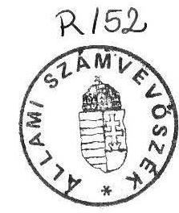

# JELENTÉS 

az 1990. évi önkormányzati választások
előkészítésével és lebonyolításával kapcsolatos állami feladatok végrehajtására biztosított költségvetési pénzeszközök felhasználásáról és az 1989-90. évi választások pénzügyi összegezéséről

---

A vizsgálatot végezték:
Területi Fócsoport

A Fôvárosban és Pest megyében

Baranya megyében
Bács-Kiskun megyében
Békés megyében
Borsod-Abaúj-Zemplén megyében
Csongrád megyében
Fejér megyében
Győr-Sopron megyében
Heves megyében
Hajdú-Bihar megyében
Jász-Nagykun-Szolnok megyében
Komárom-Esztergom megyében
Nógrád megyében
Somogy megyében
Szabolcs-Szatmár-Bereg megyében
Tolna megyében
Vas megyében
Veszprém megyében
Zala megyében

A területi jelentéseket összefoglalta

Vagyonkezelô Fôcsoport

A vizsgálat elôkészítésében részt vett

A vizsgálatot vezette

Benczik Lászlóné
dr.Felleg Zsoltné
Farkas Tamás
Gordos László
dr.Tóth Annamária
dr.Koronics Károlyné
Maczekó Károly
Domján Jenó
Pankucsi János
Fekete Tibor
Kocsis István
dr.Klapcsik László
Gamaufné dr.Kóbor Éva
Horváth József
Vécsey László
dr.Maróti Sándor
Kozák György
Buczkó András
Koltayné Szepesi Zsuzsanna
Fercsik Gyula
dr.HegedúsGyörgy
Kenéz Sándor
Csekei Gyula
dr.Gyuk József
Rénes Márta
Angyalosi Dániel
dr.Koller Valéria

Molnár Istvánné
Németh Béláné
Kiss Istvánné
Istvánffy Lóránt
dr.Egri Oszkár
Kemény Emil

---

Az Országgyűlés 70/1990.(IX.14.) határozata 5.sz. pontja alapján az Állami Számvevőszék vizsgálatot végzett az önkormányzati választások előkészítésére és lebonyolítására az állami költségvetésből elkülönített 560 millió Ft-os pénzügyi előirányzat felhasználásáról.

A vizsgálat kiterjedt az 1990. évi önkormányzati választások előkészítésére és lebonyolítására jóváhagyott költségvetés, valamint az 1989-1990. években választási pénzeszközök címén a BM részére átutalt összegek elszámolásának ellenőrzésére.

A hivatkozott határozat alapján a választás első fordulójára 405 millió Ft, a második fordulóra 155 millió Ft - összesen 560 millió Ft-ot állt Belügyminisztérium rendelkezésére pótelőirány zatként, céljelleggel, utólagos elszámolási kötelezettséggel.

A felhasználás ellenőrzése során vizsgálatot végeztünk a Belügyminisztériumnál, az ország megyei önkormányzati hivatalainál, ezek gazdasági ellátó szervezeteinél és 135 település helyi önkormányzati szerveinél, továbbá a Budapest Főváros Főpolgármesteri Hivatalánál és 7 kerületben.

Tájékozódó felmérést végeztünk az önkormányzati választásokkal kapcsolatos - a központi költségvetésben nem tervezett - közvetett költségek alakulásáról a Magyar Televiziónál, a Magyar Rádiónál, az Országos Rendőrfőkapitányságnál, a Fővárosi Közterületfennitartó Vállalatnál és a Magyar Távközlési Vállalatnál.

# MEGÁLLAPÍTÁSOK 

I.

A helyszini ellenőrzések tapasztalatai

## 1. Előzmények, tervezés

Az Országgyűlés az önkormányzati választások lebonyolítására 560 millió Ft-ot biztosított. A pénzügyi előirányzatot a Belügyminisztérium készítet te el, melynek kidolgozásánál figyelembe vették hogy a választás kétfordulós; az első forduló teljeskörü, a második fordulóra a települések mintegy $50 \%$-án kerül sor,

- a választók névjegyzékének készítése, az értesítés szétküldése helyi feladatot jelent,
- állampolgáronként kétfajta, a fővárosban háromfajta szavazólapot kell biztosítani,

---

a szavazatösszesítés a már működő információs rendszeren keresztül történik, ezért minimális eszközfejlesztéssel számoltak, de az eredeti törvény előírásait kielégítő - lokálisan használ-ható - számítógépes programok kidolgozását, a vírusvédelem megteremtését és az üzemeltetés költségeit terveikben szerepeltették.

Az 560 millió Ft-os költségvetés kiadási jogcímenként - első és második forduló szerinti bontásban - tartalmazza a központi és a helyi feladatokra előirányzott összegeket, dologi kiadások és személyi kiadások szerinti csoportosításban.

A határozat 2. sz. melléklete a lebonyolítás feladatainak megfelelő részletezésben, kiadási jogcímenként bontva, országos előkalkulációt tartalmaz a várható költségekről. Az ily módon számított összeget a választópolgárok számával elosztva alakították ki az első fordulóra $38,20 \mathrm{Ft} /$ fős, illetve a második fordulóra a $21,10 \mathrm{Ft} /$ fős normatívát. A normatív támogatáson felül a dologi többletkiadások fedezésére a főváros, a kerületek és a megyei jogu városok részére mindkét fordulónál 300.000-300.000 Ft , egyéb városi tanácsok részére 70.000$70.000 \mathrm{Ft}$ normakiegészítést irányzott elő az országgyűlési határozat.

A vizsgálat megállapította, hogy - a rendelkezésre álló rövid idő miatt - a választások állami feladatainak várható költségeire sem területi, sem helyi szinten nem készültek olyan előkalkulációk, melyeket a normatíva megalapozása céljából a központi szerveknek továbbitottak volna. A rövid előkészítési munka miatt nem került sor a tervezett finanszírozási rendszer utólagos véleményezésére sem.

A normatív finanszírozás választópolgárok számához kötött formája a gyakorlatban ellentmondásos helyzetet teremtett. Bebizonyosodott, hogy a választási költségeknek csak egy kisebb hányada (pl. választási értesítők készíttetése, kézbesítése) kapcsolódik közvetlenül a választópolgárok számához, nagyobb hányada a választási törvényben előírt feladatok ellátására létrehozott választási szervek (szavazatszedő bizottságok, helyi és területi választási bizottságok) müködtetéséhezköződik.

Megállapítható, hogy a határozat jogcímei szerint számított pénzügyi szükséglet a felhasználás helyén nincs összhangban a válsztópolgárok száma alapján biztosított normatív támogatással. Ebből adódóan a leutalt támogatás a városokban mindenütt meghaladta a szükségleteket, a települések egy részénél, fơként a társközségekkel rendelkező, alacsony népességű falvakban viszont az alapvető feladat ellátására sem volt elég.

# 2. A feladat végrehajtása 

Az előzmény és tervezési rendszer leírásában foglaltak alapján a költségvetés felhasználásáról,helyi és központi feladatok, illetve tételenkénti bontásban az Állami Számvevő szék szöveges értékelést és számszaki kimutatást kért a BM-tő 1. Ezt felülvizsgálva megállapításaink a következk:

---

A BM az 1991. január 31-i állapot alapján számolt be, mely szerint az összes kiadás 620,6 millió Ft volt.

A számszaki elszámolásban a Belügyminisztérium a központi feladatokra ténylegesen kiadásba helyezett tételeket közölte, a helyi feladatok között azonban azokat a tételeket is szerepeltette, amelyeket a megyék részére normatív alapon átutalt (a BM által kiadásba helyezett összegek). A normatív támogatás és a kiadások bizonylattal alátámasztott ösz szegei közötti különbséget, mint maradványt egyes megyék még nem utalták vissza (1991. január 31-ig) a Belügyminisztérium részére. Ennek összege 9.151 eFt volt. Az önkormányzati választások tényleges, bizonylatokkal alátámasztott kiadásai: 611.396 eFt volt. (Részletesen az 1. sz. mellékletben mutatjuk be.)

Az önkormányzati választásokra 51,4 millió Ft-tal költöttek többet, mint az előirányzat. Ennek fedezete az 1990. július 29-ei népszavazás maradványösszege ,amelynek felhasználására az 57/1990.(VII.27.) OGY határozat értelmében nyilt lehetöség.

Az 51,4 millió Ft-ból 10 millió Ft-tal a helyi, 38,4 millió Ft-tal a központi feladatok végrehajtására költöttek többet, ugyanakkor a tartalékkeret túllépése megközelítően 3 millió Ft-os kiadási többletet eredményezett.

# II. 

## Ahelyifeladatok végrehajtása

## 1. A pénzügyi elöirányzat és annak felhasználása

A megyei és a fővárosi, valamint a kerületek pénzügyi finanszírozása a választás első fordulójára - a költségvetési előirányzat szerint - a tervezett mértékben megtörtént, a választópolgárok száma szerinti norma és a normakiegészítés szétosztásával.

A választások második fordulóját azonban a tervezettnél (települések 50 \%-ával számoltak) jóval nagyobb arányban kellett megtartani. Ennek alapján a Belügyminisztérium úgy döntött, hogy a második fordulóra előirányzott $21,10 \mathrm{Ft}$ norma összeget a választásban feltételezetten résztvevő választó polgárok száma szerint osztja szét a megyék között (a terv szerint 3,9 millió fő helyett 5 millió fő választóra) és emellett az Ogy. határozatban rögzített normakiegészítésben a megyék nem részesülnek (kivételt képzett 5 megye, ahol a normakiegészítésre igényt tartottak).

A BM Választási Iroda a helyi feladatokra az első fordulóra 322,5 millió Ft-ot, a második fordulóra 131,5 millió Ft-ot - összesen 454 millió Ft-ot utalt át. Ez 19 millió Ft-tal több, mint az OGY határozattal jóváhagyott költségvetési támogatás. A különbözet a II. forduló finanszírozásánál jelentkezik. A vártnál szélesebb körben lebonyolított II. fordulóra a tervezett 112,5 millió Ft helyett - az érintett települések választópolgárainak száma alapján - 131,5 millió Ft-ot osztottak fel.

---

A tényleges felhasználás a helyi feladatok lebonyolítására 445 millió Ft volt, vagyis a tanácsok a rendelkezésükre bocsátott összegből 9 millió Ft- ot megtakarítottak. (A felhasználás 10 millió Ft-tal magasabb azOrszággyúlésáltal jóváhagyottösszegnél.)

A dologi kiadásokra az elsó és második fordulóra összesen 214 millió Ft-ot fordítottak ez 43 millió Ft-tal kevesebb a tervezettnél. A személyi kiadások összege 231 millió Ft - 53 millió Ft-tal több az eredeti elképzelésnél.

A választások lebonyolításához szükséges források biztosítása késôn, gyakorlatilag utólagosan történt. 100 millió Ft összegű előleg folyóstítására 1990. szeptember 24-én került sor, majd 2 nap múlva utalták a megyei tanácsok részére az első fordulóra még járó összegeket. A második forduló költségeire október 16-án, a VB titkárok jutalmazására november 6-án biztosítottak fedezetet.

A tanácsoknak az előkészületi tevékenységhez és a lebonyolításhoz saját költségvetési forrásaikat is be kellett vonni. Ennek időtartamát a helyi tanácsoknál esetenként a megyék késedelmes pénztovábbítása is növelte. Mindezek ellenére a vizsgálat nem tapasztalt fenti okok következményeként likviditási problémákat.

# 2. Helyi dologi kiadások 

A dologi kiadások legjelentősebb tétele a választói névjegyzék és az un. "kopogtató cédulák" elkészítésének, kézbesítésének költsége. Ennek finanszírozására a normatíva dologi részének $64 \%$-a volt igénybe vehető ( $16,60 \mathrm{Ft} / \mathrm{db}$ ). A vizsgálat tapasztalata szerint a megyék keresték a lehető legtakarékosabb megoldásokat, melynek következtében e tételnél jelentős metakarítások keletkeztek. Az alkalmazott költségkímélő megoldások alapján a normatíva összege is túlzottnak tekinthető.

Heves megyében a feladat finanszírozására rendelkezésre álló 4.318 eFt normatív támogatásból csak 2.279 eFt-ot fordítottak e célra.

Nógrád megyében 59, Komárom-Esztergom megyében 73, Békés megyében $65 \%$-os volt a felhasználás.

Baranya megyében kb. 600 eFt, Vas megyében közel 1 millió Ft-tal kevesebbet számolt el a megye a feladatra, mint a választópolgárok száma szerint számított összeg.

A fővárosban e feladatnál 3,8 millió Ft megtakarítás keletkezett a normához viszonyítva.

Megtakarítás mutatkozik a szavazással összefüggő dologi kiadások elszámolásánál. Ennek egyik oka, hogy a szavazás lebonyolításához szükséges eszközök már rendelkezésre álltak. Ezen kívül a vizsgálat megállapítása szerint továbbra sem teljeskörü és kellően megalapozott a rezsi kiadások elszámolása.

---

Győr Városi Tanácsnál becslés alapján számoltak el gépkocsi használatra 6,6 eFt-ot, nyomdaköltségre 78 eFt-ot, posta- és telefonköltségre 15 eFt-ot.

Kapuváron, Gönyün egyáltalán nem került sor rezsikiadás elszámolására.
Zala megyében belsó számlák alapján a tanácsok jelentős része számolt el rezsikiadásokat. A megyeközpontnál az elszámolt rezsikiadások némelyikét a vizsgálat túlzottnak tartotta.
Pl. gépkocsi fuvarteljesítmény 53 menetlevél alapján 20.138 km , menetenként átlag 380 km .

Hasonlóan túlzottnak tekinthető a Fővárosi Tanács MESZ-énél kiállított belső bizonylatok és kalkulációk alapján elszámolt 912 eFt rezsikiadás. A vizsgált fővárosi kerületek közül egyedül a X.ker. számolt el becsült összegben rezsikiadást.

Nógrád megyében előkalkulációk alapján vették figyelembe a megyei tanácsnál a rezsikiadásokat, belső számla nem készült.

Szabolcs-Szatmár-Bereg megye elszámolásában 90 eFt összegben "eszmei költség" szerepel a dologi kiadások között. Ebben - a kiállított belső számla szerint - a tanácsi apparátus adminisztrációs-ügyviteli tevékenységének a választásokat terhelő részét próbálták számszerüsíteni. (Pl. készpénz kifizetések folyamatos biztosítása, pénztári könyvelése, ügyeleti beosztások, könyvelési bizonylatok gépelése, megbízási díjak számfejtésének ellenőrzése, stb.). A tételek között szerepel az Állami Számvevőszék felé történő elszámolás is.

Jász-Nagykun-Szolnok megyében a településeken mindenütt elszámolták teljes körben a felmerült rezsikiadásokat, ennek eredményeként e jogcímen a normatíva szerinti 1.020,9eFtösszegű támogatáshelyett a szükséglet $3.659,4 \mathrm{eFt}$ volt. A vizsgálat a bizonylatokat, belső bizonylatokat szabályszerűnek találta.

Azétkezésre fordított kiadások igen sok helyen meghaladták a norma szerint kifizethető összeget. A $200 \mathrm{Ft} /$ fő étkezési térítés kifizetése mellett több helyen sor került hagyományos étkeztetésre is, különösen területi választási szerveknél jellemző a közreműködő tanácsi dolgozók, újságírók, szakértők, pártok delegáltjai, gépkocsivezetők, stb. étkeztetése a választási napokon.

A Fővárosi Tanácsnál a közreműködők és vendégek részére a két fordulóra 84.800 Ft-ért vásároltak élelmiszert, illetve üdítőket. (Az OGY határozathoz készült előkalkulációban fordulónként 5.000 Ft-tal számoltak.)

Pest megyében, Pilisvörösváron fordulónként 38-38 fő étkeztetéséről összesen 98 eFt összegben mutattak be éttermi számlát. (Névsor nem készült a résztvevőkrol.) Az egy főre jutó 1.289 Ft több, mint hatszorosa az előírt normának. A megyei GESZ és a Budapest, XII.ker. Tanács elszámolásában reprezentációs költség címen szeszesital vásár-

---

lás is szerepelt annak ellenére, hogy a BM több ízben felhívta a figyelmet, hogy szeszesital elszámolása a választás terhére tilos.

Jász-Nagykun-Szolnok megyében a választások első fordulójának étkezési kiadásaira - a 658,6 eFt-os pénzügyi normativa helyett 1104,5 eFt a tényleges felhasználás, a 2. fordulóban 512 eFt-ot számoltak el. Ez a szavazókö rökben kétszeres, választási bizottságoknál és a helyi tanácsoknál több mint háromszoros felhasználást jelent. Martfűn pl. az előirányzott 10,5 eFt helyett 26,0 eFt-ot használtak fel. Összesen 49 fő étkeztetéséről gondos kodtak, ebből 13 fő tanácsi közreműködő, 19 fő pártdelegált. Az 1 fôre jutó étkezési költség (reggeli-ebéd-vacsora-kávé, üdítő) 528,57 Ft volt.

A dologi kiadások tervezetthez viszonyított megtakarítását néhány tanácsnál a választással nem, vagy csak részben összefüggő kiadások finanszírozására is felhasználták.

- Borsod-Abaúj-Zemplén megyében Mezőkövesden a választási kiadások terhére útburkolat javítást, tereprendezést számoltak el 80,1 eFt értékben.

Kaposváron 7 db Siesta gázkályhát és 7 gázpalackot vásároltak a szavazóhelyiségek elégtelen fűtésének javítására.

Hajdu megyében fénymásológép ( 152 eFt ) a Tolna megyei tanácsnál telefax ( 174,8 eFt), Tolna városában telefax és számítógép bővítés ( 286 eFt) ára lett elszámolva a választási kiadások terhére.

A Fővárosi Tanács Programirodája számára a választási pénzeszközökből utólag 5.328 eFt értékben megtérítette az 1989. évi népszavazásra a kerületekbe telepített 32 db számítógép 1/3-os értékeként a Controll által számlázott összeget; további 1.160 eFt-ért 32 db EPSON nyomtató árát rendezték utólag a választási kiadások terhére. A Belügyminisztériummal folytatott levelezés a népszavazás pénzmaradványát jelöli meg finanszírozási forrásként, e megkülönböztetésnek - miután a felhasználás során nem különítették el a maradványt - nincs különösebb jelentősége. A BM csak a vonat kozó számlákat kérte be és bár tényszerű engedélyt nem adott, az elszá molást nem kifogásolta meg, a tételt mint a népszavazásra utólag felmerült kiadást kezeli.

# 3. Helyi személyi kiadások 

A személyi kiadásokra fordított összegek aránya - annak következtében, hogy az OGY határozat nem korlátozza a dologi kiadások megtakarításainak személyi célú felhasználását - jelentős mértékben megnőtt.

Előirányzat:
177,7 millióFt
Kiadás:
230,7 millióFt
Növekmény:
53,0 millióFt

---

A növekmény egy részét indokolja, hogy a normatív finanszírozással hátrányosan érintett településeken a forráshiány a szavazókörök müködtetésével kapcsolatos díjazás kifizetésénél jelentkezett. A hiányzó forrás pótlása, vagy a kiadás utólagos megtérítése ilyen értelemben a személyi kiadásokra való "átcsoportosítást" jelentett.

Aközvetlenközremüködökrészérekifizetettdíjazás általában az OGY határozat 2.sz.mellékletével egyezően történt. Néhány esetben külön jutalmak fizetésére, egyes kistelepüléseken az OGY határozatban rögzítettnél kisebb díjtételek számfejtésére került sor.

A helyi és területi tanácsi dolgozók többlet- és túlmunkájának elismerése nagy szélsőségeket takar, megyénként, településenként eltérő. A 4-500 Ft-os kifizetéstől a 180 eFt-os jutalomig számtalan variációval találkozott az ellenőrzés. A kifizetések nagyságrendje a települések közötti összehasonlításban nem a végzett munkával, hanem a település tanácsának anyagi lehetőségeivel mutat összefüggést. (PI. a Fővárosi Tanácsnál a konyhai kisegítők a két választási fordulóra $10 \mathrm{eFt} / \mathrm{f} \delta$ jutalomban részesültek, több kistelepülés vb titkára 8.000 Ft alatti összeget kapott.)

Segesd községben egyáltalán nem fizettek a szükös költségkeret miatt.
Kisbéren átlag $1.050 \mathrm{Ft} /$ fő volt a jutalmazás.
Gönyün $1.700 \mathrm{Ft} /$ fő.
Martfűn átlag $4.808 \mathrm{Ft} /$ fő, a legkisebb jutalomösszeg 400 Ft , a legmagasabb 7.000 Ft . Nógrád megyében a jutalomösszegek 5-50 eFt között szóródnak.

Szolnok Megyei Tanács, a normatíva szerint rendelkezésre álló keret $65,8 \mathrm{eFt}$, kifizetésre került 173 fő részére az első és második fordulóra együtt 979,7 eFt. (Ebből 200 eFt a TAKEH dolgozóinak.) A szóródás 1.667-30.000 Ft között (TAKEH-nál 500 és 15.000 Ft között.)

A Fővárosi Választási Munkacsoport 27 tagjának 1.590 eFt jutalmat fizettek (átlag 58 eFt, szóródás 20-150.000 Ft között), ezenkívül 72 nap jutalomszabadságot állapítottak meg részükre. További 202 fő részére 2.095 eFt-ot fizettel (átlag 10.300 Ft , szóródás $1.300 \mathrm{Ft}-60.000 \mathrm{Ft}$ ).

Hajdu-Bihar megyében a tanácsi dolgozók jutalmára és túlmunka díjára a norma szerinti 618 eFt helyett 1.430 eFt-ot használtak fel.

Vas megyében 232 eFt helyett 964 eFt-ot fizettek ki. Pécsett a saját költségvetési számláról 281 eFt-ot (+120 eFt TB járulék) fizettek ki a tanácsi dolgozóknak plusz jutalomként.

Budapest XIII. kerületében a költségvetési számláról 1.400 eFt-ot tettek át a letétre egy 1990. áprilisi keltezésű testületi határozatra hivatkozva. Ebből személyi kifizetéseket eszközöltek, pl. a választási munkacsoport néhány tagja $90.000 \mathrm{Ft} / \mathrm{f} \delta /$ forduló összegűjutalombanrészesült.

---

Veszprém Megyei Tanácsnál a jutalomösszegek 1.667 és 80.000 Ft között mozogtak. A megyei tanácsoknál a jutalmazottak száma eltérő, Heves megye 34 fő, Szolnok megye 117 fó, Komárom megye 22 fő, Győr megye 24 fő.

A VB titkárok jutalmára - a kistelepülések negatív szélsőségeit leszámítva - általában a tervezett $8.000 \mathrm{fo} / \mathrm{Ft}$ összeg 2-5-szörösét fordították, a fővárosi kerületek esetében 10-12-szeres összegek kerültek kifizetésre. (A $8.000 \mathrm{Ft} /$ fő átlagos normatív támogatásból - a jövedelmek adótartalmát is figyelembe véve - érdemi differenciálást megvalósítani lehetetlen.)

Az Ogy. határozattal biztosított szabad felhasználás miatt a vizsgálat csak észrevételezni tudta a személyi kifizetések terén mutatkozó anomáliákat.

A vizsgálat tapasztalata szerint az elszámolt kiadások a korábbiakhoz hasonlóan most sem fedik le teljes körben a valós költségeket (el nem számolt, vagy becsült összeggel elszámolt rezsiköltségek, költségvetési számláról fizetett beszerzések, illetve jutalmak stb. miatt). Ezzel együtt javult a kiadások dokumentáltsága, elkülönítése.

Továbbra sem egységes a költségvetési támogatás kezelése. A letéti számlára utalt összegeket néhány helyen bevonják a költségvetési gazdálkodásba átvett pénzeszközként (Veszprém, Győr és Hajdu megye), másutt a letéti számlán külön kezelik. A TB járulék elszámolása a választási pénzeszközök terhére általában rendben megtörtént, azonban az elszámolásokban különbözőképpen személyi, illetve dologi kiadásként szerepelnek. A kifizetések jelentős része megbízási szerződésekre történt, de társadalmi munka miatti jutalomként is teljesítettek kifizetéseket.

# III. 

## Központifeladatok végrehajtása

Az önkormányzati választások központi feladataira az Ogy. határozat 121,4 millió Ft-os pénzügyi előirányzatot biztosított a tényleges felhasználás 159,8 millió Ft volt.

## 1. Központi dologi kiadások

A dologi jellegű kiadásokra összesen 119,5 millió Ft-ot irányzott elő a költségvetés, ezzel szemben a felhasználás a tételes elszámolás alapjáh 158,0 millió Ft volt, mely felhasználási jogcímenként az alábbiak szerint alakult:
a) Az Országos Választási Bizottság müködési dologi jellegú kiadásaira a jóváhagyott előirányzat 300 eFt-t volt. Ezen a címen felhasználásra került 448,2 eFt melyből 130 eFt-ot a Bizottság étkeztetésére fordítottak; a BM konyha által kiállított számlák alapján. Mintegy 65 eFt értékben beszerzésre kerültek különféle anyagok, eszközök (zászlók, TV kábelek, antenna) a terem berendezéséhez.

---

A majdnem $50 \%$-os költségtúllépést az OVB - a tervezettnél gyakoribb és hosszabb ülésezése okozta, amit a feladat újszerúsége tett indokolttá.
b) A szavazatösszesito információs rendszer fejlesztésére 30,0 millió Ft előirányzattal szemben 21,7 millió Ft volt a kifizetés melyből 19,3 millió Ft szoftver-, 1,0 millió Ft hardver-fejlesztés.

A fejlesztéseken kívül ezen a soron került elszámolásra 1,3 millió Ft a számítógépek üzemeltetésére, valamint 138,4 eFt egyéb kiadásokra (videofilm átjátszás, fülkeépítés, hírközlés, taxiköltség).

A költségsoron $28 \%$ megtakarítás jelentkezett ami a BM Közigazgatási Informatikai Főosztály gondos előkészítő és szervező munkájának köszönhető. A reális alvállalkozói szerződések alapján készült szoftverek jól illeszkedtek az önkormányzati törvény előírásaihoz és zökkenőmentesen tették lehetővé a decentralizált szavazatösszesítést.
c) A szavazólapok, hírdetmények nyomdai és papírköltsége fedezetére 85,0 millió Ft-ot tartalmazott az elő irányzat, ezzel szemben a számlák tételes ellenő rzését követő összegzés 133,8 millió Ft tényleges kifizetést mutatott, melyből 119,0 millió Ft a nyomtatványok és 9,9 millió Ft a borítékok előállítási költsége.

Ezen a költségsoron kerültek elszámolásra még az alábbi tételek:

- adatszolgáltatás a tartósan letelepedett nem magyar, illetve a szavazati joggal nem rendelkező állampolgárokról ( $0,8 \mathrm{MFt}$ )
- az önkormányzati, illetve választási törvény tervezetének külön nyomtatása 2700 pldban $(0,5 \mathrm{MFt})$
- az önkormányzati törvény teljes szövegének megjelentetése fizetett hírdetésként a Pesti Hírlap 1990.09.27-ei számában a belügyminiszter személyes rendelkezése alapján (1,3 MFt)
- 65 ezer db "signetta" iron ( $0,4 \mathrm{MFt}$ ).
(A szavazófülkékben használt ironok központi beszerzése - az elosztás gondjai ellenére - közel 1,0 millió Ft megtakarítást eredményezett az árrések kiesése és a gyártói kedvezmény miatt.)
- a különféle szavazások módját ismertető 5 db videófilm készítése ( $0,8 \mathrm{Mft}$ )
- a Magyar Közigazgatás címü kiadvány 1990/10. számának megvásárlása 25.000 pld-ban és eljuttatása a megválasztott képviselőkhöz ( $1,0 \mathrm{Mft}$ ).

A választásokra jóváhagyott költségvetés ezen során jelentkezett a legnagyobb túllépés 48,8 millió Ft ( $57,4 \%$ ) -, mely alapvetően az óriási nyomdai és papírköltségekre vezethető vissza.

---

A BM Választási Iroda a második forduló tervezettnél nagyobb mértékével indokolta a túllépést, de a megmaradt és a választás során fel nem használt nyomdai termékek (borítékok, bianco szavazólapok, hírdetmények) némi túlbiztosításra, felülrendelésre utalnak.

Itt kívánjuk felhívni a figyelmet arra, hogy az önkormányzati választások hoz megrendelt és leszállított papíráruk összsúlya megközelítette a 330 tonnát! Önmagában ez a tény felveti a jövőbeni választások költség- és anyagtakarékosabb módszere kialakításának igényét.

A nyomdai és papírköltségeken felül növelte e rovaton a túllépés mértékét, hogy nem ideilló tételeket állítottak be az elszámolásba (az ÁNH adat szolgáltatás a "b" rovatba, az ironok és videófilmek az "f" rovatba tartoznak), valamint indokolatlannak tartjuk az önkormányzati és választási törvények propagálását és terjesztését a választás költségeinek terhére. Ilyen jellegű kifizetésekre az Országgyűlés határozata - sem betüjében, sem szellemében - nem ad felhatalmazást és a belügyminiszter saját hatáskörében nem rendelkezhet a választási pénzek felhasználásánál új jogcím bevezetéséről. Ez a propaganda tevékenység 2,7 MFt költségtúllépést eredményezett.
d) A Választási Központ, valamint a megyék hírösszeköttetésére a tervezés 4,0 millió Ft-ot irányzott elő. A BM az elszámolás összesítójébe 1,7 millió Ft-ot állított be, melyből a hírközléssel kapcsolatos számlák 1,4 millió Ft-ot tesznek ki. A hírközlésen kívül itt került elszámolásra a tolmácsolási feladatot ellátó szervezet egyik - 292,3 eFt-os - számlája és a Választási törvény pótlólagos nyomtatásáról készült 52,6 eFt-os számla. E költségsoron jelentős megtakarítás jelentkezett (a felhasználás $43,7 \%$-os), ami az információ-továbbítás új egyszerűsített megoldásának (telefaxok) tudható be.
e) A Választási Központban dolgozók étkezési költségeire előirányzott 140.0 eFt helyett 277,4 eFt került kifizetésre.
f) A Választási Iroda dologi kiadásaira az előirányzat 40.0 eFt volt. A BM az elszámolásába 35,6 eFt-ot állított be. Az ellenőrzés során,kifogásoltuk a Rositext javítási költségeinek és a Rolitron adatcsomag árának elszámolását. Kifogásunkat BM Választási Iroda elfogadta és az elszámolás végösszegét csökkentette 30,1 eFt-ra.

# 2. Központi személyi kiadások 

A személyi kiadások előirányzata 1,9 millió Ft volt, a tényleges kiadás 1,7 millió Ft.
A központi személyi kiadások között számolták el a fővárosi, megyei VB titkárok jutalmát, amelynél a tervezett 715 eFt helyett 500 eFt-ot fizettek ki ( 215 eFt megtakarítás). A további 1.141 eFt-ot a Belügyminisztérium dolgozói, mint az OVB munkáját segítő technikai műszaki és szakértői apparátus munkatársai kapták meg.

Az egyéb feladatokra vonatkozó megbízási díj összege 93.6 eFt-ot tett ki. A személyi kiadások bonyolítása a munka elvégzésének bizonylatolása megfelelően megtörtént.

---

A központi feladatok dologi és személyi kiadásainak bizonylatolása - kisebb számszaki hibáktól eltekintve - rendben volt, de az ellenőrzést nehezítette, hogy a számlák felhasználási jogcímentkénti csoportosítása nem volt egységes és következetes (azonos tipusu tételek különbözô jogcímekre lettek terhelve).

# IV. 

## Egyéb kiadások

## 1. Tartalékkeretfelhasználása

Az OGY határozat szerint a választásokra pénzügyi elöirányzatként elóre nem látható feladatokra, tartalékkeret címen 3.620 eFt -ot különítettek el. A tartalékkeret soron a BM elszámolásaiban $6.571,6 \mathrm{eFt}$ felhasználást mutatott ki. A BM beszámolójában a következôképpen indokolta e kiadási tételt. Az elsó forduló alacsony részvételi aránya miatt a második forduló előtt, több párt hatékonyabb propaganda kifejtésére hívta fel a Belügyminisztériumot. A belügyminiszter úr döntése alapján ennek eleget téve, a költség vetésben nem tervezett aktív központi propaganda kifejtése vált szükségessé, mely mintegy 6.571 eFt ráfordítással járt.

Megállapítottuk, hogy a belügyminiszter a BM költségvetése 1990. évi elöirányzatából engedélyezte a propaganda számlák kifizetését, a BM Választási Iroda azonban az önkormányzati választások terhére számolta el.

## 2. A központi költségvetésen kívüli, választással kapcsolatos költségek

Az önkormányzati választásokkal kapcsolatos állami feladatok végrehajtásához rendelkezésre álló központi költségvetési pénzeszközökön túlmenően a választásban szükségszerűen közremüködô egyes állami szervek saját költségvetésük terhére is használtak fel pénzeszközöket. Ezek számbavételét is indokoltnak tartottuk, mivel ha áttételesen is, de forrásuk végsô soron az állami költségvetésbôl nyújtott támogatás.

A tájékozódás alapján a következôket állapítottuk meg:
AMagyarTelevizió a választásokhoz kapcsolódó músorokra a normál müködésen felül 10,0 millió Ft költséget használt fel. Ez az alkalmi munkások béréből és TB járulékából, valamint a músoridó meghosszabbodásának sugárzási díjából tevődik össze.

A Magyar Rádió választási músorokra felhasznált többletköltsége 0,4 millió Ft. A költség zöme honoráriumokra kifizetett díj.

Az Országos Rendôrfôkapitányság irányítása alatt álló rendôri szerveknek túlmunka díjazásból, dologi költségekből álló ráfordítása 2,0 millió Ft.

---

A Fővárosi Közterületfenntartó Vállalat a választások után az aluljárókban, mütárgyakon, frekventált főútvonalakon elhelyezett plakátok eltávolításánál összesen 0,4 millióFtértékủ munkát végzett, melynek $95 \%$-a munkabér és közteher.

Megjegyzendő, hogy a költségeket a Főpolgármesteri Hivatal megtérítette, a fővárosi önkormányzat költségvetésének terhére.

A Magyar Távközlési Vállalat a választásokkal kapcsolatban nem mutatott ki külön erre a célra történő pénzfelhasználást. Ennek oka, hogy a választási eredmények telefaxos módszerrel történő továbbítása nem igényelt a normál postai szolgáltatáson felüli túlmunkát, illetve ügyeleti és dologi költséget. A választásokhoz külön kérésre kiépített telefonvonalak költségeit a BM Választási Iroda megtérítette.

A megkérdezett közreműködő szervek összességében mintegy 13 millió Ft-ot használtak fel. A költségek egy része csak becsléssel volt megállapítható.

Az adatokból kitűnik, hogy az országgyűlési képviselőválasztásoknál tapasztalt ilyen j ellegủ költségráfordításhoz képest jelentősen, mintegy ötödére csökkentek a költségek, ami részben az egyszerűbb feladatnak és kisebb kampánynak, másrészt a szervezettebb és átgondol tabb munkának tudható be.

Az országgyűlési képviselőválasztásoknál megközelítőleg 100 millió Ft-ot tettek ki azok a becsült költségek, amelyek az intézményi, vállalati segítségnyújtásból a lapkiadók és városi televíziók többletráfordításaiból, a tanácsok saját keretük terhére elvégzett munkáiból, valamint a közreműködők által kivett többlet szabadnapok munkabéréből tevődtek össze.

Ezen költségtényezőket az önkormányzati választások esetében nem tekintet tük át tételesen, de a vizsgált közreműködőknél tapasztaltak alapján ezen a téren is jelentős csökkenés becsülhető (ráfordítás kb. 13,0 MFt).

Összességében az önkormányzati választásoknál az egyéb költségforrások terhére finanszírozott költségek, mintegy 26 millió Ft-ra tehetők. Ez az országgyűlési képviselőválasztáshasonló jellegű költségeinek kb. $17 \%$-a.

# V. 

## Az1989-1990.éviválasztásokpénzügyiösszegzése

1989-90. években törvényesen szabályozott keretek között négy országos méretű választás megtartására és költségvetési finanszírozására került sor. A két népszavazásra azországgyűlési képviselőválasztásra és a helyhatósági választásokra 1.547 millió Ft-ot különített el a költségvetés.

---

A törvényi feltételek lehetőséget nyújtottak a választások bonyolításával megbízott Belügyminisztériumnak, hogy a rendelkezésükre bocsájtott keretösszegekkel utólag számoljanak el,
s a felmerült túllépéseket a megtakarítások terhére kiegyenlítsék. Így alakult ki, hogy a négy választás egyenlege - jelentős belső ingadozások mellett - 29,3 millió Ft megta karítás. Ez az összeg jelenleg a BM Választási Iroda rendelkezésére áll, s az időközi választások, valamint egyéb - a választásokkal összefüggő - feladatok forrásául szolgál.

A négy választásra törvényileg biztosított kereteken túl - az országgyűlési képviselőválasztások biztosításához - további 100 millió Ft-ot adott a költségvetés, részben célzott számítógépesítésre, részben szavazatbiztonsági kérdések megoldására (Minisztertanács elnökének pótkereteként).

Tájékozódó felmérést készítettünk a választások során az egyes állami szerveknél felmerülő - a választás folyamatával összefüggő - többletkiadásokról, melyeket közvetett választási költségeknek minősítettünk. Ezek becsült összege 176 millió Ft volt.

Összefoglalva megállapítható, hogy a négy országos választásra fordított közvetlenül és közvetve jelentkező kiadások összesen megközelítették az 1,8 milliárd Ft-ot (részletesebben lásd 2.sz. melléklet).

# VI. 

## Összefoglalás, javaslatok

Az Országgyűlés a 70/1990.(IX.14.) Ogy. határozatával az 1990. évi önkormá nyzati választás előkészítésére és lebonyolítására 560 millió Ft-ot hagyott jóvá a BM részére pótelőirányzat ként, céljelleggel és utólagos elszámolási kötelezettség mellett.

A határozat 1. pontjának megfelelően a Pénzügyminisztérium az előírt határidőn (1990. szeptember 30.) belül, két részletben (szeptember 5 -én 100 millió Ft, szeptember 11-én 460 millió Ft) nyitotta meg a támogatást.

A Belügyminisztérium szakmai és gazdasági irányításával az önkormányzati képviselö- és polgármesterválasztások törvényes rendben lezajlottak. Az utólagos elszámolás 611,4 millió Ft felhasználást állapított meg, ami 51,4 millió Ft-tal nagyobb, mint a határozatban rögzített előirányzat. A túllépést alapvetően az okozta, hogy a tervezett $50 \%$-kal szemben mind a 162 városi jogú településen ( 140 város, 22 budapesti kerület) meg kellett a második választási fordulót is tartani.

A pénzfelhasználás törvényességi szempontból szabályszerű volt. A jelentésben rögzített észrevételek részben a szabályozás hézagaira, a törvényi előírások hiányaira utalnak, részben a takarékos megoldások elmaradását, a hatékonyabb pénzfelhasználást kérik számon.

---

A túllépést csökkenteni lehetett volna, ha:

- a nyomtatványok és papíráruk kevésbé vannak túlbiztosítva,
- elmarad az önkormányzati és választási törvény többszöri és több helyen történt propaganda célú terjesztése ( 2,8 millió Ft),
- a BM a két választási forduló között a belügyminiszter által elrendelt propaganda költségét nem a választás terhére számolja el ( 6,6 millió Ft ).

A Belügyminisztérium - az Országgyúlés tájékoztatása, illetve a vonatkozó Ogy. határozat módosítása nélkül át tudta lépni a megadott kereteket, mivel az 57/1990.(VII.27.) Ogy. határozat módot adott az 1990. juliusi népszavazás maradványösszegének ( 96 millió Ft) felhasználására egyéb, választással kapcsolatos feladatok finanaszírozására.

A Belügyminisztérium - a korábbi választások tapasztalatai alapján - normatíva támogatási rendszert dolgozott ki a helyi (tanácsi) feladatok ellátásához szükséges keretek kiszámításához.

A vizsgálat tapasztalatai alapján megállapítható, hogy az önkormányzati választások lebonyolítására alkalmazott normatív finanszírozási rendszer jelen formájában nem biztosította megfelelő területi bontásban a feladatok ellátásához szükséges fedezetet. Egyes területeken indokolatlan forrás felhalmozást idézett elő, másutt az alapvető feladatellátásra is kevés volt.

A szabályozás azzal, hogy ilyen körülmények között kötöttség nélküli fel használást engedélyezett, megteremtette a támogatási többletek személyi jövedelemkénti kifizetésének lehetőségét. A tanácsok érdekeltsége a takarékos felhasználásban a maradvány elvonása következtében megszünt. (Ez - értelemszerüen csak a dologi kiadások tekintetében érvényesült.) A hiányok átcsoportosításokkal való - szükségszerü - feloldása lényegében ellentétes a normativitás követelményével.

Összességében az 1989-90. évi választásokra visszatekintve a hazai és nemzetközi minősítés alapján megállapítható, hogy a választások tisztasága és törvényessége nem szenvedett csorbát, s a közel 1,8 milliárd forint felhasználásának értékelésekor e minőségi szempontot is ki kell hangsúlyozni.

Lehetőség van olyan választási rendszerek kialakításának - hasonlóan a nyugati de mokrácákhoz - amelyekben a folyamatok racionalizálása, a költségek csök- kentése kerül előtérbe és a biztonság - mint alapvető szempont - nem kerül túlhangsúlyozásra.

# A vizsgálati megállapítások alapján javasoljuk, hogy: 

1. Az Országgyúlés fogadja el, hogy az elôttünk álló választások törvényi elókészítésénél a biztonsági garanciákkal azonos súllyal essen latba egy költségkímélő (anyag és élómunka) rendszer kialakításának igénye.

---

Szükséges a személyi kifizetések törvényi szabályozása, továbbá az ellenôrzés elôsegítése érdekében a felhasználási jogcímek részletezése és az átcsoportosítás korlátozása.
2. A belügyminiszter intézkedjen a választások költségvetési maradványának Pénzügyminisztériummal történő elszámolására. A BM számláján maradó választási tartalékkeret - melyet külön felhatalmazás nélkül használhat fel - ne haladja meg az 5 millió Ft-ot. Az idô szaki- és pótválasztások bonyolítására - utólagos elszámolás mellett - szükséges pótelőirányzatot elkülöníteni.
3. A Belügyminisztérium dolgozzon ki egy új normatív finanszírozási rendszert, amely differenciált vetítési alapokra épül, tehát a választók számán kívül figyelembe veszi a szavazókörök számát és a település tipusát, szerkezetét is.
A normarendszer elvi kidolgozását a választások idópontjától függetlenül meg kell kezdeni és jóváhagyás elôtt az önkormányzatokkal véleményeztetni.
4. Mint korábbi jelentéseinkben kiemeltük, a választások költségeinek terhére nagyértékủ számítógépek és sokszorosító berendezések, illetve ezek alkatrészei is beszerzésre kerültek. A belügyminiszter intézkedjen, hogy ilyen eszközök további vásárlására csak elózetes jóváhagyás alapján - külön költségsoron feltüntetve - legyen lehetôség.

(Hagelmayer István)

---

# KIMUTATAS

az 1991. évi helyi önkormányzati képviselő- és polgármesterválasztások lebonyolítására jóváhagyott pénzeszközök felhasználásáról

|  MEGNEVEZES | Előirányzat | BM kifizetés 1991.1.31-ig | Felhasználás ASZ ellenőrző szerint | Index felh./előir. %  |
| --- | --- | --- | --- | --- |
|  1. HELYI TANACSI FELADATOK |  |  |  |   |
|  1. Dologi kiadások |  |  |  |   |
|  a) Hirdetmény- és plakátköltség | 7.750.0 | - | 5.469.7 | 70.6  |
|  b) Helyi és területi választási bizottságok működési kiadásai | 24.000.0 | - | 10.375.0 | 43.2  |
|  c) Elelmezési kiadások | 24.050.0 | - | 27.149.5 | 112.9  |
|  d) Választók nyilvántartásának elkészítése, értesítők kiküldése | 130.000.0 | - | 84.026.9 | 64.6  |
|  e) Szavazással összefüggő dologi jellegű kiadások | 71.500.0 | - | 74.051.6 | 103.6  |
|  f) Helyileg előállított szavazólapok költségterítése | - | - | 7.217.5 | -  |
|  Összesen: | - | - | 208.290.2 | -  |
|  Veszprém megye nem részletezett dologi kiadásai | - | - | 6.109.8 | -  |
|  Dologi kiadások összesen: | 257.300.0 | - | 214.400.0 | 83.3  |
|  2. Személyi kiadások |  |  |  |   |
|  a) Tanács által választott szavazatszámláló bizottsági tágok tiszteletdíj | 48.000.0 | - | 50.824.0 | 105.9  |
|  b) Szavazdárdákon dolgozó jegyzőkönyvvezető túlmunkájának elismerése | 33.000.0 | - | 34.453.5 | 104.4  |
|  c) A tanács által választott helyi és területi választási bizottság tagjai túlmunkájának elismerése | 24.000.0 | - | 16.734.8 | 69.7  |
|  d) Helyi és területi választási bizottságok mellett dolgozó tanácsi dolgozók többletmunkájának elismerése | 9.600.0 | - | 26.077.6 | 27.2  |
|  e) Helyi tanácsoknak közreműködő tanácsi dolgozók túlmunkájának elismerése | 19.800.0 | - | 49.548.3 | 250.2  |
|  f) Megyei tanácsoknak közreműködők túlmunkájának elismerése | 2.400.0 | - | 10.256.6 | 427.4  |
|  g) Közintézményekben ajánlási szelvények gyűjtése (intézményi dolgozók túlmunkadíjai) | 22.000.0 | - | 5.673.9 | 25.8  |
|  h) Helyi tanácsok vb titkárai túlmunkájának elismerése | 18.900.0 | - | 26.724.8 | 141.4  |
|  i) Egyéb személyi kifizetés (ügyeleti díjak, szakértői díjak, stb.) | - | - | 502.7 | -  |
|  Összesen: | 177.700.0 | - | 220.796.2 | -  |
|  Veszprém megye nem részletezett személyi kiadásai | - | - | 9.867.4 | -  |
|  Személyi kiadás összesen: | 177.700.0 | - | 230.663.6 | 129.8  |
|  HELYI FELADATOK ÖSSZESEN: | 435.000.0 | 454.214.3* | 445.063.6 | 102.3  |

---

# II. Központi feladatok 

1. Dologi kiadások
a) OVB müködési, dologi jellegú kiadásaira
b) Szavazatösszesítési információs rendszer
b) Szavazolapok, hírdetmények nyomdai és papírköltsége
b) Szavazolapok felülnyomása (nem tervezett feladat)
c) Választási Központ, megyék hírcsazeköttetése
d) Választási Központban dolgozók étkezési költsége
f) Választási Iroda dologi kiadásai

Dologi kiadások összesen
$300.0 \quad 448.2 \quad 448.2 \quad 149.4$
$30.000 .0 \quad 21.717 .4 \quad 21.717 .2 \quad 72.4$
$85.000 .0 \quad 133.801 .0 \quad 133.805 .2 \quad 157.4$
$4.000 .0 \quad 1.748 .5 \quad 1.748 .0 \quad 43.7$
$140.0 \quad 277.4 \quad 277.4 \quad 198.1$
$40.0 \quad 35.6 \quad 30.1 \quad 75.3$
$119.480 .0 \quad 158.026 .1 \quad 158.026 .1 \quad 132.3$
2. Személyi kiadások
a) Választási központban technikai, müszaki apparátus túlmunkadijának elismerése
b) Fövérési, megyei VB titkárok túlmunkadija
c) OVB munkáját segitő szakértői apparatus
d) Választás előkészítésével kapcsolatos különféle feladatok elvégzésére megbízási díj
$200.0 \quad 293.0 \quad 293.0 \quad 146.5$
$715.0 \quad 500.0 \quad 500.0 \quad 69.9$
$650.0 \quad 566.6 \quad 566.6 \quad 87.2$
335.0 375.0 375.0 111.9

Személyi kiadások összesen
$1.900 .0 \quad 1.734 .6 \quad 1.734 .6 \quad 91.3$
II. Központi kiadások összesen
$121.380 .0 \quad 159.760 .7 \quad 159.760 .7 \quad 131.6$
III. Tartalék és terhére kifizetett, elöre nem látható feladatok, propaganda költsége
$3.620 .0 \quad 6.571 .6 \quad 6.571 .6 \quad 181.5$
$560.000 .0 \quad 620.546 .6 \quad 611.395 .9 \quad 109.2$

EGYENLEG (maradvány a tanácsok visszautalásából)
9.150 .7

* A BM kifizetés nem jogcímenként, hanem normatíva alapján történt.

---

# AZ 1989-98. EVI VALASZTASOK PENZGGYI OSSZEGZESE 

|  | Forrás | Felhasználás | Tüllépés | Megtakarítás |
| :--: | :--: | :--: | :--: | :--: |
| 1. Az Ogy. határozatai alapján a BM rendelkezésére bocsájtott összegek |  |  |  |  |
| 1.1. 1989. novemberi népszavazás | 36.935 | $41.637 *$ | 4.702 |  |
| 1.2. 1990. évi országgyulési képviselb. választás | 550.000 | 546.405 |  | 3.595 |
| 1.3. 1990. júliusí népszavazás   - utólag érkezett számlák | 400.021 | $\begin{aligned} & 303.977 \\ & 14.195 * * \end{aligned}$ | 14.195 | 96.044 |
| 1.4. 1990. évi önkormányzati valasztás | 560.000 | 611.396*** | 51.396 |  |
| OSSZESEN: | 1.546 .956 | 1.517 .610 | 70.293 | 99.639 |
| EGYENLEG (maradvány): |  |  |  | 29.346 |
| 2. A költségvetésböl közvetlenül a választások céljaira forditott összegek |  |  |  |  |
| 2.1. Választókörzetek felszerelése szamitógéppel |  | 80.000 |  |  |
| 2.2. 12 párt által elfogadott "védelmi és rögzítési elvek" megvalósitására miniszterelnöki keret |  | 19.700 |  |  |
| OSSZESEN: |  | 99.700 |  |  |
| KOZVETLEN OSSZESEN (1+2): |  | 1.617 .300 |  |  |
| 3. A költségvetésböl egyes intézményeken keresztül biztosított   - becsült - közvetett költségek |  |  |  |  |
| 3.1. Országgyulési képv.választás |  | 150.000 |  |  |
| 3.2. Onkormányzati választás |  | 26.000 |  |  |
| OSSZESEN: |  | 176.000 |  |  |
| KOZVETLEN ES KOZVETETT   KOLTSGGEK OSSZESEN (1+2+3): |  | 1.793 .300 |  |  |

* A választás idópontjában az ASZ még nem alakult meg, így a felhasználást nem vizsgálta. ** Ezeket a számlákat az ASZ nem vizsgálta, ez pótlólagos elszámolást igényel a BM részéről.
*** Az önkormányzati választás helyi kiadásainál a megyék bevallási adatait tüntettük fel.