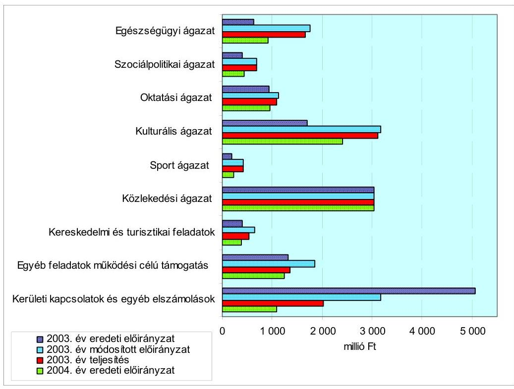
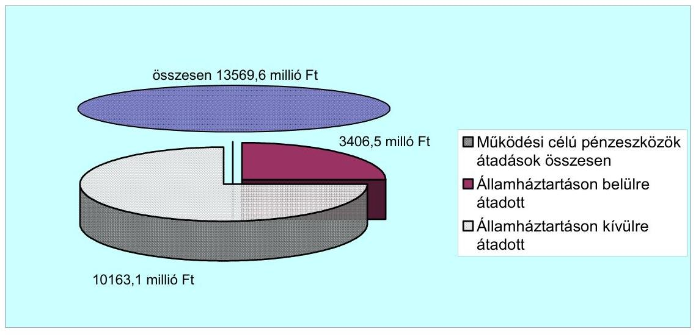
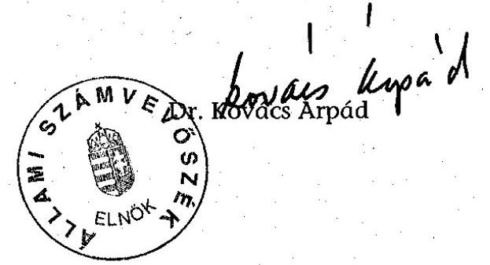
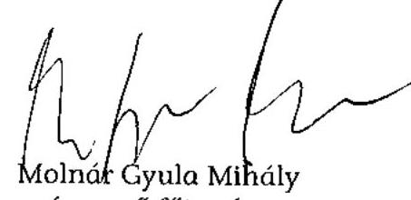
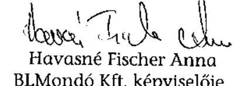
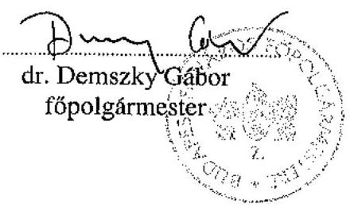

# JELENTÉS 

a Budapest Főváros Önkormányzatánál a működési célú pénzeszközátadás
rendszerének ellenőrzéséről
Az önkormányzati gazdálkodás átfogó ellenőrzésének II. üteme

---

3. Önkormányzati és Területi Ellenőrzési Igazgatóság
3.3. Átfogó Ellenőrzések Főcsoport
Iktatószám: V-1002-4/20/22/2004.
Témaszám: 692
Vizsgálat-azonosító szám: V0159
Az ellenőrzést felügyelte:
Dr. Lóránt Zoltán
főigazgató
Az ellenőrzés végrehajtásáért felelős:
Dr. Sepsey Tamás
igazgató
Az ellenőrzést vezette:
Csecserits Imréné
főcsoportfőnök-helyettes
Az ellenőrzést végezték:
Bauer Lajosné
számvevő főtanácsadó
Dr. Karáné Kőszegi Zsuzsanna
számvevő tanácsos
Molnár Gyula Mihály
számvevő főtanácsadó
A témához kapcsolódó eddig készített számvevőszéki jelentések:
címe
sorszáma
Jelentés az önkormányzati korlátozottan forgalomképes ..... 0108
törzsvagyon-gazdálkodás vizsgálatáról
Jelentés a települési önkormányzatok adóztatási tevékenységének ..... 0121 vizsgálatáról
Jelentés a nagyvárosi tömegközlekedés feladatellátásának és ..... 0123
finanszírozásának ellenőrzéséről
Jelentés a települési önkormányzatok szilárdhulladék-gazdálkodási ..... 0221
feladatai ellátásának ellenőrzéséről
Jelentés a foglalkoztatást elősegítő támogatások felhasználásának ..... 0226
ellenőrzéséről
Jelentés a megyei, fővárosi illetékhivatali tevékenység ..... 0243
ellenőrzéséről
Jelentés Budapest Főváros Önkormányzata gazdálkodásának ..... 0246
utóvizsgálatáról

---

Jelentés a helyi önkormányzatok tartós szociális ellátási ..... 0317
feladatainak ellenőrzéséről az idősek otthonainál
Jelentés a helyi önkormányzatok egyes pénzügyi befektetésekkel ..... 0318 történő gazdálkodásának ellenőrzéséről
Jelentés a szakképzési struktúra szerepéről a munkaerőpiaci ..... 0321 igények kielégítésében
Jelentés a 2002. évi országgyűlési, valamint a helyi és kisebbségi ..... 0325 önkormányzati képviselő választások lebonyolítására felhasznált pénzeszközök ellenőrzéséről
Jelentés a helyi önkormányzatoknak bérlakásépítésre és ..... 0349
korszerűsítésre juttatott pénzügyi támogatások ellenőrzéséről
Jelentés a Budapest Főváros Önkormányzatnál a beruházási ..... 0421
rendszer működésének ellenőrzéséről
Az önkormányzati gazdálkodás átfogó ellenőrzésének I. üteme

---

# TARTALOMJEGYZÉK 

BEVEZETÉS ..... 5
I. ÖSSZEGZŐ MEGÁLLAPÍTÁSOK, KÖVETKEZTETÉSEK, JAVASLATOK ..... 7
II. RÉSZLETES MEGÁLLAPÍTÁSOK ..... 17

1. A működési célú pénzeszközátadások költségvetési előirányzata tervezésének, végrehajtásának szabályszerűsége, bemutatása a zárszámadásban ..... 17
1.1. A működési célú pénzeszközátadások költségvetési előirányzatának tervezése, jóváhagyása a költségvetési rendeletben, az előirányzatok módosításának, nyilvántartásának és betartásának szabályszerűsége ..... 17
1.1.1. A költségvetésben tervezett működési célú pénzeszközátadások célja és aránya a költségvetési kiadásokon belül ..... 17
1.1.2. A működési célú pénzeszközátadások előirányzata költségvetési tervezésének és a költségvetési rendelet megalkotásának, elfogadásának szabályszerűsége ..... 20
1.1.3. A jóváhagyott működési célú pénzeszközátadások költségvetési előirányzatai módosításának és nyilvántartásának szabályszerűsége ..... 31
1.1.4. A működési célú pénzeszközátadások előirányzatainak betartása ..... 34
1.2. A gazdálkodás szabályozottsága, a bizonylati rend és fegyelem szabályszerűsége a működési célú pénzeszközátadások előirányzatainál ..... 35
1.3. A működési célú pénzeszközátadások szabályszerűsége ..... 44
1.4. A feladatok finanszírozása, elszámolása ..... 49
1.4.1. A működési célú pénzeszközátadások előirányzatát terhelő kötelezettségvállalások nyilvántartása ..... 49
1.4.2. A zárszámadás és a költségvetési beszámoló adatainak egyezősége a működési célú pénzeszközátadások vonatkozásában ..... 50
2. A belső irányítási, ellenőrzési rendszer működésének értékelése ..... 53
2.1. Az ellenőrzési rendszer kialakítása, működése ..... 53
3. A korábbi számvevőszéki ellenőrzések javaslatainak hasznosulása ..... 56

---

# MELLÉKLETEK 

| 1. számú | Az önkormányzati vagyon nagyságának alakulása (1 oldal) |
| :--: | :--: |
| 2. számú | Az Önkormányzat 2003. évi bevételeinek és kiadásainak alakulása (1 oldal) |
| 3. számú | Az Önkormányzat gazdálkodását meghatározó adatok, mutatószámok (1 oldal) |
| 4. számú | Kimutatás a Főpolgármesteri Hivatal 2003. és 2004. évre szóló költségvetésének kiadásaiban bemutatott működési célú pénzeszközátadásokról (6 oldal) |
| 5. számú | Kimutatás a Főpolgármesteri Hivatal 2003. és 2004. évi költségvetésében tervezett alap elnevezésű céltartalék előirányzatairól (1 oldal) |
| 6. számú | Kimutatás az Önkormányzat kiadásaiból a működési célú pénzeszközátadási kiadások ágazati célok szerinti alakulásáról (1 oldal) |
| 7. számú | Helyszíni ellenőrzési jegyzőkönyv (4 oldal) |
| 8. számú | Dr. Demszky Gábor főpolgármester úr észrevétele (4 oldal) |
| 9. számú | Dr. Demszky Gábor főpolgármester úrnak írt válaszlevél (1 oldal) |

---

# RÖVIDÍTÉSEK JEGYZÉKE 

Ötv.
Htv.

Kbt.
Áht.
Ámr.
Számv. tv.
Vhr.

Ktv.
Kszt.tv.
Ber.
ÁSZ
NKÖM
Önkormányzat
Közgyűlés
főpolgármester
főjegyző
Pénzügyi bizottság
Pénzügyi ellenőrző bizottság
Környezetvédelmi bizottság
Oktatási bizottság
Civil Szervezetek és Társadalmi Kapcsolatok bizottsága
Kereskedelmi és turisztikai bizottság
önkormányzati intézmények
Főpolgármesteri hivatal
Főpolgármesteri iroda
Főjegyzői iroda
Belső ellenőrzési csoport
1990. évi LXV. törvény a helyi önkormányzatokról
1991. évi XX. törvény a helyi önkormányzatok és szerveik, a köztársasági megbízottak, valamint egyes centrális alárendeltségű szervek feladat- és hatásköreiről
1995. évi XL. törvény a közbeszerzésekről
1992. évi XXXVIII. törvény az államháztartásról
217/1998. (XII. 30.) Korm. rendelet az államháztartás működési rendjéről
2000. évi C. törvény a számvitelről
249/2000. (XII. 24.) Korm. rendelet az államháztartás szervezetei beszámolási és könyvvezetési kötelezettségének sajátosságairól
1992. évi XXIII. törvény a köztisztviselők jogállásáról
1997. évi CLVI. törvény a közhasznú szervezetekről
193/2003. (XI. 26.) Korm. rendelet a költségvetési szervek belső ellenőrzéséről
Állami Számvevőszék
Nemzeti Kulturális Örökség Minisztériuma
Budapest Főváros Önkormányzata
Budapest Főváros Önkormányzatának Közgyűlése
Budapest Főváros Önkormányzatának Főpolgármestere
Budapest Főváros Önkormányzatának Főjegyzője
Budapest Főváros Önkormányzata Közgyűlésének Pénzügyi Bizottsága
Budapest Főváros Önkormányzata Közgyűlésének Pénzügyi Ellenőrző Bizottsága
Budapest Főváros Önkormányzata Közgyűlésének Környezetvédelmi Bizottsága
Budapest Főváros Önkormányzata Közgyűlésének Oktatási Bizottsága
Budapest Főváros Önkormányzata Közgyűlésének Civil Szervezetek és Társadalmi Kapcsolatok Bizottsága

Budapest Főváros Önkormányzata Közgyűlésének Kereskedelmi és Turisztikai Bizottsága
Budapest Főváros Önkormányzata Közgyűlésének költségvetési intézményei
Budapest Főváros Önkormányzata Közgyűlésének Főpolgármesteri Hivatala
Főpolgármesteri Hivatal Főpolgármesteri Iroda
Főpolgármesteri Hivatal Főjegyzői Iroda
Főpolgármesteri Hivatal Főjegyzői Iroda Belső Ellenőrzési Csoportja

---

| Költségvetési ügyosztály | Főpolgármesteri Hivatal Költségvetési, Tervezési és Gazdálkodási Ügyosztálya |
| :--: | :--: |
| Kulturális ügyosztály | Főpolgármesteri Hivatal Kulturális Ügyosztálya |
| Környezetvédelmi ügyosztály | Főpolgármesteri Hivatal Környezetvédelmi Ügyosztálya |
| Közlekedési ügyosztály | Főpolgármesteri Hivatal Közlekedési Ügyosztálya |
| Közmű ügyosztály | Főpolgármesteri Hivatal Közmű Ügyosztálya |
| Oktatási ügyosztály | Főpolgármesteri Hivatal Oktatási Ügyosztálya |
| Szociálpolitikai ügyosztály | Főpolgármesteri Hivatal Szociálpolitikai Ügyosztálya |
| Sport ügyosztály | Főpolgármesteri Hivatal Sport Ügyosztálya |
| BKV Rt. | Budapesti Közlekedési Részvénytársaság |
| SzMSz | Budapest Főváros Önkormányzata 7/1992. (III. 26.) számú rendelete a Fővárosi Önkormányzat Szervezeti és Működési Szabályzatáról |
| ügyrend | Budapest Főváros Önkormányzata Főpolgármesteri Hivatalának ügyrendjéről szóló, többször módosított 03-942/3/1998. számú Főpolgármesteri és Főjegyzői együttes intézkedés |
| BMSz | Belső Működési Szabályzat |
| 2003. évi költségvetési rendelet | Budapest Főváros Önkormányzata 10/2003. (III. 14.) számú rendelete a 2003. évi költségvetésről |
| 2004. évi költségvetési rendelet | Budapest Főváros Önkormányzata 8/2004. (III. 19.) számú rendelete a 2004. évi költségvetésről |
| költségvetési rendeletek | a 2003. évi és a 2004. évi költségvetési rendelet |
| 531/1998. számú együttes intézkedés | A Főpolgármesternek és a Főjegyzőnek az 531/1998. számú együttes intézkedése a Főpolgármesteri Hivatal pénzgazdálkodásával kapcsolatos kötelezettségvállalás, utalványozás, ellenjegyzés és érvényesítés hatásköri rendjéről |
| 517/2003. számú intézkedés | A Főpolgármester 517/2003. számú intézkedése Budapest Főváros Önkormányzatának költségvetési rendeletében megtervezett alapokra és alapszerű céltartalékokra vonatkozó eljárás rendjéről |
| 2003. évi számlarend | A Főjegyző 543/2002. számú intézkedése Budapest Főváros Önkormányzata Főpolgármesteri Hivatala számlarendjéről |
| Bizonylati szabályzat | 2003. évi számlarend 4. számú melléklete, a Bizonylati Szabályzat |

---

# JELENTÉS 

## a Budapest Főváros Önkormányzatánál a működési célú pénzeszközátadások rendszerének ellenőrzéséről

## Az önkormányzati gazdálkodás átfogó ellenőrzésének II. üteme

## BEVEZETÉS

Az Ötv. 92. § (1) bekezdése, az Áht. 120/A. § (1) bekezdése alapján az Önkormányzat gazdálkodását az ÁSZ Önkormányzati és Területi Ellenőrzési Igazgatósága a V-1002-4/20/2/2004. számú ellenőrzési program szerint vizsgálta.

Az Önkormányzatnál több évre ütemezett átfogó vizsgálati program végrehajtása keretében II. ütemként az Önkormányzat által adott működési célú pénzeszközátadások ${ }^{1}$ tervezésének, végrehajtásának és elszámolásának szabályszerűségét ellenőriztük². Az ellenőrzés nem terjedt ki az Önkormányzat saját intézményei részére biztosított működési célú, valamint a szociális ellátásként nyújtott támogatásokra. Az ellenőrzés feladatát képezte annak áttekintése és értékelése, hogy az Önkormányzatnál miként biztosítják a közpénzek felhasználásának átláthatósága, nyilvánossága érdekében a működési célú pénzeszközátadások szabályait.

Budapest főváros lakosainak száma a 2003. év január 1-jén 1726872 fő volt, ami 18531 fővel kevesebb a megelőző év január 1-jei állapotnál. Az Önkormányzat 66 tagú Közgyűlésének munkáját 21 állandó bizottság segítette. Feladatainak végrehajtása érdekében az Önkormányzat a 2003. évben 255 intézményt működtetett, amelyből gazdálkodási szempontból 16 intézménynek részben önálló volt a besorolása. A közfeladatok ellátásában gazdasági társaságok és közhasznú társaságok is részt vesznek. Az Önkormányzat költségvetési szerveinél foglalkoztatottak száma a 2003. év végén 42345 fő, ebből 1359 fő köztisztviselő.

[^0]
[^0]:    ${ }^{1}$ Működési célú pénzeszköz átadások, illetve működési célú támogatások azonos értelemben használt fogalmak.
    ${ }^{2}$ I. ütemként az ÁSZ 2003-ban a beruházási rendszer működését, ennek részeként a felhalmozási pénzeszközátadások szabályszerűségét ellenőrizte. A pénzeszközátadások szabályszerűségének teljes körű vizsgálatát biztosította az ez évben a gazdálkodás átfogó ellenőrzésének II. ütemként elvégzett vizsgálat. A gazdálkodás átfogó ellenőrzésének I. ütemben elkészített jelentését 2004. május 20-án hozta nyilvánosságra az ÁSZ.

---

Az Önkormányzat a 2003. évben 701,8 milliárd Ft bevételt és 546,9 milliárd Ft kiadást teljesített ${ }^{3}$, ebből a működési célú pénzeszközátadások összege a társadalom- és szociálpolitikai juttatások nélkül 13,6 milliárd Ft, ami az Önkormányzat összes kiadásának a 2,5%-a. A számviteli mérleg ${ }^{4}$ szerint az Önkormányzat a 2003. év végén 1810,8 milliárd Ft nettó vagyonnal rendelkezett.

A 2003. évi költségvetésben a működési célú pénzeszközátadások eredeti előirányzata 13,7 milliárd Ft, amelyből 13,0 milliárd Ft a Főpolgármesteri hivatal költségvetésében, 0,7 milliárd Ft az önkormányzati intézmények költségvetésében tervezett összeg. A fővárosi forrásmegosztással összefüggésben a kerületi önkormányzatok részére tervezett működési célú pénzeszközátadás előirányzata 5,0 milliárd Ft. E tétel kivételével és az alapszerű céltartalékok ${ }^{5}$ 1,3 milliárd Ft előirányzatával megnövelve a Főpolgármesteri hivatal működési célú pénzeszközátadás eredeti kiadási előirányzata 9,3 milliárd Ft. A Főpolgármesteri hivatal előzőek szerint korrigált működési célú pénzeszköz átadásának előirányzatához viszonyítva az ellenőrzött kulturális, oktatási, sport, szociálpolitikai és tömegközlekedési célú működési támogatások aránya 75,4%. A különböző gazdálkodó szervezetek feladatellátásához biztosított támogatások magas kockázatú kiadásai az Önkormányzatnak. A sokféle támogatott cél teljesítéséhez nyújtott támogatás felhasználására a Közgyűlésnek korlátozott a rálátása, ezért is kiemelt jelentőségű a közpénz szabályszerű elköltésének és a támogatott felhasználási cél megvalósításának szabályozott és rendszeres figyelemmel kísérése. A közpénzek felhasználásával, a köztulajdon használatának nyilvánosságával, átláthatóbbá tételével és ellenőrzésének bővítésével összefüggő egyes törvények módosításáról szóló 2003. évi XXIV. törvény 1. §-ban módosított Állami Számvevőszékről szóló 1989. évi XXXVIII. törvény 2. § (5) és (9) bekezdésében kapott felhatalmazás alapján helyszíni ellenőrzést végeztünk egy céljellegű működési célú támogatásban részesült gazdasági társaságnál is.

# Az ellenőrzés célja annak értékelése volt, hogy: 

- a költségvetés tervezése, a költségvetés végrehajtása, a számviteli elszámolások és a zárszámadás során a működési célú pénzeszközátadások esetében betartották-e az önkormányzati gazdálkodásra vonatkozó jogszabályok és belső szabályzatok előírásait;
- a gazdálkodás szabályszerűségét biztosító kontrollok ${ }^{6}$ megfelelően segítették a végrehajtást.

Az ellenőrzött időszak: a 2003. év, valamint a 2004. év I. negyedéve.

[^0]
[^0]:    ${ }^{3}$ Az Önkormányzat 2003. évi bevételeinek és kiadásainak alakulását részletesen a 2. számú melléklet mutatja be.
    ${ }^{4}$ Az önkormányzati vagyon nagyságának alakulását az 1. számú melléklet mutatja.
    ${ }^{5}$ Az alapszerű céltartalékok bizottsági felhasználású, különböző támogatási célú előirányzatok.
    ${ }^{6}$ A gazdálkodás szabályszerűségét biztosító kontroll alatt értjük a kiépített és működő belső irányítási és szabályozási rendszert, valamint a belső ellenőrzési funkciók ellátását.

---

# I. ÖSSZEGZŐ MEGÁLLAPÍTÁSOK, KÖVETKEZTETÉSEK, JAVASLATOK 

Az Önkormányzat költségvetésében, a működési jellegű kiadásokon belül a különböző, önkormányzaton kívüli szervezetek részére működési céllal
 nyújtott támogatások részaránya a 2003. évben 7% volt, ennek 88,5%-át a Főpolgármesteri hivatal költségvetése tartalmazta. Önkormányzati szinten a 2003. évi működési céllal juttatott támogatásokból közlekedési célokra 3037,8 millió Ft-ot, kulturális célokra 3114,2 millió Ft-ot, egészségügyi célokra 1653,1 millió Ft-ot, oktatási célokra 1080,3 millió Ft-ot, sport, kereskedelmi és turisztikai célokra 946,1 millió Ft-ot, közműfejlesztési, védelmi, rendészeti, lakásügyi, városrendezési és környezetvédelmi célokra 763,4 millió Ft-ot, szociálpolitikai célokra 680,8 millió Ft-ot, egyéb feladatok támogatására 592,5 millió Ft-ot, összesen 11868,2 millió Ft-ot fordítottak.

A költségvetési rendelettervezet előkészítése szabályozott. A 2004. évi költségvetés előkészítését két ütemben, részekre bontott költségvetési tervezéssel biztosították, a működési célú pénzeszközátadások előirányzatának tervezése a második ütemben végrehajtandó feladatok közé tartozott. Ennek keretében végezték el az Önkormányzat által, az önkormányzati intézmények és a Főpolgármesteri hivatal költségvetéséből társadalmi szervezeteknek, közalapítványoknak, alapítványoknak nyújtott támogatások előirányzatának tervezését. Az Önkormányzat által nyújtott támogatások tervezéséhez a tervezésért főfelelős Költségvetési ügyosztály ágazati, illetve szakmai ügyosztályonkénti csoportosításban megadta a megelőző évi költségvetésből önálló címen támogatott alapítványok, társadalmi szervezetek neveit, közölte az eredeti és a november 30-i állapot szerinti módosított előirányzat összegét. A költségvetési címek ügyosztályonkénti csoportosítása nem fedte le az ágazati feladatokat, a közlekedési ágazati feladatok között nem szerepelt a BKV Rt. támogatása. Az ágazatilag illetékes ügyosztályokon a rendelkezésükre álló szerződések alapján a bázis év szintjén tettek javaslatot támogatott szervenként a működési célú támogatás előirányzatára, a feladatmutatókhoz kötött támogatásoknál figyelemmel voltak a szerkezeti változásokra.

A Közgyűlés az Áht-ban előírtak alapján meghatározta a költségvetés címrendjét. Az önkormányzati kiadások címrendbe sorolásához nem alakítottak ki a költségvetés felépítésének áttekinthetőségét biztosító szempontrendszert. A működési célú pénzeszközátadásokat tartalmazó költségvetési címek között „Alap" elnevezéssel költségvetési címeket alakítottak ki, amelyekből a Környezetvédelmi Alap létrehozása alapult törvényi felhatalmazáson. Az alap kifejezés használata a többi alap esetében félreérthető, mivel nem felelt meg az Áht. követelményeinek. Az önálló címre kiemelt alapítványok, társadalmi szervezetek közül több szervezet két önálló címen is szerepelt. Az önálló címre kiemelt szervezetek esetében sem állapítható meg közvetlenül a részükre nyújtott támogatás teljes összege, mert a különböző keretekből a főpolgármester, illetőleg a bizottságok által nyújtott támogatásokat nem a költségvetési címen számolták el.

---

A költségvetési rendeletekben meghatározott címrend felépítési elveit nem tartották be a nemzetközi érettségi vizsgára történő felkészítéshez nyújtott támogatás esetében, mert a feladat költségvetési címét nem önkormányzati feladatként, hanem a Főpolgármesteri hivatal operatív működésével kapcsolatos feladatként határozták meg. A feladatok költségvetési címének a címrend felépítési elveinek megfelelő meghatározása azért jelentős, mert a címrendhez igazodóan határozták meg a költségvetési gazdálkodás sajátos, Önkormányzatra érvényes előírásait, a költségvetési rendeletén túl a gazdálkodási jogkörökre vonatkozó belső szabályozások, intézkedések előírásai is a címrendhez kapcsolódnak.

A költségvetési rendeletekben az Áht. előírásait betartva bemutatták a speciális támogatásokat, ezek között a működési célú pénzeszközátadásokat. Bemutatták a céltartalékokat, azonban nem teljes körűen, ezért megsértették az Áht-ban előírtakat. A működési célú pénzeszközátadások előirányzatát alátámasztó feladatok vonatkozásában a többéves elkötelezettséggel járó kiadási tételek későbbi évekre vonatkozó kihatásait a költségvetési rendelettervezet benyújtásakor nem mutatták be, ezzel megsértették az Áht-ban foglaltakat.

A Közgyűlés az éves költségvetési rendeletekben meghatározta a költségvetés végrehajtási szabályait. A működési célú pénzeszközátadások vonatkozásában az Ötv., illetőleg az Áht. előírásával összhangban közgyűlési engedélyhez kötötte a közalapítványok, alapítványok, társadalmi szervezetek közvetlen támogatását. Az Áht. alapján a Közgyűlés előirányzat átcsoportosítási hatáskört biztosított a főpolgármesternek, illetőleg a bizottságoknak, szabályozta az előirányzat átcsoportosítási intézkedéssel összefüggő költségvetési rendeletmódosítást, meghatározta a működési célú támogatások folyósításának rendjét.

A 2003. évi költségvetési rendeletben jóváhagyott előirányzatokat a Közgyűlés hét alkalommal módosította, amelynek során betartotta az Ámr-ben foglaltakat. Az Önkormányzat nem tartotta be a 2003. évi költségvetési rendeletben foglaltakat, mert az illetékes bizottságok által az első félévben hozott előirányzat átcsoportosítási határozatok költségvetési rendeleten történő átvezetéséről az előírt határidőn túl gondoskodott. Az ügyosztályokon az ügyosztályi feladatkörbe tartozó költségvetési címek előirányzatait, azok változásait nyilvántartották, de nem a Bizonylati szabályzatban előírt formanyomtatványon, illetve nem az annak megfelelő adattartalommal. Az ügyosztályi előirányzat nyilvántartások a számlarendben előírtaknak sem feleltek meg, mert elmaradt a címen belüli, kiemelt előirányzatonkénti nyilvántartás. Emiatt két esetben eltérés volt az ügyosztályi nyilvántartás és a főkönyvi könyvelés adatai között.

Az Önkormányzat 2003. évi zárszámadási rendelete szerint a működési célú pénzeszközátadások kiadási előirányzatát önkormányzati és főpolgármesteri hivatali szinten betartották. Az önkormányzati intézmények közül öt kórház lépte túl a működési célú pénzeszköz-átadásra jóváhagyott módosított előirányzatot, ezzel megsértették az Áht-ban a jóváhagyott előirányzatokon belüli gazdálkodásra előírtakat. A Főpolgármesteri hivatal költségvetési címei közül egy címnél volt könyvelési hiba miatt a működési célú pénzeszköz-átadásban túllépés. A Közgyűlés a zárszámadást jóváhagyta, az előirányzat túllépések miatt felelősségre vonást nem kezdeményezett.

---

A működési célú támogatások feladataihoz kapcsolódó gazdálkodási és ellenőrzési jogköröket a hatályos jogszabályok alapján a helyi sajátosságok figyelembevételével szabályozták. A szakmai teljesítésigazolásra a személyek kijelölése a 2004. évben valósult meg.

Az 531/1998. számú együttes intézkedésben a 2003. évi költségvetési rendelet címszámain alapuló feladatcsoportok kialakításánál az „önkormányzati kiadások" esetében más, az „egyéb szervek támogatása" megnevezést alkalmaztak. A közüzemi társaságok esetében az érintett szakmai ügyosztály nem kapott felhatalmazást gazdálkodási jogkör gyakorlására, azt a funkcionális feladatot ellátó Költségvetési ügyosztály feladataként határozták meg. Az „alapok" esetében nem rendelkeztek a kötelezettségvállalásra történő felhatalmazásról, valamint nem osztották meg az érvényesítési feladatot előzetes és utólagos érvényesítésre $^{7}$ a szakmai ügyosztály és a Költségvetési ügyosztály között. Az utalványozásra történő felhatalmazást főpolgármesteri, az ellenjegyzésre való felhatalmazást főjegyzői intézkedés tartalmazza. Az „alapok"-ra vonatkozó gazdálkodási és ellenőrzési jogkörök más-más intézkedésben történő meghatározása nem indokolt, mert a Főpolgármesteri hivatalban az „alapok"-on kívüli gazdálkodási és ellenőrzési jogköröket a főpolgármester és a főjegyző együttes intézkedésben - az 531/1998. számú együttes intézkedésben - szabályozta.

Az 531/1998. számú együttes intézkedésben az alapítványok, társadalmi szervezetek, egyéb szervek támogatásánál nem határozták meg, hogy az alapokból támogatott alapítványok és társadalmi szervezetek esetében az alapokra vonatkozó szabályozás szerint kell eljárni. Az alapítványok, társadalmi szervezetek, egyéb szervek támogatásánál a gazdálkodási és ellenőrzési jogkörök gyakorlására több személyt is felhatalmaztak, de nem rögzítették, hogy mely esetekben, mely személy jogosult azok gyakorlására és nem tüntették fel az aljegyzők ellenjegyzési jogosultságát. A gazdálkodási és ellenőrzési feladatok elvégzésére felhatalmazott, kijelölt dolgozók munkaköri leírása egyedi esetek kivételével tartalmazta a munkafolyamatba épített ellenőrzési kötelezettséget.

A Főpolgármesteri hivatal 2003. évi számlarendjében a Vhr. előírásainak megfelelően szabályozták a működési célú végleges pénzeszközátadások előirányzatainak és az azok terhére teljesített kiadások főkönyvi könyvelésére és analitikus nyilvántartására vonatkozó előírásokat. Elkülönítetten mutatták ki az államháztartáson belüli és kívüli működési célú támogatásokat, illetve a kötelező alszámlák alkalmazásával szervezet típusonkénti pénzeszközátadásokat. Nem vezettek azonban olyan analitikus nyilvántartást, amelyből megállapítható lenne önkormányzati szinten egy-egy szervezet valamennyi folyósított támogatása. A teljesített pénzeszközátadások számviteli rögzítésénél nem tartották be a működési és a felhalmozási célú támogatások következetes elkülönítését. A 2003. évi könyvelésben és beszámolóban 98,7 millió Ft felhalmozási célú támogatást a működési célú véglegesen átadott pénzeszközök között szerepeltettek. A 2003. évi számlarendben havi egyeztetési kötelezettséget írtak elő a fő-

[^0]
[^0]:    ${ }^{7}$ Az előzetes és utólagos érvényesítési feladat tartalmát az 531/1998. számú együttes intézkedésben határozták meg.

---

könyvi könyvelés és az analitikus nyilvántartásokat vezető Költségvetési ügyosztály és a gazdálkodó szervezeti egységek (ügyosztályok) között.

A működési célú támogatásokhoz kapcsolódó gazdálkodási és ellenőrzési jogkörök gyakorlásával kapcsolatban feltárt hiányosságokkal nem tartották be az Ámr., illetve a belső szabályozás előírásait. Az Önkormányzat által nyújtott támogatás kiutalása - a nem önkormányzati fenntartású színházak támogatások kivételével - írásos kötelezettségvállaláson alapult. Rendszerhiba következtében hiányzott a gazdasági eseményt tartalmazó bizonylatokról a pénzügyi kiadás elrendelését alátámasztó szakmai teljesítésigazolás, ezzel nem tartották be az Ámr-ben előírtakat. A működési célú pénzeszközátadásokra vonatkozó kiadások teljesítéséhez 26%-ban nem a Bizonylati szabályzatban előírt utalványrendeletet alkalmazták. A kötelezettségvállalásokról az Ámr-ben előírtak ellenére külön nyilvántartást nem vezettek, az utalványrendeleteken nem tüntették fel a kötelezettségvállalás-nyilvántartásba vételi sorszámot.

A működési célú pénzeszközátadásokról szóló döntéseknél betartották a hatásköri szabályokat. Az alapítványok, közalapítványok támogatásáról az Ötv. előírásainak megfelelően a Közgyűlés döntött, a társadalmi szervezeteket érintő pénzeszközátadásokat az Áht. szabályainak megfelelően a Közgyűlés engedélyezte. A közhasznú szervezetekkel a Kszt. tv. előírásainak megfelelően szerződést kötöttek a támogatásokról. A megkötött támogatási szerződések tartalmazták a jóváhagyó határozatok számát, a támogatás összegét, célját, felhasználásának jogcímeit, a finanszírozás ütemezését, határidejét, az elszámolás módját, határidejét, az elszámolás felülvizsgálatának rendjét, valamint a fel nem használt, a meghiúsult és a céltól eltérően felhasznált támogatások visszafizetési kötelezettségét. A 7212 Nagyrendezvények kerete címből elnyert támogatásoknál előírták a teljes, tételes költség elszámolást, melyet a támogatottak 3,6%-a nem teljesített, illetve a közbeszerzési törvény előírásainak alkalmazását, de a közbeszerzési eljárás lebonyolításához nem biztosítottak elegendő időt. Az Áht. előírásainak ellenére a több évre szóló közszolgáltatási szerződéseknél nem tüntették fel a 2003. évi támogatás összegét. A támogatási célt sem jelölték meg konkrétan, ennek hiánya gátolta az elszámolás ellenőrzését. Az elszámolás módját szakmai beszámoló és pénzügyi elszámolás készítés előírásában határozták meg, de a szakmai beszámoló formájára és tartalmára vonatkozó részletes előírásokat nem rögzítették a támogatási szerződésekben, ezért azok részletezettsége és színvonala eltérően alakult. Az elszámolási határidő betartását folyamatosan figyelemmel kísérték, a mulasztókat felszólították a szerződésben foglaltak betartására, de a határidő módosításokat nem foglalták írásba valamennyi támogatásnál. Az elszámolás felülvizsgálatának rendjét nem szabályozták részletesen, a támogatás felhasználásának ellenőrzéséhez szükséges adatok, bizonylatok bekérése, illetve a helyszíni ellenőrzés lehetőségének kikötése nem helyettesítette a konkrét szabályozást. A Főpolgármesteri hivatalban meghatározták a támogatásokra vonatkozó közszolgáltatási szerződések tartalmi elemeit, amelyek alkalmazását a 2004. évtől rendelték el.

A finanszírozó a működési támogatásra átadott összeg felhasználását és a számadási kötelezettség teljesítését a benyújtott szakmai beszámolók, és pénzügyi elszámolások bizonylatainak ellenőrzésével teljesítette, a szerződésekben rögzített helyszíni ellenőrzéseket szúrópróbaszerűen a támogatások 2,8%-ánál, ügyosztályonként eltérő számban végezték el. A szakmai beszámolók felülvizs-

---

gálatának és a helyszíni ellenőrzések lefolytatásának dokumentálása nem megfelelő. A működési célú támogatásban részesítettek közül egy szervezetnél megtartott helyszíni számvevői ellenőrzés megállapítása szerint a támogatási összeg felhasználása két tétel kivételével a célnak megfelelően, eredeti bizonylatokkal alátámasztottan történt. A támogatott számadási kötelezettségét a szakmai beszámoló vonatkozásában nem teljesítette. A finanszírozó az ellenőrzési kötelezettségét nem az Áht-ban előírtaknak megfelelően végezte.

A finanszírozott számadási kötelezettségének elmulasztása, illetve az arra előírt határidő be nem tartása miatt a 2003. évben és a 2004. év I. negyedévében támogatás folyósítást nem függesztettek fel, jogszabálysértő, vagy nem rendeltetésszerű felhasználás miatt visszafizetési kötelezettséget nem érvényesítettek. A Roma Polgárjogi Alapítvány 2003. évi pénzügyi elszámolásának hiányosságai miatt a 2004. évi támogatási szerződés megkötését felfüggesztették a hiányosságok pótlásáig,
 a helyszíni ellenőrzés lefolytatására külső szervezetet kértek fel. A meghiúsult, vagy elmaradt feladatokra folyósított támogatások miatt a 2003. évben 18 esetben történt visszafizetés a Főpolgármesteri hivatal számlájára 24,9 millió Ft értékben.

A Főpolgármesteri hivatalra vonatkozóan a költségvetési rendeletekben jóváhagyott előirányzatok és kötelezettségvállalások nyilvántartásának módját, formáját, tartalmát a Bizonylati szabályzatban meghatározták. Ennek ellenére a 2003. évben nem állt rendelkezésre az a folyamatosan vezetett nyilvántartás ${ }^{8}$, amely a szabályszerű gazdálkodás folytatásához mindenkor mutatja a jóváhagyott előirányzatoknak és azok teljesülésének alakulását, valamint a kiadási előirányzatokat terhelő kötelezettségvállalásokat, ezzel megsértették az Áht-ban előírtakat.

A Közgyűlés a 2004. május 27-i ülésén megalkotta az Önkormányzat 2003. évi költségvetésének végrehajtásáról szóló zárszámadási rendeletét. Az Önkormányzatnál a működési célú pénzeszközátadások vonatkozásában biztosították a számszaki egyezőséget az önkormányzati szintű költségvetési beszámoló és a zárszámadási rendelet adatai között. Az államháztartás információs rendszerében előírt és benyújtott, önkormányzati költségvetési szervenként elkészített költségvetési beszámolók önkormányzati szintre összesített adataiban a működési célú pénzeszközátadások kiadási előirányzatai és annak teljesítési adatai megegyeztek a zárszámadási rendelet adataival. A zárszámadási rendeletben, bár erre nincs jogszabályi előírás, bemutatták az önkormányzati intézmények és a Főpolgármesteri hivatal 2003. évi költségvetési előirányzata terhére a társadalmi szervezetek, alapítványok részére nyújtott támogatásokat, de nem teljes körűen. A bizottsági rendelkezésű előirányzatokból, az alapokból és más keret jellegű előirányzatokból alapítványok, társadalmi szervezetek részére nyújtott támogatásokat összefoglaltan nem mutatták be.

A Főpolgármesteri hivatal ügyrendje szerint a Belső ellenőrzési csoport a Főjegyzői iroda szervezeti egységei közé tartozik, melyet a Főjegyző irányít. A Bel-

[^0]
[^0]:    ${ }^{8}$ A Főpolgármesteri hivatal egészére, azon belül költségvetési címenként és kiemelt kiadási előirányzatonként vezetett nyilvántartás.

---

ső ellenőrzési csoport szakmai feladatellátása tekintetében való függetlensége a Főjegyzői iroda BMSz-e alapján a 2004. évtől biztosított.

A Főpolgármesteri hivatal az Ámr-ben előírtak ellenére nem rendelkezik szervezeti és működési szabályzattal. A Ber-ben előírtak ellenére 2004. január 1-jétől a belső ellenőrzési kötelezettséget, az ellenőrzést végző Belső ellenőrzési csoport jogállását, feladatait a Főpolgármesteri hivatal szervezeti és működési szabályzatában nem írták elő. A belső ellenőrzés szervezeti kialakítását és feladatait az ügyrend tartalmazza.

A 2003. és a 2004. évre szóló belső ellenőrzési munkatervek nem tartalmaztak működési célú pénzeszközátadások szabályosságának ellenőrzésére vonatkozó vizsgálatot. Az ügyosztályok átfogó ellenőrzése során e feladat szabályszerű elvégzését is vizsgálták. A vizsgálat nem terjedt ki a pénzügyi elszámolások ellenőrzésére, valamint a közüzemi társaságoknak, az önkormányzati tulajdonú kht-nak és az egyéb szervezeteknek nyújtott támogatásokra. A Pénzügyi ellenőrző bizottság 2003. évi munkaterve alapján készített 2002. évi támogatások ellenőrzése tapasztalatairól szóló jelentés a célszerinti felhasználás ellenőrzéséről szólt, mely szerint céltól eltérő felhasználás nem történt. A Közgyűlés a Htv-ben előírtaknak megfelelően meghatározott időszakonként - évente - áttekintette az önkormányzati intézmények ellenőrzésének a tapasztalatait. A főjegyző a 2002. évi és a 2003. évi hivatali belső ellenőrzésről összefoglaló jelentést készített a Közgyűlés SzMSz-ben átadott feladatköre alapján a Pénzügyi ellenőrző bizottság részére. A 2003. évi belső ellenőrzésről készített összefoglaló jelentést a Pénzügyi ellenőrző bizottság 2004. március 23-i ülésére nyújtotta be a főjegyző az egyedi ellenőrzésekről készített jelentésekkel együtt, amelyeket a Pénzügyi ellenőrző bizottság megtárgyalt és elfogadott.

A 2001-2003. év közötti időszakban az Önkormányzatnál végzett ÁSZ ellenőrzések közül a működési célú pénzeszközátadásokkal kapcsolatban hiányosságokat egy, a Budapest Főváros Önkormányzata gazdálkodásának utóvizsgálatáról szóló, a 2002. évben átadott jelentés tartalmazott. Ebben a jelentésben az ÁSZ megállapításaként szerepelt, hogy a működési célú pénzeszközátadások közül írásos kötelezettségvállalás nélkül adtak át támogatást a Fővárosi Településtisztasági és Környezetvédelmi Kft. részére, amely hiányosság megszüntetését javasoltuk. Az ÁSZ javaslata ellenére elmaradt a támogatás rendeltetésszerű felhasználásáról a számadási kötelezettség előírása.

A helyszíni ellenőrzés megállapításainak hasznosítása mellett a gazdálkodás szabályszerűségének és a munka színvonalának javítása érdekében javasoljuk:

# a főpolgármesternek 

## a munka színvonalának javítása érdekében

1. kezdeményezze a számvevőszéki ellenőrzés tapasztalatainak közgyűlési megtárgyalását, a feltárt hiányosságok megszüntetésére készíttessen intézkedési tervet;

---

# a főjegyzőnek 

## a törvényes állapot helyreállítása és a jogszabályi előírások betartása érdekében

1. gondoskodjon a költségvetési rendelettervezet előkészítésekor
a) az Áht. 73. § (1) bekezdésében, illetve az Ámr. 29. § (1) bekezdése e) pontjában előírtak betartása érdekében a céltartalék előirányzatok teljes körű elkülönítéséről, a különböző célú keret előirányzatokat a céltartalékok között mutassák be;
b) az Áht. 71. § (2) bekezdésében, illetve a 116. § 9. pontjában előírtak betartásáról, ennek érdekében mutassák be a költségvetési rendelettervezetben a működési célú pénzeszközátadásokra is a többéves elkötelezettséggel járó kiadási tételek későbbi évekre vonatkozó kihatásait, illetve tájékoztatásul a többéves kihatással járó döntések számszerűsítését évenkénti bontásban és összesítve;
2. gondoskodjon az Áht. 103. § (1)-(2) bekezdéseiben előírtak betartásáról, ennek érdekében
a) intézkedjen, hogy a gazdálkodás folyamatában résztvevő valamennyi ügyosztály, szervezeti egység vezesse a feladatkörébe tartozó költségvetési címekre a 2003. évi számlarend Bizonylati szabályzata szerinti előirányzat és kötelezettségvállalások nyilvántartását, ezáltal biztosítsa a költségvetés végrehajtásához az Áht. 12/A. § (1) bekezdésében előírtak betartását, mely szerint kötelezettséget vállalni, és kifizetést elrendelni a jóváhagyott kiadási előirányzatok mértékéig lehet;
b) biztosítsa az Ámr. 134. § (6) bekezdésében előírtak betartását, ennek érdekében írja elő az évenkénti kötelezettségvállalások nyilvántartásba vételi rendjét, szabályozza az évenkénti kötelezettségvállalás összegének szervezeti egységenkénti, illetve Főpolgármesteri hivatali szintű megállapításának módját;
3. gondoskodjon az Áht. 93. § (1) bekezdésében előírtak betartása érdekében, hogy az önkormányzati intézmények a jóváhagyott előirányzatokon belül gazdálkodjanak, tartsák be az Áht. 12/A. § (1) bekezdésében előírtakat és a Közgyűlés által meghatározott kiemelt kiadási előirányzatokat;
4. intézkedjen a 2004. évi költségvetési rendelet 17. § (3) bekezdésében foglaltak betartása érdekében arról, hogy az előirányzat átcsoportosítási hatáskörrel felruházott bizottságok által a 2004. június 30-ig hozott előirányzat átcsoportosítási határozatokat vezessék át a költségvetési rendeletet módosító tervezetben annak érdekében, hogy a rendelettervezet előterjesztését a főpolgármester a költségvetési rendelet 17. § (2) bekezdésében előírt szeptember 15-i határidőre be tudja nyújtani a Közgyűlés részére;
5. intézkedjen, hogy a működési célú pénzeszköz-átadással kapcsolatos utalványrendeleteken tüntessék fel a kötelezettségvállalás nyilvántartásba vételi sorszámát, és ezzel tegyenek eleget az Ámr. 136. § (4) bekezdés h) pontjában előírtaknak;
6. gondoskodjon a nem önkormányzati fenntartású színházak részére folyósított működési célú pénzeszközátadások vonatkozásában az Ámr. 134. § (2) bekezdésében

---

előírtak betartásáról, miszerint az önkormányzati kiadást jelentő kötelezettségvállalás írásban történhet;
7. intézkedjen az Ámr. 135. § (1) bekezdésében és a 137. § (3) bekezdésében előírt, folyamatba épített ellenőrzési feladatok elvégzéséről, az előírtak betartásáról, annak érdekében, hogy a kiadás teljesítése minden esetben alapuljon a kötelezettségvállalásnak megfelelő szakmai teljesítésigazoláson, illetve, hogy az utalvány ellenjegyzője az ellenjegyzése során győződjön meg a szakmai teljesítésigazolás elvégzéséről;
8. gondoskodjon a Bizonylati szabályzat - 215. számú bizonylati törzslap - szerinti utalványrendelet kötelező, minden szervezeti egység általi alkalmazásáról;
9. gondoskodjon az 531/1998. számú együttes intézkedésben az „Alapok"-ra vonatkozóan a kötelezettségvállalásra jogosultak meghatározásáról;
10. egészítse ki az 531/1998. számú együttes intézkedést, az „Alapok" esetében is határozza meg az előzetes érvényesítést, és jelölje ki a feladatelvégzésére jogosult személyeket;
11. határozza meg az 531/1998. számú együttes intézkedésben az alapítványok, társadalmi szervezetek, egyéb szervek támogatásánál, hogy az „Alapok"-ból támogatott alapítványok és társadalmi szervezetek esetében az „Alapok"-ra vonatkozó szabályozás szerint kell eljárni;
12. biztosítsa a felhalmozási és a működési célú pénzeszközátadások pontos és következetes elkülönítését a könyvelésben és ennek alapján a költségvetési beszámolóban a Vhr. 9. számú melléklete 3. e) pontjában és a Főpolgármesteri hivatal 2003. évi számlarendjében foglaltaknak megfelelően;
13. gondoskodjon az Ámr. 10. § (4) bekezdése alapján a Főpolgármesteri hivatal szervezeti és működési szabályzatának az elkészítéséről;
14. írja elő a belső ellenőrzés 2004. január 1-jétől hatályos előírásainak teljesítése érdekében a Főpolgármesteri hivatal szervezeti és működési szabályzatában a Ber. 4. § (2) bekezdése alapján a belső ellenőrzési kötelezettséget, a Belső ellenőrzési csoport feladatait;
15. biztosítsa, a közbeszerzési törvény alkalmazását előíró szerződésekben, megállapodásban foglaltak teljesítéséhez az Áht. 13/B. § (1) bekezdésében előírt feltételeket, a közbeszerzési eljárás lefolytatásához szükséges időtartamot;
16. gondoskodjon arról, hogy a Fővárosi Településtisztasági Kft-nek nyújtott működési célú pénzeszköz-átadásra vonatkozó kötelezettségvállalást foglalják írásba az Ámr. 134. § (2) bekezdésében előírtaknak megfelelően, továbbá a kötelezettségvállalást tartalmazó szerződésben írják elő az Áht. 13/A. § (2) bekezdése alapján a rendeltetésszerű felhasználásról a számadási kötelezettséget;

# a munka színvonalának javítása érdekében 

17. vizsgálja felül az „Ügyosztályoknak feladattal át nem adott címkódok" vonatkozásában a Költségvetési ügyosztály és a szakmai ügyosztályok közötti feladatmegosztást an-

---

nak érdekében, hogy ne keveredjen a Költségvetési ügyosztály feladataiban az önkormányzati gazdálkodás egészét érintő funkcionális feladatok és a szakmai feladatok ellátási felelőssége;
18. vizsgálja felül a 7208 Oktatási feladatok címbe, illetve a 7100, 7200 és 7300 címbe sorolt, működési célú pénzeszköz-átadásként nyilvántartott kiadásokat, feladatokat annak érdekében, hogy az egyes címeken a költségvetési címrend felépítési elveinek megfelelően a Főpolgármesteri hivatal operatív tevékenységével kapcsolatos feladatok szerepeljenek, és ne tartalmazzanak önkormányzati feladatokat, amelyeknek költségvetési helyeként a Közgyűlés a 8100-8400 címeket határozta meg;
19. kezdeményezze a költségvetési rendelettervezet előkészítése során
a) a költségvetés áttekinthetősége és a végrehajtási szabályok egyszerűsítése érdekében a kialakított címrend felülvizsgálatát, ennek érdekében tegyen javaslatot a költségvetési rendelettervezet előterjesztője, a főpolgármester részére a 8100, a 8200, a 8300 és a 8400 számú költségvetési címcsoportok egységes elvei kialakítására;
b) kezdeményezze a költségvetési rendelettervezet előkészítése során a félreérthető és az Áht. 54. §-ban foglaltakkal nem összhangban lévő önkormányzati pénzalapok elnevezésének a megváltoztatását;
c) az egységes végrehajtás érdekében az Áht. 13/A. § (2) bekezdésében és a 94. § (3) bekezdésében előírtakhoz kapcsolódóan tegyen javaslatot a sajátos, helyi szabályok kialakítására az önkormányzat által támogatott szervezetek és magánszemélyek számadási kötelezettségének, illetőleg a támogató ellenőrzési kötelezettségének a teljesítéséhez;
20. írja elő a számlarendben a szakmai ügyosztályi előirányzat nyilvántartásoknak a számviteli analitikus előirányzat nyilvántartással történő egyeztetési kötelezettséget is a főkönyvi nyilvántartással történő egyeztetésen túl;
21. gondoskodjon a zárszámadási rendelettervezet előkészítése során, hogy teljes körűen, a bizottsági rendelkezésű és más keret jellegű előirányzatok vonatkozásában is mutassák be az önkormányzati intézmények és a Főpolgármesteri hivatal költségvetéséből társadalmi szervezetek, alapítványok részére nyújtott támogatásokat;
22. gondoskodjon az 531/1998. számú együttes intézkedésben az „Alapítványok, társadalmi szervezetek, egyéb szervek támogatása" címnek az éves költségvetési rendelet címszám és megnevezésekkel való összehangolásáról az egyéb szervezetek esetében;
23. gondoskodjon az 531/1998. számú együttes intézkedésben, hogy a közüzemi társaságok esetében a gazdálkodási és ellenőrzési jogkörök gyakorlásában felhatalmazást kapjon az érintett szakmai ügyosztály;
24. határozza meg az 531/1998. számú együttes intézkedésben, hogy az alapítványok, társadalmi szervezetek, egyéb szervek támogatása esetén a gazdálkodási és ellenőrzési jogkörök gyakorlására felhatalmazott személyek mely esetekben jogosultak a jogok gyakorlására, valamint az ellenjegyzésre jogosultak között tüntesse fel az aljegyzőket;

---

25. gondoskodjon arról, hogy a gazdálkodói jogkörök gyakorlására kijelölt dolgozók munkaköri leírásában minden jogosultságuk szerepeljen;
26. gondoskodjon
 a belső ellenőrzés keretében a működési célú pénzeszközátadások pénzügyi elszámolásának ellenőrzéséről;
27. gondoskodjon a Környezetvédelmi ügyosztály BMSz-e és az 517/2003. számú intézkedés alapokra vonatkozó kötelezettségvállalás ellenjegyzésének összehangolására;
28. alakítson ki olyan analitikus nyilvántartást a működési célú pénzeszközátadásokhoz kapcsolódóan, amelyből megállapítható önkormányzati szinten egy-egy szervezet költségvetési éven belüli valamennyi támogatása;
29. gondoskodjon arról, hogy a támogatási szerződésekben
a) minden esetben feltüntessék a támogatás konkrét, aktuális összegét;
b) részletesen és konkrétan meghatározzák a támogatás célját, illetve a felhasználás jogcímeit;
c) szabályozzák a számadási kötelezettség teljesítésére előírt szakmai beszámolók tartalmát és részletezettségét;
d) határozzák meg az elszámolás felülvizsgálatának rendjét, lefolytatásának részletes szabályait;
30. gondoskodjon arról, hogy a szakmai beszámolók felülvizsgálata, a helyszíni ellenőrzés lefolytatása megfelelően dokumentált legyen.

---

# II. RÉSZLETES MEGÁLLAPÍTÁSOK 

## 1. A működési célú pénzeszközátadások költségvetési előirányzatának tervezésének, végrehajtásának szabályszerűsége, bemutatása a zárszámadásban

### 1.1. A működési célú pénzeszközátadások költségvetési előirányzatának tervezése, jóváhagyása a költségvetési rendeletben, az előirányzatok módosításának, nyilvántartásának és betartásának szabályszerűsége

### 1.1.1. A költségvetésben tervezett működési célú pénzeszközátadások célja és aránya a költségvetési kiadásokon belül

A Főpolgármesteri hivatal és az önkormányzati intézmények 2003. évi költségvetési beszámolóinak önkormányzati szintre összesített adatait mutatja be a 2. számú melléklet, amely szerint a teljesített kiadások összege 546 867,1 millió Ft. Az Önkormányzat a 2003. évi zárszámadásában korrigálta az önkormányzati szintű adatokat, kiszűrte a halmozódásból eredő, a költségvetés teljesítési adatainak torzítását eredményező pénzforgalmi és pénzforgalom nélküli adatokat. A pénzforgalmi adatokban az éven belüli értékpapír forgatás miatti halmozódás összege 117 767,5 millió Ft, amely összeggel mind a bevételeket, mind a kiadásokat csökkentették. A pénzforgalom nélküli adatokban a Főpolgármesteri hivatal és az önkormányzati intézmények közötti pénzmaradvány elszámolás miatti duplázódást korrigálták, a teljesített bevételeket 226 690,0 millió Ft-tal, a kiadásokat 113 345,0 millió Ft-tal csökkentették. A 2003. évben elszámolt kiadásokat az előzőekben bemutatott részletezés szerint összesen 231 112,5 millió Ft-tal csökkentették, az Önkormányzat korrigált, halmozódásoktól mentes teljesített költségvetési kiadásainak főösszege 315 754,6 millió Ft, amelyből a működési célú pénzeszközátadásokra fordított kiadás 13899,5 millió Ft.

Az Önkormányzat működési célú pénzeszköz-átadásainak költségvetési címek szerinti alakulását a 6. számú melléklet, ágazati célok szerinti alakulását a 4. számú melléklet, valamint a következő diagram mutatja be.

---

# Az Önkormányzat működési célú pénzeszköz átadásainak ágazatok, célok szerinti alakulása 

Önkormányzati szinten a 2003. évi működési céllal juttatott támogatásokból közlekedési célokra 3037,8 millió Ft-ot, kulturális célokra 3114,2 millió Ft-ot, egészségügyi célokra 1653,1 millió Ft-ot, oktatási célokra 1080,3 millió Ft-ot, sport, kereskedelmi és turisztikai célokra 946,1 millió Ft-ot, közműfejlesztési, védelmi, rendészeti, lakásügyi, városrendezési és környezetvédelmi célokra 763,4 millió Ft-ot, szociálpolitikai célokra 680,8 millió Ft-ot, egyéb feladatok támogatására 592,5 millió Ft-ot, összesen 11868,2 millió Ft-ot fordítottak.

A közlekedési, kulturális, egészségügyi, oktatási és szociálpolitikai célok támogatásának 2003. évi kiadási előirányzata az összes működési célú pénzeszköz-átadáshoz viszonyítva (kerületi kapcsolatok és egyéb elszámolások nélkül) az eredeti és a módosított előirányzat, illetve a teljesített adatok vonatkozásában 77,7 %, 77,0 %, illetve 80,6 %. A 2004. évi költségvetésben ugyanezen célú feladatok támogatásának eredeti előirányzata 80,7 %, amely 3,0 százalékponttal magasabb az előző évi részaránynál.

A 2003. évben teljesített működési célú támogatások közül összegük alapján jelentős a közlekedési célú támogatások összegéből tömegközlekedési hozzájárulás címén 3000 millió Ft-tal a BKV Rt.-nek nyújtott támogatás; a kulturális célú támogatások közül jelentősebbek a Thália Színház Kht. 234 millió Ft-os, a József Attila Színház Kht. 368 millió Ft-os, az Új Színház Kht. 260,9 millió Ft-os, illetve a Budapesti Fesztiválzenekar Alapítvány 379,4 millió Ft-os támogatása, továbbá a fővárosi nagyrendezvények támogatására fordított 422,7 millió Ft;

---

valamint a turisztikai céllal a Budapesti Turisztikai Kht. 369,2 millió Ft-os támogatása. Az oktatási célú támogatásokból a „Más fogyatékos gyermekeket oktató nonprofit szervezetek támogatására" fordított 374 millió Ft, illetve a Fővárosi Közoktatás-fejlesztési Közalapítvány támogatására fordított 291,5 millió Ft képviselte a legnagyobb összeget.

A kerületi kapcsolatok és egyéb elszámolások összege is jelentős, a 2003. évi eredeti előirányzata 5058,2 millió Ft, a módosított előirányzata 3176,4 millió Ft, a teljesítés 2031,3 millió Ft, a 2004. évi költségvetés szerinti eredeti előirányzata 1078,8 millió Ft. A kerületi kapcsolatokban szerepeltetett előirányzati, illetve teljesítési adatok a Fővárosi Önkormányzat és a kerületi önkormányzatok közötti, forrásmegosztással kapcsolatos feladatokat tartalmazzák. A forrásmegosztás keretében - külön jogszabály ${ }^{9}$ alapján - a kerületi önkormányzatok részére átadott pénzeszközök nem minősülnek tartalmuk szerint céljelleggel juttatott támogatásnak, hanem a fővárosban elért, meghatározott bevételek megosztását jelentik. Ezért a forrásmegosztás keretében átadott pénzeszközökre nem vonatkoznak az Áht. 13/A. § (2) bekezdésében előírt, az államháztartás alrendszereiből szervezetek, illetve magánszemélyek részére céljelleggel - nem szociális ellátásként - juttatott összegek rendeltetésszerű felhasználását szabályozó rendelkezések.

Az Önkormányzat 2003. évi költségvetésében tervezett és teljesített, illetve 2004. évi költségvetésében tervezett működési célú pénzeszközátadások kiadási előirányzatának az alakulását mutatja be az alábbi táblázat:

|  | Adatok milliárd Ft-ban |  |  |  |
| :-- | :--: | :--: | :--: | :--: |
| Megnevezés | 2003. év   eredeti   előirány-   zat | 2003. év   módosított   előirány-   zat | 2003. év   teljesítés | 2004. év   eredeti   előirány-   zat |
| Önkormányzat összes költségvetési kiadása | 369,5 | 382,9 | 315,8 | 351,8 |
| Összes kiadásból működési célú kiadás | 196,8 | 218,8 | 199,7 | 193,4 |
| Ebből: Működési célú pénzeszközátadás10 | 13,7 | 15,9 | 13,9 | 10,7 |
| Főpolgármesteri hivatal költségvetése szerinti   összes működési célú kiadás | 46,0 | 54,9 | 45,6 | 41,2 |
| Főpolgármesteri hivatal működési célú pénz-   eszköz átadása | 13,0 | 14,4 | 12,3 | 9,8 |
| Működési célú pénzeszközátadások aránya   az összes költségvetési kiadáshoz képest %-   ban | 3,7 | 4,1 | 4,4 | 3,0 |
| Működési célú pénzeszközátadások   aránya az összes működési célú kia-   dáshoz viszonyítva (\%) | 7,0 | 7,3 | 7,0 | 5,5 |
| Működési célú pénzeszköz-átadás ará-   nya a Főpolgármesteri hivatal műkö-   dési célú kiadásain belül (\%) | 28,3 | 26,2 | 27,0 | 23,8 |

[^0]
[^0]:    ${ }^{9}$ A 2003. évi CXIV. törvény a fővárosi önkormányzat és a kerületi önkormányzatok közötti forrásmegosztásról.
    ${ }^{10}$ Az adatok a társadalom- és szociálpolitikai juttatásokat is tartalmazzák.

---

Az önkormányzati költségvetésben a működési célú pénzeszközátadások kiadási előirányzatának az önkormányzati intézmények és a Főpolgármesteri hivatal közötti alakulását szemlélteti a következő táblázat:

|  | Adatok milliárd Ft-ban |  |  |  |
| :-- | :--: | :--: | :--: | :--: |
| Megnevezés | 2003. év   eredeti   előirány-   zat | 2003. év   módosított   előirány-   zat | 2003. év   teljesítés | 2004. év   eredeti   előirány-   zat |
| Összes működési célú pénzeszköz-   átadás | 13,7 | 15,9 | 13,9 | 10,7 |
| Önkormányzati intézmények működési célú   pénzeszköz átadása | 0,7 | 1,5 | 1,6 | 0,9 |
| Főpolgármesteri hivatal működési célú pénz-   eszköz átadása | 13,0 | 14,4 | 12,3 | 9,8 |
| Önkormányzati intézmények működési célú   pénzeszköz-átadásának aránya az összes   működési célú pénzeszköz-átadáshoz képest   %-ban | 5,1 | 9,4 | 11,5 | 8,4 |
| Főpolgármesteri hivatal működési célú pénz-   eszköz átadásának aránya az összes műkö-   dési célú pénzeszköz-átadáshoz képest %-ban | 94,9 | 90,6 | 88,5 | 91,6 |

Az Önkormányzat 2003. évi, illetve 2004. évi költségvetésében az összes működési célú pénzeszközátadás eredeti előirányzatából 94,9%, illetve 91,6% a Főpolgármesteri hivatal költségvetésében tervezett támogatási kiadás. Az önkormányzati intézmények működési célú pénzeszköz átadásából a 2003. évi, illetve a 2004. évi költségvetési rendelet eredeti előirányzata alapján 85,7 %, illetve 91,9 % - a társadalombiztosítás által finanszírozott - a fekvőbetegek gyógyintézeti ellátása feladaton jelent meg.

# 1.1.2. A működési célú pénzeszközátadások előirányzata költségvetési tervezésének és a költségvetési rendelet megalkotásának, elfogadásának szabályszerűsége 

A főpolgármester a 2003. évre, illetve a 2004. évre szóló költségvetési koncepciót tartalmazó javaslatait - az Áht. 70. §-ában előírt ${ }^{11}$ határidőt betartva - nyújtotta be a Közgyűlés részére. A 2003. évre szólóan előterjesztett javaslatot a Közgyűlés ${ }^{12}$ nem vette napirendjére, és a költségvetési rendelet jóváhagyását megelőzően a későbbiekben sem tárgyalta. Ennek következtében az Önkormányzat a 2003. évre nem rendelkezett költségvetési koncepcióval, ezért Közgyűlés által meghatározott költségvetési elvek, elgondolások nem alapozták meg a 2003. évi költségvetési rendelettervezet előkészítését. A Közgyűlés az Önkormányzat 2004. évre szóló költségvetési koncepcióját a 2004. január 29-i ülé-

[^0]
[^0]:    ${ }^{11}$ Az általános határidő a költségvetési koncepció benyújtására november 30-a, de a helyi önkormányzati választások évében december 15-e.
    ${ }^{12}$ A Közgyűlés 1908/2002. (XII. 19.) számú határozata szerint.

---

sén ${ }^{13}$ fogadta el. A helyi kisebbségi önkormányzatok az Ámr. 28. § (3) bekezdésében biztosított véleményezési jogukkal nem éltek, a részükre eljuttatott koncepciókra írásban nem tettek észrevételt. Az Ámr. 28. § (3) bekezdése szerint a Pénzügyi bizottság mindkét évben megtárgyalta és javaslatokat tett a költségvetési koncepcióval kapcsolatban. A Pénzügyi bizottság véleményét csatolták a költségvetési koncepció előterjesztéséhez. A 2004. évi költségvetési rendelettervezetet a Közgyűlés két fordulóban tárgyalta, és a második fordulóban, a 2004. március 4-i ülésén fogadta el az Önkormányzat 2004. évi költségvetését ${ }^{14}$, a 2004-2010. évekre vonatkozó finanszírozási prognózisát ${ }^{15}$ és a 2004-2010. évekre vonatkozó hétéves fejlesztési tervét ${ }^{16}$.

A 2003-2009. és a 2004-2010. évekre szóló finanszírozási prognózisok és a 2004. évre szóló költségvetési koncepció a működési célú pénzeszközátadások előirányzatát - a kerületek részére előirányzott működési célú pénzeszközátadás kivételével - összevontan, a folyó kiadások összegében tartalmazta. A finanszírozási prognózisok, illetve a 2004. évre szóló költségvetési koncepció a működési célú pénzeszközátadás előirányzatainak kialakításához rendező elveket, támogatási célkitűzéseket nem tartalmazott.

A költségvetési rendelettervezet előkészítése - és a költségvetés végrehajtása is - szabályozott, a feladat és felelősségi jogkörök meghatározottak. A költségvetés tervezésével kapcsolatos előírásokat az ügyrend, az egyes ügyosztályokra vonatkozó BMSz-ek, az önkormányzat költségvetése készítésének és a költségvetési rendelet végrehajtásának folyamatszabályozásáról szóló minőségügyi eljárások, a különböző vezetői intézkedések és a költségvetés tervezési feladatellátásban érintett dolgozók munkaköri leírásai, továbbá a Költségvetési ügyosztálynak az éves költségvetés tervezése során köriratokban kiadott
 intézkedései tartalmazzák.

A 2004. évi költségvetés előkészítését két ütemben, részekre bontott költségvetési tervezéssel biztosították. A működési célú pénzeszközátadások előirányzatának tervezése a második ütemben végrehajtandó feladatok közé tartozott. Ennek keretében végezték el az önkormányzati intézmények és a Főpolgármesteri hivatal, illetve az Önkormányzat által társadalmi szervezeteknek, alapítványoknak, közalapítványoknak nyújtott támogatások előirányzatának tervezését. A Költségvetési ügyosztály az Önkormányzat által nyújtott támogatások tervezéséhez ügyosztályonkénti - ágazati - csoportosításban segédletként megadta a megelőző évi költségvetésből önálló címen támogatott alapítványok, közalapítványok, társadalmi szervezetek nevét, közölte az eredeti és a november 30-i állapot szerinti módosított előirányzatot.

A 2003. évi költségvetési címek ügyosztályonkénti csoportosítása nem fedte le a szakmai, ágazati feladatokat. A közlekedési célú feladatok között nem szerepelt a BKV Rt. részére tömegközlekedési hozzájárulás címen 2003. évben nyújtott támogatás és ez az összeg a Közlekedési ügyosztály tervezési adatszolgáltatásában sem szerepelt. A 8101 Tömegközlekedési hozzájárulás címre vonatkozó előirányzati javaslatot a Közgyűlés a 2004. évi költségvetési koncepciót tárgyaló ülésén egyedi döntéssel ${ }^{17}$ határozta meg, és az alapján a Költségvetési ügyosztály építette be az előirányzatot az önkormányzati szintű költségvetési tervezetbe. A 8101 Tömegközlekedési hozzájárulás címmel kapcsolatos gazdálkodási feladat - a kötelezettségvállalás kivételével - a Költségvetési ügyosztály feladata ${ }^{18}$ az „Ügyosztályoknak feladattal át nem adott címkódok" részletezése szerint. Ezzel a Költségvetési ügyosztály funkcionális, az önkormányzati gazdálkodás egészét érintő feladatok ellátási felelőssége keveredett a szakmai ügyosztályi feladattal.

Az ágazatilag illetékes ügyosztályok a rendelkezésükre álló határozatlan, illetve határozott idejű szerződések alapján - az Ámr. 26. § (2) bekezdésében előírt tervezési módszernek megfelelően - kidolgozták a 2004. évre javasolt előirányzatokat és az adatokat átadták a költségvetési tervezésért főfelelős Költségvetési ügyosztály részére. Az ágazatilag illetékes ügyosztályok bázis alapon terveztek, figyelembe vették a szerződésekben foglaltakat, illetve a feladatmutatókhoz kötött támogatásoknál a szerkezeti változásokat.

A költségvetési rendeletekben az Áht. 67. § (3) bekezdésében előírtak alapján a Közgyűlés meghatározta ${ }^{19}$ az éves költségvetések címrendjét, rögzítette a címrend felépítésének fő elveit. A kialakított címrendhez igazodóan határozták meg a költségvetési gazdálkodás sajátos, Önkormányzatra érvényes előírásait, a költségvetési rendeletén túl a gazdálkodási jogkörökre vonatkozó belső szabályozások, intézkedések előírásai is a címrendhez kapcsolódnak. A Közgyűlés a költségvetés címrendjére 4, illetve 5 jegyű szám és intézmény/feladat megjelölést határozott meg.

Az önkormányzati intézmények költségvetési helyeként az 1000-6000 címeket jelölte ki a Közgyűlés, ágazati sorrendben. Az önállóan gazdálkodó intézmények címszáma 4 jegyű. A részben önállóan gazdálkodó intézmények címszáma 5 jegyű, és az 1-4. számjegy azonos annak az önállóan gazdálkodó intézménynek a címszámával, amelyhez az alapító okirat szerint tartozik, az 5. számjegy pedig sorszám.

A Közgyűlés a Főpolgármesteri hivatal költségvetésében jóváhagyott feladatok előirányzatainak költségvetési helyeként a 7000-9000 számú címeket határozta meg, amelyeken belül:

- a 7100, 7200, 7300 címeken (amelyeket operatív gazdálkodási körnek neveztek el) az egyes, a Főpolgármesteri hivatal működtetésével kapcsolatos igazgatási és ágazati feladatok kiadásait és az e feladatokhoz közvetlenül kapcsolódó bevételek előirányzatait;
- a 8100-8400 címeken a vállalkozások, közalapítványok, alapítványok, társadalmi szervezetek és egyéb szervezetek támogatásával kapcsolatos önkormányzati feladatok kiadásait;

- a 8401 címen az önkormányzati intézményeknek folyósított támogatás előirányzatait;
- a 8500 címeken az Önkormányzatot a központi költségvetési kapcsolatokból megillető támogatásokat, hozzájárulásokat, valamint a Főpolgármesteri Hivatalban tervezett kiadásoknak, tartalékoknak fedezetét képező önkormányzati bevételeknek és hiteleknek előirányzatát tervezték, ide nem értve a 7100, 7200, 7300 címeken előirányzott bevételeket;
- a 8601 címen a helyi kisebbségi önkormányzatok előirányzatait;
- a 9000 címeken az Önkormányzat tartalékait, ezen belül a 9100 címeken a céltartalékok, a 9200 címen az egyéb tartalékok, a 9300 címen az általános tartalék előirányzatát rögzítették.

A kialakított címrend szerint a Főpolgármesteri hivatal költségvetésében különválasztották az operatív gazdálkodási körbe tartozó címeket, feladatokat az önkormányzati körbe tartozó feladatoktól, amelyek tartalma értelemszerűen a 8000-9000-es címek feladatai. A költségvetésben meghatározták ${ }^{20}$ a költségvetés előirányzatok szerinti csoportosításának ${ }^{21}$, címenkénti és címeken belüli tagolásának a rendjét, továbbá meghatározták a költségvetés kiemelt - bevételi és kiadási - előirányzatait.

A költségvetési rendeletek a 8100-as címeken a vállalkozások, a 8200-as címeken a különböző feladatok támogatására kialakított „Alap"-ok előirányzatait, a 8300-as címeken az önálló címként kiemelt alapítványok, társadalmi szervezetek támogatásait, a 8400-as címeken az „önkormányzati kiadások" előirányzatait tartalmazták. A 8200-as címeken - a 8201 Vagyongazdálkodási Alap és a 8210 Környezetvédelmi Alap kivételével - működési célú pénzeszköz-átadásként eredeti előirányzatot nem terveztek. A 8200-as címek év közben, a kapcsolódó, 9200-as címszámú alapszerű céltartalékok előirányzat felhasználására vonatkozó döntéseket követő előirányzat átcsoportosítások alapján mutatják az adott költségvetési éven belül a cím érvényes módosított előirányzatát.

Az „Alap" elnevezésű címek közül egyedül a 8210 Környezetvédelmi Alap létrehozása alapult törvényi felhatalmazáson ${ }^{22}$. A költségvetésen belül elkülönített pénzügyi keretösszegek „Alap"-ként történő elnevezése sérti az Áht-ban foglaltakat, mert az elkülönített állami pénzalapokra az Áht. szóhasználatával röviden az „alap" kifejezést használja, amelyekre az Áht. meghatározza azok létrehozásának, gazdálkodásának feltételeit. Ezen feltételeknek az Önkormányzat által létrehozott „Alap"-ok nem felelnek meg, a kifejezés félreérthető. Az államháztartás rendszerében a meghatározott feltételekhez kötött fogalomnak eltérő tartalmú alkalmazása bizonytalanságot, az egyértelműség hiányát okozza.

A költségvetési rendeletek a címrend felépítési elveit a 8100-8400-as címek esetében tág értelemben rögzítik, miszerint azok egyes önkormány-

zati feladatok kiadásait tartalmazzák. A költségvetési rendeletekben a költségvetési címek megnevezése nem következetes, nem egységes, vagy a meghatározott feladat megjelölést tartalmazza ${ }^{23}$, vagy a meghatározott támogatott szerv megnevezését ${ }^{24}$. A kialakított szerkezeti tagolásban önálló címek esetenként kétszer szerepelnek ${ }^{25}$. Az Önkormányzat költségvetési rendelete még a 8300-as címeken belül önálló címre kiemelt szervezetekre sem mutatja az összes, az Önkormányzat részéről többféle célra biztosított támogatás összegét ${ }^{26}$. A 8300-as címeken az önálló címre kiemelt alapítványok, közalapítványok, társadalmi szervezetek esetenként kaptak a költségvetés más címeiről is támogatást, amelyet a kiemelt címen nem mutattak be.

A 2003. évi költségvetési rendelet szerint a 8415 Budapesti Sport Egyesület támogatására 35 millió Ft-ot terveztek, a költségvetési címen teljesített kiadás 35,0 millió Ft. A 8415 cím előirányzatát év közben nem módosították a főpolgármesteri, illetve bizottsági döntések alapján. A Közgyűlés részére benyújtott 2003. évi zárszámadáshoz csatolt 1. számú tájékoztató tartalmazza a főpolgármesteri keret felhasználását, miszerint a Budapesti Sport Egyesület 1,0 millió Ft támogatásban részesült. A Budapesti Sport Egyesület bizottsági döntés alapján a 8203 Rekreációs és Sportalap címről is kapott 1,5 millió Ft támogatást. A Budapesti Sport Egyesület a 2003. évben összesen 37,5 millió Ft támogatást kapott az Önkormányzattól.

A 2003. évi zárszámadás szerint a Rés Alapítvány a 8332 címszámon 1,6 millió Ft, a 8359 14,2 millió Ft támogatást kapott. A Rés Alapítvány a főpolgármesteri keretből 0,5 millió Ft és a 8414 Pályázat hajléktalan ellátásra címről 0,3 millió Ft támogatásban részesült, így összesen 16,6 millió Ft támogatást kapott.

A 8414 Pályázat hajléktalan ellátásra címről a 2003. évi költségvetésben önálló címre kiemelt alapítványok, társadalmi szervezetek - Menhely Alapítvány, Szenvedélybetegeket Mentő Szamaritánus Egyesület, Fiatalok Önsegítő Egyesülete, Léthatáron Alapítvány és Tiszta Forrás Alapítvány - is kaptak támogatást, amelyet a zárszámadásban az alapítványok, társadalmi szervezetek elszámolásában nem szerepeltettek. A Menhely Alapítvány a 8303 címszámon 77,8 millió Ft, a 8358 címszámon 8,6 millió Ft, továbbá a 8414 címszámról 1,8 millió Ft támogatást kapott, így összesen 88,2 millió Ft támogatásban részesült. A Szenvedélybetegeket Mentő Szamaritánus Egyesület a 8349 címszámon 1,7 millió Ft, továbbá a 8414 címszámról 0,7 millió Ft támogatást kapott, így összesen 2,4 millió Ft támogatásban részesült. A Fiatalok Önsegítő Egyesülete a 8338 címszámon 3,2 millió Ft, a 8355 címszámon 1,6 millió Ft, továbbá a 8414 címszámról 0,3 millió Ft támogatást kapott, így összesen 5,1 millió Ft támogatásban részesült. A Léthatáron Alapítvány 8356 címszámon 13,5 millió Ft, a 8331 címszámon 5,1 millió Ft, továbbá a 8414 címszámról 0,5 millió Ft támogatást kapott, így összesen 19,1 millió Ft támogatásban részesült. A Tiszta Forrás Alapítvány a 8350 címszámon 2,6 millió Ft, továbbá a 8414 címszámról 0,3 millió Ft támogatást kapott, így összesen 2,9 millió Ft támogatásban részesült.

A közbenső egyeztetés során adott főpolgármesteri észrevétel szerint: „Javaslatként fogalmazódik meg, hogy a zárszámadási rendelet-tervezet előkészítése során - a bizottsági rendelkezésű és más keretjellegű előirányzatok vonatkozásában - az önkormányzati intézmények és a Főpolgármesteri Hivatal költségvetéséből a társadalmi szervezeteknek, alapítványoknak nyújtott támogatások kerüljenek teljes körűen bemutatásra. A feladatot az Áht. 18. §-ában foglaltaknak megfelelően szükséges ellátni, amely szerint: „a költségvetés végrehajtásáról szóló zárszámadást....az elfogadott költségvetéssel összehasonlítható módon ....kell elkészíteni". E követelménynek eleget tesz a főváros, a javaslatban megfogalmazottak teljesítése a követelmény érvényesülését nem biztosítja. Álláspontunk szerint külön intézkedésben szükséges - és nem a rendelet-tervezetben - bemutatni, hogy mely szervezet mennyi támogatást kapott." „...felülvizsgálatot igényel, ugyanis, ha egy alapítvány vagy társadalmi szervezet - pl. közszolgáltatási szerződés keretében - egy adott feladat ellátására támogatást kap az önkormányzattól, az még nem zárja ki annak a lehetőségét, hogy más feladatra kapjon még ezen felül is támogatást, akár
 pályázaton elnyerve azt. Így pl.: a Máltai Szeretetszolgálat pl. a hajléktalan ellátásra céljelleggel kapott támogatást, míg egyéb feladatokra egy másik önálló címkódon. A Fővárosi Önkormányzat a legtöbb esetben nem kifejezetten a szervezeteket kívánja támogatni, hanem a feladatok megvalósítását (előzőek szerint pl. azt, hogy a hajléktalan ellátásra összesen mennyi támogatást biztosított a főváros.)"

Az észrevétel nem megalapozott, mivel a 2003. évi zárszámadási rendelet 3/b. táblázatában a Főpolgármesteri hivatal költségvetéséből a társadalmi szervezeteknek, alapítványoknak nyújtott támogatásokat nem teljes körűen mutatták be, elmaradt a bizottsági rendelkezésű és más keret jellegű előirányzatokból a költségvetési év során nyújtott működési célú támogatások bemutatása. A tájékoztatás teljes körűségének biztosításával az Áht. 18. §-ában előírt összehasonlíthatósági követelmény nem sérül. Köszönettel vettem, hogy az észrevétel is megerősíti azt a javaslatot, miszerint célszerű eldönteni a címrend kialakításánál, hogy a szervezet vagy a feladat a meghatározó.

Az önkormányzati feladatok címrendbe sorolásának szempontrendszere nem következetes. A költségvetési rendeletek szerint a közalapítványokat, alapítványokat, társadalmi szervezeteket a 8300-as címbe sorolták, ugyanakkor a 8400-as címeken belül is szerepeltetnek társadalmi szervezeteket (Budapesti Sport Egyesület, Siketek és Nagyothallók Országos Szövetsége, Mozgáskorlátozottak Egyesülete). A nem egységes elvek szerint kialakított költségvetési címek miatt a költségvetés áttekinthetősége - a működési célú pénzeszközátadások vonatkozásában - nem biztosított, nem felel meg az Áht. bevezető részében a közpénzekkel való hatékony és ellenőrizhető gazdálkodás garanciáinak megteremtése érdekében rögzített elvnek.

A költségvetési rendeletek az Áht. 69. § (1) bekezdésében és az Ámr. 29. § (1) bekezdése b) pontjában előírtaknak megfelelően - az Önkormányzatra és költségvetési szerveire, valamint a helyi kisebbségi önkormányzatokra elkülönítetten és összesítve együttesen is - tartalmazták címenként a tervezett bevételeket és kiadásokat, a kiadási címeken belül elkülönítetten a speciális célú támogatásokat, köztük - a kialakított címrend szerinti bontásban - a működési célú pénzeszközátadások előirányzatát.

---

A költségvetési rendeletekben ${ }^{27}$ a Közgyűlés az önkormányzati intézmények ${ }^{28}$ és a Főpolgármesteri hivatal címein belül a társadalmi szervezetekhez és alapítványokhoz kapcsolódó támogatásokat támogatott szervezetenként és összeg szerint engedélyezte, betartva az Ötv. 10. § (1) bekezdésének d) pontjában és az Áht. 94. §. (1) bekezdésében előírtakat.

A költségvetési rendeletekben az Áht. 73. § (1) bekezdésében, illetve az Ámr. 29. § (1) bekezdésének e) pontjában előírtakra figyelemmel elkülönítetten szerepeltették az éves költségvetések általános és céltartalék ${ }^{29}$ előirányzatait. Az általános, illetve a működési célú céltartalékokat külön-külön címeken mutatták be. A költségvetési rendeletekben tervezett alap céltartalékokat, amelyeket különböző célú támogatási feladatokra különítettek el, az 5. számú melléklet mutatja be.

A 2003. évi, illetve a 2004. évi költségvetésben 9200-as címszám alatt 18, illetve 17 különféle célú „Alap céltartalék" előirányzatot különbözetettek el, amelyek lényegében meghatározott felhasználási célú keret előirányzatok, döntően működési célú pénzeszközátadások fedezete.

A működési célú pénzeszközátadást tartalmazó címek közül nem a céltartalékok között mutatták be a Nagyrendezvények kerete, a Főpolgármesteri keret, a Foglalkozáspolitikai célú közszolgáltatással adható keret, a Környezetvédelmi közszolgáltatási szerződéssel adható keret, a Szociális célú közszolgáltatási szerződéssel adható keret, a Bűnmegelőzés pályázati keret és a Közbiztonsági célkeret, valamint a Sport célú támogatás és a Nemzetközi sportrendezvények támogatás címeket. Ezen címek megnevezése is tartalmazza, hogy év közbeni felhasználásra elkülönített előirányzatok. A keretösszegeknek nem a céltartalékok között történő bemutatásával megsértették az Áht. 73. § (1) bekezdésében, illetve az Ámr. 29. § (1) bekezdésének e) pontjában előírtakat, amely szerint a költségvetésben az általános tartalék és céltartalék előirányzatokat elkülönítetten kell bemutatni.

A Nagyrendezvények kerete és a Főpolgármesteri keret a 2003. évi költségvetésben a 7212, illetve 7218 címszámokon szerepeltek, amely nem felelt meg a címrend felépítési elveinek sem, mert ezen előirányzatok önkormányzati feladatok megoldására elkülönített céltartalékok. A 2004. évi költségvetésben e két cím helyét megváltoztatták, a 8446, illetve a 8447 címekre tették át, és nem a 9100-as céltartalékok között szerepeltették.

A működési célú pénzeszközátadások éves összevont előirányzatát három évre, a költségvetési év és a költségvetési évet követő két év várható előirányzatai bontásában bemutatták, ami megfelelt az Áht. 71. § (3) bekezdésében és az Ámr. 29. § (1) bekezdése g) pontjában előírtaknak. A működési célú pénzeszközátadások előirányzatát alátámasztó feladatok vonatkozásában az Önkormányzat rendelkezésére álló szerződések alapján a többéves elkötelezettséggel járó kiadási tételek későbbi évekre vonatkozó kihatásait a költségvetési

[^0]
[^0]:    ${ }^{27}$ A költségvetési rendeletek 2. § (8) bekezdésében.
    ${ }^{28}$ A költségvetési rendeletek 3/b. számú táblázatában.
    ${ }^{29}$ A költségvetési rendeletek 5. § (1)-(2) bekezdésében.

---

rendelettervezet benyújtásakor nem mutatták be, ezért megsértették az Áht. 71. § (2) bekezdésében előírtakat, ezáltal elmaradt a kiemelt kiadási előirányzat tartalmának, teljes körűségének az alátámasztása a költségvetési rendeletekben. Megsértették az Áht. 116. § 9. pontjában előírtakat is, mert a költségvetés tárgyalásakor működési célú pénzeszközátadások vonatkozásában a többéves kihatással járó döntések számszerűsítését évenkénti bontásban, valamint összesítve nem mutatták be tájékoztatásul a Közgyűlés részére.

A költségvetési rendelettervezetek előterjesztésekor bemutatták a Főpolgármesteri hivatal költségvetésében az önálló címként kiemelt közalapítványok, alapítványok és társadalmi szervezetek közszolgáltatási szerződésen alapuló támogatása éves előirányzatainak tervezési módszerét. Három csoportot alakítottak ki.

- Az első csoportba azokat az alapítványokat, közalapítványokat, társadalmi szervezeteket sorolták, amelyek esetében a támogatási előirányzat mértékét közszolgáltatási szerződésekben meghatározták. A 2003. és a 2004. évi költségvetés előterjesztésében 23, illetve 21 közszolgáltatási szerződéssel támogatott szervezetet mutattak be, amelyek közül 18-18 szervezettel határozatlan időre, 5, illetve 3 szervezettel határozott időre, több évre szólóan szerződtek. Az Önkormányzatnak a 2003. évben 2 közalapítvánnyal, 13 alapítvánnyal és 8 társadalmi szervezettel, a 2004. évben 2 közalapítvánnyal, 12 alapítvánnyal és 7 társadalmi szervezettel volt közszolgáltatási szerződése. A közszolgáltatási szerződéseket egészségügyi, szociálpolitikai, kulturális és oktatási célú feladatok ellátására kötötték.
- A második csoportba sorolt alapítványok, közalapítványok és társadalmi szervezetek esetében az éves támogatás mértékére az adott évre szóló költségvetési törvény rendelkezett. A 2003-2004. évi költségvetésben egy szervezet tartozott e csoportba, a Fővárosi Közoktatás-fejlesztési Közalapítvány.
- A harmadik csoportban nevesített közalapítványokat, alapítványokat, társadalmi szervezeteket a Közgyűlés évente támogatja, de a támogatást megalapozó elkötelezettség (közszolgáltatási szerződés) a támogatás mértékét évente, az éves költségvetési rendeletben határozza meg. E támogatott szervezetek számára a 2003., illetve a 2004. évi költségvetésben a bázis év előirányzata szerint tervezték meg a támogatás előirányzatát. A 2003. évi költségvetésben e csoportba tartozóan 34 támogatott szervezetet szerepeltettek, amelyek közül 16 szervezet részére határozatlan időre, 18 szervezet részére egy évre szólóan vállaltak támogatási kötelezettséget. A 2004. évi költségvetésben e csoportba tartozóan 39 támogatott szervezetet szerepeltettek, amelyek közül 15 szervezet részére határozatlan időre, négy szervezet részére több évre és 20 szervezet részére egy évre szólóan vállaltak támogatási kötelezettséget közszolgáltatási feladat ellátása érdekében. Az Önkormányzat az e csoportban megnevezett szervezetek számára szociálpolitikai, oktatási, kulturális, vállalkozásfejlesztési, kereskedelmi és turisztikai, gyermek- és ifjúságvédelmi, közlekedési, környezetvédelmi és foglalkoztatáspolitikai célokra biztosított támogatásokat.

A közbenső egyeztetés során adott főpolgármesteri észrevétel szerint: „Állításként fogalmazódik meg, hogy „A működési célú pénzeszköz átadások előirányzatát ........a rendelkezésre álló szerződések alapján a többéves elkötelezettséggel járó kiadási tételek későbbi évekre vonatkozó kihatásait a költségvetési rendelettervezet benyújtásakor nem mutatták be, ezért megsértették az Áht. 71.§. (2) bekezdésében előírtakat.

A hivatkozott jogszabályhely szerint: „a polgármester .... bemutatja a több éves elkötelezettséggel járó kiadási tételek későbbi évekre vonatkozó kihatásait". A jogszabálynak

---

megfelelő kiadási tétel bemutatása a vizsgált években megtörtént: 2003-ban 2003-2005 évekre, 2004-ben a 2004-2006. évekre vonatkozóan a rendelet 6.sz. mellékletében („a Budapest Főváros Önkormányzata tervezett működési, felhalmozási kiadásainak, bevételeinek mérlegszerű bemutatása" c. melléklet).

Ugyancsak felülvizsgálatot igényel az Áht 118. § (1) bek. 9. pontja megsértésére vonatkozó állítás, mivel a költségvetési rendeletek 6.sz. táblázatai a több éves kihatással járó döntések számszerűsítését évenkénti bontásban, valamint összesítve bemutatták.

Célszerű átgondolni, hogy a jogszabály alkalmazása során mely tételek részletezése lehetséges és indokolt (pl. több éves kötelezettséggel járnak a személyi juttatások és járulékai, egyes dologi kiadások is). Azt, hogy mely szervezet részére, milyen nagyságrendű támogatás biztosítható, a központi költségvetési források lehetőségének függvényében az éves költségvetés készítésekor határozható meg."

Az észrevétel nem megalapozott, mivel az Áht. 71. § (2) bekezdésében előírtak ellenére a költségvetési rendelettervezetben a többéves elkötelezettséggel járó kiadási tételek között a működési célú pénzeszközátadásokra vonatkozó elkötelezettségeket nem mutatták be, valamint az Áht. 118. §-ában előírtak ellenére a rendeletben nem határozták meg részleteiben a működési célú pénzeszközátadásokra vonatkozó elkötelezettségek bemutatásának tartalmi követelményeit.

A Közgyűlés az éves költségvetési rendeletekben meghatározta a költségvetés végrehajtási szabályait, így a működési célú pénzeszközátadások előirányzatára vonatkozó szabályokat is.

A költségvetési rendeletekben az Ötv. 10. § (1) bekezdésének d) pontjában és az Áht. 94. § (1) bekezdésében foglaltakkal összhangban előírt rendelkezés szerint az önkormányzati intézmények és a Főpolgármesteri hivatal költségvetéséből alapítvány, társadalmi szervezet a Közgyűlés egyedi engedélyével támogatható. A 2004. évi költségvetési rendeletben az Áht. 94. § (3) bekezdésében előírtak alapján az önkormányzati költségvetési szervek vonatkozásában rögzítették az alapítvány létrehozásának és ahhoz való csatlakozásnak a tilalmát, valamint rendelkeztek arról, hogy az önkormányzati költségvetési szerv „összesen évi 5 millió Ft értékhatárig alapítványok által ellátott feladattal összefüggő kifizetésre - ha az feladatai ellátásával és tevékenységi körével összhangban áll - kötelezettséget vállalhat, illetve kapacitásának rendelkezésre bocsátásával elért bevételét a kiadások megtérítése mellett - átengedheti". Ez utóbbi, 2004. január 1-jétől hatályos rendelkezés végrehajtásához további szabályozást a költségvetési rendelet nem írt elő ${ }^{30}$, az alapítványok közvetett támogatásának figyelemmel kíséréséhez nem határozta meg a Közgyűlés a kapcsolódó adatszolgáltatási, tájékoztatási és nyilvántartási kötelezettség rendjét.

- A költségvetési rendeletekben az Áht. 13/A. § (2) bekezdésében előírtakkal összhangban rendelkeztek arról, hogy a támogatott szervezetek és magánszemélyek számadási kötelezettséggel tartoznak a részükre juttatott céljellegű összeg rendeltetésszerű használatára vonatkozóan, az önkor-

[^0]
[^0]:    ${ }^{30}$ A Főjegyző 503/2004. számú intézkedésével a közpénzek felhasználásával, a köztulajdon használatának nyilvánosságával összefüggő egyes jogszabályok végrehajtásához adott szabályozást, amelynek hatálya a Főpolgármesteri hivatalra terjed ki, az önkormányzati intézményekre nem.

---

mányzati intézmények és a Főpolgármesteri hivatal, mint támogatást nyújtók kötelesek ellenőrizni a juttatott összeg felhasználását és a számadást, illetve a számadási kötelezettség elmulasztása esetén kötelesek a támogatás felfüggesztése érdekében intézkedni.

- A Közgyűlés - az Áht. 73. § (3) bekezdése alapján - a költségvetési rendeletek 10-11. §-ában, az esetenként tételesen meghatározott megkötésekkel ${ }^{31}$ a főpolgármesterre ruházta át az általános ${ }^{32}$ és a működési célú ${ }^{33}$ céltartalékokkal való rendelkezés jogát. Rögzítette, hogy az alapszerű céltartalékok felhasználásáról a költségvetési rendeletek 16. §-ában ${ }^{34}$ foglaltak szerint és előírt keretek között a főpolgármester javaslatára a Közgyűlés bizottságai döntenek. A működési célú céltartalékok összegéből az alap elnevezésű céltartalékok
 eredeti előirányzata a 2003. és 2004. évi költségvetés szerint 1349,3 millió Ft, illetve 1127,3 millió Ft.
- A Közgyűlés a költségvetési rendeletek 12. §-ában - az Ámr. 53. § (4) bekezdésében előírtakkal összhangban - meghatározta az átruházott hatáskörben jóváhagyott előirányzatok között végrehajtható előirányzat-átcsoportosítás eseteit. Így a működési célú pénzeszközátadást érintően a költségvetési rendeletek előírták, hogy a - jóváhagyott előirányzatok közötti - 8413 Sport célú támogatás címről önkormányzati intézményi címekre történő átcsoportosítás jogát a főpolgármester az Ifjúsági és Sport Bizottság határozata alapján gyakorolhatja.

[^0]
[^0]:    ${ }^{31}$ A 2003. évi költségvetés 11. § (3) bekezdésében a Közgyűlés a Budapesti Fesztiválzenekar Alapítvány támogatás növelésére címen tervezett 60000 ezer Ft összegű céltartalék feletti rendelkezési jogot a főpolgármesterre ruházta át a következő megkötésekkel: „a) A céltartalékból elsődlegesen a közszolgáltatási szerződés alapján az infláció ellentételezésére szolgáló, tartós elkötelezettséget jelentő keretösszeget kell a "8376 Budapesti Fesztiválzenekar Alapítvány" címre történő átcsoportosítással biztosítani. b) A fennmaradó összeg 2003. évi egyszeri támogatásként külön szerződés megkötését követően csoportosítható át a "8376 Budapesti Fesztiválzenekar Alapítvány" címre a közszolgáltatási szerződésben rögzített hangversenyszámon felüli hangversenyek megrendezésére."
    ${ }^{32}$ A 2003-2004. évi költségvetési rendelet szerinti eredeti előirányzata 1867,1 millió Ft, illetve 4000 millió Ft.
    ${ }^{33}$ A 2003-2004. évi költségvetési rendelet szerint a működési célú céltartalékok eredeti előirányzata 6383,2 millió Ft, illetve 13542,2 millió Ft.
    ${ }^{34}$ A költségvetési rendeletek 16. § (1) bekezdése szerint „A költségvetésben ... a 9200-as céltartalékok között tervezett alapszerű céltartalékok felhasználásáról - a főpolgármester javaslatára - a Közgyűlés alábbi bizottságai a (2)-(7) bekezdései keretei között döntenek:" A költségvetési rendeletekben meghatározták, hogy az önkormányzati bizottságoknak mely alap, illetve alap céltartalék felett van rendelkezési jogosultsága, illetve korlátozó rendelkezéseket rögzítettek. Így a Kereskedelmi és turisztikai bizottság felhasználási jogkörének korlátozásaként rögzítették, hogy a felhasználási jogkör az idegenforgalmi bevételből az „Idegenforgalmi Alap céltartalék"-ra ténylegesen befolyt összegre terjed ki.

---

- Előírták ${ }^{35}$, hogy a költségvetési rendeletekben meghatározott átruházott hatáskörű előirányzat-módosítási jogkör a költségvetési év december 31-ig gyakorolható.

A részletes szabályozással a Közgyűlés biztosította, hogy a különböző célokra jóváhagyott feladatok előirányzattal rendelkezzenek a végrehajtási szakaszban jelentkező kiadás teljesítésére irányuló kötelezettségvállalásokhoz.

A költségvetési rendeletekben részletesen szabályozták ${ }^{36}$ a működési célú pénzeszközátadásokkal, támogatásokkal kapcsolatos finanszírozás rendjét. Rendelkeztek a színházak művészeti tevékenységéhez kapcsolódó központi költségvetési támogatás továbbutalásáról, az önkormányzati feladatok ellátásában rendszeresen résztvevő gazdasági társaságok, közhasznú társaságok, közalapítványok, társadalmi szervezetek részére biztosított támogatások utalási rendjéről. Meghatározták, hogy

- a Fővárosi Településtisztasági és Környezetvédelmi Kft. részére a 8102 címen, a Budapest Gyógyfürdői és Hévizei Részvénytársaság részére a 8104 címen tervezett támogatás havi egyenlő ütemben, tárgyhó 5-ig, a Budapesti Illemhely Üzemeltetési Kht. részére a 8103 címen tervezett támogatás évi négy részletben, tárgynegyedév első hó 5-ig;
- a 8101 Tömegközlekedési hozzájárulás címen tervezett hozzájárulás a tömegközlekedés működtetése érdekében a Budapesti Közlekedési Részvénytársaság részére a költségvetési rendeletek 9. számú táblázata szerinti finanszírozási tervnek megfelelő részletekben utalható;
- az Önkormányzat közfeladatai ellátására létrehozott közhasznú társaságok részére a támogatásokat a megkötött közszolgáltatási szerződések szerint utalható;
- az oktatási, szociálpolitikai, egészségügyi és sport alapfeladatot közszolgáltatási szerződéssel átvállaló alapítványok, társadalmi szervezetek részére jóváhagyott támogatások tárgyhó 5-ig, havi egyenlő ütemben, igénylésre utalhatók;
- a költségvetési rendeletekben külön nem szabályozott, fel nem sorolt nem önkormányzati intézmények, vállalkozások, alapítványok, társadalmi önszerveződések, egyéb szervek részére jóváhagyott támogatások utalására a költségvetési rendeletek rögzítették, hogy az Önkormányzat a „... támogatásokat a közszolgáltatási szerződés megkötését követően, a szerződésekben meghatározottak szerint, igénylésre folyósítja", továbbá, hogy
- a 8300-as címeken belül a "közszolgáltatási szerződéssel adható támogatási keret" címeken tervezett előirányzatok terhére a Közgyűlés által jóváhagyott, illetve jóváhagyásra kerülő közszolgáltatási szerződésekben szereplő támogatások igénylés alapján folyósíthatók. A közszolgáltatási szerződések jóváha-

[^0]
[^0]:    ${ }^{35}$ A költségvetési rendeletek 13. §-ában.
    ${ }^{36}$ A költségvetési rendeletek 21. §-ában.

---

gyására, a támogatás összegére az ágazatilag illetékes bizottság jogosult előterjesztést tenni a Közgyűlés részére.

- A 8413 Sport célú támogatás címen tervezett előirányzat terhére nyújtott támogatásokkal kapcsolatban előírták, hogy a támogatás negyedévente, negyedév első hónapja 5-ig, igénylésre utalható.

A költségvetési rendeletekben a működési célú pénzeszközátadásokkal kapcsolatos végrehajtási szabályok részletesek, de bonyolultak. Az esetenként egyedi címekre lebontott végrehajtási szabályozás visszavezethető a címrendbe sorolás következetlenségére. Tartalmuk szerint céltartalék előirányzatokat nem a céltartalékok között szerepeltették, ennek következtében a felettük való rendelkezési jogot sem az ezt szabályozó rendelkezések között rögzítették.

A 2004. évi költségvetési rendeletben a Nagyrendezvények kerete címet, mint céltartalékot nem szerepeltették a céltartalékok között, ezért a rendelet 12. §-ában, amely az előirányzatok közötti átcsoportosítások eseteit szabályozza, az átcsoportosítási jog szabályozása mellett az előirányzat feletti rendelkezési jogot is szabályozni kellett.

# 1.1.3. A jóváhagyott működési célú pénzeszközátadások költségvetési előirányzatai módosításának és nyilvántartásának szabályszerűsége 

A Közgyűlés hét alkalommal ${ }^{37}$ módosította a 2003. évi költségvetési rendeletében jóváhagyott működési célú pénzeszközátadások előirányzatait, a költségvetés eredeti bevételi és kiadási főösszege nettó 13 368,0 millió Fttal emelkedett (a bruttó emelkedés 22 048,6 millió Ft, amelyből 8680,6 millió Ft az önkormányzati költségvetési szerveknek folyósított, halmozódást eredményező támogatás). A költségvetési főösszeget érintő módosítások az eredeti előirányzat összegét 3,6%-kal növelték. A Közgyűlés - az Áht. 74. §-ának (2) bekezdésében előírtak alapján - a 2003. évi költségvetési rendeletében meghatározottak szerint a jóváhagyott előirányzatok között átcsoportosítási jogot biztosított a főpolgármester és a bizottságai részére. Az átruházott hatáskörben végrehajtott, főösszeget nem érintő kiemelt kiadási előirányzatok közötti átcsoportosítás összege 26055,9 millió Ft, ami az eredeti előirányzati összegek 7%-ának a változását jelentette. A főösszeget nem érintő előirányzat-átcsoportosításokból 24691,0 millió Ft - 94,8% - főpolgármesteri és 1364,9 millió Ft bizottsági hatáskörben történt. A 2003. évi költségvetésben a működési célú pénzeszközátadások előirányzata főpolgármesteri hatáskörű átcsoportosítás következtében 175,3 millió Ft-tal, bizottsági hatáskörű átcsoportosítás következtében 849,4 millió Ft-tal emelkedett. A 2003. évi költségvetési rendelet módosítására előterjesztett rendelettervezetek részletezettsége azonos volt az eredeti előirányzatokat tartalmazó költségvetési rendelet szerkezetével, ezáltal biztosították azok összehasonlíthatóságát.

[^0]
[^0]:    ${ }^{37}$ Az Önkormányzat 20/2003. (V. 13.), a 27/2003. (VI. 4.), a 41/2003. (VII. 17.), az 56/2003. (X. 17.), a 67/2003. (XII. 12.), a 79/2003. (XII. 31.) és a 4/2004. (III. 10.) számú rendeleteivel.

---

A főpolgármesteri és bizottsági hatáskörű előirányzat-átcsoportosítások megfeleltek a költségvetési rendeletekben előírtaknak. Az előirányzat-módosítások hitelt érdemlően, bizonylatokkal alátámasztottak.

A főpolgármester rendszeresen tájékoztatta a Közgyűlést az Önkormányzat számára év közben központi költségvetési kapcsolatokban (Országgyűlés, Kormány, költségvetési fejezet, elkülönített állami pénzalap) engedélyezett pótelőirányzatokról. A Közgyűlés az Ámr. 53. § (2) bekezdésében előírt negyedévenkénti gyakorisággal az előterjesztések alapján módosította a 2003. évi költségvetési rendeletét. A Közgyűlés utolsó módosításként ${ }^{38}$ - az Ámr. 53. § (2) bekezdésében előírtaknak megfelelően - a 2003. évi költségvetésének előirányzatait december 31-i hatállyal a 2004. február 28-i ülésén módosította, amelyet a 4/2004. (III. 10.) számú rendeletével tett közzé. Az Önkormányzat 2003. évi zárszámadásában az utolsó rendeletmódosítással jóváhagyott előirányzatokat szerepeltették.

Az Ámr. 53. § (6) bekezdésében előírtaknak megfelelően a Közgyűlés a működési célú pénzeszközátadásokkal kapcsolatosan a főpolgármesteri és bizottsági hatáskörben végrehajtott előirányzat-módosításokkal és az önkormányzati intézmények saját hatáskörben végrehajtott előirányzat-változtatásával összefüggésben módosította költségvetési rendeleteit. Az Önkormányzatnál nem tartották be a 2003. évi költségvetési rendelet 17. § (3) bekezdése c) pontjában foglaltakat ${ }^{39}$, mert az illetékes bizottságok által az első félévben hozott előirányzat-átcsoportosítási határozatok költségvetési rendeleten történő átvezetéséről az előírt határidőn túl gondoskodtak.

A 8203 Rekreációs és Sportalap, a 8216 Prevenciós és Sportalap, a 8207 Kulturális Alap, a 8208 Színházi Alap, a 9203 Rekreációs és Sportalap céltartaléka, a 9207 Kulturális Alap céltartaléka, a 9208 Színházi Alap céltartaléka és a 9216 Prevenciós és Sportalap céltartaléka címek közötti, 2003. I. félévében hozott bizottsági előirányzat-átcsoportosítási döntéseket a 2003. évre vonatkozó utolsó rendelet-módosítás alkalmával vezették át a költségvetési rendeleten.

A közbenső egyeztetés során adott főpolgármesteri észrevétel szerint: „A 2003. évi költségvetési rendelet 17.§ (3) bek. c) pontja tekintetében tett megállapítás pontosítása, kiegészítése szükséges: kérjük figyelembe venni, hogy az intézmények vonatkozásában a költségvetés módosítása esetén a bizottsági döntések és a félév vége közötti rendkívül rövid idő alatt az intézmények júniusi zárlata és az önkormányzati költségvetés féléves előirányzata közötti összhang technikailag nem, míg éves szinten, az adott évi utolsó rendeletmódosítás alkalmával biztosítható teljes körűen."

Az észrevétel nem megalapozott, mivel az Önkormányzat által a költségvetési rendeletben előírt szabály - miszerint a főpolgármester a 2003. június 30-ig hozott bizottsági előirányzat-átcsoportosítási döntéseket is tartalmazó költségvetési

[^0]
[^0]:    ${ }^{38}$ A költségvetési beszámoló felügyeleti szervhez történő megküldésének külön jogszabályban meghatározott határidejéig, amely a Vhr. 10. § (1) bekezdése alapján február 28-a.
    ${ }^{39}$ Amely szerint az átruházott hatáskörben végrehajtott előirányzat-módosítások tervbevételére a 2003. január 1. - június 30. közötti időszakra vonatkozóan 2003. szeptember 15-e a határidő.

---

rendeletmódosítási javaslatot szeptember 15-ig köteles a Közgyűlés elé terjeszteni - betartása a főjegyző kötelezettsége.

A főpolgármester a közgyűlési felhatalmazás alapján végrehajtott előirányzat-átcsoportosítási intézkedéseivel kapcsolatban eleget tett a költségvetési rendeletek 25. §-ában előírt tájékoztatási kötelezettségének ${ }^{40}$. A főpolgármester a rendes ülést megelőző hónapban hozott előirányzat-átcsoportosítási intézkedéseiről - a költségvetési rendeletek 17. § (1) bekezdésének b) pontjában előírt ${ }^{41}$ formában és részletezettséggel - havonta tájékoztatta a Közgyűlést. Bemutatta az átcsoportosítási intézkedések előirányzatokat érintő hatásait, így a működési célú pénzeszközátadások előirányzatának a változását önkormányzati intézmények, Főpolgármesteri Hivatal és önkormányzati szintű összesen bontásban.

Az Önkormányzatnál nyilvántartották a 2003. évi költségvetés előirányzatait a költségvetési rendelet részletezésével azonosan önkormányzati intézmények és Főpolgármesteri Hivatal, valamint címek és kiemelt előirányzatok szerinti bontásban.

A helyi fejlesztésű ${ }^{42}$ számítástechnikai program használatával vezetett analitikus előirányzat-nyilvántartás (a továbbiakban: analitikus előirányzat-nyilvántartás) tartalmazza a költségvetési címek eredeti előirányzatát, az előirányzat-változtatás nyilvántartásba vételének hónapját, az előirányzat-változtatás hatáskörét (közgyűlés, bizottsági, főpolgármesteri), a változtatás nyilvántartásba vételének alapjául szolgáló irat számát. Az analitikus előirányzat-nyilvántartás alapul szolgál a költségvetési rendelet-módosítást alátámasztó közgyűlési előterjesztések elkészítéséhez. Ennek alapján készítik el a Közgyűlés havonkénti tájékoztatására a főpolgármesteri és bizottsági hatáskörben történt előirányzat-átcsoportosítások bemutatását. Az Önkormányzat egészére vezetett analitikus előirányzat-nyilvántartás alkalmas a különböző előirányzat-egyeztetési feladatok ellátásához. Ezt azonban nem használták ki, ugyanis a szakmai ügyosztályokon egyes költségvetési címekre vezetett előirányzat-nyilvántartásokat a főkönyvi könyvelés adataival egyeztették, az analitikus előirányzat-nyilvántartással nem. A számlarendben nem írták elő az analitikus előirányzat-nyilvántartással történő egyeztetési kötelezettséget, miközben az azzal való egyeztetés - annak
 a költségvetéssel azonos szerkezete miatt - egyszerű és áttekinthető.

A Főpolgármesteri hivatalra vonatkozóan a költségvetési rendeletekben jóváhagyott előirányzatok nyilvántartásának módját, formáját, tartalmát a Bizonylati szabályzatban meghatározták. A szabályozás megfelel az Áht. 103. § (1)-(2) bekezdéseiben foglaltaknak, de az Áht-ban és a Bizonylati

[^0]
[^0]:    ${ }^{40}$ A főpolgármester a rendeletben meghatározott jogköreit a főjegyző ellenjegyzésével, a Pénzügyi bizottság, valamint az érintett szakbizottság elnökének egyidejű tájékoztatása mellett gyakorolhatja.
    ${ }^{41}$ A költségvetési rendeletek 17. § (1) bekezdése szerint „A főpolgármester havonta, a Közgyűlés rendes ülésén: ... b) a rendelet 1. és 2. számú táblázatainak megfelelő formában tájékoztatást köteles adni a 10-12. §-okban ...részletezett rendelkezési, illetve előirányzat-módosítási jogkörökben - a rendes ülést megelőző hónapban - hozott intézkedések előirányzat-csoportokat érintő hatásairól."
    ${ }^{42}$ CITINFO elnevezésű program.

---

szabályzatban előírtak ellenére a nyilvántartást a szakmai ügyosztályokon a működési célú pénzeszközátadásokra, illetve a kiemelt előirányzatot tartalmazó költségvetési címekre nem vezették.

A gazdálkodás folyamatában résztvevő ügyosztályokon az ügyosztályi feladatkörbe tartozó költségvetési címek előirányzatait, az előirányzatok évközi alakulását nyilvántartották, de azok nem feleltek meg a Bizonylati szabályzatban előírtaknak. Az ügyosztályi előirányzat-nyilvántartások nem feleltek meg a 2003. évi számlarendben előírtaknak sem, mert a kiadási előirányzatok alakulását kiemelt előirányzatonként nem tartották nyilván. E miatt két esetben eltérés volt az ügyosztályi nyilvántartás és a számviteli nyilvántartás - a főkönyvi és részletező könyvelés - szerinti előirányzatok között.

A Kulturális ügyosztályon a 8108 Vidám Színpad Kht. címen a működési célú pénzeszközátadások módosított előirányzata 166,6 millió Ft, a teljesítés 156,6 millió Ft. A költségvetési címen teljesített 10 millió Ft kiadást a Közgyűlés határozatában ${ }^{43}$ foglaltak szerint működési célú pénzeszköz-átadásként rögzítették a főkönyvi könyvelésben. A gazdasági esemény tartalma szerint egy évet meghaladóan nyújtott visszatérítendő kölcsön, ezért azt - a Vhr. 9. számú mellékletében a 3. és 1. számlaosztály tartalmára előírtak alapján - tartós időtartamra nyújtott támogatási kölcsönként kellett könyvelni. A helytelen főkönyvi számlára történt könyvelést helyesbítették, viszont a kapcsolódó költségvetési előirányzatok módosítása elmaradt.

A Szociálpolitikai ügyosztályon a 8409 Szolidaritási Alap címen a működési célú pénzeszközátadás módosított előirányzata 62,4 millió Ft, a teljesítés 67,4 millió Ft. Az előirányzat-túllépés 5,0 millió Ft, amely hibás könyvelés következménye.

# 1.1.4. A működési célú pénzeszközátadások előirányzatainak betartása 

Az Önkormányzat 2003. évi zárszámadási rendelete ${ }^{44}$ szerint önkormányzati és főpolgármesteri hivatali szinten a működési célú pénzeszközátadások kiadási előirányzatát betartották, a teljesített kiadások a Közgyűlés által jóváhagyott előirányzatokat nem haladták meg.

Az önkormányzati intézmények összesített adatai szerint a működési célú pénzeszközátadások módosított előirányzata 1489,9 millió Ft, amelyre 1601,3 millió Ft kiadást teljesítettek. A túllépés 111,4 millió Ft, amelyből 85,7 millió Ft az 1100 Fekvőbetegek gyógyintézeti ellátása költségvetési címen mutattak be. A működési célú pénzeszközátadás módosított kiemelt kiadási előirányzatot öt kór-

[^0]
[^0]:    ${ }^{43}$ Az 1618/2003. (IX. 25.) számú határozat szerint 4 éves visszapótlási kötelezettség mellett juttattak működési célú pénzeszköz-átadásként a színháznak 10 millió Ft támogatást.
    ${ }^{44}$ Budapest Főváros Önkormányzata 32/2004. (VI. 23.) számú rendelete a 2003. évi költségvetés végrehajtásáról.

---

ház ${ }^{45}$ összesen 145,5 millió Ft-tal lépte túl, ezzel megsértették az Áht. 93. § (1) bekezdésében, a jóváhagyott előirányzatokon belüli gazdálkodás betartására előírtakat.

A zárszámadás szerint a Főpolgármesteri hivatal egyes költségvetési címein belül, a működési célú pénzeszközátadás kiemelt kiadási előirányzatban, egy esetben, a 8409 Szolidaritási Alap címen mutattak ki előirányzat-túllépést. A cím módosított előirányzata 62,4 millió Ft, amelyre 67,4 millió Ft kiadást számoltak el teljesítésként. A Szociálpolitikai ügyosztály részéről - a gazdasági esemény alapján - felhalmozási célú pénzeszköz-átadásként kezdeményezték a kiadás teljesítését és könyvelését, a főkönyvi számla kijelölése is ennek megfelelt, de a Költségvetési ügyosztályon helytelenül nem felhalmozási célú, hanem működési célú pénzeszköz-átadásként rögzítették a gazdasági eseményt. A két ügyosztály nyilvántartása közti egyeztetést a költségvetési cím főösszegére végezték el, így a hiba feltárása és rendezése az éves költségvetési beszámoló elkészítését megelőzően elmaradt.

A Közgyűlés részére a zárszámadás előterjesztésében az 1100 Fekvőbetegek gyógyintézeti ellátása költségvetési cím, illetve a 8409 Szolidaritási Alap cím előirányzatának túllépését nem indokolták. Általánosságban, a néhány intézmény esetében, illetve az egyes kiemelt előirányzatokban mutatkozó túllépés indokolásaként rögzítették, hogy „Az előirányzat-túlköltés technikai jellegű, illetve a nem körültekintő előirányzat-módosításhoz kapcsolódik”. A Közgyűlés az Áht. 93. § (1) bekezdésében, a jóváhagyott előirányzatokon belüli gazdálkodás betartására előírtak megsértése miatt felelősségre vonást nem kezdeményezett, a zárszámadásban foglaltakat jóváhagyta.

# 1.2. A gazdálkodás szabályozottsága, a bizonylati rend és fegyelem szabályszerűsége a működési célú pénzeszközátadások előirányzatainál 

Az 531/1998. számú együttes intézkedésben a működési célú támogatásokkal kapcsolatos feladatok esetében a kötelezettségvállalást és annak ellenjegyzését az Áht. 98. § (1)-(2) bekezdésének, valamint az Ámr. 134. § (3) bekezdésének megfelelően szabályozták. A kiadás teljesítésének elrendelését megelőző érvényesítési feladatot az Ámr. 135. § (2) bekezdése alapján, a helyi sajátosságok figyelembevételével előzetes és utólagos érvényesítésre osztották. Az előzetes érvényesítő feladata az Ámr. 135. § (1) és (4) bekezdése szerint az okmányok ellenőrzése és a könyvviteli elszámolásra utaló főkönyvi számlaszám megjelölése. Az utólagos érvényesítés folyamatba épített ellenőrzésként működik, és annak elvégzését követően teljesíthető a kiadás. Az utalványozást az Ámr. 136. § (2) bekezdésének, illetve annak ellenjegyzését az Ámr. 137. § (2) bekezdésének megfelelően határozták meg.

A gazdálkodási és ellenőrzési jogköröket ${ }^{46}$ a következő csoportosítás szerint szabályozták:

[^0]
[^0]:    ${ }^{45}$ Az 1102 Károlyi Sándor Kórház és Rendelőintézet (Újpesti) 1,3 millió Ft-tal, az 1108 Szent László Kórház 44,8 millió Ft-tal, az 1110 Szent Imre Kórház és Rendelőintézet (Tétényi út) 78,9 millió Ft-tal, az 1112 Nyírő Gyula Kórház (Róbert Károly körút) 19,6 millió Ft-tal és az 1116 Visegrádi Rehabilitációs Szakkórház 0,9 millió Ft-tal.

---

- vállalkozások támogatása a költségvetési rendeletben;
- közüzemi társaságok támogatására jóváhagyott előirányzatokra;
- a Fővárosi Önkormányzat által alapított kht-k közszolgáltatási szerződéssel adható támogatására jóváhagyott előirányzatokra;
- a költségvetési rendeletben megtervezett alapok jóváhagyott előirányzataira;
- alapítványok, társadalmi szervezetek, egyéb szervek támogatására.

A szakmai teljesítésigazolást az Ámr. 135. § (3) bekezdése alapján határozták meg. Előírták, hogy a megbízott dolgozóknak meg kell győződniük arról, hogy a feladat előírásszerűen, hiánytalanul, jó minőségben teljesült-e és ezt a Bizonylati szabályzat által előírt bélyegző alkalmazásával kell igazolniuk. A 2003. évben nem rendelkeztek szakmai teljesítésigazolást végző személyek kijelöléséről. A 2004. év áprilisában a főpolgármester és a főjegyző együttes intézkedésében ${ }^{47}$ pótolták ezt a hiányosságot.

Az 531/1998. számú együttes intézkedés működési célú támogatásokkal kapcsolatos szabályainak a 2003. évi költségvetési rendelettel történő megfeleltetése a címszámok alapján végezhető el. Eszerint a közüzemi társaságok és az Önkormányzat által alapított kht-k támogatása a 8100-as, az alapok előirányzatai a 8200-as (illetve céltartalékként a 9200-as), az alapítványok, társadalmi szervezetek támogatása a 8300-as címszámmal azonosíthatók. Az „egyéb szervek” esetében a 2003. évi költségvetési rendeletben „önkormányzati kiadások” megnevezést alkalmaztak a 8400-as címszámokra.

Az 531/1998. számú együttes intézkedés melléklete alapján kiadott jegyzékben határozták meg, hogy az egyes címszámok felett mely gazdálkodó egység gyakorolja a gazdálkodási és ellenőrzési hatásköröket. A jegyzékben gazdálkodó egységként az illetékes szakmai ügyosztályokat nevezték meg.

A jegyzék alapján követhető, hogy mely közüzemi társaságok ${ }^{48}$ tartoznak az 531/1998. számú együttes intézkedés hatálya alá. Ez esetben kötelezettségvállaló a főpolgármester, ellenjegyzők a kiadmányozás rendjéről szóló főjegyzői intézkedés ${ }^{49}$ szerint az aljegyzők. Az aljegyzők ellenjegyzési feladatukat nem a kiadmányozás rendjéről szóló intézkedés, hanem a feladat- és hatáskörükről

[^0]
[^0]:    ${ }^{46}$ A gazdálkodási és ellenőrzési jogkörök: a kötelezettségvállalás, az utalványozás, az ellenjegyzés, az érvényesítés és a szakmai teljesítés igazolása.
    ${ }^{47}$ A főpolgármester és a főjegyző 516/2004. számú, a Főpolgármesteri hivatal pénzgazdálkodásával kapcsolatos kötelezettségvállalás, utalványozás, ellenjegyzés, érvényesítés és szakmai teljesítést igazoló hatásköri rendjéről szóló együttes intézkedésben.
    ${ }^{48}$ Önkormányzati tulajdonú rt., kft., valamint a lakossági települési folyékony hulladék ártalmatlanítását végző konzorcium.
    ${ }^{49}$ A főjegyző 540/2002. számú, a Főpolgármesteri hivatal kiadmányozási rendjéről szóló intézkedése.

---

szóló intézkedésben ${ }^{50}$ szabályozottak szerint, munkaterületüknek megfelelően jogosultak ellátni. Az utalványozást, ellenjegyzést, érvényesítést a Költségvetési ügyosztály vezetője, illetve kijelölt dolgozói végzik. A szabályozás nem veszi figyelembe a funkcionális és szakmai feladatok ügyosztályok közötti megosztását, mert a közüzemi vállalatokkal kapcsolatos döntéselőkészítési feladatokat és a közüzemi vállalat által végzett tevékenység szakmai felügyeletét ellátó szakmai ügyosztályoknak az ügyrend szerint nem feladatuk a kapcsolódó gazdálkodási és ellenőrzési jogkörök gyakorlása.

Az 531/1998. számú együttes intézkedésben a kht-k esetében a gazdálkodási és ellenőrzési jogkörök gyakorlását úgy szabályozták, hogy az utalványozásra az érintett szervezeti egység vezetője, annak ellenjegyzésére a szakmai ügyosztály gazdálkodásért felelős dolgozója kapott felhatalmazást. Az érvényesítésnél az előzetes érvényesítést az érintett szervezeti egység kijelölt dolgozója köteles elvégezni, az utólagos érvényesítésre a Költségvetési ügyosztály kijelölt dolgozója jogosult.

Az 531/1998. számú együttes intézkedésben nem rendelkeztek az alapok esetében a kötelezettségvállalásra történő felhatalmazásról. Az utalványozást az 517/2003. számú intézkedés szabályozza, melyet a főpolgármester adott ki. A főjegyző intézkedésében ${ }^{51}$ a költségvetési rendeletben szereplő alapokra vonatkozóan a szakmai ügyosztályvezetőket hatalmazta fel az ellenjegyzésre.

Az intézkedés címe megtévesztő, mert nem tartalmazza, hogy csak az alapokra vonatkozik az ellenjegyzési jogosítvány.

Az 531/1998. számú együttes intézkedés a költségvetési rendeletben szereplő összes alapra vonatkozik. Az alap elnevezést azonban nemcsak a 8200-as címekre alkalmazták, hanem a 8400-as címeknél is előfordult, mint a 8409 Szolidaritási Alap megnevezésű előirányzat. Az alapokra vonatkozó eljárás rendjét szabályozó az 517/2003. számú intézkedés nem tartalmazza a Szolidaritási Alapra vonatkozó szabályozást, de ezt kivételként az intézkedésben nem jelezték. A Szolidaritási Alapra vonatkozóan az érvényesítés kivételével - amelyet az 531/1998. számú együttes intézkedésben az alapok esetében általánosságban szabályoztak - elmaradt a gazdálkodási és ellenőrzési jogkörök szabályozása.

A főpolgármesteri és a főjegyzői intézkedések szerint az alapok esetében utalványozó a bizottság elnöke, ellenjegyző a szakmai ügyosztályvezető. A gazdálkodási és ellenőrzési jogköröknek külön főpolgármesteri és főjegyzői intézkedésben történő szabályozása nem indokolt, mert a költségvetési rendelet végrehajtásával kapcsolatos minden más gazdálkodási és ellenőrzési jogkört az 531/1998. együttes intézkedésben szabályozták.

[^0]
[^0]:    ${ }^{50}$ A főjegyző 503/2003. számú, az aljegyzők és a minőségügyi vezető egyes kiemelt feladat- és hatásköréről szóló intézkedése.
    ${ }^{51}$ A főjegyző 541/2003. számú, az ellenjegyzési jogosítvány átruházásáról szóló intézkedése.

---

Az 531/1998. számú együttes intézkedés szerint az alapok esetében nem határozták meg az előzetes érvényesítési feladatot az érintett szervezeti egység részére. Az utólagos érvényesítést a Költségvetési ügyosztály dolgozói végzik, ezért ebben az esetben sem vették figyelembe
 a funkcionális és a szakmai feladatok ügyosztályok közötti megosztását.

Az 531/1998. számú együttes intézkedésben az alapítványok, társadalmi szervek, egyéb szervek támogatásánál nem rögzítették, hogy az előírt szabályok az önálló címszámra kiemelt alapítványokra és társadalmi szervezetekre vonatkoznak, az alapokból támogatott alapítványok és társadalmi szervezetek esetében az alapokra vonatkozó szabályozás szerint kell eljárni. Az 531/1998. számú együttes intézkedés szerint a kötelezettségvállaló lehet a főpolgármester, az ágazatilag érintett főpolgármester-helyettesek, valamint a bizottságok elnökei a feladat végrehajtásáért felelős szervezeti egység vezetőjének ellenjegyzése mellett. Nem határozták meg, mely esetekben, melyik személy jogosult a kötelezettségvállalás gyakorlására. Az intézkedés nem következetes az ellenjegyzésre jogosultak felsorolása tekintetében sem. Elmaradt az aljegyzők nevesítése, akik az 531/1998. számú együttes intézkedés egyéb rendelkezései 3. pontja alapján jogosultak az ellenjegyzésre. A szabályozás alapján utalványozásra az érintett szervezeti egység vezetője, illetve az érintett szervezeti egység erre felhatalmazott dolgozói jogosultak. A bizottsági elnök a kötelezettségvállalást követően az utalványozásra is jogosult, az utalványozás ellenjegyzésére az érintett szervezeti egység kijelölt dolgozói, a felhatalmazottak. A bizottsági döntésű támogatások utalványozásánál az előzetes érvényesítésre az érintett szervezeti egység kijelölt dolgozója, az utólagos érvényesítésre a Költségvetési ügyosztály dolgozója jogosult.

A főpolgármester és a főjegyző a gazdálkodási és ellenőrzési jogköröket gyakorló személyeket a feladat elvégzésére az 531/1998. számú együttes intézkedés mellékletében meghatározott aláírás bejelentő formanyomtatvány jóváhagyásával hatalmazza fel.

A gazdálkodási és ellenőrzési jogkörök gyakorlására felhatalmazott, illetve kijelölt dolgozók munkaköri leírása - egyedi esetek kivételével - a Ktv. 1. § (7) bekezdése alapján tartalmazza a munkafolyamatba épített ellenőrzési kötelezettséget. Az egyedi eseteknél a következő hiányosságok fordultak elő:

- A Kulturális ügyosztályon az Új Színház Kht. aláírás bejelentő formanyomtatványán az előzetes érvényesítésre kijelölt köztisztviselő munkaköri leírása nem tartalmazza ezen jogosultságát. A nem fővárosi fenntartású színházak pályázati támogatása feladatnál nem szabályozták a kötelezettségvállalást, viszont a kötelezettségvállalás ellenjegyzésére történő felhatalmazást meghatározták, ezért a szabályozás egyoldalú és hiányos. A 8106-8109 címszámú Kht-k, valamint a Budapesti Fesztiválzenekar Alapítvány esetében az előzetes érvényesítésre a feladat végrehajtásáért felelős szervezeti egység dolgozójának kijelölése nem történt meg. A főpolgármester és a főjegyző által 2004. április 29-én aláírt aláírás bejelentő formanyomtatványon a Kht-k és a Budapesti Fesztiválzenekar Alapítvány esetében a jelzett hiányosságot megszüntették.

---

- Az Oktatási ügyosztályon a Fővárosi Oktatástechnológiai Központ Kht., valamint a 8300-as címszámok esetében az előzetes érvényesítésre kijelölt dolgozók munkaköri leírása nem tartalmazza az előzetes érvényesítői feladatot.
- A Sport ügyosztály ügyosztályvezetőjének munkaköri leírása az ellenjegyzési jogosultságot csak a 8203 Rekreáció- és Sportalap esetében tartalmazza annak ellenére, hogy a 8415, 8413 és 8216 címszámok esetében is kapott felhatalmazást az ellenjegyzés elvégzésére 2003. január 16-ától. A munkaköri leírás 2001. június 28-i keltezésű, melynek 2003. május 5-én történt felülvizsgálatakor ezen hiányosságot nem pótolták.

A pénzügyi és számviteli feladatellátás területén a munkafolyamatba épített ellenőrzési kötelezettséget a Költségvetési ügyosztály dolgozóinak munkaköri leírása feladatonként tartalmazza. Egyeztetést az ügyosztályok dolgozóival, illetve a főkönyvi könyveléssel végeznek. A szakmai ügyosztályvezetők és alosztályvezetők munkaköri leírásában feltüntették a munkafolyamatba épített ellenőrzés végrehajtásáért és a vezetői ellenőrzéséért való felelősséget. A szakmai ügyosztályok köztisztviselőinek munkaköri leírása tartalmazza a felülvizsgálati, ellenőrzési, egyeztetési feladatokat ügyosztályon belül, valamint a Költségvetési ügyosztállyal. Minden dolgozó munkaköri leírásában szerepel, hogy köteles megismerni és betartani a Minőségügyi dokumentációban ${ }^{52}$ a feladatkörére vonatkozó követelményeket, amelyben szintén megtalálhatók a munkafolyamatba épített ellenőrzés sarokpontjai.

A 2003. évi számlarendben, a 37. számlacsoportra vonatkozó előírásokkal szabályozták a működési és felhalmozási célú végleges pénzeszközátadások főkönyvi nyilvántartását. Előírták az államháztartáson belüli és kívüli működési és felhalmozási célú pénzeszközátadások előirányzatainak, az előirányzatok módosításainak és teljesített kiadásainak nyilvántartását a Vhr-nek a számlaosztályok tartalmára vonatkozó előírásokat elrendelő 9. számú melléklete 3. e) pontjában foglaltaknak megfelelően. Az államháztartáson kívüli pénzeszközátadásoknál kötelező alszámlák vezetését írták elő a szerint, hogy a végleges pénzeszközátadás a gazdaság mely szereplőit érinti (önszerveződések, lakosság, vállalkozások, külföldi szervezetek). A 2003. évi számlarend nem tartalmaz a működési és felhalmozási célú végleges pénzeszközátadások analitikus nyilvántartásra vonatkozó egyedi előírásokat. Az analitikus nyilvántartások rendszerét szabályozó előírások - előirányzatok nyilvántartását meghatározó - 11. pontja tartalmazza a főkönyvi számlánkénti és a címszámonkénti előirányzat, és előirányzat módosítások, illetve a támogatások teljesített adatainak nyilvántartási kötelezettségét. A főkönyvi és az analitikus nyilvántartásokra havi egyeztetési kötelezettséget írtak elő a Költségvetési ügyosztály és a gazdálkodó szervezeti egység között.

A Főpolgármesteri hivatalban a működési célú végleges pénzeszközátadásokról a 2003. évi számlarendben előírt főkönyvi és analitikus nyilvántartásokat felfektették, és folyamatosan vezették, a nyilvántartásokból azonban

[^0]
[^0]:    ${ }^{52}$ ME 04-06: A költségvetési rendeletben megtervezett alapokkal és az alapszerű céltartalékokkal való gazdálkodás előkészítésének és a döntés végrehajtásának folyamatszabályozása.

---

csak külön kigyűjtéssel állapítható meg önkormányzati szinten egy-egy szervezet részére költségvetési évenként folyósított, célonkénti összes támogatása. A szervezetenkénti összes támogatás rendszerszerű figyelemmel kísérésének elmaradása azt a kockázatot hordozza, hogy a támogatott célokat túlfinanszírozzák. A teljesített működési célú pénzeszközátadások 2003. évi számviteli nyilvántartásában a Vhr. 9. számú - a számlaosztályok tartalmára vonatkozó előírásokat elrendelő - melléklet 3) e pontjában és a 2003. évi számlarendben előírtak ellenére a működési célú pénzeszközátadások között szerepeltették a felhalmozási célú pénzeszközátadásokat is.

Működési célú pénzeszközátadások között tartották nyilván a 8216 „Prevenciós Sportalap" terhére a sportlétesítmények felújítási és fenntartási programja keretében 2003. évben kifizetett 30 millió Ft-ot; a 8319 Más fogyatékos gyermekeket oktató non-profit szervezetek támogatása címen a Kincstárház alapítvány támogatására átadott 68,7 millió forint, amelyből tornatermi beruházást, új tantermek kialakítását, mozgásterápiás oktatási központ létrehozását valósították meg.

A könyvviteli nyilvántartásban elszámolt működési célú pénzeszközátadásokkal kapcsolatos gazdasági eseményeket magukba foglaló számviteli bizonylatok 85,5%-ban feleltek meg a Számv. tv. 167. §-ában előírt alaki és tartalmi követelményeknek a következőkben részletezett, a gazdálkodási és ellenőrzési jogkörök gyakorlásával kapcsolatosan feltárt hiányosságok miatt.

A számviteli bizonylatok - a Számv. tv. 167. § (1) bekezdés h) pontjában előírtaknak megfelelően - tartalmazták a gazdasági eseménnyel érintett könyvviteli számlákra és szakfeladatra történő hivatkozást, a gazdasági eseményeket a pénzintézeti értesítés alapján a Vhr. 51. § (1) bekezdés a) pontjában előírtaknak megfelelően rögzítették a könyvviteli nyilvántartásban.

A működési célú pénzeszközátadásokra vonatkozó kiadásokat külön írásbeli rendelkezéssel utalványozták, de nem tartották be a belső szabályozás szerinti előírást, mert 26%-ban nem a Bizonylati szabályzatban 2003. január 1-jétől előírt, egységes utalványrendeletet ${ }^{53}$ használták, hanem ügyosztályonként különböző adattartalmú utalványrendeleten utalványoztak.

Az operatív gazdálkodási folyamatban résztvevő ügyosztályokon a kötelezettségvállalásokról nyilvántartást nem vezettek, a Főpolgármesteri hivatal szintjén a költségvetés terhére vállalt kötelezettségekről - az Ámr. 134. § (6) bekezdésében foglaltak ellenére - teljes körű nyilvántartás nem állt rendelkezésre. Ennek következtében az utalványrendeleteken nem tüntették fel a kötelezettség-nyilvántartásba vétel sorszámát, ezáltal az utalványrendelkezés nem felelt meg az Ámr. 136. § (4) bekezdés h) pontjában előírtaknak. A működési célú pénzeszközátadások közül a nem önkormányzati fenntartású színházak támogatásához kapcsolódó gazdasági esemény nem alapult írásos kötelezettségvállaláson, ezzel megsértették az Ámr. 134. § (2) bekezdésében előírtakat.

[^0]
[^0]:    ${ }^{53}$ A Bizonylati szabályzat 215. számú bizonylati törzslapja.

---

A működési célú pénzeszköz-átadással kapcsolatos kiadások teljesítésének elrendelése előtt a gazdasági eseményeket rögzítő bizonylatokon szakmailag nem igazolták azok jogosultságát, összegszerűségét, ez ellentétes az Ámr. 135. § (1) bekezdésében előírtakkal.

A közbenső egyeztetés során adott főpolgármesteri észrevétel szerint: „A megállapítást és a javaslat felülvizsgálatát kérjük: tekintettel arra, hogy a működési célú pénzeszközátadások felhasználására, elszámoltatására utólagosan kerül sor. Így a szakmai teljesítés igazolása ez esetben nem értelmezhető."

Az észrevétel nem megalapozott, mert az Ámr. 135. § (1) bekezdésében foglaltak szerint a kiadás teljesítésének elrendelése előtt okmányok alapján kell ellenőrizni, szakmailag igazolni azok jogosultságát, összegszerűségét, a szerződés, megrendelés, megállapodás teljesítését. A szakmai teljesítésigazolás alapján az érvényesítőnek ellenőriznie kell az összegszerűséget, a fedezet meglétét, és azt, hogy az előírt alaki követelményeket betartották-e. A támogatott részére előírt számadási kötelezettség teljesítésének és a rendeltetésszerű felhasználás ellenőrzésének a feladata nem azonos az Ámr. 135. § (1) bekezdésében foglalt szakmai teljesítésigazolással, ezért továbbra is indokoltnak tartom a megállapítást és a kapcsolódó javaslatot.

Az utalványozást nem előzte meg a kiadás jogosultságát, összegszerűségét igazoló szakmai teljesítésigazolás, az érvényesítők annak hiánya mellett érvényesítették a gazdasági eseményeket. Ezen hiányosságon túl az érvényesítés keretében az Ámr. 135. § (4) bekezdésében előírt, a gazdálkodás folyamatába épített ellenőrzési feladatot - a nem önkormányzati fenntartású színházak részére teljesített támogatás utalását kivéve - elvégezték.

A nem önkormányzati fenntartású színházak részére a NKÖM kuratóriuma által pályázatok alapján megítélt, a költségvetési törvény szerint a színház székhelye szerinti önkormányzathoz utalt támogatást az Önkormányzat, mint finanszírozó, írásos kötelezettségvállalás nélkül utalta tovább a színházak részére. A nem önkormányzati fenntartású színházak támogatásának utalását a kötelezettségvállalás hiánya mellett érvényesítették.

A közbenső egyeztetés során adott főpolgármesteri észrevétel szerint: „A megállapítást kérjük felülvizsgálni: a nem önkormányzati fenntartású színházak részére NKÖM kuratóriuma által megítélt támogatásoknál a pályázatok benyújtása és annak elszámolása nem a Fővárosi Önkormányzatnál jelentkezik, az Ötv. Ezt a feladatot nem tartalmazza. Ezen esetben (más minisztérium esetén is előfordulhat) a Fővárosi Önkormányzat a Magyar Államkincstár, illetve a NKÖM feladatát látja el, döntési jogosultság nélkül.

E kérdésben - figyelemmel a kérdéskör jogszabályi szintű ellentmondásaira, szükségesnek tartjuk a vizsgálati időszak és jelen helyzet részletesebb bemutatását, egyidejűleg támogatásukat kérve a főváros feladat- és hatáskörén túlmutató szükséges rendező intézkedések megtételéhez, annak szorgalmazásához:

A jelentés több helyen is rögzíti, hogy a nem önkormányzati fenntartású alternatív színházak, táncműhelyek támogatásához kapcsolódó gazdasági esemény nem alapult írásos kötelezettségvállaláson, s ezzel az Önkormányzat megsértette az Ámr. 134. §-ának (2) bekezdésében foglalt előírásokat. A számvevőszéki álláspont szerint az Önkormányzat, mint finanszírozó írásos kötelezettségvállalás nélkül utalta tovább a színházak részére az NKÖM szakmai kuratóriuma által - pályázatok alapján - megítélt támogatásokat. E megállapítással összefüggésben az ÁSZ felkéri a főjegyzőt, hogy gondoskodjon

---

a nem önkormányzati fenntartású alternatív színházi - és táncszínházi műhelyek részére folyósított működési célú pénzeszközátadások vonatkozásában a hivatkozott jogszabályhely betartásáról, amely szerint az önkormányzati kiadást jelentő kötelezettségvállalás írásban történhet.

A 2003. évi költségvetési törvényben meghatározott színház-finanszírozási rendszeren belül jelent meg a helyi önkormányzatok által támogatott alternatív műhelyek, színházi vállalkozások támogatása. A 2003. évi költségvetési törvény tartalmazta az e célra felosztható támogatási keretet, továbbá azt, hogy az elosztásról kuratórium dönt, és a támogatás az Önkormányzatot illeti meg (1.sz. melléklet). A költségvetési törvény 7. sz. mellékletének b.) és d.) pontjában foglalt felhatalmazás alapján kiadott végrehajtási rendelet (2/2003. (I.25.) NKÖM rendelet) a nem önkormányzati fenntartású színházi műhelyek, vállalkozások támogatására vonatkozóan nem tartalmazott szabályozást (2. sz. melléklet), a végrehajtási rendelet hatálya nem terjedt ki a szóban forgó esetre. (A költségvetési törvény 7. sz. mellékletének b.) pontja az
 önkormányzati fenntartású köszínházak művészeti támogatásával, a d.) pontja pedig a bábszínházak művészeti tevékenységének támogatásával kapcsolatos részletes előírásokat rögzíti.)

A fentiek szerinti szabályozásnak megfelelően a költségvetési törvényben biztosított keretre az alternatív színházak és táncszínházak pályázatukat közvetlenül - a kulturális tárca pályázati felhívására - a Magyar Állam Kincstár Területi Igazgatóságán keresztül nyújtották be az NKÖM Pályázati Igazgatóságára. A pályázati felhívás (3/a - 3/b. sz. mellékletek) külön rögzítette, hogy a pályázat érvényességének feltétele a 2002. évi támogatás felhasználásáról szóló részletes tartalmi és pénzügyi beszámoló. Ennek azért van jelentősége, mert 2004-ig - több éven keresztül - ezt tekintette a minisztérium a támogatás felhasználásáról való elszámolásnak. A szabályozásban változás e tekintetben csak a 2004. évben állt be a vonatkozó miniszteri rendelet szerint. A költségvetési törvény alapján - mely szerint a támogatás az önkormányzatot illeti meg - a támogatási összegeket a Belügyminisztériumon keresztül az Önkormányzat kapta és kapja meg, mintegy „kincstár" szerepet betöltve.

A Fővárosi Önkormányzat mindenkori költségvetési rendeletében szereplő szabályozásnak megfelelően a meghatározott célra kapott állami támogatás, valamint az átvett pénzeszköz az összeg címzettjének számlájára a Fővárosi Önkormányzat Állami Hozzájárulások Számlájára, illetve Költségvetési Elszámolási Számlájára érkezését követően továbutalható, a rendelet nem írja elő, hogy az Önkormányzatnak külön szerződést kell kötnie az érintett szervezetekkel.

A fenti támogatási rendszer nem új keletű, több éve működő rendszerről van szó, az elmúlt évek alatt az NKÖM-nél és a Fővárosnál egyaránt vizsgálták a színházak finanszírozását és azt sohasem kifogásolták.

A hatályos szabályozásban a kulturális tárca és a „közvetítő" szereppel bíró Önkormányzat feladatai, funkciói nyilvánvalóan keverednek, így a támogatási rendszer nem konzekvens. Ezt a nem megfelelő szabályozásból eredő bizonytalanságot mutatja a költségvetési törvény végrehajtására minden évben - így 2004-ben is - kiadott, a helyi önkormányzatok színházi támogatásáról szóló 1/2004. (I.30.) NKÖM rendelet tartalmában bekövetkezett lényeges változás is (4.sz. melléklet).

A leglényegesebb változás, hogy a jogalkotó a támogatások igénylésének, felhasználásának és elszámolásának rendjére az Áht. 64/B. §-ában foglalt előírásokat rendeli el alkalmazni, a költségvetésében felvállalt kötelezettségek és a 2005. január 30-ával bezárólag megtörtént pénzügyi teljesítés dokumentumai alapján.

A BM Önkormányzati, Gazdasági Főosztálya (5.sz. melléklet) álláspontja megerősíti: az Önkormányzat felelőssége elsősorban arra terjed ki, hogy a minisztériumi kuratóriumi döntés alapján az alternatív műhelyek megkapják a támogatást és a 2004. január 1-én

---

hatályba lépett miniszteri rendelet alapján felel azért, hogy az alternatív műhelyek a támogatásról elszámoljanak. A BM állásfoglalásának megfelelően 2004. évben mind a 76 támogatott szervezetet írásban nyilatkoztattuk és köteleztük arra vonatkozóan, hogy az új közbeszerzési törvény előírásainak megfelelően járjanak el a támogatás felhasználása során (ezt a korábbi években is megtettük) és a támogatás felhasználásáról 2004. december 31-ig részletes szöveges szakmai beszámolót és bizonylatokkal (számlamásolat) alátámasztott pénzügyi elszámolást kötelesek a Fővároshoz benyújtani, a Fővárosi Önkormányzat beszámolási rendszeréhez igazodóan.

A nem önkormányzati fenntartású színházak, táncszínházak pályázati támogatási rendszere ma sem megfelelően szabályozott, szükséges annak felülvizsgálata. A Fővárosi Önkormányzat sem a pályázati igények kialakításában (hiszen az a pályázó színházi vállalkozás oldalán jelenik meg), sem pedig a pályázati feltételek meghatározásában és a pályázatok elbírálásában nem vesz részt, így nem indokolt a mindenkori költségvetési törvényben annak a normaszövegnek a szerepeltetése, hogy a nem önkormányzati fenntartású alternatív színházak pályázatán elnyert támogatás az önkormányzatot illeti meg.

Az észrevétel nem megalapozott, mivel a nem önkormányzati fenntartású színházak részére az Önkormányzatot megillető felhasználási kötöttséggel járó állami támogatást a 2003. évben írásos kötelezettségvállalás nélkül utalták - a NKÖM kuratóriuma által pályázat alapján megítélt támogatást - a pályázók részére. Az Áht. 13/A. § (2) bekezdésében előírtakat a nem önkormányzati fenntartású színházak önkormányzati támogatása esetében is be kell tartani, függetlenül attól, hogy az önkormányzati támogatás forrása az önkormányzat költségvetési rendeletében meghatározott támogatás vagy a költségvetési törvényből felhasználási kötöttséggel önkormányzathoz juttatott állami támogatás. Nem hagyható figyelmen kívül az Ámr. 134. § (1)-(3) bekezdésének előírása, amely szerint fizetésre irányuló kötelezettségvállalás írásban történhet.

A 7208 Oktatási feladatok költségvetési címről nemzetközi érettségi vizsgára történő felkészítéshez 7 millió Ft támogatásra kötött megállapodást az Oktatási ügyosztály vezetője az 531/1998. számú együttes intézkedés alapján a főjegyző által felhatalmazott dolgozó ellenjegyzésével. Ezen feladat nem a Főpolgármesteri hivatal operatív működésével kapcsolatos, ezért annak, mint önkormányzati feladatnak a 7000-es költségvetési címek közé sorolása téves, nem felelt meg a 2003. évi költségvetési rendelet 2. § (1) bekezdésének c) pontjában foglaltaknak, amelyben a költségvetés címrendjének felépítési elveit határozták meg.

Az előzőekben említett hiányosságok kivételével a működési célú pénzeszközátadásokkal kapcsolatos kötelezettségvállalások és azoknak ellenjegyzése, illetve az utalványozás megfelelt az Ámr. 134. § (3) bekezdésében, illetve az Ámr. 136. § (2) bekezdésében előírtaknak. Az utalványozás ellenjegyzője a folyamatba épített ellenőrzési feladatát hiányosan látta el, mert az Ámr. 137. § (3) bekezdésében előírtak ellenére nem kifogásolta, hogy a működési célú támogatásoknál nem történt meg a kiadás teljesítése előtti szakmai teljesítésigazolás.

A kötelezettségvállalásokat és annak ellenjegyzését, illetve az utalványozást és annak ellenjegyzését az 531/1998. számú együttes intézkedés alapján a gazdálkodási, illetve ellenőrzési feladat elvégzésére felhatalmazott személyek végezték, az érvényesítők rendelkeztek megbízással a feladat elvégzésére. A gazdálkodási és ellenőrzési jogkörök gyakorlása során betartották az Ámr. 138. §-ában előírt összeférhetetlenségi szabályokat, ugyanazon gazdasági eseményre

---

vonatkozóan nem volt azonos a kötelezettségvállaló és az ellenjegyző, illetőleg az utalványozó és az ellenjegyző személye, továbbá az érvényesítő személye nem volt azonos a kötelezettségvállalásra, utalványozásra jogosult személlyel.

# 1.3. A működési célú pénzeszközátadások szabályszerűsége 

Az Önkormányzatnál a működési célú pénzeszközátadásokkal kapcsolatos döntéseket az SzMSz-ben, a költségvetési rendeletekben, valamint az 517/2003. számú intézkedésben előírtaknak megfelelően a 2003. évben a Közgyűlés, az illetékes bizottság, és a főpolgármester hozta meg.

A bizottságok a 2003. évi költségvetési rendelet jóváhagyása után a döntési hatáskörükbe tartozó felosztható kereteket tartalmazó önálló címeken rendelkezésre álló előirányzatok, és az „Alap" elnevezésű pénzügyi keretek felosztásáról az ágazatilag illetékes főpolgármester-helyettes javaslata alapján tárgyaltak. Ennek során meghatározták a rendelkezésre álló támogatási keret felosztásának elveit, a pályázati és egyedi kérelmek alapján adható támogatások arányait és összegét. A pályázati úton elnyerhető támogatásokkal kapcsolatosan meghatározták a pályázat kiírás feltételrendszerét, módját, az elbírálási szempontokat. A bizottsági határozatok alapján a támogatási keretek felhasználásának lebonyolításában résztvevő ügyosztályok intézkedtek a pályázatok kiírásáról, a beérkező pályázatok összegyűjtéséről, feldolgozásáról, kiértékeléséről és a bizottsági döntések előkészítéséről. A pályázati úton és az egyedi kérelmek formájában benyújtott támogatási kérelmeket és a döntési javaslatokat tartalmazó előterjesztést az ágazatilag illetékes főpolgármester-helyettes terjesztette a bizottságok elé, amelyek a jelenlevő bizottsági tagok egyszerű többségével hoztak határozatot a támogatásban részesülőkről. Az alapítványok és a társadalmi szervezetek támogatásáról szóló bizottsági döntést a költségvetési rendeletben előírtaknak megfelelően terjesztették a bizottság elnökei a Közgyűlés elé a támogatás kiutalásának engedélyeztetése érdekében. A támogatásban részesülő szervezetek kiértesítését, és a számadási kötelezettség előírását tartalmazó szerződéseket az illetékes ügyosztályon készítették el, és a jóváhagyott, engedélyezett támogatások szerződéseit a bizottsági elnökök írták alá, az ügyosztályvezetők ellenjegyzése mellett.

A Főpolgármesteri keret felhasználásáról a főpolgármester az egyedi kérelmek alapján hozott döntést, a 2003. évben általában másfél havonta, illetve a támogatott esemény rendezésének időpontjához igazodóan. A támogatási döntésről rendelkező levelet bocsátott ki, amely alapján a Főpolgármesteri iroda előkészítette a támogatási szerződés megkötését. Az alapítványoknak és társadalmi szervezeteknek nyújtott támogatási döntéseket kéthavonta terjesztette be a Közgyűlés elé jóváhagyásra.

A működési célú pénzeszközátadásokról határozatban döntöttek. Az alapítványok, közalapítványok támogatásáról az Ötv. 10. § (1) bekezdésében foglaltaknak megfelelően a Közgyűlés döntött. Az Áht. 94. § (1) bekezdésében előírtaknak megfelelően a Főpolgármesteri hivatal költségvetéséből a társadalmi szervezeteknek adott támogatást a Közgyűlés engedélyezte, melyről határozatot hozott. A közhasznú szervezetek részére adott működési célú támogatások folyósítása a Kszt. tv. 14. § (2) bekezdésében előírtaknak megfelelően írásbeli szerződés megkötése után történt. A hatásköri szabályoknak megfelelően meghozott döntéseket követően a működési célú támogatásokról az Áht. 13/A. § (2) bekezdésében foglaltak és a költségvetési rendelet alapján a finanszírozott vagy támogatott szervezetek, illetve magánszemélyek részére

---

számadási kötelezettséget kell előírni a juttatott összegek rendeltetésszerű felhasználásáról. A Főpolgármesteri hivatal részéről a támogatottakkal kötött szerződésekben a számadási kötelezettséget előírták.

A támogatás alapdokumentumát képező szerződések tartalmazták:

- a támogatást jóváhagyó határozatok (közgyűlési, bizottsági, illetve a főpolgármesteri) számát;
- a támogatás összegét;
- a támogatás célját, felhasználásának jogcímeit;
- a finanszírozás ütemezését és határidejét;
- az elszámolás módját;
- az elszámolási határidőt;
- az elszámolás felülvizsgálatának rendjét;
- a fel nem használt, a meghiúsult és a céltól eltérően felhasznált támogatások visszafizetési kötelezettségét.

A határozatlan időre, a több évvel ezelőtt megkötött közszolgáltatási szerződések nem tartalmazták a 2003. évi támogatás konkrét összegét, hanem visszautaltak a mindenkori költségvetési rendeletben jóváhagyott összegre.

A 8303 Menhely Alapítvánnyal, a hajléktalan ellátás keretében az 1999. évben kötött, a 2003. évben is érvényben levő közszolgáltatási szerződésben az 1999. évi költségvetésben meghatározott 70,7 millió Ft-os összeget tüntették fel, annak ellenére nem egészítették ki a szerződést, hogy a támogatás összege a 2003. évre 77,8 millió Ft-ra változott, amely megegyezett az átutalt támogatás összegével.

A támogatásról szóló szerződésekben a támogatás célját és felhasználásának jogcímeit nem határozták meg részletesen és konkrétan. Általában a rendezvény elnevezésének feltüntetésével jelölték meg a támogatott célt, azon belül a konkrét támogatott célt nem határozták meg. A támogatási cél konkrét megjelölésének hiánya nem biztosítja a célszerű felhasználás és a számadás ellenőrzését.

A 7218 Főpolgármesteri keret 2003. évi felhasználása során a főpolgármester támogatást nyújtott 0,3 millió Ft értékben egy Himalája-expedícióhoz, ami egyben a támogatás céljaként szerepelt a megállapodásban. Az általánosan meghatározott cél következtében az elszámolásban éttermi étkezésről, telefonkártyáról, szállításról szóló számlákkal történt meg az elszámolás.

A finanszírozás ütemezésénél és határidejénél az egyedi kérelem alapján nyújtott, és a pályázati úton elnyert támogatásoknál egyösszegű, előfinanszírozást rögzítettek a szerződésekben, a folyamatos feladatellátást jelentő közszolgáltatási szerződésekben a költségvetési rendeletekben meghatározott ütemezést és határidőket tüntették fel.

---

Az ellenőrzéssel megbízottak az elszámolási határidő betartását a támogatásokról vezetett nyilvántartások alapján folyamatosan figyelemmel kísérték. Az elszámolási határidőt elmulasztó támogatottakat a határidő lejárta után 30 napon belül felszólították a megállapodásban foglaltak betartására. A határidő módosítási kérelmek esetében a Közgyűlés, a bizottság, vagy a bizottság elnöke döntött határozatban, mely szerződésmódosításnak minősült. A 7218 Főpolgármesteri keretből folyósított támogatásoknál nem módosították írásban a szerződéseket az új határidő vonatkozásában.

A 7218 Főpolgármesteri keretből folyósított támogatások közül két támogatásnál a szerződésben foglalt elszámolási határidőt telefonon történt megbeszélés alapján az ügyiraton való feljegyzéssel módosították, ami nem jelenti az írásbeli szerződés módosítását, mivel ezt a szerződést aláírók nem hitelesítették aláírásukkal.

Az elszámolás felülvizsgálatának rendjét a támogatási szerződésekben a támogatás felhasználásának ellenőrzéséhez a finanszírozó által szükségesnek ítélt adatok, bizonylatok bekérésének, illetve
 a helyszíni ellenőrzés lehetőségének előírásával határozták meg.

A 7212 Nagyrendezvények kerete terhére adott támogatások szerződéseiben előírták a rendezvény teljes, tételes költségelszámolását, valamint a támogatási összeg felhasználása során a Kbt. szabályainak alkalmazását. A támogatottak 3,6%-a nem tartotta be a tételes költségelszámolásra vonatkozó előírást, a támogató viszont nem biztosította a közbeszerzési eljárás lebonyolításának feltételeit, a lebonyolításhoz szükséges időtartamot.

A 7212 Nagyrendezvények kerete 2003. évi felhasználása során a Kulturális ügyosztály által előkészített támogatási szerződéseket kötöttek a „Zsidó Nyári Fesztivál" és a „Híd ünnep Vízi karnevál és a Neumann informatikai alagúttal" elnevezésű rendezvények támogatására. A támogatási szerződésben előírt teljes - 62 millió Ft összegű - tételes költségelszámolás a „Zsidó Nyári Fesztivál" pénzügyi elszámolása során nem valósult meg, a támogatott csak az Önkormányzat által nyújtott 10 millió Ft-os támogatásról nyújtott be pénzügyi elszámolást. A Főpolgármesteri hivatal az Áht. 13/B. § (1) bekezdésében foglaltak alapján a támogatás felhasználását mindkét támogatási szerződésben a Kbt. előírásainak alkalmazásához kötötte, azonban a támogatási szerződések megkötése, és a rendezvények lebonyolítása közötti időtartam rövidsége ${ }^{54}$ miatt a közbeszerzési eljárás lefolytatásának feltételei nem voltak biztosítottak, ezzel a támogató megsértette az Áht. 13/B. § (1) bekezdésében foglaltakat, mivel a támogatás felhasználásával kapcsolatos határidőket nem úgy állapította meg, hogy a beszerzés lefolytatásához a Kbt. alapján szükséges időtartam rendelkezésre álljon.

A közbenső egyeztetés során adott főpolgármesteri észrevétel szerint: „Kifogásolja a jelentés a nagyrendezvényi kerettel összefüggő támogatási szerződésekben kikötött feltétel - szükség esetén a közbeszerzési eljárás lebonyolítása - feltételei nem biztosítottak, mert a szerződések megkötése és a rendezvények lebonyolítása közötti időtartam ezt már nem tette lehetővé.

[^0]
[^0]:    ${ }^{54}$ A „Híd ünnep Vízi karnevál és a Neumann informatikai alagúttal" elnevezésű rendezvény támogatására 2003. június 11-én kötöttek megállapodást, melyben a támogatást elnyert rendezvény időpontjaként 2003. június 21-ét határozták meg. A két időpont közötti időtartam nem elegendő az előírt közbeszerzési eljárás lebonyolítására.

---

Az Áht. 13/B. §-ának (1) bekezdése szerint az államháztartás alrendszereihez tartozó szervezetek kötelesek a szolgáltatás-megrendelési célra juttatott támogatások felhasználását a Kbt. alkalmazásához kötni, ha ennek a Kbt. szerinti feltételei fennállnak. (Az anyag nem tartalmaz részletes elemzést arra vonatkozóan, hogy az egyes támogatott szervezeteknél fennálltak-e konkrét esetben a közbeszerzési eljárás lefolyatásának feltételei a nagyrendezvényi kerettel összefüggésben.)

A nagyrendezvényi kerettel kapcsolatos feladatok ellátása hivatalon belül szabályozott, figyelembe veendő, hogy a nagyrendezvényi keret felhasználása az idegenforgalmi adóbevétel függvénye, így a szerződések megkötésére, a támogatások átutalására csak abban az esetben kerülhet sor, ha a pénzügyi fedezet rendelkezésre áll."

Az észrevétel nem megalapozott, mivel a támogatási szerződésekben a közbeszerzési eljárást az Áht. 13/B. § (1) bekezdése alapján előírták, azonban a közbeszerzési eljárás lebonyolításához - figyelemmel a támogatási szerződés és a támogatott rendezvény időpontja közötti időtartamra - nem biztosítottak elegendő időt.

Az Áht. 13/A. § (2) bekezdésében foglaltaknak megfelelően az Önkormányzat által működési céllal átadott pénzeszköz rendeltetésszerű felhasználásáról előírták a számadási kötelezettséget. A támogatás felhasználásáról való számadási kötelezettség teljesítésének módját szakmai beszámoló és pénzügyi elszámolás készítésének előírásával határozták meg. A szakmai beszámoló formájára és tartalmára vonatkozóan részletes előírásokat nem rögzítettek a szerződésekben, ezért a számadási kötelezettség teljesítésére benyújtott szakmai beszámolók részletezettsége és színvonala a számadási kötelezettség betartását ellenőrző köztisztviselő szakmai igényességének és a támogatott felkészültségének a függvényében eltérően alakult ${ }^{55}$. A benyújtott beszámolók között a több oldalas, fényképekkel, diagramokkal készített, és a reklám anyagokkal, újságcikkekkel alátámasztott beszámoló, illetve a „három mondatos" köszönetnyilvánítás, és vállalkozási szerződést tartalmazó beszámoló is előfordult. A 7212 Nagyrendezvények kerete címből támogatott „Híd ünnep Vízi karnevál és a Neumann informatikai alagúttal" elnevezésű rendezvény szakmai beszámolóját a támogatott Budapesti Fesztiválközpont Kht. helyett a rendezvényt lebonyolító egyik kft. készítette el, a saját nevében, míg a szerződésben a támogatott elszámolási kötelezettsége szerepelt. Ez a gyakorlat nem volt általános az elszámolási kötelezettség teljesítésénél, a szabályozás hiányában ennek a lehetősége is fennállt.

A pénzügyi elszámolásra vonatkozóan a Főpolgármesteri hivatalban nem írták elő egységesen a hitelesített számla másolatokkal való elszámolási kötelezettséget, illetve a csatolt számlákról összesítő elszámoló lap készítését.

A 8319 Más fogyatékos gyermekeket oktató non-profit szervezetek támogatása címről működési célú közszolgáltatási szerződéssel adott támogatásoknál a pénz-
${ }^{55}$ Az önkormányzati gazdálkodás átfogó ellenőrzésének I. ütemeként elvégzett vizsgálat során a felhalmozási célú pénzeszközátadásokra vonatkozóan is rögzítette a jelentés, hogy a pénzeszközátadásokhoz kapcsolódó ellenőrzés módjára, a beszámoltatás formájára és tartalmi elemeire vonatkozó általános érvényű előírást nem határozták meg. Emiatt az egyes pénzeszköz átadás-átvételi megállapodások egy ágazaton, illetve ügyosztályon belül is eltérő részletezettséget tartalmaztak.

---

ügyi elszámoláshoz nem írták elő ${ }^{56}$ annak formáját és módját, a benyújtott pénzügyi elszámolásokban a felhasználási jogcímeket (munkabér, bérleti díj, tanterem és tornaterem építés) és az erre fordított összegeket tüntették fel. A 7218 Főpolgármesteri keretből adott támogatásoknál nem készítettek a pénzügyi elszámoláshoz becsatolt számla másolatokról összesítő elszámoló lapot.

A finanszírozást lebonyolító Főpolgármesteri hivatalban a működési támogatásra átadott összeg felhasználását és a számadási kötelezettség teljesítését a benyújtott szakmai beszámolók és pénzügyi elszámolások alapján ellenőrizték. A pénzügyi elszámolások ellenőrzésének tényét az ügyiratokon, a támogatásokról vezetett nyilvántartásokon, illetve a számlák összesítését tartalmazó elszámoló lapokon szignálással, és az eltérés tartalmi leírásával rögzítették az ellenőrzést végzők. A szakmai beszámolók felülvizsgálatának és a helyszíni ellenőrzések lefolytatásának, megállapításainak dokumentálása eltérő az egyes ügyosztályokon. A támogatási szerződésekben rögzített helyszíni ellenőrzést, szúrópróbaszerűen a támogatások 2,8%-ánál, ügyosztályonként eltérő számban végezték. A 2003. évben a Sport ügyosztály 23, az Oktatási ügyosztály 12, a Kulturális ügyosztály 22 támogatás esetében végzett helyszíni ellenőrzést, ami támogatások 2,8%-át tette ki. A Szociálpolitikai ügyosztály a 2003. évben helyszíni ellenőrzést nem folytatott. A beszámolási kötelezettségüket elmulasztó támogatottak részére az ellenőrzéssel megbízott ügyosztályok javaslatára a döntést hozó bizottságok felszólítást küldtek, melyben felhívták a figyelmüket a támogatási szerződésben foglaltak teljesítésére. A közpénzek felhasználásával, a köztulajdon használatának nyilvánosságával, átláthatóbbá tételével és ellenőrzésének bővítésével összefüggő egyes törvények módosításáról szóló 2003. évi XXIV. törvény 1. §-ban módosított ÁSZ-ról szóló 1989. évi XXXVIII. törvény 2. § (5) és (9) bekezdésében kapott felhatalmazás alapján helyszíni ellenőrzést végeztünk egy céljellegű működési célú támogatásban részesült gazdasági társaságnál is.

Helyszíni ellenőrzést a 7218 Főpolgármesteri keret címből, a BLMondo Kft-nek a 2003. szeptember 15-én kötött megállapodás alapján folyósított 0,4 millió Ft támogatásával kapcsolatosan folytattunk le. A 7. számú mellékletként csatolt helyszíni ellenőrzési jegyzőkönyv alapján a pénzügyi elszámolásban szerepeltetett bizonylatok valódiságát a bemutatott dokumentumok két kivétellel alátámasztották. A támogatott a támogatási megállapodásban foglalt számadási kötelezettségét a szakmai beszámoló vonatkozásában nem teljesítette. A Főpolgármesteri iroda a kapott pénzügyi elszámolást a helyszínen nem ellenőrizte, a szakmai beszámoló elmaradását nem kifogásolta. A megállapodásban a pénzügyi és szakmai beszámoló együttes benyújtásához rögzített szankció alkalmazását az egyik feltételnek - a pénzügyi elszámolásnak - a teljesítése alapján nem tartotta indokoltnak. A finanszírozó - az Áht. 13/A. § (2) bekezdésében foglaltakat megsértve - a céljelleggel juttatott összeg rendeltetésszerű, a támogatott célnak megfelelő felhasználását nem ellenőrizte, a támogatott az előírt számadási kötelezettségének nem a támogatási megállapodásban foglaltaknak megfelelően tett eleget.

[^0]
[^0]:    ${ }^{56}$ Az Önkormányzat által 2004 évben a sajátos nevelési igényű gyermekeket ellátó alapítványoknak nyújtott támogatások felhasználásáról történő elszámoláshoz 2004. június hóban meghatározták az elszámolás formáját és tartalmát.

---

A finanszírozott számadási kötelezettségének elmulasztása, illetve az arra előírt határidő be nem tartása miatt a 2003. évben és a 2004. év I. negyedévében támogatás folyósítást nem függesztettek fel, jogszabálysértő, vagy nem rendeltetésszerű felhasználás miatt visszafizetési kötelezettséget nem érvényesítettek. A 2003. évben működési célú támogatásban részesítettek közül a támogatott szervezetek - szerződéses kötelezettségüknek eleget téve - 18 esetben a támogatási összeg fel nem használása miatt 24,9 millió Ft-ot utaltak vissza az Önkormányzat részére.

A támogatott feladat meghiúsulása miatt a Fesztiválközpont Kht. 20 millió Ft-ot, és a Budapesti Sport Tanács 1,2 millió Ft-ot fizetett vissza a Főpolgármesteri hivatalnak.

Az egyedi kérelmeknél és a pályázati úton folyósított támogatásoknál az utólagos elszámolási kötelezettségüket határidőben nem teljesítő támogatottakat a 2003-2004. évi támogatások odaítélésénél a bizottságok a támogatás folyósítását az előző évi elszámolás benyújtásáig felfüggesztették.

A Roma Polgárjogi Alapítvány 2003. évi támogatásáról készített pénzügyi elszámolás hiányosságai miatt (számlák, bizonylatok hiánya) a 2004. évi támogatási szerződés megkötését a hiányosságok pótlásáig felfüggesztették, és a Szociálpolitikai ügyosztály javaslatára a Budapesti Szociális Forrás Központ bevonásával helyszíni ellenőrzés indult 2004. május hónapban.

# 1.4. A feladatok finanszírozása, elszámolása 

### 1.4.1. A működési célú pénzeszközátadások előirányzatát terhelő kötelezettségvállalások nyilvántartása

A Főpolgármesteri hivatal költségvetésének szabályszerű végrehajtásához a Bizonylati szabályzatban a 2003. évtől meghatározták a gazdálkodás folyamatában résztvevő szervezeti egységek számára az „Előirányzat és kötelezettségvállalások nyilvántartásá"-nak egységes formáját ${ }^{57}$. A szabályzatban meghatározott, kötelező alkalmazásra elrendelt nyilvántartások tartalma megfelel az Áht. 103. § (1)-(2) bekezdésében előírtaknak, tartalmazza a feladatra jóváhagyott eredeti előirányzatot és annak változásait, illetve az előirányzat terhére vállalt kötelezettségek bemutatását. Az Ámr. 134. § (6) bekezdésében előírtak ellenére nem szabályozták, hogy a gazdálkodás folyamatában résztvevő szervezeti egységek számára előírt, költségvetési címenkénti, illetve feladatonkénti előirányzat és kötelezettségvállalások nyilvántartásából milyen eljárási rendben és milyen módszerrel állapítják meg a Főpolgármesteri hivatal költségvetését érintően az évenkénti kötelezettségvállalás összegét, és el is maradt ennek a megállapítása.

A Főpolgármesteri hivatal részére kiemelt előirányzatként jóváhagyott működési célú pénzeszközátadások terhére vállalt kötelezettségekről, és azok alakul-

[^0]
[^0]:    ${ }^{57}$ A 261. sorszámú Előirányzat és kötelezettségvállalás nyilvántartása és a 262. sorszámú Összesített kimutatás az éven túli kötelezettségvállalásokról megnevezésű formanyomtatványokon.

---

ásáról a 2003. évben nem vezették a szabályszerű operatív gazdálkodást megalapozó, a Bizonylati szabályzatban előírt és az Áht. 103. § (1)-(2) bekezdéseiben előírtaknak megfelelő nyilvántartást. Ennek következtében a 2003. évre nem rendelkeztek olyan folyamatosan vezetett és naprakész nyilvántartással, amely a Főpolgármesteri hivatal egészére, azon belül költségvetési címenként és kiemelt kiadási előirányzatonként mutatta volna a jóváhagyott előirányzatoknak és azok teljesülésének alakulását, valamint a kiadási előirányzatokat terhelő kötelezettségvállalásokat, ezért megsértették az Áht. 103. § (1)-(2) bekezdéseiben és a Bizonylati szabályzatban előírtakat. Az előirányzat és kötelezettségvállalás nyilvántartás folyamatos vezetésének elmulasztása következtében nem biztosították az Áht. 12/A. § (1) bekezdésében előírtak betartásának feltételeit, miszerint a költségvetés végrehajtása során tárgyévi fizetési kötelezettség a jóváhagyott kiadási előirányzatok mértékéig vállalható és kifizetések is ezen összeghatárig rendelhetők el.

Az Áht. 103. § (2) ${ }^{58}$ bekezdésében előírtakat megsértették, mert a szakmai ügyosztályok nem tartották nyilván a feladatkörükbe tartozó költségvetési címek kiadási előirányzatát terhelő kötelezettségvállalásokat.

A helyszíni ellenőrzés idején a Szociálpolitikai, a Kulturális, az Oktatási és a Sport ügyosztályokon - a feladatkörükbe tartozó költségvetési címekre -
 a Bizonylati szabályzatban előírt és az Áht. 103. § (1)-(2) bekezdéseiben előírtaknak megfelelő előirányzat és kötelezettségvállalási nyilvántartást a 2004. évre utólag felfektették. A 2004. évben történt eseményeket időrendben nyilvántartásba vették, a további folyamatos nyilvántartást megalapozták. Az Oktatási ügyosztályon a 2003. évre vonatkozóan is pótolták a Bizonylati szabályzatban előírt kötelezettségvállalási nyilvántartást.

# 1.4.2. A zárszámadás és a költségvetési beszámoló adatainak egyezősége a működési célú pénzeszközátadások vonatkozásában 

A főpolgármester az Önkormányzat 2003. évi zárszámadási rendelet-tervezetét az Áht. 82. §-ában előírt határidőn ${ }^{59}$ belül, 2004. április 29-én terjesztette a Közgyűlés elé. A költségvetés végrehajtásáról szóló zárszámadást az elfogadott költségvetéssel összehasonlítható módon készítették el, ezzel betartották az Áht. 18. §-ában előírtakat.

Az előterjesztéshez csatolták az Áht. 118. §-ában előírt, a 2004. évi költségvetési rendelet 28. §-ában meghatározott formában és tartalommal, a tájékoztatásként bemutatandó mérlegeket és kimutatásokat. Mellékelték az előterjesztéshez az Önkormányzat 2003. évi pénzmaradványának jóváhagyására vonatkozó javaslatot. A Közgyűlés a 2004. május 27-i ülésén ${ }^{60}$ jóváhagyta az Önkormány-

[^0]
[^0]:    ${ }^{58}$ Az Áht. 103. § (2) bekezdése szerint a nyilvántartási kötelezettség „kiterjed a kiadási előirányzatokat terhelő kötelezettségvállalások és a bevételi előirányzatok teljesítését előrejelző - a teljesülés várható időpontja szerint rögzített - bevételi előírások folyamatos nyilvántartására", de a 8100-8400 költségvetési címekhez bevételi előirányzatot nem terveztek.
    ${ }^{59}$ A költségvetési évet követő négy hónapon belül.
    ${ }^{60}$ A Közgyűlés 1027/2004. (V. 27.) számú határozata.

---

zat 2003. évi vagyonkimutatását, elfogadta a 2003. évi egyszerűsített beszámolót ${ }^{61}$. Megállapította ${ }^{62}$ az önkormányzati intézmények pénzmaradványát, illetve vállalkozási tevékenységének eredményét, elfogadta a pénzmaradvány felhasználással kapcsolatos különböző elszámolási előírásokat. A Közgyűlés felkérte ${ }^{63}$ a főpolgármestert, hogy értesítse az önkormányzati intézményeket a jóváhagyott pénzmaradványról, a vállalkozási tevékenység eredményéről, továbbá intézkedjen a pénzmaradvány elszámolásához kapcsolódó befizetési kötelezettségek teljesítéséről. A Közgyűlés a 2004. május 27-i ülésén jóváhagyta az Önkormányzat 2003. évi költségvetésének végrehajtásáról szóló zárszámadási rendeletét, amelyet 32/2004. (VI. 23.) szám alatt hirdetett ki a Fővárosi Közlönyben.

A működési célú pénzeszközátadások vonatkozásában biztosították a számszaki egyezőséget az önkormányzati szintű költségvetési beszámoló és a zárszámadási rendelet adatai között. Az államháztartás információs rendszerében előírt és benyújtott önkormányzati költségvetési szervenkénti költségvetési beszámolók önkormányzati szintre összesített adatai szerinti működési célú pénzeszközátadások kiadási előirányzatai és annak teljesítési adatai megegyeztek a zárszámadási rendelet adataival. Az adatok alakulását szemlélteti a következő diagram.

# Az Önkormányzat 2003. évi költségvetésében teljesített működési célú pénzeszközátadások megoszlása 

A Közgyűlés - az Ámr. 66. § (4) bekezdésében előírtaknak megfelelően költségvetési szervenként hagyta jóvá az Önkormányzat pénzmaradványát, az önkormányzati intézmények pénzmaradványát az 1030//2004. (V. 27.) számú, a Főpolgármesteri hivatal pénzmaradványát

[^0]
[^0]:    ${ }^{61}$ A Közgyűlés 1028/2004. (V. 27.) számú határozata.
    ${ }^{62}$ A Közgyűlés 1030-1033/2004. (V. 27.) számú határozatai.
    ${ }^{63}$ A Közgyűlés 1034-1035/2004. (V. 27.) számú határozatai.

---

1032/2004. (V. 27.) számú határozatban. Az Önkormányzat 2003. évi módosított pénzmaradványa 41802,3 millió Ft, melyből 12702,7 millió Ft az önkormányzati intézmények, 29071,9 millió Ft a Főpolgármesteri hivatal és 27,7 millió Ft a helyi kisebbségi önkormányzatok pénzmaradványa. A zárszámadási rendeletben jóváhagyott 2003. évi módosított pénzmaradvány összege megegyezett a Főpolgármesteri hivatal és az önkormányzati intézmények költségvetési beszámolói szerinti módosított pénzmaradvány összegeivel. Önkormányzati szinten az előző évek fel nem használt és igénybe nem vett pénzmaradványának összege 4941,2 millió Ft, amelyből az önkormányzati intézmények pénzmaradványa 1614,6 millió Ft, míg a Főpolgármesteri hivatal pénzmaradványának összege 3326,6 millió Ft.

Az Önkormányzat a 2003. évi költségvetés módosított előirányzatához viszonyítva a működési célú kiadásait 91,3%-ra, a felhalmozási célú kiadásait 70,7%-ra teljesítette. A 2003. évi önkormányzati szintű módosított pénzmaradványt 62256,6 millió Ft kiadási megtakarítás, 20717,0 millió Ft bevételkiesés eredményezte, amelyek összegét, a 41539,6 millió Ft-ot módosította a központi költségvetéssel történő elszámolás alapján az Önkormányzatot megillető 262,7 millió Ft. A Főpolgármesteri hivatal 2003. évi 29071,9 millió Ft összegű módosított pénzmaradványából 7289,9 millió Ft (25,1%) a működési célú pénzmaradvány. A 2003. évi működési célú pénzeszközátadások kiadási előirányzat maradványa, a kiadási megtakarítás 2006,4 millió Ft, amelyből a 2003. évi pénzmaradvány elszámolás szerint a Főpolgármesteri hivatal költségvetését érintően 1574,9 millió Ft-ra áll fenn áthúzódó kötelezettség. Az áthúzódó kötelezettségeket költségvetési címenként és kiemelt kiadási előirányzatonként szerepeltették a pénzmaradvány elszámolásban.

A zárszámadási rendelet 3/b. számú táblázata, a táblázat elnevezése szerint ${ }^{64}$ tartalmazza az önkormányzati intézmények és a Főpolgármesteri hivatal 2003. évi költségvetési előirányzata terhére a társadalmi szervezetek, alapítványok részére nyújtott támogatásokat. A kimutatás - az elnevezésével ellentétben - nem teljes, mert a Főpolgármesteri hivatal költségvetése vonatkozásában nem tartalmazza a bizottsági rendelkezésű előirányzatokból, az úgynevezett alapokból és más keret jellegű előirányzatokból az alapítványok, társadalmi szervezetek részére nyújtott támogatásokat. A kimutatásban a Főpolgármesteri hivatal vonatkozásában a 7101 Igazgatási apparátus kiadásai, a 7201 Települési értékvédelmi feladatok, a 7204 Egészségügyi feladatok, a 7212 Nagyrendezvények kerete és a 7218 Főpolgármesteri keret címekről teljesített kiadásokat mutatták be a támogatott szervezet megnevezésének, a támogatást engedélyező határozat számának, összegének a részletezésével. A költségvetési rendeletben önálló címként kiemelt alapítványok, társadalmi szervezetek részére teljesített kiadások a költségvetési rendelet 3. számú táblázatának megfelelő címein láthatóak. Az Önkormányzat költségvetéséből közalapítványok, alapítványok, társadalmi szervezetek részére nyújtott működési célú támogatásoknak részbeni bemutatása miatt a zárszámadás e vonatkozásban nem következetes, a bizott-

[^0]
[^0]:    ${ }^{64}$ „Budapest Főváros Önkormányzata intézményei és a Főpolgármesteri Hivatal 2003. évi költségvetési előirányzata terhére a társadalmi szervezetek, alapítványok támogatása"

---

sági rendelkezésű előirányzatokból, az alapokból és más keret jellegű előirányzatokból nyújtott támogatások összefoglalt bemutatásának elmaradása nem indokolt.

A Bizonylati szabályzatban a 2003. évtől kialakították ${ }^{65}$ „Budapest Főváros Önkormányzata intézményei és a Főpolgármesteri Hivatal 2000.... évi költségvetési előirányzata terhére társadalmi szervezetek, alapítványok támogatása" vonatkozásában a féléves és éves beszámoló jelentésekhez előírt adatszolgáltatás formanyomtatványát, de kitöltéséhez útmutatót nem készítettek a felhasználók részére. A formanyomtatvány minden költségvetési címet felölelő kitöltésével, az ügyosztályi adatszolgáltatások feldolgozásával biztosított a lehetőség a zárszámadási rendelet 3/b. táblázatának teljes körű kitöltéséhez. A támogatott alapítványok, társadalmi szervezetek egyedi nyilvántartását nem alakították ki ${ }^{66}$, ezért nem állapítható meg szervezetenként a támogatott célok és a támogatást nyújtók szerinti bontásban a támogatás összege, illetve végösszege, nem kísérik figyelemmel, hogy egy-egy szervezetet milyen céllal és hány helyről támogatnak az Önkormányzat költségvetéséből.

# 2. A BELSŐ IRÁNYÍTÁSI, ELLENŐRZÉSI RENDSZER MŰKÖDÉSÉNEK ÉRTÉKELÉSE 

### 2.1. Az ellenőrzési rendszer kialakítása, működése

A Főpolgármesteri hivatal belső szervezeti tagozódását tartalmazó ügyrend szerint a Belső ellenőrzési csoport a Főjegyzői iroda szervezeti egységei közé tartozik. A Főjegyzői iroda irodavezetője a 2003. évre vonatkozó BMSz alapján az Aljegyző III., aki egyben ellátja a főjegyző külön intézkedésében foglalt ${ }^{67}$ nyolc ügyosztály munkájának felügyeletét is. A Belső ellenőrzési csoport szervezeti tagozódásánál megsértették az Áht. 2003. január 1-jétől hatályos 121/B. § (6) és (7) bekezdésében ${ }^{68}$ foglalt követelmény érvényesülését. A Főpolgármesteri hivatalban a Htv. 140. § (1) bekezdés e) pontját ${ }^{69}$ vették figyelembe. A 2003. november 27-től hatályos Áht. 97. § (1) bekezdésében előírtak alapján 2004. év február hóban módosították a Főjegyzői iroda BMSz-ét, miszerint a Főjegyzői irodát a főjegyző irányítja és a Belső ellenőrzési csoport az iroda szervezeti rendjén belül szakmai feladatellátása tekintetében elkülönült szervezeti

[^0]
[^0]:    ${ }^{65}$ A 273. számú bizonylati törzslap szerint.
    ${ }^{66}$ Kifejezetten ezt a kötelezettséget előíró jogszabály nincs hatályban.
    ${ }^{67}$ A főjegyző 503/2003. számú az aljegyzők és a minőségügyi vezető egyes kiemelt feladat- és hatásköréről szóló intézkedése.
    ${ }^{68}$ Az Áht. 121/B. § (6) és (7) bekezdése szerint a belső ellenőr kinevezés, felmentés és szervezeti alárendeltség, valamint az irányítási és végrehajtási tevékenységtől való egyértelmű elkülönítés tekintetében a függetlenségének érvényre juttatásáért a szervezet felügyeletét ellátó vezető felelős. A Főpolgármesteri hivatal, mint költségvetési szerv felügyeleti szerve az Ámr. 2. § 3. pontja szerint az Önkormányzat közgyűlése, a felügyeleti szerv vezetője az Ámr. 2. § 4. pontja szerint a főpolgármester.
    ${ }^{69}$ A hatásköri törvény 140. § (1) bekezdés e) pontja szerint a főjegyző ellátja az Önkormányzat által alapított és fenntartott költségvetési szervek pénzügyi-gazdasági ellenőrzését.

---

egységként működik, vezetője a főjegyző felé beszámolási kötelezettséggel tartozik, szakmai feladatellátása során függetlenül, önálló és közvetlen felelősséggel végzi tevékenységét. A módosítás a Ber. 6. § (2) bekezdésében foglalt szervezeti, irányítási rendnek megfelelt.

A Főpolgármesteri hivatal az Ámr. 10. § (4) bekezdésében előírtak ellenére nem rendelkezik szervezeti és működési szabályzattal ${ }^{70}$. A Ber. 4. § (2) bekezdésében előírtak ellenére 2004. január 1-jétől a belső ellenőrzési kötelezettséget, az ellenőrzést végző Belső ellenőrzési csoport jogállását, feladatait a Főpolgármesteri hivatal szervezeti és működési szabályzatában nem írták elő. A belső ellenőrzés szervezeti kialakítását és feladatait az ügyrend tartalmazza.

A főjegyző 502/1999. számú, a Főpolgármesteri hivatal belső ellenőrzési szabályzatáról szóló, 2004-ben módosított intézkedése ${ }^{71}$, tartalmazza 2004. februárból a függetlenített szervezeti egységként működő Belső ellenőrzési csoport feladatát, valamint az ellenőrzést végzők és az ellenőrzöttek jogait és kötelességeit. A belső ellenőrzési szabályzat részletezi a vezetői és a munkafolyamatba épített ellenőrzés általános és a közbeszerzésekre vonatkozó különös szabályait, melyeket a munkaköri leírásokban kell rögzíteni. A belső ellenőrzést a Pénzügyi bizottság által véleményezett és a főjegyző által jóváhagyott éves munkaterv alapján végezték, a szabályzatban meghatározott feltételek, a Főjegyzői iroda BMSz-e, valamint a minőségügyi eljárásban ${ }^{72}$ foglaltak szerint.

A 2002. és 2003. évi belső ellenőrzési munkatervek nem tartalmaztak a működési célú pénzeszközátadások szabályosságának ellenőrzésére vonatkozó vizsgálatot.

A 2002. évi munkaterv 3. pontja alapján végezték el a Környezetvédelmi ügyosztályon a környezetvédelmi gazdálkodó tevékenység működési és beruházási területeinek átfogó vizsgálatát. A célellenőrzésről készült jelentés szerint ellenőrizték a működési keretek - ezen belül a működési célú pénzeszközátadások - analitikus nyilvántartását, a szerződések és az előirányzatok, a módosított előirányzatok és a felhasználás nyilvántartását. Az adatokat összevetették a főkönyvi adatokkal és eltérést nem tapasztaltak. Egy szerződés esetén kifogásolták annak visszamenőleges hatállyal történt megkötését, másik esetben a helyszíni ellenőrzés jogának feltüntetését hiányolták. A Környezetvédelmi Alap nyilvántartásaiban hiányosságot nem találtak, a támogatási szerződés szerinti beszámolót a támogatott szervezetek megküldték, szerződésszegés nem történt. Az ellenőrzésről készült vizsgálati jelentésben foglaltakat a Pénzügyi ellenőrző bizottság 25/2002. (IV. 18.) számú határozatában tudomá-

[^0]
[^0]:    ${ }^{70}$ Az önkormányzati gazdálkodás átfogó ellenőrzésének I. ütemeként elvégzett vizsgálat során is megállapításra került, hogy a Főpolgármesteri hivatal nem

 rendelkezik szervezeti és működési szabályzattal.
    ${ }^{71}$ A főjegyző a 2003. november 27-től hatályos Áht. és a Ber. alapelveinek figyelembevételével 2004. év áprilisában módosította az 502/1999. számú a Főpolgármesteri hivatal belső ellenőrzési szabályzatáról szóló intézkedését.
    ${ }^{72}$ ME 04-11 számú minőségügyi eljárás a Főjegyzői iroda folyamatszabályozás 3.2. Belső ellenőrzési csoport feladatai megnevezésű pontban.

---

szóló vette. A 2004. évi munkaterv tervbe vette ezen vizsgálati jelentés megállapításai alapján kiadott ügyosztályvezetői intézkedések érvényesülésének utóvizsgálatát.

A Szociálpolitikai ügyosztályon önálló munkakört létesítettek a civil-, társadalmi szervezetek, alapok, közalapítványok, alapítványok által készített pénzügyi beszámolók ellenőrzésére. A munkaköri leírás részletesen tartalmazza a számlák alaki, tartalmi követelményeknek való megfelelőség ellenőrzését, keltezésének összevetését a támogatásról történt döntés idejével.

A Pénzügyi ellenőrző bizottság 2003. évi munkatervében szerepelt „a Tájékoztató a Fővárosi Önkormányzat által nyújtott 2002. évi támogatások ellenőrzése tapasztalatairól" szóló napirend. A feladat ellátásáért az aljegyző II. volt a felelős. Az érintett szakmai ügyosztályok részére írott levélben az alapok felhasználásáról szóló, az illetékes bizottság részére készített összefoglaló előterjesztés, valamint a bizottság e témakörben hozott döntése és a 8300-as címszámon szereplő civil szervezetek számára nyújtott támogatás felhasználási adatai, illetve a közszolgáltatási szerződések teljesítéséről készített előterjesztések és azok kapcsán hozott döntések dokumentációjának megküldését kérték. A kiküldött levél alapján az ellenőrzés a 8200-as címszámú alapok és a 8300-as címszámú alapítványok, társadalmi szervezetek támogatásainak cél szerinti felhasználására vonatkozott. Az ellenőrzés nem terjedt ki a szakmai ügyosztályok pénzügyi elszámolásokra vonatkozó ellenőrzésének módjára, dokumentáltságára, valamint a 8100-as címszámú közüzemi társaságoknak, az önkormányzati tulajdonú kht-nak és a 8400-as címszámú egyéb szervezeteknek nyújtott támogatásokra. Céltól eltérő támogatás felhasználást nem állapítottak meg. A támogatások elszámolásának ellenőrzési tapasztalatairól szóló tájékoztatót az aljegyző II. 2003. november 17-én megküldte a Pénzügyi ellenőrző bizottság részére, mely nem tűzte napirendre annak tárgyalását.

A Főpolgármesteri hivatal 2003. év szeptemberében elvégezte a 8300-as címszámon meghatározott ${ }^{73}$ szervezetek részére nyújtott működési célú támogatások felhasználására kötött közszolgáltatási szerződések tartalmának felülvizsgálatát az egységesítés érdekében. Megállapították, hogy az egyes szerződések eltérnek a szerződés megkötése, hatálya és felmondása tekintetében is. A Civil Szervezetek és Társadalmi Kapcsolatok bizottsága állásfoglalásának figyelembe vételével meghatározták ${ }^{74}$ a közszolgáltatási szerződések

[^0]
[^0]:    ${ }^{73}$ A felülvizsgálat kiterjedt az alapítványok, társadalmi szervezetek támogatására, azonban nem terjedt ki a különböző alapokból, illetve a 8319, a 8323 és a 8363 címszám alatt meghatározott különböző célú közszolgáltatási szerződéssel adható keretből nyújtott eseti támogatásokra.
    ${ }^{74}$ A közszolgáltatási szerződések felülvizsgálata tárgyában 03-1122/2004. számú főjegyzői körlevélben.

---

egységes, kötelező tartalmi követelményeit ${ }^{75}$, melyeket nemcsak a felülvizsgálattal érintett, hanem minden közszolgáltatási szerződéssel átadott támogatás esetén a 2004. évtől alkalmazni kell. Amennyiben az érvényben lévő szerződések nem felelnek meg a kötelező tartalmi követelményeknek, a támogatott szervezettel új szerződést kell kötni a 2004. év folyamán a 2004. évi költségvetési rendeletben foglalt összegek és folyósítási határidők figyelembevételével.

A Közgyűlés a Htv. 138. § (1) bekezdése g) pontjában előírtaknak megfelelően meghatározott időszakonként - évente ${ }^{76}$ - áttekintette az önkormányzati intézmények ellenőrzésének a tapasztalatait. Az SzMSz-ben kapott felhatalmazás alapján a főjegyző a 2003. évi belső ellenőrzésről készített összefoglaló jelentést a Pénzügyi ellenőrző bizottság 2004. március 23-i ülésére nyújtotta be az egyedi ellenőrzésekről készített jelentésekkel együtt, amelyeket a Pénzügyi ellenőrző bizottság megtárgyalt és elfogadott.

# 3. A KORÁBBI SZÁMVEVŐSZÉKI ELLENŐRZÉSEK JAVASLATAINAK HASZNOSULÁSA 

A 2001-2003. év közötti időszakban az Önkormányzatnál az ÁSZ 13 esetben végzett ellenőrzést. A működési célú pénzeszközátadásokkal kapcsolatban hiányosságot a Budapest Főváros Önkormányzata gazdálkodásának utóvizsgálatáról szóló 2002. évben elkészült számvevőszéki jelentés tartalmazott. Ezen számvevőszéki jelentés javaslatainak a hasznosítása érdekében tett intézkedések a következők szerint alakultak.

A jelentésben javaslatként szerepelt, hogy

- hozzák összhangba a Környezetvédelmi ügyosztály BMSz-ében a Környezetvédelmi Alosztály Környezetvédelmi Alappal kapcsolatos feladatainál jelzett ellenjegyzést az alapokra vonatkozó eljárás rendjéről szóló főjegyzői intézkedés VI. pontjában foglaltakkal, miszerint az utalvány ellenjegyzésére az ügyosztályvezető jogosult.

A Környezetvédelmi ügyosztály 2001. július 1-jétől hatályos BMSz-ét 2004. május 20-ig nem módosították, ezért a szabályozás ellentmondásossága továbbra is fennáll. Az aláírás bejelentő formanyomtatványon 2001. november 26-án intézkedtek a Környezetvédelmi Alapra vonatkozó kötelezettségvállalás és utalványozás ellenjegyzésének ügyosztályvezetői dokumentálásáról, melyet az ügyosztályvezető váltást követően megfelelően módosítottak. Az ellenjegyzési jogosultság az ügyosztályvezetők munkaköri leírásában „a hatályos főpolgármesteri és főjegyzői intézkedésben meghatározottak szerinti" hivatkozással jelent meg.

- A Környezetvédelmi Alap terhére kötött „sablon" támogatási szerződésekben egyidejűleg határozzák meg az elszámolás módját, határidejét, a szerződések betartásának elmulasztását követő szankciókat és azokat következetesen érvényesítsék.

A javaslatnak megfelelően a Környezetvédelmi Alapból a nyertes pályázókkal kötött szerződés 4. pontja tartalmazza az elszámolás határidejét és módját, miszerint „jelentésben kell részletezni a megvalósítást, amelyhez másolatban csatolni kell a tényleges költségekről szóló igazolást, valamint az egyéb szükséges dokumentumokat", a 2.2. pontban meghatározták, hogy a támogatás a programmegvalósítás teljes költségének 30%-át nem haladhatja meg. A szerződés aláírásával a támogatott nyilatkozott arról, hogy a feladat megvalósításához szükséges költségfedezettel rendelkezik. A szerződésben foglaltak megsértése esetén a 2.4. pontban rögzített szankciókat ${ }^{77}$ kell alkalmazni.

A 2003. évi pályázatokról a Környezetvédelmi bizottság szeptemberben döntött, a támogatási szerződésekben előírt elszámolási határidőt a Környezetvédelmi bizottság 209/2003. (XI. 12.) számú határozatában 2004. március 31-ére módosította. A Környezetvédelmi ügyosztályon a benyújtott elszámolások ellenőrzése a helyszíni ÁSZ ellenőrzés ideje alatt folyamatban volt. Ezzel egy időben megkezdték a felszólító levelek kiküldését azon szervezeteknek, melyek beszámolási kötelezettségüknek nem tettek eleget.

- A gazdálkodási jogkörök gyakorlására felhatalmazott köztisztviselők munkaköri leírását egészítsék ki annak érdekében, hogy azok tartalmazzák a gazdálkodási és ellenőrzési jogkörökkel kapcsolatos feladatok ellátási felelősségét.

A javaslatban foglaltakat teljesítették, a Környezetvédelmi ügyosztály ügyosztályvezetőjének, pénzügyi ügyintézőjének, az alosztályvezetőinek, zaj- és környezetvédelmi ügyintézőjének munkaköri leírása az 531/1998. számú együttes intézkedésnek, valamint a főpolgármester és a főjegyző által aláírt aláírás bejelentő formanyomtatványnak megfelelően tartalmazza a kötelezettségvállalási, az utalványozási, az ellenjegyzési és az érvényesítési jogosultságot.

- A közüzemi társaságok támogatása és a költségvetésben megtervezett alapok előirányzata esetében jelöljék ki a kötelezettségvállalásra és annak ellenjegyzésére feljogosított személyeket.

A főpolgármester és a főjegyző az 531/1998. számú együttes intézkedésének módosításakor meghatározta a kötelezettségvállalásra és annak ellenjegy-

[^0]
[^0]:    ${ }^{75}$ A közszolgáltatási szerződésben rögzíteni kell a támogatás összegét, a felhasználás célját, a felhasználás ellenőrzését, a szerződés aláírásával egyidejűleg átadandó dokumentumokat (bírósági bejegyzés, hatósági engedély, alapító okirat), a támogatás elkülönített pénzügyi kezelését, nyilvántartását, szolgáltatás meghiúsulása esetén a visszafizetési kötelezettséget, a szerződés felmondásának módját, a szerződésszegés minősítését, a beszámolási kötelezettség tartalmát (szakmai, pénzügyi), a beszámolás határidejének elmulasztása esetén a kötbér összegét, a jogviták esetére a Bíróság illetékességét.
    ${ }^{76}$ A 2003. évben lefolytatott pénzügyi-gazdasági ellenőrzések tapasztalatairól szóló összefoglaló jelentést Közgyűlés az 1196/2004. (V. 27.) számú határozatával fogadta el.

---

zésére feljogosított köztisztviselőket, azonban a korábbi ÁSZ jelentésben jelzett hiányosság ellenére a 2003. évben sem kötöttek szerződést a működési célú pénzeszköz-átadásra vonatkozóan a Fővárosi Településtisztasági és Környezetvédelmi Kft. támogatásával kapcsolatosan, elmaradt az Áht. 13/A. § (2) bekezdése szerinti számadási kötelezettség előírása a rendeltetésszerű felhasználásról.

Budapest, 2004. október 21.

Melléklet: $\quad 9 \mathrm{db} \quad 20$ lap

---

# Az önkormányzati vagyon nagyságának alakulása

|  Mérlegsor megnevezése | 2001. év (millió Ft) | 2002. év (millió Ft) | 2003. év (millió Ft) | Változás %-a |  |   |
| --- | --- | --- | --- | --- | --- | --- |
|   |  |  |  | 2002/2001. | 2003/2002. | 2003/2001.  |
|  Immateriális javak | 1002,7 | 1090,2 | 1548,9 | 108,7 | 142,1 | 154,5  |
|  Tárgyi eszközök | 362336,4 | 998579,2 | 1096215,1 | 275,6 | 109,8 | 302,5  |
|  ebből: ingatlanok | 315144,2 | 947591,5 | 1049538,5 | 300,7 | 110,8 | 333,0  |
|  beruházások | 32844,3 | 32151,8 | 24149,8 | 97,9 | 75,1 | 73,5  |
|  Befektetett pénzügyi eszközök | 337200,1 | 314297,2 | 310704,8 | 93,2 | 98,9 | 92,1  |
|  Üzemeltetésre átadott eszközök | 188168,4 | 378940,8 | 381603,7 | 201,4 | 100,7 | 202,8  |
|  Befektetett eszközök összesen | 888707,6 | 1692907,4 | 1790072,5 | 190,5 | 105,7 | 201,4  |
|  Forgóeszközök összesen | 146341,8 | 172247,0 | 153255,0 | 117,7 | 89,0 | 104,7  |
|  ebből: követelések | 47727,6 | 51599,7 | 59136,1 | 108,1 | 114,6 | 123,9  |
|  pénzeszközök | 41607,7 | 65491,3 | 53002,5 | 157,4 | 80,9 | 127,4  |
|  Eszközök összesen | 1035049,4 | 1865154,4 | 1943327,5 | 180,2 | 104,2 | 187,8  |
|  Saját tőke összesen | 920472,2 | 1674315,1 | 1764371,8 | 181,9 | 105,4 | 191,7  |
|  Tartalék összesen | 37375,8 | 59489,9 | 46465,0 | 159,2 | 78,1 | 124,3  |
|  Kötelezettségek összesen | 77201,4 | 131349,3 | 132490,7 | 170,1 | 100,9 | 171,6  |
|  ebből: rövid lejáratú kötelezettségek | 34366,5 | 35261,6 | 34881,8 | 102,6 | 98,9 | 101,5  |
|  hosszú lejáratú kötelezettségek | 30899,6 | 80395,3 | 80472,4 | 260,2 | 100,1 | 260,4  |
|  Források összesen: | 1035049,4 | 1865154,4 | 1943327,5 | 180,2 | 104,2 | 187,8  |

---

# Az Önkormányzat 2003. évi bevételeinek és kiadásainak alakulása

Adatok: millió Ft-ban

|  Mérlegsor megnevezése | Eredeti | Módosított | Teljesítés  |
| --- | --- | --- | --- |
|   | előirányzat |  |   |
|  Bevételek |  |  |   |
|  Intézményi működési bevételek | 18500,2 | 20875,8 | 22758,4  |
|  Kamatbevételek | 4543,0 | 4729,9 | 5685,7  |
|  Gépjárműadó |  |  |   |
|  Helyi adók és kapcsolódó pótlékok, bírságok | 66293,4 | 63293,4 | 63219,7  |
|  Illetékek | 7783,0 | 7783,0 | 8606,2  |
|  Személyi jövedelemadó | 19666,9 | 19681,5 | 19681,5  |
|  Egyéb átengedett adók, adójellegű bevételek | - | - | 0,6  |
|  Önkorm. megillető bírságok és egyéb sajátos bevételek | 953,2 | 953,2 |

 | 1684,8  |
|  Működési célra átvett pénzeszközök | 71282,5 | 77465,3 | 76569,5  |
|  Költségvetési kiegészítések, visszatérülések |  |  | 113345,0  |
|  Felhalmozási és tőkejellegű bevételek | 45755,0 | 14800,3 | 9136,4  |
|  ebből: |  |  |   |
|  Tárgyi eszköz, immateriális javak értékesítése | 1894,1 | 1923,6 | 2318,3  |
|  Önkorm. lakások, egyéb helyiségek ért., cseréje | 541,1 | 541,1 | 731,1  |
|  Részesedések értékesítése | 38304,1 | 73200,0 | 626,8  |
|  Felhalmozási célra átvett pénzeszközök | 7950,1 | 9341,8 | 7839,3  |
|  Kölcsönök visszatérülése, igénybevétele | 473,3 | 490,6 | 403,0  |
|  Saját bevételek összesen | 243200,6 | 219414,7 | 328930,2  |
|  Önkormányzat költségvetési támogatása | 29635,2 | 32590,7 | 32199,4  |
|  Előző évi pénzmaradvány igénybevétele | 27052,8 | 59465,0 | 167925,2  |
|  Hitelek bevételei | 34011,1 | 35797,3 | 19285,3  |
|  Értékpapírok bevételei | 35632,9 | 35632,9 | 153414,1  |
|  KÖLTSÉGVETÉSI BEVÉTELEK MINDÖSSZESEN | 369532,6 | 382900,5 | 701754,1  |
|  Kiadások |  |  |   |
|  Személyi juttatások | 81171,8 | 87422,5 | 82894,0  |
|  Munkaadókat terhelő járulékok | 28006,6 | 29304,6 | 27574,7  |
|  Dologi kiadások | 62016,4 | 79702,5 | 73178,1  |
|  Egyéb folyó kiadások | 6127,6 | 7118,6 | 117362,1  |
|  Ellátottak pénzbeli juttatása | 544,9 | 682,9 | 633,2  |
|  Működési célú pénzeszközátadás | 13668,2 | 15576,0 | 13569,6  |
|  Társadalom- és szociálpolitikai juttatások | 37,9 | 289,5 | 329,9  |
|  Tervezett maradvány, eredmény, tartalék | 38443,9 | 7780,1 | 13,3  |
|  Felújítás | 8094,8 | 16583,8 | 10782,5  |
|  Intézményi beruházási kiadások | 36962,4 | 42473,5 | 27928,3  |
|  Egyéb felhalmozási kiadások | - | - | 1,4  |
|  Részesedések vásárlása | 10,0 | 27,2 | 14,2  |
|  Felhalmozási célú pénzeszköz-átadások | 46373,0 | 55058,0 | 30915,9  |
|  Kölcsönök törlesztése, nyújtása | 831,2 | 1775,3 | 534,5  |
|  Hitelek törlesztése | 25612,3 | 25612,3 | 24488,2  |
|  Értékpapírok kiadásai | 21631,8 | 13493,8 | 136647,2  |
|  KÖLTSÉGVETÉSI KIADÁSOK MINDÖSSZESEN | 369532,6 | 382900,5 | 546867,1  |

---

Budapest Főváros Önkormányzata

# Az Önkormányzat gazdálkodását meghatározó adatok, mutatószámok 

| Megnevezés | 2003. év |
| :--: | :--: |
| Budapest főváros állandó lakosainak száma (fő) 2003. év január 1-én | 1726872 |
| A közgyűlés tagjainak a száma (fő) | 66 |
| A közgyűlés munkáját segítő állandó bizottságok száma (db) | 21 |
| A Főpolgármesteri hivatalban foglalkoztatott köztisztviselők száma (fő) | 1359 |
| Az összes nettó vagyon értéke, a 2003. december 31-i számviteli mérleg szerint (millió Ft) | 1810837 |
| Az adósságállomány értéke 2003. december 31-én (millió Ft) | 115354 |
| Az egy lakosra jutó adósságállomány (Ft) | 66800 |
| Az összes költségvetési bevétel (millió Ft) | 701754 |
| Ebből: saját bevétel (millió Ft), melyből | 328930 |
| helyi adóbevétel (millió Ft) | 63220 |
| Az egy lakosra jutó összes költségvetési bevétel (Ft) | 406373 |
| Az egy lakosra jutó saját bevétel (Ft) | 190477 |
| Az egy lakosra jutó helyi adóbevétel (Ft) | 36610 |
| Saját bevétel/Összes költségvetési bevétel (%) | 47 |
| Helyi adó bevétel/Összes költségvetési bevétel (%) | 9 |
| Az összes teljesített költségvetési kiadás (millió Ft) | 546867 |
| Ebből: felhalmozási célú kiadás (millió Ft) | 97162 |
| Az összes költségvetési kiadásból a felhalmozási kiadás részaránya (%) | 18 |
| Az egy lakosra jutó költségvetési kiadás (Ft) | 316681 |
| Az egy lakosra jutó felhalmozási kiadás (Ft) | 56265 |
| Az önkormányzat által fenntartott költségvetési intézmények száma (db) | 255 |
| Ebből: részben önállóan gazdálkodó (db) | 16 |
| Az önkormányzat által fenntartott költségvetési intézményekben foglalkoztatott közalkalmazottak száma (fő) | 34626 |

---

# Kímutatás a Főpolgármesteri hivatal 2003. és 2004. évre szóló költségvetésének kiadásaiban bemutatott működési célú pénzeszköz-átadásokról

|   |  |  |  |  | Összeg ezer Ft-ban  |
| --- | --- | --- | --- | --- | --- |
|  Sorszám | Cím száma és megnevezése | 2003. év
Eredeti előirányzat | 2003. év
Módosított előirányzat | 2003. év
Teljesítés | 2004. év
Eredeti előirányzat  |
|   | Főpolgármesteri Hivatal összesen | 13036420 | 14375480 | 12322242 | 9727137  |
|   | Ebből: |  |  |  |   |
|  1 | 7101 Igazgatási apparátus kiadásai | 4283 | 7652 | 6059 | 4283  |
|  2 | 7201 Települési értékvédelmi feladatok | 4722 | 4722 | 4722 | 6422  |
|  3 | 7202 Főépítészi feladatok | 7662 | 11936 | 10736 | 7662  |
|  4 | 7203 Városrendezési feladatok |  | 2000 | 2000 |   |
|  5 | 7204 Egészségügyi feladatok | 40000 | 49150 | 30800 |   |
|  6 | 7206 Igazgatási és hatósági feladatok | 32088 | 276890 | 268963 | 32088  |
|  7 | 7207 Kulturális feladatok | 800 | 800 | 300 | 400  |
|  8 | 7208 Oktatási feladatok | 7000 | 7000 | 7000 | 7000  |
|  9 | 7209 Lakásügyi feladatok | 53684 | 77906 | 73976 | 71380  |
|  10 | 7211 Vállalkozási és vagyonkezelési feladatok |  |  |  | 5799  |
|  11 | 7212 Nagyrendezvények kerete | 402683 | 446683 | 422691 |   |
|  12 | 7218 Főpolgármesteri keret | 25000 | 16200 | 15150 |   |
|  13 | 7226 Egyéb feladatok |  | 2000 | 2000 |   |
|  14 | 7227 Egyszeri hozzájárulás | 10000 | 49938 |  | 10000  |
|  15 | 7238 Bécsi út 343. vagyonkezelés | 161625 | 161625 |  |   |
|   | 7200 Ágazati feladatok összesen | 745264 | 1106850 | 838338 | 140751  |
|  16 | 7311 Út-, hídfenntartás | 12010 | 12010 | 12010 | 12010  |
|  17 | 7315 PHARE által támogatott PRECO project PHARE 00-0091 |  | 4000 | 1935 |   |
|   | 7310 Közlekedési feladatok összesen | 12010 | 16010 | 13945 | 12010  |
|  18 | 7322 Közvilágítás | 2000 | 2000 | 2000 | 2000  |
|  19 | 7323 Vízrendezés |  | 10360 | 10360 |   |
|   | 7320 Közmű feladatok összesen | 2000 | 12360 | 12360 | 2000  |
|  20 | 7331 Környezetvédelmi feladatok | 23000 | 18650 | 18100 | 19600  |

---

|  Sorszám | Cím száma és megnevezése | 2003. év | 2003. év | 2003. év | 2004. év  |
| --- | --- | --- | --- | --- | --- |
|   |  | Eredeti előirányzat | Módosított előirányzat | Teljesítés | Eredeti előirányzat  |
|   | 7300 Városüzemeltetés összesen | 37010 | 47020 | 44405 | 33610  |
|   | 7000 Cím összesen (7100+7200+7300) | 786557 | 1161522 | 888802 | 178644  |
|  21 | 8101 Tömegközlekedési hozzájárulás | 3000000 | 3000000 | 3000000 | 3000000  |
|  22 | 8102 Fővárosi Településtisztasági és Környezetvéd. Kft. támogatása | 60920 | 60920 | 60920 | 62000  |
|  23 | 8103 Budapesti Illemhely Üzemeltetési Kht. támogatása | 58080 | 58080 | 58080 | 61000  |
|  24 | 8104 Budapest Gyógyfürdői és Hévizei Rt. támogatása | 172299 | 172299 | 172299 | 175000  |
|  25 | 8105 Fővárosi Közhasznú Foglalkoztatási Szolgálat Kht. támogatása | 75680 | 76685 | 71995 | 69000  |
|  26 | 8106 Fesztiválközpont Kht. | 46695 | 46695 | 46695 | 46695  |
|  27 | 8107 Szabad Tér Színház Kht. | 53186 | 85936 | 85936 | 60936  |
|  28 | 8108 Vidám Színpad Kht. | 95656 | 166598 | 156598 | 152048  |
|  29 | 8109 Mikrószkop Színpad Kht. | 101935 | 115888 | 115888 | 115888  |
|  30 | 8110 A lakossági települési folyékony hulladék ártalmatlanítását végző konzorcium támogatása | 35700 | 38509 | 29848 | 29925  |
|  31 | 8113 Fővárosi Taxiállomásokat Üzemeltető Szolgáltató Kht. támogatása | 30000 | 48000 | 48000 |   |
|  32 | 8114 Fővárosi Oktatástechnológiai Központ Kht. | 35020 | 35020 | 35020 | 35020  |
|  33 | 8115 Budapesti Turisztikai Kht. | 369151 | 369151 | 369151 | 363492  |
|  34 | 8116 Stúdió Metropolitana Kht. | 40000 | 40000 | 40000 | 80000  |
|  35 | 8117 Thália Színház Kht. | 155053 | 234033 | 234033 | 176905  |
|  36 | 8119 Magyar Fotográfusok Háza Kht. | 1000 | 1000 | 1000 | 1000  |
|  37 | 8120 Trafö-Kortárs Művészetek Háza Kht. | 179562 | 235617 | 235617 |

 | 207 236  |
|  38 | 8121 József Attila Színház Kht. | 236 969 | 367 978 | 367 978 | 307 067  |
|  39 | 8123 Petőfi Csarnok Fővárosi Ifjúsági Szabadidő Központ Kht. | 85 511 | 117 159 | 117 054 | 114 467  |
|  40 | 8124 Együtt a Régió Egészségéért Kht. | 15 000 | 15 000 | 15 000 |   |
|  41 | 8125 Új Színház Kht. |  | 260 872 | 260 872 | 322 166  |
|  42 | 8126 Rádió C Kisebbségi Műsorszolgáltató Kht. támogatása |  | 7 000 | 7 000 |   |
|   | 8100 Vállalkozások támogatása összesen | 4 847 417 | 5 552 440 | 5 528 984 | 5 379 845  |
|  43 | 8201 Vagyongazdálkodási Alap | 100 000 | 100 000 |  | 100 000  |
|  44 | 8202 Egészségügyi Alap |  | 38 115 | 38 115 |   |
|  45 | 8203 Rekreáció- és Sportalap |  | 66 400 | 66 400 |   |
|  46 | 8204 Oktatási Alap |  | 85 213 | 51 922 |   |
|  47 | 8205 Ifjúsági Alap |  | 63 470 | 47 457 |   |
|  48 | 8206 Gyermek- és Ifjúságvédelmi Alap |  | 2 200 | 2 200 |   |

---

|  Sorszám | Cím száma és megnevezése | 2003. év
Eredeti előirányzat | 2003. év
Módosított előirányzat | 2003. év
Teljesítés | 2004. év
Eredeti előirányzat  |
| --- | --- | --- | --- | --- | --- |
|  49 | 8207 Kulturális Alap |  | 91 825 | 81 050 |   |
|  50 | 8208 Színházi Alap |  | 104 886 | 88 218 |   |
|  51 | 8209 Műemléki Alap |  | 56 300 | 51 600 |   |
|  52 | 8210 Környezetvédelmi Alap | 16 830 | 42 165 | 26 757 | 16 830  |
|  53 | 8211 Fővárosi Idegenforgalmi Alap |  | 227 870 | 103 600 |   |
|  54 | 8212 Esélyegyenlőségi Alap |  | 22 636 | 22 636 |   |
|  55 | 8213 Együtt Egymásért Alap |  | 15 606 | 13 306 |   |
|  56 | 8214 Fővárosi Egészségfejlesztési Alap |  |  |  |   |
|  57 | 8215 Európai Integrációs alap |  | 67 605 | 11 475 |   |
|  58 | 8216 Prevenciós Sportalap |  | 147 700 | 147 700 |   |
|  59 | 8217 Budapest Információ-gazdálkodási Alap |  |  |  |   |
|  60 | 8222 Civil Alap |  | 49 086 | 21 329 |   |
|   | 8200 Alapok összesen | 116 830 | 1 181 077 | 773 765 | 116 830  |
|  61 | 8301 HOSTIS Idegenforg. és Nemzetközi Gazd.Szakképzési Közalapítvány | 69 486 | 69 486 | 69 486 | 69 486  |
|  62 | 8302 Alternatív Közgazd. Gimnázium Budapest Alapítvány | 1 422 | 1 422 | 1 422 | 1 422  |
|  63 | 8303 Menhely Alapítvány | 77 793 | 77 793 | 77 793 | 77 793  |
|  64 | 8304 Humanitas Civitatis Alapítvány | 4 627 | 4 627 | 4 627 | 4 627  |
|  65 | 8306 Fővárosi Szociális Alapítvány | 15 400 | 15 400 | 15 400 | 15 400  |
|  66 | 8307 Vállalkozás 2000 Alapítvány | 3 391 | 3 391 | 3 391 | 3 391  |
|  67 | 8308 Munkanélküliség Helyett Vállalkozás Közalapítvány | 6 600 | 6 600 | 6 600 | 6 600  |
|  68 | 8309 Art Pool Alapítvány | 9 249 | 9 249 | 9 249 | 9 249  |
|  69 | 8310 Esély Budapest Alapítvány | 22 422 | 22 422 | 22 422 | 22 422  |
|  70 | 8311 Nemzetközi Gyermekmentő Szolgálat Alapítvány | 6 600 | 6 600 | 6 600 | 6 600  |
|  71 | 8312 Pro Scholis Urbis Alapítvány | 6 846 | 7 446 | 7 446 | 8 046  |
|  72 | 8313 Magyar Máltai Szeretetszolgálat | 21 218 | 21 218 | 21 218 | 21 218  |
|  73 | 8314 Pro Cultura Urbis Alapítvány | 3 081 | 103 081 | 103 081 | 103 081  |
|  74 | 8316 Alapítvány a Gyermekvasutasokért | 8 300 | 8 300 | 8 300 | 8 000  |
|  75 | 8317 Oltalom Karitatív Egyesület | 29 700 | 29 700 | 29 700 | 29 700  |
|  76 | 8318 Kincsesház Alapítvány | 13 200 | 13 200 | 13 200 | 13 200  |
|  77 | 8319 Más fogyatékos gyermekeket oktató nonprofit szervezetek támogatása | 386 800 | 387 837 | 374 067 | 386 800  |
|  78 | 8321 Erasmus Kollégium Egyesület | 5 000 | 5 000 | 5 000 | 5 000  |

---

|  Sorszám | Cím száma és megnevezése | 2003. év
Eredeti
előirányzat | 2003. év
Módosított
előirányzat | 2003. év
Teljesítés | 2004. év
Eredeti
előirányzat  |
| --- | --- | --- | --- | --- | --- |
|  79 | 8323 Foglalkoztatáspolitikai célú közszolgáltatási szerződéssel adható keret |  | 1 783 | 1 783 |   |
|  80 | 8324 NIOK Alapítvány |  |  |  | 10 000  |
|  81 | 8326 Környezetvédelmi célú közszolgáltatási szerződéssel adható keret |  | 771 | 771 |   |
|  82 | 8328 Szociális célú közszolgáltatási szerződéssel adható keret |  | 31 050 | 30 982 |   |
|  83 | 8329 Korai Fejlesztő Központ | 15 026 | 15 026 | 15 026 | 15 026  |
|  84 | 8330 MOTIVÁCIÓ Alapítvány | 14 000 | 21 800 | 15 800 | 14 000  |
|  85 | 8331 Léthatáron Alapítvány | 5 166 | 5 166 | 5 166 | 5 166  |
|  86 | 8332 Rés Alapítvány | 1 592 | 1 592 | 1 592 | 1 592  |
|  87 | 8333 LÉTÉSZ | 1 266 | 1 266 | 1 266 | 1 266  |
|  88 | 8334 NAP Klub Alapítvány | 1 870 | 1 870 | 1 870 | 1 870  |
|  89 | 8335 Budapesti Szociális Forrásközpont | 19 570 | 19 800 | 19 800 | 20 646  |
|  90 | 8336 Lakásbérlők Egyesülete | 5 063 | 5 063 | 5 063 | 5 063  |
|  91 | 8337 Vöröskereszt Budapesti Központ | 4 400 | 4 400 | 4 400 | 4 400  |
|  92 | 8338 Fiatalok Önsegítő Egyesülete | 3 247 | 3 247 | 3 247 | 2 952  |
|  93 | 8339 Pomázi Rehabilitációért Alapítvány | 23 100 | 23 100 | 23 100 | 23 400  |
|  94 | 8341 Romaversitas Alapítvány | 10 000 | 10 000 | 10 000 | 10 000  |
|  95 | 8343 Budapesti Vállalkozásfejlesztési Közalapítvány | 60 000 | 60 000 | 60 000 | 60 000  |
|  96 | 8345 Drog Free Alapítvány | 719 | 719 |  | 940  |
|  97 | 8346 Hajléktalanokért Alapítvány | 19 931 | 19 931 | 19 931 | 24 780  |
|  98 | 8347 Menedék Alapítvány | 2 876 | 2 876 | 2 876 | 1 879  |
|  99 | 8348 Tótfalusi Kis Miklós Nyomdászképzésért Közalapítvány | 17 901 | 17 901 | 17 901 | 17 901  |
|  100 | 8349 Szenvedélybetegeket Mentő Szamaritánus Egyesület | 1 678 | 1 678 | 1 678 | 2 192  |
|  101 | 8350 Tiszta Forrás Alapítvány | 2 637 | 2 637 | 2 637 | 3 445  |
|  102 | 8351 Twist Olivér Alapítvány | 7 178 | 7 178 | 7 178 | 7 296  |
|  103 | 8354 Fővárosi Közoktatás-fejlesztési Közalapítvány | 291 453 | 291 453 | 291 453 | 303 974  |
|  104 | 8355 Fiatalok Önsegítő Egyesülete | 1 558 | 1 558 | 1 558 | 2 036  |
|  105 | 8356 Léthatáron Alapítvány | 18 732 | 18 732 | 13 458 | 23 214  |
|  106 | 8357 Máltai Szeretetszolgálat | 35 609 | 37 009 | 36 409 | 43 499  |
|  107 | 8358 Menhely Alapítvány | 11 452 | 11 452 | 8 609 | 13 450  |
|  108 | 8359 Rés Alapítvány | 14 200 | 14 200 | 14 200 | 15 652  |
|  109 | 8360 Vöröskereszt Budapesti Központ | 53 830 | 53 830 | 53 830 | 68 002  |

---

|  Sorszám | Cím száma és megnevezése | 2003. év
Eredeti
előirányzat | 2003. év
Módosított
előirányzat | 2003. év
Teljesítés | 2004. év
Eredeti
előirányzat  |
| --- | --- | --- | --- | --- | --- |
|  110 | 8363 Tanulási és magatartási zavarokkal küzdő gyerekeket oktató nonprofit szervezetek támogatása |  |  |  |   |
|  111 | 8364 Hálózat a Budapesti Díjfizetőkért és Díjhátralékosokért Alapítvány |  | 150 000 | 150 000 |   |
|  112 | 8366 95-ös Intézet Alapítvány/Az 1956-os Magyar Forradalom Történetének Dokumentációs és Kutatóintézete Közalapítvány | 22 000 | 22 000 | 22 000 | 22 000  |
|  113 | 8367 Politikatörténeti Alapítvány | 22 000 | 22 000 | 22 000 | 22 000  |
|  114 | 8368 Emberbarát Alapítvány | 6 930 | 6 930 | 6 930 | 7 020  |
|  115 | 8369 Magyarország Református Egyház Kallodó Ifjúságot Mentő Missziója | 2 079 | 2 079 | 2 079 | 2 106  |
|  116 | 8370 Evangéliumi Pünkösdi Közösség Hajnalcsillag Rehab. Otthon | 2 541 | 2 541 | 2 541 | 2 574  |
|  117 | 8372 Oltalom Karitatív Egyesület | 7 670 | 7 670 | 7 670 | 10 022  |
|  118 | 8376 Budapesti Fesztiválzenekar Alapítvány | 283 123 | 379 433 | 379 433 | 339 933  |
|  119 | 8377 Roma Polgárjogi Alapítvány | 8 100 | 8 100 | 8 100 |

 | 8100  |
|  120 | 8378 Bűnmegelőzők Országos Szakmai Szövetsége | 5500 | 5500 | 5500 |   |
|  121 | 8379 Budapesti Polgárőr Szövetség | 6500 | 5880 | 5880 | 7000  |
|  122 | 8382 Dévény Anna Alapítvány | 994 | 994 | 994 | 1055  |
|  123 | 8383 Talentum Kulturális Alapítvány | 21018 | 21018 | 21018 | 21018  |
|   | 8300 Alapítványok és társadalmi szervezetek összesen | 1723644 | 2114005 | 2084731 | 1938504  |
|  124 | 8408 Idegenforgalmi bevételekből kerületeknek átadás | 1058148 | 1147222 | 1010928 | 1078793  |
|  125 | 8409 Szolidaritási Alap |  | 62370 | 67370 |   |
|  126 | 8410 Korrekciós Alap | 4000000 | 1000000 |  |   |
|  127 | 8411 Pénzügytechnikai feladatok |  | 163 | 2026 |   |
|  128 | 8412 Az első EU-tag újszülött támogatása |  | 490 |  |   |
|  129 | 8413 Sport célú támogatás | 163324 | 166274 | 166274 | 163324  |
|  130 | 8414 Pályázat hajléktalan ellátásra |  | 6160 | 6160 |   |
|  131 | 8415 Budapesti Sport Egyesület támogatás | 35000 | 35000 | 35000 | 35000  |
|  132 | 8417 EU Integrációs feladatok támogatása |  | 10520 | 6000 |   |
|  133 | 8418 Bűnmegelőzés pályázati keret | 80000 | 80000 | 80000 | 80000  |
|  134 | 8423 Közbiztonsági célkeret |  | 1000 | 1000 |   |
|  135 | 8424 Siketek és Nagyothallók Országos Szövetsége |  | 5000 | 5000 |   |
|  136 | 8425 Mozgáskorlátozottak Egyesületeinek támogatása |  | 10000 | 10000 |   |
|  137 | 8428 Fővárosi drogellenes program |  |  |  | 37626  |
|  138 | 8431 Nem fővárosi fenntartású színházak pályázati támogatása |  | 240650 | 240650 |   |
|  139 | 8436 Nemzetközi sportrendezvények támogatása |  |  |  | 40000  |

---

|  Sorszám | Cím száma és megnevezése | 2003. év
Eredeti
előirányzat | 2003. év
Módosított
előirányzat | 2003. év
Teljesítés | 2004. év
Eredeti
előirányzat  |
| --- | --- | --- | --- | --- | --- |
|  140 | 8439 Budapesti Rendőrfőkapitányság támogatása | 120000 | 124000 | 104000 | 160000  |
|  141 | 8440 ORFK Készenléti Rendőrség | 45000 | 45000 | 45000 | 45000  |
|  142 | 8441 Budapesti Határőr Igazgatóság | 45000 | 6300 | 6300 | 45000  |
|  143 | 8442 Közlekedésbiztonsági Társaság | 15500 | 15500 | 15500 | 7000  |
|  144 | 8446 Nagyrendezvények kerete (2003-ban a 7212-es címen) |  |  |  | 396571  |
|  145 | 8447 Főpolgármesteri keret ((2003-ban a 7218-as címen) |  |  |  | 25000  |
|  146 | 8449 A 2002. évi helyi iparűzési adóbevétel elszámolása a ker.önkormányzatokkal |  | 952244 | 952244 |   |
|  147 | 8451 Fővárosi csatorna-céltámogatás 1999-2000. évi maradv. visszatér. a kerületek részére |  | 76822 | 76822 |   |
|  148 | 8452 Budapestiek Egészségéért Fővárosi Prevenciós Népegészségügyi Program |  | 357984 | 193661 |   |
|   | 8400 Önkormányzati kiadások összesen | 5561972 | 4342699 | 3023935 | 2113314  |
|   | Összesen (7000+8000) | 13036420 | 14351743 | 12300217 | 9727137  |
|   | 8601 Helyi kisebbségi önkormányzatok támogatásának előirányzatai |  | 23737 | 22025 |   |

---

# Kimutatás a Főpolgármesteri hivatal 2003. és 2004. évi költségvetésében tervezett alap elnevezésű céltartalékok előirányzatairól

|  Cím száma és megnevezése | Adatok: ezer Ft-ban |  |   |
| --- | --- | --- | --- |
|   | 2003. év | 2003. év | 2004. év  |
|   | Eredeti | Módosított | Terv  |
|  9202 Egészségügyi Alap céltartaléka | 31020 | 0 | 31020  |
|  9203 Rekreáció- és Sportalap céltartaléka | 65856 | 0 | 65856  |
|  9204 Oktatási Alap céltartaléka | 108300 | 0 | 108300  |
|  9205 Ifjúsági Alap céltartaléka | 95700 | 0 | 95700  |
|  9206 Gyermek- és Ifjúságvédelmi Alap céltartaléka | 22000 | 0 | 22000  |
|  9207 Kulturális Alap céltartaléka | 91740 | 0 | 91740  |
|  9208 Színházi Alap céltartaléka | 156860 | 0 | 156860  |
|  9209 Műemléki Alap céltartaléka | 60500 | 0 | 60500  |
|  9211 Fővárosi Idegenforgalmi Alap céltartaléka | 199037 | 0 | 196955  |
|  9212 Esélyegyenlőségi Alap céltartaléka | 24090 | 0 | 24090  |
|  9213 Együtt Egymásért Alap céltartaléka | 11990 | 0 | 11990  |
|  9215 Európai Integrációs alap céltartaléka | 150000 | 0 | 30000  |
|  9216 Prevenciós Sportalap céltartaléka | 150000 | 0 | 150000  |
|  9218 Foglalkoztatáspol. célú közszolg. szerződéssel adható tám. céltartaléka | 1783 | 0 | 1783  |
|  9219 Környezetvédelmi célú közszolgáltatási szerződéssel adható támogatás céltartaléka | 771 | 0 | 771  |
|  9220 Szociális célú közszolgáltatási szerződéssel adható támogatás céltartaléka | 29700 | 0 | 29700  |
|  9221 Strukturális Alap céltartaléka (felhalmaozási célú támogatásokra elkülönített céltartalék) | 100000 | 0 |   |
|  9222 Civil Alap céltartaléka | 50000 | 0 | 50000  |
|  9200 Alapok céltartaléka összesen | 1349347 | 0 | 1127265  |

---

# Kimutatás az Önkormányzat kiadásaiból a müködési célú pénzeszközátadási kiadások ágazati célok szerinti alakulásáról 

| Adatok millió Ft-ban |  |  |  |  |
| :--: | :--: | :--: | :--: | :--: |
| Megnevezés | 2003. év eredeti előirányzat | 2003. év   módosított   előirányzat | 2003. év teljesítés | 2004. év eredeti előirányzat |
| Egészségügyi ágazat | 638,9 | 1752,5 | 1653,1 | 919,4 |
| Szociálpolitikai ágazat | 408,8 | 690,4 | 680,8 | 447,7 |
| Oktatási ágazat | 936,8 | 1127,7 | 1080,3 | 952,2 |
| Gyermek- és ifjúságvédelmi ágazat | 9,2 | 13,4 | 15,6 | 9,0 |
| Kulturális ágazat | 1702,2 | 3162,9 | 3114,2 | 2400,0 |
| Sport ágazat | 198,3 | 415,3 | 415,4 | 238,3 |
| Közlekedési ágazat | 3035,8 | 3039,8 | 3037,8 | 3027,0 |
| Közmű ágazat | 329,0 | 342,2 | 333,5 | 330,0 |
| Környezetvédelmi ágazat | 39,8 | 61,6 | 45,6 | 36,4 |
| Lakásügyi ágazat | 60,0 | 84,2 | 80,3 | 77,7 |
| Védelmi és rendészeti ágazat | 302,0 | 267,7 | 247,7 | 337,0 |
| Városrendezési célú feladatok | 4,7 | 61,0 | 56,3 | 6,4 |
| Kereskedelmi és turisztikai feladatok | 409,1 | 655,0 | 530,7 | 373,5 |
| Egyéb feladatok müködési célú támogatása | 573,2 | 1015,0 | 576,9 | 440,7 |
| Kerületi kapcsolatok és egyéb elszámolások | 5058,2 | 3176,4 | 2031,3 | 1078,8 |
| Összesen: | 13706,0 | 15865,4 | 13899,5 | 10674,1 |

---

# HELYSZÍNI ELLENŐRZÉSI JEGYZŐKÖNYV 

Készült: a Főpolgármesteri Hivatal, Főpolgármesteri Irodájának I. emelet 117. helyiségében, 2004. május 24 -én.

Jelenlévők: Molnár Gyula Mihály Állami Számvevőszék, számvevő főtanácsos,
Havasné Fischer Anna, BLMondo Kft. képviselője,
Dr. Gálné Csoszor Emese, a Főpolgármesteri Iroda munkatársa.

Tárgy: Lugossy Mária szobrászművész Történelem Könyv címú kiállítása meghosszabbításának megszervezésére, a BLMondo Kft. részére nyújtott támogatás felhasználásának ellenőrzése az államháztartásról szóló 1992. évi XXXVIII. Törvény 13/A. §-ban előírtak szerint.

## Megállapítások:

1. Budapest Főváros főpolgármestere, Lugossy Mária szobrászművész Történelem könyv címú kiállításán való részvétele során folytatott megbeszélése alapján 2003. szeptember 15-én megállapodást kötött az eseményt rendező BLMondo Kft.-vel, a rendezvény 2003. szeptember 9. és 2003. szeptember 28. közötti időszakra történő meghosszabbítását biztosító 400 ezer Ft-os támogatás nyújtására. A jegyzőkönyvhöz mellékelt megállapodás tartalmazza a támogatás célját, összegét, a támogatott számadási, valamint a támogatási cél meghiúsulása és a támogatási összeg célnak nem megfelelő felhasználás esetén fennálló visszafizetési kötelezettséget.
2. A helyszíni ellenőrzés során a BLMondo Kft. képviselője bemutatta a támogatás elszámolásához benyújtott:

- a T&N Art Kft. 0272762 számú, 125 ezer Ft értékű 2003. szeptember 24-én kelt, művészeti tevékenység szolgáltatásról szóló,
- a Galéria Dekor Stúdió Kft 30000106 számú, 50 ezer Ft értékű, 2003. szeptember 25-én kelt, reklámponyva vásárlásáról szóló eredeti számlákat,
- az IMOCO Kft. 069271 számú, 300 ezer Ft értékű, 2003. november 9-én kelt, területhasználati díjról szóló másolati (kibocsátó által hitelesített) számláját,

---

- a számlákban szereplő áruvásárlás, illetve szolgáltatások alapjául szolgáló szerződéseket,
- valamint a BLMondo Kft. által kifizetett számlák pénztári bizonylatait.

3. A bemutatott dokumentumok alapján megállapítható, hogy az elszámolásra becsatolt számlákban szereplő szolgáltatások a meghosszabbított kiállítás időtartama alatt, a kiállítással kapcsolatosan merültek fel, azonban a T&N Art Produceri Iroda számlájában feltüntetett művészeti tevékenység és a szerződésben szereplő „sajtó meghívás és avval kapcsolatos munkák előkészítése" megnevezés eltér egymástól és meghívóval, reklám anyaggal nem dokumentált. A területhasználatról kiállított másolati számla Főpolgármesteri Irodához beküldött példánya olvashatatlan. Ennek alapján a 400 ezer Ft-os támogatás felhasználása a célnak megfelelően, azonban nem megfelelően alátámasztottan történt.
4. A megállapodás 7. pontjában előírt szakmai beszámolót a támogatott nem készítette el, melyet a finanszírozó nem kifogásolt.
5. A finanszírozó a támogatás célnak megfelelő felhasználását a helyszínen nem ellenőrizte.

A jelenlévők a jegyzőkönyvben felsorolt megállapításokkal egyetértettek, azt aláírásukkal igazolták.
2004. május 24.

Molnár Gyula Mihály számvevő főtanácsos

Dr. Gálné Csoszor Emese
Főpolgármesteri Iroda munkatársa

---

# Megállapodás 

Amely létrejött Budapest Főváros Önkormányzata, képviseletében eljár: Dr. Demszky Gábor Budapest Főváros Főpolgármestere (továbbiakban: Támogató) és a támogatott Belmondo Kft. (2016 Leányfalu, Fenyő u. 3/A) (továbbiakban: Támogatott) képviseletében eljár: Havasné Fischer Anna ügyvezető között az alábbi feltételekkel:

1. A Támogató
 a Támogatott által benyújtott kérelem alapján 400.000.- Ft, azaz négyszázezer forint összegű egyszeri, vissza nem térítendő támogatást nyújt a 2003. évi költségvetésről szóló 10/2003. (III. 14.) Főv. Kgy. rendelet „7218 Főpolgármesteri keret" címből a Támogatott részére.
2. Támogatott kötelezettséget vállal, hogy a támogatás összegét az alábbi célra fordítja: Lugossy Mária szobrászművész Történelem könyv című kiállításának 2003. szeptember 9. és 2003. szeptember 28. közötti meghosszabbítása.
3. Támogató az 1. pontban meghatározott összegű támogatást a jelen megállapodás Támogatott által legkésőbb 2003. december 31-ig aláírt példányának a Főpolgármesteri Irodához való visszaérkezésétől számított 8 napon belül átutalja az MKB 10300002-20355711-00003285 számú számlájára.
4. Támogatott köteles a támogatás összegét egyéb pénzeszközeitől elkülönítetten kezelni, illetve nyilvántartani.
5. Támogató jogosult a támogatás felhasználását, illetve az abból megvalósítani kívánt célt ellenőrizni, ennek során az ellenőrzéshez szükséges adatokat, bizonylatokat bekérni, illetve előre írásban egyeztetett időpontban és módon helyszíni ellenőrzést tartani.

A 2. pontban foglalt cél bármely okból történő meghiúsulása esetében a Támogatott köteles a Támogatót haladéktalanul értesíteni és a támogatási összeget zárolni. A zárolt összeget - a zárolást követő - 8 napon belül köteles visszafizetni a Fővárosi Önkormányzat Országos Takarékpénztár és Kereskedelmi Bank Rt. 1178400915490012 számú Fővárosi Önkormányzat költségvetési elszámolási számlájára. A támogatási összeg részbeni felhasználása esetén pedig 60 napon belül a 7. pont szerinti pénzügyi elszámolást is készít.
6. Támogatott szerződésszegése - különösen a támogatás összegének e szerződésben foglaltaktól eltérő felhasználása - esetén a Támogató jogosult a szerződést azonnali hatállyal felmondani. Ebben az esetben a Támogatott köteles a támogatás teljes összegét (az átutalás napjától számított jegybanki alapkamat kétszeresének megfelelő kötbérrel növelten) a Támogató részére a felmondást követően nyolc napon belül a Fővárosi Önkormányzat Országos Takarékpénztár és Kereskedelmi Bank Rt. 11784009-15490012 számú Fővárosi Önkormányzat költségvetési elszámolási számlájára visszafizetni.

---

7. A Támogatott vállalja, hogy 1. pont szerinti támogatás felhasználásáról 2003. október 31-ig részletes szakmai beszámolót és pénzügyi elszámolást készít. Az elszámolással, beszámolóval való indokolatlan késedelem esetén a Támogatott köteles a késedelembe esés napjától a 6. pont szerinti kötbér összegének felét visszafizetni a Fővárosi Önkormányzat Országos Takarékpénztár és Kereskedelmi Bank Rt. 1178400915490012 számú Fővárosi Önkormányzat költségvetési elszámolási számlájára.
8. Jelen megállapodásnak nem szabályozott kérdéseiben a Polgári Törvénykönyv rendelkezései az irányadóak.

Budapest, 2003. szeptember 15

Támogató

Támogatott képviseletében

Ellenjegyező:

2016 Leányfalu, Fenyő u. 3/A. MKB: 10300002-20355711-00003285 Adószám: 10861789-2-41

Csoszor Emese

---

# BUDAPEST FŐVÁROS FŐPOLGÁRMESTERE 

$V=1002-4 / 10 / 20 / 2004$.

Ikt.sz.: 70-401/10/2004.

Állami Számvevőszék
Kovács Árpád elnök úr részére

## Tisztelt Elnök Úr!

A Fővárosi Önkormányzatnál az elmúlt év végén indított - tervezetten több ütemben megvalósítandó - átfogó ellenőrzés II. üteme alapján készített számvevői jelentésre tett észrevételünket követően az Ön által aláírt
„a Budapest Fővárosi Önkormányzatánál a működési célú pénzeszközátadás rendszerének ellenőrzéséről.
Az önkormányzati gazdálkodás átfogó ellenőrzésének II. üteme."
[V-1002-4/20/18/2004.sz., 2004. július].
tárgyú vizsgálati jelentést és annak újabb észrevételezési lehetőségét köszönettel megkaptam.
Általános szinten megfogalmazható, hogy a főváros éves költségvetésében 3-4 %-os részarányt képviselő működési célú pénzeszközök tervezésére, felhasználására vonatkozó szabályozó és működési rendet, gyakorlatot nagy gondossággal bemutató jelentés és kapcsolódó igen részletesen megfogalmazott javaslataik elsődlegesen a hivatalon belüli szabályozók pontosításával, a munkavégzés során nagyobb odafigyeléssel hasznosíthatók, erre vonatkozó szükséges intézkedéseket megtesszük.

Ezen általános megállapítás mellett azonban részben a számvevői jelentéshez füzött észrevételeinkkel kapcsolatos álláspontjuk, részben pedig a jelentés további, utólag tett általunk most megismert kiegészítő megállapításai, javaslatai ismeretében a következő néhány konkrétum figyelembevételét kérem.

---

$\Rightarrow$ A nem önkormányzati fenntartású színházak támogatása kérdéskörében - nem vitatva, hogy fizetésre irányuló kötelezettségvállalás írásban történhet -, erősítjük azt, hogy a vizsgált időszakban is a főváros lényegében „kincstár" szerepet tölt be.

A NKÖM kuratóriuma által pályázatok alapján megítélt és a színház székhelye szerinti önkormányzathoz utalt támogatás továbbítása során az írásos kötelezettségvállalás hiányának rendszerbeli indokát részleteztük. 2003. évben és azt megelőző években is a költségvetési törvényben biztosított keretre az alternatív színházak és táncszínházak pályázatukat közvetlenül - a kulturális tárca pályázati felhívására - a Magyar Állam Kincstár Területi Igazgatóságán keresztül nyújtották be az NKÖM Pályázati Igazgatóságára. Tehát a pályázat kiírásához szükséges pénzügyi forrásokkal, s a pályázat tartalmi kérdéseinek meghatározásának és a felhasználásról szóló részletes tartalmi és pénzügyi beszámoló elfogadásának kompetenciájával sem rendelkezett a főváros. A pályázati felhívás külön is rögzíti: a pályázat érvényességének feltétele 2003. évben a 2002. évi támogatás felhasználásáról szóló részletes tartalmi és pénzügyi beszámoló. Ezt tekintette 2004-ig a minisztérium a támogatás felhasználásáról való elszámolásnak. A költségvetési törvény alapján ugyanakkor a támogatás az önkormányzatot illeti meg, amely összegeket a Külügyminisztériumon keresztül kap meg.
Először a 2004. évi minisztériumi felhívásban jelent meg az a kitétel, hogy a pályázatokat az önkormányzathoz kell benyújtani, amelyek a pályázatokat a MÁK illetékes területi igazgatóságán keresztül nyújtják be az NKÖM-hez. Erre tekintettel ez évben - a BM állásfoglalásnak megfelelően mind a 76 támogatott szervezetet írásban nyilatkoztattuk és köteleztük arra vonatkozóan, hogy az új közbeszerzési törvény előírásainak megfelelően járjanak el a támogatás felhasználása során (ezt a korábbi években is megtettük) és a támogatás felhasználásáról 2004. december 31-ig részletes szöveges szakmai beszámolót és bizonylatokkal (számlamásolat) alátámasztott pénzügyi elszámolást kötelesek a Fővároshoz benyújtani, a Fővárosi Önkormányzat beszámolási rendszeréhez igazodóan.

A pályázatok eljárási rendje ez évi módosulástól függetlenül indokoltnak tartanánk - és ebben az Önök egyetértő támogatását is kérjük -, ha az elkövetkezendő évektől a NKÖM közvetlenül utalná át megállapodás alapján az éves szinten 70-80 érintettnek a támogatást, gondoskodva a felhasználás ellenőrzéséről és az elszámoltatásról is.
$\Rightarrow$ A hivatal belső ellenőrzési rendszerére vonatkozó korábbi és a jogszabályi előírások ellentmondásosságára is rámutató megállapításuk módosult, amelynek következtében részben ismételten a hivatali SZMSZ kérdésének kiemelésével - új javaslatokat is tartalmaz a jelentés.
Az általunk korábban megismert számvevői jelentésben korrekt megállapítást nyert az ellenőrzési rendszer kialakítása, működése alcímben, hogy:

- a hivatalban az ellenőrzési rend az ún. hatásköri, az 1991. évi XX. tv. 140. § (1) bek. e) pontján alapul (Htv.),
- az államháztartásról szóló 1992. évi XXXVIII. törvény (Áht) 2003. január 1-től hatályos 121/B§ (6) és (7) bekezdése ugyanakkor ellentmondott a Htv-ben foglaltaknak,
- az Áht. szabályozását annak 2003. november 27-től hatályos módosításával hozták összhangba a Htv-vel,
- az Áht. ezen módosított - és az ellenőrzési feladatokat részletező - előírásainak megfelelően pontosított hivatali belső intézkedés 2004. február 5-én hatályba lépett.

---

A jelenlegi, kiegészített jelentés egy korábbi időszakra már az Áht. fentiekben hivatkozott (akkor hatályos) rendelkezésének megsértését fogalmazza meg, utalva a felügyeleti szerv vezetőjének feladataira. Ennek kapcsán emlékeztettem, hogy a lényegében folyamatosnak tekinthető - különböző témaköröket érintő - vizsgálataik során a hivatali belső ellenőrzési rend működésével, illetve a fővárosi ellenőrzési rendszer kialakításával kapcsolatban észrevételeink a korábbiakban nem fogalmazódtak meg, sőt elismerő megállapításokkal találkoztunk.

Az Önök számára folyamatosan ismertek voltak az ellenőrzésre vonatkozó szabályozó intézkedéseink, így többek között például az 1999. évtől hatályos belső ellenőrzést szabályozó intézkedésünk, a Főjegyzői Iroda belső működési szabályzatának - folyamatosan felülvizsgált - előírásai. Valamennyi szabályozó intézkedés és tényleges gyakorlat biztosította az ellenőrzést végző csoportok szakmai feladatellátását, önálló és közvetlen felelősségét, függetlenségét.
Maradéktalanul érvényesült az Áht. 2003. január 1-től hatályos 121/B. § (1) bekezdésének azon előírása is, amely szerint az ellenőrzést elrendelő szerv vezetőjét az ellenőrzés megállapításairól, javaslatairól jelentésben kell tájékoztatnia a függetlenített belső (utólagos) belső ellenőrzésnek. A helyi önkormányzatokról szóló 1990. évi LV. törvény (Ötv.) 36. § (2) bekezdésének megfelelően a költségvetési szervként működő Főpolgármesteri Hivatal vezetője - a főjegyző - felé a beszámolási kötelezettséget a szabályozóinkban kialakított ellenőrzési feladatkörök, eljárási és kiadmányozási rend tartalmazták, illetve tartalmazzák.

Szabályozó intézkedéseink folyamatosan - és nem csak az Áht. 121/B § (6) és (7) bekezdéseinek 2003. január 1. és 2003. november 27. között hatályos előírásai időszakában - biztosították az ellenőrzés funkcionális függetlenségét és feladatellátását, mivel a költségvetési szerv vezetője (a főjegyző) által jóváhagyott munkaterv alapján önállóan került sor kizárólag ellenőrzési feladatok elvégzésére, s az elkészített jelentéseket ugyancsak főjegyzői intézkedés követte. A munkáltatói jogok gyakorlására vonatkozó hivatali intézkedések pedig ugyancsak biztosították és biztosítják a vonatkozó jogszabályok egyértelmű érvényesülését.

Az előzőekben kiemelt jogszabályi követelmények érvényesülése mellett nem vitatható az Ötv. 92. §-ában foglaltak érvényesülése sem, hiszen gazdálkodásunkat, feladatellátásunkat Önök folyamatosan ellenőrzik, a Pénzügyi Bizottság, a Pénzügyi Ellenőrző Bizottság pedig ellenőrzési feladatkörében többek között az intézményi, hivatali ellenőrzés eredményét folyamatosan megvitatja, az intézményi ellenőrzések összefoglalt tapasztalatait a további szakbizottságok mellett a Fővárosi Közgyűlés megtárgyalja.

A jelentésükben hivatkozott, ellentmondásos és eltérő megítélésre okot adó korábbi Áht. előírás 2003. november 27-től történő hatályon kívül helyezésével, és az újabb módosítás hatályba léptetésével a korábbinál lényegesen részletesebb, és elsődlegesen egyértelműen a költségvetési szerv vezetője tekintetében léptettek feladat-meghatározó szabályozókat életbe. Ugyanezen a naptól hatályos a 193/2003.(XI.27.) Korm.r. is a költségvetési szervek belső ellenőrzési rendjéről is (Ber.).

Megnyugtató, hogy ezen hatályos szabályozó rendelkezések és a helyi szabályozó intézkedéseink összhangját Önök megállapították. Ugyanakkor az ellenőrzési tevékenységre vonatkozó jogszabályi ellentmondásosság, a gyakorlati végrehajtás lehetősége - úgy gondolom Önök számára is ismerten - a mai napig sem ellentmondásmentes, további eltérő vélemények kialakítására alkalmas.

---

A Fővárosi Önkormányzat változatlan feladatának tekinti és valamennyi intézkedésével olyan ellenőrzési rendszert kíván működtetni, amely többek között a célszerűség, a gyakorlati végrehajthatóság, az átláthatóság alapelveit tartja szem előtt, az önkormányzat testületei munkájának elősegítése, a jogszabályok maradéktalan érvényesítése érdekében. A későbbi véleményeltérés elkerülése érdekében az ellenőrzési tevékenységünk továbbfejlesztését célzó szabályozó intézkedésünk tervezetéhez - az önkormányzat Pénzügyi és Pénzügyi Ellenőrző Bizottságai mellett - a későbbiekben kialakítható véleményüket külön megkérem.

Fentiek mellett megköszönöm egyes korábbi észrevételeink befogadását, egyidejűleg kérem természetesen álláspontjuk közlésével - korábbi észrevételeink feltüntetését a jelentésben. Kialakult gyakorlatunknak megfelelően e vizsgálatot követően is készül intézkedési terv, melynek véglegesítését megelőzően köszönettel venném esetleges észrevételeiket is. A végleges jelentésről, az annak alapján készült intézkedési tervről a közgyűlés tájékoztatását, s azt megelőzően a Pénzügyi Bizottság tárgyalását előkészítjük.

Munkájukat megköszönöm.

Budapest, 2004. augusztus 4.

---

# Állami Számvevőszék 

## Elnök

Hiv.szám: 70-401/10/2004.
Ikt.szám: V-1002-4/20/21/2004.

## Dr. Demszky Gábor úr,   főpolgármester

Budapest Főváros Önkormányzata

## Budapest

Városház u. 9-11.
1052

## Tisztelt Főpolgármester Úr!

A Budapest Főváros Önkormányzat gazdálkodásának 2004. évi átfogó ellenőrzése keretében a működési célú pénzeszköz átadás rendszerének ellenőrzéséről készült jelentésre tett észrevételeit köszönettel megkaptam. Megnyugtatónak tartom, hogy véleménye szerint a jelentés megállapításaihoz kapcsolódó javaslataink a munkavégzés során hasznosíthatók, ezek érdekében a szükséges intézkedéseket megteszik.

A jelentés általános értékelésén túl a nem önkormányzati fenntartású színházak támogatása és a belső ellenőrzési rendszer kialakítása, működtetése kérdéskörökben kifejtett gondolatai nem ellentétesek a jelentésben foglaltakkal, a problémakört kiegészítik, még teljesebbé teszik, rámutatnak a vonatkozó jogszabályok pontatlanságára, hiányosságára.

A nem önkormányzati fenntartású színházak támogatásával - a számadási kötelezettség teljesítésével,
 illetve az elnyert támogatás célszerű felhasználásának ellenőrzésével kapcsolatosan, valamint a belső ellenőrzés jogi szabályozása témakörben jelzett észrevételeit is figyelembe véve a helyi önkormányzatok 2003. évi gazdálkodásának átfogó ellenőrzéséről készülő országos összefoglaló jelentésben tervezzük kezdeményezni az előírások pontosítását, kiegészítését.

Az ellenőrzés lefolytatásához nyújtott segítő közreműködését köszönöm.
Budapest, 2004. október 1.,
