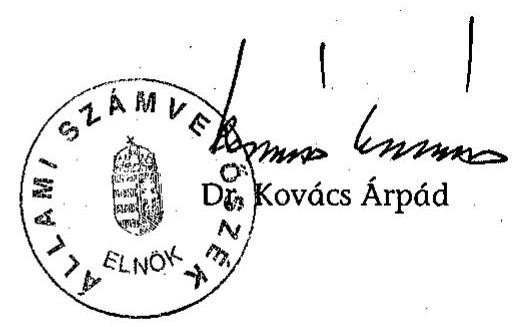
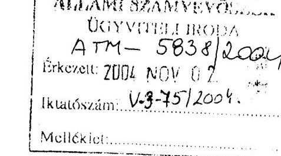
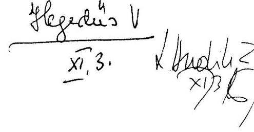
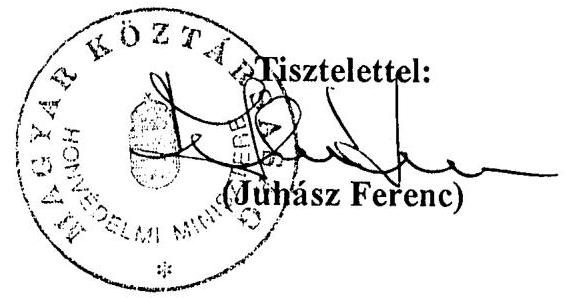

# JELENTÉS 

## a Magyar Honvédség közbeszerzési rendszere múködésének ellenőrzéséről

---

# 2. Államháztartás Központi Szintjét Ellenőrző Igazgatóság 2.3. Átfogó Ellenőrzési Főcsoport 

Iktatószám: V-3-76/2004.
Témaszám: 695
Vizsgálat-azonosító szám: V0125

## Az ellenőrzést felügyelte:

## Bihary Zsigmond

főigazgató
Az ellenőrzés végrehajtásáért felelős:
Hegedüsné dr. Müllern Veronika
főcsoportfőnök

## Az ellenőrzést vezette:

## Hudik Zoltán

számvevő igazgatóhelyettes

## Az ellenőrzést végezték:

Tóth Bálint
számvevő tanácsos, főtanácsadó
dr. Pataki Magdolna
számvevő tanácsos, tanácsadó

Vásárhelyi Zoltán
számvevő tanácsos

Trenovszki István
számvevő tanácsos, főtanácsadó

Balkay Attila
számvevő tanácsos

## Mátyási József

számvevő

## A témához kapcsolódó eddig készített számvevőszéki jelentések: címe

sorszáma
Jelentés a Honvédelmi Minisztérium fejezet 1994-95. évi költségvetésében és gazdálkodásában a haderő-fejlesztési célok érvényesülésének pénzügyi-gazdasági ellenőrzéséről
Jelentés a Magyar Honvédségnél a repülőcsapatok múködésének pénzügyi-gazdasági ellenőrzéséről
Jelentés a Honvédelmi Minisztérium fejezet múködésének ellenőrzéséről (2000.)
Jelentés a NATO Biztonsági Beruházási Programja (NSIP) keretében Magyarországon megvalósuló fejlesztések ellenőrzéséről
A katonai védelmi beruházások ellenőrzéséről
Jelentés a Magyar Honvédség szárazföldi csapatai múködtetését szolgáló pénzeszközök hasznosulásának ellenőrzéséről
Jelentés a központi költségvetés zárszámadásának ellenőrzéséről (évente)
[0024] [0126]
[0232] [0329]

Jelentéseink az Országgyűlés számítógépes hálózatán és az Interneten a www.asz.hu címen is olvashatók.

---

# TARTALOMJEGYZÉK 

BEVEZETÉS ..... 5
I. ÖSSZEGZŐ MEGÁLLAPÍTÁSOK, KÖVETKEZTETÉSEK, JAVASLATOK ..... 8
II. RÉSZLETES MEGÁLLAPÍTÁSOK ..... 20

1. A védelmi beszerzések szabályozottsága, megalapozottsága a haderőátalakítás folyamatában ..... 20
1.1. Az átalakítási koncepciók alakulása, a fejlesztések forrásfüggő ütemezése ..... 20
1.2. A beszerzéseket megalapozó képességtervek stabilitása, a forrástervezés biztonsága ..... 24
1.3. A Tárca Védelmi Tervező Rendszer fejlesztése ..... 30
1.4. A közbeszerzési rendszer szabályozottsága ..... 32
2. A beszerzések tervezésében, megvalósításában, felügyeletében résztvevő HM-MH szervek feladatellátása ..... 36
2.1. A feladatok és hatáskörök megosztása, az együttmúködés rendszere ..... 36
2.2. A beszerzések előkészítéséért, megvalósításáért felelős szervek működési feltételei ..... 48
2.3. A HM tulajdonú gazdasági társaságok szerepe a honvédségi igények teljesítésében ..... 54
2.4. A szabályszerűségi, gazdaságossági szempontok érvényesülése ..... 56
2.5. Mentesítéssel végrehajtott beszerzések sajátosságai ..... 64
2.6. A beszerzések felügyelete, ellenőrzése ..... 72
Melléklet: Honvédelmi miniszter észrevétele

---

.

---

# RÖVIDÍTÉSEK JEGYZÉKE 

| Áht. | az államháztartásról szóló 1992. évi XXXVIII. törvény |
| :--: | :--: |
| ÁSZ | Állami Számvevőszék |
| Besz. ut. | 53/2001. (HK. 14.) HM utasítás a Honvédelmi Minisztérium és intézményei, valamint a Magyar Honvédség beszerzéseinek eljárási rendjéről |
| Beszerzési Hivatal | HM Beszerzési és Biztonsági Beruházási Hivatal |
| BMP | lövész páncélos |
| BTR | páncélozott szállító harcjármú |
| CAX | számítógéppel támogatott parancsnoki és törzsvezetési gyakorlat |
| DCI | Washingtoni Védelmi Képességi Kezdeményezés (Defence Capability Initiative) |
| DPQ | Védelmi Tervezési Kérdőív (Defence Planning Questionnaire) |
| EU | Európai Unió |
| FG | haderő fejlesztési célok (Force Goals) |
| FP 2002- | haderőfejlesztési javaslatok 2002 (Force Proposal 2002) |
| GDP | bruttó hazai termék (Gross Domestic Product) |
| HK | Honvédelmi Közlöny |
| HM | Honvédelmi Minisztérium |
| HM BH | HM Beszerzési Hivatal |
| HM BBBH | HM Beszerzési és Biztonsági Beruházási Hivatal |
| HM GTH | HM Gazdasági Tervező Hivatal |
| HM HBFF | HM Haditechnikai Beszerzési és Fejlesztési Főigazgató |
| HM HFBF | HM Haditechnikai Fejlesztési és Beszerzési Főosztály |
| HM HVK | Honvédelmi Minisztérium Honvéd Vezérkar |
| HM HVK Ht Csf-ség | HM HVK Haderőtervezési Csoportfőnökség |
| HM HVKF | Honvédelmi Minisztérium Honvéd vezérkari főnök |
| HM KÁT | Honvédelmi Minisztérium közigazgatási államtitkár |
| HM KPSZH | HM Központi Pénzügyi és Számviteli Hivatal |
| HM KVEH | Honvédelmi Minisztérium Költségvetési Ellenőrzési Hivatal |
| HM KVF | HM Közgazdasági és Vagyonfelügyeleti Főosztály |
| HM LHFFF | HM Logisztikai és Haditechnikai Fejlesztési Felügyeleti Főosztály |
| HM SzMSz | HM Szervezeti és Múködési Szabályzat |
| HM TH | HM Technológiai Hivatal |
| HM TPSZI | HM Területi Pénzügyi és Számviteli Igazgatóság |
| HM VGHÁT | HM védelemgazdasági helyettes államtitkár |
| HVK | Honvéd Vezérkar |
| HVK Hdm Csf-ség | HVK Hadmúveleti Csoportfőnökség |
| HVK Hdm és Kik Csf-ség | HVK Hadmúveleti és Kiképzési Csoportfőnökség |
| HVK LCSF | Honvéd Vezérkar Logisztikai Csoportfőnökség |

---

| HVK LFCSF | Honvéd Vezérkar Logisztikai Főcsoportfőnökség |
| :--: | :--: |
| HVKF | Honvéd vezérkari főnök |
| Hvt. | a honvédelemről szóló 1993. évi CX. törvény |
| Kbt. | a közbeszerzésekről szóló 1995. évi XL törvény |
| KDB | Közbeszerzési Döntő Bizottság |
| KFOR | Koszovói Erő (Kosovo Force) |
| Logisztikai Parancsnokság | MH Összhaderőnemi Logisztikai és Támogató Parancsnokság |
| MH | Magyar Honvédség |
| MH EVI | MH Egészségvédelmi Intézet |
| MH HTEK | MH Haditechnikai Ellátó Központ |
| MH HTPEK | MH Hadtáp Ellátó Központ |
| MH LEP | Magyar Honvédség Légierő Parancsnokság |
| MH ÖLD | MH Összhaderőnemi Logisztikai Doktrína |
| MH ÖLTP | MH Összhaderőnemi Logisztikai és Támogató Parancsnokság |
| MH PCGTSZF-ség | MH Páncélos és Gépjármú Technikai Szolgálatfőnökség |
| MH RMSZF | MH Repülőmúszaki Szolgálatfőnökség |
| MH VVTSZ | MH Vegyivédelmi Technikai Szolgálatfőnökség |
| MHGYDP | MH Gyakorlatok Direktívája és Programja |
| MHPK | Magyar Honvédség Parancsnoka |
| NATO | Észak-atlanti Szerződés Szervezete (Nord Atlantic Treaty   Orgonization) |
| NBK, Kabinet | Kormány Nemzetbiztonsági Kabinetje |
| NSIP | NATO Security Investment Programme (NATO Biztonsági Be-   ruházási Program) |
| OGY | Országgyúlés |
| OGY HB | Országgyúlés Honvédelmi Bizottsága |
| OPEVAL | alegység értékelő módszer (Operational Evaluation) |
| PM | Pénzügyminisztérium |
| STANAG | Szabványosítási egyezmény (Standardization Agreement) |
| SzMSz | Szervezeti és Múködési Szabályzat |
| TACEVAL | alegység felmérő és értékelő program (Tactical Evaluation) |
| TPSZI | Területi Pénzügyi és Számviteli Igazgatóság |
| TVTR | Tárca Védelmi Tervező Rendszer |
| VFIB | Védelmi Felülvizsgálatot Irányító Bizottság |
| VTR | Védelmi Tervező Rendszer |

---

# JELENTÉS 

## a Magyar Honvédség közbeszerzési rendszere múködésének ellenőrzéséről

## BEVEZETÉS

A közbeszerzésekről szóló, 1995. november l-jén hatályba lépett törvény (Kbt.) megalkotásának alapvető célja volt - az árubeszerzések, a szolgáltatásmegrendelések és a beruházások terén - a széles körű nyilvánosságnak, a piaci verseny tisztaságának, az ajánlattevők esélyegyenlőségének, illetve a nemzeti elbánás alapelvének a biztosítása és nem utolsó sorban az államháztartás kiadásainak ésszerűítése. Ezen célok érvényesülése várható el a védelmi beszerzéseknél is, azzal a kiegészítéssel, hogy e beszerzések egy részére - a Kbt. 1999. évi módosítását követően - speciális szabályok vonatkoztak. A Kbt. felhatalmazása alapján született meg az egyes beszerzések nemzetbiztonsági és titokvédelmi okok miatti sajátos szabályairól szóló 151/1999. (X. 22.) Korm. rendelet, valamint a haditechnikai eszközök beszerzésére vonatkozó eljárási szabályokról szóló 152/1999. (X. 22.) Korm. rendelet.

A honvédelmi miniszter a honvédelemről szóló törvényben kapott felhatalmazás alapján szabályozta a közbeszerzések - Honvédelmi Minisztérium költségvetési fejezetén belüli - eljárási rendjét, az ellenőrzött időszakban hatályos 53/2001. (HK 14.) HM utasítással. Ebben meghatározta az egyes beszerzési kategóriák (központi beszerzés, központosított közbeszerzés, szabadkézi vétellel történő beszerzés) tárca szintű sajátosságait, a beszerzések tárgyköreit (haditechnikai eszközök és szolgáltatások, hadfelszerelési cikkek és anyagok beszerzése, infrastrukturális fejlesztések és az elhelyezési ellátás biztosítását szolgáló beszerzések), továbbá a beszerzésekben érintett (a felső szintű irányító és gazdálkodó, anyagnemfelelős és központi ellátó) szervek hatáskörét, feladatait, valamint beszerzési kategóriánként az eljárások rendjét.

Magyarország EU taggá válására tekintettel folyó jogharmonizáció keretében a Kbt. előírásait 2004. május 1-jei hatályba lépéssel - új törvény létrehozása formájában (2003. évi CXXIX. tv.) - módosították, valamint az alacsonyabb szintű jogszabályokat - az újraszabályozási kötelezettség előírásával - egyidejűleg hatálytalanították.

A honvédelmi tárcánál a haderő-átalakítás több fordulatos menetében, a 2002ben elrendelt védelmi képesség felülvizsgálatot követő munka keretében elkészült a haderő fejlesztésének tízéves terve, amelyet elfogadva a Parlament újabb döntést hozott a Magyar Honvédség hosszú távú fejlesztésének irányairól (14/2004. (III. 24.) OGY határozat). A védelmi felülvizsgálat tapasztalataira alapozva határozták meg a NATO tagsággal együtt járó kötelezettségekkel szinkronizáló képességeket, ezekhez hozzárendelve a haderőfejlesztésben (és kapcsolódóan a technikai felszerelés, az infrastruktúra és a kiképzés területén) indokoltnak tartott változtatásokat.

---

Mindezek együttesen azt jelentették, hogy az ellenőrzött időszakban a Magyar Honvédség közbeszerzési rendszere módosuló szabályozási környezetben és átalakuló szervezeti feltételek között múködött. A tárca beszerző szervezetei 2002. évben 52 Mrd Ft, 2003. évben 180,7 Mrd Ft nettó értékben folytattak közbeszerzést, melyekből a központi beszerző szerv 2002. évben 176 eljárás keretében 35,3 Mrd Ft, míg 2003. évben 306 eljárás keretében 160,1 Mrd Ft értékű beszerzést bonyolított le.

Az Állami Számvevőszék a közbeszerzési szabályok érvényesülését a központi költségvetés fejezeteinél a Kbt. hatályba lépését követően először az 1997-ben lezárt ellenőrzés keretében értékelte. A költségvetés zárszámadásának éves ellenőrzései rendszeresen megfogalmaztak közbeszerzésekkel összefüggő kérdéskört. A honvédelmi tárca számvevőszéki ellenőrzései visszatérően figyelemmel kísérték a haderő-átalakítás folyamatát (a HM fejezet 2000. évi átfogó ellenőrzése, a katonai védelmi beruházások 2003-ban, valamint legutóbb a Magyar Honvédség Szárazföldi Csapatok múködtetésére fordított pénzeszközök hasznosulásának 2004-ben lezárt teljesítményellenőrzése). A védelmi beruházások teljesítményellenőrzése a katonai infrastrukturális beruházásokat érintő közbeszerzési eljárásokra vonatkozóan is tett javaslatokat, ugyanakkor a haditechnikai és hadfelszerelési eszköz-, illetve szolgáltatás beszerzésekre irányuló teljesítményellenőrzést első alkalommal végeztünk a tárcánál.
A közbeszerzések döntő részét finanszírozó előirányzatokat nem a minisztérium, hanem a felügyelete alá tartozó különböző intézmények kezelték. Az Áht., valamint a 193/2003. (XI. 26.) Korm. rendelet előírásai szerint a fejezet felügyeletét ellátó szerv feladata többek között a fejezethez tartozó költségvetési szervek elemi beszámolói megbízhatóságának minősítése. Az ilyen ellenőrzéseket melyek kiterjednek a beszerzések szabályszerűségére is - a fejezeteknek azonban csak 2010-ig kell teljes körűvé tenniük. A honvédelmi tárca a felügyelete alá tartozó 71 költségvetési szervéből - tervezett ütemezésének megfelelően - 11 költségvetési szervénél auditálta a beszámolót. A közbeszerzések döntő részét finanszírozó intézmények azonban nem tartoztak ebbe a körbe, ebből következően a közbeszerzések szabályszerűségéről az Állami Számvevőszék nem rendelkezett, illetve a teljesítményellenőrzéssel áttekintett beszerzések kivételével nem rendelkezik információkkal.
A teljesítményellenőrzésünk végrehajtására az Áht. 120/A. § (1) bekezdésében, valamint az Állami Számvevőszékről szóló 1989. évi XXXVIII. törvény 2. § (3) és (7) valamint a 17. § (5) bekezdésben foglaltak adtak jogszabályi alapot. Az MH közbeszerzési rendszerének ellenőrzése keretében figyelemmel kísértük a korábban végzett számvevőszéki ellenőrzések megállapításai és javaslatai alapján hozott intézkedések végrehajtását.

Az ellenőrzés célja annak értékelése volt, hogy a Honvédelmi Minisztérium költségvetési fejezetnél:

- a haderő-átalakítás menetében a közbeszerzési eljárási rend jogszabályi és tárcaszintű szabályozása, valamint a katonai logisztikai rendszer vezetési és együttműködési rendje megfelelő feltételeket biztosított-e a közbeszerzési alapelvek érvényesüléséhez, a Magyar Honvédség beszerzéseinek eredményességéhez;

---

- a katonai beszerzések tervezésében, megvalósításában, felügyeletében, illetve ellenőrzésében érintett minisztériumi és a Magyar Honvédség szervezetei, háttérintézmények (főosztályok, csoportfőnökségek, hivatalok, parancsnokságok, ellátó központok) feladatellátása, együttműködésük szervezettsége megfelelőnek minősíthető-e az igénytámasztás megalapozottsága és az igényteljesítés eredményességének megítélése szempontjából;
- a korábbi számvevőszéki ellenőrzések alkalmával - a haderő-átalakítással és a közbeszerzési eljárásokkal összefüggésben - tett javaslatok hogyan hasznosultak.

A rendszerszemléletű megközelítéssel végzett teljesítményellenőrzés során arra kerestünk választ, hogy a honvédelmi tárca az irányítási, adminisztratív szabályozási és ellenőrzési rendszerein keresztül megfelelően képes-e befolyásolni a Magyar Honvédség közbeszerzéseinél a Kbt.-ben meghatározott célok, alapelvek érvényesítését. Másfelől a haditechnikai eszköz- és hadfelszerelés beszerzésekben (valamint a kapcsolódó szolgáltatás beszerzésekben) közreműködő HM és MH szervek, intézmények tevékenységeit az eredményesség szempontjából a tevékenységeik szándékolt és tényleges hatásának viszonya alapján - értékeltük.

A teljesítményellenőrzés fókuszában a közbeszerzési rendszer értékelése állt. Azt ellenőriztük, hogy a HM-MH közbeszerzési rendszerében adottak-e a feltételek a katonai beszerzések gazdaságos, illetve hatékony végrehajtásához. Ezen célnak alárendelve több szempont figyelembevételével választottuk ki a helyszínen ellenőrzött beszerzéseket, hogy lefedjük az eljárási típusokat, központi közbeszerző szervezetek tevékenységét, az általános és speciális eljárási szabályozások végrehajtási gyakorlatát, különös tekintettel a mentesítésekre. A helyszíni ellenőrzés a Honvédelmi Minisztérium és a szervezetébe integrált Honvéd Vezérkar szervezeteire, háttérintézményeire, azon belül kiemelt figyelemmel a HM Beszerzési és Biztonsági Beruházási Hivatal központi beszerző tevékenységére és az MH Összhaderőnemi Logisztikai és Támogató Parancsnokság és alárendeltjei közbeszerzésekben kifejtett tevékenységére terjedt ki.

A közbeszerzések tárca szintű szabályozásának hatályosságára figyelemmel a teljesítményellenőrzés alapvetően a haderőfejlesztések célmeghatározásának, a katonai beszerzések tervezésének, megvalósításának 2002-2003. évi (és 2004-re áthúzódó) folyamataira irányult. A következtetések megfogalmazásánál hangsúlyosabban a közelmúlt gazdasági-pénzügyi folyamatainak tapasztalatait vettük figyelembe, a helyszíni ellenőrzés befejezéséig figyelemmel kísértük a közbeszerzési rendszer korszerűsítési folyamatát. Ennek eredményességéhez a teljesítményellenőrzés e jelentésben összefoglalt megállapításaival, következtetéseivel és javaslataival kíván hozzájárulni.

A végleges jelentést az Állami Számvevőszékről szóló 1989. évi XXXVIII. tv. III. fejezet 25. § (1) bekezdésének megfelelően észrevételezésre megküldtük Juhász Ferenc miniszter úrnak, aki a jelentésben foglaltakkal kapcsolatban észrevételt nem tett. A javaslatainkat előremutatónak tartotta, figyelembe véve, hogy azok a lezárás alatt álló tárcaszintű szabályozást illetően egybeesnek a tárca szándékaival. Egyben jelezte, hogy a hatáskörében teendő intézkedésekről a törvényes határidőben tájékoztatást ad (Melléklet).

---

# I. ÖSSZEGZŐ MEGÁLLAPÍTÁSOK, KÖVETKEZTETÉSEK, JAVASLATOK 

A több mint egy évtizede átalakításban levő honvédség esetében a védelmi beszerzések eredményességére kiható elsődleges tényezőnek tekinthető a haderőfejlesztési koncepció időtállósága és az, hogy a szabályozási háttér megfelelő keretet nyújtott-e a megalapozott, gazdaságos beszerzések tervezéséhez, a közbeszerzési alapelveket érvényesítő végrehajtáshoz.

A haderő-átalakításra vonatkozó rendelkezések a fejlesztések, korszerűsítések irányáról - a költségvetési realitások kellő figyelembevétele nélkül - rendelkeztek, a finanszírozhatóságot csak követelményként fogalmazták meg. A honvédség feladat- és eszközrendszerének meghatározásához, a feladatrendszerhez illeszkedő haderőstruktúra és képesség kialakításához az 1999-2000. évi hosszú távú átalakítást meghatározó szabályozások is csak akkor képeztek volna megfelelő szakmai alapot, ha tervezhetően rendelkezésre állnak a végrehajtáshoz szükséges pénzügyi források. Szinte törvényszerű volt, hogy a haderőreform korábban elhatározott - így az Országgyűlés 2000. évben hozott határozata alapján megkezdett - feladatainak végrehajtása is megrekedt.

Az eltelt időszakban az alapvető problémát egyfelől a behatárolt forráslehetőségek jelentették. A honvédelmi tárca részére a GDP arányos költségvetési támogatás bevezetését követően vált kedvezőbbé a helyzet. (2000. évtől 2004-ig, a mintegy $83 \%$-kal növekedett támogatásból biztosítottak forrást többek között a megkezdett egyedi fejlesztésekre - rádió beszerzésre, radarkorszerűsítésre.) Másfelől az átalakítás eredményességét hátráltató tényezőnek tudható be, hogy részben a szövetségi szerepvállalás részletes követelményeinek azonosítatlanságával összefüggésbe hozhatóan, nem fogalmazták meg teljes körűen és egyértelműen a magyar haderővel szembeni elvárásokat. Ez például legutóbb a Nemzeti Katonai Stratégia kiadásának ez év szeptember végére történt halasztásában nyilvánult meg, ami azzal jár együtt, hogy legkorábban a 2006. évi tervezéshez adhat támpontot a honvédelmi tárca tervező szervezetei számára.

Tekintettel arra, hogy a hosszú és középtávú szervezeti átalakítást és haditechnikai fejlesztést a Nemzeti Katonai Stratégia alapozhatja meg, hiányában rövid időn belül jelentkeztek az átalakítási koncepció ismételt átgondolásának igényei. Ezek egyaránt érintették a katonai szervezetek elhelyezkedését, a korábban alkalmazásra tervezett eszközök körét és mennyiségét, azokban alkalmanként jelentős módosítást eredményezve. Így a finanszírozható haderőkép meghatározására 2002-ben indított védelmi felülvizsgálat döntéseivel megalapozott újabb országgyűlési határozat megváltoztatta az elképzeléseket. A következményeként kialakuló új haderőstruktúra egy sor korábban tervezett, majd végrehajtott eszközbeszerzést, építés-beruházást, felújítást tett oka-fogyottá (katonai szervezetek és telephelyek helyőrségi átcsoportosítása, lánctalpas páncélozott harcjármú kivonása stb.).

A korábbi hosszútávú koncepciók a nemzeti és a vállalt szövetségesi feladatokhoz szükséges haditechnikai eszközkorszerűsítéseket, cseréket a tízéves tervidő-

---

szak végére határozták meg (aminek hátrányos következményeire a tárcánál végzett számvevőszéki ellenőrzések ${ }^{1}$ már igyekeztek ráirányítani a figyelmet). A technikai fejlesztések ilyen ütemezése csak abból a szempontból értékelhető pozitívan, hogy ezzel elvileg csökken az utólag indokolatlannak, célszerűtlennek minősíthető beszerzések lehetősége.

A honvédelmi törvény rendelkezései szerint az OGY határozza meg a honvédség főbb haditechnikai eszközeinek fejlesztését, az eszközök besorolására a törvény, valamint további jogszabályok részletes szabályozást nem tartalmaznak. Az országgyúlési határozatokban 1995-től jelentek meg egyes haditechnikai eszközökre, illetve általánosan meghatározott eszközcsoportra vonatkozó döntések (légvédelmi rakéta, légvédelem rádiólokációs felderítő-, információs és vezetési rendszer, harcászati repülő erők fejlesztése). Emellett a tárca hosszú távú tervei számoltak új, perspektivikusan tervezett, még nem rendszeresített eszközökkel (könnyű páncélozott gépjármű, vontatott löveg, könnyű és közepes aknavetők stb.) és a beszerzésükhöz szükséges ráfordításokkal, amelyre vonatkozóan országgyűlési döntés még nem született.

A védelmi tervezésben még nem kiforrott a katonai szervezetek haderőfejlesztési törzskönyveinek alkalmazása a képesség-orientált katonai szervezetek kialakításához és a működtetésükhöz szükséges költségvetési erőforrások meghatározásához. Sem ez, sem a tárca tervező rendszere - a többszöri elhatározások ellenére - nem tudta támogatni a képesség alapon nyugvó erőforrás tervezést. (Ezzel összefüggésben a korábbi számvevőszéki ellenőrzések ${ }^{2}$ szintén tettek utalásokat.) Mindaddig, amíg az átalakítás tíz évére tervezett feladatok költségvetési szempontból kiegyensúlyozatlanok, fennáll - a prognosztizált növekvő költségvetési forrás, a tartalékok figyelembevétele mellett is - a kitűzött feladatok halasztásának, esetleges ismételt változtatásának vagy elmaradásának kockázata (gépjármű program, könnyű páncélozott lövész jármű beszerzés).

A közbeszerzésekről szóló 1995. évi XL. törvény (Kbt.) 1999. évi módosítása tette lehetővé, hogy a Kormány rendeletben szabályozza a nemzetbiztonsági és titokvédelmi körbe tartozó eszközök, valamint a haditechnikai eszközök beszerzésének rendjét. Ezt követően vált teljessé a honvédelmi tárca közbeszerzéseinek jogszabályi háttere, megadva a lehetőséget a honvédség speciális működési-fejlesztési igényeinek és érdekeinek - közbeszerzésekben történő - érvényesítésére.

A közbeszerzési terület - Magyarország EU tagságára tekintettel történt - 2003. évi (2004. májusától hatályos) törvényi újra-szabályozása következtében a Kormány hatáskörébe utalt szabályozások is hatálytalanná váltak. Az államtitkot vagy szolgálati titkot, illetőleg alapvető biztonsági, nemzetbiztonsági érdeket érintő vagy különleges biztonsági intézkedést igénylő beszerzések szabályairól szóló új kormányrendelet időben megjelent. Ugyanakkor a haditechni-

[^0]
[^0]:    ${ }^{1}$ Lásd: az 1998-2004. években készített - a honvédelmi tárcát érintő - számvevőszéki jelentések [9821], [0333], [0424] következtetései, javaslatai
    ${ }^{2}$ Lásd: az 1996-2003. években készített - a honvédelmi tárcát érintő - számvevőszéki jelentések [313], [0017], [0333] [0424] következtetései, javaslatai

---

kai eszközök beszerzésére vonatkozó eljárási szabályokról szóló új rendelkezések tárca szintű előkészítésének elhúzódása következtében ez a speciális terület átmenetileg szabályozatlan maradt.

Sajátos gyakorlat alakult ki az olyan haditechnikai eszközbeszerzéseknél, amelyekre a Kormány Nemzetbiztonsági Kabinetje - az ide vonatkozó kormányrendelet felhatalmazása alapján - mentesítést adott. Az általánosság szintjén (titokvédelmi szempontok alapján, honvédelmi érdekből) szabták meg egy beszerzés kormányrendelet hatálya alóli kivonásának feltételét. A tárca közbeszerzéseit szabályozó miniszteri utasítás sem adott bővebb eligazítást a mentességi kérelmek indoklásához, illetve a követendő eljárás részleteiről.

A mentességet úgy értelmezték a tárcánál, hogy sem a kormányrendeletekben meghatározott, sem más közbeszerzési eljárási rendet nem kell követniük. E szemléletben végrehajtott beszerzéseknél például nem érvényesülhetett maradéktalanul az ajánlattevők esélyegyenlőségének alapelve, következmény nélkül elmaradhatott a pályázási feltételek számonkérése, a közbeszerzési eljárás hiányában jogorvoslatra sem nyílt lehetőség.

Az általános jogértelmezést figyelembe véve a Kormány Nemzetbiztonsági Kabinetje által adott felmentés a haditechnikai eszközbeszerzéseket szabályozó rendelet alkalmazására és nem a magasabb szintű jogforrásban szabályozott közbeszerzési eljárás alóli mentességre vonatkozhat (a jogszabályi hierarchiának megfelelően alacsonyabb szintű szabályozás nem lehet ellentétes a magasabb jogszabállyal). Természetesen indokolt lehet egyes beszerzések teljes kivonása a jogszabályokban rögzített közbeszerzési eljárások alól és erre a Kormány is kaphat felhatalmazást, de a haditechnikai eszközbeszerzések szabályozására vonatkozó törvényi felhatalmazásból a Kormány Nemzetbiztonsági Kabinet ez irányú jogosítványa automatikusan nem következik.

A haditechnikai eszközbeszerzésekre vonatkozó kormányrendelet újbóli szabályozása adott lehetőséget a közbeszerzési eljárások alóli mentesítés megfelelő szinthez rendelésének átgondolására, a Kormány Nemzetbiztonsági Kabinet által is indokoltnak tartott felmentés esetén alkalmazandó részletes eljárási szabályok meghatározására. (Az új kormányrendelet szerint a kormány kabinet előzetes állásfoglalása alapján a mentesítésről a Kormány dönt, továbbá ilyen döntés esetén a szerződések megkötésénél a Ptk. előírásait szükséges betartani. Ezzel csak a közbeszerzési eljárások teljes mellőzésére irányuló szándék vált pontosabbá.)

A tárca gazdasági társaságainak egy része olyan speciális (főleg hadiipari) szolgáltatásokat nyújt a tárca számára, melyeket más piaci szereplők nem biztosítanak, továbbá az ilyen szolgáltatások kereslete igen szűk körre korlátozódik. Az életképesség fenntartásához a gazdasági társaságoknak szüksége volt/van a honvédségi megrendelésekre, a tárcának érdeke fűződik ezeknek a hadiipari kapacitásoknak a fenntartásához (amelyek a minősített időszakban kapnak megerősített funkciót).

Az egymásra utaltság következményeként volt arra példa, hogy a tárca gazdasági társaságai - a közbeszerzési alapelvek érvényesítésével nem összeegyeztethető módon (a biztonság és a közvetlen ráhatás lehetőségét tartva elsődleges

---

szempontnak) - olyan esetekben is előnyt élveztek, amikor a piac más szereplőinek kizárása nem volt indokolt (pl. MH objektumok őrzés-védelmével, pristinai bázis építési és karbantartási munkáival kapcsolatosan). A közbeszerzési eljárások - ilyen jellegű tárcaérdekek érvényesüléséhez történt - megkerülése nem minősül szabályos megoldásnak, azzal együtt, hogy a jogorvoslati határidő leteltével már nem szankcionálható.

A HM fejezetnél az erőforrásokkal való gazdálkodás - kormányrendeletben rögzített sajátosságoknak megfelelően - központi és intézményi szinten történik, valamint az intézményi gazdálkodás egyes folyamatai (vagy részfolyamatai) is centralizáltan, központosított ellátás keretében valósulnak meg. A központi gazdálkodás keretébe tartozóan végzik a központi beszerzések közbeszerzési feladatait, valamint a haditechnikai fejlesztést, beruházásokat, felújításokat, nagyjavításokat, rendszerbeállításokat. A honvédelmi szervezetek részére a feladataik végrehajtásához szükséges technikai eszközöket, meghatározott készleteket, szolgáltatásokat és létesítményeket a központi ellátó szervek - a logisztikai ellátás keretében - térítésmentesen, természetben biztosítják.

A csapatok (katonai szervezetek) az eszközök és anyagok közül azokhoz, amelyeket csak a fegyveres szervek használnak (pl. fegyver, harckocsi, repülőgép stb.), vagy a nemzetgazdaságban is használatosak, de beszerzésük korlátozott, illetve beszerzésük nagy tételekben gazdaságosabb, a központi beszerzést ${ }^{3}$ követően, természetbeni ellátás formájában jutnak.

A honvédelmi tárcánál a közbeszerzési jogszabályok alapján kialakított többszintű szabályozás (miniszteri utasítás, vezérkarfőnöki intézkedés stb.) nehezen áttekinthető, előfordulnak átfedések, párhuzamosságok. A közbeszerzés végrehajtásához egyes részletes szabályozások kiadásának szükségességét már 1998ban megfogalmazták - ami segíthette volna a végrehajtó szervezetek beszerzési tevékenységét -, azonban azok kiadása nem realizálódott.

A HM-MH közbeszerzési tevékenységeinek rendszere a haderőreformmal összefüggésben maga is változásokon ment keresztül. 2001 októberében a korábbi szabályozókat miniszteri utasítással egységes szerkezetbe foglalták, meghatározva a közbeszerzési eljárások megindításának és az eljárással kapcsolatos döntések meghozatalának rendjét, ami a közbeszerzésekkel kapcsolatos döntések és az előzetes engedélyeztetés centralizálását vonta maga után. A rendszer 2004-től tervezett módosításait már a 2002-ben elrendelt védelmi felülvizsgálat tapasztalatai is motiválták.

Az átstrukturált honvédségi szerveknél - a beszerzési feladatokkal összefüggésben - új szervezeti elemek jelentek meg, így például létrehozták a HM Beszerzési és Biztonsági Beruházási Hivatalt (továbbiakban: Beszerzési Hivatal). Jelentősen csökkent a felsőszintű gazdálkodó szervek és az alájuk rendelt központi ellátó szervek létszáma. Ennek következtében a beszerzési tevékenység súlypontja a központi ellátó szervektől a központi közbeszerzéseket elsősorban, az import-

[^0]
[^0]:    ${ }^{3}$ Központi beszerzés: a fejezeti kezelésű előirányzat, valamint a felsőszintű gazdálkodó szerv hatáskörébe tartozó előirányzat terhére végrehajtott tárgyi eszköz, készlet, anyag, ipari javítás és szolgáltatás beszerzése, mind hazai, mind külföldi viszonylatban.

---

beszerzéseket kizárólagosan végző Beszerzési Hivatal felé tolódott el. Központi beszerzések lebonyolítására a központi ellátó szervek is jogosultak. A központosított ellátás legnagyobb részét kitevő logisztikai támogatást az MH Összhaderőnemi Logisztikai és Támogató Parancsnokság (továbbiakban: Logisztikai Parancsnokság) anyagnem-felelős szolgálati ágai és az alárendeltségükbe tartozó ellátó központok biztosítják.

A központilag nem biztosított, az anyagi technikai, logisztikai szolgálatok múködéséhez szükséges - a nemzetgazdaságból az adott csapat (katonai szervezet) környezetében beszerezhető és a felsőszintű gazdálkodó szervek által saját hatáskörbe ki nem emelt - eszközök és anyagok (illetve szolgáltatások) a csapatköltségvetés előirányzatainak a terhére, ún. csapat-beszerzés keretében jutnak a felhasználókhoz.

A közbeszerzésekben érintett szervezetek feladat-, hatásköri, és együttmúködési rendszerének áttekintése több olyan jelenséget hozott felszínre, melyek korrekciója szabályosabbá, célszerűbbé és nem utolsó sorban gazdaságosabbá teheti a tárca beszerzéseit.

A Beszerzési Hivatal alaprendeltetése szerint, mind hazai, mind külföldi viszonylatban biztosítja a beszerzési eljárások megindítását, lefolytatását, szerződések megkötését és azok teljesítésének felügyeletét, az ezekhez kapcsolódó marketing és kontrolling jellegű feladatok szervezésével és végrehajtásával együtt. A hivatali szervezet alapító okiratának átmeneti ellentmondásosságát a minisztérium SzMSz-ével a 2004. évi módosítás feloldotta, ugyanakkor a hivatal közvetlen szakmai kontrollja továbbra sem tisztázott. Azon túl, hogy az alapító okirat hangsúlyozta a jogkövető feladatellátást, ennek gyakorlati érvényesítését nem támogatták a szabálykövető magatartást ösztönző belső rendelkezések. Továbbá a hivatali vezetésnek - az általános felelősségi szabályozások mellett - nem volt adekvát eszköze a saját vagy más szervezet (a közbeszerzési eljárásban szakértő, bizottsági tagként részt vevő) munkatársainak szankcionálására jogszerűtlen, szabálytalan feladatellátás esetén.

A beszerzések eredményes és szabályos lebonyolításához a Beszerzési Hivatal számára biztosított hatáskör nem bizonyult elegendőnek az olyan esetekben, amikor a megbízók - előírás hiányában - nem kérték ki a Beszerzési Hivatal véleményét az eljárás típusának megjelöléséhez, illetve a meghívandó ajánlattevők meghatározásához. A probléma megoldása irányába tett lépés volt a vonatkozó utasítás 2003. évi módosítása (ettől kezdve az engedélyezési kérelmeket és az eljárások lezárására vonatkozó javaslatokat a hivatal vezetője útján kell felterjeszteni), a hivatali hatáskört viszont ennek szellemében még nem módosították.

A beszerzések engedélyezésére és a nyertes ajánlattevőkre vonatkozó döntési jogköröket az államháztartás költségvetési felelősségi viszonyaival összhangban és célszerűen határozták meg, ami nem mondható teljesnek a szakmai felelősség viszonylatában, mivel a beszerzési folyamatban a legfelsőbb katonaszakmai képviseletet nem nevesítették. Elsősorban a haditechnikai beszerzések folyamatában indokolt a Honvéd Vezérkar hadműveleti és haderő-tervezési szakembereinek szakértői közremúködése, tekintettel az e téren a tárca előtt álló fejlesztési feladatokra.

---

Megállapítható volt még, hogy a szabályozásokkal nem fedték le a beszerzési folyamat összes tevékenységét (tejesítés igazolások és a pénzügyi teljesítés feltételeinek pontos behatárolása terén), valamint a szervezeti változásokat nem követte minden esetben a szabályozások korrekciója (a Honvéd Vezérkar átszervezését követően a jogutód Logisztikai Parancsnokság a számára előírt beszerzési keretszabályokat nem alkotta meg, aminek hiánya elsősorban az ellátó központoknál okozott szabályozatlan feladatellátást).

A Logisztikai Parancsnokság felsőszintű költségvetési gazdálkodó szervként irányítja a beszerzéseket tervező és a beszerzési eljárások indítását kezdeményező anyagnem-felelős szolgálati ágak gazdálkodását. A gazdálkodási (költségvetési előirányzatok feletti rendelkezési) jogkörök meghatározása nem volt következetes, mivel a költségvetési előirányzatokat az ellátó központok részére hagyták jóvá, de a gyakorlatban az előirányzatok tervezését és a velük való gazdálkodást a szolgálati ágak magukhoz vonták. Így a részben önállóan gazdálkodó ellátó központok jogköre lényegében a kötelezettségvállalások teljesítésére korlátozódott. Ezen a téren a szabályozás még nem vált teljes körűvé, emiatt az áttételes, többszereplős teljesítésigazolás kialakult gyakorlatára nem a jól szervezett ügymenet volt jellemző.

A beszerzési eljárásokban érintett szervek együttműködésével kapcsolatos hiányosságok a beszerzési folyamatok tervezésénél, a piaci információk gyűjtésével összefüggésben és a beszerzési adatok áramlása, szolgáltatása terén merültek fel. A közbeszerzések 2001-től előírt éves finanszírozási terve a tervkészítőktől nem jutott el a központi beszerző szervezethez, hogy a beszerzések lebonyolításának ütemezését segítse, a többségükben kiszámíthatatlanul érkező igények nem tették lehetővé a tervszerű marketing tevékenységet sem. Az előírások a piaci információk gyűjtését, elemzését a Beszerzési Hivatalhoz rendelték, ezzel szemben szélesedő gyakorlattá vált, hogy a beszerzések igénytámasztói jelölték meg a számításba vehető ajánlattevőket.

A különböző szervezetek azonos beszerzési igényeinek összesítése tárca szinten nem megoldott, az ennek következtében előforduló párhuzamos eljárások egyfelől növelték a munkaráfordításokat, másfelől nem tették lehetővé a nagy tételű beszerzésekben rejlő árkedvezmények lehető legjobb kihasználását. 2003. év közepétől szűkítették a közbeszerzések indítására jogosultak körét, ezzel növelve a központi beszerző szervezet leterheltségét, de nem pótolva a megfelelő információs és kommunikációs rendszer hiányát.

A beszerzések bruttó költségkihatását - a szükséges információk hiányára viszszavezethetően - az engedélykérelmek összeállításában illetékes (anyagnemfelelős) szervek meglehetős pontatlansággal határozták meg. Ezzel összefüggésben megállapítható volt az eljárások lebonyolítását lassító tényezők szerepe, mint pl. az igénytámasztó, megrendelő szervek kellően át nem gondolt beszerzési igényei, a pontosan és időben meg nem határozott műszaki paraméterek, az ajánlati dokumentáció elkészítéséhez szükséges adatok késedelmes szolgáltatása.

A tárca a Beszerzési Hivatal múködési feltételeit elsősorban a feladatarányos létszám tekintetében nem tudta biztosítani. A hivatali szervezetben a tényleges beszerzési feladatokat ellátó Igazgatóság a 2000. évhez képest az ér-

---

tékükben megötszöröződött, számukban megnégyszereződött beszerzéseket még 2003 közepén is változatlan létszámmal bonyolította, ami fokozott munkaintenzitást követelve a hibalehetőségeket növelte, illetve kisebb-nagyobb szabálytalansággal járó kényszermegoldásokat eredményezett. A hivatal létszámgondok megoldására tett javaslatát elfogadva a tárca 2004 közepén 25 fős létszámnövelést engedélyezett.

A Logisztikai Parancsnokság és közvetlen alárendeltjei (14 alárendelt katonai szervezet) megalakulása óta megvalósították a korábban elkülönülten tevékenykedő szakágak szervezeti integrációját. A szervezeti integrációt azonban a beszerzések tekintetében - még nem követte az eljárások és munkafolyamatok integrációja. (A helyszíni ellenőrzés befejezésének időszakában kezdték meg a logisztikai szervezet átvilágítását és létszámának racionalizálását.)

A közbeszerzési rendszer múködésének megítéléséhez áttekintett beszerzési folyamatok értékelése során szerzett tapasztalatok mind a szabályszerűség, mind az eredményesség szempontjainak fokozottabb betartására hívják fel a figyelmet.

A tárca, amikor a haditechnikai eszközök beszerzését a hatályos közbeszerzési előírások szerint nem látta megoldhatónak, illetve különböző megfontolásokra hivatkozva élni tudott a kormányrendeletben rögzített mentesítési lehetőséggel, egyedi eljárási gyakorlatot folytatott. Az indokok között egyaránt szerepeltek objektív és szubjektív tényezők is, mint a kormányzati döntéshozatal igénye (harcászati repülőgép beszerzésénél), közvetítőn keresztül érkezett konkrét ajánlat hasznosítása (AN-26 szállító repülőgép beszerzésnél), nem kívántak vagy nem tudtak ellentételezést előírni (MiG-29 alkatrész- és javítás szolgáltatás beszerzésnél), nem volt elérhető az ajánlattevő indulása magyar közbeszerzési eljárásban (Bundeswehr által felajánlott gépjárművek beszerzésekor), és a példák még tovább sorolhatók. A felmentést adó Kabinet felelőssége volt, hogy menynyiben megalapozott előterjesztést fogadott el. A mentességet élvező eljárások bonyolítása ettől kezdve nem szabályozott eljárási rend szerint alakult, hanem rendkívül eltérő képet mutatott.

A példaként kiemelt eljárások utólagos értékelése szemlélteti, hogy mennyire sokszínű következménnyel járt a közbeszerzési előírások részbeni vagy teljes figyelmen kívül hagyása. A harcászati repülőgép beszerzésénél a szóba jöhető ajánlattevők megtehették az ajánlataikat, viszont az elbírálásban a tárca előterjesztését tárgyaló kabinetülésen hozott kormányzati döntés volt a mérvadó. A szállító repülőgép beszerzésnél más ajánlatok hiányában pontosan nem tudható, hogy volt-e kedvezőbb ajánlat. A MiG-29 repülőgépek rendszerben tartása körüli bizonytalanság, a szakanyag ellátás, a javítások tervezésének hiányosságai, közreműködő cég körüli tisztázatlan helyzet mind szerepet játszott a kapcsolódó beszerzések problématerhes kivitelezésében, aminek keretében egy javításnál például szerződés nélküli munkavégzést követően, peren kívüli megállapodás keretében történt a kifizetés.

Más mentesített eljárásoknál is tapasztalható volt olyan eljárási elemek (fizetőképesség, műszaki alkalmasság bizonyítása, tevékenységi engedélyek bekérése stb.) elmaradása, amelyek kifejezetten a beszerző érdekeit hivatottak védeni.

---

(Hasonló esetek megelőzése érdekében a tárca ellenőrzési hivatala 2004. őszén tervezi a repülőműszaki szolgálati ág átfogó ellenőrzését.)

A közbeszerzési eljárások alól nem mentesített beszerzéseket általában a törvényi és jogszabályi előírásoknak megfelelően végezték, ugyanakkor a paragrafusok pontatlan értelmezése olykor nem az előírásoknak megfelelő eljárás alkalmazásához vezetett (pl. központi üzemanyagraktár technológiai rendszerének korszerűsítése, szolnoki technikai kiszolgáló állomás berendezéseinek beszerzése, MRL 5 radarok szervizelése).

A nem kellően átgondolt beszerzési igények, pontatlan műszaki paraméterek megadása (pl. tejtermék beszerzésnél, HM objektumok felújításánál), illetve a megbízók által történt helytelen eljárás típus megjelölés (pl. forgódaru felépítményű összkerékhajtású gépkocsi beszerzésénél) az eljárások elhúzódását okozták. A rendkívül sürgőssé váló beszerzések esetében a költségtényezők másodlagos szerepet kaptak (pl. a 2002-ben kezdeményezett konzerv beszerzéshez kapcsolódó minőség vizsgálat, ezüst-cink akkumulátorok beszerzése), illetve monopolhelyzetben lévő ajánlattevőkkel szemben korlátozottan érvényesülhettek a gazdaságossági szempontok (MI-17, MI-8, 4 db KSZA2 javításoknál).

Az előírásoktól eltérő közbeszerzések miatt - a Közbeszerzési Tanács éves beszámoló adatainak figyelembevételével - 2002-2003-ban összesen 9 esetben marasztalták el a honvédelmi tárcát, illetve bírságot szabtak ki. Az országos és a tárcára vonatkozó jogorvoslati adatok összevetése a tárcabeszerzések átlagostól nagyobb arányú szabályosságára engedett következtetni (ennél kedvezőtlenebb képet mutatna a beszerzések összesítő értékelése, ami a közbeszerzési eljárások alól mentesített beszerzésekre is kiterjed, mivel ezeknél a jogorvoslati eljárások kezdeményezésére eleve nem nyílt lehetőség).

A közbeszerzési értékhatárt el nem érő szabadkézi vétellel történő beszerzések szabályozása elvileg kizárta a közbeszerzési előírások megkerülésének - részekre bontás útján elérhető - lehetőségét. Ennek ellenére részekre bontott közbeszerzéseket a tárca belső ellenőrzései is feltártak.

A megkötött szerződések teljesítési igazolásával kapcsolatos feladatot a beszerzési utasítás - az általánosság szintjén szabályozva - a Beszerzési Hivatal részére határozott meg. Eszerint a szerződések teljesítése nyomán beérkező anyagok és szolgáltatások átvételét igazoló okmányok alapján a költségviselő felé kell kezdeményezni a teljesített szerződések ellenértékének kifizetését, ehhez biztosítva a szükséges bizonylatokat és okmányokat. A valóságban ez a folyamat bonyolultabb, melynek részleteit a konkrét szerződések egyedileg tartalmazták. Általában a szerződés műszaki tartalmát és a fizikai teljesítést más szervezet (HM Technológiai Hivatal, illetve az ellátó központ) igazolta, míg a kifizetést a költségviselő végezte, aminek pénzügyi szabályszerűségét az illetékes pénzügyi szolgálat (TPSZI) igazolta.

Az adott szabályozás mellett a Logisztikai Parancsnokság alá tartozó, teljesítésigazolásban érdemi funkciót betöltő anyagnem-felelős szolgálatfőnökségek és ellátó központok a tevékenységüket csak a szokásjog alapján végezték. Az ilyen sokszereplős folyamat általában megfelel a korszerű „több szem" elvének, továbbá az ellenőrzött eljárásoknál a bonyolultságával együtt biztosította a valós

---

teljesítmény-elszámolást, azonban nem csak a szabályozás elmaradása hiányzott, hanem az ügyviteli folyamatok célszerű megszervezése is.

A tárca közbeszerzési rendszerének szabályozása alapvetően az igénytámasztástól a beszerzés megvalósításáig tartó folyamatot ölelte át, értelemszerűen a jogszabályi előírásokhoz történő igazodásra koncentrálva. A gazdálkodás egészére kiterjedő belső rendelkezésekből kiolvasható, hogy a honvédelmi tárca a gazdaságossági követelmények érvényesülését általánosságban valamennyi gazdálkodó szerve tekintetében lényegesnek tartja, de konkrét kritériumokat nem határoztak meg. Így a gazdaságossági szempontok érvényesülése érdekében eredményességi elven alapuló követelményt - szervezetre vagy tevékenységi területre meghatározottan - a közbeszerzéseknél sem írtak elő. A gazdaságosság általános elvárásának teljesítése, nem teljesítése nehezen kérhető számon, de ilyen számonkérésre (eredményesség, gazdaságosság, hatékonyság értékelésére) nem volt példa.

A haditechnikai beszerzéseknél a gazdaságosságra kiható közbeszerzési alapelvek érvényesítésének (legalacsonyabb ár, összességében legkedvezőbb ajánlat elérésének) - egy viszonylag szűkebb ajánlattevői piacon - objektíven kisebbek az esélyei, amit a tárgyalások alkalmával elért (olykor meglehetősen szerény) árengedmények tükröztek. A tárgyalásos eljárásoknál a Beszerzési Hivatal minden esetben kezdeményezett árcsökkentést, de ennek eredményességét korlátozni tudta például az ajánlattevő monopolhelyzete. A beszerzési folyamatokba árszakértőt nem vontak be, akinek alkalmazása különösen a gyakran választott tárgyalásos eljárásoknál már az ajánlati felhívás készítésekor hasznosulhatott volna olyan követelmények megfogalmazása révén, amelyek elősegítik a tárgyalás menetében az érveléseket, majd az ajánlatértékeléseket.

A közbeszerzések tervezési és indítási hatáskörével rendelkező szervek költségvetésének végleges jóváhagyása előtti időszakban (rendszeresen az adott év májusáig) engedélyhez kötött az előirányzatok felhasználása, amivel az előre nem látható költségvetési megszorításokra is tekintettel, túlzott óvatossággal csak a legszükségesebb beszerzések indítása esetében éltek. Ezzel hozható összefüggésbe a beszerzések indításának év eleji visszafogottsága és következményeként az év vége közeledtével az időarányosnál magasabb maradvány és az elvonás elkerülése érdekében - a beszerzések minden áron való erőltetése.

Az év végére torlódott beszerzések amellett, hogy túlterhelést okoztak a beszerző szervezetnél, együtt jártak alacsonyabb színvonalú műszaki előkészítéssel és gyors szerződéskötésre ösztönző hatásaként a nem feltétlenül indokolt eljárási módok választásával, háttérbe szorítva a gazdaságosság szempontjait. Az államháztartási körben az ilyen helyzetek kialakulása nem ismeretlen, viszont megalapozottabb tervezéssel és a szabályozás adta lehetőségek optimálisabb kihasználásával a jelenség negatív hatásai elkerülhetők.

A tárcánál nem állt rendelkezésre olyan megbízható, ellenőrzött összesítés, mely az ellenőrzött időszakra vonatkozóan összevethető módon, azonos tartalommal, megfelelő részletezettséggel mutatná be a közbeszerzési eljárások és a szabadkézi vétellel történt beszerzések adatait, szervezet szerinti bontásban. A végrehajtott közbeszerzések fejezeti szintű éves összesítéséhez meghatározott adatszolgáltatási kötelezettségnek a szervezetek nem teljes körűen tettek eleget,

---

a kimutatások nem az előírt formában, nem ellenőrzött adattartalommal készültek, de a mulasztások pótlása, a hibás teljesítések korrigálása is elmaradt.

A honvédelmi tárca ellenőrzési rendszerében a költségvetési, szakmai és parancsnoki, felügyeleti ellenőrzések HM rendelet, miniszteri utasítások, valamint az alsóbb szintű rendelkezések útján szabályozottak voltak. A költségvetési ellenőrzések végrehajtását - a típusuknak (átfogó, pénzügyi szabályszerűségi stb.) megfelelően - az érintett szervekre (központi anyagnemfelelős gazdálkodókra, HM és MH intézményekre, pénzügyi-számviteli szervekre) kidolgozott program minták segítették, amelyek egyben módszertani útmutatást is adtak a beszerzések ellenőrzéséhez.

A tárca költségvetési ellenőrzései alapvetően a beszerzések szabályszerűségét vizsgálták. A teljesítményellenőrzés módszerével történő értékelést a közelmúltban kezdték alkalmazni, de a beszerzéseket - a 2004. évben kezdett még folyamatban lévő ellenőrzések kivételével - a haderő-átalakítási folyamathoz való illeszkedés szempontjából még nem értékelték. A beszerzésekre irányuló ellenőrzések látókörébe ez ideig nem kerültek azok a beszerzések sem, melyeket a Kormány Nemzetbiztonsági Kabinetjének felmentése alapján végeztek, így nem alakulhatott ki objektív kép azok szabályszerűségéről, célszerűségéről, hasznosulásáról. (Ilyen célú ellenőrzést az ellenőrzésünk tapasztalataira alapozva a soron következő ellenőrzési terv összeállításánál vesznek számításba.)

A fejezeti és az intézményi költségvetési gazdálkodás pénzügyi-számviteli teendőinek ellátásában illetékes hivatali szervezet pénzügyi-számviteli szakellenőrzési funkcióval is rendelkezett, amire tekintettel a 2001-2003. években a fejezeti ellenőrző szervezet költségvetési átfogó ellenőrzéseibe történt bevonással, valamint a szakterületén az intézményi hatáskörű beszerzésekre is kiterjedően végzett ún. elöljárói átfogó felügyeleti és belső szakellenőrzéseket. Ezzel együtt a központi és területi szervezetei ellenjegyzési funkciója kapcsolódik közvetlenül a közbeszerzési eljárásokhoz. Az ellenjegyzések kialakított rendje alkalmas a beszerzési folyamatok megfigyelésére, követésére, ezáltal egyes hibák megelőzésére. Ugyanakkor a saját értékelésük szerint is - a rendszer monitoring elemei ellenére - a hiányosságok egy részét (részekre bontás, a szabadkézi vételnél az előírt számú ajánlatkérés elmulasztása, utólagos ellenjegyzés) csak az utólag végrehajtott ellenőrzésekkel képesek feltárni.

A honvédelmi tárca ellenőrzési rendszere 2003-ban erősödött - a miniszter felügyeleti és ellenőrzési jogköréből adódó feladatok tervezésével, szervezésével, a tárcaszintű ellenőrzési feladatok kidolgozásával, illetve azok végrehajtásának koordinálásával megbízott - új minisztériumi ellenőrző szervezet létrehozásával. Ezt követően a vonatkozó ellenőrzési utasításokat módosították, de az együttműködést érintő szabályozások összhangját még nem alakították ki, mint ahogy a költségvetési szervek 2004-től megváltoztatott belső ellenőrzési rendje nyomán kialakuló feladatmegosztás sem kiforrott az ellenőrzésben érintett szervezetek között.

A belső szabályozások kitértek a beszerzések végrehajtásának felügyeletében érintett szervezetek felelősségi és feladatkörére, a változtatások folyamatosságára tekintettel azonban összehangolt felügyeleti rendszer még nem alakult ki. Ez részben arra is visszavezethető, hogy a beszerzési feladatok minisztériumi fel-

---

ügyelete, az általános szakmai kontroll lehetősége a korábban meglévő funkció megszüntetésével, a feladatok leosztásával hangsúlyozatlanná vált. A közbeszerzések engedélyezési eljárásából adódóan a felügyelet egyes elemei több szervezetnél megjelentek ugyan, de az átláthatóságot, megfelelő kontrollt biztosító felügyeleti rendszer nem állt össze.

A helyszíni ellenőrzés megállapításainak hasznosítása mellett javasoljuk:

# a Kormánynak 

gondoskodjon a haditechnikai eszközbeszerzések - 2004. augusztus 2-tól hatályos rendelkezéssel előírt - mentesítésének jogszerűségéről (megkövetelve a közbeszerzési előírások helyett mindössze a Ptk. rendelkezéseinek betartására kötelezett haditechnikai beszerzések esetében a mentesítés indokoltságának bemutatását), továbbá a Kormány Nemzetbiztonsági Kabinetjének állásfoglalása alapján a mentesített beszerzések eljárási rendjének - közbeszerzési jogszabályokhoz illeszkedő - szabályozásáról.

## a honvédelmi miniszternek

1. kezdeményezze a főbb haditechnikai eszközök körének pontosítását, amelyek fejlesztéséről az Országgyűlés dönt, továbbá gondoskodjon az átalakítás folyamatában szükségessé váló döntések előkészítéséről;
2. mutassa be a Kormány Nemzetbiztonsági Kabinetjének a haditechnikai eszközbeszerzések közbeszerzési eljárások alóli mentesítésének indokolt eseteit (teljes körű vagy egyes kötelezettségek alóli mentesség szükségességét), elfogadása esetén gondoskodjon az eljárásrend tárcaszintű szabályozásáról;
3. szorgalmazza a beszerzések eredményesség elvű követelménytámasztását, az ezt megalapozó - az eredményesség, gazdaságosság, hatékonyság mérésére irányuló teljesítményellenőrzések végrehajtását, a tapasztalatok beszerzéseknél történő hasznosítását;
4. gondoskodjon
a) a védelmi képesség felülvizsgálat alapján készített hosszú távú terv költségvetési kiegyensúlyozásának felgyorsításáról, a tervezést elősegítő eszközrendszer (Tárca Védelmi Tervező Rendszer, haderő-fejlesztési törzskönyvek) mielőbbi alkalmassá tételéről, illetve a kiegyensúlyozás objektív akadályának felmerülése esetén a Kormány és az Országgyűlés tájékoztatásáról;
b) a közbeszerzések szakmai és pénzügyi-számviteli folyamatai tárca szintű szabályozásának teljes körűvé tételéről, ésszerűsítéséről (párhuzamosságok, ellentmondásos helyzetek felszámolásáról, eljárási módok választásához egyértelmű útmutatást adó feltételek meghatározásáról stb.), a haderő-átalakítás menetében a szabályozások időben történő aktualizálásáról;
c) a közbeszerzések felügyeleti és információs rendszerének összehangolt, kellő áttekintést és hatékony funkcionálást biztosító, a számon kérhetőség feltételeinek

---

megfelelő kialakításáról, továbbá a beszerzések előírásszerű végrehajtásáról, azok szabályszerűségének folyamatos ellenőrzéséről;
d) a központi beszerző, a logisztikai és az ellenőrző szervezetek személyi-, tárgyi feltételeinek az ellátandó feladataihoz igazításáról;
e) a tárca beszerzéseinél a gazdasági társaságainak a közbeszerzések esélyegyenlőségi alapelvéhez igazodó szerepléséről.

---

# II. RÉSZLETES MEGÁLLAPÍTÁSOK 

## 1. A VÉDELMI BESZERZÉSEK SZABÁLYOZOTTSÁGA, MEGALAPOZOTTSÁGA A HADERŐÁTALAKÍTÁS FOLYAMATÁBAN

### 1.1. Az átalakítási koncepciók alakulása, a fejlesztések forrásfüggő ütemezése

A 88/1995. (VII. 6.) OGY határozat alapján a hosszú távú átalakítás tervezett feladatainak végrehajtása - a fejlesztések, az egyes technikai eszközök beszerzése - megkezdődött, de még nem fejeződött be teljes körűen, amikor 2000-ben újabb országgyúlési határozat rendelkezett az MH hosszú távú átalakításának irányairól. A 61/2000. (VI. 21.) OGY határozat a korábbi határozat döntési alapelvét átvéve elsődleges feladatként a szervezet és a létszám kialakítását határozta meg.

A határozat a beszerzési feladatokra hatással lévő haditechnikai fejlesztést - a 2010-ig tartó időszakban - a 2007-től kezdődő harmadik ütem feladatai közé sorolta. A fejlesztések körét és prioritását már szűkítette, de azt továbbra is széles területen határozta meg (a vezetési, irányítási és informatikai eszközök, integrált légvédelmi rendszer, logisztikai rendszer, mobilitás technikai feltételei, csapatok és az infrastruktúra túlélőképessége fejlesztése és ezek teljesítéséhez szükséges beszerzés stb.), azon belül nem állapított meg további sorrendet, a finanszírozáshoz nem rendelt egyértelműen meghatározható forrást.

A 61/2000. (VI. 21.) OGY határozat 2000-2010 közötti időszakban a haderő átalakítás három ütemben való végrehajtását írta elő. A 2006-ig tartó első és második ütem prioritását az új szervezeti rendre történő áttérés, az új diszlokáció, valamint a létszámarányok kialakítása, a fenntartási és múködési költségcsökkentés megalapozása, a munka- és életkörülmények javítása, a NATO interoperabilitás és alkalmazhatóság legalapvetőbb feltételeinek biztosítása, majd az életminőséget javító programok, továbbá a hadrafoghatóság és a kiképzettségi szint növelése jelentette.

A második ütem végéig alapvetően a meglévő, illetve a korszerűsített fő technikai eszközökkel való múködést határozta meg azzal, hogy ekkor kezdődjön meg az új haditechnikai eszközök beszerzése. A haderő képességhez megfelelő haditechnikai korszerűsítés a 2007-től 2010-ig tartó ütem feladataként általánosságban fogalmazódott meg. A határozat követelményként rögzítette, hogy a fejlesztéseket a NATO-val való együttműködés alapvető területein, a kompatibilitás és az interoperabilitás elérésének elengedhetetlenül szükséges szintje határozza meg.

A honvédelmi törvény rendelkezései szerint az OGY határozza meg a honvédség főbb haditechnikai eszközeinek fejlesztését. A honvédelmi törvény, illetve más jogszabályok, irányelvek azonban nem határozzák meg a főbb haditechnikai eszközök körét, megnevezését, így a különböző időszakokban készített közép- és hosszú távú tárca tervek sem kezelték azokat egységesen. A közbeszerzés sajátos szabályai alkalmazásához a 152/1999. (X. 22.) Korm.

---

rendeletet a haditechnikai eszközök (géppuskák, gránátvetők, önjáró és vontatott lövegek, rakétarendszerek, gépjárművek, pótkocsik, áramforrás aggregátorok stb.) beszerzésére vonatkozóan általános megfogalmazást ad, de a főbb haditechnikai eszközök körének megállapításához nem nyújt segítséget.

Az MH 2001-2006. évekre vonatkozó korszerűsítési terve a főbb haditechnikai eszközök között alapvetően a tábori- és páncéltörő tűzér, légvédelmi-, repülő-, helikopter technikai-, lokátortechnikai-, páncélos és kerekes páncélozott harcjármúvek kategóriákhoz sorolt eszközöket vett figyelembe.

A 2004-2013. évi tízéves terv a fenti eszközcsoportok mellett új kategóriákat is megfogalmazott, amelyekhez tartozó eszközöket (víztisztító állomás, szalaghíd, híradó készlet) a katonai képességhez tervezte a tárca, de azok korábban nem voltak a tervekben feltüntetve.

A Kormány 2002. évet megelőzően nem intézkedett a nemzeti katonai stratégia kidolgozására, emellett késett a nemzeti biztonsági stratégia kidolgozása is. A 2002. évi kormányváltást megelőzően kiadott nemzeti biztonsági stratégia kiadásáról szóló kormányhatározat már előírta a stratégia elkészítés határidejét. A kormányváltást követően elindított védelmi felülvizsgálattal a stratégia kidolgozása háttérbe szorult, kiadása elmaradt. A biztonságpolitikai körülmények változására a Kormány új nemzeti biztonsági stratégiát adott ki 2004-ben, amely újabb határidőt (szeptember 30.) határozott meg nemzeti katonai stratégia készítésére. A stratégia készítését meghatározó miniszteri utasítás előírta a stratégia Kormányhoz történő benyújtásának határidejét (2004. május 1.), amelyet azonban nem tartottak be. A stratégia véglegezése elhúzódik, a határidőt előíró utasítás módosítása elmaradt (a stratégia-tervezet egyeztetése a helyszíni ellenőrzés alatt volt folyamatban).

Már az MH 1998. évi tevékenységére és az éves védelmi tervezési feladatokra vonatkozó miniszteri irányelv megfogalmazta a „Nemzeti Katonai Stratégia" kialakítását. A stratégia kidolgozása elkezdődött, tervezetek készültek, de mivel az alapját képező nemzeti biztonsági stratégia nem állt rendelkezésre, véglegezése elmaradt.

A 94/1998. (XII. 29.) OGY határozat alapján a Kormány felelős a nemzeti katonai stratégia kidolgozásáért. Bár a haderő átalakítása 2000-től megkezdődött, a Kormány csak 2002. májusban fogadta el a Magyar Köztársaság nemzeti biztonsági stratégiáját (2144/2002. (V. 6.) Korm. határozat), amelyben a honvédelmi tárca feladataként, többek között előírta a nemzeti katonai stratégia kidolgozását, 2002. december 31. határidővel.

A 2004-ben kiadott új, „a Magyar Köztársaság nemzeti biztonsági stratégiája" felhívta a honvédelmi minisztert a katonai stratégia - 2004. szeptember 30-ai határidővel - történő elkészítésére azzal, hogy a tervezetet a Nemzetbiztonsági Kabinet előzetesen véleményezze (2073/2004. (IV. 15.) Korm. határozat). A miniszter a stratégia kidolgozására már év elején intézkedett, meghatározva a Kormány elé terjesztésének határidejét (7/2004. (HK 2.) HM utasítás).

A Kormány 1999-ben általános követelményként fogalmazta meg a korábbinál kisebb, tartósan finanszírozható és a feladatainak végrehajtására alkalmasabb haderőstruktúra kialakítását, azonban nem kerültek teljes körűen és egyértelműen meghatározásra a magyar haderővel szembeni nemzeti elvárások. A

---

tárca haderőtervezési rendszerében nem volt biztosított teljes körűen, hogy a szövetségi és a nemzeti kötelezettségből adódó feladatok és az ahhoz szükséges eszközök és azok forrásai megtervezésre kerüljenek. A szervezet kialakítását, valamint a személyi feltételek elsődlegességét megfogalmazó országgyűlési, kormányzati és tárca szintű döntésekből adódóan a tárca a fejlesztési és korszerűsítési követelményeket a maradék elv alapján rendelkezésre álló költségvetési forráshoz igazította. (A tervek végrehajtásának kockázatára, valamint a megalapozottságának hiányosságaira a számvevőszéki ellenőrzések felhívták a figyelmet. ${ }^{4}$ )

A 2001-2006-ra vonatkozó részletes, hatéves korszerúsítési terv a 2322/1999. (XII. 7.) Korm. határozat megjelenését követően, mintegy fél évvel később 2000. szeptember végére készült el, amely már igazodott az időközben kiadott 61/2000. (VI. 21.) OGY határozat előírásaihoz. Az akkor azonosított feladatokhoz a terv rögzítette az időszak végére kialakítandó haderő felépítését, az alkalmazásához tervezett főbb haditechnikai eszközöket, kijelölve a NATO haderőfejlesztés megvalósításához szükséges feladatokat, a nemzeti fejlesztési programokat.

A tárca és MH parancsnoki intézkedések célszerűen 2000-2006. évekre korszerűsí-tési-, 2000-2003. évekre részletesebb végrehajtási terv készítését rendelték el, tartalmi követelményként előírva a szükséges, illetve a rendelkezésre álló erőforrás kimutatását. A haditechnikai fejlesztés alapkritériumaként a NATO rendszerébe való illeszthetőség, a mobilitás és túlélőképesség, a minden időbeni bevethetőség fokozását határozták meg.

Az összességében több százmilliárd forint kiadással járó haditechnikai fejlesztést, korszerúsítést, felújítást - az elkerülhetetlen, illetve a NATO kötelezettségek teljesítéséhez közvetetten összefüggő fejlesztések folyamatos indítása mellett - a tízéves időszak végére, 2006. évvel kezdődően ütemezték. A feladatok ilyen ütemezése hordozza annak a kockázatát, hogy a meglévő, a részben korszerűtlenné vált eszközök használhatósága (hadrafoghatósági szintje) tovább romlik, az elvárható szintentartáshoz nagyobb üzemeltetési, fenntartási kiadásokat igényel, növelve a beszerzések szükségességét, soronkívüliségét.

Egyes technikai eszközféleségeknél (közeli hatótávolságú légvédelmi rakéta, páncéltörő rakéta, harcjármú stb.) - a megnövekedett használat, az üzemidők lejárta miatt és az amortizációból fakadóan - hiány megjelenésével számolt a tárca. Ugyanakkor már a haderő-átalakítás ütemezéséből, az egyes szakaszok prioritásaiból kiolvasható volt az eszközfejlesztés (korszerűsítés, fejlesztés, ellátás stb.) végrehajthatóságának költségvetési forrás hiányával összefüggő bizonytalansága, amely a feladatok (felújítás, beszerzés) halasztásában volt tetten érhető.

A felhasználók és a szolgálati ágak koordinált igényei meghaladták a számított, a tervezhető erőforrást. A szövetségi kötelezettségvállalás teljesítéséhez szükséges eszközbeszerzést, modernizálást, felújítást meghaladó, kiemelt újabb fejlesztési területet - a gépjármú programon túl (44,2 Mrd Ft) - nem jelöltek ki.

[^0]
[^0]:    ${ }^{4}$ lásd: 0333, 0424 számú ÁSZ jelentések

---

A 2000-2006. években a terv alapvetően a rendszerben lévő haditechnikai, technikai eszközökre támaszkodott. A főbb eszközök között szerepelt a BMP páncélozott gyalogsági harcjármú, önjáró tarack, stb., amelyek alkalmazását a tárca a középtávú időszakot meghaladóan tervezte. Rövidtávon beszerzendő eszközként páncéltörő rakéta, közeli hatótávolságú légvédelmi rakéta, valamint a NATO Biztonsági Beruházási Program keretei között a 3D radar eszközöket tartalmazta.

A haderőfejlesztési programok, a képességcsomagok pontosításával évekre ütemezetten határozták meg a közelebbi és a távolabbi időben megvalósítandó feladatokat (pl. kezdeti híradó és információs rendszer-, légvédelmi radarrendszer-, repülőtéri képességcsomag stb.). A NATO erőkkel való együttmúködésre való alkalmasság megteremtése (kommunikáció, navigáció, azonosítás stb.) tette szükségessé több szakterület korszerűsítését, modernizálását, felújítását (MIG-29-es repülőgép, légvédelmi rakétaüteg, légvédelmi felderítő lokátorok).

A laktanya rekonstrukciós program végrehajtásánál a kiemelt fontosságúnak minősített alakulatoknál 2001-2003 között elsőbbséget az állomány elhelyezési feltételeinek javítása kapott, csak ezt követte a technikai kiszolgálás elhelyezési feltételeinek javítása. A kiemelten fontos-, nagyon fontos-, illetve lehetséges objektumok elhelyezési jellegű szükségletein felül jelentkező laktanyarekonstrukcióra és lakásépítésre vonatkozóan további prioritást nem határoztak meg, arra figyelemmel, hogy a tervezhető (rendelkezésre álló) költségvetési keretek a feladatok végrehajtását nem biztosították.

A 2006-ig szóló korszerűsítési terv végrehajtása alig kezdődött meg, amikor 2002-ben a kormányváltást követően, a tartósan finanszírozható haderő kialakításához újabb elgondolás került előtérbe. Az átalakítási folyamatot rendszerszemléletben kezelő, az anyagi mozgásteret figyelembe vevő védelmi felülvizsgálatnak az ad jelentőséget, hogy a szövetségi rendszer keretei között felajánlott katonai szervezetek tekintetében megerősítette azt a szándékot, hogy azok a meghatározott időre rendelkezzenek a NATO követelményeknek megfelelő képességgel, amely az alkalmazásukat biztosítja.

A 62/2002. (HK 22.) HM utasítás a felülvizsgálatot a vezetési rendszer javítása, a tervezési hiányosságok, a tervek és a rendelkezésre álló erőforrások közötti összhang hiányának, illetve az anyagi javak célszerűtlen felhasználásának megszüntetése érdekében rendelte el. Az utasítás követelményként határozta meg a forrásokkal alátámasztott, kiegyensúlyozott és koherens terv készítését, amely a honvédelmi tárca egészére vonatkozó, tíz évre szóló forráselosztást tartalmaz.

A védelmi képességek javítását a Magyar Honvédség közbeszerzési rendszerén kívüli beszerzések is szolgálják, ezek azonban nem képezték az ellenőrzés tárgyát.

Magyarország a NATO tagsággal vállalta azt a kötelezettséget is, hogy részt vesz a Szövetség kollektív védelmi képességének fejlesztésében a NATO Biztonsági Beruházási Programban (NSIP). Az ehhez kapcsolódó beszerzéseket önálló szabályozási keretek között valósítják meg.

A védelmi képességek kialakításához az Amerikai Egyesült Államok Kormánya a Külföldi Katonai Finanszírozás rendszerében segélyt ajánlott fel. A segély felhasználásáról nemzetközi magánjogi megállapodás rendelkezett, a kapcsolódó beszerzésekre az adományozó ország eljárási szabályai irányadók.

---

# 1.2. A beszerzéseket megalapozó képességtervek stabilitása, a forrástervezés biztonsága 

A haderő-átalakítások eddigi eredményei még korlátozottan tették lehetővé, hogy a honvédség felajánlott képességeivel valóban hozzájáruljon a NATO haderőstruktúrájához. A szükséges technikai ellátást, egyes fejlesztések megvalósítását - a felajánlott gyors- és azonnali reagálású alakulatok kivételével 2006. utánra tervezhette a tárca. A tervezett feladatokat és azok prioritásait a NATO haderő struktúra 2001-től kezdődő átalakítása tette bizonytalanná, ugyanakkor a 2001. szeptemberi eseményeket követő változtatás lehetővé tette a magyar felajánlás újragondolását, és a lehetőségeket meghaladó anyagi ráfordítást igénylő felajánlás ésszerű csökkentését.

A Szövetség új katonai struktúrájáról, valamint a tagországok területén kívüli feladatellátásról 2001-et követően született döntések a feladatrendszer teljes átalakítását eredményezték. A 2001. szeptember 11-ei események következtében felülvizsgálatra szorult az 1999-es washingtoni Védelmi Képességi Kezdeményezés. Az aszimmetrikus kihívásra válaszként (terrorizmus, tömegpusztító fegyverek elterjedésének veszélye stb.) 2002-ben, a Prágai Képességvállalásokban új programot hagytak jóvá.

A 2002-ben indított védelmi felülvizsgálat az ismert - nemzetközi és hazai követelményekhez illeszkedő, közép- és hosszútávon elérendő képességeket határozott meg. Ugyanakkor több területen megváltoztatta a korábbi haderő reform során hozott döntéseket, illetve a korábbi tervek alapján megkezdett feladatok végrehajtását. Ez egyes esetekben azzal járt, hogy korábbi döntésben 2010-ig, illetve az azt követő időszakra is tervezett eszközök (önjáró tarack, BMP gyalogsági szállító harcjármú stb.) azonnali kivonásáról rendelkezett a tárca. A könnyűlövész képességhez jobban illeszkedő harcászati tulajdonsággal rendelkező eszközök alkalmazásáról, távlati beszerzéséről döntött a minisztérium ( 105 mm -s vontatott löveg, 60 és 81 mm -s aknavető, harcászati repülőgépekre vonatkozó bérleti szerződés módosításával a képesség növelése - légi utántöltés - stb.).

A tízéves tervben fontos szerepet kapott a képesség fejlesztések mellett a szervezet és az eszköz rendszer modernizálásával, új eszközök tervezett beszerzésével, alkalmazásba vételével, rendszerbeállításával a könnyűlövész, gyorsan alkalmazható, gyorsan reagáló, könnyen szállítható erők kialakítása, amelyek a meglévő gépesített lövész szervezetek helyébe lépnek. A képességet a korábbi időszakban (orosz államadóság keretében) átvett páncélozott szállító harcjárművek, a BTR-ek részleges korszerűsítésével (éjszakai harcképesség kialakítása) tervezték biztosítani.

A haderő-átalakítás 2013-ig tartó ciklusában - összhangban a 14/2004. (III. 24.) OGY határozattal - a technikai fejlesztés jelentősebb részét a tervben a második és a harmadik időszakra tervezte a tárca. Pl. az érintett alakulatok mobil, NATOhoz illeszkedő vezetési, információvédelemmel ellátott híradó és informatikai rendszerének kialakítása, egyéni és kollektív védőeszközökkel történő ellátás, közeli hatótávolságú légvédelmi rakétakomplexum vezetési rendszerének fejlesztése, tüzérségi eszközök cseréje, harci helikopterek korszerűsítése, új harcjárművek és szállító gépjárművek, valamint szállító helikopterek korszerűsítése és beszerzése.

---

A BTR korszerűsítést 2004. évi indítással, hat évre ütemezve tartalmazza a 10 éves terv, 11 Mrd Ft összeggel. Ugyanakkor a BTR korábbi elképzeléshez igazodó légvédelmi rakétahordozásra történő átalakítását - a tárca 2003. évi tevékenységét értékelő és feladatszabó dokumentum alapján - felfüggesztették.

Az előkészítő munkák késedelméből adódóan a miniszter a 2236/2003. (X. 1.) Korm. határozatban előírt határidőt (november 30.) követően a Kormány elé terjesztette a Magyar Honvédség hosszú távú átalakításának irányairól szóló, valamint a Magyar Honvédség részletes bontású létszámáról szóló országgyűlési határozatokra vonatkozó előterjesztéseket. A HM és MH szervek a védelmi felülvizsgálat elhúzódására figyelemmel feszített ütemű munkát végeztek annak érdekében, hogy - a tíz éves terv keretében - 2004. évben elvégzendő feladatok között a beszerzések már az új haderő kialakítását szolgálhassák.

A honvédség átalakításának főbb momentumait meghatározó 2236/2003. (X. 1.) Korm. határozat végrehajtását biztosító költségvetési feltételrendszer megteremtése, célszerűen azonnal alkalmazandó rendelkezés bevezetését követelte meg. A miniszteri utasítás (87/2003. (HK 23.) HM utasítás) két oldalról érintette a beszerzést, a szolgáltatás igénybevételt. Egyrészt a később feleslegesnek minősíthető kiadások elkerülése érdekében a megkötött szerződések szükségszerinti módosítását, felmondását határozta meg. Másrészt új igényként jelentkezett a helyőrséget váltó állomány részére a szállás biztosítása, az év végi (későí) döntésből adódóan az eljárás mielőbbi lefolytatása, mely a nem tervezett, szükséges előirányzat biztosítására volt hatással.

Miniszteri utasítás rendelte el a korábbi időszakban jóváhagyott tervek és az éves feladatok végrehajtásaként megrendelt, javítási és felújítási tevékenység azonnali, szükségszerinti megszüntetését, a HM részvénytársaságainál lévő rendelések felülvizsgálatát. Az utasítás leállíttatta pl. a kivonásra tervezett haditechnikai eszközök, -felszerelések javítását, felújítását, modernizálását, azokhoz alkatrészek, anyagok beszerzését. Elrendelte továbbá a gépjármú fejlesztési, más program tervszámai, a beszerzések ütemezésének felülvizsgálatát, a felszámolásra tervezett objektumoknál a karbantartás, felújítás, az elhelyezési szaktechnika (kazán, fűtésrendszer stb.) korszerűsítés leállítását.

A tervezett képességek eléréséhez szükséges, újabb haditechnikai fejlesztési irányelveket, azon belül a fontossági sorrendet legutóbb a 14/2004. (III. 24.) OGY határozat fogalmazta meg. Több, olyan alapvető haditechnikai eszköz fejlesztésére határozott meg fontossági sorrendet, amelyek egy részének a fejlesztése már folyamatban van, illetve azok előkészítése megkezdődött. Elsődlegesen a NATO Prágai Képesség Kezdeményezésben - 2002-ben - tett vállalások teljesítéséhez, a NATO Reagáló Erőbe felajánlott alegységek felszereléséhez szükséges eszközök beszerzését hivatott biztosítani.

Az MH, a katonai alakulatok elérendő képességeinek (képesség modulok) alapkövetelményei meghatározzák a tervezést, rögzítve az egyes években, időszakban (pl. 2006-tól 2010-ig) az elérendő képességeket. Pl. 2004-ben elérendő képességként egy könnyű lövész zászlóalj alkalmazása hat hónapra ( 30 napos készenléti idővel), részvétel légirendészeti feladatok ellátásában, kiemelt hazai objektumok légvédelme szerepel követelményként.

A 2004-2006 időszak fő feladatának az önkéntes haderő kialakítását, az új szervezeti rendre és diszlokációra való áttérést, 2006-ig a NATO-nak felajánlott erők alkalmazási készenlétének elérését határozták meg. Ezzel egyidejűleg prioritást az

---

állomány élet- és munkakörülményeinek javítása kapott. A tízéves terv második ciklusában - 2007-2010 között - a katonák felkészítése, az új és a felújított technika alkalmazásával a kijelölt kötelékek alkalmazási kategóriájuknak és készenléti idejüknek, a NATO-követelményeknek való megfelelés szerepel.

Az egymást követő közép- és hosszútávú tervekben az is előfordult, hogy korábban csak egy szervezetnél a kiképzési feladatok végrehajtásához tartott aknavetőből a későbbi 10 éves terv (2004-2013) háromszoros mennyiség időleges alkalmazásával számolt, a hasonló célú, a könnyűlövész feladatrendszerhez illeszkedő eszköz beszerzéséig. Ez az éves beszerzési (felújítási, karbantartási) terv módosítását tette szükségessé, változtatási kényszert alakítva ki a prioritásnál.

Már a haderő 1998. évi átalakításakor - a haderőfejlesztés feladatai végrehajtásának figyelembevételével - miniszteri utasítás rendelkezett az MH gépjármú fejlesztésének programjáról és azon belül a gépjármú beszerzéssel kapcsolatos feladatokról. A megtett intézkedések csak a közelmúltban hoztak érzékelhető eredményt.

A 2000. évi, valamint a további évek várható - akkor ismert előzetes - költségvetési forrás ismeretében összeállított, a beszerzési mennyiséget tartalmazó tervből megállapítható volt a program végrehajtásához szükséges összeg alultervezettsége. A 2000-2015-ig (16 évre) szóló, 30 napos vagy rövidebb készenlétű felajánlott katonai szervezetek elsődleges ellátását megcélzó gépjármú fejlesztési program indítását 2000-re tervezték, költségvetési kiadásait 215 Mrd Ft összegben határozták meg úgy, hogy mintegy 4500 db jármú beszerzése a tervidőszakot követően (2015. után) valósulhat meg.

Miniszteri utasítás a költségvetési forrást nem rendelte egyértelmúen a programhoz, az MH Páncélos és Gépjármútechnikai Szolgálatfőnökség részére határozta meg, hogy az éves beszerzésekre vonatkozó szerződések megkötését megelőzően a beszerzésre tervezett gépjármúvek mennyiségét és összetételét hangolja össze az éves költségvetési lehetőségekkel, bevonva az illetékes HM és MH szerveket (84/1999. (HK 1/2000.) HM utasítás 3. § (2) bekezdés).

A kiegyensúlyozott tízéves (2004-2013) terv a gépjármú programra 141,2 Mrd Ftot tartalmaz, amelynél már a védelmi felülvizsgálat alapján módosított, csökkentett jármú mennyiséget, összeget és a tízéves időszakot vették alapul, további időszakra húzódó igénnyel a tervben már nem számoltak.

A Kormány 2006. évre mintegy 2,4 Mrd Ft-tal nagyobb összegű kötelezettségvállalásra adott engedélyt, mivel arra a 10 éves terv szerint szükség van. A kormányhatározat a jármúvek időbeni megrendelését lehetővé tette, de a költségvetési fedezet tervezésére, illetve a tárca hatáskörébe tartozó előirányzat elosztására nem nyújthatott garanciát.

A 2004-2013. évre vonatkozó tízéves terv költségvetési kiegyensúlyozását megelőzően a Kormány - az akkor is hatályos Áht. 46/A. § alapján felhatalmazta a honvédelmi minisztert, illetve annak megbízottját, hogy az MH hosszú távú fejlesztési programja keretében a RÁBA Jármú Kft.-vel a 2004., illetve a 2005. évi gépjármú-szállításokra vonatkozó kiegészítő megállapodást aláírja, és arra 2005-re 9600 M Ft, 2006-ra 12800 M Ft fizetési kötelezettséget vállaljon (2341/2003. (XII. 23.) Korm. határozat).

A védelmi felülvizsgálatot követően készített 10 éves erőforrás elosztásban a tárca 2004-2006-ra a gépjármú programra, az évek sorrendjében 8,5; 7,6 és 7,8 Mrd Ft

---

költségvetési előirányzattal számolt. A változó szervezeti és költségvetési feltételekkel öszehangban a jóváhagyott 2004. évi költségvetés ismeretében, a tízéves erőforrás terv kiegyensúlyozása keretében indokolttá vált az összegek átütemezése. A kiegyensúlyozott tervben már az átütemezett, módosított összegek (3,1; 9,7 és 10,4 Mrd Ft) szerepelnek.

A 2002 júniusában elrendelt védelmi felülvizsgálat eredményeként a haderőtervezés keretében az alakulatokkal szemben támasztott hadműveleti követelményeket fokozatosan azonosították, majd rögzítették. A képesség-orientált haderő erőforrás tervezése az MH feladatellátási kötelezettségeire épült. Ezen a területen előrelépést jelentett a 2004-ben elfogadott 2004-2013. évre vonatkozó tízéves terv, amelyben a tárca a meglévő, feldolgozott ismeretek birtokában a korábbiaknál alaposabb részletezettséggel vette számításba a minisztérium, az MH szervezeteinek múködéséhez, fejlesztéséhez az eszközöket, amelyek a tervezett feladatai ellátásához, továbbá a képességek kialakításához szükségesek. A folyamat még nem ért a végére, pontosítást igényel, amit a felajánlott, valamint a NATO parancsnokság alá helyezett erők ellátása tekintetében az MH szervezeteinél érzékelhető ellentmondások jeleztek.

2003-ban a NATO (OPEVAL, TACEVAL) ellenőrzéseken feltárt - a felajánlott erők képességéhez szükséges - eszköz- és anyaghiányok rendezésére HM KÁTHM HVKF intézkedések (pl. 59/78/2003.) rendelkeztek. A hiányzó eszközök beszerzésére, a tervezés alatt lévő éves és a 10 éves tervben való szerepeltetés meghatározására nem történt egyértelmú intézkedés, a szervek között a koordináció nem múködött eredményesen. Az érintett szervezetek jelentései rámutattak a haderő-fejlesztési törzskönyvek ${ }^{5}$ eltérő megítélésből adódó, az MH középtávú és éves tervezésének koordinációs hiányosságára. A felszerelések biztosítását és azok beszerzésének feladatait a szervezetek nem azonos prioritással vették figyelembe, az eszközök esetenként nem szerepelnek a tervekben.

A HM HVK Hadműveleti és Kiképzési-, és a Haderőtervezési Csoportfőnökség a felajánlott-, valamint az MH Légierő Parancsnokság (MH LEP) a NATO parancsnokság kategóriába tartozó erők ellátását, felszerelését elsődlegesen kezelték. Nehezményezték, hogy az ellátásáért felelős MH ÖLTP elfogadott éves költségvetésében a beszerzések más prioritási sorrend alapján készültek, amelyben a NATO parancsnoksági erők kötelékébe - már 1999-től - tartozó alakulatok nem szerepelnek megfelelő súlyozással.

A HM HVK Haderőtervezési Csoportfőnökség 2004. I. negyedévi helyzetértékelésében jelentette, hogy a TACEVAL ellenőrzés során feltárt hiányosság felszámolására kiadott intézkedési tervek anyagigény táblázataiban szereplő erőforrásokat a 2004. évi, illetve az MH 10 éves erőforrás és költségtervében „az anyagnem felelős szervezetek csak részben képesek biztositani (a párhuzamos igénylésekre, a VFIB, il-

[^0]
[^0]:    ${ }^{5}$ A haderő-fejlesztési törzskönyvek célja az alakulatokkal szemben támasztott követelmények és az aktuális helyzet közötti különbség feltárása volt az egyes katonai szervezetekkel szemben támasztott nemzeti és NATO képesség követelményeinek azonosításával. Ez szolgáltatja az alapadatokat a haderő-tervezési szakterület számára a haderő fejlesztéséhez szükséges beruházások, beszerzések ütemezéséhez, mivel bemutatja a felajánlások, a képességek megvalósításához szükséges eszköz igényt, melynek beárazása elősegítheti a pénzügyi források tervezését, a feladatok rangsorolását, ütemezését.

---

letve a HÁKOB döntések elhúzódására, az igények valótlanságára, a költségvetési források és a prioritások hiányára hivatkozva)".

Az MH LEP területén lévő hiányok tekintetében az MH ÖLTP - 2004. I. negyedévben - arról tájékoztatta a HM HVK Haderőtervezési Csoportfőnökséget, hogy a haditechnikai eszközök vonatkozásában a hiány listák nem kezelhetők. Indoklásként rögzítette, hogy az igény listákba a régi állománytáblára való hivatkozással, az új követelményeknek megfelelő felszerelések is szerepelnek. Az MH ÖLTP felhívta a figyelmet, hogy a katonai szervezetek olyan eszközöket, anyagokat igényeltek, melyek az MH-ban nincsenek rendszeresítve (forgalomlassító akadály, mikrohullámú kerítés, mozgásérzékelő stb.). Jelezte továbbá, hogy a repülőmúszaki területen felmerült igények valósak, de a kívánt határidőre nem tudja biztosítani az időben megindított beszerzések ellenére sem. (Az MH ÖLTP az eszközök területén meglévő hiányosságok egy részének megszüntetését - eszközök biztosítását, készletek feltöltését - 2006-ra prognosztizálta.)

A haderő-fejlesztési törzskönyvek kidolgozására 2002-től tett miniszteri és HM HVK intézkedések a helyszíni ellenőrzés lezárásáig nem tudták biztosítani az új haderőstruktúra kialakításának tervezéséhez szükséges reális helyzetértékelést és a számvetések megalapozását, a törzskönyvek elkészítését. A törzskönyveket kidolgozó szervezetek részére adott HM HVK és csoportfőnökségi segítség sem volt képes oly mértékben felgyorsítani a törzskönyvek pontos kidolgozását, hogy azok megfelelően segítsék az éves, valamint a 2004-ben indított 10 éves terv költségvetési forrásigénye egyértelmű alátámasztását. A törzskönyvek készítése területén tapasztalt hiányosság és eredménytelenség okát a 2004-ben lezárt, a Magyar Honvédség Szárazföldi Csapatai múködtetésére fordított pénzeszközök felhasználásának ellenőrzéséről készített számvevőszéki jelentés ${ }^{6}$ részletesen értékelte.

A költségvetés növekvő mértékű GDP arányos meghatározása, a nemzetgazdaság tervezett növekedése adott alapot arra, hogy a tárca folyamatos forrásnövekedéssel számolt. A költségvetés eredeti kiadási előirányzata a 2000. évi 189,4 Mrd Ft-ról 2004-re mintegy 83\%-kal, 346,9 Mrd Ft-ra növekedett. Az évente rendelkezésre álló előirányzatból növekvő mértékű forrás volt tervezhető a technikai eszközök fenntartására, fejlesztésére, eredményeként a fejlesztés költségvetésen belüli aránya kedvező irányban mozdult el.

A tárca éves költségvetési kiadásának megoszlásában 2001-2004. évek között a meghatározó arányt a személyi juttatás és járulékai jelentették. A dologi és a felhalmozási kiadások összesített aránya ezen időszakban, egy év kivételével nem érte el az 50\%-ot. A 2001-2004. évek között a kiadási előirányzat növekedett, értéke az évek sorrendjében 236; 261,4; 314,5; 351 Mrd Ft, amelyből a dologi és a felhalmozási kiadás együttes aránya 48; 53,8; 46,7 és $46 \%$ között változott.

A pozitív irányú elmozdulás ellenére nem tudott megvalósulni a kiszámítható, hosszabbtávú tervezés stabilitásának biztosítása, mivel a jóváhagyott költségvetést rendre terhelték elvonások, illetve a terven felül elrendelt feladatokhoz a szükséges forrás hozzárendelésére nem minden esetben történt kormányzati intézkedés. A kiszámíthatóság ezekkel együtt már nem

[^0]
[^0]:    ${ }^{6}$ Lásd: 0424 számú jelentés a Magyar Honvédség szárazföldi csapatai múködtetését szolgáló pénzeszközök hasznosulásának ellenőrzéséről

---

tette lehetővé a tervezett fejlesztések indítását, a felhalmozott hiányok megszüntetését, amely még nem közelítette meg az optimálisnak minősített (mű-ködtetés-fejlesztés) arányt. Ezt a helyzetet az sem oldotta fel, hogy a korábbi időszakban egyedi kormányzati, országgyúlési, jogszabályi döntések születtek, a tárca költségvetésének tehermentesítése érdekében, a kiadások központi költségvetésből való finanszírozásával.

A Kormány a tárca 2000-2013. évi költségvetési előirányzatának kialakításánál növekvő GDP arányos részesedést állapított meg, amelyet 2000-ben 1,51\%, a további évekre 1,61 \%-ban rögzített (2183/1999. (VII. 23.) Korm. határozat). További előrelépést a forrásbővülésben a 2236/2003. (X. 1.) Korm. határozat jelentett, amely rögzítette, hogy a haderő múködtetését 2004-ben a GDP 1,71\%-át, 2005-ben az 1,76\%-át, 2006-tól pedig az 1,81\%-át kitevő támogatási főösszeggel jóváhagyott költségvetés gazdaságos felhasználásával kell megoldani olyan módon, hogy a haderő a jogszabályokban előírt és a nemzetközi szinten vállalt követelményeknek a tervciklus végére teljes mértékben megfeleljen.

Növekedett a felhalmozási kiadási előirányzat tervszáma is, 2001-re 38,9 Mrd, 2006-ra 105,3 Mrd Ft-tal számolt a tárca. Az összeg növekedésével egy időben a felhalmozási kiadás költségvetésen belüli arányát az időszak eleji 16,5\%-ról indulva annak 29\%-ra való emelkedését prognosztizálták.

Az orosz államadósság terhére, a honvédelmi tárca által 1999. évet megelőzően kötött szerződéseken alapuló, de a további évekre esetlegesen áthúzódó haditechnikai szállítások fedezetét a tárcának a GDP-ből való részesedési arányán felüli elszámolását határozta meg a 2183/1999. (VII. 23.) Korm. határozat.

A költségigényes haditechnikai fejlesztések jelentették a haderő-korszerűsítés szűk keresztmetszetét az átalakítási folyamat bármely időszakában. Az átalakítás korábbi terveiben a technikai korszerúsítés a tervidőszak végére tolódott. (A korszerűsítés ilyen ütemezésének kockázataira a korábbi számvevőszéki ellenőrzések már igyekeztek felhívni a figyelmet ${ }^{7}$.) Ugyan akkor már az is látható, hogy a korábbi időszakban - forráshiányból elmaradt javítások miatt, a felhasznált alkatrészek pótlása hiányában - egyes területeken a technikai eszközök műszaki állapota tovább romlott. (2002-2003. évben a repülőgépeknél, pl. összesen 11 típusból mindössze 3-nál volt magasabb az üzemképesség $40 \%$-nál, az alkalmazási korlátot jelentő határnál.)

A 2013-ig terjedő átalakítás tervezése menetében - az előzetes keretszámok alapján - a tervezhető forráshoz igazította a tárca a technikai fejlesztések ütemezését, az előre nem látható feladatokra tartalékot képzett, amellyel a végrehajtás, átütemezés kockázatát tervezte csökkenteni. A 2004. évben készített 10 éves terv mintegy $1 \%$-os forráshiánnyal számolt, amelyet kezelhetőnek tartottak a tervező szervezetek, figyelemmel a kockázat miatt képzett tartalékra.

A tíz évre tervezett feladatok végrehajtását már induláskor, 2004-ben befolyásolta kormányzati megszorító intézkedés (előirányzat elvonás). A tervezési rendszer kereti között - a határidők változatlansága mellett - kereste a tárca azokat a lehe-

[^0]
[^0]:    ${ }^{7}$ Lásd: a 2000.-2003. években készített - a honvédelmi tárcát érintő - számvevőszéki jelentések [0017], [0333] megállapításai, következtetései

---

tőségeket (forrásátcsoportosítás, beszerzés halasztása), hogy elkerülje az eszköz beszerzés és fenntartás területén a mutatkozó forráshiányt. A képesség kialakítás ütemének fenntartása azonban a képességi követelmények kényszerű csökkentésével jár együtt. Így pl. az új könnyű lövész feladatokhoz tervezett járművek beszerzésének halasztásából következően a könnyű lövész képesség a korábban is alkalmazott BTR harcjárművek bázisán kerül kialakításra. A forrás csökkenésből adódó kockázatot azzal igyekeztek csökkenteni, hogy a létszámleépítést a tervezettnél előbbre hozták (a tárca számítása szerint egy évre ezer fő illetményének megtakarítása mintegy 4 Mrd Ft-ot jelent).

A szervezethez rendelt, valamint a személyi felszerelést képező rendszeresített, alkalmazásba vett haditechnikai eszközök tervezett változása, módosulása az átalakítási hosszú és középtávú tervekben korábban nem szerepelt kiemelten. A hosszú távú tervezéshez nyújt alapot a 2013-ig szóló, 10 éves erőforrás terv, amely már összevontan szerepelteti az egyedileg nem kiemelt fegyverzettechnikai eszközök költségvetési forrás igényét. Az eszközbeszerzésre, ellátásra tervezett mennyiségeket az ágazat éves költségvetési terve részletezi, a prioritást alapvetően az éves feladatok határozzák meg, ahol esetenként a maradvány elve alapján áll rendelkezésre azok beszerzéséhez az erőforrás. Ez esetenként a katonai szervezet képességét, az azonos eszközökkel való ellátását befolyásolja, az egységes ellátás pedig nem valósítható meg.

A beszerzést hátráltatta a költségvetési források szűkössége, évközi változása, illetve az eszköz állománytáblába való felvétel késedelme, az általános ellátásra vonatkozó döntés elmaradása következtében. A rendszeresítésekor, alkalmazásba vételekor meghatározott ellátáshoz szükséges mennyiség beszerzése célszerűtlennek minősíthetően hosszú ideig zajlik ( 9 mm -es P9RC pisztoly, védőmellény, M1, M2 mesterlövész puska, éjjellátó készülék, védőköpeny stb.). A jelenség kedvezőtlen hatására a MH Szárazföldi Csapatainál végzett számvevőszéki ellenőrzés ${ }^{8}$ felhívta a figyelmet (pl. alkalmi kötelék kiképzése, felkészítése).

# 1.3. A Tárca Védelmi Tervező Rendszer fejlesztése 

A tárca szintű elképzelések szerint a honvédelmi kiadások meghatározása a Védelmi Tervező Rendszer alrendszerei alkalmazásával valósul meg. A minisztérium különböző dokumentumokban fogalmazta meg a Védelmi Tervező Rendszer (VTR) fejlesztésével, működtetésével kapcsolatos feladatokat az érintett szervezeti egységei, valamint vezetői számára. Bár több miniszteri utasítás és alacsonyabb szintű rendelkezés meghatározta a feladatot a VTR-ben érintett szervezetek számára, a végrehajtás, a rendszerfejlesztés akadozott, a tervező rendszer bevezetése rendre halasztódott.

A minisztérium SzMSz-e a VTR fejlesztésével, működtetésével kapcsolatos feladatokat következetesen meghatározta az abban érintett szervezetek és személyek számára. A 2004-től érvényes új minisztériumi SzMSz is részletesen tartalmazza a tervező rendszer kialakításában, fejlesztésében, valamint működtetésében érintett szervezetek és vezetők feladatait.

[^0]
[^0]:    ${ }^{8}$ Lásd: A Magyar Honvédség Szárazföldi csapatai működtetését szolgáló pénzeszközök hasznosulásának ellenőrzéséről szóló jelentés [0424] 47-49. oldal

---

A VTR - majd Tárca Védelmi Tervező Rendszer (TVTR) - és alrendszerei alkalmazásának, a haderő hadműveleti tervezés követelménye szerinti fejlesztéséhez, múködtetéséhez rendelhető források meghatározásának szükségességére, 1996-2003 között a számvevőszéki ellenőrzések visszatérően felhívták a figyelmet. A mintegy tíz éve megkezdett, változó intenzitással folyó, megtorpanásoktól sem mentes védelmi tervező rendszer kialakítása, fejlesztése - a többször meghatározott határidő ellenére - a helyszíni ellenőrzés idejére még nem fejeződött be, bár alkalmazására már 1997-ben jogszabály, illetve a rendszer fejlesztéséről és alkalmazásba vételéről több, egymást követő - belső - szabály rendelkezett. A rendszerkoncepciók 2004-ig nem képezhettek megbízható alapot a tárca költségvetési terveinek megalapozására, valamint a jogszabályban meghatározott formában történő bemutatására.

A 90/1997. (V. 30.) Korm. rendelet 8. § (1) bekezdése meghatározta, hogy a HM költségvetési fejezet éves költségvetési javaslatát - a hadműveleti tervezés követelményei szerint - a különböző időtávú tervekből a fejezet által kialakított VTRből szolgáltatott információk és a Védelmi Tervezési Irányelvek alapján, a védelmi tervezési intézkedés szerinti formában és tartalommal is el kell készíteni.

Pl. a kiképzési kiadások tervezéséhez a normatív erőforrás tervező alrendszer nem készült el annak ellenére sem, hogy a tárca vezetése 2002-től a fejlesztés felgyorsítását határozta el.

A védelmi tervező rendszer kialakításának és fejlesztésének folyamata 2003. elején változott kedvező irányban, februárról a fejlesztő munka megújulva, TVTR megnevezéssel folytatódott. 2003. decemberében elkészült az integrált rendszervázlat, amely lendületet adott a további feladatok végzésére. Erre építkezve, 2004-ben a rendszerterv megalapozta a tervező rendszer kísérleti múködésének elindítását. A helyszíni ellenőrzéskor kiadott miniszteri utasítás, és a végrehajtására vonatkozó HM közigazgatási államtitkári és HVK vezérkari főnöki együttes intézkedés alapján, a bevezetéstől eltelt rövid időre figyelemmel, a kísérleti jelleggel bevezetett tervező rendszer múködését, szerepét - a képességalapú haderőtervezés és az erőforrás meghatározás folyamatában - még nem lehetett értékelni.

A 2003. februárjában kiadott miniszteri utasítás újra szabályozta a tervező rendszer, TVTR-néven való kidolgozását (12/2003. (HK 5) HM utasítás). Az ezt követően kiadott HM KÁT és a HM HVKF együttes intézkedés meghatározta a rendszerfejlesztéssel kapcsolatos alapvető követelményeket, a feladatokat, a TVTR struktúráját, valamint a kidolgozás irányításának rendjét (a TVTR integrált rendszervázlat elkészítését követően, jóváhagyása 2003. december 19-én megtörtént).

A haderő-átalakítással kapcsolatban az azonnal foganatosítandó rendszabályokról is szóló (2003. novemberben aláirt) miniszteri utasítás az MH 2004-2013. közötti időszakra vonatkozó átalakításának és új szervezeti struktúrájának kialakításáról szóló 2236/2003. (X. 1.) Korm. határozatra tekintettel - figyelmen kívül hagyva, hogy a tervező rendszer még nem múködik - elrendelte a Védelmi Felülvizsgálatot Irányító Bizottság döntéseiből adódó feladatok TVTR-ben történő tervezését, a tervező rendszer alkalmazását (87/2003. (HK 23.) HM utasítás).
2004. márciusban a TVTR átmeneti, kísérleti jellegű alkalmazását rendelte el a TVTR kísérleti bevezetéséről szóló 10/2004. (HK 6.) HM közigazgatási államtitkári és HVK vezérkari főnöki együttes intézkedés. Ezt követően 2004. májusban az

---

51/2004. (HK 12.) HM utasítás kiadásával kezdődött meg a rendszerkísérlet végrehajtása.

A feladatok erőforrás igényének tervezését aktualizált normák nem segítették. Az új normák kidolgozását már 1998-ban megkezdték a gazdálkodó szervezetek, de az átdolgozás eredménytelensége miatt több területen továbbra is hiányzó, az évtizedek óta nem aktualizált, tartalmilag érdemben nem módosított normák álltak rendelkezésre. Az elavult normák a NATO alkalmazási elveinek megfelelő feladatok tervezéséhez lényegében használhatatlanok, ezért a tervezésben a tapasztalati adatokra támaszkodtak. Az is látható, hogy a norma szükségessé teszi a költségvetési fedezet biztosítását, ennek hiányában a követelményekhez igazított normatívák sem biztosíthatják a képességhez szükséges ellátást.

Az alakulatok atom-biológiai-vegyivédelmi (ABV) felszerelésekkel, eszközökkel történő ellátását, azok mennyiségét az állománytáblákban és a haderő-fejlesztési törzskönyvekben rögzítették. A szükséglet megállapításánál a számvetés alapját a vonatkozó NATO STANAG átvételével az MH ÖLTP Vegyvédelmi Technikai Szolgálatfőnökség által 2003-ban kialakított ellátási normák képezték. Ez segítette a beszerzések tervezését, de az ellátottsági helyzet kedvezőtlen alakulását nem tudta befolyásolni. A beszerzésnél a felajánlott katonai szervezetek ellátása volt a meghatározó, ennek következtében a többi szervezet ellátottsága minimális volt.

2002-ben a Szolgálatfőnökség 1,9 Mrd Ft-os költségvetéséből 100 M Ft-ot, 2003ban az 5,2 Mrd Ft-os költségvetésből 1,9 Mrd Ft-ot fordítottak az egyéni védőfelszerelések beszerzésére, 2004-ben 10000 készlet beszerzése szerepel a tervben.

# 1.4. A közbeszerzési rendszer szabályozottsága 

A Kbt. 1999. évi első átfogó felülvizsgálatát, majd módosítását követően egyes védelemgazdasági beszerzésekre - a Kbt. felhatalmazása alapján - született meg az egyes beszerzések nemzetbiztonsági és titokvédelmi okok miatti sajátos szabályairól szóló 151/1999. (X. 22.) Korm. rendelet, valamint a haditechnikai eszközök beszerzésére vonatkozó eljárási szabályokról szóló 152/1999. (X. 22.) Korm. rendelet. A kormányrendeletek speciális eljárási szabályai a nyilvánosság indokolt korlátozása mellett is biztosították a Kbt. egyéb célkitűzéseinek (verseny tisztaság, esélyegyenlőség) érvényesülését.

Az 1995. november l-jétől hatályos, a közbeszerzésekről szóló 1995. évi LX. törvény alapvető célkitűzése az árubeszerzések, szolgáltatás-megrendelések és beruházások területén a széles körű nyilvánosság, a piaci verseny tisztaságának, az ajánlattevők esélyegyenlőségének, illetve a nemzeti elbánás alapelvének biztosítása és az államháztartás kiadásainak ésszerűsítése.

A jogszabályok (közbeszerzési, költségvetési) alkalmas hátteret biztosítottak az MH sajátos működési-fejlesztési igényeinek és érdekeinek a közbeszerzésekben történő érvényesítésére. A közbeszerzési szabályozórendszer (Kbt., 151/1999. (X. 22.), 152/1999. (X. 22.) Korm. rendelet stb.) megfelelő szabályozási keretet adott a tárca és ezen belül az MH számára a közbeszerzések - képességorientált haderő-fejlesztési célokhoz és feladatokhoz igazodó - tervezéséhez és végrehajtásához. A Kormány a beszerzések lebonyolítását azzal is segítette, hogy engedélyezte a HM illetékes szervezete részére kereskedelmi banknál akk-

---

reditív számla megnyitását az importbeszerzéssel járó közbeszerzés pénzügyi rendezéséhez (90/1997 (V. 30.) Korm. rendelet 11. § (2) bekezdés).

Az előre nem tervezhető, sürgős feladatokhoz kapcsolódó beszerzések végrehajtására a jogszabályok (Kbt., kormányrendeletek) objektív indokok mellett lehetőséget adtak speciális, egyszerűsített eljárásrend alkalmazására, biztosítva az ilyen beszerzések szabályszerű és gazdaságos megvalósítását. A speciális eljárás alkalmazásának egyértelmú feltételeit meghatározó, az ellátási felelősséggel rendelkező szervezetek számára eligazítást adó szabályozás viszont a tárcánál nem készült. Az ellenőrzés találkozott olyan beszerzésekkel - az általánostól eltérő sajátosságot kifejező jogszabályok alkalmazása során - melyeknél a sürgősségre való hivatkozást, a gyorsított eljárás választását nem tartotta megalapozottnak. A hiányosság feltárása, elemzése, a felelősség megállapítása, az ilyen esetekben elmaradt.

Pl. a „különböző típusú fenntartási anyagok beszerzése a 'Szablya-2002' hadgyakorlatra" 58,7 M Ft bruttó költségű beszerzési eljárást 2002. augusztus közepén indították. A sürgősségre való tekintettel az eljárás fajtájának a 152/1999. (X. 22.) Korm. rendelet 13. § szerinti hirdetmény közzététele nélküli tárgyalásos, gyorsított eljárást nevezték meg. Ugyanakkor az MH Gyakorlatok Direktivája és Programja és a vonatkozó MH HVKF utasítás alapján a gyakorlat időpontja és tartalma legkésőbb a tárgyév márciusában már ismert (szeptember közepén lezárt eljárás nyertesével kötött szerződések biztosították a szükséges technikai eszközök felkészítését az előírt 2002. október 31. határidőre).

A haditechnikai eszközök beszerzésére vonatkozó eljárási szabályokról szóló -Kbt.-t módosító 1999. évi LX. törvény 41. § (1) bekezdése felhatalmazása alapján kiadott - 152/1999. (X. 22.) Korm. rendelet 4. § b) pontja szerint a rendelet hatálya nem terjed ki többek között „azon államtitkot vagy szolgálati titkot érintő, illetőleg nemzetbiztonsági vagy honvédelmi érdekkel összefüggő haditechnikai eszközök beszerzéseire, amelyek vonatkozásában a Kormány Nemzetbiztonsági Kabinetje a rendelet alkalmazását kizáró előzetes döntést hozott". A rendelet alkalmazása alóli mentesség esetén alkalmazandó eljárásra a tárca belső szabályozása hasonló nagyvonalúsággal utalt. Így arra vonatkozó szabályozás sem a rendeletben, sem a tárcánál nem volt, ami pl. a honvédelmi érdekekre való hivatkozás eseteire útmutatást adhatott volna.

A felmentést a tárcánál alapvetően úgy értelmezték, hogy az ide sorolt beszerzéseinél teljes mértékben eltekinthet valamennyi közbeszerzési előírástól. Megfogalmazódtak ellenvélemények is, pl. amikor a jogalkalmazási anomáliával a HM Ellenőrzési Főosztály is szembesült a 2003. évi, repülőműszaki beszerzéseket is érintő ellenőrzése során. A tárcán belüli vélemények szembesítését azonban nem követte érdemi intézkedés.

A szabályozást a HM BBBH például úgy értelmezte, hogy a beszerzés főbb alapelvei, alapszabályai figyelembevételével kell az eljárást lefolytatni. A HM BBBH sem kezdeményezte a HM utasítás pontosítását, a mentesség egyértelmú megfogalmazását. Ebből adódóan a kizáró előzetes döntést követő beszerzéseknél a közbeszerzési jogszabályok előírásait csak részben alkalmazta (tárgyalásos eljárás egyes szabályai stb.).

---

A HM BBBH-nál a felmentés alapján történő beszerzéseknél a Kbt-t és a vonatkozó kormányrendeletek előírásait részben, a tárgyalásos eljárás egyes szabályait azzal az eltéréssel alkalmazták, a Kbt-ben előírt igazolásokat, nyilatkozatokat az ellenőrzött esetek közel felénél nem kérték be, a Korm. rendelet 9. § (3) bekezdés szerinti ellentételezést, illetve a szerződésteljesítésre való alkalmasság elbírálásához szükséges pénzügyi, gazdasági és műszaki alkalmasságot igazoló irat benyújtását is hasonló arányban írták elő.

A Kormány Nemzetbiztonsági Kabinetje felmentése alapján a HM BBBH 1999ben egy, 2001-ben 11, 2002-ben 9 (melyből 7 szerződés a Mig-29 vadászrepülőgépek üzemben tartását szolgálta a vonatkozó felmentés alapján), 2003. évben 16 esetben ( 2 korábbi és 3 tárgyévi felmentés alapján) kötött szerződést. A szerződések összértéke 2002-ben 6,6 Mrd Ft, 2003. évben 4,4 Mrd Ft volt.

A Kormány Nemzetbiztonsági Kabinetje által - a rendelet 4. § b) pontja alapján - adott felmentés a rendelet alkalmazása és nem a magasabb szintű jogforrásban szabályozott közbeszerzési eljárás hatálya alóli mentességre vonatkozhat. Amennyiben a törvényalkotó szándéka az lett volna, hogy a Kormányt hatalmazza fel egyes beszerzések törvény vagy bármilyen közbeszerzési előírás hatálya alóli kivonására, akkor azt tételesen a törvény paragrafusai között (pl. a 6 . §-ában) szerepelteti.

Az MH beszerzési tevékenységének szabályozási háttere többszintű, nehezen áttekinthető, sok esetben átfedések és párhuzamosságok jellemzik. Egyrészt, a beszerzés teljes folyamatában (tervezéstől a pénzügyi teljesítésig) több egymástól független szervezet vesz részt, másrészt a miniszteri utasítás nem fogja át, nem fedi le a teljes beszerzési folyamat összes tevékenységét. A belső szabályozórendszer a különböző beszerzéstípusokat nem kezeli egységes szerkezetben.

A HM fejezeten belül a közbeszerzés alapvető eljárási rendjét - a honvédelemről szóló 1993. évi CX. törvény általános felhatalmazása alapján - jelenleg is az 53/2001. (HK 14.) HM utasítás (Besz. ut.) szabályozza. Az infrastrukturális fejlesztések és az elhelyezési ellátást biztosító, valamint a NATO Biztonsági Beruházási Program keretében megvalósuló beszerzések vonatkozásában szükségszerűen eltérő eljárásrendet határozott meg, a beszerzések végrehajtásával pedig különböző szervezeteket bízott meg.

A Besz. ut. meghatározta a tárca beszerzési kategóriáit (központi beszerzés, központosított közbeszerzés, szabadkézi vétellel történő beszerzés), valamint a beszerzések tervezésében, előkészítésében és lebonyolításában közreműködő (felső szintű irányító, gazdálkodó, anyagnemfelelős, központi ellátó és a beszerző) szervek egyes hatás- és feladatköreit. Az utóbbiak keretében az Besz. ut. megfelelően szabályozta a HM beszerzési és készletgazdálkodási tevékenységében érintett szervek jelentési és adatszolgáltatási kötelezettségét, melyek információ tartalma a HM központi beszerzés tervezési, szervezési és értékelési rendszerének alapja.

Amellett, hogy a beszerzési tevékenység többször és több különböző szinten szabályozott, egyes eljárások szabályozása hiányzik a szabályzórendszerből, nem teljes körűen szabályozott és meghatározott a beszerzéshez kapcsolódó egyes feladatok, folyamatok, szereplők. A beszerzéssel kapcsolatos eljárási szakaszok és feladatok tekintetében a hatás- és feladatkörök nem meghatározottak. A belső szabályozóknak a folyamatosan változó szervezeti struktúrához való illesztése, aktualizálása késedelmesen, esetenként nem történt meg.

---

A HM fejezet központi és intézményi gazdálkodásának rendjéről szóló 9/1998. (HK 4.) HM utasítás a teljesség igénye nélkül határozott meg beszerzési tevékenységhez kapcsolódó feladatokat a HM Beszerzési és Biztonsági Beruházási Hivatal, a HM HVK és a központosított ellátásra kijelölt szervezetek számára. Emellett rögzítette (58. §), hogy a „közbeszerzés további végrehajtási szabályait külön HM utasítások" tartalmazzák, valamint „a szabadkézi vételre vonatkozó intézményi szintü szabályokat a honvédelmi szerv vezetője - helyi intézkedésben - határozza meg".

Az MH logisztikai gazdálkodásának szabályozásáról szóló 99/1999. (HK 16.) MH PK, VKF intézkedés a bekövetkezett szervezeti változásokat nem követte, az időközben megalakuló új szervetek (ellátó központok) feladatait nem határozta meg. A beszerzések vonatkozásában visszautalt a 9/1998. (HK 4.) HM utasításra, továbbá előírta a HVK LFCSF-ség (majd HVK LCSF) el nem készült keretszabályainak figyelembevételét az anyagnemfelelősök beszerzési tevékenységeiben. A HM HVK LCSF-ség feladatait 2003. június 1-től jogutódja, az MH ÖLTP látja el, azonban a helyszíni ellenőrzés befejezéséig a keretszabályok nem készültek el.

A különböző beszerzési eljárások indításának, az eljárásokkal kapcsolatos döntések meghozatalának, valamint az ellenjegyzéseknek a rendjét a Besz. ut. egyértelműen meghatározta, ugyanakkor a teljesítés igazolásának egyes szolgáltatások igénybevételéhez fűződő eljárásrendjét, továbbá a pénzügyi teljesítés pontos feltételeit nem teljes körűen szabályozta. A hiányosságok az MH ÖLTP alárendeltségébe tartozó anyagnemfelelősöknél, és az ellátó szervezeteknél okoztak szabályozatlan feladatellátást, mivel e tekintetben az MH ÖLTP, valamint az intézményi szintű szabályozók is hiányosak.

Az MH ÖLTP és alárendeltjeinek gazdálkodását az 562/2001. számú (gazdálkodási szabályzat) ÖLTP parancsnoki parancs szabályozza. A gazdálkodási szabályzatban az MH ÖLTP parancsnoka saját hatáskörében fenntartotta a beszerzések és szolgáltatások igénybevételének parancsnokság szintű szabályozását, továbbá az anyaggazdálkodás és pénzgazdálkodás belső ellenőrzésének megszervezését és végrehajtásának szabályozását.

Az MH ÖLTP és az alárendelt katonai szervezetei a beszerzés tervezésében és lebonyolításában fontos, összetett és egymásra épülő, egymással összefüggő feladatot látnak el, ennek ellenére a két szabályozás kiadása elmaradt. A gazdálkodási szabályzat a beszerzések tekintetében nem lépte túl a központi utasításban foglaltakat, így annak az egyes eljárási feladatokra (teljesítésigazolás és pénzügyi teljesítés) vonatkozó hatás- és feladatköri szabályozási hiányosságait nem pótolta. A beszerzések tekintetében hiányosak a szolgálatfőnökségek és az ellátó központok gazdálkodási tevékenységgel összefüggésben kiadott rendelkezések is.

A közbeszerzésekről szóló 2003. évi CXXIX. törvény 2004. májusi 1-ei hatályba lépésével a beszerzések területén új eljárási rend lépett életbe. A védelemgazdasági beszerzések sajátosságait megfogalmazó jogszabályok (kormányrendeletek) kiadása csak részben valósult meg, ez késleltette a tárca belső szabályozási tevékenységét. A jogalkotás késedelméből is adódóan a tárca nem rendelkezik az aktuális közbeszerzési belső szabályozással. A belső szabályzók kidolgozását 2003 II. félévében elkezdte a tárca, a haditechnikai eszközök beszerzésére vonatkozó kormányrendelet késedelmes (2004. július végi) kiadása miatt a kidolgozás halasztódott, a helyszíni ellenőrzés idején az egyeztetésük, véglegesítésük volt folyamatban.

---

Az államtitkot vagy szolgálati titkot, illetőleg alapvető biztonsági, nemzetbiztonsági érdeket érintő vagy különleges biztonsági intézkedést igénylő beszerzések szabályairól szóló 143/2004. (IV. 29.) Korm. rendelet kiadása május 1. előtt megtörtént. A védelem terén alapvető biztonsági érdeket érintő, kifejezetten katonai, rendvédelmi, rendészeti célokra szánt áruk beszerzésére, illetőleg szolgáltatások megrendelésére vonatkozó szabályokról szóló 228/2004. (VII. 30.) Korm. rendelet kiadására csak július végén került sor.

# 2. A BESZERZÉSEK TERVEZÉSÉBEN, MEGVALÓSÍTÁSÁBAN, FELÜGYELETÉBEN RÉSZTVEVŐ HM-MH SZERVEK FELADATELLÁTÁSA 

### 2.1. A feladatok és hatáskörök megosztása, az együttmúködés rendszere

Az ellenőrzés a haditechnikai- és hadfelszerelési beszerzések fejezeti szintű öszszefüggéseinek rendszerszemléletű feltárása érdekében 2002-2003. évekre vonatkozóan 50 db eljárást (10,4\%) 15,4 Mrd Ft értékben (7,9\%) tekintett át, vizsgálva az ezekben közremúködő intézmények, szervezetek feladatellátását.

A tárca szinten központosított beszerzési feladatokat ellátó HM Beszerzési és Biztonsági Beruházási Hivatal (HM BBBH, vagy Beszerzési Hivatal) honvédelmi célú beszerzésekre szakosított intézmény, amelyet mint kiemelt honvédelmi feladatokat ellátó minisztériumi hivatalt nevesített alapító okirata, és feladatköre is ennek megfelelő.

A HM BBBH alaprendeltetése, hogy a honvédelmi tárca megbízásából a honvédség korszerűsítésével kapcsolatos haditechnikai eszközök és anyagok, hadfelszerelési cikkek és szolgáltatások, illetve a tárca folyamatos múködéséhez szükséges egyéb eszközök és anyagok beszerzését végezze az ezekhez kapcsolódó marketing és kontrolling jellegű feladatok szervezésével és végrehajtásával együtt. A Beszerzési Hivatal feladatkörébe tartozik még többek között a NATO Biztonsági Beruházási Programja magyarországi feladatainak koordinálása és menedzselése, valamint az államhatáron keresztül történő csapatmozgásokból következő, hatáskörébe utalt vám és határfogalmi feladatok tervezése, szervezése, végrehajtása.

A HM BBBH tevékenységének eredményes ellátását - gyors, pontos, szabályszerű, a megrendelő igényeinek szakmailag és pénzügyileg megfelelő beszerzés lebonyolítását - több tényező hátráltatóan befolyásolta az áttekintett időszakban. 2001-2003. között a HM BBBH felügyeletét ellentmondásosan határozta meg a HM SzMSz az alapító okirathoz képest, ami a vezetésben orientációs bizonytalanságot és indokolatlan adminisztratív tevékenységet eredményezett, növelve ezzel a beszerzések időigényét is.

A HM BBBH 2000. évi alapító okirata szerint a felügyeleti jogkör gyakorlója a miniszter, aki a felügyeleti és közvetlen irányító jogkörét a HM gazdasági ügyeket felügyelő helyettes államtitkár útján gyakorolja. A 62/2001. (HK 16.) HM határozat alapján 2001. szeptemberétől a HM BBBH irányítását a HM közigazgatási államtitkár (KÁT) a haditechnikai beszerzési és fejlesztési főigazgató (HM HBFF) útján gyakorolja, utóbbit viszont közvetlenül a védelemgazdasági helyettes államtitkár (VGHÁT) irányítja. Ugyanakkor a HM HBFF szakirányítása alá tartozó HM Haditechnikai Fejlesztési és Beszerzési Főosztály szintén betöltött bizonyos irányí-

---

tó szerepet a Beszerzési Hivatal vonatkozásában a szakmai koordináció során, elsősorban a NSIP terén.

A vizsgált időszakban a HM BBBH irányításában és felügyeletében, esetenként nem múködött kielégítően a felügyeleti kontroll. Tekintve, hogy pontos feladatmegosztás a gyakorlatban nem történt, hatékony irányítás illetve felügyelet nem valósulhatott meg. A nem kellően tisztázott helyzet olykor az eljárások végrehajtásában időveszteséget, törvényességi, illetve a HM HFBF és a HM BBBH viszonyában kommunikációs zavarokat okozott.

Az MH Technikai Riasztási Rendszerének fenntartásával kapcsolatos nyílt közbeszerzési eljárás eredménytelenül zárult. Az ezt követő tárgyalásos eljárás részvételi felhívását a Közbeszerzési Értesítő (KÉ) szerkesztősége hiánypótlásra visszaküldte, felhívta a HM BBBH figyelmét arra, hogy a Kbt. 70. § (1) bekezdés alkalmazásával csak akkor indítható tárgyalásos eljárás, ha a korábbi eljárás a 60.§ (1) a) d) alapján minősült eredménytelennek, s erre a felhívásban utalni kell, mint ahogy arra is, hogy a felhívás és a dokumentáció közbeszerzés tárgyára vonatkozó feltételei változatlanok. Ezekre utalás az új engedélyezési kérelemben sem történt (ami az elöljárói döntés elősegítése érdekében célszerű lett volna).

Az MRL5 meteorológiai radarok szervizelésével kapcsolatos második tárgyalásos eljárás (az első nyílt eljárás eredménytelen volt) részvételi felhívását a KÉ szerkesztősége a 128/1995. (X. 20.) Korm. rendelet 6. § (2) bekezdésére való hivatkozással hiánypótlásra visszaküldte a HM BBBH-nak. A KÉ szerkesztősége felhívta a figyelmet, hogy a Kbt. 63. § (3) bekezdés értelmében konkrétan meg kell határozni, hogy a jelentkezők alkalmassága elbírálásának szempontjaival összefüggő mely körülmények megléte, hiánya, illetve azok milyen mértékű fogyatékossága alapján fogja a jelentkezőt az ajánlatkérő a szerződés teljesítésére alkalmatlannak minősíteni. Meg kell jegyezni, hogy a KÉ szerkesztőségének jogértelmezési gyakorlata nem minden esetben volt egységes, a Beszerzési Hivatal többször olyan ajánlatkérési elemeket volt kénytelen módosítani, amelyeket egy előző szerkesztőségi útmutatás szerint használt.

A Bundeswehr által felajánlott 497 db használt gépjármú megvásárlásával összefüggésben az OGY Honvédelmi Bizottság (OGY HB) az eljárás Kbt. alkalmazásának kizárásáról hozott határozatot. A beszerzési engedélyezési kérelemben az MH Páncélos és Gépjármútechnikai Szolgálatfőnökség a közbeszerzési eljárás fajtája meghatározásakor - hivatkozva az említett OGY HB határozatra - a forgalomba helyezéssel kapcsolatban megjelölte a HM CURRUS Rt-t, mint akivel szerződést kívánnak kötni. A kérelmet szignózta az előirányzatot biztosító MH ÖLTP parancsnoka, az ellenjegyző HM VGHÁT és a beszerzést engedélyező miniszter. A szolgálati útnak megfelelően a HM HFBF-et is megjárt engedélyezett kérelemre figyelemmel készült megbízás alapján a HM BBBH megkötötte a szerződést. Az eljárás ellentétben állt a 151/1999 (X. 22.) Korm. rendelet 1. § b) pontjában foglaltakkal, amely egyértelmúen a rendelet hatálya alá tartozónak jelölte meg a Kbt. alkalmazását kizáró - a Kbt. 6. § a) pontjára hivatkozással, OGY illetékes bizottsága által hozott - döntés alapján végrehajtott beszerzéseket. Az eset kapcsán egyfelől megállapítható volt, hogy a hatályos jogszabályi háttér a beszerzési gyakorlatban előforduló ilyen és hasonló esetek kezelésére nem adott alternatívát, másfelől a felügyeleti kontroll több döntési, illetve előterjesztési szinten sem múködött.

Előfordult olyan eset (üzemanyagtöltő gépjárművek felújítása), amelynél a Beszerzési Hivatal által felterjesztett, a nyertes ajánlattevőre vonatkozó döntési javaslatot - az ügymenetet rövidítendő a szolgálati út, a HFBF megkerülésével - jut-

---

tatták el a VGHÁT-hoz, amire viszont kifejezetten a kezdeményező szerv egyik vezetője kérte a BBBH vezérigazgatóját. Ugyanakkor a személyében új VGHÁT-ot arról nem tájékoztatták, hogy a döntési javaslat az előző VGHÁT által jóváhagyott nyílt eljárás helyett tárgyalásos eljáráson alapult, amit viszont engedély nélkül - tehát szabálytalanul - folytattak le. A szabálytalan eljárást végül eredménytelennek minősítették, szintén szabálytalan körülmények között.

Kommunikációs polémia hívta fel a figyelmet arra, hogy nem volt - nincs egyértelmű szabályozás arra nézve, hogy milyen szabályok követendőek akkor, amikor még csak tájékozódási céllal történik utazás. Adott esetben a németországi tárgyalásokon a Beszerzési Hivatal ügyintézői szinten képviseltette magát, tárgyalási felhatalmazás nélkül, ugyanakkor a HM HFBF az ügy szempontjából érdemi ügyintézést várt volna el.

2002-ben a 25 db használt terepjáró személygépjármű beszerzésével kapcsolatban kommunikációs zavar hátráltatta az eredményes beszerzést. A HM BBBHnak az eljárásra vonatkozóan kért állásfoglalásában a HM VGHÁT - tekintettel arra, hogy a vezérigazgató tájékoztatása szerint a német fél nem kíván ajánlattevőként szerepelni egy általuk lefolytatandó beszerzési eljárás során -, arról célszerűnek tartotta a német fél hivatalos nyilatkozatát beszerezni. A feladatszabás időszakában az MH ÖLTP, majd röviddel utána az MH PCGTSZF-ség és a HM BBBH közös delegációja Németországban tárgyalt a gépjárművek beszerzésének lehetőségéről, azonban arról - a hatályban lévő előírások ellenére - útijelentés nem készült. A tárgyalásról a HM HFBF-et a HM BBBH nem tájékoztatta időben, a nyilatkozatot a német féltől nem szerezték be, arra hivatkozva, hogy a Beszerzési Hivatal a Kbt. szellemében „nem hivatott" ilyen nyilatkozat beszerzésére. A főosztály álláspontja szerint a beszerzési marketing a HM BBBH alaprendeltetésének megfelelő feladat, amelyre a Kbt. hatálya nem terjed ki, így az említett nyilatkozatot - a beszerzési eljárást megelőző piackutatás keretében - a HM BBBH jogszerűen beszerezheti (erre megfelelő alkalom lehetett volna a németországi tárgyalás).

A 2002-2003. évek jogi, illetve összállományi létszámcsökkentéseinek, valamint a létszámot érintő felügyeleti intézkedés hiányának a HM BBBH-ra gyakorolt negatív hatása felhívta a figyelmet arra, hogy a Beszerzési Hivatal megosztott felügyelete nem volt képes elég hatékonyan érvényesíteni egyrészt a felügyelt szerv belső intézményi érdekét, másrészt ebből következően a tevékenységéhez kötődő tárca szintű érdekeket sem.

A HM BBBH intézményi gazdálkodásának költségvetési felügyelete a szakirányítás intézményrendszerének megfelelően, kiegyensúlyozottan szervezett.

A Beszerzési Hivatal pénzügyi és számviteli felügyeletét a HM Központi Pénzügyi és Számviteli Hivatal látja el, a költségvetési gazdálkodásának ellenőrzését a HM Költségvetési Ellenőrzési Hivatal végzi.

A 2004 januárjától érvényes HM SzMSz és az alapító okirat tervezett (még ki nem adott) módosítása már összhangban van a felügyeleti tevékenységet illetően, a döntési szintek négyről kettőre történő csökkenése várhatóan az engedélyezési átfutási idő csökkenését eredményezi (a felügyeleti jogkört a KÁT gyakorolja a VGHÁT szakmai irányítása mellett). Ugyanakkor nem tisztázott az új szervezeti struktúrában, hogy milyen konkrét formában biztosított a HM BBBH olyan közvetlen szakmai kontrollja, amely képes a Beszerzési Hivatal esetleges szabálytalanságainak kiszűrésére (amilyen pl. az üzemanyagtöltő gépjár-

---

művek felújításához kapcsolódó eljárás során történt), illetve alkalmas a Beszerzési Hivatal belső ellenőrzési rendszere hiányosságainak ellensúlyozására.

A HM SzMSz - a Magyar Honvédség irányításának és felsőszintű vezetésének rendjéről szóló 2204/2001. (VIII. 8.) Korm. határozat módosításáról szóló 2009/2004. (I. 22.) Korm. határozatnak megfelelően - a VGHÁT irányítása alá helyezte a HM BBBH-t, ugyanakkor ezt az irányítást nem minősítette közvetlennek (mint pl. a HM Jogi Képviseleti Főosztály, a HM Logisztikai és Haditechnikai Fejlesztési Felügyeleti Főosztály stb. esetében). A HM LHFFF számára az SzMSz a HM BBBH-val kapcsolatosan a szakmai tevékenység koordinálásával összefüggő feladatok végzését jelölte meg, a teljes körű szakmai irányítást csak a programirodákra vonatkoztatta. Az új szervezeti elemként megjelent főosztálynak a beszerzésekkel kapcsolatosan feladata nincs. A HM TH-val és a HM BBBH-val történő együttműködés rendjének kialakítása is még csak elvégzendő feladatként, a 2004. évi szervezeti múködési célkitúzések között szerepelt a Főosztály 2003. évi tevékenységéről szóló beszámolójában.

Az alapító okirat 2001. évben módosított, jelenleg is érvényes változata új, hangsúlyos kitételként határozta meg a jogszerüség követelményét a Kbt., a végrehajtása tárgyában kiadott kormányrendeletek, a kapcsolódó egyéb jogszabályok, valamint a honvédelmi tárca beszerzéseinek rendjét szabályozó HM utasításokban foglaltak nevesítésével. Ugyanakkor az általános (Ptk., Btk., szolgálati- és munkaviszonyra vonatkozó) szabályozáson túl egyéb, adekvát rendelkezés a vizsgált időszakban nem volt arra nézve, hogy milyen következményeket kell viseljen a Beszerzési Hivatal, illetve a beszerzési eljárásban részt vevő más szervezet (személy), amennyiben jogszerútlenül vagy szabálytalanul látja el feladatait.

Az áttekintett beszerzési eljárások jelentős hányadában tapasztalt az ellenőrzés különböző súlyú és típusú szabálysértéseket a beszerzési folyamatok valamenynyi tárca szereplője oldaláról, annak előre bocsátásával, hogy a nem reprezentatív mintavételezésre tekintettel a számszerú adatok nem alkalmasak a tárca közbeszerzéseinek összegző jellemzésére.

Az MH közbeszerzési rendszerének, ezen belül a beszerzések gazdaságos, eredményes és szabályszerű lebonyolítását biztosító feltételrendszer - úgy mint a szerve-zeti-, személyi feltételek, a szabályozottság - vizsgálatához a tárca központi beszerző szervezeténél 2002-2003-ban lebonyolított 482 beszerzési eljárásból irányítottan 50 db került kiválasztásra (összesen 15,4 Mrd Ft beszerzési értéket képviselt). A 2002. évi eljárásokból kiválasztott 29 db értéke a tárgyévinek 8,4\%-át tette ki, a 2003. évi 21 eljárás pedig mintegy 7\%-át. A rendszerszemléletű ellenőrzéshez a többcélú szempontrendszernek megfelelő, irányított válogatást végeztünk. Az ellenőrzési programban meghatározott kiemelt, haditechnikai és hadfelszerelési eljárásokat végző három beszerző osztály mindegyikétől vettünk mintát, választottunk nyílt, tárgyalásos -azon belül hirdetmény közzétételével és hirdetmény közzététele nélküli, - továbbá központosított közbeszerzési körbe tartozó és szabadkézi eljárásokat, a tárca beszerzéseinél irányadó jogszabályok (Kbt., a 151/1999. (X. 22.) Korm. rendelet, valamint a 152/1999. (X. 22.) Korm. rendelet) mindegyikének alkalmazására vonatkozó példákat. Kiemelt figyelmet fordítottunk az OGY illetékes bizottsága és a Nemzetbiztonsági Kabinet által hozott döntések (felmentések) alapján lefolytatott eljárásokra, áttekintettünk néhány eredménytelen és visszavont eljárást, vizsgáltunk olyan eljárásokat is, amelyek nyertesei a HM tárca részvénytársaságai voltak.

---

Az áttekintett 50 eljárásnak alig a harmada volt olyan, amely minden vonatkozásban és a beszerzés valamennyi szereplője - kezdeményező, megbízó, ellenjegyző, döntéshozó, ajánlatkérő - oldalán szabályszerű körülmények között zajlott (pl. a kiképzésre bevonult sor- és szerződéses állomány gyakorlótérre történő ki- és visszaszállítása, a HM I-II. objektum 2003. évi felújítása, a 40 mm -es gránátok, a 2003. évi delegációkat szállító gépjárművek bérlése, a közbeszerzési konferencia szervezése tárgyában bonyolított eljárások). A közbeszerzési előírások számonkérése alapján a beszerzés minden szereplője oldalán kimutatható lenne szabálytalanság, pl. a KSZA2, AN-26 beszerzésénél, viszont ezek alól a Nemzetbiztonsági Kabinet felmentést adott, amit követően a betartandó eljárási rend részletes szabályozása elmaradt.

Előfordultak olyan beszerzések, ahol a Beszerzési Hivatal szabályszerűen járt el, de a HM BBBH-n kívüli feladat ellátók nem. Pl. az iraki kontingens felszerelését szabályosan látta el a Beszerzési Hivatal, ugyanakkor szabálytalan volt az NBKhoz felterjesztett, a 152/1999. (X. 22.) Korm. rendelet alkalmazása alóli felmentési kérelem, egyúttal az igénytámasztó szabálytalanságai (késedelmes tájékoztatás és intézkedés) is hátráltatták a rendkívüli sürgősségű beszerzéseket. A pristinai sportpálya építés esetén a jogos minőségi kifogás rendezése előtt fogadta el a teljesítést a megbízó, azzal, hogy a műszaki átadás-átvételi jegyzőkönyvben rögzítették - a folyamatban lévő vizsgálatra tekintettel - „amennyiben a vizsgálatok eredménye valamely esetben is pozitív lesz, akkor az MH EVI határozatának megfelelően kell a Vállalkozónak intézkednie a probléma kiküszöbölésére, melynek költségvonzatát a Vállalkozó a Megrendelő, illetve a Költségviselő felé nem érvényesítheti".

A textiltisztítás és javítási szolgáltatás tárgyában 2003-ban indított közbeszerzési eljárással kapcsolatban az ellenőrzés rendelkezésére bocsátott egyik belső levelezési dokumentumban leírtak szerint az eljárást a honvédelmi miniszter eredménytelennek nyilvánította, abban a fázisban, amikor a szakértői bizottság az elbírálásra vonatkozó döntési javaslata már megszületett. (A helyszíni ellenőrzés részére a miniszteri döntés indoklását tartalmazó dokumentumot nem mutattak be, a jelentés-tervezet véleményezési szakaszában hozta a tárca az ellenőrzés tudomására, hogy a döntési javaslatot - a 2003. évi költségvetési megszorítások következményeként a HM VGHÁT szeptember 26-án történt fedezetmegvonására tekintettel - nem terjesztették a honvédelmi miniszter elé.)

Az AN-26 repülőgép beszerzésnél a helyszíni ellenőrzés nem talált a beszerzés indítását engedélyező olyan dokumentumot, amit a tárca belső szabályozása ez esetben miniszteri hatáskörbe utalva írt elő. A honvédelmi miniszter a Nemzetbiztonsági Kabinet részére e tárgyban készített felterjesztés aláírásával kinyilvánította az egyetértését a beszerzéssel. A mentesítésre vonatkozó kabinetdöntést viszont a tárcánál - megfelelően részletezett szabályozás hiányában - úgy értelmezték, hogy az egyben engedély a beszerzésre. Így a miniszteri utasítással előírt engedélyezési kérelmet nem is terjesztették aláírásra az ellenjegyzésre, illetve az engedélyezésre jogosultakhoz (védelemgazdasági helyettes államtitkárhoz, illetve honvédelmi miniszterhez).

A helyszíni ellenőrzés során tapasztaltuk azt is, hogy a Beszerzési Hivatalon kívüli, beszerzésben érintett szereplők szabályos tevékenysége mellett a HM BBBH szabálytalan lépései alapján ítélhető a beszerzési folyamat szabálytalannak (pl. a megbízó által javasolt eljárástípus engedély nélküli megváltoztatása az üzemanyagtöltő gépjárművek javításánál).

A HM BBBH számára meghatározott feladatok végrehajtásában - csakúgy, mint a többi, beszerzésben érdekelt szervezetnél - a jogszerűség követésén túl gazdaságossági kritériumokat nem fogalmaztak meg. A közbeszerzésekkel kap-

---

csolatos követelményeket az államháztartás jogszabályai az eljárásrend törvényi szabályosságára, a pénzügyi értékhatárok betartására, illetve az ajánlattevők esélyegyenlőségének biztosítására terjesztették ki, illetve ezek mentén jelölték meg a hivatalból történő szankcionálás szükségességét. A jogorvoslat kezdeményezését a Kbt. elsősorban az eljárásrendben hátrányt szenvedő ajánlattevőkre hagyta. A közbeszerzésekkel szemben eredményességi elven alapuló követelmény még nem fogalmazódott meg a jogi előírásokban, a közbeszerzésre fordított költségvetési források felhasználásának gazdaságossági követelményeit az Áht. sem tárgyalja elkülönítetten az egyéb célú felhasználásoktól.

A HM BBBH részére külön nevesített hatáskör kizárólag tevékenységi területre, illetve a beszerzés folyamatában hozott döntésekre került meghatározásra. Míg a 17/2000. (HK 10.) HM határozatban kiemelt minisztériumi feladat- és hatáskört gyakorló minisztériumi hivatalként definiálták a Beszerzési Hivatalt, addig a módosítás a kiemelt honvédelmi feladat ellátása mellett a hatáskörre vonatkozó utalást már nem említi.

Az alapító okirat szerint kizárólagos hatáskörrel végzi a fejezet importbeszerzéseit, a haditechnikai eszközök ipari javíttatását, HM utasításban meghatározott értéket meghaladó beszerzési eljárások lebonyolítását, valamint a hajtóanyagok beszerzését. A 9/1998. (HK 4.) HM utasítás rögzítette, hogy a HM BBBH a megbízás kezdetétől annak befejezéséig a vonatkozó jogszabályok és belső rendelkezések keretein belül - a megbízó igényeinek és az e célból létrehozott, döntést előkészítő bizottságok ajánlásainak figyelembevételével - önállóan hozza meg döntéseit a beszerzés végrehajtásának minden mozzanatában. Az ellenőrzési tapasztalatok alapján a HM BBBH kizárólag végrehajtó szerepkörben vett részt a beszerzési folyamatokban, azok gazdaságossági, hatékonysági vonatkozásait csak kereskedelemtechnikai (üzletkötői, bonyolítói, marketing stb.) módszerekkel volt (lett volna) módja befolyásolni, ugyanakkor ezek alkalmazása, illetve alkalmazhatósága több vonatkozásban korlátozott volt.

A HM BBBH számára a Besz. ut.-ban meghatározott hatáskör nem minden esetben biztosította a beszerzések eredményes és szabályos lebonyolítását. A 2001. október 10-től hatályos Besz. ut. 10. §-ban elrendelt közbeszerzési engedély kérelemben ugyanis a megbízónak kell meghatároznia a javasolt eljárás típusát, valamint a meghívásra tervezett ajánlattevőket. Az engedélyezésre és az ellenjegyzésre jogosult elöljárók tapasztalataink szerint erről nem kérték ki a HM BBBH véleményét, így a Beszerzési Hivatal a hozzá eljuttatott megbízás és a jóváhagyott engedélykérelem alapján kezdte meg az eljárást. A Besz. ut. arra nem tért ki, hogy a HM BBBH felülbírálhatja-e a megbízó által választott eljárást abban az esetben, ha az nem megalapozott, illetve nem felel meg a jogszabályi előírásoknak.

Az 53/2001. (HK 14.) HM utasítást módosító 60/2003. (HK 16.) HM utasítás új rendelkezése volt 2003. július 1-jei hatállyal, hogy a közbeszerzési engedélyezési kérelmeket, azok módosítására, valamint a közbeszerzési eljárás lezárására vonatkozó javaslatokat a HM BBBH vezetője útján kell a döntésre jogosult részére felterjeszteni. Ez az intézkedés már bizonyos garanciát látszik biztosítani a kérelmek szabályosságára, azonban a Beszerzési Hivatal hatásköreit ez a módosítás sem érintette. A közbeszerzések szakszerű lebonyolítása érdekében létrehozott HM BBBH az ehhez szükséges jogkörrel nincs teljes körűen felru-

---

házva. Azt is tapasztaltuk ugyanakkor, hogy meglévő jogkörével nem élt minden esetben a Beszerzési Hivatal.

Pl. nem élt külkereskedelmi jogával, a külföldi szállítók közvetlen megszólításával az AN-26 beszerzésekor, vagy az élő import szerződés teljesítésébe magyar vállalkozást iktatott közbe a KSZA2 berendezés javítására.

# Az MH Összhaderőnemi Logisztikai és Támogató Parancsnokság 

önálló állománytáblás hadtest jogállású katonai szervezet, amely állami feladatként alaptevékenységében felsőszintű költségvetési gazdálkodó szervként ellátja az anyagnemfelelős szakmai irányító szervek gazdálkodási szakterületeinek vezetését, szakirányítást végez a katonai szervezetek napi ellátásának, technikai kiszolgálásának, az objektumok múködtetésének feladataiban.

Az MH ÖLTP anyagnemfelelős szolgálati ágainak feladata a központi beszerzések folyamatában a tervezés, valamint a beszerzések végrehajtásában az eljárás megindításának kezdeményezése. A honvédelmi szervezetek részére feladataik ellátásához szükséges technikai eszközöket, meghatározott készleteket, szolgáltatásokat és létesítményeket az MH ÖLTP központi ellátó szervei - a logisztikai ellátás keretében - térítésmentesen, természetben biztosítják, a szakágak alárendeltségében.

A logisztikai támogatás rendszerében központosított ellátás formájában valósul meg a természetbeni ellátás körébe tartozó immateriális javak, tárgyi eszközök, készletek, szolgáltatások biztosítása, importbeszerzések bonyolítása. Központi beszerzés körébe tartozik a fejezeti kezelésű előirányzatok, valamint a felsőszintű gazdálkodó szerv (MH ÖLTP) hatáskörébe tartozó központi költségvetési előirányzatok terhére végrehajtott tárgyi eszköz, készlet, anyag, ipari javítás és szolgáltatás beszerzése, mind hazai, mind külföldi viszonylatban, melyekkel a HM és MH szervezeteit, valamint egyéb szervezeteket központilag látják el.

A beszerzési eljárásban az anyagnemfelelős szolgálati ágak a megbízó, a központi ellátó szervek pedig a költségviselő szerepét töltik be. Függetlenül attól, hogy a közbeszerzési eljárások lebonyolítója, illetve ajánlatkérője a HM BBBH, vagy az illetékes központi ellátó szerv. Az MH ÖLTPK 562/2001. számú parancsa kiemeli a beszerzések tervezésében (szakmai megalapozottságért, tartalmi helyességért), valamint az eljárások lefolytatásában az anyagnemfelelős szolgálati ág főnökök felelősségét.

A központi beszerzések lebonyolítására a HM BBBH és - értékhatártól függően a központi ellátó szervek jogosultak. A honvédelmi szervek importbeszerzéseire, haditechnikai eszközök beszerzésére és ipari javítására, hajtóanyagok beszerzésére, valamint a nettó 50 M Ft várható beszerzési érték felett - kivéve az építési beruházások és felújításokhoz kapcsolódó beszerzéseket - kizárólagosan a HM BBBH jogosult.

A haditechnikai eszközök fenntartásához, üzemeltetéséhez, javításához szükséges alkatrészek, részegységek azonosításához, gazdaságos és megbízható beszerzésükhöz a NATO kodifikációs rendszert múködtet, melyhez az MH is csatlakozott. Így a beszerzéseknél a szerződésekben kodifikációs záradékot kell szerepeltetni, amelynek tartalmát NATO szabvány (STANAG 4177) írja elő. Az ezzel összefüggő tevékenységet az MH ÖLTP Nemzeti Kodifikációs Iroda végzi.

---

A helyszíni vizsgálatban érintett beszerzési szerződéseknek még csak kis hányada tartalmazott termékkodifikációs záradékot, ami azonban nem jelentett tényleges kódolást. A beérkező termékek kódolását az ellátó központok végzik a honvédségi egységes termékkód rendszerében. Ez azt jelenti, hogy még hosszú távon párhuzamosan múködő rendszerekkel kell számolni.

Az ellenőrzött időszakban a tárca szervezeteinek a költségvetés tervezésével és felhasználásával összefüggő szabályozásai biztosították a lehetőséget a beszerzések hatékony és gazdaságos megvalósításához, annak ellenére, hogy a beszerzések tervezésében és megindításában illetékes szervezetek költségvetésének végleges jóváhagyása késve történt meg (általában a tárgyév májusa). Az MH ÖLTP belső szabályozása ugyanakkor lehetőséget adott a szervezetek számára a források - felhasználási engedélyhez kötött - felhasználására.

A beszerzések tervezési, szervezési és értékelési rendszerét, információs kapcsolatait, folyamatait és felelőseit a Besz. ut. megfelelően meghatározta. Az előírások lehetővé tették a közbeszerzések hosszú és középtávú kiszámítható és érvényesíthető tervezését. A beszerzési és finanszírozási tervek szerepe, valamint összeállításuk és jóváhagyásuk folyamata szabályozott, illeszkedése a költségvetés tervezésének folyamatába meghatározott.

Az ellenőrzött időszakban készült beszerzési finanszírozási tervek jellemzője volt, hogy azokban a beszerzések túlnyomó többségénél az indítás tervezett időpontja nem az első negyedévre esett. Annak érdekében, hogy a beszerzések még tárgyévben lezáruljanak, a HM BBBH-nál jelentős volt a nyári munkavégzés.

A beszerzések ilyen időbeni eloszlása abból fakadt, hogy az ellátási felelősséggel, illetve gazdálkodási jogkörrel rendelkező szervezeteknél alapvető bizonytalanságot keltett, hogy a tárca költségvetésének elosztása gyakorlatilag a tárgyév május-júniusáig elhúzódott, ami nem felelt meg a HM és az MH költségvetése tervezésének, gazdálkodásának, előirányzat-felhasználásának a sajátosságoknak megfelelő szervezeti és eljárási rendjére vonatkozó szabályairól szóló 90/1997. (V. 30.) Korm. rendeletben foglaltaknak. A rendelet 8. § (5) bekezdése értelmében a kincstári költségvetéssel rendelkező kincstári ügyfelek a szolgálati alárendeltségnek és a szakanyagnemek gazdálkodási rendjének megfelelően a költségvetési törvény kihirdetését követő 60 napon belül az ellátási körükbe tartozó szervezetek és egységek részére az általuk felhasználható kereteket rendelkezésre bocsátják.

Az MH ÖLTP évente elkészítette a „Közbeszerzések éves finanszírozási tervét" (finanszírozási terv), mely beszerzésenként és havi bontásban tartalmazta a költségvetési előirányzat szükségletet. A finanszírozási terv összeállítása, valamint a közbeszerzési eljárásokról szóló jelentési és éves összegzési, adatszolgáltatási feladatok ellátása az MH ÖLTP és alárendeltjei vonatkozásában azonban nem a Besz. ut.-ban meghatározott felelősségi köröknek megfelelően történt.

A gyakorlatban a beszerzési terveket, így a finanszírozási tervet is a felsőszintű gazdálkodói jogkörrel rendelkező szolgálati ágak készítették, annak ellenére, hogy az utasítás a központi ellátó szervek hatás- és feladatkörébe helyezte a hazai és import beszerzési, valamint az „Éves közbeszerzési finanszírozási terv" el-

---

készítését (Besz. ut. 7. § (1) bekezdés), melyhez az anyagnemfelelős gazdálkodó szervek követelményeket határoznak meg. Ez a terv tartalmazza azokat az adatokat, melyek alapján a Közbeszerzési engedélyezési kérelem (Besz. ut. 1. sz. melléklete) „Beszerzés bruttó költségkihatása" rovata kitölthető. Ehhez ugyanezen utasítás 4. § (2) bekezdése szerint a HM BBBH piackutatást és piacfelmérést végez, gyűjti, rendszerezi, elemzi a piaci információkat és erről az MH gazdálkodó szerveinek adatszolgáltatást nyújt. A fentiek ellenére a helyszíni vizsgálat során áttanulmányozott eljárásokhoz ilyen dokumentum nem készült.

Az ellátó központok a beszerzési tervezés folyamatában általában nem vettek részt, - vagy a szolgálati ágak esetlegesen, különböző mértékben, csak „bedolgozás" jelleggel vonták be őket -, annak ellenére, hogy az ellátó központok, mint költségvetési gazdálkodó szervezetek rendelkeztek a központi logisztikai költségvetési előirányzatokkal, továbbá költségviselőként kötelezettség vállalásra ők jogosultak. A tervezéshez szükséges információk (központi készletekről és eszközökről a számviteli követelmények szerint vezetett analitikus nyilvántartások és az eszközállományokról nyerhető egyéb adatok stb.) az ellátó központoknál álltak döntően rendelkezésre.

A finanszírozási tervekben és a közbeszerzési engedélykérelemben megjelenő költség (ár) információk dokumentáltsága szakáganként jelentősen eltérő. Azokon a területeken, ahol tradicionális piaci kapcsolatok vannak és a termékek a polgári szférában szokásos termékekkel jól összehasonlíthatók (élelmiszer, üzernanyag, ruházat, közlekedés-szállítás stb.) ott az ellátó központokban jelentős mennyiségű (piaci) árinformáció halmozódott fel, amely az anyagnemfelelős szolgálati főnökségeknek is rendelkezésre áll.

A technikai területeken (fegyverzet, gépjármú, vegyivédelmi eszközök, repüléstechnika, elektronika) nem volt fellelhető olyan dokumentáció, amely a beszerzési megbízáshoz csatolt műszaki dokumentációhoz hasonló mélységben és megalapozottsággal támasztotta volna alá a „Beszerzés bruttó költségkihatása" rovatba kerülő számadatot.

Az időigényes eljárások, különösen a szolgáltatások területén elháríthatatlan akadályt ugyan nem, de a szerződéses rendszerben bizonytalanságot jelentettek, így a jogbiztonságba és a gazdasági szereplőkbe vetett bizalmat gyengítették. Az ellenőrzött időszakban több esetben előfordult, hogy a tárca egyes szervezeteinél nem megfelelő körültekintéssel történt meg a beszerzések tervezése, ütemezése, ami az eljárás elhúzódását eredményezte.

A „Magyar Honvédség érdekében autóbuszjáratok üzemeltetése a szolgálatot teljesitő személyi állomány munkába és hazaszállitása" tárgyában kötött szerződésekkel kapcsolatban, a korábbi ilyen szerződések meghosszabbításának és/vagy megújításának igénye először 2001 februárjában merült fel. A korábbi szerződések 2001. december 31-ig, illetve 2002. július 31-ig voltak érvényben. A HM BBBH által lefolytatott közbeszerzési eljárások részleges eredményt hoztak, a meghirdetett 18 viszonylatból csak tízre tudtak eredményt hirdetni, majd 2001. novemberben szerződést kötni. Az ezt követően eldöntött újabb laktanya bezárásokat is figyelembe vevő tervezés, a viszonylatok kijelölése után (a diszlokációs döntések függvényében) 2002. márciusban indulhatott az ország teljes területére kiterjedő 481,6 M Ft bruttó költség kihatású két éves szolgáltatási szerződés megkötésére irányuló nyílt közbeszerzési eljárás(mely a korábbi eljárásban sikertelenül meghirdetett nyolc járatot is lefedte). A 2002. júliusában a KÉ-ben megjelent ajánlati felhívásra 2002. októberben történt eredményhirdetés, majd a nyertesekkel szer-

---

ződéskötés. Időközben a korábbi szerződések 2001. december 31-én, illetve 2002. július 31-én lejártak, azok módosításával biztosították a szolgáltatást az új szerződéskötésig. A helyszíni vizsgálat időszakában a leírttal azonos helyzet állt elő 2004. vonatkozásában, amikor a 2003. 12. 31-ig terjedő szerződés módosításával biztosítják a felek a szolgáltatás folytonosságát az új eljárások lefolytatásáig.

A Besz. ut. alapján a HM BBBH „a szerződések teljesítése nyomán beérkező anyagok és szolgáltatások átvételét igazoló okmányok alapján a költségviselő felé kezdeményezi a teljesített szerződések ellenértékének kifizetését, amelyhez biztosítja a szükséges bizonylatokat és okmányokat". Az ellenőrzött időszak gyakorlatában a teljesítés igazolás módját a megkötött szerződések szabályozták részletesen, ahol a költségviselő a legtöbb esetben maga az ellátó központ volt, így a HM BBBH feladata alapvetően a számlák továbbítására korlátozódott. Az anyagnemfelelős szolgálatfőnökség záradékolása szabályozás hiányában csak a szokásjogon alapult.

A „Tüzoltó és mentesitő gépkocsik 4. TK szerinti karbantartása 3 éves keretszerződés szerinti ütemezésben" tárgyú 350 M Ft költségkihatású közbeszerzési eljárás eredményeként megkötött szerződés megrendelője a HM BBBH, megbízója a HM Vegyivédelmi Technikai Szolgálatfőnökség, költségviselője az MH Haditechnikai Ellátó Központ volt. A szerződés lehetőséget adott az állapotfelméréses javítás utókalkuláció alapján történő végzésére, amihez a fizetési feltételek 7. 3. pontja állapítja meg „a Költségviselő által jóváhagyott utókalkulációs jegyzőkönyvet, amely a kifizetés feltétele". Az eljárásban ennek jóváhagyását az anyagnemfelelős szolgálatfőnökség, az MH Vegyivédelmi Technikai Szolgálatfőnökség végezte, ami azt jelentette, hogy a szakmai elöljáró (aki ez esetben a megbízó szervezet) a felek jóváhagyása nélkül írta felül a megkötött szerződést.

A HM egy magyar vállalkozással 2002. novemberében kötött megállapodást, amely alapján 4 db KSZA2 berendezés javításáért írásbeli szerződés nélkül fizettek. A teljesítés igazolás alapja a költségviselő az MH Haditechnikai Ellátó Központ részére kiadott kifizetési megbízása, ami nem tartalmaz a javított berendezések azonosítására alkalmas adatot. Ezt egy a helyszíni vizsgálat idején - kérésre - kiadott nyilatkozat hivatott pótolni, amelyhez a csatolt, 2002. április 18-án kelt (a javítás tényleges időpontja) műszaki jegyzőkönyv tartalmaz az elvégzett munka ellenőrzésére alkalmas adatokat (gyári szám, kicserélt alkatrészek típusa és rajzszáma stb.).

A közbeszerzési értékhatárt el nem érő szabadkézi vétellel történő beszerzések esetén az ellátó központok jellemzően a szakágak irányítása és megbízása alapján indítottak és hajtottak végre szabadkézi beszerzést. A beszerzési folyamatok belső szabályozási háttere elvileg kizárta a szabadkézi beszerzésekkel kapcsolatban a közbeszerzés megkerülésének, részekre bontásának alkalmazását. Ennek ellenére a vizsgálat során a kiválasztott tételeknél előfordult a közbeszerzés részekre bontásával a Kbt. előírásainak megkerülése. A beszerzési érték meghatározásakor az azonos rendeltetésű eszközöket a közbeszerzési értéket önmagában is meghaladóan szereztek be azonos tárgyú eszközöket, illetve az azonos rendeltetésű eszközöket eltérő, egymással össze nem függő eszközként tüntették fel, ezzel megvalósítva a részekre bontást.

Pl. az MH HTEK-nél 2002-ben összesen 269 db tüzoltó bevetési kabátot szereztek be (120,5 E Ft+ÁFA egységáron) három különböző alkalommal, szabadkézi vétellel egy kizárólagos ajánlat elfogadásával $32,4 \mathrm{M} \mathrm{Ft}+\mathrm{ÁFA}$ összértékben (a beszerzés évében az árubeszerzés közbeszerzési értékhatára 18 M Ft volt). A beszerzés végrehajtásához a szakág megbízása tűzoltó védőkabát, tűzoltó bevetési védőru-

---

ha, majd tűzoltó védőkabát beszerzésére utasított, azonban a három időpontban történt beszerzés számláját „tüzoltó bevetési kabát II." megnevezéssel készítette el a szállító.

A szabálytalan szabadkézi beszerzési eljárások kizárása az engedélyezés folyamatában résztvevők információ és jogosultság hiánya - mi tekinthető azonos tárgyú és rendeltetésű eszköznek, kizárólagosság igazolása, stb. -, valamint az időtényező (év vége, sürgősség, előre nem tervezett feladat felmerülése stb.) miatt nem minden esetben valósult meg.

A tárcánál nem áll rendelkezésre olyan megbízható, ellenőrzött összesítés, mely a vizsgált két év vonatkozásában összevethető módon, azonos tartalommal, megfelelő részletezettséggel mutatná be a HM BBBH és az ellátó központok közbeszerzési és szabadkézi beszerzéseit, szervezet szerinti bontásban. A végrehajtott közbeszerzések fejezeti szintű éves összesítéséhez meghatározott adatszolgáltatási kötelezettséget olykor nem az előírt formában és nem ellenőrzött adattartalommal teljesítették a vizsgált időszakban.

Az előírt adatszolgáltatási utat nem minden szervezet tartotta be, valamint annak teljesítését sem kérték számon. A katonai szervezetek a Kbt.-ben előírt 7. melléklet szerinti - éves adatszolgáltatási kötelezettségüknek nem, illetve nem egységesen tettek eleget. Az előírtaktól eltérően a katonai szervezetek általában az elöljáró szervezeteket megkerülve adataikat közvetlenül a HM BBBHhoz küldték meg. A szakmai, illetve a szolgálati elöljárói kontroll esetenkénti hiányából következő adatszolgáltatási problémák megoldására a HM BBBH jogkör hiányában - önállóan nem volt képes, azonban az általa észlelhető hiányosságokat sem jelezte hivatali úton az irányításra jogosult szervezetek felé.

Az MH ÖLTP a beszerzések, közbeszerzések teljesítésének értékeléséhez ettől a formától eltérő tartalommal és összetétellel kért adatszolgáltatást a beszerzési folyamatban résztvevőktől.

Az előkészítő és a szerződéskötést követő folyamat lényeges eleme a minőségbiztosítás. A HM BBBH az együttműködési megállapodás alapján általában már a megbízás kézhezvétele után bevonta a HM Technológiai Hivatalt (HM TH) a beszerzéssel kapcsolatos minőségbiztosítási feladatok elvégzésébe. A HM TH által észrevételezett hiányosságok kiküszöbölése iránt viszont nem minden esetben intézkedtek a Megbízó felé, a pontosításokat többnyire szakértői bizottsági üléseken végezték el.

A hadfelszerelési eszközök és szolgáltatások beszerzésénél a minőségbiztosítási feladatokat „sajáterősen" biztosították, tekintve, hogy a Beszerzési Hivatal rendelkezett megfelelő képesítésű szakemberekkel. Ez a gyakorlat a HM beszerzésekhez kapcsolódó minőségbiztosítási feladatok sokrétűsége miatt az érintettek egyébként meglévő túlterhelését a hibalehetőségekkel együtt tovább fokozza amit a gyakorlat igazolt is -, egyúttal ellentétben áll a HM BBBH és a HM TH közötti megállapodással.

A megállapodás leszögezte, hogy hirdetmény, ajánlati felhívás, ajánlati dokumentáció és szerződés minőségügyi tartalmáról megfelelőségi nyilatkozattal kell rendelkezni, a HM TH „egyetértése nélkül sem megjelentetésük, sem hatályba lépésük nem történhet meg". (Ebből a szempontból - a HM BBBH saját maga állított sza-

---

bály szempontjából - az áttekintett valamennyi hadfelszerelési cikk és szolgáltatás beszerzése szabálytalannak minősíthető.)

A vizsgált időszak költségvetési előirányzatok feletti rendelkezési és gazdálkodási jogkör vonatkozásában hatályos előírások egymással ellentétesen határoztak meg egyes jogköröket, továbbá az előirányzatok tervezése és felhasználásának alkalmazott gyakorlatát a belső szabályozások nem támasztották alá. Az ellátási felelősség gazdálkodási elemei nem kerültek meghatározásra, ami az alkalmazott gazdálkodási gyakorlatban hatásköri tisztázatlanságot okozott. A költségvetési előirányzatok az ellátó központok részére kerültek jóváhagyásra, ugyanakkor a gyakorlatban az előirányzatok tervezését és a velük való gazdálkodást a szolgálati ágak magukhoz vonták. Az ellátó központoknak a költségvetési előirányzatok feletti rendelkezési jogköre lényegében a kötelezettség vállalások teljesítésére korlátozódott.

A Besz. ut. az import beszerzések bonyolításának kizárólagos jogával és feladatával a HM BBBH-t bízta meg, aki a közbeszerzés pénzügyi lebonyolítására akkreditív számla megnyitásával kereskedelmi bankot bíz meg. Nem szabályozta azonban egyértelműen sem az utasítás, sem más belső szabályozás, az import fedezetére előre biztosított költségvetési eszközök - előlegek - bekérésének és elszámolásának szabályait, eljárási rendjét, a szerződések teljesítési igazolási-, pénzügyi-számviteli jogosultsági körét és szabályait.

A szabályozás hiányával függött össze, hogy a bekért előlegről nem minden esetben számolt el egyedileg a HM BBBH a költségviselő felé, hanem azokat összevontan kezelte, és egy elszámolásban több szerződés teljesítését mutatta ki. Az elszámolás nehezen követhető és ellenőrizhető a költségviselő számára, mivel olyan hivatkozási számokat használt dátumok nélkül, mely csak az anyagnemfelelős nyilvántartásának és a számviteli kontírozás közbeiktatásával volt értelmezhető (az anyagnemfelelős nem igazolta a számlák kifizetését és az elszámolt tételek jogosságát). Ugyanakkor nem indokolható az a gyakorlat, hogy a beszerzés végrehajtására alapított szervezet nem a saját költségvetésében számol el a reprezentációs célú kiadással.

A HM BBBH 95/103/2003. nyt. számú költségelszámolásában az MH ÖLTP szervezeteitől négy különböző számon bekért 5,61 Mrd Ft előlegből (előlegmaradvány 3,9 Mrd Ft, előleghiányra utalt összeg 5,8 M Ft, bekérésre utalt összeg 9 M Ft és 1,7 Mrd Ft) 5,6 Mrd Ft-ról számolt el, hét különböző szerződésre vonatkozó számlák szerint külön-külön értékben összegzések nélkül, megjelölve az előlegmaradvány összegét ( 4,4 Mrd Ft), mely összegből „akkreditív számlára kihelyezve 2,3 Mrd Ft" megnevezésével. Az elszámolt számlák között szerepelt 145,2 E Ft öszszegű reprezentációs költség „MiG szerződésre" jogcímen. Másik elszámolásban előfordult, hogy a Beszerzési Hivatal több hónappal a pénzügyi teljesítés előtt nem az akkreditív számla nyitásához kért be előleget, vagy nem csak akkreditívet egyenlít ki és számolt el a bekért előlegből. 95/100/2003. nyt. számon a 4 Mrd Ft maradványból külföldi számlára teljesített banki átutalást, valamint reprezentációs költséget mutat ki a Gripen szerződésre ( 224 E Ft értékben). A fel nem használt összeget ( 3,8 Mrd Ft), ebben az esetben is maradványként görgette tovább. A szabályozatlan elszámolási gyakorlat magában rejti az indokolatlan és ellenőrizhetetlen pénzeszközlekötés lehetőségét.

Az 53/2001. (HK 14.) HM utasításban, illetve a mindenkor érvényes HM SzMSzekben meghatározott, a beszerzés engedélyezésére és a nyertes ajánlattevőre

---

vonatkoztatott döntési jogkörök az államháztartás költségvetési felelősségi viszonyaival összhangban és célszerűen, azonban a szakmai felelősség viszonyaival részleges ellentmondásban, csak részben célszerűen meghatározottak. A beszerzési folyamatban a legfelsőbb katonaszakmai jelenlét nevesítetten nem volt biztosított (elsősorban a kiemelt jelentőségű haditechnikai beszerzéseknél a műszaki megfelelés, az esetleges helyettesíthetőség stb. a szakmailag első helyen felelős és kompetens személy közvetlen megítélését igényelheti).

Az igénytámasztás alapvetően az ellátási felelősséggel terhelt MH ÖLTP-nél jelentkezett, ahol az anyagnemfelelős szolgálatfőnökségeknek szakmai felelősségük van, ugyanakkor a döntéseket összeghatártól függően - a Besz. ut. 9. § (1) bekezdésben foglaltaknak megfelelően - a HM HFBF, illetőleg annak előterjesztése alapján a HM VGHÁT, a HM KÁT, vagy a miniszter hozta meg.

A honvédelemről szóló 1993. évi CX. törvény szerint a honvédelmi miniszter a felelős a honvédség rendeltetésszerú, szakszerű és jogszerú múködését meghatározó döntések meghozataláért, illetőleg e döntések végrehajtásának irányításáért. Ezzel összefüggésben a HM SzMSz szerint a miniszter engedélyezi a közbeszerzési értékhatár jogszabályokban meghatározott mértékét meghaladó beszerzési eljárások megindítását, illetve dönt az eljárás céljának teljesüléséről.

A katonai beszerzések vonatkozásában a közigazgatási államtitkár szakmai felelőssége a honvédelemről szóló 1993. évi CX. törvény 41/A. § (2) bekezdése alapján értelmezhető: felelős a honvédelem központi közigazgatási és a honvédség felső szintű szakirányítási feladatainak ellátásáért.

Mivel a miniszternek és a KÁT-nak a szakmai felelősség mellett költségvetési felelőssége is van, a döntési és felelősségi körök összhangban állnak. Ugyanakkor a HM Honvéd Vezérkar főnökének (HM HVKF), akinek a HVK szintjén van költségvetési felelőssége, de szakmai felelőssége szerint (Hvt., HM SzMSz) az MH katonai szervezetei hadrafoghatóságáért felelős, csak a beszerzési folyamatokhoz vezető tervező, igénytámasztó szakaszban van szerepe. (A HM SzMSz szerint: „a Tárca Védelmi Tervező Rendszer keretében megtervezteti a müködéshez szükséges erőforrásokra vonatkozó igényeket. Javaslatokat dolgoztat ki (igényeket fogalmaz meg) a főbb haditechnikai eszközök korszerúsitésére, a haditechnikai eszközök rendszeresitésének előkészitésére, rendszerből történő kivonására".) Lényegében magában a beszerzési folyamatban a HVKF nem volt jelen. (A HM közigazgatási államtitkár tájékoztatása alapján már az új szabályozás keretében a HM Honvéd Vezérkar főnöke részt vesz az előzetes eljárásban.

# 2.2. A beszerzések előkészítéséért, megvalósításáért felelős szervek múködési feltételei 

A HM BBBH szervezeti felépítése eltérő rugalmassággal alkalmazkodott a feladatok követelményeihez. A beszerzési tevékenység jogszerűségének erősítését, az ajánlatkérői kötelezettségek elmulasztásához kötődő, szigorodó jogkövetkezmények elkerülését szolgálta a 2002 januárjától 8 fővel létrehozott Jogi Igazgatóság, mely a terjedelmükben és jelentőségükben növekvő jogi feladatok ellátásához teremtett megfelelő szervezeti formát. Az intenzívebb jogászi közreműködés a jogorvoslati kérelmek korábban jellemző 20-22\%-os indokoltságát $17 \%$ alá szorította.

---

A Közbeszerzések Tanácsának beszámolója szerint a költségvetési szervek 2002-2003-ban évente, mintegy 4000 közbeszerzési eljárást folytattak le, amelyek ellen évente 700 esetben indult jogorvoslati eljárás. Közel azonos időszakban a HM BBBH összesen mintegy 500 beszerzési eljárást bonyolított, amelyek közül 30 ellen nyújtottak be jogorvoslati kérelmet a KDB-hoz. Ebből 6 esetben született a HM BBBH-t elmarasztaló határozat, 9 M Ft bírság kifizetésére kötelezték az intézményt.

A vizsgált mintában a nyílt eljárások közül, pl. az „Élelmiszer beszerzés üzemi étkeztetéshez,„ tárgyú közbeszerzést utasította a KDB új eljárásra és keletkezett emiatt, több mint fél éves késedelem a beszerzésben. Ugyanezen időszakban az „Audiotechnikai eszközök" beszerzése tárgyában indított jogorvoslati eljárást a KDB elutasította.

A Jogi Igazgatóság azonban már 2002 decemberétől a 28/2002. (HK 11.), illetve az azt módosító 80/2003. (HK 22.) HM utasítás alapján 5 fővel működő alosztállyá szerveződött. Adott esetben elsősorban nem a szervezeti forma módosulása, hanem az ügymennyiséghez képest a jogászi feladatot ellátó terület alacsony létszáma jelentett szűk keresztmetszetet a beszerzési eljárások jogszerűségének biztosításában. Ugyanakkor a jogi tevékenység alosztály szintű szervezeti formája az igazgatósági formához képest szűkebb teret biztosított az irányító, koordináló és döntéshozó folyamatok számára, egyúttal kevésbé biztosította a vezetői kompetenciát és felelősséget.

A HM BBBH saját készítésű iratainak száma 2002-ben 19369 db, 2003-ban 26 635 db volt. A 2003. évi beszerzési kérelmek száma 329 db , összesített értéke 161 Mrd Ft volt.

Figyelembe kell venni, hogy a jogi tevékenység nem csupán a közbeszerzésekre, hanem a Beszerzési Hivatal egyéb irányú feladataiból következő területekre is ki kellett terjedjen (NATO Biztonsági Beruházási Program végrehajtása, a katonai vámügyi- és határforgalmi feladatokkal kapcsolatos jogi ügyintézés, a jogharmonizációs folyamatból következő feladatok stb.), ami szűkítette a beszerzésekre fordítható jogi kapacitást. A beszerzések jogi támogatottságának korlátozott lehetőségei - az egyéb hátráltató tényezők hatásait is felerősítve - a beszerzési folyamat időigényét, esetenként költségeit növelték, illetve fokozták azokat a hibalehetőségeket, amelyek vagy szabálytalanságot, vagy/és bírságot maga után vonó jogsértést eredményeztek.

A szükséges jogi kontroll hiánya az esetek 10-15\%-ában azt eredményezte, hogy az ajánlati felhívást a KÉ szerkesztősége visszaküldte szabálytalan feltételek kikötése miatt, aminek a kijavítása 1-3 héttel növelte meg a beszerzési időtartamot. Ennél kedvezőtlenebb volt, amikor az ajánlati felhívás jogsértő elemet tartalmazott, a Közbeszerzési Döntőbizottság (KDB) felfüggesztette az eljárást (a 2002. februárjában közzétett, „hús és hentesáru beszerzése" tárgyú felhívásban a kiíró HM BBBH egy bizonyos alkalmassági feltétel rögzítése révén az esélyegyenlőség elvét sértette meg, aminek következtében jogorvoslati kérelem hatására a KDB a beszerzés felfüggesztésről döntött). A folyamat végeredményeként az eljárást újra kellett indítani, de ekkorra már három hónap lett az időveszteség.

A kellő gondossághoz szükséges idő hiányára vezethető vissza olyan szélsőséges eset, amikor egy bérleti szerződésből kimaradt a bérlet ellenértékének a megjelö-

---

lése (MH Magyar Műszaki kontingens - Okucani - visszavonásával kapcsolatos táborbontás).

Jelentős jogi kapacitást kötött le olyan jogorvoslati eljárásokban való részvétel, amely a Kbt. rendelkezéseinek és a Besz. ut. időigényes döntéshozatali mechanizmusa ellentmondásainak következtében merült fel.

A HM beszerzési gyakorlatában a közbeszerzési engedélyezési kérelem átfutási ideje 14-52 nap (híradó és informatikai beszerzések esetén 16-59 nap). Ha bármely döntési szinten kiegészítési igény, vagy a közbeszerzési engedély módosítása merül fel, az további 5-10, illetve újabb 12-57 napot igényel. A lebonyolított beszerzési eljárást követően a nyertes ajánlattevőre tett javaslatról szóló döntéshozatal időszükséglete 11-43 nap közé tehető, híradó és informatikai beszerzések esetében 13-50 nap, kiegészítések kérése esetén további 5-10 nap, döntési javaslat módosítási kérelme minden esetben újabb 12-57 napot igényel.

2002-től hatályos a Kbt. 88. § (1) bekezdés f) pontja, mely szerint kötelező a bírság kiszabása a törvény szabályszegése esetén a felelős szervezettel, illetve személlyel szemben, ugyanakkor az egyes eljárásokban résztvevőknek valódi döntési kompetenciájuk nincs, a hatályos eljárási rendnek megfelelően a Beszerzési Hivatal egyszemélyi felelős vezetője marasztalható el a szükséges esetben.

Egyszer fordult elő, hogy a vezérigazgatót 100 E Ft bírság terhelte. A Besz. ut. által meghatározott döntési mechanizmus több esetben olyan időigényes belső döntési folyamatokat idézett elő, amely a Kbt. szerinti határidők betartását nem tette lehetővé, ezért jogorvoslati eljárásra került sor (a négy kht. komplex átvilágítása tárgyában végzett közbeszerzés).

Hátráltató tényezőt jelentett a Beszerzési Hivatal munkaszervezésében, hogy az évente átlagosan 300 db körüli beszerzési kérelem fele az év közepén - június, július hónapokban - érkezett, míg 40\%-uk november-december hónapokra koncentrálódott, ami az éves költségvetés elosztásának időpontjával (május), illetve az éves maradványok tisztázásának időszakával (október) mutatott összefüggést. A dömpingszerúen érkező kérelmek és az alacsony létszám együttes hatásaként az optimális 3-4 helyett egy ügyintéző 8-10, egy jogász 25-30 ügyet bonyolított párhuzamosan.

Hátrányosan érintették a HM BBBH tevékenységét - közvetve az eljárási hatékonyságot - a beszerzések tárca szintű tervezésének nehézségei, és - részben ezzel is összefüggésben - a beszerzési igények dekoncentráltsága, amelyek szintén a beszerzési igények egyenetlen érkezéséhez, illetve mennyiségük indokolatlan növekedéséhez járulnak hozzá. Bár készültek HM szintű beszerzési tervek, az év közbeni költségvetési feltételek módosulásai, illetve a katonaszakmai prioritások módosulásai az erőforrások átcsoportosítását tették szükségessé, ami az eredeti tervek folyamatos átütemezésével járt.

2003-ban a 2133/2003. (VI. 19.) Korm. határozat 7,5 Mrd Ft zárolását rendelte el a HM fejezet számára. A 2004. év 3,7 Mrd Ft zárolással indult a 2345/2003. (XII. 23.) Korm. határozat rendelkezése szerint, majd további 12,3 Mrd Ft zárolását rendelte el a 2050/2004. (III. 11.) Korm. határozat. A költségvetési feltételek módosulását jelentette 2003-ban az iraki kiküldetésű MH Szállító Zászlóalj felszerelése, melyet a fejezetnek saját forrásokból kellett megvalósítania.

---

2002-2003-ban a HM tervező szervei nem bocsátottak olyan beszerzési terveket a Beszerzési Hivatal rendelkezésére, amelyek alapján saját munkájukat megfelelően ütemezhették volna. A többségükben kiszámíthatatlanul érkező igények nem tették lehetővé a tervszerú marketing tevékenységet, ami a gazdaságos, optimális beszerzéseket megalapozhatná. Tárca szinten nem volt megoldott a különböző szervezetek azonos igényeinek összesítése és a beszerzések koncentrált tervezése.

#### Abstract

A vezérigazgató 161/7/2004. nyt. számú - HM Ellenőrzési Főosztálynak készített ügyiratában felhívta a figyelmet annak gyakoriságára, hogy különböző katonai szervezetek azonos szolgáltatásra (pl. gépjármújj̃vítás) éven belül több esetben is indítanak közbeszerzési eljárást, ami tovább növeli a hivatali terheltséget. A párhuzamos eljárások amellett, hogy többszörözik a beszerzési folyamat költségeit és munkaráfordítását, nem teszik lehetővé a nagy tételű beszerzésekben rejlő árkedvezmények elérését, ezzel kifejezetten a gazdaságosság ellen hatnak.

2003 közepétől - a HM HFBF megszűnését követően - a VGHÁT szóbeli intézkedéssel a katonai szervezetektől megvonta és a HM BBBH-hoz rendelte valamenynyi 50 M Ft feletti - esetenként alatti - közbeszerzés indításának jogát. Ez a Beszerzési Hivatal számára száznál több újabb feladatot jelentett.

Levonható az a következtetés is, hogy a beszerzési igények tervezési hiányosságai ellene hatottak a gazdaságossági szempontok érvényesíthetőségének, amelyet a beszerzések tárgyuk szerinti koncentrálásával, időben egyenletes beütemezésével lehetne kiküszöbölni. Az időben egyenletesen elosztott, keretszerződéseket lehetővé tevő beszerzési tervek biztosíthatják a tervszerű és hatékony marketing tevékenységet, az árelőnyök realizálását és csökkenthetik a beszerző hivatal túlterhelését.

A HM BBBH szervezetében a tényleges beszerzési feladatokat ellátó Beszerzési és Marketing Igazgatóság a 2000. évhez képest az értékükben megötszöröződött, számukban megnégyszereződött beszerzéseket még 2003 közepén is változatlan létszámmal bonyolította, ami fokozott munkaintenzitást követelve a hibalehetőségeket növelte, illetve kisebb-nagyobb szabálytalansággal járó kényszermegoldásokat eredményezett.

Több beszerzésnél volt tapasztalható, hogy az ajánlati felhívást, illetve ajánlat értékelést mechanikusan egy hasonló előző mintájára készítettek, így fordulhatott elő, hogy egyes változtatandó elemek, adatok változatlanul maradtak (pl. laktanyák őrzésvédelme). A nagyszámú párhuzamosan futó úgy miatt a rutinjellegú beszerzések esetében (ahol például egy megszokott ajánlattevő volt) lehetőleg minimálisra szorították a beszerzési bizottság létszámát.

2003 közepétől - amikor már létszámbővítésre lett volna szükség - tovább romlott a helyzet azáltal, hogy a honvédelmi miniszter vezetése, irányítása és felügyelete alá tartozó egyes szervezetek létszámcsökkentésével kapcsolatos feladatokról szóló 35/2003. (HK 10.) HM utasítás, illetve a honvédelmi miniszter vezetése, irányítása és felügyelete alá tartozó egyes szervezetek létszámcsökkentéséről szóló 2095/2003. (V. 29.) Korm. határozat végrehajtása során a BBBH relatíve alacsony létszámát a tárca csökkentette (153 fơről 141 főre) annak ellenére, hogy ezt sem a HM utasítás, sem a kormányhatározat nem tette feltétlenül indokolttá.

---

A kormányhatározat a védelmi felülvizsgálat eredményéhez kapcsolódóan differenciáltan végrehajtható ( 15 és $20 \%$-os) létszámcsökkentést írt elő a minisztériumra, valamint a HM és az MH egyes szervezeteire vonatkozóan, 2003. december 31-ig. A 35/2003. (HK 10.) HM utasítás - amely közel egy hónappal a kormányhatározat előtt született - rögzítette, hogy az átalakítás során el kell érni a már regisztrált hiányosságok megszüntetését, figyelembe kell venni a közeljövő feladatait, a tényleges létszámcsökkentést differenciáltan kell előkészíteni.

A létszámcsökkentés hatására néhány, a beszerzéshez kapcsolódó tevékenységi területen (belső ellenőrzés, minőségbiztosítás, árszakértői munka) szintén nem történt 2004-ig feladatkövető szervezeti változtatás, illetve kényszermegoldások születtek. A szükséges létszám hiányára volt visszavezethető az, hogy a hivatali SzMSz-ben összességében célszerűen, az alapító okirathoz illeszkedően meghatározott feladat- és hatáskörök ellenére az írásban rögzített és a gyakorlatban megvalósuló feladatellátás egyes vonatkozásokban nem fedték egymást.

A függetlenített belső ellenőr az árszakértői munkakör hiánya miatt esetenként aktívan részt vett a beszerzési folyamatban, ami önmagában is összeférhetetlenséget jelent és ellentmondásban áll az SzMSz szerinti feladatkörével. Építészeti szakértelme révén ellenőrzései túlnyomó többségben az ingatlan felújításokat jelentő beszerzések realizálási folyamatának, azok műszaki tartalmának ellenőrzésére terjedtek ki. (Egész évet/éveket átfogó ellenőrzési feladata volt egyebek mellett a HM I. objektum, vagy az MH HTPEK Üzemanyagraktár technológiai rendszer felújítás megvalósítási folyamatának ellenőrzése.) A bonyolítók esetenként munkaköri leírásukban nem rögzített minőségbiztosítási feladatot is elláttak.

A HM szervezeti átalakulását követően a HM BBBH Beszerzési és Marketing Igazgatóságának (2004-től Beszerzési Igazgatóság) állománya 2003 közepétől új feladatként az új fejlesztésű - a tárca többi információs rendszeréhez jelenleg nem kapcsolódó - Beszerzési Információs Rendszer (BIR) adatbázis feltöltését, naprakésszé tételét is végezte folyamatosan, ugyanakkor a rendszerben rejlő lehetőségek hasznosítására - pl. folyamat-, hatékonyság-, gazdaságossági elemzések készítésére, tapasztalatok összegzésére - már nem jutott kapacitás. Ebből következően a nyilvántartási rendszer még csak passzív információs forrásként funkcionált.

A BIR 30 M Ft-os informatikai beruházásból származó (2003-tól 3 évre számítva 92,5 M Ft módosított előirányzattal rendelkező) tárcaszintű - a korábban a HM HFBF kezelésében lévő adatbázist helyettesítő - beszerzési nyilvántartási rendszer, amely a megbízástól kezdve a szerződéskötésig az egyes beszerzésekhez kapcsolódó valamennyi lényeges információt tartalmazza (a beszerzésre rendelkezésre álló összeget, az árajánlatokat, a beszerzés aktuális szakaszát, a szerződés feltételeit, stb.). A rendszer védett csatornán keresztül a HM VGHÁT-hoz is kapcsolódik, biztosítva a vezetői információ ellátást.

A HM BBBH 2003 októberében a létszámhiánnyal összefüggő problémakör megoldására, illetve a közbeszerzési feltételrendszer módosulása miatt várható feladatnövekedésre tekintettel tett javaslatot a KÁT részére a beszerzési folyamatrendszer, illetve a szervezet egyes alrendszereinek strukturális átalakítására, mely során 25 fő létszámbővítést tartott szükségesnek. A KÁT decemberben engedélyezte a többlet létszám tervezését, azonban még 2004 közepén sem miniszteri engedély, sem költségvetési forrás nem állt a Beszerzési Hivatal rendel-

---

kezésére, annak ellenére, hogy a javaslat indoklása tartalmazta: „az állomány túlterhelt, teljesitőképességének határán van, folyamatosan fokozódik a hibák lehetősége". (A Beszerzési Hivatal a helyszíni ellenőrzés lezárása után, 2004. július 1jei hatállyal megkapta a kért létszámbővítést.)

A Beszerzési Hivatal növekvő feladatai és krónikus létszámgondjai rámutattak arra is, hogy addig, amíg a haderőreform végrehajtási folyamatát az intenzív haditechnikai korszerűsítés jellemzi, a beszerzési tevékenység intenzitása is fokozott lesz, ami a beszerzésekkel foglalkozó szervezet bővítését igényli, így nem alkalmazható mechanikusan a honvédség létszámának tervezett csökkentése valamennyi szervezetre.

A HM BBBH rendelkezett a közbeszerzések eredményes végrehajtásához szükséges szabályozórendszerrel. 2004. május 1-jétől azonban az uniós csatlakozással érvénybe lépő törvény (2003. évi CXXIX. törvény) hatálytalanította a Kbt-t és a közbeszerzési végrehajtási rendeleteket is. A helyszíni ellenőrzés ideje alatt csak az államtitkot vagy szolgálati titkot, illetőleg alapvető biztonsági, nemzetbiztonsági érdeket érintő vagy különleges biztonsági intézkedést igénylő beszerzések sajátos szabályairól szóló Korm. rendelet (143/2004. (IV. 29.) került kiadásra, ugyanakkor a beszerzési feladatokat meghatározó Besz. út. továbbra is hatályos. A HM BBBH május 1. után nem indított beszerzési eljárást, tekintettel a bizonytalan jogi, szabályozási helyzetre. Munkaterhelésüket a május 1. előtt (még a régi szabályok szerint) elindított, nagyszámú eljárás megnövelte.

A HM BBBH szervezeti múködési feltételeinek a beszerzésekre gyakorolt hatásairól összességében megállapítható, hogy az áttekintett időszakban azok hátráltatták a beszerzési tevékenység gyors, pontos, szabályos - ezeken keresztül hatékony - lebonyolítását.

Az MH ÖLTP alaptevékenységébe tartozik a MH katonai szervezeteinek a fogyasztói logisztika körébe tartozó ellátási feladatok tervezése, szervezése és irányítása, a döntések előkészítése, a szakmai felkészítés koordinálása. A szervezet részt vesz a MH közép- és hosszú távú fejlesztési terveinek összeállításában, ellenőrzi és értékeli a logisztikai feladatokat és azok teljesítését. Elkészíti a MH technikai eszközeinek üzemben tartásával, üzemeltetésével, valamint a személyi állomány ellátásával kapcsolatos rendelkezéseket, és együttmúködik a termelő logisztikai ellátást végző szervezetekkel.

A katonai szervezetek támogatásának logisztikai rendszere a termelői, valamint a fogyasztói logisztikai alrendszerekre tagozódik. A termelői logisztika célja a honvédelmi tárca egészére kiterjedően a logisztikai folyamatok, valamint a fogyasztói logisztikai alrendszer múködéséhez szükséges feltételek folyamatos biztosítása. A fogyasztói logisztika szervezetei a logisztikai támogató rendszerek múködtetői és a logisztikai feladatok (késztermékek átvétele, ellenőrzése, raktározása, szállítása, karbantartása, múködtetése, a hadfelszerelések elosztása, eszközökkel és anyagokkal való ellátás, üzembentartás) végrehajtói.

A HM és az MH szervezeteinél, az ellenőrzött időszakban folyamatban lévő szervezeti változtatások, a feladat átszervezések és leépítések érintették a logisztika szervezeti rendszerét. A védelmi felülvizsgálat az MH logisztikai rendszerének lényegi változtatásáról döntött. A HVK Logisztikai Csoportfőnökség funkcióit, a szervezet megszüntetése mellett - felső szintű logisztikai vezetői jog-

---

kör, szolgálati elöljárói jogkör nélkül - a középszintű logisztikai vezetőszerv, az MH ÖLTP feladatkörébe telepítették. A kérdéskört a Magyar Honvédség irányításának és felsőszintű vezetésének rendjéről szóló 2204/2001. (VIII. 8.) Korm. határozat módosításáról rendelkező 2009/2004. (I. 22.) Korm. határozat rendezte azzal, hogy delegált miniszteri jogkörben a HVKF közvetlen alárendeltségében múködő felsőszintű vezető szervként határozta meg az MH ÖLTP-t.

A vezérkari funkció ellátását az MH ÖLTP alapító okiratának 2003. évi módosításával oldották meg, ettől kezdődően az MH ÖLTP parancsnoka kettős funkciót töltött be. Az ellenőrzött időszakban az MH középszintű vezető szerveként ellátta a szolgálati alárendeltségébe tartozó központi logisztikai és támogató szervezetek vezetését, irányítását, a nem szolgálati alárendeltségébe tartozó katonai szervezetek logisztikai szolgálatainak szakirányítását, a fogyasztói logisztika területén a fejezet gazdálkodási szakterületeinek vezetését és szakirányítását. Az alapító okirat 2003. júliusi módosítását követően az MH ÖLTP parancsnoka egyben a HM HVK logisztikai csoportfőnöke funkciót is ellátta.

A fogyasztói logisztikában elsődleges szerepet betöltő MH ÖLTP múködési feltételeit alapvetően a szervezet tárcán belüli helyének a kijelölése körüli bizonytalanság, a szervezet struktúrájának és felügyeletének változásai befolyásolták. Tekintettel arra, hogy az ellenőrzés idején a szervezet átvilágítása már folyamatban volt, az attól független vizsgálódást célszerűtlennek tartottuk, és ezért eltekintettünk annak részletes értékelésétől.

# 2.3. A HM tulajdonú gazdasági társaságok szerepe a honvédségi igények teljesítésében 

A haderő-átalakítással járó struktúraváltást, az önkéntes haderőre történő átállás miatti tevékenység kiszervezéseket megelőzően egyes szolgálatoknál készültek elemzések a változtatások gazdasági kihatásairól a beszerzési eljárást megelőzően. A megismert elemzésekről összességében megállapítható, hogy azok a már korábban megvalósított vagy a tervezett létszámcsökkentések miatt bekövetkező kapacitáscsökkenést ellensúlyozó szolgáltatásvásárlás költségeit mutatják be és a tárca részére érdemleges költségvetési megtakarítást nem, vagy csak különleges feltételek teljesülése (pl. a konyhakapacitás kihasználtságának 30\%-ról, 100\%-ra növelése) esetén eredményezhetnek.

Az élelmezési ellátás külső szolgáltatásba helyezésével kapcsolatban készült elemzést a HM kollégiuma 2003. decemberében tárgyalta, megállapította, hogy az nem tartalmazza a vezetői döntések felelős meghozatalához szükséges pontos adatokat arra vonatkozóan, hogy az MH élelmezési ellátási rendszere milyen költségvonzattal üzemeltethető, illetve milyen feltételek teljesülése esetén gazdaságos a vállalkozásba történő kiadása. Az ismételt vizsgálat 2004. februárban készült összegzése megállapítja, hogy a konyhakapacitás a létszámviszonyokhoz és az étkezési hajlandósághoz képest túlméretezett, a konyhák átlagos kihasználtsága 30\%-os. Emiatt a tevékenység vállalkozásba adása akkor eredményez a tárca részére megtakarítást, ha a vállalkozói árajánlat teljes kapacitás kihasználást, a harmadik fél felé történő értékesítés lehetőségét, az adott katonai szervezeteknél a büfé(k) üzemeltetési jogának megszerzését is figyelembe veheti.

---

A tárca érdekeltségében lévő gazdasági társaságok alapítása visszanyúlik az 1992-1993. időszakra. Alapításuktól kezdődően a gazdasági társaságok és a tárca kapcsolatát szoros egymásrautaltság jellemezte. Egyrészt egyes gazdasági társaságok olyan speciális (főleg hadiipari) szolgáltatásokat nyújtanak a tárca számára, melyeket más piaci szereplők nem biztosítanak, másrészt ezen szolgáltatások kereslete igen szűk körre korlátozódik. A gazdasági társaságok életképességének fenntartásához szükség van az MH megrendeléseire, az MH-nak pedig szükséglet ezeknek a hadiipari kapacitásoknak a fenntartása, amelyek minősített időszakban megerősített funkciót kapnak. Az egymásra utaltság és a tárca tulajdonosi jogköréhez fűződő gazdasági érdek következményeként az ellenőrzött időszakban többször előfordult, hogy a tárca tulajdonában lévő gazdasági társaságok olyan esetekben is előnyt élveztek, amikor a piac más szereplőinek kizárása nem volt indokolt.

A MH Páncélos és Gépjárműtechnikai Szolgálatfőnökség az általa kezdeményezett „Különböző típusú használt Bundeswehr gépjárművek beszerzése és hazaszállítása, valamint az eszközök forgalomba helyezés előtti felkészítése, norma szerinti készletek kialakítása" tárgyú beszerzésnél már az engedélyezési kérelmében - indoklás nélkül - megnevezi a HM CURRUS Rt.-t, akivel a forgalomba helyezés előtti felkészítésre és a norma szerinti készletek kialakítására 500 M Ft értékben kívánnak szerződni.

A 2003-ban megkötött „Tüzoltó készülékek ellenőrzése, javitása 3 éves keretszerződés szerinti ütemezésben" tárgyú közbeszerzési engedélyezési kérelemben a HM ARMCOM Rt-t a 152/1999. Korm. rendelet 13. § (1) bekezdés c) pontja - honvédelmi érdekből a hazai hadiipari termelő, vagy szolgáltató kapacitások fenntartása indokolja, hogy egy meghatározott forrásból történjen a beszerzés - alapján jelölték ki ajánlattevőnek, annak ellenére, hogy a tüzoltó készülék nem sorolható be egyértelműen a 152/1999. (X. 22.) Korm. rendelet hatálya alá.

Az ellenőrzött időszakban egyes HM érdekeltségű gazdasági társaságok - az éves beszámolók alapján - pénzügyi nehézségekkel küzdöttek. Ezen társaságok múködésében esetenként problémát és többletköltséget okozott, hogy az MH költségvetési kereteinek elosztásából adódó egyeztetések és jóváhagyási eljárások miatt időben késve kerültek megkötésre egyes szolgáltatási szerződések. A felmerülő pénzügyi problémákat a társaságok adóhalasztással, vagy rövidlejáratú hitel felvételével hidalták át. (Az egyik gazdasági társaság például 2002-ben 30 M Ft-ot, 2003-ban 39 M Ft-ot számolt el bankkezelési költségként és hitelkamatként.) Az utóbbi megoldás kamatterhei befolyásolták a társaság árpolitikáját, növelték a szolgáltatásainak az árát.

A beszerzések gazdaságosságát hátrányosan érintette a HM tulajdonú gazdasági társaság előnyben részesítése egyes eljárások során, amikor a tárca a döntések során elsődleges szempontként kezelte a biztonság és a közvetlen ráhatás lehetőségét.

Közigazgatási államtitkári intézkedés szabályozza, hogy a HM BBBH által korábban közbeszerzési eljárás kapcsán meghirdetett és elnyert őrzés-védelmi feladatok felmondását követően az újbóli beszerzési eljárásokban, a Megyei és Fővárosi Hadkiegészítő Parancsnokságok őrzés-védelmi feladatai kiadásában, az okucani bázis bontási és egyéb feladatok megrendelésénél, valamint a Pristina bázison folyamatosan jelentkező építési és karbantartási munkák végzésénél a 151/1999. (X. 22.) Korm. rendelet alapján kell lefolytatni az eljárásokat úgy, hogy meghi-

---

vott ajánlatadóként a HM Elektronikai, Logisztikai és Vagyonkezelő Részvénytársaság kerüljön felkérésre.

A HM Elektronikai, Logisztikai és Vagyonkezelő Rt. (HM EI Rt.) beszerzésekben betöltött szervező, bonyolító szerepére jellemző, hogy lényeges termelői, illetve szolgáltatói, illetve kifejezett hadi kapacitással nem rendelkezik. A vele kötött szerződésekben megjelölt tevékenységeket alvállalkozók bevonásával végezteti, ami adott esetben azt jelenti, hogy 100\%-os az alvállalkozók szerepvállalása.

Az EI Rt. egyik alvállalkozójának referenciájából az derül ki, hogy 2001-től 2003. májusig 100\%-ban kizárólag HM EI Rt. megbízás alapján végzett karbantartó, vagyonkezelő és építési munkákat 40 esetben 2842 M Ft értékben.

A tényleges szolgáltatást nyújtó és a szolgáltatást igénybe vevő megrendelő közé beiktatott közvetítő, illetve fővállalkozó növelheti a beszerzés költségét. A HM EI Rt. állami feladat ellátásából származó árbevétele 2002-ben 23,1 Mrd Ft, 2003-ban 25,9 Mrd Ft, vagyis közel az éves tárca szintű közbeszerzések fele, illetve hetede. Erre tekintettel a HM EI Rt.-nek a beszerzési folyamatokba történő bevonása következtében - a kereskedelemben szokásos, minimálisan 2\%-os közvetítői jutalékkal számolva - már jelentős nagyságrendű lehet az a becsült összeg, ami a tárca beszerzési kiadásaiban a közvetítéssel hozható összefüggésbe. Meg kell jegyezni ugyanakkor, hogy amikor a HM EI Rt., mint fővállalkozó jelenik meg, ennek minden terhével (pl. a garanciavállalás, munkaszervezés, irányítás), átvállalja az olyan jellegű feladatokat is, amelyekre a megrendelőnek nincs létszámkapacitása, illetve biztonságot nyújt abban a tekintetben, hogy például a több év múlva megjelenő szavatossági, garanciális igények érvényesíthetők legyenek.

Az építőipari gyakorlatot tekintve általánosan elterjedt, fő- és alvállalkozói rendszerben az év egy részében nem kihasználható kapacitás alvállalkozók révén történő biztosítása a rezsiköltségek alacsonyabb szinten tartása miatt versenyképesebb árképzést tehet lehetővé, így az nem jelenti automatikusan a vállalási ár növekedését.

A HM EI Rt. bár fejezeti költségvetési támogatásban nem részesült, a tárca fenntartott beszerzési gyakorlata alapján mintegy 73-75\%-ban a fejezeti költségvetésből származó bevétel biztosította múködésének pénzügyi feltételeit (az EI Rt. adózás előtti eredménye 2001-ben 216 M Ft, 2002-ben 124,2 M Ft volt).

# 2.4. A szabályszerűségi, gazdaságossági szempontok érvényesülése 

A beszerzések előkészítése a HM BBBH oldaláról döntő többségben szabályos és gyors volt. A szabályosság alóli kivételt általában azok az esetek jelentették, amelyek a Kormány Nemzetbiztonsági Kabinet felmentéseinek sajátos értelmezéséből eredtek (eljárási mód megválasztása). Az előkészítés során az igénytámasztó, megrendelő szervek kellően át nem gondolt beszerzési igényei, a pontosan és időben meg nem határozott műszaki paraméterek, az ajánlati dokumentáció elkészítéséhez szükséges adatok késedelme jelentett akadályozó tényezőt.

---

Az ajánlati felhívás megfogalmazásához a Beszerzési Hivatal többször sürgette az MH Élelmezési Szolgálatfőnökséget az egyébként sürgős beszerzésként indított hőkezelt konzervek pontos összetételének meghatározására. A pontatlan termék meghatározás okozott időveszteséget a tej- és tejtermékek beszerzésénél is. A HM objektumok felújításánál a műszaki paraméterek pontatlansága miatt ismételt eljárás indítása vált szükségessé, amelynél szintén késett az adatok pontos megadása.

A közbeszerzések előkészítése során érvényesültek a Kbt. 31. §-ában megfogalmazott összeférhetetlenségre vonatkozó előirások, azonban a szükséges nyilatkozatokat több esetben csak azok írták alá, akik az első szakértői bizottsági ülésen részt vettek.

A közbeszerzési szabályok értelmezése nem minden esetben segítette elő a gazdaságos és eredményes beszerzést. A 151/1999. (X. 22.) Korm. rendeletet nem minden esetben alkalmazták annak előírásai szerint. A kormányrendeletben megfogalmazott zártkörű eljárás lehetőséget biztosított a megfelelő nemzetbiztonsági ellenőrzés mellett az ajánlatkérők versenyére, s így az összességében legkedvezőbb ajánlat kiválasztására. Ezzel szemben a tárgyalásos eljárás alkalmazása 15. §-ban meghatározott feltételeinek fennállását nem vizsgálva, miniszteri jóváhagyással tárgyalásos eljárást folytattak le. (Az adott esetben nem álltak fenn a tárgyalásos eljárás alkalmazásának feltételei.) Ezzel egy jelentős összegű beszerzésben kizárták a verseny lehetőségét, nem érvényesülhetett a költségvetési takarékosság elve.

Az MH Hadtápanyag Ellátó Központ 2001. novemberében közbeszerzési engedély kérelemmel fordult a miniszterhez a Központi Üzemanyag raktár technológiai rendszerének korszerűsítése tárgyában, 2329 M Ft értékben. Az engedély birtokában megbízta a HM BBBH-t nyílt eljárás lefolytatására.

Az első bizottsági ülésen a raktárban tárolt készletek jellege miatt felmerült a nemzetbiztonsági ellenőrzés igénye, amihez helyesen javasolták a rendeletben foglaltakat. Annak behatóbb vizsgálata nélkül azonban olyan tárgyalásos eljárást választottak, hogy annak feltételeit a 15. § szerint nem vizsgálták, a HM BBBH jogász bizottsági tagja nem nyilvánított véleményt (a jegyzőkönyvet aláírta). A Beszerzési Hivatal vezérigazgatója a bizottság javaslata alapján, annak szellemében kérte a miniszter engedélyét (a közigazgatási államtitkár útján) a korábban meghatározott nyílt eljárás helyett a 151/1999. (X. 22.) Korm. rendelet 1. § c) pontja alapján tárgyalásos eljárás lefolytatására. A tárgyalásos eljárást megalapozó feltételeket a kérelem nem említette. A volt közigazgatási államtitkár az engedélyt 2002. február 22-én megadta, ezt követően az akkori miniszter március hónapban a szerződéskötéshez hozzájárult.

Az engedély birtokában a szakértői bizottság a HM EI Rt.-t javasolta meghívni, a HM BBBH jogász bizottsági tagja szerint a tárgyalásos eljárás alkalmazását a rendelet a „hazai minősített időszaki kapacitások megőrzése érdekében is engedélyezi". A jogi érvelés téves, mivel a rendelet nem a honvédségi belső kapacitások (képességek) megőrzésére hivatkozik - hiszen valamennyi honvédségi közbeszerzés ennek érdekében történik -, hanem a hazai (nemzetgazdasági) termelő-szolgáltató kapacitások fenntartására, megőrzésére (15. § b) pont).

A HM a Kbt.-ben és a haditechnikai eszközök beszerzésére vonatkozó kormányrendeletben meghatározott mentesítési lehetőséggel egyaránt élt a vizsgált időszakban, azokban az esetekben, amikor a hatályos előírások szerint a be-

---

szerzések végrehajtását nem látta megoldhatónak. Így például a Mig-29-hez kapcsolódó alkatrész beszerzés, üzemidő hosszabbítás szállítójaként legalkalmasabbnak tartott orosz cég számára - nem bízva annak elfogadásában - a tárca nem kívánt ellentételezést előírni. A Bundeswehr által felajánlott gépjármúvek térítési díja szintén elérte az ellentételezés értékhatárát, valamint a tárca nem tudta elfogadtatni, hogy a német fél ajánlattévőként induljon egy magyar közbeszerzési eljárásban. A felmentések alapján végzett beszerzések esetén megállapítható, hogy a HM jogértelmezése alapján nem csak a felmentést indokló egy-két előírás alkalmazásától tekintett el a HM BBBH, hanem az egész eljárást nem tekintette közbeszerzésnek. Így olyan eljárási elemek is elmaradtak, amelyek általában is a beszerző érdekeit védenék (pl. fizetőképesség, műszaki alkalmasság bizonyítása, tevékenységi engedélyek bekérése).

A Kormány Nemzetbiztonsági Kabinetje felmentő határozatának kezdeményezését - kifejezetten a Kbt. és a haditechnikai eszközök beszerzésére vonatkozó 152/1999. (X. 22.) Korm. rendelet alkalmazásának kizárására - esetenként a HM BBBH javasolta, még olyankor is, amikor a beszerzés megoldására mód lett volna a Kbt. előírásai - pl. a nemzetközi szerződésekre vonatkozó 6. § b) pont alapján is. (A HM BBBH levelezéséből kiderül, hogy nem tulajdonított jelentőséget annak, hogy a felmentést az OGY HB vagy az NBK határozatával kapott meg.)

A vizsgált időszakban volt arra is példa, hogy döntési, illetve előterjesztési pozícióban lévő szervezet is tudatosan alkalmazta a közbeszerzési eljárás alkalmazásának kizárására irányuló felmentést, sőt a döntés meghozatala előtt utasította a HM BBBH-t a beszerzés előkészítésének folytatására. Ez utóbbi ellentétes az 53/2001. (HK 14.) HM utasítás 12. §-ban foglaltakkal („Közbeszerzési eljárás csak az ellenjegyzett és engedélyezett kérelem alapján kezdeményezhető"), mivel az eljárás fajtájáról végleges döntés ekkor még nem volt.

A HM VGHÁT 35/272/2002 nyt. számú, a HM BBBH vezérigazgatójának szóló leiratában a 25 db Mercedes terepjáró beszerzésével kapcsolatban az alábbiak szerepelnek: „A beszerzés engedélyezése óta már több mint három hónap eltelt, így a tárgyalásos eljárás alkalmazást a beszerzés sürgősségével indokolni már nem teljesen megalapozott. Célszerübb megoldásnak tünik kérni a Kormány Nemzetbiztonsági Kabinetjétől, vagy az Országgyúlés Honvédelmi Bizottságától, hogy hozzon döntést a Rendelet, illetve a közbeszerzési törvény alkalmazásának kizárásáról a 25 terepjáró személygépkocsi beszerzésére vonatkozóan. A fentiek alapján kérem szíves intézkedését a beszerzés előkészitésének folytatására, de a beszerzési eljárással kapcsolatos mindennemú kötelezettségvállalás engedélyezésének jogát magamnak tartom fenn."

A terepjárók beszerzésének mentesítése végül az afganisztáni egészségügyi kontingens részére szükséges eszközökkel együtt történt, de az eszközök használata nem igazolja a beszerzésnek az NBK előterjesztésben megjelölt célját.

A Kormány Nemzetbiztonsági Kabinetje 2002. december 10-én hozott XXVI/1/2003 számú határozatában az afganisztáni magyar egészségügyi kontingens kiképzéséhez és feladat végrehajtásához szükséges eszközeinek - köztük a 25 db terepjáró Mercedes - beszerzését mentesítette a 152/1999. (X. 22.) Korm. rendelet alkalmazása alól. Az eredeti cél azonban békefenntartásban résztvevő alegységek ellátása volt az MH üzembentartási fönök 741/32/2002 nyt. számú ügyirata szerint. Az MH PCGTSZ főnök-helyettes 2004. május végi tájékoztatása

---

szerint a gépjármúvekből egy sincs Afganisztánban ( 2 db tartalék, 5 db 34 . felderítő század, 10 db Pristina, 8 db Irak).

Előfordult olyan eset, amikor a felmentést a Kabinet olyan eszközökre vonatkozóan is megadta, melyek nem minősülnek a 152/1999. (X. 22.) Korm. rendelet mellékletében meghatározott haditechnikai eszköznek, illetve a beszerzésben illetékes szervezetek késedelmesen kaptak tájékoztatást a Kabinet döntéséről.
2002. december 10-én a honvédelmi miniszter előterjesztésére a Kormány Nemzetbiztonsági Kabinetje az afganisztáni Nemzetközi Biztonsági Közreműködő Erők műveleteiben résztvevő magyar katonai egészségügyi kontingens kiképzéséhez és a feladat végrehajtásához szükséges eszközök beszerzését, a haditechnikai eszközök beszerzésére vonatkozó 152/1999. (X. 22.) Korm. rendelet 4. § (b) pontja alapján a rendelet alkalmazása alól mentesítette. A HM védelemgazdasági helyettes államtitkár a Nemzetbiztonsági Kabinet döntéséről 2003. január 15-én értesült, közel egy hónappal az után, hogy az OGY is hozzájárulását adta a kontingens kiküldéséhez (111/2002. (XII. 18.) OGY határozat). A különböző főosztályok pedig egymástól eltérő anyagokat, anyagmennyiségeket tartalmazó mellékletekkel rendelkeztek.(PI. a HM Nemzetközi Jogi Főosztály (NJF) által 2003. 01. 22-én a HM HFBF részére megküldött, majd a HM BBBH részére továbbított mellékletben 25 db terepjáró személygépkocsi raktárból történő biztosítása szerepel, az MH ÖLTP Üzemeltetési Szolgálatfőnökség által az NJF részére küldött faxban 25 db beszerzése, 15 M Ft egységáron. Az első melléklet olyan anyagokat is tartalmazott, melyek nem haditechnikai anyagok (egyéni ruházat, sisak, fénymásoló, faxberendezés stb.).

Hasonlóan nem haditechnikai eszközöket (különböző ruházati cikkeket) is tartalmazott a Kormány Nemzetbiztonsági Kabinet XXVI/56/2003. számú felmentéséhez készített előterjesztés az iraki szállító és humanitárius feladatokat ellátó magyar kontingens felszerelése tárgyában. A cikkek beszerzésével megbízott HM BBBH a felmentéssel nem rendelkezett, annak létéről a megbízásból szerzett tudomást. Jó érzékkel azonban nem a felmentés alapján, hanem a Kbt. 70. § (1) c. pontja alapján („előre nem látható okból előállt rendkívïll sürgősség") kezdeményezett közzététel nélküli tárgyalásos közbeszerzési eljárást.

A Kormány Nemzetbiztonsági Kabinet felmentései a vonatkozó előterjesztésekkel együtt értelmezhetőek teljes körűen. A felmentésről szóló irat nem határozza meg a konkrét termékek, szolgáltatások körét, értékét, hanem hivatkozik az előterjesztésben foglaltakra. Azonban az eljárást lefolytató, annak jogszerűségéért felelős HM-MH szervezetek azzal hivatalosan általában nem rendelkeznek, illetve annak tartalmát sem az eredeti dokumentum alapján ismerhetik meg.

Az NBK részére készített előterjesztéseket az ellenőrzésünk során a HM BBBH-nál nem tudták bemutatni, azok hiánya munkájukat is hátráltatta. Az előterjesztés szöveges indoklását, főleg a felmentésben érintett termékek, szolgáltatások listáját a döntésről szóló, a Beszerzési Hivatalt tájékoztató (többnyire HM főosztályvezetői, esetenként helyettes államtitkári) irat nem pótolja.

A Besz. ut. alapvető eljárási módnak a nyílt közbeszerzési eljárást tekinti. Az ettől történő eltérést az utasítás 10. és 17. § szerint a megbízónak kell megadni, és részletesen indokolni. A szervezeti elkülönültségből adódóan ez indokolható, de az nem szükségszerú, hogy a minisztérium szintjén keletkezett, a nyílt eljárás alóli mentességet biztosító határozatok és előterjesztéseik (OGY HB, Kormány Nemzetbiztonsági Kabinet) a szervezeti hierarchiában alacsonyabb szinten elhelyezkedő,

---

a közbeszerzési engedélykérelmet kiállító megbízónál az eljárás indításának időpontjában nem lelhetők fel.

A Kormány Nemzetbiztonsági Kabinetje részére készített nyílt (nem minősített) előterjesztések készítése során az ügyviteli szabályokat nem tartják be, így nem állapítható meg az irat készítője, valamint az, hogy az előterjesztésekhez kapcsolódó, önálló nyilvántartási számú terméklisták közül melyik került a NBK elé. Előfordult olyan eset, amikor az előterjesztésnek a Kabinet titkársága adott nyilvántartási számot a HM ügyvitel helyett.

Az 53/2001. (HK 14.) HM utasítás 22. § részletesen szabályozza a mentesítés kezdeményezésére jogosultak körét és az eljárás rendjét, ennek betartása nem követhető nyomon. Pl. az AN-26 beszerzésére vonatkozó előterjesztésen sem szerepel felelős személy neve, és a számunkra bemutatott iratok nem támasztják alá azt, hogy a szolgálati út betartása megtörtént.

A megfelelő szakismeret és a felelősség hiánya miatt célszerűtlen a Besz. ut. (10. § (1) bekezdés és az 1. számú melléklet) azon előírása, miszerint a közbeszerzési engedélyezési kérelemben az eljárás kezdeményezőjének meg kell jelölnie az eljárás fajtáját és a beszerzés bruttó költségkihatását. A kezdeményezők bár szakirodalom, konferenciák, kiállítások stb. révén vannak bizonyos ismereteik - az eljárások jogi és költségvetési vonzatainak pontos megítéléséhez nem rendelkeznek megfelelő szakemberekkel, ezért részükről az eljárás fajtájának előzetes megválasztása és a kiadások pontos megadása nem várható el. A beszerzésekkel döntő mértékben a Beszerzési Hivatal foglalkozik, valamint az alapító okirat szerint a beszerzési eljárás szabályosságának közvetlen felelőssége is a HM BBBH-t terheli, az eljárás fajtájának meghatározását célszerűbb lenne magához a Beszerzési Hivatalhoz rendelni.

Ezt támasztja alá az az eset is, amikor a megalapozatlanul javasolt eljárási módot a HM BBBH kezdeményezésére módosítani kellett, ami az eljárás átfutási idejét mindenképp meghosszabbította (az engedélyezési eljárást elölről kellett kezdeni). A forgódaru felépítményű összkerékhajtású gépkocsi eredeti, 2001. 08. 18-i keltezésű közbeszerzési engedélyezési kérelmében az MH PCGTSZF-ség Kbt. szerinti nyílt eljárást jelölt meg. A szakértői bizottság első ülésének jegyzőkönyve szerint (2001. 09. 26.) a bizottság javasolta a megbízás módosítását és a 152/1999. (X. 22.) Korm. rendelet 13. § (1) bekezdés e) és b) pontjában szereplő hivatkozásokat figyelembe véve közzététel nélküli tárgyalásos eljárás kezdeményezését. Az új engedély közel két hónapos késést eredményezett (a HM HFBF tájékoztató levelét a HM BBBH 2001. 10. 16-án kapta meg).

Az eljárás meghatározásáról szóló döntéshozó pontos kijelölése azért is lényeges és sürgős feladat, mivel az új törvény (2003. évi CXXIX. törvény a közbeszerzésekről) kimondta, hogy az ajánlatkérő köteles meghatározni a közbeszerzési eljárásai előkészítésének, lefolytatásának, belső ellenőrzésének felelősségi rendjét, a nevében eljáró, illetőleg az eljárásba bevont személyek, illetőleg szervezetek felelősségi körét és a közbeszerzési eljárásai dokumentálási rendjét, összhangban a vonatkozó jogszabályokkal. Ennek körében különösen meg kell határoznia az eljárás során hozott döntésekért felelős személyt, személyeket, illetőleg testületeket.

---

A hatáskörök megosztásának célszerűtlensége mutatkozott azoknál a beszerzéseknél, amelyeknél a megbízó tárgyalásos eljárásra való törekvését az elöljárók és a HM BBBH egyaránt támogatták, a jogszabályok megkerülésével is.

Az MH Szolnok vegyes szállító repülő ezred technikai kiszolgáló állomás technológiai berendezéseinek és szerszámainak beszerzésére az MH PCGTSZF-ség beszerzési engedély kérelmet indított 2002. április 2-án. A közbeszerzési eljárás tervezett fajtájára nem tett javaslatot, helyette megállapította, hogy az OGY HB 13/19982002 (1999. XI. 24.) sz. határozata mentesít a közbeszerzési eljárás lefolytatása alól. Ebben az esetben a 151/1999. (X. 22.) Korm. rendelet előírásait kellett volna alkalmazni, és ezen belül választani a zártkörű vagy tárgyalásos eljárás közül. A körülmények tárgyalásos eljárást nem indokoltak, mégsem a rendelet által megengedett zártkörű eljárást folytattak le. A szakszerűtlen engedélykérelmet aláírta a KÁT is, valamint a Beszerzési Hivatal részére a megbízást kiadó HM HFBF sem utalt a kormányrendeletre, csupán az OGY HB felmentésre. A Beszerzési Hivatal a beszerzési és marketing igazgató által elrendelt feladatindítóban sem határozta meg az eljárás típusát. A HM BBBH-ban az előírt mintaokmányok között „feljegyzés a közbeszerzési eljárás fajtájáról" nem található az eljárás anyagai között.

Az eljárás folyamán a rendeletben előírt előzetes minősítést, valamint a nemzetbiztonsági ellenőrzést nem kérték az illetékes nemzetbiztonsági szolgálattól.

A beszerzés iratainak áttekintése alapján azt a következtetést lehet levonni, hogy a megbízó már az ajánlat előtt tárgyalt az ajánlattevővel (nyertessel), így a nagyobb tételnél elvárható árelőnyt a Beszerzési Hivatal nem tudott elérni. A meghívott egyetlen vállalkozás árajánlata - mely a három hónappal korábbi szerződéses összeget mintegy 50\%-kal meghaladta - gyakorlatilag tételesen azonos volt, a műszaki specifikációban az MH PCGTSZF-ség ügyintézője által beárazott listával. (Az ajánlat mintegy 1 ezrelékes eltérését néhány termék hiánya és más termékkel való helyettesítése okozta.)

A HM különböző belső szabályzatai azt tükrözik, hogy a honvédelmi tárca lényegesnek tartja a gazdaságossági követelmények érvényesülését valamennyi gazdálkodó szerve tekintetében. Miniszteri utasítás rögzíti, hogy a honvédelmi szerv vezetőjének kötelessége, hogy gazdasági döntéseinél a honvédelmi szerv érdekein túlmenően a fejezet érdekeit is szem előtt tartsa, de konkrét kritériumokat a szervek, vagy tevékenységi terület esetében sem határozza meg.

A Honvédelmi Minisztérium fejezet központi és intézményi gazdálkodásának rendjéről szóló 9/1998. (HK 4.) HM utasítás a kincstári vagyongazdálkodás elveként többek között kimondja, hogy a vagyonkezelés célja a honvédelmi szervek működési feltételeinek hatékony biztosítása, a kincstári vagyon állagának és értékének védelme, illetőleg növelése. A gazdasági-pénzügyi ellenőrzés egyik célja elősegíteni a védelmi erőforrások tervezésének hatékonyságát, a beruházás, fejlesztés, rendszeresítés, rendszerbe állítás és kivonás, valamint a műszaki fejlesztés hatékony megvalósulását, a rendelkezésre álló előirányzatok célszerű, hatékony felhasználását, a vagyonnal való rendeltetésszerú gazdálkodást, a vagyonkezelés hatékonyságát, a kincstári vagyon védelmét.

A honvédelmi tárca komplex ellenőrzési rendjéről szóló 38/2002. (HK 14.) HM utasítás meghatározza, hogy a költségvetési (gazdasági-pénzügyi) ellenőrzés kiterjed a költségvetési előirányzatok gazdaságos, takarékos és szabályszerű felhasználására, a vagyonkezelés rendeltetésszerűségére és hatékonyságára. A Honvédelmi Minisztérium fejezet költségvetési ellenőrzésének rendjéről szóló

---

61/2001. (HK 16.) HM utasítás meghatározza, hogy a költségvetési ellenőrzés során értékelni kell a honvédelmi szervek gazdálkodásának minden területét, így a vagyon védelmét, rendeltetésszerű, ésszerü és hatékony hasznosítását.

A beszerzések során az időtényező - a szükséglet felmerülése és kielégítésének időpontja közötti időtartam - kiemelt jelentőséggel bír. Egyfelől ettől függ, hogy a szükséges termékek, szolgáltatások a tervezett időpontra rendelkezésre áll-nak-e, ami a katonaszakmai szempontokból nemzetbiztonsági jelentőséggel is bír. Másfelől a gazdaságosság egyik tényezője, amennyiben az üzletkötésben érvényesülő beszerzési ár kedvezőbb vagy hátrányosabb volta - az egyéb lényeges befolyásoló tényezőktől eltekintve - az inflációs hatások miatt az időtényező hatása alatt is áll.

Az időtényező pozitív befolyásolására a HM BBBH-nak csak abban a szakaszban van lehetősége, amely a közbeszerzési engedély jóváhagyása után kapott megbízás és a nyertes ajánlattevőre tett döntési javaslat felterjesztése közé esik, természetesen az eljáráshoz kapcsolódó jogszabályokban meghatározott határidők betartása, illetve a beszerzéshez kapcsolódó adminisztratív feladatok (pl. KÉ-ben hirdetmény közzététele) időigénye mellett. Ebben a szakaszban az eljárás mozzanatairól, az ajánlattételi felhívás szövegéről, az ajánlatok értékelésének szempontjairól határozó bizottság múködésének gyorsasága, pontossága, szabályszerűsége, az ajánlati dokumentáció kidolgozottsága jelent hatékonysági kritériumokat a beszerzési cél - a szükséges időpontra biztosított ellátás - teljesítése szempontjából. A Beszerzési Hivatal eljárásának eredményessége ellensúlyozhatja, vagy felerősítheti a Besz. ut. döntéshozatali rendszerének relatív lassúságát.

A beszerzési feladatok végrehajtása során a gazdaságossági szempontok nem érvényesültek kellő mértékben. Egy viszonylag szűkebb ajánlattevői piacon a tárgyalások alkalmával elért, olykor meglehetősen szerény árengedmények sem igazoltak erős törekvést a tárca érdekeinek érvényesítésére (a Kormány Nemzetbiztonsági Kabinetjénél a felmentések kezdeményezése nem a gazdaságossági megfontolásokból fakadt). Amennyiben a közbeszerzési eljárás nyílt eljárás keretében folyik, az ajánlatkérőnek nincs ráhatása az ajánlattevők ajánlatban megadott áraíra. A tárgyalásos eljárások esetében a Beszerzési Hivatal kezdeményezte az ajánlati ár csökkentését, azonban - főként a haditechnikai eszközök esetében - az ajánlattevői kör leszűkültsége, illetve az ajánlattevő monopolhelyzete jelentős mértékben korlátozza az árcsökkentés lehetőségét.

Ugyanakkor a HM BBBH által lefolytatott tárgyalásos eljárásokon a szakértői bizottságok nem elég hatékonyan képviselték a tárca érdekeit. Az általában egyetlen ajánlattevőnek feltett egyetlen kérdésre („tudnák-e az árat csökkenteni?") adott nemleges választ többnyire tudomásul vették, majd a megbízó képviselője jelezte, hogy ilyen ajánlati áron is szükségük van a beszerzés tárgyára, a pótlólagosan szükséges többlet előirányzatot utólag engedélyeztetni fogják. Az így kialakult gyakorlatban szerepet játszhatott a szakértői bizottsági tagok felkészületlensége, az érdektelenség (az eljárásban résztvevőket a számukra megfogalmazott követelmények nem kényszerítették az árak leszorítására), az állomány leterheltsége és a megelőző piackutatás hiánya egyaránt.

A hadiipari kapacitás fenntartása érdekében, hirdetmény előzetes közzététele nélküli tárgyalásos eljárást folytatott le a HM BBBH, MI-17 és MI-8 helikopterek javítására és üzemidejének hosszabbítására. Az ajánlati felhívást a feladat elvégzésére egyedül alkalmasnak tartott magyar vállalkozás számára küldte meg (a

---

152/1999. (X. 22.) Korm. rendelet erre lehetőséget ad). Az egyetlen ajánlatból adódóan verseny nem alakulhatott ki, a bizottság az ajánlatban szerepeltetett árat nem tudta mérsékelni. A Beszerzési Hivatal önértékelése szerint is felületesen vezetett jegyzőkönyvből nem derül ki, hogy miután az ajánlattevő az ajánlat teljesítésébe bevonni kívánt külföldi partnerei nagymértékű áremelésére hivatkozva zárkózott el az ár csökkentésétől, a bizottság a külföldi közremúködők áremelésének mértékére rákérdezett-e. Ennek azért lett volna jelentősége, mert a hivatkozott áremelésnek jóval 50\% fölött kellett lennie ahhoz, hogy az ajánlati ár 50\%kal haladja meg az egyébként a szállító által is reálisnak tartott korábbi szerződés értékét. A megbízást adó MH RMSZF képviselője vita nélkül elfogadta az ajánlattevő érvelését, majd a következő tárgyaláson felajánlotta, hogy az engedélyben szereplő 200 M Ft helyett szükséges 308,6 M Ft biztosításáról gondoskodni fog. A feladat indításakor tervezett és a végül szükségessé váló javítási feladatok eltérése részben indokolhatja a költségek növekedését, azonban az árvita lefolytatása, a költségnövekedés indokoltságáról való meggyőződés a kijelölt bizottság valamennyi tagjától elvárható követelmény.

4 db KSZA2 típusú kihajtómű javításával kapcsolatban a közbeszerzési eljárás (NBK felmentést kapott a 152/1999. (X. 22.) Korm. rendelet alkalmazása alól) első tárgyalásakor a jegyzőkönyv tanúsága szerint a tárgyban szereplő egyik berendezés hiba felvételezése még 2001. augusztusában megtörtént egy másik hajtóművel együtt. Ez utóbbi javítása már elkészült, mintegy 4,5 M Ft-ért. A berendezések az akkori jegyzőkönyvek alapján azonos hibajelenséggel bírtak, mégis a vállalkozó az árajánlatában a már elkészült hajtómű helyreállítási költségének közel a tízszeresét kérte. Az MH RMSZF-ség képviselője hangsúlyozta, hogy nem az ajánlatban szereplő árak, vagy az előző évben elvégzett és a jelenlegi elvégzendő munkák árkülönbözete okoz problémát, mindössze a vállalkozó ajánlatából nem tűnik ki, hogy konkrétan milyen és mennyi munkáért kéri a feltüntetett összegű ellenszolgáltatást. A tárgyalás végén pedig kijelentette, hogy függetlenül az elhangzottaktól a megbízónak szüksége van a KSZA2 berendezések helyreállítására. A HM BBBH az eredeti ajánlatban szereplő árral javasolta a vállalkozót nyertesként kihirdetni. Az MH ÖLTP tájékoztatása szerint a javításért kifizetett árért magasabb szintű javítást kaptak, amit műszaki jegyzőkönyv támaszt alá.

Az AN-26 repülőgép NBK által a 152/1999. (X. 22) Korm. rendelet hatálya alól kivont beszerzési eljárása során az ajánlattevővel történt egyeztető tárgyalásról készült feljegyzés szerint a HM BBBH képviselője kijelentette, hogy a megajánlott 600625 E Ft nem elfogadható az Ajánlatkérő számára, mivel az Ajánlatkérő rendelkezésre álló keretét ez 625 E Ft-tal meghaladja. Az ajánlattevő elfogadta a 600 M Ft-os árat.

A tervezési rendszer bizonytalanságai bizonyos visszafogottságot eredményeztek a beszerzések indításában, első sorban a tartalékok biztosítása érdekében, és a beszerzések viszonylag hosszú ideje is oka volt az elöirányzat maradványok képződésének. A két folyamat együttesen kiváltotta - más tárcákhoz hasonlóan - az év vége közeledtével a minden áron történő beszerzések eröltetését a kötelezettséggel nem terhelt előirányzat maradványok - és ezzel az elvonások - elkerülése érdekében. A későn indított beszerzések amellett, hogy fokozták az év végi túlterhelést, műszakilag kevéssé előkészítettek és ösztönöztek a gyors szerződéskötéshez vezető, nem feltétlenül szabályosan indokolt eljárások lefolytatására. Ezekben az esetekben nem kapott kellő figyelmet a beszerzési ár, illetve a gazdaságosság. Jellemzően megegyezett a rendelkezésre álló előirányzat és a beszerezni kívánt eszköz vagy szolgáltatás ajánlati ára

---

(HM I. objektum felújításához kapcsolódó közbeszerzési eljárások, AN-26 beszerzés stb.).

Előfordult, hogy kiadási előirányzat „mentése" érdekében tulajdonosi mivoltának lehetőségeit aknázta ki a HM a saját tulajdonú közhasznú társaság segítségével. Egy év végi, késedelmesen adott megbízás következtében sikertelenül végződött eljárás után választotta azt a megoldást, hogy a kötelezettséggel nem terhelt előirányzat-maradvány elvonását elkerülendő, a tárca Kht-jának történő pénzeszközátadással biztosította a megcélzott beszerzés későbbi realizálását.

A HM Kommunikációs Főigazgatóság két szabadkézi eljárást kezdeményezett 2003. december 10-én dokumentumfilm, illetve filmsorozat elkészítésére és bemutatására. Az év végéig hátralévő rövid idő miatt az eljárás nem volt sikeres, a megszabott rövid határidőn belül a 3 cégből csak 2 tett ajánlatot, így az eljárást szabályszerűen - eredménytelennek nyilvánították. A költségvetési forrást - közhasznúsági szerződés-módosítást kezdeményezve - a HM Zrínyi Kommunikációs Kht. számára biztosították, ahol az eljárásokat már le tudták folytatni a költségvetési évet követően. A támogatási megállapodás módosítására 2003. december 23-án került sor, amikor az éves támogatás $20,7 \%$-át kitevő összeggel módosult a Kht. támogatása az évből még hátralévő 3-4 munkanapra.

A szakmai tervezés hiányosságai előidéztek rendkívül sürgőssé vált beszerzéseket, amelyek során a költségtényező másodlagos szerepet kapott az ellátás elsődlegessége mellett.

Az MH Élelmezési Szolgálatfőnök 2002-ben kezdeményezett beszerzése azért volt sürgős, mert az élelmezési raktár készlete lecsökkent, veszélyeztetve volt a katonák ellátása. A 22 tételes megrendelés csak részben tette eredményessé a nyílt eljárást. A továbbiakban hirdetmény közzététele nélküli tárgyalásos eljárással szerezték be a hiányzó termékeket, ami újabb eljárásként további beszerzői kapacitás lekötését igényelte. A nyílt eljárásnál az élelmiszerek laboratóriumi kivizsgálását az MH Egészségvédelmi Intézet Élelmezéshigiénés Laboratóriuma (MH EVI) végezte 870 Ft/vizsgálat áron, addig a tárgyalásos eljárásnál az érzékszeri vizsgálatot - íz, illat - a Budapest Főváros Állategészségügyi és Élelmiszer Ellenőrző Állomás Központi Laboratóriuma végezte $2120 \mathrm{Ft} /$ vizsgálat áron, mivel az idő rövidségére való tekintettel az MH EVI nem vállalta a véleményezést.

# 2.5. Mentesítéssel végrehajtott beszerzések sajátosságai 

A légierő szervezetének és haditechnikai fejlesztésének koncepcióját az Országgyűlés 2000-ben a 61/2000. (VI. 21.) OGY határozatában rögzítette. Az OGY határozat 4. bekezdés b) pontja előírta, hogy a légierő szervezetét úgy kell korszerűsíteni, hogy a légvédelem egész rendszere képes legyen a NATO integrált légvédelmi rendszerének részeként működni, a repülőcsapatok pedig képesek legyenek közreműködni a kollektív védelmi feladatok ellátásához szükséges műveletek végrehajtásában. Képesnek kell lenniük a honi légtér feletti ellenőrzés folyamatos biztosítására.

A Kormány Nemzetbiztonsági Kabinetje 2001. február 8.-án tárgyalta a Honvédelmi Minisztérium előterjesztését a Magyar Honvédség harcászati repülő erőinek fejlesztéséről és döntést hozott a Magyar Légierő korszerűsítéséről, a szövetségen belül vállalt feladatainak, kötelezettségeinek teljesítését lehetővé tevő 24 használt nyugati típusú harcászati repülőgép bérlésével kapcsola-

---

tos feladatok elvégzéséről. Ugyanakkor a Kabinet állást foglalt továbbá, a Mig29 típusú vadászrepülőgépek modernizálási programjának visszavonásáról, azzal, hogy a légtér szuverenitásának folyamatos biztosítása érdekében a repülőgépeken csak a 2006-ig történő rendszerben tartáshoz szükséges javítások és a folyamatos üzemeltetést biztosító üzemidő meghosszabbítási munkák végrehajtásához járult hozzá.

A honvédelmi tárca légierő feladatai végrehajtásának harcászati repülőgép szükségletét a honvédelmi tárca a nemzeti és a NATO követelmények, a feladatokra való felkészülés, a NATO követelmények szerinti éves repülési időelérés és a repülőtechnika elérhető és folyamatosan fenntartható üzemképességi szintje alapján határozta meg. A nemzeti és a NATO követelmények, a szükséges tartalékok meghatározásával kialakított mennyiség beszerzésének, bérletének - a kiadások nagyságrendje miatt nem volt realitása, a Kormány Nemzetbiztonsági Kabinetje a csökkentéséről döntött, kialakítva az ajánlatkérés mennyiségét (24db).

A repülőgép szükséglet számításánál a 61/2000. (VI. 21.) OGY határozat 4. bekezdés b) pontjának előírását vették figyelembe, miszerint béke időszakban, képesnek kell lenni a honi légtér feletti ellenőrzés folyamatos biztosítására, továbbá a NATO azonnali reagáló erőihez felajánlott gépek számát, valamint a harci feladatok végrehajtásához szükséges mennyiséget. A mennyiség meghatározásánál korrekciós tényezőként figyelembe vették továbbá a hadrafoghatóság átlagos szintjét, (a gépek hány \%-a alkalmas adott időben a feladatok végrehajtására), amely a gép szám növelését vonta magával.

A használt vadászrepülő bérletével megkeresett NATO tagországoktól beérkezett ajánlatok értékelése alapján kiválasztott repülőgép típus az MH harcászati repülő erőinek fejlesztését hivatott szolgálni, valamint az ország szövetségen belül vállalt feladatainak, kötelezettségeinek teljesítését lehetővé teszi, úgy hogy a bérbevétel költségvetési terhe nem haladja meg az ország teherbíró képességét. A négy országból érkezett, különböző repülőgépre vonatkozó ajánlat közül részletes értékelés (ajánlat értéke, fizetési ütemezés, ellentételezés, bérleti időszak stb.) alapján javasolta a HM azt a típust, amely bérlésével hosszabb távon biztosított a vállat szövetségi és a nemzeti feladatok ellátása.

A 61/2000. (VI. 21.) OGY határozat végrehajtását célozta az az előterjesztés, amelyet 2001. augusztusban a honvédelmi tárca - az MH harcászati repülő erőinek fejlesztése címmel - készített a Kormány Nemzetbiztonsági Kabintje részére. A tárca által javasolt típus bérletét a kormánykabinet nem támogatta. Megjegyzendő, hogy az értékelési adatok alapján a Kormány nem a minden szempontból legkedvezőbb ajánlatú harcászati repülőgépek bérletét javasolta.

Az előterjesztés részletesen bemutatta, hogy a NATO követelmények alapján mennyi harcászati repülőgép gép beszerzése, illetve bérlése válna szükségessé. A feladatok alapján számított mennyiség beszerzése az összeg nagyságrendje (mintegy 600 Mrd Ft ) miatt lekerült a napirendről.

A fejlesztés lehetőségét használt repülőgépek bérbevételével vizsgálta meg a tárca. Az ajánlatokra figyelemmel a NATO és a hazai feladatvégrehajtás érdekében, a kialakított értékelési és követelmény rendszer alapján középtartam modernizáláson átesett repülő bérlését javasolta. Az előterjesztésben megfogalmazódott az is, hogy a feladatok teljesítéséhez minimálisan 14 db gép bérlése szükséges.

---

A tárca szerint a döntés olyan régi, semleges országbeli védelmi koncepción alapuló repülőgép típusra vonatkozott, amelynek a bérleti díjon felül további, mintegy 26 Mrd Ft költséget igényelt volna a minimális NATO kompatibilitás biztosítása, amit az OGY határozat előírt. A tárca véleménye szerint a NATO kompatibilitási szintnek az elérése a MiG-29-es repülőgépeknél - figyelemmel ezen gépek akkori életkorára ( 7 év), valamint minimális - 25 éves) használhatósági idejére (amelyet a gyártó azóta 40 évre emelt - lényegesen kisebb kiadással lett volna megteremthető.

Az Országgyúlés - a Kormány szeptemberi döntése alapján beterjesztett javaslattal egyetértve - 2001. decemberében a harcászati repülő erők fejlesztéséről, 14 db a NATO követelményeit is kielégítő, többcélú harcászati repülőgép, az azok üzemeltetéséhez, alkalmazásához és fenntartásához szükséges fegyverzet, eszköz, anyag és szolgáltatás beszerzéséről, illetve bérléséről hozott határozatot. Ugyanakkor az OGY döntését megelőzően, a Kormány már 2001. november 22-ei határozatában rögzítette, hogy egyetért azzal, hogy Egyetértési Nyilatkozat jöjjön létre a Magyar Köztársaság Kormánya és a Svéd Királyság Kormánya között a JAS 39 Gripen típusú repülőgépek bérletével kapcsolatban megvalósuló együttmúködésről a bérlet általános feltételeinek meghatározása érdekében (2341/2001. (XI. 22.) Korm. határozat). A kormányhatározatnak megfelelően a HM beszerző szervezete, a HM BBBH kötött szerződést 14 db többfunkciós repülőgép bérletére. Meg kell jegyezni, hogy az OGY határozat felhatalmazta a Kormányt a harcászati repülő erők fejlesztési programjának megvalósítása érdekében a szükséges intézkedések haladéktalan megtételére (102/2001. (XII. 21.) OGY határozat).

Az OGY-nek javasolt repülőgép típusra vonatkozóan a kormánykabinet részére készített tárca előterjesztés rögzítette "az ajánlat erős oldala az ellentételezésen keresztül megvalósuló, a többi ajánlatnál kedvezőbb gazdasági élénkítő hatás, ugyanakkor elfogadása esetén a légierő együttmüködési képessége szempontjából erős kompromisszumokat kellene érvényesiteni, és tudomásul kellene venni, hogy nem elégiti ki maradéktalanul a katonai és a biztonságpolitikai követelményeket".

A bérelt, egyes NATO követelményeket nem teljesítő repülőgép alkalmassá tételével kapcsolatos képességek meghatározása a bérbeadó és az együttműködő szervezetek felé folyamatos volt a gépek tervezett időben történő szolgálatba állítása, alkalmazási készenlét elérése érdekében.

A fizetési feltételekben, valamint a képesség követelményekben (légi utántöltésre való alkalmasság) meghatározó változás a 2002. évi kormány váltást követően jelent meg. A módosítással a Kormány célja az volt, hogy Magyarország megnövelt képessségű repülőgépet vegyen bérbe a szállítótól, amely a NATO kompatibilitást is megfelelő szinten biztosítja és illeszkedik az OGY határozat előírásához. A módosítás alapvetően a légi utántöltés, a precíziós fegyverek, valamint az adatvonal bővítési igényt érintette (légi utántöltési képesség az eredeti feltételek között nem szerepelt, mivel ilyen tulajdonsággal az eredetileg ajánlott gép típus nem rendelkezett). Továbbá a tárca a korábbi gyártású Gripenekhez képest a 1,5-szeres repült óra szerint életartammal rendelkező, a legújabb technológiai fejlesztéseket alkalmazó, korlátlan szövetségi műveleti együttműködésre alkalmas repülőgépeket már 30-35 éves hazai használatra tervezte.

---

A szerződés módosítása érintette a - többütemű - szállítási határidőket és az ütemeken belüli mennyiséget és fizetés ütemezését. A korábban tervezett első három db repülőgép 2004. decemberi szállítása kitolódott 2006. márciusra. A módosítás azt is eredményezte, hogy a repülőgépek rendszerbe állítását a tárca 2009-re tervezte. A jelenleg rendszerben lévő MiG-29 típusú repülőgépek működő képességét eddig az időpontig kell biztosítani, amely területen jelentős forrás szükséges a hadrafoghatóság megfelelő szintű biztosításához.

A repülőgépek fejlesztésére vonatkozó OGY határozatra figyelemmel - a képesség növekedéssel, illetve fizetési feltételekkel összhangban - újabb javaslat született, annak érdekében, hogy a bérleti időszak lejártát követően lehetőség nyíljon a bérelt gépek megvásárlására. A bérleti megállapodás módosítása a szállítóval 2003. február 3-án megtörtént, a vonatkozó országgyűlési határozat módosítása ezt később követte.

Ahhoz, hogy teljesíteni tudja a tárca a feladatokat, követelményként jelentkezett a MiG-29-es repülőgépek múködőképességének a fenntartása, amelyhez a 2005 közepéig esedékes beszerzést, hajtómű ipari javítást szükséges elvégezni (ezek hiányában a működőképesség nem biztosítható). A szükséges javítások, üzemidő hosszabbítások elvégzésének halasztása miatt 2003-2004-ben - a működőképesség biztosítása érdekében 28 db hajtómű sürgős javítása vált szükségessé.

A repülőgép bérlésre vonatkozó határozat módosításában az OGY egyetértett a Kormány javaslatával, hogy a bérleti időszak végén, annak lezárását követően lehetőség legyen a repülőgépek tulajdonjogának megszerzésre, ennek megfelelően módosította korábbi határozatát (24/2003. (III. 13.) OGY határozat).
2003. december 15-én a HM BBBH szerződést kötött egy magyar vállalkozással (továbbiakban: Vállalkozó) egy felújított AN-26 szállító repülőgép megvásárlására (570 millió Ft-ért) és a szerződésben meghatározott berendezésekkel való utólagos felszerelésére ( 30 millió Ft-ért), összesen bruttó 600 M Ft-ért.

A beszerzéssel kapcsolatban a közéletben kétségek merültek fel annak törvényességével, tervszerűségével, az igénybe vett közvetítő cégek szükségességével, célszerűségével kapcsolatban, valamint a repülőgépért fizetett összeg mértékének realitásával összefüggésben (pl. a sajtóban is megjelentetett árajánlatra tekintettel fórumot kaptak olyan vélemények is, miszerint a honvédelmi tárca közel ötszörös áron vásárolta meg ezt a repülőgépet).

Az ügyben - a Budapesti Rendőr-Főkapitányság Vizsgálati Főosztály tájékoztatása szerint - képviselői feljelentés alapján nyomozást indítottak a Btk. 319. § (1) bekezdésébe ütköző hűtlen kezelés bűntettének gyanúja miatt, ismeretlen tettes ellen. A feljelentés szerint az AN-26 repülőgép beszerzésekor a döntéshozók, mint az állami vagyon kezelői, kötelezettségük megszegésével vagyoni hátrányt okoztak azzal, hogy a rendelkezésükre álló ajánlatok közül a kedvezőtlenebbet fogadták el. (2004. július 23-tól a 15/1994. (VII. 14.) számú BM rendelet 2. § (5) bekezdése alapján az ORFK Bűnügyi Főigazgatóság Nemzeti Nyomozó Iroda Gazdaságvédelmi Főosztálya folytatta a nyomozást.)

A védelmi felülvizsgálat 2003. év végén a légi szállító kapacitás növelését tűzte ki célul, azonban a fejlesztések és új szervezeti struktúra-kialakítás 2004-2013 közötti időszakra vonatkozó tíz éves terve az első változatban még nem határozta meg, hogy azt milyen módon, milyen eszközökkel tervezik megvalósítani. A bővülő nemzetközi szerepvállalás - a rendszerben lévő négy gép leterheltségét

---

is figyelembe véve - indokolttá tette a további, azonos típusú gép beszerzését. Ebből a szempontból a beszerzés előnyére vált, hogy relatívan kedvező paraméterú gép került a rendszerbe. (A beszerzést követő terv-változatokban, majd a jóváhagyott tervben a korábbi négy helyett már öt szállítógéppel számoltak.)

A beszerzés körülményeinek áttekintése olyan jogalkalmazói hozzáállásra irányította a figyelmet, melyet más-más következménnyel, de alapvetően egy adott haditechnikai eszközbeszerzés 152/1999. (X. 22.) Korm. rendelet hatálya alóli kivételét követő eljárási kötelezettségek egyértelművé tételének hiánya idézett elő. A szóban forgó repülőgép beszerzéshez is megkapta a tárca a mentességet, a kormányrendelet 4. § b) pontja szerint a Kormány Nemzetbiztonsági Kabinetje a rendelet alkalmazását kizáró előzetes döntést hozott, öt nappal a tényleges beszerzés előtt.

A mentesítéssel összefüggő szabályozási anomáliákra a közbeszerzési rendszer átfogó értékelése keretében tért ki az ellenőrzés. A szállító repülőgép beszerzéssel kapcsolatban felmerült további kérdésekre vonatkozóan - a rendelkezésünkre bocsátott dokumentációk alapján - tettük meg a megállapításokat.

A közbeszerzési előírások alóli mentességet élvező beszerzéseknél már nem a közbeszerzési szabályok voltak számon kérhetőek, a közbeszerzés szempontjából a mentességgel kihagyott eljárási lépések következményeit lehetett értékelni. Így a beszerző rendelkezésére álló egyetlen ajánlat nem volt összehasonlítható más, hasonló paraméterú múszaki adottságokkal rendelkező gépekre vonatkozó ajánlatokkal, más szóba jöhető ajánlattevők esélyegyenlősége eleve nem érvényesülhetett. (Megjegyezhető, hogy a látókörben levő Vállalkozó rendelkezett a meglévőknél kedvezőbb paraméterú gép vételéhez hozzásegitő információval.) A lefolytatott eljárásnál elmaradt az ügyletben a vevőnek biztosítékot nyújtó okmányok, dokumentumok bekérése (különös tekintettel az ügylet külföldi szereplőire). Más összehasonlítható ajánlat hiányában nem támasztható alá a beszerzés gazdaságossága (hogy a legkedvezőbb ajánlatot fogadták el). Ezekből eredően viszont olyan adat, ami utólag bizonyítaná, hogy a honvédelmi tárcát hátrány érte volna, nem került felszínre.

A HM beszerzésekre specializált hivatalát - melynek feladatkörében a piackutatás is szerepel - a megbízó anyagnemfelelős szolgálat főnökség nem kérte fel piackutatásra. A beszerzés előkészítését a megbízó a hatáskörét meghaladóan végezte, ugyanakkor arról pl. nem győződött meg, hogy tárgyalópartnere rendelkezett-e a haditechnikai termékek importjához szükséges tevékenységi és tárgyalási engedéllyel. A beszerzésre adott megbízást követően ezt a HM BBBH sem tette meg. (Az engedélyek hiányára, illetve hiányosságaira az ellenőrzésünk hívta fel a tárca figyelmét.)

A megbízó szervezetek beszerzést előkészítő szerepét a HM belső szabályozása az indokoltnál jobban előtérbe állította azzal, hogy a beszerzést megelőző engedélyeztetésben már meg kell határoznia az eljárás típusát, esetenként a megszólítani javasolt cégeket. Ez a szabályozás vezetett oda, hogy az AN-26 beszerzésre a szerződéskötésig sem született jóváhagyott beszerzési engedély kérelem, mivel az eljárás típusát a jogszabályok figyelembevételével nem lehetett úgy indokolni, hogy a kedvezőnek látszó ajánlattal bíró cég egyedüli meghívásával tárgyalásos eljárást lehessen lefolytatni.

---

Az is megjegyezhető, hogy Magyar Kereskedelmi Engedélyezési Hivatal tájékoztatása szerint a 2003. év során haditechnikai kereskedelmi tevékenységi engedéllyel rendelkező vállalkozások AN-26 importja tárgyában a hivatkozott vállalkozást kivéve tárgyalási engedélyt nem kértek, így a jogszabályok alapján érvényes árajánlatot nem tehettek, illetve azzal nem rendelkezhettek.

Az AN-26 repülőgép beszerzésére megkötött szerződés - az előkészítési hiányosságok pótlását követően, a HM BBBH egyéb szerződéseihez hasonlóan - körültekintően határozta meg a felek kötelezettségeit és jogait. A HM a fizetési kötelezettségeinek a Vállalkozó szerződésben meghatározott módon történt teljesítését követően tett eleget. A HM fejezet 2003. évi költségvetésében szállító repülőgép beszerzése nem volt tervezve. Fedezetét az előirányzattal rendelkező parancsnok - a számára biztosított jogkörében - csoportosította át, de az előirányzat számviteli rendezésére csak a 2003. évi zárszámadás keretében került sor (2004. január 21-én a vagyonba vétel megtörtént).

Az AN-26 repülőgépért kifizetett összeg realitása - a rendelkezésre álló dokumentumokból - szakértői vizsgálat nélkül nem állapítható meg. Az az állítás, hogy közel ötszörös áron történt a beszerzés, megalapozatlannak tekinthető. Ez egyfelől olyan ajánlati összegre épült, ami semmilyen összemérhető paramétert nem jelölt meg a mögöttes tartalomról. Másfelől azokból kiindulva, hogy használt, majd felújított AN-26 repülőgép beszerzések alkalmával nem kerülhető meg az a felújítást végző ukrán üzem és a hatósági engedélyező szerv, mely a szóban forgó ügyletnek is részese volt, továbbá a felújítottan vásárolt gépek árában a felújítási költség a meghatározó (80-85\%-ban), nem fordulhat elő ugyanolyan célú felújításra többszörös árkülönbözet.

Egy adott paraméterű gép beszerzési különbözete adódhat abból, hogy a vásárlás közvetlenül a többszereplős (felújító, gyártó, engedélyező) ukrán féltől vagy közvetítő útján, illetve milyen közvetítői szolgáltatással történik. Az általános piaci magatartás figyelembevételével - azonos szolgáltatások esetén - ezekből sem adódhat többszörös áreltérés.

A beszerzés mentesítéséhez készített tárca előterjesztés gazdasági értékelése, miszerint az MH meglévő négy gépének az előző két évben történt felújítási költségei meghaladták a javasolt beszerzési összeget, elvileg viszonyítási alap lehetne, tekintettel arra, hogy valamennyi gépet a piacon monopolhelyzetben lévő kijevi üzemben újíttatták fel. Azonban ezek az adatok csak nagyvonalú közelítést tükröztek, ugyanakkor e szerződések átvizsgálása nem képezte a rendszerszemléletű ellenőrzés tárgyát.

A történeti hűséghez tartozik, hogy a közel ötszörös árkülönbözetet alátámasztani látszó árajánlatot a beszerzést követően mintegy három hónappal később és egy magyar vállalkozás számára (nem a HM-nek) készítette az ajánlattevő. Az ajánlati ár a specifikációs adatok (gyártás időpontja, életút, úgymint felszállások, repült órák száma a sárkányra, hajtóművekre és a légcsavarokra vonatkozóan, műszaki dokumentációval való ellátottság) nélkül önmagában nem értékelhető, nem állapítható meg, hogy milyen további ráfordítással hozható olyan állapotba, mint amilyennel a megvásárolt gép rendelkezik.

A tárca közigazgatási államtitkára - a helyszíni ellenőrzést követően - a Beszerzési Hivatallal a megvásárolt AN-26 repülőgép paraméterei alapján összehasonlítással elemeztette másik két hasonló repülőgép szintre hozásának felúji-

---

tási költségeit. Az MH Repülőműszaki Szolgálatfőnökséggel egyetértésben arra a következtetésre jutottak, hogy a repülőgép vásárlás utólag is előnyös megoldás volt.

A beszerzési érték elemzésével kapcsolatosan 2004. szeptember 2-án készített 1397/56/2003./HM BBBH számú - „adatszolgáltatás" szerint 2001. évben a HM tulajdonában lévő 2 db ( 03406 és 03603 gyári számú) AN-26 repülőgépen elvégzett ipari javítás és a megvásárolt gépen történt felújítás, modernizálás és átalakítás munkálatait és azok árát hasonlították össze. A részletes technikai, műszaki, valamint a repülőgép használhatósági (üzemóra) adatainak és a nyújtott jótállás (kereskedelmi garancia) összehasonlításának eredményeként a Beszerzési Hivatal és a beszerzésben és üzemeltetésben érintett MH Repülőműszaki Szolgálatfőnökség a 600 M Ft-os szerződési árat megfelelőnek tartja, tekintettel az öszszehasonlítható paraméterekre, valamint a korábbi két repülőgép ipari javítása során kifizetett 639 M Ft/repülőgép költségre.

A repülőgép beszerzésben közreműködő Vállalkozó kiválasztása mellett szól, hogy korábban és a beszerzési igény felmerülése idején is szakmai kapcsolatban állt a megbízóval, továbbá rendelkezett az igény teljesíthetőségéhez információkkal. A Vállalkozó a felújítást végző üzem telephelyén (ahol a felújítási paraméterek egyeztetése is történt) tárolt gép tulajdoni viszonyaiba nem avatta be a megbízót, végül is a dokumentumok szerint a gépet a Vállalkozótól vásárolta meg a tárca.

A szerződéskötésig lezajlott folyamat áttekintése hozta felszínre, hogy a tárca a Kormány Nemzetbiztonsági Kabinetje részére készített előterjesztésében - önhibáján kívül - nem teljesen valósághű tájékoztatást adott a beszerzési útvonalról. A felújított gép nem a HM tájékoztatása szerinti 410-es üzem tulajdonában volt, hanem kezdetben egy moszkvai kft, majd egy Cipruson bejegyzett cég tulajdonában, amelytől a HM-mel szerződő Vállalkozó azt megvásárolta. A Vállalkozó az első ajánlatot az ukrán 410-es üzemtől kapta, a későbbiek folyamán a gép tulajdonjogáról megszerzett információit nem osztotta meg a HM képviselőivel (az nem képezte a tárgyalások témakörét), azokat abban a tudatban hagyta, hogy a gép az üzemé, a vállalkozás pedig az üzem magyarországi képviselőjeként folytatja a tárgyalásokat. Így a HM nem tudott korrekt előterjesztést megfogalmazni.

A MiG-29 vadászrepülőgépek rendszerben tartása körüli bizonytalanság, a szakanyagok, javítások tervezésének hiányosságai, a Kormány Nemzetbiztonsági Kabinetjének felmentése alapján végzett beszerzések szabályozatlansága és a beszerzést végző állomány szakmai hibái egyaránt hozzájárultak olyan beszerzéshez, mely végén a HM szerződés nélkül fizetette ki a 4 db KSZA2 berendezés javításának 198 M Ft-os költségét.

A Nemzetbiztonsági Kabinet 2000. március közepétől már több alkalommal foglalkozott a vadászrepülőgépek modernizációjával, üzemeltetésével, illetve rendszerben tartásával. 2001. augusztus 22-én a MiG-29 típusú repülőgépek üzemeltetését biztosító alkatrészek, födarabok és szolgáltatások gyártótól történő soron kívüli megrendelése érdekében a haditechnikai eszközök beszerzésére vonatkozó eljárási szabályok alkalmazásának kizárására az engedélyt a NBK megadta.

Az engedélyben szereplő orosz céggel a tárgyalások már megkezdődtek, amikor egy magyar vállalkozás (Vállalkozó) részére megrendelést adott a HM BBBH alkatrészek szállítására, illetve KSZA2 segédhajtóművek javítására. A HM BBBH

---

olyan magyar vállalkozástól kért ajánlatot, akinek a szerződés teljesítésébe való bevonásának megvizsgálására tett javaslatot az orosz cég. A Kormány Nemzetbiztonsági Kabinet döntésének módosítását a HM nem kezdeményezte.
2001. október 30-án a Kormány Nemzetbiztonsági Kabinetje a MiG-29 típusú vadászrepülőgépek üzemidő hosszabbítása érdekében a kapcsolódó munkákkal összefüggésben is felmentést adott a 152/1999. (X. 22.) Korm rendelet alkalmazása alól. Ezt követően 2001. október 31-én a HM BBBH aláírta az Alapszerződést a FGUP RSZK MIG céggel, amely alapvetően műszaki állapot felmérésekre, javításokra (szükségszerinti, illetve nagy), és alkatrészszállításokra vonatkozott 2 éves időtartamra, automatikus meghosszabbítási opcióval.

Az NBK döntések ellenére - megszólítandó cégként a Vállalkozót megjelölve 2002. február 1-jén az MH RMSZF-ség megbízást adott a HM BBBH-nak (a már korábban műszaki szempontból felülvizsgált) 4 db KSZA2 berendezés hazai hibaelhárításos javítására, illetve a Vállalkozó által önállóan benyújtott ajánlatban szereplő feltételekkel, 2 db KSZA2 berendezés cserés javítására. A Vállakozó meghívását a megbízó azzal indokolta, hogy az RSZK MiG cég korábban javasolta annak megvizsgálását, hogy a javítási munkák elvégzésével magyarországi képviselőjét, a Vállalkozót bízzák meg. (Erre a javaslatra azonban a HM BBBH nem reagált, a később a MiG céggel megkötött Alapszerződés sem említi ezt a lehetőséget, és az NBK előterjesztés sem tett róla említést.) Az ajánlatkérésben a Beszerzési Hivatal a haditechnikai eszközök behozataláról szóló jogszabály szerinti igazolásokat a vállalkozástól nem kérte. A Vállalkozótól bekért ajánlat szerint a javítást az MH Szentgyörgyi Dezső repülőbázison, a berendezéseket gyártó FGUP RSZK MiG vállalat „Krasznij Oktyabr" gyárának 2 szakembere végzi, 2002. február 25-i kezdéssel. Az ártárgyalások során komoly nézetkülönbség volt a felek között, mivel az egyik berendezés javításánál a korábbi árhoz képest közel tízszeres összeg szerepelt az ajánlatban.

Az áreltérés mélyebb vizsgálatára, a műszaki specifikációk összevetésére nem került sor, mivel az eljárás félbeszakadt. Döntés nem született, ennek ellenére sor került az ajánlatban szereplő eszközök javítására. A vállalkozó az elvégzett munkára hivatkozva követelésének teljesítése végett keresetet terjesztett elő a bíróságon a HM ellen. A per elkerülése érdekében a felek 2002. november 6-án Megállapodást kötöttek. A HM nevében a VGHÁT által aláírt dokumentum rögzítette, hogy bár a szerződés megfelelő formák közötti megkötése elmaradt, a halaszthatatlanul szükséges munkák elvégzésére a Vállalkozó részére az MH Kecskeméti Szentgyörgyi Dezső Repülő Ezred objektumán belül a munkaterületet és eszközöket átadták, a javított KSZA2 berendezéseket 2002. 04. 18-án átvették. A HM BBBH az MH RMSZF-ség intézkedését kérte, hogy a Megállapodás értelmében a Vállalkozó számlájára a bruttó 198 M Ft átutalásra kerüljön. (A helyszíni vizsgálat befejezéséig az ügyben fegyelmi eljárás nem volt a tárcánál.)

Ez az eljárás is jól példázza, hogy a NBK felmentő határozatának sajátos értelmezése, illetve az ilyen esetekben követendő magatartás szabályozatlansága, valamint a HM beszerzési rendszere irányításában, felügyeletében fellelhető hiányosságok korlátozzák a tárca presztízsének veszélyeztetésén túl a szabályszerűségi, a nemzetbiztonsági és a gazdaságossági szempontok érvényesülését. Az eset egyaránt felhívja a figyelmet az érintett MH szervek és a HM BBBH kö-

---

rültekintőbb feladatellátásának szükségességére. (Az MH szervek tekintetében, hogy milyen módon, milyen engedélyek alapján fértek hozzá - szerződés nélkül - a repülőbázison tárolt eszközökhöz egy külföldi, nem szövetséges ország szakemberei.) Hasonló esetek megelőzése érdekében a honvédelmi miniszter által jóváhagyott program alapján a HM KVEH 2004. október 15-én megkezdi az MH RMSZF-ség rendszervizsgálatát, amelynek keretében tervezik a vonatkozó belső szabályozás áttekintését, valamint a konkrét eset körülményeinek részletes feltárását.

# 2.6. A beszerzések felügyelete, ellenőrzése 

A beszerzések végrehajtásának felügyeletében érintett szervezetek felelősség- és feladatkörét a szabályozási háttér meghatározta, azonban ezek aktualizálása, egymáshoz rendelése a szervezeti változás során elmaradt. A beszerzési tevékenység minisztériumi felügyeletének meghatározása jelenleg nem állapítható meg, az a fejlesztési főigazgató feladatkör megszűnését követően, az új szervezetek feladatai között nem jelent meg, ezek szabályozása elmaradt.

A HM Haditechnikai Fejlesztési és Beszerzési Főosztály (HM HFBF) feladatai között szerepelt, pl. a HM BBBH szakmai tevékenységének koordinálása, a közbeszerzési eljárások megindítására, az eljárással kapcsolatos döntések meghozatalára felterjesztett kérelmek nyilvántartása, döntés előkészítése, ügyintézése. A főosztály a közigazgatási államtitkár alárendeltségében látta el feladatait, szakmai irányítását a haditechnikai beszerzési és fejlesztési főigazgató végezte.
2003. június 30 -ig a haditechnikai beszerzési és fejlesztési főigazgató feladata volt többek között a HM BBBH irányítása, a beszerzési feladatok felügyelete. A szervezeti átalakításban megszűnt a főigazgatói beosztás, a beszerzéssel összefüggő öszszes feladat felelősének meghatározása elmaradt.

A főigazgató felügyeleti kötelezettsége ellenére a Besz. ut. a HM HFBF és a HM BBBH részére biztosított csak hozzáférést a közbeszerzési eljárások alapinformációihoz (53/2001. (HK 14.) HM utasítás 14. § (2) bekezdés). A szabályozási háttér ezen túlmenően nem biztosította az információk eljutását a főigazgatóhoz, amelyek szükségesek a részére meghatározott felügyeleti feladatok ellátásához.

A HM HFBF 2003. június 30-tól megszűnt. Feladatainak egy részét a megalakított HM Logisztikai és Haditechnikai Fejlesztési Felügyeleti Főosztály látja el. A szervezeti változásokat nem vezették át a Besz. ut.-ban, ami a felügyeleti hatásés feladatkörök átláthatóságát és egyértelműségét megnehezítette, mivel a HM SzMSz erre vonatkozó feladatokat az új főosztály részére sem határozott meg. A megfelelő kontroll kialakításának szükségességét az is indokolja, hogy a rendszervizsgálat alkalmával áttekintett beszerzések mintegy harmadát találta az ellenőrzés teljesen szabályosnak, ami a nem reprezentativ mintavételezés következtében a beszerzések egészére kivetítve nem általánosítható adat.

A honvédelmi minisztérium ellenőrzési rendszerét az Áht., valamint a honvédelemről szóló 1993. évi CX. törvény alapján, a tárcára jellemző többszintű irányítási, vezetési szint figyelembevételével alakították ki.

Az ellenőrzéseket fejezeti felügyeleti-, elöljárói felügyeleti-, és belső ellenőrzésre tagolták. A költségvetési ellenőrzést a fejezeti felügyeleti és belső költségvetési ellenőrzés alkotta. Az ellenőrzés valamennyi típusához (komplex-, átfogó,- téma-

---

vizsgálat, cél,- és utóellenőrzés) hozzárendelhető elöljárói felügyeleti ellenőrzés, amelynek részletezését az éves ellenőrzési terv elkülönítetten, részletesen írta elő.

A fejezet belső költségvetési ellenőrzésnek minősítette a hivatali (szolgálati), valamint a szakmai elöljárói költségvetési ellenőrzést, amelyet a felső, illetve a középszintű vezető szervek látnak el, a szolgálati, illetve szakmai felügyeletükbe tartozó szerveknél. Továbbá ide sorolták a pénzügyi és számviteli, a logisztikai szakellenőrzést, valamint az intézményi belső költségvetési ellenőrzést.

A fejezetnél a költségvetési ellenőrzés rendjéről és a szakmai ellenőrzésről külön-külön miniszteri utasítás rendelkezett, amelyek részletesen határozták meg az ellenőrzési feladatokat, az ellenőrzést végző szervezeteket, az ellenőrzések tervezését. A tárca szintű szabályozás alapján, ahhoz illeszkedve az alsóbb szintű szervezetek, önálló szakmai területek (HM Központi Pénzügyi és Számviteli Hivatal, Honvéd Vezérkar stb.) sajátosságokhoz igazodóan szabályozták ellenőrzési feladataikat.

A fejezeti felügyeleti költségvetési ellenőrzési feladatokat a HM Költségvetési Ellenőrzési Hivatal (HM KVEH) látja el. A HM KVEH tevékenységének irányítása (2003-ig a miniszter, azt követően a közigazgatási államtitkár) megfelel a jogszabályi előírásoknak, szervezeti és tevékenységének függetlensége biztosított. A múködést meghatározó, a feladatokat részletező SzMSz-t a szervezeti és a feladat változásokhoz igazodva - kisebb késedelemmel - pontosították, annak módosítása az ellenőrzés időszakában is napirenden volt. Az ellenőrök feladatait a részletes munkaköri leírások rögzítették/rögzítik, amelyek tartalmazzák a beszerzések ellenőrzésének feladatait is.

A 193/2003. (XI. 26.) Korm rendelet kapcsán szükségessé vált módosítást követően a miniszter 2004. február 27-én hagyta jóvá a HM KVEH SzMSz-ét. Az SzMSz módosítását rövid időn belül igényelte a Pénzügyminisztérium által májusban közzétett belső ellenőrzési kézikönyv, valamint módszertani segédlet, amely alapján felülvizsgálták és pontosították a feladatokat (a változtatást 2004. június 7én terjesztették fel, amit a miniszter június 20 -án hagyott jóvá).

A fejezeti ellenőrző szervezet jóváhagyott létszáma - figyelemmel a tárca további ellenőrzési szervezeteinek felügyeleti ellenőrzésbe való bevonásra is nem biztosította a 15/1999. (II. 5.) Korm rendeletben meghatározott időközönkénti felügyeleti ellenőrzések végrehajtását. A létszám hiányát azzal ellensúlyozták, hogy a kockázat elemzést követően az alacsony kockázatúnak minősített, kisebb költségvetéssel rendelkező szervezeteknél halasztották a fejezeti átfogó ellenőrzéseket, amelyet az előírt három helyett több mint négy év alatt teljesítenek. Így a beszerzések teljes körének ellenőrzése sem valósulhatott meg.

A HM KVEH munkaköri jegyzék szerinti létszáma 1999. évben 21 fő, 2003. évben 39 fő volt. A rendelkezésre álló létszám feltöltöttsége közelítette a 90\%-ot (1999. évben $81 \%$, 2003-ban $88 \%$ ). A 2003. évi adatok szerint a 101 intézményből 23nál, a 26 központi gazdálkodó szervből pedig négynél 1999. évtől számítva nem volt felügyeleti költségvetési ellenőrzés. A 23 szervezetnél a dologi és felhalmozási kiadások 10\%-a jelenik meg, a négy központi gazdálkodó szervezet a 103,8 Mrd Ft 32\%-val gazdálkodik. Négy éven belül a dologi és felhalmozási kiadások mintegy 6,4\%-val gazdálkodó szervezetnél nem volt fejezeti átfogó ellenőrzés. A 23 intézmény közül ötnél az elmúlt három évben elöljárói parancsnoki átfogó felügyeleti ellenőrzést sem folytattak le.

---

A bevonás alapján végzett felügyeleti átfogó ellenőrzéseknél a beszerzések szabályosságát az MH ÖLTP, az MH Szárazföldi Parancsnokság, az MH Légierő Parancsnokság szakemberei, a kapcsolódó pénzügyi és számviteli feladatokat a HM KPSZH szakellenőrei vizsgálták.

A fejezeti felügyeleti ellenőrzési feladatot ellátó szervezetek száma a miniszter a felügyeleti és ellenőrzési jogköréből adódó feladatok tervezése, szervezése (végzése), valamint a tárcaszintű ellenőrzési feladatok kidolgozása, illetve végrehajtásának koordinálására 2003-ban létrehozott HM Ellenőrzési Főosztállyal bővült. A főosztály létrehozását követően a vonatkozó ellenőrzési utasításokat módosították, ugyanakkor a tárca szintű ellenőrzési feladatok meghatározása, az együttműködés részletes szabályozása nem minden területen követte.

A honvédelmi miniszter hatáskörében elrendelt 2003. évi komplex (katonai szakmai, pénzügyi, gazdasági) ellenőrzések előkészítéséről és végrehajtásáról szóló 51/2003. (HK 13.) HM utasítás két szervezet (HM Technológiai Hivatal, HM Fegyverzetellenőrzési Hivatal) fejezeti felügyeleti komplex ellenőrzésének végrehajtásába bevonta HM KVEH-et, aki a komplex ellenőrzés keretében átfogó felügyeleti költségvetési ellenőrzést végzett (2004-ben bevonásra nem került sor).

A fejezeti felügyeleti ellenőrzésekhez évente készített ellenőrzési tervek részletesek, megalapozottak. A fejezeti átfogó ellenőrzések jóváhagyott programjai megfelelő részletezéssel tartalmazzák a beszerzési feladatok ellenőrzését. A beszerzések szabályszerűségének ellenőrzését segédletekkel biztosították. A haderőátalakítási tervekhez, a döntésekhez kapcsolódó beszerzések illeszkedésének ellenőrzésével kapcsolatos ellenőrzési feladat a 2004. évi ellenőrzési terv kiegészítéseként 2004. január 30-ai előterjesztésében fogalmazódott meg.

A végrehajtást az ellenőrzések típusára (átfogó, pénzügyi szabályszerűségi ellenőrzésekre stb.), az érintett szervekre (központi anyagnemfelelős gazdálkodókra, HM és az MH intézményekre, pénzügyi számviteli szervekre) kidolgozott program minták segítették, amelyek egyben módszertani útmutatást is adtak a beszerzések ellenőrzéséhez. Kérdéscsoportot dolgoztak ki az ajánlati felhívással induló nyílt, a részvételi felhívással induló, a gyorsított, a tárgyalásos és az előminősítéses eljárások vizsgálataihoz (2002-től a hirdetmény közzététele nélküli tárgyalásos eljáráshoz külön kérdéscsoport kapcsolódott).

Az átfogó ellenőrzések rendszeresen tartalmaztak a közbeszerzési előírásokhoz kapcsolódó feladatokat, így kerültek felszínre olyan szabálytalanságok, hiányosságok, mint egyes beszerzések részekre bontása, gyorsított eljárás indokolatlan alkalmazása, a központosított közbeszerzések hatálya alá tartozó eszközök nem kijelölt szállítóktól történt vásárlása, a közbeszerzési eljárás előirányzat nélküli indítása. A jogszabályi környezet változásaira figyelemmel értékelték a hibák megelőzésére, illetve a hiányosságok megszüntetésére tett intézkedéseket, a szervezetek beszerzési gyakorlatát, ezek alapján adott esetben a belső szabályozás módosításának igényére hívták fel a figyelmet.

A felügyeleti költségvetési ellenőrzések a miniszteri utasítások előírásai között átfedéseket tártak fel, amely felvetette a kialakított feladat- és hatásköri rend felülvizsgálatának, a központosított ágazati gazdálkodás keretei között a különböző alárendeltségbe tartozó gazdálkodó, központi beszerző, valamint a pénzügyi és számviteli szervek együttműködése egyértelműbb szabályozásának szükségességét. A pénzügyi teljesítés elmaradásából adódóan reklamációkat okozott, hogy a kötelezettség vállalásokhoz szükséges előirányzattal nem a központi beszerző, a

---

HM BBBH hanem a megbízó rendelkezett. Ebből eredően a fedezetigazolások, a pénzeszközök átvételének és utólagos elszámolása a beszerzések egy tizedénél késedelmes teljesítést okozott.

A beszerzésben érintettek felkészítésének és a folyamatos kontrollnak a hiánya a közbeszerzéseknél fokozott kockázati tényezőként jelentkezett, amelyből következett az is, hogy a fejezeti ellenőrzések ismétlődő hiányosságokat állapítottak meg.

A HM KVEH 2001. évi célvizsgálata ismétlődő szabálytalanságot állapított meg, pl. az MH Ruházati Ellátó Központnál nyomtatványbeszerzést részekre bontották, az MH Közlekedési Szolgálatfőnökség és az MH Katonai Közlekedési Központ a közúti-, légi szállítások, ingatlanok-, gépek-, berendezések karbantartása, gépek bérleténél a szabadkézi vétel szabályait alkalmazta annak ellenére, hogy a szerződések összevont érteke meghaladta a közbeszerzési értékhatárt.

A HM Stratégiai Védelmi Kutató Hivatal két termékcsoportnál (irodabútor, papír) figyelmen kívül hagyta a központosított közbeszerzés szabályait. Irodaszer címén informatikai és irodatechnikai kellékanyagokat nem a központosított közbeszerzés által kijelölt szállítótól szereztek be, más esetben a szolgáltatási keretszerződést korábban kötötték meg, mint ahogy a nyertes kiválasztását dokumentálták.

Az MH Központi Anyagraktár és Javító Üzem 2001. évi pénzügyi-gazdasági céle1lenőrzése feltárta, hogy az OGY Honvédelmi Bizottság Kbt. alkalmazása alóli felmentését helytelenül a felújítási munkáknál, az objektum egészére értelmezték, a kivitelező tekintetében sem a határozat szerint jártak el, valamint az elszámolás nem a vonatkozó pénzügyi forrás terhére történt.

A felügyeleti ellenőrzések alapvetően a jogszabályok, valamint a tárca szintű előírások betartását ellenőrizték, amelyekben már esetenként megjelent a teljesítményellenőrzés módszerével való értékelés (MH ÖLTP MH Elektronikai Szolgálatfőnökség, HM Protokoll és Nemzetközi Rendezvényszervező Igazgatóság ellenőrzése). Lényegi előrelépés 2004-ben történt, a HM KVEH ellenőrzési terve már a költségvetési szervek belső ellenőrzéséről szóló 193/2003. (XI. 26.) Korm. rendelet elvét alkalmazva teljesítmény- és rendszer-, továbbá megbízhatósági ellenőrzéseket tartalmaz (2004. évre már 30 teljesítmény- és rendszerellenőrzést irányoztak elő). A terv kidolgozásánál az ellenőrzéseket kockázatelemzéssel határozták meg (amelyet a Pénzügyminisztérium más költségvetési fejezettel öszszehasonlítva kiemelten jónak értékelt).

A HM Ellenőrzési Főosztály eseti miniszteri feladat elrendelés alapján, az MH repülő eszközei részére szükséges javító és karbantartó anyagok beszerzésének, valamint a logisztikai gazdálkodás ellenőrzése során megállapította, hogy a Kormány Nemzetbiztonsági Kabinetje döntését követően egy nappal (október 31.) kötött keretszerződés és a kapcsolódó egyedi szerződések kapcsán az eljáró szervezetek nem alkalmazták a Kbt. előírásait. Rögzítette, hogy „A beszerzéseket előkészítő szervek értelmezése és a kialakult gyakorlat szerint a kormányrendelet alóli mentesités egyúttal a közbeszerzési törvény alóli mentesitést is jelenti, ezért az így mentesített beszerzéseket kizárólag a Polgári Törvénykönyv szerint lehet bonyolítani".

A miniszter által jóváhagyott (2003. május) ellenőrzési jelentés szervezethez nem kötött javaslatként tartalmazta a kérdés tisztázásának szükségességét (a felmentéseknél alkalmazott tárca gyakorlat minősítése érdekében a Közbeszer-

---

zési Tanács állásfoglalásának megkérését, valamint az akkor folyamatban levő Kbt. módosítására figyelemmel a 152/1999. (X. 22.) Korm. rendelet módosításának kezdeményezését). A közbeszerzést érintő szabályozásra érdemi kezdeményezés, illetve intézkedés (53/2001. (HK 14.) utasítás 22. § (7) bekezdés módosítása, eljárási szabályok pontosítása), valamint állásfoglalás kérés a jelentést nem követte. (Az ellenőrzés tapasztalatainak hasznosulása a védelem terén alapvető biztonsági érdeket érintő, kifejezetten katonai, rendvédelmi, rendészeti célokra szánt áruk beszerzése, illetőleg szolgáltatások megrendelésére vonatkozó sajátos szabályairól szóló 228/204. (VII. 30.) Korm. rendelet, valamint a Magyar Honvédség beszerzéseinek eljárási rendjéről szóló 53/2001. (HK 15.) HM utasítás helyébe lépő új utasítás kidolgozása során valósult meg.)

A Központi Pénzügyi és Számviteli Hivatal (HM KPSZH), a HM Területi Pénzügyi és Számviteli Igazgatóságok (HM TPSZI) ellenjegyzési munkájához megfelelő keretet a 32/1998. (HK 10.), majd azt felváltó az 53/2001. (HK 14.) HM utasítás biztosította.

A pénzügyi és számviteli szervezeteteket, azon belül az ellenjegyzési szakterületet érintette a haderő átalakítás 2001. évi ütemének végrehajtása (a létszámot csökkentette, a területi szervek önálló ellenjegyzői osztályi státuszát megszüntette). A csökkenő létszám kedvezőtlenül érintette az ellenjegyzés, az ellenőrzés személyi feltételét, de a be nem töltött álláshelyek számának csökkenése mellett biztosította a feladatok ellátását.

A HM KPSZH és a HM TPSZI szervek együttes engedélyezett ellenőri létszáma 1999. évben 25, 2003-ban 21 fő volt, amely kezdetben $75 \%$-ig volt feltöltve, az időszak végre meghaladta a $90 \%$-ot. Az ellenjegyzők engedélyezett létszáma 28 fơről 20 főre csökkent, a feltöltöttség $90 \%$ körül ingadozott.

A HM KPSZH, valamint a HM TPSZI-knél múködtetett ellenjegyzési rend alkalmas a beszerzési folyamatok megfigyelésére, követésére, egyes hibák megelőzésére. Ezt a hatás- és jogköröket rendező átfogó szabályozás, valamint számítógépes nyilvántartási háttér is támogatta.

Hiányosságokat a végrehajtott ellenőrzések csökkenő számban ugyan, de visszatérően tártak fel. (1999-ben ellenjegyzéseket nem teljes körűen végezték el, a referensek nem vezettek nyilvántartást a lekötött keretekről, és utólag ellenjegyeztek, 2000-ben a szabályok be nem tartása miatt a bizonylatoknak mintegy 3\%-át elutasító záradékkal látták el a pénzügyi szervezetek)

A HM KPSZH, illetve a HM TPSZI-k ellenőrzési funkcióval is rendelkeztek az elmúlt években. Ezzel összefüggésben a pénzügyi és számviteli szakterületet érintően szabályozott keretek között elöljárói átfogó felügyeleti és belső szakellenőrzésben, esetenként a HM KVEH átfogó felügyeleti költségvetési, illetve a HM Ellenőrzési Főosztály által tervezett komplex ellenőrzésekben vettek részt.

A költségvetési szervek belső ellenőrzését 2003-ban a Kormány újra szabályozta, ennek következtében a fejezet ellenőrzési szabályzóinak módosítása is szükségessé vált, amely kiadása a minisztériumnál és szervezeteinél megkezdődött, húzódik. A szabályozás késedelme abból adódott, hogy a 193/2003. (XI. 26.) Korm. rendelet 5. §-ban meghatározott, a Pénzügyminisztérium által kidolgozott módszertani útmutató és az ellenőrzési kézikönyv minta kiadása, amelyet

---

a fejezeti szabályozásnál figyelembe kell venni, késett (2004. május 20-án tették közzé). A fejezet államháztartási belső ellenőrzési kézikönyv tervezete elkészült, belső egyeztetésre az érintett szervezeteknek megküldték.

A költségvetési szervek belső ellenőrzéséről szóló 193/2003. (XI. 26.) Korm. rendelet 4. § (4) bekezdése alapján az ellenőrzési hatáskörök tekintetében átruházott jogkört biztosítottak a felső- és középirányító szervezetek egy részére (MH LEP, MH SZFP, MH ÖLTP). A szervezetek meghatározásánál - a korábbi időszakban a felügyeleti ellenőrzésbe bevont - HM KPSZH szervezetét nem vették figyelembe. A 23/2004. (IX. 3.) HM rendelet már ennek megfelelőn határozta meg a fejezet felügyeletét ellátó szerv egyes belső ellenőrzési jogosítványainak átruházását. (A HM KPSZH a kötelezettségvállalást megelőző ellenjegyzést, a pénzügyi és számviteli szakellenőrzést folyamatba épített, előzetes és utólagos vezetői ellenőrzésként látja el.)

Budapest, 2004. november $\boldsymbol{g}$.

Melléklet: 1 db 1 lap

---

MAGYAR KÖZTÁRSASÁG HONVÉDELMI MINISZTERE

Melléklet a V-3-76/2004. számú jelentéshez

11.02 .

Bhary úr rénece

1. számú példány "neve"

# Budapest 

## Tisztelt Elnök Úr!

A Magyar Honvédség közbeszerzési rendszere müködésének ellenőrzéséről készült Állami Számvevőszéki jelentést köszönettel megkaptam. Az abban foglalt helyzetértékelés átfogóan mutatja be a vizsgált területet kiemelten foglalkozva a sajátos területen érvényes jogszabályi előírások alkalmazását is jellemző problémákkal.

A hatáskörömben teendő intézkedésekre vonatkozó javaslatok előremutatóak, azok a lezárás alatt álló tárcaszintű szabályozáshoz, illetve a feladatvégrehajtásban jelentkező kapacitásgondokhoz tett észrevételeket illetően egybeesnek a tárca szándékaival, így a jelentésben foglaltakkal kapcsolatban észrevételt nem teszek.

A javaslatok alapján hozott intézkedéseimről az Állami Számvevőszékről szóló 1989. évi XXXVIII. törvény III. fejezet 25. § (1) bekezdésében foglalt határidőre részleteiben kívánok tájékoztatást adni.

Egyúttal köszönetemet fejezem ki Ön és munkatársai felé az ellenőrzés során, illetve a megállapítások egyeztetése kapcsán tanúsított segítő szándékért, amelynek eredményeként az MH közbeszerzési rendszerének müködése terén a részletesebb szabályozást kezdeményező, a közbeszerzések szabályszerűbb, átláthatóbb és hatékonyabb megvalósítását célzó jobbító javaslatok születtek.

Budapest, 2004. október 20. - n.
