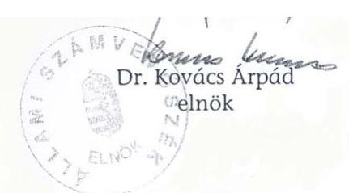

# JELENTÉS 

## az Országos Takarékszövetkezeti Intézményvédelmi Alap múködésének ellenőrzéséről

---

2. Államháztartás Központi Szintjét Ellenőrző Igazgatóság
2.1. Teljesítmény Ellenőrzési Főcsoport
V-8-30/2004.
Témaszám: 712 .
Vizsgálat-azonosító szám: V0137

# Az ellenőrzést felügyelte: 

Bihary Zsigmond
föigazgató

## Az ellenőrzés végrehajtásáért felelős:

## Kemény Emil

főcsoportfőnök

## Az ellenőrzést vezette:

## Makkai Mária

főcsoportfőnökhelyettes

## Az ellenőrzést végezték:

## Hajagos Józsefné

főtanácsadó

## Massányi Tibor

számvevő

A témához korábbi számvevőszéki jelentés nem kapcsolódik.

---

# TARTALOMJEGYZÉK 

BEVEZETÉS ..... 5
I. ÖSSZEGZŐ MEGÁLLAPÍTÁSOK, KÖVETKEZTETÉSEK, JAVASLATOK ..... 8
II. RÉSZLETES MEGÁLLAPÍTÁSOK ..... 14

1. Az OTIVA feladata és a vezető testületek működése ..... 14
2. Az OTIVA működésének szabályozottsága és szervezete ..... 17
2.1. Az OTIVA múködésének szabályozottsága ..... 17
2.2. Az OTIVA szervezete ..... 18
2.3. Az OTIVA-OTSZ közötti együttműködés ..... 18
3. Az OTIVA tevékenysége ..... 19
3.1. Az OTIVA szerepe a takarékszövetkezetek konszolidálásában ..... 19
3.1.1. A Magyar Állam és az OTIVA között létrejött szerződések ..... 19
3.1.2. A konszolidáláshoz biztosított állami források felhasználása ..... 20
3.1.3. A konszolidációs támogatások visszavétele és ismételt felhasználása ..... 24
3.2. A takarékszövetkezetek veszteségeinek rendezése ..... 27
3.3. Az OTIVA vagyonából nyújtott támogatások ..... 29
3.4. Az OTIVA ellenőrzési tevékenysége ..... 31
4. Az OTIVA gazdálkodása, vagyoni helyzete ..... 32
4.1. A vagyoni helyzet ..... 32
4.2. A befektetett pénzügyi eszközök, értékpapírok és szabad pénzeszközök állományának alakulása ..... 33
4.3. Az OTIVA bevételei ..... 35
4.4. A vagyon kezelése ..... 36
4.4.1. Az értékpapírok kezelése ..... 37
4.4.2. Gazdasági társaságok vagyonkezelése ..... 38

## MELLÉKLETEK

1. sz. A takarékszövetkezeteknek 2002. és 2003. évben nyújtott és visszavett támogatások alakulása.
2. sz. A befektetett pénzügyi eszközök alakulása 2001. december 31. és 2003. december 31. közötti időszakban.
3. sz. Az értékpapír állomány alakulása 2001. december 31. és 2003. december 31. között.

---

# 2

---

# RÖVIDÍTÉSEK JEGYZÉKE 

| OTSZ | Országos Takarékszövetkezeti Szövetség |
| :-- | :-- |
| OTIVA, Alap | Országos Takarékszövetkezeti Intézményvédelmi Alap |
| PM | Pénzügyminisztérium |
| SZMSZ | Szervezeti és Múködési Szabályzat |
| FB | Felügyelő Bizottság |
| Takarékbank | Magyar Takarékszövetkezeti Bank Rt. |
| Banküzlet Rt. | Banküzlet Vagyonkezelő és Hasznosító Rt. |
| TAKINFO Kft. | Takarékszövetkezeti Informatikai Kft. |
| TAKKER Kft. | Takarékszövetkezeti Kereskedelmi és Szolgáltató Kft. |
| Pit. | 1991. évi LXIX. tv. a pénzintézetekről és a pénzintézeti |
|  | tevékenységről |
| Hpt. | 1996. évi CXII. tv. a hitelintézetekről és a pénzügyi vállal- |
|  | kozásokról |
| OBA | Országos Betétbiztosítási Alap |

---

.

---

# JELENTÉS 

## az Országos Takarékszövetkezeti Intézményvédelmi Alap múködésének ellenőrzéséről

## BEVEZETÉS

Az 1991. és 1992. években életbe léptetett pénzintézeti, csőd és számviteli törvény hatásaként a banki mérlegekben láthatóvá váltak a fizetésképtelen vállalatokkal összefüggő rejtett veszteségek, amelyek a bankoknál a kétes, illetve rossz hitelek állományának gyors növekedéseként és a bankok veszteségeként csapódtak le. A rossznak és kétesnek minősített követelések nagysága 1992-ben már jelentősen meghaladta azt a mértéket, amelyet a bankok saját hatáskörükben képesek rendezni. A rendezés érdekében az első általános állami lépés a hitelkonszolidáció volt, amelynek keretében az állam 1992-ben halasztott fizetéssel megvásárolt 17 banktól és 69 takarékszövetkezettől rossz minősitésű követeléseket ${ }^{1}$

A Kormány 1067/1993. (X. 15.) határozatában döntött arról, hogy a takarékszövetkezetek konszolidációját - tőkehiányuk rendezését - a takarékszövetkezetek integrációján alapuló, intézményvédelmi alapon keresztül történő lebonyolítás mellett támogatja és az intézményvédelmi alaphoz hozzájárul. Az állami hozzájárulás és tőkefeltöltés konszolidációs kötvénnyel történt.

A Takarékszövetkezeti Integrációs Szerződést 1993. októberében 233 takarékszövetkezet írta alá, amelyben döntöttek az Országos Takarékszövetkezeti Intézményvédelmi Alap (továbbiakban: OTIVA, vagy Alap) létrehozásáról. Meghatározták együttmúködésük és közös szerveik - Országos Takarékszövetkezeti Intézményvédelmi Alap, Magyar Takarékszövetkezeti Bank Rt. és Országos Takarékszövetkezeti Szövetség (továbbiakban: OTSZ) - múködtetésének szabályait.
1993. november 9-én a takarékszövetkezetek és a Magyar Állam képviseletében a pénzügyminiszter létrehozta az OTIVÁT. Az Alap létrehozásához az állami hozzájárulás 2,7 milliárd Ft volt.

A Kormány 1078/1993. (XII. 20.) határozatában rögzítette a bank- és adóskonszolidáció feladatait. A határozat értelmében a Kormány a bankkonszolidációba 10 bankot, valamint az integrációba belépett és a konszolidációba bejelentkezett azon takarékszövetkezeteket fogadta be, amelyeknél a tőkemegfelelési mutató $4 \%$ alatt volt.

[^0]
[^0]:    ${ }^{1}$ Jelentés a hitel-, bank és adóskonszolidáció végrehajtásának ellenőrzéséről a Magyar Hitelbanknál, a Magyar Befektetési és Fejlesztési Banknál és a Konzumbanknál.

---

A bankkonszolidáció forrása - a Magyar Köztársaság 1994. évi költségvetéséről szóló 1993. évi CXI. tv. 3. § (8) bekezdésében előírtaknak megfelelően - hitelkonszolidációs kötvény volt.

Az OTIVA megalapításának egyik célja volt, hogy a bankkonszolidáció keretében a takarékszövetkezetek - mint a hitelintézeti rendszer tagjainak - konszolidációjában a Magyar Állam egy szervezettel álljon kapcsolatban és ne a közel 100 takarékszövetkezettel. Amíg a bankkonszolidációban a Magyar Állam közvetlen tulajdont szerzett az érintett hitelintézetekben, addig a takarékszövetkezetek konszolidációjában - a Magyar Állam által biztosított forrásból - az OTIVA szerzett tulajdont és a Magyar Állam tulajdonosként az OTIVÁ-ban jelent meg.

Az Országgyúlés 1995-ben döntött a hitel-, bank és adóskonszolidáció körülményeit vizsgáló bizottság felállításáról. A Bizottság kérte az ÁSZ segítségét is. Ezzel egyidejűleg a Kormány jóváhagyta az akkori Kormányzati Ellenőrzési Iroda munkatervét, amelynek része volt a hitel-, bank és adóskonszolidáció kormányzati szintű átfogó ellenőrzése. A feladat megoldására kialakított munkamegosztás arra a lehetőségre épült, hogy az ÁSZ ekkor már rendelkezett betekintési joggal a banktitokba, a KEI pedig nem. Ezt figyelembe véve a KEI a kormányzati intézmények tevékenységére irányuló vizsgálatot végzett, míg az egyes bankokra irányított, tételes ellenőrzést az ÁSZ vállalta. ${ }^{2}$

Az OTIVA múködését megalakulásától a pénzintézetekről és a pénzintézeti tevékenységről szóló 1991. évi LXIX. tv. (továbbiakban: Pit.), majd 1997. évtől a hitelintézetekről és a pénzügyi vállalkozásokról szóló 1996. évi CXII. tv. (továbbiakban: Hpt.) szabályozta. A Pit., valamint a Hpt. 2000. december 31-ig keret jelleggel szabályozta az intézményvédelmi alapok szervezetét és múködését.
2001. január 1-jétől a Hpt. módosításáról szóló 2000. évi CXXIV. törvény sokkal részletesebb rendelkezéseket állapított meg az önkéntes intézményvédelmi alapok működésére és vezető testületeire, valamint előírta azok nyilvántartásba vételét. A Fővárosi Bíróság 2002. május 16-án kelt 11.Pk.60218/2002/5 számú végzésében az Alapot társadalmi szervezetként nyilvántartásba vette.

Az OTIVA feladata, hogy ellenőrzésekkel és válságelhárító tevékenységgel növelje az integrációban részt vevő takarékszövetkezetek múködésének biztonságát és ezáltal hozzájáruljon a takarékszövetkezeti tagok és ügyfelek bizalmának erősítéséhez és az eredményes múködéshez. Az OTIVA válsághelyzet kialakulását megelőző intézkedéseket tesz, reorganizációt hajt végre és szakmai, illetve pénzügyi segítséget nyújt.

A Magyar Állam a takarékszövetkezeti integráció elősegítéséhez összesen 12,3 milliárd Ft konszolidációs kötvényt adott át az OTIVÁ-nak. Ebből visszatérítendő juttatás 7,1 milliárd Ft volt, amely a takarékszövetkezetek konszolidációját szolgálta, 2,5 milliárd Ft az integráció számítástechnikai rendszerének támogatásához járult hozzá, 2,7 milliárd Ft-tal pedig a Magyar Állam részt vett az

[^0]
[^0]:    ${ }^{2}$ Jelentés a hitel-, bank és adóskonszolidáció végrehajtásának ellenőrzéséről a Magyar Hitelbanknál, a Magyar Befektetési és Fejlesztési Banknál és a Konzumbanknál.

---

OTIVA létrehozásában és pénzügyi hozzájárulásával annak 98\%-os tulajdonosa lett. A Magyar Állam bármely év végén jogosult kilépni az OTIVÁ-ból, azonban hozzájárulását nem igényelheti vissza. Az OTIVA és a Magyar Állam között a pénzügyi hozzájárulásról szóló szerződésben az állam különleges jogosítványokat kapott, amelyeket a pénzügyminiszter gyakorol. Ezeken túl az OTIVA közgyűlésén hozott határozatok esetében az egy tag egy szavazat érvényesül. Az állam nevében a tagsági jogokat a Pénzügyminisztérium (továbbiakban: PM) gyakorolja. 1998-tól 2004 májusáig az OTIVA és az OTSZ perszonálunióban múködött. Ennek keretében az Alap ügyvezetői tisztét az OTSZ elnöke töltötte be.

Az Állami Számvevőszék az OTIVA-nál ellenőrzést még nem végzett. Az ellenőrzés jogalapját az Állami Számvevőszékről szóló 1989. évi XXXVIII. törvény 2. § (6) bekezdése képezi.

Az ellenőrzés célja annak értékelése volt, hogy:

- az OTIVA múködése megfelelt-e a törvényi előírásoknak, az állam tulajdonosi elvárásainak, a belső szabályzatoknak;
- a Magyar Állam és az OTIVA között létrejött konszolidációs szerződésben és módosításaiban foglaltak alapján kötötték-e meg az OTIVA és a takarékszövetkezetek a konszolidációs szerződéseket;
- az OTIVA és a költségvetés közötti elszámolások az előírások szerint teljesül-tek-e;
- megalapozott volt-e a Magyar Köztársaság 2000. évi költségvetésének végrehajtásáról szóló 2001. évi LXXV. törvény szerinti tartozás elengedés.

A szabályszerűségi ellenőrzés az OTIVA múködése tekintetében a 2002-2003. évi, a bankkonszolidációt illetően pedig az 1993-2003. évi tevékenységre irányult. Az ellenőrzés a helyszíni ellenőrzés befejezéséig terjedő időszakra, a múködés tekintetében a 2002. évet megelőző időszakra is kitekintett.

Az ellenőrzés az OTIVA múködésére és a PM Alappal kapcsolatos tevékenységére terjedt ki, de nem volt tárgya a Takarékszövetkezeti Integráció további szervezeteinek vizsgálata. Az ellenőrzés a tevékenységüket csak az OTIVA múködésével kapcsolatban érintette.

A jelentés-tervezet egyeztetése során az OTIVA jelezte, hogy a megállapításokhoz kapcsolódóan intézkedéseket hozott. Ezek tájékoztatásként a megfelelő helyen lábjegyzetben szerepelnek.

A jelentést egyeztetésre megküldtük a pénzügyminiszternek, aki a törvényes határidőn belül észrevételt nem tett.

---

# I. ÖSSZEGZŐ MEGÁLLAPÍTÁSOK, KÖVETKEZTETÉSEK, JAVASLATOK 

Az OTIVÁ-t mint önkéntes intézményvédelmi alapot a Pit./Hpt. értelmében hitelintézetek (takarékszövetkezetek) és a Kormány döntése alapján a Magyar Állam képviseletében a pénzügyminiszter hozta létre.

Az OTIVA a Magyar Állam által - költségvetési törvény alapján - juttatott egyszeri forrásból ( 2,7 milliárd Ft) és a takarékszövetkezetek éves befizetéseiből biztosította az integrációban résztvevő tagszövetkezetek biztonságos múködését. Az OTIVA - az alapító okiratban meghatározott állami céloknak megfelelően az egyes takarékszövetkezeteknél kialakult válsághelyzeteket kezelte úgy, hogy a Magyar Államnak fizetési kötelezettsége nem keletkezett. Ugyanakkor az Alapban meglévő tulajdona alapján a Magyar Államnak rálátása és intézkedési lehetősége volt/van a szektor múködésére, amely az egész hitelintézeti rendszer biztonságához hozzájárul(t). Mindamellett, hogy az Alap a takarékszövetkezetek múködésével kapcsolatos feladatát (válsághelyzet kezelése és megelőzése, ellenőrzés) eredményesen ellátta, nem gondoskodott maradéktalanul a saját szabályszerű múködéséről.

Az intézményvédelmi alapra vonatkozó törvényi rendelkezések szerint a létesítő okiratban (alapszabályban) kell szabályozni többek között az Alap szervezetét, a szavazás rendjét, a tagok szavazati arányát. Az állam az alapítói vagyon 98\%-ának biztosítása mellett a vonatkozó szerződésben csak vagyoni kérdésekben kötött ki vétójogot magának. Az Alap szervezetére, múködtetésére és ügyvezetésére, valamint ellenőrzésére vonatkozó kérdésekben a szövetkezeti elv érvényesül. E szerint az államot az OTIVA más tagjaival azonos jogosítványok illetik meg.

Az OTIVA múködésének, ügyvezetésének ellenőrzését 2000. december 31-ig törvény nem szabályozta. 2001. január 1-jétől a Hpt. az Alap ügyvezetésének ellenőrzési jogát a Felügyelő Bizottság számára biztosítja. Az FB-be az állam tagot nem delegált/delegál, így a szabályos múködés ellenőrzése az integráció belső ügye. Ebből az következik, hogy az ügyvezetés utólagos, átfogó ellenőrzése az Alap főtulajdonosának hatókörén kívül esik.

Az alapszabály az OTIVA teljes tevékenységét lefedi. Rendelkezik az OTIVA múködésének alapelveiről, a tagsági jogokról és a vezető testületeire vonatkozó szabályokról. Részletesen szabályozza az OTIVA vagyonának kezelését és az Alap által nyújtott támogatásokat.

Az OTIVA feladatait - a törvényi rendelkezéseknek megfelelően, azzal összhangban - az alapszabályban határozták meg, amely az Alap létrehozása óta többször változott. Az OTIVA megalakulásakor elsődleges feladata volt a közremúködés a takarékszövetkezetek konszolidálásában (1993-1994. évek), amelynek forrását az aktuális költségvetési törvényekben teremtette meg az állam. A takarékszövetkezetek sikeres konszolidációját követően az integráció célul tűzte ki a tagok bankbiztonságának és jövedelmezőségének növelését. En-

---

nek érdekében 1995-től az Alap pénzügyi segítséget nyújtott a takarékszövetkezeteknek a megfelelő méret és tőkeerő eléréséhez, a prudens múködéshez, majd 2004. évben a tagoknak térségi pozíciójuk erősítéséhez nyújtott támogatást, kezességvállalás formájában.

A vezető testületek az alapszabályban foglaltakat nem tartották be maradéktalanul. A közgyűlés 2003. évre az alapszabálytól eltérően határozta meg a tagszövetkezetek éves tagdíj befizetési kötelezettségének mértékét, amely miatt az intézményvédelmi bevételek alacsonyabb szinten - 536 millió Ft helyett 444 millió Ft-ra - teljesültek. Ez hozzájárult ahhoz, hogy a biztonsági tartalék (a feladatellátáshoz kapcsolódó likvid eszközök állománya) egyenlege - amely 2003 júniusától folyamatosan alatta maradt az alapszabályban előírt mértéknek - 2003. december 31-én már 603 millió Ft hiányt mutatott.

Az igazgatóság 2003 januárjáig nem rendelkezett ügyrenddel. A Hpt. előírásainak megfelelően az OTIVA 2001 novemberében elkészítette a tagok egységes nyilvántartását, azonban az eltelt időszak alatt azt nem aktualizálta. Az Alap írásbeli tájékoztatása szerint a változások hiteltérdemlő igazolások alapján elektronikus úton álltak rendelkezésre. ${ }^{3}$ A biztonsági tartalék 2002. évi részleges és 2003. évi folyamatos hiányát az igazgatóság figyelemmel kísérte, de nem intézkedett - az alapszabály előírásának megfelelően - a közgyűlés összehívására.

A Felügyelő Bizottság, mint a közgyűlés ellenőrző szerve a közgyűlés által elfogadott alapszabályban foglaltakat csak részben teljesítette. Nem vizsgálta a belső szabályzatok teljes körűségét és aktualizáltságát, holott feladata annak ellenőrzése, hogy az OTIVA működése megfelel-e a belső szabályzataiban foglaltaknak. Az FB azon kötelezettségének sem tett eleget, mi szerint ellenőrzi az Alap ügyvezetését. 2002. és 2004 májusa között az OTIVÁ-nak és az OTSZ-nek a Felügyelő Bizottsága azonos személyekből állt. A két FB egy ülés keretében tárgyalta az OTSZ és az OTIVA aktuális napirendjeit. 2004. május 25 -től megszüntették az FB-k - a két szervezet eltérő funkciója miatt össze nem illő (érdekvédelem és intézményvédelem) - közös múködését.

Az OTIVA múködése 2001. évtől megfelelt a törvényi előírásoknak, azonban a belső szabályokat és utasításokat nem alkotta meg teljes körűen (Informatikai szabályzat), nem aktualizálta (Ellenőrzési, Költséggazdálkodási Szabályzat), illetve az SZMSZ előírásával ellentétben nem az igazgatóság hagyta jóvá (Belső ellenőrzési szabályzat). A Szervezeti és Működési Szabályzatot 1996. óta az Alap nem aktualizálta, az eltelt idő alatt a szervezeti változásokat átvezette, de igazgatósági határozattal nem léptette hatályba.

Az államot az OTIVA közgyűlésében tagsági jog - a vagyon felhasználási döntések kivételével, ahol vétójog - illette meg. A jogokat kötött mandátummal gyakorolta a PM képviselője. A mandátumok értelmében az OTIVA belső ügyeit érintő (szervezeti, tisztségviselők) határozathozatalnál tartózkodott a küldött, a költségvetés és beszámoló elfogadásánál egyet értett az előterjesztéssel, vétójogát - az előterjesztés tartalmi hiányosságai miatt - egy alkalommal gyakorol-

[^0]
[^0]:    ${ }^{3}$ Az ellenőrzés eredményeként, a helyszíni vizsgálatot követően az OTIVA az egységes, törvénynek megfelelő nyilvántartást papír-alapon rendezte.

---

ta. Az igazgatóság elnöke 1993. évtől - az alapítói hozzájárulásról szóló szerződés értelmében - szintén a PM képviselője volt. A tagsági jogot gyakorló PM képviselő és az igazgatóság elnöke más-más személy volt. Az igazgatóság feladata az OTIVA folyamatos múködésének biztosítása az alapszabály és a közgyűlés döntései által meghatározott keretek között. Az igazgatósági határozatok szerint a döntéseknél az OTIVA szempontjai érvényesültek, az államé pedig másodlagosak voltak, ami a konszolidációt érintő (részjegyek leértékelésének kompenzálása, konszolidációs bevételek elszámolása, konszolidációs kötvények visszavétele, ismételt kihelyezése) kérdésekben jutott kifejezésre.

A takarékszövetkezetek konszolidációja az OTIVA közremúködésével valósult meg az 1993-1994. években. A konszolidációban összesen 83 takarékszövetkezet vett részt. A forrást a Magyar Köztársaság költségvetése biztosította 7,1 milliárd Ft névértékű konszolidációs államkötvény OTIVÁ-nak történő eladásával, halasztott fizetés mellett. A vételár megfizetése 2013-ban és 2014-ben esedékes. A konszolidációs forrás biztosítására - az állam és az OTIVA között létrejött szerződésnek megfelelő tartalommal - az Alap egyedi megállapodásokat kötött a konszolidációs körbe bevont takarékszövetkezetekkel. A megállapodások alapján az Alap vagy alárendelt kölcsönt nyújtott a takarékszövetkezeteknek, vagy részjegytőke tulajdont szerzett azokban.

Az OTIVA a szerződésben vállalt feladatait teljesítette, a takarékszövetkezetek tőkehelyzete rendeződött, a prudens múködés feltételei 1994. évben helyreálltak, illetve azt a további években is fenntartották.

A számviteli törvény 1997. évi módosításával, a saját tőkéjéhez képest jelentős negatív eredménytartalékkal rendelkező takarékszövetkezetek nem feleltek meg a Hpt. tőkekövetelményre vonatkozó előírásainak, annak ellenére, hogy a takarékszövetkezetek saját tőkéje nem változott. A módosítás csak a tőkeelemek közötti átrendezést jelentette, a részjegytőkét a tőketartalék helyett a jegyzett tőke között kellett kimutatni. A tőkehelyzet rendezésének eszköze a jegyzett tőke leszállítása volt, ami a részjegy tulajdonosoknak, így az OTIVÁ-nak is veszteséget okozott. A jegyzett tőke leszállítására - jogi szabályozás hiányában nem volt egységes gyakorlat. A takarékszövetkezetek a leértékelésnél az OTIVA tulajdoni hányadát minden esetben figyelembe vették, míg a saját vagyoni tőkeelemeket eltérő módon és mértékben értékelték le. Ez azt jelentette, hogy a legnagyobb veszteség az OTIVÁ-nál jelentkezett és így a Magyar Állam felé fennálló tartozás visszafizetésének forrása lecsökkent.

A Magyar Állam 2001-ben az addig keletkezett veszteségek kompenzálására 3 milliárd Ft-tal csökkentette az OTIVA - konszolidációból származó - 7,1 milliárd Ft-os kötelezettségét. Az elengedés összegére irányuló megalapozó vizsgálatot a PM nem végzett. Az összeg így olyan vitatható tételeket is kompenzált, mint az egységes gyakorlat hiányában indokolatlanul elszámolt veszteségek, ${ }^{4}$ illetve nem a konszolidációs forrásból, hanem az OTIVA saját vagyonából, vásárolt részjegyek leértékelésének vesztesége. A kettő együttes hatása mintegy 960 millió Ft többlet kompenzációt eredményezett.

[^0]
[^0]:    ${ }^{4}$ Az indokolatlanul elszámolt veszteségek amiatt keletkeztek, hogy a takarékszövetkezetek a leértékelésnél figyelmen kívül hagyták az adott évi mérleg szerinti eredményt, a tőketartalékot és a jegyzett tőkében szereplő osztatlan vagyont. Emiatt a szükségesnél magasabb leértékelést hajtották végre.

---

Az OTIVA javaslatára és a PM egyetértése mellett 1996-ban kialakult a konszolidációs kötvények visszavételének és ismételt kiadásának gyakorlata, az eljárást azonban csak 2001. évben szabályozták a felek. A szabályozás lényeges eleme a visszavétel és ismételt kihelyezés elkülönített nyilvántartása, továbbá a konszolidációs bevételek (az OTIVA állammal szemben fennálló kötelezettségének forrása) újra szabályozása. Ezek az elemek azonban maradéktalanul nem teljesültek, az analitikus nyilvántartások nem teljes körűek, a bevételek között nem számolták el az összes konszolidációs bevételt. Konszolidációs bevételként az OTIVA csak az alárendelt kölcsöntőke kamatát vette számításba és utalta át a Magyar Államkincstár részére (2002. évben 63 millió Ft-ot, 2003. évben 52 millió Ft-ot). A konszolidációs bevételek között az Alap nem számolta el a konszolidációs kötvények takarékszövetkezetek által készpénzben visszafizetett értékét, valamint a kötvények visszavétele és ismételt kihelyezése közötti időbeli eltérés miatt keletkezett kamatfizetést. A visszavételre az eredeti konszolidációs szerződések nem adtak lehetőséget, minden esetben csak az érintett takarékszövetkezet egyetértésével volt arra mód. A visszavétel során az Alap nem vizsgálta, hogy a takarékszövetkezet rendelkezik-e negatív tőkeelemmel. Így 2001-ig ott is tőkekivonást hajtott végre az OTIVA, ahol erre a Hpt. nem adott módot. A konszolidációs kötvények visszavétele és ismételt kihelyezése keretében az OTIVA a korábban saját vagyonából a takarékszövetkezeteknek nyújtott támogatás egy részét visszavette, amelyre csak a támogatási szerződések módosításával nyílt lehetőség. Ezzel a takarékszövetkezetek konszolidációjához biztosított állami források az Alap likvid vagyonának növekedését segítették elő.

A Magyar Állam szerződésben kötelezettséget vállalt arra, hogy a Takarékbank részvényei névértékének bankkonszolidációt követő csökkenése miatt a bankban tulajdonos takarékszövetkezeteknek megtéríti a veszteségét, vissza nem térítendő állami céltámogatás formájában. Ezen szerződésbeli kötelezettségének az állam nem tett eleget. A szerződést nem módosították, az ma is hatályos. Az állam helyett az OTIVA állt helyt, saját vagyonából alárendelt kölcsöntőkét nyújtott a veszteségek rendezésére. Az állam szerződésben vállalt másik kötelezettségét - mi szerint a takarékszövetkezeteknek a Garancia Biztosító Rt.-vel szembeni követelésből származó veszteségeit megtéríti - szintén nem teljesítette, ebben az esetben is az OTIVA állt helyt. A két elmaradt állami támogatás öszszege meghaladta az 1 milliárd Ft-ot.

Az OTIVÁ-val munkaviszonyban állók száma 2002-ről 2003-ra 1 fővel nőtt és 2003. év végén 25 fő volt. Az OTIVA a hiányzó munkaköri leírásokat egy kivételével az ellenőrzés ideje alatt pótolta. Továbbra sem rendelkezik munkaköri leírással az ügyvezető igazgató, holott megbízási szerződése rögzíti az erre vonatkozó kötelezettséget. Ez a mulasztás azért volt jelentős, mert az OTIVA ügyvezetését 1998-tól 2004 májusáig az OTSZ elnöke látta el társadalmi funkcióban és az Alapnál végzendő feladatai, felelősségi köre a megbízási szerződésben nem voltak részletesen meghatározva.

Az OTIVA 2002. és 2003. évben nyereségesen gazdálkodott, a mérleg szerinti eredménye 548 millió, illetve 509 millió Ft volt. A saját tőkéje 6,6\%-kal 7667 millió Ft-ra nőtt 2003. december 31-re, amely az alapítói vagyon 2,75-szöröse. A vagyon növekedés fő forrásai a tagszövetkezetek éves tagdíj befizetései, valamint az OTIVA saját vagyonának részét képező állampapírok kezelésének

---

eredménye. Az OTIVA a szabad pénzeszközeit - a Hpt. előírásának megfelelően - állampapírban tartja.

Az OTIVA vagyonkezelési tevékenysége nincs teljes körűen szabályozva, mivel az alapszabály és a vagyonkezelési szabályzat is csak az értékpapír portfoliót tekinti vagyonnak, a tulajdonában lévő gazdasági társaságokat nem. Az alapszabály és a vagyonkezelési szabályzat előírásai között nincs meg az összhang. Az előbbi a vagyon kezelőjeként az igazgatóságot, az elszámolási és értékpapír számla vezetőjeként a Takarékbankot nevesíti. Az utóbbi pedig többféle befektetési lehetőség megvizsgálását írja elő, amelyből egyik a Takarékbank. A vagyonkezelési szerződéseket a Takarékbankkal kötötte meg az OTIVA. A megbízásra vonatkozó döntések meghozatalakor - az igazgatósági ülések jegyzőkönyvei szerint - az igazgatóságot elsősorban a bizalom, az integráció motiválta és nem a hozam. A vagyonkezelő éves tevékenységének értékelése során az OTIVA megállapította, hogy az elért hozam alatta maradt a referencia hozamnak, az ebből származó veszteség 20, illetve 30 millió Ft volt. A vagyonkezelő a teljesítménye miatt csak fix díjban részesült, sikerdíjban nem.

Az OTIVA 3 gazdasági társaságban rendelkezik tulajdonnal. Az Alap tulajdoni hányada 2 társaságban kisebbségi, amely miatt az igazgatóság a kivonulásról hozott döntést. Annak a gazdasági társaságnak a tevékenysége, amelyben az OTIVA többségi, illetve 2003 júliusától kizárólagos tulajdonos, évek óta folyamatosan veszteséges. A társaság saját tőkéjét elvesztette, 2002-ben a saját tőke még 247 millió Ft volt. A nem kielégítő vagyonkezelés miatt a társaság működésében fennálló hiányosságokra, a számviteli törvény megsértésére és a könyvvitel rendezetlen állapotára az igazgatóság csak 2002. évben fordított nagyobb figyelmet, de a problémákat teljes mélységében még nem ismerte fel. A társaság 2002. évi auditált beszámolója csak 2004 februárjában készült el, amelyhez a könyvvizsgáló korlátozó záradékot adott. 2003. évi auditált beszámoló a helyszíni ellenőrzés befejezéséig még nem volt. Így a társaság tőkehelyzetének rendezéséről közgyűlési határozat sem született. ${ }^{5}$ Az OTIVA Felügyelő Bizottsága az igazgatóság felkérése alapján 2004-ben tényfeltáró vizsgálatot végzett a társaságnál és megjelölte azon jogi és természetes személyek körét, akiket felelősség terhel a kialakult helyzet miatt. Felelősségre vonás a helyszíni vizsgálat lezárásáig nem történt. ${ }^{6}$ Az Alap a múködés fenntartásához tagi kölcsön nyújtására kényszerült. Az Alap igazgatósági üléseinek jegyzőkönyvei szerint a társaság felszámolását el akarják kerülni, így további pénzügyi támogatás nyújtásával számolnak.

A részletes megállapítások hasznosításán túl javasoljuk:
az OTIVA igazgatóságának, hogy követelje meg a hiányzó szabályzatok elkészítését, a meglévők aktualizálását és gondoskodjon azok hatálybalépéséről;

[^0]
[^0]:    ${ }^{5}$ A 2004. július 29-i a közgyűlés 7/a/2004. június 29. sz. határozatában a társaság végelszámolásáról döntött, amelynek kezdő időpontja 2004. október 1.
    ${ }^{6}$ A 2004. július 29-i közgyűlés 7/d/2004. július 29. sz. határozatában döntött arról, hogy az FB által készített jelentés megállapításainak figyelembe vételével az igazgatóság a személyi felelősségre vonás érdekében tegye meg a szükséges jogi lépéseket.

---

az OTIVA Felügyelő Bizottságának, hogy rendszeresen ellenőrizze a Hpt. előírásának megfelelően az Alap ügyvezetését és erről számoljon be a közgyűlésnek.

A helyszíni ellenőrzés megállapításainak hasznosítása mellett javasoljuk:

# a pénzügyminiszternek 

1. Kezdeményezze a Magyar Állam alapítói hozzájárulásáról szóló szerződés módosítását annak érdekében, hogy az állam képviseltesse magát az OTIVA Felügyelő Bizottságában.
2. Indítványozza a Magyar Állam és az OTIVA között létrejött konszolidációs szerződés módosítását úgy, hogy a Takarékbank részvényeinek leértékelése és a Garancia Biztosító Rt. által adott kezesi biztosításból származó követelések miatti takarékszövetkezeti veszteségek rendezését szolgáló állami kötelezettség megszűnjön.
3. Követelje meg, hogy az OTIVA biztonsági tartalékának nagysága megfeleljen az alapszabály előírásainak.
4. Intézkedjen az OTIVA igazgatóságán keresztül, hogy a részjegyvagyon nyilvántartása a főkönyvi könyvelésen belül megfeleljen a konszolidációs szerződésekben előírtaknak.

---

# II. RÉSZLETES MEGÁLLAPÍTÁSOK 

## 1. Az OTIVA Feladata És a VEZETŐ TESTÜLETEK MÜKÖDÉSE

1993. november 9-én a Magyar Állam képviseletében a pénzügyminiszter és az integrációban részt vevő takarékszövetkezetek hozták létre az OTIVÁ-t. Az OTIVA létrehozásában az állam oly módon vállalt szerepet, hogy 2,7 milliárd Ft névértékű konszolidációs kötvényt adott át az induló vagyonához (alapítói hozzájárulás), amellyel 98\% tulajdont szerzett az Alapban.

Az OTIVA önkéntes intézményvédelmi alap, önálló jogi személy. Az alapszabályában meghatározott feladata a tagszövetkezetek gazdálkodásában kialakuló válsághelyzetek pénzügyi segítségnyújtással történő megelőzése és az ehhez kapcsolódó ellenőrzés, valamint a takarékszövetkezeti integráció múködésének elősegítése.

Az OTIVA legfőbb döntéshozó szerve a tagok összességéből álló közgyülés, amely évente legalább két alkalommal ülésezik. Minden tagnak egy szavazata van.

A Magyar Állam alapítói hozzájárulásáról szóló szerződés szerint az államot vétójog illeti meg az OTIVA közgyűlésének és igazgatóságának hatáskörébe tartozó egyes kérdések (az OTIVA vagyonának és jövedelmének felhasználása, a vagyonfelhasználásra vonatkozó hatáskör megváltoztatása és az OTIVA megszüntetése) tekintetében egészen addig, amíg az Alap készpénzben és jegybankképes értékpapírban megtestesülő vagyonán belül az alapítói hozzájárulás mértéke $25 \%$ alá csökken. 2003. december 31-én ez az arány $44,5 \%$ volt, tehát a vétójog továbbra is megilleti az államot.

A közgyűlés kizárólagos hatáskörébe tartozik az alapszabály megállapítása, módosítása, az igazgatóság és az FB tagjainak és elnökének megválasztása és visszahívása, a költségvetés meghatározása és az éves, illetve költségvetési beszámoló jóváhagyása.

2002-ben kettő, 2003-ban négy közgyűlés volt. Az OTIVA alapszabálya értelmében az állam nevében a tagsági jogokat a PM gyakorolja. Az OTIVA közgyűlésein jelen volt a PM részéről az OTIVA igazgatóságának elnöke, valamint az állam képviseletében a PM tisztviselője. A közgyűlés és az igazgatóság a döntéseit a PM egyetértésével hozta meg. A PM a magyar állam alapítói hozzájárulásáról szóló szerződés preambulumában határozta meg az OTIVA létrehozásának célkitűzéseit (a vidéki lakosság és vállalkozások finanszírozása, a takarékszövetkezetek biztonságos múködésének elősegítése). Az OTIVA a 2003. október 29-i ünnepi közgyűlés alkalmával értékelte saját 10 éves tevékenységét, amelyet a PM képviselője is elfogadott. A vizsgált időszak alatt a PM képviselője egy alkalommal élt a szerződésben és az alapszabályban biztosított vétójogával.

Az OTIVA 2003. évi költségvetését tárgyaló 2002. december 4-i közgyűlésén - tekintettel arra, hogy az OTIVA alapszabályában és a Hpt.-ben rögzítettektől elté-

---

rően a meghívót késve küldte meg a PM számára, valamint lényeges információk hiányára és a javasolt béremelés PM szerinti túlzott voltára - a PM elutasította annak elfogadását. A PM álláspontját figyelembe véve a költségvetési tervet módosították és azt az OTIVA közgyűlése 2003. január 27-én elfogadta.

A 2003. évi költségvetés elfogadása a tagszövetkezetek éves hozzájárulása tekintetében ellentétes volt az alapszabály előírásaival.

Az alapszabály rendelkezései szerint a tagszövetkezetek éves hozzájárulási kötelezettségük fix részét a befizetés évét két évvel megelőző évi mérlegfőösszegük alapján teljesítik. A 2003. január 9-i igazgatósági ülés az intézményvédelmi bevételi tervet alapszabály-ellenesen 536 millió Ft-ról 444 millió Ft-ra módosította, mivel nem a 2001. évi hanem a 2000. évi mérlegfőösszeget vette alapul. Indoka az volt, hogy 2003. évre tervezték a valós kockázatokkal arányos tagdíjbefizetési metódus kidolgozását. Az indokolás nem fogadható el, tekintettel arra, hogy konkrét számításokkal alá nem támasztott célkitűzéseket tartalmaz, az új tagdíj megállapítási módszer pedig a helyszíni vizsgálat lezárásáig nem lépett hatályba.

Az igazgatóság felel az OTIVA alapszabálya és a közgyűlés határozatainak keretei között történő folyamatos múködéséért. Feladatait a Hpt. és az alapszabály határozza meg. Az igazgatóság ügyrendjét 2003. január 27-én fogadta el az OTIVA közgyűlése, addig a testület ügyrenddel nem rendelkezett. A testületnek hat takarékszövetkezeti tagja van, további tagjai a PM, a Takarékbank és az OTSZ képviselői. A Magyar Állam alapítói hozzájárulásáról szóló szerződés szerint az OTIVA Igazgatóságának elnöki tisztét mindaddig a PM képviselője tölti be, amíg az Alap készpénzben és jegybankképes értékpapírban megtestesülő vagyonán belül az alapítói hozzájárulás vagy az esetleg későbbiekben teljesített állami hozzájárulás mértéke nem csökken 50\% alá.

A 2003. december 31-i - közgyűlés által még el nem fogadott - beszámoló szerint az arány $44,5 \%$, így az elnöki tisztséget bármely igazgatósági tag betöltheti. A Magyar Államnak az igazgatóság hatáskörébe tartozó vagyoni kérdésekben a vétójoga továbbra is fennáll.

Az OTIVA igazgatóságának tevékenysége a vizsgált időszak alatt a Hpt.-nek és az alapszabály előírásainak - egy-egy feladat kivételével - megfelelt.

A Hpt. 128/E. § előírja, hogy az önkéntes alap tagjairól névjegyzéket kell készíteni és az abban bekövetkezett változásokat folyamatosan vezetni kell. A névjegyzék készítését és a változások átvezetését a törvény és az alapszabály az igazgatóság kötelezettségévé teszi. A nyilvántartást az OTIVA elkészítette, azonban azt 2001. november 9-e óta nem aktualizálta. Az ellenőrzés eredményeként az aktualizálás a helyszíni ellenőrzést követően megtörtént.

Az alapszabály rendelkezése szerint „az Igazgatóság soron kívül köteles összehívni a Közgyülést, ha a biztonsági tartalék (az OTIVA likvid eszközökben megtestesülő vagyona) a takarékszövetkezetek adatszolgáltatása alapján elöreláthatóan tartósan az elöirt szint alá csökken, vagy legalább 90 napon keresztül az elöirt szint alatt marad". Az igazgatóság által elfogadott vagyonkezelési beszámolók szerint 2002-ben augusztus 31-től november 30-ig a biztonsági tartalék nem érte el az alapszabályban meghatározott szintet: az integrációban részt vevő takarékszövetkezetek korrigált mérlegfőösszegének 2\%-át. Az év végi, december 31-i adat már 21 millió Ft többletet mutatott.

---

2003. június 30 -án a biztonsági tartalék egyenlege ismét hiányt ( $5,8 \%$ ) mutatott, amely az év végére 9,1\%-ra emelkedett. Az igazgatóság a közgyűlés összehívására vonatkozó kötelezettségének nem tett eleget. Az igazgatóság 2004. május 20-i IX/56/2004. számú határozatában utasította az OTIVA ügyvezetését, hogy a takarékszövetkezetekből tőkekivonással, alárendelt kölcsöntőke visszajuttatással, illetve az OTIVA befektetéseinek mérséklésével és a befektetésekhez kapcsolódóan átadott vagyonelemek visszavétele útján tegyen intézkedéseket az Alap likvid eszközeinek bővítése érdekében. A határozatban az igazgatóság javasolta, hogy az OTIVA 2004. évi rendes őszi közgyűlése módosítsa az alapszabályt, miszerint az OTIVA közgyűlése nem köteles a biztonsági tartalék feltöltése érdekében pótbefizetésről határozni, ha az OTIVA vagyona egyébként megfelelő fedezetet biztosít az alapfeladatok ellátásához. A javaslat nem alkalmas a biztonsági tartalék hiányának rendezésére, mivel nincs pontosan meghatározva a megfelelő fedezet mértéke; a biztonsági tartalék hiánya a mérlegfőösszegek folyamatos növekedéséből származott, amely a takarékszövetkezetek kockázatos múködésének növekedését jelentheti, amennyiben a szövetkezet vagyona azzal arányosan nem nő. Az OTIVA biztonsági tartaléka 2004. május 31 -én $16 \%$-os hiányt mutatott.

A biztonsági tartalék feltöltésének hiánya kockázatos, mert 5 milliárd Ft (a likvid vagyon $78 \%$-ára) készfizető kezességet vállalt az OTIVA. Az OTIVA közgyűlési határozat alapján 2004. január 1-jétől készfizető kezességet vállalt a Regionális Fejlesztési Finanszírozó Rt. által a kistérségi pénzintézeti szolgáltatások fejlesztéséhez biztosított 5 milliárd Ft összegű alárendelt kölcsöntőke visszafizetéséért. A területfejlesztés aktuális feladatairól szóló 2305/2002. (X. 10.) Korm. határozat alapján a Regionális Fejlesztési Holding, a Regionális Fejlesztési Finanszírozó Rt., az OTSZ, valamint az OTIVA 2004. január 28 -án együttműködési megállapodást kötött. Az alárendelt kölcsöntőke nyújtásáról szóló szerződéshez az OTIVA és a takarékszövetkezetek közötti készfizető kezesi és pénzügyi támogatási megállapodások kapcsolódtak. A kölcsön lejárata 2011. március 31. A konstrukcióban öszszesen 141 takarékszövetkezet vesz részt.
2002. évben az igazgatóság 12 alkalommal ülésezett és ezek során 163 határozatot hozott. A határozatok $71,2 \%$-a a takarékszövetkezetek tevékenységével függött össze (tőkekivonás, egyesülés, beszámoltatás stb.).

2003-ban a testület 20 alkalommal ülésezett és 204 határozatot hozott, amelyből $68,1 \%$ a takarékszövetkezetek tevékenységére vonatkozott.
2002. és 2004 májusa között az OTIVÁ-nak és az OTSZ-nek azonos tagokból álló Felügyelő Bizottsága volt. A két társszervezetnek más a feladata, funkciója. Az OTSZ-nek egyesületként az érdekvédelem, a közös stratégia a feladata az integrációs szerződésben foglaltak szerint. Az OTIVA pedig intézményvédelmi feladatokat lát el. A 2004. május 25-i közgyűlési döntés alapján mindkét szervezetnél megszüntették az FB-k közös múködését.

A Felügyelő Bizottság feladata az OTIVA múködésének ellenőrzése. Az alapszabálynak megfelelően előzetesen megtárgyalta a költségvetési terveket és az éves beszámolókat, jelentéseket fogadott el az OTIVA éves tevékenységéről. Az alapszabály szerint az OTIVA Felügyelő Bizottságának feladata annak ellenőrzése, hogy az Alap múködése megfelel-e a belső szabályzatok előírásainak. Ezen feladatának a testület nem tett eleget.

Az Alapnál 2001 decembere és 2002 szeptembere között a belső ellenőrzés betegség miatt szünetelt, ez idő alatt a belső ellenőr helyettesítéséről az OTIVA

---

nem gondoskodott. A belső ellenőrzési feladatokat egy fő látja el, akinek munkaköri leírása szerint osztályszervezetbe beosztva a helyszíni ellenőrzési területen kell tevékenykednie. Ez ellenkezik a függetlenített belső ellenőrzés elvével és gyakorlatával, mivel az OTIVA egyik alapfeladatának ellenőrzéséről - a takarékszövetkezetek helyszíni ellenőrzése - objektív jelentés készítése nem biztosítható. A belső ellenőr 2003. évre vonatkozó negyedéves bontású munkatervét az FB elnöke aláírta.

# 2. Az OTIVA múködésének szabályozottsáGA És szERVEZETE 

### 2.1. Az OTIVA múködésének szabályozottsága

Az OTIVA működésének alapelveit a Takarékszövetkezeti Integrációs Szerződés, az alapszabály, valamint a Szervezeti és Múködési Szabályzat tartalmazza.

Az integrációs szerződés 2002-2003-ban nem változott. 2004 márciusában az OTIVA feladatkörét érintően is módosították és új eleme a takarékszövetkezeti integráció régiószintű szerveződése. Ennek értelmében az Alap válságkezelési és válságmegelőzési feladatkörén kívül is nyújthat pénzügyi támogatást, amenynyiben az alapvető feladatok teljesülését ezzel nem veszélyezteti. Az integrációs szerződés módosításában utólag átvezették azokat az előírásokat, amelyeket az OTIVA más szabályai korábban már rögzítettek.

A "Biztonsági Testület" kifejezést "Igazgatóság"-ra korrigálta (a Hpt. már 2001. január 1-től hatályos módosítása rögzítette az "igazgatóság" kifejezést). Megszüntették a Takarékbank és az OTSZ részéről egy-egy igazgatósági tag delegálását, és azt is, hogy az OTIVA vagyonának el kell érnie a tagszövetkezetek mindenkori összesített mérlegfőösszegének 5\%-át. (Ezt az előírást az OTIVA alapszabályából már 2001-ben törölték.) A 2001. évben már bevezetett biztonsági tartalékot és a fedezeti elvet beépítették az integrációs szerződés szövegébe.

Az OTIVA alapszabálya összhangban van a Hpt. előírásaival. 2002-től a közgyűlés három alkalommal módosította. A módosítások az Alap működésének pontosítását és további szabályozását jelentették.

Megváltozott a csatlakozó tagszövetkezetek kötelezettségeire, az OTIVA vagyonára és eszközösszetételére, valamint az Alapba történő befizetések szabályozására vonatkozó előírás. A közgyűlés kizárólagos hatáskörébe tartozik és az összes tag 2/3-os szótöbbsége szükséges a takarékszövetkezeteknek nyújtandó, a válságkezelési, illetve válságmegelőzési feladatkörökön kívüli pénzügyi támogatásról szóló elvi döntés meghozatala.

Az ellenőrzési feladatok ellátásáért a továbbiakban az ügyvezető igazgató felel. 2004-től a biztonsági tartalék 10\%-át meghaladó támogatásokról a közgyűlés dönt (korábban: 20\%), az Alap SZMSZ-ének elfogadása a közgyűlés hatásköre lett. Az ügyvezető igazgató feladatait részletezték.

Az OTIVA múködésének belső szabályozottsága hiányos illetve elavult. A jelenleg hatályban lévő SZMSZ-t 1996-ban hagyta jóvá az igazgatóság, az abban foglaltak nem felelnek meg a jelenlegi szervezeti struktúrának, illetve a hivatkozott belső szabályzatoknak. Az SZMSZ-t már kétszer aktualizálták, azonban azok hatályba léptetése a helyszíni ellenőrzés lezárásáig nem történt meg.

---

2004. június 1-jén (a Számviteli Politika mellékleteivel együtt) 17 db belső szabályzat volt érvényben. Az SZMSZ szerint a belső szabályzatokat az igazgatóságnak kell jóváhagynia. A Bizonylati, a Tűzvédelmi és a Munkaügyi szabályzatokat ügyvezető igazgatói aláírással léptették hatályba. Az OTIVA nem rendelkezik az igazgatóság által elfogadott belső ellenőrzési szabályzattal. Az Alap nem rendelkezik informatikai szabályzattal (informatikai rendszerkoncepció készült 1995 januárjában). Ez azért aggályos, mert a Hpt. biztosítja az önkéntes alap számára a banktitokhoz való hozzájutás lehetőségét, de az informatikai feladatokat ellátó munkatárs munkaköri leírása értelmében OTSZ-OTIVA alkalmazott.

Az ellenőrzési szabályzat is aktualizálásra szorul, mivel azon nem vezették át a megváltoztatott ellenőrzési koncepciót (átfogó ellenőrzés helyett cél- és téma vizsgálat). A költséggazdálkodási szabályzat elavult, mivel tartalmi előírásai eltérnek a gyakorlatban alkalmazott költségtervektől. A Számviteli Politika megfelel a 214/2000. (XII. 11.) Korm. rendelet előírásainak, azonban azt az SZMSZ előírásától eltérően nem az igazgatóság, hanem az ügyvezető igazgató hagyta jóvá.

Az ügyvezető igazgatói utasítások száma 17. A beérkező és kimenő számlák feldolgozásáról szóló utasítás helyett újat dolgoztak ki (mind a régi, mind az új utasítás hiányossága, hogy vezetői beosztásokhoz rendelt utalványozási értékhatárokat nem határoz meg), amely azonban nem lépett hatályba.

# 2.2. Az OTIVA szervezete 

Az OTIVA munkaszervezete stabil volt. Ez idő alatt egyetlen változás volt, nevezetesen az, hogy létrehozták a Bankbiztonsági Önálló osztályt.

Az OTIVA induló létszáma 2002-ben 24 fő volt, az év folyamán 2 fő lépett ki és 4 új munkatárs lépett be. A 2003. évi 26-os induló létszám 3 fő kilépésével és 2 új munkatárs belépésével év végére 25 főre módosult. A dolgozói állomány $100 \%$-a szellemi foglalkozású.

Az OTIVÁ-nál a helyszíni vizsgálat kezdetén 3 fő nem rendelkezett munkaköri leírással, holott az SZMSZ és a munkaszerződések rögzítik a munkaköri leírás kiadásának kötelezettségét. A hiányosságokat a vizsgálat befejezéséig pótolták. Ezen túl az ügyvezető igazgató sem rendelkezik munkaköri leírással, annak ellenére, hogy megbízási szerződése értelmében feladatait abban és az SZMSZ-ben kell részletezni.

### 2.3. Az OTIVA-OTSZ közötti együttmúködés

Az OTSZ és az OTIVA közötti feladatmegosztást a Takarékszövetkezeti Integrációs Szerződés, valamint a két szervezet alapszabályai tartalmazzák. A közös múködésű Felügyelő Bizottság meghatározta - a hatáskörébe és feladatába nem tartozó - a két szervezet közötti költségviselési arányokat. A költségmegosztás érinti az OTIVA vagyoni helyzetét, az állam azonban annak megkötése és végrehajtása ellen nem emelt kifogást.

---

A főkönyvi kivonat szerint - a döntés következtében - 2002-ben 17,8 millió Ft, 2003-ban 22,1 millió Ft költség terhelte az OTIVÁ-t, amely a működési költségek $7,1 \%$, illetve $8,5 \%$-át jelentette. Az ellenőrzés részére átadott dokumentumok a költségmegosztás indokoltságát nem támasztották alá, mivel az OTIVA ügyvezetőjének megbízási szerződése szerint a feladatot társadalmi funkcióban látta el, az OTSZ ügyvezetőjét pedig csak az igazgatósági tagságához kapcsolódó tiszteletdíj illeti meg az OTIVA költségvetéséből, az egyéb költségek megosztását számítások nem támasztják alá.

Ennek az indokolatlan helyzetnek a megszüntetéséről a két szervezet közgyűlése 2004 májusában döntött. Az OTSZ-nél új elnököt választottak, az OTIVA ügyvezetésére pályázatot írtak ki.

# 3. Az OTIVA teVékenySége 

### 3.1. Az OTIVA szerepe a takarékszövetkezetek konszolidálásában

### 3.1.1. A Magyar Állam és az OTIVA között létrejött szerződések

A Magyar Köztársaság 1993. évi költségvetéséről szóló 1992. évi LXXX. tv. 3. § (3) bekezdése valamint az 1994. évi költségvetésről szóló 1993. évi CXI. tv. 3. § (8) bekezdése rendelkezett a hitelkonszolidációs rendszer múködtetéséhez szükséges állami források megteremtéséről, a speciális államkötvény kibocsátásáról, amely az államadósságot növeli.

A Kormány 1078/1993. (XII. 20.) határozatában azokat a takarékszövetkezeteket fogadta be a bankkonszolidációba, amelyek beléptek az integrációba, a tőkemegfelelési mutatójuk ${ }^{7} 4 \%$ alatt volt és bejelentkeztek a konszolidációba. A takarékszövetkezetek konszolidációja az OTIVÁ-n keresztül történt.

A Magyar Állam és az OTIVA között létrejött a konszolidációs szerződés, amelyet 3 alkalommal módosítottak illetve kiegészítettek.

Az I. szakaszra vonatkozó konszolidációs szerződés 1993. december 29-én jött létre a Magyar Állam és az OTIVA között. A konszolidációs szerződés szabályozta a takarékszövetkezetekkel kötendő konszolidációs szerződések határidejét (1994. március 31.), tartalmi elemeit - pénzügyi segítség formája és mértéke, a takarékszövetkezet kötelezettségei a konszolidációs folyamatban, az ellenőrzési jogosítványok és a beszámoltatások - valamint időbeli hatályát.

A konszolidáció eszköze az állam által 1993. december 20-án kibocsátott konszolidációs kötvény volt, amelyből az OTIVA 5,9 milliárd Ft névértékben vásárolt.

A 2013/C konszolidációs kötvény változó kamatozású, bemutatóra szóló és szabadon forgalmazható. A kötvényt zárt körben, a bankkonszolidációban résztvevő

[^0]
[^0]:    ${ }^{7}$ A Hpt.-t a 2002. évi LXIV. tv. módosította, ennek megfelelően 2003. január 1-jei hatállyal fizetőképességi mutató.

---

és az állammal szerződő hitelintézetek részére bocsátották ki. A kötvény lejárata 20 év, a névérték visszafizetésére 2013. december 20., kamatfizetésre évente két alkalommal kerül sor.

A szerződés csak a benne vállalt szolgáltatások és kötelezettségek maradéktalan teljesítése esetén szűnik meg.

A konszolidáció II. szakaszának végrehajtására vonatkozó szerződést, az alapszerződés módosításaként, 1994. június 27 -én írta alá a Magyar Állam képviseletében a pénzügyminiszter és az OTIVA. A módosítás célja volt a takarékszövetkezetek hosszú távú üzleti stabilitásának elősegítése úgy, hogy a tőkemegfelelési mutatójuk elérje a $8 \%$-os szintet.

A II. ütem feltétele egyrészről, hogy az OTIVA felméri a takarékszövetkezetek életképességét és szükség esetén a konszolidációs szerződésben előírja az indokolt szervezeti és személyi változások végrehajtását, másrészről a takarékszövetkezetnek 1994. november 30 -án az integráció tagjának kell lennie.

A II. ütemhez szükséges összes forrást a 1994. december 21-én aláírt újabb szerződésmódosítás biztosította, miután az OTIVA teljesítette a korábbi szerződésből származó feladatait. Az ellenőrzések és felmérések alapján további 1,2 milliárd Ft volt szükséges az integráció tagszövetkezeteinek konszolidálásához, amellyel a tőkemegfelelési mutatójuk eléri a $8 \%$-os szintet. A forrás rendelkezésre bocsátása megegyezett az alapszerződésben alkalmazott konstrukcióval, azonban az OTIVÁ-nak a kötvények vételárát 2014. december 20-án kell megfizetnie.

A takarékszövetkezetek konszolidációjának I. és II. szakaszához a Magyar Állam összesen 7,1 milliárd Ft-ot biztosított. Az összeget a vonatkozó zárszámadási törvények csak részben nevesítik. Az 1993. évi költségvetés végrehajtásáról szóló 1994. évi XCVI. törvény 17. § (5) bekezdése szerint a hitelkonszolidációhoz kibocsátott speciális államkötvényből 8,6 milliárd Ft jutott az OTIVÁ-nak, amelyből 2,7 milliárd Ft értékű az Alap létrehozását és 5,9 milliárd Ft pedig az alárendelt kölcsöntőke fedezetét szolgálta. Az 1994. évi költségvetés végrehajtásáról szóló 1995. évi CIV. törvény 14. § (d) pontjában meghatározott 17,09 milliárd Ft összegű kötvény a pénzintézeteknek nyújtott alárendelt kölcsöntőke fedezetét szolgálta. Ennek része - azonban tételesen nincs megjelölve - az OTIVÁnak juttatott 1,2 milliárd Ft értékű speciális kötvény.

# 3.1.2. A konszolidáláshoz biztosított állami források felhasználása 

Az OTIVA a kormányhatározat alapján 1993 decemberében 72 takarékszövetkezettel kötött konszolidációs előszerződést. Az előszerződésben rögzítették a végleges konszolidációs szerződés megkötésének határidejét (1994. március 31.), a feltőkésítés módját és mértékét, valamint a takarékszövetkezetek kötelezettségeit. Az OTIVA a takarékszövetkezetek kötelezettségeit a Magyar Állammal kötött konszolidációs szerződésben foglaltak alapján, annak figyelembevételével határozta meg.

Az I. ütem konszolidációs szerződéseit az előírt határidőhöz képest több mint egy hónapos késedelemmel, 1994. május 6-án írta alá az OTIVA a 72 takarék-

---

szövetkezettel. A szerződésben a felek rögzítették azokat a feltételeket, amelyek alapján együttműködnek a konszolidáció megvalósítása érdekében.

A szerződések típusszerződések, az abban foglaltak a támogatási összeg kivételével azonosak. A szerződések tartalmaznak egy egyedi feltételek fejezetet, amely kizárólag az adott tagszövetkezet és az OTIVA jogviszonyára vonatkozik. Amenynyiben azokat a tagszövetkezet megszegi, az súlyos szerződésszegésnek minősül, amikor az OTIVA a szerződést azonnali hatállyal felmondhatja. A szerződés részletezi a konszolidáció formáját és mértékét, a takarékszövetkezet kötelezettségeit, az ellenőrzési tevékenységet és a beszámoltatást, valamint az OTIVA jogosultságait. A szerződés teljesítéssel vagy felmondással szűnik meg.

Az OTIVA a II. ütem konszolidációs szerződéseit az előírt határidőnek megfelelően, 1994 decemberében 35 takarékszövetkezettel kötötte meg, amelyből 24 az I. ütemben is részesült tőkefeltöltésben.

A szerződések hiányossága, hogy az I. ütem normaszövegével azonos, így a II. ütem célkitűzései, amelyeket a Magyar Állam és az OTIVA között e tárgyban létrejött szerződés részletez, nem szerepelnek bennük; például nincs előírva a tőkemegfelelési mutató $8 \%$-os szintjének elérése, az előírt határidők már lejártak. A szerződésekben csak az egyedi feltételeket aktualizálták.

# Az OTIVA a konszolidációval kapcsolatos elsődleges feladatát teljesítette, a konszolidációs kötvények kihelyezésével a takarékszövetkezetek tőkemegfelelési mutatója elérte a 8\%-os szintet, a 2/3-nál 

meghaladta a 10\%-ot 1994. év végére. Tőkekövetelményeket, amelyeket teljesíteni kell, csak az 1997. január 1-jén hatályba lépő Hpt. írt elő, nevezetesen a saját tőkének 1999. december 31-ig a 40, 2001. december 31-ig a 60 és 2003. december 31-ig a 100 millió Ft-ot el kell érnie. Az Alap által átadott dokumentumok szerint 1999-ben 4 takarékszövetkezet nem felelt meg a törvényi előírásnak, amelyet az OTIVA a takarékszövetkezetek egyesítésének támogatásával kezelt.

Az állam által átadott 7,1 milliárd Ft konszolidációs kötvényből - az állam és az Alap között létrejött konszolidációs szerződésekben foglaltak figyelembe vételével - vagyoni hozzájárulás fejében az OTIVA több mint 6,4 milliárd Ft értékben részjegy tulajdonhoz jutott a konszolidált takarékszövetkezetekben ${ }^{8}, 0,7$ milliárd Ft összegben pedig alárendelt kölcsöntőkét juttatott számukra.

Vagyoni hozzájárulás esetében az OTIVA konszolidációs kötvényt ad át a takarékszövetkezetnek, amelynek fejében azzal egyenértékű részjegyet kap. Az OTIVA kilépése - a tagsági jogviszonyának megszűnése - esetén a feleknek el kell számolniuk, az Alap részjegyeinek összegét ki kell fizetni. A részjegyek megfizetése készpénzben vagy kötvénnyel lehetséges. Az OTIVA vállalta, hogy a takarékszövetkezet kezdeményezésére kilépés útján megszünteti tagságát, ha a takarékszövetkezet múködése megfelel a jogszabályi előírásoknak, valamint teljesítette a szerződésben foglalt kötelezettségeit.

[^0]
[^0]:    ${ }^{8}$ A számvitelről szóló, módosított 1991. évi XVIII. törvény és a szövetkezetekről szóló, módosított 1992. évi I. tv. előírásainak együttes értelmében a részjegytőke a tagok által a szövetkezetbe való belépéskor jegyzett részjegyek névértékének összege, amelyet a saját tőke részét képező tőketartalékban számoltak el.

---

Az alárendelt kölcsöntőke nyújtásának konstrukciója megegyezett a Magyar Állam és az OTIVA között létrejött konszolidációs szerződésben foglaltakkal. Az Alap névértéken konszolidációs kötvényt adott át a takarékszövetkezetnek hitelben történő eladással. A hitelnyújtás formája a vételár halasztott - határozatlan idejű - megfizetése volt. Az OTIVA vállalta, hogy a hitelszerződést 5 éves felmondási idő megtartásával mondja fel, amennyiben a takarékszövetkezet nem követ el súlyos szerződésszegést. A vételár visszafizethető készpénzben vagy azzal azonos névértékű konszolidációs kötvény visszaszolgáltatásával. A hitel után a takarékszövetkezetnek kamatot kell fizetnie, amelynek esedékessége és mértéke megegyezik a kötvény kondícióival.

A számvitelről szóló 1991. évi XVIII. törvény 26. § (3) bekezdését az 1996. évi CXV. törvény 16. § (1) bekezdése úgy módosította, hogy a részjegytőke a jegyzett tőke része, az 50. § (5) bekezdése pedig rögzítette, hogy a "szövetkezet a tőketartalék részét képező részjegytőkét - az 1997. január 1-jei nyitó tételek könyvelése után - köteles a tőketartalék csökkentésével a jegyzett tőkébe átvezetni."

Ez a törvényi módosítás azt eredményezte, hogy azon konszolidált takarékszövetkezetek, amelyek jelentős negatív eredménytartalékkal rendelkeztek - amit az egyéb tőkeelemek nem fedeztek -, nem feleltek meg a szintén 1997. január 1-én hatályba lépő Hpt. 71. § (1) bekezdésének ${ }^{9}$, holott a saját tőke értéke nem változott, csupán a tőkeszerkezet rendeződött át. A részjegytőke értékével megemelkedett a jegyzett tőke értéke, a tőketartalék értéke pedig lecsökkent.

A cégjegyzékekben az előbbiekből származó jegyzett tőke növekedés csak több éves késedelemmel (2000. és 2001. évben) jelent meg. Így nem teljesült a cégnyilvántartásról szóló 1997. évi CXLV. törvény 19. § (2) bekezdése, amely 1998. június 16-án lépett hatályba ${ }^{10}$, valamint a 12. § (1) bekezdése, miszerint a cégjegyzék valamennyi cég esetében tartalmazza a cég jegyzett tőkéjét.

A tőkerendezésnek, a törvényes állapot helyreállításának eszköze volt a jegyzett tőke leszállítása. Ez azt jelentette, hogy az OTIVA tulajdonában lévő 6,4 milliárd Ft értékű részjegytőkét is érintette a leértékelés és ennek hatásaként vagyonvesztést szenvedett el. A leértékelés összesen 14 takarékszövetkezetet érintett és a vagyonvesztés 3112 millió Ft volt. Ezt csökkentette a korábbi évek leértékelése miatti indokolt korrekció, így a vagyonvesztés 2001ben 3053 millió Ft-ra módosult.

Az Országgyűlés a Magyar Köztársaság 2000. évi költségvetésének végrehajtásáról szóló 2001. évi LXXV. törvény 24. § (1) bekezdésében 3 milliárd Ft-ot az OTIVA tartozásából elengedett. Az elengedést a konszolidációs szerződés módosításával rendezte a Magyar Állam nevében a pénzügyminiszter és az OTIVA. A szerződésmódosítás rögzítette, hogy „a végrehajtott veszteségrendezésekkel egyben az Állammal szembeni tartozás fedezete is jelentősen csökkent", azaz a tartozás elengedés a 7,1 milliárd Ft értékű konszolidációs kötvényből megvalósított vagyoni juttatás fejében kapott részjegytőkét érinti.

[^0]
[^0]:    ${ }^{9}$ A saját tőke nem lehet kevesebb a jegyzett tőkénél.
    ${ }^{10}$ szövetkezet esetében a jegyzett tőke változását évente csak egy alkalommal, legkésőbb a számviteli törvény szerinti beszámoló elfogadását megelőzően 3 hónappal kell a cégbíróságnak bejelenteni.

---

Nem vitatva az elengedés jogszerűségét, mértékének megalapozottsága két okból is kifogásolható.

Szabályozás hiányában nem volt egységes gyakorlat a jegyzett tőke leszállítására. Az OTIVA több kísérletet is tett, kérve a PM állásfoglalását a leértékelésnél figyelembe vehető/veendő tőkeelemek tekintetében. A takarékszövetkezetek is megkeresték a PM-et, de az érdeklődésük nem volt teljes körű, így a válasz sem lehetett az; a takarékszövetkezetek könyvvizsgálói is eltérő gyakorlatot folytattak a tőkeleszállítás mértékének megállapítására. A Felügyelet mindegyik gyakorlatot elfogadta és határozattal jóváhagyta a tőkeleszállítást, az illetékes cégbíróság pedig bejegyezte azt.

A PM az állásfoglalását 2000 szeptemberében adta meg, amely - hivatkozva az Alkotmánybíróság 60/1992. (XI. 17.) határozatára - szakmai állásfoglalás volt és kötelező erővel nem bírt. Az állásfoglalás értelmében a negatív eredménytartalékot csökkenti a tárgyévi mérleg szerinti nyereség, a tőketartalékból a le nem kötött tőke és a jegyzett tőke, nem vehető figyelembe az általános tartalék. Az állásfoglalás nem tért ki arra, hogy a szövetkezeteknél a fel nem osztható vagyon a jegyzett tőkében szerepel. ${ }^{11}$ Hasonlóképpen az értékelési tartalékra sem tér ki az állásfoglalás, de annak felhasználását szabályozza a számvitelről szóló törvény.

A 14 takarékszövetkezetből 8 leértékelési gyakorlatát áttekintve megállapítható, hogy 4 a fel nem osztható vagyont, 2 a tőketartalékot, de volt olyan, amely még a tárgyévi mérleg szerinti nyereséget (ezzel megsértve a számviteli törvényt) nem vette figyelembe a jegyzett tőke leszállításakor. Volt olyan takarékszövetkezet, amely olyan mértékben értékelte le részjegyeit, hogy annak hatásaként megszűnt a 229 millió Ft negatív eredménytartalék és még 46 millió Ft pozitív eredménytartalékot is képzett. Mindezek hatásaként a 8 takarékszövetkezetnél elszámolt 2044 millió Ft vagyonvesztésből 390 millió Ft (mintegy 20\%) indokolatlan veszteség volt. Az OTIVA az igazgatóság határozata mellett sem tudta a leértékeléseknél a jogszabályok betartását teljes körűen érvényesíteni a szövetkezeti elv („egy tag egy szavazat") miatt. Ugyanakkor a konszolidált takarékszövetkezetekben az OTIVA volt a legnagyobb részjegytulajdonos, így a leértékelés miatt abszolút összegben őt érte a legnagyobb veszteség. A vitatható illetve jogszabály ellenes tőkeleszállítást végrehajtó takarékszövetkezetek mindegyike már 2003-ban teljesítette a saját tőkére vonatkozó törvényi minimumot, amelyet 2007-ben kell elérniük. Ez a leértékelés a dokumentumok szerint az integráción belül is feszültségeket okozott, a nagy összeggel (100 millió Ft felett) konszolidált és nem, vagy kis összeggel konszolidált takarékszövetkezetek között, mivel a veszteséget felhalmozó és a tőkét leszállítók lettek a konszolidáció nyertesei. Ez annak a következménye, hogy a leértékelést követően a nagy veszteséget felhalmozó takarékszövetkezeteknek, csak a csökkentett értékű részjegy tulajdont kell az OTIVÁ-nak - kilépése esetén - visszafizetniük. Ezzel szemben azon konszolidált takarékszövetkezeteknek, amelyek veszteséget nem, vagy

[^0]
[^0]:    ${ }^{11}$ A számvitelről szóló 2000 . évi C. törvény 177.§ (3) bekezdése értelmében 2001. június 30-a után a jegyzett tőke már csak a cégbíróságon bejegyzett részjegy értékét tartalmazhatja. A szövetkezeti vagyon kérdését egyértelműen a 250/2000. (XII. 19.) Korm. rendeletet módosító 291/2001. (XII. 26. ) Korm. rendelet 6. § rendezte.

---

csak kis mértékben halmoztak fel és részjegy leértékelést nem kellett végrehajtaniuk, a kapott támogatást teljes egészében vissza kell fizetniük.

Az OTIVA a konszolidációs forráson kívül saját vagyonából is adott a takarékszövetkezeteknek pénzügyi támogatást vagyoni hozzájárulás formájában, részjegyek ellenében. A 3053 millió Ft vagyonvesztésbe beleszámította az előbbi részjegyek leértékeléséből származó veszteséget, 568 millió Ft-ot is, ami a törvényi és a szerződésbeli elengedés alapján nem jogszerű.

Az előbbiek alapján mintegy 960 millió Ft tartozás elengedése nem volt megalapozott. A dokumentumokból megállapítható, hogy az OTIVA erősen lobbyzik a 4,1 milliárd Ft tartozás elengedéséért. Az ügyvezető igazgató 2003. évi prémium feladatai között is szerepel a tartozás elengedés elérése. A döntés az elengedésről jelenleg nem időszerű, tekintettel arra, hogy a visszafizetési kötelezettség 2013., illetve 2014. években esedékes, továbbá az OTIVA igazgatósági üléseinek előterjesztései rögzítik, hogy keresik a jogi lehetőséget a támogatások teljes összegének visszaszármaztatására.

# 3.1.3. A konszolidációs támogatások visszavétele és ismételt felhasználása 

Az OTIVA 1996. május 28 -én kelt, PM-nek írt levelében jelezte, hogy az állammal kötött konszolidációs szerződés alapján lehetőséget lát a takarékszövetkezeteknek juttatott konszolidációs kötvények visszavételére és újrafelhasználására, amennyiben annak gazdálkodása lehetővé teszi, illetve megfelel a jogszabályi előírásoknak. A szerződés ilyen tranzakciókra nem tartalmaz előírást, csupán azt rögzítette, hogy amely kérdéseket nem szabályoz, azokban az OTIVA saját hatáskörében dönt. A PM hozzájárult a konszolidációs kötvények azonos célú újrafelhasználásához és egyúttal előírta az OTIVA alapszabályának olyan módosítását, mi szerint a tagfelvétel kérdésében a PM-nek meghatározó döntési lehetőséget biztosít. A levél azonban az újrafelhasználásra semmiféle szabályozást nem tartalmazott. A konszolidációs támogatások visszavétele és ismételt kihelyezése az előbbiek alapján a saját hatáskörú döntési kategóriába tartozott, azonban ezeket a kérdéseket a takarékszövetkezetekkel 1994. évben kötött konszolidációs szerződések nem tartalmazták.

A takarékszövetkezetekkel kötött konszolidációs szerződések úgy fogalmaznak, hogy azok teljesítéssel vagy felmondással szűnnek meg. Azt azonban nem határozta meg a szerződés, hogy a teljesítés alatt mit kell érteni, pénzügyit (a támogatások visszafizetése) vagy a jogszabálynak megfelelő prudens múködés helyreállítását. Továbbá azt sem, hogy az OTIVA kezdeményezheti a részleges vagy teljes kilépést, a támogatások visszavételét, azt viszont rögzítette a szerződés, hogy a takarékszövetkezet kezdeményezheti az Alap kiléptetését.

A konszolidációs kötvények visszavételét és ismételt kihelyezését 1996-ban az indokolta, hogy egy integráción kívüli takarékszövetkezet válsághelyzetbe került és konszolidálásához forrást kellett biztosítani. Ez a konstrukció úgy teremtett forrást, hogy az integráció vagyonát nem terhelte meg, valamint a Magyar Köztársaság költségvetését sem.

---

A konszolidációs támogatás visszavételét és újrafelhasználását csak a Magyar Állam és az OTIVA között létrejött konszolidációs szerződés 2001. decemberi módosítása szabályozta.

# A visszavétellel és kihelyezéssel kapcsolatban a szerződésnek több pontja nem teljesült. Nincs megoldva az elkülönített nyilvántartás. A szerződés kamatfizetési kötelezettséget írt elő az OTIVA számára, amennyiben a konszolidációs kötvények visszavétele és ismételt kihelyezése nem esik egy napra. Az időbeli eltérések miatt az Alap kamatot nem fizetett. A készpénzben megvalósuló visszavételeknél az OTIVA az összeget nem mutatja be konszolidációs bevételnek, ha- 

nem a saját vagyonából kihelyezett állampapírokat minősíti a konszolidációs kötvény ismételt kihelyezésének. Az OTIVA csak az alárendelt kölcsöntőke formájában kiadott konszolidációs kötvények kamatát tekintette konszolidációs bevételnek, bár a Magyar Államkincstár felhívta figyelmét, hogy a konszolidációs szerződés értelmében más kamatfizetési kötelezettségük is keletkezhet. A Magyar Államkincstár a 2001 decemberében megkötött szerződésmódosításban megállapított 663 millió Ft alárendelt kölcsöntőke után határozza meg a félévente fizetendő kamat mértékét, amelynek átutalására az OTIVA a Takarékbank felé intézkedett. Ez alapján 2002. évben a konszolidációs bevétel 63 millió Ft, 2003. évben 52 millió Ft volt.

A konszolidációs bevétel részét képezi a támogatás fejében kapott részjegy osztaléka is. Osztalékfizetésre először 2003-ban került sor, egy konszolidált takarékszövetkezet fizetett osztalékot - 581 ezer Ft-ot -, amelyet az OTIVA továbbutalt a Magyar Államkincstár felé.

A konszolidációs kötvények visszavételének eljárási elveit az igazgatóság 48/96. sz. határozatával fogadta el. Lényeges elem az azonos szempontok érvényesítése, a visszavételre vonatkozó döntést megelőzően célvizsgálat lefolytatása, törekedés a konszenzusra, a kihelyezésre a konszolidáció során megállapított végső határidő és feltételek érvényesek. A kivonás általános szempontjain (alapelvein) túl az igazgatóság minden évben meghatározta azokat a szempontokat, amelyek alapján az egyes takarékszövetkezeteknél a kivonás lehetőségéről, mértékéről egyedi határozatban döntött. Az igazgatóság megalapozott döntése mellett is volt véleménykülönbség a visszavétel jogosságában, időpontjában, mértékében. Egyetértés esetén a felek aláírták a konszolidációs kötvények visszavételéről szóló megállapodást, amely aztán az adott tagszövetkezet alapszabályának - a részjegyek visszavételére vonatkozó - rendelkezései szerint teljesült. Ebből olyan helyzet is adódik, amikor a döntés és a teljesítés között 1 év telik el, a kivonás mértékének meghatározására szolgáló auditált beszámoló adattartalmához képest pedig két év.

A konszolidációs kötvények ismételt kihelyezésének feltételeit az OTIVA a saját vagyonából nyújtott támogatásra vonatkozó szerződésben megteremtette, azaz kikötötte, hogy a későbbiek során az átadott állampapírok konszolidációs kötvényekre cserélendők, illetve az állampapírokat a takarékszövetkezeteknek is a Magyar Takarékszövetkezeti Bank Rt.-nél kell kezeltetnie. A cserét az OTIVA saját hatáskörében intézte - az értékpapírokat kezelő Takarékbank felé -, amint az értékpapír számláján a visszavett konszolidációs kötvényeket jóváírták. A feladások nem voltak egyértelmúek, annak követésével nem lehet megállapítani sem a

---

konszolidációs kötvények, sem az OTIVA vagyonát képező állampapírok aktuális állományát.

A visszavételek és ismételt kihelyezések 1997. évben kezdődtek. Az OTIVA a támogatás visszavételekor nem tartotta be a Hpt. 73. § (3) bekezdését ${ }^{12}$, több takarékszövetkezetnek negatív volt az eredménytartaléka, a részjegyeket mégis beváltotta. A 14 takarékszövetkezetből - ahol tőkeleszállítást kellett végrehajtani a negatív eredménytartalék miatt - 9 szövetkezetnél a tőkerendezés előtt vett vissza konszolidációs kötvényt az OTIVA, mintegy 280 millió Ft értékben. 2001. évtől az OTIVA a negatív eredménytartalékkal rendelkező takarékszövetkezetektől nem vont ki tőkét.

Az OTIVA nem teljesítette maradéktalanul a konszolidációs kötvények ismételt kihelyezésének feltételét, azaz nem csak a minimális tőkemegfelelési mutató elérése érdekében adott vagyoni támogatást, hanem minden támogatási típusra vonatkozó szerződésben előírta a kötelező állampapír-konszolidációs kötvény cserét. Az állam és az Alap között létrejött szerződés alapján kifogásolható, hogy a takarékbank fiókjainak kivásárlásához - korábban az OTIVA vagyonából - juttatott pénzügyi támogatásokat is konszolidációs kötvénnyel cserélte le az Alap. Ez pedig nem konszolidáció volt, nem válsághelyzetet kellett kezelni, az OTIVA maga is úgy minősítette a kivásárlásokat, hogy az integráció stratégiájába illő, az erőteljes fejlődés eszköze. 2002. és 2003. évben minden ismételt kihelyezés mögött a saját vagyonból adott állampapír visszzavétel állt. Az OTIVÁ-nak ezen gyakorlata, amit a konszolidációs kötvények visszavételével és ismételt kihelyezésével folytatott, a saját vagyonából adott támogatás kiváltását szolgálta, továbbá a részjegy leértékelés esetében az elszenvedett veszteség az állami forrásból szerzett vagyont is érinti, vagy csak azt ha a lecserélés $100 \%$-os volt.

Az OTIVA a támogatások visszavételének tervezésekor és a döntések meghozatalakor nem határozza meg, hogy azt a konszolidációs kötvény állományából vagy az Alap saját vagyonából juttatott államkötvény állományából kell a takarékszövetkezetnek teljesítenie. A vagyoni hozzájárulás visszavétele kötvényben 2002-ben 244,5 millió Ft és 2003. évben 206,8 millió Ft, a készpénzben teljesített 15,9 millió Ft illetve 43,2 millió Ft volt. A konszolidációs kötvények ismételt kihelyezése 2002. évben 235,5 millió Ft és 2003. évben 250,7 millió Ft volt. Amíg 2003-ban a visszavétel és az újra kihelyezés elméletileg megegyezett, addig 2002-ben a visszavétel összesen 24,9 millió Ft-tal haladta meg a kihelyezést, amelyből a 9 millió Ft volt a konszolidációs kötvény záró állománya. Az OTIVA sem a készpénz bevételeket, sem a konszolidációs kötvényekből származó konszolidációs bevételeket nem vette figyelembe a konszolidációs bevételek meghatározásakor, illetve a Kincstárral való elszámolásban. A vagyoni és alárendelt kölcsöntőke-mozgásokat a 1. sz. melléklet részletezi. A melléklet a főkönyvi könyvelési kartonokból (371, 372, 373), a beszámoló vonatkozó mellékletéből készült, mert megfelelő, teljes körű analitikus nyilvántartás, amely for-

[^0]
[^0]:    ${ }^{12}$ Ha a hitelintézet jegyzett tőkéjének leszállítására sor kerül és a saját tőke elemei között negatív érték szerepel, akkor elsődlegesen a negatív értéket kell elszámolni, a tulajdonosok csak a fennmaradó összeggel rendelkezhetnek.

---

rásonként, támogatási formánként részletezi a visszavételeket és kiadásokat, nem áll rendelkezésre, az OTIVA ilyet nem vezet. Több ponton eltérés van a készpénzben teljesített visszaadások konszolidációs kötvény formában való kihelyezés elszámolása, illetve átnevezése miatt. A főkönyvi számlákon kimutatott konszolidációs kötvény változások és a beszámoló mellékletében kimutatott mozgások nem egyeznek.

A vizsgálathoz átadott 6/b. tanúsítvány nem a tényleges, aktuális - a tőkeleszállítások utáni - adatokat tartalmazza, amelyet a támogatott takarékszövetkezetek meg fognak téríteni 2013. és 2014. évben, hanem amennyit eredendően vagyoni hozzájárulásként kiadott az OTIVA.
2003. év végére a konszolidált szövetkezetek közül 16 a támogatások teljes öszszegét már visszafizette.

# 3.2. A takarékszövetkezetek veszteségeinek rendezése 

A Takarékbank a takarékszövetkezeti integráció központi bankja, bár az integrációs szerződést nem írta alá.

A hálózati egységekkel rendelkező Takarékbankot 1989-ben a takarékszövetkezetek alapították 1035 millió alaptőkével. Az alapítás célja volt, hogy a takarékszövetkezetek által - méretük miatt - el nem látható feladatokat a bankba delegálják. Ezáltal a takarékszövetkezetek versenyhelyzetüket megerősítették, tevékenységi korlátaikat feloldották és egységes piaci fellépésüket megteremtették. A bank vezeti a takarékszövetkezetek pénzforgalmi számláit, bonyolítja pénzforgalmukat, végzi a likviditás menedzselésüket és szakmai támogatást nyújt.

A Takarékbank konszolidálását követően az állami tulajdon lett a meghatározó (87,5\%), a takarékszövetkezeteké pedig mintegy 11\%-ra csökkent.

A Magyar Állam és az OTIVA között létrejött konszolidációs szerződés 1994. június 27-i módosítása azzal egészítette ki az alapszerződést, hogy a takarékszövetkezeteknek a Takarékbank részvényei névértékének bankkonszolidációt követő csökkenése miatti veszteségeket vissza nem térítendő állami céltámogatás formájában megtéríti. A takarékszövetkezetek a Takarékbankba fektetett eszközeiket közel 90\%-ban elvesztették.

A konszolidációs szerződés szerint a takarékszövetkezetek tulajdonában 812 db , egyenként 1,4 millió Ft névértékű takarékbanki részvény volt, amelyeknek az össznévértéke 1136 millió Ft. Az állam, mint főrészvényes, az alaptőkét leszállította, amelynek következtében a részvények névértéke lecsökkent.

A Magyar Állam a szerződésben vállalt kötelezettségének, amely 1995-ben volt esedékes, nem tett eleget. 7 takarékszövetkezetnél a tőkemegfelelési mutató - a részvény névértékének leszállítása miatti veszteség rendezésének hiányában - ismét a $8 \%$-os szint alá csökken. A PM és az OTIVA között 1995. évben a megtérítéssel kapcsolatban többszöri levélváltás volt. A PM kinyilvánította, hogy a "veszteségek kompenzálására nem lát lehetőséget", ugyanakkor a szerződést nem módosították a felek, az még ma is hatályos. A PM végül az OTIVA javaslatát elfogadva, hozzájárult ahhoz a megol-

---

dáshoz, hogy a veszteséget az Alap a saját vagyonából alárendelt kölcsöntőke juttatás formájában $80 \%$-ban kompenzálja. Ez csak levélváltás volt, de nem szerződés módosítás.

A takarékszövetkezetek és az OTIVA között létrejött megállapodás alapján az alárendelt kölcsöntőkét az Alap államkötvény ideiglenes átadásával - 2000. július 1-ig bocsátotta - a takarékszövetkezetek rendelkezésére. Ezen idő alatt a kötvények kamata a takarékszövetkezeteket illette, amelyet a veszteség rendezésére kellett fordítaniuk. Voltak olyan takarékszövetkezetek, amelyeknek a tőkeszerkezetük miatt vagyoni hozzájárulást is kellett juttatni. Így a takarékbanki részvények névértékének leszállítása miatt az OTIVA 162 takarékszövetkezetnek összesen 697 millió Ft támogatást adott, amelyből a vagyoni hozzájárulás 12 millió Ft, az alárendelt kölcsöntőke 685 millió Ft volt.

A takarékszövetkezetek 2000. július 1-jéig 6 millió Ft vagyoni hozzájárulást és 404 millió Ft alárendelt kölcsöntőkét megtestesítő államkötvényt adtak vissza az OTIVÁ-nak.

A Takarékbank részvényei névértékének leszállításából származó veszteség kompenzálására kötött szerződést úgy módosították, hogy a részvény jegyzés mértékének megfelelő államkötvény csomag visszaadási határidejét - 2005. július 1-jére - meghosszabbították. A követelés állomány 2003. december 31-én 284 millió Ft volt.

Az OTIVA igazgatósága 37/1996. sz. határozatában rögzítette, hogy stratégiai célnak tekinti a takarékszövetkezetek többségi tulajdon szerzését a Takarékbankban. Az OTSZ elnöksége által hozott határozat végrehajtásához, ami szerint a Takarékbank által elhatározott 330 millió Ft alaptőkeemelés teljes összegét a takarékszövetkezetek jegyezzék le, az OTIVA teremtette meg a forrást.

Az igazgatóság döntése nem válsághelyzet kezelését jelentette, hanem az integráció stratégiai céljait szolgálta.

A Takarékbankot az állam 1997-ben privatizálta, többségi tulajdonos a DG Bank lett, a Hungária Biztosító Rt. pedig a részvények 5\%-át vásárolta meg. Ezzel a takarékszövetkezetek központi bankja magánkézbe került és a befektető érdekeit szolgáló stratégia alakításában csak némely alapkérdést szabályozott a DG Bank, az OTSZ és az OTIVA között létrejött együttmúködési megállapodás. Az eltelt időszak alatt - az OTIVA Felügyelő Bizottsága ülésének jegyzőkönyve szerint - az integráció többször konszolidálta a Takarékbankot. Ilyen volt - az ellenőrzés által is vizsgált ügy - a Takarékbank fiókjainak kivásárlása. Az együttműködési megállapodás, illetve módosítása opciós vételi jogot biztosít a takarékszövetkezeteknek a többségi tulajdon megszerzésére a Takarékbankban, amelynek több lépcsős realizálása jelenleg folyik. ${ }^{13}$

A takarékszövetkezeteknek egyszerű kezesi biztosítások alapján követelései voltak a Garancia Biztosító Rt.-vel szemben.

[^0]
[^0]:    ${ }^{13}$ Az Alap 2004. július 20-i levele szerint a takarékszövetkezetek a Takarékbank részvényeinek $55,5 \%$-át már megszerezték.

---

A takarékszövetkezetek adósai kezesi biztosítást kötöttek - a takarékszövetkezetek javára - a Garancia Biztosító Rt.-vel, amely az OTP csoport tagja. Az OTP Bank Rt. a követelés állományt megvásárolta egyedi értékelés alapján kialakított vételáron. A felek között létrejött megállapodás a teljes követelés állomány megtérülését 50-55\%-ban határozta meg.

Az egyezség útján megszüntetett követelésekből a takarékszövetkezeteknek vesztesége származott. Szintén az 1994. június 27 -ei szerződésmódosításban vállalta az állam, hogy a céltartalékkal nem fedezett veszteséget vissza nem térítendő állami céltámogatás formájában megtéríti a takarékszövetkezeteknek. Ebben az esetben sem teljesítette az állam a szerződésben vállaltakat. Az OTIVA igazgatóságának döntése alapján az érintett 26 takarékszövetkezettel 1995 júniusában megállapodást kötött a veszteségek kompenzálására. Az OTIVA alárendelt kölcsöntőke formájában nyújtotta a támogatást összesen 90 millió Ft államkötvény ideiglenes átadásával. A kötvény visszaadásának határideje 2000. július 1. volt. Ez idő alatt a kötvény kamata a takarékszövetkezeteket illette, amelyet az alárendelt kölcsöntőke kiváltására kellett fordítaniuk. A visszaadás maradék nélkül teljesült. Tekintettel arra, hogy a követelés vételára nem érte el a megállapodásban rögzített értéket, az OTIVA további 60 millió Ft megfizetésének igényével lépett fel az OTP Bank Rt. felé, amelyből 42,5 millió Ft teljesült.

# 3.3. Az OTIVA vagyonából nyújtott támogatások 

A takarékszövetkezetek konszolidálását követően az integrációt új tartalommal töltötték ki. Az integráció egyik alapelve lett a bankbiztonság és a jövedelmezőség növelése. Ennek érdekében célkitúzés a tőkemegfelelés és a kockázatkezelés erősítése. Ehhez a forrásokat az OTIVA vagyonából lehetett biztosítani az alapszabályában lefektetett módon és célokra. A tőkejuttatás formája vagyoni hozzájárulás részjegyek ellenében vagy alárendelt kölcsöntőke nyújtása úgy, hogy az OTIVA államkötvényt ad át a takarékszövetkezetnek.

A takarékszövetkezetek konszolidációját követően tőkejuttatásra a veszteségek rendezése, - amelyek elsősorban a visszaélések és a záloghitelezés tevékenységből származtak -, a Hpt.-ben meghatározott limitek túllépése miatt valamint a törvényes tőkeméretek elérése érdekében volt szükség.

A törvényes tőkeméret elérésének eszköze a takarékszövetkezetek egyesülése. Ugyanakkor az OTIVA igazgatóságainak tőkeegyesítésre vonatkozó ajánlásait a takarékszövetkezetek maradéktalanul nem hajtották végre, amit elsősorban az önállóságuk motivált, figyelmen kívül hagyva az integráció érdekeit. Az egyesülési határozatot csak valamilyen kényszer hatására teljesítették.

Az OTIVA vagyonából kiadott tőkejuttatások 2002. és 2003. évi változását az 1. sz. melléklet részletezi. Vagyoni hozzájárulást a két év során (2002-ben) csak egy takarékszövetkezet kapott 51 millió Ft értékben. Az alapszabálynak megfelelően a támogatásról az OTIVA igazgatósága döntött.

A támogatásban részesült takarékszövetkezet - az OTIVA igazgatóságának határozata szerint - prudenciális szempontból kockázatos tevékenységet folytatott, tő-

---

kemérete nem felelt meg a jövőbeli törvényi előírás teljesítéséhez és arra önerőből nem is lesz képes. A takarékszövetkezet egyesülésére más takarékszövetkezettel már 2000. évtől több igazgatósági határozat is született, amelyet a takarékszövetkezet nem hajtott végre. Az Alap csak 2002. évben, amikor a törvényes működési állapot helyreállítására vagyoni hozzájárulás formájában tőkejuttatásban részesítette a takarékszövetkezetet, tudta kötelezni az egyesülésre egy környékbeli takarékszövetkezettel. Ugyanakkor a támogatási szerződésben kijelölt takarékszövetkezet nem fogadta be az egyesülésre kötelezett takarékszövetkezetet. Az igazgatóság korábbi határozatát módosította, az egyesülés egy másik takarékszövetkezettel 2003. évben teljesült. Az egyesülési vagyonmérleg szerint a törvényes múködés feltételei helyre álltak.

A vagyonjuttatás 2002. évi növekményeként kimutatott 200,7 millió Ft-ból 149,7 millió Ft az OTIVA vagyonán belüli konverzió volt. Ez azt jelenti, hogy az eddig kiadott támogatások állománya az államkötvények visszaadásából mintegy 260 millió Ft-tal csökkent. További csökkenést jelentett, hogy a támogatásokból készpénzben mintegy 25 millió Ft-ot fizettek vissza a takarékszövetkezetek. Az OTIVA vagyonából kiadott támogatások állománya 2003. évben tovább csökkent, mintegy 260 millió Ft-tal a visszavételek következtében.

Az alárendelt kölcsöntőke formájában adott pénzügyi támogatás 2002. évben mintegy 40 millió Ft-tal csökkent, új támogatást az Alap nem adott. A 2003. évi kölcsöntőke növekedés nem új támogatás kiadásából származott, hanem azonos összegű konszolidációs vagyoni juttatást váltott ki vele az OTIVA. Az ügyletre az adott lehetőséget, hogy a takarékszövetkezet tőkehelyzete megerősödött, nem volt már szükség a vagyoni hozzájárulásra.

A tőkejuttatásokhoz az OTIVA típusszerződést alkalmaz, amely megfelel az egységes előírások - jogok és kötelezettségek - biztosításához, ugyanakkor a kezelésük nem kielégítő.

Nem megoldott a szerződések egzakt elkülönítése, a vonatkozó oldalak beazonosítása, amely akkor jelent gondot, ha egy takarékszövetkezet többféle támogatásban is részesül.

A szerződésekben nem határozták meg egyértelműen az adott támogatások forrását. Például 3 takarékszövetkezetnek a Takarékbank fiókjainak kivásárlásához adott pénzügyi támogatások forrása a szerződés 4.1. pontjától a 11.2. pontig konszolidációs kötvény, a 11.3. pontban az OTIVA saját vagyona, amely a későbbiekben lecserélendő konszolidációs kötvényre.

Az alapszerződés hibája minden egyes szerződésben hibaként jelent meg. Ilyen hiba a fiók kivásárláshoz nyújtott alárendelt kölcsöntőke formájában átadott kötvények vételárának - az OTIVA által nyújtott - hitelből való megfizetésének határideje. A szerződés szerint a vételárat a kötvény - a takarékszövetkezet értékpapír számláján való - jóváírása napján kell megfizetni, azaz a támogatás nyújtásának napján. A valóságban pedig az alárendelt kölcsöntőke felmondását követő 5 év múlva. A hiba a szerződés célját illetve értelmét változtatta meg, hiszen halasztott fizetés helyett azonnali fizetést írt elő.

Elmaradt a jogszabályi hivatkozások aktualizálása. Az 1997. december 16-án kelt Algyői Takarékszövetkezetnek nyújtott pénzügyi támogatási szerződés 5.7. pontjában a Pit.-re hivatkozik, holott 1997. január 1-től a Hpt. hatályos.

---

Az OTIVA a szervezeti változásokhoz - a takarékszövetkezetek egyesülésének technikai megvalósításához - kölcsön nyújtás formájában ad támogatást. Az egyesülés, amely csak részben eszköze a válságkezelésnek, az eredményesebb gazdálkodást, az üzemméret növelését is szolgálja. Az OTIVA igazgatósága döntött arról, hogy az egyesülési folyamathoz igénybevett szakemberek (jogi szakértő és könyvvizsgáló) díját megelőlegezi, a létszámleépítéshez és a számítástechnikai rendszerek egységesítéséhez kapcsolódóan pénzügyi támogatást nyújt. Az előbbi 2-5 éves futamidejű kamatmentes kölcsön, az utóbbi 3 éves futamidejű és a kamat mértéke a mindenkori jegybanki alapkamat 1/3-a.
2002. és 2003. évben is az alapszabálynak megfelelően az igazgatóság döntött a takarékszövetkezeti egyesülés támogatásáról. A határozatok alapján 2002-ben 47,5 millió és 2003-ban 13,4 millió Ft kölcsönt adott az egyesülő takarékszövetkezeteknek. 2002. évben a számítástechnika egységesítéséhez két takarékszövetkezet összesen 46,2 millió Ft kölcsönt kapott. 2003-ban pedig egy takarékszövetkezet kapott 11,9 millió Ft támogatást a létszámleépítéshez.

# 3.4. Az OTIVA ellenőrzési tevékenysége 

Az OTIVA egyik alapfeladata a takarékszövetkezetek helyszínen kívüli és bankbiztonsági ellenörzése. Az OTIVA ellenőrzési tevékenysége szervezett és hatékony, a támogatott takarékszövetkezeteket rendszeresen beszámoltatják. A takarékszövetkezetekkel szemben alkalmazható intézkedések körét az OTIVA alapszabálya tartalmazza. Az igazgatóság a megtett intézkedésekről negyedévente tájékoztatást kapott.

A helyszíni ellenőrzés keretében félévenkénti és éves helyszíni ellenőrzési beszámolók készülnek az igazgatóság számára. A testület a feltárt hiányosságok kapcsán cél-, utó-, illetve témaellenőrzéseket rendelt el. Az ellenőrzési beszámolókat az integráció tagjai számára hozzáférhetővé teszik. Az OTIVA évente két alkalommal a takarékszövetkezeti belső ellenőrök számára szakmai találkozót szervez.

2002-ben 80 átfogó vizsgálatból 79 befejeződött, ezen kívül 4 utó- és 37 OBA vizsgálatot végeztek.
(Az 1997. szeptember 5-én kötött és azóta minden évben aktualizált OTIVA OBA együttmúködési megállapodás alapján az Alap közremúködik az OBA ellenőrzési feladatainak ellátásában; az OBA vállalta, hogy az OBA - OTIVA kettős tagsággal rendelkező tagintézetek a mindenkor hatályos Díjfizetési Szabályzat alapján díjkedvezményben részesülnek.)
2003. évben a korábban két évenként ismétlődő átfogó ellenőrzés helyett a prudenciális és kockázati tényezők vizsgálatára épülő ellenőrzési koncepció alapján 74 vizsgálatot folytattak le, az OBA vizsgálatok száma 18 volt.

A forráshasznosítás kockázataira épülő, szűkített vizsgálati programot hajtottak végre, amennyiben a tagszövetkezet múködésében nem álltak fenn nagyobb kockázatok, valamint a múködésük zárt és prudens volt. Amennyiben az előzetes adatszolgáltatások nagyobb kockázatot jeleztek és a prudencia területén fennálló hiányosságokra a helyszínen kívüli ellenőrzés felhívta a figyelmet, a vizsgálat kiterjedt egyéb szakterületekre is. Külön ellenőrizték azokat a tagszövetkezeteket,

---

amelyek nem rendelkeztek valós jövőképpel és stratégiai tervvel. Kiemelten kezelték a pénzmosással kapcsolatos vizsgálatokat, valamint a záloghitelezés és az ügynök útján végzett ingatlan jelzáloghitelezést, amelyre külön vizsgálati tematikát dolgoztak ki. Ez utóbbi kapcsán 2004. március 12-én együttmúködési megállapodást írtak alá a Magyar Zálogházak és Záloghitelezők Országos Szövetségével, amelynek célja a zálogházi és záloghitelezési tevékenység áttekinthetőbbé tétele és ezáltal a takarékszövetkezetek hitelezési kockázatainak csökkentése volt.

A helyszínen kívüli ellenőrzés alapja a Felügyelet részére készített adatszolgáltatás. Az OTIVA havi rendszerességgel elvégezte az integrált takarékszövetkezetek együttes elemzését, egyenként vizsgálta azt a 15 takarékszövetkezetet, amely nem rendelkezett 100 millió Ft értékű saját tőkével; 26 szövetkezetet, amelynél a saját tőkén belül az értékelési tartalék magas részarányú volt; a konszolidált takarékszövetkezeteket. Szorosabbá vált a helyszíni és a helyszínen kívüli ellenőrzési szakterületek együttműködése. A helyszínen kívüli ellenőrzés eredményéről a takarékszövetkezetek írásos visszajelzést kaptak.

A Bankbiztonsági Önálló osztály szakellenőrzési feladatai során 2002 - 2003. években 92 takarékszövetkezet helyszíni vizsgálatát folytatta le. A bankbiztonsági szakellenőrzés vizsgálati programja kiterjedt - többek között - a tárgyi technikai feltételekkel kapcsolatos kockázatok felmérésére, a szabályozottságra, a bankbiztonsági berendezések dokumentáltságára, az informatikai, szervezeti és vagyonbiztonsági kérdésekre. A bankbiztonsági szakértői feladatok keretében a szakterület segítséget nyújt bankbiztonsági megbízott alkalmazásánál, illetve bankbiztonsági eszközök beszerzésénél.

# 4. Az OTIVA GAZDÁlKODÁSA, VAGYONI HELYZETE 

### 4.1. A vagyoni helyzet

2002. évben az OTIVA mérlegfőösszege 10760 millió Ft-ról (5,2\%-kal) 11319 millió Ft-ra növekedett. Az OTIVA 2002. évben nyereségesen gazdálkodott, az évet 548 millió Ft mérleg szerint eredménnyel zárta.

A saját tőke 7158 millió Ft-ról 7667 millió Ft-ra nőtt. A jegyzett tőke értéke az alapítás óta változatlan: 2753 millió Ft, amelyből 2700 millió Ft a Magyar Állam alapítói-, 53 millió Ft pedig takarékszövetkezeti hozzájárulás. Az Alap 1993-as induló saját tőkéje 2787 millió Ft volt, az OTIVA 2003-ig a saját tőkét 2,75-szeresére növelte.

Az immateriális javakon belül a jelentős állománynövekedést (5 millió Ft-ról 7 millió Ft-ra) az év közbeni számítástechnikai (elsősorban szoftver) beszerzések okozták. A tárgyi eszközökön belül a berendezések, felszerelések állományának csökkenése ( 16 millió Ft-ról 10 millió Ft-ra) a szolnoki és egri régióközpontok eszközeinek értékesítése miatt következett be.

A könyvvizsgáló a vizsgált időszakra vonatkozó éves beszámolókat hitelesítő záradékkal látta el.

A múködési költségek (anyagjellegű és személyi jellegű ráfordítások, illetve értékcsökkenési leírás) összege 2002-ben 252 millió Ft, 2003-ban 260 millió Ft

---

volt. Ez az OTIVA mérlegfőösszegének 2,23, illetve 2,19\%-át jelentette. A múködési költségeken belül a személyi jellegű ráfordítások aránya 2002-ben 56,8\% (143 millió Ft), 2003-ban 60,0\% (156 millió Ft) volt, amely 8,7\%-os növekedésnek felelt meg. 2002. évben az OTIVA bérköltsége 87 millió Ft (301,0 E Ft/fő/hó), 2003. évben 92 millió Ft volt (320,2 E Ft/fő/hó), mindkét évben 24 fő átlagos statisztikai létszám mellett, ez 6,38\%-os növekedést jelentett. Ez a növekedés eltért az igazgatóság 2003. január 23-án hozott döntésétől, amely a PM-mel történt egyeztetés alapján a 2003. évi bérköltség növekedést 5\%-ban határozta meg. Ezt az okozta, hogy 2002. május 1-jével egy új szervezeti egységet hozott létre az OTIVA, amelynek 2002-ben csak 8 havi bérvonzata volt, 2003-ban viszont a teljes évet érintette. Az igazgatóság és az FB tagjai részére kifizetett tiszteletdíjak összege mindkét évben 7 millió Ft volt.
2002. évben a beruházások állománya 29 millió Ft volt, amelynek 23,6\%-a számítástechnikai, továbbá $64,6 \%$-a - az elhelyezési okok miatt - a Budapest, Városmajor u. 74. sz. alatti székház felújítása (18 millió Ft).

2003-ban a számítástechnikai (szoftver és hardver) beruházások domináltak. A beruházások összértéke 50 millió Ft volt, ennek 80,3\%-át a vállalkozói ügyfelek hiteleire, sorban álló folyószámlákra, illetve lakossági ügyfelekre vonatkozó adatok kezelésére alkalmas szoftverek beszerzésére fordították. A 40 millió Ft értékű szoftvert az OTIVA használatba adta a takarékszövetkezeteknek. A beszerzéseket szerződésekkel, illetve számlákkal alátámasztották, az ellenjegyzési és utalványozási előírásokat betartották.

# 4.2. A befektetett pénzügyi eszközök, értékpapírok és szabad pénzeszközök állományának alakulása 

A befektetett eszközök nettó értékének mérlegfőösszegen belüli részaránya 51,2\% volt 2002. év végén, ami 45,8\%-ra csökkent 2003. december 31-ére.

Az OTIVA befektetett pénzügyi eszközei állományát 2001. december 31. és 2003. december 31. közötti időszakra az 2. sz. melléklet részletezi. Az OTIVA az éves üzleti tervében a befektetett pénzügyi eszközök alakulását nem tervezi.

A befektetett pénzügyi eszközök közül meghatározó a részjegy vagyon állománya. A bruttó összes befektetés 66,3\%-a illetve 63,5\%-a részjegy volt 2002. és 2003. évben. A részjegyek után 2002-ben számoltak el értékvesztést 61,6 millió Ft (1,6\%) összegben, 2003-ban értékvesztés elszámolása nem volt. Az értékvesztés elszámolására csak abban az esetben került sor, amikor az adott takarékszövetkezetben testületi döntéssel elhatározott részjegy leértékelés folyamata nem zárult le. Ebben az esetben az óvatosság elve alapján a várható veszteséget az értékvesztés elszámolásával mutatta ki az OTIVA. Az így elszámolt értékvesztést a részjegy leértékelése után a könyvelésében visszaírta az Alap.

A részjegyek jelentik az OTIVA részesedését az integráció tagszövetkezeteiben. Az OTIVA vagyoni hozzájárulás fejében átadott kötvényekkel azonos névértékben kapott részjegyeket az egyes - konszolidációban vagy válság megelőzésben illetve elhárításban részesült - takarékszövetkezetektől. Az átadott kötvények részben az állam által biztosított konszolidációs kötvények, részben az OTIVA saját vagyonát képező államkötvények voltak. Az OTIVA a

---

főkönyvi könyvelésen belül nem rendelkezik olyan analitikus nyilvántartással vagy főkönyvi számlabontással, amely egyértelmúen részletezi és elkülöníti a konszolidáció keretében megszerzett és a saját vagyonának átadása fejében kapott részjegy állományt. Az ellenőrzéshez átadott tanúsítványok és az éves beszámolók mellékletei pedig nem alkalmasak az aktuális, valóságnak megfelelő állományok meghatározására. A beszámoló és a főkönyvi kartonok takarékszövetkezetenként összesített részjegy állományokat tartalmaznak, a kiegészítő melléklethez pedig olyan táblázatot csatolnak, ahol az éves mozgásokat (részjegy kiadások és visszavételek) támogatási források szerint megbontották, azonban itt nincs feltüntetve az egyes takarékszövetkezeteknél végrehajtott jegyzett tőke leszállítása (részletezve a jelentés 1. pontjában).

A részjegy vagyon értékének csökkenését több tényező együttes hatása eredményezte. Csökkentette az állományt a részjegy leértékelés, a támogatások végleges visszavétele, növelte az új támogatások kiadása. Az OTIVA saját vagyona terhére kiadott és a konszolidációs kötvényekből nyújtott támogatások közötti konverzió a részjegy állomány alakulására nem volt hatással. Az egyes években az állományok - konszolidációs és OTIVA saját vagyon - pontos értéke, a változást okozó tényezők hatásai azok alakulására csak nagyságrendileg határozható meg az ellenőrzésnek átadott dokumentumokból. Ezek szerint a konszolidációs kötvényekből nyújtott 1994. évi 6,4 milliárd Ft vagyoni hozzájárulás fejében kapott részjegy állomány 2001. év végére mintegy 2,5 milliárd Ft-ra csökkent, amely állomány 2002. és 2003. év végén 2,4 milliárd Ft körül alakult. Az OTIVA saját vagyonából nyújtott támogatásból származó 2001. december 31-ei 2,2 milliárd Ft részjegy állomány 2003. december 31-re 45\%-kal, mintegy 1,2 milliárd Ft-ra csökkent, miközben a teljes részjegy állomány ezen időszak alatt $25 \%$-kal. Az állományok eltérő arányú csökkenése a konverzióból származott.

Az alap-részjegyek megvásárlása a konszolidáció megvalósításához kapcsolódott, az adott takarékszövetkezetben a tagokat megillető jogok biztosításához. Állományának változásában növekedést okozott az alap-részjegy értékének felemelése miatt a meglévő kiegészítése, csökkenést pedig a végrehajtott részjegy leértékelés. A takarékszövetkezetek egyesülésével az állomány mindkét irányban változik. Az előbbiek együttes hatásaként az állomány 2002-ben mintegy 0,5 millió Ft-tal, 2003-ban már csak 80 ezer Ft-tal nőtt, tekintettel a leértékelések és egyesülések mértékének csökkenésére.

Az OTIVA által adott kölcsönök részaránya a befektetett pénzügyi eszközök között 2002-ben 2\%-kal, 309 millió Ft-ra csökkent. Ebből mintegy 300 millió Ft a 2 gazdasági társaságnak nyújtott kölcsön, a többi pedig a dolgozói lakásalapból adott kölcsön. A 2003. évi 120 millió Ft növekedés a TAKKER Kft.-nek a felhalmozott adósságainak rendezéséhez adott tagi kölcsönből származott.

A kölcsönt 10 szerződés keretében bocsátotta a társaság rendelkezésére. A kölcsön hátrasorolt kötelezettségnek minősül. A kölcsön kamatmentes, határozatlan futamidejű, felmondása a szerződés aláirásától 5 év elteltét követően lehetséges.

---

Az OTIVA 2003. évben - a kölcsönök fedezetéül figyelembe vett székház korrigált értékének beszámításával - 158 millió Ft értékvesztést számolt el az TAKKER Kft.-nek adott 307 millió Ft kölcsön után.

Az OTIVA befektetett pénzügyi eszközeinek további meghatározó eleme az alárendelt kölcsöntöke, mintegy 25\%-os részarányával. 2002-ben 1426 millió Ft, 2003-ban 1454 millió Ft volt az alárendelt kölcsöntőke állománya. Az alárendelt kölcsöntőke $46 \%$-a a takarékszövetkezetek konszolidációjához kapcsolódik, állománya 1994. évtől 663 millió Ft körül alakult. Az OTIVA saját vagyonából alárendelt kölcsöntőke formájában nyújtott támogatást a takarékszövetkezeteknek a Takarékbank részvényeinek leértékeléséből származó veszteségeik kompenzálásához, a Takarékbank fiókjainak kivásárlásához és minden egyéb válságmegelőzéshez, ahol ezt a tőkeszerkezet lehetővé tette. Az OTIVA saját vagyonából nyújtott támogatás állománya 2002-ben és 2003-ban is azonos szinten - 763 millió illetve 790 millió Ft - alakult, melynek mindkét évben több mint 35\%-a Takarékbank részvényeinek leértékeléséhez kapcsolódott.

Az értékpapír állomány alakulását 2001. december 31. és 2003. december 31. közötti időszakra a 3. sz. melléklet részletezi.

Az értékpapírok az eszközök között meghatározóak, részarányuk a 2001. év végi 40,3\%-ról 2003. december 31-re 51,1\%-ra - összességében 1,7 milliárd Ft-tal nőtt. Az OTIVA nyilvántartásában elkülönítetten kezeli az alapításhoz kapott államkötvényeket, a konszolidációs kötvényeket, a vagyonkezeléses állományt, amely állampapírokból álló portfolió, valamint a TAKINFO Kft.-től vásárolt államkötvény csomagot. Az értékpapírok állományán belül a vagyonkezeléses a meghatározó, 2001. december 31-én a részaránya $80 \%$ volt, amely 2003. év végére $87,2 \%$-ra - 1785 millió Ft-tal - nőtt. A növekedésben szerepe volt a vagyonkezelés eredményének, a szabad pénzeszközök állampapírokba való befektetésének, valamint az OTIVA saját vagyonából kiadott támogatás lecserélése konszolidációs kötvényekre. Ez utóbbi miatt változik az alapításhoz kapott kötvények és a konszolidációs kötvények évenkénti állománya is. A TAKINFO Kft.-vel kötött adásvételi szerződés értelmében a vásárolt 736 millió Ft névértékű 2014/A típusú államkötvény állománya változatlan, tekintettel a lejáratig kikötött hozamkompenzációra.

A szabad pénzeszközök kezelését a Takarékbank végzi. Az OTIVA elszámolási számlájának forgalma szerint 2002-ben a vagyonkezelésre beutalt összeg 306 millió Ft, a tőkekivonás 187 millió Ft volt. A 2003. évi beutalás 589 millió Ft és a kivonás 194 millió Ft volt. A be- és kifizetések a portfolió lekötéseken és felszabadításokon keresztül futnak.

# 4.3. Az OTIVA bevételei 

Az OTIVA vagyonnövekedésének egyik forrását az éves bevételek jelentik. Az OTIVA bevételeinek főösszege 2002. évben 1232 millió Ft volt. Az intézményvédelmi bevétel (takarékszövetkezetek rendszeres éves hozzájárulása, támogatáshoz kapcsolódó pótbefizetés, illetve a Felügyelet által befizetett összeg) 474 millió Ft volt. A pénzügyi műveletek bevételeinek ( 587 millió Ft) legnagyobb tétele az OTIVA-t illető kamatbevétel volt ( 488 millió Ft). Ebből a vagyonkezelés bevé-

---

tele (államkötvény eladási árában felhalmozott kamat) 444 millió Ft volt. A rendkívüli bevételek összege ( 165 millió Ft) 4 takarékszövetkezet leértékelt részjegyeinek szabályszerű állományba vételéből származott. (Az OTIVA részjegy leértékelés esetén a részjegy állományt 100\%-ban kivezeti a rendkívüli ráfordításokkal szemben, majd a leértékelés utáni értékben a rendkívüli bevételekkel szemben veszi állományba.)

2003-ban az OTIVA bevétele összesen 1243 millió Ft volt, amelyből az intézményvédelmi bevételek összege 469 millió Ft, a pénzügyi műveletek bevétele 619 millió Ft volt. A pénzügyi műveletek bevételein belül a vagyonkezelés eredménye 9,6\%-kal 486 millió Ft-ra növekedett. A leértékelt részjegyek állományba vételéből származó rendkívüli bevételek összege 151 millió Ft volt.

Az integrált takarékszövetkezetek négy egyenlő részben, negyedévente teljesítik tagdíj fizetési kötelezettségüket. Az OTIVA alapszabálya szerint az összbefizetésnek mindig el kell érni az integrált takarékszövetkezetek - a befizetés évét két évvel megelőző - évi együttes mérlegfőösszegének 1 ezrelékét. A tagdíj két részből tevődik össze: fix és változó részből. A tagdíj fix része az alapszabály rendelkezése szerint a tagszövetkezet tárgyévet két évvel megelőző évi auditált mérlegfőösszeg 0,6 ezreléke, a változó befizetést pedig 5 mutatószám alapján számítják ki (tőkemegfelelési mutató, kétes hitelek, rossz hitelek, szokásos üzleti tevékenység eredménye és mérlegfőösszeg aránya, részjegyleértékelés utáni befizetés) a befizetés évét megelőző év előzetes adataiból, amelyet a második negyedévi befizetés során az auditált adatok alapján helyesbítenek. 2003-ban az alapszabálytól eltérően - a 2001. év helyett a 2000. évi mérlegfőösszeget alapul véve állapították meg a fizetendő tagdíjat.

Az OTIVA összes bevételeinek része az egyedi kockázati pótbefizetés összege is, amely 2002. évben 28 millió Ft, a 2003. évben 25 millió Ft volt.

Az egyedi kockázati pótbefizetési kötelezettség a Takarékbank fiókhálózatának kivásárlásához a takarékszövetkezeteknek adott tőkejuttatás miatt keletkezett. Öt takarékszövetkezetnek áll fenn egyedi kockázati pótbefizetési kötelezettsége. A takarékszövetkezetek az OTIVA-val kötött kétoldalú szerződésekben vállalták a tőkejuttatás időarányos kamatainak megfizetését. Két takarékszövetkezet vállalt kötelezettségét rendszeresen teljesítette, míg három prudenciális helyzete és gazdálkodási nehézségei miatt részben vagy egyáltalán nem teljesít.

# 4.4. A vagyon kezelése 

Az OTIVA vagyonkezelési tevékenysége nincs teljes körűen szabályozva. A Hpt. 128/D. § (2) bekezdése h) pontja előírja, hogy a vagyonkezelés szabályait a létesítő okiratban (alapszabályban) kell szabályozni. Az alapszabály vagyonkezelésre vonatkozó 13. pontja, amely keretjellegű, csak az értékpapír portfoliót tekinti vagyonnak. A gazdasági társaságokat az Alap vagyonaként nem nevesíti. Hasonlóképpen az igazgatóság 41/1995. sz. határozatával összhangban készült és az óta nem aktualizált vagyonkezelési szabályzata sem.

Az alapszabály a vagyonkezeléssel kapcsolatban a stratégiai döntéseket utalja a közgyűlés kizárólagos hatáskörébe. Az igazgatóság hatásköre pedig a pénzeszközök és a vagyon kezelése valamint felhasználása, amelyre az éves rendes közgyűlésen a tevékenységéről szóló írásos beszámolójában ki kell térnie. Köz-

---

gyűlési határozat kell a gazdasági társaságok alapításában, valamint abban való tulajdonszerzéshez is.

# 4.4.1. Az értékpapírok kezelése 

A Hpt. 128. § (3) bekezdése szerint az OTIVA szabad pénzeszközeit állampapírban kell tartani.

Az alapszabály rögzíti, hogy a vagyon kezelője az igazgatóság, az Alap számláit (elszámolási és értékpapír) a Takarékbank vezeti. A vagyonkezelési szabályzat azonban azt írja elő, hogy több fajta befektetési lehetőséget is meg kell vizsgálni, - köztük a Takarékbankét is - és egyenértékú ajánlatok esetén az integráció szerveit kell előnyben részesíteni. A szabályzat szerint a vagyon értékének megőrzése és biztonsága érdekében lehetőség szerint több értékpapír kezelő cég megbízása az ajánlott. A vagyonkezelési szabályzatban foglaltak nem teljesültek, mert az igazgatóság arról döntött, hogy a korábbi vagyonkezelővel - a Takarékbank csoport tagjával - a 2001. június 30 -án lejáró vagyonkezelési szerződést 2003. június 30-ig meghosszabbítja, azaz nem kért be ajánlatokat, nem adott ki irányelveket, nem bízott meg több céget. Az igazgatósági határozat csak annyit írt elő, hogy a vagyonkezelői díj tekintetében a korábbinál kedvezőbb kondíciót kell kikötni. A döntés az eredmény szempontjából kedvezőtlen volt, mivel a vagyonkezelési szerződés hatálya alatt 2002-ben az elért hozam alatta maradt a referencia hozamnak, az elmaradás meghaladta a 4 millió Ft-ot. A szerződés megszűnésének időpontjára - 2003. június 30. - a vagyonkezelésről értékelés készült, amely szerint az éves intervallumban az elért hozam alatta maradt a referencia hozamnak, ebből 19,6 millió Ft vesztesége keletkezett az Alapnak.

Az igazgatóság a vagyonkezelési szerződés 2003. június 30-ai lejárta miatt a jövőbeli vagyonkezelő kiválasztásához zártkörú meghívásos pályázat kiírásáról döntött 2003 tavaszán. A felkért 6 pályázó közül 5 küldött ajánlatot. Az igazgatóság a pályázók közül a kiértékelés határozati javaslata alapján a Takarékbankot választotta a „kedvező tapasztalatok, a relatívan alacsony díjazás és az Integráció érdekeinek figyelembe vétele miatt". A pályázati kiértékelés formális volt, minden pályázat fő paramétereit ismertette, de azok erősségeire és gyenge pontjaira nem tért ki az értékelés, azokat nem pontozta és egymással sem vetette össze, továbbá arra sincs dokumentáció, hogy a pályázatokat ki illetve kik értékelték, a pályázati kiértékelésről jegyzőkönyv nem készült. Ugyanakkor a vagyonkezelésről készült 2003 szeptemberi beszámoló rögzíti, hogy az igazgatóságot a döntése meghozatalakor „nem kizárólag a portfolió kezelésében elért eredmények" motiválták döntése meghozatalakor.

Az új vagyonkezelési szerződés féléves teljesítményének értékelésekor a hozam kérdésében nem volt változás, azaz az elért hozam továbbra is a referencia hozam alatt maradt. Az OTIVA vagyonkezelési beszámolója szerint az ebből származó veszteség meghaladta a 30 millió Ft-ot.

A vagyonkezelési költségek a tervezett szint (2002. évben 10 millió Ft, 2003. évben 12,6 millió Ft) alatt teljesültek. Az OTIVA mindkét évben a vagyonkezelés eredménye - az elért hozamok a referencia hozamok alatt maradtak - alapján csak a szerződésben kikötött fix díjat fizette a vagyonkezelőnek, sikerdíjat azon-

---

ban nem. 2002. és 2003. évben a pénzügyi befektetések szolgáltatási díja 9,8 illetve 9,1 millió Ft volt. 2003-ban a vagyonkezelőnek fizetett díj mintegy 8 millió Ft úgy, hogy a díjszámítás alapját képező átlagosan lekötött tőke értéke a vagyonkezelő beszámolójában és az általa kiállított számlában nem egyezik. A tovább hárított letéti díj 1,1 millió Ft volt.

A pénzügyi műveletek eredménye a 2002. és a 2003. évben is meghaladták a tervezett 280 millió, illetve 448 millió Ft-ot. 2002. évben 587 millió Ft volt, amelyből 452 millió Ft a vagyonkezelésből származott. A 2003. évben a 619 millió Ft bevételből 519 millió Ft a vagyonkezelés bevétele.

# 4.4.2. Gazdasági társaságok vagyonkezelése 

Az integrációs szerződés az egységes működéssel kapcsolatban rögzíti, hogy a felek tevékenységüket összehangolják és ennek keretében olyan gazdasági társaságokat alapítanak, amelyek tevékenységükkel segítik az integráció céljainak teljesülését.

Az OTIVA 2002. és 2003. évben 3 gazdasági társaságban - a Banküzlet Vagyonkezelő és Hasznosító Rt. (Banküzlet Rt.), a Takarékszövetkezeti Informatikai Kft. (TAKINFO Kft.) és a Takarékszövetkezeti Kereskedelmi és Szolgáltató Kft. (TAKKER Kft.) - rendelkezett tulajdoni résszel.

A vagyonkezelés keretében az OTIVA a gazdasági társaságok éves üzleti tervének megismeréséről és beszámolójáról határozatot hozott. Az igazgatóság megtárgyalta a befektetései tag- illetve közgyűléseinek napirendjeit és döntött a kötött mandátumok kiadásáról.

A Banküzlet Rt.-t a Takarékbank alapította 1993-ban, egyszemélyes kft.-ként. 1995-ben a társaság törzstőkéjének felemelésével tulajdonosa lett az OTIVA és 129 takarékszövetkezet. A társasági szerződésben rögzítették, hogy a Banküzlet Kft. tulajdonosai kizárólag az integráció tagjai lehetnek. A társaság fő feladata a tulajdonosoktól átvett rossz minősítésű követelésállomány kezelése. A társaság jegyzett tőkéje 2002. december 31-én 98,1 millió Ft, amelyből 45,57\% az OTIVA tulajdona. A társaság eredményesen gazdálkodott, a 2002. és 2003. évet is nyereséggel zárta. A nyereség a pozitív eredménytartalékot növelte.

A 44,7 millió Ft nyilvántartási értékű részvénycsomag csökkentéséről - 40 millió Ft-tal - döntött az OTIVA közgyűlése 2002 decemberében. A csökkentés a társaság alaptőkéjének leszállításával valósult meg, amely 27,2 millió Ft volt, így alatta maradt az előirányzott összegnek. Az Alap tájékoztatása szerint a további tőkekivonást új befektetők bevonásával 2004-ben tervezik lebonyolítani. A tőkekivonásnak a feltételei fennálltak, mivel a Hpt.-ben pénzügyi vállalkozásokra előírt minimális jegyzett tőke - 50 millió Ft - továbbra is megmaradt. A tőkeleszállítás után az OTIVA tulajdoni hányada 21,46\%-ra csökkent.

A TAKINFO Kft.-t 1994-ben a PM rendelkezése alapján az OTIVA és a Takarékbank az integráció fejlesztéséhez szükséges informatika kialakítása és múködtetése érdekében hozta létre. A fejlesztésekkel együtt járó veszteségek megelőzése érdekében a PM az OTIVA részére 2,5 milliárd Ft névértékű konszolidá-

---

ciós kötvényt adott át, azonban ez nevesítetten sem az 1994. évre szóló költségvetési, sem az 1994. évre vonatkozó zárszámadási törvényben nincs megjelölve. A konszolidációs kötvényt az informatikai társaság létre hozásához szükséges törzstőke biztosításához és ellenérték nélküli vagyonátadásként kellett felhasználni. A PM meghatározta a társaság törzstőkéjének nagyságát ( 210 millió Ft) és a tulajdonosok által teljesítendő hozzájárulást. A PM döntés alapján az OTIVA 100 millió Ft kötvényt apportált a társaságba és a 2,4 milliárd Ft névértékú kötvényt pedig ellenszolgáltatás nélkül átadott. A PM előírta, hogy a többségi tulajdonos Takarékbank kontrollálja a társaság szakmai és üzleti tevékenységét. A társasági szerződés is ennek szellemében készült, mivel a taggyúlést határozatképesnek nyilvánítja, „ha azon a törzstőke több mint fele képviselve van", a Takarékbank pedig 51\% tulajdoni hányaddal rendelkezik a Kft.-ben. Az OTIVA Felügyelő Bizottságának 2003. szeptember 17-ei ülésének jegyzőkönyve a kisebbségi tulajdoni hányaddal kapcsolatban rögzíti, hogy „érdemi módon nem tudja befolyásolni azt a történetet, amiért felel" és megfontolandó befektetésének értékesítése a takarékszövetkezetek részére.

A társaság múködése folyamatosan veszteséges volt. A 2002. és 2003. évi 48,6, illetve 129,8 millió Ft veszteség miatt csökkent a saját tőke, amely azonban a tőketartalékba helyezett 2,4 milliárd Ft miatt 2003. év végén 3,7 szerese volt a jegyzett tőkének.

Az OTIVA igazgatósága 2003. szeptemberi 4-i ülésén úgy döntött, hogy a tulajdonosi jogok gyakorlásához szükséges döntéseket közvetlenül az igazgatóság hozza meg, melyet a társaság taggyúlésén az OTIVA ügyvezető igazgatóján vagy annak megbízottja útján képvisel.

A társaság 736 millió Ft névértékú konszolidációs kötvénycsomagot adott el az OTIVÁ-nak a szükséges likviditás biztosításához. Az eladásról szóló megállapodás értelmében kamatkompenzációs fizetési kötelezettsége áll fenn, amíg a kamatperiódusra megállapított kamat alacsonyabb, mint ezen időszak alatt az 1 hónapos BUBOR kamatok.

Az OTIVA a társaságnak 2001.-évben tagi kölcsönt nyújtott, határozatlan futamidőre kamatmentesen. A törlesztést 10 év eltelte után kell elkezdeni.

A TAKKER Kft.-t az OTIVA és a Takarékbank alapította 1996-ban 2,2 millió Ft törzstőkével. Az OTIVA volt a többségi tulajdonos ( $90,9 \%$ ) a 2 millió Ft törzstőke befizetéssel. A társaság megalapításának elsődleges célja volt a Takarékbank tulajdonában lévő iroda ház megvétele és üzemeltetése, amelyre az OTIVA rendelkezett vételi joggal. A tevékenységhez az alapításkor és azután is elégtelen volt tőkeelátottsága.

A társasági szerződés értelmében az éves gazdálkodásra vonatkozó döntések meghozatala valamint a személyi kérdések felett a tulajdonosi jogokat az OTIVA gyakorolhatta, tekintettel arra, hogy ezekhez elegendő a 2/3-os többség. A társaság tartozásaiért pedig a tagok törzsbetétük arányában felelnek. A törzstőke megemelésével - 4 millió Ft-ra - a tulajdonviszonyok megváltoztak. 2002. január 1-jén az OTIVA 2040 ezer Ft-os üzletrésszel, 51\%-os tulajdoni hányaddal rendelkezett a TAKKER Kft.-ben.

---

A társaság gazdálkodásában olyan mértékű veszteség halmozódott fel, hogy a 2002. év végére elvesztette vagyonát. Mindez felróható a tulajdonosok nem megfelelő vagyonkezelésének, a felmerült és megoldásra váró kérdések rendezésének, illetve azok elmaradásának, a hiányos tulajdonosi számonkérésnek. A nyilvántartások hiányosságai, valamint a bizonylati fegyelem megsértése miatt - és ez által a számviteli törvény is sérült - a 2002. évi auditált beszámoló csak 2004. február 26-ára készült el. A könyvvizsgálói jelentés szerint a mérleg főösszeg 365,5 millió Ft, a veszteség 252,8 millió Ft. A könyvvizsgáló jelentésében többek között rögzítette, hogy a társaság számviteli politikája nem felel meg a számviteli törvényben foglaltaknak, nem rendelkezik számlarenddel, leltározási szabályzattal, az eszközök és források értékelésének szabályzatával továbbá pénzkezelési szabályzattal. A könyvvizsgáló jelentését korlátozott záradékkal látta el, továbbá felhívta a tulajdonos figyelmét a tőkerendezés szükségességére.

A fennálló gazdálkodási gondokra utalt már a társaság 2002. évre vonatkozó terve is. Már ebben rögzítették a létszám és költségcsökkentés szükségességét, a tevékenységi kör szűkítését kereskedelemre, ingatlan forgalmazásra és üzemeltetésre. Ha a múködés nem lesz eredményes a társaság megszüntetése a következő cél, mondta a 2002. évi terv kapcsán az OTIVA.

Azokról a számviteli gondokról, amelyeket a könyvvizsgáló a 2002. évi beszámoló auditálása kapcsán feltárt, említés sem történt. 2003 tavaszán az OTIVA Felügyelő Bizottsága is foglalkozott a társaság helyzetével a 2002. évre várható mintegy 100 millió Ft veszteség miatt. Az FB ülésen a társaság jövőjére nézve két lényeges dolgot említett az OTIVA ügyvezető igazgatója. Az egyik, hogy a felszámolást mindenképpen el kell kerülni, amihez az adósságokat rendezni kell, a szükséges forrásokat tagi kölcsönök biztosítják. Ezen gondolatok mögött az állt, hogy a társaság tulajdonában van az OTIVA - OTSZ székház, amelyet az Alap által nyújtott kölcsönből vásárolt meg a TAKKER Kft. A kölcsön visszafizetésének határideje 2004. december 31-én jár le. A másik, hogy a társaság szanálásában a másik tulajdonosnak is vannak kötelezettségei. E logikus megfontolások ellenére az OTIVA igazgatósága 2003. június 5 -ei ülésén a társasággal kapcsolatban kifogásolható döntéseket hozott: kössön adásvételi szerződést a Takarékbankkal a tulajdonában lévő üzletrész megvásárlására és jóváhagyta, hogy a Takarékbank 50 millió Ft-ot végleges pénzeszköz formájában a TAKKER Kft.-nek átadjon. Az igazgatóság az alapszabálytól eltérően döntött, mert gazdasági társaságban tulajdont csak közgyűlési határozat alapján szerezhet az OTIVA. Egy év elteltével, 2004 júniusában, még mindig nem volt közgyűlési határozat a tulajdonszerzés jóváhagyására. Az OTIVA úgy vette meg az üzletrészt, hogy nem volt még a 2002. évre auditált beszámolója a társaságnak, a veszteség nagyságára csak becslés volt. Az adásvételi szerződés nem rendelkezik a Takarékbank további helytállásáról, az csak az üzletrész per-, teher- és igénymentességére vonatkozó szavatosságvállalást rögzíti. A szerződésben a felek azt is rögzítették, hogy a vevő a társaság „gazdasági és jogi helyzetével teljes egészében tisztában van", ami a beszámoló hiányában nem volt megalapozott. A megállapítást alátámasztja az is, hogy az adásvételt követően elkészített 2002. évi beszámoló kiegészítő melléklete rögzítette, hogy „az év során jelentős korábbi éveket érintő hiba került feltárásra".

---

A tulajdonosi jogok gyakorlására is több határozatot hozott az OTIVA igazgatósága. 2003 júliusában 3 főt bízott meg e feladattal, amit később visszavont saját hatáskörébe. Megszűnt a társaság felett a tulajdonosi ellenőrzés is 2003 novemberétől, mivel Felügyelő Bizottsága lemondott. 2003 III. negyedévétől az igazgatóság elrendelte a folyamatos tájékoztatást a TAKKER Kft. gazdasági helyzetéről és felkérte az OTIVA Felügyelő Bizottságát vizsgálat lefolytatására - a 2002. évi auditált beszámoló elkészülte után - a kialakult helyzet felelősségi kérdéseinek feltárására.

Az FB az auditálás befejezését megelőzően 2004. január 21-ére elkészítette jelentését, mivel a könyvvizsgálat határideje a 2003. év folyamán többször változott. Az FB jelentésében többek között nevek nélkül meghatározta azokat a jogi és természetes személyeket, akiket a helyzet kialakulásáért felelősség terhel. Így különösen a tulajdonosok és képviselőik, ügyvezetők, az FB és tagjai, a korábbi könyvvizsgáló, valamint a társaság azon alkalmazottai, akik a munkaköri leírásuk alapján a részfeladatokat végezték, továbbá a könyvelést végző külső vállalkozó, azaz a döntést hozók és a végrehajtók egyaránt. A felelősség mértékére nem tért ki a jelentés.
A 2003. évi válságkezeléshez az OTIVA ügyvezetése 120 millió Ft tagi kölcsönt nyújtott a társaságnak, adósságai rendezéséhez, a felszámolás elkerüléséhez. Az igazgatóság 2004. I. negyedévére további 30 millió Ft tagi kölcsön nyújtását engedélyezte, amelyet áprilisban 7 millió Ft-tal megemelt. Az OTIVA által nyújtott kölcsön összege meghaladta már a 330 millió Ft-ot. Mindez azt valószínűsíti, hogy az OTIVA ráfordításai meghaladják a székház megszerzésének piaci értékét és járulékos költségeit. Az ingatlan 2003. december 19-i értékbecslése szerint a piaci érték áfá-val együtt 351 millió Ft volt.
Nem teljesült az igazgatóság azon elhatározása, hogy a TAKKER Kft.-nél kialakult helyzet tisztázása után és az auditált beszámoló birtokában a közgyűlés elé tárja az ügyet a jövőre vonatkozó stratégiai kérdések meghozatala végett. A 2004. május hóban tartott közgyűlésre az igazgatóság nem terjesztette elő a társaság 2003. évre vonatkozó auditált beszámolóját és csak szóbeli tájékoztatásra készült. ${ }^{14}$ A közgyűlés a TAKKER Kft. beszámolójának hiánya miatt az OTIVA 2003. évi beszámolóját sem fogadta el, így az Alap sem tudta a számviteli törvényben a letéti mérlegre előírt határidőt betartani. Az OTIVA a beszámolójában a befektetés után 100\%-ban számolt el értékvesztést, valamint a társaságnak nyújtott kölcsön után is 158 millió Ft értékben. A TAKKER Kft. 2002. évi veszteségének rendezésére nem került sor, bár erre a könyvvizsgáló felhívta a tulajdonos figyelmét.
Budapest, 2004. november" 10 „

Melléklet: $\quad 3 \mathrm{db} \quad 5$ lap

[^0]
[^0]:    ${ }^{14}$ A PM a közgyűlés előkészítése során olyan kötött mandátumot adott ki, hogy a társaság jövőbeli sorsáról beszámoló hiányában ne döntsenek.

---

## **A takarékszövetkezeteknek 2002. és 2003. évben nyújtott és visszavett támogatások alakulása**

1. sz. melléklet a V-8-30/2004. sz. jelentéshez

Érték: ezer Ft-ban

|  Megnevezés | 2003. év |  |  |  |  |  |  |  |  | 2002. év |  |  |  |  |  |  |  |  |  |  |  |  |  |  |   |
| --- | --- | --- | --- | --- | --- | --- | --- | --- | --- | --- | --- | --- | --- | --- | --- | --- | --- | --- | --- | --- | --- | --- | --- | --- | --- |
|   | Vagyoni hozzájárulás |  |  |  |  |  |  |  |  |  |  |  |  |  |  |  |  |  |  |  |  |  |  |  |   |
|   |  |  |  |  |  |  | Alárendelt kölcsöntöke |  |  |  |  |  |  |  |  |  |  |  |  |  |  |  |  |  |   |
|   |  |  |  |  |  |  |  |  |  |  |  |  |  |  |  |  |  |  |  |  |  |  |  |  |   |
|   |  |  |  |  |  |  |  |  |  |  |  |  |  |  |  |  |  |  |  |  |  |  |  |  |   |
|   |  |  |  |  |  |  |  |  |  |  |  |  |  |  |  |  |  |  |  |  |  |  |  |  |   |
|   |  |  |  |  |  |  |  |  |  |  |  |  |  |  |  |  |  |  |  |  |  |  |  |  |   |
|   |  |  |  |  |  |  |  |  |  |  |  |  |  |  |  |  |  |  |  |  |  |  |  |  |   |
|   |  |  |  |  |  |  |  |  |  |  |  |  |  |  |  |  |  |  |  |  |  |  |  |  |   |
|   |  |  |  |  |  |  |  |  |  |  |  |  |  |  |  |  |  |  |  |  |  |  |  |  |   |
|  Abasár |  |  |  |  |  |  |  |  |  |  |  |  |  |  |  |  |  |  |  |  |  |  |  |  |   |
|  Bácska | 122 760 |  |  |  |  |  |  |  |  |  |  |  |  |  |  |  |  |  |  |  |  |  |  |  |   |
|  Bakonyvidék |  |  |  |  |  |  |  |  |  |  |  |  |  |  |  |  |  |  |  |  |  |  |  |  |   |
|  Bakonyvidék |  |  |  |  |  |  |  |  |  |  |  |  |  |  |  |  |  |  |  |  |  |  |  |  |   |
|  Bakonyvidék |  |  |  |  |  |  |  |  |  |  |  |  |  |  |  |  |  |  |  |  |  |  |  |  |   |
|  Balaton-Felvidék |  | 4 970 |  |  |  |  |  |  |  |  |  |  |  |  |  |  |  |  |  |  |  |  |  |  |   |
|  Balaton-Felvidék |  |  |  |  |  |  |  |  |  |  |  |  |  |  |  |  |  |  |  |  |  |  |  |  |   |
|  Balotrógaj |  | 5 000 |  |  |  |  |  |  |  |  |  |  |  |  |  |  |  |  |  |  |  |  |  |  |   |
|  Bokod |  | 2 000 |  |  |  |  |  |  |  |  |  |  |  |  |  |  |  |  |  |  |  |  |  |  |   |
|  Borota |  |  |  |  |  |  |  |  |  |  |  |  |  |  |  |  |  |  |  |  |  |  |  |  |   |
|  Borota |  |  |  |  |  |  |  |  |  |  |  |  |  |  |  |  |  |  |  |  |  |  |  |  |   |
|  Dunaföldvár |  | 15 000 |  |  |  |  |  |  |  |  |  |  |  |  |  |  |  |  |  |  |  |  |  |  |   |
|  Endrőd |  |  |  |  |  |  |  |  |  |  |  |  |  |  |  |  |  |  |  |  |  |  |  |  |   |
|  Endrőd |  |  |  |  |  |  |  |  |  |  |  |  |  |  |  |  |  |  |  |  |  |  |  |  |   |
|  Ércei |  | 4 000 |  |  |  |  |  |  |  |  |  |  |  |  |  |  |  |  |  |  |  |  |  |  |   |
|  Esztergom |  |  |  |  |  |  |  |  |  |  |  |  |  |  |  |  |  |  |  |  |  |  |  |  |   |
|  Hajdúsámson/Hosszúp. | 8 500 |  |  |  |  |  |  |  |  |  |  |  |  |  |  |  |  |  |  |  |  |  |  |  |   |
|  Hajdúsámson/Hosszúp. | 130 |  |  |  |  |  |  |  |  |  |  |  |  |  |  |  |  |  |  |  |  |  |  |  |   |
|  Hajdúsámson/Hosszúp. |  |  |  |  |  |  |  |  |  |  |  |  |  |  |  |  |  |  |  |  |  |  |  |  |   |
|  Hajdúsámson/Hosszúp. | 5 000 |  |  |  |  |  |  |  |  |  |  |  |  |  |  |  |  |  |  |  |  |  |  |  |   |
|  Hajdúsámson/Hosszúp. | 6 900 |  |  |  |  |  |  |  |  |  |  |  |  |  |  |  |  |  |  |  |  |  |  |  |   |
|  Háromkő |  |  |  |  |  |  |  |  |  |  |  |  |  |  |  |  |  |  |  |  |  |  |  |  |   |
|  Íbrány |  |  |  |  |  |  |  |  |  |  |  |  |  |  |  |  |  |  |  |  |  |  |  |  |   |
|  Karád/Dél-Balaton | 15 000 |  |  |  |  |  |  |  |  |  |  |  |  |  |  |  |  |  |  |  |  |  |  |  |   |
|  Karád/Dél-Balaton | 970 |  |  |  |  |  |  |  |  |  |  |  |  |  |  |  |  |  |  |  |  |  |  |  |   |
|  Kiskunfélegyháza |  |  |  |  |  |  |  |  |  |  |  |  |  |  |  |  |  |  |  |  |  |  |  |  |   |
|  Kevermes |  |  |  |  |  |  |  |  |  |  |  |  |  |  |  |  |  |  |  |  |  |  |  |  |   |
|  Környe |  | 8 500 |  |  |  |  |  |  |  |  |  |  |  |  |  |  |  |  |  |  |  |  |  |  |   |
|  Lakitelek |  | 3 000 |  |  |  |  |  |  |  |  |  |  |  |  |  |  |  |  |  |  |  |  |  |  |   |
|  Lértervétes |  |  |  |  |  |  |  |  |  |  |  |  |  |  |  |  |  |  |  |  |  |  |  |  |   |
|  Lövő |  |  |  |  |  |  |  |  |  |  |  |  |  |  |  |  |  |  |  |  |  |  |  |  |   |
|  Lövő |  |  |  |  |  |  |  |  |  |  |  |  |  |  |  |  |  |  |  |  |  |  |  |  |   |
|  Lövő |  |  |  |  |  |  |  |  |  |  |  |  |  |  |  |  |  |  |  |  |  |  |  |  |   |

---

|  Megnevezés | 2003. év |  |  |  |  |  |  |  | 2002. év |  |  |  |  |  |  |   |
| --- | --- | --- | --- | --- | --- | --- | --- | --- | --- | --- | --- | --- | --- | --- | --- | --- |
|   | Vagyoni hozzájárulás |  |  |  | Alárendelt kölcsöntöke |  |  |  | Vagyoni hozzájárulás |  |  |  | Alárendelt kölcsöntöke |  |  |   |
|   | Konsz. kötvény |  | OTIVA vagyon |  | Konsz. kötvény |  | OTIVA vagyon |  |  |  |  |  |  |  |  |   |
|   | kiadás | visszavét | kiadás | visszavét | kiadás | visszavét | kiadás | visszavét | kiadás | visszavét | kiadás | visszavét | kiadás | visszavét | kiadás | visszavét  |
|  Mórahalom |  | 15930 |  |  |  |  |  | 1760 |  |  |  |  |  |  |  |   |
|  Nádasd | 6200 |  |  | 6200 |  |  |  |  |  |  |  |  |  |  |  |   |
|  Nádasd | 2000 |  |  | 2000 |  |  |  |  |  |  |  |  |  |  |  |   |
|  Nagyatád |  |  |  |  |  |  |  |  |  | 4000 |  |  | 4000 |  |  |   |
|  Nagyatád |  |  |  |  |  |  |  |  |  |  | 21000 | 21000 |  |  |  |   |
|  Nagyecsed |  |  |  |  |  |  |  |  |  |  |  | 320 |  | 3600 |  |   |
|  Partiscum |  |  |  |  |  |  |  |  |  |  |  |  |  |  |  |   |
|  Pécel |  |  |  |  |  |  |  |  |  |  |  | 14900 |  |  |  |   |
|  Pilismarót |  |  |  |  |  |  |  |  |  |  |  |  |  |  |  | 570  |
|  Pocsaj |  |  |  |  |  |  |  |  |  |  |  |  |  | 2960 |  |   |
|  Pocsaj |  |  |  |  |  |  |  |  |  |  |  |  |  | 4040 |  |   |
|  Polgár |  | 11200 |  |  |  |  |  |  |  |  |  |  |  |  |  |   |
|  Sajövölgye |  | 58650 |  |  |  |  | 58650 |  | 5 |  |  |  |  |  |  |   |
|  Sárrétvidéke/Kápolnáyny. | 11000 |  | 11000 | 11000 |  |  |  |  |  |  |  |  |  |  |  |   |
|  Szabolcs |  |  |  | 20400 |  |  |  |  |  | 165000 |  |  | 165000 |  |  |   |
|  Szabolcs | 3000 |  |  | 3000 |  |  |  |  |  |  |  |  |  |  |  |   |
|  Szabolcs | 300 |  |  | 300 |  |  |  |  |  |  |  |  |  |  |  |   |
|  Szatmár-Bereg |  | 10000 |  |  |  |  |  |  |  |  |  |  |  |  |  |   |
|  Székkutas |  |  |  |  |  |  |  |  |  |  | 7700 |  |  |  |  |   |
|  Szöreg |  | 20000 |  |  |  |  |  |  |  |  |  | 20000 |  |  |  |   |
|  Tata | 9000 |  |  | 9000 | 60 | 60 |  |  |  |  |  | 47750 | 47750 | 2960 |  |   |
|  Tata | 4970 |  |  | 4970 | 13020 |  |  | 13020 |  | 9240 |  |  | 9240 | 4040 |  |   |
|  Tata | 2000 |  |  | 2000 |  |  |  |  |  |  |  | 20000 | 20000 | 5090 |  |   |
|  Tata | 11200 |  |  | 11200 |  |  |  |  |  | 10300 |  |  | 10300 | 3600 |  |   |
|  Tata | 60 | 60 | 67140 | 67140 |  |  |  |  |  |  |  | 10300 | 10300 |  |  | 320  |
|  Tata | 9700 |  |  | 9700 |  |  |  |  |  | 17300 |  |  | 17300 |  |  | 720  |
|  Tata | 32060 |  |  | 32060 |  |  |  |  |  | 5000 |  |  | 5000 |  |  |   |
|  Tata |  |  |  |  |  |  |  |  |  |  |  |  |  |  |  |   |

---

A takarékszövetkezeteknek 2002. és 2003. évben nyújtott és visszavett támogatások alakulása

1. sz. melléklet a V-8-30/2004. sz. jelentéshez

|  Megnevezés | 2003. év |  |  |  |  |  |  |  |  | 2002. év |  |  |  |  |  |  |   |
| --- | --- | --- | --- | --- | --- | --- | --- | --- | --- | --- | --- | --- | --- | --- | --- | --- | --- |
|   | Vagyoni hozzájárulás |  |  |  | Alárendelt kölcsöntöke |  |  |  |  | Vagyoni hozzájárulás |  |  |  | Alárendelt kölcsöntöke |  |  |   |
|   | Konsz. kötvény |  | OTIVA vagyon |  | Konsz. kötvény |  | OTIVA vagyon |  |  |  |  |  |  |  |  |  |   |
|   | kiadás |  |  |  | kiadás |  |  |  |  |  |  |  |  |  |  |  |   |
|  Tala |  |  |  |  |  |  |  |  |  |  |  |  |  |  |  |  |   |
|  Tiszafüred |  | 3 870 |  |  |  |  |  |  |  | 1 |  |  |  |  |  |  |   |
|  Tokaj |  |  |  |  |  | 10 000 |  |  | 10 000 |  |  |  | 20 000 | 20 000 |  |  |   |
|  Újpetre |  | 1 390 |  |  |  |  |  |  |  |  |  |  |  |  |  |  |   |
|  Vámospércs |  |  |  |  |  |  |  |  |  | 6 200 |  |  |  |  |  |  |   |
|  Vértes |  | 43 190 |  |  | 17 300 |  |  |  |  |  |  | 17 300 | 17 300 |  |  |  |   |
|  Vértes |  |  | 100 |  | 1 720 |  |  |  |  |  |  |  |  |  |  |  |   |
|  Zalavölgye |  |  |  |  |  |  |  |  |  |  | 7 700 |  |  | 7 700 |  |  |   |
|  Zalavölgye |  |  |  |  |  |  |  |  |  |  |  |  | 200 | 200 |  |  |   |
|  Zalavölgye |  |  |  |  |  |  |  |  |  |  |  |  | 7 150 | 7 150 |  |  |   |
|  Zemplén |  |  |  |  |  |  |  |  |  |  | 6 701 |  |  |  |  |  |   |
|  Összesen | 250 750 | 206 760 | 102 010 | 358 870 | 46 420 | 46 160 | 81 730 | 54 500 | 49 313 | 235 540 | 244 540 | 200 700 | 460 660 | 38 710 | 18 690 | 1 040 | 40 320  |

Készpénz konsz-ból Készpénz OTIVA vagyon

---

|  A befektetett pénzügyi eszközök alakulása 2001. december 31. és 2003. december 31. közötti időszakban |  |  |  |  |  |  |  |  | 2. sz. melléklet a V-8-30/2004. sz. jelentéshez  |
| --- | --- | --- | --- | --- | --- | --- | --- | --- | --- |
|   |  |  |  |  |  |  |  | Érték: ezer Ft-ban |   |
|   | 2001. december 31. |  |  | 2002. december 31. |  |  | 2003. december 31. |  |   |
|  Megnevezés | nyilvántartási érték | értékvesztés | nettó nyilvántartási ért. | nyilvántartási érték | értékvesztés | nettó nyilvántartási ért. | nyilvántartási érték | értékvesztés | nettó nyilván tartási ért.  |
|  Tak.szövet. alaprészjegy | 285 | 0 | 285 | 782 | 1 | 781 | 862 | 0 | 862  |
|  Tak.szövet. részjegy | 4 715 281 | 463 148 | 4 252 133 | 3 884 167 | 61 605 | 3 822 562 | 3 542 706 | 0 | 3 542 706  |
|  Banküzlet Rt. | 43 200 |  | 43 200 | 44 700 |  | 44 700 | 17 000 | 0 | 17 000  |
|  TAKINFO Kft. | 100 000 |  | 100 000 | 100 000 |  | 100 000 | 100 000 | 0 | 100 000  |
|  TAKKER Kft. | 2 040 | 2 040 | 0 | 2 040 | 2 040 | 0 | 2 040 | 2 040 | 0  |
|  adott kölcsön | 313 793 | 0 | 313 793 | 309 039 |  | 309 039 | 428 671 | 158 000 | 270 671  |
|  Alárendelt kölcsöntöke |  |  |  |  |  | 0 |  |  | 0  |
|  - konszolidációhoz |  |  |  | 663 304 |  | 663 304 | 663 616 |  | 663 616  |
|  - Takarékbank részv. leért. |  |  |  | 280 116 |  | 280 116 | 278 356 |  | 278 356  |
|  - OTIVA kötvény |  |  |  | 206 619 |  | 206 619 | 264 954 |  | 264 954  |
|  - egyéb |  |  |  | 276 650 |  | 276 650 | 247 250 |  | 247 250  |
|  Szerv. vált. miatti követelés |  |  |  | 86 223 | 0 | 86 223 | 34 139 | 0 | 34 139  |
|  Összesen | 5 174 599 | 465 188 | 4 709 411 | 5 853 640 | 63 646 | 5 789 994 | 5 579 594 | 160 040 | 5 419 554  |

---

Az értékpapír állomány alakulása 2001. december 31. és 2003. december 31. között

Érték: ezer Ft-ban

|  Megnevezés | Bekerülési érték |  |   |
| --- | --- | --- | --- |
|   | 2001. december 31. | 2002. december 31. | 2003. december 31.  |
|  2013/A típusú államkötvény (alapításhoz) | 40000 |  |   |
|  2013/C típusú államkötvény (alapításhoz) |  |  | 39080  |
|  2013/C típusú államkötvény (konszolidáció) | 20020 | 9000 |   |
|  Vagyonkezeléses állomány | 3485897 | 4293609 | 5270491  |
|  2014/A típusú államkötvény (TAKINFO szerz.) | 736130 | 736130 | 736130  |
|  Integráció Fejlesztési Alap | 56177 | 39848 |   |
|  Összesen | 4338224 | 5078587 | 6045701  |