# JELENTÉS 

## a Gazdasági Versenyhivatal múködésének ellenőrzéséről

0453
2004. december

---

2. Államháztartás Központi Szintjét Ellenőrző Igazgatóság
2.3. Átfogó Ellenőrzési Főcsoport
V-12-025/2004.
Témaszám: 716
Vizsgálat-azonosító szám: V 0126

# Az ellenőrzést felügyelte: 

Bihary Zsigmond
föigazgató
Az ellenőrzés végrehajtásáért felelős:
Hegedűsné dr. Müllern Veronika
főcsoportfőnök

Az ellenőrzést vezette:
Papp Sándor
számvevő főtanácsos

Az ellenőrzést végezték:

| Csóry Györgyné | Dr. Zsombori Beáta | Burenzsargal Narantuja |
| :-- | :-- | :-- |
| számvevő tanácsos, | számvevő | számvevő |
| főtanácsadó |  |  |

A témához kapcsolódó eddig készített számvevőszéki jelentések:
Gazdasági Versenyhivatal múködésének ellenőrzése (1996.)

---

# TARTALOMJEGYZÉK 

BEVEZETÉS ..... 7
I. ÖSSZEGZŐ MEGÁLLAPÍTÁSOK, KÖVETKEZTETÉSEK, JAVASLATOK ..... 9
II. RÉSZLETES MEGÁLLAPÍTÁSOK ..... 14

1. A Gazdasági Versenyhivatal működésének jogi és szervezeti háttere ..... 14
1.1. A múködés jogi háttere ..... 14
1.2. A múködés szervezeti háttere ..... 16
2. A Gazdasági Versenyhivatal múködése ..... 19
2.1. A Gazdasági Versenyhivatal gazdálkodásának érékelése ..... 19
2.2. Az informatikai háttér kiépítettsége, múködése ..... 21
2.3. A belső ellenőrzés felépítése, szabályozottsága, múködése. ..... 22
3. A Gazdasági Versenyhivatal feladatainak teljesítése ..... 23
3.1. A versenyfelügyeleti feladatok teljesítése ..... 23
3.2. A versenytörvényből adódó egyéb feladatok teljesítése ..... 30
3.3. A versenypártolási tevékenység ..... 33
3.4. A versenykultúra fejlesztésével kapcsolatos tevékenység ..... 38
3.5. A Gazdasági Versenyhivatal nemzetközi kapcsolatai ..... 39
4. Korábbi ÁSZ ellenőrzés alapján tett javaslatok teljesítése ..... 43

## MELLÉKLETEK

1. számú A Gazdasági Versenyhivatal elnökhelyettes észrevétele
2. számú A Gazdasági Versenyhivatal feladatait előíró jogszabályok
3. számú Bírósági jogorvoslatok (táblázatok)
4. számú Bejelentések (táblázatok)
5. számú Kartellek (táblázatok)
6. számú Bírság kiszabása 1997-2003. között (diagram)
7. számú Tanúsítványok 1 - 14-ig

## FÜGGELÉKEK

1. számú A 2004. évben befejezett kartell ügyek
2. számú A GVH eljárásai

---

# 2

---

# RÖVIDÍTÉSEK JEGYZÉKE 

| APEH | Adó- és Pénzügyi Ellenőrzési Hivatal |
| :--: | :--: |
| ÁSZ | Állami Számvevőszék |
| CECI | Central European Competition Initiative Közép-Európai Verseny Együttmúködés |
| DoJ | Egyesült Államok Versenyhatóságai Igazságügyi Minisztérium Antitröszt Részlege |
| ECN | European Competition Network |
| ESZCSM | Egészségügyi Szociális és Családügyi Minisztérium |
| EU | Európai Unió |
| FTC | Szövetségi Kereskedelmi Bizottság (USA) |
| FVM | Földmúvelésügyi és Vidékfejlesztési Minisztérium |
| GB | Parlament Gazdasági Bizottsága |
| GKM | Gazdasági és Közlekedési Minisztérium |
| GVH | Gazdasági Versenyhivatal |
| ICN | International Competition Network |
| ICPEN | International Consumer Protection and Enforcement Network |
| IMSN | International Marketing Supervision Network |
| Ktv. | A köztisztviselők jogállásáról szóló, többször módosított 1992. évi XXIII. törvény |
| MEH | Miniszterelnöki Hivatal |
| MNB | Magyar Nemzeti Bank |
| OECD | Organisation for Esonomic Cooperation and Development Gazdasági Együttmúködési és Fejlesztési Szervezet |
| PM | Pénzügyminisztérium |
| PSZÁF | Pénzügyi Szervezetek Állami Felügyelete |
| SzMSz | Szervezeti és Múködési Szabályzat |
| Sztv. | A számvitelről szóló többször módosított 2000. évi C. törvény |
| TB | Társadalombiztosítás |
| Tpvt. | A tisztességtelen piaci magatartás és a versenykorlátozás tilalmáról szóló 1996. évi LVII. törvény |
| UNCTAD | Az ENSZ kereskedelmi és fejlesztési szervezete |
| VT | Versenytanács |
| WTO | Kereskedelmi Világszervezet |

---

.

---

# ÉRTELMEZŐ SZÓTÁR 

| Ágazati vizsgálat | Ágazati vizsgálat a piacon rendellenesnek tűnő jelenségek okának megismerése céljából indul. |
| :--: | :--: |
| „Econsumer.gov" projekt | A projekt részben a fogyasztók, részben a (jogosított) szervezetek számára üzemeltetett nyilvános, ill. nem nyilvános weboldal, ahol a fogyasztók a nemzetközi elemet tartalmazó problémáikat bejelenthetik, továbbá ahol releváns fogyasztóvédelmi információkat találnak, ill. a szervezetek általános képet kaphatnak a különböző országokban felmerülő problémákról. |
| Engedékenységi politika | A kartellben részt vevő és a kartell feltárását tevékenyen elősegítő vállalkozások mentesülhetnek a bírság egésze, vagy annak egy része alól. |
| Kőkemény kartell | Az OECD terminológiája szerint a versenytársak közötti árrögzítés, piacfelosztás, esetleg a piacra újonnan belépni igyekvő versenytársak elleni közös fellépés (bojkott). |
| Versenykultúra fejlesztés | A versenykultúra fejlesztés két nagy területe a versenyjog, illetve a versenypolitikai összefüggésekkel kapcsolatos általános tájékozottság, valamint a versenypolitikával foglalkozó akadémiai infrastruktúra segítése. |
| Versenypártolás | A versenypártolás révén a GVH az állami döntéseket a verseny érdekében igyekszik befolyásolni. |

---

.

---

# JELENTÉS 

## a Gazdasági Versenyhivatal

## múködésének ellenőrzéséről

## BEVEZETÉS

A Gazdasági Versenyhivatal (GVH) a Kormánytól független költségvetési szerv, az állami költségvetés szerkezeti rendjében önálló fejezet, amely csak az Országgyűlésnek tartozik beszámolási kötelezettséggel. Alapfeladatait és szervezeti felépítését a tisztességtelen piaci magatartás és a versenykorlátozás tilalmáról szóló 1996. évi LVII. törvény (Tpvt.) rögzíti.

A GVH-t az Országgyűlés a versenyjogi jogviták elbírálására, illetőleg a versenytisztaság felügyeletére hozta létre, fő feladataként a fogyasztói döntések tisztességtelen befolyásolásának, a versenyt korlátozó megállapodásoknak, a gazdasági erőfölénnyel való visszaéléseknek, és a vállalkozások összefonódásának ellenőrzését jelölte meg. A GVH számára csak törvény írhat elő feladatot.

A GVH munkája négy nagy területre összpontosul: a versenyfelügyeleti feladatokra, a versenypártolásra, a versenykultúra fejlesztésére és a nemzetközi feladatokra. Tevékenysége során a piaci versenyt szabályozó törvények érvényesítése érdekében intézkedik, határozatot hoz, illetve bírságot szab ki, a törvényi keretek között megkeresés alapján jogszabályokat véleményez, valamint az egységes jogértelmezést segítő közleményt ad ki.

A GVH elnöke egyszemélyben felel a jogszabályoknak megfelelő működésért, képviseli a Hivatalt az Országgyúlés, a Kormány és a Gazdasági Kabinet ülésein, továbbá a nemzetközi szervezetek előtt. Munkáját két elnökhelyettes segíti, közülük az egyik a Versenytanács elnöke is. A GVH döntéshozó testülete a Versenytanács, munkáját a GVH hat szakmai irodája segíti. A GVH munkatársai közszolgálati jogviszonyban állnak, jogviszonyukra a Tpvt.-ben foglalt eltérésekkel, a köztisztviselők jogállásáról szóló 1992. évi XXIII. törvény vonatkozik.

Az önálló fejezetet alkotó GVH felügyelete alá más intézmény nem tartozik, múködését költségvetési támogatás fedezi. A GVH eredeti múködési kiadási előirányzata a vizsgált időszakban közel négyszeresére nőtt, 2004-ben 1087 millió Ft volt.

---

A GVH múködését az Állami Számvevőszék átfogó vizsgálat keretében 1996ban ellenőrizte, 2001-től évente az állami költségvetés zárszámadásának keretében vizsgálta az éves költségvetésben biztosított előirányzatok felhasználását.

A jelenlegi ellenőrzés során értékeltük átfogó ellenőrzés keretében értékeltük, hogy a GVH irányítása, szervezeti felépítése, belső szabályozottsága, eljárási mechanizmusa informatikai háttere kellően biztosította-e a feladatok hatékony ellátását és a jogalkotói szándékok eredményes végrehajtását. A szakmai feladatok ellátását teljesítményellenőrzés keretében ellenőriztük. Ezen belül hatékonysági szempontból értékeltük a bejelentések alapján hozott döntések, az érdemi határozatok, valamint a belső felülvizsgálatok megalapozottságát, ennek mutatószámaként az ellenük kezdeményezett jogorvoslatok számát, illetve arányát tekintettük, elemeztük továbbá azok eredményét. A GVH múködésének eredményességét azon keresztül mértük, hogy mennyiben tudott érvényt szerezni a tisztességtelen verseny visszaszorítását célzó jogalkotói szándékoknak.

Az ellenőrzés az 1996 - 2004. július 30-ig terjedő időszakot ölelte fel. Az elemzés alapjául szolgáló eltérő időintervallumokat az új törvény hatálybalépése (1997. január 1.), illetve az azt követő, az egyes tevékenységekkel kapcsolatos időközbeni törvénymódosítások hatásának bemutatása indokolta.

Az átfogó ellenőrzés végrehajtásával párhuzamosan véleményeztük a fejezet 2005. évi költségvetésének tervezését, ennek megállapításait a „Vélemény a Magyar Köztársaság 2005. évi költségvetéséről" című jelentés tartalmazza.

A jelentést az Állami Számvevőszékről szóló 1989. évi XXXVIII. törvény 25. § (1) bekezdésének megfelelően észrevételezésre megküldtük a Gazdasági Versenyhivatal elnökének Dr. Nagy Zoltán úrnak, aki a jelentésben foglaltakat elfogadta, észrevételt nem tett. Levelének másolatát a jelentés 1. számú melléklete tartalmazza.

---

# I. ÖSSZEGZŐ MEGÁLLAPÍTÁSOK, KÖVETKEZTETÉSEK, JAVASLATOK 

A GVH alapfeladatait és szervezeti felépítését a tisztességtelen piaci magatartás és a versenykorlátozás tilalmáról szóló törvény (Tpvt.) rögzíti, melyet a vizsgált időszakban a piaci viszonyok változásával, illetve az EU csatlakozással összefüggésben kétszer módosítottak. A 2000. évi törvénymódosítás az Tpvt. alapvető szabályait nem érintette, a változások a GVH munkájának erősítését, hatékonyabbá tételét szolgálták, és bevezették az ágazati vizsgálat intézményét. ${ }^{1}$ A 2003. évi törvénymódosítás az EU csatlakozás következtében előállt új helyzethez való igazodást célozta, így a közösségi és a hazai versenyjog közötti viszonyrendszer rendezését, illetve a GVH képessé tételét a közösségi versenyszabályok közvetlen alkalmazására.

A GVH - az OECD minősítése szerint - nemzetközi összehasonlításban is a legfüggetlenebb versenyhatóságok közé tartozik, mind szervezeti felépítését, mind múködését tekintve ${ }^{2}$, mely megfelel az utóbbi évek nemzetközi tendenciájának. A GVH-án belül múködő Versenytanács (VT) szakmai függetlenséggel bír, döntése közigazgatási határozatnak minősül, ez - jogorvoslat esetén - a szokásos kétfokú bírósági felülvizsgálatnak van alávetve.

A GVH a törvényben foglalt feladatait - az OECD ${ }^{3}$ által is elismerten megfelelően teljesítette. A törvénymódosításokból fakadó többletfeladatait közel azonos létszámkapacitás mellett - belső átcsoportosításokkal oldotta meg.

A GVH prioritásként kezelte a „kökemény" kartellek ${ }^{4}$ elleni fellépést, ez az eljárások számának és a kiszabott bírságok összegének növekedésében is

[^0]
[^0]:    ${ }^{1}$ Ágazati vizsgálat a piacon rendellenesnek tűnő jelenségek okának megismerése céljából indul.
    ${ }^{2}$ A megállapítást az OECD 2001 decemberében elkészült háttérjelentése tartalmazza.
    ${ }^{3}$ Az OECD 1999-ben a magyar szabályozási reform átvilágításának keretében vizsgálta a magyar versenypolitikát és a GVH tevékenységét. A jelentés méltatta a magyar versenyjogot és jogalkalmazást, elismerte a GVH teljesítményét ugyanakkor több ajánlást is megfogalmazott. Ezeket a törvénymódosítás során nagyrészt figyelembe vették. Így pl. a kartell eljárások határidejének növelését; az eljárási bírságok emelését; a szövetséges vállalkozások bírságkiszabásánál a tagszövetség előző évi nettó árbevételének alapul vételét; a bírság azonnali behajthatóságának bevezetését.
    ${ }^{4}$ Kőkemény kartell alatt - az OECD terminológiája szerint - a versenytársak közötti árrögzítés, piacfelosztás, esetleg a piacra újonnan belépni igyekvő versenytársak elleni közös fellépés (bojkott) értendő.

---

megnyilvánult. ${ }^{5}$ A bírságösszegek növelése - a törvényi szigorításon túl - a GVH tudatos politikájának részeként jelent meg.

A GVH 2004. évtől - a kőkemény kartellekkel szembeni fellépéshez hasonlóan - kiemelt figyelmet fordított a fogyasztói döntések tisztességtelen befolyásolásának visszaszorítására. A vizsgált időszak jogerős döntéseit áttekintve, „visszaesések" az ilyen típusú ügyeknél fordultak elő legnagyobb (44) számban. A Tpvt. a visszaeső jogsértéseknél a szigorúbb elbírálás a lehetőséget megadja, de a szankciókat nem konkretizálja. A GVH a kedvezőtlen jelenségek visszaszorítása érdekében elkészítette a visszaeső magatartást „súlyosbító" körülményként értékelő bírságolási politikáról szóló közleménytervezetet, valamint új szervezeti egységként 2004. évben Fogyasztóvédelmi Irodát hozott létre.

A kőkemény kartellekkel és a fogyasztók tisztességtelen befolyásolásával kapcsolatos fellépés szigorítását a GVH közleményekben is megjelentette, ezáltal kiszámíthatóbbá és átláthatóbbá vált a versenyjog a versenyszféra szereplői számára.

A GVH szakmai tevékenységének hatékonyságát minősítő jogorvoslati mutatók a Versenytanács határozatainak megalapozottságára utalnak. Az összes kérelemre és hivatalból indított ügyekben (1192) hozott érdemi határozatok 2,9\%-ában, (a keresettel megtámadott határozatok 14,6\%-ában) történt 2004. februárjáig jogerős bírósági beavatkozás. ${ }^{6}$ A Versenytanács által elutasított bejelentések ellen kezdeményezett jogorvoslati kérelmek 13,4\%ánál kényszerült a GVH az eljárás lefolytatására a Fővárosi Bíróság döntése alapján, ez azonban az elutasított bejelentések kevesebb, mint 1\%-át tette ki.

A belső felülvizsgálatok körében a befejezett versenyfelügyeleti eljárásokhoz (755) viszonyítva elenyésző számban - 11 esetben - nyújtottak be az érintettek vizsgálati kifogást. Az eljáró Versenytanács a vizsgált időszakban határozattal lezárt ügyekhez (520) viszonyítva ugyancsak csekély számban, 23 esetben adta vissza az iratokat a vizsgálónak.

A GVH elnöke a 2000. évi törvénymódosítás adta lehetőséggel élve három esetben indított ágazati vizsgálatot, ebből a helyszíni vizsgálatunk idején egy lezárult, kettő folyamatban volt. ${ }^{7}$

[^0]
[^0]:    ${ }^{5}$ A 2001-2004. I. félévéig terjedő időszakban 17 határozat született, összesen 1774,96 millió Ft bírság kiszabása mellett. A 2001. évben 1 határozat született bírság nélkül, 2003-ban 9 határozat alapján 638,5 millió Ft bírságot szabtak ki.
    ${ }^{6}$ A bírósági döntések a jogalapot 10, részben a jogalapot 1, a bírság mértékét 10 esetben változtatták meg, és 14 esetben utasították új eljárásra a GVH-t.
    ${ }^{7}$ A mobiltelefon ágazati vizsgálat tapasztalatait többek között az új hírközlési szabályozás előkészítése, valamint a versenyfelügyeleti eljárások során hasznosították. A villamos energia iparban, 2004-ben megindított vizsgálat a piacnyitás óta zajló folyamatok jobb megértését célozta, ennek végleges eredménye 2005-re várható. Ugyancsak 2004-ben a (jelzálogfedezetű) lakáshitelezéssel kapcsolatos hitelintézeti

---

A GVH a versenypártolási tevékenység keretében, a vizsgált időszakban több mint hatszáz jogszabály-tervezetet véleményezett. A GVH álláspontját az érintett tárcák nem mindig vették figyelembe, a fogyasztói csoportokról szóló kormányrendelet korábbi egyeztetése során felmerült véleményeltérést is csak 2004-ben sikerült rendezni. ${ }^{8}$

A GVH elnökének az Országgyúlés elé terjesztett éves beszámolóiban a verseny tisztasága és szabadsága érvényesülésével kapcsolatban megfogalmazott javaslatai nem érvényesültek teljes körűen, megvalósításuk a vizsgálat idején részben folyamatban voltak, részben a felelősök közötti egyetértés hiányában elvetették azokat. ${ }^{9}$

A GVH a vizsgált időszakban az Európai Bizottság ajánlásainak ${ }^{10}$ megfelelően a versenykultúra fejlesztésében katalizátor szerepet töltött be, annak ellenére, hogy ez nem volt törvényben foglalt feladata.

A vizsgált időszakban a GVH múködését kiterjedt nemzetközi kapcsolatok jellemezték. Az OECD (Gazdasági Együttmúködési és Fejlesztési Szervezet) Verseny Bizottsága és munkacsoportjai munkájában a GVH 1992 óta vesz részt.

Az integrációs törekvésekből fakadó - a vállalkozásokra vonatkozó versenyjoggal összefüggő - feladatok megvalósításában a GVH a Magyarország - EK Európai Megállapodás (társulási megállapodás) megkötésétől kezdődően hangsúlyos szerepet vállalt. Az eredményeket a Európai Bizottság éves értékelései jelzik, amelyek elismerően értékelték a nagyfokú jogharmonizációt, a megfelelő szervezetépítést és feladatellátást. ${ }^{11}$

A felkészülés lényeges elemét jelentette, hogy 2002-ben a GVH felkérést kapott a közösségi versenyhatóságtól, - a Bizottság Verseny Főigazgatóságától hogy más tagjelölt országok versenyhatóságaival együtt vegyen részt a kö-
gyakorlat verseny szempontjából történő értékelése, minősítése érdekében indított vizsgálat eredménye 2004. decemberére várható.
${ }^{8}$ A PM által 2004-ben előterjesztett jogszabálytervezet újravéleményezése már eredményesen zárult.
${ }^{9}$ Az agrárpiaci rendtartásról szóló törvénnyel kapcsolatos véleményt 2002-2003. években a jogalkotó figyelmen kívül hagyta, az ártörvény módosítása kapcsán sem valósultak meg az előkészítés megalapozására vonatkozó felvetések.
${ }^{10}$ „További erőfeszítések szükségesek ahhoz, hogy a trösztellenes szabályokat ismertté tegyék minden piaci szereplő számára, és hogy hiteles és átlátható versenykultúrát építsenek ki."
${ }^{11}$ „Az Európai Bizottság 2001. évi jelentése Magyarország előrehaladásáról a tagság felé" című dokumentum szerint a 2000 decemberében elfogadott módosító törvény „számos további anyagi és eljárásjogi szabállyal" módosította a magyar versenyjogot, „Magyarországon magas szintű a versenyjogi szabályozás, úgyszintén a versenyszabályokkal összefüggő adminisztratív kapacitás".

---

zösségi versenyjog kibővült közösségben való tagállami alkalmazásának módszerét kidolgozó European Competition Network (ECN) munkájában.

A nemzetközi együttmúködés eredményei közül kiemelést érdemel az OECD ajánlások figyelembevételével megvalósult törvénymódosítás, a versenyfelügyeleti eljárásokhoz kapcsolódó svéd és finn segítségnyújtás, a GVH általános kedvező nemzetközi megítélése.

A vizsgált időszakban a GVH múködése alapvetően szabályozott volt, azonban az SzMSz-t a törvénymódosítást követően nem aktualizálták, továbbá két - a gépkocsi és mobiltelefon használat - szabályzata hiányzott ${ }^{12}$, de használatuk a törvényi előírásoknak megfelelt.

A GVH tevékenységét költségvetési támogatás fedezte, az eljárásokból és bírságokból származó bevételek a költségvetést illették. A vizsgált időszakban történt előirányzat-elvonások, illetve -csökkentések a GVH gazdálkodásában szűk mozgásteret teremtettek. A 2004. évi előirányzat-csökkentés következtében a GVH múködését csak pótlólagos költségvetési támogatással sikerült biztosítani. ${ }^{13}$

A helyszíni ellenőrzés megállapításainak hasznosítása mellett javasoljuk:

# A Gazdasági Versenyhivatal elnökének: 

1. Kezdeményezze a bírságok visszatartó erejének fokozását célzó törvényi módosításokat;
2. Korszerűsítse a bírságok nyilvántartását, biztosítsa azok áttekinthetőséget és teljes körűségét, ezen belül a visszaesők definiálását és lekérdezhetőségét;
[^0]
[^0]:    ${ }^{12}$ Az ÁSZ 2003. évi zárszámadási vizsgálata is felvetette az aktualizálás és a szabályzatok hiányát, ezek pótlása a helyszíni vizsgálat idején folyamatban volt.
    ${ }^{13}$ A 2004. évben az előző évi előirányzat közel $60 \%$-ában ( 93 millió Ft) megállapított dologi előirányzat pótlására, kormányhatározat alapján, az általános tartalék terhére 27,3 millió Ft többlettámogatást kaptak.

---

3. Kezdeményezze a hiteles és átlátható versenykultúra kiépítése és az ehhez kapcsolódó források biztosítása érdekében a feladat törvényi meghatározását;
4. Gondoskodjon az SzMSz aktualizálásáról és a gazdálkodási szabályzatok teljes körűvé tételéről.

---

# II. RÉSZLETES MEGÁLLAPÍTÁSOK 

## 1. A GAZDASÁGI VERSENYHIVATAL MÚKÖDÉSÉNEK JOGI ÉS SZERVEZETI HÁTTERE

### 1.1. A múködés jogi háttere

A Gazdasági Versenyhivatalt (GVH) Kormánytól független, országos hatáskörú költségvetési szervként az Országgyűlés hozta létre a versenyjogi jogviták elbírálására, a versenytisztaság felügyeletére. Fő feladata a fogyasztói döntések tisztességtelen befolyásolásának, a versenyt korlátozó megállapodásoknak, a gazdasági erőfölénnyel való visszaéléseknek és a vállalkozások összefonódásának az ellenőrzése, valamint a versenypártolás.

A GVH alapfeladatait és szervezeti felépítését a tisztességtelen piaci magatartás és a versenykorlátozás tilalmáról szóló 1996. évi LVII. törvény (Tpvt.) rögzíti, emellett ágazati törvények is tartalmaznak feladatokat. (1. számú melléklet)

A versenyjog a piacgazdaság alaptörvénye, a piac múködésének alkotmánya. Célja a verseny létét, szabadságát és tisztességét védeni a piaci szereplők egyes magatartásaival szemben. Az 1990. évi LXXXVI. számú első "modern" versenytörvényt 1996-ban váltotta fel az EU elvárásainak, illetve a társult viszonyt létrehozó Európai Megállapodásból fakadó kötelezettségeknek megfelelő, jelenleg is hatályos versenytörvény.

A Tpvt-t a vizsgált időszakban - részben jogharmonizációs megfontolásból kétszer módosították: a 2000. évi CXXXVIII. számú és a 2003. évi XXXI. számú törvényekkel.

A 2000. évi törvénymódosítást a versenyjogi szabályozás hatékonyságának javítása, valamint a versenyjogi környezet fejlesztése motiválta. A módosítás céljai között szerepelt többek között a GVH munkájának erősítése, hatékonyabbá tétele a fogyasztók eredményesebb védelme érdekében.

A módosítással törvénybe foglalták például a komoly károkat okozó titkolt kartelleknél a hivatalból indított eljárások határidejének meghosszabbítását, a titkos kartellekben résztvevő vállalatok érdekeltté tételét a jogsértés felfedésében, a versenyhatóság vizsgálati jogosítványainak kiszélesítését.

A törvénymódosítás célja volt továbbá a szélesebb körú jogbiztonság megteremtése a vállalkozások számára.

Törvénybe foglalták például a problémamentes fúzióknál az elintézési határidő csökkentését, az összefonódás iránti engedély benyújtására rendelkezésre álló határidő növelését, a kiszabható bírság legmagasabb összegét, a jogszabálynak nem minősülő közlemények kibocsátásának lehetőségét.

---

Az Európai Megállapodásban előírt jogharmonizációs rendelkezéseknek megfelelően a módosítás szem előtt tartotta az Európai Közösségek versenyjogát is. Az 1996. évi törvény - az Európai Bizottság által is elismerten - nagymértékben teljesítette az Európai Megállapodásban foglalt jogközelítési vállalásokat. A módosítás további elmozdulást jelentett az EK versenyjogi megoldásai felé.

Ezt példázza a kőkemény versenykorlátozások piaci részesedéstől független tiltása vagy az ágazati vizsgálat intézménye is.

A módosítás során fontos szerepet játszott az OECD 1999-ben készített jelentése, amely a magyar szabályozási reform átvilágításának keretében részletesen vizsgálta a magyar versenypolitikát és a GVH tevékenységét. Az OECD jelentése egyrészt méltatta a magyar versenyjogot és jogalkalmazást, valamint elismerte a GVH teljesítményét, emellett több ajánlást is megfogalmazott. Az ajánlásokat a módosítás során nagyrészt figyelembe vették.

Az OECD ajánlásai alapján például a kartell eljárásokra vonatkozó határidőket növelték; az eljárási bírságokat emelték; a szövetséges vállalkozások bírságkiszabásánál a tagszövetség előző évi nettó árbevételét vették alapul; bevezették a bírság azonnali behajthatóságát.

A 2000. évi CXXXVIII. törvénnyel összefüggő 2342/2000. (XII. 27.) Korm. határozat ${ }^{14}$ hatásvizsgálat készítését írta elő a módosítás hatályosulásáról, valamint a GVH és az érintett bíróságok munkaterhére gyakorolt hatásáról. A hatásvizsgálatot az Igazságügyi Minisztérium 2002. novemberében elkészítette, amely 2002. november 15 -től számított 30 évig - az 1992. évi LXIII. törvény 19. § (5) bekezdése alapján - nem nyilvános.

A GVH csatlakozás utáni feladatokra való felkészülése sokrétű tevékenységet jelentett.

A jogharmonizáció terén kiemelkedik a Tpvt. 2003. évi módosítása (a 2003. évi XXXI. törvény). A módosítás céljai között szerepelt a GVH hatásköri, eljárási szabályainak az EU csatlakozás következtében előálló új helyzethez való igazítása, a közösségi és a hazai versenyjog közötti viszonyrendszer rendezése, illetve a GVH képessé tétele a közösségi versenyszabályok közvetlen alkalmazására. A jogszabályi környezet változását jelentette továbbá, hogy a csatlakozást követően a GVH köteles a közösségi versenyjogot alkalmazni minden olyan esetben, amikor az adott versenyjogi magatartás - versenykorlátozó megállapodás, vagy erőfölényes visszaélés - érintheti a tagállamok közötti kereskedelmet. Emellett a magyar csoportmentességi szabályozás folyamatosan követi a közösségi versenyjog változásait, ennek keretében 2002. évtől kezdődően egy kivételével valamennyi csoportmentességi rendeletet módosítottak.

A Hivatalon belüli, a közösségi versenyjog alkalmazásával összefüggő feladatokat a 2/2004/Eln. számú utasítás szabályozza. Az un. magyar kézikönyv (16 fejezettel) tartalmazza a jogalkalmazáshoz kapcsolódó egyes konkrét tennivalókat.

[^0]
[^0]:    ${ }^{14}$ A tisztességtelen piaci magatartás és a versenykorlátozás tilalmáról szóló 1996. évi LVII. törvény módosításáról szóló 2000. évi CXXXVIII. törvény módosításával összefüggő hatásvizsgálatról szóló 2342/2000. (XII. 27.) Korm. határozat

---

A GVH honlapján a csatlakozás által indokolt változtatásokat átvezették. A Hivatal belső számítógépes hálózatán elérhetőek a közösségi versenyjog alkalmazása során, a vizsgálók által használt formalevelek (közel 70 formalevél).

A Hivatal munkatársai többfordulós felkészítő képzésben vettek részt 2003. júliusában, 2004. januárjában és májusában. Szakcikkek jelentek meg és előadások hangzottak el a csatlakozásnak a vállalkozásokra vonatkozó versenyjog terén megnyilvánuló következményeiről, hatásairól.

# 1.2. A múködés szervezeti háttere 

A GVH központi költségvetési szerv, önálló fejezetet alkot, ugyanakkor felügyelete alá más intézmény nem tartozik. Múködéséről közvetlenül az Országgyúlésnek számol be. Sajátos helyzetére jellemző, hogy esetében az Alapító Okiratból eredő funkciókat a létrehozását szabályozó, törvényi szintű rendelkezések töltik be.

A GVH szervezeti és múködési rendjét, a vezetők hatáskörét és feladatait, a szervezeti egységek feladatkörét tartalmazó jelenleg is érvényben levő SzMSz-ét 1997-ben és 1999. decemberében elnöki utasítással (8/1999. sz.) módosították. Az SzMSz aktualizálásának hiányát a 2003. évi költségvetés végrehajtásáról szóló ÁSZ jelentés is kifogásolta. A módosítás a helyszíni vizsgálatunk idején folyamatban volt.

A szervezeti struktúrát a vizsgált időszakban alapvetően stabilitás jellemezte, a szervezetnek a szakmai feladatokhoz való igazítását mutatja az Infokommunikácós Iroda (2000-ben), a Kartell Csoport (2001-ben), a Fogyasztóvédelmi Iroda (2004-ben) megalakítása, valamint az Ipari és Élelmiszergazdasági Irodák összevonása (2003-ban).

A GVH nemzetközi összehasonlításban is a legfüggetlenebb versenyhatóságok közé tartozik mind szervezeti felépítését, mind múködését tekintve. (Ezt az OECD 2001 decemberében elkészült háttérjelentése is tartalmazza.) Az uniós versenyhatóságok, így a GVH esetében is többszintú kontrollja van a munkavégzésnek és a múködésnek, a Versenytanács döntéseivel szemben kétfokú bírósági jogorvoslatnak van helye, a GVH elnöke a törvényi előírásoknak megfelelően minden évben köteles beszámolni tevékenységéről, tapasztalatairól az Országgyúlésnek, továbbá az európai uniós együttmúködés is a munkavégzés szakmai kontrollját jelenti.

A GVH Elnöke egyszemélyben felel a jogszabályoknak megfelelő múködésért, képviseli a Hivatalt az Országgyúlés, a Kormány és a Gazdasági Kabinet ülésein, továbbá a nemzetközi szervezetekben. Munkáját két elnökhelyettes segíti, az egyik a Versenytanács elnöke, a másik a vizsgálói részlegeket felügyeli.

A GVH elnökét és a két elnökhelyettest a miniszterelnök javaslatára a köztársasági elnök nevezi ki 6 évre, és hivatalukból csak indokolt esetben lehet őket elmozdítani. A 2000. évi törvénymódosítással a GVH szervezetének hatékonyabbá tétele érdekében a két elnökhelyettes személyére javaslatot a GVH elnöke tesz a miniszterelnöknek. A GVH elnöke jogi státuszát tekintve miniszteri rangban, az elnökhelyettesek államtitkári rangban vannak.

---

A vizsgálatokat vizsgálók végzik, az érdemi döntéseket a GVH szervezeti rendjébe tagolt Versenytanács hozza, munkáját a GVH öt szakmai irodája és a 2001. évben létrehozott Kartell Csoport segíti, emellett az irodák az elméleti munka keretében figyelemmel kísérik a versenyhelyzet és a piacmúködés alakulását, véleményezik a feladatkörüket érintő jogszabály-tervezeteket.

A Versenytanács (VT) sajátos helyzetű testület: a Hivatalon belül szakmai függetlenséggel bír, amelyet a 2000. évi törvénymódosítás sem érintett. Tagjai a döntések meghozatalakor csak a törvénynek vannak alárendelve, sem a GVH, sem a Versenytanács elnöke - aki egyben a GVH egyik elnökhelyettese nem utasíthatja őket. A Versenytanács döntése közigazgatási határozatnak minősül, amely a szokásos kétfokú bírói felülvizsgálatnak van alávetve.

A Versenytanács SzMSz-ét (9/ Eln./1999.) Elnöki Utasítás szabályozza.
A 2000. évi törvénymódosítással a Versenytanács tagjainak korábbi határozatlan idejű kinevezése 6 éves, határozott időtartamra változott, így biztosítva a tagok természetes cseréjét, a döntéshozatal folytonosságához szükséges stabilitás megőrzése mellett.

A törvénymódosítás adta lehetőséggel élve, a GVH elnöke és a Versenytanács elnöke 2003 végén együttesen közleményeket bocsátottak ki a fúziók engedélyezése, a bírságszámítás és az engedékenységi politika témájában. A Versenytanács elnökének egyetértése mellett kiadott közlemények hivatottak biztosítani a döntések összehangoltságát, konzisztenciáját.

A fúziós közlemény az egyszerűsített és a teljes körű vizsgálatot igénylő fúziók megkülönböztetésére szolgáló szempontokat foglalja össze. A GVH ezeket figyelembe véve dönt az összefonódási kérelmek egyszerűbb, vagy összetettebb eljárási rend alapján történő elbírálásáról.

A bírságszámításról szóló közlemény részletezi azokat a jogszabály által meghatározott szempontokat, amelyek alapján a GVH az antitröszt ügyekben (versenykorlátozó megállapodások és gazdasági erőfölénnyel való visszaélés) kiszabja a versenyfelügyeleti bírságot.

A bírságszámításról szóló közleménnyel szorosan összefügg a GVH engedékenységi politikájáról szóló közleménye. Az ebben foglalt feltételek teljesítése esetén a kartellben részt vevő és a kartell feltárását tevékenyen elősegítő vállalkozások mentesülhetnek a bírság egésze, vagy annak egy része alól.

A Versenytanács múködését érintette továbbá az elnök feladatainak kibővülésével járó módosítás: a korábbi adminisztratív-szervező elnöki intézmény helyett a Versenytanács az érdemi munkában is közvetlenül részt vevő elnök irányítása alatt tevékenykedik.

A 2000. évi törvénymódosítással a Versenytanács és a vizsgálói szak közötti korábbi merev szétválasztás oldódott: az eljáró Versenytanács a vizsgálónak a vizsgálat lefolytatásának módja, iránya tekintetében javaslatot tehet a vizsgálat lezárását megelőzően is. Erre korábban csak a vizsgáló munkájának végeztével volt lehetőség. A módosítást az eljárás hatékonyságának fokozása, valamint az időtakarékosság igénye váltotta ki.

---

Az adott ügyekben eljáró Versenytanács a Tpvt. értelmében általában 3, kivételesen 5 tagból áll. A munkarendjük a felkészülés és a tárgyalások rendjéhez igazodik. Helyszíni vizsgálatunk idején a VT 5 fő jogász (ebből 1 fő az elnök), valamint 3 fő közgazdász végzettségű szakemberből állt. Az eljáró VT összeállításakor a VT elnöke szem előtt tartotta, hogy ez az arány megjelenjen az eljáró tanácsban is.

Az általános versenypolitika kialakításának a Kormány a felelőse, de a GVH törvényben biztosított joga, hogy részt vegyen a versenyre hatást gyakorló jogszabályok előkészítésében. A GVH elnöke évente beszámolási kötelezettséggel tartozik az Országgyűlésnek a Hivatal tevékenységéről. A szakmai munkáról szóló beszámolót az Országgyűlés minden évben elfogadta.

A GVH éves beszámolóját a Parlament Gazdasági Bizottsága (GB), valamint több parlamenti bizottság (pl: Alkotmány-és Igazságügyi, Egészségügyi, Informatikai és Távközlési, Költségvetési és Pénzügyi, Mezőgazdasági) is megtárgyalhatja. A Parlament Gazdasági Bizottságának ülésein a GVH-t az elnök képviseli.

A gyakorlatban az Országgyűlés Gazdasági Bizottsága beterjeszt a beszámoló elfogadásakor egy országgyűlési határozat-javaslatot, melyben az elfogadás ténye mellett feladatokat is megfogalmazhat a Kormány számára. Az ezután hozott kormányhatározat fogalmazza meg az aktuális feladatokat a miniszterek számára.

A GVH elnöke meghívásra részt vesz a Kormány Gazdasági Kabinetjének ülésein, illetve felkérésre, adott témákat véleményez is.

A 2003. évi parlamenti beszámoló parlamenthez történt benyújtása kapcsán a GVH elnökének kezdeményezésére a Gazdasági Kabinet megtárgyalta a beszámolót, a közbeszerzéses kartell ügyeket, valamint a Hivatal engedékenységi politikájáról kiadott közleményt, továbbá az OECD és a GVH Versenyügyi Regionális Oktatási Központ létrehozására vonatkozó tervét. Ugyancsak ebben az évben vitatta meg a Kabinet - a GVH 2002. évi tevékenységéről szóló beszámolójában felvetettek alapján - az ártörvény módosításának koncepcióját. A fenti témák, valamint a korábbi években, a nagyobb liberalizációk, a piacnyitási programok (pl. távközlés, energia, gáz stb.) kapcsán a GVH-t meghívták a Kabinet üléseire.

A GVH elnökhelyettese 1998. második felétől állandó meghívottként látogatta a Közigazgatási Államtitkári Értekezleteket, 2002. május óta ez leszűkült a GVH-t közvetlenül érintő témákkal kapcsolatos megbeszélésekre.

A 2000-2003. közötti időszakban az engedélyezett költségvetési létszám 116131 fő között mozgott. A tényleges létszám 104-118 fő volt, ezen belül a felsőfokú végzettségű köztisztviselők száma 53-61 fő, a vezetők száma 16-15 fő volt.

A vizsgált időszakban a Hivatal feladatait meghatározó törvényi előírásokban bekövetkezett változások nem igényeltek jelentősebb szervezeti bővítést, illetve létszámnövekedést.

---

# 2. A GazdASÁGI VERSENYHivatal Múködése 

### 2.1. A Gazdasági Versenyhivatal gazdálkodásának érékelése

A fejezet gazdálkodására vonatkozó meglévő pénzügyi és számviteli szabályozatok megfeleltek a vonatkozó jogszabályi követelményeknek. Nem álltak rendelkezésre ugyanakkor a személyi használatú személygépkocsik és mobiltelefonok használatára vonatkozó szabályzatok. Ezek hiányát az ÁSZ 2003. évi zárszámadás ellenőrzéséről készített jelentése is kifogásolta.

A Hivatal szabályzatai az aktuális jogszabályokhoz folyamatosan igazodva tartalmazták a számviteli politikát és a számlarendet, továbbá az eszközök és források értékelésének, leltározásának, a pénz kezelésének, valamint a számvitel ügyrendjének és bizonylati rendjének szabályzatát. Külön utasítás vonatkozott a selejtezésre és a felesleges vagyontárgyak hasznosítására.

A hiányzó két szabályzat elkészítése a helyszíni vizsgálatunk idején volt folyamatban volt.

A fejezet rendszeres jelleggel előforduló saját bevétellel nem rendelkezett, a versenyfelügyeleti eljárások kiszabott díjai és a bírságösszegek a központi költségvetésbe folytak be, múködésének kiadásait költségvetési támogatás fedezte.

Az ellenőrzött időszak során egy alkalommal, a 2003. évben saját bevételként terveztek 1 millió Ft-ot gépkocsi értékesítésből. A nem tervezett bevételek a dolgozók üdülési befizetéseiből és a TB költségtérítésekből, valamint az elhasználódott számítástechnikai eszközök értékesítéséből származtak.

A fejezet kiadási és bevételi előirányzatai az eredeti előirányzatokhoz képest a 2000. évben 4,6\%-kal, a 2001. évben 28,7\%-kal, a 2002. évben 57\%-kal, 2003. évben $12 \%$-kal nőttek. (1-2. számú tanúsítvány) A fejezet módosított kiadási előirányzata több mint duplájára, összegszerűen a 2000. évi 576, 4 millió Ft-ról a 2003. évben 1196,4 millió Ft-ra emelkedett.

A vizsgált időszakban összesen 794,6 millió Ft előirányzat-módosítás történt, melynek 42,4\%-át ( 336,7 millió Ft) kormányzati hatáskörben, 29,5\%-át (234,2 millió Ft) felügyeleti hatáskörben hajtották végre. A saját hatáskörben végrehajtott 223,7 millió Ft (28,1\%) előirányzat-módosítás, az előző évi jóváhagyott, kötelezettséggel terhelt előirányzat-maradványokból történt. (4. számú tanúsítvány)

A kormányzati hatáskörben végrehajtott előirányzat módosítások közül, a 2002. évi 238,5 millió Ft, a köztisztviselői új illetmény rendszer bevezetéséhez és az illetményszorzók rendezéséhez kapcsolódott.

A 2133/2003. (VI. 19.) Korm. határozat értelmében a fejezet kiadási és támogatási előirányzatának 28,4 millió Ft összegű zárolására (kormányzati takarékossági intézkedés miatt) került sor.

A 2004. évi tervszámokat a 2003. évi eredeti előirányzatok figyelembevételével kellett kialakítani. A szerkezeti változások között szerepelt a makrogazdasági paraméterek tartása miatti előirányzat csökkentés ( 68,9 millió Ft) és a Ktv. módosi-

---

tásából adódó többletek (31,1 millió Ft), amelyhez még hozzájárult ennek a 2004. évi kihatása is ( 48,9 millió Ft).

A személyi juttatások előirányzata a 2000-2003. közötti években 282,2 millió Ft-ról 652,0 millió Ft-ra változott, amely 131,0 \%-os növekedésnek felelt meg. Ezen belül kiemelkedett a 2001. évi személyi juttatások eredeti előirányzatának 361,0 millió Ft-ról 459,0 millió Ft-ra történt emelése, amely az évközbeni köztisztviselői illetményrendezésből és a törvényi változásból adódó többletet, valamint a pótlékokat tartalmazta. (5. számú tanúsítvány)

A Hivatal I. besorolásba tartozó vizsgáló munkatársainak átlag havi illetménye a 2000. évi 131 ezer Ft-ról (49 fő) 2003. évre 298 ezer Ft-ra (61 fő) nőtt. A középfokú végzettségű tisztviselők (19 fő) átlag illetménye az előbb említett időszakban 85 ezer Ft-ról 128 ezer Ft-ra változott. (7. számú tanúsítvány)

A dologi kiadások eredeti előirányzata a 2000. évi 76,0 millió Ft-ról 2003-ra 141,2 millió Ft-ra nőtt. A költségvetési kiadások összegén belül a dologi kiadások $12,4 \%$-ot tettek ki. A költségvetési előirányzatok meghatározásánál az előírt keretek között figyelembe vették a jogszabályokkal determinált szakmai feladatok ellátásának és a múködés feltételeinek szükségleteit, ennek ellenére a dologi kiadások 2004. évi eredeti előirányzatát 59,3 millió Ft-tal csökkentett összegben határozták meg. (93,9 millió Ft). A hiányzó összeget részben többlettámogatásból fedezték.

A 2003. évi dologi előirányzat 163,2 millió Ft volt. Az előirányzat 2004. évi összege ( 93,9 millió Ft) kormányzati szinten végrehajtott elvonások következtében tovább csökkent ( 15,9 millió Ft-tal), amit intézményi hatáskörben előirányzatátcsoportosítással - az intézményi beruházási előirányzatból - pótoltak (5 millió Ft-tal). A GVH a 2143/2004. (VI. 15.) Korm. határozat alapján a 27,3 millió Ft összegű (általános tartalék terhére) többlettámogatásban részesült.

A GVH 2002. februárjában költözött a GKM-mel, valamint az FMM-mel közös üzemeltetésű új székházba. Az épület átalakítás és korszerűsítése elsősorban a Kincstári Vagyoni Igazgatóság közremúködésével valósult meg, egyes állagmegóvási, felújítási beruházásokat a GVH költségvetése finanszírozott. A 2003. évre tervezett, az épület nyílászáróinak állagmegóvását és felújítását szolgáló összeget, 20,0 millió Ft-ot - kormányzati hatáskörben - elvonták. A felhalmozási kiadások - a 2002. év kivételével - csökkenő tendenciát mutattak, az egyre jobban szűkülő forrásokkal összefüggésben.

A fejezetnél a 2000-2003. közötti időszakban összesen 211,3 millió Ft előirányzat-maradvány keletkezett, amely kiadási megtakarításból - december havi illetmény kifizetések és az SZJA járulékok, szállítói tartozás, valamint beruházási visszaigazolt megrendelések -, illetve nem rendszeres bevételi többletből adódott. Kiugróan magas volt az előirányzat-maradvány 2001-ben (122,5 millió Ft) a Hivatal új székházba való költözésének elhúzódása miatt.

A 2002. év során keletkezett 2,2 millió Ft-os előirányzat-maradvány (1,2 millió Ft önrevízió, 1 millió Ft szabad előirányzat-maradvány) befizetési kötelezettségének a GVH eleget tett. A fennmaradó rész kötelezettség vállalással terhelt volt és teljes egészében felhasználták. A kötelezettségvállalásokról nyilvántartást vezettek.

---

A vizsgált időszakban a Hivatal engedélyezett létszáma (1996-2003. év között) 108-131 fő volt. Az átlagos állományi létszám alakulása - kivéve a központi költségvetés általános tartalékának megemeléséről, a gyógyító-megelőző ellátás zárolt céltartalékáról szóló 2028/1999. (II.12.) Kormányhatározat alapján elrendelt 6 fős létszámbővítést - az engedélyezett létszám alatt maradt. A fluktuáció nem volt jellemző a vizsgált időszakban.

Az ellenőrzött időszakban a Hivatal külső szakértőket nem foglalkoztatott rendszeresen. A 2000. évben szakértői díjra 141,9 ezer Ft-ot fizettek ki.

Az ideiglenes külföldi kiküldetések eljárási rendjét belső utasítás szabályozta. A 2003. évi külföldi kiküldetés teljesítése (29,3 millió Ft) a 2002. évihez (19,4 millió Ft) képest 51,0\%-kal nőtt. Az utazások elsősorban az EU csatlakozáshoz, valamint a nemzetközi szakmai tevékenységekhez kapcsolódtak. A 2000. évi zárszámadás ellenőrzése kapcsán az úti jelentések készítésére vonatkozóan tett javaslat megvalósult.

# Az ÁSZ által a vizsgált időszakra vonatkozó éves zárszámadás jelentései alapján a mérleg adatainak leltárral történő alátámasztása és a tárgyi eszközök dokumentáltsága, a kincstári vagyon védelme biztosított volt. 

A 2003. évben a GVH használatában 7 db személygépkocsi volt. Az állami vezetői juttatások jogosultságáról szóló 131/1997. (VII. 24.) Korm. rendeletnek megfelelően a 2003. évben 4 személyi használatú gépkocsi állt a GVH elnöke, valamint az elnökhelyettesek rendelkezésére.

További 3 gépkocsi hivatali, valamint ellenőrzési célt szolgált, (szükségességét a Kartell csoport speciális tevékenysége indokolta), ezek beszerzési költsége nem érte el a közbeszerzési törvényben előírt összeget.

A GVH a 2000. és 2003. évben előfizetéses mobil telefont biztosított 6 fő részére (elnök, elnökhelyettesek, 2 gépkocsivezető, sajtófőnök). Az elszámolt mobiltelefon költsége 2000-ben nem érte el az 1,0 millió Ft-ot, 2003-ban 1,4 millió Ft volt.

### 2.2. Az informatikai háttér kiépítettsége, múködése

A GVH tevékenységét általánosan, - vagyis mindenki számára - hozzáférhető rendszerek, és egyedi szoftverek segítik. Ez utóbbi egyrészt a gazdálkodást, másrészt a hivatali munkavégzést, a versenyjogi ügyek nyilvántartását kezelő speciális alkalmazások révén biztosított.

A GVH tevékenységéből fakadóan kiemelten fontos az itt kezelt adatok biztonsága. A szerverekhez, a különböző adatbázisokhoz való hozzáférési jogosultságok szabályozottak. Az ügyregiszter üzleti titkok körébe tartozó adatokat nem tartalmaz. A teljes belső hálózatot saját tűzfal, az Internet- és levélforgalmat pedig külön vírusellenőrző program védelmezi.

---

A szerverszobába a jogosulatlan belépést többszintú fizikai (kódszámos beléptetés, mágneskártya) védelem biztosítja, a szerverekhez való hozzáférés beosztáshoz és jelszóhoz kötött.

Az ügyregiszter használata külön jelszóhoz kötött, a hozzáférés gyakornokok részére nem megengedett.

A GVH-nak 1998. év óta saját honlapja van, amelyhez a web-szervert külső szolgáltató biztosítja. A 2002. évtől minden munkatárs rendelkezik Internethozzáféréssel. A Notes levelezési rendszer 2004. évben történt bevezetésével teremtette meg a Hivatal a Lotus Notes dokumentumkezelő rendszer alapjait. A GVH bekapcsolódott az uniós tagországok versenyhivatalainak intranetes in-formáció-közvetítő hálózatába és létrejött a digitális aláírás lehetőségével rendelkező, titkosított EU-s levelezés infrastruktúrája.

A vizsgált időszakban a GVH informatikai rendszerének kiépítettsége minőségi változáson ment keresztül. (8. számú tanúsítvány) Éveken keresztül elmaradt a hálózati rendszer műszaki korszerűsítése, csak 2002. évtől, az Alkotmány utcai székházba történt költözést követően volt biztosított a megfelelően kiépített hálózat.

A kormányzati elhelyezési program keretében kijelölt új székházban - a KVI felügyeletével - az építési beruházással együtt hajtották végre a hálózat fejlesztését.

A 2002. évtől a GVH IT- részlegénél végrehajtott átszervezést követően a Rendszerszervezési Osztály az alkalmazás-üzemeltetési és alkalmazás-fejlesztési feladatokat, a Hálózatfejlesztési Osztály pedig a hardveres és szoftveres alapinfrastruktúra üzemeltetését, fejlesztését, valamint a beszerzési feladatokat látta el.

# 2.3. A belső ellenőrzés felépítése, szabályozottsága, múködése. 

A Hivatal belső ellenőrzési rendje teljes körűen szabályozott volt, a feladatokat az SzMSz külön fejezete rögzítette.

A vezetők ellenőrzési kötelezettségét belső utasítások, valamint az SzMSz tartalmazták. A fejezet gyakorlatában, a vezetők ellenőrzései keretében kiadott feladatok teljesítését rendszeres és eseti beszámoltatás útján, valamint az aláírási jogok gyakorlásával érvényesítették.

A költségvetési előirányzatok felhasználásának és elszámolásának ellenőrzése kötelezettségvállalás, utalványozás, ellenjegyzés - szabályozott volt.

A szakmai és gazdasági, valamint ügyviteli munkafolyamatokba épített ellenőrzéseket belső utasítások tartalmazták.

Az ellenőrzött időszakban a függetlenített belső ellenőri teendőket - megbízási szerződés keretében - 1 fő látta el, aki megfelelő szakmai képesítéssel rendelkezett. Az 1 fős státusz - a fejezet átláthatóságára és az ellátandó feladat sajátosságára való tekintettel - elegendőnek bizonyult.

A belső ellenőr az elnök közvetlen irányításával múködött, feladatait éves munkaterv szerint teljesítette. A munkatervben foglalt ellenőrzéseket és eseten-

---

kénti felkéréseket végrehajtotta, azokról elkészítette a részletes jelentéseket. Intézkedési terv készítését igénylő hiányosságokat nem tárt fel.

A vizsgálatba vont ellenőrzések a Hivatal gazdálkodási és múködési területére vonatkoztak. Belső ellenőr a (1996-2003.) költségvetési évek zárását és az éves beszámolók elkészítését folyamatosan, illetve utólagosan ellenőrizte. Megállapította, hogy a beszámolók összeállításánál érvényesültek a vonatkozó jogszabályi előírások.

# 3. A GAZDASÁGI VERSENYHIVATAL FELADATAINAK TELJESÍTÉSE 

A GVH munkája négy nagy területre összpontosult: a törvényben foglalt versenyfelügyeleti feladatokra, valamint a versenypártolásra, továbbá az Európai Bizottság 2003. évi - Magyarország csatlakozási felkészüléséről szóló átfogó monitoring - jelentésében megfogalmazott versenykultúra fejlesztésére és a fentiekkel összefüggő egyéb tevékenységekre, ezen belül a nemzetközi feladatokra.

A GVH eljárási rendjét a Tptv.-n alapuló elnöki utasítások szabályozzák, melyek teljes körűen tartalmazzák az eljárás menetét, a határidőket, a vizsgáló és a Versenytanács közötti egyeztetési mechanizmust.

### 3.1. A versenyfelügyeleti feladatok teljesítése

A versenyfelügyeleti eljárások eredményeként, a különböző ügytípusokban hozott versenytanácsi határozatok száma 1997-2003. évek között eltérően alakult. Az erőfölénnyel való visszaéléseknél 28 -ról 31 -re, a versenykorlátozó megállapodásoknál 5-ről 20-ra, az összefonódásoknál 25 -ről 68 -ra, a fogyasztók döntéseinek tisztességtelen befolyásolásánál 50-ről 52-re változott a versenytanácsi határozatok száma. (10-14. sz. tanúsítványok)

A GVH versenyfelügyeleti tevékenységével kapcsolatos eljárásai kérelemre, illetve hivatalból indulhatnak.

Kérelemre indul eljárás, ha a vállalkozások kérelmezik a versenykorlátozó megállapodásuk mentesítését, valamint összefonódásuk engedélyezését. A kérelemre indult, az engedély megadásával záruló eljárások megtámadása kivételes (a kérelmezőknek ilyenkor nem érdeke a felülvizsgálat, esetleg késedelmes benyújtás miatti bírság elkerülése érdekében mégis előfordulhat, 1997-2003 között három esetben volt erre példa). Ezért a kérelmes ügyekben hozott határozatok megítélésénél a jogorvoslatok számát a kérelem elutasításával, részbeni elutasításával, feltételhez kötésével végződő esetszámra vetítettük. Feltételhez kötik a fúzió engedélyezését, ha a versenyre hátrányos hatások ezzel kellőképpen csökkenthetők, így a kérelem elutasítása mellőzhető.

Hivatalból indít a GVH eljárást, ha bejelentéssel vagy más formában tudomására jut egy vélelmezhetően a versenytörvénybe ütköző magatartás. Felülvizsgálat kérését elsősorban az eljárás alá vont bírsággal járó marasztalása, vagy az érdekelteknek (például a fogyasztóknak) az eljárás megszüntetésében való ellenérdekeltsége, vagy a bírság csekély mértéke motiválhatja.

---

A kérelemre és hivatalból indult eljárások alakulását a vizsgált időszakban az alábbi tábla mutatja be.

|  | 1997 | 1998 | 1999 | 2000 | 2001 | 2002 | 2003 | Összesen |
| :-- | --: | --: | --: | --: | --: | --: | --: | --: |
| Kérelemre | 30 | 52 | 48 | 66 | 82 | 66 | 73 | 417 |
| Hivatalból | 78 | 128 | 113 | 157 | 101 | 103 | 95 | 775 |
| Ebből bejelentésre | 76 | 122 | 102 | 146 | 99 | 92 | 93 | 730 |
| Ebből saját kez- <br> deményezésre | 2 | 6 | 11 | 11 | 2 | 11 | 2 | 45 |
| Kérelemre és hi- <br> vitalból összesen | 108 | 180 | 161 | 223 | 183 | 169 | 168 | 1192 |

A versenytörvény lehetővé teszi, hogy az ügyfél a GVH érdemi határozatának felülvizsgálatát keresetben kérje a bíróságon. A kereset nyomán indult közigazgatási perben - amelyet I. fokon a Fővárosi Bíróság, II. fokon pedig a Legfelsőbb Bíróság, illetve 2003 közepétől az Ítélőtábla folytat le - a bíróság a GVH határozatát megváltoztathatja, illetve a határozatot hatályon kívül helyezheti, mely utóbbi esetben új eljárás lefolytatására is kötelezheti a GVH-t.

Az 1997-2003. évek között ${ }^{15}$ összesen 417 kérelmes ügyben hozott döntést a GVH Versenytanácsa (2. sz. melléklet 1. sz. tábla). Ebből 33 ügyben (a kérelmes ügyek 7,9\%-ában) a kérelmet részben, illetve teljes egészében elutasították, feltételhez kötötték, és $\mathbf{8}$ esetben (a feltételhez kötött engedélyezések, illetve elutasítások 24,2\%-ában) kérték a VT döntésének felülvizsgálatát. A felülvizsgálni kért ügyek számát az elutasított, feltételhez kötött kérelmek számához viszonyítva az adott időintervallumon belül az arány ugyan növekvő tendenciát mutat, de a felülvizsgálni kért ügyek száma a kérelemre indult ügyszámhoz viszonyítva csekély mértékű maradt (például 2003-ban a 73 kérelemre indult ügyből 2 felülvizsgálatát kérték).

Az 1997-2003. évek között hivatalból indított 775 ügyből 287 marasztaló és 415 megszüntető határozat született (2. sz. melléklet 2. sz. tábla). A marasztaló határozatok közel felét ( $49 \%$-át), míg a megszüntető határozatok közül kb. minden ötödik határozat (22\%) felülvizsgálatát kérték. Az adott időszakban a megszüntető, illetve a marasztaló határozatok megtámadásának aránya jellemzően nem változott. Az arány magas, mert az érintett gazdálkodó szerveze-

[^0]
[^0]:    ${ }^{15}$ Az elemzés alapjául szolgáló eltérő időintervallumokra az új törvény hatálybalépése (1997. január 1.), illetve az azt követő, az egyes tevékenységekkel kapcsolatos időközbeni törvénymódosítások adnak magyarázatot.

---

tek éltek törvény adta lehetőségükkel, megtámadták a határozatot a bíróság előtt, ha nem értettek egyet a versenyhatósági eljárás eredményével.

A kérelemre és a hivatalból indított ügyekben hozott érdemi határozatok felülvizsgálatának eredménye alapján megállapítható, hogy a GVH határozatai a vizsgált időszakban megalapozottaknak bizonyultak.

Az összes, hivatalból és kérelemre indult határozatok száma 1997-2003. évek között 1192 volt, ebből 735 határozatnál állt fenn a kérelem elutasítása, a marasztalás, vagy a megszüntetés miatti felülvizsgálat kérésének a lehetősége. Ezek közül 240 esetben (a „megtámadásra érdemes határozatok" harmadában) nyújtottak be felülvizsgálati kérelmet a Fővárosi Bírósághoz. Jogerős döntést 2004. februárjáig 151 esetben hoztak, ebből jogalapot 10, részben jogalapot 1 , bírságot 10 esetben változtattak meg (2. sz. melléklet 3. sz. tábla). A jogorvoslatok 7,3\%-ában a jogalapot, 6,6\%-ában a bírságot változtatták meg, illetve a bíróság a megtámadott határozatok 5,8\%-ában (14 esetben) utasította új eljárásra a GVH-t. A Hivatal határozatainak túlnyomó többségét a bíróság teljes egészében jóváhagyta, az összes határozat 2,9\%-ában, a „megtámadásra érdemes" határozatok 4,8\%-ában, a megtámadott határozatok 14,6\%-ában és a jogerős döntések 23,2\%-ában történt 2004. februárjáig jogerős bírósági beavatkozás.

A 2. sz. melléklet részletezi a kérelemre (1. sz. tábla) és a hivatalból (2. sz. tábla) indult ügyek bírósági megtámadásának évenkénti alakulását, valamint a bírósági felülvizsgálat eredményeit (3. sz. tábla).

A hivatalból indított ügyek jelentős része bejelentésekből fakad.
A bejelentés intézménye a versenytörvény által nevesített sajátos jogintézmény, mely a versenyfelügyeleti eljárás megindítását megalapozó, indokoltságának vizsgálatára szolgáló eljárási szakasz. Leginkább fogyasztók, versenytársak, érdekvédelmi szervezetek tesznek nagy számban panaszt.

Az 1997-2003. évek között a Hivatal összesen 4649, évente 490-840 bejelentést vizsgált meg (3. sz. melléklet 1. sz. tábla). Ezek mintegy kétharmadát a Tpvt. hatályának, valamint érdekeltség hiányában, illetve csekély jelentőségüknél fogva utasította el. Az 1997-2003. években, az évi 175-248 versenyfelügyeleti eljárás alapjául szolgáló bejelentés közül 81-136 ügyet indított el a Hivatal, versenyjogilag kifogásolható magatartást valószínűsítve.

A bejelentés elutasításáról vagy a versenyfelügyeleti eljárás megindításáról a kijelölt vizsgáló dönt. Elutasítás esetén a bejelentést tevő a Versenytanácsnál fellebbezhet a döntés ellen. Ez jellemzően az elutasítások negyedénél következik be. A Versenytanács átlagosan az esetek hatodában, az utóbbi két évben csökkenő tendencia mellett adott helyt a bejelentő jogorvoslati kérelmének, kötelezve a Hivatalt az eljárás lefolytatására (3. sz. melléklet 2. sz. tábla).

A bejelentő jogorvoslatért fordulhat a Fővárosi Bírósághoz, amennyiben a Versenytanács nem ad helyt a bejelentő eljárásindítás iránti jogorvoslati kérelmének. Ez a visszautasítások mintegy ötödében-tizedében történt meg, a Fővárosi Bíróság a jogorvoslati kérelmek nyolcadában utasította eljárás lefoly-

---

tatására a Hivatalt. A jogorvoslati kérelemnek helyt adó fővárosi bírósági határozatok számát a Fővárosi Bírósághoz benyújtott jogorvoslati kérelmek számához viszonyítva az elmúlt három évben az arány ugyan növekvő tendenciát mutat, de a jogorvoslati kérelemnek helyt adó fővárosi bírósági határozatok száma az összes elutasított bejelentéshez viszonyítva csekély maradt (3. sz. melléklet 3. sz. tábla). Az elutasított bejelentések kevesebb, mint egy százalékánál bírálja felül a GVH elutasító döntését a Fővárosi Bíróság.

Az elutasított, vagyis a bejelentő érdeksérelmével járó bejelentések átlagosan mintegy 4\%-ánál, illetve a jogorvoslati kérelmek 16,9\%-nál dönt a Versenytanács a vizsgáló elutasító döntésével ellentétesen. Az elutasításoknak kevesebb, mint egy százalékánál, a jogorvoslati kérelmek 13,4\%-nál bírálja felül a GVH elutasító döntését a Fővárosi Bíróság.

A GVH a bejelentések többségét megalapozottan utasította el, felülvizsgálat esetén a bíróság csekély mértékben utasította a Hivatalt az eljárás lefolytatására.

A 3. sz. melléklet tartalmazza a bejelentések elintézésének módját (1. sz. tábla), a bejelentések elutasítása miatti jogorvoslati kérelmek versenytanácsi (2. sz. tábla), illetve Fővárosi Bíróság általi elbírálásának számszerú adatait (3. sz. tábla) a vizsgált időszakban.

A versenyfelügyeleti ügyek számának alakulását és piaci magatartások szerinti szerkezetét determinálja, hogy esetükben a kérelem, valamint a bejelentés „természetéből" adódóan a versenyhatóságnak automatikusan kell eljárást indítania.

A GVH eljárásainak száma és alakulása - a kérelmek és bejelentések elintézésének merev, illetve viszonylag merev rendszeréből adódóan - a GVH-hoz érkezett kérelmek és bejelentések, valamint a saját kezdeményezésre indított eljárások számától függ.

A kérelmek elintézésének merev rendszeréből következően a formai kritériumoknak megfelelő kérelmeknél - a GVH prioritásaitól függetlenül - a Hivatal automatikusan indítja meg az eljárást.

A bejelentéseknél nincs a kérelmekhez hasonló, szigorú eljárás indítási kényszer, a versenyfelügyeleti eljárás megindítása nem automatikus, de ha a bejelentés megvizsgálása után nem állnak fenn triviális elutasítási okok (pl. hatáskör hiánya, valószínűsíthető jogsértés megtörténte), akkor a GVH-nak versenyfelügyeleti eljárást kell indítania.

A GVH bejelentés nélkül is indíthat hivatalból eljárást, ha jogsértést valószínűsít. Ez az egyetlen, az ügyek számát meghatározó tényező, amelyben érvényesülhet a GVH politikája, prioritása. A GVH erőforrás-, valamint eljárási határidő korlátaiból adódóan az ilyen ügyek kis arányt képviselnek.

A GVH prioritásként kezeli a legsúlyosabb versenyjogi jogsértést jelentő kőkemény kartellek elleni küzdelmet, ennek érdekében 2001-ben külön szervezeti egységet (Kartell Csoport) hozott létre. A kőkemény kartellekkel kapcsolatos eljárások száma, valamint a kiszabott bírságok összege megnőtt, a

---

2001-2004. I. félévéig terjedő időszakban hozott 17 határozat összesen 1774,96 millió Ft bírságot vont maga után.

A 2001. évben hozott 1 határozat nem vont maga után bírságot. A 2002. évi 3 határozat alapján összesen 2,46 millió forint, a 2003. évi 9 határozat alapján összesen 638,5 millió forint, a 2004. I. félévi 4 db határozat alapján (autópályaügy nélkül) összesen 1134,0 millió forint bírságot szabtak ki.

A kőkemény kartellek alapvetően horizontális jellegűek, azaz versenytársak között jönnek létre, tiltásuk miatt a legritkább esetben indulnak bejelentésre. A saját kezdeményezésre, hivatalból indult eljárások jelentős része viszont a Kartell Csoport múködésének köszönhetően ilyen megállapodást érint.

Kőkemény kartell alatt - az OECD terminológiája szerint - a versenytársak közötti árrögzítés, piacfelosztás, esetleg a piacra újonnan belépni igyekvő versenytársak elleni közös fellépés (bojkott) értendő.

A kőkemény kartell ügyeknek számító megállapodásokat, a határozatokkal és bírságösszegekkel együtt 2001-2004. I. félévére vonatkozóan a 4. sz. melléklet, valamint a 2004. év során befejezett kartell ügyeket a II. számú függelék részletezi. Az áttekintett kartell ügyek témája széles skálán mozgott. A Versenytanács a versenyeztetés, ezen belül különösen a közbeszerzési eljárások során történő összejátszást minősítette a gazdasági verseny tisztaságát súlyosan sértő cselekménynek.

A helyszíni tapasztalatok alapján megállapítottuk, hogy a GVH eljárásainak száma - a GVH kezdeményezésű eljárások kivételével - külső tényezőktől (bejelentések, kérelmek száma) függ. A GVH saját kezdeményezésű eljárásai elsősorban a kőkemény kartellekre, valamint az erőfölénnyel való visszaélésekre és a be nem jelentett fúziókra irányulnak. A saját kezdeményezésű ügyek száma (45) az összes ügy (1192) 3,8\%-a, az összes hivatalból indított ügy (775) 5,8\%-a. A GVH a külső adottságokból fakadó merev rendszer keretein belül rendelkezésére álló csekély mozgásteret igyekszik a lehető leghatékonyabban kihasználni, amit a kőkemény kartellek elleni eljárások száma, illetve azok utóbbi években bekövetkezett növekedése is alátámaszt.

Az eljárások hatása a gazdálkodó szervezetek magatartására a „visszaesések" arányán keresztül mérhetó le.

A vizsgált időszakban hozott jogerős döntéseket az eljárás alá vontak alapján áttekintve megállapítható, hogy „visszaesések" a fogyasztói döntések tisztességtelen befolyásolásával kapcsolatos ügyeknél fordulnak elő legnagyobb arányban. Az erőfölénnyel való visszaélésnél mutatkozó 12, a versenykorlátozással kapcsolatos 6 visszaeséssel szemben, a fogyasztói döntések tisztességtelen befolyásolásával kapcsolatos ügyeknél 44 esetben történt visszaesés a vizsgált időszakban. Ez utóbbi ügyeknél a bírság mértéke nem éri el a kartell ügyeknél kiszabott bírságok mértékét, így ezen ügytípusban a szankciók visszatartó ereje is gyengébb. A „visszaesések" a nagyméretű kiskereskedelmi áruházláncokra (pl. Tesco. Cora, Auchan), a pénzintézeti szektorra (bankok, biztosítók), a távközlési szolgáltatókra (ideértve a kábeltelevízió-szolgáltatókat is), szórványosan a taxi-, illetve a temetkezési szolgáltatási ágazatokra, valamint az egészségvédelmi termékeket forgalmazó cégekre jellemzőek.

---

Fentiek alapján a GVH 2004. évtől - a kőkemény kartellekhez hasonlóan - kiemelt figyelmet fordít a fogyasztói döntések tisztességtelen befolyásolásának visszaszorítására, valamint a törvény módosítása során a bírságok visszatartó erejének fokozására.

Új szervezeti egységként, Fogyasztóvédelmi Irodát hoztak létre 2004. szeptemberében, melynek munkatársai kizárólag ezzel az ügytípussal foglalkoznak. Tervezet formájában már elkészült az ezen ügytípusnál alkalmazandó bírságolási politikáról szóló közlemény. A közlemény figyelembe veszi az ügytípus specialitása mellett az antitröszt ügyekben alkalmazandó bírságolási politikát, valamint a fogyasztóvédelmi „policyt" is. A bírságolási politika „súlyosbító" körülményként értékeli a visszaeső magatartást.

A GVH szakmai feladatainak teljesítését az előzőeken kívül az ún. belső felülvizsgálatok: a bejelentett vizsgálati kifogások, valamint a vizsgálónak kiegészítésre visszaadott iratok számának, arányának, és az eljárások során kiszabott bírságok összegének alakulásán keresztül is mértük.

A jogorvoslat legáltalánosabb formája a kifogás, amely bármely - nem határozatban testet öltő - eljárási szabálytalanság ellen felhozható. A kifogásról az dönt, akinek az eljárását kifogásolták (vizsgáló, eljáró Versenytanács). Az ügyfél a vizsgálati eljárás szabálytalanságát az intézkedéstől számított három napon belül írásban kifogásolhatja. A kifogás figyelmen kívül hagyását indokolni kell.

A vizsgált időszak utolsó három évében az ügyfelek 11 esetben nyújtottak be vizsgálati kifogást a Tpvt.81.§-a alapján, amely az adott időszakban befejezett versenyfelügyeleti eljárások számához (755) viszonyítva elenyésző.

A benyújtott vizsgálati kifogások 9 esetben nem voltak megalapozottak, 1 esetben pedig a Versenytanács nem használta fel bizonyítékként a vizsgálati kifogásban sérelmezett tanúmeghallgatás során beszerzett információkat. A folyamatban lévő eljárásnál a vizsgálati kifogás megalapozottságáról még nem született döntés.

A vizsgálati kifogásokban leggyakrabban sérelmezett körülmények az alábbiak:

- az eljárás alá vont kifogásolta, hogy a vizsgálatot megindító határozat meghozatala előtt a vizsgálónak a kifogásolt magatartást, illetve a körülmények tényállásszerűségét meg kellett volna vizsgálnia, illetve a vizsgálatot elrendelő határozat nem tartalmazta a vizsgált tényt és a feltételezett jogsértő magatartásra vonatkozó adatot (Vj-141/2002, Vj-160/2000, Vj-15/2000);
- az ügyfél kifogásolta a helyszíni szemle lefolytatását, a megkeresettek körének meghatározását, tanúmeghallgatás lefolytatását, illetve két eljárás együttes kezelését (Vj-73/2001, Vj-66/2002, Vj-138/2002, Vj-27/2003, Vj-126/2003, Vj-162/2002 , Vj-25/2004, Vj-56/2004);
- kifogásolta az ügyfél a korábban bekért adatok újabb bekérését (Vj17/2003);
- az ügyfél tagadta, hogy elkövette volna a jogsértő magatartást (Vj149/2002).

---

A Tpvt.72.§ (1) bekezdés b) pontja alapján 2001. február 1-je után az eljáró Versenytanács az iratokat visszaadhatja a vizsgálónak, amennyiben a tényállás tisztázásához további vizsgálatra van szükség.

A 2001. február 1. és 2003. közötti időszakban, 23 esetben adta vissza az eljáró Versenytanács az iratokat a vizsgáló számára határozattal vagy jegyzőkönyvben történt rögzítéssel, amely az ugyanezen időszakban versenytanácsi határozattal lezárt ügyek számának (520) elenyésző hányada. Ezen túlmenően jegyzőkönyvbe, illetve határozatba foglalás nélkül további 10 esetben adott vissza iratokat az eljáró Versenytanács a vizsgáló számára.

Az eljáró Versenytanács további adatok beszerzését, piaci részesedések pontosítását, kiegészítő számítások elvégzését, jogszabályi háttér további tisztázását, a vizsgált időszak és magatartás kiterjesztését, a tényállás pontosabb meghatározását, a vizsgálati jelentés és valamely korábbi versenytanácsi határozat megállapításai közötti inkonzisztenciát, valamint ellentmondó szakértői állásfoglalások tisztázását, szakhatóságok véleményének beszerzését kérte a vizsgálótól.

Az éves bírságösszegek nagyságát döntően külső tényezők, az eljárások száma, a talált jogsértések aránya és nagysága, az érintett vállalatok nagysága (a bírságösszegeket az elért forgalomhoz viszonyítva szabják ki), valamint a GVH bírságkiszabási gyakorlata határozza meg. Ez utóbbi az éves bírságösszegek nagyságát meghatározó egyik fontos tényező. Néhány alapvető szempont a bírságra vonatkozóan törvényi szinten szabályozott, ugyanakkor a GVH mozgástere viszonylag nagy a bírságkiszabást illetően. A 2002. évig csekély bírságösszegeket (1997-ben 55,05 millió forint, 1998-ban 69,65 millió forint, 1999ben 42 millió forint, 2000-ben 157,14 millió forint, 2001-ben 73,6 millió forint) vetettek ki, a bíróságok bírságcsökkentő határozataival összefüggésben.

A GVH által kiszabható bírságösszegeket a Tpvt. 2001 február 1-jétől hatályos módosítása maximálta, „a bírság összege legfeljebb a vállalkozás előző üzleti évben elért nettó árbevételének tíz százaléka lehet." A bírságok nettó árbevételhez viszonyított aránya - a jogsérelem súlyára, a jogsértő állapot időtartamára, a jogsértéssel elért előnyre, a jogsértő felek piaci helyzetére, a magatartás felróhatóságára tekintettel - széles skálán mozgott.

Például a Matáv Rt.-vel szemben, 2002. évben erőfölénnyel való visszaélés miatt kiszabott bírság aránya az előző évi nettó árbevétel $0,2 \%$-a volt.

A Forever Living Products céggel szemben, 2004. évben fogyasztó megtévesztése miatt kivetett bírság aránya az előző évi nettó árbevétel $0,8 \%$-a volt.

A kőkemény kartellek közül, az autópálya ügyben a kiszabott bírságok az előző évi nettó árbevétel arányában: a Betonút Rt.-nél 5,7 \%, a Strabag Rt.-nél 2,5 \%, a Hídépítő Rt.-nél 4,7 \%, a Demút Rt.-nél: 3,1 \%, az Egút Rt.-nél 2,9 \%. volt.

A bírságösszegek növelése - a törvényi szigorításon túl - tudatos lépés volt a GVH részéről, amely kifejeződik a bírságösszegek meghatározásáról szóló közleményben is. A bírságkiszabás már 2002. évben szigorodott a 2003. végén megjelentetett közlemény előkészítésével összefüggésben.

A 5. sz. melléklet diagram formájában mutatja be 1997-2003. között a GVH által kiszabott bírságok összetételét és összegét.

---

A közlemény kibocsátásától a Versenytanács az abban foglaltaknak megfelelően ismerteti a bírságösszeg kiszabásának indokait. Korábban a versenytanácsi határozatot csak röviden vagy egyáltalán nem indokolták. Ez a változás kiszámíthatóbbá és átláthatóbbá teszi a GVH múködését.

A bírság a jogerő napjától válik végrehajthatóvá. A 30 napon belüli befizetésnél a Költségvetési Iroda a bankból érkező jóváírási értesítőt átadja nyilvántartásra a Versenytanács Titkárságának. A befizetés elmaradásakor, a 30 nap letelte utáni héten felszólítják az eljárás alá vontat az önkéntes teljesítésre. Általában 15 nap áll a befizetésre rendelkezésre. Az esetek többségében ez a megoldás hatékonynak bizonyul. A 20 napon túli elmaradásnál a Hivatal megkeresi az APEH illetékes igazgatóságát.

A végrehajtással történő beszedés eredményessége különböző. Ez részben azzal magyarázható, hogy a cégek nagy része nem fellelhető, vagy már felszámolás alatt van.

Az eljárás alá vont által a rendelkezésére álló 30 napon belül benyújtott jogorvoslati kérelemmel az akta a bíróságra kerül. (A Hivatalnál marad az ún. pótboríték.) Ekkor a bírság már végrehajthatóvá válik. Azonban az eljárás alá vontak majdnem kivétel nélkül kérik a Fővárosi Bíróságtól a bírság megfizetésének felfüggesztését. Amennyiben a bíróság a kérelmet elutasítja, úgy az eljárás alá vont fellebbezést nyújthat be a Fővárosi Ítélőtábla felé. Ezek a fellebbezések jelentős mértékben késleltetik a bírság beszedését. Jogerős bírósági határozat hiányában nem indítható végrehajtás.

A bírságok nyilvántartásának korszerűsítésére a belső ellenőrzés is felhívta a figyelmet, annak érdekében, hogy biztosítsák az áttekinthetőséget, az információk egyszerűbb lekérdezhetőségét, az adatok ellenőrizhetőségét. A nyilvántartás korszerűsítésével megteremtődhet annak lehetősége, hogy az Országgyűlés elé terjesztett éves beszámolók kiegészüljenek a versenyjogot visszaesően megsértők bemutatásával.

# 3.2. A versenytörvényből adódó egyéb feladatok teljesítése 

A Tpvt. 36. § (5) bekezdése értelmében, amennyiben a kormány, miniszter, vagy nemzetközi szervezet (pl. az OECD) gazdasági versennyel kapcsolatos kérdésekben a GVH-tól információt kér, úgy a piaci szereplők körében a szükséges tájékozódást lefolytathatja. A törvénymódosítást az önkéntes adatkérések legitimálása motiválta.

A GVH ritkán kap az említett tájékozódást igénylő felkérést, így az információkérés lehetőségével is ritkán él. Az említett megkeresések rendszerint sürgősek, ezért tipikus esetben a GVH a piaci szereplőktől általában nem levélben, hanem telefonon, vagy faxváltással kér információkat.

Nemzetközi szervezet 2000-2004. között nem fordult a GVH-hoz a piaci szereplőktől való tájékozódást igénylő kéréssel.

A benzinárakkal, illetve a MOL esetleges szabályozásával kapcsolatban, a benzinárak folyamatos és igen magas szintre történő emelkedése miatt a Kormány a GVH véleményét (is) kérte az adott kérdésben. A GVH a válasz elkészítéséhez a MOL-tól is kért információkat.

---

Hasonló példa volt az Országgyúlés Gazdasági Bizottságának a cementiparral foglalkozó vizsgálata (1999-2000), amelyhez a GVH-tól is több alkalommal kértek információkat, amelyeket a GVH a cementipari vállalkozások megkeresésével szerzett be.

A földművelésügyi és vidékfejlesztési miniszter 2004. tavaszán a „tejpiaci zava-rok"-kal kapcsolatosan kért a GVH-tól a piaci szereplőkről információkat, amelynek eleget tett.

A GVH a 2000-2004. július 1. közötti időszakban 16 - a mindennapi vizsgálói munka fontos segédeszközeiként funkcionáló - piactanulmányt készített.

A GVH Villamosenergia piac-nyitás tapasztalatai (2003. március - szeptember) piactanulmányában foglalt következtetések eredményeként indította meg 2004-ben a villamosenergia piac szereplőinek tevékenységét felmérő ágazati vizsgálatát.

A Kábelteleviziós piacra irányuló (2002. december-2003. november) piactanulmány a GVH által, egyes kábeltelevíziós szolgáltatókkal szemben folytatott versenyfelügyeleti eljárások tapasztalatai bázisán indult. A piactanulmányban foglaltak alapján a GVH szabályozási javaslatot tett az Országgyúlés számára, melyet a Parlament elfogadott, megvalósításának kidolgozása folyamatban van.

A tej-, a cukor-, a húspiacot, a baromfi-, valamint a gabonaágazatot vizsgáló piactanulmányok (2002.) elkészítését követően a GVH érintett szakmai irodája összeállította a mezőgazdasági és élelmiszeripari ágazatra vonatkozó információs források gyűjteményét, mely a mindennapi munkavégzést jelentős mértékben megkönnyíti. A hazai baromfiágazat, valamint tejpiac területéről készített piactanulmányokat 2003-ban a GVH - a jelentősebb változások tükrében - aktualizálta.

A GVH fogyasztói csoportok helyzete (2003.) piactanulmányában foglaltak alapján kezdeményezett jogszabály módosítása sikertelennek bizonyult.

A reklámpiac részpiacainak, az egyes részpiacokon belüli strukturális jellemzőknek a feltárására irányuló (2002.) piactanulmány megalapozta a 2003-ban elkészült, a GVH Szolgáltatási Irodáján vizsgált reklám ügyek tapasztalatainak összefoglalóját és javaslatokat tett az ilyen típusú versenyfelügyeleti munkák hatékonyság javítását célzó intézkedésekre.

Az építésügyi hatósági engedélyezési eljárásban közremüködő közszolgáltatók és kéményseprők dijalkalmazási gyakorlataival kapcsolatos piactanulmány megállapításai alapján a GVH - 2003. szeptemberében - kezdeményezte az építésügyi hatósági engedélyezési eljárásban közreműködő közművek és kéményseprők egységes és átlátható tevékenységének biztosítása érdekében a Belügyminisztérium ágazati és szakmai szabályozási jogkörébe tartozó jogszabályok felülvizsgálatát és a szükséges módosítások megtételét. A Belügyminisztérium a megkeresést indokoltnak és időszerűnek tartotta és jelezte, hogy azt a folyamatban levő jogszabályi módosítások keretében kívánja hasznosítani.

A Tpvt. 2000. évi módosítása - közösségi jogi mintára - bevezette az ágazati vizsgálat intézményét. Ágazati vizsgálatot a GVH akkor folytat le, ha az ármozgások, vagy más piaci körülmények arra utalnak, hogy az adott piacon egy vagy több vállalkozás a versenyt akadályozza, korlátozza, vagy torzítja, illetve gazdasági erőfölényével visszaél. Az ágazati vizsgálatot a piacon rendellenesnek tűnő jelenségek kiváltó okának megismerése indokolja.

---

A vizsgált időszakban egy ágazati vizsgálat zárult le, kettő pedig folyamatban volt.

A mobiltelefon szolgáltatási ágazat lezárult vizsgálatának megindítását - az ügyindító határozat alapján - több tényező is indokolta:

- a mobilágazat súlyának a hírközlési szektoron belüli jelentős megváltozása;
- a közcélú távbeszélő szolgáltatás (vezetékes szolgáltatás) és a mobilágazatok közötti hívásvégződtetés problémái (a vezetékes- mobil irányú hívások díjának feltételezhetően indokolatlanul magasabb szintje, a mobil- mobilirányú hívások végződtetési díjához képest).

Mindezek a GVH értékelése szerint valamilyen piaci zavarra engedtek következtetni, mely alapján a mobilágazatban szereplő vállalkozások a versenyt összehangoltan, vagy hallgatólagosan korlátozhatják.

A 2001. májusában indult vizsgálat 9 vállalkozásra terjedt ki (négy mobil és öt vezetékes szolgáltató). A GVH a nagy mennyiségú adatkérést követően közgazdasági elemzés alapján végezte el a releváns piacok meghatározását, értékelte a piaci szereplők helyzetét, piaci magatartásuk hatásait.

Az ágazati vizsgálat következményei eltérőek lehetnek: versenyfelügyeleti eljárás, a jogalkotó figyelmének felhívása a szabályozási diszkrepanciákra.

A mobil ágazati vizsgálat tapasztalatait többek között az új hírközlési szabályozás előkészítése, valamint a versenyfelügyeleti eljárások során hasznosították.

Az ágazati vizsgálat következtetéseit igazolta a Vj-22/2002. sz. eljárásban hozott versenytanácsi határozat, továbbá jelenleg is folyamatban vannak, részben az ágazati vizsgálat alapján indított versenyfelügyeleti eljárások (Vj-80/2004, Vj.82/2004. sz. ügyek).

A GVH az ágazati vizsgálat tapasztalatai alapján tudott megalapozott véleményt adni a Hírközlési Döntőbizottság részére a jelentős piaci erejú szolgáltatók kijelölése során, különösen az összekapcsolási piac tekintetében.

Az új Hírközlési Törvény előkészítése és alkalmazása során a GVH az ágazati vizsgálat tapasztalatait hatékonyan, a folyamatokat előrevívő módon hasznosította:

- A 2003. januárjában TelLex project keretében megkezdődött új törvény előkészítésében a GVH - a projectet Irányító Bizottság tagjaként - tevékenykedett. A delegálti rendszer mellett konzultatív jelleggel ugyancsak részt vett a projecten belüli egyes munkacsoportok munkájában.
- A Nemzeti Hírközlési Hatóság törvény által elrendelt első piacelemzési eljárásában a GVH - együttmúködési megállapodás keretében - konzultációs, véleményezési feladatokat lát el.

Ágazati vizsgálatra idő és kapacitás igényénél fogva - az EU-ban tapasztaltakhoz hasonlóan - csak meglehetősen ritkán kerülhet sor. Az ágazati vizsgálattal járó munkateher növekedés a belső erőforrások átcsoportosítását, valamint hatékony munkaszervezést igényel.

---

A mobilágazat vizsgálatát több mint egy évig (2001. májusától 2002. novemberéig) az Infokommunikációs Iroda végezte, bevonva a vizsgálatba a többi szervezeti egységet is (pl: Versenypolitikai Iroda, Nemzetközi Iroda, Kartell Csoport). A vizsgálat eredményeit a GVH honlapján is elérhető jelentésben tárták a nyilvánosság elé.

A GVH 2004. március 31-én indította meg a második ágazati vizsgálatot a magyar villamosenergia iparban, annak érdekében, hogy jobban megértse a szektorban a piacnyitás óta zajló folyamatokat.

Az ágazati vizsgálat során a GVH információkat és véleményeket kér a villamosenergia szektor szereplőitől, 13 erőművet, a Magyar Villamosműveket, a Magyar Villamosenergiaipari Rendszerirányító Rt-t, 6 áramszolgáltatót, 15 kereskedőt, 39 fogyasztót keresnek meg kérdéseikkel. Az ágazati vizsgálat első eredményei 2004. második felében, végleges eredményei 2005-re várhatóak.

A GVH elnöke 2004. július 9-én ágazati vizsgálat indításáról határozott a (jelzálogfedezetű) lakáshitelezéssel kapcsolatos hitelintézeti gyakorlat verseny szempontjából történő értékelése, minősítése érdekében. A kapott információk alapján felmerült a GVH-nál annak a gyanúja, hogy a vizsgált szektorban korlátozódhat, illetve torzulhat a verseny kibontakozása, megvalósulása. A hitelezési feltételekkel kapcsolatos információk tartalmával és időbeni megismerhetőségével kapcsolatban jelentős mértékű fogyasztói problémák jelentkeztek. A hitellel kapcsolatos hitelintézeti biztosíték igények hasonlóan nagy mértékének indokoltsága, a túlbiztosítás általánosan felmerülő lehetősége a verseny korlátozottságának gyanúját vetette fel.

A lakáshitelezési gyakorlat szakmai értékelésében a GVH a rendelkezésre álló keretek között együttmúködik a PSZÁF-val és megkeresi az MNB-t is. A vizsgálat méreteit jellemzi, hogy a GVH 41 hitelintézetet kötelezett információ szolgáltatásra. Az ágazati vizsgálat első eredményei 2004. decemberére várhatóak.

# 3.3. A versenypártolási tevékenység 

A versenypártolás révén a GVH az állami döntéseket a verseny érdekében igyekszik befolyásolni. Ennek során a GVH él a versenytörvényben foglalt jogosítványokkal, hivatkozhat a versenyhez fűződő alkotmányos garanciákra és a nyilvánossághoz fordulhat.

A versenypártolási tevékenység egyik legfontosabb formája a jogszabályvéleményezés, de egyéb lehetőségek is rendelkezésre állnak, mint például a szignalizáció. Egyes esetekben, illetve kérdéskörökben a GVH maga is kezdeményezően lép fel, szerepe nem korlátozódik más szervezetek magatartásával kapcsolatos reakciókra (közigazgatási határozat elleni bírósági felülvizsgálat), továbbá versenypártoló tevékenységet fejt ki az országgyűlési beszámolóban megfogalmazott javaslatok és az intézményi kapcsolatok révén is.

A versenyhatóság versenypártolási tevékenysége részben a hatályos versenytörvény 36. (3) §-ára épít, amely kimondja, hogy "A Gazdasági GVH elnökével egyeztetni kell minden olyan előterjesztés és jogszabály tervezetét, amely érinti a Hivatal feladatkörét, így különösen, ha a tervezett intézkedés vagy jogszabály a versenyt, valamely tevékenység gyakorlását vagy a piacra lépést korlátozza, kizárólagossági jogokat biztosít, továbbá az árakra vagy az értékesítési feltételekre vonatkozó előirásokat tartalmaz."

---

A megfogalmazás egyértelműen utal arra, hogy a versenyhatóság ilyen irányú tevékenységében szükségszerűen bizonyos fokig reagáló jellegű. Ez alapvetően abban nyilvánul meg, hogy a jogalkotásról szóló hatályos törvény alapján a GVHnak nincs jogszabály előterjesztésére vonatkozó jogköre. A jogalkalmazási tapasztalatait hasznosítva a versenypolitika szempontjait a jogalkotás előtt soron következő és a versenyhatósághoz megküldött jogszabály-tervezetek véleményezése formájában fejtheti ki.

A versenypártolási tevékenység alapvetően azokra a szektorokra, témakörökre irányul, amelyek szabályozása napirenden van.

A GVH jogszabálytervezet-véleményezési jogának gyakorlása során a szabályozással érintett piac versenyfeltételeit vizsgálja, piacra lépési feltételek változása esetén mérlegeli, hogy a szabályozással elérni kívánt cél összhangban van-e a szabályozási eszközökkel, ezek fejtenek-e ki a várt eredményhez képest aránytalan versenykorlátozást.

A vizsgált időszakban a GVH a törvényben foglalt jogszabályvéleményező tevékenységét ellátta. A 2002. évtől kezdve mind a GVH-nak véleményezésre megküldött, mind az azokra adott érdemi válaszok száma emelkedett, melyet az alábbi táblázat szemléltet.

| Év | Megkeresések száma | Hivatalt érintő/versenypolitikai vonatkozású válasz |
| :--: | :--: | :--: |
| 2000. | több mint 400** | mintegy 100** |
| 2001. | mintegy 300** | mintegy 100** |
| 2002. | 282 | 125 |
| 2003. | 540 | 240 |
| 2004.* | 249 | 92 |

*2004. június 7 -ei adat
**pontos nyilvántartási rendszer 2002. évig nem létezett
A jogszabálytervezet-véleményezési tevékenysége során a GVH 2003-ban több mint 200 előterjesztést véleményezett részletesen.

A GVH és a Magyar Energia Hivatal között több éve húzódó hatásköri probléma megoldódott. Tekintettel a közbeszerzési eljárásokban elkövetett versenyjogsértések súlyosságára és gyakoriságára, a GVH kiemelt figyelmet fordított a közbeszerzési törvény tervezetére, a GVH versenypolitikailag fontosabb elemeit a jogalkotó figyelembe vette.

Az elektronikus hírközlési törvény és végrehajtási rendeletei előkészítésében jelentős szerepet vállalt a GVH és számos a fogyasztók érdekeit szolgáló javaslatát sikerült érvényesítenie.

A kizárólagos jogok versenyre gyakorolt káros hatásait hangsúlyozta a GVH a sporttörvény és az Országos Fordító és Fordításhitelesítő Intézetről szóló előterjesztés kapcsán.

---

A GVH a diszkrimináció veszélyét látta a szakmai vizsgák szervezéséről, továbbá az igazságügyi szakértőkről szóló előterjesztésben, amennyiben e tevékenységek folytatásához nem pusztán a jogszabályokban lefektetett (objektív) feltételeknek való megfelelés szükséges.

A gyógyszerpiac viszonyait szabályozó számos előterjesztéshez fűztek érdemi észrevételt, az egészségügyi rendszer korszerűsítésének feladatairól készült előterjesztés véleményezése során pedig nyomatékosan felhívták a minisztérium figyelmét arra, hogy az egészségügy területén tervezett átalakítások, megoldások kialakítása során már a koncepciók kidolgozásának fázisába be kellene vonni a GVH-t is.

A vizsgált időszakban a GVH jogszabály-véleményező tevékenysége csak részben vezetett eredményre, mivel az érintett tárcák nem minden esetben fogadták el a GVH véleményét.

Az ESZCSM az egészségügyi közszolgáltatásokról és az egészségügyi szolgáltatókról szóló törvény tervezetével, az FVM az új agrárpiaci rendtartással, a GKM a nemesfémtárgyak és termékek vizsgálatával, hitelesítésével és nemesfémtartalmuk tanúsításával kapcsolatos GVH véleményeket nem fogadta el.

A fogyasztóvédelem területén, a fogyasztói csoportokról szóló kormányrendelet korábbi egyeztetései során merültek fel problémák. A GVH azonban 2004. júniusában a Pénzügyminisztérium által előterjesztett jogszabályt újra véleményezte, az egyeztetések során a Hivatal javaslatai beépültek a tervezetbe.

A vizsgált időszakban (2000. január - 2004. június) egyetlen helyi önkormányzat jegyzője sem kezdeményezte a Tptv. 36. § (4) bekezdése alapján a GVH feladatkörét érintő helyi önkormányzati rendelet-tervezet egyeztetését.

A településüzemelési szolgáltatásokkal kapcsolatos önkormányzati rendeletek módosítását követően, 2002-ben a GVH Szolgáltatási Irodája munkakapcsolat keretében hívta fel Budapest Főváros Főpolgármesteri Hivatala Közmű Ugyosztályának figyelmét a Tpvt. fenti jogszabályhelye által meghatározott lehetőségre. Helyi önkormányzati rendeletekről azok hatályba lépését követően - az alkalmazásukból fakadó vitás kérdéseket felvető bejelentésekből - szerzett tudomást a GVH.

A GVH elnöke évente köteles beszámolni az Országgyúlésnek a Hivatal tevékenységéről, valamint a verseny tisztasága és szabadsága érvényesülésével kapcsolatos tapasztalatairól. A GVH által a beszámolókban megfogalmazott javaslatok nem érvényesültek teljes körúen, a megvalósításuk részben folyamatban van, részben a felelősök közötti egyetértés hiányában elvetették azokat.

Az agrárpiaci rendtartásról szóló törvénnyel kapcsolatos GVH-véleményt 2002ben a jogalkotó nem vette figyelembe, a beszerzési árak alatti értékesítés tilalmával, valamint a fizetési határidő maximálásával kapcsolatban. A GVH 2003-ban is kifejtette álláspontját e témában, azonban javaslatai továbbra sem találtak meghallgatásra.

Az ártörvény módosítása kapcsán többek között javasolta a GVH az eljárási garanciák részletezését, továbbá a kormány nem hatósági árakra vonatkozó ideiglenes beavatkozási jogának fenntartását. Kiemelték, hogy az ártörvény koncepcionális felülvizsgálata nem rövidtávú feladat és felhívták a figyelmet arra, hogy az ártörvény módosítását meg kell előznie egy közgazdasági és jogi műhely-

---

munkának, amely megteremthetné a törvénymódosítás elvi megalapozását. A felvetés nem valósult meg.

A GVH 2001-ben hívta fel a figyelmet a gyógyszerpiac újraszabályozásának szükségességére, 2002-ben kezdte el a gyógyszerpiac elemzését, majd a szakmai anyagot - amely szakmai körökben nagy visszhangot váltott ki - 2003-ban tette közzé. A szaktárcánál folyamatban lévő szabályozási munkában a GVH aktív szerepet vállal.

A hírközlési törvény felülvizsgálatából kiinduló, később az új elektronikus hírközlési törvény előkészítésére létrehozott TelLex Projekt Irányító Bizottságában a GVH egy delegáltja is rendes tagként, szavazati joggal vett részt. A törvényt felülvizsgálták, a GVH szakmai irodájának munkatársai folyamatosan részt vettek a munkában. Az elektronikus hírközlésről szóló 2003. évi C. törvény 2004. január 1-jén lépett hatályba.

A GVH már a 2002-es országgyűlési beszámolójában kitért a kábeltelevíziós piacon tapasztalt, a sajátos piaci szerkezetből származó, évről-évre ismétlődő, a GVH által hatásosan nem kezelhető, visszaélésszerű piaci magatartásokra. A GVH 2003. márciusában az Országgyűlés Gazdasági Bizottságához eljuttatta az e témában készült szakmai anyag tervezetét, amely később versenyhivatali füzet formájában is megjelent. A kábeltelevíziós piac szabályozása még nem valósult meg, a GVH a 2003. évi beszámolóban is felvetette a témát, az egyeztetések a helyszíni vizsgálat ideje alatt is folyamatban voltak.

A villamosenergia piacon történt piacnyitást követően bekövetkezett megtorpanás hatására a GVH párbeszédet kezdeményezett a piaci szereplőkkel, a nagyfogyasztók érdekképviseleti fórumával, valamint a MEH-hel a verseny kiterjesztése érdekében.

A versenypártolás keretében a GVH munkatársai több fórumon is (Vámtarifa Bizottság, Magyar Energia Hivatal - Földgázpiaci Bizottság, Közbeszerzések Tanácsa, Társadalombiztosítási, Ár- és Támogatási Bizottság) személyesen képviselték a Hivatal álláspontját. A GVH részletesen kifejtette véleményét a Postabank privatizációja kapcsán, valamint javasolta az eredetiségvizsgálati piac újraszabályozását az itt feltárt kartell-megállapodás hatására.

Az intézményi kapcsolatok terén 2003-ban a GVH egyik legfontosabb partnere a Hírközlési Felügyelet volt. A GVH folyamatos kapcsolatot tart a Magyar Energia Hivatallal és a Pénzügyi Szervezetek Állami Felügyeletével. Kiemelést érdemel a GVH és a Fogyasztóvédelmi Főfelügyelőség közötti együttműködési megállapodás.

A versenytörvény 85. §-a szerint, ha a GVH észleli, hogy valamely közigazgatási határozat a verseny szabadságát sérti, a közigazgatási szervet a határozat módosítására vagy visszavonására szólíthatja fel. Ha a közigazgatási szerv a felszólításnak nem tesz eleget, a GVH a határozat bírósági felülvizsgálatát kérheti. A GVH 2000-ben 1, 2001-ben 2, 2002-ben pedig 1 esetben szólított fel közigazgatási szervet határozata módosítására, vagy visszavonására, tekintettel arra, hogy határozata sértette a verseny szabadságát. A 2003. évben több alkalommal is felmerült e szakasz alkalmazásának lehetősége, azonban erre végül nem került sor.

---

A GVH bejelentés alapján vizsgálta Esztergom Város Önkormányzata és a TESCO Globál Áruházak Rt. (TESCO) között megkötendő megállapodás tervezetét. Az Önkormányzat pályázatot írt ki, egy az Önkormányzat tulajdonát képező területre, amelyen a nyertes vállalja egy kiskereskedelmi áruház létrehozását. A TESCO mint a pályázat nyertese a beruházáshoz kapcsolódó tömegközlekedési és egyéb infrastrukturális fejlesztések fejében kizárólagosságot kért az Önkormányzattól. A megkötendő megállapodás értelmében az Önkormányzat 10 évig nem értékesített volna földterületet áruházépítés céljára, illetve hatósági engedélyt sem adott volna ki ilyen célra. Az ügyben az Önkormányzat - mint tulajdonos egyrészről piaci szereplőként, másrészről - mint hatósági cselekmények foganatosítója - hatóságként járt volna el, ezért a szóbeli meghallgatáson a vizsgáló kilátásba helyezte a Tpvt. 11. §, és/vagy 85. § alkalmazását arra az esetre, ha a megállapodás létrejön, illetve az Önkormányzat a verseny szabadságát sértő határozatot hoz. A meghallhatást követően a felek elálltak megállapodási szándékuktól, versenyfelügyeleti eljárást nem kezdeményeztek.

Hévíz Város Képviselőtestülete korábbi határozatait fenntartva nem engedélyezte további DOTTO kisvonatok üzemeltetését a város területén az autóbusz pályaudvar kitelepítéséig. A határozat olyan rendelkezést tartalmazott, amely indokolatlanul megkülönböztette az érintett piacon a gazdasági szereplőket, illetve a már piacon lévő társaságot az új piaci belépővel szemben előnyben részesítette. A GVH kérte a határozat visszavonását, melynek az Önkormányzat eleget tett.

A GVH az államigazgatási egyeztetés keretében is érvényesíti a verseny érdekeit. Ekkor szignalizációval élhet, azaz felhívhatja az illetékes szerv (többnyire minisztérium) figyelmét a jogszabályi hiányosságokra.

A GVH szignalizációs jellegű megkereséssel fordult a Belügyminisztériumhoz az építésügyi hatósági engedélyezési eljárásokban közremúködő közművek és kéményseprő-ipari szolgáltatások terén fennálló bizonytalan jogszabályi környezet miatt. A kéményseprői közreműködés részletes szabályozásáról - a helyi közszolgáltatások kötelező igénybe vételéről szóló törvény és a kötelező kéményseprőipari közszolgáltatásra vonatkozó rendelet alapján - az önkormányzatok kötelesek gondoskodni. Az építésügyi engedélyezési eljárásban a kéményseprők több fázisban is kötelesek szakvéleményt adni, azonban az említett jogszabályok ezek közül csak kettőnél írják elő a díjakra és a díjalkalmazás feltételeire vonatkozóan az önkormányzatok számára részletszabályok kidolgozását. Ez a hiányosság, valamint az önkormányzatok eltérő tartalmú és részletességű szabályozása azt eredményezi, hogy a közszolgáltatók ugyanazon szolgáltatásokért igen eltérő díjakat számítanak fel.

A közművek az építésügyi hatósági engedélyezési eljárásokhoz szükséges hozzájáruló nyilatkozatukat jellemzően ingyenesen adják ki, azonban a tervjóváhagyást már vállalkozói alapon végzik, amely a kötelezően igénybe veendő közszolgáltatás tekintetében nem elfogadható. A GVH javasolta a mielőbbi újraszabályozást.

A Tej Terméktanács 2002. évi közgyűlési határozata szerint az importált borjútápszert felhasználó tejtermelők a felhasznált borjútápszer után az Európai Unió csatlakozási alapba befizetést voltak kötelesek teljesíteni. Ez a határozat hátrányosan különböztette meg egyrészt az import borjútápszereket a hazai termékekkel szemben, másrészt alkalmas volt versenykorlátozó hatás kifejtésére mind a belföldi felhasználók, mind az importőrök körében. A Versenytanács megállapította a jogsértést (Vj-58/2002), azonban tekintettel arra, hogy a jogsértő állapot rövid ideig állt fenn, a bírság kiszabását mellőzte. Az üggyel kapcsolatosan a GVH szignalizációs levelet küldött ki a Földművelésügyi és Vidékfejlesztési Minisz-

---

térium részére, amelyben felhívta a minisztérium figyelmét a Tej Terméktanács határozatának jogsértő voltára és kérte a terméktanácsi döntések jövőbeni fokozottabb figyelemmel kísérését.

# 3.4. A versenykultúra fejlesztésével kapcsolatos tevékenység 

A versenyhatóság tevékenységének harmadik fő pilléreként emlegetett versenykultúra fejlesztés két nagy területe a versenyjog, illetve a versenypolitikai összefüggésekkel kapcsolatos általános tájékozottság, valamint a versenypolitikával foglalkozó akadémiai infrastruktúra segítése.

A versenyjog illetve a versenypolitikai összefüggésekkel kapcsolatos tájékozottság kérdéskörébe tartozik többek között a versenyhez való általános viszonyulás, a verseny pozitív hatásainak felismerése, a versenyjog vagy a versenyhatóság létezésének, funkciójának, az alapvető versenyszabályoknak az ismerete.

A versenypolitikával foglalkozó infrastruktúra alatt a kutatókat, oktatókat, egyetemi tanszékeket, tantárgyakat, kutatási programokat, intézményeket, folyóiratokat, könyveket, szakmai rendezvényeket értjük, jogi és közgazdasági területen.

A versenykultúra fejlesztés fontosságát jelzi, hogy az Európai Bizottság 2003. évi - Magyarország csatlakozási felkészüléséről szóló átfogó monitoring - jelentésében is megfogalmazták, hogy „további eröfeszítések szükségesek ahhoz, hogy a trösztellenes szabályokat ismertté tegyék minden piaci szereplő számára, hogy hiteles és átlátható versenykultúrát építsenek ki."

A GVH a vizsgált időszakban az Európai Bizottság ajánlásainak megfelelően a versenykultúra fejlesztésében katalizátor szerepet töltött be, annak ellenére, hogy ez nem volt törvényben foglalt feladata.

A versenykultúra fejlesztés tevékenységéről az éves beszámolók áttekintést nyújtanak.

A GVH lehetőségei a versenykultúra fejlesztése terén korlátozottak, a versenypolitika infrastruktúrájának támogatására fordítható forrásai szinte egyáltalán nincsenek. A nemzetközi gyakorlatban található példák adaptációja jogszabály módosítást, illetve költségvetési források bevonását feltételezné.

Például Svédországban a költségvetésből különítenek el jelentős összeget a versenypolitikai tárgyú kutatásokra, amelyekre azután alapítványi forrásként lehet pályázni. A hatóság számára is hasznos kutatásokat garantálja, hogy az alapítvány kuratóriumának és a svéd versenyhatóságnak az elnöke ugyanaz a személy.

Példaként szolgálhatna a Budapesti Értéktőzsdével kapcsolatos gyakorlat is, amely szerint bizonyos szabálytalanságokkal összefüggésben kivetett pénzbüntetést az adott témával kapcsolatos oktatási tevékenységbe, valamint tájékoztató anyagok elkészítésébe kell „visszaforgatni".

A versenykultúra fejlesztésében is szerepet vállaló ügyfélszolgálat feladata többek között a versenytörvénnyel kapcsolatos tájékoztatás, a panaszos ügyfelek eligazítása, valamint általános jellegű felvilágosítás a Hivatalról. A GVHban az ügyfélszolgálat 1997. április 1-jétől múködik.

---

A leggyakoribb megkeresések a gazdasági erőfölénnyel való visszaélés sérelmével, a fogyasztói megtévesztésekkel, valamint különböző információkérésekkel kapcsolatosak.

Az GVH 2002. év első negyedévétől megújult Internetes honlapja elősegítette az ügyfelek jobb kiszolgálását. (A tapasztalatok szerint $90 \%$-uknak van Internet hozzáférési lehetősége.) Az Interneten mind a bejelentési űrlapok, mind pedig a kérelmes ügyek űrlapjai megtalálhatóak. Ezek használata biztosítja a hatékony munkavégzést, az ügyfélbarát kiszolgálást. A panaszokat 2003. májusa óta elektronikus úton is el lehet küldeni.

Az ügyfélszolgálatot 2004. évtől osztott munkaidőben, folyamatosan egy fő látja el. Korábban ezt a feladatot ugyanúgy részmunkaidőben, de kötött időpontokban látta el egy fő. A 2004. évtől kialakított rendszer előnye, hogy az ügyfélszolgálati feladatokat ellátó munkatárs egész nap, szükség szerint az ügyfelek rendelkezésére áll.

# 3.5. A Gazdasági Versenyhivatal nemzetközi kapcsolatai 

A GVH nemzetközi együttműködését a Hivatal Szervezeti és Működési Szabályzata, továbbá a 2/2004/Eln. számú elnöki utasítás és az ún. kézikönyv szabályozza.

A vizsgált időszakban a GVH több nemzetközi szervezettel és számos nemzeti, illetve integrációs versenyhatósággal tartott kapcsolatot.

Az OECD (Gazdasági Együttmúködési és Fejlesztési Szervezet) Verseny Bizottsága és munkacsoportjai munkájában a GVH 1992 óta - Magyarország OECDcsatlakozása előtt megfigyelői státuszban - vesz részt.

A Bizottság és munkacsoportjai a vizsgált időszakban számos témakörben végeztek felmérést a tagországok versenyhatóságai tapasztalatainak feltérképezésére. A GVH részéről ezek közül több témában is készültek magyar részanyagok, így például: a versenyviszonyok kibontakoztatása a földgáziparban, verseny és szabályozás a gyógyszeriparban, fúziós tapasztalatok a bankszektorban, az elektronikus kereskedelem és a verseny, a kartellvizsgálatok eljárási eszközei.

A 2002. évtől kezdődően minden évben a GVH egy munkatársa állandó párizsi „kiküldöttként" részt vehet az OECD Verseny Bizottságának munkájában, egy éves program keretében. A kiküldetést az OECD és a GVH megosztva finanszírozza.

A világ versenyhatóságai 2001. novemberében létrehozták az International Competition Network (ICN) együttműködést, amely 2004 elején már 65 országból 76 versenyhatóságot és 4 nemzetközi intézményt foglalt magában. Az ICN különböző munkacsoportjai és almunkacsoportjai, többek között a Fúziós, a Versenypolitikai, a Kartell munkacsoport és almunkacsoportjai munkájában a GVH az évek során aktívan részt vett. A Kartell Munkacsoportban a GVH társelnöki szerepet kapott.

A GVH kitöltötte, és a honlapján elhelyezte azt a formanyomtatványt, amely egységesen, az összes többi ICN-es tag jogrendszerének feldolgozásához hasonlóan bemutatja a magyar versenyjog fúziós szabályait és egységes formátumban nyújt információt róluk.

---

A 2003-2004. években az egyes fúziós szabályrendszerek ajánlásokkal való összhangját feltérképező kérdőívek kitöltésével elkészült összehasonlítás alapján a magyar versenytörvény (Tpvt.) az átlagos $63 \%$-os megfelelőséghez képest $80 \%$-os megfelelőséget mutatott.

A GVH folyamatosan elemezte az ICN éves értekezlete által jóváhagyott ajánlásokat a Tpvt. esetleges módosítását illetően. A korábbi 7 ajánlást figyelembe vette a Tpvt. módosításához tett javaslatok kidolgozása során. A 2004-ben elfogadott további 4 ajánlás tekintetében még csak egy összehasonlító elemzés készült el, ezeket a Tpvt. módosítási javaslatai között még nem szerepeltették.

Az integrációs törekvésekből fakadó - a vállalkozásokra vonatkozó versenyjoggal összefüggő - feladatok megvalósításában a GVH a Magyarország - EK Európai Megállapodás (társulási megállapodás) megkötésétől kezdődően hangsúlyos szerepet vállalt. Az eredményeket e téren jól jelzik a Európai Bizottság éves értékelései, amelyek elismerően értékelték a „nagyfokú jogharmonizációt, a megfelelő szervezetépítést és feladatellátást".
„Az Európai Bizottság 2001. évi jelentése Magyarország előrehaladásáról a tagság felé" című dokumentum szerint a 2000. decemberében elfogadott módosító törvény „számos további anyagi és eljárásjogi szabállyal" módosította a magyar versenyjogot, „Magyarországon magas szintü a versenyjogi szabályozás, úgyszintén a versenyszabályokkal összefüggő adminisztratív kapacitás". Emellett három jövőbe mutató javaslatot fogalmazott meg: a jogközelítési munka folytatását, időközben a közösségi jogban bekövetkezett változások követését, a versenyhatósági kapacitásoknak a versenyre komoly sérelmet jelentő ügyekre való összpontosítását, a bírák versenyjogi képzésének fontosságát.

Az Európai Bizottság javaslatai - a csoportmentességi szabályok folyamatos közelítése révén, a GVH Kartell Csoportjának megszervezésével, a komoly jogsértésekre való koncentrálással, továbbá a bíróságokkal létesített szorosabb együttműködéssel - teljesültek.

A csatlakozási felkészülés keretében számos közösségi jogesetet dolgoztak fel 2000. évtől kezdődően, amelynek eredményeképpen mintegy 130 bizottsági határozatot és bírósági ítéletet ismertettek és vitattak meg a Hivatalban.

A felkészülés lényeges elemét képezte, hogy 2002. októberében a GVH felkérést kapott a közösségi versenyhatóságtól, a Bizottság Verseny Föigazgatóságától, hogy a tagjelölt országok versenyhatóságaival együtt vegyen részt a közösségi versenyjog kibővült közösségben való tagállami alkalmazás módszerét kidolgozó European Competition Network (ECN) munkájában.

A Hivatal az ECN két munkacsoportjában múködött közre a 2004. május 1-jét követően érvényesülő szabályozási rend kialakításában, továbbá az újonnan csatlakozó országok közül egyedüliként bevonták a részletszabályok kidolgozásának koordinálására létrehozott operatív munkacsoport tevékenységébe is. Ennek keretében a Hivatal munkatársai - a Bizottság többszöri dicséretét kiváltó módon - számos javaslattal járultak hozzá a rendszer finomításához, elvégezték a hálózathoz tartozó jogrendszerek eljárási szabályainak, szankció- és engedékenységi rendszereinek felmérését célzó munkát, formanyomtatványokat dolgoztak ki, amelyeket 2004. május 1-jétől a hálózat tagjai használnak.

---

A GVH szakértői körének továbbképzését célozta versenyjogi és fogyasztóvédelmi téren, 2001. évtől kezdődően az Egyesült Államok versenyhatóságai (az Igazságügyi Minisztérium Antitrószt Részlege - a DoJ, valamint a Szövetségi Kereskedelmi Bizottság - FTC) közremúködésével, az USAID program keretében megvalósuló szakmai együttmúködés. A rendezvények formái és keretei az évek során folyamatosan változtak, átalakultak olyan szemináriumokká, amelyeket a DoJ és az FTC a GVH-val szoros együttmúködésben a dél-kelet európai országok (pl. Albánia, Románia, Bulgária, Bosznia, Horvátország), továbbá esetenként Örményország versenyhatóságai részére szerveztek Budapesten. Ezek a szemináriumok kettős előnnyel jártak, a GVH megismerkedhetett az amerikai tapasztalatokkal, a dél-kelet európai résztvevők pedig a számukra releváns magyar gyakorlattal is.

A GVH részt vett az UNCTAD (az ENSZ kereskedelmi és fejlesztési szervezete) versenypolitikával foglalkozó kormányközi szakértői csoportjának munkájában. A csoport a fejlődő országok számára biztosított technikai segítségnyújtó tevékenységét egyre inkább - más nemzetközi szervezetekkel, elsősorban a WTO-val, a Világbankkal és az OECD-vel koordináltan - folytatja. Ezzel összefüggésben az UNCTAD Competition Law Handbook sorozatában kiadta a Tpvt. egységes szempontok szerint kommentált szövegét is, a szervezet folyamatosan megújításra kerülő, részletes magyarázatokkal ellátott versenytörvény-modellje (Model Law) pedig számos vonatkozásban hivatkozik a Tpvt.-re. A kormányközi szakértői csoport 2001. évi ülésén beszámoltak a magyar versenyjognak az azt megelőző három évben bekövetkezett fejlődéséről és a Hivatal fennállásának első 10 évében folytatott jogalkalmazási gyakorlatáról.

A Hivatal részt vett a Kereskedelmi Világszervezet (WTO) Kereskedelem és Versenypolitika Kölcsönhatásával Foglalkozó Munkacsoportjának a tevékenységében. A WTO 2003. szeptemberi cancúni miniszteri értekezlete óta a munkacsoport tevékenysége szünetel.

Hosszas előkészítő munkát követően, 2003. áprilisában a cseh, a lengyel, a magyar, a szlovák és a szlovén versenyhatóság együttmúködésével létrejött a Közép-Európai Verseny Együttmüködés (Central European Competition Initiative - CECI). A kezdeményezésben és az együttmúködés megvalósításában a magyar versenyhatóság aktív, kiemelkedő szerepet vállalt. A GVH kezdeményezésére Budapesten 2003-ban két rendezvényt szerveztek, 2004-ben pedig egy szemináriumot Krakkóban.

Az ICPEN-t (International Consumer Protection and Enforcement Network) eredetileg IMSN (International Marketing Supervision Network) néven, egy 1992. október 26-27-én tartott londoni ülésen hozta létre számos fogyasztóvédelemmel foglalkozó szervezet. A létrehozó Memorandumot 2002. március 18-19én, Montreux-ben módosították. A lefektetett cél a határon átnyúló, az áruk és szolgáltatások terén jelentkező fogyasztóvédelmi problémák megoldásában való minél hatékonyabb együttmúködés és a felek közötti információcsere biztosítása. A hálózat (a felek közötti bi- vagy multilaterális együttmúködés) a résztvevő tagok önkéntes kezdeményezése alapján és informálisan múködik.

A GVH figyelembe véve az uniós szabályozási tendenciákat és az ebből a GVH-ra háruló kötelezettségeket, kérelmezte a tagként való részvételét az ICPEN-ben. Az

---

európai tagokat tömörítő tagozatban való részvétel nagymértékben javítani fogja a többi hatóságokkal az együttmúködést. Az ICPEN pozitívan fogadta a GVH jelentkezését, végleges visszajelzést a tagságról még nem kaptak.

A GVH csatlakozott az „econsumer.gov"16 projekthez, abból a célból, hogy a hatáskörébe tartozó ügyekről átfogóbb (nemzetközi) képet kapjon. A projekthez való csatlakozást az információszerzés is motiválta. A projekt tagországait képviselő szervezetek között több versenyhivatal is van: FTC (Egyesült Államok), OFT (Egyesül Királyság), ACCC (Ausztrália), így az abban való részvétel a nemzetközi kapcsolatok szempontjából is előnyös.

A német versenyhatósággal való kooperáció hagyományosan kiemelkedő.

A „Német-magyar versenyjogi kerekasztal" keretében, évi 1-2 alkalommal tematikus rendezvényeket, szakmai vitákat szerveztek, amelyek lehetőséget nyújtottak a kölcsönös tapasztalatcserére.

A német együttműködésbe illeszkedik a 2002-2003. években megvalósult, az Európai Bizottság által finanszírozott Twinning Light Program ${ }^{17}$ is, amely a csatlakozási előkészületeket szolgálta.

A vizsgált időszakban egyre jelentősebbé vált a GVH részére a dél-kelet európai régió, ahol a magyar tapasztalatokat szívesen fogadják. Az OECD által a térség országai versenyhatóságainak rendezett szemináriumokon rendszeresen közremúködött a Hivatal tanácsadóként. Ezen túlmenően 2001-óta rendszeresen előadásokat tartottak Macedóniában, véleményezték a horvát és a jugoszláv versenytörvény tervezetét, amelyet magyar, amerikai és EU-s szakértők részvételével megvitattak.

A vizsgált időszak alatt eseti nemzetközi együttmúködésre került sor. Például az Orosz Föderáció Versenypolitikai és Vállalkozásösztönzési Minisztériuma mintegy 25 fős küldöttségének látogatása, az üzbég versenyhatóság két munkatársának szakmai gyakorlata a GVH-ban.

A nemzetközi együttmúködés eredményei adekvát mérőszámok hiányában, csak közvetett módon, az „eredményességre" utaló események, körülmények alapján ítélhető meg.

A nemzetközi együttmúködés eredményei közül kiemelést érdemel az OECD ajánlások figyelembevételével megvalósult törvénymódosítás, a

[^0]
[^0]:    ${ }^{16}$ Részben a fogyasztók, részben a (jogosított) szervezetek számára üzemeltetett nyilvános, ill. nem nyilvános weboldal, ahol a fogyasztók a nemzetközi elemet tartalmazó problémáikat bejelenthetik, továbbá ahol releváns fogyasztóvédelmi információkat találnak, ill. a szervezetek általános képet kaphatnak a különböző országokban felmerülő problémákról.

    17 Egy ugyancsak a Bizottság által finanszírozott, 2000-ben befejeződött technikai segítségnyújtási projekt keretében skót ügyvédi iroda munkatársai nyújtottak továbbképzést a GVH munkatársainak elsősorban az európai esetjog témakörében.

---

versenyfelügyeleti eljárásokhoz kapcsolódó svéd és finn segítségnyújtás, a GVH általános kedvező nemzetközi megítélése.

Az USAID rendezvények budapesti megrendezése; a GVH közreműködése az ICN különböző munkacsoportjaiban (megosztott elnökségi részvétel a 2004. áprilisában alakult Kartell Munkacsoportban, részvételi meghívás a Szervezetépítési Munkacsoportba és a Fúziós Munkacsoport egyik al-munkacsoportjába), a GVH elnökének rendszeres meghívása a versenyhatóságok szűkebb körét érintő rendezvényekre.

# 4. KorÁbbi ÁSZ ellenŐrzés alapján tett javaslatok teljesítÉse 

A GVH 1996. évi átfogó vizsgálata során két témát érintően tettünk javaslatot: a szükséges törvénymódosítások kezdeményezése, valamint a versenyfelügyeleti eljárások során kiszabott bírságok nyilvántartása.

Javasoltuk a szükséges törvénymódosítások kezdeményezését annak érdekében, hogy a Versenytanács által kiszabott bírságok a versenyfelügyeleti eljárás minden szakaszában behajthatóvá váljanak. A javaslatnak a 2000. évi törvénymódosítás eleget tett.

A versenyfelügyeleti eljárás során kiszabott bírságok áttekinthető, naprakész nyilvántartási rendszerének kialakítására vonatkozó javaslatot részben teljesítették, a további korszerűsítés folyamatban van.

Budapest, 2004. december " 44 "

| Melléklet: | 7 db | 29 lap |
| :-- | --: | --: |
| Függelék: | 2 db | 2 lap |

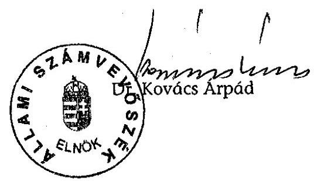

---

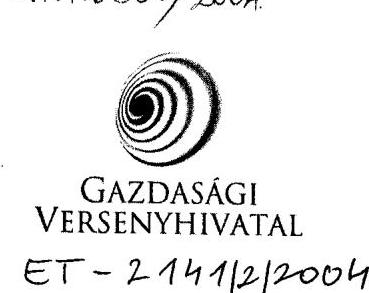

Dr. Kovács Árpád úr részére elnök

Állami Számvevőszék

Tárgy: a GVH átfogó vizsgálatáról szóló jelentés

1. számú melléklet a
V-12-025/2004. számú jelentéshez

$$
\begin{array}{r}
2993 / 04 \\
\angle E^{11} 1324 / 01 \\
\hline
\end{array}
$$

# Tisztelt Elnök Úr! 

A V-12/023/2004. iktatószámon megküldött, a Gazdasági Versenyhivatal átfogó számvevőszéki vizsgálatáról szóló jelentéshez észrevételt nem teszek.

Ezúton köszönöm munkatársainak (Csóry Györgyné, dr. Zsombori Beáta, Burenzsargal Narantuja és Papp Sándor) színvonalas munkáját.

Üdvözlettel:

Budapest, 2004. december 8.
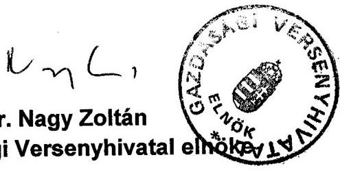

---

# A Versenyhivatal feladatait előíró jogszabályok jegyzéke 

- az árak megállapításáról szóló 1990. évi LXXXVII. törvény
- a gázszolgáltatásról szóló 1994. évi XLI. Törvény
- a tisztességtelen piaci magatartás és a versenykorlátozás tilalmáról szóló 1996. évi LVII. törvény
- a gazdasági reklámtevékenységről szóló 1997. évi LVIII. törvény
- a hírközlésről szóló 2001. évi XL. törvény
- a villamos energiáról szóló 2001. évi CX. törvény
- a földgázellátásról szóló 2003. évi XLII. törvény
- az elektronikus hírközlésről szóló 2003. évi C. törvény
- a biztosítási megállapodások egyes csoportjainak a versenykorlátozás tilalma alól történő mentesítéséről szóló 50/1997. (III. 19.) Korm. rendelet.
- a gépjármú-forgalmazási és szerviz-megállapodások egyes csoportjainak a versenykorlátozás tilalma alól történő mentesítéséről szóló 247/1997. (XII. 20.) Korm. rendelet
- a technológia-átadási megállapodások egyes csoportjainak a versenykorlátozás tilalma alól történő mentesítéséről szóló 86/1999. (VI. 11.) Korm. rendelet
- a szakosítási megállapodások egyes csoportjainak a versenykorlátozás tilalma alól történő mentesítéséről szóló 53/2002. (III. 26.) Korm. rendelet
- a kutatási és fejlesztési megállapodások egyes csoportjainak a versenykorlátozás tilalma alól történő mentesítéséről szóló 54/2002. (III. 26.) Korm. rendelet
- a vertikális megállapodások egyes csoportjainak a versenykorlátozás tilalma alól történő mentesítéséről szóló 55/2002. (III. 26.) Korm. rendelet
- a gépjármú ágazatban a vertikális megállapodások egyes csoportjainak a versenykorlátozás tilalma alól való mentesítéséről szóló 19/2004. (II. 13.) Korm. rendelet

---

# A kérelmes ügyek bírósági felülvizsgálatának alakulása a vizsgált időszakban 

1. sz. tábla

|  | 1997. | 1998. | 1999. | 2000. | 2001. | 2002. | 2003. | Ösz- <br> sze- <br> sen |
| :-- | :--: | :--: | :--: | :--: | :--: | :--: | :--: | :--: |
| Kérelemre indult ügyek | 30 | 52 | 48 | 66 | 82 | 66 | 73 | 417 |
| Ebből kérelem (részbeni) <br> elutasítása, feltételhez <br> kötése | 1 | 5 | 0 | 8 | 3 | 12 | 4 | 33 |
| Ebből felülvizsgálni kért | 0 | 0 | 0 | 1 | 1 | 4 | 2 | 8 |
| Felülvizsgálni kért / kére- <br> lem (részbeni) elutasítása, <br> feltételhez kötése (\%) | 0 | 0 | 0 | $12,5 \%$ | $33,3 \%$ | $33,3 \%$ | $50 \%$ | $24,2 \%$ |

A hivatalból indult ügyek bírósági megtámadásának alakulása a vizsgált időszakban
2. sz. tábla

|  | 1997. | 1998. | 1999. | 2000. | 2001. | 2002. | 2003. | Ösz- <br> sze- <br> sen |
| :-- | :--: | :--: | :--: | :--: | :--: | :--: | :--: | :--: |
| Hivatalból indult <br> ügyek | 78 | 128 | 113 | 157 | 101 | 103 | 95 | 775 |
| - Ebből marasztalás | 20 | 39 | 54 | 50 | 27 | 47 | 50 | 287 |
| - Ebből megtá- <br> madott | 13 | 26 | 19 | 23 | 12 | 23 | 25 | 141 |
| Megtámadott / <br> marasztalás(\%) | $65 \%$ | $66,7 \%$ | $35,2 \%$ | $46 \%$ | $44,4 \%$ | $48,9 \%$ | $50 \%$ | $49,1 \%$ |
| - Ebből megszüntetés | 55 | 75 | 53 | 84 | 69 | 40 | 39 | 415 |
| - Ebből megtá- <br> madott | 7 | 19 | 9 | 19 | 16 | 13 | 8 | 91 |
| Megtámadott / <br> megszüntetés(\%) | $12,7 \%$ | $25,3 \%$ | $17 \%$ | $22,6 \%$ | $23,2 \%$ | $32,5 \%$ | $20,5 \%$ | $21,9 \%$ |

A bírósági felülvizsgálat 2003. év végi eredményeinek bemutatása
3. sz. tábla

| Elbírált felülvizsgálati kerese- <br> tek közül | Össze- <br> sen | Ebből megváltoztatva |  |
| :--: | :--: | :--: | :--: |
|  |  | a jogalap | részben a jog- <br> alap | a bírság |
| (1) Jogerősen befejezve | 151 | 10 | 1 | 10 |
| I. fokon | 110 | 5 | - | 4 |
| II. fokon | 41 | 5 | 1 | 6 |
| (2) Nem jogerős ítélet (I. fok) | 32 | - | - | 2 |
| Együtt: (1+2) | 183 | 10 | 1 | 12 |

---

# A bejelentésre indult ügyek alakulása az elintézés módja szerint 

1. sz. tábla

|  | 1997. | 1998. | 1999. | 2000. | 2001. | 2002. | 2003. | Ösz- <br> szese <br> n |
| :--: | :--: | :--: | :--: | :--: | :--: | :--: | :--: | :--: |
| Elintézett bejelentések | 615 | 553 | 492 | 678 | 752 | 720 | 839 | 4649 |
| - Ebből <br> versenyfelügyeleti <br> eljárás alapjául <br> szolgált | 218 | 209 | 175 | 189 | 248 | 233 | 247 | 1519 |
| Ebből <br> indult eljárások | 112 | 109 | 121 | 136 | 106 | 96 | 81 | 761 |
| Elutasított bejelentések | 397 | 344 | 317 | 489 | 504 | 487 | 592 | 3130 |

A bejelentések elutasítása miatti jogorvoslati kérelmek versenytanácsi elbírálásának alakulása a vizsgált időszakban
2. sz. tábla

|  | 1997. | 1998. | 1999. | 2000. | 2001. | 2002. | 2003. | Ösz- <br> szese <br> n |
| :--: | :--: | :--: | :--: | :--: | :--: | :--: | :--: | :--: |
| Elutasított bejelentések | 397 | 344 | 317 | 489 | 504 | 487 | 592 | 3130 |
| Ebből jogorvoslati kérelem a Ver-seny-tanácshoz | 95 | 78 | 92 | 126 | 121 | 112 | 117 | 741 |
| jogorvoslati kérelem/ <br> Elutasított bejelentések (\%) | $23,9 \%$ | $22,7 \%$ | $29 \%$ | $25,8 \%$ | $24 \%$ | $23 \%$ | $19,8 \%$ | $23,7 \%$ |
| Ebből <br> jogorvos-lati kérelemnek helyt adó VT határozat | 19 | 12 | 13 | 26 | 28 | 17 | 10 | 125 |
| Jogorvoslati kérelemnek helyt adó VT határozat/jogorvoslati kérelem Verseny$\cdot$ tanácshoz (\%) | $20 \%$ | $15,4 \%$ | $14,1 \%$ | $20,6 \%$ | $23,1 \%$ | $15,2 \%$ | $8,5 \%$ | $16,9 \%$ |
| Ebből jogorvos-lati kérelemnek helyt nem adó VT határozat | 76 | 66 | 79 | 100 | 93 | 95 | 107 | 616 |

---

# A bejelentések elutasítása miatti jogorvoslati kérelmek Fővárosi Bíróság általi elbírálásának alakulása a vizsgált időszakban 

3. sz. tábla

|  | 1997. | 1998. | 1999. | 2000. | 2001. | 2002. | 2003. | Ösz- <br> szese <br> n |
| :--: | :--: | :--: | :--: | :--: | :--: | :--: | :--: | :--: |
| Jogorvoslati kérelemnek helyt nem adó versenytanácsi határozat | 76 | 66 | 79 | 100 | 93 | 95 | 107 | 516 |
| - Ebből jogorvoslati kérelmek a Fővárosi Bíróságnál (FB) | 10 | 11 | 11 | 10 | 17 | 17 | 21 | 97 |
| Jogorvoslati kérelmek a Fővárosi Bíróságnál/ <br> Jogorvoslati kérelemnek helyt nem adó-verseny-tanácsi határozat (\%) | $13,2 \%$ | 16,7 | $13,9 \%$ | $10 \%$ | $18,3 \%$ | $17,9 \%$ | $19,6 \%$ | $15,7 \%$ |
| ```o Ebből jogorvos-lati kérelemnek helyt adó FB határozat``` | 2 | 1 | 0 | 0 | 2 | 3 | 5 | 13 |
| Jogorvoslati kérelemnek helyt adó FB határozat/ jogorvoslati kérelmek a Fővárosi Bíróságnál (\%) | $0 \%$ | $9,1 \%$ | $0 \%$ | $0 \%$ | $11,8 \%$ | $17,6 \%$ | $23,8 \%$ | $13,4 \%$ |
| ```o Ebből jogorvos-lati kérelemnek helyt nem adó FB határozat``` | 8 | 10 | 11 | 10 | 15 | 14 | 16 | 84 |

---

A kőkemény kartell ügyek évenkénti alakulása a bírságösszegekkel együtt

| Vj <br> szám | A megállapodás részt- <br> vevői | A megállapodás típusa | A határozat | A bírság összege M Ft |
| :--: | :--: | :--: | :--: | :--: |
| 2001 |  |  |  |  |
| 75/2001 | Magyar Méhtenyésztők Országos Egyesülete | horizontális | nem esik tilalom alá (akkor még a kérdéses ármegállapítás de minimális, kicsi piaci részesedés miatt elkerülhette a marasztalást) | - |
| 2001-ben összesen: 1 határozat |  |  | Bírság: | - |


| Vj <br> szám | A megállapodás résztvevöi | A megállapodás típusa | A határozat | A bírság összege M Ft |
| :--: | :--: | :--: | :--: | :--: |
| 2002 |  |  |  |  |
| 99/2001 | Bilux Gépjármúvezetőképző Kft, a Quattro Kkt és 5 egyéni vállalkozó | horizontális | nem versenykorlátozó megállapodás | - |
| 145/2001 | Tengerdi Kft., Delta Üzletház Kft., Hálózat Bt., Bíró Géza, Kövesdi Tibor, Újhelyi István, Balláné Vajas Éva, Kézsmárkiné Balogh Éva, Kálsecz Károly, Zadravecz Józsefné | horizontális | jogszerútlen megállapodás („balatonmáriafürdői étteremkartell") | 2,46 |
| 13/2002 | Deko-Apple Kft., EKO Konzervipari Kft., ESZAT Kft., Vajai ZöldségGyümölcs Kft., Wink A. Kft., Alma Terméktanács | horizontális | jogszerútlen megállapodás | - |
| 2002-ben összesen: 3 határozat |  |  | Bírság: | 2,46- |

---

| VJ szám | A megállapodás résztvevői | A megállapodás típusa | A határozat | A bírság összege MFt |
| :--: | :--: | :--: | :--: | :--: |
| 2003 |  |  |  |  |
| 22/2002 | Westel Mobil Rt., Pannon GSM Távközlési Rt., Vodafone Rt., Westel Rádiótelefon Kft., Magyar Távközlési Rt. (Matáv) | horizontális | jogszerútlen megállapodás (kartellgyanú volt, de nem kartell, hanem csak versenytorzitás miatt volt marasztalás, ezért az ide való besorolás vitatható) | 360 |
| 70/2002 | Budapest Film Kulturális Szolgáltató Kft., Intercom Nemzetközi Kulturális Szolgáltató Rt ., Palace Cinemas Magyarország Szórakoztató Kft., UCICE Magyarország Szórakoztató Kft. | horizontális | jogszerútlen megállapodás | 203 |
| 72/2002 | TRANS HOLDING GROUP, METALELEKTRO Műszaki Fejlesztő, Kereskedelmi és Szolgáltató Kft., EURO-MOBIL Gépjármú Szakértői Állomás Kft., NJL Ipari Szolgáltató és Kereskedelmi Kft., IHG-Info Holding Group Nemzetközi Információkereskedő és Szolgáltató Rt. | horizontális | jogszerútlen megállapodás | 27,3 |
| 96/2002 | Európa-Pék Export, Import Kereskedelmi és Szolgáltató Kft, CERBONA Élelmiszeripari és Kereskedelmi Rt,. „Házi Kenyér" Sütőipari Kft.,. Pánovics Sütőde Bt, Papp Pékség Kft, Friss Cipó Sütőipari és Húsfeldolgozó Kft,. „Ifj. Egervári Ferenc és társa" Sütőipari Termékelőállító és Értékesítő Bt., Szabó Dezső egyéni vállalkozó, Mohácsi László egyéni vállalkozó | horizontális | jogszerútlen megállapodás | 13,2 |
| 97/2002 | ATI Megyei Autóközlekedési Kft., Turbo Gépjármúvezetőképző Kft., Ajkai GVMK, Ifj. Novák István, Gögös Zoltán | horizontális | jogszerútlen megállapodás | 1,1 |
| 114/2002 | Budataxi Kft., Budapest Taxi Kft., City Taxi Szövetkezet, Est Taxi Kft., Főtaxi Rt., Rádió Taxi Kft., Taxi 2000 Kft., 6x6 Taxi Kft. | horizontális | jogszerútlen megállapodás | 29,8 |
| 153/2002 | Szolnoki Sütőipar Rt., Tiszafüredi FÖNIX KereskedelmiVendéglátó és Szolgáltató Kft., Hirsch és Társa-M Élelmiszeripari és Kereskedelmi Kft., JURAPLUSSZ Termelő és Szolgáltató Kft., Bede Jenő vállalkozó, Magyar Pékek Ipartestülete, Tisza-füred-COOP Kereskedelmi és Szolgáltató Rt. | horizontális | jogszerútlen megállapodás | 2,1 |
| 47/2003 | Vágóállat- és Hús Terméktanács | vegyes | jogszerútlen megállapodás | 1 |
| 112/2003 | Vágóállat- és Hús Terméktanács | vegyes | jogszerútlen megállapodás | 1 |
| 2003-ban összesen: 9 határozat |  |  | Bírság: 638,5 MFt | - |

---

| $\begin{gathered} \text { VJ } \\ \text { szám } \end{gathered}$ | A megállapodás résztvevői | A megállapodás típusa | A határozat | A bírság összege MFt |
| :--: | :--: | :--: | :--: | :--: |
| 2004. január - június |  |  |  |  |
| 138/2002 | Alterra Kft., SwietelskyÚtvasút Kft., Mélyépítő Budapest Építőipari, Kivitelező és Tervező Kft., Debreceni Mély és Útépítő Rt. (DEBMUT), Betonút Szolgáltató és Építő Részvénytársaság, STRABAG Rt., Ring Kkt., EGUT Egri Útépítő Rt. | horizontális | jogszerútlen megállapodás | 245 |
| 154/2002 | Baucont Építőipari Rt., <br> Klíma-Vill. Építőipari Fővállalkozási és Szolgáltató Kft., Középületépítő Rt. | horizontális | jogszerútlen megállapodás | 298 |
| 28/2003 | Baucont Építőipari Rt., Kész Közép-Európai Építő és Szerelő Kft., <br> Középületépítő Rt., Épker Kft | horizontális | jogszerútlen megállapodás | 590 |
| 34/2003 | Magyar Pékszövetség és több egyedi pékség | horizontális | jogszerútlen megállapodás | 1 |
| 2004. első félévében összesen ${ }^{1}$ : 4 határozat Bírág: 1134 MFt |  |  |  | - |

[^0]
[^0]:    ${ }^{1}$ A Vj-27/2003 (autópályaépítés kartell) lezárására, az újságok által is közölt 7,043 milliárd forintos bírság kivetésére július 22.-én került sor, ezért ezt a fenti első félévi összesítés nem tartalmazza.

---

# Bírság kiszabása 1997-2003. év között (M Ft.) 

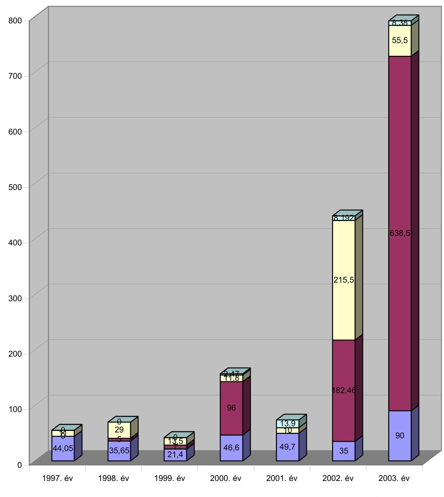
$\square$ Engedélykérelem elmulasztása (Tptv. VI.fejezet)
$\square$ Gazdasági erőfölénnyel való visszaélés (Tptv. V.fejezet)
$\square$ Versenykorlátozó megállapodás (Tptv. IV.fejezet)
$\square$ Fogyasztók tisztességtelen befolyásolása (Tptv. III.fejezet)

---

# Tanúsítványok jegyzéke 

| 1.a.-1.c. számú tanúsítvány | A Gazdasági Versenyhivatal fejezet kiadásainak alakulása 1996-2004 I. félév között |
| :--: | :--: |
| 2.a.-2.c. számú tanúsítvány | A Gazdasági Versenyhivatal fejezet bevételeinek alakulása 1996-2004 I. félév között |
| 3.a.-3.b. számú tanúsítvány | A Gazdasági Versenyhivatal fejezet múködési költségvetése eredeti előirányzatainak levezetése |
| 4. számú tanúsítvány | A Gazdasági Versenyhivatal fejezet kiadási és bevételi előirányzatainak módosítása 2000-2004. I. félév között |
| 5.a.-5.b. számú tanúsítvány | A személyi juttatások alakulása |
| 6.a.-6.c. számú tanúsítvány | A köztisztviselői állományi létszám alakulása 19962004. I. félév között |
| 7.a.-7.b. számú tanúsítvány | Az egy főre jutó átlagilletmény, illetve az átlagjövedelem alakulása a köztisztviselőknél 2000-2004. I. félév között |
| 8. számú tanúsítvány | A Gazdasági Versenyhivatal fejezet számítástechnikai ellátottsága 2000-2004. I. félév között |
| 9.a.-9.b. számú tanúsítvány | A tárgyi eszközökre és az immateriális javakra vonatkozó adatok 2000-2004. I. félév között |
| 10. számú tanúsítvány | A Versenytanács ügyzáró határozatai 2000-2003. év között |
| 11. számú tanúsítvány | Fogyasztói döntések tisztességtelen befolyásolása 20002003. év között |
| 12. számú tanúsítvány | Erőfölénnyel való visszaélés 2000-2003. év között |
| 13. számú tanúsítvány | Versenykorlátozó megállapodások 2000-2003. év között |
| 14. számú tanúsítvány | Összefonódások 2000-2003. év között |

---

Gazdasági Versenyhivatal 1/a. sz. Tanúsítvánv fejezet fejezet összesen a V-12-025/2004. sz. jelentéshez

A KIADÁSOK ALAKULÁSA KIEMELT ELŐIRÁNYZATONKÉNT adatok: E Ft-ban

|  Megnevezés | 1996. év |  |  | 1997. év |  |  | 1998. év |  |   |
| --- | --- | --- | --- | --- | --- | --- | --- | --- | --- |
|   | Eredeti | Mód. | Teljesítés | Eredeti | Mód. | Teljesítés | Eredeti | Mód. | Teljesítés  |
|   | előirányzat |  |  | előirányzat |  |  | előirányzat |  |   |
|  Személyi juttatások | 130 700 | 160 352 | 154 104 | 169 818 | 203 944 | 199 492 | 221 600 | 235 805 | 230 488  |
|  Munkaadókat terhelő járulékok | 52 800 | 63 158 | 62 816 | 72 267 | 81 564 | 82 020 | 97 400 | 99 862 | 99 220  |
|  Dologi kiadások | 37 900 | 37 365 | 46 165 | 42 165 | 42 165 | 44 041 | 40 000 | 46 405 | 46 357  |
|  Egyéb folyó kiadások |  |  |  |  |  |  |  |  |   |
|  Műk. és felhalm. célú pénzeszköz átadás | 28 400 | 26 300 | 23 459 | 37 250 | 31 650 | 31 650 | 35 200 | 33 100 | 33 100  |
|  Felújítás |  |  |  |  |  |  |  |  |   |
|  Beruházási kiadások | 4 500 | 6 000 | 4 879 | 15 600 | 15 600 | 13 347 | 15 600 | 15 600 | 12 595  |
|  Központi beruházások |  |  |  |  |  |  |  | 10 000 |   |
|  Fejezeti kezelésű speciális előirányzat | 40 000 |  |  |  |  |  |  |  |   |
|  Kölcsönök nyújtása és törlesztése |  |  |  |  |  |  |  | 3 220 | 3 220  |
|  Pénzforgalom nélküli kiadások | 2 900 |  |  | 3 200 |  |  |  |  |   |
|  Költségvetési kiadások összesen | 297 200 | 293 175 | 291 423 | 340 300 | 374 923 | 370 550 | 409 800 | 443 992 | 424 980  |
|  Függő, átfutó, kiegyenlítő kiadások |  |  | -1 292 |  |  | 6 995 |  |  | -5 603  |

Tanúsítom, hogy az adatok a fejezet számviteli nyilvántartásában szereplő adatokkal megegyeznek!

Budapest, 2004. május 14.

Kada L.

---

Gazdasági Versenyhivatal 1/b. sz. Tanúsítvánv fejezet 1999. év a V-12-025/2004. sz. jelentéshez fejezet összesen a V-12-025/2004. sz. jelentéshez adatok: E Ft-ban

|  Megnevezés | 1999. év |  |  | 2000. év |  |  | 2001. év |  |   |
| --- | --- | --- | --- | --- | --- | --- | --- | --- | --- |
|   | Eredeti | Mód. | Teljesítés | Eredeti | Mód. | Teljesítés | Eredeti | Mód. | Teljesítés  |
|   | előirányzat |  |  | előirányzat |  |  | előirányzat |  |   |
|  Személyi juttatások | 251 500 | 279 152 | 277 791 | 282 200 | 292 936 | 287 269 | 361 000 | 459 048 | 423 242  |
|  Munkaadókat terhelő járulékok | 95 100 | 104 059 | 104 059 | 106 100 | 108 135 | 99 420 | 125 400 | 165 451 | 135 993  |
|  Dologi kiadások | 85 900 | 52 998 | 52 912 | 76 000 | 68 248 | 67 834 | 75 600 | 150 767 | 146 024  |
|  Egyéb folyó kiadások | 4 700 | 5 673 | 5 673 | 6 000 | 7 798 | 7 798 | 8 000 | 13 604 | 11 452  |
|  Műk. és felhalm. célú pénzeszköz átadás | 47 200 | 47 720 | 47 720 | 47 200 | 49 700 | 49 700 | 128 200 | 53 854 | 51 854  |
|  Felújítás |  |  |  |  |  |  |  | 3 741 | 3 608  |
|  Beruházási kiadások | 35 200 | 47 111 | 34 810 | 35 200 | 48 677 | 31 542 | 40 200 | 103 120 | 54 911  |
|  Központi beruházások |  |  |  |  |  |  |  |  |   |
|  Fejezeti kezelésű speciális előirányzat |  |  |  |  |  |  |  |  |   |
|  Kölcsönök nyújtása és törlesztése |  | 1 950 | 1 950 |  | 900 | 900 |  | 600 | 600  |
|  Pénzforgalom nélküli kiadások | 4 400 |  |  | 9 400 |  |  | 9 400 |  |   |
|  Költségvetési kiadások összesen | 524 000 | 538 663 | 524 915 | 562 100 | 576 394 | 544 463 | 747 800 | 950 185 | 827 684  |
|  Függő, átfutó, kiegyenlítő kiadások |  |  | -965 |  |  | 626 |  |  | -78  |

Tanúsítom, hogy az adatok a fejezet számviteli nyilvántartásában szereplő adatokkal megegyeznek!

Budapest, 2004. május 14.

---

Gazdasági Versenyhivatal 1/c. sz. Tanúsítvány 1/c. sz. Tanúsítvány fejezet fejezet összesen a V-12-025/2004. sz. jelentéshez adatok: E Ft-ban

|  Megnevezés | 2002. év |  |  | 2003. év |  |  | 2004. I. félév* |  |   |
| --- | --- | --- | --- | --- | --- | --- | --- | --- | --- |
|   | Eredeti | Mód. | Teljesítés | Eredeti | Mód. | Teljesítés | Eredeti | Mód. | Teljesítés  |
|   | előirányzat |  |  | előirányzat |  |  | előirányzat |  |   |
|  Személyi juttatások | 374 200 | 613 527 | 608 399 | 652 000 | 696 999 | 657 878 | 690 200 |  |   |
|  Munkaadókat terhelő járulékok | 125 400 | 219 905 | 208 771 | 212 100 | 227 808 | 202 517 | 221 100 |  |   |
|  Dologi kiadások | 75 600 | 147 486 | 141 686 | 141 200 | 138 127 | 135 828 | 80 900 |  |   |
|  Egyéb folyó kiadások | 8 000 | 16 413 | 11 858 | 12 000 | 20 034 | 16 933 | 13 000 |  |   |
|  Műk. és felhalm. célú pénzeszköz átadás | 128 200 | 57 200 | 56 504 | 63 000 | 56 479 | 56 479 | 64 200 |  |   |
|  Felújítás |  | 3 520 | 3 520 | 20 000 |  |  |  |  |   |
|  Beruházási kiadások | 40 200 | 118 654 | 102 816 | 27 100 | 55 353 | 42 810 | 17 900 |  |   |
|  Központi beruházások |  |  |  |  |  |  |  |  |   |
|  Fejezeti kezelésű speciális előirányzat |  |  |  |  |  |  |  |  |   |
|  Kölcsönök nyújtása és törlesztése |  | 3 000 | 3 000 |  | 1 550 | 1 550 |  |  |   |
|  Bénzforgalom nélküli kiadások | 9 400 |  |  | 9 400 |  |  |  |  |   |
|  Költségvetési kiadások összesen | 761 000 | 1 179 705 | 1 136 554 | 1 136 800 | 1 196 350 | 1 113 995 | 1 087 300 | 0 | 0  |
|  Üggő, átfutó, kiegyenlítő kiadások |  |  | -553 |  |  | 5 040 |  |  |   |

- pénzforgalmi adat

Tanúsítom, hogy az adatok a fejezet számviteli nyilvántartásában szereplő adatokkal megegyeznek!

Jdapest, 2004. május 14.

Kallina

---

### 2/a. sz. Tanúsítvánv

a V-12-025/2004. sz. jelentéshez

### fejezet

### Fejezet összesen

### A BEVÉTELEK ALAKULÁSA KIEMELT ELŐIRÁNYZATONKÉNT

adatok: E Ft-ban

|  Megnevezés | 1996. év |  |  | 1997. év |  |  | 1998. év |  |   |
| --- | --- | --- | --- | --- | --- | --- | --- | --- | --- |
|   | Eredeti előirányzat | Mód. | Teljesítés | Eredeti előirányzat | Mód. | Teljesítés | Eredeti előirányzat | Mód. | Teljesítés  |
|  1. Intézményi működési bevételek |  |  | 1 358 |  | 1 900 | 3 250 |  | 2 454 | 2 453  |
|  2. Felhalmozási és tőke jellegű bevételek |  |  |  |  |  |  |  |  |   |
|  3. Felügyeleti szervtől kapott támogatás |  |  |  |  |  | 280 |  |  |   |
|  - működésre | 292 700 | 283 900 | 283 900 | 324 700 | 354 313 | 354 313 | 394 200 | 405 971 | 405 971  |
|  - felhalmozásra | 4 500 | 6 000 | 6 000 | 15 600 | 15 600 | 15 600 | 15 600 | 15 600 | 15 600  |
|  - céltámogatás |  |  |  |  |  |  |  | 10 000 | 10 000  |
|  Átvett pénzeszközök |  |  |  |  |  |  |  |  |   |
|  - működésre |  |  |  |  |  |  |  | 744 | 744  |
|  - felhalmozásra |  |  |  |  |  |  |  |  |   |
|  Kölcsönök igénybevétele és visszatérülése |  |  |  |  |  |  |  | 3 220 | 3 220  |
|  Pénzforgalom nélküli bevétel (előir. maradvány igénybevétele) |  | 3 275 | 3 275 |  | 3 110 | 3 110 |  | 6 003 | 6 003  |
|  Öltségvetési bevételek összesen | 297 200 | 293 175 | 294 533 | 340 300 | 374 923 | 376 553 | 409 800 | 443 992 | 443 991  |
|  Üggő, átfutó, kiegyenlítő bevételek |  |  |  |  |  | 7 035 |  |  | -7 035  |

Tanúsítom, hogy az adatok a fejezet számviteli nyilvántartásában szereplő adatokkal megegyeznek!

Idapest, 2004. május 13.

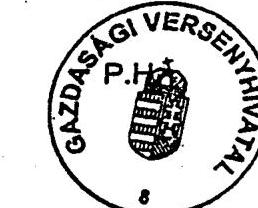

---

### 2/b. sz. Tanúsítvány

a V-12-025/2004. sz. jelentéshez

### Fejezet

### A BEVÉTELEK ALAKULÁSA KIEMELT ELŐÍRÁNYZATONKÉNT

|  Megnevezés | 1999. év |  |  | 2000. év |  |  | 2001. év |  |   |
| --- | --- | --- | --- | --- | --- | --- | --- | --- | --- |
|   | Eredeti előirányzat | Mód. | Teljesítés | Eredeti előirányzat | Mód. | Teljesítés | Eredeti előirányzat | Mód. | Teljesítés  |
|  1. Intézményi működési bevételek |  | 1 921 | 1 920 |  | 2 410 | 2 410 |  | 4 483 | 4 483  |
|  2. Felhalmozási és tőke jellegű bevételek |  | 597 | 597 |  | 2 105 | 2 105 |  | 10 212 | 10 212  |
|  3. Felügyeleti szervtől kapott támogatás |  |  |  |  |  |  |  |  |   |
|  - működésre | 488 800 | 479 549 | 479 549 | 526 900 | 515 100 | 515 100 | 707 600 | 810 203 | 810 203  |
|  - felhalmozásra | 35 200 | 35 200 | 35 200 | 35 200 | 35 200 | 35 200 | 40 200 | 40 200 | 40 200  |
|  - céltámogatás |  |  |  |  |  |  |  |  |   |
|  4. Átvett pénzeszközök |  |  |  |  |  |  |  |  |   |
|  - működésre |  | 435 | 435 |  | 6 932 | 6 932 |  | 12 556 | 12 556  |
|  - felhalmozásra |  |  |  |  |  |  |  | 40 000 | 40 000  |
|  5. Kölcsönök igénybevétele és visszatérülése |  | 1 950 | 1 950 |  | 900 | 900 |  | 600 | 600  |
|  6. Pénzforgalom nélküli bevétel (előir. maradvány igénybevétele) |  | 19 011 | 19 000 |  | 13 747 | 13 747 |  | 31 931 | 31 931  |
|  Költségvetési bevételek összesen | 524 000 | 538 663 | 538 651 | 562 100 | 576 394 | 576 394 | 747 800 | 950 185 | 950 185  |
|  Függő, átfutó, kiegyenlítő bevételek |  |  |  |  |  |  |  |  | 1  |

### A BEVÉTELEK ALAKULÁSA KIEMELT ELŐÍRÁNYZATONKÉNT

### Budapest, 2004. Május 13.

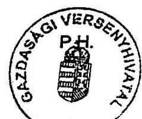

---

### azdasági Versenyhivatal

### a vezet

### a BEVÉTELEK ALAKULÁSA KIEMELT ELŐIRÁNYZATONKÉNT

|  Megnevezés | 2002. év |  |  | 2003. év |  |  | 2004. í. félév* |  |   |
| --- | --- | --- | --- | --- | --- | --- | --- | --- | --- |
|   | Eredeti | Mód. | Teljesítés | Eredeti | Mód. | Teljesítés | Eredeti | Mód. | Teljesítés  |
|   | előirányzat |  |  | előirányzat |  |  | előirányzat |  |   |
|  Intézményi működési |  | 3 686 | 3 686 | 200 | 2 236 | 2 445 |  |  |   |
|  bevételek |  |  |  |  |  |  |  |  |   |
|  Felhalmozási és tőke jellegű |  | 2 352 | 2 352 | 800 | 965 | 965 |  |  |   |
|  bevételek |  |  |  |  |  |  |  |  |   |
|  Felügyeleti szervtől kapott támogatás |  |  |  |  |  |  |  |  |   |
|  - működésre | 720 800 | 959 710 | 959 710 | 1 090 700 | 1 103 105 | 1 103 105 | 1 069 400 |  |   |
|  - felhalmozásra | 40 200 | 40 200 | 40 200 | 45 100 | 39 300 | 39 300 | 17 900 |  |   |
|  - céltámogatás |  |  |  |  |  |  |  |  |   |
|  Átvett pénzeszközök |  |  |  |  |  |  |  |  |   |
|  - működésre |  | 23 256 | 23 257 |  | 6 042 | 6 042 |  |  |   |
|  - felhalmozásra |  | 25 000 | 25 000 |  |  |  |  |  |   |
|  Kölcsönök igénybevétele és visszatérülése |  | 3 000 | 3 000 |  | 1 550 | 1 550 |  |  |   |
|  Pénzforgalom nélküli bevétel (előir. maradvány igénybevétele) |  | 122 501 | 122 501 |  | 43 152 | 43 152 |  |  |   |
|  Ségvetési bevételek összesen | 761 000 | 1 179 705 | 1 179 706 | 1 136 800 | 1 196 350 | 1 196 559 | 1 087 300 | 0 | 0  |
|  gő, átfutó, kiegyenlítő bevételek |  |  | 22 |  |  | -23 |  |  |   |

- pénzforgalmi adat

Tanúsítom, hogy az adatok a fejezet számviteli nyilvántartásában szereplő adatokkal megegyeznek!

spest, 2004. május 13.

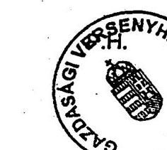

---

## Gazdasági Versenyhivatal

### fejezet

### 3/a. sz. Tanúsítvány

a V-12-025/2004. sz. jelentéshez

### A MŰKÖDÉSI KÖLTSÉGVETÉS EREDETI ELŐIRÁNYZATAINAK LEVEZETÉSE

#### adatok: E Ft-ban

|  Megnevezés | 2000. év |  |  |  | 2001. év |  |  |   |
| --- | --- | --- | --- | --- | --- | --- | --- | --- |
|   | Kiad. | Bev. | Tám. | Létszám | Kiad. | Bev. | Tám. | Létszám  |
|  Előző évi eredeti előirányzat | 524 000 |  | 524 000 | 117 | 562 100 |  | 562 100 | 116  |
|  Szerkezeti (+) |  |  |  |  | 81 000 |  | 81 000 |   |
|  Változás (-) | 10 000 |  | 10 000 | 6 | 11 800 |  | 11 800 |   |
|  Szintrehozás (+) |  |  |  |  |  |  |  |   |
|  (-) |  |  |  |  |  |  |  |   |
|  Alapelőirányzat | 514 000 |  | 514 000 | 111 | 631 300 |  | 631 300 | 116  |
|  Fejlesztési többletek | 48 100 |  | 48 100 | 5 | 116 500 |  | 116 500 | 8  |
|  Eredeti jóváha-gyott előirányzat | 562 100 | 0 | 562 100 | 116 | 747 800 | 0 | 747 800 | 124  |

Tanúsítom, hogy az adatok a fejezet számviteli nyilvántartásában szereplő adatokkal megegyeznek!

Budapest, 2004. május 18.

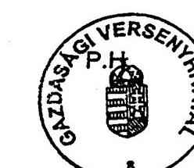

---

Gazdasági Versenyhivatal 3/b. sz. Tanúsítvány 3/b. sz. Tanúsítvány fejezet a V-12-025/2004. sz. jelentéshez a V-12-025/2004. sz. jelentéshez adatok: E Ft-ban

|  Megnevezés | 2002. év |  |  |  | 2003. év |  |  |  | 2004. I. félév* |  |  |   |
| --- | --- | --- | --- | --- | --- | --- | --- | --- | --- | --- | --- | --- |
|   | Kiad. | Bev. | Tám. | Létszám | Kiad. | Bev. | Tám. | Létszám | Kiad. | Bev. | Tám. | Létszám  |
|  Előző évi eredeti előirányzat | 747 800 |  | 747 800 | 124 | 761 000 |  | 761 000 | 121 | 1 136 800 | 1 000 | 1 135 800 | 131  |
|  Szerkezeti (+) |  |  |  |  | 240 900 |  | 240 900 | 6 | 31 100 |  | 31 100 |   |
|  változás (-) |  |  |  |  | 16 100 |  | 16 100 |  | 174 000 | 1 000 | 173 000 | 12  |
|  Szintrehozás (+) |  |  |  |  |  |  |  |  | 48 900 |  | 48 900 |   |
|  (-) |  |  |  |  |  |  |  |  |  |  |  |   |
|  Alapelőirányzat | 747 800 |  | 747 800 | 124 | 985 800 |  | 985 800 | 127 | 1 042 800 | 0 | 1 042 800 | 119  |
|  Fejlesztési többletek | 13 200 |  | 13 200 | -3 | 151 000 | 1 000 | 150 000 | 4 | 44 500 |  | 44 500 |   |
|  Eredeti jóváha-gyott előirányzat | 761 000 |  | 761 000 | 121 | 1 136 800 | 1 000 | 1 135 800 | 131 | 1 087 300 |  | 1 087 300 | 119  |

- pénzforgalmi adat

Tanúsítom, hogy az adatok a fejezet számviteli nyilvántartásában szereplő adatokkal megegyeznek!

Budapest, 2004. május 18.

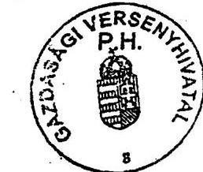

*Kan. L. B. B. (1.)*

---

### 4. sz. Tanúsítvánv

a V-12-025/2004. sz. jelentéshez

#### fejezet

## A KIADÁSI ÉS BEVÉTELI ELŐÍRÁNYZATOK MÓDOSÍTÁSA

|  Megnevezés | 2000. év | 2001. év | 2002. év | 2003. év | 2004. í. félév*  |
| --- | --- | --- | --- | --- | --- |
|  Eredeti kiadási előirányzat | 550 600 | 738 400 | 751 600 | 1 067 400 | 1 087 300  |
|  Módosítás összesen | 25 794 | 211 785 | 428 105 | 128 950 |   |
|  Hatáskörök szerint: |  |  |  |  |   |
|  OGY |  |  |  |  |   |
|  Kormány | -11 800 | 102 603 | 238 510 | 7 417 |   |
|  Felügyeleti szervi | 11 500 | 77 251 | 67 094 | 78 381 |   |
|  Saját |  |  |  |  |   |
|  - előir. maradványból | 13 747 | 31 931 | 122 501 | 43 152 |   |
|  - többletbevételből | 12 347 |  |  |  |   |
|  - egyéb forrásból |  |  |  |  |   |
|  Módosított kiad. előir. | 576 394 | 950 185 | 1 179 705 | 1 196 350 |   |
|  Eredeti bevételi előirányzat | 550 600 | 738 400 | 751 600 | 1 067 400 | 1 087 300  |
|  Módosítás összesen | 25 794 | 211 785 | 428 105 | 128 950 |   |
|  Ebből: saját bevétel átvett pénzeszköz költségvetési tám. pénzforg. nélküli bev. | 5 415 | 15 295 | 9 038 | 3 916 |   |
|   | 6 932 | 52 556 | 48 256 | 5 877 |   |
|   | -300 | 112 003 | 248 310 | 76 005 |   |
|   | 13 747 | 31 931 | 122 501 | 43 152 |   |
|  Módosított bevételi előir. | 576 394 | 950 185 | 1 179 705 | 1 196 350 |   |

- pénzforgalmi adat

Tanúsítom, hogy az adatok a fejezet számviteli nyilvántartásában szereplő adatokkal megegyeznek!

Budapest, 2004. május 17.

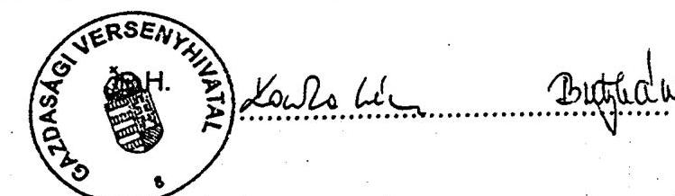

---

### Gazdasági Versenyhivatal

### fejezet

### fejezet

### 5/a. sz. Tanúsítvány

a V-12-025/2004. sz. jelentéshez

### A SZEMÉLYI JUTTATÁSOK ALAKULÁSA

adatok: E Ft-ban

|  Megnevezés | 2000. év |  |  | 2001. év |  |   |
| --- | --- | --- | --- | --- | --- | --- |
|   | Eredeti [ ] | Mód. [ ] | Telj. | Eredeti [ ] | Mód. [ ] | Telj.  |
|   | előirányzat |  |  | előirányzat |  |   |
|  1. Rendszeres személyi juttatások | 233 330 | 202 961 | 197 294 | 290 528 | 329 103 | 315 726  |
|  ebből: - alapilletmény | 153 108 | 134 134 | 128 467 | 166 832 | 190 064 | 176 756  |
|  - illetmény kiegészítés | 53 553 | 44 929 | 44 929 | 73 101 | 78 973 | 78 973  |
|  - pótlékok | 26 669 | 23 898 | 23 898 | 43 090 | 51 297 | 51 228  |
|  - 13. havi illetmény |  |  |  |  |  |   |
|  - részmi fogl. rendsz. szem. jutt. |  |  |  | 7 505 | 8 769 | 8 769  |
|  2. Nem rendszeres személyi juttatások | 41 500 | 80 521 | 80 521 | 64 472 | 119 928 | 97 982  |
|  ebből: - jutalom |  | 43 717 | 43 717 | 20 000 | 62 568 | 41 427  |
|  - túlóra, helyettesítés |  |  |  |  | 419 | 419  |
|  - végkielégítés |  |  |  |  | 4 273 | 4 273  |
|  - részmunkaidős fogl. jutt. | 1 061 | 1 197 | 1 197 | 1 407 | 2 515 | 2 180  |
|  - áll-ba tart. nem rendsz. jutt. |  |  |  |  |  |   |
|  3. Külső személyi juttatások | 7 370 | 9 454 | 9 454 | 6 000 | 10 017 | 9 534  |
|  ebből: - nyugdíjas fogl. juttatásai | 1 218 | 6 064 | 6 064 |  |  |   |
|  - állományba nem tart. jutt. | 6 152 | 3 390 | 3 390 | 6 000 | 10 017 | 9 534  |
|  4. Személyi juttatások összesen | 282 200 | 292 936 | 287 269 | 361 000 | 459 048 | 423 242  |

Tanúsítom, hogy az adatok a fejezet számviteli nyilvántartásában szereplő adatokkal megegyeznek!

Budapest, 2004. május 19.

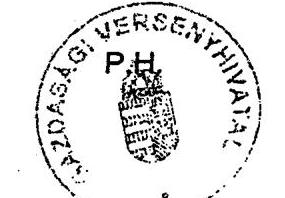

---

### 5/b. sz. Tanúsítvány

### a V-12-025/2004. sz. jelentéshez

### a SZEMÉLYI JUTTATÁSOK ALAKULÁSA

#### adatok: E Ft-ban

|  Megnevezés | 2002. év |  |  | 2003. év |  |  | 2004. félév év* |  |   |
| --- | --- | --- | --- | --- | --- | --- | --- | --- | --- |
|   | Eredeti | Mód. | Telj. | Eredeti | Mód. | Telj. | Eredeti | Mód. | Telj.  |
|   | előirányzat |  |  | előirányzat |  |  | előirányzat |  |   |
|  1. Rendszeres személyi juttatások | 322 782 | 470 234 | 470 234 | 538 053 | 486 341 | 485 458 | 562 300 |  |   |
|  ebből: - alapilletmény | 187 714 | 280 794 | 280 794 | 306 360 | 281 471 | 280 589 | 325 600 |  |   |
|  - illetmény kiegészítés | 80 526 | 109 914 | 109 914 | 138 746 | 123 624 | 123 624 | 148 300 |  |   |
|  - pótlékok | 51 644 | 74 049 | 74 049 | 87 894 | 76 050 | 76 050 | 85 500 |  |   |
|  - 13. havi illetmény |  |  |  |  |  |  |  |  |   |
|  - részmi fogl. rendsz. szem. jutt. | 2 898 | 5 477 | 5 477 | 5 053 | 5 196 | 5 195 | 2 900 |  |   |
|  2. Nem rendszeres személyi juttatások | 46 688 | 125 604 | 121 328 | 102 868 | 190 300 | 153 478 | 119 280 |  |   |
|  ebből: - jutalom | 4 200 | 58 666 | 55 450 | 42 640 | 86 613 | 60 588 | 44 750 |  |   |
|  - túlóra, helyettesítés |  | 683 | 683 |  | 10 506 | 6 138 |  |  |   |
|  - végkielégítés |  | 3 869 | 3 869 |  | 1 702 | 157 |  |  |   |
|  - részmunkaidős fogl. jutt. | 290 | 1 513 | 1 453 | 948 | 2 103 | 1 377 | 1 130 |  |   |
|  - áll-ba tart. nem rendsz. jutt. |  |  |  |  |  |  |  |  |   |
|  3. Külső személyi juttatások | 4 730 | 17 689 | 16 837 | 11 079 | 20 358 | 18 942 | 8 620 |  |   |
|  ebből: - nyugdíjas fogl. juttatásai |  |  |  |  |  |  |  |  |   |
|  - állományba nem tart. jutt. | 4 730 | 17 689 | 16 837 | 11 079 | 20 358 | 18 942 | 8 620 |  |   |
|  4. Személyi juttatások összesen | 374 200 | 613 527 | 608 399 | 652 000 | 696 999 | 657 878 | 690 200 |  |   |

- pénzforgalmi adat

Tanúsítom, hogy az adatok a fejezet számviteli nyilvántartásában szereplő adatokkal megegyeznek!

Budapest, 2004. május 19.

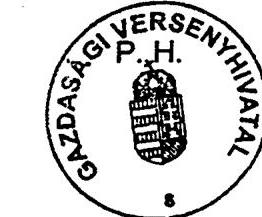

---

### Gazdasági Versenyhívatal

### 6/a. sz. Tanúsítvánv

a V-12-025/2004. sz. jelentéshez

### fejezet

### A KÖZTISZTVISELŐI ÁLLOMÁNYI LÉTSZEM ÁLÁKULÁSA

|  Állománycsoport | 1996. év |  |  | 1997. év |  |  | 1998. év |  |   |
| --- | --- | --- | --- | --- | --- | --- | --- | --- | --- |
|  megnevezése | Ktgv-i
létszám | átlag
létszám | Záró
létszám
dec. 31. | Ktgv-i
létszám | átlag
létszám | Záró
létszám
dec. 31. | Ktgv-i
létszám | átlag
létszám | Záró
létszám
dec. 31.  |
|  Elnök | 1 | 1 |  | 1 | 1 |  | 1 | 1 | 1  |
|  Elnökhelyettes | 2 | 2 |  | 2 | 2 |  | 2 | 2 | 2  |
|  Versenytanács tagja |  |  |  |  |  |  |  | 7 | 7  |
|  Vizsg.irodav.(főosztályvez.) | 15 | 14 |  | 15 | 14 |  | 15 | 8 | 8  |
|  Vizsg.vez.főtan.főov-helyettes |  |  |  |  | 3 |  | 3 | 4 | 4  |
|  Vizsgáló főtanácsos |  |  |  |  |  |  |  |  |   |
|  Vizsgáló tanácsos |  |  |  |  |  |  |  |  |   |
|  Vizsgáló |  |  |  |  |  |  |  |  |   |
|  Vizsgáló gyakornok |  |  |  |  |  |  |  |  |   |
|  Nem vizsg. irodavezető | 1 | 1 |  | 1 | 1 |  | 1 | 1 | 1  |
|  I. besorolási osztály | 50 | 53 |  | 51 | 52 |  | 49 | 50 | 49  |
|  II. besorolási osztály | 22 | 21 |  | 22 | 20 |  | 22 | 22 | 22  |
|  III. besorolási osztály | 6 | 6 |  | 6 | 6 |  | 6 | 6 | 6  |
|  Részmunkaidőben foglalkoztatottak |  |  |  |  |  |  |  | 1 | 1  |
|  Nyugdíjások (részmunkaidőben fogl.) | 2 | 2 |  |  |  |  |  | 3 | 3  |
|  Köztisztviselők összesen | 99 | 100 |  | 98 | 99 |  | 99 | 105 | 104  |
|  Fizikai foglalkoztatottak | 7 | 6 |  | 6 | 7 |  | 7 | 7 | 7  |
|  Külsős foglalkoztatottak | 2 |  |  |  |  |  |  |  |   |
|  Összesen | 108 | 106* |  | 104 | 106* |  | 108 | 112 | 111  |

A külsős foglalkoztatottak létszámadatait a költségvetési beszámoló összeállítására vonatkozó tájékoztató szerint kell feltüntetni.

Tanúsítom, hogy az adatok a fejezet számviteli nyilvántartásában szereplő adatokkal megegyeznek!

- nem áll rendelkezésre adni.

Budapest, 2004. május 19.

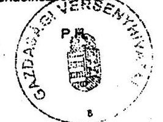

* az Állomány- 2017. év

---

### Gazdasági Versenyhivatal

### fejezet

### 6/b. sz. Tanúsítvány

### a V-12-025/2004. sz. jelentéshez

### A KÖZTISZTVISELŐI ÁLLOMÁNYI LÉTSZÉM ALAKULAGA

|  Állománycsoport | 1999. év |  |  | 2000. év |  |  | 2001. év |  |   |
| --- | --- | --- | --- | --- | --- | --- | --- | --- | --- |
|  megnevezése | Ktgv-i
létszám | átlag
létszám | Záró
létszám
dec. 31. | Ktgv-i
létszám | átlag
létszám | Záró
létszám
júni. 30. | Ktgv-i
létszám | átlag
létszám | Záró
létszám
dec. 31.  |
|  Elnök | 1 | 1 | 1 | 1 | 1 | 1 | 1 | 1 | 1  |
|  Elnökhelyettes | 2 | 2 | 2 | 2 | 2 | 2 | 2 | 2 | 2  |
|  Versenytanács tagja | 7 | 7 | 7 | 7 | 7 | 7 | 7 | 7 | 7  |
|  Vizsg.irodav.(főseztályvez.) | 8 | 9 | 9 | 9 | 9 | 9 | 10 | 10 | 11  |
|  Vizsg.vez.főtan.főov-helyettes | 4 | 3 | 3 | 4 | 3 | 3 | 4 | 4 | 4  |
|  Vizsgáló főtanácsos |  | 1 | 1 | 1 | 1 | 1 | 1 | 1 | 6  |
|  Vizsgáló tanácsos |  |  |  |  |  |  |  |  |   |
|  Vizsgáló |  |  |  |  |  |  |  |  |   |
|  Vizsgáló gyakorolók |  |  |  |  |  |  |  |  |   |
|  Nem vizsg. irodavezető | 1 | 1 | 1 | 1 | 1 | 1 | 1 | 1 | 1  |
|  I. besorolási osztály | 56 | 49 | 48 | 61 | 49 | 48 | 67 | 66 | 66  |
|  II. besorolási osztály | 24 | 19 | 19 | 19 | 19 | 19 | 19 | 19 | 20  |
|  III. besorolási osztály | 6 | 3 | 3 | 3 | 3 | 3 |  |  |   |
|  Részmunkailóben foglalkoztatottak | 1 | 1 | 1 | 1 | 1 | 1 | 4 | 2 | 2  |
|  Nyugdíjasok (részmunkailóben fogl.) | 1 | 1 | 1 | 1 | 3 | 3 |  |  |   |
|  Köztisztviselői összesen | 111 | 97 | 96 | 110 | 99 | 96 | 116 | 120 | 120  |
|  Fizikai foglalkoztatottak | 6 | 6 | 6 | 6 | 5 | 5 | 8 | 8 | 8  |
|  Külső foglalkoztatottak |  |  |  |  |  |  |  |  |   |
|  Összesen | 117 | 103 | 102 | 116 | 104 | 101 | 124* | 128 | 128  |

A külső foglalkoztatottak létszámadatait a költségvetési beszámoló összeállítására vonatkozó tájékoztató szerint kell feltüntetni.

Tanúsítom, hogy az adatok a fejezet számviteli nyilvántartásában szereplő adatokkal megegyeznek!

- A besorolás évközi változása miatt nem adható meg az átlaglétszám

Budapest, 2004. május 19.

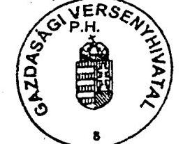

2004. május 19.

---

### Gazdasági Versenyhivatal

### A KÖZTISZTVISELOI ALLOMÁNYI LÉTSZEM ALAKULASA

|  Állománycsoport | 2002. év |  |  | 2003. év |  |  | 2004. í. félév * |  |   |
| --- | --- | --- | --- | --- | --- | --- | --- | --- | --- |
|  megnevezése | Ktgv-i
létszám | átlag
létszám | Záró
létszám
jűnl. 30. | Ktgv-i
létszám | átlag
létszám | Záró
létszám
jűnl. 30. | Ktgv-i
létszám | átlag
létszám | Záró
létszám
dec. 31.  |
|  Elnök | 1 | 1 | 1 | 1 | 1 | 1 | 1 |  |   |
|  Elnökhelyettes | 2 | 2 | 2 | 2 | 1 | 1 | 2 |  |   |
|  Versenytanács tagja | 7 | 7 | 7 | 7 | 6 | 5 | 7 |  |   |
|  Vizsg.irodav.(főosztályvez.) | 11 | 10 | 10 | 10 | 9 | 9 | 9 |  |   |
|  Vizsg.vez.főtan.főov-helyettes |  | 4 | 4 | 4 | 4 | 4 | 3 |  |   |
|  Vizsgáló főtanácsos | 10 | 8 | 8 | 8 | 7 | 7 | 8 |  |   |
|  Vizsgáló tanácsos |  |  |  |  |  |  | 24 |  |   |
|  Vizsgáló |  |  |  |  |  |  | 23 |  |   |
|  Vizsgáló gyakornok |  |  |  |  |  |  | 12 |  |   |
|  Nem vizsg. irodavezető | 1 | 1 | 1 | 1 |  |  | 1 |  |   |
|  I. besorolási osztály | 60 | 55 | 55 | 65 | 61 | 61 | 4 |  |   |
|  II. besorolási osztály | 19 | 20 | 20 | 19 | 19 | 18 | 17 |  |   |
|  III. besorolási osztály |  |  |  |  | 3 | 3 | 1 |  |   |
|  Részmunkaidőben foglalkoztatottak | 2 | 2 | 2 | 2 | 2 | 2 | 2 |  |   |
|  Nyugdíjasok (részmunkaidőben fogl.) |  |  |  |  |  |  |  |  |   |
|  Köztisztviselők összesen | 113 | 110 | 110 | 119 | 113 | 111 | 114 |  |   |
|  Fizikai foglalkoztatottak | 8 | 8 | 8 | 8 | 5 | 5 | 5 |  |   |
|  Külsős foglalkoztatottak |  |  |  |  |  |  |  |  |   |
|  Összesen | 121 | 118 | 118 | 127 | 118 | 116 | 119 |  |   |

- pénzforgalmi adat

A külsős foglalkoztatottak létszámadatait a költségvetési beszámoló összeállítására vonatkozó tájékoztató szerint kell feltüntetni.

Tanúsítom, hogy az adatok a fejezet számviteli nyilvántartásában szereplő adatokkal megegyeznek!

Budapest, 2004. május 19.

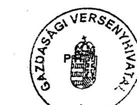

---

Gazdasági Versenyhivatal fejezet

7/a. sz. Tanúsítvánv a V-12-025/2004. sz. jelentéshez

A EGY FŐRE JUTÓ ÁTLAGILLETMÉNY, ILLETVE AZ ÁTLAGKERESET ALAKULÁSA A KÖZTISZTVISELŐKNÉL

|  Állománycsoport megnevezése | 2000. év |  | 2001. év |  | 2002. év |   |
| --- | --- | --- | --- | --- | --- | --- |
|   | átlagilletmény eFt/hó/fő | átlagkereset | eFt/hó/fő | átlagilletmény eFt/hó/fő | átlagkereset | eFt/hó/fő  |
|  Elnök | 290 | 363 | 606 | 861 | 864 | 1276  |
|  Elnökhelyettes | 281 | 342 | 475 | 544 | 645 | 720  |
|  Versenytanács tagja | 238 | 289 | 420 | 575 | 571 | 631  |
|  Vizsgáló irodavezető | 168 | 207 | 346 | 399 | 545 | 639  |
|  Vizsgáló vezető főtanácsos |  |  | 572 | 620 | 458 | 505  |
|  Vizsgáló főtanácsos |  |  | 303 | 352 | 375 | 420  |
|  Vizsgáló tanácsos |  |  |  |  |  |   |
|  Vizsgáló |  |  |  |  |  |   |
|  Vizsgáló gyakornok |  |  |  |  |  |   |
|  Nem vizsgáló irodavezető | 239 | 293 | 318 | 398 | 475 | 571  |
|  I. besorolási osztály | 131 | 163 | 174 | 95 | 280 | 305  |
|  II. besorolási osztály | 85 | 107 | 102 | 128 | 118 | 151  |
|  III. besorolási osztály | 85 | 104 | 88 | 101 | 105 | 115  |
|  IV. besorolási osztály | 69 | 85 | 80 | 105 | 96 | 126  |
|  Részmunkaidőben fogl. | 80 | 80 | 169 | 200 | 211 | 250  |
|  Nyugdíjas fogl. | 144 | 144 |  |  |  |   |
|  Köztisztviselők összesen |  |  |  |  |  |   |

Tanúsítom, hogy az adatok a fejezet számviteli nyilvántartásában szereplő adatokkal megegyeznek!

Budapest, 2004. május 19

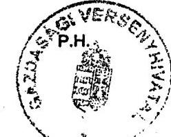

---

Gazdasági Versenyhivatal

7/b. sz. Tanúsítvány

a V-12-025/2004. sz. jelentéshez

## A EGY FŐRE JUTÓ ÁTLAGILLETMÉNY, ILLETVE AZ ÁTLAGJÖVEDELEM ALAKULÁSA A KÖZTISZTVISELŐKNIÓL

|  Állománycsoport megnevezése | átlagilletmény eFI/hó/fő | átlagkereset | eFI/hó/fő | átlagilletmény eFI/hó/fő | átlagkereset | eFI/hó/fő  |
| --- | --- | --- | --- | --- | --- | --- |
|  Elnök |  | 823 |  | 1065 |  |   |
|  Elnökhelyettes |  | 754 |  | 1214 |  |   |
|  Versenytanács tagja |  | 878 |  | 771 |  |   |
|  Vizsgáló irodavezető |  | 557 |  | 707 |  |   |
|  Vizsgáló vezető főtanácsos |  | 499 |  | 589 |  |   |
|  Vizsgáló főtanácsos |  | 456 |  | 533 |  |   |
|  Vizsgáló tanácsos |  |  |  |  |  |   |
|  Vizsgáló |  |  |  |  |  |   |
|  Vizsgáló gyakorok |  |  |  |  |  |   |
|  Nem vizsgáló irodavezető |  | 513 |  | 555 |  |   |
|  I. besorolási osztály |  | 298 |  | 331 |  |   |
|  II. besorolási osztály |  | 128 |  | 156 |  |   |
|  III. besorolási osztály |  | 104 |  | 121 |  |   |
|  IV. besorolási osztály |  | 114 |  | 136 |  |   |
|  Részmunkaidőben fogó |  | 200 |  | 227 |  |   |
|  Nyugdíjas fogó |  |  |  |  |  |   |
|  Köztisztviselők összesen |  |  |  |  |  | 200  |

- pénzforgalmi adat

Tanúsítom, hogy az adatok a fejezet számviteli nyilvántartásában szereplő adatokkal megegyeznek!

Budapest, 2004. május 19

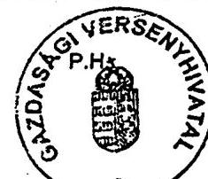

---

### Gazdasági Versenyhivatal

### 8. sz. Tanúsítvánv

### fejezet

### SZÁMÍTÁSTECHNIKAI ELLÁTOTTSÁG (SZEMÉLYI ÉS DOLOGI KIADÁSOK)

|  Megnevezés | 2000. év |  | 2001. év |  | 2002. év |  | 2003. év |  | 2004. I. félév* |   |
| --- | --- | --- | --- | --- | --- | --- | --- | --- | --- | --- |
|   | db, ill. fő | e Ft | db, ill. fő | e Ft | db, ill. fő | e Ft | db, ill. fő | e Ft | db, ill. fő | e Ft  |
|  Informatikai célú kiadások össz. |  |  |  |  |  |  |  |  |  |   |
|  Ebből: |  | 19 360 |  | 27 363 |  | 29 520 |  | 31 622 |  |   |
|  Saját foglalkoztatott létszám és személyi juttatásai lárulásokkal | 7 | 15 904 | 7 | 22 663 | 6 | 23 499 | 5 | 20 677 | 6 |   |
|  Szerződéssel foglalkoztatot-tak létszáma és díjazása | 2 | 1 293 | 2 | 1 150 | 4 | 2 696 | 4 | 8 385 | 2 |   |
|  Tanácsadói szerződések száma és éves összegyűk |  |  |  |  |  |  |  |  |  |   |
|  Mérleg szerinti hardver eszközök értéke | 291 | 23 783 | 422 | 32 586 | 345 | 37 046 | 338 | 35 808 |  |   |
|  Mérleg szerinti szoftver eszközök értéke | 181 | 8 621 | 305 | 8 176 | 160 | 9 433 | 103 | 9 376 |  |   |
|  Inform. célú eszkök, javítása, karbantartása | 36 | 2 163 | 36 | 3 550 | 34 | 3 325 | 29 | 2 560 |  |   |
|  Számítógép állomány össz. |  |  |  |  |  |  |  |  |  |   |
|  Ebből: | 291 | 23 783 | 422 | 32 586 | 345 | 37 046 | 338 | 35 008 |  |   |
|  Gazdasági feladatokat támogat, amiből | 10 | 1 972 | 10 | 1 377 | 9 | 1 195 | 10 | 1 969 |  |   |
|  Egyedi gép |  |  |  |  |  |  |  |  |  |   |
|  Hálózaton működő gép | 10 | 1 972 | 10 | 1 377 | 9 | 1 195 | 10 | 1 969 |  |   |
|  Szakmai feladatokat támogat, amiből | 281 | 21 811 | 412 | 31 209 | 336 | 35 851 | 328 | 33 839 |  |   |
|  Egyedi gép |  |  |  |  |  |  |  |  |  |   |
|  Hálózaton működő gép | 281 | 21 811 | 412 | 31 209 | 336 | 35 851 | 328 | 33 839 |  |   |
|  Hálózaton üzemelő számítógépek száma és értéke összesen: | 291 | 23 783 | 422 | 32 586 | 345 | 37 046 | 338 | 35 808 |  |   |
|  Ebből: |  |  |  |  |  |  |  |  |  |   |
|  Csak belső hálózaton működő | 241 |  | 372 |  | 345 |  | 338 |  |  |   |
|  Internetes hozzáférésű | 50 |  | 50 |  | 345 |  | 338 |  |  |   |
|  Speciális szakmai |  |  |  |  |  |  |  |  |  |   |
|  Renszergazdák száma/hálózat | 1 |  | 1 |  | 1 |  | 1 |  | 1 |   |
|  Egy foglalkoztatott á juto számítógépek száma | 0,9 |  | 1,2 |  | 1,0 |  | 1,0 |  |  |   |

*pénzforgalmi adat

A számítógépek adatai tartalmazzák a hozzákapcsolt printerek és monitorok számát is **GER@Z** Tanúsítom, hogy az adatok a számviteli és informatikai nyilvántartásokkal megegyezik.

Budapest, 2004. május 19

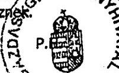

---

### Gazdasági Versenyhivatal fejezet

### 9/a. sz. Tanúsítvány a V-12-025/2004. sz. jelentéshez

|  A TÁRGYI ESZKÖZÖKRE ÉS AZ IMMATERIÁLIS JAVAKRA VONATKOZÓ ADATOK |  |  |  |  |  |  |  |   |
| --- | --- | --- | --- | --- | --- | --- | --- | --- |
|  Megnevezés | Bruttó
érték
nyitó | Összes
növekedés | Összes
csökkenés | Bruttó
érték
záró | Érték
csökk.
záró | Nettó
érték | Nettó ért záró
bruttó ért. %
ában | Teljesen
(0-ra) leírt
állóeszk.  |
|  2000. év |  |  |  |  |  |  |  |   |
|  Immateriális javak | 16 670 | 10 836 | 3 832 | 23 674 | 15 053 | 8 621 | 36,4 | 4 377  |
|  Ingatlanok | 6 732 |  |  | 6 732 | 4 982 | 1 750 | 26,0 |   |
|  Gépek, berendezések, felsz. | 76 185 | 47 175 | 20 541 | 102 819 | 61 966 | 40 853 | 39,7 | 28 515  |
|  Járművek | 24 739 | 7 011 | 3 443 | 28 307 | 13 723 | 14 584 | 51,5 | 5 930  |
|  Üzemeltetésre, kezelésre átvett, átadott |  |  |  |  |  |  |  |   |
|  Összesen | 124 326 | 65 022 | 27 816 | 161 532 | 95 724 | 65 808 | 153,7 | 38 822  |
|  2001. év |  |  |  |  |  |  |  |   |
|  Immateriális javak | 23 674 | 5 141 |  | 28 815 | 20 639 | 8 176 | 28,4 | 8 970  |
|  Ingatlanok | 6 732 | 3 608 | 10 340 |  |  |  |  |   |
|  Gépek, berendezések, felsz. | 102 819 | 44 449 | 14 023 | 133 245 | 87 805 | 45 440 | 34,1 | 30 218  |
|  Járművek | 28 307 | 11 454 |  | 39 761 | 19 707 | 20 054 | 50,4 | 6 542  |
|  Üzemeltetésre, kezelésre átvett, átadott |  |  |  |  |  |  |  |   |
|  Összesen | 161 532 | 64 652 | 24 363 | 201 821 | 128 151 | 73 670 | 112,9 | 45 730  |
|  2002. év |  |  |  |  |  |  |  |   |
|  Immateriális javak | 28 815 | 12 204 | 4 089 | 36 930 | 24 860 | 12 070 | 32,7 | 8 983  |
|  Ingatlanok |  | 7 217 |  | 7 217 | 126 | 7 091 | 98,3 |   |
|  Gépek, berendezések, felsz. | 133 245 | 82 923 | 38 797 | 177 371 | 104 251 | 73 120 | 41,2 | 31 635  |
|  Járművek | 39 761 | 19 508 | 13 263 | 46 006 | 23 313 | 22 693 | 49,3 | 2 941  |
|  Üzemeltetésre, kezelésre átvett, átadott |  |  |  |  |  |  |  |   |
|  Összesen | 201 821 | 121 852 | 56 149 | 267 524 | 152 550 | 114 974 | 221,5 | 43 559  |

### A TÁRGYI ESZKÖZÖKRE ÉS AZ IMMATERIÁLIS JAVAKRA VONATKOZÓ ADATOK

### adatok: E Ft-ban

|  Megnevezés | Bruttó
érték
nyitó | Összes
növekedés | Összes
csökkenés | Bruttó
érték
záró | Érték
csökk.
záró | Nettó
érték | Nettó ért záró
bruttó ért. %
ában | Teljesen
(0-ra) leírt
állóeszk.  |
| --- | --- | --- | --- | --- | --- | --- | --- | --- |
|  2000. év |  |  |  |  |  |  |  |   |
|  Immateriális javak | 16 670 | 10 836 | 3 832 | 23 674 | 15 053 | 8 621 | 36,4 | 4 377  |
|  Ingatlanok | 6 732 |  |  | 6 732 | 4 982 | 1 750 | 26,0 |   |
|  Gépek, berendezések, felsz. | 76 185 | 47 175 | 20 541 | 102 819 | 61 966 | 40 853 | 39,7 | 28 515  |
|  Járművek | 24 739 | 7 011 | 3 443 | 28 307 | 13 723 | 14 584 | 51,5 | 5 930  |
|  Üzemeltetésre, kezelésre átvett, átadott |  |  |  |  |  |  |  |   |
|  Összesen | 124 326 | 65 022 | 27 816 | 161 532 | 95 724 | 65 808 | 153,7 | 38 822  |
|  2001. év |  |  |  |  |  |  |  |   |
|  Immateriális javak | 23 674 | 5 141 |  | 28 815 | 20 639 | 8 176 | 28,4 | 8 970  |
|  Ingatlanok | 6 732 | 3 608 | 10 340 |  |  |  |  |   |
|  Gépek, berendezések, felsz. | 102 819 | 44 449 | 14 023 | 133 245 | 87 805 | 45 440 | 34,1 | 30 218  |
|  Járművek | 28 307 | 11 454 |  | 39 761 | 19 707 | 20 054 | 50,4 | 6 542  |
|  Üzemeltetésre, kezelésre átvett, átadott |  |  |  |  |  |  |  |   |
|  Összesen | 161 532 | 64 652 | 24 363 | 201 821 | 128 151 | 73 670 | 112,9 | 45 730  |
|  2002. év |  |  |  |  |  |  |  |   |
|  Immateriális javak | 28 815 | 12 204 | 4 089 | 36 930 | 24 860 | 12 070 | 32,7 | 8 983  |
|  Ingatlanok |  | 7 217 |  | 7 217 | 126 | 7 091 | 98,3 |   |
|  Gépek, berendezések, felsz. | 133 245 | 82 923 | 38 797 | 177 371 | 104 251 | 73 120 | 41,2 | 31 635  |
|  Járművek | 39 761 | 19 508 | 13 263 | 46 006 | 23 313 | 22 693 | 49,3 | 2 941  |
|  Üzemeltetésre, kezelésre átvett, átadott |  |  |  |  |  |  |  |   |
|  Összesen | 161 532 | 64 652 | 24 363 | 201 821 | 128 151 | 73 670 | 112,9 | 45 730  |

### A TÁRGYI ESZKÖZÖKRE ÉS AZ IMMATERIÁLIS JAVAKRA VONATKOZÓ ADATOK

### adatok: E Ft-ban

|  Megnevezés | Bruttó
érték
nyitó | Összes
növekedés | Összes
csökkenés | Bruttó
érték
záró | Érték
csökk.
záró | Nettó
érték | Nettó ért záró
bruttó ért. %
ában | Teljesen
(0-ra) leírt
állóeszk.  |
| --- | --- | --- | --- | --- | --- | --- | --- | --- |
|  2001. év |  |  |  |  |  |  |  |   |
|  Immateriális javak | 28 815 | 12 204 | 4 089 | 36 930 | 24 860 | 12 070 | 32,7 | 8 983  |
|  Ingatlanok |  | 7 217 |  | 7 217 | 126 | 7 091 | 98,3 |   |
|  Gépek, berendezések, felsz. | 133 245 | 82 923 | 38 797 | 177 371 | 104 251 | 73 120 | 41,2 | 31 635  |
|  Járművek | 39 761 | 19 508 | 13 263 | 46 006 | 23 313 | 22 693 | 49,3 | 2 941  |
|  Üzemeltetésre, kezelésre átvett, átadott |  |  |  |  |  |  |  |   |
|  Összesen | 161 532 | 64 652 | 24 363 | 201 821 | 128 151 | 73 670 | 112,9 | 45 730  |

### adatok: E Ft-ban

|  Megnevezés | Bruttó
érték
nyitó | Összes
növekedés | Összes
csökkenés | Bruttó
érték
záró | Érték
csökk.
záró | Nettó
érték | Nettó ért záró
bruttó ért. %
ában | Teljesen
(0-ra) leírt
állóeszk.  |
| --- | --- | --- | --- | --- | --- | --- | --- | --- |
|  2001. év |  |  |  |  |  |  |  |   |
|  Immateriális javak | 28 815 | 12 204 | 4 089 | 36 930 | 24 860 | 12 070 | 32,7 | 8 983  |
|  Ingatlanok |  | 7 217 |  | 7 217 | 126 | 7 091 | 98,3 |   |
|  Gépek, berendezések, felsz. | 133 245 | 82 923 | 38 797 | 177 371 | 104 251 | 73 120 | 41,2 | 31 635  |
|  Járművek | 39 761 | 19 508 | 13 263 | 46 006 | 23 313 | 22 693 | 49,3 | 2 941  |
|  Üzemeltetésre, kezelésre átvett, átadott |  |  |  |  |  |  |  |   |
|  Összesen | 161 532 | 64 652 | 24 363 | 201 821 | 128 151 | 73 670 | 112,9 | 45 730  |

### A TÁRGYI ESZKÖZÖKRE ÉS AZ IMMATERIÁLIS JAVAKRA VONATKOZÓ ADATOK

### adatok: E Ft-ban

|  Megnevezés | Bruttó
érték
nyitó | Összes
növekedés | Összes
csökkenés | Bruttó
érték
záró | Érték
csökk.
záró | Nettó
érték | Nettó ért záró
bruttó ért. %
ában | Teljesen
(0-ra) leírt
állóeszk.  |
| --- | --- | --- | --- | --- | --- | --- | --- | --- |
|  2002. év |  |  |  |  |  |  |  |   |
|  Immateriális javak | 28 815 | 12 204 | 4 089 | 36 930 | 24 860 | 12 070 | 32,7 | 8 983  |
|  Ingatlanok |  | 7 217 |  | 7 217 | 126 | 7 091 | 98,3 |   |
|  Gépek, berendezések, felsz. | 133 245 | 82 923 | 38 797 | 177 371 | 104 251 | 73 120 | 41,2 | 31 635  |
|  Járművek | 39 761 | 19 508 | 13 263 | 46 006 | 23 313 | 22 693 | 49,3 | 2 941  |
|  Üzemeltetésre, kezelésre átvett, átadott |  |  |  |  |  |  |  |   |
|  Összesen | 161 532 | 64 652 | 24 363 | 201 821 | 128 151 | 73 670 | 112,9 | 45 730  |

### adatok: E Ft-ban

|  Megnevezés | Bruttó
érték
nyitó | Összes
növekedés | Összes
csökkenés | Bruttó
érték
záró | Érték
csökk.
záró | Nettó
érték | Nettó ért záró
bruttó ért. %
ában | Teljesen
(0-ra) leírt
állóeszk.  |
| --- | --- | --- | --- | --- | --- | --- | --- | --- |
|  2002. év |  |  |  |  |  |  |  |   |
|  Immateriális javak | 28 815 | 12 204 | 4 089 | 36 930 | 24 860 | 12 070 | 32,7 | 8 983  |
|  Ingatlanok |  | 7 217 |  | 7 217 | 126 | 7 091 | 98,3 |   |
|  Gépek, berendezések, felsz. | 133 245 | 82 923 | 38 797 | 177 371 | 104 251 | 73 120 | 41,2 | 31 635  |
|  Járművek | 39 761 | 19 508 | 13 263 | 46 006 | 23 313 | 22 693 | 49,3 | 2 941  |
|  Üzemeltetésre, kezelésre átvett, átadott |  |  |  |  |  |  |  |   |
|  Összesen | 161 532 | 64 652 | 24 363 | 201 821 | 128 151 | 73 670 | 112,9 | 45 730  |

### A TÁRGYI ESZKÖZÖKRE ÉS AZ IMMATERIÁLIS JAVAKRA VONATKOZÓ ADATOK

### adatok: E Ft-ban

|  Megnevezés | Bruttó
érték
nyitó | Összes
növekedés | Összes
csökkenés | Bruttó
érték
záró | Érték
csökk.
záró | Nettó
érték | Nettó ért záró
bruttó ért. %
ában | Teljesen
(0-ra) leírt
állóeszk.  |
| --- | --- | --- | --- | --- | --- | --- | --- | --- |
|  2001. év |  |  |  |  |  |  |  |   |
|  Immateriális javak | 28 815 | 12 204 | 4 089 | 36 930 | 24 860 | 12 070 | 32,7 | 8 983  |
|  Ingatlanok |  | 7 217 |  | 7 217 | 126 | 7 091 | 98,3 |   |
|  Gépek, berendezések, felsz. | 133 245 | 82 923 | 38 797 | 177 371 | 104 251 | 73 120 | 41,2 | 31 635  |
|  Járművek | 39 761 | 19 508 | 13 263 | 46 006 | 23 313 | 22 693 | 49,3 | 2 941  |
|  Üzemeltetésre, kezelésre átvett, átadott |  |  |  |  |  |  |  |   |
|  Összesen | 161 532 | 64 652 | 24 363 | 201 821 | 128 151 | 73 670 | 112,9 | 45 730  |

### adatok: E Ft-ban

|  Megnevezés | Bruttó
érték
nyitó | Összes
növekedés | Összes
csökkenés | Bruttó
érték
záró | Érték
csökk.
záró | Nettó
érték | Nettó ért záró
bruttó ért. %
ában | Teljesen
(0-ra) leírt
állóeszk.  |
| --- | --- | --- | --- | --- | --- | --- | --- | --- |
|  2001. év |  |  |  |  |  |  |  |   |
|  Immateriális javak | 28 815 | 12 204 | 4 089 | 36 930 | 24 860 | 12 070 | 32,7 | 8 983  |
|  Ingatlanok |  | 7 217 |  | 7 217 | 126 | 7 091 | 98,3 |   |
|  Gépek, berendezések, felsz. | 133 245 | 82 923 | 38 797 | 177 371 | 104 251 | 73 120 | 41,2 | 31 635  |
|  Járművek | 39 761 | 19 508 | 13 263 | 46 006 | 23 313 | 22 693 | 49,3 | 2 941  |
|  Üzemeltetésre, kezelésre átvett, átadott |  |  |  |  |  |  |  |   |
|  Összesen | 161 532 | 64 652 | 24 363 | 201 821 | 128 151 | 73 670 | 112,9 | 45 730  |

### A TÁRGYI ESZKÖZÖKRE ÉS AZ IMMATERIÁLIS JAVAKRA VONATKOZÓ ADATOK

### adatok: E Ft-ban

|  Megnevezés | Bruttó
érték
nyitó | Összes
növekedés | Összes
csökkenés | Bruttó
érték
záró | Érték
csökk.
záró | Nettó
érték | Nettó ért záró
bruttó ért. %
ában | Teljesen
(0-ra) leírt
állóeszk.  |
| --- | --- | --- | --- | --- | --- | --- | --- | --- |
|  2002. év |  |  |  |  |  |  |  |   |
|  Immateriális javak | 28 815 | 12 204 | 4 089 | 36 930 | 24 860 | 12 070 | 32,7 | 8 983  |
|  Ingatlanok |  | 7 217 |  | 7 217 | 126 | 7 091 | 98,3 |   |
|  Járművek | 39 761 | 19 508 | 13 263 | 46 006 | 23 313 | 22 693 | 49,3 | 2 941  |
|  Üzemeltetésre, kezelésre átvett, átadott |  |  |  |  |  |  |  |   |
|  Összesen | 161 532 | 64 652 | 24 363 | 201 821 | 128 151 | 73 670 | 112,9 | 45 730  |

### adatok: E Ft-ban

|  Megnevezés | Bruttó
érték
nyitó | Összes
növekedés | Összes
csökkenés | Bruttó
érték
záró | Érték
csökk.
záró | Nettó
érték | Nettó ért záró
bruttó ért. %
ában | Teljesen
(0-ra) leírt
állóeszk.  |
| --- | --- | --- | --- | --- | --- | --- | --- | --- |
|  2002. év |  |  |  |  |  |  |  |   |
|  Immateriális javak | 28 815 | 12 204 | 4 089 | 36 930 | 24 860 | 12 070 | 32,7 | 8 983  |
|  Ingatlanok |  | 7 217 |  | 7 217 | 126 | 7 091 | 98,3 |   |
|  Járművek | 39 761 | 19 508 | 13 263 | 46 006 | 23 313 | 22 693 | 49,3 | 2 941  |
|  Üzemeltetésre, kezelésre átvett, átadott |  |  |  |  |  |  |  |   |
|  Összesen | 161 532 | 64 652 | 24 363 | 201 821 | 128 151 | 73 670 | 112,9 | 45 730  |

### a V-12-025/2004. sz. jelentéshez

### adatok: E Ft-ban

|  Megnevezés | Bruttó
érték
nyitó | Összes
növekedés | Összes
csökkenés | Bruttó
érték
záró | Érték
csökk.
záró | Nettó
érték | Nettó ért záró
bruttó ért. %
ában | Teljesen
(0-ra) leírt
állóeszk.  |
| --- | --- | --- | --- | --- | --- | --- | --- | --- |
|  2002. év |  |  |  |  |  |  |  |   |
|  Immateriális javak | 28 815 | 12 204 | 4 089 | 36 930 | 24 860 | 12 070 | 32,7 | 8 983  |
|  Ingatlanok |  | 7 217 |  | 7 217 | 126 | 7 091 | 98,3 |   |
|  Járművek | 39 761 | 19 508 | 13 263 | 46 006 | 23 313 | 22 693 | 49,3 | 2 941  |
|  Üzemeltetésre, kezelésre átvett, átadott |  |  |  |  |  |  |  |   |
|  Összesen | 161 532 | 64 652 | 24 363 | 201 821 | 128 151 | 73 670 | 112,9 | 45 730  |

### adatok: E Ft-ban

|  Megnevezés | Bruttó
érték
nyitó | Összes
növekedés | Összes
csökkenés | Bruttó
érték
záró | Érték
csökk.
záró | Nettó ért záró | Nettó ért záró | Nettó ért záró
bruttó ért. %
ában | Teljesen
(0-ra) leírt
állóeszk.  |
| --- | --- | --- | --- | --- | --- | --- | --- | --- | --- |
|  2002. év |  |  |  |  |  |  |  |  |   |
|  Immateriális javak | 28 815 | 12 204 | 4 089 | 36 930 | 24 860 | 12 070 | 32,7 | 8 983 | 36,7  |
|  Ingatlanok |  | 7 217 |  | 7 217 | 126 | 7 091 | 98,3 |  |   |
|  Járművek | 39 761 | 19 508 | 13 263 | 46 006 | 23 313 | 22 693 | 49,3 | 2 941 | 36,7  |
|  Üzemeltetésre, kezelésre átvett, átadott |  |  |  |  |  |  |  |  |   |
|  Összesen | 161 532 | 64 652 | 24 363 | 201 821 | 128 151 | 73 670 | 112,9 | 45 730 |  |   |
|  Üzemeltetésre, kezelésre átvett, átadott |  |  |  |  |  |  |  |  |   |
|  Összesen | 161 532 | 64 652 | 24 363 | 201 821 | 128 151 | 73 670 | 112,9 | 45 730 |  |   |
|  Üzemeltetésre, kezelésre átvett, átadott |  |  |  |  |  |  |  |  |   |
|  Összesen | 161 532 | 64 652 | 24 363 | 201 821 | 128 151 | 73 670 | 112,9 | 45 730 |  |   |
|  Üzemeltetésre, kezelésre átvett, átadott |  |  |  |  |  |  |  |  |   |
|  Összesen | 161 532 | 64 652 | 24 363 | 201 821 | 128 151 | 73 670 | 112,9 | 45 730 |  |   |
|  Üzemeltetésre, kezelésre átvett, átadott |  |  |  |  |  |  |  |  |   |
|  Összesen | 161 532 | 64 652 | 24 363 | 201 821 | 128 151 | 73 670 | 112,9 | 45 730 |  |   |
|  Üzemeltetésre, kezelésre átvett, átadott |  |  |  |  |  |  |  |  |   |
|  Összesen | 161 532 | 64 652 | 24 363 | 201 821 | 128 151 | 73 670 | 112,9 | 45 730 |  |   |
|  Üzemeltetésre, kezelésre átvett, átadott |  |  |  |  |  |  |  |  |   |
|  Összesen | 161 532 | 64 652 | 24 363 | 201 821 | 128 151 | 73 670 | 112,9 | 45 730 |  |   |
|  Üzemeltetésre, kezelésre átvett, átadott |  |  |  |  |  |  |  |  |   |
|  Összesen | 161 532 | 64 652 | 24 363 | 201 821 | 128 151 | 73 670 | 112,9 | 45 730 |  |   |
|  Üzemeltetésre, kezelésre átvett, átadott |  |  |  |  |  |  |  |  |   |
|  Összesen | 161 532 | 64 652 | 24 363 | 201 821 | 128 151 | 73 670 | 112,9 | 45 730 |  |   |
|  Üzemeltetésre, kezelésre átvett |  |  |  |  |  |  |  |  |   |
|  Összesen | 161 532 | 64 652 | 24 363 | 201 821 | 128 151 | 73 670 | 112,9 | 45 730 |  |   |
|  Üzemeltetésre, kezelésre átvett |  |  |  |  |  |  |  |  |   |
|  Összesen | 161 532 | 64 652 | 24 363 | 201 821 | 128 151 | 73 670 | 112,9 | 45 730 |  |   |
|  Üzemeltetésre, kezelésre átvett |  |  |  |  |  |  |  |  |   |
|  Összesen | 161 532 | 64 652 | 24 363 | 201 821 | 128 151 | 73 670 | 112,9 | 45 730 |  |   |
|  Üzemeltetésre, kezelésre átvett |  |  |  |  |  |  |  |  |   |
|  Összesen | 161 532 | 64 652 | 24 363 | 201 821 | 128 151 | 73 670 | 112,9 | 45 730 |  |   |
|  Üzemeltetésre, kezelésre átvett |  |  |  |  |  |  |  |  |   |
|  Összesen | 161 532 | 64 652 | 24 363 | 201 821 | 128 151 | 73 670 | 112,9 | 45 730 |  |   |
|  Üzemeltetésre, kezelésre átvett |  |  |  |  |  |  |  |  |  |  |  |  |  |  |  |  |  |  |  | 112,9 | 45 730 | 6 650  |
|  |  |  |  |  |  |  |  |  |  |  |  |  |  |  |  |  |  |  |  |  | 112,9 45  |
|  |  |  |  |  |  |  |  |  |  |  |  |  |  |  |  |  |  |  |  | 112,9 45  |
|  |  |  |  |  |  |  |  |  |  |  |  |  |  |  |  |  |  |  |  | 112,9 45  |
|  |  |  |  |  |  |  |  |  |  |  |  |  |  |  |  |  |  |  |  | 112,9 45  |
|  |  |  |  |  |  |  |  |  |  |  |  |  |  |  |  |  |  |  |  | 112,9 45  |
|  |  |  |  |  |  |  |  |  |  |  |  |  |  |  |  |  |  |  |  | 112,9 45  |
|  |  |  |  |  |  |  |  |  |  |  |  |  |  |  |  |  |  |  |  | 112,9 45  |
|  |  |  |  |  |  |  |  |  |  |  |  |  |  |  |  |  |  |  |  | 112,9 45  |
|  |  |  |  |  |  |  |  |  |  |  |  |  |  |  |  |  |  |  | 112,9 45  |
|  |  |  |  |  |  |  |  |  |  |  |  |  |  |  |  |  |  |  | 112,9 45  |
|  |  |  |  |  |  |  |  |  |  |  |  |  |  |  |  |  |  |  | 112,9 45  |
|  |  |  |  |  |  |  |  |  |  |  |  |  |  |  |  |  |  |  |  | 112,9 45  |
|  |  |  |  |  |  |  |  |  |  |  |  |  |  |  |  |  |  |  | 112,9 45  |
|  |  |  |  |  |  |  |  |  |  |  |  |  |  |  |  |  |  | 112,9 45  |
|  |  |  |  |  |  |  |  |  |  |  |  |  |  |  |  |  |  |  | 112,9 45  |
|  |  |  |  |  |  |  |  |  |  |  |  |  |  |  |  |  |  |  | 112,9 45  |
|  |  |  |  |  |  |  |  |  |  |  |  |  |  |  |  |  |  | 112,9 45  |
|  |  |  |  |  |  |  |  |  |  |  |  |  |  |  |  |  |  | 112,9 45  |
|  |  |  |  |  |  |  |  |  |  |  |  |  |  |  |  |  |  | 112,9 45  |
|  |  |  |  |  |  |  |  |  |  |  |  |  |  |  |  |  |  |  | 112,9 45  |
|  |  |  |  |  |  |  |  |  |  |  |  |  |  |  |  |  |  |  | 112,9 45  |
|  |  |  |  |  |  |  |  |  |  |  |  |  |  |  |  |  |  |  | 112,9 45  |
|  |  |  |  |  |  |  |  |  |  |  |  |  |  |  |  |  |  |  | 112,9 45  |
|  |  |  |  |  |  |  |  |  |  |  |  |  |  |  |  |  |  |  | 112,9 45  |
|  |  |  |  |  |  |  |  |  |  |  |  |  |  |  |  |  |  |  | 112,9 45  |
|  |  |  |  |  |  |  |  |  |  |  |  |  |  |  |  |  |  | 112,9 45  |
|  |  |  |  |  |  |  |  |  |  |  |  |  |  |  |  |  |  | 112,9 45  |
|  |  |  |  |  |  |  |  |  |  |  |  |  |  |  |  |  |  |  |  | 112,9 45  |
|  |  |  |  |  |  |  |  |  |  |  |  |  |  |  |  |  |  |  |  | 112,9 45  |
|  |  |  |  |  |  |  |  |  |  |  |  |  |  |  |  |  |  |  | 112,9 45  |
|  |  |  |  |  |  |  |  |  |  |  |  |  |  |  |  |  |  |  |  |  | 112,9 45  |
|  |  |  |  |  |  |  |  |  |  |  |  |  |  |  |  |  |  |  |  | 112,9 45  |
|  |  |  |  |  |  |  |  |  |  |  |  |  |  |  |  |  |  |  |  | 112,9 45  |
|  |  |  |  |  |  |  |  |  |  |  |  |  |  |  |  |  |  |  | 112,9 45  |
|  |  |  |  |  |  |  |  |  |  |  |  |  |  |  |  |  |  |  |  |  |  | 112,9 45  |
|  |  |  |  |  |  | 112,9 45  |
|  |  |  |  |  |  |  |  |  |  |  |  |  |  |  |  |  |  |  |  |  |  |  |  |  |  | 112,9 45  |
|  |  |  |  |  |  |  |  |  |  |  |  |  |  |  |  |  |  |  |  |  | 112,9 45  |
|  |  |  |  |  |  |  |  |  |  |  |  |  |  |  |  |  |  |  |  |  |  |  | 112,9 45  |
|  |  |  |  |  |  |  |  |  |  |  |  |  |  |  |  |  |  |  |  |  |  |  |  |  | 112,9 45  |
|  |  |  |  |  |  |  |  |  |  |  |  |  |  |  |  |  |  |  |  |  |  |  |  | 112,9 45  |
|  |  |  |  |  |  |  |  |  |  |  |  |  |  |  |  |  |  |  |  |  |  |  | 112,9 45  |
|  |  |  |  |  |  |  |  |  |  |  |  |  |  |  |  |  |  |  |  |  |  |  |  |  | 112,9 45  |
|  |  |  |  |  |  |  | 112,9 45  |
|  |  |  |  |  |  |  |  |  |  |  |  |  |  |  |  |  |  |  |  |  |  |  |  |  |  |  |  |  |  |  | 112,9 45  |
|  |  |  |  |  |  |  | 112,9 45  |
|  |  |  |  |  |  |  |  |  |  |  |  |  |  |  |  |  |  |  |  |  |  |  |  |  |  |  |  |  |  |  |  | 112,9 45  |
|  |  |  |  |  |  |  |  |  | 112,9 45  |
|  |  |  |  |  |  |  |  |  |  |  |  |  |  |  |  |  |  |  |  |  |  |  |  |  |  |  |  |  | 112,9 45  |
|  |  |  |  |  |  |  | 112,9 45  |
|  |  |  |  |  |  |  |  |  |  |  |  |  |  |  |  |  |  |  |  |  |  |  |  |  |  |  |  |  |  |  | 112,9 45  |
|  |  |  |  |  |  |  |  | 112,9 45  |
|  |  |  |  |  |  |  |  |  |  |  |  |  |  |  |  |  |  |  |  |  |  |  |  |  |  |  |  |  |  | 112,9 45  |
|  |  |  |  |  |  | 112,9 45  |
|  |  |  |  |  |  |  |  |  |  |  |  |  |  |  |  |  |  |  |  |  |  |  |  |  |  |  |  |  |  |  | 112,9 45  |
|  |  |  |  |  |  |  | 112,9 45  |
|  |  |  |  |  |  |  |  |  |  |  |  |  |  |  |  |  |  |  |  |  |  |  |  |  |  |  |  |  | 112,9 45  |
|  |  |  |  |  |  |  |  | 112,9 45  |
|  |  |  |  |  |  |  |  |  |  |  |  |  |  |  |  |  |  |  |  |  |  |  |  |  |  |  |  |  |  |  |  |  |  |  | 112,9 45  |
|  |  |  |  |  |  |  | 112,9 45  |
|  |  |  |  |  |  |  |  |  |  |  |  |  |  |  |  |  |  |  |  |  |  |  |  |  |  |  |  |  |  |  |  |  | 112,9 45  |
|  |  |  |  |  |  |  | 112,9 45  |
|  |  |  |  |  |  |  |  |  |  |  |  |  |  |  |  |  |  |  |  |  |  |  |  |  |  |  |  |  |  |  |  | 112,9 45  |
|  |  |  |  |  |  | 112,9 45  |
|  |  |  |  |  |  |  |  |  |  |  |  |  |  |  |  |  |  |  |  |  |  |  |  |  |  |  |  |  | 112,9 45  |
|  |  |  |  |  |  |  |  | 112,9 45  |
|  |  |  |  |  |  |  |  |  |  |  |  |  |  |  |  |  |  |  |  |  |  |  |  |  |  |  |  |  |  | 112,9 45  |
|  |  |  |  |  |  |  | 112,9 45  |
|  |  |  |  |  |  |  |  |  |  |  |  |  |  |  |  |  |  |  |  |  |  |  |  |  |  |  |  |  | 112,9 45  |
|  |  |  |  |  |  |  | 112,9  |  |  | 112,9 45  |
|  |  |  |  |  |  |  |  |  |  |  |  |  |  |  |  |  |  |  |  |  |  |  |  |  |  |  |  |  |  |  |  |  |  | 112,9 45  |
|  |  |  |  |  |  |  | 112,9 45  |
|  |  |  |  |  |  |  |  |  |  |  |  |  |  |  |  |  |  |  |  |  |  |  |  |  |  |  |  |  |  |  |  | 112,9 45  |
|  |  |  |  |  |  |  | 112,9 45  |
|  |  |  |  |  |  |  |  |  |  |  |  |  |  |  |  |  |  |  |  |  |  |  |  |  |  |  |  |  |  |  |  |  |  |  |  |  |  | 112,9 45  |
|  |  |  |  |  |  | 112,9  |  | 112,9  |  |  |  |  | 112,9  |  |  |  |  | 112,9  |  |  |  | 112,9  |  |  | 112,9  |  |  |  |  |  | 112,9  |  |  |  | 112,9  |  |  | 112,9  | 12,9  | 112,9  | 112,9  | 1

---

### Gazdasági Versenyhivatal

### 9/b. sz. Tanúsítvány

a V-12-025/2004. sz. jelentéshez

|  fejezet | A TÁRGYI ESZKÖZÖKRE ÉS AZ IMMATERIÁLIS JAVAKRA VONATKOZÓ ADATOK |  |  |  |  |  |  | adatok: E Ft-ban |   |
| --- | --- | --- | --- | --- | --- | --- | --- | --- | --- |
|  Megnevezés | Bruttó
érték
nyitó | Összes
növekedés | Összes
csökkenés | Bruttó
érték
záró | Érték
csökk.
záró | Nettó
érték | Nettó ért záró
bruttó ért. %
ában | Teljesen
(0-ra) leírt
állóeszk. |   |
|  2003. év |  |  |  |  |  |  |  |  |   |
|  Immateriális javak | 36 930 | 15 615 | 10 802 | 41 743 | 9 803 | 31 940 | 76,5 | 19 819 |   |
|  Ingatlanok | 7 217 |  |  | 7 217 | 269 | 6 948 | 96,3 |  |   |
|  Gépek, berendezések, felsz. | 177 371 | 35 973 | 11 043 | 202 301 | 133 358 | 68 943 | 34,1 | 60 065 |   |
|  Járművek | 46 006 | 18 706 | 2 941 | 61 771 | 31 969 | 29 802 | 48,2 |  |   |
|  Üzemeltetésre, kezelésre átvett, átadott |  |  |  |  |  |  |  |  |   |
|  Összesen | 267 524 | 70 294 | 24 786 | 313 032 | 175 399 | 137 633 | 255 | 79 884 |   |
|  2004. I. félév* |  |  |  |  |  |  |  |  |   |
|  Immateriális javak | 41 743 |  |  |  |  |  |  |  |   |
|  Ingatlanok | 7 217 |  |  |  |  |  |  |  |   |
|  Gépek, berendezések, felsz. | 202 301 |  |  |  |  |  |  |  |   |
|  Járművek | 61 771 |  |  |  |  |  |  |  |   |
|  Üzemeltetésre, kezelésre átvett, átadott |  |  |  |  |  |  |  |  |   |
|  Összesen: | 313 032 |  |  |  |  |  |  |  |   |

- pénzforgalmi adat

Tanúsítom, hogy az adatok a fejezet számviteli nyilvántartásában szereplő adatokkal megegyeznek!

Budapest, 2004. május 19.

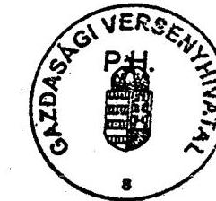

---

# A Versenytanács 2000. évi ügyzáró határozatai 

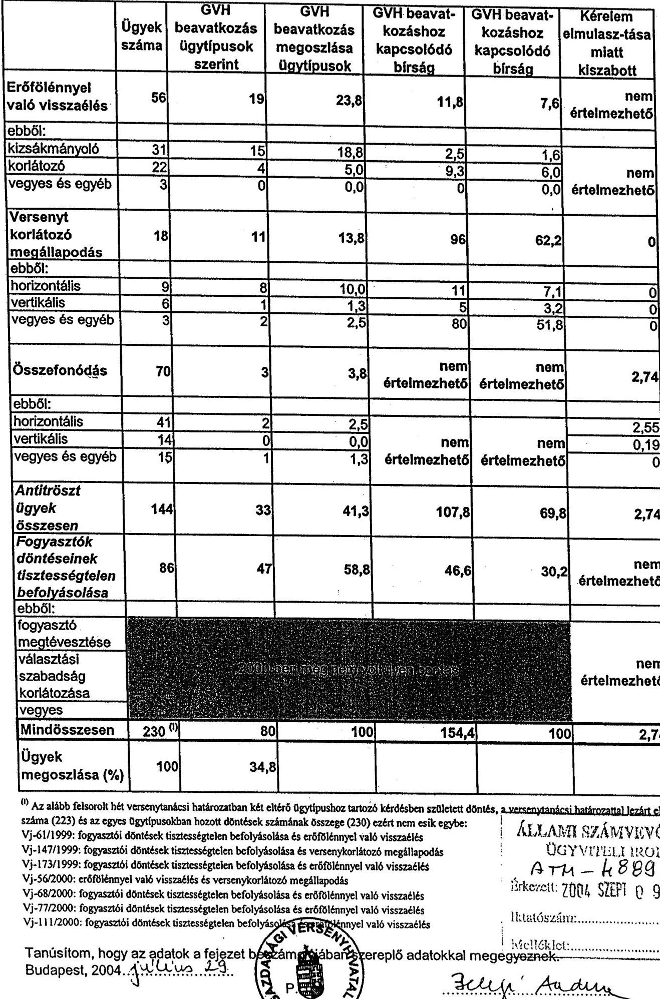

---

# Gazdasági Versenyhivatal

## fejezet

### 10. sz. Tanúsítvány

a V-12-025/2004. sz. jelentéshez

## A Versenytanács 2001. évi ügyzáró határozatai

|   | Ügyek száma | GVH beavatkozás ügytípusok szerint | GVH beavatkozás megoszlása ügytípusok szerint % | GVH beavatkozáshoz kapcsolódó bírság (MFTt) | GVH beavatkozáshoz kapcsolódó bírság megoszlása % | Kérelem elmulasz-tása miatt kiszabott bírság MFTt  |
| --- | --- | --- | --- | --- | --- | --- |
|  Erőfölénnyel való visszaélés | 33 | 3 | 8,1 | 10 | 16,8 | nem értelmezhető  |
|  ebből: |  |  |  |  |  |   |
|  kizsákmányoló | 15 | 0 | 0,0 | 0 | 0,0 |   |
|  korlátozó | 12 | 0 | 0,0 | 0 | 0,0 | nem  |
|  vegyes és egyéb | 6 | 3 | 8,1 | 10 | 16,8 |   |
|  Versenyt korlátozó megállapodás | 10 | 1 | 2,7 | 0 | 0,0 | 0  |
|  ebből: |  |  |  |  |  |   |
|  horizontális | 7 | 1 | 2,7 | 0 | 0,0 | 0  |
|  vertikális | 3 | 0 | 0,0 | 0 | 0,0 | 0  |
|  vegyes és egyéb | 0 | 0 | 0,0 | 0 | 0,0 | 0  |
|  Összefonódás | 81 | 2 | 5,4 | nem értelmezhető | nem értelmezhető | 13,9  |
|  ebből: |  |  |  |  |  |   |
|  horizontális | 44 | 1 | 2,7 |  |  | 13,9  |
|  vertikális | 11 | 0 | 0,0 |  |  | 0  |
|  vegyes és egyéb | 26 | 1 | 2,7 |  |  | 0  |
|  Antitrószt ügyek összesen | 124 | 6 | 16,2 | 10 | 16,8 | 13,9  |
|  Fogyasztók döntéseinek tisztességtelen befolyásolása | 59 | 31 | 83,8 | 49,7 | 83,2 | nem értelmezhető  |
|  ebből: |  |  |  |  |  |   |
|  fogyasztó megtévesztése | 56 | 29 | 78,4 | 39,7 | 66,5 |   |
|  választási szabadság korlátozása | 2 | 2 | 5,4 | 10 | 16,8 | nem értelmezhető  |
|  vegyes | 1 | 0 | 0,0 | 0 | 0,0 |   |
|  Mindösszesen | 183 | 37 | 100 | 59,7 | 100 | 13,9  |
|  Ügyek megoszlása (%) | 100 | 20,2 |  |  |  |   |

Tanúsítom, hogy az adatok a fejezet beszélőben szereplő adatokkal megegyeznek.

Budapest, 2004.

*Bertig Anden*

---

# A Versenytanács 2002. évi ügyzáró határozatal 

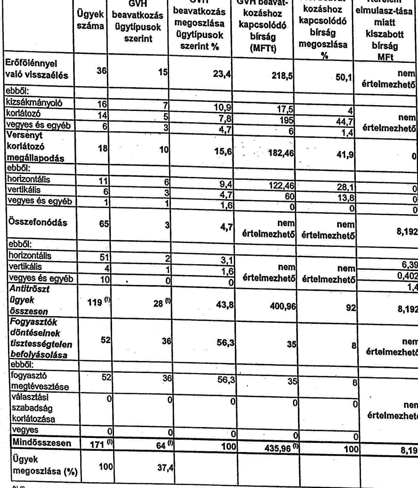
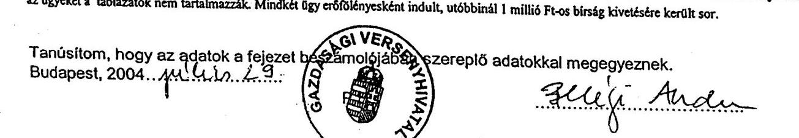

---

# A Versenytanács 2003. évi (Tpvt. szerinti) ügyzáró határozatai

|   | Ügyek
száma | GVH
beavatkozás | GVH
beavatkozás | GVH beavat-
kozáshoz | GVH beavat-
kozáshoz | Kérelem
elmulasz-tása  |
| --- | --- | --- | --- | --- | --- | --- |
|  Erőfölénnyel
való visszaélés | 31 | 8 | 13,6 | 55,5 | 7,1 | nem
értelmezhető  |
|  ebből: |  |  |  |  |  |   |
|  kizsákmányoló | 23 | 6 | 10,2 | 55,5 | 7,1 |   |
|  korlátozó | 7 | 2 | 3,4 | 0 | 0 | nem
értelmezhető  |
|  vegyes és egyéb | 1 | 0 | 0 | 0 | 0 |   |
|  Versenyt
korlátozó
megállapodás | 20 | 12 | 20,3 | 638,5 | 81,4 | 0  |
|  ebből: |  |  |  |  |  |   |
|  horizontális | 13 | 10 | 16,9 | 636,5 | 81,2 | 0  |
|  vertikális | 4 | 0 | 0 | 0 | 0 | 0  |
|  vegyes és egyéb | 3 | 2 | 3,4 | 2 | 0,2 | 0  |
|  Összefonódás | 68 | 2 | 3,4 | nem
értelmezhető | nem
értelmezhető | 8,38  |
|  ebből: |  |  |  |  |  |   |
|  horizontális | 51 | 2 | 3,4 |  |  | 7,78  |
|  vertikális | 2 | 0 | 0 |  | nem | 0,6  |
|  vegyes és egyéb | 15 | 0 | 0 |  |  | 0  |
|  Antitröszt
ügyek
összesen | 119 | 22 | 37,3 | 694 | 88,5 | 8,38  |
|  Fogyasztók
döntéselnek
tisztességtelen
befolyásolása | 52 | 37 | 62,7 | 90 | 11,5 | nem
értelmezhető  |
|  ebből: |  |  |  |  |  |   |
|  fogyasztó
megtévesztése | 47 | 35 | 59,3 | 84 | 10,7 |   |
|  választási
szabadság
korlátozása | 2 | 1 | 1,7 | 0 | 0 | nem
értelmezhető  |
|  vegyes | 3 | 1 | 1,7 | 6 | 0,8 |   |
|  Mindösszesen | 171 | 59 | 100 | 784 | 100 | 8,38  |
|  Ügyek
megoszlása (%) | 100 | 34,5 |  |  |  |   |

(a) A GVH beavatkozás ügytípusonként eltérő jellegű határozatokat jelenthet: - **Jegsértés megállapítását:** valamennyi ügytípusnál (nem vettük azonban figyelembe az összefonódás engedélyezése és a mentesítés iránti kérelem elmulasztását, amely bár jogsértés, önmegában az itt használt értellemben nem számít GVH beavatkozásnak - ez a körülmény befolyásolja a jogsértések számát és a kivetett körségösszeg megnyúgát) - **Szönetelés utáni megszüntetést:** valamennyi ügytípusnál (kivéve az összefonódásokat) - **Menteszég meg nem adását:** versenyt korlátozó megállapodások esetében - összefonódás megtiltását ill. az engedély megtagadását: összefonódások ill. megállapodások esetében - **Éthétel szabását:** versenyt korlátozó megállapodások, és összefonódások esetében - a GVH segélyainak őskéntes figyelembe vételét az összefonódások ill. megállapodások esetében

b) Három alkalommal egyszerre két ügytípusban tartozó kérdésben szülezet határozat. A Vj-022/2002-es ügyben versenytorlátozó megállapodás esetleges léte (megállapítást nyert) és az erőfölénnyel való esetleges visszaélés (nem nyert igazolást, nem történt beavatkozás) is vizsgálatra került, ezért ez az ügy mind a két ügytípusban felsorolásra került. A Vj-002/2003-as illetve a Vj-078/2003-as ügyben szintén versenytorlátozó megállapodás és erőfölénnyel való visszaélés ki nem zárhatósága kapcsán került sor a vizsgálatra, itt azonban a Versenytanács nem állapított meg jogsértést. Ezt a három ügyet tehát az erőfölényes illetve megállapodásra táblák is tartalmazzák. Ezért a Tpvt szerint hozott határozatok száma 168 és nem az ügytípusonkénti egyszerű összegként adódó 171. Ez az oka annak is, hogy az antitröszt ügyekben hozott határozatok száma valójában nem a halmozódást tartalmazó 119, hanem 116.

Tanúsítom, hogy az adatok a fejezet beavatdóában szereplő adatokkal megegyeznek. Budapest, 2004.

---

Gazdasági Versenyhivatal 11. sz. Tanúsítvány fejezet a V-12-025/2004. sz. jelentéshez

Fogyasztól döntések tisztességtelen befolyásolása 2000. év

|   | Ügyek száma | Megoszlás (%)  |
| --- | --- | --- |
|  Jogsértés megállapítása | 40 | 46,5  |
|  Szünetelés utáni megszüntetés | 7 | 8,1  |
|  GVH beavatkozás összesen | 47 | 54,7  |
|  Egyéb megszüntetés | 39 | 45,3  |
|  Egyéb | 0 | 0,0  |
|  Ügyek összesen | 86 | 100  |
|  GVH beavatkozáshoz kötődő bírság (MFI) | 46,6 |   |
|  Bírságkiszabással zárult ügyek száma | 32 |   |

Tanúsítom, hogy az adatok a fejezet beszámolójában szereplő-adatokkal megegyeznek.

Budapest, 2004. *píliu 23.*

---

Gazdasági Versenyhivatal 11. sz. Tanúsítvány fejezet a V-12-025/2004. sz. jelentéshez

Fogyasztói döntések tiszteóségtelen befolyásolása 2001. év

|   | Ügyek száma | Megoszlás (%)  |
| --- | --- | --- |
|  Jogsértés megállapítása | 25 | 41,1  |
|  Szünetelés utáni megszüntetés | 6 | 10,7  |
|  GVH beavatkozás összesen | 31 | 51,8  |
|  Egyéb megszüntetés | 28 | 48,2  |
|  Egyéb | 0 | 0,0  |
|  Ügyek összesen | 59 | 100  |
|  GVH beavatkozáshoz kötődő bírság (MFI) | 49,7 |   |
|  Bírságkiszabással zárult ügyek száma | 18 |   |

Tanúsítom, hogy az adatok a fejezet beszámolójában szereplőjükkel megegyeznek.

Budapest, 2004. *yúlina.29*

---

# Gazdasági Versenyhivatal

## 11. sz. Tanúsítvány

## 12. sz. Jelenéshez

## fejezet

## Fogyasztói döntések tisztességtelen befolyásolása 2002. év

|   | Ügyek száma | Megoszlás (%)  |
| --- | --- | --- |
|  Jogsértés megállapítása | 31 | 59,6  |
|  Szünetelés utáni megszüntetés | 5 | 9,6  |
|  GVH beavatkozás összesen | 36 | 69,2  |
|  Egyéb megszüntetés | 16 | 30,8  |
|  Egyéb | 0 | 0  |
|  Ügyek összesen | 52 | 100  |
|  GVH beavatkozáshoz kötődő bírság | 35 |   |
|  Bírságkiszabással zárult ügyek száma | 17 |   |

Tanúsítom, hogy az adatok a fejezet beszámolójában szereplő adatokkal megegyeznek.

Budapest, 2004. *Fakciós*. 29.

---

# 11. sz. Tanúsítvány

a V-12-025/2004. sz. jelentéshez

Fogyasztói döntések tisztességtelen befolyásolása 2003. év

|   | Ügyek száma | Megoszlás (%)  |
| --- | --- | --- |
|  Jogsértés megállapítása | 33 | 66  |
|  Szünetelés utáni megszüntetés | 4 | 8,5  |
|  GVH beavatkozás összesen | 37 | 74,5  |
|  Egyéb megszüntetés | 15 | 25,5  |
|  Egyéb | 0 | 0  |
|  Ügyek összesen | 52 | 100  |
|  GVH beavatkozáshoz kötődő bírság (MFI) | 90 |   |
|  Bírságkiszabással zárult ügyek száma | 23 |   |

Tanúsítom, hogy az adatok a fejezet beszámolójában szereplő adatokkal megegyeznek.

Budapest, 2004. *sétfusa* 23

---

# 12. sz. Tanúsítvány

a V-12-025/2004. sz. jelentéshez

## Erőfölénnyel való visszaélés 2000. év

|   | Kizsákmányoló | Korlátozó | Vegyes és egyéb | Összesen | Megoszlás | EK-magyar keresk. érintő ügyek száma  |
| --- | --- | --- | --- | --- | --- | --- |
|  Jogsértés megállapítása | 4 | 4 | 0 | 8 | 14,3 |   |
|  Szünetelés utáni megszüntetés | 11 | 0 | 0 | 11 | 19,6 |   |
|  GVH beavatkozás összesen | 15 | 4 | 0 | 19 | 33,9 |   |
|  Megszünetelés (szünetelés nélkül) | 16 | 18 | 3 | 37 | 66,1 |   |
|  Egyéb | 0 | 0 | 0 | 0 | 0,0 |   |
|  Ügyek összesen | 31 | 22 | 3 | 56 | 100 |   |
|  Ügyek megoszlása (%) | 55,4 | 39,3 | 5,4 | 100 |  |   |
|  EK-magyar keresk. érintő ügyek száma |  |  |  |  |  |   |
|  GVH beavatkozáshoz kötődő bírság (M Ft) | 2,5 | 9,3 | 0 | 11,8 |  |   |
|  GVH beavatkozáshoz kötődő bírság megoszlása (%) | 21,2 | 78,8 | 0,0 | 100 |  |   |
|  Eljáráshoz kötődő bírság |  |  |  |  |  |   |
|  Bírságkiszabással zárult ügyek száma | 2 | 3 | 0 | 5 |  |   |

Tanúsítom, hogy az adatok a fejezet beszámolójában szereplő adatok megegyeznek. Budapest, 2004.

---

# 12. sz. Tanúsítvány

a V-12-025/2004. sz. jelentéshez

## Erőfölénnyel való visszaélés 2001. év

|   | Kizsákmányoló | Korlátozó | Vegyes és egyéb | Összesen | Megoszlás | EK-magyar keresk. érintő ügyek száma  |
| --- | --- | --- | --- | --- | --- | --- |
|  Jogsértés megállapítása | 0 | 0 | 2 | 2 | 6,1 |   |
|  Szünetelés utáni megszüntetés | 0 | 0 | 1 | 1 | 3,0 |   |
|  GVH beavatkozás összesen | 0 | 0 | 3 | 3 | 9,1 |   |
|  Megszüntetés (szünetelés nélkül) | 15 | 12 | 3 | 30 | 90,9 |   |
|  Egyéb | 0 | 0 | 0 | 0 | 0,0 |   |
|  Ügyek összesen | 15 | 12 | 6 | 33 | 100 |   |
|  Ügyek megoszlása (%) | 45,5 | 36,4 | 18,2 | 100 |  |   |
|  EK-magyar keresk. érintő ügyek száma |  |  |  |  |  |   |
|  GVH beavatkozáshoz kötődő bírság (M Ft) | 0 | 0 | 10 | 10 |  |   |
|  GVH beavatkozáshoz kötődő bírság megoszlása (%) | 0 | 0 | 100 | 100 |  |   |
|  Eljáráshoz kötődő bírság |  |  |  |  |  |   |
|  Bírságkiszabással zárult ügyek száma | 0 | 0 | 2 | 2 |  |   |

Megjegyzés: 2001-ben még nem vizsgálta a hivatal az EK-magyar közös kereskedelem érintettségét.

Tanúsítom, hogy az adatok a fejezet beszámolójában szereplő adatokkal megegyeznek.

Budapest, 2004. *gr.2.2...*

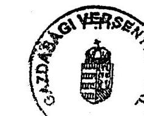

---

# 12. sz. Tanúsítvány

a V-12-025/2004. sz. jelentéshez

## Erőfölénnyel való visszaélés 2002. év

|   | Kizsákmányoló | Korlátozó | Vegyes és egyéb | Összesen | Megoszlás | EK-magyar keresk. érintő ügyek száma  |
| --- | --- | --- | --- | --- | --- | --- |
|  Jogsértés megállapítása | 4 | 5 | 3 | 12 | 33,3 | 0  |
|  Szünetelés utáni megszüntetés | 3 | 0 | 0 | 3 | 8,3 | 0  |
|  GVH beavatkozás összesen | 7 | 5 | 3 | 15 | 41,7 | 0  |
|  Megszüntetés (szünetelés nélkül) | 9 | 8 | 3 | 20 | 55,6 | 0  |
|  Egyéb | 0 | 1 | 0 | 1 | 2,8 | 0  |
|  Ügyek összesen | 16 | 14 | 6 | 36 | 100 | 0  |
|  Ügyek megoszlása (%) | 44,4 | 38,9 | 16,7 | 100 |  |   |
|  EK-magyar keresk. érintő ügyek száma | 0 | 0 | 0 | 0 |  |   |
|  GVH beavatkozáshoz kötődő bírság (M Ft) | 17,5 | 195 | 6 | 218,5 |  |   |
|  GVH beavatkozáshoz kötődő bírság megoszlása (%) | 8 | 89,2 | 2,7 | 100 |  |   |
|  Eljáráshoz kötődő bírság |  |  |  |  |  |   |
|  Bírságkiszabással zárult ügyek száma | 4 | 5 | 2 | 11 |  |   |

Tanúsítom, hogy az adatok a fejezet beszámolójában szereplő adatokkal megegyeznek.

Budapest, 2004.

---

# 12. sz. Tanúsítvány

a V-12-025/2004. sz. jelentéshez

## Erőfölénnyel való visszaélés 2003. év

|   | Kizsákmányoló | Korlátozó | Vegyes és egyéb | Összesen | Megoszlás | EK-magyar keresk. érintő ügyek száma  |
| --- | --- | --- | --- | --- | --- | --- |
|  Jogsértés megállapítása | 5 | 2 | 0 | 7 | 22,6 | 0  |
|  Szünetelés utáni megszüntetés | 1 | 0 | 0 | 1 | 3,2 | 0  |
|  GVH beavatkozás összesen | 6 | 2 | 0 | 8 | 25,8 | 0  |
|  Megszünetelés (szünetelés nélkül) | 17 | 5 | 1 | 23 | 74,2 | 0  |
|  Egyéb | 0 | 0 | 0 | 0 | 0 | 0  |
|  Ügyek összesen | 23 | 7 | 1 | 31 | 100 | 0  |
|  Ügyek megoszlása (%) | 74,2 | 22,6 | 3,2 | 100 |  |   |
|  EK-magyar keresk. érintő ügyek száma | 0 | 0 | 0 | 0 |  |   |
|  GVH beavatkozáshoz kötődő bírság (M Ft) | 55,5 | 0 | 0 | 55,5 |  |   |
|  GVH beavatkozáshoz kötődő bírság megoszlása (%) | 100 | 0 | 0 | 100 |  |   |
|  Eljáráshoz kötődő bírság | 1 | 1 | 1 | 1 |  |   |
|  Bírságkiszabással zárult ügyek száma | 4 | 0 | 0 | 4 |  |   |

Tanúsítom, hogy az adatok a fejezet beszámolójában szereplő adatok megegyeznek.

Budapest, 2004.

---

# Gazdasági Versenyhivatal 

## 13. sz. Tanúsítvánv

## fejezet

a V-12-025/2004. sz. jelentéshez

## Versenykorlátozó megállapodások 2000. ev

|  | Horizon- <br> tális | Vertikális | Vegyes | Összesen | Megosz-lás <br> (\%) | Hivatalból <br> indult | Hivatalból <br> indult <br> megosz-lás <br> (\%) | EK-magyar <br> keresk. <br> érintő <br> ügyek <br> száma |
| :--: | :--: | :--: | :--: | :--: | :--: | :--: | :--: | :--: |
|  | 1 | 1 | 1 | 3 | 16,7 | 3 | 25,0 | - |
| Szünetelés utáni <br> megszüntetés | 6 | 0 | 0 | 6 | 33,3 | 6 | 50,0 | - |
| Egyedi mentesitési <br> felületi | 1 | 0 | 1 | 2 | 11,1 | 0 | 0,0 | - |
| GVH aggályainak <br> önkéntes figyelembe <br> vétele | 0 | 0 | 0 | 0 | 0 | 0 | 0,0 | - |
| GVH beavatkozás <br> összesen | 8 | 1 | 2 | 11 | 61,1 | 9 | 75,0 | - |
| Egyedi mentesités | 1 | 0 | 0 | 1 | 5,6 | 0 | 0,0 | - |
| Csoportmentesség <br> megállapítása | 0 | 0 | 0 | 0 | 0 | 0 | 0,0 | - |
| Nem esik tilalom alá | 0 | 3 | 1 | 4 | 22,2 | 2 | 16,7 | - |
| Nem versenykorlátozó <br> megállapodás | 0 | 1 | 0 | 1 | 5,6 | 1 | 8,3 | - |
| Egyéb megszünletés | 0 | 1 | 0 | 1 | 5,6 | 0 | 0,0 | - |
| Ügyek összesen | 9 | 6 | 3 | 18 | 100 | 12 | 100 | - |
| Megosztás (\%) | 50 | 33,3 | 16,7 | 100 |  |  |  |  |
| Mentesités kérésének <br> elmulasztása | 0 | 0 | 0 | 0 |  |  |  |  |
| Csoportmentesség <br> megvonása | 0 | 0 | 0 | 0 |  |  |  |  |
| Hivatalból indult | 7 | 4 | 1 | 12 |  |  |  |  |
| Hivatalból indult ügyek <br> megosztása (\%) | 58,3 | 33,3 | 8,3 | 100 |  |  |  |  |
| EK-magyar keresk. <br> érintő ügyek száma | - | - | - | - |  |  |  |  |
| GVH beavatkozáshoz <br> kötődő bírság (M Ft) | 11 | 5 | 80 | 96 |  |  |  |  |
| GVH beavatkozáshoz <br> kötődő bírság <br> megosztása (\%) | 11,5 | 5,2 | 83,3 | 100 |  |  |  |  |
| GVH beav. köt. <br> bírságkiszabással zárult <br> ügyek | 1 | 1 | 1 | 3 |  |  |  |  |
| A mentesités iránti <br> kérelem elmulasztása <br> miatt kiszabott bírság (M <br> Ft) | 0 | 0 | 0 | 0 |  |  |  |  |
| Ment. elm. miatt kiszab. <br> bírságos ügyek száma | 0 | 0 | 0 | 0 |  |  |  |  |
| Bírságkiszabással zárult <br> ügyek | 1 | 1 | 1 | 3 |  |  |  |  |

Tanúsítom, hogy az adatok a fejezet beszámbölésen szereplő adatokkal megegyeznek.
Budapest, 2004.

---

# Gazdasági Versenyhivatal 

## 13. sz. Tanúsítvánv

## fejezet

a V-12-025/2004. sz. jelentéshez

## Versenykorlátozó megállapodások 2001. év

|  | Horizon- <br> tális | Vertikális | Vegyes | Összesen | Megosz-lás <br> (\%) | Hivatalból <br> Indult | Hivatalból <br> Indult <br> megosz-lás <br> (\%) | EK-magyar <br> keresk. <br> érintő <br> ügyek <br> száma |
| :--: | :--: | :--: | :--: | :--: | :--: | :--: | :--: | :--: |
| Jogszerűtlen <br> megállapodás | 0 | 0 | 0 | 0 | 0,0 | 0 | 0,0 | - |
| Szünetelés utáni <br> megszüntetés | 0 | 0 | 0 | 0 | 0,0 | 0 | 0,0 | - |
| Egyedi mentesítési <br> feltétel | 1 | 0 | 0 | 1 | 10,0 | 0 | 0,0 | - |
| GVH aggályainak <br> önkéntes figyelembe <br> vétele | 0 | 0 | 0 | 0 | 0,0 | 0 | 0,0 | - |
| GVH beavatkozás <br> összesen | 1 | 0 | 0 | 1 | 10,0 | 0 | 0,0 | - |
| Egyedi mentesités | 3 | 1 | 0 | 4 | 40,0 | 0 | 0,0 | - |
| Csoportmentesség <br> megállapítása | 0 | 0 | 0 | 0 | 0,0 | 0 | 0,0 | - |
| Nem esik tilalom alá | 3 | 1 | 0 | 4 | 40,0 | 3 | 75,0 | - |
| Nem versenykorlátozó <br> megállapodás | 0 | 1 | 0 | 1 | 10,0 | 1 | 25,0 | - |
| Egyéb megszüntetés | 0 | 0 | 0 | 0 | 0,0 | 0 | 0,0 | - |
| Ügyek összesen | 7 | 3 | 0 | 10 | 100 | 4 | 100 | - |
| Megoszlás (\%) | 70 | 30 | 0 | 100 |  |  |  |  |
| Mentesítés kérésének <br> elmulasztása | 0 | 0 | 0 | 0 |  |  |  |  |
| Csoportmentesség <br> megvordása | 0 | 0 | 0 | 0 |  |  |  |  |
| Hivatalból indult | 2 | 2 | 0 | 4 |  |  |  |  |
| Hivatalból indult ügyek <br> megoszlása (\%) | 50,0 | 50,0 | 0,0 | 100 |  |  |  |  |
| EK-magyar keresk. <br> érintő ügyek száma |  |  |  |  |  |  |  |  |
| GVH beavatkozáshoz <br> kötőóó birság (M Ft) | 0 | 0 | 0 | 0 |  |  |  |  |
| GVH beavatkozáshoz <br> kötődő birság <br> megoszlása (\%) | 0,0 | 0,0 | 0,0 | 0 |  |  |  |  |
| GVH beav. köt. <br> birságkiszabással zárult <br> ügyek | 0 | 0 | 0 | 0 |  |  |  |  |
| A mentesítés iránti <br> kérelem elmulasztása <br> miatt kiszabott birság (M <br> Ft) | 0 | 0 | 0 | 0 |  |  |  |  |
| Ment. elm. miatt kiszab. <br> birságos ügyek száma | 0 | 0 | 0 | 0 |  |  |  |  |
| Birságkiszabással zárult <br> ügyek | 0 | 0 | 0 | 0 |  |  |  |  |

Tanúsítom, hogy az adatok a fejezet beszámolójában szereplő adatokkal megegyeznek.
Budapest, 2004.

---

# Gazdasági Versenyhivatal

## 13. sz. Tanúsítvánv

### fejezet a V-12-025/2004. sz. jelentéshez

### Versenykorlátozó megállapodások 2002. év

|   | Horizontális | Vertikális | Vegyes | Összesen | Megoszlás (%) | Hivatalból indult | Hivatalból indult megoszlás (%) | EK-magyar keresk. érintő ügyek száma  |
| --- | --- | --- | --- | --- | --- | --- | --- | --- |
|  Jogszerűtlen megállapodás | 5 | 2 | 0 | 7 | 38,9 | 7 | 53,8 | 0  |
|  Szünetelés utáni megszüntetés | 1 | 0 | 0 | 1 | 5,6 | 1 | 7,7 | 0  |
|  Egyedi mentesítési feltétel | 0 | 1 | 1 | 2 | 11,1 | 1 | 7,7 | 0  |
|  GVH aggályainak önkéntes figyelembe vétele | 0 | 0 | 0 | 0 | 0 | 0 | 0 | 0  |
|  GVH beavatkozás összesen | 6 | 3 | 1 | 10 | 55,6 | 9 | 69,2 | 0  |
|  Egyedi mentesítés | 1 | 0 | 0 | 1 | 5,6 | 0 | 0 | 0  |
|  Csoportmentesség megállapítása | 1 | 1 | 0 | 2 | 11,1 | 0 | 0 | 0  |
|  Nem esik tilalom alá | 1 | 0 | 0 | 1 | 5,6 | 0 | 0 | 0  |
|  Nem versenykorlátozó megállapodás | 2 | 2 | 0 | 4 | 22,2 | 4 | 30,8 | 0  |
|  Egyéb megszüntetés | 0 | 0 | 0 | 0 | 0 | 0 | 0 | 0  |
|  Ügyek összesen | 11 | 6 | 1 | 18 | 100 | 13 | 100 | 0  |
|  Megoszlás (%) | 61,1 | 33,3 | 5,6 | 100 |  |  |  |   |
|  Mentesítés kérésének elmulasztása | 0 | 0 | 0 | 0 |  |  |  |   |
|  Csoportmentesség megvonása | 0 | 0 | 0 | 0 |  |  |  |   |
|  Hivatalból indult | 8 | 5 | 0 | 13 |  |  |  |   |
|  Hivatalból indult ügyek megoszlása (%) | 61,5 | 38,5 | 0 | 100 |  |  |  |   |
|  EK-magyar keresk. érintő ügyek száma | 0 | 0 | 0 | 0 |  |  |  |   |
|  GVH beavatkozáshoz kötődő bírság (M Ft) | 122,46 | 60 | 0 | 182,46 |  |  |  |   |
|  GVH beavatkozáshoz kötődő bírság megosztása (%) | 67,1 | 32,9 | 0 | 100 |  |  |  |   |
|  GVH beav. köt. bírságkiszabással zárult ügyek | 2 | 1 | 0 | 3 |  |  |  |   |
|  A mentesítés iránti kérelem elmulasztása miatt kiszabott bírság (M Ft) | 0 | 0 | 0 | 0 |  |  |  |   |
|  Ment. elm. miatt kiszab. bírságos ügyek száma | 0 | 0 | 0 | 0 |  |  |  |   |
|  Bírságkiszabással zárult ügyek | 2 | 1 | 0 | 3 |  |  |  |   |

Tanúsítom, hogy az adatok a fejezet beszédlegesen szereplő adatokkal megegyeznek.

Budapest, 2004.

---

# Gazdasági Versenyhivatal 

## 13. sz. Tanúsitvánv

## 13. sz. Tanúsitvánv

A V-12-025/2004. sz. jelentéshez

## Versenykorlátozó megállapodások 2003. 8v

|  | Horizontális | Vertikális | Vegyes | Összesen | Megosz-lás <br> (\%) | Hivatalból Indult | Hivatalból Indult megosz-lás <br> (\%) | EK-magyar keresk. érintő ügyek száma |
| :--: | :--: | :--: | :--: | :--: | :--: | :--: | :--: | :--: |
| Jogszerűtlen megállapodás | 10 | 0 | 2 | 12 | 60 | 10 | 71,4 | 0 |
| Szünetelés utáni megszüntetés | 0 | 0 | 0 | 0 | 0 | 0 | 0 | 0 |
| Egyedi mentesitési feltétel | 0 | 0 | 0 | 0 | 0 | 0 | 0 | 0 |
| GVH aggályainak önkéntes figyelembe vétele | 0 | 0 | 0 | 0 | 0 | 0 | 0 | 0 |
| GVH beavatkozás összesen | 10 | 0 | 2 | 12 | 60 | 10 | 71,4 | 0 |
| Egyedi mentesités | 0 | 1 | 0 | 1 | 5 | 0 | 0 | 0 |
| Csoportmentesség megállapítása | 0 | 0 | 0 | 0 | 0 | 0 | 0 | 0 |
| Nem esik tilalom alá | 2 | 2 | 0 | 4 | 20 | 2 | 14,3 | 0 |
| Nem versenykorlátozó megállapodás | 1 | 1 | 1 | 3 | 15 | 2 | 14,3 | 0 |
| Egyéb megszüntetés | 0 | 0 | 0 | 0 | 0 | 0 | 0 | 0 |
| Ügyek összesen | 13 | 4 | 3 | 20 | 100 | 14 | 100 | 0 |
| Megoszlás (\%) | 65 | 20 | 15 | 100 |  |  |  |  |
| Mentesítés kérésének elmulasztása | 0 | 0 | 0 | 0 |  |  |  |  |
| Csoportmentesség megvonása | 0 | 0 | 0 | 0 |  |  |  |  |
| Hivatalból indult | 8 | 3 | 3 | 14 |  |  |  |  |
| Hivatalból indult ügyek megoszlása (\%) | 57,1 | 21,4 | 21,4 | 100 |  |  |  |  |
| EK-magyar keresk. érintő ügyek száma | 0 | 0 | 0 | 0 |  |  |  |  |
| GVH beavatkozáshoz kötődő birság (M FI) | 636,5 | 0 | 2 | 638,5 |  |  |  |  |
| GVH beavatkozáshoz kötődő birság megoszlása (\%) | 99,7 | 0 | 0,3 | 100 |  |  |  |  |
| GVH beav. köt. birságkiszabással zárult ügyek | 7 | 0 | 2 | 9 |  |  |  |  |
| A mentesítés iránti kérelem elmulasztása miatt kiszabott birság (M FI) | 0 | 0 | 0 | 0 |  |  |  |  |
| Ment. elm. miatt kiszab. birságos ügyek száma | 0 | 0 | 0 | 0 |  |  |  |  |
| Birságkiszabással zárult ügyek | 7 | 0 | 2 | 9 |  |  |  |  |

Tanúsítom, hogy az adatok a fejezet beszántáthatjan szereplő adatokkal megegyeznek. Budapest, 2004.

---

# 14. sz. Tanúsítvány 

a V-12-025/2004. sz. jelentéshez

## Összefonódások 2000. év

|  | Horizon- <br> tális | Vertikális | Vegyes és egyéb | Össze- <br> sen | Megosz- <br> lás (\%) | Hivatal- <br> ból indult | Hivatal- <br> ból indult <br> megosz- <br> lás (\%) |
| :--: | :--: | :--: | :--: | :--: | :--: | :--: | :--: |
| Elutasítás-titás | 1 | 0 | 0 | 1 | 1,4 | 0 | 0,0 |
| Engedélyezés feltétellel | 1 | 0 | 1 | 2 | 2,9 | 0 | 0,0 |
| GVH aggályainak önkéntes figyelembe vétele | 0 | 0 | 0 | 0 | 0,0 | 0 | 0,0 |
| GVH beavatkozás összezen | 2 | 0 | 1 | 3 | 4,3 | 0 | 0,0 |
| Egyéb elutasítás | 0 | 0 | 0 | 0 | 0,0 | 0 | 0,0 |
| Engedélyezés | 37 | 11 | 10 | 58 | 82,9 | 0 | 0,0 |
| Nem engedélyköteles / nem összefonódás | 2 | 3 | 4 | 9 | 12,9 | 3 | 100,0 |
| Egyéb megszüntető | 0 | 0 | 0 | 0 | 0,0 | 0 | 0,0 |
| Ügyek összesen | 41 | 14 | 15 | 70 | 100 | 3 | 100 |
| I. fázisban meghozott határozat | 2000. fázisban meghozott határozat |  |  |  |  |  |  |
| II. fázisban meghozott határozat |  |  |  |  |  |  |  |
| Megoszlás (\%) | 58,6 | 20 | 21,4 | 100 |  |  |  |
| Kérelem elmulasztása | 9 | 1 | 2 | 12 |  |  |  |
| Hivatalból indult | 1 | 0 | 2 | 3 |  |  |  |
| Hivatalból indult ügyek megoszlása (\%) | 33,3 | 0,0 | 66,7 | 100 |  |  |  |
| Engedélykérés elmulasztása miatt kiszabott bírság (M Ft) | 2,55 | 0,19 | 0 | 2,74 |  |  |  |
| Engedélykérés elmulasztása miatt kiszabott bírság megoszlása (\%) | 93,1 | 6,9 | 0,0 | 100 |  |  |  |

Tanúsítom, hogy az adatok a fejezet beszámolójában az 8. adatokkal megegyeznek.
Budapest, 2004.

---

# 14. sz. Tanúsítvánv 

a V-12-025/2004. sz. jelentéshez

## Összefonódások 2001. év

|  | Horizon- <br> tális | Vertikális | Vegyes és egyéb | Össze- <br> sen | Megosz- <br> lás (\%) | Hivatal- <br> ból Indult | Hivatal- <br> ból Indult megosz- <br> lás (\%) |
| :--: | :--: | :--: | :--: | :--: | :--: | :--: | :--: |
| Elutasítás-tiltás | 0 | 0 | 0 | 0 | 0,0 | 0 | 0 |
| Engedélyezés feltétellel | 1 | 0 | 1 | 2 | 2,5 | 0 | 0 |
| GVH aggályainak önkéntes figyelembe vétele | 0 | 0 | 0 | 0 | 0,0 | 0 | 0 |
| GVH beavatkozás összesen | 1 | 0 | 1 | 2 | 2,5 | 0 | 0 |
| Egyéb elutasítás | 0 | 0 | 0 | 0 | 0,0 | 0 | 0 |
| Engedélyezés | 40 | 10 | 23 | 73 | 90,1 | 4 | 80 |
| Nem engedélyköteles / nem összefonódás | 2 | 0 | 2 | 4 | 4,9 | 1 | 20 |
| Egyéb megszüntető | 1 | 1 | 0 | 2 | 2,5 | 0 | 0 |
| Ügyek összesen | 44 | 11 | 26 | 81 | 100 | 5 | 100 |
| I. fázisban meghozott határozat | 14 | 5 | 11 | 30 |  |  |  |
| II. fázisban meghozott határozat | 3 | 2 | 3 | 8 |  |  |  |
| Megoszlás (\%) | 54,3 | 13,6 | 32,1 | 100 |  |  |  |
| Kérelem elmulasztása | 4 | 0 | 2 | 6 |  |  |  |
| Hivatalból indult | 2 | 0 | 3 | 5 |  |  |  |
| Hivatalból indult ügyek megoszlása (\%) | 40 | 0 | 60 | 100 |  |  |  |
| Engedélykérés elmulasztása miatt kiszabott birság (M Ft) | 13,9 | 0 | 0 | 13,9 |  |  |  |
| Engedélykérés elmulasztása miatt kiszabott bírság megoszlása (\%) | 100 | 0 | 0 | 100 |  |  |  |

Tanúsítom, hogy az adatok a fejezet beszámolójában szefonó adatokkal megegyeznek. Budapest, 2004.

---

# 14. sz. Tanúsítvánv 

## Összefonódások 2002. év

|  | Horizon- <br> tális | Vertikális | Vegyes és egyéb | Össze- <br> sen | Megosz- <br> lás (\%) | Hivatal- <br> ból indult | Hivatal- <br> ból indult <br> megosz- <br> lás (\%) |
| :--: | :--: | :--: | :--: | :--: | :--: | :--: | :--: |
| Elutasítás-tiltás | 0 | 0 | 0 | 0 | 0 | 0 | 0 |
| Engedélyezés feltétellel | 2 | 1 | 0 | 3 | 4,6 | 0 | 0 |
| GVH aggályainak önkéntes figyelembe vétele | 0 | 0 | 0 | 0 | 0 | 0 | 0 |
| GVH beavatkozás összesen | 2 | 1 | 0 | 3 | 4,6 | 0 | 0 |
| Egyéb elutasítás | 1 | 0 | 0 | 1 | 1,5 | 0 | 0 |
| Engedélyezés | 44 | 3 | 9 | 56 | 86,2 | 3 | 60 |
| Nem engedélyköteles / nem összefonódás | 2 | 0 | 1 | 3 | 4,6 | 1 | 20 |
| Egyéb megszüntető | 2 | 0 | 0 | 2 | 3,1 | 1 | 20 |
| Ügyek összesen | 51 | 4 | 10 | 65 | 100 | 5 | 100 |
| I. fázisban meghozott határozat | 42 | 3 | 10 | 55 |  |  |  |
| II. fázisban meghozott határozat | 9 | 1 | 0 | 10 |  |  |  |
| Megoszlás (\%) | 78,5 | 6,2 | 15,4 | 100 |  |  |  |
| Kérelem elmulasztása | 7 | 1 | 3 | 11 |  |  |  |
| Hivatalból indult | 4 | 0 | 1 | 5 |  |  |  |
| Hivatalból indult ügyek megoszlása (\%) | 80 | 0 | 20 | 100 |  |  |  |
| Engedélykérés elmulasztása miatt kiszabott bírság (M Ft) | 6,39 | 0,402 | 1,4 | 8,192 |  |  |  |
| Engedélykérés elmulasztása miatt kiszabott bírság megoszlása (\%) | 78 | 4,9 | 17,1 | 100 |  |  |  |

Tanúsítom, hogy az adatok a fejezet beszámolójában színele adatokkal megegyeznek. Budapest, 2004.

---

# 14. sz. Tanúsítvány 

a V-12-025/2004. sz. jelentéshez

## Összefonódások 2003. év

|  | Horizon- <br> tális | Vertikális | Vegyes és egyéb | Össze- <br> sen | Megosz- <br> lás (\%) | Hivatal- <br> ból indult | Hivatal- <br> ból indult <br> megosz- <br> lás (\%) |
| :--: | :--: | :--: | :--: | :--: | :--: | :--: | :--: |
| Elutasítás-tiltás | 1 | 0 | 0 | 1 | 1,5 | 0 | 0 |
| Engedélyezés feltétellel | 1 | 0 | 0 | 1 | 1,5 | 0 | 0 |
| GVH aggályainak önkéntes figyelembe vétele | 0 | 0 | 0 | 0 | 0 | 0 | 0 |
| GVH beavatkozás összesen | 2 | 0 | 0 | 2 | 2,9 | 0 | 0 |
| Egyéb elutasítás | 0 | 0 | 0 | 0 | 0 | 0 | 0 |
| Engedélyezés | 46 | 2 | 14 | 62 | 91,2 | 0 | 0 |
| Nem engedélyköteles / nem összefonódás | 3 | 0 | 0 | 3 | 4,4 | 0 | 0 |
| Egyéb megszüntető | 0 | 0 | 1 | 1 | 1,5 | 1 | 100 |
| Ügyek összesen | 51 | 2 | 15 | 68 | 100 | 1 | 100 |
| I. fázisban meghozott határozat | 43 | 2 | 13 | 58 |  |  |  |
| II. fázisban meghozott határozat | 8 | 0 | 1 | 9 |  |  |  |
| Megoszlás (\%) | 75 | 2,9 | 22,1 | 100 |  |  |  |
| Kérelem elmulasztása | 3 | 1 | 1 | 5 |  |  |  |
| Hivatalból indult | 0 | 0 | 1 | 1 |  |  |  |
| Hivatalból indult ügyek megoszlása (\%) | 0 | 0 | 100 | 100 |  |  |  |
| Engedélykérés elmulasztása miatt kiszabott bírság (M Ft) | 7,78 | 0,6 | 0 | 8,38 |  |  |  |
| Engedélykérés elmulasztása miatt kiszabott bírság megoszlása (\%) | 92,8 | 7,2 | 0 | 100 |  |  |  |

Tanúsítom, hogy az adatok a fejezet beszámolójában szereplő adatokkal megegyeznek.
Budapest, 2004.

---

# A 2004. ÉVBEN BEFEJEZETT KARTELL ÜGYEK 

A Versenyhivatal az Országos Nyugdíjbiztosítási Főigazgatóság székházának teljes körű átalakítására, felújítására kiírt közbeszerzési eljárásával kapcsolatban gazdasági versenyt korlátozó megállapodás gyanúja miatt versenyfelügyeleti eljárást indított négy építőipari vállalkozás ellen.

A 2004. március 2-án megtartott tárgyaláson a Versenyhivatal Versenytanácsa megállapította, hogy a Baucont Rt. és az ÉPKER Kft. a végső ajánlattételt megelőzően olyan megállapodást kötöttek, amely bármelyikük nyertessé válása esetére a vesztes félnek - alvállalkozási megbízás, illetve pénzbeni kárpótlás formájában - ellentételezési kötelezettséget írt elő. A Gazdasági Versenyhivatal Versenytanácsa szerint ez a magatartás nem csupán felosztotta a piacot az érintett felek között, de jelentős mértékben csökkentette a gazdasági verseny egyik fontos elemét, a vesztés kockázatát. Magatartásuk megvalósította a versenyeztetéssel kapcsolat összejátszás tényállását.

A Versenytanács a versenyeztetés, ezen belül különösen a közbeszerzési eljárások során történt összejátszást, piacfeladó magatartást a gazdasági verseny tisztaságát súlyosan sértő cselekménynek minősítette, s ezért a Baucont Rt-t 227 millió Ft, az ÉPKER Kft-t ugyancsak 227 millió Ft, végül a KÉSZ Kft-t 136 millió Ft bírság megfizetésére kötelezte, a bírságközleményben foglaltaknak megfelelően. A Középületépítő Rt.-vel kapcsolatban megállapította, hogy nem követett el versenyjogsértést.

A Gazdasági Versenyhivatal Versenytanácsa a Kaposvári Egyetem részére épülő multifunkcionális központ építtetésének tárgyában kiírt közbeszerzési pályázattal kapcsolatban gazdasági versenyt korlátozó megállapodás miatt megbírságolta a Baucont Rt-t és a Középületépítő Rt-t.

A Versenytanács a versenyeztetés, ezen belül különösen a közbeszerzési eljárások során történő összejátszást a gazdasági verseny tisztaságát súlyosan sértő cselekménynek minősítette, ezért a Baucont Rt-t és a Középületépítő Rt-t egyaránt 149-149 millió Ft bírsággal sújtotta.

A Versenyhivatal versenyfelügyeleti eljárást indított a 4-es metró építésével kapcsolatos, a belső Bartók Béla út felújítása tárgyában kiírt közbeszerzési pályázatban résztvevő több építőipari vállalkozás ellen, a gazdasági versenyt korlátozó magatartás gyanúja miatt.

A Versenyhivatal Versenytanácsa a 2004. március 18-án megtartott tárgyaláson a Strabag Rt. valamint az EGUT Rt. és a RING Kkt magatartását a gazdasági versenyt korlátozónak és így a versenytörvénybe ütközően jogsértőnek találta. Ezért a Versenytanács a Strabag Rt-vel szemben együttesen 137 millió Ft, az EGUT Rt-vel szemben 56 millió Ft, a RING Kkt-vel szemben pedig 52 millió Ft versenyfelügyeleti bírságot szabott ki.

A Gazdasági Versenyhivatal Versenytanácsa 2004. július 22-én tartott tárgyalásán hozott határozatában megállapította, hogy a Betonút Rt., a DEBMÚT

---

Rt., az EGÚT Rt., a Hídépítő Rt. és a Strabag Rt. a versenytörvénybe ütköző megállapodást kötöttek. A határozat szerint az egyezség lényege a Nemzeti Autópálya Rt. által 2002-ben meghirdetett autópálya-építési munkák felosztása volt. Az érintettek bíróságon fellebbezhetnek.

A Gazdasági Versenyhivatal Versenytanácsa határozatában megállapította, hogy a 2002-ben kiírt közbeszerzési pályázatokon résztvevö vállalkozások előzetesen megállapodtak egymás között abban, hogy melyik cég melyik autópálya szakasz kivitelezését szerzi meg. Esetenként abban is megegyeztek, hogy a nyertesek alvállalkozóként vonják be a többieket. A kartell-megállapodásban valamennyi, a kiíró feltételei alapján szóba jöhető, jelentős vállalat részt vett. A kiszabott bírságok összege 7,043 milliárd Ft. (Betonút Rt. 2,212 milliárd Ft; DEBMÚT Rt. 496 millió Ft; EGÚT Rt. 496 millió Ft; Hídépítő Rt. 1,371 milliárd Ft; Strabag Rt. 2,468 milliárd Ft.)

A Gazdasági Versenyhivatal 2003. február 18-án Hivatalból versenyfelügyeleti eljárást indított annak megállapítására, hogy a Nemzeti Autópálya Rt. (NA) 2002. augusztusában (az M7 balatonszárszói, az M7-M70 Becsehely-Letenye, és az M3 görbeházai szakaszra) kiírt nyílt, előminősítéses közbeszerzés során az említett vállalatok összejátszottak-e. Az eljárást később kiterjesztette a 2002. júliusban kiírt, majd eredménytelennek nyilvánított ugyanezen szakaszokra vonatkozó meghívásos pályázatra is. A VT a rendelkezésére álló iratok, nyilatkozatok és egyéb bizonyítékok alapján megállapította, hogy a cégek előzetesen felosztották egymás között, hogy melyik pályázó melyik autópálya szakasz kivitelezését szerzi meg, illetve, hogy a fővállalkozó melyik vállalkozást fogja alvállalkozóként bevonni az összesen 59,91 kilométeres, bruttó 160 milliárd Ft-os építkezés során.

Az áregyeztetésben és a piacfelosztásban megnyilvánuló akarategyezség az eredménytelenné nyilvánítás után fennmaradt a megismételt pályázat során is. Az ilyen típusú kartell az uniós gyakorlat szerint is a legsúlyosabban szankcionálandó versenykorlátozások közé tartozik, mivel közvetlenül és alapvetően torzítja a források hatékony elosztását és árfelhajtó hatású.

Az összejátszás piactorzító hatása számottevő, mert abban valamennyi, a kiíró feltételei alapján szóba jöhető, jelentős vállalkozás részt vett. A nem versenykörülmények között kialakult árak több évre kiterjedően befolyásolták a magyarországi autópálya építéseket.

A Versenytanács, követve korábbi határozatait, tekintettel volt arra is, hogy a jogsértés közpénzek felhasználását érintette, így annak hatása fokozottan sértette a társadalmi érdekeket.

---

# A versenyhivatal eljárásai 

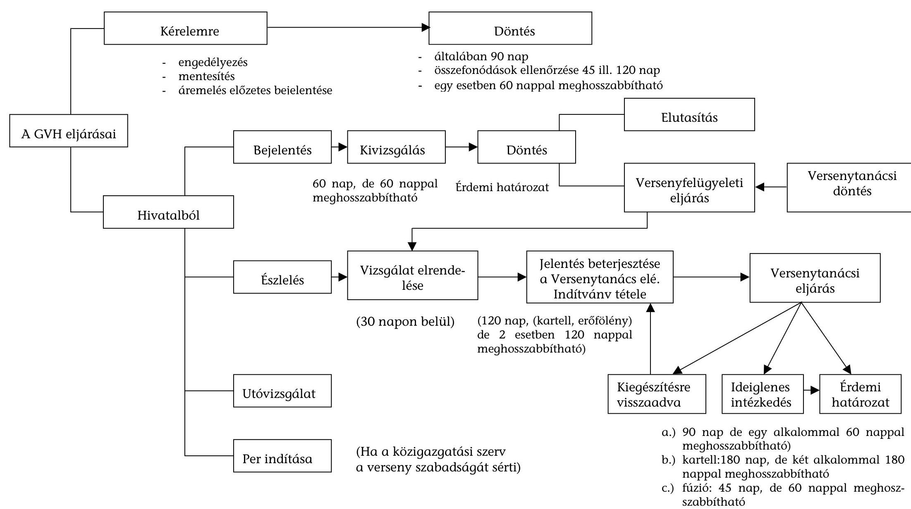