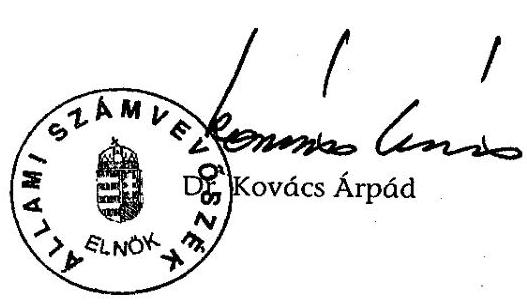
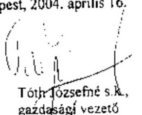
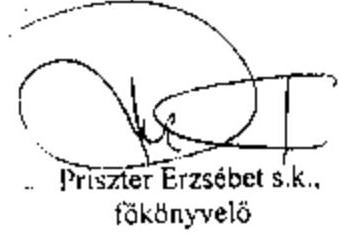

# JELENTÉS 

a FIDESZ-Magyar Polgári Szövetség 2002-2003. évi gazdálkodása törvényességének ellenőrzéséről

---

3. Önkormányzati és Területi Ellenőrzési Igazgatóság
3.1. Szabályszerüségi Ellenőrzési Főcsoport
Iktatószám: V-1014-024/2004.
Témaszám: 709
Vizsgálat-azonosító szám: V0136
Az ellenőrzést felügyelte:
Dr. Lóránt Zoltán
főigazgató
Az ellenőrzés végrehajtásáért felelős:
Dr. Elek János
általános főigazgató-helyettes
Az ellenőrzést vezette:
Horváth Balázs
osztályvezető főtanácsos
Az összefoglaló jelentést készítette:
Dr. Dotterweich Antal
tanácsadó
Az ellenőrzést végezték:
Dr. Dotterweich Antal Dr. Faragóné Tóth Mária Baracsi Szilvia tanácsadó tanácsos számvevő

# A témához kapcsolódó eddig készített számvevőszéki jelentések: 

címe
sorszáma
Jelentés a Fiatal Demokraták Szövetsége 1991. évi gazdálkodása 125
törvényességének ellenőrzéséről
Jelentés a Fiatal Demokraták Szövetsége 1992-1993. évi 236
gazdálkodása törvényességének ellenőrzéséről
Jelentés a FIDESZ-Magyar Polgári Párt 1994-1995. évi 343
gazdálkodása törvényességének ellenőrzéséről
Jelentés a FIDESZ-Magyar Polgári Párt 1996-1997. évi 9901
gazdálkodása törvényességének ellenőrzéséről
Jelentés a FIDESZ-Magyar Polgári Párt 1998-1999. évi 0103
gazdálkodása törvényességének ellenőrzéséről
Jelentés a FIDESZ-Magyar Polgári Párt 2000-2001. évi 0308
gazdálkodása törvényességének ellenőrzéséről

Jelentéseink az Országgyűlés számítógépes hálózatán és az Interneten a www.asz.hu címen is olvashatók.

---

# TARTALOMJEGYZÉK 

BEVEZETÉS ..... 5
I. ÖSSZEGZŐ MEGÁLLAPÍTÁSOK, KÖVETKEZTETÉSEK, JAVASLATOK ..... 6
II. RÉSZLETES MEGÁLLAPÍTÁSOK ..... 9

1. A Párt gazdálkodásáról szóló 2002-2003. évi beszámolók ..... 9
1.1. A teljes vizsgálati időszakra érvényes megállapítások ..... 9
1.2. A 2002. és 2003. évi beszámolók ..... 9
1.2.1. Bevételek ..... 9
1.2.2. Kiadások ..... 10
2. A Pártnak a beszámoló összeállítására és az azt alátámasztó könyvvezetésre vonatkozó belső szabályozása és gyakorlata ..... 11
2.1. A belső szabályozás rendszere ..... 11
2.2. A könyvvezetés gyakorlata, összhangja a törvényi és a belső előírásokkal ..... 12
2.3. Analitikus nyilvántartások ..... 12
2.4. A bizonylati elv és a bizonylati fegyelem érvényesülése ..... 13
3. A Párt bevételszerző gazdálkodó tevékenysége ..... 14
4. A gazdálkodással összefüggő, egyéb jogszabályokban foglalt előírások betartása ..... 14
4.1. Személyi jellegű kifizetések ..... 14
4.2. A társadalombiztosítási és egyéb jogszabályok rendelkezéseinek érvényesítése ..... 15
5. A Párt belső ellenőrzésének rendszere ..... 16
5.1. A belső ellenőrzés rendszerének szabályozottsága ..... 16
5.2. A belső ellenőrzés működése ..... 16
6. Az előző ellenőrzés megállapításaira tett intézkedések ..... 16

## MELLÉKLETEK

1. számú melléklet A Párt 2002. évi gazdálkodásáról készített beszámoló
2. számú melléklet A Párt 2003. évi gazdálkodásáról készített beszámoló

---

.

---

# RÖVIDÍTÉSEK JEGYZÉKE 

| ÁSZ | Állami Számvevőszék |
| :-- | :-- |
| KH | Központi Hivatal |
| Párt | FIDESZ-Magyar Polgári Szövetség |
| Párttörvény | A pártok múködéséről és gazdálkodásáról szóló - többször   módosított - 1989. évi XXXIII. törvény |
| Számviteli törvény | A számvitelről szóló - többször módosított - 2000. évi C.   törvény |
| Szja tv. | A személyi jövedelemadóról szóló - többször módosított -   1995. évi CXVII. törvény |
| SZB | Számvizsgáló Bizottság |

---

.

---

# JELENTÉS 

## a FIDESZ-Magyar Polgári Szövetség 2002-2003. évi gazdálkodása törvényességének ellenőrzéséről

## BEVEZETÉS

A pártok múködéséről és gazdálkodásáról szóló - többször módosított - 1989. évi XXXIII. tv. (továbbiakban: párttörvény) 10. § (1) bekezdése, valamint az Állami Számvevőszékről szóló 1989. évi XXXVIII. törvény 5. §-a és a 16. § (2) bekezdése alapján a pártok gazdálkodása törvényességének ellenőrzésére az Állami Számvevőszék (továbbiakban: ÁSZ) jogosult. Az ÁSZ 2004. évi ellenőrzési tervének megfelelően vizsgálta a FIDESZ-Magyar Polgári Szövetség (továbbiakban: Párt) 2002-2003. évi gazdálkodása törvényességét.

Az ellenőrzés célja annak megállapítása volt, hogy:

- a Párt által készített és a Magyar Közlönyben közzétett éves beszámolók a törvényi előírásoknak megfelelnek-e, a könyvvezetéssel és a valósággal megegyező adatokat tartalmaznak-e;
- a könyvvezetés és a gazdálkodás során betartották-e a számvitelről szóló többször módosított - 2000. évi C. törvény (továbbiakban: számviteli törvény) és az egyéb jogszabályi rendelkezéseket és belső előírásokat;
- a Párt a múködéséhez szabályszerűen igénybe vehető forrásokat használt-e fel, nem folytatott-e a párttörvény által tiltott gazdálkodó tevékenységet, nem fogadott-e el tiltott vagyoni hozzájárulást, illetőleg adományt.
Az ellenőrzés körülményeit illetően rögzíteni szükséges, hogy az ÁSZ évek óta folyamatosan javasolja a Kormánynak a pártok ellenőrzéseiről készített jelentéseiben a párttörvény módosítását tekintettel arra, hogy
- a párttörvény 1. sz. melléklete szerinti beszámoló-mintához magyarázatot, kitöltési útmutatót nem készítettek a jogalkotók, így ennek kitöltése pártonként - kialakított számviteli politikájuknak megfelelően - eltérő lehet;
- a beszámoló-minta a számviteli törvény rendelkezéseivel nem harmonizál, nem felel meg sem a mérleg, sem az eredmény-kimutatás követelményeinek.
Az ellenőrzés előkészítése és végrehajtása az ÁSZ elnöke 13/2003. 03. 25. sz. utasításával kiadott "Módszertan a pártok gazdálkodása törvényességének ellenőrzéséhez", valamint „Segédlet a pártok gazdálkodása törvényességének ellenőrzése tervezéséhez, előkészítéséhez, az egyedi ellenőrzési program összeállításához és a helyszíni vizsgálat lefolytatásához" előírásai alapján történt.

A helyszíni ellenőrzésre: 2004. augusztus 30-szeptember 30. között, a bérelt Budapest, Szentkirályi utca 18. szám alatti irodaházban került sor.

---

# I. ÖSSZEGZŐ MEGÁLLAPÍTÁSOK, KÖVETKEZTETÉSEK, JAVASLATOK 

A Párt az előző év gazdálkodásáról készített beszámolóit mindkét vizsgált évben, a párttörvényben előírt határidőn belül, annak 1. sz. mellékletében meghatározott formában közzétette.

A 2002. évről összeállított beszámoló a Magyar Közlöny 2003. évi április 25-i, 41. számában; a 2003. évi beszámoló a Magyar Közlöny 2004. évi április 28-i, 51. számában jelent meg. Utóbbit a párttörvény módosításának megfelelően internetes honlapján is nyilvánosságra hozta.

A Párt beszámolói elkészítése során a teljesség és következetesség elve kivételével mindkét évben érvényesítette a számviteli alapelveket.

A helytelen szabályozás és kontírozás miatt a 2002. évben 13442 ezer Ft összegű hiba keletkezett a bevételi sorok esetében. Ezek mértéke $0,8 \%$ volt a bevételi főösszegre vetítve. A Párt - a régi és nem kifogásolt gyakorlatnak megfelelően 2003. évben nem közölte az éves beszámolóban az önkormányzati ingatlanok kedvezményes bérleti díja és a piaci érték közötti különbségből adódó nem pénzbeli vagyoni hozzájárulások értékét. A bevételi főösszegből hiányzó összeg 5994 ezer Ft, a bevételi főösszegre vetítve 0,5\%. A beszámoló kiadási soraiban 2002. évben nem fordult elő hiba, a 2003. évben 600 ezer Ft összegű hiba jelentkezett. A felsorolt hibák egyik évben sem érték el a $2 \%$-os lényegességi küszöböt.

A Párt beszámolási és könyvvezetési szabályozásának rendszere 2001. január 1-jétől hatályos számviteli szabályozásokon alapult. A számviteli törvénnyel összhangban, valamint a gazdálkodás sajátosságaira figyelemmel kialakított számviteli politika és hozzákapcsolódott leltározási, értékelési, pénzügyi szabályozatok előírásai a vizsgált időszakban megfeleltek a jogszabályi követelményeknek.

A számviteli politikához rendelt számlarendben a beszámolási követelményekhez igazodva meghatározták a beszámolósorok főkönyvi számlakapcsolatait, valamint a sajátos bevételi és kiadási jogcímek fogalmi ismérveit, besorolási kritériumait.

A számlarend előírásai egy kivétellel összhangban voltak a törvényi előírásokkal. Hibásan a következőt rögzítette: „a Párt úgy döntött, hogy az alapítványi részesedését a vállalkozások alapítására fordított összeg soron mutatja ki."

A Párt a számviteli rendelkezéseken túlmenően különféle gazdasági szabályzatokat tartott hatályban. A törvényes gazdálkodás érdekében költségvetési gazdálkodási, tagdíffizetési, gépkocsi üzemeltetési és használati, valamint külföldi kiküldetési szabályzattal rendelkezett. A felsoroltak tartalmazták a szabályzat tárgyával kapcsolatos fogalmakat, feladatokat, továbbá rögzítették a feladatok végrehajtásának módszereit és dokumentációs követelményeit.

---

A könyvvezetés a vizsgált időszakban a kettős könyvvitel rendszerében központilag, az alapbizonylatok számítógépes feldolgozásával történt, mindkét vizsgált évben azonos számítógépes program alapján. A kialakított számítógépes könyvelési rendszerből minden, az ellenőrzés részére szükséges adat biztosítható volt. Az ellenőrzés kontírozási hibát - a mindkét évben véletlenszerűen kiválasztott - bevételi tételek esetében 2002-ben és 2003-ban is mindössze egy esetben tapasztalt. A kiadásokból vett mindkét évi mintában 2002. évben kontírozási hiba nem fordult elő, 2003. évben pedig egy kontírozási hiba történt.

A Párt a pénzügyi szabályzatban és a számlarendben szabályozta a főkönyvi számlákhoz kapcsolódó analitikák körét, tartalmát és vezetési rendjét. Az analitikus nyilvántartásokat teljes körűen és szabályszerűen vezették. Az analitikus nyilvántartások zárlati adatai a főkönyvi számlákkal megegyeztek.

A Párt a leltározási kötelezettségének a leltározási szabályzat előírásainak megfelelően mindkét vizsgált évben eleget tett. A leltárba bekerülő adatok valódiságáról leltározással győződtek meg, külön a központi hivatalnál, külön a megyéknél. A főkönyvi program által nyilvántartásba vett eszközöket a leltárívekkel egyeztették, eltérést nem dokumentáltak.

A bizonylati rendre és az okmányfegyelemre vonatkozó előírásokat a költségvetési és gazdálkodási szabályzat, valamint a pénzügyi szabályzat rögzíti. A kötelezettségvállalás és utalványozás rendjét a költségvetési és gazdálkodási, szabályzat tartalmazza. A jogköröket a szabályzatok előírásai szerint gyakorolták. Az ellenőrzött időszakban a Párt alapvetően betartotta a számviteli törvény bizonylati elv és bizonylati fegyelemre vonatkozó előírásait. A bizonylatok feldolgozási rendje a szabályzatok előírásainak megfelelt.

A gazdálkodó és bevételszerző tevékenységgel kapcsolatos alapvető rendelkezéseket az Országos Elnökség által elfogadott alapszabályban rögzítették. A Párt gazdálkodására vonatkozó részletes szabályokat a költségvetési és gazdálkodási szabályzat tartalmazza.

A Párt bevételei a vizsgált években a következő jogcímekből származtak: tagdíjbevételek, állami költségvetési támogatás, egyéb hozzájárulások, adományok, ingóságok értékesítése, pénzintézettől kapott kamatok. Az éves beszámolóban a belső előírásokkal összhangban az egyéb bevétel sorhoz kapcsolódóan külön is kimutatásra került az adott évben felvett hitel, kölcsön.

A Párt az ellenőrzés részére adott nyilatkozatok szerint betartotta a párttörvényben előírt gazdálkodási tilalmakat, a gazdálkodó tevékenység megfelelt a párttörvény előírásainak. Az ellenőrzés az áttekintett dokumentumok alapján ezzel ellentétes tényt nem állapított meg.

A Pártnál a személyi jellegű kifizetések szabályozottan kerültek megállapításra. A vonatkozó jogszabályoknak megfelelően a költségtérítéseket szabályosan folyósították.

A Párt, mint munkáltató eleget tett a társadalombiztosításról és az egészségügyi ellátásról szóló, valamint a személyi jövedelemadóról és az adózás rendjéről szóló törvények rendelkezéseinek. A kötelező nyilvántar-

---

tásokat vezették, az előírt adatszolgáltatásokat teljesítették, a kifizetett munkabérekből és bérjellegű jövedelmekből az adóelőlegeket és járulékokat levonták, továbbá határidőre teljesítették bevallási és befizetési kötelezettségüket. A költségvetéssel szembeni adó- és járulék befizetési hátraléka a Pártnak nem volt.

A Párt gazdálkodásának, számviteli tevékenységének belső ellenőrzési rendszerét hatályos alapdokumentumokban szabályozták.

A Számvizsgáló Bizottság ügyrendje szerint tevékenységét éves munkaterv alapján végezte. Az országos testület 2002-ben nem, csak 2003. évben készített munkatervet. E szerint közreműködtek a tagdíjszabályzat korszerűsítésében, vizsgálták a tagdíjbefizetések rendjét, figyelemmel kísérték a pénzügyi és számviteli szabályok betartását, ellenőrizték a finanszírozási szerződéseket és támogatásokat. A tisztújító kongresszusnak beszámoltak a 2001-2003 között végzett tevékenységről. E szerint a testület nem észlelt olyan szabálytalanságot, amelyek nyomán felelősségre vonást kellett volna kezdeményeznie. A munkafolyamatba épített ellenőrzés szabályszerűen működött. A költségvetési és gazdálkodási szabályzatnak megfelelően a gazdasági területeket illetően célellenőrzéseket végeztek. A vezetői ellenőrzés az utalványozáson és számla ellenőrzésen keresztül valósult meg. Rendszeresen ellenőrizték a házipénztári és a banki kifizetéseket.

Az ÁSZ 0308. sorszámú jelentésében, öt pontban sorolta fel azokat a hiányosságokat, amelyek megszüntetésére a Párt elnökét az ÁSZ elnöke felhívta. A Párt a felhívásban foglaltaknak eleget tett. Az intézkedéseket szabályszerűen dokumentálta, hiteles bizonylatokkal igazolta.

A helyszíni ellenőrzés megállapításainak hasznosítása mellett az Állami Számvevőszék elnöke felhívja

# a Párt elnökét 

Gondoskodjon a számlarend - vállalkozások alapítására fordított összegek - beszámolósorra vonatkozó előírásának a párttörvény 6. § (3) bekezdése rendelkezésével történő összhangja megteremtéséről.

Az ellenőrzési tapasztalatokra figyelemmel javasoljuk:

## a Kormánynak

Kezdeményezze a párttörvény következők szerinti módosítását:
A korábbi pártellenőrzések alapján tett jelzésekre is figyelemmel a pártok számviteli nyilvántartási és beszámolási rendszerét érintő ellentmondások feloldását, amelyek a pártok múködéséről és gazdálkodásáról szóló - többször módosított - 1989. évi XXXIII. törvény, valamint a 2001. január 1. napjától hatályos számviteli törvény között továbbra is fennállnak.

---

# II. RÉSZLETES MEGÁLLAPÍTÁSOK 

## 1. A PÁrt GAZDÁlKODÁsÁról SZÓLÓ 2002-2003. ÉVI BESZÁmolók

### 1.1. A teljes vizsgálati időszakra érvényes megállapítások

A Párt az előző évi gazdálkodásáról szóló beszámolóit mindkét évben, a törvényben előírt határidőn belül közzé tette. A 2002. évi beszámolóját 2003. április 25 -én, a Magyar Közlöny 41. számában; a 2003. évi beszámolót a Magyar Közlöny április 28-i, 51. számában és internetes honlapján is megjelentette (1., 2. számú melléklet).

A beszámoló mindkét ellenőrzött évben a kettős könyvvitel rendszerében központilag rögzített gazdálkodási adatok alapján készített fökönyvi kivonatból állították össze.

A Párt beszámolói elkészítése során a teljesség és következetesség elve kivételével mindkét évben érvényesítette a számviteli alapelveket. A helytelen szabályozás és kontírozás miatt a 2002. évben 13442 ezer Ft összegű hiba keletkezett a bevételi sorok esetében. Ezek mértéke $0,8 \%$ volt a bevételi főösszegre vetítve. A Párt - a régi és nem kifogásolt gyakorlatnak megfelelően - 2003. évben nem közölte az éves beszámolóban az önkormányzati ingatlanok kedvezményes bérleti díja és a piaci érték közötti különbségből adódó nem pénzbeli vagyoni hozzájárulások értékét. A bevételi főösszegből hiányzó összeg 5994 ezer Ft, a bevételi főösszegre vetítve $0,5 \%$. A beszámoló kiadási soraiban 2002. évben nem fordult elő hiba, a 2003. évben 600 ezer Ft összegű hiba jelentkezett. A felsorolt hibák egyik évben sem érték el a 2\%-os lényegességi küszöböt.

### 1.2. A 2002. és 2003. évi beszámolók

### 1.2.1. Bevételek

A tagdíjak beszámolósoron 2002. évet illetően 45664 ezer Ft-ot, a 2003. évre 65851 ezer Ft összeget közölt a Párt. A beszámoló adata megegyezett mindkét évben a kapcsolódó főkönyvi számlák ezer forintra kerekített egyenlegével. Alapbizonylatok minden esetben kapcsolódtak a kiválasztott minta tételekhez. A beszámolósoron csak tagdíjak fogalomkörébe tartozó összegek szerepeltek. A követett gyakorlat összhangban volt az Alapszabály előírásaival, az Országos Választmány vonatkozó határozataival, továbbá a tagdíjfizetési szabályzat rendelkezéseivel.

Az állami költségvetésből származó támogatás beszámoló soron 2002. évben 741400 ezer Ft, a 2003. évben 817400 ezer Ft összeget szerepeltettek.

A 2002. évi közölt adat a 2002. január 1-jétől hatályos számlarend előírásától eltérően nem tartalmazta a jelöltarányos költségvetési támogatás

---

13421 ezer Ft összegét, ez az „egyéb bevétel" beszámoló soron szerepelt. A beszámolóban ez által sérült a következetesség számviteli alapelve.

A központi költségvetési támogatás összege mindkét évben egyezett a Pénzügyminisztériumtól kapott adatokkal. A beszámolósor adata a vizsgált években egyeztethető volt a főkönyvi számlákkal és a kapcsolódó bankbizonylatokkal.

Az egyéb hozzájárulások jogi személyektől beszámoló sor mindkét évi adata egyezett a főkönyvi nyilvántartással. A párttörvény 1. sz. mellékletében meghatározott minta szerint tovább részletezték a beszámoló sor tartalmát.

Az egyéb hozzájárulások belföldi jogi személyektől beszámolósoron 2003. évben közölt összeg nem a valós helyzetet tükrözte, mivel három betéti társaságtól származó támogatást is a Jogi személytől származó hozzájárulás főkönyvi számlára könyveltek és ezen a beszámolósoron mutattak ki. Az összesen 21 ezer Ft összeget a párttörvény 1. sz. melléklete szerint a „Jogi személynek nem minősülő gazdasági társaságtól" beszámolósoron kellett volna szerepeltetni. A hiba következtében sérült a következetesség számviteli alapelve.

Az egyéb hozzájárulások magánszemélyektől beszámolósoron az egy adományozótól származó befizetéseket összesítették, a párttörvényben meghatározott összeghatáron felül nevesítették az adományozókat. Az éves beszámolóban közölt összegek megegyeztek a kapcsolódó főkönyvi számlák összesített adataival. A beszámolósoron csak magánszemélyektől származó hozzájárulások voltak találhatók.

Az egyéb bevétel beszámolósoron közölt bevételi jogcímeket rögzítette a Párt számlarendje. A 2002. évi beszámolósor adata a belső előírással ellentétesen tartalmazta az általános országgyűlési képviselőválasztásra jelöltarányosan kapott összeget.

A Párt 2003. évben - a régi és nem kifogásolt gyakorlatnak megfelelően nem állapította meg és a beszámolóban nem közölte az önkormányzati ingatlanok kedvezményes bérleti díja és a piaci érték közötti különbségből adódó nem pénzbeli vagyoni hozzájárulások értékét. A Párt az ellenőrzés kérésére összeállított kimutatás szerint 2003. évben 5594 ezer Ft-ban állapította meg ennek összegét. Hiánya miatt sérült a teljesség számviteli alapelve.

# 1.2.2. Kiadások 

Az ellenőrzött időszakban a Párt számlarendjének előírása szerint az elsődleges könyvelést követően a 6-os számlaosztályban az éves beszámoló szerkezetének megfelelően az egyes tételek másodlagosan is rögzítésre kerültek, kivéve az éves értékcsökkenés elszámolását és az eszközök állományból történő kivezetését. Ennek megfelelően az ellenőrzés a 6. számlaosztályban rögzített adatokat vizsgálta.

A támogatás egyéb szervezeteknek beszámolósoron található összeg mindkét évben egyezett a támogatás egyéb szervezeteknek főkönyvi számla adatával. A beszámolósoron csak szervezeteknek nyújtott támogatások voltak.

---

A vállalkozások alapítására fordított összeg beszámolósoron 2003. évben a közölt érték 600 ezer Ft volt. A főkönyvi számlán 2003. évben „Alapítói vagyon befizetése Szövetség a Polgári Magyarországért Alapítvány" szöveges megjelöléssel szerepelt az összeg. A párttörvény 6. § (3) bekezdésének rendelkezése szerint a Párt vállalatot hozhat létre, továbbá egyszemélyes korlátolt felelősségű társaságot alapíthat. Az alapítvány létrehozása a párttörvény 9/A § (1) bekezdése alapján történt, tevékenysége tudományos, ismeretterjesztő, kutatási oktatási célokra irányulhat, a hivatkozott rendelkezés alapján, tehát nem vállalkozás. Alapítvány vállalkozási tevékenységet csak kiegészítő jelleggel végezhet, így a 600 ezer Ft alapítói vagyont nem e beszámolós soron, hanem az „egyéb kiadások" között kellett volna megjeleníteni. A hiba következtében sérült a következetesség számviteli alapelve.

A múködési kiadások beszámolósor tartalmát a Párt számlarendje határozta meg a vizsgált időszakban. A rendelkezésre bocsátott kapcsolódó főkönyvi számlák alapján levezethetők voltak az összegek. Érvényesült a működési kiadások jogcímeinek azonossága, a vizsgált időszakban az elszámolás következetes volt.

Az eszközbeszerzés beszámolósor tartalmát a vizsgált időszakban a Párt számlarendje rögzítette, a beszámolóban közölt adatok a kapcsolódó főkönyvi számlák összegeivel megegyeztek.

A politikai tevékenység kiadása beszámolósor adata mindkét évben megegyezett a Párt számlarendjében meghatározott főkönyvi számlák összegeinek összesített adatával. A vizsgált időszakban érvényesült a politikai kiadások jogcímeinek azonossága.

Az egyéb kiadások beszámoló sor tartalma összhangban volt a belső előírásokkal, a közölt összegek levezethetők voltak a kapcsolódó főkönyvi számlák alapján.

# 2. A PÁrtnak a beszámoló ÖsszeÁllítására És az azt alÁtáMASZTÓ KÖNYVVEZETÉSRE VONATKOZÓ BELSŐ SZABÁLYOZÁSA ÉS GYAKORLATA 

### 2.1. A belső szabályozás rendszere

A Párt beszámolási és könyvvezetési szabályozásának rendszere 2001. január 1-jétől hatályos számviteli szabályozásokon alapult. A számviteli törvénnyel összhangban, valamint a gazdálkodás sajátosságaira figyelemmel kialakított számviteli politika és hozzákapcsolódott leltározási, értékelési, pénzügyi szabályozatok előírásai a vizsgált időszakban megfeleltek a jogszabályi követelményeknek.

A számviteli politikához rendelt számlarendben a beszámolási követelményekhez igazodva meghatározták a beszámolósorok főkönyvi számlakapcsolatait, valamint a sajátos bevételi és kiadási jogcímek fogalmi ismérveit, besorolási kritériumait.

---

A számlarend előírásai egy kivétellel összhangban voltak a törvényi előírásokkal. Hibásan a következőt rögzítette: „a Párt úgy döntött, hogy az Alapítványi részesedését a vállalkozások alapítására fordított összeg soron mutatja ki." Az 1. 2. 2. pontban leírtak szerint az összeget nem lehetett ezen a beszámolósoron kimutatni.

A Párt a számviteli rendelkezéseken túlmenően különféle gazdasági szabályzatokat tartott hatályban. A törvényes gazdálkodás érdekében költségvetési gazdálkodási, tagdíjfizetési, gépkocsi üzemeltetési és használati, valamint külföldi kiküldetési szabályzattal rendelkezett. A felsoroltak tartalmazták a szabályzat tárgyával kapcsolatos fogalmakat, feladatokat, továbbá rögzítették a feladatok végrehajtásának módszereit és dokumentációs követelményeit. A szabályzatok megfeleltek a jogszabályi előírásoknak.

# 2.2. A könyvvezetés gyakorlata, összhangja a törvényi és a belső előírásokkal 

A könyvvezetést és a beszámoló összeállítását mindkét ellenőrzött évben ugyanaz a külső vállalkozás végezte, határozatlan idejű megbízási szerződés alapján.

A könyvvezetés a vizsgált időszakban a kettős könyvvitel rendszerében az alapbizonylatok központilag szervezett számítógépes feldolgozásával történt, mindkét vizsgált évben azonos számítógépes program alapján.

Az alapbizonylatok munkafolyamatban történő ellenőrzését biztosították, a könyvelés részére csak ellenőrzött, az előírások követelményeinek megfelelő bizonylatokat adták át feldolgozásra.

A könyvvezetés idősorrendben, a törvényi előírásoknak megfelelő alapbizonylatokkal alátámasztva rögzítette a gazdasági eseményeket. Az éves zárlattal kapcsolatos feladatokat a rendelkezésre bocsátott dokumentumok alapján megállapíthatóan mindkét évben szabályszerűen elvégezték.

A kialakított számítógépes könyvelési rendszerből minden, az ellenőrzés részére szükséges adat biztosítható volt. A Párt kinyomtatva átadta mindkét év főkönyvi kivonatát és valamennyi főkönyvi számlát, amelyen gazdasági múveletet rögzítettek, a mintához kapcsolódó bizonylatokkal együtt.

### 2.3. Analitikus nyilvántartások

A Párt a pénzügyi szabályzatban és a számlarendben szabályozta a főkönyvi számlákhoz kapcsolódó analitikák körét, tartalmát és vezetési rendjét. A számviteli politika szerint a Párt könyvvitelében biztosította az analitikák és a főkönyvi számlák közötti kapcsolatot.

A számlarendben a következő analitikus nyilvántartások körét rögzítették:

- immateriális javak és tárgyi eszközök egyedi és összesített analitikája,

---

- vevőkövetelés-, adott előleg-, egyéb követelés analitikája, a pénztár és a bankszámla tételeiről vezetett analitika,
- hosszú és rövid lejáratú hitelekről, kölcsönökről, hitel kamatokról, szállítókról valamint költségvetési kötelezettségek analitikus nyilvántartása,
- tagdíjbevételek analitikája.

A nyilvántartások tartalma megfelelt a törvényi követelményeknek, és a belső előírásoknak. Az éves záráskor a számlarendben előírt egyeztetések megtörténtek. A követelések és a kötelezettségek értékelése megfelelt az értékelési szabályzat előírásainak. A Pártnál ellenőrizhető volt az analitikus nyilvántartások értékadatainak a szintetikával való számszerú egyeztetése.

A készpénzforgalom nyilvántartásával kapcsolatos szabályokat a pénzügyi szabályzat rögzítette. A Párt a házipénztárak kezelésének előírásait a központi és területi szervezet adottságaira tekintettel szabályozta és annak megfelelő gyakorlatot folytatott. A házipénztárakra előírt nyilvántartások vezetése a rendelkezésre bocsátott mintában teljes körű volt. A havi pénztári zárásokat és ellenőrzéseket a KH-ban és a területi irodáknál szabályszerűen dokumentálták. A Párt az adott előlegekről felvételenként és személyenként számítógépes analitikus nyilvántartást vezetett. Előleget utólagos elszámolásra csak beszerzésre, kiküldetésre, üzemanyag vásárlásra engedélyeztek. Az előlegekkel határidőre elszámoltak.

A szigorú számadású nyomtatványok körét meghatározták. A nyilvántartást a belső előírásoknak megfelelően, teljes körűen vezették.

A Párt a leltározási kötelezettségnek mindkét vizsgált évben eleget tett. A leltározást a leltározási szabályzat előírásainak megfelelően a pártigazgató ellenőrzésével végezték. A leltározás kiértékelésénél eltérést nem dokumentáltak.

# 2.4. A bizonylati elv és a bizonylati fegyelem érvényesülése 

A Párt a költségvetési és pénzügyi szabályzatban rendelkezett az utalványozás és kötelezettségvállalás rendjéről. A szabályzat a gazdálkodás körébe tartozó e jogkörökkel a hivatalvezetőt és a pénzügyi osztály vezetőjét ruházta fel. A szabályozás kiterjedt az aláírási, utalványozási jogosultak körére, valamint e jogosítványok értékhatáraira. A Párt kötelezettségvállalási, illetve utalványozási jogkörének gyakorlása a vizsgált években az ellenőrzött tételek esetében a belső előírásoknak megfelelt.

A bizonylati rend és az okmányfegyelem érvényesült a bizonylatok alaki és tartalmi előírásainak betartásában, valamint a bizonylatok feldolgozásának időrendiségében. A Párt vegyes bizonylatok alapján könyvelt tételeihez megfelelő részletező kimutatások, bizonylatok kapcsolódtak.

Az ellenőrzött időszakban a Párt alapvetően betartotta a számviteli törvény 165-167. §-a bizonylati elv és bizonylati fegyelemre vonatkozó előírásait.

---

# 3. A PÁRT BEVÉTELSZERZŐ GAZDÁlKODÓ TEVÉKENYSÉGE 

A gazdálkodó tevékenységgel kapcsolatos alapvető rendelkezéseket az Országos Elnökség által elfogadott alapszabályban rögzítették. Az alapszabály szerint a Párt vagyona:

- a tagok által befizetett tagdíjakból,
- az állami költségvetésből juttatott támogatásból,
- jogi személyek, jogi személyiséggel nem rendelkező gazdasági társaságok és természetes személyek vagyoni hozzájárulásaiból,
- a gazdálkodó tevékenységéből származó bevételekből,
- az általa alapított vállalat és egyszemélyes korlátolt felelősségű társaság adózott nyereségéből képződik.

Ez a fogalomkör a párttörvény előírásaival összhangban került meghatározásra. A Párt gazdálkodására vonatkozó részletes szabályokat a költségvetési és gazdálkodási szabályzat tartalmazta.

A Párt bevételei a vizsgált években a következő jogcímekből származtak: tagdíjbevételek, állami költségvetési támogatás, országgyűlési képviselőválasztásra kapott támogatás, egyéb hozzájárulások és adományok, egyéb bevételek, pénzintézettől kapott kamatok. Ezen kívül az éves beszámolóban az egyéb bevétel sor részletező adataként külön kimutatásra került az adott évben felvett hitel, kölcsön, összhangban a vonatkozó belső előírással.

A vizsgálat során a rendelkezésre bocsátott mintából megállapítható volt, hogy a Párt vagyonának elemei a párttörvény 4. § (1) bekezdése szerinti bevételekből álltak. Továbbá a törvény 4. § (2) bekezdésében felsorolt nem megengedett forrásból származó pénzbeli és nem pénzbeli valamint más államtól származó vagyoni hozzájárulást nem fogadott el, tiltott gazdálkodási tevékenységet nem folytatott. Gazdasági társaságot nem alapított, abban részesedést nem szerzett.

## 4. A GAZDÁlKODÁSSAL ÖSSZEFÜGGŐ, EGYÉB JOGSZABÁLYOKBAN FOGLALT ELŐÍRÁSOK BETARTÁSA

### 4.1. Személyi jellegú kifizetések

A Párt feladatainak teljesítéséhez a tömegközlekedési eszközökön kívül a tulajdonában lévő gépkocsikat vette igénybe, továbbá saját tulajdonú gépkocsi hivatalos célú használatát engedélyezte.

A Párt tulajdonában lévő gépkocsik igénybevételének rendjét a gépkocsi üzemeltetési és használati szabályzatban rögzítették. A szabályozás szerint a menetlevél kötelező vezetésének követelményével kizárólag hivatalos célú használatot engedélyeztek. A menetleveleket a vizsgált időszakban szabályosan vezették. A nyilvántartás megfelelt a Szja tv. 70. §-ában, valamint a tv. 5. mellékletének II. 7. pontjában meghatározott adatkövetelményeknek.

---

A saját tulajdonú gépkocsiknál az üzemanyag elszámolásához az üzemanyagszámlákat csatolták és a szabályzat szerinti üzemanyagköltség elszámolást készítettek, amelyet ellenőrzés után fizettek ki. A Párt az elszámolásnál a közúti gépjárművek, az egyes mezőgazdasági, erdészeti és halászati erőgépek üzem-anyag- és kenőanyag felhasználásának igazolás nélkül elszámolható mértékéről szóló 60/1992. (IV. 1.) Korm. rendelet szerint járt el.

A saját tulajdonú személygépkocsik hivatali célú használatának és elszámolásának rendjét a fenti szabályzatban rögzítették. A hivatalos kiküldetéseknél saját gépjármú igénybevételét előzetes engedélyhez kötötték. A költség elszámoláshoz egységesen az Szja tv. 25. § (3) bekezdés előírása szerinti kiküldetési rendelvényt alkalmazták. A kifizetések szabályszerűen, adómentes normatív mértékkel teljesültek.

A Párt dolgozóinak a vidéki munkába járással összefüggő bérlet hozzájárulást fizetett. A kifizetéseket normatív mértékkel teljesítették és a lejárt bérletszelvény leadásához kötötték.

A munkavállalóknak adómentes természetbeni juttatásként étkezési utalványt biztosítottak (Szja tv. 1. számú melléklet 8.17. pont).

# 4.2. A társadalombiztosítási és egyéb jogszabályok rendelkezéseinek érvényesítése 

Az adózási és társadalombiztosítási jogszabályokban előírt bevallási kötelezettségének a Párt eleget tett.

A Párt a vizsgált időszakban a személyi jövedelemadót, valamint a munkaadói és munkavállalói járulékot havonta megállapította. Hasonlóan teljesítette nyugdíj- és egészségbiztosítási, továbbá egészségügyi hozzájárulási és magánnyugdíj pénztári számfejtési, levonási kötelezettségeit. Az erről szóló havi bevallásokat és éves bevallást határidőre benyújtották. A pártnál az előírt kötelező nyilvántartásokat vezették. Gondoskodtak az Szja. éves bevallásához szükséges munkáltatói igazolás kiadásáról.

A Pártnak az adózással és a társadalombiztosítással kapcsolatos elszámolási nyilvántartásai megegyeztek a főkönyvi könyveléssel és a bevallással. A könyvelés adatait rendszeresen egyeztették a nyilvántartásokkal és az APEH folyószámla kivonattal.

A Párt az adó- és társadalombiztosítási befizetési kötelezettségeit határidőben teljesítette. Nyilvántartásai szerint 2002. és 2003. évben év végi hátralékai nem voltak, ezt igazolta az ellenőrzés rendelkezésére bocsátott APEH folyószámla kivonat is.

A Párt a reprezentációs kiadásokat szabályozta, adófizetési kötelezettsége nem keletkezett, mivel a kifizetés az Szja tv. 69. § (7) bekezdés b) pontja szerinti mértéket nem érte el. A vizsgált szervezeteknél a reprezentációs kifizetésekhez a számlán kívül minden esetben csatolták a kifizetés engedélyezéséről szóló feljegyzést vagy jegyzőkönyvet, amelyben a kifizetés jogcímét, a résztvevőket és engedélyezett keretet szerepeltették.

---

# 5. A PÁRT BELSŐ ELLENŐRZÉSÉNEK RENDSZERE 

### 5.1. A belső ellenőrzés rendszerének szabályozottsága

A Párt gazdálkodásának, pénzügyi és számviteli tevékenységének belső ellenőrzési rendszerét hatályos alapdokumentumok szabályozták.

A Párt alapszabályában foglaltak szerint a gazdálkodás ellenőrzését a kongresszus által megválasztott számvizsgáló bizottság végzi. Az SZB feladata a Párt vagyonkezelésének és pénzügyeinek folyamatos ellenőrzése, az Országos Választmány elé terjesztett éves költségvetés és beszámoló véleményezése, továbbá tevékenységéről köteles a kongresszus részére beszámolni.

A testület saját ügyrendjében meghatározta feladatait, valamint múködésének és eljárásának rendjét.

A vezetői és munkafolyamatba épített belső ellenőrzési rendszer megszervezése, múködtetése - a belső előírások rendelkezései szerint - a hivatalvezető feladata volt. A költségvetési és gazdálkodási szabályzat előírta, hogy a hivatalvezető felelős a Párt vagyonának kezeléséért, a gazdálkodásra vonatkozó törvények betartatásáért.

### 5.2. A belső ellenőrzés múködése

Az SZB ügyrendje szerint tevékenységét éves munkaterv alapján végezte. Az országos testület 2002-ben nem, csak 2003. évben készített munkatervet. E szerint közremúködtek a tagdíjszabályzat korszerűsítésében, vizsgálták a tagdíjbefizetések rendjét, figyelemmel kísérték a pénzügyi és számviteli szabályok betartását, ellenőrizték a finanszírozási szerződéseket és támogatásokat. A tisztújító kongresszusnak beszámoltak a 2001-2003 között végzett tevékenységről A tájékoztatás szerint a testület nem észlelt olyan szabálytalanságot, amelyek nyomán felelősségre vonást kellett volna kezdeményeznie.

A központi hivatalban különféle gazdasági területeket érintően célellenőrzéseket végeztek. A KH illetékes munkatársai a megyékben évente rendszeresen helyszíni ellenőrzéseket tartottak. Az ellenőrzésekről és a feltárt hibákról feljegyzés készült, és azok kijavítására intézkedtek. A megyék beküldött bizonylatait könyvelés előtt ellenőrizték. A munkafolyamatba épített ellenőrzés a pénzügyi szabályzatban részletezett eljárási rendnek megfelelően a számlaellenőrzésen, utalványozáson, adatszolgáltatáson keresztül érvényesült.

## 6. AZ ELŐZŐ ELLENŐRZÉS MEGÁLLAPÍTÁSAIRA TETT INTÉZKEDÉSEK

Az ÁSZ 0308 sorszámú jelentésében foglalt felhívás öt pontban sorolta fel a Párt részéről a törvényes állapot helyreállítása érdekében teendő intézkedéseket. A felhívás alapján a Párt a hiányosságok megszüntetésére a szükséges intézkedéseket megtette.

Az új tagdíjszabályzat korszerűsítésével biztosították az alapszabállyal való összhangot. A tagdíj bevételek nyilvántartásának szabályszerűsége céljából a

---

hiányosan kitöltött tagdíj ívek adathiányait pótolták. A 2002-2003. évben a vizsgált szervezeteknél a tagdíjbevételek nyilvántartásának gyakorlata megfelel't a számviteli törvény 165. § (3) bekezdés a) pontja előírásainak.

Intézkedtek, hogy a Párt tulajdonában álló személygépkocsik futásteljesítményének nyilvántartási gyakorlata feleljen meg az Szja tv. előírásainak. A Párt tulajdonában lévő személygépjárművek menetokmányait felülvizsgálták, indokolt esetben az érintett személyektől nyilatkozatot kértek a gépjármú használat hivatalos céljáról. Ennek alapján a Pártnak cégautóadó fizetési kötelezettsége nem keletkezett.

A magánszemélyek tulajdonában lévő gépkocsiknak Párt céljaira történő igénybevételek elszámolásához használt kiküldetési rendelvényt megfelelő részletezéssel vezették és gondoskodtak a kiküldetések előzetes elrendeléséről.

Az intézkedéseket a Párt szabályszerűen dokumentálta. Az ezzel összefüggésben készített szabályozást, körleveleket, hiteles bizonylatokat az ellenőrzés részére bemutatták.

Budapest, 2004. december " 1 "

Melléklet: $\quad 2 \mathrm{db}$

---

# A Fidesz Magyar Polgári Párt 2002. évi pénzügyi beszámolója 

## 3118

## 3118

## MAGYAR KOZLONY

A Fidesz Magyar Polgári Párt 2002. évi pénzügyi beszámolója

## Bevételé

1. Tagdíjak
2. Áltami költségvetésböl származó támogatás
3. Képvisclőcsoportnak nyújtott állami tämogatás
4. Egyéb hozzájárulások, adományok
4.1. Jogi személyektól
4.1.1. Belföldiektól
4.3. Magánszemélyektól
4.3.1. a) Belföldiektól ( 500000 forint alatt)
4.3.1. b) Belföldiektól ( 500000 forint felett)

- Topolay Elek

1000

- Pintér László

1000

- Varga Tibor

1000

- Bencze B. György

898
5. A párt által alapított vállalat és korlátolt felelősségủ társaság nyereségéből származó bevétel
6. Egyéb bevétel
ebböl hitélfelvétel
Összes bevétel a gazdasági évben

752500
752500

## Kiadások

1. Támogatás a párt országgyưlési csoportja számára
2. Támogatás egyéb szervezeteknek
3. Vállalkozások alapítására fordított öszzeg
4. Müködési kiadások
5. Eszközbeszerzés
6. Politikai tevékenység kiadásai
7. Egyéb kiadások
ebböl hitelvisszafizetés
Összes kiadás a gazdasági évben
Előző évi felhalmozás
Összes bevétel
Összes kiadás
Főbb kötelezettségek

## 3118

## 3118

## 3118

## 3118

## 3118

## 3118

## 3118

## 3118

## 3118

## 3118

## 3118

## 3118

## 3118

## 3118

## 3118

## 3118

## 3118

## 3118

## 3118

## 3118

## 3118

## 3118

## 3118

## 3118

## 3118

## 3118

## 3118

## 3118

## 3118

## 3118

## 3118

## 3118

## 3118

## 3118

## 3118

## 3118

## 3118

## 3118

## 3118

## 3118

## 3118

## 3118

## 3118

## 3118

## 3118

## 3118

## 3118

## 3118

## 3118

## 3118

## 3118

## 3118

## 3118

## 3118

## 3118

## 3118

## 3118

## 3118

## 3118

## 3118

## 3118

## 3118

## 3118

## 3118

## 3118

## 3118

## 3118

## 3118

## 3118

## 3118

## 3118

## 3118

## 3118

## 3118

## 3118

## 3118

## 3118

## 3118

## 3118

## 3118

## 3118

## 3118

## 3118

## 3118

## 3118

## 3118

## 3118

## 3118

## 3118

## 3118

## 3118

## 3118

## 3118

## 3118

## 3118

## 3118

## 3118

## 3118

## 3118

## 3118

## 3118

## 3118

## 3118

## 3118

## 3118

## 3118

## 3118

## 3118

## 3118

## 3118

## 3118

## 3118

## 3118

## 3118

## 3118

## 3118

## 3118

## 3118

## 3118

## 3118

## 3118

## 3118

## 3118

## 3118

## 3118

## 3118

## 3118

## 3118

## 3118

## 3118

## 3118

## 3118

## 3118

## 3118

## 3118

## 3118

## 3118

## 3118

## 3118

## 3118

## 3118

## 3118

## 3118

## 3118

## 3118

## 3118

## 3118

## 3118

## 3118

## 3118

## 3118

## 3118

## 3118

## 3118

## 3118

## 3118

## 3118

## 3118

## 3118

## 3118

## 3118

## 3118

## 3118

## 3118

## 3118

## 3118

## 3118

## 3118

## 3118

## 3118

## 3118

## 3118

## 3118

## 3118

## 3118

## 3118

## 3118

## 3118

## 3118

## 3118

## 3118

## 3118

## 3118

## 3118

## 3118

## 3118

## 3118

## 3118

## 3118

## 3118

## 3118

## 3118

## 3118

## 3118

## 3118

## 3118

## 3118

## 3118

## 3118

## 3118

## 3118

## 3118

## 3118

## 3118

## 3118

## 3118

## 3118

## 3118

## 3118

## 3118

## 3118

## 3118

## 3118

## 3118

## 3118

## 3118

## 3118

## 3118

## 3118

## 3118

## 3118

## 3118

## 3118

## 3118

## 3118

## 3118

## 3118

## 3118

## 3118

## 3118

## 3118

## 3118

## 3118

## 3118

## 3118

## 3118

## 3118

## 3118

## 3118

## 3118

## 3118

## 3118

## 3118

## 3118

## 3118

## 3118

## 3118

## 3118

## 3118

## 3118

## 3118

## 3118

## 3118

## 3118

## 3118

## 3118

## 3118

## 3118

## 3118

## 3118

## 3118

## 3118

## 3118

## 3118

## 3118

## 3118

## 3118

## 3118

## 3118

## 3118

## 3118

## 3118

## 3118

## 3118

## 3118

## 3118

## 3118

## 3118

## 3118

## 3118

## 3118

## 3118

## 3118

## 3118

## 3118

## 3118

## 3118

## 3118

## 3118

## 3118

## 3118

## 3118

## 3118

## 3118

## 3118

## 3118

## 3118

## 3118

## 3118

## 3118

## 3118

## 3118

## 3118

## 3118

## 3118

## 3118

## 3118

## 3118

## 3118

## 3118

## 3118

## 3118

## 3118

## 3118

## 3118

## 3118

## 3118

## 3118

## 3118

## 3118

## 3118

## 3118

## 3118

## 3118

## 3118

## 3118

## 3118

## 3118

## 3118

## 3118

## 3118

## 3118

## 3118

## 3118

## 3118

## 3118

## 3118

## 3118

## 3118

## 3118

## 3118

## 3118

## 3118

## 3118

## 3118

## 3118

## 3118

## 3118

## 3118

## 3118

## 3118

## 3118

## 3118

## 3118

## 3118

## 3118

## 3118

## 3118

## 3118

## 3118

## 3118

## 3118

## 3118

## 3118

## 3118

## 3118

## 3118

## 3118

## 3118

## 3118

## 3118

## 3118

## 3118

## 3118

## 3118

## 3118

## 3118

## 3118

## 3118

## 3118

## 3118

## 3118

## 3118

## 3118

## 3118

## 3118

## 3118

## 3118

## 3118

## 3118

## 3118

## 3118

## 3118

## 3118

## 3118

## 3118

## 3118

## 3118

## 3118

## 3118

## 3118

## 3118

## 3118

## 3118

## 3118

## 3118

## 3118

## 3118

## 3118

## 3118

## 3118

## 3118

## 3118

## 3118

## 3118

## 3118

## 3118

## 3118

## 3118

## 3118

## 3118

## 3118

## 3118

## 3118

## 3118

## 3118

## 3118

## 3118

## 3118

## 3118

## 3118

## 3118

## 3118

## 3118

## 3118

## 3118

## 3118

## 3118

## 3118

## 3118

## 3118

## 3118

## 3118

## 3118

## 3118

## 3118

## 3118

## 3118

## 3118

## 3118

## 3118

## 3118

## 3118

## 3118

## 3118

## 3118

## 3118

## 3118

## 3118

## 3118

## 3118

## 3118

## 3118

## 3118

## 3118

## 3118

## 3118

## 3118

## 3118

## 3118

## 3118

## 3118

## 3118

## 3118

## 3118

## 3118

## 3118

## 3118

## 3118

## 3118

## 3118

## 3118

## 3118

## 3118

## 3118

## 3118

## 3118

## 3118

## 3118

## 3118

## 3118

## 3118

## 3118

## 3118

## 3118

## 3118

## 3118

## 3118

## 3118

## 3118

## 3118

## 3118

## 3118

## 3118

## 3118

## 3118

## 3118

## 3118

## 3118

## 3118

## 3118

## 3118

## 3118

## 3118

## 3118

## 3118

## 3118

## 3118

## 3118

## 3118

## 3118

## 3118

## 3118

## 3118

## 3118

## 3118

## 3118

## 3118

## 3118

## 3118

## 3118

## 3118

## 3118

## 3118

## 3118

## 3118

## 3118

## 3118

## 3118

## 3118

## 3118

## 3118

## 3118

## 3118

## 3118

## 3118

## 3118

## 3118

## 3118

## 3118

## 3118

## 3118

## 3118

## 3118

## 3118

## 3118

## 3118

## 3118

## 3118

## 3118

## 3118

## 3118

## 3118

## 3118

## 3118

## 3118

## 3118

## 3118

## 3118

## 3118

## 3118

## 3118

## 3118

## 3118

## 3118

## 3118

## 3118

## 3118

## 3118

## 3118

## 3118

## 3118

## 3118

## 3118

## 3118

## 3118

## 3118

## 3118

## 3118

## 3118

## 3118

## 3118

## 3118

## 3118

## 3118

## 3118

## 3118

## 3118

## 3118

## 3118

## 3118

## 3118

## 3118

## 3118

## 3118

## 3118

## 3118

## 3118

## 3118

## 3118

## 3118

## 3118

## 3118

## 3118

## 3118

## 3118

## 3118

## 3118

## 3118

## 3118

## 3118

## 3118

## 3118

## 3118

## 3118

## 3118

## 3118

## 3118

## 3118

## 3118

## 3118

## 3118

## 3118

## 3118

## 3118

## 3118

## 3118

## 3118

## 3118

## 3118

## 3118

## 3118

## 3118

## 3118

## 3118

## 3118

## 3118

## 3118

## 3118

## 3118

## 3118

## 3118

## 3118

## 3118

## 3118

## 3118

## 3118

## 3118

## 3118

## 3118

## 3118

## 3118

## 3118

## 3118

## 3118

## 3118

## 3118

## 3118

## 3118

## 3118

## 3118

## 3118

## 3118

## 3118

## 3118

## 3118

## 3118

## 3118

## 3118

## 3118

## 3118

## 3118

## 3118

## 3118

## 3118

## 3118

## 3118

## 3118

## 3118

## 3118

## 3118

## 3118

## 3118

## 3118

## 3118

## 3118

## 3118

## 3118

## 3118

## 3118

## 3118

## 3118

## 3118

## 3118

## 3118

## 3118

## 3118

## 3118

## 3118

## 3118

## 3118

## 3118

## 3118

## 3118

## 3118

## 3118

## 3118

## 3118

## 3118

## 3118

## 3118

## 3118

## 3118

## 3118

## 3118

## 3118

## 3118

## 3118

## 3118

## 3118

## 3118

## 3118

## 3118

## 3118

## 3118

## 3118

## 3118

## 3118

## 3118

## 3118

## 3118

## 3118

## 3118

## 3118

## 3118

## 3118

## 3118

## 3118

## 3118

## 3118

## 3118

## 3118

## 3118

## 3118

## 3118

## 3118

## 3118

## 3118

## 3118

## 3118

## 3118

## 3118

## 3118

## 3118

## 3118

## 3118

## 3118

## 3118

## 3118

## 3118

## 3118

## 3118

## 3118

## 3118

## 3118

## 3118

## 3118

## 3118

## 3118

## 3118

## 3118

## 3118

## 3118

## 3118

## 3118

## 3118

## 3118

## 3118

## 3118

## 3118

## 3118

## 3118

## 3118

## 3118

## 3118

## 3118

## 3118

## 3118

## 3118

## 3118

## 3118

## 3118

## 3118

## 3118

## 3118

## 3118

## 3118

## 3118

## 3118

## 3118

## 3118

## 3118

## 3118

## 3118

## 3118

## 3118

## 3118

## 3118

## 3118

## 3118

## 3118

## 3118

## 3118

## 3118

## 3118

## 3118

## 3118

## 3118

## 3118

## 3118

## 3118

## 3118

## 3118

## 3118

## 3118

## 3118

## 3118

## 3118

## 3118

## 3118

## 3118

## 3118

## 3118

## 3118

## 3118

## 3118

## 3118

## 3118

## 3118

## 3118

## 3118

## 3118

## 3118

## 3118

## 3118

## 3118

## 3118

## 3118

## 3118

## 3118

## 3118

## 3118

## 3118

## 3118

## 3118

## 3118

## 3118

## 3118

## 3118

## 3118

## 3118

## 3118

## 3118

## 3118

## 3118

## 3118

## 3118

## 3118

## 3118

## 3118

## 3118

## 3118

## 3118

## 3118

## 3118

## 3118

## 3118

## 3118

## 3118

## 3118

## 3118

## 3118

## 3118

## 3118

## 3118

## 3118

## 3118

## 3118

## 3118

## 3118

## 3118

## 3118

## 3118

## 3118

## 3118

## 3118

## 3118

## 3118

## 3118

## 3118

## 3118

## 3118

## 3118

## 3118

## 3118

## 3118

## 3118

## 3118

## 3118

## 3118

## 3118

## 3118

## 3118

## 3118

## 3118

## 3118

## 3118

## 3118

## 3118

## 3118

## 3118

## 3118

## 3118

## 3118

## 3118

## 3118

## 3118

## 3118

## 3118

## 3118

## 3118

## 3118

## 3118

## 3118

## 3118

## 3118

## 3118

## 3118

## 3118

## 3118

## 3118

## 3118

## 3118

## 3118

## 3118

## 3118

## 3118

## 3118

## 3118

## 3118

## 3118

## 3118

## 3118

## 3118

## 3118

## 3118

## 3118

## 3118

## 3118

## 3118

## 3118

## 3118

## 3118

## 3118

## 3118

## 3118

## 3118

## 3118

## 3118

## 3118

## 3118

## 3118

## 3118

## 3118

## 3118

## 3118

## 3118

## 3118

## 3118

## 3118

## 3118

## 3118

## 3118

## 3118

## 3118

## 3118

## 3118

## 3118

## 3118

## 3118

## 3118

## 3118

## 3118

## 3118

## 3118

## 3118

## 3118

## 3118

## 3118

## 3118

## 3118

## 3118

## 3118

## 3118

## 3118

## 3118

## 3118

## 3118

## 3118

## 3118

## 3118

## 3118

## 3118

## 3118

## 3118

## 3118

## 3118

## 3118

## 3118

## 3118

## 3118

## 3118

## 3118

## 3118

## 3118

## 3118

## 3118

## 3118

## 3118

## 3118

## 3118

## 3118

## 3118

## 3118

## 3118

## 3118

## 3118

## 3118

## 3118

## 3118

## 3118

## 3118

## 3118

## 3118

## 3118

## 3118

## 3118

## 3118

## 3118

## 3118

## 3118

## 3118

## 3118

## 3118

## 3118

## 3118

## 3118

## 3118

## 3118

## 3118

## 3118

## 3118

## 3118

## 3118

## 3118

## 3118

## 3118

## 3118

## 3118

## 3118

## 3118

## 3118

## 3118

## 3118

## 3118

## 3118

## 3118

## 3118

## 3118

## 3118

## 3118

## 3118

## 3118

## 3118

## 3118

## 3118

## 3118

## 3118

## 3118

## 3118

## 3118

## 3118

## 3118

## 3118

## 3118

## 3118

## 3118

## 3118

## 3118

## 3118

## 3118

## 3118

## 3118

## 3118

## 3118

## 3118

## 3118

## 3118

## 3118

## 3118

## 3118

## 3118

## 3118

## 3118

## 3118

## 3118

## 3118

## 3118

## 3118

## 3118

## 3118

## 3118

## 3118

## 3118

## 3118

## 3118

## 3118

## 3118

## 3118

## 3118

## 3118

## 3118

## 3118

## 3118

## 3118

## 3118

## 3118

## 3118

## 3118

## 3118

## 3118

## 3118

## 3118

## 3118

## 3118

## 3118

## 3118

## 3118

## 3118

## 3118

## 3118

## 3118

## 3118

## 3118

## 3118

## 3118

## 3118

## 3118

## 3118

## 3118

## 3118

## 3118

## 3118

## 3118

## 3118

## 3118

## 3118

## 3118

## 3118

## 3118

## 3118

## 3118

## 3118

## 3118

## 3118

## 3118

## 3118

## 3118

## 3118

## 3118

## 3118

## 3118

## 3118

## 3118

## 3118

## 3118

## 3118

## 3118

## 3118

## 3118

## 3118

## 3118

## 3118

## 3118

## 3118

## 3118

## 3118

## 3118

## 3118

## 3118

## 3118

## 3118

## 3118

## 3118

## 3118

## 3118

## 3118

## 3118

## 3118

## 3118

## 3118

## 3118

## 3118

## 3118

## 3118

## 3118

## 3118

## 3118

## 3118

## 3118

## 3118

## 3118

## 3118

## 3118

## 3118

## 3118

## 3118

## 3118

## 3118

## 3118

## 3118

## 3118

## 3118

## 3118

## 3118

## 3118

## 3118

## 3118

## 3118

## 3118

## 3118

## 3118

## 3118

## 3118

## 3118

## 3118

## 3118

## 3118

## 3118

## 3118

## 3118

## 3118

## 3118

## 3118

## 3118

## 3118

## 3118

## 3118

## 3118

## 3118

## 3118

## 3118

## 3118

## 3118

## 3118

## 3118

## 3118

## 3118

## 3118

## 3118

## 3118

## 3118

## 3118

## 3118

## 3118

## 3118

## 3118

## 3118

## 3118

## 3118

## 3118

## 3118

## 3118

## 3118

## 3118

## 3118

## 3118

## 3118

## 3118

## 3118

## 3118

## 3118

## 3118

## 3118

## 3118

## 3118

## 3118

## 3118

## 3118

## 3118

## 3118

## 3118

## 3118

## 3118

## 3118

## 3118

## 3118

## 3118

## 3118

## 3118

## 3118

## 3118

## 3118

## 3118

## 3118

## 3118

## 3118

## 3118

## 3118

## 3118

## 3118

## 3118

## 3118

## 3118

## 3118

## 3118

## 3118

## 3118

## 3118

## 3118

## 3118

## 3118

## 3118

## 3118

## 3118

## 3118

## 3118

## 3118

## 3118

## 3118

## 3118

## 3118

## 3118

## 3118

## 3118

## 3118

## 3118

## 3118

## 3118

## 3118

## 3118

## 3118

## 3118

## 3118

## 3118

## 3118

## 3118

## 3118

## 3118

## 3118

## 3118

## 3118

## 3118

## 3118

## 3118

## 3118

## 3118

## 3118

## 3118

## 3118

## 3118

## 3118

## 3118

## 3118

## 3118

## 3118

## 3118

## 3118

## 3118

## 3118

## 3118

## 3118

## 3118

## 3118

## 3118

## 3118

## 3118

## 3118

## 3118

## 3118

## 3118

## 3118

## 3118

## 3118

## 3118

## 3118

## 3118

## 3118

## 3118

## 3118

## 3118

## 3118

## 3118

## 3118

## 3118

## 3118

## 3118

## 3118

## 3118

## 3118

## 3118

## 3118

## 3118

## 3118

## 3118

## 3118

## 3118

## 3118

## 3118

## 3118

## 3118

## 3118

## 3118

## 3118

## 3118

## 3118

## 3118

## 3118

## 3118

## 3118

## 3118

## 3118

## 3118

## 3118

## 3118

## 3118

## 3118

## 3118

## 3118

## 3118

## 3118

## 3118

## 3118

## 3118

## 3118

## 3118

## 3118

## 3118

## 3118

## 3118

## 3118

## 3118

## 3118

## 3118

## 3118

## 3118

## 3118

## 3118

## 3118

## 3118

## 3118

## 3118

## 3118

## 3118

## 3118

## 3118

## 3118

## 3118

## 3118

## 3118

## 3118

## 3118

## 3118

## 3118

## 3118

## 3118

## 3118

## 3118

## 3118

## 3118

## 3118

## 3118

## 3118

## 3118

## 3118

## 3118

## 3118

## 3118

## 3118

## 3118

## 3118

## 3118

## 3118

## 3118

## 3118

## 3118

## 3118

## 3118

## 3118

## 3118

## 3118

## 3118

## 3118

## 3118

## 3118

## 3118

## 3118

## 3118

## 3118

## 3118

## 3118

## 3118

## 3118

## 3118

## 3118

## 3118

## 3118

## 3118

## 3118

## 3118

## 3118

## 3118

## 3118

## 3118

## 3118

## 3118

## 3118

## 3118

## 3118

## 3118

## 3118

## 3118

## 3118

## 3118

## 3118

## 3118

## 3118

## 3118

## 3118

## 3118

## 3118

## 3118

## 3118

## 3118

## 3118

## 3118

## 3118

## 3118

## 3118

## 3118

## 3118

## 3118

## 3118

## 3118

## 3118

## 3118

## 3118

## 3118

## 3118

## 3118

## 3118

## 3118

## 3118

## 3118

## 3118

## 3118

## 3118

## 3118

## 3118

## 3118

## 3118

## 3118

## 3118

## 3118

## 3118

## 3118

## 3118

## 3118

## 3118

## 3118

## 3118

## 3118

## 3118

## 3118

## 3118

## 3118

## 3118

## 3118

## 3118

## 3118

## 3118

## 3118

## 3118

## 3118

## 3118

## 3118

## 3118

## 3118

## 3118

## 3118

## 3118

## 3118

## 3118

## 3118

## 3118

## 3118

## 3118

## 3118

## 3118

## 3118

## 3118

## 3118

## 3118

## 3118

## 3118

## 3118

## 3118

## 3118

## 3118

## 3118

## 3118

## 3118

## 3118

## 3118

## 3118

## 3118

## 3118

## 3118

## 3118

## 3118

## 3118

## 3118

## 3118

## 3118

## 3118

## 3118

## 3118

## 3118

## 3118

## 3118

## 3118

## 3118

## 3118

## 3118

## 3118

## 3118

## 3118

## 3118

## 3118

## 3118

## 3118

## 3118

## 3118

## 3118

## 3118

## 3118

## 3118

## 3118

## 3118

## 3118

## 3118

## 3118

## 3118

## 3118

## 3118

## 3118

## 3118

## 3118

## 3118

## 3118

## 3118

## 3118

## 3118

## 3118

## 3118

## 3118

## 3118

## 3118

## 3118

## 3118

## 3118

## 3118

## 3118

## 3118

## 3118

## 3118

## 3118

## 3118

## 3118

## 3118

## 3118

## 3118

## 3118

## 3118

## 3118

## 3118

## 3118

## 3118

## 3118

## 3118

## 3118

## 3118

## 3118

## 3118

## 3118

## 3118

## 3118

## 3118

## 3118

## 3118

## 3118

## 3118

## 3118

## 3118

## 3118

## 3118

## 3118

## 3118

## 3118

## 3118

## 3118

## 3118

## 3118

## 3118

## 3118

## 3118

## 3118

## 3118

## 3118

## 3118

## 3118

## 3118

## 3118

## 3118

## 3118

## 3118

## 3118

## 3118

## 3118

## 3118

## 3118

## 3118

## 3118

## 3118

## 3118

## 3118

## 3118

## 3118

## 3118

## 3118

## 3118

## 3118

## 3118

## 3118

## 3118

## 3118

## 3118

## 3118

## 3118

## 3118

## 3118

## 3118

## 3118

## 3118

## 3118

## 3118

## 3118

## 3118

## 3118

## 3118

## 3118

## 3118

## 3118

## 3118

## 3118

## 3118

## 3118

## 3118

## 3118

## 3118

## 3118

## 3118

## 3118

## 3118

## 3118

## 3118

## 3118

## 3118

## 3118

## 3118

## 3118

## 3118

## 3118

## 3118

## 3118

## 3118

## 3118

## 3118

## 3118

## 3118

## 3118

## 3118

## 3118

## 3118

## 3118

## 3118

## 3118

## 3118

## 3118

## 3118

## 3118

## 3118

## 3118

## 3118

## 3118

## 3118

## 3118

## 3118

## 3118

## 3118

## 3118

## 3118

## 3118

## 3118

## 3118

## 3118

## 3118

## 3118

## 3118

## 3118

## 3118

## 3118

## 3

---

# A Fidesz Magyar Polgári Szövetség 2003. évi beszámolóia V-1014-024/2004. 2 számú melléklet 

## Bevételek

1. Tagdijak ..... 65.851
2. Állami költségvetésböl származó támogatás ..... 817.400
3. Képviselöcsoportnak nyújtott állami tämogatás
4. Egyéb hozzájárulások, adományok ..... 11.703
4.1. Jogi személyektöl ..... 925
4.1.1. Belföldiektöl ..... 925
4.3. Magánszemélyektöl ..... 10.778
4.3.1a Belföldiektöl ( 500 eFt alatt) ..... 9.995
4.3.1b Belföldiektöl ( 500 eFt felett) ..... 783

- Szájer József ..... 783

5. A párt által alapított vállalat és korlátolt felelősségủ társaság nyereségéből származó bevétel
6. Egyéb bevétel ..... 141.361
ebből hitel felvétel ..... 50.000
Összes bevétel a gazdasági évben ..... 1.036 .315
Kiadások
7. Támogatás a párt országgyülési csoportja számára
8. Támogatás egyéb szervezetnek ..... 16.617
9. Vállalkozások alapitására forditott összeg ..... 600
10. Müködési kiadások ..... 398.223
11. Eszközbeszerzés ..... 24.870
12. Politikai tevékenység kiadásai ..... 138.061
13. Egyéb kiadások ..... 342.120
ebből hitel visszafizetés ..... 275.608
Összes kiadás a gazdasági évben ..... 920.491
Budapest, 2004. április 16.

Töljfözsefné s.k., gazdaságí vezető
