# JELENTÉS 

a Budapest Főváros I. kerület Budavári Önkormányzat gazdálkodásának átfogó ellenőrzéséről

---

3. Önkormányzati és Területi Ellenőrzési Igazgatóság
3.3 Átfogó Ellenőrzések Főcsoport

Iktatószám: V-1002-4/21/21/2004.
Témaszám: 692
Vizsgálat-azonosító szám: V0170

# Az ellenőrzést felügyelte: 

Dr. Lóránt Zoltán
főigazgató
Az ellenőrzés végrehajtásáért felelős:
Dr. Sepsey Tamás
főigazgató-helyettes
Az ellenőrzést vezette:
Csecserits Imréné
főcsoportfőnök-helyettes

## Az ellenőrzést végezték:

Dr. Kőrös István
számvevő tanácsos
Nagy László Csaba
számvevő tanácsos
Schósz Attiláné
számvevő

A témához kapcsolódó - az elmúlt négy évben készített -számvevőszéki jelentések:
címe
sorszáma
Jelentés a helyi önkormányzatok és helyi kisebbségi 0010
önkormányzatok pénzügyi-gazdasági tevékenységének 1999. évi ellenőrzési tapasztalatairól
Jelentés a helyi önkormányzatok 2000. évi normatív állami 0128
hozzájárulás igénylésének és elszámolásának vizsgálatáról

---

# TARTALOMJEGYZÉK 

BEVEZETÉS ..... 5
I. ÖSSZEGZŐ MEGÁLLAPÍTÁSOK, KÖVETKEZTETÉSEK, JAVASLATOK ..... 7
II. RÉSZLETES MEGÁLLAPÍTÁSOK ..... 17
1.A költségvetés tervezésének, végrehajtásának, az Önkormányzat vagyongazdálkodásának és a zárszámadás elkészítésének szabályszerűsége ..... 17
1.1.A költségvetési rendelet jóváhagyásának, módosításának, az előirányzatok nyilvántartásának és betartásának szabályszerűsége ..... 17
1.2.A gazdálkodás szabályozottsága, a bizonylati rend és fegyelem szabályszerűsége ..... 21
1.3.A pénzügyi-számviteli feladatok ellátásának informatikai támogatottsága ..... 29
1.4.Az önkormányzati vagyon nyilvántartása, számbavétele ..... 30
1.5.A vagyonnal való gazdálkodás szabályszerűsége, célszerűsége, nyilvánossága ..... 32
1.6.A céljelleggel nyújtott támogatások szabályszerűsége ..... 36
1.7.A közbeszerzési eljárások szabályszerűsége ..... 41
1.8.A zárszámadási kötelezettség teljesítésének szabályszerűsége ..... 46
1.9.A Polgármesteri hivatal helyi kisebbségi önkormányzatok gazdálkodását segítő tevékenysége ..... 47
2.Az önkormányzati feladatok és a rendelkezésre álló források összhangja ..... 49
2.1.A feladatok meghatározása és szervezeti keretei ..... 49
2.2.A költségvetés egyensúlyának helyzete ..... 52
2.3.A feladatok finanszírozása ..... 56
3.A belső irányítási, ellenőrzési rendszer múködésének értékelése ..... 60
3.1.Az ellenőrzési rendszer kialakítása, múködése ..... 60
3.2.A könyvvizsgálati kötelezettség teljesítése ..... 63
3.3.A korábbi számvevőszéki ellenőrzések javaslatainak hasznosulása ..... 63

---

# MELLÉKLETEK 

1. számú Az önkormányzati vagyon nagyságának alakulása (1 oldal)
2. számú Az Önkormányzat gazdálkodását meghatározó adatok, mutatószámok (1 oldal)
3. számú Helyszíni ellenőrzési jegyzőkönyv (3 oldal és mellékletei 8 oldal)
4. számú Az Önkormányzat 2003. évi bevételeinek és kiadásainak alakulása (1 oldal)
5. számú Egyes önkormányzati feladatok finanszírozása (1 oldal)
6. számú Dr. Nagy Gábor Tamás polgármester észrevétele (1 oldal)

## FÜGGELÉKEK

1. számú Nyilatkozat: „Az I. ker. Cigány Kisebbségi Önkormányzat állami támogatása" (1 oldal)

---

# RÖVIDÍTÉSEK JEGYZÉKE 

Ötv.
Áht.
Ámr.
Kbt. ${ }_{1}$
Kbt. ${ }_{2}$
Számv. tv.
Áfa tv.
Htv.

Vhr.

Nek. törvény
Ptv.
Ber.
Korm. rendelet
ÁSZ
MÁK
Önkormányzat
Képviselő-testület
Pénzügyi bizottság
Tulajdonosi bizottság
Kulturális, oktatási és sport bizottság
Népjóléti bizottság
Polgármesteri hivatal
Pénzügyi igazgatóság
Gazdasági iroda
a helyi önkormányzatokról szóló 1990. évi LXV. törvény az államháztartásról szóló 1992. évi XXXVIII. törvény
az államháztartás múködési rendjéről szóló 217/1998. (XII. 30.) Korm. rendelet
a közbeszerzésekről szóló 1995. évi XL. törvény
a közbeszerzésekről szóló 2003. évi CXXIX. törvény
a számvitelről szóló 2000. évi C. törvény
Az általános forgalmi adóról szóló 1992. évi LXXXIV. Törvény
a helyi önkormányzatok és szerveik, a köztársasági megbizottak, valamint egyes centrális alárendeltségú szervek feladat- és hatásköreiről szóló 1991. évi XX. törvény
az államháztartás szervezetei beszámolási és könyvvezetési kötelezettségének sajátosságairól szóló 249/2000. (XII. 24.) Korm. rendelet
a nemzeti és etnikai kisebbségek jogairól szóló 1993. évi LXXVII. törvény
a pártok múködéséről és gazdálkodásáról szóló 1989. évi XXIII. törvény
a költségvetési szervek belső ellenőrzéséről szóló 193/2003. (XI. 26.) Korm. rendelet
a kisebbségi önkormányzatok költségvetésének, gazdálkodásának, vagyonjuttatásának egyes kérdéseiről szóló 20/1995. (III. 3.) Korm. rendelet
Állami Számvevőszék
Magyar Államkincstár
Budapest Főváros I. kerület Budavári Önkormányzat
Budapest Főváros I. kerület Budavári Önkormányzat Kép-viselő-testülete
Budapest Főváros I. kerület Budavári Önkormányzat Kép-viselő-testületének Pénzügyi bizottsága
Budapest Főváros I. kerület Budavári Önkormányzat Kép-viselő-testületének Tulajdonosi bizottsága
Budapest Főváros I. kerület Budavári Önkormányzat Kép-viselő-testületének Kulturális, oktatási és sport bizottsága
Budapest Főváros I. kerület Budavári Önkormányzat Kép-viselő-testületének Népjóléti bizottsága
Budapest Főváros I. kerület Budavári Önkormányzat Polgármesteri Hivatala
Budapest Főváros I. kerület Budavári Önkormányzat Polgármesteri hivatalának Pénzügyi igazgatósága
Budapest Főváros I. kerület Budavári Önkormányzat Pénzügyi Igazgatóság Gazdasági Irodája

---

GAMESZ

Házgondnokság Kft.
Olimpia Kft.
Közhasznú társaság
SzMSz

Polgármesteri hivatal ügyrendje
kötelezettségvállalás, ellenjegyzés, érvényesítés és utalványozás rendjének szabályzata
2003. évi költségvetési rendelet
2004. évi költségvetési rendelet
vagyongazdálkodási rendelet
közbeszerzési rendelet

BRKÖ

Budapest Főváros I. kerület Budavári Önkormányzat Gazdasági és Műszaki Ellátó Szervezete
Budapest Főváros I. kerület Budavári Önkormányzat Házgondnokság Kft.
Olimpia Kereskedelmi és Szolgáltató Kft.
Budai Várgondnoksági Közhasznú Társaság
Budapest Főváros I. kerület Budavári Önkormányzatának 14/1995. (VIII. 10.) számú rendelete a Képviselő-testület és Szervei Szervezeti és Múködési Szabályzatáról
Budapest Főváros I. kerület Budavári Önkormányzat polgármestere és jegyzője által 2000. január 3-án kiadott Polgármesteri hivatal ügyrendje
A Polgármesteri hivatal gazdálkodásával kapcsolatos kötelezettségvállalás, ellenjegyzés, érvényesítés és utalványozás rendjének szabályzata - a Polgármesteri hivatal ügyrendjének 6. számú melléklete - melyet a polgármester és a jegyző 2002. február 15-én adott ki
Budapest Főváros I. kerület Budavári Önkormányzatának 4/2003. (II. 28.) számú rendelete a Budavári Önkormányzat 2003. évi költségvetéséről
Budapest Főváros I. kerület Budavári Önkormányzatának 2/2004. (III. 1.) számú rendelete a Budavári Önkormányzat 2004. évi költségvetéséről
Budapest Főváros I. kerület Budavári Önkormányzatának 16/1995. (XI. 30.) számú rendelete az Önkormányzat vagyonáról, a vagyontárgyak feletti tulajdoni jogok gyakorlásáról
Budapest Főváros I. kerület Budavári Önkormányzatának 9/1997. (IV. 2.) számú rendelete a közbeszerzési eljárás egyes kérdéseiről
Budavári Roma Kisebbségi Önkormányzat

---

# JELENTÉS 

## a Budapest Főváros I. kerület Budavári Önkormányzat gazdálkodásának átfogó ellenőrzéséről

## BEVEZETÉS

Az Ötv. 92. § (1) bekezdése, az Állami Számvevőszékről szóló 1989. évi XXXVIII. törvény 2. § (3) bekezdése, valamint az Áht. 120/A. § (1) bekezdése szerint az Önkormányzatok gazdálkodását az Állami Számvevőszék ellenőrzi. Az ellenőrzés elvégzése az Országgyúlés illetékes bizottságai részére is átadott, országosan egységes ellenőrzési program alapján történt.

## Az ellenőrzés célja annak értékelése volt, hogy:

- az önkormányzati gazdálkodás törvényességét ${ }^{1}$, szabályszerűségét biztosították-e a tervezés, a költségvetés végrehajtása, a vagyongazdálkodás és a zárszámadás során;
- az Önkormányzat által ellátott feladatok és az azokhoz rendelkezésre álló források összhangja biztosított volt-e, különös tekintettel egyes kiemelt feladatokra;
- a gazdálkodás szabályszerűségét biztosító kontrollok ${ }^{2}$ megfelelően segitettéke a végrehajtást.

Az ellenőrzött időszak: a 2003. év, valamint a 2004. év I. negyedév, az 1.5; 2.1; 2.3. és 3.3. ellenőrzési programpontok esetében, ezen túlmenően a 20012002. évek.

Budapest főváros I. kerületét öt településrész - Krisztinaváros, Tabán, Gellérthegy, Vár, Víziváros - alkotja. A kerület lakosainak száma 2003. január 1-jén 27014 fő volt. Az Önkormányzat gazdálkodását meghatározó adatokat a 2. számú melléklet tartalmazza.

A 2002. évi önkormányzati választásokat követően a polgármester és jegyző személye nem változott. A 24 tagú Képviselő-testület munkáját hat állandó bizottság, a polgármester munkáját három alpolgármester segítette.

[^0]
[^0]:    ${ }^{1}$ A törvényi előírások betartásának elmulasztásakor egységesen a törvénysértés megjelölést alkalmazzuk, mivel az ÁSZ nem tehet különbséget a törvényi előírások között.
    ${ }^{2}$ A gazdálkodás szabályszerűségét biztosító kontroll alatt értjük a kiépített és működő belső irányítási és szabályozási rendszert, valamint a belső ellenőrzési funkciók ellátását.

---

Az Önkormányzat feladatainak végrehajtása érdekében hét önállóan gazdálkodó és 16 részben önállóan gazdálkodó költségvetési intézményt múködtetett és emellett egy gazdasági társasága is részt vett a feladatok végrehajtásában. A feladatok ellátására foglalkoztatott közalkalmazottak száma a 2003. évben 692 fő volt, a Polgármesteri hivatalban 97 fő köztisztviselő dolgozott.

Az Önkormányzat a 2003. évben 6497 millió Ft költségvetési bevételt, 5900 millió Ft költségvetési kiadást teljesített, a kiadások 80,4\%-át működési, 19,6\%-át felhalmozási és fejlesztési célra fordította, a könyvviteli mérleg szerint a 2003. év végén 13300 millió Ft értékű vagyonnal rendelkezett.

A kerületben a 2002. évi önkormányzati választásokig hat ${ }^{3}$, a 2002. évi választásokat követően kilenc ${ }^{4}$ kisebbségi önkormányzat múködött.
${ }^{3}$ Lengyel, német, örmény, roma, szerb, szlovák és kisebbségi önkormányzat múködött.
${ }^{4}$ Bolgár, görög, lengyel, német, örmény, román, roma, szerb, szlovák kisebbségi önkormányzat.

---

# I. ÖSSZEGZŐ MEGÁLLAPÍTÁSOK, KÖVETKEZTETÉSEK, JAVASLATOK 

Az Önkormányzat a 2003-2006. évekre szóló gazdasági programmal rendelkezett. A polgármester a 2003. és a 2004. évre szóló költségvetési koncepciókat és költségvetési rendelettervezeteket határidőben beterjesztette a Képviselő-testület elé. A költségvetési koncepciókat a helyben képződő bevételek és az ismert kötelezettségek, valamint a gazdasági program figyelembevételével az Ámr. előírásainak megfelelően készítették el. Az Ámr. előírásait nem tartották be, mivel a költségvetési koncepciókhoz, a költségvetési rendelettervezetekhez nem csatolták a Pénzügyi bizottság véleményét. A kisebbségi önkormányzatok a költségvetési koncepcióról nem készítettek írásos véleményt. A 2003. és a 2004. évi költségvetési rendeletek az Áht. előírásait megsértve a hiányt a rendelet normaszövegében nem mutatták be, a hitelfelvételt költségvetési bevételként, a felhalmozási kiadásokat feladatonként hiányosan mutatták be. Az Önkormányzat az Áht. előírását megsértve - a vagyonmérleg kivételével - nem határozta meg rendeletben a költségvetés és a zárszámadás mellékleteként tájékoztatásul bemutatandó mérlegek, kimutatások tartalmi követelményeit. Az Önkormányzat 2003. évi költségvetési rendelettervezete nem tartalmazta a BRKÖ 2003. évi költségvetését, mivel a BRKÖ Képviselő-testülete azt nem hagyta jóvá és nem küldte meg a polgármester részére.

A jegyző a 2003. és a 2004. évi költségvetési rendelettervezeteket az Ámr. előírásainak megfelelően a költségvetési intézmények vezetőivel egyeztette, ennek eredményét írásban rögzítették. A Képviselő-testület a költségvetési rendeletet a 2003. évben három alkalommal módosította, ezáltal nem tett eleget az Ámr-ben előírt negyedévenkénti költségvetési rendeletmódosításnak. A költségvetési rendeletmódosításokat az eredeti költségvetéssel összehasonlítható módon készítették el. Az előirányzat módosításokat hitelt érdemlően dokumentálták. Az Önkormányzat a kisebbségi önkormányzatok előirányzatait a kisebbségi önkormányzatok határozatai nélkül módosította, mellyel megsértette az Áht. előírásait. A jegyző felhívta a kisebbségi önkormányzatok elnökeinek figyelmét a költségvetéssel kapcsolatos határozatok meghozatalára.

A hatályos számlarendben a főkönyvi előirányzati számlák kijelölésén túl nem határozták meg a költségvetési előirányzatok analitikus nyilvántartásának módját. Ennek elmulasztásával megsértették az Áht-ban foglaltakat, mivel a költségvetési rendeletben jóváhagyott előirányzatok teljesülését, valamint a kiadási előirányzatokat terhelő kötelezettségvállalásokat az analitikus nyilvántartások nem tartalmazták.

A Polgármesteri hivatal szervezeti felépítését és múködésének rendszerét, a szervezeti egységek megnevezését az Ámr-ben foglaltakkal ellentétesen nem az SzMSz-ben, hanem a Polgármesteri hivatal ügyrendjében szabályozták. Nem határozták meg az Ámr-ben foglaltak ellenére az alapító okirat keltét, számát, az alaptevékenység forrásait, a feladatmutatók megnevezését, körét és a tervezéssel, végrehajtással kapcsolatos előírásokat, feltételeket. A Polgármesteri hivatal gazdasági szervezetének, a Pénzügyi Igazgatóságnak a felépítését és fe-

---

ladatait az Ámr. rendelkezése ellenére nem az SzMSz-ben, hanem a Polgármesteri hivatal ügyrendjében határozták meg.

A polgármester a kötelezettségvállalásra és az utalványozásra, a jegyző az ellenjegyzésre a jogszabályi előírások figyelembevételével adott felhatalmazást. A jegyző a szakmai teljesítés igazolás módjáról és az azt végző személyek kijelöléséről a kiadások esetében rendelkezett, a bevételek beszedéséhez kapcsolódóan nem rendelkezett belső szabályzatban, ezáltal nem tett eleget az Ámr-ben előírt kötelezettségének.

A számviteli politikában a Vhr-ben előírtak ellenére nem rögzítették, hogy az Önkormányzat a számviteli elszámolás és értékelés szempontjából mit tekint nem lényegesnek. A 2004. április 1-jétől hatályos számviteli politikában nem határozták meg mit tekintenek jelentős összegű hibának és a megbízható és valós képet lényegesen befolyásoló hibának.

Az Önkormányzat a Vhr-ben előírt szabályzatokkal rendelkezett. A számviteli politika keretében elkészítették a leltározási és leltárkészítési, az eszközök és források értékelési, valamint a pénzkezelési szabályzatot és elrendelték azok alkalmazását. A Vhr-ben előírt szabályozási kötelezettségüknek az alábbi kivételekkel tettek eleget. A 2003. évben hatályos leltározási és leltárkészítési szabályzatban nem rendelkeztek a leltárt helyettesítő összesítő kimutatás tartalmáról, formájáról és alkalmazásának feltételeiről. Elmaradt az üzemeltetésre, kezelésre átadott eszközök leltározásának szabályozása. A 2004. évben a leltározásra vonatkozó szabályozást nem aktualizálták a Vhr. bekövetkezett változása ellenére. Nem szabályozták az értékvesztés visszaírásának eszközcsoportonkénti rendjét, a házipénztáron kívüli pénzkezelés, valamint az értékcikk kezelés szabályait. Nem rögzítették a tevékenység ellenőrzésével megbízott személyek jogait és az összesítő bizonylatok elkészítésének határidejét.

A kötelezettségvállalás, ellenjegyzés, érvényesítés, utalványozás rendjének szabályzatában az ellenőrzési pontokat és az ellenőrzéskor elvégzendő feladatokat az érvényesítés esetében nem határozták meg. Nem szabályozták az eszközök és források értékelési szabályzatában, továbbá a kötelezettségvállalás, ellenjegyzés, érvényesítés és utalványozás rendjének szabályzatában az eltérés megállapításának és dokumentálásának módját, valamint eltérés esetén a jelzési kötelezettséget. Az operatív gazdálkodás, illetve a számviteli politika különböző területeinek rendjét meghatározó szabályozatok megalkotása során a Polgármesteri hivatal szervezeti felépítését figyelembe vették. A szabályzatok előírásai összhangban voltak a Pénzügyi igazgatóság ügyrendjével és egymással.

Az analitikus nyilvántartások - a kötelezettségvállalás nyilvántartás kivételével - megfeleltek az előírásoknak. A gazdasági műveletekről, eseményekről a számviteli bizonylatot kiállították. Az utalványokon nem tüntették fel az Ámr. előírása ellenére az „utalvány" szót. A gazdasági események bizonylatainak adatait a könyvvitelben rögzítették. A banki kiadási bizonylatok esetében az 50 ezer Ft-ot el nem érő kötelezettségvállalások 6,5\%-át nem foglalták írásba és arról az Ámr-ben előírt nyilvántartást nem vezették. A kötelezettségvállalás ellenjegyzése a banki kiadási bizonylatok 12,3\%-ánál hiányzott, a szakmai teljesítésigazolás a banki bevételi bizonylatok 2,1\%-ánál, a banki kiadási bizonylatok 6,5\%-ánál maradt el, ezáltal nem tettek eleget az Ámr-ben foglaltaknak.

---

Az utalványozott banki és pénztári bizonylatokon eseti jelleggel (2,4\%) hiányzott az utalványozás ellenjegyzése. Azokban az esetekben, ahol hiányzott a szakmai teljesítés igazolás, az érvényesítő és az utalványozás ellenjegyzője nem tett eleget az Ámr-ben előírt munkafolyamatba épített ellenőrzési kötelezettségének. A gazdálkodási jogkörök gyakorlása során betartották az összeférhetetlenségi követelményeket. A könyvelést a költségvetés szerkezeti rendjének megfelelően végezték a teljesített múködési bevételek és kiadások, valamint a teljesített felhalmozási bevételek esetében. A felhalmozási kiadásoknál két esetben az érvényesítő helytelenül tett eleget az Ámr-ben foglalt főkönyvi számla kijelölési feladatának, és ezáltal könyveikben feladat megrendelést támogatásként mutattak ki, mely nem felelt meg a Vhr. számlaosztályok tartalmára vonatkozó előírásnak. A pénztárellenőr naponta elvégezte a pénzkezelési szabályzatban előírt ellenőrzési feladatait.

A Polgármesteri hivatalban a pénzügyi-számviteli feladatellátás számítógépes támogatottságát biztosították, melynek során több együttműködő egységből álló számítógépes pénzügyi programot, ettől függetlenül működő egyedi számítógépes programokat és számítógépen vezetett analitikus nyilvántartásokat használtak. A főkönyvi és az analitikus nyilvántartások programjai egymással nem voltak összhangban, ezért a pénzügyi rendszerből nyerhető listák alapján kézi feladásokat készítettek a főkönyvi könyvelés számára és az azzal párhuzamosan vezetett előirányzat, valamint kötelezettségvállalás-nyilvántartáshoz. A főkönyvi, valamint a mérlegbeszámoló rendszer programfrissítései rendelkezésre álltak. A pénzügyi programrendszerben a módosított belső szabályzatok változásainak követése megtörtént.

A Polgármesteri hivatal informatikai stratégiával és az informatikai rendszer működtetésének feltételeit meghatározó szabályzatokkal rendelkezik, melyek - a rendszer üzemeltetési leírásának kivételével - teljes körűen tartalmazzák a biztonságos és hatékony üzemeltetés feltételeit. Az adatbiztonsági és a katasztrófa esetén alkalmazandó eljárásokat, a hozzáférési jogosultságok kiadásának rendjét szabályozták. A pénzügyi-számviteli informatikai rendszert alkalmazók a szükséges számítógép-kezelői ismeretekkel rendelkeztek. A felhasználók munkaköri leírásai tartalmazzák az informatikai rendszer használatát és benne az általuk elvégzendő feladatok leírását.

Az Önkormányzat eszközeinek számviteli nyilvántartás szerinti értéke a 20012003. évek között 23,5\%-kal emelkedett. Nőtt a befektetett eszközök aránya, ezen belül a tárgyi eszközök és az üzemeltetésre átadott eszközök értéke, csökkent a követelések összege. A Polgármesteri hivatal gondoskodott az önkormányzati vagyon nyilvántartásáról, számbavételéről, a törzsvagyon elkülönítéséről. Az ingatlanok, a befektetett pénzügyi eszközök, az üzemeltetésre átadott eszközök főkönyvi számláihoz tartozó analitikus nyilvántartásokat kialakították és megfelelően vezették. A jegyző a 2003. évi könyvviteli mérlegének alátámasztásához - a leltározási és leltárkészítési szabályzatban előírtak ellenére - a 2003. évre leltározási utasítást és ütemtervet nem adott ki. A 2003. év végi leltározást az eszközöknél az analitikus nyilvántartásokból készített öszszesítő kimutatás alapján egyeztetéssel végezték el. A leltárt helyettesítő összesítő kimutatás készítésének feltételei nem álltak fenn, mivel a Képviselő-testület egyetértésével nem rendelkeztek.

---

A Polgármesteri hivatal az eszközök és források értékelési követelményének eleget tett. A Számv. tv. előírásait megsértették, mivel egy gazdasági társaságban a saját tőke értéke alacsonyabb volt a jegyzett tőkénél, ami az értékvesztés elszámolását indokolta volna, ezen értékvesztés összege az Önkormányzat vagyonához viszonyítva nem volt jelentős. A 2003. évi beszámoló adatai szerint értékpapírral nem rendelkeztek. Az Önkormányzat vagyongazdálkodási rendelete a vagyongazdálkodással összefüggő feladat- és döntési hatásköröket megfelelően szabályozta. A Képviselő-testület a bizottságokat és a polgármestert - értékhatártól függően - döntési hatáskörrel ruházta fel. A 2001-2003. években értékesített ingatlanoknál a hozott döntések megfeleltek a vagyongazdálkodási rendelet előírásainak. Az adásvételi szerződésekben az Önkormányzat érdekeit védő garanciális elemeket alkalmazták. Az önkormányzati vagyon ingyenes átruházásának, valamint a követelésről lemondás eseteit a vagyongazdálkodási rendeletben szabályozták. A követelés lemondás módját és mértékét az éves költségvetési rendeletben határozták meg.

A céljelleggel - nem szociális ellátásként - nyújtott támogatások esetében a társasházi támogatások odaítéléséről a Társasházak Támogatását Elbíráló Munkacsoport döntött a 2003. évben, megsértve az Ötv. előírását, mivel az Önkormányzat a döntési hatáskört nem ruházta át. A munkacsoport a 2004. év első negyedévében döntést nem hozott. A támogatott szervezetek számára az Önkormányzat számadási kötelezettséget írt elő. A benyújtott számadásokat a Polgármesteri hivatal szakmai irodái ellenőrizték. Az önkormányzati bizottságok és a polgármester a 2003. évben 14 alapítványt összesen 1560 ezer Ft támogatásban részesített, mellyel megsértették az Ötv. előírását. A polgármester és az önkormányzati bizottságok a 2004. év első negyedévében döntést nem hoztak. A Polgármesteri hivatalban nem vezettek olyan analitikus nyilvántartást, melyből megállapítható lenne egy-egy szervezetnek folyósított valamenynyi támogatás.

A Képviselő-testület rendeletet alkotott az Önkormányzat által alapított költségvetési szervek közbeszerzési eljárásainak helyi szabályairól. A Polgármesteri hivatal ügyrendje, valamint az egyes eljárásokhoz kiadott Polgármesteri utasítások szabályozták a végrehajtással kapcsolatos feladatokat, melyek alapján a közbeszerzés törvényes lebonyolításának eljárási és elbírálási rendszere a 2003. évben biztosított volt. Az Önkormányzat a 2004. évben hatályon kívül helyezte a közbeszerzési rendeletet. A 2002. és a 2003. évben egy-egy esetben megsértették a Kbt-t, mert nem folytatták le a közbeszerzési eljárást. Egy közbeszerzési értékhatár alatti beszerzés esetében a közbeszerzési rendelet előírását megsértve az egyszerűsített eljárás mellőzésével folytattak árubeszerzést.

A polgármester a zárszámadási rendelettervezetet - az elfogadott költségvetéssel összehasonlítható módon - határidőre a Képviselő-testület elé terjesztette. A zárszámadási rendeletben a múködési és felhalmozási előirányzatok teljesítését Önkormányzatra összesen, továbbá költségvetési szervenként mutatták be az Áht. előírásai szerinti részletezettségben. A Képviselő-testület tájékoztatására szolgáló mérlegeket és kimutatásokat az Áht-ban előírtak szerint mutatták be. A zárszámadási rendelet az önállóan gazdálkodó, valamint a részben önállóan gazdálkodó költségvetési intézmények pénzmaradványait megállapította az Ámr. előírásainak megfelelően. A Képviselő-testület a zárszámadá-

---

si rendeletben a pénzmaradványt költségvetési szervenként hagyta jóvá. A Polgármesteri hivatal az önállóan gazdálkodó intézmények féléves és éves beszámolóinak ellenőrzését az előírt határidőre az Ámr-nek megfelelően elvégezte.

Az Önkormányzat területén kilenc helyi kisebbségi önkormányzat működik, amelyek közül három a 2002. évi helyhatósági választásokat követően alakult. A kisebbségi önkormányzatok közül egy - a BRKÖ - a 2002. évi helyhatósági választásokat követően nem készített költségvetést, ténylegesen nem működött. Az Önkormányzat és a kisebbségi önkormányzatok megállapodásban rögzítették a költségvetés tervezetének összeállítása és a költségvetési rendelet megalkotása során az Önkormányzat és a kisebbségi önkormányzatok együttműködésére vonatkozó részletes szabályokat és eljárási rendet. Az együttműködési megállapodásokat nem vizsgálták felül, nem módosították, a 2002-ben alakult kisebbségi önkormányzatok esetében az Ámr. előírását figyelmen kívül hagyva az előírt határidő után kötötték meg.

A Polgármesteri hivatal biztosította a kisebbségi önkormányzatok testületi múködésének feltételeit, viselte annak költségeit. A kisebbségi önkormányzatok gazdálkodásának lebonyolításával kapcsolatos feladatait a megkötött együttműködési megállapodások alapján - két kivétellel - a jogszabályi előírásoknak megfelelően végezte el a Polgármesteri hivatal. A kisebbségi önkormányzatok költségvetési előirányzatainak nyilvántartásán - az Áht. előírásait megsértve a módosításokat határozataik hiányában vezették át. A BRKÖ állami támogatását a Korm. rendelet előírásait figyelmen kívül hagyva a 2003. és a 2004. évben nem utalták át a kisebbségi önkormányzat számlájára.

Az önkormányzati kötelező feladatok ellátásában a költségvetési szerveknek volt meghatározó szerepük, melyből hét intézmény önálló és 16 intézmény részben önálló gazdálkodási jogkörrel rendelkezett. A 2001-2003. évek között egy gazdasági társaságot megszüntettek, mely bérlakások és helyiségek kezelésével foglalkozott. A szabálysértési ügyek elbírálására, valamint a fogyatékos személyek ellátásának biztosítására fővárosi kerületi önkormányzatokkal társultak. Közoktatási megállapodást kötöttek a Magyar Bencés Kongregációval. Ellátási szerződést kötöttek a hajléktalanok nappali melegedője és utcai szociális munka feladatra, a szenvedélybetegek intézményének múködtetésére, valamint a gyermekek átmeneti otthona feladatellátására. Az egy tanulócsoportra jutó kiadás a középiskolai oktatás területén a 2001. évről a 2003. évre 73,7\%-kal növekedett. A Képviselő-testület az intézményhálózatot érintő döntés meghozatala előtt átvilágíttatta az önkormányzati intézményeket, melyek eredményeként a 2003. évben meghozta kiadáscsökkentő és intézmény racionalizálási intézkedéseit. A realizálásra a 2004. évben kerül sor.

Az Önkormányzat a 2003. évi költségvetésének egyensúlyát külső források segítségével biztosította. Nőtt a pótlólagos központi támogatások szerepe, a Fővárosi Önkormányzattól átvett pénzeszközök összege, melyek az önkormányzati feladatok ellátásához is hozzájárultak. Az Önkormányzat bevételei a 20012003. évek között folyamatosan emelkedtek. A múködési bevételek fedezték a működési kiadásokat. A felhalmozási bevételek meghaladták a felhalmozási kiadásokat. A 2001-2003. évi adóbevételek a múködési bevételek növekvő arányát (27,0-30,0\%) képviselték. Az Önkormányzat feladatai ellátásához hitelt nem vett igénybe.

---

Az Önkormányzat által önként vállalt feladatok finanszírozása a 20012003. években nem veszélyeztette a kötelező feladatok ellátását. Részarányuk az összes költségvetési kiadáson belül a 2001. évben 16,2\%, a 2002. évben 16,5\% és a 2003. évben 17,8\% volt. Az Önkormányzat a 2003-2006. évekre szóló gazdasági programjában stratégiai célkitűzésként fogalmazta meg az önként vállalt és a kötelezően ellátott feladatok közötti összhang megteremtését.

A jegyző az Önkormányzat pénzállományának alakulásáról a 2003. évben elkészítette a likviditási tervet és azt év közben aktualizálta. A Polgármesteri hivatal a kötelezettségvállalásokra több nyilvántartást vezetett, melyekből a kötelezettségvállalás évenkénti összegét nem lehetett megállapítani, ezáltal nem felelt meg az Ámr. előírásának. Az Önkormányzat a 2003. évben személygépkocsik és fénymásoló gépek beszerzésére kötött lízingszerződést, továbbá a Közbiztonsági Alapítványa részére vállalt kezességet. A Képviselő-testület számára az adósságot keletkeztető kötelezettségvállalás felső határát az Ötv. előírásai alapján bemutatták. A Képviselő-testület az adósságot keletkeztető kötelezettségvállaláskor egyik esetben sem lépte túl a kötelezettségvállalás felső határát. A 2003. évről készült éves költségvetési beszámoló tartalmazta az Önkormányzat adósságszolgálatának alakulását.

Az Önkormányzat a 2004. évben a költségvetésben a mozgáskorlátozottak akadálymentes közlekedésének megvalósítására 5 millió Ft-ot különített el. A 2004. évben készült felmérés szerint a feladat 128,3 millió Ft-ot igényel. A tervezett előirányzat és a felmérés adatai alapján az összes épület akadálymentesítése nem valósul meg a fogyatékos személyek jogairól és esélyegyenlőségük biztosításáról szóló 1998. évi XXIV. törvényben foglalt 2005. január 1-jei határidőre.

Az Önkormányzat kialakította a feladatkörébe utalt ellenőrzési feladatok végrehajtásához szükséges szervezeti kereteket. Az Önkormányzat az SzMSzben a belső ellenőrzés megszervezését és irányítását a polgármester feladatává tette, mellyel megsértették az Áht. azon előírását, hogy a belső ellenőrzés megszervezéséért és múködéséért a költségvetési szerv vezetője a felelős. A belső ellenőrzési kötelezettséget, az ellenőrzést végző személy jogállását, feladatait nem az SzMSz-ben, hanem a Polgármesteri hivatal ügyrendjében szabályozták, mely elnevezésében nem, de tartalmát tekintve megfelelt a Ber-ben előírtaknak. A Polgármesteri hivatal belső és az intézmények gazdálkodásának ellenőrzési tapasztalatainak áttekintését az SzMSz-ben a Pénzügyi bizottságra ruházta át az Önkormányzat. A 2003. évben a Pénzügyi bizottság az ellenőrzési jelentéseket ülésein külön-külön megtárgyalta és elfogadta, ezzel eleget tett kötelezettségének.

A 2004. évi ellenőrzési munkatervet és a középtávú ellenőrzési tervet a Pénzügyi bizottság hagyta jóvá a költségvetési szerv vezetője helyett, ezáltal nem tartották be a Ber-ben előírtakat. A 2004. évre szóló éves ellenőrzési terv és ellenőrzési program tartalma nem felelt meg a Ber-ben előírt követelményeknek. A Polgármesteri hivatalban 2002. november 30-tól-2004. március 11-ig belső ellenőrt nem foglalkoztattak, megsértve az Áht. belső ellenőrzés múködésére vonatkozó előírást. A 2003. évben két alkalommal hirdették meg a belső ellenőri munkakört, mely eredménytelenül zárult.

---

Az Önkormányzat a könyvvizsgálati kötelezettségének eleget tett. A könyvvizsgáló megfelelő képesítéssel rendelkezett, a költségvetési beszámolót hitelesítő záradékkal látta el.

Az ÁSZ az utóbbi négy évben két alkalommal végzett vizsgálatot az Önkormányzatnál. A 2000. év októberében ellenőrizte a Budavári Önkormányzat 1998-2000. évi gazdálkodását, valamint a 2001. év május hónapban a 2000. évi normatív állami hozzájárulás igénybevételét és elszámolását. A 2000. évi vizsgálat a törvényes és szabályszerű rend helyreállítására 10, a munka színvonalának növelésére 11 javaslatot tett. Ezek alapján a polgármester intézkedési tervet készített, melyben foglaltakat - a belső ellenőrzési rendszer hatékonyságának javítása érdekében tett javaslat kivételével - végrehajtották. Az ÁSZ 2001. évi vizsgálati javaslatai alapján a normatív állami hozzájárulás igénylésének és elszámolásának belső rendjét megváltoztatták, adatainak helyességét a helyszínen rendszeresen ellenőrizték.

A helyszíni ellenőrzés megállapításainak hasznosítása mellett javasoljuk:

# a polgármesternek 

a jogszabályi előírások maradéktalan betartása érdekében

1. a költségvetési gazdálkodás jogszabályszerű kereteinek kialakítása céljából
a) csatolja a költségvetési koncepció tervezethez az Ámr. 28. § (3) bekezdés szerint a Pénzügyi bizottság koncepció tervezetről szóló véleményét, továbbá a költségvetési rendelettervezethez az Ámr. 29. § (9) bekezdés szerint a Pénzügyi bizottság véleményét;
b) terjessze - a jegyző által elkészített előterjesztés alapján - a Képviselő-testület elé az Áht. 118. §-ában előírt mérlegek, kimutatások tartalmának meghatározásáról szóló rendelettervezetet;
c) terjessze a Képviselő-testület elé az Ámr. 53. § (2) bekezdésében foglalt előírások betartása érdekében negyedévenként a költségvetési előirányzatok módosításáról szóló rendelettervezetet, amennyiben évközben az Országgyűlés, a Kormány, illetve valamely költségvetési fejezet, vagy elkülönített állami pénzalap a helyi önkormányzat számára pótelőirányzatot biztosít;
2. gondoskodjon a közbeszerzési eljárásoknak a Kbt. 2 2. § (1) és (2) bekezdéseiben előírtak szerinti kiírásáról és lefolytatásáról;
3. kezdeményezze az SzMSz módosítását a Képviselő-testületnél, hogy az Áht. 97. § (1) bekezdésében foglalt előírás betartása érdekében a belső ellenőrzés megszervezéséért és működéséért a jegyző legyen a felelős, egyúttal terjessze az Ámr. 10. § (4) bekezdése alapján jóváhagyásra a Képviselő-testület elé - a jegyző által elkészített Polgármesteri hivatal szervezeti és múködési szabályzatát;
4. gondoskodjon az Ámr. 29. § (11) bekezdésében előírtak betartása érdekében arról, hogy a kisebbségi önkormányzatokkal kötött együttműködési megállapodásokat évente vizsgálják felül, és amennyiben szükséges módosítsák január 15-ig;

---

a munka színvonalának javítása érdekében
5. kezdeményezze a számvevőszéki ellenőrzés tapasztalatainak Képviselő-testületi megtárgyalását, a feltárt hiányosságok megszüntetésére készíttessen intézkedési tervet;
6. kísérje figyelemmel a fogyatékos személyek jogairól és esélyegyenlőségük biztosításáról szóló 1998. évi XXVI. törvény 29. § (6) bekezdésében előírtak alapján a középületek akadálymentessé tételét, tekintettel a 2005. január 1-i határidőre;

# a jegyzőnek 

a jogszabályi előírások maradéktalan betartása érdekében

1. a költségvetési rendelettervezet előkészítésekor
a) gondoskodjon arról, hogy a költségvetési rendelettervezet elkészítése során a költségvetés bevételeinek és kiadásainak különbségeként tervezett hiányt az Áht. 8. § (1) bekezdésében foglaltaknak megfelelően a költségvetési rendeletben mutassák be,
b) biztosítsa, hogy a költségvetési rendelettervezet előterjesztésekor az Ámr. 29. § (1) bekezdés e) pontjában előírt felhalmozási kiadások feladatonkénti bemutatását terjesszék a Képviselő-testület elé;
2. intézkedjen a költségvetési rendelet módosításakor, hogy a kisebbségi önkormányzatok költségvetéseit kizárólag azok határozatai alapján módosítsák, továbbá a kisebbségi önkormányzatok költségvetéseit módosító határozatokat az Önkormányzat költségvetési rendeletén az Áht. 74. § (3) bekezdésében előírtak szerint vezessék át;
3. készítse el az Ámr. 10. § (4) bekezdése alapján a Polgármesteri hivatal SzMSz-ét és abban rögzítse a Pénzügyi igazgatóság felépítését és feladatait az Ámr. 17. § (4) bekezdése alapján;
4. a számviteli politika és kapcsolódó szabályzatok felülvizsgálata során
a) rögzítse a számviteli politikában a Vhr. 8. § (5) bekezdése alapján, hogy mit tekint nem lényegesnek; a Vhr. 5. § 8. pontja alapján, hogy mit tekint jelentős öszszegű hibának, és a 10. pontja alapján a megbízható és valós képet lényegesen befolyásoló hibának;
b) intézkedjen, hogy a tulajdoni részesedést jelentő befektetéseknél számolják el az indokolt értékvesztést a Számv. tv. 54. § (1) és (2) bekezdés c) pontjában előírtaknak megfelelően;
c) módosítsa a leltározási és leltárkészítési szabályzatát, a Vhr. 37. § (1) és (3) bekezdéseinek előírásait figyelembe véve évenkénti, mennyiségi felvétellel történő leltározást írjon elő - az immateriális javak és a követelések kivételével - az eszközökre, valamint egyeztetéssel történő leltározást írjon elő a csak értékben kimutatott eszközökre és forrásokra, és egyúttal gondoskodjon a szabályozásban foglaltak végrehajtásáról;

---

d) rögzítse az eszközök és források értékelési szabályzatában a Vhr. 32. § (2) bekezdésében foglaltak alapján az értékvesztés visszaírásának eszközcsoportonkénti rendjére vonatkozó szabályait továbbá a számlarendben a Vhr. 49. § (4) bekezdésében foglalt előírás alapján az összesítő bizonylatok elkészítésének határidejét;
5. a költségvetési gazdálkodás és ellenőrzési jogkörök gyakorlása szabályszerűségének biztosítása érdekében
a) rendelkezzen a kötelezettségvállalás, ellenjegyzés, érvényesítés és utalványozás rendjének szabályzatában az Ámr. 135. § (3) bekezdésében foglalt előírás betartása érdekében a bevételek beszedéséhez kapcsolódóan a szakmai teljesítésigazolás módjáról és az azt végző személyekről, továbbá intézkedjen, hogy a szakmai teljesítés igazolására kijelölt személyek végezzék el az Ámr. 135. § (1) bekezdésében foglaltak betartása érdekében a kiadások teljesítése és a bevételek beszedésének elrendelése előtt az ellenőrzést, szakmailag igazolják azok jogosultságát, összegszerűségét, a szerződés, a megrendelés, a megállapodás teljesítését;
b) gondoskodjon az előirányzatok és évközi módosításuk Áht. 103. § (1) és (2) bekezdésében előírtak szerinti vezetéséről annak érdekében, hogy az előirányzatokat, azok teljesítését, valamint a kiadási előirányzatokat terhelő kötelezettségvállalásokat a nyilvántartások tartalmazzák;
c) gondoskodjon arról, hogy az 50 ezer Ft-ot el nem érő kötelezettségvállalásokról az Ámr. 134. § (4) bekezdésében foglaltak alapján nyilvántartást vezessenek, továbbá arról, hogy a kötelezettségvállalás nyilvántartása alkalmas legyen az Ámr. 134. § (6) bekezdésében foglaltak alapján a kötelezettségvállalás évenkénti öszszegének megállapítására;
d) gondoskodjon az Ámr. 134. § (7) bekezdése alapján, hogy a kötelezettségvállalás ellenjegyzője a banki kiadási bizonylatok ellenjegyzését végezze el;
e) gondoskodjon arról, hogy az érvényesítő az Ámr. 135. § (1) bekezdésében foglaltak alapján ellenőrizze az összegszerűséget, a fedezet meglétét és az alaki követelmények betartását, továbbá az Ámr. 135. § (4) bekezdésében foglaltak alapján a főkönyvi számla kijelölési feladatának helyesen tegyen eleget, és a Vhr. 9. számú melléklet 3. e) pontja alapján feladat megrendelést ne mutasson ki támogatásként;
f) gondoskodjon az Ámr. 136. § (4) bekezdés b) pontja alapján, hogy az utalványokon tüntessék fel az „utalvány" szót, továbbá arról, hogy az utalványozás ellenjegyzője az Ámr. 137. § (3) bekezdésében foglaltak alapján győződjön meg arról, hogy a szakmai teljesítés igazolás és az érvényesítés megtörtént-e;
6. hagyja jóvá a Ber. 18. §-a alapján az éves ellenőrzési tervet, és gondoskodjon arról, hogy az éves ellenőrzési terv a Ber. 21. § (3) bekezdés d) pontja alapján tartalmazza az ellenőrizendő időszakot, és a g) pontja alapján tartalmazza az ellenőrzések ütemezését, továbbá biztosítsa, hogy az ellenőrzési program tartalmazza a Ber. 23. § (4) bekezdés c), pontjában foglaltak alapján az ellenőrzés tárgyát, e) pontja alapján az ellenőrzés célját, g) pontja alapján az ellenőrzésre vonatkozó jogszabályi hivatkozást, valamint k) pontja alapján a jelentés elkészítésének határidejét;

---

7. gondoskodjon arról az Áht. 103. § (1) bekezdésében foglaltak betartása érdekében, hogy a kisebbségi önkormányzatok jóváhagyott előirányzatainak és azok teljesülésének alakulásáról a nyilvántartást a kisebbségi önkormányzatok határozatai alapján vezessék, továbbá gondoskodjon a Korm. rendelet 15. §-ában foglaltak végrehajtása érdekében a kisebbségi önkormányzatot megillető állami támogatás elkülönített nyilvántartásáról és összegének átutalásáról a BRKÖ számlájára;
a munka színvonalának javítása érdekében
8. a költségvetési gazdálkodás szabályozottságának javítása céljából
a) alakítson ki olyan analitikus nyilvántartást a céljelleggel juttatott támogatásokhoz kapcsolódóan, amelyből megállapítható önkormányzati szinten egy-egy támogatott költségvetési éven belüli valamennyi támogatás;
b) határozza meg a kötelezettségvállalás, ellenjegyzés, érvényesítés, utalványozás rendjének szabályzatában az érvényesítés esetében az ellenőrzési pontokat és az ellenőrzéskor elvégzendő múveleteket, továbbá az eltérés megállapításának és dokumentálásának módját, valamint a jelzési kötelezettséget;
c) szabályozza az eszközök és források értékelési szabályzatában az eltérés megállapításának és dokumentálásának módját, valamint a jelzési kötelezettséget, továbbá határozza meg a pénzkezelési szabályzatban a házipénztáron kívüli pénzkezelés, valamint az értékcikk kezelés szabályait;
d) rögzítse a felesleges vagyontárgyak hasznosításának selejtezésének szabályzatában a tevékenység ellenőrzésével megbízott személyek jogait, továbbá szabályozza a leltározási és leltárkészítési szabályzatban az üzemeltetésre és kezelésre átadott eszközök leltározásának módját;
e) segítse elő, hogy a költségvetési előirányzatok és azok teljesítésének követéséről, valamint a költségvetési előirányzatokat terhelő kötelezettségvállalásokról a nyilvántartást számítógépes programokkal biztosítsák, továbbá határozzák meg a számlarendben a költségvetési előirányzatok analitikus nyilvántartásának módját.

---

# II. RÉSZLETES MEGÁLLAPÍTÁSOK 

## 1. A KÖLTSÉGVEtÉs TERVEZÉSÉNEK, VÉGREHAJTÁsÁNAK, AZ ÖNKORMÁNYZAT VAGYONGAZDÁLKODÁSÁNAK ÉS A ZÁRSZÁMADÁS ELKÉSZÍTÉSÉNEK SZABÁLYSZERŰSÉGE

### 1.1. A költségvetési rendelet jóváhagyásának, módosításának, az előirányzatok nyilvántartásának és betartásának szabályszerűsége

A Képviselő-testület a 2003-2006. évekre szóló gazdasági programját a 65/2003. (III. 27.) számú határozatával fogadta el, eleget téve az Ötv. 91. § (1) bekezdésében előírt kötelezettségének. Az Önkormányzat a 2003-2006. évek közötti időszak legfontosabb feladatainak a vagyongazdálkodást és vagyonhasznosítást, az intézmények múködésének racionalizálását, továbbá a kötelezően ellátandó és önként vállalt feladatok közötti összhang megteremtését határozta meg.

A 2003. évre szóló költségvetési koncepciót - a helyben képződő bevételek és az ismert kötelezettségek, valamint a gazdasági program figyelembevételével - az Ámr. 28. § (1) bekezdésében előírtaknak megfelelően készítették el. A kisebbségi önkormányzatok elnökeit a 2003. évre szóló költségvetési koncepció kisebbségi önkormányzatra vonatkozó részeiről ${ }^{5}$ az Önkormányzat tájékoztatta, ezáltal eleget tett az Ámr. 28. § (6) bekezdésében előírtaknak. A költségvetési koncepciót a bizottságok megtárgyalták ${ }^{6}$, állásfoglalásukat írásba foglalták. A polgármester az Ámr. 28. § (3) bekezdésében előírtaknak nem tett eleget, mivel a Képviselő-testület részére benyújtott, a költségvetési koncepció tervezethez a Pénzügyi bizottság véleményét nem csatolta, az a képviselő-testületi ülésen került kiosztásra. A kisebbségi önkormányzatok a költségvetési koncepcióról nem készítettek írásos véleményt.

A polgármester a költségvetési koncepciót az Áht. 70. §-ában előírt határidőn belül ${ }^{7}$ 2002. december 12-én terjesztette a Képviselő-testület elé, melyet az a 306/2002. (XII. 12.) számú határozatával fogadott el.

[^0]
[^0]:    ${ }^{5}$ Az Önkormányzat 2003. évi költségvetési rendeletében elfogadta, hogy a kisebbségi önkormányzatok pályázat alapján vehetik igénybe az Önkormányzat támogatását.
    ${ }^{6}$ Az SzMSz-ben rögzítetteknek megfelelően a költségvetési koncepciót a Közigazgatási bizottság, a Kulturális, oktatási és sport bizottság, a Népjóléti bizottság, a Pénzügyi bizottság, a Tulajdonosi bizottság, valamint a Városfejlesztési és Környezetvédelmi bizottság véleményezte.
    ${ }^{7}$ Az önkormányzati választás évében legkésőbb december 15-ig.

---

A 2003. évi költségvetési rendelet tervezetének elkészítésekor a bevételi és kiadási előirányzatokat az előző évi tényadatokból kiindulva, a várható változások figyelembevételével alakították ki. A rendelettervezetet a jegyző a költségvetési intézmények vezetőivel 2003. február 12-én egyeztette, melynek eredményét írásban rögzítették az Ámr. 29. § (4) bekezdésében előírtaknak megfelelően. A polgármester a Pénzügyi bizottság véleményét nem csatolta a rendelettervezethez, ezáltal nem tett eleget az Ámr. 29. § (9) bekezdésben előírtaknak.

A költségvetési rendelettervezet az Ámr. 29. § (1) bekezdés i) pontjában előírtak ellenére nem tartalmazta a BRKÖ 2003. évi költségvetését, mivel a kisebbségi önkormányzat Képviselő-testülete a jegyző által elkészített határozat tervezetet nem hagyta jóvá. A BRKÖ elnöke az Ámr. 29. § (3) bekezdésében előírtak ellenére a költségvetési határozatot a polgármester részére nem küldte meg. Az Önkormányzat költségvetésébe a nyolc kisebbségi önkormányzat költségvetési határozatát változatlan formában építették be. A polgármester a 2003. évi költségvetési rendelettervezetet az Áht. 71. § (1) bekezdésben előírt február 15-i határidőn belül, február 12-én nyújtotta be a Képviselő-testület számára.

A 2003. évi költségvetési rendelet 6077,0 millió Ft bevételt és kiadást irányzott elő. A bevételi források között hitelfelvétel címén 325,7 millió Ft előirányzatot hagyott jóvá a Képviselő-testület, de a hiányt a rendelet normaszövegében nem mutatták be, megsértve az Áht. 8. § (1) bekezdésében leírtakat. A hitelfelvétel költségvetési bevételként való bemutatásával az Áht. 8/A. § (7) bekezdésében foglaltakat sértették meg.

A Polgármesteri hivatal a felhalmozási kiadásait feladatonként hiányosan mutatta be. A tárgyi eszközbeszerzés megjelölés általános jellege miatt nem minősül feladat meghatározásnak, ezáltal nem tettek eleget az Ámr. 29. § (1) bekezdés e) pontjában előírtaknak.

A polgármester a 2003. évben négy személygépkocsit szerzett be, melyre pénzügyi lizingszerződést kötött. A 6/2003. (V. 6.) számú rendeletben a Képviselő-testület felhatalmazta a polgármestert, hogy legfeljebb 30 millió Ft erejéig fejlesztési célú hitelszerződést kössön legfeljebb ötéves lejárati időre hivatali célú tárgyi eszköz beszerzésére. A beszerzendő eszközöket az előterjesztésben nem határozták meg.

A 2003. évi költségvetés végrehajtásával kapcsolatos szabályok az intézmények finanszírozási rendjére, a polgármester átcsoportosítási hatáskörére ${ }^{8}$, az általános és céltartalék kezelésére, az előirányzatok módosításának határidejére, a költségvetés hiányának finanszírozására ${ }^{9}$ terjedtek ki. A Polgármesteri hivatal gazdálkodási körébe tartozó előirányzatok átcsoportosítását a Képviselő-testület az ágazatilag illetékes bizottságok állásfoglalásához kötötte. A bizottsági keretek felhasználásáról az átcsoportosítás jogát gyakorló bizottságok döntenek.

[^0]
[^0]:    ${ }^{8}$ A polgármester a költségvetési szervek között, velük egyeztetve esetenként és legfeljebb 5 millió Ft erejéig átcsoportosítást engedélyezhet.
    ${ }^{9}$ A Képviselő-testület felhatalmazta a polgármestert, hogy a forráshiány mértékéig likvid hitelt vegyen fel.

---

A kisebbségi önkormányzatok kulturális rendezvényeinek támogatására előirányzott 4,5 millió Ft összeget a Kulturális, oktatási és sport bizottság hatáskörébe utalták a céltartalékok között.

Az általános tartalék (polgármesteri keret) felhasználásáról a polgármester dönt, a felhasználásról félévenként tájékoztatja a Képviselő-testületet. A polgármester átcsoportosítási joga 20 millió Ft keretösszeg felhasználásáig terjedt. Az általános tartalék 20 millió Ft-ot meghaladó részének felhasználása a Kép-viselő-testület döntési hatáskörébe tartozott.

A céltartalékok között a polgármestert 20 millió Ft összegű vis maior tartalék átcsoportosítási jogával is felruházta a Képviselő-testület.

A költségvetési rendeletben a költségvetés előterjesztésekor az Önkormányzat összes bevételeit és kiadásait, azok finanszírozását, a pénzeszközök változását bemutatták a Képviselő-testület számára. A költségvetéssel egyidejúleg tájékoztatásul bemutatandó mérlegek és kimutatások tartalmi követelményeit - a vagyonmérleg kivételével - az Áht. 118. §-ában előírtakat megsértve önkormányzati rendeletben nem határozták meg.

A Képviselő-testület meghatározta az Áht. 67. § (3) bekezdés szerint előírt címrendet, mely szerint az önállóan és részben önállóan gazdálkodó - költségvetési szervként működő - intézmények külön-külön alkotnak egy-egy címet.

A polgármester a 2004. évi költségvetési koncepciót az Áht. 70. §-ában előírt határidőben, a Képviselő-testület 2003. november 27-i ülésére terjesztette elő, melyet a Képviselő-testület a 276/2003. (XI. 27.) számú határozatával fogadott el. A kisebbségi önkormányzatok elnökeit a költségvetési koncepció tervezetről - az Ámr. 28. § (6) bekezdésében előírtaknak eleget téve - tájékoztatták. A kisebbségi önkormányzatok elnökei írásos véleményt nem készítettek, erre a kisebbségi önkormányzatokkal kötött megállapodás sem tartalmazott előírást. A költségvetési koncepciót a bizottságok megtárgyalták, állásfoglalásukat írásba foglalták. A Pénzügyi bizottság a 2003. november 24-i ülésén tárgyalta meg a koncepciót, melyet a 200/2003. (XI. 24.) számú állásfoglalásával fogadott el. A polgármester a 2004. évi költségvetési koncepció előterjesztéséhez a Pénzügyi bizottság véleményét az Ámr. 28. § (3) bekezdésében előírtak ellenére nem csatolta, az a Képviselő-testületi ülésen került kiosztásra.

A polgármester a 2004. évi költségvetési rendelettervezetet - az Áht. 71. § (1) bekezdésében előírt február 15-i határidőn belül terjesztette a Képviselőtestület elé. A 2004. évi költségvetési rendeletet a 2003. évivel azonos szerkezetben készítették el. Az Önkormányzat bevételi és kiadási előirányzatainak meghatározásakor - az előző évi tényadatok alapján - végrehajtott intézményi racionalizálás ${ }^{10}$ hatásainak számszerú eredményeit is figyelembe vették. A Képvi-selő-testület a 2004. évi költségvetési rendeletében a 2004. évi költségvetési bevételi és kiadási főösszegét 6236,4 millió Ft-ban állapította meg. A költségvetési

[^0]
[^0]:    ${ }^{10}$ Az oktatási intézményekben ellátottak számának csökkenése miatt végrehajtott intézményi racionalizálással a kiadások mérséklését irányozták elő.

---

rendeletben a bevételek és a kiadások különbözetét - 200,0 millió Ft-ot, mint forráshiányt a rendelet normaszövegében nem mutatták be, ezáltal megsértették az Áht. 8. § (1) bekezdésében előírtakat, valamint a hitelfelvétel költségvetési bevételként való tervezésével az Áht. 8/A. § (7) bekezdésében előírtakat. A jegyző a kisebbségi önkormányzatok 2004. évi költségvetéséről 2003. december 15-én egyeztető megbeszélést tartott, melyen a kilenc kisebbségi önkormányzatból két kisebbségi önkormányzat képviselője jelent meg. A könyvvizsgáló a rendelettervezetről írásos véleményét 2004. január 18-án készítette el.

A jegyző a költségvetési rendelettervezetet a költségvetési szervek vezetőivel 2004. február 24-én egyeztette, erről a Polgármesteri hivatalban jegyzőkönyv készült. A 2004. évi költségvetésről szóló rendelettervezetet a Képviselő-testület bizottságai megtárgyalták, véleményüket írásba foglalták. A Pénzügyi bizottság a 2004. évi költségvetési rendelettervezetet a 9/2004. (II. 27.) számú állásfoglalásával fogadta el. A Pénzügyi bizottság véleményét a polgármester nem csatolta a rendelettervezet előterjesztéséhez, ezáltal nem tett eleget az Ámr. 29. § (9) bekezdésében előírtaknak. Az Önkormányzat a 2003. évben a kisebbségi önkormányzatokat összesen 4,0 millió Ft - kulturális rendezvényekre pályázaton elnyerhető - támogatásban részesítette, a 2004. évi költségvetésében valamennyi kisebbségi önkormányzatnak 0,3 millió Ft támogatást irányzott elő.

A 2004. évi költségvetés végrehajtásával kapcsolatos szabályok között a céltartalékok bizottsági kereteken belüli átcsoportosítás jogát a bizottságok és a polgármester gyakorolta. Az 5,0 millió Ft-ot meghaladó saját erő biztosítása esetén az illetékes szakbizottságok jóváhagyó határozatát követően a polgármester, az 5,0 millió Ft-ot meg nem haladó összeg esetén a bizottságok döntöttek az átcsoportosításról.

A Képviselő-testület a 2003. évi költségvetésének előirányzatait ez év során három alkalommal, a költségvetés bevételi és kiadási főösszegeit 6077,0 millió Ft-ról 6 796,0 millió Ft-ra, azaz 11,2\%-kal növelte meg ${ }^{11}$. A módosításokat az eredeti költségvetéssel összehasonlítható módon készítették el. Nőtt a fővárosi forrásmegosztásból az iparűzési adó bevétele, a normatív és központosított állami támogatás bevétele, továbbá az intézmények pályázatokon elnyert pénzeszközei is növelték a bevételeket. A Képviselő-testület a módosított bevételi előirányzatokkal egyidejűleg kiadási előirányzatait is megnövelte. A Képviselő-testület nem döntött negyedévenként a költségvetési rendeletének módosításáról az Ámr. 53. § (2) bekezdésében foglalt előírások ellenére. Az utolsó előirányzat módosításról az Önkormányzat 2003. február 28-án az Ámr. 53. § (2) bekezdésében előírt határidőn belül hozott döntést. A módosítás során a bevételi költségvetési előirányzatokat, illetve a kiadási előirányzatokat 80,9 millió Ft-tal növelték meg. A bevételek között az Önkormányzat saját múködési bevételeit 11,0 millió Ft-tal, a központosított előirányzatokat 26,9 millió Ft-tal, a normatív kötött felhasználású támogatásokat 13,6 millió Ft-tal, a céltámogatásokat 3,2 millió Ft-tal és az átvett pénzeszközö-

[^0]
[^0]:    ${ }^{11}$ Az Önkormányzat a 2003. évi költségvetéséről szóló rendeletét a 11/2003. (VII. 2.), a 27/2003. (XII. 4.) és az 1/2004. (III. 1.) számú rendeletekkel módosította.

---

ket 26,1 millió Ft-tal emelték meg. A kiadások között az intézmények működési kiadásait 34,5 millió Ft-tal, a fejlesztési kiadásokat 32,8 millió Ft-tal, a Polgármesteri hivatal egyéb szakfeladatait 13,6 millió Ft-tal növelték meg.

A 2003. évi előirányzat módosítások során a Képviselő-testületi döntéseket bizottsági határozatok és polgármesteri hatáskörben hozott döntések előzték meg. Az előirányzat módosításokat hitelt érdemlően dokumentálták. A polgármesteri hatáskörben hozott döntések bizonylatokkal ${ }^{12}$ megfelelően alátámasztottak. Az intézmények részére pályázati úton elnyerhető támogatást, illetve az előirányzat módosítást bizottsági határozatok előzték meg. A 2003. évi költségvetési rendeletben a célfeladatokra biztosított központi pótelőirányzatok felhasználásáról a Képviselő-testület - az Ámr. 53. § (2) bekezdésében előírt negyedévenkénti előirányzat módosítással szemben - féléves előirányzat módosítási gyakoriságot fogadott el.

A Polgármesteri hivatal gondoskodott a 2003. évi előirányzatai főkönyvi nyilvántartásában az előirányzati számlák vezetéséről, továbbá a költségvetést módosító rendeletek alapján az előirányzat módosítások könyveléséről. A hatályos számlarendben a főkönyvi előirányzati számlák kijelölésén túl nem határozták meg a költségvetési előirányzatok analitikus nyilvántartásának módját. Az analitikus nyilvántartások nem tartalmazták az előirányzatokat, azok teljesítését, valamint a kiadási előirányzatokat terhelő kötelezettségvállalásokat és a bevételi előirányzatok teljesítését előrejelző - a teljesülés várható időpontja szerint rögzített - bevételi előírások folyamatos nyilvántartását, ezáltal megsértették az Áht. 103. § (1) és (2) bekezdésben foglaltakat.

A kisebbségi önkormányzatok 2003. évi költségvetési előirányzatait két alkalommal módosították az Önkormányzat költségvetési rendeletében. Az Önkormányzat a kisebbségi önkormányzatok előirányzatait a kisebbségi önkormányzatok határozatai nélkül módosította, megsértve az Áht. 74. § (3) bekezdésében leírtakat. A 2003. évi kiadási előirányzatokat a Polgármesteri hivatalnál, valamint az Önkormányzat önállóan gazdálkodó költségvetési intézményeinél és a kisebbségi önkormányzatoknál - a BRKÖ kivételével - betartották.

# 1.2. A gazdálkodás szabályozottsága, a bizonylati rend és fegyelem szabályszerúsége 

A Polgármesteri hivatal, mint önállóan gazdálkodó költségvetési szerv szervezeti felépítését és múködésének rendszerét, a szervezeti egységek megnevezését az Ámr. 17. § (4) ${ }^{13}$ bekezdésével ellentétesen nem az SzMSz-ben, hanem a Polgármesteri hivatal ügyrendjében határozták meg. Az ügyrendben nem határozták meg az Ámr. 10. § (4) bekezdés a), d)-e) és j) pontjaiban foglaltakat, mivel az nem tartalmazta az alapító okirat keltét, számát, az alaptevékenység forrásait,

[^0]
[^0]:    ${ }^{12}$ A felhasználás jogcímét, összegét tartalmazó polgármester által aláírt levél alapján módosították az előirányzatokat.
    ${ }^{13}$ A számozás 2002. január 1.- 2003. december 31. között (3) bekezdés volt, 2004. január 1-től (4) bekezdés.

---

a feladatmutatók megnevezését, körét és a költségvetés tervezésével és végrehajtásával kapcsolatos előírásokat, feltételeket.

A Polgármesteri hivatal gazdasági szervezetének, a Pénzügyi Igazgatóságnak a felépítését és feladatait nem az SzMSz-ben, hanem a Polgármesteri hivatal ügyrendjében határozták meg, mely elnevezésében nem, de tartalmában megfelelt az Ámr. 17. § (4) bekezdésében foglalt előírásnak, mely szerint az SzMSz-ben kell ezeket szabályozni. A Pénzügyi igazgatóság az Ámr. 17. § (5) ${ }^{14}$ bekezdésében foglalt előírások alapján önálló ügyrenddel rendelkezett ${ }^{15}$, melyben részletesen meghatározták a Pénzügyi igazgatóság és szervezeti egységeinek feladatait, a vezetők és más dolgozók feladat-, hatás- és jogkörét. Szabályozták továbbá a pénzügyi, gazdasági és számviteli feladatainak eljárási rendjét, a jelentésadási, a továbbítási és tájékoztatási kötelezettséget, valamint a nyilvántartás vezetési feladatokat. Rögzítették a feladatok végzésének határidejét és megnevezték a végrehajtásért felelősöket.

A gazdálkodási és ellenőrzési jogkörök szabályozását a kötelezettségvállalás, ellenjegyzés, érvényesítés és utalványozás rendjének szabályzata tartalmazta. A szabályozás szerint a polgármester az előirányzatok feletti kötelezettségvállalási jog gyakorlására az Ámr. 134. § (3) bekezdésében foglaltak alapján adott felhatalmazást az alpolgármester, a Pénzügyi igazgatóság vezetője, illetve a jegyző részére.

A polgármester távollétében teljes körű kötelezettségvállalásra a helyettesítő alpolgármestert jelölte ki, a 100 ezer Ft értékhatár alatti kötelezettségvállalásra a Pénzügyi igazgatóság vezetőjét hatalmazta fel. A költségvetésben jóváhagyott létszám- és bérkeret erejéig a személyi kifizetésekkel összefüggő kötelezettségvállalásra, továbbá a személyi ügyekkel kapcsolatos pályázatok, álláshirdetések sajtóban való megjelentetésével kapcsolatos megrendelésekre a jegyzőt hatalmazta fel. A felhatalmazásokat 2004. január 5-től egyedi írásos megbízásokban is rögzítették, melyeket a felhatalmazottak elfogadtak.

Az előzetes írásbeli kötelezettségvállaláshoz nem kötött, 50 ezer Ft-ot el nem érő kifizetésekről a pénzkezelési szabályzatban rendelkeztek oly módon, hogy „az előleg nyilvántartás egyben a kötelezettségvállalások nyilvántartására is szolgál". Ezen szabályozással azonban az Ámr. 134. § (4) bekezdésében biztosított lehetőség alapján csak a pénztárból kifizetett 50 ezer Ft-ot el nem érő kötelezettségvállalások rendjéről és nyilvántartási formájáról rendelkeztek, viszont a banki átutalásokkal kiegyenlített kiadások esetében a szabályozás lehetőségével nem éltek. A kialakított előleg-nyilvántartás nem alkalmas arra, hogy abból a jóváhagyott előirányzatokat és azok teljesülését nyomon kövessék, ezért ezen szabályozással megsértették az Áht. 103. § (1) bekezdésében foglalt előírást.

[^0]
[^0]:    ${ }^{14}$ A számozás 2002. január 1.- 2003. december 31. között (4) bekezdés volt, 2004. január 1-től (5) bekezdés.
    ${ }^{15}$ A Polgármesteri hivatal ügyrendjének 26. számú mellékleteként „ügyrend a Budavári Önkormányzat Polgármesteri hivatal gazdasági szervezetének gazdálkodással összefüggő feladataira" címmel 2002. január 3-án adta ki a jegyző.

---

A polgármester az utalványozási jog gyakorlásával a Pénzügyi igazgatóság vezetőjét hatalmazta fel.

A jegyző az Ámr. 137. § (2) bekezdésében foglaltak alapján adott felhatalmazást a kötelezettségvállalás ellenjegyzési jogának gyakorlására - összeghatár nélkül - az aljegyzőnek, az utalványozás ellenjegyzési jogának gyakorlására a Gazdasági irodavezetőnek. A jegyző az Ámr. 138. § (1) bekezdésében előírtak betartása érdekében a Gazdasági irodavezetőt hatalmazta fel a kötelezettségvállalás ellenjegyzésével arra az esetre, mikor a kötelezettségvállalást a jegyző gyakorolja. A jegyző és a polgármester közös utasításban ${ }^{16}$ szabályozta a felhatalmazottak beszámoltatásának módját és formáját. A munkaköri leírásokban előírták a tájékoztatási kötelezettséget.

A szakmai teljesítés igazolás módjáról és az azt végző személyek kijelöléséről a jegyző a kiadások esetében rendelkezett, míg a bevételek beszedéséhez kapcsolódóan nem rendelkezett a belső szabályzatban, ezáltal nem tett eleget az Ámr. 135. § (3) bekezdésében előírt kötelezettségének.

A kiadások szakmai teljesítés igazolását a szakmai irodákhoz rendelték, megjelölve az igazolható tevékenységet. A bevételek szakmai teljesítés igazolásának feladatát a Gazdasági irodavezető, továbbá a számla kiállításával megbízott dolgozó munkaköri leírása tartalmazta.

Az érvényesítők rendelkeztek írásos megbízással és kijelölésük során betartották az Ámr. 135. § (2) bekezdésének szakmai végzettségre vonatkozó előírásait. A gazdálkodási és az ellenőrzési jogkörök kialakításánál figyelemmel voltak az Ámr. 135. § (5) bekezdésében és a 138. § (1)-(3) bekezdéseiben foglalt összeférhetetlenségi előírásokra.

A Polgármesteri hivatal számviteli politikájában ${ }^{17}$ a Vhr. 8. § (5) bekezdése alapján rögzítették, hogy az Önkormányzat a számviteli elszámolás és értékelés szempontjából mit tekint lényegesnek. A Vhr. 8. § (5) bekezdésében előírtak ellenére nem határozták meg mit tekintenek nem lényegesnek, továbbá nem rögzítették a jelentős összeg mértékét. A 2004. április 1-jétől hatályos számviteli politikában jelentős összegűnek minősítették az értékváltozást, ha annak aránya a „tartósság időszaka" ${ }^{18}$ alatt a bruttó érték $20 \%$-át meghaladja.

A 2003. évben a Vhr. 8. § (5) bekezdés g) pontjában előírtakat nem tartották be, mivel nem szabályozták a terven felüli értékcsökkenés elszámolásánál figyelembe veendő szempontokat. Ezen hiányosságot a 2004. április 1-jétől hatályos számviteli politikában pótolták, azonban nem határozták meg a Vhr. 5. § 8. pontjának előírása ellenére, hogy mit tekintenek jelentős összegű hibának és a 10. pontja előírása ellenére megbízható és valós képet lényegesen befolyásoló

[^0]
[^0]:    ${ }^{16}$ A polgármester és a jegyző a közös utasítást 2002. január 2-án adta ki.
    ${ }^{17}$ A polgármester és a jegyző 2001. január 1-jén adta ki.
    ${ }^{18}$ A számviteli politika szabályozása szerint tartósság alatt az egy évet meghaladó időtartamot tekintik.

---

hibának. A mérlegkészítés időpontját, a könyvviteli helyesbítések elvégzésének határidejét rögzítették. A Htv. 140. § (1) bekezdés c) pontja alapján a jegyző rendelkezett arról, hogy az Önkormányzat önállóan gazdálkodó intézményei a Polgármesteri hivatal számviteli politikájának figyelembe vételével kötelesek elkészíteni a saját számviteli politikájukat, továbbá a Polgármesteri hivatal számlarendjét kötelesek alkalmazni.

A Polgármesteri hivatal a Vhr-ben előírt szabályzatokkal rendelkezett. A számviteli politika keretében elkészítették a leltározási és leltárkészítési ${ }^{19}$, az eszközök és források értékelési ${ }^{20}$, valamint a pénzkezelési szabályzatot $^{21}$ és elrendelték annak alkalmazását.

A Polgármesteri hivatal rendszeres termékértékesítést és szolgáltatásnyújtást nem végzett, így az önköltségszámítás rendjére vonatkozó szabályzatot nem kellett készítenie.

A 2003. évben hatályos leltározási és leltárkészítési szabályzat tartalmazta a leltározás előkészítése során elvégzendő feladatokat, leltározási ütemterv és utasítás készítésének kötelezettségét, a leltározási körzetek kijelölését, a leltározásban közremúködők feladatait, felelősségét, a leltározás módját, a leltározási bizonylatok feldolgozásának rendjét, a leltárkülönbözetek megállapításának módját, valamint az alkalmazott bizonylatok körét. A leltározási és leltárkészítési szabályzatban mennyiségi felvétellel végrehajtott leltározást írtak elő évenkénti gyakorisággal az ingatlanokra, gépek, berendezések, felszerelésekre, valamint a járművekre, kétévenkénti gyakorisággal a mérlegben értékkel nem szereplő használt és használatban lévő készletekre, a kisértékű immateriális javakra és tárgyi eszközökre. Nem szabályozták az üzemeltetésre, kezelésre átadott eszközök leltározásának módját. A 2003. évben hatályos Vhr. 37. § (4) bekezdésében foglaltak ellenére nem rendelkeztek a leltárt helyettesítő összesítő kimutatás tartalmáról, formájáról és alkalmazásának feltételeiről, továbbá nem szerezték be a Képviselő-testület egyetértését sem. Mennyiségi felvétel helyett - a Vhr. 37. § (3) bekezdésében foglaltakkal ellentétes módon egyeztetéssel történő leltározást írtak elő az immateriális javakra ${ }^{22}$, beruházásokra, felújításokra, befektetett pénzügyi eszközökre ${ }^{23}$, valamint a forgatási célú értékpapírokra. A leltározási és leltárkészítési szabályzatot 2004. január 1. napjával nem aktualizálták annak ellenére, hogy a Vhr. 37. § (4) bekezdése hatályát vesztette, ezáltal az összesítő kimutatás alapján a leltár helyettesítésének lehetősége megszűnt ${ }^{24}$.

[^0]
[^0]:    ${ }^{19}$ A szabályzatot a jegyző 2002. február 15-én adta ki.
    ${ }^{20}$ A szabályzatot a polgármester 2002. február 15-én adta ki.
    ${ }^{21}$ A szabályzatot a polgármester és a jegyző 2000. január 1-jén adta ki.
    ${ }^{22}$ Kivéve: ipari minták, szoftvertermékek, vásárolt szabadalmak, licencek.
    ${ }^{23}$ Kivéve: értékpapírok.
    ${ }^{24}$ A 278/2003. (XII. 24.) Korm. rendelet 29. § (3) bekezdésének rendelkezése alapján.

---

Az eszközök és források értékelési szabályzatában eszközcsoportonként rögzítették az eszközök bekerülési értékébe beszámítandó kiadások konkrét tartalmát és megnevezését. Az immateriális javaknál és a tárgyi eszközöknél a terv szerinti értékcsökkenés elszámolásának szabályait, továbbá az értékvesztés elszámolásának rendjét a számviteli politikában szabályozták. Az értékvesztés visszaírásának eszközcsoportonkénti rendjére vonatkozó szabályokat nem rögzítették, ezáltal nem tettek eleget a Vhr. 32. § (2) bekezdésében foglalt előírásnak. A kötelezettségek értékelésének szabályait 2004. január 1-jétől rögzítették. A szabályzatban nem rögzítették, hogy élni kívánnak-e az immateriális javak és tárgyi eszközök - a Számv. tv. 57. § (3) bekezdésében, valamint a Vhr. 32. § (7) bekezdésében biztosított - piaci értéken történő értékelésének lehetőségével.

A pénzkezelési szabályzat tartalmazta az Ámr. 103. § (6) bekezdése alapján megnyitható bankszámlák körét, rendeltetését, megjelölve azon bankszámlákat, amelyekről készpénz vehető fel. Rögzítették a pénztár kezelésével kapcsolatos feladatköröket (pénztáros, pénztáros helyettes, pénztárellenőr) és a kapcsolódó részletes feladatokat, valamint a pénztáros helyettesítésének rendjét, a pénztár átadásának, átvételének szabályait, a pénztárellenőrzés módját, feladatait, az ellenőrzés gyakoriságát. Meghatározták a készpénz felvételének rendjét, a házipénztári keret összegét, a pénz szállításának és őrzésének rendjét. Szabályozták az előlegek nyilvántartásának, elszámolásának rendjét, a szigorú számadás alá vont nyomtatványok, nyilvántartások kezelésével, elszámolásával kapcsolatos teendőket. Nem határozták meg a házipénztáron kívüli pénzkezelés szabályait annak ellenére, hogy az Úgyfélszolgálati irodán illetékbélyeget árusítottak. Ehhez kapcsolódóan az értékcikkek kezelésének szabályozása is elmaradt.

A felesleges vagyontárgyak hasznosításának selejtezésének szabályzatában rendelkeztek a felesleges vagyontárgyak feltárásának rendjéről és meghatározták a feleslegessé válás ismérveit. Előírták, hogy a selejtezés előtt kezdeményezni kell a feltárt felesleges vagyontárgyak értékesítését. Az eladási irányárat a vagyongazdálkodásért felelős vezető javaslata alapján a jegyző hatásköre megállapítani. A feleslegessé vált és nem értékesített vagyontárgyakat a leltározást megelőző 90 napon belül selejtezni kell. A feladatot a jegyző által kijelölt, háromtagú selejtezési bizottság végzi el. A szabályzat tartalmazta a selejtezési bizottság feladatait, a selejtezés bizonylati rendjét, a kiselejtezett eszközökkel, illetve a vonatkozó nyilvántartásokkal kapcsolatos feladatokat. Meghatározták a hasznosításban, a selejtezésben és az ellenőrzésben közremúködők, valamint a döntéshozatalra jogosultak körét és kötelezettségeit. Nem szabályozták a tevékenység ellenőrzésével megbízott személyek jogait.

A Polgármesteri hivatal számlarendje tartalmazta az alkalmazásra kijelölt számlák számjelét és megnevezését. Rögzítették a számlák tartalmát, továbbá a számlák értéknövekedésének, csökkenésének jogcímeit, a számlákat érintő gazdasági eseményeket, azoknak más számlákkal való kapcsolatait, a főkönyvi számlák és az analitikus nyilvántartások kapcsolatait, valamint a bizonylati rendet, ezzel eleget tettek a Számv. tv. 161. § (2) bekezdésében foglalt követelményeknek. Szabályozták a Vhr. 49. § (2) bekezdésében rögzített előírások alapján az analitikus nyilvántartások formáját, tartalmát, azok vezetésének módját. Nem rögzítették az összesítő bizonylatok (feladások) elké-

---

szítésének határidejét, ezáltal nem tettek eleget a Vhr. 49. § (4) bekezdésében előírt szabályozási kötelezettségnek.

A kötelezettségvállalás, ellenjegyzés, érvényesítés, utalványozás rendjének szabályzatában az ellenőrzési pontokat és az ellenőrzéskor elvégzendő múveleteket az érvényesítés esetében nem határozták meg. A Pénzkezelési, valamint a leltározási és leltárkészítési szabályzatban előírták az előző munkafázis elvégzésének ellenőrzését, kijelölték az ellenőrzési pontokat, az elvégzendő műveleteket. Az eltérés megállapításának és dokumentálásának módját, valamint eltérés esetén a jelzési kötelezettséget a pénzkezelési, a leltározási és leltárkészítési, valamint a felesleges vagyontárgyak hasznosításának és selejtezésének szabályzatában meghatározták, az eszközök és források értékelési szabályzatában, illetve a kötelezettségvállalás, ellenjegyzés, érvényesítés és utalványozás rendjének szabályzatában nem. A bizonylati szabályzatban rögzítették a bizonylatok feldolgozásának és ellenőrzésének rendjét, a bizonylatok alaki-tartalmi ellenőrzését.

Az operatív gazdálkodás, illetve a számviteli politika különböző területeinek rendjét meghatározó szabályzatok megalkotása során a Polgármesteri hivatal szervezeti felépítését figyelembe vették. A szabályzatok előírásai összhangban voltak a Pénzügyi igazgatóság ügyrendjével és egymással.

A pénzügyi-számviteli területet érintő munkaköri leírások a feladatkörök megnevezésén és részletezésén túl tartalmazták a munkafolyamatba épített ellenőrzési kötelezettségeket. Rögzítették az egyeztetési feladatokat, azok gyakoriságát, valamint a helyettesítések rendjét és a tevékenységek ellátását ellenőrző megjelölését. A pénzkezelési, a leltározási és leltárkészítési, valamint a felesleges vagyontárgyak hasznosításának és selejtezésének szabályzatának belső ellenőrzésre, egyeztetésre vonatkozó előírásait a munkaköri leírások tartalmazták.

A főkönyvi számlákhoz vezettek analitikus nyilvántartásokat, melyek - a kötelezettségvállalás-nyilvántartás kivételével - megfeleltek a Vhr. 9. számú mellékletében foglalt elöírásoknak.

Az üzemeltetésre, kezelésre átadott eszközök nyilvántartása tartalmazta a bruttó értéket, a növekedéseket, csökkenéseket, valamint az értékcsökkenést. A tartós hitelviszonyt megtestesítő értékpapírokról értékpapír típusonként vezettek nyilvántartást, melyben szerepeltették az egyedi értékeléshez szükséges adatokat. A követeléseket adósok, vevők, munkavállalókkal szembeni követelések és egyéb követelések tagolásban mutatták ki. A belföldi szállítói kötelezettségekről vezetett nyilvántartásban rögzítették a számla keltét, összegét, a fizetési határidőt, a szállító nevét és a kiegyenlítés időpontját.

A számlarendben foglaltak szerint kialakították az üzemeltetésre, kezelésre átadott eszközök, a munkavállalókkal szembeni követelések, a tartós hitelviszonyt megtestesítő értékpapírok és a belföldi szállítói kötelezettségek esetében az egyeztetési pontokat a főkönyvi és az analitikus nyilvántartások, valamint a bizonylatok adatai között. Az üzemeltetésre, kezelésre átadott eszközök, a munkavállalókkal szembeni követelések, a belföldi szállítói kötelezettségek, valamint a tartós hitelviszonyt megtestesítő értékpapírok gazdasági eseményeit

---

rögzítő főkönyvi könyvelés és az analitikus nyilvántartás adatainak egyeztetését negyedévenként elvégezték.

A 2003. évi beszámoló összeállítását megelőzően a könyvviteli mérleget és a pénzforgalmi kimutatást a Vhr. 17. számú melléklete szerinti főkönyvi kivonattal alátámasztották. A negyedéves mérlegjelentéseket a főkönyvi kivonat állományi számláiból, illetve az azt alátámasztó analitikus nyilvántartásokból állították össze.

A könyvviteli nyilvántartásokban elszámolt gazdasági műveletekről, eseményekről a Számv. tv. 165. § (1) bekezdésében foglalt rendelkezésnek megfelelően a számviteli bizonylatot kiállították. Az utalványokon nem tüntették fel az „utalvány" szót, ezért az nem felelt meg az Ámr. 136. § (4) bekezdés b) pontjában foglalt előírásnak. A gazdasági eseményeket magukba foglaló bizonylatok tartalmazták a Számv. tv. 167. § (1) bekezdés h) pontjában előírtak alapján a hivatkozást a könyvviteli számlákra. Az érvényesítési feladatok keretében megfelelően végezték el a gazdasági események szakfeladati besorolását. Több bizonylat adatainak egy banki tételen történt elszámolásához csatolták a Számv. tv. 167. § (1) bekezdés g) pontjában előírt összesítő bizonylatot.

A költségvetési pénzforgalmat érintő gazdasági események bizonylatainak adatait készpénzforgalom esetében - a Vhr. 51. § (1) bekezdés a) pontjában foglaltaknak megfelelően - a pénzmozgással egy időben, bankszámlák esetében a pénzintézeti értesítés megérkezésekor a könyvvitelben rögzítették. Az egyéb gazdasági műveletek bizonylatainak az adatait, illetve az analitikus nyilvántartásokból készített összesítő bizonylatok adatait - a Vhr. 51. § (1) bekezdés b) pontjában foglaltaknak megfelelően - a tárgy negyedévet követő hó 15. napjáig rögzítették a könyvvitelben.

A banki kiadási bizonylatok esetében az 50 ezer Ft-ot el nem érő kötelezettségvállalások 6,5\%-át nem foglalták írásba ${ }^{25}$ és arról az Ámr. 134. § (4) bekezdésében előírt nyilvántartást nem vezették. Az 50 ezer Ft feletti kötelezettségvállalásokat írásba foglalták.

A kötelezettségvállalás ellenjegyzése a banki kiadási bizonylatok 12,3\%-nál hiányzott ${ }^{26}$, ezáltal nem tettek eleget az Ámr. 134. § (7) bekezdésében előírtaknak. A kötelezettségvállalás ellenjegyzésének elmaradása miatt nem teljesült ezekben az esetekben a kiadási előirányzat által biztosított fedezet meglétének, a kötelezettségvállalás jogszerűségének munkafolyamatba épített ellenőrzése.

A Polgármesteri hivatalban a munkafolyamatba épített ellenőrzés feladatai közül a banki bevételi bizonylatokon 2,1\%-ban, a banki kiadási bi-

[^0]
[^0]:    ${ }^{25}$ Irodaszer, tisztítószer beszerzés, postaköltség esetén.
    ${ }^{26}$ Nyomtatvány beszerzés, postaköltség, javítás, névjegykártyatartó, illetve függöny beszerzés esetén.

---

zonylatokon 6,5\%-ban elmaradt a szakmai teljesítésigazolás ${ }^{27}$, ezáltal nem tettek eleget az Ámr. 135. § (1) bekezdésében foglalt előírásnak.

A költségvetési kiadások és bevételek bizonylatait az érvényesítő aláírásával ellátta, banki bevételek esetében azonban az utalványlapon analitikus könyvelőként írt alá. A kiadásokat és a bevételeket utalványozták ${ }^{28}$. Az utalványozott banki és pénztári bizonylatokon eseti jelleggel ( $2,4 \%$-nál) hiányzott az utalványozás ellenjegyzése. Azokban az esetekben, ahol a szakmai teljesítésigazolás hiányzott, az érvényesitő az Ámr. 135. § (1) bekezdésében, az utalványozás ellenjegyzöje az Ámr. 137. § (3) bekezdésében foglalt munkafolyamatba épített ellenőrzési feladatainak nem tett eleget.

A kötelezettségvállalás nyilvántartásba vételi sorszámát feltüntették az utalványokon, ezáltal eleget tettek az Ámr. 136. § (4) bekezdés h) pontjában foglalt előírásnak.

A pénztárellenőr naponta elvégezte a pénzkezelési szabályzatban előírt ellenőrzési feladatokat, így a bevételi és a kiadási pénztárbizonylatokat, valamint a pénztárjelentést és a meglévő pénzkészletet ellenőrizte.

A pénztári és a banki bizonylatokat az arra jogosultak, illetve felhatalmazottak írták alá. A gazdálkodási jogkörök gyakorlása során betartották az Ámr. 138. § (1) és (2) bekezdéseiben rögzített összeférhetetlenségi követelményeket. Utasításra utalványozás, ellenjegyzés nem történt.

A főkönyvi számlák kijelölését (kontírozását) - közgazdasági és funkcionális osztályozás szerint - elvégezték az érvényesítés munkaszakaszában. A Számv. tv. 3. § (4) bekezdés 8. és 9. pontjaiban foglaltaknak megfelelően helyesen határolták el egymástól a felújítást és a karbantartást. A bevételeket és kiadásokat a főkönyvi számlákon a kontírozás alapján rögzítették. A könyvelést a költségvetés szerkezeti rendjének megfelelően végezték a teljesített múködési bevételek és kiadások, valamint a teljesített felhalmozási bevételek esetében. Két esetben felhalmozási kiadásként jelölték ki az érvényesítéskor a főkönyvi számlát, a gazdasági események tartalmukat tekintve feladat megrendelések voltak, ezért az érvényesítő helytelenül tett eleget az Ámr. 135. § (4) bekezdésében foglalt főkönyvi számla kijelölési feladatának és ez alapján helytelenül rögzítették a gazdasági eseményeket.

A Krisztina téri templom díszkivilágítás engedélyezési és kiviteli tervének készítését - 250 ezer Ft összegben - és a díszkivilágítás kivitelezését - 3125 ezer Ft öszszegben - támogatás nyújtásaként mutatták ki a könyveikben. A szerződésekben terv készítésére, illetve kivitelezésre adtak megbízást egy gazdasági társaságnak és rögzítették azok ellenértékét. A kivitelező által benyújtott számlák alapján, a teljesítésigazolásokat követően utalták az ellenértéket. A pénzeszköz átadás mögötti gazdasági esemény tartalmát tekintve feladat megrendelés, ezért annak

[^0]
[^0]:    ${ }^{27}$ Újság előfizetés, tanfolyamszámlák esetén.
    ${ }^{28}$ Kivéve: a termékértékesítésből, szolgáltatásból befolyó bevételek beszedését, melyet az Ámr. 136. § (6) bekezdésében előírása alapján nem kell utalványozni.

---

támogatásként való elszámolása nem felelt meg a Vhr. 9. számú melléklet 3. e) pontjában foglalt - számlaosztály tartalmára vonatkozó - előírásnak.

# 1.3. A pénzügyi-számviteli feladatok ellátásának informatikai támogatottsága 

A Polgármesteri hivatalban a pénzügyi-számviteli feladatellátás számítógépes támogatottságát biztosították, melynek során több együttműködő egységből álló számítógépes pénzügyi programot, ettől függetlenül működő egyedi számítógépes programokat és számítógépen vezetett analitikus nyilvántartásokat használtak.

Az analitikus nyilvántartások közül a pénzügyi program segítségével tartották nyilván a jogügyleteket, a tárgyi eszközöket, valamint a vevői és a szállítói számlák, a lakásértékesítések, és a helyi támogatások pénzügyi adatait. A pénzügyi programot alkalmazták a pénztári be- és kifizetéseknél. Egyedi számítógépes programokat használtak a munkáltatói kölcsönök és az ingatlan kataszter nyilvántartására. A banki utalásokról a számlavezető pénzintézet számítógépes programjának igénybevételével rendelkeztek. A banki program segítségével követték a lakásértékesítésből és a befizetett adókból származó bevételeket. Számítógépen vezették a költségvetési előirányzatok, a kötelezettségek és az értékpapírok nyilvántartását. Manuálisan vezették a pénztári előlegek és a szállítói számlák nyilvántartását.

A fókönyvi könyvelés és a beszámoló készítés feladataira számítógépes programot alkalmaztak. A főkönyvi és az analitikus nyilvántartások programjai egymással nem voltak összhangban, ezért a pénzügyi rendszerböl nyerhető listák alapján kézi feladásokat készítettek a főkönyvi könyvelés számára és az azzal párhuzamosan vezetett előirányzat-, valamint köte-lezettségvállalás-nyilvántartáshoz.

A Polgármesteri hivatalban alkalmazott számítógépes programok csak párhuzamosan vezetett részletező nyilvántartások kialakításával és használatával voltak alkalmasak a költségvetési előirányzatok és azok teljesülésének folyamatos követésére, a kiadási előirányzatokat terhelő kötelezettségvállalások folyamatos nyilvántartására, valamint a főkönyvi-, az analitikus nyilvántartások és a bizonylatok adatainak egyeztetésére és ellenőrzésére.

A számviteli politikát, illetve a helyi szabályzatokat a Számv. tv. és a Vhr. változásainak figyelembevételével a 2003. évben aktualizálták, és a számítógépes programokat módosították. A főkönyvi-, valamint a beszámoló rendszer MÁK-tól kapott programfrissítései - a pénzügyi információs rendszer követelményei változásának megfelelő tartalommal - rendelkezésre álltak.

A Polgármesteri hivatal informatikával kapcsolatos hosszú távú célkitűzéseit tartalmazó informatikai stratégiát a 2001. évben készítették el, melyet évente felülvizsgáltak.

---

Az informatikai rendszer múködtetésének feltételeit meghatározó szabályokat a Számítástechnikai védelmi szabályzatban foglalták össze. ${ }^{29}$. A szabályzatban - mely egyben tartalmazta az adatbiztonsági, illetve a katasztrófa esetén alkalmazandó eljárásokat - rendelkeztek az adatok minősítésének, mentésének, tárolásának, a hozzáférési jogosultságok kiadásának, valamint az ezekkel kapcsolatos nyilvántartások vezetésének rendjéről. A szabályzat - a Polgármesteri hivatalban múködő informatikaiszámítástechnikai rendszer egészére vonatkozó üzemeltetési leírás kivételével tartalmazta a biztonságos és hatékony üzemeltetés feltételeit.

A gazdálkodási és számviteli feladatok ellátásához használt szoftverekről a rendszerleírás és múködési leírás hiányzott, az üzemeltetési dokumentáció és felhasználói leírás rendelkezésre állt a Polgármesteri hivatalnál. A pénzügyi-számviteli informatikai rendszert alkalmazók számítógépkezelöi ismeretekkel rendelkeztek, oktatásukról a Polgármesteri hivatal gondoskodott. Az alkalmazott programok használatának oktatását a programok készítői végezték el. A felhasználók munkaköri leírásai tartalmazták az informatikai rendszer használatát és benne az általuk elvégzendő feladatok meghatározását.

A 2003. évben összesen 13542 ezer Ft-ot fordítottak a központosított közbeszerzés keretében számítástechnikai eszközök beszerzésére.

# 1.4. Az önkormányzati vagyon nyilvántartása, számbavétele 

Az önkormányzati vagyon nyilvántartásának rendszerét a számviteli politikában, a számlarendben, az ügyrendben, valamint a vagyongazdálkodási rendeletben szabályozták.

A Gazdasági Iroda a számviteli nyilvántartásokban a törzsvagyon (ezen belül a forgalomképtelen, illetve korlátozottan forgalomképes), valamint a nem törzsvagyon a Vhr. 9. számú mellékletének 1. k) pontja szerinti elkülönítését biztosította.

- Az ingatlanok főkönyvi számláihoz tartozó analitikus nyilvántartások vezetését a Polgármesteri hivatal, az önállóan gazdálkodó költségvetési intézmények és a GAMESZ végezte.
- A Polgármesteri hivatal a befektetett pénzügyi eszközök (részesedések, üzletrészek, értékpapírok) analitikus nyilvántartásának formáját, tartalmát a számlarendben meghatározottak szerint vezette. Az Önkormányzat két ${ }^{30}$ gazdasági társaság és egy közhasznú társaság üzletrészeivel rendelkezett a 2003. év végén. A részvényekről vezetett analitikus nyilvántartás 71 millió Ft értékű adata megegyezett a főkönyvi nyilvántartás adatával. Értékpapí-

[^0]
[^0]:    ${ }^{29}$ A Számítástechnikai védelmi szabályzatot a Polgármesteri hivatal ügyrendjének 12. számú mellékleteként adta ki a polgármester és a jegyző 2002. február 15-én.
    ${ }^{30}$ Házgondnokság Kft. és Olimpia Kft.

---

rokkal - a kárpótlási jegyek 2003. évközi értékesítése miatt - a 2003. évi mérlegbeszámoló adatai szerint nem rendelkeztek.

- Az üzemeltetésre, kezelésre átadott eszközök analitikus nyilvántartását a Polgármesteri hivatal és a Házgondnokság Kft. között 2003. május 29én aláírt szerződés szerint vezették. Az Önkormányzat eleget tett a Vhr. 20. § (1) bekezdésében előírtaknak, mely szerint az ingatlanok üzemeltetéséről és múködtetéséről gondoskodott. Az üzemeltetésre átadott ingatlanok (lakások, nem lakások) 2003. december 31-i 2198,7 millió Ft nettó értéke a zárszámadás mellékletét képező vagyonkimutatással megegyező értéket mutatott. A korábban érték nélkül nyilvántartott ingatlanok (közutak, közterületek) értékelését a 2000. évben elvégezték, ezáltal a 2000. évi vagyonkimutatás bruttó értéke 2639,2 millió Ft-tal növekedett a Képviselő-testület 35/2001. (II. 18.) számú határozata alapján. Más önkormányzattal közös tulajdonban lévő üzemeltetésre átadott eszközzel nem rendelkeztek, víziközmúfejlesztést nem valósítottak meg.
- A rövid lejáratú kötelezettségek analitikus nyilvántartásának 103,3 millió Ft összege, a hosszú lejáratú kötelezettségek 8,3 millió Ft összege a követelések 249,7 millió Ft összege, valamint a pénzeszközök 728,9 millió Ft összege a főkönyvi nyilvántartás adataival 2003. december 31-én megegyezett.

A vagyoni értéket befolyásoló gazdasági eseményeket (beruházások, ingatlanok felújítása, ingatlanok értékesítése) a számviteli nyilvántartásokban rögzítették. A 2003. évi beszámoló adatai szerint a Házgondnokság Kft-nek üzemeltetésre átadott épületek felújítására 786,9 millió Ft-ot fordítottak, melylyel az ingatlanok számviteli nyilvántartási értékét megnövelték.

A hatályos 2003. évi leltározási és leltárkészítési szabályzat szerint a tárgyi eszközöket mennyiségi felvétellel évenként kell leltározni. A leltározási és leltárkészítési szabályzatban rögzítettek ellenére a 2003. évben leltározási utasítást és leltározási ütemtervet nem készítettek. A 2003. év végi leltározást az ingatlanoknál, az üzemeltetésre átadott eszközöknél, a rövid- és hosszú lejáratú kötelezettségeknél és a pénzeszközöknél az analitikus nyilvántartásokból készített összesítő kimutatás alapján egyeztetéssel oldották meg, ezáltal nem tettek eleget a Vhr. 37. § (1) és (3) bekezdése szerinti menynyiségi felvétellel való leltározás követelményének, illetve a leltározási és leltárkészítési szabályzatban, valamint a hatályos vagyongazdálkodási rendelet 7. § (1) és (6) bekezdéseiben leírtaknak ${ }^{31}$. A Házgondnokság Kft. az üzemeltetésre átadott ingatlanokról és azok állományában bekövetkezett változásokról folyamatosan részletező nyilvántartást vezetett mennyiségben és értékben, így a leltárt a részletező nyilvántartás helyettesítette. Az üzemeltetésre átadott ingatlanok analitikus és főkönyvi nyilvántartásának adatai megegyeztek.

[^0]
[^0]:    ${ }^{31}$ A vagyontárgyak számbavétele értékben és mennyiségben történik. A vagyonleltárt az éves költségvetési beszámolóhoz (zárszámadáshoz) csatolva a Képviselő-testületnek be kell mutatni.

---

A követeléseket - az eszközök és források értékelési szabályzatának megfelelően - minősítették és értékelték. Az Önkormányzat a gazdasági társaságokban lévő részesedéseiről, valamint a követeléseiről a 2003. év végi értékeléshez szükséges információkkal - a Közhasznú társaság éves beszámolójának utólagos bemutatásával - rendelkezett. A követelések értékelését könyvvizsgálóval egyeztették. Az Önkormányzat tulajdonában lévő részvények nyilvántartási értékeit nem módosították. A tőzsdén nem szereplő gazdasági társaságok üzleti adatai, továbbá a tőzsdén szereplő ELMÜ részvények 2003. évi átlagos árfolyama a részvények nyilvántartása szerinti értékének módosítását nem indokolták. Az évek óta veszteséget kimutató Olimpia Kft. saját tőke jegyzett tőkéhez viszonyított aránya a 2003. évi beszámoló adatai szerint $78,8 \%$ volt, ami a 2002. évi saját tőke csökkenést is figyelembe véve a 2003. évben az értékvesztés elszámolását indokolta volna. A Polgármesteri hivatal az Olimpia Kft-ben lévő részesedései utáni értékvesztést nem mutatta ki és nem számolta el, ezáltal megsértette a Számv. tv. 54. § (1) és (2) bekezdés c) pontjában előírtakat. Az értékvesztés összege az Önkormányzat vagyonához viszonyítva nem volt jelentős.

A Házgondnokság Kft. 2003. évi saját tőke jegyzett tőkéhez viszonyított aránya 100\% feletti volt, amely nem indokolta az értékvesztés elszámolását. A Közhasznú társaságban lévő $15 \%$ tulajdoni hányadot képviselő részesedései után a társaság 2003. évi üzleti adatai alapján az értékvesztés elszámolására nem volt szükség.

A tárgyi eszközöknél és immateriális javaknál az értékcsökkenést időarányosan számolták el a Vhr. 30. § (2) bekezdésének megfelelően.

# 1.5. A vagyonnal való gazdálkodás szabályszerűsége, célszerúsége, nyilvánossága 

Az Önkormányzat a vagyongazdálkodási feladatokat a vagyongazdálkodási rendeletben, valamint a lakásrendeletben ${ }^{32}$ szabályozta.

A vagyongazdálkodási rendelet az Önkormányzat tulajdonában lévő ingatlan és ingó vagyonra, valamint a portfoliói vagyonra terjed ki. A portfolió vagyonba tartozik a tagsági jogot megtestesítő értékpapír, a kárpótlási jegy, illetve a közhasznú társaságban és gazdasági társaságban az Önkormányzatot megillető társasági részesedés.

A vagyongazdálkodási rendelet az Önkormányzat vagyonát törzsvagyonba forgalomképtelen és korlátozottan forgalomképes - és egyéb vagyonba sorolta. A vagyontárgyak forgalomképesség szerinti besorolásának megváltoztatását a Képviselő-testület saját hatáskörében tartotta fenn. A vagyonnal való rendelkezési, döntési hatásköröket értékhatártól függően, vagyoncsoportonként (forgalomképtelen, korlátozottan forgalomképes törzsvagyon) szabályozták. A vagyongazdálkodási rendelet a forgalomképes önkormányzati vagyonnak a tulajdonjogát nem érintő hasznosítását 20 millió Ft egyedi

[^0]
[^0]:    ${ }^{32}$ Az Önkormányzat tulajdonában álló lakások és nem lakás céljára szolgáló helyiségek bérbeadásának feltételeiről szóló 4/1994. (III. 17.) számú rendeletben szabályozta.

---

forgalmi érték alatt a polgármester, 20-50 millió Ft értékhatárig a Tulajdonosi bizottság, 50 millió Ft felett a Képviselő-testület hatáskörébe utalta. A korlátozottan forgalomképes vagyontárgyak hasznosítását 20 millió Ft értékhatárig a Tulajdonosi bizottság, ezen értékhatár felett a Képviselő-testület hatáskörébe utalták.

A forgalomképes önkormányzati vagyon elidegenítése, gazdasági társaságba apportként történő bevitele tekintetében a Képviselő-testület dönt.

A rendelkezési jog a vagyontárgy bérletére, használatára, hasznainak szedésére, elidegenítésére, megterhelésére, az önkormányzati vagyon ingyenes (kedvezményes) átengedésére, a követelésekről történő lemondásra terjedt ki.

A vagyon - az Áht. 105. § (1) bekezdés szerinti ${ }^{33}$ - nyilvántartását a vagyongazdálkodási rendelet szabályozza. Eszerint a vagyonleltár az Önkormányzat tulajdonában - a költségvetési év zárónapján - meglévő vagyon kimutatása, melyet az éves költségvetési beszámolóhoz (zárszámadáshoz) csatolva a Kép-viselő-testületnek be kell mutatni. A vagyon kimutatás tartalmi követelményeit, összeállításának részletes szabályait a vagyongazdálkodási rendelet mellékletében rögzítették. Az Önkormányzatnál a vagyonnal való gazdálkodást - a pártok részére bérbe adott helyiségek bérleti díja kivételével - megfelelően, de nem célszerűen szabályozták.

A vagyongazdálkodási rendeletben az Áht. 108. § (1) bekezdésében előírt felhatalmazás alapján 100 millió Ft-ban határozták meg azt az értékhatárt, amely felett csak nyilvános pályázat útján lehet a vagyont értékesíteni, kezelésbe adni vagy egyéb módon hasznosítani. Eszközöket gazdasági társaságba nem apportáltak, ingyenes vagyonátadás nem volt.

Az Önkormányzat vagyongazdálkodási feladatait a Polgármesteri hivatal, továbbá az önkormányzati vagyon kezelésére és hasznosítására létrehozott gazdasági társasága látta el.

A Polgármesteri hivatal és a Házgondnokság Kft. között aláírt szerződés kiterjedt a lakás és nem lakás céljára szolgáló helyiségek bérbeadási jogainak gyakorlására, a lakások és helyiségek üzemeltetésére, a társasházak közös képviseletének ellátására, a karbantartási és köztisztasági feladatok elvégzésére.

Az Önkormányzat a 2003. évi vagyongazdálkodási irányelvekben ${ }^{34}$ határozta meg a telek értékeśités és hasznosítás, telekingatlanok bérbeadása, lakások értékesítése és bérbeadása, nem lakás céljára szolgáló helyiségek bérbeadása és értékesítése során a hasznosításra kijelölt vagyonelemeket.

[^0]
[^0]:    ${ }^{33}$ A vagyont, annak változásait és értékét nyilván kell tartani.
    ${ }^{34}$ A Képviselő-testület minden évben a költségvetési rendelet megalapozása, a vagyon hasznosítása és a vagyonnal történő gazdálkodás tervezhetőbbé és áttekinthetőbbé tétele céljából megalkotta a vagyongazdálkodási irányelveket, melyeket az Önkormányzat éves költségvetéséről szóló rendelet megalkotásával egyidejúleg fogadott el.

---

Az államháztartás alrendszereiből nyújtott, nem normatív, céljellegű, fejlesztési támogatások adatait az Áht. 15/A. §-ában előírtaknak megfelelően az Önkormányzat honlapján jelentették meg. A 2004. január 1. után 11 szerződést kötöttek 17,3 millió Ft összegben. Az Áht. 15/B. § hatálya alá tartozó az államháztartás pénzeszközei felhasználására vonatkozóan nettó 5 millió Ft , illetve azt meghaladó értékben - 2004. június 30-ig - hét szerződést kötöttek, melyeket szintén az Önkormányzat honlapján jelentettek meg.

Az Önkormányzat eszközeinek számviteli nyilvántartás szerinti értéke a 20012003. évek között 23,5\%-kal emelkedett a 2. számú melléklet adatai szerint. A beruházások értéke a 2001. évről a 2002. évre 276,5\%-kal növekedett.

A Budapest I. kerületi Corvin tér rekonstrukciójára 71,3 millió Ft-ot, az intézmények tárgyi eszköz beszerzésére 72,8 millió Ft-ot fordítottak. A Fővárosi Önkormányzat részére 139,7 millió Ft-ot adtak át az értékesített lakások után. A lakóházak felújítására 715,7 millió Ft-ot, az intézmények felújítására 100,1 millió Ftot, a Halászbástya északi szakasz II. ütemére 19,2 millió Ft-ot, a pinceveszély elhárítására 14,8 millió Ft-ot fordítottak.

A befektetett pénzügyi eszközök 2001-2003. évek között 23\%-kal csökkentek a kárpótlási jegyek értékesítése, a Vízivárosi Kft. megszüntetése, valamint a tartósan adott kölcsönök csökkenése ${ }^{35}$ miatt.

A forgóeszközök a 2001. évről a 2003. évre 17\%-kal csökkentek. A Polgármesteri hivatal a behajthatatlan lakbér-hátralékoknál a 2003. év végén 77,6 millió Ft értékvesztést számolt el, a peresített követeléseket 119,7 millió Ft értékben a 2003. évi mérlegben a számviteli előírásoknak megfelelően nem mutatta be. Ezáltal az összes nyilvántartott 446,9 millió Ft követelés az értékvesztés és az átminősítés után 249,7 millió Ft-ra, azaz 44,0\%-kal csökkent. Értékpapírokkal 2003. december 31-én nem rendelkeztek, mivel évközben a 9,8 millió Ft értékű kárpótlási jegyet 99\%-os árfolyamon értékesítették a Képvi-selő-testület 155/2003. (VI. 26.) számú határozata alapján.

A 2001-2003. években értékesített ingatlanoknál a hozott döntések megfeleltek a vagyongazdálkodási rendelet előírásainak, azok az éves költségvetési koncepciókkal, a vagyongazdálkodási irányelvekkel összhangban álltak. Az ingatlanok értékesítését Képviselő-testületi döntések előzték meg.

A Polgármesteri hivatal a 2003. évben 7 db önkormányzati lakás tulajdonjogának értékesítésére nyilvános versenytárgyalást írt ki és folytatott le. Az ingatlanok indulóárát (licit ár) értékbecslés alapján határozták meg. A pályázati felhívás három országos napilapban jelent meg. A hét meghirdetett lakásból négyet a 2003. évben az értékbecsléssel megállapított árnál 44,4\%-kal magasabb áron értékesítettek. A lakások értékesítéséről a Képviselő-testület döntött.

A Budapest I. kerület Szalag u. 22-30. szám alatti öt telekingatlan értékesítésére vonatkozó döntést a Képviselő-testület hozta meg. Az ingatlanok induló árát in-

[^0]
[^0]:    ${ }^{35}$ Az 1990-es években részletre értékesített lakások tulajdonosai egy összegben visszafizették tartozásaikat.

---

gatlanforgalmi szakértői vélemény alapján 375,0 millió Ft értéken határozták meg. A nyilvános versenytárgyalás során a meghirdetett ingatlanok árára egy pályázó tett 403,0 millió Ft összegű ajánlatot. Az ingatlanok hasznosítására kiírt pályázatot a Képviselő-testület a 295/2002. (XI. 8.) számú határozatával fogadta el. Az adásvételi szerződést az Önkormányzat részéről a polgármester írta alá 2002. december 11-én 403,0 millió Ft értékben.

A Budapest I. kerület Szabó Ilona utca 12. szám alatti társbérleti lakás értékesítésére vonatkozó döntést a Tulajdonosi bizottság javaslata alapján a Képviselőtestület a 234/2003. (IX. 25.) számú határozatával hozta meg. Az ingatlanforgalmi szakértői vélemény a lakás forgalmi értékét 9,4 millió Ft-ban állapította meg. A Tulajdonosi bizottság 261/2003. (IX. 17.) számú állásfoglalásában $250000 / \mathrm{m}^{2}$ fajlagos érték mellett a lakás eladási árára 15,6 millió Ft javaslatot tett, melyet a Képviselő-testület elfogadott. Az Önkormányzat 2002. évi vagyonfeltárában a lakás - könyvvitel szerinti nettó - értéke 0,2 millió Ft volt. Az adásvételi szerződést a vevő és a polgármester 2003. december 10-én írta alá, a teljes vételárat a 2003. december 10-i bankkivonat szerint átutalták.

Az ingatlanok adás-vételi szerződésében az Önkormányzat érdekeit védő garanciális elemeket (földhivatali bejegyzés feltételei, késedelmes fizetés utáni kötbér) alkalmazták.

A polgármester 2001. december 31-én a Polgármesteri hivatal eszközei, ezen belül a Budapest I. kerület Krisztina krt. 61/a szám alatti volt ügyfélszolgálati iroda berendezéseinek selejtezését rendelte el. A Polgármesteri hivatalban 10,5 millió Ft bruttó értékú, illetve 0,1 millió Ft nettó értéken nyilvántartott eszközök selejtezését a felesleges vagyontárgyak hasznosítása és selejtezése címú szabályzatban leírtak szerint végezték el. A selejtezési bizottság a selejtezési jegyzőkönyvben a selejtezés okaként a természetes elhasználódást jelölte meg. Az eszközöket (bútorok, számítástechnikai eszközök) bizományosi becslés meghatározott egyedi értékei alapján a Polgármesteri hivatal dolgozói részére értékesítették. A tárgyi eszközök bruttó értékét az analitikus és főkönyvi nyilvántartásból kivezették.

A Képviselő-testület 35/2002. (II. 28.) számú határozatában a pártok részére az ingatlanok nettó bérleti diját $50 \mathrm{~m}^{2}$ alatti helyiségeknél havi $1000 \mathrm{Ft} / \mathrm{m}^{2}, 50$ $100 \mathrm{~m}^{2}$ alapterületű helyiségeknél havi $1200 \mathrm{Ft} / \mathrm{m}^{2}$, e felett $1400 \mathrm{Ft} / \mathrm{m}^{2}$ összegben határozta meg. A határozat ellen a Budapest Főváros Közigazgatási Hivatala - az Alkotmánybíróság 47/2002. (XI. 11.) számú határozata, továbbá a Legfelsőbb Bíróság ítélete alapján - 2003. október 3-án törvényességi észrevételt tett. Az indoklás szerint: „A csekély összegben megállapított bérleti dij a pártok támogatásának tekinthető". A Képviselő-testület a 280/2003. (XI. 27.) számú határozatával visszavonta a pártok által fizetendő helyiségbérleti díjak mértékét megállapító 35/2002. (II. 28.) számú határozatát ${ }^{36}$.

[^0]
[^0]:    ${ }^{36}$ A közbenső egyeztetés során adott polgármesteri észrevételben, a polgármester jelezte, hogy a 2004. évben a pártok a piaci bérleti díjat nem fogadták el, a bérleti szerződéseket ezért felmondták, jelenleg nincs érvényes bérleti szerződése az Önkormányzatnak a pártokkal.

---

Az önkormányzati vagyon ingyenes átruházás, valamint a követelésről lemondás eseteit és módját a vagyongazdálkodási rendeletben szabályozták. A követelés lemondás módját és mértékét az éves költségvetési rendeletben határozták meg. A 2003. évi költségvetési rendelet szerint tartozás méltányosságból történő elengedésére vagy mérséklésére 0,2 millió Ft egyedi értékhatárig - a Pénzügyi bizottsággal történt egyeztetést követően - a polgármester jogosult. A 0,2 millió Ft feletti összegű tartozás elengedéséhez a Képviselő-testület döntése szükséges.

Követelésről lemondás a 2003. évben egy gazdasági társaságnál fordult elő. A Pénzügyi bizottság 188/2003. (XI. 27.) számú határozatának figyelembevételével a polgármester a 0,44 millió Ft tartozásból 0,24 millió Ft befizetését követően 0,2 millió Ft-ot elengedett. A követelésről való lemondás megfelelt az éves költségvetési rendeletben előírtaknak, a döntést az arra jogosult személy (polgármester) hozta meg.

# 1.6. A céljelleggel nyújtott támogatások szabályszerűsége 

Céljelleggel - nem szociális ellátásként - az Önkormányzat az alábbi kiadási jogcímeken és összegekben biztosított támogatást:

| Megnevezés | ezer Ft |
| :-- | --: |
| Múködési célú pénzeszközátadások | $\mathbf{3 5} 914$ |
| alapítványoknak, közalapítványoknak ${ }^{37}$ | 4160 |
| egyházaknak, egyházi szervezeteknek | 5810 |
| egyesületeknek | 1450 |
| közhasznú szervezeteknek | 21221 |
| egyéb szervezeteknek | 3273 |
| Felhalmozási célú pénzeszközátadások | $\mathbf{5 5 6 5 6}$ |
| társasházaknak | 45360 |
| egyházaknak, egyházi szervezeteknek | 1000 |
| egyéb szervezeteknek | 9296 |

Az átadott pénzeszközök 39,2\%-át működési célra, 60,8\%-át felhalmozási célra biztosította az Önkormányzat a támogatott szervezeteknek. Az Önkormányzat a társasházak felújításához nyújtott a legnagyobb mértékben támogatást, $49,5 \%$-ban.

A működési és felhalmozási célú pénzeszközátadások megoszlását a következő ábra mutatja be.

[^0]
[^0]:    ${ }^{37}$ Közhasznú szervezetek kivételével.

---

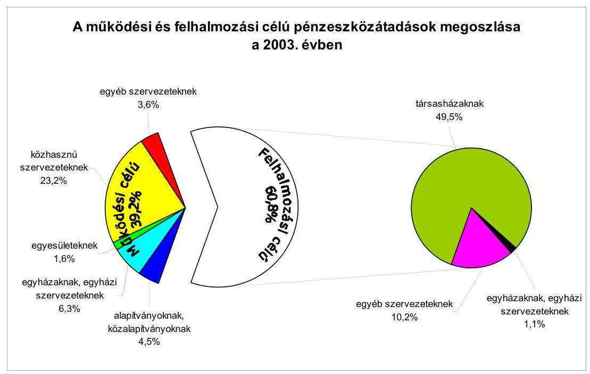

A célhoz kötött támogatásokról a támogatási összeg 42,3\%-a esetében a Képvi-selő-testület, 53,6\%-ában a hatáskörrel felruházott bizottságok és a Társasházak támogatását elbíráló munkacsoport, valamint 4,1\%-a esetében a polgármester döntött.

Az Önkormányzat a 2003. évi költségvetési rendeletében bizottsági és polgármesteri keretet hagyott jóvá.

A Népjóléti bizottság az általa kiírt pályázatra ${ }^{38}$ érkezett kérelmek alapján 9 szervezetet - 37,5 ezer Ft és 250 ezer Ft összegek között - összesen 1243,5 ezer Ft öszszegben részesített támogatásban. A Kulturális, oktatási és sport bizottság 2050 ezer Ft támogatást nyújtott a pályázataira ${ }^{39}$ beérkező kérelmezők számára. Összesen 27 szervezetet, 20 ezer Ft és 200 ezer Ft közötti összegekben részesítettek támogatásban. Ezen túl egyéni kérelemre 430 ezer Ft támogatást adott két szervezet számára ( 80 ezer Ft és 350 ezer Ft). A polgármester a részére biztosított keretből céljelleggel - nem szociális ellátásként - 3760 ezer Ft összegben nyújtott támogatást egyedi kérelmekre, 13 szervezet számára, 50 ezer Ft és 1000 ezer Ft közötti értékekben.

A múködési célú pénzeszköz átadások esetében az Önkormányzat a 2003. évi költségvetési rendeletében megnevezte, hogy mely szervezeteket, milyen öszszegű támogatásban részesít, melyre összesen 29430 ezer Ft-ot fizettek ki.

[^0]
[^0]:    ${ }^{38}$ Pályázat a szociális és kiegészítő egészségügyi programok támogatására.
    ${ }^{39}$ A Kulturális, oktatási és sport bizottság több témakörben írt ki pályázatot: az ifjúsági szervezetek közösségi programjainak támogatására; a kerületi civil szervezetek és közösségek kulturális és múvészeti tevékenységének támogatására; a kerületi civil szerveztek sport és táborozási programjainak támogatására.

---

A Kincsesház Alapítvánnyal, az Esztergom-Budapesti Főegyházmegyével és a Magyar Bencés Kongregációval kötött együttmúködési megállapodásokban a Budapest főváros I. kerületi állandó lakóhellyel rendelkező, tanköteles korú gyermekek után tanulónként havi 20-35 ezer Ft támogatást biztosított az Önkormányzat. A 2003. évben a Kincsesház Alapítvány 4800 ezer Ft, az EsztergomBudapesti Főegyházmegye 2180 ezer Ft, a Magyar Bencés Kongregáció 1000 ezer Ft támogatás kapott.

Az alapítványok közül a Közbiztonsági Alapítványt támogatták a legnagyobb összeggel, 11000 ezer Ft-tal a kerületi közbiztonság javítása céljából. További négy alapítvány 500 ezer Ft és 3000 ezer Ft közötti összegben, összesen 6000 ezer Ft támogatást kapott. Az egyéb szervezeteket 250 ezer Ft és 2000 ezer Ft közötti összegben, összesen 4450 ezer Ft-tal támogatta az Önkormányzat.

A felhalmozási célú pénzeszköz átadásként a 2003. évi költségvetésben az Önkormányzat közvilágításra és díszkivilágításra, társasházak felújítására, valamint köztisztasági gép beszerzésre tervezett előirányzatot.

A társasházak felújításának támogatására pályázat alapján 45360 ezer Ft támogatást biztosítottak. A köztisztasági gép beszerzésére 9296 ezer Ft támogatást adtak.

A közhasznú szervezetekkel megállapodást kötöttek, mely a közhasznú szervezetekről szóló 1997. évi törvény 14. § (2) bekezdésében foglaltak alapján tartalmazta a támogatással való elszámolás feltételeit és módját.

A támogatott szervezetekkel kötött szerződések tartalmazták a támogatás célját, összegét, a számadás határidejét, módját, a céltól eltérő felhasználás és a számadás elmulasztásának következményeit. A társasházak felújításának támogatása esetében a pályázati kiírás tartalmazta a számadási kötelezettséget. A nyertes társasházak számára küldött kiértesítő levélben előírták a számadás határidejét és módját. Az Önkormányzat ezzel eleget tett az Áht. 13/A. § (2) bekezdésében foglalt - számadási kötelezettség előírására vonatkozó rendelkezésnek.

A támogatásban részesült szervezetek a számadást kilenc szervezet kivételével az előírt határidőben benyújtották. A kilenc szervezet késve tett eleget számadási kötelezettségének. A társasházak támogatásának kivételével előfinanszírozás történt, ezért a támogatás felfüggesztésének - az Áht. 13/A. § (2) bekezdésében biztosított - lehetőségével az Önkormányzat nem tudott élni.

A társasházak felújítására nyújtott támogatások esetében a felhasználást a helyszínen ellenőrizte a műszaki ellenőr, továbbá a benyújtott számlákat szakmailag igazolta. A polgármester a társasházak felújításának támogatásáról évente egy alkalommal beszámolt a Képviselő-testületnek ${ }^{40}$, mely a beszámolót elfogadta.

[^0]
[^0]:    ${ }^{40}$ A 2002. évi támogatások felhasználásáról a 2003. február 6-i ülésen számolt be, és az Önkormányzat 22/2003. (II. 6.) számú határozatával elfogadta. A 2003. évi támogatások felhasználásáról a 2004. február 26-i ülésen számolt be, és az Önkormányzat 20/2004. (II. 26.) számú határozatával elfogadta.

---

A Polgármesteri hivatal illetékes szakirodáinak dolgozói a bizottságok által odaítélt támogatások esetében a becsatolt bizonylatok alapján a benyújtott számadást ellenőrizték, ezáltal az Önkormányzat eleget tett az Áht. 13/A. § (2) bekezdésében előírt - számadás ellenőrzésére vonatkozó - kötelezettségének. A Népjóléti bizottság által megítélt támogatásokra benyújtott számadás során a támogatásban részesült szervezetek írásban nyilatkoztak, hogy a becsatolt számlamásolatokat kizárólag a bizottsági támogatás elszámolásához használták fel. A Kulturális, oktatási és sport bizottság által támogatott szervezetek elszámolásához év közben vezette be az illetékes szakiroda a nyilatkozat kérését. Két esetben végzett helyszíni ellenőrzést az illetékes szakiroda dolgozója a Kulturális, oktatási és sport bizottság által nyújtott támogatások közül, melynek során megállapította, hogy a támogatások felhasználása a célnak megfelelő volt. A Népjóléti bizottság által a 2003. évben megítélt támogatások esetében a benyújtott elszámolásokat a Népjóléti bizottság 2004. június 30-ig nem tűzte napirendre, a Kulturális, oktatási és sport bizottság ülésén határozattal fogadta ${ }^{41}$ el az elszámolásokat.

A 2003. évi költségvetési rendeletben nevesített, valamint a polgármester által megítélt támogatások alapján benyújtott számadásokat a Gazdasági iroda dolgozója ellenőrizte a becsatolt bizonylatok alapján. Helyszíni ellenőrzés keretében nem vizsgálták a támogatás juttatási céljának megfelelő felhasználást. A polgármesteri keret felhasználásáról tételes kimutatást készítettek, melyet a Képviselő-testület a 2003. évi zárszámadási rendeletben fogadott el ${ }^{42}$.

Az együttműködési megállapodások alapján az egyházi, valamint az alapítványi iskolák részére - tanulói létszám alapján - nyújtott támogatást az illetékes szakiroda dolgozója ellenőrizte. Három oktatási intézménynél a helyszínen is vizsgálta a tanulói létszámot. Egy intézménynél egy fő eltérést mutattak ki, melyet a következő elszámoláskor korrigáltak.

Az Önkormányzat által fenntartott zeneiskola Zenéért-Gyermekekért Alapítványa a céljelleggel nyújtott 50 ezer Ft-os támogatásról nem az alapítvány, hanem a zeneiskola nevére kiállított számlát csatolta be a támogatás felhasználásáról, mely ezáltal nem felelt meg az Áfa tv. 13. § (1) bekezdés 16. pontjában foglaltaknak. A Pénzügyi igazgatóság vezetője a számadást elfogadta, mivel a számla tartalma alapján a támogatási célnak megfelelő felhasználását igazolta. Egyben felhívta az alapítvány elnökének figyelmét arra, hogy a jövőben a számlát a támogatott nevére állíttassa ki. A Magyar Cserkészlány Szövetség 16,6 ezer Ft-ról - a támogató előírása ellenére - nem az Áfa tv. 13. § (1) bekezdés 16. pontjában előírt számlával számolt el. A szövetség elnöke 15 ezer Ft-ról nyilatkozatot adott, hogy ez az összeg nyolc fő szállásdíját fedezte. A fennmaradó összegről egy magánszemély adott átvételi elismervényt, mely szerint a tábor létesítéséhez áramot és vizet biztosított. A Pénzügyi igazgatóság vezetője a számadást elfogadta, de a kiértesítő levélben felhívta a szövetség elnökének a

[^0]
[^0]:    ${ }^{41}$ A 39/2004. (IV. 6.) számú határozattal.
    ${ }^{42}$ Az Önkormányzat 20/2004. (IV. 30.) számú rendeletének 19. számú melléklete.

---

figyelmét arra, hogy a jövőben csak számlát fogadnak el a támogatás felhasználásáról.

A Krisztinavárosi Cserkész Alapítványnak folyósított támogatásokkal kapcsolatosan az Állami Számvevőszékről szóló 1989. évi XXXVIII. törvény 1. § (5) bekezdésében foglalt felhatalmazás alapján számvevői helyszíni ellenőrzést folytattunk le. A Krisztinavárosi Cserkész Alapítvány a Kulturális, oktatási és sport bizottság döntései értelmében a 2003. évben három alkalommal részesült támogatásban 265 ezer Ft összegben. A 5. számú mellékletként csatolt helyszíni ellenőrzési jegyzőkönyv alapján a támogatás célnak megfelelő felhasználását és a pénzügyi elszámolásban szerepeltetett bizonylatok valódiságát a bemutatott bizonylatok alátámasztották.

A Kulturális, oktatási és sport bizottság, a Népjóléti bizottság és a polgármester alapítványok számára is nyújtottak támogatást a 2003. évben - 1560 ezer Ft összegben - mellyel megsértették az Ötv. 10. § (1) bekezdés d) pontjában foglalt azon előírást, mely szerint az alapítványok támogatásáról kizárólag a Képviselő-testület dönthet ${ }^{43}$. A 2004. év első negyedévében döntést a bizottságok és a polgármester nem hozott.

- A Kulturális, oktatási és sport bizottság a Krisztinavárosi Cserkész Alapítványt 265 ezer Ft-tal, a Nimród Alapítványt 100 ezer Ft-tal, a Zenéért-Gyermekekért Alapítványt 50 ezer Ft-tal, a „Legyen a betü jó barát" Alapítványt 60 ezer Ft-tal, a Menta Alapítványt 100 ezer Ft-tal, a Budavári Nagyboldogasszony Templom Alapítványt 100 ezer Ft-tal, a Mozart Zenei Alapítványt 20 ezer Ft-tal, a Borsos Miklós és Kéry Ilona Alapítványt 100 ezer Ft-tal, a Szent Alberik Kórusalapítványt 100 ezer Ft-tal, valamint a Tabánért Alapítványt 95 ezer Ft-tal támogatta.
- A Népjóléti bizottság az Otthon Segítünk Alapítványt 190 ezer Ft-os támogatásban részesítette.
- A polgármester a Budapesti Szent Ferenc Kórház Alapítványnak 200 ezer Ft, a Pro Juventata Alapítványnak 100 ezer Ft, a Magyar Kultúra Alapítványnak 80 ezer Ft támogatást adott.

A Képviselő-testület a társasházak felújítására kiírt pályázat végrehajtásának irányításával bízta meg a polgármestert a 44/1998. (II. 26.) számú határozatában. A polgármester létrehozta a Társasházak Támogatását Elbíráló Munkacsoportot, mely munkacsoport döntött a 2003. évben a társasházi felújítások támogatásának odaítéléséről. A Képviselő-testület a támogatások odaítélésének hatáskörét nem ruházta át, ezért megsértették az Ötv. 9. § (3) bekezdésében foglalt előírást ${ }^{44}$. A Társasházak Támogatását Elbíráló Munkacsoport a 2004. év első negyedévében döntést nem hozott.

[^0]
[^0]:    ${ }^{43}$ A számvevői jelentésre tett észrevételben a Polgármester arról adott tájékoztatást, hogy a döntéseket a 2004. év során az alapítványok támogatása esetében már a Képvi-selő-testület hozta meg.
    ${ }^{44}$ A számvevői jelentésre tett észrevételben a Polgármester arról adott tájékoztatást, hogy a döntéseket a 2004. év során a társasházaknak nyújtott támogatás esetében már a Képviselő-testület hozta meg.

---

Önkormányzati költségvetési szerv által társadalmi szervezetek részére támogatás folyósítása nem történt.

A támogatások nyilvántartásának vezetését és annak tartalmát - szabályozás hiányában - az illetékes szakirodák eltérő adattartalommal alakították ki. A Polgármesteri hivatalban nem vezettek olyan analitikus nyilvántartást, amelyből megállapítható a folyósított támogatások együttes összege, valamint a támogatott szervezetenként adott összeg. Ezen nyilvántartás hiányában nem rendelkeznek információval arra vonatkozóan, hogy 100\%-on felül finanszíroz-tak-e egy-egy feladatot.

# 1.7. A közbeszerzési eljárások szabályszerűsége 

A Polgármesteri hivatalnál a 2003. évben öt közbeszerzési eljárást indítottak összesen 221400 ezer Ft értékben ${ }^{45}$. A beszerzések épületek, építmények, utak, utcák burkolatának felújítására irányultak. A helyi közbeszerzések száma és értéke indokolta a rendeleti szabályozást, ezért a Képviselő-testület a Kbt. hatálya alá tartozó beszerzésekkel, fejlesztésekkel kapcsolatos eljárás rendjét a közbeszerzési rendeletében szabályozta, valamint a jegyző - a Polgármesteri hivatal ügyrendjében kiadott ${ }^{46}$ - a vagyongazdálkodási és beruházási szabályzatban rendelkezett a vagyongazdálkodáshoz kapcsolódó közbeszerzési eljárások fő szabályairól, ebben meghatározta: mi minősül árubeszerzésnek, építési beruházásnak, illetve igénybevett szolgáltatásnak.

A közbeszerzési rendelet hatálya a Kbt. 96. § (2) bekezdése előírásainak megfelelően kiterjedt az Önkormányzat által alapított - önállóan és részben önállóan gazdálkodó - költségvetési szervekre is.

Az ajánlatkérő nevében eljáró személyekkel kapcsolatos helyi szabályokat a közbeszerzési rendelet a Kbt. 31. §-ában foglaltaknak megfelelően tartalmazta. Az ajánlatkérő nevében eljáró személy a Polgármesteri hivatal beszerzései, valamint az önkormányzati szintű központosított beszerzés esetében a polgármester, az egyéb költségvetési szervek vonatkozásában az önállóan gazdálkodó költségvetési szerv vezetője. Az ajánlatkérő jogait és kötelezettségeit a közbeszerzési rendelet 3. § (1) bekezdése szerint az ajánlatkérő nevében eljáró - egyben az eljárást lezáró, határozatot meghozó - személy jogosult gyakorolni.

A polgármester a közbeszerzési rendelet általános előírásai alapján az egyes közbeszerzési eljárásokra egyedileg kiadott Polgármesteri Utasításban határozta meg az eljárás belső felelősségi rendjét a Kbt. 31. § (6) bekezdésében foglaltaknak megfelelően. A közbeszerzési rendelet tartalmazott a Kbt.,-ben nem szabályozott rendelkezéseket. Előírták a költségvetési szervek vezetői és a polgármester közbeszerzési eljárásokról szóló beszámolási kötelezettségét, annak formáját és határidőit. A közbeszerzési rendelet egyszerűsített eljá-

[^0]
[^0]:    ${ }^{45}$ Az értékek az áfát nem tartalmazták.
    ${ }^{46}$ A jegyző a szabályzatot 1999. április 16-án adta ki.

---

rásrendként nevesítve meghatározta - a Kbt., 24. § (4) bekezdése alapján - a Kbt., 2. § (3) bekezdése szerinti értékhatár alatti értékű, de 500 ezer Ft-ot meghaladó beszerzések szabályait, előírta a legkevesebb három ajánlat beszerzését, az elbíráló döntés indokolásának írásba foglalását.

A 2003. évre vonatkozó összesített tájékoztató Közbeszerzési értesítőben történő megjelentetéséről a polgármester az előírt határidőben gondoskodott.

A polgármester a 2003. évi önkormányzati közbeszerzési tervet, amely 12 beszerzési feladatot tartalmazott, 2003. január 22-én hagyta jóvá. Az ajánlati felhívásokat a jóváhagyott részletes költségvetés, valamint a közbeszerzési terv alapján dolgozták ki.

A polgármester a 2004. évre vonatkozóan a költségvetési koncepció alapján önkormányzati közbeszerzési tervet készített, a közbeszerzési rendelet által előírt határidőre, mely kilenc közbeszerzési feladatot tartalmazott. A 2004. évi költségvetés alapján, a Kbt. ${ }_{2}$ elöírásainak figyelembevételével a 2004. évi közbeszerzési tervet újra elkészítették, melyet a polgármester 2004. április 29-én hagyott jóvá.

A 2003. évi polgármesteri közbeszerzési ajánlati felhívások előkészítésére és kidolgozására a jegyző a közbeszerzési rendeletnek megfelelően szakmai előkészítő munkacsoportot hozott létre. A munkacsoport tagjai a beszerzés tárgya szerint megfelelő szakértelemmel rendelkező köztisztviselők voltak. A polgármester a közbeszerzési rendelet 10. §-ának megfelelően évente öszszegzést készített az Önkormányzat költségvetését érintő valamennyi közbeszerzési eljárásról, s azt - a költségvetés végrehajtásáról szóló beszámoló időpontjában - a Képviselő-testület elé terjesztette.

A 2002-2004. évek közbeszerzési terveinek elkészítése során megvizsgálták a közbeszerzési eljárás centrális - a Polgármesteri hivatal és az intézmények beszerzéseinek együttes - megvalósításának lehetőségét, és célszerűségi szempontok alapján döntöttek annak alkalmazásáról. A 2002. évben három eljárás esetében: a gyermekétkeztetés biztosítására 15 oktatási intézményben, a kerületi utak, járdák javítására és a kerületi zöldfelületek, fasorok fenntartási munkáira. A 2003. és a 2004. években centrális közbeszerzési eljárást nem indítottak. Az önkormányzati szintű, központosított beszerzés ajánlatkérője - a közbeszerzési rendelet 3. § (3) bekezdésében előírtaknak megfelelően - a polgármester volt.

A közbeszerzés törvényes lebonyolításának eljárási és elbírálási rendszere a közbeszerzési rendelet, valamint az egyes eljárásokhoz kiadott polgármesteri utasítások alapján a 2003. évben biztosított volt.

A jegyző a 25/2003. számú utasításával 2003. december 16-án hatályon kívül helyezte a vagyongazdálkodási és beruházási szabályzatát. A Képviselőtestület a 12/2004. (III. 30.) számú rendeletével hatályon kívül helyezte a közbeszerzési rendeletet. A polgármester 2004. márciusától - a Kbt. 2 6. § (2) bekezdésében előírtaknak megfelelően - az adott közbeszerzési eljárás előkészítését megelőzően, az egyes eljárásokra egyedileg készített Polgármesteri Utasí-

---

tások gyakorlatát fenntartva határozta meg a Kbt. ${ }_{2}$ 6. § (1) bekezdésében előírt felelősségi rendet.

Az Önkormányzat a 2003. évi költségvetésében részletezett beszerzések kategóriákba történő besorolása a Kbt. ${ }_{1}$ 7-9. §-ainak - árubeszerzés, építési beruházás, illetve szolgáltatás meghatározásának - megfelelően történt. A becsült érték számításánál a Kbt. ${ }_{1}$ 5. §-ának - az azonos tárgyú közbeszerzésekre vonatkozó - előírásai szerint jártak el, figyelembe vették a részekre bontás 5. § (1) bekezdés szerinti tilalmát, az 5. § (2) bekezdés szerint a beszerzések értékét egybeszámították, az 5. § (3) bekezdésében foglalt lehetőséggel élve az egybeszámított értékű beszerzési tárgyakat több közbeszerzési eljárásban szerezték be. Az Önkormányzat a 2002. évben kezdett és a 2003. évben lezárult Corvin téri átépítésnél a közbeszerzési eljárást nem folytatta le a 2002. évben a szoborrestaurálás és a hozzákapcsolódó építési munkáknál, mint 20066 ezer Ft értékben igénybevett szolgáltatásnál ${ }^{47}$, továbbá a 2003. évben 57916 ezer Ft értékű építési beruházásnál ${ }^{48}$, ezáltal megsértették a Kbt. ${ }_{1}$ 2. § (1) bekezdésében előírtakat ${ }^{49}$, mely szerint építési beruházás, illetve szolgáltatás megrendelése során annak értéke a beszerzés megkezdésekor ${ }^{50}$ külön meghatározott összeget eléri vagy meghaladja köteles a közbeszerzési törvény szabályai szerint eljárni.

A Corvin tér felújítási munkáira a 2002. évben az áfa nélkül számítandó 33000 ezer Ft összeget terveztek éves költségvetésükben. A munka teljes befejezéséhez szükséges pénzügyi fedezet hiányában a pénzügyi forrásokat pályázati úton egészítették ki, majd szerződést kötöttek a 2002. évben ugyanazzal a vállalkozóval a park- és burkolatépítés munkáira, áfa nélkül számítva 32887 ezer Ft,valamint a szoborrestaurálásra és a hozzá kapcsolódó építési munkákra 20066 ezer Ft értékben. A Corvin tér átépítését a 2003. évben 57916 ezer Ft ráfordítással fejezték be, a kivitelező kiválasztására a helyi közbeszerzési rendeletben az értékhatárt el nem érő beszerzésekre szóló egyszerűsített eljárást folytatták le.

A Kbt. 2. §-ában meghatározottak szerinti értékhatár feletti beszerzés a 2003. évben öt esetben történt, ezek közül három beszerzés fejeződött be a tárgyévben, két eljárás a 2004. évben zárult le. A 2004. évi közbeszerzési tervben kilenc közbeszerzési eljárást határozott meg a polgármester.

A gépjármúvek beszerzésére a 2003. évben kötött lízingszerződés esetében figyelmen kívül hagyták a közbeszerzési rendelet egyszerúsített eljá-

[^0]
[^0]:    ${ }^{47}$ A közbeszerzés értékhatára a 2002. évben szolgáltatás megrendelés esetén 9 millió Ft volt.

    48 A közbeszerzés értékhatára építési beruházás esetén a 2002. évben 36 millió Ft, a 2003. évben 40 millió Ft volt.
    ${ }^{49}$ A kifogásolt esetekben a Kbt. ${ }_{1}$ 79. § (7) bekezdésében meghatározott kezdeményezési határidő - a Kbt. ${ }_{1}$ szabályait sértő esemény bekövetkezésétől számított 90 nap - letelte miatt az ÁSZ-nak nem volt módja a Kbt. ${ }_{1}$ 79. § (4) bekezdésében biztosított jogorvoslat kezdeményezésére.
    ${ }^{50}$ A Kbt. ${ }_{1}$ 4. § (6) bekezdés értelmében a több év alatt megvalósuló építési beruházás esetén a közbeszerzés értéke a teljes beruházás ellenértéke.

---

rásrendre vonatkozó előírását. Nem szerezték be a legkevesebb három ajánlatot és elmaradt az elbíráló döntés indoklásának írásba foglalása, ezzel nem tettek eleget a közbeszerzési rendelet 9. § (1) és (2) bekezdésében foglaltaknak.

A 2003. évi költségvetéshez kapcsolódóan vizsgált öt közbeszerzési eljárás közül négy a Polgármesteri hivatal, egy - a múemlék lakóépület felújítás - pedig a Házgondnokság Kft. bonyolításában történt, ezek az alábbiak:

- Budai Vár Halászbástya északi szakasz II/1. ütem felújítása (áfa nélküli öszszege: 77161 ezer Ft);
- Jégverem lépcső felújítása (49 818 ezer $\mathrm{Ft}+$ áfa);
- Fiath utca kockakő burkolat építése (13 993 ezer Ft + áfa);
- Szalag utca kockakő burkolat felújítása (11 221 ezer Ft + áfa);
- Batthyányi tér 4. múemlék lakóépület homlokzat felújítása (98 909 ezer Ft + áfa).

Két eljárás esetében - a burkolatépítési munkáknál - az eredményhirdetés és a szerződéskötés 2004. január, illetve február hónapban történt meg. Három felújítási munka esetében - a Jégverem lépcső, Szalag utca, és Fiáth utca felújítása - került sor a szerződés módosítására.

A megvizsgált közbeszerzési eljárások esetében a 2003. évben - mind az öt esetben - nyílt eljárást alkalmaztak a Kbt., 26. §-ának megfelelően. A közbeszerzési eljárásban résztvevők esetében igazoltan vizsgálták a Kbt., 31. § (1) bekezdése alapján az eljárásba bevont személyek - a Polgármesteri hivatal köztisztviselői kaptak megbízást - szakértelmét. A Kbt., 31. § (2) bekezdés szerinti összeférhetetlenséget előzetesen nem vizsgálták, a megbízott kötelességeként írta elő a jegyző az eljárás során felmerülő összeférhetetlenség jelzését.

Az ajánlatok elbírálása megfelelt a Kbt., előírásainak és a közbeszerzési rendeletben foglaltaknak. Az ajánlatok felbontása a Kbt., 51. § - 54. §-ban előírtak szerint történt, minden esetben megállapították az ajánlatok érvényességét. Az ajánlatok felbontásáról, ismertetéséről, az érvénytelen ajánlatokról és a kizárt ajánlattevőkről az előírt jegyzőkönyvet elkészítették.

Az egyes közbeszerzési eljárásokra egyedileg kiadott polgármesteri utasítással a Kbt., 31. § (3) bekezdésének megfelelően - létrehozott Bíráló bizottság a pályázati kiírásnak és a Kbt., 55. §-60. §-ai előírásának megfelelően értékelte az ajánlatokat és tett javaslatot az eljárást lezáró határozatot hozó személy, a polgármester számára az eljárás nyertesének megállapítására.

Az eljárás eredményének kihirdetése és közzététele a Kbt. , 61. §-a szerint megtörtént. Az ajánlatok elbírálásának befejezésekor a Kbt., 5. számú mellékletben meghatározott minta szerint írásbeli összegzést készítettek az ajánlatokról, az ebben foglalt adatokat az eljárás eredményének kihirdetése során ismertették, és azt időben megküldték az összes ajánlattevőnek. A közbeszerzési eljárást a Kbt., 6. számú mellékletben meghatározott minta szerinti hirdetmény közzétételével, illetve szerződéskötéssel zárták le. Az

---

ajánlatok felbontásáról a Kbt. ${ }_{1}$ 54. §-a szerint készült jegyzőkönyvet időben megküldték az ajánlattevőknek.

A szerződéseket a felhívás és az ajánlat tartalmának megfelelően kötötték meg. Szerződés módosítására három esetben - a Jégverem lépcső felújítási munkáinál a kivitelezés félidejében, a Szalag utca és a Fiáth utca felújításánál a kivitelezés utolsó hónapjában - került sor. A szerződésmódosítás Kbt. ${ }_{1}$ 73. § (1) bekezdésében rögzített feltételei mindhárom esetben fennálltak.

A Jégverem lépcső felújítandó építményének bontási munkáit követő műszaki állapotfelmérés alapján a megrendelő egy - a szerződött összeghez viszonyítottan költségtakarékos műszaki megoldást kívánt megvalósítani, a bontott, de alkalmas részegységek visszaépítésével. A műszaki megoldás eredményeképpen a vállalkozás ellenértéke a szerződésmódosítást követően egyharmadával csökkent.

A Szalag utca felújításánál a kivitelezési határidőt módosították a munkaterület átadását megelőző építési engedély jogerőre emelkedésének határideje miatt, a Fiáth utca felújításánál forgalomszervezési elvárások megváltozása miatt a műszaki tartalom bővült. A Kbt. 73. § (1) bekezdésének megfelelően módosították a szerződésnek az ajánlati felhívás, a dokumentáció feltételei, illetve az ajánlat tartalma alapján meghatározott részét, mert a szerződéskötést követően beállott körülmények folytán a szerződés - első esetben a megrendelő, a második esetben a kivitelező - fél lényeges jogos érdekét sértette.

A közbeszerzési eljárásokat követően kötött, illetve módosított szerződésekben vállaltakat a szerződő felek határidőre teljesítették.

A Közbeszerzések Tanácsa Közbeszerzési Döntőbizottsága a 2000. évben meghirdetett "Vállalkozói szerződés a gyermekétkeztetés biztosítására 15 oktatási intézményben" tárgyú eljárás esetében - marasztalta el az Önkormányzatot, a jogorvoslati eljárás jelenleg is folyamatban van.

A Polgármesteri Hivatal a 2000. évben "Vállalkozói szerződés a gyermekétkeztetés biztosítására 15 oktatási intézményben" tárgyú nyílt közbeszerzési eljárást indított. A Közbeszerzések Tanácsa Közbeszerzési Döntőbizottsága megsemmisítette az eljárást lezáró határozatot, mert a bírálatnál olyan szempontokat érvényesítettek, amelyeket az ajánlattételi felhívásban nem jelöltek meg követelményként, ezzel megsértették a Kbt. 55. § (6) bekezdésében foglaltakat. ${ }^{51}$ A jogi helyzet egyértelműsége miatt az önkormányzat nem indított jogorvoslati eljárást, szakértők igénybevételével új eljárást kezdeményezett.

A 2001. január 10-én közzétett ajánlati felhívással ismételt közbeszerzési eljárást - jogorvoslati kérelem alapján - a Közbeszerzések Tanácsa Közbeszerzési Döntőbizottsága felfüggesztette, majd a lefolytatott eljárás eredményét megsemmisítette.

Az Önkormányzat a jogorvoslati lehetőséggel élve keresetet nyújtott be a Fővárosi Bírósághoz, kérte a döntés felülvizsgálatát. Az első fokú ítélet 2002. március 19én a Döntőbizottság határozatát helyben hagyta, az önkormányzat keresetét elutasította.

[^0]
[^0]:    ${ }^{51}$ A Kbt. 155. § (6) bekezdése szerint "Az ajánlatkérő az ajánlatokat a felhívásban meghatározott értékelési szempont alapján bírálja el."

---

Az Önkormányzat fellebbezést nyújtott be az ítélet ellen, a Legfelsőbb Bíróság értesítette az Önkormányzatot, hogy tárgyalás mellőzésével fog döntést hozni az ügyben, mely időközben a Fővárosi Ítélőtáblához került. Ítélet 2004. június 30-ig nem született.

# 1.8. A zárszámadási kötelezettség teljesítésének szabályszerűsége 

A polgármester a 2003. évi zárszámadási rendelettervezetet 2004. április 29-én - az előírt határidőn ${ }^{52}$ belül terjesztette a Képviselő-testület elé. A rendelettervezetet az Áht. 18. §-a szerint a 2003. évi költségvetési rendelettel összehasonlítható módon készítették el. Az Önkormányzat a 2003. évi költségvetésének végrehajtásáról szóló beszámolót a 20/2004. (IV. 30.) számú rendeletével fogadta el 6497,4 millió Ft bevételi és 5900,0 millió Ft kiadási főösszeg mellett. Az eredeti előirányzatokhoz képest a bevételeknél a túlteljesítés 6,9\%, a kiadásoknál az elmaradás 3,0\% volt. A 2003. évi zárszámadási rendeletben bemutatott eredeti előirányzatok fő- és részösszegei megegyeztek a költségvetési rendelet megfelelő adataival.

A zárszámadási rendelettervezetben a múködési és felhalmozási előirányzatok teljesítését Önkormányzatra összesen, továbbá költségvetési szervenként mutatták be az Áht. 69. § (1) bekezdés szerinti részletezettséggel. Az Áht. 118. §-ában előírtakat betartották, mivel a Képviselő-testület részére az Áht. 116. § 4., 6., 8., 9. és 10. pontjában előírt mérlegeket ${ }^{53}$ és kimutatásokat bemutatták.

A kimutatások között az Önkormányzat vagyonkimutatását, a többéves kihatással járó döntések számszerúsítését a 2003. és 2004. évekre, valamint a közvetett támogatásokat szöveges indoklással együtt mutatták be.

A Képviselő-testületet az önkormányzati lakásértékesítés bevételeinek felhasználásáról, a 2003. évi polgármesteri keret felhasználásáról is tájékoztatták.

A zárszámadási rendelet a kilenc helyi kisebbségi önkormányzat előirányzatainak teljesítését bemutatta. A polgármester a 2003. évi zárszámadási rendelettervezetben - a Vhr. 10. § (11) bekezdésében leírtaknak megfelelően - előterjesztette a 2003. évi egyszerűsített mérleget, az egyszerűsített éves pénzforgalmi jelentést, az Önkormányzat, valamint a Polgármesteri hivatal egyszerúsített pénzmaradvány kimutatását a könyvvizsgálói jelentéssel együtt. A Polgármesteri hivatal a 2003. évi beszámoló adatai szerint a módosított pénzmaradvány 402,0 millió Ft. A költségvetési intézményektől a pénzmaradvány - feladattal és kötelezettséggel nem terhelt - részét elvonták. A Képviselő-testület által jóvá-

[^0]
[^0]:    ${ }^{52}$ Az Áht. 82. §-a alapján a költségvetési évet követő négy hónapon belül kell a zárszámadási rendelettervezetet a Képviselő-testület elé beterjeszteni.
    ${ }^{53}$ Az Önkormányzat összevont mérlegeit, a helyi kisebbségi önkormányzatok mérlegeit.

---

hagyott pénzmaradványt a 2003. évről áthúzódó feladatok finanszírozására ${ }^{54}$, a 2004. évi várható forráshiány csökkentésére ( 50,0 millió Ft), továbbá a 2004. évben jelentkező feladatokra osztották fel.

A Polgármesteri hivatal pénzmaradványát az Ámr. 65-67. §-aiban foglaltaknak megfelelően állapították meg és mutatták be. A pénzmaradványt a Polgármesteri hivatal záró pénzkészletéből kiindulva vezették le, csökkentve az aktív és passzív pénzügyi elszámolások egyenlegével ( 112,5 millió Ft), az intézmények részére át nem utalt támogatás összegével ( 110,6 millió Ft), továbbá a központi támogatás visszafizetésével ( 22,3 millió Ft). A zárszámadási rendelet az önállóan gazdálkodó, a részben önállóan gazdálkodó költségvetési intézmények pénzmaradványait is megállapította, illetve jóváhagyta az Ámr. 66. § (4) bekezdésének megfelelően.

A Polgármesteri hivatal vállalkozási tevékenységet nem folytatott, így eredmény kimutatást sem készített.

A jegyző az önállóan gazdálkodó intézmények féléves és éves beszámolóinak ellenőrzését - a számviteli politikában és Polgármesteri hivatal ügyrendjében a Pénzügyi igazgatóság feladataként határozta meg. Az intézményi beszámolókat az Ámr. 149. § (3) bekezdésében leírtaknak megfelelően - a tárgyévet követő április 30-ig - ellenőrizték, azok zárszámadás adataival való egyezőségét biztosították. Az intézmények vezetőit az Ámr. 149. § (5) bekezdésében foglaltak alapján értesítették a 2003. évi beszámoló elfogadásáról, a 2003. évi jóváhagyott pénzmaradványról és annak felosztásáról.

A 2003. évi zárszámadásról szóló 20/2004. (IV. 30.) rendelet módosított előirányzati főösszegei a költségvetés módosított előirányzati főösszegeivel megegyeztek.

# 1.9. A Polgármesteri hivatal helyi kisebbségi önkormányzatok gazdálkodását segítő tevékenysége 

Az Önkormányzat területén kilenc helyi kisebbségi önkormányzat múködik, amelyek közül három ${ }^{55}$ a 2002. évi helyhatósági választásokat követően alakult. A kisebbségi önkormányzatok közül egy - a BRKÖ - a 2002. évi helyhatósági választásokat követően nem készített költségvetést, ténylegesen nem múködött.

Az Önkormányzat az SzMSz-ben ${ }^{56}$ a Nek. törvény 28. §-a előírásának megfelelően meghatározta, hogy a Polgármesteri hivatal a kisebbségi önkormányzatok gazdálkodási feladatainak végrehajtásával, múködésük tárgyi feltételeinek biztosításával segíti a helyi kisebbségi önkormányzatok munkáját.

[^0]
[^0]:    ${ }^{54}$ A társasházak felújítására, közvilágításra, pincerendszer veszélyelhárítás központi támogatásának visszafizetésére.
    ${ }^{55}$ Bolgár, Görög, Román Kisebbségi Önkormányzat.
    ${ }^{56}$ SzMSz XII. fejezet 68. és 69. §.

---

A kisebbségi önkormányzatok nem éltek az Ötv. 102/B. § (4) bekezdésében foglalt lehetőséggel és nem kezdeményezték az Önkormányzat Képviselőtestületénél a Nek. tv. 27. § (1) bekezdése a), illetve c) pontjai alapján megalkotandó rendelet elfogadását, az Önkormányzat vagyonán belül részükre elkülönített vagyon és a rendelkezésére bocsátott források felhasználásának, valamint a védett műemlékeik és emlékhelyeik körének, védelmük helyi szabályainak rendeletben történő meghatározását. Az Önkormányzat így a Nek. tv 27. § (1) bekezdésének b) pontja alapján a kisebbségi önkormányzatok költségvetésének és zárszámadásának kereteit határozta meg költségvetési rendeleteiben. Az Önkormányzat a 2003-2004. években elkülönített vagyont nem juttatott, a 2003. évben pályázati úton elnyerhető külön forrást, a 2004. évben önkormányzati támogatást biztosított a kisebbségi önkormányzatok részére.

Az Önkormányzat és a kisebbségi önkormányzatok megállapodásban rögzítették a költségvetés tervezetének összeállítása és a költségvetési rendelet megalkotása során az Önkormányzat és a kisebbségi önkormányzatok együttmúködésére vonatkozó részletes szabályokat és eljárási rendet az Áht. 68. § (3) és az Ámr. 29. § (10) bekezdései alapján.

Az együttműködési megállapodásokat a 2002. évben alakult három kisebbségi önkormányzat esetében a polgármester és a kisebbségi önkormányzatok elnökei az Ámr. 29. § (11) bekezdésében előírtakat figyelmen kívül hagyva a január 15-i határidőt követően - a 2003. év április hónapjában - kötötték meg. A 2002. évet megelőzően már működő hat kisebbségi önkormányzattal kötött együttműködési megállapodásokat a 2003. évben nem vizsgálták felül, a módosítás lehetőségével nem éltek.

Az együttmúködési megállapodások - az Áht. 66. §-ának megfelelően tartalmazták a Polgármesteri hivatal felkérését a kisebbségi önkormányzati gazdálkodás végrehajtására, és - az Ámr. 29. § (3) bekezdésében foglaltaknak megfelelően - a jegyző feladatát a költségvetési, előirányzat-módosítási és zárszámadási határozattervezetek előkészítésére.

Az együttműködési megállapodásokban - az Áht. 68. § (3) és az Ámr. 29. § (10) bekezdésében előírtaknak megfelelően - rögzítették a költségvetési és zárszámadási határozatok benyújtási határidejét, az előirányzat-módosítások rendjét és az Önkormányzathoz történő átadás határidejét.

A Polgármesteri hivatal számlarendje tartalmazta a kisebbségi önkormányzati gazdálkodással összefüggő sajátos feladatokat a Vhr. 8., 37., 49. §-ainak, a Korm. rendelet 15. §-ának és az Ámr. 134. § (6) bekezdésének megfelelően. Rendelkeztek a teljesítések szakmai igazolásának módjáról és kijelölték az azt végző személyeket az Ámr. 135. § (3) bekezdésének előírása szerint.

Az együttműködési megállapodásban megjelölt személy - a Polgármesteri hivatal megfelelő szakmai képzettséggel rendelkező köztisztviselője - az érvényesítés végzésére írásos megbízást kapott az Ámr. 135. § (2) bekezdésének megfelelően.

A Polgármesteri hivatal biztosította a kisebbségi önkormányzatok testületi múködésének feltételeit, a helyiséghasználatot, a postai, kézbesítési,

---

gépelési, sokszorosítási feladatok ellátását. A múködési feltételek költségeit az Ámr. 57. § (6) bekezdésének megfelelően a Polgármesteri hivatal viselte. Erre a célra az együttmúködési megállapodásokban rögzített összegként a 2003. évben 1500 ezer Ft költségkeretet szerepeltettek a kilenc kisebbségi önkormányzat részére együttesen.

A kisebbségi önkormányzatok vagyoni és számviteli nyilvántartásait - a Korm. rendelet 15. §-ának, és az Ámr. 57. § (5) bekezdésének megfelelően - az Önkormányzat nyilvántartásain belül elkülönítetten vezették. A kisebbségi önkormányzatokat érintően a kötelezettségvállalásokat és bevételi előírásokat az Áht. 103. § (2) bekezdésének megfelelően - folyamatos nyilvántartották, a bevételek és a kiadások elszámolása az elkülönített szakfeladaton történt.

A kisebbségi önkormányzatok gazdálkodásának lebonyolításával kapcsolatos feladatokat a megkötött együttműködési megállapodások alapján végezte el a Polgármesteri hivatal.

A kisebbségi önkormányzatok jóváhagyott előirányzatainak és azok teljesülésének alakulásáról a nyilvántartást az Áht. 103. § (1) bekezdésében foglaltakat megsértve - az előző évi pénzmaradvány igénybevétele, valamint az Önkormányzattól pályázaton elnyert többletforrások esetében - a kisebbségi önkormányzatok határozatainak hiányában vezették. A jegyző felhívta a kisebbségi önkormányzatok elnökeinek figyelmét a költségvetéssel kapcsolatos határozatok meghozatalára.

A BRKÖ állami támogatását a Korm. rendelet 15. §-ában foglaltakkal ellentétesen nem elkülönítetten tartották nyilván, a 2003. évben 510 ezer Ft-ot, a 2004. évi I. negyedévében 178,5 ezer Ft-ot nem utaltak át a kisebbségi önkormányzat számlájára. Az állami támogatás átutalását azért nem teljesítették, mert a BRKÖ a 2002. évi helyhatósági választásokat követően nem készített költségvetést, ténylegesen nem múködött ${ }^{57}$. Az át nem utalt összegeket az 1. számú függelékben mutatjuk be.

# 2. AZ ÖNKORMÁNYZATI FELADATOK ÉS A RENDELKEZÉSRE Álló FORRÁSOK ÖSSZHANGJA 

### 2.1. A feladatok meghatározása és szervezeti keretei

Az Önkormányzat az Ötv. 1. § (6) bekezdés a) pontjában foglalt felhatalmazás alapján kialakította feladatai ellátásának szervezeti struktúráját.

Az Önkormányzat a 2001. évben hét önállóan gazdálkodó intézményt, valamint 16 részben önállóan gazdálkodó intézményt múködtetett. A részben önállóan gazdálkodó költségvetési szervek pénzügyi-gazdasági feladatait a GAMESZ látta el. Az önállóan és a részben önállóan gazdálkodó költségvetési szervek gazdálkodással kapcsolatos munkamegosztását és felelősségvállalási

[^0]
[^0]:    ${ }^{57}$ A jegyző a BRKÖ múködésében tapasztalt hiányosságokról a Budapest Főváros Közigazgatási Hivatalt tájékoztatta.

---

rendjét megállapodásban rögzítették az Ámr. 14. § (6) bekezdésében foglaltaknak megfelelően.

Az Önkormányzat egyes feladatainak ellátásáról a következők szerint gondoskodott a 2001. évben:

Az Önkormányzat a szociális alapellátások közül a családsegítésről és a gyermekjóléti feladatokról, a házi segítségnyújtásról és a szociális étkeztetésről részben önállóan gazdálkodó költségvetési szervei útján gondoskodott. A fogyatékos személyek ellátásáról a Budapest főváros II.-XI.-XII. kerületekkel létrehozott társulás keretében gondoskodtak. A három év alatti gyermekek napközbeni ellátását egy részben önállóan gazdálkodó költségvetési szerv útján biztosította az Önkormányzat. A szakosított szociális ellátás körében nappali szociális és pszichiátriai ellátást nyújtott egy részben önállóan gazdálkodó költségvetési szerve útján.

Az egészségügyi alap- és szakosított ellátást az Önkormányzat egy önállóan gazdálkodó intézménye útján biztosította, mely a házi- és gyermekorvosi ellátást, a védőnői szolgálatot, az anya-, gyermek- és csecsemővédelmet, a járóbeteg gondozóintézeti, illetve szakorvosi ellátást biztosította. Gondoskodott továbbá az iskola-egészségügyi ellátásról. Az orvosi ügyeletet megbízási szerződés alapján egy gazdasági társaság útján biztosította az Önkormányzat. A gyermek fogorvosi ellátást Budapest főváros által fenntartott Budai Gyermekkórház látta el, míg a felnőtt fogorvosi ellátásra egy gazdasági társasággal kötöttek szerződést.

A nevelési-oktatási feladatok ellátása érdekében az Önkormányzat hét óvodát, három általános iskolát, egy négyosztályos, egy hatosztályos és egy nyolcosztályos gimnáziumot múködtetett. Az óvodák és az általános iskolák gazdálkodási jogkörük szerint részben önállóan gazdálkodó, a gimnáziumok önállóan gazdálkodó költségvetési szervek voltak. A sérült ${ }^{58}$ gyermekek általános iskolai nevelését, oktatását együttműködési megállapodás keretében egy alapítvány látta el. Az alapfokú művészetoktatást zeneiskola működtetésével biztosította az Önkormányzat. A közmúvelődési feladatokat és a sportfeladatokat részben önállóan gazdálkodó költségvetési szervei útján biztosította az Önkormányzat.

A településüzemeltetési feladatok közül az ivóvíz- és csatorna szolgáltatást, a települési szilárd hulladékgyűjtést és ártalmatlanítást a Fővárosi Önkormányzat gazdasági társaságai biztosították. A saját kezelésben lévő helyi közutak karbantartásáról az Önkormányzat vállalkozók és a Fővárosi Közterület Fenntartó Rt-vel kötött szerződés útján gondoskodott. Az önkormányzati tulajdonú ingatlanok kezelését az Önkormányzat kizárólagos tulajdonában lévő két gazdasági társaság - a Vízivárosi Vagyon- és Ingatlankezelő Kft. és a Házgondnokság Kft. - látta el.

[^0]
[^0]:    ${ }^{58}$ Magatartászavarral, részképesség problémával küzdő gyerekek.

---

Az Önkormányzat a pince beomlások megelőzésével és a károk helyreállításával, továbbá a pincék helyreállításával kapcsolatos feladatokra a 2001-2003. években 83194 ezer Ft-ot fordított, melyből 35800 ezer Ft állami támogatás volt. A feladat ellátásának kötelezettséget a különösen nagy kárt okozó pincebeomlásokkal érintett területeken lévő pincékről szóló 12/1997. (III. 30.) MT. rendelet 2. § (1) bekezdése írta elő.

A 2001-2003. évek között az alábbi változások következtek be:
A Vízivárosi Vagyon- és Ingatlankezelő Kft-t - mely bérlakások és helyiségek kezelésével foglalkozott - 2002. április 1. napjával jogutód nélkül megszüntette ${ }^{59}$ az Önkormányzat. A 2002. évre a kft. kezelésében lévő épületek száma kettőre csökkent, ezáltal nem volt gazdaságos a múködtetése. A két ingatlan kezelési jogát a Házgondnokság Kft. vette át.

A szabálysértési ügyek hatékony elbírálására 2003. május 1-jén társultak a Budapest főváros II.-III. kerületi önkormányzatokkal a helyi önkormányzatok társulásáról és együttműködéséről szóló 1997. évi CXXXV. tv. 7. §-a alapján.

Az Önkormányzat közoktatási megállapodást kötött a Magyar Bencés Kongregációval a 2002. évben. Ez alapján kiegészítő támogatást nyújtottak a Magyar Bencés Kongregációnak a Szent Benedek Bencés Általános Iskola és Gimnáziumban tanuló, a Budapest főváros I. kerületben állandó lakóhellyel rendelkező gyerekek után az esélyegyenlőség biztosítása céljából.

A szociális feladatok közül ellátási szerződést kötöttek a Magyar Máltai Szeretetszolgálattal a hajléktalanok nappali melegedője és utcai szociális munka feladatra ${ }^{60}$, valamint a szenvedélybetegek intézményeinek múködtetésére ${ }^{61}$. A Magyar Máltai Szeretetszolgálattal az Önkormányzat több éve folytatott szakmai együttműködést, ennek tapasztalatai alapján a feladatok végzésére alkalmasnak ítélte. A 2003. évben az Önkormányzat a hajléktalanok nappali melegedője feladatára az azt igénybevevő 20 fő Budapest főváros I. kerületben állandó lakóhellyel rendelkező személyek után összesen 704 ezer Ft-ot fizetett. A Krízis Alapítvánnyal a gyermekek átmeneti otthona feladat ellátására kötöttek szerződést ${ }^{62}$. Ezen alapítvány elsőként nyitott az országban átmeneti gyermekotthont, így megfelelő tapasztalatokkal rendelkezett a feladat ellátására. A 2003. évben az Önkormányzat e feladatra az igénybevevő Budapest főváros I. kerületben állandó lakóhellyel rendelkező személyek után - 322 gondozási napra - összesen 804 ezer Ft-ot fizetett.

Az Önkormányzat a 2003-2006. évekre szóló gazdasági programjában stratégiai célkitúzésként fogalmazta meg az intézmények múködésének racionalizá-

[^0]
[^0]:    ${ }^{59}$ A Képviselő-testület 43/2002. (III. 28.) számú határozatával.
    ${ }^{60}$ Az Önkormányzat 330/2002. (XII. 12.) számú határozata alapján.
    ${ }^{61}$ Az Önkormányzat 285/2003. (XI. 27.) számú határozata alapján.
    ${ }^{62}$ Az Önkormányzat 45/2002. (III. 28.) számú határozata alapján.

---

lását. Elvégezte az intézmények átvilágítását, és az intézmények megszüntetése, átszervezése előtt kikérte az igénybevevők véleményét. A Képviselő-testület a naturális mutatókkal mérhető feladatok összes és fajlagos kiadásainak csökkentése érdekében kiadáscsökkentő, illetve intézmény racionalizálási intézkedéseket hozott a 2003. évben. Két óvodában 2003. augusztus 1-jétől nem indítottak új csoportot. Ebből az egyik óvodát „kifutó" rendszerben kívánják megszüntetni, míg a másik óvoda fenntartó jogát 2004. augusztus 1-től egy szövetségnek átadják. A megmaradó óvodákat három regionális óvodaként működtetik tovább 2004. augusztus 1-től. Döntött az Önkormányzat a 2004/2005. tanévtől kezdődően egy általános iskola alsó tagozatának „kifutó" rendszerben történő megszüntetéséről. A Fővárosi Önkormányzat részére 2004. július 1-én átadták a Petőfi Sándor Gimnáziumot. A feladat mellett az épület tulajdonjogát is átadták. Az általános iskolai feladatellátás hatékonyságának növelése érdekében az Önkormányzat a 2004. évben döntést hozott az általános iskolák szervezeti integráció nélküli önkéntes együttműködésének támogatására, mely - a hatékony munkaerő gazdálkodás megvalósítása érdekében biztosítja, hogy a pedagógusok több intézményben taníthatnak.

# 2.2. A költségvetés egyensúlyának helyzete 

Az Önkormányzat a 2003. évi költségvetése 3,4\%-os - 325,7 millió Ft összegű múködési forráshiányt tartalmazott. A 2003. évi zárszámadás adatai szerint a gazdálkodás pénzügyi egyensúlya az év közben kapott külső források (központi támogatások, Fővárosi Önkormányzat által kiírt pályázatok útján elnyert támogatások) segítségével biztosított volt, hitel felvételére nem volt szükség. A kiegyensúlyozott pénzügyi gazdálkodást havi likviditási terv készítésével és év közbeni aktualizálásával is segítették.

Az Önkormányzat múködési és felhalmozási célú bevételeinek, valamint kiadásainak 2001-2003. évek közötti alakulását a következő táblázat adatai szemléltetik:

Adatok: millió Ft-ban

| Megnevezés | 2001. év   tény | 2002. év   tény | 2003. év   tény |
| :-- | :--: | :--: | :--: |
| Múködési bevételek | 4363 | 4807 | 5010 |
| Felhalmozási bevételek | 1246 | 1358 | 1487 |
| Összes bevétel | $\mathbf{5 6 0 9}$ | $\mathbf{6 1 6 5}$ | $\mathbf{6 4 9 7}$ |
| Múködési bevétel az összes költségvetési bevétel \%-ában | 77,8 | 78,0 | 77,1 |
| Felhalmozási bevétel az összes   költségvetési bevétel \%-ában | 22,2 | 22,0 | 22,9 |
| Múködési kiadások | 4036 | 4192 | 4746 |
| Felhalmozási kiadások | 1017 | 1542 | 1154 |
| Összes kiadás | $\mathbf{5 0 5 3}$ | $\mathbf{5 7 3 4}$ | $\mathbf{5 9 0 0}$ |
| Múködési kiadás az összes költségvetési kiadás \%-ában | 80,0 | 73,1 | 80,4 |
| Felhalmozási kiadás az összes   költségvetési kiadás \%-ában | 20,0 | 26,9 | 19,6 |

---

Az Önkormányzat bevételei a 2001. évről 2003. év végéig folyamatosan emelkedtek, a múködési bevételek $14,8 \%$-kal, a felhalmozási bevételek $19,3 \%$-kal nőttek. A múködési bevételek összes költségvetési bevételen belüli részaránya közel azonos volt (77,1-78,0\%) a vizsgált időszakban.

Az Önkormányzat a 2003. évi tényleges bevételeinek 74,4\%-a saját bevétel, melyből a helyi adók $29,7 \%$-ot, az átengedett központi adók ${ }^{63} 10,8 \%$-ot, a felhalmozási és tőkejellegú bevételek $19,5 \%$-ot képviseltek a 4 . számú melléklet adatai szerint.

A Polgármesteri hivatal 2003. évi múködési bevételei 109,0\%-ra, az intézményeké $100,0 \%$-ra teljesültek.

A 2003. július 1-től végrehajtott lakbéremelés éves bevétel növelő hatása 15 millió Ft volt. A Halászbástya belépőjegyekből származó bevétel 24,4 millió Fttal haladta meg a 2002. évi bevételt. A Vizivárosi Kft. tulajdonából az Önkormányzat kezelésébe átvett épületek után 23,0 millió Ft bérleti díj bevétel származott.

A felhalmozási és tőke jellegú bevételek 2003. évi tényadata a módosított költségvetési előirányzatok 97,8\%-át érte el. Vagyonértékesítésből (telkek, lakások, bérleti jogok) 564,0 millió Ft folyt be. A Polgármesteri hivatal ${ }^{64}$ korábbi épületének a katolikus egyház részére történő átadása utáni kárpótlás 2002. és 2003. évi összege 200-200,0 millió Ft bevételt jelentett.

A múködési kiadások a 2002 évről a 2003. évre történő 17,6\%-os növekedése meghaladta az Önkormányzat összes költségvetési kiadásainak 16,7\%-os emelkedését. A múködési kiadások összes költségvetési kiadáson belüli részaránya a 2001. és a 2003. évben 83,0\%, a 2002. évben 73,1\% volt. A múködési bevételek a központi támogatások és a Fővárosi Önkormányzat által nyújtott támogatások segítségével fedezték a múködési kiadásokat.

A felhalmozási kiadások 2002. évi - az előző évhez viszonyított - 51,6\%-os növekedését ${ }^{65}$ a felhalmozási bevételek felhasználása mellett a múködési bevételekből egészítették ki. A 2001. évi és 2003. évi felhalmozási bevételek meghaladták a felhalmozási kiadásokat, az utóbbiak a 2001. évben 73,8\%-ra, a 2003. évben $87,6 \%$-ra teljesültek.

[^0]
[^0]:    ${ }^{63}$ A gépjármúadó és személyi jövedelemadó.
    ${ }^{64}$ I. kerület Krisztina krt. 61/A. szám alatti.
    ${ }^{65}$ A felhalmozási kiadásokon belül az ingatlanok 2002. évi felújítására 1065693 ezer Ft-ot, beruházásokra 475851 ezer Ft-ot fordítottak.

---

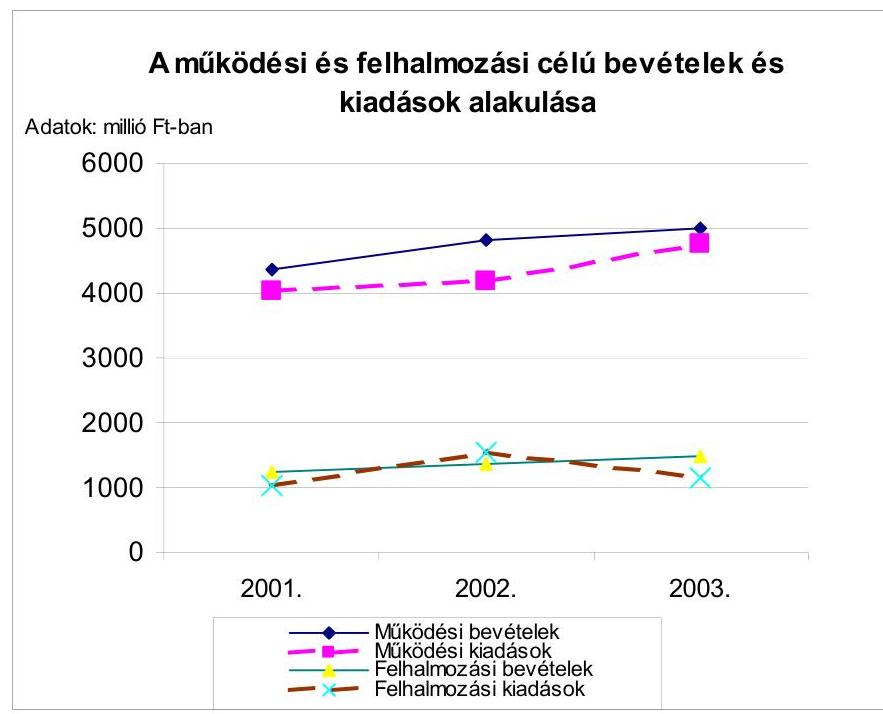

Az Önkormányzat a 2001-2003. évek költségvetésében - a költségvetési föösszeg 3-5\%-át kitevő - forráshiányt irányzott elő. Az ingatlanok értékesítéséből tervezett bevételek kockázata, illetve a feladatok időarányos teljesítése érdekében az Önkormányzat 200-300,0 millió Ft likvidhitel felvételét irányozta elő a 2001-2003. évek költségvetéseiben. Forráshiány ténylegesen egyik évben sem alakult ki. A 2003. évben a bevételeket 6,9\%-kal túlteljesítették, a kiadások 3\%-kal elmaradtak a költségvetés eredeti előirányzataitól. Az Önkormányzat sajátos múködési bevételeivel, a pótlólagos központi és fővárosi támogatásokkal ${ }^{66}$ a 2003. évi tényleges bevételek 420,0 millió Ft-tal haladták meg az eredeti bevételi előirányzatokat.

Az Önkormányzat az éves költségvetésében előirányzott bevételeket a 2001. évben $98,0 \%$-ra, a 2002. évben $94,0 \%$-ra, a 2003. évben $89,9 \%$-ra teljesítette. A költségvetési kiadások a 2001. évben $85,0 \%$-ra, a 2002. évben $85,0 \%$-ra és a 2003. évben $87,0 \%$-ra teljesültek.

A múködési kiadások 94-97\%-ra teljesültek, a felhalmozási kiadások 60-73\% között alakultak. Az Önkormányzat a felhalmozási kiadások mérséklésével biztosította a gazdálkodás egyensúlyát. A fejlesztési és felújítási kiadások 60-73\% közötti teljesítése a beruházások, felújítások elhúzódását is jelentették, emiatt az igényelt cél- és címzett támogatásokat sem tudták az adott évben felhasználni.

[^0]
[^0]:    ${ }^{66}$ A Fővárosi Önkormányzat Stratégiai Alapjából 42,4 millió Ft, a Városrehabilitációs Alapból 11,6 millió Ft támogatást kapott az Önkormányzat.

---

A külső források igénybevétele is segítette az Önkormányzat feladatellátását és a gazdálkodás pénzügyi egyensúlyának a megőrzését. A Polgármesteri hivatal a cél- és címzett támogatások igénybevételének személyi és szakmai feltételeit a gazdasági szervezetének ügyrendjében szabályozta. A cél- és címzett támogatásokkal kapcsolatos döntést a Képviselő-testület saját hatáskörében tartotta fenn. A támogatással összefüggő finanszírozási szerződést a polgármester írta alá a jegyző ellenjegyzése mellett.

Az Önkormányzat a pályázatok személyi és szakmai feltételeit a Polgármesteri hivatalon belül alakította ki. A pályázatok bonyolításával, a pályázatokon elnyert összegek felhasználásával és elszámolásával kapcsolatos feladatokat a Gazdasági iroda és a szakmai irodák látták el. A felhalmozási célú pályázati döntéseket - az illetékes bizottságok véleménye alapján - a Képvi-selő-testület hozta meg.

A 2001-2003. évi Fővárosi Önkormányzat által kiírt pályázatokon a 2001. évben 251,9 millió Ft, a 2002. évben 822,9 millió Ft, a 2003. évben 76,7 millió Ft összegű támogatást kapott az Önkormányzat. A Fővárosi Önkormányzat Városrehabilitációs Keretéből a 2001. évben 92,7 millió Ft-ot, a 2002. évben 294,8 millió Ft-ot, a Stratégiai Alapból a 2002. évben 33,1 millió Ft-ot, a 2003. évben 42,4 millió Ft-ot igényelt és kapott az Önkormányzat a Budapest I. kerületi Corvin tér átépítéséhez.

A Toldy Ferenc Gimnázium tornacsarnok építéséhez a 2003. évre igényelt címzett támogatásból 207,7 millió Ft-ot használtak fel. A 21 millió Ft céltámogatást egészségügyi gép-, műszer beszerzésére fordították.

Az államháztartáson belülről kapott támogatások, illetve átvett pénzeszközök a 2001. évben az összes költségvetési bevétel 54,4\%-át, a 2002. évben 61,8\%-át és a 2003. évben 65,4\%-át képviselték. Az államháztartáson kívülről kapott összegek a 2001. évben az összes költségvetési bevétel 2,1\%-át, a 2002. évben 1,9\%-át és a 2003. évben 2,4\%-át tették ki. A címzett- és céltámogatásokból megvalósított tornacsarnok építésére, az egészségügyi gépműszer beszerzésre fordított kiadások 60\%-át a külső források jelentették. A minisztériumok és a Fővárosi Önkormányzat által kiírt pályázatokon elnyert támogatások a feladatok összkiadásainak a 2001. évben 39,0\%-át, a 2002. évben 41,5\%-át és a 2003.évben 88,0\%-át tették ki.

A helyi adókról szóló 1990. évi C. törvény 1. §-ában biztosított felhatalmazás alapján az Önkormányzat 29/1995. (XII. 29.) és a 22/1998. (XII. 22.) számú rendeleteivel vezette be a telek-, illetve az építményadót.

A telekadó mértékét a törvény szerinti maximális mértékben, $200 \mathrm{Ft} / \mathrm{m}^{2}$-ben állapították meg.

Az építményadó mértékét a törvény szerinti maximális mértékben ( $900 \mathrm{Ft} / \mathrm{m}^{2}$ ben) az építmény hasznos alapterülete után állapították meg. A rendelet a garázsokra $18 \mathrm{~m}^{2}$-ig - gépjármúvenként $300 \mathrm{Ft} / \mathrm{m}^{2}$, a lakásokra adómentességet állapított meg.

A Képviselő-testület a helyi adókról szóló törvény 19. §-ában felsoroltakon túl is megállapított adómentességet és kedvezményeket. Az Önkormányzat helyi adó bevételei - a fővárosi forrásmegosztás keretében átengedett iparűzési

---

adót, valamint a gépjármú adó helyben maradó részét is figyelembe véve - a 2001-2003. évek között 28,5\%-kal növekedtek. A 2001. évi adóbevételek a múködési bevételek 26,6\%-át, 2003. évben a 29,7\%-át képviselték. A 2003. évi helyi adóbevételek 1490,2 millió Ft összegéből az iparúzési adó 77,0\%-kal részesedett. A Polgármesteri hivatalnál a gépjárműadó bevételek mértéke a 2002. évről a 2003. évre 92,3\%-kal emelkedett a gépjárműadóról szóló 1991. évi LXXXII. törvény 2003. január 1-i hatályba lépésével, illetve az adó mértékének növekedése miatt.

Az Önkormányzat a 2001-2003. években sem vagyoni típusú, sem kommunális jellegú adót nem vezetett be. A 2003. évi zárszámadási rendeletben a közvetett támogatások között a helyi adókkal, valamint a bölcsődékben és az oktatási intézményekben az étkezéssel kapcsolatos kedvezmény összegét (4,4 millió Ft-ban) határozták meg és mutatták be.

A helyi adóbevételek növelésére, az adóhátralékok beszedésére 66 inkasszós végrehajtást 88 felszólítást tett, amelynek eredményeképpen a 2003. évben 4,4 millió Ft bevétel folyt be az Önkormányzat számlájára.

# 2.3. A feladatok finanszírozása 

Az Önkormányzatnál a fajlagos kiadások vizsgálata a bölcsődei ellátás, az óvodai nevelés, az általános- és középiskolai oktatás, valamint a nappali szociális intézményi ellátás tevékenységek 2001-2003. évek közötti költségvetési gazdálkodás múködésre vonatkozó adatainak felhasználásával történt. Az egyes naturális mutatókkal mérhető feladatok kiadásainak adatait a 5 . számú melléklet tartalmazza.

A bölcsődei ellátásnál az egy ellátottra jutó kiadás összege 1276113 Ft/fő volt a 2003. évben, amely $15,6 \%$-kal magasabb a 2001. évi mutatószám értékénél. A 2003. évi fajlagos mutató 2001. évhez viszonyított növekedését az ellátottak számának emelkedését meghaladó mértékű működési kiadásnövekedés okozta. Az ellátottak számának emelkedése ellenére a kapacitáskihasználtság a 2003. évben $72 \%$ volt, $120 \%$-os létszám feltöltöttség mellett. A bölcsődei ellátás kiadásait döntően (2001. év 78,8\%, 2001. év 77,8\% és 2003. év 66,0\%) - bár folyamatosan csökkenő mértékben - az önkormányzati források fedezték.

Az óvodai nevelésnél az egy ellátottra jutó múködési kiadás folyamatosan növekedett, a 2001. évről a 2003. évre a növekedés mértéke $45,8 \%$ volt. A kiadások növekedését az összes múködési kiadás emelkedése és az ellátottak számának csökkenése okozta. A 2003. évben a 2001. évhez viszonyítva 3,7\%-kal, azaz 24 fővel kevesebben vették igénybe az óvodai ellátást. A múködési kiadásokat a 2001-2003. években 61,8-64,5\% között finanszírozta az Önkormányzat.

Az általános iskolai oktatásban az egy tanulóra jutó kiadás 2003. évi összege 464062 Ft/fő volt, amely 57,5\%-kal magasabb a 2001. évi mutatószám értékénél. A 2003. évi fajlagos mutatószám növekedését a múködési kiadások jelentős emelkedése ( $40,2 \%$ ) és az oktatottak számának csökkenése (11,0\%) okozta. Az általános iskolák fenntartási kiadásaihoz az önkormányzati támogatás a 2003. évben 50,3\%-ban nyújtott fedezetet.

---

A középiskolai oktatásban a tanulók számának folyamatos csökkenése a tanulócsoportok számának csökkenését vonta maga után. Az egy tanulócsoportra jutó kiadás ennek ellenére 73,7\%-os növekedést mutatott a 2001. évről a 2003. évre. Az egy ellátottra jutó kiadás 2003. évi összege $450717 \mathrm{Ft} /$ fő volt, mely $57,7 \%$-kal volt magasabb a 2001 . évi mutatószám értékénél. A növekedést a múködési kiadások 49,2\%-os növekedése és a tanulók számának 5,4\%-os csökkenése okozta. A múködési kiadásokat a 2003. évben 39,8\%-ban finanszírozta az Önkormányzat.

A nappali szociális intézményi ellátásnál az egy ellátottra jutó kiadás a 2001. és a 2003. években közel azonos volt. A 2001. évhez viszonyítva a 2002. évre - a múködési hely változása miatt - 54,7\%-os emelkedés következett be. A múködési kiadások fedezetét a 2003. évben 21,7\%-ban önkormányzati támogatás biztosította.

A bölcsődei ellátás, az óvodai nevelés, az általános- és középiskolai oktatás, valamint a nappali szociális intézményi ellátás kiadásainak finanszírozásában a bölcsődei ellátás és az óvodai nevelés esetében az önkormányzati támogatás volt a meghatározó. Az általános iskolai oktatásnál az önkormányzati támogatás és az állami hozzájárulás mértéke közel azonos volt (50,3\%, 49,7\%). A nappali szociális ellátásnál és a középiskolai oktatásnál az állami szerepvállalás részaránya volt a legmagasabb a vizsgált években. A nappali szociális ellátásnál az állami hozzájárulás a 2001. évről a 2003. évre 56,6\%-kal növekedett. A 2003. évben a kiadásokat 60,6\%-ban az állami hozzájárulás fedezte. A középiskolai oktatás esetében szintén növekedett a 2001. évről a 2003. évre az állami hozzájárulás. A növekedés mértéke 54,1\% volt. A kiadásokat a 2003. évben 57,9\%-ban fedezte az állami hozzájárulás. A múködési kiadások növekedéséhez hozzájárult a közalkalmazottaknak biztosított illetményemelés, a kötelező pótlékok növekedése, valamint a minimálbér emelése.

Az Önkormányzat a 2003. évi költségvetés végrehajtásáról szóló rendeletének ${ }^{67}$ mellékleteként mutatta be az önként vállalt feladatait és azok ellátására fordított kiadások összegét. Az alapító okiratokban rendelkeztek az intézmények feladatairól, azonban nem választották szét a kötelező és az önként vállalt feladatokat ${ }^{68}$.

Az Önkormányzat - a 2001-2003. években - önként vállalt intézményi fenntartási feladatai keretében középiskolai oktatást, egészségügyi szakellátást és múvészetoktatást finanszírozott. A középiskolai oktatás keretében egy négyosztályos, egy hatosztályos és egy nyolcosztályos gimnáziumot, továbbá egy általános iskola és gimnáziumot múködtetett. Az egészségügyi szakellátás keretében biztosította a járóbeteg szakellátást és a járóbeteg gondozás intézeti ellátását. A művészet oktatás keretében egy zeneiskolát múködtetett. A múködési célú pénzeszköz átadások alapítványok (közalapítvány-

[^0]
[^0]:    ${ }^{67}$ Az Önkormányzat 20/2004. (IV. 30.) számú rendelete a 2003. évi költségvetésének végrehajtásáról.
    ${ }^{68}$ Kivéve: az Egészségügyi Szolgálat alapító okiratának 2004. évi módosítása.

---

ok), társadalmi szervezetek, egyházak és egyéb szervezetek támogatását szolgálták. A felhalmozási célú pénzeszköz átadások között a társasházak felújításához nyújtott támogatást az Önkormányzat.

Az önként vállalt feladatok kiadásai a 2001. évben 817,2 millió Ft, a 2002. évben 948,2 millió Ft, a 2003. évben 1048,1 millió Ft voltak. Részaránya az öszszes költségvetési kiadásokhoz viszonyítva a 2001. évben 16,2\%, a 2002. évben $16,5 \%$ és a 2003. évben $17,8 \%$ volt. A kiadásokon belül mindhárom évben a múködési kiadások voltak magasabbak, melyek részaránya az összes költségvetési kiadáshoz viszonyítva a 2001. évben 14,3\%, a 2002. évben 14,9\%, valamint a 2003. évben 16,3\% volt. A növekedés üteme mérséklődött a 20012002. évi 18,1\%-ról a 2002-2003. évben 12,0\%-ra.

Az intézményi múködési formában ellátott feladatokra a költségvetési kiadásokhoz viszonyítva a három évben átlag 15,2\%-ot fordított az Önkormányzat. Az államháztartáson kívülre teljesített múködési célú pénzeszköz átadások egyik évben sem haladták meg a költségvetési kiadás 1\%-át. A társasházak felújításához nyújtott felhalmozási célú pénzeszköz átadások a 2001. évben az összes költségvetési kiadás 1,2\%-át tették ki, mely arány a 2002-2003. évekre $1 \%$ alá csökkent.

Az Önkormányzat által önként vállalt feladatok finanszírozása a 20012003. években a kötelező feladatok ellátását nem veszélyeztette. Az Önkormányzat a 2003-2006. évekre szóló gazdasági programjában stratégiai célkitűzésként fogalmazta meg az önként vállalt és a kötelezően ellátott feladatok közötti összhang megteremtését.

A 2003. évben a jegyző az Önkormányzat pénzállományának alakulásáról az Ámr. 139. §-a alapján likviditási tervet készített, melyet év közben egy alkalommal aktualizált. A módosítás 8,5\%-os bevétel, illetve kiadás növekedést irányzott elő. A likviditási tervben reálisan vették figyelembe a bevételeket és a kiadásokat. A helyi adókból származó bevételek esetében figyelembe vették a március és szeptember 15-i fizetési határidőt. A felhalmozási kiadásokat időbelileg úgy ütemezték, hogy azok kifizetése ne okozzon likviditási problémát. Az Önkormányzat a 2003. évben nem vett fel éven belüli hitelt. Az átmenetileg lekötött szabad pénzeszközökből származó kamatbevétel összege a 2003. évben 27,6 millió Ft volt, mely 9,8 millió Ft-tal kevesebb, mint a 2002. évben realizált bevétel összege. A 2002. évi magasabb kamatbevételt ingatlanértékesítésből származó bevétel lekötésével érték el.

A Polgármesteri hivatal a kötelezettségvállalásokra több nyilvántartást vezetett. Az 50 ezer Ft-ot el nem érő kötelezettségvállalásokat az előleg nyilvántartásban, a szállítói kötelezettségeket a szállítói analitikában, a szerződéseket a jogügyleti nyilvántartásban ${ }^{69}$ vezették. A jogügyleti nyilvántartást számítógépen, a többi nyilvántartást erre rendszeresített nyomtatványokon, manuálisan vezették.

[^0]
[^0]:    ${ }^{69}$ A szerződések és megállapodások nyilvántartása.

---

A kötelezettségvállalás évenkénti összegét a vezetett nyilvántartásokból nem lehetett megállapítani, ezért az nem felelt meg az Ámr. 134. § (6) bekezdésében foglalt előírásnak. A 2004. évtől a kötelezettségvállalásokra kötelezően kitöltendő nyomtatványt vezettek be, mely tartalmazza az előirányzatot, a kötelezettségvállalás célszerűségét, és a nyilvántartásba vételi sorszámot.

Az Önkormányzat a 6/2003. (V. 6.) számú rendeletével módosította a 2003. évi költségvetését és 30 millió Ft-ig fejlesztési célú hitelszerződés kötésére adott a polgármesternek felhatalmazást tárgyi eszköz beszerzésére, melynek összegét a 11/2003. (VII. 22.) számú rendeletében 60 millió Ft-ra emelte. Az előterjesztésekben az Ötv. 88. § (2) és (5) bekezdéseiben foglaltak figyelembe vételével bemutatták az adósságot keletkeztető éves kötelezettségvállalások felső határát, amely a számítások szerint 2 118,2 millió Ft, a módosításkor 2 158,4 millió Ft volt. A Pénzügyi bizottság a zárszámadási rendelethez, illetve a költségvetési rendelet módosításhoz kapcsolódóan a bizottsági ülésen tárgyalta a hitelfelvételt, ezáltal eleget tett az Ötv. 92. § (3) bekezdés c) pontjában foglalt vizsgálati kötelezettségének.

A polgármester a Képviselő-testülettől - a költségvetési rendeletben és annak módosításában - kapott felhatalmazás alapján, a fenti hitelügylethez kötődően négy személygépkocsi és három fénymásoló gép beszerzésére kötött lizingszerződést, melyek együttes értéke a tárgyi eszköznyilvántartás szerint 26,0 millió Ft volt.

Az Önkormányzat a Közbiztonsági Közalapítványa részére a 277/2003. (XI. 27.) számú határozatával kezességet vállalt 36 hónapra, havi 157 ezer Ft erejéig, gépkocsi lízingeléshez. A Pénzügyi bizottság a 186/2003. (XI. 17.) számú határozatával támogatta a kezesség vállalást.

A lizingszerződés és a kezességvállalás során az Önkormányzat betartotta a kötelezettségvállalás felső korlátját. A lízing, illetve a kezességvállalás nem veszélyeztette az Önkormányzat fizető- és múködőképességét. A 2003. évről készült éves költségvetési beszámoló tartalmazta az Önkormányzat adósságszolgálatának alakulását a Vhr. 40. § (2) bekezdésének m) pontja alapján.

A fogyatékos személyek jogairól és esélyegyenlőségük biztosításáról szóló 1998. évi XXVI. törvény 29. § (6) bekezdésében foglaltak végrehajtása érdekében az Önkormányzat a 2000. évben tanulmányt készíttetett a középületek akadálymentesítése céljából. A tanulmány intézményenként helyzetfelmérést és megoldási javaslatot tartalmazott, a várható kiadásokat viszont nem mutatták be.

Az Önkormányzat a 2001. évben 0,8 millió Ft, a 2002. évben 3,8 millió Ft és a 2003. évben 29,0 millió Ft értékben készíttetett rámpákat, alakított át vizesblokkokat, illetve felvonót. A 2003. évben mozgássérült gyermekek számára kifejlesztett játszóeszközöket helyeztek el egy játszótéren ${ }^{70}$, melynek költsége

[^0]
[^0]:    ${ }^{70}$ Naphegy téri játszótéren.

---

2,7 millió Ft volt. Emellett a beruházási, felújítási munkák során biztosították az akadálymentes közlekedés feltételeit ${ }^{71}$.

A 2004. évben a költségvetésben erre a célra 5,0 millió Ft-ot különítettek el. A polgármester elkészíttette az intézmények akadálymentes közlekedésének feladataival kapcsolatos felmérést, mely szerint három épület kikerül az Önkormányzat tulajdonából, 10 épület nem alakítható át, három épület funkcióváltás miatt nem igényel akadálymentesítést. A felmérésben a többi 23 épület akadálymentes közlekedés biztosítását 128,3 millió Ft-ban jelölték meg. Az elmúlt három év tényadatai, a felmérés adatai, valamint a 2004. évi előirányzat alapján az Önkormányzat tulajdonában lévő középületek akadálymentesítése nem valósul meg - az előírt 2005. január 1-jei - határidőre.

# 3. A BELSŐ IRÁNYÍTÁSI, ELLENŐRZÉSI RENDSZER MŰKÖDÉSÉNEK ÉRTÉKELÉSE 

### 3.1. Az ellenőrzési rendszer kialakítása, múködése

Az Önkormányzat kialakította - az Ötv. 92. § (2) bekezdésében előírt - feladatkörébe utalt ellenőrzési feladatok végrehajtásához szükséges szervezeti kereteket.

Az Önkormányzat az SzMSz-ben a Polgármesteri hivatal belső ellenőrzés megszervezését és irányítását a polgármester feladatává tette, mellyel megsértették az Áht. 97. § (1) bekezdésében foglalt azon előírást, hogy a belső ellenőrzés megszervezéséért és múködéséért a költségvetési szerv vezetője a felelős. Az Önkormányzat által alapított és fenntartott költségvetési szervek ellenőrzésének ellátását a jegyző feladataként határozták meg az SzMSz-ben. A Polgármesteri hivatal ügyrendjében a belső ellenőrzés helyét a szervezeti egységektől függetlenítetten határozták meg, a polgármester közvetlen irányítása alá rendelték. A jegyző ezen szabályozást 2004. április 1-én hatályon kívül helyezte.

A belső ellenőrzési kötelezettséget, az ellenőrzést végző személy jogállását és feladatait nem az SzMSz-ben, hanem a Polgármesteri hivatal ügyrendjében szabályozták, mely elnevezésében nem, de tartalmát tekintve megfelelt a Ber. 4. § (2) bekezdésében előírtaknak.

Az ellenőrzés rendszeressége és folytonossága érdekében az intézményi ellenőrzés kétévenkénti gyakoriságáról döntöttek a belső ellenőrzési szabályzatban ${ }^{72}$. Szabályozták a belső- és az intézmények gazdálkodásának ellenőrzését, azok célját, feladatait, személyi feltételeit, a belső ellenőr jogait, kötelezettségeit, felelősségét, az ellenőrzés rendszerét, a megállapítások hasznosulását és a felelősségre vonást. Az ellenőrzések végzéséhez éves ellenőrzési terv, ellenőrzési program és jelentés készítését írta elő.

[^0]
[^0]:    ${ }^{71}$ Zsolt utcai háziorvosi rendelő, Toldy Ferenc Gimnázium tornacsarnoka.
    ${ }^{72}$ A polgármester és a jegyző 2002. február 15-én adta ki.

---

A 2003. évben a jegyző három átfogó vizsgálatra megbízási szerződéseket kötött, megsértve ezzel a köztisztviselők jogállásáról szóló 1992. évi XXIII. törvény 1. § (8) bekezdésében foglalt azon előírást, hogy közigazgatási szerv ellenőrzési és felügyeleti hatáskörének gyakorlásával közvetlenül összefüggő feladatok ellátására kizárólag közszolgálati jogviszony létesíthető.

A témaellenőrzést - mely a normatív állami hozzájárulással kapcsolatos adatszolgáltatás vizsgálatára terjedt ki - az intézményi referens ${ }^{73}$ és az illetékes szakosztály ügyintézője végezte. A részben önállóan gazdálkodó költségvetési szervek esetében az ellenőrzésben részt vett a GAMESZ belső ellenőre.

A Polgármesteri hivatalban 2002. november 30-tól-2004. március 11-ig belső ellenőrt nem foglalkoztattak, megsértve az Áht. 97. § (1) bekezdésében előírt - a belső ellenőrzés működésére vonatkozó - előírást. A 2003. évben két alkalommal hirdették meg a belső ellenőri munkakört. A beérkező pályázatok között az állás betöltésére alkalmas személyt nem találtak ${ }^{74}$. A belső ellenőri feladatok ellátására 2004. március 12-től foglalkoztatnak egy fő köztisztviselőt. Feladatkörébe tartozik a hét önállóan gazdálkodó költségvetési szerv ellenőrzése, valamint a Polgármesteri hivatal belső ellenőrzése. A részben önállóan gazdálkodó költségvetési szervek a GAMESZ-hez tartoznak, ezáltal azok ellenőrzését a GAMESZ belső ellenőre látja el. A Polgármesteri hivatal és a GAMESZ belső ellenőre megfelelő képesítéssel rendelkezik ${ }^{75}$.

Az Önkormányzat a 2004. évben a költségvetési rendelet módosítása során döntött ${ }^{76}$ további egy fő belső ellenőri álláshely létesítéséről.

A 2003. évben végzett átfogó vizsgálatok eredményeként egy esetben intézkedési tervet, két esetben beszámolót készítettek az ellenőrzött intézmények vezetői a jegyző számára a megtett intézkedésekről, melyeket a jegyző elfogadott ${ }^{77}$. A normatív állami hozzájárulás vizsgálata során mutattak ki eltéréseket, melyeket az ellenőrzést követően rendeztek. Az ellenőrzésekről készült jelentések tényfeltáró megállapításokat és javaslatokat tartalmaztak, az ellenőrzési program-

[^0]
[^0]:    ${ }^{73}$ Az intézményi referensnek munkaköri leírása szerint feladatába tartozott az önkormányzati intézmények normatív állami hozzájárulás igénylésével és elszámolásával kapcsolatos ellenőrzés.
    ${ }^{74}$ A szakmai gyakorlat, illetve az előírt végzettség hiánya miatt.
    ${ }^{75}$ A Polgármesteri hivatal belső ellenőre üzemgazdász, a GAMESZ belső ellenőre mérlegképes könyvelői képesítéssel rendelkezett.
    ${ }^{76}$ Az Önkormányzat 27/2004. (VI. 25.) számú rendeletével.
    ${ }^{77}$ A Szilágyi Erzsébet Gimnázium igazgatója 2004/67/I. szám alatt 2004. április 2-án küldte meg a jegyző részére az intézkedési tervet, melyet a jegyző 2004. április 19-én fogadott el. A GAMESZ vezetője 2003. július 17-én 101-168/03. számú levelében tett jelentést a megtett intézkedésekről, melyet a jegyző 2003. augusztus 12-én elfogadott. A Toldy Ferenc Gimnázium igazgatója 2003. november 14-én számolt be az ellenőrzés megállapításaira tett intézkedések végrehajtásáról, melyet a jegyző 2003. november 19én fogadott el.

---

ban foglaltakra választ adtak, ezáltal megfelelő információt szolgáltattak a vezetők részére. Az ellenőrzések során nem tártak fel büntető, kártérítési, illetve fegyelmi eljárás megindítására okot adó cselekményt.

A 2003. évi ellenőrzési munkatervben szereplő négy utóvizsgálatot nem végezték el a belső ellenőri státusz betöltetlensége miatt. A 2003. évben - megbízási szerződés alapján végzett - három átfogó vizsgálat közül egy esetben vizsgálták az előző ellenőrzés során feltárt hiányosságokra tett intézkedéseket, és megállapították, hogy az ellenőrzött intézménynél a hibák, hiányosságok már nem álltak fenn.

Az Önkormányzat az SzMSz-ében a Pénzügyi bizottságra ruházta át a belső és az intézményi ellenőrzés tapasztalatainak áttekintését. A belső ellenőrzés esetében évenkénti gyakoriságot, az intézmények gazdálkodásának ellenőrzése esetében „meghatározott időközönként"-i gyakoriságot írt elő, melyből nem állapítható meg, hogy milyen időközönként kell a Pénzügyi bizottságnak az intézmények gazdálkodásának ellenőrzési tapasztalatait áttekinteni. A 2003. évben a Pénzügyi bizottság az ellenőrzési jelentéseket ülésein külön-külön megtárgyalta és határozatokkal fogadta el, ezzel az Önkormányzat eleget tett a Htv. 138. § (1) bekezdés g) pontjában előírt kötelezettségének.

A jegyző a Képviselő-testületet az éves költségvetési beszámoló keretében tájékoztatta a 2003. évben az intézményeknél végzett ellenőrzések tapasztalatairól. A Képviselő-testület az ellenőrzési munka színvonalának javítása érdekében követelményeket, elvárásokat nem fogalmazott meg. A tájékoztatót érdemi vita nélkül a zárszámadási rendelet részeként ${ }^{78}$ fogadta el.

A 2004. évi ellenőrzési munkaterv és a középtávú ellenőrzési terv jóváhagyásáról a Pénzügyi bizottság döntött ${ }^{79}$, ezáltal nem tartották be a Ber. 18. §ában foglalt előírást, mely szerint a középtávú és az éves ellenőrzési tervet a költségvetési szerv vezetője hagyja jóvá.

A 2004. évi ellenőrzési terv nem tartalmazta a Ber. 21. § (3) bekezdés d) pontjában előírt ellenőrizendő időszakot és a g) pontjában előírt ellenőrzések ütemezését.

A 2004. évben a helyszíni vizsgálat megkezdése előtt a Ber. 25. § (3) bekezdésében foglalt előírás alapján az ellenőrzés megkezdését bejelentették az ellenőrzött költségvetési szerv vezetőjének. Az ellenőrzési program nem tartalmazta az ellenőrzés tárgyát, az ellenőrzés célját, a jogszabályi hivatkozást, ezáltal nem tettek eleget a Ber. 23. § (4) bekezdés c), e), g) és k) pontjaiban foglalt előírásoknak.

[^0]
[^0]:    ${ }^{78}$ A 20/2004. (IV. 30.) számú rendelet 24. számú melléklete.
    ${ }^{79}$ A Pénzügyi bizottság a 3/2004. (II. 23.) számú határozattal hagyta jóvá.

---

# 3.2. A könyvvizsgálati kötelezettség teljesítése 

Az Önkormányzat a könyvvizsgáló kiválasztásánál és megbízásánál vizsgálta és betartotta az összeférhetetlenségre vonatkozó, az Ötv. 92/B. § (2) bekezdésében szereplő előírásokat. Az Önkormányzat az Ötv. 92/A. § (1) bekezdése alapján fennálló könyvvizsgálati kötelezettségének megfelelően bízott meg könyvvizsgálót. A könyvvizsgáló a 2003. évi költségvetési koncepciót, valamint a költségvetési és zárszámadási rendelettervezeteket az Ötv. 92/C. § (4) bekezdésének megfelelően írásban véleményezte, s a Képviselő-testület a könyvvizsgáló véleményének ismeretében hozta meg költségvetését érintő döntéseit. A Magyar Könyvvizsgálói Kamara által vezetett névjegyzékben szereplő, költségvetési minősítésű könyvvizsgáló a 2002. és a 2003. évi költségvetési beszámolót korlátozás nélküli hitelesítő záradékkal látta el. A könyvvizsgáló a 2002. és a 2003. évben az Önkormányzat összevont mérlegét, pénzforgalmi jelentését, és pénzmaradvány kimutatását tartalmazó beszámoló auditálása során eltérést nem állapított meg.

A könyvvizsgáló a 2002. évi beszámoló vizsgálatakor javasolta, az intézményi gazdálkodás, feladatellátás során megkezdett racionalizálási intézkedések folytatását, valamint egy komplex pénzügyi információs rendszer kialakítását.

### 3.3. A korábbi számvevőszéki ellenőrzések javaslatainak hasznosulása

Az ÁSZ az utóbbi négy évben két alkalommal végzett vizsgálatot az Önkormányzatnál. A 2000. év októberében végezte az Önkormányzat és a kisebbségi önkormányzatok pénzügyi-gazdasági tevékenységének 1999. évi ellenőrzését, valamint a 2001. év május hónapban az Önkormányzat 2000. évi normatív állami hozzájárulás igénylésének és elszámolásának ellenőrzését.

Az Önkormányzat pénzügyi-gazdasági tevékenységének az 1999. évi ellenőrzése a törvényes és szabályszerű rend helyreállítására 10, a munka színvonalának növelésére 11 javaslatot tett.

Felhívta a Polgármesteri hivatalt arra, hogy biztosítsák az alapító okiratok, az önkormányzati intézmények belső szabályzatainak korszerűsítését, szüntessék meg a gazdálkodási jogosítványok gyakorlásában megállapított hiányosságokat, tartsák be a költségvetési előirányzatok módosítása során az Ámr.-ben meghatározott időpontokat, mutassák be a költségvetésben és a költségvetési beszámolóban helyi kisebbségenként külön-külön a bevételeket és a kiadásokat, határozza meg a Képviselő-testület a törzsvagyoni, ezen belül a forgalomképtelen és korlátozottan forgalomképes vagyonrészt és a nem törzsvagyoni részt, biztosítsák az ingatlankataszteri és a számviteli adatok közötti egyezőséget, érvényesítsék a közbeszerzési törvény előírásait az ajánlati felhívás, illetve a dokumentáció szempontjainak kialakításakor.

A jelentésről szóló tájékoztatást a Képviselő-testület megtárgyalta, tudomásul vette, és a vizsgálati megállapítások, valamint a javaslatok alapján a polgármester által készített intézkedési tervet 412/2000. (XII. 14.) számú határo-

---

zatával elfogadta. Az ÁSZ jelentésben javasolt intézkedéseket - egy kivétellel - végrehajtották.

A belső ellenőrzési rendszer hatékonyságának javítása érdekében tett intézkedések - munkaköri leírások átdolgozása, az intézmények belső ellenőrzési rendszerének javítása - eredménytelenek voltak, valamint szakképzett, köztisztviselői besorolású belső ellenőrt - a betöltésére kiírt pályázatok eredménytelensége miatt - folyamatosan nem alkalmaztak. Ez azzal a hatással járt, hogy a 2000. évben az Önkormányzat - az ÁSZ által folytatott 2001. évi vizsgálat megállapítása szerint, többek között a belső ellenőrzés alacsony hatékonysága miatt - 32904050 Ft állami hozzájárulást vett igénybe jogtalanul.

A helyi önkormányzatok 2000. évi normatív állami hozzájárulás igénylésének és elszámolásának ellenőrzése megállapította, hogy a normatív állami hozzájárulás igénylése és elszámolása során a költségvetési törvény és az ágazati jogszabályok előírásait egy-egy jogcím kivételével nem teljesítették, a végrehajtott ellenőrzések szakmai színvonala nem volt megfelelő, a belső ellenőr vizsgálati megállapításai pontatlanok voltak.

A Képviselő-testület a vizsgálati megállapítások alapján intézkedési tervet hagyott jóvá a 188/2001.(VI. 21.) számú határozatával. A 186/2001. (VI. 21.) számú határozat beszámolási kötelezettséget írt elő - 2002. február 28-i határidővel - az intézkedési tervben meghatározottak végrehajtásáról.

A polgármester határidőre terjesztette a Képviselő-testület elé az előírt beszámolót, mely szerint a normatív állami hozzájárulás igénylésének és elszámolásának belső rendjét megváltoztatták, adatainak helyességét a helyszínen rendszeresen ellenőrizték, a feladatra szakképzett referens köztisztviselőt alkalmaztak. A jegyző a számvevőszéki vizsgálati megállapítások alapján fegyelmi vizsgálatot indított az érintett dolgozókkal - hét fő szemben. A fegyelmi vizsgálat lezárását követően a jegyző három köztisztviselőt fegyelmi büntetésben részesített. A Képviselő-testület az intézkedési tervben foglaltak végrehajtásáról készített beszámolót a 71/2002. (II. 28.) számú határozatával elfogadta.

Budapest, 2004. november „29"

| Melléklet: | 6 db | 16 lap |
| :-- | :-- | :-- |
| Függelék: | 1 db | 1 lap |

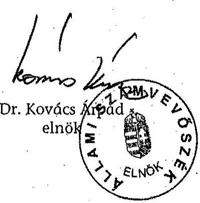

---

# Az önkormányzati vagyon nagyságának alakulása

|  Mérlegsor megnevezése | 2001. év
(ezer Ft) | 2002. év
(ezer Ft) | 2003. év
(ezer Ft) | Változás \%-a |  |   |
| --- | --- | --- | --- | --- | --- | --- |
|   |  |  |  | 2002/2001. | 2003/2002. | 2003/2001.  |
|  Immateriális javak | 60839 | 24772 | 28896 | $40,72 \%$ | $116,65 \%$ | $47,50 \%$  |
|  Tárgyi eszközök | 6956019 | 8737062 | 9111327 | $125,60 \%$ | $104,28 \%$ | $130,98 \%$  |
|  ebből: ingatlanok | 6400336 | 7254552 | 7710128 | $113,35 \%$ | $106,28 \%$ | $120,46 \%$  |
|  beruházások | 325903 | 1227065 | 1113137 | $376,51 \%$ | $90,72 \%$ | $341,55 \%$  |
|  Befektetett pénzügyi eszközök | 1077352 | 973557 | 830256 | $90,37 \%$ | $85,28 \%$ | $77,06 \%$  |
|  Üzemeltetésre átadott eszközök | 1315945 | 1496590 | 2198740 | $113,73 \%$ | $146,92 \%$ | $167,08 \%$  |
|  Befektetett eszközök összesen | 9410155 | 11231981 | 12169219 | $119,36 \%$ | $108,34 \%$ | $129,32 \%$  |
|  Forgoeszközök összesen | 1362293 | 1193077 | 1130729 | $87,58 \%$ | $94,77 \%$ | $83,00 \%$  |
|  ebből: követelések | 568963 | 565749 | 249685 | $99,44 \%$ | $44,13 \%$ | $43,88 \%$  |
|  pénzeszközök | 627876 | 513689 | 728885 | $81,81 \%$ | $141,89 \%$ | $116,09 \%$  |
|  Eszközök összesen | 10772448 | 12425058 | 13299948 | $115,34 \%$ | $107,04 \%$ | $123,46 \%$  |
|  Saját tőke | 9790482 | 11694261 | 12302533 | $119,45 \%$ | $105,20 \%$ | $125,66 \%$  |
|  Tartalék összesen | 627632 | 438503 | 605446 | $69,87 \%$ | $138,07 \%$ | $96,47 \%$  |
|  Kötelezettségek összesen | 354334 | 292294 | 391969 | $82,49 \%$ | $134,10 \%$ | $110,62 \%$  |
|  ebből: rövid lejáratú kötelezettségek | 190488 | 107095 | 103318 | $56,22 \%$ | $96,47 \%$ | $54,24 \%$  |
|  hosszú lejáratú kötelezettségek | 0 | 0 | 8315 | - | - | -  |
|  Források összesen: | 10772448 | 12425058 | 13299948 | $115,34 \%$ | $107,04 \%$ | $123,46 \%$  |

---

Budapest Főváros I. kerület Budavári Önkormányzat

# Az Önkormányzat gazdálkodását meghatározó adatok, mutatószámok

| Megnevezés | 2003. év |
| :--: | :--: |
| A kerület állandó lakosainak száma (fő) | 27014 |
| A Képviselő-testület tagjainak a száma (fő) | 24 |
| A Képviselő-testület munkáját segítő állandó bizottságok száma (db) | 6 |
| A Polgármesteri hivatalban foglalkoztatott köztisztviselők száma (fő) | 97 |
| Az összes vagyon értéke, a 2003. december 31-i számviteli mérleg szerint (millió Ft) | 13300 |
| Az adósságállomány értéke 2003. december 31-én (millió Ft) | 15 |
| Az egy lakosra jutó adósságállomány (Ft) | 555 |
| Az összes költségvetési bevétel (millió Ft) | 6497 |
| Ebből: saját bevétel (millió Ft), melyből | 4832 |
| helyi adóbevétel (millió Ft) | 1370 |
| Az egy lakosra jutó összes költségvetési bevétel (Ft) | 245910 |
| Az egy lakosra jutó saját bevétel (Ft) | 178870 |
| Az egy lakosra jutó helyi adóbevétel (Ft) | 50714 |
| Saját bevétel/Összes költségvetési bevétel (\%) | 72,74 |
| Helyi adó bevétel/Összes költségvetési bevétel (\%) | 20,62 |
| Az összes költségvetési kiadás (millió Ft) | 5900 |
| Ebből: felhalmozási célú kiadás (millió Ft) | 1139 |
| Az összes költségvetési kiadásból a felhalmozási kiadás részaránya (\%) | 19,18 |
| Az egy lakosra jutó költségvetési kiadás (Ft) | 219812 |
| Az egy lakosra jutó felhalmozási kiadás (Ft) | 42163 |
| Az önkormányzat által fenntartott költségvetési intézmények száma (db) | 23 |
| Ebből: részben önállóan gazdálkodó (db) | 16 |
| Az önkormányzat által fenntartott költségvetési intézményekben foglalkoztatott közalkalmazottak száma (fő) | 692 |

---

3. számú melléklet

a V-1002/4/21/2004. számú jelentéshez

### Helyszíni ellenőrzési jegyzőkönyv

**Készült:** A Budavári Önkormányzat Polgármesteri Hivatalának hivatali helyiségében (Budapest, Kapisztrán tér 1. szám; II. emelet 209. számú iroda) 2004. június hó 4-én.

**Jelen vannak:**

- Schösz Attiláné számvevő, az Állami Számvevőszék Önkormányzati Területi Igazgatósága részéről;
- Dr. Zelliger Erzsébet elnök, a Krisztinavárosi Cserkészalapitvány részéről;
- Zsolt Miklósné aktiva, a Krisztinavárosi Cserkészalapitvány részéről;
- Bojti Györgyné vezető főtanácsos, a Polgármesteri Hivatal Művelődésügyi Iroda részéről.

**Tárgy:** A Budavári Önkormányzat által céljelleggel juttatott támogatás felhasználásának ellenőrzése

A Budavári Önkormányzat Kulturális Oktatási és Sport Bizottsága a 2003. évben pályázatot írt ki az I. kerületben működő civil szervezetek és közösségek kulturális és művészeti tevékenységének támogatására, valamint sportesemények és táborozási programok támogatására. A Krisztinavárosi Cserkészalapitvány a pályázati határidőn belül három pályázatot nyújtott be:

1. a Krisztina Kör (2003. pünkös és karácsony közötti) rendezvényeire,
2. a 148. számú Nagyboldogasszony Cserkészcsapat nyári (2003. augusztus hónapra tervezett) táborozására, valamint
3. a Havas Boldogasszony Ifjúsági Sporttábor (2003. augusztus hónapra tervezett) táborozására.

A Kulturális Oktatási és Sport Bizottság 78/2003. (VI. 10.) számú határozata alapján „148. számú Nagyboldogasszony Cserkészcsapat nyári táborozása” című programra 100 000 Ft támogatásra és a “Havas Boldogasszony Ifjúsági Sporttábor nyári programjainak megvalósítására” 100 000 Ft támogatásra, valamint a 79/2003. (VI. 10.) számú határozata alapján a „kiállítás rendezésre és újság kiadására” 65 000 Ft támogatásra kötött szerződést az Önkormányzat nevében a polgármester 2003. június 12-én támogatási célonként külön-külön (1. számú melléklet).

---

A Krisztinavárosi Cserkészalapítvány elnöke nyilatkozott, hogy az alapítvány a 2003. év során máshonnan is kapott támogatást. A Gyermek- Ifjúsági és Sport Minisztériumtól (továbbiakban: GyISM) a 148. számú Nagyboldogasszony Cserkészcsapat nyári táboroztatásának megvalósitására, illetve a tábori felszerelések beszerzásére kaptak összesen 200000 Ft -ot. A GyISM-mel kötött szerződést és a GyISM felé benyújtott elszámolást jelenleg nem tudják bemutatni, mert nem hozták magukkal. Amennyiben szilkséges, a későbbiek folyamán bemutatlák. A GyISM felé elszámolt eredeti számlákat viszont bemutatták, melyek mindegyike záradékkal, sorszámmal, az önrész megjelölésével és dátummal volt ellátva. A záradékolt számlák összege 564935 Ft volt.

A 2003. év során a Krisztinavárosi Cserkészalapítvány az alábbi támogatásokban részesült, melyek azonban nem kötődtek az Önkormányzat által adott támogatási célokhoz:
55000 Ft - a GyISM-től - könyvtár kialakítására,
150000 Ft - a Fővárosi Önkormányzattól - felszerelés biztosítására.
A Krisztinavárosi Cserkészalapítvány a Budavári Önkormányzat felé a támogatási szerződésben előírt határidőre elszámolt mindhárom támogatás összegével, melyet a Polgármesteri Hivatal Müvelődésügyi Iroda ügyintézője ellenőrzését követően a Kulturális Oktatási és Sport Bizottság a 39/2004. (IV. 6.) számú határozatával elfogadott. Az elszámolás egyrészt szakmai, másrészt pénzügyi elszámolás volt.

A támogatott képviselője a helyszíni ellenőrzés során bemutatta a támogatások elszámolásához benyújtott eredeti számlákat, az 1990. október 19 -én hitelesített naplófőkönyvet (mely a 2003. év könyvelési tételeit is tartalmazza), a 2003. évi bankszámlakivonatokat és kiadási pénztárbizonylatokat.

A Krisztinavárosi Cserkészalapítvány elnöke a benyújtott számlákkal kapcsolatban nyilatkozott, hogy a 2. számú mellékletben tételesen felsorolt élclmezési számlák a nyári táborozásban résztvevők ellátását szolgálták.

A 148. számú Nagyboldogasszony Cserkészcsapat nyári táborozásához a melléklet 1., 2. sorszáma alatt feltüntetett ásó, kapa, léc, fürészárut a tábor építéséhez használták fel, hisz padokat, asztalokat, illemhelyet saját maguk készítettek.

A Havas Boldogasszony ifjúsági tábor kiadásaihoz elszámolt, a melléklet 11. sorszáma alatt feltüntetett mủanyag tömlő, összekötő, csatlakozó a víz biztosítását szolgálta, a forrástól a kialakitott konyháig és zuhanyozóig. A melléklet 5., 9., 10. sorszáma alatt feltüntetett textilfesték, flanel anyag, fonal kézműves foglalkozáshoz került felhasználásra. A melléklet 7., 8. sorszámában feltüntetett könyvek a természet megismertetését szolgálták. A melléklet 12. sorszámában feltüntetett vasúti menetjegyek a táborhelyre való utaztatás kiadásai. A melléklet 13. sorszámában feltüntetett terembérlet a sportedzések helyszinét biztosította. A melléklet 14. sorszámában feltüntetett étkezés számla a táborozók meleg étkeztetésére szolgált. Mindezt az is alátámasztja, hogy e két utolsó számla kiállításának helye megegyezik a táborozás helyével.

A kiállítás rendezéséhez és újság kiadásához kapcsolódóan a Krisztinavárosi Cserkészalapítvány elnöke nyilatkozott, hogy az Önkormányzat felé elszámolt számlák mind a kiállításhoz kapcsolódnak, újság kiadásával kapcsolatosan nem számoltak el számlát, mivel a kiállítás költségei kimerítették az Önkormányzattól kapott támogatási összeget. A kiállítás megnyitásakor hangversenyt rendeztek, melyet szóbeli megállapodás alapján a Krónikásének Közhasznú Alapítvány adott (melléklet 2. sorszáma).

---

A kiálítás ideje alatt annak keretében a helyszínen mikulás ünnepséget tartottak gyerekek számára. Ezért számoltak el könyveket, mikulás csomagokat, almát és télapó zacskókat (melléklet 1., 3-5. sorszám). A könyveket és a mikulás csomagokat, illetve a gyümölcsöt a részt vevő gyerekek között osztották szét.

A bemutatott és előzőekben felsorolt dokumentumok alapján megállapítható, hogy a Krisztinavárosi Cserkészalapítvány az Önkormányzat felé elszámolt számlákat nem nyájtotta be elszámolásra a GyISM felé, illetve a GyISM felé elszámolt számlákat nem nyújtotta be elszámolásra az Önkormányzat felé. Az Önkormányzat felé elszámolt számlák mindegyike készpénzfizetési számla, a programok megvalósitásának időpontjára szólnak, későbbi időpontra szóló számlát nem csatoltak be. A becsatolt számlák mindegyike a pályázati célhoz kötődik.

A fenti jegyzökönyv a megjelentek által elmondottakat tartalmazzák, melyet aláírásukkal igazolnak.
2004. június hó 4.
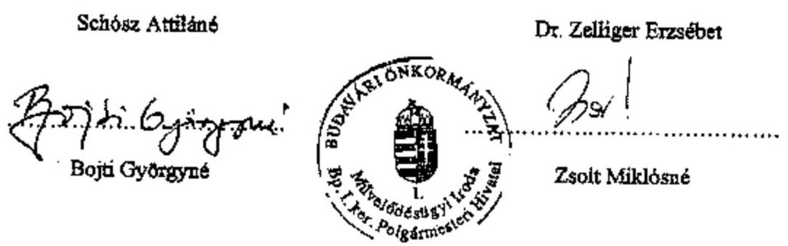

---

# TÁMOGATÓI SZERZŐDÉS 

amely létrejött a Budavári Önkormányzat (1014 Budapest, Kapisztrán tér 1., képviseli: dr. Dr. Nagy Gábor Tamás polgármester a továbbiakban Támogatój, valamint a Krisztinavárosi Cserkész Alapítvány 1013 Budapest, Pauler u.14. képviseli Dr.Zelliger Erzsébet, a továbbiakban Támogatott) között a mai napon az alábbi feltételekkel:
1.) Támogató a jelen Megállapodásban rögzített - alább részletezett feltételekkel - vissza nem térítendő pénzügyi támogatást nyújt a Támogatott részére:
„a Krisztina Kör baráti társaság részére kiállítás rendezése és újság kiadása" e. program céljára.
2.) Támogató a 2003. évi költségvetés Kulturális, Oktatási és Sport Bizottság keretének terhére
$65.000,-$ Ft, azaz
Hatvanötezer forint támogatást biztosít.
Támogató az Áht. 13/a. §-ának (2) bekezdésének figyelembevételével nyújtja.
3.) Támogatott a Támogató döntése alapján a 2.) pontban megjelölt támogatást kizárólag az 1.) pontban rögzített cél fedezésére, a Megállapodásban rögzített feltételek betartásával rendeltetésszerüen használhatja fel.
4.) A Támogatott tudomásul veszi, hogy amennyiben a jelen megállapodás alapján biztosított céljellegủ támogatást nem a meghatározott feladat megvalósítására használja fel, úgy a Támogató jelen megállapodást azonnali hatállyal felmondhatja. Ebben az esetben a Támogató kötelezheti a Támogatottat a felmondás idópontjáig történt kifizetés összegének - a mindenkori jegybanki alapkamat kétszeresével növeiten történő - visszafizetésére, és a következő 5 évig kizárhatja a támogatás igényléséből.
5.) A Támogatott rendelkezésére bocsátott támogatással a jelen szerződésben foglaltak szerint 2003. december 15 -ig köteles a csatolt 1. sz. űrlap felhasználásával tételes és hiteles pénzügyi elszámolást (esetleg a pénzügyi bizonylatok másolatának egyidejü megküldésével), valamint szơveges beszámolót készíteni és azt a Polgármesteri Hivatal Müvelődésiugyi Irodájára, Bojti Györgyné részére ajánlottan megküldeni. Ha a Támogatott a tételes és hiteles pénzügyi elszámolásra vonatkozó kötelezettségét elmulasztja, s ezáltal lehetetlenné teszi annak megállapítását, hogy a biztosított támogatást a Támogatott rendeltetésszerü használta-e fel, a Támogató a szerződés 4.) pontjában foglaltak szerinti járulékokkal emelt mértékben kötelezheti a Támogatottat a támogatás visszafizetésére.
6.) Támogatott vállalja, hogy a támogatási cél megvalósulása során annak propagandájában, kiadványaiban a Támogatót nevének megjelentetésével, mint támogatót feltünteti.

---

7.) Támogatott képviselője kijelenti, hogy a Támogatott képviseletére és a jelen szerződés aláirására megfelelő jogosultsággal rendelkezik azzal, hogy ezzel összefüggésben felmerüló károkért a polgári jog szabályai szerint tartozik felelőseggel a Támogató felé.
8.) Az esetleges vitás kérdéseket a Támogató és a Támogatott egymás között békés úton igyekeznek rendezni. Szerződő felek a helyi biróság hatáskörébe tartozó vitás kérdéseik tekintetében a PKKB kizárólagos illetékességét kötik ki.

Felek a jelen szerződést, mint szerződéses akaratukkal mindenben megegyezőt jóváhagyólag írták alá azzal, hogy az itt nem szabályozott kérdések tekintetében a Ptk. vonatkozó rendelkezéseit tekintik az irányadónak.

Budapest, 2003. június 12.
a támogató képviseletében:
a támogatott képviseletében:
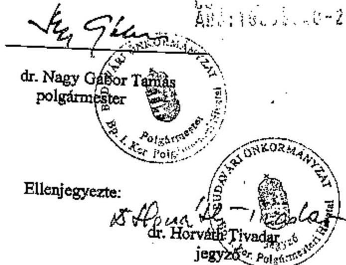
a támogatott képviselője

Ellenjegyezte:
$\frac{15}{2}$ dr. Horváth Tivadar
jegyzés: $\qquad$
A támogatásról szóló határozat:száma: 79/2003. (VI. 10.) KOSB sz. határozat

Az elszámolásért felelős: Bojti Györgyné referens.

Hille
$9 \begin{aligned} & 2004 \\ & 06.04 .\end{aligned}$
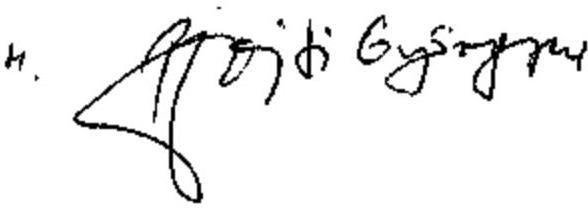

---

# TÁMOGATÓI SZERZŐDÉS 

amely létrejött a Budavári Önkormányzat (1014 Budapest, Kapisztrán tér 1., képviseli: dr. Nagy Gábor Tamás polgármester, a továbbiakban Támogató), Krisztinavárosi Cserkész Alapítvány 1013 Budapest, Pauler u.14. képviseli Dr.Zelliger Erzsébet, a továbbiakban Támogatott) között a mai napon az alábbi feltételekkel:
1.) Támogató a jelen Megállapodásban rögzített - alább részletezett feltételekkel - vissza nem térítendő pénzügyi támogatást nyújt a Támogatott részére:
„Havas Boldogasszony Ifjúsági Sporttábor u yári programjai c. program, céljára.
2.) Támogató a 2003. évi költségvetés Kulturális, Oktatási és Sport Bizottság keretének terhére
$100.000,-$ Ft, azaz
százezer forint támogatást biztosít.
Támogató az Áht. 13/a. §-ának (2) bekezdésének figyelembevételével nyújtja.
3.) Támogatott a Támogató döntése alapján a 2.) pontban megjelölt támogatást kizárólag az 1.) pontban rögzített cél fedezésére, a Megállapodásban rögzített feltételek betartásával rendeltetésszerüen használhatja fel.
4.) A Támogatott tudomásul veszi, hogy amennyiben a jelen megállapodás alapján biztosított céljellegủ támogatást nem a meghatározott feladat megvalósítására használja fel, úgy a Támogató jelen megállapodást azonnali hatállyal felmondhatja. Ebben az esetben a Támogató kötelezheti a Támogatottat a felmondás időpontjáig történt kifizetés összegének - a mindenkori jegybenki alapkamat kétszeresével növelten történő - visszafizetésére, és a következő 5 évig kizárhatja a támogatás igényléséből.
5.) A Támogatott rendelkezésére bocsátott támogatással a jelen szerződésben foglaltak szerint 2003. december 15 -ig köteles a csatolt 1. sz. űrlap felhasználásával tételes és hiteles pénzügyi elszámolást (esetleg a pénzügyi bizonylatok másolatának egyidejü megküldésével), valamint szôveges beszámolót készíteni és azt a Polgármesteri Hivatal Müvelődéstigyi Irodájára, Bojti Györgyné részére ajánlottan megküldeni. Ha a Támogatott a tételes és hiteles pénzügyi elszámolásra vonatkozó kötelezettségét elmulasztja, a ezáltal lehetetlenné teszi annak megállapítását, hogy a biztosított támogatást a Támogatott rendeltetésszerü használta-e fel, a Támogató a szerződés 4.) pontjában foglaltak szerinti járulékokkal emelt mértékben kötelezheti a Támogatottat a támogatás visszafizetésére.
6.) Támogatott vállalja, hogy a támogatási cél megvalósulása során annak propagandájában, kiadványaiban a Támogatót nevének megjelentetésével, mint támogatót feltünteti.

---

7.) Támogatott képviselöje kijeienti, hogy a Támogatott képviseletére és a jelen szerzödés alárására megfelelő jogosultsággal rendelkezik azzal, hogy ezzel összefüggésben felmerüló károkért a polgári jog szabályai szerint tartozik felelőséggel a Támogató felé.
8.) Az esetleges vitás kérdéseket a Támogató és a Támogatott egymás között békés úton igyekeznek rendezni. Szerződő felek a helyi biróság hatáskörébe tartozó vitás kérdéseik tekintetében a PKKB kizárólagos illetékességét kötik ki.

Felek a jelen szerződést, mint szerződéses akaratukkal mindenben megegyezőt jóváhagyólag írták alá azzal, hogy az itt nem szabályozott kérdések tekintetében a Ptk. vonatkozó rendelkezéseit tekintik az irányadónak.

Budapest, 2003. június 12.
a támogató képviseletében:
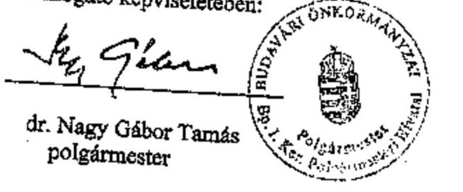
a támogatott képviseletében:
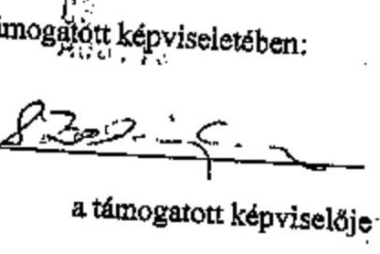
a támogatott képviselője

Ellenjegyezte:
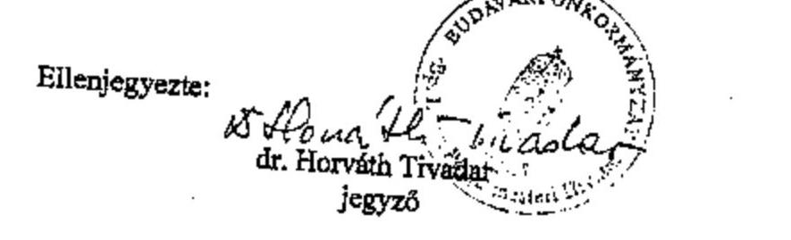

A támogatásról szóló határozat:száma: 78/2003. (VI. 10.) KOSB sz. határozat

Az elszámolásért felelős: Bojti Györgyné referens.

Hitle
Bp, 2004. 06.04.

---

# TÁMOGATÓI SZERZŐDÉS 

amely létrejött a Budavári Önkormányzat (1014 Budapest, Kapisztrán tér 1., képviseli: dr. Nagy Gábor Tamás polgármester, a továbbiakban Támogató), Krisztinavárosi Cserkész Alapítvány 1013 Budapest, Pauler u.14. képviseli Dr.Zelliger Erzsébet, a továbbiakban Támogatott) között a mai napon az alábbi feltételekkel:
1.) Támogató a jelen Megállapodásban rögzített - alább részletezett feltételekkel - vissza nem térítendő pénzügyi támogatást nyújt a Támogatott részére:
„148.sz.Nagyboldogasszony Cserkészcsapat nyári táborozása c. program„céljára.
2.) Támogató a 2003. évi költségvetés Kulturális, Oktatási és Sport Bizottság keretének terhére
:100.000,- Ft, azaz
százezer forint támogatást biztosít.
Támogató az Ábt. 13/a. §-ának (2) bekezdésének figyelembevételével nyújtja.
3.) Támogatott a Támogató döntése alapján a 2.) pontban megjelölt támogatást kizárólag az 1.) pontban rögzített cél fedezésére, a Megállapodásban rögzített feltételek betartásával rendeltetésszertien használhatja fel.
4.) A Támogatott tudomásul veszi, hogy amennyiben a jelen megállapodás alapján biztosított céljellegủ támogatást nem a meghatározott feladat megvalósítására használja fel, úgy a Támogató jelen megállapodást azonnali hatállyal felmondhatja. Ebben az esetben a Támogató kötelezheti a Támogatottat a felmondás időpontjáig történt kifizetés összegének - a mindenkori jegybanki alapkamat kétszeresével növelten történő - visszafizetésére, és a következő 5 évig kizárhatja a támogatás igényléséből.
5.) A Támogatott rendelkezésére bocsátott támogatással a jelen szerződésben foglaltak szerint 2003. december 15-ig köteles a csatolt 1. sz. űrlap felhasználásával tételes és hiteles pénzügyi elszámolást (esetleg a pénzügyi bizonylatok másolatának egyidejủ megküldésével), valamint szöveges beszámolót készíteni és azt a Polgármesteri Hivatal Müvelődésügyi Irodájára, Bojti Györgyné részére ajánlottan megküldeni. Ha a Támogatott a tételes és hiteles pénzügyi elszámolásra vonatkozó kötelezettségét elmulasztja, s ezáltal lehetetlenné teszi annak megállapítását, hogy a biztosított támogatást a Támogatott rendeltetésszerú használta-e fel, a Támogató a szerződés 4.) pontjában foglaltak szerinti járulékokkal emelt mértékben kötelezheti a Támogatottat a támogatás visszafizetésére.
6.) Támogatott vállalja, hogy a támogatási cél megvalósulása során annak propagandájában, kiadványaiban a Támogatót nevének megjelentetésével, mint támogatót feltünteti.

---

7.) Támogatott képviselője kijelenti, hogy a Támogatott képviseletére és a jelen szerződés aláírására megfelelő jogosultsággal rendelkezik azzal, hogy ezzel összefüggésben felmerülő károkért a polgári jog szabályai szerint tartozik felelőséggel a Támogató felé.
8.) Az esetleges vitás kérdéseket a Támogató és a Támogatott egymás között békés úton igyekeznek rendezni. Szerződő felek a helyi biróság hatáskörébe tartozó vitás kérdéseik tekintetében a PKKB kizárólagos illetékességét kötik ki.

Felek a jelen szerződést, mint szerződéses akaratukkal mindenben megegyezőt jóváhagyólag írták alá azzal, hogy az itt nem szabályozott kérdések tekintetében a Ptk. vonatkozó rendelkezéseit tekintik az irányadónak.

Budapest, 2003. június 12.
a támogató képviseletében: 00000000
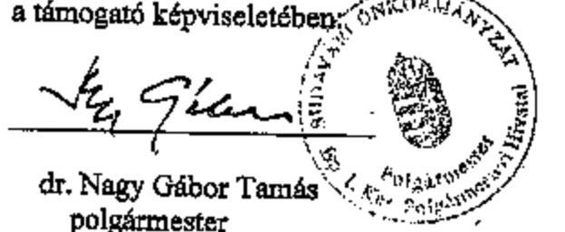
a támogatott képviseletében:
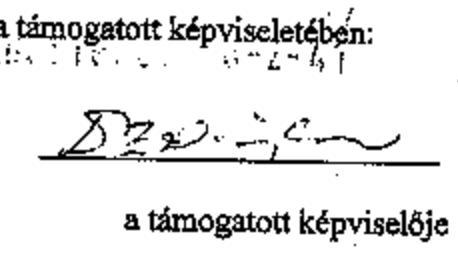
a támogatott képviselője

Ellenjegyezte: $\frac{B}{\text { dr. Horváth Tivadari }}$ a támogatott képviselője
jegyzö

A támogatásról szóló határozat:száma: 78/2003. (VI. 10.) KOSB sz. határozat

Az elszámolásért felelős: Bojti Györgyné referens.

Hitle
$9 p, 2004.06 .04$.

---

# A 148. számú Nagyboldogasszony Cserkészcsapat nyári táborozásához 

1) a 005/0367871 számú, OBI Barkácsáruház által 2003. július 29-én kiállított 13041 Ft összegü, ásó, kapa, kapanyél megnevezésú;
2) a K1-022210/03. számú, ZATIK. Fáruház által 2003. július 29-én kiállított 14900 Ft összegü, léc, fürészárú megnevezésű;
3) a 01603303 számú, a Tesco Global Áruház által 2003. augusztus 03-én kiállított, 47000 Ft összegü, élelmiszer megnevezésű;
4) a 01702868 számú, a Tesco Global Áruház által 2003. augusztus 13-án kiállított 3293 Ft összegü, élelmiszer megnevezésü, valamint
5) a 00604584 számú, a Tesco Global Áruház által 2003. augusztus 10-én kiállított 22351 Ft összegü, élelmiszer megnevezésű, kiállított számlákat.

## A kiállítás rendezéséhez és újság kiadásához

1) a 0252307 számú, Püski Kiadó Kft. Könyvesboltja által 2003. december 9-én kiállított, 3560 Ft összegü, könyvek megnevezésű;
2) a 0364787 számú, Krónikásének Közhasznú Alapítvány által 2003. november 23-án kiállított, 60000 Ft összegü, művészeti szolgáltatás megnevezésű;
3) a 8288058 számú, Novák Margit vegyeskereskedő által 2003. december 3-án kiállított, 1120 Ft összegü, mikulás csomag megnevezésű;
4) a 648965 számú, Kerezei István zöldség-gyümölcs kereskedő által 2003. december 2-én kiállított, 832 Ft összegü, alma megnevezésű, valamint
5) a 0986227 számú, Kiskőrösi Ervinné trafik-bazár által 2003. december 2-án kiállított, 200 Ft összegü, télapó zacskó megnevezésű számlákat.

## A Havas Boldogasszony Ifjúsági Tábor kiadásaihoz

1) a SPAR Magyarország Kft. által kiállított, 02-004928 számú (2003. augusztus 21.), 2430 Ft összegü, élelmiszer megnevezésű,
2) a SPAR Magyarország Kft. által kiállított a 01-0005559 számú (2003. augusztus 22.), 1463 Ft összegü, élelmiszer megnevezésű,
3) a SPAR Magyarország Kft. által kiállított a 01-0005561 számú (2003. augusztus 22.), 1564 Ft összegü, élelmiszer megnevezésű,
4) a SPAR Magyarország Kft. által kiállított a 01-0005564 számú (2003. augusztus 23.), 3347 Ft összegü, élelmiszer megnevezésű;

---

5) a KJ 418 Kft által kiállított, KJ30379/03/1 számú (2003. július 25.), 2160 Ft összegű, agyag, textilfesték megnevezésű,
6) a KJ30392/03/1 (2003. július 31.) számú, 1260 Ft összegű, olajfestőecset, textilfesték megnevezésű;
7) a Hagyományok Háza által 2003. július 30 -án kiállított, 03/000309 számú, 5150 Ft összegű, Magyar népi énekiskola, Gyimes, Szatmár-Kalctaszeg, Szék, Nyugat-Mezőség, Népi játszóház megnevezésű;
8) a Diákvilág 2000 Kft. által 2003. szeptember 8 -án kiállított, 03/001117 számú, 3971 Ft összegű, Édesvizi gerinctelen határozó megnevezésű;
9) a Forgács és Társai Bt. által 2003. július 25 -én kiállított, 71871 számú, 3360 Ft összegü, flanel megnevezésű;
10) a Budapesti Müvelődési Központ által 2003. július 4-én kiállított, 3826908 számú, 10560 Ft összegű, fonal megnevezésű;
11) a FarmForg Kft. által 2003. augusztus 2 -án kiállított, 0261053 számú, 6890 Ft összegű, műanyag tömlő, összekötő, csatlakozó megnevezésű;
12) a WASTEELS Utazási Kft. által 2003. augusztus 21-én kiállított, 150930 számú, 2065 Ft összegű, vasúti jegyek tartalmú;
13) a Vaszary János Általános Iskola (Tata) által kiállított, 586975 számú, 40000 Ft összegű, terembérlet megnevezésű; valamint
14) a HM Honvéd Kht. által (Tata) által kiállított, 1404915 számú, 15910 Ft összegű, étkezés megnevezésű számlákat.

---

Budapest Főváros I. kerület Budavári Önkormányzat

# Az Önkormányzat 2003. évi bevételeinek és kiadásainak alakulása

Adatok: ezer Ft-ban

|  Mérlegsor megnevezése | Eredeti | Módosított | Teljesítés  |
| --- | --- | --- | --- |
|   | előirányzat |  |   |
|  Bevételek |  |  |   |
|  Intézményi müködési bevételek | 451715 | 466774 | 477063  |
|  Kamatbevételek * | 17000 | 20412 | 35733  |
|  Gépjárműadó | 120000 | 120000 | 120116  |
|  Helyi adók és kapcsolódó pótlékok, bírságok | 1298120 | 1403006 | 1370104  |
|  Illetékek | - | - | -  |
|  Személyi jövedelemadó | 396709 | 399868 | 399868  |
|  Egyéb átengedett adók, adójellegü bevételek | - | - | -  |
|  Önkorm. megillető bírságok és egyéb sajátos bevételek | 991078 | 1010623 | 1004515  |
|  Müködési célra átvett pénzeszközök | 273323 | 318536 | 313872  |
|  Költségvetési kiegészitések, visszatérülések | - | - | 145531  |
|  Felhalmozási és tőkejellegű bevételek | 920000 | 962659 | 941452  |
|  ebböl: |  |  |   |
|  Tárgyi eszköz, immateriális javak értékesítése | 320000 | 370188 | 331714  |
|  Önkorm. lakások, egyéb helyiségek ért., cseréje | 400000 | 310000 | 327206  |
|  Részesedések értékesítése | - | - | -  |
|  Felhalmozási célra átvett pénzeszközök | 5000 | 10611 | 9122  |
|  Kölcsönök visszatérülése, igénybevétele | 8000 | 8000 | 15079  |
|  Saját bevételek összesen | 4480945 | 4720487 | 4832457  |
|  Önkormányzat költségvetési támogatása | 1267638 | 1394608 | 1224300  |
|  Előző évi pénzmaradvány igénybevétele | - | 438503 | 576456  |
|  Hitelek bevételei | 328392 | 242028 | -  |
|  Értékpapírok bevételei | - | - | 9728  |
|  Egyéb finanszírozás bevételei | - | - | 78222  |
|  BEVÉTELEK MINDÖSSZESEN | 6076975 | 6795626 | 6497410  |
|  Kiadások |  |  |   |
|  Személyi juttatások | 2031224 | 2121788 | 2041456  |
|  Munkaadókat terhelő járulékok | 667190 | 694215 | 667748  |
|  Dologi kiadások | 1704881 | 1759917 | 1628465  |
|  Egyéb folyó kiadások | 38414 | 73446 | 218189  |
|  Ellátottak pénzbeli juttatása | 9185 | 16181 | 14262  |
|  Müködési célú pénzeszköz átadás | 41765 | 75513 | 56895  |
|  Társadalom- és szociálpolitikai juttatások | 131700 | 160869 | 119365  |
|  Tervezett maradvány, eredmény, tartalék | 274656 | 112429 | -  |
|  Felújítás | 383000 | 651011 | 469747  |
|  Intézményi beruházási kiadások | 650460 | 901263 | 512421  |
|  Egyéb felhalmozási kiadások | - | - | -  |
|  Részesedések vásárlása | - | - | -  |
|  Felhalmozási célú pénzeszköz átadások | 144500 | 219832 | 156622  |
|  Kölcsönök törlesztése, nyújtása | - | - | -  |
|  Hitelek törlesztése | - | 9162 | 14372  |
|  Értékpapírok kiadásai | - | - | -  |
|  Egyéb finanszírozás kiadásai | - | - | -  |
|  KIADÁSOK MINDÖSSZESEN | 6076975 | 6795626 | 5899542  |

[^0] [^0]: * a 35733 ezer Ft-ból 27578 ezer Ft az átmenetileg szabad pénzeszközökből származó kamatbevétel, 8155 ezer Ft a részvények utáni kamatbevétel

---

# Egyes önkormányzati feladatok finanszírozása 

| Megnevezés | 2001. év | 2002. év | 2003. év | A finanszírozási források megoszlásának változása (+/- százalékpont) |  |
| :--: | :--: | :--: | :--: | :--: | :--: |
|  |  |  |  | $\begin{gathered} 2002-2001 \\ \text { év } \end{gathered}$ | $\begin{gathered} 2003-2002 \\ \text { év } \end{gathered}$ |
| Bölcsődei ellátás: egy ellátottra jutó kiadás (Ft/fö) | 1103756 | 1237844 | 1276113 |  |  |
| Egy ellátottra jutó kiadás változása (előző év = 100\%) | - | 112,1 | 103,1 |  |  |
| A kiadások forrásának megoszlása (\%) |  |  |  |  |  |
| - állami hozzájárulás, támogatás | 16,1 | 16,9 | 28,9 | 0,8 | 12,0 |
| - önkormányzati támogatás | 78,8 | 77,8 | 66,0 | $-1,0$ | $-11,8$ |
| - intézményi saját bevétel | 5,1 | 5,3 | 5,1 | 0,2 | $-0,2$ |
| Övodai nevelés: egy ellátottra jutó kiadás (Ft/fö) | 370323 | 445763 | 539851 |  |  |
| Egy ellátottra jutó kiadás változása (előző év = 100\%) | - | 120,4 | 121,1 |  |  |
| A kiadások forrásának megoszlása (\%) |  |  |  |  |  |
| - állami hozzájárulás, támogatás | 37,0 | 34,5 | 37,9 | $-2,5$ | 3,4 |
| - önkormányzati támogatás | 62,3 | 64,5 | 61,8 | 2,2 | $-2,7$ |
| - intézményi saját bevétel | 0,7 | 1,0 | 0,3 | 0,3 | $-0,7$ |
| Általános Iskolai oktatás: egy ellátottra jutó kiadás (Ft/fö) | 294662 | 373714 | 464062 |  |  |
| Egy ellátottra jutó kiadás változása (előző év = 100\%) | - | 126,8 | 124,2 |  |  |
| A kiadások forrásának megoszlása (\%) |  |  |  |  |  |
| - állami hozzájárulás, támogatás | 49,0 | 43,5 | 48,2 | $-5,5$ | 4,7 |
| - önkormányzati támogatás | 46,5 | 53,3 | 50,3 | 6,8 | $-3,0$ |
| - intézményi saját bevétel | 4,5 | 3,2 | 1,5 | $-1,3$ | $-1,7$ |
| Középiskolai oktatás:   egy ellátottra jutó kiadás (Ft/fö) | 285801 | 348803 | 450717 |  |  |
| Egy ellátottra jutó kiadás változása (előző év = 100\%) | - | 122,0 | 129,2 |  |  |
| A kiadások forrásának megoszlása (\%) |  |  |  |  |  |
| - állami hozzájárulás, támogatás | 56,4 | 51,5 | 57,9 | $-4,9$ | 6,4 |
| - önkormányzati támogatás | 37,1 | 44,2 | 39,8 | 7,1 | $-4,4$ |
| - intézményi saját bevétel | 6,5 | 4,3 | 2,3 | $-2,2$ | $-2,0$ |
| Nappali szociális intézményi ellátás: egy ellátottra jutó kiadás (Ft/fö) | 291681 | 454106 | 293293 |  |  |
| Egy ellátottra jutó kiadás változása (előző év = 100\%) | - | 155,7 | 65,0 |  |  |
| A kiadások forrásának megoszlása (\%) |  |  |  |  |  |
| - állami hozzájárulás, támogatás | 40,6 | 31,8 | 60,6 | $-8,8$ | 28,8 |
| - önkormányzati támogatás | 40,0 | 56,1 | 21,7 | 16,1 | $-34,4$ |
| - intézményi saját bevétel | 19,4 | 12,1 | 17,7 | $-7,3$ | 5,6 |

---

# Nyilatkozat 

## Az I.ker. Cigány Kisebbségi Önkormányzat állami támogatása

Törvény szerinti állami támogatás
2001.év
2002.év
2003.év
2004.I.n.év

Kiutalt támogatás
$628.000,-$
$491.250,-$
$177.864,-*$
$178.500,-$
170.000,-
-

* reprezentáció utáni adó terhelés

Budapest,2004. június 4.

---

# BUDAVÁRI ÖNKORMÁNYZAT 

Krisztinaváros - Tahán - Gellérthegy - Vár - Vísiváros

Polgármester

Állami Számvevöszék
Dr. Kovács Árpád
elnök

Budapest
Apáczai Csere János u. 10.

Úgyiratszám: IV/20-2004. 11.16.

Tárgy: ÁSZ átfogó vizsgálata
Hiv.sz: V-1002-4/21/2004.

## Tisztelt Elnök Úr!

Köszönetemet fejezem ki, hogy az egyeztetetéseknek köszönhetően a szakmai észrevételeink figyelembe vételével készült Jelentés tárgyilagos képet mutat a Budavári Önkormányzat munkájáról.

A Jelentés azokra a területekre mutat rá, ahol intézkedéseket kell tenni, hogy a gazdálkodás megfeleljen a jelenleg érvényben lévő valamennyi jogszabályi előírásnak.

A Jelentéssel kapcsolatban további észrevételt nem kívánunk tenni. A Jelentésben foglaltakat hasznosítani kívánjuk, intézkedési tervet készítünk.

Budapest, 2004. november 11.
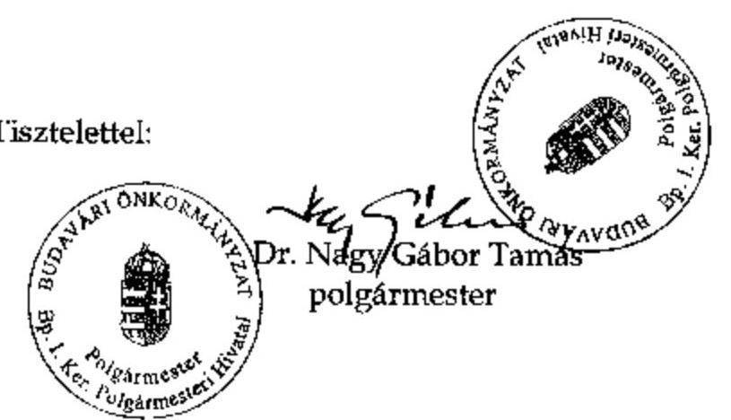