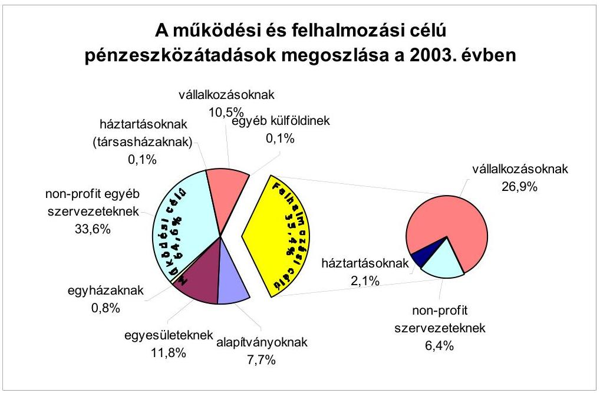
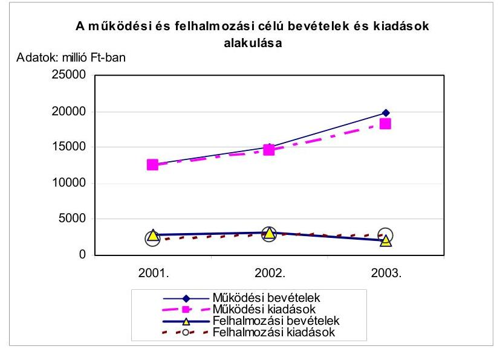
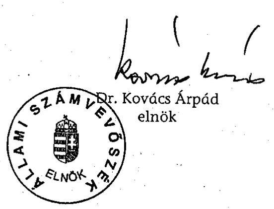
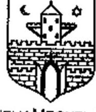
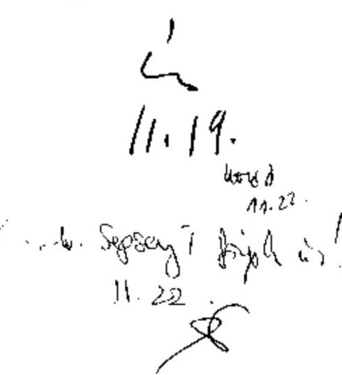
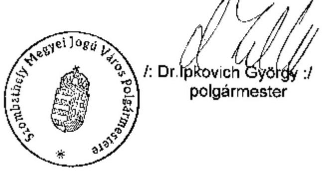

# JELENTÉS 

a Szombathely Megyei Jogú Város Önkormányzata gazdálkodásának átfogó ellenőrzéséről

---

3. Önkormányzati és Területi Ellenőrzési Igazgatóság
3.3. Átfogó Ellenőrzések Főcsoport
Iktatószám: V-1002-4/36/17/2004.
Témaszám: 692
Vizsgálat-azonosító szám: V0169

# Az ellenőrzést felügyelte: 

Dr. Lóránt Zoltán
főigazgató
Az ellenőrzés végrehajtásáért felelős:
Dr. Sepsey Tamás
főigazgató-helyettes
Az ellenőrzést vezette:
Csecserits Imréné
főcsoportfőnök-helyettes

## Az ellenőrzést végezték:

## Gaál László

számvevő
Kántor Ilona
tanácsadó
Kis Rita Teréz
számvevő
Molnár Istvánné
számvevő

A témához kapcsolódó - elmúlt négy évben - készített számvevőszéki jelentések:
címe
sorszáma
Jelentés a helyi és helyi kisebbségi önkormányzatok pénzügyí ..... 0010
gazdasági tevékenységének 1999. évi ellenőrzési tapasztalatiról
Jelentés a települési önkormányzatok szilárdhulladék-gazdálkodási ..... 0221
feladatai ellátásnak ellenőrzéséről
Jelentés a területfejlesztési tanácsok és munkaszervezeteik ..... 0327
rendelkezésére álló támogatások igénylésének és felhasználásának ellenőrzéséről
Jelentés a települési önkormányzatok szennyvízközmű fejlesztési és ..... 0416
működtetési feladatai ellátásának vizsgálatáról

---

# TARTALOMJEGYZÉK 

BEVEZETÉS ..... 5
I. ÖSSZEGZŐ MEGÁLLAPÍTÁSOK, KÖVETKEZTETÉSEK, JAVASLATOK ..... 7
II. RÉSZLETES MEGÁLLAPÍTÁSOK ..... 21

1. A költségvetés tervezésének, végrehajtásának, az Önkormányzat vagyongazdálkodásának és a zárszámadás elkészítésének szabályszerűsége ..... 21
1.1.A költségvetési rendelet jóváhagyásának, módosításának, az előirányzatok nyilvántartásának és betartásának szabályszerűsége ..... 21
1.2.A gazdálkodás szabályozottsága, a bizonylati rend és fegyelem szabályszerűsége ..... 26
1.3.A pénzügyi-számviteli feladatok ellátásának informatikai támogatottsága ..... 35
1.4.Az önkormányzati vagyon nyilvántartása, számbavétele ..... 37
1.5.A vagyonnal való gazdálkodás szabályszerűsége, célszerűsége, nyilvánossága ..... 40
1.6.A céljelleggel nyújtott támogatások szabályszerűsége ..... 46
1.7.A közbeszerzési eljárások szabályszerűsége ..... 50
1.8.A zárszámadási kötelezettség teljesítésének szabályszerűsége ..... 56
1.9.A Polgármesteri hivatal helyi kisebbségi önkormányzatok gazdálkodását segítő tevékenysége ..... 58
2. Az önkormányzati feladatok és a rendelkezésre álló források összhangja ..... 60
2.1.A feladatok meghatározása és szervezeti keretei ..... 60
2.2.A költségvetés egyensúlyának helyzete ..... 64
2.3.A feladatok finanszírozása ..... 69
3. A belső irányítási, ellenőrzési rendszer múködésének értékelése ..... 74
3.1.Az ellenőrzési rendszer kialakítása, múködése ..... 74
3.2.A könyvvizsgálati kötelezettség teljesítése ..... 78
3.3.A korábbi számvevőszéki ellenőrzések javaslatainak hasznosulása ..... 78

---

# MELLÉKLETEK 

1. számú Az önkormányzati vagyon nagyságának alakulása (1 oldal)
2. számú Az Önkormányzat 2003. évi bevételeinek és kiadásainak alakulása (1 oldal)
3. számú Az önkormányzati gazdálkodást meghatározó adatok, mutatószámok (1 oldal)
4. számú Egyes önkormányzati feladatok finanszírozása (1 oldal)
5. számú Jegyzőkönyv (1 oldal)
6. számú Dr. Ipkovich György polgármester úr észrevétele (1 oldal)

---

# RÖVIDÍTÉSEK JEGYZÉKE 

Ötv.
Áht.
Ámr.
Kbt.
Számv. tv.
Htv.

Nek. tv.
Vhr.

Ktv.

Ber.

Ksztv.
Önkormányzat
Közgyűlés
Pénzügyi bizottság
Közbeszerzési bizottság
HKÖ
NKÖ
NKÖ
RKÖ
Polgármesteri hivatal
Közgazdasági tervező osztály
Közgazdasági iroda

Pénzügyi osztály
a helyi önkormányzatokról szóló 1990. évi LXV. törvény az államháztartásról szóló 1992. évi XXXVIII. törvény az államháztartás múködési rendjéről szóló 217/1998. (XII. 30.) Korm. rendelet
a közbeszerzésekről szóló 1995. évi XL. törvény
a számvitelről szóló 2000. évi C. törvény
a helyi önkormányzatok és szerveik, a köztársasági megbízottak, valamint egyes centrális alárendeltségű szervek feladat- és hatásköreiről szóló 1991. évi XX. törvény
a nemzeti és etnikai kisebbségek jogairól szóló 1993. évi LXXVII. törvény
az államháztartás szervezetei beszámolási és könyvvezetési kötelezettségének sajátosságairól szóló 249/2000. (XII. 24.) Korm. rendelet
a köztisztviselők jogállásáról szóló 1992. évi XXIII. törvény
a költségvetési szervek belső ellenőrzéséről szóló 193/2003. (XI. 26.) Korm. rendelet
a közhasznú szervezetekről szóló 1997. évi CLVI. törvény
Szombathely Megyei Jogú Város Önkormányzata
Szombathely Megyei Jogú Város Önkormányzatának Közgyűlése
Szombathely Megyei Jogú Város Közgyűlésének Pénzügyi és Költségvetési Bizottsága
Szombathely Megyei Jogú Város Közgyűlésének Közbeszerzési Bizottsága
Szombathely Horvát Kisebbségi Önkormányzata
Szombathely Megyei Jogú Város Német Kisebbségi Önkormányzata
Szombathely Megyei Jogú Város Roma Kisebbségi Önkormányzata
Szombathely Megyei Jogú Város Önkormányzatának Polgármesteri Hivatala
Szombathely Megyei Jogú Város Önkormányzata Polgármesteri Hivatalának Közgazdasági Tervező Osztálya
Szombathely Megyei Jogú Város Önkormányzata Polgármesteri Hivatalának Közgazdasági Tervező Osztályának Közgazdasági Irodája
Szombathely Megyei Jogú Város Önkormányzata Polgármesteri Hivatalának Pénzügyi Osztálya

---

| Költségvetési iroda | Szombathely Megyei Jogú Város Önkormányzata Polgármesteri Hivatala Pénzügyi Osztályának Költségvetési Irodája |
| :--: | :--: |
| Ellenőrzési csoport | Szombathely Megyei Jogú Város Önkormányzata Polgármesteri Hivatalának Tisztségviselői Osztályának Ellenőrzési Csoportja |
| Intézményellenőrzési csoport | Szombathely Megyei Jogú Város Önkormányzata Polgármesteri Hivatala Pénzügyi Osztályának Intézményellenőrzési Csoportja |
| Beruházási iroda | Szombathely Megyei Jogú Város Önkormányzata Polgármesteri Hivatala Városüzemeltetési Osztályának Beruházási Irodája |
| Informatikai iroda | Szombathely Megyei Jogú Város Önkormányzata Polgármesteri Hivatala Informatikai és Szervezési Osztályának Informatikai Irodája |
| $\mathrm{SzMSz}_{1}$ | Szombathely Megyei Jogú Város Önkormányzatának az önkormányzat és szervei Szervezeti és Müködési Szabályzatáról szóló 9/1999. (III. 31.) számú rendelete |
| $\mathrm{SzMSz}_{2}$ | Szombathely Megyei Jogú Város Önkormányzatának az önkormányzat és szervei Szervezeti és Müködési Szabályzatáról szóló 20/2003. (V. 29.) számú rendelete |
| Ügyrend | a polgármester és a jegyző által 2003. június 16-án jóváhagyott, Szombathely Megyei Jogú Város Önkormányzat Polgármesteri Hivatala Ügyrendje |
| vagyongazdálkodási rendelet | Szombathely Megyei Jogú Város Önkormányzatának vagyonáról, a vagyontárgyak feletti tulajdonosi jogok gyakorlásáról szóló 18/1996. (IV. 4.) számú rendelete |
| közbeszerzési rendelet | Szombathely Megyei Jogú Város Önkormányzatának a közbeszerzésekről szóló törvény helyi végrehajtásáról szóló 4/1996. (II. 29.) számú rendelete |
| együttes utasítás ${ }_{1}$ | Szombathely Megyei Jogú Város Önkormányzatának és a Polgármesteri Hivatalnak kötelezettségvállalási, utalványozási és érvényesítési eljárásáról szóló polgármesteri és jegyzői $1 / 2003$. (I. 30.) számú együttes utasítás |
| együttes utasítás ${ }_{2}$ | Szombathely Megyei Jogú Város Önkormányzatának és a Polgármesteri Hivatalnak kötelezettségvállalási, utalványozási és érvényesítési eljárásáról szóló polgármesteri és jegyzői 5/A/2003. (VII. 1.) számú együttes utasítás |
| együttes utasítás ${ }_{3}$ | Szombathely Megyei Jogú Város Önkormányzatának és a Polgármesteri Hivatalnak kötelezettségvállalási, utalványozási és érvényesítési eljárásáról szóló polgármesteri és jegyzői 10/2003. (X. 3.) számú együttes utasítás |

---

# JELENTÉS   a Szombathely Megyei Jogú Város Önkormányzata gazdálkodásának átfogó ellenőrzéséről 

## BEVEZETÉS

Az Ötv. 92. § (1) bekezdése, az Állami Számvevőszékről szóló 1989. évi XXXVIII. törvény 2. § (3) bekezdése, valamint az Áht. 120/A. § (1) bekezdése szerint az Önkormányzatok gazdálkodását az Állami Számvevőszék ellenőrzi. Az ellenőrzés elvégzése az Országgyúlés illetékes bizottságai részére is átadott, országosan egységes ellenőrzési program alapján történt.

## Az ellenőrzés célja annak értékelése volt, hogy:

- az önkormányzati gazdálkodás törvényességét ${ }^{1}$, szabályszerűségét biztosították-e a tervezés, a költségvetés végrehajtása, a vagyongazdálkodás és a zárszámadás során;
- az Önkormányzat által ellátott feladatok és az azokhoz rendelkezésre álló források összhangja biztosított volt-e, különös tekintettel egyes kiemelt feladatokra;
- a gazdálkodás szabályszerűségét biztosító kontrollok ${ }^{2}$ megfelelően segitettéke a végrehajtást.

Az ellenőrzött időszak: a 2003. év, valamint a 2004. I. negyedév, az 1.5., 2.1-2.3 és 3.3. ellenőrzési programpontok esetében, ezen túlmenően a 20012002. évek.

Az Önkormányzat Vas megye székhelye, lakosainak száma 2003. január 1-jén 81373 fő volt. A Közgyűlés tagjainak száma 30 fő. A testület munkáját 12 állandó bizottság segítette. Az Önkormányzat gazdálkodását meghatározó adatokat az 1. számú melléklet tartalmazza.

A 2002. évi önkormányzati választások után változott a polgármester személye, az $\mathrm{SzMSz}_{2}$ jóváhagyását követően a Polgármesteri hivatal egyes szervezeti

[^0]
[^0]:    ${ }^{1}$ A törvényi előírások betartásának elmulasztásakor egységesen a törvénysértés megjelölést alkalmazzuk, mivel az ÁSZ nem tehet különbséget a törvényi előírások között.
    ${ }^{2}$ A gazdálkodás szabályszerűségét biztosító kontroll alatt értjük a kiépített és működő belső irányítási és szabályozási rendszert, valamint a belső ellenőrzési funkciók ellátását.

---

egységeinek vezetésében is személyi változások következtek be. A jegyző személye változatlan.

Az Önkormányzat a 2003. évben 25130 millió Ft költségvetési bevételből gazdálkodott, könyvviteli mérlegében kimutatott vagyonának értéke 69022 millió Ft volt. A kiadások 87\%-át múködési, 13\%-át felhalmozási és fejlesztési célra fordították a 2003. évben.

Az Önkormányzat feladatai végrehajtása érdekében a 2003. évben 67 költségvetési intézményt múködtetett, továbbá 10 gazdasági és közhasznú társaságban rendelkezett többségi tulajdonnal, amelyek részt vettek a feladatok ellátásában. A Polgármesteri hivatalban foglalkoztatott köztisztviselők száma 332 fő volt, az intézményekben összesen 2805 fő közalkalmazott látott el szakmai és gazdálkodási feladatokat a 2003. évben.

A településen négy kisebbségi - horvát, német, roma, szlovén - önkormányzat múködött.

---

# I. ÖSSZEGZŐ MEGÁLLAPÍTÁSOK, KÖVETKEZTETÉSEK, JAVASLATOK 

Az Önkormányzat rendelkezett a feladatokat hosszabb távon kijelölő gazdasági programmal. A 2003. és 2004. évi költségvetési koncepciókat az Ámr. előírásainak megfelelően a helyben képződő bevételek és az ismert kötelezettségek figyelembevételével állították össze. Az Ámr. előírásait nem tartották be, mivel a kisebbségi önkormányzatok, valamint a Pénzügyi bizottság véleményét a koncepcióhoz nem csatolták. A koncepciók benyújtása alapján a Közgyűlés határozatban döntött a költségvetés további munkálatairól, melyet a Polgármesteri hivatal figyelembe vett. Az elfogadott költségvetési koncepciók kisebbségi önkormányzatokra vonatkozó részéről a kisebbségi önkormányzatok elnökeit a megállapodásban előírt határidőn túl tájékoztatták. A 2003. évi költségvetési koncepció benyújtásával egyidejűleg a polgármester előterjesztette azokat a rendelettervezeteket is, amelyek a javasolt előirányzatokat megalapozták. Az Önkormányzat a 2003. és a 2004. évi költségvetés jóváhagyásáig kiterjedő átmeneti gazdálkodásról rendeletben döntött.

A költségvetési rendelettervezetet a Közgyűlés két ütemben tárgyalta. A rendelettervezet előterjesztésekor az Ámr. előírásai ellenére a Pénzügyi bizottság véleményét a polgármester nem csatolta, hanem azt a közgyűlésen osztották ki. A költségvetést mindkét évben hiánnyal hagyta jóvá a Közgyűlés, melynek finanszírozására fejlesztési hitel igénybevételét tervezték. Az Áht. előírásait megsértve a költségvetési rendeletben a Polgármesteri hivatal - a vele nem azonos tevékenységet végző - részben önálló intézményekkel együtt alkotott önálló címet. A költségvetési rendeletben a speciális célú támogatásokat - köztük a céljellegú támogatásokat - az Áht. előírásait megsértve nem mutatták be, hiányzott a múködési előirányzatok összesített bemutatása a Polgármesteri hivatalra elkülönítve és önkormányzati összesen vonatkozásában. A Polgármesteri hivatal és az intézmények felújítási és felhalmozási kiadásait nem mutatták be célonként, illetve feladatonként az Ámr. előírásai ellenére. Az Önkormányzat a vagyonkimutatás kivételével az Áht. előírását megsértve nem határozta meg rendeletben a költségvetés és zárszámadás mellékleteként tájékoztatásul bemutatandó mérlegek, kimutatások tartalmi követelményeit. E hiányosság ellenére az Áht-ban előírt mérlegeket a költségvetési rendelet, tájékoztatási céllal tartalmazta, de az Áht-ban foglaltakat megsértve a közvetett támogatásokat és a többéves kihatással járó döntéseket hiányosan mutatták be, utóbbiak összesítése nem történt meg. A költségvetés végrehajtásával összefüggő helyi szabályok közül az Áht-t megsértve, a hitelmúveleti hatásköröket nem határozták meg.

A költségvetési előirányzatok módosítására előterjesztett rendelettervezetek a költségvetéssel összehasonlítható módon tartalmazták a módosítási javaslatokat. Az előterjesztések kellően részletesek voltak és megfelelő információt biztosítottak a Közgyűlés számára a módosítások indokairól. A Közgyűlés a 2003. évi költségvetési rendeletében jóváhagyott előirányzatokat év közben 17\%-kal növelte. Az Önkormányzat kisebbségi önkormányzatokat érintő költségvetési rendeletének módosításai a kisebbségi határozatok alapján történtek azon ki-

---

vétellel, hogy a központi, illetve önkormányzati támogatás utolsó változásáról két kisebbségi önkormányzat nem hozott határozatot és a változásokat két esetben a kisebbségi önkormányzatok határozata hiányában vezették át, ezáltal megsértve az Áht-t és az Ámr. előírásait. Az előirányzatok alakulásáról tételes analitikus nyilvántartást vezettek. Az Áht. vonatkozó előírásait megsértették azáltal, hogy a 2003. évben önkormányzati szinten a kiadások teljesítése meghaladta a jóváhagyott előirányzatot, mivel az értékpapír vásárláshoz nem képeztek előirányzatot. Három intézmény egy-egy kiemelt előirányzatát 0,2-$0,5 \%$-kal lépte túl. A túllépések okait belső ellenőrzés keretében felülvizsgálták, felelősségre vonást nem kezdeményeztek, kötelességszegést nem állapítottak meg.

Az operatív gazdálkodással kapcsolatos döntési, ellenőrzési feladatköröket az $\mathrm{SzMSz}_{1,2}$-ben, a Polgármesteri hivatal osztályainak ügyrendjeiben, polgármesteri és jegyzői együttes utasításokban, valamint egyedi szabályzatokban határozták meg. Az ügyrendek megfeleltek az Ámr-ben előírt követelményeknek. A gazdálkodási, ellenőrzési feladatokat, jogköröket meghatározták. Az összeférhetetlenségi követelmények érvényesülését biztosították, azonban az Ámr-ben előírtak ellenére nem szabályozták a saját, vagy közeli hozzátartozó részére történő gazdálkodási jogkör gyakorlás kizárásának eljárási rendjét. A felhatalmazottak beszámoltatásának rendjét nem határozták meg. Az Ámr. előírásait nem tartották be azáltal, hogy kötelezettségvállalásra a polgármester helyett a jegyző adott felhatalmazást.

A jegyző a Htv. előírásainak megfelelően a számviteli politika összehangolása, az egységes számviteli és pénzügyi információs rendszer kialakítása érdekében az intézményeknek utasítást adott ki. A Polgármesteri hivatal számviteli politikáját a jogszabályi követelményeknek megfelelően alakították ki és elkészítették a Vhr-ben előírt belső szabályzatokat. A számviteli politikában a vagyoni adatok elszámolásánál és értékelésénél a valós adat 0,5\%-ánál nagyobb eltérést minősítették jelentős összegnek, amely indokolatlanul magas. Az eszközök és források leltárkészítési szabályzatában a Vhr-ben foglaltakat nem tartották be, mivel a tárgyi eszközök évenkénti mennyiségi leltározásával szemben ötévenkénti leltározási kötelezettséget szerepeltettek. Az összesítő kimutatás alkalmazásához nem kérték a Közgyűlés egyetértését, nem határozták meg annak feltételeit, tartalmát, formáját és kellékeit. A felesleges vagyontárgyak hasznosításának, selejtezésének szabályozásáról önálló szabályzatot készítettek a Vhr. előírásainak megfelelően. Az eszközök és források értékelési szabályzatát a Vhr-ben foglaltaknak megfelelően állították össze. A pénz- és értékkezelési szabályzatban nem rögzítették az ügyfélterminállal kapcsolatos bankszámlaforgalom kontrolljait. A számlarendben a Vhr. előírásai ellenére nem szabályozták az összesítő bizonylatok (feladások) elkészítésének határidejét, azok dokumentálási formáját, az évközi zárlati feladatok elvégzésének szabályait. A szabályzatok előírásai összhangban álltak egymással, az $\mathrm{SzMSz}_{1,2}$-ben és az Ügyrendben meghatározottakkal. A pénzügyi, gazdálkodási és számviteli fe-ladat-ellátás területén a munkafolyamatba épített belső ellenőrzési kötelezettséget a dolgozók munkaköri leírása tartalmazta, az ellenőrzés viszonyítási alapját, az eltérés megállapításának és dokumentálásának módját szabályzatokban rögzítették.

---

Nem rögzítették az előzetes írásbeli kötelezettségvállalást nem igénylő, 50 ezer Ft-ot el nem érő kifizetések nyilvántartási formáját.

A számviteli rend végrehajtása során a főkönyvi számlákhoz kapcsolódóan analitikus nyilvántartást vezettek, az egyeztetéseket negyedévenként dokumentáltan elvégezték. A könyvviteli mérleget és a pénzforgalmi kimutatást a Vhr. előírásainak megfelelően főkönyvi kivonattal alátámasztották. A könyvviteli nyilvántartásokban elszámolt gazdasági műveletekről, eseményekről az előírt számviteli bizonylatokat kiállították. A gazdasági műveletekről, eseményekről szóló bizonylatok adatait a könyvviteli nyilvántartásokban késedelem nélkül, az előírásoknak megfelelően rögzítették.

A gazdálkodásban a bizonylatok 32\%-a nem felelt meg az Ámr-ben, valamint a helyi szabályozásban előírt, kötelezettségvállalásra, utalványozásra, érvényesítésre vonatkozó előírásoknak. A kötelezettségvállalás ellenjegyzés nélkül történt a bizonylatok 13\%-ánál. Az intézmények karbantartási feladataihoz, a kísértékű tárgyi eszköz beszerzésekhez, egyes pénzeszközátadásokhoz kapcsolódóan maradt el az ellenjegyzés folyamatba épített ellenőrzési feladatainak elvégzése. Az utalványon nem tüntették fel a kötelezettségvállalás nyilvántartásba vételi sorszámát. Az érvényesítést a befizetések esetében, valamint 2003. évben a pénztári előlegek nyújtásakor az előírt „érvényesítve" megjelölés nélkül végezték el. A bizonylatok 3\%-ánál nem történt meg, illetve nem az arra jogosultak által történt az utalványozás, 10\%-ában pedig az utalványozást és annak ellenjegyzését nem a jogkör jogosultja hajtotta végre, illetve azok nem történtek meg. A kifizetésekhez szükséges szakmai teljesítések igazolását megfelelően dokumentálták. A gazdálkodási jogkörök gyakorlásánál betartották az összeférhetetlenségi követelményeket. A gazdálkodási, ellenőrzési jogkörök gyakorlásánál előfordult hiányosságok a számviteli elszámolások megbízhatóságát nem befolyásolták. A szabályozási rendszer és a folyamatba épített ellenőrzés szabályozásának, működtetésének ismertetett hiányosságai a gazdálkodás szabályszerűségét biztosító kontrollok érvényesülésének korlátait jelzik.

A Polgármesteri hivatal pénzügyi-számviteli feladatainak ellátását az informatikai eszközök segítették, azonban a szigorú számadású nyomtatványok és az előleg nyilvántartás vezetése manuálisan történt. Az analitikus nyilvántartások programjai nem integrált rendszerben kapcsolódtak a főkönyvi könyveléshez. A számviteli elszámolásokra vonatkozó informatikai rendszerek követték a számviteli politika, a számlarend és az analitikus nyilvántartás követelményeinek változásait. A Polgármesteri hivatal rendelkezett az informatikai rendszer működésének feltételeit meghatározó szabályzatokkal. Az adatbiztonság, a mentési rendszer, a vírusvédelem, a fizikai és logikai védelmi rendszer, a hozzáférési jogosultság, a katasztrófa elhárítás szabályait informatikai biztonsági szabályzatban rögzítették. Az alkalmazott programok felhasználói leírása rendelkezésre állt. A számítástechnikai eszközök alkalmazásához a dolgozók rendelkeztek a megfelelő felhasználói ismeretekkel. Munkaköri leírásuk az informatikai eszközök használatát és az azzal összefüggő felelősséget nem tartalmazta.

A vagyon nyilvántartásáról és ezen belül a törzsvagyon elkülönítéséről gondoskodtak. Az ingatlanvagyon értékét befolyásoló gazdasági eseményeket rögzítették a számviteli nyilvántartásokban. Az üzemeltetésre átadott eszközök

---

használatával kapcsolatos szabályokat tartalmazó üzemeltetési szerződés két üzemeltetőnél nem készült, két esetben a szerződés nem tartalmazott valamennyi átadott vagyont. A 2003. évi leltározási feladatokat a befektetett eszközöknél a Vhr-ben és a leltározási szabályzatban előírt mennyiségi felvétel helyett egyeztetéssel, a Vhr-ben előírtak ellenére a Közgyűlés egyetértése nélkül, a részletező nyilvántartásokból összesítő kimutatás elkészítésével végezték el. A követelések, részesedések, értékpapírok értékelését a Számv. tv-ben és a számviteli politikában előírtaknak megfelelően a 2003. gazdálkodási év végén elvégezték.

Az Önkormányzat vagyona a 2001. évi mérleg szerinti 20612 millió Ft-ról a 2003. évre 69022 millió Ft-ra emelkedett, a korábban érték nélkül nyilvántartott ingatlanok érték megállapítása eredményeként. Ennek figyelembe vétele nélkül a 2001. évi vagyon számviteli nyilvántartás szerinti értéke a 2003. év végére $12 \%$-kal nőtt. A vagyongazdálkodási rendeletben foglaltak ellenére a vagyon kezelésére, hasznosítására, értékesítésére, gyarapítására vonatkozó célkitűzéseket tartalmazó vagyongazdálkodási koncepciót a Közgyűlés nem határozta meg. A vagyongazdálkodással kapcsolatos tulajdonosi jogok gyakorlásának hatás- és jogkörét szabályozták. A kizárólag nyilvános versenytárgyalás útján történő vagyonértékesítés, hasznosítás értékhatárát indokolatlanul magas összegben, 200 millió Ft-ban állapították meg. Az Önkormányzat az Áht. előírásait megsértve nem határozta meg a követelés elengedésének módját és eseteit, valamint a vagyon tulajdonjoga ingyenes átruházásának módját. Az ingatlanok értékesítését $80 \%$-ban a vagyongazdálkodási rendeletben előírtak ellenére versenyeztetési eljárás mellőzésével - a mellőzést lehetővé tevő indokoknak a döntésekben való megjelölése nélkül - a későbbi vevők kezdeményezésére végezték. A versenyeztetési eljárás mellőzésével lebonyolított értékesítések gyakorlata nem biztosította a köztulajdonnal történő gazdálkodás nyilvánosságát, átláthatóságát. A vagyon apportálása, a helyiségek bérbeadása során érvényesültek a vagyongazdálkodási rendeletben foglalt előírások.

A céljellegú támogatásokat a 2003. évi költségvetés $90,2 \%$-ban a támogatott megnevezésével, 9,8\%-ban elkülönített összegként tartalmazta. Az alapítványok, közalapítványok támogatásáról az Ötv-ben előírtakat betartva a Közgyűlés döntött. Egyéb szervezetek, magánszemélyek támogatására vonatkozó döntési jogkört a Közgyűlés a bizottságok, a polgármester és az alpolgármester részére biztosított. Ezen döntési jogkör alpolgármester részére történő átadásával megsértették az Ötv-ben foglaltakat, mivel a Közgyűlés az alpolgármesterre hatáskört nem ruházhat át. Megsértették az Ötv-ben foglalt hatáskör átruházási korlátozást azáltal, hogy az átruházott hatáskörrel nem rendelkezhetők adóalanyok - döntése alapján megtörtént a támogatások átutalása, amelyet a Közgyűlés utólag hagyott jóvá. A támogatottak részére a számadási kötelezettséget, az elszámolási határidőt a 2003. évben nem egységesen írták elő. Az év első felében azok részére, akik polgármesteri, alpolgármesteri, Városfejlesztési bizottsági döntéssel kaptak támogatást, az Áht-t megsértve nem írták elő a számadási kötelezettséget. A többi támogatottnál, valamint a második félévben és a 2004. évben általánossá tették a támogatási megállapodásokat, amelyben előírták a számadási kötelezettséget és meghatározták annak határidejét. Eseti jelleggel (a támogatottak 6\%-ánál) előfordult, hogy elmaradt a számadási kötelezettség előírása, amellyel megsértették az Áht. előírását. Az előírt számadási kötelezettségek határidőben történő teljesítését ellenőrizték. Az

---

elszámolási határidőt elmulasztók közül 16 szervezet részére az illetékes bizottság elszámolási haladékot adott. A további 15 támogatott szervezet a felszólítás ellenére sem számolt el, ezért részükre a 2004. évben további támogatást nem adtak, azonban megsértették az Áht-ban foglaltakat, mivel részükre a támogatás jogszabálysértő felhasználása miatt visszafizetési kötelezettség érvényesítésére nem intézkedtek. Egy támogatás esetében az elszámolás a támogatási céltól eltérő felhasználást tartalmazott, azonban az Áht-ban foglaltakat megsértve nem kezdeményezték a céltól eltérően felhasznált támogatás visszafizetését, valamint ugyanezen szervezet a későbbiekben is kapott támogatást az Önkormányzattól. A támogatások felhasználásának ellenőrzését végző szakmai osztályok rendszerszerűen a támogatás-elszámolások összegszerűségét ellenőrizték, a felhasználás cél szerinti jellegét nem.

Az Önkormányzat rendeletet alkotott az Önkormányzat és szervei közbeszerzési eljárásainak helyi szabályairól, de a Kbt. előírásait megsértve annak személyi hatályát kiterjesztették az Önkormányzatra és az Önkormányzat által alapított költségvetési szerveken kívüli szervezetekre is. Ugyancsak a Kbt. előírásának megsértését eredményezte az, hogy a közbeszerzési rendeletnek a közbeszerzési eljárást lezáró szabályozása a döntés meghozatalára a Közbeszerzési bizottságot jogosította fel, valamint az Önkormányzat sem a rendeletében, sem a közbeszerzési eljárás előkészítése során nem határozta meg a közbeszerzési eljárás belső felelősségi rendjét, a nevében eljáró, illetve az eljárásba bevont személyek, szervezetek felelősségi körét, továbbá nem írták elő az eljárásba bevont személyek szakmai felkészültségére vonatkozó követelményeket. A Kbt-t megsértve a lefolytatott közbeszerzési eljárások során a nyertes pályázók kiválasztásáról szóló döntést nem személy, hanem a Közbeszerzési bizottság hozta meg, illetve az út- és csomópont átépítésére benyújtott ajánlatok tartalmi és formai hiányosságai ellenére nem állapították meg azok érvénytelenségét. Az ajánlati felhívások és az ajánlatok szerint megkötött szerződések teljesítésénél, a szerződések módosítására okot adó körülmények - a teljesítés értékét módosító pótmunkák, és a teljesítés idejét módosító akadályozó tényezők - ellenére azokat nem módosították. A Kbt. ajánlati kötöttségre vonatkozó előírásának megsértését eredményezték a szerződéstől eltérő teljesítések. A késedelmes teljesítés ellenére, egy esetben nem éltek a szerződés szerinti kötbér érvényesítésével, egy másik esetben utólagos megállapodással rendezte a Közgyűlés a felmerült vitás kérdéseket, a kötbér követelés összegének kompenzációs elszámolás keretében történő rendezésével. A Kbt. előírásait megsértve nem indítottak közbeszerzési eljárást az út, járda, parkoló építések egy - 75 millió Ft kiadással járó - csoportjánál és az Önkormányzat által finanszírozott 2003. évi intézményi felújítások közül egy fűtéskorszerűsítés esetében. A parkfenntartási feladatok ellátására közbeszerzési eljárást követően kötött több évre kiterjedő vállalkozási szerződéseknek a területnagyság növekedése miatti módosításával megsértették a Kbt-t, mivel a módosítás jogszabályi feltétele - a szerződő felek lényeges jogos érdeksérelme - nem állt fenn. A vásárolt élelmezés megvalósítására egy 36 éve kötött szerződést a Kbt-t megsértve jogfolytonosnak tekintettek, illetve egy határozott idejű szerződést meghosszabbítottak a közbeszerzési eljárás lefolytatása nélkül. Az Önkormányzat az értékhatár alatti beszerzéseknél a helyi rendeletben meghatározott egyszerűsített eljárásrendnek megfelelően járt el.

A polgármester az Önkormányzat 2003. évi gazdálkodásáról szóló beszámolót, a zárszámadási rendelettervezetet és az egyszerűsített tartalmú beszámolót

---

a könyvvizsgálói jelentéssel együtt az Áht-ban foglalt határidőn belül a Közgyűlés elé terjesztette. A zárszámadási rendelet a költségvetési rendelettel összehasonlítható módon készült, annak hiányosságai megismétlésével. Az Áht. rendelkezéseit megsértve a kiemelt előirányzatok költségvetési szervekre és önkormányzati szintre történő összesítése nem történt meg. A Közgyűlés részére tájékoztatás céljából a zárszámadás előterjesztésekor nem mutatták be szöveges indoklással az előírt mérlegek közül a többéves kihatással járó döntések számszerúsítését évenkénti bontásban és összesítve, a vagyonkimutatást nem a vagyongazdálkodási rendeletben meghatározott tartalommal mutatták be. A Polgármesteri hivatal és az intézmények felújítási és felhalmozási kiadásait nem mutatták be célonként, illetve feladatonként az Ámr-ben előírtak ellenére. Az Önkormányzatnál az intézményi beszámolókat felülvizsgálták. A pénzmaradványt költségvetési szervenként az Ámr-ben előírtaknak megfelelően állapították meg.

A településen négy kisebbségi önkormányzat múködik, melyekkel a gazdálkodási feladatok végrehajtása érdekében együttműködési megállapodást kötött a polgármester. A kisebbségi önkormányzatok költségvetése, zárszámadása elkészítésének, elfogadásának, valamint módosításának rendjéhez kapcsolódó feladatok címzettjeinek és határidőinek felsorolását a megállapodások mellékletében rögzítették. A kisebbségi önkormányzatok kiadásaihoz, bevételeihez kapcsolódó ellenjegyzési feladatokat ellátóként a megállapodások és a gazdálkodási, ellenőrzési hatásköröket meghatározó együttes utasítások nem azonos személyeket tartalmaztak. Az Önkormányzat nyilvántartásain belül elkülönítetten vezették a kisebbségi önkormányzatok vagyoni és számviteli nyilvántartásait, de az éves beszámoló keretén belül a kisebbségi önkormányzatok vagyonát - a jogszabály előírásaival ellentétesen - az Önkormányzatétól elkülönítetten nem mutatták be. A kisebbségi önkormányzatok bevételeit és kiadásait az e célra kijelölt szakfeladaton számolták el. A jóváhagyott költségvetési előirányzatok alakulását elkülönítetten tartották nyilván, viszont az Ámr. előírásai ellenére nem vezettek analitikus nyilvántartást a kisebbségi önkormányzatokra vonatkozó kötelezettségvállalásokról, valamint az előlegekről. A kisebbségi önkormányzatokkal kötött megállapodások alkalmasak voltak arra, hogy az Önkormányzat és a kisebbségi önkormányzatok együttműködése a központi előírásoknak megfelelő legyen.

Az Önkormányzat az Ötv-ben az önkormányzati feladatokra vonatkozóan előírtak megismétlésével rögzítette az SzMSz-ben a kötelező feladatait, nem határozta meg az önként vállalt feladatok körét és tartalmát, valamint azt, hogy a feladatokat milyen mértékben és módon látja el. A településüzemeltetési, fenntartási feladatokra vonatozóan a középtávú ciklusprogramokban határozták meg az Önkormányzat stratégiai céljait és a részletes ágazati feladatokat. Az Önkormányzat gondoskodott azon feladatok megoldásáról, amelyeket számára a különböző törvények meghatároztak. A 2001-2003. években a Közgyűlés több alkalommal hozott döntést a feladatellátás egyes részterületeinek módosítására. Módosították a szociális és gyermekjóléti feladatokat végző költségvetési intézmények struktúráját, bővítették a szociális és közoktatási szolgáltatási megállapodások körét.

Az Önkormányzat gazdálkodásában a 2001-2003. években tartós forráshiány mutatkozott, amelyet hitel felvételével ellensúlyozott. Az Önkor-

---

mányzat által ellátott feladatokhoz a saját bevételek és a központi költségvetésből, valamint egyéb szervektől kapott támogatások nem biztosítottak elegendő forrást, ezért a 2001-2003. években összesen 1871 millió Ft fejlesztési célú hitelből eredő kötelezettséget vállaltak. A hitel aránya ugyanezen időszakban a költségvetési bevételen belül $1,7 \%-2,8 \%$, a felhalmozási forrásokon belül 12,2\%-20,6\% közötti volt. A tervezett költségvetési hiány a felvállalt feladatokkal, a múködés finanszírozás szükségletével, a felhalmozási hiány pedig a felhalmozási források működéshez történő igénybevételével függött össze. Az évenként vállalt kötelezettségek az Ötv-ben meghatározott adósságot keletkeztető kötelezettségvállalási korláton belül maradtak. A felhalmozási források kiegészítésére tervezett hitelkeret szerződéseket a tárgyévekben megkötötték, a hitelek felvétele részben a tárgyévet követő évre áthúzódva a felhalmozási kiadásokkal összhangban történt. A felvett hitelekből fakadó hosszú távú fizetési kötelezettség növekvő mértékben terhelte meg a gazdálkodást. Az Önkormányzat fizetési kötelezettségeinek eleget tett, a hiteltörlesztési kötelezettségek a múködőképességet nem veszélyeztették. A folyamatos likviditás biztosítása érdekében növekvő nagyságrendben felvett folyószámlahitelre kisebb megszakításokkal egész időszakban szükség volt, így tartós finanszírozási problémák megoldására szolgált. Az Önkormányzat által tervezett feladatok folyamatos ellátásának finanszírozása érdekében likviditási terveket készítettek, év közbeni aktualizálásuk - az Ámr-ben foglaltak ellenére - nem történt meg, ezért nem segíthették a fizetési nehézségek áthidalását. A kiskincstári rendszerrel szemben az intézmények egy részének bevonásával a „minikincstári" rendszert alkalmazták az intézményi pénzforgalom tekintetében. A Polgármesteri hivatal gondoskodott a kötelezettségvállalások naprakész nyilvántartásáról, amelyből megállapítható az évenkénti kötelezettségvállalások összege.

A működési bevételek és kiadások költségvetési súlya, a felhalmozási kiadásokkal szemben, egyre meghatározóbbá vált. Az Önkormányzat építményadót, idegenforgalmi adót, valamint iparűzési adót vezetett be. A helyi adókról szóló rendeleteket 2001-2003. év között több alkalommal módosították, az adó mértéket, a kedvezmények és mentességek körét a bevétel-növelési, gazdasági, illetve foglalkoztatáspolitikai célkitűzések megvalósítása érdekében megváltoztatták. A saját bevételek között a helyi adók aránya növekedett, az önkormányzati összes bevételeken belül viszont csökkent, ami a helyi adók költségvetési szerepének mérséklődését jelzi. A feladatok megvalósításához szükséges bevételek biztosítása érdekében éltek a pályázati lehetőségekkel, melynek eredményeként az átvett pénzeszközök aránya az összes bevételen belül 20012003. év között $14,1 \%, 7,0 \%$ és $3,2 \%$ volt. A pályázatok személyi, szakmai feltételeit megteremtették, azonban a pályázatok előkészítésével, lebonyolításával, nyilvántartásával kapcsolatosan nem alakítottak ki szabályozott eljárási rendet. Az Önkormányzat múködési kiadásainak a 2003. évben 42,2\%-át a személyi jellegű kiadások és járulékaik alkották. A teljesített felhalmozási kiadások igazodtak a felhalmozási források képződéséhez, évről-évre a tervezett előirányzatok alatt maradtak.

A nevelési, oktatási és szociális feladatellátás kiadásai 50,8\%-kal emelkedtek, elsősorban a központi és helyi bérintézkedések hatására. A feladatok finanszírozásában az állami hozzájárulások, támogatások aránya a bölcsődei, középiskolai, bentlakásos szociális intézményi ellátásoknál emelkedett, az óvodai, általános iskolai, nappali szociális intézményei ellátásoknál csökkent. Az

---

intézményi saját bevételek aránya ezen kötelező feladatok finanszírozási forrásán belül csökkent, amely az intézmények önfinanszírozó képességének romlását jelzi. Az Ámr-ben előírtak ellenére a Polgármesteri hivatal és a hozzá tartozó részben önállóan gazdálkodó költségvetési szervek közötti munkamegosztás és felelősségvállalás rendjét rögzítő együttműködési megállapodást nem kötötték meg. Az Önkormányzat a kötelező feladatai mellett önként vállalt feladatokra az éves költségvetési kiadása $11,5 \%, 12,2 \%$ és $9,6 \%$-át fordította. Ezen kiadások kétharmad része a kulturális és sportfeladatokhoz kapcsolódott. Az önként vállalt feladatok teljesítése nem veszélyeztette a kötelező feladatok ellátását.

A fogyatékos személyek érdekében a középületek egyharmad részében biztosították az akadálymentes bejutást. Az éves költségvetésekben e célra előirányzatot nem határoztak meg. Az eddigi ilyen célú felhasználást és a 2004. évi e célhoz kapcsolódó kiadásokat figyelembe véve a fogyatékos személyek jogairól és esélyegyenlőségük biztosításáról szóló törvényben meghatározott 2005. január 1-i határidőre a feladatok elvégzése nem biztosítható.

Az ellenőrzési szabályzatban a 2000. évben meghatározták az ellenőrzés rendszerét, az ellenőrzés szervezeti kereteit. A 2003. II. félévtől végrehajtott szervezeti módosítással azonban az ellenőrzési szabályban foglaltakat nem változtatták meg. Az SzMSz-ben a Ber. előírását követően nem rögzítették a hivatali belső ellenőrzési kötelezettséget, az ellenőrzést végző személy, egység jogállását, feladatait. A hivatali belső ellenőrzési feladatok ellátásánál az Áht-t megsértve nem volt biztosított a belső ellenőrzés funkcionális függetlensége a kinevezés, a felmentés, az irányítási és végrehajtási tevékenységtől való egyértelmű elkülönítése tekintetében, valamint a belső ellenőrök nem a költségvetési szerv vezetőjének voltak közvetlenül alárendelve. Az Áht. 2003. november 27-e után hatályos rendelkezése szerint a belső ellenőr részére biztosítandó funkcionális függetlenség az éves ellenőrzési terv kidolgozása, az ellenőrzési program elkészítése és végrehajtása, az ellenőrzési módszerek kiválasztása, valamint a jelentés elkészítése terén érvényesült. A hivatali belső ellenőrök munkaköri leírásában szerepelt a választási, népszavazási feladatok lebonyolításában való részvétel, ezáltal megsértették az Áht-ban előírt irányítási és végrehajtási tevékenységtől való egyértelmű elkülönítést, 2003. november 27-ét követően pedig azt, hogy a belső ellenőr ellenőrzési tevékenységen kívül más tevékenység végrehajtásába nem vonható be. Az intézmények és a Polgármesteri hivatal belső ellenőrzéséhez a szükséges személyi feltételeket (létszámkeretet) biztosították.

Az Áht-ban foglaltakat megsértve, a Polgármesteri hivatal belső ellenőrzését végzők 2003. évi feladatai között nem szerepelt a költségvetés tervezésének, végrehajtásának, a végrehajtásáról szóló beszámolás, ehhez kapcsolódóan a pénzügyi irányítási szabályozási rendszerek múködésének vizsgálata, értékelése, szabályossági, illetve hatékonysági szempontból. A 2004. évi munkatervi feladataik között az Áht-ban foglaltakat megsértve nem szerepelt a költségvetési bevételek és kiadások tervezésének, felhasználásának és elszámolásának, valamint az eszközökkel és forrásokkal való gazdálkodásának ellenőrzése.

Az ellenőrzéseket a Közgyűlés által jóváhagyott éves munkatervek alapján végezték. Az intézményi ellenőrzéseket az előírt gyakorisággal, megfelelő színvonalon hajtották végre. Biztosított volt a korábbi vizsgálatokat követően tett ja-

---

vaslatok végrehajtásának ellenőrzése. A hivatali belső ellenőri kapacitás nem biztosította a jogszabály által előírt feladatok végrehajtását, mivel az Ellenőrzési csoport háromfős létszámából, a többiek tartós távolléte miatt, egy fő látta el a feladatokat. A jegyző az intézmények ellenőrzési tapasztalatairól beszámolt, a hivatali belső ellenőrzés tapasztalatait a Htv-ben foglaltakat megsértve, előterjesztés hiányában nem tárgyalta meg a Közgyűlés.

Az Önkormányzat az Ötv-ben meghatározott kötelező könyvvizsgálatra vonatkozó kötelezettségének eleget tett. A könyvvizsgáló a Polgármesteri hivatal és az intézmények összevont adatait tartalmazó éves beszámolót hitelesítő záradékkal látta el.

Az Önkormányzatnál az előző négy évben készített számvevőszéki ellenőrzési jelentések javaslatait követően a szükséges intézkedések 57\%-át megvalósították, amelyek eredményeként javult a feladatellátás törvényessége és szabályozottsága. A javaslatoknak megfelelően elkészítették a települési szilárd hulladék elszállítására, ártalmatlanítására vonatkozó közszolgáltatási szerződést, gondoskodtak az Önkormányzat és a víziközműveket használók közötti üzemeltetési szerződések megkötéséről, pontosították a vagyongazdálkodási rendeletet és az ügyleti nyilvántartást, a mérleget megfelelő analitikus nyilvántartásokkal támasztották alá, a befejezett szennyvízcsatorna beruházás számviteli rendezését biztosították, a részesedések analitikus nyilvántartásának vezetését átszervezték, a kisebbségi önkormányzatok előirányzat módosításainál az Ámr. 53. §-a szerint jártak el, a kisebbségi önkormányzatokkal kötött együttműködési megállapodásokat aktualizálták. A javasolt intézkedések részben valósultak meg a beruházások kivitelezőjének kiválasztására, az ingatlanok kataszteri nyilvántartásának és a számviteli nyilvántartások egyezőségének fenntartására, valamint az önálló és a részben önálló gazdálkodási jogkörrel rendelkező költségvetési szervek közötti megállapodásokra vonatkozóan. Nem valósult meg a gazdasági társaságaik esetében a célszerűsége miatt javasolt jegyzett tőkeemelés, a költségvetési szervek szervezeti és működési szabályzatainak pontosítása a feladatellátásra vonatkozóan, az éves zárszámadások előterjesztésekor a vagyongazdálkodási rendeletben előírt tartalommal a vagyonkimutatás tájékoztatásul történő bemutatása, az ellenőrzési szabályzat módosítása, a használatba adott szennyvízközmű vagyon átvezetése az üzemeltetésre átadott eszközök közé, valamint elmaradt a polgármester részéről a 2003. évben végzett, a szennyvízközmű fejlesztési és múködtetési feladatok ellátásával kapcsolatos ÁSZ ellenőrzésről a Közgyűlés tájékoztatása.

A helyszíni ellenőrzés megállapításainak hasznosítása mellett javasoljuk:

# a polgármesternek: 

a jogszabályi előírások maradéktalan betartása érdekében:
1. a költségvetési gazdálkodás jogszabályszerű kereteinek kialakítása céljából
a) csatolja a költségvetési koncepció tervezethez az Ámr. 28. § (3) bekezdés szerint a Pénzügyi bizottság koncepció tervezetről szóló véleményét, továbbá a költségvetési rendelettervezethez az Ámr. 29. § (9) bekezdés szerint a Pénzügyi bizottság véleményét;

---

b) terjessze - a jegyző által elkészített előterjesztés alapján - a Képviselő-testület elé az Áht. 118. §-ában előírt mérlegek, kimutatások tartalmának meghatározásáról szóló rendelettervezetet;
c) terjessze a Képviselő-testület elé az Ámr. 53. § (2) bekezdésében foglalt előírások betartása érdekében negyedévenként a költségvetési előirányzatok módosításáról szóló rendelettervezetet, amennyiben évközben az Országgyűlés, a Kormány, illetve valamely költségvetési fejezet, vagy elkülönített állami pénzalap a helyi önkormányzat számára pótelőirányzatot biztosít;
2. intézkedjen annak érdekében, hogy az intézmények az Áht. 93. § (1) bekezdése szerinti jóváhagyott előirányzaton belül gazdálkodjanak, valamint tartsák be az Áht. 12/A. § (1) bekezdésében foglaltakat, amely szerint tárgyévi fizetési kötelezettség a jóváhagyott előirányzat mértékéig vállalható;
3. biztosítsa és a helyi szabályozás szerint erre felhatalmazottaktól követelje meg, hogy az Ámr. 134. § (2) bekezdésének előírásának megfelelően a kötelezettségvállalás a jegyző vagy az általa felhatalmazott személy ellenjegyzése után történjen;
4. terjessze a Közgyűlés elé a jegyző által előkészített vagyongazdálkodási koncepciót a vagyongazdálkodási rendelet 9. §-ban előírtak alapján;
5. gondoskodjon a vagyon elidegenítése, a használati jogának átengedése során a vagyongazdálkodási rendeletben meghatározott versenyeztetési eljárás szabályainak érvényesüléséről;
6. a nem szociális célra nyújtott céljellegú támogatások esetén
a) biztosítsa a Ksztv. 14. § (2) bekezdésében foglaltak betartása érdekében, hogy az Önkormányzat által közhasznú szervezetek részére megállapított támogatások folyósítása kizárólag írásbeli szerződés alapján történjen;
b) gondoskodjon a rendeltetési céltól eltérően felhasznált támogatások Áht. 13/A. § (2) bekezdés szerinti visszafizettetéséről;
c) biztosítsa az Ötv. 9. § (3) bekezdésben foglalt hatáskör átruházási korlátok betartását az iparűzési adóbevételből és az alpolgármesteri keretből nyújtott céljellegű támogatásoknál;
7. kezdeményezze, hogy a Közgyűlés határozza meg az Ötv. 8. § (2) bekezdésében foglaltakat figyelembe véve, hogy a lakosság igényei alapján, anyagi lehetőségeitől függően az Önkormányzat mely feladatokat, milyen mértékben és módon lát el;
8. kezdeményezze a Közgyűlésnél, hogy meghatározott időszakonként tekintse át a Polgármesteri hivatal belső ellenőrzésének tapasztalatait a Htv. 138. § (1) bekezdése g) pontjában előírt kötelezettség alapján;
a munka színvonalának javítása érdekében:
9. gondoskodjon a kötelezettségvállalásra és utalványozásra felhatalmazottak beszámoltatásáról;

---

10. kezdeményezze a vagyongazdálkodási rendelet módosításával, hogy a Közgyűlés csökkentse azt az értékhatárt, amely felett az önkormányzati vagyont értékesíteni, a használat, illetve hasznosítás jogát átengedni kizárólag nyilvános versenytárgyalás útján, a legjobb ajánlatot tevő részére lehet;
11. kezdeményezze a „minikincstári" rendszer teljes intézményi körre történő kiterjesztési lehetőségének, várható előnyeinek, hátrányainak vizsgálatát;
12. kísérje figyelemmel a fogyatékos személyek jogairól és esélyegyenlőségük biztosításáról szóló 1998. évi XXVI. törvény 29. § (6) bekezdésében előírtak alapján a középületek akadálymentessé tételét, tekintettel a 2005. január 1-i határidőre;
13. gondoskodjon a korábbi ÁSZ vizsgálatok során tett, még nem realizált javaslatok megvalósításáról;
14. terjessze a számvevőszéki jelentést a Közgyűlés elé, a feltárt hiányosságok megszüntetése érdekében készíttessen intézkedési tervet;

# a jegyzőnek: 

a gazdálkodás szabályszerűségének biztosítása érdekében:

1. intézkedjen, hogy az Önkormányzat költségvetési és zárszámadási rendelettervezete tartalmazza az Önkormányzat kiemelt előirányzatait, köztük a speciális célú támogatásokat - ezen belül a céljellegű támogatásokat - valamint a múködési előirányzatokat az Áht. 69. § (1) bekezdésének megfelelő módon Polgármesteri hivatalra elkülönítve és önkormányzati szintre összesítve, a Polgármesteri hivatal és intézmények felújítási és felhalmozási kiadásait az Ámr. 29. § (1) bekezdés c) és d) pontjai szerint célonként és feladatonként;
2. kezdeményezze, hogy a költségvetési rendelet végrehajtási részében meghatározzák a hitelműveleti hatásköröket az Áht. 75. § előírásai alapján;
3. biztosítsa a költségvetés és a zárszámadás előterjesztéséhez az Áht. 116. § 9. pontjában foglaltaknak megfelelően a többéves kihatással járó döntések teljes körű összesített módon történő bemutatását, a 116. § 10. pontja szerint a közvetett támogatások teljes körű bemutatását, valamint a zárszámadáshoz az Áht. 116. § 8. pontjában előírt, a vagyongazdálkodási rendeletben meghatározott tartalommal elkészített - a kisebbségi önkormányzatok vagyonát elkülönítetten tartalmazó - vagyonkimutatás bemutatását;
4. kezdeményezze a költségvetési rendelettervezet előkészítése során, hogy az Áht. 67. § (1) bekezdésében foglaltaknak megfelelően, a Polgármesteri hivatal - a tőle eltérő tevékenységet végző részben önálló intézményektől elkülönítve - alkosson önálló címet a költségvetési rendeletben;
5. biztosítsa, hogy a kisebbségi önkormányzatok költségvetési előirányzatainak módosításai minden esetben az Áht. 74. § (3) bekezdésében foglaltak betartásával, a kisebbségi önkormányzatok határozata alapján kerüljenek az Önkormányzat költségvetésében átvezetésre;

---

6. gondoskodjon a Polgármesteri hivatal kiadásainak teljesítésénél az Áht. 93. § (1) bekezdése szerinti jóváhagyott előirányzaton belüli gazdálkodás betartásáról;
7. a gazdálkodás és a pénzügyi-számviteli feladatok szabályozása tekintetében
a) egészítse ki a számlarendet a Vhr. 49. § (4) bekezdésében rögzített, az analitikus nyilvántartások adataiból készítendő összesítő bizonylatok (feladások) elkészítésének határidejére vonatkozó előírásokkal, továbbá a Vhr. 49.§ (2) bekezdés alapján az analitikus nyilvántartás adataiból készítendő összesítő bizonylatok elkészítési formájának, rendjének meghatározásával, valamint az évközi zárlati feladatok elvégzésének szabályozásával;
b) intézkedjen, hogy a kötelezettségvállalásra jogosultakat az Ámr. 134. § (1) bekezdésében foglaltaknak megfelelően a polgármester hatalmazza fel;
c) gondoskodjon az előzetes írásbeli kötelezettségvállalást nem igénylő, 50 ezer Ftot el nem érő kifizetések, Ámr. 134. § (4) bekezdésében előírt nyilvántartási formájának rögzítéséről;
8. gondoskodjon arról, hogy az Ámr. 134. § (6) bekezdésében előírt kötelezettségvállalás, valamint az előleg-nyilvántartás vezetése a kisebbségi önkormányzatok gazdálkodására vonatkozóan is megtörténjen;
9. biztosítsa, hogy a kisebbségi önkormányzatok kiadásaihoz, bevételeihez kapcsolódó ellenjegyzési feladatok ellátására a kisebbségi önkormányzatokkal kötött megállapodásokban, valamint a gazdálkodási, ellenőrzési hatásköröket meghatározó együttes utasítás ${ }_{2}$-ban azonos személy felhatalmazása szerepeljen;
10. biztosítsa és az erre felhatalmazottaktól követelje meg a kötelezettségvállalás ellenjegyzését az Ámr. 134. § (2) bekezdésnek előírása szerint;
11. követelje meg a pénztári és banki befizetések bizonylatainak - valamint a kisebbségi önkormányzatok bevételi bizonylatainak - Ámr. 135. § (1) bekezdése szerinti érvényesítését;
12. biztosítsa és a helyi szabályozás szerint erre felhatalmazottaktól követelje meg, hogy a gazdasági események bizonylatainak az Ámr.136. § (2) és a 137. § (2) szerinti utalványozása és ellenjegyzése történjen meg az arra jogosultak által, valamint az utalványon tüntessék fel az Ámr. 136. § (4) bekezdés h) pontjában foglaltaknak megfelelően a kötelezettségvállalás nyilvántartásba vételének sorszámát;
13. biztosítsa, hogy a gazdasági társaságnak működtetésre átadott víziközművet - a Vhr. 20. § (1) bekezdésben foglaltaknak megfelelően - az üzemeltetésre átadott eszközök között tartsák nyilván a könyvviteli nyilvántartásban;
14. intézkedjen a Vhr. 37. (3) bekezdésében előírtak szerint az eszközök leltározásának mennyiségi felvétellel történő végrehajtása érdekében;
15. kezdeményezze az üzemeltetésre, kezelésre átadott eszközök átadása kapcsán kötött szerződések kiegészítését az abban nem szereplő, de ténylegesen üzemeltetésre átadott eszközökkel;

---

16. készítsen előterjesztést annak érdekében, hogy a Közgyűlés az Áht. 108. § (2) bekezdése alapján a követelés elengedés módját és eseteit, valamint a vagyon tulajdonjoga, vagyonkezelői joga ingyenes átruházásának módját meghatározza;
17. gondoskodjon az Önkormányzat által céljelleggel - nem szociális ellátásként - juttatott támogatások felhasználására vonatkozó, az Áht. 13/A. § (2) bekezdésben előírt számadási és ellenőrzési kötelezettség teljesítéséről;
18. gondoskodjon a közbeszerzési feladatok teljesítésekor a közbeszerzésekről szóló 2003. évi CXXIX. tv. előírásainak érvényesüléséről a törvény személyi és tárgyi hatályának alkalmazása, a belső felelősségi rend meghatározása, a beszerzések besorolása, egybeszámítása, az ajánlatok értékelése, elbírálása a szerződések módosítása, teljesítése és a szerződésekben foglaltak érvényesítése során;
19. intézkedjen a Mátyás kir. u. - Thököly u. - Kiskar u. körforgalmi csomópontok és a Huszt u. átépítésére vonatkozóan a közbeszerzési eljárást követő vállalkozási szerződésben foglalt határidő be nem tartása miatt a szerződésben kikötött kötbér érvényesítése érdekében;
20. biztosítsa, hogy a zárszámadáshoz csatolt Áht. 116. § 8. pontjában előírt vagyonkimutatás a kisebbségi önkormányzatok vagyonát elkülönítetten tartalmazza a kisebbségi önkormányzatok költségvetésének, gazdálkodásának, vagyonjuttatásának egyes kérdéseiről szóló 20/1995.(III. 1.) Korm. rendelet 15. § (1) bekezdésének előírásai szerint;
21. gondoskodjon arról, hogy a likviditási terv évközben - az Ámr. 139. §-a alapján szükség szerint aktualizálásra kerüljön;
22. gondoskodjon az Ámr. 14. § (5) bekezdés b) pontjában előírtak alapján a Polgármesteri hivatal és a hozzá tartozó részben önállóan gazdálkodó költségvetési szervek közötti munkamegosztás és felelősségvállalás rendjét rögzítő együttműködési megállapodás megkötéséről;
23. a belső ellenőrzéssel kapcsolatban
a) biztosítsa, hogy a belső ellenőrzés terjedjen ki az Áht. 120/A. § (3) bekezdésében előírt költségvetési bevételek és kiadások tervezésére, felhasználására és elszámolására, valamint az eszközökkel és forrásokkal való gazdálkodásra;
b) biztosítsa az Áht. 121/A. § (4) bekezdés e) pontjában előírtaknak megfelelően, hogy a belső ellenőrt ellenőrzési tevékenységen kívül más tevékenységbe ne vonják be, a belső ellenőrök munkaköri leírásaiban csak az ellenőri munkával kapcsolatos tevékenységeket rögzítsék;
c) készítsen előterjesztést a Közgyűlés részére annak érdekében, hogy a Ber. 4. § (2) bekezdésében foglaltaknak megfelelően a belső ellenőrzési kötelezettséget, az ellenőrzést végző személy, egység jogállását, feladatait az SzMSz ${ }_{2}$-ben rögzítsék, ennek során biztosítsa, hogy az Áht. 121/A. § (3) bekezdésében foglaltaknak megfelelően a belső ellenőrök a jegyzőnek közvetlenül alárendelve végezzék tevékenységüket;
a munka színvonalának javítása érdekében:

---

24. módosítsa a számviteli politikában a vagyoni adatok elszámolásánál és értékelésénél a jelentős összegű eltérés minősítését a csökkentés érdekében;
25. gondoskodjon a kötelezettségvállalás és utalványozás ellenjegyzésre felhatalmazottak beszámoltatásáról;
26. egészítse ki a dolgozók munkaköri leírását az ellenőrzési, egyeztetési feladatok tartalmának részletes kijelölésével és az informatikai eszközök használatával és az ezekkel összefüggő felelősség rögzítésével;
27. gondoskodjon a céljelleggel nyújtott támogatások odaítélésének, nyilvántartásának és a rendeltetésszerű felhasználás ellenőrzésének eljárási rendjéről szóló - átfogó jellegű, valamennyi támogatottra vonatkozó - szabályozás elkészítéséről, az ellenőrzést végzők feladatainak meghatározásáról;
28. egészítse ki a pénz- és értékkezelési szabályzatot a ügyfélterminállal kapcsolatos bankszámla-forgalom kontrolljainak rögzítésével;
29. a pénzügyi gazdálkodás területén segítse elő az integrált számítógépes programok alkalmazását;
30. alakítson ki a Polgármesteri hivatalban - a forrásokat bővítő - pályázatok előkészítésével, lebonyolításával, nyilvántartásával kapcsolatosan szabályozott eljárási rendet.

---

# II. RÉSZLETES MEGÁLLAPÍTÁSOK 

## 1. A KÖLTSÉGVETÉS TERVEZÉSÉNEK, VÉGREHAJTÁSÁNAK, AZ ÖNKORMÁNYZAT VAGYONGAZDÁLKODÁSÁNAK ÉS A ZÁRSZÁMADÁS ELKÉSZÍTÉSÉNEK SZABÁLYSZERŰSÉGE

### 1.1. A költségvetési rendelet jóváhagyásának, módosításának, az előirányzatok nyilvántartásának és betartásának szabályszerűsége

Az Önkormányzat 2003-2006. évekre vonatkozó célkitúzéseit a Közgyűlés ciklusprogramban ${ }^{3}$ határozta meg, amely megfelelt az Ötv. 91. § (1) bekezdésében előírt gazdasági programnak. A program tartalmazta a településfejlesztés stratégiai céljait, az ezzel kapcsolatos részletes ágazati feladatokat, kitért az egyes területek költségvetésének összeállításánál figyelembe veendő alapelvekre.

A 2003. évi költségvetési koncepciót az Ámr. 28. § (1) bekezdésében előírtaknak megfelelően a helyben képződő bevételek és az ismert kötelezettségek figyelembevételével állították össze. A kiadások meghatározásánál számba vették a jogszabályok és központi előírások változásából eredő, valamint az Önkormányzat által vállalt kötelezettségeket, az áthúzódó feladatokat és az új célkitűzéseket.

Ágazatonként bemutatták az előző évben történt változások következő évi hatását. A koncepció összeállításához egységes szempontrendszert határoztak meg, melyben áttekintették a törvény által előírt következő évi kötelezettségeket, a szerződéssel, közgyűlési határozattal alátámasztott feladatokat, az új célkitűzéseket a megvalósítás sorrendjének megjelölésével. Figyelembe vették a feladatellátásban bekövetkező változásokat, számba vették a központi költségvetésből származó bevételeket, és a saját bevételeket is. A koncepcióhoz az intézmények személyi juttatásainak kidolgozását részletes útmutató alapján végezték.

A koncepciót a bizottságok megtárgyalták, a bizottsági vélemények ismertetése a közgyűlésen kiosztott írásos anyag útján történt meg. Az Ámr. 28. § (3) bekezdésében foglalt előírásokat nem tartották be azáltal, hogy a kisebbségi önkormányzatok és a Pénzügyi bizottság koncepcióról alkotott véleményét a koncepcióhoz nem csatolták. A polgármester a költségvetési koncepciót a 2003. és 2004. év vonatkozásában az Áht. 70. §-ában előírt határidőn belül4, 2002. december 12-én, illetve 2003. november 27-én a Közgyűlés elé terjesztette. A 2003.

[^0]
[^0]:    ${ }^{3}$ A korábbi ciklusra vonatkozóan (1998-2002. évek) is rendelkeztek ciklusprogrammal. ${ }^{4}$ Az Áht. 70. §-a szerint a jegyző által elkészített, a következő évre vonatkozó költségvetési koncepciót a polgármester november 30-ig - a helyi önkormányzati képviselőtestület tagjai általános választásának évében legkésőbb december 15-ig - benyújtja a Képviselő-testületnek.

---

évi koncepció benyújtásával egyidejűleg a polgármester előterjesztette azon rendelettervezeteket ${ }^{5}$ is, amelyek a javasolt előirányzatokat megalapozták. A Közgyűlés a 2003. évi koncepcióról a 366/2002. (XII. 12.) számú, a 2004. éviről a 385/2003. (XI. 27.) számú határozattal döntött, a költségvetés-készítés további munkálataához, összeállításának megalapozásához külön szempontrendszert határozott meg ${ }^{6}$. A polgármester - az Áht. 76. § (1) bekezdésében adott lehetőség alapján - beterjesztette a 2003. illetve a 2004. évi átmeneti gazdálkodásról szóló rendelettervezetet, melyet az Önkormányzat 26/2002. (XII. 12.), illetve 44/2003. (XII. 18.) számú rendeletével elfogadott. A 2003. évi költségvetés két ütemben való ${ }^{7}$ tárgyalásáról döntöttek. A költségvetési koncepciók elfogadását követően a helyi kisebbségi önkormányzatra vonatkozó részéről a kisebbségi önkormányzatok elnökeit az Ámr. 28. § (6) bekezdésében foglaltaknak eleget téve - de a megállapodásban előírt határidőn túl ${ }^{8}$ - tájékoztatták.

A 2003. évben - közgyűlési határozatban foglalt szempontok alapján, az intézményi egyeztetés lefolytatását követően - elkészítették a költségvetési rendelettervezetet megelőző „első olvasatot", melyet a polgármester 2003. január 30-án terjesztett a Közgyűlés elé. Az intézményekkel történt egyeztetés eredményét - az Ámr. 29. § (4) bekezdésének előírásait betartva - írásban rögzítették.

A 2003. évi koncepcióban a múködési hiány összege 460 millió Ft volt, a fejlesztési kiadások 1079 millió Ft-tal haladták meg a fejlesztési bevételeket. A költségvetés „első olvasatában" a múködési hiány 448 millió Ft volt, annak ellenére, hogy a 2002. évi pénzmaradvány 200 millió Ft-os összegét múködési bevételként vették figyelembe. A fejlesztési hiány összegét 528 millió Ft-ban tervezték, melynek csökkentése érdekében a fejlesztési kiadási tételek rangsorolását javasolták. Az előterjesztést a bizottságok megtárgyalták. A bizottsági, valamint a képviselői javaslatok - a hiány csökkentése helyett - mintegy 500 millió Ft hiánynövelést képviseltek.
A költségvetés „első olvasatáról" a Közgyűlés 7/2003. (I. 30.) számú határozattal döntött. A költségvetési rendelettervezetet a polgármester, az Áht. 71. § (1) bekezdésében előírt február 15-i határidőn belül - 2003. február 2-án, illetve 2004. február 13-án - nyújtotta be a Közgyűlésnek. A polgármester nem tartotta be az Ámr. 29. § (9) pontjának előírásait azáltal, hogy a költségvetési rendelettervezethez nem csatolta a pénzügyi bizottsági véleményt, hanem azt a Közgyűlésen a napirend tárgyalása előtt osztották ki. Az Ámr. 29. § (9) bekezdésében előírtaknak megfelelően a költségvetéshez a könyvvizsgálói véleményt a

[^0]
[^0]:    ${ }^{5}$ Az előterjesztések alapján az Önkormányzat elfogadta a vásárok és piacok múködéséről szóló 34/1995. (X. 26.) számú; a közterület használatról szóló 19/1994. (VI. 30.) számú; a fizetőparkolók múködésének és igénybevételének rendjéről szóló 28/1996. (VI. 26.) számú; a temetők és a temetkezés rendjéről szóló 25/2000. (IX. 28.) számú, a helyi adókról szóló 34/1997. (XI. 11.) számú önkormányzati rendeletek módosítását.
    ${ }^{6}$ Ezek: feladatok és létszám összhangja, támogatási célok csökkentése, nem kötelező feladatok felülvizsgálata, szerződések szükségességének felülvizsgálata, további források feltárása.
    ${ }^{7}$ Költségvetés előkészítés („első olvasat") közgyűlési tárgyalása, ezt követően a rendelettervezet elfogadása.
    ${ }^{8}$ A megállapodásban a Közgyűlés koncepciót elfogadó ülését követő 15 napon belül történő tájékoztatási kötelezettséget írtak elő. Ezzel szemben a tájékoztatás 2003. február 20-án, illetve 2004. február 4-én történt meg.

---

polgármester csatolta ${ }^{9}$. A költségvetési rendeletbe a helyi kisebbségi önkormányzatok költségvetési határozatát - az Ámr. 32. § előírása szerint - változatlan formában beépítették.

A 2003. évi költségvetési rendelettervezetben a bevételeket az „első olvasat"-hoz képest tovább növelték. A kiadások újragondolásával, 350 millió Ft ingatlanértékesítési bevétel múködési bevételként való figyelembe vételével a költségvetést múködési hiány nélkül tervezték, 500 millió Ft-os folyószámla hitelkeret jóváhagyásával, valamint 800 millió Ft-os fejlesztési hitellel. A 2004. évi költségvetési koncepciót 733 millió Ft-os múködési, és 886 millió fejlesztési hiánnyal terjesztették elő. A 2004. évi költségvetési rendelettervezetet 600 millió Ft ingatlan értékesítési bevétel múködési bevételként történő figyelembe vétele mellett, 800 millió Ft folyószámla hitelkeret jóváhagyásával és 800 millió Ft összegű fejlesztési hitel felvétel tervezésével terjesztették elő.

A 2003. évi költségvetési rendeletet az Önkormányzat 8/2003. (II. 27.) számú, a 2004. évit 3/2004. (II. 26.) számú rendeletével fogadta el. A 2003. évi költségvetést 16770 millió Ft bevétellel, 17570 millió Ft kiadással, 800 millió Ft fejlesztési hiánnyal, a 2004. évi költségvetést 17840 millió Ft bevétellel, 18640 millió Ft kiadással, 800 millió Ft fejlesztési hiánnyal fogadták el.

A költségvetés elfogadásához kapcsolódóan a Közgyűlés a 2004. évben a gazdálkodás tartalékainak feltárása érdekében elemző munka alapján történő feladatterv elkészítését, egyes céljelleggel nyújtott támogatások évközi felülvizsgálatát, a feladat ellátás költségkímélőbb megoldásának napirendre tűzését írta elő.

A 2003. évi költségvetési rendelet az Önkormányzat bevételeit forrásonként, az Ötv. 81-84. §-a szerinti főbb jogcím-csoportonkénti részletességgel tartalmazta az Ámr. 29. § (1) bekezdés a) pontjában előírtaknak megfelelően.

A költségvetési rendelet ágazati felosztásban, a jogszabályban előírtnál részletesebb szerkezetben épült fel. A címrendet az Áht. 67. § (1) bekezdésében előírtakat megsértve alakították ki, mivel a költségvetési rendeletben a Polgármesteri hivatal a - vele nem azonos tevékenységet végző - részben önálló intézményekkel együtt alkotott önálló címet.

A költségvetési rendelet az Áht. 69. § (1) bekezdésben foglaltakat megsértve nem tartalmazta a speciális célú támogatásokat ${ }^{10}$, valamint hiányzott a múködési előirányzatok összesített bemutatása a Polgármesteri hivatalra elkülönítve és önkormányzati összesen vonatkozásában.

A Polgármesteri hivatal és az intézmények felújítási és felhalmozási kiadásait nem mutatták be célonként, illetve feladatonként az Ámr. 29. § (1) bekezdés c) és d) pontjaiban előírtak ellenére.

A Polgármesteri hivatal kiadási és bevételi előirányzatainak meghatározása a szerkezeti változásokkal, szintrehozásokkal, bevételi és kiadási többletekkel

[^0]
[^0]:    ${ }^{9}$ A könyvvizsgálói véleményt 30/2003. (II. 27.) számú, a Pénzügyi bizottság véleményét 31/2003. (II. 27.) számú határozattal fogadta el a Közgyűlés.
    ${ }^{10}$ A speciális célú támogatásokat a költségvetési rendelet egyes részelőirányzati tartalmazták.

---

módosítva - változatlan feladat mellett, az ellátás színvonalának tartását, valamint a tervezett mennyiségi és minőségi fejlesztéseket figyelembe véve történt, az Ámr. 26. § (2) és (6) bekezdésében előírtaknak megfelelően.

A költségvetés végrehajtásával kapcsolatos szabályokat a költségvetési rendeletben meghatározták.

- Szabályozták a költségvetési előirányzatok évközi megváltoztatásának rendjét. A Közgyűlés - az Áht. 74. § (2) bekezdésében biztosított lehetőséggel élve - halaszthatatlan ügyekben, 10 millió Ft értékhatárig az előirányzatváltoztatás jogát a polgármesterre ruházta át, a következő ülésen történő tájékoztatási kötelezettség előírása mellett, azzal a követelménnyel, hogy az átcsoportosítás során új célokat nem jelölhetett meg. A költségvetési rendeletmódosítás gyakoriságának meghatározásánál a központi és a saját hatáskörben végrehajtott előirányzat módosítás esetében az Ámr. 53. § (2) és (6) bekezdéseiben foglaltaknak megfelelően jártak el.
- Meghatározták az önállóan gazdálkodó költségvetési intézmények előirány-zat-módosítási jogkörét és annak rendjét az Ámr. 53. § (4) bekezdésének megfelelően, valamint az intézményi többletbevételek feletti rendelkezési jogosultságot az Áht. 93. § (4) bekezdésének előírásainak figyelembe vételével.
- Rögzítették a pénzmaradvány elszámolására vonatkozó előírásokat az Ámr. 66. § (6) bekezdésében előírtak alapján.
- A kisebbségi önkormányzatok előirányzat változtatásaira vonatkozó Áht. 74. § (3) bekezdéseiben előírt rendelkezést a szabályozásnál figyelembe vették, mely szerint az Önkormányzat rendeletébe beépült kisebbségi önkormányzati előirányzatok kizárólag a helyi kisebbségi önkormányzatok határozata alapján módosíthatók.
- A Közgyűlés élt az Áht. 73. § (3) bekezdésében foglalt hatáskör-átruházás lehetőségével, a tartalékkal való rendelkezés jogát működési jellegű céltartalék esetében - az illetékes szakmai bizottság, valamint a Pénzügyi bizottság előzetes egyetértésével - a polgármesterre ruházta át. A fejlesztési céltartalékok feletti rendelkezés jogát magának tartotta fenn.

A Közgyűlés az általános tartalékon belüli átcsoportosítási jogát - esetenként legfeljebb kétmillió Ft-ig - a polgármesterre ruházta át azzal, hogy e jogkörében hozott döntéseiről a Közgyűlést a következő ülésen tájékoztatni köteles. A polgármester e jogkörét úgy gyakorolhatta, hogy az I. félévben az általános tartalék legfeljebb 10\%-a volt felhasználható. Ennél nagyobb felhasználáshoz a Közgyűlés döntése volt szükséges.

- A hitelműveleti hatásköröket nem állapították meg, megsértve az Áht. 75. §ának előírásait.
- A költségvetési többlettel való gazdálkodás szabályait rögzítették az Áht. 8/A. § előírása szerint. Az átmenetileg szabad pénzeszköz számlavezető pénzintézetnél történő betételhelyezésről a polgármester, a Pénzügyi bizottság elnöke és a jegyző együttesen dönthetett.

Az Önkormányzat az Áht. 118. §-ában előírtakat megsértve - a vagyonkimutatás kivételével - rendeletben nem határozta meg a költségvetés (és a zárszám-

---

adás) mellékleteként tájékoztatásul bemutatandó - az Áht. 118. §-ában előírt mérlegek és kimutatások tartalmi követelményeit. A tartalmi követelmények meghatározásának elmulasztása ellenére a Közgyűlés tájékoztatása céljából bemutatták az Áht. 118. §-ában előírt mérlegeket és kimutatásokat.

A többéves kihatással járó döntések Áht. 116. § 9. pontjában előírt összesítése nem történt meg, továbbá az Áht. 116. § 10. pontjában előírt, közvetett támogatásokat tartalmazó kimutatásban nem szerepeltették az egyesületeknek nyújtott közvetett támogatásokat (teremhasználati díjak).

A 2004. évi költségvetés előkészítésével kapcsolatos munkafolyamat, a rendelet tartalma, szerkezeti felépítése - változatlanul hordozva annak hibáit - megegyezett az előző évivel. A költségvetés végrehajtásával kapcsolatos szabályozás annyiban változott, hogy a polgármester átruházott hatáskörben gyakorolt átcsoportosításairól nem a következő ülésen, hanem a következő rendeletmódosításkor köteles beszámolni a Közgyűlésnek.

Az Önkormányzat a 2003. évi előirányzatokat három alkalommal ${ }^{11}$ módosította. A 2003. évi eredeti költségvetési előirányzathoz képest a módosított előirányzat összesen 17\%-kal, 2908 millió Ft-tal emelkedett. Az előirányzatok évközi módosítását a központi költségvetési támogatások növekedése, a saját bevételekben bekövetkező változások, az előző évi pénzmaradvány igénybevétele, valamint a kiadási jogcímek közötti átcsoportosítás tette szükségessé. A költségvetési előirányzatok módosítására előterjesztett rendelettervezetek a költségvetéssel összehasonlítható módon tartalmazták a módosítási javaslatokat. Az előterjesztések kellően részletesek voltak és megfelelő információt biztosítottak a Közgyűlés számára a módosítások indokairól. A költségvetés módosításáról szóló rendeletben az eredeti (illetve az aktuális módosítást megelőző módosított) előirányzatokat, a változásokat és a módosított előirányzatokat is szerepeltették. Valamennyi előirányzat-változtatás hitelt érdemlően dokumentált volt. A polgármester saját hatáskörben hozott döntéseit - köztük a költségvetésben e célra tervezett polgármesteri keret felhasználását is - a végrehajtók felé írásbeli rendelkezés alapján, az év közben a Közgyűlés, illetve a bizottságok határozatával elrendelt feladatváltozásokhoz kapcsolódó módosításokat a meghozott határozatok alapján terjesztették elő. Az önkormányzati intézményvezetők belső bizonylaton jelezték saját hatáskörű előirányzat változtatási igényeiket.

A rendeletmódosítások határideje megfelelt az Ámr. 53. § (2) bekezdésében foglalt, valamint a költségvetési rendeletben rögzített elöírásoknak, mely szerint a Képviselő-testület negyedévenként, de legkésőbb a költségvetési beszámoló költségvetési szervhez történő megküldésének külön jogszabályban meghatározott határidejéig (február 28.), december 31-i hatállyal dönt a pótelöirányzatok miatti módosításokról.

Az Önkormányzat szociális ellátások kifizetéséhez kapcsolódó állami hozzájárulásban 2003. első negyedévében is részesült, de összegük nem haladta meg az

[^0]
[^0]:    ${ }^{11}$ Az Önkormányzat 23/2003. (VI. 19.) és 35/2003. (X. 2.) számú, valamint 1/2004. (I 29.) számú rendeletével.

---

eredeti előirányzatként e célra tervezett összeget, ezért az első negyedévben rendeletmódosításra nem volt szükség.

A költségvetési szervek saját hatáskörben végrehajtott előirányzat változtatásairól és a kisebbségi önkormányzatok központi és saját hatáskörű módosításairól a Közgyűlés tájékoztatása az Ámr. 53. § (6) bekezdésében előírt időpontban megtörtént. Az SzKÖ, illetve az RKÖ nem hozott határozatot a központi és önkormányzati támogatás 2003. évi utolsó változtatásáról, a kisebbségi határozatok hiánya ellenére hajtották végre a rendeletmódosítást. Ezzel megsértették az Áht. 74. § (3) bekezdését, mivel az Önkormányzat költségvetési rendeletébe beépült helyi kisebbségi önkormányzatok előirányzatait a helyi kisebbségi önkormányzatok határozatai hiányában módosították, továbbá az Ámr. 53. § (8) bekezdésben előírtak ellenére nem határozatok alapján vezették át a módosítást. Az előirányzat-változásokról az Áht. 103. § (1)-(2) bekezdésében előírtak szerint tételes analitikus nyilvántartást vezettek, melyben a bevételi és kiadási jogcímek hatáskörönként elkülönültek. A számítógépes nyilvántartás naprakész információt nyújtott az ágazatok egyes bevételi és kiadási tételeiről. Az előirányzat nyilvántartások teljes körűek és áttekinthetőek voltak, azok adatai megegyeztek a 2003. évi beszámolóban szerepeltetett számadatokkal.

Az Önkormányzat és Polgármesteri hivatal szintjén a 2003. évben a kiadások teljesítése meghaladta a jóváhagyott előirányzatot, mert 2795 millió Ft összegű értékpapír vásárlására nem képeztek előirányzatot. Ezáltal megsértették az Áht. 93. § (1) bekezdésében foglalt előírásokat, mely szerint a költségvetési szerv a jóváhagyott előirányzatokon belül köteles gazdálkodni, valamint az Áht. 12/A. § (1) bekezdésében foglaltakat, mivel tárgyévi fizetési kötelezettséget a jóváhagyott kiadási előirányzat mértékét meghaladóan vállaltak. E jogszabályokban előírt rendelkezéseket megsértette három általános iskola is, mivel egy-egy kiemelt előirányzatát (fejlesztésnél 1300 ezer Ft-tal, ellátottak pénzbeli juttatásainál 340 ezer és 360 ezer Ft-tal) túllépte, de összes kiadás szintjét tekintve a jóváhagyott előirányzatokon belül gazdálkodott. A túllépések az intézményi módosított kiadási előirányzatokat 0,2-0,5\%-kal haladták meg. A túllépések okait - az Áht. 121/A. § (2) ${ }^{12}$ bekezdésében előírt - belső ellenőrzés keretében felülvizsgálták, felelősségre vonást nem kezdeményeztek. A Ktv. 50. § (1) bekezdése szerinti kötelességszegést nem állapítottak meg.

# 1.2. A gazdálkodás szabályozottsága, a bizonylati rend és fegyelem szabályszerúsége 

Az operatív gazdálkodással kapcsolatos döntési, ellenőrzési feladatköröket az $\mathrm{SzMSz}_{1,2}$-ben, az Ügyrendben, a Költségvetési iroda ügyrendjében, együttes utasítás ${ }_{1,2,3}$-ban, valamint egyedi szabályzatokban határozták meg.

A Polgármesteri hivatal - mint önálló gazdálkodási jogkörrel rendelkező költségvetési szerv - gazdasági szervezetének felépítését és feladatát az $\mathrm{SzMSz}_{1,2}$-ben rögzítették az Ámr. 10. § (4) bekezdésének alapján. Az Ügyrend - illetőleg az Ügyrend alapján elkészített - a Polgármesteri hivatal gazdasági szervezetének

[^0]
[^0]:    ${ }^{12}$ 2003. november 26-ig Áht. 121/B. § (1) bekezdése.

---

ügyrendje az Ámr. 17. § (4) ${ }^{13}$ bekezdésének alapján megfelelő részletezettséggel készült. Az Ügyrendben az ellenőrzési pontokat meghatározták a Polgármesteri hivatal belső szervezeti egységeinek főbb feladatainál. A gazdálkodással kapcsolatos feladatok osztályok között és osztályon belül is elkülönültek.

A Pénzügyi osztály ügyrendje szervezeti egységenként, valamint munkakörönként - a munkaköri leírásokat mellékelve - rögzítette a feladatokat, összhangban más helyi szabályozásokkal. Az operatív gazdálkodással kapcsolatos hatásköröket az Ámr. 134-138. § és 168. §-ának megfelelően, a helyi sajátosságok, célszerűségek figyelembevételével szabályozták. A gazdálkodási jogköröket - a bevételekre vonatkozó eljárás kivételével - meghatározták és kellően elhatárolták, a dolgozók munkaköri leírásában konkrétan rögzítették a Ktv. 11. § (6) bekezdésének megfelelően. A Polgármesteri hivatal szervezeti egységeire az együttes utasítás ${ }_{1,2,3}$ részletesen tartalmazta a pénzgazdálkodással kapcsolatos kötelezettségvállalási, ellenjegyzési, érvényesítési eljárás szabályozását. A gazdálkodási és ellenőrzési feladatokra vonatkozó felhatalmazásoknál biztosították az Ámr. 138. § (1) és (2) bekezdésében foglalt összeférhetetlenségi követelmények ${ }^{14}$ érvényesülését. Az Ámr. 138. § (3) bekezdésében előírt ${ }^{15}$ összeférhetetlenségi követelményeket nem szabályozták.

A Polgármesteri hivatal gazdálkodását elkülönítették az önkormányzati feladatoktól. A gazdálkodási jogkörök gyakorlására jogosultakhoz a költségvetés részletes szerkezetének megfelelően rendelték hozzá a feladatok körét. Az egyes hatáskörök gyakorlására adott felhatalmazások szabályozása a pénztári forgalomban jól átlátható.

- Az önkormányzati feladatok kötelezettségvállalása vonatkozásában - a költségvetési rendeletben nevesített kiadások esetén - ágazati bontásban, összeghatár megjelölésével a polgármester felhatalmazta az illetékes osztályok vezetőit. A Polgármesteri hivatal, mint önállóan gazdálkodó költségvetési szerv nevében a polgármester a kötelezettségvállalás jogának gyakorlására a jegyzőt hatalmazta fel. Az 500 ezer Ft alatti kötelezettségvállalások gyakorlására a jegyző felhatalmazta a Munkaügyi, informatikai és szervezési osztály vezetőjét. E rendelkezés nem felelt meg az Ámr. 134. § (1) bekezdésében előírtaknak, mivel a felhatalmazás joga a polgármestert illette meg.
- Az önkormányzati feladatok kötelezettségvállalásának ellenjegyzésre a jegyző volt jogosult, a Polgármesteri hivatal gazdálkodásával kapcsolatos kötelezettségvállalások ellenjegyzésére pedig - összeghatár korlátozás nélkül - a jegyző felhatalmazta Pénzügyi osztály vezetőjét.
- Az önkormányzati feladatok utalványozására - ágazattól függően összeghatár nélkül, illetve összeghatár ( 0,5 millió és egymillió Ft) megjelöléssel - szakterületenként felhatalmazta a polgármester az alpolgármestereket, illetve az

[^0]
[^0]:    ${ }^{13}$ 2004. január 1-től Ámr. 17.§ (5) bekezdése.
    ${ }^{14}$ A kötelezettségvállaló és az ellenjegyző, illetve utalványozó és ellenjegyző - ugyanazon gazdasági eseményre vonatkozóan - azonos személy nem lehet. Az érvényesítő személye nem lehet azonos a kötelezettségvállalásra, utalványozásra és a teljesítés szakmai igazolására jogosult személlyel.
    ${ }^{15}$ A polgármester és a Polgármesteri hivatal köztisztviselője saját maga, vagy közeli hozzátartozója javára kötelezettségvállalási, érvényesítési, utalványozási, ellenjegyzési tevékenységet nem végezhet.

---

egyes osztályok vezetőit, ügyintézőit. A Polgármesteri hivatal gazdálkodására vonatkozó utalványozási rendnél részletesen szabályozták, hogy a polgármester - összeghatár korlátozása nélkül - milyen szakterületen, melyik osztály vezetőjét hatalmazta fel az utalványozásra. Készpénzforgalomnál utalványozásra - minden esetben - a Pénzügyi osztály vezetője kapott felhatalmazást.

- Az önkormányzati feladatokkal kapcsolatos utalványozások ellenjegyzésére a jegyző volt jogosult. A Polgármesteri hivatal gazdálkodására vonatkozó utalványozások ellenjegyzésére a jegyző felhatalmazta a Pénzügyi osztály vezetőjét, illetve a készpénzes kiadások vonatkozásában a Költségvetési iroda vezetőjét, tekintettel arra, hogy ezen kiadások utalványozására a Pénzügyi osztályvezető kapott felhatalmazást. Az együttes utasítás ${ }_{2,3}$ szerint a kijelölt feladatok esetében egymillió Ft összeghatárig ${ }^{16}$ - polgármesteri keret esetén félmillió Ft egyedi kifizetési összeghatárig - az utalványozások ellenjegyzésére a jegyző felhatalmazta a Pénzügyi osztály vezetőjét.
- A Polgármesteri hivatalhoz kapcsolódó részben önállóan gazdálkodó költségvetési szerveknél kötelezettségvállalásra és utalványozásra a szervek vezetői voltak jogosultak, ellenjegyzésre pedig a Pénzügyi osztály vezetője.

A gazdálkodási jogosítványok gyakorlására felhatalmazottak beszámoltatásának szabályait nem határozták meg, beszámoltatásuk sem történt meg. A költségvetés részletes szerkezetének megfelelően, ágazatonként - havonta elkészített pénzügyi beszámoló nyújtott információt arról, hogy a felhatalmazottak kötelezettségvállalását, utalványozását követően milyen kifizetések valósultak meg.

Az Ámr. 10. § (5) bekezdésében előírtak alapján a kötelezettségvállalás célszerűségét megalapozó eljárás módjának és dokumentálási formájának szabályozásához kialakítottak egy ún. „szerződéskísérő lapot", amelyen a kötelezettségvállaláshoz kapcsolódó döntések előkészítését és megtörténtét is igazolni kellett.

A teljesítések szakmai igazolásának módjáról és az azt végző személy kijelöléséről az együttes utasítás ${ }_{1,2,3}$-ban rendelkeztek az Ámr. 135. § (3) bekezdésében foglalt előírásoknak megfelelően. A szakmai igazolás - a megfelelő melléklettel dokumentáltan - a szakmai osztályok vezetői által írásban megbízott személyek feladata volt. Egy-egy osztályon belül több személy speciális szakterületének megfelelően kapott megbízást.

Az érvényesítők írásos megbízása megtörtént. Az érvényesítési feladatok a munkaköri leírásokban szerepeltek. A kijelölésnél betartották az Ámr. 135. § (2) bekezdésének iskolai és szakmai végzettségre, valamint az Ámr. 135. §-ának összeférhetetlenségre vonatkozó előírásait.

A jegyző a Htv. 140. § (1) bekezdés c) pontjában előírtaknak megfelelően jegyzői utasításban ${ }^{17}$ határozta meg a költségvetési szervekre vonatkozó előírások alapján a Polgármesteri hivatal és az intézmények számviteli rendjét.

[^0]
[^0]:    ${ }^{16} \mathrm{Az}$ együttes utasítás ${ }_{1}$ szabályozása szerint a Költségvetési osztály vezetője a kommunális, útfenntartási kiadások, illetve a polgármesteri keret kivételével - összeghatár korlátozás nélkül kapott felhatalmazást.
    ${ }^{17}$ 4/2000. (IV. 5.) számú jegyzői utasítás.

---

Az egységes számviteli rend érvényesülését az ellenőrzések keretében vizsgálták.

A Vhr. 8. § (3) bekezdésében előírt számviteli politikát kialakították, 2003. január 1-től a jegyző által hatályba léptették. A számviteli politikában a Vhr. 8. § (5) bekezdésében előírtaknak megfelelően szabályozták, hogy a számviteli elszámolás és az értékelés szempontjából mit tekintettek lényegesnek, illetve nem lényegesnek, továbbá jelentős, nem jelentős összegnek.

- Lényegesnek tekintendők az Önkormányzat vagyoni, pénzügyi helyzetét tartalmazó információk, nem tekintendők lényeges információnak azok az adatok, amelyeknek nincs hatása az Önkormányzat vagyoni, pénzügyi helyzetére.
- Pénzforgalmi adatoknál a valós adattól 10 ezer Ft-nál magasabb, a beszámoló vagyoni adatainak elszámolásánál és értékelésénél a valós adatnál 0,5\%kal nagyobb eltérést minősítették jelentős összegnek, amely a 2003. évi könyvviteli mérleg föösszege esetében 340 millió Ft, indokolatlanul magas.

Rögzítették, hogy mi tekintendő figyelembe veendő szempontnak a megbízható és valós összkép kialakítását befolyásoló lényeges információk tekintetében, a kisértékű tárgyi eszközök, vagyoni értékű jogok és szellemi termékek minősítésénél. Meghatározták a terven felüli értékcsökkenés, illetve az értékvesztés és azok visszaírásának szabályait, az értékvesztés elszámolása szabályozásánál a követelések, a részesedések, az értékpapírok értékében mutatkozó veszteség jellegű különbözet tartós fennállásának és jelentős összegének feltételeit. A Vhr. 8. § (6) bekezdése alapján szabályozták, hogy az eszközök piaci értéken történő értékelésének lehetőségével nem kívántak élni. A Vhr. 37. § (8) bekezdésében foglaltaknak megfelelően meghatározták a mérlegkészítés időpontját, melyet, a tárgyévet követő február 25. napjában jelöltek meg. A számviteli politikában szabályozták az adó-elszámolással kapcsolatos teendőket, rögzítették a számviteli alapelvek érvényesülésének szabályait. Rendelkeztek az 50 ezer Ft egyedi bekerülési érték alatti eszközök folyó kiadásként történő egyösszegű elszámolásáról.

A Polgármesteri hivatal elkészítette és a jegyző hatályba léptette a Vhr. 8. § (4) bekezdésében a számviteli politika részeként kötelezően előírt eszközök és források leltározási és leltárkészítési szabályzatát, az értékelési szabályzatot, a pénzkezelési szabályzatot. A Polgármesteri hivatal saját kivitelezésben beruházási tevékenységet, rendszeres termékértékesítést és szolgáltatást nem végzett, vállalkozási tevékenységet nem folytatott, ezért az önköltségszámítás rendjére vonatkozó szabályzatot nem kellett elkészítenie.

A szabályzatok 2003. január 1-től voltak hatályosak, rendelkezéseiket kiterjesztették a Polgármesteri hivatalra és annak részben önálló szerveire, valamint a kisebbségi önkormányzatok gazdálkodására. Az Önkormányzat a szabályozás kialakításánál a helyi sajátosságokat figyelembe vette. A szabályzatok előírásai összhangban álltak egymással, az $\mathrm{SzMSz}_{1,2}$-ben és az Ügyrendben meghatározott szabályozással.

A leltározás részletes szabályait a Vhr. 37. § (5) bekezdésének előírása szerint saját hatáskörben az eszközök és források leltárkészítési és leltározási szabályzatában rögzítették. Meghatározták a leltározás és leltárkészítés

---

célját, tartalmát, a leltározás alapfogalmait, a leltározás előkészítése és végrehajtása során elvégzendő feladatokat, a közreműködők felelősségét. Rögzítették a leltárral szemben támasztott tartalmi és alaki követelményeket, a leltározás és a könyvvitel adatainak egyeztetési módját. A szabályozás kiterjedt az üzemeltetésre, kezelésre átadott eszközök leltározására vonatkozó eljárásra is. A tárgyi eszközök leltározási szabályainak meghatározásakor nem a 2003. december 31-ig hatályos Vhr. 37. § (4) bekezdéseiben foglaltak szerint jártak el. Ezen eszközök mennyiségi felvétellel történő leltározását a szabályzat ötévenként írta elő annak ellenére, hogy a jogszabály évenkénti mennyiségi felvétellel történő leltározást határozott meg.

A Vhr. 37. § (4) bekezdésében foglaltak szerint a leltározás elvégzését igazoló leltárt a felügyeleti szerv egyetértésével helyettesíthette a részletező nyilvántartások alapján készített összesítő kimutatás, ha a tulajdon védelme megfelelően biztosított és ellenőrzött, valamint az eszközökről és azok állományában bekövetkezett változásról folyamatosan részletező nyilvántartást vezettek mennyiségben és értékben.

A jogszabályi feltételeket nem tartották be azáltal, hogy a részletező nyilvántartások alapján készített leltárhoz nem kérték a felügyeleti szerv - azaz a Közgyűlés - egyetértését és nem határozták meg az összesítő kimutatás tartalmát, formáját és kellékeit. A tulajdon védelme és az elszámoltatás biztosítása érdekében előírták a mérlegben értékkel nem szereplő eszközök leltározását is. A szabályzat tartalmazta a leltározás és az értékelés ellenőrzésének, valamint a leltárkülönbözetek megállapításának és rendezésének módját. Előírták a leltárfelvételi bizonylatok szigorú számadású kötelezettség alá vonását. A szabályzat a Vhr. 37. § (4) bekezdésének hatályon kívül helyezésével kapcsolatos 2004. évi változásokat nem tartalmazta.

A felesleges vagyontárgyak hasznosításának, selejtezésének szabályozásáról önálló szabályzatot készítettek a Vhr. 37. § (5) bekezdésében foglalt jogszabályi előírásoknak megfelelően. Rögzítették a feleslegessé vált vagyontárgyak feltárásának rendjét, a hasznosítás és a selejtezés során követendő eljárási szabályokat, a felelősségi jogköröket.

Az eszközök és források értékelési szabályzata a Vhr. 8. § (4) bekezdésében foglaltaknak megfelelően készült. Tartalmazta az eszközök bekerülési értékébe beszámítandó kifizetések, ráfordítások tartalmát eszközcsoportonkénti részletezettségben. Részletesen meghatározták az eszközök és források mérleg szerinti értékelését. A terven felüli értékcsökkenés elszámolásának, valamint az értékvesztés és az értékvesztés visszaírásának eszközcsoportonkénti rendjének szabályozásánál a számviteli politikában meghatározottakat tekintették irányadónak.

Értékelés szempontjából tartós eltérésnek tekintették, ha az eltérés az adott évi beszámoló készítés időpontjában és az azt megelőző beszámoló készítésekor is fennállt és a különbözet nőtt, vagy nem csökkent. Jelentősnek minősítették azt az eltérést, amely meghaladta az adott eszköz vagy eszközcsoport könyv szerinti értékének $10 \%$-át.

A Polgármesteri hivatal rendelkezett a Vhr. 8. § (4) bekezdésében előírt pénzés értékkezelési szabályzattal, melyben meghatározták a házipénztár és

---

pénzkezelő-helyek pénzkezelésével kapcsolatos eljárási rendet, a készpénzforgalomhoz kapcsolódó gazdálkodási jogkörök tartalmát, gyakorlásának konkrét szabályait, a feladatot ellátó személyek megjelölésével. A szabályzat részletesen tartalmazta a házipénztár múködésének szabályait, a pénzkezelési munkakörhöz kapcsolódó konkrét feladatokat és a pénzkezelés bizonylatait. A szabályzat rögzítette a Polgármesteri hivatal által alkalmazott bankszámlák megnevezését, számlaszámát és tartalmát, megjelölte azon bankszámlákat, amelyekről készpénzfelvétel nem teljesíthető. Szabályozták a bankszámlák, valamint a „bankpontkártya" alkalmazásával kapcsolatos eljárási rendet. A szabályzatban nem határozták meg a ügyfélterminállal kapcsolatos bankszámlaforgalom kontrolljait.

A Vhr. 48. és 49. §-ában előírt számlakeretet és számlarendet - a számviteli szabályzat részeként - elkészítették. Rögzítették az alkalmazott főkönyvi számlák megnevezését, tartalmát, értékváltozás jogcímeit, alapbizonylatait, a főkönyvi könyvelés és az analitikus nyilvántartások egyeztetésének formáját. Az előzetes írásbeli kötelezettségvállalást nem igénylő, a gazdasági eseményenként 50 ezer Ft-ot el nem érő kifizetések rendjének szabályozásánál rögzítették, hogy azokhoz írásos megrendelő nem szükséges és a számlákról a Pénzügyi osztálynak analitikus nyilvántartást kell vezetnie, de az Ámr. 134. § (4) bekezdésében előírtak ellenére, a nyilvántartás módját nem határozták meg. A Vhr. 49. § (4) bekezdésének előírásai ellenére nem rögzítették az összesítő bizonylatok (feladások) elkészítésének határidejét. Nem határozták meg azok dokumentálási formáját, rendjét, az évközi zárlati feladatok elvégzésének szabályait.

A Polgármesteri hivatal rendelkezett Bizonylati Szabályzattal, melyben meghatározták a bizonylati elv és fegyelemmel kapcsolatos szabályokat, a bizonylatok általános alaki és tartalmi kellékeit, a bizonylat kiállításával és feldolgozásával kapcsolatos eljárási rendet, a felelősségi köröket. Az ellenőrzési pontok jól elkülönítettek és tartalmilag meghatározottak. A szabályozás kiterjedt a gépi adathordozókra is. Az analitikus nyilvántartások formáját, tartalmát és azok vezetésének módját saját hatáskörben - e szabályzat keretében - szabályozták a Számv. tv. 161. § (2) bekezdés, valamint a Vhr. 49. § (2) bekezdése előírásainak megfelelően.

A hatályos - ISO 9001: 2000 minősítésre átdolgozott - munkaköri leírások megfeleltek a Ktv. 1. § (7) és 11. § (6) bekezdés előírásainak. Átfogták az osztály feladataiból adódó konkrét, személyre szóló, számon kérhető és az operatív gazdálkodás belső szabályaival összhangban levő feladatokat, rögzítették a munkakör célját, a munkakör specifikációt, a munkakörhöz tartozó feladatokat, hatásköröket, felelősségi köröket. Meghatározták a kapcsolattartás terjedelmét és módját, valamint a helyettesítés rendjét. Kitértek az egyes munkafolyamatok műveleteire, azok elvégzési határidejére, az egyeztetések gyakoriságára. A dolgozók számára előírt egyeztetési feladatok jelentették a munkafolyamatba épített ellenőrzéseket. Az ellenőrzés viszonyítási alapját, az eltérés megállapításának és dokumentálásának módját a munkaköri leírásban nem, de más szabályzatban rögzítették. Ellenőrzési pontokat határoztak meg a bizonylati szabályzatban is. A szabályzatban előírták az aláírók jogosultságának, a bizonylatok tartalmi, számszaki helyességének, teljes körűségének, a

---

munkafolyamatba épített ellenőrzés megtörténtének vizsgálatát. A pénzkezelési szabályzatban részletesen meghatározták a pénztárellenőr feladatait.

A szabályzatok és a munkaköri leírások belső ellenőrzésre, egyeztetésre vonatkozó előírásai egymással összhangban álltak, azokban a munkafolyamatba épített belső ellenőrzési, egyeztetési feladatokat konkrétan, egyértelműen szabályozták.

Analitikus nyilvántartást vezettek a Vhr. 9. számú mellékletében és a belső szabályozásban meghatározott tartalommal és formában, az alkalmazott főkönyvi számlákhoz kapcsolódóan, ezen belül az üzemeltetésre átadott eszközökről, a részesedésekről, a munkavállalókkal szembeni követelésekről, a belföldi szállítói kötelezettségekről. Az Önkormányzat tartós hitelviszonyt megtestesítő értékpapírral nem rendelkezett, ezért erre vonatkozó analitikus nyilvántartás vezetési kötelezettsége sem volt.

A főkönyvi és az analitikus nyilvántartások, valamint a bizonylatok adatai közötti egyeztetési pontokat a számlarendben foglaltak szerint kialakították. A bizonylatokról az egyeztetési pontok alapján megállapítható volt a főkönyvi nyilvántartás helye, az analitikus nyilvántartásból követhető volt a bizonylat és a főkönyvi elszámolás, míg a főkönyvi könyvelésből visszakereshető volt a bizonylat és az analitikus nyilvántartási tétel is. A főkönyvi és az analitikus nyilvántartások egyeztetése negyedévenként - a szabályozás elmulasztása ellenére - dokumentáltan megtörtént.

Az éves beszámoló összeállítását megelőzően a könyvviteli mérleget és a pénzforgalmi kimutatást a Vhr. 17. számú melléklete szerinti főkönyvi kivonattal alátámasztották. A negyedéves mérlegjelentést a főkönyvi kivonat állományi számláiból, illetve az azt alátámasztó analitikus nyilvántartásokból állították össze.

A könyvviteli nyilvántartásokban elszámolt gazdasági múveletről, eseményről - különös tekintettel a házipénztári bevételek, a pénztárból kifizetett előlegek, valamint a bankszámláról szerződés alapján történt kifizetések esetében - a Számv. tv. 165. § (1)-(2) bekezdésében előírt számviteli bizonylatokat kiállították. Az egyéb gazdasági műveleteket - követelések, kötelezettségek, értékcsökkenés elszámolását - hiteles bizonylatok alapján számolták el, az analitikus nyilvántartásokból összesítő kimutatást készítettek.

A költségvetési pénzforgalmat érintő gazdasági események bizonylatainak adatait késedelem nélkül - készpénzforgalom esetében a pénzmozgással egy időben, bankszámlák esetében a pénzintézeti értesítés megérkezésekor - a könyvvitelben rögzítették a Vhr. 51. § (1) bekezdés a) pontjában előírtaknak megfelelően. A házipénztári bevételek, pénztárból kifizetett előlegek, a bankszámláról szerződés alapján történt kifizetések rögzítése esetében a jogszabályban foglaltak szerint jártak el. Az egyéb gazdasági műveletek, események bizonylatainak - köztük a követelések és a kötelezettségek elszámolásának - adatait, illetve az összesítő kimutatások adatait a gazdasági események megtörténte után, legkésőbb a tárgynegyedévet követő hónap 15. napjáig rögzítették a könyvelésben a Vhr. 51. § (1) bekezdés b) pontjában előírtak szerint. Ezáltal biztosították, hogy a Polgármesteri hivatal eleget tudjon tenni az Ámr. 145. § (1)

---

bekezdésében előírt időközi mérlegjelentés készítési, valamint a Vhr. 10. §-ában rögzített féléves és éves beszámoló készítési kötelezettségének.

A gazdasági eseményeket magukba foglaló bizonylatok 32\%-a nem felelt meg a Számv. tv. 167. § (1) bekezdésében és a Polgármesteri hivatal belső szabályozásában előírt alaki és tartalmi követelményeknek.

- A kötelezettségvállalás ellenjegyzése elmaradt a bizonylatok 13\%ában, ezáltal nem tartották be az Ámr. 134. § (2) bekezdésében és az együttes utasítás ${ }_{1,2,3}$-ban előírt követelményt, mely szerint kötelezettségvállalás a gazdasági vezető, vagy az általa felhatalmazott személy ellenjegyzése után történhet. A kötelezettségvállalás ellenjegyzése a banki bizonylatok körében, az intézmény karbantartási szerződéseknél rendszerszerűen nem történt meg, eseti jelleggel elmaradt egyes pénzeszközátadásoknál és a kisértékű tárgyi eszköz megrendelésnél.
- Az érvényesítést a 2003. évi pénztári előlegek kiadásánál, valamint a pénztári és a banki befizetéseknél - a bizonylatok 22\%-ában - nem végezték el, ezáltal nem tartották be az Ámr. 135. § (1) bekezdésében előírtakat, mely szerint a kiadás teljesítésének és a bevétel beszedésének elrendelése előtt okmányok alapján ellenőrizni, és érvényesíteni kell azok jogosultságát, összegszerűségét, a fedezet meglétét és azt, hogy az előírt alaki követelményeket betartották-e. A bevételek esetében a megállapított összeget és a könyvviteli elszámolásra utaló főkönyvi számlaszámot kijelölték, de hiányzott az - Ámr. 135. § (3) bekezdésében előírt - „érvényesítve" megjelölés feltüntetése.
- A banki pénzforgalomban az utalványozásra vonatkozó Ámr. 136. § (2) bekezdésében, valamint az együttes utasítás ${ }_{1,2,3}$-ban meghatározott szabályokat a bizonylatok 3\%-ában, az utalványozás ellenjegyzésére vonatkozó Ámr. 137. § (2) bekezdésében, valamint az együttes utasítás ${ }_{1,2,3}$-ban meghatározott szabályokat a bizonylatok 10\%-ában nem tartották be. E bizonylatokat nem az arra jogosultak utalványozták és ellenjegyezték, illetve nem történt meg az utalványozás és az utalványozás ellenjegyzése.

A szociális ágazatban a feladat-ellátási támogatásoknál, valamint a Polgármesteri hivatal részben önálló intézményeinek történő átutalások és az intézményi karbantartások esetében rendszeresen nem tartották be az ellenjegyzés gyakorlásánál az - együttes utasítás ${ }_{1,2,3}$-ban meghatározott - értékhatár korlátját. Ezen értékhatár felett is a Pénzügyi osztály vezetője végezte az ellenjegyzési feladatokat, holott e jogkör gyakorlására a jegyző az egymillió Ft alatti kifizetéseknél hatalmazta fel.
Nem az együttes utasítás ${ }_{1,2,3}$-ban meghatározott (polgármester és jegyző) személyek utalványozták és ellenjegyezték a lakásmobilitási fedezettel, a célhitel igénybevételével, a folyószámlahitel felvétellel és visszapótlással kapcsolatos tételeket. Lakásmobilitással kapcsolatos tételeket utalványozott az aljegyző és a Pénzügyi osztály vezetője, ellenjegyzést végzett a Költségvetési iroda vezetője. A célhitel igénybevételénél utalványozást végzett a Pénzügyi osztály vezetője, ellenjegyzett a Költségvetési iroda vezetője. Folyószámlahitel felvétel és visszapótlás esetén, utalványozott a Közgazdasági tervezési osztály vezetője, ellenjegyzett a Pénzügyi osztály vezetője.
Rendszeresen elmaradt a lakástámogatási kiadások utalványozása és ellenjegy-

---

zése. A 2003. évben e jogcímen összesen négy esetben történt kifizetés.
A termékértékesítésből, szolgáltatásból - számla, egyszerűsített számla, számlát helyettesítő okirat, átutalási postautalvány alapján - befolyó bevételeket is utalványozták, amelyeknél az Ámr. 136. § (5) bekezdése felmentést adott, de az utalványozást és ellenjegyzést nem az együttes utasítás ${ }_{1,2,3}$-ban meghatározott személyek végezték. A bevételeket minden esetben a Pénzügyi osztály vezetője utalványozta, és a Költségvetési iroda vezetője ellenjegyezte, holott a Pénzügyi osztály vezetője csak egymillió Ft alatti összegek ellenjegyzésére kapott felhatalmazást.

- A Polgármesteri hivatalnál az elszámolásra adott előlegek folyósításának engedélyezésére, jogcímének meghatározására, az elszámolás határidejének feltüntetésére és határidőben történő elszámolásra, valamint az analitikus nyilvántartás vezetésére vonatkozóan a pénz- és értékkezelési szabályozásban foglaltak szerint jártak el.

Az 50 ezer Ft feletti kötelezettségvállalást az arra jogosultak gyakorolták a pénztári és a banki bizonylatokon. A teljesítések szakmai igazolásának rendszere szabályozott formában múködött. A feladatot az együttes utasítás ${ }_{1,2,3}$-ban előírtak szerint, az osztályok írásban megbízott szakemberei végezték. A pénztári pénzforgalom bizonylatain az utalványozást és az utalványozás ellenjegyzésének jogkörét az arra jogosultak gyakorolták.
Az egyéb gazdasági múveletek bizonylatai megfeleltek a Számv. tv. 167. § (1) bekezdésében foglalt követelményeknek. A kiadások utalványozására formanyomtatványt használtak, melyről hiányzott az Ámr. 136. §. (4) bekezdés h) pontjában előírt kötelezettségvállalás sorszáma.

Az utalványrendeleten - az Ámr. 136. § (4) bekezdésében előírt követelményeken túl - információs jelleggel az előirányzat összegének, az eddigi és a jelen kifizetés összegének adatait bemutatták. A gyakorlati alkalmazás során az eddigi kifizetés összegénél a kötelezettségvállalás adattartalmát tüntették fel az analitikus nyilvántartási program alapján.

A gazdálkodási jogkörök gyakorlása során betartották az Ámr. 138. § (1)-(3) bekezdésében rögzített összeférhetetlenségi követelményeket. Utasításra történő utalványozás, ellenjegyzés nem fordult elő.

A munkafolyamatba épített ellenőrzési feladatának a szakmai teljesítést igazoló eleget tett, a kiadások teljesítésének és a bevétel beszedésének elrendelése előtt a csatolt okmányok alapján az Ámr. 135. § (1) bekezdésében előírt ellenőrzési feladat elvégzését - a számlákon, illetőleg az e célra rendszeresített formanyomtatványon - aláírásával igazolta.

Az érvényesítők az ellenőrzési feladat elvégzését az utalványrendeletre - az Ámr. 135. § (1) bekezdésének előírásával összhangban - szövegszerűen rávezették, melynek megtörténtét a kiadásoknál aláírásukkal igazolták. Ezen ellenőrzési tevékenységet az Ámr. 135. § (1) bekezdésében előírtak ellenére - a bevételek esetében és a 2003. évi előlegeknél nem gyakorolták.

A kötelezettségvállalás ellenjegyzője - az Ámr. 134. § (7) bekezdésében előírt - ellenőrzési feladatait nem végezte el a bizonylatok 13\%-ánál. Ezen esetekben a kötelezettségvállaló azzal, hogy az előírt ellenjegyzés nélkül vállalt kötelezettséget, megsértette az Áht. 98. § (2) bekezdésében, valamint az

---

Ámr. 134. § (2) bekezdésében előírtakat. Azáltal, hogy e kötelezettségvállalásokkal kapcsolatos kifizetéseket utalványozták és ellenjegyezték, az érvényesítő és az utalványozás ellenjegyzóje sem tartotta be az Ámr. 135. § (1) bekezdésében, illetve a 134. § (7) bekezdésében előírtakat, mert nem ellenőrizték az alaki követelmények betartását és a kötelezettségvállalás célszerűségét megalapozó eljárás megtörténtét.

A pénztárellenőr elvégezte a pénz- és értékkezelési szabályzatban rögzített ellenőrzési feladatait. Naponta ellenőrizte a bevételi és kiadási bizonylatok adatainak alapbizonylatokkal való egyezőségét, valamint a pénztárjelentés helyességét, a pénztárzárást, a házipénztári keret betartását, a pénzkészlet meglétét. A házipénztári záró-pénzkészletek a pénzkezelési szabályzatban előírt mértéket nem haladták meg. Az ellenőrzött bizonylatokat a pénztárellenőr kézjegyével ellátta.

A munkafolyamatba épített ellenőrzési tevékenységet a bevételek esetében - az érvényesítés elmaradásából adódóan - rendszerszerűen nem gyakorolták. Az ellenőrzés eseti jelleggel maradt el a kötelezettségvállalások ellenjegyzése, valamint az utalványozás ellenjegyzése során. A gazdálkodási jogkörök gyakorlásánál tapasztalt munkafolyamatba épített ellenőrzések elmaradása a gazdálkodást érdemben nem befolyásolta.

A gazdasági események tartalmának megfelelő szakfeladat és a fókönyvi számlák kijelölése, a bizonylatok elszámolása megtörtént, a teljesített múködési és felhalmozási bevételeket és kiadásokat a költségvetés szerkezetének megfelelően csoportosították és könyvelték a Vhr. 9. számú melléklete szerint.

A múködési és a felhalmozási célú pénzeszköz átvételek, átadások esetében a vonatkozó fókönyvi számlákat tovább tagolták, hogy a könyvviteli nyilvántartásokból egyértelműen megállapíthatók legyenek a múködési és felhalmozási kiadások. Az előző évi pénzmaradvány igénybevételének megbontását részletező nyilvántartások vezetésével biztosították.

A Számv. tv. 3. § (4) bekezdés 8., 9. pontjának megfelelően elhatárolták a felújítási kiadásokat a tárgyi eszköz karbantartási kiadásoktól, kisjavításoktól.

# 1.3. A pénzügyi-számviteli feladatok ellátásának informatikai támogatottsága 

A Polgármesteri hivatal pénzügyi-számviteli feladatainak ellátását magas színvonalú informatikai támogatottság jellemezte. Az előírt, illetve a gazdálkodást segítő nyilvántartások vezetése, a beszámoló- és egyéb információk készítése, a banki utalások végrehajtása mind számítógépes megoldásokkal történt. A programok könnyen kezelhetőek, áttekinthetőek, az információ igények kielégítésére alkalmasak voltak. Az analitikus nyilvántartások programjai nem integrált rendszerben kapcsolódtak a főkönyvi könyveléshez, így ugyanazon bizonylatot többször kellett rögzíteni, illetve nyilvántartásba venni. A főkönyvi és az analitikus könyvelés összhangja a havi egyeztetések által biz-

---

tosított volt, amely az egyes területek felelősei által dokumentált formában történt. A folyamatos rendszerfejlesztés eredménye, hogy az alapvető pénzügyigazdasági nyilvántartások közül csak a szigorú számadású nyomtatványok és az előlegek nyilvántartása történt manuálisan.

A központi és a helyi szinten igényelt beszámolók, tájékoztatók készítésének feltételei számítógépes támogatással biztosítottak voltak. A főkönyvi és az analitikus nyilvántartások programjai egymással konzisztensek voltak, de integrált rendszer hiányában az analitika és a főkönyv összhangját a számítógépes programok adatainak manuális egyeztetésével biztosították. Az egyeztetés a kinyomtatott listákon dokumentáltan megtörtént.

A 2003. évben a szabályzatok módosításával egyidejűleg - azokkal összhangban - a pénzügyi, számviteli feladatok ellátását támogató programok aktualizálása az átalánydíjas karbantartás keretében biztosított volt. A helyi informatikus és a rendszerfejlesztő közötti információáramlás folyamatos volt.

Az Önkormányzat a 2003. évre vonatkozóan Közgyűlés által elfogadott informatikai stratégiával nem rendelkezett. 2004-ben készült el az Önkormányzat 2004-2006. évekre vonatkozó informatikai stratégiája ${ }^{18}$, melynek szerves része a Magyar Információs Társadalom Stratégiához (MITS) történő konform csatlakozás.

Konkrét kiemelt célokat fogalmaztak meg, melyben hangsúlyos szerepet kapott az Internet-fejlesztés, az e-demokrácia, az e-közigazgatási rendszer fejlesztése. Az informatikai stratégia elkészítése pályázati feltétele volt a Nemzeti Fejlesztési terv részeként meghirdetett Gazdasági Versenyképesség Operatív Programon belüli eközigazgatási pályázatnak.

A 14/2003. (XI. 3.) számú jegyzői utasítás ${ }^{19}$ rendelkezett a Polgármesteri hivatal informatikai biztonsági szabályzatáról. A szabályzatban meghatározták a szervezet biztonságával kapcsolatos felelősségi és hatásköröket, rögzítették az egymással összeférhetetlen feladatköröket.

A szabályzat tartalmazta a katasztrófa esetén szükséges elhárítási intézkedéseket. Az egyes alkalmazások rendszergazdái kötelesek voltak katasztrófa-, illetve vészhelyzet esetére részletes tevékenységi listát készíteni az alkalmazás működőképességének helyreállításához.

Biztosították az infrastruktúra fizikai védelmét, meghatározták a hardverekkel kapcsolatos védelmi intézkedéseket.

A 2002. évben bevezetett új mentési rendszer speciális modul segítségével lehetővé tette a szerverek által múködés közben üzemszerúen nyitva tartott állományok

[^0]
[^0]:    ${ }^{18}$ Az informatikai stratégia közgyűlési tárgyalása a Közgyűlés 2004. június havi munkatervében szerepelt. A helyszíni vizsgálat befejezéséig a Polgármesteri hivatalon belüli elfogadása történt meg, a pályázaton való részvételre feljogosító 70/2004. (II. 26.) számú közgyűlési határozat alapján.
    ${ }^{19}$ A szabályzat hatályba lépésével együtt a Polgármesteri hivatal adatvédelmi szabályzatáról szóló 2/1997. számú jegyzői utasítás hatályát veszítette.

---

biztonságos mentését és visszaállítását.
A szabályzat előírásainak megfelelően napi adatmentést végeztek, melyről mentési naplót vezettek. Az év végi utolsó hét (halmozott) adatai mentésével biztosították az időtálló visszatöltési lehetőséget.
A Polgármesteri hivatalban 2001-től új vírusvédelmi rendszert alkalmaztak, mely valódi és átfogó központi vezérlést és ellenőrzést tett lehetővé, átfogó jelentést adott a vírusvédelem aktuális állapotáról a teljes hálózatra vonatkoztatva. A számítógépes hálózat védelmét tűzfal alkalmazása által biztosították.

A logikai védelmi rendszerben meghatározták a hozzáférési jogosultságokat, a szoftverekhez, az adathordozókhoz, az adatkezeléshez, dokumentációhoz kapcsolódó védelmi intézkedéseket. Az Informatikai iroda feladatainak leírását folyamatszabályozási dokumentumban, a Munkaügyi, Informatikai és Szervezési osztály ügyrendjében és a munkaköri leírásokban rögzítették, felelősségi körökre meghatározottan.

A szabályozások együttesen tartalmazták a biztonságos és hatékony üzemeltetés feltételeit.
A Polgármesteri hivatalban használt pénzügyi-számviteli programok közül a Magyar Államkincstár (MÁK) által felügyelt programok múködési leírásaival, üzemeltetési dokumentációjával, a felhasználói programrendszer leírásával, valamint a felhasználói programok felhasználói leírásával rendelkeztek. A többi vásárolt program esetében a Polgármesteri hivatalban csak a felhasználói program felhasználói leírása állt rendelkezésre.

A pénzügyi-számviteli területen dolgozók rendelkeztek a feladatok ellátásához szükséges alapvető informatikai ismeretekkel, de nem volt igazolt alapfokú informatikai képzettségük. Számítógép-kezelői alaptanfolyamokat - a dolgozók részére - az informatikai iroda munkatársai tartottak. A konkrétan alkalmazott programok használatához a programkészítők biztosítottak felkészítést. A pénzügyi-gazdasági területen dolgozók munkaköri leírásaiban az informatikai rendszer használatát nem rögzítették, az elvégzendő feladatokat viszont konkretizálták.

A Polgármesteri hivatal és ezen belül a pénzügyi-gazdálkodási terület informatikai ellátottsága kedvező volt. Minden ügyintéző és ügykezelő rendelkezett számítógéppel, valamint Internet-hozzáféréssel. A Polgármesteri hivatalban 274 munkaállomás múködött, hálózati megoldással.

A 2003. évben és 2004. év első negyedévében a Polgármesteri hivatalban a pénzügyi-számviteli feladatokat érintően informatikai fejlesztésre nem került sor.

# 1.4. Az önkormányzati vagyon nyilvántartása, számbavétele 

Az Önkormányzat vagyona nyilvántartásának módját a számviteli politikában, valamint a számviteli tevékenységet érintő szabályzatokban határozták meg. A Vhr. 9. számú melléklet 1/k. pontjában előírtaknak megfelelően az analitikus nyilvántartásokban gondoskodtak a törzsvagyon elkülönített nyilvántartásáról.

---

A Polgármesteri hivatalban az ingatlanok analitikus nyilvántartását főkönyvi számlánkénti részletezésben vezették, annak értékadatai a 2003. évi záráskor a főkönyvi számlákkal számszerűen megegyeztek. A 2003. évben az ingatlan vagyon értékét befolyásoló gazdasági eseményeket rögzítették az ingatlanok számviteli nyilvántartásában.

A részesedések, értékpapírok, rövid- és hosszú lejáratú követelések, kötelezettségek, pénzeszközök főkönyvi számláihoz a számlarendben foglaltaknak megfelelő tartalommal kapcsolódott analitikus nyilvántartás és értékadatai számszerúen megegyeztek 2003. december 31-én.

Az üzemeltetésre, kezelésre átadott eszközök főkönyvi számláin 4282 millió Ft bruttó értékű eszközt tartottak nyilván 2003. december 31-én. A Polgármesteri hivatal által vezetett analitikus nyilvántartásban az üzemeltetésre átadott eszközök értékének 19\%-a szerepelt, a többi eszköz analitikus nyilvántartását a lakás és nem lakás célját szolgáló helyiségek kezelésével megbízott - 100\%-ban az Önkormányzat tulajdonú - Házkezelési Kft. vezette.

Az üzemeltetésre, kezelésre átadott vagyonnal kapcsolatos jogosítványok, feladatok meghatározása a 2000. évben kötött üzemeltetési szerződésben megtörtént. A szerződés nem tartalmazott előirást a Polgármesteri hivatal helyett az Önkormányzat által üzemeltetésre átadott vagyonról vezetett analitikus nyilvántartás formájára, módjára, az abból történő adatszolgáltatásra és a vagyonnak a leltározási szabályzat szerinti módon történő leltározására.

A Polgármesteri hivatal által nyilvántartott vagyonból 797 millió Ft bruttó értékű a kegyeleti közszolgáltatás céljait szolgálta. A szolgáltatást végző gazdasági társasággal kötött közszolgáltatási szerződés tartalmazta a tárgyi eszközök fenntartásával, üzemeltetésével kapcsolatos főbb feladatokat, azonban a szerződés nem tartalmazta az összes átadott eszközt. A Városüzemeltetési Kft-nek átadott 31 millió Ft bruttó értékű vagyon (szeméttelep és hóágyú) üzemeltetésre átadásáról szerződést nem kötöttek. A hóágyú átadás-átvételi jegyzőkönyvében az üzemeltetéssel kapcsolatos kérdések nem szerepeltek.
Az Önkormányzatnak az üzemeltetésre, kezelésre átadott eszközként nyilvántartott eszközökön kívül is volt olyan vagyona, amelyet nem saját maga, vagy felügyelete alá tartozó költségvetési szerve üzemeltetett. Az Önkormányzat a víziközműveket működtető többségi önkormányzati tulajdonú gazdasági társasággal (VASIVÍZ Rt.) - az ellenőrzési időszak előtti években apportált vagyonon kívül - működtetett 545 millió Ft bruttó értékú vagyont, amelyet a Vhr. 20. § (1) bekezdésében foglaltakkal ellentétben nem üzemeltetésre átadott eszközként, hanem tárgyi eszközként tartott nyilván a Polgármesteri hivatal.

Az Önkormányzat és a gazdasági társaság az önkormányzati feladat ellátását szolgáló vagyon működtetésére a 2003. év végéig üzemeltetési szerződést nem kötött. A Közgyűlés a 2004. május 20-i határozatában felhatalmazta a polgármestert a szerződés aláírására, amely nem tartalmazott a leltározásra vonatkozóan előírásokat. A közgyűlési előterjesztésben kimutatott vagyon beruházási értéke 612 millió Ft. Ennek része az a 174 millió Ft beruházási érték, amelyet a Polgármesteri hivatal befejezetlen beruházásként tartott nyilván 2003. december 31-én. A számviteli nyilvántartásban szerepelt még (az aktivált 545 millió Ft részeként)

---

olyan 107 millió Ft bruttó értékű víziközmű vagyon, amelyet az üzemeltetési szerződés-tervezet nem tartalmazott.

Az Önkormányzat rendelkezett más önkormányzatokkal közös tulajdonú - Szombathelyen lévő - beépített ingatlanokkal, azok értéke szerepelt a 2003. évi mérlegben. Az önkormányzati forrásokból 2003. évben megvalósult a víziközmúfejlesztés, az emiatt bekövetkezett vagyonnövekedést a 2003. évi mérlegben kimutatták.

A Polgármesteri hivatal 2003. évi végi leltározásához a leltározás vezetője - a Pénzügyi osztály vezetője - összeállította a leltározási ütemtervet, azt a jegyző jóváhagyta. Az ütemterv szerint a leltározás az Önkormányzat, a Polgármesteri hivatal, és a hozzá tartozó részben önállóan gazdálkodó intézmények valamennyi vagyontárgyára kiterjedt.

Az immateriális javak, a tárgyi eszközök, részesedések, üzemeltetésre átadott eszközök esetében a Vhr. 37. § (3) bekezdésben meghatározott mennyiségi felvétel helyett a leltározási ütemtervben a főkönyvvel való egyeztetést írtak elő.

Az ütemterv tartalmazta a leltározási feladatok felelőseit, a kiértékelés, illetve az eltérések rendezésének és a leltározás záró jegyzőkönyvének elkészítési határidejét. A leltározás eredményét záró jegyzőkönyvben rögzítették. Ez szerint az ütemtervben meghatározott esetekben megtörtént a mennyiségi felvétel, amelynél eltérés nem volt. Az egyéb eszközöknél és a forrásoknál az analitikus nyilvántartások és a főkönyvi könyvelés egyeztetését elvégezték. A követelések leltározása egyeztető levelekkel történt, a rövid lejáratú kötelezettségek (szállítók) állományának az analitikus nyilvántartó program szerinti adatait tételesen egyeztették.

A mennyiségi felvétellel végzett leltározás és a Vhr. 37. § (3) bekezdésének megfelelő esetekben végzett egyeztetés megfelelően dokumentált volt.
Az eszközöknél az analitika és főkönyv közötti egyeztetéssel végzett leltározás nem felelt meg a Vhr. 37. § (3) bekezdésében foglalt mennyiségi felvétel követelményének.

A Polgármesteri hivatal és a kapcsolódó részben önállóan gazdálkodó költségvetési szervek 2003. évi könyvviteli mérlegének adatait leltárral, illetve összesítő kimutatással támasztották alá az ingatlanok, részesedések, értékpapírok, üzemeltetésre, kezelésre átadott eszközök, követelések és kötelezettségek esetében az alábbiak szerint.

- Az ingatlanok mérlegben szereplő 45782 millió Ft értékadatát a főkönyvi számlánkénti bruttó érték és értékcsökkenés adatokkal, valamint a nettó értéket tartalmazó összesítő kimutatással támasztották alá. A 6345 millió Ft összegű gazdasági társaságokban lévő tulajdoni részesedést - a gazdasági társaságokat, a tulajdoni hányadot és annak értékét, az elszámolt értékvesztést és a mérlegben szereplő értéket tartalmazó - leltárral igazolták. A tartósan adott kölcsönök 710 millió Ft értékű állományát az analitikus nyilvántartások, a főkönyvi számlaforgalom és a pénzintézeti számlakivonat és elszámolás leltározás során egyeztetett adataival igazolták. Az üzemeltetésre, kezelésre átadott eszközök 3668 millió Ft-os mérleg szerinti értékét az összesítő kimutatás eszköz fajtánként, bruttó érték, értékcsökkenés és nettó érték részletezésben tartalmazta.

---

- A vevő́i követelések 22 millió Ft összegű, az adósok 428 millió Ft összegű, az egyéb követelések 169 millió Ft összegű mérlegadatait leltárösszesítőkkel, illetve azok adatait az analitikus nyilvántartások kivonataival, egyeztető levelekkel és zárási összesítővel támasztották alá. A forgatási célú értékpapírként nyilvántartott 477 millió Ft államkötvény egyezett a pénzintézeti igazolással. A mérlegérték a pénzintézet igazolásával egyezően tartalmazott 0,3 millió Ft értékű OPTIMA befektetési jegyet.
- A beruházási hitelek 1817 millió Ft összegű állományát bankszámlakivonatokkal egyeztették. A 641 millió Ft szállítói kötelezettség megegyezett a bejövő számlák analitikájával igazolt leltárösszesítőben szereplő öszszeggel. A tárgyévet terhelő rövid lejáratú kötelezettség 478 millió Ft-os mérleg szerinti összegét leltárösszesítővel, illetve az önkormányzati adó zárási összesítővel támasztották alá.

A Polgármesteri hivatal követelés állományának a 2003. év végi értékelésekor 426 ezer Ft értékvesztést számoltak el. Ebből hat főnél összesen 633 Ft kisösszegű út igénybevételi díj, és 2002. évi végelszámolás kapcsán bejelentett, de nem teljesült 425 ezer Ft hitelezői igény esetében állapították meg indokoltan az értékvesztés elszámolásának szükségességét.

Az Önkormányzatnak a 2003. évben 21 gazdasági társaságban, összesen 6370 millió Ft értékben nyilvántartott tulajdoni részesedésének értékelésénél a Számv. tv. 54. § (2) bekezdése szerint figyelembe vették a gazdasági 2002 társaságok saját tőkéje és jegyzett tőkéje arányát.

A 2002. évben két $100 \%$-os és egy $16,6 \%$-os önkormányzati tulajdoni hányadú gazdasági társaságnál tartós és jelentős volt a saját tőke csökkenése a jegyzett tőkével szemben, a beszámoló készítés fordulónapját megelőző két évben meghaladta a könyv szerinti érték 10\%-át. Két társaság esetében a teljes részesedés értékét, együttesen nyolcmillió Ft-ot számoltak el értékvesztésként. Egy 100\%-ban saját tulajdonú gazdasági társaságnál a befektetés $46 \%$-a, kilencmillió Ft volt az elszámolt értékvesztés. Utóbbinál folytatódott a saját tőke csökkenésének tendenciája, ezért a 2003. évben a jegyzett tőke $37 \%$-át, nyolcmillió Ft-ot számoltak el indokoltan értékvesztésként.

Az elszámolt értékvesztést a számviteli analitikus és főkönyvi nyilvántartásokban szabályosan rögzítették a Vhr. 31. §-ának megfelelően. A korábbi években elszámolt értékvesztés visszaírására nem volt szükség.
A gázközmű vagyonnal összefüggő önkormányzati igények rendezéséről szóló 2001. évi LVI. törvény alapján biztosított vagyonjuttatásból az Önkormányzat a 2003. év végén 477 millió Ft névértékű államkötvénnyel rendelkezett, amelynél értékvesztés elszámolás nem volt. A számviteli politikában rögzítették, hogy a piaci értékelés lehetőségével nem élnek.

# 1.5. A vagyonnal való gazdálkodás szabályszerűsége, célszerúsége, nyilvánossága 

Az Önkormányzat a Htv. 138. § (1) bekezdés j) pontja alapján a vagyongazdálkodási rendeletben rögzítette az önkormányzati vagyonnal történő gazdálkodás szabályait.
A vagyongazdálkodási rendelet hatálya a teljes vagyoni körre kiterjedt,

---

meghatározta a törzsvagyon, illetve a forgalomképes vagyon körébe tartozó vagyontárgyak típusait. A forgalomképesség szerinti besorolás megváltoztatására a Közgyűlés jogosult.
A vagyongazdálkodási rendelet a vagyonleltár (vagyonkimutatás) fogalma, célja és tartalma meghatározásával, valamint azzal az előírással, hogy a vagyonleltárt a zárszámadáshoz csatolva a Közgyűlésnek kell bemutatni, rögzítette a vagyoni helyzet alakulásáról a Közgyűlés részére történő beszámolás rendjét.

A vagyongazdálkodási rendeletben meghatározták a vagyon használatának, illetve a vagyon feletti tulajdonosi jogok gyakorlásának kereteit, szabályait. A tulajdonosi jogokkal a Közgyűlés, a polgármester, valamint a bizottságok és a költségvetési szervek vezetői rendelkeztek.

- A forgalomképtelen törzsvagyon tulajdonjogot nem érintő - egy-három év közötti időtartamú - hasznosításáról a Gazdasági bizottság, a három évet meghaladó hasznosításról a Közgyűlés jogosult dönteni.
- A korlátozottan forgalomképes törzsvagyon hasznosításának jogát az ingatlanok, illetve az ingók esetében megosztották a költségvetési szerv vezetője, a polgármester, a Gazdasági bizottság és a Közgyűlés között. A költségvetési szerv vezetője az ingó vagyon hasznosításáról 200 ezer Ft egyedi értékhatárig, ingatlan használatba adásáról legfeljebb egy évi időtartamra jogosult dönteni. Az ingó vagyont hárommillió Ft egyedi értékhatárig hasznosíthatja, illetve adhatja használatba az ingatlant egytől három évig terjedő időtartamra. A tulajdonosi jogokkal ötmillió Ft értékig a polgármester, 5-15 millió Ft közötti értékhatár esetén a Gazdasági bizottság, 15 millió Ft-ot meghaladóan a Közgyűlés rendelkezhetett.
- A közüzemi tevékenységet ellátó gazdasági társaságok, közhasznú társaságok alapítói jogainak gyakorlására a polgármester, a Gazdasági bizottság és a Közgyűlés kapott felhatalmazást.
A forgalomképes ingatlan és ingó vagyon tekintetében a tulajdonosi jogokkal 10 millió Ft értékhatár alatt a polgármester, 10-30 millió Ft értékhatár között a Gazdasági bizottság, és 30 millió Ft értékhatár felett a Közgyűlés rendelkezett.
- Az értékpapírok és a társasági részesedések esetében 20 millió Ft alatti érték esetén a polgármester, 20-60 millió Ft értékhatár között a Gazdasági bizottság, 60 millió Ft felett a Közgyűlés hatáskörébe tartozott a döntési jogosítvány.

Az Áht. 108. § (1) bekezdése alapján a vagyongazdálkodási rendeletben 200 millió Ft-ban határozták meg azt az értékhatárt, amely felett az önkormányzati vagyont értékesíteni, a használat, illetve a hasznosítás jogát átengedni kizárólag nyilvános versenytárgyalás útján, a legjobb ajánlatot tevő részére lehet. A 2001-2003. években 200 millió Ft érték feletti vagyonhasznosítás, értékesítés - a forgatási célú értékpapírokat kivéve - három esetben volt.

- A 840 millió Ft névértékű államkötvények értékesítése a Közgyűlés határozata alapján, az Államadósság Kezelő Központ Rt. által indított visszavásárlási akció keretében történt. Mivel az eladási ár a piaci árnál kedvezőbb volt, a nyilvános pályáztatás nem volt indokolt, az államkötvények értékesítésének célszerű formáját választotta a Közgyűlés. A 89. számú főút Szombathelyt elkerülő szakaszának építéséhez kapcsolódó kisajátítást pótló adásvételi szerződéssel

---

történő - 597 millió Ft összegű - ingatlan értékesítésnél a felhasználási cél kötöttsége miatt nem volt indokolt a pályáztatás.

- Az elidegenített lakásállományhoz kapcsolódó, - a 2001. december 31-i 808 millió Ft értékről 2002. május 31. napjára 702 millió Ft-ra csökkenő - követelésállományt $53,5 \%$-on, 375 millió Ft-os vételáron 2002. évben nyilvános pályázat keretében értékesítették a Közgyűlés döntése alapján.

Az elmúlt három évben egy esetben volt ingatlan-értékesítéshez kapcsolódóan nyilvános pályáztatási kötelezettség az Önkormányzatnál, így a nyilvános versenytárgyalás megtartására megállapított 200 millió Ft-os értékhatár indokolatlanul magas, nem segíti a köztulajdonnal való gazdálkodás nyilvánosságát, átláthatóságát.

A vagyongazdálkodási rendeletben meghatározták, hogy a 200 millió Ft értékhatár alatti vagyon elidegenítése, a használat és a használat jogának átengedése fő szabályként versenyeztetési eljárás eredményeként történhet, amelynek fajtáit, a lebonyolítás szabályait is részletezték. Rögzítették, hogy milyen esetekben nem kell a versenyeztetési eljárást lefolytatni, továbbá a tulajdonosi jogkör gyakorlója mellőzheti a versenyeztetési eljárást, ha azt fontos közérdek, gazdasági, városfejlesztési vagy városrendezési érdek indokolja.

A vagyongazdálkodási rendelet 9. §-a szerint az Önkormányzat vagyonának kezelésére, hasznosítására, értékesítésére, gyarapítására vonatkozó célkitűzéseket a ciklusprogram és a Közgyűlés által jóváhagyandó vagyongazdálkodási koncepció tartalmazza. Vagyongazdálkodási koncepciót azonban a Közgyűlés előterjesztés hiányában nem fogadott el.

Az Önkormányzat által nyújtott céljellegű, fejlesztési támogatások, illetve az Önkormányzat pénzeszközei felhasználásával, vagyonával történő gazdálkodással összefüggő - nettó ötmillió forintot elérő, vagy azt meghaladó értékű szerződések egyes adatainak - az Áht. 15/A. és 15/B. §-aiban foglaltak alapján - az Önkormányzat internetes honlapján történő közzétételi kötelezettségét a 12/2003. (XII. 30.) számú polgármesteri és jegyzői utasítás szabályozta. A 2004. január 1-jét követően a jogszabály hatálya alá tartozó két darab adásvételi, és négy szolgáltatás megrendelésére vonatkozó szerződést kötöttek, amelyeket az önkormányzati honlapon közzé tettek.

Az Önkormányzat vagyona a 2001. évről a 2003. évre 20612 millió Ft-ról 69022 millió Ft-ra emelkedett, amely $335 \%$-os növekedésnek felelt meg. Az Önkormányzat teljes vagyonának növekedése - figyelmen kívül hagyva a korábban érték nélkül nyilvántartott ingatlanok érték-megállapításának hatását - a 2001. évi vagyon értékhez képest 2003. év végére 12\%-os, 2510 millió Ft értékű volt.

Az Önkormányzat vagyonának alakulását - a 2001-2003. években - az 1. számú melléklet adatai szemléltetik.

- A befektetett eszközök a 2001. évhez viszonyított 609,2\%-os növekedését - a tárgyi eszközök és azon belül is meghatározó módon a számviteli nyilvántartásokban korábban értékkel nem nyilvántartott ingatlanok érték-megállapítása és a beruházások, felújítások eredményezték. Az ingat-

---

lanok bruttó értéke az érték-megállapítás miatt 44930 millió Ft-tal, a beruházások és felújítások következtében 3385 millió Ft-tal növekedett.

- A befektetett pénzügyi eszközök 90\%-a a gazdasági társaságokban lévő, a 2003. évi mérlegben 6345 millió Ft értékben szereplő tulajdoni részesedés volt. A gázközmű vagyonnal kapcsolatos 1314 millió Ft értékű 2001. évi államkötvény juttatásból 840 millió Ft névértékűt 866 millió Ft-ért értékesítettek a 2002. évben és 474 millió Ft névértékű államkötvényt - a tervezett értékesítési szándék miatt - átvezettek a forgóeszközök közé.
- A forgóeszközök értéke a 2001. évről a 2003. év végére 634 millió Ft-tal, (33\%-kal) nőtt. A 2001-2003. évek átlagában a pénzeszközök és az értékpapírok együttesen a forgóeszközök 57\%-át tették ki. A pénzhányad mutató ${ }^{20}$ 2001. évi $(0,76)$ és 2003 . évi $(0,87)$ értékei jelzik a likvid eszközök viszonylagos szűkösségét. A finanszírozási igényekre tekintettel a gázközművagyonnal összefüggő önkormányzati igények rendezése miatti készpénzt és az államkötvény juttatások 2002. évi értékesítésének bevételét, továbbá az ingatlan értékesítés és a helyi adó bevételét a likvid eszköznek minősülő OPTIMA befektetési jegy vásárlására fordították. A 2001-2003. években ily módon befektetett összeg kamata 145 millió Ft volt, az ugyanebben az időszakban igénybe vett folyószámla-hitel miatt kifizetett kamat összege 41 millió Ft volt. A 2001-2003. években az OPTIMA befektetési jegyek egy naptári napra jutó átlaga 574 millió Ft volt. A gazdálkodás pénzigénye miatt a 2003. évben - 0,3 millió Ft kivételével - a befektetési jegyek állományát értékesítették. Az államkötvény állományt - 60 ezer Ft névértékű kivételével 2004. január hónapban értékesítették. Az értékesítés az Államadósság Kezelő Központ Rt. által, - más piaci szereplők ajánlatánál kedvezőbb ajánlattal meghirdetett, az elsődleges forgalmazók által lebonyolított visszavásárlási eljárás keretében, a Közgyűlés határozata szerint történt.
- Az Önkormányzat vagyonának forrásaiban a saját tőke 94\%-os részarányt képviselt. A kötelezettségeken belül meghatározók a hosszúlejáratú beruházási hitelek, amelynek állománya - a 2001-2003. évi összesen 1871 millió Ftos hitel felvétellel és 1282 millió Ft összegű törlesztéssel - 2003. december 31én 1818 millió Ft volt, amelyből 331 millió Ft a 2004. évi törlesztési kötelezettség.
- A helyi adókhoz kapcsolódó tárgyévi költségvetést terhelő rövid lejáratú kötelezettség évenkénti átlagos év végi állománya 445 millió Ft volt. A szállítói kötelezettségeknek a mérlegben szereplő értéke emelkedő tendenciájú, a 2001. évi 270 millió Ft-ról 2003. december 31-én 689 millió Ft-ra emelkedett.

A vagyongazdálkodási rendelet hatálya alá tartozó önkormányzati vagyon szerzésére, elidegenítésére, illetőleg hasznosítására kötött szerződésekről vezetett ügyleti nyilvántartás szerint a 2001-2003. években 96 db ingatlan értékesítése történt meg, amelynek a szerződéses eladási ára 1425 millió Ft volt. Ezen ingatlanok számviteli nyilvántartás szerinti bruttó értéke 153 millió Ft volt, az értékesített földterületek értéke a számviteli nyilvántartásokban a 2003. évet meg-

[^0]
[^0]:    ${ }^{20}$ A pénzhányad mutató a pénzeszközök + értékpapírok és a rövid lejáratú kötelezettségek állományának a hányadosa.

---

előzően nem szerepelt. A forgalomképes vagyon feletti tulajdonosi jogkör gyakorlására meghatározott értékhatárok szerint az értékesítések 72\%-a 10 millió Ft alatti, $21 \%$-a 10-30 millió Ft közötti, és $7 \%$-a 30 millió Ft eladási ár feletti volt.

Az értékesítések közgyűlési, bizottsági és polgármesteri döntésen alapultak, amelyeknél a döntéshozatal szabályait betartották. Értékbecslést valamennyi esetben - és külső szakértőkkel - végeztettek, amely a döntésre jogosult testület, személy kiválasztásának, valamint az eladási ár meghatározásának alapját képezte.
A szerződésekben az Önkormányzat érdekeit védő garanciális elemek - a földhivatali bejegyzés feltételei, késedelmes fizetés szankciói, elállási feltételek szerepeltek.

Az ingatlanoknak a vagyongazdálkodási rendeletben főszabályként előírt versenyeztetési eljárás mellőzésével történt értékesítését - 15 ingatlanértékesítés dokumentumainak áttekintése alapján 12 esetben, $80 \%$-ban - a későbbi vevők kezdeményezték. A versenyeztetési eljárás mellőzésével a vagyongazdálkodási rendeletben előírt főszabálytól való eltérés indokait a döntésekben nem jelölték meg. A vagyongazdálkodási rendeletben főszabályként előírtaktól eltérő módon, a versenyeztetési eljárás mellózésével lebonyolított értékesítések gyakorlata nem biztosította a köztulajdonnal történő gazdálkodás nyilvánosságát, átláthatóságát.

- A Közgyűlés a 272/2002. (VIII. 29.) számú határozatával egyetértett a 89. számú fơút - Szombathely Északi elkerülő út III. ütemének - építésénél érintett önkormányzati tulajdonban lévő ingatlanok kisajátítást helyettesítő értékesítésével a Magyar Állam tulajdonába és a Nemzeti Autópálya Rt. kezelésébe kerülésével. A határozat alapján az érintett felek aláírták az értékbecslés szerinti 499 millió Ft vételárat és a bérlő áttelepítésének 15 millió Ft költségét tartalmazó kisajátítást pótló adásvételi szerződést. Az értékbecslés a 83 millió Ft általános forgalmi adót nem tartalmazta, ezért ennek összegével a szerződést módosították.
- A Homok u. 1. szám alatti 4653/2 hrsz-ú ingatlanra (lakóház, udvar) három személy jelentette be vételi szándékát a 2001. évben. A vételi szándékok alapján a döntésre jogosult Gazdasági bizottság felkérésére a Városfejlesztési bizottság a 100/2001. (IX. 25.) számú határozatában javasolta, hogy „a terület bontási kötelezettséggel kerüljön értékesitésre és valósuljon meg a tervezett út szélesités, valamint maximum négy lakás épitésére legyen lehetőség". A Gazdasági bizottság a 300/2001. (X. 17.) számú határozatában kérte a Városfejlesztési bizottság álláspontját a csereingatlan ellenében vételei szándékot bejelentő kérelmező ajánlatával kapcsolatban. A Városfejlesztési bizottság a 142/2001. (XII. 4.) számú határozatában úgy döntött, hogy amennyiben a vevő összefüggő, a rendezési tervnek megfelelő telket tud helyette máshol biztosítani, akkor azt az ingatlan értékesítése esetén figyelembe lehet venni. Ezek a feltételek a későbbiekben az eladásnál nem kaptak szerepet. A Gazdasági bizottság a 62/2002. (II. 27.) számú határozatában az ingatlan - a korábbi vételi szándékot bejelentők közül egyik magánszemély részére pályázaton kívül történő értékesítéséről döntött, az ingatlan eladási áraként az általa kért kontroll értékbecslés szerinti 26,7 millió Ft-ot állapított meg. Ezt követően a Gazdasági bizottság a 254/2002. (X. 18.) számú határozatában módosította az előző határozatában szereplő - az adásvételi szerződés megkötésére és a vételár megfizetésére vonatkozó - határidőket. A változó bizottsági álláspontok alapján nem egyértelmű, hogy az önkormányzati érdekeket mennyiben szolgálta az

---

értékesítés. A polgármester az adásvételi előszerződést 2002. október 18-án kötötte meg és a Gazdasági bizottság 62/2002. (II. 27.) számú határozatában foglalt feltételeinek teljesülését követően 2002. december 31-én írták alá az adásvételi szerződést.

- A 120/48. és 120/49. hrsz-ú beépítetlen mezőgazdasági művelésű terület bérlőjének vételi szándéka alapján többször készíttettek forgalmi értékbecslést, mert azok megalapozottságát a vevő vitatta. A Gazdasági bizottság három alkalommal ${ }^{21}$ foglalkozott az eladási ár mértékével, végül - a külső szakértői értékbecsléssel szinkronban - 8,8 millió Ft-ról, 7,6 millió Ft-ra csökkentve javasolta megállapítani, amelyet a döntésre jogosult polgármester elfogadott. Az értékesítésnél a versenyeztetési eljárást nem alkalmazták.

Az önkormányzati választásokon listát állító pártok közül három használt önkormányzati tulajdonú helyiségeket a 2001-2003. közötti években. Ezen használt helyiségek alapterülete $57 \mathrm{~m}^{2} ; 85 \mathrm{~m}^{2}$; és $65 \mathrm{~m}^{2}$, az átlagos havi bérleti díj összege $552 \mathrm{Ft} / \mathrm{m}^{2}$ volt a három évben. Az azonos kategóriájú helyiségek esetében általánosan előírt bérleti díjjal azonos a pártok által használt helyiségek bérleti díja.

A 2001. január 1-től a helyszíni ellenőrzés idejéig egy apportálásról döntött a Közgyűlés.

- A SAVARIA REHAB-TEAM Szociális Szolgáltató és Foglalkoztatási Kiemelkedően Közhasznú Társaság közhasznú feladatainak - ezen belül a tartós munkanélküliek foglalkoztatása - megoldása érdekében kérte, hogy a Közgyűlés a Vörösmarty út 36. fszt. 6. szám alatti műhely helyiséget kézműves foglalkoztatás céljára adja a társaság tulajdonába. Az ingatlan értékbecslése és azt alátámasztó könyvvizsgálói nyilatkozat alapján a Közgyűlés a 19/2004. (I. 29.) számú határozatában az ingatlan apportálásáról döntött, és a hét millió Ft apportértékkel a kizárólagos önkormányzati tulajdonú társaság jegyzett tőkéjét felemelte.

A 2001-2003. években 12 db bérbeadási, illetve szerződés módosítási jogügyletet tartalmazott a vagyongazdálkodási rendelet alapján vezetett ügyleti nyilvántartás. A tulajdonosi jogok gyakorlásának szabályozása során meghatározott, a polgármestert, a bizottságokat és a Közgyűlést megillető döntési jogosultságok érvényesültek a szerződések megkötésekor, azok módosításakor. Az Önkormányzat érdekeit védő garanciális elemek szerepeltek a szerződésekben.

A Polgármesteri hivatalban a felesleges vagyontárgyak hasznosítását, selejtezését a jegyző szabályozta. Az ingó vagyon 200 ezer Ft egyedi értékhatáron belüli elidegenítésére és egyéb módon történő hasznosítására a vagyongazdálkodási rendelet 19. § (1) bekezdés a) pontja hatalmazta fel a jegyzőt. A 2003. évben végzett három selejtezés közül kettőt a szabályzat szerint hajtottak végre. A - 2003. október 31-i - selejtezési eljárás keretében, a helyben megállapított értéken több eszközt értékesítettek. A felesleges vagyontárgyak értékesítésének és az elhasználódott vagyontárgyak selejtezésének összevonása ellentétes volt a felesleges vagyontárgyak hasznosításának, selejtezésének szabályzatával,

[^0]
[^0]:    ${ }^{21}$ 102/2001. (III. 28.) számú, a 174/2001. (V. 30.) számú és a 243/2001. (IX. 19.) számú határozatok.

---

amely rögzítette, hogy feleslegessé vált eszközöket értékesíteni kell, és amenynyiben az eszköz nem értékesíthető, akkor selejtezhető.

Az Önkormányzat vagyongazdálkodási rendeletében meghatározták, hogy a követelés elengedésére kizárólag a Közgyülés jogosult, azonban az Áht. 108. § (2) bekezdését megsértve a döntés módját (formáját), továbbá a követelés elengedésének eseteit nem szabályozták. A Közgyülés a 2001-2003. években nem döntött követelés elengedéséről.

A vagyongazdálkodási rendeletben meghatározták az Áht. 108. § (2) bekezdése alapján a vagyon tulajdonjoga - ajándékozás, közérdekü kötelezettségvállalás, közalapítvány javára alapítványi hozzájárulás jogcímeken történő ingyenes átadásának eseteit. A hatáskör gyakorlására a Közgyűlés jogosultságát rögzítették, azonban az Áht. 108. § (2) bekezdését megsértve, a döntés módját (formáját) nem szabályozták. A 2002. évben a rendőrségi feladatellátás támogatására gépkocsit vásároltak, amelyet a Közgyűlés 86/2002. (III. 28.) számú határozatával a Városi Rendőrkapitányságnak ajándékoztak.

# 1.6. A céljelleggel nyújtott támogatások szabályszerűsége 

A 2003. évi költségvetési rendelet az ágazati kiadások között tartalmazott előirányzatot a céljellegű - nem szociális ellátásként nyújtandó - támogatásokra, amelynek $90,2 \%$-a nevesítetten - meghatározott célra - 9,8\%-a elkülönített összegként szerepelt. Önkormányzati támogatásokat az alábbi kiadási jogcímeken és összegekben biztosítottak:

Adatok: millió Ft-ban

| Megnevezés | 2003. év |
| :-- | --: |
| Múködési célú pénzeszköz átadások | $\mathbf{7 5 6 , 0}$ |
| alapítványoknak (közalapítványok) | 89,8 |
| Egyesületeknek | 137,7 |
| Egyházaknak | 9,3 |
| non-profit egyéb szervezeteknek | 393,5 |
| Háztartásoknak | 0,7 |
| Vállalkozásoknak | 123,4 |
| egyéb külföldinek | 1,6 |
| Felhalmozási célú pénzeszközátadások | $\mathbf{4 1 4 , 7}$ |
| non-profit szervezeteknek | 75,3 |
| Háztartásoknak | 24,9 |
| Vállalkozásoknak | 314,5 |

A múködési célú támogatások 83,4\%-át 399 non-profit szervezet kapta. Vállalkozásoknak 16 esetben nyújtottak múködési célú támogatást. A vállalkozásoknak nyújtott támogatások között sportszakosztályokat múködtető vállalko-

---

zások szerepeltek. A vállalkozásoknak nyújtott működési célú támogatások 39,3\%-át (48,5 millió Ft) az Új Lombard Kft. kapta, 49,8\%-ával (61,4 millió Ft) pedig a Falco Kc Szombathely Kft-t támogatták.

A non-profit egyéb szervezetek között szerepeltek támogatottként az Önkormányzat 100\%-ban saját tulajdonú kht-i: Szombathely Televízió és Rádió Kht., Savaria Médiacentrum Lapkiadó Kht., Regionális Szociális Forrásközpont Kht., SAVARIA REHAB-TEAM Kht. A felsoroltak évente a Közgyűlésnek készítettek beszámolót, amely tartalmazta a kapott támogatás felhasználására vonatkozó számadást is. A non-profit szervezeteken belül 13 alapítvány és négy közalapítvány kapott közgyúlési döntéssel támogatást, ők a támogatott kör 3,9\%át jelentették, részükre kiutalt támogatási összeg az összes támogatás 11,9\%-a volt.

A Közgyűlés a 2003. évi, valamint a 2004. évi költségvetésének meghatározásakor azon nem önkormányzati - alapítványi és egyházi - nevelési, oktatási intézményeknek, amelyekkel az Önkormányzat együttműködési megállapodást kötött, intézményenként meghatározott összegű támogatási előirányzatot hagyott jóvá.
A városban működő egyesületek közül 173 db részesült támogatásban a támogatási keret $18,2 \%$-os összegével, ők a támogatottak $40 \%$-át jelentették. Egyéb non-profit szervezet (kulturális csoportok, klubok, sportkörök, polgárőrségek) 182 esetben részesült támogatásban, a támogatási összeg legnagyobb -$52,1 \%$-os - hányadával.

A háztartásoknak adott támogatás $0,1 \%$-a volt az összes támogatási keretnek. A háztartásoknak adott támogatások között a magánszemélyek különböző amatőr sport versenyek kapcsán, könyvkiadás, katalóguskészítés, hangfelvétel készítés finanszírozásához kaptak kiegészítő forrást.

---

Az egyéb külföldinek nyújtott támogatások között hét szervezetnek nyújtott támogatás szerepelt, melyek a szomszédos országokban múködő magyar egyesületek, egyéb non-profit szervezetek (pl. Vajdahunyadi Magyar Ház, Ungvári Magyar Egyesület) programjainak megvalósítását segítették elő.

A vállalkozásoknak, non-profit szervezeteknek, háztartásoknak nyújtott felhalmozási célú pénzeszközátadások a 2003. évben az összes támogatás $35,4 \%$-át tették ki. Nyolc esetben különböző egyházi ingatlanok felújítása volt a támogatási cél, egy esetben közgyűlési döntés alapján kiutalt alapítványi támogatás szerepelt, egy arborétum, valamint egy önkormányzati tulajdonú, ingyenes használatba átadott kastély felújításához juttattak támogatást.

A vállalkozásoknak nyújtott fejlesztési támogatások az összes felhalmozási célú fejlesztési támogatás $75,8 \%$-át jelentették. A juttatott összegeket felhasználó szervezetek részben az Önkormányzat tulajdonában lévő gazdasági társaságok, részben az Önkormányzattal ellátási szerződéses viszonyban lévők voltak.

A háztartásoknak nyújtott támogatások között a közműfejlesztési támogatás elszámolása történt meg, együttes összegük az összes felalmozási célú támogatás $6 \%$-a volt.

Az Önkormányzat a 2003. évi költségvetésről szóló 8/2003. (II. 27.) számú rendeletében határozta meg az egyesületek, civil szervezetek, alapítványok támogatási rendjét. A rendelet 18. § (3), (11), (12) bekezdéseiben meghatározták az alapítványok egyesületek, civil szervezetek részére nyújtható támogatások feltételeit, elszámolásának módját, határidejét, felhasználásának ellenőrzését, céltól eltérő felhasználása esetén a visszafizetés kötelezettségét.

A 2003. évben a támogatási rendszer működtetésének átfogó jellegű szabályozására nem került sor. Az Önkormányzat a 20/2004. (IV. 28.) számú rendeletével fogadta el a civil szervezetek támogatásáról szóló rendeletet, amely e szervezetek támogatási lehetőségeit szabályozza, egységesíti, összefogja.

Az alapítványok, közalapítványok támogatásáról az Ötv. 10. § (1) bekezdés d) pontjában előírtakat betartva a Közgyűlés döntött. Egyéb szervezetek, magánszemélyek támogatására vonatkozó döntési jogkört a Közgyűlés a bizottságok, a polgármester és az alpolgármester részére biztosított. Ezen döntési jogkör alpolgármester részére történő átadásával megsértették az Ötv. 9. § (3) bekezdésében foglaltakat, mivel a Közgyűlés az alpolgármesterre hatáskört nem ruházhat át.

Az alpolgármester a 2003. évi költségvetésben négy millió Ft tartalék előirányzat felhasználására kapott felhatalmazást. Az előirányzat terhére a Vasivíz Rt. részére nyújtott víz-hálózatfejlesztési támogatást egymillió Ft értékben, amelyről támogatási megállapodást kötöttek, a számadási kötelezettség előírásával.

A Közgyűlés a 2003. évben az iparűzési adóból 110,1 millió Ft-ot különböző célok támogatására fordított. Megsértették az Ötv. 9. § (3) bekezdésében foglalt hatáskör átruházási korlátozást azáltal, hogy az átruházott hatáskörrel nem rendelkezhetők - adóalanyok - döntése alapján megtörtént a támogatások átutalása, amelyet a Közgyűlés utólag hagyott jóvá.

---

A támogatásban részesülők részére a számadási kötelezettséget, az elszámolási határidőt a 2003. évben nem egységesen írták elő, illetve határozták meg. A 2003. év első felében azokat, akik polgármesteri, alpolgármesteri, Városfejlesztési bizottsági döntés alapján kaptak támogatást „rendelkező levélben" értesítették a támogatásról és ebben az Áht. 13/A. § (2) bekezdésében foglaltakat megsértve nem írták elő a számadási kötelezettséget és annak határidejét. A többi támogatottnál, valamint a második félévben nyújtott támogatásoknál általánossá tették a támogatási megállapodásokat, amelyben előírták a számadási kötelezettséget és meghatározták a számadás benyújtásának határidejét, módját is. Eseti jelleggel (a támogatottak 6\%-ánál) előfordult, hogy elmaradt a támogatási megállapodás megkötése, illetve a számadási kötelezettség előírása, amellyel megsértették az ezen kötelezettséget tartalmazó az Áht. 13/A. § (2) bekezdésében foglalt előírást.

A támogatott közhasznú szervezetek közül az Önkormányzat által alapítottakkal több évre szóló támogatási megállapodást tartalmazó szerződést kötöttek, melyben előírták az évenkénti számadási kötelezettséget, az elszámolás feltételeit és módját. A többi közhasznú szervezettel a más támogatottakkal azonos rendszerben támogatási megállapodásokat kötöttek. A 2003. évben két nem önkormányzati alapítású közhasznú szervezet támogatásánál a Ksztv. 14. § (2) bekezdésében foglaltakat megsértve nem kötöttek a számadási kötelezettséget, az elszámolás feltételeit és módját tartalmazó írásbeli szerződést.

A támogatási megállapodásokban a számadás teljesítési határidőként a 2003. évi költségvetési rendeletben meghatározottaknak megfelelően, a tárgyévet követő év február 28-át írták elő. A költségvetési rendeletben foglaltaktól eltérve a nem önkormányzati fenntartású oktatási intézmények számára nyújtott támogatások esetében számadási határidőként a tanév végét határozták meg.

Az előírt számadási kötelezettségek határidőben történő teljesítését a Pénzügyi osztály ellenőrizte és a mulasztók figyelmét a pótlás szükségességére felhívta. A 2003. évben az összesen 451 támogatásban részesült szervezet közül 6,9\% (31) nem számolt el határidőben. Az elszámolási határidőt elmulasztók közül 16 szervezet részére - kérése alapján - az illetékes bizottság elszámolási haladékot adott. A további 15 támogatott szervezet a felszólítás ellenére sem számolt el, ezért részükre a 2004. évben további támogatást - betartva az Áht. 13/A. § (2) bekezdésében erre vonatkozó előírást - nem adtak, azonban megsértették az Áht. 13/A. § (2) bekezdésében foglaltakat, mivel részükre a támogatás jogszabálysértő felhasználása miatt visszafizetési kötelezettség érvényesítésére nem intézkedtek.

A kialakított rendszerben a szervezetek részére a következő évben támogatás kiutalása addig nem történt meg, amíg az előző évi támogatásról a számadást nem nyújtotta be a támogatott.

Két támogatott a kapott teljes összeget (150, illetve 80 ezer Ft), egy támogatott a kapott összeg egy részét ( 2040 Ft-ot) visszautalta az Önkormányzatnak, mivel azt az adott célra nem tudta felhasználni.

Egy támogatás esetében az elszámolás a támogatási céltól eltérő, nem rendeltetésszerű felhasználást tartalmazott. Felhalmozási célú támogatást

---

nyújtott az Önkormányzat a Zarkaházi Kastély felújításához. Az adott számadás szerint nem felújításra, hanem a felújítás utáni rendezvények lebonyolítására fordították a támogatás $73,2 \%$-át (5,3 millió Ft-ot). A számadást ellenőrző szakmai osztály nem állapította meg a rendeltetési céltól eltérő felhasználását, az Áht. 13/A. § (2) bekezdésében foglaltakat megsértve nem kezdeményezték a céltól eltérően felhasznált támogatás visszafizetését. Az érintett szervezet a későbbiekben is kapott támogatást az Önkormányzattól.

A 2003. évi költségvetési rendelet a szakmai osztályok feladataként határozta meg a támogatások felhasználásának ellenőrzését. A szakmai osztályok a támogatások elszámolását ellenőrizték, de az nem terjedt ki a támogatások cél szerinti felhasználásának és a benyújtott számlák tartalmának ellenőrzésére, hanem csak a támogatás elszámolásának összegszerűségét ellenőrizték. Az elszámolást hitelesített számla másolatok benyújtásával végezték a támogatott szervezetek, mivel a támogatási megállapodások a támogatások tételes pénzügyi elszámolásaként ezek benyújtását írták elő. Ezzel a megoldással nem volt biztosított, hogy a támogatásban részesült szervezetek más támogatás igénybevételénél ne számolhassanak el ugyanazon számlákkal. A támogatás cél szerinti felhasználásának ellenőrzése - a Városgazdálkodási Kft-nek nyújtott támogatások elszámolásán kívül - nem történt meg. Az Önkormányzat a támogatott szervezeteknél a támogatás felhasználására vonatkozóan helyszíni ellenőrzést nem végzett.

A vizsgálat során helyszíni ellenőrzés keretében a Halmay Zoltán Olimpiai Hagyományőrző Egyesület részére nyújtott támogatás cél szerinti felhasználását vizsgáltuk. Az ellenőrzésről készített jegyzőkönyv a jelentés 5. számú mellékletét képezi. Az ellenőrzés a rendezvény megtartását igazoló eredeti bizonylatok alapján történt. A támogatást a pályázatban, valamint a támogatási megállapodásban rögzítetteknek megfelelően használták fel, egy-egy program lebonyolítására fordított összeg a pályázatban leírt várható kiadásokkal összhangban volt.

Az önkormányzati költségvetési szervek közül a Sportigazgatóságnál történt 2,4 millió Ft támogatási összeg kifizetés. A sportegyesületeknek juttatott támogatást az Önkormányzat sportról szóló 6/2002. (II. 28.) számú rendeletének megfelelően használták fel. A rendelet 6. § (2) bekezdésében előírta, hogy a városi oktatási-nevelési intézmények önálló rendezvényeinek, sporttáborainak támogatása a Sportigazgatóság által meghirdetett pályázat útján történik. A támogatott szervezetek a támogatásról a Sportigazgatóság felé számoltak el.

A céljellegú támogatások felhasználásakor betartották az éves költségvetésben meghatározott előirányzatokat.

# 1.7. A közbeszerzési eljárások szabályszerűsége 

A Kbt. helyi végrehajtásáról 1996. évben megalkotott közbeszerzési rendelet személyi hatálya kiterjedt a Polgármesteri hivatalon és az Önkormányzat által alapított költségvetési szerveken túl, az Önkormányzatra, valamint az 1. § (1) bekezdés b) pontjában és 1 . számú mellékletében részletesen felsorolt - azon szervezetekre, amelyek a Kbt. 1. §-a szerint a törvény hatálya alá tartoznak. A rendelkezéssel megsértették a Kbt. 96. § (2) bekezdését, mivel az abban foglalt

---

felhatalmazás alapján a közbeszerzési rendelet csak a helyi önkormányzati költségvetési szervek vonatkozásában tartalmazhatott a közbeszerzési eljárás kiírásával és elbírálásával kapcsolatos tevékenységre és az abban eljáró személyekre vonatkozó - a Kbt-ben nem szabályozott - rendelkezéseket.

A közbeszerzési rendelet a közbeszerzési eljárás kiírásával és elbírálásával kapcsolatos tevékenységre és az abban eljáró személyekre vonatkozóan a törvényben nem szabályozott rendelkezéseket tartalmazott, meghatározva a Közbeszerzési bizottság feladatkörét, tanácskozási rendjét, a döntés-előkészítő és végrehajtó feladatok ellátását. A közbeszerzési eljárásba bevont személyek szakmai felkészültségére vonatkozó követelményeket nem írták elő, megsértve a Kbt. 31. § (1) bekezdését. A közbeszerzési eljárásban részt vevő személyekkel kapcsolatos összeférhetetlenségi helyzet elkerülésére bejelentési kötelezettséget határoztak meg a közbeszerzési rendelet 2. § (5) bekezdésében.

A közbeszerzési rendelet 3. § (1) bekezdése szerint valamennyi közbeszerzési eljárás során döntéshozatalra a Közbeszerzési bizottság jogosult. Ezzel a szabályozással és az ennek megfelelő gyakorlattal megsértették a Kbt. 31. § (3) bekezdésében foglalt személyes döntésre vonatkozó előírást. Sem a közbeszerzési rendeletben, sem a közbeszerzési eljárás előkészítése során nem határozták meg a közbeszerzési eljárás belső felelősségi rendjét, az Önkormányzat nevében eljáró, illetve az eljárásba bevont személyek, szervezetek felelősségi körét, ezzel megsértették a Kbt. 31. § (6) bekezdését.

Az Önkormányzatnál a 2003. évben nem vizsgálták a közbeszerzési eljárás centrális - önkormányzati szinten összevont - megvalósíthatóságának lehetőségét.

A Kbt. 2. § (3) bekezdése szerinti értékhatár alatti beszerzéseknél a Kbt. 24. §-ában előírtakkal összhangban egyszerúsített eljárásrendet határoztak meg az 500 ezer Ft beszerzési árat meghaladó esetekben. A közbeszerzési rendelet hatálya alá tartozó szervek az összességében legelőnyösebb ajánlat kiválasztása céljából kötelesek legalább három különböző ajánlattevőtől származó ajánlatot beszerezni. A közbeszerzési eljárásba be nem vont, értékhatár alatti beruházások, felújítások kivitelezőjének kiválasztásánál érvényesült a 2003. évben az egyszerűsített eljárási rend.

Az Önkormányzat 2003. évi 1219 millió Ft összegű beruházási és egyéb fejlesztési kiadása, valamint a 118 millió Ft felújítási kiadása közül együttesen 943 millió Ft (71\%) kifizetése kapcsolódott közbeszerzési eljáráshoz. Ebből 693 millió Ft beszerzés az Önkormányzat által lebonyolított közbeszerzési eljárás keretében történt.

A Polgármesteri hivatalban a 2003. évben nyolc közbeszerzési eljárást indítottak és hat, - a faapríték üzemú kazánház és a Prenor Kft. telephely építésére, az útépítések II. ütemére, a Sportcsarnok építése bonyolítójának kiválasztására, a településrendezési terv felülvizsgálatára és a szennyvízelvezetési és tisztítási rendszer fejlesztésére - kiírt közbeszerzési eljárást fejeztek be eredményhirdetéssel. Két eljárás lezárása a 2004. évben történt.

---

A 2003. évben 250 millió Ft kiadást önkormányzati tulajdonú gazdasági társaság közbeszerzéséhez kapcsolódóan teljesítettek.

A Kbt. 1. § e) pontja alapján a közbeszerzési rendelet 1. § (1) bekezdésének b) pontjában foglaltak szerint a 100\%-os önkormányzati tulajdonú, közszolgáltatási feladatokat ellátó Városgazdálkodási Kft-nek alkalmaznia kellett a közbeszerzés szabályait. A 2002. és a 2003. években a központi játszópark kivitelezésére és játékokkal való berendezésére 165 millió Ft-ot fordított, a Tófürdő felújítására a 2002-2003. évben összesen 400 millió Ft-ot biztosított az Önkormányzat. A munkákat szervező Városgazdálkodási Kft. a feladat megoldására közbeszerzési eljárásokat bonyolított le a 2002. évben.

A 2003. évben az 55 millió Ft előirányzattal tervezett és 75 millió Ft kiadással megvalósult útépítések, útfelújítások ${ }^{22}$ esetében elmaradt a közbeszerzési eljárás, megsértve a Kbt. 5. § (2) bekezdésében foglalt, a beszerzések egybeszámítási kötelezettségére vonatkozó szabályt. E feladatoknál a kivitelezők kiválasztására az egyszerűsített eljárást alkalmazták. Az Önkormányzat más 2003. évi útépítések és útfelújítások esetében két ütembe sorolt feladatcsoportokra folytatott le közbeszerzési eljárást. A Közbeszerzési bizottság tárgyalta az út, járda, kerékpárút építés - négy csoportra bontott - I. üteme kivitelezésére beérkezett ajánlatok bírálatát, és a 20/2002. (IX. 10.) számú határozatában kihirdette a négy csoport esetében a legelőnyösebb ajánlatot adókat. A nyertes ajánlatok költségvetési vonzata 200 millió Ft volt. A II. ütembe sorolt feladatokra a 2003. évben írták ki a nyílt közbeszerzési eljárást.

Az Önkormányzat által finanszírozott, a Polgármesteri hivatal költségvetésében szereplő 2003. évi intézményi felújításoknál a Kbt. 2. § (1) bekezdését megsértve nem indítottak közbeszerzési eljárást annak ellenére, hogy a Puskás Tivadar Szakképző Iskola fűtéskorszerűsítése esetében a felújítás becsült értéke [12,4 millió Ft (+áfa)] meghaladta a Kbt. 2. § (3) bekezdése szerinti értékhatárt.

A feladat megoldását - a műszaki állapotfelmérés alapján indokoltan - rendkívüli sürgősségűnek tekintették, de a Kbt-nek a sürgősség esetére vonatkozó előírásait mégsem alkalmazták. A közbeszerzési rendelet szerinti egyszerúsített eljárási rendet alkalmazva az ajánlatkérést négy lehetséges kivitelezőnek küldték el. A beérkezett négy ajánlat közül a legalacsonyabb összegű ajánlatot tevő vállalkozóval kötötték meg a vállalkozási szerződést.

A parkfenntartási feladatok ellátására - nyolc évre szóló megbízással - 1997. évben közbeszerzési pályázat keretében választotta ki az Önkormányzat a szolgáltatókat. A vállalkozási szerződésekben meghatározták, hogy az Önkormányzat az új zöldterületek kialakításakor azokat a vállalkozóknak fenntartásra átadja, és a szerződést az ellátandó tevékenység tekintetében módosítják. Az inflációs rátával növelt éves díjakat a szerződések módosításaiban rögzítették. A vállalkozási szerződésben az ajánlati felhívás alapján meghatározott területnagyság az egyik vállalkozó esetében 1,5\%-kal, a másik vállalkozónál 17,9\%-kal nőtt a 2003. évre, amelyek miatt a vállalkozási szerződéseket módosították. Az eljárással megsértették a Kbt. 73. § (1) bekezdésében foglal-

[^0]
[^0]:    ${ }^{22}$ Stromfeld lakótelep buszöböl 18 millió Ft, Torony utca 8 millió Ft, Bartók Béla körút 39 millió Ft, Móra Ferenc utcai járda 5 millió Ft, Jászai M. utcai parkolók 5 millió Ft.

---

takat, mely szerint a szerződés csak abban az esetben módosítható, ha a szerződéskötést követően beállott körülmény folytán a szerződés valamelyik fél lényeges jogos érdekét sérti.
Az önkormányzati költségvetési szervek 2003. évi készletbeszerzései közül az élelmiszer beszerzés 115 millió Ft-os tervezett előirányzata haladta meg a közbeszerzési értékhatárt. Ebből 90 millió Ft-ot képviselt az Egyesített Bölcsődei Intézmény előirányzata. Az intézmény húsféleségeinek beszerzésére a 2002. évben írtak ki közbeszerzési eljárást és a megkötött szerződés 2004. december 31ig érvényes.
A szolgáltatási kiadások közül a vásárolt élelmezés előirányzata önkormányzati szinten 686 millió Ft volt a 2003. évben. Az oktatási intézmények diákétkeztetési feladatainak ellátására, a konyhák üzemeltetésére az 1996. évben kiírt közbeszerzési eljárásban választották ki a szolgáltatót. A főző helyiségek bérletére, az eszközök használatára és az élelmezési feladatok ellátására vonatkozó szerződést határozott időre, 2001. augusztus 31. napjáig terjedő időre kötötték. Megállapodtak abban, hogy kölcsönös akarat esetén a szerződést további öt évre meghosszabbítják. A Közgyűlés a 48/2001. (II. 22.) számú határozatában a vállalkozással - megsértve a Kbt. 2. § (1) bekezdését - közbeszerzési eljárás lefolytatása nélkül, a szerződésben foglalt határidőt további öt évre meghosszabbította. A Puskás Tivadar Szakképző Iskola élelmezési feladataira nem terjedt ki az előbbi megállapodás, mert az intézmény jogelődje 1969. évben meghatározatlan időre „Élelmezési szerződést" kötött a Nyugatmagyarországi Vendéglátó Rt. jogelődjével. Az intézmény vásárolt élelmezési előirányzata 2003. évben 28 millió Ft volt. A szolgáltatás vásárlásoknál megsértették a Kbt. 2. § (1) bekezdését, mert a beszerzési értékhatárt meghaladó beszerzésre a közbeszerzési eljárást nem folytatták le.

A 2003. évben indított nyolc db nyílt közbeszerzési eljárás közül két nyílt eljárásra terjedt ki a részletes ellenőrzés.

- A Közbeszerzési bizottság a 17/2003. (V. 12.) számú határozattal döntött a Mátyás kir. u. - Thököly u. - Kiskar u. körforgalmi csomópont, és a Juhász Gy. u. és Huszt u. átépítésének nyílt közbeszerzési eljárással történő ajánlati felhívás tartalmáról.
Az ajánlatok elbírálásának folyamatában a törvényi előírások - a bontás, az értékelés tartalmi része, a dokumentálás és a határidők betartása tekintetében - érvényesültek. Az ajánlatkérő az ajánlati felhívásban a Kbt. 43. § (5) bekezdése alapján kizárta a hiánypótlás lehetőségét, így nem tette lehetővé az igazolások, nyilatkozatok utólagos csatolását, a formai hiányosságok pótlását. Az ajánlatok elbírálásakor a Közbeszerzési bizottság megsértette a Kbt. 26. § (2) bekezdésében foglaltakat, - mely szerint az ajánlatkérő az ajánlati felhívásban, illetve a részletes szerződési feltételeket tartalmazó dokumentációban meghatározott feltételekhez kötve van, - mert nem érvénytelenítette a Kbt. 52. § (2) bekezdés d) pontja alapján a benyújtott összes, az ajánlati felhívásban, illetőleg a dokumentációban meghatározott feltételeknek nem megfelelő ajánlatot ${ }^{23}$.

[^0]
[^0]:    ${ }^{23}$ A kifogásolt esetekben a Kbt. 79. § (7) bekezdésében meghatározott kezdeményezési határidő - a Kbt. szabályait sértő esemény bekövetkezésétől számított 90 nap - letelte

---

Az eredményhirdetést határidőben megtartották, arról jegyzőkönyv készült. A Kbt. 61. § (1) bekezdése szerinti írásbeli összegezést elkészítették. Az eljárás eredményéről szóló tájékoztató hirdetményt a Kbt. 61. § (5) bekezdése alapján közzé tették. A szerződést a felhívás, a dokumentáció és az ajánlat tartalmának megfelelően kötötték meg.
A vállalkozói szerződésben - az ajánlati felhívással egyezően - a teljesítés határidejét a Juhász Gy. u. és a Huszt u. burkolatátépítés esetében a 2003. szeptember 30-ában, a körforgalmi csomópont vonatkozásában október 30. napban határozták meg. A szerződésben rögzített késedelmi kötbér napi mértéke 3,5 millió Ft volt. A kivitelező a Huszt utca munkáival kapcsolatban, az építési naplóban október 13-15. napokon rögzítette az akadályközlést. A Juhász Gy. út munkáinak műszaki átadása 2003. szeptember 30-án, a körforgalmi csomópont műszaki átadása 2003. november 3-án, a Huszt u. kivitelezési munkáinak műszaki átadása 2003. november 12-én történt. Az ajánlatkérő és a lebonyolító nyilatkozata szerint, a vállalkozó a szerződésben rögzített kötelezettségeknek megfelelően készítette el a létesítményeket.
A szerződésben vállaltak késedelmes teljesítésének tényét és okait a szerződő felek az átadás-átvételi eljárás során nem rögzítették. A kivitelező által az építési naplóban a teljesítési határidő lejártát követően rögzített akadályközlés - miszerint a megbízó hibájából nem biztosított a határidőben történő teljesítés - alapján a megbízó nem nyilatkozott a szerződés módosítására okot adó körülmény megállapításáról, vagy elvetéséről. A felek a szerződést nem módosították, így - figyelemmel a Kbt. 26. § (2) bekezdése szerinti ajánlati felhívási, illetve ajánlati kötöttségre - annak teljesítése a felek számára kötelező, és az attól való eltérés a késedelemre vonatkozóan meghatározott következményekkel jár. Az Önkormányzat nem élt a vállalkozási szerződésben rögzített - késedelem miatt érvényesíthető - szankcionálás lehetőségével.

- A „SAVARIA" mozi átalakítása Art-mozivá, illetve korszerűsítésének I. üteme nyílt eljárásra vonatkozó ajánlati felhívásról a Közbeszerzési bizottság 23/2003. (X. 14.) számú határozatával döntött. Felkérte a polgármestert, hogy a felhívás Közbeszerzési Értesítőben történő megjelentetéséről - a kiviteli tervdokumentáció elkészültét követően - gondoskodjon. Erre a döntésre azért volt szükség, mert az átalakításra vonatkozó beruházási program alapján megpályázott támogatás jóváhagyása után bízták meg a tervezőt a kiviteli tervek elkészítésével. Az ajánlatok elbírálása - a bontás, a bírálat, a határidők betartása - és dokumentálása megfelelt a törvényi előírásoknak. A Közbeszerzési bizottság a 8/2004. (III. 16.) számú határozatában a nyílt közbeszerzési eljárást a Kbt. 60. § (1) bekezdés d) pontja ${ }^{24}$ alapján indokoltan eredménytelennek nyilvánította és felkérte a Beruházási
miatt az ÁSZ-nak nem volt módja a Kbt. 79. § (4) bekezdésében biztosított jogorvoslat kezdeményezésére.
${ }^{24}$ Kbt. 60. § (1) bekezdés d) pontja: Eredménytelen az eljárás, ha egyik ajánlattevő sem, vagy az összességében legelőnyösebb ajánlattevő nem tett - az ajánlatkérőnek a 32. § (2) bekezdése szerint rendelkezésre álló anyagi fedezet mértékére tekintettel - megfelelő ajánlatot.

---

irodát egy új, tárgyalásos eljárás kiírására. Az eljárás eredményének kihirdetése és közzététele a Kbt. 61. §-a szerint történt meg.

A közbeszerzési rendeletben a Közbeszerzési bizottság feladatai körébe a döntési jogosultságokat sorolták, azok között a döntést segítő szakvélemény készítés nem szerepelt, megsértve a Kbt. 31. § (3) bekezdését. A legalább háromtagú szakértő bizottságot nem pótolta az eljárás során közreműködő - egyébként a bizottságba bevonható - külső szakértő, aki a szakvéleményt készítette a Beruházási irodával együttműködve.

Az összeférhetetlenség igazolására a külső szakértő mindkét eljárásban nyilatkozott, hogy vele szemben a Kbt. 31. § (2) bekezdése szerinti kizáró ok nem áll fenn. Az eljárásban résztvevők - így a Közbeszerzési bizottság tagjai is - az adott ügyben való érdekeltségüket, az összeférhetetlenséget, a kizáró okot kötelesek bejelenteni a polgármesternek az Önkormányzati rendelet 2. § (5) bekezdése szerint, általános nyilatkozattételi kötelezettséget azonban nem határoztak meg.

A közbeszerzési eljárásokkal lefolytatott beszerzések egyes kategóriákba történő besorolása a Kbt. 7-9. §-ainak megfelelően történt, a becsült érték meghatározásakor a Kbt. 5. §-ának előírásainak eleget téve, a beszerzések értékét egybeszámították.

A 2003. évben a Prenor Kft. telephely építése tárgyában a Közbeszerzések Tanácsa Közbeszerzési Döntőbizottsága elmarasztalta az Önkormányzatot.

A nyílt közbeszerzési eljárás ellen az egyik ajánlattevő által benyújtott kérelemnek a Közbeszerzések Tanácsa Közbeszerzési Döntőbizottság részben helyt adott, ezért az Önkormányzat eljárást lezáró döntését megsemmisítette, és vele szemben egymillió Ft bírságot szabott ki. A Döntőbizottság megállapította, hogy az Önkormányzat jogszerútlenül - a Kbt. 52. § (2) bekezdés d) pontja, az 53. § (2) bekezdés és a 43. § (4) bekezdésének megsértésével - nyilvánította érvénytelennek a kérelmező ajánlatát. A Döntőbizottság megállapítása szerint az Önkormányzatnak - a kért ellenszolgáltatás összegére vonatkozó nyilatkozat hiányára és a fizetési határidőnek a szerződés tervezetben és az ajánlati adatlapon való eltérő vállalására hivatkozott - érvénytelenségi döntése tartalmilag megalapozatlan volt, valamint az ajánlati felhívásban nem nyilatkozott a hiánypótlási lehetőség biztosításáról. Az Önkormányzat megsértette a Kbt. 61. § (7) bekezdését is, mivel az ajánlattevőt írásban nem tájékoztatta ajánlatának érvénytelenné nyilvánításának okairól.

- Az Önkormányzat az ajánlatok megismételt bírálata alapján a Hoffmann Rt-t hirdette ki győztesnek és kötötte meg vele a szerződést, az ajánlatban vállalt teljesítési határidővel. A kivitelező által jelzett tervezési hiányosságok és pótmunkák ellenére, a szerződést nem módosították, így - figyelemmel a Kbt. 26. § (2) bekezdése szerinti ajánlati felhívási, illetve ajánlati kötöttségre - annak teljesítése a felek számára kötelező volt, és az attól való eltérés a késedelemre vonatkozóan a vállalkozási szerződésben meghatározott következményekkel járt. Az Önkormányzat a késedelem miatt, a kivitelezővel szemben 80 millió Ft kötbért tervezett érvényesíteni. Ezt a kivitelező - a folyamatos munkavégzést akadályozó körülményekben való vétlenségére hivatkozva - nem fogadta el. Az egyeztető megbeszélést követően a felek bruttó 36 millió Ft kötbérben állapodtak meg. Az egyezséget a Közgyűlés a

---

168/2004. (IV. 28.) számú határozatával jóváhagyta azzal, hogy követelését a kivitelezés során, vagy azt követően felmerült, folyamatban lévő pótmunkák kifizetésére fordítja, az ezen felül fennmaradó összeg terhére pedig a kivitelező, az Önkormányzat által meghatározott út- és járdaépítési munkákat köteles elvégezni. A kompenzációs elszámolás miatt a beruházás elszámolt költségei között a ténylegesen elvégzett munkák értéke nem jelent meg, ezzel megsértve az eszközök bekerülési értékének megállapítására vonatkozó, a Számv. tv. 47. § (1) bekezdésében foglalt előírásait. Az Önkormányzat által a kompenzáció keretében a későbbiekben meghatározásra kerülő, út- és járdaépítési munkák elvégzésének kötelezettsége a beszerzések részekre bontását eredményezi, és a Kbt. 5. § (2) bekezdésének valamint a 2004. május 1-jétől hatályos közbeszerzésekről szóló 2003. évi CXXIX. törvény 40. § (1)-(2) bekezdéseinek megsértését jelenti.

# 1.8. A zárszámadási kötelezettség teljesítésének szabályszerűsége 

A polgármester az Önkormányzat 2003. évi gazdálkodásáról szóló beszámolót, a zárszámadási rendelettervezetet ${ }^{25}$ és az egyszerúsített tartalmú beszámolót a könyvvizsgálói jelentéssel együtt az Áht. 82. §-ában foglalt határidőn belül, 2004. április 28 -án a Közgyűlés elé terjesztette.

A 2003. évben az Önkormányzat bevételei 25130 millió Ft-ban, kiadásai 24076 millió Ft-ban teljesültek (függő tételek nélkül).

A zárszámadásról szóló rendelettervezet a költségvetési rendelettel összehasonlítható módon készült az Áht. 18. §-ában előírtak szerint, viszont megismételték annak hiányosságait. A rendelet hiányosságai:

- a működési előirányzatok teljes körű bemutatása csak intézményi szinten a Polgármesteri hivatal nélkül - történt meg, megsértve ezzel az Áht. 69. § (1) bekezdésében előírtakat, mely szerint mindezt a költségvetési rendeletnek költségvetési szervekre elkülönítetten és önkormányzati szintre összesítve is tartalmaznia kell;
- a Polgármesteri hivatal és az intézmények felújítási és felhalmozási kiadásait nem mutatták be célonként, illetve feladatonként az Ámr. 29. § (1) bekezdés c) és d) pontjaiban előírtak ellenére;
- a Közgyűlés részére tájékoztatás céljából - az Áht. 118. §-ban foglaltakat megsértve - a zárszámadáskor nem mutatták be az Áht. 116. § 9. pontjában előírt, többéves kihatással járó döntések számszerűsítését évenkénti bontásban és összesítve;

[^0]
[^0]:    ${ }^{25}$ Az Önkormányzat a zárszámadást 14/2004. (IV. 28.) számú rendeletével, a Közgyűlés az egyszerűsített beszámolót 131/2004. (IV. 28.) számú határozatával jóváhagyta, a könyvvizsgáló jelentést 127/2004. (IV. 28.) számú határozatával vette tudomásul.

---

- az Áht. 116. § 8. pontjában előírt vagyonkimutatást nem a vagyongazdálkodási rendeletben ${ }^{26}$ meghatározott tartalommal mutatták be. A 2003. évi zárszámadáshoz csatolták az Önkormányzat összevont mérlegének mérlegsoronkénti tételes kimutatását, intézményenkénti részletezésben és önkormányzati összesítésben. Mellékelték továbbá az ingatlanvagyon kataszter alapján összeállított statisztikai adatszolgáltatás részét képező ingatlanva-gyon-összesítőt, az ingatlanvagyon bruttó érték, értékcsökkenés, nettó érték adatait, főbb nyilvántartási helyek - Önkormányzat, Polgármesteri hivatal, intézmények, Házkezelési Kft. - részletezésben.

Az Önkormányzat 14/2004. (IV. 28.) számú zárszámadási rendeletébe a kisebbségi önkormányzatok zárszámadási határozata változatlan tartalommal - az Áht. 74. § (3) bekezdése szerint - beépült, a bevételi és kiadási előirányzatokon átvezetésre került.

A Polgármesteri hivatal 2003. évi pénzmaradványának megállapításánál a Vhr. 38-39. §, valamint az Ámr. 65-67. §-a szerint jártak el. A tárgyévi bevételek és kiadások különbözeteként képződő tárgyévi helyesbített pénzmaradvány megállapítása a jogszabályi előírásoknak megfelelően, a Polgármesteri hivatal bankszámláinak, pénztárának december 31-i záró egyenlegéből kiindulva, a korrekciós tételek figyelembe vételével történt, amelynek öszszege megegyezett a főkönyvi könyvelésben a költségvetési tartalék elszámolása számla záró egyenlegével, és a beszámoló űrlapjainak adataival. A Polgármesteri hivatal, valamint az Önkormányzat felügyelete alá tartozó önállóan és részben önállóan gazdálkodó intézmények pénzmaradványának felülvizsgálatát a Pénzügyi osztály Intézményellenőrzési csoportja végezte el. Az ellenőrzésről jegyzökönyvet készítettek, javaslatot tettek - a feladatelmaradásból, a meghatározott feladatra adott pénzeszközök maradványából adódó - elvonásra, megállapították a jóváhagyandó és a kötelezettséggel terhelt, valamint a szabad pénzmaradvány összegét. A jelentés alapján készítették el a 2003. évi pénzmaradvány jóváhagyásáról szóló előterjesztést, melyet - a zárszámadási rendelettel egy időben - költségvetési szervenkénti részletezésben hagyott jóvá a Közgyűlés ${ }^{27}$ az Ámr. 66. § (4) bekezdésében előírtaknak megfelelően.

Önkormányzati szinten 734 millió Ft volt a módosított maradvány összege, melyből 665,9 millió Ft-ot mutattak ki kötelezettséggel terheltként. A Közgyűlés az intézményeket megillető pénzmaradvány felhasználását nem korlátozta.

Az Önkormányzat és költségvetési intézményei vállalkozási tevékenységet nem folytattak, így a Vhr. 38-39. § előírásai szerint eredmény-kimutatást nem kellett készíteniük.

[^0]
[^0]:    ${ }^{26}$ Az Áht. 118. § előírása alapján, a vagyonkimutatás tartalmi követelményeiként a forgalomképességnek megfelelő megbontáson belül az ingatlanok és a vagyoni értékű jogok tételes, az ingó vagyontárgyak vagyonkezelőnként összesített, mérleg szerinti értékben történő bemutatását, a portfolió vagyon tételes számba vételét írták elő a vagyongazdálkodási rendeletben. A vagyonkimutatás melléklete a lakások és nem lakás céljára szolgáló helyiségek jegyzéke.
    ${ }^{27}$ A Közgyűlés 129/2004. (IV. 28.) számú határozata.

---

Az Önkormányzat - az Ámr. 149. § (2) bekezdésében előírtak alapján - meghatározta az éves beszámoló, valamint az egyéb adatszolgáltatás beküldésének határidejét, kitűzte a felülvizsgálat időpontját. A felülvizsgálat az Ámr. 149. § (3) bekezdésében előírt határidőben és tartalommal történt, amelyről az intézményeket írásban értesítették az Ámr. 149. § (5) bekezdésének rendelkezése szerint. A Közgyűlés által jóváhagyott pénzmaradvány összegéről az intézmények értesítést kaptak.

A 2003. évi zárszámadási rendeletben szereplő eredeti előirányzatok fő- és részösszegei megegyeztek a költségvetési rendelet vonatkozó adataival. Módosított előirányzatként a legutolsó költségvetési rendeletmódosítás alkalmával elfogadott módosított előirányzatot szerepeltették. A zárszámadási és az elemi beszámolók számszaki adatainak egyezőségét biztosították.

# 1.9. A Polgármesteri hivatal helyi kisebbségi önkormányzatok gazdálkodását segítő tevékenysége 

Szombathelyen 1994. óta, horvát, német és roma, majd 1998-tól szlovén kisebbségi önkormányzat múködik. Az SzMSz ${ }_{1,2}$-ben, valamint az Ügyrendben a Nek. tv. 28. §-ában előírtaknak megfelelően - rendelkeztek arról, hogy milyen módon köteles segíteni az Önkormányzat a helyi kisebbségi önkormányzatok munkáját.

A kisebbségi önkormányzatok a Közgyűlésnél az Ötv. 102/B. § (4) bekezdésében lehetővé tett, a Nek. tv. 27. § (1) bekezdésében rögzített önkormányzati rendeletalkotást nem kezdeményezték a feladataik törvényes végrehajtásához szükséges keretek szabályozására vonatkozóan, a vagyonhasználat, a költségvetés, a zárszámadás, az Önkormányzat által rendelkezésre bocsátott források felhasználása területén.

A gazdálkodási feladatok végrehajtása érdekében - a testületek felhatalmazása alapján, azok nevében - az Önkormányzat 2001-ben mind a négy kisebbségi önkormányzattal kötött együttmüködési megállapodást ${ }^{28}$ az Áht. 66. §, 68. § (3) bekezdésében, valamint az Ámr. 29. § (10) bekezdésben foglalt előírásoknak megfelelően. A megállapodásokat a helyi kisebbségi önkormányzatok testületei és a Közgyűlés megtárgyalta, elfogadásukról határozattal ${ }^{29}$ döntöttek az Ötv. 9. § és 102/C. § (1) bekezdésében foglaltaknak megfelelően. Az $\mathrm{SzMSz}_{1,2}$-ben, az Úgyrendben, a kisebbségi önkormányzatok szervezeti és múködési szabályzataiban - az Áht. 66. §. előírásának megfelelően - rögzítették a kisebbségi önkormányzatok múködésére vonatkozó önkormányzati feladatokat. A megállapodások tartalmazták a jegyző költségvetés, illetve zárszámadás előkészítésével kapcsolatos felelősségét, előírták a jegyző szakmai segítségnyújtási kötelezettségét a kisebbségi önkormányzat költségve-

[^0]
[^0]:    ${ }^{28}$ A jelenleg hatályos együttműködési megállapodások a V-1002/2000. számú ÁSZ jelentés hatására készültek, amely a korábbi megállapodások aktualizálását javasolta.
    ${ }^{29}$ A megállapodást a Közgyűlés 268/2001. (XI. 27.) számú, a HKÖ 7/2001. (VI. 12.) számú, az NKÖ 17/2001. (VIII. 21.) számú, az RKÖ 12/2001. (VI. 14.) számú, az SzKÖ 8/2001. (V. 21.) számú határozatával hagyta jóvá.

---

tési, zárszámadási rendelettervezetéhez az Ámr. 29. § (3) bekezdésében foglaltak szerint.

A kisebbségi önkormányzatok költségvetése, zárszámadása elkészítésének, elfogadásának, valamint módosításának rendjéhez kapcsolódó feladatok címzettjeinek és határidőinek felsorolását a megállapodások mellékletében rögzítették. Azokban az Áht. 68. § (3) bekezdés és az Ámr. 29. § (10) bekezdés előírásainak megfelelően meghatározták a költségvetésről és zárszámadásról, valamint a költségvetési rendeletmódosításokról szóló kisebbségi önkormányzati határozatok Önkormányzat részére történő átadásának határidejét, valamint az ehhez kapcsolódó kötelezettségeket.

A megállapodásokban a kötelezettségvállalás és az utalványozás ellenjegyzésére vonatkozó eljárási rendet rögzítették.

A megállapodás szerint kötelezettségvállalás és utalványozás ellenjegyzésére az aljegyző volt jogosult. Az együttes utasítás ${ }_{1,2,3}$-ban ettől eltérően a kisebbségi önkormányzatok kiadásaihoz, bevételeihez kapcsolódó ellenjegyzési feladatok ellátására a Pénzügyi osztály vezetője kapott felhatalmazást.

A kötelezettségvállalás és az utalványozás rendjét a megállapodás - az együttes utasítás ${ }_{1,2,3}$-sal azonos módon - tartalmazta.

A szabályozások szerint a helyi kisebbségi önkormányzatok költségvetésében szereplő előirányzatai terhére kizárólag a kisebbségi önkormányzat elnöke vagy az általa írásban felhatalmazott helyi kisebbségi önkormányzati képviselő vállalhatott kötelezettséget, illetve volt jogosult utalványozásra.

A megállapodások alkalmasak voltak arra, hogy az Önkormányzat és a kisebbségi önkormányzatok együttmüködése a költségvetési tervezés, az operatív gazdálkodás és a zárszámadás területén a központi és a helyi előírásoknak megfelelő legyen.

A Polgármesteri hivatal számviteli politikája, számlarendje, a gazdálkodási jogkörök gyakorlását szabályozó együttes utasítás ${ }_{1,2,3}$ tartalmazta a kisebbségi önkormányzati gazdálkodással összefüggő sajátos feladatokat (a Vhr. 8. §, 37. §, 49. § számviteli politikára, szabályzatokra, leltározásra, számlarendre a kisebbségi önkormányzatok költségvetésének, gazdálkodásának, vagyonjuttatásának egyes kérdéseiről szóló 20/1995. (III. 3.) Korm. rendelet 15. §-a szerinti vagyoni és számviteli nyilvántartásra, és az Ámr. 134. § (6) bekezdésében a kötelezettségvállalás nyilvántartására vonatkozó előírásoknak megfelelően).

Az érvényesítés elvégzésére - az Ámr. 135. § (2) bekezdésében előírtak szerint a Polgármesteri hivatal képzettségi előírásoknak megfelelő dolgozójának írásos megbízást adtak, e feladatát munkaköri leírásában rögzítették. Az érvényesítés elvégzése az Ámr. 135. § (1) bekezdésében foglaltak ellenére a bevételek esetében elmaradt.

A Polgármesteri hivatal - a Nek. tv. 28. §-ának rendelkezése alapján - a kisebbségi önkormányzatok kérésére biztosította a helyi kisebbségi önkormányzatok testületi múködésének feltételeit, ellátta az ezzel kapcsolatos

---

teendőket. Az Ámr. 57. § (6) bekezdésében felsorolt feladatok (helyiséghasználat, postai, kézbesítési, sokszorosítási feladatok) ellátásáról, annak költségeihez való önkormányzati hozzájárulásról a megállapodásban rendelkeztek.

A kisebbségi önkormányzatok pénzforgalmának lebonyolítására a Polgármesteri hivatal költségvetési számlájához kapcsolódó alszámlákat nyitottak az Áht. 99. § (2) bekezdésében, valamint az Ámr. 103. § (6)-(8) bekezdésében foglaltak értelmében. A számla felett rendelkezési joga - a banki bejelentés alapján - a kisebbségi önkormányzatok elnökének, elnökhelyettesének együttesen a Pénzügyi osztály vezetőjével, illetve helyettesével volt.

Az Önkormányzat nyilvántartásain belül elkülönítetten vezették a kisebbségi önkormányzatok vagyoni és számviteli nyilvántartásait a kisebbségi önkormányzatok költségvetésének, gazdálkodásának, vagyonjuttatásának egyes kérdéseiről szóló 20/1995. (III. 3.) Korm. rendelet 15. §, valamint az Ámr. 57. § (5) bekezdésének előírásai alapján. E jogszabályi előírásokat nem tartották be - az Áht. 116. §. 8. pontja szerint - a vagyonkimutatás esetében, mivel az éves beszámoló keretén belül a kisebbségi önkormányzatok vagyonát az Önkormányzatétól elkülönített formában nem mutatták be. Kisebbségi önkormányzatonként nyilvántartást vezettek a befektetett eszközökhöz tartozó tárgyi eszközökről és a kisértékű tárgyi eszközökről. A kisebbségi önkormányzatok bevételeit és kiadásait az erre a célra kijelölt szakfeladaton számolták el, önálló egységkóddal elkülönítették. A jóváhagyott költségvetési előirányzatok alakulását elkülönítetten tartották nyilván az Áht. 103. § (1) bekezdésében előírtaknak megfelelően. Nem vezettek analitikus nyilvántartást az Ámr. 134. § (6) bekezdésében foglaltak ellenére a kötelezettségvállalásokról és az előlegekről.

# 2. Az ÖNKORMÁNYZATI FELADATOK ÉS A RENDELKEZÉSRE Álló FORRÁSOK ÖSSZHANGJA 

### 2.1. A feladatok meghatározása és szervezeti keretei

Az Önkormányzat az SzMSz ${ }_{1,2}$-ben a helyi közszolgáltatási feladatokat, valamint azok ellátásának szervezeti keretét általános jelleggel, az Ötv. szabályainak megismétlésével jelölte meg. Elmaradt annak meghatározása, hogy a lakosság igényei alapján, illetve az Önkormányzat anyagi lehetőségeitől függően, mely feladatokat, milyen mértékben és módon lát el ${ }^{30}$. Az Önkormányzat az Ötv. 8. § (4) bekezdésében foglaltakkal azonos körben határozta meg kötelező feladatait, a Htv-ben, valamint más ágazati törvényekben előírt kötelező feladatok keretjellegű ismertetése nélkül, továbbá elmaradt az Ötv. 1. § (4) bekezdés alapján az önként vállalt feladatok körének és tartalmának meghatározása.

Az Önkormányzat a településüzemeltetési, fenntartási feladatokra vonatkozóan az 1998-2002. évekre meghatározott ciklusprogramjában követelményként fogalmazta meg többek között, hogy az éves költségvetések szerkezetében meg-

[^0]
[^0]:    ${ }^{30}$ Övt. 8. § (2) bekezdés.

---

különböztetésre kerüljenek a kötelező, illetve az önként vállalt feladatok. A 2003-2006. évekre elfogadott ciklusprogramban az Önkormányzat megfogalmazta tevékenysége stratégiai céljait, majd a részletes ágazati feladatokat, valamint a tervezett feladatok végrehajtásához szükséges szervezeti korszerűsítést, elsősorban a Polgármesteri hivatalra vonatkozóan. A ciklusprogram rögzítette az Önkormányzat vagyongazdálkodási és városüzemeltetési elképzeléseit. A ciklusprogram elfogadását követően ${ }^{31}$ a feladatok végrehajtására intézkedtek, de ezek a korábban kialakult szervezeti kereteket nem érintették.

Az Önkormányzat kötelező és önként vállalt feladatait saját költségvetési szerveivel, általa alapított gazdasági társaságok, közhasznú, non-profit szervezetek segítségével, valamint vásárolt szolgáltatások révén látta el, gondoskodott azon feladatok megoldásáról, amelyeket számára a különböző törvények meghatároztak. A feladatok ellátásában meghatározó szerepe az általa alapított önkormányzati költségvetési szerveknek volt. Az Önkormányzati feladatok ellátásában a költségvetési szerveken kívül jelentős szerep hárult az Önkormányzat gazdasági és közhasznú társaságaira. Ezek a szervezetek jellemzően szociális, közművelődési és városüzemeltetési feladatok ellátását végezték.

Az intézményi feladatok ellátása körében egy lényeges, a szociális alapellátási körben végrehajtott változás történt. Ez a szociális és gyermekjóléti ellátást biztosító költségvetési intézmények struktúrájának átalakítása volt, melynek következtében átrendeződtek az intézmények által korábban ellátott feladatkörök, az intézmények száma eggyel csökkent, továbbá egyes feladatokat az Önkormányzat által alapított, valamint egy másik már múködő kht. vett át.

A szociális alapellátást a 2002. év végéig területi illetékesség szerint három intézmény - Oladi Szociális Központ, Szociális Szolgáltató Központ, Segítőház - végezte. A szakosított szociális ellátási formák közül a nappali ellátást biztosította a hat idősek klubja, a fogyatékkal élők napközi otthonának két részlege és a két nappali melegedő. Átmeneti elhelyezést nyújtó intézményként múködött az Időskorúak Gondozóháza, a hajléktalanok éjjeli menedékhelye, a két átmeneti szállás - a Segítőház által múködtetett hajléktalanok átmenti szállása, és a Szociális Szolgáltató Központban lévő Krízisszálló -, valamint az Otthonház. Ápolást, gondozást nyújtó intézmények közül a Hajléktalanok Otthona múködött. A gyermekjóléti ellátások közül mindhárom intézmény múködtetett gyermekjóléti szolgálatot. A helyettes szülői szolgálat átmeneti elhelyezést nyújtott a családban átmenetileg nem gondozható gyermekek részére.
2003. január 1-től a különböző szociális és gyermekjóléti ellátási formák - a területi illetékesség megszűnése miatt - egy-egy intézmény irányítási körébe kerültek át. A változás előnye, hogy a szakmailag azonos feladattípusok egységes szakmai irányítást kaptak, az ellátást igénybevevők részére a város egész területén ugyanolyan minőségű szolgáltatás biztosítható. Az Önkormányzat a Segítőházat, mint költségvetési intézményt megszűntette, a továbbiakban az Önkormányzat közigazgatási területén ellátási szerződés alapján a SAVARIA REHAB-TEAM Szociális Szolgáltató és Foglalkoztatási Kiemelkedően

[^0]
[^0]:    ${ }^{31}$ A Közgyűlés 349/2003. (X. 30.) számú határozatával fogadta el a 2003-2006. évre vonatkozó ciklusprogramot.

---

Közhasznú Társaság formájában látta el a szolgáltatást. A kht. múködésének várható előnyeit a Közgyűlés a kiegészítő források megszerzésében, a döntési mechanizmusok felgyorsulásában, adókedvezményben, a bevételek hosszú távú tervezhetőségében látta.

A fogyatékosok alap- és nappali ellátását az Önkormányzat közigazgatási területén szolgáltatási szerződés alapján a Regionális Szociális Forrásközpont Kht. látta el.

Az Önkormányzat a gyermekjóléti és gyermekvédelmi szolgáltatás feladatait 2003. január 1-től a korábbi három helyett egy önkormányzati fenntartású szociális intézményben, továbbá változatlanul nyolc telephelyen az Egyesített Bölcsődei Intézményben, valamint az Önkormányzat Gyámhivatala közreműködésével látta el.
Az Önkormányzat az egészségügyi alapellátást alapvetően az Egészségügyi Alapellátó Intézményén keresztül oldotta meg. Az intézmény kötelező feladatai körében megszervezte a háziorvosi, fogorvosi ellátást, a védőnői szolgálatot, az anya-, gyermek- és csecsemővédelmet. Önként vállalt feladata többek között a gyógyító célú foglalkoztatás keretében önsegélyező közösségek segítése.
A közoktatási, közmúvelődési és sport feladatok ellátása körében meghatározó volt a Közgyűlés ${ }^{32}$ által 1997-2003. évekre vonatkozóan elfogadott feladat-ellátási, intézményhálózat-múködtetési és fejlesztési terv.

Az óvodai ellátást 20 intézmény biztosította, melyből az Önkormányzat által fenntartott intézmények száma 19. A 2003-ban megszűnt MÁV Rt. Vasút a Gyermekekért Alapítvány óvodából átvett gyermekek miatt az önkormányzati óvodai csoportok száma növekedett. A Szombathelyi Rk. Egyházmegyei Hatóság (Egyházmegye) fenntartásában múködő óvoda fenntartásához az Önkormányzat megállapodás alapján támogatást nyújtott.

Szombathely város területén a zeneiskolával együtt 17 általános iskola és 16 középiskola - négy gimnázium, hat szakközépiskola, négy szakiskola, két kollégium - múködött, melyből az Önkormányzat által fenntartott intézmények száma 30. A további három intézmény közül egy általános iskolát az Egyházmegye, egy középiskolát a Csornai Premontrei Prépostság, továbbá egy általános és középiskolát a Berzsenyi Dániel Főiskola tartott fenn, melyekkel az Önkormányzat 2004-ben kötött közoktatási megállapodást.

A közmúvelődési feladatok megoldásához az Önkormányzat négy önállóan gazdálkodó költségvetési intézményt tartott fenn. A Polgármesteri hivatal részben önállóan gazdálkodó költségvetési szerveként múködő Művészetek Háza is részt vett a kulturális ágazatban tervezett feladatok megvalósításában. A közművelődési feladatok ellátásába bekapcsolódtak a peremkerületi művelődési klubok, melyek feladataikat az Önkormányzattal kötött megállapodás alapján végezték.

[^0]
[^0]:    ${ }^{32}$ 87/1997. (III. 27.), 186/1997. (VI. 26.), 210/1997. (VIII. 28.) számú határozatokkal.

---

Sportfeladatok ellátása céljából az Önkormányzat két intézményt alapított, a Szombathelyi Sportigazgatóságot, mint önálló, a Rajczy Imre Sportiskolát, mint hozzá kapcsolódó részben önállóan gazdálkodó költségvetési intézményt.

A településüzemeltetési, közszolgáltatási feladatokat - 2001-2003. évben szervezeti változtatások nélkül - az Önkormányzat egyrészt saját intézményei, Városi Tűzoltóság, Vásárcsarnok -, másrészt kizárólagos, valamint többségi tulajdonában lévő társaságai révén, szolgáltatási szerződések kötésével látta el.

Az ivóvízellátást, szennyvízelvezetést és tisztítást az Önkormányzat többségi tulajdonában lévő Vasivíz Rt. biztosította. Az önkormányzati ingatlanok kezelését a kizárólagos tulajdonában lévő Házkezelési Kft. látta el. A saját kezelésben lévő közutak karbantartásáról, rendszeres köztisztasági feladatok ellátásáról - vállalkozási szerződés alapján - az Önkormányzat kizárólagos tulajdonában lévő Városgazdálkodási Kft. gondoskodott. A kötelezően előírt önkormányzati temetkezési feladatok ellátását közszolgáltatási szerződés alapján a Vas Megyei Temetkezési Vállalat biztosította. A közterületi zöldterületek fenntartását a PRENOR Kertészeti és Parképítő Kft, valamint a Bokor Park Kft. végezte. A közvilágításra vonatkozóan az Önkormányzat az ÉDÁSZ Rt-vel állt szerződéses kapcsolatban.

Az Önkormányzat az intézményein kívül a közművelődési feladatok ellátására a Vas Megyei Önkormányzattal közösen társulást múködtet Humán Közszolgáltatási Intézményeket Fenntartó Társulás elnevezéssel. A megállapodásban nyolc intézmény közös fenntartásáról döntöttek.

A 2001-2003. években az Önkormányzat sem tulajdonba, sem fenntartási céllal nem adott át feladatot, intézményt a Vas Megyei Önkormányzat számára. Az Önkormányzat a környező települések önkormányzataival a helyi önkormányzatok társulásairól szóló 1997. évi CXXXV tv. 7. § alapján társulási megállapodás keretében együttműködik a közös területfejlesztési célok megvalósítása érdekében. A feladat ellátása a Polgármesteri hivatal részben önállóan gazdálkodó költségvetési szerveként létrehozott intézmény segítségével történt.

A 2004. évben a Polgármesteri hivatalhoz tartozó négy részben önálló intézményen - Közterület-felügyelet, Művészetek Háza, Hivatali Étkezde, Kistérségi Társulás - kívül 42 önálló és 20 részben önálló költségvetési intézmény múködött. A jegyző által elkészített előterjesztés hiányában a Közgyűlés az Ámr. 14. § (5) bekezdés b) pontjában foglaltak ellenére nem hagyta jóvá a Polgármesteri hivatal és a hozzá kapcsolódó részben önállóan gazdálkodó költségvetési szervek közötti munkamegosztás és felelősségvállalás rendjét rögzítő megállapodást.

Az Önkormányzat által alapított, illetve közreműködésével alapított közalapítványok és alapítványok együttes száma kilenc, melyek közoktatási, közművelődési, egészségügyi, szociális, közbiztonsági, településfejlesztési, városgazdálkodási, sport, tájékoztatási, környezet-és természetvédelmi, történelmi, vállalkozást segítő, városszépítési célokat szolgáltak.

---

A 2001-2003. években a közgyűlés több alkalommal tűzte napirendre a feladatellátás egyes területei szervezeti kereteinek értékelését. A részterületeket érintően meghozott döntések a feladatellátás célszerűbbé, megalapozottabbá tételére irányultak. A feladatok ellátásának átfogó jellegű értékelésre nem került sor.

A Közgyűlés 2004. évi költségvetés tárgyalása során felkérte a polgármestert és a jegyzőt, hogy a gazdálkodás tartalékainak feltárása érdekében, illetve a gazdálkodás feszültségeinek megszüntetéséhez szükséges elemző munkát végeztessék el, készüljön Feladatterv.

# 2.2. A költségvetés egyensúlyának helyzete 

Az Önkormányzat gazdálkodásában a 2001-2003. években tartós forráshiány mutatkozott, költségvetési hiányt hitel felvételével ellensúlyozták.

Az Önkormányzat éves költségvetési rendeletei megalkotásánál a működtetés elsődlegességét biztosította. Éves költségvetéseit költségvetési forráshiánnyal tervezte. A tervezés időszakában a múködés körében jelentkező hiányt további bevételi források felkutatásával, felhalmozási források átcsoportosításával, a tervezett kiadások mérséklésével kompenzálták. A felhalmozási körben mutatkozó hiányt hitel felvételével, további bevételi források figyelembevételével tervezett kiadások elhagyásával mérsékelték, de ugyanakkor múködési források közé történő átcsoportosítással megnövelték.

A múködési kiadások forrásául vették számításba a teljes helyi adóbevételt, a vagyongazdálkodási bevételek és a pénzmaradvány egy részét. A felhalmozási források részleges átcsoportosítása miatt a tervezett felhalmozási kiadásokat hitel felvételével biztosították.

A Közgyűlés a bevételek és kiadások fedezeteként a 2001. évre 460,5 millió Ft, a 2002. évre 600 millió Ft, a 2003. évre 800 millió Ft, a 2004. évre 800 millió Ft fejlesztési célra igénybe veendő hitel felvételéről hozott döntést. A tervezett költségvetési bevételeknek a - felhalmozási célú bevételek, kiadások között kimutatott - hiány fedezetként megjelölt hitel a 2001-2004. években 3,5\%, $4,2 \%, 4,6 \%, 4,3 \%$-a volt. A tervezett hitel aránya a felhalmozási célú bevételek között növekvő tendenciát mutatott, sorrendben $16,6 \%, 25,4 \%, 28,8 \%$ és $29,9 \%$ volt. A költségvetés végrehajtása során a felhalmozási célú hitelkeretszerződéseket a Közgyűlés döntésének megfelelően megkötötték, de annak felhasználása a tárgyévekben elmaradt a tervezettől, 2001-ben 310,8 millió Ft-ot, az előirányzat 67,5\%-át, 2002-ben 592 millió Ft-ot, az előirányzat 98,5\%-át, 2003-ban 683 millió Ft-ot, az előirányzat $85,4 \%$-át vették igénybe. A tárgyéveket követő években azonban a korábbi években megkötött szerződésekben foglaltaknak megfelelően sor került a korábbi év hitelszerződéseiben foglaltak alapján a hitel felvételére, összhangban a fejlesztési feladatok megvalósításával. A 2001-2003. években összesen 1871 millió Ft fejlesztési célú hitelből eredő kötelezettséget vállalt az Önkormányzat. A felvett hitelek a költségvetési bevételeknek sorrendben $1,7 \%, 2,8 \%$ és $2,7 \%$-át érték el, ugyanakkor a felhalmozási források $12,2 \%, 20,6 \%$ és $19,8 \%$-át alkották.

---

Az éves költségvetésekben, majd a végrehajtás során az egyensúlyt felhalmozási célú hitellel, értékpapír és ingatlan értékesítésekkel, múködési kiadások további megszigorításával, részleges „minikincstári" rendszer bevezetésével, folyamatosan növekvő nagyságrendben igénybe vett likvid hitellel biztosították. Az egyensúlyromláshoz ugyan hozzájárultak az önként vállalt feladatok növekvő kiadásai, de pontos elkülönítésük hiánya miatt, ennek mértéke nem állapítható meg. A költségvetési hiány az önként vállalt feladatokkal, a múködés finanszírozási szükségletével, a fejlesztési hiány pedig a felhalmozási célú bevételek múködési célú kiadásokhoz történő igénybevételével függ össze. A költségvetési rendeletek és zárszámadások mellékleteként minden évben elkészítették a múködési és felhalmozási bevételek és kiadások mérlegét.

Az elmúlt három évben a múködési, valamint a felhalmozási célú bevételek és kiadások összhangját az alábbiak mutatják ${ }^{33}$ :

Adatok: millió Ft-ban

| Megnevezés | 2001. év   tény | 2002. év   tény | 2003. év   tény |
| :-- | :--: | :--: | :--: |
| Múködési bevételek | 12590 | 14998 | 19831 |
| Felhalmozási bevételek | 2810 | 3207 | 2075 |
| Összes költségvetési bevétel | $\mathbf{1 5 4 0 0}$ | $\mathbf{1 8 2 0 5}$ | $\mathbf{2 1 9 0 6}$ |
| Múködési bevétel az összes költségvetési bevétel \%-ában | 81,7 | 82,4 | 90,5 |
| Felhalmozási bevétel az összes   költségvetési bevétel \%-ában | 18,2 | 17,6 | 9,5 |
| Múködési kiadások | 12563 | 14618 | 18141 |
| Felhalmozási kiadások | 2253 | 2797 | 2711 |
| Összes költségvetési kiadás | $\mathbf{1 4 8 1 6}$ | $\mathbf{1 7 4 1 5}$ | $\mathbf{2 0 8 5 2}$ |
| Múködési kiadás az összes költségvetési kiadás \%-ában | 84,8 | 83,9 | 87,0 |
| Felhalmozási kiadás az összes   költségvetési kiadás \%-ban | 15,2 | 16,1 | 13,0 |

A múködési célú bevételek a 2001. évi 12590 millió Ft-ról a 2003. évben 19831 millió Ft-ra emelkedtek, miközben a felhalmozási forrásoknak az összes bevételen belüli részaránya 18,2\%-ról 9,5\%-ra mérséklődött. Az utóbbiak évente csökkenő szintje mellett a felhalmozási kiadások összege a 2003. évben a 2002. évihez viszonyítva csökkent.

[^0]
[^0]:    ${ }^{33}$ A táblázat a folyószámlahitel forgalmával kapcsolatos teljesítések figyelmen kívül hagyásával készült.

---

Az adatok elemzése, a vizsgálat során szerzett egyéb információk és a jelentés 2. számú, az Önkormányzat 2003. évi bevételeinek és kiadásainak alakulását tartalmazó melléklete alapján az alábbiakat állapítottuk meg:

- a 2001-2003. év között a költségvetési bevételek 42,2\%-kal, a kiadások $40,7 \%$-kal emelkedtek.
- Az Önkormányzat bevételeinek 2001-ben 63,2\%-át, 2003-ban 48,5\%-át képezték az önkormányzati saját bevételek. Az Önkormányzat központi költségvetési támogatásának bevételek közötti részaránya kisebb arányú növekedést - 22,8\%-ról 25,2\%-ra - mutatott. A saját bevételek között a helyi adók aránya 28,2\%-ról 32,6\%-ra növekedett, az Önkormányzati összes bevételen belül viszont - 17,9\%-ról 15,8\%-ra - csökkent, ami a helyi adók költségvetésen belüli szerepének mérséklődését jelzi.
- Az intézményi múködési bevételek összes bevételen belüli részaránya $8,1 \%$-ról $6,9 \%$-ra csökkent.
- A felhalmozási és tőkejellegű bevételek, valamint a felhalmozási célra átvett pénzeszközök együttes összege a 2001. évi 14,2\%-ról, 5,6\%-ra mérséklődött.
- A költségvetési bevételek között meghatározó nagyságrendet - 81,7\%; $82,4 \%$ és $90,5 \%$-ot - képviselt a múködési bevétel. A múködési kiadások fedezettsége, a múködés elsődlegessége folyamatosan biztosított volt. A múködési kiadások növekedése dinamikus, a 2001. év bázisán 44,4\%, a felhalmozásoké ettől elmaradva $20,3 \%$ volt.
- Az Önkormányzat múködési célú kiadásai között a személyi jellegű juttatások és járulékaik aránya 37,8\%-ról, 42,2\%-ra növekedett. A személyi jellegű kiadások és járulékaik 57,6\%-kal növekedtek, a központi bérintézkedések hatására. A dologi kiadások növekedése a személyi kiadásoktól elma-

---

radt, $23,9 \%$-volt, költségvetésen belüli részaránya $24,3 \%$-ról, $21,4 \%$-ra csökkent.

A forráshiány csökkentése céljából az Önkormányzat kiadásait kötelező és önként vállalt feladatok oldaláról nem tekintették át, szabályozásban és a végrehajtásban ezeket részleteiben nem különítették el. A költségvetési egyensúly javítása érdekében tett intézkedések hatásait nem számszerúsítették. A Polgármesteri hivatal által a helyszíni ellenőrzés ideje alatt a kötelező és önként vállalt feladatokra vonatkozó elkülönítést követően kimunkált arányszám alapján az önként vállalt feladatok költségvetésen belüli aránya a múködés területén enyhe csökkenést - 7,2\%, 6,8\% és $6 \%$-, a felhalmozási kiadások pedig hullámzást - 4,3\%, 5,4\% és 3,6\% - mutatott. Az Önkormányzat a 2001-2003. évi gazdálkodásának további meghatározó adatait és mutatószámait a jelentés 3. számú melléklete tartalmazza.

Az Önkormányzat az általános takarékossági intézkedéseken túl egyéb kiadáscsökkentő, bevételnövelő intézkedéseket is tett.

Intézkedtek a kintlévőségek, különös tekintettel a helyi adók hátralékának hatékonyabb behajtására. Bevezették az iparűzési, az építmény, valamint az idegenforgalmi adót. A 2004. évtől kezdődően valamennyi helyi adónál a maximális adómértéket határozták meg. Az általános iskolai tanulócsoportokra jutó tanulók számát a beíratások és a tanévkezdést megelőzően növelték. A szociális ellátórendszer szervezeti struktúráját módosították.

Az Önkormányzat a költségvetés által biztosított, illetve saját bevételeit külső, jellemzően átvett pénzekkel, köztük pályázati forrásokkal kiegészítette.

Az átvett pénzeszközök részaránya a 2001-2003. években az összes bevétel $14,1 \%, 7,0 \%$ és $3,2 \%$-a volt. Mind a múködési, mind a felhalmozási célra átvett pénzeszközök csökkenő tendenciát mutattak.

A felhalmozási célra átvett a különböző pályázati rendszerek keretében elnyert támogatások a szennyvíztisztító rekonstrukcióját, a csapadékvíz elvezetését, az utak korszerűsítését, az épületek fejújítását, a bérlakásépítést, a játszótérépítést, a szociális intézmények működési színvonalának javítását, az oktatás taneszköz ellátását és a szakképzés gyakorlati feltételeinek javítását segítették elő. A pályázatok alapvető irányultságát a „Hosszútávú településfejlesztési koncepció"-ban, a ciklusprogramokban és az éves költségvetésekben megfogalmazott célkitúzések határozták meg.

A múködési és felhalmozási célra átvett pénzeszközök közül a pályázattal elnyert támogatások a pályázati célhoz kapcsolódó kiadások 56,8\%át, $65,6 \%$-át és $68,9 \%$-át finanszírozták.

A Polgármesteri hivatalban a pályázatok előkészítésével, lebonyolításával, nyilvántartásával kapcsolatosan nem alakítottak ki valamennyi költségvetési szervre vonatkozóan szabályozott eljárási rendet. Az Önkormányzat megteremtette a pályázatok személyi és szervezeti kereteit.
A Polgármesteri hivatal által előkészített pályázatokról általában az illetékes bizottság javaslata alapján a Közgyűlés hozott döntést. Eseti jelleggel

---

előfordult, hogy a pályázat kiírója nem igényelte a Közgyűlés állásfoglalását, ezekben az esetekben a polgármester döntött a pályázatról, a Közgyűlés tájékoztatása mellett. A kedvező elbírálásról tájékoztatást kapott a Közgyűlés és szükség szerint döntött az elnyert pénzeszközök felhasználást illetően is.
Az Önkormányzat célkitűzéseire figyelemmel a 34/1997. (XII. 11.) számú rendeletben döntött a helyi adókról. Az egyes adónemek bevezetését megelőzően felméréseket végeztek a lakosság és a helyi vállalkozások jövedelmi helyzetére, jövedelemtermelő képességére vonatkozóan.

A helyi adóbevételek költségvetésen belüli aránya a 2001-2003. években 17,9\%-ról 15,8\%-ra csökkent. Az egyes adónemek közül kiemelkedett az iparűzési adó, amely a többi helyi adó között $86,3 \%, 87,0 \%$ és $86,1 \%$-ot képviselt.

A helyi adókról szóló rendeleteket a 2001-2003. években több alkalommal felülvizsgálták, az adó mértékeket, a kedvezmények, mentességek körét gazdasági, illetve foglalkoztatáspolitikai célkitűzésekhez igazodóan határozták meg. A módosítások végrehajtása során tekintettel voltak a lakosság és a vállalkozások teherbíró képességére.

A Közgyűlés az Önkormányzat által korábban kitűzött gazdaságpolitikai elképzelések megvalósítása érdekében a 38/2001. (XII. 6.) számú rendeletével a helyi iparűzési adó és építményadó alanyai körében számottevő mentességet, kedvezményt biztosított a városban befektetni kívánó, valamint a már tevékenykedő és jelentős fejlesztéseket végző vállalkozásoknak.

Helyi iparűzési adókedvezményt nyújtottak azoknak a vállalkozásoknak, amelyek a polgárok munkanélkülivé válását megelőzendő, a nehéz helyzetbe került, felszámolásra váró vállalkozások dolgozói létszámának jelentős hányadát tovább foglalkoztatták. Adókedvezményt biztosítottak azoknak a vállalkozásoknak, amelyek a fiatal diplomásoknak végzettségüknek megfelelő munkahelyet biztosítottak. Módosították 2002. januártól a megváltozott munkaképességű dolgozók foglalkoztatásáért járó adókedvezmény előírásait is. A módosítást követően a kedvezmény nemcsak a fogyatékos, hanem a legalább 40\%-ban csökkent munkaképességű alkalmazottak után is igénybe vehető volt. Az építményadó alanyai közül az a magánszemély, aki kizárólag lakás céljára használt építményt szolgáló kommunális beruházásra teljesített befizetést, befizetése a fizetés évében beszámítható volt az adott évben esedékes építményadóba. Az építményadónál mentességet biztosítottak a lakás céljára szolgáló helyiségekre. A Szombathelyen székhellyel rendelkező, termelő, feldolgozó, javító, vagy karbantartó tevékenységet végző vállalkozó tulajdonában és saját használatában lévő vállalkozás céljára szolgáló építmény, helyiség is mentességet kapott, amennyiben a vállalkozó iparűzési adót fizet és a korrekciós tételek együttes összege nem haladja meg a nettó árbevétel $40 \%$-át. E mentesség igénybevételére a 2001-2002. években volt lehetőség. Az egyéb nem lakás célját szolgáló helyiségek tulajdonosai ha ezek alapterülete $10 \mathrm{~m}^{2}$ alatt maradt - ugyancsak adómentességet kaptak. E kedvezmény 2003. évtől csak a magánszemélyekre vonatkozott.

A Közgyűlés 13/2003. (III. 27.) számú rendeletével a helyi adórendeletek a 2003. március 31-től hatályos módosításáról hozott döntést, elsősorban törvényi változások hatására.

Az építményadó és iparűzési adó esetében a beruházási adókedvezmények köre bővült, melyek idénybevétele maximum öt éven át lehetséges.

---

Az idegenforgalmi adó mértéke a vizsgált időszakban nem változott, mértéke $300 \mathrm{Ft} /$ fő volt vendégéjszakánként.

A helyi adók módosításáról szóló 48/2003. (XII. 18.) számú rendelet 2004. évre vonatkozó módosítása mindhárom adónemet érintette. Alapvető módosítás a korábban határozatlan idejű adókedvezmények és mentességek határozott idejűvé tétele volt.

Az éves zárszámadási rendeletekben közvetett támogatásként 2001-ben 488 millió Ft, 2002-ben 383 millió Ft, 2003-ban 443 millió Ft - a helyi adórendelet szabályai alapján igénybe vett - adókedvezményt mutattak ki. A méltányosságból - a helyi adórendelet szabályai szerint, jegyző által - történt adóelengedés összege sorrendben 1,1 millió Ft, 2,8 millió Ft és 2,6 millió Ft, amely 36, 75 és 73 eseti eljárás eredménye volt. A zárszámadásokban jelezett adóhátralékok nagysága - gépjárműadóval együtt - 313 millió, 309 millió és 323 millió Ft volt.

# 2.3. A feladatok finanszírozása 

Az Önkormányzat által ellátott, naturális mutatókkal mérhető feladatok fajlagos kiadásainak ellenőrzését 2001-2003. évekre vonatkozóan a bölcsődei ellátásra, az óvodai nevelésre, az általános és középiskolai oktatásra, a nappali és bentlakásos szociális intézményi ellátásra vonatkozóan végeztük el. Az elemzés alapjául szolgáló számadatok alakulását a jelentés 4 . számú melléklete mutatja be.

A vizsgált feladatokra jutó kiadás 2001-2003. évben 50,8\%-kal növekedett. A kiadások volumenének emelkedését döntően a közalkalmazottakat érintő központi bérintézkedések eredményezték.

A Közgyűlés az intézmények kapacitáskihasználtságát a feladatmutatók alakulásának értékelésével tekintette át a zárszámadások és a költségvetések készítésének időszakában.

A bölcsődei ellátást szolgáló férőhelyek száma 2001-2003. év között nem változott, folyamatosan 380 fő elhelyezésére volt lehetőség. Az intézmény férő-hely-kihasználtsága $72 \%$-ról, $79 \%$-ra emelkedett. Az összes múködési kiadás 52,6\%-os és az ellátottak létszáma 9,5\%-os növekedésének együttes hatására, az egy ellátottra jutó kiadás $35,9 \%$-kal, 1571,6 ezer Ft/főre növekedett. A kiadások növekedését a személyi juttatások és a munkaadót terhelő járulékok 60,1\%os, valamint a dologi kiadások 29,6\%-os emelkedése befolyásolta. A személyi jellegű kiadások emelkedéséhez a bérintézkedéseken túl hozzájárult a dolgozók számának 1,6\%-os növekedése is. Az állami hozzájárulások, támogatások bevételen belüli aránya 7,5 százalékponttal emelkedett, az intézményi saját bevételek 5,4 százalékponttal csökkentek. A források között, arányait tekintve az önkormányzati támogatás $45 \%, 41,4 \%, 42,9 \%$-ot képviselt.

Az óvodai nevelést biztosító férőhelyek száma a 2001-2003. év között a Közgyűlés döntései hatására, a demográfiai helyzet változását követve, 25 férőhellyel csökkent. A férőhelycsökkentés számát meghaladó mértékben mérséklődött a neveltek létszáma, melynek következtében a kapacitáskihasználtság a

---

2001. évi 99\%-ról 92\%-ra romlott. Az egy ellátottra jutó kiadás a 2003. évben 499,7 ezer Ft/fő volt, az előző évhez viszonyítva 30,7\%-kal emelkedett. A fajlagos kiadás növekedését a neveltek számának csökkenése és az összes kiadás $64,3 \%$-os növekedése eredményezte. A kiadások növekedését a személyi juttatások és a munkaadót terhelő járulékok 74,6\%-os, valamint a dologi kiadások $16,6 \%$-os emelkedése befolyásolta. A Közgyűlés által engedélyezett munkavállalói létszám 1,4\%-os csökkentése miatt a személyi jellegű kiadások növekedésére a központi bérintézkedések hatása a kimutatott mértéknél nagyobb volt. Az állami hozzájárulások, támogatások finanszírozási súlya 2001-2003. év között 3,7 százalékponttal mérséklődött, az önkormányzati támogatás 9,3 százalékponttal emelkedett. A források között, arányait tekintve az önkormányzati támogatás 2001-2003. közötti években $34,9 \%, 37,6 \%, 44,2 \%$-ot képviselt a 2003. évben 0,6 százalékponttal meghaladta az állami hozzájárulás mértékét. Az intézményi saját bevételek forrásteremtő szerepe 5,6 százalékponttal gyengült, 2001-3003. év között, annak ellenére, hogy összege 16,3\%-kal emelkedett ugyanezen időszakban.

Az általános iskolai oktatásban résztvevő tanulócsoportok száma 20012003 év között összesen nyolccal, 3\%-kal csökkent. A tanulók számának tanulócsoportok számát meghaladó, 5,4\%-os csökkenése következtében az egy tanulócsoportra jutó oktatottak száma is mérséklődött, a 2001. évi 24 fős tanulócsoporti létszám, 23 főre változott. Az egy ellátottra jutó kiadás a 2003. évben 376,1 ezer Ft/fő volt, az előző évhez viszonyítva $27,8 \%$-kal emelkedett. A fajlagos kiadás növekedése a tanulók létszámának csökkenése és az összes kiadás $62,8 \%$-os emelkedése mellett következett be. A kiadások növekedésében a személyi juttatások és a munkaadót terhelő járulékok 78,4\%-os emelkedése is közrejátszott, a Közgyűlés által engedélyezett munkavállalói létszám 2,5 fős növekedése mellett. A források összetételében az állami támogatások, hozzájárulások 5 százalékponttal az intézményi saját bevételek 1,8 százalékponttal csökkentek, melyet az önkormányzati támogatások növekedése ellensúlyozott. A források között, arányait tekintve az állami támogatás 2001-2003. év között $67,9 \%, 64,6 \%, 63,0 \%$-ot képviselt.

Középfokú oktatásban részt vett tanulócsoportok száma kilenccel, 4,5\%-kal növekedett 2001-2003. év között. Az oktatottak száma a 2003. évben 8098 fő volt, 1,5\%-kal több mint 2001. évben. Az intézmények száma változatlan maradt. A tanulócsoportok számának növelése mellett a Közgyűlés szakmai indokok alapján, valamint tanulói és szülői kéréseknek engedve döntött. Mivel a csoportok számának növekedése meghaladta az oktatottak létszámának növekedését, az egy csoportra jutó tanulók száma mérséklődött, 2001. évben 40 fő, 2003. évben átlagosan 38 fő volt. Az egy középiskolai oktatottra jutó kiadás a 2001. évi 296,2 ezer Ft/főről, 2003. évben 435,3 ezer Ft/főre, 47\%-kal nőtt. A Közgyűlés által engedélyezett munkavállalói létszám 2,5 fővel emelkedett, a személyi kiadások $70,2 \%$-os növekedését a központi bérintézkedések eredményezték. A dologi kiadások növekedése $24 \%$-os volt. A források összetételében az állami támogatások, hozzájárulások 5,3 százalékponttal és az önkormányzati támogatások 3,7 százalékponttal növekedtek. Az intézményi saját bevételek aránya a finanszírozási forrásokon belül 8,9 százalékponttal csökkent. A források között, arányait tekintve az állami támogatás $50,8 \%, 52,4 \%, 56,1 \%$-ot képviselt 2001-2003. év között.

---

A nappali szociális intézményi ellátást 2001-2002. évben két szociális intézményben összesen 315 férőhelyen biztosította az Önkormányzat. A 2003. évben a szociális intézményi feladatok ellátásának átszervezését követően az önkormányzati intézmények által fenntartott férőhelyek száma 240-re csökkent. A férőhelyek kihasználtsága 2001-2003. év között 143\%-ról 151\%-ra emelkedett. Az egy ellátottra jutó kiadás 167,5 ezer Ft/fő volt, az előző évhez viszonyítva a 2003. évben 16,9\%-kal csökkent. A működési kiadások 2001-ről 2002-re 17,8\%-kal növekedtek, 2003-ban pedig az előző évhez viszonyítva 30,1\%-kal csökkentek. Az intézményi szintű kiadások finanszírozásában az állami hozzájárulás részaránya 2001-ben 78,7\% volt, 2002. és 2003. években viszont 13,6 és $10,5 \%$-kal meghaladta az egy ellátottra jutó kiadást.
A bentlakásos szociális intézményi ellátást 2001-2003. év között 157 fő, 155 fő, majd 47 fő részére biztosította az Önkormányzat, a férőhelyek kihasználtsága 99\%-ról 96\%-ra csökkent. A feladat összes kiadása alapján számított egy ellátottra jutó kiadás a 2003. évben 258,6 ezer Ft/fő volt, az előző évhez viszonyítva 21,2\%-kal emelkedett. A múködési kiadások 2001-ről 2002-re 33,2\%kal növekedtek, 2003-ban pedig az előző évihez viszonyítva 59,3\%-kal csökkentek az intézményei ellátás struktúrájának módosítását követően. A kiadások finanszírozásában 2001-2003. év között az állami támogatás részaránya 42,7\%, $57,4 \%$ és $63,5 \%$ volt. Az önkormányzati támogatás aránya 40,6\%-ról 29,1\%-ra csökkent, annak ellenére, hogy az egy főre jutó összege 30\%-kal nőtt. Az intézményi saját bevételek aránya a bevételeken belül 16,7\%-ről 7,4\%-ra csökkent.

Az Önkormányzat kötelező feladatai mellett önként vállalt feladatokkal is ellátott, azonban az Ötv. 8. § (2) bekezdésben foglaltak ellenére nem határozta meg, hogy a lakosság igényei alapján anyagi lehetőségeitől függően a feladatokat milyen mértékben és módon látja el.

Az önként vállalt feladatok megvalósítására az éves költségvetési kiadások $\mathbf{1 1 , 5 \%}, \mathbf{1 2 , 2 \%}$ és $\mathbf{9 , 6 \%}$-át fordították, összegük a 2001. évi 1708 millió Ft-ról a 2002. évben 2115 millió Ft-ra, majd a 2003. évben 1993 millió Ft-ra változott.

Az önként vállalt múködési feladatok kiadásai a költségvetési kiadástól elmaradó arányban növekedtek, részesedésük csökkent. Az Önkormányzat 20012003. években költségvetési kiadásai 7,2\%, 6,8\% és 6\%-át - 2003. évben 1247 millió Ft-ot - fordította az önként vállalt feladatok múködési célú kiadásaira. Az önként vállalt feladatokon belül a múködési kiadások 2001. és 2003. év között $42,2 \%, 39,1 \%$ és $42,4 \%$-át kulturális feladatokra, $27,8 \%, 24,7 \%$ és $22,2 \%$-át a sporthoz kapcsolódó kiadásokra fordították.

A nem kötelező feladatokhoz kapcsolódó múködési célú pénzeszköz átadások összege a 2003. évben 507 millió Ft volt.

Az Önkormányzat a 2001-2003. években költségvetési kiadásainak 4,3\%, 5,4\% és 3,6\%-át - 2003. évben 746 millió Ft-ot - fordította önként vállalt felhalmozási jellegú feladatai megvalósítására. A 2003. évben az önként vállalt felhalmozási célú feladatra fordított kiadások összes önként vállalt feladatok közötti részaránya $37,4 \%$ volt, amely városgazdálkodási, kulturális és sport célú épületek, építmények építéséhez, felújításához kapcsolódott.

---

A 2001-2003. években önként vállalt feladataik megvalósítása nem veszélyeztette a kötelezően előírt feladatok megvalósítását.

Az Önkormányzat által tervezett feladatok folyamatos ellátása, a biztonságos gazdálkodás alátámasztása érdekében a pénzállomány alakulásáról az Ámr. 139. §-ában előírtaknak megfelelően, az éves költségvetésekkel egyidejűleg a jegyző összeállította az évenkénti likviditási terveket. A készítésekor rendelkezésre álló információk alapján - reálisan - figyelembe vették a helyi adókból származó bevételek beérkezésének idejét. A felhalmozási kiadásokat a lehetőségekhez mérten úgy tervezték meg, hogy azok kiegyenlítése ne okozzon likviditási problémát. Az év elején elkészített likviditási tervben a gazdasági folyamatok változását nem követték, így az abban foglaltak a likviditási gondok évközi megoldását nem segítették. Az Ámr. 139. §-ban foglaltakat figyelmen kívül hagyva a likviditási terv jegyző általi felülvizsgálata, év közbeni aktualizálása nem történt meg.

Az éves költségvetések készítésénél, módosításánál figyelemmel voltak az ellátandó feladatok pénzigényére és a várható bevételek közti egyensúlyi követelményekre. Ennek megteremtése, a költségvetés bevételei és kiadásai közötti ütemkülönbségek áthidalása, a fizetési képesség fenntartása érdekében a felhalmozási célú hitelen túl likvid hitelt vett igénybe az Önkormányzat. A hitelszerződés szerint a 2001-2003. közötti időszakban a hitelintézet 500 millió Ft hitelkeretet biztosított az Önkormányzatnak. Az átmeneti fizetési nehézségek megoldására a likvid hitelkereteket a 2001-2003. években folyamatosan igénybe vették. Az előző évek likvid hitelei nem terhelték a következő év gazdálkodását, mivel az év végére visszafizetésük megtörtént, de folyamatosan szükségesek voltak, ezért tartós likviditási problémák megoldását biztosították. Az igénybevett és visszafizetett hitel nagysága folyamatosan emelkedett, éves halmozott összege a 2001. évben 2771 millió Ft, a 2002. évben 2880 millió Ft, a 2003. évben 3224 millió Ft volt. A likvid hitel felvétele után fizetett kamat 2001-ben 22 millió Ft-tal, 2002-ben 9 millió Ft-tal, 2003-ban 10 millió Ft-tal terhelte meg a gazdálkodást.

A szabad pénzeszközök lekötéséből származó kamat-bevétel a 2003. évben az előző évhez viszonyítottan 48,5\%-kal csökkent, amelyet elsősorban 840 millió Ft névértékű államkötvény értékesítése okozott.

A kiadások csökkentése, az intézmények szükség szerinti pénzellátása, a likviditási helyzet javítása érdekében, bevezették az ún. „minikincstári" típusú finanszírozási rendszert.

A Polgármesteri hivatalban a kötelezettségvállalás nyilvántartási követelményét a hatályos Számviteli szabályzat állapította meg. Az együttes utasítás ${ }_{1,2,3}$-ban részletesen szabályozták kötelezettségvállalás rendjét. E két dokumentumban a kötelezően vezetendő kötelezettségvállalási nyilvántartás mintáját nem határozták meg. A Polgármesteri hivatalban a kötelezettségvállalások nyilvántartása az éves költségvetési rendelet soraihoz igazodóan tartalmazta az Önkormányzat kötelezettségvállalásait, az azokban bekövetkezett változásokat időrendi sorrendben, a döntésre való hivatkozással, a várható esedékesség és a tényleges teljesítés megjelölésével. A nyilvántartás tartalmazta az 50 ezer Ft alatti kötelezettségvállalásokat is. A nyilvántartás tar-

---

talmazta valamennyi kötelezettségvállalás adatát, ezért abból megállapítható, az Ámr. 134. § (6) bekezdésében foglaltaknak megfelelően, az évenkénti kötelezettségvállalások összege. A kötelezettségvállalás nyilvántartás naprakész vezetése biztosította annak feltételeit, hogy az Áht. 12/A. § (1) bekezdésének eleget téve kötelezettségvállalás és utalványozás csak a jóváhagyott kiadási előirányzatok mértékéig legyen teljesíthető.

Az Önkormányzat tervezett hitelfelvételeit a költségvetések eredeti előirányzatai tartalmazták. A hitelszerződésekben megjelölt hitel nagysága a költségvetési előirányzattal azonos volt. Az Ötv. 92. § (3) bekezdés c) pontjában foglaltaknak megfelelően a Pénzügyi bizottság előzetesen vizsgálta a hitelek felvételének indokait, szükségességét, gazdasági megalapozottságát. Az adósságot keletkeztető kötelezettségvállalások Ötv. 88. § (2)-(4) bekezdésben meghatározott felső korlátját a költségvetések készítése során a Polgármesteri hivatal kiszámította - nagyságát a Pénzügyi bizottság tudomásul vette - és a hitel felvételét ennek figyelembe vételével tervezték meg. Az adósságot keletkeztető kötelezettségvállalásoknál az Ötv. 88. § (2) bekezdésben előírt felső korlátot betartották.

Az Önkormányzat fennálló hitelállománya a 2001-2003. években folyamatosan emelkedett, 2001. december 31-én 1446 millió Ft, 2002. december 31-én 1736 millió Ft, 2003. december 31-én 1817 millió Ft volt.

A Közgyűlés a Városfejlesztési bizottság javaslatát elfogadva három éves út-, hídfelújítási program megvalósításáról döntött, amelynek a Közgyűlés által elfogadott - hitel, három éven át történő felvétellel, 1200 millió Ft, melyből a 2004. évi ütem 340 millió Ft. Ennek figyelembe vétele mellett, a 2004. év végére az Önkormányzat fennálló hitelállománya 2744 millió Ft-ra emelkedik.

A fennálló hitelek törlesztésére a tervezettnek megfelelően került sor.
A ténylegesen felvett hitelek 88,1\%, 80,2\% és 109\%-ának megfelelő összeget fordították 2001-2003. év között a korábban felvett hitelek tőke és kamattörlesztésére.

Az Önkormányzat kötvényt nem bocsátott ki, lízingszerződést nem kötött. A Polgármesteri hivatal a 2001. évben 17,3 millió Ft, a 2002. évben 23,4 millió Ft, a 2003. évben 24,4 millió Ft készfizető kezességvállalást - Csatornamú, Viziközmű Társulatok, Szombathelyi TÁVHŐ Kft., Savaria Történelmi Karnevál Alapítvány - tartott nyilván, melyek 2009-ig jelentenek esetleges kötelezettséget. A 2001-2003. évre vonatkozó, nyilvántartott garancia vállalások összege sorrendben 7,68 millió Ft, 10,2 millió Ft és 5,3 millió Ft volt.

Az Önkormányzat fizetési kötelezettségeinek eleget tett. A 2001-2003. évi adósságot keletkeztető kötelezettségvállalások az Önkormányzat fizetőképességében problémát okoztak, de múködőképességét még nem veszélyeztették. A hitelekből fakadó hosszú távú fizetési kötelezettség növekvő mértékben terhelte meg a gazdálkodást, hozzájárult a feszített költségvetési, gazdálkodási körülmények kialakulásához.

Az Önkormányzat az Állampolgári jogok országgyűlési biztosa felkérésére -1999-ben, majd 2003-ban - állapotfelmérést hajtott végre az akadály-

---

mentes közlekedés megvalósítása tárgyában. A felmérés az Önkormányzat tulajdonában lévő 95 db ingatlanba történő bejutás lehetőségét vizsgálta meg. A felmérés eredményeként megállapították, hogy az akadálymentes közlekedés 36 - alapvetően egészségügyi - intézményben már biztosított. A fennmaradó 59 ingatlan esetében az akadály-mentesítés problémáját nem lehet egyetemlegesen és egyszerre megoldani és ez önerőből beláthatatlanul hosszantartó folyamat lenne. A feladatok teljesítése a felmérés alapján csakis állami költségvetésből származó támogatásokkal lehetséges. A Vas Megyei Közigazgatási Hivatal felkérésének eleget téve az Önkormányzat a 2004. évben ismételten helyzetelemzést készített, melynek eredményeként a középületek akadálymentessé tételének várható minimális költségét 30 millió Ftban határozta meg.

Az akadály-mentesítéssel összefüggésben az Önkormányzat éves költségvetéseiben elkülönített módon előirányzatot nem hagyott jóvá. Az aka-dály-mentesítéssel kapcsolatos kiadások a nagyobb jellegű felújítási, átalakítási munkák részét képezték.

A jogszabályban megjelölt határidőig ${ }^{34}$ az önkormányzati középületek teljes körben történő akadálymentessé tételét az Önkormányzat nem tudja megoldani.

# 3. A BELSŐ IRÁNYÍTÁSI, ELLENŐRZÉSI RENDSZER MŰKÖDÉSÉNEK ÉRTÉKELÉSE 

### 3.1. Az ellenőrzési rendszer kialakítása, múködése

Az Önkormányzat az ellenőrzés alapelveit az $\mathrm{SzMSz}_{1,2}$-ben meghatározta. Az Ellenőrzési Szabályzat a polgármester és a jegyző együttes intézkedésével 2000. szeptember 1-jén lépett hatályba. Ebben kidolgozták a Polgármesteri hivatalon belüli belső ellenőrzés feladatait, valamint az önkormányzati intézmények ellenőrzésének rendszerét. A Polgármesteri hivatalhoz tartozó részben önálló intézmények ellenőrzésével a szabályzat nem foglalkozott, ilyen témában a 2003. évben, valamint a 2004. év első negyedévében vizsgálat nem történt. A szervezeti rendben időközben bekövetkezett változásokat nem vezették át a szabályzaton.

A 2001-2003. években a belső ellenőrzési feladatokat ellátók elnevezése az ügyrendi módosítás miatt változott. A Polgármesteri hivatal gazdálkodásának belső ellenőrzését 2003. június. 30-ig a Titkársághoz tartozó Ellenőrzési iroda, majd 2003. július 1-től a Tisztségviselői osztály Ellenőrzési csoportja végezte. Az ellenőrzési fe-ladatokat ellátó ellenőrök munkáját az $\mathrm{SzMSz}_{1}$ hatálya idején a polgármester és a jegyző, valamint a költségvetési osztályvezető irányította, az $\mathrm{SzMSz}_{2}$ hatályba lépése után pedig a tisztségviselői osztályvezető, valamint a pénzügyi osztályvezető irányítása alá tartoztak.

[^0]
[^0]:    ${ }^{34}$ A fogyatékos személyek jogairól és esélyegyenlőségük biztosításáról szóló 1998. évi XXVI. tv. 29. § (6) bekezdés alapján 2005. január 1.

---

A 2003. november 27-től hatályos Ber 4. § (2) bekezdésében foglalt előírások ellenére, az $\mathrm{SzMSz}_{2}$-ben nem rögzítették a belső ellenőrzési kötelezettséget, az ellenőrzést végző személy, egység, jogállását, feladatait.

Az Önkormányzat az intézmények ellenőrzését, valamint a Polgármesteri hivatal belső ellenőrzését saját szervezetén keresztül látta el az Intézményellenőrzési csoport és az Ellenőrzési iroda (későbbiekben csoport) által.

Az Áht. 2003. november 27-ig hatályos 121/B. § (6) bekezdésének megfelelően a belső ellenőr funkcionális függetlensége az ellenőrzési program elkészítése és végrehajtása, valamint a jelentések önálló, befolyástól mentes kialakítása terén érvényesült. A belső ellenőr szervezeti alárendeltsége miatt az Önkormányzat megsértette az Áht. 121/B. § (6) bekezdésének b), c) pontjait, mely szerint a belső ellenőr funkcionális függetlenségét biztosítani kell a kinevezés, felmentés és szervezeti alárendeltség, valamint az irányítási és végrehajtási tevékenységtől való egyértelmű elkülönítés tekintetében.

Az Áht. 2003. november 27-e után hatályos 121/A. § (4) bekezdése szerint a hivatali belső ellenőr részére biztosítandó funkcionális függetlenség az éves ellenőrzési terv kidolgozása, az ellenőrzési program elkészítése és végrehajtása, az ellenőrzési módszerek kiválasztása, valamint az ellenőrzési jelentés elkészítése terén érvényesült. A hivatali belső ellenőrzést végzők a Polgármesteri hivatalban kialakított szervezetben elfoglalt helyük miatt nem a költségvetési szerv vezetőjének voltak közvetlenül alárendelve, ezzel megsértették az Áht. 2003. november 27-től hatályos 121/A. § (3) bekezdésében foglalt előírást.

A Polgármesteri hivatal belső ellenőrzését három fő belső ellenőr, az intézményi ellenőrzéseket öt fő intézményi ellenőr látta el. Valamennyien rendelkeztek a munkakörükhöz szükséges felsőfokú végzettséggel.

Az intézményi ellenőrzéseket a Közgyűlés 153/2000. (V. 31.) számú határozata alapján az Intézményellenőrzési csoport háromévenként végezte. Az ellenőrzési ütemterveket a Közgyűlés az éves munkaterv részeként hagyta jóvá. Az intézményellenőrzési csoport a 2003. évben a 12/2003. (I. 30.) közgyűlési határozattal jóváhagyott intézményellenőrzési ütemterv alapján végezte ellenőrzéseit. Átfogó pénzügyi-gazdasági ellenőrzést 14 intézménynél folytattak. Témavizsgálat keretében az intézmények 2002. évi pénzmaradvány elszámolásait vizsgálták felül. Célvizsgálatot a tankönyv értékesítés pénzügyi lebonyolításának, szabályosságának vizsgálatára végeztek a Teleki Blanka Szakképző Iskolánál. Az ellenőrzés megkezdése előtt az intézményvezetőket levélben értesítették, ismertették az ellenőrzési programot.

Az átfogó vizsgálat nyolc általános iskolára, három középiskolára, a GAMESZre és a hozzátartozó, részben önálló öt óvodára, valamint két szociális intézményre terjedt ki. A vizsgálatok során feltárt hiányosságokról intézkedési javaslatokat fogalmaztak meg, melyre vonatkozóan az intézmények vezetői írásban intézkedési tervet nyújtottak be. Ennek felülvizsgálata után került sor az ellenőrzés lezárására. A feltárt hiányosságok mértékétől függően utóvizsgálatot végeztek, egyéb esetekben a háromévenkénti ellenőrzések alkalmával győződtek meg az intézkedési tervekben megfogalmazottak megvalósításáról.

---

A 2003. évben egy intézményi ellenőrzés során kezdeményeztek szankciót a gazdasági vezető ellen, mivel a vizsgált iskolánál - Frím Jakab Általános Iskola - jelentős eltérés volt az étkeztetéshez kapcsolódó pénzügyi elszámolások és a ténylegesen befizetett térítési díjak között. A bevétel-kiesés a vizsgált három évben 980208 Ft volt. A pénzügyi-gazdasági ellenőrzés befejezését követően a hiány megtérítésre került, a pénztárost fegyelmi úton felelősségre vonták, közalkalmazotti jogviszonyát megszüntették.

A többi intézményi ellenőrzés során nyilvántartási, szabályozásbeli hiányosságokat tártak fel. A folyamatba épített vezetői ellenőrzések hiánya hozzájárult a vizsgálatok során feltárt hiányosságok kialakulásához.

A 2004. év első negyedévében a Közgyűlés által jóváhagyott ${ }^{35}$ éves ütemtervben szereplő iskolák közül végezték el két általános iskola ellenőrzését, valamint az intézmények pénzmaradványainak elszámolásait vizsgálták felül.

Az intézmények az egyes ellenőrzések során feltárt hiányosságokat részben megszüntették, a gazdálkodás színvonala javult. Az ellenőrzések során az intézményi ellenőrök minősítették az intézményben folyó pénzügyi-gazdasági munkát. A 2003. évi ellenőrzések során vizsgált intézmények gazdálkodását négy esetben minősítették átlagosnál jobbnak, hét esetben jónak, két esetben átlagosnak és egy esetben átlag alattinak.

Az Áht.121/B. § (1) bekezdésben foglaltakat megsértve, a Polgármesteri hivatal belső ellenőrzését végzők 2003. évi feladatai között nem szerepelt a költségvetés tervezésének, végrehajtásának, a végrehajtásáról szóló beszámolás, ehhez kapcsolódóan a pénzügyi irányítási szabályozási rendszerek múködésének vizsgálata, értékelése, szabályossági, illetve hatékonysági szempontból. Az Áht. 120/A. § (3) bekezdésében foglaltakat megsértve a 2004. évi munkatervi feladataik között nem szerepelt a költségvetési bevételek és kiadások tervezésének, felhasználásának és elszámolásának, valamint az eszközökkel és forrásokkal való gazdálkodásának ellenőrzése.

A Polgármesteri hivatal belső ellenőrzése a 2003. évben nem teljesítette az ellenőrzési tervben foglaltakat. A munkatervben egy eseti ellenőrzés, két komplex (átfogó) ellenőrzés, valamint egy utóellenőrzés szerepelt.

A tervezett feladatok közül az eseti ellenőrzést elvégezték. A két pénzügyigazdasági ellenőrzési vizsgálat áthúzódott a 2004-es évre, az ez évi ellenőrzési munkaterv része lett.

A munkatervben foglaltak nem teljesítésének részben személyi okai voltak. A 2003. év szeptemberéig egy fő látta el a belső ellenőri feladatokat, ketten tartósan távol voltak. Az elmaradás oka volt továbbá, hogy az ütemtervtől eltérő feladatot kellett végeznie a munkában lévő egy fő ellenőrnek.

Eseti ellenőrzés keretében a Polgármesteri hivatalban bevezetett iktatási program használatára vonatkozóan végeztek ellenőrzést. Ezt követően a Közgyűlés 207/2003. (VI. 29.) számú határozata alapján utóvizsgálat keretében vizsgálták a

[^0]
[^0]:    ${ }^{35}$ A 2004. évi ellenőrzési munkatervet a Közgyűlés a 389/2003. (XI. 27.) számú határozatával hagyta jóvá.

---

Polgármesteri hivatalban beszerzésre került informatikai rendszer létrehozásának szabályszerűségét, valamint annak szakmai alkalmasságát. Az utóvizsgálatot polgármesteri megbízás alapján ismételt utóvizsgálat követte, emiatt a többi - ellenőrzési ütemtervben megfogalmazott - feladatra nem jutott idő.
A 2004. évi ellenőrzési munkatervből az első negyedévben az anyakönyvi igazgatási feladatok ellátásának pénzügyi-gazdasági ellenőrzését végezték el.
Utóvizsgálat keretében az Igazgatási Osztály Építési, Hatósági Irodája munkájának törvényességét vizsgálták. Polgármesteri felkérésre, öt évre visszamenőleg elkezdték ellenőrizni a reprezentációs és a polgármesteri keret felhasználását, valamint a mobil telefonok használatát.

A hivatali belső ellenőrzésekről jelentést készített a belső ellenőr. Megállapításait intézkedési javaslat formájában fogalmazta meg. A jelentést megkapta az ellenőrzött belső szervezeti egység vezetője, valamint a jegyző és a polgármester. Az ellenőrzött szervezeti egység vezetője a jelentés átvételét követő 15 napon belül írásban volt köteles reagálni a jelentésben megfogalmazottakra. Nagyobb mértékű hiányosság esetén záró tárgyalásra került sor, intézkedési tervet dolgoztak ki, amit minden esetben utóvizsgálat követett. Az elvégzett ellenőrzésekről folyamatos nyilvántartást vezettek.

A hivatali belső ellenőröket 2003-ban és a 2004. év első negyedévében más irányítási és végrehajtási tevékenység ellátásába nem vonták be, munkaköri leírásukban azonban szerepelt a választási, népszavazási feladatok lebonyolításában való részvétel, mellyel megsértették az Áht 121/B. § (6) bekezdésének c) pontjában előírt irányítási és végrehajtási tevékenységtől való egyértelmű elkülönítés követelményét, valamint a 2003. november 27-e után hatályos Áht. 121/A. § (4) bekezdésének e) pontjában rögzítetteket, mely szerint a belső ellenőr ellenőrzési tevékenységen kívül más tevékenység végrehajtásába nem vonható be.

Az önállóan gazdálkodó intézmények ellenőrzése kiterjedt az előző vizsgálat során feltárt hiányosságok megszüntetésének vizsgálatára. Az ellenőrzések megállapították, hogy ezeket teljes mértékben nem számolták fel. A 2003. évi ellenőrzések esetében a 14 ellenőrzött intézmény közül egy középiskolánál és három általános iskolánál részben valósult meg a hiányosságok felszámolása, a ki nem javított hiányosságokra a vizsgálat során ismét intézkedési javaslatot fogalmazott meg az ellenőrzés. A további 10 vizsgált intézménynél az előző vizsgálat során feltárt hiányosságokat maradéktalanul felszámolták.

A Polgármesteri hivatalban a 2003. évi belső ellenőrzési munka keretében végezték el a VDIR-STAT projekt megvalósításával kapcsolatban az utóellenőrzést, amely az előző vizsgálat során feltárt hiányosságok megszüntetését állapította meg. Az utóellenőrzést a polgármester felkérésére még egy kiegészítő vizsgálat követte, a rendszer létrehozásának szabályszerűsége és szakmai alkalmasságának megítélése tárgyában.

A Közgyűlés előírta a jegyző számára az intézményekben végzett ellenőrzések tapasztalatairól a beszámolási kötelezettséget, de ezt a Polgármesteri hivatalra és a hozzá tartozó részben önálló intézményekre nem terjesztette ki. A Közgyűlés az erre vonatkozó előterjesztés hiánya miatt megsértette a Htv. 138. § (1) bekezdésének g) pontjában előírt azon kötelezettségét, mely szerint meghatározott időszakonként áttekinti az általa alapított és fenntartott költ-

---

ségvetési szervek ellenőrzésének tapasztalatait. A 2003. évi intézményi ellenőrzések megállapításairól a jegyző a 2004. áprilisi Közgyűlésen számolt be. A Közgyűlés a 130/2004. (IV. 28.) számú határozatával fogadta el a beszámolót, de az ellenőrző munka színvonalának javítása érdekében nem fogalmazott meg követelményeket, elvárásokat.

# 3.2. A könyvvizsgálati kötelezettség teljesítése 

Az Önkormányzat az Ötv. 92/A. § (1) bekezdése alapján kötelezett volt folyamatosan könyvvizsgálót foglalkoztatni. A könyvvizsgálat kiterjedt az egyszerűsített pénzforgalmi jelentés, az egyszerűsített mérleg, és a pénzmaradvány vizsgálatára, valamint a beszámoló záradékkal való ellátására.

Az Önkormányzat határozott idejű megbízási szerződést kötött egy könyvvizsgáló kft-vel 2002. január 1. és 2004. május 31-e közötti időtartamra. A könyvvizsgálatra kötött megbízási szerződésben megnevezték a könyvvizsgálatot ellátó természetes személyt, aki a Magyar Könyvvizsgálói Kamara regisztrált tagja, rendelkezett „költségvetési" minősítéssel és nyilatkozott arról, hogy az Ötv. 92/B. (2) bekezdése szerinti összeférhetetlenség nem áll fenn az Önkormányzat könyvvizsgálati feladatainak ellátásával kapcsolatban.

A könyvvizsgáló a 2003-2004. évi költségvetési koncepciót, valamint a költségvetési és zárszámadási rendelettervezeteket az Ötv. 92/C. § (4) bekezdésének megfelelően írásban véleményezte.

A könyvvizsgáló az Önkormányzat 2003. évi egyszerűsített beszámolóját korlátozás nélküli hitelesítő záradékkal látta el, az auditálás során eltérést nem állapított meg.

### 3.3. A korábbi számvevőszéki ellenőrzések javaslatainak hasznosulása

Az ÁSZ a 2000-2003. években négy vizsgálatot végzett az Önkormányzatnál. Az ellenőrzést végzők összesen 21 javaslatot fogalmaztak meg, melyből 10 megvalósult, négy részben teljesült, hét megvalósítása elmaradt.

A 2000. évben az Önkormányzat pénzügyi-gazdasági tevékenységének átfogó vizsgálatára került sor. Az ellenőrzés intézkedési javaslatokat fogalmazott meg, melyek végrehajtására intézkedési tervet fogadtak el. A javaslatok közül hat megvalósult, három részben teljesült, három nem teljesült.

Megvalósult javaslatok voltak:

- az Önkormányzat vagyongazdálkodási rendeletét módosította, meghatározta az önkormányzati korlátozottan forgalomképes vagyon fogalmát, valamint gondoskodott az ügyleti nyilvántartás elkészítéséről és folyamatos vezetéséről;
- a 2000. évi költségvetési beszámoló mérlegében az üzemeltetésre, kezelésre átadott eszközökből a bérbe adott, illetőleg ingyenes használatra átengedett eszközöket átvezették, az ingatlanok analitikus nyilvántartásának vezetését biztosították, a mérlegadatokat a főkönyvi könyveléssel egyeztetett analitikus nyilvántartások adataival alátámasztották;

---

- a Szombathely-Újperint-Nárai szennyvízcsatorna hálózat befejezett beruházásának számviteli elszámolását rendezték;
- a részesedések analitikus nyilvántartását kialakították;
- a kisebbségi önkormányzatok előirányzat-módosításainál betartották az Ámr. 53. §-ban előírtakat, a kisebbségi önkormányzatok gazdálkodásának lebonyolításával kapcsolatos együttmúködési megállapodásokat aktualizálták.

Részben teljesült javaslatok voltak:

- az ingatlanok kataszteri nyilvántartását és a számviteli nyilvántartások adatait felülvizsgálták, de a kötelező egyezőségi követelmény nem teljesült;
- az önálló és a részben önálló gazdálkodási jogkörrel rendelkező költségvetési szervezetek közötti megállapodásokat az intézményeknél módosították, de a Polgármesteri hivatal és a hozzá tartozó részben önálló intézmények esetében megállapodás készítésére nem került sor;
- a 2000-2002. évi éves zárszámadási rendeletekhez vagyonleltárt nem csatoltak, a 2003. évben a - jogszabály változásához igazodó elnevezéssel készült vagyonkimutatást bemutatták a zárszámadás előterjesztésekor.

Nem realizált javaslatok voltak:

- a Házkezelési Kft., a Távhőszolgáltató Kft. és a Városgazdálkodási Kft. jegyzett tőke emelési javaslatáról a Közgyűlés nem foglalt állást, nem történt meg a jegyzett tőkeemelés annak célszerűsége ellenére;
- a költségvetési szervek SzMSz-einek módosítása - a kötelező és önként vállalt feladatok megbontásával - nem valósult meg;
- az Ellenőrzési szabályzat módosítására nem került sor.

# A 2001. évben a települési önkormányzatok szilárd hulladékgazdálkodási feladatai ellátásának ellenőrzésére került sor. 

A javaslatnak eleget téve a települési szilárd hulladék elszállítására, ártalmatlanítására vonatkozó szerződést az Önkormányzat megkötötte. A bérbeadás, illetőleg ingyenes használatra történt átengedés útján hasznosított eszközök nyilvántartására, valamint az ingatlanok kataszteri nyilvántartása felülvizsgálatát követően azok számviteli adatokkal való folyamatos egyeztetésére vonatkozó javaslat részben valósult meg, mivel az üzemeltetésre, kezelésre átadott eszközök körét az intézkedési tervben foglaltak szerint felülvizsgálták, de ilyen címen 2003. évben csak a más szervezet üzemeltetésébe átadott eszközöket tartották nyilván. Az ingatlanok kataszteri nyilvántartásának és a számviteli nyilvántartásoknak az adatait felülvizsgálták, de a kötelező egyezőséget 2003. december 31-ével nem biztosították.

## A 2002. évben a megyei területfejlesztési tanács által nyújtott támogatások felhasználását vizsgálta az ÁSZ.

Az Önkormányzat közbeszerzéseinél a beruházási kivitelezők kiválasztására vonatkozó javaslat részben valósult meg, mivel az Önkormányzat két beszerzésnél a kivitelezőt - a Kbt. előírásait megsértve - nem közbeszerzési eljárással választotta ki.

A települési önkormányzatok szennyvízközmű fejlesztési és múködtetési feladatainak ellátását a 2003. évben vizsgáltuk.

---

A szabályszerűségi javaslatok a víziközmű eszközökre vonatkozó üzemeltetési szerződések megkötésére, valamint a számvitelben az üzemeltetésre átadott eszközök valóságnak megfelelő nyilvántartására vonatkoztak. Az üzemeltetési szerződést megkötötték, a használatba adott közművagyon üzemeltetésre átadott eszközök közé történő átvezetése még nem történt meg.
A célszerűségi javaslatok között szerepelt a Közgyűlés tájékoztatása az ÁSZ ellenőrzésről, valamint a szennyvíztisztító telep kapacitásának minél jobb kihasználása. A polgármester az ÁSZ ellenőrzés megállapításairól, az intézkedési javaslatokban megfogalmazottakat a Polgármesteri hivatal illetékes tisztségviselőivel ismertette, az elvégzendő feladatokat meghatározta, a Közgyűlés tájékoztatása azonban nem történt meg.

Budapest, 2004. november, 24 ,

Melléklet: $\quad 6 \mathrm{db} \quad 6$ lap

---

Szombathely Megyei Jogú Város Önkormányzata

# Az önkormányzati vagyon nagyságának alakulása

|  Mérlegsor megnevezése | 2001.év
(ezer Ft) | 2002. év
(ezer Ft) | 2003. év
(ezer Ft) | Változás \%-a |  |   |
| --- | --- | --- | --- | --- | --- | --- |
|   |  |  |  | 2002/2001. | 2003/2002. | 2003/2001.  |
|  Immateriális javak | 34193 | 49880 | 59232 | 145,88 | 118,75 | 173,23  |
|  Tárgyi eszközök | 7854337 | 45754498 | 55701616 | 582,54 | 121,74 | 709,18  |
|  ebből: ingatlanok | 6809293 | 44438041 | 53135147 | 652,61 | 119,57 | 780,33  |
|  beruházások | 247529 | 347438 | 931896 | 140,36 | 268,22 | 376,48  |
|  Befektetett pénzügyi eszközök | 9600964 | 7113551 | 7055153 | 74,09 | 99,18 | 73,48  |
|  Üzemeltetésre átadott eszközök | 1218397 | 1600275 | 3668126 | 131,34 | 229,22 | 301,06  |
|  Befektetett eszközök összesen | 18707891 | 54518204 | 66484127 | 291,42 | 121,95 | 355,38  |
|  Forgóeszközök összesen | 1903808 | 3739719 | 2538351 | 196,43 | 67,88 | 133,33  |
|  ebből: követelések | 567628 | 579801 | 646964 | 102,14 | 111,58 | 113,98  |
|  pénzeszközök | 298700 | 577630 | 824101 | 193,38 | 142,67 | 275,90  |
|  Eszközök összesen | 20611699 | 58257923 | 69022478 | 282,64 | 118,48 | 334,87  |
|  Saját tőke összesen | 17717283 | 54472766 | 64647389 | 307,46 | 118,68 | 364,88  |
|  Tartalék összesen | 367987 | 629273 | 834753 | 171,00 | 132,65 | 226,84  |
|  Kötelezettségek összesen | 2526429 | 3155884 | 3540336 | 124,91 | 112,18 | 140,13  |
|  ebből: rövid lejáratú kötelezettségek | 1146164 | 1423207 | 1497424 | 124,17 | 105,21 | 130,65  |
|  hosszú lejáratú kötelezettségek | 1014421 | 1134333 | 1486503 | 111,82 | 131,05 | 146,54  |
|  Források összesen: | 20611699 | 58257923 | 69022478 | 282,64 | 118,48 | 334,87  |

---

Szombathely Megyei Jogú Város Önkormányzata

# Az Önkormányzat 2003. évi bevételeinek és kiadásainak alakulása

Adatok: ezer Ft-ban

|  Mérlegsor megnevezése | Eredeti | Módosított | Teljesítés  |
| --- | --- | --- | --- |
|   | elöirányzat |  |   |
|  Bevételek |  |  |   |
|  Intézményi müködési bevételek | 1434728 | 1706534 | 1513780  |
|  Kamatbevételek | 66914 | 123633 | 124478  |
|  Gépjármüadó | 245000 | 260000 | 288740  |
|  Helyi adók és kapcsolódó pótlékok, bírságok | 3478400 | 3490359 | 3455944  |
|  Illetékek | 235000 | 348468 | 348468  |
|  Személyi jövedelemadó | 2307412 | 2311379 | 2311379  |
|  Egyéb átengedett adók, adójellegü bevételek | 2500 | 2500 | 1210  |
|  Önkorm. megillető bírságok és egyéb sajátos bevételek | 458199 | 459112 | 490728  |
|  Müködési célra átvett pénzeszközök | 366003 | 445194 | 426565  |
|  Költségvetési kiegészítések, visszatérülések | - | - | 276077  |
|  Felhalmozási és tőkejellegü bevételek | 1803729 | 1280617 | 961136  |
|  ebböl: |  |  |   |
|  Tárgyi eszköz, immateriális javak értékesítése | 706084 | 631250 | 309895  |
|  Önkorm. lakások, egyéb helyiségek ért., cseréje | - | 14250 | 14518  |
|  Részesedések értékesítése | 500000 | - | -  |
|  Felhalmozási célra átvett pénzeszközök | 124940 | 250951 | 265996  |
|  Kölcsönök visszatérülése, igénybevétele | 166000 | 176294 | 165459  |
|  Saját bevételek összesen | 10688825 | 10855041 | 10629960  |
|  Önkormányzat költségvetési támogatása | 5141177 | 5516586 | 5516514  |
|  Előző évi pénzmaradvány igénybevétele | 440283 | 899741 | 848581  |
|  Hitelek bevételei | 1300000 | 1308046 | 3906647  |
|  Értékpapírok bevételei | - | 1898399 | 4228654  |
|  Egyéb finanszírozás bevételei | - | - | 48836  |
|  BEVÉTELEK MINDÖSSZESEN | 17570285 | 20477813 | 25081520  |
|  Kiadások |  |  |   |
|  Személyi juttatások | 6403231 | 6802454 | 6615922  |
|  Munkaadókat terhelő járulékok | 2140133 | 2256158 | 2185185  |
|  Dologi kiadások | 3892935 | 4831268 | 4457845  |
|  Egyéb folyó kiadások | 205488 | 509067 | 522002  |
|  Ellátottak pénzbeli juttatása | 3504 | 45169 | 43311  |
|  Müködési célú pénzeszköz átadás | 982375 | 1188878 | 1143273  |
|  Társadalom- és szociálpolitikai juttatások | 386842 | 446908 | 378334  |
|  Tervezett maradvány, eredmény, tartalék | 1043791 | 32625 | -  |
|  Felújítás | 299543 | 542882 | 398765  |
|  Intézményi beruházási kiadások | 600103 | 2332522 | 1079857  |
|  Egyéb felhalmozási kiadások | - | - | -  |
|  Részesedések vásárlása | - | - | -  |
|  Felhalmozási célú pénzeszköz átadások | 370500 | 516011 | 514689  |
|  Kölcsönök törlesztése, nyújtása | 140000 | 158187 | 116219  |
|  Hitelek törlesztése | 1101840 | 815684 | 3825567  |
|  Értékpapírok kiadásai | - | - | 2795326  |
|  KIADÁSOK MINDÖSSZESEN | 17570285 | 20477813 | 24076295  |

---

# Az Önkormányzat gazdálkodását meghatározó adatok, mutatószámok

|  Megnevezés | 2003. év  |
| --- | --- |
|  A település állandó lakosainak száma (fő) 2003. év január 1-én | 81373  |
|  A Közgyűlés tagjainak a száma (fő) | 30  |
|  A Közgyűlés munkáját segítő állandó bizottságok száma (db) | 12  |
|  A polgármesteri hivatalban foglalkoztatott köztisztviselők száma (fő) | 332  |
|  Az összes vagyon értéke, a 2003. december 31-i számviteli mérleg szerint (millió Ft) | 69022  |
|  Az adósságállomány értéke 2003. december 31-én (millió Ft) | 1817  |
|  Az egy lakosra jutó adósságállomány (Ft) | 22332  |
|  Az összes költségvetési bevétel (millió Ft) | 25130  |
|  Ebből: saját bevétel (millió Ft), melyből | 10630  |
|  helyi adóbevétel (millió Ft) | 3456  |
|  Az egy lakosra jutó összes költségvetési bevétel (Ft) | 308825  |
|  Az egy lakosra jutó saját bevétel (Ft) | 130633  |
|  Az egy lakosra jutó helyi adóbevétel (Ft) | 42471  |
|  Saját bevétel/Összes költségvetési bevétel (\%) | 42,3  |
|  Helyi adó bevétel/Összes költségvetési bevétel (\%) | 14  |
|  Az összes teljesített költségvetési kiadás (millió Ft) | 24076  |
|  Ebből: felhalmozási célú kiadás (millió Ft) | 1993  |
|  Az összes költségvetési kiadásból a felhalmozási kiadás részaránya (\%) | 8,28  |
|  Az egy lakosra jutó költségvetési kiadás (Ft) | 295872  |
|  Az egy lakosra jutó felhalmozási kiadás (Ft) | 24492  |
|  Az önkormányzat által fenntartott költségvetési intézmények száma (db) | 67  |
|  Ebből: részben önállóan gazdálkodó (db) | 24  |
|  Az önkormányzat által fenntartott költségvetési intézményekben foglalkoztatott közalkalmazottak száma (fő) | 2805  |

---

# Egyes önkormányzati feladatok finanszírozása

|  Megnevezés | 2001. év | 2002. év | 2003. év | A finanszírozási források megoszlásának változása (+/- százalékpont) |   |
| --- | --- | --- | --- | --- | --- |
|   |  |  |  | 2002-2001. év | 2003-2002. év  |
|  Bölcsődei ellátás: egy ellátottra jutó kiadás (Ft/fö) | 1156815 | 1329552 | 1571565 |  |   |
|  Egy ellátottra jutó kiadás változása (előző év = 100\%) |  | 114,9 | 118,2 |  |   |
|  A kiadások forrásának megoszlása (\%) |  |  |  |  |   |
|  - állami hozzájárulás, támogatás | 15,5 | 20,4 | 23,0 | 4,9 | 2,6  |
|  - önkormányzati támogatás | 45,0 | 41,4 | 42,9 | 3,6 | 1,6  |
|  - intézményi saját bevétel | 39,5 | 38,2 | 34,1 | 1,3 | 4,1  |
|  Övodai nevelés: egy ellátottra jutó kiadás (Ft/fö) | 296948 | 382439 | 499676 |  |   |
|  Egy ellátottra jutó kiadás változása (előző év = 100\%) |  | 128,8 | 130,7 |  |   |
|  A kiadások forrásának megoszlása (\%) |  |  |  |  |   |
|  - állami hozzájárulás, támogatás | 47,3 | 47,3 | 43,6 | 0,0 | 3,7  |
|  - önkormányzati támogatás | 34,9 | 37,6 | 44,2 | 2,7 | 6,6  |
|  - intézményi saját bevétel | 17,8 | 15,1 | 12,2 | 2,7 | 2,9  |
|  Általános Iskolai oktatás: egy ellátottra jutó kiadás (Ft/fö) | 224332 | 294227 | 376139 |  |   |
|  Egy ellátottra jutó kiadás változása (előző év = 100\%) |  | 131,2 | 127,8 |  |   |
|  A kiadások forrásának megoszlása (\%) |  |  |  |  |   |
|  - állami hozzájárulás, támogatás | 67,9 | 64,6 | 63,0 | 3,3 | 1,7  |
|  - önkormányzati támogatás | 18,2 | 20,9 | 24,9 | 2,7 | 4,1  |
|  - intézményi saját bevétel | 13,9 | 14,5 | 12,1 | 0,6 | 2,4  |
|  Középiskolai oktatás: egy ellátottra jutó kiadás (Ft/fö) | 296187 | 350695 | 435324 |  |   |
|  Egy ellátottra jutó kiadás változása (előző év = 100\%) |  | 118,4 | 124,1 |  |   |
|  A kiadások forrásának megoszlása (\%) |  |  |  |  |   |
|  - állami hozzájárulás, támogatás | 50,8 | 52,4 | 56,1 | 1,6 | 3,7  |
|  - önkormányzati támogatás | 16,1 | 18,3 | 19,7 | 2,3 | 1,4  |
|  - intézményi saját bevétel | 33,1 | 29,3 | 24,2 | 3,8 | 5,1  |
|  Nappali szociális intézményi ellátás: egy ellátottra jutó kiadás (Ft/fö) | 165797 | 201589 | 167529 |  |   |
|  Egy ellátottra jutó kiadás változása (előző év = 100\%) |  | 121,6 | 83,1 |  |   |
|  A kiadások forrásának megoszlása (\%) |  |  |  |  |   |
|  - állami hozzájárulás, támogatás | 78,7 | 113,6 | 110,5 | 34,9 | 3,1  |
|  - önkormányzati támogatás | 15,1 | 9,9 | 8,4 | 25,0 | 1,5  |
|  - intézményi saját bevétel | 6,2 | 3,7 | 2,1 | 9,9 | 1,6  |
|  Bentlakásos szociális intézményi ellátás: egy ellátottra jutó kiadás (Ft/fö) | 738408 | 1038639 | 1258638 |  |   |
|  Egy ellátottra jutó kiadás változása (előző év = 100\%) |  | 140,7 | 121,2 |  |   |
|  A kiadások forrásának megoszlása (\%) |  |  |  |  |   |
|  - állami hozzájárulás, támogatás | 42,7 | 57,4 | 63,5 | 14,7 | 6,1  |
|  - önkormányzati támogatás | 40,6 | 31,0 | 29,1 | 9,6 | 1,9  |
|  - intézményi saját bevétel | 16,7 | 11,6 | 7,4 | 5,1 | 4,2  |

---

# Jegyzökönyv 

Mely készült az Állami Számvevőszék Önkormányzati és Területi Ellenőrzési Igazgatósága Vas Megyei Ellenőrzési Irodájának hivatali helyiségében, a Halmay Zoltán Olimpiai Hagyományőrző Egyesületnek Szombathely Megyei Jogú Várostól kapott 2003.évi támogatásának helyszini ellenőrzése ügyében.

Jelen vannak: Gál László az egyesület alelnöke
Kántor Ilona számvevő tanácsos
Molnár Istvánné számvevő
A Halmay Zoltán Olimpiai Hagyományőrző Egyesület 2003.évben az Önkormányzat által kiírt 368/2003. számú pályázat keretében 220.000 Ft támogatásban részesült.

A támogatási megállapodás megkötésére 2003.július 4-én került sor, az Önkormányzat a támogatást 2003. július 30 -án utalta az egyesület számlájára. A támogatási összegről a támogatásban részesülő a megállapodásban szereplő határidőre elszámolt szöveges beszámoló, valamint számlaösszesitő készitésével (2004.február 19-én).

A helyszini ellenőrzés célja, annak vizsgálata, hogy a támogatás a pályázatban, valamint a 368-36/2003. számú támogatási megállapodásban foglaltaknak megfelelően került-e felhasználásra.

Az ellenőrzést az egyesület alelnöke által személyesen bemutatott eredeti, az egyesület nevére kiállított számlák alapján folytattuk le. A számlák tartalmából megállapítható, hogy az egyesület a pályázatában megnevezett programok lebonyolítására használta fel a támogatási keretet, ezáltal a támogatási összeg célnak megfelelő felhasználása valósnak bizonyult.

A bizonylatok alapján megállapítható, hogy a támogatást az egyesület maradéktalanul a támogatási célnak megfelelően használta fel, a támogatási összeg az egyesület tényleges programjai megvalósításához nyújtott anyagi segítséget.

Szombathely 2004.május 25 .

Molnár Istvánné
számvevő

Gál László
egyesület alelnöke

Kántor Ilona
számvevő tanácsos

---

Szombathely Megyei Jogú Város
Polgármestere

Ikt.sz.: 70.270/2004.
Úl.: Stéger Gábor

Állami Számvevőszék

Dr. Kovács Árpád
elnök úr részére

ATM-6140/2004

Tisztelt Elnök Úr!

Szombathely Megyei Jogú Város Önkormányzata gazdálkodásának átfogó elienőrzéséről készített jelentésben foglalt megállapításokat megismertem, arra vonatkozóan észrevételt nem kívánok tenni.

A jelentésben foglalt javaslatok tekintetében Szombathely Megyei Jogú Város Önkormányzata intézkedési tervet készít, melyet a soron következendő közgyűlésen a testület elé kíván terjeszteni.

Szombathely, 2004. november 15.

Tisztelettel:

Tanúsítvány száma:
CH04/0910

Telefon : 06 94/520 - 124 Fax : 06 94/313 - 172
Honlap: www.szombathely.hu