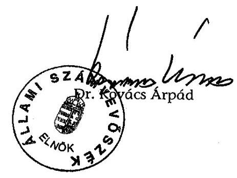

# JELENTÉS 

a Magyar Demokrata Fórum 2002-2003. évi gazdálkodása törvényességének ellenőrzéséről

---

3. Önkormányzati és Területi Ellenőrzési Igazgatóság
3.1. Szabályszerűségi Ellenőrzési Főcsoport
Iktatószám: V-1013-026/2004.
Témaszám: 708
Vizsgálat-azonosító szám: V0135
Az ellenőrzést felügyelte:
Dr. Lóránt Zoltán
főigazgató
Az ellenőrzés végrehajtásáért felelős:
Dr. Elek János
általános főigazgató-helyettes
Az ellenőrzést vezette:
Horváth Balázs
osztályvezető főtanácsos
Az összefoglaló jelentést készítette:
Szendrey Lajos
számvevő
Az ellenőrzést végezték:
Szendrey Lajos Tóth István
számvevő
tanácsadó

A témához kapcsolódó eddig készített számvevőszéki jelentések:
címe
sorszáma
Jelentés a Magyar Demokrata Fórum 1991. évi gazdálkodása ..... 136
törvényességének ellenőrzéséről
Jelentés a Magyar Demokrata Fórum 1992-1993. évi gazdálkodása ..... 235
törvényességének ellenőrzéséről
Jelentés a Magyar Demokrata Fórum 1994-1995. évi gazdálkodása ..... 342
törvényességének ellenőrzéséről
Jelentés a Magyar Demokrata Fórum 1996-1997. évi gazdálkodása ..... 9902
törvényességének ellenőrzéséről
Jelentés a Magyar Demokrata Fórum 1998-1999. évi gazdálkodása ..... 0106
törvényességének ellenőrzéséről
Jelentés a Magyar Demokrata Fórum 2000-2001. évi gazdálkodása ..... 0313
törvényességének ellenőrzéséről

---

# TARTALOMJEGYZÉK 

BEVEZETÉS ..... 5
I. ÖSSZEGZŐ MEGÁLLAPÍTÁSOK, KÖVETKEZTETÉSEK, JAVASLATOK ..... 6
II. RÉSZLETES MEGÁLLAPÍTÁSOK ..... 10

1. A Párt gazdálkodásáról szóló 2002-2003. évi beszámolók ..... 10
1.1. A teljes vizsgálati időszakra érvényes megállapítások ..... 10
1.2. A 2002-2003. évi beszámolók ..... 11
1.2.1. Bevételek ..... 12
1.2.2. Kiadások ..... 13
2. A Pártnak a beszámoló összeállítására és az azt alátámasztó könyvvezetésre vonatkozó belső szabályozása és gyakorlata ..... 14
2.1. A belső szabályozás rendszere ..... 14
2.2. A könyvvezetés gyakorlata, összhangja a törvényi és belső előírásokkal ..... 15
2.3. Analitikus nyilvántartások ..... 16
2.4. A bizonylati elv és a bizonylati fegyelem érvényesülése ..... 17
3. A Párt bevételszerző, gazdálkodó tevékenysége ..... 17
4. A gazdálkodással összefüggő egyéb jogszabályokban foglalt előírások betartása ..... 18
4.1. Személyi jellegű kifizetések ..... 18
4.2. A társadalombiztosítási és egyéb jogszabályok rendelkezéseinek érvényesítése ..... 18
5. A Párt belső ellenőrzésének rendszere ..... 19
5.1. A belső ellenőrzés rendszerének szabályozottsága ..... 19
5.2. A belső ellenőrzés működése ..... 20
6. Az előző ellenőrzés megállapításaira tett intézkedések ..... 20

## MELLÉKLETEK

1. számú melléklet A Párt 2002. évi gazdálkodásáról készített beszámoló
2. számú melléklet A Párt 2003. évi gazdálkodásáról készített beszámoló

---

.

---

# RÖVIDÍTÉSEK JEGYZÉKE 

| APEH | Adó és Pénzügyi Ellenőrzési Hivatal |
| :-- | :-- |
| ÁSZ | Állami Számvevőszék |
| Párt | Magyar Demokrata Fórum |
| Párttörvény | A pártok működéséről és gazdálkodásáról szóló - többször   módosított - 1989. évi XXXIII. törvény |
| PM | Pénzügyminisztérium |
| OH | Országos Hivatal |
| OSZB | Országos Számvizsgáló Bizottság |
| Szt. | A számvitelről szóló - többször módosított - 2000. évi C.   törvény |
| Szja. törvény | A személyi jövedelemadóról szóló - többször módosított -   1995. évi CXVII. törvény |

---

.

---

# JELENTÉS 

## a Magyar Demokrata Fórum 2002-2003. évi gazdálkodása törvényességének ellenőrzéséről

## BEVEZETÉS

Az Állami Számvevőszékről szóló 1989. évi XXXVIII. törvény 5. §-a és a 16. § (2) bekezdése, valamint a pártok működéséről és gazdálkodásáról szóló - többször módosított - 1989. évi XXXIII. tv. (továbbiakban: párttörvény) 10. § (1) bekezdése alapján a pártok gazdálkodása törvényességének ellenőrzésére az Állami Számvevőszék (továbbiakban: ÁSZ) jogosult. Az ÁSZ 2004. évi ellenőrzési tervének megfelelően vizsgálta a Magyar Demokrata Fórum (továbbiakban: Párt) 2002-2003. évi gazdálkodása törvényességét.

Az ellenőrzés célja annak megállapítása volt, hogy:

- a Párt által készített és a Magyar Közlönyben közzétett éves beszámolók a törvényi előírásoknak megfelelnek-e, a könyvvezetéssel és a valósággal megegyező adatokat tartalmaznak-e;
- a könyvvezetés és a gazdálkodás során betartották-e a számvitelről szóló többször módosított - 2000. évi C. törvény (továbbiakban: Szt.) és az egyéb jogszabályi rendelkezéseket és belső előírásokat;
- a Párt a működéséhez szabályszerűen igénybe vehető forrásokat használt-e fel, nem folytatott-e a párttörvény által tiltott gazdálkodó tevékenységet, nem fogadott-e el tiltott vagyoni hozzájárulást, illetőleg adományt.

Az ellenőrzés az ÁSZ V-1013-009/2004. számú ellenőrzési programjának I. 1-8. pontjai alapján történt. Az ellenőrzés körülményeit illetően rögzíteni szükséges, hogy az ÁSZ évek óta folyamatosan javasolja a Kormánynak a pártok ellenőrzéséről készített jelentéseiben a párttörvény módosítását, tekintettel arra, hogy

- a párttörvény 1. sz. melléklete szerinti beszámoló-mintához magyarázatot, kitöltési útmutatót nem készítettek a jogalkotók, így ennek kitöltése pártonként - kialakított számviteli politikájuknak megfelelően - eltérő lehet;
- a beszámoló-minta az Szt. rendelkezéseivel nem harmonizál, nem felel meg sem a mérleg, sem az eredmény-kimutatás követelményeinek.

Az ellenőrzés előkészítése és végrehajtása az ÁSZ elnöke 13/2003. 03. 25. sz. utasításával kiadott "Módszertan a pártok gazdálkodása törvényességének ellenőrzéséhez", valamint a „Segédlet a pártok gazdálkodása törvényességének ellenőrzése tervezéséhez, előkészítéséhez, az egyedi ellenőrzési program összeállításához és a helyszíni vizsgálat lefolytatásához" előírásai alapján történt.

A helyszíni ellenőrzésre 2004. augusztus 23. - október 8. között került sor a Párt kérésére az általa megbízott könyvelő szolgáltató irodahelységében.

---

# I. ÖSSZEGZŐ MEGÁLLAPÍTÁSOK, KÖVETKEZTETÉSEK, JAVASLATOK 

A Párt a 2002-2003 közötti időszak éves beszámolóit a párttörvényben előírt határidőben, illetve formában közzétette. A 2002. évi gazdálkodásáról összeállított beszámoló a Magyar Közlöny 2003. április 30.-i 45. számában; a 2003. évi beszámoló a Magyar Közlöny 2004. április 20-i, 52. számában, valamint a Párt internetes honlapján jelent meg. A nyilvánosságra hozott beszámolók nem feleltek meg a megbízható tájékoztatás követelményének, mivel nem érvényesítették a valódiság, teljesség, lényegesség, következetesség számviteli törvényben meghatározott alapelveit.

A 2002. évi beszámoló összeállításával összefüggésben feltárt hibák értéke a bevételeknél 2705 ezer Ft, illetve a kiadásoknál 4870 ezer Ft összegű volt. Az együttes hiba a közzétett beszámoló összes bevételére vetítve 1,1 %, az összes kiadást tekintve 1,7 % mértékű volt. A hibahatás önmagában elmaradt a 2 %-os lényegességi küszöbtől, de a Párt nyilvántartása szerint az 510 helyi szervezet közül 154 nem számolt el a bevételeivel és kiadásaival.

A 2003. évi beszámolóhoz kapcsolódóan megállapított hibák összevontan a bevételi oldalon 11943 ezer Ft, a kiadási oldalon 4758 ezer Ft értékűek voltak. Az együttes hiba 3,9 %-os, illetve 2,0 %-os mértéket ért el, melyek egyaránt lényegesnek minősültek. A hibahatás döntő hányada bevételi és kiadási halmozódásból, valamint kimaradt tételekből tevődött össze. Utóbbi körben a Párt nem állapította meg a helyi és területi szervei által bérelt önkormányzati ingatlanok kedvezményes díjtétele, illetve tényleges piaci ára közötti különbözetet. Az ellenőrzés kérésére a Párt becsléssel megállapította a bérleti díjkedvezmény formájában kapott nem pénzbeli juttatás értékét.

A vizsgálat speciális, lényeges hibaként állapította meg, hogy az 500 ezer Ft értéket meghaladó adománybevételeket nem a valós jogcímen mutatták ki az éves beszámolókban, továbbá egy-egy adományozó esetében a párttörvényben előírt nevesítést is elmulasztották.

Az éves beszámolókkal kapcsolatos lényeges hibák annak ellenére fordultak elő, hogy a Párt rendelkezett a beszámolás és könyvvezetés rendjét meghatározó - a számviteli törvényben előírt - számviteli szabályozásokkal. A kiadott számviteli politikát és kapcsolódó leltározási, értékelési, pénzkezelési szabályzatot 2002. január 1-jével léptették hatályba. A számviteli szabályozásokban nem fordítottak kellő figyelmet a Párt gazdálkodási sajátosságaira. A számviteli politikában a beszámolás és könyvvezetés összehangolását ellentmondásosan valósították meg, mivel a területi irodák és helyi szervezetek összevont adatszolgáltatási rendje nem volt áttekinthető. A számviteli politika részeként kiadott számlarend nem tartalmazta minden alkalmazott főkönyvi számla számát és megnevezését. A számlacsoportok ellenőrzési pontjait, valamint a könyvvezetés bizonylati rendjét hiányosan szabályozták. A leltározási szabályzat nem tért ki a leltárkörzetek kijelölésére, a pénzkezelési szabályzatban nem rendelkeztek az értékpapírok megőrzésének és nyilvántartásának rendjéről.

---

A könyvvezetés központosított, számítógépes kettős könyvvitelen alapult, melyhez naplófőkönyvi könyveléssel és összesítő feladással kapcsolódtak a területi irodák, a helyi szervezetek. A vizsgált időszaki kettős könyvelést azonos programmal, érvényes szerződéssel ugyanaz a könyvelő szolgáltató végezte. A számítógépes könyvelésből az ellenőrzéshez szükséges adatok lekérdezhetőek voltak. A könyvvezetésben sérültek a törvényi és belső előírások. Hibás kontírozás következtében a szervezetek közötti belső pénzforgalmat tényleges bevételnek, illetve kiadásnak könyvelték, mely a beszámolóban halmozódást okozott. A pénzforgalmi jelentési kötelezettséget elmulasztó pártszervezetek beszámolóját nullás pénzforgalmú elszámolással pótolták, továbbá a határidő után benyújtott pénzügyi elszámolásokat csak részben könyvelték. Egy-egy főkönyvi számlán nem a jogcímnek megfelelő tételeket könyvelték, valamint a pénztári forgalom könyvelésében esetileg negatív pénztári egyenlegek is előfordultak.

Az analitikus nyilvántartások körét és tartalmát a számlarendben meghatározták. Az elszámolásra kiadott előlegek és ellátmányok, a vevőkövetelések és szállítói tartozások nyilvántartása szabályos volt. Az előírt pénztárjelentést a helyi szervezetek 10 %-ánál nem vezették. Az időszaki pénztárzárások hiánya, rendszertelensége miatt nem volt megoldott az analitika főkönyvvel való egyezőségének teljes körű biztosítása. Az összevont elszámolások következtében nem volt megállapítható a helyi szervezetek valós pénzkészletének alakulása. A szigorú számadású nyomtatványok többségét nem vették központilag nyilvántartásba. A vagyonleltározást a szabályzatban foglaltakhoz képest hiányosan bonyolították, illetve dokumentálták.

A Pártnál a kötelezettségvállalási és utalványozási jogot a pénzügyi és gazdálkodási szabályzatban meghatározott vezetők - előírt módon - gyakorolták. A gazdálkodási jogosultsághoz kapcsolódó pénzforgalmi bizonylatolás törvényi rendelkezései, belső előírásai eltérő színvonalon érvényesültek. A Párt pénzforgalmának mintegy 60 %-át kitevő banki átutalásokat - a könyvelés adatközlését kivéve - szabályszerűen bizonylatoltak. A készpénzforgalomban a számviteli törvény előírásaiba ütköző, bizonylati fegyelmet sértő szabálytalanságok fordultak elő.

A Párt központi költségvetésben meghatározott éves állami támogatása a bevételszerző tevékenység eredményeként tagdíjjal, egyéb hozzájárulással és adománnyal, eszközértékesítési és ingatlanhasznosítási, valamint betéti kamatbevétellel egészült ki. Az egyéb hozzájárulások és adományok között a párttörvény korlátozása ellenére költségvetési szervtől 45 ezer Ft összegben, névtelen adományként 10 ezer Ft értékben elfogadtak tiltottnak minősült forrásokat. A Párt az egyszemélyes korlátolt felelősségű társaságát 2003-ban megszüntette. A cégbírósági törlést követően összességében 308 ezer Ft bevételhez jutott.

A Pártnál személyi jellegű kifizetésként a jogszabályokban megengedett költségtérítéseket engedélyeztek. A Párt tulajdonában álló gépkocsik üzemanyag költségének elszámolásához előírták a benzinszámla és a menetlevél leadását. Utóbbinál nem követelték meg a hivatalos célú használat törvényben előírt adattartalmát, így a menetlevélen rendszeresen hiányzott a megállás helyének feltüntetése, a felkeresett partner megnevezése. Tényleges költségeit a leadott számlák alapján térítették. A magántulajdonú gépkocsik hivatali célú

---

használatának költségtérítését szabályszerű útnyilvántartás kitöltésével folyósították. Természetbeni juttatásként - a törvényben meghatározott mértékkel - az alkalmazottak étkezési utalványt kaptak.

A társadalombiztosítási és adózási jogszabályok rendelkezéseinek megfelelően a Pártnál a kifizetett munkabérekből és bérjellegű jövedelmekből az adóelőleget, a nyugdíj- és egészségbiztosítási, valamint munkavállalói járulékot levonták. A könyvviteli nyilvántartásokban a munkavállalókat, a munkáltatót terhelő járulékfizetési kötelezettségeket előírták és bevallották. A Párt rendszeresen, határidőben eleget tett költségvetési befizetési kötelezettségeinek.

A Párt, mint munkáltató 2002. évben késedelmesen teljesítette bevallásait. A költségtérítésekkel kapcsolatos adatszolgáltatást az Országos Hivatal kifizetéseire korlátozta, mivel a területi és helyi szervezetek kiadásait - elszámolási rendszerhiba következtében - más költségekkel összevontan kezelték. A cégautóadó fizetési kötelezettség bevallását és befizetését a Párt nem teljesítette annak ellenére, hogy a tulajdonában lévő két gépkocsi menetlevelének vezetése alapján egyik évben sem volt egyértelműen megállapítható a kizárólagos, hivatali célú használat.

A belső ellenőrzés rendszerét alapdokumentumokban szabályozták. Az Alapszabály határozta meg az Országos Számvizsgáló Bizottság működésének követelményét. A pénzügyi és gazdálkodási szabályzat a pártigazgató hatáskörébe utalta a gazdálkodás vezetői ellenőrzését és
 munkafolyamatba épített kontrolljának szervezését. A választott testület ellenőrzési tevékenységét éves munkatervek alapján végezte. Ennek keretében felhívta a figyelmet a budapesti és megyei irodák költségelszámolási hiányosságaira, de a mulasztások okait és felelőseit nem vizsgálta, intézkedési javaslatot nem tett. A vezetői ellenőrzés az országos hivatal gazdálkodására korlátozódott. A könyvelést végző szolgáltató alkalomszerűen, írásban jelezte a pártigazgatónak az elszámolási határidők elmulasztását, a bizonylathiányokat és az analitika főkönyvtől való eltérését, de érdemi intézkedés nem történt.

A 2002-2003. évi beszámolás szabályossága és megbízhatósága érdekében független könyvvizsgálót is megbíztak, de a szerződést nem a párttörvény sajátos beszámolási követelményeire figyelemmel kötötték. A könyvvizsgáló nem a közzétett beszámolók, hanem a közzétételre nem került egyszerűsített beszámolók zárómérlegének és eredménykimutatásának hitelesítését végezte el. A hitelesítő záradékkal kiadott vélemény egyik évre sem tartalmazott számviteli szabálytalanság felfedésére, illetve megszüntetésére történő utalást. A Pártnál a belső ellenőrzés alacsony hatásfokú funkcionálásából, és a könyvvizsgálat ellentmondásos céljából fakadt, hogy az éves beszámolók, illetve az alapjául szolgált könyvvezetés és bizonylatolás lényeges hibái nem kerültek feltárásra.

Az előző ellenőrzés felhívásának intézkedési tervvel tettek eleget. A Párt végrehajtotta a törvényes állapot helyreállítását célzó intézkedéseket, melynek nyomán ismételten megjelentette 2000. és 2001. évi helyesbített beszámolóját, teljesítette költségvetést megillető átutalási kötelezettségét, továbbá a párt- és számviteli törvény alapján módosította a pénzügyi-számviteli szabályozását. A szabályozást nem követte megbízható gazdasági beszámolás és szabályszerű gazdálkodás.

---

A helyszíni ellenőrzés megállapításainak hasznosítása mellett az Állami Számvevőszék elnöke felhívja

# a Párt elnökét 

1. Tegye közzé ismételten a Párt 2002. és 2003. évi felülvizsgált, módosított beszámolóját a párttörvény 1. számú mellékletében meghatározott részletezettséggel, valamint az Szt. 15-16. §-ában foglalt számviteli alapelvek érvényesítésével.
2. Egészítse ki a gazdálkodás sajátosságaihoz igazodóan a számlarendet, valamint a leltározási és pénzkezelési szabályzatot.
3. Alakítson ki olyan elszámolási rendszert, amely biztosítja valamennyi területi iroda és helyi szervezet vonatkozásában a bizonylati elv érvényesítését, a pénzállományok leltári egyeztethetőségét, az útnyilvántartás alapján kifizetett költségtérítések teljes körű számbavételét.
4. Gondoskodjon az Szt. 165. § (3), illetve 167. § (1) bekezdésébe ütköző bizonylati fegyelmet sértő hibák megszüntetéséről. A bizonylati fegyelem megszilárdítása, a vagyonvédelem és a beszámoló valódisága érdekében működtessen hatékony belső ellenőrzést.
5. Rendelkezzen, hogy a Párt tulajdonában álló gépjárművek menetlevelének vezetése feleljen meg az Szja. törvény 70. § és az 5. melléklete II. 7. pontjában leírt követelményeknek. Önellenőrzés keretében tegyen eleget a vizsgált időszakra vonatkozó cégautóadó fizetési kötelezettségének.
6. Intézkedjen, hogy a Párt a párttörvény 4. § (2) és (3) bekezdése előírásának megsértésével szerzett 55 ezer Ft összegű adomány értékét fizesse be az állami költségvetésbe a párttörvény 4. § (4) bekezdése előírásának megfelelően.

A helyszíni ellenőrzés tapasztalatainak hasznosítása mellett javasoljuk:

## a Kormánynak

Kezdeményezze a párttörvény következők szerinti módosítását:
A korábbi pártellenőrzések alapján tett jelzésekre is figyelemmel a pártok számviteli nyilvántartási és beszámolási rendszerét érintő ellentmondások feloldását, amelyek a pártok működéséről és gazdálkodásáról szóló - többször módosított - 1989. évi XXXIII. törvény, valamint a 2001. január 1. napjától hatályos számviteli törvény között továbbra is fennállnak.

## a Pénzügyminiszternek

A vizsgálat során megállapított 55 ezer Ft értékű tiltott bevételnek megfelelő összeggel csökkentse a Párt 2005. évi költségvetési támogatását.

---

# II. RÉSZLETES MEGÁLLAPÍTÁSOK 

## 1. A PÁRT GAZDÁLKODÁSÁRÓL SZÓLÓ 2002-2003. ÉVI BESZÁMOLÓK

### 1.1. A teljes vizsgálati időszakra érvényes megállapítások

A Párt a 2002. évi beszámolóját 2003. április 30-án, a Magyar Közlöny 45. számában, a 2003. évi beszámolóját 2004. április 20-án, a Magyar Közlöny 52. számában, a párttörvény 9. § (1) bekezdésében előírt határidőben és meghatározott formában tette közzé (1., 2. sz. melléklet). Utóbbit a párttörvény módosításának megfelelően, internetes honlapján is nyilvánosságra hozta.

A közzétett beszámolók az Országos Hivatal számviteli bizonylatai, a területi irodák és a helyi szervezetek gazdálkodásáról készített összesítő kimutatások központi könyvelése alapján készültek. A Párt szervezeteiről készült kimutatás szerint 2002. évben összesen 510 helyi szervezetnek és 20 területi irodának, 2003. évben 433 helyi szervezetnek és 20 területi irodának kellett volna elszámolnia bevételeivel és kiadásaival. Ezzel szemben ténylegesen 2002. évben 356 helyi szervezet és 20 területi iroda, 2003. évben 399 helyi szervezet és 20 területi iroda számolt el.

A számviteli politika előírásai szerint a helyi szervezetek éves adatszolgáltatását a területi irodáknak kellett ellenőrizni és összesíteni. A helyi szervezeteknek az adatszolgáltatási laphoz csatolni kellett az eredeti alapbizonylatokat. Az alapbizonylaton a helyi szervezetek nem jelölték, hogy a pénzforgalmi adatokat melyik beszámoló sor adatánál vették figyelembe, ezért a területi irodában az adatszolgáltatás helytállóságát nem tudták következetesen ellenőrizni. Rontotta a beszámoló megbízhatóságát az is, hogy 2002. évben 63 esetben, 2003. évben 39 esetben a helyi szervezet adatszolgáltatása helyett az illetékes területi iroda munkatársa alapbizonylatok nélkül állított ki adatlapot a jelentési kötelezettségét elmulasztó pártszervezet gazdálkodásáról.

A 2002. és 2003. évi nyilvánosságra hozott beszámolók pontatlanok, hiányosak voltak. Lényeges hibák miatt nem feleltek meg a teljesség, a valódiság, a következetesség és a lényegesség számviteli alapelvének (Szt. 15. § (2), (3), (5) és 16. § (4) bekezdése).

- A teljesség elvét sértette, hogy a 2002. évi beszámolóból öt Szabolcs-Szatmár-Bereg megyei helyi szervezet 193 ezer Ft értékű bevétele és 214 ezer Ft értékű kiadása, valamint a Baranya megyei Területi Iroda bevételeiből 805 ezer Ft összegű, magánszemélyek adománya hiányzott. Továbbá a 2003. évi beszámolóban nem szerepeltettek 3101 ezer Ft összegű bevételt, melyből a Párt előzetesen 2680 ezer Ft-ra becsülte az ingyenes, illetve kedvezményes díjtételű önkormányzati ingatlanbérlet formájában megvalósult nem pénzbeli vagyoni hozzájárulás értékét, valamint kimaradt 621 ezer Ft összegű kiadás is.

---

- A valódiság elvét sértette, hogy a Párt szervezetei egymás közötti pénzforgalmát tényleges bevételként, illetve kiadásként könyvelték. Ebből eredően a 2002. évi beszámoló bevételi és kiadási oldalon egyaránt 890 ezer Ft, míg a 2003. évi beszámoló 3845 ezer Ft összegű bevételi és 3687 ezer Ft összegű kiadási halmozódást tartalmazott.
- A lényegesség elve viszonylatában a 2002. évi közzétett beszámoló bevételi sorainak hibája az összes bevételre vetítve 1,1 %, a kiadási sorainak eltérése az összes kiadást tekintve 1,7 % volt; a 2003. évi beszámolónál bevételi oldalon 3,9 %, kiadási oldalon 2,0 % mértéket ért el. A 2003. évi beszámoló sorok hibája - a 2,0 %-os lényegességi küszöböt alapul véve - a bevételeknél és kiadásoknál egyaránt lényegesnek minősült. A vizsgálat speciális, lényeges hibaként állapította meg, hogy 500 ezer Ft értéket meghaladó adománybevételeket nem a valós jogcímen mutatták ki az éves beszámolókban, és egy-egy adományozó esetében a párttörvény 9. § (2) bekezdésében előírt nevesítést is elmulasztották.
- A következetesség elve azáltal sérült, hogy a 2002. évi beszámolóban 1683 ezer Ft egyéb kiadást az eszközbeszerzések között, a 2003. évi beszámolóban 1916 ezer Ft értékű, magánszemélyektől származó bevételt jogi személynek nem minősülő gazdasági társaságoktól származó támogatások között mutattak ki.

# 1.2. A 2002-2003. évi beszámolók 

A 2002. és 2003. évi beszámolóban szereplő adatok, részleteiben és főösszegében formálisan egyeztek ugyan a beszámolóhoz kapcsolódó főkönyvi számlák összevont egyenlegével, azonban különböző szabálytalanságok miatt a beszámoló, illetve az alapjául szolgáló könyvelés nem tükrözte a valós helyzetet.

A 2002. évi beszámoló és a könyvelés csak az állami támogatásból és a jogi személynek nem minősülő gazdasági társaságoktól származó bevételt és a vállalkozás alapítására fordított kiadást tartalmazta a valóságnak megfelelően. A 2003. évi beszámolóban és könyvelésben csak az állami támogatás, valamint az eszközbeszerzés értéke szerepelt a ténylegessel megegyezően. Ezen tételeknél a pénzügyi beszámolók adatai a főkönyvi könyvelésből levezethetők, a pénzügyi események bizonylatai az összesítő bizonylatok alapján visszakereshetők voltak.

A 2002. évi beszámoló összeállításával összefüggésben feltárt hibák összevont értéke a bevételeknél 2705 ezer Ft, illetve a kiadásoknál 4870 ezer Ft összegű volt.

A 2003. évi beszámolóhoz kapcsolódóan megállapított hibák összevontan a bevételi oldalon 11943 ezer Ft, a kiadási oldalon 4758 ezer Ft értékűek voltak.

A Párt által közzétett beszámolók ellenőrzése során megállapított hibák pozitív, illetve negatív értékét - beszámoló soronként - a következő összeállítás részletezi:

---

Adatok: beszámoló szerint ezer forintban

| Megnevezés | Párt által közzétett beszámoló |  | Eltérés a beszámolóhoz képest |  |  |  |
| :--: | :--: | :--: | :--: | :--: | :--: | :--: |
|  | 2002. évi | 2003. évi | 2002. évi |  | 2003. évi |  |
| Bevétel |  |  | Többlet | Hiány | Többlet | Hiány |
| 1. Tagdíjak | 8958 | 6474 | +100 | -90 | +450 | -238 |
| 2. Állami t. | 205200 | 283419 | 0 | 0 | 0 | 0 |
| 4. Egyéb hj. | 15813 | 9186 | +1067 | -1154 | +4049 | -5134 |
| 4.1. Jogi sz. | 4512 | 1876 | +668 | -249 | +1683 | -2680 |
| 4.2.1.Gt.belf. | 1929 | 0 | 0 | 0 | 0 | -416 |
| 4.2.2.Gt.külf. | 0 | 2216 | 0 | 0 | +2216 | 0 |
| 4.3. Magán. | 9372 | 5094 | +399 | -905 | +150 | -2038 |
| 6. Egyéb bev. | 6342 | 9509 | +233 | -61 | +2012 | -60 |
| ÖSSZESEN: | 236313 | 308588 | +1400 | -1305 | +6511 | -5432 |
| - halmozódás |  |  | +890 |  | +3845 | 0 |
| - kimaradt |  |  |  | -998 |  | -3101 |
| KIADÁS |  |  |  |  |  |  |
| 2. Támogat. | 950 | 5356 | +799 | 0 | +1596 | 0 |
| 3. Vállalkoz. | 1814 | 0 | 0 | 0 | 0 | 0 |
| 4. Működési | 106051 | 173373 | +291 | -123 | +2541 | -408 |
| 5. Eszközb. | 7310 | 10789 | +1683 | -18 | 0 | 0 |
| 6. Politikai | 149698 | 46243 | 0 | -248 | 0 | -198 |
| 7. Egyéb k. | 19004 | 6676 | 0 | -1708 | 0 | -15 |
| ÖSSZESEN: | 284827 | 242437 | +2773 | -2097 | +4137 | -621 |
| - halmozódás |  |  | +890 |  | +3687 |  |
| - kimaradt |  |  |  | -214 |  | -621 |

# 1.2.1. Bevételek 

A tagdíjak 2002. évi összegében 100 ezer Ft értékben belföldi magánszemélyektől származó adományt mutattak ki, 90
 ezer Ft összegű bevétel kimaradt a beszámolóból. A 2003. évi beszámolóban 450 ezer Ft értékben bizonylat nélküli összesítő alapján szerepelt bevétel, de kimaradt a beszámolóból 238 ezer Ft tényleges bevétel.

A Párt az állami költségvetésből származó bevételt mindkét évben a tényleges teljesítés összegében mutatta ki a beszámolóban. A 2003. évi támogatásból a PM a korábbi ÁSZ vizsgálat által megállapított 681 ezer Ft nem megengedett gazdálkodásból származó bevételnek megfelelő összeget levonta.

---

Az egyéb hozzájárulások, adományok beszámolósor hibája részben belső pénzmozgásnak adományként történt feltüntetéséből (2002. évben 799 ezer Ft, 2003. évben 1833 ezer Ft), részben a bevételnek nem megfelelő beszámoló soron való feltüntetéséből (2002. évben 617 ezer Ft, 2003. évben 4427 ezer Ft), részben a beszámoló sorokat érintő, de a könyvelésből kimaradt bevételekből (2002. évben 805 ezer Ft, 2003. évben 2923 ezer Ft) származott.

A Párt az 500 ezer Ft értékhatárt meghaladó adományok között elmulasztotta nevesíteni a Belső Tér Alapítványtól 2002-ben kapott 600 ezer Ft, valamint a Pelikán Alapítványtól 2003-ban kapott 820 ezer Ft összeget. Ezzel nem érvényesült teljes körűen a párttörvény 9. § (2) bekezdésében foglalt előírása.

Az egyéb bevételek beszámolósor 2002. évben 91 ezer Ft, 2003. évben 2012 ezer Ft értékben belső pénzmozgásból származó halmozódást tartalmazott. A 2002. évi beszámolósoron szerepelt 42 ezer Ft értékű, belföldi jogi személytől származó adomány és 100 ezer Ft összegű, banki bizonylattal nem igazolt kamatbevétel. Hiányzott az egyéb bevételek közül 2002. évben 61 ezer Ft, 2003. évben 60 ezer Ft értékű rezsiköltség térítés, mert azt tévesen a belföldi jogi személyektől származó adományok között mutatták ki.

# 1.2.2. Kiadások 

A támogatás egyéb szervezetnek beszámolósor 2002. évben 799 ezer Ft, 2003. évben 1596 ezer Ft értékű, szervezeten belüli pénzmozgásból eredő halmozódást tartalmazott.

Vállalkozások alapítására fordított összeg címen a 2002. évi beszámoló 1814 ezer Ft összegű kiadást tartalmazott, mely megegyezett a tényleges, ilyen célú kiadással. A Pártnak 2003. évben nem volt e címen kiadása.

Működési kiadások között a 2002. évi beszámoló 91 ezer Ft összegű, a 2003. évi beszámoló 2091 ezer Ft összegű, belső pénzmozgásból származó halmozódást tartalmazott. Hiányzott a 2002. évi beszámolóból 123 ezer Ft, a 2003. évi beszámolóból 408 ezer Ft értékű, nem könyvelt kiadás. A 2002. évi beszámolósor 200 ezer Ft értékben politikai kiadást, a 2003. évi beszámolósor 450 ezer Ft értékben alapbizonylattal nem igazolt és ténylegesen el nem számolható kiadást tartalmazott.

Eszközbeszerzés címen a 2002. évi beszámoló 1683 ezer Ft értékben a helyi pártszervezetek egyéb kiadását tartalmazta. Kimaradt a beszámolóból 18 ezer Ft értékű, nem könyvelt kiadás. A 2003. évi beszámoló az eszközbeszerzést tényleges értéken mutatta.

Politikai kiadások címen a 2002. évi beszámolóból 248 ezer Ft hiányzott, amelyből 200 ezer Ft-ot a működési kiadások között szerepeltettek, ugyanakkor 48 ezer Ft kimaradt a könyvelésből. A 2003. évi beszámolóból hiányzott 198 ezer Ft értékű, nem könyvelt kiadás.

Az egyéb kiadások beszámolósor 2002. évi adata 1708 ezer Ft-tal, 2003. évi adata 15 ezer Ft-tal tért el. A 2002. évi összegből 1683 ezer Ft-ot az eszközbeszerzési kiadások között mutattak ki. A különbözetek nem kerültek könyvelésre.

---

# 2. A PÁrtnak a beSzámoló ÖsszeÁllítÁsÁra És az azT alÁtáMASZTÓ KÖNYVVEZETÉSRE VONATKOZÓ BELSŐ SZABÁLYOZÁSA ÉS GYAKORLATA 

### 2.1. A belső szabályozás rendszere

A pártigazgató 2002. január 1-jétől léptette hatályba az ÁSZ felhívására újraszerkesztett számviteli politikát, valamint a keretébe tartozó pénzkezelési, értékelési, leltározási szabályzatot. A belső szabályozások előírásai a vizsgált időszakban nem változtak.

A számviteli politikában meghatározták a könyvvezetés módját, az év végi zárlati időpontokat, feladatokat, az éves beszámoló összeállításának rendjét, határidejét. Szabályozták az ellenőrzés, az önellenőrzés által feltárt előző évet vagy éveket érintő jelentősebb hibák minősítését, a hibahatások mértékét, továbbá a megbízható és valós képet lényegesen befolyásoló hiba nagyságát. Ugyanakkor a területi irodák és helyi szervezetek határidőn túl beérkező feladásainak könyvelési módját nem írták elő.

A számviteli politikához kapcsolódó szabályzatok tartalmazták azok tárgyával kapcsolatos fogalmakat, feladatokat, rögzítették a feladatok végrehajtásának módját, bizonylatait, dokumentációját. A leltározási szabályzat nem tért ki a leltárkörzetek kijelölésére, a pénzkezelési szabályzatban nem rendelkeztek az értékpapírok megőrzéséről, kezeléséről, nyilvántartásának követelményéről.

A számviteli politika részeként összeállított számlarend nem tartalmazta minden főkönyvi számla számát és megnevezését, mely a főkönyvi kivonatban szerepelt. A számlacsoportok ellenőrzési pontjait, valamint a könyvvezetés bizonylati rendjét hiányosan szabályozták. Nem jelölték ki a területi irodák és helyi szervezetek közötti pénzforgalom nyilvántartását szolgáló számlákat. Ebből eredően a halmozódások nem voltak kiszűrhetők a főkönyvi könyvelésben.

A Párt a beszámolás és könyvvezetés összehangolását nem áttekinthető módon alakította ki. Nem gondoskodtak a területi és helyi szervezetek egyszeres könyvvezetésének belső szabályozásáról, így hiányzott az egyszeres és kettős könyvvitel kapcsolatának meghatározása is. Az OH-n kívüli szervezetek összevont könyvelési adattartalma a területi irodák részéről szakszerűen nem volt ellenőrizhető. Nem került meghatározásra az egyéb bevételek köre.

Külön szabályozták az Alapszabály rendelkezése szerint a pénzügyi gazdálkodás rendjét; valamint a vonatkozó kormányrendeletekhez igazodóan a saját és magántulajdonú gépkocsi használatát, a külföldi kiküldetés elszámolását, az elszámolási előlegek nyilvántartását és pénzügyi bonyolítását.

A belső szabályozást pártigazgatói utasítások, illetve az „Útmutatás a helyi szervezetek gazdasági tevékenységéhez és beszámolási, nyilvántartási kötelezettségéhez 2003. január 1-jétől" című szabályozással egészítették ki. Az intézkedések a belső szabályozás rendszerében jelzett hiányosságok kezelésére váltak szükségessé.

---

# 2.2. A könyvvezetés gyakorlata, összhangja a törvényi és belsö előírásokkal 

A számviteli politikában rögzítetteknek megfelelően az egyszerűsített kettős könyvvitel szabályai alapján vezették a Párt központi könyvelését.

A fővárosi, megyei irodák adatfeldolgozása az egyszeres könyvvitel szerint történt, melyek összesített adatai negyedéves feladás útján kerültek be a központi könyvelésbe. A helyi szervezetek gazdálkodásukról és működésükről évente egy alkalommal számoltak be a rendelkezésükre bocsátott adatlap kitöltésével. Az egyszeri éves feladás, illetve az összevont adattartalmú könyvelés nem biztosította a szervezetek teljes körű pénzforgalmának és költségnemeknek megfelelő könyvelését, valamint pénzállományának leltári egyeztethetőségét.

Az egyszerűsített kettős könyvelést a vizsgált időszakban azonos számítógépes program alapján ugyanaz a könyvelő kft. végezte, érvényes szolgáltatási szerződés alapján. A számítógépes könyvelésből az ellenőrzéshez szükséges adatok lekérdezhetőek voltak.

## A könyvvezetés gyakorlata a következőkben nem volt összhangban a törvényi és belső előírásokkal:

- A Pártnál egyes gazdasági eseményeket alapbizonylat nélkül könyveltek. A szervezetek közötti belső pénzforgalmat tényleges bevételként, illetve kiadásként is elszámolták. Az előírástól eltérően a kontírozást szabálytalanul végezték. Ezáltal mindkét évben sérült az Szt. valódiság elve.
- A határidőn túl beérkezett elszámolásokat részben könyvelték. A jelentési kötelezettséget elmulasztó helyi pártszervezetek beszámolóját a területi irodák nagy számban nullás elszámolással pótolták. Ebből eredően sérült az Szt. teljesség elve.
- Az ellenőrzött főkönyvi számlákon nem az ott elszámolható tételek voltak könyvelve. Így magánszemélyektől származó bevételt jogi személynek nem minősülő gazdasági társaságtól származó támogatásnak, egyéb kiadást eszközbeszerzési kiadásnak, valamint belföldi magánszemélyektől származó adományt tagdíjbevételként mutattak ki. A felsoroltak miatt nem érvényesült az Szt. következetesség elve.
- A megyei irodák jellemzően nem adták le határidőre elszámolásukat, azok nem az előírásoknak megfelelően készültek. A helyi szervezetek gyakran nem használtak bevételi és kiadási pénztárbizonylatot, nem vezették a pénztárjelentést, vagy ha vezették, akkor nem helyesen. Így a belső előírásokon túlmenően nem tartották be az Szt. 165. § (3) bekezdés a) pontjában foglaltakat sem.
- A pénztári forgalom könyvelésében az előírások ellenére esetileg negatív pénztári egyenlegek is előfordultak, mivel a tagi kölcsönöket, központi ellátmányokat nem, vagy csak a felhasználás után bizonylatoltak, könyvelték.

---

# 2.3. Analitikus nyilvántartások 

A Pártnál a főkönyvi könyveléshez kapcsolódó analitikus nyilvántartások körét és tartalmát a számlarendben meghatározták.

A vizsgált időszakban a belső előírásoknak megfelelt az elszámolásra kiadott előlegek, a vevő követelések és szállítói tartozások, a területi irodáknak és helyi szervezeteknek az OH által adott ellátmány nyilvántartása, valamint az adózással és társadalombiztosítással összefüggő nyilvántartási kötelezettségek teljesítése.

A Párt eszköznyilvántartása 2002. évben nem volt teljes körű. Az ÁSZ vizsgálat után végrehajtott rendezést követően az OH eszköznyilvántartása 2003. év végére a Párt egészére vonatkozóan tartalmazott adatokat az ingatlanok, a tárgyi eszközök, a befektetett pénzügyi eszközök és az immateriális javak tekintetében. A Pártnál 2002-2003. évben az eszközbeszerzéseket teljes körűen nyilvántartásba vették az Szt. előírásainak megfelelően. Az 50 ezer Ft értékhatár feletti tárgyi eszközökről egyedi nyilvántartást vezettek. Az eszköznyilvántartó kartonokat azonban a korábbi ÁSZ ellenőrzés felhívása ellenére sem javították ki. Azok továbbra sem tartalmaztak az eszközök egyedi azonosítására alkalmas jelölést, így az eszköznyilvántartás alapján az egyes nagy értékű tárgyi eszközök egyedileg nem mindenkor azonosíthatók.

A pénzkészlet analitikájának pontos vezetése és főkönyvvel való egyezőségének biztosítása 2003-ban sem megoldott a területi irodáknál és helyi szervezeteknél. A korábbi időszakból eredő különbözetek rendezése formálisan történt, mivel a 2002. december 31-ei főkönyvi kivonat adatait a megyei irodák analitikájához igazították. A helyi szervezetek 10%-ánál fordult elő, hogy az előírt pénztárjelentést nem vezették, és az időszaki pénztárzárásokat rendszertelenül végezték.

A szigorú számadású nyomtatványok körét és vezetésének módját a Párt a pénzkezelési szabályzatában határozta meg. E szerint központilag kellett nyilvántartani a készpénzcsekket, a pénztári bevételi és kiadási tömböket, a pénztárjelentést, a kiküldetéssel és gépjármű használattal kapcsolatos nyomtatványokat. A vizsgálat megállapította, hogy a Pártnál a pénztári bevételi és kiadási tömbök részleges nyilvántartásán kívül az előírt többi nyomtatványról a központi nyilvántartást nem vezették. A pénztári bevételi és kiadási tömbök központi nyilvántartása a megyék negyedére korlátozódott. A helyi nyomtatványbeszerzések adatait a központi nyilvántartás nem tartalmazta. A nyilvántartási mulasztások következtében a Pártnál nem tettek eleget az Szt. 168. §-ban meghatározott szigorú számadási kötelezettségnek.

A leltározási szabályzatban és a pártigazgatói utasításban rögzített teljes körű vagyonleltározási feladatot a Párt egészére vonatkoztatva hiányosan hajtották végre. Az OH-nál az éves leltározást szabályszerűen bonyolították. A területi irodák és a helyi szervezetek többségénél csak a tárgyi eszközök kerültek leltározásra, de a leltárfelvételi íveket - Budapest kivételével - a leltározási egység felelős vezetője aláírásával nem hitelesítette.

---

# 2.4. A bizonylati elv és a bizonylati fegyelem érvényesülése 

A kötelezettségvállalás, érvényesítés és utalványozás rendjét a pénzügyi és gazdálkodási szabályzatban rögzítették. A szerződéseken, megrendeléseken a kötelezettségvállalási jogot az arra jogosult személyek gyakorolták. A házipénztári és banki bizonylatokat a szabályzatban kijelölt, illetve a banknál aláírásra jogosultként bejelentett személyek utalványozták.

Általános - az Szt. 167. §. (1) bekezdés i) pontjába ütköző - szabálytalanság, hogy a bizonylatokról hiányzott a könyvelés időpontjának feltüntetése és aláírással való igazolása. A pénzforgalom mintegy 60%-át kitevő banki átutalások és kapcsolódó alapbizonylatok minden más tekintetben megfeleltek a törvényi és belső előírásoknak. A pénztári forgalomnál az Szt. 167. §. (1) bekezdés c) pontjába ütköző, a bizonylati fegyelmet sértő szabálytalanságok fordultak elő.

- A kiadási pénztárbizonylatok 80%-áról hiányzott a felvételre
 jogosult nevének feltüntetése, valamint aláírása.
- A helyi pártszervezetek mintegy fele, valamint a Budapesti Területi Iroda a belső előírások ellenére a pénztári kifizetésekről nem állított ki kiadási pénztárbizonylatot. Az alapbizonylaton sem szerepelt a kifizető neve és aláírása, a kifizetés időpontja, a felvételre jogosult neve és aláírása.
- A pénztári bevételezések bizonylatolása mintegy 10\%-ban nem felelt meg a törvényben meghatározott alaki és tartalmi követelményeknek.
- Alapbizonylattal alá nem támasztott összesítő bizonylatokat állított ki a Budapesti Területi Iroda 2003. évben öt kerületi pártszervezet pénzforgalmáról.

## 3. A PÁRT BEVÉTELSZERZŐ, GAZDÁLKODÓ TEVÉKENYSÉGE

A Párt a költségvetési törvényben meghatározott normatív módon megállapított állami támogatáson túlmenően tagdíj befizetésekből, egyéb hozzájárulásokból és adományokból, a tulajdonában lévő ingatlan díj ellenében történő hasznosításából, tárgyi eszköz értékesítéséből, valamint lekötött betétek kamataiból realizálta bevételeit.

A Párt az egyéb hozzájárulások és adományok között a törvényi korlátozás ellenére elfogadott forrásokat:

- a párttörvény 4. § (2) bekezdésében tiltott, költségvetési szervtől fogadott el támogatást 2002. évben 39 ezer Ft, 2003-ban 6 ezer Ft összegben;
- a Szolnok megyei Területi Iroda 10 ezer Ft értékben névtelen adományt fogadott el, mellyel megsértette a párttörvény 4. § (3) bekezdésében foglalt előírást.

A Párt a vizsgált időszakban a Temise Kft-vel rendelkezett, mely végelszámolás keretében megszűnt. A 2003. június 25-i Fejér Megyei Bíróság, mint Cégbíróság Cg-07-09-007999/20. számú végzése a cég megszűnésére tekintettel elrendelte annak a cégbejegyzésből való törlését. A megszűnéssel a Párt 308 ezer Ft bevételhez jutott.

---

# 4. A GAZDÁLKODÁSSAL ÖSSZEFÜGGŐ EGYÉB JOGSZABÁLYOKBAN FOGLALT ELŐÍRÁSOK BETARTÁSA 

### 4.1. Személyi jellegű kifizetések

A Párt - belső szabályozásának megfelelően - költségtérítést fizetett alkalmazottai és tagjai részére a hivatalos külföldi kiküldetés teljesítésével, a tulajdonában állt gépjármű üzemanyagköltség térítésével, a magántulajdonú gépkocsik és tömegközlekedési eszközök hivatali célú használatával összefüggésben. Természetbeni juttatásként az Szja. törvényben meghatározott, adómentes étkezési jegyet adtak az alkalmazottaknak.

A Párt tulajdonában álló gépkocsik üzemanyag költségének elszámolása az Szt. előírásainak megfelelően benzinszámla alapján történt. A futásteljesítmény nyilvántartására személygépkocsi menetlevelet rendszeresítettek. A menetlevelet azonban nem napi menetokmányként vezették, hanem egy menetlevélen többnapi futásteljesítményt számoltak el. A menetlevelek vezetése során nem tartották be az Szja. törvény 70. §-a és 5. számú melléklet II. 7. pontja által előírtakat, mivel azokról hiányzott a megállás helyének és a felkeresett partnernek a megnevezése. A menetlevelek vezetése alapján nem volt megállapítható, hogy a Párt tulajdonában álló gépkocsikat kizárólag hivatali célra használták. Ezért a gépkocsik után cégautóadót kellett volna fizetni. E kötelezettségének a Párt nem tett eleget.

A magántulajdonú gépkocsik hivatali célú használatának költségelszámolása során a Párt a 60/1992. (IV. 1.) Korm. rendelet előírásai szerint járt el. A futásteljesítmény kimutatására a Párt az Szja. törvény 70. §-ában és a törvény 5. számú mellékletének II. 7. pontjában előírt tartalmi követelményeknek megfelelő útnyilvántartást fogadta el. Az útnyilvántartások vezetése és az elszámolás gyakorlata megfelelt a jogszabályi előírásoknak.

Külföldi kiküldetések teljesítésével kapcsolatos költségek elszámolási rendjét a Párt a külföldi kiküldetéshez kapcsolódó elismert költségekről szóló 168/1995. (XII. 27.) Korm. rendelet előírásainak figyelembe vételével alakította ki. A hivatalos külföldi kiküldetések teljesítésével kapcsolatban a vizsgált időszakban napidíj kifizetésére nem került sor. A kiutazó személyek részére a Párt valutában előleget nem fizetett, a felmerült költségeket a kiutazás teljesítése után - tényleges számlák alapján - fizették ki. A külföldi kiküldetések teljesítésével összefüggő adóköteles jövedelem nem keletkezett.

### 4.2. A társadalombiztosítási és egyéb jogszabályok rendelkezéseinek érvényesítése

A társadalombiztosítási és adózási jogszabályokban előírt kötelezettségeinek a Párt döntő részét eleget tett.

A Párt, mint munkáltató, bevallási kötelezettségét 2002. évben késedelmesen, 2003-ban határidőben teljesítette. A bevallások adatai a főkönyvi könyvelés adataival megegyeztek. A kötelező nyilvántartásokat vezették, az előírt adatszolgáltatásokat határidőre benyújtották, a kifizetett munkabérekből és bérjel-

---

legű jövedelmekből az adóelőleget, a nyugdíj- és egészségbiztosítási, valamint munkavállalói járulékot levonták. A könyvviteli nyilvántartásokban a munkavállalói, valamint a munkáltatót terhelő nyugdíj- és egészségbiztosítási járulék, egészségügyi hozzájárulás és munkaadói járulékfizetési kötelezettségeket előírták.

A költségtérítésekkel kapcsolatos kifizetői adatszolgáltatási kötelezettségét a Párt csak az OH-ban történt kifizetések tekintetében teljesítette. Ennek oka, hogy a könyvelési rendszer hibája folytán a területi irodák és a helyi szervezetek kifizetéseinek adatai nem jelentek meg önállóan a főkönyvi számlán, hanem csak más költségekkel összevontan.

A cégautóadó fizetési kötelezettség bevallását és befizetését a Párt nem teljesítette annak ellenére, hogy a tulajdonában lévő két gépkocsi menetlevelének vezetése alapján nem volt egyértelműen megállapítható, hogy azokat kizárólag hivatali célra használták. Ezzel a Párt megsértette az Szja. törvény 70. §-a előírását.

A Párt adó- és társadalombiztosítási befizetési kötelezettségeit rendszeresen és határidőben teljesítette, így a vizsgált években lejárt köztartozása nem volt.

# 5. A PÁRT BELSŐ ELLENŐRZÉSÉNEK RENDSZERE 

### 5.1. A belső ellenőrzés rendszerének szabályozottsága

Az alapszabály rögzítette az Országos Számvizsgáló Bizottság feladatkörét, melynek keretében nevesítette a Párt költségvetése végrehajtásának, a gazdálkodási rendelkezések és számviteli szabályok betartásának ellenőrzését, valamint a Párt vagyoni helyzete alakulásának figyelemmel kísérését. Ennek alapján a testület saját hatáskörben kialakította működési és eljárási rendtartását.

A belső szabályozás a pártigazgató feladatává tette a Párt gazdálkodási tevékenységének szervezését és vezetői ellenőrzését. A felügyelet ellátására az e feladattal megbízott elnökhelyettest jelölte ki.

A folyamatba épített ellenőrzés fontos elemeként határozták meg a Párt részére központi könyvelést végző kft. által befogadott jelentések, kimutatások felülvizsgálatát, valamint a területi irodák összesítő ellenőrző tevékenységét.

A Párt mindkét időszakban független könyvvizsgálót bízott meg az egyszerűsített mérlegbeszámolójának auditálására. A szerződés azt tartalmazta, hogy a megbízott „elvégzi a megbízó Párt 2003. évi (2002. évi) beszámolója (zárómérlege, eredmény-kimutatása) megbízhatóságának vizsgálatát", továbbá „valószínűsíthetően feltárja a közzétételre kerülő beszámolóban az esetleges szabálytalanságokból eredő jelentős hibákat, hogy azok kijavításra kerüljenek". Utóbbi végrehajtására azonban nem került sor, mert a könyvvizsgáló a közzétételre nem kerülő zárómérlegeket és eredmény-kimutatásokat záradékolta.

---

# 5.2. A belső ellenőrzés működése 

Az Országos Számvizsgáló Bizottság működéséhez éves munkatervekkel rendelkezett, melyek általános feladatokat rögzítettek: az időszerű pénzügyi és gazdasági előírások, a számlarend, a befektetett eszközök analitikus nyilvántartása, az éves beszámoló és költségvetés adatainak vizsgálatát. Az OSZB a budapesti és megyei irodák költség elszámolási hiányosságait észrevételezte, de személyi felelősség felvetése nélkül. Érdemi intézkedési javaslat hiányában az általános jellegű felvetések nem hasznosultak.

A vezetői és munkafolyamatba épített ellenőrzés a pénzügyi és gazdálkodási szabályzatban foglaltakhoz képest rendszertelen volt, a hibákat döntően nem tárta fel. A vezetői ellenőrzés a kötelezettségvállalások és utalványozások útján valósult meg. A folyamatba épített ellenőrzés sajátos részeként működött a könyvelési iroda, amely a főkönyvi könyveléshez és beszámolóhoz kapcsolódóan a késéseket, bizonylathiányokat, könyvviteli eltéréseket alkalomszerűen, írásban jelezte, de a jelzésekre érdemi intézkedések nem történtek.

A független könyvvizsgáló a párttörvény szerint összeállított és közzétett mindkét évi beszámolót érintő lényeges hibákat, könyvvezetési és bizonylatolási szabálytalanságokat nem jelezte. Az auditálás eredményeként a zárómérleg, valamint az eredmény kimutatás adatainak megbízhatóságát és valódiságát hitelesítő záradékkal igazolta. A könyvvizsgáló a párttörvény szerint összeállított és közzétett beszámolókat nem auditálta.

A belső ellenőrzési rendszer működése összességében hiányos, rendszertelen, alacsony hatékonyságú volt, melynek következtében érdemben nem tárta fel a lényeges hibákat és szabálytalanságokat.

## 6. AZ ELŐZŐ ELLENŐRZÉS MEGÁLLAPÍTÁSAIRA TETT INTÉZKEDÉSEK

A Párt a 0313 számú ÁSZ jelentésben megállapított hiányosságok megszüntetésére, a törvényes állapot helyreállítására intézkedési tervet fogadott el, melyet felemás eredménnyel hajtott végre:

- Ismételten közzétette a Párt 2000. és 2001. évi gazdálkodásának módosított beszámolóját, amely a Magyar Közlöny 2003. évi 57. számában jelent meg.
- Hatályba léptette a 2000. évi C. törvény alapján kiadott új számviteli politikát.
- Új leltározási szabályzatban és külön pártigazgatói utasításban rendelkeztek a leltározás szabályszerű lebonyolítására.
- Határidőben teljesítették az előírt 681 ezer Ft költségvetési befizetési kötelezettséget.
- A Mosonmagyaróvári pártszervezettel visszafizettették a jogtalanul elfogadott 175 ezer Ft-ot.
- Meghatározták a szigorú számadás alá vont nyomtatványok körét, kialakították központi nyilvántartásuk rendjét.

---

A Pártnak a könyvvezetési gyakorlat megújítását, a bizonylati fegyelem javítását, az analitikus nyilvántartások szabályszerű vezetését célzó intézkedései a vizsgált időszak tapasztalatai szerint nem jártak eredménnyel. A Párt olyan könyvvezetési gyakorlatot alakított ki, mely a területi irodák és helyi szervezetek összevont adatai miatt nem felelt meg az átláthatóság és az adóhatósági adatszolgáltatás követelményeinek. Alapvetően a szabályozás fejlődött, de az előírások betartása a belső ellenőrzés fogyatékosságaiból eredően alacsony hatásfokú volt.

Budapest, 2004. december " 18 "

Melléklet: $\quad 2 \mathrm{db}$

---

# A Magyar Demokrata Fórum 2002. évi pénzügyi beszámolója

|   |  |  | Ezer forint |  |  |  |  |  |  |  |  |  |  |  |  |  |  |  |  |  |  |  |  |  |  |  |  |  |  |  |  |  |  |  |  |  |  |  |  |  |  |  |  |  |  |  |  |  |  |  |  |  |  |  |  |  |  |  |  |  |  |  |  |  |  |  |  |  |  |  |  |  |  |  |  |  |  |  |  |  |  |  |  |  |  |  |  |  |  |  |  |  |  |  |  |  |  |  |  |  |  |  | 

---

# V-1013-026/2004. 2 számú melléklet 

4990
A Magyar Demokrata Fórum
2003. évi pénzügyi beszámolója

## Bevételek

1. Tagdíjak ..... 6474
2. Állami költségvetésből származó támogatás ..... 283419
3. Képviselőcsoportnak nyújtott állami támogatás ..... -
4. Egyéb hozzájárulások, adományok ..... 9186
4.1. Jogi személyektől ..... 1876
4.1.1. Belföldiektől ..... 1741
4.1.2. Külföldiektől: IDC-EU Néppárt ..... 135
4.2. Jogi személynek nem minősülő gazdasági társaságtól ..... 2216
4.2.1. Belföldiektől ..... -
4.2.2. Külföldiektől ..... 2216
4.3. Magánszemélyektől ..... 5094
4.3.1. Belföldiektől ..... 5070
4.3.2. Külföldiektől ..... 24
5. A párt által alapított vállalat és korlátolt felelősségű társaság nyereségéből származó bevétel
6. Egyéb bevétel ..... 9509
Összes bevétel a gazdasági évben: ..... 308588
Kiadások
7. Támogatás a párt országgyűlési csoportja számára ..... -
8. Támogatás egyéb szervezeteknek ..... 5356
9. Vállalkozások alapítására fordított összegek ..... -
10. Működési kiadások ..... 173373
11. Eszközbeszerzés ..... 10789
12. Politikai tevékenység kiadásai ..... 46243
13. Egyéb kiadások ..... 6676
Összes kiadás a gazdasági évben: ..... 242437

