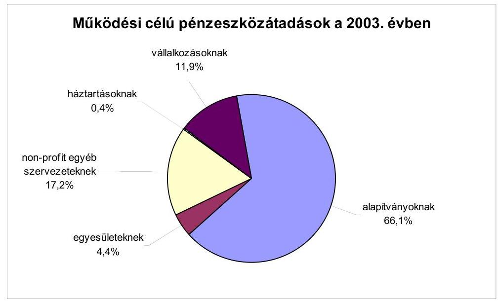
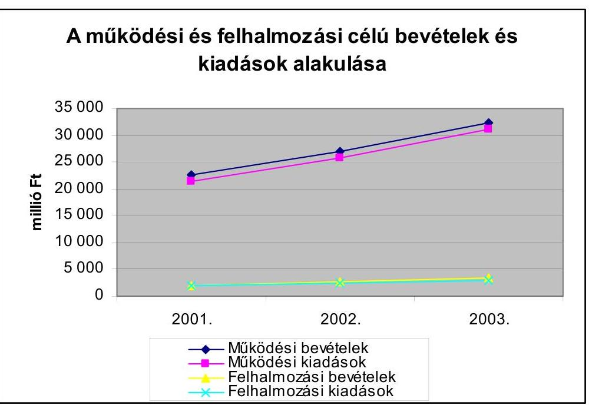
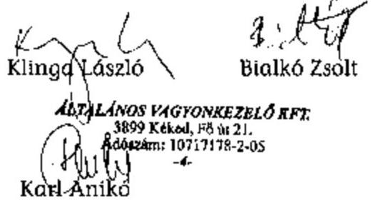
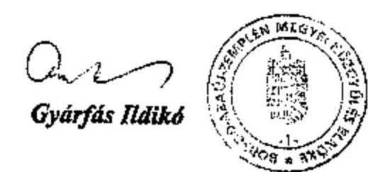

# JELENTÉS 

a Borsod-Abaúj-Zemplén Megyei Önkormányzat gazdálkodásának átfogó ellenőrzéséről

---

3. Önkormányzati és Területi Ellenőrzési Igazgatóság
3.3. Átfogó Ellenőrzések Főcsoport
Iktatószám: V-1002-4/27/13/2004.
Témaszám: 692
Vizsgálat-azonosító szám: V0160
Az ellenőrzést felügyelte:
Dr. Lóránt Zoltán
főigazgató
Az ellenőrzés végrehajtásáért felelős:
Dr. Sepsey Tamás
főigazgató-helyettes
Az ellenőrzést vezette:
Csecserits Imréné
főcsoportfőnök-helyettes
Az ellenőrzést végezték:

# Bialkó Zsolt 

számvevő tanácsos
Klinga László
számvevő tanácsos

## A témához kapcsolódó - elmúlt három évben - készített számvevőszéki jelentések:

## címe

Jelentés a helyi és a helyi kisebbségi önkormányzatok átfogó 0113 ellenőrzéséről
Jelentés a helyi önkormányzatok 2000. évi normatív állami 0128
hozzájárulás igénylésének és elszámolásának vizsgálatáról
Jelentés a helyi önkormányzatok beruházásaihoz és 0229
rekonstrukcióihoz nyújtott 2001. évi címzett és céltámogatások igénybevételének és felhasználásának vizsgálatáról
Jelentés a megyei, fővárosi illetékhivatali tevékenység 0243
ellenőrzéséről
Jelentés a helyi önkormányzatok tartós szociális ellátási 0317
feladatainak ellenőrzéséről az idősek otthonainál
Jelentés a helyi önkormányzatok gyermekvédelmi szakellátási 0430 tevékenységének ellenőrzéséről

---

# TARTALOMJEGYZÉK 

BEVEZETÉS ..... 5
I. ÖSSZEGZŐ MEGÁLLAPÍTÁSOK, KÖVETKEZTETÉSEK, JAVASLATOK ..... 7
II. RÉSZLETES MEGÁLLAPÍTÁSOK ..... 14
1.A költségvetés tervezésének, végrehajtásának, az Önkormányzat vagyongazdálkodásának és a zárszámadás elkészítésének szabályszerűsége ..... 14
1.1.A költségvetési rendelet jóváhagyásának, módosításának, az előirányzatok nyilvántartásának és betartásának szabályszerűsége ..... 14
1.2.A gazdálkodás szabályozottsága, a bizonylati rend és fegyelem szabályszerűsége ..... 19
1.3.A pénzügyi-számviteli feladatok ellátásának informatikai támogatottsága ..... 25
1.4.Az önkormányzati vagyon nyilvántartása, számbavétele ..... 27
1.5.A vagyonnal való gazdálkodás szabályszerűsége, célszerűsége, nyilvánossága ..... 28
1.6.A céljelleggel nyújtott támogatások szabályszerűsége ..... 33
1.7.A közbeszerzési eljárások szabályszerűsége ..... 36
1.8.A zárszámadási kötelezettség teljesítésének szabályszerűsége ..... 38
2.Az önkormányzati feladatok és a rendelkezésre álló források összhangja ..... 40
2.1.A feladatok meghatározása és szervezeti keretei ..... 40
2.2.A költségvetés egyensúlyának helyzete ..... 42
2.3.A feladatok finanszírozása ..... 46
3.A belső irányítási, ellenőrzési rendszer működésének értékelése ..... 49
3.1.Az ellenőrzési rendszer kialakítása, működése ..... 49
3.2.A könyvvizsgálati kötelezettség teljesítése ..... 51
3.3.A korábbi számvevőszéki ellenőrzések javaslatainak hasznosulása ..... 52

---

# MELLÉKLETEK 

1. számú Az önkormányzati vagyon nagyságának alakulása (1 oldal)
2. számú Az Önkormányzat 2003. évi bevételeinek és kiadásainak alakulása (1 oldal)
3. számú Az Önkormányzat gazdálkodását meghatározó adatok, mutatószámok (1 oldal)
4. számú Egyes önkormányzati feladatok finanszírozása (1 oldal)
5. számú Helyszíni ellenőrzési jegyzőkönyv (2 oldal)
6. számú Gyárfás Ildikó úrhölgy, a Borsod-Abaúj-Zemplén Megyei Közgyűlés elnökének észrevétele (1 oldal)

---

# RÖVIDÍTÉSEK JEGYZÉKE 

Ötv.
Áht.
Kbt.
Számv. tv.
Htv.

Ámr.
Vhr.

Ber.
SzMSz
közbeszerzési rendelet
vagyongazdálkodási rendelet

ÁSZ
Önkormányzat
Önkormányzat hivatala
Közgyűlés
Közgyűlés elnöke
főjegyző
Pénzügyi bizottság
Foglalkoztatási és vállalkozási bizottság
Ügyrend
gazdasági szervezet ügyrendje ${ }_{1}$
gazdasági szervezet ügyrendje $_{2}$
a helyi Önkormányzatokról szóló 1990. évi LXV. törvény az államháztartásról szóló 1992. évi XXXVIII. törvény a közbeszerzésekről szóló 1995. évi XL. törvény a számvitelről szóló 2000. évi C. törvény
a helyi önkormányzatok és szerveik, a köztársasági megbízottak, valamint egyes centrális alárendeltségű szervek feladat- és hatásköreiről szóló 1991. évi XX. törvény az államháztartás működési rendjéről szóló 217/1998. (XII. 30.) Korm. rendelet
az államháztartás szervezetei beszámolási és könyvvezetési kötelezettségének sajátosságairól szóló 249/2000. (XII. 24.) Korm. rendelet
a költségvetési szervek belső ellenőrzéséről szóló 193/2003. (XI. 26.) Korm. rendelet

Borsod-Abaúj-Zemplén Megyei Önkormányzat 1/1995 (I. 26.) számú rendelete a Borsod-Abaúj-Zemplén Megyei Önkormányzat Szervezeti és Működési Szabályzatáról
Borsod-Abaúj-Zemplén Megyei Önkormányzat 12/1997 (XI. 14.) számú rendelete a Borsod-Abaúj-Zemplén Megyei Önkormányzat és intézményei közbeszerzéseiről
Borsod-Abaúj-Zemplén Megyei Önkormányzat 16/1995 (XII. 1.) számú rendelete a Borsod-Abaúj-Zemplén Megyei Önkormányzat vagyonáról és a vagyongazdálkodás szabályairól
Állami Számvevőszék
Borsod-Abaúj-Zemplén Megyei Önkormányzat
Borsod-Abaúj-Zemplén Megyei Önkormányzat Hivatala
Borsod-Abaúj-Zemplén Megyei Közgyűlés
Borsod-Abaúj-Zemplén Megyei Közgyűlés elnöke
Borsod-Abaúj-Zemplén Megyei Önkormányzat főjegyzője
Borsod-Abaúj-Zemplén Megyei Önkormányzat Pénzügyi és Gazdálkodási Bizottsága
Borsod-Abaúj-Zemplén Megyei Önkormányzat Foglalkoztatási és Vállalkozási Bizottsága
Borsod-Abaúj-Zemplén Megyei Önkormányzat hivatalának 2003. március 26-án a főjegyző által kiadott ügyrendje
Borsod-Abaúj-Zemplén Megyei Önkormányzat gazdasági szervezetének 2003. január 1-től a főjegyző által kiadott ügyrendje
Borsod-Abaúj-Zemplén Megyei Önkormányzat gazdasági szervezetének 2004. január 1-től a főjegyző által kiadott ügyrendje

---

| Közgazdasági főosztály | Borsod-Abaúj-Zemplén Megyei Önkormányzat Közgazdasági Főosztálya |
| :-- | :-- |
|  |  |
| Kincstári osztály | Borsod-Abaúj-Zemplén Megyei Önkormányzat Közgazdasági Főosztály Kincstári Osztálya |
|  |  |
| Illetékhivatal | Borsod-Abaúj-Zemplén Megyei Illetékhivatal |
| Megyei kórház | Borsod-Abaúj-Zemplén Megyei Kórház és Egyetemi Oktató Kórház |
|  |  |
| ESzCsM | Egészségügyi Szociális és Családügyi Minisztérium |

---

# JELENTÉS 

## a Borsod-Abaúj-Zemplén Megyei Önkormányzat gazdálkodásának átfogó ellenőrzéséről

## BEVEZETÉS

Az Ötv. 92. § (1) bekezdése, az Állami Számvevőszékről szóló 1989. évi XXXVIII. törvény 2. § (3) bekezdése, valamint az Áht. 120/A. § (1) bekezdése szerint az Önkormányzatok gazdálkodását az Állami Számvevőszék ellenőrzi. Az ellenőrzés elvégzése az Országgyűlés illetékes bizottságai részére is átadott, országosan egységes ellenőrzési program alapján történt.

## Az ellenőrzés célja annak értékelése volt, hogy:

- az önkormányzati gazdálkodás törvényességét ${ }^{1}$, szabályszerűségét biztosították-e a tervezés, a költségvetés végrehajtása, a vagyongazdálkodás és a zárszámadás során;
- az Önkormányzat által ellátott feladatok és az azokhoz rendelkezésre álló források összhangja biztosított volt-e, különös tekintettel egyes kiemelt feladatokra;
- a gazdálkodás szabályszerűségét biztosító kontrollok ${ }^{2}$ megfelelően segítették-e a végrehajtást.

Az ellenőrzött időszak: a 2003. év illetve a 2004. I. negyedév, az 1.5, 2.12.3 és 3.3 programpontok esetében a 2001-2002. évek is.

Borsod-Abaúj-Zemplén megye az ország második legnagyobb megyéje, lakosainak száma 2003. január 1-jén 758901 fő volt. A megyében 358 önkormányzat működött, ami országos viszonylatban a legmagasabb.

Az Önkormányzat 59 tagú Közgyűlésének munkáját 11 állandó bizottság segítette. A 2002. évi önkormányzati választásokat követően a Közgyűlés elnökének személye, valamint 2003. február 1-től a főjegyző személye változott.

[^0]
[^0]:    ${ }^{1}$ A törvényi előírások betartásának elmulasztásakor egységesen a törvénysértés megjelölést alkalmazzuk, mivel az ÁSZ nem tehet különbséget a törvényi előírások között.
    ${ }^{2}$ A gazdálkodás szabályszerűségét biztosító kontroll alatt értjük a kiépített és működő belső irányítási és szabályozási rendszert, valamint a belső ellenőrzési funkciók ellátását.

---

Az Önkormányzat feladatainak végrehajtása érdekében 64 önállóan gazdálkodó intézményt működtet, valamint egy gazdasági társaságban van 100%-os, háromban többségi, míg további négyben kisebbségi részesedése.

A feladatok ellátására foglalkoztatott közalkalmazottak száma a 2003. évben 8224 fő volt, az Önkormányzat hivatalában 193 fő dolgozott.

Az Önkormányzat a 2003. évben 34,1 milliárd Ft kiadást teljesített és a 2003. év végén a könyvviteli mérleg szerint 19,9 milliárd Ft értékű vagyonnal rendelkezett. (Az Önkormányzat gazdálkodását meghatározó főbb adatokat, mutatószámokat a jelentés 3. számú melléklete tartalmazza.)

Az Önkormányzat hivatala a 2003. évben az EN ISO 9001:2000 előírásainak megfelelő minőségbiztosítási tanúsítványt szerzett. A tanúsítvány kiterjedt az Önkormányzat hivatalának feladataihoz kapcsolódó döntések szakmai és jogi előkészítésére, illetve a végrehajtás szervezésére, ellenőrzésére.

---

# I. ÖSSZEGZŐ MEGÁLLAPÍTÁSOK, KÖVETKEZTETÉSEK, JAVASLATOK 

Az Önkormányzat gazdasági programját a 2003-2006. évekre a Közgyűlés meghatározta. A 2003. és a 2004. évi költségvetési koncepciót és rendelettervezetet a Közgyűlés elnöke határidőben a Közgyűlés elé terjesztette. A költségvetési koncepciót a bizottságok - köztük a Pénzügyi bizottság is - megtárgyalták, de írásos véleményüket az Ámr-ben előírtak ellenére nem csatolták az előterjesztéshez, azt a Közgyűlésen szóban ismertették. A költségvetési koncepciót a helyben képződő bevételek és az ismert kötelezettségek figyelembevételével állították össze.

A 2003. és a 2004. évi költségvetési rendelettervezeteket az Ámr-ben előírtak betartásával állították össze. Az intézményi előirányzatokat az intézményvezetőkkel egyeztették. A rendelettervezethez a könyvvizsgáló jelentését csatolták, de a Pénzügyi bizottság véleményét az Ámr-ben foglaltak ellenére nem csatolták. A címrendet és a költségvetés végrehajtásával összefüggő végrehajtási szabályokat a költségvetési rendeletben meghatározták. A működési célú pénzeszközátadást Mecénás Alap elnevezéssel költségvetési címen tervezték. Az „alap" kifejezés használata félreérthető, mivel nem felel meg az Áht. követelményeinek. A költségvetés és a zárszámadás előterjesztésekor bemutatandó, Áht-ban előírt, mérlegek, kimutatások tartalmi követelményeit a 2004. évben rendeletben meghatározták. A vagyonkimutatás tartalmi követelményeit a vagyongazdálkodási rendelet tartalmazta. A tájékoztatásul bemutatott mérleg közül, a többéves kihatással járó döntésekről nem készítettek szöveges indoklást. A 13. havi illetményt az Ámr. előírásával ellentétben nem teljes összegben tervezték a költségvetés összeállításakor, azt év közben módosított előirányzatként építették be a költségvetési rendeletbe.

A Közgyűlés a költségvetési rendeletet a 2003. évben négy alkalommal módosította, melynek következtében az előirányzatok 12,5%-al nőttek. Az Önkormányzat hivatala és az intézmények kiemelt előirányzataikat nem lépték túl, az előirányzatokon belüli gazdálkodás megvalósult. Kötelezettségvállalás és utalványozás a jóváhagyott előirányzatok mértékéig történt. A 2003. évi költségvetési rendelet módosítása során az Ámr-ben előírt határidőt betartották. A Közgyűlés által elfogadott előirányzatokban bekövetkezett változásokat a főkönyvi könyvelésben és az analitikus nyilvántartásokban folyamatosan nyilvántartották.

Az Önkormányzat hivatala önálló SzMSz-szel nem rendelkezett. Az Önkormányzat SzMSz-e magába foglalta az Önkormányzat hivatalának szervezeti és működési szabályzatát, mely az Ámr-ben részletezett előírásokat nem tartalmazta. A gazdálkodással összefüggő döntési hatásköröket és ellenőrzési jogköröket az Ügyrendben a Közgyűlés elnöke és a főjegyző együttesen szabályozta. A gazdálkodási jogkörök gyakorlása és a felhatalmazások szabályai megfeleltek az Ámr-ben előírt követelményeknek, azok összhangja a pénzkezelési szabályzattal és az Ügyrenddel biztosított volt. A gazdasági szervezet ügyrendjét az Ámr. előírásainak megfelelően elkészítették. A teljesítések szakmai igazolá-

---

sának módját meghatározták, annak felelőseit kijelölték. Az előzetes írásbeliséget nem igénylő 50 ezer Ft-ot el nem érő kötelezettségvállalások rendjét és nyilvántartási formáját, tartalmi követelményeit a főjegyző belső szabályzatban a 2004. évtől írta elő. Az előzetes írásbeliséget igénylő kötelezettségvállalásokat írásba foglalták. A kötelezettségvállalások nyilvántartásba vételi sorszámát a pénztári és a banki bizonylatokon az Ámr-ben előírtaknak megfelelően feltüntették. A főjegyző kialakította és szabályozta az Önkormányzat hivatalának számlarendjét, számviteli politikáját és elkészítette annak részét képező szabályzatokat. Az intézmények számviteli rendjét kialakították. Az eszközök és források leltározási és leltárkészítési szabályzatának 2004. évi módosítása nem tartalmazta a Vhr-ben előírt mennyiségi leltározásra vonatkozó új szabályokat, a pénzkezelési szabályzatban nem határozták meg a külső pénzkezelő helyként működő üdülők pénzforgalmával kapcsolatos szabályokat.

A pénzügyi-számviteli feladatokat ellátó dolgozók munkaköri leírással rendelkeztek, azok tartalmazták az ügyrendben meghatározott hatásköröket. A kötelezettségvállalás és utalványozás ellenjegyzésével felhatalmazottak munkaköri leírásában nem írták elő a feladat elvégzését, illetve abban kötelezettségvállalási és utalványozási jogkör gyakorlása szerepelt, melynek gyakorlására az Ügyrendben nem kaptak felhatalmazást. A kötelezettségvállalást, utalványozást, ellenjegyzést, érvényesítést, a teljesítések szakmai igazolását a banki és pénztári bizonylatok esetében az arra feljogosított dolgozók végezték. A bizonylatok 1%-nál a kötelezettségvállalás ellenjegyzése, míg 1,5%-ánál a teljesítések szakmai igazolása maradt el. Az utólagos elszámolásra kiadott előlegek visszafizetésére, a forint pénztár esetében 31%-nál, míg a valutapénztár esetében 75%-nál az elszámolási határidő után került sor. Nem határozták meg a munkafolyamatba épített ellenőrzés során feltárt hiányosságok dokumentálásának módját, a jelzési kötelezettséget.

Az eszközökről és forrásokról a számlarendben előírt tartalmú analitikus nyilvántartást vezettek, kialakították a főkönyvi könyvelés, az analitikus nyilvántartások és a bizonylatok közötti egyeztetési pontokat. A 2003. évi beszámoló főkönyvi kivonattal alátámasztott volt, azzal számszakilag megegyezett. Az előírt számviteli bizonylatokat kiállították, a főkönyvi könyvelésben idősorosan és számlasorosan - folyamatosan rögzítették, azok a Számv. tv-ben előírt alaki és tartalmi követelményeknek megfeleltek. Az egyéb gazdasági eseményekről analitikus nyilvántartást vezettek, azokat negyedévente könyvelték. A pénztárjelentést dekádonként zárták, amit a pénztárellenőr folyamatosan ellenőrzött.

Az Önkormányzat hivatalában a részesedésekről, részvényekről, adott kölcsönökről manuálisan, míg a többi eszközről és forrásról számítógépen
 vezették az analitikus nyilvántartásokat. A főkönyvi könyvelés számítógépes támogatottsága biztosított volt. A számviteli politika keretében elkészített szabályzatok módosításával egyidejűleg a pénzügyi-számviteli feladatokat támogató programokat is módosították. Informatikai stratégiával, katasztrófaelhárítási tervvel nem rendelkeztek. Az adatvédelmi szabályzat nem terjedt ki két pénzügyi-számviteli területen alkalmazott program adatainak mentésére, annak elvégzését azonban a felhasználó biztosította. A számítógépes hozzáférési jogosultsági rendszert nem szabályozták, de a hozzáférések jogosultjait kijelölték. Működési leírás, felhasználói leírás, üzemeltetési dokumentáció minden alkalmazott program esetében megtalálható volt, rendszerleírás egy alkalmazott programnál hiányzott. Az Önkormányzati hivatal dolgozóinak 58%-a, míg a Közgazdasági főosztály dolgozóinak 65%-a rendelkezett a számítógép kezeléséhez szükséges informatikai képesítéssel.

A Vhr-ben előírtaknak megfelelően gondoskodtak a törzsvagyon és a nem törzsvagyon elkülönített nyilvántartásáról. Az Önkormányzat hivatalánál mennyiségi leltározást a Vhr-ben és a leltározási és leltárkészítési szabályzatban meghatározottak ellenére az üzemeltetésre, kezelésre átadott eszközöknél nem végezték el. Az eszközcsoport a 2003. év végén a Közgyűlés egyetértése nélkül, a részletező nyilvántartásokból készített összesítő kimutatások alapján került leltározásra. A Számv. tv. előírásait megsértve a követelések értékelését nem végezték el. Az értékvesztés elszámolásának, visszaírásának szükségességét a részvények, részesedések esetében vizsgálták, egy-egy esetben került sor értékvesztés elszámolására, illetve értékvesztés visszaírására a Számv. tv. előírásainak megfelelően.

A vagyongazdálkodással kapcsolatos feladatokat, döntési hatásköröket - célszerűen szabályozva - a vagyongazdálkodási rendeletben rögzítették. A 2004. évben az Áht. hatálya alá tartozó 5 millió Ft-ot elérő szerződést hat esetben kötöttek, amit az Önkormányzat honlapján és hirdetőtáblán közzétettek. Az önkormányzati vagyon értéke a 2001. évről a 2002. évre 43,1%-kal emelkedett. Egy esetben nem tartották be a vagyongazdálkodási rendelet előírását, mivel három darab személygépjármű értékesítésekor a döntést nem az arra felhatalmazott bizottság hozta meg. A követelésekről történő lemondás és a tulajdonjog ingyenes átruházásának módjait, eseteit a vagyongazdálkodási rendeletben és az SzMSz-ben egyaránt meghatározták, gyakorlati végrehajtásuk a szabályozásnak megfelelően történt.

Az Önkormányzat hivatala a 2003. évben működési célra 291,3 millió Ft támogatást adott közalapítványok, alapítványok, egyesületek, egyházak, vállalkozások, különféle szervezetek, magánszemélyek részére. Az államháztartáson kívüli szervezeteknek céljelleggel juttatott pénzeszközökkel kapcsolatos számadási kötelezettséget az Áht. előírásaival összhangban határozták meg. Az Áht. előírásait megsértve a 2004. évben nyolc esetben folyósítottak támogatást olyan szervezetek részére, akik a 2003. évben folyósított támogatással nem számoltak el. Egy esetben a finanszírozott szervezet a megállapodásban előírtak ellenére a számlamásolatokat nem csatolta, a felhasználás ellenőrzését az Áht. előírásait megsértve nem végezték el. A megállapodásokban előírt elszámolási határidőnek negyven támogatott szervezet nem tett eleget. Az alapítványi, közalapítványi támogatások során 78 esetben sértették meg az Ötv. - át nem ruházható hatáskörökre vonatkozó - előírásait. Ezekben az esetekben a döntést nem a Közgyűlés, hanem a Közgyűlés elnöke és az erre kijelölt bizottság hozta meg. A 2004. évben az alapítványi, közalapítványi támogatások odaítéléséről az Ötv. előírását betartva a Közgyűlés döntött. A támogatások felhasználása a megállapodásokban rögzített célokra történt, a támogatott szervezeteknél helyszíni ellenőrzés nem volt.

A Közgyűlés rendeletet alkotott az Önkormányzat és költségvetési szervei közbeszerzési eljárásainak helyi szabályairól. A lefolytatott közbeszerzési eljárások során az ajánlattételre, az ajánlatok felbontására, értékelésére és az eredményhirdetésre megállapított szabályokat, illetve határidőket betartották. A nyertes pályázók kiválasztásáról szóló döntést a Kbt-t betartva a Közgyűlés elnöke hozta meg. A közbeszerzésekről szóló rendeletben előírták a törvény hatálya alá nem tartozó, értékhatár alatti beszerzések rendjét, annak részletes eljárási szabályait rögzítették. Az önálló jogi személyiségű intézményeknél megteremtették a jogi feltételeit a központosított közbeszerzési eljáráshoz való csatlakozásra, a közbeszerzési eljárás önkormányzati szinten összevont megvalósításának lehetőségét nem vizsgálták.

Az Önkormányzat a 2003. évi zárszámadásról szóló rendeletet határidőben, az elfogadott költségvetéssel összehasonlítható módon fogadta el. A zárszámadás elfogadásakor a Közgyűlés részére az Áht-t megsértve nem mutatták be a többéves kihatással járó döntések számszerűsítését évenkénti bontásban, valamint összesítve, szöveges indoklással. A zárszámadáskor a vagyonkimutatást a Közgyűlésnek nem a vagyongazdálkodási rendeletben előírt módon mutatták be. A pénzmaradvány elszámolást az Ámr. előírásai szerint készítették el.

A Közgyűlés az Önkormányzat Ötv-ben részletezett feladatait az SzMSz-ében meghatározta. A kötelező feladatok ellátásáról döntő mértékben az általa alapított és fenntartott költségvetési intézményekkel és a tulajdonában lévő gazdasági társaságokkal gondoskodott.

Az Önkormányzat 2003. évi működési célú bevételei és kiadásai közötti egyensúly - az illetékbevételek túlteljesítését, a 2003. évre tervezett feladatok részben 2004. évre történő átcsoportosítását, valamint ÖNHIKI igénybevételét követően - biztosított volt. A folyamatos fizetőképességet a 2003. évtől csak likviditási célú hitel felvételével tudták megőrizni, amelynek legnagyobb értéke 148 millió Ft volt. A felhalmozási célú kiadások a 2003. évben a 2001. évhez képest 40%-kal emelkedtek, az összes kiadások 8,4%-át alkották. A növekvő mértékű felhalmozási kiadásokat eladósodás nélkül tudták teljesíteni. Az Önkormányzat adósságot keletkeztető kötelezettségvállalása nem veszélyeztette a működőképességet a 2003. évben. A 2003. évre vonatkozóan az Áht. előírásait betartva gondoskodtak olyan kimutatásról, melyből megbízhatóan megállapítható az éves kötelezettségvállalások összege.

Az Önkormányzat 2001-2003. évek között sikeresen vont be pályázati forrásokat feladatellátása finanszírozására. Az OEP támogatáson felül a 2003. évben átvett pénzeszközök összege 1157 millió Ft volt, mely az összes költségvetési bevétel 3,2%-át tette ki.

A kötelező feladatok ellátásának finanszírozásában az Önkormányzat fokozott szerepvállalásra kényszerült. A feladatmutatókkal mérhető feladatok fajlagos kiadásai az inflációt meghaladóan nőttek a vizsgált időszakban. A változást elsősorban a központi bérintézkedések miatti személyi jellegű kiadások növekedése idézte elő. Az általános iskolai oktatás és bentlakásos szociális intézményi ellátás finanszírozásában az önkormányzat szerepe nőtt, míg a középfokú oktatásban az összes működési kiadás csökkenő részarányát biztosította önkormányzati forrás.

Az Önkormányzat intézményei akadálymentesítési munkálatai a 2003. évi felmérés alapján 200 millió Ft kiadást igényel, a feladat elvégzésére 2003. év végéig 39,3 millió Ft-ot fordított az Önkormányzat. A középületek akadálymentesítése kapcsán a 2001-2003. években megtett intézkedéseket, az eddigi ráfordításokat és az időarányos teljesítéseket figyelembe véve a fogyatékos személyek jogairól és esélyegyenlőségük biztosításáról szóló törvényben meghatározott 2005. január 1-i határidőre a feladatok elvégzése nem biztosítható.

A főjegyző ellenőrzési szabályzatban rendelkezett az intézményi és a hivatali belső ellenőrzési feladatok elvégzéséről. Az ellenőrzésekre az ellenőrzési munkaterv alapján, megbízólevél kiállításával került sor, azokról minden esetben jelentés készült. Az ellenőrzött szervezetek az ellenőrzések megállapításai alapján intézkedési tervet készítettek. Az intézményi ellenőrzésekről és a hivatali belső ellenőrzésekről készült jelentések jól hasznosíthatók, a hiányosságok megszüntetésének kezdeményezésére és a gazdálkodás szabályszerűségének javítására alkalmasak voltak. A hivatali belső ellenőr feladatát a Közgyűlés elnökének, majd 2004. április 1-től a főjegyzőnek közvetlenül alárendelve látta el. Az Áht. 2003. november 27-től hatályban lévő előírását megsértve a belső ellenőrt az ellenőrzési tevékenységen kívül más tevékenység végrehajtásába is bevonták. A Ber. előírásával ellentétben a belső ellenőrzést végzők kötelezettségét, jogállását és feladatait az Önkormányzat hivatalának szervezeti és működési szabályzatában nem írták elő. A Ber. előírásaival ellentétben a 2004. évtől a belső ellenőrzési szervezetet nem alakították ki, a belső ellenőrzési vezető személyét nem jelölték ki. A Közgyűlés áttekintette az ellenőrzések tapasztalatait az intézményi ellenőrzések tekintetében, de a hivatali belső ellenőrzések esetében megsértve a Htv. előírását nem.

Az Önkormányzat eleget tett könyvvizsgáló alkalmazási kötelezettségének. A könyvvizsgáló az egyszerűsített tartalmú költségvetési beszámolót felülvizsgálta, és korlátozás nélküli hitelesítő záradékkal látta el.

A korábbi ÁSZ vizsgálatok tapasztalatainak, javaslatainak hasznosítására készített intézkedési tervekben meghatározták az elvégzendő feladatokat, azok végrehajtásáért felelős személyeket és határidőket. A javasolt intézkedések 92%-át hasznosították.

A helyszíni ellenőrzés megállapításainak hasznosítása mellett javasoljuk:

# a Közgyűlés elnökének 

a jogszabályi előírások maradéktalan betartása érdekében

1. csatolja az Ámr. 28. § (3) bekezdése és az SzMSz 2. számú melléklete szerint a költségvetési koncepció tervezethez az Önkormányzatnál a működő bizottságok koncepcióról alkotott véleményét;
2. csatolja az Ámr. 29. § (9) bekezdésében foglaltak alapján a költségvetési rendelettervezethez a Pénzügyi bizottság véleményét;
3. kezdeményezze, hogy a belső ellenőrzési tapasztalatokat a Közgyűlés értékelje az ellenőrzési szabályzatban foglaltak szerint, ezzel eleget téve a Htv. 138. § (1) bekezdés g) pontjában előírtaknak;

a munka színvonalának javítása érdekében
4. kezdeményezze, hogy az ÁSZ jelentést a Közgyűlés tárgyalja meg, és a feltárt hiányosságok megszüntetése érdekében készíttessen intézkedési tervet;
5. kísérje figyelemmel a középületek akadálymentessé tételét, tekintettel a fogyatékos személyek jogairól és esélyegyenlőségük biztosításáról szóló 1998. évi XXVI. törvény 29. § (6) bekezdésében meghatározott 2005. január 1-i teljesítési határidőre;

# a főjegyzőnek 

a jogszabályi előírások betartása érdekében

1. készítse el az Áht. 118. §-a alapján a költségvetési rendeletek előterjesztésekor a Közgyűlés részére tájékoztatásul bemutatott a többéves kihatással járó döntések számszerűsítését évenkénti bontásban tartalmazó kimutatás szöveges indoklását, illetve a zárszámadási rendelet előterjesztésekor mutassa be a többéves kihatással járó döntések számszerűsítését évenkénti bontásban szöveges indoklással együtt;
2. biztosítsa, hogy zárszámadáskor a vagyonkimutatás a vagyongazdálkodási rendeletben előírt tartalommal kerüljön bemutatásra;
3. gondoskodjon a 13. havi illetmény költségvetésben történő - eredeti előirányzatként - megtervezéséről az Ámr. 37. § c) pontjának előírása szerint;
4. kezdeményezze az Önkormányzat SzMSz-ének az Önkormányzati hivatalra vonatkozó részeinek az Ámr. 10. § (4) bekezdés a), b), d), e), g), i), j) pontjai szerinti kiegészítését az alapító okirat keltével, számával; az alap- és kiegészítő tevékenységek körével, forrásaival; a feladatmutatók megnevezésével, körével; a költségvetés végrehajtására szolgáló számlaszámmal; az áfa alanyiság tényével; a költségvetés tervezésével és végrehajtásával kapcsolatos különleges előírásokkal, feltételekkel; a szervezeti egységek vezetőjének azon jogosítványaival, amelyek körében az Önkormányzati hivatal képviselőjeként járhat el;
5. intézkedjen a Vhr. 37. § (3) bekezdésében előírtak szerint az eszközök, ezen belül az üzemeltetésre, kezelésre átadott eszközök és források leltározásának mennyiségi felvétellel történő végrehajtása érdekében. Ezzel összhangban módosítsa az eszközök és források leltározási és leltárkészítési szabályzatát;
6. alakítsa ki a Vhr. 8. § (4) bekezdés d) pontjában előírt pénzkezelési szabályzatban a külső pénzkezelési helyként működő üdülők pénzforgalmával kapcsolatos (pénzfelvétel, elszámolás) szabályokat;
7. gondoskodjon arról, hogy az Ámr. 134. § (3) bekezdésében előírt kötelezettségvállalás ellenjegyzése, illetve az Ámr. 135. § (1) bekezdésében előírt teljesítések szakmai igazolása minden banki és pénztári kifizetés esetében megtörténjen;
8. végeztesse el a Számv. tv. 55. § (1) bekezdésében foglaltaknak megfelelően a követelések minősítését, értékelését;

9. biztosítsa a vagyongazdálkodási rendelet előírásainak megfelelően, hogy a vagyonértékesítések során az arra jogosultak döntsenek;
10. biztosítsa az Önkormányzat által céljelleggel - nem szociális ellátásként - juttatott támogatások esetében az Áht. 13/A. § (2) bekezdésének betartását, annak érdekében, hogy olyan szervezetnek ne folyósítsanak támogatást, amely azt megelőzően nem tett eleget számadási kötelezettségének, nem számolt el a támogatással, intézkedjen a visszafizetési kötelezettség érvényesítéséről;
11. biztosítsa az Áht. 121/A. § (4) bekezdés e) pontjának betartása érdekében a belső ellenőr funkcionális függetlenségét;
12. kezdeményezze, hogy az Önkormányzati hivatal SzMSz-ében a Ber. 4. § (2) bekezdésében foglaltakkal összhangban a belső ellenőrzést végzők kötelezettsége, jogállása és feladatai
 előírásra kerüljenek;
a munka színvonalának javítása érdekében
13. teremtse meg a munkaköri leírások és az ügyrend összhangját a kötelezettségvállalás és az utalványozás tekintetében;
14. gondoskodjon az utólagos elszámolásra felvett előlegek határidőben történő elszámoltatásáról;
15. gondoskodjon az informatikai stratégia és a katasztrófaelhárítási terv elkészítéséről;
16. rögzítse az informatikai rendszer programrészletezésű hozzáférési jogosultsági rendszerét az engedélyezési jogkörökkel;
17. gondoskodjon arról, hogy az adatvédelmi szabályzat a pénzügyi-számviteli területen alkalmazott lakásprogram és vagyonnyilvántartó program mentésére is kiterjedjen;
18. intézkedjen annak érdekében, hogy az Önkormányzat által céljelleggel - nem szociális ellátásként - juttatott támogatások esetében, azok rendeltetésszerű felhasználását a helyszínen is ellenőrizzék;
19. kezdeményezze a költségvetési rendelettervezet előkészítése során a céljellegű támogatási előirányzatoknál (Mecénás Alap) a félreérthető és az Áht-ban foglaltakkal nem összhangban lévő önkormányzati pénzalap elnevezésének megváltoztatását;
20. gondoskodjon arról, hogy az értékesítéshez kapcsolódó szerződések az Önkormányzat érdekeit védő garanciális elemeket tartalmazzák.

---

# II. RÉSZLETES MEGÁLLAPÍTÁSOK 

## 1. A KÖLTSÉGVETÉS TERVEZÉSÉNEK, VÉGREHAJTÁSÁNAK, AZ ÖNKORMÁNYZAT VAGYONGAZDÁLKODÁSÁNAK ÉS A ZÁRSZÁMADÁS ELKÉSZÍTÉSÉNEK SZABÁLYSZERŰSÉGE

### 1.1. A költségvetési rendelet jóváhagyásának, módosításának, az előirányzatok nyilvántartásának és betartásának szabályszerűsége

Az Önkormányzat az Ötv. 91. § (1) bekezdésében előírt, a helyi önkormányzatokra vonatkozó gazdasági program készítési kötelezettségének eleget tett. A Közgyűlés a 2003-2006. évekre szóló célkitűzéseit a 64/2003. (VI. 26.) számú határozattal jóváhagyott - a gazdasági programnak megfelelő tartalmú - programban határozta meg.

A program tartalmazta a megye helyzetelemzését, a területfejlesztés és területrendezés, az önkormányzati gazdálkodás helyzetét, a kötelező közszolgáltatási feladatait, önként vállalt feladatainak kijelölését, azok megoldási koncepcióit és forrásait, továbbá a megyei önkormányzat kapcsolatrendszerét, nemzetközi kapcsolatait.

A főjegyző által készített 2003. évre szóló költségvetési koncepció tervezetet a Közgyűlés elnöke az Áht. 70. §-ában előírt határidőt betartva 2002. november 27-én a Közgyűlés elé terjesztette. A Közgyűlés az SzMSz 2. számú mellékletében rendelkezett arról, hogy a költségvetési koncepció összeállításához valamennyi bizottság véleményt ad, és azokat a koncepcióhoz csatolni kell. A bizottságok - köztük a Pénzügyi bizottság - a költségvetési koncepciót az előírtaknak megfelelően megtárgyalták, de írásos véleményt az Ámr. 28. § (3) bekezdésében előírtak ellenére nem csatoltak az előterjesztéshez. A bizottságok elnökei az előterjesztéssel kapcsolatos véleményüket a Közgyűlésen szóban ismertették.

A Közgyűlés az Önkormányzat 2003. évi költségvetési koncepcióját a 122/2002. (XII. 12.) számú határozattal elfogadta, és az Ámr. 28. § (4) bekezdésében foglaltak figyelembevételével meghatározta a költségvetés-készítés további munkálatait. A költségvetési koncepciót a Közgyűlés korábbi rendelkezéseit figyelembe véve a helyben képződő bevételek és az ismert kötelezettségek figyelembevételével, az Ámr. 28. § (1) bekezdésében előírtaknak megfelelően állították össze.

[^0]
[^0]:    ${ }^{3}$ Az Áht. 70. § előírása szerint a költségvetési koncepciót november 30-ig, a Közgyűlés tagjai általános választásának évében december 15-ig kell benyújtani a Közgyűlésnek.

---

A 2003. évi költségvetési rendelettervezetben az Ámr. 26. § (1)-(7) bekezdéseiben előírtak szerint meghatározták a bevételi és a kiadási előirányzatokat, továbbá érvényesítették a költségvetési koncepció irányelveit.

A költségvetési rendelettervezetben szereplő intézményi bevételi és kiadási előirányzatokat az Ámr. 29. § (4) bekezdésében előírtakkal összhangban, a költségvetési szervek vezetőivel egyeztették. A Közgazdasági főosztály által - a főjegyző írásos felhatalmazása alapján - végzett egyeztetések tartalmát jegyzőkönyvekben rögzítették.

A Közgyűlés elnöke a bizottságok által megtárgyalt és a Pénzügyi bizottság által véleményezett rendelettervezetet az Áht. 71. § (1) bekezdésében rögzített február 15-i határidőn belül, 2003. február 12-én terjesztette a Közgyűlés elé.

A könyvvizsgáló a költségvetési rendelettervezetet megvizsgálta, és az Ötv. 92/C. § (4) bekezdésének előírása szerint írásban tájékoztatta a Közgyűlést. A könyvvizsgálói jelentést a költségvetési rendelettervezethez csatolták, az Ámr. 29. § (9) bekezdésével ellentétesen a Pénzügyi bizottság véleményét azonban nem. A bizottsági véleményeket a bizottsági elnökök a rendelettervezet tárgyalásának ülésén szóban ismertették.

A címrendet az Áht. 67. § (3) bekezdésével összhangban meghatározták.
Az önállóan gazdálkodó költségvetési szervként működő intézmények, az Önkormányzat hivatala, a Közgyűlés kiadásai, a felújítások, beruházások külön-külön alkottak egy-egy címet. Egyes feladatok (27 jogcímen meghatározott feladat) alcímet alkottak az Önkormányzati hivatal költségvetésén belül.

A költségvetésen belül elkülönített pénzügyi keretösszeg Mecénás Alapként történő elnevezése sérti az Áht-ban foglaltakat, mert az elkülönített állami pénzalapokra az Áht. szóhasználatával röviden az „alap" kifejezést használja, amelyekre az Áht. meghatározza azok létrehozásának, gazdálkodásának feltételeit. Ezen feltételeknek az Önkormányzat által létrehozott Mecénás Alap nem felel meg, a kifejezés félreérthető. Az államháztartás rendszerében a meghatározott feltételekhez kötött fogalmaknak eltérő tartalmú alkalmazása bizonytalanságot, az egyértelműség hiányát okozza.

A 2003. évi költségvetési rendeletben a költségvetés operatív végrehajtásának elősegítésére meghatározták a költségvetés végrehajtásával összefüggő helyi szabályokat.

A Közgyűlés az előirányzat-átcsoportosításokra vonatkozó jogát az Áht. 74. § (2) bekezdésében foglaltak figyelembevételével a Közgyűlés elnökére, a kiadási előirányzatok közötti átcsoportosításokra 10 millió Ft erejéig átruházta.

Az Áht. 93. § (1) bekezdése alapján meghatározták az intézményi többletbevételek feletti jogosultságot és az Ámr. 53. § (6) bekezdésével összhangban szabályozták az önállóan gazdálkodó költségvetési szervek előirányzat-módosítási jogkörét és a végrehajtás rendjét.

Az Áht. 8/A. § (1) bekezdése alapján a Közgyűlés felhatalmazta a Közgyűlés elnökét, hogy a költségvetési többletet tartós betétben vagy államilag garantált értékpapírban kamatoztassa.

---

A Közgyűlés az Áht. 75. § alapján meghatározta a költségvetési hiány fedezésének módját, (ÖNHIKI, BÉRHIKI, hitel) továbbá a hitelműveletekkel kapcsolatos hatáskör gyakorlásával felhatalmazta a Közgyűlés elnökét;

Az Önkormányzat céltartalékot nem tervezett, általános tartalékra 30 millió Ft-ot irányoztak elő, melynek felhasználásáról a Közgyűlés dönt.

Nem rendelkeztek az Ámr. 69. §-ában előírtakkal ellentétben a vállalkozási tartalék felhasználásának szabályairól (vállalkozási tevékenységet két önállóan gazdálkodó kórház folytat). A költségvetésben az Áht. 8/A. § (3)-(7) bekezdéseiben előírtakat betartva költségvetési bevételként, illetve költségvetési kiadásként finanszírozási célú pénzügyi műveleteket nem mutattak ki.

A Közgyűlés a 2003. évi költségvetéssel egyidejűleg tájékoztatásul bemutatandó mérlegek és kimutatások tartalmi követelményeit az Áht. 118. §-ában előírtakat megsértve nem határozta meg rendeletben, ez alól kivételt képez az Áht. 116. § 8. pontjában előírt önkormányzati vagyonkimutatás, melynek tartalmi követelményeit a vagyongazdálkodási rendelet tartalmazta. A szabályozási mulasztás ellenére az Áht. 118. §-ában előírt kimutatásokat tartalmazta a költségvetési rendelet. Az Önkormányzat az Áht. 118. §-ában rögzítettek közül az Áht. 116. § 9. pontjában előírt többéves kihatással járó döntések számszerűsítését évenkénti bontásban tartalmazó kimutatást tájékoztatásul bemutatták, de ahhoz a törvényt megsértve szöveges indoklást nem csatoltak.

Az Önkormányzat a 2004. évben a költségvetési és a zárszámadási rendeletek előterjesztésekor csatolt kimutatások és mérlegek formájáról és tartalmáról szóló 11/2004 (VI. 13.) számú rendeletében meghatározta az Áht. 118. §-ában előírt mérlegek és kimutatások tartalmi és formai követelményeit.

A Közgyűlés elnöke a költségvetési rendelettervezettel együtt vagy azt megelőzően az Áht. 71. § (2) bekezdésében előírtaknak megfelelően előterjesztette azokat a rendelettervezeteket, melyek a javasolt előirányzatokat megalapozzák, továbbá a költségvetési évet követő két év várható előirányzatait az Áht. 71. § (3) bekezdésének megfelelően bemutatták.

A 2003. évi költségvetési rendelettervezetben 30488,8 millió Ft bevételt és 31529,6 millió Ft kiadást irányoztak elő, amit a Közgyűlés az Áht. 65. § (1) bekezdésében kapott felhatalmazása alapján megtárgyalt, és az 1/2003. (III. 3.) számú rendeletével jóváhagyott. A költségvetésben bemutatott 1040,9 millió Ft-os hiány a költségvetési főösszeg 3,3%-ának felelt meg. (2. számú melléklet)

Az intézmények elemi költségvetéseiben, ellentétben az Ámr. 37. § c) pontjában előírtakkal a 2003. évben a 13. havi illetmény fedezetére egyheti, míg a 2004. évben kétheti összegnek megfelelő előirányzatot terveztek. A költségvetési szerv elemi költségvetésének tartalmaznia kell - többek között - a költségvetési szerv

[^0]
[^0]:    ${ }^{4}$ Az Önkormányzat fenntartásában lévő intézmények nyersanyagnormájának megállapítása. Az Önkormányzat hivatalánál foglalkoztatott köztisztviselők illetménykiegészítése, a vezetői illetménypótlék megállapítása. A „Bursa Hungarica" Felsőoktatási ösztöndíjpályázat megyei támogatása.

---

személyi juttatásainak összegét, melynek körét az Ámr. 58. § (3) bekezdése határozza meg. A 13. havi illetmény fedezetének előirányzatát év közben - kiadási megtakarításból, bevételi többletből keletkezően - módosított előirányzatként beépítették a költségvetésbe.

A főjegyző által elkészített, a helyben képződő bevételek és az ismert kötelezettségek számbavételével összeállított, 2004. évre szóló költségvetési koncepciót a Közgyűlés elnöke 2003. november 12-én az Áht. 70. §-ában előírt határidőt betartva terjesztette a Közgyűlés elé. A koncepcióról - az előző évhez hasonlóan - a bizottságok véleményét a bizottságok elnökei szóban ismertették, a Pénzügyi bizottság véleményét nem csatolták az előterjesztéshez. A Közgyűlés a 2004. évi költségvetési koncepciót a 107/2003. (XI. 27.) számú határozatával elfogadta.

A 2004. évi költségvetési rendelettervezetet - az előző évhez hasonlóan - a bizottságok véleményezték, és elfogadásra javasolták. A könyvvizsgáló a rendelettervezetről jelentést készített, amit ahhoz csatoltak. A rendelettervezetet a Közgyűlés elnöke 2004. február 4-én, határidőben a Közgyűlés elé terjesztette. A költségvetési rendelettervezet előterjesztésével kapcsolatosan a 2003. évre vonatkozóan megállapított hiányosságok - a Pénzügyi bizottság véleménye csatolásának hiánya, a többéves kihatással járó döntéseket szövegesen nem indokolták, a vállalkozási tartalék felhasználásának szabályairól nem rendelkeztek - a 2004. évben is fennálltak. A költségvetés végrehajtási szabályai nem változtak az előző évhez képest. A 2004. évi költségvetést 31 064,1 millió Ft bevétellel és 32 158,7 millió Ft kiadással hagyta jóvá a Közgyűlés. A tervezett hiány 1094,6 millió Ft volt, ami a költségvetési főösszeg 3,4%-ának felelt meg.

A Közgyűlés az előirányzat-módosításokra vonatkozóan az Áht. 74. § (1) bekezdése alapján a Közgyűlés elnöke részére a költségvetési rendeletben előirányzat-átcsoportosítási hatáskört engedett át.

A kiadási előirányzatok közötti átcsoportosítást két közgyűlés között 10 millió Ft erejéig a Közgyűlés elnöke végrehajthatott, amit a Közgyűlés következő ülésén jóváhagyásra elő kellett terjeszteni. Az átcsoportosítási hatáskör kiterjedt az általános tartalékkal való rendelkezésre is. A hatáskör gyakorlása új feladatvállalással nem járhatott. A Közgyűlés elnöke a 2003. évben az előirányzat-átcsoportosítási hatáskörével nem élt.

A Közgyűlés a 2003. évre vonatkozóan négy alkalommal módosította költségvetési rendeletét. Az előterjesztett előirányzat-módosítási javaslatokat a bizottságok is megtárgyalták. Az előirányzatokat az első negyedévben nem módosították, mivel a 2003. évre érintően központilag kezdeményezett előirányzat-módosítás nem volt, illetve az intézmények saját hatáskörű előirányzat-módosítási igényt nem jeleztek.

[^0]
[^0]:    ${ }^{5}$ Az Önkormányzat 2003. évi költségvetésének módosításáról szóló 6/2003 (IV. 22.), 10/2003 (IX. 17.), 13/2003 (XI. 27.), 3/2004 (III. 5.) számú rendeletei.

---

A Magyar Államkincstár Területi Igazgatósága 2003. április 15-én kelt levelében értesítette az Önkormányzatot először tárgyévi pótelőirányzat-kiutalásáról.

A 2003. évre vonatkozó utolsó előirányzat-módosításra az Ámr. 53. § (2),(6) bekezdéseiben előírt, a költségvetési beszámoló felügyeleti szervhez történő megküldésére külön jogszabályban meghatározott február 28-i határidőt betartva került sor.

A Közgyűlés a 2003. évet érintő utolsó előirányzat-módosításokat - december 31-i hatállyal - a 2004. február 19-én megtartott ülésén (a rendelet kihirdetésének időpontja 2004. március 5.) fogadta el.

A költségvetési rendeletben jóváhagyott előirányzatok főösszege a módosítások következtében 3 953,2 millió
 Ft-tal (12,5%-kal) nőtt.

A Közgazdasági főosztály a költségvetési rendeletben jóváhagyott előirányzatokról és az azokban bekövetkezett változásokról – önkormányzati és az Önkormányzat hivatalának szintjén is – az Áht. 103. § (1) és (2) bekezdéseiben előírt tartalmú nyilvántartást vezetett. Az analitikus nyilvántartások teljes körűek és áttekinthetőek, adataik megegyeztek a beszámolóban szerepeltetett kiemelt előirányzatok számadataival. Az előirányzatmódosításokat a főkönyvi könyvelésben folyamatosan rögzítették. A költségvetési rendelet módosítására készített előterjesztések a költségvetési rendelet szerkezetével azonos részletezettségben tartalmazták a módosítási javaslatokat.

A 2003. évi költségvetési rendelet 13. §-ában rögzítették, hogy az intézmények előirányzat-módosítási jogkörüket (saját hatáskörű előirányzat-módosítás) úgy gyakorolhatják, hogy azt negyedévenként, de legkésőbb október 30-ig jelezzék az Önkormányzat hivatala felé. Az önállóan gazdálkodó költségvetési szervek saját hatáskörben végrehajtott előirányzat-módosításaikat a költségvetési rendeletben előírtak szerint jelezték, melyről a Közgyűlés elnöke – a soron következő Közgyűlésen – az Ámr. 53. § (6) bekezdésének előírását betartva (30 napon belül) a Közgyűlést tájékoztatta. A jelzett előirányzat-módosítási igényeket a Közgyűlés jóváhagyta.

Az Önkormányzat 2004. június 30-ig két alkalommal ${ }^{7}$ módosította a 2004. évi költségvetési rendeletét. Tárgyévi előirányzat-módosításra a 2003. évben is fennálló okok miatt az első negyedévben nem került sor.

Az Önkormányzat hivatala és az önállóan gazdálkodó költségvetési intézmények a Közgyűlés által jóváhagyott kiemelt előirányzataikat betartották.

Az Önkormányzatnál megvalósult az Áht. 93. § (1) bekezdésében előírt, a jóváhagyott előirányzatokon belüli gazdálkodás követelménye. Kötele-

[^0]
[^0]:    ${ }^{6}$ A Vhr. 10. § (1) bekezdése.
    ${ }^{7}$ Az Önkormányzat 2004. évi költségvetés módosításáról szóló 5/2004. (IV. 15.) számú és 12/2004. (VI. 30.) számú rendeletei.

---

zettségvállalásra, utalványozásra az Áht. 12/A. § (1) bekezdésében előírtak szerint a jóváhagyott előirányzatok mértékéig került sor.

# 1.2. A gazdálkodás szabályozottsága, a bizonylati rend és fegyelem szabályszerűsége 

Az Önkormányzat SzMSz-e magába foglalta az Önkormányzat hivatalának mint önállóan gazdálkodó költségvetési szerv – szervezeti és működési szabályzatát. Az SzMSz 37. §-ában a Közgyűlés meghatározta, hogy az Önkormányzat hivatalának belső szervezeti felépítését, szervezeti egységeinek feladatait az ügyrendben kell szabályozni, ami megtörtént. Nem tartalmazta az Ámr. 10. § (4) bekezdés a), b), d), e), g), i), j) pontjaiban előírtak ellenére:

- az alapító okirat keltét, számát;
- az állami feladatként ellátott alaptevékenységet, benne elhatároltan a kisegítő, kiegészítő tevékenységeket, valamint az azokat meghatározó jogszabály(oka)t megjelölését, a feladatok, tevékenységek forrásait;
- a feladatmutatók megnevezését, körét;
- a költségvetés végrehajtására szolgáló számlaszámot, az általános forgalmi adó alanyiságának tényét;
- a költségvetés tervezésével és végrehajtásával kapcsolatos különleges előírásokat, feltételeket;
- a szervezeti egységek vezetőjének azon jogosítványait, amelyek körében a költségvetési szerv képviselőjeként járhat el.

Az Önkormányzat hivatala gazdasági szervezetének ügyrendjét ${ }_{1}$ az Ámr. 17. § (5) bekezdésének előírását betartva elkészítették, abban részletesen szabályozva a pénzügy-gazdasági feladatok ellátásáért felelős személyek feladatait, a vezetők és más dolgozók feladat-, hatás- és jogkörét, továbbá az Ámr. 17. § (1) és (4) – ekkor még hatályos – bekezdéseiben előírtak szerint a gazdasági szervezet felépítését és feladatait.

Az operatív gazdálkodással összefüggő döntési és ellenőrzési hatásköröket az Önkormányzat hivatala ügyrendjében, a következők szerint szabályozták:

- a Közgyűlés elnöke a kötelezettségvállalási jogkör gyakorlására – kötöttségek nélkül – a főjegyzőt hatalmazta fel;
- a kötelezettségvállalás ellenjegyzésére a főjegyző a Közgazdasági főosztály vezetőjét, és a főosztályvezető akadályoztatása esetén a Közgazdasági főosztály osztályvezetőit hatalmazta fel;
- a Közgyűlés elnöke az utalványozási jogkör gyakorlására a főjegyzőt hatalmazta fel. A főjegyző akadályoztatása esetén az aljegyző volt jogosult utalványozásra;

---

- az utalványozás ellenjegyzésére a Közgazdasági főosztály vezetőjét, távolléte esetén a Közgazdasági főosztály osztályvezetőit hatalmazták fel.

A gazdálkodási, ellenőrzési jogkörök gyakorlására vonatkozóan az Ámr. 135. § (5) bekezdésében és az Ámr. 138. § (1)–(3) bekezdéseiben rögzített összeférhetetlenségi követelményeket a hatáskörök gyakorlói részére előírták. A hatáskörrel felhatalmazottak beszámoltatásának rendjét nem szabályozták, de a beszámoltatás szóban megtörtént.

Az érvényesítési feladatokról, az arra kijelölt személyekről a gazdasági szervezet ügyrendjében ${ }_{1}$ rendelkeztek. A feladat elvégzésére – az Ámr. 135. § (2) bekezdésében foglaltaknak megfelelő iskolai végzettséggel rendelkező – öt fő kapott írásban megbízást a főjegyzőtől.

A teljesítések szakmai igazolására jogosultakat a főjegyző a gazdasági szervezet ügyrendjében ${ }_{1}$ kijelölte, annak módját az Ámr. 135. § (2) bekezdésében előírtak szerint – külön rendelkezésben – 2003. június 1-től meghatározta.

A főjegyző az Önkormányzat hivatalában történő teljesítések szakmai igazolására egységes szövegezésű bélyegző kiadását és használatát rendelte el az arra kijelöltek részére.

Az előzetes írásbeliséget nem igénylő – 50 ezer Ft-ot el nem érő – kötelezettségvállalások rendjét és nyilvántartási formáját az Ámr. 134. § (4) bekezdésében előírtak ellenére a 2003. évben nem rögzítették, de a 2004. január 1-től hatályba lépett gazdasági szervezet ügyrendjében ${ }_{2}$ eleget tettek szabályozási kötelezettségüknek.

A főjegyző a Htv. 140. § (1) bekezdés c) pontjában előírtakkal összhangban az Önkormányzat hivatalának számviteli rendjét kialakította. Az intézmények számviteli rendjének kialakítása, a gazdálkodást segítő szabályzatok elkészítésének segítése, kezdeményezése az ügyrend előírása szerint a Kincstári osztály feladata volt.

A Kincstári osztály az intézmények részére a 2000. évben az önkormányzati szintű egységes szabályozás érdekében a számviteli politika részeként előírt szabályzatokról „szabályzatmintákat” és „számlarend-mintát” adott ki. Az intézmények az adaptálás, átdolgozás tényét tanúsítvány formájában igazolták.

A Vhr. 8. § (4) bekezdésében a számviteli politika részeként előírt – az eszközök és források leltározási és leltárkészítési, az eszközök és források értékelési, a pénzkezelési – szabályzatokat a főjegyző 2003. január 1-jével léptette hatályba. A szabályzatok elkészítésénél a helyi sajátosságokat figyelembe vették. Elkészítették továbbá a Vhr. 37. § (5) bekezdésében meghatározott felesleges vagyontárgyak hasznosításának és selejtezésének szabályzatát. Az Önkormányzat hivatala rendszeres termékértékesítést és szolgáltatásnyújtást nem végzett, ezért önköltség-számítási szabályzattal nem rendelkezett. A 2004. évben a szabályzatok átdolgozása a jogszabályi változásoknak megfelelően megtörtént, melyeket a főjegyző jóváhagyásával január 1-től hatályba léptettek. A szabályzatok a gazdasági szervezet ügyrendjének ${ }_{2}$ előírásaival összhangban voltak.

---

A számviteli politikában a Vhr. 8. § (8) bekezdésében foglaltak alapján előírták, hogy a könyvekben a tárgyévet követő időszakban február 15-ig végezhetők helyesbítések a tárgyévre vonatkozóan. Rögzítették a megbízható és valós összkép kialakítását befolyásoló lényeges információk tekintetében a kis értékű tárgyi eszközök, a vagyoni értékű jogok és szellemi termékek esetében figyelembe veendő szempontokat. Nem határozták meg azonban a Vhr. 8. § (5) bekezdésében előírtakkal ellentétben, hogy a számviteli elszámolás szempontjából mit tekintenek lényegesnek, nem lényegesnek, továbbá jelentős és nem jelentős összegnek. A 2004. január 1-től hatályba lépett szabályzatban kiküszöbölték a fenti hiányosságot. A számviteli elszámolás szempontjából jelentős összegű hibának minősült a mérleg főösszeg 2%-át, vagy 100 millió Ft-ot meghaladó hiba. A jelentős összegű hiba nagyságrendje túlzó mértékű, figyelembe véve a közpénzekkel történő gazdálkodással szembeni fokozott és szigorú elszámolási igényt.

A Vhr. 8. § (4) bekezdés a) pontjában előírtak alapján elkészített eszközök és források leltározási és leltárkészítési szabályzata tartalmazta a leltározással kapcsolatos szabályokat. Mennyiségi leltárfelvételt írtak elő ötévenként az ingatlanok, kétévenként a gépek, berendezések, felszerelések, a járművek és az üzemeltetésre, kezelésre átadott eszközök esetében. A 2004. január 1-től hatályba lépett szabályzatban nem vették figyelembe, hogy a Vhr. 37. § (3) bekezdése rögzíti, hogy az eszközök – kivéve az immateriális javak, a követelések, a kölcsönök, a beruházási előlegek, az aktív pénzügyi elszámolások – leltározását évente mennyiségi felvétellel kell elvégezni.

A Vhr. 8. § (4) bekezdés b) pontjában előírtak alapján elkészített eszközök és források értékelési szabályzatában – a követelések értékelését kivéve – meghatározták a Vhr. 32–36. §-ai alapján az értékelés szabályait, kijelölték az eljárások dokumentálásáért, bizonylatolásáért és elkészítéséért felelősöket. A követelések értékelésének, minősítésének szabályait a 2004. január 1-től hatályba lépett szabályzatban meghatározták.

A Vhr. 8. § (4) bekezdés d) pontjában előírtak alapján elkészített pénzkezelési szabályzat tartalmazta a bankszámla és a készpénzforgalom szabályait, azok kapcsolatrendszerét, a készpénz felvételének rendjét, a házipénztár keretösszegét, az utólagos elszámolásra adott összegek nyilvántartásának, elszámolásának, a készpénz szállításának, őrzésének, kezelésének, ellenőrzésének rendjét. A pénztáros és helyettesei megbízólevéllel, felelősségvállalási nyilatkozattal rendelkeztek. A pénztárellenőr személyét kijelölték. A pénztáros dekádonként volt köteles pénztárzárást készíteni. A szigorú számadású nyomtatványok kezelésével, nyilvántartásával kapcsolatos szabályokat előírták. Nem szabályozták azonban a külső pénzkezelői helyként működő üdülők – Balatonalmádi és Mezőkövesd – pénzforgalmával kapcsolatos szabályokat, a pénzfelvétel és az elszámolás rendjét. Az Önkormányzat 2004. január 1-jével történt számlavezető pénzintézet-váltása miatt megváltozott bankszámlaszámokat a szabályzaton átvezették.

A Vhr. 37. § (5) bekezdésének megfelelően elkészítették a felesleges vagyontárgyak hasznosításának és selejtezésének szabályzatát. A szabályzat tartalmazta a felesleges vagyontárgyak feltárásának rendjét, a feleslegessé válás ismérveit, a hasznosítás során követendő eljárási rendet, az ármegállapítás

---

szabályait, a döntéshozatalra jogosultak körét, továbbá a selejtezés bizonylati nyilvántartási feladatait, felelőseit.

Az Önkormányzat hivatala a Vhr. 49. §-ában előírt tartalmú számlarendet elkészítette. Meghatározták a főkönyvi számlák közötti kapcsolatot, a főkönyvi számlák és az analitikus nyilvántartások formáját, tartalmát, egyeztetésének rendjét, annak gyakoriságát, az összesítő bizonylatok elkészítésének határidejét. Rögzítették továbbá a főkönyvi számla számok megnevezését, tartalmát, az analitikus nyilvántartások formáját, vezetését. A Vhr. 48. § (2) bekezdésének megfelelő számlatükört elkészítették. A 2004. évtől az analitikus nyilvántartások formáját, tartalmát a bizonylati szabályzatban rögzítették.

Az Önkormányzat hivatalának pénzügyi, gazdasági feladatait ellátó Közgazdasági főosztály dolgozói munkaköri leírással rendelkeztek. Az ügyrendben meghatározott ellenőrzési feladat- és hatásköröket a dolgozók munkaköri leírásaiban rögzítették, de egyes jogkörök esetében azok összhangja nem volt biztosított.

A kötelezettségvállalás és utalványozás ellenjegyzésével felhatalmazott Közgazdasági főosztály vezetője és osztályvezetője munkaköri leírásában nem szerepeltették a kötelezettségvállalás és utalványozás ellenjegyzési hatáskör gyakorlását, illetve abban – 1 millió Ft értékhatárig – kötelezettségvállalási és utalványozási jogkör gyakorlása szerepelt, melynek gyakorlására az ügyrendben nem kaptak felhatalmazást.

Az érvényesítéssel megbízott dolgozók munkaköri leírásai a gazdasági ügyrend előírásával összhangban voltak. A pénztárellenőri feladat elvégzése az azzal megbízott dolgozó munkaköri leírásában, a pénzkezelési szabályzatban meghatározottakkal összhangban szerepelt.

A számviteli politika részeként elkészített szabályzatokban, a számlarendben, a gazdasági szervezet ügyrendjében ${ }_{1,2}$ – egymással összhangban – előírták az egyeztetési és zárlati feladatokat, melyeket a munkaköri leírásokban is rögzítettek. A belső szabályzatokban és a gazdasági szervezet ügyrendjében ${ }_{1,2}$ kijelölték az előző munkafázis elvégzésének ellenőrzését, továbbá a pénzügy-számviteli munkafolyamatoknál az ellenőrzési pontokat, azonban az esetleges eltérések dokumentálásának módját, illetve annak jelzési kötelezettségét nem.

A Közgazdasági főosztály az Önkormányzat hivatalának eszközeiben és forrásaiban bekövetkezett változásokat könyveiben folyamatosan rögzítette, illetve a könyvviteli nyilvántartás mellett naprakész, – valamennyi főkönyvi számlához kapcsolódó – a számlarendben előírt tartalmú és formájú analitikus nyilvántartásokat vezetett.

A Vhr. 49. § (4) bekezdésében előírtak szerint a számlarendben meghatározták az analitikus nyilvántartások adataiból készített bizonylatok elkészítésének határidejét, kialakították a főkönyvi könyvelés és az analitikus nyilvántartások, valamint a bizonylatok közötti egyeztetési pontokat:

- az üzemeltetésre, kezelésre átadott
 eszközökről az analitikus nyilvántartást számítógépen vezették. Az eszközcsoport negyedéves zárását (értékcsökkenés

---

elszámolás) a számlarendben előírtak szerint elvégezték. A zárásokról készített kimutatások tartalmazták az állományokban bekövetkezett változásokat, amit a számlarendben előírt egyeztetési pontokon végzett ellenőrzése után a főkönyvi könyvelés részére negyedévente feladtak.

- A követelésekről, kötelezettségekről a könyvelési program rendszerén belüli vevő-szállító analitikus nyilvántartást folyamatosan, naprakészen vezették. A számlacsoportok egyeztetését - a számlarendben előírtak szerint - negyedévente elvégezték. Az állományban bekövetkezett változásokat a főkönyvi könyvelésben rögzítették, azokat a negyedéves mérlegjelentésekben és év végén kimutatták.
- Az Önkormányzat hivatala a 2003. évben tartós hitelviszonyt megtestesítő értékpapírral nem rendelkezett.

Az éves beszámoló összeállítását megelőzően a könyvviteli mérleget és a pénzforgalmi kimutatást a Vhr. 17. számú melléklete szerinti (a könyvelésből előállított) főkönyvi kivonattal alátámasztották. A főkönyvi kivonat adatai a beszámolóban közölt adatokkal megegyeztek.

A könyvviteli nyilvántartásokban elszámolt gazdasági műveletekről, eseményekről a Számv. tv. 165. § (1)-(2) bekezdéseiben előírt számviteli bizonylatokat kiállították és azokat a főkönyvi könyvelésben rögzítették. A bizonylatok feldolgozásának rendjét kialakították, a Számv. tv. 165. § (3) bekezdésében előírtak figyelembe vételével.

A gazdasági eseményeket magukba foglaló bizonylatok megfeleltek a Számv. tv. 167. § (1) bekezdésében előírt alaki és tartalmi követelményeknek.

A pénzforgalmat érintő bizonylatok adatait késedelem nélkül, a készpénzforgalom esetében a pénzmozgással egy időben, a bankszámlák esetében a pénzintézeti értesítés megérkezésekor a főkönyvi könyvelésben rögzítették, az egyéb gazdasági eseményekhez kapcsolódó bizonylatok adatait a könyvvitelben a tárgy negyedévet követő hó 15. napjáig könyvelték. Ezzel az Önkormányzat hivatala a Vhr. 51. § (1)-(2) bekezdésében a bizonylati elvre, bizonylati fegyelemre előírtakat betartotta:

- a házipénztári bevételek könyvelése bizonylat alapján történt. A bankszámláról történő készpénzfelvételt a pénzmozgással egyidejűleg, a pénzintézet által hitelesített bizonylat alapján bevételezték és könyvelték.
- A pénztárból utólagos elszámolásra kifizetett előlegekről nyilvántartást vezettek. A kifizetésekre a pénzkezelési szabályzatban előírtak szerinti szabályok betartásával (engedélyezés, jogcím meghatározás) került sor. Az előlegek kifizetésével párhuzamosan a kiadási pénztárbizonylatokat kiállították, az elszámolások bizonylatok alapján történtek. A 2003. évben a házipénztárból 55 esetben engedélyeztek és adtak ki utólagos elszámolásra előleget, melyből 17 esetben szabálytalanul az elszámolási határidőn túl került sor a visszafizetésre. A valutapénztárból a 2003. évben 36 esetben fizettek ki előleget, melyből 27 esetben került sor szabálytalanul határidőn túli visszafizetésre. Ezekben az esetekben a pénzkezelési szabályzatban az utóla-

---

gos elszámolásra kiadott előlegek elszámolási határidejére vonatkozó előírásokat nem tartották be.

- Az egyéb gazdasági műveletek közül a követelések és kötelezettségek - a számlarend előírásával összhangban - könyvelésére negyedévente, az analitikus nyilvántartások adataiból készített összesítő kimutatások alapján került sor. Az analitikus nyilvántartások adatai bizonylatokkal alátámasztottak voltak.

Az operatív gazdálkodás végrehajtása során a gazdálkodási (kötelezettségvállalás, utalványozás) és az ellenőrzési (ellenjegyzés, érvényesítés, teljesítések szakmai igazolása) jogköröket az arra felhatalmazott személyek gyakorolták a banki és a pénztári bevételek és kiadások tekintetében egyaránt. A folyamatba épített ellenőrzési feladatok elvégzése - a következő esetektől eltekintve - megtörtént.

A banki és pénztári kifizetések 1%-ánál (megbízási szerződések, elnöki keretből történő kifizetés, temetési támogatás, családalapítási támogatás) a kötelezettségvállalás ellenjegyzése elmaradt. A teljesítések szakmai igazolására a reprezentációs kiadások 1,5%-ánál nem került sor.

A gazdálkodási, ellenőrzési jogkörökre vonatkozó összeférhetetlenségi követelményeket azok gyakorlása során betartották. Utasításra történő ellenjegyzés nem fordult elő.

Az Ámr. 134. § (2) bekezdésében előírtakat betartva a kötelezettségvállalásokat írásba foglalták. A gazdálkodási év kezdetekor ismert - a költségvetési rendeletben tervezett - feladatokra (személyi juttatások, munkaadót terhelő járulékok, egyes dologi kiadások) és az év közben felmerülő feladatokra írásban kötelezettséget vállaltak. A kötelezettségvállalásokat a könyvelési program keretén belül nyilvántartották. Az Önkormányzat hivatala a banki és pénztári bevételekhez és kiadásokhoz az Ámr. 136. § (4) bekezdésében előírt tartalmú utalványrendeletet vezetett. A banki és pénztári kiadások utalványrendeletein az Ámr. 136. § (3) bekezdés h) pontjában előírtaknak megfelelően a kötelezettségvállalások nyilvántartási sorszámát feltüntették.

A pénztáros a pénztárjelentést - a pénzkezelési szabályzat előírását betartva dekádonként zárta, amit a pénztárellenőr dokumentált módon ellenőrzött.

Az Önkormányzat hivatala a számlarendben meghatározott főkönyvi számlák további tagolása (alábontása), részletező nyilvántartások vezetése mellett gondoskodott a Vhr. 47. § (3) bekezdésének megfelelően a gazdasági műveletek folyamatos, idősoros és számlasoros feljegyzéséről.

A teljesített működési és felhalmozási kiadásokat és bevételeket közgazdasági és funkcionális osztályozás szerint a főkönyvi könyvelésben elszámolták, amit a költségvetés szerkezeti rendjében meghatározottak figyelembe vételével az alábontott főkönyvi számlákon könyveltek. A könyvelés az alapbizonylatok adatainak tartalmával megegyezően történt.

A működési és felhalmozási bevételeket és kiadásokat azok tartalmának megfelelően könyvelték. Az előző évi (2002. évi) pénzmaradvány igénybevételénél fi-

---

gyelembe vették a keletkezési helyét (működésből vagy felhalmozásból keletkezett) a felosztás (könyvelés) során annak megfelelően előirányzatot képeztek, és annak igénybe vételét lekönyvelték. A tárgyi eszköz-karbantartások, kisjavítások elszámolásánál, könyvelésénél a Számv. tv. 3. § (4) bekezdés 8-9. pontjaiban rögzítetteknek megfelelően karbantartást, kisjavítást felújításként nem számoltak el.

# 1.3. A pénzügyi-számviteli feladatok ellátásának informatikai támogatottsága 

Az Önkormányzat hivatalában az immateriális javak, az ingatlanok, a gépek berendezések felszerelések, beruházások, felújítások, üzemeltetésre kezelésre átadott eszközök, követelések, kötelezettségek, az aktív és passzív függő, átfutó, kiegyenlítő elszámolások analitikus nyilvántartását számítógépen rögzítették. A részesedésekről, részvényekről, adott kölcsönökről manuális nyilvántartást vezettek.

A főkönyvi könyvelés számítógépes (könyvelési program) támogatottsággal történt. A könyvelési adatokhoz hozzáférési jogosultsággal a könyvelő és a rendszert üzemeltető rendelkezett.

A beruházások, felújítások, követelések, kötelezettségek, aktív és passzív függő, átfutó, kiegyenlítő elszámolások számítógépes analitikus nyilvántartása a könyvelési program keretein belül megoldott volt. A számítógépes rendszeren belüli nyilvántartások vezetéséhez szükséges adatbázisokat (törzs) kialakították, a főkönyvi könyvelés és az analitikus nyilvántartások vezetése egymással párhuzamosan történt. A számlázást külön programmal végezték, ami a könyvelési program adatbázisára (vevő-szállító törzsadattár) épült.

Az immateriális javak, az ingatlanok, a gépek berendezések felszerelések, üzemeltetésre kezelésre átadott eszközök, analitikus nyilvántartását - külső fejlesztésű - a „vagyonnyilvántartó program" biztosította. A program által előállított listákból a főkönyvi könyvelés részére nyújtott feladások manuálisan készültek.

A beszámoló készítés számítógépes támogatottsága a központi programokon keresztül biztosított volt. Az alkalmazott könyvelési program - a zárást követően - az éves könyvelési állományból előállította a beszámoló táblákat, melyről a K-11-es programon keresztül történő külső és belső összefüggések vizsgálata után a beszámoló elkészíthető volt.

Az Önkormányzat hivatala a számviteli politika keretében elkészített szabályzatait, a központi jogszabály-változásokat figyelembe véve a 2003. és a 2004. évben január 1-i hatállyal módosította.

A szabályzatok módosításával egyidejűleg a pénzügyi-számviteli feladatokat támogató számítógépes programokat - a programok fejlesztői - módosították. A központilag biztosított főkönyvi könyvelési program éves telepítésekor tartalmazta a bekövetkezett jogszabályi módosításoknak megfelelő változásokat. A vagyonnyilvántartó program módosítását a fejlesztő (külső cég) a szerződésében foglalt havi karbantartási díj ellenében (jogszabályi változások átvezetése) elvégezte.

---

Az Önkormányzat hivatala az informatikával kapcsolatos - hosszú távú - elképzeléseket, terveket tartalmazó informatikai stratégiával, a váratlan események bekövetkezésekor a folyamatos, biztonságos munkavégzés, az adatmentés, adatmegőrzés érdekében teendő intézkedésekre vonatkozó katasztrófa elhárítási tervvel nem rendelkezett.

A személyes adatok védelmével és a közérdekű adatok nyilvánosságra hozatalával kapcsolatos feladatait, az eljárások rendjét az adatvédelmi szabályzatban határozták meg. A szabályzat tartalmazta az adatok mentésére vonatkozó szabályokat, így az alkalmazott programok adatainak mentésének gyakoriságát, módját, a mentésért felelős személyek meghatározását, az adathordozó tárolási helyét. A szabályzat nem terjedt ki a pénzügyi-számviteli területen alkalmazott „lakásprogram" és a „vagyonnyilvántartó program" adatainak mentésére. Az adatok mentését a hálózatba kapcsolt számítógépek esetében a rendszergazda - napi, havi rendszerességgel - elvégezte. A helyi gépen használt vagyonnyilvántartó program adatainak mentését, az abban bekövetkezett változások függvényében a felhasználó végezte.

Az informatikai programok részletes hozzáférési jogosultsági rendszerét, az engedélyezési jogköröket szabályzatban nem rögzítették. A gyakorlatban a pénzügy-számviteli területen dolgozók által kezelt programok hozzáférési jogosultsági rendjét az informatikus kialakította és nyilvántartotta.

Az informatikai rendszer üzemeltetési leírását az ISO 9001 minőségirányítási eljárás keretein belül rögzítették.

A pénzügyi-számviteli felhasználói programok működési, felhasználói leírásával, üzemeltetési dokumentációjával minden alkalmazott program esetében rendelkeztek. A felhasználói program rendszer leírása egy alkalmazott szoftver (vagyonnyilvántartó program) esetében hiányzott.

Az informatikai rendszert használók közül 111 fő - az Önkormányzat hivatalában foglalkoztatottak 58%-a - rendelkezett a számítógépes feladatellátáshoz szükséges informatikai végzettséggel.

Az Önkormányzat hivatalában 5 fő felsőfokú informatikai végzettséggel, 36 fő ECDL végbizonyítvánnyal, 55 fő ECDL START bizonyítvánnyal, míg 15 fő egyéb informatikai szakképesítéssel rendelkezett.

A pénzügyi-számviteli feladatokat ellátó Közgazdasági főosztályon dolgozók 65%-a (15 fő) elvégezte a számítógép kezelői (ECDL, egyéb informatikai szakképesítés) alaptanfolyamot. A ténylegesen alkalmazott programok használatához szükséges alaptanfolyami végzettséggel két fő rendelkezett. A felhasználók munkaköri leírása tartalmazta az általuk használt informatikai rendszer használatának előírásait az ellátott feladat tükrében.

Az Önkormányzat hivatalában a 2001-2003. évek között összesen 35 db számítógép beszerzésére került sor (26 db munkaállomásként működő számítógép, négy db szerver, öt db notebook). A beszerzett hardver eszközökből hét db számítógép került munkaállomásként a pénzügyi-számviteli feladatellátást végző Közgazdasági főosztályon (a 2001. évben hat db, a 2002. évben egy db) telepí-

---

tésre. A Közgazdasági főosztályon 20 db munkaállomás (a Főosztály létszáma 23 fő) üzemelt.

A 2001-2003. évek között 226 db szoftver (szerver licence, operációs rendszerek, alkalmazások, levelező, személyzeti, iktató rendszer) került beszerzésre. A pénzügy-számviteli feladatellátás terén alkalmazott programok a korábbi években kerültek beszerzésre, azok fejlesztését, karbantartását a szoftver készítői folyamatosan végezték.

# 1.4. Az önkormányzati vagyon nyilvántartása, számbavétele 

Az Önkormányzat hivatala a számviteli nyilvántartásokban a főkönyvi számlák alábontásával, továbbá részletező analitikus nyilvántartások vezetésével a Vhr. 9. számú melléklet 1/k. pontjának megfelelően gondoskodott a törzsvagyon (forgalomképtelen, illetve korlátozottan forgalomképes) és a nem törzsvagyon részét képező eszközök értékének nyilvántartásáról.

Az Önkormányzat hivatala a könyvviteli mérlegben szereplő eszközökről és forrásokról részletező analitikus nyilvántartást vezetett. Az analitikus nyilvántartások érték adatai a főkönyvi könyvelésben kimutatott érték adatokkal megegyeztek.

A vagyon értékét befolyásoló gazdasági események adatait a főkönyvi könyvelésben rögzítették. Az ingatlanok esetében a beruházások befejezésével annak értékét aktiválták, illetve a befejezetlen beruházások esetében - a számviteli szabályoknak megfelelően - azokat nyilvántartották, és a beszámolóban kimutatták. Az üzemeltetésre, kezelésre átadott eszközök nettó értéke az Önkormányzat hivatala beszámolójában 272840 ezer Ft volt, amit analitikus nyilvántartással alátámasztottak. A kimutatott összeg a 2003. évi eszközállomány 6%-a volt. Az Önkormányzat hivatala az 1991-1994. évek között - megállapodások alapján - tizennégy szervezetnek összesen 23 ingatlant adott át üzemeltetésre, kezelésre. Az üzemeltetők az eszközök állagmegóvását, pótlását saját forrásból biztosították. Az Önkormányzatnak más önkormányzattal közös tulajdonban lévő üzemeltetésre, kezelésre átadott eszköze nincs.

A könyvviteli mérlegben szereplő vagyont az ingatlanok esetében mennyiségi leltárfelvétellel, míg a többi vagyonelem esetében, részletező nyilvántartások alapján készített összesítő kimutatásokkal leltározták. A 2003. évben a leltározás elvégzését igazoló leltárt helyettesíthette a Vhr. 37. § (4) bekezdésében előírt részletező nyilvántartások alapján készített összesítő kimutatás, de ehhez a jogszabályban előírt felügyeleti szervi egyetértést nem kérték ki.

Az
 eszközök és források leltározási és leltárkészítési szabályzat előírásának megfelelően az ingatlanokat, a gépeket, berendezéseket, felszereléseket, a járműveket mennyiségi leltárfelvétellel leltározták. Az üzemeltetésre, kezelésre átadott eszközöket év végén a leltározási szabályzat előírásával ellentétben egyeztetés útján leltározták. A leltár kiértékelését elvégezték, eltérést, leltárhiányt nem tártak fel.

Az Önkormányzat hivatala a 2003. évben az értékpapírok, részesedések értékelésére vonatkozó szabályokat szabályzatban rögzítette. A követelések értéke-

---

lésének, minősítésének szabályait a 2004. január 1-jén hatályba lépett eszközök és források értékelési szabályzatában rögzítették.

Az Önkormányzat hivatala a Számv. tv. 55. § (1) bekezdésében foglaltakat megsértve a követelések értékelését nem végezte el, a vevők és adósok tartozását, összesítő kimutatásokban bemutatták, de azokat nem minősítették. A hivatkozott jogszabály előírja, hogy ha a mérlegkészítéskor rendelkezésre álló információk alapján a követelés könyv szerinti értéke és a várhatóan megtérülő összeg közötti veszteségjellegű különbözet tartósnak és jelentősnek mutatkozik, az értékvesztést el kell számolni.

A gazdasági társaságokban lévő tulajdoni részesedések esetében (részesedések, részvények) az értékvesztés elszámolásának, visszaírásának szükségességét a Számv. tv. 54. § (1)-(6) bekezdéseiben előírtaknak megfelelően vizsgálták.

Az Önkormányzat hivatalának Területfejlesztési és Vagyonkezelési Főosztálya - a feladatkörébe utaltan - megvizsgálta az Önkormányzat gazdasági társaságokban lévő tulajdoni részesedést jelentő befektetéseit, amiről jegyzőkönyvet készített. A jegyzőkönyv alapján a Közgazdasági főosztály a részesedések és részvények esetében az értékelést elvégezte.

Értékvesztést a részvények, részesedések esetében a 2003. évben egy esetben számoltak el.

A Rákóczi Regionális Fejlesztési Rt. végelszámolása a 2003. évben befejeződött, a társaság megszűnt és az Önkormányzat a nyilvántartásaiban szereplő - évente értékelt - 2,4 millió Ft-os értéket a nyilvántartásából törölte.

Értékvesztés visszaírására a 2003. évben egy esetben (13,3 millió Ft összegben) a Számv. tv. 54. § (3) bekezdésének előírását betartva került sor. Az elszámolt értékvesztés visszaírását az analitikus és főkönyvi nyilvántartásokban szabályosan rögzítették.

A Nemzetközi Kereskedelmi Központ (ITC) Kft-ben lévő tulajdoni részesedés (96,7%-os tulajdoni részesedés) értékelésekor a 2000. évben értékvesztést számolt el az Önkormányzat hivatala. A Kft. törzstőkéjét a 2002. évben 20 millió Ft-ra emelték, melynek következtében a gazdasági társaság jegyzett tőkéjének saját tőkén belüli aránya megnövekedett, ezért a korábban elszámolt értékvesztést visszaírással csökkentették.

Az Önkormányzat hivatala a számviteli politikájában előírtak alapján az egyes vagyonrészek piaci értéken történő értékelésének és nyilvántartásának lehetőségével nem élt.

# 1.5. A vagyonnal való gazdálkodás szabályszerűsége, célszerűsége, nyilvánossága 

Az Önkormányzat vagyongazdálkodással kapcsolatos feladatait, a döntési hatásköröket a vagyongazdálkodási rendeletben rögzítették. A rendelet hatálya nem terjedt ki az önkormányzati törzsvagyon körébe tartozó korlátozottan forgalomképes, részben vagy egészben más szervezet térítésmentes hasz-

---

nálatába adott ingatlanokra. A rendelet mellékletében az Ötv. 79. § (1) és (2) bekezdéseiben előírt törzsvagyon és egyéb vagyon csoportosítás szerint nevesítették az önkormányzati vagyontípusokat. A vagyongazdálkodási rendeletben a Közgyűlés felhatalmazta a főjegyzőt, hogy a vagyontárgyakban bekövetkező változásokról - a rendelet mellékleteinek aktualizálása mellett - évente egy alkalommal tájékoztassa a Közgyűlést.

A főjegyző a zárszámadási rendelettervezet tárgyalásakor a vagyonkimutatás csatolásával tájékoztatási kötelezettségének eleget tett.

A vagyontárgyak önkormányzati vagyoni részeibe való besorolása és átsorolása a Közgyűlés hatáskörébe tartozott.

# A vagyonnal kapcsolatos rendelkezési, döntési hatásköröket célszerűen szabályozták. A Közgyűlés kizárólagos hatáskörébe tartozott: 

- a tulajdonjog térítésmentes átruházása, amely csak közérdekből történhetett;
- a korlátozottan forgalomképes ingatlan és a nettó 10 millió Ft nyilvántartási érték feletti ingó vagyontárgy elidegenítésében, apportálásában, biztosítékul adásában, vagy egyéb módon való megterhelésében való döntés;
- egyetértés a közszolgáltatáshoz nélkülözhetetlen ingatlan öt évet meghaladó bérbeadásához;
- döntés a korlátozottan forgalomképes vagyontárgyak eredeti hasznosításának megváltoztatásáról;
- a forgalomképes vállalkozói vagyontárgyak közül az értékpapírokból - az egységes vagyonkezelés céljából - portfolió kialakítása.

A Foglalkoztatási és vállalkozási bizottság hatáskörébe tartozott:

- a korlátozottan forgalomképes vagyontárgyak tekintetében, a ráépítéshez és a továbbhasznosításra átengedéshez szükséges tulajdonosi jogok gyakorlása, míg a vállalkozói vagyoni körből az ingatlan vagyon elidegenítésének engedélyezése 10 millió Ft nettó nyilvántartási értékhatárig, továbbhasznosításra való átengedés, ráépítéshez történő hozzájárulás kérdésében való döntés, ingatlan megterhelése, kivéve a hitelfelvétellel való megterhelés. A bizottság mindkét esetben a Pénzügyi bizottság és az Úgyrendi és jogi bizottság előzetes véleményét kikérve gyakorolhatta hatáskörét;
- az 1-10 millió Ft nettó nyilvántartási érték közötti ingó vagyontárgyak, üzletrészek, részvények elidegenítése, apportálása, ingyenes használatba, biztosítékul adása, megterhelése előzetesen kikérve a Pénzügyi bizottság és az Úgyrendi és jogi bizottság előzetes véleményét;
- a szabad vagy felszabaduló földterület öt éven túli, maximum 20 évre történő bérbeadásának engedélyezése.

A Közgyűlés elnökének hatáskörébe tartozott:

- a kisebb jelentőségű egyéb tulajdonosi jogok (szolgalmi vagy más használati jog alapításával, létesítésével, telekkialakítási, telekrendezési eljárással, jogszabályokban előírt egyéb esetekben szükséges tulajdonosi hozzájárulás tárgyában való döntés, felesleges ingó vagyontárgyak intézmények közötti térítésmentes átadása) gyakorlása;

---

- a korlátozottan forgalomképes vagyon esetében a 0,5-1 millió Ft nettó nyilvántartási értéket meg nem haladó ingó vagyontárgy elidegenítése, apportálása, ingyenes használatba adása, biztosítékul adása, egyéb megterhelése, selejtezéshez való hozzájárulása;
- a vállalkozói vagyon esetében az 1 millió Ft nettó nyilvántartási értéket meg nem haladó ingó vagyontárgy, részvény, üzletrész elidegenítése, ingyenes használatba és biztosítékul adása;
- a szabad vagy felszabaduló földterület legfeljebb 5 évre történő bérbeadása, értékhatárra tekintet nélkül a különböző pályázatokhoz saját forrás biztosítékul történő megjelöléséhez való hozzájárulás, az önkormányzati intézményei részére a kötelező közszolgáltatás ellátásához szükséges vagyon használatba adása.

Az intézmények esetében a vagyont használó szerv vezetője engedélyezi az intézmény használatában lévő, az 500 ezer Ft nettó nyilvántartási értéket meg nem haladó ingó vagyontárgy elidegenítését, apportálását, ingyenes használatba, biztosítékba adását az Önkormányzat hivatala illetékes főosztályával történt előzetes egyeztetés után, továbbá a közszolgáltatáshoz nélkülözhetetlen ingatlan vagyontárgy öt évet meg nem haladó bérbeadását.

A követelésről történő lemondás módját, eseteit, szabályait a vagyongazdálkodási rendeletben és az SzMSz-ben egymással összhangban meghatározták. A selejtezésre vonatkozó szabályokat a felesleges vagyontárgyak hasznosításának és selejtezésének szabályzata tartalmazta. A felesleges vagyontárgyak hasznosításának engedélyezési hatásköreit a szabályzat, és a vagyongazdálkodási rendelet egymással összhangban szabályozta. Az értékvesztés, a terven felüli értékcsökkenés elszámolásának szabályait az eszközök és források értékelési szabályzata rögzítette.

Az Önkormányzat 2004. I. negyedévben az Áht. 15/A. §-ában előírt nem normatív, céljellegű, fejlesztési támogatást nem adott, így közzétételi kötelezettsége nem keletkezett. Az Áht. 15/B. § hatálya alá tartózó -nettó 5 millió Ft-ot elérő vagy meghaladó szerződések közzététele az Önkormányzat honlapján, illetve a hirdetőtáblán megtörtént.

A vagyongazdálkodási rendeletben az Áht. 108. § (1) bekezdésének előírását figyelembe véve meghatározták, a vagyonértékesítés pályáztatási szabályait, így a 2 millió Ft nettó nyilvántartási értéket meghaladó értékű ingóvagyont, ingatlant értékesíteni, a vagyon használatát, illetve hasznosítási jogát átengedni csak nyilvános versenytárgyalás útján a legjobb ajánlattevő részére lehet. Az értékesíteni kívánt vagyon értékét két szakértői értékbecslés alapján kell meghatározni. A versenytárgyalás részletes szabályait a rendelet mellékletét képező versenyeztetési szabályzat tartalmazta, amit az értékhatár alatti értékesítések esetében is alkalmazni lehetett.

Az Önkormányzati vagyon alakulását a 2001-2003. évek közötti időszakban az 1. számú melléklet tartalmazza. Az Önkormányzat eszközeinek és forrásainak értéke a vizsgált időszakban 13899 millió Ft-ról 19 876,4 millió Ft-ra 43,1%-kal emelkedett. A jelentősebb vagyonváltozások a következők voltak:

---

- az immateriális javak állománya 113,6%-kal emelkedett a bázisidőszakhoz képest, melynek oka, hogy a 2002. évben a közalkalmazottak pályázaton nyert számítógépei az intézmények tulajdonába kerültek, és azok szoftvereit nyilvántartásba vették;
- az ingatlanok értéke 39,6%-kal nőtt, melyet az Önkormányzat ingatlanvagyonának értékelése és a beruházások, felújítások aktiválása miatti növekedés okozott;
- a beruházások évi végi állományának értéke a 2001. évi 872,2 millió Ft-ról a 2003. év végére 2493 millió Ft-ra, 185,8%-kal emelkedett. Ezt a folyamatban lévő kórház rekonstrukciók, fogyatékosak otthona beruházásai okozták;
- a befektetett pénzügyi eszközök év végi állományi értékének növekedése az ITC. Kft 2000. évben elszámolt értékvesztésének visszaírásából adódott;
- az üzemeltetésre, kezelésre átadott eszközök állományának értéke a bázis időszakhoz képest 12,7%-kal csökkent melynek oka, hogy az eszközökön értéknövelő beruházást az Önkormányzat az ellenőrzött időszakban nem végzett, a csökkenést az éves értékcsökkenések elszámolása okozta;
- a követelések állománya a 2001-2003. évek között 17,1%-kal 1441,3 millió Ft-ról 1688,2 millió Ft-ra nőtt, melynek meghatározó mértéke az illetékkövetelésekből adódott (a 2003. évben a teljes követelés állomány 99%-a illeték-követelésből keletkezett);
- a kötelezettségek összegének növekedése 66,3%-os volt. A tárgyévben az összes kötelezettség 46%-át a függő, átfutó, kiegyenlítő bevételek tették ki.

A 2001-2003. éveket érintő időszakban történt értékesítések (épület, földterület, személygépjármű) során az alábbi esetben nem tartották be a vagyongazdálkodási rendelet előírásait.

Az Önkormányzat Ellátó Szervezete 2003. március 25-én három db, és július 4-én két db nyilvántartásaiban szereplő személygépjármű értékesítésének engedélyezését kezdeményezte a Közgyűlés elnöke felé. Az értékesítéshez kapcsolódó műszaki dokumentációt, értékbecslést a kérelem mellé csatolták. Az értékesítést a Közgyűlés elnöke engedélyezte. Az értékesíteni kívánt gépjárművek közül három db nettó nyilvántartási értéke meghaladta az 1 millió Ft-ot. A vagyongazdálkodási rendelet előírása szerint az 1-10 millió Ft közötti nettó nyilvántartási értéket meg nem haladó értékesítést a Foglalkoztatási és vállalkozási bizottság engedélyezhet a Pénzügyi és az Úgyrendi és Jogi bizottság előzetes véleményét kikérve.

Az épületek, földterületek értékesítése a vagyongazdálkodási rendelet előírásai szerint történt, azok adásvételi szerződéseken, értékbecslésen alapultak. A 2001. évben két épület és hat földterület 16,7 millió Ft, a 2002. évben három épület és egy földterület 51,1 millió Ft, míg a 2003. évben egy épület és egy földterület 4,7 millió Ft összegben került értékesítésre.

A Közgyűlés határozatban döntött az Önkormányzat tulajdonában lévő tokaji gyep és legelő külterületi földingatlan értékesítéséről. A telek ingatlan piaci forgalmi értékbecslését, szakértő útján elkészíttették. A pályázati felhívást egy helyi és egy országos napilapban közzétették, melyben a minimális vételárat 382 ezer

---

Ft-ban határozták meg. A felhívásra egy érvényes pályázat érkezett 430 ezer Ft vételi ajánlattal. Az Önkormányzat Területfejlesztési és Vállalkozási bizottsága hatáskörében eljárva - az értékesítést engedélyezte. A döntés meghozatalát követően, Tokaj Város Önkormányzata a földingatlanra az egyes állami tulajdonban lévő vagyontárgyak önkormányzati tulajdonba adásáról szóló 1991. évi XXXIII. törvény 10. § (1) bekezdésében meghatározott elővásárlási jogával élve, vételi szándékot jelentett be az Önkormányzat felé. A vételi szándékot az Önkormányzat tudomásul vette és kezdeményezte az adás-vételi szerződés megkötését, melyre 2002. szeptember 30-án 430 ezer Ft vételi áron került sor.

Az Önkormányzat a Budapest Főváros Önkormányzattal közös tulajdonban (1/2-1/2) lévő Mezőkövesd, Dohány út 8. szám alatti ingatlan értékesítéséről - a Budapest Főváros Önkormányzattal folytatott előzetes egyeztetés után - határozatban döntött. Az értékesítéssel kapcsolatos pályáztatási feladatokat az Önkormányzat végezte. Az ingatlan minimális vételárát - értékbecslés alapján - 8634 ezer Ft-ban határozták meg, mely fele-fele arányban illette meg a tulajdonosokat. A pályázati felhívás egy helyi és egy országos napilapban jelent meg, melyre egy érvényes pályázat érkezett a kiírásban szereplő vételárral megegyező összegben. Az Önkormányzat Foglalkoztatási és Vállalkozási bizottsága határozatában - hatáskörében eljárva - hozzájárult
 az értékesítéshez. A Budapest Főváros Önkormányzat Tulajdonosi bizottsága szintén elfogadta a beérkezett pályázatot és hozzájárult az ingatlan értékesítéséhez. Az adásvételi szerződést az eladók és a vevő 2003. október 13-án aláírták. Az értékesítésből - a tulajdoni hányadnak megfelelően - 4317 ezer Ft összegű bevétele keletkezett az Önkormányzatnak.

Az értékesítésekhez kapcsolódó szerződések az Önkormányzat érdekeit védő garanciális elemek közül nem tartalmazták a késedelmes fizetés szankcióit, az elállási feltételeket.

Az Önkormányzatnak a 2003. évben 17 db bérleti szerződése volt érvényben, melyből év közben három db (szerződés lejártával) megszűnt. A bérleti szerződésekből 28,7 millió Ft bevételt realizáltak.

Selejtezés az Önkormányzat tulajdonában lévő két kempingben - Éden kemping, Autós kemping - a felesleges vagyontárgyak hasznosításának és selejtezésének szabályzatában előírtak szerint történt.

Az Önkormányzat közvetett támogatást pártoknak nem nyújtott, értékpapírral nem rendelkezett.

Az Önkormányzat a vagyongazdálkodási rendeletben és az SzMSz-ben - egymással összhangban - egyaránt szabályozta az ingyenes vagyonátadás és a követelésről történő lemondás módjait, eseteit. Az Önkormányzatot megillető behajthatatlan követelésről történő lemondást a vagyonkezelő és vagyonhasználó szervek évente két alkalommal - június 30-ig, illetve október 31-ig - kezdeményezhetik megfelelő indoklással, bizonyítási indítvánnyal.

Követelésről történő lemondásról 1 millió Ft összeghatárig a Közgyűlés elnöke, 1-10 millió Ft összeghatárig a Pénzügyi bizottság, míg 10 millió Ft felett a Közgyűlés dönt.

---

# Követelésről történő lemondásról a 2001-2003. években az alábbiak szerint döntöttek: 

- a 2001. évben a Közgyűlés elnöke négy esetben (térítési díj hátralék) összesen 242 ezer Ft összegben;
- a 2002. évben a Pénzügyi bizottság 3045 ezer Ft (megyei Kórház vevő számlatartozásai, dolgozók munkaruhája, fizetési előleg tartozásai), míg a Közgyűlés elnöke három esetben (térítési díj hátralék) összesen 433 ezer Ft összegben;
- a 2003. évben a Pénzügyi bizottság 5876 ezer Ft (a megszűnt Polgári Védelem 1994-1995 évek közötti üzemeltetési költség tartozása), míg a Közgyűlés elnöke tíz esetben 2188 ezer Ft összegben (megszűnt Német Képviseleti Iroda telefonszámla tartozása, külföldi beteg ápolási költsége, térítési díj hátralékok, bérleti díj hátralék) engedélyezett követeléstörlést.

A döntések a vagyongazdálkodási rendelet és az SzMSz előírásai szerinti hatáskörökben történtek.

### 1.6. A céljelleggel nyújtott támogatások szabályszerűsége

Az Önkormányzat 2003. évi költségvetési rendeletének 5.1 számú melléklete az Áht. 69. § (1) bekezdésének előírása szerint elkülönítetten tartalmazta a speciális célú (nem szociális célú) támogatások összegeit. Ezen előirányzatok év közbeni változása Közgyűlési döntéseken alapult, melyekkel a költségvetési rendeletet módosították.

Az Önkormányzat a 2003. évben pénzeszköz átadások keretében, kizárólag működési céllal céljellegű támogatásban részesített közalapítványokat, alapítványokat, egyesületeket, egyházakat, non-profit szervezeteket, magánszemélyeket, gazdasági társaságokat. A 2003. évben közhasznú társaság nem részesült támogatásban. A támogatások között áru-, illetve szolgáltatásvásárlást nem mutattak ki.

Az Önkormányzat hivatala a 2003. évben a következő jogcímeken és összegekben fizetett ki támogatásokat:

| Megnevezés | ezer Ft |
| :-- | --: |
| Működési célú pénzeszközátadások | $\mathbf{2 9 1 2 9 0}$ |
| - alapítványoknak | 192475 |
| - egyesületeknek | 12686 |
| - egyházaknak | 130 |
| - non-profit egyéb szervezeteknek | 50156 |
| - háztartásoknak | 1140 |
| - vállalkozásoknak | 34703 |

---

A működésre átadott pénzeszközök címzettjeit, és a támogatott célokat a támogatási összeg 79,8\%-ában a Közgyűlés, 16,5\%-ában az érintett bizottságok, és további 3,7\%-ában a Közgyűlés elnökének döntései határozták meg.

Az Önkormányzat hivatala a támogatott szervezetekkel minden esetben megállapodást kötött, abban a támogatás célját, összegét, a felhasználás jogcímét, a számadás módját és határidejét előírta. A támogatások folyósításának ütemezését, határidejét azonban csak a gazdasági társaságoknak átadott pénzeszközök esetében határozták meg. A támogatások felhasználásáról benyújtott számadások ellenőrzését a benyújtott bizonylatok, beszámolók alapján végezték.

A támogatási megállapodásokban előírt elszámolási (december 31.) kötelezettségének - a 2004. év első negyedévében - öt szervezet határidőn túl tett eleget, további 35 szervezet 2004. június 30-ig nem számolt el. Egy esetben a támogatott az elszámolási határidő után, a megállapodásban előírt számlamásolatok csatolása nélkül (összesítő kimutatás készítésével), küldte meg elszámolását, ezzel az Önkormányzat megsértve az Áht. 13/A. § (2) bekezdésében előírtakat a támogatás tényleges felhasználását nem ellenőrizte. Az Önkormányzati tulajdonú Általános Vagyonkezelő Kft-t a Közgyűlés a 2003. évben 22 millió Ft-tal támogatta, melynek helyszíni ellenőrzéséről készült jegyzőkönyvet az 5. számú melléklet tartalmazza.

Az Önkormányzati tulajdonú Általános Vagyonkezelő Kft. részére a 2003. évi költségvetési rendelet módosításával 22 millió Ft támogatást hagyott jóvá a Közgyűlés. A támogatási megállapodásban előírták, hogy a támogatott a támogatás teljes összegének felhasználásáról, 2003. december 31-ig számlamásolatokkal köteles elszámolni. A támogatott az összesített kimutatást 2004. március 3-án küldte meg az Önkormányzat hivatala részére.

---

Az Önkormányzat hivatalában a számadások tartalmi és formai felülvizsgálatát a Mecénás Alap ${ }^{8}$ tekintetében az Oktatási és Művelődési Főosztály, a további támogatások esetében a Közgazdasági főosztály végezte, a megállapodások és az ahhoz kapcsolódó szakmai beszámolók, számla másolatok ellenőrzésével. Az elszámolt támogatások felhasználása a csatolt beszámolók és számlamásolatok tartalmából megállapíthatóan a megállapodásokban rögzített célokra történt.

Az Önkormányzat hivatala a támogatások felhasználását a támogatott szervezeteknél a helyszínen nem ellenőrizte.

A közalapítványoknak, alapítványoknak átadott pénzeszközök 88,5\%-át a Borsod-Abaúj-Zemplén megye Közoktatásáért Közalapítvány részére megállapodás alapján átadott 170,2 millió Ft kötött felhasználású, a központi költségvetésből biztosított pénzeszköz tette ki, amit az Önkormányzat a költségvetési törvény előírásának megfelelően - elszámolási, szakmai beszámoló készítési kötelezettség előírásával - átutalt a Közalapítvány részére.

A Közgyűlés a Közgyűlés elnökének a 2003. évi költségvetés tervezésekor 20 millió Ft „elnöki keretet" biztosított. Az elnöki keretből megállapodás alapján 103 szervezet került támogatásra 13,5 millió Ft összegben. A támogatott szervezetek közül 7 alapítvány összesen 490 ezer Ft-os támogatása esetében a Közgyűlés elnöke döntött. A Mecénás Alapból - az SzMSz-ben előírtak szerinti bizottsági hatáskörben hozott döntés alapján 71 alapítvány összesen 9,1 millió Ft összegben került támogatásra. A Közgyűlés elnöke és a bizottságok az alapítványoknak nyújtott támogatásánál hozott döntéseknél megsértették az Ötv. 10. § (1) bekezdés d) pontját, mely szerint a Közgyűlés hatásköréből nem ruházható át a közösségi célú alapítványnak nyújtott forrás átadása.

Az Önkormányzat a 2004. évi költségvetési rendeletében a Mecénás Alap előirányzatát a Közgyűlés meghatározta. Az alapítványok által benyújtott pályázatok támogatásának tényleges összegéről a 2004. évben - az Ötv. 10. § (1) bekezdés d) pontjában előírtak szerint - a Közgyűlés a 68/2004. (VI. 17.) számú határozatában döntött. A Közgyűlés elnöke a helyszíni ellenőrzés lezárásáig (2004. július 16.) alapítványt nem támogatott.

A Közgyűlés a költségvetési rendeletben a tervezett támogatások „típusonkénti" keretösszegét meghatározta, egyes konkrét döntések (támogatott, támogatási összeg meghatározása) meghozatalának jogosultjairól az SzMSz-ben rendelkezett. A 2003. évben az Áht. 94. § (1) bekezdésében előírtak figyelembevételével a Közgyűlés által meghatározott feladatok keretösszegeiből társadalmi szervezeteket - bizottsági döntésen alapulva - 12,7 millió Ft összegben támogattak.

A speciális célú támogatások felhasználásakor a költségvetési és az azt módosító rendeletekben meghatározott előirányzatokat az Áht. 69. § (1) bekezdésében előírtaknak megfelelően betartották.

[^0]
[^0]:    ${ }^{8}$ A Mecénás Alapból sport és ifjúsági célok, kulturális célok, kiemelten közhasznú civil szervezetek kerültek támogatásra.

---

A megítélt támogatásokkal a szerződésekben meghatározott időpontig (december 31.) összesen negyven szervezet nem számolt el. A számadási kötelezettséget az előírt határidőig nem teljesítők részére - a 2003. évben két alkalommal - felszólító leveleket küldtek, melyben az elszámolások azonnali pótlását kérték, de a támogatások összegének visszakövetelésére intézkedéseket nem tettek, megsértve ezzel az Áht. 13/A. § (2) bekezdésében előírtakat.

A Mecénás Alapból támogatottak közül 35 szervezet az írásos felszólítások ellenére összesen 3960 ezer Ft támogatással 2004. június 30-ig nem számolt el. Az érintett szervezetek közül nyolc részére a 2004. évben további támogatást határozott meg a Kulturális és Idegenforgalmi bizottság összesen 800 ezer Ft összegben. Ezzel megsértették az Áht. 13/A. § (2) bekezdésében előírtakat, mely szerint, ha a finanszírozott, vagy támogatott előírt számadási kötelezettségének határidőben nem tesz eleget, e kötelezettségének teljesítéséig, a további finanszírozást, támogatást fel kell függeszteni.

A 2003. évben a Mecénás Alap terhére 346 szervezetet érintően összesen 41290 ezer Ft került kifizetésre sport, kulturális célok és civil szervezetek támogatására.

A megállapodásokban rögzített céltól eltérő, jogsértő felhasználás az elszámolt támogatások esetében nem volt.

# 1.7. A közbeszerzési eljárások szabályszerűsége 

Az Önkormányzat élt a Kbt. ${ }^{9}$ 96. § (2) bekezdésében kapott felhatalmazással, és közbeszerzési rendeletet alkotott az Önkormányzat költségvetési szervei közbeszerzéseiről, amelyben meghatározták a közbeszerzési eljárás kiírásával és elbírálásával kapcsolatos feladat- és hatásköröket. A közbeszerzési rendelet hatálya kiterjedt az Önkormányzat hivatalára, valamint az Önkormányzat által alapított költségvetési szervek Kbt. 2. § (1) bekezdésében nevesített beszerzéseire. A közbeszerzések értékhatárát a mindenkori költségvetési törvényben előírtakkal egyezően határozták meg. A közbeszerzési eljárásban részt vett az Előkészítő Munkacsoport, valamint a Közbeszerzési Bizottság. A munkacsoport tagjait az Önkormányzat hivatala esetében - főosztályonként egy-egy főt - a főjegyző javaslatára a Közgyűlés elnöke jelölte ki. Az intézményeknél a munkacsoport tagjait az intézmény vezetője, és a legalább három tag egyikét az Önkormányzat hivatala köztisztviselői közül a Közgyűlés elnöke jelölte ki. A Közbeszerzési Bizottság - az SzMSz-ben előírtak szerint - kilenc tagú volt.

A közbeszerzési eljárás kiírásával és elbírálásával kapcsolatos szabályokat a Kbt. 31. §-ában előírtak szerint határozták meg a közbeszerzési rendeletben. A közbeszerzési eljárást lezáró személyi döntés meghozatalára a Kbt. 31. § (3) bekezdésében foglaltaknak megfelelve, a Közgyűlés elnöke volt jogosult. A döntéseket az Előkészítő Munkacsoport szakmai értékelésére, és a Közbeszerzési Bizottság javaslatára alapozva hozta meg.

[^0]
[^0]:    ${ }^{9}$ A Kbt. hatályos volt 2004. április 30-ig.

---

A közbeszerzési eljárás önkormányzati szinten összevont, centrális megvalósításának lehetőségét nem vizsgálták. A közbeszerzési rendelet 2001. november 13-i módosítását követően megteremtették a központosított közbeszerzési eljáráshoz való csatlakozás jogi feltételeit, mely lehetőséggel a 2003. évben nem éltek.

A közbeszerzési rendelet 8/B. §-ában a Kbt. 24. § (4) bekezdésében foglalt felhatalmazással élve szabályozták a közbeszerzési értékhatár alatti beszerzéseknél az összeghatártól függő eljárás típusait (árajánlat bekérése, nyilvános pályázat), és annak részletes eljárási szabályait a 3. számú mellékletben rögzítették.

A közbeszerzési rendelet előírásait a Kbt. 2004. április 30-ával történt hatályon kívül helyezése miatt ${ }^{10}$, kizárólag a folyamatban lévő beszerzésekre alkalmazták. A Közgyűlés 2004. június 17-én hozott határozatában az Önkormányzatra vonatkozó közbeszerzési szabályzatot fogadott el.

Az Önkormányzat a közbeszerzési eljárások Kbt. 61. § (9) bekezdésében előírt éves összegzése szerint a 2003. évben 13 nyílt közbeszerzési eljárást folytatott le, melyek közül egyik sem érte el a Kbt. 42. § (3) bekezdésében foglalt, az előminősítéses eljárás lefolytatását megkövetelő értékhatárt. A lefolytatott közbeszerzési eljárások közül kilencet a Megyei kórház, négyet pedig az Önkormányzati hivatal folytatott le. A lefolytatott közbeszerzési eljárásokon kívül az Önkormányzati hivatalnak a 2003. évben olyan beszerzése nem volt, melyre
 közbeszerzési eljárást kellett volna indítania. A beszerzésekre vonatkozó értékhatárok alkalmazása a Kbt. 7-9. §-aiban megfelelően történt meg.

Az Önkormányzat hivatala a Kbt. 2. § (1) és (3), valamint a 4. § (1) bekezdésében meghatározott minden értékhatárt elérő beszerzése esetén a közbeszerzési eljárást lefolytatta, a becsült érték kiszámításakor a Kbt. 5. §-ának előírásai szerint járt el.

A Megyei kórház nyílt közbeszerzési eljárást hirdetett meg a 2003. évben egészségügyi gép-műszer beszerzésére nyolc tételben. Az ajánlati felhívás szerint a műszerekre külön-külön, elkülönítetten is lehetett ajánlatot tenni.

A nyolc különböző műszer beszerzésére tett ajánlati felhívásra 10 gazdasági társaság tette meg ajánlatát. Az ajánlattételre, az ajánlatok felbontására, értékelésére és az eredményhirdetésre a Kbt. 61. §-ában megállapított szabályokat, illetve határidőket betartották. A benyújtott ajánlatok felbontását, ismertetését, az ajánlattevők alkalmasságának megállapítását jegyzőkönyvezték. Az értékelést a felhívásban közzétett szempontok szerint az eljárásban résztvevő, a Kbt. 31. § (1) bekezdésben előírt megfelelő szakértelemmel, szakirányú végzettséggel rendelkezők végezték. Az eljárásban résztvevők összeférhetetlenségét vizsgálták. Az eljárás eredményéről írásbeli összegzést készítettek, azt a Kbt. 61. §-ában rögzítetteknek megfelelve öt munkanapon belül megküldték az összes ajánlattevőnek, valamint

[^0]
[^0]:    ${ }^{10}$ A közbeszerzési rendeletet az Európai Uniós csatlakozással összefüggő egyes önkormányzati rendeletek módosításáról és önkormányzati rendeletek (rendelkezések) hatályon kívül helyezéséről szóló 6/2004. (IV. 30.) számú rendelettel helyezték hatályon kívül azzal, hogy a folyamatban lévő eljárásokra azok lezárásáig alkalmazni kell.

---

hirdetményben közzétették. A Közbeszerzési Bizottság javaslata alapján a Közgyűlés elnöke döntött a nyertes ajánlattevőkről.

Az öt nyertes szervezettel a Kbt. 62. §-ában foglaltaknak megfelelően a szerződéseket a felhívás, a dokumentáció és az ajánlat tartalmával egyezően 2003. december 29-én írásban megkötötték. A szállítási szerződésekben meghatározottakat módosítás nélkül teljesítették. A céltámogatott nyolc műszer beszerzésének bruttó összértéke 109897 ezer Ft volt.

Az Önkormányzat hivatala által kezdeményezett, és a Szent Ferenc Kórház által a 2003. évben lefolytatott nyílt közbeszerzési eljárás során céltámogatott egészségügyi műszereket - egy db bronchológiai célú endoszkópos vizsgálótoronyot, két db zárt rendszerű endoszkópsterilizáló berendezést és eszközpótlást meglévő gastroenterológiai célú endoszkópos vizsgálótoronyhoz - szereztek be három tételben.

A felhívásra négy gazdasági társaság tett ajánlatot, akik közül a nyertes ajánlattevővel szerződést kötöttek. A szállítási szerződéseket 28547 ezer Ft bruttó összértékben 2004. január 5-én kötötték meg. A szerződésekben foglaltakat módosítás nélkül végrehajtották. Az ajánlatkérő a közbeszerzési eljárás során - hasonlóan a Megyei kórház műszer beszerzéséhez - a Kbt-ben előírt eljárási szabályokat betartotta.

A Megyei kórház által kezdeményezett eljárás közül egynél jogorvoslati kérelemmel fordultak a Közbeszerzési Tanács Közbeszerzési Döntőbizottságához, amely a kérelmet jogerős döntésében megalapozottnak találta, és az ajánlatkérőt 2 millió Ft-os bírsággal sújtotta. A Döntőbizottság megállapította ${ }^{11}$, hogy a közbeszerzési eljárás nyertesének ajánlata nem felelt meg az ajánlati felhívásban meghatározott feltételeknek, így az ajánlatkérő azon döntésével, hogy az ajánlatot érvényesnek nyilvánította, megsértette a Kbt. 52. § (2) bekezdésének d) pontjában előírtakat. A Döntőbizottság a Kbt. 88. § (1) bekezdés c) pontja alapján megsemmisítette az ajánlatkérő eljárását lezáró döntését és új eljárás lefolytatását rendelte el.

# 1.8. A zárszámadási kötelezettség teljesítésének szabályszerűsége 

A bizottságok által véleményezett zárszámadási rendelettervezetet és az egyszerűsített tartalmú beszámolót a Közgyűlés elnöke az Áht. 82. §-ában meghatározott határidőn belül ${ }^{12}$, 2004. március 31-én a Közgyűlés elé terjesztette. Az Önkormányzat 2003. évi zárszámadását a 4/2004. (IV. 15.) számú rendeletével fogadta el.

Az Önkormányzat eleget tett az Ötv. 92/A. § előírásának és az egyszerűsített tartalmú beszámolóját könyvvizsgálóval felülvizsgáltatta. A könyvvizsgálói jelentés szerint a tárgyévi költségvetési beszámoló adatai a tárgyév

[^0]
[^0]:    ${ }^{11}$ A Közbeszerzések Tanácsa Közbeszerzési Döntőbizottsága D.629/9.2003. számú határozata.
    ${ }^{12}$ A zárszámadási rendelettervezet Közgyűlés elő terjesztésének határideje április 30.

---

auditált egyszerűsített beszámoló adataival egyezőek voltak. A zárszámadási rendelet eredeti és módosított előirányzatainak fő és részösszegei megegyeztek a költségvetési rendeletben szereplő eredeti, illetve a Közgyűlés által év közben elfogadott módosított összeggel.

A zárszámadási rendelet az Áht. 18. §-ában előírtaknak megfelelően az elfogadott költségvetéssel összehasonlítható módon készült. A zárszámadási rendelet az Ámr. 29. § (1) bekezdésében előírt szerkezetben és az Áht. 69. § (1) bekezdésében foglaltaknak megfelelve tartalmazta a működési és felhalmozási célú bevételeket és kiadásokat, ezen belül költségvetési szervenként a személyi jellegű kiadásokat, a munkaadókat terhelő járulékokat, a dologi jellegű kiadásokat, az ellátottak pénzbeli juttatásait, a speciális célú támogatásokat, a költségvetési létszámkeretet, illetve az Önkormányzat által kijelölt felhalmozások (beruházások, felújítások és az egyéb felhalmozási célú kiadások, támogatások) előirányzatait és teljesítéseit.

A 2003. évi zárszámadás elfogadásakor az Áht. 118. §-ában foglaltakat megsértve a Közgyűlés részére nem mutatták be a 118. §-ban előírt kimutatások közül az Áht. 116. § 9. pontjában rögzített többéves kihatással járó döntések számszerűsítését évenkénti bontásban, valamint összesítve, szöveges indoklással. A zárszámadáskor a vagyonkimutatást a Közgyűlésnek nem a vagyongazdálkodási rendeletben előírt módon mutatták be. A vagyongazdálkodási rendelet 16. §-a előírta az immateriális javak és a tárgyi eszközök tételes bemutatásának kötelezettségét, ezzel szemben a vagyonkimutatás csak az ingatlanokat - elkülönítve a törzsvagyont -, és a részesedéseket tartalmazta tételesen.

A Közgyűlés az önállóan gazdálkodó költségvetési szervek pénzmaradványát a zárszámadási rendelettervezet tárgyalásával egy időpontban, az Ámr. 66. § (4) bekezdésében előírtak szerint 1206673 ezer Ft-ban hagyta jóvá. Az Önkormányzat módosított pénzmaradványát 756439 ezer Ft összegben állapították meg. A 2003. évi pénzmaradványának megállapításánál a Vhr. 38. § (1) bekezdésében foglaltak szerint eljárva - a Vhr. 2. számú mellékletben előírt tagolást alkalmazva - az önállóan gazdálkodó költségvetési szervek pénzmaradványát szabályszerűen mutatták ki. A pénzmaradvány megállapítása megfelelt a Vhr. 39. §-ban rögzített követelményeknek. A Közgyűlés az Ámr. 65-67. §-aiban előírtakat betartva az önállóan gazdálkodó költségvetési szervek pénzmaradvány jóváhagyása mellett - költségvetési szervenként - döntött annak felosztásáról, felhasználásáról.

Az Önkormányzat hivatala vállalkozási tevékenységet 2003. évben nem folytatott.

Az intézmények beszámolóit az Önkormányzat hivatalának Közgazdasági főosztálya a Közgyűlés által meghatározott rendben és tartalommal, az Ámr. 149. § (3) bekezdésében előírt határidőn belül vizsgálta felül. Az intézmények az Ámr. 149. § (5) bekezdésében előírtak szerint a beszámolóik elfogadásáról a zárszámadási rendelet megküldésével egy időben értesültek.

A Vhr. 10. § (1) és (5) bekezdésében meghatározott határidőben elkészített, és adatszolgáltatásra megküldött költségvetési beszámoló, illetve a zárszámadási

---

rendelet kiemelt előirányzatai, az eredeti előirányzatok, a módosítások és a teljesítések vonatkozásában megegyezett.

# 2. AZ ÖNKORMÁNYZATI FELADATOK ÉS A RENDELKEZÉSRE ÁLLÓ FORRÁSOK ÖSSZHANGJA 

### 2.1. A feladatok meghatározása és szervezeti keretei

Az Önkormányzat az Ötv. 69. § (1) bekezdésében rögzített, és a 70. §-ban részletezett feladatait a Közgyűlés az SzMSz-ben meghatározta.

Az Önkormányzat kötelező feladatai ellátásáról az általa alapított és fenntartott költségvetési intézményekkel és a tulajdonában lévő gazdasági társaságokkal gondoskodott. A feladatellátást 2003. december 31-én az Önkormányzat hivatala és 63 önállóan gazdálkodó költségvetési intézmény segítette.

Az önkormányzati feladatok ellátását a 2001. évtől kezdődően, figyelembe véve a 2004. I. negyedévig bekövetkezett változásokat a következő szervezeti keretek, feladat-ellátási megoldások jellemezték:

- a szociális ellátásról 15 ápoló-gondozó és rehabilitációs intézményi ellátást nyújtó intézmény gondoskodott. A bentlakásos szociális intézmények férőhelyszáma 2001-ben 2420 fő, 2002-ben 2362 fő volt, mely csökkenést ágazati rendelet szakmai követelményeinek ${ }^{13}$ teljesítése váltotta ki. A 2003. évi 2452 fős férőhelyszámot az encsi Idősek Ápoló-Gondozó Otthona és Módszertani Intézet alapításával érték el. Az intézmény létrehozatalát az elhelyezésre várakozók száma és a minisztériumi rendeletben előírt tárgyi feltételek biztosításának az igénye indokolta;
- a gyermek- és ifjúságvédelmi feladatok ellátását hét gyermek- és lakásotthon és a Területi Gyermekvédelmi Szakszolgálat szolgálta. A fogyatékos gyermekek ápoló-, gondozóotthoni és gyógypedagógiai ellátását hat intézmény biztosította. A feladat ellátását biztosító intézményhálózat szakmai követelmények szerinti átalakításáról, kialakításáról a fenntartó önkormányzatnak legkésőbb 2005. december 31-ig gondoskodnia kell. Az Önkormányzat a követelmények szerinti szerkezet-átalakítást az ellátás évenkénti folyamatos fejlesztésével oldotta meg. A befejezett pályázati programok és a nevelőszülői ellátási rendszer fejlesztésének eredménye, hogy a megyei szerkezet-átalakítás készültségi foka 80,9%-os volt 2004. májusában. A gondozottak létszáma a 2002. és a 2003. évben változatlanul 2234 fő volt, az át nem alakított intézményi ellátásban részesülők aránya a 2001. évi 31,3%-ról fokozatosan 19,1%-ra csökkent. A nevelőszülőknél elhelyezettek aránya a 2003. évre elérte a 61,1%-ot, a lakásotthonokban élőké pedig a 19,8%-ot;

[^0]
[^0]:    ${ }^{13}$ A személyes gondoskodást nyújtó szociális intézmények szakmai feladatairól és működési feltételeiről szóló 1/2000. (I. 7.) SzCsM rendelet 41. § (4) bekezdésében intézményi tárgyi feltételként előírt egy főre jutó 6 m²-es elhelyezési követelmény.

---

- az egészségügyi feladatellátást öt kórház, köztük három szakkórház (tüdő, pszichiátriai, reuma kórház) fenntartásával biztosították;
- alapfokú oktatást a hat gyógypedagógiai általános és szakiskolán felül egy intézményben, az ózdi Erkel Ferenc Zeneiskolában folytattak. Az intézmények száma 2004. július 1-jétől tovább nőtt, mivel Sátoraljaújhely Város Önkormányzatától két közoktatási intézményt vettek át. A feladat átadójával kötött megállapodás szerint az intézmények feladatellátását biztosító épületek tulajdonjoga nem került az Önkormányzathoz, azokat térítésmentesen használhatja;
- a középfokú oktatást a 2001-2003. évek között 22 intézménnyel biztosították. Az intézmények a megyében szétszórtan, 15 településen helyezkednek el. Az intézményrendszeren belüli távolságok megnehezítették a hatékony területi elvű tervezést és szervezést. A Közgyűlés a 2003. évben döntött a közoktatás 2001-2006. évek feladat-ellátási, intézményhálózat-működtetési és fejlesztési tervének értékeléséről, felülvizsgálatáról. Elfogadták továbbá a „közoktatási feladatok ellátási formáiról, az intézményrendszer szerkezetátalakításáról" szóló szakmai anyagot, mely 12 pontban foglalta össze a szerkezetátalakítással kapcsolatos teendőket;
- a közművelődési feladatellátás területén hat intézményt működtetett az Önkormányzat. Ezek közül költségvetését és a kulturális életben betöltött szerepét tekintve kiemelkedik a Herman Ottó Múzeum és a II. Rákóczi Ferenc Megyei Könyvtár. A pedagógiai szakmai szolgáltatást egy önállóan gazdálkodó költségvetési szerv működtetésével valósították meg. Az intézet feladatköre a 2001-2003. években folyamatosan bővült a képzési kötelezettség feltételeinek biztosításával, gyógypedagógiai tanácsadással, korai fejlesztés és gondozás megszervezésével. A sporttevékenység fenntartásával kapcsolatos feladatokat a megyei Testnevelési és Sportintézet fenntartásával látták el;
- az egyéb szolgáltatást végző intézmények közül a Megyei Idegenforgalmi Hivatalt, mely intézményt a 2003. évben a szakmai feladatellátás egyes részterületeinek kapcsolódása miatt, illetve a költségvetési hiány csökkentése érdekében összevonták a Megyei Közművelődési Intézettel. Az Önkormányzat Ellátó Szervezete önállóan gazdálkodó költségvetési szervként végzi az anyagi, technikai feltételek biztosítását és működtetését.

Az Önkormányzatnak többségi tulajdonrésze négy gazdasági társaságban volt. A kéményseprő és tüzeléstechnikai szolgáltatásokat a BORSODKOMM Kft. látta el a temetkezési- és településtisztasági szolgáltatás biztosítása mellett. A térség gazdasági fejlődését elősegítő kereskedelmi és irodai szolgáltatásokat a Nemzetközi Kereskedelmi Központ Kft. végez, valamint kezeli és üzemelteti az ITC irodaházat. A megyei szálláshelyek értékesítése, fizető vendégszolgálat működtetése és rendezvényszervezés a
 BORSOD TOURIST Kft. főtevékenysége. Az Önkormányzat tulajdonát képező kékedi Melczer-kastély hasznosítása az Általános Vagyonkezelő Kft. fő feladata.

A Tisza vízgyűjtő területéhez tartozó nyolc megyei önkormányzattal közösen a Közgyűlés „Tisza Vízgyűjtő Programrégió Önkormányzati Társulás"-t hozott létre szegedi székhellyel.

---

Az Önkormányzat egyetlen - kötelezően előírt - közalapítványt, a Megyei Közoktatásért Közalapítványt hozott létre.

# 2.2. A költségvetés egyensúlyának helyzete 

Az Önkormányzat a 2003. évi költségvetés tervezésekor a költségvetési főösszeg ${ }^{14}$ 3,3%-át elérő, 1041 millió Ft forráshiánnyal számolt, amelyből 977 millió Ft volt a működési célú forráshiány. A bevételek és kiadások egyensúlyát hitel felvételével kívánták megteremteni.

A költségvetés egyensúlyának biztosításához hozzájárult, hogy az Önkormányzat sajátos működési bevételei között az előző év teljesítési szintjén tervezett illetékbevételt 32,7%-kal, 504 millió Ft-tal túlteljesítették.

A 2003. évre tervezett, elmaradt 35 feladat és a vállalt, 2004. évre áthúzódó kötelezettségek 1942 millió Ft-ot tettek ki, melyből 1439 millió Ft-nak a forrása a 2003. évi pénzmaradványból, címzett- és céltámogatás, valamint TERKI támogatás maradványából biztosított volt. A fennmaradó 503 millió Ft összegű, 2004. évre áthúzódó feladatok forrásaként hitelt terveztek. A 35 elmaradt feladat között tartották nyilván az Önkormányzat 436 millió Ft összegű normatív állami hozzájárulás visszafizetési kötelezettségét, a beruházások 89 millió Ft-os áthúzódó kötelezettségét, továbbá az intézmények kötelezettséggel terhelt pályázati forrásokból átvett 501 millió Ft-os, valamint a szakképzési hozzájárulások 128 millió Ft-os pénzösszegeit.

A 2001-2003. évekre szóló költségvetések teljesítési adatai alapján a működési és felhalmozási célú bevételek, valamint a kiadások alakulását mutatja be az alábbi táblázat ${ }^{15}$ :

Adatok: millió Ft-ban

| Megnevezés | 2001. év   tény | 2002. év   tény | 2003. év   tény |
| :-- | :--: | :--: | :--: |
| Működési bevételek | 22541 | 27009 | 32229 |
| Felhalmozási bevételek | 2033 | 2795 | 3321 |
| Összes költségvetési bevétel | 24574 | 29804 | 35550 |
| Működési bevétel az összes költségvetési bevétel %-ában | 91,7 | 90,6 | 90,7 |
| Felhalmozási bevétel az összes   költségvetési bevétel %-ában | 8,3 | 9,4 | 9,3 |

[^0]
[^0]:    ${ }^{14}$ A 2003. évi költségvetési főösszeg tartalmazta az önkormányzat által fenntartott, OEP finanszírozott kórházak 15385 millió Ft-os költségvetését is.
    ${ }^{15}$ A táblázat adatai nem tartalmazzák az önkormányzat egyéb finanszírozási bevételeit, és az egyéb finanszírozási kiadásait.

---

| Megnevezés | 2001. év   tény | 2002. év   tény | 2003. év   tény |
| :-- | :-- | :-- | :-- |
| Működési kiadások | 21395 | 25783 | 31206 |
| Felhalmozási kiadások | 2031 | 2500 | 2844 |
| Összes költségvetési kiadás | 23426 | 28283 | 34050 |
| Működési kiadás az összes költségvetési kiadás %-ában | 91,3 | 91,2 | 91,6 |
| Felhalmozási kiadás az összes   költségvetési kiadás %-ban | 8,7 | 8,8 | 8,4 |

A 2001-2003. évek között az összes költségvetési bevétel és kiadás 42,9%-kal, illetve 45,4%-kal nőtt, ettől elmaradva 40%-kal növekedtek a felhalmozási kiadások. A működési célú bevételek és kiadások növekedési ütemében a vizsgált években statisztikailag kimutatható különbség nem volt. A 2001-2003. évek között a felhalmozási célú bevételek részaránya az összes bevételen belül 8,3%-ról 9,3%-ra emelkedett. Az Önkormányzat a 2003. évben összkiadásainak 55,8%-át a személyi jellegű kiadások és a munkaadót terhelő járulékok képezték. Az összes költségvetési kiadás csaknem azonos részarányát, 91,2-91,6%-át fordították működési célú kiadásokra a 2001-2003. években.

---

A 2001-2003. években a felhalmozási célok teljesítését eladósodás nélkül valósították meg. A felhalmozási célú feladatok biztosítására hosszú lejáratú kötelezettséget két kórház esetében vállalt az Önkormányzat, ennek állománya 2003. év végén 514 millió Ft, mely a mérleg főösszegnek 2,6%-a volt. Az egyéb hosszú lejáratú kötelezettségek között kimutatott 446 millió Ft-ból - 3 millió Ft gépjármű lízing tartozás kivételével - a Megyei Kórház hosszú lejáratra lízingelt, és részletre vásárolt eszközbeszerzéseit (pl. CT készülék, szemészeti lézer, lineáris gyorsító, stb.) oldották meg. Az egészségügyi intézményhálózat komplex konszolidációs és reorganizációs programja keretében az Önkormányzatnak, mint a szikszói II. Rákóczi Ferenc Kórház fenntartójának 2002. december 17-én megkötött szerződés alapján 81 millió Ft kamatmentes visszatérítendő támogatást nyújtott az ESzCsM, melynek 68 millió Ft-os 2003. év végi állományát mutatták ki a hosszú lejáratra kapott kölcsönök között. A szerződés 2004. március 31-i módosításával a támogató hozzájárult a támogatás vissza nem térítendőre történő minősítéséhez.
A 2003. január 1-i lakosságszámra vetítve az egy főre jutó összes költségvetési kiadás 2002. és 2003. év viszonylatában 21%-kal 44,9 ezer Ft-ra emelkedett. Ezzel szemben az egy lakosra jutó saját bevételek 9,5%-kal, 32,2 ezer Ft-ra, a kiadások növekedésének ütemétől elmaradva növekedtek. Az összes költségvetési bevételen belül 6,5 százalékponttal csökkent a saját bevételek aránya.
A könyvviteli mérlegben kimutatott idegen források összes forráshoz viszonyított aránya a 2003. évben az előző évihez képest 1,4 százalékponttal csökkenve 17,3%-ra mérséklődött.
Ugyanakkor a 2003. évben az előző évihez képest az egy főre kimutatott adósságállomány jelentős, 31,9%-os mértékben 1854 Ft-ról 2446 Ft-ra emelkedett.
Az Önkormányzat a 2003. évben az Ötv. 87. § (1) bekezdése alapján az önhibáján kívül hátrányos helyzetben lévő önkormányzatok kiegészítő támogatására pályázva 441 millió Ft, a bér és kapcsolódó kiadási kötelezettségei kiegészítő támogatására ${ }^{16}$ (BÉRHIKI) pályázva pedig 73 millió Ft támogatásban részesült, mely összegek a tervezett működési forráshiány 52,7%-ára nyújtottak fedezetet. Az Önkormányzat a 2001-2003. év közötti időszakban folyamatosan eredményesen pályázott az önhibájukon kívül hátrányos helyzetben levő önkormányzatok támogatására biztosított forrásra ${ }^{17}$. Az Önkormányzat a 2003. évben a működésképtelen önkormányzatok egyéb támogatásából a gyermekotthonok és a szociális ellátás szerkezetátalakításának többletkiadásai miatt 6 millió Ft támogatásban részesült.

Az Önkormányzat a 2003. évi költségvetését felhalmozási, és működési célú hitelfelvétel nélkül teljesítette, annak ellenére, hogy az illetékbevételek túlteljesítése miatt az igénybevett 73 millió Ft BÉRHIKI támogatást, valamint az ÖNHIKI támogatásból 275 millió Ft-ot visszafizetett.

Ingatlan értékesítésből jelentős, a költségvetési egyensúlyt befolyásoló összegű bevételeket 2001-2002. években nem értek el. A 2002. év 51,1 millió Ft összértékű ingatlanértékesítés legjelentősebb tétele 40 millió Ft-ért a Pénzügyminisztérium részére eladott, Miskolc, Palóczy u. 5. szám alatti ingatlan volt. A 2003. évben két ingatlan értékesítéséből mindössze 4,7 millió Ft bevételt mutattak ki, amit kiegészített a 3086/A helyrajzi számú, a Megyei Kórház területén fekvő ún. „műveseállomás" 1993. évi ingatlanértékesítése, melyből a 2003. évben 87 millió Ft bevételt realizáltak.

Az intézmény-összevonás lehetőségével a Megyei Idegenforgalmi Hivatal és a Megyei Közművelődési Intézet esetében éltek a 2001-2003. években. A két intézmény 2003. évi egyesítésével létrehozták a Megyei Közművelődési és Idegenforgalmi Intézetet, ezáltal megtakarítottak éves szinten 16,9 millió Ft-ot, és elértek 10%-os, két fő létszámcsökkentést.

A költségvetés egyensúlyának megteremtéséhez hozzájárult, hogy a 201 millió Ft-ra tervezett önként vállalt feladatokat, 157 millió Ft-ra teljesítették.

Az Önkormányzat követelés állományának a 95,7%-át kitevő adósok állománya, a behajtásra tett intézkedések - felszólítás, végrehajtás alá vonás - ellenére 2003. évben 15%-kal emelkedve 1688 millió Ft-ra nőtt. A hátralékból 1584 millió Ft az Illetékhivatal követelése, melyből 801 millió Ft-ot végrehajtás alá vontak, további 419 millió Ft-ot pedig határidőn túlinak minősítettek.

A kamatbevételek szintje a 2002. és a 2003. években azonos volt, ebből a forrásból mindkét évben 100 millió Ft bevételt értek el.

Az Önkormányzat 2001-2003. évek között sikeresen vont be pályázati forrásokat feladatellátása finanszírozására.

Az OEP-től a 2003. évben 14539 millió Ft támogatást vettek át a kórházak fenntartására. A támogatás összege 20,6%-kal haladta meg az előző évit, és 43,6%-kal a 2001. évi támogatás szintjét. Az OEP támogatáson felül a 2003. évben átvett pénzeszközök összege 1157 millió Ft volt, mely 201 millió Ft-tal alatta marad az előző évinek. A 2002. évi, az előző évi szintet 19,7%-kal meghaladó, kiugró érték elérését befolyásolta, hogy az egyéb célra (pl. választásokra) kapott pénzeszközök 210 millió Ft-tal meghaladták a 2003. évit.

Az átvett pénzeszközök a 2003. évben az összes költségvetési bevétel 3,2%-át érték el. Az államháztartáson kívülről a 2001. évben 350, a 2002. évben 416, a 2003. évben 405 millió Ft-ot vettek át.

Az átvett pénzeszközökből, melyek a 87,8%-a pályázati forrás volt, a 2003. évben a gyermekvédelmi szakellátás kiadásainak 4%-át, az oktatási célok megvalósításának 7,8%-át, a közművelődési kiadások 13,3%-át, és az egészségügyi feladatok ellátásának 1,2%-át biztosították.

Az Önkormányzat valamennyi pályázatát - azok szakmai előíráshoz kötött részei kivételével - saját szervezeti keretein belül készítette el. A pályázatok keze-

---

lésére önálló szervezeti egységet nem hoztak létre, azonban azok szakterületi, illetve intézményi előkészítését követően - az alacsonyabb összegűek kivételével - koordinációs szerepe az Önkormányzat hivatalának volt.

# 2.3. A feladatok finanszírozása 

Az Önkormányzat által ellátott, naturális mutatóval mérhető feladatokra fordított kiadások fajlagos értéke a 2001-2003. években az inflációt meghaladó mértékben nőtt. (Az egyes önkormányzati feladatok finanszírozási forrásait a 4. számú melléklet részletezi.). A 2001. évi személyi jellegű kiadások növekedésében elsősorban a 8,75%-os bérfejlesztés 172 millió Ft-os, a minimálbér 40 ezer Ft/hóra emelésének 76 millió Ft-os, a szociális ágazatban, ifjúsági és gyermekvédelmi ágazatban a betegellátással közvetlenül foglalkozók juttatásainak 15%-kal emelésének 83 millió Ft-os, valamint ezek járulékainak 107 millió Ft-os költségkihatása játszott szerepet. A dologi kiadások 10%-os növekedésének éves kihatása 113 millió Ft volt. A 2002. évben a dologi kiadásokat az infláció mértékével emelték. Az egységes 7,75%-os bérfejlesztés költségkihatása 265 millió Ft, a 2002. szeptember 1-gyel végrehajtott közalkalmazotti bérfejlesztésé 986 millió Ft volt. A kiemelt, és az egyéb, a személyi jellegű juttatások szintjét módosító növekedések járulék vonzata a 2002. évben 587 millió Ft volt. A 2003. évben a 8208 fő közalkalmazott 2002. évi bérfejlesztésének a kihatása az előző évihez viszonyítva 3243 millió Ft többlet költséget eredményezett. A dologi kiadásokat az előző évihez viszonyítva 5%-kal emelték.

A fogyatékos gyermekek gyógypedagógiai ellátásában, illetve általános iskolai oktatásban - a hét intézményből hat gyógypedagógiai - részesülők száma a 2001-2003. évek között folyamatosan, összesen 90 fővel 8,4%-kal csökkent. A tanulók létszámának 78,4%-át a gyógypedagógiai oktatásban részesülők tették ki. A fogyatékos oktatási intézménybe irányított gyermekek nevelésének és oktatásának személyi és tárgyi feltételeinek biztosítása évről évre abszolút összegében is és fajlagosan is többletkiadással járt. A 2003. évi általános iskolai oktatási feladatok 739890 Ft/fő kiadáson
 belül az önkormányzati támogatás 3,6 százalékponttal növekedett a 2001. évi mértékhez képest. Az összes működési célú kiadás 39,5%-át fedezte ebben az évben az önkormányzati támogatás, amely a 2001. évi 35,9%-hoz képest az emelkedő mértékű kiadásokon belül növekvő önkormányzati szerepvállalást tükröz.

A középfokú oktatás fajlagos kiadásai a 2001-2003. évek között 38,1%-kal, 290585 Ft/főre emelkedtek. Az oktatottak száma a három év viszonylatában 5,9%-kal emelkedve 9087 főre nőtt. Szakközépiskolai képzésben a tanulók 47,2%-a, gimnáziumi oktatásban a 14,5%-a, szakképző iskolai oktatásban pedig a 38,3%-a részesült. Az egy csoportra jutó tanulók száma mindhárom évben meghaladta a 30 fős átlagot. Az Önkormányzat az összes működési kiadás 10,9%-át finanszírozta a 2003. évben a középfokú oktatásban, mely részarány a 2001. évihez képest 6,1 százalékpontos csökkenést mutat.

A bentlakásos szociális intézményi ellátás fajlagos kiadásai a 2001-2003. év között 56,3%-kal emelkedtek. Az ellátottak száma a három év viszonylatában nem változott lényegesen, 0,7%-kal, 2363 főre nőtt. A finanszírozásból az Önkormányzat a 2003. évben 17,9%-ot vállalt magára. Az intézmények kapa-

---

citáskihasználtsága a három évben folyamatosan 96% feletti értékeket mutatott. Az önkormányzati támogatás aránya a 2001-2003. év között 11,1 százalékponttal emelkedett.

Az Önkormányzat feladatait az SzMSz-ben, az önként vállalt feladatait a gazdasági programjának IV. fejezetében határozta meg. Ebben kiemelve kezelték:

- az egészségmegőrzés támogatását, mivel a megye lakosságának egészségi állapotát tükröző mutatói rosszabbak az országos átlagnál;
- a civil közösségek támogatását, tekintettel arra, hogy ezek széleskörű tevékenységükkel, közhasznúságukkal alapvetően hozzájárulnak helyi identitás erősítéséhez;
- a gazdasági koordináció erősítését.

A prioritások közé sorolták:

- a sportoló közösségek pályázati támogatását;
- a nemzeti és etnikai kisebbségek törekvéseinek támogatását;
- a hátrányos helyzetű és a kistelepüléseken élő emberek boldogulását segítő programok kidolgozását és megvalósítását.

A jelentősebb önként vállalt feladatok - ellátására 157 millió Ft-ot fordítottak - a 2003. évben az Önkormányzat költségvetésének kiadásaiból 0,46%-ot képviseltek. Az önként vállalt feladatok teljesítésére fordított források összegét a 2001. és a 2002. évek 213 és 215 millió Ft-os szintjéhez viszonyítva a költségvetési egyensúly biztosítása érdekében csökkentették.

A Mecénás Alap 41 millió Ft-tal, a BURSA HUNGARICA ösztöndíj 38 millió Ft kiadással, a kékedi Melczer kastély hasznosításának támogatása 22 millió Ft-tal növelte az Önkormányzat költségvetési kiadásait a 2003. évben. Más önként vállalt feladat támogatása egyedileg nem érte el a 10 millió Ft-ot.

Az államháztartáson kívülre történt, önként vállalt feladatok ellátásához kapcsolódó működési célú jelentősebb mértékű pénzeszköz átadás a kékedi Melczer kastély hasznosításának támogatása volt. Az önként vállalt feladatokhoz kapcsolódó működési célú pénzeszköz átadás nagyságrendje a 2001-2003. években nem veszélyeztette a kötelező feladatok ellátását.

A pénzügyi egyensúlyt a 2001-2002. években rövidlejáratú hitel felvétele nélkül biztosítani tudták. A gazdálkodás zavartalan bonyolítása érdekében 2002. július 8-án 100 millió Ft - melyet 2003. április 16-tól 500 millió Ft-ra módosítottak - hitelkeretet biztosító szerződést kötött az Önkormányzat a Postabank és Takarékpénztár Rt-vel. A korábbi évektől eltérően a likviditás fenntartása érdekében 2003. április 15. és június 20. között több alkalommal éltek az éven belüli hitellel való finanszírozás lehetőségével, melynek maximális összege 148 millió Ft volt. A felvett likviditási hitelt tárgyévben maradéktalanul visszafizették.

---

A likviditási helyzet romlását támasztja alá, hogy a likviditási gyors ráta $^{18}$ a 2002. évi 2,3-ról 1,6-re csökkent a 2003. év végére. Az Önkormányzat a rövid lejáratú kötelezettségeit a mobilizálható eszközeiből teljesíteni tudta, azonban a mutató csökkenése a pénzügyi mozgástér szűkülését jelzi.

A likviditás megőrzéséhez hozzájárult a Kincstári osztály, „kiskincstári” gazdálkodás megszervezése is.

A főjegyző a 2001-2003. évekre vonatkozóan a pénzállomány várható alakulásáról az Ámr. 139. §-ában előírt likviditási tervet a költségvetés mellékleteként elkészítette és azt folyamatosan aktualizálta.

A kötelezettségvállalások nyilvántartásának teljes körűségét és egységességét az Önkormányzat hivatalánál biztosították. A számítógépes program adta lehetőségeket kihasználva - a szállítói törzsadat állományba rögzítették a szerződéses kapcsolatok, a pénzeszközátadások, stb. adatállományát - a jóváhagyott előirányzatoknak és azok teljesülésének alakulását folyamatosan analitikusan nyilvántartották. A nyilvántartás, mely a kötelezettségvállalásokat teljes körűen tartalmazta, az Ámr. 134. (6) bekezdésének megfelelve alkalmas az évenkénti kötelezettségvállalások összegének megállapítására is. A nyilvántartás folyamatos, naprakész vezetésével biztosították annak a feltételeit, hogy a költségvetés végrehajtása során kötelezettségvállalás és utalványozás csak a jóváhagyott kiadási előirányzatok mértékéig legyen teljesíthető.

Az Önkormányzat 2001. december hónapban, és azt követően döntött adósságot keletkeztető kötelezettségvállalás megtételéről, lízingre és részletfizetésre történő beszerzésről. A Megyei kórház eszközbeszerzéseihez kapcsolódó hosszú lejáratú adósságot keletkeztető kötelezettségvállalások a 2003. év végén 444 millió Ft-ot, ezek 2004. évi - rövid lejáratú - törlesztő részletei pedig 288 millió Ft-ot tettek ki.

A tervezett felhalmozási feladatok megvalósítására az Önkormányzat - a likvid hitel kivételével - hitelt nem vett fel.

A 2003. és a 2004. évben vizsgálták az Ötv. 88. § szerinti adósságot keletkeztető kötelezettségvállalás felső határát. Az Önkormányzat az éves adósságot keletkeztető kötelezettségvállalása nem lépte túl az Ötv. 88. § (2) bekezdésében meghatározott mértéket, nem veszélyeztetette a működőképességét.

Az akadálymentesítéssel $^{19}$ kapcsolatos épület átalakítási teendők költségvonzatáról a 2003. évben felmérést készítettek. Az intézmények akadály-

[^0]
[^0]:    $^{18}$ A követelések, az értékpapírok és a pénzeszközök aránya a rövidlejáratú kötelezettségekhez viszonyítva.
    $^{19}$ A fogyatékos személyek jogairól és esélyegyenlőségük biztosításáról szóló 1998. évi XXVI. törvény 29. § (6) bekezdése alapján a törvény kihirdetésekor már meglévő középületek akadálymentessé tételét fokozatosan, de legkésőbb 2005. január 1-ig el kell végezni.

---

mentes kialakításának prognosztizált költsége, a műemlék épületek nagy száma miatt, 200 millió Ft volt.

A felhalmozási forrásokból a 2001. évben 3,5 millió Ft-ot, a 2002. évben 7,5 millió Ft-ot, a 2003. évben 28,3 millió Ft-ot fordítottak, a 2004. évben 30 millió Ft-ot terveztek akadálymentesítési munkálatok elvégzésére.

Az Önkormányzat 234 épületéből 189 van a tulajdonában, 45 pedig a fenntartásában. A törvényi kötelezettség a tulajdonban lévő épületekre terjed ki.

Három intézmény önkormányzati tulajdonban lévő épületeiben megoldott az akadálymentes közlekedés. Az egészségügyi szakellátást biztosító és a személyes gondoskodás keretébe tartozó szakosított ellátást nyújtó otthonok, valamint a szakellátást biztosító gyermekvédelmi intézmények - összesen 25 intézmény 119 épületéből az akadálymentes közlekedés 40 helyen megoldott és nem biztosított 79 épületben. Az alap- és középfokú nevelési-oktatási intézményekben a 77 épület közül 14-ben biztosított a mozgásukban korlátozottak közlekedése. A múzeumok, pedagógiai, közművelődési és sport intézet, levéltár, könyvtár összesen 20 épületéből, mindössze egyben végezték el az akadálymentesítést.

Az eddigi ráfordítások és az időarányos teljesítések azt mutatták, hogy a hátralévő feladatok előírt határidőre nem végezhetők el.

# 3. A BELSŐ IRÁNYÍTÁSI, ELLENŐRZÉSI RENDSZER MŰKÖDÉSÉNEK ÉRTÉKELÉSE 

### 3.1. Az ellenőrzési rendszer kialakítása, működése

Az Önkormányzat a főjegyző által 2003. január 1-jén hatályba léptetett, az Ügyrend mellékletét képző ellenőrzési szabályzatában - az Ötv. 92. § (2) bekezdésében előírtakkal összhangban - rendelkezett a költségvetési szervek tekintetében az intézményi és a hivatali belső ellenőrzési feladatok teljesítéséről. A szabályzatban rendelkeztek az intézményi és hivatali belső ellenőrzés céljairól, rögzítették az ellenőrzések munkaszakaszait, eljárási szabályait, az ellenőrzést végzők és ellenőrzöttek kötelezettségeit. Az önkormányzati intézmények ellenőrzését végző ellenőrök a Közgazdasági főosztály állományába tartoztak.

Az Önkormányzati intézmények ellenőrzését a 2003. évben négy fő - szakirányú végzettséggel rendelkező - látta el. Az Illetékhivatalnál egy fő végzett belső ellenőri feladatot.

Az intézményi ellenőrzések keretében a 2003. évben 16 db átfogó, egy db téma, két db célvizsgálatra került sor. Az ellenőrzési tervben meghatározottakhoz képest négy átfogó típusú vizsgálat maradt el, tartós távollét miatt. Az ellenőrzéseket a szakmai felügyeletet ellátó főosztályok szakreferenseinek bevonásával végezték. Az intézményi átfogó ellenőrzések keretében vizsgálták a jogszabályokban, és a belső szabályzatokban megfogalmazott követelmények érvényesítését, a számviteli bizonylati rendet, a beszámolási kötelezettség teljesítését és a kontrollok működését. Egy célvizsgálatot követően - Borsod-Abaúj-Zemplén Megyei Pedagógiai Szakmai és Szakszolgálati Intézet - az intézmény

---

vezetője saját hatáskörben a gazdasági vezetőt figyelmeztetésben részesítette a feltárt szabálytalanságok miatt.

Az Önkormányzat hivatalánál a belső ellenőr személye - a munkakör folyamatos betöltésének biztosítása mellett - 2003. május 15-től változott. A hivatali belső ellenőr 2004. március 31-ig a Kabinet Iroda állományába tartozott, közvetlenül a Közgyűlés elnökének alárendelve, majd 2004. április 1-től a főjegyző által vezetett, Igazgatási és Jogi Főosztály állományába került közvetlenül a főjegyző irányítása alá, ezzel a szervezeti függetlensége biztosított volt.

A hivatali belső ellenőr szakirányú felsőfokú főiskolai végzettséggel rendelkezett. Az Önkormányzat hivatalának belső ellenőrzése mellett más feladat ellátására is megbízást kapott, a munkaköréhez tartozott a hivatali belső ellenőrzési feladatok végrehajtásán kívül a minőségbiztosítási (ISO) rendszer működésének ellenőrzése, fejlesztése. Az Önkormányzat a 2003. november 27. után hatályba lépett, Áht. 121/A. § (4) bekezdés e), pontját megsértette, mivel a hivatali belső ellenőrt az ellenőrzési tevékenységen kívül más tevékenység végrehajtásába is bevonta. A hivatali belső ellenőr funkcionális függetlensége az ellenőrzési terv összeállításakor, az ellenőrzési módszer kiválasztásakor, a jelentés elkészítésekor, az ajánlások kidolgozásakor - a 2003. november 27-ig hatályban lévő - az Áht. 121/B. § (6) bekezdésében előírtaknak megfelelően biztosított volt.

A hivatali belső ellenőr a 2003. évben négy témakörben végzett ellenőrzést. Vizsgálta az Önkormányzat hivatalának házipénztárát, annak nyilvántartási rendjét, az Igazgatási és Jogi, valamint a Közgazdasági főosztályokon a munkáltatói lakástámogatási rendszert, az Önkormányzati hivatal valamennyi főosztályán a szabadság- és táppénznyilvántartást, a Területfejlesztési és vagyonkezelési főosztályon az általuk vezetett ingatlanvagyon kataszter nyilvántartást.

A hivatali belső ellenőr 2004. június 30-ig két témában végzett jelentéssel lezárt ellenőrzést.

A belső ellenőrzést végzők a főjegyző által kiadott ellenőrzési program és megbízólevél alapján tett megállapításaikról jelentést készítettek. A jelentések megállapításairól a főjegyzőt, a Közgazdasági főosztály vezetőjét tájékoztatták. Az ellenőrzések során feltárt hibák, szabálytalanságok megszüntetésére intézkedési terv készítését írták elő. Az ellenőrzések megállapításaira az ellenőrzöttek észrevételt nem tettek, a megállapításokkal, javaslatokkal egyetértettek, intézkedési tervet készítettek. Az intézményi ellenőrzésekről és a hivatali belső ellenőrzésekről készült jelentések jól hasznosíthatók, azok a hiányosságok megszüntetésére és a gazdálkodás szabályszerűségének javítására alkalmasak voltak.

A főjegyző a Ber. előírásainak végrehajtása érdekében 2004. június 1-től írásban megbízta a belső ellenőrt az Önkormányzat hivatalára vonatkozó Belső Ellenőrzési Kézikönyv kidolgozásával.

A 2004. évre szóló éves ellenőrzési tervet a főjegyző jóváhagyta, annak tartalma megfelelt a Ber. 21. § (3) bekezdésében előírtaknak. Az ellenőrzési program és megbízólevél kiállítása mellett a 2004. június 30-ig elvégzett ellenőrzések, a belső ellenőrzési munkatervben rögzített ütemezésnek megfelelően történtek, azokról a Ber. 27. §-ának megfelelő tartalmú jelentések készültek. Az ellenőrzöttek, az ellenőrzések megállapításaira észrevételt nem tettek, a javaslatokra intézkedési tervet készítettek.

Az intézkedési tervben foglaltakat, az ellenőrzést elrendelők - az ellenőrzést végzőkkel egyeztetve - elfogadták. A gazdálkodásban feltárt hiányosságok megszüntetése, az intézkedési tervben előírt határidő függvényében folyamatosan történt, azok megszüntetéséről - a vizsgált szervnél - a következő ellenőrzés lefolytatása során
 győződtek meg. A belső ellenőrzést végzők kötelezettségét, jogállását és feladatait a Ber. 4. § (2) bekezdésének előírásával ellentétben az Önkormányzat hivatalának SzMSz-ében nem határozták meg.

Az ellenőrzési szabályzatban előírták, hogy a Közgyűlést évente egyszer a zárszámadás keretében, míg a Pénzügyi bizottságot félévente is tájékoztatni kell az ellenőrzési tevékenységről, az ellenőrzések tapasztalatairól. A 2003. évben az intézményi ellenőrzések tapasztalatairól a Közgyűlés és a Pénzügyi bizottság felé beszámoltak, azonban a hivatali belső ellenőrzések tapasztalatairól nem készítettek beszámolót, így azok bizottsági és közgyűlési értékelése elmaradt. A Közgyűlés a Htv. 138. § (1) bekezdés g) pontját megsértve, előírt kötelezettségének, előterjesztés hiányában az Önkormányzat hivatalának ellenőrzése tekintetében nem tett eleget, csak az intézmények ellenőrzésének tapasztalatait tekintette át és fogadta el az éves zárszámadás keretében. A Közgyűlés az ellenőrző munka színvonalának javítása érdekében követelményeket, elvárásokat nem fogalmazott meg.

# 3.2. A könyvvizsgálati kötelezettség teljesítése 

Az Önkormányzat az Ötv. 92/A. § (2) bekezdése alapján könyvvizsgálatra kötelezett volt. A feladatot az 1999. évtől 2004. április 30-ig ugyanaz a könyvvizsgáló látta el. A Közgyűlés 27/2004. (IV. 15.) számú határozata alapján 2004. május 1-től új könyvvizsgálóval kötöttek szerződést. Az Önkormányzat az egyszerűsített tartalmú költségvetési beszámolóját az Ötv. 92/A. § (2) bekezdésében előírtak szerint felülvizsgáltatta.

A könyvvizsgáló kiválasztásánál, megbízásánál - mindkét esetben - vizsgálták és betartották a szakmai követelményekre és az összeférhetetlenségre vonatkozó előírásokat. Könyvvizsgálattal, az egyszerűsített beszámoló felülvizsgálatával az Ötv. 92/B. § (1) bekezdésében meghatározott a Magyar Könyvvizsgálói Kamara által vezetett könyvvizsgálói névjegyzékben szereplő, „költségvetési" minősítésű könyvvizsgálót bízták meg.

A könyvvizsgáló az Önkormányzat 2003. évi zárszámadási rendelettervezetének és egyszerűsített beszámolójának felülvizsgálatáról készített jelentésében részletesen rögzítette az önkormányzati vagyonnal, a költségvetési gazdálkodással, és a számvitellel összefüggő megállapításait. A könyvvizsgáló a gazdálkodás hatékonyságának és szabályszerűségének érdekében javaslatokat fogalmazott meg. A javaslatokat az Önkormányzat figyelembe vette, azok realizálása megtörtént.

---

A könyvvizsgáló javasolta a belső szabályzatok felülvizsgálatát, a belső ellenőrzés hatékonyságának javítását a Ber. előírásai szerint, a folyamatba épített előzetes és utólagos vezetői ellenőrzés megszervezését, kiemelten az önkormányzati intézményeknél.

A könyvvizsgáló az Önkormányzat 2003. évi egyszerűsített tartalmú költségvetési beszámolóját felülvizsgálta, és korlátozás nélküli hitelesítő záradékkal látta el. A könyvvizsgáló az egyszerűsített mérleg, egyszerűsített pénzforgalmi jelentés, egyszerűsített pénzmaradvány, és az egyszerűsített eredmény kimutatás auditálásánál eltérést nem állapított meg.

# 3.3. A korábbi számvevőszéki ellenőrzések javaslatainak hasznosulása 

A 2000-2004. években az ÁSZ hat vizsgálatot végzett az Önkormányzatnál, az ellenőrzések során megfogalmazott célszerűségi, szabályszerűségi és hatékonyság javítását szolgáló javaslatok 92%-a hasznosult.

Az Önkormányzatnál az ÁSZ 2000-ben elvégezte az Önkormányzat pénzügyigazdasági tevékenységének 1999. évi ellenőrzését. A feltárt szabálytalanságok és hiányosságok megszüntetése érdekében tíz javaslat került megfogalmazásra. A javaslatok hasznosítására vonatkozóan intézkedési terv készült, melynek valamennyi előírását végrehajtották.

A helyi önkormányzatok 2000. évi normatív állami hozzájárulás igénylésének és elszámolásának ellenőrzése során az ÁSZ javasolta az intézmények részére módszertani útmutató készítését, illetve az Önkormányzat ellenőrzési tervében foglalt előírás betartását azzal, hogy kiemelten kell vizsgálni a normatív állami hozzájárulás igénybevételéhez szükséges intézményi nyilvántartásokat és az arra alapuló statisztikai adatszolgáltatásokat. A két célszerűségi javaslatot hasznosították, a hatályos költségvetési törvényt és az ágazati jogszabályokat figyelembe vevő „Útmutatót" bocsátottak ki, valamint az intézmények ellenőrzése során valamennyi esetben vizsgálják a normatív állami hozzájárulások igénybevételét, kitérve az egyedi nyilvántartásokra is.

A helyi önkormányzatok beruházásaihoz és rekonstrukcióihoz nyújtott 2001. évi címzett és céltámogatások igénybevételének és felhasználásának ellenőrzését végezte el az ÁSZ két önkormányzati intézménynél. Az ellenőrzés a támogatás felhasználását szabályszerűnek minősítette, javaslatot nem tett.

Az önkormányzatok tartós szociális feladatainak 2002. évi ellenőrzése során tapasztalt hiányosságok megszüntetésére öt pontban fogalmazta meg javaslatait, ajánlásait az ÁSZ. A javaslatok kiterjedtek a szakosított szociális szolgáltatások területi összehangolásának, és a szolgáltatástervezési koncepció elkészítésének kötelezettségére, az ellátottak értéktárgyai átvételének írásos dokumentálásának, valamint az ellátottak elhelyezésére vonatkozó jogszabályi előírásra való figyelemfelhívásra. A koncepció elkészítésének határidejét az egyes szociális tárgyú törvények módosításáról szóló 2003. évi IV. törvény 85. §-a 2004. december 31-ére, az intézmények tárgyi feltételei biztosításának határ-

---

idejét a törvény 37. §-a 2008. december 31-ére módosította, ezért az erre irányuló javaslatok hasznosítására 2004. július 16-ig nem került sor.

A megyei, fővárosi illetékhivatali tevékenység 2002. évi ellenőrzésének tapasztalatai alapján az ÁSZ javasolta az ügyrendi változásoknak megfelelően az Illetékhivatal kiadmányozási rendjének aktualizálását, az illetékellenőrzések számának lehetőség szerinti növelését, az ösztönző rendszerről szóló önkormányzati rendelet működési tapasztalatainak értékelését, és ez alapján a szükséges módosításokra való javaslattételt. Továbbá javasolta az illetékbevétel megosztása során a ténylegesen kifizetett ösztönzési célú személyi és egyéb kifizetések figyelembe vételét, valamint az Illetékhivatal működésével kapcsolatos költségek megosztására vonatkozó megállapodás Miskolc Megyei Jogú Város Önkormányzatával előírt határidőben megkötését. A javaslatok, az illetékellenőrzések számának növelése kivételével, megvalósultak.

# A helyi önkormányzatok gyermekvédelmi szakellátási feladatainak 

ellenőrzési tapasztalatai alapján az ÁSZ nyolc pontban fogalmazta meg javaslatait. A javaslatok hasznosítására vonatkozóan intézkedési terv készült. Az intézmények gyermekvédelmi szakellátás követelményeinek megfelelő szerkezet átalakításának határidejét a törvényi szabályozás 2005. december 31-re módosította. A Közgyűlés az intézkedések megtételére irányuló határozatát a módosított határidőt figyelembe véve hozta meg.

Budapest, 2004. december "B"

---

# Az önkormányzati vagyon nagyságának alakulása

|  Mérlegsor megnevezése | 2001. év (ezer Ft) | 2002. év (ezer Ft) | 2003. év (ezer Ft) | Változás %-a |  |   |
| --- | --- | --- | --- | --- | --- | --- |
|   |  |  |  | 2002/2001. | 2003/2002. | 2003/2001.  |
|  Immateriális javak | 43899 | 107320 | 93799 | 244,47 | 87,40 | 213,67  |
|  Tárgyi eszközök | 8768071 | 11359100 | 14147995 | 129,55 | 124,55 | 161,36  |
|  ebből: ingatlanok | 5996974 | 7613123 | 8373953 | 126,95 | 109,99 | 139,64  |
|  beruházások | 872192 | 1331127 | 2493048 | 152,62 | 187,29 | 285,84  |
|  Befektetett pénzügyi eszközök | 267670 | 264001 | 270324 | 98,63 | 102,40 | 100,99  |
|  Üzemeltetésre átadott eszközök | 342480 | 304591 | 299084 | 88,94 | 98,19 | 87,33  |
|  Befektetett eszközök összesen | 9422120 | 12035012 | 14811202 | 127,73 | 123,07 | 157,20  |
|  Forgóeszközök összesen | 4466924 | 5252946 | 5065151 | 117,60 | 96,42 | 113,39  |
|  ebből: követelések | 1441313 | 1465803 | 1688258 | 101,70 | 115,18 | 117,13  |
|  pénzeszközök | 2067690 | 2610984 | 2189987 | 126,28 | 83,88 | 105,91  |
|  Eszközök összesen | 13889044 | 17287958 | 19876353 | 124,47 | 114,97 | 143,11  |
|  Saját tőke összesen | 10788517 | 12790242 | 15237321 | 118,55 | 119,13 | 141,24  |
|  Tartalék összesen | 1036491 | 1266035 | 1206673 | 122,15 | 95,31 | 116,42  |
|  Kötelezettségek összesen | 2064036 | 3231681 | 3432359 | 156,57 | 106,21 | 166,29  |
|  ebből: rövid lejáratú kötelezettségek | 754263 | 1150235 | 1342095 | 152,50 | 116,68 | 177,93  |
|  hosszú lejáratú kötelezettségek | 2781 | 264033 | 514416 | 9494,17 | 194,83 | 18497,52  |
|  Források összesen: | 13889044 | 17287958 | 19876353 | 124,47 | 114,97 | 143,11  |

---

# Az Önkormányzat 2003. évi bevételeinek és kiadásainak alakulása 

Adatok: ezer Ft-ban

| Mérlegsor megnevezése | Eredeti | Módosított | Teljesítés |
| :--: | :--: | :--: | :--: |
|  | előirányzat |  |  |
| Bevételek |  |  |  |
| Intézményi működési bevételek | 2831172 | 2968775 | 2933661 |
| Kamatbevételek | 107154 | 118233 | 99530 |
| Gépjárműadó | - | - | - |
| Helyi adók és kapcsolódó pótlékok, bírságok | - | - | - |
| Illetékek | 1541000 | 1541000 | 2045235 |
| Személyi jövedelemadó | 3187101 | 3192008 | 3192008 |
| Egyéb átengedett adók, adójellegű bevételek | - | - | - |
| Önkorm. megillető bírságok és egyéb sajátos bevételek | - | - | - |
| Működési célra átvett pénzeszközök | 14249919 | 14769878 | 14620955 |
| Költségvetési kiegészítések, visszatérülések | - | - | 301446 |
| Felhalmozási és tőkejellegű bevételek | 95420 | 90560 | 155710 |
| ebből: |  |  |  |
| Tárgyi eszköz, immateriális javak értékesítése | 38200 | 45340 | 112149 |
| Önkorm. lakások, egyéb helyiségek ért., cseréje | - | - | - |
| Részesedések értékesítése | - | - | 556 |
| Felhalmozási célra átvett pénzeszközök | 246499 | 1240109 | 1075842 |
| Kölcsönök visszatérülése, igénybevétele | - | - | 19519 |
| Saját bevételek összesen | 22258265 | 23920563 | 24443906 |
| Önkormányzat költségvetési támogatása | 8230498 | 9117899 | 8972507 |
| Előző évi pénzmaradvány igénybevétele | - | 1567481 | 1805187 |
| Hitelek bevételei | 1040866 | 876901 | 336545 |
| Értékpapírok bevételei | - | - | - |
| Egyéb finanszírozás bevételei | - | - | 3880 |
| BEVÉTELEK MINDÖSSZESEN | 31529629 | 35482844 | 35554265 |
| Kiadások |  |  |  |
| Személyi juttatások | 14332472 | 14839706 | 14407118 |
| Munkaadókat terhelő járulékok | 4667774 | 4858866 | 4633668 |
| Dologi kiadások | 9669078 | 10629669 | 10287361 |
| Egyéb folyó kiadások | 72708 | 493269 | 493186 |
| Ellátottak pénzbeli juttatása | 203388 | 233407 | 213017 |
| Működési célú pénzeszköz átadás | 504651 | 665180 | 595658 |
| Társadalom- és szociálpolitikai juttatások | - | 3076 | 3076 |
| Tervezett maradvány, eredmény, tartalék | 30000 | 35122 | 237706 |
| Felújítás | 121613 | 278906 | 154752 |
| Intézményi beruházási kiadások | 1607079 | 3357397 | 2643937 |
| Egyéb felhalmozási kiadások | 320641 | - | - |
| Részesedések vásárlása | - | 2502 | 2502 |
| Felhalmozási célú pénzeszköz átadások | - | 30805 | 29705 |
| Kölcsönök törlesztése, nyújtása | - | 54714 | 11570 |
| Hitelek törlesztése | 225 | 225 | 336770 |
| Értékpapírok kiadásai | - | - | - |
| Egyéb finanszírozás kiadásai | - | - | 46445 |
| KIADÁSOK MINDÖSSZESEN | 31529629 | 35482844 | 34096471 |

---

# Az Önkormányzat gazdálkodását meghatározó adatok,
 mutatószámok 

| Megnevezés | 2003. év |
| :--: | :--: |
| A megye állandó lakosainak száma (fő) 2003. év január 1-jén | 758901 |
| A Közgyűlés tagjainak a száma (fő) | 59 |
| A Közgyűlés munkáját segítő állandó bizottságok száma (db) | 11 |
| Az Önkormányzat hivatalában foglalkoztatott köztisztviselők száma (fő) | 193 |
| Az összes vagyon értéke, a 2003. december 31-i számviteli mérleg szerint (millió Ft) | 19876 |
| Az adósságállomány értéke 2003. december 31-én (millió Ft) | 1856 |
| Az egy lakosra jutó adósságállomány (Ft) | 2446 |
| Az összes költségvetési bevétel (millió Ft) | 35554 |
| Ebből: saját bevétel (millió Ft), melyből | 24444 |
| Az egy lakosra jutó összes költségvetési bevétel (Ft) | 46849 |
| Az egy lakosra jutó saját bevétel (Ft) | 32210 |
| Saját bevétel/Összes költségvetési bevétel (%) | 68,8 |
| Az összes teljesített költségvetési kiadás (millió Ft) | 34096 |
| Ebből: felhalmozási célú kiadás (millió Ft) | 2844 |
| Az összes költségvetési kiadásból a felhalmozási kiadás részaránya (%) | 8,3 |
| Az egy lakosra jutó költségvetési kiadás (Ft) | 44928 |
| Az egy lakosra jutó felhalmozási kiadás (Ft) | 3747 |
| Az önkormányzat által fenntartott költségvetési intézmények száma (db) | 64 |
| Ebből: részben önállóan gazdálkodó (db) | 0 |
| Az önkormányzat által fenntartott költségvetési intézményekben foglalkoztatott közalkalmazottak száma (fő) | 8224 |

---

# Egyes önkormányzati feladatok finanszírozása 

| Megnevezés | 2001. év | 2002. év | 2003. év | A finanszírozási források megoszlásának változása (+/- százalékpont) |  |
| :--: | :--: | :--: | :--: | :--: | :--: |
|  |  |  |  | $\begin{gathered} 2002-2001 . \\ \text { év } \end{gathered}$ | $\begin{gathered} 2003-2002 . \\ \text { év } \end{gathered}$ |
| Általános Iskolai oktatás: egy ellátottra jutó kiadás (Ft/fő) | 381126 | 463585 | 739890 |  |  |
| Egy ellátottra jutó kiadás változása (előző év = 100%) | 119,1 | 121,6 | 159,6 |  |  |
| A kiadások forrásának megoszlása (%) |  |  |  |  |  |
| - állami hozzájárulás, támogatás | 60,8 | 62,6 | 54,5 | 1,8 | -8,1 |
| - önkormányzati támogatás | 35,9 | 29,5 | 39,5 | -6,4 | 10,0 |
| - intézményi saját bevétel | 3,3 | 7,9 | 6,0 | 4,6 | -1,9 |
| Középiskolai oktatás:   egy ellátottra jutó kiadás (Ft/fő) | 210477 | 238639 | 290585 |  |  |
| Egy ellátottra jutó kiadás változása (előző év = 100%) | 101,2 | 113,4 | 121,8 |  |  |
| A kiadások forrásának megoszlása (%) |  |  |  |  |  |
| - állami hozzájárulás, támogatás | 65,6 | 65,5 | 78,4 | -0,1 | 12,9 |
| - önkormányzati támogatás | 17,0 | 17,9 | 10,9 | 0,9 | -7,0 |
| - intézményi saját bevétel | 17,4 | 16,6 | 10,7 | -0,8 | -5,9 |
| Bentlakásos szociális intézményi ellátás: egy ellátottra jutó kiadás (Ft/fő) | 875304 | 1095893 | 1368225 |  |  |
| Egy ellátottra jutó kiadás változása (előző év = 100%) | 108,6 | 125,6 | 124,9 |  |  |
| A kiadások forrásának megoszlása (%) |  |  |  |  |  |
| - állami hozzájárulás, támogatás | 58,6 | 53,4 | 55,1 | -5,2 | 1,7 |
| - önkormányzati támogatás | 6,8 | 15,0 | 17,9 | 8,2 | 2,9 |
| - intézményi saját bevétel | 34,6 | 31,6 | 27,0 | -3,0 | -4,6 |

---

# Helyszíni ellenőrzési jegyzőkönyv 

Készült: Az Állami Számvevőszék Borsod-Abaúj-Zemplén Megyei Ellenőrzési Iroda hivatalos helyiségében (3525 Miskolc, Városház tér 1/C. 1. emelet 101. számú iroda) 2004. szeptember 23-án.

## Jelen vannak:

- Klinga László számvevő tanácsos, az Állami Számvevőszék 3. Önkormányzati Területi Igazgatósága Borsod-Abaúj-Zemplén Megyei Ellenőrzési Iroda részéről
- Bialkó Zsolt számvevő tanácsos, az Állami Számvevőszék 3. Önkormányzati Területi Igazgatósága Borsod-Abaúj-Zemplén Megyei Ellenőrzési Iroda részéről
- Szemán Ilona főosztályvezető, a Borsod-Abaúj-Zemplén Megyei Önkormányzat Közgazdasági Főosztály képviseletében
- Karl Anikó ügyvezető igazgató az Általános Vagyonkezelő Korlátolt Felelősségű Társaság részéről
- Juhász Géza könyvvizsgáló

Tárgy: Borsod-Abaúj-Zemplén Megyei Önkormányzat által a 2003. évben az Általános Vagyonkezelő Korlátolt Felelősségű Társaság részére nyújtott céljellegű támogatás felhasználásának ellenőrzése

Az Általános Vagyonkezelő Korlátolt Felelősségű Társaság részére az Önkormányzat a 2003. évben az alábbiak szerint nyújtott támogatást:

- az Általános Vagyonkezelő Korlátolt Felelősségű Társaság - a társaság fő tevékenysége a szállodai szolgáltatás, étkezőhelyi vendéglátás, ingatlan bérbeadás, egyéb szabadidős tevékenység - működését a Borsod-Abaúj-Zemplén Megyei Önkormányzat az 1/2003. (III. 3.) számú költségvetési rendelet módosításáról szóló 10/2003. (IX. 17.) számú rendeletének 5.1. számú mellékletében a kékedi Melczer Kastély működésének támogatására 22000 ezer Ft-ot állapított meg. A támogatás célját az Önkormányzat konkrétan nem határozta meg. A jóváhagyott működési támogatásról 2003. szeptember 24-én a Közgyűlés elnöke és Általános Vagyonkezelő Kft. ügyvezető igazgatója megállapodást kötött. A megállapodásban előírták, hogy a támogatás teljes összegének felhasználásáról a támogatott 2003. december 31-ig számlamásolatokkal köteles elszámolni.
- Az Általános Vagyonkezelő Kft. a megállapodásban rögzítettek ellenére 2003. december 31-ig számlamásolatokkal nem számolt el a támogató felé.

---

A számadásról a támogatott 2004. március 3-án a Borsod-Abaúj-Zemplén Megyei Önkormányzat Közgazdasági Főosztály részére összesítő kimutatást küldött.

- Az Általános Vagyonkezelő Kft. számviteli nyilvántartása szerint az Önkormányzattól átvett pénzeszköz összege a 2003. évben 22000 ezer Ft volt. A 22000 ezer Ft támogatás folyósítására a következő ütemezésben került sor: 2003. szeptember 30-án 19000 ezer Ft, 2003. november 5-én 1000 ezer Ft, 2003. november 21-én 1000 ezer Ft, és 2003. december 29-én 1000 ezer Ft.

A helyszíni ellenőrzés során a támogatott képviselője bemutatta a támogatás folyósítását követően kifizetett működési kiadásokhoz kapcsolódó, számlák alapján történt átutalások bankszámlakivonatait, a készpénzkifizetések kiadás pénztárbizonylatait, és az azokat megalapozó alapbizonylatokat. Az Általános Vagyonkezelő Kft. a kapott támogatást a következő működésével összefüggő feladatokra fordította:

- Személyi juttatásokra: 4553143 Ft
- Köztartozások kifizetésére: 1572100 Ft
- Szállítói tartozások kiegyenlítése: 15874757 Ft

Az Általános Vagyonkezelő Kft. a 2003. évben 42677 ezer Ft bevételt realizált, melyből az értékesítés nettó árbevétele 20534 ezer Ft volt. A kft. nyilvántartásából megállapíthatóan a 2003. évben egyéb működést elősegítő támogatásban nem részesült.

A jegyzőkönyvben foglaltakkal a megjelentek egyetértenek, amelyet aláírásukkal igazolnak.

Miskolc, 2004. szeptember 23.

Szemán Ilona

Juhász Géza

---

# Borsod-Abaúj-Zemplén Megyei Közgyűlés ELNÖKÉTŐL 

3525 MISKOLC, Városház tér 1.
Telefon: (46) 323-011*, (46) 517-700*, (46) 517-630, (46) 323-600
Telefax: (46) 320-601
http://www.baz.hu
elnok@baz.hu
V-4154-6/2004.
Hiv. sz.: V-1002-4/27/11/2004.

Állami Számvevőszék

Dr. Kovács Árpád Úr
Elnök

## Budapest

Tisztelt Elnök Úr!

Köszönettel vettem a Borsod-Abaúj-Zemplén Megyei Önkormányzat gazdálkodásának átfogó ellenőrzéséről készített számvevői jelentést, melyre észrevételt nem teszek.

A jogszabályi előírásokkal kapcsolatos javaslatok, a munka színvonalának javítása érdekében megfogalmazott észrevételek segítséget, iránymutatást nyújtanak a további munkához.

Intézkedem, hogy javaslataik kellő mértékben hasznosuljanak, és a hiányosságok ütemezve megszüntetésre kerüljenek.

Miskolc, 2004. november 30.

Tisztelettel:

