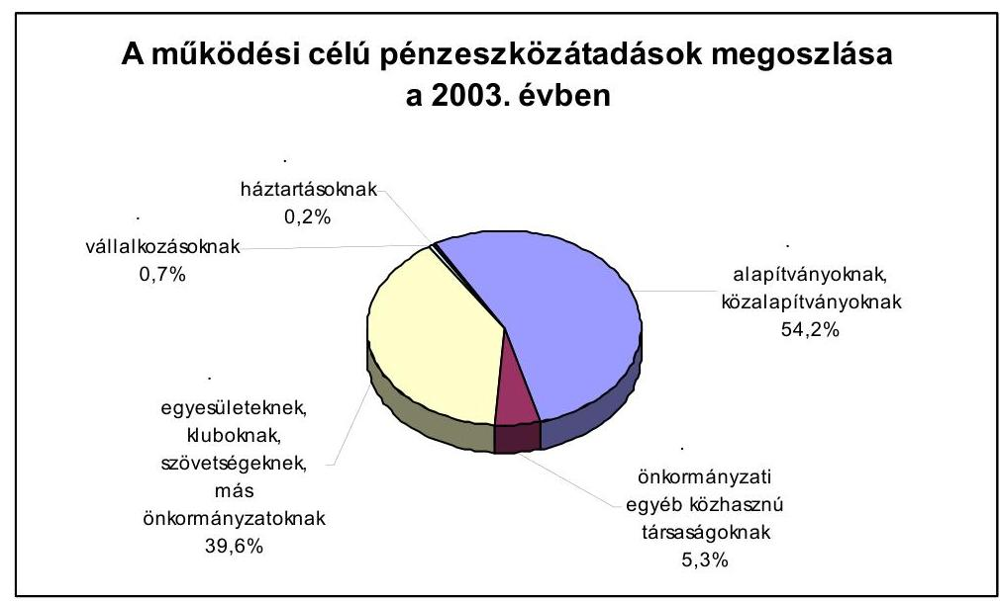
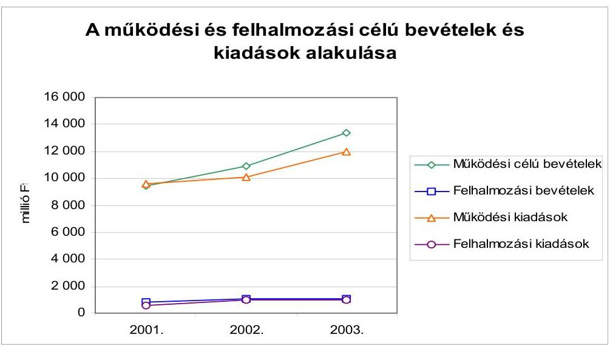
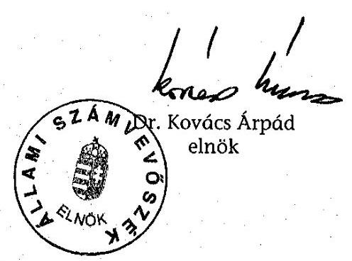
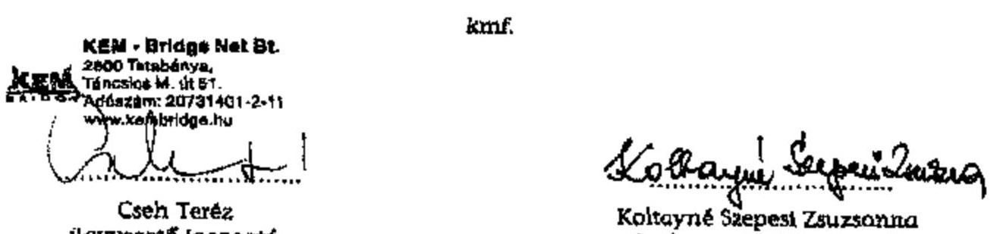
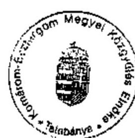
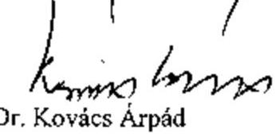

# JELENTÉS 

a Komárom-Esztergom Megyei Önkormányzat gazdálkodásának átfogó ellenőrzéséről

---

3. Önkormányzati és Területi Ellenőrzési Igazgatóság
3.3. Átfogó Ellenőrzések Főcsoport
Iktatószám: V-1002-4/30/14/2004.
Témaszám: 692
Vizsgálat-azonosító szám: V0163

# Az ellenőrzést felügyelte: 

Dr. Lóránt Zoltán
főigazgató
Az ellenőrzés végrehajtásáért felelős:
Dr. Sepsey Tamás
főigazgató-helyettes
Az ellenőrzést vezette:
Csecserits Imréné
főcsoportfőnök-helyettes

## Az ellenőrzést végezték:

## György Árpád

számvevő tanácsos
Koltayné Szepesi Zsuzsanna
főtanácsadó

## A témához kapcsolódó - elmúlt három évben - készített számvevőszéki jelentések:

| címe | sorszáma |
| :-- | --: |
| Jelentés a helyi és a helyi kisebbségi önkormányzatok átfogó | 0113 |
| ellenőrzéséről |  |
| Jelentés az általános iskolai oktatás minőségének javítását szolgáló | 0219 |
| intézkedések ellenőrzésének tapasztalatairól |  |
| Jelentés a megyei, fővárosi illetékhivatali tevékenység | 0243 |
| ellenőrzéséről |  |
| Jelentés a helyi önkormányzatok tartós szociális ellátási | 0317 |
| feladatainak ellenőrzéséről az idősek otthonainál |  |

Jelentéseink az Országgyűlés számítógépes hálózatán és az Interneten a www.asz.hu címen is olvashatók.

---

# TARTALOMJEGYZÉK 

BEVEZETÉS ..... 5
I. ÖSSZEGZŐ MEGÁLLAPÍTÁSOK, KÖVETKEZTETÉSEK, JAVASLATOK ..... 7
II. RÉSZLETES MEGÁLLAPÍTÁSOK ..... 16
1.A költségvetés tervezésének, végrehajtásának, az Önkormányzat vagyongazdálkodásának és a zárszámadás elkészítésének szabályszerűsége ..... 16
1.1.A költségvetési rendelet jóváhagyásának, módosításának, az előirányzatok nyilvántartásának és betartásának szabályszerűsége ..... 16
1.2.A gazdálkodás szabályozottsága, a bizonylati rend és fegyelem szabályszerűsége ..... 22
1.3.A pénzügyi-számviteli feladatok ellátásának informatikai támogatottsága ..... 27
1.4.Az önkormányzati vagyon nyilvántartása, számbavétele ..... 29
1.5.A vagyonnal való gazdálkodás szabályszerűsége, célszerűsége, nyilvánossága ..... 32
1.6.A céljelleggel nyújtott támogatások szabályszerűsége ..... 37
1.7.A közbeszerzési eljárások szabályszerűsége ..... 40
1.8.A zárszámadási kötelezettség teljesítésének szabályszerűsége ..... 43
2.Egyes kiemelt önkormányzati feladatok és a rendelkezésre álló források összhangja ..... 44
2.1.A feladatok meghatározása és szervezeti keretei ..... 44
2.2.A költségvetés egyensúlyának helyzete ..... 47
2.3.A feladatok finanszírozása ..... 53
3.A belső irányítási, ellenőrzési rendszer működésének értékelése ..... 57
3.1.Az ellenőrzési rendszer kialakítása, működése ..... 57
3.2.A könyvvizsgálati kötelezettség teljesítése ..... 59
3.3.A korábbi számvevőszéki ellenőrzések javaslatainak hasznosulása ..... 60

---

# MELLÉKLETEK 

1. számú Az önkormányzati vagyon nagyságának alakulása (1 oldal)
2. számú Az Önkormányzat 2003. évi bevételeinek és kiadásainak alakulása (1 oldal)
3. számú Az Önkormányzat gazdálkodását meghatározó adatok, mutatószámok (1 oldal)
4. számú Egyes önkormányzati feladatok finanszírozása (1 oldal)
5. számú Helyszíni ellenőrzési jegyzőkönyv (2 oldal)
6. számú Agócs István úr, a Komárom-Esztergom Megyei Közgyűlés alelnökének észrevétele (1 oldal)
7. számú Agócs István úr, a Komárom-Esztergom Megyei Közgyűlés alelnökének írt válaszlevél (1 oldal)

---

# RÖVIDÍTÉSEK JEGYZÉKE 

Ötv.
Áht.
Ámr.
Kbt.
Számv. tv.
Vhr.

Htv.

Ktv.
Ber.

Önkormányzat
Közgyűlés
Önkormányzati hivatal
Közgyűlés elnöke
főjegyző
Pénzügyi bizottság
Pénzügyi főosztály
GAMESZ
ÁSZ
TÁH
MÁK
Kórház
vagyongazdálkodási rendelet

SzMSz
közbeszerzési rendelet
a helyi önkormányzatokról szóló 1990. évi LXV. törvény az államháztartásról szóló 1992. évi XXXVIII. törvény az államháztartás működési rendjéről szóló 217/1998. (XII. 30.) Korm. rendelet
a közbeszerzésről szóló 1995. évi XL. törvény
a számvitelről szóló 2000. évi C. törvény
az államháztartás szervezetei beszámolási és könyvvezetési kötelezettségeinek sajátosságairól szóló 249/2000. (XII. 24.) Korm. rendelet
a helyi önkormányzatok és szerveik, a köztársasági megbízottak, valamint egyes centrális alárendeltségű szervek feladat- és hatásköreiról szóló 1991. évi XX. törvény
a köztisztviselők jogállásáról szóló 1992. évi XXIII. törvény 193/2003. (XI. 26.) Korm. rendelet a költségvetési szervek belső ellenőrzéséről
Komárom-Esztergom Megyei Önkormányzat
Komárom-Esztergom Megyei Önkormányzat Közgyűlése
Komárom-Esztergom Megyei Önkormányzat Hivatala
Komárom-Esztergom Megyei Közgyűlés elnöke
Komárom-Esztergom Megyei Önkormányzat főjegyzője
Komárom-Esztergom Megyei Önkormányzat Képviselőtestületének Pénzügyi Bizottsága
Komárom-Esztergom Megyei Önkormányzat Hivatalának Pénzügyi Főosztálya
Komárom-Esztergom Megyei Önkormányzat Gazdasági Műszaki Ellátó Szervezete
Állami Számvevőszék
Területi Államháztartási Hivatal
Magyar Államkincstár Komárom-Esztergom Megyei Területi Igazgatóság
Komárom-Esztergom Megyei Önkormányzat Szent Borbála Kórháza
Komárom-Esztergom Megyei Önkormányzat vagyonának meghatározásáról és hasznosításáról szóló 5/2000. (II. 24.) számú rendelete

Komárom-Esztergom Megyei Önkormányzat Szervezeti és Működési szabályairól szóló 8/2003. (IV. 24.) számú rendelete
Komárom-Esztergom Megyei Önkormányzatnak a közbeszerzéseiről szóló 5/1996. (II. 29.) számú rendelete

---

.

---

# JELENTÉS 

## a Komárom-Esztergom Megyei Önkormányzat gazdálkodásának átfogó ellenőrzéséről

## BEVEZETÉS

Az Ötv. 92. § (1) bekezdése, az Állami Számvevőszékről szóló 1989. évi XXXVIII. törvény 2. § (3) bekezdése, valamint az Áht. 120/A. § (1) bekezdése szerint az önkormányzatok gazdálkodását az Állami Számvevőszék ellenőrzi. Az ellenőrzés elvégzése az Országgyűlés illetékes bizottságai részére is átadott, országosan egységes ellenőrzési program alapján történt.

## Az ellenőrzés célja annak értékelése volt, hogy

- az önkormányzati gazdálkodás törvényességét ${ }^{1}$, szabályszerűségét biztosították-e a tervezés, a költségvetés végrehajtása, a vagyongazdálkodás és a zárszámadás során;
- az Önkormányzat által ellátott feladatok és az azokhoz rendelkezésre álló források összhangja biztosított volt-e, különös tekintettel egyes kiemelt feladatokra;
- a gazdálkodás szabályszerűségét biztosító kontrollok ${ }^{2}$ megfelelően segítették a végrehajtást.

A vizsgált időszak: a 2003. év, valamint 2004. év I. negyedév; az 1.5, 2.1-2.3 és a 3.3 ellenőrzési pontok esetében ezen túlmenően a 2001-2002. évek.

Komárom-Esztergom megye a közép-dunántúli régió északi területén található. Területe $2251 \mathrm{~km}^{2}, 75$ településének 2003. január 1-jén 319 990 lakosa volt. A megye lakosságának $66 \%$-a városban él.

A Közgyűlés munkáját 11 állandó bizottság segíti. A Közgyűlés elnökének és két alelnökének személye a 2002. évi helyi önkormányzati választásokat követően változott. A főjegyző 2003. június 30-án nyugdíjba vonult, az új főjegyző 2004. január 1-től látja el feladatait. Az Önkormányzati hivatal Pénzügyi főosztályának vezetője 2004. június 1-gyel távozott.

[^0]
[^0]:    ${ }^{1}$ A törvényi előírások betartásának elmulasztásakor egységesen a törvénysértés megjelölést alkalmazzuk, mivel az ÁSZ nem tehet különbséget a törvényi előírások között.
    ${ }^{2}$ A gazdálkodás szabályszerűségét biztosító kontroll alatt értjük a kiépített és működő belső irányítási és szabályozási rendszert, valamint a belső ellenőrzési funkciók ellátását.

---

Az Önkormányzat feladatai ellátására 29 önállóan és öt részben önállóan gazdálkodó költségvetési intézményt tart fenn. Az Önkormányzati hivatalban 93 fő, az önkormányzati intézményekben 3070 fő volt a foglalkoztatottak száma 2003. évben.

Az Önkormányzat a 2003. évben 19 626 millió Ft költségvetési bevételből gazdálkodott, a 2003. évi könyvviteli mérlegében kimutatott vagyonának értéke 15 049 millió Ft volt. (Az Önkormányzat gazdálkodását meghatározó adatokat, mutatószámokat a jelentés 3. számú melléklete tartalmazza.)

---

# I. ÖSSZEGZŐ MEGÁLLAPÍTÁSOK, KÖVETKEZTETÉSEK, JAVASLATOK 

Az Önkormányzat a 2003-2006. közötti évekre vonatkozó, a Közgyűlés által jóváhagyott gazdasági programmal rendelkezett, amelynek célkitűzéseit az éves koncepciók készítésénél figyelembe vették. A 2003. és a 2004. évre szóló költségvetés tervezésével kapcsolatos határidőket betartották, az előírt egyeztetéseket, véleményeztetéseket elvégezték. A költségvetési koncepciók és a költségvetési rendelettervezetek előterjesztéséhez az Ámr. előírásai ellenére a Pénzügyi bizottság írásos véleményét nem csatolták. A 2004. évre vonatkozó koncepciót az Ámr. előírásai ellenére nem a helyben képződő bevételek, valamint az ismert kötelezettségek figyelembevételével állították össze, ez is közrejátszott abban, hogy a költségvetési koncepciókban a költségvetés készítés további konkrét feladatait nem határozták meg.

A Közgyűlés a költségvetési rendeletek elfogadását megelőzően döntött az előirányzatok megalapozását szolgáló rendeletmódosításokról. A 2003. évi és 2004. évi költségvetési rendeletekben az Áht. előírásait megsértve a költségvetési bevételek és kiadások egyenlegeként tervezett hiányt a hitelfelvételen kívül a kiadási előirányzatok zárolásával fedezték. A költségvetési rendeletek az Ámr-ben előírtak szerint tartalmazták az Önkormányzat bevételeit forrásonként, főbb jogcímenként, a működési előirányzatokat önkormányzati szinten és költségvetési szervenként, az Önkormányzati hivatal költségvetését feladatonként. Az Áht-ban foglaltakat megsértve nem tartalmazták a speciális célú támogatásokat, az Ámr-ben előírtak ellenére a felújítási előirányzatokat célonként. A működési és felhalmozási célú bevételi és kiadási előirányzatokat mérlegszerűen bemutatták, de az Ámr-ben előírtakkal ellentétben azok együttes egyensúlyát nem biztosították. A költségvetési rendeletekben az „alapok" keretében jóváhagyott előirányzatokat a pénzeszköz átadásoknál és nem a céltartalékok között különítették el. Ez, valamint a pénzügyi keretösszegek alapként történő elnevezése sérti, illetve nincs összhangban az Áht-ban foglaltakkal.

A Közgyűlés - a vagyonkimutatás kivételével - az Áht-ban előírtakat megsértve rendeletben nem határozta meg a költségvetés és a zárszámadás mellékleteként tájékoztatásul bemutatandó mérlegek és kimutatások tartalmi követelményeit. Az éves költségvetési rendelettervezetek előterjesztésekor azonban bemutatták és a Közgyűlés elfogadta az Önkormányzat Áht. szerinti összevont mérlegét, a több éves kihatással járó döntések számszerűsítését évenkénti bontásban, valamint összesítve, azok szöveges indoklásával együtt. Az Áht. vonatkozó előírásait megsértve nem mutatták be a közvetett támogatásokat tartalmazó kimutatást szöveges indoklással együtt.

A költségvetési rendeletek évközi módosításai során a hatáskörökre és a gyakoriságra vonatkozó Ámr-ben szereplő előírásokat betartották. A költségvetési rendeletmódosításokat az eredeti költségvetéssel összehasonlítható módon készítették el. A módosított előirányzatok hitelt érdemlően dokumentáltak, azok adatai megegyeztek a beszámolóban szerepeltetett számadatokkal. A 2003. évi költségvetési rendelet 2004. évben történt módosításakor a Közgyűlés

---

az Ámr. előírásai ellenére utólagosan költségvetési szerveinek olyan pótelőirányzatokat, átcsoportosításokat engedélyezett, amelyeket még a tárgyévben, az előirányzatok felhasználását megelőzően kellett volna végrehajtani. Az utólagos módosítás nem volt teljes körű, a kiemelt kiadási előirányzatokat - az Áht-ban foglalt, a jóváhagyott előirányzatokon belüli gazdálkodásra vonatkozó előírásokat megsértve - önkormányzati szinten két jogcímnél lépték túl. A költségvetési intézmények közül a kiadási módosított előirányzatot hat intézmény nem tartotta be, a túllépés mértéke 0,5-8,4% között szóródott. Az előirányzatok túllépésének okait nem vizsgálták, felelősségre vonásra nem került sor.

Az Önkormányzat a szervezeti, pénzügyi-gazdálkodási szabályozó rendszerét kialakította. Az Önkormányzati hivatal SzMSz-e az Ámr-ben foglalt előírások ellenére nem tartalmazza az állami feladatként ellátott alaptevékenység és a kisegítő, kiegészítő tevékenységek forrásainak megjelölését, valamint a költségvetés végrehajtására szolgáló számlaszámot. A számviteli politikában, ellentétesen a Vhr. előírásaival úgy rendelkeztek, hogy terven felüli értékcsökkenést nem számolnak el. A Vhr-ben előírtak ellenére a leltározási és leltárkészítési szabályzat nem tartalmazza a források leltározására vonatkozó előírásokat. A számlarendben nem rendelkeztek az összesítő bizonylatok elkészítésének határidejéről. Nem alakították ki a kötelezettségvállalások nyilvántartására, a folyamatba épített ellenőrzésre vonatkozó helyi szabályokat, a munkaköri leírások és a gazdálkodási szabályzatok közötti összhang nem biztosított. Az Ámr-ben előírtak ellenére nem határozták meg a szakmai teljesítés igazolásának módját és az azt végző személyeket.

A számviteli nyilvántartások rendszere kiépített és működik. A főkönyvi könyvelés adatait a számítógépes- és kézi analitikákkal egyeztették. Az egyeztetésekről feljegyzések, jegyzőkönyvek nem készültek. A pénzforgalomban rögzített gazdasági eseményeket az alaki és tartalmi követelményeknek megfelelő bizonylatokkal támasztották alá. Az operatív gazdálkodási feladatok ellátása szabályszerű volt. A kötelezettségvállalások ellenjegyzése megtörtént és a teljesítéseket hiánytalanul igazolták annak ellenére, hogy a helyi szabályozás nem tartalmaz erre vonatkozó konkrét előírásokat.

A munkafolyamatba épített - a készpénzforgalommal kapcsolatosan előírt - ellenőrzési feladatokat nem teljesítették. Az Önkormányzati hivatal házipénztárában a 2003. január 1. - május 20. közötti időszakban a napi pénztárjelentésben csak a forgalmat rögzítették, a pénztáregyenleg és a tényleges készpénzállomány egyezőségét nem vizsgálták. A napi pénztárjelentéseket a pénztáros az esetek 16%-ában nem írta alá, a házipénztári pénzkezelési szabályzatban meghatározott házipénztári keretet az esetek 55%-ában túllépték.

Az Önkormányzati hivatal pénzügyi-számviteli feladataihoz kapcsolódó nyilvántartások vezetésére, a beszámoló és egyéb információk készítésére manuális és számítógépes megoldásokat egyaránt alkalmaznak. A munkahelyek számítógépes ellátottsága 71%-os, a munkatársak fele rendelkezik ECDL típusú számítógép-kezelői szakvizsgával. A MÁK által rendelkezésre bocsátott programok mellett saját fejlesztésű programokat használnak, ezek azonban egymáshoz nem kapcsolódnak, nem alkotnak egységes rendszert. Az Önkormányzat rendelkezik informatikai stratégiával. Katasztrófa elhárítási terv készítésére, az

---

Önkormányzati hivatal egészére
 kiterjedő jogosultsági rendszer kialakítására, adatvédelmi, adatbiztonsági rendszer kialakítására nem került sor.

Az Önkormányzat vagyonának nyilvántartását a Vhr. előírásai szerint alakították ki. Az évente elkészített, felülvizsgált, a zárszámadási rendelethez mellékletként csatolt vagyonkimutatásban biztosították a törzsvagyon - ezen belül a forgalomképtelen, illetve a korlátozottan forgalomképes vagyon - elkülönített nyilvántartását. Az Önkormányzati hivatal által beszerzett eszközök (tárgyi eszközök, készletek) könyvviteli nyilvántartásával, értékelésével, leltározásával, selejtezésével kapcsolatos feladatokat az önálló gazdálkodási jogkörrel rendelkező költségvetési intézmény, a GAMESZ látja el. A GAMESZ és az Önkormányzati hivatal a leltározási kötelezettségének eleget tett. Az Önkormányzati hivatal könyvviteli mérlegében kimutatott eszközök részletező analitikákkal megfelelően alátámasztottak. A vagyon változásához kapcsolódó vagyonértékesítések szabályszerűen történtek. A befektetett pénzügyi eszközök értékelése során a Vhr-ben előírtak ellenére a szükséges és indokolt értékvesztést, illetve az értékvesztés visszaírását nem hajtották végre.

Az Önkormányzat a vagyonának meghatározásáról és hasznosításának szabályairól rendeletet alkotott. A vagyongazdálkodási rendelet tartalmazza az eszközök csoportosítására, nyilvántartására, hasznosítására vonatkozó szabályokat. A Közgyűlés értékhatárhoz és eszközcsoportokhoz kapcsolódó vagyongazdálkodási jogokat biztosított a Közgyűlés elnöke, illetve bizottságai számára. A vagyongazdálkodási rendelet a vagyon hasznosítására, valamint a hasznosítás nyilvánosságára vonatkozó eljárási rendet, a nyilvános pályáztatás szabályait tartalmazza, azonban nem határozza meg a forgalomképesség szerinti besorolás megváltoztatásának szabályait. A versenyeztetési szabályok mellőzésére értékhatártól függetlenül lehetőséget biztosít a Közgyűlés számára, megsértve ezáltal az Áht. előírását.

Az Önkormányzat könyvviteli mérleg szerint kimutatott vagyona a 2001-2003. közötti időszakban a 2,1-szeresére növekedett. A növekmény jelentős része (61%-a) a korábban érték nélkül nyilvántartott ingatlanok értékmegállapításának következménye. A gáz-közmű vagyon ellentételezéseként kapott, 66,2 millió Ft névértékű államkötvény átvétele a befektetett pénzügyi eszközök állományának 4%-os növekedését eredményezte. A forgóeszközök 88%-os növekedését a követelések (alapvetően illeték-hátralék) 28%-os, valamint a pénzeszköz-állomány 2,3-szoros növekedése eredményezte. A költségvetési tartalék növekedése a 2001-2003. időszakban 5,7-szeres. A tartalék (pénzmaradvány) jelentős része (71%-a) a pénzügyi helyzetét stabilizáló, adósságállományát felszámoló Kórháznál képződött és teljes egészében kötelezettséggel terhelt.

A vagyon ingyenes (térítésmentes) átadásának módját, eseteit, a kapcsolódó hatásköröket a vagyongazdálkodási rendelet tartalmazza. Ingyenes (térítésmentes) vagyonátadásra a Közgyűlés jóváhagyásával két alkalommal került sor (közterület, illetve közút átadása az érintett települési önkormányzat részére).

Az Önkormányzat a követelések elengedésének módját, eseteit az éves költségvetési rendeletben szabályozta. A szabályozást figyelembe véve a Közgyűlés a

---

zárszámadási rendeletben 2002-ben 3240 ezer Ft, 2003-ban 278 ezer Ft behajthatatlan követelés törlését hagyta jóvá.

A Közgyűlés a céljelleggel nyújtott támogatások odaítélésének rendjét önkormányzati szinten egységesen nem szabályozta. A bizottságok maguk döntöttek a támogatások folyósításának szabályairól, feltételeiről, elszámolási rendszeréről. Ennek következtében a jogszabályi előírások szerinti egységes gyakorlat nem alakult ki. A céljelleggel juttatott pénzeszközökkel kapcsolatos számadási kötelezettséget a támogatásban részesülőknek - egy kivételével - előírták, az elszámolások benyújtását megkövetelték. Egy közhasznú szervezet részére odaítélt támogatás esetében megsértették az Áht. és a közhasznú szervezetekről szóló törvény előírásait, mivel nem kötöttek szerződést és nem írták elő a számadási kötelezettséget. A számadások ellenőrzését a beküldött dokumentum másolatok alapján végezték el, az elszámolásokat elfogadták, helyszíni ellenőrzést nem végeztek. A hatásköri szabályokat az alapítványoknak juttatott támogatások esetében nem tartották be. Az önkormányzati bizottságok, valamint a Közgyűlés elnöke a 2003. évben 14 alapítványt, összesen 4987 ezer Ft összegű támogatásáról döntött, ezzel az Ötv. előírásait megsértették, mivel a Közgyűlés hatásköréből nem ruházható át az alapítványok részére történő forrásátadás.

Az Önkormányzat a Kbt. hatálya alá tartozó beszerzéseivel kapcsolatos eljárási rendet, a feladat- és hatásköröket rendeletben szabályozta. A közbeszerzési eljárásokat szabályosan, a központi jogszabályok és a közbeszerzési rendelet előírásaival összhangban folytatták le.

A Közgyűlés elnöke a zárszámadási rendelettervezetet költségvetési rendelettel összehasonlítható módon, határidőre a Közgyűlés elé terjesztette. A zárszámadási rendeletben az Ámr. előírásainak megfelelően a működési, fenntartási előirányzatokat, azok teljesítését Önkormányzatra összesen, továbbá költségvetési szervenkénti részletezettségben bemutatták. A rendelet az Áht. és az Ámr. rendelkezéseit megsértve nem tartalmazta a speciális célú támogatásokat és az intézményi felújítási, valamint felhalmozási előirányzatokat nem külön-külön célonként, hanem összesítve mutatták be. Az Áht-ban előírtakat megsértve nem mutatták be a közvetett támogatásokat tartalmazó kimutatást. A Közgyűlés a zárszámadási rendeletben jóváhagyta az Önkormányzat és költségvetési szervei pénzmaradványát. Az Ámr. előírásait nem teljesítették, mivel a költségvetési intézmények vezetőit a beszámolójuk elfogadásáról írásban nem értesítették.

Az Önkormányzat kötelező feladatait az SzMSz-ben tételesen, jogszabályi megalapozottsággal nevesítette. Az önként vállalt feladatokat, azok ellátásának mértékét és módját - az Ötv. előírásait megsértve - nem határozták meg, ezek felsorolását az éves költségvetési rendeletek tartalmazzák. A kötelező feladatok ellátását az Önkormányzati hivatal, valamint 29 önálló, és öt részben önállóan gazdálkodó költségvetési intézmény biztosítja. Az intézményrendszer kialakítását, fejlesztésének irányait a jogszabályok rendelkezései alapján, szakmai koncepciókra alapozottan, az ellátási igényekhez, illetve a helyi sajátosságokhoz, adottságokhoz igazodóan határozták meg. A 2001-2003. években az Önkormányzat egy középfokú oktatási intézményt és egy kórházat települési

---

önkormányzat, két középfokú oktatási intézményt egyházi szervek tulajdonába adott, azok kezdeményezése alapján.

Az Önkormányzat a 2001-2003. években az ellátandó feladatok pénzigénye és a várható bevételek közötti pénzügyi egyensúlyt az éves költségvetéseiben nem teremtette meg. A költségvetés végrehajtása során a pénzügyi egyensúlyt elsősorban a bevételek tervezettet meghaladó mértékű teljesítésével biztosítani tudta. A tényleges teljesítések alapján a 2002. és 2003. években a működési kiadások fedezetét a működési bevételi többletek realizálásával biztosítani tudták. A gazdálkodás során a folyamatosan jelentkező likviditási gondok áthidalására működési- és növekvő mértékű munkabérhitelt vettek igénybe, „kiskincstári" típusú finanszírozási rendszert működtettek, központosítottan kezeltek és finanszíroztak intézményi dologi kiadásokat. A feladatellátás, az intézményrendszer struktúrájának átalakítása érdekében az intézmények szakmaigazdasági átvilágítása alapján a Közgyűlés 2004. évben intézményi összevonásokról, megszüntetésekről és létszámcsökkentésekről döntött. A bevételek növelését a pályázati úton bevonható források megszerzésével és a vagyonértékesítések fokozásával biztosították.

A naturális mutatókkal mérhető feladatok (általános iskolai és középfokú oktatás, bentlakásos szociális ellátás) fajlagos kiadási mutatói folyamatosan növekvő tendenciát mutatnak annak ellenére, hogy az oktatottak száma mind az általános, mind pedig a középfokú oktatási intézményekben erőteljesen (58, illetve 15%-kal) csökkent. A bentlakásos szociális intézményekben az ellátotti létszám nem változott. A növekedés elsősorban a személyi juttatásokat érintette. A kiadások finanszírozásában az állami hozzájárulás, támogatás a források több mint felét biztosította (52,2% és 81,4% közötti volt), a középiskolai oktatásnál 2001-2003. év között 8,4 százalékponttal emelkedett. A bentlakásos szociális intézményi ellátásban az intézményi saját bevételek aránya 30,1%, a kiadásokon belül az állami hozzájárulás aránya csökkent, amit az önkormányzati támogatás ellensúlyozott.

Az önként vállalt feladatok nem érték el az éves költségvetési kiadások 1%-át, nem veszélyeztették a kötelező feladatok ellátását. Az Önkormányzat folyamatos fizetőképességét elősegítő pénzállományának várható alakulását jelző likviditási tervet az Ámr. előírásai ellenére a főjegyző nem készített. Ezáltal tervszinten sem teremtették meg a tervezett bevételek teljesülésének és a várható kiadások felmerülésének időbeli összhangját.

Az Önkormányzat az Ámr. előírásai ellenére a kötelezettségvállalások nyilvántartási rendszerét nem szabályozta. A vezetett nyilvántartások nem alkalmasak az éves kötelezettségvállalás összegének bemutatására, illetve annak biztosítására, hogy kötelezettségvállalásra és utalványozásra a jóváhagyott előirányzatok mértékéig kerüljön sor. A költségvetési rendeletek előterjesztései részletesen tartalmazták az adósságot keletkeztető kötelezettségvállalások felső határát, a kötelezettségvállalási korlátot a hitelfelvételeknél betartották.

A középületekben az akadálymentes közlekedés biztosítása keretében - a saját források és a központi költségvetési támogatások felhasználásával - az Önkormányzat elsősorban a szociális intézmények akadálymentesítésére törekedett. A költségvetésben erre a célra forrásokat nem különítettek el, az intéz-

---

mények bővítése, rekonstrukciója, korszerűsítése alkalmával az akadálymentes közlekedés biztosítását prioritásként kezelték. Az akadálymentes közlekedés teljes körű biztosítására a Közgyűlés cselekvési programot fogadott el. A feladatok jelentős költségigényét, valamint a 2004. évi tervezett kiadásokat figyelembe véve a fogyatékos személyek jogairól és esélyegyenlőségük biztosításáról szóló törvényben meghatározott 2005. január 1-i határidőre a feladatok elvégzése nem biztosítható.

Az Önkormányzat az Ötv-ben előírt ellenőrzési kötelezettségei közül az intézmények ellenőrzésére vonatkozóan alakította ki ellenőrzési szervezetét és biztosította személyi feltételeit. Az intézményi ellenőrzéseket rendszeresen, kétévenkénti gyakorisággal, megfelelő színvonalon végezték. A főjegyző az Ötv. és a Htv. előírásait megsértve nem gondoskodott az Önkormányzati hivatal gazdálkodásának belső ellenőrzéséről, nem biztosította 2003. január 1-től az Áht. előírásait megsértve a belső ellenőrzés szervezeti függetlenségét. A Ber. előírásai ellenére elmaradt a belső ellenőrzési kötelezettségnek, a belső ellenőri szervezet jogállásának, feladatainak az Önkormányzati hivatal SzMSz-ében történő előírása. Az Önkormányzat a törvényben előírt könyvvizsgálati kötelezettségét teljesítette, a könyvvizsgáló az Önkormányzat beszámolójára korlátozás nélküli hitelesítő záradékot adott.

A korábbi ÁSZ vizsgálatok tapasztalatainak, javaslatainak hasznosítására intézkedtek, a javasolt intézkedések 80%-át megvalósították. A javaslatokat is figyelembe véve a tatabányai és az esztergomi kórházak pénzügyi helyzetét stabilizálták, megszüntették a költségvetési gazdálkodás letéti számlán történő lebonyolítását, az Illetékhivatal szervezeti megoldását módosították, elkészítették a szolgáltatásszervezési koncepciót.

A helyszíni ellenőrzés megállapításainak hasznosítása mellett javasoljuk:

# a Közgyűlés elnökének 

a jogszabályi előírások maradéktalan betartása érdekében

1. terjessze - a főjegyző által elkészített előterjesztés alapján - a Közgyűlés elé a vagyonkimutatás kivételével, az Áht. 118. §-ában előírt, a költségvetés és a zárszámadás előterjesztésekor bemutatandó mérlegek, kimutatások tartalmi követelményeiről szóló rendelet tervezetet;
2. biztosítsa, - a főjegyző által elkészített előterjesztés alapján - hogy az alapítványok céljellegű támogatásáról az Ötv. 10. § (1) bekezdés d) pontjában előírtak betartása érdekében a Közgyűlés határozzon;
3. kezdeményezze - a főjegyző által elkészített előterjesztés alapján - az Önkormányzat vagyonának meghatározásáról és hasznosításának szabályairól szóló 5/2000. (II. 24.), illetve az azt módosító 8/2004. (V. 27.) számú rendelet módosítását és kiegészítését annak érdekében, hogy nyilvános versenyeztetési kötelezettség alóli kivételeket csak az Áht. 108. § (1) bekezdésben szereplő esetekben biztosítson az Önkormányzat;

---

4. intézkedjen annak érdekében, hogy a költségvetési intézmények az Áht. 93. § (1) bekezdésben foglaltaknak megfelelően a jóváhagyott előirányzatokon belül gazdálkodjanak;
5. csatolja a költségvetési koncepció, valamint a költségvetési rendelet előterjesztéséhez az Ámr. 28. § (3) és az Ámr. 29. § (9) bekezdése szerint a Pénzügyi bizottságnak az előterjesztésekről alkotott véleményét;
a munka színvonalának javítása érdekében
6. kísérje figyelemmel a középületek akadálymentessé tételét, tekintettel a fogyatékos személyek jogairól és esélyegyenlőségük biztosításáról szóló 1998. évi XXVI. törvény 29. § (6) bekezdésében meghatározott 2005. január 1-i teljesítési határidőre;
7. kezdeményezze a számvevőszéki ellenőrzés tapasztalatainak, megállapításainak közgyűlési megtárgyalását és a feltárt hiányosságok megszüntetésére készíttessen intézkedési tervet;

# a főjegyzőnek 

a jogszabályi előírások maradéktalan betartása érdekében
1. a költségvetési rendelettervezet előkészítésekor
a) gondoskodjon az Ámr. 28. § (1) bekezdésében foglaltak betartása érdekében arról, hogy a költségvetési koncepció tervezetét a helyben képződő bevételek és az ismert kötelezettségek figyelembevételével állítsák össze;
b) gondoskodjon az Áht. 8/A. § (2) bekezdéseiben előírtak betartása érdekében a kiadási előirányzatok zárolási gyakorlatának megszüntetéséről;
c) gondoskodjon arról, hogy a költségvetési rendelettervezet az Áht. 69. § (1) bekezdése szerint a speciális célú támogatásokat,
 valamint az Ámr. 29. § (1) bekezdés c.) pontjának megfelelően a felújítási előirányzatokat célonként tartalmazza; biztosítsa a költségvetési rendelettervezet előkészítése során a bizottsági hatáskörben felosztható keretek, mint speciális célú támogatások, céltartalékként történő figyelembevételét, a bizottsági „alapok” elnevezés megszüntetését;
d) készítse el a rendelettervezet előterjesztéséhez az Áht. 118. §-a alapján az Áht. 116. § 10. pontjában előírt a közvetett támogatásokról szóló kimutatást és annak szöveges indoklását;
2. a költségvetési előirányzatok módosítása alkalmával
a) biztosítsa a rendelettervezet előkészítése során az Ámr. 53. § (2) és (6) bekezdésében foglaltak betartása érdekében, hogy a költségvetési előirányzatok tárgyévet követő időben - december 31-i hatállyal - történő módosítására csak az államháztartás többi alrendszere által biztosított pótelöirányzatok és a költségvetési szervek saját hatáskörben december 31-ig végrehajtott előirányzat módosításai esetében kerüljön sor;

---

b) gondoskodjon arról, hogy az Áht. 12/A. § (1) bekezdésének megfelelően a kötelezettségvállalás és az utalványozás csak a jóváhagyott kiadási előirányzatok mértékéig történjen. Az előirányzat túllépés esetén a Htv. 140. § (1) bekezdés e) pontjában biztosított ellenőrzési jogkörében eljárva vizsgálja meg azok okait, és indokolt esetben tegyen javaslatot személyes felelősségre vonásra;
3. biztosítsa, hogy a közhasznú szervezetekről szóló 1997. évi CLVI. törvény 14. § (2) bekezdésében foglaltak betartása érdekében az Önkormányzat által közhasznú szervezetek részére megállapított támogatások folyósítása kizárólag szerződés alapján történjen;
4. készítse el az Ámr. 139. §-ának megfelelő likviditási tervet és biztosítsa, hogy az év közben folyamatosan aktualizálásra kerüljön;
5. a gazdálkodási és pénzügyi-számviteli feladatok szabályozása tekintetében
a) kezdeményezze az Önkormányzati hivatal SzMSz-ének az Ámr. 10. § (4) bekezdés d), g) pontjainak megfelelő kiegészítését az alap és a kiegészítő tevékenységek forrásainak megjelölésével, a költségvetés végrehajtására szolgáló számlaszámmal;
b) határozza meg az Ámr. 134. § (3) bekezdésben foglaltakat figyelembe véve a szakmai teljesítés igazolásának módját és az azt végző személyeket;
c) gondoskodjon az Ámr. 134. § (6) bekezdésében előírtaknak megfelelően a kötelezettségvállalások nyilvántartási rendjének kialakításáról, vezetéséről oly módon, hogy abból az évenkénti kötelezettségvállalás összege megállapítható legyen;
d) rendelkezzen a számviteli politikában a Vhr. 8. § (5) bekezdés g) pontjában előírtak alapján a terven felüli értékcsökkenés elszámolásánál figyelembe veendő szempontokról, az elszámolás részletes rendjét az eszközök és források értékelésének szabályzatában a Számv. tv. (1)-(2) bekezdéseiben foglaltakra figyelemmel szabályozza;
e) a leltározási és leltárkészítési szabályzatot egészítse ki a források leltározására vonatkozó előírásokkal, összhangban a Vhr. 37. § (1) bekezdésében foglalt előírásokkal;
f) rendelkezzen a számlarendben a Vhr. 49. § (4) bekezdésében előírtak alapján az analitikus nyilvántartásokból készült összesítő bizonylatok (feladások) elkészítésének határidejéről;
6. gondoskodjon a pénzkezelési szabályzatban meghatározott készpénzkeret betartásáról, valamint a házipénztári ellenőrzések előírásszerű ellátásáról;
7. gondoskodjon, hogy a mérlegben kimutatott eszközök értékelése során az értékvesztés elszámolását, illetve annak visszaírását a Vhr. 32. § (2) bekezdésében foglalt előírások betartásával végezzék el;

---

8. a költségvetés végrehajtásáról készített zárszámadás esetében:
a) biztosítsa a zárszámadás előterjesztésekor az Áht. 69. § (1) bekezdése alapján a speciális célú támogatások és az Ámr. 29. § (1) bekezdés c) és d) pontja szerint az intézményi felújítási, valamint felhalmozási célú előirányzatok teljesítésének célonkénti bemutatását;
b) gondoskodjon arról, hogy a zárszámadási rendelettervezet előterjesztésekor - az Áht. 118. §-a alapján - az Áht. 116. § 10. pontjában előírt, közvetett támogatásokat tartalmazó kimutatás - tájékoztatásul bemutatásra kerüljön;
9. biztosítsa, hogy az Ötv. 92. § (2) bekezdésében és az Áht. 120/A. § (2) bekezdés b) pontjában előírt belső ellenőrzési tevékenység az Önkormányzat hivatalánál is végrehajtásra kerüljön, gondoskodjon az Áht. 121/A. § (3) bekezdése alapján az Önkormányzati hivatal belső ellenőrzésének szervezeten belüli kialakításáról, annak keretében intézkedjen az ellenőrök funkcionális függetlenségét biztosító feltételek megteremtésére az Áht. 121/A. § (4) bekezdésben részletezetteknek megfelelően;
10. kezdeményezze a Ber. 4. § (2) bekezdése alapján az Önkormányzati hivatal SzMSzének kiegészítését ennek keretében, gondoskodjon a belső ellenőrzési kötelezettségnek, a belső ellenőri szervezet jogállásának, feladatainak az SzMSz-ben történő előírásáról;
a munka színvonalának javítása érdekében
11. gondoskodjon a céljelleggel nyújtott támogatások odaítélésének, nyilvántartásának és a rendeltetésszerű felhasználás ellenőrzésének eljárási rendjéről szóló szabályzat elkészítéséről;
12. gondoskodjon a pénzügyi-számviteli területen dolgozók munkaköri leírásainak hatás- és jogkörök meghatározásával történő kiegészítéséről;
13. a pénzügyi-számviteli feladatok informatikai támogatottsága, az informatikai rendszer optimális és biztonságos működtetése érdekében kezdeményezze:
a) a folyamatos és biztonságos munkavégzést biztosító, a rendkívüli helyzeteket kezelni tudó katasztrófa-elhárítási terv készítését;
b) egységes adatvédelmi, adatbiztonsági, jogosultsági rendszer kialakítását.

---

# II. RÉSZLETES MEGÁLLAPÍTÁSOK 

## 1. A KÖLTSÉGVETÉS TERVEZÉSÉNEK, VÉGREHAJTÁSÁNAK, AZ ÖNKORMÁNYZAT VAGYONGAZDÁLKODÁSÁNAK ÉS A ZÁRSZÁMADÁS ELKÉSZÍTÉSÉNEK SZABÁLYSZERŰSÉGE

### 1.1. A költségvetési rendelet jóváhagyásának, módosításának, az előirányzatok nyilvántartásának és betartásának szabályszerűsége

Az Önkormányzat a 2003-2006. évekre vonatkozó gazdasági programját a Közgyűlés a 81/2003. (VI. 26.) számú határozatával elfogadta, ezzel teljesítette az Ötv. 91. § (1) bekezdésében előírt kötelezettségét. A gazdasági program tartalmazza az Önkormányzat legfontosabb célkitűzéseit, feladatait a humánszolgáltatások, a területfejlesztés, a gazdálkodás, a nemzetiségi és a nemzetközi kapcsolatok területén.

A 2003. évi és a 2004. évi költségvetési koncepció tervezeteket a Közgyűlés elnöke az Áht. 70. §-ában előírt ³ határidőt betartva - 2002. november 28-án, illetve 2003. november 27-én - nyújtotta be a Közgyűlésnek, az előterjesztésekhez az Ámr. 28. § (3) bekezdésében előírtak ellenére a Közgyűlés elnöke nem csatolta a Pénzügyi bizottság írásos véleményét. ⁴

Mindkét évben a Pénzügyi bizottság határozatban ⁵ foglalt véleményét - amely az előterjesztések határozati javaslatát támogatta és a Közgyűlésnek elfogadásra ajánlotta - a Közgyűlés tagjai írásban közvetlenül a Közgyűlés ülésének megkezdése előtt kapták kézhez.

A 2003. évi költségvetési koncepció az Ámr. 28. § (1) bekezdésében foglaltaknak megfelelően tartalmazta a központi támogatásokat, a helyben képződő bevételeket és az ismert kötelezettségeket, továbbá bemutatták a tervezethez benyújtott különböző javaslatok, intézményi felújítási igények kihatásait is. A konkrét kiadási igények és a prognosztizált bevételek figyelembevételével az Önkormányzat forráshiánya a 2003. évre 1766 millió Ft volt. A 2004. évi költségvetési koncepciót az Ámr. 28. § (1) bekezdésében előírtak ellenére nem a helyben képződő bevételek, valamint az ismert kötelezettségek figyelembevételével állították össze. Elmaradt az önkormányzati for-

[^0]
[^0]:    ³ Az Áht. 70. §-a szerint a költségvetési koncepciót november 30-ig, a közgyűlés tagjai általános választásának évében december 15-ig kell benyújtani a Közgyűlésnek.
    ⁴ A Közgyűlés elnökének mellékelt tájékoztatása szerint a 2005. évi költségvetési koncepció már a vonatkozó javaslat figyelembevételével lett elfogadva.
    ⁵ A Pénzügyi bizottság 50/2002. (XI. 26), illetve 87/2003. (XI. 24.) számú határozatai.

---

rások, ezen belül a saját bevételek számszerű kimunkálása, a működési, valamint a felhalmozási kiadási szükségletek meghatározása.

A 2004. évi költségvetési koncepció előterjesztéshez csatolt táblázatok az Önkormányzat 2003. évi módosított bevételi és kiadási előirányzatait, a 2004. évi várható központi támogatások jogcímeit és összegeit, és a többéves kihatással járó kötelezettségvállalások részletezését tartalmazták.

Az Önkormányzat 2003. évi költségvetési koncepcióját a Közgyűlés a 156/2002. (XI. 28.) számú, a 2004. évi koncepcióját a 169/2003. (XI. 27) számú határozatával fogadta el. A határozatokban a költségvetés készítés további munkálataira, az éves gazdálkodás vitelére fogalmaztak meg általános elvárásokat.

A gazdálkodás során prioritásként határozták meg a kötelező feladatellátást szolgáló intézményhálózat működőképességének megőrzését, az intézmények szakmai feladatai áttekintése alapján a megkezdett racionalizálás folytatását, az adósságkezelési eljárás kezdeményezését követelő intézményi tartozásállomány kialakulásának megakadályozását. További célként határozták meg a saját bevételek növelését, a fejlesztések érdekében a pályázati úton elnyerhető pótlólagos források megszerzését. Előírták a már megkezdett beruházások, felújítások megvalósításának elsődlegességét, a gazdálkodás hatékonyságának fokozását.

A koncepciók jóváhagyását követően az Önkormányzat 2003. évi és 2004. évi költségvetési javaslatainak kidolgozását, az Önkormányzati hivatal és az intézmények előirányzatainak meghatározását az Ámr. 26. § (1)-(7) bekezdéseiben előírtak szerint végezték el. A javasolt előirányzatokat a megelőző év eredeti előirányzatából kiindulva, a szerkezeti változásokkal és a szintre hozásokkal módosítva, az előirányzati többletekkel növelve tervezték meg.

A főjegyző a 2003. és a 2004. évi költségvetési rendelettervezeteket az Ámr. 29. § (4) bekezdés előírásainak megfelelően egyeztette a költségvetési szervek vezetőivel, az egyeztetésekről jegyzőkönyvek készültek.

A Közgyűlés elnöke a 2003. évi költségvetési rendelettervezetet 2003. január 30-án, a 2004. évit 2004. január 29-én az Áht. 71. § (1) bekezdésében meghatározott határidőn⁶ belül terjesztette elő és csatolta a könyvvizsgáló írásos jelentését. A Pénzügyi bizottság véleményét az Ámr. 29. § (9) bekezdésében előírt kötelezettség ellenére a Közgyűlés elnöke az előterjesztéshez nem mellékelte, azt a Közgyűlés tagjai közvetlenül a Közgyűlés ülésének megkezdése előtt kapták kézhez.

A Közgyűlés elnöke a költségvetési rendelettervezetekkel együtt, vagy azt megelőzően előterjesztette azokat a rendelettervezeteket is, - az Áht. 71. § (2) bekezdésében foglaltaknak megfelelően - amelyek a tervezett előirányzatokat megalapozták.

A Közgyűlés a 2002. november 28-i, illetve 2003. október 31-i ülésén a lakások és helyiségek bérleti díjáról; a 2002. december 19-i, illetve 2003. december 18-i ülésén a személyes gondoskodást nyújtó gyermekvédelmi intézményekről és az ellá-

[^0]
[^0]:    ⁶ A költségvetési rendelettervezet benyújtási határideje február 15.

---

tás igénybevétele esetén fizetendő térítési díjakról; a 2003. január 30-i, illetve 2003. december 18-i ülésén a szakosított ellátást nyújtó szociális intézmények igénybevételéről, a fizetendő térítési díjakról, valamint az intézményi élelmezési nyersanyagnormákról, a gyermekétkeztetésért fizetendő díjakról döntött.

A Közgyűlés elnöke az Áht. 71. § (2) és (3) bekezdéseiben előírtaknak megfelelően bemutatta a többéves elkötelezettséggel járó kiadási tételek későbbi évekre vonatkozó hatásait, beleértve a költségvetési évet követő két év várható előirányzatait is.

Az Önkormányzat a 2003. évi költségvetését a 3/2003. (I. 30.), a 2004. évit a 4/2004. (II. 26.) számú rendelettel fogadta el.

A 2003. évi költségvetési rendelet normaszövegében a bevételek főösszege 12247,6 millió Ft, a kiadások főösszege 12743,1 millió Ft, a költségvetési hiány összege 495,5 millió Ft volt. A hiányt rendeleti szinten 350 millió Ft hitel felvételével és 145,5 millió Ft összegű kiadási előirányzat zárolásával fedezték.
A 2004. évi költségvetési rendelet normaszövegében a bevételek főösszege 13 429,9 millió Ft, a kiadások főösszege 13 874,4 millió Ft, a költségvetési hiány összege 444,5 millió Ft volt. A hiány fedezetére 257,8 millió Ft hitel felvételét és 186,7 millió Ft kiadási előirányzat zárolását rendelte el a Közgyűlés, a költségvetési rendelettervezetek összeállításakor és a rendeletek elfogadásakor megsértették az Áht. 8/A. § (2) bekezdésében foglaltakat. Ezek miatt nem egyeztek meg a költségvetési rendeletek normaszövegében és az Önkormányzat bevételeit és kiadásait tartalmazó 1. számú mellékletben kimutatott számadatok sem.

A központi költségvetés számára benyújtott adatszolgáltatás és a költségvetési rendeletben foglaltak közötti számszaki egyezőség a 2003. és a 2004. években nem volt biztosított. Az információs rendszerben az Önkormányzat költségvetési hiánya teljes egészében hitelfelvétellel fedezett. A költségvetési rendeletben tervezett kiadási előirányzatok zárolását az információs rendszer nem kezelhette. Az
 eltérés a 2003. évben 145,5 millió Ft, a 2004. évben 186,7 millió Ft.

A 2003. évi és a 2004. évi költségvetési rendeletek - az Ámr. 29. § (1) a) pontja alapján - tartalmazták az Önkormányzat bevételeit forrásonként, főbb jogcímcsoportonként, a működési előirányzatokat önkormányzati szinten és költségvetési szervenkénti részletezettségben, az Önkormányzati hivatal költségvetését feladatonként. Nem mutatták be a speciális célú támogatásokat, az Áht. 69. § (1) bekezdésében foglaltakat megsértve, valamint az Ámr. 29. § (1) bekezdés c) pontjában előírtak ellenére a felújítási előirányzatokat célonként.

Mindkét évben a költségvetési rendeletben a Közgyűlés felújítási keretet (előirányzatot) hagyott jóvá, amelynek évközi felosztásáról átruházott hatáskörben a Térség- és gazdaságfejlesztési bizottsága döntött. Az évközi rendeletmódosítások a döntések alapján megtörténtek.

Az Áht. 73. § (1) bekezdése szerinti általános tartalékot egyik évben sem terveztek. Céltartalékot a 2003. évi költségvetésben nem, a 2004. évi költségvetésben 200,2 millió Ft összegben különítettek el a 2004. július 1-től a települési önkormányzatoktól átvételre kerülő intézmények működtetésére. Az Önkormányzati hivatal önként vállalt feladatainál, a dologi kiadások és a működésre átadott pénzeszközök között tervezték meg a különféle „alapokra" elkülönített előirányzatokat, amelyek jellegüket tekintve az Áht. 73. § (1) bekezdése szerinti céltartalékok körébe tartoztak. A költségvetésen belül elkülönített pénzügyi keretösszegek „alapként" történő megnevezése sérti az Áht-ban foglaltakat, mert az „alap" kifejezést az Áht. szóhasználata az elkülönített állami pénzalapokra használja, amelyekre az Áht. meghatározza azok létrehozásának, gazdálkodásának feltételeit. Ezen feltételeknek az Önkormányzat által létrehozott „alapok" nem felelnek meg, a kifejezés félreérthető. Az államháztartás rendszerében a meghatározott feltételekhez kötött fogalmaknak eltérő tartalmú alkalmazása bizonytalanságot, az egyértelműség hiányát okozza.

Az „alapok" az Önkormányzat költségvetésének olyan támogatási keretei, tartalmukat tekintve valójában céltartalékai, amelyek felhasználásáról év közben átruházott hatáskörben - a Közgyűlés bizottságai dönthetnek. Az egyes „alapok" elnevezése utal a felhasználási célra (pl. Idegenforgalmi, Sport, Színház, Egészségügyi, Nemzetiségi, Nemzetközi kapcsolatok, Európai Integrációs).

A 2003. évi és a 2004. évi költségvetési rendeletek 1/a. és 1/b. mellékleteiben bemutatták a működési és felhalmozási célú bevételi és kiadási előirányzatokat mérlegszerűen, de az Ámr. 29. § (1) bekezdésének h) pontjában előírtakkal ellentétben azok együttes egyensúlyát - a kiadási előirányzatok zárolása miatt - nem biztosították.

A Közgyűlés - az Áht. 118. §-ában előírtakat megsértve - a vagyonkimutatás kivételével ${ }^{7}$ rendeletben nem határozta meg az Önkormányzat költségvetésének előterjesztésekor tájékoztatásul bemutatandó mérlegek és kimutatások tartalmi követelményeit. Ennek ellenére az előterjesztésekhez mindkét évben csatolták az Áht. 116. § 6. pontja szerinti összevont mérleget, a 9. pontja szerinti többéves kihatással járó döntések számszerűsítését évenkénti bontásban, valamint összesítve tartalmazó kimutatást, azok szöveges indoklásával. Az Áht. 118. §-ában előírtakat megsértve azonban nem mutatták be az Áht. 116. § 10. pontjában előírt, a közvetett támogatásokat tartalmazó kimutatást a szöveges indoklással együtt.

Mindkét év költségvetési rendeletének része az Ámr. 29. § (1) bekezdésének j) pontjában előírt előirányzat-felhasználási ütemterv, amelyet az évközi rendeletmódosításoknál aktualizáltak.

A Közgyűlés a 2003. évi költségvetési rendeletben meghatározta a költségvetés végrehajtásával kapcsolatos főbb szabályokat:

- az Áht. 75. §-a alapján a költségvetési hiány fedezésének, a hitel igénybevételének módját, a hitelműveletekkel kapcsolatos hatásköröket;

[^0]
[^0]:    ${ }^{7}$ Az Önkormányzat vagyongazdálkodási rendeletének 10. §-ában határozták meg a vagyonkimutatás tartalmi követelményeit.

---

- az Áht. 8/A. § (1) bekezdése szerint a többletbevételek felhasználásának és a (3) bekezdés c) pontja szerinti évközi szabad pénzeszközök betétként való elhelyezésének rendjét;
- az önállóan gazdálkodó költségvetési szerveknek a Közgyűlés saját hatáskörű előirányzat módosítást nem engedélyezett, a kiemelt előirányzatokon belül a részelőirányzatok módosítására (átcsoportosítására) kaptak felhatalmazást;
- a Közgyűlés elnökének előirányzat módosítási jogot biztosítottak a központi céljellegű - mérlegelést nem igénylő - pótelőirányzatok saját hatáskörben történő felosztására.

A 2004. évi költségvetési rendelet végrehajtási rendelkezéseit - a 2003. évihez viszonyítva - két szabállyal egészítették ki. A Közgyűlés az Áht. 74. § (2) bekezdése alapján előirányzat átcsoportosítási jogot ruházott át bizottságaira, és a Közgyűlés elnökére.

A 2004. évi költségvetési rendelet 16. §-a bizottságonként tartalmazta azokat az Önkormányzati hivatal költségvetésében célfeladatokra elkülönített „alapokat", amelyek előirányzataira a bizottságok felhasználási jogosítványai kiterjedtek.
A Közgyűlés elnöke a céltartalék átcsoportosítására kapott felhatalmazást.
A Közgyűlés a 2003. évi költségvetésében jóváhagyott eredeti előirányzatokat összesen (1781,5 millió Ft-tal) 14%-kal növelte, az előirányzatok módosításáról és átcsoportosításáról öt rendeletet alkotott ${ }^{8}$. Az Ámr. 53. § (2) bekezdésében foglalt - negyedévenkénti költségvetési rendeletmódosításra vonatkozó - előírásokat betartották. Az évközi módosítások, átcsoportosítások során gondoskodtak a központi költségvetésből juttatott pótelőirányzatoknak, az átvett pénzeszközöknek, az előző évi pénzmaradványok igénybevételének a, bizottsági és közgyűlés elnöki hatáskörben hozott döntéseknek az Önkormányzati hivatal és az intézmények bevételi többletének a költségvetési rendeleten történő átvezetéséről. Az előirányzat módosításokat a megfelelő dokumentumokkal alátámasztották.

Az előirányzatok évközi módosítását elsősorban az intézményi működési bevételi többletek (106,5 millió Ft), az illeték bevételi többletek (395,3 millió Ft), a működési- és a felhalmozási célra átvett pénzeszközök (375,1 millió Ft, illetve 134,4 millió Ft) többlete, valamint az előző évi pénzmaradvány igénybevétele (705,2 millió Ft) tette szükségessé. A hitelek bevételeinek 495,5 millió Ft-os előirányzatát csökkentették a ténylegesen felvett működési és felhalmozási célú hitelek összegére, 153,4 millió Ft-ra.

A Közgyűlés a 2003. évi költségvetés előirányzatait utolsó alkalommal az Ámr. 53. § (2) és (6) bekezdésében előírt határidőt betartva, a költségvetési beszámoló leadási határideje előtt, a 2004. február 26-án tartott ülésén módosította. A módosítás során a Közgyűlés az Ámr. 53. § (2) és (6) bekezdésében foglalt előírások ellenére, utólagosan a költségvetési szerveinek (Önkormányzati

[^0]
[^0]:    ${ }^{8}$ Az Önkormányzat 7/2003. (IV. 24.), a 10/2003. (VI. 26.), a 12/2003. (IX. 25.), 23/2003. (XII. 28.), 3/2004. (II. 26.) számú rendelete.

---

hivatal, intézmények) kiadási pótelőirányzatokat engedélyezett a többletbevételek terhére, továbbá a bevételi és kiadási előirányzatokon belül olyan átcsoportosításokat hajtott végre, amelyet még a tárgyévben az előirányzatok felhasználását megelőzően kellett volna végrehajtani.

Az előterjesztés szerint „az előirányzatok a teljesítéshez és a kötelezettségvállalásokhoz igazodóan áttekintésre kerültek, a zárolások összegével az előirányzatok csökkentek, illetve ahol a teljesítés megkívánta, ott a zárolásfeloldás a többletbevétel terhére megtörtént".

Az Ámr. 66. § (4) és (6) bekezdéseiben előírtak ellenére nem a zárszámadási rendelettel egyidejűleg, a pénzmaradvány felülvizsgálatakor, hanem a 2003. évi költségvetési rendelet 2004. évben történt módosítása során az intézményektől elvonták a fel nem használt költségvetési támogatási előirányzatból azt a részt, amelyre az intézményeknek nem volt kötelezettségvállalása, illetve feladat elmaradása miatt keletkezett megtakarítása.

A költségvetési rendeletmódosításra előterjesztett rendelettervezeteket az eredeti költségvetéssel összehasonlítható módon készítették el. A költségvetési rendeletben jóváhagyott előirányzatokról, azok változásairól az analitikus nyilvántartásokat vezették, azok adatai megegyeztek a beszámolóban szerepeltetett kiemelt előirányzatok számadataival. A változásokat a főkönyvi könyvelésben folyamatosan rögzítették.

A 2003. évi költségvetési beszámoló, illetve zárszámadási rendelet költségvetési kiadási főösszegének módosított előirányzatát éves szinten a teljesítés során betartották, a felhasználás 90,1%-os volt. A kiemelt előirányzatokat - az utólagos előirányzat-módosítások ellenére - önkormányzati szinten az ellátottak pénzbeli juttatásainál 2,3%-kal, az intézményi felújításoknál 2,1%-kal túllépték.

A költségvetési intézmények közül a költségvetési kiadásainak módosított előirányzatát hat intézmény nem tartotta be, a túllépés mértéke 0,5%-8,4% között szóródott.

A kiemelt előirányzatok közül a személyi juttatások előirányzatát négy intézmény, a dologi kiadások előirányzatát 14 intézmény, az ellátottak pénzbeli juttatása előirányzatát öt intézmény, beruházási előirányzatát kettő intézmény, felújítási előirányzatát egy intézmény nem tartotta be.

Az intézmények az előirányzatok túllépésével megsértették az Áht. 12/A. § (1) bekezdésének előírását, amely szerint a költségvetés végrehajtása során tárgyévi fizetési kötelezettség csak a jóváhagyott kiadási előirányzatok mértékéig vállalható, és kifizetések is ezen összeghatárig rendelhetők el, valamint az Áht. 93. § (1) bekezdésében foglaltakat is, mert nem a jóváhagyott előirányzataikon belül gazdálkodtak. A túllépések okait nem vizsgálták, felelősségre vonást nem alkalmaztak.

A Közgyűlés 2004. I. félévben a 2004. évi költségvetési rendeletét két alkalommal módosította a központi költségvetési kapcsolatokból eredő változások és a 2003. évi pénzmaradvány felosztása miatt.

---

# 1.2. A gazdálkodás szabályozottsága, a bizonylati rend és fegyelem szabályszerűsége 

Az Önkormányzat SzMSz-ének mellékleteként elkészített, az Önkormányzati hivatal szervezete és ügyrendje elnevezésű szabályozásból hiányoztak az Ámr. 10. § (4) bekezdésében előírt, az SzMSz-szel szemben támasztott követelmények közül az állami feladatként ellátott alaptevékenység, a kisegítő, kiegészítő tevékenységek forrásainak megjelölése, az azokat meghatározó jogszabályok megjelölésével, valamint a költségvetés végrehajtására szolgáló számlaszám.

Az Önkormányzati hivatal gazdasági szervezete rendelkezik az Ámr. 17. § (5) bekezdése szerinti ügyrenddel, ez tartalmazza a szervezet és a pénzügyigazdasági feladatok ellátásáért felelős személyek által ellátandó feladatok részletezését.

Az ügyrend a vezetők és beosztott dolgozók feladatait munkakörönkénti részletezésben fogalmazta meg, a feladatok személyhez kötött, részletes leírását, a hatás- és jogköröket az ügyrendben hivatkozott munkaköri leírások tartalmazzák.

Az irányítási és vezetési szintekhez kapcsolódó feladat-, jog- és hatásköröket az SzMSz tételes jogszabályi megalapozottsággal részletezi. Az operatív gazdálkodással összefüggő feladat- és jogköröket a kötelezettségvállalás, utalványozás, ellenjegyzés és érvényesítés rendjéről szóló, a főjegyző által kiadott, 2003. január 1-gyel hatályos szabályzat tartalmazza. Ennek megfelelően:

- általános kötelezettségvállalási jogkörrel a Közgyűlés elnöke rendelkezik, a főjegyző ellenjegyzése mellett. A főjegyző távollétében az ellenjegyzési jogkört a Pénzügyi főosztály vezetője gyakorolja;
- a Közgyűlés elnöke korlátozás nélküli kötelezettségvállalási jogkörrel hatalmazta fel a Közgyűlés általános alelnökét, a főjegyző ellenjegyzése mellett;
- az Önkormányzati hivatal köztisztviselőivel kapcsolatos munkáltatói jogkörrel összefüggő kötelezettségvállalásra kizárólag a főjegyző, a belföldi kiküldetési utasítás elrendelésével kapcsolatos kötelezettségvállalásra a főjegyző és a főosztály-, illetve osztályvezető beosztású dolgozói kaptak felhatalmazást, a Pénzügyi főosztály vezetőjének ellenjegyzésével;
- az okmányok érvényesítésére az Ámr. 135. § (2) bekezdésében előírtaknak megfelelő iskolai végzettséggel és szakmai képesítéssel rendelkező dolgozó kapott megbízást; utalványozási jogkör gyakorlására a Közgyűlés elnöke felhatalmazást az általános alelnök, valamint az aljegyző részére adott;
- az operatív gazdálkodási feladatok gyakorlására történő felhatalmazások során, illetve a kijelöléseknél figyelemmel voltak az Ámr. 135. § (5) bekezdésében, illetve 138. § (1)-(3) bekezdéseiben előírt összeférhetetlenségi szabályokra;
- a felhatalmazások alkalmával összeghatárt nem állapítottak meg, a felhatalmazottak beszámoltatására nem került sor.

---

Hiányossága a szabályozásnak, hogy

- nem tartalmazza a szakmai teljesítéseket igazolók kijelölését, az igazolás elvégzésének módját (ezzel összefüggésben a szabályzat csupán az érvényesítés szakmai igazolással való megalapozottságára utal), az Ámr. 135. § (3) bekezdésében foglalt előírások ellenére;
- ellentétesen az Ámr. 134. § (4) és (6) bekezdéseiben foglalt előírásokkal nem szabályozták a kötelezettségvállaláshoz kapcsolódó analitikus nyilvántartás rendszerét, nem rögzítették az előzetes írásbeliséghez nem kötött, gazdasági eseményenként 50000 Ft-ot el nem érő kifizetéseket megalapozó kötelezettségvállalás rendjét, nyilvántartási formáját.

A főjegyző 2003. január 3-i hatállyal belső körlevelet adott ki. Ebben kötelezően előírta a számla teljesítésének, illetve a fedezet meglétének igazolását. A feladatot ellátók nevesítésére azonban ez alkalommal sem került sor („a számla beérkezésekor az érintett szakosztály ügyintézője
 igazolja annak teljesítését"). A körlevél a megjelölés általános jellege miatt nem felel meg az Ámr. 135. § (3) bekezdésében foglalt, a személyek kijelöléséről szóló követelményeknek. Ily módon a feladat elvégzése nem számonkérhető, a felelősség nem érvényesíthető.

A szabályozási hiányosságok ellenére utalványozásra, illetve tényleges kifizetésre csak a teljesítés igazolását követően került sor.

A főjegyző az egységes számviteli rend kialakítása érdekében valamennyi intézmény rendelkezésére bocsátotta az Önkormányzati hivatal által kialakított számviteli politikát. Ezt az intézmények a helyi sajátosságokkal kiegészítve alkalmazták. A számviteli politikában foglaltak végrehajtását, betartását a felügyeleti ellenőrzés alkalmával kérik számon.

A számviteli politikában ${ }^{9}$ meghatározták, hogy a számviteli elszámolás és értékelés szempontjából mit tekintenek lényegesnek, nem lényegesnek, továbbá jelentős összegnek, nem jelentős összegnek. Rögzítették, hogy mit tekintenek figyelembe veendő szempontnak a megbízható és valós összkép kialakítását befolyásoló információk tekintetében, a kis értékű tárgyi eszközök, vagyoni értékű jogok és szellemi termékek minősítésénél. A forgalomképes ingatlanok tekintetében a piaci értéken való értékelés lehetőségével nem élnek. Kijelölték a mérlegkészítés időpontját, illetve azt az időpontot, ameddig a költségvetési évre vonatkozóan helyesbítések végezhetők.

A leltározási és leltárkészítési szabályzat ${ }^{10}$ tartalmazza a leltározás előkészítésével, lefolytatásával, értékelésével, a leltárkülönbözetek megállapításával kapcsolatos követelményeket. A befektetett eszközök közül csak a beruházások vonatkozásában rendelkezik (évenkénti, egyeztetéssel történő leltározást ír elő). Nem tartalmazza a befektetett pénzügyi eszközök leltározásának szabályait. Ellentétesen a Vhr. 37. § (1) bekezdésében foglaltakkal, nem rendelkezik a források leltározásáról. Nem határozták meg a leltározás elvégzését igazoló, leltárt helyettesítő összesítő kimutatások tartalmát, formáját és kellékeit, nem szabályozták a leltározás és a könyvvitel adatainak egyeztetési módját ${ }^{11}$.

Az eszközök és források értékelési szabályzatában ${ }^{12}$ meghatározták a bekerülési- és mérlegérték meghatározásának szempontjait. Ezzel összefüggésben a számviteli politika előírásai, melyek szerint az Önkormányzat és intézményei terven felüli értékcsökkenést nem számolnak el, ellentétesek a Vhr. 8. § (5) bekezdés g) pontjában foglalt előírásokkal.

A pénzkezelési szabályzat ${ }^{13}$ kizárólag a készpénzkezeléssel összefüggő szabályokat tartalmazza, nem tér ki a bankszámlakezeléssel kapcsolatos kérdésekre (bankszámlák köre, rendeltetése, azok feletti rendelkezésre jogosultak megnevezése, a bankszámlák és a pénztár kapcsolata). A záró pénzkészletet 50000 Ft-ban határozták meg.

Az Önkormányzat rendszeres termékértékesítést, saját kivitelezésben beruházási tevékenységet nem folytat, így az önköltségszámítás rendjére vonatkozó szabályzatot nem készített.

A számlarend ${ }^{14}$ tartalmazza a főkönyvi számlák megnevezését, tartalmát, az értékváltozás jogcímeit, az analitikus nyilvántartások tartalmát, a főkönyvi könyveléssel való egyeztetés módját, de - ellenétesen a Vhr. 49. § (4) bekezdésében foglaltakkal - nem tartalmazza az összesítő bizonylatok (feladások) elkészítésének határidejét.

Az Önkormányzati hivatal által beszerzett eszközök (tárgyi eszközök, készletek) értékelésével, főkönyvi és analitikus nyilvántartásával, leltározásával, selejtezésével kapcsolatos feladatokat az Önkormányzat önállóan gazdálkodó intézménye, a GAMESZ látja el. A felesleges vagyontárgyak hasznosításának, selejtezésének szabályzatát ezért a GAMESZ készítette el.

Az Önkormányzati hivatal szervezete és ügyrendje elnevezésű szabályozás, az Önkormányzati hivatal gazdasági szervezetének ügyrendje, valamint a számlarendnek a főkönyvi számlák közötti kapcsolatokra, a könyvviteli egyeztetésekre és zárlati feladatokra vonatkozó részei tartalmazzák a pénzügyiszámviteli feladatok ellátására vonatkozó előírásokat. A munkavégzés során az előző munkafázis elvégzésének ellenőrzésével összefüggő feladatokat általános jelleggel az ellenőrzési szabályzat munkafolyamatba épített ellenőrzésre vonatkozó fejezete tartalmazza, azzal a kiegészítéssel, hogy a konkrét ellenőrzési feladatokat a dolgozók munkaköri leírásában rögzítik.

[^0]
[^0]:    ${ }^{11}$ A leltárt helyettesítő kimutatásokra vonatkozó rendelkezéseket a Vhr. 2003. decemberi módosítása megszüntette.
    ${ }^{12}$ A főjegyző által kiadott, 2002. január 1-gyel hatályos szabályzat.
    ${ }^{13}$ A főjegyző által kiadott, 2002. január 1-gyel hatályos szabályzat.
    ${ }^{14}$ A főjegyző által kiadott, 2003. január 1-gyel hatályos szabályzat.

---

A gazdasági szervezet ügyrendje mellékleteként elkészített, 2004. március 1-gyel aktualizált, megismerési és tudomásul vételi záradékokkal ellátott munkaköri leírásokban az ellenőrzési feladatokat általános jelleggel az egyes dolgozók gazdálkodói jogkörébe rendelt szakfeladatok, önkormányzati intézmények vonatkozásában határozták meg.

A hatáskör tekintetében a munkaköri leírások egységesen az „aláírási jog” gyakorlását nevesítik, a kötelezettségvállalás rendjéről szóló szabályzatra való hivatkozással. A konkrét feladat (ellenjegyzés, érvényesítés, teljesítés igazolása) nem került megjelölésre, így a feladat elvégzése nem számonkérhető, a felelősség nem érvényesíthető.

A gazdálkodási szabályzatok és a munkaköri leírások közötti összhang nem biztosított. A munkaköri leírások nem tartalmazzák a munkafolyamatba épített ellenőrzési feladatokat, az ellenőrzendő műveletek megnevezését, az ellenőrzés viszonyítási alapjainak meghatározását, az eltérések megállapításának és dokumentálásának módját, illetve az eltérések esetén szükséges teendőket, esetleges jelzési kötelezettséget. Nem térnek ki az egyéb szabályzatokban részletezett egyeztetési, ellenőrzési feladatokra, nem nevesítik a konkrét feladathoz kapcsolódó jog-, illetve hatásköröket.

Az Önkormányzati hivatalban a számviteli nyilvántartások rendszerét kialakították és működtetik; a rendszer tartalmazza azokat az adatokat, amelyek az időközi jelentésekhez, vezetői információszolgáltatáshoz, és a beszámolók összeállításához szükségesek.

Az értékpapírok, munkavállalókkal szembeni követelések, belföldi szállítói kötelezettségek főkönyvi számlái a Vhr. 9. számú mellékletében és az Önkormányzati hivatal számlarendjében meghatározott tartalmú részletező analitikus nyilvántartással alátámasztottak. A főkönyvi könyvelés és az analitikus nyilvántartások közötti egyeztetési pontokat, az egyeztetések gyakoriságát a számlarendben határozták meg. A tartós hitelviszonyt megtestesítő értékpapírokra vonatkozóan a főkönyvi könyvelés és az analitikus nyilvántartás közötti egyeztetést nem szabályozták. Az Önkormányzati hivatal üzemeltetésre átadott, vagyonkezelésre vett eszközökkel nem rendelkezik, erre vonatkozó egyeztetési kötelezettsége nem állt fenn ${ }^{15}$.

A főkönyvi könyvelés és az analitikus nyilvántartás adatainak egyezősége biztosított volt, az egyeztetések megtörténtéről feljegyzések, jegyzőkönyvek nem készültek ${ }^{16}$. Az éves beszámoló összeállítását megelőzően a könyvviteli mérleget és a pénzforgalmi kimutatást a Vhr. 17. számú melléklete szerinti főkönyvi kivonattal alátámasztották.

A számvitelben a pénztár, bank, illetve vegyes naplóban rögzített gazdasági eseményekről a Számv. tv. 165. § (1)-(2) bekezdésében előírtaknak megfelelő bizonylatokat kiállították, a könyvviteli bizonylatok rendezettek. Az operatív gazdálkodás során, a kiadások teljesítésénél és a bevételek beszedésénél a gazdálkodással kapcsolatos előírások érvényesültek. A szerződésen alapuló kötelezettségvállalások dokumentálására szerződéskísérő lapot rendszeresítettek, a további kötelezettségvállalásokat bizonylatokon rögzítették (feljegyzések, kérelmek, előterjesztések). A kötelezettségvállalás ellenjegyzése minden esetben megtörtént. A teljesítések igazolását a pénztári és a banki kifizetéseknél elvégezték, annak ellenére, hogy ennek szabályozott rendszerét nem alakították ki. Az érvényesítést az azzal megbízottak elvégezték. A gazdálkodási jogkörök gyakorlása során az összeférhetetlenségi szabályokat betartották. Utasításra történő utalványozás, ellenjegyzés, illetve érvényesítés nem volt.

A munkafolyamatba épített, a készpénzforgalommal kapcsolatosan előírt ellenőrzési feladatokat nem teljesítették. Az Önkormányzati hivatal házipénztárában a pénztárjelentésben a 2003. január 1. - május 20. közötti időszakban a pénztáros csak a forgalmat rögzítette. A napi pénztárjelentés egyenlege és a készpénzállomány közötti egyezőség megállapítására ebben az időszakban nem került sor. A napi pénztárjelentéseket a pénztáros az esetek 16%-ában nem írta alá, a házipénztári pénzkezelési szabályzatban meghatározott házipénztári keretet az esetek 55%-ában túllépték (háromhavi átlag alapján a záró pénzkészlet összege 120000 Ft volt). A Pénzügyi főosztály vezetője, a pénztárellenőr és a revizor által a pénztáros jelenlétében 2003. május 20-án lefolytatott ellenőrzés alkalmával megállapították, hogy a pénztárjelentés forgalmi adatai és a számítógépes könyvelés adatai közötti egyezőség biztosított. Az ellenőrzés során 8975 Ft pénztártöbbletet tártak fel. A többlet keletkezésének okát nem tudták megállapítani, ezért azt a pénztárba bevételezték.

A készpénzforgalommal kapcsolatos feladatok szabályszerű ellátása érdekében új pénztárost alkalmaztak, az azóta eltelt időszakban a napi pénztárjelentést rendszeresen elkészítik, lezárják, ellenőrzik.

A banki kivonatokhoz, illetve a kiadási/bevételi pénztárbizonylatokhoz csatolt utalványlapokon a kiadások és bevételek közgazdasági osztályozás szerinti, illetve funkcionális osztályozás szerinti elszámolása szabályszerűen megtörtént, a tételeket az előírásoknak megfelelően rögzítették. A számviteli nyilvántartásba vételt a készpénzforgalomban a pénzmozgással egyidejűleg, a bankszámlaforgalomnál a hitelintézeti értesítés megérkezésekor elvégezték. Az egyéb gazdasági események közül a 2003. november 27-i üzletrész értékesítést (15 220 ezer Ft) - ellentétesen a Vhr. 51. § (1) bekezdés b) pontjában foglaltakkal - késedelmesen, csak a 2004. évben rögzítették.

[^0]
[^0]:    ${ }^{15}$ Üzemeltetésre átadott eszközökkel az Önkormányzat önállóan gazdálkodó intézményei, a Jávorka Sándor Mezőgazdasági és Élelmiszeripari Szakközépiskola és Szakiskola és a GAMESZ rendelkezik (ezek számviteli mérleg szerinti értéke 9 millió Ft.). A Kórház a Kincstári Vagyoni Igazgatósággal kötött szerződés alapján vagyonkezelésbe vette a tatabányai gőzfürdőt, ennek könyvviteli mérleg szerinti értéke 95 millió Ft.
    ${ }^{16}$ A Pénzügyi főosztály megbízott vezetőjének írásbeli nyilatkozata szerint a számlarendben előírt egyeztetéseket hiánytalanul elvégezték.

---

# 1.3. A pénzügyi-számviteli feladatok ellátásának informatikai támogatottsága 

Az Önkormányzati hivatal pénzügyi-számviteli feladataihoz kapcsolódó nyilvántartások vezetésére, a beszámoló és egyéb információk készítésére, a banki utalások végrehajtására manuális és számítógépes megoldásokat egyaránt alkalmaznak, átfogó pénzügyi informatikai rendszer hiányában a manuális munkavégzés továbbra is jelentős.

Kézi nyilvántartást vezetnek a működési és felhalmozási célú pénzeszközátadásokról, a készpénzforgalomról (napi pénztárjelentés, pénztári kiadási-, illetve bevételi bizonylatok), a vagyongazdálkodással, karbantartással kapcsolatos gazdasági eseményekről, az Illetékhivatal kiadásairól, bevételeiről. A kézi vezetésű (előirányzat, illetve feladat orientált karton rendszerű) nyilvántartások összesítő, szintetizált adatait EXCEL táblákban rögzítik, a megoldások azonban nem rendszerszerűek, az adatszolgáltatást a mindenkori információs igényekhez igazodóan szervezték meg.

A főkönyvi könyvelés számítógépen történő vezetése, a beszámoló készítés számítógépes támogatottsága biztosított.

Az Önkormányzat a MÁK által rendelkezésre bocsátott programok mellett saját fejlesztésű programokat alkalmaz számlázásra, illetmények tervezésére, nem rendszeres kifizetések számfejtésére, számfejtett összegek címletezésére, normatív állami hozzájárulások tervezésére, privatizációs- és gázkölcsön törlesztésből származó bevételek nyilvántartására. Ezen túlmenően telepítésre került a számlavezető pénzintézet által rendelkezésre bocsátott ügyfélterminál. A különféle programok nem egy egységes programrendszer részei, egymástól elkülönülten, egymástól függetlenül működnek, a különböző programok közötti kapcsolat nem biztosított.

A költségvetési gazdálkodás és a számvitel jogszabályi és helyi követelményeinek változását követte a számviteli folyamatokat támogató informatikai rendszerek aktualizálása, karbantartása. Ezt a feladatot felsőfokú közgazdasági végzettséggel és középfokú informatikai képesítéssel rendelkező pénzügyigazdasági ügyintéző látja el. A konkrét feladatellátás a munkaköri leírásban nem került nevesítésre.

## Az Önkormányzati hivatal középtávú informatikai stratégiája 2000-

ben készült el ${ }^{17}$, amelynek megvalósítását a Közgyűlés 2003. május 29-i ülésén értékelte. Az abban foglalt feladatok végrehajtásáról, kiegészítéséről, új feladatok meghatározásáról határozatban döntött ${ }^{18}$. Megfogalmazta a fejlesztési feladatokat, rendelkezett az Önkormányzat internetes portálja adattartalmának, arculatának, fő irányvonalainak kialakításáról.

[^0]
[^0]:    ${ }^{17} 74 / 2000$. (VI. 29.) számú közgyűlési határozat.
    ${ }^{18}$ A Közgyűlés 68/2003. (V. 29.) számú határozata.

---

Az Önkormányzati hivatali számítógépes rendszer kiépítésének folyamata 2000-ben kezdődött, 2002-ig valamennyi számítógépes munkahely hálózatra való rákapcsolódását biztosították. A Pénzügyi főosztály különálló hálózattal rendelkezik, de az Önkormányzati hivatal rendszerére egy hálózati végponttal csatlakozik. Kialakították az elektronikus levelező rendszert, amely biztosítja mind az Önkormányzati hivatalon belüli, mind pedig
 a „külvilággal” való kapcsolatok rendszerét. Az informatikai rendszer működésének szabályozása nem rendezett, a következők miatt:

- nem készült a folyamatos és biztonságos munkavégzést biztosító, a rendkívüli helyzeteket kezelni képes katasztrófa-elhárítási terv ${ }^{19}$;
- átfogó, az Önkormányzati hivatal egészére kiterjedő, írásba foglalt jogosultsági rendszer kialakítására nem került sor. Az egyes rendszerekhez való hozzáférés szabályait a közszolgálati szabályzat részeként elkészített informatikai szabályzat rögzíti. A pénzügyi-számviteli feladatok ellátásához kapcsolódó informatikai programok vonatkozásában adatrögzítési, illetve lekérdezési jogosultsággal a Pénzügyi főosztály valamennyi dolgozója rendelkezik, erre vonatkozó szabályozott rendszer kialakítására nem került sor;
- nem alakították ki az Önkormányzati hivatal adatvédelmi, adatbiztonsági rendszerét. Az adatmentésről a szervezeti egységek (főosztályok) önállóan gondoskodnak, erre vonatkozó egységes eljárási rend, illetve szabályozás nem készült.

Az Önkormányzati hivatal informatikai infrastruktúrájára, annak használatára, a felhasználók jogaira és kötelezettségeire vonatkozó általános előírásokat a főjegyző 1/2001. számú intézkedésével kiadott egységes közszolgálati szabályzat IX. fejezeteként kidolgozott informatikai szabályzat tartalmaz. Az előírások nem személy(ek)hez kötöttek, nem tartalmaznak konkrét jogosultsági, adatvédelmi, adatbiztonsági, katasztrófa-elhárítási előírásokat.

A szabályozási hiányosságok ellenére az Önkormányzati hivatal informatikai rendszere biztonságosan működik, a manuális nyilvántartásokkal együttesen biztosítja a kötelező, illetve az eseti adatszolgáltatási kötelezettség teljesítését.

Az alkalmazott számítástechnikai rendszerek írásos dokumentációja tartalmazza a programok főbb leírását, működésének részletes bemutatását, a felhasználói műveleteket, a használat módját. A felhasználói, működési leírások rendelkezésre állnak.

A pénzügyi-számviteli területen működtetett szoftverek (11 program) a Pénzügyi főosztály saját, az Önkormányzati hivatal egészétől elkülönülő hálózatára kerültek telepítésre, a hozzáférhetőség csak a Pénzügyi főosztály számítógépei részére biztosított. Valamennyi program rendelkezik felhasználói leírással.

[^0]
[^0]:    ${ }^{19}$ Ilyen jellegű terv az ezredfordulóra készült (YK2 program).

---

A MÁK által rendelkezésre bocsátott szoftverek felhasználói leírásait a szolgáltató biztosította. A további programokat az Önkormányzati hivatal középfokú informatikai képesítéssel rendelkező pénzügyi előadója fejlesztette ki, a leírások ebben az esetben is rendelkezésre állnak.

# Az Önkormányzati hivatali rendszergazda feladatait az informatikai előadó látja el, akinek kötelezettségeit és jogait az Informatikai Szabály-

zat tartalmazza.

Az informatikai előadó feladata különösen az Önkormányzati hivatal informatikai rendszerének felügyelete, a szoftver és hardver nyilvántartás folyamatos vezetése, a hálózati információáramlás szervezése, javaslattétel a rendszer fejlesztésére, bővítésére, a fejlesztés ütemére a felmerült igények és a rendelkezésre álló források figyelembe vételével, összhangban az Önkormányzati hivatal informatikai stratégiájával.

A munkahelyek számítógépes ellátottsága 71%-os (14 munkahelyből 10 munkahelyen működik személyi számítógép). A számítógépek átlagos életkora három év. A gazdálkodási és számviteli feladatokat ellátó dolgozók 80%-a alapfokú OKJ-s típusú számítástechnikai ismeretekkel, a dolgozók fele (14 főből 7 fő) ECDL szakvizsgával rendelkezik.

A pénzügyi-gazdasági területen dolgozók munkaköri leírásai tartalmazzák az informatikai rendszer használatára vonatkozó általános feladatokat, a ténylegesen ellátandó részletes feladatok nevesítése hiányzik. A pénzügyi ügyintézők munkaköri leírásában általános jellegű, az informatikai rendszer kezeléséhez, működtetéséhez kapcsolódó feladatokat jelöltek meg: részvétel a számítógépes rendszer törzsadattári kidolgozásában és folyamatos vezetésében, a számítógépes adatfeldolgozás információinak ellenőrzése.

A Közgyűlés a 68/2003. (V. 29.) számú határozatában - a középtávú informatikai stratégia részeként - fejlesztési feladatokat fogalmazott meg. A megvalósítási határidők 2004. II. félév, illetve 2005. év vége, az internetes portál kivételével. Ez utóbbi kialakításának határideje 2003. december 31-e volt, a portál tényleges üzembeállítására 2004. február 28-án került sor. Az internetes portál folyamatosan üzemel, a frissítéseket hetente végzik. A honlapon számos információ mellett a közpénzek felhasználásával, a köztulajdon hasznosításának nyilvánosságával, átláthatóbbá tételével és ellenőrzésének bővítésével összefüggő egyes törvények módosításáról szóló 2003. évi XXIV. törvényből eredő aktuális (kötelező közzétételi) feladatok elvégzésének feltételeit is megteremtették.

Informatikai fejlesztés, eszköz, illetve szoftver beszerzés 2003-ban nem volt.

### 1.4. Az önkormányzati vagyon nyilvántartása, számbavétele

A vagyon nyilvántartását a Számv. tv., illetve a helyi szabályozás SzMSz, számviteli politika, számlarend, leltározási és értékelési szabályzatok, vagyongazdálkodási rendelet - előírásai szerint szervezték meg. A törzsvagyont - ezen belül a forgalomképtelen, illetve a korlátozottan forgalomképes vagyont - a vagyonkimutatásban szerepeltették.

---

Az Önkormányzati hivatal vagyonának kezelését, nyilvántartását a GAMESZ látja el, összhangban az Önkormányzati hivatal számviteli politikájában, a vagyongazdálkodási rendeletben, illetve a GAMESZ Szervezeti és Működési Szabályzatában foglalt előírásokkal ${ }^{20}$.

Ezzel összefüggésben a GAMESZ Szervezeti és Működési Szabályzatában pontatlan megfogalmazásokat, illetve felhatalmazásokat tartalmaz, mivel a 9. pontjában foglaltak szerint az intézmény alaptevékenysége - egyebek mellett - „a megyei Önkormányzat vagyonának kezelése és védelme”, illetve „a szociális intézmények fenntartása, üzemeltetése”. A tényleges állapotok szerint a GAMESZ a megyei Önkormányzat által a kezelésébe adott (és nem a teljes) önkormányzati vagyon kezelését biztosítja. Ezen túlmenően a szociális intézmények önállóan gazdálkodó költségvetési intézmények, a GAMESZ csak az Önkormányzat tulajdonában levő üdülők fenntartását, üzemeltetését látja el.

A vagyongazdálkodási rendelet előírásai szerint a GAMESZ vagyonkezelésre vonatkozó jogosítványai korlátozottak, az ingatlanvagyon hasznosítására (értékesítés, megterhelés, apportálás, bérbeadás, térítésmentes átadás) nem terjednek ki.

Az Önkormányzati hivatal számlarendjében rögzítettek alapján az Önkormányzati hivatal beszámolója (illetve annak könyvviteli mérlege) tárgyi eszközként csak a befejezetlen beruházásokat tartalmazza.

A mérlegben kimutatott (befejezetlen) beruházások állománya analitikus nyilvántartással, és tételes számlákkal alátámasztott.

Befektetett pénzügyi eszközökkel az önkormányzati intézmények nem rendelkeznek, az Önkormányzat ilyen jellegű eszközei az Önkormányzati hivatal mérlegében kerültek kimutatásra. A könyvviteli mérlegben kimutatott állományi érték a főkönyvi könyveléssel egyezően, de tévesen tartalmaz 15220 ezer Ft névértékű (és nyilvántartási értékű) Komturist-Vértes Volán Rt. üzletrészt. Ezt az Önkormányzat 2004. évre áthúzódó fizetési kötelezettséggel, de még 2003-ban átruházta ${ }^{21}$. Az Önkormányzati hivatal a befektetett pénzügyi eszközök számviteli analitikus nyilvántartásából a kivezetést elvégezte, a főkönyvi könyvelésben a csökkenést, illetve a követelés növekedését a Vhr. 22. § (1) bekezdés de) pontjában előírtaktól eltérően nem rögzítette ${ }^{22}$.
${ }^{20}$ Számviteli politika: az Önkormányzati hivatal beszerzett eszközeinek értékelését, főkönyvi és analitikus nyilvántartásba vételét a GAMESZ végzi;

Vagyongazdálkodási rendelet: azon vagyontárgyak tekintetében, melyeknél a vagyonkezelő nincs megjelölve, vagyonkezelőnek a GAMESZ-t kell érteni;

GAMESZ Szervezeti és Működési Szabályzata: a GAMESZ alaptevékenysége a megyei Önkormányzat vagyonának kezelése és védelme.
${ }^{21}$ Az üzletrész átruházási szerződést 2003. november 27-én írták alá, a cégbíróság a tulajdonosváltást a Cégközlöny 2003. évi 51. számában közzé tette.
${ }^{22}$ Követelések között kell kimutatni a tulajdoni részesedést jelentő befektetések értékesítéséből származó követeléseket. A hiányosságot a könyvvizsgáló is észrevételezte, auditálási eltérésként mutatta ki.

---

Az Önkormányzat számviteli nyilvántartásában az üzemeltetésre, kezelésre átadott eszközök a Vhr. 20. § (1) bekezdésében foglaltaknak megfelelően szerepelnek.

Az értékpapírok, rövid- és hosszú lejáratú követelések és kötelezettségek, pénzeszközök könyvviteli mérlegben kimutatott állományi értékét azzal egyező analitikus nyilvántartással támasztották alá.

Az Önkormányzati hivatal által használt tárgyi eszközök leltározásával, nyilvántartásával, kezelésével kapcsolatos feladatokat a GAMESZ látja el, az eszközök a GAMESZ beszámolójának könyvviteli mérlegében szerepelnek. Az Önkormányzati hivatalnak csak a beruházások állományára vonatkozóan van leltározási kötelezettsége. Ennek a kötelezettségének eleget tett, a beruházások leltárát (a számlánkénti részletezettségű nyilvántartások alapján) elkészítették.

A GAMESZ a kezelésében álló vagyon leltározását 2003. december 31-i fordulónappal a leltározási és leltárkészítési szabályzat alapján elvégezte.

Az Önkormányzati hivatal az intézményekkel együttműködve 2002-ben elvégezte az Önkormányzat ingatlanvagyonának (épületek, építmények, földterületek) teljes körű leltározását. Ezt követően külső szakértők bevonásával került sor az ingatlanok értékelésére (a BM által készített Útmutató alapján). A leltár adatait egyeztették a földhivatali nyilvántartással, az ingatlankataszter és az analitikus nyilvántartás adatainak egyezőségét 2003. év végére biztosították.

A befektetetett pénzügyi eszközöket egyeztetéssel (részesedések), illetve mennyiségi felvétellel (részvények, államkötvények) leltározták. A követeléseket és a kötelezettségeket a rendelkezésre álló nyilvántartások alapján, egyeztetéssel leltározták.

A 2003. évi költségvetési beszámoló könyvviteli mérlegének elkészítése során a Vhr. 31. §-ában foglalt, az eszközök értékvesztésére, illetve az értékvesztés visszaírására vonatkozó rendelkezéseit, illetve a saját szabályzatban foglalt értékelési szabályokat nem tartották be ${ }^{23}$. A befektetett pénzügyi eszközök (részesedések, adott kölcsönök) és a követelések névértéken kerültek bemutatásra. A részesedések piaci értékét a Vagyongazdálkodási és vagyonértékesítési osztály tételesen vizsgálta, az erre vonatkozó információkat a Pénzügyi osztály rendelkezésére bocsátotta. Ennek megfelelően a Kórházi Energia Központ Kft-ben, - melyben az Önkormányzat 26%-os (azaz „jelentős”) részesedéssel rendelkezik - a 2002. és 2003. évek során a saját tőke a jegyzett tőke alá csökkent, következésképpen értékvesztés elszámolása vált szükségessé. A Vagyongazdálkodási és vagyonértékesítési osztály által kimutatott értékvesztést ellentétben a Vhr. 31. §-ában foglaltakkal - nem számolták el. Az eltérést a könyvvizsgáló is megállapította és auditálási eltérésként mutatta ki.

[^0]
[^0]:    ${ }^{23}$ Az eszközök és források értékelési szabályzata az értékvesztés elszámolásával, visszaírásával kapcsolatban értékhatárt nem állapított meg.

---

A Kórházi Energia Központ Kft. saját tőkéje, illetve jegyzett tőkéje közötti arány 0,772. Az Önkormányzat részesedésének névértéke 28600 ezer Ft, ennek a saját tőke/jegyzett tőke viszonyszámmal számított értéke 22079 ezer Ft. Ennek megfelelően az elszámolandó értékvesztés 6521 ezer Ft.

Az Önkormányzat hivatala a korábbi időszakban (1999-ben) elszámolt értékvesztés visszaírási kötelezettségének nem tett eleget. Az esztergomi UNIKER Kereskedelmi Rt-ben levő 54000 ezer Ft névértékű részesedésre 1999-ben 18360 ezer Ft értékvesztést számoltak el. A Vagyongazdálkodási és vagyonértékesítési osztály javasolta az értékvesztés egy részének (9180 ezer Ft) visszaírását. A Pénzügyi főosztály a visszaírást a Vhr. 32. § (2) bekezdésében foglaltak ellenére nem végezte el ${ }^{24}$. Álláspontjuk szerint visszaírásra csak a piaci értékelésre való áttérés nyújt lehetőséget. A Vhr. 32. § (2) bekezdésében foglalt előírások azonban a visszaírási kötelezettség alól nem adnak felmentést, azt, amennyiben a jogszabályi feltételek fennállnak, kötelezően el kell végezni.

# 1.5. A vagyonnal való gazdálkodás szabályszerűsége, célszerűsége, nyilvánossága 

A vagyongazdálkodási rendelet hatálya kiterjed az Önkormányzat tulajdonában levő (és az Önkormányzat intézményei által kezelt) vagyontárgyakra.

A vagyongazdálkodási rendelet meghatározása szerint önkormányzati vagyoni körbe tartoznak az Önkormányzat tulajdonában levő anyagi javak és szellemi termékek, az Önkormányzatot megillető vagyoni értékű jogok összessége, amelyeket a számvitelről szóló törvény az eszközök körébe sorol. Nem tárgyalja az üzemeltetésre átadott, illetve vagyonkezelésbe vett eszközök kérdéskörét.

A vagyongazdálkodási rendelet tartalmazza az eszközök csoportosítására, nyilvántartására, a vagyoni állapotról való beszámolásra vonatkozó szabályokat. A forgalomképtelen, korlátozottan forgalomképes, illetve forgalomképes ingatlanok felsorolását a rendelethez mellékletként csatolt, évente felülvizsgált és aktualizált vagyonkimutatás tartalmazza. Külön fejezet tartalmazza a vagyonnal való rendelkezési, döntési hatásköröket. A rendelkezések kiterjednek az értékesítésre, apportálásra, bérbeadásra, térítésmentes átadásra, a követelésről való lemondásra.

A vagyongazdálkodási rendeletben felsorolt esetekben és értékhatárok között a Közgyűlés átruházott döntési jogot biztosított a Pénzügyi, továbbá a Térség- és gazdaságfejlesztési bizottságainak, valamint a Közgyűlés elnökének.

[^0]
[^0]:    ${ }^{24}$ A Pénzügyi főosztály álláspontját a Vhr. 53. §-ában foglalt előírásra alapozta, mely szerint értékvesztés miatti visszaírást csak a 2001. január 1-je után elszámolt értékvesztésekre szabad alkalmazni. A hivatkozott előírást a 295/2001. (XII. 27.) számú kormányrendelet 2002. január 1-el hatályon kívül helyezte. A Pénzügyminisztériumnak a Vhr. 10. § (3) bekezdésében kapott felhatalmazás alapján kiadott,

 a 2003. évi költségvetési beszámoló elkészítésére vonatkozó szabályokat tartalmazó Tájékoztatójában foglaltak szerint ugyanakkor „a visszaírást csak a 2001. január 1-je után elszámolt értékvesztésre szabad alkalmazni".

---

A Közgyűlés hatáskörébe tartozik valamennyi ingatlan, más korlátozottan forgalomképes vagyontárgy, üzletrész, a befektetett pénzügyi eszközök között nyilvántartott értékpapír elidegenítésének, apportálásának, megterhelésének engedélyezése, gazdasági társaságban, közhasznú társaságban való részvételről szóló döntés, az Önkormányzat részvételével működő egyszemélyes gazdasági társaság, közhasznú társaság alapítása, az Önkormányzati hivatalnál és intézményeinél az 1 millió Ft-ot meghaladó követelésekről való lemondás.

A Pénzügyi bizottság hatáskörébe tartozik az 500 ezer bruttó értéket meghaladó forgalomképes vagyontárgyak (kivéve ingatlanok) elidegenítésének és megterhelésének engedélyezése, az 500 ezer Ft - 1 millió Ft értékhatár közötti követelésekről való lemondás jóváhagyása.

A Térség- és gazdaságfejlesztési bizottság hatáskörébe tartozik az Önkormányzat részesedésével működő gazdasági társaságokban, közhasznú társaságokban a tulajdonosi képviselet tartalmának meghatározása.

A Közgyűlés elnökének hatáskörébe tartozik az ingatlanok (helyiségek) bérbeadásának engedélyezése (kivéve az intézmények kezelésében levő, az alapfeladat ellátására átmenetileg igénybe nem vett ingatlanokat és helyiségeket), a 300 ezer Ft és 500 ezer Ft értékhatár közötti forgalomképes vagyontárgyak (kivéve ingatlanok) értékesítése, a 200 ezer Ft nettó értéket meghaladó tárgyi eszközök selejtezésének engedélyezése.

A vagyongazdálkodási rendelet a vagyon hasznosítására, illetve a hasznosítás nyilvánosságára vonatkozó eljárási rendet is szabályozza. Ennek megfelelően ingatlant, és 200 ezer Ft-ot meghaladó bruttó nyilvántartási értéket meghaladó vagyontárgyat értékesíteni, kezelésbe adni, használati jogát átadni csak nyilvános pályázat, versenytárgyalás útján, a legelőnyösebb ajánlatot tevő részére lehet. A nyilvános meghirdetés, illetve a versenytárgyalás mellőzhető lakásingatlan esetében (ha az elidegenítés a bérlő, illetve az Önkormányzat intézményei célját szolgáló szolgálati jelleggel történik), ha a hasznosításra közszolgálati, vagy közérdekű célból kerül sor, illetve ha az értékesítés Önkormányzat, annak költségvetési szerve, egyéb költségvetési szerv részére történik. ${ }^{25}$ A Közgyűlés közérdekből, illetve egyedi elbírálás alapján más esetekben is felmentést adhat a meghirdetés, vagy versenykiírás alól ${ }^{26}$. A versenyeztetési szabályok mellőzésére vonatkozó szabályozás korlátlan lehetőséget biztosított, megsértve ezzel az Áht. 108. § (1) bekezdés a)-e) pontjai előírásait, melyekben a nyilvános versenytárgyalási eljárás alóli kivételeket felsorolták, a kivételek között a kiíró (Önkormányzat) saját hatáskörű joga nincs nevesítve. A vagyongazdálkodási rendeletben a főszabályként előírtaktól eltérő módon, a versenyeztetési eljárás mellőzésével lebonyolított értékesíté-

[^0]
[^0]:    ${ }^{25}$ A Közgyűlés elnökének mellékelt tájékoztatása szerint megtörtént a vagyongazdálkodási rendelet szükséges módosítása.
    ${ }^{26}$ A vagyongazdálkodási rendelet közérdekként a megyében élő nagyobb közösségek érdekeit szolgáló célok preferálását határozta meg.

---

# sek gyakorlata nem biztosítja a köztulajdonnal történő gazdálkodás nyilvánosságát, átláthatóságát ${ }^{27}$. 

A vagyongazdálkodási rendelet nem tartalmazza a forgalomképesség szerinti besorolás megváltoztatásának módját. A vagyonelemek selejtezésére vonatkozó rendelkezési, döntési hatásköröket a GAMESZ selejtezési szabályzata tartalmazza.

A vagyonértékesítések során a vagyongazdálkodási rendelet előírásai érvényesültek. Az Illetékhivatal által megállapított, az illetékkivetés alapját képező becsült forgalmi érték alatt és felett is történtek értékesítések.

A nyilvánosan meg nem hirdetett, vevőkijelöléssel értékesített ingatlant 2001-ben a 173 millió Ft becsült forgalmi értékkel szemben 143 millió Ft-ért értékesítették. 2002-ben a 16,5 millió Ft nyilvántartási értékkel szemben az értékesítés - megismételt pályáztatás eredményeként - 100 milliós vételáron történt (értékbecslés nem készült, a versenyeztetési eljárást az elfogadhatatlannak minősített árajánlat miatt ismételték meg). 2003-ban három esetben a becsült forgalmi értéket meghaladó, hét esetben azt el nem érő vételáron értékesítették az eladásra nyilvánosan meghirdetett ingatlanokat, összességében 29,7 millió Ft kedvező (a forgalmi értékbecslés szerinti értéket meghaladó) vételárat értek el.

Az Önkormányzat 2001-ben és 2002-ben egy-egy, 2003-ban 11 db ingatlant értékesített. A 2001. évi és a 2002. évi értékesítések mellett vizsgáltuk a 2003. év négy legjelentősebb ingatlanértékesítési ügyletét.

2001-ben került sor a Kórház „D" épületének értékesítésére. Az értékesítést teljes egészében az Önkormányzati hivatal bonyolította le, az eljárás során a vagyongazdálkodási rendeletben meghatározott hatásköri szabályokat betartották. Az értékesítésre a telekátalakítást (a Kórházról önálló telekkel történő leválasztást) követően került sor az épület addigi használója, illetve bérlője (a művese állomás működtetője) részére. Az értékesítést megelőzően a Közgyűlés az ingatlant a korlátozottan forgalomképes vagyoni körből forgalomképessé minősítette át. Az értékesítést az indokolta, hogy az esedékes felújítási munkálatok elvégzéséhez szükséges pénzügyi források nem álltak rendelkezésre. A Közgyűlés a vevő kijelölésével felmentést adott a vagyongazdálkodási rendelet 22. §-a szerinti nyilvános meghirdetési kötelezettség alól (a felmentést a Közgyűlési előterjesztésben azzal indokolták, hogy az Önkormányzat továbbra is biztosítani szándékozott az ingatlan egészségügyi célú hasznosítását). Az értékesítés a vásárló által megajánlott 143 millió Ft-os vételáron a Közgyűlés jóváhagyó határozata ${ }^{28}$ alapján történt.

[^0]
[^0]:    ${ }^{27}$ Az Önkormányzat a 8/2004. (V. 27.) számú rendeletével új vagyongazdálkodási rendeletet fogadott el, amely tartalmazza a vagyon nyilvántartásának szabályait, a vagyonelemek selejtezésének eljárási rendjét és a döntési hatásköröket, a lakások és helyiségek bérletének és elidegenítésének szabályait. A rendelet a nyilvános meghirdetési kötelezettség alsó határát 300 ezer Ft-ban határozta meg, továbbra is fenntartotta, az Önkormányzat azon jogát, hogy a nyilvános meghirdetéstől, illetve a versenyeztetéstől „egyedi elbírálás alapján más esetekben is", azaz korlátozás nélkül eltekinthet.
    ${ }^{28}$ A Közgyűlés 19/2001. (III. 29.) számú határozata.

---

Az Esztergom város közigazgatási területén elhelyezkedő Vadvirág Kempinget 2002-ben értékesítették. Értékbecslést nem készíttettek, az induló árat 100 millió Ft-ban határozták meg. Az értékesítést nyilvánosan meghirdették, a Közgyűlés a pályázatot eredménytelennek nyilvánította azzal az indoklással, hogy a legmagasabb ajánlati ár (50 millió Ft) elfogadhatatlan (alacsony). A versenyeztetés megismétlésével sikerült elérni az előző ajánlati ár kétszeresét, így a 16,5 millió Ft nyilvántartási értékű ingatlant 100 millió Ft-ért értékesítették. Az értékesítés a Közgyűlés határozata alapján történt ${ }^{29}$.

Az Önkormányzat 2003-ban 11 ingatlant értékesített, ebből a tatai volt Komturist-székház (irodaház), a tatai Halászcsárda, a Tatabánya-alsógallai strand-kemping, valamint a tatai Somogyi Béla utcai üzlet értékesítését vizsgáltuk. Az ingatlanok értékesítésére a Közgyűlés Térség- és gazdaságfejlesztési bizottsága előterjesztése alapján, nyilvános versenyeztetéssel került sor. Az értékesítés két esetben a becsült forgalmi értéket meghaladó, két esetben azt el nem érő vételáron történt, minden esetben a legkedvezőbb ajánlatot tevő pályázó részére. A Közgyűlés az értékesítésről a 129/2003. (IX. 15.) számú határozatával döntött.

A 2004. január 1-je után kötött ingatlanértékesítési, átadási, valamint ingatlanvásárlási szerződéseket az Önkormányzat honlapján - az Áht. 15/A. és 15/B. §-ainak megfelelően - közzétették. A tranzakciók részletes dokumentációi az Önkormányzati hivatalban hozzáférhetők, bárki által megtekinthetők.

Az értékesítések meghatározott - a gazdasági programban is rögzített - koncepció alapján történtek. Az ingatlanvagyon teljes körű felmérése alkalmával feltárták a használaton kívüli, kellően ki nem használt, közszolgáltatási feladatok ellátására alkalmatlan, gazdasági hasznot nem hozó ingatlanokat, melyek fenntartása, állagmegóvása indokolatlan terhet jelent. A koncepció szerint az értékesítés nem csupán az állagmegóvás költségeit váltja ki, de forrásokat biztosít a közszolgálati feladatok ellátásához szükséges beruházásokhoz, fejlesztésekhez.

Az Önkormányzat vagyona a 2001-2003. években 2,1-szeresére, 7848 millió Ft-tal nőtt. A tárgyi eszközök, ezen belül az ingatlanok állományi értéke 2,3-szeresére, 4792 millió Ft-tal emelkedett. A növekmény 91%-a - 4360 millió Ft - a korábban érték nélkül nyilvántartott ingatlanok értékmegállapításának következménye. Enélkül az ingatlanok könyvviteli mérleg szerinti értéke 42 millió Ft-tal nőtt, amely az értékesítések, illetve az üzembe helyezett beruházások összevont eredményeként alakult ki. (Az önkormányzati vagyon nagyságának alakulását az 1. számú melléklet tartalmazza.)

A beruházások állományi értéke 16,4-szeresére, 42,4 millió Ft-ról 694,3 millió Ft-ra növekedett. A magas állományi érték a 2004. év elején átadott, illetve üzembe helyezett Pilismarót-basaharci Esthajnal Időskorúak Otthonának rekonstrukciójával kapcsolatos.

A befektetett pénzügyi eszközök nyilvántartási értéke 4,5%-kal, 8,6 millió Ft-tal növekedett. A gáz-közmű vagyon ellentételezéseként az Önkormányzat 2003-ban 2006-2010. évi lejáratú 66,2 millió Ft névértékű államkötvényt

[^0]
[^0]:    ${ }^{29}$ A Közgyűlés 6/2002. (I. 31.) számú határozata.

---

kapott. Az állomány csökkenés a befektetett pénzügyi eszközök között nyilvántartott 24,3 millió Ft névértékű kárpótlási jegyek 2003. évi, illetve a Kéményseprő és Tüzeléstechnikai Kft-ben levő 17,3 millió Ft névértékű üzletrész 2002. évi értékesítésének eredménye. Az állományi érték tartalmazza a 15,2 millió Ft nyilvántartási (és név) értékű Komturist-Vértes Volán Rt. részvényeket, amelyeket 2003-ban értékesítettek, az ellenérték azonban 2004-ben folyt be;

Az üzemeltetésre, kezelésre átadott, koncesszióba adott, vagyonkezelésbe vett eszközök állományi értéke az 5,4 millió Ft-ról 104 millió Ft-ra, 19,3-szeresére növekedett, annak eredményeként, hogy a Kórház a Kincstári Vagyoni Igazgatóságtól üzemeltetésre átvette a tatabányai gőzfürdőt, melynek könyvviteli mérleg szerinti értéke 95,1 millió Ft.

A forgóeszközök állományi értéke 88%-kal, 2069 millió Ft-tal növekedett, ezt a követelések 65%-os, a pénzeszközök 2,3-szeres, valamint a függő, átfutó, kiegyenlítő kiadások 67%-os növekedése eredményezte. Az 1506 millió Ft követelésállomány 98,6%-át az illetékhátralék teszi ki. A pénzeszközök könyvviteli mérleg szerinti értéke 2162 ezer Ft, ebből 1985 ezer Ft (92%) költségvetési bankszámlák év végi állománya (tartalmazza a 2004. január havi költségvetési támogatást). A függő, átfutó, kiegyenlítő kiadások tartalmazzák a 12. és 13. havi nettó bért (304 millió Ft), valamint a 2003. évi költségvetési finanszírozási többletet (87 millió Ft).

A hosszú lejáratú kötelezettségek állománya 4,3-szeresére (48,6 millió Ft-ról 208,1 millió Ft-ra) növekedett. Meghatározó (93%-os) nagyságrendű a Pilismarót-basaharci Esthajnal Időskorúak Otthonának rekonstrukciójához, a címzett támogatás kiegészítéséhez felvett fejlesztési célú hitel.

Az Önkormányzat a követelések elengedésének módját, eseteit az éves költségvetési rendeletekben szabályozta. Ez alapján behajthatatlannak minősített követelés elengedését - mind az Önkormányzati hivatal, mind az intézmények vonatkozásában - a Közgyűlés engedélyezheti, az éves zárszámadási rendeletek keretein belül. A Közgyűlés 2002-ben 3240 ezer Ft, 2003-ban 278 ezer Ft behajthatatlan követelés (öt évet meghaladó kintlévőség, meg nem fizetett térítési díjak) elengedését, törlését hagyta jóvá.

Az Önkormányzat a vagyon ingyenes (térítésmentes) átadásának módját, eseteit, feltételeit, a döntéshozatalra jogosultak körét vagyongazdálkodási rendeletében szabályozta. A szabályozás szerint vagyontárgyról térítésmentesen lemondani, azokat térítésmentesen átruházni csak közérdekből, a Közgyűlés jóváhagyásával lehet (kivételt képeznek a 200 ezer Ft bruttó nyilvántartási értéket el nem érő vagyontárgyak, ezek térítésmentes átruházását a Közgyűlés elnöke engedélyezheti).

Az Önkormányzatnál és intézményeinél az 1 millió Ft-ot meghaladó követelésekről való lemondás a Közgyűlés hatáskörébe tartozik. Az 500 ezer Ft és 1 millió Ft közötti követelésről való lemondásról a Pénzügyi bizottság dönt, az 500 ezer Ft-ot el nem érő követelésekről való lemondás az intézményvezetők hatáskörébe tartozik.

---

Vagyontárgyak (ingatlanok) térítésmentes átadására 2003-ban két alkalommal került sor (2001-ben és 2002-ben térítésmentes átadás nem volt). A Közgyűlés Tatabánya Megyei Jogú Város tulajdonába adta a 3912 ezer Ft forgalmi értékű (a számviteli nyilvántartásban érték nélkül szereplő) közterületet, valamint az Önkormányzat nyilvántartásában fel nem tüntetett, 2002-ben fellelt és 26765 ezer Ft forgalmi értékű közutat ${ }^{30}$. Az Önkormányzat, illetve intézményei a pártok
 számára helyiséget nem biztosítanak.

# 1.6. A céljelleggel nyújtott támogatások szabályszerűsége 

Az Önkormányzat 2003. évi költségvetési rendelete - az Áht. 69. § (1) bekezdésében foglaltakat megsértve - nem speciális célú támogatásként tartalmazta a támogatásokra elkülönített összegeket. Az Önkormányzat által céljelleggel - nem szociális ellátásként - juttatott támogatásokat a működési és a felhalmozási célra átadott pénzeszközökből biztosították.

Az Önkormányzat - főkönyvi könyvelésének adatai szerint - a 2003. évi költségvetése terhére - nem szociális ellátásként - céljelleggel 125275 ezer Ft támogatást nyújtott.

Az Önkormányzat a következő jogcímeken és összegben adott támogatásokat:
Adatok: ezer Ft-ban

| Megnevezés | 2003. év   tény |
| :-- | --: |
| Működési célú pénzeszközátadások | 125075 |
| - alapítványoknak, közalapítványoknak | 67816 |
| - önkormányzati egyéb közhasznú társaságoknak | 6620 |
| - egyesületeknek, kluboknak, szövetségeknek, | 49554 |
| - más önkormányzatoknak | 835 |
| - vállalkozásoknak | 250 |
| - háztartásoknak | 200 |
| Felhalmozási célú pénzeszközátadások | 125275 |
| - alapítványnak |  |
| Mindösszesen |  |

Az Önkormányzat az átadott pénzeszközök 99,8%-át működési célokra biztosította, a támogatott szervezetek közül a legnagyobb mértékű, 50,4%-os (63 millió Ft) támogatást a Komárom-Esztergom Megyei Közoktatásért Közalapítványnak folyósították.

[^0]
[^0]:    ${ }^{30}$ A Közgyűlés 75/2003. (V. 29.) és 130/2003. (IX. 25.) számú határozatai.

---

A Közgyűlés a 2003. évi költségvetési rendeletben a Komárom-Esztergom Megyei Közoktatásért Közalapítvány támogatásáról döntött, s meghatározta a bizottságok és a Közgyűlés elnöke által, saját hatáskörben felosztható támogatási keretek („alapok") előirányzatait is.

A különböző szervezetek részére nyújtott támogatások odaítélésének rendje önkormányzati szinten egységesen nem szabályozott. Elmaradt az önkormányzati támogatások igénylésével, odaítélésével, elszámolásával és ellenőrzésével kapcsolatos eljárási szabályok megalkotása. Ez is közrejátszott abban, hogy a jogszabályi előírások szerinti egységes gyakorlat nem alakult ki. Az egyes bizottságok saját maguk alakították ki a támogatások folyósításának, felhasználásának és ellenőrzésének rendszerét. A támogatottakkal szerződést kötöttek, illetve egyedi értesítő levelekben adtak tájékoztatást a támogatásról.

A Közgyűlés bizottságai közül a Nemzetközi Kapcsolatok és Idegenforgalmi bizottság az Idegenforgalmi alap előirányzata terhére biztosított támogatások címzettjeivel - egy közhasznú szervezet kivételével - szerződéseket kötött, ezekben a finanszírozó előírta a támogatás célját, összegét, felhasználási határidejét, a számadás módját, formáját.

A szerződés szerint a támogatott a vállalt feladat teljesítéséről 60 napon belül köteles írásbeli beszámolót készíteni, a támogatás felhasználásának igazolásához a számla másolatokat csatolni. A támogató joga, hogy a megítélt támogatás 50%-át a teljesítés és a végelszámolás elfogadása után utalja át. A támogató jogosult a vállalt kötelezettség teljesítését a helyszínen ellenőrizni.

A bizottsági jogkörben hozott döntésekhez kapcsolódóan egy közhasznú szervezet esetében sértették meg a közhasznú szervezetekről szóló 1997. évi CLVI. törvény 14. § (2) bekezdésében szereplő előírást, amely szerint a közhasznú szervezet - a normatív támogatás kivételével - csak írásbeli szerződés alapján részesíthető támogatásban.

---

Nem kötöttek szerződést és az Áht. 13/A. § (2) bekezdésében foglaltakat megsértve nem írták elő a számadási kötelezettséget a Tourinform Iroda Kht-val, amely 2003. évben működési támogatás címén 1,9 millió Ft-ot, illetve megyei turisztikai kiadvány támogatására 2,2 millió Ft-ot kapott. A kapott támogatás felhasználásáról a Tourinform Iroda Kht. a számadást benyújtotta.

A Közgyűlés elnöke, valamint a Közgyűlés többi bizottsága által biztosított támogatások címzettjei értesítő levelet kaptak. Az értesítő levelek is tartalmazzák a támogatás célját, összegét, a támogatás felhasználásáról való számadási kötelezettség teljesítésének módját, formáját és határidejét.

A működési és a felhalmozási célra átadott 125275 ezer Ft támogatás megoszlása a döntési szintek szerint 2003. évben a következő volt:

- 55,4%-nál (69 386 ezer Ft) a Közgyűlés költségvetést megállapító, illetve azt módosító rendeletei;
- 44,3%-nál (55 504 ezer Ft) az éves költségvetési rendeletben az Önkormányzat bizottságai részére jóváhagyott támogatási keretek elosztásáról szóló bizottsági határozatok;
- 0,3%-nál (385 ezer Ft) pedig a költségvetési rendeletben jóváhagyott elnöki keret felhasználásáról a Közgyűlés Elnöke által hozott döntések.

A Közgyűlés a Magyar Köztársaság 2003. évi költségvetéséről szóló 2002. évi LXII. törvény 8. számú mellékletben előírtak szerint a körzeti, térségi feladatellátás címén kapott 63029 ezer Ft normatív kötött felhasználású támogatást az alapító okiratban foglaltak alapján - továbbadta a Komárom-Esztergom Megyei Közoktatási Közalapítványnak. Az alapító okirat szerint a közalapítvány bevétele a központi költségvetésnek az éves költségvetési törvényben megállapított mértékű hozzájárulása. A közoktatási közalapítvány elszámolását könyvvizsgáló ellenőrizte, a feladat teljesítéséről, a támogatás felhasználásáról a Közgyűlés előtt az éves beszámoló keretében adtak számot.

A közoktatási közalapítványnak biztosított pénzeszközök nélkül a támogatás címzettjét, illetve a támogatott célt a közgyűlési rendeletek 10,2%-ban, a bizottsági határozatok 89,2%-ban és az elnöki döntések 0,6%-ban határozták meg.

A hatásköri szabályokat az alapítványoknak juttatott támogatások esetében nem tartották be. Az alapítványi támogatások 22,7%-át nem a Közgyűlés állapította meg, hanem 21,2%-nál a Közgyűlés bizottságai, 1,5%-nál a Közgyűlés elnöke döntött. A döntések meghozatalakor megsértették az Ötv. 10. § (1) bekezdés d) pontjának előírásait, amely szerint a Közgyűlés át nem ruházható hatáskörébe tartozik az alapítványok részére történő forrásátadás.

Az Önkormányzat bizottságai tizenegy alapítványnak összesen 4912 ezer Ft, a Közgyűlés elnöke három alapítványnak összesen 75 ezer Ft támogatást biztosított.

A támogatásban részesült szervezetek az elszámolásokat az előírt tartalommal és határidőre megküldték az Önkormányzati hivatalnak. A szám-

---

adások felülvizsgálatát, számszaki egyezőségét a beküldött bizonylatmásolatok alapján az illetékes szakbizottságok ügyintézőivel közösen a Pénzügyi főosztály munkatársai végezték. Az elszámolásokat elfogadták, a támogatások felhasználását a támogatott szervezeteknél az Önkormányzat részéről nem ellenőrizték.

A KEM-Bridge Net Bt-nek folyósított támogatással kapcsolatosan az Állami Számvevőszékről szóló 1989. évi XXXVIII. törvény 2. § (5) bekezdésében foglalt felhatalmazás alapján számvevői helyszíni ellenőrzést folytattunk le. A KEMBridge Net Bt. a döntések értelmében a 2003. évben két alkalommal részesült támogatásban összesen 240 ezer Ft összegben. Az 5. számú mellékletként csatolt helyszíni ellenőrzési jegyzőkönyv alapján a támogatás célnak megfelelő felhasználását és a pénzügyi elszámolásban szerepeltetett bizonylatok valódiságát a bemutatott dokumentumok alátámasztották.

Az Önkormányzat a támogatások felhasználásakor az éves költségvetésben meghatározott előirányzatokat nem lépte túl. A nyújtott támogatásoknál céltól eltérő felhasználást az Önkormányzatnál nem állapítottak meg, így emiatt visszafizetésre, illetve a folyósítás felfüggesztésére intézkedést nem tettek.

Az önkormányzati költségvetési intézmények társadalmi szervezetek részére támogatást nem folyósítottak.

# 1.7. A közbeszerzési eljárások szabályszerűsége 

Az Önkormányzat és intézményei olyan nagyságrendű beruházásokat hajtottak végre, amelyek - a kivitelezés költsége, illetve a beszerzések értéke alapján a Kbt. hatálya alá tartoztak, ezért indokolt volt a közbeszerzés helyi szabályairól önkormányzati rendeletet alkotni.

A 2001-2003. évek időszakának kiemelt beruházásai a Szent Rita Fogyatékosok Otthona bővítése, részleges rekonstrukciója (127,5 millió Ft), a Pilismarótbasaharci Esthajnal Időskorúak Otthona bővítése, rekonstrukciója (530 millió Ft), a Kömlődi Általános Iskola, Diákotthon és Gyermekotthon bővítése (55,2 millió Ft), a Kórház rendszeres, éves gyakorisággal ismétlődő egészségügyi gép-műszer, gyógyszer, gyógyászati eszköz beszerzése, élelmezési szolgáltatások biztosítása.

Az Önkormányzat közbeszerzési rendeletének ${ }^{31}$ hatálya kiterjedt az Önkormányzat költségvetési szervei - törvényben meghatározott értékhatárt elérő, vagy meghaladó - árubeszerzéseire, szolgáltatás megrendeléseire és építési beruházásaira. A közbeszerzési eljárás lefolytatása - eltérő rendelkezés hiányában - annak a költségvetési szervnek a feladata, melynek költségvetése a tervezett beruházás előirányzatát tartalmazza.

A közbeszerzési rendelet a Közgyűlés elnökének kizárólagos hatáskörébe utalta az építési beruházásokkal és a költségvetési támogatást is igénybe vevő felújítási

[^0]
[^0]:    ${ }^{31}$ A rendeletet a Közgyűlés 2004. április 29-én - a közbeszerzésekről szóló 2003. évi CXXIX. tv. 6. § (1) bekezdésében foglaltak végrehajtására - hatályon kívül helyezte, és 2004. június 1-jei határidővel Közbeszerzési Szabályzat készítését határozta el.

---

munkálatokkal kapcsolatos közbeszerzési eljárások indítását, lezárását. Ezen túlmenően, a Közgyűlés elnöke saját hatáskörbe vonhat bármely intézménynél tervezett közbeszerzési eljárást.

A közbeszerzési rendelet - a Kbt. ide vonatkozó rendelkezéseivel összhangban - tartalmazta a közbeszerzési eljárás sajátos, az Önkormányzat költségvetési szerveinél alkalmazandó szabályait.

A közbeszerzési rendeletben a hatáskör tekintetében a Közgyűlés elnökének kiemelt jogosítványokat biztosítottak, előírták továbbá, hogy:

- az Önkormányzati hivatal - igény szerint - közreműködik az intézmények által kezdeményezett közbeszerzési eljárások lebonyolításában;
- a pályázati feltételek és az ajánlatok elbírálási szempontjainak meghatározása a Közgyűlés elnökének (illetve az intézmény vezetőjének) hatáskörébe tartozik;
- a közbeszerzési eljárás technikai lebonyolítása a főjegyző (illetve az intézmény gazdasági vezetője) feladata;
- az ajánlatok elbírálásának előkészítésére legalább három tagból álló munkacsoportot kell létrehozni; ennek tagjait a főjegyző (az intézmény gazdasági vezetője) kéri fel, a munkacsoport üléseiről és ajánlásairól jegyzőkönyv készül;
- a költségvetési intézmények vezetői évente (január 31-ig) tájékoztatják a Közgyűlés elnökét az év során lefolytatott közbeszerzési eljárásokról, a közbeszerzési eljárások tapasztalatairól;
- a Közgyűlés elnöke - a Közgyűlés éves munkatervében meghatározott időpontban - összefoglaló tájékoztatást nyújt a megyei Önkormányzat közbeszerzéseiről.

A közbeszerzési rendelet az eljárás lezárására a Közgyűlés elnökét, illetve az intézmény vezetőjét hatalmazta fel. Megsértették a Kbt. 31. § (6) bekezdésében foglaltakat a rendelet további kitételével, mely szerint a döntési jogkört a hatáskörrel rendelkező személy egy általa felkért bíráló bizottságra ruházhatja át. A hatáskör tényleges átruházására nem került sor.

A közbeszerzési eljárások centrális megvalósíthatóságára a közbeszerzési rendelet nem tér ki. Közbeszerzési eljárásra az Önkormányzati hivatal és a Kórház lebonyolításában került sor. A jelentős volumenű - a közbeszerzési értékhatárt elérő, illetve meghaladó - beruházásokat jellemzően az Önkormányzati hivatal költségvetésében tervezték meg, folytatták le, és a létesítményeket a megvalósítást követően térítésmentesen adták az intézmények tulajdonába.

A közbeszerzési értékhatárt el nem érő beszerzések rendjét az Önkormányzati hivatalnál és intézményeinél nem szabályozták. Az értékhatárt el nem érő beszerzések esetében legalább három ajánlatot kértek, az elbírálás szempontja a legalacsonyabb ajánlati ár volt. A vagyongazdálkodási rendelet 26. §-ában a Közgyűlés elnöke felhatalmazást kapott a beruházási és versenyeztetési szabályzat elkészítésére, de az ellenőrzés időpontjáig a szabályzat nem készült el.

Az Önkormányzati hivatal a 2003. évi költségvetési beszámolójának adatai szerint az indokolt közbeszerzési eljárásokat lefolytatta.

---

Az Önkormányzati hivatalnál 2003-ban három közbeszerzési eljárást bonyolítottak le:

- a kömlődi Általános Iskola, Diákotthon és Gyermekotthon bővítése (2 db lakásotthon építése), (55 200 ezer Ft);
- Komárom-Esztergom Megye területrendezési tervének elkészítése (26 865 ezer Ft);
- a várgesztesi Várműemlék rekonstrukciós tervének elkészítése (3875 ezer Ft) volt.

További közbeszerzési eljárások lebonyolítására került sor a Kórháznál:

- spirál CT beszerzése (83 481 ezer Ft);
- gyógyszerbeszerzés (117 112 ezer Ft);
- sebészeti varrófonal és varrógép beszerzése (22 709 ezer Ft).

Az ellenőrzés során a kömlődi Általános Iskola bővítésével kapcsolatos közbeszerzési eljárás tételes vizsgálata történt meg.

A Kbt. előírásainak megfelelően, nyílt közbeszerzési eljárásra került sor (a beruházás tervezett költsége 75000 ezer Ft volt). A közbeszerzési eljárásban résztvevőknek a Kbt. 31. § (2) bekezdése szerinti összeférhetetlenségét nem vizsgálták, ennek szükségessége nem merült fel, az eljárás előkészítésben, az ajánlatok értékelésében kizárólag az Önkormányzat köztisztviselői állományú, megfelelő szakértelemmel rendelkező dolgozói vettek részt.

Az ajánlati felhívás közzétételére 2002. november
 26-án került sor. Az ajánlatok elbírálásának szempontjaként kizárólag a legalacsonyabb vállalási árat jelölték meg.

Az ajánlati felhívásra hét pályázó jelentkezett. A beérkezett pályázatokat 2003. február 26-án, a pályázók és az Önkormányzati hivatal képviselői jelenlétében bontották fel.

A beérkezett ajánlatokat az Önkormányzati hivatal ötfős előkészítő munkacsoportja vizsgálta és értékelte. A kiírásban foglaltaknak megfelelően, az ajánlattevőket az ajánlati ár szerint rangsorolták. A Közgyűlés elnöke a munkacsoport rangsorolásával egyetértett és a legalacsonyabb ajánlati árat tevő pályázót nyilvánította a közbeszerzési eljárás nyertesének. Az Önkormányzati hivatal az eljárás eredményét a Kbt. előírásai alapján hirdetményben tette közzé. Az ajánlattevők a döntést elfogadták, fellebbezésre, Közbeszerzési Döntőbizottsági eljárásra nem került sor.

A vállalkozói szerződést a nyertes ajánlattevővel kötötték meg, a felhívás, az ajánlati dokumentáció, illetve az ajánlat tartalmának megfelelően. A teljesítés során a szerződés módosításának szükségessége nem merült fel, a teljesítés határidőre és hiánytalanul megtörtént.

Az eljárás során a hatályos központi és helyi előírásokat betartották. A Közbeszerzési Döntőbizottsághoz az Önkormányzat döntéseivel szemben jogorvoslati kérelem nem érkezett.

---

# 1.8. A zárszámadási kötelezettség teljesítésének szabályszerűsége 

Az Önkormányzat a Vhr. 7. § (1) bekezdés, valamint a 10. § (1) és (5) bekezdései alapján teljesítette a 2003. évről szóló beszámolási és adatszolgáltatási kötelezettségét. A Közgyűlés elnöke a 2003. évi zárszámadási rendelettervezetet az Áht. 82. §-a előírásainak megfelelő határidőben, a költségvetési évet követő négy hónapon belül (2004. április 9-én) benyújtotta a Közgyűlésnek, amelyről az 5/2004. (IV. 29.) számon alkottak rendeletet.

A rendelettervezetet az Áht. 18. §-ában foglaltak szerint az Önkormányzat költségvetési rendeletével összehasonlítható módon készítették el. A zárszámadási rendeletben szereplő eredeti előirányzatok fő- és részösszegei megegyeznek a költségvetési rendelet vonatkozó adataival, a módosított előirányzatok megegyeznek az utolsó költségvetési rendeletmódosítás adataival.

A zárszámadás tartalmazza a működési, fenntartási előirányzatokat, azok teljesítését önkormányzati szinten és költségvetési szervenkénti részletezettségben, a működési és felhalmozási célú bevételi és kiadási előirányzatokat tájékoztató jelleggel, mérlegszerűen az Ámr. 29. § (1) bekezdés h) pontjában előírtak szerint is. Az Áht. 69. § (1) bekezdésében foglaltakat megsértve, nem mutatták be a speciális célú támogatásokat.

Az Ámr. 29. § (1) bekezdés c.) és d.) pontjaiban előírtak ellenére az intézmények felújítási és felhalmozási előirányzatait és teljesítéseit nem külön-külön célonként, hanem összesítve szerepeltették a zárszámadási rendeletben.

A zárszámadáskor a Közgyűlésnek az Áht. 118. §-ában előírt mérlegeket, hitelek állományát, az Önkormányzat összevont mérlegét, a vagyonkimutatást, a többéves kihatással járó döntések számszerűsítését évenkénti bontásban - tájékoztatásul bemutatták. Az Áht. 118. §-ában foglaltakat megsértve tájékoztatásként nem mutatták be szöveges indoklással az Áht. 116. § 10. pontjában előírt közvetett támogatásokat tartalmazó kimutatást.

A Közgyűlés elnöke a 2003. évi zárszámadási rendelettervezettel együtt terjesztette a Közgyűlés elé az Önkormányzat 2003. évi egyszerűsített beszámolóját. A zárszámadási rendelethez mellékelték a könyvvizsgáló jelentését az Önkormányzat egyszerűsített éves beszámolójáról és a zárszámadási rendelettervezet véleményezéséről, eleget téve az Ötv. 92/A. §-ában foglaltaknak. A Közgyűlés a zárszámadási rendelet jóváhagyásakor a 62/2004. (IV. 29.) számú határozatával döntött az Önkormányzat egyszerűsített mérlegének, pénzforgalmi jelentésének és pénzmaradvány-kimutatásának elfogadásáról.

Az Önkormányzat vállalkozási tevékenységet nem folytatott a 2003. évben, eredmény-kimutatást nem kellett készítenie.

A 2003. évi zárszámadási előterjesztés tartalmazta a költségvetési szervek pénzmaradvány elszámolását. Az Önkormányzati hivatal pénzmaradványát a költségvetési beszámolóban az Ámr. 65-67. §-ában foglaltaknak

---

megfelelően mutatták ki. A pénzmaradványt a záró pénzkészlet összegéből (602 millió Ft) kiindulva vezették le, korrigálva az egyéb aktív és passzív pénzügyi elszámolásokkal (-84,8 millió Ft) és az előző évben képződött tartalék maradvánnyal (15,7 millió Ft). További módosító tételt jelentett a kötött felhasználású és a normatív állami hozzájárulások többlet igénybevétele miatti visszafizetési kötelezettség (192,8 millió Ft) és annak kamatterhe (32,8 millió Ft), valamint az intézmények kiutalatlan támogatási összege (45,3 millió Ft). A korrekciók után az Önkormányzati hivatal módosított pénzmaradványa 230,6 millió Ft volt.

A Közgyűlés a pénzmaradvány elszámolására vonatkozó előírásokat a zárszámadási rendeletben állapította meg. A rendelet 2. §-a alapján az Önkormányzat intézményeinél - a Kórház kivételével - keletkezett szabad pénzmaradványt (11,1 millió Ft-ot) elvonta és azt az Önkormányzati hivatal 2003. évi kötelezettségvállalásainak teljesítéséhez használta fel. A Közgyűlés a zárszámadási rendeletben a pénzmaradványt költségvetési szervenkénti részletezettségben hagyta jóvá.

Az intézményi beszámolókat a felügyeleti szerv hatáskörében eljárva a Pénzügyi főosztály - az Ámr. 149. § (3) bekezdés figyelembevételével - határidőben felülvizsgálta. Az Ámr. 149. § (5) bekezdésében előírtakat nem teljesítették, mivel a költségvetési intézmények vezetőit a beszámolójuk elfogadásáról írásban nem értesítették. A zárszámadás és a költségvetési beszámoló adatainak egyezőségét - az eredeti költségvetésben a hitelek előirányzatánál meglévő eltérés kivételével - biztosították.

# 2. EGYES KIEMELT ÖNKORMÁNYZATI FELADATOK ÉS A RENDELKEZÉSRE ÁLLÓ FORRÁSOK ÖSSZHANGJA 

### 2.1. A feladatok meghatározása és szervezeti keretei

Az Önkormányzat kötelező feladatait az SzMSz-ben - illetve ennek függelékében - tételesen, részletező jogszabályi hivatkozással nevesítették. Az Ötv. 70. § (1) bekezdésén túlmenően meghatározták mindazon feladatokat, amelyeket az ágazati törvények a megyei önkormányzatok ellátási kötelezettsége körébe sorolnak.

Az SzMSz-ben az önként vállalt feladatok ellátásának feltételeit határozták meg. Ennek megfelelően az Önkormányzat szabadon vállalhat közfeladatokat, ha azok a kötelezően ellátandó feladat- és hatáskörök ellátását nem veszélyeztetik, és az ellátásukhoz szükséges feltételek biztosítottak. Az önként vállalt feladatokat, azok ellátásának mértékét és módját - megsértve az Ötv. 8. § (2) bekezdésében előírtakat - nem határozták meg, azok tételes nevesítésére az éves költségvetési rendeletekben került sor.

A kötelezően ellátandó és önként vállalt feladatok szervezeti rendszerét az Önkormányzat a szakmai (egészségügyi, szociális, közoktatási) programok, koncepciók alapján határozta meg. Évente, a zárszámadási rendelet elfogadása alkalmával tételesen értékelik az egyes intézmények tevékenységét, ezen túlmenően az

---

intézményvezetők időszakonként beszámolnak a Közgyűlésnek a szakmai és gazdálkodási feladatok ellátásáról.

Az egészségügyi szakellátást az Önkormányzat önállóan gazdálkodó intézménye, a Kórház biztosítja. Az intézmény a fekvőbetegek gyógyintézeti ellátása és a járó betegek szakorvosi ellátása mellett egyéb humánegészségügyi ellátást (gyógyfürdő ellátást), egészségügyi szakemberképzést, nővér-, medikus- és rezidensoktatást is végez. Az Önkormányzat tartotta fenn és működtette 2002. január 1-ig az Esztergomi Vaszary Kolos Kórházat, ettől az időponttól az intézményt a települési önkormányzat kezelésébe, fenntartásába adták vissza. A közegészségügyi, egészségvédelmi feladatok ellátását segítette az önkormányzat által alapított Komárom-Esztergom Megyei Egészségvédelmi Alapítvány.

A szociális ellátások területén, szakosított ellátások keretében az Önkormányzat hat önállóan gazdálkodó intézményt tart fenn és működtet. Ebből két intézmény az időskorúak bentlakásos és átmeneti elhelyezését, három intézmény a fogyatékkal élő időskorúak bentlakásos intézményi ellátását, ápolását, gondozását, rehabilitációját, egy intézmény a fogyatékkal élők és szenvedélybetegek ellátását, ápolását biztosítja. Az Önkormányzat - kötelezően ellátandó feladatként - biztosítja a megyei módszertani feladatok ellátását is. Az intézményi struktúrában az elmúlt három évben változás nem történt, az intézményeket a rendelkezésre álló források függvényében folyamatosan bővítették, korszerűsítették.

A gyermek- és ifjúságvédelmi feladatok ellátását három, önállóan gazdálkodó intézmény biztosítja, ebből egy intézmény az óvodáskorú, középsúlyos fogyatékos gyermekek komplex fejlesztését, napközi otthonos ellátását, sajátos nevelési igényű gyermekek korai fejlesztését, óvodai nevelését biztosítja ${ }^{32}$.

A közoktatási feladatok vonatkozásában alapfokú oktatási nevelési intézményeket kizárólag fogyatékkal élő gyermekek részére tartottak fenn. A feladatot két önállóan és egy részben önállóan gazdálkodó intézmény működtetésével és fenntartásával látják el. Alapfokú oktatás-nevelés folytatására a középfokú oktatási intézmények keretein belül az oktatási intézmény szerkezetének megfelelően kerül sor.

A középfokú oktatási feladatokat ellátó intézményrendszert a megye 1997-ben elkészített, majd 2001-ben felülvizsgált és 2001-2006. időszakra aktualizált közoktatási feladat-ellátási, intézményhálózat-működtetési és fejlesztési tervében foglaltakhoz igazodóan alakították ki, figyelemmel a helyi igényekre, a rendelkezésre álló adottságokra. A fejlesztési feladatoknak megfelelően az Önkormányzat a középfokú oktatási-nevelési feladatok ellátására nyolc önállóan gazdálkodó intézményt tart fenn. A 2001-2002. években egy intézményt Esztergom város, két intézményt egyházi szerve-

[^0]
[^0]:    ${ }^{32}$ Az intézményt az Önkormányzat 2004. szeptember 1-gyel megszüntette, a feladatot Esztergom várossal közösen, társulási formában fenntartott intézmény útján látják el.

---

zetek (Szalézi Szent Ferenc Társaság, Szatmári Irgalmas Nővérek Társulata) tulajdonába, illetve kezelésébe, fenntartásába adtak ${ }^{33}$. Az oktatási-nevelési feladatok ellátását, anyagi bázisának szélesítését segítette az Önkormányzat által alapított Komárom-Esztergom Megye Közoktatásáért Közalapítvány.

A középfokú (esetenként speciális jellegű) oktatási intézményekben tanulók kollégiumi ellátását (szállás, étkeztetés), tehetséggondozását (Arany János Tehetséggondozó Programban való részvétel), felzárkóztatását (cigány tanulók felzárkóztatása) három, önállóan gazdálkodó intézményként működtetett és fenntartott középfokú kollégium biztosítja.

A pedagógiai szakmai szolgáltatási, pályaválasztási tanácsadási feladatokat az önállóan gazdálkodó intézményként működő Pedagógiai Intézet látja el. Az Önkormányzat 2004. január 1-től a megye négy városával társulási formában további négy pedagógiai szakszolgálatot működtet.

A beilleszkedési, tanulási, magatartási nehézségekkel küzdő gyermekek problémáinak feltárását, szakvélemények készítését, fejlesztő célú feladatok ellátását két - részben önállóan gazdálkodó intézményként működő - nevelési tanácsadó, valamint négy, a települési önkormányzatokkal közösen létrehozott társulás útján látják el. Részben önállóan gazdálkodó intézményként működtetik a Tanulási Képességeket Vizsgáló Szakértői és Rehabilitációs Bizottságot.

A megyei testnevelési- és sportszervezési feladatok ellátását, a diák-, szabadidő és versenysport szervezetek tevékenységének összehangolását, segítését, hazai és nemzetközi sportrendezvények, versenyek szervezését az önállóan gazdálkodó költségvetési intézményként működő Sportigazgatóság biztosítja ${ }^{34}$.

Az Önkormányzat kötelezően ellátandó feladatként gondoskodik a közművelődés, könyvtári, levéltári, múzeumi feladatok ellátásáról. A közművelődési feladatok ellátását 2003. december 31-ig részben önálló intézmény, 2004. január 1-től Tata Város Önkormányzatával kötött társulási megállapodás útján biztosítják. A könyvtári és színházi szolgáltatásokat 2004. július 1-től a Közgyűlés 112/2004. (VI. 17.) számú határozata alapján az Önkormányzat a Tatabánya Megyei Jogú Várossal közösen, társulás útján látja el. A közművelődési feladatok ellátását, a kiadói, művészeti tevékenységet segítette, támogatta az Önkormányzat által alapított Komárom-Esztergom Megyei Művelődési, Ifjúsági és Közösségfejlesztési Alapítvány, a Kultsár István

[^0]
[^0]:    ${ }^{33}$ Az Önkormányzat 2004-ben, a Közgyűlés 88/2004. (V. 27.) számú határozata alapján (2004. július 1-i hatállyal) Komárom Város Önkormányzatától négy középfokú és egy alapfokú oktatási intézményt vett át. Július 1-jei hatállyal kerültek az Önkormányzat fenntartásába a dorogi, nyergesújfalui és bajóti zeneiskolák.
    ${ }^{34}$ A Sportigazgatóságot a Közgyűlés 87/2004. (VI. 17.) számú határozatával jogutód nélkül 2004. szeptember 30-ai hatállyal megszüntette. A feladatokat a jövőben az Önkormányzati hivatal Intézményi főosztályán belül szervezett Sport osztály látja el.

---

Társadalomtudományi és Kiadói Alapítvány és a Kernstok Károly Művészeti Alapítvány.

A nemzeti kisebbségek kulturális, művészeti, hagyományőrző tevékenységét segítette az Önkormányzat által alapított Komárom Esztergom Megye a Nemzeti Kisebbségekért Alapítvány.

Az Önkormányzati hivatal gazdálkodási feladatait segíti, eszközeit kezeli, székházának fenntartását, folyamatos működtetését biztosítja a GAMESZ.

Az Önkormányzat az oktatási-nevelési, közegészségügyi, nemzeti kisebbségi, közművelődési feladatok ellátásának segítésére, anyagi bázisának fejlesztésére, bővítésére hat alapítványt, illetve közalapítványt hozott létre és működtet ${ }^{35}$.

Az Önkormányzat egy társaságban (Vág-Duna-Ipoly Eurórégió Fejlesztési Közhasznú Társaság) 100%-os részesedéssel (3 millió Ft)
 rendelkezik. Egy társaságban (Kórházi Energia Központ Kft.) jelentős befolyással bír (26%-os részesedés, 28,6 millió Ft), két társaságban pedig 25%-ot el nem érő részesedése van (500 ezer Ft részesedés a Postabank és Takarékszövetkezet Rt. 24 milliárd Ft-os, illetve 18,7%-os részesedés - 54 millió Ft - az UNIKER Kereskedelmi Rt. 288,2 milliós jegyzett tőkéjében).

# 2.2. A költségvetés egyensúlyának helyzete 

Az Önkormányzat az ellátandó feladatok pénzigénye és az azokhoz szükséges források közötti összhangot, a költségvetési egyensúlyt az éves költségvetéseiben nem teremtette meg.

A 2001-2004. években a költségvetési rendeletekben a kötelező és önként vállalt feladatok együttes kiadási igényét a tervezhető saját bevételeken és központi támogatásokon felüli mértékben állapították meg. A költségvetési hiány tervszinten a 2001. évben 3,8% (414,5) millió Ft, a 2002. évben 5,0% (484,5) millió Ft volt.

A 2003. évi költségvetés tervezett 495,5 millió Ft-os forráshiánya az előző évhez viszonyítva volumenében közel azonos nagyságrendet jelentett, a költségvetés főösszegéhez képest csökkenő arányt mutatott, 3,9%-ra módosult. A tendencia 2004. évben is folytatódott, a tervezett 444,5 millió Ft költségvetési hiány a költségvetés főösszegéhez viszonyítva 3,2%-ra csökkent.

A működési forráshiányt az önhibáján kívül hátrányos helyzetben lévő Önkormányzatok kiegészítő támogatása (ÖNHIKI) csökkentette, amely 2001. évben 25639 ezer Ft, a 2002. évben 56801 ezer Ft volt. Az elnyert támogatási összeg a tervezett működési forráshiány 7,2%-ára, illetve 13%-ára nyújtott fedezetet. Az ÖNHIKI feltételek szigorodása miatt a 2003. évben az Önkormányzat a támogatásra nem vált jogosulttá.

A tervezett forráshiány okait az éves költségvetési rendelet-tervezetek előterjesztései tartalmazták, mely szerint a feladat-ellátáshoz folyósított normatív állami hozzájárulások, valamint a kiegészítő támogatások részleges fedezetet nyújtottak a feladatok finanszírozásához. Az állami hozzájárulások nem fedezték teljes mértékben a központi bérintézkedések miatti személyi juttatások kiadásának növekedését, nem tartalmaztak dologi automatizmust, így az infláció kiadásnövelő hatását szintén az önkormányzati saját bevételekkel ellentételezték. Az intézmények kedvező kapacitás-kihasználtsági mutatói ellenére az ellátotti létszám csökkent, amely kedvezőtlenül hatott - a normatív állami hozzájárulásból származó bevételcsökkenés miatt - az Önkormányzat pénzügyi helyzetére. A bevételi kieséssel párhuzamosan a fajlagos költségek növekednek.

Az Önkormányzat gazdálkodása sem a 2002. évben, sem a 2003. évben ténylegesen nem volt működési forráshiányos. A tervezett működési hiány az év során mérséklődött, majd év végére megszűnt, elsősorban a bevételek tervezettet meghaladó mértékű teljesítése miatt.

A 2003. évi tervezés alapját a 2002. évi tényleges bevételi teljesítések képezték, amelyeket a 2003. évi bevételek összességében 46,3%-kal meghaladtak. Az intézmények és az Önkormányzati hivatal saját folyó bevételei 2002. évhez viszonyítva 25,9%-kal, ezen belül az illetékbevételek 36,1%-kal növekedtek, ami a 2003. évi eredeti előirányzathoz viszonyítva 395,3 millió Ft többletbevétel realizálását jelentette.

Az illetékkiszabást meghatározó jogszabályok 2003. évben nem változtak, ennek ellenére a megyei illetékbevétel az előző időszakhoz képest növekedett, ami az ingatlanárak és az illetékköteles ügyletek számának növekedésének következménye volt. Az Önkormányzat illetékbevétel-részesedésének kedvező alakulását az elosztás módjának változása is okozta. A 2003. január 1-jétől az ingatlan-nyilvántartási eljárási illetékből járó, valamint a megyei Önkormányzatoknál alanyi jogon maradó hányad is emelkedett és a megyék között elosztott bevétel aránya is az Önkormányzat számára kedvezően módosult.

A felhalmozási és tőkejellegű bevételeknek a 2003. évi eredeti előirányzathoz viszonyított teljesítése 257%-os volt, ami összességében 173,6 millió Ft többletbevétel realizálását jelentette. A Közgyűlés döntéseinek megfelelően 2003. évben felgyorsult a forgalomképes tárgyi eszközök értékesítése. A 2003. évi költségvetésben egy db ingatlan eladását tervezték meg, 85 millió Ft-os bevételi előirányzattal. A ténylegesen értékesített ingatlanok száma 11 db volt, amelyekből 221,5 millió Ft bevétel realizálódott.

---

A működési és felhalmozási bevételek és kiadások alakulását mutatja be a következő táblázat ${ }^{36}$ :

Adatok millió Ft-ban

| Megnevezés | 2001. év | 2002. év | 2003. év |
| :-- | --: | --: | --: |
| Működési célú bevételek | 9460,5 | 10901,7 | 13360,8 |
| Felhalmozási bevételek | 785,9 | 10575 | 1089,0 |
| Összes költségvetési bevétel | $\mathbf{1 0 2 46,4}$ | $\mathbf{21476,7}$ | $\mathbf{1 4 449,8}$ |
| Működési célú bevétel az összes bevétel %-ában | 92,3 | 91,2 | 92,5 |
| Felhalmozási bevétel az összes bevétel %-ában | 7,7 | 8,8 | 7,5 |
| Működési kiadások | 9630,6 | 10095,4 | 11938,7 |
| Felhalmozási kiadások | 550,5 | 1013,6 | 1005,9 |
| Összes költségvetési kiadás | $\mathbf{1 0 181,1}$ | $\mathbf{1 1 109,0}$ | $\mathbf{1 2 944,6}$ |
| Működési kiadás az összes bevétel %-ában | 94,6 | 90,9 | 92,2 |
| Felhalmozási kiadás az összes kiadás %-ában | 5,4 | 9,1 | 7,8 |

A 2001-2003. években a költségvetési bevételek 41%-kal, a kiadások 27,1%-kal, ezen belül a felhalmozási kiadások 82,7%-kal növekedtek. Ez utóbbiak részaránya 5,4%-ról 7,8%-ra nőtt.

[^0]
[^0]:    ${ }^{36}$ A táblázat a finanszírozási célú pénzügyi műveleteket (hitelfelvételeket, hiteltörlesztéseket), az értékpapírok bevételeit és kiadásait, továbbá az összehasonlíthatóság érdekében a 2001. december 31-gyel átadott két középfokú oktatási intézmény és az esztergomi kórház bevételeit és kiadásait nem tartalmazza.

---

A zárszámadás teljesítési adatai szerint a 2001-2003. években a költségvetési bevételek fedezték a költségvetési kiadásokat, összességében az Önkormányzat - a tervezett költségvetésekkel ellentétben - nem volt forráshiányos. A 2001-2003. évek között az Önkormányzat a működési- és a felhalmozási célú hiteleket nem vette igénybe a tervezett mértékben, mivel az eredetileg tervezett előirányzatokhoz képest a ténylegesen realizálódott bevételei túlteljesültek.

A működési célú bevételek 2001. évben a működési célú kiadások 98,2%-át fedezték, a különbözet 170,1 millió Ft volt, amelyre a felhalmozási bevételi többletek fedezetet nyújtottak. A működési célú hitelállomány 2001. december 31-én 150 millió Ft volt. A 2002. évi költségvetésben a Közgyűlés 153 millió Ft működési célú és 47 millió Ft felhalmozási célú hitelfelvételt tervezett. Az év folyamán a munkabérhitelen felül 87 millió Ft rövid lejáratú működési és 21,3 millió Ft felhalmozási célú hitelt vettek igénybe, 2002. december 31-én működési célú hitelállománya nem volt az Önkormányzatnak. A 2002. évi összes költségvetési kiadás 11 109,0 millió Ft, ezen belül a működési célú és a felhalmozási célú kiadások aránya 90,9%, illetve 9,1% volt. A 2003. évi költségvetés 136,4 millió Ft működési célú és 213,6 millió Ft felhalmozási célú hitelfelvételt tartalmazott, a tényleges felvétel 60 millió Ft működési és 93,4 millió Ft felhalmozási hitel volt, amely megegyezett a működési célú hitelek 2003. december 31-i állományának összegével. A 2003. évi összes költségvetési kiadás 12 944,6 millió Ft, ezen belül a működési célú és a felhalmozási célú kiadások aránya 92,2%, illetve 7,8% volt.

A 2002-2003. években a működési és a felhalmozási bevételek fedezetet nyújtottak az azonos célú kiadásokra, de az Önkormányzat gazdálkodását az állandósult pénzhiány jellemezte. Az Önkormányzat rendszeres bevételei központilag szabályozottak, egyéb bevételek bevonására korlátozottak a lehetőségei. Likviditási zavarokat, átmeneti forráshiányt okozott az, hogy a felhalmozási és tőkejellegű bevételek, a tervezett vagyonértékesítésekből származó bevételek időarányosan évről-évre nem teljesültek. Év közben a működési célú bevételekből (illeték bevételi többletből) finanszírozták a felhalmozási kiadásokat. A likviditás alakulását befolyásolta, hogy a különböző célokra elnyert pályázatok finanszírozása általában utólagos, illetve egy része előlegként megérkezik, de a teljes támogatás lehívása az elszámoláshoz kötött volt, így az Önkormányzatnak jelentős kiadásokat kellett megelőlegeznie. A bevételnövelő intézkedések egyrészt a pályázati lehetőségek kihasználásával bevonható források megszerzésére, másrészt a vagyonértékesítések növelésére irányultak.

A likviditási zavarok elhárítása érdekében az Önkormányzat több intézkedést is tett. A 2002. évben bevezették az ún. „kiskincstári” típusú finanszírozási rendszert. A számlavezető pénzintézet az Önkormányzati hivatalhoz és az önállóan gazdálkodó költségvetési intézményekhez ügyfélterminál-rendszert telepített, amely lehetővé teszi, hogy az Önkormányzat folyamatosan figyelemmel kísérje az intézmények rendelkezésére álló bevételeit, s az intézmények finanszírozását ennek figyelembevételével végezhessék. Központosítottan kezelték és finanszírozták az intézményi energiarendszerek üzemeltetését, a karbantartásokat és felújításokat, a közüzemi díjakat, valamint a vagyonbiztosítást.

---

Az Önkormányzat a 2001-2004. évek költségvetési koncepcióiban rögzítette, hogy át kell tekinteni az intézményi kapacitás-struktúrát, a területi- és szakmai átfedéseket ki kell küszöbölni. A 2001-2003. években a racionalitást és költségcsökkentést szolgáló döntések nem voltak elégségesek a forráshiányos költségvetési helyzet megváltoztatására. Ezért döntött a Közgyűlés arról, hogy a 2003. évben meglévő, valamint a 2004. évben átvételre kerülő intézmények szakmai, pénzügyi-gazdasági tevékenységét átvilágíttatja. Az átvilágítás eredményeként létrejövő elemzések és javaslatok ismeretében dönt az intézményhálózatban meglévő párhuzamosságok kiküszöböléséről, az intézményi összevonásokról, megszüntetésekről, létszámleépítésekről. Az átvilágítást végző cég elemző összefoglaló javaslata alapján (az I. szakaszban) a Közgyűlés - 2004. május 27-i ülésén - döntött intézmények összevonásáról, két intézmény megszüntetéséről, és létszámcsökkentésről. A megtett intézkedések eredményei a későbbiekben jelentkeznek.

Az Önkormányzat gazdasági programjában, a költségvetési koncepciókban, illetve az éves költségvetési rendeletekben - a pénzügyi források elégtelen volta miatt - kiemelt hangsúlyt kapott a pályázati források bevonása a fejlesztések megvalósításához, a működtetés színvonalának javításához. Az Önkormányzati hivatal és az intézmények figyelemmel kísérték a pályázati kiírásokat, igyekeztek kihasználni a lehetőségeket. A bevételi forrásokat bővítették a 2001-2003. években a működtetési és felhalmozási célra átvett pénzeszközök és ezen kívül külső forrást jelentettek még a különböző fejlesztési célú támogatások is.

A 2001-2003. években a működési és felhalmozási célokra átvett pénzeszközök összege - a társadalombiztosítási alapoktól és kezelőiktől a Kórház finanszírozására átvett összegek nélkül számítva - összesen 1678 millió Ft volt (2001-ben 558,5 millió Ft, 2002-ben 686,5 millió Ft, 2003-ban 433,8 millió Ft). Az összes bevételhez viszonyított arány a 2001. évi 5,5%-ról 3,0%-ra csökkent.

Az átvett pénzeszközök 61%-a (1 023,3 millió Ft) az államháztartáson belülről származott, 43,7%-a (447,4 millió Ft) a működési és 56,3%-a (575,9 millió Ft) a felhalmozási célokat szolgálta.

A működési célú pénzeszközátvételek 30,2%-a (135,1 millió Ft), a felhalmozási pénzeszközök 61,5%-a (354,4 millió Ft) az Önkormányzati hivatalnál, a többi az intézményeknél realizálódott. A működési céllal, az államháztartáson belülről származó pénzeszközöket az ágazati jogszabályokban előírt feladatokhoz kapta, illetve igényelte az Önkormányzat.

Az Önkormányzati hivatal államháztartáson belülről 2003. évben származó működési célú pénzeszközöket 22 jogcímen összesen 38,6 millió Ft összegben vett át, amelyek összességében a támogatott feladatok
 98,2%-át finanszírozták. Átvett pénzeszköz volt például: a Belügyminisztériumtól 7,8 millió Ft a népszavazásra, a Gyermek-, Ifjúsági és Sportminisztériumtól 4,2 millió Ft a sportfeladatokra, az Országos Közoktatási Vizsgabizottságtól 6,3 millió Ft az érettségi vizsgadíjakra, pótérettségi vizsgadíjakra, a Munkaügyi Központtól 1,5 millió Ft a közhasznú munkavégzőkre biztosított támogatás.

A felhalmozási célra, az államháztartáson belülről származó pénzeszközökhöz a különböző minisztériumok által kiírt pályázatok

---

eredményeként jutott hozzá az Önkormányzat. A fejezeti kezelésű előirányzatokból 2001. évben 34,8 millió Ft, 2002. évben 124,7 millió Ft, 2003. évben 57,4 millió Ft pályázati jellegű támogatást kapott. A 2001-2003. években a Szociális és Családügyi Minisztérium több jelentős önkormányzati beruházás megvalósítását támogatta pályázati forrásokból.

Az Önkormányzat 2001-2002. évekre vonatkozóan 85 millió Ft támogatásban részesült az esztergomi Szent Rita Fogyatékosok Otthona épületrekonstrukciójához és az akadálymentes közlekedés biztosítására. A beruházás megvalósításához felhasznált saját forrás 67,9 millió Ft (55,6%) volt.

A gyermekvédelmi intézmények fejlesztésére 2001. évben elnyert 7 millió Ft támogatást az Önkormányzat 5,6 millió Ft céljellegű decentralizált támogatással, valamint 6,15 millió Ft (32,8%-os) saját forrással egészítette ki. A szociális szak- és alapellátások fejlesztésének támogatására kiírt pályázatok a pszichiátriai betegek 10 fős lakóotthonának kialakítására 2001-2002. évekre elnyert 10 millió Ft összegű támogatáshoz az Önkormányzat 17 millió Ft (63%-os) saját forrást biztosított.

A gyermekvédelmi szakellátás fejlesztésére, a nagy létszámú gyermekotthonok kiváltására 2002-2003. évekre elnyert 16 millió Ft támogatáshoz 41,4 millió Ft (72,1%) önrészt biztosítottak.

Az önkormányzati feladatok megvalósítását segítette a pályázati rendszerben elnyert címzett támogatások 3 évre ütemezett 525 millió Ft-os, és a céljellegű decentralizált támogatások összege is, amely a 2001. évben 14 millió Ft, a 2002. évben 12 millió Ft volt. A 2001-2003. években a Pilismarót-basaharci Esthajnal Időskorúak Otthona rekonstrukciója a címzett állami támogatással valósult meg.

A meglévő intézmény fejlesztésének, bővítésének tervezett összköltsége 552,6 millió Ft, az önrész mértéke 5% (27,6 millió Ft) volt. A beruházás az ütemezésnek megfelelően 2003. decemberében befejeződött. Az üzembe helyezési eljárás, valamint a szerződések egy részének pénzügyi teljesítése áthúzódott 2004. év elejére. A tényleges felhasználás 617,5 millió Ft, az Önkormányzat az önrészt, a többletköltségeket hitelből finanszírozta.

Az egyéb külső forrásokból működési és fejlesztési célokra átvett pénzeszközök volumene csökkenő tendenciát mutat, összegük a 2001. évben 274,3 millió Ft, a 2002. évben 199,5 millió Ft, a 2003. évben 181,6 millió Ft volt. Az átvett pénzeszközök 64,4%-a felhalmozási célokat szolgált és döntő hányada (93,2%-a) az intézmények bevételi forrásait bővítette. Az intézmények felhalmozási kiadásainak forrása a pályázatokon elnyert, illetve a szakképzési hozzájárulásként kapott pénzeszközök, amelyeket szakmai és számítástechnikai eszközök vásárlására fordítanak. Kiemelkedő nagyságrendet jelentett két középiskolában a tanműhelyek fejlesztésének megvalósítása.

Az Önkormányzati hivatalnak a külső források megszerzésére irányuló intézkedéseit, a pályázatok benyújtását, a saját erő vállalását és biztosítását közgyűlési döntések, felhatalmazások támasztják alá. A pályázatok lebonyolításával kapcsolatos feladatokat a szakmai- és a pénzügyi osztályok közösen látták el. (Az Önkormányzat 2003. évi bevételeinek és kiadásainak alakulását a jelentés 2. számú melléklete tartalmazza.)

---

# 2.3. A feladatok finanszírozása 

A naturális mutatókkal mérhető, kötelezően ellátandó feladatok közül az általános iskolai és középfokú oktatás, valamint a bentlakásos szociális intézményi ellátás fajlagos kiadásait, azok 2001-2003. évi változásait értékeltük. (Az egyes önkormányzati feladatok finanszírozásának alakulását a 4. számú melléklet tartalmazza.)

Az Önkormányzat óvodai nevelést csak sajátos nevelési igényű, enyhe mértékben, illetve súlyosan fogyatékos gyermekek részére biztosít. A szociális ellátás területén csak szakosított ellátást nyújtó, bentlakásos szociális intézményeket tart fenn, illetve működtet.

Általános iskolai ellátást a középfokú oktatási intézmények keretein belül működtették. A 2001-2003. években a tanulói létszám erőteljesen (318 főről 134 főre, 58%-kal) csökkent, részben a kedvezőtlen népességi mutatók, részben az intézmény-átadások, illetve az oktatási intézmények profiltisztítása következtében. A létszámcsökkenés az összes működési költségek csökkenését eredményezte, a fajlagos - egy főre jutó - kiadások részben a személyi juttatások és járulékai erőteljes (a vizsgált időszak egészét tekintve 68%-os) növekedése, részben az állandó jellegű költségek viszonylagos stabilitása következtében ezzel ellentétes tendenciát mutatnak, a 2001-2003. időszak egészét tekintve 55,6%-kal növekedtek. A kiadások 60,6, illetve 60%-át a központi költségvetés biztosította, az önkormányzati támogatás 22,7, illetve 30%-os volt, volumenét tekintve kis mértékű (3,5%-os) növekvő tendenciát mutat.

A középiskolai oktatásban résztvevő tanulók száma az intézményátadások következtében 15%-kal csökkent. Ennek ellenére mind az összes, mind pedig a fajlagos kiadások növekvő (bár eltérő nagyságrendű) tendenciát mutatnak. Az összes működési kiadások 32,6%-kal növekedtek, alapvetően a személyi juttatások és járulékai növekedése következtében (a dologi kiadások növekedése a vizsgált három év viszonylatában 8%-os volt). A működés finanszírozásában a központi költségvetés 71,1, illetve 79,5%-os részarányt képvisel, volumenét tekintve a vizsgált időszakban 78%-kal növekedett. Az önkormányzati támogatás összege szerény mértékben, 6%-kal nőtt, 2003-ban a működés 12,1%-ára nyújtott fedezetet.

A bentlakásos szociális intézményekben ellátottak száma érdemben nem változott, a kapacitás-kihasználtság folyamatosan 96%-os volt. A 2001-2003. időszakban az ellátottak számának változatlansága mellett az összes és a fajlagos kiadások erőteljesen, 49,9, illetve 50,2%-kal emelkedtek. Meghatározó mértékben - 75%-kal - nőttek a személyi juttatások és járulékaik (ezek részaránya az összes költségeken belül 68%), az általános közalkalmazotti béremelés, illetve a szakmai bérszorzók folyamatos növekedése következtében. A dologi kiadások a vizsgált három év viszonylatában 13%-kal növekedtek. Mind a személyi juttatások (és járulékaik) mind a dologi kiadások növekedésében jelentős szerepe volt a szakmai jogszabályok által előírt és a közegészségügyi hatóság által erőteljesen szorgalmazott működési minimumfeltételek biztosításának. A kiadások finanszírozásában a központi költségvetési hozzájárulás súlya 2001-2003. években 55,2, illetve 50,2% volt, volumenét tekintve 44%-kal növekedett. A saját bevételek 36%-os növekedése nem eredményezte a

---

finanszírozásban való erőteljesebb részvételt, ez viszonylag állandó, 33,2, illetve 30,1%. Az önkormányzati támogatás az időszak végén 7,7%-kal volt jelen a működés finanszírozásában, volumenét tekintve azonban több mint kétszeresére (55,9 millió Ft-ról 128,4 millió Ft-ra) növekedett.

A vizsgált feladatokat tekintve, a finanszírozásban a központi költségvetési támogatás részaránya 55-60%-os volt, volumene a 2001-2003. éveket tekintve 31%-kal növekedett. A saját bevételek az oktatási intézményeknél sem a részarány, sem a volumen tekintetében nem számottevőek, a bentlakásos szociális ellátás esetében elérik az összes bevétel 30%-át és volumenük folyamatosan növekszik. Az önkormányzati támogatás részaránya a kiadások finanszírozásában a 2001. évi 14%-ról 2003-ban 18%-ra, volumenét tekintve 80%-kal növekedett. A szerkezet tekintetében a kiadások meghatározó hányadát (68%-át) a személyi juttatások és járulékai teszik ki.

Az éves költségvetés végrehajtásáról szóló rendeletekben meghatározott önként vállalt feladatok kiadásai 2001. évben 49,2 millió Ft-ot, 2002. évben 62,4 millió Ft-ot, 2003. évben 99,7 millió Ft-ot tettek ki. A 2004. évi költségvetésben 141,4 millió Ft-ot terveztek az önként vállalt feladatokra.

Az éves költségvetési kiadásokon belül az önként vállalt kiadások részaránya 2001-ben 0,37%, 2002-ben 0,49% és 2003. évben 0,55% volt.

Az éves zárszámadási rendeletek tényadatai azt mutatják, hogy az önként vállalt feladatokra teljesített kifizetések növekvő tendenciát mutatnak, de nem érték el az éves költségvetési kiadások 1%-át, nem veszélyeztették a kötelező feladatok ellátását.

Az Önkormányzat által tervezett feladatok folyamatos, zavartalan ellátása, a biztonságos gazdálkodás alátámasztása érdekében a pénzállomány várható alakulásáról a főjegyző - az Ámr. 139. §-ban előírtak ellenére - likviditási tervet nem készített.

A költségvetési rendeletekhez mellékelt előirányzat felhasználási ütemterv nem tartalmazta az időszak elején rendelkezésre álló forrásokat. Az előirányzat felhasználási terven alapuló likviditási terv az Önkormányzati hivatalnál munkabér- és intézményfinanszírozási tervként funkcionál. Teljes körűen az Önkormányzat pénzállományának alakulását nem kísérik figyelemmel. Hó közben a munkabérek, az intézmények finanszírozásához szükséges források biztosítását, a munkabérek kifizetéséhez szükséges hitel összegének meghatározását szolgálják a gyűjtött információk. Az Önkormányzat gazdálkodását 2001-2003. években az állandósult pénzügyi, likviditási problémák jellemezték. A pénzügyi egyensúly megteremtését 2001. és 2002. években az ÖNHIKI támogatás segítette.

A vizsgált években folyamatosan emelkedett az éven belüli lejáratra felvett hitelállomány összege, a 2001. évi 1053 millió Ft-ról 2002. évben 1589,8 millió Ft-ra, 2003. évben 2142,5 millió Ft-ra. A hitelállomány döntő többsége (85,8%; 85,1%; illetve 97,2%) a munkavállalók járandóságainak kifizetéséhez felvett munkabérhitel halmozott összege, amely a 2001. évi 903,7 millió Ft-ról 2003. évre 2082,5 millió Ft-ra emelkedett.

---

A működési kiadások finanszírozását - csökkenő tendenciát mutató működési célú hitel felvételével is biztosították. A likvid hitel felvett összege a 2001. évi 150 millió Ft-ról 2002. évben 87 millió Ft-ra, 2003. évben 60 millió Ft-ra csökkent. A hitelszerződésekben a hitelkeret megnyitásának napja az adott év márciusa, a tartozás teljes rendezésének végső határideje a következő év február hónapja volt, ezáltal a likvid hitelek visszafizetése a következő év költségvetését terhelte, és a likviditási problémákat okozta.

A 2000. évben felvett 150 millió Ft-os hitelt a 2001. évi költségvetésből; a 2001. évben felvett 150 millió Ft-os hitelt a 2002. évi költségvetésből; a 2002. évben felvett 87 millió Ft-os hitelt még 2002. decemberében a 2003. évre folyósított állami támogatás előlegéből; a 2003. évben felvett 60 millió Ft-os hitelt 2004. februárban fizették vissza.

A felhalmozási célú hitelfelvétel 2001. évben 28 millió Ft, 2002. évben 21,3 millió Ft, 2003. évben 93,4 millió Ft volt. Az átmenetileg szabad pénzeszközök lekötéséből származó bevétel összege önkormányzati szinten a 2001. évi 39,8 millió Ft-ról 2003. évben 53 millió Ft-ra (33,2%-kal) nőtt, amelyből az Önkormányzati hivatal kamatbevétele a három év viszonylatában nem emelkedett, 16,2 millió Ft volt. Az intézményi kamatbevételek 56,4%-kal, ezen belül a Kórház kamatbevétele 116,3%-kal növekedett.

A kötelezettségvállalások nyilvántartásának megszervezéséről a főjegyző nem rendelkezett, az Önkormányzati hivatalban - az Ámr. 134. § (6) bekezdésében foglaltak ellenére - nem alakította ki a kötelezettségvállalások folyamatos nyilvántartásának rendjét.

Az előirányzatok - manuális, kartonrendszerre alapozott - nyilvántartása tartalmazza a jóváhagyott előirányzatokat, az előirányzatok, (ezen belül a feladatok, alapok) tényleges alakulását (felhasználását), esetenként (jellemzően a felhalmozási kiadásoknál) az előirányzatok terhére vállalt kötelezettségeket is. A jóváhagyott előirányzatok túllépésének megelőzése céljából a kötelezettségvállalást megelőzően az egyes előirányzatok figyelésével megbízott dolgozónak (ún. „feladatgazdáknak”) igazolni kell a kötelezettségvállaláshoz szükséges fedezet meglétét. A fedezetigazolással egyidejűleg a kötelezettségvállalás tényét nem minden esetben rögzítik. A pénzügyi teljesítést követően az előirányzat nyilvántartást megfelelően módosítják.

A nyilvántartások szerkezete nem egységes, esetenként számítógépes (jellemzően EXCEL táblázatkezelőre alapozott) támogatással, a vezetői információs igényekhez igazodóan került kialakításra. A nyilvántartások, bár alapvetően alkalmasak az előirányzatok felhasználásának figyelésére, nem elégítik ki az Ámr. 134. § (6) bekezdésében előírt alapvető követelményt, melynek megfelelően „a kötelezettségvállalásokhoz kapcsolódóan olyan analitikus nyilvántartást kell vezetni, amelyből megállapítható az éves kötelezettségvállalás összege”.
 A nyilvántartás nem biztosította, hogy kötelezettségvállalásra és utalványozásra csak a jóváhagyott előirányzatok mértékéig kerüljön sor.

A kötelezettségvállalások nyilvántartását a Pénzügyi főosztály titkárságán szervezték meg. A nyilvántartás a szerződéssel, megállapodással alátámasztott kötelezettségvállalásokat tartalmazza időrendi sorrendben. Nem mutatják be a rendelkezésre álló előirányzatot, a kötelezettségvállalás miatt bekövetkezett változá-

---

sokat, a nyilvántartás nem tartalmazza a kötelezettségvállalásokra (kötelezettség keletkezése, kiadás teljesítése) vonatkozó információkat, következésképpen nem teljesíti az Ámr. 134. § (6) bekezdése előírásainak megfelelő alapvető feltételeket.

Az Önkormányzat a 2003. évben az Ötv. 88. § (2) bekezdése szerinti, adósságot keletkeztető, a módosított költségvetési rendeletben meghatározott összegű (93,4 millió Ft) felhalmozási célú hitelt vett fel. A 2004. évre tervezett működési és felhalmozási célú hitel összege 194,9 millió Ft, illetve 62,9 millió Ft. Az Önkormányzat a vizsgált években kötvényt nem bocsátott ki, lízingszerződést nem kötött, nem tett garancia- és kezességvállalási nyilatkozatot.

A 2003. és 2004. évi költségvetési rendeletek előterjesztései részletesen tartalmazzák az adósságot keletkeztető éves kötelezettségvállalások felső határát, amely megfelel az Ötv. 88. § (2) és (7) bekezdéseiben előírtaknak.

Az éves adósságot keletkeztető kötelezettségvállalások felső határa a korrigált saját bevétel 70%-a, ez az Önkormányzatnál 2003 évben 765,7 millió Ft, 2004. évben 1044 millió Ft.

Az adósságot keletkeztető kötelezettségvállalási korlátot a hitelfelvételek során betartották. Az Önkormányzatnál a felvehető hitel nagyságrendjét behatárolja az is, hogy a hitelfelvételhez (a jelzálog bejegyzéséhez) szükséges forgalomképes vagyon korlátozottan áll rendelkezésre. A 2003. évi adósságot keletkeztető kötelezettségvállalások az Önkormányzat fizetőképességét és működőképességét nem veszélyeztették.

Az Önkormányzat a fogyatékos személyek jogairól és esélyegyenlőségük biztosításáról szóló 1998. évi XXVI. törvény 29. § (6) bekezdésében foglaltak érvényesítése érdekében 2001-ben részletes tájékoztatást kért az általa fenntartott intézményektől a hivatkozott jogszabályi előírások betartásáról. Ennek alapján, figyelemmel az intézmények sajátosságaira, illetve a központi költségvetésből erre a célra igénybe vehető támogatásokra, elsősorban a szociális jellegű intézmények (időskorúak, fogyatékkal élők otthonai, mentálhigiénés intézmények) akadálymentesítését kezdték meg. Az Esztergomi Szent Rita Fogyatékosok Otthonának rekonstrukciója során az Egészségügyi, Szociális és Családügyi Minisztérium támogatásával biztosították az akadálymentes közlekedést. E feladatokra 2001-ben 9,4 millió Ft-ot (ebből 7,5 millió Ft támogatás, 1,9 millió Ft önrész), 2002-ben 18,5 millió Ft-ot (ebből 14,8 millió Ft támogatás, 3,7 millió Ft önrész) fordítottak.

A tatai Időskorúak Otthonának folyamatban lévő liftberuházásához az Egészségügyi, Szociális és Családügyi Minisztérium 10000 ezer Ft támogatást biztosított. Az Önkormányzat a támogatást további 9811 ezer Ft saját erővel egészítette ki.

A támogatást két egyenlő részben (5000, 5000 ezer Ft) 2002. és 2003. évekre biztosították. A tényleges, saját erővel kiegészített felhasználás 2003-ban 1954 ezer Ft, 2004-ben 17857 ezer Ft volt.

A Mentálhigiénés Intézet fejlesztése (három lakóotthon építése), az Esthajnal Idősek Otthona Pilismarót-basaharci rekonstrukciója, a kömlődi Általános Is-

---

kola, Diákotthon és Gyermekotthon bővítése során az akadálymentes közlekedés feltételeit biztosították, az erre fordított kiadásokat nem különítették el. Az Önkormányzat az akadálymentesítésre a 2001-2003. évek költségvetésében költségvetési előirányzatot nem különített el, az intézmények fejlesztése, bővítése, felújítása, korszerűsítése alkalmával már a tervezés során prioritásként kezelik az akadálymentes közlekedés biztosítását.

2003-ban pályázatot nyújtottak be a Fogyatékosok Esélye Közalapítványhoz, melyben 10 millió Ft támogatást igényeltek az Önkormányzati hivatal székháza 2004. évi rekonstrukciója során megvalósítandó akadálymentesítéséhez. A pályázat részben eredményes volt, az Önkormányzat 2,7 millió Ft támogatásban részesült, azt a 2004. évi költségvetés tartalmazza.

A Közgyűlés az akadálymentes közlekedés megvalósításának helyzetét a 2004. április 29-ei ülésén tárgyalta. A 76/2004. (IV. 29.) számú határozatával meghatározta a saját intézményeiben elvégzendő további feladatokat és ajánlásokat fogalmazott meg a települési Önkormányzatok, a közszolgáltatást végző, nem önkormányzati szervek, valamint az üzleti szféra számára. Az Önkormányzat a végrehajtandó feladatok jelentős költségigénye, valamint a 2004. évi tervezett kiadásokat figyelembe véve a fogyatékos személyek jogairól és esélyegyenlőségük biztosításáról szóló 1998. évi XXVI. törvény 29. § (6) bekezdésében az akadálymentessé tételre meghatározott 2005. január 1-i határidőre a közintézmények akadálymentes megközelíthetőségét nem tudja megoldani.

# 3. A BELSŐ IRÁNYÍTÁSI, ELLENŐRZÉSI RENDSZER MŰKÖDÉSÉNEK ÉRTÉKELÉSE 

### 3.1. Az ellenőrzési rendszer kialakítása, működése

Az Önkormányzat az Ötv. 92. § (2) bekezdése által a feladatkörébe utalt ellenőrzési feladatok közül a saját intézmények ellenőrzésére vonatkozóan alakította ki ellenőrzési szervezetét és biztosította személyi feltételeit.

Az Önkormányzati hivatal ellenőrzési rendszerét és módszerét a főjegyző a 2002. január 1-től hatályos ellenőrzési szabályzatban rögzítette. A szabályzat kiterjedt mind az Önkormányzati hivatal belső ellenőrzésére, mind az intézmények ellenőrzésére. A belső ellenőrzésről szóló részben (B/3. pont) a szabályzat rögzíti, hogy az Önkormányzati hivatal belső ellenőrt nem alkalmaz, mivel a főjegyző az egyes ellenőrzési feladatok ellátására eseti jelleggel bízza meg az Önkormányzati hivatal - a vizsgálat céljának megfelelő végzettséggel rendelkező - dolgozóját, illetve felkérhet külső szakértőt. ${ }^{37}$ Az intézményi ellenőrzésekről szóló rész (C/3. pont) tartalmazta a pénzügyi-gazdasági jellegű ellenőrzéseket, amit kétévenkénti gyakorisággal kell végezni. A szabályzat ellenőrzési ütemterv elkészítését írja elő, amelyet a Közgyűlés éves munkatervének részeként hagy jóvá. A tárgyévben le-

[^0]
[^0]:    ${ }^{37}$ A Közgyűlés elnökének mellékelt tájékoztatása szerint megtörtént „az Önkormányzat hivatalának szervezeti átalakításával a belső ellenőrzés rendszerének megvalósítása".

---

folytatott ellenőrzések tapasztalatairól a következő év március 31-ig a főjegyző a Közgyűlésnek beszámol. A gyakorlatban a szabályzatnak az intézményi ellenőrzésre vonatkozó része valósult meg.

Az intézmények ellenőrzését a 2001-2003. években a Pénzügyi főosztályhoz rendelten az Ellenőrzési osztály látta el, négy fő köztisztviselővel.

A szervezeti besorolásra vonatkozóan 2003. január 1-jétől megsértették az Áht. 121/B. § (6) bekezdésében, illetve 2003. november 27-től az Áht. 121/A. § (4) bekezdésében foglalt előírásokat, mivel nem biztosították az ellenőrök funkcionális függetlenségét.

A 2003. évi ellenőrzési tervet a Közgyűlés a munkaterve részeként, határozattal fogadta el. Az önállóan gazdálkodó költségvetési intézmények ellenőrzését a Közgyűlés elnöke megbízólevéllel rendelte el. Az ellenőrzéseket részletes ellenőrzési program alapján, kétévenkénti gyakorisággal végezték.
A 2003. évi ellenőrzési terv alapján 14 intézmény pénzügyi-gazdasági ellenőrzését folytatták le, ezen felül négy témában célvizsgálatot tartottak. A 2003. évi költségvetési beszámolóhoz kapcsolódóan a 2004. év elején részt vettek az intézményi normatívák alapjául szolgáló létszámadatok helyszíni ellenőrzésében.

Az Önkormányzati hivatal oktatási és pénzügyi munkatársai 2004 januárjában a helyszínen vizsgálták felül az intézmények által szolgáltatott - az állami támogatások igénylésének alapját képező - adatok helyességét. A felülvizsgálat több intézménynél hibás adatszolgáltatást tárt fel (három intézménynél mutatkozott az eltérés 90%-a). 2003. évben az intézményi adatszolgáltatások alapján 94,9 millió Ft (2,79%), a felülvizsgálat szerint 182,6 millió Ft visszafizetési kötelezettség keletkezett. Az összeg 10,2 millió Ft-tal tovább növekedett a MÁK felülvizsgálata által feltárt jogtalan különbözettel. Mindez együtt azt eredményezte, hogy az igénybe vett állami támogatás összege meghaladta az Önkormányzatot megillető állami támogatás 5%-át (5,49% volt), ezért erre a jegybanki alapkamat kétszeresével számított büntetőkamatot kellett az Önkormányzatnak fizetnie. Az Önkormányzat a 2003. évben jogtalanul igénybe vett többlettámogatást és annak kamatát (összesen 225,6 millió Ft-ot) - az Áht. 64/A. § (4) bekezdés c) pontjában, illetve (5) bekezdésében foglaltaknak megfelelően - határidőben - 2004. március 25-én - visszautalta a MÁK számlájára.

Az elvégzett intézményi ellenőrzésekről készített jelentések a vizsgálati programmal összhangban részletes megállapításokat tartalmaztak, azok alapján javaslatokat is megfogalmaztak a hiányosságok felszámolására. Az intézményvezetőknek 8 napos írásbeli észrevételezési lehetőségük van, ezután a vizsgálatot záró tárgyalással fejezik be. A záró tárgyalást követően az intézmények vezetői a hiányosságok megszüntetésére intézkedtek. A javasolt intézkedések végrehajtásáról a Közgyűlés elnökét írásban tájékoztatták, ezt követően került sor az ellenőrzések lezárására. A javaslatok realizálását a munkaterv szerinti következő vizsgálat során ellenőrzik, külön utóvizsgálatot nem végeztek.

A Közgyűlés a főjegyző előterjesztése alapján a Htv. 138. § (1) bekezdés g) pontjában előírtak alapján évente áttekintette az általa alapított és fenntartott költségvetési szervek - az Önkormányzati hivatal kivételével - ellenőrzési tapasztalatait. A 2003. évi intézményi ellenőrzésről készült beszámolót a

---

Közgyűlés a 48/2004. (III. 25.) számú határozatával elfogadta. Az ellenőrzések tapasztalatai alapján az intézmények felé gazdálkodásuk színvonala javítása érdekében hét pontban fogalmaztak meg elvárásokat. Az előterjesztést az ellenőrzési megállapítások megismerése és hasznosítása érdekében valamennyi intézmény vezetőjének megküldték.

Az Önkormányzati hivatal belső ellenőrzési feladatainak végrehajtására a 2003. és a 2004. években ellenőrzési tervet nem készítettek, kinevezett ellenőrt nem foglalkoztattak. A főjegyző a Htv. 140. § (1) bekezdés e) pontjában előírtakat megsértette ${ }^{38}$, mert nem biztosította az Önkormányzati hivatal tekintetében a pénzügyi-gazdasági ellenőrzés keretében a belső ellenőrzési feladatok elvégzését. Az Ötv. 92. § (2) bekezdésében foglaltakat megsértve nem gondoskodott az Önkormányzat gazdálkodásának belső ellenőrzéséről jogszabályban meghatározott képesítésű ellenőr útján. A főjegyző megsértette az Áht. 2003. január 1. - 2003. november 26. között hatályos 120/A. § (2) bekezdés b) pontjában, illetve 2003. november 27-től az Áht. 121/A. § (3) és (4) bekezdésében foglaltakat, mivel az Önkormányzat hivatalának nem volt függetlenített belső ellenőrzési szervezete, és nem volt belső ellenőre. Elmaradt a Ber. 4. § (2) bekezdésében foglaltak ellenére a belső ellenőrzési kötelezettségnek, a belső ellenőri szervezet jogállásának, feladatainak az Önkormányzati hivatal SzMSz-ében történő előírása.

# 3.2. A könyvvizsgálati kötelezettség teljesítése 

Az Önkormányzat az Ötv. 92/A. § (1) bekezdésében előírt könyvvizsgálati kötelezettségének - egy könyvvizsgáló szervezet folyamatos megbízása alapján - eleget tett. Az Önkormányzat a könyvvizsgáló kiválasztásakor betartotta az Ötv. 92/B. §-ában előírtakat, a könyvvizsgáló szervezet a Magyar Könyvvizsgálói Kamara által bejegyzett, regisztrált Kft, amely költségvetési minősítéssel rendelkező könyvvizsgálóval végeztette el a feladatot. A könyvvizsgálóval szemben összeférhetetlenség nem állt fenn.

A könyvvizsgáló felülvizsgálta és írásban véleményezte az éves költségvetéssel, zárszámadással kapcsolatos előterjesztéseket, rendelettervezeteket. A 2003. évi költségvetés végrehajtásáról szóló rendelettervezet a könyvvizsgálói jelentés megállapítása szerint a jogszabályi előírásoknak megfelelt, a rendeletalkotásra alkalmas volt. A 2003. évi egyszerűsített beszámoló felülvizsgálatáról készített könyvvizsgálói jelentés ${ }^{39}$ részletesen tartalmazza az Önkormányzat költségvetési gazdálkodásával, a vagyonnal, a pénzügyi-számviteli nyilvántartási rendszerével, a beszámoló részeinek vizsgálatával kapcsolatos megállapításokat. A könyvvizsgáló jelentésében javaslatokat is megfogalmazott:

- az ingatlankataszteri és számviteli nyilvántartás összhangjának megteremtését, a tárgyi eszközök egyedi nyilvántartásának számítógépen való feldolgozását;

[^0]
[^0]:    ${ }^{38}$ A főjegyző köztisztviselői jogviszonya 2003. december 31-gyel megszűnt, ezért az ÁSZ nem kezdeményezi a felelősségre vonást.
    ${ }^{39}$ A 2003. április 19-i független könyvvizsgálói jelentés.

---

- a kintlévőségek következetesebb behajtását;
- az értékvesztések elszámolását;
- a gazdálkodás területén az intézményi struktúra átalakításának folytatását;
- a könyvvizsgálat kiterjesztését az intézményekre, különös tekintettel a Kórház költségvetési beszámolójának az auditálására.

A korábbi időszakokban tett könyvvizsgálói megállapítások közül nem realizálódtak az ingatlankataszteri és a számítógépes nyilvántartási rendszerrel, az intézményi struktúra átalakításával és a könyvvizsgálat kiterjesztésével kapcsolatban tett könyvvizsgálói javaslatok. A számszaki eltérések kijavításra kerültek.

A könyvvizsgáló az Önkormányzat egyszerűsített beszámolóját korlátozás nélküli, hitelesítő záradékkal
 látta el. Az auditálás során a mérleg főösszegéhez képest nem jelentősnek minősített 2,6%-os hibát állapított meg, amelyet a jelentésében auditálási eltérésként jelenített meg. Az eltérések oka az volt, hogy az Önkormányzat nem a törvényi előírásoknak megfelelően értékelte befektetéseinek állományát, valamint behajthatatlan követelést tartott nyilván, illetve a hosszú lejáratú illeték-követelést rövid lejáratú követelésként szerepeltette a mérlegben.

# 3.3. A korábbi számvevőszéki ellenőrzések javaslatainak hasznosulása 

Az Önkormányzat gazdálkodását a 2000-2003. évek között az ÁSZ négy alkalommal vizsgálta.

A Komárom-Esztergom Megyei Önkormányzat 2000. évi pénzügyigazdasági tevékenységének ellenőrzéséről a jelentés 18 javaslatot tartalmazott, amelyekből megvalósítottak 15-öt, a nem realizált javaslatok száma kettő, a részben megvalósult javaslatok száma egy volt. A javaslatok segítségével sikerült az Önkormányzat működőképességét megőrizni, a tatabányai és az esztergomi kórház esetében a 2001. évben önkormányzati biztosok kirendelésével a kórházak eladósodottságát felszámolni, pénzügyi helyzetüket stabilizálni. A jogszabályokkal ellentétes korábbi gyakorlatot, a letéti számlán lebonyolított költségvetési gazdálkodást megszüntették. Már a 2000. évi vizsgálat is kifogásolta, hogy:

- az intézmények, az Áht. 93. § (1) bekezdésében foglaltakat megsértve, nem a jóváhagyott előirányzataikon belül gazdálkodnak;
- az Önkormányzat nem gondoskodott az Ötv. 92. § (2) bekezdésében foglaltaknak megfelelően gazdálkodásának belső ellenőrzéséről jogszabályban meghatározott képesítésű ellenőr útján.

A javaslatokat nem hajtották végre, a hiányosságok változatlanul fennállnak. Javasoltuk az Áht. 118. §-ában előírt mérlegek és kimutatások teljes körű bemutatását, ez csak részben valósult meg, az Áht. 116. § (10) bekezdésében előírt közvetett támogatásokat a 2003. évi zárszámadási rendelet előterjesztésekor tájékoztatásul nem mutatták be.

---

Az általános iskolai oktatás minőségének javítását szolgáló intézkedések 2001. évi ellenőrzésekor két célszerűségi javaslatot fogalmazott meg az ÁSZ az oktató-nevelő munka színvonalának emelése érdekében. Az Önkormányzat a javaslatokat a feladatellátás során hasznosította. A Pedagógiai Intézet bevonásával segíti a kistelepülések Önkormányzatainak szakmai munkáját, a megyei közoktatási alapítványon keresztül támogatja a fejlesztési tervekben szereplő oktatási feladatok megvalósítását.

Az Illetékhivatal tevékenységének 2002. évi ellenőrzésekor 10 célszerűségi javaslatot tett az ÁSZ, amelyekből hatot megvalósítottak, folyamatban van négy javaslat megvalósítása. Az intézkedések hatására javultak az Illetékhivatal dolgozóinak elhelyezési körülményei, a munkavégzés tárgyi feltételei. Az Önkormányzati hivatal struktúrájában 2003. május 1-jétől az Illetékhivatal főosztályként, három (kiutalási, behajtási, könyvelési) osztállyal látja el feladatait. A javaslatok alapján az Önkormányzat és a Tatabánya Megyei Jogú Város Önkormányzata között a költségek illetékbevétel arányos viseléséről írásbeli megállapodás készül. Megkezdték a szervezeti szabályzat módosítását, az érdekeltségi rendszer felülvizsgálatát, az illetékprogram módosítását, az előirányzatok feletti rendelkezési jogosultság gyakorlathoz igazodó szabályozását, de a szabályzatok még nem készültek el.

A tartós szociális ellátási feladatok 2002. évi vizsgálata alapján a jelentés öt célszerűségi javaslatot tartalmazott, amelyeket az Önkormányzat a munkája során figyelembe vett. A vizsgálat óta a szolgáltatástervezési koncepciót elkészítették, az osztály létszámellátottsága javult. A külső forráslehetőségek kihasználásával a szociális intézmények személyi-tárgyi feltételeinek folyamatos javítása az Önkormányzat kiemelt feladatai közé tartozik.
Összességében a megfogalmazott javaslatok 80%-a hasznosult.

Budapest, 2004. december " 13 "

Melléklet: $\quad 7 \mathrm{db} \quad 8$ lap

---

Komárom-Esztergom Megyei Önkormányzat

# Az önkormányzati vagyon nagyságának alakulása

|  Mérlegsor megnevezése | 2001.év (ezer Ft) | 2002. év (ezer Ft) | 2003. év (ezer Ft) | Változás %-a |  |   |
| --- | --- | --- | --- | --- | --- | --- |
|   |  |  |  | 2002/2001. | 2003/2002. | 2003/2001.  |
|  Immateriális javak | 17792 | 42540 | 46781 | 239,10 | 109,97 | 262,93  |
|  Tárgyi eszközök | 4616527 | 5242664 | 10259516 | 113,56 | 195,69 | 222,23  |
|  ebből: ingatlanok | 3639901 | 4030647 | 8432330 | 110,74 | 209,21 | 231,66  |
|  beruházások | 42441 | 210653 | 694262 | 496,34 | 329,58 | 1635,83  |
|  Befektetett pénzügyi eszközök | 213080 | 180469 | 221718 | 84,70 | 122,86 | 104,05  |
|  Üzemeltetésre átadott eszközök | 5471 | 3377 | 103992 | 61,73 | 3079,42 | 1900,79  |
|  Befektetett eszközök összesen | 4852870 | 5469050 | 10632007 | 112,70 | 194,40 | 219,09  |
|  Forgóeszközök összesen | 2348083 | 3230296 | 4417132 | 137,57 | 136,74 | 188,12  |
|  ebből: követelések | 910390 | 1165795 | 1506286 | 128,05 | 129,21 | 165,46  |
|  pénzeszközök | 938275 | 1417648 | 2161962 | 151,09 | 152,50 | 230,42  |
|  Eszközök összesen | 7200953 | 8699346 | 15049139 | 120,81 | 172,99 | 208,99  |
|  Saját tőke összesen | 5321286 | 6424581 | 11705430 | 120,73 | 182,20 | 219,97  |
|  Tartalék összesen | 267384 | 631097 | 1514759 | 236,03 | 240,02 | 566,51  |
|  Kötelezettségek összesen | 1612283 | 1643668 | 1828950 | 101,95 | 111,27 | 113,44  |
|  ebből: rövid lejáratú kötelezettségek | 548943 | 311667 | 395063 | 56,78 | 126,76 | 71,97  |
|  hosszú lejáratú kötelezettségek | 48579 | 51938 | 208139 | 106,91 | 400,75 | 428,45  |
|  Források összesen: | 7200953 | 8699346 | 15049139 | 120,81 | 172,99 | 208,99  |

---

# Az Önkormányzat 2003. évi bevételeinek és kiadásainak alakulása 

Adatok: ezer Ft-ban

| Mérlegsor megnevezése | Eredeti | Módosított | Teljesítés |
| :--: | :--: | :--: | :--: |
|  | előirányzat |  |  |
| Bevételek |  |  |  |
| Intézményi működési bevételek | 867445 | 973994 | 982121 |
| Kamatbevételek | 21359 | 52755 | 52994 |
| Gépjárműadó | - | - | - |
| Helyi adók és kapcsolódó pótlékok, bírságok | - | - | - |
| Illetékek | 1120000 | 1515298 | 1515298 |
| Személyi jövedelemadó | 1677637 | 1700472 | 1700472 |
| Egyéb átengedett adók, adójellegű bevételek | - | - | - |
| Önkorm. megillető bírságok és egyéb sajátos bevételek | - | - | - |
| Működési célra átvett pénzeszközök | 5086190 | 5461327 | 5462208 |
| Költségvetési kiegészítések, visszatérülések | - | 44300 | 79494 |
| Felhalmozási és tőkejellegű bevételek | 88082 | 263091 | 261714 |
| ebből: |  |  |  |
| Tárgyi eszköz, immateriális javak értékesítése | 86382 | 227783 | 226406 |
| Önkorm. lakások, egyéb helyiségek ért., cseréje | - | 25 | 25 |
| Részesedések értékesítése | - | 1000 | 1000 |
| Felhalmozási célra átvett pénzeszközök | 98000 | 232410 | 234958 |
| Kölcsönök visszatérülése, igénybevétele | 6027 | 6052 | 16496 |
| Saját bevételek összesen | 8964740 | 10249699 | 10305755 |
| Önkormányzat költségvetési támogatása | 3261236 | 3370321 | 3370321 |
| Előző évi pénzmaradvány igénybevétele | 21627 | 726792 | 749267 |
| Hitelek bevételei | 495459 | 153353 | 2235833 |
| Értékpapírok bevételei | - | 24476 | 2964476 |
| Egyéb finanszírozás bevételei | - | - | 171136 |
| BEVÉTELEK MINDÖSSZESEN | 12743062 | 14524641 | 19796788 |
| Kiadások |  |  |  |
| Személyi juttatások | 6258935 | 6183977 | 6052214 |
| Munkaadókat terhelő járulékok | 2071686 | 2029149 | 1993925 |
| Dologi kiadások | 3408624 | 4628874 | 3570972 |
| Egyéb folyó kiadások | 44145 | 129048 | 126781 |
| Ellátottak pénzbeli juttatása | 50023 | 58203 | 59530 |
| Működési célú pénzeszköz átadás | 137634 | 146746 | 138858 |
| Társadalom- és szociálpolitikai juttatások | - | - | - |
| Tervezett maradvány, eredmény, tartalék | - | 229266 | - |
| Felújítás | 124515 | 69729 | 59643 |
| Intézményi beruházási kiadások | 614823 | 1010411 | 922833 |
| Egyéb felhalmozási kiadások | - | 120 | - |
| Részesedések vásárlása | - | 500 | 500 |
| Felhalmozási célú pénzeszköz átadások | 10000 | 11141 | 8766 |
| Kölcsönök törlesztése, nyújtása | 1819 | 1819 | 10563 |
| Hitelek törlesztése | 20858 | 25658 | 2108138 |
| Értékpapírok kiadásai | - | - | 2940000 |
| Egyéb finanszírozás kiadásai | - | - | 123927 |
| KIADÁSOK MINDÖSSZESEN | 12743062 | 14524641 | 18116650 |

---

# Az Önkormányzat gazdálkodását meghatározó adatok, mutatószámok 

| Megnevezés | 2003. |
| :--: | :--: |
| A megye állandó lakosainak száma (fő) 2003 év január 1-jén | 319990 |
| A Közgyűlés tagjainak a száma (fő) | 40 |
| A Közgyűlés munkáját segítő állandó bizottságok száma (db) | 11 |
| Az Önkormányzati hivatalban foglalkoztatott köztisztviselők száma (fő) | 93 |
| Az összes vagyon értéke, a 2003 december 31-i számviteli mérleg szerint (millió Ft) | 15049 |
| Az adósságállomány értéke 2003 december 31-én (millió Ft) | 603202 |
| Az egy lakosra jutó adósságállomány (Ft) | 1885 |
| Az összes költségvetési bevétel (millió Ft) | 19625652 |
| Ebből: saját bevétel (millió Ft), melyből | 10305755 |
| helyi adóbevétel (millió Ft) | 0 |
| Az egy lakosra jutó összes költségvetési bevétel (Ft) | 61332 |
| Az egy lakosra jutó saját bevétel (Ft) | 32207 |
| Az egy lakosra jutó helyi adóbevétel (Ft) | 0 |
| Saját bevétel/Összes költségvetési bevétel (\%) | 52,51 |
| Helyi adó bevétel/Összes költségvetési bevétel (\%) | 0 |
| Az összes teljesített költségvetési kiadás (millió Ft) | 17992723 |
| Ebből: felhalmozási célú kiadás (millió Ft) | 991242 |
| Az összes költségvetési kiadásból a felhalmozási kiadás részaránya (\%) | 5,5 |
| Az egy lakosra jutó költségvetési kiadás (Ft) | 56229 |
| Az egy lakosra jutó felhalmozási kiadás (Ft) | 3098 |
| Az önkormányzat által fenntartott költségvetési intézmények száma (db) | 34 |
| Ebből: részben önállóan gazdálkodó (db) | 5 |
| Az önkormányzat által fenntartott költségvetési intézményekben foglalkoztatott közalkalmazottak száma (fő) | 3070 |

---

# Egyes önkormányzati feladatok finanszírozása

|  Megnevezés | 2001. év | 2002. év | 2003. év | A finanszírozási források megoszlásának változása (+/- százalékpont) |   |
| --- | --- | --- | --- | --- | --- |
|   |  |  |  | $\begin{gathered} 2002-2001 . \ \text { év } \end{gathered}$ | $\begin{gathered} 2003-2002 . \ \text { év } \end{gathered}$  |
| 

 Általános Iskolai oktatás: egy ellátottra jutó kiadás (Ft/fő) | 240224 | 299947 | 373936 |  |   |
|  Egy ellátottra jutó kiadás változása (előző év = 100%) | - | 124,9 | 124,7 |  |   |
|  A kiadások forrásának megoszlása (%) |  |  |  |  |   |
|  - állami hozzájárulás, támogatás | 61,6 | 62,0 | 61,0 | 0,4 | -  |
|  - önkormányzati támogatás | 27,2 | 25,3 | 30,7 | 1,9 | 5,4  |
|  - intézményi saját bevétel | 11,2 | 12,7 | 8,3 | 1,5 | -  |
|  Középiskolai oktatás: egy ellátottra jutó kiadás (Ft/fő) | 240224 | 299947 | 373936 |  |   |
|  Egy ellátottra jutó kiadás változása (előző év = 100%) | - | 124,9 | 124,7 |  |   |
|  A kiadások forrásának megoszlása (%) |  |  |  |  |   |
|  - állami hozzájárulás, támogatás | 71,1 | 81,4 | 79,5 | 10,3 | -  |
|  - önkormányzati támogatás | 17,7 | 6,0 | 12,1 | 11,7 | 6,1  |
|  - intézményi saját bevétel | 11,2 | 12,6 | 8,4 | 1,4 | -  |
|  Bentlakásos szociális intézményi ellátás: egy ellátottra jutó kiadás (Ft/fő) | 960702 | 1167913 | 1442558 |  |   |
|  Egy ellátottra jutó kiadás változása (előző év = 100%) | - | 121,6 | 123,5 |  |   |
|  A kiadások forrásának megoszlása (%) |  |  |  |  |   |
|  - állami hozzájárulás, támogatás | 55,2 | 59,5 | 52,2 | 4,3 | -  |
|  - önkormányzati támogatás | 11,6 | 8,7 | 17,7 | -2,9 | 9,0  |
|  - intézményi saját bevétel | 33,2 | 31,8 | 30,1 | -1,4 | -  |

---

# HELYSZÍNI ELLENŐRZÉSI JEGYZŐKÖNYV 

Készült: az Állami Számvevőszék Komárom-Esztergom Megyei Irodájának hivatali helyiségében (Tatabánya, Fő tér 4. fszt. 51. számú Iroda), 2004. június 28-án.

## Jelen vannak:

Koltayné Szepesi Zsuzsanna irodavezető főtanácsadó, az Állami Számvevőszék Önkormányzati és Területi Ellenőrzési Igazgatóság részéről;

Krupánszki Ferencné vezető főtanácsos, az Önkormányzati hivatal Pénzügyi főosztálya részéről;

Cseh Teréz ügyvezető igazgató, a KEM-Bridge Net Bt. részéről.
Tárgy: A Komárom-Esztergom Megyei Önkormányzat által céljelleggel juttatott támogatás felhasználásának ellenőrzése

A KEM-Bridge Off-Line havonta megjelenő internetes és üzleti magazin a megye legfontosabb eseményeit dolgozza fel, sok híranyaggal és fotóval. Bemutatja a megye történelmi, kulturális és gazdasági értékeit, kistérségenként egyes településeit. A színes, A5-ös formátumú, 5000 példányban megjelenő kiadványban a települések, illetve a Komárom-Esztergom Megyei Önkormányzat eseményeiről szóló beszámolókon kívül lehetőséget biztosítanak a cégek bemutatkozására is.

A KEM-Bridge Net Bt. ügyvezetője 2003. év júniusában kérelemmel fordult a Közgyűlés elnökéhez, hogy a magazin kiadásához anyagi hozzájárulást biztosítson. A kért támogatás összege 240000 Ft volt.

A kért támogatási összegből a Közgyűlés elnöke 2003. július 15-én 100000 Ft-ot engedélyezett az „elnöki keretből”. A fennmaradó 140000 Ft támogatás megadására 2003. év szeptemberében újabb kérelmet nyújtottak be a Művelődési bizottsághoz. A kért 140000 Ft támogatást a 15/2003.(IX.19.) számú határozatával a Művelődési bizottság a „Tudományos, kulturális alap” terhére biztosította. A KEM-Bridge Net Bt. a Közgyűlés elnöke és a Művelődési bizottság által biztosított támogatásokról külön-külön értesítő levelet kapott. Az értesítő levelek tartalmazták a támogatások célját, összegét, a támogatás felhasználásáról való számadási kötelezettség teljesítésének módját, formáját és határidejét.

A KEM-Bridge Net Bt. ügyvezetője a helyszíni ellenőrzés során bemutatta a főkönyvi könyvelésben - a 2003. évi könyvelési tételek között nyilvántartott - a 2003. év során kapott támogatásokat.

A Komárom-Esztergom Megyei Önkormányzat által adott támogatásokhoz nem kapcsolódik a 9671. Költségvetésből kapott támogatás, juttatás megnevezésű főkönyvi számon könyvelt 2050000 Ft összeg, mivel az a Munkadgyi Központ által folyósított munkába állást segítő bértámogatást tartalmazza.

A magazin készítéséhez a 9672. Önkormányzattól kapott támogatás, juttatás főkönyvi számon 80000 Ft támogatás (Bábolna és Környe települések önkormányzataitól) szerepelt. Egy pénzintézeti 20000 Ft-os támogatást a 9673. Elkülönített alapokból kapott támogatás főkönyvi számon, a Komárom-Esztergom Megyei Önkormányzat által biztosított 100000 Ft, illetve 140000 Ft támogatásokat a 4799. és a 9671. főkönyvi számokon tartják nyilván. A magazin készítéséhez 2003. évben kapott összes támogatás összege 340000 Ft, amelyből 240000 Ft-ot a Komárom-Esztergom Megyei Önkormányzat nyújtott.

A KEM-Bridge Net Bt. a Komárom-Esztergom Megyei Önkormányzat felé az értesítő levelek alapján határidőben (december 30-án) elszámolt mindkét támogatás összegéről. A 240000 Ft támogatást a KEM-Bridge Net Bt. a decemberi 2003/8081. számú nyomdaszámla kiegyenlítéséhez (átutalásához) használta fel, amelynek összege 795760 Ft. A Művelődési bizottság és a Pénzügyi osztály kijelölt ügyintézői a támogatásról az elszámolást tudomásul vették.

A főkönyvi nyilvántartás és annak bizonylatai alapján megállapítható, hogy a Komárom-Esztergom Megyei Önkormányzat felé elszámolt számla a KEM-Bridge Net Bt. nem nyújtotta be elszámolásra más támogatónak, a folyósított támogatás összegét a támogatott célra (a KEM-Bridge Off-Line Üzleti Magazin kiadásaira) használta fel.

A fenti jegyzőkönyv a jelenlévők által megállapítottakat tartalmazza, amelyet aláírásukkal igazolnak.

Kottsyné Szepesi Zsuzsanna irodavezető, főtanácsadó

Krupánszki Ferencné
vezető főtanácsos

---

# Dr. Kovács Árpád úr
## Állami Számvevőszék Elnöke részére

## Tisztelt Elnök Úr!

Az Állami Számvevőszéknek a Komárom-Esztergom Megyei Önkormányzat gazdálkodásának átfogó ellenőrzéséről szóló V-1002-4/30/11/2004. számú vizsgálati jelentésével kapcsolatban az előírt 8 napon belül az alábbiakról tájékoztatom:

### A jelentést áttanulmányoztuk, az abban foglaltakat tudomásul vesszük.

Tisztelettel megjegyezzük, hogy a közgyűlés elnökének, valamint a főjegyzőnek meghatározott javaslatok közül (tekintettel arra, hogy a jelentés-tervezetet korábban megismerhettük) már több feladatot végrehajtottunk, illetve több végrehajtása, megvalósítása folyamatban van. Megemlítendő többek között az önkormányzat hivatalának szervezeti átalakításával a belsőellenőrzés rendszerének megvalósítása, a megyei önkormányzat vagyonrendeletének szükséges módosítása, valamint a költségvetési koncepció már a javaslatok figyelembe vételével lett elfogadva.

Az Állami Számvevőszék jelentésének tartalmáról a Komárom-Esztergom Megyei Közgyűlést a december 16-i ülésen kívánjuk tájékoztatni, és a 2005. január 27-i közgyűlésen az abban foglaltak végrehajtására intézkedési tervet terjesztünk elő.

Tisztelettel kérjük, hogy amennyiben a jelentés nyilvánosságra hozatalára sor kerül, azt részünkre is, továbbá a közgyűlés tagjai részére digitalizált formában is el tudjuk juttatni.

Tatabánya, 2004. december 3.

Tisztelettel üdvözlöm:

*Káti Kálmán*
Agócs István

Komárom-Esztergom Megyei Önkormányzat
2000 Szakabányai, 10. tük. 4, SZL: 34/311-131, Főzs: 34/311-810, C: mašis.elnök@klanok.hu

---

# Állami Számvevőszék 

## Elnök

V-1002-4/30/13/2004.

## Agócs István úr,

a Közgyűlés elnöke
Komárom-Esztergom Megyei Önkormányzat
Tatabánya
Fő tér 4.
2800

## Tisztelt Elnök Úr!

Köszönettel vettem a Komárom-Esztergom Megyei Önkormányzat gazdálkodásának ellenőrzéséről készült jelentésre adott észrevételét.

Örömömre szolgált tájékoztatása, miszerint javaslataink közül már több feladatot végrehajtottak, ezeket a jelentésben az adott megállapításhoz kapcsolódó lábjegyzetben feltüntetjük.

Köszönöm jelzését arról, hogy javaslataink közül többnek a végrehajtása, megvalósítása folyamatban van.

Kérem, hogy a gazdálkodás szabályszerűségének, valamint a munka színvonalának javítására tervezett további intézkedésekről szíveskedjen tájékoztatni.

Budapest, 2004. december 11.
Tisztelettel:

