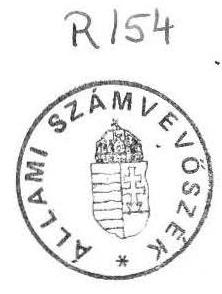
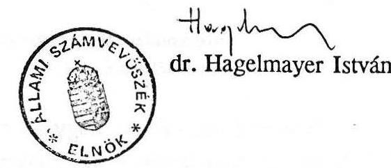

# JELENTÉS 

a Munkaügyi Minisztérium pénzügyi-gazdasági ellenôrzéséről

---

Az ellenőrzést végezték:
Horváth Sándor számvevő tanácsos, Otto Tamás számvevő, dr. Solymár Károlyné számvevő tanácsos

Az ellenőrzést vezette és összefoglalta:
Kolossváry György főtanácsos

---

# JELENTÉS 

a Munkaügyi Minisztérium pénzügyi-gazdasági ellenőrzéséről

A vizsgált időszakban szervezeti változásra került sor a munkaügyek állami irányításában. Az Állami Bér- és Munkaügyi Hivatal (ÁBMH) megszüntetésével egyidejűleg 1990. V. 1-től létrehozták a Munkaügyi Minisztériumot (MÜM).

Az ágazati feladatokat az ÁBMH a felügyelete alá tartozó két intézménnyel látta el, míg a MÜM öt intézményt múködtet.

A fejezet szintű módosított költségvetési előirányzat és a tényleges ráfordítás az ÁBMH-nál 1989. évben 187,4, illetve 166,4$\cdot$millió forint, a MÜM-nél pedig működésének első évében 651,1 , illetve 345,8 millió forint volt.

Az ÁBMH 1989-ben 226 fő, a MÜM 1990-ben 274 fő átlaglétszámmal oldotta meg feladatait.

Az ellenőrzés célja az ÁBMH 1989-90. évi gazdálkodásának, a MÜM létrehozásának és 1990. évi gazdálkodásának törvényességi, célszerűségi és eredményességi szempontból való értékelése, valamint az 1991. évi költségvetése megalapozottságának megítélése volt.

A Hivatal, illetve Minisztérium mellett ellenőrzést végeztünk a felügyelet alá tartozó Munkaügyi Kutató Intézetnél (MKI), a Nemzeti Szakképzési Intézetnél (NSZI), az Észak-magyarországi Regionális Munkaerőfejlesztési és Átképző Központnál (ÉRÁK), az Érdekegyeztető Tanács Titkárságánál (ÉT Titkárság) és az Országos Munkaerőpiaci Központnál (OMK).

---

# I.   Összefoglaló megállapítások, javaslatok 

Az Állami Bér és Munkaügyi Hivatal fejezet szinten rendelkezésre álló költségvetési eszközei - a vizsgált időszakban — lehetővé tették a szakmai feladatok megfelelő színvonalú ellátását. A Hivatal apparátusát alapvetően a feladatokhoz igazítottan alakították ki, kereseti viszonyait az államigazgatási átlagnak megfelelően biztosították.

A gazdálkodás szabályozottsági feltételeit nagyrészt megteremtették. A költségvetési eszközök felhasználása azonban több esetben célszerűbb és takarékosabb lehetett volna (pl. a külföldi kiküldetéseknél, a Hivatal fenntartásánál, üzemeltetésénél).

Az államigazgatás átszervezésével létrehozott Munkaügyi Minisztérium célszerű, feladatorientált szervezeti struktúrát alakított ki, melynek során felszámolásra kerültek a korábbi feladatellátási hiányosságok (pl. az ellenőrzés hiánya). A jóváhagyott létszámösszetétel azonban feszültségeket takar, elsősorban a gazdálkodási területeken. A Minisztérium az 1990. évben alapvetően az érvényes jogszabályi előírásoknak megfelelően gazdálkodott. A tapasztalt esetenkénti elszámolásbeli hiányosságok elsősorban szabályozási problémákra (egyes szabályzatok hiányoznak, illetve elavultak) vezethetők vissza.

Az intézmények gazdálkodásában a minisztériumi felügyelet hiányosságai tükröződnek. Mind a gazdálkodás szabályozottságában, mind annak hatékonyságában előre lépésre van szükség. Az intézmények jóváhagyott szervezeti-működési szabályzattal általában nem rendelkeznek, helyenként az alapvető belső szabályzatok is hiányoznak. A müködés forráshelyzeténél megtévesztő, hogy a formálisan bevezetett feladatfinanszírozással lebontott költségvetési támogatást ár- és díjbevételként mutatják ki. Helyenként a célszerűség és az indokoltság mellőzése tapasztalható a belső érdekeltségi rendszer működtetésénél (MKI) és egyes bérkifizetéseknél (ÉT Titkárság). Célszerűségében vitatható a kutatási tevékenység számítógépes felszereltségének megoldási módja. Az intézmények 1991. évi költségvetése több esetben nincs egyensúlyban.

Korábbi ellenőrzésünk javaslatai ellenére nem történt még intézkedés a szakképzési hozzájárulási rendszer stabil információs bázisának megteremtésére, valamint a Szakképzési Alappal szembeni befizetési kötelezettségek és az Alap pénzforgalmát pontosan, áttekinthetően bemutató nyilvántartás kialakítására. A Foglalkoztatási Alap gazdálkodásánál az eddigiekben kedvezőtlenül jelentkezett a hatáskörök és a

---

feladatok szabályozatlansága, esetenként a tulajdonosi szemlélet hiánya. A bizonylati fegyelem és a számviteli rend előírásait több esetben megsértették, ami azt eredményezte, hogy több száz millió forint összegű gépi beruházás esetében nem volt megnyugtató a köztulajdon védelme.

Az ellenőrzés tapasztalatai alapján a következőket javasoljuk:

1) A gazdálkodás szabályozottsága érdekében a Minisztérium és az intézmények szervezeti-működési szabályzatát, valamint egyéb belső szabályzataikat haladéktalanul véglegesíteni, illetve jóvá kell hagyni.
2) Az intézményi működés finanszírozását a helyenkénti formális feladatfinanszírozás helyett indokolt úgy átalakítani, hogy a jelenlegi hiányosság - a feladat és a pénzforrás laza kapcsolata - kiiktatásra kerüljön.
3) A Szakképzési Alap működtetésében tovább kell fejleszteni az Alap nyilvántartási rendszerét, valamint a szakképzési hozzájárulási rendszer információs bázisát. Az 1990. évi CIII. módosító törvény előírásai alapján ki kell dolgozni az Alap felhasználásának részletes szabályait.
4) A Foglalkoztatási Alappal kapcsolatosan:

- Egyértelműen rögzíteni kell a kezelő és a felhasználó jogait és kötelezettségeit.
- Meg kell vizsgálni a számítógép software fejlesztés területén az intézményi jogvédelem szükségességét és indokolt esetben a jogvédelmet biztosítani kell.
- A módosított 46/1984. (XI. 6.) MT. sz. rendelet és a 925/1987. (PK. 15.) PM XII. számú számviteli közlemény alapján haladéktalanul el kell kezdeni a számítástechnikai beruházások nyilvántartásának pontos elkészítését, a teljesítményérték meghatározását, majd el kell végezni az aktiválást. Ennek eddigi elmaradásáért a MÜM vizsgálja meg és érvényesítse a személyes felelősségre vonást.
- Meg kell teremteni az OMK-nál az intézményi szintű belső ellenőrzés személyi és tárgyi feltételeit.

---

# II.   Részletes megállapítások 

## A) Az Állami Bér- és Munkaügyi Hivatal gazdálkodásának értékelése

## 1. A fejezet szintű költségvetési tervezés és teljesítés

Az ÁBMH (a továbbiakban: Hivatal) létesítéséről szóló Mt határozat szerint a fejezet legfontosabb feladata a foglalkoztatáspolitikai eszközrendszer elemeinek kialakítása, a bérmechanizmus működtetésének, állami szabályainak kidolgozása, a munkaerőpiaci és átképzési szolgáltatások megvalósítása, a munkajogi szabályok megalkotása, az Érdekegyeztető Tanács munkájának szervezése, koordinálása és a Foglalkoztatási Alap kezelése, müködtetése volt.

A fő feladatok ellátásához a fejezet részeként működő Munkaügyi Kutatóintézet a foglalkoztatáspolitikai, bérpolitikai, munkafeltételekkel kapcsolatos kutatásaival, az Országos Munkaerőpiaci Központ a munkaerőpiacra vonatkozó főbb folyamatokról adott tájékoztatásaival, a munkaerőpiac működését elősegítő szolgáltatások biztosításával, információfeldolgozási szolgáltatásokkal és a munkaügyi statisztikai rendszer müködtetésével járult hozzá.

A Hivatal és a felügyelete alatt működő két intézmény 1989. évi eredeti költségvetési előirányzata 126,9 millió forint volt, amely a módosítások révén 60,6 millió forinttal 187,4 millió forintra növekedett. (Ebből költségvetési támogatás 88,6 millió forint, illetve a módosítás révén 98,0 millió forint volt.)

Az előirányzat-módosítás fedezetét nagyrészt a fejezet többletbevételei (36,5 millió forint), valamint a Pénzügyminisztérium által - előzetes igénylés alapján - engedélyezett pótelőirányzat ( 9,4 millió forint) képezte.

A fejezet tényleges bevétele - 191,0 millió forint — az eredeti előirányzatot $50 \%$-kal, a módosított előirányzatot $2 \%$-kal haladta meg. A bevételek emelkedése nagyrészt az OMK számítástechnikai és adatszolgáltatási bevételeinek túlteljesítéséből, valamint a Kutatóintézet létszámcsökkentésének következtében felszabaduló helyiségek bérleti díjából származott.

---

A tényleges kiadások - 166,4 millió forint — az eredeti előirányzatot 31 \%-kal haladták meg, a módosított előirányzattól viszont $11 \%$-kal elmaradtak, alapvetően a szolgáltatási előirányzat indokoltnál nagyobb növelése miatt.

A tényleges kiadások az eredeti előirányzatot elsősorban a szolgáltatásoknál ( $23 \%$-kal), az anyagjellegủ kiadásoknál ( $98 \%$ - kal) és a bérkiadásoknál ( 8 $\%$-kal) lépték túl. A szolgáltatások és a bérkiadások a módosított előirányzaton belül maradtak, míg az anyagjellegủ kiadások azt $6 \%$-kal meghaladták.

A fejezet 1989-ben az előző évről 10.252 ezer forint felhasználható pénzmaradvánnyal rendelkezett. Ebből a fejezet szintű pénzellátás 3.107 ezer forinttal, a hivatali gazdálkodó szervezet 3.909 ezer forinttal és a Munkaügyi Kutató Intézet 3.346 ezer forinttal részesedett. A pénzmaradványt részben ösztönzésre (a hivatal), részben egyes feladatok fedezetére (Lakásalap kiegészítésére) vették igénybe.

A fejezet szintű költségvetési ráfordítások szerint a szakmai feladatok ellátásához szükséges pénzügyi és anyagi fedezet rendelkezésre állt. A feltételrendszer megteremtéséhez hozzájárult a bevételi előirányzatok túlteljesítése és az előző évi pénzmaradványok felhasználása is.

# 2. A Hivatal költségvetési gazdálkodása 

a) A költségvetés megalapozottsága és teljesítése

A költségvetési előirányzatokat a főosztályi igények figyelembevételével alakították ki. A Gazdasági Ügyrend a kiadási előirányzatok meghatározott köre feletti rendelkezési jogot a főosztályvezetők hatáskörébe utalta. Az önálló keretgazdálkodás a feladatmegoldás és finanszírozás összekapcsolását kívánta szolgálni. A Hivatal által lebontott feladatok és az önállóan felhasználható keretösszegek nagyságrendje a költségvetésen belül azonban minimális volt, így a főosztályok gazdálkodása meghatározóan nem befolyásolta a költségvetési előirányzatok felhasználását.

1989-ben mintegy 935 ezer forinttal gazdálkodtak e fóosztályok. (A költségvetési előirányzat $1 \%$-a.) A feladatra lebontott összegek a személyi költségátalány, a különböző szakértői megbízási díjak és egyéb szolgáltatások - szakmai tanfolyam részvételi díja, idegen nyelvű tájékoztatások körére terjedt ki.

---

Hiányolható, hogy a keretek felhasználásához - a személyi költségátalány kivételével - a nyilvántartási rendet nem írták elő, a kiadott előirányzatok felhasználását központilag nem értékelték.

Az analitikus nyilvántartásból egyértelmúen nem, vagy nehezen deríthető ki a keretőszegen belüli és célnak megfelelő felhasználás.

A Hivatal 1989. évi eredeti költségvetési előirányzata 65,3 millió forint volt, amely az évközi módosítások révén 82,3 millió forintra változott. (Ebből az eredeti előirányzat teljes egészében, a módosított előirányzatból pedig 77,3 millió forint a költségvetési támogatás). Az előirányzat-növekedés kétharmad része pénzügyminisztériumi intézkedés következménye. Nem volt célszerủ megoldás a PM részéről a tervezés időszakában "demonstrált" támogatás csökkentés.

Az évközben történt előirányzatmódosítások egy része már az eredeti költségvetési előirányzat kialakításánál is ismert volt. (pl. ILO közgyülésen való részvétel). Az eredeti előirányzat kialakításánál $15 \%$-os központi intézkedésre elrendelt támogatáscsökkentéssel számoltak. Ugyanakkor az évközi módosítások révén közel a csökkentésnek megfelelő pólelőirányzatot hagyott jóvá a Pénzügyminisztérium.

A Hivatal a költségvetési támogatáson felüli bevételei az összbevételből $5 \%$-ot képviseltek 1989. évben, amely az előző évi pénzmaradványból és az átmenetileg szabad pénzeszközök kötvénybe való befektetése utáni kamatból származott.

Az 1989. évi tényleges kiadások $35 \%$-a bér és $37 \%$-a szolgáltatásokért kifizetett térítés volt. A tényleges kiadások az előző évhez képest $27 \%$-kal, az eredeti előirányzattal szemben $20 \%$-kal emelkedtek, míg a módosított előirányzattól $5 \%$-kal elmaradtak.
b) A gazdálkodás főbb területeinek értékelése

A gazdálkodás szervezettségét, szabályszerűségét, belső rendjét az ÁBMH különböző szabályzataiban határozta meg. A legfontosabb szabályokat a Gazdasági Ügyrend tartalmazza, amely kitért a központi gazdálkodás költségvetési javaslatának elkészítésére, a gazdálkodás lebonyolításának kötelezettségvállalás, utalványozás - szabályaira, könyvelési, statisztikai és nyilvántartási feladatokra.

---

Ezen túlmenően az egyes gazdálkodási területek részletes speciális szabályzatát is elkészítették. Pl.: házipénztár szabályzata, bizonylati szabályzat, devizakezelési szabályzat.

A szabályzatok karbantartásának hiánya miatt az azokban lévő feladatelhatárolások a szervezeti változásokkal nem minden esetben voltak összhangban. Egyes speciális szabályzatok ugyanakkor elavultak (pl. jutalmazási szabályzat).

A Hivatal 1989. évi engedélyezett átlaglétszáma 115 fó, a tényleges átlaglétszám 94 fő volt, amelynek $90 \%$-a teljes munkaidőben foglalkoztatott. (Az év végi tényleges létszám 88 fő.) A 11 szervezeti egységből álló - elnökség, 4 főosztály, 6 önálló osztály - Hivatal létszámát alapvetően a Szervezeti Működési Szabályzat alapján feladatra orientáltan alakították ki.

A mintegy 28 fős betöltetlen álláshely a várható átszervezés miatti bizonytalanság, előre nem látható szervezeti módosulások, vezetői változások következménye. (Az üres állások száma 1987-ben 8, 1988-ban 27 volt.)

A létszám $45 \%$-át a fófeladatot ellátó Foglalkoztatáspolitikai és Bérpolitikai főosztályi létszám tette ki. Az átlaglétszám $32 \%$-a új munkavállaló és 21 $\%$-a a munkából kilépő volt. A kilépéseknek csak $35 \%$-a nyugdíjazás miatti. A létszám $27 \%$-a volt vezető.

A tényleges bérköltség 21,7 millió forint volt, ami a tervezettel csaknem azonos, míg az előző évit $36 \%$-kal meghaladta.
1989. évben $25 \%$-os bérfejlesztés volt, január 1-vel $7 \%$, szeptember 1-vel $18 \% .1990$. január 1-én $16 \%$-os bérfejlesztésre került sor, így a vizsgált időszakot illetően az ÁBMH-ban a bérfejlesztés $41 \%$-ot tett ki. Ezt alapvetően az 1988. évi üres állások bérének felhasználásával érték el.

Az 1989. évben 4 havi jutalmat fizettek ki. (A fix és mozgóbér aránya 73:27 \% körül alakult). A jutalom forrásának jelentős részét az előző évi pénzmaradvány adta.

A végrehajtott bérintézkedések eredményeként a teljes munkaidőben foglalkoztatottak egy főre jutó havi átlagbére 1989-ben 19.564 forint, a jutalmazások révén a havi átlagkereset 26.771 forint volt. Ez megközelítőleg megfelelt az államigazgatási átlagnak. Az egyes szervezeti egységek között a bérellátottság viszonylag kiegyenlített volt. A vezetők és munkatársak átlagbérei már nagyobb mértékben eltértek.

---

Az átlagon belül a vezetők átlagbére $33.950 \mathrm{Ft} / \mathrm{hó}$, az ügyintézőké 16.507 $\mathrm{Ft} /$ hó, holott az ügyintézők $50 \%$-a fómunkatárs, illetve 20 év feletti főelőadó besorolású.

A külföldi kiküldetéseket meghatározóan a Nemzetközi Ônálló Osztály utaztatási terve alapján bonyolították le. Az 1989. évben — az előző évinél több, mint $50 \%$-kal többet - 2.183 ezer forintot fordítottak külföldi kiküldetésekre. (Ez összefügg a közlekedési és szállásdíjak emelkedésével is.) Ennek keretében 12 nyugati országba 23 fő és 10 szocialista országba 22 fő utazott a hivatal devizakerete terhére.

Kedvezőtlen, hogy a nyugati országokba történő utazásoknál mindössze három volt a szakmai téma tanulmányozására irányuló út. A többi más országok minisztereinek meghívására tett vezetői látogatás, illetve konferenciákon való részvétel volt. A vezetői utak a rendelkezésre álló utazási keret jelentős részét vették igénybe. (Első osztályú napidíj, $30 \%$ reprezentációra való jogosultság, több személy részvétele, 5-8 napos időtartam.) Ugyanakkor a szükséges szakmai témák - mint pl. az érdekegyeztetés tapasztalatai, a fiatalok szakképzése, a szociális védőháló - nyugati országokban való tanulmányozására 1-2 fő 4-5 napi kiküldetését biztosították.

1990. első félévében — még ÁBMH szervezet — külföldi kiküldetésre 2,3 millió forintot használtak fel. Ennek azonban több, mint $50 \%$-a a Világbanki programhoz kapcsolódó különböző témák tanulmányozására irányult. Célszerűségi szempontból kifogásolható ugyanakkor, hogy a hivatal vezetői 8 napos finnországi látogatásukra mintegy 15.000 FIM-et használtak fel a külföldi kiküldetések előirányzata terhére.

A szocialista országokba irányuló utak egy része témára orientált volt, más részük főleg a kétoldalú együttműködési megállapodásokhoz kötődött. A piacgazdálkodásra való áttéréshez szükséges munkaügyi előkészítést jobban szolgálta volna, ha egyes témákban a piacgazdálkodást folytató országok gyakorlatából szereztek volna tapasztalatokat (pl. munkaerőpiac és átképzés, munkaügyi szakember képzés).

A külföldi kiküldetésekkel kapcsolatos költségelszámolást a 9/1986. (VII. 8.) ÁBMH rendelkezésben foglaltak szerint végezték, néhány esetben fordult elő szállásköltség túllépés, valamint szabálytalan költségelszámolás.

Az éves kiküldetési tervben nem szereplő és nem is ÁBMH dolgozó washingtoni kiküldetésének repülőjegy költségét (56 ezer forint) a hivatal

---

fedezte. Erről az útról beküldött számlán az utalványozó és érvényesitő aláirása nem szerepel.

A külföldi kiküldetésekről szóló rendelet szerint a 21 napot meghaladó kiküldetésben költségátalányt kell megállapítani. Ezt az időtartamot a ILO Konferencián résztvevők egy köre meghaladta ( 2 fő a/4nap). A gyakorlatban azonban itt is a tényleges napok számának megfelelő napidijat biztosították és számolták el.

Az össz költségvetési kiadáson belül a külföldi kiküldetésekre fordított összeg nagyságrendileg nem túl nagy, de a felhasználás elsősorban és meghatározóan nem a hivatali munka érdemi kérdéseinek elősegítését szolgálta.

A reprezentáció, külföldi vendéglátás és ajándékozás keretösszegeit, valamint a személyes reprezentáció mértékét elnöki utasítás szabályozta, a felhasználás ennek megfelelően történt. Az 1989. évi 541 ezer forint reprezentációs kiadáson belül a személyes reprezentáció aránya minimális. Erről analitikus nyilvántartást vezettek és az elszámoltatásról gondoskodtak.

Nagyságrend szempontjából a külföldi reprezentáció a meghatározó. Az év folyamán 6 külföldi delegáció fogadására került sor. A magyar és a külföldi delegációk látogatásának mértékei (létszám, tartózkodási idő) megközelítőleg azonosak voltak.

Az 1989. évi tényleges reprezentáció kiadás az előző évi felhasználás közel kétszerese. Önmagában a finn munkaügyi miniszter által vezetett delegáció itt-tartózkodása 200 ezer forint kiadást jelentett. (Az összes külföldi delegáció fogadására fordított összeg $50 \%$-a.)

Pl.: a kétnapos hajdúszoboszlói vendéglátás költsége közel 86 ezer forint, az egri látogatási program 14 ezer forint. A költségekkel való takarékosabb gazdálkodás még abban az esetben is felvetődik, ha ez az együttmüködés tapasztalataival konkrétan elősegítette a munkaügyi tárca szakmai és irányító tevékenységét.

A Hivatal ingatlan és gép-berendezés állóeszköz tulajdonnal lényegében nem rendelkezett. Így a hivatali munka müködéséhez szükséges épületet, berendezési, felszerelési tárgyakat, anyagokat, gépkocsit, az üzemeltetést ellátó Lánchíd Gazdasági Igazgatóság - illetve korábban jogelődje, az OT Gazdasági Igazgatóság - bocsátotta rendelkezésre. A Hivatal az

---

igénybe vett szolgáltatásokért bérleti díjat fizetett. Ez a díj 1989. évben 11.377 ezer forint volt.

A Hivatal és az Igazgatóság között a bérleti díjak felosztása, elszámolása tekintetében aktualizált és érvényes megállapodás, illetve szerződés nem volt.

Az 1981. évben az épületben volt intézmények között született egy megállapodás, azonban az abban rögzített kondíciók már régen teljes egészében elavultak, nem voltak részletesek, nem tették egyértelmúvé a hivatal és az igazgatóság közötti bérleti díjak rendszerét.

Az Igazgatóság a közvetlenül elszámolható költségeket (irodaszerek, telefon, telex, nyomdaköltség, gépkocsihasználat) a tényleges felhasználás alapján, míg a közvetett költségeket (közüzemi díj, takarítás, állóeszközfenntartás), "normatív" alapon számlázta le a Hivatal részére. A közvetett költségek szétosztása azonban nem támaszkodott megbízható vetítési alapokra.

Az 1989. évi mérleg az analitikus nyilvántartás és a fókönyvi kivonat alapján megfelelt a valóságnak.

Az előírások szerinti leltári számbavétel a munkavállalók illetményelőleg tartozásánál maradt el, amely azonban elhanyagolható nagyságrendú, 8.100 forint volt.

A Hivatalnak 1989-ben 3.909 ezer forint - a PM által felülvizsgált, felhasználható - előző évi pénzmaradványa volt, amely döntően az előző évi fel nem használt béralap és jutalom összegéből eredt. A pénzmaradvány - 190 ezer forint kivételével - felhasználásra került. Az év folyamán 2,6 millió forintot fizettek ki jutalomra, míg 1 millió forinttal a szolgáltatás rovat előirányzatát növelték. 1990-re öszesen 2.414 ezer forint volt május 30-án a jóváhagyott és felhasználható előző évi pénzmaradvány. A pénzmaradvány meghatározóan a szolgáltatás rovaton elért megtakarításból eredt. Ez megkérdőjelezi az előző évi 1 millió forint összegű átcsoportosítás indokoltságát e rovatra, ami nyilvánvalóan tartalékolási célokat szolgált. A pénzmaradványt csaknem teljes egészében jutalmazásra használták fel.

---

# B) A Munkaügyi Minisztérium fejezet müködésének és gazdálkodásának értékelése 

## 1. A Munkaügyi Minisztérium létrehozása

A Munkaügyi Minisztériumot a Magyar Köztársaság minisztériumainak felsorolásáról szólo 1990. évi XXX. törvény, mint az Állami Bér- és Munkaügyi Hivatal jogutódját hozta létre 1990. május 23-i hatállyal.

A munkaügyi miniszter feladat- és hatáskörét rögzítő 46/1990. (IX. 15.) Korm. sz. rendelet - a korábbi ÁBMH feladatokkal szemben - más szerkezetű és hangsúlyú feladatokat határozott meg. Csökkentek a tervezéssel, munkaidőalap felhasználással kapcsolatos feladatok, egyidejűleg nagyobb hangsúlyt kapott a foglalkoztatáspolitika átfogó irányítása és többletfeladat a szakképzés, valamint a munkavédelem elvi és gyakorlati irányítása.

A MÜM, mint az ÁBMH jogutódja, az ÁBMH részére megállapított fejezeti, ezen belül a rendelkezésre álló hivatali költségvetés keretei között kezdett el gazdálkodni, illetve folytatta azt.

A Hivatal 1990. évi eredeti költségvetési elöirányzata 415,6 millió forint volt, amely a módosítások révén 437,5 millió forintra nőtt. (A módosítások meghatározóan a Munkaügyi Minisztériummá történt átalakulás után következtek be.) Az eredeti előirányzat teljes egészében, a módosított előirányzatból 397,4 millió forint a költségvetési támogatás.

Az 1990. évi költségvetés 1989. évhez viszonyított nagyságrendbeli eltérése döntő rézzen a harmadik ipari szerkezetátalakítási program munkaerőpiaci és átképzési szolgáltatások világbanki fejlesztéséhez kötődött ( 310,0 millió forint).

A Kormány 1990. július 26-i ülésén határozott arról, hogy a munkaügyi miniszter és a pénzügyminiszter 1990. augusztus 31-ig dolgozza ki a MÜM új költségvetését. A MÜM elhelyezése céljából a Roosevelt tér 7-8 sz. irodaház kezelői joga 50-50 \%-ban legyen a PM-é, illetve a MÜM-é. A MÜM 1990. augusztusában nem új költségvetést dolgozott ki, hanem az ÁBMH költségvetésével szembeni kiadásnövekedéseket munkálta ki.

A rovat mélységủ részletezés szöveges indoklása szerint a Minisztérium létszámának 228 fôre való növelését ( 198 fó fơfoglalkozású, 30 fó részfoglalkozású) kívánták 1990-ben fokozatosan megvalósítani.

---

A létszámnövekedés vonzataként a kimunkált költségek között jelentősen (19.110 ezer forinttal) nőtt volna a bérköltség, illetve az irodaházban igénybe venni szándékozott $50 \%$-os mértéknek megfelelően ugrásszerűen ( 45.550 ezer forinttal) a szolgáltatások 1990. évi kiadási előirányzata. Összességében a MÜM 1990-re 96.415 ezer forintos kiadásnövekedést ítélt meg reálisnak, melynek 1991. évi áthúzódó hatása - a beruházási igények nélkül 163.540 ezer forint volt.

A további munkálatokat követően a MÜM 1990. november 16-án, részletes rovat-tétel mélységű kiadásnövekedést küldött meg a PM-nek. Ebben az 1990. évi kiadásnövekedést 55.981 ezer forintban (ebből béralap: 17.776 ezer forint), az 1991. évre áthúzódó hatást 147.957 ezer forintban (ebből béralap: 47.044 ezer forint) számszerűsítette.

A Pénzügyminisztérium - 1990. december 5-én kelt 91.575/1990. sz. leiratában - a MÜM megalakulásával összefüggő költségek 1990. évi fedezetére a tárca kiadási és támogatási előirányzatát - a kért 55.981 ezer forinttal szemben - 30 millió forinttal (ebből bér: 17.776 ezer forint) növelte, az 1991. évi áthúzódó hatást (szintrehozásként) 117 millió forint (ebből bér: 47.044 ezer forint) összegben ismerte el. A csökkentés tehát teljes egészében a dologi költségeket érintette, tapasztalataink szerint (részben) indokoltan.

A minisztériumi feladatnövekedés - szakképzés központi irányítása, Szakképzési Alap kezelésével kapcsolatos feladatok ellátása - pénzügyi fedezetét a Pénzügyminisztérium és a Művelődés- és Közoktatási Minisztérium a feladatátrendezéssel kapcsolatos előirányzat-átcsoportosítással biztosította.

A tervezett irodaház-igénybevétel miatt jelzett, területarányos szolgáltatási díj, kiadási többletigény reális volt. Erősen túlzottnak és nem kellően megalapozottnak mondhatók - mind az augusztusi, mind pedig a novemberi előterjesztésben szereplő - az anyagjellegủ kiadások, a költségvetési befizetések, a forgalmi adó és a népgazdasági beruházások rovatokon jelzett kiadási többletek.

A MÜM 1990. évi költségvetéséről való elhúzódó vita mellett a Minisztérium müködését az biztosította, hogy az ÁBMH részére megállapított költségvetési kiadási előirányzatból az Észak- magyarországi Regionális Munkaerőfejlesztési és Átképző Központ (Miskolc) létrehozása és beruházása csúszott, így a felszabaduló pénz a müködés feltételeit biztosította.

---

Kifogásolható, hogy a foglalkoztatáspolitikai szempontból kiemelt jelentőségű átképző központ előirányzata nem céleloirányzatként került a Minisztériumhoz és a Pénzügyminisztérium részéről a finanszírozás nem a megvalósítás ütemében történt.

# 2. A Munkaügyi Minisztérium 1990. évi gazdálkodása 

a) Müködési, szervezeti rend, a gazdálkodás szabályozottsága

A Minisztérium müködési és szervezeti rendjét a Kormány által meghatározott feladatokkal öszhangban alakították ki. Feladatorientált, nem túlságosan tagolt szervezet létrehozására került sor.

Kedvező, hogy az új szervezetben Ellenőrzési Főosztály is megalakításra került, s a tapasztaltak szerint alkalmas mind a szakmai értékelő feladatok, mind pedig a régóta hiányzó - a fejezet felügyelete alá tartozó költségvetési intézményekre irányuló - költségvetési pénzügyi-gazdasági ellenőrzések végzésére.

A kialakult szervezeten belül - egyes szervezeti egységeknél - a jóváhagyott létszám tartalékot is takar, más egységeknél viszont feladatellátási problémát okoz. Az 1990. július hónapban az egyes szervezeti egységektől bekért létszámigény és a jóváhagyott létszám jelentősen eltér. A szervezeti egységektől a feladatok ellátásával összhangban kérték a létszámigények meghatározását, néhány esetben mégis többlet létszámkeret jóváhagyására került sor.

A Foglalkoztatási Főosztály 19 fős igényével szemben a jóváhagyott létszám 26 fó, a Koordinációs Főosztály jóváhagyott 24 fővel szemben 18 fő dolgozó alkalmazását jelezte a felmérés alkalmával.

A Pénzügyi Főosztálynál a fejezeti pénzügyi irányítás feltételei megteremtődtek, de komoly feszültség tapasztalható a Foglalkoztatási Alap osztálynál a munkaterhelést illetően.

Kifogásolható, hogy a Minisztériumnak 1990. május 23-i létrejöttét követően - az ellenőrzés befejezéséig - még mindig nincs elfogadott Szervezeti és Müködési Szabályzata és ebből következően hiányzik az egyes szervezeti egységek jóváhagyott feladatmeghatározása is.

---

A gazdálkodás szabályozottsága hiányos, a meglévő - ÁBMH-tól átvett — szabályzatok részben elavultak, átdolgozásra, aktualizálásra szorulnak.

Hiányosságnak minősíthető, hogy nincs számlarend, csak számlakeret-tükör, fogyóeszköz jegyzék. Ez az 1990. évig kevésbé hiányzott, bár fogyóeszköz beszerzések (pl. bérszámfejtéshez software) történtek. A gazdálkodás eddigi gyakorlatából kevésbé hiányzott a selejtezési szabályzat, de a jövőben várhatóan szükség lesz rá. Elavult és átdolgozásra szorul a "Gazdálkodási Ügyrend".

A szabályozás hiányosságai mellett a pénzügyi-számviteli nyilvántartásokat, valamint az előirányzat-módosításokat naprakészen, áttekinthető módon vezetik.
b) A bevételek és kiadások teljesítése

A Minisztérium az 1990. évre bevételeket eredetileg nem tervezett. A pénzellátás 1990. évi rendszere, valamint a pénzügyi jogszabályok lehetővé tették, hogy a felhasználásra nem kerülő pénzeszközöket befektessék. A beruházási célú, de az időbeli eltolódás miatt kisebb összegben felhasználásra kerülő pénzeszközöket, valamint — az év utolsó negyedévében - egyéb tartalék összeget kötvénybe fektették.

A beruházási célú felszabadult pénzeszközöket 1990. áprilisától, először 40 millió forint, majd a pénzellátás biztosította lehetőségek kihasználásával egyre nagyobb összegben, éves szinten mintegy 310 millió forint összegű halmozott kötvényforgalmat bonyolítottak, ugyanakkor a fejezet költségvetési támogatásának 1990. évi eredeti előirányzata 431 millió forint volt. Az egyéb tartalék összegből 3,5 millió forint lekötésére és meghosszabbítására került sor.

A kötvényvásárlások eredményeként a Minisztérium 36.302 ezer forint nem tervezett bevételre tett szert, amely többségét saját hatáskörben béralapjába, jutalomkeretre csoportosította át. A kötvényvásárlás az érvényes jogi előírások betartásával történt, s a Minisztérium gazdálkodása szempontjából eredményes vállalkozási tevékenység volt.

A Minisztérium döntő többségében Lakásalap kötvényt, kisebb hányadában MNK államkötvényt vásárolt.

Kifogásolható, hogy a pénzügyi szabályozás lehetővé tette - a nemzetgazdasági szintű likviditás megteremtésének gondja mellett - egyes területeken a túlfinanszírozást (a beruházási pénzek szükségestől eltérő

---

leadását). Így a likviditást biztosító többlet államhitel kamata a költségvetést (belföldi államadósságot) növelő tétel, a befektetett költségvetési pénz hozadéka a befektető szervezetet illette, amely ugyanakkor nem járt együtt akár csak részleges támogatáscsökkentéssel.

A MÜM eredeti kiadási előirányzata 415.600 ezer forint volt, amely a külső szervek által biztosított kiadási többletelőirányzat és a saját hatáskörű átcsoportosítás, valamint zárolás eredményeként — 437.546 ezer forintra módosult és 161.678 ezer forintra teljesült.

A jelentős elmaradást nagyrészt az okozta, hogy a Világbank által finanszirozott III. Ipari Szerkezetátalakítási Program keretében megvalósitásra kerülő Észak-magyarországi Regionális Munkaerőfejlesztési és Átképző Központ létesítésére kapott 200 millió forint beruházási előirányzat csak töredékében teljesült a program csúszása miatt.

A béralap, a bérjellegủ kiadások és a költségvetési befizetések rovatok tényleges kiadásai kivételével valamennyi többi rovatnál a felhasználás nemcsak a módosított előirányzattól, de az eredeti előirányzat összegétől is jelentősen elmaradt.

Az anyagjellegủ egyéb kiadások rovaton például az eredeti 28.640 ezer forintos és a 29.860 ezer forintos módosított előirányzattal szemben csak 6.710 ezer forint volt a tényleges kiadásteljesités. Ez elsősorban a külföldi kiküldetések költségei drasztikus, az eredeti előirányzat mintegy negyedére csökkenésének a következménye. Az év során ugyanis a munkaerőmozgás és egyéb okok (betegség) miatt kiutazások maradtak el.
c) A gazdálkodás főbb területeinek értékelése

Az államigazgatás átszervezésével, a feladatmódosulással összhangban tervezett 228 fős minisztériumi állománnyal szemben 1990-ben a módosított átlaglétszáma 162 fő volt.

A tényleges teljesítés ( 127 fő átlaglétszám) alig haladja meg az ÁBMH eredeti előirányzatát ( $108 \%$ ) és messze elmarad a módosított előirányzattól $(78 \%)$.

Az alacsony átlaglétszám kialakulásának egyik oka, hogy az 1990. II. félévi minisztériumi bérek kevésbé voltak vonzóak, így a tervezett létszámfeltöltés csak lassan haladt. Az okok között szerepel az átszervezés következtében - a korábbi évhez képest - jelentősen megnőtt munkaerőforgalom.

---

1989-ben a munkába belépők száma 30 fő, a kilépők száma 10 fő volt, 1990-ben 90 fó munkába lépő és 29 fó kilépő dolgozó volt. A munkaerőhullámzás, a váltás mutatószáma $22,8 \%$.

Az 1990. évi átlagos állományi létszám önmagában nem mutat hủ képet. A létszámfeltöltés folyamatos volt az 1990. évben, így az év végi állandó főfoglalkozású létszám 153 fő volt. A Minisztérium eredeti béralapelőirányzata 41.515 ezer forint, a módosított előirányzat ennek több, mint kétszerese, 85.153 ezer forint volt. A tényleges felhasználás viszont ( 52.611 ezer forint) alig $20 \%$-kal haladta meg az eredeti előirányzatot.

Az előirányzat-módosítás összetevői a PM által biztosított kiadási elő-irányzat-többlet bérhányada, a feladatátvétel bérvonzata, valamint a bevételi többlettel fedezett kiadási előirányzat és pénzmaradvány felhasználás voltak.

A bevételi többlettel fedezett és a pénzmaradvány saját hatáskörű átcsoportosítása döntő mértékben a jutalom előirányzatnál jelentkezett.

A Minisztériumban az 1990. évben, valamint az 1991. évi bérfejlesztés során jelentős lépések történtek az átlagbérek növelése érdekében.

A bérköltségen belül a Minisztérium dolgozóinak 1990. évi átlagbére 34,4 \%-kal, átlagkeresete $25,1 \%$-kal volt magasabb az előző évinél. Ezzel az átlagbér 25.438 forintra, az átlagkereset 31.828 forintra emelkedett. Az alapbér növelésnek fedezetét részben a feladatátvétellel átvett alapbér, jelentős mértékben az irányító szervi tartalék átcsoportosítása jelentette. A kereseti szint alacsonyabb mértékủ növekedését az egy főre jutó jutalom összegének csökkentése okozta.

Két év összevetésében még kedvezőbb a helyzet.

Az 1991. januári - a $25,0 \%$ béremeléssel növelt — átlagalapbér minisztériumi szinten $69,6 \%$-kal (az 1989. évi 20.864 forint fó/hó összegről 35.393 Ft/fő/hó összegre emelkedett) haladja meg az 1989. évit. Ezen belül a vezető állományú dolgozóknál 49,7 \% (33.950 Ft/fő/hó-ról 50.825 Ft/fő/hó-ra), az ügyintézőknél 74,5 \% (16.507 Ft/fő/hó-ról 28.811 Ft/fő/hó-ra), az ügyviteli állománynál 64,4 \% (10.633 Ft/fő/hó-ról 17.482 Ft/fő/hó-ra) a növekedés.

A Minisztériumban a reprezentációs eredeti előirányzatok (belföldi, külföldi, személyi) külön-külön és így együttesen is túllépésre kerültek, de a módosított előirányzaton belül maradt a tényleges felhasználás.

---

A MÜM reprezentációs eredeti előirányzata 671 ezer forint volt, amelyet év közben saját hatáskörben 2.251 ezer forintra felemeltek. A tényleges felhasználás 2.176 ezer forint volt.

Az eredeti előirányzattól való, ilyen mértékű eltérést a központi szabályozás is lehetővé tette, amelynél az eredeti előirányzatok módosításához sokkal szigorúbb korlátot kellene állítani.

A Pénzügyi Főosztályon az érvényes jogszabályi előirásoknak megfelelő tájékoztatót állítottak össze, közölve a normákat, keretösszegeket és az elszámolás szabályait.

A reprezentációs költségek elszámolásánál nem tartották be a tájékoztatóban előírtakat, illetve a költségelszámolásban az ellenőrizhetőséget biztosító információt nem tüntették fel.

Nem tüntették fel a rendezvényen résztvevő külföldiek számát, nevét, így a felhasználás előirásokkal való összevetése és mértékének megítélése nem lehetséges. Több esetben a csatolt bizonylaton a megnevezés nem tételes.

A személyi reprezentáció elszámolásához alkalmazott összesítő jó megoldás, de emellett olyan nyomtatványokat is használnak, amelyeken hatályon kívül helyezett jogszabályi hivatkozás (20/1973. (IV.15.) PM sz. rendelet) van.

A Minisztérium reprezentációs ajándékozás céljára kisebb "ajándékraktárat" tart fenn. A készletek mennyisége és értéke rendkívül alacsony, s az utóbbi években felhasználás nem volt. A jelenlegi rendszerben ugyanakkor nyomon követhetetlen a külföldi utazás (kiküldetés), illetve külföldi vendég fogadásakor megvásárolt ajándéktárgyak sorsa abban az esetben, ha a tárgyak már megvásárlásra kerültek, de az utazás vagy vendéglátás váratlan okból elmarad.

A külföldi kiküldetés részletes szabályainak megállapítására az ellenőrzött időszakban nem került sor. Az érvényes ÁBMH rendelkezés figyelembevételével valósult meg a költségek elszámolása. Az ellenőrzés tapasztalatai szerint a nyilvántartások naprakészek, jól vezetettek. A tételes, bizonylatonkénti ellenőrzés ugyanakkor alaki és tartalmi hibákat is feltárt.

Több esetben előforduló hiba, hogy a Pénzügyi Főosztályra megküldött és az elszámolások mellékletét képező valutaigénylő feljegyzés hiányosan került kitöltésre. Nem tüntették fel az utazás témáját (milyen feladat ellátására utazik a kiküldött) és sok esetben azt sem, hogy a Minisztérium kiküldetési terve mely pontjának terhére valósult meg az út.

---

Tartalmi, elszámolási hibák is előfordultak, ahol a gyakorlat ellentétes volt a 9/1986. (VII.8.) ÁBMH sz. rendelkezés előírásaival.

Dr. Bukta László 1990. március 14-17. között külföldi kiküldetésre utazott a hivatali gépkocsival Olaszországba egyes foglalkoztatási kérdések tisztázására. A költségelszámolás 7. Dologi költségek rovatba a kiküldött 90 DEM felhasználását számolta el "OT szgk-hoz benzinvásárlás" indoklással. Bizonylat a vásárlásról nincs, az elszámolásban tett kiküldötti megjegyzés "benzin nyugát nem őriztem meg". A Minisztérium a hivatkozott rendelet előírásaival ellentétesen bizonylat hiányában is elszámolta 38,5383 Ft/DEM árfolyamon 3.468 forint összegben. 1990. szeptember 17-22. között öt fős delegáció járt Franciaországban. A delegáció egyik tagja dr. Wágner László, 2 db 1990. szeptember 21-i keltezésű metrójegyet is elszámolt dologi költségei között 6,80 FFR, 80 forint összegben. A hivatkozott ÁBMH rendelkezés szerint a helyi közlekedés költségeit a kiküldött napidijából köteles fedezni.

Hiányolható, hogy az 1990-ben megvalósult külföldi kiküldetéseknek csak mintegy 30-40 \%-ában készült utijelentés.

Az ellenőrzött időszakban a Minisztériumban a kialakított múködtetési rendszer következtében eszközgazdálkodásról nem beszélhetünk.

A gyakorlat szerint a tárgyi és a müködést szolgáló személyi feltételek jelentős részét az OT Gazdasági Igazgatósága, illetve jogutódja a "Lánchíd Irodaház" Gazdasági Igazgatósága biztosította, hasonlóan, mint az ÁBMH esetében.

Az Igazgatóság vásárolta meg a szükséges álló- és fogyóeszközöket, irodaszer és egyéb a müködéshez szükséges anyagokat, biztosította javításukat, cseréjüket. A Minisztérium és az Igazgatóság között költségtérítéses elszámolás volt.

Az ellenőrzött 1990. évben — a korábbi évek gyakorlatától eltérően — a Minisztériumban több állóeszköz beszerzésére került sor.

1990-ben 6 db állóeszköz vásárlása valósult meg összesen 1.469 ezer forint értékben. A beszerzett eszközök (írógépek, szövegszerkesztő, fénymásoló, telefax) a hivatali munka jobb ellátását szolgálják. Beszereztek 1 db Lada típusú személygépkocsit is. 1990-ben szereztek be az Érdekegyeztető Tanács Titkársága részére is - a fenti eszközök között - 1 db szövegszerkesztő gépet.

---

A Minisztérium az 1990. évre 106.758 ezer forint szolgáltatási célú kiadást tervezett eredeti előirányzatként, melyet év közben 117.442 ezer forintra módosított. A tényleges kiadások összege 69.054 ezer forint volt.

A módosítást elsősorban a müködési feltételeket biztosító Gazdasági Igazgatóság költségátterhelésének növekedése indokolta. Az eredetileg tervezettnél jelentősen nagyobb területet használ a Minisztérium, így a költségek inflációs emelkedésének hatásán túl ez is növelő tényező volt. Az eredeti 12.000 ezer forintos előirányzatot - az Igazgatóság jelzése alapján 33.630 ezer forintra módosították, amely 28.832 ezer forintra teljesült.

Az eredeti és a módosított előirányzathoz képest a csak mintegy $60 \%$-os tényleges kiadási teljesítést az okozta, hogy a Világbanki feladatok megvalósítása döntően 1991-re húzódott át.

A Minisztériumban bérleti díjként számolták el az irodaházat üzemeltető Gazdasági Igazgatóság költségterhelését.

Az 1980-ban létesített OT Gazdasági Igazgatósággal való elszámolást külön szerződésben nem rögzítették, az 1981. március 27 -én aláirt "Megállapo-dás"-t nem módosították, pedig az elszámolás módjára vonatkozóan erre lehetőség lett volna, mivel a tényleges igénybevétel az évek során folyamatosan változott.

A költséghozzájárulást tervezési szempontból helyesebb lenne az "Egyéb szolgáltatások" között külön altételen, a tényleges kifizetéseket müködési célra véglegesen átadott pénzeszközként szerepeltetni.

Az ellenőrzés tapasztalatai szerint az Igazgatóság a területarányos költségek szétosztását nem tudja megnyugtató módon alátámasztani.

Az ellenőrzés kérésére összeállított dokumentáció szerint az irodaház szobamegoszlásáról csak 1990. január 10-i alapbizonylatnak számító kimutatás és 1990. I. 1-III. 31., valamint VII. 1-VIII. 31. közötti másodlagos feldolgozású adatgyüjtés áll rendelkezésre. Ez a pontos, korrekt elszámolást, költségmegosztást nem teszi lehetővé.

A Lánchíd Irodaház Gazdasági Igazgatósága felügyeletére kialakított gyakorlat és a megtett intézkedések - a célszerű és takarékos gazdálkodás megvalósítása szempontjából — kedvezőek.

Az alapító rendelet (1/1990. MÜK. 20.) MÜM-PM. sz. utasítás 6. paragrafusa Felügyelő Bizottság felállítását írja elő. Kedvező, hogy a korábbi tapasztalatok alapján a Felügyelő Bizottság a szobák használóinak havonkénti felmérését tartja indokoltnak.

---

# 3. Az 1991. évi költségvetés megalapozottsága 

A Minisztérium és az intézmények a költségvetés tervezését a 19/1980. (IX.27.) PM rendelet 13. paragrafusában foglaltak alapján, szabályszerűen végezték.

A Munkaügyi Minisztérium 1991.évi költségvetési támogatási előirányzata az 1990. évi fejlesztési többlettel növelt támogatási előirányzaton alapult, annak áthúzódó hatását szintrehozásként vették figyelembe. Az 1990. évi fejlesztési többletigény és az 1991. évi áthúzódó hatás megállapítása reális volt.

A Minisztérium költségvetési javaslata az álláshelyek fokozatos betöltése miatt bizonyos tartalékot tartalmazott.

A Minisztérum megalakulásával kapcsolatban a PM által 1990-ben elismert kiadási többlet 228 fó átlagos állományi létszámot vett figyelembe. Az év során az álláshelyek betöltésére csak részben került sor. Az álláshelyek betöltésével arányos az irodaházban elfoglalt terület, ami alapvetően befolyásolja a szolgáltatási költségek alakulását.

A Minisztérium beterjesztett költségvetése a Parlament döntésének megfelelően több, mint $25 \%$-kal csökkentésre került. Így a beterjesztett költségvetési javaslatban szereplő "tartalék" támogatási fedezete megszűnt. Mivel a bázis költségvetés bizonytalanságokat tartalmaz, így nehéz érdemben megítélni az 1991. évi költségvetés megalapozottságát.

Az intézményi költségvetéseket több esetben egyensúlytalanság jellemzi. Helyenként sem a várható bevételek, sem a várható kiadások nem érik el a költségvetés főösszegét, ami felveti egy új költségvetés kidolgozásának igényét (MKI). Más esetben a költségvetés bevételi oldala teljesíthetetlen (ÉRÁK), vagy nem tartalmazza az átvett feladatok fedezetét, ami rontja megalapozottságát (NSZI).

---

# 4. Az intézmények irányítása és múködtetése 

a) Az intézményi múködés szabályozottsága

A zömmel 1990-ben alakult intézmények jóváhagyott szervezeti- működési szabályzattal nem rendelkeznek, jóllehet azok általában elkészültek (NSZI, ÉRÁK, ÉT Titkárság).

Az NSZI esetében még olyan alapvető belső szabályzatok is hiányoznak, mint pl. a kötelezettségvállalás, utalványozás rendje, vagy a megbizásos tevékenységhez kapcsolódó belső érdekeltségi rendszer.

Az Átképző Központ ugyanakkor munkaköri leírásokkal rendelkezik, ellentétben az NSZI-vel, illetve az ÉT Titkárságával.

Az ÉT ugyan még 1990-ben kidolgozta és elfogadta ügyrendjét (ennek korszerűsítése már folyamatban van!), amely meghatározta a Titkárság feladatait, de nem világos annak kapcsolódása a Minisztérium szervezetéhez. Nem tudni például, hogy a kormányzatot képviselő titkár kinek a közvetlen alárendeltségében dolgozik.

Az 1972 óta müködő Munkaügyi Kutató Intézet rendelkezik, jóváhagyott szervezeti-müködési szabályzattal, de az nincs összhangban a vizsgált időszakban bekövetkezett szervezeti változásokkal.
b) A gazdálkodás főbb összetevői

Az intézmények bevételeinél az állami támogatás és a saját bevételek aránya látszólag kedvező önfinanszírozó képességre utal. Az ár- és díjbevételként számbavett pénzeszközök azonban jórészt, vagy teljes egészében költségvetési támogatást takarnak. Ez abból adódik, hogy korábban intézményfinanszírozás keretében rendelkezésre bocsátott forrásokat 1990-tól "feladatfinanszírozás" formájában helyezi ki a Minisztérium, és azt ár- és díjbevételként számolták el. Ugyanígy mutatták ki az átvett pénzeket is. Ez a gyakorlat nem felelt meg - a vizsgált időszakban még hatályos - 19/1980. (IX.27.) PM rendelet előírásainak.

A feladatfinanszírozásnak nevezett konstrukcióban a korábbi intézményfinanszírozás folyik tovább. Ez a megoldás csak formálisan felel meg a költségvetési finanszírozás korszerűsítési elképzeléseinek, amely a mérhető intézményi feladatok forrásellátását helyesen a feladatfinanszírozás (a költségvetési támogatás szorosan kötődik az állami feladathoz) körébe kívánja utalni. Az eddigi tapasztalatok szerint a feladatfinanszírozás

---

konkrét formájának nem sok köze van a jóváhagyott feladathoz, ugyanakkor a Minisztérium által bevezetett finanszírozási gyakorlat következtében az érintett intézmények forrásaikat nem a valóságnak megfelelően mutatják ki, ami megtévesztő és helytelen következtetések levonására ad alkalmat.

A feladatfinanszírozásba vont tevékenységek egy részéről a költségvetés nem ad felvilágosítást, mert az ezekhez kapcsolódó átvett pénzeszközök csak a beszámolóban jelennek meg, ráadásul ezek között az intézmény jellegéhez nem kifejezetten igazodó feladatok is vannak.

A Munkaügyi Kutató Intézet 1989. évi költségvetési előirányzatából (20.133 ezer forint) mindössze $2,5 \%$ ( 500 ezer forint) nagyságú volt a tervezett árés dijbevétel. Az 1990. évi költségvetés bevételeinél az arány megfordult, hiszen 25.360 ezer forint ár- és dijbevétel mellett csak 2.720 ezer forint $(10,7 \%)$ állami támogatás. A bevételek között 19.000 ezer forint szerepel feladatfinanszírozás címen. Az 1991. évi költségvetés 32.900 ezer forint árés dijbevételi előirányzatában már 24.200 ezer forintot vettek figyelembe feladatfinanszírozásként a formális egyensúly érdekében.

A Nemzeti Szakképzési Intézet 1990. évi költségvetési előirányzata 4.120 ezer forint. A tényleges pénzforgalom azonban ennél nagyságrenddel nagyobb. Ennek döntő oka az, hogy a jogelőd Országos Pedagógiai Intézet költségvetéséből korábban a tankönyvforgalmazást, az országos tanulmányi versenyek, érettségi vizsgák szervezését, a szaktanácsadói rendszer müködtetését szolgáló forrásokat kivonták, s a továbbiakban azokat feladatfinanszírozás formájában bocsátották rendelkezésre.

Az önfinanszírozó képesség javítására tett erőfeszítések megfigyelhetők az intézményeknél. Ugyanakkor jelentkeznek korlátok is, egyrészt a kutatás súlya, másrészt a szervezeti változások hatásai miatt, sőt - 1991. tekintetében - jogszabályváltozás következtében is.

Az alapkutatási jelleg miatt az önfenntartó képesség nem követelhető meg, a megbízásokból származó - bevétellel járó - kutatási tevékenység pedig a - témák speciális jellege miatt - piaci korlátok folytán jelentős mértékben nem növelhető. A teljes körű önfinanszírozó képesség csak az Átképző Központ esetében várható el.

Az új, 1990-ben létrejött intézményeknél a foglalkoztatott létszám indokoltsága még nehezen ítélhető meg. Helyenként fokozatosan indul be az intézményi működés. Az ellenőrzés azonban indokolatlan bérkiadást is megállapított.

---

A vizsgált időszak egészében működő Munkaügyi Kutató Intézetnél 1988-tól jellemző volt a létszámleépítés. A jelentős bérmegtakarítás a jutalmazás legfontosabb forrásává vált. Emellett jellemző a megbízási díjak nagy volumene, amelynek forrása a kutatásra átvett pénzeszközök, illetve a vállalkozási tevékenység bevétele volt.

Az MKI engedélyezett létszáma 70 fó, a tényleges létszám 1989. január 1-én 50, 1990. január 1-én 38, 1991. január 1-én 34 fő volt. A tényleges és az engedélyezett létszám közötti jelentős eltérés megkérdőjelezi a szervezett álláshelyek ilyen magas szinten tartásának szükségességét. A bérmegtakarításból 1989-ben 2.235 ezer forint, 1990-ben 3.269 ezer forint, míg az előző évi pénzmaradványból 1989-ben 1.171 ezer forint, 1990-ben 1.207 ezer forint jutalmat fizettek ki.

A vizsgált időszak létszámcsökkenése egyrészt az igazgatási osztály megszüntetésének, másrészt a dolgozók önkéntes elvándorlásának következménye. A feladatszűkítés ugyanakkor nem következett be, így a bérmegtakarításból kifizetett nagy összegű jutalmak jogilag nem kifogásolhatók. Az 1989. évi bérmegtakarítás terhére 11,5 \%-os bérfejlesztést végeztek, mert ilyen célra támogatást nem kaptak. A kifizetett megbízási díjak összege 1989-ben 3.987 ezer forintot, 1990-ben 6.982 ezer forintot tett ki, ami mindkét évben az eredeti előirányzat háromszorosa.

A nagy összegű megbízási díjakból az a következtetés vonható le, hogy az érdekeltségi rendszer elsősorban a személyi ösztönzésre koncentrál és kifogásolható módon alacsony az intézeti érdeket megjelenítő rezsihányad (1989-ben $5 \%$, 1990-ben $10 \%$ ). A megbízási szerződések - a szúrópróbaszerű ellenőrzések során — szabályszerűnek tekinthetők.

Az ÉT Titkárság 1990. szeptemberétől müködik. A Kormány 3356/1990. számú határozatára hivatkozva a munkavállalókat és munkaadókat képviselő titkárok 1990. szeptember 1-től december 31-ig 20-20 ezer forint, 1991. január 1-től 25-25 ezer forint illetményben részesültek, (az utóbbi - lévén főállásban a Gazdasági Kamaránál — megbízási díj formájában) a Titkárság költségvetési előirányzata terhére. Ez a megoldás elfogadhatatlan. Egyrészt mert mind a munkavállalói, mind a munkaadói oldal rendelkezik olyan költségvetésen kívüli forásokkal, amelyek erre fedezetet nyújtanak, másrészt így a Kormány fizetett alkalmazottaivá válnak és saját legitimitásukat veszítik el!

Az eszközbeszerzéseket helyenként a vállakozási jellegű tevékenységek eredménye és az egyéb többletbevételek terhére végezték. Az új intézmények viszont a jogelőd szervezet eszközparkjából részesülnek (ma még tisztázatlan mértékben) továbbá világbanki hitelforrás szolgál a beszerzések alapjául. A kutatási tevékenység számítógépes háttere ma már alapvető követelmény, a gyakorlatban azonban célszerűségében vitatható megoldást lehetett tapasztalni. A világbanki hitellel fedezett beszerzések célszerűsé-

---

gére kellő garanciát nyújtott a nemzetközi szervezet szakértői által jóváhagyott pályázati rendszer.

Az MKI 1989-90-ben összesen 3.133 ezer forint értékben szerzett be állóeszközöket. A költségvetést ebből 1.099 ezer forint terhelte, a többire az érdekeltségi alap, illetve a többletbevétel nyújtott fedezetet. A beszerzések alapján két kutatóra jut egy számítógép ( 10 db ), s ez a három kutatási fóosztály saját, önálló számítógépes hátterének kiépítésére való törekvést mutatja, amelynek ésszerüsége vitatható.

Az Átképző Központ beszerzéseire egyrészt a beruházási források, másrészt - a képzéshez szükséges müszertechnika tekintetében - a dollárhitel nyújt fedezetet ( 1.903 ezer USD).

A beruházás (Miskolc, Ózd, Nyíregyháza) összesített — az ingatlanok árát is magába foglaló - értéke 805.826 ezer forint. Ennek forrása a világbanki hitelhez kapcsolódó költségvetési támogatás és az önkormányzati források. A beruházás kellően előkészített, a kivitelezésnek a Világbank elképzeléseihez képest későbbi kezdése (1990. december 1.) a hagyományosan nehézkes, döntéshozatali mechanizmus következménye. A kivitelezés időarányos Miskolc és Nyíregyháza esetében, míg Ózdon mintegy 10 napos késés van a kivitelező (HÁÉV) technológiai hibája miatt. A műszaki átadás határideje 1991. június 30. Késés esetén szigorú kötbérelőírások sújtják a kivitelezőt.

# 5. Elkülönített állami pénzalapok müködtetése 

a) A Szakképzési Alap

A Számvevőszék az elúult évben vizsgálta az 1988. évi XXIII. törvénnyel hatályba lépett — akkor még az MM-hez tartozó - szakképzési hozzájárulás és Szakképzési Alap rendszerének müködését és az első év tapasztalatait. A vizsgálat megállapításai alapján több javaslattal élt a Parlament és a Kormány felé.

A törvény felülvizsgálata során a számvevőszéki javaslatok egy része hasznosult és a módosító 1990. évi CIII. törvényben megjelent.

A törvénymódosítás pozitív irányú változásokat hozott a hozzájárulásra jogosultak körét, a hozzájárulás teljesítésének irányát, formáját, a hozzájárulásként elszámolható költségek körét, valamint az Alap felosztásának mechanizmusát tekintve.

---

A kormányzati munkamegosztás megváltozásával kapcsolatos LXVIII. törvény a szakképzés rendjét, a középfokú szakoktatási intézményekben folyó szakmai oktatás irányítását 1990. szeptember 15-i hatállyal — külön jogszabályban meghatározott ágazatok kivételével — a munkaügyi miniszter feladat- és hatáskörébe sorolta. Ennek kapcsán a Szakképzési Alap müködtetéséről 1991-től a Munkaügyi Minisztérium gondoskodik.

Az 1989-ben képződött és 1990. évben felosztható Alap 1,7 milliárd forint, az önkéntes befizetésekből származó összeg 66,2 millió forint volt. Az 1990. évi pályázati kiírás - tekintettel az átmenettel kapcsolatos változásokra - áthúzódó beruházási célokat nem határozott meg, elsősorban az oktatás célját szolgáló gépek, berendezések, felszerelések beszerzésére, illetve támogatására irányult.

Az Országos Kereskedelmi és Hitelbank RT-nél kezelt Alapszámlán 1990. december 31-i állapotnak megfelelően kb. 250 millió forint volt, amely már kötelezettséggel van terhelve. Az 1991. február 6-i állapotnak megfelelően 1,2 milliárd forint volt az Alap számlájának egyenlege, — várhatóan jóval meghaladja az előző évit — az önkéntes befizetések 71 millió forint összeget tettek ki.

A hozzájárulási rendszer stabil információs bázisának megteremtésére a Munkaügyi Minisztérium részéről még nem történt konkrét intézkedés, az 1990. év utáni befizetések figyelemmel kísérése, nyilvántartása a korábbi időszak hiányosságaival terhelt.

A nyilvántartási rendszerből változatlanul nem állapítható meg az adóalanyonkénti befizetési kötelezettség, a befizetések határidós teljesítése. Nem történt meg az információs rendszer vállalati mérlegbeszámolóhoz csatolt kiépítése. Az 1990. évi szakképzési hozzájárulási kötelezettség elszámolásáról a beküldött gazdálkodó szervi tájékoztatások a Minisztériumban manuális módon kerülnek feldolgozásra.

A törvénymódosítás alapján az Alap felhasználásával kapcsolatos feladatokat ellátó új összetételű bizottság múködési rend tervezete elkészült, de az alakuló ülésére még nem került sor.

A bizottság megalakulását követően tervezik a müködéssel kapcsolatos kérdések áttekintését. Ennek keretében kívánják kialakítani az információs rendszert, a hozzájárulás és Alap teljesítésének nyilvántartási feladatait. Felmerült az Alap pénzforgalmát lebonyolító bank pályázat útján történő kijelölése.

---

Elkészült a szakképzési koncepció kialakítása érdekében a szakképzés cselekvési programja, amely összefoglalja a szakképzés jelenlegi helyzetének feszültségpontjait, irányt ad a kialakult helyzet kezelésére, valamint felvázolja azokat a folyamatokat, amelyek a szakképzést a piacgazdálkodás követelményeihez igazítva alakítják. Az év második felére várhatóan - a közoktatási törvénnyel összhangban - Parlament elé kerül a szakképzési törvény.
b) Foglalkoztatási Alap

A Minisztertanács az 52/1987. (X.15.) MT. sz. rendelettel, 1988. január 1-i hatállyal hozta létre az állami költségvetésből finanszírozott Foglalkoztatási Alapot.

A Foglalkoztatási Alap, mint elkülönített állami pénzalap létrehozásával olyan, állami foglalkoztatáspolitikai eszköz életre hívására került sor, amelynek az indulás időpontjában a személyi- és tárgyi feltételei csak nyomokban voltak fellelhetők.

A munkaerőpiaci szolgáltatások és a szervezet alapvetően az 1988-90-es években került felállításra. A szolgáltatások két típusát
— az alapszolgáltatások keretében az ügyfelek munkahelyhez való juttatását, munkanélküli segélyezését, az alapszintű képesség és érdeklődés vizsgálatát, valamint
— az állami munkaerőpiaci programok (átképzés, közhasznú munka, újrakezdés segítése stb.) közvetítését és területi szervezését
— egy háromszintű országos hálózat végzi (Országos Munkaerőpiaci Központ /OMK/, megyei szolgáltató irodák, megyei központok területi kirendeltségei).

Az indulás évében (1988-ban) a különböző szinteken elkülönült szervezetek voltak. Az 1988. évi belső műhelymunkák során felmerült egy szervezetileg egységes rendszer kialakításának igénye. Az országos hálózatú, egy szervezetként való működést 1991. január 1-től a 125/1990. (XII.30.) Kormányrendelet írta elő. Ez nyert törvényi szintű megerősítést az 1991. évi IV. törvényben, melyben ugyanakkor a múködtetés, finanszírozás változásáról is rendelkezés született.

A munkaerőpiaci helyzetben bekövetkezett drasztikus romlás következtében a személyi és tárgyi feltételek biztosításában jelentős lépések az 1989-90. években történtek.

---

Ezekben az években került kialakításra az egységes szemléletű, adatigényű számítástechnikai bázis. Bővült a munkaerőpiaci feladatokat ellátó személyek száma.

A szervezetfejlesztés költségeinek döntő többségét — különböző célfeladat finanszírozás, támogatás keretében - a Foglalkoztatási Alapból fedezték.

A hálózat kiépítésének, működtetésének, a dolgozók kiképzésének, és a feldolgozások bázis intézménye a Munkaügyi Információs Központ (MIK), illetve jogutódja az OMK volt. Kifogásolható, hogy az egyre nagyobb összegű felhasználások független pénzügyi- gazdasági, illetve belső ellenőrzésének feltételeit sem az ÁBMH- ban, sem a MIK-nél, illetve OMK-nál nem teremtették meg.

Az Alap felhasználásának, nyilvántartásának, pénzügyi elszámolásának előírásait, határidejét ABMH rendelkezések, tájékoztatók és a Pénzügyi Főosztály belső szabályzatai és körlevelei szabályozták az érvényes számviteli elszámolásokon túlmenően.

Nem került rögzítésre - és az ellenőrzés tapasztalata szerint kedvezőtlen helyzetet teremtett elsősorban az eszközbeszerzések, beruházások területén — az Alapot kezelő (ÁBMH, illetve MÜM) és a tényleges fejlesztéseket végrehajtó (MIK-OMK) között a beruházások nyilvántartásának, aktiválásának feladata. Hiányos a belső szabályozás, az egyes tevékenységet végzők jog- és hatásköre tekintetében.

A Foglalkoztatási Alap forrásszükségletének tervezése során az Alap kezelőjén kívül a korábbi években más főhatóságok is - elsősorban az Országos Tervhivatal - végeztek számításokat, 1990-től azonban ez a korábban megosztott munka a MÜM hangsúlyozottabb irányításával és felelősségével valósul meg, döntően a Minisztériumban.

A forrásszükséglet meghatározásánál alapvetően befolyásoló tényező a gazdaság várható teljesítőképességének alakulása, a kormányzati gazdaságpolitika, amely meghatározza a munkaerőpiac alakulását, s egyben döntő befolyást gyakorol a foglalkoztatáspolitika eszközrendszerére.

A reális forrásszükségletek megállapításánál támaszkodnak a munkaügyi információs rendszer biztosította lehetőségekre és a kutatások eredményeire, nemzetközi tapasztalatokra.

A tervezés során jelentős problémát jelent a foglalkoztatáspolitikai eszközrendszer egyes elemei alkalmazása mértékének meghatározása.

---

Adott forráson belül eltérő pillanatnyi és hosszú távú érdekek kielégítését kell megvalósítani (pl. munkanélküli segély mértékének meghatározása és átképző központok, munkahelyteremtő beruházásokra fordítható összeg).

Az ellenőrzés tapasztalata szerint a kormányzat a korábbi években (elsősorban 1989-ben az 1990. évi forrás megállapításánál) a gazdaság teljesítőképességét is figyelembe vevő forrás meghatározásakor nem kezelte reálisan a szakértők által jelzett munkaerőpiaci feszültséget.

1988-ban nem tettek hatékony intézkedéseket az egységes, ütőképes munkaerőpiaci szervezet létrehozására, s ehhez a forrásokat sem biztosították. Az erre az évre jóváhagyott 1.200 millió forintos keret 1.119 millió forint összegben került felhasználásra, döntő többségében a hosszú távú megoldást jelenthető munkahelyteremtő beruházásokra.

Az Alap 1989. évi előirányzata 2.400 millió forint volt. A 2.131,7 millió forintos felhasználáson belül jelentősebb összeget, 204 millió forintot fordítottak a munkaerőpiaci szolgáltatások fejlesztésére.

A forrás nagyságának meghatározása költségvetési szempontokat érvényesítő alku következménye, amely különösen jól nyomon követhető 1989-ben, az Alap 1990. évi költségvetési támogatás megállapításának államigazgatási folyamatában.

A szakmai munkaközi anyagokban az 1990. évi forrásszükségeletet a szakértők 8,7 milliárd forintban prognosztizálták. Az egyeztetések után a Minisztertanács elé 1989. októberében kerülő anyag (ÁBMH 3565-5/1989. V/3.) 6,2-6,3 milliárd forintos forrásszükségletet tartalmazott, ugyanakkor az 1990. évi eredeti előirányzat 5,0 milliárd forint összegben került jóváhagyásra.

A felgyülemlett munkaerőpiaci feszültség, a drasztikus romlás kezelésére az Alap év közben a PM-től 3,8 milliárd forint támogatáskiegészítést kapott, így a módosított előirányzat 8,8 milliárd forint lett, melyből 7,6 milliárd forint felhasználás teljesült.

Az ellenőrzött időszakban feszültség az Alap rendelkezésére álló pénzforrások és az igények között alapvetően csak az 1990-91. években volt. Az 1991. évre várható feszültséget törvényi szabályozással megvalósított új finanszírozási móddal - az állam, a munkáltatók és a munkavállalók közötti feladat- és munkamegosztással - oldották meg.

Az Alap kezelőjénél, a Minisztérium Pénzügyi Főosztályán bevezetett analitikus és szintetikus nyilvántartás pontosan vezetett, a felhasználások nyomon követhetők, az egyezőség biztosított. Az ellenőrzés ugyanakkor

---

kifogásolja, hogy az analitikus és szintetikus nyilvántartásokból másodlagos feldolgozású kimutatások (pl. OMK szerződések teljesítésének programpontonkénti, kódszámonkénti alakulásáról) csak hosszabb idő alatt állíthatók össze.

Az ellenőrzés szúrópróbaszerűen az OMK által benyújtott számlákat, illetve a számítástechnikai beruházást tekintette át és tárt fel különböző hiányosságokat. A hibák alapvetően a kezelő és a megvalósító közötti jog, hatáskör és feladatkör szabályozatlanságából erednek, ugyanakkor a tulajdonosi szemlélet hiányát is tapasztalta az ellenőrzés.

Munkaerőszolgálati iroda kialakítására, illetve rekonstrukciójára került sor Budapesten az Alkotmány utcában. A levelezés, bizonylatok tanúsága szerint a kellően körültekintő előkészítés hiányának következtében az eredetileg mintegy 20 millió forintban előirányzott összeg 3,2 millió forinttal kerül többe.

A szóbeli információk szerint az ingatlan vegyes tulajdonú, s az OMK a kerületi IKV-tól bérli a rekonstruálandó helyiségeket. A jelentős összegű és az ingatlan állagát javító munkálatok ellenére nem kezdeményezték az összeg, vagy annak egy része bérleti dijba való beszámítását.

A számítástechnikai fejlesztések dokumentális szúrópróbaszerű ellenőrzése során alaki, bizonylati és számviteli nyilvántartási hibák kerültek feltárásra.

A számítástechnikai szellemi munkát az OMK a Minisztérium számára az Alap terhére számlázza. Kifogásolható, hogy a kialakított rendszerben nem mellékelik a számlákhoz a szolgáltatásokat ténylegesen igénybevevők (területi irodák) igazolásait. Így a számlát kiállító, a feladatot ellátó és a teljesítést igazoló szervezet (OMK) ugyanaz.

A software-fejlesztések esetében az elkészült programok dokumentációja döntő többségében rendelkezésre áll a fejlesztő irodában, illetve főosztályon.

Programkönyvtár nem került kialakításra, és néhány meglévő programleírás aktualizálásra szorul.

Számottevő hiányosság, hogy az elmúlt években végzett számítógépfejlesztések nem kerültek aktiválásra, de befejezetlen beruházásként való nyilvántartásba vételük sem történt meg. Így a módosított 46/1984. (XI.6.) MT sz. rendeletben és a 925/1987. (PK.15.) PM XII. sz. számviteli közleményben foglaltaknak nem tettek eleget.

---

Az elmúlt években több, mint 361 millió forint összegben kerültek beszerzésre számítástechnikai eszközök, híradástechnikai berendezések. Ezek közül vélelmezhetően - egyértelmű azonosítható központi nyilvántartás az OMK-ban most készül - mintegy 200 millió forint értékủ eszköz nem került beruházásként elszámolásra.

A beszerzett számítástechnikai eszközök leltározására és a nyilvántartások egyeztetésére csak 1990 végén, 1991. januárjában került sor.

A számviteli elszámolásokat, a nyilvántartásokat és így a mérlegvalódiságot érintő mulasztás felveti a személyes felelősség megállapításának szükségességét.

Gondot jelent az egyes berendezések, eszközök gyári, vagy azonosító számának nem megnyugtató feltüntetése.

Egyes számítástechnikai eszközök nem rendelkeznek eredeti gyári számmal, s a szállító látja el azonosító számmal. Ezek azonban olyan megoldásúak, hogy könnyen eltávolíthatók.

Az érvényes gazdálkodási szabályoknak nem felel meg a külső szállítói számlák teljesítésigazolásának OMK által alkalmazott módja.

A külső szállítók közvetlenül a Minisztériumnak küldik meg számláikat. A számlákra az OMK illetékes dolgozója feltünteti a teljesítés igazolását, de nem mellékelik a szállítóleveket, illetve nem tüntetik fel az eszközök azonosító számát.

Összességében - a személyi és tárgyi feltételek hiányosságai ellenére az OMK elmúlt években rendszerfejlesztő, hálózatkiépítő tevékenysége kedvezően értékelhető.

Budapest, 1991. május hó

---

A költségvetési elölrányzatok és azok felhasználása az ÁBMH és a MÜM fejezeteknél

|  megnevezés | ÁBMH 1989 |  |  |  | MÜM 1990 |  |  |  |   |
| --- | --- | --- | --- | --- | --- | --- | --- | --- | --- |
|   | eredeti elölrányzat |  | módosított | teljes | index | eredeti elölrányzat | módosított | teljes | index  |
|   | 1 | 2 | 3* | 3/2 | 4 | 5 | 6* | 6/5 | 6/3  |
|  fejezetszintű bevételek | 127.458 | 187.949 | 191.036 | 102 | 497.412 | 651.624 | 650.228 | 100 | 340  |
|  ebből költségvetés támogatása | 88.606 | 90.027 | 98.027 | 100 | 431.000 | 462.875 | 462.875 | 100 | 472  |
|  fejezetszintű kiadások | 126.906 | 187.397 | 166.419 | 89 | 496.860 | 651.072 | 345.832 | 53 | 208  |
|  ebből |  |  |  |  |  |  |  |  |   |
|  - bérkiadás | 54.370 | 63.124 | 58.825 | 93 | 75.125 | 139.392 | 97.318 | 70 | 165  |
|  - dologi kiadás | 72.536 | 124.273 | 107.594 | 87 | 421.735 | 511.680 | 248.514 | 49 | 231  |
|  hivatali/minisztériumi |  |  |  |  |  |  |  |  |   |
|  - összes kiadás | 65.335 | 82.359 | 78.055 | 95 | 415.600 | 437.546 | 161.678 | 37 | 207  |
|  - bérkiadás | 24.802 | 27.596 | 27.509 | 99 | 41.515 | 85.153 | 52.611 | 62 | 191  |
|  - dologi kiadás | 40.533 | 54.763 | 50.546 | 92 | 374.085 | 352.293 | 109.067 | 31 | 216  |

- kiegyenlítő, függő kiadások nélkül és az átadott-átvett pénzeszközök egyenlegével.