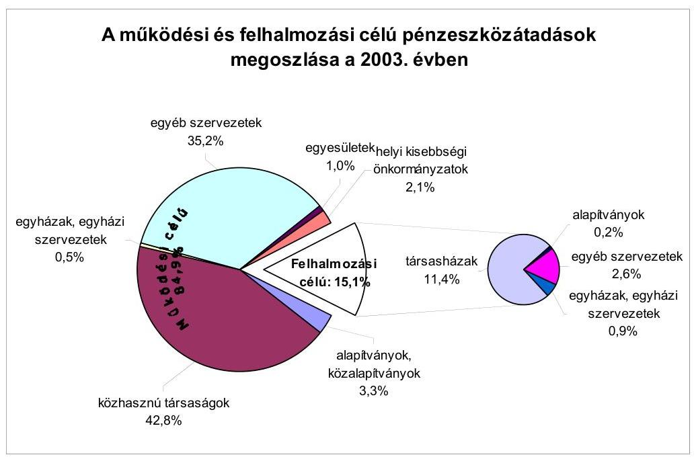
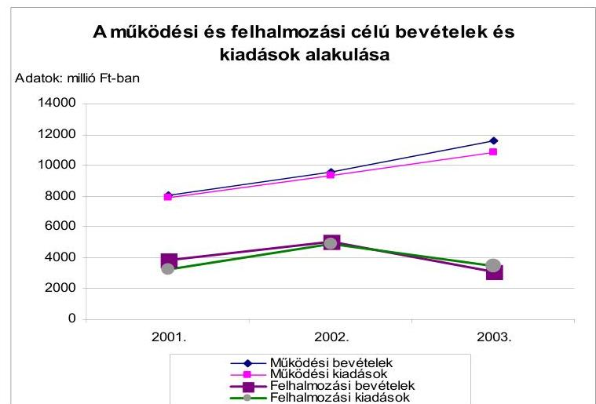
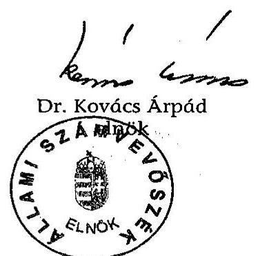
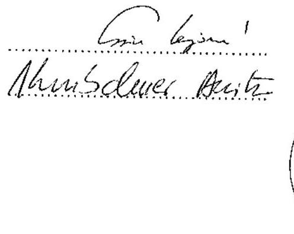
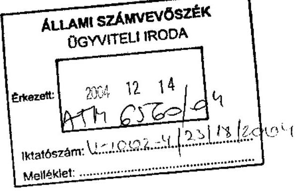

# JELENTÉS 

a Budapest Főváros IX. kerület Ferencváros Önkormányzata gazdálkodásának átfogó ellenőrzéséről

---

3. Önkormányzati és Területi Ellenőrzési Igazgatóság
3.3 Átfogó Ellenőrzések FőcsoportIktatószám: V-1002-4/23/19/2004.Témaszám: 692
Vizsgálat-azonosító szám: V0172
Az ellenőrzést felügyelte:
Dr. Lóránt Zoltán
főigazgató
Az ellenőrzés végrehajtásáért felelős:
Dr. Sepsey Tamás
főigazgató-helyettes
Az ellenőrzést vezette:
Csecserits Imréné
főcsoportfőnök-helyettes
Az ellenőrzést végezték:
Dér Géza
számvevő
Gyüre Lajosné
számvevő
Nagy Ervin Barnabás
számvevő
A témához kapcsolódó - az elmúlt négy évben készített -számvevőszéki jelentések:
címe
sorszáma
Jelentés a helyi önkormányzatok és helyi kisebbségi 0010
önkormányzatok pénzügyi-gazdasági tevékenységének 1999. évi ellenőrzési tapasztalatairól
Jelentés a foglalkoztatást elősegítő támogatások felhasználásának 0226 ellenőrzéséről
Jelentés a helyi önkormányzatok bérlakásépítésre és korszerűsítésre 0349
juttatott pénzügyi támogatások ellenőrzéséről

---

# TARTALOMJEGYZÉK 

BEVEZETÉS ..... 5
I. ÖSSZEGZŐ MEGÁLLAPÍTÁSOK, KÖVETKEZTETÉSEK, JAVASLATOK ..... 7
II. RÉSZLETES MEGÁLLAPÍTÁSOK ..... 21
1.A költségvetés tervezésének, végrehajtásának, az Önkormányzat vagyongazdálkodásának és a zárszámadás elkészítésének szabályszerűsége ..... 21
1.1.A költségvetési rendelet jóváhagyásának, módosításának, az előirányzatok nyilvántartásának és betartásának szabályszerűsége ..... 21
1.2.A gazdálkodás szabályozottsága, a bizonylati rend és fegyelem szabályszerűsége ..... 27
1.3.A pénzügyi-számviteli feladatok ellátásának informatikai támogatottsága ..... 35
1.4.Az önkormányzati vagyon nyilvántartása, számbavétele ..... 37
1.5.A vagyonnal való gazdálkodás szabályszerűsége, célszerűsége, nyilvánossága ..... 40
1.6.A céljelleggel nyújtott támogatások szabályszerűsége ..... 44
1.7.A közbeszerzési eljárások szabályszerűsége ..... 49
1.8.A zárszámadási kötelezettség teljesítésének szabályszerűsége ..... 53
1.9.A Polgármesteri hivatal helyi kisebbségi önkormányzatok gazdálkodását segítő tevékenysége ..... 54
2.Az önkormányzati feladatok és a rendelkezésre álló források összhangja ..... 55
2.1.A feladatok meghatározása és szervezeti keretei ..... 55
2.2.A költségvetés egyensúlyának helyzete ..... 59
2.3.A feladatok finanszírozása ..... 63
3.A belső irányítási, ellenőrzési rendszer múködésének értékelése ..... 67
3.1.Az ellenőrzési rendszer kialakítása, múködése ..... 67
3.2.A könyvvizsgálati kötelezettség teljesítése ..... 68
3.3.A korábbi számvevőszéki ellenőrzések javaslatainak hasznosulása ..... 69

---

# MELLÉKLETEK 

1. számú Az önkormányzati vagyon nagyságának alakulása (1 oldal)
2. számú Az Önkormányzat 2003. évi bevételeinek és kiadásainak alakulása (1 oldal)
3. számú Az Önkormányzat gazdálkodását meghatározó adatok, mutatószámok (1 oldal)
4. számú Egyes feladatok és kiadásainak finanszírozása (1 oldal)
5. számú Helyszíni ellenőrzési jegyzőkönyv (2 oldal)
6. számú Dr. Gegesy Ferenc polgármester úr észrevétele (1 oldal)
7. számú Dr. Gegesy Ferenc polgármester úrnak írt válaszlevél (1 oldal)
8. számú Dr. Gegesy Ferenc polgármester úr észrevétele (1 oldal)

---

# RÖVIDÍTÉSEK JEGYZÉKE 

Ötv.
Áht.
Ámr.
Kbt.
Htv.

Ksztv.
Nek tv.
Számv. tv.
Vhr.

Ber.
ÁSZ
Önkormányzat
Polgármesteri hivatal
Képviselő-testület
SzMSz
ügyrend
vagyongazdálkodási rendelet
közbeszerzési rendelet
lakás és helyiség hasznosítási rendelet

FB Kft.
FENYÁR Kht.
FESZOFE Kht.
a helyi önkormányzatokról szóló 1990. évi LXV. törvény az államháztartásról szóló 1992. évi XXXVIII. törvény az államháztartás múködési rendjéről szóló 217/1998. (XII. 30.) Korm. rendelet
a közbeszerzésekről szóló 1995. évi XL. törvény
a helyi önkormányzatok és szerveik, a köztársasági megbízottak, valamint egyes centrális alárendeltségú szervek feladat- és hatásköreiről szóló 1991. évi XX. törvény
a közhasznú szervezetekről szóló 1997. évi CLVI. törvény
a nemzeti és etnikai kisebbségek jogairól szóló 1993. évi LXXVII. törvény
a számvitelről szóló 2000. évi C. törvény
az államháztartás szervezetei beszámolási és könyvvezetési kötelezettségének sajátosságairól szóló 249/2000. (XII. 24.) Korm. rendelet
a költségvetési szervek belső ellenőrzéséről szóló 193/2003. (XI. 26.) Korm. rendelet

Állami Számvevőszék
Budapest Főváros IX. kerület Ferencváros Önkormányzata
Budapest Főváros IX. kerület Ferencváros Önkormányzata
Polgármesteri Hivatala
Budapest Főváros IX. kerület Ferencváros Önkormányzata Képviselő-testülete
Budapest Főváros IX. kerület Ferencváros Önkormányzata Képviselő-testületének Szervezeti és Múködési Szabályzatáról szóló 5/1999. (IV. 30.) számú rendelete
Budapest Főváros IX. kerület Ferencváros Önkormányzatának polgármestere és jegyzője által 2000. május 18-án kiadott Polgármesteri hivatal ügyrendje
Budapest Főváros IX. kerület Ferencváros Önkormányzata 6/1997. (IV. 1.) számú rendelete a vagyonáról és vagyona feletti tulajdonosi jogok gyakorlásáról
Budapest Főváros IX. kerület Ferencváros Önkormányzata 12/1996. (III. 22.) számú rendelete a közbeszerzési eljárás kiírásával és elbírálásával összefüggő egyes kérdések szabályozásáról
Budapest Főváros IX. kerület Ferencváros Önkormányzata 14/2000. (X. 2.) számú rendelete a lakások és helyiségek bérletére és elidegenítésére vonatkozó egyes szabályokról
Ferencvárosi Bérleményüzemeltető Korlátolt Felelősségű Társaság
Ferencvárosi Nyári Játékok Közhasznú Társaság
Ferencvárosi Szociális Foglalkoztató és Ellátó Közhasznú Társaság

---

| OKSB | Budapest Főváros IX. kerület Ferencváros Önkormányzatának Képviselő-testülete Oktatási, Kulturális és Sport Bizottsága |
| :--: | :--: |
| ESZB | Budapest Főváros IX. kerület Ferencváros Önkormányzata Képviselő-testületének Egészségügyi és Szociális Bizottsága |
| KKKB | Budapest Főváros IX. kerület Ferencváros Önkormányzata Képviselő-testületének Környezetvédelmi, Közterületi és Közbiztonsági Bizottsága |
| PKB | Budapest Főváros IX. kerület Ferencváros Önkormányzata Képviselő-testületének Pénzügyi és Költségvetési Bizottsága |
| VFB | Budapest Főváros IX. kerület Ferencváros Önkormányzata Képviselő-testületének Városfejlesztési bizottsága |
| OKS iroda | Budapest Főváros IX. kerület Ferencváros Önkormányzata Polgármesteri Hivatalának Oktatási, kulturális és sport irodája |
| Pénzügyi iroda | Budapest Főváros IX. kerület Ferencváros Önkormányzata Polgármesteri Hivatalának Pénzügyi Irodája |
| Vagyonkezelési iroda | Budapest Főváros IX. kerület Ferencváros Önkormányzata Polgármesteri Hivatalának Vagyonkezelési Irodája |

---

# JELENTÉS   a Budapest IX. kerület Ferencváros Önkormányzata gazdálkodásának átfogó ellenőrzéséről 

## BEVEZETÉS

Az Ötv. 92. § (1) bekezdése, az ÁSZ-ról szóló 1989. évi XXXVIII. törvény 2. § (3) bekezdése, valamint az Áht. 120/A. § (1) bekezdése szerint az önkormányzatok gazdálkodását az Állami Számvevőszék ellenőrzi. Az ellenőrzés elvégzése az Országgyűlés illetékes bizottságai részére is átadott, országosan egységes ellenőrzési program alapján történt.

## Az ellenőrzés célja annak értékelése volt, hogy

- az önkormányzati gazdálkodás törvényességét ${ }^{1}$, szabályszerűségét biztosítot-ták-e a tervezés, a költségvetés végrehajtása és a zárszámadás során;
- az Önkormányzat által ellátott feladatok és az azokhoz rendelkezésre álló pénzforrások összhangja biztosított volt-e, különös tekintettel egyes kiemelt feladatokra;
- a gazdálkodás szabályszerűségét biztosító kontrollok ${ }^{2}$ megfelelően segitettéke a végrehajtást.

Az ellenőrzött időszak: a 2003. év, valamint a 2004. I. negyedév, az 1.5; 2.1; 2.2; 2.3. és 3.3. ellenőrzési programpontok esetében a 2001-2003. évek.

Budapest, IX. kerületét négy településrész - Külső-Ferencváros, Középső-Ferencváros, Belső-Ferencváros, József Attila lakótelep - alkotja. A kerület lakosainak száma 2003. január 1-jén 60066 fő volt.

[^0]
[^0]:    ${ }^{1}$ A törvényi előírások betartásának elmulasztásakor egységesen a törvénysértés megjelölést alkalmazzuk, mivel az ÁSZ nem tehet különbséget a törvényi előírások között.
    ${ }^{2}$ A gazdálkodás szabályszerűségét biztosító kontroll alatt értjük a kiépített és működő belső irányítási és szabályozási rendszert, valamint a belső ellenőrzési funkciók ellátását.

---

Az Önkormányzat 30 tagú Képviselő-testületének munkáját 10 önálló bizottság segítette. A 2002. évi választásokat követően a polgármester személye nem változott.

Az Önkormányzat feladatainak végrehajtása érdekében 23 önállóan gazdálkodó és 10 részben önállóan gazdálkodó költségvetési intézményt múködtetett, valamint három gazdasági társasága és három közhasznú társasága is részt vett a feladatok végrehajtásában. A feladatok ellátására foglalkoztatott közalkalmazottak száma a 2003. évben 1595 fő volt, a Polgármesteri hivatalban 313 fő köztisztviselő dolgozott.

Az Önkormányzat a 2003. évben 14960 millió Ft költségvetési bevételt, 14369 millió Ft költségvetési kiadást teljesített és a 2003. év végén 225705 millió Ft értékű könyvviteli mérleg szerinti vagyonnal rendelkezett. A kerületben a 2002. évi választásokig nyolc helyi kisebbségi önkormányzat, a 2002. évi választásokat követően pedig 10 helyi kisebbségi önkormányzat ${ }^{3}$ múködött.
${ }^{3}$ Bolgár, görög, horvát, német, örmény, roma, román, ruszin, szerb és ukrán.

---

# I. ÖSSZEGZŐ MEGÁLLAPÍTÁSOK, KÖVETKEZTETÉSEK, JAVASLATOK 

A Képviselő-testület az Önkormányzat gazdasági programját nem határozta meg, ezzel az Ötv. előírását megsértették. A 2003. és a 2004. évre vonatkozó költségvetési koncepciókat és költségvetési rendelettervezeteket a polgármester határidőre a Képviselő-testület elé terjesztette, a Pénzügyi bizottság és a helyi kisebbségi önkormányzatok koncepcióról alkotott írásos véleményének a koncepció előterjesztéséhez történő csatolása elmaradt az Ámr. előírása ellenére. A költségvetési koncepció tartalmazta a gazdálkodást meghatározó alapelveket. A 2003. és a 2004. évi költségvetési rendeletekben a múködési és felhalmozási célú bevételi és kiadási előirányzatok bemutatása tájékoztató jelleggel mérlegszerűen nem valósult meg, ezzel az Ámr. előírásait nem tartották be. A jegyző nem tett eleget az Ámr. előírásainak, mivel a költségvetési rendelettervezetet az egészségügyi és szociális feladatot ellátó költségvetési intézmények vezetőivel nem egyeztette. A helyi kisebbségi önkormányzatok költségvetéseit az Ámr-ben előírtak ellenére a kisebbségi önkormányzati határozatok hiányában építették be az Önkormányzat 2003. és a 2004. évi költségvetéseibe. Megsértették az Áht-ban előírtakat a költségvetés mellékleteként bemutatandó mérlegek és kimutatások tartalmi követelményeit nem határozták meg és a közvetett támogatásokat tartalmazó kimutatást nem mellékelték.

A Képviselő-testület a költségvetési rendeletet a 2003. évben nem az Ámrben előírt gyakorisággal módosították. A költségvetési szervek saját hatáskörben végrehajtott előirányzat változtatásról a jegyző előkészítésében a polgármester a Képviselő-testületet 30 napon belül nem tájékoztatta. A 2003. évi költségvetési rendeletet utolsó alkalommal a 2004. évben határidőn túl módosították.

Az Önkormányzat a 2003. évi költségvetési kiadási és bevételi módosított előirányzata főösszegén belül gazdálkodott. A költségvetési intézmények közül a jóváhagyott módosított előirányzat túllépésével négy intézmény és a Polgármesteri hivatal megsértette az Áht. előírásait. A jóváhagyott előirányzatok túllépése miatt - két kivételtől eltekintve - nem indult vizsgálat annak okainak megállapítására. Az előirányzaton belüli gazdálkodásra vonatkozó kötelezettség megszegése miatt felelősségre vonást nem kezdeményeztek.

A Polgármesteri hivatal szervezeti felépítését az Ámr. előírása ellenére nem SzMSz-ben, hanem a Polgármesteri hivatal ügyrendjében határozták meg. Az ügyrend elnevezés nem, de tartalma megfelelt az Ámr-ben előírtaknak. A Pénzügyi iroda szervezeti rendszerben elfoglalt helyét és fő feladatait a Polgármesteri hivatal ügyrendjében határozták meg. A Pénzügyi iroda ügyrendjét, a szervezetben és feladataiban bekövetkezett változások figyelembevételével nem aktualizálták.

A Polgármesteri hivatalban a gazdálkodási és ellenőrzési jogkörök szabályozását polgármesteri és jegyzői utasításokban rögzítették. Az 50 ezer Ft alatti kifizetéseknél, értékhatártól függetlenül, valamennyi kötelezettségvállalásra

---

kötelezően előírták az előzetes írásbeliséget, nem éltek az Ámr-ben biztosított lehetőséggel, miszerint nem szükséges előzetes írásbeli kötelezettségvállalás a gazdasági eseményenként 50 ezer Ft-ot el nem érő kifizetések esetében. A lakásvásárlási előirányzatok terhére kötött szerződések kötelezettségvállalásainak ellenjegyzésére a szabályozásban ügyvédi ellenjegyzést írtak elő, ezzel nem történt meg a gazdálkodás ellenőrzését jelentő Ámr. szerinti ellenjegyzésre a felhatalmazás. A gazdálkodási és ellenőrzési jogkörök felhatalmazottainak kijelölésénél a szabályozásban az összeférhetetlenségi követelményeket a Polgármesteri hivatal béralapja tekintetében az Ámr-ben előírtak ellenére nem érvényesítették, mivel nem adott felhatalmazást a jegyző az utasításban a Polgármesteri hivatal bérelőirányzatával kapcsolatos kötelezettségvállalások ellenjegyzésére, így ezen előirányzatok vonatkozásában a szabályozás értelmében a kötelezettségvállalásra, az Ámr. alapján pedig azok ellenjegyzésére is a jegyző volt jogosult. Nem számoltatták be a gazdálkodási jogkörök gyakorlásáról a felhatalmazottakat, a beszámoltatás módját és formáját nem szabályozták. A szakmai teljesítés igazolásának feladataival a jegyzői utasításban a szakmai irodavezetők által kijelölt szakembereket bízták meg, költségvetési soronként megjelölve az igazolható tevékenységeket.

A Polgármesteri hivatal számviteli politikáját polgármesteri és jegyzői közös intézkedésben adták ki. Az Önkormányzat költségvetési intézmények egységes számviteli rendjét a jegyző a Htv. előírásait megsértve nem alakította ki.

A leltározási és leltárkészítési szabályzatban nem rögzítették a források leltározásának szabályait. Az eszközök és források értékelési szabályzatában előírták az eszközök bekerülési értékébe beszámítandó kifizetések, ráfordítások tartalmát, valamint a tartós hitelviszonyt megtestesítő értékpapíroknál az értékvesztés elszámolásának, az értékvesztés visszaírásának rendjét.

A pénzkezelési szabályzat nem tartalmazta a megnyitandó bankszámlák körét, rendeltetésüket és az azok felett rendelkezésre jogosultak megnevezését, valamint nem határozták meg a bankszámlák és a pénztár kapcsolatrendszerét, az értékpapírok nyilvántartásának, őrzésének rendjét.

A számlarendben nem írták elő az analitikus nyilvántartások adataiból készített összesítő kimutatások, feladások elkészítésének határidejét a Vhr. előírása ellenére. A számlarendben foglaltak alátámasztását szolgáló bizonylati rendet elkészítették, elmaradt azonban a felelősök megnevezése, határidők meghatározása.

A Pénzügyi iroda dolgozóinak munkaköri leírásában nem jelölték ki a folyamatba épített ellenőrzési feladatokat, az egyeztetési kötelezettségeket, azok gyakoriságát, a határidőket. Az iroda pénzügyi és számviteli tevékenységének folyamatszabályozását a minőségbiztosítási eljárás dokumentációja tartalmazta. A rendszerdokumentáció magában foglalta a munkafolyamatok dokumentumait, bizonylatait, előírta - munkakörök megjelölése nélkül - az ellenőrzési és egyeztetési feladatokat. A munkaköri leírások felelősségi szabályokat rögzítő részében fogalmazták meg a minőségbiztosítási eljárás betartásának kötelezettségét.

---

A Pénzügyi irodán a részletező nyilvántartásokat a Vhr-ben és a számlarendben előírtak szerint vezették.

A pénzforgalmat érintő gazdasági eseményekről kiállított bizonylatok 4,1\%ban nem feleltek meg a Számv. tv-ben foglalt követelményeknek, a szociális segélyek kifizetései alapjául szolgáló összesítő listákon a határozatokkal történő egyeztetést nem rögzítették.

Az egyéb gazdasági múveleteknél az egyéb követelések, egyéb rövidlejáratú kötelezettségek, valamint a felhalmozási célú támogatási kölcsönök esetében az elszámolásokat nem a számlarendben előírtak szerinti összesítö feladások alapján végezték. Az analitikus nyilvántartások és a főkönyvi könyvelés egyeztetését hitelt érdemlően nem dokumentálták.

A gazdálkodási jogkörök gyakorlása során az Ámr-ben előírt összeférhetetlenségi követelményeket betartották. A szakmai teljesítés igazolását a feladat ellátásával megbízottak valamennyi ellenőrzött bizonylatnál elvégezték.

Elmaradt a banki bevételek érvényesítése. A Polgármesteri hivatalnál a költségvetés végrehajtása során a munkafolyamatba épített ellenőrzési feladatok közül a kötelezettségvállalás ellenjegyzése a kiadási tételek 24,1\%ánál hiányzott. A kifizetések 5,8\%-ánál hiányzott az írásbeli kötelezettségvállalás. Nem készítettek megrendelőt a szakmai irodák eszközbeszerzéseinél, valamint az 50 ezer Ft alatti beszerzéseknél. A szabályozásban a minden 50 ezer Ftot el nem érő kifizetés esetében az előzetes írásbeli kötelezettségvállalás előírása indokolatlan volt.

Elmaradt az utalványozás és az utalványozás ellenjegyzése a banki bevételi bizonylatoknál, a nem termékértékesítésből és szolgáltatásnyújtásból származó bevételeknél. A pénztárellenőr naponta ellenőrizte a bevételi és kiadási pénztárbizonylatokat. A házipénztár készpénzforgalmánál nem vették figyelembe a költségtakarékossági szempontokat. A pénztári bizonylatok 4,3\%-ánál nagy összegű - 3,5 millió Ft és 27,4 millió Ft közötti - bevételek beszedései, illetve kiadások teljesítései valósultak meg. A célhoz kötött támogatások folyósítása a támogatott programok $34 \%$-ánál készpénzben történt.

A pénzügyi, gazdálkodási és számviteli feladatokat a Pénzügyi irodán két egymástól független számítógépes rendszer segítségével látták el, a párhuzamos adatrögzítés többletmunkával és hibalehetőséggel járt.

A komplex informatikai rendszerről nem készült üzemeltetési leírás, viszont a felhasználói programokhoz üzemeltetéssel kapcsolatos dokumentációk készültek. Az engedélyezési jogköröket meghatározták, de a felhasználók köréről nem készült olyan nyilvántartás, mely tartalmazta felhasználói programonként a felhasználókat és azok jogosultságait.

A Polgármesteri hivatal nem rendelkezett informatikai stratégiával, katasztrófa elhárítási tervvel. A Polgármesteri hivatal a hosszú távú fejlesztéseket is megalapozó Közszolgálati Informatikai Programmal csak a 2004. évtől rendelkezik.

Az informatikai eszközökről és a számítógépes programokról a Polgármesteri hivatal Informatikai csoportjánál önálló nyilvántartást alakítottak ki.

---

Az Önkormányzatnál a mentések, az adatvédelem szabályozása általánosan megtörtént, de nem határozták meg a mentések gyakoriságát, az alkalmazandó mentési eljárásokat, módokat és eszközöket, valamint a mentett adatok megőrzésének idejét. Az informatikai eszközök (szoftverek és hardverek) nyilvántartásáról a számviteli nyilvántartások keretében gondoskodtak. A számítástechnikai eszközökkel való mennyiségi ellátottság kielégítő, az eszközök magas elhasználódási szintje mellett.

A pénzügyi és számviteli feladatok ellátását segítő ügyviteli rendszerhez a rendszerleírások, az üzemeltetési dokumentációk és a felhasználási leírások biztosítottak, az adatok mentése, valamint a visszakeresés lehetősége megoldott.

A pénzügyi-számviteli szakterületen az informatikai rendszerrel összefüggő szabályzatokat elkészítették, az illetéktelen hozzáférés elleni védelem céljából kialakították a megfelelő jogosultsági rendszert.

A Polgármesteri hivatal a számviteli nyilvántartásában a törzsvagyon, valamint a nem törzsvagyon részét képező eszközök elkülönítéséről - határidőn belül - gondoskodott. A jogszabályi előírásnak megfelelően az ingatlanvagyon kataszteri nyilvántartás módosítását 2002. december 31-ére vonatkozóan a becsült értékkel elvégezték.

A 2003. évi mérlegben üzemeltetésre átadott eszközök körében saját gazdasági társaságai esetében tartott nyilván vagyon értéket.

Az évenkénti leltározási kötelezettségének eleget tett a Polgármesteri hivatal, leltározási utasítást adott ki a jegyző, amely a Vhr. előírása ellenére nem tartalmazta a követelések, a bankszámlák és kötelezettségek leltározására vonatkozó előírást.

A Polgármesteri hivatalnál - az adókövetelések kivételével - a követelések és részesedések év végi értékelés elvégzéséhez szükséges információk nem álltak rendelkezésre, ezért annak feladatait nem végezték el, értékvesztést nem számoltak el, ezzel megsértették a Számv. tv. előírását. A tulajdoni részesedést jelentő befektetéseik esetében indokolt lett volna értékvesztés elszámolása, mert három társaság esetében a saját tőke értéke alacsonyabb volt a jegyzett tőkénél.

A vagyongazdálkodási rendeletben az Ötv. előírását megsértve nem rendelkeztek a forgalomképesség szerinti besorolás megváltoztatásának módjáról. Nem határozták meg a vagyoni helyzet alakulásáról a Képviselő-testület részére történő beszámolás rendjét. A vagyonnal való rendelkezési, döntési hatásköröket értékhatárhoz kötötték, megjelölték a döntéshozókat, 100 millió Ft-ban rögzítették az értékhatárt versenytárgyalás kötelezővé tételére. Az értékhatár nagyságrendje túlzó mérvű, figyelembe véve a közpénzekkel történő gazdálkodással szembeni fokozott és szigorú elszámolási igényt. Üzemeltetésre és térítésmentes átadás a 2003. évben nem volt. A 2004. évben az Áht. előírását megsértve a meghatározott értékhatár feletti összegű szerződéseket az első negyedévben nem tették közzé. Az Önkormányzat a kerületben, múködő pártok részére helyiséget biztosított az Ötv-t figyelmen kívül hagyva (80-90\%-os kedvezményt adva) jelképes bérleti díjat kötött ki. A követelésről történő lemondás eseteit az

---

Áht. előírása ellenére nem határozták meg, a 2003. évben a követelés elengedés $1,6 \%$ volt. Az Önkormányzat vagyonértéke a 2001-2003. évek között azonos értéket képviselt ( $0,7 \%$-os csökkenés alakult ki) a vagyon összetételét a 2002. évi érték megállapítás változtatta meg (195 437 millió Ft-tal).

Az Önkormányzat 2003. évi költségvetéséből 213 szervezet részére nyújtott célhoz kötött támogatást. Az önkormányzati bizottságok és a polgármester öt alapítványt összesen 0,56 millió Ft támogatásban részesítettek az Ötv. előírásait megsértve. Hat alapítvány tekintetében nem írták elő a támogatás felhasználásáról a számadási kötelezettséget. Nem tartották be az Áht. előírásait az Önkormányzat által a 2003. évben céljelleggel nyújtott támogatásoknál. A támogatottak $14,1 \%$-a részére a finanszírozó nem írta elő a támogatás célját, összegét, folyósításának ütemezését, határidejét, a felhasználásról való számadási kötelezettség teljesítésének módját, formáját és határidejét. A támogatott közhasznú szervezetek 21,7\%-ánál nem kötöttek megállapodást a támogatás juttatására vonatkozóan. A támogatásban részesült szervezetek 15,5\%-a nem számolt el a támogatás felhasználásáról, az Áht. előírását megsértve a támogatási összeg visszafizetése érdekében a finanszírozó nem intézkedett. A támogatásban részesültek számadásainak tartalmi és formai ellenőrzését a támogatottak $45,1 \%$-ánál nem végezték el. A támogatások felhasználását a helyszínen nem ellenőrizték. Szolgáltatás igénybevétel finanszírozását szolgáló pénzeszközöket, a költségvetési rendeletben a múködési célú pénzeszköz átadások között terveztek, megsértve a tartalom formával szembeni elsődlegességének jogszabályi előírását.

A Képviselő-testület rendeletet alkotott a közbeszerzési eljárás helyi szabályairól. A rendelet tartalma megfelelt a Kbt. előírásainak. Nevesítette az ajánlatkérő nevében eljáró személyeket, rögzítette az eljárás megindításával, az ajánlatok elbírálásával, az eljárást lezáró döntés meghozatalával összefüggő feladatokat, hatásköröket. A polgármester és a jegyző közös intézkedésben rendelkezett a Kbt. és a helyi közbeszerzési rendelet előírásainak végrehajtása érdekében, a közbeszerzések megvalósításának rendjéről.

A Kbt. által előírt beszerzések egyes kategóriákba történő besorolása megfelelően történt. A beszerzések részekre bontásának tilalmát az Önkormányzat nem sértette meg.

A közbeszerzési eljárás szabályszerűségét az ellenőrzésre kiválasztott három, felújítási munkatárgyú közbeszerzés vonatkozásában vizsgáltuk. A vizsgált három közbeszerzési eljárás során az előkészítő bizottságok tagjaival kapcsolatos összeférhetetlenség vizsgálatára sor került. Minden esetben egy személy, a polgármester hozta meg a közbeszerzési eljárást lezáró határozatokat.

Az eljárási fajta kiválasztása a Kbt. előírásainak figyelembevételével, szabályosan történt. Az ajánlattételre, a pályázatok felbontására, elbírálására és az eredményhirdetésre megállapított határidőket betartották. A benyújtott ajánlatok felbontásáról, ismertetéséről jegyzőkönyv készült. Az elbírálások a felhívásban rögzített szempontok szerint történtek, a közzétételi kötelezettségeknek eleget tettek.

---

Az Önkormányzatnál az országos központosított közbeszerzési eljárás keretében a 2003. évben nem történt árubeszerzés. A Közbeszerzési Döntőbizottság részéről az eljárásokkal kapcsolatban elmarasztalás nem volt.

A Polgármesteri hivatalnál, a 2003. évre vonatkozó közbeszerzési értékhatárok feletti összeget tartalmazó szerződésekről megállapítottuk, hogy négy esetben elmulasztották a közbeszerzési eljárás lefolytatását. Ezzel megsértették a Kbt. 4. § (5) bekezdésének előírásait.

A polgármester a zárszámadási rendelettervezetet - az elfogadott költségvetéssel összehasonlítható módon - határidőre terjesztette a Képviselő-testület elé, amelyet határozattal elfogadtak, a zárszámadási rendelet megalkotását júniusi testületi ülésre vették napirendre. A zárszámadási rendelettervezet nem tartalmazta elkülönítve az ellátottak pénzbeli juttatásait és a speciális célú támogatásokat, ezért megsértették az Áht-ban előírtakat. Nem mutatták be a működési és felhalmozási célú bevételi és kiadási előirányzatait és a teljesítést elkülönítetten és mérlegszerűen. A zárszámadási rendelettervezet a helyi kisebbségi önkormányzatok előirányzatainak teljesítését tartalmazta elkülönítetten és összesítve. A zárszámadási rendelettervezetben tájékoztatásul bemutatták az Áhtban előírt mérlegeket és kimutatásokat. A Képviselő-testület intézményenként és Önkormányzat összesen is elfogadta a kimutatott pénzmaradványt és felhasználásáról intézkedett.

Az Ámr. előírása ellenére a Képviselő-testület nem határozta meg a költségvetési szervek elemi beszámolója felülvizsgálatának rendjét, tartalmát. Az intézmények beszámolóit felügyeleti hatáskörének megfelelően felülvizsgáltatta a Képviselő-testület, de az Ámr. előírása ellenére a beszámoló elfogadásáról az intézményvezetőket írásban nem értesítették.

A kerületben a 2002. évi választásokat követően a helyi kisebbségi önkormányzatok száma tízre emelkedett. Az Önkormányzat valamennyi kisebbségi önkormányzattal megkötötte a vonatkozó jogszabályokban előírt együttmúködési megállapodásokat. A megállapodások felülvizsgálatát, módosítását az 1999. év óta nem végzeték el, ezzel megsértették az Ámr-ben foglaltakat. A helyi kisebbségi önkormányzatok - kettő kivételével - a 2003. évi költségvetésük eredeti előirányzatáról nem az Önkormányzat költségvetésének elfogadását megelőzően hozták meg határozataikat, ezért azok nem kizárólag határozatok alapján épülhettek be az önkormányzati költségvetésbe. A 2004. évi költségvetések határozati elfogadása és beépítése az Áht-ban előírtaknak megfelelő volt.

A helyi kisebbségi önkormányzatok a 2003. évi költségvetésük módosításáról minden esetben határozattal döntöttek. A 2002. évi költségvetésük végrehajtásáról nem hoztak határozatokat, de a 2003. évi zárszámadásokról hozott határozatok megfelelőek voltak, betartották az Ámr. előírásait.

A Polgármesteri hivatal a helyi kisebbségi önkormányzatok költségvetését, az előirányzatok módosítását és a beszámoló elkészítését a velük kötött együttmúködési megállapodások alapján készítette elő. Az Önkormányzat költségvetési és zárszámadási rendeletébe a kisebbségi önkormányzatok éves költségvetéseit és zárszámadásait, egyeztetés után, külön-külön és együttesen is beépítették.

---

A Polgármesteri hivatal Pénzügyi irodája a kisebbségi önkormányzatok gazdálkodási feladatait, vagyoni és számviteli nyilvántartásait elkülönítetten, a jogszabályi előírásoknak megfelelően vezette. A pénzforgalmuk lebonyolítására a részükre megnyitott alszámlákat alkalmazták. A helyi kisebbségi önkormányzatok készpénz forgalmára önálló pénztárakat nem múködtettek.

A kerületi és a helyi kisebbségi önkormányzatok közötti megállapodások tartalma - a kisebbségi önkormányzatok zárszámadásainak határozattal történő elfogadását, illetve azok Polgármesteri hivatal részére történő átadásának idejét kivéve - megfeleltek a jogszabályi előírásoknak.

A helyi kisebbségi önkormányzatok a feladataik ellátásához külön vagyonnal nem rendelkeztek. A Nek. tv-ben foglalt előírások alapján, a múködés alapfeltételét jelentő helyiség- és irodahasználati jogot igény esetén kaptak az Önkormányzattól.

Az Önkormányzat feladatainak ellátásában meghatározó szerepe volt az önkormányzati intézményeknek, melyek közül 23 intézmény önálló és tíz intézmény részben önálló gazdálkodási jogkörrel rendelkezett. A részben önállóan gazdálkodó intézmények pénzügyi és gazdasági feladatait - a Képviselőtestület által jóváhagyott - megállapodás alapján három önálló gazdálkodási jogkörű intézmény végezte. Az önkormányzati feladatokat és azok ellátásának módját nem rögzítették.

A szociális, egészségügyi ellátás feltételei - öt költségvetési szerv és egy saját alapítású Kht. múködtetésével - biztosítottak voltak. A nevelési-oktatási feladatok ellátását 12 óvodában, hat általános iskolában, egy általános iskola és óvodában, két 12 évfolyamos iskolában, két gimnáziumban, egy alternatív és szakiskolában, egy zeneiskolában és egy nevelési tanácsadóban oldották meg. A közművelődési feladatokat két önállóan gazdálkodó intézménnyel és egy saját Kht-val látták el.

A Képviselő-testület az elmúlt három évben átfogóan nem értékelte az intézményrendszer célszerűségét, egyedi döntés alapján egy korlátolt felelősségű társaságot és egy közhasznú társaságot alapított, a közhasznú társaságot a vizsgált időszakban meg is szüntette.

A 2004. évben az oktatáspolitikai intézkedési terv keretében döntött a Képvise-lő-testület egy önkormányzati óvoda 2004. szeptember 1-jétől való megszüntetéséről, valamint egy általános iskola és egy gimnázium közös igazgatás alá vonásának előkészítéséről.

Az Önkormányzat a 2003. évi költségvetésében a múködési bevételek fedezetet nyújtottak a múködési kiadásokra. A múködési kiadások aránya a költségvetésben $75,7 \%$-ot képviselt, míg a múködési bevételek $79,1 \%$-ot tettek ki az összes bevételből. Az Önkormányzat bevételei növelésének érdekében élt a helyi adó megállapításának lehetőségével, továbbá külső pénzügyi forrásokat is igénybe vett a feladatai finanszírozásához pályázatok útján.

A vizsgált időszakban az Önkormányzat költségvetési intézményrendszere nem változott. A naturális mutatókkal mérhető feladatok esetében a fajlagos ráfor-

---

dítások jelentősen emelkedtek az ellátottak számának csökkenése, a rendelkezésre álló kapacitások elégtelen kihasználtsága következtében. Az Önkormányzat múködési kiadásainak jelentős hányada a személyi juttatásokhoz és azok járulékaihoz kapcsolódik, így a kiadások növekedésében meghatározó szerepe volt a végrehajtott közalkalmazotti béremeléseknek, a központi és a helyi bérintézkedéseknek.

A Képviselő-testület az SzMSz-ben nem rögzítette az önként vállalt feladatok körét, tartalmát. A kigyűjtéssel összeállított kiadási összegen belül legnagyobb részarányt az intézmény fenntartások és a felhalmozási célú pénzeszkózátadások jelentették. Az önként vállalt feladatok ellátására fordított kiadások mértéke, a költségvetési kiadásokon belüli részarányuk jelentős nagyságrendje komoly terhet jelentett az Önkormányzat gazdálkodásában, de nem veszélyeztette a kötelező feladatok ellátását. A Képviselő-testület az önkormányzati feladatellátás szervezeti struktúráját, a múködés hatékonyságát, az egyes intézmények kapacitás kihasználtságát nem elemezte.

A pénzállomány várható alakulásáról a jegyző - a pénzügyi egyensúly év közbeni fenntartása, az Önkormányzat által tervezett feladatok folyamatos finanszírozása érdekében - likviditási tervet a 2003. évben nem készített. Az ellenőrzött évek gazdálkodását átmeneti likviditási gondok kísérték végig, amelyet folyószámlahitel igénybevételével oldottak meg.

A Képviselő-testület a 2003. évben adósságot keletkeztető kötelezettségvállalásról döntött. Az Önkormányzatnál az adósságot keletkeztető kötelezettségvállalási felső határt betartották, az ellenőrzött évek alatt a felső határt meghaladó mértékben nem döntöttek adósságot keletkeztető kötelezettségvállalásról.

A Polgármesteri hivatalnál a kötelezettségvállalásokról megfelelő analitikus nyilvántartást vezettek, így folyamatosan rendelkezésre állt naprakész információ a vállalt kötelezettségek mértékéről.

Az Önkormányzat a fogyatékos személyek mozgásának segítése érdekében, a középületek akadály-mentesítésére vonatkozóan felmérést készített, de az éves költségvetésben a tényleges akadálymentesítésre előirányzatot nem tervezett. A fogyatékos személyek jogairól és esélyegyenlőségük biztosításáról szóló 1998. évi XXVI. törvény 29. § (6) bekezdésében foglaltaknak az adott határidőre történő végrehajtása nem biztosítható. Erről, illetőleg az eddig tett intézkedésekről a Képviselő-testület 2004. májusában kapott a jegyzőtől tájékoztatást.

Ügyrendben meghatározták az Önkormányzat intézményeinek pénzügyigazdasági és belső ellenőrzésének feladatait, a Ber. hatálybalépését követően ezt SzMSz-ben kell szabályozni, ennek az Önkormányzat nem tett eleget, ezt a feladatot öt köztisztviselő látta el. Az Áht-t megsértve a belső ellenőrök nem közvetlenül a jegyzőnek alárendelve végzik tevékenységüket. Az Önkormányzat ellenőrzési szabályzatát 1999. évben adták ki. Az ellenőrzéseket a 20032004. évekre jóváhagyott munkaterv alapján végezték az ellenőrök. Az elvégzett ellenőrzésekről készített jelentések a megállapításokhoz tartozó javaslatokat tartalmazták, de a feltárt hiányosságok jogszabályi hely megjelölése elma-

---

radt. Az ellenőrzött szervezetek hiányosságok kijavítása érdekében teendő intézkedésekre a realizáló értekezletet követően intézkedési tervet készítettek, azok végrehajtásáról a következő ellenőrzés megkezdése során győződtek meg. A 2003. évben végzett ellenőrzésekről beszámolót készítettek. A Képviselő-testület a zárszámadáskor a belső ellenőrzésről és az intézményi ellenőrzés 2003. évi tevékenységéről készült összefoglaló beszámolót tudomásul vette.

Az Önkormányzat a 2003. évben a törvényben előírt könyvvizsgálati kötelezettségét költségvetési minősítésű könyvvizsgálóval - az összeférhetetlenségi követelmények figyelembevételével - teljesítette. A könyvvizsgáló auditálási eltéréseket nem állapított meg. Korlátozás nélküli hitelesítő záradékkal látta el a Polgármesteri hivatal és az intézmények összevont adatait tartalmazó, egyszerűsített tartalmú költségvetési beszámolót.

Az előző három évben végzett ÁSZ vizsgálatok során feltárt hiányosságok megszüntetésére az Önkormányzatnál intézkedési tervet nem készítettek, de a szükséges intézkedéseket megvalósították. A javaslatok hasznosulása megtörtént, ennek eredményeként az ellenőrzésekkel érintett önkormányzati feladatellátás törvényessége, szabályozottsága javult.

A helyszíni ellenőrzés megállapításainak hasznosítása mellett javasoljuk:

# a polgármesternek 

a jogszabályi előírások maradéktalan betartása érdekében
1. a költségvetési gazdálkodás jogszabályszerű kereteinek kialakítása céljából
a) kezdeményezze a Htv. 140. § (1) bekezdés a) pontja alapján az Önkormányzat több évre szóló gazdasági programjának Képviselő-testület általi jóváhagyását az Ötv. 91. § (1) bekezdésében előírtak betartása érdekében;
b) csatolja a költségvetési koncepció tervezethez az Ámr. 28. § (3) bekezdése szerint a Pénzügyi bizottság és a helyi kisebbségi önkormányzatok koncepció tervezetről alkotott véleményét;
c) terjessze - a jegyző által készített előterjesztés alapján - a Képviselő-testület elé az Áht. 118. §-ában előírt mérlegek, kimutatások tartalmának meghatározásáról szóló rendelettervezetet;
2. intézkedjen annak érdekében, hogy az Áht. 12/A. § (1) bekezdésében foglaltak betartása érdekében, hogy a tárgyévi fizetési kötelezettséget a jóváhagyott kiadási előirányzatok mértékéig vállaljanak a költségvetési szervek, továbbá, hogy a költségvetési szervek az Áht. 93. § (1) bekezdésében foglaltaknak megfelelően a jóváhagyott előirányzatokon belül gazdálkodjanak;
3. kezdeményezze a Polgármesteri hivatal SzMSz-ének Képviselő-testület által történő jóváhagyását az Ámr. 10. § (4) bekezdésének megfelelően;
4. kezdeményezze, hogy a vagyongazdálkodási rendeletet a Képviselő-testület egészítse ki a követelésekről történő lemondás eseteinek meghatározásával az Áht. 108. § (2) bekezdésében foglaltaknak megfelelően;

---

5. gondoskodjon arról, hogy az Önkormányzat által céljelleggel juttatott támogatások közül minden alapítvány támogatása esetében a döntést a Képviselő-testület hozza meg, közalapítvány az Ötv. 10. § (1) bekezdés d) pontjában előírtak betartása érdekében;
6. biztosítsa, hogy a Ksztv. 14. § (2) bekezdésében foglaltak betartása érdekében, az Önkormányzat által közhasznú szervezetek részére céljelleggel megállapított támogatások folyósítása kizárólag írásbeli szerződés alapján történjen;
7. kezdeményezze, hogy a Képviselő-testület az Ötv. 8. § (2) bekezdésében foglaltak alapján rögzítse az önkormányzati kötelező és önként vállalt feladatokat és azok ellátásának módját;
8. gondoskodjon, hogy a Polgármesteri hivatal SzMSz-ében rögzítsék az ellenőrzési szervezet jogállását, feladatait a Ber. 4. § (2) bekezdésének megfelelően, ennek során biztosítsa, hogy az Áht. 121/A. § (3) bekezdése alapján a belső ellenőrök a jegyzőnek közvetlenül alárendelve végezzék tevékenységüket.
a munka színvonalának javítása érdekében
9. gondoskodjon a kötelezettségvállalásra és az utalványozásra felhatalmazottak beszámoltatásáról, a beszámoltatás szabályozásáról;
10. gondoskodjon az intézményrendszer célszerűségének átfogó vizsgálatáról annak érdekében, hogy a feladatellátásban a gazdaságosság érvényesüljön;
11. kezdeményezze a vagyongazdálkodási rendelet kiegészítését, annak érdekében, hogy a Képviselő-testület részére történő beszámolás rendjét meghatározzák;
12. gondoskodjon arról, hogy a pártok részére biztosított helyiségek bérleti díja összhangba kerüljön a Képviselő-testület rendeletével az Ötv. 78. § (1) bekezdésének előírásában foglaltaknak megfelelően;
13. intézkedjen annak érdekében, hogy a jóváhagyott költségvetési előirányzatok túllépése esetén, annak okát vizsgálják és a jóváhagyott előirányzatokon belüli gazdálkodási kötelezettség megszegése miatt felelősségre vonást kezdeményezzenek;
14. kísérje figyelemmel a középületek akadálymentessé tételét, tekintettel a fogyatékos személyek jogairól és esélyegyenlőségük biztosításáról szóló 1998. évi XXVI. törvény 29. § (6) bekezdésében meghatározott 2005. január 1-i teljesítési határidőre;
15. kezdeményezze a számvevőszéki ellenőrzés tapasztalatainak képviselő-testületi megtárgyalását, a feltárt hiányosságok megszüntetésére készíttessen intézkedési tervet;

# a jegyzőnek 

a jogszabályi előírások maradéktalan betartása érdekében

1. a költségvetési rendelettervezet előkészítésekor

---

a) gondoskodjon az Ámr. 29. § (4) bekezdésében előírtak betartása érdekében arról, hogy a költségvetési rendelettervezet egyeztetése valamennyi önkormányzati intézménnyel megtörténjen, annak eredményét írásban rögzítsék;
b) biztosítsa, hogy a költségvetési rendeletben mutassák be a múködési és felhalmozási célú bevételi és kiadási előirányzatokat tájékoztató jelleggel, mérlegszerűen az Ámr. 29. § (1) bekezdés h) pontjában előírtak szerint;
c) biztosítsa, hogy a költségvetési rendelet előterjesztésekor tájékoztatásul bemutatásra kerüljön a Képviselő-testület részére az Áht. 116. § 10. pontja szerint a közvetett támogatásokról szóló kimutatás;
d) gondoskodjon annak biztosításáról, hogy a helyi kisebbségi önkormányzatok költségvetései a helyi kisebbségi önkormányzatok határozatai alapján szerepeljenek az Önkormányzat költségvetési rendelet-tervezetében az Ámr. 29. § (3) bekezdésében foglaltaknak megfelelően;
e) biztosítsa, hogy az Önkormányzat költségvetési rendelete elkülönítetten tartalmazza a speciális célú támogatásokat és az ellátottak pénzbeli juttatásait az Áht. 69. § (1) bekezdésében előírtak betartása érdekében;
2. a költségvetési rendelet módosításakor
a) gondoskodjon az Ámr. 53. § (2) bekezdésében foglaltaknak megfelelően a költségvetési rendelet negyedévenkénti módosításáról;
b) biztosítsa, hogy az intézmények saját hatáskörben végrehajtott előirányzat változtatásairól a Képviselő-testület 30 napon belül tájékoztatást kapjon az Ámr. 53. § (6) bekezdésében foglaltak szerint;
3. gondoskodjon a Polgármesteri hivatal SzMSz-ének előkészítéséről az Ámr. 10. § (4) bekezdésének megfelelően;
4. gondoskodjon a Polgármesteri hivatal béralapjának előirányzataival kapcsolatos kötelezettségvállalások ellenjegyzőjének felhatalmazásáról, a gazdálkodási és ellenőrzési jogkörök felhatalmazottainak kijelöléséről az Ámr. 138. § (1) bekezdésében foglalt előírás betartása érdekében;
5. gondoskodjon arról, hogy a kötelezettségvállalások az Áht. 98. § (2) bekezdése, valamint az Ámr. 134. § (4) bekezdése figyelembevételével elkészített helyi szabályzatban előírtak szerint írásban történjenek;
6. biztosítsa az Ámr. 134. § (7) bekezdése alapján a kötelezettségvállalás ellenjegyzésére vonatkozó előírások betartását, a lakásvásárlási szerződések kötelezettségvállalásainak ellenjegyzésére kijelölt ügyvédi ellenjegyzési jogosítvány visszavonását;
7. gondoskodjon a Vhr. 49. § (4) bekezdésében előírtak betartása érdekében a számlarend kiegészítésékor az analitikus nyilvántartások adataiból készített összesítő kimutatások feladások elkészítési határidejének előírásáról, a bizonylati rend fejezetében a határidők, felelősök megjelöléséről;

---

8. intézkedjen, hogy a Számv. tv. 167. § (1) bekezdésében foglaltak alapján a segélyek kifizetése alapjául szolgáló összesítő bizonylatok tartalmazzák a határozatokkal történő egyeztetések dokumentálását;
9. intézkedjen, hogy a Számv. tv. 167. § (1) bekezdésében és a számlarendben foglaltak alapján az egyéb gazdasági múveletek könyvelése az analitikus nyilvántartásokból elkészített, a bizonylat általános alaki és tartalmi követelményeinek megfelelő összesítő feladás alapján történjen;
10. gondoskodjon a banki bevételeknek az Ámr. 135. § (1)-(4) bekezdései szerinti érvényesítéséről, valamint az Ámr. 136. § (1) és (6) bekezdésében foglaltak alapján a nem termékértékesítésből és szolgáltatásnyújtásból származó bevételek utalványozásáról, utalvány ellenjegyzéséről;
11. gondoskodjon a gazdasági szervezet ügyrendjének tartalmi aktualizálásáról az Ámr. 17. § (5) bekezdésében foglalt előírások figyelembevételével;
12. gondoskodjon a Pénzügyi iroda dolgozóinak munkaköri leírása kiegészítéséről azokban az egyeztetési kötelezettségek, munkafolyamatba épített ellenőrzési teendők meghatározásáról a Ktv. 11. § (6) bekezdésében foglalt előírások szerint;
13. intézkedjen a Htv. 140. § (1) bekezdés c) pontjának betartása érdekében a költségvetési intézményekre vonatkozó az egységes számviteli rend kialakításáról;
14. gondoskodjon az évenként leltározási kötelezettség teljesítése érdekében arról, hogy a Vhr. 37. § (1) bekezdésének előírása szerint a leltározási utasítás terjedjen ki a követelések, bankszámlák és a források leltározására is;
15. intézkedjen, hogy a mérleg-fordulónapján fennálló követelések és meglévő részesedések év végi értékelési feladataihoz az adatok rendelkezésre álljanak, vizsgálják meg az értékvesztés elszámolásának szükségességét a Számv. tv. 54. § (1) bekezdése és (2) bekezdése c) pontjában, valamint a Számv. tv. 55. § (1) bekezdése előírtaknak megfelelően;
16. intézkedjen az Áht. 13/A. § (2) bekezdésének betartása érdekében arról, hogy az Önkormányzat által juttatott céljellegú támogatásoknál minden esetben számadási kötelezettséget írjanak elő, a céljellegú támogatások felhasználásáról benyújtott elszámolások és a támogatások rendeltetésszerú felhasználásának ellenőrzése a zárszámadás elkészítéséig megtörténjen, a céltól eltérő jogsértő felhasználás esetén a támogatás összegének visszafizetése érdekében a finanszírozó tegye meg a szükséges intézkedéseket;
17. gondoskodjon arról, hogy a múködési célú pénzeszközátadások között a költségvetés tervezése során ne szerepeltessenek szolgáltatásnyújtás előirányzatát, azt - a Számv. tv. 16. § (3) bekezdés előírását betartva - a tényleges gazdasági tartalmának megfelelően tervezzék a költségvetésben;
18. gondoskodjon a közbeszerzési értékhatárt elérő árubeszerzéseknél, építési beruházásoknál és szolgáltatások megrendelésénél a közbeszerzési eljárás lefolytatásáról, a közbeszerzésekről szóló 2003. évi CXXIX. törvény 2. § (2) bekezdésében előírtak alapján;

---

19. intézkedjen folyamatosan az Áht. 15/A. és 15/B. §-a hatálya alá tartozó szerződések közzétételéről;
20. gondoskodjon arról, hogy a zárszámadási rendelettervezetben - az Áht. 69. § (1) bekezdésében foglaltaknak megfelelően - legyen elkülönítve az ellátottak pénzbeli juttatása és a speciális célú támogatások összege;
21. biztosítsa, hogy a zárszámadási rendelettervezet tartalmazza a működési és felhalmozási célú bevételeket és kiadásokat elkülönítetten, mérlegszerűen az Ámr. 29. § (1) bekezdés h) pontja szerint;
22. gondoskodjon, hogy a költségvetési szervek elemi beszámolója felülvizsgálatának rendjét, tartalmát a Képviselő-testület meghatározza az Ámr. 149. § (3) bekezdésében előírtaknak megfelelően;
23. intézkedjen - az Ámr. 149. § (5) bekezdése alapján -, hogy a számszaki beszámoló felülvizsgálatának eredményéről a költségvetési szervek írásban értesítést kapjanak;
24. készítse el - az Ámr. 139. §-a alapján - az Önkormányzat pénzállományának alakulásáról a likviditási tervet gondoskodjon annak folyamatos aktualizálásáról;
25. segítse elő, hogy a helyi kisebbségi önkormányzatok kellő időben hozzák meg költségvetési és zárszámadási határozataikat, az Ámr 36. § (5) bekezdése előírásainak megfelelően;
26. biztosítsa, hogy a helyi kisebbségi önkormányzatok együttműködési megállapodásait az adott költségvetési év január 15-ig módosítsák az Ámr. 29. § (11) bekezdésének megfelelően;
a munka színvonalának javítása érdekében
27. gondoskodjon az ellenjegyzéssel felhatalmazott személyek beszámoltatásáról, a beszámoltatás szabályozásáról;
28. intézkedjen a pénzkezelési szabályzat kiegészítéséről, a készpénzforgalom kímélése érdekében alkalmazandó szabályok rögzítéséről;
29. szabályozza az 50 ezer Ft-ot el nem érő kifizetések kötelezettségvállalásainak rendjét és nyilvántartási formáját az Ámr. 134. § (4) bekezdésében biztosított lehetőség és az indokoltság figyelembevételével;
30. gondoskodjon a pénzkezelési szabályzat kiegészítéséről, a megnyitandó bankszámlák körének, rendeltetésének az azok feletti rendelkezésre jogosultak megnevezésének meghatározásáról;
31. intézkedjen a pénzügyi, gazdálkodási és számviteli feladatok ellátása céljából alkalmazott számítógépes rendszerek közötti informatikai kapcsolat biztosításáról, a párhuzamos adatfeldolgozással járó többletmunka és hibalehetőségek csökkentése érdekében;

---

32. határozza meg az adatvédelem biztonsága érdekében a számítástechnikai védelmi szabályzaton belül a mentések gyakoriságát, az alkalmazandó mentési eljárásokat, módokat és eszközöket, valamint a mentett adatok megőrzésének idejét;
33. egészítse ki valamennyi, a Pénzügyi irodán dolgozó köztisztviselő munkaköri leírását az informatikai rendszerek használatához kapcsolódó feladatokkal;
34. készítse el a Polgármesteri hivatal informatikai rendszerének folyamatos és zavartalan múködése érdekében szükséges katasztrófa elhárítási tervet és szabályozza az adatvédelmi eljárásokat;
35. szabályozza a számítástechnikai felhasználókra vonatkozó hozzáférési jogosultsági rendszert, és határozza meg az engedélyezési jogköröket.

---

# II. RÉSZLETES MEGÁLLAPÍTÁSOK 

## 1. A KÖLTSÉGVEtÉs TERVEZÉSÉNEK, VÉGREHAJTÁsÁNAK, AZ ÖNKORMÁNYZAT VAGYONGAZDÁLKODÁSÁNAK ÉS A ZÁRSZÁMADÁS ELKÉSZÍTÉSÉNEK SZABÁLYSZERŰSÉGE

### 1.1. A költségvetési rendelet jóváhagyásának, módosításának, az előirányzatok nyilvántartásának és betartásának szabályszerúsége

A Képviselő-testület az Önkormányzat gazdasági programját nem határozta meg, ezzel megsértette az Ötv. 91. § (1) bekezdésének előírását.

A Képviselő-testület részprogramokat ${ }^{4}$ fogadott el.
A polgármester a 2003. évi költségvetési koncepciót az Áht. 70. §-ában előírt határidő ${ }^{5}$ betartásával 2002. december 3-án benyújtotta a Képviselő-testület részére. A költségvetési koncepciót a helyi bevételek figyelembe vételével és a szerződésekkel alátámasztott kötelezettségek összesítésével állították össze. Az Önkormányzat bizottságai megtárgyalták a költségvetési koncepciót, azt a Pénzügyi bizottság határozata alapján elfogadásra javasolta a Képviselőtestületnek. A bizottság véleményét írásban nem csatolták a koncepció tervezet előterjesztéséhez, ezzel nem tartották be az Ámr. 28. § (3) bekezdésében előírtakat. A helyi kisebbségi önkormányzatok a költségvetési koncepcióról - az Ámr. 28. § (2) bekezdése szerinti jegyzői tájékoztatás ellenére - nem alakítottak ki véleményt, így azokat a polgármester az Ámr. 28. § (3) bekezdésében foglaltak ellenére nem terjesztette a Képviselő-testület elé.

A Képviselő-testület a 337/2002. (XII. 12.) számú határozattal elfogadta a költségvetési koncepciót. Az előterjesztés tartalmazta a központi költségvetésből, illetve a fővárosi forrásmegosztásból várható bevételeket és a tervezett helyi bevételek összegét. A Képviselő-testület koncepcióról hozott határozatában dön-

[^0]
[^0]:    ${ }^{4}$ A Képviselő-testület 537/2001. (XII. 18.) számú határozatával fogadta el a Középső Ferencváros rehabilitációs tízéves koncepcióját a Képviselő-testület 92/2002. (IV. 9.) számú határozatában döntött Ferencváros Környezetvédelmi programjáról, a Képviselőtestület 21/2004. (I. 13) számú határozatában fogadta el a Közszolgálati Informatikai Programot, a Képviselő-testület 60/2004. (II. 5.) számú határozatában hagyta jóvá a Belső Ferencváros Rehabilitációs Fejlesztési Koncepciót, a Képviselő-testület 63/2004. (II. 5.) számú határozatában döntött az Oktatáspolitikai Intézkedési Tervről, a Képvise-lő-testület 172/2004. (V. 6.) számú határozatával fogadta el a Ferencvárosi Városfejlesztési Koncepciót és a Képviselő-testület 185/2004. (V. 6.) számú határozatával hagyta jóvá a Ferencvárosi Kulturális Koncepciót.
    ${ }^{5}$ A költségvetési koncepciót a polgármester november 30-ig, az általános választás évében legkésőbb december 15-ig benyújtja a Képviselő-testületnek.

---

töttek a költségvetés készítés munkálatairól, elfogadták a hiány hitellel történő finanszírozását. Az egyes feladatokra tervezett intézményi kiadások előző évhez viszonyított növekedését bemutatták.

A polgármester a 2004. évi költségvetési koncepciót az előírt határidőn belül 2003. november 28 -án - terjesztette a Képviselő-testület elé, a költségvetési koncepciót a Képviselő-testület a 439/2003. (XII. 18.) számú határozatával elfogadta. A költségvetési koncepció tervezethez a Pénzügyi bizottság és helyi kisebbségi önkormányzatok véleményét nem csatolták, ezzel megsértették az Ámr. 28. § (3) bekezdésének előírását. Az Ámr. 28. § (6) bekezdésében előírt tájékoztatási kötelezettségüknek eleget tettek, mert az Önkormányzat költségvetési koncepciójának a helyi kisebbségi önkormányzatokra vonatkozó részéről tájékoztatták a helyi kisebbségi önkormányzatok elnökeit.

A költségvetési koncepció tartalmazta a gazdálkodást meghatározó alapelveket.

A múködési kiadások növekedése az infláció alatt maradjon, a nem rendszeres bevételek közül csak a szerződéssel alátámasztott bevételeket veszik figyelembe. A felhalmozási bevételek kialakult szintje nem tartható, ezért ezen kiadások csökkennek, a rehabilitáció továbbvitele érdekében más területen új beruházásokat nem indítanak. A 2004. évben 400 millió Ft kedvezményes kamatozású hitel felvételét tervezik.

A 2003. évi költségvetési rendelettervezetben az Ámr. 26. § (2) és (6) bekezdésében előírt alap-előirányzatot, a tervévet megelőző év eredeti előirányzatának szerkezeti változásokkal és szintre hozásokkal módosított összegeként vezették le, a kiadási és bevételi többleteket a költségvetési évben jelentkező feladatváltozások alapján határozták meg. A jegyző nem tett eleget az Ámr. 29. § (4) bekezdésében foglaltaknak, mivel a költségvetési rendelettervezetet az egészségügyi és szociális feladatot ellátó költségvetési intézmények vezetőivel nem egyeztette.

A jegyző megbízása alapján az OKS iroda vezetője a 28 oktatási, kulturális intézménnyel egyeztette két fordulóban a 2003. évi költségvetési rendelettervezetet, amelyeket írásban rögzítettek. A jegyző nem gondoskodott öt egészségügyi és szociális intézmény vezetőjével végrehajtandó egyeztetés teljesítéséről.

A Pénzügyi bizottság 2003. január 14-i ülésén véleményezte a bizottságok által megtárgyalt költségvetési rendelettervezetet, azt a Képviselő-testület általános vitájára alkalmasnak elfogadta, de írásban a Pénzügyi bizottság véleményét nem csatolták, azt a Képviselő-testületi ülésen a Pénzügyi bizottság elnöke szóban ismertette. Ezzel nem tettek eleget az Ámr. 29. § (9) bekezdésében foglaltaknak. A könyvvizsgáló írásos jelentését tartalmazta a rendelettervezet, amely szabályszerűségi kifogást nem rögzített.

---

A polgármester a 2003. évi költségvetési rendelettervezetet az Áht. 71. § (1) bekezdésében foglalt határidőn ${ }^{6}$ belül terjesztette a Képviselő-testület ülésére, amelyről az Önkormányzat 5/2003. (II. 7.) számú rendeletével döntött.

A költségvetési rendelet 12595 millió Ft bevételt, 12895 millió Ft kiadást, 300 millió Ft hiányt ${ }^{7}$ tartalmazott, a hiányt kedvezményes kamatozású felújítási hitellel tervezték finanszírozni. A költségvetési rendelet az Önkormányzat bevételeit a következő csoportosításban tartalmazta: államháztartási és a fővárosi forrásmegosztás bevételei, múködési bevételek, helyi adóbevételek és vagyoni típusú bevételek. A bevételi forrásokat az Ámr. 29. § (1) bekezdésének a) pontjában előírt jogcím- csoportonként részletezték. Elkülönítették a Polgármesteri hivatal bevételeit (működési bevételek, Önkormányzat sajátos működési bevételei, felhalmozási és tőkejellegű bevételek és támogatások, kiegészítések, átvett pénzeszközök bevételei) és az önállóan gazdálkodó intézmények bevételeit (működési bevételek és támogatások, kiegészítések, átvett pénzeszközök bevételei) a tervezés során.

A költségvetési rendeletben - az Áht. 67. § (3) bekezdésében előírtakat betartva - meghatározták a címrendet. A múködési és felhalmozási célú bevételi és kiadási előirányzatokat tájékoztató jelleggel elkészítették, de elkülönítetten mér legszerüen nem mutatták be, ezzel nem tettek eleget az Ámr. 29. (1) bekezdés h) pontjában előírtaknak.

Tartalmazta a költségvetési rendelet a múködési és fenntartási előirányzatokat intézményenként és összesítve, ezen belül kiemelt előirányzatonként részletezve, a felújítási előirányzatokat célonként, a felhalmozási kiadásokat feladatonként, továbbá a Polgármesteri hivatal előirányzatait feladatonként. Az általános és céltartalékot, valamint a létszámkeretet meghatározták, elkülönítetten szerepeltették a helyi kisebbségi önkormányzatok költségvetését, annak ellenére, hogy arról három ${ }^{8}$ a helyi kisebbségi önkormányzat nem hozott határozatot az Ámr. 29. § (3) bekezdésében előírtak ellenére. A költségvetési rendeletben az Áht. 69. § (1) bekezdésében előírtakat, megsértve a speciális célú támogatásokat nem különítették el az ellátottak pénzbeli juttatásaitól. Az Önkormányzat a 2003. év várható bevételeinek és kiadásainak teljesüléséről előirányzat felhasználási ütemtervet készítettek.

A költségvetési rendelet mellékletében - az Áht. 71. § (2) bekezdésében foglaltaknak megfelelően - bemutatták a többéves kihatással járó kötelezettségvállalásokat. Az Önkormányzat jóváhagyta azokat a rendeleteket, amelyek a javasolt költségvetési előirányzatokat megalapozták. Módosították a lakás és helyiséghasznosítási rendeltben rögzített lakbér megállapításának alapértékét, az

[^0]
[^0]:    ${ }^{6}$ A jegyző által elkészített költségvetési rendelettervezet a polgármester február 15-ig nyújtja be a Képviselő-testületnek.
    ${ }^{7}$ A költségvetési bevételeknek és kiadásainak különbsége a tervezett hiány az Áht. 8. § (1) bekezdésében foglaltaknak megfelelően került bemutatásra.
    ${ }^{8}$ Az ukrán 2003. május 13-án, a horvát 2003. május 26-án és a görög kisebbségi önkormányzat 2003. május 25-én hozta meg a költségvetéséről a határozatát.

---

építmény és telekadó és a közterület használati díj mértékét9. Az Áht. 75. §ában előírt hitelmúveletekre kapott hatáskört - 500 millió Ft-ig - a polgármester a költségvetési rendelet 19. § (2) bekezdésében. Az Áht. 71. § (3) bekezdése figyelembevételével meghatározták a költségvetési évet követő két év várható előirányzatait.

A költségvetés mellékleteként bemutatandó mérlegek és kimutatások tartalmi követelményeit, az Áht. 118. §-ában előírtakat megsértve nem határozták meg a rendeletben. A költségvetési rendelet mellékleteként bemutatandó mérlegek közül nem készítették el a közvetett támogatásokat tartalmazó kimutatást, ezzel megsértették az Áht. 116. § 10. pontjában foglaltakat. A költségvetési rendeletben meghatározták a végrehajtásával kapcsolatos legfontosabb szabályokat: az előirányzat módosításra vonatkozó átruházott jogköröket, a tartalékkal történő rendelkezést, az évközben befolyó többletbevételek terhére vállalható kötelezettségek szabályait.

A Képviselő-testület az előirányzat változtatás jogát - az Áht. 74. § (2) bekezdésének alapján - a bizottságaira és a polgármesterre átruházta egy kivétellel, amelyet magának tartott fenn.

A céltartalék felhasználását csak a Képviselő-testület engedélyezhette. A bizottságok átcsoportosítási jogot kaptak a koordinálásuk körébe tartozó feladatára meghatározott előirányzat összegén belül. A polgármester az általános tartalékkal való rendelkezés jogát kapta meg negyedévenként 5 millió Ft összeg határig.

A polgármester a 2004. évi költségvetési rendelettervezetet az Áht. 71. § (1) bekezdésében meghatározott határidőn ${ }^{10}$ belül a 2004. február 5-i testületi ülésre terjesztette be a Képviselő-testület elé. A Képviselő-testület a 2004. évi költségvetési rendelettervezetet a beérkezett módosító indítványokkal megtárgyalta és az Önkormányzat 6/2004. (II. 16.) számú rendeletével elfogadta.

Az Önkormányzat a 2004. évi költségvetésében 13287 millió Ft bevételt, 13687 millió Ft kiadást, 400 millió Ft hiányt állapított meg, a hiányt kedvezményes kamatozású felújítási hitellel tervezték finanszírozni.

A 2004. évi előterjesztett költségvetési rendelettervezet hiányosságai azonosak voltak a 2003. évi előterjesztett rendeletnél megállapítottakkal.

A jegyző nem egyeztette a rendelettervezetet az egészségügyi intézmények vezetőivel, a Pénzügyi bizottság véleményét írásban nem csatolták, a múködési és felhalmozási célú kiadásokat és bevételeket elkülönítetten mérlegszerűen nem mutatták be, a közvetett támogatásokat tartalmazó kimutatást nem csatolták.

A költségvetés végrehajtásával kapcsolatos szabályok a 2003. évi költségvetési rendeletben foglaltakkal azonosak voltak, azzal az eltéréssel, hogy a társa-

[^0]
[^0]:    ${ }^{9}$ Módosították a Képviselő-testület 42/1996. (IV. 4.) számú rendeletét az építmény és telekadóról és a Képviselő-testület 20/1996. (IV. 26.) számú rendeletét a közterületek használatáról.
    ${ }^{10}$ Az Áht. 71. § (1) bekezdése szerint a határidő a tárgyév február 15-ig.

---

dalmi szervezetek támogatásairól szóló szerződések adatainak - a szerződés létrejöttét követő hatvan napon belül - a Ferencvárosi Közlönyben való közzétételét írták elő. A céljelleggel juttatott támogatások rendeltetésszerú felhasználásáról számadási kötelezettséget határoztak meg, a nem rendeltetésszerú felhasználás esetén a támogatás visszafizetési szankciója mellett.

Az Önkormányzat a 2003. évi költségvetési rendeletet három alkalommal ${ }^{11}$ módosította, az Ámr. 53. § (2) bekezdésében előírtakat nem tartották be, mivel a 2004. március 16-i hatályú rendelet módosítás az Ámr. 53. § (2) és (6) bekezdéseiben előírt határidőt ${ }^{12}$ követően történt. Nem vették figyelembe az Ámr. 53. § (6) bekezdésében foglaltakat ${ }^{13}$, mivel az önállóan gazdálkodó költségvetési szervek saját hatáskörben végrehajtott előirányzat változtatásról a jegyző előkészítésében a polgármester a Képviselő-testületet 30 napon belül nem tájékoztatta.

A Képviselő-testület előirányzat változtatásra irányuló költségvetési rendeletmódosításait több ütemben készítette elő, ennek során a határidő betartását nem biztosította.

Az Önkormányzat a 2003. évi költségvetési rendeletét 2495 millió Ft-tal módosította, amelyben a központi támogatás növekedésének összege 588 millió Ft, a saját hatáskörű kiadási és bevételi többlet előirányzat 1907 millió Ft volt. Az előirányzat módosítás kiemelt kiadási előirányzatai közül a személyi jellegű kiadások 245 millió Ft (6,2\%), a dologi kiadások 636 millió Ft (17,2\%), a felújítási kiadások 518 millió Ft (43,4\%) és a beruházási kiadások 573 millió Ft $(50,6 \%)$ növekedést képviseltek.

A helyi kisebbségi önkormányzatok a 2003. évi előirányzatait az általuk hozott határozatok alapján módosították, és vezették át az Önkormányzat költségvetési rendeletében az Áht. 74. § (3) bekezdésében előírtaknak megfelelően.

A költségvetési rendelet módosítására előterjesztett rendelettervezet a költségvetéssel összehasonlítható módon tartalmazta a módosított előirányzatokat.

A 2003. évi zárszámadási rendelet módosított kiadási főösszegéhez 15389 millió Ft - viszonyítva teljesített kiadás - 14369 millió Ft, 93,4\%-os volt. A bevételi módosított előirányzat 97\%-ban teljesült. A kiemelt módosított előirányzatok

[^0]
[^0]:    ${ }^{11}$ Az Önkormányzat a 25/2003. (V. 9.) számú, a 33/2003. (X. 10.) számú és a 7/2004. (III. 16.) számú rendeleteivel módosította a 2003. évi költségvetési rendeletét.
    ${ }^{12}$ Az Ámr. 53. § (2) és (6) bekezdése értelmében a Képviselő-testület legkésőbb a költségvetési szerv számára a költségvetési beszámoló felügyeleti szervhez történő megküldésének külön jogszabályban meghatározott határidejéig dönt a költségvetési rendelet módosításáról. A Vhr. 10. § (1) bekezdése értelmében az éves költségvetési beszámolót legkésőbb a következő költségvetési év február 28-ig kell a felügyeleti szervnek megküldeni.
    ${ }^{13}$ Megállapította: a 306/2002. (XII. 27.) Korm. rendelet 27. §-a, hatályos 2003. január 1-től.

---

főösszegeinek teljesítése a személyi jellegű kiadásoknál 98,1\%-os, a munkaadókat terhelő járulékoknál 99,3\%-os, a dologi jellegű kiadásoknál 94,8\%-os, a felújítási előirányzatoknál 75,6\%-os, és a felhalmozási kiadásoknál 87,7\%-os volt.

Az Önkormányzat a 2003. évi költségvetési kiadási és bevételi módosított előirányzata főösszegen belül gazdálkodott. A költségvetési szervek közül a jóváhagyott módosított előirányzatot, megsértve az Áht. 93. § (1) bekezdésében foglaltakat a Polgármesteri hivatal, két általános iskola, Családsegitő Szolgálat és a Művelődési Központ a kiemelt múködési és felhalmozási kiadások tekintetében nem tartotta be.

A Polgármesteri hivatal, az önállóan gazdálkodó költségvetési intézmények a jóváhagyott előirányzatokon rendelkezésre álló összeg túllépésével megsértették az Áht. 93. § (1) bekezdésében foglalt, a jóváhagyott előirányzaton belüli gazdálkodásra vonatkozó kötelezettséget. Megsértették az Áht. 12/A. § (1) bekezdésének előírását, mely szerint tárgyévi fizetési kötelezettség a jóváhagyott kiadási előirányzatok mértékéig vállalható.

A Polgármesteri hivatalnál a képviselők részére biztosított személyi juttatás előirányzatát $12 \%$-kal ( 10,1 millió Ft-tal), a közterület felügyelők személyi juttatás előirányzatát $17 \%$-kal ( 3,9 millió Ft-tal) és a felhalmozási kiadás módosított előirányzatát $28 \%$-kal ( 1,8 millió Ft-tal) lépték túl, a Polgármesteri hivatalnál a kiadási előirányzatot összesen $1 \%$-kal ( 12,9 millió Ft-tal) lépték túl, megsértve az Áht. 93. § (1) bekezdésében foglaltakat. A Vörösmarty Mihály Általános Iskola a személyi juttatás előirányzatát $6 \%$-kal ( 5,3 millió Ft-tal), a Molnár Ferenc Általános Iskola a személyi juttatás előirányzatát $5 \%$-kal ( 7 millió Ft-tal), a dologi kiadást $11 \%$-kal ( 5,3 millió Ft-tal) túllépte.

A Családsegítő Szolgálat 1,8 millió Ft felhalmozási kiadást fizetett ki előirányzat biztosítása nélkül. A Művelődési Központ a személyi juttatás módosított előirányzatánál 4\%-kal ( 3 millió Ft-tal) a felhalmozási kiadások előirányzatát $52 \%$-kal ( 5,2 millió Ft-tal) lépte túl. A költségvetési szervek a részükre jóváhagyott módosított költségvetési előirányzat főösszegét meghaladó mértékủ kiadást teljesítettek.

A jóváhagyott előirányzatok túllépési okainak megállapítására - két kivételtől eltekintve - nem indult vizsgálat. Az előirányzaton belüli gazdálkodásra vonatkozó kötelezettség megszegése miatt felelősségre vonást nem kezdeményezetek.

A Molnár Ferenc Általános Iskola igazgatója kért ellenőrzést a felügyeleti szervtől, a Vörösmarty Mihály Általános Iskola előirányzat túllépés ellenőrzését a Pénzügyi iroda kezdeményezte, az ellenőrzések megállapították a túlfinanszírozást és a túllépést a kiemelt előirányzatoknál, de felelősségre vonást nem kezdeményeztek.

Az eredeti előirányzatok változásait, módosításait és azok teljesülésének alakulását önkormányzati szinten, valamint a Polgármesteri hivatal vonatkozásában feladatonként, a kiemelt előirányzatok szerinti bontásban nyilvántartották, ez megfelelt az Áht. 103. § (1)-(2) bekezdésében előírt folyamatos nyilvántartási kötelezettségnek.

---

# 1.2. A gazdálkodás szabályozottsága, a bizonylati rend és fegyelem szabályszerúsége 

A Polgármesteri hivatal - mint önállóan gazdálkodó költségvetési szerv - szervezeti felépítését és múködésének rendszerét, a szervezeti egységek megnevezését az Ámr. 10. § (4) bekezdésének előírása ellenére nem SzMSz-ben, hanem a Polgármesteri hivatal ügyrendjében határozták meg. Az ügyrend tartalma megfelelt az Ámr. 10. § (4) bekezdésében foglalt - SzMSz tartalmára vonatkozó - előírásoknak.

Az alapító okiratban foglaltakat az ügyrendben részletezték, mely tartalmazta az alapító okirat keltét, számát, a Polgármesteri hivatal alaptevékenységét, annak forrásait, a feladatmutatók megnevezését, körét, a költségvetés tervezésével és végrehajtásával kapcsolatos előírásokat.

A Pénzügyi iroda szervezeti rendszerben elfoglalt helyét és fő feladatait a Polgármesteri hivatal ügyrendjében határozták meg. A gazdasági szervezet ügyrendjében az Ámr. 17. § (5) bekezdésének megfelelően rögzítették a Pénzügyi iroda felépítését, a tervezéssel, előirányzat felhasználással, előirányzat módosítással, üzemeltetéssel, fenntartással, müködtetéssel, beruházással, munkaerőgazdálkodással, készpénzkezeléssel, könyvvezetéssel és beruházással kapcsolatos feladatait. A Pénzügyi iroda ügyrendjét a szervezetben és feladataiban bekövetkezett változások figyelembevételével nem aktualizálták, ezzel nem tettek eleget az Ámr. 17. § (4), illetve 2004. január 1-től az (5) bekezdésében foglalt előírásoknak.

A Polgármesteri hivatalban a gazdálkodási és ellenőrzési jogkörök szabályozását polgármesteri és jegyzői együttes utasításokban ${ }^{14}$ és - a teljesítésigazolások vonatkozásában - jegyzői utasításban ${ }^{15}$ rögzítették. A polgármesteri és jegyzői utasításban szabályozták a kötelezettségvállalás, az érvényesítés és az utalványozás rendjét.

A Polgármesteri hivatalban szerződéses jogviszonyon alapuló kötelezettséget - a szabályozás szerint - a polgármester és az általa felhatalmazott alpolgármester vállalhatott. A polgármester az Ámr. 134. § (3) bekezdése alapján további felhatalmazást adott kötelezettségvállalásra

- a Polgármesteri hivatal szabályozásban meghatározott előirányzataira - a lakásvásárlás költségvetési előirányzatai terhére 10 millió Ft összegig, a Polgármesteri hivatal bérelőirányzataira értékhatár nélkül - a jegyzőnek, távollétében az aljegyzőnek,

[^0]
[^0]:    ${ }^{14}$ A Polgármesteri hivatal ügyrendjének 9. számú melléklete. A gazdálkodási és az ellenőrzési jogkörök szabályozására 2003. évben a polgármester és a jegyző által kiadott többször módosított 12/2000. (V. 18.) és a 4/2003. (XII. 1.) számú együttes utasítások vonatkoztak.
    ${ }^{15}$ A teljesítésigazolások szabályait a jegyző által kiadott 2/2001. (VI. 1.) számú utasításban írták elő.

---

- a szakmai irodavezetőknek, személyzeti referensnek, főszerkesztőnek, főépítésznek, célszerűen a feladatkörükbe tartozó területek ellátásával összefüggő megrendelésekre, szerződésekre, a kommunális feladatok, építésrendészeti feladatok, és a szociális feladatok előirányzatai terhére értékhatár nélkül, a lakásgazdálkodás előirányzataira 3 millió Ft értékhatárig.

A kommunális, az építésrendészeti és a szociális feladatok előirányzatai terhére történő kötelezettségvállalásra a Vagyonkezelési iroda, a Műszaki iroda és a Családvédelmi és ügyfélszolgálati iroda vezetőit hatalmazta fel a polgármester kötelezettségvállalásra.

A szabályozás szerint valamennyi kötelezettségvállalásra kötelezően előírták az előzetes írásbeliséget. Nem éltek az Ámr. 134. § (4) bekezdésében biztosított lehetőséggel, miszerint nem szükséges előzetes írásbeli kötelezettségvállalás a gazdasági eseményenként 50 ezer Ft-ot el nem érő kifizetések esetében.

A polgármester az utalványozási jog gyakorlására, távolléte esetére értékhatár nélkül az alpolgármesternek adott felhatalmazást.

A kötelezettségvállalás ellenjegyzésének jogával - az Ámr. 134. § (3) bekezdésével összhangban - a jegyző távollétében az aljegyzőt, mindkettő távollétében a Polgármesteri és jegyzői iroda vezetőjét hatalmazta fel. A Ferencvárosi Újság költségvetési előirányzatai vonatkozásában a Pénzügyi iroda vezetőjét, távollétében helyettesét hatalmazta fel a jegyző kötelezettségvállalások ellenjegyzési feladatainak ellátására.

A lakásvásárlási előirányzatok terhére kötött szerződések kötelezettségvállalásainak ellenjegyzésére a szabályozásban ügyvédi ellenjegyzést írtak elő, ezzel nem történt meg a gazdálkodás ellenőrzését jelentő, az Ámr. 137. § (2) bekezdésében foglaltak szerinti felhatalmazás. A kijelölt ellenjegyzési feladatok ellátásához az ügyvédnek nem állt rendelkezésre a kötelezettségvállalás tárgyával összefüggő kiadási előirányzat fedezetének megítéléséhez szükséges információ, ezzel a rendelkezésükkel nem tettek eleget az Ámr. 134. § (7) bekezdésében foglaltaknak. A Polgármesteri hivatali bérekre vonatkozó jegyzői kötelezettségvállalások ellenjegyzéséhez a polgármester egyetértését írták elő, mely egyetértési jog nem felelt meg az Ámr. 134. § (7) bekezdésében előírtak szerinti ellenjegyzési jogosultságnak, mivel az egyetértési jog gyakorlásához kapcsolódó feladat nem terjedt ki annak vizsgálatára, hogy a kötelezettségvállalás tárgyával összefüggő kiadási előirányzat biztosítja-e a fedezetet, hogy a kötelezettségvállalás nem sérti-e a gazdálkodásra vonatkozó szabályokat, valamint, hogy a kötelezettségvállalás célszerűségét megalapozó eljárás megtör-tént-e.

A jegyző az utalványozás ellenjegyzési feladatainak elvégzésére a Pénzügyi iroda vezetőjét, távollétében a Pénzügyi iroda vezetőjének helyettesét hatalmazta fel. A szakmai teljesítés igazolásának feladataival a jegyzői utasításban a szakmai-irodavezetők által kijelölt szakembereket, „költséggazdákat" bízták meg, költségvetési előirányzatonként megjelölve az igazolható tevékenységeket. A gazdálkodási és az ellenőrzési jogköröket a helyi sajátosságok figyelembevételével határozták meg. Az érvényesitők rendelkeztek írásos megbí-

---

zással és kijelölésük során betartották az Ámr. 135. § (2) bekezdésének szakmai végzettségre vonatkozó előírásait.

A szabályozásban nem érvényesült az Ámr. 138. § (1) bekezdésének előírása, miszerint a kötelezettségvállaló és az ellenjegyző azonos személy nem lehet, nem adott felhatalmazást a jegyző az utasításban a Polgármesteri hivatal béralapjának előirányzatával kapcsolatos kötelezettségvállalások ellenjegyzésére, így ezen előírások vonatkozásában a szabályozás értelmében a kötelezettségvállalásra, az Ámr. 134. § (3) bekezdése értelmében pedig azok ellenjegyzésére is a jegyző volt jogosult. A gazdálkodási és ellenőrzési jogkörök felhatalmazottainak kijelölésénél az Ámr. 135. § (5) és a 138. § (2)-(4) bekezdéseiben foglaltak szerinti összeférhetetlenségi követelményeket érvényesítették.

Nem számoltatták be a gazdálkodási jogkörök gyakorlásáról a felhatalmazottakat, a beszámoltatás módját és formáját nem szabályozták.

A Polgármesteri hivatal számviteli politikáját polgármesteri és jegyzői közös intézkedésben ${ }^{16}$ adták ki. A számviteli politikában - a Vhr. 8. § (5) bekezdésében előírtaknak megfelelően - meghatározták a számviteli elszámolás és az értékelés szempontjaiból lényeges, illetve nem lényeges információkat, rögzítették a jelentős, illetve nem jelentős összeget. Szabályozták a kis értékű tárgyi eszközök, a vagyoni értékű jogok és a szellemi termékek minősítésénél figyelembe veendő szempontokat. Az immateriális javak és a tárgyi eszközök értékcsökkenésének elszámolási szabályait a Vhr. 30. § (2) bekezdésében foglaltaknak megfelelően írták elő. A Vhr. 8. § (5) bekezdésének g) pontjában előírtak figyelembevételével szabályozták a terven felüli értékcsökkenés elszámolásánál figyelembe veendő szempontokat. A mérlegkészítés időpontját, az értékelési, egyeztetési feladatok elvégzésének határidejét rögzítették. Az Önkormányzat felügyelete alá tartozó költségvetési intézmények egységes számviteli rendjét a jegyzö nem alakította ki, ezzel megsértette a Htv. 140. § (1) bekezdés c) pontjának előírásait.

A számviteli politika keretében a Vhr. 8. § (4) bekezdésében előírt szabályzatokat elkészítették. A leltározási és leltárkészítési szabályzat ${ }^{17}$ tartalmazta a leltározás előkészítése során elvégzendő feladatokat, a leltározási körzetek kijelölését, a leltározás módját, a mennyiségi felvétellel történő leltározás gyakoriságát, valamint a leltározási bizonylatok feldolgozásának rendjét. Meghatározták a leltározás és a könyvvitel adatainak egyeztetési feladatait, és a leltározás értékelési feladatait, valamint a leltárkülönbözetek rendezésének módját. Az eszközök leltározására vonatkozóan - mind a saját kezelésben lévő, mind az üzemeltetésre átadott eszközök - a Vhr. 37. § (3) bekezdésében foglaltaknak megfelelő leltározást írtak elő, évente előírták a mennyiségi felvételt. A szabályzatban nem éltek az Ámr. 37. § (4) bekezdésében biztosított, a leltározás elvégzését igazoló leltárt helyettesítő összesítő kimutatás készítésének lehetősé-

[^0]
[^0]:    ${ }^{16}$ A 2003. gazdasági évre vonatkozó számviteli politikát a polgármester és a jegyző 2003. március 31-én hagyta jóvá.
    ${ }^{17}$ A Polgármesteri hivatal ügyrendjének 11. számú melléklete.

---

gével. Nem rögzítették a szabályozásban - a Vhr. 37. § (3) bekezdésében előírtak ellenére - a források leltározásának szabályait.

Az eszközök és források értékelési szabályzatában ${ }^{18}$ előírták az eszközök bekerülési értékébe beszámítandó kifizetések, ráfordítások konkrét tartalmát, megnevezését, eszközcsoportonkénti részletezettségben, rögzítették a követeléseknél, a tulajdonosi részesedést jelentő befektetéseknél, valamint a tartós hitelviszonyt megtestesítő értékpapíroknál az értékvesztés elszámolásának, az értékvesztés visszaírásának elszámolási rendjét. A szabályzatban rögzítették, hogy nem kívánnak élni az immateriális javak, tárgyi eszközök, a befektetett pénzügyi eszközök - Számv. tv. 57. § (3), valamint a Vhr. 32/A. § (5) bekezdésében biztosított - piaci értékre történő értékelésének lehetőségével.

A Polgármesteri hivatal rendszeres termékértékesítést és szolgáltatásnyújtást nem végzett, így az önköltségszámítás rendjére vonatkozó belső szabályzatot nem kellett készítenie.

A pénzkezelési szabályzatot ${ }^{19}$ a Vhr. 8. § (4) bekezdés d) pontjának előírása alapján elkészítették. A szabályzatban meghatározták a készpénzfelvétel, szállítás és -őrzés rendjét, a házipénztári keret összegét. Rögzítették a pénztári ellenőrzés módját, feladatait, gyakoriságát, a pénztáros helyettesítésének rendjét, a pénztár átadásának-átvételének szabályait, az előlegek, utólagos elszámolásra átadott összegek nyilvántartásának, elszámolásának rendjét. A szabályzat tartalmazta a páncélszekrény kulcs kezelésének és nyilvántartásának rendjét.

A szabályzat - indokoltsága ellenére - nem tartalmazta az Ámr. 103. § (6) bekezdése alapján a megnyitandó bankszámlák körét, rendeltetésüket és az azok feletti rendelkezésre jogosultak megnevezését, valamint nem határozták meg a bankszámlák és a pénztár kapcsolatrendszerét, az értékpapírok nyilvántartásának, őrzésének rendjét.

A Polgármesteri hivatal eszközeinek hasznosítási és selejtezési szabályzata ${ }^{20}$ tartalmazta a felesleges vagyontárgyak feltárásának rendjét, a feleslegessé válás ismérveit, a hasznosítás során követendő eljárási rendet, az ármegállapítás szabályait. A szabályzatban rögzítették az eljárás bizonylati rendjét, dokumentálását és a kapcsolódó számviteli elszámolásokat. Meghatározták a hasznosításban és a selejtezésben közremúködők feladatait, jogait és kötelezettségeit.

A Polgármesteri hivatal számlarendje tartalmazta a Számv. tv. 161. § (2) bekezdésében előírt kötelező elemeket, az alkalmazni kívánt főkönyvi számlákat,

[^0]
[^0]:    ${ }^{18}$ A polgármester és a jegyző együttes intézkedését 2003. március 30 -án adták ki.
    ${ }^{19}$ A Polgármesteri hivatal ügyrendjének 10. számú melléklete. A szabályzatot a polgármester és a jegyző 2000 . március 1 -jén hagyta jóvá.
    ${ }^{20}$ A Polgármesteri hivatal ügyrendjének 12. számú melléklete, melyet a polgármester és a jegyző 2000. január 1-jén hagyott jóvá.

---

a főkönyvi számlát érintő gazdasági eseményeket és a más főkönyvi számlákkal való számlakapcsolatokat a Vhr. 49. § (2) bekezdésében foglaltak alapján. A számlarendben rögzítették az analitikus nyilvántartások formáját, tartalmát és azok vezetésének, illetve a főkönyvi könyveléssel való egyeztetésének módját. Nem írták elő a Vhr. 49. § (4) bekezdésének előírása ellenére az analitikus nyilvántartások adataiból készített összesítő kimutatások, feladások elkészítésének határidejét. A Vhr. 9. számú melléklet 1/k. pontjában foglaltak szerint részletező analitikus nyilvántartások vezetését írták elő, amelyek alapján megállapítható a törzsvagyon (ezen belül a forgalomképtelen, illetve a korlátozottan forgalomképes) részét képező eszközök értéke. Szabályozták az egyeztetési, zárlati teendők rendszerességét, a módszerek meghatározását. A számlarendben foglaltak alátámasztását szolgáló bizonylati rendet, - Számv. tv. 161. § (2) bekezdés d) pontja alapján - elkészítették, elmaradt azonban a felelősök megnevezése, határidők meghatározása.

A szabályzatok előírásai összhangban álltak a gazdasági szervezet ügyrendjével és egymással, azokban a - bizonylati rend kivételével - feladatkörök, a hatáskörök és a jogkörök egyértelmű meghatározása és elhatárolása megtörtént.

A Pénzügyi iroda dolgozóinak munkaköri leírásában rögzítették a munkaköri feladatokat, a dolgozók hatáskörét és felelősségét, az operatív gazdálkodással összefüggő jogköröket. A munkaköri leírásban - megsértve a Ktv. 11. § (6) bekezdésében foglalt előírásokat - nem jelölték ki a folyamatba épített ellenőrzési feladatokat, az egyeztetési kötelezettségeket, azok gyakoriságát, a határidőket.

A Pénzügyi iroda pénzügyi és számviteli tevékenységének folyamatszabályozását az iroda szervezeti felépítésének megfelelően a minőségbiztosítási eljárás dokumentációja tartalmazta. A rendszerdokumentáció magába foglalta - a költségvetés tervezés, végrehajtás és beszámolás feladatain túl - a kötelezettségvállalások nyilvántartásának, pénzügyi teljesítésének, a múködési bevételek kezelésének munkafolyamatát. Tartalmazta a munkafolyamatok dokumentumait, bizonylatait, előírta a (munkakörök megjelölése nélkül) az ellenőrzési és egyeztetési feladatokat. A munkaköri leírások felelősségi szabályokat rögzítő részében fogalmazták meg a minőségbiztosítási eljárás betartásának kötelezettségét.

A főkönyvi számlák további tagolásával, illetve a könyvviteli számlákhoz kapcsolódó analitikus nyilvántartások vezetésével biztosították az időközi mérlegjelentések és a beszámoló megfelelő alátámasztását.

A Pénzügyi irodán a részletező nyilvántartásokat a gazdasági eseményekről a Vhr. 9. számú mellékletében, valamint a számlarendben előírtak szerint vezették.

- Az üzemeltetésre, kezelésre átadott eszközökről a befektetett eszközök rendszere program segítségével biztosították az analitikus nyilvántartás vezetését. Az analitikus nyilvántartás eszköztípusonként tartalmazta a főkönyvi számla számát, az eszközök bruttó értékének nyitó egyenlegét, a növekedéseket és csökkenéseket jogcímenként, a záró bruttó értéket és az értékcsökkenés adatait.
- Tartós hitelviszonyt megtestesítő értékpapírral az Önkormányzat nem rendelkezett.

---

- A követeléseket adósok, vevők, munkavállalókkal szembeni követelések és egyéb követelések tagolásban mutatták ki. A munkavállalókkal szembeni követelésekről vezetett analitikus nyilvántartás tartalmazta a szakfeladat megjelölését, a dolgozók nevét, adószámát, a tartozás összegét, a levonásokat és azok időpontját.
- A belföldi szállítói kötelezettségekről - TATIGAZD rendszerben - vezetett analitikus nyilvántartásban rögzítették a kötelezettség keletkezésének időpontját, összegét (áfa alap és áfa bontásban) és a szállító adatait.

A számlarend szabályozása alapján kialakított gyakorlatban az üzemeltetésre átadott eszközök, a munkavállalókkal szembeni követelések és a belföldi szállítói kötelezettségek gazdasági múveleteinél az egyeztetési pontokat kialakították. A gazdasági eseményeket rögzítő főkönyvi könyvelésből azonosítható az összesítő bizonylat és visszakereshető az analitikus nyilvántartási tétel.

A főkönyvi és analitikus nyilvántartások egyeztetése a számlarendben meghatározott időpontokban, negyedévente megtörtént. Nem a számlarend előírásainak megfelelően dokumentálták az egyeztetéseket az egyéb követelések, az egyéb rövid lejáratú kötelezettségek, valamint a felhalmozási célú támogatások esetében.

- Az üzemeltetésre átadott eszközök gazdasági eseményeit rögzítő főkönyvi könyvelés és az analitikus nyilvántartás adatainak egyeztetését negyedévenként, a számlarend előírásai alapján elvégezték, a könyvelés alapjául szolgáló összesítő feladást az analitikus nyilvántartásból elkészítették.
- A követelések állományának gazdasági műveleteit rögzítő főkönyvi és analitikus nyilvántartások egyeztetése az adósoknál és a vevőknél a számlarendnek megfelelően negyedévente megtörtént, az egyéb követelések esetében az elszámolásokat nem a számlarend előírásának megfelelő összesítő feladások alapján végezték.
- A rövid lejáratú kötelezettségek állományát érintő gazdasági eseményeket rögzítő főkönyvi és analitikus nyilvántartások egyeztetése a szállítók esetében a számlarend előírása szerint negyedévente megtörtént. Nem készítettek összesítő bizonylatot az egyéb rövid lejáratú kötelezettségek analitikus nyilvántartásából.

Az éves beszámoló összeállítását megelőzően a könyvviteli mérleget és a pénzforgalmi kimutatást a Vhr. 17. számú melléklete szerinti, fókönyvi kivonattal alátámasztották. A negyedéves mérlegjelentéseket a főkönyvi kivonat állományi számláiból állították össze.

A házipénztári bevételekről és a pénztárból kifizetett előlegekről a Számv. tv. 165. § (1)-(2) bekezdésében előírt bizonylatokat kiállították, azok megfeleltek a Számv. tv. 167. § (1) bekezdésében foglalt alaki és tartalmi követelményeknek. A pénzforgalmat érintő gazdasági eseményekről az utalványrendeleteket az Ámr. 136. § (4) bekezdésében előírt tartalommal állították ki.

A pénzforgalmat érintő gazdasági eseményekről kiállított bizonylatok 4,1\%ban nem feleltek meg a Számv. tv. 167. § (1) bekezdés g) pontjában előírt

---

tartalmi követelményeknek, a szociális segélyek kifizetései alapjául szolgáló összesítő kimutatásokon a határozatokkal történő egyeztetés elvégzését igazoló aláírások hiányoztak.

A követelések és a kötelezettségek gazdasági műveleteinek részletező nyilvántartásaiból - az egyéb követelések és az egyéb rövid lejáratú kötelezettségek kivételével - negyedévente az összesítő bizonylatokat elkészítették, azok megfeleltek a Számv. tv. 167. § (1) bekezdésében és a számlarendben foglalt alaki és tartalmi követelményeknek, tartalmazták a főkönyvi számlák megjelölését, a könyvelendő összegeket, az analitikus nyilvántartás hivatkozását, az elszámolás időszakát, a keltezést és az aláírásokat. Az egyéb gazdasági múveleteknél az egyéb követelések, egyéb rövidlejáratú kötelezettségek, valamint a felhalmozási célú támogatási kölcsönök esetében az analitikus nyilvántartások és a főkönyvi könyvelés egyeztetését, hitelt érdemlően nem dokumentálták, az elszámolásokat nem a számlarendben előírtak szerinti összesítő feladások, hanem ceruzás feljegyzések alapján végezték, ezzel megsértették a Számv. tv. 167. § (1) bekezdés g) pontjának előírását.

A költségvetési pénzforgalmat érintő gazdasági események, ennek keretében a házi pénztári bevételek és a pénztárból kifizetett előlegek bizonylatainak adatait a könyvvitelben készpénzforgalom esetében a pénzmozgással egyidejúleg, a banki tételeknél a pénzintézeti értesítés megérkezésekor rögzítették, amely megfelelt a Vhr. 51. § (1) bekezdés a) pontjában előírtaknak. Az egyéb gazdasági műveletek, ennek keretében a követelések és a kötelezettségek elszámolását tartalmazó bizonylatok adatait, az analitikus nyilvántartásokból készített összesítő feladások tételeit a gazdasági események megtörténte után a tárgynegyedévet követő hónap 15. napjáig a főkönyvi számlákon rögzítették.

A bizonylatokon, illetve az utalványrendeleten a kötelezettségvállalást, a kötelezettségvállalás ellenjegyzését, a szakmai teljesítésigazolást az érvényesítést, az utalvány ellenjegyzést és az utalványozást az arra jogosultak, illetve felhatalmazottak írták alá. Az utalványrendeleten a kötelezettségvállalás nyilvántartásba vételének sorszámát az Ámr. 136. § (4) bekezdés h) pontja szerint feltüntették.

A gazdálkodási jogkörök gyakorlása során az Ámr. 138. § (1)-(3) bekezdéseiben rögzített összeférhetetlenségi követelményeket betartották. Kötelezettségvállalás és utalvány ellenjegyzése utasításra nem történt.

A szakmai teljesítés igazolását a feladat ellátásával megbízott „költséggazdák" az Ámr. 135. § (3) bekezdése alapján kiadott jegyzői utasításban előírtaknak megfelelően az eredeti bizonylatokon elvégezték.

A banki bevételek érvényesítése a 2003. évben és a 2004. I. negyedévében elmaradt, így nem tettek eleget az Ámr. 135. § (1) bekezdésében foglalt előírásoknak. A költségvetési kiadások teljesítésének elrendelése előtt az érvényesítés megtörtént. Az érvényesített tételek 19,4\%-ánál az érvényesítés formai volt, mivel az érvényesítő nem ellenőrizte az Ámr. 135. § (1) bekezdésében előírtak ellenére az alaki követelmények betartását, a kötelezettségvállalás ellenjegyzésének elvégzését igazoló aláírások meglétét. Az érvényesítési feladatok kereté-

---

ben a számlarendben foglaltak szerint végezték el a gazdasági események szakfeladati besorolását és a főkönyvi számlák kijelölését.

A Polgármesteri hivatalnál a költségvetés végrehajtása során a munkafolyamatba épített ellenőrzési feladatok közül a kötelezettségvállalás ellenjegyzése a kiadási tételek $\mathbf{2 4 , 1 \%}$-ánál hiányzott, így nem teljesítették az Ámr. 134. § (7) bekezdésében foglaltakat.

Nem valósult meg a kötelezettségvállalás ellenjegyzése a lapkiadás megrendelésénél, szerződéseinél. A szabályozás elmaradása miatt nem teljesült a Polgármesteri hivatal béralapjának terhére történő kifizetéseknél és a lakásvásárlások szerződéseinél a kötelezettségvállalás ellenjegyzése. Ezekben az esetekben nem valósult meg a kiadás teljesítése szükségességének, célszerúségének a költségvetési előirányzat által biztosított fedezet meglétének és a kötelezettségvállalás jogszerűségének munkafolyamatba épített ellenőrzése, mivel a kötelezettségvállalás ellenjegyzése elmaradt.

A Polgármesteri hivatalban a kiadások teljesítésénél megsértették az Áht. 98. § (2) bekezdésének a kötelezettségvállalás írásban történő elvégzésére vonatkozó előírását és a saját szabályzatukkal is ellentétesen jártak el a kifizetések 5,8\%-nál, mivel a szakmai irodák eszközbeszerzéseinél, valamint az 50 ezer Ft alatti beszerzéseknél nem készítettek írásos megrendelőt. A szabályozásban a minden 50 ezer Ft-ot el nem érő kifizetésre vonatkozóan az előzetes írásbeli kötelezettségvállalás előírása indokolatlan volt.

A banki és a pénztári kiadási bizonylatokon, valamint a bevételi pénztárbizonylatokon az utalványozás és az utalvány ellenjegyzése megtörtént. Nem tettek eleget az Ámr. 137. § (3) bekezdésében foglaltaknak, mivel elmaradt az utalványozás és az utalványozás ellenjegyzése a banki bevételi bizonylatoknál, a nem termékértékesítésből és szolgáltatásnyújtásból származó bevételeknél.

A pénztárellenőr naponta ellenőrizte a bevételi és kiadási pénztárbizonylatokat, a pénztárjelentést, a meglévő pénzkészletet és a házipénztári keret betartását. A pénzkezelési szabályzatban előírt házipénztári keretet meghaladó összeget a munkanap végén befizették, az előírt keretet nem lépték túl. Az előlegek kezelésének gyakorlata megfelelt a pénzkezelési szabályzatban foglaltaknak.

A házipénztár készpénzforgalmánál nem vették figyelembe a költségtakarékossági szempontokat, a pénztári bizonylatok 4,3\%-ánál nagy összegű - 3,5 millió Ft és 27,4 millió Ft közötti - bevételek (ingatlanértékesítés) beszedései, illetve kiadások (köztisztviselői juttatások) teljesítései valósultak meg. A célhoz kötött támogatások folyósítása a támogatott programok 34\%-ánál készpénzben történt.

Munkaruha térítés címén fizettek ki a 0144363 számú kiadási pénztárbizonylaton 275 dolgozó részére 27,4 millió Ft-ot. Az ESZB döntése alapján egyházi szervezet részére célhoz kötött támogatást folyósítottak a 0829717 számú kiadási pénztárbizonylaton 0,5 millió Ft összegben. Házipénztárba fizette be a vevő az önkormányzati helyiség értékesítéséből származó bevételt, 11,0 millió Ft-ot az AB 413984 számú bevételi pénztárbizonylaton.

---

A folyamatba épített ellenőrzési - kötelezettségvállalás ellenjegyzési - feladatok elvégzésének elmaradása a lakásvásárlási kiadások, a lapkiadási feladatok kifizetései, valamint a Polgármesteri hivatal bérlapja terhére történő kifizetéseknél rendszerszerű volt, ennek hatásaként a költségvetés teljesítése során a lapkiadási feladatok dologi kiadásainak költségvetési rendeletben meghatározott előirányzatát túllépték, ezzel megsértették az Áht. 12/A. § (1), valamint a 93. § (1) bekezdéseiben foglalt előírásokat. A feladatra jóváhagyott előirányzatok túllépésének okait nem vizsgálták. Az előirányzaton belüli gazdálkodásra vonatkozó kötelezettség megszegése miatt felelősségre vonást nem kezdeményeztek.

A kiadások és bevételek előirányzatait, azok teljesítését a főkönyvi könyvelésben közgazdasági osztályozás szerint költségnemenként, funkcionális osztályozás szerint tevékenységenként és szakfeladatonként számolták el. A Számv. tv. 3. § (4) bekezdés 8. és 9. pontjában foglaltaknak megfelelően határolták el a felújításokat a karbantartásoktól és a kisjavításoktól. A teljesített bevételek és kiadások, ennek keretében a működési célú és a felhalmozási célú pénzeszközátvételek, pénzeszközátadások, előző évi pénzmaradvány igénybevételek fókönyvi számlákon való elszámolása a Vhr. 9. számú melléklete szerint, a költségvetés szerkezeti rendjének megfelelően történt.

# 1.3. A pénzügyi-számviteli feladatok ellátásának informatikai támogatottsága 

A Polgármesteri hivatal informatikai rendszere biztosította az önkormányzati feladatok informatikai eszközök segítségével való ellátásának technikai feltételeit. A Polgármesteri hivatalban a számítástechnikai eszközökön végzett munka önállóan használt, illetve hálózati kapcsolatban lévő számítógépeken folyt.

A Polgármesteri hivatal jelenleg kilenc telephelyen múködik, a szervezeti egységeknél lévő számítógépek (a Részönkormányzat irodája, illetve az OKS iroda számítógépei kivételével) kapcsolódnak a központi hálózathoz.

A számviteli analitikus nyilvántartások vezetése számítógépen, zárt rendszerben múködött, az adott feladat ellátására kifejlesztett programok segítségével történt. A pénzügyi, gazdálkodási és számviteli feladatokat a Pénzügyi irodán két, egymástól független, egymáshoz nem kapcsolódó számítógépes program segítségével látták el. A főkönyvi könyvelés feladatainak ellátására alkalmazott rendszer és az előirányzat felhasználás, kötelezettségvállalás, kintlévőségek nyilvántartására szolgáló pénzügyi rendszer között a közvetlen adatátadás nem volt biztosított.

A költségvetési tervezés, a költségvetés végrehajtása és a zárszámadás teljes folyamatának informatikai segítése és megalapozottsága biztosított.

A hálózati rendszer múködtetése szükségessé tette az ügyviteli folyamatok leírását, az engedélyezési jogkörök dokumentálását, a felelősségi körök meghatározását. A felhasználók köréről és a hozzáférési jogokról azonban teljes, részletes és naprakész nyilvántartást nem vezettek. A különböző programokhoz való

---

jogosultságokat és hozzáféréseket az adott programban központilag nem rögzítették, nem állapítható meg, hogy mely dolgozónak mihez és milyen szintű jogosultsága van.

A számítógépes munkavégzést a Polgármesteri és Jegyzői iroda informatikai csoportjának munkatársai, illetve az informatikai referens segítik. A Polgármesteri hivatalon belüli rendszerekkel kapcsolatos tájékoztatás, felhasználói szintű oktatás, valamint a szoftver- és hardvereszközök karbantartása, a múködési zavarok elhárítása - a központilag átadott programokat is beleértve megoldott.

A Pénzügyi iroda által alkalmazott, a gazdálkodást, a pénzügyi-számviteli feladatellátást megalapozó és segítő számítástechnikai programoknak a vonatkozó jogszabályokkal való összhangját megteremtették.

A Polgármesteri hivatal informatikai stratégiával nem rendelkezett. A Polgármesteri hivatal közszolgálati informatikai programját és az abban foglalt fejlesztési elképzeléseket és feladatokat a Képviselő-testület 2004ben, a 21/2004. (I. 15.) számú határozatával fogadta el. Ez a stratégiai program átfogóan tartalmazza a komplex elektronikus önkormányzati informatikai rendszer megvalósítását. Elérendő célként határozták meg az összes önkormányzati feladat egységes informatikai rendszerbe történő integrálását, a lakosság és a helyi vállalkozások számára a teljes elektronikus ügyintézés megvalósítását.

A számítógépes programok használatára vonatkozó felhasználói, üzemeltetési szabályokat, az informatikai rendszer alkalmazásakor esetleg fellépő informatikai veszélyeket, a felhasználható és alkalmazandó védelmi eszközöket és módszereket az Önkormányzatnál külön számítástechnikai védelmi szabályzatban meghatározták.

A szabályzat az adatok mentésének a kötelezettségét rögzíti, de annak gyakoriságát, az alkalmazandó mentési eljárásokat, módokat és eszközöket, valamint a mentett adatok megőrzésének idejét nem határozták meg. A szabályzat szerint az egyedi gépeken a mentést a felhasználóknak kell megoldaniuk. A mentett adatok tárolásának szabályozásáról nem rendelkeztek. A gyakorlatban a pénzügyi és a számviteli rendszerek múködését biztosító szervereken a mentéseket naponta elvégzik, két hét teljes adatállományát tárolják, a szabályzatban rögzítettek szerint mentik a hálózati adatokat. Minden hónap végén az aktuális utolsó mentést CD lemezre rögzítik és minimálisan egy évi időtartamra archiválják.

A Polgármesteri hivatal informatikai katasztrófa elhárítási tervvel a vizsgált időszakban nem rendelkezett, az ezzel kapcsolatos feladatokat a Számítástechnikai Védelmi Szabályzatban rögzítették. A számítástechnikai eljárások eredményeként előállított számviteli bizonylatok kinyomtatása megtörtént a kötelező jelentések (mérlegjelentések, beszámolók) és a könyvviteli naplók, könyvelési tételek esetében.

---

A Polgármesteri hivatal a programok múködési leírásával, valamint a felhasználók részére készült leírásokkal rendelkezik, ezek az információk az adott programok részeként rendelkezésre állnak, szükség esetén ki is nyomtathatók.

A Polgármesteri hivatalban az informatikai eszközök (hardver és szoftver eszközök) analitikus és főkönyvi nyilvántartását a Pénzügyi irodán vezetik. A nyilvántartásban az egyedi számítógépek alkotórészeit (winchester, RAM, különböző meghajtók, kártyák, stb.), illetve azok típusát, kapacitását, valamint az adott gépen használt szoftvereket nem rögzítették. A részletes adatokat tartalmazó nyilvántartással a Polgármesteri hivatal Informatikai csoportja rendelkezik.

A pénzügyi-számviteli területen dolgozók rendelkeznek a feladat ellátásához szükséges felhasználói szintü ismeretekkel. A programok használói célirányos felkészítésben részesültek. A munkaköri leírások általánosságban, utalásszerűen tartalmazzák, hogy az adott feladatot, az adott dolgozóknak milyen program használatával kell elvégezniük.

A Pénzügyi iroda dolgozói esetében nem tartják nyilván az informatikai, számítástechnikai képzettséget, a használt programokra vonatkozóan a dolgozók megfelelő gyakorlati ismeretekkel rendelkeznek. A Pénzügyi irodán több számítógépes programot használnak ${ }^{21}$., amelyekhez a rendelkezésre bocsátott dokumentációk a rendszer-, az üzemeltetési-, a múködési- és a felhasználói leírásokat tartalmazták.

A számítástechnikai eszközök állománya és korszerűsége a vizsgált időszakban az igényeknek megfelelt, a régi gépeket folyamatosan cserélték, erre forrást a költségvetésben minden évben biztosítottak.

# 1.4. Az önkormányzati vagyon nyilvántartása, számbavétele 

A Polgármesteri hivatalban a vagyon nyilvántartási feladatait a számviteli rendszerében, az analitikus nyilvántartások és a fókönyvi számlák vezetésével, illetve - az ingatlanokra vonatkozóan - az ingatlanvagyon kataszteri nyilvántartás segítségével oldották meg.

A számviteli nyilvántartás megszervezésénél a Vhr. 9. számú melléklet 1/k. pontjában foglaltaknak megfelelően kialakították a törzsvagyon (ezen belül a forgalomképtelen, illetve korlátozottan forgalomképes), valamint a nem törzsvagyon részét képező eszközök elkülönítését, analitikus nyilvántartás vezetésével biztosították.

[^0]
[^0]:    ${ }^{21}$ A pénzügyi-számviteli munka végzéséhez használt jelentősebb számítástechnikai programok: egységes főkönyvi könyvelési rendszer, költségvetési beszámolórendszer, tárgyi eszköz-nyilvántartás, illetve az integrált pénzügyi rendszer a számlák, kintlévőségek, kötelezettségvállalások és szerződések nyilvántartására.

---

A Polgármesteri hivatal a korábban érték nélkül nyilvántartott ingatlanok értékelése során 2002-ben megállapított bruttó értékkel (195 437 millió Ft) a számviteli nyilvántartást módosította.

Az Önkormányzati ingatlan vagyon értékének növekedését a forgalomképtelen földterületek 145023 millió Ft, a forgalomképtelen telkek 14618 millió Ft, a forgalomképtelen építmények 17984 millió Ft, a forgalomképes telkek 16445 millió Ft, a korlátozottan forgalomképes lakóházak 73 millió Ft, a korlátozottan forgalomképes telkek 309 millió Ft, az intézményi forgalomképtelen építmények 514 millió Ft és az intézményi forgalomképes épületek 471 millió Ft becsült összegei határozták meg.

Az önkormányzati vagyon nyilvántartása, számbavétele az analitikus nyilvántartásokkal egyező főkönyvi könyvelésben biztosított volt. Az ingatlanok, részesedések, rövid és hosszú lejáratú követelések, kötelezettségek és pénzeszközök főkönyvi számláihoz kapcsolódtak analitikus nyilvántartások, az értékadatok között a számszerú egyezőség fennállt. A vagyonértéket befolyásoló gazdasági eseményeket rögzítették az ingatlanok esetében. Üzemeltetésre, kezelésre átadott eszközöket az Önkormányzat saját többségi tulajdonú gazdasági társaságok esetében tart nyilván 95,2 millió Ft összegben. Az eszközök analitikus nyilvántartásait, az üzemeltetésre átadott eszközök esetében is a Polgármesteri hivatalban biztosították.

Az Önkormányzatnak más önkormányzattal közös tulajdonban lévő üzemeltetésre átadott eszköze nem volt, önkormányzati forrásból 2001-2003. években vízi közmúfejlesztés nem történt.

A 2003. évre a leltározási utasítást a jegyző 2003. október 9-én adta ki, amelyben mennyiségi leltározást írt elő ingatlanok, gépek, berendezések, felszerelések, kisértékű tárgyi eszközök és a járművek esetében. Ezeknél az eszközöknél leltárfelvételi íveken mennyiségi leltár felvételt hajtottak végre. Az utasítás nem tartalmazta a követelések, a bankszámlák, az aktív és passzív pénzügyi elszámolások és a kötelezettségek leltározásának előírását, annak ellenére, hogy a Vhr. 37. § (1) bekezdése ezt előírta.

A 2003. évre vonatkozó mérleg alátámasztását leltárral és összesítő kimutatással az eszközök és források értékadataira biztosították. Egyeztetéssel hajtották végre a leltározást, követeléseknél, bankszámláknál a kötelezettségeknél. Öszszesítő kimutatást készítettek, amelynek tartalmát, formáját és kellékeit nem határozták meg a leltározási szabályzatban, a Vhr. 37. § (4) ${ }^{22}$ bekezdésében előírtak ellenére a felügyeleti szerv jóváhagyása nem történt meg. A leltár kiértékelése megtörtént, az eltéréseket a számviteli nyilvántartásban rendezték - kisösszegű (9-21 ezer Ft) kártérítés volt - felelősségre vonás nem volt indokolt.

A mérlegtételek évenkénti értékeléséhez szükséges analitikus egyedi nyilvántartások rendelkezésre álltak, amelyek alapján a 2003. december 31-i vagyonértéket megállapították. A Polgármesteri hivatalnál a követeléseknél és a részese-

[^0]
[^0]:    ${ }^{22}$ Hatályon kívül helyezte a 278/2003. (XII. 24.) Korm. rendelet 29. § (3) bekezdése. Hatálytalan 2004. január 1-től.

---

déseknél nem álltak rendelkezésre az értékeléshez szükséges információk. Az Önkormányzat forgatási célú értékpapírral 2001-2003. években nem rendelkezett.

A követelések 2003. év végi értékelését az adókövetelések esetében adónemenként elvégezték. A Polgármesteri hivatal a lakbértartozások és az önkormányzati lakások értékesítésekor adott részletfizetés elmulasztásából származó hátralékok, követelések érvényesítésére egy adósság behajtó kft-t bízott meg. A behajtási eljárásra tekintettel az értékvesztés elszámolását nem vizsgálták és értékvesztést nem számoltak el, ezzel megsértették a Számv. tv. 55. § (1) bekezdésében előírtakat, mivel a költségvetési év mérleg-fordulónapján fennálló és nem rendezett követeléseknél a veszteségjellegű különbözet összegére értékvesztést kell elszámolni.

Az Önkormányzat 2003. évi könyvviteli mérlegében a részesedések értéke 175,3 millió Ft ez a mérleg főösszeg 0,08\%-át képviselte. Az év végi értékelési feladatok keretében nem vizsgálták a részesedések értékvesztés elszámolásának szükségességét, ezzel megsértették a Számv. tv. 54. § (1) bekezdése és (2) bekezdése c) pontjának előírásait mely szerint a tulajdoni részesedést jelentő befektetéseknél értékvesztést kell elszámolni, ha a befektetés könyv szerinti értéke és a piaci értéke között veszteségjellegű a különbözet és ez a különbözet tartósnak mutatkozik és jelentős összegű.

A PALETTA Kereskedelmi Rt. részvényeiből az Önkormányzat 3,5\%-kal (60 millió Ft-tal) rendelkezett, a részvények után 1996. óta az Önkormányzat részére osztalékfizetés nem történt, PALETTA Kereskedelmi Rt. 2003. évi vesztesége miatt a saját tőke, jegyzett tőke aránya 68,3\%-ra változott, a 31,7\%-os csökkenés 19 millió Ft névérték leszállítást indokolt, e helyett a Polgármesteri hivatal 20\%-os (12 millió Ft) csökkentést vezettet át a számviteli nyilvántartásán. A Számv. tv. előírása szerint a gazdasági társaságban lévő tulajdoni részesedést jelentő befektetéseknél értékvesztést kell elszámolni a befektetés könyv szerinti értéke és piaci értéke közötti - veszteségjellegű - különbözet összegében, ha ez a különbözet tartósnak mutatkozik és jelentős összegű. A befektetés piaci értéke meghatározásakor figyelembe kell venni a gazdasági társaság saját tőkéje és a jegyzett tőkéje, illetve a befektetés könyvszerinti értéke és névértéke arányát. Az Önkormányzat két 100\%-os tulajdonú társasága (Ferencvárosi Sportcentrum Kft. és a Közbiztonsági Kht. saját tőke és a jegyzett tőke aránya 0,8\%-ra (3 millió Ft-tal) csökkent, a Közbiztonsági Kht. saját tőke és a jegyzett tőke aránya 85,7\%-ra ( 0,4 millió Ft-tal) csökkent, ezek számviteli nyilvántartáson történő átvezetését figyelmen kívül hagyták.

A PALETTA Kereskedelmi Rt. részvények a Budapesti Értéktőzsdén nem jegyzett értékpapírok voltak, az el nem számolt értékvesztés nem jelentős összeget képviselt, mivel az Önkormányzat számviteli politikája szerinti értékvesztés szempontjából nem jelentős összeg 17,5 millió Ft volt, az el nem számolt értékvesztés 7 millió Ft-ot képviselt.

Az Önkormányzat nem kívánt élni a piaci értékelés lehetőségével, a Polgármesteri hivatal korábbi évben nem számolt el értékvesztést, ezért a visszaírás kötelezettsége nem volt.

---

# 1.5. A vagyonnal való gazdálkodás szabályszerűsége, célszerúsége, nyilvánossága 

Az Önkormányzat a vagyonnal történő gazdálkodás szabályait a vagyongazdálkodási rendeletben ${ }^{23}$ és a lakás és helyiség hasznosítási rendeletben határozta meg a Htv. 138. § (1) bekezdés j) pontjában foglaltaknak megfelelően, amelyek hatálya a teljes vagyoni körre kiterjedt. A vagyongazdálkodási rendeletben az Önkormányzat a törzsvagyont és egyéb vagyont nevesítették. Az Ötv. 79. § (2) bekezdés b) pontját megsértve nem rendelkeztek a forgalomképesség szerinti besorolás megváltoztatásának módjáról, továbbá a vagyongazdálkodási rendeltben nem határozták meg a vagyoni helyzet alakulásáról a Képviselő-testület részére történő beszámolás rendjét. A lakás és helyiség hasznosítási rendelet, az ezen vagyonrészekkel kapcsolatos gazdálkodási, döntési és eljárási szabályokat részletezi. A rendeletben rögzítették a lakások és helyiségek érték megállapításának és a bérleti díj meghatározásának számítási módját. Mellékletként tartalmazta az önkormányzati tulajdonban lévő épületek cím szerinti felsorolását a rehabilitációs program területi bontásának megfelelően és az Önkormányzat értékesítésre vonatkozó döntésének ${ }^{24}$ csoportosítását.

A vagyon nyilvántartásának szabályait a vagyongazdálkodási rendeletben rögzítették, de az a selejtezésre vonatkozó rendelkezést nem tartalmazta. A Számv. tv. 54. § (1) bekezdésében foglaltakat megsértették, mert az előírt értékvesztés elszámolási kötelezettség előírása ellenére azt nem szabályozták. Elmaradt a terven felüli értékcsökkenés elszámolásának meghatározása.

Apportálás és ingyenes vagyon átadása 2003-2004. I. negyedév között nem volt, a felesleges vagyontárgyak feltárását követően nulláig leírt számítástechnikai eszközöket és fénymásolót selejteztek, a megsemmisítésről és a vagyonnyilvántartásból történő kivezetésről szabályszerűen gondoskodtak.

Az ingyenes, vagy kedvezményes vagyon átadást az Áht. 108. § (2) bekezdésének megfelelően szabályozták, rögzítették a kedvezményezettek körét (közalapítványok, egyházak és más önkormányzat), a döntés jogát a Képviselő-testület magának tartotta fenn, és minősített többségü döntést határoztak meg. Az önkormányzati vagyon ingyenes, vagy kedvezményes átengedésének eseteire az ajándékozás, a közérdekű kötelezettségvállalás jogcímeit jelölték meg. A követelésekről történő lemondás eseteit az Áht. 108. § (2) bekezdésében foglaltak ellenére nem határozták meg, a döntést 5 millió Ft feletti értéknél a Képviselő-testület hozhat, 1 millió Ft-tól 5 millió Ft-ig a Tulajdonosi bizottság dönthet, 1 millió Ft értékhatárig a polgármester jogosult a döntésre.

[^0]
[^0]:    ${ }^{23}$ A Képviselő-testület az Önkormányzat vagyonáról és a vagyona feletti tulajdonosi jogok gyakorlásáról szóló rendeletet hét alkalommal módosította az utolsó módosítás 2003. március 7 -től hatályos.
    ${ }^{24}$ A lakás és helyiség hasznosítási rendelet döntési csoportosítása „9/a. számú melléklete Feltétlen eladásra javasolt helyiségek, 9/b. számú melléklete Eladható helyiségek, 9/c. számú melléklete Feltétlen megtartásra javasolt helyiségek".

---

A vagyon feletti rendelkezési jog gyakorlását a forgalomképtelen törzsvagyon esetében a Képviselő-testülethez rendelték. A korlátozottan forgalomképes vagyon elidegenítéséről 1 millió Ft-ig az intézmény vezetője, 5 millió Ft egyedi értékhatárig a polgármester, 5 millió Ft értékhatár felett a Képviselőtestület dönt. A forgalomképes önkormányzati vagyon elidegenítéséről 5 millió Ft felett a Képviselő-testület hatásköre volt a döntés. Portfolió vagyon esetében a döntés 1 millió névértékig a polgármester, 20 millió Ft névértékig a Tulajdonosi bizottság, 20 millió Ft felett a Képviselő-testület hatáskörében volt. Ingatlanvagyon esetében 70 millió Ft forgalmi értékig a Tulajdonosi bizottság, 70 millió Ft forgalmi érték felett a Képviselő-testület volt jogosult a hasznosításról döntéshozatalra.

A Képviselő-testület a 2004. évi költségvetés végrehajtási szabályai között az Áht. 15/A. §-ának és 15/B. §-ának előírásainak megfelelően előírta a vagyont érintő szerződések közzétételi kötelezettségét, a törvényi előírást és a helyi szabályozást megsértve 2004. I. negyed évében nem teljesítették, mivel az értékhatár felett megkötött 82 szerződés közül egy közzététel sem teljesült. A jegyző a vagyont érintő szerződések közzétételének módját és rendszeres megjelentetését 2004. május 7 -én elrendelte és a közzététel május 27 -től megtörtént.

Az elidegenítés versenyeztetési eljárása kizárólag nyilvános pályázattal történhet ha az ingatlanvagyon forgalmi értéke a 100 millió Ft-ot meghaladja. Az értékhatár nagyságrendje túlzó mérvű figyelembe véve a közpénzekkel történő gazdálkodással szembeni fokozott és szigorú elszámolási igényt.

A Képviselő-testület a vagyongazdálkodási rendelet 15. § (6) bekezdésében foglaltaknak megfelelően járt el, a nagy értékű ingatlan értékesítésének során, amikor nyilvános pályázaton meghirdette, erre egy pályázat érkezett. Az Onkormányzat tulajdonában lévő lakások és helyiségek elidegenítése és bérbeadása a lakás és helyiség hasznosítási rendelet előírásainak betartása mellett történtek.

A Budapest, IX. Czuczor u. 3. 37076 hrsz. épületes ingatlant ( $820 \mathrm{~m}^{2}$ ) 140 millió Ft-ért értékesítettek ISC Alapítvány részére (egyedüli pályázó volt) nyilvános pályázat alkalmazásával, vagyongazdálkodási rendeletben előírt értékbecslést is készítettek. A Tulajdonosi bizottság 154/2003. (IX. 16.) számú és a Képviselő-testület 338/2003. (X. 2.) számú határozata alapján történt az eladás, a vagyongazdálkodási rendeletben meghatározott hatásköröknek megfelelően.

A Budapest, Ráday u. 8. számú üzlet $116,12 \mathrm{~m}^{2}$ földszinti helyiség bérbeadása évi 2,7 millió Ft bérleti dijért a lakás és helyiség hasznosítási rendelete alapján valósult meg, mivel az ingatlant a rendeletben meghatározott megfelelő értékesítési csoportba sorolták be, a bérleti díj meghatározása az alapterület és az alkalmazandó tétel figyelembevételével történt.

A Budapest, Berzenczey út 11. üzlet, iroda ( $27,02 \mathrm{~m}^{2}$ ) alagsor bérbeadása pályázat útján évi 0,3 millió Ft bérleti dijért történt. A bérbeadásról a döntés a lakás és helyiség hasznosítási rendelet előírásainak megfelelően történt. A helyiségre öt pályázat érkezett, kettő érvényes volt, mivel az előírt mellékleteket - cégkivonat,

---

megszerzési díj ${ }^{25}$ megjelölése, aláírási címpéldány - tartalmazták, a három érvénytelen pályázó észrevételt tett a kiírás egyértelműségével kapcsolatban, az észrevételt a Vagyonkezelési iroda elutasította az ajánlattevők az elutasítást elfogadták.

A Budapest IX. Ferenc körút 24. IV. emelet 2. számú ( $123,31 \mathrm{~m}^{2}$ ) lakás forgalmi értéke 24,7 millió Ft, melyet bérlők ( $15 \%$-os) 3,7 millió Ft-os vételi áron vásároltak meg az Önkormányzat a lakás és helyiség hasznosítási rendelete alapján a csatolandó - köztartozási bizonyítvány, eladási ajánlat, tulajdoni lap, a vételre kijelölés (száma: 113/1990.) - iratok mellékelve voltak.

A vagyongazdálkodási rendeletben meghatározták a követelésről lemondás jogosultság értékhatárait, ennek megfelelt a 2003. évben összesen 8,5 millió Ft behajthatatlan követelés lemondása. A Képviselő-testület a 446/2003. (XII. 18.) számú határozatában a követelés lemondásának összege az előző évi követelés összegének $1,6 \%$-a volt.

Az Önkormányzat vagyonában a 2001-2003. évek között a könyvviteli mérlegeinek adatai alapján a 2002. évről, a 2003. évre a csökkenés $\mathbf{0 , 7 \%}$ volt. A 2002. évben az ingatlanok érték megállapításból eredően 8176 millió Ft-ról 220667 millió Ft-ra (2698\%-kal) növekedett. A befektetett pénzügyi eszközök értékváltozása - a 2002. év végi állománya 2009,8 millió Ft-tal növekedett a követelések között nyilvántartott részletre eladott lakástörlesztő részlet átvezetéséből keletkezett. Az eszközök értékadataiban bekövetkezett változások a becsült érték nyilvántartásba vételből és a követelés összegének átsorolásából eredtek, a gazdálkodás eredményének hatása vagyonváltozást nem okozott. A források között kialakult értékváltozás az ingatlanok érték megállapításának nyilvántartásába vételéből keletkeztek, valamint a 2003. évben felvett hitel év végi állománya eredményezett a hosszú lejáratú kötelezettségnél a 2002. évről a 2003. évre 67,9\%-os (255,7 millió Ft) növekedést. A rövid lejáratú kötelezettségek növekedése a 2003. évben az előző évihez képest 61,5\%-os volt, amely a szállító állomány 91 millió Ft-os növekedéséből és a hitel törlesztő részlet 144 millió Ft-os növekedéséből alakultak ki.

Az Önkormányzat lakás és helyiség hasznosítási rendeletének 28. § (2) bekezdése rögzíti, hogy a Képviselő-testület a bérleti díjat indokolt esetben elengedheti, illetve kedvezményt nyújthat, a Tulajdonosi bizottság pedig a tárgyévre vonatkozó bérleti díjat $30 \%$-kal mérsékelheti. A Képviselő-testület lakás és helyiség hasznosítási rendelet 28. § (2) bekezdésének alapján nem hozott kedvezmény nyújtásáról határozatot, a helyi szabályozás ellenére a polgármester 10 pártszervezet ${ }^{26}$ részére különböző mértékben adott kedvezményt.
${ }^{25}$ A bérleti jog, mint immateriális vagyon ellenértéke.
${ }^{26}$ Magyarországi Szociáldemokrata Párt, Magyar Demokrata Fórum, Fiatal Demokraták Szövetsége - Magyar Polgári Szövetség, Független Kisgazda, Földmunkás és Polgári Párt, Szabad Demokraták Szövetsége, Magyar Igazság és Élet Pártja, Kereszténydemokrata Néppárt, Magyar Szocialista Munkáspárt, Munkáspárt, Magyar Demokrata Néppárt ferencvárosi szervezetei.

---

Az utolsó szerződésmódosítás 2001. júliusában volt, mind a 10 szerződés érvényes bérletet biztosított a pártok részére. A lakások és helyiségek bérletére és elidegenítésére vonatkozó 14/2000. (X. 2) számú rendeletének akkor hatályos 26. § (5) bekezdésében ${ }^{27}$ foglaltak szerinti bérleti díj figyelembevételével. A bérleti dijra vonatkozó megállapodás ingatlanonként $\mathrm{Ft} / \mathrm{m}^{2} /$ hónap ÁFA nélküli tételei $\left(4 \mathrm{Ft} / \mathrm{m}^{2} / \mathrm{hó}-169 \mathrm{Ft} / \mathrm{m}^{2} / \mathrm{hó}\right)^{28}$ eltérő egységárak voltak, amelyeknek számszerúsített összegét a Polgármesteri hivatal számlájára fizették be. A közüzemi díjakat a számláknak megfelelően fizették meg a szervezetek. A nem lakás célú helyiségek bérleti díja a Képviselő-testület rendelete mellékletének övezeti besorolás szerinti tételei alapján a 2003. évben a legkisebb $\mathrm{Ft} / \mathrm{m}^{2} /$ hónap díj 708 Ft , a legmagasabb 1541 Ft lett volna, a 10 szervezet összes éves bérleti díja 14085 ezer Ft volt a 2003. évre vonatkozóan, a szerződésekben rögzített árak (éves öszszeg 1050 ezer Ft) helyett. Az Önkormányzatnak a vagyonával való gazdálkodása - beleértve a vagyon hasznosítása során nyújtott kedvezményeket, támogatásokat is - a helyi önkormányzással az önkormányzati feladatellátással kapcsolatos célokhoz kell hogy kapcsolódjon. Az Ötv. 1. § (1) bekezdése alapján az Önkormányzat feladat- és hatáskörébe tartozó helyi érdekű közügyekben önállóan jár el. A pártok, szervezetek támogatása nem tartozik a helyi közügyek körébe. A díjkedvezményen keresztül számukra nyújtott közvetett támogatás ${ }^{29}$ nem tekinthető olyannak, amely az önkormányzati feladatellátással kapcsolatos célokat szolgált. Ezért e szervezetek és más - e kedvezményben nem részesülő - helyiségbérlők közötti megkülönböztetésnek elfogadható indoka nincs. Az Alkotmány 70/A. §-ában, illetve az Ötv. 1. § (2) bekezdésében és a 78. §-ának (1) bekezdésébe ütközik az Önkormányzat részéről adott támogatás. (Az Alkotmánybíróság 47/2002. (X. 11.) számú határozat indoklásának III. fejezete is ezt támasztja alá.)

Az ingatlanértékesítési és bérbeadási szerződésekben szerepeltek az Önkormányzat vagyoni érdekeit védő garanciális elemek. A részletre történő értékesítés esetén a birtokbaadás feltételeként több havi részlet egyösszegű befizetése, árengedmény összegének visszafizetése biztosítékaként elidegenítési tilalmat kell bejegyezni, bérbeadásnál a helyiség használata kizárólag a meghatározott tevékenységre történhet, a bérleti díjfizetési kötelezettség (felszólítás ellenére) elmulasztása esetén a bérbeadó felmondással élhet.

Az Önkormányzat vagyongazdálkodási rendeletben szabályozta a követelésről történő lemondás és az ingyenes vagyonátadás módját, amelyet - minősített többségű döntéshozatallal - a Képviselő-testület hatáskörében tartott. A követelésről történő lemondást a Polgármesteri hivatalnál a Képviselő-testület határozattal rendelte el, a lemondás indoka az volt, hogy az adós cégeket a Cégbíróság a 2000. és 2002. években törölte, ezért érvényesítési lehetőség nem volt.

[^0]
[^0]:    ${ }^{27}$ Az Alkotmánybíróság 47/2002. (X. 21.) számú határozatával hatályon kívül helyezte.
    ${ }^{28}$ A szerződések azonosító adatait és az alkalmazott bérleti díjait tanúsítvány tartalmazta.
    ${ }^{29}$ Az ÁSZ által 2000-ben végzett vizsgálat javaslatai között szerepelt a burkolt támogatás indokolatlansága.

---

# 1.6. A céljelleggel nyújtott támogatások szabályszerűsége 

A célhoz kötött önkormányzati támogatásokat a 2003. évben az alábbi kiadási jogcímeken és összegekben ${ }^{30}$ biztosították:

| Megnevezés | millió Ft |
| :-- | --: |
| Múködési célú pénzeszközátadások | $\mathbf{6 8 5 , 3}$ |
| alapítványoknak, közalapítványoknak | 26,6 |
| egyházaknak, egyházi szervezeteknek | 4,0 |
| egyesületeknek | 8,2 |
| helyi kisebbségi önkormányzatoknak | 16,8 |
| közhasznú társaságoknak | 345,4 |
| egyéb szervezeteknek | 284,3 |
| (gazdasági társaságok, Polgárőrség, Rendőrség, |  |
| Színház) |  |
| Felhalmozási célú pénzeszközátadások | $\mathbf{1 2 1 , 8}$ |
| társasházaknak | 91,6 |
| alapítványoknak | 2,0 |
| egyházak, egyházi szervezetek | 7,0 |
| egyéb szervezeteknek (testvérvárosok) | 21,2 |

Az Önkormányzat költségvetési rendelete a támogatásokat az Áht. 69. § (1) bekezdésében előírtakat megsértve az ellátottak pénzbeli juttatásaival összevontan tartalmazta.

A célhoz kötött önkormányzati támogatásokról szóló döntéseket a támogatási összeg 79,2\%-a esetében a Képviselő-testület, 16,4\%-ában az éves költségvetési rendeletben hatáskörrel felhatalmazott bizottságok, 4,4\%-a esetében pedig a polgármester a költségvetési rendeletben biztosított hatáskörében hozta meg.

[^0]
[^0]:    ${ }^{30}$ Működési célú pénzeszközátadások között mutattak ki a saját intézmények részére adott év közbeni forrásokat ( 31,8 millió Ft). Felhalmozási célú pénzeszközátadások között szerepeltették a Budapest Főváros Önkormányzata részére történő lakásalap befizetéseket (101,3 millió FT), a SEM IX. Rt. lakásvásárlási elkülönített számla átutalásait (275 millió Ft) és az önkormányzati lakások visszaadásához kapcsolódó pénzbeli térítéseket ( 137,5 millió Ft).

---

Megsértették az Áht. 13/A. § (2) bekezdésének előírásait az Önkormányzat által a 2003. évben céljelleggel nyújtott támogatásoknál, mivel

- a támogatottak 14,1\%-a részére a finanszírozó nem írta elő a támogatás célját, összegét, folyósításának ütemezését, határidejét, a felhasználásról való számadási kötelezettség teljesítésének módját, formáját és határidejét;
- a számadási kötelezettséget elmulasztó szervezeteket (213 támogatottból 33 támogatott nem számolt el) a Polgármesteri hivatal a számadás pótlására levélben felszólította, a támogatás összegének visszafizetése érdekében a finanszírozó nem intézkedett;
- a támogatásban részesültek számadásainak (számlamásolatok) tartalmi és formai ellenőrzését a támogatottak 45,1\%-ánál nem végezték el;
- a támogatások felhasználásának, valamint az elszámolások eredeti bizonylatainak ellenőrzését nem végezték el.

Megsértették a Ksztv. 14. § (2) bekezdésében foglalt - szerződéskötési kötelezettségre vonatkozó - előírást, mivel a támogatott közhasznú szervezetek 21,7\%ánál nem kötöttek szerződést a támogatás juttatására vonatkozóan.

A Képviselő-testület a 2003. évi költségvetésében jóváhagyott múködési célú támogatások keretére beérkező pályázatok elbírálására a költségvetési rendeletben a szakbizottságok ${ }^{31}$ részére adott felhatalmazást.

[^0]
[^0]:    ${ }^{31}$ A múködési célú támogatások pályázatainak elbírálására az OKSB, az ESZB és a KKKB kapott felhatalmazást.

---

A költségvetési rendelet „sportegyesületek támogatása" sorának terhére az egyesületek pályázatainak elbírálásáról az OKSB döntött 100/2003. (VI. 3.) számú határozatában. A rendelkezésre álló - 2,25 millió Ft - támogatási keretből 15 sportszervezet részesült ( 50 ezer Ft és 350 ezer Ft közötti mértékű) támogatásban különböző sportrendezvények szervezéséhez. A „múvészetek, tudomány támogatása" című pályázat útján az OKSB 107/2003. (VI. 3.) számú határozatával 31 pályázót - egyesületeket, magánszemélyeket - összesen 4,7 millió Ft összegben részesített ( 45 ezer Ft és 250 ezer Ft közötti mértékű) támogatásban.

A civil és társadalmi szervezetek tevékenységének támogatására kiírt pályázatra beérkezett programok elbírálásáról az ESZB döntött a 100/2003. (V. 27.) számú és a 102/2003. (V. 27.) számú határozataiban. A bizottság határozataiban 24 szervezet részére ( 80 ezer Ft és 300 ezer Ft közötti mértékű) összesen 4,52 millió Ft támogatást hagyott jóvá. A határozatokban hat alapítvány ${ }^{32}$ támogatására tett javaslatot a bizottság a Képviselő-testület részére.

A civil és társadalmi szervezetek támogatásának céljai kirándulások, táborok, ünnepségek, műsoros rendezvények, drogellenes programok rendezése, egészséges életmód népszerüsítése voltak.

Az egyházak és egyházi szervezetek karitatív, valamint missziós tevékenységének támogatására jóváhagyott költségvetési előirányzat összegéből 4 millió Ft - az ESZB 94/2003. (V. 27.) számú határozata alapján tíz szervezet részesült ( 130 ezer Ft és 500 ezer Ft közötti mértékű) támogatásban.

A bizottságok által kiírt pályázati felhívások tartalmazták a pályázat célját, részletes feltételeit, előírták a nyertes pályázók elszámolási kötelezettségét, az elszámolás rendjét, részletes szabályait, a pályázatban előírt kötelezettségek elmulasztásának szankcióit. A támogatásokról szóló döntéseket megelőzően a bizottságok vizsgálták, hogy a pályázók elszámoltak-e a kapott támogatás összegéről, az elszámolás tényét a határozatokban rögzítették. A sikeres pályázókat a döntést hozó bizottságok munkáját koordináló szakiroda (OKS iroda) és jegyzői referensek írásban értesítették a támogatás elnyeréséről. A támogatott szervezetek, illetve magánszemélyek a támogatás folyósítását megelőzően nyilatkozatot írtak alá, melyben visszafizetési kötelezettséget vállaltak az elszámolás elmulasztása vagy nem megfelelő elszámolás esetére.

A 2003. évben pályázati úton nyújtott múködési célú támogatásokról - a támogatott pályázók 95,5\%-a - összesen 84 támogatott teljesítette elszámolási kötelezettségét. A számadások a támogatási összeg felhasználását igazoló számlamásolatokat, valamint a támogatás felhasználásáról szóló rövid értékelést tartalmazták. Az elszámolási kötelezettség teljesítését elmulasztó szervezetek az általuk vállalt visszafizetési kötelezettséget nem teljesítették, a Polgármesteri hivatal a számadás pótlására a négy szervezetet felszólította. A pályázati úton támogatott szervezetek által benyújtott elszámolások megtörténté-

[^0]
[^0]:    ${ }^{32}$ Európai Ifjúságért 2002. Alapítvány, Gyermeküket Egyedül Nevelő Anyákért Alapítvány, Jó Egészség Alapítvány, „Ferkó" Kooperáció Ferencvárosért Alapítvány, Kaptár Alapítvány Óvodás Gyermekekért, Addiktológiai Kutatóintézet Alapítvány

---

ről a döntést hozó bizottságok részére a Polgármesteri hivatal folyamatos tájékoztatást adott. A támogatásban részesült szervezetek, illetve magánszemélyek által benyújtott elszámolásokat, a támogatási célnak megfelelő felhasználást a finanszírozó részéről nem ellenőrizték, ezzel megsértették az Áht. 13/A § (2) bekezdésében előírt, a támogatás felhasználása és a számadás ellenőrzésére vonatkozó kötelezettséget.

Az Önkormányzat megsértette a Számv. tv. 16. § (3) bekezdésében foglalt - a tartalom elsődlegessége a formával szemben - alapelvet, mivel támogatásként jelenítettek meg az Önkormányzat költségvetésében és nyilvántartásában szolgáltatásvásárlás finanszírozását is.

Az Önkormányzat 2003. évi költségvetésében 13,9 millió Ft-ot hagytak jóvá „Ferenc busz múködési támogatása" címen. A költségvetési előirányzat terhére a Budapesti Közlekedési Részvénytársaság részére a Ferenc busz jelzésú autóbuszjárat közlekedtetésére szerződésben vállalt szolgáltatás biztosításáért 2003. évben 13,8 millió Ft-ot fizettek ki tömegközlekedési hozzájárulás címén. A társaság részére teljesített pénzeszközátadás nem a múködés támogatásául szolgált, hanem a feladatellátás megrendeléséért fizetett ellenszolgáltatást finanszírozta. A társaság részéről számlakibocsátás a 2003. évben nem történt ${ }^{33}$. A költségvetésben a társaság részére előirányzott, pénzeszközátadásként rögzített gazdasági esemény tartalmát tekintve szolgáltatás megrendelés volt.

A felhalmozási célú pénzeszköz átadások között a 2003. évben a társasházak, szövetkezeti lakások felújítására juttatott támogatás összege összesen 91,6 millió Ft volt. A lakóház felújítási pályázatot az Önkormányzat az épületek felújítása, állagmegóvása és javítása, valamint a jobb városkép elérésének elősegítése érdekében írta ki. Az elnyerhető támogatás mértéke a felújítás összköltségének maximum $40 \%$-a volt. A pályázati tájékoztató tartalmazta a pályázat benyújtásának feltételeit, a támogatott munkálatok felsorolását, a támogatást jellegét, mértékét, folyósításának szabályait.

A támogatások odaítéléséről - pályázati kiírás útján - a költségvetésben jóváhagyott előirányzatok terhére a VFB a költségvetésben biztosított hatáskörében eljárva a 101/2003. (V. 20.) számú és a 102/2003. (V. 20.) számú határozataiban döntött. Az Önkormányzat a 30/2000. (XII. 24.) számú rendeletében szabályozta a társasházak, szövetkezeti lakóházak, lakóépületek felújítási támogatását. A támogatások folyósítása ezen rendelet figyelembevételével teljesítményarányosan, utólagosan történt az elvégzett munkákról kiállított és a támogatott által benyújtott számlák alapján. A kifizetést megelőzően a támogatásban részesülők által benyújtott számlákat a Beruházási iroda műszaki ellenőre vizsgálta felül és igazolta az építési naplók alapján, a felújítási munkák megtörténtét.

A Képviselő-testület a 2003. évi költségvetési rendeletben templom felújítás céljára 7 millió Ft-ot hagyott jóvá. Az összeget felhalmozási célú támogatásként fizették ki a VFB 198/2002. (X. 2.) számú határozata alapján az Örökimá-

[^0]
[^0]:    ${ }^{33}$ A szolgáltatás ellenértékének kifizetései 2004. I. negyedévben a szolgáltató által kiállított számla ellenében történtek.

---

dás Lelkészsége részére. A támogatott szervezetnek nem írták elő a támogatás folyósítására, felhasználására, elszámolására vonatkozó feltételeket, ezzel megsértették az Áht. 13/A § (2) bekezdésében foglaltakat. A támogatott a támogatás felhasználásáról számlamásolatok benyújtásával elszámolt. Az elszámolást a Felújítási iroda műszaki ellenőre ellenőrizte, az elszámolást elfogadta, visszafizetési kötelezettséget nem állapított meg.

Az Önkormányzat 2003. évi költségvetéséből a FENYÁR Kht. művészeti tevékenységének támogatására 100,0 millió Ft, a FESZOFE Kht. alaptevékenységének finanszírozására 178,9 millió Ft támogatásban részesült.

A FESZOFE Kht. alaptevékenysége magába foglalta a megváltozott munkaképességű dolgozók rehabilitációs foglalkoztatását, közhasznú és közcélú munka megszervezését, hajléktalanok nappali ellátását, településtisztasági, parkosítási, zöldfelület gondozási feladatokat.

A 2003. évi támogatások felhasználásáról a közhasznú társaságok az éves tevékenységükről szóló beszámolókban adtak számot, az elvégzett munka Polgármesteri hivatal által történő ellenőrzése azonban elmaradt, ezzel megsértették az Áht. 13/A. § (2) bekezdésében előírt, a támogatás felhasználásának ellenőrzésére vonatkozó kötelezettséget. A beszámolót a Képviselő-testület megtárgyalta és a 175/2004. (V. 6.) számú és a 176/2004. (V. 6.) számú határozataival jóváhagyta.

Az Önkormányzat 2003. évi költségvetéséből 15 alapítványt és két közalapítványt támogattak. A támogatott alapítványok közül 12 alapítvány esetében képviselő-testületi döntés alapján történt a támogatás folyósítása. Két alapítvány ${ }^{34}$ részére OKSB és a KKKB döntései, három alapítványnak ${ }^{35}$ polgármesteri döntés alapján fizettek ki támogatást, megsértve az Ötv. 10. § (1) bekezdés d) pontjában foglaltakat, mivel az alapítványok támogatásáról - át nem ruházható hatáskör miatt - a Képviselő-testület jogosult dönteni. Tíz alapítvány és egy közalapítvány részére előírták az elszámolási kötelezettséget. Öt alapítvány és egy közalapítvány tekintetében a támogatás felhasználására vonatkozóan, a számadási kötelezettség előírásának elmulasztásával megsértették az Áht. 13/A § (2) bekezdésében foglaltakat, a támogatásban részesülő alapítványok közül öt közhasznú szervezetet részesítettek támogatásban úgy, hogy nem kötöttek szerződést a támogatás juttatására vonatkozóan, ezzel megsértették a Ksztv. 14. § (2) bekezdésében foglalt - a szerződéskötési kötelezettségre vonatkozó - előírást.

A támogatásokról az alapítványok számlamásolatokkal elszámoltak. A benyújtott számadásokat a Polgármesteri hivatal szakemberei ellenőrizték. A felülvizsgálat a támogatási összeg felhasználását alátámasztó bizonylatok (számlák) másolataira terjedt ki. Az elszámolásokat megfelelőnek nyilvánították.

[^0]
[^0]:    ${ }^{34}$ Tornasportért Alapítvány és a Természet Fotó Alapítvány.
    ${ }^{35}$ Reménysugár a Beteg Gyermekekért Alapítvány, Gyermekünk az Életünk Alapítvány, Donor Alapítvány.

---

A polgármester döntése alapján a 2003. évben 23 szervezet részére 36,3 millió Ft összegben folyósítottak támogatást. A támogatottak 39\%-ának nem írták elő a támogatás célját, összegét, a folyósítás ütemezését, a felhasználásról való elszámolási kötelezettséget, ezzel megsértették az Áht. 13/A. § (2) bekezdésében foglaltakat. A támogatás felhasználásáról 12 szervezet nem számolt el a finanszírozó felé. Az elszámolást elmulasztó szervezeteket a számadás pótlására a Polgármesteri hivatal levélben felszólította, a támogatás visszafizetése érdekében az Áht. 13/A. § (2) bekezdésében foglaltakat megsértve a finanszírozó nem intézkedett. A benyújtott elszámolásokat (számlamásolatokat) a Polgármesteri hivatal szakemberei ellenőrizték és megfelelőnek nyilvánították.

A költségvetési rendelet egyéb rendezvények sorának előirányzata terhére a polgármester - a költségvetési rendeletben biztosított hatáskörében eljárva döntött a Budapest Music Center Kft. tevékenységének támogatásáról. A támogatási szerződésben nem írták elő a támogatás felhasználásáról való elszámolási kötelezettséget. A támogatott nem nyújtott be elszámolást az Önkormányzat részére, a felhasználást az Önkormányzat nem ellenőrizte. A számadási kötelezettség előírásának, a támogatásának ellenőrzésének elmulasztásával megsértették az Áht. 13/A. § (2) bekezdésében foglaltakat. A támogatottnál az Állami Számvevőszékről szóló 1989. évi XXXVIII. tv. 1. § (5) bekezdésében foglalt felhatalmazás alapján helyszíni ellenőrzést folytattunk le. A 2004. május 25 -i helyszíni ellenőrzés ${ }^{36}$ során a számviteli nyilvántartások alapján megállapítottuk, hogy a támogatás felhasználása a szerződésben meghatározott célra történt, a támogatás összegét és az ehhez kapcsolódó kiadásokat a Budapest Music Center Kft. könyveiben rögzítették. A támogatott program teljes bekerülési költsége 21,1 millió Ft volt.

A 2004. évi költségvetésből céljellegú támogatásban részesített szervezetek a 2003. évben kapott támogatások felhasználásáról a finanszírozó felé elszámoltak.

A Polgármesteri hivatalban a Pénzügyi irodán a céljellegú támogatások összegeit a Képviselő-testület döntései, a költségvetési rendeletben biztosított hatáskörben hozott bizottsági döntések és a polgármester döntései alapján a kötelezettségvállalások nyilvántartásában szervezetenként rögzítették. A támogatások felhasználásakor az éves költségvetésben meghatározott előirányzatokat az Áht. 69. § (1) bekezdésének megfelelően betartották. A finanszírozó az ellenőrzött támogatások esetében céltól eltérő felhasználást nem állapított meg, viszszafizetési kötelezettséget nem írt elő.

Önkormányzati költségvetési szerv által társadalmi szervezetek részére céljellegű támogatás folyósítása nem történt.

# 1.7. A közbeszerzési eljárások szabályszerűsége 

A helyi önkormányzatokat a Kbt. felhatalmazta, hogy rendeletben szabályozzák az általuk alapított költségvetési szervek vonatkozásában a közbeszerzési

[^0]
[^0]:    ${ }^{36}$ A helyszíni ellenőrzésről jegyzőkönyv készült, amely a jelentés 5 . számú melléklete.

---

eljárások kiírásával és elbírálásával kapcsolatos tevékenységre és az abban eljáró személyekre vonatkozó, a törvényben nem rögzített előírásokat. Az Önkormányzat élt a Kbt. 96. § (2) bekezdés a) pontjában kapott felhatalmazással, miután az évenként előforduló közbeszerzések száma és kiadási értéke ezt indokolta.

Az Önkormányzat a közbeszerzési eljárás helyi szabályairól 12/1996. (III. 22.) számon rendeletet alkotott, melyet két alkalommal módosított. (Az EU jogharmonizációs előírásaiból fakadó törvényi változással összhangban a közbeszerzési rendeletet 2004. május 1-től hatályon kívül helyezték.)

A közbeszerzési rendelet tartalmazta a rendelet alanyi és tárgyi hatályának kijelölését, rögzítette a közbeszerzési eljárásban részt vevők (ajánlatkérő, szakmai véleményező bizottság, döntéshozó) feladat és hatáskörét, valamint felsorolta az eljárási szabályokat. A közbeszerzési rendeletben foglaltak végrehajtásának részletes szabályait a polgármester és a jegyző 1/1996. számú együttes intézkedésben rögzítették.

A közbeszerzési rendelet az ajánlatkérő nevében eljáró személyként az egyes költségvetési szervek vezetőit jelölte meg. Meghatározták a közbeszerzési rendeletben a közbeszerzési eljárást lezáró döntésre jogosult személyek körét is. A szabályozás megfelelt a Kbt. 31. § (3) bekezdésében foglaltaknak, mely szerint az eljárást lezáró döntést személynek kell meghoznia. A közbeszerzési rendeletben meghatározták a Kbt. 31. § (2) bekezdésében előírt összeférhetetlenség vizsgálatának kötelezettségét, melyet az értékelő csoport munkájában közreműködők esetében minden esetben érvényesítettek is.

A közbeszerzési eljárással összefüggő adminisztrációs és koordinációs feladatokat a Polgármesteri hivatalnál közbeszerzési referens látta el. A feladat gyakorisága ezt indokolta, így biztosított volt, hogy a közbeszerzési feladatok hivatali szintű koordinálását, az eljárás lefolytatását megfelelő szakismerettel és gyakorlattal rendelkező személy végezze.

Az Önkormányzatnál nem vizsgálták a Polgármesteri hivatal és az intézmények beszerzéseire közösen kiírt közbeszerzési eljárás megvalósításának lehetőségét, a közbeszerzés centrális lebonyolításának célszerúségét.

A Képviselő-testület minden évben tájékoztatást kapott az adott költségvetési évben megkezdett és a tájékoztató előkészítésének időpontjáig lezárult közbeszerzési eljárásokról ${ }^{37}$.

Az Önkormányzat közbeszerzési értékhatárt el nem érő beszerzéseinek eljárási rendjét az közbeszerzési rendeletben nem szabályozták, nem éltek a Kbt. 96. § (2) bekezdés b) pontja szerinti - az értékhatár alatti beszerzésekre vonatkozó helyi szabályozást lehetővé tevő - felhatalmazással.

[^0]
[^0]:    ${ }^{37}$ Ezt a tájékoztatási kötelezettséget a közbeszerzési rendelet 21. §-a, valamint a polgármester és jegyző 1/1996. számú együttes intézkedés 14. pontja írta elő.

---

A Polgármesteri hivatal a 2002. évben 11 alkalommal indított közbeszerzési eljárást, ebből 9 alkalommal nyílt, két alkalommal pedig tárgyalásos eljárást folytattak le. A 11 közbeszerzési eljáráson összesen 40 ajánlattevő vett részt, a közbeszerzési eljárások alapján megkötött szerződések összértéke 420 millió Ft volt.

A Polgármesteri hivatal a 2003. évben összesen 16 közbeszerzési eljárást indított. A közbeszerzési eljárások közül 13 esetben nyílt, egy esetben nyílt előminősítéses és két esetben tárgyalásos eljárást folytattak.

A Közbeszerzések Tanácsa részére az Önkormányzat minden évben megküldte a Kbt. 61. § (9) bekezdése által előírt éves összegzést. A 2003. évi éves összegzés 10 lezárult közbeszerzési eljárást tartalmazott, melyek összértéke 927 millió forint volt. Az Önkormányzat a 2003. évben, az éves költségvetési rendeletében is szereplő, közbeszerzés alá tartozó kiadásairól nem jelentetett meg előzetes összesített tájékoztatót a Közbeszerzési Értesítőben, nem élt a Kbt. 28. § (1) bekezdésében biztosított lehetőséggel.

A Kbt. 7-9. §-aiban rögzített értelmező rendelkezések szerint történt a Polgármesteri hivatalnál a különböző, közbeszerzési értékhatárt meghaladó beszerzések kategorizálása (árubeszerzés, építési beruházás, szolgáltatás igénybevétel).

Az Önkormányzat 2003. évi költségvetésében szereplő felhalmozási és dologi kiadási előirányzatok, az év végi teljesítési adatok, valamint a szállítói szerződések nyilvántartásai alapján, a Polgármesteri hivatalnak négy olyan közbeszerzési eljárás alá tartozó szolgáltatás megrendelése volt, amelyeknek esetében - a Kbt. 4. § (5) bekezdésének előírásait megsértve ${ }^{38}$ - elmulasztották a közbeszerzési eljárás lefolytatását. A Polgármesteri hivatal a 2000. év óta határozatlan idejű szerződéses kapcsolatban állt egy gazdasági társasággal, a hivatali épületek, helyiségek őrzésére, a portaszolgáltatok ellátására, takarításra és az önkormányzati tulajdonú helyiségekből, lakásokból történő kényszerkiköltöztetések intézésére irányuló feladatokra vonatkozóan. Az e feladatokra vonatkozó négy szolgáltatási szerződést a 2003. évben módosították. Mindegyik szolgáltatás becsült értéke éves szinten meghaladta a közbeszerzési értékhatárt ${ }^{39}$.

Az országos központosított közbeszerzési eljárás keretében a 2002. és a 2003. évben nem történt az Önkormányzatnál árubeszerzés, szolgáltatás megrendelés.

[^0]
[^0]:    ${ }^{38}$ A Kbt. 4. § (5) bekezdése alapján a törvény előírásait alkalmazni kell a határozatlan időre kötött szerződés alapján megvalósuló beszerzés esetén, ha az egy évre számított ellenszolgáltatás összege eléri az adott évben érvényes értékhatárt.
    ${ }^{39}$ A Magyar Köztársaság 2003. évi költségvetéséről szóló 2002. évi LXII. törvény 55. § (1) bekezdés c) pontja szerint 2003. december 31-ig a közbeszerzési értékhatár szolgáltatások igénybevétele esetén 10 millió Ft volt.

---

Az Önkormányzat által a 2003. évben lefolytatott közbeszerzési eljárások szabályszerűségének értékelését három közbeszerzési eljárás részletes vizsgálatával végeztük el, ezek a következők:

- a Budapest IX. Bakáts tér 12. szám alatti iskola részleges felújítási munkáira kiírt nyílt közbeszerzési eljárás;
- a Budapest IX. Angyal utca 18. számú lakóépület teljes felújítására kiírt nyílt közbeszerzési eljárás, illetve a kivitelezés meghiúsulása miatt a korábbi eljárás második helyezettjével lefolytatott hirdetmény közzététele nélküli tárgyalásos eljárás a rehabilitációs felújítás folytatása és befejezése tárgyában;
- 16 önkormányzati tulajdonú lakóépület veszélyes állapotú kéményeinek helyreállítási munkáira kiírt nyílt közbeszerzési eljárás.

Az eljárási fajta kiválasztása a Kbt. előírásainak figyelembe vételével, szabályosan történt. Az eljárás lefolytatása megfelelt a jogszabályi előírásoknak. Az ajánlattételre, a pályázatok felbontására, elbírálására és az eredményhirdetésre megállapított határidőket betartották. A benyújtott ajánlatok felbontása közjegyző jelenlétében történt, a felbontásról, az ajánlatok ismertetéséről jegyzőkönyv készült.

Az elbírálás a felhívásban rögzített szempontok szerint történt. A polgármester utasításban rendelkezett a döntést segítő szakmai véleményező bizottságok felállításáról. A közbeszerzési eljárásban résztvevők esetében a Kbt. 31. § (2) bekezdésében előírtak alapján az összeférhetetlenséget vizsgálták. A közbeszerzési eljárást lezáró döntést a polgármester hozta meg. A kiviteli szerződéseket a nyertes ajánlatok tartalmának megfelelően kötötték meg. Az iskola felújítás a szerződés szerinti határidőben és áron valósult meg. A két másik szerződés teljesítése folyamatban van, a kivitelezést végző vállalkozásokkal még nem történt szerződésmódosítás.

Az egyik 2003. évi tárgyalásos eljárás esetében (az Angyal utca 18. számú lakóépület felújítási munkáira vonatkozó kivitelezői szerződés felbontását követően, az eredeti eljárás második helyezettjét hirdetmény közzététele nélküli tárgyalásos eljárásra hívták meg, a rendkívüli sürgősség miatt) a Közbeszerzési Döntőbizottság hivatalból indított jogorvoslati eljárást. Az Önkormányzat sikeresen bizonyította a tárgyalásos eljárás megalapozottságát és a Döntőbizottság az eljárást megszüntette. Egyéb eljárás a Döntőbizottság részéről sem kérelemre, sem hivatalból nem indult az Önkormányzat által lefolytatott közbeszerzési eljárásokkal kapcsolatosan.

A Budapest, IX. Angyal utca 18. számú épület felújítási munkáját elkezdő, majd azt félbehagyó kivitelezővel szemben az Önkormányzat élt a számára biztosított szankcionálási lehetőségekkel. A vállalkozóval megkötött szerződést az Önkormányzat a Ptk. 395. § (3) bekezdése alapján - mivel a vállalkozó olyan mértékű késedelembe esett, amelyet a közbeszerzési eljárás során rögzített szerződéses feltételek nem tettek lehetővé, illetve az ekkora mértékű késedelmes teljesítés már nem állt az Önkormányzat érdekében - megszűntette, ennek feltételeiben megállapodás történt.

---

# 1.8. A zárszámadási kötelezettség teljesítésének szabályszerűsége 

A polgármester a 2003. évi zárszámadási rendelettervezetet az Áht. 82. §ában előírt határidőn belül - 2004. április 29-én - nyújtotta be. A Képvi-selő-testület 2004. május 6-i ülésén a 162/2004. (V. 6.) számú határozatával elfogadta az Önkormányzat 2003. évi költségvetésének végrehajtásáról szóló beszámolót és a rendelettervezet kifüggesztésével egyetértett. A második fordulón 2004. június 17 -én tárgyalták és rendeletet alkottak a beszámolóról.

A zárszámadást az elfogadott költségvetéssel összehasonlítható módon készítették el, ezzel eleget tettek az Áht. 18. §-ában foglaltaknak.

Az Áht. 69. § (1) bekezdésében előírtakat megsértve az ellátottak pénzbeli juttatásait és a speciális célú támogatásokat költségvetési szervenként összevontan mutatták be.

A múködési és felhalmozási célú, bevételeket és kiadásokat nem mutatták be elkülönítetten és mérlegszerűen az Ámr. 29. § (1) bekezdés h) pontjában előírtak ellenére. A felújítási előirányzatok teljesítését célonként, valamint a felhalmozási kiadásokat feladatonként az Ámr. 29. § (1) bekezdés c) pontjaiban előírtaknak megfelelően tartalmazta a zárszámadást.

A zárszámadás előterjesztésekor bemutatták a Képviselő-testületnek az Áht. 116. § 6. pontjában előírtaknak megfelelően a helyi kisebbségi önkormányzatok előirányzatának teljesítését elkülönítetten és összesítve, a 8. pontjában előírtaknak megfelelően a vagyonkimutatást, a hitelek állományát a többéves kihatással járó döntések kimutatásában - külön sorokban - lejárat szerint a 9. pontnak megfelelően és a 10. pontjában előírtak szerint közvetett támogatásokat.

Az önkormányzati pénzmaradvány megállapítását, elszámolását és felhasználását a költségvetési beszámolóban a Vhr. 38-39. §-aiban és az Ámr. 65-67. §aiban foglaltaknak megfelelően mutatták ki. A pénzmaradványt - költségvetési szervenként - a záró pénzkészletből kiindulva vezették le, az aktív és passzív elszámolásokkal helyesbítve és az előző években képződött (fel nem használt része) tartalékok maradványával. Az intézmények pénzmaradványának meghatározása során a túlfinanszírozás összegét elvonták, a kiutalatlan támogatás figyelembevételével határozták meg az intézmények pénzmaradványát.

A Képviselő-testület a zárszámadási rendeletben a pénzmaradványt költségvetési szervenként határozta meg az Ámr. 66. § (4) bekezdésének megfelelően. Az intézmények pénzmaradványainak felhasználását a Képviselőtestület előirányzat módosításként engedélyezte.

A Polgármesteri hivatal vállalkozási tevékenységet nem végzett, így eredmény kimutatást nem kellett készítenie.

Az Ámr. 149. § (3) bekezdésében foglaltak ellenére a Képviselő-testület nem határozta meg az intézmények elemi beszámolója felülvizsgálatának rendjét és tartalmát.

---

Az intézményi beszámolókat a felügyeleti szerv hatáskörében eljárva, a Polgármesteri hivatal az Ámr. 149. § (3) bekezdésében foglaltaknak megfelelően felülvizsgálta. A felülvizsgálat határidőn belül - tárgyévet követő április 30áig - megtörtént kiterjedt az eredeti és módosított előirányzatok és a teljesítési adatok egyeztetésére. Az Ámr. 149. § (5) bekezdésében előírtakat nem teljesítették, mivel az intézmények vezetőit írásban nem értesítették az éves beszámolójuk elfogadásáról.

Az Önkormányzat a Vhr. 7. §-ban foglalt határidőre elkészítette költségvetési beszámolóját, a 2003. évi egyszerúsített mérleget, egyszerúsített pénzforgalmi jelentést és az egyszerúsített pénzmaradvány kimutatását. A Polgármesteri hivatalnál a zárszámadás és a költségvetési beszámoló adatainak egyezőségét biztosították.

# 1.9. A Polgármesteri hivatal helyi kisebbségi önkormányzatok gazdálkodását segítő tevékenysége 

A kerületben a 2002. évi önkormányzati képviselő választásokig nyolc - bolgár, görög, horvát, német, örmény, roma, szerb és ukrán - helyi kisebbségi önkormányzat működött. A 2002. évi önkormányzati képviselő választásokat követően még két kisebbségi önkormányzat alakult, a román és a ruszin.

Az Önkormányzat SzMSz-ében - a Nek. tv. 28. §-ának megfelelően - meghatározták, hogy az Önkormányzat milyen módon segíti a helyi kisebbségi önkormányzatok munkáját. Ezen túlmenően a kisebbségi önkormányzatok nem kezdeményezték az Ötv. 102/B. § (4) bekezdésben lehetővé tett önkormányzati rendeleti szabályozást.

Az Önkormányzat valamennyi helyi kisebbségi önkormányzattal megkötötte (1999. évben, illetve 2003. évben) az Áht. 66. § és a 68. § (3) bekezdésében előírt együttmüködési megállapodást. Ezeket az Önkormányzat és a kisebbségi önkormányzatok testületei jóváhagyták. A megkötött megállapodások felülvizsgálatát, módosítását évente január 15-ig nem végezték el, az Ámr. 29. § (11) bekezdésének előírása ellenére. A megállapodások tartalmazták a költségvetés tervezésével, jóváhagyásával, a gazdálkodással kapcsolatos operatív feladatok végrehajtásával, a pénzkezeléssel kapcsolatos, az együttmúködésére vonatkozó részletes szabályokat és eljárási rendet. A megállapodásokban a jogszabályi előírásoknak megfelelően rögzítették a költségvetés készítésének és az elöirányzatok módosításának határidejére vonatkozó előírásokat, de nem szabályozták a kisebbségi önkormányzatokra vonatkozóan a zárszámadásuk elfogadásának rendjét az Áht. 68. § (3) bekezdésében előírtak ellenére.

A megállapodások tartalmazták a Polgármesteri hivatal felkérését a kisebbségi önkormányzati gazdálkodás végrehajtására az Áht. 66. §-a szerint, valamint a jegyző felkérését a költségvetési, előirányzat módosítási és zárszámadási hatá-rozat-tervezetek előkészítésére az Ámr. 29. § (3) bekezdése alapján. A megállapodásokban az ellenjegyzés jegyző általi gyakorlásáról rendelkeztek az Áht. 74/A. § (2) bekezdése alapján.

---

Az Önkormányzat a megállapodásoknak megfelelően a helyi kisebbségi önkormányzatoknak adatot szolgáltatott a költségvetés, valamint az évközi és az év végi gazdálkodásról szóló beszámoló elkészítéséhez. A helyi kisebbségi önkormányzatokkal megkötött megállapodások alkalmasak voltak az önkormányzatok megfelelő együttműködésének biztosítására.

A helyi kisebbségi önkormányzatok a kötelezettségvállalást és az utalványozást a jogszabályi előírásoknak, illetve az együttmúködési megállapodásokban foglaltaknak megfelelően végezték. A kisebbségi önkormányzatok pénzkezelésének Polgármesteri hivatalon belüli rendjét a polgármester és a jegyző a 8/2000. (III. 10.) számú együttes utasításban szabályozta. A kisebbségi önkormányzatok készpénz kezelését a Polgármesteri hivatal házipénztára közremúködésével látták el, külön-külön pénztárkönyv vezetésével.

A helyi kisebbségi önkormányzatok pénzforgalmát a Polgármesteri hivatal költségvetési elszámolási számláját vezető pénzintézetnél, a helyi kisebbségi önkormányzatok részére külön-külön megnyitott alszámlákon bonyolították. Az alszámlák feletti rendelkezési jogosultságot megfelelően szabályozták, a kisebbségek meghatározó szerepét érvényesítették, betartva az Ámr. 103. §-ában foglaltakat.

A helyi kisebbségi önkormányzatok állami támogatása negyedévenként került az Önkormányzat költségvetési elszámolási számlájára, melyet azonnal, az önkormányzati támogatást pedig havonta utalták át minden helyi kisebbségi önkormányzat költségvetési alszámlájára.

A helyi kisebbségi önkormányzatok pénzforgalmának, számviteli- és pénzügyi nyilvántartásainak elkülönített vezetését a Polgármesteri hivatal biztosította. A helyi kisebbségi önkormányzatok gazdálkodásával kapcsolatos operatív feladatokat, a pénzügyi és számviteli nyilvántartások vezetését, a jogszabályok által előírt és egyéb adatszolgáltatásokat a Pénzügyi iroda a kisebbségi önkormányzatok költségvetésének, gazdálkodásának, vagyonjuttatásának egyes kérdéseiről szóló 20/1995. (III.3.) számú Korm. rendelet 15. §ában előírtaknak megfelelően végezte.

A helyi kisebbségi önkormányzatok gazdálkodási jogkörei szabályozottak voltak. Az érvényesítést a Polgármesteri hivatal Pénzügyi irodájának előírt szakképesítéssel rendelkező, erre kijelölt és feljogosított munkatársa végezte. Az Önkormányzat a pénzügyi támogatáson kívül a helyi kisebbségi önkormányzatok részére testületi ülések megtartására, múködésükre igény szerint biztosított helyiséget, a szükséges technikai és adminisztratív feltételekkel együtt, az Ámr. 57. § (6) bekezdésében foglaltaknak megfelelően.

# 2. AZ ÖNKORMÁNYZATI FELADATOK ÉS A RENDELKEZÉSRE ÁLLÓ FORRÁSOK ÖSSZHANGJA 

### 2.1. A feladatok meghatározása és szervezeti keretei

Az Önkormányzat az Ötv. 8. § (4) bekezdésében előírt kötelező és önként vállalt feladatait az általa alapított költségvetési szervei, gazdasági társaságai, köz-

---

hasznú szervezetei és vásárolt szolgáltatások útján biztosította. A Képviselőtestület az önkormányzati feladatokat és azok ellátásának módját nem rögzítette, azokat a költségvetési szervek és a társaságok alapítására vonatkozó egyedi alapító okiratok tartalmazták.

Az Önkormányzat feladatainak ellátásában meghatározó szerepe volt az általa alapított 23 önállóan gazdálkodó és tíz részben önálló gazdálkodási jogkörrel rendelkező költségvetési intézménynek. A részben önálló gazdálkodási jogkörú óvodák és a Nevelési Tanácsadó pénzügyi-gazdasági feladatait a Képvise-lő-testület által - Ámr. 14. § (5) bekezdés a) pontja alapján - kijelölt három önállóan gazdálkodó óvoda látta el.

Az önállóan és a hozzá kapcsolódó részben önállóan gazdálkodó költségvetési szervek közötti munkamegosztás és felelősségvállalás rendjét az Ámr. 14. § (5) bekezdés b) pontjában előírtaknak megfelelően megállapodásokban rögzítették. A költségvetési szervek alapító okirattal rendelkeztek, melyekben a gazdálkodási jogköröket a Képviselő-testület döntésének megfelelően határozták meg ${ }^{40}$.

Az Önkormányzat szociális alap- és szakosított ellátás, a gyermekjóléti ellátás, a családsegítés, valamint a bentlakásos szociális intézményi ellátás feladatait négy önállóan gazdálkodó költségvetési intézmény keretei között látta el. A kerületben élő megváltozott munkaképességű dolgozók rehabilitációja, a szociális gondoskodás, a foglalkoztatás elősegítése, a munkanélküliek ellátása érdekében egy saját alapítású (FESZOFE Kht.) közhasznú társaságot múködtettek.

Az egészségügyi alap- és szakellátást az Önkormányzat önállóan gazdálkodó költségvetési szerve biztosította vállalkozó háziorvosok bevonásával. Az alapellátásban a felnőttek fogászati ellátását, a gyermekorvosi és a háziorvosi feladatokat az Önkormányzattal kötött vállalkozási szerződések útján biztosították.

Az Önkormányzat a nevelési-oktatási feladatait 26 önkormányzati intézményt múködtetésével látta el.

Az óvodai nevelésről 12 óvodában gondoskodtak. Az általános iskolai oktatást és nevelést nyolc iskolában folytatták, köztük kettőben történt 12 évfolyamos képzés. Az oktatási intézmények tevékenységét egy nevelési tanácsadó segítette. A középfokú oktatás feladatait két gimnáziumban látták el. A hátrányos helyzetú fiatalok felzárkóztatására, beilleszkedési zavarok korrekciójára a 14. évet betöltött gyermekek részére szakmai képzést egy középfokú intézményben biztosítottak. Az alapfokú múvészetoktatás feladatait a zeneiskolában látták el. Az alapfokú gyógypedagógiai nevelés, oktatás a Ferencvárosi Komplex Általános Iskola és Óvodában valósult meg. A nemzeti etnikai kisebbségekhez tartozók óvodai

[^0]
[^0]:    ${ }^{40}$ Az ÁSZ által a 2000. évben végzett V-1002-24/9 számú vizsgálatban szereplő javaslatnak megfelelően biztosították az Önkormányzat intézményei gazdálkodási módjának meghatározásánál a részben önállóan gazdálkodó költségvetési szervek pénzügyigazdasági feladatait ellátó önállóan gazdálkodó költségvetési szerv kijelölését.

---

neveléséről, általános iskolai neveléséről és oktatásáról három intézményben gondoskodtak.

A közmúvelődési feladatokról a Ferencvárosi Művelődési Központ, a Ferencvárosi Gyermeküdülő és Táborok, mint önállóan gazdálkodó intézmények működtetésével gondoskodtak. A művészeti kiegészítő tevékenység, az alkotó és előadó művészet és a múzeumi tevékenység feladatait a FENYÁR Kht. működtetése útján látták el.

A Ferencvárosi Ifjúsági és Sportcentrum beruházási programjának végrehajtására, majd a létesítmény üzemeltetésére a Ferencvárosi Sportcentrum Kft. létrehozásáról a Képviselő-testület a 265/2002. (IX. 24.) számú határozatában döntött. A Ferencvárosi Sportcentrum Kft-t 3 millió Ft törzstőkével alapította az Önkormányzat a 2002. évben.

A kommunális feladatok közül az ivóvíz szolgáltatást, szennyvíztisztítást és a szemétszállítást a Budapest Főváros Önkormányzata gazdasági társaságai útján biztosították.

Az utak, közterületek tisztántartását a Budapest Főváros Önkormányzata gazdasági társasága és a FESZOFE Kht. biztosította. A saját kezelésben lévő helyi közutak karbantartásáról az Önkormányzat vállalkozók megbízásával gondoskodott.

A közterületi parkolóhelyek üzemeltetésére - a társulási formában történő feladatellátás előnyeit felismerve - a Képviselő-testület 280/1999. (VI. 15.) számú határozata alapján társulási megállapodást írtak alá a Budapest Főváros Önkormányzatával és a Budapest Főváros XIII. kerületi Önkormányzatával, melynek keretében Parkolási Társulást működtettek. Az alapítók 1999. évben a parkolóhelyek üzemeltetésére létrehozták a Budapesti Önkormányzati Parkolási Korlátolt Felelősségű Társaságot.

Az Önkormányzat vagyongazdálkodási feladatairól a gazdasági társaságai közreműködésével gondoskodott. Az Önkormányzat tulajdonában lévő ingatlanok (lakás- és nem lakás céljára szolgáló helyiségek, bérlemények) üzemeltetési feladatainak ellátását az Önkormányzat által alapított FB Kft. biztosította. Az önkormányzati ingatlanok forgalmazásával kapcsolatos feladatok ellátását az Önkormányzat 57\%-os tulajdonában lévő SEM IX. Városfejlesztő Rt. végezte.

A Képviselő-testület a 239/2001. (V. 29.) számú határozata alapján a 2001. évben Ferencvárosi Közbiztonsági Kht-t hozott létre 3 millió Ft jegyzett tőkével. A Képviselő-testület a 379/2003. (XI. 6.) számú határozatában - a Ferencvárosi Közbiztonsági Kht. felügyelő bizottságának javaslatát figyelembe véve - döntött a Ferencvárosi Közbiztonsági Kht. végelszámolás keretében történő, jogutód nélküli megszüntetéséről. A társaság által végzett tevékenység folytatásáról és annak szervezeti keretéről a Képviselő-testület a 40/2004. (II. 5.) számú határozatában úgy döntött, hogy a tevékenységet a továbbiakban a 1991. évben alapított Közbiztonsági Közalapítvány és a Budapesti Rendőrfőkapitányság IX. kerületi Rendőrkapitánysága közreműködésével látja el.

---

Az Önkormányzat a lakossági elvárások és igények jobb kielégítése érdekében három közalapítványt ${ }^{41}$ működtetett, melyek tevékenységét rendszeresen támogatta.

A „deák" Tanulmányi Ösztöndíj Közalapítványt a kerületben élő tehetséges, de anyagi okok miatt tanulmányait folytatni nem tudó diákok tanulmányainak támogatása céljából hozta létre az Önkormányzat. A Környezetvédelmi Közalapítványt a közterületek tisztasága, zöldterületek fejlesztése, engedély nélküli hulladéklerakók felszámolása érdekében működtette, a Közbiztonsági Közalapítványt a közbiztonság fenntartása, javítása, a bűnmegelőző tevékenység eredményesebbé tétele érdekében alapította az Önkormányzat.

A Képviselő-testület a 2001-2003. években átfogóan nem értékelte a helyi közfeladatok ellátását szolgáló szervezeti rendszer feladatellátásban betöltött szerepét, célszerűségét. A költségvetési intézmények szervezeti rendszerében változtatás (intézmény megszüntetése, új intézmény létrehozása) nem történt ebben az időszakban.

A Képviselő-testület 2004. februári ülésén tárgyalta az Önkormányzat a 2000. évi oktatáspolitikai intézkedési tervének felülvizsgálatáról szóló előterjesztést.

Az intézkedési tervben részletesen bemutatták az oktatási-nevelési intézmények, iskolák, óvodák intézményhálózatának helyzetét, a demográfiai változásokat, a szakmai munka, tartalmi tevékenységek változásait, az elkövetkező időszak feladatait. A program ismertette az ágazat épületállományának helyzetét, a szükséges karbantartási, felújítási, fejlesztési feladatokat.

A gyermeklétszám csökkenésére és az erőforrások behatároltságára tekintettel, a szakmai színvonal megtartása, emelése és a hatékonyság növelése érdekében az előterjesztésben megfogalmazott javaslatok alapján a Képviselő-testület a 2004. évben döntött ${ }^{42}$ egy önkormányzati óvoda 2004. szeptember 1-től történő megszüntetéséről, az épület további hasznosítási lehetőségeinek vizsgálatáról. Az óvoda megszüntetéséről szóló döntést megelőzően az igénybe vevők - szülők - véleményét a döntés előkészítése során kikérték.

Az Önkormányzat a Budapest Főváros Önkormányzatával kötött megállapodások alapján a középfokú oktatás feladatait négy intézményben, valamint a közterület felügyelet feladatait látta el. A feladatok átadás-átvételét határozatlan időre szóló együttműködési megállapodásokban rögzítették, melyek szerint az ellátások pénzügyi fedezetét teljes egészében az Önkormányzat biztosította.

[^0]
[^0]:    ${ }^{41}$ Az Önkormányzat a Ferencvárosi Önkormányzat „deák" Tanulmányi Ösztöndíj Közalapítványt, a Ferencvárosi Környezetvédelmi Közalapítványt, a Ferencvárosi Közbiztonsági Közalapítványt működtette.
    ${ }^{42}$ A Képviselő-testület a 63/2004. (II. 5.) számú határozatában az oktatáspolitikai intézkedési terv keretében döntött az önkormányzati oktatási-nevelési feladatokat ellátók szervezeti rendszerének módosításáról.

---

# 2.2. A költségvetés egyensúlyának helyzete 

Az Önkormányzat a 2003. évi költségvetésében 300 millió Ft összegű forráshiányt tervezett, a hiány fedezetéül a költségvetési rendeletben felhalmozási célú hitel bevonásáról döntött. A tervezett hiány összege a költségvetési főösszeg 2,3\%-át tette ki. A 2003. évi költségvetés teljesítése során a beszámolóban kimutatott tényleges költségvetési többlet 264,8 millió Ft volt. A tervezett költségvetési hiány megszűnését, a költségvetési többletet a tervezett bevételek - a felhalmozási bevételek 47,2\%-os és a múködési bevételek 10,0\%-os - túlteljesítése biztosította. A tervezett felhalmozási célú hitelt az elért bevételi többlet mellett is igénybe vették, tekintettel a kedvező (4,1\%) kamatfeltételekre.

A 2003. évi múködési bevételek tervezett összegét - az eredeti előirányzathoz képest - 10\%-kal, 1046,8 millió Ft-tal teljesítették túl. A helyi adóbevételek során az eredeti előirányzathoz viszonyítva 257,5 millió Ft többletbevételt, összesen 4877,9 millió Ft adóbevételt realizáltak. Az intézményi működési bevételeket a tervezetthez képest 239,7 millió Ft-tal, (21,3\%-kal), a gépjármúadó bevételeket 80,3 millió Ft-tal, ( $55,4 \%$-kal), a múködési célú átvett pénzeszközök bevételeit 249,2 millió Ft-tal, ( $34,1 \%$-kal), az Önkormányzat költségvetési támogatásának bevételeit 203,1 millió Ft-tal, (10,3\%-kal) teljesítették túl. Az Önkormányzat költségvetésében tervezett felhalmozási bevételeket a tervezetthez viszonyítva ( $47,2 \%$-kal), 981,9 millió Ft-tal teljesítették túl.

A felhalmozási jellegű bevételek között a 2001-2003. években a vagyonértékesítésből (önkormányzati lakások, nem lakás céljára szolgáló helyiségek, telkek értékesítéséből) származó bevételek összege a 2001. évben 2364,0 millió Ft-ot, a 2002. évben 2611,3 millió Ft-ot, 2003. évben 1626,6 millió Ft-ot tett ki.

Az Önkormányzat költségvetési beszámolójának adatai szerint a 2003. évben a múködési bevételek fedezetet nyújtottak a múködési kiadásokra.

A felhalmozási jellegú feladatok tervezettnél nagyobb összegű finanszírozási szükségletét a felhalmozási bevételek, múködési bevételi többlet bevonásával és hitel felvételével biztosították.

Az Önkormányzat 2001-2003. évekre szóló költségvetésének teljesítési adatai alapján a múködési és felhalmozási célú bevételek, valamint kiadások alakulását a következő táblázat szemlélteti ${ }^{43}$ :

[^0]
[^0]:    ${ }^{43}$ Hitelek bevételei, értékpapírok, egyéb finanszírozás bevételei és kiadásai nélkül.

---

|  |  | Adatok: millió Ft-ban |  |
| :--: | :--: | :--: | :--: |
| Megnevezés | 2001. év   tény | 2002. év   tény | 2003. év   tény |
| Múködési bevételek | 8082,4 | 9591,6 | 11560,6 |
| Felhalmozási bevételek | 3855,6 | 5012,9 | 3062,8 |
| Összes költségvetési bevétel | 11938,0 | 14604,5 | 14623,4 |
| Múködési bevétel az összes költségvetési bevétel \%-ában | 67,7 | 65,7 | 79,1 |
| Felhalmozási bevétel az összes költségvetési bevétel \%-ában | 32,3 | 34,3 | 20,9 |
| Múködési kiadások | 7929,8 | 9312,8 | 10876,0 |
| Felhalmozási kiadások | 3258,7 | 4857,6 | 3482,6 |
| Összes költségvetési kiadás | 11188,5 | 14170,4 | 14358,6 |
| Múködési kiadások az összes költségvetési kiadás \%-ában | 70,9 | 65,7 | 75,7 |
| Felhalmozási kiadás az összes költségvetési kiadás \%-ában | 29,1 | 34,3 | 24,3 |

A múködési bevételek összegei évenként (18,7\%-kal, illetve 20,5\%-kal) növekedtek, az összes költségvetési bevételen belüli részarányuk legmagasabb $(79,1 \%)$ a 2003. évben volt.

Az összes költségvetési kiadáson belül a múködési kiadások voltak a jelentősek, a 2001-2003. években $65,7-75,7 \%$ közötti részarányt képviseltek.

A felhalmozási jellegú bevételek a 2003. évben az előző két évhez viszonyítva alacsonyabb összegben teljesültek, ezen bevételek legjelentősebb tényezői $(52,4 \%)$ az ingatlan- és telekértékesítés bevételei.

A felhalmozási kiadások részaránya az összes kiadáson belül a 2003. évben $24,3 \%$ volt. Beruházási kiadásokra 1459,0 millió Ft-ot, míg felújításokra 1151,8 millió Ft-ot fordítottak. A felhalmozási kiadások összege 13,7\%-kal (419,8 millió Ft-tal) magasabb volt a tárgyévi bevételeknél.

---

A saját bevételek összege a 2001. évről a 2002. évre 19,0\%-kal növekedett, mely növekedéshez a helyi adóbevételek $22,6 \%$-os, az átvett pénzeszközök bevételének $46,0 \%$-os és a tárgyi eszközök, immateriális javak értékesítése bevételeinek 10,5\%-os növekedése járult hozzá. A 2001. évhez viszonyítva a saját bevételek összege a 2003. évben $15,9 \%$-kal nőtt, így 11779,1 millió Ft forrást jelentett az Önkormányzat költségvetésében. A saját bevételek részaránya mindhárom évben $80 \%$ felett volt. Az egy lakosra jutó saját bevételek összege a 2001. évben 161224 Ft, a 2002. évben 197117 Ft és a 2003. évben 196101 Ft volt.

Az önkormányzati feladatellátás hatékonyságát az egyes intézmények kapacitás kihasználtságát az oktatási-nevelési feladatokat ellátó intézményekre vonatkozóan a 2004. évben a Képviselő-testület vizsgálta. A takarékossági szempontokat a költségvetés tervezése során az intézmények múködési kiadási előirányzatait alátámasztó számítások felülvizsgálatánál vették figyelembe, egyéb takarékossági intézkedéseket nem tettek.

Az Önkormányzat a 2003. évben múködési, illetve felhalmozási célú pénzeszközöket 1722,5 millió Ft összegben vett át. A múködési célú, államháztartáson belüli pénzeszköz átvételek között az OEP-tól 624,6 millió Ft származott. Az átvett pénzeszközökből az államháztartáson belüli források a 2001. évben $61,7 \%$-ot, a 2002. évben $66,8 \%$-ot, a 2003. évben $72,3 \%$-ot képviseltek.

Az Önkormányzat tényleges bevételei között az államháztartáson belülről átvett források a múködési feladatok megvalósításának finanszírozásában, a 2001-2003. években $7,5-9,0 \%$ közötti részarányt képviseltek, a felhalmozási feladatok megvalósításának finanszírozásában részarányuk mindhárom évben $21,0 \%$ feletti volt.

Az Önkormányzat a 2003. évben a Széchenyi program keretében állami lakásfelújítási pályázat útján 86,1 millió Ft-ot kapott, a Budapest Főváros Önkormányzatától lakásfelújítási célra pályázaton 236,6 millió Ft-ot nyert el, a Budapest Főváros Önkormányzata stratégiai alapjából lakásfelújítás céljára összesen 81,9 millió Ft-ban részesült. Az önkormányzati intézmények 2003. évi költségvetési bevételi forrásaikat pályázati úton összesen 119,2 millió Ft-tal bővítették.

Az államháztartáson belülről és az államháztartáson kívülről átvett pénzeszközök az Önkormányzat költségvetési bevételének a 2001. évben 12,8\%-át, a 2002. évben $15,3 \%$-át, a 2003. évben $11,8 \%$-át jelentették.

Az Önkormányzat a bevételei növelése érdekében a pályázatok személyi szakmai és szervezeti feltételeit kialakította, a pályázatok előkészítésével kapcsolatos feladatokat az aljegyző irányításával 12 fő pályázati koordinátor, a tanácsnok ${ }^{44}$, a megbízással foglalkoztatott referens, valamint a Sportcentrum Kft. látták el.

[^0]
[^0]:    ${ }^{44}$ A Képviselő-testület a 37/2004. (II. 5.) számú határozatában a forrásteremtő munka és az Európai Unió jogharmonizációs feladatok ellátása érdekében európai integrációs tanácsnokot választott.

---

A pályázatfigyelés rendszerét kialakították, az ezzel kapcsolatos feladatokat a 2001-2003. években a Polgármesteri hivatal pályázati koordinátorai, a 2004. évtől az európai integrációs tanácsnok és a referens végezték. A 2003. évben hat pályázat elkészítésével külső pályázatkészítő céget bíztak meg. A pályázati tevékenység összhangban volt az éves költségvetésekben foglalt célkitűzésekkel, a pályázati munka eredményeként elnyert pénzösszegek növelték az Önkormányzat forrásait. A külső források igénybevételénél, a pályázatok benyújtásához kapcsolódó döntéseknél a központi és a helyi szabályozásban előírt hatásköri előírásokat betartották.

Az Önkormányzat a helyi adókról szóló 1990. évi C. törvény 1. §-ában, valamint a Budapest Főváros Közgyűlésének a helyi adók bevezetéséről szóló többször módosított 5/1991. (II. 19.) számú rendeletében biztosított felhatalmazás alapján a 42/1996. (XI. 4.) számú rendeletével az építményadót és a telekadót állapított meg. Az építményadó mértékét $900 \mathrm{Ft} / \mathrm{m}^{2} /$ év-ben, a telekadó mértékét $200 \mathrm{Ft} / \mathrm{m}^{2} /$ év-ben, a törvényi szintű maximális mértékben határozták meg.

Az Önkormányzat a törvény által részére lehetővé tett adónemek indokoltságát, célszerűségét értékelte, az egyes adónemek bevezetésénél az adottságokat és a lakosság teherbíró képességét a döntéselőkészítés során vizsgálta.

A helyi adóbevételek címén realizált összegek - az átengedett iparűzési adót is figyelembe véve - a három évben évről-évre emelkedtek és az összes bevételen belüli részarányuk a 2001. és a 2002. évben 29,1\%, a 2003. évben 33,3\% volt. Az összes helyi adóbevétel 2001. évben 3489,6 millió Ft-ot, a 2002. évben 4276,6 millió Ft-ot, a 2003. évben 4877,9 millió Ft-ot jelentett az Önkormányzat költségvetésében. A helyi adóbevételeken belül legnagyobb részarányt -$63,8 \%$-ot - a fővárosi forrásmegosztás keretében kapott iparűzési adó ( 3044 millió Ft) képviselte. A telekadóból származó bevételek 3\%-ot az építményadó bevétel, $32,2 \%$-ot tettek ki az összes adóbevételen belül. Az egy lakosra jutó helyi adóbevételek a 2001. évhez viszonyítva a 2002. évben 25,9\%-kal, a 2003. évben 46,6\%-kal növekedtek.

Az Önkormányzat a törvényben biztosítottakon túl is meghatározott helyi adómentességeket és kedvezményeket.

Az építményadó rendeletben a lakások teljes alapterületére, a garázsok $16 \mathrm{~m}^{2}$-t meg nem haladó részére adómentességet állapítottak meg. Adófizetési kedvezmény illette meg a múemléki vagy városképi szempontból védett épületek, utcaképhez tartozó épületek, épületrészek, műtárgyakat tartalmazó építmények tulajdonosait. Adófizetési kedvezményt állapítottak meg azon adózók részére, akik - a városrendezési tervekkel és koncepciókkal összhangban - az Önkormányzat helyett beruházást végeztek, a Képviselő-testület által jóváhagyott külön szerződésben megállapított feltételek szerint, a fizetendő adó legfeljebb 80\%-áig. A fizetendő adó $50 \%$-os mértékéig, de legfeljebb az adózó által nyújtott támogatás $50 \%$-áig adófizetési kedvezmény illette meg azt az adózót, aki a helyi sportegyesületek részére az utánpótlás nevelése érdekében anyagi támogatást nyújtott. A rendelet értelmében a kedvezmény az adózó kérelme alapján állapítható meg, a kérelemhez csatolni kellett a támogatásról szóló szerződést és az átutalás igazolásának bizonylatát.

---

Telekadó alóli mentességet biztosítottak a szociális, egészségügyi, gyermekvédelmi, nevelési-oktatási intézmények céljaira szolgáló helyiség, költségvetési szerv, valamint az egyház tulajdonában álló építményekhez tartozó telkek teljes területére. A rendelet szerint kedvezmény illette meg azt az adózót, aki a helyi sportegyesületek részére az utánpótlás nevelése érdekében anyagi támogatást nyújtott (az építményadónál meghatározott feltételek szerint).

A közvetett támogatások, adókedvezmények, -mentességek és adóelengedések összegét (193,6 millió Ft) a 2003. évi zárszámadási rendelet előterjesztésekor tájékoztatásul bemutatták.

# 2.3. A feladatok finanszírozása 

Az ellenőrzés során a feladatok közül a bölcsődei ellátás, az óvodai nevelés, az általános iskolai oktatás, a középiskolai oktatás, a nappali, illetve a bentlakásos szociális ellátási feladatok múködési kiadásainak, illetve azok finanszírozási forrásainak elemzése történt meg a 2001-2003. évek viszonylatában ${ }^{45}$.

A működési kiadások jelentős hányada (az elemzett feladatok esetében 77-86\%-a) a személyi juttatásokhoz és járulékaihoz kapcsolódott. A kiadások növekedésében - ebből adódóan - meghatározó szerepe volt a végrehajtott közalkalmazotti béremeléseknek, az alapilletmények növelésének, az illetménypótlék változásoknak, valamint a kapcsolódó járulékok emelkedésének.

A bölcsődei ellátásnál az egy bölcsődei ellátottra a 2001. évben 930680 Ftot fordított az Önkormányzat, mely a 2003. évre 30,4\%-kal, 1213507 Ft-ra emelkedett. Ez a múködési kiadás $43,9 \%$-os, valamint az ellátotti létszám 10,4\%-os (13 fős) növekedésének együttes hatását tükrözi. A feladat finanszírozásában a források megoszlása változott, de a múködési kiadások több mint kétharmad részét mindhárom évben önkormányzati forrásból fedezték. Az állami hozzájárulás összege évente folyamatosan emelkedett, a 2001-2003. év között 124,4\%-kal nőtt. A bölcsődék múködési kiadásain belül az állami hozzájárulás részesedése a 2001. évi 19,1\%-ról a 2003. évre 29,7\%-ra nőtt. Az intézményi saját bevételek nem emelkedtek, a legkisebb részarányt képviselték a kiadások finanszírozásában. A férőhelyi kapacitások kihasználtsága a bölcsődei ellátás esetében kedvezően változott, a 2001. évi 56\%-ról a 2003. évre 61\%-ra emelkedett.

Az óvodai nevelésnél az egy ellátottra jutó kiadás összege a 2003. évben 401823 Ft volt, ez 59,2\%-kal volt magasabb a 2001. évi 252463 Ft/fő fajlagos mutatónál. A fajlagos kiadás növekedését az összes múködési kiadás 45,1\%-os növekedése és az ellátottak számának 8,8\%-os (141 fő) csökkenése okozta. A múködési kiadások növekedését a bérjellegú kiadások emelkedése okozta. Ezen önkormányzati feladat finanszírozását a 2003. évben 47,0\%-ban önkormányzati támogatás és $0,5 \%$-ban intézményi saját bevétel biztosította. Az állami hozzájárulás aránya a kiadások teljesítésében nem változott, 2001. évben

[^0]
[^0]:    ${ }^{45}$ Az egyes önkormányzati feladatok finanszírozásának alakulását a jelentés 4. számú melléklete részletesen bemutatja.

---

53,0\%-os, 2003. évben 52,5\%-os volt. Az óvodai férőhelyek kapacitásának kihasználtsága a 2001. évi $95 \%$-ról a 2003. évben $88 \%$-ra csökkent, ami az egy főre jutó kiadások emelkedését eredményezte.

Az általános iskolai oktatásban az egy tanulóra jutó kiadás 2003. évi öszszege 392366 Ft volt, $52,1 \%$-kal magasabb a 2001. évi fajlagos értéknél. A fajlagos kiadások emelkedéséhez az összes működési kiadások 46,1\%-os emelkedése, valamint a tanulólétszám 4,0\%-os (152 fő) csökkenése járult hozzá. A működési kiadások növekedéséhez a személyi jellegű kiadások (bér és járulékok) növekedése vezetett. A működési kiadások finanszírozásában az állami hozzájárulás aránya a 2001. évi 58,8\%-ról a 2003. évre 57,6\%-ra csökkent, míg az önkormányzati támogatás aránya $38,7 \%$-ról $40,5 \%$-ra nőtt. Az intézményi saját bevételek részaránya 0,5 százalékponttal mérséklődött a 2001-2003. év között. Az általános iskolák esetében az egy tanulócsoportra jutó tanulók száma jelzi a férőhelyek kihasználtságát, amely nem változott, 2001-ben és 2003ban egyaránt 19 fő volt.

A középiskolai oktatásban az egy tanulóra jutó kiadás 2003. évi összege 393180 Ft volt, $56,2 \%$-kal magasabb a 2001. évi 251640 Ft/fő fajlagos mutatónál. A fajlagos kiadás növekedését az összes működési kiadás 71,4\%-os és az ellátottak számának 9,7\%-os (116 fő) növekedése okozta. A működési kiadások növekedését a bérek emelkedése okozta. A feladat finanszírozásában részt vevő állami hozzájárulás összege 113,0\%-kal megemelkedett, ez a 2001. évben $49,7 \%$-át, a 2003. évben $61,7 \%$-át fedezte a működési kiadásoknak. A férőhelyek kihasználtságát jelző átlagos osztálylétszám a középiskolai oktatás esetében a 2001-2003. év között három fővel, 25 főről 28 főre emelkedett.

A nappali szociális intézményi ellátás működési kiadása 34,1\%-kal nőtt, az ellátottak száma 22 fővel csökkent a 2001. évről a 2003. évre. Ezek együttes hatásaként a fajlagos kiadások a 2001. évi 186731 Ft/főről 275108 Ft/főre, 47,3\%-kal emelkedtek a 2003. évre. A feladat finanszírozásában 34,4\%-kal nőtt az állami hozzájárulás összege, ez 2001. évben 63,4\%-át, a 2003. évben 64,0\%át fedezte a működési kiadásoknak. Az önkormányzati támogatás aránya minimális mértékben 35,8\%-ról 33,4\%-ra csökkent a 2001-2003. év között. Az intézményi saját bevételek összegének növekedése mellett is a legkisebb részarányt képviselték a kiadások finanszírozásában ( $0,8 \%$, illetve 2,6\%). A nappali szociális ellátás kapacitása 2001-ben 100\%-os, 2003-ban 91\%-os mértékben volt kihasználva.

A bentlakásos szociális intézményi ellátás keretében időskorúak átmeneti elhelyezését és gondozását végzik az Önkormányzatnál. Ezen feladat ellátására vonatkozóan a fajlagos kiadások összege a 2001. évi 2253222 Ft/főről a 2003. évre 3577714 Ft/főre, $58,8 \%$-kal emelkedett. Ez az összes működési kiadás $85,2 \%$-os, illetve az ellátotti létszám $16,7 \%$-os emelkedésének együttes hatását tükrözi. A feladat finanszírozásában az önkormányzati támogatás közel azonos mértékben ( $76,6 \%$ és $77,2 \%$ ) biztosított fedezetet, míg a normatív állami hozzájárulás részaránya ( $20,2 \%$ és $20,3 \%$ ) sem mutatott változást a 20012003. év között. A bentlakásos szociális ellátás engedélyezett férőhelyeinek száma 30 -ról 36 -ra emelkedett, a kapacitás kihasználtságát jelző mutató alacsony maradt, $60 \%$-ról $58 \%$-ra mérséklődött.

---

Az önkormányzati feladatok meghatározása és szétválasztása kötelező, illetve önként vállalt feladatokra sem a múködést meghatározó SzMSz-ben, sem egyéb módon nem történt meg. Az Önkormányzat az Ötv. 8. § (2) bekezdésében foglaltak figyelembevételével a kötelező feladatai mellett több olyan feladatot is ellátott, amelyek a hatályos jogszabályi előirások szerint számára nem voltak kötelezők. Jelentősebb ${ }^{46}$ kiadást jelentő önként vállalt feladat volt az Önkormányzatnál a középfokú oktatás, az alapfokú művészeti oktatás, az üdültetés, a kulturális és művelődési feladatok, egyes közterület felügyeleti feladatok, valamint a közcélú, szociális foglalkoztatás és a bentlakásos szociális intézményi ellátás. Idesorolhatók a nem kötelező önkormányzati feladatok ellátásának, a közösségi célok segítésének múködési és felhalmozási jellegű pénzeszközök átadásával történő támogatásai is.

Az Önkormányzat évek óta folyamatosan, nem kötelező feladatként különféle szervezeteket támogatott az államháztartáson kívülre irányuló múködési célú pénzeszközátadás keretében. Támogatást nyújtott különböző közalapítványok, alapítványok, társadalmi szervezetek, egyesületek működéséhez, rendezvényeihez, programjaihoz, sporttevékenységekhez, a kerületben működő egyházak múködéséhez. A felhalmozási kiadások közül mindhárom évben meghatározó nagyságrendet képviseltek a városrész rehabilitációval és a lakásgazdálkodással összefüggő feladatok kiadásai. Az Önkormányzat államháztartáson kívülre irányuló felhalmozási célú pénzeszköz átadásai is döntően ezekhez a feladatokhoz kapcsolódtak.

A jelentősebb önként vállalt feladatoknak a költségvetési kiadáson belüli részaránya a 2001. évi 18,5\%-hoz képest 2003. évre 16,2\%-ra csökkent. Az összes költségvetési kiadás $27,2 \%$-os növekedésén belül az Önkormányzat által önként vállalt feladatokra fordított kiadások mindössze 11,6\%-kal emelkedtek a 2001-2003. év között.

Az önként vállalt feladatok múködésre fordított kiadásainak részaránya az önkormányzati zárszámadás kiadási főösszegén belül a 2001. évi 9,3\%-ról a 2003. évre 12,0\%-ra emelkedett. Ezzel ellentétes tendencia jellemezte az önként vállalt feladatok felhalmozási jellegű ráfordításait, amelyek részesedése a 2001. évi $9,2 \%$-ról a 2003 . évre $4,2 \%$-ra csökkent.

Az önként vállalt feladatok ellátása a 2001-2003. évek közötti időszakban nem veszélyeztette az Önkormányzat kötelező feladatainak teljesítését.

A pénzállomány várható alakulásáról a jegyző az Ámr. 139. §-ában előírtak ellenére a 2003. évben nem készített likviditási tervet, annak folyamatos aktualizálását nem végezték el (2002-ben ezt rendszeresen elkészítették).

A 2003. évben az előző évhez képest nem javult az Önkormányzat likviditási helyzete, év közben növekvő nagyságrendben fordultak elő finanszírozási problémák. Egyes bevételek (pl. a helyi adók) az év során nem egyenletesen ér-

[^0]
[^0]:    ${ }^{46}$ Jelentősebbnek az összes költségvetési kiadás 1\%-át meghaladó mértékű kiadást tekintettük.

---

keznek be az Önkormányzathoz, ugyanakkor a kiadások időbeli ütemezését csak részben tudták a bevételek rendelkezésre állásához igazítani, ezért év közben több alkalommal is szükség volt likviditási hitel igénybevételére. A számlavezető pénzintézettel kötött folyószámla hitelkeret szerződés szerint erre 2003. június 25 -ig 300 millió Ft, ezt követően 500 millió Ft összeghatárig volt lehetőség.

Év végén folyószámla hitele nem volt az Önkormányzatnak. A folyószámlahitel keret igénybevételére a 2003. évben összesen 249 napon keresztül került sor. Az igénybevett hitel legkisebb napi összege 2,7 millió Ft, a legnagyobb 495,3 millió Ft volt. Az átlagos napi hitelösszeg 257,5 millió Ft-ot tett ki, a havi átlagos állomány 62,0 és 483,3 millió Ft között szóródott.

Az átmenetileg szabad pénzeszközök lekötése a korábbi időszakhoz képest lényegesen ( $60,2 \%$-kal) kisebb kamatbevételt jelentett az Önkormányzat számára ${ }^{47}$, a szabad pénzeszközök csökkenése miatt.

A Polgármesteri hivatalban a kötelezettség-vállalásokról nyilvántartást vezettek az Áht. 103. § (1) és (2) bekezdésében előírtaknak megfelelően. Megállapítható volt a költségvetési évet terhelő kötelezettségvállalások öszszege az Ámr. 134. § (6) bekezdésében foglaltak szerint.

Az Önkormányzat a 2003. évben egy alkalommal vállalt az Ötv. 88. §-a szerinti, adósságot keletkeztető kötelezettséget. Az éves költségvetési rendeletben eldöntött és elfogadott összegben kedvezményes, lakóingatlan felújítási célú középlejáratú hitelt vett fel.

Az adósságot keletkeztető kötelezettségvállalás felső határát - ami az Ötv. 88. § (3) bekezdésében meghatározott tartalommal számított korrigált saját folyó bevétel - a hitelfelvételre vonatkozó előterjesztést tárgyaló Képviselőtestület ülésén ismertették. Az Önkormányzatnál az adósságot keletkeztető kötelezettségvállalási felső határt betartották (a 2003. évben a felső határ $8,2 \%$-át, a 2004. évben $14,3 \%$-át érték el).

A fogyatékos személyek jogairól és esélyegyenlőségük biztosításáról szóló 1998. XXVI. törvényben foglaltak végrehajtása érdekében az Önkormányzat évenként, a felhalmozási feladatai között a költségvetésében előirányzatot nem határozott meg. A 2001-2003. közötti években a ténylegesen megvalósított akadálymentesítési feladatokat az önkormányzati intézmények földszintjeinek megközelítéséhez szükséges rámpák kialakítása, továbbá az utcai kereszteződéseknél lévő járdaszegélyek lesüllyesztése jelentette. Az önkormányzati épületeket érintő felújítási és a beruházási feladatok elvégzése során figyelemmel voltak az akadálymentes közlekedés biztosítására. Az Önkormányzatnál a középületek akadálymentessé tétele érdekében, a 2002-2003. évben 2,3 millió Ft összegű kiadást számoltak el.

[^0]
[^0]:    ${ }^{47}$ A folyószámla kamat és a rövidlejáratú betéti kamat együttes összege 2001-ben 39,2 millió Ft, 2002-ben 28,8 millió Ft, 2003-ban pedig 15,6 millió Ft volt.

---

A középületek akadálymentes megközelítését 55 középületnél szükséges megoldani, a feladatok teljes megvalósításának becsült költségigénye 1172 millió Ft. A Családvédelmi, illetve Úgyfélszolgálati irodák esetében már jelenleg is biztosítottak az akadálymentes megközelítés feltételei.

A közintézmények akadálymentessé tétele érdekében a 2002. évben végzett felmérés alapján tett intézkedésekről a jegyző 2004. májusában tájékoztatta a Képviselő-testületet.

A fogyatékos személyek jogairól és esélyegyenlőségük biztosításáról szóló 1998. évi XXVI. törvény 29. § (6) bekezdésében az akadálymentessé tételre meghatározott 2005. január 1-i határidőre a közintézmények akadálymentes megközelíthetőségét nem tudja megoldani az Önkormányzat.

# 3. A BELSŐ IRÁNYÍTÁSI, ELLENŐRZÉSI RENDSZER MŰKÖDÉSÉNEK ÉRTÉKELÉSE 

### 3.1. Az ellenőrzési rendszer kialakítása, múködése

Az Önkormányzat az Ötv. 92. § (2) bekezdésében meghatározott ellenőrzési kötelezettsége teljesítéséhez szükséges személyi feltételeket kialakította.

Az ügyrendben meghatározták a Polgármesteri hivatal belső ellenőrzési és az Önkormányzat felügyelete alá tartozó költségvetési intézmények ellenőrzési feladatait, amelyet a - szervezeti felépítés szerint a Polgármesteri és Jegyzői iroda szervezetéhez tartozó - belső ellenőr és Revizori csoport láttak el. A foglalkoztatott ellenőrök az általános és szakmai követelményeknek megfeleltek, felsőfokú iskolai végzettséggel és szakképesítéssel, öt évet meghaladó szakmai gyakorlattal rendelkeztek. A polgármester függetlenített belső ellenőrzést végző személy kinevezésével és az alpolgármester ellenőrzési tevékenység ${ }^{48}$ meghatározásával gondoskodott a belső ellenőrzés kialakításáról.

A Képviselő-testület az intézményi ellenőrzések gyakoriságát nem határozta meg az ellenőrzés rendszeressége és folyamatossága érdekében. A jegyző az intézmények gazdálkodásának ellenőrzéséről a 2003. és a 2004. évi ellenőrzési ütemterv jóváhagyásával gondoskodott, eleget téve a Htv. 140. § (1) bekezdés e) pontjában előírtaknak.

Az ellenőrzés funkcionális függetlenség biztosításának elmulasztásával megsértették az Áht - 2002. évi LXII. törvény 78. § (29) bekezdésével beiktatott és 2003. január 1-től november 27-ig hatályos - 121/B. § (6) bekezdésében előírtakat. Az ellenőrök szervezeti függetlensége nem volt biztosított, 2003. november 27-ét követően sem, mert nem közvetlenül a jegyzőhöz, hanem a polgármesteri és jegyzői iroda szervezeti alárendeltségébe tartoztak.

[^0]
[^0]:    ${ }^{48}$ A polgármester 10/2000. (V. 18.) számú utasítás 2.1. pontjában az alpolgármester közvetlen felügyelete alá tartozó tevékenységi területként az ellenőrzést írta elő.

---

A Polgármesteri hivatal ellenőrzési szabályzata 1999. február 9-én került jóváhagyásra, azt követően a jogszabály változások miatt indokolt aktualizálása elmaradt.

Az ellenőrzéseket 1999. év óta négy köztisztviselő ellenőr és egy köztisztviselő belső ellenőr végezte. A 2004. január 1-től hatályos Ber. 4. § (2) bekezdésében előírtak ellenére az SzMSz-ben nem rögzítették az ellenőrzési tevékenység szervezeti kereteit. A Ber. hatálybalépését követően ezt az SzMSz-ben kell szabályozni, ennek az Önkormányzat nem tett eleget. Az ellenőrzéseket ellenőrzési programok, és megbízólevelek alapján végezték, amelyek az éves munkatervvel összhangban készültek. Az elvégzett ellenőrzésekről jelentések készültek azokat a munkatervet jóváhagyók részére, a vizsgált intézményeknek és az érintett irodáknak is átadták. Az intézmények ellenőrzéséről készített jelentéseket realizáló értekezlet megtartását követően a jegyző zárta le. Az abban foglaltakra az ellenőrzöttek észrevételt nem tettek, az előírt intézkedési tervet elkészítették. Az intézkedési tervek végrehajtásáról a következő ellenőrzés során győződtek meg, önálló utóellenőrzést nem végeztek. Az ellenőrzéseket a szakirodákkal közösen végezték. A megállapított hiányosságoknál a javaslatok megtételkor nem rögzítették azt a jogszabály helyet, amelyet az ellenőrzöttek nem tartottak be. A 2003. évben az intézményeknél a hiányosságok megállapítása alapján büntető, kártérítési, illetve fegyelmi eljárás megindítására okot adó cselekményt nem tártak fel.

A Polgármesteri hivatal belső ellenőrzése a jóváhagyott munkaterv alapján valósult meg, az elkészült jelentéseket megkapta a polgármester, alpolgármester és a jegyző.

A 2003. évben a Polgármesteri hivatal belső ellenőre az anyakönyvezés bizonylatolásának szabályszerűségét, a számítástechnikai eszközök elhelyezési alternatíváinak vizsgálatát, az éves eszköz leltár ellenőrzését végezte. A 2004. évi munkaterv az ügyiratkezelés informatikai ellátottságának, a költségvetési rendelet módosításának, valamint az éves költségvetési beszámoló megbízhatóságának ellenőrzését határozta meg.

A Képviselő-testület a Htv. 138. § (1) bekezdés g) pontja alapján a zárszámadáskor csatolt - Pénzügyi bizottság által megtárgyalt - a Polgármesteri hivatal belső ellenőrzéséről és az intézményi ellenőrzés a 2003. évi tevékenységéről készült összefoglaló beszámolóját tudomásul vette, az ellenőrzéssel kapcsolatos további követelményekről, elvárásokról nem döntött.

# 3.2. A könyvvizsgálati kötelezettség teljesítése 

Az Önkormányzat folyamatos könyvvizsgálatra kötelezett, amely feladatot 1999. év áprilisa óta ugyanaz a könyvvizsgáló társaság látta el. A polgármester a 2003. évben újabb határozott idejű megbízási szerződést kötött az állandó könyvvizsgálati feladatokat ellátó gazdasági társasággal, a megkötött szerződés a 2006. évig terjedő időszakra vonatkozik. Az Önkormányzat eleget tett az Ötv. 92/A. § (1) bekezdésében foglalt könyvvizsgálói megbízási kötelezettségének.

---

A megbízási szerződésben az Ötv. 92/B. § (3) bekezdésében foglaltaknak megfelelően megnevezték a könyvvizsgálatot ellátó természetes személyeket.

A könyvvizsgálók rendelkeztek a Magyar Könyvvizsgálói Kamara „költségvetési" minősítésével. A könyvvizsgálati feladatot végzők nyilatkoztak arról, hogy az Ötv. 92/B. § (2) bekezdése szerinti összeférhetetlenségek esetükben nem állnak fenn.

A könyvvizsgálók írásban véleményezték az éves költségvetések készítésével kapcsolatos előterjesztéseket, rendelet-tervezeteket. Felülvizsgálták a költségvetés végrehajtásáról szóló előterjesztést és zárszámadási rendelettervezetet, valamint az Önkormányzat egyszerűsített tartalmú költségvetési beszámolóját.

A könyvvizsgáló az Önkormányzat költségvetési szervei adatait összevontan tartalmazó 2002. és 2003. évi egyszerűsített mérleg, egyszerűsített pénzforgalmi jelentés és egyszerűsített pénzmaradvány kimutatás, valamint a zárszámadási előterjesztés felülvizsgálatáról részletes jelentésben számolt be.

A könyvvizsgáló az egyszerűsített mérleget, az egyszerűsített pénzmaradványkimutatást érintően auditálási eltérést egyik évben sem állapított meg. A könyvvizsgálói jelentés a 2002. évi és a 2003. évi összevont egyszerűsített éves beszámolókat közzétételre és testületi előterjesztésre alkalmasnak minősítette. Mindkét évben korlátozás nélküli hitelesítő záradékkal látta el a könyvvizsgáló az Önkormányzat költségvetési beszámolóját.

# 3.3. A korábbi számvevőszéki ellenőrzések javaslatainak hasznosulása 

Az Állami Számvevőszék az Önkormányzat gazdálkodását utolsó alkalommal a 2000. évben ellenőrizte átfogó jelleggel, de különböző témákban az elmúlt három évben is tartott vizsgálatokat.

A gazdálkodás 2000. évi átfogó ellenőrzése során 14 szabályszerűségi és nyolc célszerűségi javaslatot tettek a vizsgálatot végzők. A javaslatok 60\%-a realizálódott, két szabályszerűségi és két célszerűségi javaslatot nem valósítottak meg. Nem valósult meg:

- a párthelyiségek bérbeadására vonatkozóan megállapított törvénysértő állapot megszüntetése;
- a kisebbségi önkormányzatok operatív gazdálkodásának ellenőrzése a függetlenített belső ellenőrzés keretében;
- a versenytárgyalási kötelezettséghez kötött elidegenítési értékhatár csökkentése;
- a kisebbségi önkormányzatokkal megkötött együttmúködési megállapodásokban foglaltak érvényesülésének rendszeres értékelése, a szükséges módosítások elvégzése.

Az ÁSZ a 2001. évben, a V-1012-10/2001. számú ellenőrzési program alapján ellenőrizte az Önkormányzatnál a foglalkoztatást elősegítő támogatások felhasználását.

---

A jelentés szabályszerűségre vonatkozó javaslatot nem tartalmazott. A munka hatékonyságának javítását szolgáló öt célszerüségi javaslatot az Önkormányzat elfogadta és megvalósította. Megtörtént:

- az Önkormányzat szociális rendeletének pontosítása és kiegészítése;
- a foglalkoztatást elősegítő önkormányzati támogatások felhasználási célok szerinti részletezése a költségvetésben és a zárszámadásban;
- a közhasznú foglalkoztatás keretében elvégzett feladatok részletes dokumentálása;
- a közcélú, illetve a közhasznú munkavégzés keretében történő foglalkoztatási kötelezettség teljesítésekor a konkrét foglalkoztatási forma kiválasztása megfelelő elemzések alapján;
- a Képviselő-testület folyamatos tájékoztatása a Munkaügyi Központtal való együttműködésről.

A 2003. évben, a V-1004/2003. számú ellenőrzési program alapján elvégzett számvevőszéki ellenőrzés a bérlakásépítésre és korszerüsítésre juttatott támogatások ellenőrzésére irányult.

A számvevői jelentés javaslatai hasznosultak, megtörtént:

- az Önkormányzat lakásrendeletének olyan értelmű módosítása, melynek alapján a lakások elidegenítéséből származó bevételeket elkülönítették és a felhasználás ellenőrizhetőségét biztosították;
- az önkormányzati lakásállomány részletes nyilvántartásához a számítógépes program továbbfejlesztése.

Budapest, 2005. január „ 99 „

---

Budapest Fováros IX. kerület Ferencváros Önkormányzata

Az önkormányzati vagyon nagyságának alakulása

|  Mérlegsor megnevezése | 2001.év (ezer Ft) | 2002. év (ezer Ft) | 2003. év (ezer Ft) | Változás \%-a |  |   |
| --- | --- | --- | --- | --- | --- | --- |
|   |  |  |  | 2002/2001. | 2003/2001. | 2003/2002.  |
|  Immateriális javak | 48818 | 61201 | 97572 | 125,37 | 199,87 | 159,43  |
|  Tárgyi eszközök | 8477143 | 221669957 | 220351069 | 2614,91 | 2599,36 | 99,41  |
|  ebbol: ingatlanok | 8176333 | 220667287 | 219621300 | 2698,85 | 2686,06 | 99,53  |
|  beruházások | 76385 | 697793 | 372840 | 913,52 | 488,11 | 53,43  |
|  Befektetett pénzügyi eszközök | 243505 | 2261196 | 2265314 | 928,60 | 930,29 | 100,18  |
|  Üzemeltetésre átadott eszközök | 24893 | 75688 | 95244 | 304,05 | 382,61 | 125,84  |
|  Befektetett eszközök összesen | 8794359 | 224068042 | 222809199 | 2547,86 | 2533,55 | 99,44  |
|  Forgóeszközök összesen | 5493848 | 3266161 | 2895594 | 59,45 | 52,71 | 88,65  |
|  ebbol: követelések | 4196786 | 2035274 | 1731914 | 48,50 | 41,27 | 85,09  |
|  pénzeszközök | 995794 | 786852 | 713141 | 79,02 | 71,62 | 90,63  |
|  Eszközök összesen | 14288207 | 227334203 | 225704793 | 1591,06 | 1579,66 | 99,28  |
|  Saját toke összesen | 12265615 | 225249648 | 223120749 | 1836,43 | 1819,08 | 99,05  |
|  Tartalék összesen | 1001272 | 834337 | 736517 | 83,33 | 73,56 | 88,28  |
|  Kötelezettségek összesen | 1021320 | 1250218 | 1847527 | 122,41 | 180,90 | 147,78  |
|  ebbol: rövid lejáratú kötelezettségek | 397356 | 490243 | 791601 | 123,38 | 199,22 | 161,47  |
|  hosszú lejáratú kötelezettségek | 343196 | 376690 | 632415 | 109,76 | 184,27 | 167,89  |
|  Források összesen: | 14288207 | 227334203 | 225704793 | 1591,06 | 1579,66 | 99,28  |

---

Budapest Fováros IX. kerület Ferencváros Önkormányzata

# Az Önkormányzat 2003. évi bevételeinek és kiadásainak alakulása 

Adatok: ezer Ft-ban

| Mérlegsor megnevezése | Eredeti | Módosított | Teljesítés |
| :--: | :--: | :--: | :--: |
|  | eloirányzat |  |  |
| Bevételek |  |  |  |
| Intézményi muködési bevételek | 1126363 | 1268682 | 1366139 |
| Kamatbevételek | 17082 | 26549 | 25983 |
| Gépjármuadó | 145000 | 224000 | 225329 |
| Helyi adók és kapcsolódó pótlékok, bírságok | 4620356 | 4849810 | 4877854 |
| Illetékek |  |  |  |
| Személyi jövedelemadó | 1045472 | 1044447 | 1044447 |
| Egyéb átengedett adók, adójellegu bevételek |  |  |  |
| Önkorm. megilleto bírságok és egyéb sajátos bevételek | 850000 | 850000 | 844770 |
| Muködési célra átvett pénzeszközök | 730655 | 1053249 | 979901 |
| Költségvetési kiegészítések, visszatérülések |  |  | 14175 |
| Felhalmozási és tokejellegu bevételek | 1180000 | 1500277 | 1626628 |
| ebbol: |  |  |  |
| Tárgyi eszköz, immateriális javak értékesítése | 989000 | 1132666 | 1231526 |
| Önkorm. lakások, egyéb helyiségek ért., cseréje | 191000 | 364449 | 391922 |
| Részesedések értékesítése |  |  | 12 |
| Felhalmozási célra átvett pénzeszközök | 841865 | 1205846 | 742554 |
| Kölcsönök visszatérülése, igénybevétele | 26000 | 35824 | 31402 |
| Saját bevételek összesen | 10582793 | 12058684 | 11779182 |
| Önkormányzat költségvetési támogatása | 1978916 | 2182018 | 2182018 |
| Elozo évi pénzmaradvány igénybevétele | 33008 | 848696 | 662209 |
| Hitelek bevételei | 300000 | 300000 | 300000 |
| Értékpapírok bevételei |  |  | 661 |
| Egyéb finanszírozás bevételei |  |  | 36035 |
| BEVÉTELEK MINDÖSSZESEN | 12894717 | 15389398 | 14960105 |
| Kiadások |  |  |  |
| Személyi juttatások | 3819072 | 4206101 | 4127612 |
| Munkaadókat terhelo járulékok | 1259865 | 1369403 | 1359578 |
| Dologi kiadások | 3614542 | 4211370 | 3972110 |
| Egyéb folyó kiadások | 72546 | 113081 | 127737 |
| Ellátottak pénzbeli juttatása | 500 | 23040 | 17941 |
| Muködési célú pénzeszköz átadás | 593173 | 740028 | 717072 |
| Társadalom- és szociálpolitikai juttatások | 456216 | 560472 | 545033 |
| Tervezett maradvány, eredmény, tartalék | 200073 | 131810 |  |
| Felújítás | 972402 | 1527547 | 1151842 |
| Intézményi beruházási kiadások | 1121678 | 1534145 | 1458989 |
| Egyéb felhalmozási kiadások |  |  |  |
| Részesedések vásárlása |  |  |  |
| Felhalmozási célú pénzeszköz átadások | 552500 | 722045 | 635670 |
| Kölcsönök törlesztése, nyújtása | 18550 | 36756 | 31346 |
| Hitelek törlesztése | 213600 | 213600 | 213600 |
| Értékpapírok kiadásai |  |  | 1151 |
| Egyéb finanszírozás kiadásai |  |  | 8870 |
| KIADÁSOK MINDÖSSZESEN | 12894717 | 15389398 | 14368551 |

---

Budapest Fováros IX. kerület Ferencváros Önkormányzata

# Az Önkormányzat gazdálkodását meghatározó adatok, mutatószámok 

| Megnevezés | 2003. év |
| :--: | :--: |
| A település állandó lakosainak száma (fo) 2003.január 1-én | 60066 |
| A képviselo-testület tagjainak a száma (fo) | 30 |
| A képviselo-testület munkáját segito állandó bizottságok száma (db) | 10 |
| A polgármesteri hivatalban foglalkoztatott köztisztviselok száma (fo) | 313 |
| Az összes vagyon értéke, a 2003. december 31-i számviteli mérleg szerint (millió Ft) | 225705 |
| Az adósságállomány értéke 2003. december 31-én (millió Ft) | 994 |
| Az egy lakosra jutó adósságállomány (Ft) | 16548 |
| Az összes költségvetési bevétel (millió Ft) | 14960 |
| Ebbol: saját bevétel (millió Ft), melybol | 11779 |
| helyi adóbevétel (millió Ft) | 4878 |
| Az egy lakosra jutó összes költségvetési bevétel (Ft) | 249059 |
| Az egy lakosra jutó saját bevétel (Ft) | 196101 |
| Az egy lakosra jutó helyi adóbevétel (Ft) | 81211 |
| Saját bevétel/Összes költségvetési bevétel (\%) | 78,7 |
| Helyi adó bevétel/Összes költségvetési bevétel (\%) | 32,6 |
| Az összes teljesített költségvetési kiadás (millió Ft) | 14369 |
| Ebbol: felhalmozási célú kiadás (millió Ft) | 3493 |
| Az összes költségvetési kiadásból a felhalmozási kiadás részaránya (\%) | 24,3 |
| Az egy lakosra jutó költségvetési kiadás (Ft) | 239220 |
| Az egy lakosra jutó felhalmozási kiadás (Ft) | 58146 |
| Az önkormányzat által fenntartott költségvetési intézmények száma (db) | 33 |
| Ebbol: részben önállóan gazdálkodó (db) | 10 |
| Az önkormányzat által fenntartott költségvetési intézményekben foglalkoztatott közalkalmazottak száma (fo) | 1595 |

---

# Egyes önkormányzati feladatok finanszírozása 

| Megnevezés | 2001. év | 2002. év | 2003. év | A finanszírozási források megoszlásának változása (+/- százalékpont) |  |
| :--: | :--: | :--: | :--: | :--: | :--: |
|  |  |  |  | 2002-2001. év | 2003-2002. év |
| Bölcsodei ellátás: egy ellátottra jutó kiadás (Ft/fo) | 930680 | 1053915 | 1213507 |  |  |
| Egy ellátottra jutó kiadás változása (elozo év $=100 \%$ ) |  | 113,2 | 115,1 |  |  |
| A kiadások forrásának megoszlása (\%) |  |  |  |  |  |
| - állami hozzájárulás, támogatás | 19,1 | 19,8 | 29,7 | 0,7 | 9,9 |
| - önkormányzati támogatás | 74,5 | 74,8 | 65,3 | 0,3 | 9,5 |
| - intézményi saját bevétel | 6,4 | 5,4 | 5,0 | 1,0 | 0,4 |
| Óvodai nevelés: egy ellátottra jutó kiadás (Ft/fo) | 252463 | 343658 | 401823 |  |  |
| Egy ellátottra jutó kiadás változása (elozo év $=100 \%$ ) |  | 136,1 | 116,9 |  |  |
| A kiadások forrásának megoszlása (\%) |  |  |  |  |  |
| - állami hozzájárulás, támogatás | 52,9 | 43,8 | 52,5 | 9,1 | 8,7 |
| - önkormányzati támogatás | 46,2 | 54,8 | 47,0 | 8,6 | 7,8 |
| - intézményi saját bevétel | 0,8 | 1,4 | 0,5 | 0,6 | 0,9 |
| Általános Iskolai oktatás: egy ellátottra jutó kiadás (Ft/fo) | 257940 | 314920 | 392366 |  |  |
| Egy ellátottra jutó kiadás változása (elozo év $=100 \%$ ) |  | 122,1 | 124,6 |  |  |
| A kiadások forrásának megoszlása (\%) |  |  |  |  |  |
| - állami hozzájárulás, támogatás | 58,8 | 53,2 | 57,6 | 5,6 | 4,4 |
| - önkormányzati támogatás | 38,7 | 44,6 | 40,4 | 5,9 | 4,2 |
| - intézményi saját bevétel | 2,5 | 2,2 | 2,0 | 0,3 | 0,2 |
| Középiskolai oktatás: egy ellátottra jutó kiadás (Ft/fo) | 251640 | 30830 | 393180 |  |  |
| Egy ellátottra jutó kiadás változása (elozo év $=100 \%$ ) |  | 131,5 | 118,8 |  |  |
| A kiadások forrásának megoszlása (\%) |  |  |  |  |  |
| - állami hozzájárulás, támogatás | 49,7 | 49,5 | 61,7 | 0,2 | 12,2 |
| - önkormányzati támogatás | 47,7 | 48,5 | 37,0 | 0,8 | 11,5 |
| - intézményi saját bevétel | 2,6 | 2,0 | 1,3 | 0,6 | 0,7 |
| Nappali szociális intézményi ellátás: egy ellátottra jutó kiadás (Ft/fo) | 186731 | 218682 | 275108 |  |  |
| Egy ellátottra jutó kiadás változása (elozo év $=100 \%$ ) |  | 117,1 | 125,8 |  |  |
| A kiadások forrásának megoszlása (\%) |  |  |  |  |  |
| - állami hozzájárulás, támogatás | 63,3 | 65,5 | 64,0 | 2,2 | 1,5 |
| - önkormányzati támogatás | 35,8 | 31,4 | 33,4 | 4,4 | 2,0 |
| - intézményi saját bevétel | 0,8 | 3,1 | 2,6 | 2,3 | 0,5 |
| Bentlakásos szociális intézményi ellátás: egy ellátottra jutó kiadás (Ft/fo) | 2253222 | 3647000 | 3577714 |  |  |
| Egy ellátottra jutó kiadás változása (elozo év $=100 \%$ ) |  | 161,9 | 98,1 |  |  |
| A kiadások forrásának megoszlása (\%) |  |  |  |  |  |
| - állami hozzájárulás, támogatás | 20,2 | 14,8 | 20,3 | 5,4 | 5,5 |
| - önkormányzati támogatás | 76,6 | 83,2 | 77,2 | 6,6 | 6,0 |
| - intézményi saját bevétel | 3,1 | 2,0 | 2,5 | 1,1 | 0,5 |

---

Budapest Föváros IX. kerület Ferencváros Önkormányzat
5. számú melléklet
a V-1002-4/23/2004.számú
jelentéshez

# Helyszini ellenörzési jegyzőkönyv 

## Készïlt:

A Budapest Music Center Kft. hivatalos helyiségében ( Bp. Lónyay u. 41.) 2004 május 25-én

## Jelen vannak:

| Gyürc Lajosné | számvevő | Állami Számvevőszék |
| :-- | :-- | :-- |
| Krätschmer Anita | pénzügyi irodavezető | Ferencvárosi Önkormányzat, |
| Sarkadi Enikö | pénzügyi csoportvezető | mint finanszírozó részéről |
| Balázs János | pénzügyi munkatárs | Ferencvárosi Önkormányzat,   mint finanszírozó részéről   Budapest Music Center Kft.   részéről |

## Tárgy:

A Budapest Music Center Kft. részére a 2003. szeptember 26-27-ei Budapest Jazz Fesztivál szervezéséhez nyújtott 5.000 ezer Ft. összegủ önkormányzati támogatás felhasználásának ellenőrzése az államháztartásról szóló 1992. évi XXXVIII. törvény 13/A. §-ban előirtak szerint

## Megállapítások:

1. Az Önkormányzat költségvetési rendeletében biztosított előirányzatból a polgármester és a Budapest Music Center Kft. ügyvezető igazgatója által 2003. szeptember 3-án aláirt támogatási szerződés értelmében az Önkormányzat 5.000 czer Ft összegủ támogatást nyújtott a Budapest Jazz Fesztivál szervezésére, a rendezvénnyel kapcsolatos bérleti díjak, továbbá a tárgyi kellékek fedezetének biztosításához. A támogatott vállalta, hogy a fesztivál végleges programját 2003. szeptember 5-éig bemutatja, hogy a rendezvényszervezési munkát folyamatosan végzi, arról rendszeresen beszámol az Önkormányzat felé, továbbá, hogy a fesztivál reklámanyagának elkészitéséről, terjesztéséről gondoskodik. A szerződésben a támogatás célját, összegét, folyósitásának ütemezését, határidcjét a finanszírozó meghatározta, a támogatás felhasználásáról való számadási kötelezettség teljesitésének módját, valamint az elszámolás ellenörzésének feltételeit nem írták elő .
2. A támogatás felhasználásáról a támogatott nem nyújtott be a vizsgálat napjáig elszámolást. A finanszírozó a támogatás felhasználását, annak jogszericségét nem ellenőrizte.

---

3. A támogatott átadott a helyszini cllcnőrzést végzők részére 5 db számlamásolatból és egy összesitő lapból álló 2003. október 22 -én kelt elszámolást, valamint egy programfüzetet a fesztivál rendezvényeiről. Rendelkezésre bocsátotta a támogatás felhasználásának eredeti dokumentumait és a Kft. számviteli nyilvántartását.
4. A Budapest Jazz Fesztivál rendezvényének megvalósitásához az önkormányzati támogatásból teljesitett dologi kiadások bruttó összege 5.025 ezer Ft . ( Kőzraktár utcai vásárcsamok bérleti dij 2003. szeptember 25-én 1.027,5 ezer Ft; EU rendezvényiroda hajóbérleti dij 2003. szeptember 27-én 1.240,9 ezer Ft; rendezvénysátor és színpad bérleti díja 2003. szeptember 27-én 3.006,5 ezer Ft; rendezvény elektromos kivitelezési munkái 2003. szeptember 25-én 112,5 ezcr Ft; hang és fénytechnikai szolgáltatások 750 ezer Ft). A szolgáltatók által kibocsátott számlák ellenértékének kiegyenlitése a Kft. elszámolási számlájáról 2003. szeptember 25-én, szeptember 27-én, szeptember 30-án és október 1-jén pénzintézeti átutalás útján teljesült.
5. A helyszínen az eredeti bizonylatok alapján elvégzett ellenőrzés során megállapítottuk, hogy a támogatást dologi kiadásokra forditották. A kifizetések a támogatási szerződésben foglalt céloknak megfeleltek. A kiadási bizonylatokat a számviteli törvényben foglalt előírásoknak megfelelően állitották ki. Az eredeti számlákon a támogatás felhasználásának ellenőrzését a finanszírozó részéről jelenlévő irodavezető aláírásával igazolta.
6. A támogatott számviteli nyilvántartásából megállapítottuk, hogy a támogatás összegét egy tétel alatt bevételként és annak felhasználását öt kiadási tételként a jogszabályi clőírásoknak megfelclően rögzítették.
7. A Kft. a program megvalósitására a Gazdasági és Közlekedési Minisztériummal kötött SZTP 2003-BPK-2/08/002 számú szerződés alapján 4.423 ezer Ft (a program összköltségének $23,7 \%$-a) támogatásban részesült. A támogatási szerződésben meghatározott elszámolási kötelezettségét a Magyar Államkincstár felé a támogatott teljesítette, a bizonylatok átvételéről a Kincstár elismerő nyilatkozatának eredeti igazolása rendelkezésre állt.

A jelenlévők a jegyzőkönyvben rögzített megállapításokat cgyeztették, egyetértésüket aláírásukkal igazolták.
k.m.f.

---

# FERENCVÁROSI ÖNKORMÁNYZAT POLGÁRMESTERE

1092 Budapest, Bakáts tér 14. Tel.: 217-1725, Fax: 217-1781, e-mail: polgmes@ferencvaros.hu

Úgyirat száma: I-551/2/2004.

Állami Számvevőszék

Dr. Kovács Árpád Elnök úr részére

## Tisztelt Elnök Úr!

A Ferencvárosi Önkormányzat gazdálkodása átfogó ellenőrzéséről szóló jelentéshez az alábbi észrevételeket teszem:

1. A 21. és a 40. oldalon szereplő korábbi észrevételt visszavonom.
2. A 23. oldalon szereplő észrevételt fenntartom, miután az Amr. 29. § (1) h) pontja a tájékoztató jelleget írja elő, nem egy kötelezően előírt formát. A tájékoztató jellegnek az önkormányzati rendelet 1/a. táblázata - az indoklásban foglaltak miatt - jobban megfelel, mint a vélelmezhetően elvárt formátumú kimutatás.
3. A 27. oldalon megállapított előirányzat túllépéssel kapcsolatban a Művelődési Központban is volt vizsgálat, az erről szóló revizori jelentést - (15-17. oldal) - mellékelem.
4. A 44. oldal első sorában a "helyi szabályozás ellenére" szövegrész helyébe a "helyi szabályozás alapján" szöveget kérem írni, hiszen 4 sorral lejjebb már ilyen értelmű szöveg szerepel, helyesen.

A további észrevételeket elfogadom, túlnyomó részüknél a javítás a Képviselőtestület decemberi ülésén meg fog történni.

Budapest 2004. november 2.

Tisztelettel:

Dr. Gegesy Ferenc
polgármester

---

# Dr. Gegesy Ferenc úr, 

polgármester
Budapest Főváros IX. kerület Ferencváros Önkormányzata

Budapest
Bakáts tér 14.
1092

## Tisztelt Polgármester Úr!

Köszönettel vettem az ÁSZ elnökének címzett és a Budapest Főváros IX. kerület Ferencváros Önkormányzata gazdálkodásának ellenőrzéséről készült jelentéshez tett észrevételeit, melyekkel kapcsolatban az alábbiakról tájékoztatom:

- az előirányzat túllépésével foglalkozó, a vizsgált időszakon belül elkészült belső ellenőrzési jelentésekre utalás szerepel a részletes megállapítások között, de a jelentésben is rögzített, ÁSZ által ellenőrzött időszakon túl, 2004. június 20-i kelttel készített belső ellenőrzési jelentést még nem szerepeltethettük. Ennek elkészülte sem a helyszíni ellenőrzés befejezésekor tartott megbeszélésen nem hangzott el, sem a számvevöi jelentésre tett észrevétel nem tartalmazott erre vonatkozó információt. A 2004. november 2-i levélhez csatoltan megküldött, a Müvelődési Központ előirányzat túllépésével kapcsolatos vizsgálatról készített revizori jelentést köszönettel vettem, ennek elkészültére vonatkozó észrevételét az adott témánál kiegészitő megjegyzésként feltüntetjük.
- A pártok részére biztosított bérlemények díjának megállapításával kapcsolatos pontosító észrevételét - mely a megállapítás módosítását nem igényelte - figyelembe vettük.

Kérem szíveskedjen tájékoztatni az ÁSZ elnöke részére címzett levélben arról, hogy a fentieket figyelembe véve mely észrevételek azok, amelyeket a továbbiakban is szerepeltessünk a nyilvánosságra kerülő számvevőszéki jelentésben, természetesen az arra adott válasszal együtt.

Budapest, 2004. december " $f$ "
Tisztelettel:
Dr. Lofant Zoltán

---

# FERENCVÁROSI ÖNKORMÁNYZAT POLGÁRMESTERE 

1092 Budapest, Bakáts tér 14. Tel.: 217-17-25, fax.:217-17-81, e-mail: polgmes@ferencvaros.hu

Ügyiratszám: I-551/5/2004.
Hiv. szám: V-1002-4/23/17/2004.

Állami Számvevőszék
Föigazgatója

## Dr. Lóránt Zoltán

1364 Budapest
Pf. 54.

Tisztelt Föigazgató Úr!

Tájékoztatom, hogy a 2004. december 7-én kelt - fenti számú - levelében foglaltakat elfogadom.

Budapest, 2004. december 14.

Tisztelettel:
