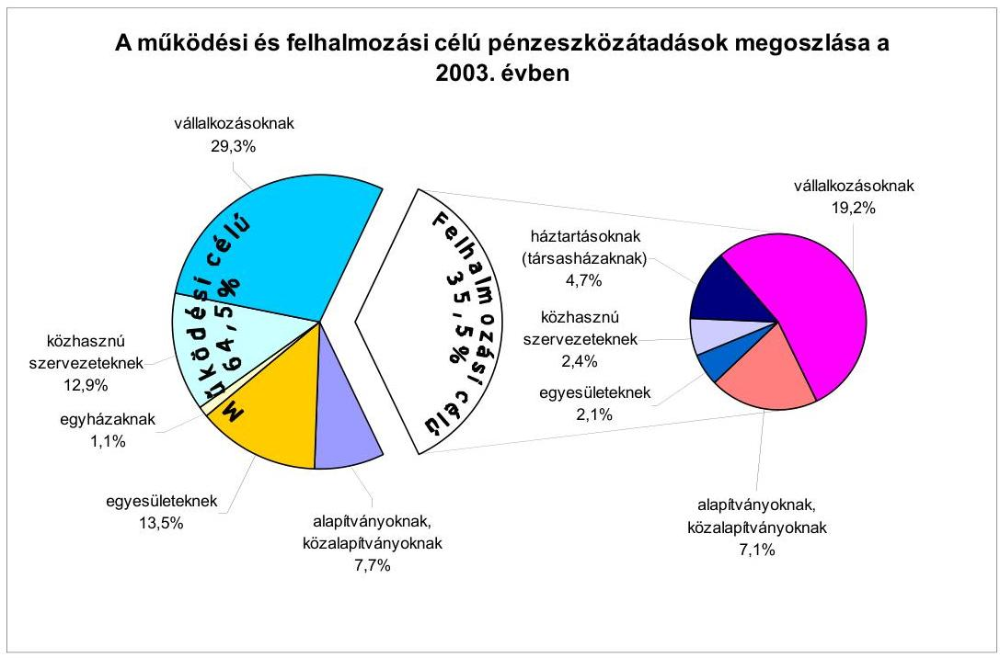
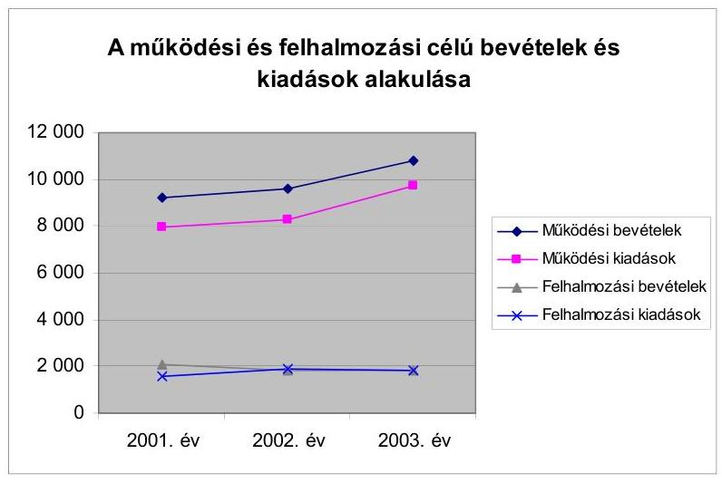
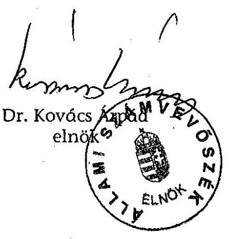
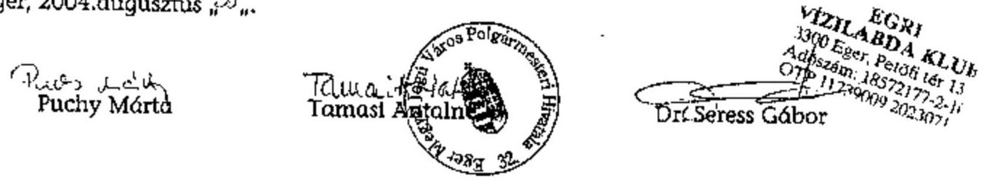
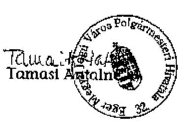
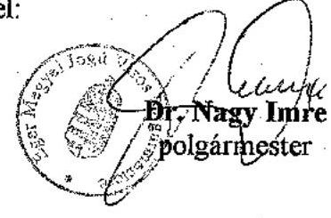

# JELENTÉS 

## az Eger Megyei Jogú Város   Önkormányzata gazdálkodásának átfogó ellenőrzéséről

---

# 3. Önkormányzati és Területi Ellenőrzési Igazgatóság 

3.3. Átfogó Ellenőrzések Főcsoport

Iktatószám: V-1002-4/35/18/2004.
Témaszám: 692
Vizsgálat-azonosító szám: V0168

## Az ellenőrzést felügyelte:

Dr. Lóránt Zoltán
főigazgató
Az ellenőrzés végrehajtásáért felelős:
Dr. Sepsey Tamás
főigazgató-helyettes
Az ellenőrzést vezette:
Csecserits Imréné
főcsoportfőnök-helyettes

## Az ellenőrzést végezték:

## Maróti Sándor

számvevő tanácsos
Nagy Sándorné
számvevő tanácsos

## Puchy Márta

számvevő tanácsos

## Dr. Tóth András

főtanácsadó

## A témához kapcsolódó - elmúlt négy évben - készített számvevőszéki jelentések:

## címe   sorszáma

Jelentés a helyi és a helyi kisebbségi önkormányzatok pénzügyí 0010 gazdasági tevékenységének 1999. évi ellenőrzési tapasztalatairól
Jelentés a helyi önkormányzatok egyes pénzügyi befektetésekkel 0318 történő gazdálkodásának ellenőrzéséről
Jelentés a települési önkormányzatok szennyvízközmű fejlesztési és 0416 működtetési feladatai ellátásának vizsgálatáról

---

# TARTALOMJEGYZÉK 

BEVEZETÉS ..... 5
I. ÖSSZEGZŐ MEGÁLLAPÍTÁSOK, KÖVETKEZTETÉSEK, JAVASLATOK ..... 7
II. RÉSZLETES MEGÁLLAPÍTÁSOK ..... 17

1. A költségvetés tervezésének, végrehajtásának, az Önkormányzat vagyongazdálkodásának és a zárszámadás elkészítésének szabályszerűsége ..... 17
1.1.A költségvetési rendelet jóváhagyásának, módosításának, az előirányzatok nyilvántartásának és betartásának szabályszerűsége ..... 17
1.2.A gazdálkodás szabályozottsága, a bizonylati rend és fegyelem szabályszerűsége ..... 23
1.3.A pénzügyi-számviteli feladatok ellátásának informatikai támogatottsága ..... 28
1.4.Az önkormányzati vagyon nyilvántartása, számbavétele ..... 29
1.5.A vagyonnal való gazdálkodás szabályszerűsége, célszerűsége, nyilvánossága ..... 31
1.6.A céljelleggel nyújtott támogatások szabályszerűsége ..... 36
1.7.A közbeszerzési eljárások szabályszerűsége ..... 39
1.8.A zárszámadási kötelezettség teljesítésének szabályszerűsége ..... 43
1.9.A Polgármesteri hivatal helyi kisebbségi önkormányzatok gazdálkodását segítő tevékenysége ..... 45
2.Az önkormányzati feladatok és a rendelkezésre álló források összhangja ..... 46
2.1.A feladatok meghatározása és szervezeti keretei ..... 46
2.2.A költségvetés egyensúlyának helyzete ..... 50
2.3.A feladatok finanszírozása ..... 54
3.A belső irányítási, ellenőrzési rendszer múködésének értékelése ..... 58
3.1.Az ellenőrzési rendszer kialakítása, múködése ..... 58
3.2.A könyvvizsgálati kötelezettség teljesítése ..... 62
3.3.A korábbi számvevőszéki ellenőrzések javaslatainak hasznosulása ..... 62

---

# MELLÉKLETEK 

1. számú Az önkormányzati vagyon nagyságának alakulása (1 oldal)
2. számú Az Önkormányzat 2003. évi bevételeinek és kiadásainak alakulása (1 oldal)
3. számú Az Önkormányzat gazdálkodását meghatározó adatok, mutatószámok (1 oldal)
4. számú Egyes önkormányzati feladatok finanszírozása (1 oldal)
5. számú Helyszíni ellenőrzési jegyzőkönyv (7 oldal)
6. számú Dr. Nagy Imre úr, Eger Megyei Jogú Város Önkormányzata polgármesterének észrevétele (2 oldal)

---

# RÖVIDÍTÉSEK JEGYZÉKE 

Ötv.
Áht.
Kbt.
Számv. tv.
Htv.

Ksztv.
Nek. tv.
Gyvt.
Szoctv.
Társ. tv.
Kjt.
Ktv.
2003. évi költségvetési törvény
2004. évi költségvetési törvény
Ámr.
Vhr.

Ber.
ÁSZ
MÁK
Önkormányzat
Közgyűlés
Hivatal
Közgyűlés SzMSz-e

Hivatal SzMSz-e
a helyi önkormányzatokról szóló 1990. évi LXV. törvény az államháztartásról szóló 1992. évi XXXVIII. törvény
a közbeszerzésekről szóló 1995. évi XL. törvény
a számvitelről szóló 2000. évi C. törvény
a helyi önkormányzatok és szerveik, a köztársasági megbízottak, valamint egyes centrális alárendeltségű szervek feladat- és hatásköreiről szóló 1991. évi XX. törvény
a közhasznú szervezetekről szóló 1997. évi CLVI. törvény
a nemzeti etnikai kisebbségek jogairól szóló 1993. évi LXXVII. törvény
a gyermekek védelméről és a gyámügyi igazgatásról szóló 1997. évi XXXI. törvény
a szociális igazgatásról és szociális ellátásról szóló 1993. évi III. törvény
a helyi önkormányzatok társulásairól és együttműködéséről szóló 1997. évi CXXXV. törvény
a közalkalmazottak jogállásáról szóló 1992. évi XXXIII. törvény
a köztisztviselők jogállásáról szóló 1992. évi XXIII. törvény
A Magyar Köztársaság 2003. évi költségvetéséről szóló 2002. évi LXII. törvény
A Magyar Köztársaság 2004. évi költségvetéséről szóló 2003. évi CXVI. törvény
az államháztartás múködési rendjéről szóló 217/1998. (XII. 30.) Korm. rendelet
az államháztartás szervezetei beszámolási és könyvvezetési kötelezettségének sajátosságairól szóló 249/2000. (XII. 24.) Korm. rendelet
a költségvetési szervek belső ellenőrzéséről szóló 193/2003. (XI. 26.) Korm. rendelet

Állami Számvevőszék
Magyar Államkincstár Heves Megyei Területi Igazgatósága
Eger Megyei Jogú Város Önkormányzata
Eger Megyei Jogú Város Önkormányzatának Közgyűlése
Eger Megyei Jogú Város Önkormányzatának Polgármesteri Hivatala
Eger Megyei Jogú Város Önkormányzatának 13/1999. (IV. 21.) számú rendelete a Közgyűlés Szervezeti Müködési Szabályzatáról
Eger Megyei Jogú Város Önkormányzatának 37/2001. (X. 18.) számú rendelete a Polgármesteri Hivatal Szervezeti Müködési Szabályzatáról

---

| Ügyrend | Eger Megyei Jogú Város Önkormányzata Közgyűlésének 283/2001. (IX. 27.) számú határozata a Polgármesteri Hivatal Ügyrendjéről |
| :--: | :--: |
| Gazdasági iroda | Eger Megyei Jogú Város Önkormányzata Polgármesteri Hivatalának Gazdasági Irodája |
| Főmérnöki iroda | Eger Megyei Jogú Város Önkormányzata Polgármesteri Hivatalának Főmérnöki Irodája |
| Polgármesteri iroda | Eger Megyei Jogú Város Önkormányzata Polgármesteri Hivatalának Polgármesteri Irodája |
| Adó iroda | Eger Megyei Jogú Város Önkormányzata Polgármesteri Hivatalának Adó Irodája |
| Ellenőrzési csoport | Eger Megyei Jogú Város Önkormányzata Polgármesteri Hivatalának Ellenőrzési Csoportja |
| Informatikai csoport | Eger Megyei Jogú Város Önkormányzata Polgármesteri Hivatalának Informatikai Csoportja |
| Város és területfejlesztési iroda | Eger Megyei Jogú Város Önkormányzata Polgármesteri Irodájának Város és Területfejlesztési Irodája |
| Vagyongazdálkodási iroda | Eger Megyei Jogú Város Önkormányzata Polgármesteri Hivatalának Vagyongazdálkodási Irodája |
| 2003. évi költségvetési rendelet | Eger Megyei Jogú Város Önkormányzatának 13/2003. (III. 7.) számú rendelete a Megyei Jogú Város 2003. évi költségvetéséről |
| 2004. évi költségvetési rendelet | Eger Megyei Jogú Város Önkormányzatának 8/2004. (III. 5.) számú rendelete a Megyei Jogú Város 2004. évi költségvetéséről |
| vagyongazdálkodási rendelet | Eger Megyei Jogú Város Önkormányzatának 5/2000. (II. 18.) számú rendelete az Önkormányzat vagyonáról és a vagyongazdálkodás szabályairól |
| közbeszerzési rendelet | Eger Megyei Jogú Város Önkormányzatának 13/2002. (V. 24.) számú rendelete a Közgyűlés szervei, valamint intézményei közbeszerzéséről |
| CKÖ | Cigány Kisebbségi Önkormányzat |
| GKÖ | Görög Kisebbségi Önkormányzat |
| LKÖ | Lengyel Kisebbségi Önkormányzat |
| EVAT Rt. | Eger Vagyonkezelő és Távfűtő Részvénytársaság |
| ÉMÁSZ Rt. | Észak-Magyarországi Áramszolgáltató Részvénytársaság |
| Pénzügyi bizottság | Eger Megyei Jogú Város Önkormányzatának Pénzügyi Bizottsága |
| Költségvetési és integrációs bizottság | Eger Megyei Jogú Város Önkormányzatának Költségvetési és Integrációs Bizottsága |
| Gazdálkodási bizottság | Eger Megyei Jogú Város Önkormányzatának Gazdálkodási Bizottsága |
| SÉLI Kht. | SÉLI Sport és Létesítmény Igazgatóság Kht. |

---

# JELENTÉS 

## az Eger Megyei Jogú Város Önkormányzata gazdálkodásának átfogó ellenőrzéséről

## BEVEZETÉS

Az Ötv. 92. § (1) bekezdése, az Állami Számvevőszékről szóló 1989. évi XXXVIII. törvény 2. § (3) bekezdése, valamint az Áht. 120/A. § (1) bekezdése szerint az önkormányzatok gazdálkodását az Állami Számvevőszék ellenőrzi. Az ellenőrzés elvégzése az Országgyűlés illetékes bizottságai részére is átadott, országosan egységes ellenőrzési program alapján történt.

## Az ellenőrzés célja annak értékelése volt, hogy

- az önkormányzati gazdálkodás törvényességét ${ }^{1}$, szabályszerűségét biztosítot-ták-e a tervezés, a költségvetés végrehajtása, a vagyongazdálkodás és a zárszámadás során;
- az Önkormányzat által ellátott feladatok és az azokhoz rendelkezésre álló források összhangja biztosított volt-e, különös tekintettel egyes kiemelt feladatokra;
- a gazdálkodás szabályszerűségét biztosító kontrollok ${ }^{2}$ megfelelően segitettéke a végrehajtást.

Az ellenőrzött időszak: a 2003. év, valamint a 2004. I. negyedév, az 1.5., 2.1-2.3. és 3.3. ellenőrzési programpontok esetében ezen túlmenően a 20012002. évek.

Az Önkormányzat Heves megye székhelye, a város lakosságszáma 2003. január 1-jén 56957 fő volt. Az Önkormányzat gazdálkodását meghatározó adatokat az 3. számú melléklet tartalmazza. Az Önkormányzat 26 tagú Közgyűlésének munkáját 10 állandó bizottság, a polgármester munkáját három alpolgármester segítette. A 2002. évi önkormányzati választásokat követően a polgármester és a jegyző személye nem változott.

Az Önkormányzat 23 önállóan és 21 részben önállóan gazdálkodó költségvetési szervet alapított, kettő részvénytársaságban, hét kft-ben 25-100\% közötti, hat

[^0]
[^0]:    ${ }^{1}$ A törvényi előírások betartásának elmulasztásakor egységesen a törvénysértés megjelölést alkalmazzuk, mivel az ÁSZ nem tehet különbséget a törvényi előírások között.
    ${ }^{2}$ A gazdálkodás szabályszerűségét biztosító kontroll alatt értjük a kiépített és múködő belső irányítási és szabályozási rendszert, valamint a belső ellenőrzési funkciók ellátását.

---

részvénytársaságban és öt Kft-ben 25\% alatti tulajdonosi részesedéssel rendelkezik. Az Önkormányzat négy közhasznú társaságnak 88-100\%-ban tulajdonosa a 2003. év végén, amelyek a helyi közszolgáltatási feladatai végrehajtását segítik elő. A feladat ellátására foglalkoztatott közalkalmazottak száma a 2003. évben 1997 fő volt, a Hivatalban 244 fő köztisztviselő dolgozott.

Az Önkormányzat a 2003. évben 11894 millió Ft kiadást teljesített, amelyből 82,6\%-ot múködtetési, 17,4\%-ot felhalmozási és fejlesztési célokra fordított.

Az Önkormányzat a 2003. év végén 56320 millió Ft értékű könyvviteli mérleg szerinti vagyonnal rendelkezett.

Az Önkormányzatnál a 2002. évi önkormányzati választásokat követően görög, lengyel és cigány kisebbségi önkormányzat folytatta tovább tevékenységét.

A jegyző 2003. január 1-től Szarvaskő Község Önkormányzata részére körjegyzői feladatokat is ellát.

---

# I. ÖSSZEGZŐ MEGÁLLAPÍTÁSOK, KÖVETKEZTETÉSEK, JAVASLATOK 

Az Önkormányzat a feladatokat hosszabb távra kijelölő gazdasági programmal az Ötv. előírását megsértve nem rendelkezett. A fejlesztési elképzelésekkel alátámasztott gazdasági program elkészítéséhez kapcsolódó településfejlesztési koncepciót a 2003. évben fogadott el. A 2003-2004. évi költségvetési koncepció benyújtására vonatkozó határidőket betartották, az előírt egyeztetéseket, véleményeztetéseket elvégezték, a bizottságok koncepcióról alkotott véleményét a polgármester csatolta az előterjesztéshez. A költségvetési koncepciót a helyben képződő bevételek, valamint az ismert kötelezettségek figyelembevételével állították össze a 2003. évben. A 2004. évi koncepció kiegészült a feladatok kiadási szükségletének részletezésével, továbbá meghatározták a nullabázisú költségvetés-tervezés számítási alapjait. A Közgyűlés a koncepciót elfogadó határozatában döntött a költségvetés készítésének további munkálatairól. A helyi kisebbségi önkormányzatok elnökei az Ámr. előírásainak megfelelően tájékoztatást kaptak a koncepció tervezetéről, amely azonban nem tartalmazott információt a kisebbségek vonatkozásában sem a központi, sem a tervezett helyi önkormányzati támogatásokról. A kisebbségek a koncepció ezen hiányosságát nem észrevételezték, az abban foglaltakkal egyetértettek.

A 2003. és a 2004. évi költségvetési rendelettervezetek összeállításánál a költségvetési koncepciókban meghatározottakat érvényesítették. A rendelettervezetek előkészítése, egyeztetése, előterjesztése az Áht-ben és Ámr-ben előírtaknak megfelelően történt. A Közgyűlés a költségvetési rendeletek elfogadását megelőzően, illetve azzal egyidejűleg döntött az előirányzatok megalapozását szolgáló rendelet-módosításokról. Mindkét év bevételi-kiadásai között az Áht. előírásait megsértve elszámoltak finanszírozási célú pénzügyi műveleteket és a költségvetési hiány bemutatása nem történt meg. A költségvetési rendeletekben meghatározták a költségvetés végrehajtásával kapcsolatos legfontosabb szabályokat. A 2003. évi költségvetési rendelet a polgármester hatáskörében végrehajtott előirányzat-módosításokról szóló tájékoztatási kötelezettség határidejét, az Ámr-ben előírt 30 napon belüli tájékoztatási kötelezettség figyelmen kívül hagyásával rögzítette. A Közgyűlés az Áht-ben foglaltakat megsértve, nem határozta meg rendeletben a költségvetés és a zárszámadás előterjesztésekor tájékoztatásul bemutatandó mérlegek és kimutatások tartalmi követelményeit, ennek ellenére a költségvetési rendelet mellékletei ezen mérlegeket, kimutatásokat tájékoztatási céllal tartalmazták és a Közgyűlés azokat elfogadta.

A Közgyűlés a 2003. évi költségvetési rendeletet az Ámr. alapján indokoltnál ritkábban, három alkalommal módosította, ennek során az eredeti kia-dási-bevételi főösszeg 24,2\%-kal emelkedett. Az előirányzat-módosítások 29\%áról költségvetési rendeletmódosítás készült, a többiről az Ámr-ben előírtak ellenére ez elmaradt. Az előirányzat-módosításoknak az Önkormányzat költségvetési rendeletében történő átvezetésére a helyi kisebbségi önkormányzatok határozatai alapján került sor. A költségvetési rendelet utolsó módosításáról az Ámr-ben foglalt határidő után döntött a Közgyűlés.

---

Az előirányzat nyilvántartások tartalmazták a költségvetési rendelet módosítása során elfogadott előirányzatokat, valamint - a költségvetési rendelet módosítása nélkül - a költségvetési szerv (Hivatal és intézmények) saját hatáskörében végrehajtott előirányzat-változtatásokat és a kapott pótelőirányzatok miatti előirányzat-változtatásokat. A költségvetési rendelet utolsó módosítása során elfogadott módosított előirányzatokat - ezen belül a kiemelt előirányzatokat - a 2003. évi teljesítési adatok önkormányzati szinten nem haladták meg. A költségvetési szervek, egy kivételével a jóváhagyott előirányzatokon belül gazdálkodtak. Egy intézmény a saját alcímén szereplő költségvetés kiadási főösszeget, ezen belül a dologi és a felhalmozási célú kiadásokat az Áht-ben foglalt előírást megsértve túllépte. A túllépés okait nem vizsgálták, felelősség felvetésére nem került sor. Az intézmény a többi alcímmel összevont kiadási előirányzatát $97,3 \%$-ra teljesítette.

A Hivatal SzMSz-e tartalmazta a Hivatal szervezeti felépítését és múködésének rendjét, az alap- és kisegítő, kiegészítő tevékenységeket az alapító okiratban rögzítették. A Gazdasági iroda rendelkezett ügyrenddel, amelyben meghatározták a pénzügyi, gazdasági feladatok ellátásáért felelős csoportok feladatait, a vezetők és más dolgozók feladat-, hatás- és jogkörét. A pénzügyi és számviteli területen dolgozók feladatait, hatás- és jogkörét a munkaköri leírások is tartalmazták. A költségvetési gazdálkodással kapcsolatos hatásköröket rögzítő szabályzatban a polgármester és a jegyző az Ámr. előírásai alapján a kötelezettségvállalási és az utalványozási hatáskör gyakorlására, valamint ezek ellenjegyzésére felhatalmazásokat adtak. A felhatalmazások nem tartalmazták a kiadmányozás, a hatályba lépés időpontját és a felhatalmazás átvételének igazolását. A szakmai teljesítés igazolását végző személyek kijelöléséről az Ámr. előírásai ellenére a jegyző nem rendelkezett.

A jegyző a Htv-ben előírt feladatkörében kialakította a Hivatal, valamint az intézmények számviteli rendjét. A Vhr. előírásainak megfelelően a számviteli politikát és a kapcsolódó szabályzatokat elkészítették. A leltározási szabályzatban a leltározással kapcsolatos feladatokat meghatározták. A befektetett eszközök közül az egyéb gépek, berendezések, a járművek, valamint a kis értékű tárgyi eszközök esetében kétévenkénti leltárkészítési kötelezettséget írtak elő. A Vhr. 2003. évben még hatályos előírásai ellenére a leltározás összesítő kimutatással történő helyettesítéséhez nem rendelkeztek a Közgyűlés egyetértésével. Az eszközök és források értékelési szabályzata tartalmazta a terven felüli értékcsökkenés elszámolásának részletes rendjét. A pénzkezelési szabályzat rögzítette az Ámr. előírása alapján a megnyitható bankszámlák körét és a rendelkezésre jogosultakat, valamint a házipénztári pénzkezelés rendjét. A pénzügyi és számviteli területen dolgozók munkaköri leírásában meghatározták a feladatokat, az egyeztetési kötelezettségeket, a hatásköröket. A gazdasági műveletekről, eseményekről szóló bizonylatok adatai a Számv. tv. és a Vhr. előírásainak megfelelően a könyvviteli nyilvántartásokban rögzítésre kerültek. Az Ámr-ben foglaltak ellenére a kötelezettségvállalások írásba foglalása a bizonylatok 15\%ánál elmaradt, a kiadások teljesítésének elrendelése előtt 5\%-ban annak jogosultságát, összegszerűségét, teljesítését szakmailag nem igazolták. Az Áht. előírását megsértve nem határozták meg a bevételi előirányzatok teljesítését előre jelző - a teljesülés várható időpontja szerint rögzített - bevételi előírások folyamatos nyilvántartását.

---

Az Önkormányzat informatikai koncepcióját a Közgyűlés a 2003. évben elfogadta. A 2002-2003. évi fejlesztések eredményeképpen a számviteli, pénzügyi nyilvántartások vezetése a részvények, üzletrészek, kárpótlási jegyek állományáról vezetett nyilvántartások kivételével számítógépes programmal történt. A jegyző utasításban szabályozta a Hivatal adatvédelmi kötelezettségét, azonban katasztrófa-elhárítási tervet nem készített. A számítástechnikai eszközöket alkalmazók rendelkeztek üzemeltetői és felhasználói ismeretekkel.

A vagyonnyilvántartásban a Vhr-ben foglalt előírásoknak megfelelően elkülönült a törzsvagyon - ezen belül a forgalomképtelen és a korlátozottan forgalomképes - és a nem törzsvagyon. A főkönyvi számlákhoz részletező analitikus nyilvántartás kapcsolódott. A Hivatal az éves beszámoló adatainak alátámasztását a 2003. évre vonatkozóan mennyiségi felvétellel és a részletező nyilvántartások alapján készített összesítő kimutatással biztosította. Az értékvesztés elszámolásának szükségességét vizsgálták.

A vagyongazdálkodással kapcsolatos feladatok és döntési hatásköröket a Közgyűlés rendeletben szabályozta. A vagyonhasznosítás nyilvánosságának biztosítása érdekében az ingatlanok értékesítése esetében licites eljárás, vagy zárt borítékos pályázat lefolytatásának kötelezettségét írták elő. Ettől az előírástól a rendelet szerint a Közgyűlés minősített többségű határozatával eltérhettek. A versenyeztetési, licitálási eljárás mellőzésére értékhatártól független lehetőség biztosításával megsértették az Áht. előírását. A 2003. évben az ipari parkban két esetben nyílt pályáztatás, versenytárgyalás nélkül értékesítettek területeket. Belterületi beépítésre szánt lakott telkeket a vagyongazdálkodási rendeletben meghatározottak szerint nyílt licites eljárással értékesítették. Az Áht-ben foglaltakat megsértve a vagyon tulajdonjoga ingyenes átruházásának és a követelésről való lemondásnak az eseteit rendeletben nem határozták meg, a döntés módját a vagyongazdálkodási rendelet tartalmazta. Az Önkormányzat vagyongazdálkodási rendeletében foglaltak ellenére a pártok részére helyiséget biztosítottak ingyenesen, illetve kedvezményes bérleti dí kikötésével.

Az Önkormányzat könyvviteli mérleg szerinti vagyona a 2001. évi 12069 millió Ft-ról a 2003. évre 56320 millió Ft-ra emelkedett. Ezen belül az ingatlanok értéke 11-szeresére nőtt, 97,4\%-ban a korábban érték nélkül nyilvántartott ingatlanok 2003. évben elvégzett érték-megállapítása és számviteli nyilvántartásba vétele eredményeként.

A céljelleggel - nem szociális ellátásként - nyújtott támogatás eljárási rendje 2004. január l-jét követően került meghatározásra. Az Önkormányzat által céljelleggel nyújtott támogatásokról a Hivatalban nem vezettek olyan nyilvántartást, amelyből a támogatás célja, a számadási kötelezettség előírása, a számadás és a rendeltetésszerú felhasználás ellenőrzése megállapítható lett volna. Az alapítványok, közalapítványok támogatásáról az Ötv-ben foglaltakat betartva a Közgyűlés döntött. A támogatás összegének 94,5\%-áról a Közgyűlés, $4,2 \%$-áról a bizottságok, $1,3 \%$-áról a polgármester döntött. A közhasznú szervezetek részére biztosított működési és felhalmozási célú pénzeszközök átadásáról és az elszámolás módjáról, határidejéről a támogatási összeg 6\%-a esetében a Ksztv-t megsértve szerződésben nem állapodtak meg. A támogatott szervezetek $22,4 \%$-a nem adott számadást, mivel azt ezen szervezetek $95 \%$-a részére nem írták elő, a 3,5\%-a késve teljesítette számadási kötelezettségét. A

---

számadásra kötelezettek 94\%-a az Áht-ben meghatározott számadási kötelezettségét határidőben teljesítette, a számadások számszaki ellenőrzését a Hivatal ágazati irodái elvégezték. A támogatások rendeltetésszerű felhasználásának ellenőrzését - megsértve az Áht-ben foglaltakat - a támogatási összeg 94,4\%nál nem biztosították. Az Áht. előírását megsértve a támogatás felfüggesztéséről, illetve visszafizetése érdekében a számadási kötelezettséget nem teljesítők, vagy késve teljesítők felé nem intézkedtek, három esetben a számadási kötelezettség elmulasztása ellenére is biztosítottak támogatást a következő évben.

A Közgyűlés a Kbt. felhatalmazása alapján rendeletben meghatározta az önkormányzati beszerzések eljárási rendjét. A közbeszerzési rendeletben és a közbeszerzési eljárások során a Kbt-ben foglaltakat megsértve nem határozták meg a közbeszerzési eljárásba bevont személyek szakmai felkészültségére vonatkozó követelményeket, az eljárásban résztvevők belső felelősségi rendjét, az éves öszszegzés készítését. A Kbt. előírását megsértve a közbeszerzési rendelet szerint és a gyakorlatban is a közbeszerzési eljárás eredményéről a Közbeszerzési bizottság döntött. Négy beszerzésnél a Kbt. előírásait megsértve elmulasztották a közbeszerzési eljárás lefolytatását. A 2003. évben lefolytatott kettő ellenőrzött közbeszerzési eljárás a Kbt. előírásai szerint került meghirdetésre, de ezen közbeszerzési eljárásokban a Kbt. előírásait megsértve nem vizsgálták: az előkészítésben résztvevők összeférhetetlenségét, nem állapították meg a borítékbontásnál az ajánlatok érvényességét, az eredményhirdetésre nem az ajánlati felhívásban megjelölt időpontban került sor és erről írásban az ajánlattevők nem kaptak tájékoztatást, a nyertes ajánlattevővel az előírt határidő után kötötték meg a vállalkozási szerződést, abban a fizetési határidő nem az ajánlat szerint került rögzítésre, az ajánlati biztosíték visszafizetése nem a Kbt-ben előírt határidőn belül történt meg. Az előminősítéses közbeszerzési eljárás során a Kbt. előírását megsértve a részvételi szakasz lezárását követő öt munkanapon belül az ajánlati dokumentáció nem került megküldésre, az eljárás eredményéről az ajánlattevők nem kaptak tájékoztatást, a vállalkozási szerződést nem az ajánlatnak megfelelően kötötték meg. A 2003. évi közbeszerzésekről az éves összegzést a Kbt. előírásait megsértve az előírt határidő után küldték meg a Közbeszerzések Tanácsához.

A 2003. évi zárszámadás rendelettervezetét a polgármester az Áht. által előírt határidőn belül a Közgyűlés elé terjesztette. A zárszámadási rendelettervezetet az Áht. előírásainak megfelelően a költségvetési rendelettel összehasonlítható módon állították össze. Az Ámr-ben előírtak ellenére nem tartalmazta a zárszámadási rendelet a működési célú bevételek és kiadások, valamint a felhalmozási célú bevételek és kiadások előirányzatait egymástól elkülönítetten. Az Áht. előírását megsértve nem mutatták be a többéves kihatással járó döntések számszerűsítését évenkénti bontásban, szöveges indokolással, valamint összesítve. Az Önkormányzat és a költségvetési intézmények 2003. évi pénzmaradványát az Ámr. előírásainak megfelelően állapították meg.

A Hivatal SzMSz-ében a Nek. tv. előírását megsértve nem határozták meg, hogy a városban működő három kisebbségi önkormányzat munkáját a Hivatal milyen módon köteles segíteni. A helyi kisebbségi önkormányzatokkal való együttműködés rendjét az Áht. előírásainak megfelelően megállapodások tartalmazzák. A megállapodások meghatározták a költségvetés végrehajtása során az operatív gazdálkodási és ellenőrzési jogkörök gyakorlására jogosulta-

---

kat. A megállapodások az Ámr. előírásával ellentétben nem rögzítették a költségvetési, zárszámadási határozattervezetek egyes kisebbségi önkormányzatok, illetve a költségvetési, zárszámadási határozatok Hivatal részére történő átadásának határidejét.

A Közgyűlés a 2001-2003. években az intézmények szakmai feladatainak megtartása mellett intézményracionalizálási intézkedéseket hozott, amelyek eredményeképpen hat önállóan gazdálkodó intézményből öt részben önállóan gazdálkodó intézményként, egy pedig közalapítványi formában múködött tovább. A közoktatási alapfeladatok átszervezésének döntés-előkészítése során a szolgáltatást igénybe vevők véleményét kikérték. Az Önkormányzat a 2003. évben a regionális hulladékgazdálkodási feladatok hatékonyabb ellátása érdekében 70 települési önkormányzattal közös társulás alapításában vett részt. A Közgyűlés hozzájárult, hogy a jegyző vezetésével a Hivatal lássa el 2003. január 1-től Szarvaskő Község Önkormányzata részére a körjegyzőségi feladatokat.

Az Önkormányzat az éves költségvetési koncepciókban és a költségvetésekben a múködtetés elsődlegességét biztosította. A célkitűzések megvalósításához a 2001-2003. években hitel felvételét tartották szükségesnek, amely a tervezett költségvetési bevételek 5,0\%, 4,9\% és 5,6\%-a volt. A költségvetés végrehajtása során a 2002-2003. években összesen 439 millió Ft fejlesztési célú hitelből eredő kötelezettséget vállalt az Önkormányzat. Az Önkormányzat központi költségvetési támogatását, saját bevételeit a 2001-2003. években 1454 millió Ft átvett pénzeszközzel kiegészítette. A különböző pályázati rendszerek keretében a 2001-2003. években 601 millió Ft támogatásban részesült az Önkormányzat. Az összes költségvetési bevételen belül a helyi adók részaránya a 2001. évhez képest a 2003. évre egy százalékponttal 17\%-ra emelkedett. Az önkormányzat a zárszámadási rendeletben a 2003. évben 397 millió Ft közvetett támogatást mutatott ki.

Az Önkormányzat nevelést, oktatást, szociális ellátást nyújtó intézményeiben a 2001-2003. évek között a fajlagos kiadások növekedtek, elsősorban a múködési kiadások emelkedését meghatározó központi bérintézkedések hatására. A bölcsődei és a szociális intézményekben az ellátottak köre bővült, a közoktatás területén a tanulók száma csökkent. A Közgyűlés az intézmények kapacitáskihasználtságát figyelemmel kísérte a közoktatási ágazatban, intézményösszevonásokról és létszámcsökkentésekről döntött. A Közgyűlés SzMSz-ében az önként vállalt feladatokat meghatározták, amelyek az összes költségvetési kiadáson belül a 2001. évben 6,1\%, a 2002. évben 7,3\% és a 2003. évben 6,5\% részarányt képviseltek. A kötelező feladatellátást az önként vállalt feladatok nem veszélyeztették. A jegyző Ámr-ben meghatározott kötelezettségének eleget téve elkészítette és negyedévente aktualizálta a likviditási tervet. A kötelezettségvállalásokhoz kapcsolódó, folyamatosan vezetett nyilvántartás tartalmazta az évenkénti kötelezettségvállalás összegét. Az adósságot keletkeztető kötelezettségvállalása során az Önkormányzat betartotta az Ötv. ennek korlátait meghatározó előírását.

A fogyatékosok jogairól és esélyegyenlőségük biztosításáról szóló törvényben előírt kötelezettség teljesítése érdekében a középületek akadálymentesítésére vonatkozó műszaki munkák körét és pénzügyi szükségletét az 1999. évben felmérették, 278 millió Ft forrásigényt állapítottak meg. Az Önkormányzat a

---

2000-2003. években összesen 55 millió Ft-ot fordított a középületek akadálymentes közlekedési feltételeinek biztosítására. Az eddigi ilyen célú felhasználást és a 2004. évi tervezett kiadásokat figyelembe véve a fogyatékos személyek jogairól és esélyegyenlőségük biztosításáról szóló törvényben meghatározott 2005. január 1-jei határidőre a feladatok elvégzése nem biztosítható.

Az Önkormányzat az Ötv. által feladatkörébe utalt intézményi és hivatali belső ellenőrzések szervezeti kereteit kialakította. A tevékenység tartalmát, módját az ellenőrzési szabályzatban rögzítették, amelynek aktualizálása a 2003. évben nem történt meg. Az intézmények ellenőrzését a 2003. évben éves terv és ellenőrzési programok alapján végrehajtották, megállapításaik realizálása megtörtént, a hiányosságok felszámolására az intézmények intézkedési tervet készítettek. A belső ellenőr funkcionális függetlenségét az Úgyrendben az ÁSZ helyszíni ellenőrzésének ideje alatt kialakították. A 2004. évi hivatali belső ellenőrzési terv a Ber. előírásai ellenére nem tartalmazta az ellenőrzés célját, az ellenőrzendő időszakot, a szükséges ellenőri kapacitás meghatározását, az ellenőrzések típusát, módszereit és ütemezését, a szervezeti egységek megnevezését. A 2004. első negyedévében az intézményeknél elvégzett cél- és témaellenőrzésekhez a Ber. előírása ellenére nem készült ellenőrzési program. A Közgyűlést az intézményi ellenőrzések tapasztalatairól évente tájékoztatták, azonban megsértve a Htv. előírását, a hivatali belső ellenőrzésről nem adtak tájékoztatást.

Az Önkormányzat az Ötv-ben meghatározott könyvvizsgálatra vonatkozó kötelezettségének - folyamatos könyvvizsgálatra kötött megállapodás alapján - eleget tett. A könyvvizsgáló az Önkormányzat 2003. évi egyszerűsített beszámolóját korlátozás nélküli hitelesítő záradékkal látta el.

Az Önkormányzatnál a 2000. évi átfogó pénzügyi, gazdasági ÁSZ ellenőrzés javaslatainak 90\%-ára történt intézkedés. Nem került sor a 2001-2003. években a gazdasági program kidolgozására. A zárszámadási rendelet előterjesztésekor a többéves kihatással járó döntéseket számszerűen és szövegesen nem mutatták be. A pártok részére történő helyiségek térítés nélküli átadásának felülvizsgálatára, vagyonpolitikai irányelv kidolgozására nem történt intézkedés. A 20012003. évben az Önkormányzatnál végzett ellenőrzések megállapításai alapján megfogalmazott, a munka színvonalának javítását elősegítő célszerűségi javaslatokra az intézkedéseket megtették.

A helyszíni ellenőrzés megállapításainak hasznosítása mellett javasoljuk:

# a polgármesternek: 

a jogszabályi előírások maradéktalan betartása érdekében:
1. a költségvetési gazdálkodás kereteinek jogszabályi előírásoknak megfelelő kialakítása céljából:
a) kezdeményezze a Közgyűlésnél - a jegyző által előkészített gazdasági programtervezet alapján - az Önkormányzat több évre szóló gazdasági programjának meghatározását az Ötv. 91. § (1) bekezdésében előírtak betartása érdekében;

---

b) terjessze - a jegyző által készített előterjesztés alapján - a Közgyűlés elé az Áht. 118. §-ában előírt mérlegek, kimutatások tartalmának meghatározásáról szóló rendelettervezetet;
c) kezdeményezze - a jegyző által készített előterjesztés alapján -, hogy a Közgyűlés a tárgyévi költségvetési rendeletét az Ámr. 53. § (2) és (6) bekezdésében foglaltak alapján legkésőbb a tárgyévet követő év február 28-ig módosítsa;
2. biztosítsa és az erre felhatalmazottaktól követelje meg, hogy az Ámr. 134. § (2) bekezdésében foglalt előírásnak megfelelően a kötelezettségvállalás a jegyző, vagy az általa felhatalmazott személy ellenjegyzése után írásban megtörténjen;
3. gondoskodjon arról, hogy a közbeszerzésekről szóló 2003. évi CXXIX. törvény 3540. §-ai szerint meghatározott érték feletti beszerzésnél minden esetben kerüljön sor a közbeszerzési eljárás lefolytatására;
4. kezdeményezze - a jegyző által elkészített előterjesztés alapján - hogy a Közgyűlés az Áht. 108. § (1) bekezdésében előírtaknak megfelelően egységesen határozza meg azt az értékhatárt, amely felett a vagyont értékesíteni, használatát, illetve a hasznosítás jogát átengedni csak nyilvános (indokolt esetben zártkörű) versenytárgyalás útján a legjobb ajánlattevő részére lehet;
5. kezdeményezze, hogy a hivatali belső ellenőrzési tapasztalatokat a Közgyűlés tekintse át, ezzel eleget téve a Htv. 138. § (1) bekezdés g) pontjában előírtaknak;
a munka színvonalának javítása érdekében:
6. kísérje figyelemmel a középületek akadálymenetessé tételét, tekintettel a fogyatékosok jogairól és esélyegyenlőségük biztosításáról szóló 1998. évi XXVI. törvény 29. § (6) bekezdésében meghatározott 2005. január 1-i teljesítési határidőre;
7. kezdeményezze a számvevőszéki ellenőrzés tapasztalatainak Közgyűlés általi megtárgyalását, a feltárt hiányosságok megszüntetésére készíttessen intézkedési tervet;

# a jegyzőnek: 

a jogszabályi előírások maradéktalan betartása érdekében:

1. gondoskodjon arról, hogy a költségvetési rendelettervezet elkészítése során a hiány a bevételek-kiadások különbségeként az Áht. 8. § (1) bekezdés előírásának megfelelően bemutatásra kerüljön;
2. a költségvetési rendelet módosítás előkészítése során gondoskodjon arról, hogy:
a) amennyiben a központi költségvetés, vagy az elkülönített állami pénzalapok pótelőirányzatot biztosítanak az Önkormányzat számára az Ámr. 53. § (2) bekezdésének megfelelően negyedévenként készüljön előterjesztés a Közgyűlés számára a költségvetési rendelet módosítására;
b) az intézmények saját hatáskörben végrehajtott előirányzat-módosításairól a Közgyűlés döntése szerinti időközönként, de legkésőbb a költségvetési beszámoló

---

felügyeleti szervhez történő megküldésének külön jogszabályban meghatározott határidejéig, december 31-i hatállyal készüljön előterjesztés a költségvetési rendelet módosítására az Ámr. 53. § (6) bekezdésének megfelelően;
3. kezdeményezzen intézkedést annak érdekében, hogy a költségvetés végrehajtása során tárgyévi fizetési kötelezettségvállalás a költségvetésben szereplő alcímek kiemelt előirányzatai esetében is - az Áht. 12/A. § (1) bekezdésében rögzítettek szerint - a jóváhagyott kiadási előirányzatok mértékéig terjedjen;
4. gondoskodjon arról, hogy a kiadás teljesítésének elrendelése előtt az Ámr. 135. § (1) bekezdésének előírásai szerint, okmányok alapján ellenőrizzék, szakmailag igazolják azok jogosultságát, összegszerűségét, a szerződés, a megrendelés, a megállapodás teljesítését;
5. határozza meg az Áht. 103. § (2) bekezdés előírásának megfelelően a bevételi előirányzatok teljesítését előre jelző - a teljesülés várható időpontja szerint rögzített bevételi előírások folyamatos nyilvántartási kötelezettséget;
6. készítsen előterjesztést annak érdekében, hogy a Közgyűlés az Áht. 108. § (2) bekezdése alapján a követelésről való lemondás, valamint a vagyon tulajdonjoga ingyenes átruházásának eseteit meghatározza;
7. a nem szociális ellátásként nyújtott céljellegű támogatások esetén
a) írjon elő számadási kötelezettséget az Áht. 13/A. § (2) bekezdése alapján juttatott összegek rendeltetésszerű felhasználásáról;
b) biztosítsa, hogy a közhasznú szervezetekről szóló 1997. évi CLVI. törvény 14. § (2) bekezdésében foglaltak betartása érdekében az Önkormányzat által közhasznú szervezetek részére megállapított támogatások folyósítása kizárólag írásbeli szerződés alapján történjen;
c) alakítsa ki és az Áht. 13/A. § (2) bekezdésében foglaltak biztosítása érdekében múködtesse a számadások, felhasználások ellenőrzési rendszerét, intézkedjen a céltól eltérő, nem rendeltetésszerű felhasználás esetén a visszafizetésre, illetve a számadási kötelezettség elmulasztása esetén a kötelezettség teljesítéséig a további támogatás felfüggesztésére;
8. gondoskodjon a közbeszerzési eljárások előkészítése során arról, hogy a közbeszerzésekről szóló 2003. évi CXXIX. törvény 6. §-ában meghatározottak szerint történjen meg a közbeszerzési eljárás előkészítése, lefolytatásának, belső felelősségi rendjének, az ajánlatkérő nevében eljáró, illetőleg az eljárásba bevont személyek felelősségi körének meghatározása;
9. biztosítsa, hogy tartsák be a közbeszerzési eljárások lefolytatása során a közbeszerzésekről szóló 2003. évi CXXIX. törvény alábbi előírásait:
a) a 80. § (3) és (4) bekezdésében foglaltakat az ajánlatok felbontása során;
b) a 94. § (1)-(5) bekezdésében foglaltakat az ajánlatok határidőben történő elbírálása, az ajánlattevők az eredményhirdetés időpontjának módosításáról történő tájékoztatása során;

---

c) a 96. § alapján az eljárás eredményéről készült összegzés ajánlattevő részére történő átadásánál;
d) a 99. §-ában foglaltakat a szerződés az ajánlati felhívásban, a dokumentációban és az ajánlatban rögzítettekkel összhangban történő megkötésekor;
e) a 16. §-ában előírtakat az éves statisztikai összegzés határidőben való elkészítésekor;
f) az 59. § (5) bekezdésében előírtakat annak érdekében, hogy az ajánlati biztosíték az ajánlattevők részére határidőben visszafizetésre kerüljön;
10. biztosítsa, hogy a zárszámadási rendelettervezet tartalmazza a következőket:
a) az Ámr. 29. § (1) bekezdés h) pontjának megfelelően a működési célú bevételek és kiadások, valamint a felhalmozási célú bevételek és kiadások előirányzatait egymástól elkülönítetten;
b) tájékoztatásul mutassa be a zárszámadás előterjesztésekor az Áht. 118. §-ában előírtaknak megfelelően több éves kihatással járó döntések számszerúsítését évenkénti bontásban, szöveges indokolással, valamint összesítve;
11. a kisebbségi önkormányzatok gazdálkodásával kapcsolatos feladatellátás elősegítése érdekében:
a) készítse elő a Hivatal SzMSz-ének kiegészítését a Nek. törvény 28. §-a alapján arra vonatkozóan, hogy a Hivatal milyen módon köteles segíteni a helyi kisebbségi önkormányzatok munkáját;
b) készítse elő az Ámr. 29. § (10) bekezdés előírása alapján a kisebbségi önkormányzatokkal megkötött megállapodások kiegészítését annak érdekében, hogy azokban rögzítsék a költségvetési és a zárszámadási határozattervezetek kisebbségi önkormányzatoknak, illetve a költségvetési, zárszámadási határozatok Hivatal részére történő átadásának határidejét;
12. biztosítsa a Ber. előírásai érvényesülését azzal, hogy:
a) a 23. § (1) bekezdés alapján az intézmények ellenőrzéséhez készüljön ellenőrzési program;
b) a 21. § (3) bekezdés c)-h) pontjai alapján az éves ellenőrzési terv tartalmazza az ellenőrzés célját, az ellenőrzendő időszakot, a szükséges ellenőri kapacitás meghatározását, az ellenőrzések típusát, módszereit, az ellenőrzések ütemezését, az ellenőrzött szerv, illetve szervezeti egység megnevezését;
a munka színvonalának javítása érdekében:
13. biztosítsa, hogy a kötelezettség-vállalásokra, utalványozásokra, ellenjegyzésekre vonatkozó felhatalmazások, valamint az érvényesítésre történő kijelölések tartalmazzák a kiadmányozás, a hatálybalépés időpontját, valamint azon rögzítsék a felhatalmazott átvételének igazolását;

---

14. dolgozza ki a Hivatal informatikai rendszerére vonatkozó katasztrófa-elhárítási tervet;
15. dolgozza ki az Önkormányzat által céljelleggel nyújtott támogatások nyilvántartási rendszerét, amelyből a számadási kötelezettség előírása és teljesítése, valamint a számadás és rendeltetésszerű felhasználás ellenőrzése megállapítható.

---

# II. RÉSZLETES MEGÁLLAPÍTÁSOK 

## 1. A KÖLTSÉGVEtÉS TERVEZÉSÉNEK, VÉGREHAJTÁsÁNAK, AZ ÖNKORMÁNYZAT VAGYONGAZDÁLKODÁSÁNAK ÉS A ZÁRSZÁMADÁS ELKÉSZÍTÉSÉNEK SZABÁLYSZERŰSÉGE

### 1.1. A költségvetési rendelet jóváhagyásának, módosításának, az előirányzatok nyilvántartásának és betartásának szabályszerűsége

Az Önkormányzat a 2002-2003. évekre szóló, gazdasági programot a Htv. 138. § (1) bekezdés a) pontban, valamint az Ötv. 91. § (1) bekezdésében előírtakat megsértve - az erre vonatkozó előterjesztés hiányában nem határozott meg.

A 2003. és a 2004. évi - a jegyző által előkészített - költségvetési koncepciót a polgármester 2002. december 12-én és 2003. november 27-én az Áhtban foglalt határidőn belül ${ }^{3}$ a Közgyűlés elé terjesztette. A koncepciótervezetet a Közgyűlés bizottságai - ezen belül a Pénzügyi, valamint a Költségvetési és integrációs bizottságai - előzetesen megtárgyalták, összefoglalt véleményüket az előterjesztett javaslat tartalmazta. A helyi kisebbségi önkormányzatok elnökei részére - az Ámr. 28. § (6) bekezdését betartva - tájékoztatást adtak a koncepció-tervezetről, amely azonban nem tartalmazott információt a kisebbségekre vonatkozóan sem a központi, sem a helyi önkormányzati támogatásokról. A kisebbségi önkormányzatok a koncepció ezen hiányosságát nem észrevételezték az írásbeli, egyetértő véleményüket a polgármester az előterjesztéshez csatolta, eleget téve az Ámr. 28. § (3) bekezdés követelményének.

A 2003. évi költségvetési koncepció tartalmazta a tervezés során betartandó helyi költségvetési politika rendező- és irányelveit, mint a pénzügyi stabilitásnak, a költségvetési egyensúly biztosításának, a biztonságos és takarékos gazdálkodásnak, a bevételek reális tervezésének, a külső források feltárásának, az intézmények működőképessége fenntartásának, a külső szervezetekkel való együttműködésnek az elveit. A költségvetési koncepciót az Ámr. 28. § (1) bekezdésében előírtak alapján a helyben képződő bevételek és az ismert kötelezettségek figyelembevételével állították össze. A 2004. évi költségvetési koncepció kiegészült a feladatok kiadási szükségletének részletezésével, továbbá meghatá-

[^0]
[^0]:    ${ }^{3}$ Az Áht. 70. §-a szerint a tervévet megelőző november 30-ig, a helyi önkormányzati választások évében december 15-ig kell a polgármesternek a koncepciót a Közgyűlés elé terjesztenie.

---

rozták a nulla-bázisú költségvetési tervezés ${ }^{4}$ számítási alapjául szolgáló mutatószámok körét és tartalmát. Mindkét évi költségvetési koncepcióban - az Ámr. 28. § (4) bekezdésében foglaltaknak megfelelően - rögzítették a költségvetéskészítés további feladatait.

A 2003. évi költségvetési rendelet előkészítése, egyeztetése - a Közgyűlés SzMSz-ében rögzített rendeletalkotási eljárásra tekintettel, - két fordulóban történt meg. A jegyző a költségvetési rendelettervezetet az intézményvezetőkkel az Ámr. 29. § (4) bekezdésének megfelelően egyeztette, amelynek eredményét írásba foglalták.

A polgármester a 2003. évi költségvetési rendelettervezetet az Ámr. 29. § (9) bekezdésének megfelelően a Pénzügyi bizottság véleményének csatolásával, 2003. február 12-én, az Áht. 71. § (1) bekezdésében foglalt határidőn belül ${ }^{5}$ beterjesztette a Közgyűlésnek. A költségvetési rendelettel egyidejűleg előterjesztette a polgármester az Áht. 71. § (2) bekezdésének megfelelően azokat a rendeletmódosítási tervezeteket ${ }^{6}$ is, amelyek a javasolt előirányzatokat megalapozták. A helyi adórendeletek módosítása korábban, a koncepció készítés időszakában megtörtént, míg a nem lakás céljára szolgáló helységek bérleti díjának megállapítását az Önkormányzat vagyongazdálkodási rendeletében szabályozták.

Az Önkormányzat a 2003. évi költségvetés bevételi-kiadási főösszegét 10 266,3 millió Ft-ban határozta meg. A Közgyűlés az előterjesztés alapján a bevételek között finanszírozási célú bevételként, illetve kiadásként 205,6 millió Ft működési és 365,0 millió Ft felhalmozási célú hitelt hagyott jóvá, a kiadások között összesen 227,8 millió Ft hiteltörlesztéssel számolt, a költségvetési év költségvetési bevételeinek és költségvetési kiadásainak különbségeként a hiány bemutatása nem történt meg, ezzel megsértették az Áht. 8/A. § (7) bekezdése szerinti előírást.

A 2003. évi költségvetési rendelet az Áht. 67. § (3) bekezdésének megfelelően tartalmazta a címrendet, továbbá az Áht. 69. § (1) és az Ámr. 29. § (1) bekezdéseiben foglaltak szerinti szerkezetben a bevételi és kiadási előirányzatokat, a több éves kihatással járó feladatok előirányzatait éves bontásban, a működési és felhalmozási célú bevételi és kiadási előirányzatokat mérlegszerűen egymástól elkülönítetten és együttesen egyensúlyban, valamint elkülönítetten is a helyi kisebbségi önkormányzatok költségvetéseit. Csatolták az év várható bevételi

[^0]
[^0]:    ${ }^{4}$ Nulla-bázisú tervezési metodika: a költségvetési egység tényleges feladatainak költségszükségletét a nulláról indulva állapították meg (feladat mélységű szükségletszámítás módszere)
    ${ }^{5}$ Az Áht. 71. § (1) bekezdésének megfelelően a polgármester február 15-ig nyújtja be a képviselő-testületnek a költségvetési rendelettervezetet.
    ${ }^{6}$ Az élelmezést nyújtó gyermekjóléti és szociális intézmények, valamint a közoktatási intézmények élelmezési nyersanyagnormáinak, rezsiköltségeinek és térítési díjainak 2003. március 1-i emeléséről szóló előterjesztések. A közterületek használatáról és díjairól az Önkormányzat 5/2003. (I. 24.) számú rendeletében történt intézkedés.

---

és kiadási előirányzatainak teljesüléséről az előirányzat-felhasználási ütemtervet. Meghatározta a Közgyűlés a költségvetési szervek és a Hivatal létszámkeretét. Tartalmazta a Hivatal költségvetése az Önkormányzat 2003. évi általános és céltartalékát.

A 496,6 millió Ft összeget kitevő tartalékokból az általános tartalék 50 millió Ftot, a polgármesteri hatáskörben felhasználható tartalék 2 millió Ft-ot tett ki, míg a további 444,6 millió Ft konkrét feladatokra megtervezett céltartalékot jelentette. Céltartalékot képzett az Önkormányzat az iparűzési adó bevételéből is összesen 65 millió Ft összegben.

Az Önkormányzat 2003. évi költségvetési rendeletébe a kisebbségi önkormányzatok költségvetési határozatait az Ámr. 32. §-ának megfelelően változatlan formában építették be.

A 2003. évi költségvetési rendeletben meghatározta a Közgyűlés a költségvetés végrehajtásával és módosításával kapcsolatos legfontosabb szabályokat:

- rögzítette az önállóan gazdálkodó intézmények előirányzat-felhasználási és módosítási hatásköreit, a többletbevétel és a jóváhagyott pénzmaradvány személyi juttatásra intézményvezetői hatáskörben történő felhasználásának lehetőségét, módját. Előírta, hogy a működési és fejlesztési célú előirányzatok közötti átcsoportosítást az intézmények csak a Közgyűlés jóváhagyását követően hajthatják végre, valamint a tartozásállományról meghatározott tartalommal negyedévenkénti adatszolgáltatásra kötelezte az intézményeket.
- A Hivatalra vonatkozó rendelkezések között a Közgyűlés az előirányzatátcsoportosítás jogát a polgármesterre átruházta; jogosultságot biztosított a működési és felhalmozási célú előirányzatok kiemelt előirányzatai közötti, valamint a céltartalékként megtervezett kötött felhasználású normatív állami támogatások közötti átcsoportosítás végrehajtására összeghatárra tekintet nélkül. Egyes önkormányzati saját bevételek - köztük a helyi adók tervezettet meghaladó részéből esetenként 15 millió Ft-ig módosíthatta a polgármester a kiadási-bevételi előirányzatokat, valamint a nem tervezett új feladatokra is korlátozás nélküli átcsoportosítási jogkört kapott.
- A 2003. évi költségvetési rendeletben foglaltak alapján a polgármester a hatáskörében végrehajtott előirányzat-módosításokról a Közgyűlést az első féléves és a háromnegyedéves beszámolóval egyidejűleg volt köteles tájékoztatni, amely előírás és az ennek megfelelő gyakorlat nem felelt meg az Ámr. 53. § (6) bekezdésében előírt 30 napon belüli tájékoztatási kötelezettségnek.
- A Közgyűlés előterjesztés hiányában - az Áht. 118. §-ában előírtakat megsértve - nem határozta meg rendeletben a költségvetés és zárszámadás előterjesztésekor tájékoztatásul bemutatandó mérlegek és kimutatások tartalmi követelményeit.

A 2004. évi költségvetés tervezésének folyamata, a rendelettervezet előkészítése és elfogadása a 2003. évihez hasonló volt. A rendelettervezet tartalmát tekintve, az előző évihez képest bővült. Az eredeti előirányzatok közé beépültek a költségvetésbe az európai uniós támogatással megvalósuló prog-

---

ramokkal, projektekkel kapcsolatos bevételek és kiadások, valamint bemutatták azok 2004. évi és az azt követő két évre tervezett forrásösszetételét. A felhalmozási célú bevételek és kiadások előirányzatai között finanszírozási célú pénzügyi műveletek - hitelfelvétel és törlesztés - ez évben is szerepeltek, az előző évihez hasonlóan a költségvetési hiány bemutatása nélkül, amellyel megsértették az Áht. 8/A. § (7) bekezdése szerinti előírást. A 2004. évi költségvetést az Önkormányzat 12869 millió Ft bevétellel-kiadással fogadta el. A költségvetés főösszege a felhalmozási célú bevételek között 514 millió Ft hitel felvételét, a felhalmozási kiadások között 141 millió Ft hitel törlesztését tartalmazta.

A 2003. és a 2004. évi költségvetések előterjesztésekor - a szabályozás elmaradása ellenére - a Közgyűlés részére tájékoztatásul bemutatták az Áht. 118. $\S$-ában előírt mérlegeket és kimutatásokat szöveges indoklással együtt.

A 2003. évi költségvetési rendeletet három alkalommal ${ }^{7}$ módosította az Önkormányzat. Ennek során az Ámr. 53. § (2) bekezdését - a központi költségvetésből biztosított pótelőirányzatok miatti negyedévenkénti költségvetési rendelet-módosításra vonatkozó előírást - nem tartották be, mivel az év közben a központi költségvetésből kapott pótelőirányzatokkal a 2003. évben első alkalommal szeptember 26-án módosították a költségvetési rendeletet. A pótelőirányzatokról történt polgármesteri tájékoztatások Közgyűlés általi elfogadásához nem kapcsolódott költségvetési rendeletmódosítás. A 10 266,3 millió Ft-os eredeti költségvetési főösszeg az utolsó rendelet-módosításban rögzítettek szerint 12752,6 millió Ft-ra, ${ }^{8}$ az eredeti előirányzathoz képest 2486,3 millió Ft-tal, $24,2 \%$-kal emelkedett.

A 2003. évi költségvetési rendeletben megállapított előirányzatok zárszámadásban kimutatott módosítását az Önkormányzat nem az Ámr. 53. § (1) bekezdésének előírására figyelemmel végezte, amely szerint a költségvetését rendeletének módosításával változtathatja meg. A főösszeget érintő 2486,3 millió Ft-os módosítás 29\%-át, (903,6 millió Ft-ot) támasztotta alá költségvetési rendelet-módosítás. Az 1582,7 millió Ft bevételi-kiadási főösszeget érintő változás esetében: a jegyző az Ámr. 53. § (6) bekezdésében előírtak ellenére nem készített előterjesztést a költségvetési rendelet módosítására az előző évi pénzmaradvány és a költségvetési szervek saját hatáskörben végrehajtott előirányzat-módosításokról, valamint nem történt meg a központi költségvetésből kapott pótelőirányzatokkal a költségvetési rendelet módosítása.

A 2003. évi költségvetési rendelet eredeti előirányzatait az alábbi esetekben változtatták meg a költségvetési rendelet módosítása nélkül:

- az Önkormányzat a 2002. évi költségvetés végrehajtásáról (zárszámadásáról) szóló 19/2003. (IV. 25.) számú rendeletének 9. §-ában felhatalmazást kapott a

[^0]
[^0]:    ${ }^{7}$ Az Önkormányzat 37/2003. (IX. 26.), az 53/2003. (XII. 19.) és a 7/2004. (III. 5.) számú rendeleteivel módosította a 2003. évi költségvetési rendeletét.
    ${ }^{8}$ Az utolsó rendeletmódosítással elfogadott költségvetési főösszeg 24,3 millió Ft-tal eltért a költségvetési beszámolóban módosított előirányzatként megjelölt 12 776,9 millió Ft-tól, amelynek indokait az Önkormányzat a csatolt „Tanúsítvány"-ban részletezte.

---

polgármester a zárszámadással egyidejűleg jóváhagyott 791,7 millió Ft módosított pénzmaradvány 2003. évi költségvetési előirányzatok meghatározott címszámain történő átvezetésére.

- A 2003. évi költségvetés I. félévi teljesítéséről szóló, a Közgyűlés 295/2003. (VIII. 28.) számú határozatával elfogadott beszámoló előterjesztésének indokolás részében bemutatott 1-7. számú táblázatok tartalmazták az I. félév során kapott központi pótelőirányzatokat, átvett pénzeszközöket, a polgármesteri és intézményi hatáskörben a többlet-bevételek terhére megemelt bevételi és kiadási előirányzatokat 448,3 millió Ft összegben, valamint a korábbi intézkedéssel már átvezetett 791,7 millió Ft pénzmaradvány összegét. Az előterjesztés költségvetési rendelettel azonos szerkezetű mellékletei a jelzett változtatásokat, mint módosított előirányzatot tartalmazták. A Közgyűlés a határozatban az előirányzat-módosításokról nem intézkedett.
- A 2003. évi költségvetés végrehajtásáról előterjesztett, a Közgyűlés 447/2003. (XI. 27.) számú határozatában elfogadott I-III. negyedévi tájékoztató mellékleteiben az I. félévihez hasonló tartalommal és módon bemutatott költségvetési előirányzat-módosítás 342,7 millió Ft volt.

A 2003. évi költségvetési rendelet bevételi-kiadási előirányzatainak rendelettel történő módosításai a következők voltak:

- az Önkormányzat 37/2003. (IX. 26.) számú a köztisztviselői közszolgálati jogviszony egyes kérdéseiről szóló rendeletének módosításával összefüggésben a 2003. évi költségvetés föösszegét nem érintő, az általános tartalék terhére 12,6 millió Ft összegben belső átcsoportosításként, a Hivatal költségvetésének kiemelt előirányzatát módosító intézkedés történt.
- Az Önkormányzat 53/2003. (XII. 19.) számú rendeletével módosított költségvetési rendelet szerint a bevételek-kiadások föösszege 149,1 millió Ft-tal növekedett. Tartalmát tekintve intézményi és önkormányzati saját bevételi többletek, átvett pénzeszközök, egyéb saját hatáskörű belső átcsoportosítások miatt.
- Az Önkormányzat a 2003. évi költségvetést érintő utolsó 7/2004. (III. 5.) számú költségvetési rendelet-módosítással a bevételi-kiadási föösszeget 12 752,6 millió Ft-ra emelte. A 903,6 millió Ft-os növekedés (amelybe beszámították az előző 149,1 millió Ft-os előirányzat-módosítást is) tartalmazta az utolsó negyedévben kapott központi támogatásokat, átvett pénzeszközöket, a korábbi - 1999-2000-2001. - évek pénzmaradvány tartalékából új feladatokra biztosított előirányzatokat, valamint a költségvetési szervek saját hatáskörében a bevételi többletek miatt módosított bevételi előirányzatokat, és annak terhére vállalt feladatok kiadások előirányzatait.

Az előirányzat-változásokról a költségvetési rendelet-módosításokkal alátámasztott esetekben - amelyek a költségvetés főösszegét 903,6 millió Ft-tal növelték - a 2003. évi költségvetési rendeletben foglalt szabályozás szerinti hatáskörök alapján döntöttek. Az előirányzat nyilvántartásban rendeletmódosítások nélkül átvezetett előirányzat-változtatások között szerepeltek a Közgyűlés határozataival, a polgármester előirányzat-módosítási hatáskörében elrendelt intézkedésével alátámasztott és a költségvetési rendelet végrehajtási szabályainak megfelelő döntések. A költségvetés főösszegét nem érintő, belső előirányzat-átcsoportosítások összege 714 millió Ft - az eredeti előirányzatok $7 \%$-a - volt, amelyből azonban csak 53 millió Ft-ról - 0,5\%-ról - döntött az Önkormányzat az Ámr. 53. § (1) bekezdésében foglalt hatáskörében.

---

A polgármesteri hatáskörben végrehajtott előirányzat-módosítások az analitikus nyilvántartás adatai szerint a 2003. évben 278 millió Ft-ot tettek ki; ebből a költségvetési többlet-bevételekkel fedezett kiadási előirányzat-módosítás 131 millió Ft volt, amely a költségvetési főösszeg növekedésének 5,3\%-át jelentette.

Az önálló intézmények vezetőinek saját hatáskörében 315 millió Ft-tal módosultak a 2003. évi költségvetési rendeletben meghatározott eredeti előirányzatok, a többlet-bevételekkel fedezetten.

Az Önkormányzat a 2003. évi költségvetési előirányzatait december 31-i hatállyal utolsó alkalommal az Ámr. 53. § (2) és (6) bekezdéseiben foglaltak ellenére elốrt határidő ${ }^{9}$ után a 2004. március 4-i ülésén módosította.

A 2003. évben előterjesztett rendelet-módosítási tervezetek ${ }^{10}$ csak az elői-rányzat-változások összegeit tartalmazták, az eredeti, a módosított előirányzatokat és a változás hatásaként módosított költségvetés főösszegét nem. Az eredeti költségvetési rendelettel az abban foglalt előirányzatokkal való összehasonlíthatóság hiánya a döntést hozók részére a változás jelentőségének, hatásainak áttekinthetőségét nem biztosította.

Az utolsó (2004. március 4-i) költségvetési rendelet-módosítás során az összehasonlíthatóság követelményét betartották.

A 2003. évi költségvetési rendeletben a kisebbségi önkormányzatok elői-rányzat-módosításainak átvezetésére, az Ámr. 53. § (8) bekezdésében foglaltak betartásával, határozataik alapján került sor.

Az előirányzat nyilvántartások tartalmazták a költségvetési rendelet módosítás során elfogadott előirányzatokat, valamint az 1582,7 millió Ft bevétel-kiadás főösszegét érintő, költségvetési rendelet módosítás nélkül, a költségvetési szerv saját hatáskörében végrehajtott és a kapott pótelőirányzatok miatt előirányzatváltozásokat. Ennek eredményeként a 2003. évi költségvetés 12 752,6 millió Ft-ra ${ }^{11}$ módosított önkormányzati szintű előirányzatait - ezen belül a kiemelt előirányzatokat - a 2003. évi teljesítési adatok nem haladták meg.

A zárszámadási rendeletben a címrend szerint részletezett, az Önkormányzat által alapított önálló és részben önálló intézmények - egy kivétellel - betartották a számukra jóváhagyott kiemelt kiadási előirányzatokat.

[^0]
[^0]:    ${ }^{9}$ A költségvetési beszámoló felügyeleti szervhez történő megküldésének külön jogszabályban meghatározott határideje a Vhr. 10. § (1) bekezdése szerint február 28-a.
    ${ }^{10}$ Az előirányzatok módosításáról szóló - 2004. június 30-a hatályú - rendeletmódosítás tervezete tartalmazta az eredeti előirányzatokat, a módosítások jogcímeit és összegeit, valamint a módosított előirányzatot.
    ${ }^{11}$ Az utolsó rendeletmódosítással elfogadott költségvetési főösszeget 24,3 millió Ft-tal alacsonyabb összegben határozta meg az önkormányzat a költségvetési beszámolóban rögzített 12 776,9 millió Ft-nál, amelynek indokait a csatolt „Tanúsítvány" tartalmazza.

---

Egy önállóan gazdálkodó intézmény, a Városi Ellátó Szolgálat a saját alcímén elszámolt költségvetési kiadási főösszeget 6 millió Ft-tal (4\%-kal), az alcímen szereplő kiemelt előirányzatok közül a dologi előirányzatot nyolcmillió Ft-tal ( $14,5 \%$-kal), a felhalmozási előirányzatot 0,3 millió Ft-tal (6,4\%kal) túllépte, amellyel az intézmény vezetője megsértette az Áht. 12/A. § (1) bekezdésének előírását, miszerint az államháztartás alrendszereiben tárgyévi fizetési kötelezettség a jóváhagyott kiadási előirányzatok mértékéig vállalhatók és kifizetések is ezen összeghatárig rendelhetők el. Az intézmény a bevételeit túlteljesítette 8,2 millió Ft-tal ( $26,1 \%$-kal), amelynek felhasználására a saját hatáskörú előirányzat-módosítás után jogosult volt, az előirányzat költségvetési rendeletben történő módosítására azonban az Ámr. 53. § (6) bekezdésben foglaltak ellenére elmaradt. Az intézmény a hozzá tartozó alcímekkel összevont felhalmozási kiadásokat 3,7\%-kal túllépte, az összes kiadásnál a teljesítés $97,3 \%$ volt. A túllépés okait nem vizsgálták, a felelősség felvetésére nem került sor.

# 1.2. A gazdálkodás szabályozottsága, a bizonylati rend és fegyelem szabályszerúsége 

A Hivatal SzMSz-e tartalmazta a Hivatal szervezeti felépítését és múködésének rendjét, a szervezeti egységek (ezen belül a gazdasági szervezet) telephelyek megnevezését, a szervezeti egységek vezetőinek azon jogosítványait, amelyek körében a Hivatal képviselőjeként járhatnak el. A Hivatal SzMSz-e nem tartalmazta a Hivatal alapító okiratának keltét, számát, az alaptevékenységet, benne elhatároltan a kisegítő, kiegészítő tevékenységeket, melyek felsorolása az alapító okiratban volt. A költségvetési gazdálkodás előirányzatok keretei között tartását biztosító feltétel- és követelményrendszert, a gazdálkodás folyamatát, kapcsolatrendszerét, a kötelezettségvállalások célszerűségét megalapozó eljárást és dokumentumai tartalmát, a hivatali SzMSz-en alapuló Gazdasági iroda ügyrendje, valamint a gazdálkodási jogkörök szabályzata tartalmazta.

A Gazdasági iroda ügyrendjében meghatározták a pénzügyi- gazdasági feladatok ellátásárért felelős csoportok feladatait, a vezetők és más dolgozók fela-dat-, hatás- és jogkörét. A pénzügyi és számviteli területen dolgozók részletes feladatait, egyeztetési kötelezettségeit, hatás- és jogkörét a kinevezési okirat mellékletét képező munkaköri leírásokban is rögzítették.

A polgármester és a jegyző együttes szabályzatban ${ }^{12}$ rögzítette a költségvetési gazdálkodással kapcsolatos hatásköröket, ennek keretében:

- a polgármester az Ámr. 134. § (3) bekezdése alapján kötelezettségvállalási hatáskör gyakorlására hatalmazott fel - 22 főt - vezetőket, ügyintézőket. A személyre szóló felhatalmazás átvételének igazolását. Kötelezettségvállalásra vonatkozó felhatalmazást adott a jegyző, a Szociális- és egészségügyi iroda veze-

[^0]
[^0]:    ${ }^{12}$ A polgármester és a jegyző együttes szabályzatot 2002. november 1-jén, valamint 2003. április 1-jén adott ki.

---

tője, a Gazdasági iroda vezetője annak ellenére, hogy az Ámr. 134. § (3) bekezdésben foglaltak szerint erre nem rendelkeztek jogosultsággal ${ }^{13}$.

- A jegyző az Ámr. 134. § (3) bekezdésében foglaltak alapján a kötelezettségvállaláshoz és az Ámr. 137. § (2) bekezdése alapján az utalványozáshoz kapcsolódó ellenjegyzés jogával hatalmazta fel a Hivatal két köztisztviselőjét. A felhatalmazások nem tartalmazták a kiadmányozás, a hatályba lépés időpontját és a felhatalmazás átvételének igazolását. Az Ámr. 137. § (2) bekezdésben foglaltakat nem tartották be, mivel ellenjegyzésre felhatalmazást adott a Gazdasági iroda vezetője, a Pénzügyi csoport vezetője, a Költségvetési csoport vezetője annak ellenére, hogy erre jogosultsággal nem rendelkeztek. ${ }^{14}$
- A szakmai teljesítés igazolását végző személyek kijelöléséről az Ámr. 135. § (3) bekezdésében foglaltak ellenére a jegyző nem rendelkezett. ${ }^{15}$
- A jegyző írásos megbízást adott az érvényesítést végzők részére, akik az Ámr. 135. § (2) bekezdésében előírt iskolai végzettséggel és szakmai képesítéssel rendelkeztek. A megbízások nem tartalmazták annak kiadási és hatálybalépési időpontját és a megbízott átvételi igazolását.

A jegyző a Htv. 140. § (1) bekezdés c) pontjában meghatározott szabályozási kötelezettségének megfelelően kialakította a Hivatal, valamint az intézmények számviteli rendjét. A Vhr. 8. § (3)-(4) bekezdéseinek megfelelően szabályozta a Hivatal számviteli politikáját. Elkészítették az eszközök és források leltározási és leltárkészítési szabályzatát, az eszközök és források értékelésének szabályzatát, a pénzkezelési szabályzatot, az önköltség-számítási szabályzatot, továbbá a felesleges vagyontárgyak hasznosításának és selejtezésének szabályzatát és a számlarendet.

A Hivatalnál a számviteli politikában a Vhr. 8. § (5) bekezdésében előírtak alapján szabályozták, hogy a számviteli elszámolás és értékelés szempontjából mit tekintenek lényegesnek, továbbá jelentős összegnek, nem jelentős összegnek, rögzítették az ennek során figyelembe veendő szempontokat, a Vhr. 8. § (8) bekezdésének megfelelően kijelölték a mérlegkészítés időpontját. A számviteli politika részeként a Vhr. 8. § (7) bekezdés előírásai alapján rögzítették a beszerzett, illetve előállított immateriális javak, tárgyi eszközök üzembe helyezése dokumentálásának szabályait.

A számviteli politikában rögzítették, hogy nem kívánnak élni az eszközök Vhr. 32. § (7), illetve 32/A. § (5) bekezdéseiben meghatározott piaci értéken történő értékelésének lehetőségével, azonban ettől eltérően az eszközök és források értékelésének szabályzatában rögzítették, hogy azokat az intézményi épületeket, amelyeket saját intézményei ellátására nem használ az Önkormányzat, piaci értéken értékeli.

[^0]
[^0]:    ${ }^{13}$ Ezen felhatalmazásokat a helyszíni ellenőrzés ideje alatt visszavonták.
    ${ }^{14}$ Ezen felhatalmazásokat a helyszíni ellenőrzés ideje alatt visszavonták.
    ${ }^{15}$ A költségvetési gazdálkodással kapcsolatos hatáskörök szabályzatának 2004. június 26-i módosításában kijelölték a szakmai teljesítés igazolását végző személyeket, a kapcsolódó feladatok meghatározásával.

---

A leltározási szabályzat tartalmazta ${ }^{16}$ a leltározás előkészítésével, megszervezésével, a szükséges személyi és tárgyi feltételek biztosításával, a végrehajtással, az egyeztetéssel, ellenőrzéssel, a leltárkülönbözetek rendezésével, a bizonylatolással kapcsolatos feladatokat. A szabályzat eszközönként rendelkezik a leltárfelvétel módjáról, gyakoriságáról, melynek keretében 2003. december 31-ig az immateriális és a befektetett eszközként nyilvántartott tárgyi eszközök esetében ötévenként, azonban ezek közül az egyéb gépek, berendezések, a járművek, valamint a kis értékű tárgyi eszközök esetében kétévenkénti leltározási kötelezettséget írtak elő. A Vhr. 37. §-ának - a 2003. évben még hatályos - (4) bekezdésében előírtak ellenére nem rendelkeztek, a leltározás elvégzését igazoló leltárt helyettesítő összesítő kimutatás készítéséhez a Közgyűlés egyetértésével.

Az eszközök és források értékelési szabályzata tartalmazta a terven felüli értékcsökkenés elszámolásának részletes rendjét.

A pénzkezelési szabályzatban rögzítették az Ámr. 103. § (6) bekezdése alapján megnyitható bankszámlák körét, rendeltetésüket, megjelölve azokat, amelyekről készpénz vehető fel. A szabályzat tartalmazta a házipénztári keret összegét, a készpénzfelvétel, a szállítás és őrzés rendjét, a pénztári átadásátvétel szabályait. Rögzítették a pénztáros, a pénztárellenőr feladatait, a helyettesítések rendjét, az előlegek igénybevételének, nyilvántartásának, elszámolásának, a szigorú számadású bizonylatok nyilvántartásának szabályait.

A felesleges vagyontárgyak hasznosításának, selejtezésének szabályzata tartalmazta a felesleges vagyontárgyak feltárásával, hasznosításával és a használhatatlanná vált eszközök selejtezésével kapcsolatos feladatokat, eljárási rendet. Kijelölték a kapcsolódó ellenőrzési és dokumentálási feladatokat is. A szabályzat szerint a selejtté nyilvánításról bizottsági és szakértői vélemények alapján a jegyző dönt.

A 2003. évben hatályos számlarend a Számv. tv. 161. § (2) bekezdés a), b) pontjában előírtaknak megfelelően tartalmazta az alkalmazásra kijelölt főkönyvi számlák megnevezését, tartalmát, értékváltozásának jogcímeit, a számlákat érintő gazdasági eseményeket, a számlaösszefüggéseket, külön fejezet tartalmazza az analitikus nyilvántartások rendjét.

A Hivatal számlarendje ${ }^{17}$ szabályozta, a kötelezettségvállalások analitikus nyilvántartásának rendjét, de megsértve az Áht. 103. § (2) bekezdését a nyilvántartási kötelezettség nem terjedt ki a bevételi előirányzatok teljesítését előre jelző - a teljesülés várható időpontja szerint rögzített - bevételi előírások folyamatos nyilvántartására. Az Ámr. 134. § (4) bekezdésében foglaltak ellené-

[^0]
[^0]:    ${ }^{16}$ Az 1993. október 1-től hatályos és 1997. november 28-án, 2001. január 1-jén, 2003. augusztus 1-jén, valamint 2004. január 1-jén módosított szabályzat kiadmányozója a polgármester és a jegyző.
    ${ }^{17}$ A 2003. január 1-től hatályos Számlarend IV. Analitikus nyilvántartás c) Kötelezettségvállalás nyilvántartása.

---

re a belső szabályzatban nem rögzítették a gazdasági eseményenként 50 ezer Ft-ot el nem érő kifizetések kötelezettségvállalások nyilvántartásának formáját.

A 2003. évre hatályos bizonylati rend ${ }^{18}$ a bizonylati elv és a bizonylati fegyelem általános követelményeit, a bizonylat fogalmát, alaki és tartalmi kellékeit határozta meg.

Az operatív gazdálkodás, illetve a számviteli politika különböző területeinek rendjét meghatározó szabályzatok megalkotása során a helyi sajátosságokat figyelembe vették. A számviteli politika és az annak keretében kidolgozott szabályzatok előírásait a Hivatal SzMSz-ével, és a Gazdasági iroda ügyrendjével összhangban határozták meg.

A pénzügyi, a gazdálkodási és a számviteli feladatellátás területén a munkafolyamatba épített ellenőrzési kötelezettséget az érintett dolgozók munkaköri leírása az adott feladat elvégzését rögzítő szabályzatokra épülve tartalmazta. Az egyeztetési, ellenőrzési feladatok elvégzésének dokumentálási módját a munkaköri leírások nem tartalmazták.

Az operatív gazdálkodással összefüggő ellenőrzések közül a kötelezettségvállalás és utalványozás ellenjegyzésének, valamint az érvényesítésnek a feladatait a Gazdasági iroda ügyrendje mellett a gazdálkodási jogkörök szabályzata tartalmazta, melyek beépültek a dolgozók munkaköri leírásába is.

# A fókönyvi könyvelés, az analitikus nyilvántartások és a bizonylatok 

adatai közötti egyeztetéseket a Számv. tv. 165. § (4) bekezdésében foglaltaknak megfelelően elvégezték. A főkönyvben tételesen nem könyvelt adatok esetében a feladások megtörténtek, továbbá a zárlati feladatokat negyedéves gyakorisággal, illetve év végén végrehajtották:

- az üzemeltetésre átadott eszközöknél az analitikus nyilvántartás és a főkönyvi könyvelés egyeztetését és az egyezőség tényét a két nyilvántartás vonatkozó összegző adatainak gépi kiíratásával és dátummal, valamint az egyeztetést végzők aláírásával ellátva dokumentálták.
- A tartós hitelviszonyt megtestesítő értékpapíroknál az analitikus nyilvántartást végző személy az egyeztetést a főkönyvi könyveléssel elvégezte, az egyezőség meglétét a főkönyvi kivonat analitikus nyilvántartáshoz csatolásával, a dátum megjelölésével és aláírásával igazolta.
- A munkavállalókkal szembeni követelésekről vezetett nyilvántartást a törlesztést igazoló bankszámlakivonatokkal, illetve a munkavállalóktól bekért, a tartozás elismerésére szóló nyilatkozatokkal egyeztették. Ezt követően került sor a főkönyvi könyvelés és analitikus nyilvántartás egyeztetésére az időpont és az egyeztetés elvégzését igazoló aláírás feltüntetésével.
- A rövid lejáratú kötelezettségek állományának az egyeztetését elvégezték. A belföldi szállítói tartozások negyedévenkénti és év végi állományát az áfanyilvántartásból történő tételes kigyűjtéssel állapították meg. A bizonylatok-

[^0]
[^0]:    ${ }^{18}$ A Számv. tv. 161. § (2) bekezdés d) pontjában szabályozási kötelezettségként előírt, a számlarendben foglaltakat alátámasztó bizonylati rendet a 2003. június 23 -tól hatályba léptetett bizonylati szabályzatban rögzítette a polgármester és a jegyző.

---

kal egyeztették azt az összesítő kimutatást, amelynek alapján elszámolták a főkönyvben a rövid lejáratú kötelezettségeket.

Az éves beszámoló összeállítását megelőzően a könyvviteli mérleget és a pénzforgalmi kimutatást a Vhr. 17. számú melléklete szerinti főkönyvi kivonattal alátámasztották.

A könyvviteli nyilvántartásban elszámolt gazdasági múveletekről, eseményekről a Számv. tv. 165. § (2) bekezdésében foglaltaknak megfelelő bizonylatok rendelkezésre álltak. A beruházások, felújítások aktiválása, illetve állományba vétele a Számv. tv. 165. § (1) bekezdésében foglaltaknak megfelelően bizonylattal, a Vhr. 8. § (7) bekezdés szerinti üzembe helyezési dokumentum kiállításával történt.

A banki és pénztári bizonylatok utalványozására külön írásbeli rendelkezést (utalványt) alkalmaztak, amelyen az Ámr. 136. § (4) bekezdés h) pontjában előírtak ellenére a kötelezettségvállalás nyilvántartásba vételi sorszámát 2003. I. félévének végéig nem tüntették fel.

A számviteli bizonylatokat a házipénztári bevételekről és pénztárból kifizetett előlegekről, a követelésekről, kötelezettségekről kiállították. Az előlegek elszámolása az előírt határidőn belül megtörtént.

A gazdasági műveletekről, eseményekről szóló számviteli bizonylatok adatait a könyvviteli nyilvántartásokban a Számv. tv. 165. § (1) bekezdésében és a Vhr. 51. § a) pontjában előírtak alapján a pénzforgalmat érintő bizonylatok adatait késedelem nélkül rögzítették.

A kötelezettségvállalások írásba foglalása az Áht. 98. § (2) bekezdésében foglaltakat megsértve a bizonylatok 15\%-ánál hiányzott. A kötelezettségvállalás ellenjegyzésének gyakorlása 15\%-ban nem az Ámr. 134. § (3) bekezdésének megfelelő felhatalmazott által történt meg.

A kiadások teljesítésének elrendelése előtt az Ámr. 135. § (1) bekezdésében foglaltak ellenére 5\%-ban annak jogosultságát, összegszerűségét, teljesítését szakmailag nem igazolták. Az utalványozást az Ámr. 136. § (2) bekezdésében, és annak ellenjegyzését az Ámr. 137. § (2) bekezdésében foglaltaknak nem megfelelően felhatalmazott munkatársak látták el a bizonylatok 90\%-nál.

A gazdálkodás során betartották az Ámr. 138. § (1)-(3) bekezdésében előírt öszszeférhetetlenségi követelményeket. Utasításra nem történt ellenjegyzés.

A munkafolyamatba épített ellenőrzési feladatok elvégzésénél az utalvány ellenjegyző́je 2003. I. félév végéig nem észrevételezte, hogy hiányzik az utalványrendeletekről a kötelezettségvállalás nyilvántartásba vételi sorszáma.

A gazdasági események tartalmának megfelelően történt a szakfeladatok és a főkönyvi számlák kijelölése. A teljesített bevételeket és kiadásokat a költségvetés szerkezeti rendjének megfelelően csoportosították és könyvelték a Vhr. 9. számú mellékletében foglaltak szerint.

---

# 1.3. A pénzügyi-számviteli feladatok ellátásának informatikai támogatottsága 

Az Önkormányzat informatikai koncepcióját a Közgyűlés a 333/2003. (IX. 25.) számú határozatában hagyta jóvá. Ezen koncepció keretében valósították meg és folyamatosan fejlesztették a pénzügyi-számviteli feladatellátás informatikai hátterét. A 2008-ig meghatározott informatikai koncepció megvalósításához az éves ütemezésnek megfelelően a Közgyűlés a 2003. évi költségvetésben 10 millió Ft eredeti költségvetési előirányzatot, pénzmaradványból további 10 millió Ft-ot biztosított. A Gazdasági irodán kiépült a számítógépes hálózat. A fejlesztések eredményeként az analitikus nyilvántartások vezetése közül csak a részvények, üzletrészek, kárpótlási jegyek állományáról vezetett nyilvántartás nem történik számítógépen.

A főkönyvi könyvelés és az analitikus nyilvántartások programjai egymással konzisztensek a kapcsolódási lehetőségek kialakítottak, a készletnyilvántartás, a bérszámfejtési rendszer, a normatív állami hozzájárulások igénylésének és elszámolásának programjai esetében, de a tárgyi eszközök analitikus nyilvántartó programjának összekapcsolása a pénzügyi rendszerrel nem valósult meg.

A költségvetési gazdálkodásban és a számvitelben a 2002. évtől bekövetkezett változásokra tekintettel a helyi szabályzatokat (leltározási, értékelési) módosították a terven felüli értékcsökkenés elszámolásával, követelményeit az alkalmazott programokban szükség szerint átvezették, de az értékvesztés elszámolása, illetve visszaírása nem számítógépes programmal történt.

A jegyző utasításban szabályozta a Hivatal adatvédelmi kötelezettségeit, mely tartalmazta az informatikai rendszerrel kapcsolatos előírásokat is az alábbiak szerint:

- a számítástechnikai alkalmazás speciális védelmi eszközei;
- a számítástechnikai adatvédelem specifikus szabályai;
- a számítógépes környezet biztosítása (vagyonvédelem, üzemeltetői, felhasználói feladatok);
- a szoftverkörnyezettel kapcsolatos védelmi előírások;
- adathozzáférési jogosultságok megállapítása.

Az adatvédelem gyakorlata és az adatbiztonság a szabályozásnak megfelelően valósult meg:

- a pénzügyi rendszer szervere külön helyiségben van az Informatikai csoport kezelésében, az adatok mentése folyamatos;
- a hozzáférési jogosultságok mind fizikailag, mind logikailag biztosítottak.

A Hivatal informatikai rendszerére katasztrófa-elhárítási terv nem készült.
Az alkalmazott számítástechnikai eszközök üzemeltetője a szabályozásnak megfelelően az Informatikai csoport, ahol vezetik az eseménynaplót az üzemeltetésről, a pénzügyi rendszer esetében a Gazdasági iroda dolgozója a rendszergazda. A gazdálkodási és számviteli feladatok ellátásához használt szoftverek

---

rendszer, múködési, felhasználói leírása és üzemeltetési dokumentációja rendelkezésre áll a Hivatalban.

A pénzügyi-számviteli informatikai rendszert használók köre szabályozott, valamennyien ismerik és alkalmazzák - az üzemeltetési leírásnak megfelelően - a gépen futtatott programokkal kapcsolatos teendőket, ismereteiket tanfolyamokon, középfokú és felsőfokú tanulmányaik során szerezték meg.

A számítógépen dolgozó 20 főből három fő ECDL vizsgával, egy fő szakmai érettségivel és egy fő OKJ középfokú számítógép-kezelői, míg a többi munkatárs alapfokú informatikai végzettséggel rendelkezett.

# 1.4. Az önkormányzati vagyon nyilvántartása, számbavétele 

A Hivatal számviteli nyilvántartási rendszerének kialakításakor betartották a Vhr. 9. számú melléklet 1. k) pontjában foglaltakat. E szerint a főkönyvi számlák további bontásával és a részletező, analitikus nyilvántartások vezetésével elkülönítették a törzsvagyon (ezen belül a forgalomképtelen, illetve a korlátozottan forgalomképes), valamint a nem törzsvagyon részét képező eszközök értékét.

Az ingatlanok, részesedések, üzemeltetésre, kezelésre átadott eszközök, hosszúés rövid lejáratú követelések, pénzeszközök főkönyvi számláihoz analitikus nyilvántartás kapcsolódott, a 2003. december 31-i állapot szerint értékadataik számszerűen megegyeztek.

Az üzemeltetésre, kezelésre az Önkormányzat 11 gazdálkodó szervezetnek ${ }^{19}$ adott át eszközöket. Számviteli nyilvántartás szerinti értékük a 2003. év elején 2270 millió Ft volt, amely 2003. december 31-re 5449 millió Ftra, 140,0\%-kal, 3179 millió Ft-tal emelkedett. Ezen vagyon értékének a 2003. évi növekedését az elvégzett beruházások, felújítások 613 millió Ft-tal emelték. A legnagyobb értéket, 578 millió Ft-tal, az elkészült bérlakásokban lévő önkormányzati ingatlanok és az ingatlan-felújítások EVAT Rt. részére üzemeltetésre, kezelésre történő átadása jelentette. Az értéknövekedésből 2374 millió Ftot a korábban érték nélkül nyilvántartott eszközök értékének a 2002. évi megállapítása és számviteli nyilvántartásba vétele eredményezett.

Az Önkormányzat az üzemeltetők részére kétféle módon adott át forrást fejlesztésekre, illetve felújításokra. Egyik esetben az elvégzett fejlesztések számláit a Hivatal által átutalt összegből az üzemeltető egyenlítette ki és az eszköznövekedés az üzemeltető könyvviteli nyilvántartásában jelentkezett vagyonnövekedésként. Amennyiben e számlák kiegyenlítését a Hivatal végezte, az eszköznövekedés a Hivatal könyvviteli elszámolásaiban tárgyi eszközként került rögzítésre:

[^0]
[^0]:    ${ }^{19}$ A gazdálkodó szervek megnevezése: EVAT Rt., ÉMÁSZ Rt., Heves megyei Vízmú Rt., AGRIA Komplexum Ingatlanhasznosító és Szolgáltató Kft., Eger Termálfürdő Üzemeltető Kft., Városgondozási Kft., Művészetek Háza Eger Kht., Várkáti Szabadidő Programszervező Kht., Atellána Alapítvány és Táncszínház, Eger Város Hegyközsége, valamint a Wigner Jenő Szakközépiskola Alapítvány.

---

- az Önkormányzat a sportlétesítményeinek hatékonyabb hasznosítása céljából üzemeltetésre, kezelésre irányuló megállapodást kötött az AgriaKomplexum Sportszolgáltató Ingatlanhasznosító Kft-vel 2003. február 10-én. Ebben rögzítették, hogy az Önkormányzat által a sportlétesítmények felújítására fordítandó évi 10 millió Ft-ból származó „vagyonbővülés" a szerződés megszűnésekor illeti meg az Önkormányzatot. A 2003. évi 7,7 millió Ft-os önkormányzati pénzeszközből megvalósult beruházás aktiválására az Agria-Komplexum Sportszolgáltató Ingatlanhasznosító Kft-nél került sor. A megállapodást a 2004. január 1-től az önkormányzati ellenőrzés megvalósítása érdekében módosították. Ennek alapján ez évtől kezdve az Önkormányzat által megjelölt fejlesztési célú pénzeszközből elkészült beruházások, felújítások számláit közvetlenül az Önkormányzat egyenlítette ki. Az aktiválást a Hivatal végezte.
- Az EVAT Rt., amely 100\%-ban az Önkormányzat tulajdona, az önkormányzati lakások és egyéb helyiségek kezelését a 2002. júniusában kelt megbízási szerződés alapján végezte. Az EVAT Rt. által üzemeltetésre átvett, a 2003. évben megépült új bérlakások, továbbá az elvégzett felújítások a Hivatal számviteli nyilvántartásában szerepeltek.
- A Heves megyei Vízmú Rt-ben az Önkormányzat 28\%-os tulajdonnal részesedik. A 2003. évben elkészült víziközmű beruházásokat a Hivatal aktiválta, a számviteli nyilvántartásában szerepeltette az üzemeltetésre, kezelésre átadott eszközök között.

A Hivatal az éves beszámoló adatainak alátámasztásához a 2003. évre vonatkozóan mennyiségi felvétellel és a részletező nyilvántartások alapján készített összesítő kimutatással teljesítette leltárkészítési kötelezettségét:

- az Önkormányzat mind a részesedéseknél, mind az értékpapíroknál a leltározást a pénzintézetek letéti igazolásai, valamint az analitikus nyilvántartás és a főkönyvi könyvelés közötti egyeztetéssel végezte, amelyről az egyezőség megállapítását tartalmazó jegyzőkönyv készült.
- Az üzemeltetésre, kezelésre átadott eszközök esetében a leltározást az üzemeltetést végző gazdálkodó szervek végezték, amelyet egyeztettek a Hivatal által az analitikus nyilvántartás alapján összeállított és megküldött eszközkimutatással.
- A vevői követelések, adósok, egyéb követelések év végi mérlegadatait leltárösszesítőkkel, valamint az analitikus nyilvántartások kivonataival, egyeztető levelekkel és a zárási összesítővel támasztották alá.
- A hosszú és rövid lejáratú kötelezettségeket a hitelt nyújtó pénzintézeti bankszámla kivonatokkal egyeztették. A szállítói kötelezettség megegyezett a bejövő számlák analitikus nyilvántartásával igazolt leltárösszesítőben szereplő összeggel.

A leltározás során sem hiány, sem többlet megállapítására nem került sor a 2003. évben.

A Hivatal a Vhr. 9. számú melléklete 1. h) és 2. d) pontjai alapján a részesedésekről és az értékpapírokról olyan analitikus nyilvántartást vezetett,

---

amelyből értékpapíronként, valamint részesedés típusonként megállapíthatóak voltak az egyedi értékeléshez szükséges adatok:

- a követeléseknél a 2003. évben a nyilvántartott érték a vevőknél 315,1 millió Ft, illetve adósoknál 229,9 millió Ft volt, a 2003. évben az elszámolt értékvesztés összege pedig a vevőknél 0,4 millió Ft , illetve az adósoknál 1,2 millió Ft volt, amely a számviteli nyilvántartásokban rögzítésre került.
- Az Önkormányzatnak 16 gazdasági társaságban összesen 1399 millió Ft értékben nyilvántartott tulajdoni részesedésének értékelését a 2003. évben elvégezték. A Számv. tv. 54. § (2) bekezdésében foglaltak alapján a gazdasági társaságokban a 2002. évi saját tőke és jegyzett tőke aránya nem tette szükségessé értékvesztés elszámolását. A korábbi években elszámolt értékvesztés visszaírására nem volt szükség.
- Az értékpapíroknál szereplő Magyar Államkötvény bekerülési értéke 322,7 millió Ft volt az elszámolt indokolt értékvesztés a 2003. évben 13,6 millió Ft, az elszámolt értékvesztés visszaírásának összege pedig 5,7 millió Ft volt, így a nyilvántartási érték a 2003. december 31-én 314,8 millió Ft.
- A Pillér 1/A befektetési jegynél indokoltan nem számoltak el értékvesztést a 2003. évben.

# 1.5. A vagyonnal való gazdálkodás szabályszerűsége, célszerúsége, nyilvánossága 

Az Önkormányzat vagyongazdálkodási rendelete kiterjedt a teljes vagyoni körre, meghatározta a törzsvagyon, illetve a forgalomképes vagyon körébe tartozó vagyontárgyak típusait. Rögzítette a vagyoni helyzet alakulásáról a Közgyűlés felé történő beszámolás rendjét, a forgalomképesség szerinti besorolás megváltoztatásának módját.

A vagyongazdálkodással kapcsolatos feladat- és hatáskörök kialakítása értékhatártól függően és a hasznosítás módjára is figyelemmel az alábbiak szerint történt meg:

- a Közgyűlés hatáskörébe tartozik az ingatlanhasznosítás, bérbeadás, elidegenítés és vásárlás 20 millió Ft nettó eladási ár felett, vagy az ingyenes, illetve földterületre vonatkozóan három éven túli bérbeadás; az ingóságok elidegenítése, vétele 7 millió Ft felett; gazdasági társaságban üzletrész, részvény vásárlása, vagy eladása; az elővételi jog gyakorlása 50\%-ot meghaladó tulajdoni részarány, vagy a 20 millió Ft-ot meghaladó üzleti érték (névérték) vétele, illetve közvetlen - licit nélküli - elidegenítés; apportálás 20 millió Ft érték fölött; a követelésekről való lemondás 0,5 millió Ft fölött, valamint az alapítványok létrehozása, illetve a már meglévőhöz való csatlakozásról történő döntés.
- Bizottsági hatáskörbe tartozik az ingatlanhasznosítás, a bérbeadás, az elidegenítés és a vásárlás 5-20 millió Ft nettó eladási ár között; a földterület 1-3 évig történő bérbeadása; az ingóságok elidegenítése 1,5-7 millió Ft egyedi értékhatár között; az elővételi jog gyakorlása 10-50\% közötti tulajdonosi részarány vagy 5-20 millió Ft közötti üzletérték esetén; az apportálás 5-20 millió Ft közötti üzletérték esetén; a követelésekről való lemondás a 2003. évi költségvetési törvényben meghatározott 0,08 millió Ft érték és 0,5 millió Ft között.

---

- Polgármester hatáskörébe tartozik az ingatlanhasznosítás, a bérbeadás és az ingatlanvásárlás 5 millió Ft nettó vételi árig, illetve földterület bérbeadása az egy évet meg nem haladó időtartamra, az ingóságok elidegenítése és megszerzése 0,5-1,5 millió Ft értékhatár között ha az ingóvagyon az intézmény tulajdona, egyéb esetben 1,5 millió Ft egyedi forgalmi értékhatárig; apportálás 5 millió Ft-ig; követelésekről való lemondás a 2003. évi költségvetési törvényben meghatározott 0,08 millió Ft értékig, értékpapírok vétele, eladása, pénzügyi befektetések.
- Az intézmények hatáskörébe tartozik a használatukban lévő ingatlanok, ingóságok elidegenítése és megszerzése 0,5 millió Ft egyedi értékforgalmi értékhatárig, összesen egy millió Ft-ig.

A vagyongazdálkodás rendelet az önkormányzati vagyonhasznosítás nyilvánosságának biztosítása érdekében fő szabályként előírta, hogy „Önkormányzat tulajdonát képező ingatlanok elidegenitése nyilt licites eljárás, vagy zárt boritékos pályázat útján történhet." A licit útján történő elidegenítésnél a 20 millió Ft feletti minimális nettó eladási ár esetén a közgyűlési, 5-20 millió Ft között bizottsági, 5 millió Ft alatt polgármesteri döntési jogkört határoztak meg.

A vagyongazdálkodási rendelet 12. § (2) bekezdésében a fő szabálytól eltérő, közvetlen - licit nélküli - elidegenítés eseteit rögzítették. Az Áht. 108. § (1) bekezdésében foglaltakat megsértve lehetőséget biztosítottak többek között arra, hogy nem kell licites eljárást lefolytatni a Közgyűlés minősített többségű határozata alapján a város életét jelentősen befolyásoló ingatlan értékesítés esetén, illetve bizottsági javaslat alapján a szociális lakásépítésre kijelölt telkek elidegenítésekor a Közgyűlés döntésével, ingatlancsere esetén. Ezen feltételek, körülmények tartalmát nem határozták meg, erről a Közgyűlés esetenként döntött. A versenyeztetés, licitálás nélküli értékesítés és a vagyon használatának, hasznosítási jogának átengedése nem segítette a köztulajdonnal való gazdálkodás nyilvánosságát, átláthatóságát.

A 2003. évben a város életét jelentősen befolyásoló foglalkoztatáspolitikai szempontokra tekintettel, munkahelyteremtő beruházásokhoz nyilvános pályáztatás, versenytárgyalás nélkül kettő esetben került sor ingatlanértékesítésre:
a Közgyűlés a 221/2003. (VI. 26.) számú határozata alapján a Bosch Rexroth Pneumatika Gyártó és Forgalmazó Kft. részére a déli területen lévő ipari parkban a 9847 helyrajzi számon $113657 \mathrm{~m}^{2}$ területet értékesített 317 millió Ft-ért. A finom megmunkálású kovácsolt gépalkatrészt készítő Firth Rixon Kft. részére az ipari parkon belül a Közgyűlés 221/2003. (VI. 26.) határozata alapján $4493 \mathrm{~m}^{2}$ ingatlant értékesített 14,8 millió Ft-ért.

A közbenső egyeztetés során a polgármesteri észrevétel szerint: „Álláspontunk szerint a vagyonrendeletünk az Áht-től szigorúbban, nem csak összeghatárhoz kötötten, hanem a hasznosítás módjára is figyelemmel szabályozta az elidegenités témakörét.
Nem tartottuk összeegyeztethetőnek azt, ha a Áht. 108. § (1) bekezdésében foglaltaknak megfelelően, esetleg egy rendkívül magas összeghatárt meghatározva formálisan teszünk eleget a törvény elöírásainak, mintegy kijátszva azokat (pld. meghatározhatnánk 2 milliárd forintban az összeghatárt).
A törvény szellemiségéből kiindulva, életszerú módon, a tényleges gazdasági folyamatokhoz igazodva részletes és szigorú szabályozást dolgoztunk ki.
A licit nélküli értékesités csak rendkivül szük körben és igen szigorú feltételekkel lehetséges. A birói itélet, a telek-kiegészités, a csere vagy az idegen felépitmény esetén belátha-

---

tó, hogy licit szóba sem jöhet. A város életét jelentősen befolyásoló értékesités esetére a Közgyúlés önmaga számára is egy külön korlátot épitett a rendeletbe, azt, hogy minősített szavazattöbbség kell a döntéséhez. A szerződések érdemi részét - mint közérdekü adatot - minden esetben nyilvánosságra hoztuk, ezáltal biztositva a vagyonnal történő gazdálkodás nyilvánosságát, és átláthatóságát."

Az észrevétel nem megalapozott, mivel az Áht. előírása alapján a helyi önkormányzatoknál a helyi önkormányzat rendeletében meghatározott értékhatár feletti vagyont értékesíteni, vagyon feletti vagyonkezelés jogát, a vagyon használatát, illetve a hasznosítás jogát átengedni - ha a törvény, vagy a törvény felhatalmazása alapján kiadott jogszabály kivételt nem tesz - csak nyilvános (indokolt esetben zártkörű) versenytárgyalás útján, a legjobb ajánlatot tevő részére lehet. Az Önkormányzat vagyongazdálkodási rendeletében egységes értékhatárt nem állapított meg, ebből következik, hogy valamennyi vagyon értékesítése csak nyilvános versenytárgyalás útján a legjobb ajánlattevő részére történhet meg.

Az Önkormányzat a vagyongazdálkodási rendeletében meghatározta a vagyon tulajdonjogának ingyenes átruházása és a követelésről történő lemondás módját. Nem rendelkezett a vagyon tulajdonjoga ingyenes átruházásának eseteiről (közfeladathoz kapcsolódó átadás), a követelésről való lemondás eseteit értékhatárhoz kapcsolta, annak konkrét eseteit (méltányosság, visszterhes átadás, adókövetelés elengedése, behajthatatlanság) nem határozta meg, megsértve az Áht. 108. § (2) bekezdésében foglaltakat.

Az Önkormányzat által nyújtott céljellegú fejlesztési támogatásokra, illetve az Önkormányzat pénzeszközei felhasználásával, vagyonával történő gazdálkodással összefüggő - nettó ötmillió Ft-ot elérő, vagy azt meghaladó szerződések egyes adataira vonatkozó közzétételi kötelezettségét - az Áht. 15/A. és 15/B. §-aiban foglaltak alapján - teljesítette. A 2004. első negyedévében 10 esetben nyújtott céljellegú fejlesztési támogatást, valamint 22 szerződést kötött, amelyekre vonatkozó adatokat a hivatali hirdetőtáblán és az internetes honlapon közzé tette.

A 2001-2003. évi könyvviteli mérlegek szerint az Önkormányzat saját vagyona $^{20}$ a 2001. évben 9793 millió Ft, 2002-ben 14242 millió Ft és a 2003. évben 53451 millió Ft. A vagyon az előző évhez viszonyítva a 2002. évben 45,5\%-kal és a 2003. évben 275,3\%-kal nőtt. (A vagyon alakulásáról az 1. számú melléklet nyújt részletes tájékoztatást.)

A tárgyi eszközök értéke több mint kilencszeresére nőtt a 2001-2003. évek között, ezen belül kiemelkedő arányú növekedésre az utolsó évben került sor, amelyet a következők mutatnak: a 2001. évben 4866 millió Ft, a 2002. évben 8894 millió Ft és a 2003. évben 45591 millió Ft volt a tárgyi eszközök év végi nettó állomány értéke. E nagymértékű növekedés 97,4\%-ban az ingatlanoknál jelentkezett a korábban érték nélkül nyilvántartott ingatlanok érték-megállapítása miatt.

[^0]
[^0]:    ${ }^{20}$ Saját vagyon = kötelezettségek értékével csökkentett vagyon.

---

A tárgyi eszközök bruttó állományértékét növelték a beruházások, beszerzések és az elvégzett felújítások az alábbiak szerint:

- a beszerzés, létesítés a 2001. évben 830 millió Ft; a 2002. évben 634 millió Ft; a 2003. évben 1080 millió Ft volt. A legjelentősebb értékű vagyonnövekedést a 2003. évben az ipari park bővítése, ingatlan és lakásvásárlás, számítógép és járműpark korszerűsítése eredményezte.
- A felújítások értéke a 2001. évben 106 millió Ft, a 2002. évben 168 millió Ft és a 2003. évben 109 millió Ft volt. Ennek keretében valósultak meg többek között az intézmények és utak felújításai, pincepartfal felújítása és az intézmények fútéskorszerűsítése.

A tárgyi eszközök állományának bruttó értékét a 2001-2003. években csökkentették a következő döntések:

- értékesítés a 2001. évben 52 millió Ft; a 2002. évben 91 millió Ft, és a 2003. évben 455 millió Ft volt. A 2003. évi értékesítésen belül az ingatlanértékesítés 436 millió Ft-ot képviselt, amely 87 ingatlan eladásából származott. A város északi részén elhelyezkedő Pásztorvölgyben a 11185/1-3, a 11186/1-6, valamint a 11192 helyrajzi számokon szereplő $7487 \mathrm{~m}^{2}$ területű belterületi, beépítésre szánt lakótelkek elidegenítését nyílt licites eljárással végezték. Erről a Közgyűlés a 419/2003. (X. 30.) számú határozatában döntött, meghatározta a figyelembeveendő $6000 \mathrm{Ft} / \mathrm{m}^{2}$ minimális árat. Ezt követően került sor az értékesítésre $6220 \mathrm{Ft} / \mathrm{m}^{2}$ áron, összesen 46,6 millió Ft-ért. A Közgyűlés döntését annak megalapozottsága érdekében megelőzték az illetékes szakirodák felmérései és értékbecslései. Az értékbecsléseket külső ingatlanforgalmi szakértők bevonásával végezték el. Az értékesítési szerződésben meghatározták a fizetés, valamint a földhivatali bejegyzés feltételeit, valamint a késedelmes fizetés esetén alkalmazandó szankciókat.
- Selejtezés a 2001. évben 62 millió Ft; a 2002. évben 76 millió Ft és a 2003. évben 434 millió Ft volt. A selejtezést megelőzően megkérték az egyes eszközök műszaki állapotáról, javításának gazdaságosságáról a külső szakértők szakvéleményét. A selejtezésről és a selejtezett eszközök megsemmisítéséről jegyzőkönyv készült. ${ }^{21}$
- Ingyenes tárgyi eszköz átadás a 2001. évben ötmillió Ft, a 2002. évben 332 millió Ft és a 2003. évben hatmillió Ft volt. A 2002. évi nagy volumenű átadáson belül 321 millió Ft-tal szerepelt a Wigner Jenő Műszaki Informatikai, Középiskola és Kollégium Közalapítvány részére a gép-műszer és berendezés ingyenes átadása, melyről a vagyongazdálkodási rendeletben meghatározottak szerint a Közgyűlés döntött.

A Hivatalnál a nem lakás céljára szolgáló helyiségek bérbeadásának előkészítése és a döntés a vagyongazdálkodási rendeletben előírtaknak megfelelően történt.

[^0]
[^0]:    ${ }^{21}$ Selejtezésre 2003. október 31-én, illetve november 17-én került sor.

---

A 2003. évben a pártok részére bérbe adott ingatlanok esetében az Önkormányzat kedvezményeket biztosított. ${ }^{22}$

Az SZDSZ Egri Szervezete, Telekessy út 2. szám alatt $73 \mathrm{~m}^{2}$-t; SZDSZ Regionális Iroda, Telekessy út 2. szám alatt $93 \mathrm{~m}^{2}$-t; FKGP Eger, Telekessy út 2. szám alatt $35,7 \mathrm{~m}^{2}$-t; SZDSZ-FKGP közös használatú helyiségei az Eger, Telekessy út 2. szám alatt $24 \mathrm{~m}^{2}+161 \mathrm{~m}^{2}$ raktár területet; MIÉP Eger, Telekessy út $2.36 \mathrm{~m}^{2}$-t; MSZP Eger, Telekessy út 2. szám alatt $161 \mathrm{~m}^{2}$-t; MDF Eger, Sándor Imre út $6.189 \mathrm{~m}^{2}$-t; FI-DESZ-MPP Heves megyei Irodája Eger. Katona István tér 7-9. szám alatt $95,57 \mathrm{~m}^{2}$ t; MSZMP Eger, Mindszenthy Gedeon út 12. szám alatt $173 \mathrm{~m}^{2}$-t használt.

A pártok részére ingyenesen nyújtott ingatlan használattal megsértették az Ötv. 78. § (1) bekezdésében foglaltakat, mivel az Önkormányzat vagyona az önkormányzati célok megvalósulását hivatott szolgálni. Rendeltetését figyelembe véve nem tartozik a pártok támogatása a helyi közügyek körébe, nem szolgál önkormányzati feladatellátással kapcsolatos célokat. Ezért e szervezetek és más - e kedvezményben nem részesülő - helyiségbérlők közötti megkülönböztetésnek elfogadható indoka nincs. Az Alkotmány 70/A. §-ában, illetve az Ötv. 1. § (2) bekezdésébe ütközik az Önkormányzat részéről adott támogatás. Ezt támasztja alá az Alkotmánybíróság határozata ${ }^{23}$, mely szerint e szervezetek és más e kedvezménybe nem részesülő helyiségbérlők közötti megkülönböztetésnek alkotmányosan elfogadható indoka nincs. A pártok által igénybe vett helyiségek körzetében lévő üzletek bérleti díjai $2578 \mathrm{Ft} / \mathrm{m}^{2} /$ év és $49759 \mathrm{Ft} / \mathrm{m}^{2} /$ év között alakult, mivel a 2004. április 2-től hatályos, módosított vagyongazdálkodási rendeletben rögzítették, hogy a fizetendő bérleti díj induló éves bérleti díja nem lehet alacsonyabb az érintett ingatlan aktuális forgalmi értékének 15\%-ánál. A pártok közül a Közgyűlés a FIDESZ-MPP részére 2000. július 1-től $80 \mathrm{Ft} / \mathrm{m}^{2} /$ hó bérleti díjat állapított meg, ami éves szinten $960 \mathrm{Ft} / \mathrm{m}^{2}$ volt.

Az Önkormányzatnál a 2003. évben betartották az értékpapírok vételéveleladásával kapcsolatosan a vagyongazdálkodási rendeletben foglalt döntési hatásköröket, a kincstárjegy és a törzsrészvény vételéről a polgármester, az államkötvények értékesítéséről pedig a Közgyűlés döntött.

A követelésről történő lemondásra a 2004. évben az alábbiak szerint került sor:

- a 2004. év első negyedévében 10 db esetenként 0,08 millió Ft és 0,5 millió Ft közötti összegben a vagyongazdálkodási rendelet szerint bizottsági döntési körbe tartozó együttesen kétmillió Ft összegű, be nem hajtható követelést a Gazdasági iroda terjesztette döntés céljából a Költségvetési és integrációs bizottság, majd a Gazdálkodási bizottság elé. Ezek a következőkre vonatkoztak: építési bírság, dögkút üzemeltetés, közterület használati díj.

[^0]
[^0]:    ${ }^{22}$ Az Önkormányzat az ÁSZ ellenőrzés ideje alatt a 23/2004. (VI. 25.) számú rendeletében az önkormányzati tulajdonban lévő ingatlanok pártok részére történő bérbeadásáról döntött.
    ${ }^{23}$ Ehhez kapcsolódik az Alkotmánybíróság 47/2002. (X. 11.) számú határozata.

---

- A 2004. évben a vagyongazdálkodási rendeletben meghatározottak alapján a polgármester 156 esetben, személyenként háromszáz Ft és 0,07 millió Ft összegű követelés elengedéséről döntött.

Az Önkormányzat az adózás rendjéről szóló 1990. évi XCI. törvény 82. §-a alapján a magánszemélyek és a jogi személyek kérelme alapján méltányosságból adókedvezményt adott a 2003. évben: az építményadóból 17 adózónak 0,015 millió Ft, a telekadóból kettő adózónak 0,04 millió Ft, kommunális jellegű adókból 83 adózónak 0,4 millió Ft, helyi iparűzési adóból 17 adózónak egymillió Ft összegben. Egyéb címen azon adózóknál került sor követelés elengedésére, akiknél nem vezetett eredményre a végrehajtás.

# 1.6. A céljelleggel nyújtott támogatások szabályszerűsége 

Az Önkormányzat a 2003. évi költségvetési rendeletében az Áht. 69. § (1) bekezdés előírásának megfelelően a speciális célú támogatások között - nem szociális ellátásként - 589 millió Ft-ot céljellegú támogatást tervezett, ami évközben 815 millió Ft-ra módosult, melynek 92,6\%-a került felhasználásra.

Az államháztartáson belülre a Heves Megyei Önkormányzattal történt megállapodás alapján a megyei intézmények részére 214 millió Ft átadása történt meg, míg az államháztartáson kívülre nyújtott támogatás 532 millió Ft volt.

| Megnevezés | 2003. évi támogatás felhasználása   millió Ft |
| :-- | --: |
| Múködési célú pénzeszközátadások |  |
| - alapítványoknak, közalapítványoknak | 41 |
| - egyesületeknek | 72 |
| - egyházaknak | 6 |
| - közhasznú szervezeteknek | 69 |
| - vállalkozásoknak | 155 |
| Összesen: | $\mathbf{3 4 3}$ |
| Felhalmozási célú pénzeszközátadások |  |
| - alapítványoknak, közalapítványoknak | 38 |
| - egyesületeknek | 11 |
| - közhasznú szervezeteknek | 13 |
| - háztartásoknak (társasházaknak) | 25 |
| - vállalkozásoknak | 102 |
| Összesen: | $\mathbf{1 8 9}$ |
| Mindösszesen: | $\mathbf{5 3 2}$ |

Az átadott pénzeszközök 64,5\%-át működési célra, 35,5\%-át felhalmozási célra biztosította az Önkormányzat a támogatott szervezeteknek. Az Önkormányzat a támogatások 48,3\%-át a tulajdonában lévő gazdasági társaságoknak nyújtotta.

---

A támogatások között árú- és szolgáltatásvásárlást nem mutattak ki.
Az Önkormányzat a közpénzek felhasználásával, a köztulajdon használatának nyilvánosságával, átláthatóbbá tételével és ellenőrzésével kapcsolatos szabályokról 44/2003. (XI. 28.) számú rendeletében döntött. A rendelet meghatározta a támogatás elosztásának eljárás rendjét, a közzétételi kötelezettségre vonatkozó szabályokat, a támogatásról szóló szerződésben a számadási kötelezettség előírását, a nyilvántartás vezetésének kötelezettségét.

A Hivatalban a 2003. évben a céljellegú támogatásokhoz kapcsolódó egységes nyilvántartási rendet nem alakítottak ki, amelyből az egyes támogatások célja, a számadási kötelezettség előírása, a számadás és a rendeltetésszerú felhasználás ellenőrzése megállapítható lett volna. Ezért utólag - az ÁSZ ellenőrzés ideje alatt -, tételes kigyűjtéssel készült el a támogatásokról a nyilvántartás.

Az alapítványok, közalapítványok múködési és felhalmozási célú támogatásai az Ötv. 10. § (1) bekezdés d) pontjában foglaltakat betartva a Közgyűlés határozatán alapultak. A 65 alapítvány a támogatott kör 18,4\%-a, 79 millió Ft támogatásban részesült, amelynek $51,9 \%$-a múködési, $48,1 \%$-a felhalmozási célokat szolgált.

Az egyesületek, társadalmi és civil szervezetek közül 185 szervezet részesült támogatásban, a támogatottak $52,4 \%$-át jelentették a támogatási keret 15,6\%-os összegével. A támogatásról 79,3\%-ban a Közgyűlés, 14,6\%-ban a bizottságok és 6,1\%-ban a polgármester döntött. Az átadott pénzeszközök 86,7\%a múködési és 13,3\%-a felhalmozási célokat szolgált. A támogatott szervezetek többek között sportkörök, egészségügyi, kulturális, múvészeti, nyugdíjas egyesületek, polgárőrség voltak.

---

Az egyházak az összes támogatási keret 1,1\%-ban részesedtek, a támogatott kör 2,0\%-át jelentették. A támogatásokról 95,9\%-ban a Közgyűlés, 3,9\%-ban a bizottságok és $0,2 \%$-ban a polgármester hozta meg a döntést. A múködési célú pénzeszköz átadás 85\%-a a Főegyházmegyével óvodai ellátásra kötött közoktatási megállapodáson alapult, további öt támogatott cél megvalósítását 0,6 millió Ft segítette elő.

Vállalkozások a támogatott kör 3,7\%-át jelentették, a támogatási keretből 48,3\%-ban részesültek. A támogatási összeg 96,5\%-ról a Közgyűlés 3,4\%-ról a bizottságok és $0,1 \%$-ról a polgármester hozta meg a döntést. A támogatás öszszegének 60,3\%-a múködési és 39,7\%-a a felhalmozási célok megvalósulását biztosította.

Magánszemélyeknek adott felhalmozási célú támogatás 4,6\%-a volt az öszszes támogatási keretnek, mely 96\%-ról a Közgyűlés, 4\%-ról a polgármester döntött. Megállapodás alapján nyújtottak támogatást a fiatalok lakáshoz jutásához 74 fő részére 17 millió Ft, valamint társasházak részére nyolcmillió Ft összegben távhő ellátás korszerűsítésére.

Közhasznú szervezetek részére 69 millió Ft működési és 13 millió Ft felhalmozási célú támogatást folyósított az Önkormányzat. Kettő közhasznú szervezet részére a 65 millió Ft múködési célú, egy közhasznú szervezet részére 12 millió Ft felhalmozási célú pénzeszközátadás feltételeit szerződésben rögzítették a 2003. évben. A támogató a Ksztv. 14. § (2) bekezdésében előírtakat megsértve, szerződésben nem rögzítette a támogatással való elszámolás feltételeit és módját az alábbi támogatásoknál:

Hét támogatás esetében négymillió Ft múködési célú és két támogatás során egymillió Ft felhalmozási célú pénzeszköz átadásának feltételeit elmulasztotta az Önkormányzat szerződésben rögzíteni.

A számadási kötelezettséget 94\%-ban határidőben teljesítették azok a szervezetek, akik részére ezt az Önkormányzat előírta. A számadási kötelezettség teljesítéseként a szervezet éves tevékenységéről szóló beszámolót, a múködéssel, fejlesztéssel összefüggő kiadások számlamásolatait nyújtották be, amit a számadási kötelezettség teljesítésére rendszeresen elfogadtak.

A „civilszervezetek támogatása elöirányzatából" az alapítványok és civil szervezetek részére biztosított támogatások felhasználásáról adott számadások számszaki és rendeltetésszerű felhasználásának ellenőrzésére nem került sor, amivel megsértették az Áht. 13/A. § (2) bekezdésének előírását. Ezen szervezetektől kapott számadások számszaki ellenőrzését a jelen ÁSZ ellenőrzés ideje alatt végezték el. A felülvizsgálat során számszaki eltérést nem állapítottak meg. A további támogatások esetében a számadások számszaki felülvizsgálatát a számadások beérkezését követően az ágazatilag illetékes szakirodák elvégezték, a rendeltetésszerű felhasználás ellenőrzése az összes támogatás 5,6\%-ban történt meg. A támogatások rendeltetésszerú felhasználásának ellenőrzé-

---

se ${ }^{24}$ a támogatási összeg 94,4\%-a esetében Áht. 13/A. § (2) bekezdésében foglaltakat megsértve nem történt meg.

Az Egri Vízilabda Klub részére biztosított támogatás ${ }^{25}$ rendeltetésszerú felhasználását a helyszínen ellenőriztük. A 2003. évre az Önkormányzat 12,2 millió Ft támogatást biztosított megállapodás alapján az Egri Vízilabda Klub részére. A felhasználás helyszíni ellenőrzése során megállapításra került, hogy a Gyer-mek-, Ifjúsági és Sportminisztériumtól egymillió Ft, a Magyar Vízilabda Szövetségtől 1,4 millió Ft további támogatásban részesült a 2003. év folyamán az Egri Vízilabda Klub. Az Egri Vízilabda Klub az önkormányzati támogatás rendeltetésszerú felhasználását biztosította, ezen felhasználáshoz kapcsolódó kifizetések számláit más támogatásokra vonatkozó elszámolásnál nem használta fel.

Az Önkormányzat költségvetési szervei a 2003. évben nem támogattak alapítványokat, társadalmi szervezeteket.

A finanszírozó 44 alapítvány, 38 civilszervezet és hat vállalkozás részére nem írt elő számadási kötelezettséget, megsértve az Áht. 13/A. § (2) bekezdésében foglaltakat, melyből 37 alapítvány, 38 egyesület, társadalmi és civilszervezet részére az iparúzésiadó-bevételből a Közgyűlés ${ }^{26}$ által elfogadott támogatás volt. Ezáltal a támogatott kör 22,4\%-a nem adott számadást, 3,4\%-a a Hivatal által meghatározott határidőt nem tartotta be, késve teljesítette számadási kötelezettségét, a számadást elmulasztók részére három esetben ${ }^{27}$ a 2004. évben is biztosított támogatást.

# 1.7. A közbeszerzési eljárások szabályszerűsége 

Az Önkormányzat a Kbt. 96. § (2) bekezdésének felhatalmazása alapján megalkotta közbeszerzési rendeletét a közbeszerzési eljárás helyi szabályairól ${ }^{28}$. A rendelet hatálya kiterjedt „Eger megyei jogú Város Önkormányzatának és Polgármesteri Hivatalának, valamint az önkormányzat intézményeinek" Kbt. 2. § (1) bekezdés szerinti beszerzéseire. A közbeszerzési rendelet alanyi hatályának az Önkormányzatra történő kiterjesztésével megsértették a Kbt. 96. § (2) bekezdésében foglaltakat, amely arra hatalmazta fel a helyi ön-

[^0]
[^0]:    ${ }^{24}$ A közbenső egyeztetés során tett polgármesteri észrevétel szerint a jegyző 2004. szeptember hónapban elrendelte az alapítványok részére a 2003. évben nyújtott támogatás rendeltetésszerú felhasználásának ellenőrzését.
    ${ }^{25}$ A Közgyűlés 92/2003. (III. 6.) határozata, valamint a 112/2003. (IV. 3.) és 272/2003. (IV. 26.) számú közgyűlési határozatok.
    ${ }^{26}$ A Közgyűlés 321/2003. (VIII. 28.) számú határozata.
    ${ }^{27}$ Mecman Eger Egyesület, Vakok és Gyengénlátók SE, Egervári Vitézlő Oskola Egyesület.
    ${ }^{28}$ Az Önkormányzat közbeszerzési rendeletét 18/2004. (IV. 30.) szám alatti rendeletével hatályon kívül helyezte. A Közgyűlés 199/2004. (IV. 29.) számú határozatában döntött az Önkormányzat és a Polgármesteri Hivatal Közbeszerzési Szabályzatáról.

---

kormányzatokat, hogy az általuk alapított önkormányzati költségvetési szervek vonatkozásában szabályozzák a közbeszerzési eljárás egyes kérdéseit. ${ }^{29}$

A Közgyűlés a Kbt. 96. § (2) bekezdés b) pontjának felhatalmazása alapján összhangban a 24. § (4) bekezdésének előírásával az értékhatár alatti beszerzések szabályairól a beruházási, fejlesztési és felújítási feladatok esetében rendelkezett. ${ }^{30}$

A rendelkezés előírásai szerint, versenypályázat útján kell megkötni az önkormányzati költségvetésből finanszírozott feladatok megvalósítására vonatkozó szerződéseket, ha a feladat becsült összege meghaladja a nettó egymillió Ft-ot, valamint az önerős beruházásokat értékhatártól függetlenül. A versenyeztetési eljárás nyílt, ha a megvalósítandó feladat becsült összege a nettó kilencmillió Ft-ot meghaladja, ha egy és kilencmillió Ft közötti, akkor meghívásos versenyt kell tartani.

A közbeszerzési eljárás előkészítése, az ajánlati vagy részvételi felhívás, illetve a dokumentáció előkészítése a Hivatal, az ajánlati, részvételi felhívás és dokumentáció jóváhagyása, az eljárás során az ajánlatok értékelése a Közbeszerzési bizottság feladata. A közbeszerzési rendelet alapján a Közbeszerzési bizottság döntéseit határozati formában hozza meg, erről készült jegyzőkönyvet a polgármesternek és a jegyzőnek az ülést követő 5 napon belül tájékoztatás céljából át kell adnia. A szabályozás sértette a Kbt. 31. § (3) bekezdésében foglalt előírást, ${ }^{31}$ mely szerint a közbeszerzési eljárást lezáró határozatot személynek kell meghoznia. A közbeszerzési rendeletben nem határozták meg a közbeszerzési eljárásba bevont személyek szakmai felkészültségére vonatkozó követelményeket, valamint az eljárás belső felelősségi rendjét, ezzel megsértették a Kbt. 31. § (1) és (6) foglalt előírást. Nem tartalmazta a közbeszerzési rendelet az előírt éves összegzés elkészítési kötelezettséget megsértve ezzel Kbt. 61. § (9) bekezdésben foglaltakat.

A közbeszerzési eljárás centrális (Hivatal és intézmények közösen) megvalósításának lehetőségét és célszerűségét az Önkormányzatnál nem vizsgálták.

A Hivatal a 2003. évben négy közbeszerzési eljárást indított, melyből kettő eljárás még ez évben lezárult, kettő eljárás 2004. évben fejeződött be. A négy eljárásból kettő építési beruházásra, kettő szolgáltatás-vásárlásra irányult.
${ }^{29}$ Ehhez kapcsolódik a 35/2001. (VII. 11.) AB határozat.
${ }^{30}$ Az Önkormányzat 6/2002. (III. 29.) sz. rendelete Eger Megyei Jogú Város Önkormányzata Versenyszabályzata egyes beruházási, fejlesztési és felújítási feladatok lebonyolítására, melyet az Önkormányzat 18/2004. (IV. 30.) számú rendelete hatályon kívül helyezett.
${ }^{31}$ Ehhez kapcsolódik az Alkotmánybíróság 20/2003. (IV. 18.) számú határozata.

---

A közbeszerzési eljárások szabályszerűségét a 2003. évben meghirdetett és lezárult két közbeszerzési eljárás alapján értékeltük.

A Kereskedelmi Szakközépiskola homlokzat felújítására a Kbt. 26. 8ában előírtak szerint az Önkormányzat nyílt közbeszerzési eljárást hirdetett meg. Az eljárás előkészítésében résztvevők összeférhetetlenségének vizsgálatára nem került sor, nem határozták meg az eljárás belső felelősségi rendjét, a résztvevő személyek felelősségi körét, ezzel megsértették a Kbt. 31. § (2) és (6) bekezdéseiben meghatározottakat. A nyílt eljárás megindítására szóló ajánlati felhívásban az ajánlattevők szerződés teljesítésére alkalmatlanná minősítésének szempontjai között szerepelt „az ajánlati dokumentációban megkövetelt és egyértelmüen megadott müszaki leírások tekintetében - bármely nemzeti rendszerben akkreditált - minőségtanúsító intézményből származó tanúsítvány hiánya." Az ajánlati dokumentáció erre vonatkozó elvárásokat az ajánlattevők felé nem határozott meg, ezáltal az ajánlati felhívás és az ajánlati dokumentáció közötti összhang nem volt biztosított. Az ajánlatok felbontásakor, illetőleg azt követően a Kbt. 52. § (1) bekezdésében előírtakat az ajánlatkérő megsértette, mivel nem állapította meg jegyzőkönyvben az ajánlatok érvényességét, illetőleg érvénytelenségét. A felbontásáról készült jegyzőkönyv ${ }^{32}$ tartalma egyéb vonatkozásokban megfelelt a Kbt. 51. § (3) bekezdésében előírtaknak. Az ajánlatok elbírálásáról, az eljárást lezáró határozatot a Közbeszerzési bizottság hozta meg, amivel megsértették a Kbt. 31. § (3) bekezdés előírását, mely szerint a közbeszerzési eljárást lezáró határozatot személynek kell meghoznia. Az eredményhirdetésre a Kbt. 55. § (1) bekezdésében foglaltakat megsértve nem az ajánlati felhívásban megjelölt időpontban került sor. Az eredményhirdetés időpontjának halasztásáról a Kbt. 55. § (2) bekezdésében előírtakat megsértve közvetlenül, írásban az ajánlattevők tájékoztatást nem kaptak. Az eredményhirdetés új időpontjáról és indokáról később értesültek az ajánlattevők. Az ajánlatok elbírálásáról a Kbt. 61. § (1) és (5) bekezdéseiben meghatározott írásbeli összegzést, az eredményhirdetést követő ötödik munkanapon küldték meg az ajánlattevők részére, és közzétételre. Az eredményes közbeszerzési eljárást követően, a nyertes ajánlattevővel történő szerződéskötés során megsértették a Kbt. 62. § (2) bekezdésében foglalt előírást, mivel a szerződéskötésre a 36. napon került sor. A vállalkozási szerződéssel megsértették a Kbt. 62. § (1) bekezdésében foglaltakat, mert a fizetési határidőt az ajánlati felhívásban, valamint az ajánlatban meghatározottól eltérően állapították meg. Az ajánlatkérő a részvételi szándék megerősítése érdekében 0,1 millió Ft összegű ajánlati biztosítékot kért az ajánlattevőktől, amelynek visszafizetésére az eredményhirdetést követő tíz munkanapon belül nem intézkedett, ${ }^{33}$ ezzel megsértette a Kbt. 41. § (5) bekezdés a) pontját. A felújítási munkára szóló vállalkozási szerződés módosítására nem került sor.

Az Eger, Pozsonyi úton 69 garzonlakás és telken belüli közmú építésére nyílt előminősítéses közbeszerzési eljárás meghirdetésére került sor a Kbt. 26. §ának megfelelően. A közbeszerzési rendelet alapján az előkészítést a Hivatal végezte, az eljárásban résztvevők megbízására, az összeférhetetlenség vizsgálatára, belső felelősségi körének meghatározására nem került sor, amivel a Kbt. 31. § (2) és (6) bekezdéseiben foglaltakat megsértették. Az ajánlati felhívás tartalma megfelelt a Kbt. 33-36. §-ában foglaltaknak. A részvételre jelentkezés határideje a Kbt. 63. § (5) bekezdésének megfelelően 25 napban került meghatározásra, melyre hét

[^0]
[^0]:    ${ }^{32}$ Az ajánlatok felbontásáról 2003. december 16-án kelt jegyzőkönyv.
    ${ }^{33}$ Az ajánlati biztosíték az ajánlati felhívásban meghatározott 2004. február 8-ával szemben 2004. május 25 -én került az ajánlattevők részére visszafizetésre.

---

pályázó jelentkezett, akik a pénzügyi-műszaki alkalmasság szempontjainak megfeleltek. A Közbeszerzési bizottság döntéséről a jelentkezőket értesítették, de az ajánlati dokumentációt öt munkanapon belül nem küldték meg a pályázóknak, megsértve a Kbt. 64. § (1) bekezdésében foglaltakat. Az ajánlatok borítékbontására a Kbt. 64. § (4) bekezdésében foglalt előírást betartva került sor. Az öt ajánlattevő részére a borítékbontásról készített jegyzőkönyvet öt munkanapon belül nem küldték meg, amellyel megsértették a Kbt. 61. § (7) bekezdésének előírását. Az ajánlatokról a Közbeszerzési bizottság döntött, melyről határozatot hozott, ezzel megsértette a Kbt. 31. § (3) bekezdés előírását, mely szerint a közbeszerzési eljárást lezáró határozatot személynek kell meghoznia. Az eredményhirdetésre a Kbt. 55. § (1) bekezdésében előírtaknak megfelelően került sor. Az ajánlatkérő megsértette a Kbt. 61. § (1) bekezdésében foglaltakat, öt munkanapon belül az írásbeli összegzést nem készítette el és nem küldte meg az ajánlattevők részére. A nyertes ajánlattevővel a vállalkozási szerződést a Kbt. 62. § (2) bekezdésben foglalt határidőben megkötötték. A vállalkozási szerződésben rögzített műszaki tartalom nem az ajánlatnak megfelelően került meghatározásra, ezzel megsértették a Kbt. 62. § (1) bekezdésében foglaltakat. A Kbt. 73. § (1) bekezdésében foglaltakat betartva szerződésmódosításra egy alkalommal került sor. Az ellenőrzés ideje alatt a beruházás kivitelezése folyamatban volt.

A Hivatal megsértve a Kbt. 2. § (1) bekezdésének előírásait a 2003. évben nem folytatta le a közbeszerzési eljárást a következő - értékhatár feletti ${ }^{34}$ - felújítások, szolgáltatás megrendelések, beruházások esetében. ${ }^{35}$

A Hivatal épületének belső udvari homlokzat és vizesblokk felújítására a 2003. évben 17 millió Ft-ot fordítottak. A munkák kivitelezésére szakágazati feladatok szerint versenytárgyalást folytattak le. Az eljárás során az Önkormányzat megsértette a Kbt. 5. § (2) bekezdését, mivel a felújítási munkákat részekre bontotta, a Kbt. megkerülése céljából. A beszerzés becsült értékének kiszámítása során nem számította egybe azon szolgáltatások érékét, amelyek beszerzésére egy költségvetési évben került sor, beszerzésre egy ajánlattevővel lehetett volna szerződést kötni.

Csapadék-csatorna és útkarbantartásra vonatkozóan a 2000. évben nyílt közbeszerzési eljárást folytatott le az Önkormányzat. A nyertes ajánlattevőkkel 2000. április 1-től 2004. március 31-ig szóló időszakra a vállalkozási szerződéseket megkötötték. A szerződés lejárta előtt - 2004. március hónapban - egy évre a szerződések meghosszabbításra kerültek, melynek Kbt. 73. § (1) bekezdés szerinti feltételei nem álltak fent.

Útberuházásokra a 2003. évi költségvetési rendeletben 58 millió Ft-ot tervezett az Önkormányzat. A Kbt. 5. § (2) bekezdését megsértve a végrehajtás során a be-

[^0]
[^0]:    ${ }^{34}$ A közbeszerzés értékhatára a 2003. évben szolgáltatás megrendelésénél 10 millió Ft, a 2003. évi költségvetési törvény 55. § (1) bekezdés c) pontja szerint.
    ${ }^{35}$ A közbenső egyeztetés során tett polgármesteri észrevétel szerint: „2004. szeptember 8-án elrendeltük az új közbeszerzési törvény hatályba lépését követően indult közbeszerzési eljárások hivatali ellenőrzését."

---

ruházást útszakaszok szerint részekre bontották. ${ }^{36}$ Az útberuházásokra fordított egy költségvetési éven belüli összeg együttesen meghaladta a beruházásokra vonatkozó közbeszerzési értékhatárt. ${ }^{37}$

A város különböző területeinek közterület és parkfenntartási feladatai vonatkozásában az Önkormányzat határozott időszakra szóló - 10 db - szerződéseit a közbeszerzési eljárás mellózésével meghosszabbította, ezzel megsértette a Kbt. 73. § (1) bekezdésének előírását. Az Önkormányzat a 2000. évben közbeszerzési eljárást folytatott le, mely eredményképpen 2000. április 1. és 2004. március 31. közötti időszakra megkötötte a vállalkozási szerződéseket. A szerződések 2004. március 29 -én módosításra kerültek, aminek a Kbt. 73. § (1) bekezdésben meghatározott feltételei nem álltak fent. A szerződésmódosítások idején hatályos Kbt. 5. § (2) bekezdése szerint a beszerzés becsült értékének kiszámítása során mindazon szolgáltatások értékét egybe kell számítani, amelynek beszerzésére egy költségvetési évben kerül sor, a beszerzésre egy ajánlattevővel lehetne szerződést kötni, rendeltetése azonos, vagy hasonló. A közbeszerzési értékhatárt meghaladó mértékben kerültek sorra a szerződésmódosítások.

A Hivatal a 2003. év végén az éves közbeszerzésekről a Közbeszerzések Tanácsa felé az összegzést a Kbt. 61. § (9) bekezdésben előírtakat megsértve a határidő után 50 nappal készítette el.

A Közbeszerzési Döntőbizottság a 2003. évben az Önkormányzatra vonatkozó elmarasztaló döntést nem hozott.

# 1.8. A zárszámadási kötelezettség teljesítésének szabályszerűsége 

A polgármester az Önkormányzat 2003. évi költségvetési gazdálkodásáról szóló, a jegyző által előkészített zárszámadási rendelettervezetet az Áht. 82. §-ában meghatározott határidőn ${ }^{38}$ belül, 2004. április 29-én a Közgyűlés elé terjesztette. Az Önkormányzat a 15/2004. (IV. 30.) számú rendeletben döntött a 2003.

[^0]
[^0]:    ${ }^{36}$ A kifogásolt esetekben az ÁSZ a Kbt. 79. § (4) bekezdés d) pontja szerinti jogorvoslati eljárást a Közbeszerzési Döntőbizottságnál nem kezdeményezett, mivel a Kbt. 79. § (7) bekezdésében szabályozott jogorvoslati eljárásra vonatkozó jogvesztő határidő, a jogsértő esemény bekövetkezésétől számított 90 nap eltelt.
    ${ }^{37}$ A beruházás közbeszerzési eljárás szerinti értékhatára a 2003. évi költségvetési törvény 55. § (1) bekezdés b) pontja szerint a 2003. évben 40 millió Ft.
    ${ }^{38}$ Az Áht. 82. §-ában előírtak szerint „A jegyző által előkészített rendelettervezetet, valamint a külön törvény szerinti könyvvizsgálói záradékkal ellátott egyszerúsített tartalmú - a helyi önkormányzat és intézményei adatait összevontan tartalmazó - éves pénzforgalmi jelentést, könyvviteli mérleget, pénzmaradvány-kimutatást, és eredménykimutatást a polgármester a költségvetési évet követően 4 hónapon belül terjeszti a képviselő-testület elé."

---

évi zárszámadásról, amelyben a költségvetés teljesítését ${ }^{39} \mathbf{1 2} \mathbf{8 8 6}$ millió Ft bevétellel és 12105 millió Ft kiadással fogadta el.

A zárszámadási rendelettel a Közgyűlés 163/2004. (IV. 29.) számú határozatával elfogadta a Vhr. 10. § (11) bekezdésének megfelelően az Önkormányzat egyszerűsített beszámolóját.

Az Önkormányzat zárszámadási rendelettervezetét - az Áht. 18. §-a szerinti előírást betartva - a jóváhagyott költségvetési rendelettel összehasonlítható módon állították össze. A zárszámadási rendeletben és mellékleteiben szereplő eredeti előirányzatok fő- és részösszegei a költségvetés vonatkozó adataival megegyeztek, módosított előirányzatként a legutolsó költségvetési rende-let-módosítással elfogadott előirányzatot szerepeltették. Ez utóbbi azonban a költségvetési beszámoló módosított előirányzatához képest eltérést mutatott, amely az Önkormányzat intézményeinél a vállalkozási tevékenység előző évi eredményéből alaptevékenységre visszaforgatott 24287 ezer Ft elmaradt elői-rányzat-módosítás következménye volt.

A zárszámadási rendelettervezet előterjesztésekor

- az Ámr. 29. § (1) bekezdés h) pontjában előírtak ellenére nem mutatták be a működési és a felhalmozási célú bevételi és kiadási előirányzatokat tájékoztató jelleggel mérlegszerűen, egymástól elkülönítetten, de - a finanszírozási műveleteket is figyelembe véve - együttesen egyensúlyban;
- az Áht. 118. §-ban előírtakat megsértve nem mutatták be az Áht. 116. § 9. pontjában előírt a több éves kihatással járó döntések számszerűsítését évenkénti bontásban, valamint összesítve szöveges indoklással.

A közbenső egyeztetés során a polgármesteri észrevétel szerint: „A zárszámadási rendeletben a több éves kihatással járó döntések számszerüsítése és szöveges indoklása azért nem került bemutatásra, mivel közel azonos időszakban készült mint a költségvetési rendelet, és a költségvetés részletesen tartalmazza a több éves kihatású döntéseket. Célszerúnek tartanánk a zárszámadási rendelet kötelező mellékleteiből ennek kivételét."

Az észrevétel nem megalapozott, mivel az Áht. 118. §-a előírja, hogy az Önkormányzat költségvetésének, illetőleg zárszámadásának előterjesztésekor be kell mutatni a Közgyűlés részére tájékoztatás céljából a többéves kihatással járó döntések számszerúsítését évenkénti bontásban, valamint összesítve, függetlenül attól, hogy az a költségvetéssel közel azonos időszakban kerül elfogadásra.

Az Önkormányzat a 2003. évi zárszámadás részeként 1067,2 millió Ft-tal jóváhagyta a Hivatal és a költségvetési intézmények pénzmaradványát. A zárszámadási rendeletben jóváhagyott, felosztott pénzmaradvány összege 2,6 millió Ft-tal magasabb, mint a költségvetési beszámolóban szereplő módosított

[^0]
[^0]:    ${ }^{39}$ Az Önkormányzat költségvetési beszámolójában pénzügy-technikai halmozódások miatt a költségvetési bevételek 13126 millió Ft-os teljesítési adata 240 millió Ft-tal, a kiadások 12237 millió Ft-os teljesítési adata 132 millió Ft-tal haladta meg a zárszámadási rendeletben elfogadott teljesítési főösszeget, amelynek indokait az Önkormányzat a csatolt „Tanúsítvány"-ban részletezett.

---

pénzmaradvány. Az eltérést az okozta, hogy a felosztott, módosított pénzmaradvány zárszámadásban jóváhagyott összege a Vhr. 25. § (2) bekezdésben hivatkozott 2. számú mellékletben foglaltaktól eltérően tartalmazta a többlettámogatás miatti költségvetési befizetési kötelezettség összegét is.

A Közgyűlés a pénzmaradványt az Ámr. 66. § (4) bekezdésében foglaltakat betartva, önálló és részben önálló intézményenként, és a Hivatalt illetően - alcímenként részletezetten - feladatonként hagyta jóvá. A költségvetési intézmények 2003. évi pénzmaradványának felügyeleti szervi felülvizsgálatát elvégezték. Az érintett költségvetési intézményektől elvonásra kerültek az Ámr. 66. § (6) bekezdés b) pontja alapján a normatív kötött támogatások adott célra fel nem használt összegei. Meghatározta a Közgyűlés a módosított pénzmaradvány felosztását, annak kötelezettséggel terhelt és szabad összegeit. Az alapító okiratában engedélyezetten vállalkozási tevékenységet folytató intézmények eredmény-elszámolásait a pénzmaradványt érintően a Hivatal felülvizsgálta. Az önkormányzati szintű pénzmaradvány-elszámolásban az ezzel kapcsolatos korrekciókat elvégezték. A jóváhagyott pénzmaradványról - annak összetevőit részletezve - az intézmények a zárszámadás jóváhagyását követően írásban értesítést kaptak.

Az elemi beszámolók felülvizsgálatát a Gazdasági iroda az előírt határidőig elvégezte és annak megtörténtéről, eredményéről a jegyző az Ámr. 149. § (5) bekezdésének megfelelően az intézményeket írásban értesítette.

A zárszámadási rendeletben jóváhagyott bevételi-kiadási főösszegek az Önkormányzat költségvetési szervei által készített elemi költségvetési beszámolók önkormányzati szintre összesített, nettósított főösszegeivel nem egyeztek meg. Az eltérések - a jelentéshez csatolt Tanúsítvány részletezése szerint - a vállalkozási tevékenységet is folytató intézmények vállalkozási eredményéből az alaptevékenységre visszaforgatott összegéből, valamint az intézmények és a Hivatal előző évi pénzmaradvány igénybevétele miatti pénz-ügy-technikai halmozódás összegeiből eredtek, amelyekre a zárszámadási rendeletben nem történt hivatkozás.

# 1.9. A polgármesteri hivatal helyi kisebbségi önkormányzatok gazdálkodását segítő tevékenysége 

A városban három helyi kisebbségi önkormányzat múködik, cigány, görög és lengyel.

A Hivatal SzMSz-ében nem határozták meg, hogy a Hivatal milyen módon köteles a helyi kisebbségi önkormányzatok munkáját segíteni, ezzel megsértették a Nek. tv. 28. §-ában előírtakat.

Az Önkormányzat és a helyi kisebbségi önkormányzatok között az Áht. 66. § és 68. § (3) bekezdése előírásainak megfelelően a megállapodásokban rögzítették az együttmúködés rendjét.

A megállapodások részletesen tartalmazták az Önkormányzat és a helyi kisebbségi önkormányzatok együttműködését meghatározó szabályokat. A megállapodások szerint a kisebbségi önkormányzatok gazdálkodásának végrehaj-

---

tását a Hivatal végzi. Az Ámr. 29. § (10) bekezdésében foglaltak ellenére nem rögzítették a költségvetési, zárszámadási határozattervezetek egyes kisebbségi önkormányzatok, illetve a költségvetési, zárszámadási határozatok Hivatal részére történő átadásának határidejét.

A megállapodások szerint a költségvetés végrehajtása során kötelezettségvállalásra és utalványozásra kizárólag a kisebbségi önkormányzat elnöke vagy az általa felhatalmazott kisebbségi önkormányzati képviselő, az ellenjegyzésre a jegyző vagy az általa felhatalmazott személy, az érvényesítésre a Gazdasági iroda ezzel írásban megbízott dolgozója jogosult. Kijelölték a teljesítés szakmai igazolására jogosultakat. A szükséges írásbeli megbízások (felhatalmazások) a megállapodás mellékleteit képezték.

A Hivatal számviteli politikája, számlarendje - a pénzkezelésen kívül - a kisebbségi önkormányzati gazdálkodással összefüggő sajátos feladatokat a Vhr. 8. § (3) bekezdésében és a Vhr. 49. §-ban foglaltak ellenére nem tartalmazta. A pénzkezelési szabályzatnak megfelelően a kisebbségi önkormányzatok pénzforgalmának bonyolítására a számlavezető pénzintézetnél önálló alszámlát nyitottak, a készpénzforgalom az Önkormányzat házipénztárában elkülönült.

A Hivatal biztosította a helyi kisebbségi önkormányzatok testületeinek múködéséhez a szükséges helyiségeket és eszközöket.

A kisebbségi önkormányzatok számviteli nyilvántartásait a Hivatal a számviteli nyilvántartásain belül elkülönítetten vezették. Ezen belül:

- a Gazdasági iroda az első negyedévről összevontan, azt követően havonta tájékoztatta a kisebbségi önkormányzatokat a költségvetési előirányzatok alakulásáról, azok teljesítéséről;
- a tárgyi eszközöket a Vagyongazdálkodási és Területfejlesztési, valamint a Gazdasági irodák tartják nyilván (számítógép, telefaxos telefon);
- a Gazdasági iroda kisebbségi önkormányzatonként analitikus nyilvántartást vezetett a kis értékű tárgyi eszközökről, a kötelezettség-vállalásokról, továbbá a jóváhagyott költségvetési előirányzatok alakulásáról.

Az éves gazdálkodás során a helyi kisebbségi önkormányzatok bevételeinek és kiadásainak elszámolása elkülönített szakfeladaton megtörtént.

# 2. AZ ÖNKORMÁNYZATI FELADATOK ÉS A RENDELKEZÉSRE ÁLLÓ FORRÁSOK ÖSSZHANGJA 

### 2.1. A feladatok meghatározása és szervezeti keretei

Az Önkormányzat kötelező és önként vállalt feladatait meghatározta a Közgyűlés SzMSz-ének 4. számú függelékében.

A Közgyűlés az Ötv. 8. § (2) bekezdésének felhatalmazása alapján az ágazati törvények előírásai figyelembevételével feladatai ellátásának szervezeti struktúráját kialakította.

---

A szociális alap és szakosított ellátás keretében a szociális étkeztetést, házi segítségnyújtást, családsegítést, fogyatékosok és időskorúak nappali és bentlakásos ellátását, a hajléktalanok bentlakásos átmeneti és tartós ápolását, valamint a 0-3 éves korú gyermekek napközbeni gondozását a 2001. évben három önállóan gazdálkodó költségvetési intézmény múködtetésével biztosították. A gyermekek átmeneti gondozását feladat-ellátási szerződés alapján egy alapítvány végezte. Az Önkormányzat a Társ. tv. 7. § (1) bekezdése alapján a 2001. évben gyermekjóléti és családsegítő szolgálati társulásban vett részt négy városkörnyéki településsel együtt.

Az egészségügyi alapellátást egyéni vállalkozókkal és az ügyeleti ellátást egy társas vállalkozással feladatátadás-átvételre szóló megállapodás keretében látták el. Az iskolafogászati, védőnői, iskola-egészségügyi ellátás, fogszabályozás és fogászati röntgen, valamint a mentálhigiénés ellátás múködési feltételei önállóan gazdálkodó költségvetési szervhez integráltan biztosították a 2001. évben.

# Az egészségügyi alapellátás szervezeti rendszerének átszervezéséről döntött a Közgyűlés a 2003. évben. 

Az Egészségügyi Alapellátás és Bölcsődéket Irányító Intézmény önállóan gazdálkodó költségvetési szerv 2003. december 31-i hatállyal megszűnt, két részben önállóan gazdálkodó intézmény jött létre a Városi Ellátó Szolgálathoz csatolva 2004. január 1-jén. Az Egészségügyi Szolgálat alaptevékenysége a védőnői, iskola-egészségügyi szolgálat, mentálhigiénés ellátás, iskolafogászat, fogászati röntgen, fogszabályozás, a Bölcsődei Igazgatóság alapfeladata a nappali gyerekjóléti ellátás biztosítása. Az átszervezés előnye a tiszta profilú intézmény létrehozása volt. A szervezeti módosítás gazdasági előnyét négy fő létszám, ehhez kapcsolódó személyi juttatás és járulékainak megtakarításával érték el.

Az Önkormányzat közoktatási kötelező feladataiból az óvodai nevelést részben önállóan gazdálkodó intézmények, az alap-, közép- és -szakiskolai oktatást önálló költségvetési intézmények látták el a 2001. évben. Ezen túlmenően egy önálló költségvetési szerv kollégiumi ellátásra is szakosodott. Az alapfokú múvészeti oktatás egy önálló, a nevelési tanácsadás egy részben önállóan gazdálkodó szerv alapfeladata volt.

A 2001-2003. években a közoktatás szervezeti kereteit elsősorban intézményracionalizálási célokkal módosította a Közgyűlés.

A Közgyűlés a pedagógiai szakszolgálati feladatokat ellátó Nevelési Tanácsadó részben önálló költségvetési szerv tevékenységi körét a 2003. évben bővítette a nevelési tanácsadás, logopédiai ellátás, pályaválasztási tanácsadás és gyógytestnevelési feladatok ellátásával. Az intézmény létrehozásával a továbbtanulási, pályaválasztási tanácsadás, mint hiányzó szakszolgáltatás kiépítése, az egységes szakmai irányítás, az ellátás felhasználókhoz való közelítése történt meg. Az intézmény átalakítás és átköltöztetés eredményeképpen éves szinten 0,7 millió Ft épületüzemeltetéssel összefüggő kiadási megtakarítást terveztek.

A kollégiumi és gimnáziumi intézmények szervezeti önállóságának megszüntetéséről és 2001. augusztus 1-i hatállyal való összevonásáról döntött a Közgyűlés. A szervezeti változás célszerűségi, gazdasági indoka, két fő lét-

---

számcsökkentés, valamint az ezzel együtt járó 0,9 millió Ft kiadási megtakarítás volt.

Az egri Főegyházmegye kezdeményezésére egy 100 férőhelyes óvoda átadására ${ }^{40}$ került sor a 2001.évben. Az átadást a csökkenő gyermeklétszám, a jelentkező szülői igények, a városrészen múködő óvodák kapacitáskihasználtsága indokolta. A közoktatási megállapodás ${ }^{41}$ megkötésre került, az óvodai nevelés tárgyi feltételeit biztosító ingatlant, valamint ingóságokat térítésmentesen tartós használatba adta az Önkormányzat az egyházi fenntartású intézmény számára.

Két önállóan gazdálkodó általános iskola 2003. augusztus 1-gyel történő összevonásáról döntött a Közgyűlés, amit a tanuló létszám csökkenése indokolt. Egy gazdasági szervezettel önálló költségvetési szerv jött létre, mellyel 13 fő létszámcsökkentés miatt a 2003. évre nyolcmillió Ft, a 2004. évre 30 millió Ft kiadási megtakarítással számoltak. Az összevonás eredményeképpen egy épület megüresedett, amelyet bérbeadással hasznosítottak.

A Közgyűlés döntése alapján egy általános iskolát a középfokú oktatási intézmény épületébe helyeztek át. Az átköltöző iskola részben önállóan gazdálkodó intézményként ${ }^{42}$ múködött tovább. Az átköltözést gazdasági megfontolások indokolták, a gazdálkodási jogkör módosításával három fő gazdasági ügyviteli álláshely feleslegessé vált, a fenntartási megtakarítás a 2003. évben egy millió Ft volt.

Két szakközép és szakképző iskola, kollégium 2003. augusztus 1-i hatálylyal történő integrálását fogadta el a Közgyűlés. A szervezeti változással együtt járó feladatcsökkenés eredményeképpen 13 álláshely zárolásával számolt az Önkormányzat.

Egy középiskola és kollégium 2002. augusztus 1-gyel történő megszüntetéséről határozott a Közgyűlés. A megszűnt intézmény feladatainak ellátását közalapítvány vette át, amelyben az Önkormányzat alapító volt. A szervezeti változtatás következtében a 2002. évi 57 millió Ft-os önkormányzati támogatás a továbbiakban tíz éven keresztül, évi 30 millió Ft fejlesztési támogatásra csökkent.

Az Önkormányzat közmúvelődési feladatai közül a Színház és a Harlekin Bábszínház múködtetési feltételeit a Heves Megyei Önkormányzattal közösen fenntartott önállóan gazdálkodó költségvetési intézményekkel, a közművelődési feladatokat és a könyvtári, valamint az idegenforgalmi információs szolgáltatást a Heves Megyei Önkormányzattal intézményfenntartó társulások keretében biztosította. A közművelődési feladatok ellátásában önkormányzati tulajdonú kht. és kft. is részt vett. A feladatok szervezeti megoldásának módosítására a 2001-2003. közötti időszakban nem került sor.

[^0]
[^0]:    ${ }^{40}$ A Közgyűlés a 81/2001. (III. 29.) számú határozata alapján.
    ${ }^{41}$ A közoktatásról szóló 1993. évi LXXIX. törvény 81. § (13) bekezdésében foglaltaknak megfelelően.
    ${ }^{42}$ Kossuth Zsuzsa Szakközépiskola, Gimnázium és Kollégium önálló költségvetési szervhez.

---

A sportfeladatok ellátása érdekében a sportlétesítmények üzemeltetése a 2001. évben a 100\%-os önkormányzati tulajdonú kht. által történt meg. A 2001-2003. években a sportolási lehetőség bővítése, az egészségmegőrző programok feltételeinek biztosítása és támogatása érdekében a Közgyűlés szervezeti módosításokat hajtott végre.

Az Egri Városi Sportiskola 2001. évi alapításával a sport, a tehetséggondozás, több szakosztályban az utánpótlás-nevelés tárgyi és személyi feltételeinek kereteit biztosították.

A sportlétesítményeket üzemeltető kht. veszteséges gazdálkodás miatti végelszámolással történő megszüntetéséről döntött a 2003. évben a Közgyűlés. A sportlétesítmények további működtetését, egy kft-vel kötött megállapodással biztosították.

A településüzemeltetési feladatok közül a köztisztasági szolgáltatást egyéni vállalkozóval kötött szerződés alapján és a 100\%-os önkormányzati tulajdonú gazdasági társaságán keresztül nyújtotta a 2001. évben az Önkormányzat. Az utak karbantartása egy gazdasági társasággal megkötött szerződés alapján valósult meg. Az ivóvíz szolgáltatást, szennyvízelvezetést és tisztítást a Heves Megyei Vízmú Rt-vel, a közvilágítást az ÉMÁSZ Rt-vel kötött megállapodással oldotta meg az Önkormányzat.

Az Eger és Körzete Kistérségi Területfejlesztési Önkormányzati Társulás Eger város, a Heves Megyei Önkormányzat és 13 község részvételével szolgálta a területfejlesztési programok kidolgozását a fejlesztési célok összehangolását.

A kistérségi szintű társulások száma a 2003. évben módosult:
Az Önkormányzat Heves Megyei Regionális Hulladékgazdálkodási Társulásban 70 települési önkormányzattal együtt vett részt. A társulási célok között a települések szilárd hulladékának magas műszaki, technikai színvonalon és környezetet védő rendszerben való kezelése, kiemelten a szelektív hulladékgyűjtés bevezetése szerepelt.

A Közgyűlés a 2003. évben és a 2004. évben is tájékoztatást kapott a szervezeti változásokkal együtt járó bevételek, illetve kiadások alakulásáról. A szervezeti átalakítások a 2003. évben kiadási megtakarítást nem eredményeztek, a felújítások, átalakítások miatt.

A megtett intézményracionalizálási intézkedések eredményeképpen a költségvetési intézmények meghatározó szerepe továbbra is megmaradt, a közalapítványok köre eggyel bővült, a társas vállalkozások a közszolgáltatásban változatlan számban vesznek részt.

Az alapfeladatokat ellátó oktatási intézmények átszervezése előtt a döntéselőkészítés során a szolgáltatást igénybevevők észrevételeit kikérték.

A lakosság részére az átszervezésre vonatkozó elképzelések az Önkormányzat hirdetőtábláján kifüggesztésre kerültek, egy újságban és a városi televízióban hirdetményt tettek közzé, meghatározva a véleménynyilvánítás határidejét.

---

A Közgyűlés a 2002. évben hozzájárulását adta, hogy Szarvaskő Község Önkormányzat Polgármesteri Hivatala feladatait a jegyző vezetésével a Hivatal lássa el. A körjegyzöség alakulásáról és fenntartásáról szóló megállapodás értelmében a körjegyzőségi székhely a társközség számára biztosítja a polgármesteri hivatali feladatok ellátását.

A körjegyzőségben résztvevő Szarvaskő Község Önkormányzata önálló hivatalt nem múködtet, a jegyző havi egy nap két órában, a jegyző által kijelölt ügyintézők heti két nap két-két órában fogadnak a községben ügyfeleket. ${ }^{43}$

A jegyző a Htv. 140. § (1) bekezdés c) pontjában előírt kötelezettséget teljesítette, kidolgozta a társközség számviteli politikáját és a Vhr. 8. § (4) bekezdésében ${ }^{44}$ meghatározott kapcsolódó szabályzatokat.

Az operatív gazdálkodás és ellenőrzés 2003. január 1-től hatályos szabályozása szerint a kötelezettségvállalás és utalványok ellenjegyzésére a jegyző jogosult, emellett három fő részére felhatalmazást adott az ellenjegyzési feladatok ellátására.

# 2.2. A költségvetés egyensúlyának helyzete 

Az Önkormányzat az éves költségvetési koncepciókban és az éves költségvetési rendeletek elfogadásakor a múködtetés elsődlegességét biztosította.

A Közgyűlés a bevételek és a kiadások fedezeteként a 2001. évre 386 millió Ft, a 2002. évre 440 millió Ft fejlesztési célra, a 2003. évre 365 millió Ft fejlesztési és 206 millió Ft múködési célra történő hitel felvételéről döntött. A tervezett költségvetési bevételeknek a 2001-2003. években $5 \%, 4,9 \%, 5,6 \%$-a volt a hitel. A tervezett hitel aránya a felhalmozási célú bevételek között a 2001. évi 33,7\%ról a 2002. évre $41,6 \%$-ra emelkedett és a 2003. évre $30,2 \%$-ra csökkent. A 2003. évre tervezett múködési hitel $2,3 \%$-át képezte a múködési célú bevételeknek. A költségvetés végrehajtása során a felhalmozási célú hitel felvétele a 2001-2003. években elmaradt a tervezettől. A 2001. évben fejlesztési célú hitel felvételére nem került sor, a 2002-ben 100 millió Ft-ot, az előirányzott hitel $22,7 \%$-át a többségi tulajdonú kft. törzstőke emelése céljából vették igénybe. A 2003. évben a tervezett múködési hitel felvétele a saját bevétel $36,1 \%$-os túlteljesítése miatt nem vált szükségessé, a 365 millió Ft tervezett fejlesztési hitel $92,9 \%$-át intézmény-felújítások, beruházások finanszírozásához vették igénybe. A 2001-2003. években összesen 439 millió Ft fejlesztési célú hitelből eredő kötelezettséget vállalt az Önkormányzat.

[^0]
[^0]:    ${ }^{43}$ A 2002. december 11-én kötött megállapodást módosították 2003. december 29-én, mely értelmében 2004. április 1-től egy fő ügyintéző kihelyezetten napi nyolc órában kerül foglalkoztatásra a Hivatal köztisztviselőjeként a társközséghez.
    ${ }^{44}$ Eszközök és források leltározási és leltárkészítési, az eszközök és források értékelési és pénzkezelési szabályzatát.

---

A költségvetési egyensúlyt felhalmozási célú hitellel, értékpapír és ingatlan értékesítésekkel, saját bevételek túlteljesítésével, múködési kiadások megszorításával biztosították.

A 2001-2003. évek közötti időszakban a múködési, valamint felhalmozási célú bevételek és kiadások alakulását az alábbiak mutatják ${ }^{45}$ :

Adatok: millió Ft-ban

| Megnevezés | 2001. év   tény | 2002. év   tény | 2003. év   tény |
| :-- | :--: | :--: | :--: |
| Múködési bevételek | 9224 | 9584 | 10789 |
| Felhalmozási bevételek | 2063 | 1853 | 1833 |
| Összes költségvetési bevétel | $\mathbf{1 1 2 8 7}$ | $\mathbf{1 1 4 3 7}$ | $\mathbf{1 2 6 2 2}$ |
| Múködési bevétel az összes költségvetési bevétel \%-ában | 81,7 | 83,8 | 85,5 |
| Felhalmozási bevétel az összes   költségvetési bevétel \%-ában | 18,3 | 16,2 | 14,5 |
| Múködési kiadások | 7981 | 8300 | 9716 |
| Felhalmozási kiadások | 1597 | 1908 | 1840 |
| Összes költségvetési kiadás | $\mathbf{9 5 7 8}$ | $\mathbf{1 0 2 0 8}$ | $\mathbf{1 1 5 5 6}$ |
| Múködési kiadás az összes költségvetési kiadás \%-ában | 83,3 | 81,3 | 84,1 |
| Felhalmozási kiadás az összes   költségvetési kiadás \%-ban | 16,7 | 18,7 | 15,9 |

A múködési célú bevételek a 2001. évi 9224 millió Ft-ról a 2003. évben 10789 millió Ft-ra 17\%-kal emelkedtek, ami az összes költségvetési bevételen belüli részarányának 3,8 százalékpontos növekedését eredményezte. A múködési kiadások összege a 2001. évi 7981 millió Ft-ról, a 2003. évre 21,7\%-kal 9716 millió Ft-ra növekedtek. A múködési bevételek a 2001-2003. években a múködési kiadások fedezetét biztosították.

A felhalmozási célú források a 2001. évi 2063 millió Ft-ról a 2003. évre 11,1\%-kal 1833 millió Ft-ra csökkentek, ami az összes költségvetési bevételeken belüli részarány 3,8\%-os mérséklődésével járt. A felhalmozási kiadások összege a 2001. és a 2003. évek között 15,2\%-kal emelkedtek.

[^0]
[^0]:    ${ }^{45} \mathrm{Az}$ adatok nem tartalmazzák a hitelek, értékpapírok és az egyéb finanszírozási célú bevétlek, kiadások összegét.

---

Az Önkormányzat a 2003. évi költségvetési bevételeit és kiadásait a 2. számú melléklet alapján elemeztük:

- a 2001-2003. évek között a költségvetési bevételek 11,8\%-kal emelkedtek. Az egy lakosra jutó összes költségvetési bevétel $229488 \mathrm{Ft} /$ fő volt a 2003. évben, amely $14 \%$-kal magasabb, mint az előző évi, ezt a bevételek 13,3\%os emelkedése, valamint a lakosságszám 0,6\%-os csökkenése eredményezte.

Az intézményi múködési bevételek az összes költségvetési bevételen belüli részaránya a 2001. évi 12,1\%-ról a 2003. évre 7,5\%-ra csökkent.
Az Önkormányzat bevételeinek a 2001. évben 43,4\%-át, a 2003. évben 40,7\%-át képezték az önkormányzati saját bevételek. Az Önkormányzat központi költségvetési támogatása a 2001. évhez képest a 2003. évre $39 \%$-kal nőtt, ennek hatására az összes költségvetésen belüli részaránya $24,9 \%$-ról $31 \%$-ra módosult.

- Az Önkormányzat összes költségvetési kiadása a 2001. és a 2003. évek között 20,7\%-kal emelkedett. Az egy lakosra jutó költségvetési kiadás $208827 \mathrm{Ft} /$ fő volt a 2003. évben, ami $15,7 \%$-kal haladta meg a 2002. évit, a költségvetési kiadások 15,0\%-os emelkedése és a lakosságszám 0,6\%-os csökkenése hatására.

A múködési kiadásokon belül a személyi jellegű juttatások és járulékainak aránya a 2001. évi 45,0\%-ról a 2003. évre 55,3\%-ra növekedett a központi bérintézkedések hatására. A dologi kiadások 1,0\%-kal csökkentek, költségvetési kiadáson belüli részaránya 26,0\%-ról 21,3\%-ra csökkent.

Az Önkormányzat a költségvetési egyensúly javítása érdekében mind a bevételek növelésére, mind a kiadások csökkentésére tett intézkedéseket:

- a helyi adóból származó bevétel emelkedését a magánszemélyek és a vállalkozók hátralékainak behajtása, a bevallási fegyelem javulása, az illetékbevételi többletet az ingatlanértékesítések növekvő száma és az illeték mértékének növekedése eredményezte.

---

- Intézményracionalizálás keretében két általános iskola, két szakképző intézmény, valamint a gyermekélelmezés terén a konyhák összevonására, továbbá hat intézmény esetében az önálló gazdálkodási jogkör megszűntetésére került sor.

Az Önkormányzat saját bevételeit átvett pénzeszközökkel, köztük pályázati forrásokkal egészítette ki. Az átvett pénzeszközök részaránya csökkenő tendenciát mutatott a 2001. és 2003. évek között, az összes költségvetési bevétel 10,2\%-a, 6,8\%-a és 7,2\%-a volt. Az Önkormányzat különböző pályázati rendszerek keretében a 2001. és 2003. évek között államháztartáson kívülről 56 millió Ft, államháztartáson belülről 545 millió Ft támogatásban részesült. A múködési célok között idegenforgalmi és kulturális rendezvényekhez, az uszoda múködtetéséhez, a felhalmozási célok között egy középfokú oktatási intézmény fűtéskorszerűsítéséhez, bérlakások építéséhez kapott az Önkormányzat többek között pályázati támogatást. Az Önkormányzat a pályázatok kidolgozásához és benyújtásához szükséges szervezeti, személyi feltételeket biztosította.

A pályázati lehetőségek figyelését, azok kidolgozását a 2001-2002. évben az ágazati, a Gazdasági és a Jogi irodák végezték. A 2003. évben belső átszervezéssel létrehozták a Város és Területfejlesztési irodát, amelynek kiemelt feladata a pályázati rendszer koordinálása, összefogása volt a Hivatalon belül. A pályázatok benyújtására vonatkozó döntéseknél betartották a pályázati felhívásokban, illetve az Önkormányzatnak a gazdálkodással kapcsolatos hatásköri szabályzatában foglaltakat.

Az Önkormányzat az 1990. évben a helyi adók bevezetéséről döntött, az adórendeleteket minden évben felülvizsgálták. Az Önkormányzat a vagyoni típusú adók körében az építményadót a törvényi átlag 20\%-ában, a telekadót átlag 30\%-ában, az idegenforgalmi adót belföldiek esetében átlag 50\%-ában, külföldiek esetében átlag 83\%-ában határozta meg. A magánszemélyek kommunális adója és a helyi iparűzési adó mértéke megegyezett a törvényben meghatározott felső korláttal, az ideiglenes jelleggel végzett iparűzési adó esetében annak $60 \%$-a volt.

A saját bevételek között a helyi adók aránya a 2001. évi 36,8\%-ról a 2003. évre $41,8 \%$-ra, az önkormányzati összes költségvetési bevételen belüli részaránya - 16\%-ról 17\%-ra - növekedett, ami a helyi adók költségvetésen belüli szerepének kismértékű emelkedését jelentette.

Az Önkormányzat 29/2002. (XII. 13.) számú rendeletében a 2003. évre az alábbi adókedvezményeket határozta meg.

A telekadóból 25-50\% kedvezményt kap az a tulajdonos, aki a telket három éven belül beépíti. Magánszemélyek kommunális adójából az adótörvényben meghatározott 12000 Ft/ingatlan mértékhez képest az Önkormányzat 20-80\% közötti adókedvezményt nyújt öt sávban a lakás alapterületének függvényében. Az idegenforgalmi adókedvezmény mértékét a belföldiek részére 100 Ft/vendégéjszakában állapították meg. A helyi iparűzési adóból a városban beruházó társaságok a beruházások értékének nagyságával arányos 10-70\%-os mértékű, valamint azok a kisvállalkozások, akiknek az éves szintű árbevétele az ötmillió Ft-ot, és a vállalkozási szintű adóalapjuk a két és félmillió Ft-ot nem haladja meg 30\%-os adókedvezményben részesülnek.

---

Az éves zárszámadási rendeletekben közvetett támogatásként 2001. évben 358 millió Ft, 2002. évben 404 millió Ft, 2003. évben 397 millió Ft adókedvezményt mutattak ki.

# 2.3. A feladatok finanszírozása 

Az Önkormányzat által biztosított, naturális mutatókkal mérhető feladatok fajlagos kiadásait és ezek forrásai alakulását a 2001-2003. évek között a bölcsődei ellátás, az óvodai nevelés, az általános és középfokú iskolai oktatás, a nappali valamint a bentlakásos szociális intézményi ellátás vonatkozásában tekintette át az ellenőrzés.

Ezen feladatok ellátására fordított kiadások összegei a 2001. évi 2350 millió Ftról a 2003. évre 3616 millió Ft-ra 55,1\%-kal emelkedett. A kiadások növekedésében a végrehajtott közalkalmazotti bérintézkedések meghatározóak voltak.
2002. január l-től ${ }^{46}$ a bértábla módosulása miatt átlagosan 7,6\% növekedésére, 2002. szeptember 1-től ${ }^{47}$ további $50 \%$-os illetményemelésre került sor. A Kjt. módosításai következtében változott az illetménypótlék alap összege, a 2001. évi $15900 \mathrm{Ft} /$ hó-ról 2002. évre $17100 \mathrm{Ft} /$ hó-ra. A munkabérek kötelező legkisebb összege 2002. január l-től ${ }^{48} 40000 \mathrm{Ft} /$ hó-ról $50000 \mathrm{Ft} /$ hó-ra emelkedett. A személyi juttatások növekedésével arányosan változtak a munkaadókat terhelő járulékok összegei is.

Az egyes ellátásoknál a fajlagos mutatók alakulását és a feladatok finanszírozásának forrásösszetételét a jelentés 4 . számú melléklete mutatja be.

A bölcsődei ellátást szolgáló 180 férőhely száma a 2001-2003. évek között nem változott, a kapacitáskihasználtsága 5\%-kal javult, a 2003. évben 67\% volt. Az egy ellátottra jutó múködési kiadás 38,4\%-kal emelkedett a 2003. évre, az összes múködési kiadás 49,6\%-os és az ellátottak számának 8\%-os növekedése hatására. A múködési kiadások növekedését a személyi juttatások és járulékainak $60,1 \%$-os és a dologi kiadások $22,6 \%$-os emelkedése befolyásolta. A bölcsődei ellátás kiadásait folyamatosan csökkenő arányban - 74,6\%, 72,6\%, $66,0 \%$ - önkormányzati források fedezték. Az állami hozzájárulás összege a 2001. évhez képest a 2003. évre 103,3\%-kal növekedett, ami a finanszírozási részarány 7,5\%-os emelkedését eredményezte. Az intézményi saját bevételek $54,5 \%$-kal bővültek, hatására a kiadások forrásösszetételében részarányuk 1,1 százalékponttal nőtt.

Az óvodai nevelést biztosító férőhelyek száma a 2001-2003. évek között 20-al csökkent, kapacitáskihasználtsága 99\%-ról 96,3\%-ra módosult az óvodás korú

[^0]
[^0]:    ${ }^{46}$ Megállapította a Magyar Köztársaság 2001. és 2002. évi költségvetéséről szóló 2000. évi CXXXIII. törvény 81. § (6) bekezdése és 16. melléklete.
    ${ }^{47}$ Megállapította a Magyar Köztársaság 2001. és 2002. évi költségvetéséről szóló 2000. évi CXXXIII. törvény módosításáról szóló 2002. évi XXIII. törvény 17. § (4) bekezdés.
    ${ }^{48}$ A kötelező legkisebb munkabér (minimálbér) megállapításáról szóló 224/2001. (XI. 21.) Korm. rendelet.

---

gyermeklétszám csökkenésének hatására. Az egy gyermekre jutó kiadás 67,2\%kal emelkedett, a múködtetési kiadások $60,9 \%$-os emelkedése és az ellátotti létszám 3,8\%-os csökkenése miatt. A múködési kiadásokon belül 86-87\%-ot képviselő rendszeres személyi juttatások és járulékainak emelkedése 63,5\%-os volt, míg a dologi kiadásokra fordított összeg $45 \%$-kal nőtt. Az óvodai nevelés kiadásait növekvő mértékben - 52,9\%, 59,0\%, 54,9\%-ban - az önkormányzati támogatás finanszírozta a 2001-2003. évek alatt. Az állami hozzájárulás 56,4\%-os emelkedésének ellenére, forrásképző szerepe a 2001. évi $45 \%$-ról a 2003. évre $42,1 \%$-ra csökkent. Az intézményi saját bevételek összegei 135,1\%kal emelkedtek a 2001-2003. évek között, ennek ellenére a kiadások fedezetében csak $2,1 \%$ illetve $3 \%$-os részarányt képviseltek.

Az általános iskolai oktatásban résztvevő tanulócsoportok száma évenként négy-néggyel csökkent a 2001-2003. évben, a tanulólétszám 8,3\%-os csökkenése miatt. Az egy tanulóra jutó múködési kiadás 68,4\%-kal növekedett a tanulólétszám csökkenése és a személyi juttatások, valamint járulékai 57,2\%-os emelkedése miatt. Az állami hozzájárulások és központi támogatások 57,2\%-os emelkedése ellenére, a kiadások finanszírozásában arányuk a 2001. évi 67,9\%ról a 2003. évre 63,4\%-ra csökkent. Az önkormányzati támogatás 88,2\%-os emelkedése meghaladta az állami támogatás növekedésének mértékét. A kiadások fedezetének, 31,2\%-át biztosította a 2003. évben az Önkormányzat, ami a korábbi évekhez viszonyítva 3,3 százalékponttal nőtt.

A középfokú oktatásban részesülő tanulók száma a 2003. évben 4350 fő volt, ami $13 \%$-kal kevesebb, mint a 2001. évi. A tanulócsoportok száma az ellenőrzött időszakban 22-vel csökkent, egy középiskola közalapítványi átadása és egy középfokú intézményben a katonai osztályok megszűnése miatt. Az egy középfokú oktatottra jutó kiadás a 2003. évben 77,7\%-kal volt magasabb, mint a 2001. évben. A középfokú oktatás múködési kiadásainak forrásai között a 2001. évben $85,6 \%$, a 2003. évben $83,5 \%$ volt az állami és központi támogatás, az önkormányzati támogatás részaránya $8,5 \%$, illetve $10,1 \%$-ot képviselt. Az intézményi saját bevételek a 2001. évben 5,9\%-kal, a 2003. évben 6,4\%-kal járultak hozzá a középfokú intézmények múködésének finanszírozásához.

A nappali szociális intézményi ellátást 150 férőhelyen biztosította a 2001-2003. években az Önkormányzat, az intézmények kihasználtsága folyamatosan, 109\%-ról 115\%-ra növekedett. A múködtetésre fordított kiadások 64,6\%-kal, az ellátottak száma 6\%-kal emelkedett, ennek következtében az egy ellátottra jutó kiadás 55,1\%-kal volt magasabb a 2003. évben. A megnövekedett kiadások finanszírozásában az Önkormányzat szerepvállalása 22,9\%-ról 12,2\%-ra csökkent, az állam hozzájárulása a 2001. évi 60,7\%-kal szemben a 2003. évben 74,9\%-os részarányt biztosított. Az intézményi saját bevételek aránya a 2001-2003. évek között 16,4\%-ról 12,9\%-ra csökkent, annak ellenére, hogy összege $22,1 \%$-kal emelkedett.

A bentlakásos szociális intézményi ellátás 76 férőhelyének kapacitáskihasználtsága a 2001. évi 101\%-ról a 2003. évre 99\%-ra csökkent, mivel a hajléktalanokat ellátó intézményben a megüresedett férőhelyek azonnali feltöltésére nem került sor. Az egy ellátottra jutó kiadás a 2001. és a 2003. év között 45,8\%-kal emelkedett. A kiadások forrásában az állami hozzájárulás részaránya a 2001. évi 35,8\%-ról a 2003. évre 39,0\%-ra, az önkormányzati hozzájáru-

---

lás 38,6\%-ról 41\%-ra emelkedett, az intézményi saját bevételek aránya 25,6\% helyett $20,0 \%$ volt.

A Közgyűlés a közoktatási intézményhálózat kapacitáskihasználtságát a 2001-2003. években a feladatmutatók alakulásának értékelésével tekintette át, és költségvetési intézkedésekről döntött.

A 2002/2003. tanévben ${ }^{49}$ a napközi otthonos óvodákban a gyermeklétszám csökkenése miatt egy csoport megszüntetéséről és ehhez kapcsolódó két fő óvodapedagógusi, egy fő dajkai létszám csökkentéséről döntött, valamint az általános iskolai tanuló létszám csökkenés miatt néggyel kevesebb tanulócsoport indításához járult hozzá a Közgyűlés. A szakközépiskolai oktatásban a tanulócsoportok száma 24 -gyel csökkent, a tanulólétszám változása és egy középiskolai önálló intézmény megszűnése miatt, amely közalapítványi formában múködik tovább.

A 2003/2004. tanév ${ }^{50}$ viszonylatában két általános iskola összevonásáról, négy tanulócsoport megszüntetéséről és az ezzel együtt járó öt fő létszámcsökkentésről hozott döntést a Közgyűlés.

Az óvodai ellátásra fordított kiadások csökkentése és a racionálisabb müködtetés érdekében az óvodai szervezet és a foglalkoztatottak számának felülvizsgálatáról a Közgyűlés döntött. ${ }^{51}$

Az óvodákban foglalkoztatottak számát 6,8 fővel csökkentette, az ehhez kapcsolódó a 2003. évre 0,7 millió Ft kiadási előirányzat-zárolásáról intézkedett. Négy főzőkonyha megszüntetésre került, és mint tálalókonyha múködik tovább, ami 25 fő közalkalmazotti létszám, valamint ezzel egyidejúleg a 2003. évben 1,3 millió Ft kiadás zárolását jelentette.

Az Önkormányzat önként vállalt feladatait a Közgyűlés SzMSz 4. számú függelékében határozta meg, melyek megvalósítására a költségvetési kiadásokból a 2001. évben 6,1\%, a 2002. évben 7,3\% és a 2003. évben 6,5\%-ot fordítottak.

Az önként vállalt feladatok ellátására fordított kiadás a 2001. évben 574 millió Ft, a 2002. évben 748 millió Ft és a 2003. évben 765 millió Ft volt. Az önként vállalt feladatok körében a múködési kiadások voltak meghatározóak, melyekre a 2001. évi 428 millió Ft-tal szemben a 2003. évben 36,6\%-kal többet, 575 millió Ft-ot fordított az Önkormányzat. Ezek finanszírozását szolgáló forrásokat elsődlegesen az Önkormányzat biztosította a 2001. évben 76,9\%-ban, ami a $32,7 \%$-os növekedés ellenére, $75,9 \%$-ra csökkent a 2003. év végére.

[^0]
[^0]:    ${ }^{49}$ A Közgyűlés 188/2002. (VII. 11.) számú határozatban fogadta el a közoktatási intézmények 2002/2003. évi mutatószámait és az ezzel összefüggő előirányzatmódosításokat.
    ${ }^{50}$ A Közgyűlés 245/2003. (VI. 26.) számú határozata a közoktatási intézmények 2003/2004. évi mutatószámairól.
    ${ }^{51}$ A Közgyűlés 127/2003. (IV. 24.) számú határozata.

---

Az önként vállalt feladatokhoz kapcsolódó felhalmozási kiadásokra a 2001. évben az összes költségvetési kiadás 1,5\%-át, 146 millió Ft-ot fordított az Önkormányzat, ami a 2003. évre 1,6\%-os részarány mellett 190 millió Ft-ra, 30,1\%-kal emelkedett. Az önként vállalt felhalmozási célú feladatok forrásait 94\%-93\%-ban az Önkormányzat, 6\%-7\%-ban felhalmozási célú pénzeszköz átvétel biztosította a 2001-2003. évben.

Az önként vállalt közügyek ellátását szolgáló kiadások fedezetének biztosítása nem veszélyeztette a kötelezően előírt feladatok ellátását.

A jegyző az Ámr. 139. § előírásának megfelelően a 2003. évre likviditási tervet készített, melyben a bevételek és kiadások meghatározása a rendelkezésre álló információk figyelembevételével reálisan történt meg. A likviditási terv aktualizálásáról a jegyző negyedévenként gondoskodott. Az Önkormányzatnál a 2003. év folyamán a pénzügyi egyensúly biztosított volt, a realizált bevételek és a ténylegesen felmerült kiadások nem tették szükségessé likvid hitel felvételét.

Az átmenetileg szabad pénzeszközök lekötéséből a 2003. évben 71 millió Ft kamatbevétele keletkezett az Önkormányzatnak, ezen felül a pénzügyi befektetések kamataiból 29 millió Ft-ot realizált. Az átmenetileg szabad pénzeszközök lekötéséből származó bevétel a 2001. évhez képest 47,5\%-kal, a 2002. évhez viszonyítva $37,4 \%$-kal volt alacsonyabb a 2003. évben, mivel csökkent az átmenetileg szabad pénzeszközlekötés összege és a pénzpiaci kamatok mértéke.

A Hivatalban a kötelezettségvállalás nyilvántartását az éves költségvetési rendelet címrendjében meghatározottak szerint vezették, mely tartalmazta az 50 ezer Ft alatti kötelezettségvállalásokat is. A kötelezettségvállalásokról folyamatosan vezetett nyilvántartás kielégítette az Ámr. 134. § (6) bekezdésében foglaltakat, amelyből megállapítható volt az évenkénti kötelezettségvállalás összege. A kötelezettségvállalás nyilvántartás vezetése, az Áht. 12. § (1) bekezdésben foglaltaknak eleget téve biztosította annak feltételeit, hogy kötelezettségvállalás és utalványozás csak a jóváhagyott kiadási előirányzatok mértékéig legyen teljesíthető.

Az Önkormányzat a 2003. évben az Ötv. 88. § (2) bekezdésében meghatározottak figyelembevételével döntött ${ }^{52}$ az adósságot keletkeztető kötelezettségvállalásról. Az Ötv. 92. § (3) bekezdés c) pontjában foglaltaknak megfelelően a Pénzügyi bizottság a Gazdasági iroda számítása alapján a költségvetési tervezet megvitatásakor vizsgálta a hitel felvételének indokait.

A 2003. évben a hitelfelvételi korlát 756 millió Ft volt, melyen belül 571 millió Ft hitel felvételét tervezte az Önkormányzat, ezzel szemben 339 millió Ft hitelt vett igénybe, ami a korrigált saját folyó bevétel 20,3\%-át jelentette.

Az Önkormányzat a 2003. évben kötvényt nem bocsátott ki, nem kötött lízingszerződést, garancia és kezességvállalást sem tett. Az Önkormányzat a 2003. december 31-én fennálló - 2004, 2005, 2010, 2013. években lejáró - hitelállo-

[^0]
[^0]:    ${ }^{52}$ A 2003. évi költségvetési rendelet, mely 3. § (2) bekezdés d) pontjában 571 millió Ft múködési és felhalmozási célú hitel felvétele szerepelt.

---

mánya 1199 millió Ft volt. ${ }^{53}$ A készfizetői kezességvállalásainak összege 473 millió Ft volt, amelyek 2004. és 2007. évek közötti lejáratúak. Az adósságot keletkeztető kötelezettségvállalások nem veszélyeztették a fizetőképességét, a működőképessége biztosított volt.

A fogyatékos személyek jogairól és esélyegyenlőségük biztosításról szóló 1998. évi XXVI. törvény 29. § (6) bekezdésében előírt középületek akadálymentesítésére irányuló műszaki munkák szükségességét az 1999. évben felmérették. A költségbecslés adatai szerint 278 millió Ft forrásigényt jelentett a 69 középület esetében a feladat megoldása. A végrehajtás finanszírozására a 2000-2003. évi költségvetésében az Önkormányzat összesen 38 millió Ft-ot tervezett, mely 31 millió Ft-ra 81,6\%-ra teljesült. Ezen túlmenően a középületek felújítási és beruházási feladatai kapcsán további 24 millió Ft ráfordítással segítették elő az akadálymentes megközelíthetőséget.

A Közgyűlés a 2004. évi költségvetésben hárommillió Ft-ot tervezett pályázati önrészként a mozgáskorlátozottak közlekedési feltételeinek kialakítására. Egy óvoda és egy bölcsőde felújítási munkálataival egyidejűleg tervezik az akadálymentes közlekedés feltételeinek biztosítását. A középületekben az akadálymentesség megteremtéséhez szükséges forrásigény és az erre a célra fordított kiadások időarányos összhangja nem állt fent, ezáltal a fogyatékos személyek jogairól és esélyegyenlőségük biztosításáról szóló 1998. évi XXVI. törvény 29. § (6) bekezdésében előírt 2005. január 1-i határidő teljesítésének feltételei az Önkormányzatnál nem biztosítottak.

# 3. A BELSŐ IRÁNYÍTÁSI, ELLENŐRZÉSI RENDSZER MŰKÖDÉSÉNEK ÉRTÉKELÉSE 

### 3.1. Az ellenőrzési rendszer kialakítása, múködése

Az Önkormányzat kialakította a jogszabály ${ }^{54}$ által feladatkörébe utalt ellenőrzések végrehajtásához szükséges szervezeti kereteket. A Hivatal SzMSz-e, és az Ügyrendje tartalmazta az ellenőrzési feladatokat és azok megoldásának szervezeti formáját.

Az önkormányzati alapítású intézmények pénzügyi ellenőrzését a Hivatal önálló szervezeti egységeként működő Ellenőrzési csoport három fő köztisztviselője látta el, míg a Hivatal belső ellenőrzése a Polgármesteri iroda szervezetéhez tartozó egy fő munkatárs feladatát képezte. Az ellenőrzést végzők rendelkeztek szakirányú felsőfokú iskolai végzettséggel. A 2003. évre hatályos, majd 2004. évre aktualizált munkaköri leírások a pénzügyi-gazdasági ellenőrzések mellett részükre más feladatokat nem tartalmaztak.

[^0]
[^0]:    ${ }^{53}$ Az Önkormányzat 15/2004. (IV. 30.) számú zárszámadási rendeletének 11. sz. melléklete.
    ${ }^{54}$ Ötv. 92. § (2) bekezdés előírta: „A saját intézmények ellenőrzését a helyi önkormányzat látja el. A helyi önkormányzat gondoskodik gazdálkodásának belső ellenőrzéséről jogszabályban meghatározott képesítésű ellenőr útján."

---

A polgármester és a jegyző együttes intézkedése 2000. szeptember 1-jén hatályba helyezte „A pénzügyi-gazdasági ellenőrzések szabályzata"-át (továbbiakban: ellenőrzési szabályzat).

Az ellenőrzési szabályzat tartalmazta az önállóan gazdálkodó költségvetési intézmények háromévenkénti ellenőrzését, meghatározták, hogy a részben önálló intézmények pénzügyi ellenőrzését a gazdálkodást lebonyolító önálló költségvetési szerv ellenőrzése keretében kell elvégezni. Az ellenőrzéssel kapcsolatos jogok és kötelezettségek között a polgármester és a jegyző együttes felelősségeként került rögzítése az intézmények és a Hivatal belső ellenőrzési feltételeinek a biztosítása, az éves munkatervek és ellenőrzési programok jóváhagyása, a realizáló tárgyalások megtartása és a szükséges intézkedések megtétele.

Az ellenőrzési szabályzat a módosított, 2003. január 1-től november 26-ig hatályos, majd a 2003. november 27 -től hatályba helyezett, a függetlenített belső ellenőrzés feladatának ellátásával kapcsolatos jogszabályok ${ }^{55}$ alapján nem került felülvizsgálatra.

A jegyző a Htv. 140. § (1) e) pontjában foglalt kötelezettsége alapján az önálló Ellenőrzési csoport útján az ellenőrzési szabályzat szerint gondoskodott az önkormányzati intézmények gazdálkodásának ellenőrzéséről. Az Ellenőrzési csoportvezető által készített 2003-2004. évi ellenőrzési terveket és az ellenőrzési programokat az ellenőrzési szabályzatban megjelölt polgármester és a jegyző helyett az Úgyrendben teljes jogkörű helyettesítéssel felhatalmazott alpolgármester és az aljegyző hagyta jóvá, a Pénzügyi bizottság előzetes véleményezése, javaslata alapján.

A 2003. évre tervezett nyolc önállóan gazdálkodó intézményre - az összes $35 \%$ ára - kiterjedő pénzügyi-gazdasági ellenőrzés, a Heves Megyei Önkormányzattal közösen fenntartott intézmények közös célellenőrzése, valamint a cél- és témavizsgálati feladatok végrehajtásra kerültek. A tervezett feladatok elvégzésén túl a Pénzügyi, valamint a Költségvetési és integrációs bizottságok igényei, és közérdekü bejelentés alapján is végeztek ellenőrzést.

Az intézmények ellenőrzését a 2003. évben részletes vizsgálati program és megbízólevél alapján végezték. A jelentések - a cél-, témavizsgálatok esetében feljegyzések vagy jegyzőkönyvek - a programban, megbízólevélben foglaltakkal összhangban készültek, tartalmaztak javaslatokat, értékelték az előző vizsgálat megállapításai alapján megtett intézkedéseket.

A 2004. évi ellenőrzési terv alapján az Ámr. 149. § (3) bekezdésében a felügyeleti szerv számára a költségvetési szervek beszámolóinak felülvizsgálatára előírt kötelezettség teljesítésének keretében valamennyi intézményre kiterjedően elvégezték a normatív állami hozzájárulások feladatmutatói teljesítésének, a normatív kötött támogatások igénybevételének jogosságát alátámasztó, va-

[^0]
[^0]:    ${ }^{55}$ 2003. január 1. és november 26. között az Áht. 97. §-a, 120/A. és 121/B. §-ai értelmében a költségvetési szerv vezetőjének felelősségeként került meghatározásra a függetlenített belső (utólagos) ellenőrzés megszervezése és múködtetése. 2003. november 27-től az Áht. módosított 97. §, 120-120/B. §-ai, valamint a 193/2003. (XI. 26.) Korm. rendelet szabályozza az államháztartás belső pénzügyi ellenőrzési tevékenységét.

---

lamint a pénzmaradvány elszámolások intézményi adatainak ellenőrzését. Utóbbival kapcsolatosan az ellenőrök a kötelezettségvállalással terhelt és a szabad pénzmaradvány összegére javaslatot tettek a zárszámadási rendelettervezet elkészítéséhez.

A 2004. első negyedévében az intézményeknél elvégzett cél- és témaellenőrzések során a Ber. 23. § (1) bekezdése ellenére nem készült az ellenőrzés lefolytatásához ellenőrzési program.

A hivatali belső ellenőr szervezeti besorolását, feladatait az ellenőrzési szabályzat, az Úgyrend és a belső ellenőr munkaköri leírása tartalmazta. A hivatali belső ellenőrzést végző személy esetében az Úgyrendben megsértve az Áht. 2003. november 27-től hatályos 121/A. § (4) bekezdésében ${ }^{56}$ előírtakat a funkcionális függetlenséget nem biztosították ${ }^{57}$, valamint megsértették az Áht. 2003. november 27 -től hatályos 121/A. § (3) bekezdésében foglaltakat ${ }^{58}$, mivel a hivatali belső ellenőr nem a jegyzőnek - mint a Hivatal vezetőjének - közvetlenül alárendelve végzi a tevékenységét a szabályozás szerint.

A közbenső egyeztetés során a polgármester arról adott tájékoztatást, hogy: „Álláspontunk szerint az Áht. 121/A. §-nak a belső ellenőr jogállására és feladatkörére vonatkozó rendelkezései ellentétesek a helyi önkormányzatokról szóló 1990. évi LXV. törvény 90. § (1) bek., 36. § (2) b. pontjában, továbbá a 35. § (2) bekezdésében foglaltakkal. A hivatkozott 2/3-os szavazati aránnyal megalkotott önkormányzati törvény egyértelmúen a polgármester kompetenciájába helyezi a gazdálkodás szabályszerűségét, a hivatal dolgozói feletti osztott munkáltatói jogkört, továbbá a hivatal irányítását. A belső ellenőrzéssel kapcsolatos szakmai fórumokon megfogalmazódott az Ötv. módosításának szükségessége, a szervezeti függetlenség kizárólag az Ötv. említett módosításával teremthető meg jogszerúen."

Az észrevétel nem megalapozott, mert véleményünk szerint a jegyző nevesített gazdálkodási feladat- és hatásköre a Htv. 140. § (1) bekezdés e) pontja alapján a költségvetési szervek pénzügyi-gazdasági ellenőrzése. Az Áht. 97. § (1) bekezdése értelmében a költségvetési szerv vezetője - a Hivatal esetében az Ötv. 36. § (2) bekezdés alapján a jegyző - felelős a belső ellenőrzés megszervezéséért és hatékony múködéséért.

A Hivatal belső ellenőrzését végző köztisztviselő 2003. évi tevékenysége során a 2003. január 1. és november 26. között hatályos Áht. 121/B. § (6) bekezdésében majd a 2003. november 27 -től hatályos Áht. 121/A. § (4) bekezdésében foglalt feladatköri függetlensége az ellenőrzési program elkészítése, az ellenőrzési módszer kiválasztása, a jelentés elkészítése és az ajánlások kidolgozása során érvényesült. Az általa összeállított éves ellenőrzési terveket - amelyekhez aján-

[^0]
[^0]:    ${ }^{56}$ A 2003. január 1.-november 26. közötti időszakban az Áht. 121/B. § (6) bekezdése írta elő a funkcionális függetlenség követelményét.
    ${ }^{57}$ Az ÁSZ helyszíni ellenőrzésének ideje alatt a Közgyűlés 164/2004. (IV. 29.) számú határozatával módosította az Úgyrendet és ebben a hivatali belső ellenőr funkcionális függetlenségét biztosították.
    ${ }^{58}$ A 2003. november 27. előtti időszakban és jelenleg is a feladat ellátásáért való jegyzői felelősséget az Áht. 97. §-a is rögzíti.

---

lásokat adott a polgármester és a Közgyűlés bizottságai - a polgármester hagyta jóvá.

A 2003. évre tervezett feladatokat a belső ellenőr elvégezte, amelyek a következő témaköröket érintették:

- a polgármesteri kötelezettség-vállalás szabályszerűsége, indokoltsága, a fedezet rendelkezésre állása előzetes (aláírás előtti) ellenőrzés keretében, 414 szerződésre, megállapodásra kiterjedően;
- az önkormányzati tulajdonú nem lakás céljára szolgáló helységek határozatlan idejű bérleti jogának határozott idejűvé alakítása során előfordult panaszos ügyek vizsgálata;
- a belvárosi behajtási engedélyek kiadásának szabályszerűsége, a belváros közlekedési és parkolási feszültségeinek vizsgálata;
- a szociális bérlakások bérbeadásának szabályszerűsége;
- a 2003. április 12-i EU-s népszavazáshoz biztosított központi pénzeszközök felhasználásának ellenőrzése a vonatkozó jogszabályi kötelezettség teljesítéseként.

Nem belső ellenőrzési feladatként látta el a belső ellenőr a következő feladatokat, ezzel megsértették az Áht. 121/A § (4) bekezdés e) pontját, mivel az ellenőrzési tevékenységen kívül más tevékenység végrehajtásába nem vonható be:

- az EU csatlakozás népszerűsítési programsorozattal kapcsolatos pályáztatás előkészítésében, bonyolításában, elszámolásában folyamatos közreműködést, valamint
- még további, mintegy 10 nem tervezett egyéb, egyedi - nem pénzügyi témájú - ügyben végzett ellenőrzést, mint pl: telekalakítás kapcsán szerződéses kötelezettségek közé közműépítés felvétele, külterületi ingatlan megvételéről szóló döntés felfüggesztésére javaslattétel, a Hivatal belső udvari parkolási rendjének áttekintése, a fénymásoló, az irodatechnikai eszközök bérletének, használatának rendszere, stb.

Az ellenőrzési program alapján végzett belső ellenőrzésekről jelentés készült, indokolt esetben javaslatokkal. Az ellenőrzést elrendelő vezető - polgármester vagy jegyző - a jelentés megküldésével valamennyi esetben tájékoztatást kapott.

A Hivatal a 2004. évi belső ellenőrzési terve a Ber. 21. § (3) bekezdésében előírtak ellenére nem tartalmazta az ellenőrzések célját, az ellenőrizendő időszakot, a szükséges ellenőrzési kapacitás meghatározását, az ellenőrzés típusát, módszereit, az ellenőrzések ütemezését és az ellenőrzött szerv, illetve szervezeti egység megnevezését.

Az önállóan gazdálkodó intézményeknél ellenőrzést végzők 2003-ban felelősség felvetésével járó mulasztást, jogszabálysértést nem állapítottak meg. A jelentésekben foglalt megállapítások megismerését az ellenőrzött szervek vezetői a „megismerési záradék"-kal igazolták. A javaslatok alapján az ellenőrzöttek intézkedési tervet készítettek. Az intézmények gazdálkodásában feltárt hiányosságok megszüntetéséről a következő pénzügyi, gazdasági ellenőrzés során győződtek meg.

---

A Hivatal gazdálkodásának belső ellenőrzése keretében pénzügyi-gazdálkodási jellegű ellenőrzést a belső ellenőr egy esetben végzett, az arról szóló jelentésében hiányosságot nem rögzített.

A Közgyűlés a Htv. 138. § (1) bekezdés g) pontjában foglalt feladata és hatásköre alapján évente áttekintette az intézményekben végzett ellenőrzések tapasztalatait. A jegyző évente tájékoztatást adott a Közgyűlésnek az intézményi ellenőrzések tapasztalatairól, amelyet a képviselők tudomásul vettek, követelményeket, elvárásokat, feladatokat nem fogalmaztak meg. A Hivatal belső ellenőre által végzett ellenőrzésekről a Közgyűlést a jegyző nem tájékoztatta.

# 3.2. A könyvvizsgálati kötelezettség teljesítése 

Az Önkormányzat az Ötv. 92/A. § (1) bekezdés alapján kötelezett volt a folyamatosan könyvvizsgálót foglalkoztatni. A választott könyvvizsgáló társasággal 1995. évben kötött megbízási szerződést évenként meghosszabbították, módosították. A 2004. évben a könyvvizsgálói tevékenységre kiírt új pályázat alapján a korábbi könyvvizsgálóval kötöttek megbízási szerződést.

A könyvvizsgálat kiterjedt az egyszerűsített mérleg, pénzforgalmi jelentés, pénz-maradvány-kimutatás, eredmény-kimutatás felülvizsgálatára, valamint a beszámoló záradékkal való ellátására. A könyvvizsgáló az Ötv. 92/C. § (4) bekezdésének megfelelően vizsgálta és írásban véleményezte az Önkormányzat költségvetési koncepcióját, a költségvetési rendelettervezeteket, annak módosítási előterjesztéseit, a zárszámadás rendelettervezetét.

A megbízást ellátó természetes személy - a társaság tagja - a Magyar Könyvvizsgáló Kamara regisztrált tagja és rendelkezett „költségvetési" minősítéssel.

Az Önkormányzat az összeférhetetlenséget a megbízási szerződés megkötésekor, majd a későbbi módosítások során nem vizsgálta, ezzel megsértette az Ötv. 92/B. § (2) bekezdésében foglaltakat. A 2004. évben kötött megbízási szerződéshez fűzött „Nyilatkozat"-ában a könyvvizsgáló az összeférhetetlenséget kizárta.

A könyvvizsgáló az Önkormányzat 2003. évi egyszerűsített beszámolóját korlátozás nélküli hitelesítő záradékkal látta el, az auditálás során eltérést nem állapított meg.

### 3.3. A korábbi számvevőszéki ellenőrzések javaslatainak hasznosulása

Az ÁSZ a 2000. évben az Önkormányzatnál átfogó pénzügyi, gazdasági ellenőrzést végzett, a jelentésben foglalt javaslataira a jegyző intézkedési tervet készített. Az ellenőrzés során feltárt hiányosságok megszüntetését szolgáló intézkedések 32 pontban felelős és határidő megjelölése mellett kerültek meghatározásra, amelyből $90 \%$ realizálódott.

Nem történt intézkedés az Önkormányzat gazdasági programjának kidolgozására, a helyiségek pártok részére térítés nélkül történő átadásának felülvizsgálatára. A költségvetési szervek előirányzat-módosításának Ámr. 56. § (6) bekezdésében előírt határidőket a 2003. évben sem tartották be, valamint a 2003. évi

---

gazdálkodás során egy intézmény a tárgyévi fizetési kötelezettséget a jóváhagyott kiadási előirányzatokat meghaladó mértékben vállalt. A zárszámadási rendelet előterjesztésekor a Közgyűlés tájékoztatása céljából nem mutatták be a többéves kihatással járó döntések számszerúsítését évenkénti bontásban, valamint szövegesen. Nem történt intézkedés vagyonpolitikai irányelv készítésére.

Az ÁSZ az elmúlt három évben az Önkormányzat 2000. évi normatív állami hozzájárulás igénylését és elszámolását, ${ }^{59}$ egyes pénzügyi befektetésekkel történő gazdálkodását, valamint a szennyvízközmú fejlesztési és múködtetési feladat ellátását ellenőrizte.

A normatív állami hozzájárulás ellenőrzéséről szóló jelentés célszerűségi javaslatát megvalósították. Az Úgyrendben meghatározásra került, hogy a normatívák tervezéséhez az alapadatok biztosítása a szakirodák feladata, az Ellenőrzési csoport a zárszámadás tervezetének előkészítése keretében ellenőrzi az elszámolásokat, a Gazdasági iroda elemző közgazdásza a helyszíni ellenőrzések megtörténte után véglegezi az adatokat a zárszámadáshoz és az elemi beszámolóhoz.

Az önkormányzat egyes pénzügyi befektetésekkel történő gazdálkodásának ellenőrzése két célszerűségi javaslatot fogalmazott meg, melynek $50 \%$-a hasznosult:
az önkormányzat 2002-2006. évekre szóló gazdasági programot nem határozott meg, így a javaslatban szereplő pénzügyi befektetések szerepe, célja nem került megfogalmazásra. Az egyes pénzügyi befektetésekkel való gazdálkodás és nyilvántartás helyi szabályozása a számviteli politikában megtörtént.

Az önkormányzat szennyvízközmú fejlesztési és múködtetési feladatellátásról készült jelentés a szennyvízhálózat bővítését, a csatornázott területeken a még rá nem csatlakozott ingatlanok közhálózatra való rácsatlakozásának ösztönzését, valamint a szennyvíztisztító-telep korszerűsítés eredményeinek, hatásának áttekintését javasolta. Az ellenőrzés javaslatainak megvalósításához az Önkormányzat intézkedési tervet nem készített.

Budapest, 2005. január " 30 "

Melléklet: $\quad 6 \mathrm{db} \quad 13$ lap

[^0]
[^0]:    ${ }^{59}$ Jelentés a helyi önkormányzatok 2001. évi normatív állami hozzájárulás igénylésének és elszámolásának ellenőrzéséről szóló ÁSZ jelentés (sorszám: 0128).

---

# Az önkormányzati vagyon nagyságának alakulása

|  Mérlegsor megnevezése | 2001. év (ezer Ft) | 2002. év (ezer Ft) | 2003. év (ezer Ft) | Változás \%-a |  |   |
| --- | --- | --- | --- | --- | --- | --- |
|   |  |  |  | 2002/2001. | 2003/2002. | 2003/2001.  |
|  Immateriális javak | 88699 | 67506 | 61691 | 76,11 | 91,39 | 69,55  |
|  Tárgyi eszközök | 4866021 | 8894113 | 45590931 | 182,78 | 512,60 | 936,92  |
|  ebből: ingatlanok | 4036775 | 8041005 | 44052080 | 199,19 | 547,84 | 1091,27  |
|  beruházások | 310585 | 366371 | 468367 | 117,96 | 127,84 | 150,80  |
|  Befektetett pénzügyi eszközök | 2258267 | 2497892 | 2487848 | 110,61 | 99,60 | 110,17  |
|  Üzemeltetésre átadott eszközök | 2267296 | 2270036 | 5449104 | 100,12 | 240,04 | 240,33  |
|  Befektetett eszközök összesen | 9480283 | 13729547 | 53589574 | 144,82 | 390,32 | 565,27  |
|  Forgóeszközök összesen | 2589139 | 2758448 | 2730223 | 106,54 | 98,98 | 105,45  |
|  ebből: követelések | 349433 | 623229 | 666410 | 178,35 | 106,93 | 190,71  |
|  pénzeszközök | 1906139 | 1564595 | 1150935 | 82,08 | 73,56 | 60,38  |
|  Eszközök összesen | 12069422 | 16487995 | 56319797 | 136,61 | 341,58 | 466,63  |
|  Saját tőke összesen | 7918384 | 12745853 | 52048527 | 160,97 | 408,36 | 657,31  |
|  Tartalék összesen | 1874350 | 1495983 | 1402055 | 79,81 | 93,72 | 74,80  |
|  Kötelezettségek összesen | 2276688 | 2246159 | 2869215 | 98,66 | 127,74 | 126,03  |
|  ebből: rövid lejáratú kötelezettségek | 944412 | 768410 | 1178669 | 81,36 | 153,39 | 124,80  |
|  hosszú lejáratú kötelezettségek | 1019797 | 876809 | 1063007 | 85,98 | 121,24 | 104,24  |
|  Források összesen: | 12069422 | 16487995 | 56319797 | 136,61 | 341,58 | 466,63  |

---

# Az Önkormányzat 2003. évi bevételeinek és kiadásainak alakulása 

Adatok: ezer Ft-ban

| Mérlegsor megnevezése | Eredeti | Módosított | Teljesítés |
| :--: | :--: | :--: | :--: |
|  | elöirányzat |  |  |
| Bevételek |  |  |  |
| Intézményi müködési bevételek | 672273 | 827347 | 844142 |
| Kamatbevételek | 42542 | 48180 | 104919 |
| Gépjármüadó | 191000 | 191000 | 234282 |
| Helyi adók és kapcsolódó pótlékok, bírságok | 1768000 | 1804532 | 2175363 |
| Illetékek | 205000 | 205000 | 311948 |
| Személyi jövedelemadó | 1779767 | 1779767 | 1779767 |
| Egyéb átengedett adók, adójellegü bevételek | 7000 | - | 31 |
| Önkorm. megillető bírságok és egyéb sajátos bevételek | 101950 | 112884 | 124577 |
| Müködési célra átvett pénzeszközök | 382629 | 548277 | 549253 |
| Költségvetési kiegészítések, visszatérülések | - | - | 107701 |
| Felhalmozási és tőkejellegü bevételek | 754526 | 982766 | 754346 |
| ebböl: |  |  |  |
| Tárgyi eszköz, immateriális javak értékesítése | 500500 | 573876 | 304131 |
| Önkorm. lakások, egyéb helyiségek ért., cseréje | 106000 | 110864 | 150232 |
| Részesedések értékesítése | - | - | - |
| Felhalmozási célra átvett pénzeszközök | 42768 | 355677 | 355799 |
| Kölcsönök visszatérülése, igénybevétele | 25200 | 25223 | 28919 |
| Saját bevételek összesen | 5972655 | 6880653 | 7371047 |
| Önkormányzat költségvetési támogatása | 3423007 | 3915420 | 3915420 |
| Előző évi pénzmaradvány igénybevétele | 300000 | 1297846 | 1294995 |
| Hitelek bevételei | 570625 | 542000 | 339000 |
| Értékpapírok bevételei | - | 141026 | 150482 |
| Egyéb finanszírozás bevételei | - | - | 55027 |
| BEVÉTELEK MINDÖSSZESEN | 10266287 | 12776945 | 13125971 |
| Kiadások |  |  |  |
| Személyi juttatások | 4634613 | 4948778 | 4793119 |
| Munkaadókat terhelő járulékok | 1570451 | 1648266 | 1594599 |
| Dologi kiadások | 1760300 | 2372853 | 2245720 |
| Egyéb folyó kiadások | 140240 | 241023 | 328575 |
| Ellátottak pénzbeli juttatása | 7661 | 23705 | 22130 |
| Müködési célú pénzeszköz átadás | 421586 | 629734 | 617021 |
| Társadalom- és szociálpolitikai juttatások | 78910 | 184907 | 176930 |
| Tervezett maradvány, eredmény, tartalék | 796625 | 238669 | 24287 |
| Felújítás | 104042 | 164320 | 135001 |
| Intézményi beruházási kiadások | 322169 | 1581426 | 1271552 |
| Egyéb felhalmozási kiadások | - | - | - |
| Részesedések vásárlása | 6000 | 28893 | 28893 |
| Felhalmozási célú pénzeszköz átadások | 167260 | 335788 | 283935 |
| Kölcsönök törlesztése, nyújtása | 28630 | 39731 | 33550 |
| Hitelek törlesztése | 227800 | 227800 | 227800 |
| Értékpapírok kiadásai | - | 111052 | 111052 |
| Egyéb finanszírozás kiadásai | - | - | 343123 |
| KIADÁSOK MINDÖSSZESEN | 10266287 | 12776945 | 12237287 |

---

# Az Önkormányzat gazdálkodását meghatározó adatok, mutatószámok

|  Megnevezés | 2003. év  |
| --- | --- |
|  A település állandó lakosainak száma (fő) 2003. év január 1-jén | 56957  |
|  A Közgyűlés tagjainak a száma (fő) | 26  |
|  A Közgyűlés munkáját segítő állandó bizottságok száma (db) | 10  |
|  A Hivatalban foglalkoztatott köztisztviselők száma (fő) | 244  |
|  Az összes vagyon értéke, a 2003. december 31-i számviteli mérleg szerint (millió Ft) | 56320  |
|  Az adósságállomány értéke 2003. december 31-én (millió Ft) | 2242  |
|  Az egy lakosra jutó adósságállomány (Ft) | 39357  |
|  Az összes költségvetési bevétel (millió Ft) | 13071  |
|  Ebből: saját bevétel (millió Ft), melyből | 7371  |
|  helyi adóbevétel (millió Ft) | 2175  |
|  Az egy lakosra jutó összes költségvetési bevétel (Ft) | 229488  |
|  Az egy lakosra jutó saját bevétel (Ft) | 129414  |
|  Az egy lakosra jutó helyi adóbevétel (Ft) | 38193  |
|  Saját bevétel/Összes költségvetési bevétel (\%) | 56,39  |
|  Helyi adó bevétel/Összes költségvetési bevétel (\%) | 17  |
|  Az összes teljesített költségvetési kiadás (millió Ft) | 11894  |
|  Ebből: felhalmozási célú kiadás (millió Ft) | 2068  |
|  Az összes költségvetési kiadásból a felhalmozási kiadás részaránya (\%) | 17,39  |
|  Az egy lakosra jutó költségvetési kiadás (Ft) | 208827  |
|  Az egy lakosra jutó felhalmozási kiadás (Ft) | 36314  |
|  Az Önkormányzat által fenntartott költségvetési intézmények száma (db) | 44  |
|  Ebből: részben önállóan gazdálkodó (db) | 21  |
|  Az Önkormányzat által fenntartott költségvetési intézményekben foglalkoztatott közalkalmazottak száma (fő) | 1997  |

---

# Egyes önkormányzati feladatok finanszírozása

|  Megnevezés | 2001. év | 2002. év | 2003. év | A finanszírozási források megoszlásának változása (+/- százalékpont) |   |
| --- | --- | --- | --- | --- | --- |
|   |  |  |  | 2002-2001. év | 2003-2002. év  |
|  Bölcsődei ellátás: egy ellátottra jutó kiadás (Ft/fő) | 1109080 | 1222748 | 1535215 |  |   |
|  Egy ellátottra jutó kiadás változása (előző év = 100\%) |  | 110,2 | 125,6 |  |   |
|  A kiadások forrásának megoszlása (\%) |  |  |  |  |   |
|  - állami hozzájárulás, támogatás | 16,0 | 17,1 | 23,5 | 1,1 | 6,4  |
|  - önkormányzati támogatás | 74,6 | 72,6 | 66,0 | 2,0 | 6,6  |
|  - intézményi saját bevétel | 9,4 | 10,3 | 10,5 | 0,9 | 0,2  |
|  Övodai nevelés: egy ellátottra jutó kiadás (Ft/fő) | 266041 | 335971 | 444904 |  |   |
|  Egy ellátottra jutó kiadás változása (előző év = 100\%) |  | 126,3 | 132,4 |  |   |
|  A kiadások forrásának megoszlása (\%) |  |  |  |  |   |
|  - állami hozzájárulás, támogatás | 45,0 | 40,0 | 42,1 | 5,0 | 2,1  |
|  - önkormányzati támogatás | 52,9 | 59,0 | 54,9 | 6,1 | 4,1  |
|  - intézményi saját bevétel | 2,1 | 1,0 | 3,0 | 1,1 | 2,0  |
|  Általános Iskolai oktatás: egy ellátottra jutó kiadás (Ft/fő) | 187449 | 236799 | 315688 |  |   |
|  Egy ellátottra jutó kiadás változása (előző év = 100\%) |  | 126,3 | 133,3 |  |   |
|  A kiadások forrásának megoszlása (\%) |  |  |  |  |   |
|  - állami hozzájárulás, támogatás | 67,9 | 60,3 | 63,4 | 7,6 | 3,1  |
|  - önkormányzati támogatás | 27,9 | 36,1 | 31,2 | 8,2 | 4,9  |
|  - intézményi saját bevétel | 4,2 | 3,6 | 5,4 | 0,6 | 1,8  |
|  Középiskolai oktatás: egy ellátottra jutó kiadás (Ft/fő) | 176728 | 226095 | 313954 |  |   |
|  Egy ellátottra jutó kiadás változása (előző év = 100\%) |  | 127,9 | 138,9 |  |   |
|  A kiadások forrásának megoszlása (\%) |  |  |  |  |   |
|  - állami hozzájárulás, támogatás | 85,6 | 74,9 | 83,5 | 10,7 | 8,6  |
|  - önkormányzati támogatás | 8,5 | 19,0 | 10,1 | 10,5 | 8,9  |
|  - intézményi saját bevétel | 5,9 | 6,1 | 6,4 | 0,2 | 0,3  |
|  Nappali szociális intézményi ellátás: egy ellátottra jutó kiadás (Ft/fő) | 194872 | 251259 | 302293 |  |   |
|  Egy ellátottra jutó kiadás változása (előző év = 100\%) |  | 128,9 | 120,3 |  |   |
|  A kiadások forrásának megoszlása (\%) |  |  |  |  |   |
|  - állami hozzájárulás, támogatás | 60,7 | 57,0 | 74,9 | 3,7 | 17,9  |
|  - önkormányzati támogatás | 22,9 | 28,8 | 12,2 | 5,9 | 16,6  |
|  - intézményi saját bevétel | 16,4 | 14,2 | 12,9 | 2,2 | 1,3  |
|  Bentlakásos szociális intézményi ellátás: egy ellátottra jutó kiadás (Ft/fő) | 1272429 | 1499372 | 1854827 |  |   |
|  Egy ellátottra jutó kiadás változása (előző év = 100\%) |  | 117,8 | 123,7 |  |   |
|  A kiadások forrásának megoszlása (\%) |  |  |  |  |   |
|  - állami hozzájárulás, támogatás | 35,8 | 36,0 | 39,0 | 0,2 | 3,0  |
|  - önkormányzati támogatás | 38,6 | 43,6 | 41,0 | 5,0 | 2,6  |
|  - intézményi saját bevétel | 25,6 | 20,4 | 20,0 | 5,2 | 0,4  |

---

5. számú melléklet a V-10024//35/2004. számú jelentéshez

# Helyszíni ellenőrzési jegyzőkönyv 

Készült: Az Állami Számvevőszék Heves Megyei Ellenőrzési Iroda hivatalos helyiségében (3300. Eger, Kossuth Lajos út 9. I. emelet 103. számú Iroda) 2004. augusztus 30-án.

## Jelen vannak:

- Puchy Márta számvevő tanácsos, az Állami Számvevőszék 3. Önkormányzati Területi Igazgatósága Heves megyei Ellenőrzési Iroda részéről
- Tamasi Antalné csoportvezető, Eger Megyei Jogú Város Polgármesteri Hivatal Gazdasági Iroda képviseletében
- Dr. Seress Gábor ügyvezető igazgató, Egri Vízilabda Klub részéről
- Balogh Ilona ügyintéző, Egri Vízilabda Klub részéről
- Baráthné Birincsik Mária könyvelő, Egri Vízilabda Klub részéről

Tárgy: Eger Megyei Jogú Város Önkormányzata által a 2003. évben az Egri Vízilabda Klub részére nyújtott céljellegủ támogatásak felhasználásának ellenőrzése.

Az Egri Vízilabda Klub részére az Önkormányzat a 2003. évben az alábbiak szerint nyújtott támogatást:

- Az Egri Vízilabda Klub müködését az Önkormányzat Ifjúsági és sport bizottsága a 2003. évi sportalapból 4000 ezer Ft összegben javasolta támogatni, melyet Eger Megyei Jogú Város Önkormányzatának Közgyülése a 112/2003.(IV. 03.) számú határozatában elfogadott. A jóváhagyott müködési támogatásról a Közoktatási Iroda vezetője írásban tájékoztatta a támogatattat, előírta a 2003. december 15 -ig történő számadási kötelezettséget, amelynek módjaként a „számla fénymásolat elegendő" megjelölést szerepeltette.
- Eger Megyei Jogú Város Önkormányzatának Közgyülése a 272/2003. (VI. 26.) számú határozatában felhatalmazta a polgármestert, hogy az Egri Vízilabda Klub részére a 2003. évben további 2000 ezer Ft támogatást biztosítson, amelynek feltételrendszerét az Ifjúsági és sport bizottság határozza meg. A támogatás megítéléséről 2003. július 5-én írásban értesítette a Közoktatási Iroda vezetője a támogatottat, valamint előírta a 2003. december 15 -ig történő számadási kötelezettséget, amelynek módjaként a „számla fénymásolat elegendő" megjelölést szerepeltette. Az Ifjúsági és sport bizottság a támogatás feltételrendszerét nem határozta meg.
- Eger Megyei Jogú Város Önkormányzatának Közgyülése a 92/2003. (III. 6.) számú határozatában döntött az uszoda használatának Önkormányzat által történő támogatásának formájáról. Az Önkormányzat nevében a polgármester az Egri Uszoda Kft-vel és az Egri Vízilabda Klubbal 2003. április 16-án megállapodást kötött, melyben rögzítették, hogy az Önkormányzat az Egri Vízilabda Klub részére az uszoda használatához a 2003. április 1-től 2003. december 31-ig terjedő időszakra 5969680 Ft támogatást biztosít. Az Egri Vízilabda Klub a

---

megállapodás szerint saját hatáskörében jogosult volt dönteni arról, hogy a támogatás összegét kedvezményes uszodabelépők vásárlásra, vagy a vízfelület használati díj kifizetésére fordítja. Az Önkormányzat 2003. január 31-i elszámolási határidőt határozott meg a támogatott Egri Vízilabda Klub részére, valamint előirta jogosultságát a felhasználás okiratok, kimutatások alapján történő ellenőrzésére. A megállapodást 2003. december 31-i keltezéssel megváltoztatták, a támogatás összegét 6754100 Ft-ra módosították, a megállapodás egyéb részeinek tartalma változatlan maradt.

- Az Önkormányzat által lehetővé tett iparűzési adó „címkézés" során az adófizetők javaslata alapján Eger Megyei Jogú Város Önkormányzatának Közgyülése a 321/2003. (VIII. 28.) számú határozatában a 2003. évben továbbí 179500 Ft támogatást biztosított az Egri Vízilabda Klub részére. A támogatás felhasználási célja, a támogatott számadási kötelezettsége nem került meghatározásra a finanszírozó Önkormányzat részéről.

Az Egri Vízilabda Klub részére Eger Megyei Jogú Város Önkormányzatának Közgyűlése a fentiek szerint a 2003. évben összesen 12933600 Ft ( 6000000 Ft + 6754100 Ft+ 179500 Ft ) támogatás jóváhagyásáról döntött.

Az Egri Vízilabda Klub számviteli nyilvántartása szerint az Önkormányzattól átvett pénzeszköz összege a 2003. évben 10565020 Ft ( 6000000 Ft + 4385520 Ft + 179500 Ft), a 2003. évben átutalt, de csak a 2004. évben elszámolt kapott támogatás pedig 1584180 Ft volt (az Önkormányzat által a 2003. évben átutalt összeg együttesen 12149200 Ft volt).

- A 2003. évben nyújtott 6000000 Ft támogatás folyósítására a következő ütemezésben került sor: 2003. április 14-én 3000000 Ft , 2003. június 19-én 1000000 Ft , 2003. szeptember 2-án 1000000 Ft , és 2003. december 12-én 1000000 Ft . A kapott összeg felhasználásáról 2003. december 15-én összesen 6747980 Ft-ról szóló - 2003. január 6-2003. augusztus 29. közötti keltezésű - hitelesített számlamásolatok benyújtásával adott számot a támogatott, amely őszzsegből 2430965 Ft készpénz kifizetése, illetve pénzintézeten keresztülí átutalás a támogatás folyósítását megelőző időszakban - 2004. január 6-április 9. között - teljesült. (Az összeg tartalmazta az Egri Uszoda Kft részére ez időszakban kifizetett 766950 Ft uszoda bérleti díjat is.) A számodást az Egri Vízilabda Klub határidőre elkészítette, a sportreferens 2003. december 15-én azt átvette és a számlamásolatokat átvizsgálva azokat, számadásként elfogadta, észrevételt nem tett, a felhasználást nem ellenőrizte. A helyszíni ellenőrzés során a támogatott képviselője bemutatta az elszámoláshoz benyújtott számlamásolatok eredeti példányait, a számlák alapján történt átutalások bankszámlakivonatait, a készpénzkifizetések kiadási pénztárbizonylatait. Az Önkormányzat felé elszámolt gazdasági események bizonylatai az Egri Vízilabda Klub számvitele nyilvántartásában rögzítésre kerültek. A támogatás célját az Önkormányzat konkrétan nem határozta meg, az Egri Vízilabda Klub a kapott támogatást müködésével összefüggő feladatokra fordította (lakásbérleti díjak, felszerelés, szállás, étkezés, rendezvény lebonyolítás, uszoda bérleti díj, sportszolgáltatás, sporttevékenység kiadásainak finanszírozására) a jegyzőkönyv 1. számú mellékletében részletezett számlák szerint.
- Az Egri Vízilabda Klub nevére szóló, vízfelület használati díjakról készült számlák szerinti teljesítést az Egri Városi Vízilabda Klub igazolta, elfogadta. A

---

megállapodásban foglaltak értelmében az Önkormányzat ezen teljesítés igazolást követően - a számlák és a felhasználás indokoltságának ellenőrzése nélkül a számlák szerinti összeg pénzintézeti átutalásáról intézkedett a 2. számú mellékletben részletezett ütemezés szerint. Az Egri Vízilabda Klub engedményezése alapján a támogatás az Egri Uszoda Kft által kiállított és az Egri Vízilabda Klub által igazolt, elfogadott számlák alapján az Önkormányzattól közvetlenül az Egri Uszoda Kft bankszámlájára került átutalásra. Az Önkormányzat által a benyújtott számlák alapján 2003. június 5-2003. december 9. között kifizetett öszszeg 5969700 Ft volt. Ezzel szemben az Egri Vízilabda Klub 2003. évi számviteli nyilvántartásában 4385520 Ft , azaz 1584180 Ft -tal kevesebb összeg került elszámolásra, mint az Önkormányzat tényleges 2003. évi támogatása. Az eltérés oka, hogy az Önkormányzat által az Egri Uszoda Kft részére 2003. november 26an kifizetett 870720 Ft , és a 2003. december 9 -én kifizetett 713460 Ft összegủ számlák az Egri Vízilabda Klub számviteli nyilvántartásában nem a 2003. évben, hanem csak a 2004. évben jelentek meg.

Az Egri Városi Vízilabda Klub más szervezetektől is részesült a 2003. évben múködését elősegítő támogatásban.

- A Magyar Vízilabda Szövetségtől a 2003. június 20-án kelt támogatási szerződés alapján 1445 ezer Ft támogatást kapott, amelynek célja az OB. 1. férfi és nöl vizilabda csapat müködésének elősegítése. Az elszámolás 2004. január 16-án megtörtént.
- A Gyermek,- Ifjúsági és Sportminisztériumtól (továbbiakban GYISM) 1000 ezer Ft „sportszervezeti mühelyek támogatása" címén az olimpiai felkészüléssel kapcsolatosan a 2003. évi tevékenységének megvalósításához nyújtott támogatást, melyre szóló szerződés 2003. július 8-án került aláírásra. Az elszámolásra 2004. március 26-án került sor.

A bemutatott és a fentiekben részletezett dokumentumok szerint az Egri Vízilabda Klub az Önkormányzat felé elszámolt számlákat nem nyújtotta be a Magyar Vízilabda Szövetség, és GYISM felé, illetve a GYISM valamint Magyar Vízilabda Szövetség felé elszámolt számlák nem kerültek az Önkormányzat felé is elszámolásként benyújtásra. Az Önkormányzat részére elszámolásként bemutatott számlamásolatok szerint a támogatást a müködéssel összefüggő kiadásokra fordította az Egri Vízilabda Klub.

A jegyzőkönyvben foglaltakkal a megjelentek egyetértenek, amelyet aláírásukkal igazolnak.

Eger, 2004.augusztus ${ }^{\text {s }}$.

Balogh Ilona

Baráthné Birincsik Mária

---

# 1. számú melléklet

## Az Önkormányzat által céljelleggel nyújtott támogatás felhasználásának helyszíni ellenőrzése

## az Egri Vízilabda Klub működtetési célra adott támogatás elszámolásáról

|  Sor-
szám | Számiakibocsátó megnevezése | Számla tartalma | Számla kelte | Számla száma | Számla összege | Bank vagy pénztár biz.számla kelte  |
| --- | --- | --- | --- | --- | --- | --- |
|  1 | Barta Lászlóiné | lakásbérleti díj | 2003.01.06 | 5946955 | 50000 B/004 | 2003.01.21  |
|  2 | Vincze Krisztina | lakásbérleti díj | 2003.01.09 | 797854 | 50000 B/004 | 2003.01.21  |
|  3 | Aréna Mo KFT | felszerelés | 2002.12.12 | 3705 | 270980 B/007 | 2003.01.29  |
|  4 | Egri Uszoda Kft | bérleti díj | 2003.01.31 | 2592492 | 69500 P/0045149 | 2003.01.31  |
|  5 | Tinett Vendéglátó Bt | személy szállítás | 2003.01.10 | 2228903 | 80000 P/0045146 | 2003.01.28  |
|  6 | Tourist Motel | szállásdíj | 2003.01.16 | 2147 | 28800 P/0045144 | 2003.01.25  |
|  7 | Mezö Attila | étkezés | 2003.01.18 | 349883 | 31200 P/0045135 | 2003.01.13  |
|  8 | Magyar Vízilabda Szövetség | játékengedély | 2003.01.13 | 3256208 | 14375 P/0045136 | 2003.01.13  |
|  9 | Holló Tivadar | sportszolgáltatás | 2003.01.08 | 27952 | 70000 P/0045135 | 2003.01.08  |
|  10 | Agner Zoltán | sporttevékenység | 2003.01.07 | 351060 | 120000 P/0045133 | 2003.01.07  |
|  11 | Kelemen Attila | sportszolgáltatás | 2003.01.03 | 29172 | 70000 P/0045129 | 2003.01.03  |
|  12 | Vincze Krisztina | lakásbérleti díj | 2003.02.12 | 797854 | 50000 B/014 | 2003.02.18  |
|  13 | Barta Lászlóiné | lakásbérleti díj | 2003.02.03 | 5946956 | 50000 B/012 | 2003.02.12  |
|  14 | Egri Uszoda KFT | bérleti díj | 2003.02.18 | 2592308 | 105600 P/0045177 | 2003.02.18  |
|  15 | Egri Uszoda KFT | bérleti díj | 2003.02.18 | 2592309 | 53750 P/0045176 | 2003.02.18  |
|  16 | Holló Tivadar | sportszolgáltatás | 2003.02.13 | 27953 | 70000 P/0045175 | 2003.02.13  |
|  17 | Agner Zoltán | sporttevékenység | 2003.02.07 | 351061 | 120000 P/0045171 | 2003.02.13  |
|  18 | Juan Sportszolg BT | sportszolgáltatás | 2003.02.12 | 3295708 | 246400 P/0045170 | 2003.02.12  |
|  19 | Kelemen Attila | sportszolgáltatás | 2003.02.12 | 29173 | 70000 P/0045171 | 2003.02.12  |
|  20 | Csonka János Mészaki Szakisk | szállás | 2003.02.01 | 6251626 | 23490 P/0045152 | 2003.02.04  |
|  21 | Izek Vára Bt | étkezés | 2003.02.02 | 3677572 | 15120 P/0045152 | 2003.02.04  |
|  22 | Vincze Krisztina | lakásbérleti díj | 2003.03.12 | 797855 | 50000 B/020 | 2003.03.13  |
|  23 | Barta Lászlóiné | lakásbérleti díj | 2003.03.04 | 5946957 | 50000 B/018 | 2003.03.11  |
|  24 | Egri Uszoda KFT | rendezvény lebony | 2003.03.20 | 259140 | 33000 P/0045207 | 2003.03.20  |
|  25 | Holló Tivadar | sportszolgáltatás | 2003.03.14 | 27954 | 70000 P/0045203 | 2003.03.14  |

---

Eger Megyei Jogú Város Önkormányzata

1. számú melléklet

|  Sorszám | Számlakibocsátó megnevezése | Számla tartalma | Számla kelte | Számla száma | Számla összege | Bank vagy pénztár biz.száma kelte  |
| --- | --- | --- | --- | --- | --- | --- |
|  26 | Kelemen Attila | sportszolgáltatás | 2003.03.14 | 29174 | 70 000 | P/0045202  |
|  27 | Agner Zoltán | sporttevékenység | 2003.03.12 | 351062 | 115 000 | P/0045201  |
|  28 | Jasu Sportszolg BT | sportszolgáltatás | 2003.03.11 | 3295709 | 246 400 | P/0045197  |
|  29 | Egri Uszoda KFT | bérleti dij | 2003.03.11 | 2592112 | 20 750 | P/0045196  |
|  30 | Egri Uszoda KFT | bérleti dij | 2003.03.11 | 2592111 | 116 600 |   |
|  31 | Barta Lászlomó | lakásbérleti dij | 2003.04.10 | 5946958 | 50 000 | B/031  |
|  32 | Vincze Krisztina | lakásbérleti dij | 2003.04.15 | 797856 | 50 000 | B/031  |
|  33 | Egri Uszoda KFT | rendezvény lebony. | 2003.04.29 | 2592060 | 33 000 | P/1607643  |
|  34 | Holló Tivadar | sportszolgáltatás | 2003.04.15 | 27955 | 70 000 | P/1607637  |
|  35 | Egri Uszoda KFT | bérleti dij | 2003.04.15 | 2592034 | 20 750 | P/1607636  |
|  36 | Egri Uszoda KFT | bérleti dij | 2003.04.15 | 2592033 | 132 000 |   |
|  37 | Agner Zoltán | sporttevékenység | 2003.04.15 | 351063 | 120 000 | P/1607635  |
|  38 | Jasu Sportszolg BT | sportszolgáltatás | 2003.04.15 | 329510 | 246 400 | P/1607634  |
|  39 | Kelemen Attila | sportszolgáltatás | 2003.04.15 | 29175 | 70 000 | P/1607633  |
|  40 | Aréna Mo KFT | felszerelés | 2003.05.22 | 1359 | 21 925 | P/834198  |
|  41 | Egri Uszoda KFT | bérleti dij | 2003.05.21 | 2592202 | 51 900 | P/834194  |
|  42 | Prokaj Péter | emlékplakett | 2003.05.16 | 996508 | 5 400 | P/0834192  |
|  43 | Prokaj Zauzsanna | serleg | 2003.05.16 | 93240 | 26 000 |   |
|  44 | Holló Tivadar | sportszolgáltatás | 2003.05.14 | 27956 | 70 000 | P/0834188  |
|  45 | Sport Szálló | étkezés | 2003.05.03 | 5734601 | 11 550 | P/0834186  |
|  46 | Polgármesteri Hivatal | adálókási szulg | 2003.05.04 | 732580 | 36 300 |   |
|  47 | Agner Zoltán | sporttevékenység | 2003.05.06 | 351064 | 120 000 | P/0834184  |
|  48 | Kelemen Attila | sportszolgáltatás | 2003.05.06 | 29195 | 70 000 | P/0834183  |
|  49 | Jasu Sportszolg BT | sportszolgáltatás | 2003.05.06 | 3295711 | 246 400 | P/0834182  |
|  50 | Jasu Sportszolg BT | sportszolgáltatás | 2003.06.13 | 3295712 | 246 400 | P/0834208  |
|  51 | JEANS | felszerelés | 2003.06.13 | 2211953 | 370 350 | P/0834211  |
|  52 | Kelemen Attila | sportszolgáltatás | 2003.06.20 | 29197 | 70 000 | P/0834214  |
|  53 | Agner Zoltán | sporttevékenység | 2003.06.20 | 351065 | 120 000 | P/0834215  |
|  54 | Holló Tivadar | sportszolgáltatás | 2003.06.20 | 27957 | 70 000 | P/0834216  |
|  55 | Egri Uszoda KFT | bérleti dij | 2003.06.24 | 2592270 | 38 000 | P/0834218  |
|  56 | Jasu Sportszolg BT | sportszolgáltatás | 2003.07.01 | 3295714 | 246 400 | P/0834222  |
|  57 | Holló Tivadar | sportszolgáltatás | 2003.07.03 | 27958 | 70 000 | P/0834234  |

---

# Eger Megyei Jogú Város Önkormányzata

## 1. számú melléklet

|  Sorszám | Számlakibocsátó megnevezése | Számla tartalma | Számla kelte | Számla szám | Számla összege | Bank vagy pénztár biz. száma | Kelte  |
| --- | --- | --- | --- | --- | --- | --- | --- |
|  58 | Kefamen Attila | sportszolgáltatás | 2003.07.10 | 29199 | 70 000 | P/0834236 | 2003.07.10  |
|  59 | Agger Zoltán | sporttevékenység | 2003.07.16 | 351066 | 120 000 | P/0834241 | 2003.07.16  |
|  60 | TESCO Glóbál | gemi szólag | 2003.07.18 | 2206288 | 20 490 | P/0834244 | 2003.07.18  |
|  61 | Humanitás Ip Szõv | felzszerelés | 2003.07.16 | 695 | 81 350 | P/0834248 | 2003.07.22  |
|  62 | Egri Uszoda KFT | bérleti díj | 2003.07.31 | 4524070 | 26 150 | P/0834253 | 2003.07.31  |
|  63 | Kefamen Attila | sportszolgáltatás | 2003.08.07 | 991301 | 70 000 | P/0834258 | 2003.08.07  |
|  64 | Agger Zoltán | sporttevékenység | 2003.08.07 | 351067 | 130 000 | P/0834269 | 2003.08.07  |
|  65 | Csenyi György | reklám tevékenység | 2003.08.07 | 290601 | 262 500 | P/0834270 | 2003.08.07  |
|  66 | Spitzer Ker BT | felzszerelés | 2003.08.09 | 2064470 | 85 000 | P/0834271 | 2003.08.09  |
|  67 | Halib Tivadar | sportszolgáltatás | 2003.08.09 | 27959 | 70 000 | P/0834272 | 2003.08.09  |
|  68 | Imai Sportszolg BT | sportszolgáltatás | 2003.08.04 | 3295715 | 246 400 | P/0834326 | 2003.08.17  |
|  69 | Imai Sportszolg BT | sportszolgáltatás | 2003.08.19 | 3295716 | 246 400 | P/0834327 | 2003.08.19  |
|  70 | Pető Attila | sportszolgáltatás | 2003.08.21 | 4130716 | 140 000 | P/0834330 | 2003.08.21  |
|  71 | Egri Uszoda Kft | bérleti díj | 2003.08.29 | 452100 | 35 200 | P/0834333 | 2003.08.29  |
|  72 | Egri Uszoda Kft | bérleti díj | 2003.08.29 | 4524101 | 20 750 | P/0834333 | 2003.08.29  |
|   | Összesen |  |  |  | 6 747 950 |  |   |

Eger, 2004. augusztus 30.

**KGBI**

**VIZILÁBDA KLLK**

5300 Eger, Fejálló tér 13. évtő零星

**Dr. Seress Gábor**

**Pozitív Márta**

**Bakor**

**Balogh Ilona**

**Barathné Bírócsák Mária**

---

## 2. számú melléklet

## Az Önkormányzat által céljelleggel nyújtott támogatás felhasználásának helyszíni ellenőrzése

## az Egri Vízilabda Klub a vízfelület használat és bérleti díj támogatás elszámolásáról

|  Sor-
szám | Számlakibocsátó
megnevezése | Számla tartalma | Számla kelte | Számla száma | Számla összege | Bank vagy pénztár
bíz.sz, kelte az
Önkormányzatoál | Szállító
nyilvántart.a
Vízilabda
Klubnál  |
| --- | --- | --- | --- | --- | --- | --- | --- |
|  1 | Egri Uszoda KFT | vízfelület használat | 2003.05.19 | 5330490 | 868 640 | B/108 2003.06.09 | S/26  |
|  2 | Egri Uszoda KFT | vízfelület használat | 2003.06.10 | 5330515 | 386 400 | B/119 2003.06.23 | S/30  |
|  3 | Egri Uszoda KFT | vízfelület használat | 2003.07.02 | 5330543 | 221 760 | B/133 2003.07.11 | S/33  |
|  4 | Egri Uszoda KFT | vízfelület használat | 2003.07.24 | 6309764 | 954 320 | B/149 2003.08.04 | S/35  |
|  5 | Egri Uszoda KFT | vízfelület használat | 2003.08.25 | 6309796 | 996 760 | B/170 2003.09.03 | S/46  |
|  6 | Egri Uszoda KFT | vízfelület használat | 2003.10.03 | 6309972 | 957 640 | B/198 2003.10.13 | S/59  |
|  7 | Egri Uszoda KFT | vízfelület használat | 2003.11.04 | 6309804 | 870 720 | B/229 2003.11.26 | S/63  |
|  8 | Egri Uszoda KFT | vízfelület használat | 2003.12.01 | 6309835 | 713 460 | B/238 2003.12.09 | S/70  |
|   | Összesen |  |  |  | 5 969 700 |  |   |

Eger, 2004. augusztus 30.

EGRI

121LABDA KLUB

száma 18572177-2-30

Dr. Sereau Gábor

Puchy Márta

Támag Stránka

Balogh Ilona

Bráthné Bírócsák Mária

---

# EGER MEGYEI JOGÚ VÁROS   Polgármestere 

3300 Eger, Debó tér 2. Tel.: (36) 410-144, Fax: (36) 412-199, E-mail: inagy@pb.eger.hu

Ikt. szám: 40.105-3/2004.

## Állami Számvevőszék   Dr. Kovács Árpád   Elnök részére

## Budapest

## Tisztelt Elnök Úr!

Eger Megyei Jogú Város Önkormányzatánál 2004. évben végzett átfogó ellenőrzésükről készült jelentést kézhez kaptam.
A jelentésben foglaltakat alapvetően elfogadom, a hibák kijavítására a szükséges intézkedéseket megtesszük.
Tájékoztatom, hogy a helyszíni ellenőrzés megállapításai közül már az ellenőrzés időszakában több területen intézkedéseket tettünk (költségvetési rendeletmódosítások formája, az adócímkézésből juttatott céljellegủ támogatások felhasználásának ellenőrzése az alapítványoknál, a nem szociális alapon, céljelleggel nyújtott támogatások önkormányzati nyilvántartásának egységesítése, új Közbeszerzési Szabályzat megalkotása).

Örömmel tapasztaltuk, hogy a közbenső egyeztetés során az ellenőrzés ideje alatt tett észrevételeink közül jónéhányat megalapozottnak tartottak és a jelentés szövege ezekkel módosításra került. A további észrevételeinkre adott válaszokat tudomásul vesszük, ezért kérem a végleges jelentésből kihagyni, kivéve a következőket, melynek a végleges jelentésben történő megjelenítését kérjük:

- A zárszámadási rendeletben a több éves kihatással járó döntések számszerüsítése és szöveges indoklása azért nem került bemutatásra, mivel közel azonos idöszakban készült mint a költségvetési rendelet, és a költségvetés részletesen tartalmazza a több éves kihatású döntéseket. Célszerűnek tartanánk a zárszámadási rendelet kötelező mellékleteiből ennek kivételét.
- Álláspontunk szerint a vagyonrendeletünk az Áht-től szigorúbban, nem csak összeghatárhoz kötötten, hanem a hasznosítás módjára is figyelemmel szabályozta az elidegenités témakörét.
Nem tartottuk összeegyeztethetőnek azt, ha a Áht. 108. § (1) bekezdésében foglaltaknak megfelelően, esetleg egy rendkívül magas összeghatárt meghatározva formálisan teszünk eleget a törvény előírásainak, mintegy kijátszva azokat (pld. meghatározhatnánk 2 milliárd forintban az összeghatárt).
A törvény szellemiségéből kiindulva, életszerű módon, a tényleges gazdasági folyamatokhoz igazodva részletes és szigorú szabályozást dolgoztunk ki.

---

A licit nélküli értékesítés csak rendkívül szűk körben és igen szigorú feltételekkel lehetséges. A birói ítélet, a telek-kiegészítés, a csere vagy az idegen felépítmény esetén belátható, hogy licit szóba sem jöhet. A város életét jelentősen befolyásoló értékesítés esetére a Közgyűlés önmaga számára is egy külön korlátot épített a rendeletbe, azt, hogy minősített szavazattöbbség kell a döntéséhez. A szerződések érdemi részét - mint közérdekủ adatot - minden esetben nyilvánosságra hoztuk, ezáltal biztosítva a vagyonnal történő gazdálkodás nyilvánosságát, és átláthatóságát.

- Álláspontunk szerint az Áht. 121/A. §-nak a belső ellenőr jogállására és feladatkörére vonatkozó rendelkezései ellentétesek a helyi önkormányzatokról szóló 1990. évi LXV. törvény 90. § (1) bek., 36. § (2) b. pontjában, továbbá a 35. § (2) bekezdésében foglaltakkal. A hivatkozott $2 / 3$-os szavazati aránnyal megalkotott önkormányzati törvény egyértelműen a polgármester kompetenciájába helyezi a gazdálkodás szabályszerűségét, a hivatal dolgozói feletti osztott munkáltatói jogkört, továbbá a hivatal irányítását.
A belső ellenőrzéssel kapcsolatos szakmai fórumokon megfogalmazódott az Ötv. módosításának szükségessége, a szervezeti függetlenség kizárólag az Ötv. említett módosításával teremthető meg jogszerűen.

Megjegyezzük Elnök Úrnak, hogy a vizsgálati tapasztalatok és a felgyorsult gazdasági folyamatok támasztotta igények - megítélésünk szerint - szükségessé tennék az Áht. és végrehajtási rendeletének módosítását, mert egyes előírások túlzottak és nehezen tarthatók.

Végezetül szeretném megköszönni a vizsgálatban résztvevők munkáját és annak során a hivatallal kialakitott korrekt szakmai kapcsolatot.

Eger, 2004. december 3.

Tisztelettel:
