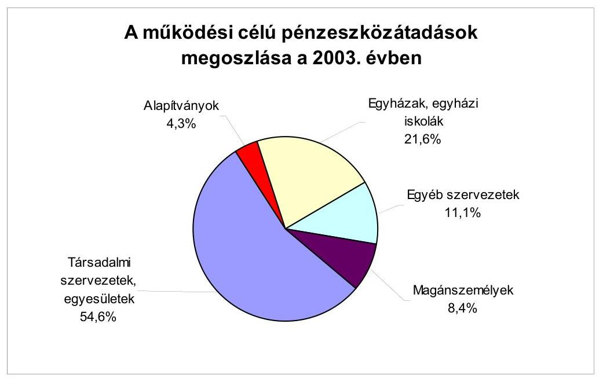
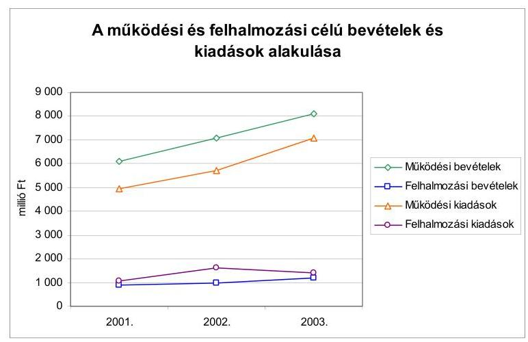
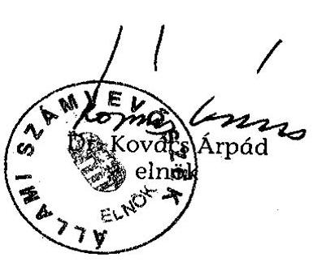
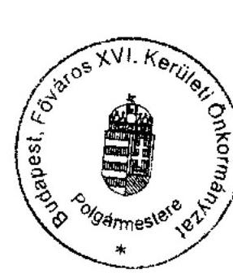

# JELENTÉS 

a Budapest Főváros XVI. kerület Önkormányzata gazdálkodásának átfogó ellenőrzéséről

---

3. Önkormányzati és Területi Ellenőrzési Igazgatóság
3.3. Átfogó Ellenőrzések Főcsoport
Iktatószám: V-1002-4/25/17/2004.
Témaszám: 692
Vizsgálat-azonosító szám: V0174

# Az ellenőrzést felügyelte: 

Dr. Lóránt Zoltán
főigazgató
Az ellenőrzés végrehajtásáért felelős:
Dr. Sepsey Tamás
főigazgató-helyettes
Az ellenőrzést vezette:
Csecserits Imréné
főcsoportfőnök-helyettes

## Az ellenőrzést végezték:

## Cséffai János

tanácsadó
Endrődy Péterné
számvevő
Molnár Gyula Mihály
főtanácsos

A témához kapcsolódó - elmúlt négy évben - készített számvevőszéki jelentések:
címe
sorszáma
Jelentés a helyi önkormányzatok és a helyi kisebbségi 0010
önkormányzatok pénzügyi gazdasági tevékenységének 1999. évi ellenőrzési tapasztalatairól
Jelentés a közbeszerzésekről szóló törvény végrehajtásának 0109 ellenőrzéséről
Jelentés a helyi önkormányzatok beruházásaihoz és 0229 rekonstrukcióihoz nyújtott 2001. évi címzett- és céltámogatások igénybevételének és felhasználásának vizsgálatáról

---

# TARTALOMJEGYZÉK 

BEVEZETÉS ..... 7
I. ÖSSZEGZŐ MEGÁLLAPÍTÁSOK, KÖVETKEZTETÉSEK, JAVASLATOK ..... 9
II. RÉSZLETES MEGÁLLAPÍTÁSOK ..... 19

1. A költségvetés tervezésének, végrehajtásának, az Önkormányzat vagyongazdálkodásának és a zárszámadás elkészítésének szabályszerűsége ..... 19
1.1. A költségvetési rendelet jóváhagyásának, módosításának, az előirányzatok nyilvántartásának és betartásának szabályszerűsége ..... 19
1.2. A gazdálkodás szabályozottsága, a bizonylati rend és fegyelem szabályszerűsége ..... 25
1.3. A pénzügyi-számviteli feladatok ellátásának informatikai támogatottsága ..... 30
1.4. Az önkormányzati vagyon nyilvántartása, számbavétele ..... 32
1.5. A vagyonnal való gazdálkodás szabályszerűsége, célszerűsége, nyilvánossága ..... 34
1.6. A céljelleggel nyújtott támogatások szabályszerűsége ..... 41
1.7. A közbeszerzési eljárások szabályszerűsége ..... 45
1.8. A zárszámadási kötelezettség teljesítésének szabályszerűsége ..... 48
1.9. A Polgármesteri hivatal helyi kisebbségi önkormányzatok gazdálkodását segítő tevékenysége ..... 50
2. Az önkormányzati feladatok és a rendelkezésre álló források összhangja ..... 52
2.1. A feladatok meghatározása és szervezeti keretei ..... 52
2.2. A költségvetés egyensúlyának helyzete ..... 53
2.3. A feladatok finanszírozása ..... 57
3. A belső irányítási, ellenőrzési rendszer múködésének értékelése ..... 60
3.1. Az ellenőrzési rendszer kialakítása, működése ..... 60
3.2. A könyvvizsgálati kötelezettség teljesítése ..... 63
3.3. A korábbi számvevőszéki ellenőrzések javaslatainak hasznosulása ..... 64

---

# MELLÉKLETEK 

1. számú Az önkormányzati vagyon nagyságának alakulása (1 oldal)
2. számú Az Önkormányzat 2003. évi bevételeinek és kiadásainak alakulása (1 oldal)
3. számú Az Önkormányzat gazdálkodását meghatározó adatok, mutatószámok (1 oldal)
4. számú Egyes önkormányzati feladatok finanszírozása (1 oldal)
5. számú Helyszíni ellenőrzési jegyzőkönyv (2 oldal)
6. számú Dr. Szabó Lajos Mátyás polgármester úr észrevétele (2 oldal)

---

# RÖVIDÍTÉSEK JEGYZÉKE 

Ötv.
Áht.
Ámr.
Kbt.
Htv.

Ksztv.
Nek tv.
Számv. tv.
Vhr.

Ber.
ÁSZ
Önkormányzat
Polgármesteri hivatal
Képviselő-testület
SzMSz
ügyrend
vagyongazdálkodási rendelet
közbeszerzési rendelet
lakás és helyiség hasznosítási rendelet
versenyeztetési rendelet
a helyi önkormányzatokról szóló 1990. évi LXV. törvény az államháztartásról szóló 1992. évi XXXVIII. törvény az államháztartás múködési rendjéről szóló 217/1998. (XII. 30.) Korm. rendelet
a közbeszerzésekről szóló 1995. évi XL. törvény
a helyi önkormányzatok és szerveik, a köztársasági megbízottak, valamint egyes centrális alárendeltségű szervek feladat- és hatásköreiről szóló 1991. évi XX. törvény
a közhasznú szervezetekről szóló 1997. évi CLVI. törvény
a nemzeti és etnikai kisebbségek jogairól szóló 1993. évi LXXVII. törvény
a számvitelről szóló 2000. évi C. törvény
az államháztartás szervezetei beszámolási és könyvvezetési kötelezettségének sajátosságairól szóló 249/2000. (XII. 24.) Korm. rendelet
a költségvetési szervek belső ellenőrzéséről szóló 193/2003. (XI. 26.) Korm. rendelet

Állami Számvevőszék
Budapest Főváros XVI. kerület Önkormányzata
Budapest Főváros XVI. kerület Önkormányzatának Polgármesteri Hivatala
Budapest Főváros XVI. kerület Önkormányzatának Képvi-selő-testülete
Budapest Főváros XVI. kerület Önkormányzatának Képvi-selő-testület Szervezeti és Múködési Szabályzatáról szóló 7/1995. (VI. 29.) számú rendelete
Budapest Főváros XVI. kerület Önkormányzatának polgármestere és jegyzője által kiadott 13/2000. számú együttes utasítása a Polgármesteri Hivatal ügyrendjéről
Budapest Főváros XVI. kerület Önkormányzatának 25/1996. (VII. 1.) számú rendelete a vagyonáról és vagyontárgyak feletti tulajdonosi jogok gyakorlásáról
Budapest Főváros XVI. kerület Önkormányzatának 44/2000. (XI. 9.) számú rendelete az Önkormányzat közbeszerzésinek, illetve közbeszerzési értékhatár alatti egyes beszerzéseinek részletes szabályozásáról
Budapest Főváros XVI. kerület Önkormányzatának 3/1994. (III. 1.) számú rendelete a lakások és helyiségek bérletére és elidegenítésére vonatkozó egyes szabályokról
Budapest Főváros XVI. kerület Önkormányzatának 9/1998. (IV. 23.) számú rendelete az Önkormányzat vagyonának értékesítése, hasznosítása során alkalmazandó versenyeztetési szabályokról

---

Pénzügyi bizottság
Civil bizottság

Gazdasági bizottság
Közlekedési bizottság
Oktatási bizottság
Egészségügyi és szociális bizottság
Környezetvédelmi bizottság
Kulturális bizottság
Kerületfejlesztési bizottság
Polgármesteri kabinet
Gazdálkodási ügyosztály
Mưvelődési ügyosztály
Városgazdálkodási iroda
Költségvetési iroda
Vagyonhasznosítási iroda
Adóügyi iroda
Szociális iroda
Gyermekvédelmi iroda
Igazgatási iroda
Építésügyi iroda
2003. évi költségvetési rendelet

Budapest Főváros XVI. kerület Önkormányzata Képviselőtestületének Pénzügyi és Közbeszerzéseket Ellenőrző Bizottsága
Budapest Főváros XVI. kerület Önkormányzata Képviselőtestületének Civil, Kisebbségi és Egyházi Kapcsolatok Bizottsága
Budapest Főváros XVI. kerület Önkormányzata Képviselőtestületének Gazdasági és Tulajdonosi Bizottsága
Budapest Főváros XVI. kerület Önkormányzata Képviselőtestületének Közlekedési és Közbiztonsági Bizottsága
Budapest Főváros XVI. kerület Önkormányzata Képviselőtestületének Közlekedési és Közbiztonsági Bizottsága
Budapest Főváros XVI. kerület Önkormányzata Képviselőtestületének Készlekedési és Közbiztonsági Bizottsága
Budapest Főváros XVI. kerület Önkormányzata Képviselőtestületének Egészségügyi és Szociális Bizottsága
Budapest Főváros XVI. kerület Önkormányzata Képviselőtestületének Környezetvédelmi Bizottsága
Budapest Főváros XVI. kerület Önkormányzata Képviselőtestületének Kulturális és Sport Bizottsága
Budapest Főváros XVI. kerület Önkormányzata Képviselőtestületének Kerületfejlesztési- és Üzemeltetési Bizottsága
Budapest Főváros XVI. kerület Önkormányzata Polgármesteri Hivatalának Polgármesteri Kabinete
Budapest Főváros XVI. kerület Önkormányzata Polgármesteri Hivatalának Gazdálkodási Ügyosztálya
Budapest Főváros XVI. kerület Önkormányzata Polgármesteri Hivatalának Művelődési Ügyosztálya
Budapest Főváros XVI. kerület Önkormányzata Polgármesteri Hivatalának Városgazdálkodási Irodája
Budapest Főváros XVI. kerület Önkormányzata Polgármesteri Hivatalának Költségvetési Irodája
Budapest Főváros XVI. kerület Önkormányzata Polgármesteri Hivatalának Vagyonhasznosítási Irodája
Budapest Főváros XVI. kerület Önkormányzata Polgármesteri Hivatalának Adóügyi Irodája
Budapest Főváros XVI. kerület Önkormányzata Polgármesteri Hivatalának Szociális Irodája
Budapest Főváros XVI. kerület Önkormányzata Polgármesteri Hivatalának Gyermekvédelmi Irodája
Budapest Főváros XVI. kerület Önkormányzata Polgármesteri Hivatalának Igazgatási Irodája
Budapest Főváros XVI. kerület Önkormányzata Polgármesteri Hivatalának Építésügyi Irodája
Budapest Főváros XVI. kerület Önkormányzatának 4/2003. (III. 12.) számú rendelete a 2003. évi költségvetésről

---

2004. évi költségvetési rendelet

FCSM Rt.
KELER Rt.
GAMESZ

Budapest Főváros XVI. kerület Önkormányzatának 12/2004. (III. 9.) számú rendelete a 2004. évi költségvetésről
Fővárosi Csatornázási Múvek Részvénytársaság
Központi Elszámolóház és Értéktár (Budapest) Rt.
Budapest Főváros XVI. kerület Önkormányzata Polgármesteri Hivatalának Gazdasági Múködtető Ellátó Szervezete

---

.

---

# JELENTÉS 

## a Budapest Főváros XVI. kerület Önkormányzata gazdálkodásának átfogó ellenőrzéséről

## BEVEZETÉS

Az Ötv. 92. § (1) bekezdése az Állami Számvevőszékről szóló 1989. évi XXXVIII. tv 2. § (3) bekezdése, valamint az Áht. 120/A. § (1) bekezdése szerint az Önkormányzatok gazdálkodását az Állami Számvevőszék ellenőrzi. Az ellenőrzés elvégzése az Országgyűlés illetékes bizottságai részére is átadott, országosan egységes ellenőrzési program alapján történt.

## Az ellenőrzés célja annak értékelése volt, hogy

- az önkormányzati gazdálkodás törvényességét ${ }^{1}$, szabályszerűségét biztosított-ták-e a tervezés, a költségvetés végrehajtása, a vagyongazdálkodás és a zárszámadás során;
- az Önkormányzat által ellátott feladatok és az azokhoz rendelkezésre álló források összhangja biztosított volt-e, különös tekintettel egyes kiemelt feladatokra;
- a gazdálkodás szabályszerűségét biztosító kontrollok ${ }^{2}$ megfelelően segitettéke a végrehajtást.

Az ellenőrzött időszak: a 2003. év, valamint a 2004. I. negyedév, az 1.5; 2.1-2.3. és 3.3. ellenőrzési programpontok esetében a 2001-2002. évek is.

Budapest Főváros XVI. kerületét öt településrész - Árpádföld, Cinkota, Mátyásföld, Rákosszentmihály és Sashalom - alkotja. A kerület lakosainak száma - a 3. számú mellékletben foglaltak szerint - 2003. január 1-jén 70878 fő volt.

Az Önkormányzat 29 tagú Képviselő-testületének munkáját 10 állandó bizottság segítette. A 2002. évi választásokat követően a polgármester személye nem változott. A jegyző személyében 2003. július 15-én következett be változás.

[^0]
[^0]:    ${ }^{1}$ A törvényi előírások betartásának elmulasztásakor egységesen a törvénysértés megjelölést alkalmazzuk, mivel az ÁSZ nem tehet különbséget a törvényi előírások között.
    ${ }^{2}$ A gazdálkodás szabályszerűségét biztosító kontroll alatt értjük a kiépített és múködő belső irányítási és szabályozási rendszert, valamint a belső ellenőrzési funkciók ellátását.

---

Az Önkormányzat feladatainak végrehajtása érdekében 15 önállóan gazdálkodó és 20 részben önállóan gazdálkodó költségvetési intézményt múködtetett, valamint egy gazdasági társasága vett részt a feladatok végrehajtásában. A feladatok ellátására foglalkoztatott közalkalmazottak száma a 2003. évben 1815 fő volt, a Polgármesteri hivatalban 256 fő köztisztviselő dolgozott.

Az Önkormányzat a 2003. évben 9855 millió Ft költségvetési bevételt, és 9315 millió Ft költségvetési kiadást teljesített és a 2003. év végén 18027 millió Ft értékű, könyvviteli mérleg szerinti vagyonnal rendelkezett. A kerületben a 2003. évben 12 helyi kisebbségi önkormányzat ${ }^{3}$ működött.

[^0]
[^0]:    ${ }^{3}$ Bolgár, görög, horvát, lengyel, német, örmény, roma, román, ruszin, szlovák, szlovén, ukrán.

---

# I. ÖSSZEGZŐ MEGÁLLAPÍTÁSOK, KÖVETKEZTETÉSEK, JAVASLATOK 

A Képviselő-testület nem határozta meg az Önkormányzat gazdasági programját, ezzel megsértették az Ötv. előírását, valamint nem tettek eleget az SzMSzben foglaltaknak. A 2003. és a 2004. évre vonatkozó költségvetési koncepciókat és költségvetési rendelettervezeteket a polgármester az Áht-ban előírt határidőn belül a Képviselő-testület elé terjesztette, a Pénzügyi bizottság koncepciókról és költségvetési rendelettervezetről alkotott véleményét csatolta az előterjesztéshez az Ámr-ben foglaltaknak megfelelően. A költségvetési koncepciót a helyben képződő bevételek, valamint az ismert kötelezettségeket figyelembe véve állították össze és tartalmazta a gazdálkodást meghatározó prioritásokat. A 2003. és a 2004. évi költségvetési rendeletek az Áht. és az Ámr. előírásainak megfelelően tartalmazták a múködési és felhalmozási célú bevételeket és kiadásokat elkülönítetten és mérlegszerűen bemutatva, a kiemelt előirányzatokat intézményenként és Önkormányzatra összesítve, a felújítási előirányzatokat célonként, a felhalmozási kiadásokat és a Polgármesteri hivatal előirányzatait feladatonként, az általános és céltartalékot, a létszámkereteket, valamint a kisebbségi önkormányzatok költségvetését elkülönítetten. A 2003. és a 2004. évi költségvetési rendeletek az Áht. előírásait megsértve a bevételek és kiadások különbségeként a hiányt nem mutatták be, a hitelfelvételt költségvetési bevételként szerepeltették. A költségvetés és a zárszámadás előterjesztésekor bemutatandó mérlegek és kimutatások tartalmi követelményeit rendeletben nem határozták meg és a közvetett támogatásokat tartalmazó kimutatáshoz nem adtak szöveges indoklást. A bevételi forrásokat nem az Ámr-ben előírt főbb jogcím-csoportonként részletezték.

A Képviselő-testület a költségvetési rendeletet a 2003. évben három alkalommal módosította, ennek során a 2003. évi költségvetési rendelet bevételi és kiadási előirányzatának főösszegét 943,1 millió Ft-tal, 11,1\%-kal növelte, a pedagógiai szakszolgálattal kapcsolatos normatív kötött felhasználású támogatásnál elkövetett téves adatszolgáltatás korrekcióját követően. A bevételi főószszeg növekedését a központi támogatás, az átengedett és átvett pénzeszközök, a saját bevételek, a pénzmaradvány előirányzatának növelése és a fejlesztési hitel előirányzatának csökkenése határozta meg. A költségvetési kiadási előirányzat főösszegének módosításában a múködési (személyi és dologi jellegű) és a felhalmozási (felújítási, fejlesztési) célú kiadások előirányzatának növelése játszott szerepet.

A költségvetési szervek önkormányzati szinten a 2003. évi költségvetési kiadási és bevételi módosított előirányzat főösszegén belül gazdálkodtak. A költségvetési intézmények közül a jóváhagyott módosított múködési és felhalmozási előirányzatok túllépésével az intézmények 51,4\%-a megsértette az Áht. előírásait. A jóváhagyott előirányzatok túllépését nem vizsgálták, az előirányzaton belüli gazdálkodásra vonatkozó kötelezettség megszegése ellenére felelősségre vonást nem kezdeményeztek.

---

Az eredeti előirányzatok változásait, módosításait és azok teljesülésének alakulását tartalmazó nyilvántartást a Polgármesteri hivatalban felfektették, azonban a kiemelt előirányzatok szerinti bontásban folyamatosan, minden módosításra és teljesülésre kiterjedően nem tartották nyilván azokat. A részelőirányzatokra előírt nyilvántartás vezetési kötelezettséget nem teljesítették, megsértve az Áht-ban előírt, az előirányzatok és azok teljesülésének folyamatos nyilvántartására vonatkozó kötelezettséget.

A Polgármesteri hivatal a Képviselő-testület által jóváhagyott szervezeti és múködési szabályzattal, a gazdasági szervezet pedig ügyrenddel nem rendelkezett az Ámr-ben előírtak ellenére. Az operatív gazdálkodással kapcsolatos feladatokat és hatásköröket polgármesteri-jegyzői együttes utasítással szabályozták, amelyben az Ámr. előírásaival összhangban rögzítették a kötelezettségvállalás és utalványozás, valamint azok ellenjegyzésének rendjét. A teljesítés szakmai igazolására jogosult személyek kijelölése megtörtént. A jegyző nem alakította ki a költségvetési szervek egységes számviteli rendjét, ezzel megsértette a Htv. előírását. A számviteli politika nem megfelelően kidolgozott. Az Vhr. előírása ellenére elmaradt annak meghatározása, hogy a számviteli elszámolás és a terven felüli értékcsökkenés számviteli elszámolása szempontjából mit tekintenek lényegesnek és jelentős összegnek, valamint nem rögzítették a mérlegkészítés időpontját.

A számviteli politika keretében a kötelezően előírt szabályzatokat elkészítették. Az értékelési szabályzat megfelelően kidolgozott. A pénzkezelési szabályzat hiányossága, hogy a házipénztár és az Úgyfélszolgálati és okmányiroda, mint készpénzkezelő hely között a kapcsolatot nem szabályozták annak ellenére, hogy a vagyonvédelem ezt indokolta volna. A felvett előleg elszámolásának rendjét nem határozták meg. A felesleges vagyontárgyak hasznosításának, selejtezésének rendjét megfelelően alakították ki. A leltározási szabályzatban az ingatlanok, a gépek, járművek és az 50 ezer Ft alatti tárgyi eszközök vonatkozásában nem évenkénti mennyiségi leltározási kötelezettséget írtak elő, az előírást 2004. január 1-től nem módosították, így az nem felel meg Vhr. 2004. január 1-től hatályos szabályozásának. A számlarendben az analitikus nyilvántartások tartalmát, a főkönyvi könyveléssel való egyeztetésének gyakoriságát és a zárlati feladatokat rögzítették, a számviteli analitikus nyilvántartások adataiból készülő összesítő feladások elkészítésének határidejét azonban nem határozták meg.

A munkafolyamatba épített ellenőrzési kötelezettséget a gazdálkodási, pénzügyi, számviteli feladatellátás területén - a kisebbségi önkormányzatok gazdálkodását érintő ellenjegyzési feladatok kivételével - az érintett dolgozók munkaköri leírása tartalmazta.

A Polgármesteri hivatal házipénztárából felvett előlegek esetében a bevételek elszámolása - a Számv. tv. bruttó elszámolás alapelvét megsértve - nettó módon történt. Az előleg elszámoláshoz kapcsolódó számviteli nyilvántartásba vétel nem a pénzmozgással egyidejűleg, hanem a havonta készített feladás alapján történt, ezáltal a készpénzforgalom esetében nem tartották be a Vhr. bizonylati fegyelemre vonatkozó előírását. A kisebbségi önkormányzatok bankszámlájáról felvett összegeket számviteli bizonylat nélkül könyvelték készpénz előlegként, ezáltal megsértették a Számv tv. azon előírását, miszerint a számvi-

---

teli nyilvántartásokba csak szabályszerűen kiállított bizonylat alapján szabad adatokat bejegyezni.

A kötelezettségvállalásokat írásba foglalták, a szerződéseket, megrendeléseket az arra jogosultak írták alá. A kötelezettségvállalások ellenjegyzését a bizonylatok $0,7 \%$-nál nem végezték el. A kiadások utalványozása során a kötelezettségvállalás nyilvántartásba vételének sorszámát - az Ámr. előírásai ellenére - az utalványrendelkezéseken nem tüntették fel. A nem termékértékesítésből és szolgáltatásnyújtásból származó bevételeknél az Ámr-ben előírtak ellenére elmaradt az utalványozás a pénztárforgalom és a bankbizonylatok vonatkozásában egyaránt. A gazdálkodási jogkörök gyakorlásánál az összeférhetetlenségi követelményeket betartották. A munkafolyamatba épített ellenőrzési feladatok közül az érvényesítés a kiadások esetében megtörtént, a teljesítés szakmai igazolását elvégezték.

A pénzügyi, gazdálkodási és számviteli feladatokat a Polgármesteri hivatalban önállóan használt, illetve hálózati kapcsolatban lévő számítógépes rendszer segítségével látták el. Az analitikus nyilvántartások 54,5\%-át vezették az adott feladat ellátására kifejlesztett számítógépes program segítségével. Az engedélyezési jogköröket meghatározták, a felhasználók köréről rendelkeztek olyan nyilvántartással, amely tartalmazta felhasználói programonként a felhasználókat és azok jogosultságait. A Polgármesteri hivatal nem rendelkezett katasztrófa elhárítási tervvel. Az Önkormányzatnál az adatmentések, az adatvédelem szabályozása megtörtént. A pénzügyi és számviteli feladatok ellátását segítő számítógépes programok $46,7 \%$-a nem rendelkezett üzemeltetési dokumentációval és $53,3 \%$-a felhasználási leírással, az adatok mentése, valamint a visszakeresés lehetősége megoldott. A pénzügyi-számviteli szakterületen az informatikai rendszerrel összefüggő szabályzatot elkészítették, az illetéktelen hozzáférés elleni védelem céljából kialakították a megfelelő jogosultsági rendszert. A pénzügyi-számviteli területen dolgozók rendelkeznek a feladat ellátásához szükséges felhasználói szintű ismeretekkel. A munkaköri leírások nem tartalmazzák az informatikai rendszer használatához kapcsolódó feladatokat.

A Polgármesteri hivatal a Vhr. előírásainak megfelelően gondoskodott az önkormányzati vagyon nyilvántartásáról, számbavételéről. Az ingatlanvagyon értékét befolyásoló gazdasági eseményeket rögzítették a számviteli nyilvántartásokban. Az önkormányzati forrásokból megvalósult víziközművek értékét kimutatták a könyvviteli mérlegben, de múködtetésük nem rendezett, mert az FCSM Rt. a tulajdonjog térítésmentes átruházásának elmaradása miatt nem volt hajlandó üzemeltetési szerződést kötni. A szerződés létrehozása érdekében az Önkormányzat bírósági eljárást kezdeményezett. A 2003. évi könyvviteli mérleg adatait leltárral, illetve összesítő kimutatásokkal alátámasztották. A Polgármesteri hivatal a mérleg készítését megelőzően - megsértve a Számv. tv. előírását - a követeléseket egyedileg nem minősítette.

A vagyongazdálkodással kapcsolatos feladatokat és döntési hatásköröket a Képviselő-testület rendeletben szabályozta. A vagyon hasznosítás nyilvánosságának biztosítása érdekében külön rendeletet alkottak a versenyeztetési szabályokról, amelyeket az ingatlanok és a 2 millió Ft feletti értékű ingóvagyon értékesítésekor, hasznosításakor kell alkalmazni. Ettől a rendelet szerint a Képvise-lő-testület minősített többségű határozatával eltérhet. Ezt a lehetőséget a Képvi-

---

selő-testület a 2004. év szeptemberétől megszüntette. A versenyeztetés mellőzését megalapozó méltánylandó körülmények konkrét tartalmát a rendeletet nem határozta meg, erről a Képviselő-testület esetenként döntött, az eljárás nem segítette elő a köztulajdonnal való gazdálkodás nyilvánosságát, átláthatóságát. Ingatlan értékesítésekor a vagyongazdálkodási rendelet előírásától eltérően három alkalommal, három hónapnál régebbi ingatlanforgalmi értékbecslés alapján határozták meg az ingatlan eladási értékét. A Képviselő-testület a 2003. évben ingatlan értékesítésekor két esetben tért el jelentős, 10\%-ot meghaladó mértékben az ingatlanforgalmi szakértő által készített értékbecslésben rögzített értéktől. Méltánylandó körülményként a vevőket vagyonelkobzás miatt ért sérelmeket vettek figyelembe, noha az ezért történő kárpótlás nyújtása nem önkormányzati feladat. Az önkormányzati vagyont érintő döntések meghozatalakor - a leselejtezett eszközök térítésmentes átadása kivételével - betartották a vagyongazdálkodási rendeletben előírt hatásköröket. A leselejtezett, de még használható eszközök térítésmentes átadásáról - ellentétben a vagyongazdálkodási rendeletben előírtakkal - a jegyző döntött.

A 2003. évben az Önkormányzat 195 esetben nyújtott céljelleggel - nem szociális ellátásként - támogatást szervezetek, illetve magánszemélyek részére 79,4 millió Ft összegben. A támogatások 94,4\%-ánál előírták a számadási kötelezettséget, 11 esetben ezt elmulasztották, megsértve az Áht. előírását. A támogatott szervezetek és magánszemélyek a számadási kötelezettségüknek eleget tettek. Az Önkormányzat bizottságai és a Polgármesteri hivatal érintett ügyosztályai a számadásokat a benyújtott dokumentumok alapján ellenőrizték. A támogatás cél szerinti felhasználását a helyszínen nem ellenőrizték. A 2003. évi költségvetés 2003. november 15-i módosításakor a Képviselő-testület az Ötv. előírásait megsértve a bizottságok hatáskörébe utalta az alapítványok támogatásaival összefüggő döntések meghozatalát.

A Képviselő-testület a közbeszerzési eljárás helyi szabályáról rendeletet alkotott. A Kbt. 2004. május 1-ig hatályos előírását megsértve a rendelet a közbeszerzési eljárást lezáró határozat meghozatalát az adott eljárást lebonyolító munkabizottság hatáskörébe utalta. A 2003. évben az Önkormányzat összesen 10 közbeszerzési eljárást folytatott le, a beszerzések együttes értéke 415,4 millió Ft volt. Két beszerzés esetében - megsértve a Kbt. előírásait - nem írtak ki közbeszerzési eljárást, annak ellenére, hogy a felújításra fordított összeg meghaladta a szolgáltatásokra törvényben előírt értékhatárt. A Közbeszerzési Döntőbizottság három esetben marasztalta el az Önkormányzatot a Kbt-ben előírt szabályok megsértésért.

A polgármester a zárszámadási rendelettervezetet - az elfogadott költségvetéssel összehasonlítható módon - határidőre terjesztette a Képviselő-testület elé. A zárszámadási rendelettervezetben tájékoztatásul bemutatták az Áht-ban előírt mérlegeket és kimutatásokat, azonban elmaradt a közvetett támogatások szöveges indoklása, amivel megsértették az Áht-ban előírtakat. A Képviselőtestület költségvetési szervenként jóváhagyta a pénzmaradvány összegét. Az intézmények beszámolóit felülvizsgálták, de az Ámr. előírása ellenére a beszámoló elfogadásáról az intézményvezetőket írásban nem értesítették.

A kerületben a 2003. évben 12 kisebbségi önkormányzat múködött. Az együttmúködés feltételeit szabályozó megállapodást az Ámr-ben előírt határidő

---

után kötötte meg az Önkormányzat a kisebbségi önkormányzatokkal. Az együttműködési megállapodás nem tartalmazta a költségvetésről és a zárszámadásról szóló kisebbségi önkormányzati határozatok Önkormányzat részére történő átadásának határidejét. A kisebbségi önkormányzatok operatív gazdálkodásának szabályozásában a kötelezettségvállalás rendjét ellentmondásosan szabályozták, az utalvány ellenjegyzésének feladatával a Költségvetési irodát bízták meg, a feladatot ellátó személyt nem jelölték ki, valamint a teljesítés szakmai igazolását végző személyeket nem határozták meg. A készpénzforgalom részletes szabályozására sem a megállapodás, sem a Polgármesteri hivatal pénzkezelési szabályzata nem tért ki, a kisebbségek készpénzforgalmáról pénztári nyilvántartást nem vezettek. A kisebbségi önkormányzatok bevételeit és kiadásait, elkülönítetten számolták el a számviteli analitikus nyilvántartás keretében, elkülönítetten tartották nyilván azok tárgyi eszközeit is.

Az Önkormányzat az önként vállalt feladatok ellátásának mértékét és módját az Ötv. előírásait megsértve nem határozta meg. A kötelezően ellátandó feladatokat az Önkormányzat az Ötv. és az ágazati törvények előírásait figyelembe véve határozta meg. A feladatait alapvetően az általa alapított költségvetési szervein keresztül látta el. A fővárostól megállapodás keretében a 2003. év közepén átvették a járó beteg szakellátási feladatot. A helyi közfeladatok ellátását szolgáló szervezeti rendszer feladatellátásban betöltött szerepét, célszerűségét a 2001. év után az Önkormányzat átfogóan nem értékelte. A szervezeti struktúrában bekövetkezett változásokat egyedi előterjesztések előzték meg.

Az Önkormányzat 2003. évi költségvetésében a múködési bevételek fedezetet nyújtottak a múködési kiadásokra. A múködési kiadások aránya a költségvetésben $83,3 \%$-ot képviselt, míg a múködési bevételek $87,0 \%$-ot tettek ki az öszszes bevételből. A felhalmozási jellegú feladatok finanszírozási szükségletét a teljesített felhalmozási bevételek nem biztosították, ezért a felhalmozási kiadások fedezetét 2,5 millió Ft hitel felvételével és a múködési bevételek egy részének átcsoportosításával teremtették meg. Az Önkormányzat bevételei növelésének érdekében külső pénzügyi forrásokat is igénybe vett pályázatok útján. A pályázati rendszerben elnyert, valamint az államháztartáson kívülről kapott források az összes bevételnek a 2001. évben a 2,5\%-át, a 2002. évben a 2,2\%-át, a 2003. évben a $3,3 \%$-át jelentették. A jegyző a pénzállomány várható alakulásáról - a pénzügyi egyensúly év közbeni fenntartása, az Önkormányzat által tervezett feladatok folyamatos finanszírozása érdekében az Ámr-ben előírtak ellenére - likviditási tervet a 2003. évben nem készített, ezáltal tervszinten sem teremtették meg a tervezett bevételek teljesülésének és a várható kiadások felmerülésének időbeli összhangját. A 2003. évi gazdálkodást átmeneti likviditási gondok kísérték, amelyet folyószámlahitel igénybevételével oldottak meg. A Polgármesteri hivatalnál az Áht. előírásait megsértve a kötelezettségvállalásokról nyilvántartást nem vezettek, így folyamatosan nem állt rendelkezésre naprakész információ a vállalt kötelezettségek mértékéről. A Képviselő-testület a 2003. évben adósságot keletkeztető kötelezettségvállalásról döntött, a 2003. évi költségvetés készítése és módosításai során az adósságot keletkeztető kötelezettségvállalás Ötv. szerinti felső korlátját vizsgálták, betartották.

A kötelező feladatokhoz kapcsolódó, naturális mutatókkal mérhető feladatok fajlagos kiadásai a 2001-2003. évek között jelentősen (30-60\%-kal) emelkedtek. A növekedést elsősorban az összes múködési kiadáson belül meghatározó

---

jelentőségű személyi jellegű kiadások központi intézkedések miatti emelkedése okozta. A kiadások finanszírozásában a bölcsődei ellátásnál és a nappali szociális intézményei ellátásnál az önkormányzati támogatás aránya a 2003. évben a 2001. évihez viszonyítva csökkent. A nevelési, oktatási feladatoknál viszont emelkedett.

Az önként vállalt feladatok megvalósítására fordított kiadások összes kiadáson belüli 2001. évi $16 \%$-os részaránya 2003. évre kis mértékben csökkent. Az önként vállalt feladatok kiadásaiban a középfokú és a művészeti oktatási feladatok ellátására fordított kiadásoknak volt meghatározó szerepe mindhárom évben. Az Önkormányzat kötelező feladatainak teljesítését az önként vállalt feladatok ellátása nem veszélyeztette.

Az Önkormányzat középületei akadálymentessé tételének céljából készített felmérése 369 millió Ft-ra becsülte a szükséges átalakítások kiadásait. Az intézmények akadálymentesítésére a 2001., 2003. és a 2004. évi költségvetésekben összesen 30,5 millió Ft kiadást terveztek. A feladatok jelentős költségigényét, valamint az erre a célra fordított eddigi kiadásokat figyelembe véve a fogyatékos személyek jogairól és esélyegyenlőségük biztosításáról szóló törvényben meghatározott 2005. január 1-i határidőre a feladatok elvégzése nem biztosítható.

A belső ellenőrzés szervezeten belüli helyét, feladatait sem a Polgármesteri hivatal ügyrendje, sem a szervezeti és múködési szabályzata nem tartalmazta. A Polgármesteri kabinethez tartozó három fő belső ellenőr szakmai felettese a munkaköri leírások szerint a polgármester volt, belső ellenőrzési vezetőt nem neveztek ki. A belső ellenőrök éves munkatervi feladatait a Képviselő-testület hagyta jóvá. A tervezés hiányossága, hogy nem tartalmazott megfelelő tartalékidőt az ellenőrzések felét rendszeresen kitevő terven felüli ellenőrzési feladatok elvégzésére, amely miatt elmaradt a 2003. évi munkaterv hivatali belső ellenőrzési feladatának végrehajtása. Az ellenőri jelentések színvonala megfelelő volt, következtetést, javaslatot mindegyik jelentés tartalmazott. A belső ellenőrzési megállapítások alapján felelősség megállapítására két esetben került sor. A 2004. évi ellenőrzéseket nem a Ber. előírásai szerint, hanem a 2000. évben elfogadott belső ellenőrzési szabályzat alapján hajtották végre. A Ber. 2003. november 27-i hatálybalépését követően a belső ellenőrzés jogállását, feladatait a Ber. előírása ellenére a Polgármesteri hivatal szervezeti és múködési szabályzatában nem határozták meg. Az ellenőrzéseket nem a Ber-ben meghatározottak alapján elkészített ellenőrzési programban foglaltak szerint folytatták le. Az ellenőrzésekről a belső ellenőrzési szabályzat és a Ber. szerinti nyilvántartást nem vezették.

Az Önkormányzat a 2003. évben a törvényben előírt könyvvizsgálati kötelezettségét költségvetési minősítésű könyvvizsgálóval teljesítette. A könyvvizsgáló 11 millió Ft auditálási eltérést állapított meg a 2003. évre, amelyet elfogadtak és az azoknak megfelelő helyesbítéseket 2004. május hónapban elvégezték a főkönyvi könyvelésben. A könyvvizsgáló korlátozás nélküli hitelesítő záradékkal látta el a Polgármesteri hivatal és az intézmények összevont adatait tartalmazó, egyszerűsített tartalmú költségvetési beszámolót.

---

A korábbi ÁSZ vizsgálatok javaslatainak hasznosítására intézkedtek, a javaslatok 50\%-a teljes mértékben, 33,3\%-a részben megvalósult.

A helyszíni ellenőrzés megállapításainak hasznosítása mellett javasoljuk:

# a polgármesternek 

a jogszabályi előírások maradéktalan betartása érdekében

1. kezdeményezze a Képviselő-testületnél a jegyző által készített előterjesztés alapján, hogy a Képviselő-testület határozza meg az Önkormányzat gazdasági programját az Ötv. 91. § (1) bekezdésében, valamint az SzMSz 42. §-ában előírtaknak megfelelően;
2. kezdeményezze, hogy a Képviselő-testület az Ötv. 8. § (2) bekezdésében foglaltak alapján határozza meg, hogy a lakosság igényei és az Önkormányzat anyagi lehetőségei figyelembevételével mely feladatokat, milyen mértékben és módon lát el;
3. kezdeményezze - a jegyző által készített előterjesztés alapján -, hogy a Képviselőtestület rendeletben határozza meg az Áht. 118. §-ában előírt mérlegek, kimutatások tartalmát;
4. intézkedjen annak érdekében, hogy a költségvetési intézmények az Áht. 93. § (1) bekezdésében előírtak szerint a jóváhagyott előirányzatokon belül gazdálkodjanak, indokolt esetben kezdeményezzen személyes felelősségre vonást;
5. kezdeményezze a Képviselő-testületnél - a jegyző által készített előterjesztés alapján - a Polgármesteri hivatal az Ámr. 10. § (4) bekezdésének megfelelő szervezeti és múködési szabályzatának a jóváhagyását;
6. gondoskodjon arról, hogy az Ötv. 10. § (1) bekezdés d) pontja előírásának megfelelően csak a Képviselő-testület döntése alapján nyújtson anyagi támogatást az Önkormányzat alapítványoknak;
7. kezdeményezze, hogy a feleslegessé vált eszközök ingyenes (térítésmentes) átadásáról a vagyongazdálkodási rendelet 12. § előírásának megfelelően a Képviselő-testület döntsön;
a munka színvonalának javítása érdekében
8. kísérje figyelemmel a középületek akadálymentessé tételét, tekintettel a fogyatékos személyek jogairól és esélyegyenlőségük biztosításáról szóló 1998. évi XXVI. törvény 29. § (6) bekezdésében meghatározott 2005. január 1-i teljesítési határidőre;
9. kezdeményezze a számvevőszéki ellenőrzés tapasztalatainak képviselő-testületi megtárgyalását, a feltárt hiányosságok megszüntetésére intézkedési terv készítését;

---

# a jegyzönek 

a jogszabályi előírások maradéktalan betartása érdekében
1. a költségvetési rendelettervezet előkészítésekor
a) gondoskodjon a költségvetési rendelettervezet elkészítése során arról, hogy a költségvetés bevételeinek és kiadásainak különbségeként tervezett hiány az Áht. 8. § (1) bekezdésében foglaltaknak megfelelően a költségvetési rendelettervezetben bemutatásra kerüljön;
b) biztosítsa, hogy a költségvetési és zárszámadási rendelet előterjesztésekor a közvetett támogatásokról tájékoztatásul bemutatásra kerülő kimutatáshoz készüljön szöveges indoklás a Képviselő-testület részére az Áht. 118. §-ában előírtaknak megfelelően,
c) biztosítsa, hogy a költségvetési rendelettervezetben a bevételi forrásokat a Polgármesteri hivatal és az önkormányzati intézmények bevételeinél az Ámr. 29. § (1) bekezdése a) pontjában előírt - az elemi költségvetésnek megfelelő - főbb jogcím-csoportonként részletezzék;
2. gondoskodjon az Áht. 103. § (1) bekezdésében foglaltak betartása érdekében az előirányzatok és azok teljesülése alakulásának folyamatos nyilvántartásáról;
3. gondoskodjon az Ámr. 17. § (5) bekezdésében foglaltak betartása érdekében a Gazdálkodási ügyosztály ügyrendjének elkészítéséről;
4. alakítsa ki a Htv. 140. § (1) bekezdés c) pontjának megfelelően a költségvetési szervek egységes számviteli rendjét;
5. a számviteli politika és a szabályzatok elkészítésekor
a) egészítse ki a számviteli politikát annak meghatározásával, hogy a számviteli elszámolás és a terven felüli értékcsökkenés elszámolásánál mit tekintenek jelentős összegnek, illetve lényeges szempontnak a Vhr. 8. § (5) bekezdés a) és g) pontjában foglaltak betartása érdekében, valamint a Vhr. 8. § (8) bekezdés alapján határozza meg a mérlegkészítés időpontját;
b) gondoskodjon arról, hogy a leltározási szabályzat feleljen meg a Vhr. 37. §-nak 2004. január 1-től hatályos előírásának a mennyiségi leltározás elvégzésének gyakorisága tekintetében is;
c) gondoskodjon a Vhr. 49. § (4) bekezdésében foglaltak alapján, a számviteli analitikus nyilvántartásokból készülő feladások elkészítési határidejének meghatározásáról;
6. gondoskodjon az Ámr. 136. § (4) bekezdésének h) pontjában foglaltak betartásáról a kötelezettségvállalás nyilvántartásba vételi sorszámának az utalványrendelkezésen történő feltüntetésével;
7. gondoskodjon az Ámr. 134. § (2) bekezdésében előírtak betartása érdekében a kötelezettségvállalás ellenjegyzésének az elvégzéséről;

---

8. gondoskodjon arról, hogy a Számv. tv. 55. § (1) bekezdésének megfelelően a beszámoló elkészítése során egyedileg minősítsék a követeléseket;
9. biztosítsa, hogy a céljelleggel, nem szociális ellátásként nyújtott támogatásoknál minden esetben írják elő a támogatott szervezet vagy magánszemély részére a számadási kötelezettséget az Áht. 13/A. § (2) bekezdésének megfelelően;
10. intézkedjen - az Ámr. 149. § (5) bekezdése alapján -, hogy a költségvetési beszámoló számszaki felülvizsgálatának eredményéről a költségvetési intézmények vezetői írásban értesítést kapjanak;
11. a kisebbségi önkormányzatokkal kötött megállapodások módosításának előkészítésekor
a) egészítse ki a megállapodást a költségvetési határozatok Önkormányzat részére történő átadási határidejének meghatározásával Ámr. 29. § (10) bekezdésében foglalt előírás betartása érdekében,
b) gondoskodjon a kisebbségi önkormányzatok gazdálkodásának részét képező készpénzkezelés részletes szabályozásáról és a készpénzforgalom pénztári nyilvántartásáról;
12. készíttesse el az Ámr. 139. §-ában foglaltak szerint az Önkormányzat pénzállományának alakulásáról a likviditási tervet, gondoskodjon annak folyamatos aktualizálásáról;
13. gondoskodjon az Ámr. 134. § (6) bekezdésében előírtaknak megfelelően arról, hogy a Polgármesteri hivatalban folyamatosan vezessenek olyan analitikus nyilvántartást, amelyből megállapítható az évenkénti kötelezettségvállalás összege;
14. kezdeményezze a Ber. 4. § (2) bekezdése alapján a belső ellenőrzést végző szervezet jogállásának, feladatainak a Polgármesteri hivatal szervezeti és múködési szabályzatában történő meghatározását;
15. gondoskodjon az elvégzett ellenőrzésekről a belső ellenőrzési szabályzatban és a Ber. 32. §-ában előírt, a megtett intézkedések nyomon követésére is alkalmas nyilvántartás vezetéséről, valamint a 27. § (2) bekezdés i) pontjában foglaltak betartásáról az ellenőrzési jelentés belső ellenőrzési programnak megfelelő elkészíttetésével. Biztosítsa a belső ellenőrzésekhez a Ber. 23. § (3) és (4) bekezdésében foglalt előírások szerinti ellenőrzési program elkészítését;
a munka színvonalának javítása érdekében
16. szabályozza a Polgármesteri hivatalra vonatkozó egységes pénzkezelési szabályzat keretében a készpénz előleggel való elszámolás rendjét, valamint az Ügyfélszolgálati és okmányirodán lévő készpénzkezelő helyek házipénztárral való kapcsolatát;
17. kezdeményezze a pénzügyi-számviteli feladatok informatikai támogatottsága, az informatikai rendszer optimális és biztonságos múködtetése érdekében a folyamatos és biztonságos munkavégzést biztosító, a rendkívüli helyzeteket kezelni tudó katasztrófa-elhárítási terv készítését;

---

18. egészíttesse ki valamennyi, a pénzügyi-számviteli területen dolgozó köztisztviselő munkaköri leírását az informatikai rendszerek használatához kapcsolódó feladatokkal;
19. gondoskodjon arról, hogy a zárszámadási rendelettervezetben mutassák be a közvetett támogatásokról szóló kimutatásban az építmény és telekadó mentességek és kedvezmények összegét;
20. gondoskodjon a belső ellenőrzés éves munkatervének összeállításakor a terven felüli ellenőrzési feladatok ellátásához szükséges tartalék időkeret biztosításáról a tervezett feladatok maradéktalan elvégzése érdekében;

---

# II. RÉSZLETES MEGÁLLAPÍTÁSOK 

## 1. A KÖLTSÉGVEtÉs TERVEZÉSÉNEK, VÉGREHAJTÁsÁNAK, AZ ÖNKORMÁNYZAT VAGYONGAZDÁLKODÁSÁNAK ÉS A ZÁRSZÁMADÁS ELKÉSZÍTÉSÉNEK SZABÁLYSZERŰSÉGE

### 1.1. A költségvetési rendelet jóváhagyásának, módosításának, az előirányzatok nyilvántartásának és betartásának szabályszerűsége

A Képviselő-testület az Önkormányzat gazdasági programját nem határozta meg, ezzel megsértette az Ötv. 91. § (1) bekezdését, valamint nem tett eleget az SzMSz 42. §-ában foglaltaknak.

A polgármester a 2003. évi költségvetési koncepciót az Áht. 70. §-ában előírt határidő ${ }^{4}$ betartásával 2002. december 5-én benyújtotta a Képviselő-testület részére. A költségvetési koncepciót a helyben képződő bevételek, valamint az ismert kötelezettségek figyelembevételével állították össze. Az Önkormányzat bizottságai megtárgyalták a költségvetési koncepciót, azt a Pénzügyi bizottság elfogadásra javasolta a Képviselő-testületnek. A Pénzügyi bizottság véleményét csatolta a polgármester a koncepció tervezet előterjesztéséhez, az Ámr. 28. § (3) bekezdésében előírtaknak megfelelően. A helyi kisebbségi önkormányzatok a költségvetési koncepcióról - a jegyző tájékoztatását követően - alakították ki véleményüket, melyeket a polgármester csatolt a Képviselő-testület részére benyújtott tervezethez, az Ámr. 28. § (3) bekezdésében foglaltaknak megfelelően.

A Képviselő-testület a 972/2002. (XII. 17.) számú határozattal elfogadta a 2003. évi költségvetési koncepciót. Az előterjesztés tartalmazta a központi költségvetésből, illetve a fővárosi forrásmegosztásból várható és a tervezett helyben képződő bevételek összegét, a fejlesztési feladatok meghatározását. Célul tűzték ki az alapfeladatoknál az ellátások szintentartásának biztosítását, az önkormányzati tulajdonú épületek állagmegóvását, a források kiegészítése érdekében a pályázati lehetőségek felkutatását, kiaknázását, a múködés racionalizálását. A Képviselő-testület döntött a költségvetés készítés további munkálatairól. Az egyes feladatokra tervezett intézményi kiadások előző évhez viszonyított növekedését bemutatták.

A polgármester a 2004. évi költségvetési koncepciót az előírt határidőn belül 2003. november 14-én - terjesztette a Képviselő-testület elé. A költségvetési koncepciót a Képviselő-testület a 726/2003. (XI. 25.) számú határozatával elfogadta. A költségvetési koncepció tervezethez a polgármester csatolta a Pénzügyi

[^0]
[^0]:    ${ }^{4}$ A költségvetési koncepciót a polgármester november 30-ig, az általános választás évében legkésőbb december 15-ig benyújtja a Képviselő-testületnek.

---

bizottság véleményét az Ámr. 28. § (3) bekezdésének megfelelően. Az Ámr. 28. § (6) bekezdésében előírt tájékoztatási kötelezettségnek eleget tettek, mert az Önkormányzat költségvetési koncepciójának a helyi kisebbségi önkormányzatokra vonatkozó részéről tájékoztatták a helyi kisebbségi önkormányzatok elnökeit, és a kisebbségi önkormányzatok koncepció tervezetről alkotott véleményét a polgármester csatolta a koncepcióhoz.

A 2004. évi költségvetési koncepció tartalmazta a gazdálkodást meghatározó prioritásokat.

Az alapfeladatoknál az ellátások szinten tartásának biztosítását, az önkormányzati tulajdonú épületek állagmegóvását, a fejlesztési feladatok meghatározását tekintették alapelvnek. A források kiegészítése érdekében a pályázati lehetőségek felkutatását, kiaknázását, a múködés racionalizálását - a 2003. évben bevezetett minőség biztosítási rendszer segítségével a hivatali múködés hatékonyságának növelésével, valamint a szervezetfejlesztési és létszám racionalizálási program következetes végrehajtásával -, továbbá a társasházkezelés szervezeti megoldásának megváltoztatását irányozták elő.

A 2003. évi költségvetési rendelettervezetben az Ámr. 26. § (2) és (6) bekezdésében előírt alapelőirányzatot, a tervévet megelőző év eredeti előirányzatának szerkezeti változásokkal és szintre hozásokkal módosított összegét, valamint a kiadási és bevételi többleteket a költségvetési évben jelentkező feladatváltozások alapján határozták meg. A jegyző megbízása alapján az ágazatilag illetékes alpolgármester és Művelődési ügyosztály, valamint a Gazdálkodási ügyosztály dolgozói 27 oktatási, kulturális intézménnyel egyeztette a 2003. évi költségvetési rendelettervezetet, melynek eredményeként írásban rögzítették.

A Pénzügyi bizottság tárgyalta a költségvetési rendelettervezetet, véleményét az Ámr. 29. § (9) bekezdésében foglaltaknak megfelelően a polgármester csatolta az erre vonatkozó előterjesztéshez.

A polgármester a 2003. évi költségvetési rendelettervezetet az Áht. 71. § (1) bekezdésében foglalt határidőn ${ }^{5}$ belül, 2003. február 14-én terjesztette a Képvise-lő-testület ülésére, amelyről az Önkormányzat 4/2003. (III. 12.) számú rendeletével döntött.

A költségvetési rendelet a költségvetési kiadást-bevételt azonos összegben 8480 millió Ft-ban - határozta meg ${ }^{6}$. A bevételi források között hitel felvétel címén 196,5 millió Ft előirányzatot hagyott jóvá a Képviselő-testület. A bevéte-lek-kiadások különbségeként az Áht. 8. § (1) bekezdésében foglaltakat megsértve a hiányt nem mutatták be. A hitelfelvétel költségvetési bevételkénti bemutatásával az Áht. 8/A. § (7) bekezdésében foglaltakat sértették meg.

[^0]
[^0]:    ${ }^{5}$ A jegyző által elkészített költségvetési rendelettervezet a polgármester február 15-ig nyújtja be a Képviselő-testületnek.
    ${ }^{6}$ A 2. számú melléklet adataitól való eltérést a finanszírozási célú pénzügyi műveletek figyelembevétele és a pedagógiai szakszolgálattal kapcsolatos normatív kötött felhasználású támogatásnál elkövetett téves adatszolgáltatás költségvetési rendeletben már figyelembe vett korrekciója okozta.

---

A költségvetési rendelet tartalmazta az Önkormányzat bevételeit, a Polgármesteri hivatal és az intézmények saját bevételeit, az átvett, és az átengedett pénzeszközöket, az állami hozzájárulásokat, a 2003. évi beruházási hitelt és a pénzmaradványt. A bevételi forrásokat nem az Ámr. 29. § (1) bekezdésének a) pontjában előírt főbb jogcím-csoportonként részletezték.

A múködési és felhalmozási célú bevételi és kiadási előirányzatokat elkülönítetten, mérlegszerúen is bemutatták, ezzel eleget tettek az Ámr. 29. (1) bekezdés h) pontjában elöírtaknak. A költségvetési rendeletben az Áht. 69. § (1) bekezdésében előírtakat betartva, a személyi jellegű kiadásokat, a munkaadókat terhelő járulékokat és a dologi kiadásokat az Önkormányzatra összesítve és intézményenként bemutatták. A várható bevételek és kiadások teljesüléséről előirányzat felhasználási ütemtervet készítettek.

A költségvetési rendelet mellékletében - az Áht. 71. § (2) bekezdésében foglaltaknak megfelelően - bemutatták a többéves elkötelezettséggel járó kiadási tételek későbbi évekre vonatkozó kihatásait. A javasolt előirányzatokat megalapozó rendeleteket ${ }^{7}$ a költségvetési rendelet előterjesztését megelőzően jóváhagyták. A költségvetési rendelettervezetben az Áht. 71. § (3) bekezdése figyelembevételével bemutatták a költségvetési évet követő két év várható előirányzatait, amelyeket a költségvetési év folyamatai és áthúzódó hatásai, valamint a gazdasági előrejelzések alapján állapítottak meg.

# A költségvetési rendeletben meghatározták a végrehajtással kapcsolatos szabályokat: 

- az önkormányzati intézmények és a kisebbségi önkormányzatok finanszírozását;
- az átmenetileg szabad pénzeszközök felett rendelkezési jogosultságot a polgármester kapott azzal, hogy az átmenetileg szabad pénzeszközökből államilag garantált értékpapírokat vásárolhat, illetve betétlekötési szerződést köthet;
- a támogatások nyújtásával kapcsolatos döntési jogköröket az önkormányzati bizottságokhoz rendelték;
- a polgármester az Önkormányzat gazdálkodásának első félévi helyzetéről 2003. szeptember 15-ig, míg a három negyedéves helyzetéről 2003. november 30 -ig köteles tájékoztatni a Képviselő-testületet, az intézményvezetőknek negyedéves adatszolgáltatási kötelezettséget írtak elő, melynek határideje a tárgynegyedévet követő hónap 20. napja;
- előírták, hogy a polgármester a saját hatáskörben végrehajtott előirányzat változtatásokról a Képviselő-testületet a soron következő ülésen köteles írásban tájékoztatni utólagos jóváhagyás céljából.

[^0]
[^0]:    ${ }^{7}$ Az Önkormányzat 2/2003. (I. 29.) számú rendelete az Önkormányzat által fenntartott közoktatási intézményekben alkalmazandó étkezési térítési díjakról, a 8/2002. (IV. 5.) számú rendelete a lakások és helyiségek bérletére vonatkozó egyes szabályokról.

---

A költségvetési rendeletben - az Áht. 67. § (3) bekezdésében előírtakat betartva - meghatározták a címrendet.

A költségvetés mellékleteként bemutatták az Áht. 118. §-ában előírt mérlegeket és kimutatásokat, azonban az Áht. 118. §-ában foglaltakat megsértve azok tartalmi követelményeit nem határozták meg rendeletben, valamint a közvetett támogatásokat tartalmazó kimutatáshoz nem csatoltak szöveges indoklást.

A közbenső egyeztetés során tett polgármesteri észrevétel szerint: „Nem értünk egyet a jelentés 10. oldalának lap közepén található azon megállapítással, hogy „...azonban az Áht. 118§-ában foglaltakat megsértve azok tartalmi követelményeit nem határozták meg rendeletben,"
Álláspontunk szerint az Áht. 118.§-ából nem következik, hogy a költségvetési rendeletben és a zárszámadási rendeletben bemutatott bevételek és kiadások, kimutatások, valamint jogszabály alapján meghatározott mérlegek tartalmára vonatkozóan külön rendeletet kellene alkotni.
Véleményünk szerint a mellékletek a költségvetési ill. zárszámadási rendeletek elválaszthatatlan részét képezik, azt a Képviselő-testület a rendelet megalkotásakor meghatározott tartalommal fogadta el, abban változtatásokat eszközölni csak rendelet - módosítással lehet.
Ezt támasszák alá többek között az önkormányzat 2003. évi költségvetéséről szóló 4/2003.(III.12.)Ök. rendeletének alábbi rendelkezései is (csak példálózó felsorolás):
2.§ (3) A polgármesteri hivatal igazgatási kiadásai önálló címeket alkotnak.
15. cím a Polgármesteri Hivatal személyi jellegű kiadásai és járulékai a 3/a. sz. melléklet szerinti bontásban...."
Vagy:
11.§ (2) A Képviselő-testület a többéves kihatással járó fejlesztési kiadásait évek szerinti ütemezésben a 8/a, és 8/b. sz. melléklet szerint határozza meg."
Összességében tehát úgy gondoljuk, hogy a költségvetési illetve zárszámadási rendelet keretein belül a rendeletekhez csatolt bevételi-kiadásai táblázatok, kimutatások és mérlegek tartalmát önkormányzatunk rendeletben - a költségvetési és zárszámadási rendeletében - szabályozta."

Az észrevétel nem megalapozott, mivel a Képviselő-testület az Áht-ban foglaltak ellenére előzetesen rendeletben nem rögzítette az Áht. 118. §-ában előírt mérlegek és kimutatások tartalmi követelményeinek a meghatározását, vagyis azt, hogy milyen adatokról kér tájékoztatást. Az elkészített mérlegek, kimutatások elfogadása nem helyettesíti a Képviselő-testület erre vonatkozó szempontjainak rendeletben történő rögzítését, ezért a jelentés megállapításait, valamint az erre vonatkozó javaslatot továbbra is indokoltnak tartjuk.

A Képviselő-testület az előirányzat átcsoportosítás és módosítás jogát kettő esetben ruházta át - az Áht. 74. § (2) bekezdésének előírásai alapján - a Pénzügyi bizottságra és a polgármesterre, minden további döntést magának tartott fenn.

A Képviselő-testület a Pénzügyi bizottság hatáskörébe utalta a Polgármesteri hivatal dologi és személyi juttatási kiadása részelőirányzatainak átcsoportosítási jogát az alapilletmények bérmegtakarításainak átcsoportosítása kivételével. A polgármester jogosult átmeneti intézkedéseket tenni az állampolgárok élet vagyonbiztonságát veszélyeztető elemi csapás, illetve annak következményei elhárítása érdekében szükségessé váló halaszthatatlan kötelezettségek teljesítésére, illetve pénzeszközt átcsoportosítani a következő képviselő-testületi ülésig nem ha-

---

lasztható rendkívüli feladatok végrehajtására, az általános tartalék terhére, esetenként legfeljebb 3 millió Ft összeg erejéig

A polgármester a 2004. évi költségvetési rendelettervezetet az Áht. 71. § (1) bekezdésében meghatározott határidőn ${ }^{8}$ belül, 2004. február 11-én terjesztette a Képviselő-testület elé. Az Önkormányzat a 2004. évi költségvetést 12/2004. (III. 9.) számú rendeletével jóváhagyta.

A Képviselő-testület a 2004. évi költségvetési rendeletben a költségvetési kiadási és bevételi főösszeget 10769,1 millió Ft-ban állapította meg. A költségvetési rendeletben a bevételek és kiadások különbözetét 567 millió Ft-ot, mint forráshiányt nem mutatták be, ezáltal megsértették az Áht. 8. § (1) bekezdéseiben előírtakat, valamint a hitelfelvétel költségvetési bevételként való tervezésével az Áht. 8/A. § (7) bekezdésében előírtakat.

A 2004. évi előterjesztett költségvetési rendelettervezet hiányosságai azonosak voltak a 2003. évi előterjesztett költségvetési rendelettervezetnél megállapítottakkal.

A költségvetés végrehajtásával kapcsolatos szabályok a 2003. évi költségvetési rendeletben foglaltakkal azonosak voltak, azzal a két eltéréssel, hogy 2004. január 1-től módosították a költségvetésben tervezett támogatási keretek feletti rendelkezési jogosultságot, valamint a Kerületfejlesztési bizottság az eddigi javaslattételi jog helyett rendelkezési jogosultságot kapott az út- és közműépítési előirányzatok költségvetésben nem nevesített, de keretösszegként elfogadott összegének felhasználására.

Az Önkormányzat a 2003. évi költségvetési rendeletet három alkalommal ${ }^{9}$ módosította, az utolsó módosítás az Ámr. 53. § (2) bekezdésében előírtakkal összhangban az előírt határidőn ${ }^{10}$ belül a 2004. február 20-i rendelet módosítással történt. Az Önkormányzat a 2003. évi költségvetési rendelet bevételi és kiadási előirányzatának főösszegét 943,1 millió Ft-tal, 11,1\%-kal növelte. A bevételi főösszeg növekedését a központi támogatás 248,8 millió Ft-os (11,4\%-os), az átengedett és átvett pénzeszközök 446,6 millió Ft-os ( $25,8 \%$-os), a saját bevételek 152,3 millió Ft-os ( $4 \%$-os), a pénzmaradvány 291,9 millió Ftos ( $53,7 \%$-os) összegű előirányzat növelése, valamint a fejlesztési hitel előirányzat összegének 196,5 millió Ft-os ( $100 \%$-os) csökkentése eredményezte. A
${ }^{8}$ Az Áht. 71. § (1) bekezdése szerint a határidő a tárgyév február 15-e.
${ }^{9}$ Az Önkormányzat az elő félévi pótelőirányzatokról 2003. június 11-én kapott tájékoztatást, ezért első alkalommal a 17/2003. (VII. 7.) számú, majd a 21/2003. (XI. 5.) számú és a 2/2004. (II. 2O.) számú rendeleteivel módosította a 2003. évi költségvetési rendeletét.
${ }^{10}$ Az Ámr. 53. § (2) és (6) bekezdése értelmében a Képviselő-testület legkésőbb a költségvetési szerv számára a költségvetési beszámoló felügyeleti szervhez történő megküldésének külön jogszabályban meghatározott határidejéig dönt a költségvetési rendelet módosításáról. A Vhr. 10. § (1) bekezdése értelmében az éves költségvetési beszámolót legkésőbb a következő költségvetési év február 28-ig kell a felügyeleti szervnek megküldeni.

---

költségvetési kiadási előirányzat főösszegének módosításában a működési kiadások előirányzatának 722,9 millió Ft-os, 10,6\%-os és a felhalmozási célú kiadások előirányzatának 220,2 millió Ft-os, 13,3\%-os növelése játszott szerepet. Az egyes kiemelt kiadási előirányzatok közül a személyi jellegű kiadásoknál 279,0 millió Ft-tal ( $8,1 \%$-kal), a dologi kiadásoknál 300,2 millió Ft-tal ( $22,2 \%$ kal), a felújítási kiadásoknál 40,1 millió Ft-tal ( $25,4 \%$-kal) és a fejlesztési kiadásoknál 112,2 millió Ft-tal ( $8,9 \%$-kal) növekedtek az előirányzatok a 2003. évben.

Az Önkormányzat a 2003. évi költségvetési rendeletében az Áht. 74. § (3) bekezdésében előírtaknak megfelelően a helyi kisebbségi önkormányzatok 2003. évi előirányzatait az általuk hozott határozatok alapján módosította.

A költségvetési rendelet módosítására előterjesztett rendelettervezet a költségvetéssel összehasonlítható módon tartalmazta a módosított előirányzatokat.

A költségvetési szervek önkormányzati szinten a 2003. évi költségvetési kiadási és bevételi módosított előirányzati főösszegen belül gazdálkodtak. A kiemelt múködési és felhalmozási kiadások tekintetében az önállóan és részben önállóan múködő intézmények $51,4 \%$-a nem tartotta be a 2003. évre jóváhagyott előirányzatokat.

Az önállóan gazdálkodó intézmények közül a Szent-Györgyi Albert, a Herman Ottó, a Móra Ferenc, és a Táncsics Mihály Általános Iskola, a részben önállóan gazdálkodó intézmények közül a Corvin Művelődési Ház lépte túl a kiadási előirányzat főösszegét 1,3-4,4 millió Ft közötti összeggel (0,7-2,5\%-kal). A kiemelt előirányzatok közül a személyi jellegű kiadásokat a Herman Ottó Általános Iskolában 4,5\%-kal (4,4 millió Ft-tal), a munkaadókat terhelő járulékokat kilenc intézménynél 0,1 és $9 \%$ közötti mértékben ( 29 ezer Ft és 2,5 millió Ft közötti összegben), a dologi kiadásokat 10 intézménynél $0,8 \%$ és $24,1 \%$ közötti mértékben ( 47 ezer Ft és 5,8 millió Ft közötti összeggel) lépték túl. Az ellátottak pénzbeli juttatása kiadásra hat önállóan gazdálkodó intézménynél előirányzat nélkül teljesítettek kifizetést 3,8 millió Ft összegben. A felhalmozási kiadásoknál 10 önállóan gazdálkodó intézménynél és a részben önálló gazdálkodási jogosultsággal bíró Nevelési tanácsadónál teljesítettek kifizetéseket előirányzat biztosítása nélkül 13 ezer és 8 millió Ft közötti összegben, ami $1,4 \%$ és $906,1 \%$ közötti mértékú túllépést jelentett. Az előirányzatok túllépéséhez a forrást a többlet bevételek és a kiemelt előirányzatoknál elért megtakarítások biztosították.

A költségvetési intézmények a jóváhagyott előirányzatok túllépésével megsértették az Áht. 93. § (1) bekezdésében foglalt, a jóváhagyott előirányzaton belüli gazdálkodásra vonatkozó kötelezettséget, valamint megsértették az Áht. 12/A. § (1) bekezdésének azon előírását, mely szerint tárgyévi fizetési kötelezettség a jóváhagyott kiadási előirányzatok mértékéig vállalható.

A jóváhagyott előirányzatok túllépésének okaira az érintett intézmények vezetői a 2003. évi beszámolójukban adtak magyarázatot, melyet a Képviselőtestület elfogadott. Külön vizsgálat nem indult az előirányzaton belüli gazdálkodásra vonatkozó kötelezettség megszegése miatt, felelősségre vonást nem kezdeményezetek.

Az eredeti előirányzatok változásait, módosításait és azok teljesülésének alakulását tartalmazó nyilvántartást a Polgármesteri hivatalban felfektették, azon-

---

ban a kiemelt előirányzatok szerinti bontásban folyamatosan, minden módosításra és teljesülésre kiterjedően nem tartották nyilván azokat. A részelőirányzatokra előírt nyilvántartás vezetési kötelezettséget nem teljesítették, ezzel megsértették Áht. 103. § (1) bekezdésében előírt, az előirányzatok és azok teljesülésének folyamatos nyilvántartására vonatkozó kötelezettséget.

# 1.2. A gazdálkodás szabályozottsága, a bizonylati rend és fegyelem szabályszerúsége 

A Polgármesteri hivatal a Képviselő-testület által jóváhagyott - az Ámr. 10. § (4) bekezdésében előírtakat tartalmazó - szervezeti és múködési szabályzattal nem rendelkezett.

A Polgármesteri hivatal ügyrendje az Önkormányzat SzMSz-ének a Polgármesteri hivatal szervezeti felépítését rögzítő mellékletével összhangban nevesítette a szervezeti egységeket, de az egyes egységek feladatát nem tartalmazta.

A Gazdálkodási ügyosztály, mint gazdasági szervezet az Ámr. 17. § (5) bekezdésében meghatározott ügyrenddel nem rendelkezett. A részletes feladat meghatározás hiányát nem pótolja a Minőségügyi Kézikönyvnek ${ }^{11}$ a Gazdálkodási ügyosztály három irodájára (Költségvetési, Városgazdálkodási, Vagyonhasznosítási) vonatkozó folyamatszabályozása.

Az operatív gazdálkodással kapcsolatos feladatokat és hatásköröket polgármesteri-jegyzői együttes utasítás ${ }^{12}$ tartalmazta. A szabályozás az Ámr. előírásaival összhangban határozta meg a kötelezettségvállalás és az utalványozás, valamint azok ellenjegyzésének rendjét. A Polgármesteri hivatal gazdálkodásához tartozó összes szakfeladatra vonatkozóan általános kötelezettségvállalási és utalványozási joggal a polgármester és az egyik alpolgármester rendelkezett. A szabályozásban rögzítették a kötelezettségvállalásra általános jogkörrel rendelkezők helyettesítésére felhatalmazott személyeket két alpolgármester nevesítésével. A Polgármesteri hivatal költségvetési előirányzataihoz rendelten határozták meg az utalványozásra felhatalmazott személyeket, értékhatár megjelölése nélkül. A kötelezettségvállalás és az utalványozás ellenjegyzésére a jegyző által felhatalmazott személyek nevét ugyancsak az együttes utasítás mellékletében rögzítették. A felhatalmazás szintén a költségvetési előirányzatokhoz rendelten történt.

A Polgármesteri hivatal ügyrendjében előírták, hogy a munkatársak kötelesek beszámolni a felhatalmazottként ellátott feladatokról a felhatalmazó által meghatározott rendben.

[^0]
[^0]:    ${ }^{11}$ Az ISO 9001/2000 szabvány követelményei szerint kialakított minőségirányítási rendszer alapdokumentuma.
    ${ }^{12}$ A 6/2003. számú polgármesteri-jegyzői együttes utasítás a kötelezettségvállalási, utalványozási valamint ellenjegyzési jogkörök szabályozásáról.

---

A feladatkörök meghatározásánál, a felhatalmazottak kijelölésénél - az Ámr. 135. § (5) bekezdés és a 138. § (1) és (3) bekezdésében előírt - összeférhetetlenségi követelményeket érvényesítették.

Az érvényesítők kijelölésénél betartották az Ámr. 135. § (2) bekezdésében foglalt, az iskolai és szakmai végzettségre vonatkozó előírást. Az érvényesítők írásbeli megbízása a feladatnak a munkaköri leírásukba való beépítésével történt meg.

A teljesítés szakmai igazolására jogosult személyek kijelölése - a műszaki jellegű munkák (tervezés, beruházás, felújítás, karbantartás) kivételével - nem történt meg, valamint a teljesítés igazolásának módját sem határozták meg, ezáltal nem tettek eleget az Ámr. 135. § (3) bekezdésében előírtaknak ${ }^{13}$.

A jegyző nem alakította ki a költségvetési szervek egységes számviteli rendjét, ezzel megsértette a Htv. 140. § (1) bekezdés c) pontjának előírását.

A közbenső egyeztetés során tett polgármesteri észrevétel, mely szerint:„A jegyző nem alakította ki az önkormányzati intézmények egységes számviteli rendjét" - az alábbi megjegyzést füzzük:
Önkormányzatunknál a Polgármesteri Hivatalt is beleértve 16 önállóan gazdálkodó költségvetési szerv müködik.
Az Áht. 97.§ (1) bekezdése alapján:
„97. § (1) A költségvetési szerv vezetője felelős a feladatai ellátásához a költségvetési szerv vagyonkezelésébe, használatába adott vagyon rendeltetésszerü igénybevételéért, az alapító okiratban elöirt tevékenységek jogszabályban meghatározott követelményeknek megfelelő ellátásáért, a költségvetési szerv gazdálkodásában a szakmai hatékonyság és a gazdaságosság követelményeinek érvényesitéséért, a tervezési, beszámolási, információszolgáltatási kötelezettség teljesitéséért, annak teljességéért és hitelességéért, a gazdálkodási lehetőségek és a kötelezettségek összhangjáért, az intézményi számviteli rendért, a folyamatba épített, elözetes és utólagos vezetői ellenőrzés, valamint a belső ellenőrzés megszervezéséért és hatékony müködéséért."
Az Áht. 121.§ (1) bekezdése alapján:
„121. § (1) A folyamatba épített, elözetes és utólagos vezetői ellenőrzés a szervezeten belül a gazdálkodásért felelős szervezeti egység által folytatott első szintü pénzügyi irányitási és ellenőrzési rendszer, amelynek létrehozásáért, müködtetéséért és fejlesztéséért a költségvetési szerv vezetője felelős a pénzügyminiszter által közzétett irányelvek figyelembevételével. A költségvetési szerv vezetője köteles olyan szabályzatokat kiadni, folyamatokat kialakítani és müködtetni a szervezeten belül, amelyek biztosítják a rendelkezésre álló források szabályszerü, szabályozott, gazdaságos, hatékony és eredményes felhasználását."
Az államháztartási törvény tehát a számviteli rend (szabályzatok) kialakítását, müködtetését és betartatását a költségvetési szerv vezetőjének (önállóan gazdálkodó költségvetési szerv esetében ez az intézményvezető) feladatává teszi.
Kétségtelen, hogy a hatásköri törvény számvevőszéki jelentésben hivatkozott szakasza

[^0]
[^0]:    ${ }^{13}$ A számvevőszéki vizsgálat ideje alatt intézkedés született, módosításra került a kötelezettségvállalás és utalványozás rendje (1. sz. melléklet), melynek II. Utalványozás fejezet 6. pontja a teljesítés igazolását beruházás, tervezés, felújítás, karbantartás és műszaki jellegű fenntartási munkák esetében a műszaki ellenőr, egyéb esetekben az utalványozó kötelezettségévé teszi.
    A múszaki ellenőri státusz jól körülhatárolható, az utalványozók személyét pedig jogcímenként tételesen tartalmazza fenti utasítás 1-2. sz. melléklete.

---

az államháztartási törvény fent említett szakaszaival ellentétes, és véleményünk szerint nem is lehet betartani, hiszen különböző tevékenységet folytató intézmények esetében teljesen egységes szabályozást megvalósítani nem lehetséges. A jegyző maximum a számviteli rendre vonatkozó irányelveket határozhatna meg, de tekintettel arra, hogy az önállóan gazdálkodó költségvetési szervek körében a jegyző ugyanolyan intézményvezető, mint a többi költségvetési szerv vezetője, ezért felmerülhet az a kérdés is, hogy így nem sérülne-e az intézményi önállóság?
A számvevőszéki jelentésben megfogalmazottak ezért elfogadhatatlanok számunkra, hiszen álláspontunk szerint két egyenrangú jogszabály rendelkezik egymástól eltérő módon ugyanarról a kérdésről, és semmi nem mondja ki, hogy ebben az esetben a hatásköri törvényt kell alkalmazni, és az államháztartási törvény rendelkezéseit figyelmen kívül kell hagyni."

Az észrevétel nem megalapozott, mivel az önkormányzati szinten egységes számviteli rendszer kialakítása a Htv. 140. § (1) bekezdés c) pontja alapján kötelező, tekintettel arra, hogy az önkormányzati szintű összevont beszámoló egységes szemléletben történő elkészítését az biztosítja, valamint meghatározza, megalapozza a Vhr. 8. § (3) bekezdése alapján intézményenként kialakítandó számviteli politika kereteit. A számviteli rendben a Vhr. 7. § (6) és (7) bekezdésében foglaltak alapján elkészítendő költségvetési beszámoló, valamint az Önkormányzat és intézményei adatait összevontan tartalmazó egyszerűsített éves költségvetési beszámoló összeállítását biztosító követelmények meghatározása szükséges (pl. mérlegkészítés időpontjának kijelölése, számviteli elszámolás szempontjából jelentős összeg, lényeges szempont meghatározása), azonban ez nem jelenti az intézményvezetőktől történő hatáskör elvonást.

A Polgármesteri hivatal számviteli politikájában ${ }^{14}$ a Vhr. 8. § (5) bekezdés b) pontjában foglaltaknak megfelelően rögzítették, hogy mit tekintenek figyelembeveendő szempontnak a kis értékű tárgyi eszközök minősítésénél. A Vhr. 8. § (5) bekezdés a) pontjában foglalt előírás ellenére nem szabályozták, hogy mit tekintenek lényegesnek, továbbá jelentős összegnek a számviteli elszámolás szempontjából a megbízható és valós összkép kialakítását befolyásoló lényeges információ tekintetében. A terven felüli értékcsökkenés elszámolásának szabályait a számlarendben rögzítették, a szabályozás a Vhr. 8. § (5) bekezdés g) pontjában foglaltak ellenére nem tért ki azonban annak meghatározására, hogy az elszámolás szempontjából mit tekintenek jelentős összegnek. A Vhr. 8. § (7) bekezdésében foglaltaktól eltérően az üzembe helyezés dokumentálásának szabályait a Városgazdálkodási iroda folyamatszabályozása tartalmazta a számviteli politika helyett. A mérlegkészítés időpontját - ameddig az értékelési, helyesbítési feladatok elvégezhetők - a Vhr. 8. § (8) bekezdésében előírtak ellenére nem rögzítették.

A leltározási szabályzatban meghatározták az eszközök és források leltározásához kapcsolódó feladatokat, a feldolgozás, a kiértékelés szabályait, a leltárkülönbözetek megállapításának és rendezésének módját. A szabályzat tartalmazta a leltári egységek kijelölését. Az ingatlanokat ötévenként, a gépeket, járműveket és az 50 ezer Ft alatti tárgyi eszközöket kétévenként kell mennyiségi felvétellel leltározni. A szabályozásban az ötévenkénti, illetve a kétévenkénti gyakoriságot nem szüntették meg, így az nem felelt meg a 2004. január 1-től

[^0]
[^0]:    ${ }^{14}$ A 2003. évben hatályos számviteli politikát a 4/2000., a 2004. évre vonatkozó a 2/2004. számú polgármesteri- jegyzői együttes utasítással hagyták jóvá.

---

hatályos Vhr. 37. § (1) és (3) bekezdésében foglaltaknak. A leltározás elvégzését igazoló leltárt helyettesítő összesítő kimutatás készítésének tartalmát, formáját és kellékeit a Vhr. - 2003. december 31-ig hatályos - 37. § (4) bekezdésében előírtak ellenére nem határozták meg, a leltározás ilyen módon történő elvégzéséhez a Képviselő-testület egyetértésével nem rendelkeztek.

Az eszközök és források értékelési szabályzatában meghatározták az eszközök bekerülési értékébe beszámítandó tételeket, az egyes eszközcsoportok értékelésének különös szabályait és az értékcsökkenés elszámolására vonatkozó előírásokat. Az immateriális javak, tárgyi eszközök és az üzemeltetésre átadott eszközök értékcsökkenésének elszámolási szabályait a Vhr. 30. § (2) bekezdésében foglaltaknak megfelelően határozták meg.

A pénzkezelési szabályzat tartalmazta a megnyitandó bankszámlák körét, rendeltetését, az azok feletti rendelkezési jogosultságokat. Meghatározták a házipénztár múködésének szabályait, valamint a pénztáros és a pénztár ellenőr feladatait. A szabályozás rögzítette a bizonylatok alaki és tartalmi ellenőrzésére vonatkozó kötelezettséget és meghatározta a pénztárjelentéshez kötődő ellenőrzési feladatokat. Az előleggel való elszámolás folyamatát hiányosan rögzítették, a felvett előleg elszámolásának rendjét nem határozták meg. Külön szabályzatban rögzítették a Polgármesteri hivatal Úgyfélszolgálati és okmányirodájának pénz- és értékkezelési szabályait, a házipénztárral való kapcsolatát és a pénztárba történő befizetések rendjét azonban nem szabályozták, annak ellenére, hogy a vagyonvédelem ezt indokolta volna. A házipénztár zárókészletének felső határát a napi pénztárforgalom figyelembevételével 200 ezer Ft öszszegben állapították meg.

A Polgármesteri hivatal önköltség-számítási szabályzattal nem rendelkezett, mert saját kivitelezésben beruházást, rendszeres termékértékesítést és szolgáltatásnyújtást nem végzett.

A felesleges vagyontárgyak hasznosításának, selejtezésének rendjét a selejtezési szabályzatban rögzítették. A szabályzat tartalmazta a felesleges vagyontárgyak feltárásának rendjét és a hasznosítás során követendő eljárást.

A számlarendben meghatározták a főkönyvi számlák tartalmát, értékváltozásának jogcímeit, a számviteli analitikus nyilvántartások tartalmát, a főkönyvi könyveléssel való egyeztetésének gyakoriságát és a zárlati feladatokat. A számviteli analitikus nyilvántartások adataiból készült összesítő feladások elkészítésének határidejét nem határozták meg, ezáltal a Vhr. 49. § (4) bekezdésében foglalt előírásoknak nem tettek eleget.

A munkafolyamatba épített ellenőrzési kötelezettséget a gazdálkodási, pénzügyi és számviteli feladatellátás területén - a kisebbségi önkormányzatok gazdálkodását érintő ellenjegyzési feladatok kivételével - az érintett dolgozók munkaköri leírása tartalmazta. A kisebbségi önkormányzatok előirányzataira teljesített kötelezettségvállalás és utalványozás ellenjegyzési feladatait ellátó személyt a megállapodásban foglaltak ellenére nem jelölték ki.

---

A gazdálkodási feladatellátás folyamatában az utalványozás és érvényesítés sorrendjét két helyi szabályozásban ${ }^{15}$ nem azonosan határozták meg. A Költségvetési iroda folyamatszabályozásában az Ámr. 135. § (1) bekezdésében foglaltaktól eltérően - az érvényesítést az utalványozást követő feladatként rögzítették.

A számviteli analitikus nyilvántartásokat a számlarendben előírt tartalommal vezették, az egyeztetési feladatokat az abban foglaltaknak megfelelően a zárlati feladatok előtt elvégezték.

Az éves beszámoló összeállításának keretében elkészített könyvviteli mérleget és a pénzforgalmi kimutatást a Vhr. 17. számú melléklete szerinti fökönyvi kivonattal alátámasztották.

A kisebbségi önkormányzatok bankszámlájáról felvett összegeket a bankszámlakivonat alapján könyvelték le készpénz előlegként. A Polgármesteri hivatal a kisebbségek készpénzforgalmára pénztárat nem múködtetett, így a készpénz bevételezési- és az előleg felvételi pénztárbizonylatok helyett egyetlen bizonylat (a bankszámla kivonat) szolgált a felvett készpénz előleg számviteli elszámolásának alapjául is. Az eljárással megsértették a Számv. tv. 165. § (2) bekezdésének előirásait, miszerint a számviteli nyilvántartásokba csak szabályszerűen kiállított bizonylat alapján szabad adatokat bejegyezni.

A Polgármesteri hivatal házipénztárából felvett előlegek esetében a bevételek elszámolása nettó módon történt, ezzel megsértették a Számv. tv. 15. § (9) bekezdésének - a bruttó elszámolás alapelvre - vonatkozó előírását.

A pénztárból felvett előlegek elszámolásakor a felvett előleg teljes összegét nem vételezték be, bevételként csak a maradványt (az előlegnek számlákkal nem fedezett részét) számolták el. ${ }^{16}$

A gazdasági események bizonylatainak adatait a bankszámlák és a számviteli analitikus nyilvántartásokból készített összesítő bizonylatok alapján a Vhr. 51. § (1) bekezdésében foglaltaknak megfelelő időben rögzítették a könyvviteli nyilvántartásokban. A készpénzforgalom esetében nem történt meg a pénzmozgással egy időben az előleg elszámoláshoz kapcsolódó könyvviteli nyilvántartásba vétel. Havonta készítettek feladást az előleg elszámolásokról, így nem tartották be a Vhr. 51. § (1) bekezdés a) pontjának a készpénzforgalom könyvelési időpontjára vonatkozó előírásait.

[^0]
[^0]:    ${ }^{15}$ A 6/2003. sz. polgármester-jegyzői együttes utasítás, valamint a Költségvetési irodára vonatkozó ISO 9001/2000 szabvány.
    ${ }^{16}$ A közbenső egyeztetés során a polgármesteri észrevétel szerint: „A készpénz előleg elszámolással kapcsolatos megállapításokkal kapcsolatban már intézkedés történt a helyes, bruttó módon történő elszámolásra. 2004. június 29-től a pénztáros munkakörébe tartozik az előleg elszámolással kapcsolatos összes feladat, így megoldott a pénzmozgással egy időben történő nyilvántartásba vétel."

---

A kötelezettségvállalásokat írásba foglalták, a szerződéseket, megrendeléseket az arra jogosultak írták alá. A gazdálkodási jogkörök gyakorlása során az Ámr. 138. § (1) és (3) bekezdésében rögzített összeférhetetlenségi követelményeket betartották. Utalványozás és ellenjegyzés utasításra nem történt, az utalványozás során a kötelezettségvállalás nyilvántartásba vételének sorszámát az Ámr. 136. § (4) bekezdésének h) pontjában foglaltak ellenére a kiadási utalványrendelkezéseken nem tüntették fel.

A munkafolyamatba épített ellenőrzési feladatok közül a bizonylatok 0,7\%ánál nem végezték el a kötelezettségvállalás ellenjegyzését, nem tettek eleget az Ámr. 134. § (2) bekezdésében foglaltaknak.

Nem végezték el az ellenjegyzést az alábbi kötelezettségvállalások esetében:

- ügyvédi megbízás a Vagyonhasznosítási iroda és az Igazgatási iroda feladatköreit érintő jogi ügyek intézésére vonatkozóan;
- kisebb értékű (10-35 ezer Ft) burkolatjavítási, vízszerelési, asztalos és üveges munkálatok megrendelésénél;
- kerületi újság számítógépes tördelésére, terjesztésére vonatkozó szerződéskötéseknél.

Az érvényesítés a kiadások esetében megtörtént. A teljesítés igazolását elvégezték.

A nem termékértékesítésből és szolgáltatásnyújtásból származó bevételeknél az utalványozás rendszeresen elmaradt a pénztárforgalom és a bankbizonylatok vonatkozásában egyaránt, az Ámr. 136. § (1) bekezdés előírása ellenére ${ }^{17}$.

A bevételek és kiadások megfelelő szakfeladatra való elszámolása megtörtént.

# 1.3. A pénzügyi-számviteli feladatok ellátásának informatikai támogatottsága 

A Polgármesteri hivatal informatikai rendszere biztosította az önkormányzati feladatok informatikai eszközök segítségével való ellátásának technikai feltételeit. A Polgármesteri hivatalban a számítástechnikai eszközökön végzett munka önállóan használt, illetve hálózati kapcsolatban lévő számítógépeken folyt.

A számviteli analitikus nyilvántartások 54,5\%-ának vezetése számítógépen, zárt rendszerben múködő, az adott feladat ellátására kifejlesztett programok segítségével történt. Manuálisan vezették az ingatlan letét, a követelések, az

[^0]
[^0]:    ${ }^{17}$ A közbenső egyeztetés során a polgármesteri észrevétel szerint: „A jelentés bevételek érvényesítésére, ellenjegyzésére, utalványozására vonatkozó megállapítására intézkedés történt, ezen feladatokat 2004. július 1-től már folyamatosan végezzük."

---

előlegek, a bírságok, a hitelek, az értékpapírok, a munkáltatói kölcsönök, a fejlesztések és a közmúfejlesztési hozzájárulások analitikus nyilvántartását.

A Polgármesteri hivatalban a pénzügyi, gazdálkodási és számviteli feladatokat egymástól független, egymáshoz nem kapcsolódó számítógépes program segítségével látták el. A főkönyvi könyvelés feladatainak ellátására alkalmazott rendszer és az analitikus nyilvántartások vezetésére szolgáló programok között a közvetlen adatátadás nem volt biztosított.

A költségvetési tervezés, a költségvetés végrehajtása (az előirányzat nyilvántartás kivételével) és a zárszámadás teljes folyamatának informatikai segítése és megalapozottsága biztosított volt.

A hálózati rendszer múködtetéséhez elkészítették az ügyviteli folyamatok leírását, az engedélyezési jogkörök dokumentálását, a felelősségi körök meghatározását. A felhasználók köréről és a hozzáférési jogokról részletes és naprakész nyilvántartást vezettek. A különböző programokhoz való jogosultságokat és hozzáféréseket szabályozták, így megállapítható, hogy mely dolgozónak mihez és milyen szintű jogosultsága volt.

A gazdálkodást, a pénzügyi-számviteli feladatellátást megalapozó és segítő számítástechnikai programoknak a vonatkozó jogszabályokkal való összhangját megteremtették.

A Polgármesteri hivatal hosszú távú informatikai stratégiával nem rendelkezett. ${ }^{18}$ Az Önkormányzat 2003. és 2004. évi költségvetési koncepciója tartalmazta az informatikai fejlesztési elképzeléseket és feladatokat, amit az éves költségvetésekben konkretizáltak és számszerúsítettek.

A számítógépes programok használatára vonatkozó felhasználói, üzemeltetési szabályokat, a felhasználható és alkalmazandó adatvédelmi eszközöket, illetve módszereket, a komplex biztonsági rendszert a Polgármesteri hivatalban informatikai szabályzatban ${ }^{19}$ határozták meg.

A szabályzatban az adatok mentését a felhasználói rendszerekben leírtakon felül az informatikusok kötelezettségeként rögzítették. A szervereken levő adatok mentésére hetenkénti gyakoriságot írtak elő. A pénzügyi és a számviteli rendszerek múködését biztosító szervereken a mentéseket a szabályzatban rögzítettek szerint végezték el.

A Polgármesteri hivatal informatikai katasztrófa elhárítási tervvel nem rendelkezett. A számítógépes programok használata során előállított számvi-

[^0]
[^0]:    ${ }^{18}$ A közbenső egyeztetés során a polgármesteri észrevétel szerint: „Jelenleg a Polgármesteri Hivatal rövid távú informatikai koncepcióval rendelkezik. A 2004. évi I. költségvetés módosításánál 3 Millió Ft lett előirányozva a Hosszú-távú Koncepció kialakítására. A feladat megvalósítása folyamatban van."
    ${ }^{19}$ A 10/2003. polgármesteri-jegyzői együttes utasítás rendelkezett az alkalmazásáról 2003. november 20 -tól kezdődően.

---

teli bizonylatok - a mérlegjelentések, beszámolók, a könyvviteli naplók, a fókönyvi kivonatok és számlák, valamint a számviteli analitikus nyilvántartások - kinyomtatása megtörtént.

A Polgármesteri hivatal által használt pénzügyi-számviteli felhasználói programokhoz rendszer és múködési leírások nem álltak rendelkezésre, a felhasználói programok 53,3\%-a rendelkezett üzemeltetési dokumentációval és 46,7\%-a felhasználói leírással.

A pénzügyi-számviteli területen dolgozók rendelkeznek a feladat ellátásához szükséges felhasználói szintü ismeretekkel, és 95\%-nak van a számítógépes feladat ellátásához szükséges igazolt alapfokú, vagy annál magasabb informatikai képzettsége. A programok használói a múködtetést biztosító felkészítésben részesültek. A munkaköri leírások nem tartalmazzák az informatikai rendszer használatát, és nem szerepel bennük az elvégzendő feladatok leírása.

A számítógépes munkavégzést a Polgármesteri hivatal informatikai csoportjának munkatársai biztosítják, illetve segítik. A Polgármesteri hivatalon belüli rendszerekkel kapcsolatos tájékoztatás, felhasználói szintű oktatás, valamint a szoftver- és hardvereszközök karbantartása, a múködési zavarok elhárítása - a központilag átadott programokat is beleértve - megoldott.

A Polgármesteri hivatalban a 2003. évben 23,6 millió Ft-ot fordítottak informatikai fejlesztésre, ennek keretében a régi gépeket korszerűbbekre cserélték, vásároltak új szoftvereket, nyomtatókat és monitorokat, illetve elkészítették az Önkormányzat internetes honlapját. A 2004. évi költségvetésben 27,7 millió Ft-ot irányoztak elő informatikai fejlesztésekre.

# 1.4. Az önkormányzati vagyon nyilvántartása, számbavétele 

Az önkormányzati vagyon számviteli nyilvántartását a Polgármesteri hivatal a Vhr. 49. §-ában előírt módon, a számlarendben rögzítetteknek megfelelően fókönyvi számlák és az ezekhez kapcsolódó analitikus nyilvántartások vezetésével oldotta meg. A számvitelben a Vhr. 9. számú melléklete 1/k. pontjának megfelelően részletező, analitikus nyilvántartások vezetésével gondoskodtak a forgalomképtelen és a korlátozottan forgalomképes törzsvagyon értékének elkülönített kimutatásáról.

Az ingatlanok, részesedések, értékpapírok, üzemeltetésre, kezelésre átadott eszközök, rövid és hosszú lejáratú követelések és kötelezettségek, pénzeszközök fókönyvi számláihoz kapcsolódtak számviteli analitikus nyilvántartások és azok értékadatai a mérlegkészítéskor megegyeztek. A főkönyvi számlák és a számviteli analitikus nyilvántartások egyeztetését a negyedéves, a féléves és az év végi zárlati feladatok részeként dokumentált módon elvégezték.

Az Önkormányzat ingatlanainak értékét befolyásoló gazdasági eseményeket, az értékesítést, az intézményeknek történő térítésmentes átadást, az elkészült felújítások, beruházások aktiválása miatti növekedést, a tervszerinti értékcsökkenést rögzítették a számviteli nyilvántartásokban.

---

Az Önkormányzat tulajdonában lévő üzemeltetésre, kezelésre átadott eszközök értéke 54,8 millió Ft volt a Polgármesteri hivatal 2003. évi könyvviteli mérlegében. A mentőállomásnak átadott épület és a kerületben múködő három mentőállomáshoz tartozó telkek értékét mutatták ki ezen a mérlegsoron.

Az önkormányzati forrásokból megvalósult víziközmű fejlesztések eredményeként, létrejött építmények, berendezések az Önkormányzat tulajdonában vannak, azok értékét a könyvviteli mérlegben a tárgyi eszközök között kimutatták. A használatba vett víziközmúvek üzemeltetése az Önkormányzat erre irányuló erőfeszítései ellenére nem megoldott. Az FCSM Rt. ahhoz a feltételhez kötötte ${ }^{20}$ az üzemeltetési szerződés aláirását, hogy az Önkormányzat az elkészült víziközművek tulajdonjogát térítésmentesen átruházza. Az Önkormányzat, tekintettel arra, hogy a víziközművek az Ötv. 79. § (2) bekezdése alapján a törzsvagyoni körbe tartoznak nem volt hajlandó a tulajdonjog törvénysértő átadására ${ }^{21}$ :

- az FCSM Rt. a 2002. évben befejezett 94,9 millió Ft értékű Budapest XVI. kerület István király utca és környéke csatorna szakaszok kényszer üzemeltetését vállalta a 234B/2002. M. számú közcsatornák műszaki átadás-átvételi jegyzőkönyvben.
- Az FCSM Rt. a 2003. évben elkészült Budapest XVI. kerület Nógrádverőce utca és környéke csatorna beruházás esetén már a kényszerüzemeltetést sem vállalta. Az FCSM Rt. a 227B/2003. M számú közcsatornák műszaki vizsgálati jegyzőkönyvében arról nyilatkozott, hogy a csatorna I. osztályú minőségben üzemeltetésre alkalmas. Az FCSM Rt. a keletkező szennyvízeket az üzemeltetői hozzájárulásban rögzített szolgáltatási ponton fogadni tudja, a szennyvízelvezetést, a szükséges átemelést és tisztítást biztosítja, és ezen az alapon az érintett vízgyűjtő területen lévő fogyasztóknak kiszámlázza a csatornahasználati díjat.

Az Önkormányzat a csatorna víziközművek üzemeltetésének jogszerű rendezése érdekében bírósági eljárást kezdeményezett az FCSM Rt. és Budapest Főváros Önkormányzata ellen a 2002. évben, többek között az 1992-2001. évek között 1497 millió Ft értékben létrehozott csatornahálózat vonatkozásában a bérleti díjat is tartalmazó üzemeltetési szerződés létrehozása, valamint az Önkormányzat által létesített és az FCSM Rt.-be 1997-ben apportált 473 millió Ft értékű közművagyon tulajdonjogának megállapítása érdekében. Az ügy első fokon jelenleg is folyamatban van.

A Polgármesteri hivatal a könyvviteli mérlegben szereplő értékadatokat leltárral, illetve az azt helyettesítő összesítő kimutatásokkal alátámasz-

[^0]
[^0]:    ${ }^{20}$ Az FCSM Rt. a beruházáshoz adott üzemeltetői hozzájárulás tárgyában 2000. július 25-i dátummal írott levelében közölte az Önkormányzattal álláspontját.
    ${ }^{21}$ A tulajdonjog átadásának törvénysértő voltát az Alkotmánybíróság önkormányzati rendeleti előírás felülvizsgálatára és megsemmisítésére irányuló kezdeményezés tárgyában meghozott 10/2002. (III. 20.) AB. határozatában és 11/2002. (III. 20.) AB. határozatában egyaránt megállapította.

---

totta. A jegyző a 2003. évi leltározási ütemtervet, a leltározási utasításokat és a közremúködők részére a megbízóleveleket a leltározási szabályzatban előírt tartalommal és határidőben kiadta. Az ingatlanok, üzemeltetésre, kezelésre átadott eszközök, a követelések és kötelezettségek leltározását a számviteli analitikus nyilvántartások és a főkönyvi számlák egyeztetésével végezték, amelynek eredményét összesítő kimutatásban rögzítették.

A részvények és az értékpapírok leltározását a letéti kezelést végző, illetve a számlát vezető pénzintézetek 2003. december 31-i állapotot tartalmazó igazolásai és a Polgármesteri hivatal számviteli analitikus nyilvántartásai egyeztetésével végezték.

A követelések, a részesedések és az értékpapírok esetében rendelkezésre álltak az értékeléshez szükséges információk. A Polgármesteri hivatal a könyvviteli mérleg készítésekor a részesedések és az értékpapírok esetében elvégezte a Számv. tv. 16. § (1) bekezdésében előírt egyedi értékelést, amely nem indokolta értékvesztés elszámolását.

A mérlegkészítést megelőzően a követeléseket egyedileg nem minősítették, nem vizsgálták a megtérülés várható mértékét, ezzel megsértették a Számv. tv. 55. § (1) bekezdésében előírt értékelési kötelezettséget.

Az Önkormányzat tulajdonában lévő részesedések közül egy gazdasági társaság esetében számoltak el 90\%-os értékvesztést a 2001. évben. A visszaírás szükségességét vizsgálták, de az nem volt indokolt.

# 1.5. A vagyonnal való gazdálkodás szabályszerűsége, célszerúsége, nyilvánossága 

A Képviselő-testület az Önkormányzat vagyonáról és a vagyontárgyak feletti tulajdonosi jogok gyakorlásáról rendeletet alkotott. Az Önkormányzat tulajdonában lévő lakások és nem lakás célra szolgáló helyiségek bérbeadásáról, értékesítéséről, a közterület használat feltételeiről, a piac és az ott található üzletek üzemeltetéséről és hasznosításával kapcsolatos feladatokról külön rendelkeztek ${ }^{22}$.

A vagyongazdálkodás rendeleti szintű szabályozása az Önkormányzat tulajdonában lévő ingatlan és ingó vagyoni körre kiterjedt. A vagyongazdálkodási rendelet az Ötv. 79. § (2) bekezdésének megfelelően határozta meg a forgalomképtelen és a korlátozottan forgalomképes törzsvagyon körét. A rendelet mellékletei tartalmazták az egyes ingatlanok tételes, vagyoncsoportokba való besorolását. A fogalomképesség szerinti minősítés megváltoztatásának módjáról rendelkeztek.

[^0]
[^0]:    ${ }^{22}$ A Budapest XVI. kerületi Önkormányzat tulajdonában lévő lakások és nem lakás céljára szolgáló helyiségek elidegenítéséről szóló 19/1994. (VII. 15.) számú rendelet, a lakások és helyiségek bérletére vonatkozó egyes szabályokról szóló 3/1994. (III. 1.) számú rendelet, a közterület használat engedélyezésével kapcsolatos eljárásról szóló 24/1996. (VI. 21.) számú rendelet.

---

Az SzMSz alapján a Gazdasági bizottság tesz javaslatot a forgalomképes, korlátozottan forgalomképes és a forgalomképtelen vagyoni kör meghatározására, a döntést a Képviselő-testület minősített többséggel hozza meg.

A vagyonnal való rendelkezési, döntési hatásköröket szabályozták. A szabályozás kiterjedt az értékesítésre, apportálásra, bérbeadásra, az ingyenes (térítésmentes) átadásra, használatba adásra, az értékpapírok vételére, eladására, a pénzügyi befektetésekre.

Az önkormányzati vagyon ingyenes, vagy kedvezményes átruházására és a követelésről való lemondásra vonatkozó döntést a Képviselő-testület saját hatáskörében tartotta. Ezekről a Képviselő-testület minősített többséggel hozott határozattal dönthet: „oktatási, kulturális, szociális, közbiztonsági okból, illetve önkormányzati feladat ellátása érdekében, vagy egyéb méltánylást igénylő jelentős önkormányzati érdekhez füződő esetekben, mely érdekek mibenlétét a határozatban konkrétan meg kell nevezni"23.

A selejtezéssel összefüggő hatásköröket a - selejtezési szabályzat alapján - a jegyző gyakorolta.

A Képviselő-testület a vagyont érintő döntési hatáskörök egy részét célszerű módon az önkormányzati bizottságokra, a polgármesterre, illetve az intézményvezetőkre ruházta át:

- a forgalomképtelen törzsvagyon tulajdonjogot nem érintő hasznosítása három év időtartamig a polgármester - az illetékes bizottság egyetértésével gyakorolható - hatásköre, a három évet meghaladó időtartamú hasznosításról a döntésre a Képviselő-testület jogosult.
- A korlátozottan forgalomképes törzsvagyon tulajdonjogát érintő kérdésekről az illetékes önkormányzati bizottságok véleményének kikérésével a Képvise-lő-testület dönt. Az önkormányzati intézmény vezetője az ingatlant, ingatlanrészt egy évnél rövidebb időszakra bérbe adhatja, az intézményi költségvetés $0,5 \%$-ának megfelelő értékhatárig dönthet vagyoni értékű jog megszerzéséről, elidegenítéséről. A műemlékek, a Polgármesteri hivatal, valamint az egyéb költségvetési szervek elhelyezésére szolgáló középületek tulajdonjogot nem érintő hasznosítása a polgármester - illetékes bizottság egyetértésével gyakorolható - hatásköre.
- A forgalomképes önkormányzati ingatlanok elidegenítéséről és megterheléséről a vagyongazdálkodási rendelet alapján kizárólag a Képvi-selő-testület, a bérbeadásról pedig az önkormányzati bizottságok dönthetnek. A forgalomképes ingó vagyon - ideértve az értékpapírokat és a részesedéseket is - elidegenítése, megterhelése az éves költségvetés 0,5 ezreléke (a 2003. évben 4,2 millió Ft) alatt a polgármester önállóan, e fölött az illetékes bizottság egyetértésével gyakorolható hatásköre.

[^0]
[^0]:    ${ }^{23}$ A Képviselő-testület az ÁSZ ellenőrzés ideje alatt a vagyongazdálkodásról új rendeletet alkotott. A Képviselő-testület 33/2004. (IX. 28.) számú rendelete konkrétan meghatározza az ingyenes vagyonátadás lehetséges eseteit.

---

Az önkormányzati vagyonhasznosítás nyilvánosságának biztosítása érdekében a vagyongazdálkodási rendelet fő szabályként előírta, hogy a vagyon elidegenítése, használatba vagy bérbeadása, illetve más módon történő hasznosítása, továbbá értékhatártól függetlenül a vagyon megterhelése versenyeztetési eljárás eredményeként történhet. A részletes szabályokat a versenyeztetési rendelet tartalmazta. A versenyeztetési rendelet hatálya az önkormányzati ingatlanvagyon és a 2 millió Ft feletti értékú ingóvagyon elidegenítésére, használatba vagy bérbeadására, megterhelésére, más módon történő hasznosítására, továbbá az ezen feladatokkal történő megbízásra terjedt ki. A versenyeztetési rendelet 2. § (2) bekezdés e) pontja szerint - a vagyongazdálkodási rendeletben foglalt fő szabálytól eltérően - nem kell versenyeztetést lefolytatni, többek között ha az Önkormányzat vagy jogszabály vételi jogot, vagy a hasznosítást érintő más jellegű kizárólagosságot biztosít. Az Önkormányzat a Gazdasági bizottság javaslatának kikérése mellett, méltánylandó, megindokolt körülményekre tekintettel nyújthat ilyen jogokat a Képviselő-testület minősített többségű határozatával. A méltánylandó, megindokolt körülmények tartalmát, mibenlétét a versenyeztetési rendeletben nem határozták meg, erről a Képviselő-testület esetenként döntött. ${ }^{24}$ A versenyeztetés nélküli értékesítés és a vagyon használatának, hasznosítási jogának átengedése nem segítette a köztulajdonnal való gazdálkodás nyilvánosságát, átláthatóságát.

Az Önkormányzat a 2004. év első negyedévében 11 olyan árubeszerzésre, szolgáltatás vásárlásra, építési beruházási feladatok elvégzésére és ingatlan értékesítésre irányuló szerződést kötött, amelyek értéke meghaladta az 5 millió Ft értékhatárt. A Polgármesteri hivatal az előírt 60 napos határidőn belül az Áht. 15/B. § (1) bekezdése előírásának megfelelően az Önkormányzat honlapján nyilvánosságra hozta a szerződések típusát, tárgyát, összegét, a szerződést kötő felek nevét. A 2004. év első negyedévében az Önkormányzat nem nyújtott az Áht. 15/A. § (1) bekezdésének megfelelő nem normatív, céljellegű fejlesztési támogatást, ezen az alapon nem keletkezett közzétételi kötelezettség.

Az Önkormányzat könyvviteli mérlegben kimutatott (1. számú melléklet szerinti) vagyona a 2001. évi 15541 millió Ft-ról a 2002. évre 15457 millió Ft-ra, $0,6 \%$-kal csökkent, a 2003. évben 18027 millió Ft-ra, 16,6\%-kal emelkedett. A két év alatt bekövetkezett változást a befektetett eszközök 19,8\%-os növekedése és a forgóeszközök 7,9\%-os csökkenése együttesen eredményezte. Ennek eredményeként a befektetett eszközök összes eszközhöz viszonyított aránya a 20012003. évek között 2,8 százalékponttal, $89,1 \%$-ra nőtt. A legnagyobb mértékű növekedés a beruházások állományánál volt, két év alatt 1748 millió Ft, az ingatlanok könyvviteli mérlegben kimutatott nettó értéke ugyanebben az időszakban $6,8 \%$-kal nőtt.

[^0]
[^0]:    ${ }^{24}$ Az Önkormányzat az ÁSZ ellenőrzés ideje alatt a 35/2004. (IX. 30.) számú rendeletével újra szabályozta az önkormányzati vagyon értékesítése, hasznosítása során alkalmazandó versenyeztetési szabályokat. A rendelet megszüntette a versenyeztetés méltánylandó körülményre tekintettel történő mellőzésének a lehetőségét.

---

A könyvviteli mérlegben kimutatott követelések értéke a 2002. évben 33,8\%-kal csökkent, a 2003. évben 6,2\%-kal növekedett, összege a 2001. évi 705 millió Ftról a 2003. évre 495 millió Ft-ra változott. A kötelezettségek összege az előző évhez viszonyítva a 2002. évben 19,1\%-kal nőtt, majd a 2003. évben 22,1\%-kal csökkent. A kötelezettségek mérleg főösszeghez viszonyított aránya a 2001. évi 3,6\%-ról a 2002. évben 4,3\%-ra, a 2003. évben 2,9\%-ra változott. Az arányszám alacsony, azt mutatja, hogy az Önkormányzat a körültekintő, óvatos gazdálkodás eredményeként jelentős külső források nélkül is el tudta látni feladatait. Az Önkormányzat kiegyensúlyozott pénzügyi helyzetét mutatja a pénzeszközök és a rövid lejáratú kötelezettségek arányát kifejező likviditási gyorsráta értékének változása, amely a 2002. évi átmeneti csökkenés után a 2003. december 31-én 6,6 volt, meghaladta a két évvel korábbi 5,2-es értéket, ugyanezt jelzi a forgatási célú értékpapírokat és a követeléseket is figyelembe vevő likviditási mutató is, amelynek értéke két év alatt 9-ről 16,4-re nőtt.

A Képviselő-testület a 2003. évben összesen 16 ingatlan és ingatlanrész értékesítéséről hozott döntést. A vevők kiválasztása hat esetben nyilvános versenytárgyalás útján történt. A versenyeztetési rendelet szerinti eljárás lefolytatásának mellőzését hat ingatlannál a vegyes föld, illetve épülettulajdon esetében a Ptk. 97. § (3) bekezdésében adott, illetve a bérlőt az önkormányzati rendelet ${ }^{25}$ alapján megillető elővásárlási jog, kettő alkalommal területrendezés, egy esetben ( $73 \mathrm{~m}^{2}$ ) elbirtokolt terület tulajdonviszonyának rendezése indokolta, egy ingatlannál pedig a Képviselő-testület az Áht. 108. § (2) bekezdésében foglaltakat figyelembe véve versenytárgyalásokat indított, ezek ismételt eredménytelensége után döntött a pályáztatás nélküli értékesítésről.

A Budapest XVI. kerület Arany János utca 45. alatti (hrsz.:106735) ingatlan, amelyre már nem volt szükség az önkormányzati feladatok ellátása érdekében 1999. január 1-től üresen állt. Az ingatlant pályázat útján bérbeadással kívánták hasznosítani, ennek eredménytelensége után a Képviselő-testület 857/2002. (IX. 18.) számú határozatában értékesítésre jelölte ki az ingatlant 36,8 millió Ft-os kikiáltási árral. Az ismételten sikertelen pályáztatást követően, tekintettel az épület állagának romlására a Képviselő-testület 444/2003. (VI. 10.) határozatában módosította 31,9 millió Ft-ra az ingatlan forgalmi értékét, de a hét alkalommal meghirdetett versenytárgyalás ismét eredménytelen volt. Egy magánszemély korábbi vételi szándékát megerősítve, ingatlanszakértői véleménnyel alátámasztott 24 millió Ft-os vételárat ajánlott 2003. október 10-én. A Gazdasági bizottság 325/2003. (X. 30.) számú határozatában javasolta 26 millió Ft indulóárral a pályázat alapján történő értékesítést. A Gazdasági bizottság javaslatát figyelmen kívül hagyva a Képviselő-testület 763/2003. (XI. 26.) számú határozatában az ajánlatot tett magánszemélynek 26,5 millió Ft vételárért - pályázaton kívül - értékesítette. Az adásvételi szerződést 2003. december 3-án megkötötték. A határozat alapján versenyeztetési szabályok alkalmazásától a Képviselő-testület célszerűen eljárva azért tekintett el, mert az ingatlant a többszöri hirdetés ellenére sem sikerült értékesíteni.

A Képviselő-testület a 259/2003. (IV. 8.) számú határozatában döntött a Budapest XVI. kerület Imre utca 2. szám alatti (hrsz.: 105753) ABC Áruház és a terüle-

[^0]
[^0]:    ${ }^{25}$ Az Önkormányzat tulajdonát képező lakás és nem lakás céljára szolgáló helyiségek elidegenítéséről szóló 19/1994. (VII. 15.) számú rendelet.

---

ten lévő öt pavilonhoz tartozó földterület bérlők részére történő értékesítéséről. A 2002. szeptember 11-én készült értékbecslés, az ingatlan áfa nélküli forgalmi értékét 37,4 millió Ft-ban állapította meg, a felépítményt terhelő áfa figyelembevételével a forgalmi érték 44,1 millió Ft volt. Ezt követően újabb értékbecslés nem készült. A Gazdasági bizottság 350/2002. (VIII. 15.) számú határozatában nem javasolta az ingatlan értékesítését. A Képviselő-testület a várható felújítási költségek figyelembevételével a bizottság véleményének ismeretében 2003. április 8án döntött az értékbecslésben rögzített áron történő értékesítésről. Az alpolgármester és a Polgármesteri hivatal az előterjesztéskor nem tartotta be a vagyongazdálkodási rendelet 9. § (2) bekezdés a) pontjának előírását, mely szerint az ingatlan forgalmi értékét három hónapnál nem régebbi értékbecslés alapján kell meghatározni.

A Képviselő-testület 640/2003. (X. 7.) számú határozatában döntött arról, hogy 31,6 millió Ft-ért értékesíti a bérlő részére a Budapest XVI. kerület Georgina utca 1. szám alatti (hrsz.: 116677/0/A/1.) nem lakás céljára szolgáló helyiséget. Az ingatlant 2003. augusztus 25 -én ingatlanforgalmi szakértő által készített értékbecslésben megállapított áron értékesítették, az adásvételi szerződést 2003. december 18 -án kötötték meg.

Az előterjesztések és mellékleteik a döntéshozatalhoz szükséges információkat tartalmazták, bemutatták az előzményeket, a körülményeket, a döntéshozatalra vonatkozó jogszabályi előírásokat, gazdasági számításokat. A hozott döntések az Önkormányzat 2003. évi költségvetési rendeletében rögzített 328 millió Ft ingatlanértékesítési bevételi előirányzat teljesítése szempontjából célszerúek voltak.

A Képviselő-testület a 2003. évben kettő esetben tért el az ingatlan értékesítésekor jelentős, 10\%-ot meghaladó mértékben az ingatlanforgalmi szakértő által készített értékbecslésben rögzített ártól méltányosságra hivatkozva:

- a 109142 helyrajzi számú ingatlan $1 / 2$ részét, amely vagyonelkobzás címén került a Magyar Állam - később az Önkormányzat - tulajdonába a korábbi tulajdonos visszavásárolta. A Képviselő-testület részére készített előterjesztéshez mellékelt 2000. január 14-i értékbecslés az ingatlan értékét 7,7 millió Ftban - ezen belül a telek értékét 4,2 millió Ft-ban - állapította meg. A vevő által készíttetett 2000. február 27-i szakértői vélemény az ingatlan forgalmi értékét 2,8 millió Ft-ban határozta meg. A Képviselő-testület 631/2003. (X. 7.) számú határozatában a vételárat az ingatlanrész becsült értékének 10\%-ában, 280 ezer Ft-ban rögzítette. Méltánylandó okként a vevőt ért sérelmeket, a tulajdonból való kikerülés körülményeit, a magas felújítási költségeket és az előterjesztés szerint a vevő ingatlanhoz fűződő érzelmi kötődését vették figyelembe.
- A Képviselő-testület 34/2003. (I. 21.) számú határozatában döntött a 114129 helyrajzi számú ingatlan $1 / 2$ részének értékesítésről, amely korábban a vevő családjának tulajdonában volt és szintén vagyonelkobzás útján került a Magyar Állam, illetve később az Önkormányzat tulajdonába. A vevő kezdeményezte a közös tulajdon megszüntetését, az ingatlan $1 / 2$ részének megvásárlását. Az Önkormányzat megbízásából készített ingatlanforgalmi szakértői értékbecslés 6,3 millió Ft-ra értékelte az $1 / 2$ rész értékét. A Képviselőtestület a Gazdasági bizottság 305/2002. (VII. 11.) számú - a 402/2002. (XII. 13.) határozatával megerősített - határozatában javasoltakat figye-

---

lembe véve méltányosságból 2 millió Ft-ban állapította meg az eladási árat. A méltányosságot az előterjesztés szerint az elkobzás ténye indokolta.

A Képviselő-testület fenti esetekben hozott döntései ellentétesek a vagyongazdálkodási rendelet vonatkozó előírásával. A rendelet 12. §-a szerint a vagyon ingyenes vagy kedvezményes átruházásáról a Képviselőtestület egyéb méltánylást igénylő, jelentős önkormányzati érdekhez fűződő esetekben, minősített többségű határozattal dönthet. A vevőket - a külföldről való hazatérés megtagadása miatti vagyonelkobzással - ért sérelmekért történő kárpótlás nyújtása nem az Önkormányzat feladata, nem tekinthető jelentős önkormányzati érdekhez fűződő esetnek.

A 2001-2003. évek közötti időszakban két párt működött az Önkormányzat tulajdonában álló ingatlanban. A MIÉP határozatlan időtartamú szerződés alapján egy $35 \mathrm{~m}^{2}$ alapterületű helyiséget használt, jelképes $1 \mathrm{Ft} / \mathrm{m}^{2} /$ év bérleti dí ellenében. A Munkáspárt által a 2003. év végéig térítésmentesen használt iroda alapterülete $108 \mathrm{~m}^{2}$ volt. A Munkáspárt a 2004. évben egy $29 \mathrm{~m}^{2}$-es helyiségbe költözött, amelynek használatáért a helyben szokásos összegű $4127 \mathrm{Ft} / \mathrm{m}^{2} /$ év bérleti díjat fizet. Az Önkormányzat az irodahelyiségek térítésmentes, illetve jelképes bérleti dí ellenében történt használatba adásával közvetett támogatásban részesítette a két pártszervezetet. Ez a gyakorlat sértette az Ötv. 78. § (1) bekezdésének előírását, mely szerint „a helyi önkormányzat vagyona a tulajdonából és a helyi önkormányzatot megillető vagyoni értékú jogokból áll, amelyek az önkormányzati célok megvalósitását szolgálják." Az Alkotmánybíróság határozata ${ }^{26}$ szerint a pártok közvetett támogatása nem tartozik a helyi közügyek körébe, nem szolgál az önkormányzati feladatellátással kapcsolatos célokat ${ }^{27}$.

Az Önkormányzat az átmenetileg szabad pénzeszközeit forgatási céllal a 2003. évben kizárólag államilag garantált értékpapírokba, diszkont kincstárjegybe és államkötvénybe fektette. A diszkont kincstárjegyek állománya 2003. január 1én 106,9 millió Ft, 2003. december 31-én 107,7 millió Ft volt. A lejárati napokon összesen három alkalommal vásároltak a 2003. év folyamán diszkont kincstárjegyet. A döntés előkészítésekor a Polgármesteri hivatal minden esetben nyolc elsődleges értékpapír forgalmazásra feljogosított befektetési szolgáltatótól kért ajánlatot. A beérkezett ajánlatok közül a Pénzügyi bizottság a legmagasabb hozamot biztosító ajánlatot javasolta a döntési hatáskörrel rendelkező polgármesternek elfogadásra, aki ennek megfelelően döntött.

Az Önkormányzat a számláit vezető bank befektetési szolgáltatójával kötött megállapodás alapján hét napos futamidővel, visszavásárlási kötelezettséggel 170,2 millió Ft átmenetileg szabad pénzeszközért államkötvényt vásárolt 2003.

[^0]
[^0]:    ${ }^{26}$ Az Alkotmánybíróság önkormányzati rendelet törvényességének és alkotmányosságának vizsgálatára irányuló indítvány alapján meghozott 47/2002. (X. 11.) AB. határozata.
    ${ }^{27}$ A közbenső egyeztetés során tett polgármesteri észrevétel szerint a pártok helyiséghasználatára 2004-ben a Képviselő-testület már bérleti díjat állapított meg (MIÉP, Munkáspárt).

---

december 31-én. A realizált hozam 11,3\% volt, mely meghaladta a napvégi lekötésnél elérhető kamatot. Az Önkormányzat kellő gondossággal járt el a pénzügyi befektetéseinél. A vásárolt értékpapírokat minden esetben a KELER Rt-nél vezetett zárolt alszámlán helyeztették el a befektetési szolgáltatóval, együttes rendelkezési jogosultság kikötésével.

Az Önkormányzat a Polgármesteri hivatal közreműködésével a 2003. évben 107 darab ingatlant, nem lakás céljára szolgáló helyiséget, illetve idegen tulajdonú felépítményhez tartozó földterületet hasznosított bérbeadás útján.

Az ingatlanok tulajdonjogának átruházására és bérbeadására irányuló szerződések tartalmazták az Önkormányzat érdekeit védő garanciális elemeket. Az értékesített ingatlanokról a tulajdonos változás földhivatali bejegyzéséhez csak a teljes vételár kifizetését követően járult hozzá az Önkormányzat, a szerződésben rögzítették a késedelmes fizetés szankcióit. A bérbeadásnál az újonnan kötött, illetve felülvizsgált és módosított szerződésekben 58 esetben (az összes szerződés $54,2 \%$-ánál) három havi bérleti díjnak megfelelő mértékű óvadékot is előírtak.

Az Önkormányzatnál a vagyon értékesítésekor, bérbeadásakor, az átmenetileg szabad pénzeszközök befektetésekor betartották a vagyongazdálkodási rendeletben előírt döntési hatásköröket.

A 2003. évben az Önkormányzat ingatlanai vonatkozásában ingyenes, térítésmentes tulajdonjog átruházás nem volt. Az Önkormányzat tíz egyesületnek, társadalmi szervezetnek és négy közigazgatási, egészségügyi szervezetnek biztosított $16 \mathrm{~m}^{2}-249 \mathrm{~m}^{2}$ közötti helyiséget bérleti díj megállapítása nélkül, a múködési költségek megtérítésének előírásával. A használati jog ingyenes átadásával kapcsolatos döntéseket a Képviselő-testület hozta meg a vagyongazdálkodási rendelet előírásainak megfelelően.

A Polgármesteri hivatalban a 2003. évben öt esetben selejteztek számítástechnikai eszközöket, gépeket, berendezéseket. A leselejtezett informatikai eszközök közül négy számítógépet hivatali dolgozók kaptak meg otthoni használatra, a többit egy gazdasági társaságnak adták át minden esetben térítésmentesen. A térítésmentes átadást a jegyző hagyta jóvá, nem tartotta be a vagyongazdálkodási rendelet 12. §-a előírását, amely az önkormányzati vagyon ingyenes vagy kedvezményes átruházását a Képviselő-testület kizárólagos hatáskörébe rendelte összeghatártól függetlenül. A feleslegessé vált, korszerűtlen, hivatali célokra már alkalmatlan, de még használható eszközök is rendelkeztek forgalmi értékkel.

A 2003. évben egy alkalommal döntött a Képviselő-testület a Pénzügyi bizottság és a Gazdasági bizottság javaslatát figyelembe véve 2,9 millió Ft összegű követelés elengedéséről az 547/2003. (XI. 3.) számú határozatában a vagyongazdálkodási rendeletnek megfelelően, minősített többséggel. A bérleti díj követelés elengedése indokolt volt, mert öt évnél régebbi, elévült, valamint jogutód nélkül megszűnt gazdasági társaságokkal, illetve ismeretlen helyen tartózkodó magánszemélyekkel szembeni követelésekből adódott. A törölt és a számviteli nyilvántartásból kivezetett követelések a Polgármesteri hivatal könyvviteli mér-

---

legében 2003. január 1-én kimutatott 466,5 millió Ft-os követelés állomány $0,6 \%$-át tették ki.

# 1.6. A céljelleggel nyújtott támogatások szabályszerűsége 

A 2003. évi támogatások között a zárszámadási rendeletben 75 millió Ft öszszegben mutattak ki önkormányzati költségvetési intézményeknek átadott pénzeszközöket. Itt szerepeltek az oktatásfejlesztési, módszertani feladatok, a közterület-felügyelet ellátásával, a közhasznú, a közcélú foglalkoztatással, a drogmegelőzéssel, az intézményi eszközfejlesztéssel, tanszervásárlással, az óvodai játszóterek fejlesztésével, a közlekedésbiztonsági ismeretek oktatásával, a közoktatási szakmai pályázattal kapcsolatos kiadások, a helyi kisebbségi önkormányzatoknak pályázat útján átadott források. Támogatásként mutatták ki az Önkormányzat tulajdonában lévő REHAB XVI. Kft-nek nyújtott kölcsön öszszegét, valamint a szociálisan rászorultak részre biztosított karácsonyi ajándékcsomagok költségét is. A Polgármesteri hivatal számviteli nyilvántartásaiban az előirányzatok módosításával a saját költségvetési intézményeknek történő pénzeszközátadásként rögzítették ezeket a gazdasági eseményeket.

Az Önkormányzat saját költségvetési intézményein kívül a 2003. évben az alábbiak szerint nyújtott céljelleggel - nem szociális ellátásként - támogatást szervezetek, illetve magánszemélyek részére.

| Megnevezés | Összeg   (millió Ft) |
| :-- | :--: |
| Múködési célú pénzeszközátadás összesen: | $\mathbf{6 2 , 1}$ |
| Ebből: |  |
| Társadalmi szervezeteknek, egyesületeknek | 33,9 |
| Alapítványoknak | 2,7 |
| Egyházaknak, egyházi iskoláknak | 13,4 |
| Egyéb szervezeteknek | 6,9 |
| Magánszemélyeknek | 5,2 |

A 2003. évben a Képviselő-testület, az önkormányzati bizottságok és a polgármester összesen 195 alkalommal részesített támogatásban szervezetet, illetve magánszemélyt. A támogatások célja a civil szervezetek múködésének, kulturális és sport rendezvények szervezésének a segítése, a tehetséges tanulók és sportolók támogatása volt.

---

Az Önkormányzat a 2003. évben a támogatások 94,4\%-ánál előírta a számadási kötelezettséget. A jegyző a 7/2001. számú utasításában a támogatások folyósításának alapjaként támogatási szerződés megkötését írta elő, azonban a Polgármesteri hivatal 11 alkalommal ennek ellenére a támogatási szerződés megkötése nélkül teljesített kifizetést, nem írták elő a számadási kötelezettséget, ezzel megsértették az Áht. 13/A. § (2) bekezdés előírását. A számadási kötelezettség előírása a Képviselő-testület döntésével a történelmi egyházaknak nyújtott támogatások, illetve a polgármester által jóváhagyott támogatások esetében hiányzott.

A támogatási szerződések nyilvántartásait a hatáskörileg illetékes önkormányzati bizottságokhoz rendelt köztisztviselők vezették. A Képviselő-testület által közvetlenül odaítélt, valamint a polgármesteri keretből adott támogatások nyilvántartását a Gazdálkodási ügyosztály vezette. Az elkülönített nyilvántartások miatt a támogatási döntéseket hozók nem rendelkeztek információval a más által adott támogatásokról és a kapcsolódó kötelezettségek teljesítéséről.

A támogatási szerződések tartalmazták a támogatás célját, összegét, a felhasználásról szóló számadási kötelezettség teljesítésének módját, határidejét. Rögzítették azt is, hogy a meghatározott támogatási céltól eltérő felhasználás, illetve a számadási kötelezettség elmulasztása esetén a támogatás összegét kamatokkal együtt vissza kell fizetni. Az esetek 84,6\%-ában a támogatásról pályázat alapján döntöttek az önkormányzati bizottságok. A pályázó által aláírt és benyújtott pályázati adatlap (formanyomtatvány) szintén tartalmazta a támogatási célnak megfelelő felhasználás és a számadási kötelezettség követelményét, az ettől való eltérés következményeit.

A támogatási szerződések tartalma a közhasznú szervezetek esetében megfelelt a Ksztv. 14. § (2) bekezdésében foglaltaknak, meghatározta a támogatással való elszámolás feltételeit és módját.

---

A támogatásban részesült szervezetek és magánszemélyek a támogatási szerződésben előírt tartalommal a Polgármesteri hivatal rendelkezésére bocsátották a számadást, az eredeti, illetve a döntéshozatalra jogosult önkormányzati bizottság által módosított határidőben.

A Polgármesteri hivatalban a támogatás tárgya szerint érintett szervezeti egységek a számadások tartalmi és formai felülvizsgálatát elvégezték. Az általuk készített előterjesztések alapján a támogatási döntést hozó önkormányzati testületek határozatban rögzítették a számadás elfogadásával kapcsolatos álláspontjukat. A számadások felülvizsgálata érdemben megtörtént:

- a Civil bizottság a 2003. évben általa jóváhagyott 32 db támogatásról készült elszámolást a 2004. év február 11-i ülésen tárgyalta meg. Az elszámolások közül 22 szervezetét elfogadta a bizottság, 10 szervezetet új határidő kitűzésével a számadás kiegészítésére szólított fel, mivel a pályázati felhívásban előírt önrész felhasználásról nem számoltak el. Kilenc szervezet a módosított határidőre kiegészítette elszámolását. A Civil bizottság által az egyházaknak a 2003. évben nyújtott támogatások esetében nem érvényesült az összhang a támogatási szerződés és a tényleges felhasználás között. A bizottság döntött 11 egyházi szervezet támogatásáról, a határozatokban nem rögzítették a támogatás célját. A megkötött támogatási szerződésekben egységesen a múködés támogatását jelölték meg célként. A számadások alapján az egyházi szervezetek a támogatást múködési, illetve felhalmozási célokra is felhasználták.
- A Kulturális bizottság 2003. március 5-i ülésén tárgyalta a bizottság hatáskörébe utalt 2002. évi támogatási keretek felhasználásáról szóló beszámolót és a pénzügyi elszámolást. A Kulturális bizottság az Árpádföldi Közösségi Egyesület elszámolását nem fogadta el. Az egyesület a Kulturális bizottság határozata alapján kulturális rendezvény és sportrendezvény megszervezéséhez egyaránt kapott támogatást. Az elutasítás oka az volt, hogy a két pályázatra benyújtott elszámolás összesen 6 darab azonos számlát tartalmazott, melyek összértéke 26,4 ezer Ft volt, ezt az összeget az egyesület 2003. április 28 -án visszafizette.
- A Kulturális bizottság a 2003. évi támogatási keretek felhasználásáról szóló beszámolót és elszámolást a 2004. március 24-i ülésén tárgyalta meg. A bizottság részére készült előterjesztés támogatási döntésenként tételesen tartalmazta a számadást. Bemutatta a támogatás forrását, a döntésről szóló határozat számát, a támogatási célt, az összeget, az elszámolási határidőt, az elszámolás részeként benyújtott számlák tartalmát, összegét és dátumát. A Kulturális bizottság 42/2004. (III. 24.) számú határozatban az elszámolás elfogadásáról döntött.

A támogatások felhasználása a meghatározott célokra történt, szabályos volt.
Az Önkormányzat érintett bizottságai, illetve a Polgármesteri hivatal a támogatott szervezeteknél a helyszínen nem ellenőrizte a támogatás cél szerinti felhasználását.

Az ÁSZ 2004. július 9-én a Corvini Domini Mátyásföldi Ház és Lakástulajdonosok Egyesületénél végzett helyszíni ellenőrzést tekintettel arra, hogy az egyesü-

---

let a 2003. évben az Önkormányzattól tíz jogcímen összesen 1,1 millió Ft támogatásban részesült.

Az egyesület a sikeres pályázatok eredményeként a múködéséhez, kulturális és sport rendezvények lebonyolításához kapott támogatást. Az egyesület a 2003. évben tagdíjakból, adományokból és az Önkormányzattól kapott pénzeszközökből finanszírozta múködését, más költségvetési szervtől nem részesült támogatásban. A könyvelés, a bemutatott számviteli bizonylatok és a rendezvényekre vonatkozó egyéb dokumentumok alapján megállapítottuk, hogy az egyesület az Önkormányzattól kapott támogatásokat a bizottsági határozatokban és a támogatási szerződésekben rögzített célokra, jogszerűen használta fel. A számadás részeként másolatban benyújtott számlák eredeti példányai az egyesület könyvelését alátámasztó számviteli bizonylatok között maradéktalanul rendelkezésre álltak. A számlamásolatokra rávezették „a bizonylat az eredetivel mindenben megegyezik" hitelesítő szöveget. Az egyesület nem tett eleget a Kulturális bizottság támogatások odaítéléséről hozott határozataiban rögzített, az elszámolásra vonatkozó előírásoknak, mert a számlák eredeti példányain nem tüntette fel, hogy azt az önkormányzati támogatás terhére számolták el. 0

Az Önkormányzatnál a támogatási döntések meghozatalakor a 2003. évben betartották a döntési hatásköröket. A támogatási döntéseket a Képviselő-testület, illetve az éves költségvetési rendeletben kapott felhatalmazás alapján az Önkormányzat bizottságai és a polgármester hozták meg.

Az Önkormányzat az alapítványok támogatásával kapcsolatos - a jogszabályi előírásoknak megfelelő - gyakorlatát 2003. november 15-től megváltoztatta. A Képviselő-testület a 2003. évi költségvetési rendeletét módosító 21/2003. (XI. 15.) rendeletével, megváltoztatva a költségvetés végrehajtási szabályait, az alapítványok támogatásával kapcsolatban döntési hatáskört adott az önkormányzati bizottságoknak.

A rendeletmódosítás előkészítésekor a Polgármesteri hivatal figyelembe vette a Budapest Főváros Közigazgatási Hivatal egyik főosztályvezetőjének írásban rögzített - jogszabálysértő - álláspontját, mely szerint az alapítványnak nyújtott támogatás intézménye nem azonos a törvényben szabályozott alapítványi forrás átadásával, átvételével, ezek alapján nem lát olyan jogi akadályt, amely kizárná, hogy alapítványok támogatásáról önkormányzati bizottság döntsön.

A 2004. évi önkormányzati költségvetés végrehajtási szabályai is ezeket az előírásokat tartalmazzák. A 2004. évben pályázó alapítványok támogatásáról már az önkormányzati bizottságok döntöttek. Az Önkormányzat a Képviselő-testület által elfogadott szabályozással és a 2004. évben folytatott gyakorlattal megsértette az Ötv. 10. § (1) bekezdés d) pontjában előírtakat, mely szerint a közösségi célú alapítvány és alapítványi forrás átadása és átvétele az önkormányzatoknál a Képviselő-testület kizárólagos hatáskörébe tartozik, e jogkörét a testület nem ruházhatja át.

A Polgármesteri hivatal az Áht. 94. § (1) bekezdésének megfelelően a Képviselőtestület engedélyével - a költségvetésben jóváhagyott összegben - nyújtott támogatást társadalmi szervezeteknek. A speciális célú támogatások felhasználásakor az Önkormányzat betartotta a költségvetésben meghatározott előirányzatokat. Az Önkormányzat költségvetési intézményei nem nyújtottak támogatást társadalmi szervezeteknek.

---

# 1.7. A közbeszerzési eljárások szabályszerűsége 

A Képviselő-testület a Kbt. 96. § (2) bekezdésében kapott felhatalmazás alapján rendeletet alkotott az Önkormányzat közbeszerzéseinek, illetve a közbeszerzési értékhatár alatti egyes beszerzéseinek részletes szabályozásáról, ezt az évenként lebonyolított közbeszerzések száma és értéke indokolttá tette. A közbeszerzési rendelet az összes, az önkormányzati költségvetés terhére végzett közbeszerzésre kiterjedt. A Képviselő-testület a Kbt. 96. § (3) bekezdése alapján rögzítette a közbeszerzési eljárás kiírásával és elbírálásával kapcsolatos tevékenységre és az abban eljáró személyekre vonatkozó rendelkezéseket. A közbeszerzési rendelet 1. § (3) bekezdésében előírta a végrehajtás során a Kbt. és a közbeszerzési rendelet együttes alkalmazását. A Képviselő-testület a Kbt. 31. § (6) bekezdésének ${ }^{28}$ megfelelően a 12/2002. (VI. 20.) számú rendeletével módosította közbeszerzési rendeletét, rögzítette a közbeszerzési eljárásban résztvevő Képviselő-testület, önkormányzati bizottságok és a jegyző felelősségi körét.

A Képviselő-testület a 2003. évi költségvetési rendeletében döntött a tárgyévben indítandó közbeszerzési eljárások fedezetéről, külön melléklet tartalmazta ezek felsorolását. A Polgármesteri hivatal közbeszerzési eljárásban közreműködő szervezeti egységei, vezetői, köztisztviselői feladatait és felelősségét, valamint az eljárás során a dokumentumok elkészítésével és kezelésével kapcsolatos teendőket az 1/2001. számú jegyzői utasítás szabályozta.

A közbeszerzési rendelet lehetővé tette közbeszerzési munkacsoportok megválasztását egy, vagy több közbeszerzési eljárás lebonyolítására. Az öttagú munkacsoportok elnöke és legalább két tagja önkormányzati képviselő volt, egy tagot a közbeszerzésben érintett intézményből, illetve a Polgármesteri hivatal köztisztviselői közül bízott meg a Képviselő-testület. A közbeszerzési rendelet szerint nyílt eljárás esetén (továbbá ha meghívásos, vagy tárgyalásos eljárásban a Képviselő-testület átruházta a döntési jogkörét) a közbeszerzési munkacsoport feladata és hatásköre volt a beérkezett ajánlatok elbírálása és az eljárást lezáró határozat meghozatala. Ezzel a szabályozással és az ennek megfelelő gyakorlattal az Önkormányzat megsértette a Kbt. 31. § (3) bekezdésének előírását, mely szerint a közbeszerzési eljárást lezáró határozatot személynek kell meghoznia ${ }^{29}$.

A Képviselő-testület a Kbt. 31. § (3) bekezdés előírásától eltérően szabályozta a szakmai előkészítő bizottság létrehozását, mert az előkészítő bizottság megválasztását a Képviselő-testület a közbeszerzési munkacsoportra bízta és a közbeszerzési rendelet 11. § (1) bekezdése szerint a munkacsoport, amennyiben saját szakmai felkészültségét elégségesnek tartotta, eltekinthetett a szakmai előkészítő bizottság létrehozásától.

[^0]
[^0]:    ${ }^{28}$ A pénzügyeket szabályozó egyes jogszabályok módosításáról szóló 2001. évi LXXIV tv. 140. §-ával a Kbt. 31. §-át 2002. január 1-i hatállyal (6) bekezdéssel egészítette ki, amely a felelősségi rend szabályozását írta elő.
    ${ }^{29}$ Ezt alátámasztotta az Alkotmánybíróság önkormányzati rendelet alkotmányellenességének utólagos vizsgálatára irányuló indítvány alapján meghozott 20/2003. (IV. 18.) AB határozata.

---

Az összeférhetetlenség szabályozása a Kbt. 31. § (2) és (4) bekezdésével összhangban történt.

A Képviselő-testület közbeszerzési rendeletét - összhangban a közbeszerzésekről szóló 2003. évi CXXIX. törvény hatálybalépésével - 2004. április 20-án hatályon kívül helyezte és 270/2004. (IV. 20.) számú határozatával elfogadta az Önkormányzat közbeszerzési szabályzatát.

A 2003. évben az Önkormányzat vizsgálta a centrális, önkormányzati szinten összevont közbeszerzési eljárás lebonyolításának lehetőségét. Célszerűségi szempontok figyelembevételével az iskolai közétkeztetési szolgáltató kiválasztása érdekében folytatta le a centralizált közbeszerzési eljárást.

A 2003. évben az Önkormányzat összesen 10 közbeszerzési eljárást indított útépítési, karbantartási, parkfenntartási, zöldterület rekonstrukciós feladatok ellátása, illetve egyes önkormányzati ingatlanok őrzés-védelme, valamint az iskolai közétkeztetés biztosítása érdekében. A beszerzések együttes értéke 415,4 millió Ft-ot tett ki. A központosított közbeszerzési eljárások keretében 31,3 millió Ft értékben informatikai eszközök és ügyviteli gépek, berendezések beszerzéséről gondoskodtak.

Az Önkormányzat 2003. évi költségvetési rendelete tartalmazta a felújítási és karbantartási célkeret terhére megvalósítandó munkák tételes felsorolását. Ezek között két intézmény felújítása szerepelt 22,6 millió Ft, illetve 14 millió Ft értékben, de a költségvetési rendelet 2003. évben tervezett közbeszerzéseit tartalmazó mellékletében a két intézmény felújítás nem szerepelt, annak ellenére, hogy a felújítások várható költsége meghaladta a szolgáltatásokra vonatkozó - az éves költségvetési törvényben rögzített - nettó 10 millió Ft-os közbeszerzési értékhatárt. A kivitelezőt mindkét esetben a közbeszerzési rendelet előírásainak megfelelően lebonyolított szabadkézi vételi eljárással választották ki. A közbeszerzési eljárás elmulasztásával megsértették a Kbt. 2. § (1) bekezdésben elóírtakat:

- a szabadkézi vételi eljárás során közzétett ajánlatkérés szerint a beszerzés tárgya a Szent-Györgyi Albert Általános Iskola átépítése, felújítása volt. Az ajánlatkéréshez mellékelt, az elvégzendő feladatokat tartalmazó leírás és a megkötött vállalkozási szerződés (műszaki tartalom) alapján felújítás történt. Az Önkormányzat a felújítást tévesen minősítette a Kbt. 8. § (1) bekezdésében meghatározott építési beruházásnak.
- Az Ostoros úti óvoda esetében ugyancsak átépítés, felújítás szerepelt az ajánlati felhívásban. A műszaki leírás és a nyertes pályázó részletes árajánlata alapján jellemzően felújítási tevékenységet végeztek. A 2003. június 18-án aláírt vállalkozási szerződésben 9,7 millió Ft + áfa összeg szerepelt. A szerződést 2003. július 10-én kiegészítették. A pótmunkák értéke 1,4 millió Ft + áfa volt, ezzel együtt a szerződési összeg 11,1 millió Ft + áfa összegre nőtt, amely meghaladta a közbeszerzési értékhatárt. A Kbt. 5. § (4) bekezdése előírását megsértette az Önkormányzat, mert a pótmunkára - annak értékétől függetlenül - csak a Kbt. szerinti eljárás alapján lehetett volna szerződést kötni.

Az Önkormányzat a 2003. évben lebonyolított közbeszerzéseknél valamennyi esetben a nyílt eljárási fajtát alkalmazta. Az ÁSZ két közbeszerzési eljárás lebonyolítását ellenőrizte:

---

- a Képviselő-testület által megbízott útépítési közbeszerzési munkacsoport 52/2002. (XII. 16.) számú határozatával fogadta el az ajánlati felhívást, amely 12 útszakasz megépítésére irányult.

A pályázatra 20 vállalkozástól összesen 125 ajánlat érkezett, miután lehetővé tették a részajánlat megtételét is. A közbeszerzési eljárásban résztvevők rendelkeztek a megfelelő szakértelemmel, a Kbt. 31. § (2) bekezdésének megfelelően vizsgálták az összeférhetetlenség fennállását.

A közbeszerzési eljárás lebonyolításakor az egyes feladatokat a Kbt-ben előírt határidőben végezték el. A beérkezett ajánlatok felbontása, az érvényesség vizsgálata, a megállapítások ismertetése és a jegyzőkönyv felvétele a Kbt. 51 - 54. § ainak megfelelően megtörtént. Az elbíráláskor az ajánlati felhívásban közzétett szempontok figyelembevételével jártak el, minden útszakasz esetében a legalacsonyabb árat ajánló vállalkozást nyilvánították nyertesnek. A közbeszerzési eljárást lezáró határozatot nem egy személy, hanem névszerinti szavazással a munkacsoport hozta meg, ezzel az Önkormányzat megsértette a Kbt. 31. § (3) bekezdésben előírtakat. A munkacsoport a közbeszerzési rendelet 11. §-ában kapott lehetőség alapján, nem hozta létre a Kbt. 31. § (3) bekezdésében előírt legalább háromtagú szakmai döntést előkészítő bizottságot. A munkacsoport elnöke az eljárás eredményének kihirdetésekor és közzétételekor a Kbt. 61. §-ának megfelelően járt el.

A 12 útszakasz megépítésére irányuló vállalkozási szerződéseket az öt nyertes pályázóval a felhívás, a dokumentáció, illetve az ajánlatok tartalmának megfelelően kötötték meg. A szerződések közül nyolcat módosítottak, ami együttesen 11\%al, 13 millió Ft-tal növelte a beruházás költségeit. A pótlólag elvégzendő feladatokat az építési naplóban rögzítették, tételes költségvetést készítettek. A pótlólagos munkák elvégeztetésénél a Kbt. 73. §-ában rögzített feltételek fennálltak. Az elvégzendő feladatokat részletesen tartalmazó, az ajánlatot megalapozó dokumentum a műszaki kiviteli terv alapján a tervezett út paraméterének helyszíni ellenőrzése nélkül készült, emiatt később eltérések, pontatlanságok adódtak, valamint a földutak korábbi javítása miatt eltakart, a tervben nem szereplő létesítmények, közműszerelvények helyreállítása, szintbehelyezése vált szükségessé, az ezek miatt jelentkező többletmunkák elmaradása az Önkormányzat jogos érdekeit sértette volna.

A korábbi évek gyakorlatától eltérően az FCSM Rt. az útépítés előtt - azoknál a csatornaszakaszoknál, amelyek tulajdonjogát az Önkormányzat nem adta át nem volt hajlandó a bekötések kiépítésére, ezért azokat pótmunkaként az útépítést végző céggel készíttették el. A bekötések elmaradása, illetve a későbbi, utólagos elvégeztetése sértette volna a lakosság és az Önkormányzat jogos érdekeit a használatbavétel elmaradása, illetve a többletköltségek felmerülése miatt.

A módosítások a kivitelezési határidőt nem érintették.

- A Képviselő-testület által megbízott ingatlan-fenntartási és üzemeltetési közbeszerzési munkacsoport az Önkormányzat nevében 2004. január 14-én közzétett hirdetménnyel közbeszerzési eljárást indított három ingatlan őrzésvédelmi feladatának ellátására.

A pályázatra hat ajánlat érkezett be, ezek közül kettőt érvénytelennek nyilvánított a munkacsoport a Kbt. 52. § (2) bekezdés d) pontja alapján, mert nem felelt meg az ajánlati felhívásban, illetve a dokumentációban meghatározott feltételeknek. Az egyik érvénytelen ajánlatot benyújtó gazdasági társaság jogorvoslati

---

eljárást kezdeményezett a Közbeszerzési Döntőbizottságnál, amely a kérelmet elutasította.

Az Önkormányzat ebben az esetben is megsértette a Kbt. 31. § (3) bekezdésének előírását, mert a közbeszerzési eljárást lezáró határozatot nem személy, hanem a munkacsoport hozta meg. Az ajánlatok felbontása, elbírálása, az eljárás eredményének kihirdetése és közzététele, valamint a szerződés megkötése során betartották a Kbt. és a közbeszerzési rendelet előírásait.

A közbeszerzési eljárások nyertesei a szerződésekben vállalt kötelezettségeiket határidőre, hiánytalanul teljesítették.

A Közbeszerzési Döntőbizottság a 2003. évben három alkalommal marasztalta el az Önkormányzatot, megsemmisítette az eljárást lezáró döntést és, mindhárom esetben 1 millió Ft-os bírságot szabott ki.

- A „XVI. Kerületi Önkormányzat kezelésében lévő 31 darab parkegység (összesen $386411 \mathrm{~m}^{2}$ ) kertészeti fenntartása és rekonstrukciós munkái" tárgyú közbeszerzés esetében a Közbeszerzési Döntőbizottság megállapította, hogy az ajánlatkérő megsértve a Kbt. 52. § (2) bekezdés d) pontját nem nyilvánította érvénytelenné a nyertes ajánlatot, amely nem felelt meg az ajánlati felhívásban és a dokumentációban meghatározott feltételeknek, nem zárta ki a Kbt. 53. § (2) bekezdése alapján az érvénytelen ajánlatot tevő szervezetet az eljárás további szakaszából. A munkacsoport megsértette a Kbt. 55. § (6) bekezdésében foglalt követelményeket, nem az előre meghatározottaknak megfelelően értékelte az ajánlatokat, és eltérően a Kbt. 55. § (1) bekezdésének előírásától, érvénytelen ajánlatot nyilvánított nyertesek.
- Az Önkormányzat kezelésében lévő, összesen 36000 darab utcai fa kertészeti fenntartása, valamint a Budapest XVI. kerület Erzsébet ligeti öntözőhálózat kiépítése és zöldfelületi rekonstrukciós munkák I. ütemének elvégzése tárgyú, két közbeszerzési eljárás esetében a Kbt. 55. § (6) bekezdését megsértve a munkacsoport nem az ajánlati felhívásban közzétett feltételeknek megfelelően bírálta el az ajánlatokat.

A 2003. évben lefolytatott közbeszerzési eljárásokról az éves összegzést a Kbt. 7. számú mellékletének megfelelő tartalommal elkészítette a Polgármesteri hivatal.

# 1.8. A zárszámadási kötelezettség teljesítésének szabályszerűsége 

A polgármester a 2003. évi zárszámadási rendelettervezetet az Áht. 82. §ában előírt határidőn belül ${ }^{30}$ - 2004. április 22-én - nyújtotta be. Az Önkormányzat 2004. május 18-i ülésén alkotott rendeletet a 2003. évi költségvetésének végrehajtásáról, a zárszámadásról. ${ }^{31}$

[^0]
[^0]:    ${ }^{30}$ A költségvetési évet követő négy hónapon belül.
    ${ }^{31}$ A 14/2004. (V. 18.) számú rendeletével.

---

A zárszámadást az elfogadott költségvetéssel azonos szerkezetben, azzal öszszehasonlítható módon készítették el, ezzel eleget tettek az Áht. 18. §ában foglaltaknak.

A zárszámadási rendelettervezet a 2003. évi költségvetési rendelethez hasonlóan az Önkormányzatra összesítve tartalmazta a személyi jellegű kiadásokat, a munkaadókat terhelő járulékokat és dologi kiadásokat. A felújítási előirányzatok teljesítését célonként, valamint a felhalmozási kiadásokat feladatonként mutatták be, az Ámr. 29. § (1) bekezdés c) pontjaiban előírtaknak megfelelően.

A zárszámadásban bemutatták a Képviselő-testületnek az Áht. 116. § 8., 9., és 10. pontjában előírt mérlegeket, a vagyonkimutatást, a többéves kihatással járó döntések számszerúsítését évenkénti bontásban és a közvetett támogatásokat. A közvetett támogatások között nem mutatták be az Önkormányzat által megállapított építmény- és telekadó fizetési kötelezettségre vonatkozó mentességek alapján az adóalanyok által meg nem fizetett adó összegét, amely az építményadónál 50,1 millió Ft-ot, a telekadónál 4,2 millió Ft-ot tett ki, valamint az Áht. 118. §-ában foglaltakat megsértve elmaradt a közvetett támogatások szöveges indoklása. A hitelek állományát a többéves kihatással járó döntésekről készített kimutatásban lejárat szerint szerepeltették.

A 2003. évi zárszámadási rendelet tartalmazta a helyi kisebbségi önkormányzatok mérlegeit - az általuk hozott határozatok alapján - elkülönítetten és öszszesítve az Áht. 116. § 6. pontjában foglaltaknak megfelelően.

Az Önkormányzat és a Polgármesteri hivatal pénzmaradványát a költségvetési beszámolóban a Vhr. 38-39. §-aiban és az Ámr. 65-67. §-aiban foglaltaknak megfelelően mutatták ki. A pénzmaradványt - költségvetési szervenként - a záró pénzkészletből kiindulva vezették le, az aktív és passzív elszámolásokkal helyesbítve és az előző években képződött tartalékok maradványával korrigálva. A költségvetési intézmények többlet és kiutalatlan támogatása alapján 5,6 millió Ft normatív hozzájárulást, támogatást visszafizetett az Önkormányzat.

A Képviselő-testület a zárszámadási rendelettervezetben a pénzmaradványt költségvetési szervenként határozta meg az Ámr. 66. § (4) bekezdésének megfelelően. A költésvetési szervek részére a pénzmaradvány felhasználását a Képviselő-testület előirányzat módosításként engedélyezte, illetve előírta a túlfinanszírozásból eredő befizetési kötelezettséget öt intézmény részére 8,4 millió Ft összegben, valamint döntött a nyolc intézményt érintő 16,2 millió Ft összegű 2003. évi kiutalatlan támogatás átutalásáról.

A Polgármesteri hivatal vállalkozási tevékenységet nem végzett, így eredmény kimutatást nem kellett készítenie.

Az intézményi beszámolókat a felügyeleti szerv hatáskörében eljárva a Gazdálkodási ügyosztály dolgozói az Ámr. 149. § (3) bekezdésében foglaltak figyelembevételével számszaki szempontból felülvizsgálták. Az Ámr. 149. § (5) bekezdésében előírtakat nem teljesítették, mivel az intézményeket nem értesítették az éves beszámolójuk elfogadásáról.

---

A Polgármesteri hivatalnál a zárszámadás és a költségvetési beszámoló adatainak egyezőségét nem biztosították, 2,6 millió Ft eltérés volt.

A Polgármesteri hivatal 2003. évi beszámolójában 451,3 millió Ft-os pénzmaradványt mutattak ki, ugyanakkor a zárszámadási rendeletben a jóváhagyott pénzmaradvány összege 448,7 millió Ft volt. A 2,6 millió Ft-os eltérést az okozta, hogy a Képviselő-testület a zárszámadási rendeletben a Sashalmi Tanoda részére a túlfinanszírozásból adódó visszafizetési kötelezettségének teljesítésére két éves határidőt szabott, két egyenlő részletben való visszafizetést engedélyezve, ezzel szemben a Polgármesteri hivatal beszámolójának készítésekor egyösszegű visszafizetést vettek figyelembe a pénzmaradvány megállapításánál.

# 1.9. A Polgármesteri hivatal helyi kisebbségi önkormányzatok gazdálkodását segítő tevékenysége 

A kerületben 12 kisebbségi önkormányzat működött, amelyek közül hat a 2002. évi önkormányzati választásokat követően alakult. A kisebbségi önkormányzatok az Ötv. 102/B. § (4) bekezdésében biztosított lehetőséggel nem éltek, önkormányzati rendeleti szabályozást nem kezdeményeztek.

A Képviselő-testület 2003. március 11-i ülésén tárgyalta az Önkormányzat és a 12 kisebbségi önkormányzat közötti együttműködési megállapodás megkötésére vonatkozó előterjesztést. Ezt megelőzően a kisebbségi önkormányzatok testületei határozattal jóváhagyták a megállapodás-tervezeteket. Az Áht 68. § (3) bekezdésében előírt megállapodást az Önkormányzat valamennyi helyi kisebbségi önkormányzattal, azonos tartalommal - az Ámr 29. § (11) bekezdésében meghatározott határidőt követően - kötötte meg. A megállapodásban rögzítették, hogy Polgármesteri hivatal milyen módon segíti a kisebbségi önkormányzatok munkáját (ingyenes helyiség biztosítása, a testület adminisztrációjának kisebbségi referens által való segítése, a technikai feltételek biztosítása).

Az Önkormányzat a múködéshez szükséges tárgyi és technikai feltételek biztosításán túlmenően a kisebbségi önkormányzatok részére a 2003. évben 11,2 millió Ft múködési célú támogatást nyújtott, 2004-ben 0,5-2 millió Ft közötti összeggel támogatta azokat. Ezen túlmenően mindkét évben 6 millió Ft pályázati keretet biztosított a kisebbségi önkormányzatok részére.

Az együttműködési megállapodásban részletesen meghatározták az Önkormányzat és a kisebbségi önkormányzatok együttműködésére vonatkozó szabályokat, a munkamegosztást és az eljárási rendet. A szabályozás a költségvetés, a beszámoló, az operatív gazdálkodás bonyolításának, a számvitelipénzügyi és információszolgáltatási tevékenység, valamint a belső ellenőrzés elvégzésének rendjére egyaránt kiterjedt. A megállapodásban rögzítették, hogy a kisebbségi önkormányzat operatív gazdálkodásának lebonyolító szerve a Polgármesteri hivatal. Az együttmúködési megállapodás nem tartalmazta:

- a költségvetésről és a zárszámadásról szóló kisebbségi önkormányzati határozatok Önkormányzat részére történő átadásának határidejét, az Ámr. 29. § (10) bekezdésében előírtak ellenére;
- a kisebbségi önkormányzat előirányzat-módosításának eljárási rendjét.

---

Az operatív gazdálkodás szabályozásának keretében ellentmondásosan határozták meg a kötelezettségvállalás rendjét.

A gazdálkodási feladatok sorrendjét rögzítő 2. pontban a kötelezettségvállalás az ellenjegyzést - az Ámr. 134. § (2) bekezdés előírásától eltérően - megelőzi, a 2.1. c) pont szerint pedig kötelezettségvállalás az ellenjegyzés után történhet.

Az érvényesítést az együttmúködési megállapodás értelmében a Költségvetési iroda e feladattal a munkaköri leírásban megbízott, megfelelő pénz-ügyi-számviteli képesítéssel rendelkező munkatársa végezte. A teljesítés szakmai igazolásának módjáról rendelkeztek, az igazolást végző személyeket azonban az Ámr. 135. § (3) bekezdésben előírtak ellenére nem határozták meg. A szabályozás szerint a kötelezettségvállalás és az utalvány ellenjegyzésére a jegyző felhatalmazásával a Költségvetési iroda jogosult, a feladatot ellátó személyt ugyanakkor a jegyző nem jelölte ki. ${ }^{32}$

Az együttműködési megállapodás szerint a pénzforgalmat a kisebbségi önkormányzatonként megnyitott alszámlán bonyolították. Az együttműködési megállapodásban rögzítették, hogy az Önkormányzat támogatását a Polgármesteri hivatal két egyenlő részletben utalja a kisebbségi önkormányzatok számlájára. Az alszámla feletti rendelkezési jog a kisebbségi önkormányzatok elnökeit és az általuk meghatalmazott személyeket illette meg. A kisebbségi önkormányzatok készpénzforgalmának részletes szabályozására sem a megállapodás, sem a Polgármesteri hivatal pénzkezelési szabályzata nem tért ki, készpénzforgalmukról pénztári nyilvántartást nem vezettek, a készpénzforgalom gazdasági eseményeiről a Számv. tv. 165. § (2) bekezdésében előírtakat megsértve nem állítottak ki bizonylatot. Az alszámláról felvett készpénz elszámolási határidejét ellentmondásosan határozták meg. A megállapodás 5.1. pontjában a tárgynegyedévet követő hónap 15-e szerepel, a 2.5. pontban foglaltak szerint pedig a készpénzforgalommal havonta egyszer, legkésőbb az adott hónap 20. napjáig kell elszámolni.

A Gazdálkodási ügyosztályon az Önkormányzat nyilvántartásain belül - a jogszabályi előírással ${ }^{33}$ összhangban - elkülönítetten számolták el a kisebbségi önkormányzatok bevételeit és kiadásait, analitikus nyilvántartás keretében elkülönítetten tartották nyilván azok tárgyi eszközeit.

[^0]
[^0]:    ${ }^{32}$ A közbenső egyeztetés során tett polgármesteri észrevétel szerint: „...a kisebbségi önkormányzatok ellenjegyzési feladataival kapcsolatban időközben szintén történt intézkedés. A kisebbségi önkormányzatok - egy kivételével - határozattal kijelöltek a tagok közül egy-egy személyt. Annak a kisebbségi önkormányzatnak, ahol nem lett kijelölve ellenjegyző az ellenjegyzési feladatait a költségvetési iroda - a 4/2004. sz. Polgármesteri - Jegyzői együttes utasítás által kijelölt - dolgozója látja el.(1. sz. mellékletként becsatolt utasítás 1. sz. melléklete)"
    ${ }^{33}$ 20/1995. (III. 3.) Korm. rendelet a kisebbségi önkormányzatok költségvetésének, gazdálkodásának, vagyonjuttatásának egyes kérdéseiről

---

# 2. Az ÖNKORMÁNYZATI FELADATOK ÉS A RENDELKEZÉSRE Álló FORRÁSOK ÖSSZHANGJA 

### 2.1. A feladatok meghatározása és szervezeti keretei

Az Önkormányzat az Ötv. 1. § (6) bekezdés a) pontjában foglalt felhatalmazás alapján - anyagi lehetőségeit és a lakosság igényeit figyelembe véve - feladatai ellátásának szervezeti struktúráját kialakította.

Az Önkormányzat kötelező és önként vállalt feladatai ellátásának mértékét és módját - az Ötv. 8. § (2) bekezdésében előírtakat megsértve - nem határozta meg.

A közbenső egyeztetés során tett polgármesteri észrevétel, mely szerint: „Az Önkormányzat kötelező és önként vállalt feladatok ellátásának mértékét és módját - az Ötv. 8.§ (4) bekezdésében előírtakat megsértve - nem határozta meg." - az alábbi észrevételeket tesszük: Az Ötv. hivatkozott szakaszának (1) bekezdése szerint az önkormányzat maga határozza meg - a lakosság igényel alapján anyagi lehetőségeitől függően - mely feladatokat, milyen módon és mértékben lát el. Az önkormányzati törvény nem definiálja, hogy az önkormányzatnak hogyan kell meghatároznia kötelező és vállalt feladatainak arányát, ellátásának módját. Éppen ezért úgy gondoljuk, hogy önkormányzatunk azzal, hogy egyes feladatainak ellátására - mely felölel kötelező és vállalt feladatokat is - intézményeket hozott létre, az intézményeinek alapító okirataiban rögzítette az ellátandó feladatokat, valamint azzal, hogy költségvetési rendeletében meghatározta, mely feladatokra milyen költségvetési összegeket biztosít, az Ötv-ben foglalt kötelezettségének eleget tett.
Az intézményi alapító okiratok ugyanis tartalmazzák, hogy mely feladatokat, az intézményi szervezeti keretek tartalmazzák, hogy milyen módon (ahol nincs létrehozott intézmény, ott a Polgármesteri Hivatalon keresztül vásárolt közszolgáltatások útján), a költségvetési keretösszegek pedig meghatározzák, hogy az egyes feladatokat milyen mértékben látja el.,,

Az észrevétel nem megalapozott, mivel az önkormányzatok kötelező feladatait a törvények az önkormányzat típusától, a település nagyságától függően, esetenként a megoldási módban választási lehetőséget biztosítva rögzítik. A feladatok és források értékeléséhez, a jogszabályokban előírt feladat ellátási kötelezettség teljesítéséhez szükséges, hogy a Képviselő-testület az Ötv. 8. § (2) bekezdés alapján maga határozza meg, mely feladatokat milyen mértékben és módon lát el.

Az Önkormányzat a nevelési-oktatási feladatait alapvetően az általa alapított költségvetési szervein keresztül látta el. Az óvodai nevelésről 10 részben önálló intézmény gondoskodott. Általános iskolai oktatást 11 általános iskolában folytattak, ebből az egyik szakiskola is egyben, egy iskolában pedig 12 évfolyamos képzés folyt. Egy középiskolában biztosítottak gimnáziumi oktatást, egyik általános iskolában pedig zeneoktatást. Az általános és középfokú oktatást ellátó intézmények önállóan gazdálkodó költségvetési szervek voltak. Az enyhe és középsúlyos értelmi fogyatékos óvodás korú és általános iskolai tanulók nevelését és napközi otthonos ellátását a Fejlesztő Nevelési-oktatási Központ végezte önállóan gazdálkodó intézményként. Az egyéb nevelési és oktatási feladatokat két, részben önálló intézmény (Nevelési Tanácsadó, Pedagógiai Szolgáltató Intézet) végezte.

A szociális feladatok ellátásáról az Önkormányzat részben önálló intézmények útján gondoskodott. A három év alatti gyermekek napközbeni ellátása a

---

bölcsődében történt. Szociális alaptevékenységként a Területi Szociális Szolgálat látta el a házi gondozási és szociális étkeztetési feladatokat, valamint fenntartotta az Idősek Klubját. A szociális problémák miatt veszélyeztetett, illetve krízis helyzetben lévő személyeknek, családoknak a segítségnyújtást, a gyermek családból történő kiemelésének megelőzése érdekében, szükség esetén a helyettes szülői hálózat megszervezését a „Napraforgó" Családsegítő és Gyermekjóléti Szolgálat útján biztosították. Közhasznú munkások településtisztasági és kisegítő mezőgazdasági szolgáltatás céljából történő foglalkoztatásának szervezését a Közhasznú Szolgáltató Szervezet részben önálló intézményként végezte. Szakosított szociális ellátásként a csökkent munkaképességűek foglalkoztatásáról az Önkormányzat által alapított REHAB XVI. Szociális Foglalkoztató Kft. gondoskodott.

Az egészségügyi alapellátást 30 háziorvos és a 11 gyermekorvos biztosította, akik közül kettő-kettő volt közalkalmazott. A felnőtt fogorvosi ellátást vállalkozók, a védőnői szolgálatot és az iskola-egészségügyi ellátást közalkalmazottak végezték. A járó beteg szakellátásról az Önkormányzat a Budapest Fővárosi Önkormányzattól a 2003. év folyamán átvett Szakorvosi Rendelőintézet útján gondoskodott.

A közmúvelődési feladatait az Önkormányzat az általa részben önálló intézményként fenntartott Corvin Művelődési Ház útján látta el.

A kommunális feladatok közül az ivóvíz szolgáltatást, szennyvíztisztítást és a szemétszállítást a Budapest Fővárosi Önkormányzat gazdasági társaságai által biztosították. Az Önkormányzat kezelésében lévő helyi közutak karbantartásáról vásárolt szolgáltatásként vállalkozások megbízásával gondoskodott.

A lakások és egyéb bérlemények kezelését, hasznosítását a Polgármesteri hivatal látta el.

Az önkormányzati feladatok ellátását szolgáló szervezeti rendszer célszerűségét a 2001-2003. évek között az Önkormányzat átfogóan nem értékelte.

# 2.2. A költségvetés egyensúlyának helyzete 

Az Önkormányzat a 2003. évi költségvetésében tervezett hiány fedezetéül a költségvetési rendeletben felhalmozási célú hitel bevonásáról döntött. A tervezett hiány összege a költségvetési főösszeg 2,3\%-át tette ki. A 2003. évi költségvetés teljesítése során költségvetési bevételi többlet alakult ki. A tervezett költségvetési hiány megszűnéséhez, a tényleges költségvetési többlet létrejöttéhez a tervezett bevételek 3,6\%-kal való túlteljesítése, valamint a kiadásoknál elért 2,1\%-os megtakarítás vezetett.

Az Önkormányzat 2003. évi költségvetési beszámolójának adatai alapján a múködési bevételek fedezetet nyújtottak a múködési kiadásokra.

A felhalmozási jellegú feladatok finanszírozási szükségletét teljesített felhalmozási bevételek nem biztosították, ezért a felhalmozási kiadások

---

fedezetét 2,5 millió Ft hitel felvételével és a múködési bevételek egy részének átcsoportosításával teremtették meg.

Az Önkormányzat 2001-2003. évekre szóló költségvetésének teljesítési adatai alapján a múködési és felhalmozási célú bevételek, valamint kiadások alakulását a következő táblázat szemlélteti ${ }^{34}$ :

|  |  | Adatok: millió Ft-ban |  |
| :-- | --: | --: | --: |
| Megnevezés | $\mathbf{2 0 0 1 . ~ e ́ v}$   tény | $\mathbf{2 0 0 2 . ~ e ́ v}$   tény | $\mathbf{2 0 0 3 . ~ e ́ v}$   tény |
| Múködési bevételek | 6109,2 | 7079,1 | 8119,5 |
| Felhalmozási bevételek | 915,4 | 974,7 | 1215,5 |
| Összes költségvetési bevétel | $\mathbf{7 0 2 4 , 6}$ | $\mathbf{8 0 5 3 , 8}$ | $\mathbf{9 3 3 5 , 0}$ |
| Múködési bevétel az összes költség- | 87,0 | 87,9 | 87,0 |
| vetési bevétel \%-ában | 13,0 | 12,1 | 13,0 |
| Felhalmozási bevétel az összes költségvetési bevétel \%-ában | 4937,2 | 5727,5 | 7100,5 |
| Múködési kiadások | 1068,3 | 1629,8 | 1419,2 |
| Felhalmozási kiadások | $\mathbf{6 0 0 5 , 5}$ | $\mathbf{7 3 5 7 , 3}$ | $\mathbf{8 5 1 9 , 7}$ |
| Múködési kiadások az összes költségvetési kiadás \%-ában | 82,2 | 77,8 | 83,3 |
| Felhalmozási kiadás az összes költségvetési kiadás \%-ában | 17,8 | 22,2 | 16,7 |

A múködési bevételek összegei évenként (a 2001. évről a 2002. évre 15,9\%kal, a 2002. évről a 2003. évre 14,7\%-kal) növekedtek, az összes költségvetési bevételen belüli részarányuk mindhárom évben elérte a $87 \%$-ot.

Az összes költségvetési kiadáson belül a múködési kiadások voltak a jelentősek, a 2001-2003. években $77 \%$-ot meghaladó részarányt képviseltek.

A felhalmozási jellegú bevételek a 2001-2003. évben fokozatosan növekedtek, ezen bevételek döntően az ingatlanértékesítés bevételeiből származtak.

A felhalmozási kiadások a 2002. évben voltak a legmagasabbak, az összes kiadáson belüli részarányuk ebben az évben 22,2\% volt, de mind három évben meghaladták a felhalmozási célú bevételeket. A 2003. évi felhalmozási célú kiadások 12,9\%-kal maradtak el az előző évi összegtől. A 2003. évi felhalmozási célú kiadások összege 16,8\%-kal haladta meg a tárgyévi felhalmozási célú bevételeket.

[^0]
[^0]:    ${ }^{34}$ Hitelek és kiegyenlítő, függő, átfutó bevételek, kiadások nélkül.

---

Az önkormányzati feladatellátás hatékonyságát az egyes intézmények kapacitás kihasználtságát a 2003. és a 2004. évben is vizsgálták. A takarékossági szempontokat a költségvetés tervezése során az intézmények múködési, dologi kiadási előirányzatainak meghatározásánál érvényesítettek.

Az Önkormányzat a 2003. évben múködési, illetve felhalmozási célú pénzeszközöket 1107,1 millió Ft összegben vett át. A múködési célú, államháztartáson belüli pénzeszköz átvételek között az OEP-tól 402,2 millió Ft származott. Az átvett pénzeszközökből az államháztartáson belüli források a 2001. évben $75,5 \%$-ot, a 2002. évben $79,5 \%$-ot, a 2003. évben $88,7 \%$-ot képviseltek.

Az Önkormányzat bevételei között az államháztartáson belülről átvett források a múködési feladatok megvalósításának finanszírozásában, a 2001-2003. években $5,7-8,1 \%$ közötti részarányt képviseltek, a felhalmozási feladatok megvalósításának finanszírozásában részarányuk a három évben $0 \%$ és 26,6\% között volt.

Az Önkormányzat a 2003. évben a Budapest Fővárosi Önkormányzattól pályázat útján fasor rekonstrukcióra 14 millió Ft-ot, játszótér felújításra 3,3 millió Ftot, zöldfelület védelemre 5,5 millió Ft-ot és szakrendelő eszközbeszerzésre 20 millió Ft-ot nyert el, a Fővárosi Stratégiai Alapból útépítésre 105,1 millió Ft támogatásban részesült. Az önkormányzati intézmények a 2003. évi költségvetési bevételi forrásaikat pályázati úton 25,1 millió Ft-tal bővítették (közoktatási szakmai pályázat, intézményi eszközfejlesztés, zeneiskolai támogatás).

A pályázati rendszerben elnyert, valamint az államháztartáson kívülről kapott egyéb források az Önkormányzat összes bevételének a 2001. évben 2,5\%-át, a 2002. évben $2,2 \%$-át, a 2003. évben $3,3 \%$-át jelentették.

Az Önkormányzat a bevételei növelése érdekében a pályázatok személyi és szakmai feltételeit a szakmai osztályokon és irodáknál alakította ki. A pályázati tevékenység eredménye összhangban volt az éves költségvetésekben foglalt célkitűzésekkel. A külső források igénybevételénél, a pályázatok benyújtásához kapcsolódó döntéseknél a központi és a helyi szabályozásban előírt hatásköri előírásokat betartották.

---

A Képviselő-testület a helyi adókról szóló 1990. évi C. törvény 1. §-ában, valamint a Budapest Főváros Önkormányzatának a helyi adók bevezetéséről szóló, többször módosított 5/1991. (II. 19.) számú rendeletében biztosított felhatalmazás alapján építményadót ${ }^{35}$ és telekadót ${ }^{36}$ vezetett be az 1991. évben.

Az építményadó mértékét 2004. január 1-től $700 \mathrm{Ft} / \mathrm{m}^{2} /$ év-ben, a telekadó mértékét $190 \mathrm{Ft} / \mathrm{m}^{2} /$ év-ben, a törvényi szintű maximális mérték $77,8 \%$-ában, illetve $95 \%$-ában állapította meg a Képviselő-testület.

A 2003. évben fizetendő építményadó és telekadó mértékét eltérő összegben állapították meg a magán- és a nem magánszemély adóalanyok részére. A Fővárosi Közigazgatási Hivatal felhívta az Önkormányzat figyelmét ennek jogszabályellenes voltára, ennek figyelembevételével az adómértékeket egységesítették.

A helyi adóbevételek a 2001. évhez képest a 2002. évben csökkentek, a 2003. évben emelkedtek és az összes bevételen belüli részarányuk a 2001. évben $4,5 \%$, a 2002. évben 3,3\%, a 2003. évben 3,6\% volt. Az egy lakosra jutó helyi adóbevételek a 2001. évhez viszonyítva a 2002. évben 15,6\%-kal csökkentek, a 2003. évben $5,7 \%$-kal növekedtek.

Az Önkormányzat által megállapított helyi adó a 2001. évben 315,0 millió Ft, a 2002. évben 266,0 millió Ft, a 2003. évben 333,0 millió Ft bevételt jelentett az Önkormányzat költségvetésében. A 2003. évben a telekadóból származó bevétel $24,9 \%$-ot, az építményadóból származó bevétel $75,1 \%$-ot tett ki az Önkormányzat által megállapított adóbevételeken belül.

A Képviselő-testület a 2003. évben a törvényben biztosított adómentességeken és kedvezményeken túl is meghatározott adómentességeket és kedvezményeket.

Az építményadó rendeletben adómentességet állapítottak meg a lakások hasznos alapterületére vonatkozóan eltérő mértékben (valamennyi lakásban személyenként $25 \mathrm{~m}^{2}$, kétlakásosnál több lakást magába foglaló lakóépületben legfeljebb $80 \mathrm{~m}^{2}$, egy-két lakásos lakóépületben legfeljebb $100 \mathrm{~m}^{2}$ ), valamint a társasházak, a garázsok, az üdülők közös használatú helyiségeire. Új építmény esetén a használatbavételi, illetve a fennmaradási engedély kiadását követő öt évig teljes adómentesség illette meg az adóalanyokat, a nem magánszemély adóalanyokra ez a mentesség 2007. december 31-ig vonatkozik. A Képviselő-testület a fizetendő építményadóból $75 \%$-os kedvezményben részesítette azokat az adózókat, akiknél az egy főre jutó nettó jövedelem legfeljebb $20 \%$-kal, egyedülálló esetén $25 \%$-kal haladja meg a jogszabályban meghatározott minimálbért, a hadigondozott és a vak adóalanyokat, a legalább $67 \%$-ban rokkant nyugdíjasokat, ha egyéb rendszeres jövedelemmel nem rendelkeznek, az 50\%-ban csökkent munkaképességű személyeket igazolás alapján, valamint az egyéni vállalkozói tevékenységüket megszüntető adóalanyokat, ha a vállalkozást szolgáló helyiségeket más célra kivéve bérbeadás - használják. A Képviselő-testület a fizetendő adó alól mentesítette és egyúttal tárgyi kedvezményt biztosított a természetes személyek tulajdonában lévő garázsok $20 \mathrm{~m}^{2}$-t meg nem haladó része után, az életveszélyessé nyil-

[^0]
[^0]:    ${ }^{35}$ Az Önkormányzat 14/1991. (XII. 3.) számú rendelete az építményadóról.
    ${ }^{36}$ Az Önkormányzat 15/1991. (XII. 3.). számú rendelete a telekadóról.

---

vánított lakásokra és a rendezett talajszint alatt legalább 70 cm -re lévő minden helyiségre a garázsok és a vállalkozási célra használt helyiségek kivételével.

Mentesült a telekadó alól a társasház, az üdülő, a garázs és az építőközösség tulajdonában lévő telek, a beépítés alatt álló, magánszemély tulajdonában lévő telek az építési engedély megadását követő két éven belül. A rendelet szerint 75\% kedvezmény illette meg a magánszemély adózókat a fizetendő adóból.

A 2003. évi zárszámadási rendelet előterjesztésekor tájékoztatásul bemutatták a közvetett támogatások közül az adó részletfizetési kedvezmények és adóelengedések összegét ( 34,8 millió Ft), de nem mutatták be az adómentességekböl és kedvezményekből származó közvetett támogatásokat.

Az Önkormányzat a 2003. évben az építményadónál 50,1 millió Ft, a telekadónál 4,2 millió Ft adómentességet, adókedvezményt nyújtott.

# 2.3. A feladatok finanszírozása 

A fajlagos mutatóval jellemezhető feladatok közül a bölcsődei ellátás, az óvodai nevelés, az általános iskolai oktatás, a középiskolai oktatás és a nappali szociális intézményi feladatellátást elemeztük a 2001-2003. évek gazdálkodási adatainak felhasználásával. A vizsgált szakfeladatoknál a két év alatt jelentős (30-60\%-os) múködési kiadásnövekedés figyelhető meg. A növekedés elsősorban az összes múködési kiadáson belül meghatározó jelentősé$\mathbf{g u ̈}$ (58-70\%-os részarányt képviselő) személyi jellegú kiadások központi intézkedések miatti emelkedésével függött össze. A személyi jellegú kiadások emelkedéséhez a 2002. évben a költségvetési törvény által a közalkalmazottak számára garantált illetmény növekedésen kívül a minimálbér 50 ezer Ft-ra való emelése miatt jelentkezett bérfeszültségek csökkentése érdekében megvalósított béremelések járultak hozzá A 2003. évi növekedésben meghatározó szerepet játszott a 2002. szeptemberi átlagos 50\%-os alapilletmény emelés következő évre áthúzódó hatása. A dologi kiadások növekedését elsősorban az energia költségek és üzemanyagárak emelkedéséből adódó közüzemi díj és étkezési költség emelkedés okozta.

A bölcsődei ellátásnál az egy bölcsődei ellátottra jutó kiadás folyamatosan növekedett. A 2003. évi 1226037 Ft/fő fajlagos kiadás 28,2\%-kal haladta meg a 2001. évi összeget, amelynek oka, hogy a kapacitáskihasználtság javult ugyan, de az ellátottak számának növekedése a múködési kiadások közel 50\%os emelkedése alatt maradt. A feladat finanszírozásában mindhárom évben az önkormányzati támogatásnak volt meghatározó szerepe, de összege csökkenő tendenciát mutatott az állami hozzájárulás 100\%-os növekedésének következtében. A kiadások finanszírozásában a legkisebb részarányt az intézményi saját bevétel képviselt átlagosan 10\%-os részesedésével.

Az óvodai nevelés 2001. évi múködési kiadása ( 548 millió Ft) a két év alatt a másfélszeresére emelkedett, miközben a neveltek száma kis mértékben (3,3\%kal) csökkent, ami a fajlagos múködési kiadás 60,6\%-os növekedését eredményezte, így az egy óvodai neveltre jutó kiadás a 2003. évben 422921 Ft/ fő volt. A feladat finanszírozásához az intézmények saját bevétellel való hozzájárulása 1\% alatti mértékkel jelentéktelennek tekinthető. A másik két forrás (állami hozzájárulás, önkormányzati támogatás) közel azonos arányú részesedéssel

---

osztozott a múködési kiadások finanszírozásában. Ellentétes irányú változásuk következtében 2001. évben az állami hozzájárulás, 2003-ban pedig az önkormányzati támogatás képviselt 50\%-ot kis mértékben meghaladó részarányt.

Az általános iskolai oktatásban az egy tanulóra jutó kiadás 2003. évi öszszege 67\%-kal emelkedett a 2001. évi 219179 Ft/fő összeghez képest. Mivel az oktatottak száma a két év alatt alig változott, a fajlagos kiadás emelkedését a múködési kiadások növekedése okozta. Az egy csoportra jutó tanulók száma a 2001-2003. év között kismértékben változott (23,1-23,5 fő volt). A feladat finanszírozásában mindhárom évben az állami támogatás képviselte a legnagyobb részarányt, de az Önkormányzat hozzájárulása évről évre növekedett. Az intézményi saját bevétel a két év alatt kétszeresére emelkedett, átlagosan 3,5\%-os részaránya a finanszírozásban azonban jelentéktelen.

A középiskolai oktatásban az egy tanulóra jutó kiadás 2003. évi 368830 Ft/fő összege 54\%-kal volt magasabb a 2001. évi szintnél. A fajlagos kiadás növekedéséhez az összes múködési kiadás 60\%-os és a tanuló létszám 4\%-os emelkedése járult hozzá. A két év alatt a tanulócsoportok átlagos létszáma ( 28 fő) nem változott, mivel a létszám növekedésével összhangban nőtt a tanulócsoportok száma. A múködési kiadások finanszírozásában mindegyik évben a növekvő tendenciájú állami hozzájárulás részaránya volt a legmagasabb, miközben az Önkormányzat is egyre nagyobb összeggel járult hozzá a feladat finanszírozásához.

A nappali szociális intézményi ellátás fajlagos kiadása két év alatt 40\%kal emelkedett, 2003. évi összege 296083 Ft/fő volt. Az egy ellátottra jutó múködési kiadás emelkedését egyrészt a kapacitáskihasználtság 7\%-os csökkenése, másrészt az összes múködési kiadás 30\%-os növekedése okozta. A feladat finanszírozásában az állami hozzájárulásnak volt meghatározó szerepe, a 2001. évben 55,7\%-ot, a 2002. évben 74,0\%-ot, a 2003. évben 59,5\%-ot képviselt.

Az önként vállalt feladatokra fordított kiadások a 2001. évről 2003. évre 37\%kal emelkedtek, miközben a teljes költségvetési kiadás ennél nagyobb mértékben, $46 \%$-kal növekedett a két év alatt. Ennek következtében az önként vállalt feladatok megvalósítására fordított kiadásoknak az összkiadáson belüli 2001. évi $16 \%$-os részaránya kis mértékben csökkent.

Az önként vállalt feladatok kiadásaiban a múködés célú kiadásoknak, azon belül pedig az intézményi feladatok ellátására fordított kiadásoknak volt meghatározó szerepe mindhárom évben. Ezek között a legnagyobb részarányt a gimnáziumi és az alapfokú zenei oktatás képviselt, összkiadáson belüli átlagos 5,3\%-os részesedésével. Az alapítványoknak, társadalmi- és egyéb szervezeteknek nyújtott támogatások részaránya átlagosan 3,3\% volt.

Az Önkormányzat kötelező feladatainak teljesítését az önként vállalt feladatok ellátása nem veszélyeztette.

Az Önkormányzat által tervezett feladatok folyamatos, zavartalan ellátása, a biztonságos gazdálkodás érdekében a pénzállomány várható alakulásáról a jegyző az Ámr. 139. §-ában előírtak ellenére a 2003. évben nem készített likviditási tervet.

---

A 2003. év közben finanszírozási problémák merültek fel. Egyes bevételek (az Önkormányzat által bevezetett helyi adók, és a Budapest Fővárosi Önkormányzat által beszedett iparűzési adó) az év során nem egyenletesen érkeztek az Önkormányzathoz, ugyanakkor a kiadások időbeli ütemezését csak részben sikerült a bevételek rendelkezésre állásához igazítani, ezért a 2003. évben 273,1 millió Ft likviditási hitel (munkabérhitel) igénybevételére volt szükség. A számlavezető pénzintézettel megkötött folyószámla hitelkeret szerződés alapján 2003. július 31. és 2003. október 1. között öt részletben vett fel a munkabér fizetési célú hitelt a Polgármesteri hivatal. Év végén folyószámla hiteltörlesztési kötelezettsége nem volt az Önkormányzatnak, mivel 2003. október 9-én a felvett hitel utolsó részletét is visszafizették. A folyószámlahitel tartozás a 2003. évben összesen 64 napon keresztül állt fenn. Az igénybevett hitel legkisebb napi összege 41,2 millió Ft, míg a legnagyobb napi összege 97,7 millió Ft volt. Az átlagos napi hitelösszeg 80,3 millió Ft-ot tett ki.

A 2003. évben az Önkormányzatnak kevesebb átmenetileg szabad pénzeszköze volt, ezért ezek lekötéséből a 2001. évihez képest 65,3\%-kal kisebb kamatbevételt realizáltak ${ }^{37}$.

A Polgármesteri hivatalban szabályozták a kötelezettség-vállalások nyilvántartását, azonban az Ámr. 134. § (6) bekezdésében foglaltak ellenére nem vezettek olyan nyilvántartást, amelyből megállapítható volt a költségvetési évet terhelő kötelezettségvállalások összege.

A Polgármesteri hivatalban nem vezettek kiemelt előirányzatonkénti részletezettségben analitikus nyilvántartást a kötelezettségvállalásokról. Az ügyosztályoknál a részelőirányzatonként felfektetett nyilvántartások sem tartalmazták teljes körűen, folyamatosan és naprakészen a kötelezettségvállalásokat.

A nyilvántartások teljes körű, folyamatos és naprakész vezetésének elmaradása miatt a költségvetés végrehajtása során a kötelezettségvállalás és az utalványozás a jóváhagyott költségvetési részelöirányzatokat meghaladóan valósult meg az alábbi esetekben, amivel megsértették az Áht. 12/A. § (1) bekezdésében előírtakat.

A Polgármesteri hivatalban a 2003. évben, az étkeztetés szakfeladatnál 1,6 millió Ft-tal, $42 \%$-kal, az igazgatási tevékenység szakfeladaton belül a gépek, berendezések, felszerelések beszerzésénél 1,3 millió Ft-tal 8,7\%-kal, a helyi kisebbségi önkormányzatok igazgatási szakfeladatnál 1,4 millió Ft-tal, 7,4\%-kal, a szennyvízcsatorna építés szakfeladatnál 21 millió Ft-tal, 4,1\%-kal, haladta meg a teljesített kiadások összege a módosított előirányzat összegét.

Az Önkormányzat a 2003. évben két alkalommal vállalt összesen 30,5 millió Ft értékben az Ötv. 88. §-a szerinti, adósságot keletkeztető kötelezettséget, hitelfelvétel, valamint kezességvállalás útján.

[^0]
[^0]:    ${ }^{37}$ A folyószámla kamat és a rövidlejáratú betéti kamat együttes összege 2001-ben 90,5 millió Ft, 2002-ben 58,7 millió Ft, 2003-ban pedig 31,4 millió Ft volt.

---

Az adósságot keletkeztető kötelezettségvállalásoknál a felső határ betartását - ami az Ötv. 88. § (3) bekezdésében meghatározott tartalommal számított korrigált saját folyó bevétel 70\%-a - vizsgálták. A 2003. évi adósságot keletkeztető kötelezettségvállalási korlátot (2085,4 millió Ft) betartották, a 2003. évben a felső korlát $1,3 \%$-át érték el.

A fogyatékos személyek jogairól és esélyegyenlőségük biztosításáról szóló 1998. évi XXVI. törvényben foglaltak végrehajtására az Önkormányzat a 2001. évben felmérést végzett középületek akadálymentessé tételének céljából. Az átalakítási feladatok becsült költsége 369 millió Ft volt. Az intézmények akadálymentesítésére először 2001-ben terveztek kiadási előirányzatot 550 ezer Ft összegben, amellyel a tervek elkészítésének költségét kívánták fedezni. A 2003. évi költségvetésben az átalakítási feladatok megvalósítására elkülönített összeg 10 millió Ft volt, a 2004. évre pedig 20 millió Ft-ot terveztek erre a célra. Az intézmények akadálymentesítésére felhasznált összeg a költségvetésben ilyen címen elkülönített összeget meghaladta, mivel a törvényi kötelezettség figyelembevételével végezték el a felújításokat is. Az Önkormányzat a végrehajtandó feladatok jelentős költségigénye, valamint a 2004. évi tervezett kiadásokat figyelembe véve a fogyatékos személyek jogairól és esélyegyenlőségük biztosításáról szóló 1998. évi XXVI. törvény 29. § (6) bekezdésében az akadálymentessé tételre meghatározott 2005. január 1-i határidőre a közintézmények akadálymenetes megközelíthetőségét nem tudja megoldani.

# 3. A BELSŐ IRÁNYÍTÁSI, ELLENŐRZÉSI RENDSZER MŰKÖDÉSÉNEK ÉRTÉKELÉSE 

### 3.1. Az ellenőrzési rendszer kialakítása, múködése

Az Önkormányzat az Ötv. 92. § (2) bekezdésében meghatározott ellenőrzési kötelezettségének teljesítéséhez az ellenőrzési tevékenység megszervezéséről gondoskodott és a személyi feltételeket biztosította. A belső ellenőrzési tevékenységet polgármesteri-jegyzői együttes utasítással ${ }^{38}$ szabályozták, amely tartalmazta az intézmények és a Polgármesteri hivatal gazdálkodásának ellenőrzését. A szabályozásban rögzítették, hogy az önálló és a részben önálló intézmények, valamint a Polgármesteri hivatal gazdálkodásának pénzügyi-gazdasági ellenőrzése is a függetleníttett belső ellenőrök feladata. A belső ellenőrök függetlenségét a szabályozás szerint azzal biztosították, hogy az ellenőrzési programot a belső ellenőrök kötelesek elkészíteni, és a megbízólevelet a polgármester és a jegyző együttes aláírásával kell ellátni. Nem biztosították a funkcionális függetlenséget, megsértve a 2003. január 1-től 2003. november 26-ig hatályos Áht. 121/B. § (6) bekezdés b) pontját - a kinevezés, a felmentés és a szervezeti alárendeltség tekintetében -, a c) pontját az irányítási és végrehajtási tevékenységtől való egyértelmú elkülönítés tekintetében. A Htv. 140. § (1) bekezdésében, valamint az Áht. 97. § (1) bekezdésében foglalt előírást - miszerint a bel-

[^0]
[^0]:    ${ }^{38}$ A 16/2000. számú polgármesteri-jegyzői együttes utasítás a belső ellenőrzési szabályzatról.

---

ső ellenőrzés megszervezéséért és hatékony működéséért a költségvetési szerv vezetője a felelős - megsértették.

A közbenső egyeztetés során tett polgármesteri észrevétel szerint: „...a belső ellenőrzés funkcionális függetlenségével kapcsolatos megállapítását nem tudjuk értelmezni. A belső ellenőrzés helyzetét a következő jogszabályok érintik: az államháztartás rendjéről szóló 217/1998. sz. Korm. rend. 1. § b, 2. § (3) bekezdés, 2. § (4) bek., 13. § (5) bek., 13.§ (6) bek., ; a helyi önkormányzatokról szóló 1990. évi LXV.. tv. 1. § (6) bek. a.) és b.) második fordulata 9. § (2) bek., 22.§ (1) bek., 27. §, 35. § (1), 35. § (2), 36.§ (2), 38. § (1) bek., 43. § (1) bek. 90. § (1) be. 92. § (2) bek., (3) bek., a köztisztviselők jogállásáról szóló 1992. évi XXIII. tv. 1§ (8) bek.
Az államháztartásról szóló 1992. évi 38. tv. 66. §, 87. § (2) bek. b.) 121/A § 3. pontja, az 1991. évi XX tv. (hatásköri törvény) 139. § (1) bek., 139. §(2) bek..
Megítélésünk szerint a köztisztviselők jogállásáról szóló 1992. évi XXIII. tv. 1. § (8) bekezdéséből kell kiindulni, miszerint „A költségvetési szerv közhatalmi, irányítási, ellenőrzési és felügyeleti hatáskörének gyakorlásával közvetlenül összefüggő feladat ellátására kizárólag közszolgálati jogviszony létesíthető".
Két lehetőség áll a jogalkalmazók előtt
a) vagy a polgármester
b) vagy a jegyző alá rendelik a belső ellenőrzést.

Az általam felsorolt jogszabályok komplex vizsgálata alapján döntöttünk a nálunk alkalmazott megoldás mellett. Megítélésünk szerint úgy, hogy a belső ellenőrök köztisztviselőként közvetlenül a munkáltatói jogkört gyakorló alá rendelten végzik tevékenységüket, ugyanakkor a polgármesteri kabinetben kerülnek elhelyezésre, ez erősíti funkcionális és szervezeti függetlenségüket. Ezt a megoldást erősítettük azzal, miszerint a belső ellenőröknek szóló írásos dokumentumokat a polgármester és a jegyző együttesen írja alá, ugyanakkor a belső ellenőrök közvetlenül a jegyzőnek adják át a jelentést.
Az általunk felsorolt jogszabályok mind a polgármester, mind a jegyző alá rendelést igazolják.
Amennyiben közvetlenül a jegyző alá rendeljük a belső ellenőrzést jogilag megkérdőjelezhető az önkormányzat önálló költségvetési szervként múködő intézményeinek belső ellenőrzése, hisz a jegyző ezen intézmények vezetői felett nem gyakorolhat munkáltatói jogkört (ez a Képviselő-testület, illetve a Polgármester).
Megítélésünk szerint ennek a problémának a kezelése csak a törvények módosítása után lehetséges."

Az észrevétel nem megalapozott, mert bár a felsorolt jogszabályokkal kapcsolatos anomáliákra vonatkozó felvetések a jogalkotók számára esetleg megfontolandók lehetnek, azonban ezzel együtt a jegyző ellenőrzésre vonatkozó feladatait az önkormányzatok feladat-és hatáskörét szabályozó törvény, (a Htv. 140. (1) bekezdés e) pontja) a jegyző nevesített gazdálkodási feladat- és hatásköreként az Áht. 97. §-ában foglaltakkal összhangban határozza meg. Hatályosságuk ideje alatt az ÁSZ ezen törvények előírásait irányadónak tekinti.

Belső ellenőrzési feladatokat a Polgármesteri Kabinet - jogszabály által meghatározott képesítéssel rendelkező - három köztisztviselője végzett, egyikük vezető belső ellenőrként, de belső ellenőrzési vezető kinevezésére nem került sor. Mindhárom ellenőr munkaköri leírása azonos tartalommal készült, szakmai felettesük a polgármester.

A hivatali belső ellenőri feladatokat a polgármester által előterjesztett és a Képviselő-testület által jóváhagyott éves munkaterv alapján látták el. Az éves munkatervet az előző évről áthúzódó és a tárgyévre tervezett ellenőrzési feladatokból állították össze.

---

A belső ellenőrzés 2003. évi munkaterve 12 intézményi (nyolc önálló, négy részben önálló) ellenőrzést és három hivatali belső ellenőrzési feladatot (Polgármesteri hivatal két irodájánál) tartalmazott. A belső ellenőrzési feladatok közül kettő (Polgármesteri hivatal leltározási tevékenységének ellenőrzése és a selejtezés vizsgálata) az előző évben elmaradt ellenőrzésként került a 2003. évi munkatervbe. A tervezés hiányossága, hogy a munkaidő beosztásnál 10\% tartalékidővel kalkuláltak, holott az elvégzett ellenőrzések felét rendszeresen az éves munkatervben nem tervezett - soron kívül elvégzett ellenőrzési feladatok tették ki. A munkatervhez ütemtervet nem készítettek, ezáltal a minőségbiztosítási kézikönyv egyik eljárásának ${ }^{39}$ előírása - miszerint a belső ellenőrzés ütemterv szerint történik - értelmezhetetlen.

A belső ellenőrök a 2003. év folyamán összesen 15 ellenőrzést végeztek, amelynek több mint fele (nyolc ellenőrzés) az éves munkatervben nem tervezett ellenőrzési feladat volt.

Terven felül végrehajtott ellenőrzések voltak az alábbiak:

- az Egészségügyi Szolgálat gazdálkodásának átfogó ellenőrzése;
- a közalkalmazottak munkaügyi és bérellenőrzése;
- az óvodák számítógép karbantartási szerződéseinek ellenőrzése;
- Európai Uniós népszavazás alkalmával biztosított pénzeszközök felhasználásának ellenőrzése;
- a Batthyányi Ilona Általános Iskola bérbeadási megállapodása szabályosságának és az elszámolásnak a vizsgálata,
- az Egyesített Bölcsődék költségvetésének ellenőrzése,
- a gépjárműadó kivetésének, technikai lebonyolításának ellenőrzése az Adóügyi irodánál,
- a Szociális-, a Gyermekvédelmi, valamint az Építésügyi irodák ügyiratainak határidőben történő elintézésének vizsgálata.

Az éves munkatervben nem tervezett ellenőrzések végrehajtása miatt a tervezett ellenőrzések fele elmaradt. Nem került sor a hivatali belső ellenőrzési feladatok végrehajtására, az ellenőrök az Önkormányzat által fenntartott intézmények ellenőrzését végezték. Nem hajtották végre többek között a már 2002-ben is elmaradt két hivatali belső ellenőrzési feladatot (leltározás, selejtezés vizsgálata) sem. A 2003-ban végzett belső ellenőrzésekről készített jelentések színvonala megfelelő volt. Következtetést, javaslatokat mindegyik jelentés tartalmazott. Felelősség megállapítása két intézmény gazdasági vezetője esetében történt, egyiknél az anyagi felelősségre vonás kártérítési kötelezettséggel járt. Egy intézményi célvizsgálat (az óvodák számítógép karbantartási szerződésének ellenőrzése) súlyos szabályszerűségi megállapításainak ellenére a belső ellenőr a felelősség megállapítására nem tett javaslatot.

[^0]
[^0]:    ${ }^{39}$ Az ME 10-01 Minőségbiztosítási eljárás: A polgármesteri hivatali folyamatok ellenőrzése és vizsgálata.

---

A Ber. 2003. november 27-től történt hatálybalépését követően a belső ellenőrzés jogállását, feladatait - a Ber. 4. § (2) bekezdésében foglalt előírás ellenére a Polgármesteri hivatal szervezeti és múködési szabályzatában nem határozták meg.

A 2004. évi ellenőrzési munkaterv jóváhagyásáról a Ber. 18. §-ában foglalt előírástól eltérően nem a jegyző, hanem a Képviselő-testület döntött. A 2004. évre, az előző évhez hasonlóan, 15 ellenőrzést terveztek. A 2004. évi ellenőrzési terv nem tartalmazta az ellenőrzési ütemtervet, ezáltal nem tartották be Ber. 21. § (3) bekezdés g) pontjában foglalt előírást. Az éves munkaterv szerinti feladatokból a helyszíni ellenőrzés befejezéséig nem végeztek el ellenőrzést, terven felül öt vizsgálatot hajtottak végre, amelyekről jelentés készült. Az ellenőrzéseket nem a Ber. 23. § (3) és (4) bekezdésében meghatározott ellenőrzési program alapján folytatták le, emiatt a jelentés - a Ber. 27. § (2) bekezdésének i) pontjától eltérően - a megállapításokat nem az előírt részletes ellenőrzési programnak megfelelően tartalmazta. Az ellenőrzésekről a Belső ellenőrzési szabályzat és a Ber. 32. § szerinti nyilvántartást nem vezették.

Az ellenőrzési megállapítások nyomon követése a Polgármesteri hivatalban nem szabályozott. A belső ellenőrzési szabályzat az intézkedési terv végrehajtásának ellenőrzésére vonatkozó előírást nem tartalmazott, utóvizsgálatot csak a jelentősebb hiányosságot feltárt ellenőrzések esetében írt elő. A 2003. évi ellenőrzési munkatervben két utóellenőrzést terveztek, amelyek végrehajtása megtörtént.

A belső ellenőrzés 2003. évi munkatervének jóváhagyásakor hozott határozatban ${ }^{40}$ a Képviselő-testület felkérte a polgármestert, hogy a 2003. évi költségvetés végrehajtásának éves beszámolójával egyidejűleg a belső ellenőrzési tevékenységről és megállapításairól adjon tájékoztatást. A 2003. évi ellenőrzésekről a vezető belső ellenőr által készített és a polgármester által benyújtott előterjesztést a 2004. május 11-i ülésen a Képviselő-testület megtárgyalta. A tájékoztató tudomásul vételéről határozatban ${ }^{41}$ döntött a Képviselő-testület, az ellenőrzési munka javítása érdekében követelményeket, elvárásokat nem fogalmazott meg.

# 3.2. A könyvvizsgálati kötelezettség teljesítése 

Az Önkormányzat folyamatos könyvvizsgálatra kötelezett, amely feladattal 1996. évtől ugyanazt a könyvvizsgáló társaságot bízta meg a Képviselő-testület. A határozatlan idejű megbízási szerződést évente vizsgálták felül a szerződő felek és szükség esetén módosították azt. Az Önkormányzat eleget tett az Ötv. 92/A. § (1) bekezdésében foglalt könyvvizsgáló megbízási kötelezettségének.

[^0]
[^0]:    ${ }^{40}$ A Képviselő-testület 985/2002. (XII. 17.) számú határozatában.
    ${ }^{41}$ A Képviselő-testület 343/2004. (V. 11.) számú határozatában.

---

A megbízási szerződésben megnevezték a könyvvizsgálati feladatokat ellátó természetes személyt az Ötv. 92/B. § (3) bekezdésében foglalt előírásoknak megfelelően. A könyvvizsgáló a Magyar Könyvvizsgálói Kamara által vezetett könyvvizsgálói névjegyzékben szerepel, „költségvetési" minősítéssel rendelkezik. A könyvvizsgálati feladatot végző nyilatkozott arról, hogy az Ötv. 92/B. § (2) bekezdése szerinti összeférhetetlenség és kizáró ok esetében nem áll fenn.

A könyvvizsgáló az Önkormányzat költségvetési szervei adatait összevontan tartalmazó 2003. évi egyszerúsített mérleg, egyszerúsített pénzforgalmi jelentés és egyszerúsített pénzmaradvány kimutatás, valamint a zárszámadási előterjesztés felülvizsgálatáról részletes jelentésben számolt be.

A könyvvizsgálói jelentés a 2003. évi összevont egyszerúsített éves beszámolót közzétételre és testületi előterjesztésre alkalmasnak minősítette. A könyvvizsgáló az Önkormányzat költségvetési beszámolóját korlátozás nélküli hitelesítő záradékkal látta el

A könyvvizsgáló a 2003. évi egyszerúsített mérleg eszköz és forrás oldalát érintően 11 millió Ft, a forrás oldali mérlegsorok között 2,2 millió Ft auditálási eltérést állapított meg a valóságos állapothoz képest. Az auditálási eltérések összege a 2003. évi mérleg főösszegének 0,1\%-a.

A könyvvizsgáló megállapította, hogy az Önkormányzat gazdasági társasága 11 millió Ft összegű vagyoni részesedést jelentő pénzeszköz átadásban részesült, amit tévesen a hosszú lejáratú hitelek között tartottak nyilván a Polgármesteri hivatalban. A 2,2 millió Ft összegű hitel esetében az egyéb hosszú lejáratú kötelezettségek közül a beruházási, fejlesztési hitelek közé történő átvezetést írta elő a könyvvizsgáló.

Az auditálási eltérések jogosságát elfogadták, az azoknak megfelelő helyesbítéseket a főkönyvi könyvelésben 2004. május 28-án rögzítették.

# 3.3. A korábbi számvevőszéki ellenőrzések javaslatainak hasznosulása 

Az ÁSZ a 2000-2003. években három alkalommal folytatott vizsgálatot az Önkormányzatnál. A 2000. évben az Önkormányzat pénzügyi gazdasági tevékenységét és a közbeszerzési törvény végrehajtását, a 2002. évben a 2001. évi címzett és céltámogatások igénybevételét és felhasználását ellenőrizte. Az Önkormányzat pénzügyi-gazdasági tevékenységének ellenőrzése során tett javaslatok megvalósítása érdekében részletes intézkedési tervet adott ki a polgármester és a jegyző. A belső ellenőr a 2001. év július-augusztusában - az egyéb témákban folytatott utóellenőrzés keretében - vizsgálta az intézkedési tervben rögzített feladatok végrehajtását is, további javaslatokat fogalmazott meg a végrehajtás érdekében a jelentésében. Az ÁSZ által tett javaslatok fele teljes mértékben, egyharmada részben megvalósult.

Megvalósult javaslatok:

---

- a közbeszerzések centrális, önkormányzati szinten összevont megvalósíthatóságát minden évben vizsgálták. Az oktatási intézményekben a közétkeztetés ellátását a 2003. évben egy közbeszerzési eljárásban pályáztatták.
- Az éves költségvetési rendelet mellékleteként az év során tervezett közbeszerzéseket nyilvánosságra hozták.
- A közbeszerzési rendeletet a Kbt-ben bekövetkezett változások figyelembevételével módosította a Képviselő-testület.
- Az Önkormányzat az elkészült csatorna beruházások esetében a tőle elvárható intézkedést megtette, bírósági eljárást indított az FCSM Rt. ellen az üzemeltetési szerződés megkötése érdekében.
- A gazdálkodás szabályszerűségének biztosítása érdekében a 2000. évben felülvizsgálták a meglévő szabályzatokat, pótolták a hiányzókat.
- Javult a beruházás előkészítés, a beruházások időbeli elhúzódását csökkentették.

Részben valósultak meg az alábbi javaslatok:

- a gazdálkodási jogkörök gyakorlása, a fokozott ellenőrzés nem érvényesült minden esetben.
- A pártoknak adott közvetett támogatások törvénysértő gyakorlatának felszámolása egy párt esetében megtörtént, egy másik párttal 2004. első negyedévének végéig nem született megállapodás.
- A kisebbségi önkormányzatok törvényes múködésének biztosítása érdekében az együttmúködési megállapodásokat megkötötték, de az abban foglaltakat csak részben tartották be.
- Az ellenőrzés területén foglalkoztatottak létszámát három főre növelték, de a tervezett ellenőrzési feladatokat csak részben valósították meg.

Az Önkormányzat két alkalommal is figyelmen kívül hagyta azt a javaslatot, amely szerint a közbeszerzési eljárást lezáró határozatot személynek kell meghoznia. Az erre vonatkozó törvényi előírást az új közbeszerzésekről szóló 2003. évi CXXIX. tv. hatályon kívül helyezte.

Budapest, 2005. január " 11 "

Melléklet: $\quad 6 \mathrm{db} \quad 8 \mathrm{lap}$

---

Budapest Főváros XVI. kerület Önkormányzata

Az önkormányzati vagyon nagyságának alakulása

|  Mérlegsor megnevezése | 2001.év
(ezer Ft) | 2002. év
(ezer Ft) | 2003. év
(ezer Ft) | Változás \%-a |  |   |
| --- | --- | --- | --- | --- | --- | --- |
|   |  |  |  | 2002/2001. | 2003/2002. | 2003/2001.  |
|  Immateriális javak | 20298 | 21142 | 21722 | 104,2 | 102,7 | 107,0  |
|  Tárgyi eszközök | 13016927 | 13163823 | 15671735 | 101,1 | 119,1 | 120,4  |
|  ebböl: ingatlanok | 11778391 | 10893155 | 12576938 | 92,5 | 115,5 | 106,8  |
|  beruházások | 1042286 | 2027499 | 2790450 | 194,5 | 137,6 | 267,7  |
|  Befektetett pénzügyi eszközök | 315835 | 308438 | 320054 | 97,7 | 103,8 | 101,3  |
|  Üzemeltetésre átadott eszközök | 61284 | 58924 | 54823 | 96,1 | 93,0 | 89,5  |
|  Befektetett eszközök összesen | 13414344 | 13552327 | 16068334 | 101,0 | 118,6 | 119,8  |
|  Forgóeszközök összesen | 2126400 | 1905260 | 1958892 | 89,6 | 102,8 | 92,1  |
|  ebböl: követelések | 704776 | 466508 | 495360 | 66,2 | 106,2 | 70,3  |
|  pénzeszközök | 986355 | 768386 | 526429 | 77,9 | 68,5 | 53,4  |
|  Eszközök összesen | 15540744 | 15457587 | 18027226 | 99,5 | 116,6 | 116,0  |
|  Saját tőke összesen | 13944595 | 13948266 | 16791344 | 100,0 | 120,4 | 120,4  |
|  Tartalék összesen | 1040847 | 847719 | 720365 | 81,4 | 85,0 | 69,2  |
|  Kötelezettségek összesen | 555302 | 661602 | 515517 | 119,1 | 77,9 | 92,8  |
|  ebböl: rövid lejáratú kötelezettségek | 188195 | 207630 | 79446 | 110,3 | 38,3 | 42,2  |
|  hosszú lejáratú kötelezettségek | 36523 | 18585 | 14095 | 50,9 | 75,8 | 38,6  |
|  Források összesen: | 15540744 | 15457587 | 18027226 | 99,5 | 116,6 | 116,0  |

---

Budapest Főváros XVI. kerület Önkormányzata

# Az Önkormányzat 2003. évi bevételeinek és kiadásainak alakulása 

Adatok: ezer Ft-ban

| Mérlegsor megnevezése | Eredeti | Módosított | Teljesítés |
| :--: | :--: | :--: | :--: |
|  | elöirányzat |  |  |
| Bevételek |  |  |  |
| Intézményi müködési bevételek | 491991 | 542634 | 552923 |
| Kamatbevételek | 54680 | 55066 | 40847 |
| Gépjármüadó | 190000 | 210000 | 218617 |
| Helyi adók és kapcsolódó pótlékok, bírságok | 2380420 | 2542040 | 2719320 |
| Illetékek | - | - | - |
| Személyi jövedelemadó | 950652 | 950651 | 950651 |
| Egyéb átengedett adók, adójellegü bevételek | - | - | - |
| Önkorm. megillető bírságok és egyéb sajátos bevételek | 123435 | 123435 | 111787 |
| Müködési célra átvett pénzeszközök | 788702 | 686279 | 599839 |
| Költségvetési kiegészítések, visszatérülések | - | 1068 | 25554 |
| Felhalmozási és tőkejellegü bevételek | 455492 | 302815 | 260287 |
| ebböl: |  |  |  |
| Tárgyi eszköz, immateriális javak értékesítése | - | - | 3145 |
| Önkorm. lakások, egyéb helyiségek ért., cseréje | 340583 | 187906 | 236926 |
| Részesedések értékesítése | 110909 | 110909 | 664 |
| Felhalmozási célra átvett pénzeszközök | 403918 | 541958 | 507280 |
| Kölcsönök visszatérülése, igénybevétele | 19011 | 19261 | 32508 |
| Saját bevételek összesen | 5858301 | 5975207 | 6019613 |
| Önkormányzat költségvetési támogatása | 2994975 | 2658499 | 2494007 |
| Előző évi pénzmaradvány igénybevétele | 544272 | 843888 | 766259 |
| Hitelek bevételei | 118719 | - | 275631 |
| Értékpapírok bevételei | - | - | 312008 |
| Egyéb finanszírozás bevételei | 500 | 500 | 12439 |
| BEVÉTELEK MINDÖSSZESEN | 9516767 | 9478094 | 9855079 |
| Kiadások |  |  |  |
| Személyi juttatások | 3473645 | 3753633 | 3568106 |
| Munkaadókat terhelő járulékok | 1153398 | 1219702 | 1195503 |
| Dologi kiadások | 1705593 | 2040263 | 1853099 |
| Egyéb folyó kiadások | 58281 | 72984 | 125275 |
| Ellátottak pénzbeli juttatása | - | 3419 | 5380 |
| Müködési célú pénzeszköz átadás | 177242 | 171634 | 149914 |
| Társadalom- és szociálpolitikai juttatások | 250228 | 247978 | 200156 |
| Tervezett maradvány, eredmény, tartalék | 1216021 | 247592 | - |
| Felújítás | 197374 | 252101 | 255273 |
| Intézményi beruházási kiadások | 1199254 | 1370267 | 1030766 |
| Egyéb felhalmozási kiadások | 950 | 950 | - |
| Részesedések vásárlása | - | - | - |
| Felhalmozási célú pénzeszköz átadások | 24000 | 31790 | 28156 |
| Kölcsönök törlesztése, nyújtása | 43602 | 48602 | 53043 |
| Hitelek törlesztése | 17179 | 17179 | 281617 |
| Értékpapírok kiadásai | - | - | 482928 |
| Egyéb finanszírozás kiadásai | - | - | 85284 |
| KIADÁSOK MINDÖSSZESEN | 9516767 | 9478094 | 9314500 |

---

Budapest Főváros XVI. kerület Önkormányzata

# Az Önkormányzat gazdálkodását meghatározó adatok, mutatószámok 

| Megnevezés | 2003. év |
| :--: | :--: |
| A település állandó lakosainak száma (fő) 2003. év január 1-jén | 70878 |
| A képviselő-testület tagjainak a száma (fő) | 29 |
| A képviselő-testület munkáját segítő állandó bizottságok száma (db) | 10 |
| A polgármesteri hivatalban foglalkoztatott köztisztviselők száma (fő) | 256 |
| Az összes vagyon értéke, a 2003. december 31-i számviteli mérleg szerint (millió Ft) | 18027 |
| Az adósságállomány értéke 2003. december 31-én (millió Ft) | 516 |
| Az egy lakosra jutó adósságállomány (Ft) | 7280 |
| Az összes költségvetési bevétel (millió Ft) | 9855 |
| Ebből: saját bevétel (millió Ft), melyből | 6020 |
| helyi adóbevétel (millió Ft) | 2584 |
| Az egy lakosra jutó összes költségvetési bevétel (Ft) | 139042 |
| Az egy lakosra jutó saját bevétel (Ft) | 84935 |
| Az egy lakosra jutó helyi adóbevétel (Ft) | 36457 |
| Saját bevétel/Összes költségvetési bevétel (\%) | 61,1 |
| Helyi adó bevétel/Összes költségvetési bevétel (\%) | 26,2 |
| Az összes teljesített költségvetési kiadás (millió Ft) | 9315 |
| Ebből: felhalmozási célú kiadás (millió Ft) | 1314 |
| Az összes költségvetési kiadásból a felhalmozási kiadás részaránya (\%) | 14,2 |
| Az egy lakosra jutó költségvetési kiadás (Ft) | 131423 |
| Az egy lakosra jutó felhalmozási kiadás (Ft) | 18539 |
| Az önkormányzat által fenntartott költségvetési intézmények száma (db) | 35 |
| Ebből: részben önállóan gazdálkodó (db) | 20 |
| Az önkormányzat által fenntartott költségvetési intézményekben foglalkoztatott közalkalmazottak száma (fő) | 1815 |

---

# Egyes önkormányzati feladatok finanszírozása 

| Megnevezés | 2001. év | 2002. év | 2003. év | A finanszírozási források megoszlásának változása (+/- százalékpont) |  |
| :--: | :--: | :--: | :--: | :--: | :--: |
|  |  |  |  | $\begin{gathered} 2002-2001 \\ \text { év } \end{gathered}$ | $\begin{gathered} 2003-2002 \\ \text { év } \end{gathered}$ |
| Bölcsődei ellátás: egy ellátottra jutó kiadás (Ft/fö) | 956000 | 1090000 | 1226000 |  |  |
| Egy ellátottra jutó kiadás változása (előző év = 100\%) | 100,0 | 114,0 | 112,5 |  |  |
| A kiadások forrásának megoszlása (\%) |  |  |  |  |  |
| - állami hozzájárulás, támogatás | 18,6 | 23,3 | 29,4 | 4,7 | 6,1 |
| - önkormányzati támogatás | 70,9 | 66,1 | 61,9 | $-4,9$ | $-4,2$ |
| - intézményi saját bevétel | 10,5 | 10,6 | 8,7 | 0,2 | $-2,0$ |
| Övodai nevelés: egy ellátottra jutó kiadás (Ft/fö) | 263000 | 326000 | 423000 |  |  |
| Egy ellátottra jutó kiadás változása (előző év = 100\%) | 100,0 | 124,0 | 129,8 |  |  |
| A kiadások forrásának megoszlása (\%) |  |  |  |  |  |
| - állami hozzájárulás, támogatás | 53,2 | 56,4 | 43,7 | 3,2 | $-12,7$ |
| - önkormányzati támogatás | 46,0 | 42,6 | 55,8 | $-3,4$ | 13,2 |
| - intézményi saját bevétel | 0,8 | 0,9 | 0,5 | 0,2 | $-0,5$ |
| Általános Iskolai oktatás: egy ellátottra jutó kiadás (Ft/fö) | 219000 | 277000 | 365000 |  |  |
| Egy ellátottra jutó kiadás változása (előző év = 100\%) | 100,0 | 126,5 | 131,8 |  |  |
| A kiadások forrásának megoszlása (\%) |  |  |  |  |  |
| - állami hozzájárulás, támogatás | 59,4 | 62,8 | 56,2 | 3,5 | $-6,7$ |
| - önkormányzati támogatás | 37,9 | 32,9 | 40,3 | $-5,1$ | 7,4 |
| - intézményi saját bevétel | 2,7 | 4,3 | 3,6 | 1,6 | $-0,8$ |
| Középiskolai oktatás |  |  |  |  |  |
| Egy ellátottra jutó kiadás változása (előző év = 100\%) | 100,0 | 125,0 | 123,0 |  |  |
| A kiadások forrásának megoszlása (\%) |  |  |  |  |  |
| - állami hozzájárulás, támogatás | 59,9 | 53,7 | 63,2 | $-6,2$ | 9,5 |
| - önkormányzati támogatás | 37,7 | 36,2 | 34,6 | $-1,5$ | $-1,6$ |
| - intézményi saját bevétel | 2,4 | 10,1 | 2,2 | 7,7 | $-7,9$ |
| Nappali szociális intézményi ellátás: egy ellátottra jutó kiadás (Ft/fö) | 212000 | 238000 | 296000 |  |  |
| Egy ellátottra jutó kiadás változása (előző év = 100\%) | 100,0 | 126,5 | 131,8 |  |  |
| A kiadások forrásának megoszlása (\%) |  |  |  |  |  |
| - állami hozzájárulás, támogatás | 55,7 | 74,0 | 59,5 | 18,3 | $-14,5$ |
| - önkormányzati támogatás | 32,6 | 15,1 | 31,8 | $-17,4$ | 16,6 |
| - intézményi saját bevétel | 11,8 | 10,9 | 8,8 | $-0,9$ | $-2,1$ |

---

# Helyszíni ellenőrzési jegyzőkönyv 

## Készült:

a Corini Domini Mátyásföldi Ház és Lakástulajdonosok Egyesiutete (továbbiakban: Corvini Domini Egyesillet) Budapest, XVI. kerület Táncsics út 10 . szám alatti helyiségében 2004. július 9-én

## Jelen vannak:

Cséffai János tanácsadó
Szuper Gézáné társelnök
Kázmér József társelnök
Mile-Szántó Edina Anna
közoktatási és ifjúsági referens

Állami Számvevöszék
Corvini Domini Egyesület
Corvini Domini Egyesület
Budapest Főváros XVI. kerületi
Önkormányzat Polgármesteri Hivatala

Tárgy: a Corvini Domini Egyestiletnek a 2003. évben az államháztartásról szóló 1992. évi XXXVIII. tv. 13/A. § szerinti, a Budapest Főváros XVI. kerület Önkormányzata által céljelleggel nyújtott támogatások felhasználásának ellenőrzése az Állami Számvevőszékről szóló 1989. évi XXXVIII. tv. 21. § (3) bekezdésében kapott felhatalmazása alapján.

## Megállapítások:

1. A Corvini Domini Egyestilet a 2003. évben tíz jogcímen összesen 1,1 millió Ft önkormányzati támogatásban részesült. Ezen belül az Önkormányzat Civil, Kisebbségi és Egyházi Kapcsolatok Bizottsága által kiirt pályázaton 0,4 millió Ft müködési célú támogatást nyertek. Az Önkormányzat Kulturális és Sport Bizottsága által lebonyolított pályázatok eredményeként 0,6 millió Ft a polgármester döntése alapján 0,1 millió Ft támogatást kaptak kulturális rendezvények (többek között koncertek, kiállítások, gyermek rendezvények) lebonyolításához, sportolási feltételek biztosításához.
2. A Corvini Domini Egyesület az Önkormányzattal megkötött támogatási szerződések alapján a számadási kötelezettségének valamennyi esetben határidőben, az elölrt formában eleget tett, az Önkormányzat hatáskörileg illetékes bizottságai a benyújtott elszámolásokat és beszámolókat elfogadták, helyszini ellenőrzést nem végeztek.

---

3. A Corvini Domini Egyesület a 2003. évben tagdijakból, adományokból és az Önkormányzattól kapott pénzeszközökből finanszírozta müködését, más költségvetési szervtől nem részesült támogatásban.
4. A naplófökönyv és a bemutatott, szabályszerűen lekönyvelt számviteli bizonylatok, valamint a rendezvényekre vonatkozó egyéb dokumentumok (fényképek, videó felvételek, vendégkönyv) alapján megállapítottuk, hogy a Corvini Domini Egyesület az Önkormányzattól kapott támogatásokat a bizottsági határozatokban és a támogatási szerződésekben rögzített célokra, jogszerűen használta fel.
5. A számadás részeként az Önkormányzathoz másolatban benyújtott számlák eredeti példányai az egyesület könyvelését alátámasztó számviteli bizonylatok között maradéktalanul rendelkezésre álltak, a számlamásolatokra rávezették „a bizonylat az eredetivel mindenben megegyezik" hitelesítő szöveget.
6. A Corvini Domini Egyesület nem tett eleget az Önkormányzat Kulturális és Sport Bizottsága támogatások odaitéléséről hozott határozataiban rögzített elszámolásra vonatkozó azon előírásnak, mely szerint a számlák eredeti példányain fel kell tüntetni, hogy azt az önkormányzati támogatás terhére számolták el.
7. Az egyes pályázatokban feltüntetett várható kiadások összegét részletes, előzetes kalkulációval nem alapozták meg, ezt a pályázatok kiírói sem igényelték.

Kmft.

Cseffai János

Mile-Szántó Edina Anna

Szuper Gózsnó

Kazmér József

---

# BUDAPEST FÔVÁROS 

## XVI. KERÜLETI ÖNKORMÁNYZAT

## POLGÁRMESTER

Dr. Kovács Árpád részére Elnök Állami Számvevőszék

Budapest
Hiv. sz. V-1002-4/25/14/2004
Pf. 54.
1364

## Tisztelt Elnök Úr!

Az Önkormányzatunk gazdálkodásának 2004. évi átfogó ellenőrzéséről készült számvevőszéki jelentést 2004. november 25 -én vettem kézhez.

Örömmel vettem, hogy az eltelt időszakban megtett - dokumentált - intézkedéseinket a jelentés összeállításnál figyelembe vették, és az ezekre vonatkozó javaslatokat jelentésükből törölték.

## Az Önök által el nem fogadott

- A jelentés 21. és 24. oldalán szereplő, a költségvetési hiány finanszírozásával, a hitel költségvetési rendeletben való megjelenítésével
- A jelentés 21-22. oldalán szereplő, a bevételi források főbb jogcím-csoportonkénti részletezésével
- A jelentés 26-27. oldalán szereplő, a Polgármesteri Hivatal Szervezeti és müködési Szabályzatával
- A jelentés 52. oldalán szereplő, az intézményi beszámolók elfogadásának írásos formában való visszajelzésével
- A jelentés 64. oldalán szereplő, „A belső ellenőrzéssel kapcsolatos egyéb megállapításokhoz:" kezdetü
észrevételeink jelentésben való megjelenítésére nem tartunk igényt.
Ugyanakkor, mivel álláspontunk szerint a következő pontokban nem csak az egyes jogszabályi szakaszok betartása vagy be nem tartása vitatott, hanem a vita éppen a jogszabályok eltérő értelmezéséből fakad, észrevételeink jelentésbe való feltüntetésére kérjük Önöket.

## Ezek:

- A jelentés 23. oldalán szereplő - miszerint a Képviselő-testületnek külön rendeletben kellett volna meghatározni az Áht. 118.§-ban elóírt mérlegek és kimutatások tartalmi követelményeit
- A jelentés 28-29. oldalán szereplő - miszerint a jegyző nem alakította ki önkormányzati szinten az egységes számviteli rendet

---

- A jelentés 55. oldalán szereplő - miszerint a

Képviselő-testület nem határozta meg az Ötv. 8.§ (2) bekezdésében foglaltak szerint, hogy milyen feladatokat, milyen mértékben és módon lát el

- A jelentés 63-64. oldalán szereplő - a belső ellenőrzés funkcionális függetlenségével kapcsolatos észrevételeink.

A korábbiakhoz képest a számvevőszéki jelentéshez további észrevételeket nem teszünk.
Budapest, 2004. december 1.

"Ha' $h_{n}^{\prime} h_{f}^{\prime}$
Dr. Szabó Lajos Mátyás polgármester