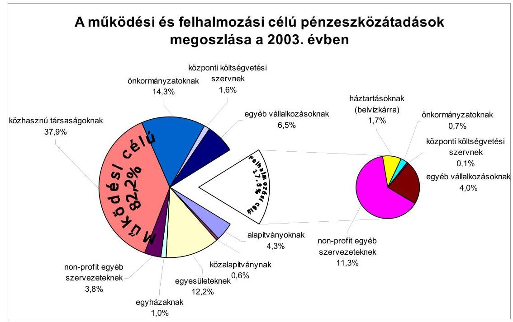
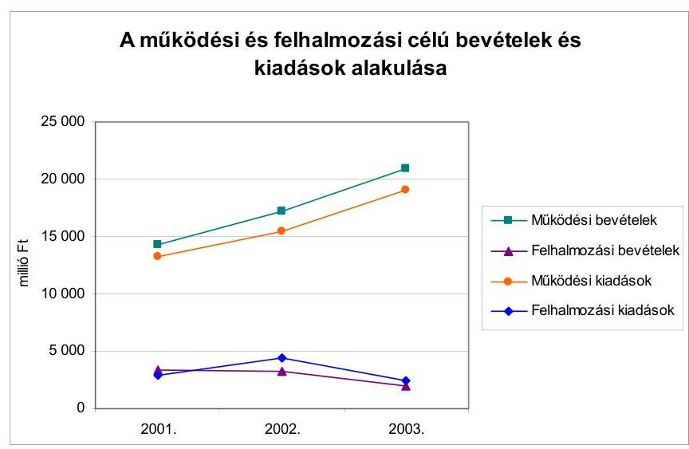
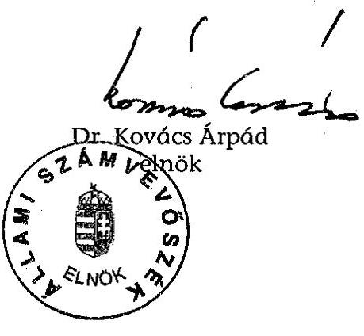
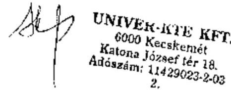
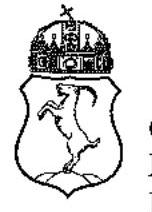

# JELENTÉS 

a Kecskemét Megyei Jogú Város Önkormányzata gazdálkodásának átfogó ellenőrzéséről

---

3. Önkormányzati és Területi Ellenőrzési Igazgatóság
3.3 Átfogó Ellenőrzések Főcsoport
Iktatószám: V-1002-4/33/13/2004.
Témaszám: 692
Vizsgálat-azonosító szám: V0172
Az ellenőrzést felügyelte:
Dr. Lóránt Zoltán
főigazgató
Az ellenőrzés végrehajtásáért felelős:
Dr. Sepsey Tamás
főigazgató-helyettes
Az ellenőrzést vezette:
Csecserits Imréné
főcsoportfőnök-helyettes
Az ellenőrzést végezték:
Balogné Dakó Eszter
számvevő
Dr. Botta Tibor
számvevő tanácsos
Somodiné Fehér Julianna
számvevő tanácsos
A témához kapcsolódó - az elmúlt négy évben készített -számvevőszéki jelentések:
címe
sorszáma
Jelentés a helyi önkormányzatok és helyi kisebbségi 0010
önkormányzatok pénzügyi-gazdasági tevékenységének 1999. évi ellenőrzési tapasztalatairól
Jelentés a helyi önkormányzatok beruházásaihoz és 0120
rekonstrukcióihoz nyújtott 2000. évi címzett és céltámogatások igénybevételének és felhasználásának vizsgálatáról
Jelentés a települési önkormányzatok szilárdhulladék-gazdálkodási 0221
feladatai ellátásának ellenőrzéséről
Jelentés a helyi önkormányzatok egyes pénzügyi befektetésekkel 0318
történő gazdálkodásának ellenőrzéséről
Jelentés a szakképzési struktúra szerepéről a munkaerőpiaci 0321
igények kielégítésében
Jelentés a mozgáskorlátozottak támogatására előirányzott 0344
eszközök felhasználásának ellenőrzéséről

Jelentéseink az Országgyűlés számítógépes hálózatán és az Interneten a www.asz.hu címen is olvashatók.

---

# TARTALOMJEGYZÉK 

BEVEZETÉS ..... 5
I. ÖSSZEGZŐ MEGÁLLAPÍTÁSOK, KÖVETKEZTETÉSEK, JAVASLATOK ..... 7
II. RÉSZLETES MEGÁLLAPÍTÁSOK ..... 16

1. A költségvetés tervezésének, végrehajtásának, az önkormányzat vagyongazdálkodásának és a zárszámadás elkészítésének szabályszerűsége ..... 16
1.1.A költségvetési rendelet jóváhagyásának, módosításának, az előirányzatok nyilvántartásának és betartásának szabályszerűsége ..... 16
1.2.A gazdálkodás szabályozottsága, a bizonylati rend és fegyelem szabályszerűsége ..... 20
1.3.A pénzügyi-számviteli feladatok ellátásának informatikai támogatottsága ..... 28
1.4.Az önkormányzati vagyon nyilvántartása, számbavétele ..... 29
1.5.A vagyonnal való gazdálkodás szabályszerűsége, célszerűsége, nyilvánossága ..... 32
1.6.A céljelleggel nyújtott támogatások szabályszerűsége ..... 37
1.7.A közbeszerzési eljárások szabályszerűsége ..... 41
1.8.A zárszámadási kötelezettség teljesítésének szabályszerűsége ..... 45
1.9.A Polgármesteri hivatal helyi kisebbségi önkormányzatok gazdálkodását segítő tevékenysége ..... 47
2. Az önkormányzati feladatok és a rendelkezésre álló források összhangja ..... 49
2.1.A feladatok meghatározása és szervezeti keretei ..... 49
2.2.A költségvetés egyensúlyának helyzete ..... 52
2.3.A feladatok finanszírozása ..... 57
3. A belső irányítási, ellenőrzési rendszer működésének értékelése ..... 62
3.1.Az ellenőrzési rendszer kialakítása, működése ..... 62
3.2.A könyvvizsgálati kötelezettség teljesítése ..... 64
3.3.A korábbi számvevőszéki ellenőrzések javaslatainak hasznosulása ..... 65

---

# MELLÉKLETEK 

1. számú Az önkormányzati vagyon nagyságának alakulása (1 oldal)
2. számú Az Önkormányzat 2003. évi bevételeinek és kiadásainak alakulása (1 oldal)
3. számú Az Önkormányzat gazdálkodását meghatározó adatok, mutatószámok (1 oldal)
4. számú Egyes önkormányzati feladatok finanszírozása (1 oldal)
5. számú Helyszíni ellenőrzési jegyzőkönyv (5 oldal)
6. számú Dr. Szécsi Gábor Kecskemét Megyei Jogú Város Önkormányzata polgármesterének észrevétele (1 oldal)

---

# RÖVIDÍTÉSEK JEGYZÉKE 

Ötv.
Áht.
ÁSZ tv.
Ámr.
Kbt.,
Kbt. 2
Ktv.
Számv. tv.
Htv.

Ber.
Vhr.

Nek. tv.
ÁSZ
MÁK
KDB
Önkormányzat
Közgyűlés
Polgármesteri hivatal
polgármester
főjegyző
Gazdasági hivatal
Jegyzői osztály
Pénzügyi osztály
Jogi csoport
a helyi önkormányzatokról szóló 1990. évi LXV. törvény az államháztartásról szóló 1992. évi XXXVIII. törvény az Állami Számvevőszékről szóló 1989. évi XXXVIII. törvény
az államháztartás működési rendjéről szóló 217/1998. (XII. 30.) Korm. rendelet
a közbeszerzésekről szóló 1995. évi XL. törvény
a közbeszerzésekről szóló 2003. évi CXXIX. törvény
a köztisztviselők jogállásáról szóló 1992. évi XXIII. törvény
a számvitelről szóló 2000. évi C. törvény
a helyi önkormányzatok és szerveik, a köztársasági megbízottak, valamint egyes centrális alárendeltségű szervek feladat- és hatásköreiről szóló 1991. évi XX. törvény
a költségvetési szervek belső ellenőrzéséről szóló 193/2003. (XI. 26.) Korm. rendelet
az államháztartás szervezetei beszámolási és könyvvezetési kötelezettségének sajátosságairól szóló 249/2000. (XII. 24.) Korm. rendelet
a nemzeti és etnikai kisebbségek jogairól szóló 1993. évi LXXVII. törvény

Állami Számvevőszék
Magyar Államkincstár Bács-Kiskun Megyei Területi Igazgatósága
Közbeszerzések Tanácsa Közbeszerzési Döntőbizottsága
Kecskemét Megyei Jogú Város Önkormányzata
Kecskemét Megyei Jogú Város Önkormányzatának Közgyűlése
Kecskemét Megyei Jogú Város Önkormányzat Polgármesteri Hivatala
Kecskemét Megyei Jogú Város Önkormányzatának polgármestere
Kecskemét Megyei Jogú Város Önkormányzatának címzetes főjegyzője
Kecskemét Megyei Jogú Város Önkormányzatának Gazdasági Hivatala
Kecskemét Megyei Jogú Város Önkormányzata Polgármesteri Hivatalának Jegyzői Osztálya
Kecskemét Megyei Jogú Város Önkormányzata Polgármesteri Hivatalának Pénzügyi Osztálya
Kecskemét Megyei Jogú Város Önkormányzata Polgármesteri Hivatalának Jogi Csoportja

---

| Ellenőrzési csoport | Kecskemét Megyei Jogú Város Önkormányzata Polgármesteri Hivatalának Ellenőrzési Csoportja |
| :--: | :--: |
| Közbeszerzési bizottság | Kecskemét Megyei Jogú Város Önkormányzata Közgyűlésének Közbeszerzési Bizottsága |
| Vagyon- és lakásgazdálkodási bizottság | Kecskemét Megyei Jogú Város Önkormányzata Közgyűlésének Vagyon- és Lakásgazdálkodási Bizottsága |
| SzMSz | Kecskemét Megyei Jogú Város Önkormányzat 47/1998. (XII. 21.) számú rendelete a Közgyűlés és szervei Szervezeti és Működési Szabályzatáról |
| ügyrend | Kecskemét Megyei Jogú Város Önkormányzat 47/1998. (XII. 21.) számú rendelete 6. számú függeléke |
| vagyongazdálkodási rendelet | Kecskemét Megyei Jogú Város Önkormányzat 25/2003. (VI. 2.) számú rendelete az önkormányzat vagyonáról és a vagyongazdálkodás szabályairól |
| közbeszerzési rendelet | Kecskemét Megyei Jogú Város Önkormányzat 33/1996. (IX. 30.) számú rendelete a közbeszerzési eljárás egyes kérdéseiről |
| CHKÖ | Kecskemét Megyei Jogú Város Cigány Helyi Kisebbségi Önkormányzata |
| NHKÖ | Kecskemét Megyei Jogú Város Német Helyi Kisebbségi Önkormányzata |
| Sport Kht. | Kecskeméti Sportlétesítményeket Működtető Közhasznú Társaság |

---

# JELENTÉS 

## a Kecskemét Megyei Jogú Város Önkormányzata gazdálkodásának átfogó ellenőrzéséről

## BEVEZETÉS

Az Ötv. 92. § (1) bekezdése, az ÁSZ tv. 2. § (3) bekezdése, valamint az Áht. 120/A. § (1) bekezdése szerint az önkormányzatok gazdálkodását az ÁSZ ellenőrzi. Az ellenőrzés elvégzése az Országgyűlés illetékes bizottságai részére is átadott, országosan egységes ellenőrzési program alapján történt.

Az ellenőrzés célja: annak értékelése volt, hogy

- az önkormányzati gazdálkodás törvényességét ${ }^{1}$, szabályszerűségét biztosították-e a tervezés, a költségvetés végrehajtása, a vagyongazdálkodás és a zárszámadás során;
- az Önkormányzat által ellátott feladatok és az azokhoz rendelkezésre álló források összhangja biztosított volt-e, különös tekintettel az egyes kiemelt feladatokra;
- a gazdálkodás szabályszerűségét biztosító kontrollok ${ }^{2}$ megfelelően segítették-e a végrehajtást.

Az ellenőrzött időszak: a 2003. év, valamint a 2004. I. félév, az 1.5; 2.1.-2.3. és 3.3. programpontok esetében a 2001-2002. évek is.

Kecskemét megyei jogú város lakosainak száma 2003. január 1-jén 109103 fő volt.

Az Önkormányzat 33 tagú Közgyűlésének munkáját 10 állandó bizottság segítette. A 2002. évi választásokat követően a polgármester személye nem változott.

Az Önkormányzat feladatainak végrehajtása érdekében 34 önállóan gazdálkodó és 39 részben önállóan gazdálkodó költségvetési intézményt működtetett.

[^0]
[^0]:    ${ }^{1}$ A törvényi előírások betartásának elmulasztásakor egységesen a törvénysértés megjelölést alkalmazzuk, mivel az ÁSZ nem tehet különbséget a törvényi előírások között.
    ${ }^{2}$ A gazdálkodás szabályszerűségét biztosító kontroll alatt értjük a kiépített és működő belső irányítási és szabályozási rendszert, valamint a belső ellenőrzési funkciók ellátását.

---

A feladatellátásban hat - többségi önkormányzati tulajdonú - gazdasági társasága és négy közhasznú társasága vett részt. A feladatok ellátására foglalkoztatott közalkalmazottak száma a 2003. évben 3806 fő volt, a Polgármesteri hivatalban 398 fő köztisztviselő dolgozott.

Az Önkormányzat a 2003. évben 24965 millió Ft költségvetési bevételt, 23115 millió Ft költségvetési kiadást teljesített, a 2003. év végén 82551 millió Ft értékű könyvviteli mérleg szerinti vagyonnal rendelkezett. (Az Önkormányzat gazdálkodását meghatározó adatokat, mutatószámokat a jelentés 3. számú melléklete tartalmazza.)

Két helyi kisebbségi önkormányzat - német és cigány - működött a 2002. évi választásokat megelőzően és azt követően is.

---

# I. ÖSSZEGZŐ MEGÁLLAPÍTÁSOK, KÖVETKEZTETÉSEK, JAVASLATOK 

Az Önkormányzat a 2003. évben nem rendelkezett elfogadott gazdasági programmal, arról a 2004. évben a 2004-2006. évekre kiterjedően döntött a Közgyűlés.

A 2003. és a 2004. évi költségvetési koncepciókat a helyben képződő bevételek és kiadások figyelembevételével állították össze. A polgármester az Ámr-ben előírtak ellenére nem csatolta a költségvetési koncepció előterjesztéséhez a helyi kisebbségi önkormányzatok és a Pénzügyi bizottság koncepcióról alkotott véleményét, a költségvetés előterjesztéséhez a Pénzügyi bizottság és a könyvvizsgáló költségvetésről szóló véleményét.

A 2003. évi költségvetési rendeletben költségvetési bevételként, illetve kiadásként finanszírozási célú pénzügyi műveleteket mutattak ki, a költségvetésben felmerülő hiányt a bevétel részeként szerepeltették az Áht. előírását megsértve. A 2004. évi költségvetési rendeletben a költségvetési bevételek-kiadások már nem tartalmazták a finanszírozási célú pénzügyi műveleteket.

Az Áht. előírásait megsértve az előírt mérlegek és kimutatások tartalmi követelményeit az Önkormányzat előre nem határozta meg.

A költségvetés szerkezete az Áht. és az Ámr. előírásainak megfelelő volt, a költségvetés végrehajtásának szabályait meghatározták, valamint elfogadták azon rendeleteket, amelyek a javasolt költségvetési előirányzatokat megalapozták. A kiadási-bevételi előirányzatok meghatározása során figyelembe vették a szerkezeti változtatásokat, a szintre hozásokat, a többletfeladatokat, valamint tervezett mennyiségi és minőségi fejlesztéseket az Ámr. előírásai alapján. Az előirányzat-módosítások szabályszerűek, hitelt érdemlően dokumentáltak voltak. A módosított kiemelt előirányzatokat önkormányzati szinten betartották, azonban egy költségvetési intézmény a kiadási előirányzatát túllépte a 2003. évben, melynek okait nem vizsgálták, felelősségre vonás nem történt.

A Polgármesteri hivatal nem rendelkezett az Ámr-ben meghatározott szervezeti és működési szabályzattal. A Közgyűlés és szervei SzMSz-ében meghatározásra került ugyan a Polgármesteri hivatal szervezeti felépítése, de ez a szabályzat tartalmában nem felelt meg az Ámr. előírásainak, mivel nem tartalmazta a Polgármesteri hivatal alapító okiratának részletezését. A Polgármesteri hivatal rendelkezett ügyrenddel, amelyben meghatározta az irányítással, vezetéssel összefüggő feladatokat, a beszámoltatás rendjét, a szervezeti egységek feladat-, hatás- és jogkörét, a kiadmányozás rendjét, azonban az Ámr-ben előírtak ellenére a Polgármesteri hivatal gazdasági szervezete nem rendelkezett ügyrenddel. A gazdálkodási jogkörök gyakorlásának rendjét a pénzgazdálkodási szabályzatban rögzítették. A polgármester és a főjegyző a kötelezettségvállalási, utalványozási és ellenjegyzési jogkörök gyakorlásáról nem számoltatta be a felhatalmazottakat.

---

A Polgármesteri hivatal számviteli politikáját a főjegyző a jogszabályi követelményeknek megfelelően kialakította, melyet a Polgármesteri hivatalhoz kapcsolódó részben önálló költségvetési szervekre is kiterjesztett. A számviteli politika nem tartalmazta a kisebbségi önkormányzatok gazdálkodásával összefüggő sajátos feladatokat. A főjegyző az egységes számviteli és pénzügyi információs rendszer kialakítása érdekében 1997. óta egyedi rendelkezéseket adott ki, ugyanakkor önkormányzati szinten egységes szabályokat nem határozott meg az intézmények gazdasági szervezetei részére. A számviteli politika keretében elkészítették és hatályba léptették a kötelezően készítendő szabályzatokat. A leltározási és leltárkészítési szabályzatban az ingatlanoknál és a járművek eszközcsoportnál a Vhr. előírásai ellenére 2004. évtől kétévenkénti mennyiségi felvétellel történő leltározást határoztak meg az évenkénti mennyiségi felvétellel történő leltározással szemben, valamint az üzemeltetésre, kezelésre átadott eszközök leltározásával kapcsolatos feladatokat nem rögzítették. Az önköltségszámítás rendjére vonatkozó belső szabályzat nem tartalmazta az önköltségszámítás során figyelembe vett adatok dokumentálásának rendjét, a főkönyvi számlákkal, analitikus nyilvántartásokkal és a beszámolóval való kapcsolatát. A számlarendben a főkönyvi és az analitikus nyilvántartások, valamint a bizonylatok közötti egyeztetési pontokat az üzemeltetésre, kezelésre átadott eszközöknél nem alakították ki. Nem határozták meg az egyeztetések dokumentálásának módját az üzemeltetésre, kezelésre átadott eszközök, valamint a munkavállalókkal szembeni követelések és a belföldi szállítói kötelezettségek esetében. A számlarendben - a Vhr. előírásai ellenére - nem határozták meg az analitikus nyilvántartásokból készült összesítő bizonylatok (feladások) elkészítésének határidejét. A szabályzatban foglalt felhatalmazás ellenére a pénzügyi osztályvezető munkaköri leírásában nem szerepelt a kötelezettségvállalás ellenjegyzése és az utalványozás ellenjegyzése feladat, a pénzügyi és számviteli csoportvezető munkaköri leírásában nem szerepelt az utalványozás ellenjegyzése feladat, valamint a költségvetési csoportvezető munkaköri leírása nem tartalmazta a kötelezettségvállalás ellenjegyzése és a pénzügyi osztályvezető, pénzügyi-számviteli csoportvezető együttes távolléte esetén az utalványozás ellenjegyzési feladatokat. A pénzgazdálkodásban a kötelezettségvállalásra és annak ellenjegyzésére vonatkozó előírásokat betartották, azonban a bevételek beszedésének elrendelése előtt az Ámr. előírásai ellenére elmaradt a teljesítés szakmai igazolása, valamint a banki és pénztári bevételeknél elmaradt az érvényesítés során a feladat elvégzésének igazolására előírt „érvényesítve" megjelölés. Az utalványozási és ellenjegyzési jogkörök gyakorlása megfelelt a szabályozásnak. Az elszámolásra felvett összegek elszámolásának részletes szabályait a Polgármesteri hivatalban a pénzkezelési szabályzat keretén belül meghatározták, a pénztárellenőrzéseket a szabályzatban foglaltaknak megfelelően hajtották végre. A gazdasági eseményeket magukban foglaló bizonylatok 32,4\%-a nem felelt meg a Számv. tv-ben előírt általános alaki és tartalmi követelményeknek, mivel elmaradt a bevételeknél a teljesítés szakmai igazolása, és az érvényesítve megjelölés, valamint a bizonylatok $40,5 \%$-a nem tartalmazta a könyvviteli rögzítés időpontját. A bizonylatok adatainak számviteli nyilvántartásba vétele és elszámolása a helyi kisebbségi önkormányzatok részére nyújtott önkormányzati támogatásnál nem felelt meg a Vhr. előírásainak és a költségvetés szerkezeti rendjének. Az önkormányzati támogatás folyósított összegét a Polgármesteri hivatal számviteli nyilvántartásaiban átadott pénzeszközként, a CHKÖ és NHKÖ-nél átvett pénzeszközként nem mutatták ki, ezzel megsértették

---

a Számv. tv. és a kisebbségi önkormányzatok költségvetésének, gazdálkodásának, vagyonjuttatásának egyes kérdéseiről szóló Korm. rendelet előírásait.

A Polgármesteri hivatalban a pénzügyi-számviteli feladatok megoldását informatikai rendszer segítette. A számítógépes programok aktualizálását a számviteli szabályok változása esetén szerződés alapján a MÁK biztosította. Az Önkormányzat 2004-2006. évi gazdasági programja tartalmazta a Polgármesteri hivatal számítógépes rendszerének fejlesztését. Az adatmentést a Polgármesteri hivatalnál naponta elvégezték, az adatmegőrzést biztosították. Üzemeltetési dokumentációval és felhasználói leírásokkal a számítógépet használók rendelkeztek.

Az Önkormányzat vagyonának nyilvántartási rendszerét a főkönyvi könyvelés és az analitikus nyilvántartások együttesen, az ingatlanok esetében ezen túlmenően az ingatlanvagyon-kataszter biztosította. Az üzemeltetésre, kezelésre átadott eszközök között a BÁCSVÍZ Rt-nek használatba adott, 2003-ban üzembe helyezett vízi-közműveket a Vhr-ben előírtak ellenére nem mutatták ki. A könyvviteli mérlegben szereplő értékadatokat leltárral alátámasztották, a gépek, berendezések, felszerelések leltárának elkészítéséhez szükséges egyedi azonosítás azonban nem megoldott a Polgármesteri hivatalban. Az adóköveteléseknél a 2003. évben 157 millió Ft indokolt értékvesztést számoltak el, azonban az elszámolás a Vhr-ben és a Számv. tv-ben előírtak ellenére, a kisösszegű értékhatár feletti követeléseknél is százalékos mértékben, nem egyedi értékelés alapján történt. Az Önkormányzat vagyonáról és a vagyongazdálkodás szabályairól az Önkormányzat rendeletet alkotott, elkülönítette a törzsvagyont az egyéb vagyontól, a vagyonnal való rendelkezési, döntési hatásköröket döntően a Közgyűlés hatáskörében tartotta. A vagyongazdálkodási rendelet azt az értékhatárt, amely felett nyilvános versenytárgyalás útján lehetséges a hasznosítás, összegszerűen 2003. december 1-től nem határozta meg, ezzel megsértette az Áht. előírását. Zárt körű pályázatra és pályázat nélküli hasznosításra is lehetőséget adott közérdekből értékhatár meghatározása nélkül, azonban a közérdek tartalmáról nem rendelkeztek, a szabályozás nem segítette elő a köztulajdonnal való gazdálkodás nyilvánosságát, átláthatóságát. Az Önkormányzat honlapján közzétette az értékhatárt elérő támogatásokat és szerződéseket.

Az Önkormányzat saját vagyona a 2001. december 31-i 22579 millió Ft-ról 2003. december 31-re 79263 millió Ft-ra, 251\%-kal növekedett. A változást a 2002. évben az addig érték nélkül nyilvántartott ingatlanok értékének megállapítása és könyvviteli nyilvántartásba vétele eredményezte. A tényleges, korrigált (2002. évi egyéb növekedéssel csökkentett) eszköz- és forrásnövekedés a 2001-2003. év között 19,6\%-ot tett ki, a kötelezettségek 49,0\%-kal emelkedtek. Az önkormányzati források szűkülését mutatja, hogy a korrigált saját vagyon növekedése évente lassult, a 2002. évben 10,7\%-os, a 2003. évben 5,9\%-os volt. A vagyongazdálkodás során betartották a döntéshozatali hatásköröket, de a TELEMOZI Kft. üzletrész 2001. évi értékesítésénél célszerűtlen feltételt, kötelezettséget vállaltak a szerződésben.

Az Önkormányzat a 2003. évben 291 szervezetnek 733 millió Ft összegű működési és 71 szervezetnek 159 millió Ft összegű felhalmozási célú támogatást nyújtott. Az Önkormányzat a támogatott szervezetekkel minden esetben támogatási szerződést kötött, amelyben meghatározták a támogatás összegét, üte-

---

mezését, a felhasználás jogcímét, az elszámolás módját, határidejét és ellenőrzését. A számadásokat számszakilag ellenőrizték, azokat elfogadták, de elfogadásának igazolása hiányzott. A támogatások megfelelő célra történő felhasználását a helyszínen nem ellenőrizték. A támogatásban részesült szervezetek elszámoltak a 2003. évi támogatással 2004. június 30-ig. Az UNIVER KTE Kft. számadását a Sport Kht. ellenőrizte, de az ellenőrzött számlákról nem készült összesítés. A cél szerinti felhasználás ennél a szervezetnél a számlák alapján a helyszínen ellenőrzésre került az ÁSZ részéről. Az Önkormányzat két támogatott szervezet számadását úgy is elfogadta, hogy az adott összeg 9,6\%-ával nem számoltak el, és a fel nem használt támogatást nem követelték vissza. A támogatásra vonatkozó döntéseket a nevesített, kiemelt szervezeteknél, valamint az alapítványoknál, közalapítványoknál a Közgyűlés hozta meg.

Az Önkormányzat a Kbt. ${ }^{1}$-ben kapott felhatalmazásnak megfelelően rendeletében szabályozta a közbeszerzési eljárások lebonyolítását, a közbeszerzés hatálya alá nem tartozó beruházások, felújítások esetében pedig a versenyeztetés általános szabályait és formáit. A 2003. évben az Önkormányzatnál 12 közbeszerzési eljárást bonyolítottak le, ebből nyolc nyílt közbeszerzési eljárás, négy hirdetmény közzététele nélküli tárgyalásos eljárás volt. A Kbt. ${ }^{1}$ előírásait megsértve az Önkormányzat egy esetben nem a megfelelő eljárást választotta ki, egy esetben az ajánlati felhívás, illetve a dokumentáció eltért, egy esetben nem határozta meg, hogy mely körülmények hiánya esetén minősíti az ajánlattevőt alkalmatlannak. Ezek miatt a KDB az Önkormányzatot a 2003. évben 5 millió Ft bírsággal sújtotta. Az Önkormányzat a 2003. évi közbeszerzések összegzését a Kbt. ${ }^{1}$ előírását megsértve nem készítette el. Az Önkormányzat egy felújítás esetében nem folytatta le a közbeszerzési eljárást, mellyel megsértette a Kbt. ${ }^{1}$ előírását.

A zárszámadási rendelettervezetet a polgármester határidőben beterjesztette, azonban az Áht-t megsértve költségvetési szervenként a létszámkereteket nem tartalmazta az előterjesztés és az elfogadott rendelet sem. A felújítási és felhalmozási előirányzatok teljesítését az intézményeknél nem mutatták be az Ámr. előírásai ellenére. A Közgyűlés részére tájékoztatás céljából bemutatták a zárszámadás előterjesztéséhez az Áht-ban meghatározottak alapján a működési és felhalmozási célú bevételi és kiadási előirányzatok teljesítését mérlegszerűen, egymástól elkülönítetten, együttesen egyensúlyban, a többéves kihatással járó döntéseket számszerűen és szöveges indoklással, valamint a közvetett támogatásokat tartalmazó kimutatást. Bemutatták a helyi kisebbségi önkormányzatok mérlegeit. A Polgármesteri hivatal 2003. évi pénzmaradványa megállapítása és jóváhagyása a jogszabályi előírásoknak megfelelően történt.

Az SzMSz-ben meghatározták a helyi kisebbségi önkormányzatokkal való kapcsolattartás általános rendjét. A kisebbségi önkormányzat segítését, valamint a kisebbségi önkormányzatok pénzgazdálkodásával kapcsolatos jogköröket a helyi kisebbségi önkormányzatokkal megkötött együttműködési megállapodásokban szabályozták.

Az Önkormányzat szociális, egészségügyi, közoktatási, közművelődési, sport, településüzemeltetési kötelező és önként vállalt feladatait az általa alapított és fenntartott költségvetési szervekkel, az Önkormányzat gazdasági társasága-

---

val, vállalkozások, non-profit szervezetek útján, valamint a könyvtári feladatot a Bács-Kiskun Megyei Önkormányzattal együttműködve látta el.

Az Önkormányzat a 2001-2003. évi költségvetési rendeleteiben forráshiányt, illetve hitelfelvételt tervezett. A tervezetthez viszonyított bevételi többlet és a kiadási megtakarítások következtében az Önkormányzatnak - a vizsgált években - nem volt a működési kiadásoknál forráshiánya. Az Önkormányzat költségvetésének átlagosan 85\%-át a működési bevételek és kiadások tették ki. A működési bevételek 2001-2003. években éves szinten fedezték a működési kiadásokat. A beruházások, felújítások megvalósításához az Önkormányzatnak egyre kevesebb forrás állt rendelkezésére, a felhalmozási bevételek és kiadások részaránya csökkent. A felhalmozási bevételek a 2002-2003. években nem fedezték a felhalmozási kiadásokat. A felhalmozási kiadásokat az Önkormányzat a működési bevételek felhasználásával, valamint hitel felvételével fedezte. A működési kiadások csökkentése érdekében az Önkormányzat a költségvetés tervezésekor elsődlegesen a kötelező feladatok ellátására szorítkozott. A feladatok racionalizálása és a kiadások csökkentése érdekében iskoláknál, óvodáknál, egészségügyi intézményeknél átszervezések történtek. Az Önkormányzat az Ötv-t megsértve nem határozta meg a kötelező és önként vállalt feladatokat, valamint azt, hogy mely feladatokat milyen mértékben és módon lát el.

Az Önkormányzat a források növelése érdekében sikeres pályázatokat nyújtott be, valamint vagyonhasznosítás, ingatlanértékesítés útján növelte bevételeit. A likviditás javítása érdekében a helyi adóbevételek naponta átvezetésre kerültek az Önkormányzat költségvetési számlájára. Az Önkormányzat a 2001-2003. években 78 pályázatot nyújtott be, ebből 75 pályázat sikeres volt, melyek eredménye a költségvetési bevétel 3,5\%-át biztosította a 2001-2003. években. Az Önkormányzat a 2001-2003. években likviditási helyzetének biztosítása érdekében 400 millió Ft folyószámla hitelkeret szerződést kötött. A felvett hitel összege a 2001-2002. években 2-150 millió Ft között változott, a 2003. évben nem vett fel folyószámla-hitelt.

Az Önkormányzat költségvetési bevételein belül a helyi adóbevételek összege és aránya a 2001-2003. években növekedett, a 2003. évben 3833 millió Ft volt, amely a költségvetési bevétel 16,7\%-a. Az Önkormányzat helyi adórendeleteiben a törvényben biztosított és kötelezően előírt mentességeken, kedvezményeken túl is biztosított kedvezményeket, a 2003. évi zárszámadási rendeletben bemutatott, helyi adókra vonatkozó közvetett támogatás összege 899,6 millió Ft volt. Az Önkormányzat az építményadó, az idegenforgalmi adó és a vállalkozói kommunális adó esetében a törvényileg meghatározott adómaximum alatt állapította meg az adófizetési kötelezettséget.

A naturális mutatókkal mérhető feladatok kiadásait, finanszírozását meghatározták a központi döntések, valamint az intézmények csökkenő kapacitáskihasználtsága, különösen az általános iskolai, középiskolai és az óvodai nevelésnél. Az Önkormányzat az intézmények működését - a kiadásokon belül az állami támogatás és hozzájárulás arányának csökkenése mellett a feladatok megoldásának átalakításával, a kapacitáskihasználás növelését célzó intézkedésekkel, átszervezésekkel biztosította. Az önként vállalt feladatok ellátása nem veszélyeztette a kötelező feladatellátást.

---

Az Önkormányzat a közintézmények akadálymentesítése érdekében a szükséges felméréseket elvégezte. A 158 önkormányzati középületből 15 akadálymentesítése történt meg, a hátralévő 143 épület akadálymentesítésének várható költsége - az elkészített felmérés szerint - 882 millió Ft. A 2003-2004. években a Polgármesteri hivatal az épületek akadálymentesítésére vonatkozó tervek és költségvetések előkészítését végezte, amely a pályázatok benyújtásának feltétele volt. A 2004. évben az Önkormányzat pályázati úton 24,3 millió Ft Phare támogatást nyert a fedett uszoda akadálymentesítésére. A hátralévő 143 középület akadálymentesítésére a felmérések, költségvetések elkészültek, a tervezés, megvalósítás elkezdődött, de az eddig elvégzett és a 2004. évi tervezett kiadásokat figyelembe véve a fogyatékos személyek jogairól és esélyegyenlőségük biztosításáról szóló törvényben meghatározott 2005. január 1-jei határidőre a feladatok elvégzése nem biztosítható${ }^{3}$.

Az Önkormányzat az intézmények, valamint a Polgármesteri hivatal belső ellenőrzésére kialakította a belső ellenőrzés szervezetét, biztosította a személyi feltételeit. Az intézményi ellenőrzés, valamint a Polgármesteri hivatal belső ellenőrzése a Jegyzői osztályhoz rendelten az Ellenőrzési csoport feladata. A belső ellenőrzési vezető funkcionális függetlenségét a 2004. évtől az SzMSz-ben biztosították, azonban a munkaköri leírásában - az Áht-t megsértve - nem. A 2004. évi ellenőrzési tervet a Ber. előírásai ellenére nem a költségvetési szerv vezetője, hanem a Közgyűlés hagyta jóvá. Az Ellenőrzési csoport az ellenőrzéseket éves ellenőrzési terv alapján az ütemezésnek megfelelően és a szabályozással összhangban végrehajtotta. Az ellenőrzések hasznosulását utóellenőrzés keretében vizsgálták. A Közgyűlés az ellenőrzések tapasztalatait évente áttekintette.

Az Önkormányzat eleget tett az Ötv. előírásainak, az állandó könyvvizsgálói feladatok ellátására költségvetési minősítésű bejegyzett könyvvizsgálót bízott meg. A könyvvizsgáló az Önkormányzat 2002. és 2003. évi egyszerűsített tartalmú beszámolóit érintően auditálási eltérést nem állapított meg, a beszámolókat korlátozás nélküli hitelesítő záradékkal látta el.

Az Önkormányzat gazdálkodását az ÁSZ az elmúlt négy évben hat alkalommal vizsgálta. Az 1999. évi pénzügyi-gazdasági ellenőrzés javaslatainak 86\%-át hasznosították. Nem biztosították az ingatlankataszteri nyilvántartás és a főkönyvi könyvelés adatainak egyezőségét. Az Önkormányzat beruházásaihoz és rekonstrukcióhoz nyújtott 2000. évi címzett- és céltámogatások igénylésének és felhasználásának ellenőrzése kapcsán tett javaslatok 50\%-át valósították meg, nem került sor a generálkivitelező által az alvállalkozók jogszabály szerinti adatainak építési naplóba történő bevezetésére. A 2002. évi pénzügyi befektetésekkel történő gazdálkodás vizsgálata által tett javaslatokat hasznosították. A szakképzéssel kapcsolatos vizsgálat javaslatainak 75\%-át megvalósították. A szűkös pénzügyi források miatt a szakképző iskolák felújítási igényeinek kielégítését nem biztosították. Számítógépes szoftver hiányában nem valósult meg a költségvetési kiadások szakmacsoportonkénti mérése és elemzése a szakképző iskoláknál. A mozgáskorlátozottak támogatására előirányzott pénzesz-

[^0]
[^0]:    ${ }^{3}$ Az 1998. évi XXVI. törvény 29. § (6) bekezdés.

---

közök hasznosulása témában végzett vizsgálat javaslatainak realizálására nem történt intézkedés.

A helyszíni ellenőrzés megállapításainak hasznosítása mellett javasoljuk:

# a polgármesternek: 

a jogszabályi előírások maradéktalan betartása érdekében:

1.  terjessze a Közgyűlés elé - a főjegyző által készített előterjesztés alapján - a vagyongazdálkodási rendelet módosítását, annak érdekében, hogy az Áht. 108. § (1) bekezdése alapján a Közgyűlés meghatározza azt az értékhatárt, amely felett csak versenyeztetés útján lehetséges a hasznosítás;
2.  csatolja a költségvetési koncepció-tervezethez az Ámr. 28. § (3) bekezdése alapján a Pénzügyi bizottság és a helyi kisebbségi önkormányzatok koncepció-tervezetről alkotott véleményét, valamint a költségvetési rendelet előterjesztéséhez a Pénzügyi bizottság és a könyvvizsgáló véleményét az Ámr. 29. § (9) bekezdése alapján;
3.  terjessze - a főjegyző által készített előterjesztés alapján - a Közgyűlés elé az Áht. 118. §-ában előírt mérlegek, kimutatások tartalmának meghatározásáról szóló rendelettervezetet;
4.  követelje meg, hogy a költségvetési szervek az Áht. 93. § (1) bekezdésében foglaltaknak megfelelően a Közgyűlés által jóváhagyott előirányzatokon belül gazdálkodjanak;
5.  kezdeményezze a Közgyűlésnél, hogy határozzák meg az Ötv. 8. § (2) bekezdésében foglaltak alapján, hogy a lakosság igényeitől és az anyagi lehetőségtől függően az Önkormányzat mely feladatokat, milyen mértékben és módon lát el;
a munka színvonalának javítása érdekében:
6.  kísérje figyelemmel a középületek akadálymentessé tételét tekintettel a fogyatékosok jogairól és esélyegyenlőségük biztosításáról szóló 1998. évi XXVI. tv. 29. § (6) bekezdésében meghatározott 2005. január 1-jei teljesítési határidőre;
7.  gondoskodjon a kötelezettségvállalásra és az utalványozásra felhatalmazottak beszámoltatásáról;
8.  terjessze a Közgyűlés elé a számvevőszéki ellenőrzésről készített jelentést, a feltárt hiányosságok megszüntetése érdekében készíttessen intézkedési tervet;

## a főjegyzőnek:

a jogszabályi előírások maradéktalan betartása érdekében:

1.  kezdeményezze az SzMSz Polgármesteri hivatalra vonatkozó előírásainak az Ámr. 10. § (4) bekezdés a-d) és g-h) pontjaiban foglaltak szerinti kiegészítését az alapító okirat számával, az állami feladatként ellátott alaptevékenység, benne elhatároltan a kisegí-

---

tő, kiegészítő tevékenységek, valamint az azokat meghatározó jogszabályok megjelölésével, a közhasznú vagy gazdasági társaságban való részvételnek a részletes, alaptevékenységtől elhatárolt felsorolásával, e feladatok, tevékenységek forrásaival, az általános forgalmi adó alanyiság tényével, valamint a költségvetési szervhez rendelt részben önálló költségvetési szervek felsorolásával;
2.  alakítsa ki a Htv. 140. § (1) bekezdés c) pontjának betartása érdekében a költségvetési szervek számviteli rendjét;
3.  intézkedjen az Ámr. 17.§ (5) bekezdésében előírtak alapján a Pénzügyi osztály ügyrendjének elkészítése érdekében;
4.  gondoskodjon arról, hogy a leltározási szabályzat feleljen meg a Vhr. 37. § 2004. január 1-től hatályos előírásának, a mennyiségi leltározás elvégzésének gyakorisága tekintetében is, valamint alakítsa ki az üzemeltetésre, kezelésre átadott eszközök leltározásának szabályait;
5.  gondoskodjon arról, hogy a számlarendben a Vhr. 49. § (4) bekezdésében foglaltaknak megfelelően az analitikus nyilvántartásokból készített feladások elkészítésének határideje rögzítésre kerüljön;
6.  gondoskodjon arról, hogy az Ámr. 135. § (1) bekezdésében foglaltaknak megfelelően a bevételek beszedésének elrendelése előtt megtörténjen a szakmai teljesítés igazolása;
7.  gondoskodjon arról, hogy a banki és a pénztári bevételek érvényesítésekor az „érvényesítve" megjelölés feltüntetésre kerüljön az Ámr. 135. § (4) bekezdésében foglaltaknak megfelelően, valamint, hogy a számviteli bizonylatok a Számv. tv. 167. § (1) bekezdés i) pontjában foglaltaknak megfelelően tartalmazzák a könyvviteli rögzítés időpontját;
8.  biztosítsa, hogy az üzembe helyezett és a BÁCSVÍZ Rt. által üzemeltetett vízi közművek a Polgármesteri hivatal könyvviteli nyilvántartásában a Vhr. 20. § (1) bekezdésében foglaltaknak megfelelően az üzemeltetésre átadott eszközök között kerüljenek kimutatásra;
9.  követelje meg adókövetelések értékvesztésének elszámolásánál a Vhr. 31. §-ában és a Számv. tv. 16. § (1) bekezdésben foglaltak betartását, a kisösszegű értékhatár feletti követelések egyedi értékelését;
10. alakítsa ki és az Áht. 13/A. § (2) bekezdésében foglaltak betartása érdekében működtesse a nem szociális ellátásként nyújtott céljellegű támogatások esetén a számadások, felhasználások ellenőrzési rendszerét, intézkedjen a céltól eltérő nem rendeltetésszerű felhasználás esetén a visszafizetésre, illetve a számadási kötelezettség elmulasztása esetében a kötelezettség teljesítéséig a további támogatás felfüggesztésére;
11. intézkedjen annak érdekében, hogy a Polgármesteri hivatalban a közbeszerzési eljárás fajtájának kiválasztásánál tartsák be a Kbt. 2 41. § (1)-(5) bekezdésében, az ajánlattevő alkalmatlanságának megállapításánál a Kbt. 2 93. § (1) bekezdésében, a közbeszerzési eljárások megindításánál a Kbt. 2 402. § (1)-(2) bekezdésében foglaltakat, valamint gondoskodjon arról, hogy tárgyalásos eljárás alkalmazására csak abban az esetben kerüljön sor, ha azt a Kbt. 2 125. § (2) bekezdése lehetővé teszi;

---

12. gondoskodjon a Kbt. 16. § (1) bekezdésében a közbeszerzésekről előírt éves statisztikai összegzés elkészítéséről;
13. gondoskodjon arról, hogy a zárszámadási rendeletben a létszámkereteket költségvetési szervenként is mutassák ki az Áht. 69. § (1) bekezdés szerint és a felújítási előirányzatok teljesítését az intézményeknél célonként szerepeltessék az Ámr. 29. § (1) bekezdés c.) pontja alapján;
14. gondoskodjon arról, hogy az önkormányzati támogatás a számviteli nyilvántartásokban a helyi kisebbségi önkormányzatok bevételei között az átvett pénzeszközként az Önkormányzat kiadásai között átadott pénzeszközként kimutatásra kerüljön a helyi kisebbségi önkormányzatok költségvetésének, gazdálkodásának, vagyonjuttatásának egyes kérdéseiről szóló 20/1995. (III. 3.) Korm. rendelet 15. § (1) bekezdésében foglaltaknak, valamint a Számv. tv. 15. § (2) bekezdésének megfelelően;
15. tegyen eleget a Ber. 18. §-ában előírt kötelezettségének az éves ellenőrzési terv jóváhagyását illetően, valamint az Áht. 121/A. § (3) bekezdés, a Ber. 6. § (2) bekezdés és az SzMSz előírásainak megfelelően a belső ellenőrzési vezető munkaköri leírása módosításának;
a munka színvonalának javítása érdekében:
16. intézkedjen a Polgármesteri hivatalban elhelyezett gépek, berendezések, felszerelések leltárszámmal történő egyedi azonosításáról a leltározási szabályzatban foglaltaknak megfelelően;
17. gondoskodjon az ellenjegyzéssel felhatalmazott személyek beszámoltatásáról;
18. gondoskodjon arról, hogy az önköltségszámítás rendjére vonatkozó belső szabályzat kiegészítésre kerüljön az önköltségszámítás során figyelembe vett adatok dokumentálásának rendjével, valamint az adatok főkönyvi számlákkal, analitikus nyilvántartásokkal és a beszámolóval való kapcsolatával;
19. egészítse ki a Polgármesteri hivatal számviteli politikáját és számlarendjét a helyi kisebbségi önkormányzatok gazdálkodásával összefüggő sajátos feladatokkal.

---

# II. RÉSZLETES MEGÁLLAPÍTÁSOK 

## 1. A KÖLTSÉGVETÉS TERVEZÉSÉNEK, VÉGREHAJTÁSÁNAK, AZ ÖNKORMÁNYZAT VAGYONGAZDÁLKODÁSÁNAK ÉS A ZÁRSZÁMADÁS ELKÉSZÍTÉSÉNEK SZABÁLYSZERŰSÉGE

### 1.1. A költségvetési rendelet jóváhagyásának, módosításának, az előirányzatok nyilvántartásának és betartásának szabályszerűsége

A Közgyűlés a 2000-2002. közötti időszakra érvényes gazdasági programról a 774/1999. (XI. 24.) számú határozatával döntött. A 2003-2006. évekre a polgármester által 2002. december 11-én előterjesztett gazdasági programot a Közgyűlés tárgyalta, de nem fogadta el, így az Ötv. 91. § (1) bekezdésében foglaltakat megsértve az Önkormányzat a 2003. évben nem rendelkezett elfogadott gazdasági programmal.

A Közgyűlés a 2004-2006. évekre a 153/2004. (III. 24.) számú határozatával fogadta el az Önkormányzat gazdasági programját.

A 2004-2006. évre vonatkozó gazdasági program kiterjedt az önkormányzati infrastrukturális fejlesztésekre, az intézményi feladatellátásra, fejlesztési programokra, a turisztikai és a nemzetközi kapcsolatok területeire, a vagyongazdálkodásra és a lakásgazdálkodásra. A gazdasági program tartalmazta az ellátandó önkormányzati feladatokat, a feladatok ellátásának szervezeti megoldását és a szükséges források meghatározását.

A 2003. évi költségvetési koncepciót 2002. december 1-jén, a 2004. évit 2003. november 18-án, az előírt határidőn belül ${ }^{4}$ terjesztette elő a polgármester.

A költségvetési koncepciókat ${ }^{5}$ az Ámr. 28. § (1) bekezdésében előírtak alapján a helyben képződő bevételek és az ismert kötelezettségek figyelembevételével állították össze. A gazdasági programot a költségvetési koncepció készítésénél a 2004. évben figyelembe vették, a 2003. évben - elfogadott program hiányában - nem vették figyelembe.

[^0]
[^0]:    ${ }^{4}$ Az Áht. 70. §-a szerint a tervévet megelőző november 30-ig, a helyi önkormányzati választások évében december 15-ig kell a polgármesternek a koncepciót a Közgyűlés elé terjesztenie.
    ${ }^{5}$ A Közgyűlés a 2003. évi költségvetési koncepcióról a 702/2002. (XII. 11.) számú határozattal, a 2004. évi költségvetési koncepcióról a 658/2003. (XI. 26.) számú határozattal döntött.

---

A helyi kisebbségi önkormányzatok elnökeit a költségvetési koncepció helyi kisebbségi önkormányzatra vonatkozó részeiről tájékoztatták az Ámr. 28. § (6) bekezdésének megfelelően (erről jegyzőkönyvet vettek fel).

A polgármester nem csatolta az éves költségvetési koncepció előterjesztéséhez a Pénzügyi bizottság és a helyi kisebbségi önkormányzatok koncepció-tervezetről alkotott véleményét, ezzel nem tartotta be az Ámr. 28. § (3) bekezdését. A kisebbségi önkormányzatok és a Pénzügyi bizottság a költségvetési koncepciót tárgyaló ülésen terjesztették elő a koncepciót véleményező határozataikat.

Mindkét évi költségvetési koncepcióban - az Ámr. 28. §. (4) bekezdésében foglaltaknak megfelelően - határoztak a költségvetés-készítés további feladatairól, az ellátandó feladatok szerint prioritási sorrendet állítottak fel.

A 2003. évi költségvetési rendeletben a 22 167,2 millió Ft bevételi főösszeg tartalmazta a 1040 millió Ft tervezett 2003. évi hitelfelvételt, valamint a 2002. évben jóváhagyott és áthúzódó 95,6 millió Ft hitel 2003. évi igénybevételét. A bevételi főösszeggel egyenlő kiadási főösszegben pedig 531,9 millió Ft adósságszolgálat szerepelt (ebből: hiteltörlesztés 218,8 millió Ft, kezességvállalás 60 millió Ft, kamatkiadás 253 millió Ft). A 2003. évi költségvetési rendeletben ${ }^{6}$ költségvetési bevételként, kiadásként finanszírozási célú pénzügyi műveleteket (hitel) is kimutattak, ezzel megsértették az Áht. 8/A. § (7) bekezdését. A 2004. évi költségvetési rendeletben ${ }^{7}$ a költségvetési bevételek már nem tartalmazták a finanszírozási célú pénzügyi műveleteket.

A polgármester a 2003. évi költségvetési rendelettervezethez az Áht. 71. § (2) bekezdésének megfelelően előterjesztette azon rendelettervezeteket ${ }^{8}$, amelyek a javasolt költségvetési előirányzatokat megalapozták. Bemutatta a költségvetési előterjesztés a többéves elkötelezettségekkel járó kiadási tételek későbbi évekre vonatkozó kihatásait, a 2004. évre 1939,6 millió Ft, a 2005. évre 808,4 millió Ft, a 2006. évre pedig 662,8 millió Ft szerepelt, 23 egyedi döntéshez kapcsolódóan.

A Polgármesteri hivatal és az intézmények kiadási és bevételi előirányzatainak ${ }^{9}$ meghatározása során - az intézményi egyeztetést követően - figyelembe vették a szerkezeti változtatásokat, szintre hozásokat, a többletfeladatokat, valamint a tervezett mennyiségi és minőségi fejlesztéseket az Ámr.
 26. § (2) és (6) bekezdések szerint.

[^0]
[^0]:    ${ }^{6}$ Az Önkormányzat 6/2003. (II. 17.) számú rendelete a 2003. évi költségvetésről.
    ${ }^{7}$ Az Önkormányzat 5/2004. (II. 16.) számú rendelete a 2004. évi költségvetésről.
    ${ }^{8}$ A helyi iparűzési adóról, a vállalkozók kommunális adójáról, az építményadóról, az idegenforgalmi adóról, a gépjárműadó mértékéről, a térítési díjakról szóló rendeletek.
    ${ }^{9}$ A 2003. évi kiadási és bevételi főösszeg 22 167,2 millió Ft, a 2004. évi kiadási főösszeg 22 347,7 millió Ft, a bevételi főösszeg 21 419,7 millió Ft, a hiány 928 millió Ft.

---

A költségvetési rendelettervezetet a polgármester az Áht. 71. § (1) bekezdésében előírt február 15-i határidőn belül beterjesztette a Közgyűlésnek 2003. január 31-én, illetve 2004. január 29-én. Az előterjesztést a bizottságok és a könyvvizsgáló véleményezték, de véleményüket a polgármester az előterjesztéshez nem csatolta. A bizottsági határozatokat és a könyvvizsgáló véleményét a közgyűlésen terjesztették elő.

Az Önkormányzat rendeletben nem határozta meg - az Áht. 118. §-ában előírtakat megsértve - a költségvetés és a zárszámadás előterjesztésekor tájékoztatásul bemutatandó mérlegek és kimutatások tartalmi követelményeit. A 2003. és a 2004. évi költségvetések előterjesztésekor - a szabályozás elmaradása ellenére - a Közgyűlés részére tájékoztatásul bemutatták az Áht. 118. §-ában előírt mérlegeket és kimutatásokat szöveges indoklással együtt. Az Áht. 67. § (3) bekezdésnek megfelelően meghatározták a címrendet.

A 2003. és a 2004. évi költségvetési rendeletek az Áht. 69. § (1) bekezdése és az Ámr. 29. § (1) bekezdése által meghatározott tartalommal készültek. Tartalmazták a bevételi és kiadási előirányzatokat, a többéves kihatással járó feladatok előirányzatait éves bontásban, a működési és felhalmozási célú bevételi és kiadási előirányzatokat mérlegszerűen, egymástól elkülönítetten és együttesen egyensúlyban. Csatolták az év várható bevételi és kiadási előirányzatainak teljesüléséről az előirányzat-felhasználási ütemtervet, meghatározták a költségvetési szervek és a Polgármesteri hivatal létszámkeretét. Bemutatták a közvetett támogatásokat tartalmazó kimutatást szöveges indoklással.

A költségvetési rendeletek tartalmazták a költségvetés végrehajtásával összefüggő legfontosabb helyi szabályokat. Azok kiterjedtek a hitelműveleti hatáskörökre: 400 millió Ft likviditási hitelt vehet igénybe az Önkormányzat, a hitelszerződés aláírására a polgármester jogosult. A felhalmozási célú kiadásokhoz igénybe vehető hitelek maximális összegét a rendeletben meghatározták, az éven túli hitel felvételére, a szerződés aláírására a polgármestert felhatalmazták. Az előirányzatok módosítási hatáskörét, az intézmények előirányzatátcsoportosítási hatáskörét, a többletbevételek felhasználásának szabályait előírták. Tartós kötelezettségvállalást intézményi saját hatáskörben nem valósíthattak meg. Az Önkormányzat irányítása alá tartozó költségvetési szervek saját hatáskörben módosíthatták kiadási és bevételi előirányzatuk főösszegét, ezen belül részelőirányzataikat a tervezettet meghaladó többletbevételeikkel (kivéve az alaptevékenység és az alaptevékenységgel összefüggő egyéb bevételeket), jóváhagyott pénzmaradványokkal, vállalkozási tartalékokkal. A pénzmaradvány átcsoportosításának szabályait az Ámr. 66. § (6) bekezdése alapján meghatározták. A végrehajtás szabályai között meghatározták a kiskincstári finanszírozás rendjét, a vagyonnal kapcsolatos tárgyévi aktuális teendőket, azok végrehajtásának jogosultjait és felelőseit. Rendelkeztek a céljelleggel nyújtott támogatások folyósításának módjáról. A végrehajtási szabályokban rögzítették, hogy a támogatások felhasználásáról a számadást határidőben nem teljesítő szervezetek részére újabb támogatást három évig nem lehet adni. Felhatalmazták a polgármestert az átmenetileg szabad pénzeszközök betétként való elhelyezésére. Az értékpapír gazdálkodás szabályait a költségvetési rendelet nem írta elő.

---

Az Önkormányzat a 2004. évi költségvetési rendeletében a kisebbségi önkormányzatok költségvetési határozatát az NHKÖ esetében változatlan formában építette be az Ámr. 32. §-ának megfelelően, a CHKÖ költségvetési határozatát nem szerepeltette.

Az Önkormányzat kilenc alkalommal módosította a 2003. évi költségvetési rendeletét ${ }^{10}$. Az előterjesztett rendelettervezetek a költségvetéssel összehasonlítható módon tartalmazták a módosító javaslatokat. A módosítások hatására a 2003. évi költségvetés bevételi és kiadási főösszege 25 104,3 millió Ft-ra, 13,3\%-kal emelkedett. A módosításokra a központi költségvetésből biztosított pótelőirányzatok és a saját bevételek növekedése, valamint a többletbevételekből megvalósítandó kiadások és a céltartalékok kiadási előirányzatokra történő átcsoportosítása miatt került sor. Az előirányzat-változtatásokat hitelt érdemlően dokumentálták.

A rendelet-módosítások szabályszerűen, az Ámr. 53. § (1) - (6) bekezdései és az önkormányzati rendelet előírásai alapján történtek. Az előterjesztések tartalmazták a módosítások indoklását és részletes jogcímeit. A rendeletek mellékleteiben a módosítás előtti előirányzatok és a módosítás jogcímei és összegei, valamint a módosított előirányzatok is bemutatásra kerültek.

A költségvetési szervek saját hatáskörében végrehajtott előirányzat változtatásairól a polgármester a Közgyűlést az Ámr. 53. § (6) bekezdés szerint határidőben tájékoztatta, a költségvetési rendeletet a Közgyűlés módosította. A tárgyéven túli, de december 31-i hatállyal történő módosításra 2004. február 16-án került sor.

A Közgyűlés az Ámr. 53. § (2) bekezdésben előírt határidőn belül döntött a költségvetési rendelet pótelőirányzatok miatti módosításairól. A helyi kisebbségi önkormányzatok költségvetésről hozott módosító határozatait a költségvetési rendeleten átvezették az Ámr. 53. § (8) bekezdése szerint. A kisebbségi önkormányzatoknak nyújtott önkormányzati támogatás a módosító rendeletek szerint a CHKÖ részére 3,6 millió Ft-ra, a NHKÖ részére 3,0 millió Ft-ra emelkedett és a kisebbségi önkormányzatok határozataiban foglaltakkal megegyezett.

A jóváhagyott előirányzatok nyilvántartása teljes körű és áttekinthető volt, azok adatai megegyeztek a költségvetési rendeletek és a költségvetést módosító rendeletek számadataival az Áht. 103. § (1) bekezdése szerint. A költségvetési beszámolókban bemutatott eredeti és módosított előirányzatok megegyeztek a költségvetési rendeletekben foglaltakkal.

A Közgyűlés által meghatározott, módosított kiemelt előirányzatokat önkormányzati szinten betartották. Költségvetési szervek szintjén történt előirányzat-túllépés, a Szentgyörgyi Albert Egészségügyi Szakközépis-

[^0]
[^0]:    ${ }^{10}$ Az Önkormányzat költségvetés-módosítási rendeletei és a módosítás összegei: 10/2003. (II. 24.) 7,5 millió Ft, 15/2003. (III. 31.) 813,5 millió Ft, 22/2003. (V. 12.) 38,7 millió Ft, 31/2003. (VI. 23.) 985,2 millió Ft, 37/2003. (IX. 15.) 130,5 millió Ft, 40/2003. (X. 1.) 409,5 millió Ft, 50/2003. (XII. 1.) kiadási előirányzatok közötti átcsoportosítás, 59/2003. (XII. 19.) 259,2 millió Ft, 4/2004. (II. 16.) 293,0 millió Ft.

---

kola 1,2\%-kal túllépte az összes kiadása 300,1 millió Ft-os módosított előirányzatát a 2003. évben, megsértve az Áht. 12/A. § (1) bekezdés előírását, mely szerint a kiadás a jóváhagyott előirányzat összegéig teljesíthető. A 3,7 millió Ft-os túllépés okait a fenntartó nem vizsgálta, mivel a bevételeket is túlteljesítette az intézmény 9\%-kal. A bevételek módosított előirányzatának túlteljesítése 15 költségvetési szervnél következett be.

Az intézményi kiadási előirányzat 2003. évi túllépésének okait nem vizsgálták, felelősségre vonás nem történt.

# 1.2. A gazdálkodás szabályozottsága, a bizonylati rend és fegyelem szabályszerűsége

A Polgármesteri hivatal rendelkezett az Áht. 88. § (3) bekezdésének megfelelően alapító okirattal ${ }^{11}$.

Az Önkormányzat 47/1998. (XII. 21.) számú rendeletével fogadta el a Közgyűlés és szervei SzMSz-ét, és ezen belül a Polgármesteri hivatal ügyrendjét. A Polgármesteri hivatal - mint önálló gazdálkodási jogkörrel rendelkező költségvetési szerv - az Ámr. 10. § (4) bekezdésében előírtak ellenére nem rendelkezett szervezeti és működési szabályzattal.

Az SzMSz tartalmazta a Polgármesteri hivatal szervezeti egységekre tagolódását és feladatait. Rögzítette a Közgyűlés bizottságainak összetételét, részletes feladat- és hatáskörét, az Önkormányzat kizárólagos vagy többségi tulajdonában lévő gazdasági társaságok ügyvezetőinek felsorolását, az önkormányzati szövetségek és egyéb szervezetek megnevezését. Nem tartalmazta az SzMSz az Ámr. 10. § (4) bekezdés a-d) és g-h) pontjai ellenére a Polgármesteri hivatal alapító okiratának számát, az állami feladatként ellátott alaptevékenység, benne elhatároltan a kisegítő, kiegészítő tevékenységek, valamint az azokat meghatározó jogszabályok megjelölését, és közhasznú vagy gazdasági társaságban való részvételnek a részletes - alaptevékenységtől elhatárolt - felsorolását, e feladatok, tevékenységek forrásait, az általános forgalmi adó alanyiság tényét, valamint a költségvetési szervhez rendelt részben önálló költségvetési szervek felsorolását.

A Polgármesteri hivatal gazdasági szervezete az Ámr. 17. § (5) bekezdésében foglaltak ellenére nem rendelkezett külön ügyrenddel. A Polgármesteri hivatal ügyrendje ${ }^{12}$ meghatározta a Polgármesteri hivatal irányításával, vezetésével összefüggő feladatokat, a beszámoltatás rendjét, felsorolta a belső szervezeti egységek - osztályok, osztályvezetők, csoportok - feladat-, hatás- és jogkörét. Rögzítették a Polgármesteri hivatal működésének szabályait, ezen belül a kiadmányozás rendjét, valamint a költségvetési szerv költségvetésének végrehajtására szolgáló számlaszámot.

[^0]
[^0]:    ${ }^{11}$ A Polgármesteri hivatal alapító okiratát a Közgyűlés 307/2003. (V. 28.) határozatának 5. számú melléklete tartalmazza.
    ${ }^{12}$ Az SzMSz 6. számú függeléke.

---

A Polgármesteri hivatalnál a 2001. évtől ISO 9001 szabvány szerinti minőségirányítási rendszert működtetnek. A rendszer alapdokumentuma a Minőségirányítási kézikönyv. A feladatok végrehajtásának részletes leírását az eljárások kézikönyve tartalmazza.

A Polgármesteri hivatalban a gazdálkodási jogkörök gyakorlásának rendjét a 2003. évben a kötelezettségvállalás, utalványozás, ellenjegyzés és érvényesítés rendjéről ${ }^{13}$ kiadott, valamint 2004. január 1-től a pénzgazdálkodási szabályzatban ${ }^{14}$ rögzítették. A szabályozás meghatározta a gazdálkodási jogkörök tartalmát, rögzítették a jogkörök gyakorlására jogosult személyeket és azok aláírás mintáját. A szabályozás előzetes írásbeli kötelezettségvállalás nélküli kötelezettségvállalást nem engedélyezett.

Kötelezettségvállalási jogkörrel a felhalmozási és tőke jellegű kiadások, az átadott pénzeszközök, a pályázaton nyert visszatérítendő támogatások, az önkormányzati bérlakások értékesítéséből származó bevételek felhasználása, valamint a Polgármesteri hivatal részben önálló intézményei ${ }^{15}$ kiadásai tekintetében a polgármester mást nem hatalmazott fel. A polgármester a Polgármesteri hivatal működési kiadásai tekintetében a főjegyző, egyéb kiadásoknál a pénzügyi-gazdasági ügyekért felelős alpolgármester részére adott felhatalmazást a kötelezettségvállalásra. Rögzítették távollét esetére a kötelezettségvállalásra jogosultak körét: a polgármester saját távolléte esetére a pénzügyigazdasági ügyekért felelős alpolgármester részére, a főjegyző távolléte esetére a pénzügyi osztályvezető és a költségvetési csoportvezető részére, a pénzügyigazdasági ügyekért felelős alpolgármester távolléte esetére az oktatási, kulturális és sport ügyekért felelős alpolgármester részére adott kötelezettségvállalásra felhatalmazást.

A kötelezettségvállalás ellenjegyzésére a főjegyző, távolléte esetére a felhalmozási és tőke jellegű kiadások, az átadott pénzeszközök, a pályázaton nyert visszatérítendő támogatások, az önkormányzati bérlakások értékesítéséből származó bevételek felhasználása, valamint a Polgármesteri hivatal részben önálló intézményei kiadásai tekintetében az aljegyzőt hatalmazta fel. A Polgármesteri hivatal működési kiadásai tekintetében a főjegyző a kötelezettségvállalás ellenjegyzésére a pénzügyi osztályvezetőt és költségvetési csoportvezetőt hatalmazta fel. Távolléte esetén a szabályozás szerint a pénzügyi osztályvezető és a költségvetési csoportvezető adhat felhatalmazást a kötelezettségvállalás ellenjegyzésére, annak ellenére, hogy az Ámr. 137. § (2) bekezdésben foglaltak szerint erre jogosultsággal nem rendelkezik. Írásos felhatalmazást a

[^0]
[^0]:    ${ }^{13}$ A polgármester és a főjegyző által 2002. november 1-jén együttesen kiadott, majd a főjegyző által 2003. április 1-től az ellenjegyzésre vonatkozóan módosított szabályzat. A módosításra a pénzügyi osztályvezető személyének változása miatt került sor, valamint kijelölték a szakmai teljesítés igazolását végző személyeket.
    ${ }^{14}$ A polgármester és a főjegyző által 2004. január 1-jén együttesen kiadott szabályzat.
    ${ }^{15}$ A Településfejlesztési Önkormányzati Társulás és a Dél-alföldi Regionális Környezetvédelmi Programcentrum Társulás.

---

pénzügyi osztályvezető és a költségvetési csoportvezető más személynek nem adott.

Az utalványozásra jogosultak köre megegyezik a kötelezettségvállalásra
 jogosultakkal, azzal a kiegészítéssel, hogy a polgármester, a pénzügyi-gazdasági ügyekért, valamint az oktatási, kulturális és sport ügyekért felelős alpolgármesterek együttes távolléte esetén a társadalmi megbízatású alpolgármester kapott felhatalmazást az utalványozásra.

Az utalványozás ellenjegyzése a főjegyző felhatalmazása alapján a pénzügyi osztályvezető és a pénzügyi és számviteli csoportvezető feladata. Az utalványozás ellenjegyzésére a pénzügyi osztályvezető és a pénzügyi-számviteli csoportvezető együttes távolléte esetén a költségvetési csoportvezető jogosult.

Az Ámr. 135. § (3) bekezdésében foglaltaknak megfelelően a főjegyző rendelkezett a teljesítés szakmai igazolásának rendjéről és kijelölte az azt végző személyeket. Az érvényesítési feladatok elvégzésével a főjegyző a pénzügyi osztály három (egy fő érvényesítő és két fő helyettesítő) - az Ámr. 135. § (2) bekezdésében előírt középfokú iskolai végzettséggel és pénzügyi-számviteli képesítéssel rendelkező - köztisztviselőjét bízta meg.

A kijelöléseknél, felhatalmazásoknál az Ámr. 135. § (5) és 138. § (1)-(4) bekezdéseinek megfelelően figyelembe vették az összeférhetetlenségi szabályokat.

A polgármester és a főjegyző a kötelezettségvállalási, utalványozási és ellenjegyzési jogkörök gyakorlásáról nem számoltatta be a felhatalmazottakat.

A főjegyző kialakította a Polgármesteri hivatal számviteli rendjét, a Polgármesteri hivatal számviteli politikáját kiterjesztette a Polgármesteri hivatalhoz tartozó részben önállóan gazdálkodó költségvetési szervekre. Az Önkormányzat számviteli politikájának összehangolása, az egységes számviteli és pénzügyi információs rendszer kialakítása érdekében az intézmények részére az 1997. évtől egyedi rendelkezéseket adott ki, ugyanakkor önkormányzati szinten egységes szabályokat, a Htv. 140. § (1) bekezdés c) pontját megsértve, nem határozott meg az intézmények gazdasági szervezetei részére.

A főjegyző 1997-ben szabályozta a kis értékű tárgyi eszközök nyilvántartását. Az 1998. évben a főjegyző rendelkezést adott ki a számviteli politikában a tárgyi eszközök nyilvántartására vonatkozóan, a 2001. évben a számviteli törvény változása kapcsán rendelkezett a számviteli politika átdolgozásáról, szabályozta az Önkormányzat tulajdonában lévő ingatlanvagyon nyilvántartása érdekében az ingatlanvagyon-kataszter vezetéséhez szükséges adatszolgáltatás rendjét.

A számviteli politikában ${ }^{16}$ meghatározták, hogy a számviteli elszámolás szempontjából mit tekintenek lényegesnek, nem lényegesnek, továbbá jelentős és nem jelentős összegnek (a jelentős összegű hiba nagyságát a mérleg főösszeg

[^0]
[^0]:    ${ }^{16}$ A főjegyző által jóváhagyott 2001. január 1-től hatályos számviteli politikát 2002. január 1-jével módosították. 2004. január 1-jén új számviteli politika kiadására került sor.

---

2\%-ában, amennyiben a 2\% meghaladja a 100 millió Ft-ot, úgy 100 millió Ft-ban határozták meg). Szabályozták az értékcsökkenés, a terven felüli értékcsökkenés összegének elszámolása, az értékvesztés és az értékvesztés visszaírása, az értékpapírok forgóeszközként, vagy befektetett eszközként való minősítésénél követendő eljárás követelményeit. A Vhr. 8. § (8) bekezdésében foglaltaknak megfelelően rögzítették, hogy a könyvekben a tárgyévet követő időszakban február 10-ig végezhetők helyesbítések a tárgyévre vonatkozóan. A piaci értékelés lehetőségével nem éltek. A Polgármesteri hivatal számviteli politikája nem tartalmazta - a Vhr. 8. § (3) bekezdésében ${ }^{17}$ foglaltakat megsértve - a kisebbségi önkormányzatok gazdálkodásával összefüggő sajátos feladatokat.

A számviteli politika keretében elkészítették és hatályba léptették a kötelezően készítendő szabályzatokat ${ }^{18}$. A Vhr. 37. § (5) bekezdés alapján kiadták a leltárkészítési és leltározási szabályzatot, a felesleges vagyontárgyak hasznosításának, selejtezésének szabályzatát, a Vhr. 8. § (4) bekezdés a) és d) pontjának megfelelően az eszközök és források értékelésének szabályzatát és a pénzkezelési szabályzatot.

A leltárkészítési és leltározási szabályzat ${ }^{19}$ tartalmazta a leltározás alapfogalmait, a leltározás célját, tartalmát, rögzítette a leltározásban közreműködők feladatait, meghatározta a leltározás végrehajtásának előkészítését, a leltárfelvétel módját, idejét, bizonylatait, a leltárkülönbözetek elszámolását, az értékelés szabályait. Az ingatlanoknál és a járműveknél kétévenkénti mennyiségi felvétellel történő leltározást határoztak meg. A szabályozás 2004. január 1-től nem felelt meg a Vhr. 37. § (3) ${ }^{20}$ bekezdésében foglaltaknak, amely a felsorolt eszközcsoportokra évenkénti mennyiségi felvétellel történő leltározási kötelezettséget határoz meg. Az üzemeltetésre, kezelésre átadott eszközök leltározásával kapcsolatos feladatokat nem határozták meg. Nem tartalmazta a szabályzat a 2003. évben a Vhr. 37. § (4) bekezdésével ellentétben a leltározás elvégzését igazoló leltárt helyettesítő, a részletező nyilvántartások alapján készített, összesítő-kimutatás tartalmát, kellékeit, formáját és azok alkalmazásához a Közgyűlés egyetértését.

Az eszközök és források értékelési szabályzatában ${ }^{21}$ részletesen rögzítették az eszközök, források esetében a beszerzéssel, beruházással és követelés fe-

[^0]
[^0]:    ${ }^{17}$ Az államháztartás szervezetének szakmai feladatai és sajátosságai figyelembevételével kell kialakítania a számviteli politikáját.
    ${ }^{18}$ A főjegyző által 1999. augusztus 1-gyel kiadott leltárkészítési és leltározási szabályzat, 2001. január 1-jével kiadott eszközök és források értékelési szabályzata, 2003. december 1-jével és 2004. május 15-tel kiadott önköltségszámítás rendjére vonatkozó szabályzat, valamint a 2001. június 1-gyel kiadott pénzkezelési szabályzat.
    ${ }^{19}$ A főjegyző által 1999. augusztus 1-gyel kiadott, majd 2000. december 1-jén módosított szabályzat.
    ${ }^{20}$ Hatályos 2004. január 1-től.
    ${ }^{21}$ A főjegyző által 2001. január 1-jén jóváhagyott és 2002. évben módosított szabályzat, 2004. január 1-gyel új szabályzat készítésére került sor.

---

jében átvett, csere útján beszerzett eszközök, valamint a gazdasági társaságban tulajdonosi részesedést érintő változások értékelését, az értékvesztés és az értékvesztés visszaírásának - az értékpapírok kivételével, melyet a számviteli politikában szabályoztak - eszközcsoportonként részletezett rendjét. A terven felüli értékcsökkenés elszámolásának rendjét a számviteli politikában határozták meg.

Az önköltségszámítás rendjére vonatkozó belső szabályzatot ${ }^{22}$ készítettek a Vhr. 8. § (4) bekezdés c) pontjában foglaltaknak megfelelően, mivel kisegítő szolgáltatási tevékenységet (fénymásolási szolgáltatást, ingatlanhasznosítást) végez a Polgármesteri hivatal. A szabályzatban meghatározták a szolgáltatás bekerülési értékének megállapítására vonatkozó előírásokat. Nem tartalmazta a szabályzat az önköltségszámítás során figyelembe vett adatok dokumentálásának rendjét, főkönyvi számlákkal, analitikus nyilvántartásokkal és a beszámolóval való kapcsolatát.

A pénzkezelési szabályzatban ${ }^{23}$ az Ámr. 103. §-ával összhangban rögzítették a Közgyűlés által választott számlavezető hitelintézetet, a bankszámlák körét és rendeltetését, a bankszámlák és a pénztár kapcsolatrendszerét, a pénztári kulcsok kezelésének rendjét. Tartalmazta a szabályzat a házipénztár működésének szabályait, a pénztár kezelésével kapcsolatos feladatköröket - részletezve a pénztáros és a pénztárellenőr feladatait -, a pénzkezelés bizonylatait. Szabályozták a pénzszállítást, a házipénztári keret összegét (napi pénztárzárás alkalmával 300 ezer forint), a házi pénztáron kívüli pénzkezelés szabályait, az elszámolásra kiadott pénzösszegek kifizetésének és elszámolásának rendjét, az ellátmányigénylés, felhasználás és elszámolás rendjét, az elszámolási határidőket. A számlavezető bank aláírás bejelentő nyomtatványa alapján tartalmazta a szabályzat a bankszámla felett rendelkezésre jogosultak körét. Az értékpapírok nyilvántartásának rendjét az analitikus nyilvántartások rendjében szabályozták. A szabályzat nem tartalmazta az értékpapírok őrzésének rendjét.

A felesleges vagyontárgyak hasznosításának, selejtezésének szabályzata ${ }^{24}$ rögzítette a felesleges vagyontárgyak feltárásával, hasznosításával kapcsolatos feladatokat, a selejtezési bizottság tagjainak kijelölését, feladatuk meghatározását, a selejtezés bizonylati rendjét és a nyilvántartásokkal kapcsolatos feladatokat, valamint a tevékenység ellenőrzésével megbízott személyek jogait, kötelezettségeit. Az ezzel kapcsolatos hatásköri szabályokat a vagyongazdálkodási rendeletben rögzítették.

[^0]
[^0]:    ${ }^{22}$ A Polgármesteri hivatal nyomdájának fénymásolási szolgáltatására vonatkozó önköltség-számítási szabályzat 2003. december 1-től hatályos. A városföldi vendégház igénybevételére vonatkozó önköltség-számítási szabályzatot a főjegyző 2004. május 15-én hagyta jóvá.
    ${ }^{23}$ A 2001. június 1-től hatályos szabályzat 2003. április 1-jén került módosításra. 2003. december 1-jével új pénzkezelési szabályzat kiadására került sor.
    ${ }^{24}$ A főjegyző által jóváhagyott szabályzat 2001. április 17-től hatályos.

---

A számlarendben ${ }^{25}$ rögzítették a Számv. tv. 161. § (2) bekezdése alapján az alkalmazott főkönyvi számlák számát, tartalmát, a főkönyvi számla értéke növekedésének és csökkenésének jogcímeit, a számlát érintő gazdasági eseményeket, azok más számlákkal való kapcsolatát. A bizonylati rendet bizonylati szabályzatban rögzítették, ezen belül szabályozták a szigorú számadási kötelezettség alá vont nyomtatványok körét és a nyilvántartás rendjét. Az egyes számlaosztályokhoz kapcsolódó analitikus nyilvántartások formáját, tartalmát az analitikus nyilvántartás rendjében ${ }^{26}$ rögzítették. A számviteli politikában határozták meg a könyvviteli egyeztetési és zárlati feladatok rendjét, ugyanakkor a szabályozás nem tartalmazott előírásokat a feladások tartalmára vonatkozóan. A Vhr. 49. § (4) bekezdésében foglaltak ellenére nem határozták meg a feladások elkészítésének határidejét.

A Pénzügyi osztályon dolgozók munkaköri leírással rendelkeztek, amelyek azonban nem tartalmazták - a Ktv. 1. § (7) bekezdés és a 11. § (6) bekezdés ellenére - a pénzgazdálkodási szabályzat alapján felhatalmazással előírt hatásköröket és feladatokat.

A pénzügyi osztályvezető munkaköri leírásában nem szerepeltek a kötelezettségvállalás ellenjegyzése és az utalványozás ellenjegyzése feladatok, a szabályzat II/2. pontja és a 3. számú melléklete előírásai ellenére. A pénzügyi-számviteli csoportvezető munkaköri leírásában nem szerepelt az utalványozás ellenjegyzése feladat a szabályzat 3. számú melléklete előírásai ellenére. A költségvetési csoportvezető munkaköri leírása nem tartalmazta a kötelezettségvállalás ellenjegyzése és a pénzügyi osztályvezető, pénzügyi-számviteli csoportvezető együttes távolléte esetén az utalványozás ellenjegyzési feladatokat, a szabályzat II/2. pontja és a 3. számú melléklete előírásai ellenére.

A munkaköri leírásokban - az előzőek kivételével - a munkafolyamatba épített ellenőrzési, egyeztetési feladatokat konkrétan, egyértelműen és teljes körűen szabályozták. A szabályzatok és a munkaköri leírások folyamatba épített ellenőrzésre, egyeztetésre vonatkozó előírásai egymással összhangban voltak.

A tartós hitelviszonyt megtestesítő értékpapírok, a munkavállalókkal szembeni követelések, a belföldi szállítói kötelezettségek főkönyvi számlákhoz a Vhr. 9. számú mellékletében és az analitikus nyilvántartások rendjében meghatározott tartalommal és formában vezettek analitikus nyilvántartást. Az üzemeltetésre átadott eszközök analitikus nyilvántartását hiányosan vezették, mivel abban nem mutatták ki a BÁCSVÍZ Rt. részére használati szerződés keretében átadott eszközöket.

A főkönyvi és analitikus nyilvántartások, valamint a bizonylatok közötti egyeztetési pontokat a tartós hitelviszonyt megtestesítő értékpapíroknál, a munkavállalókkal szembeni követeléseknél és a belföldi szállítói követeléseknél kialakították. Az üzemeltetésre átadott eszközöknél a főkönyvi, analitikus nyilván-

[^0]
[^0]:    ${ }^{25}$ A 2003. évre vonatkozó számlarendet a főjegyző 2003. február 14-én, a 2004. évi számlarendet 2004. március 1-jén hagyta jóvá.
    ${ }^{26}$ Az analitikus nyilvántartások rendje szabályozást a főjegyző 2002. március 1-jén léptette hatályba.

---

tartások, és bizonylatok egyeztetését nem szabályozták. Nem rögzítették az üzemeltetésre átadott eszközöknél, a munkavállalókkal szembeni követeléseknél és a belföldi szállítói követeléseknél az egyeztetés dokumentálásának módját.

A főkönyvi és analitikus nyilvántartások egyeztetése a tartós hitelviszonyt megtestesítő értékpapíroknál, a követelések állományánál, a rövid lejáratú kötelezettségek állományánál a számviteli politikában és az analitikus nyilvántartások rendjében meghatározott időpontban, negyedévente megtörtént. Az üzemeltetésre átadott eszközöknél a főkönyvi és analitikus nyilvántartások, valamint a bizonylatok adatainak egyeztetése a Polgármesteri hivatal kezelésében lévő tárgyi eszközökhöz hasonlóan, negyedévente megtörtént.

A 2003. évi beszámoló összeállítását megelőzően a könyvviteli mérleget és a pénzforgalmi kimutatást a Vhr. 17. számú melléklete szerinti főkönyvi kivonattal alátámasztották.

A könyvviteli nyilvántartásokban elszámolt gazdasági műveletekről, a házipénztárból kifizetett előlegekről és az egyéb gazdasági eseményekről a Számv. tv-ben előírt számviteli bizonylatokat kiállították. A kötelezettségvállalás igazolására írásbeli dokumentum (szerződés, megrendelés) szolgált, az 50 ezer Ft alatti kiadásokra bizonylat alapján elszámolási előleg kiadására került sor.

A gazdasági eseményeket magukban foglaló bizonylatok 32,4\%-a nem felelt meg - a Számv. tv. 167. § (1) bekezdését megsértve - az alaki és tartalmi követelményeknek a következők miatt:

- a házipénztári bevételek 41,7\%-ánál, valamint a banki bevételeknél az Ámr. 135. § (4) bekezdés előírásai ellenére az érvényesítés során nem tüntették fel az érvényesítve megjelölést;
- a bankszámlán és pénztárban elszámolt bevételek esetében az Ámr. 135. § (1) bekezdésében foglaltak ellenére elmaradt a bevételek beszedésének elrendelése előtt azok szakmai teljesítésének igazolása;
- a banki bizonylatok 40,5\%-a a Számv. tv. 167. § (1) bekezdés i) pontjában foglaltakat megsértve nem tartalmazta a könyvviteli nyilvántartásokban rögzítés időpontját.

A költségvetési pénzforgalmat érintő gazdasági események bizonylatainak adatait a Vhr. 51. § (1) bekezdés a) pontja szerint a készpénzforgalom esetén a pénzmozgással egy időben rögzítették a könyvviteli nyilvántartásokban. A bankszámlák esetében a bizonylatokat a Vhr. 51. § (1) bekezdés a) pontjában foglaltak ellenére nem a pénzintézeti értesítés megérkezésekor rögzítették a könyvvitelben. Az egyéb gazdasági műveletek bizonylatainak adatait, illetve az analitikus nyilvántartásokból készített összesítő bizonylatok adatait a könyvvitelben a Vhr. 51. § (1) bekezdés b) pontja szerint, a gazdasági események megtörténte után legkésőbb a tárgy negyedévet követő 15. napjáig rögzítették.

---

A kifizetések elrendeléséhez utalványrendeletet alkalmaztak, amelyeken aláírásokkal jelezték az utalványozás és ellenjegyzés elvégzését. Az utalványrendeleten szerepeltették a kötelezettségvállalás nyilvántartásba vétel sorszámát.

A pénztári és a bankszámla pénzmozgások bizonylatain és az utalványrendeleteken az arra jogosultak írtak alá, a gazdálkodási jogkörök gyakorlása során az összeférhetetlenségi követelményeket betartották. Utasításra utalványozás és ellenjegyzés nem történt.

A kötelezettségvállalások ellenjegyzői az Ámr. 134. § (7) bekezdésében foglalt kötelezettségüknek eleget tettek, ellenőrizték a kiadás jogszerűségét, valamint a kiadási előirányzat által biztosított fedezetet.

Az érvényesítéssel megbízott dolgozók a kiadások teljesítése, és a bevételek beszedése előtt az Ámr. 135. § (1) bekezdést figyelembe véve okmányok alapján ellenőrizték és érvényesítették azok jogosultságát, összegszerűségét, a kiadási előirányzat által biztosított fedezetet, az előírt alaki követelmények betartását.

Az Ámr. 137. § (3) bekezdése szerint az Ámr. 134. §. (7) - (8) bekezdésében foglaltak szerint az utalványozások ellenjegyzői nem ellenőrizték a szakmai teljesítés igazolását a bevételeknél és az érvényesítés teljes körű megtörténtét a bevételek $41,7 \%$-ánál.

A pénztárellenőr az ellenőrzést a pénztári bizonylatokon aláírásával dokumentálta. A pénztár napi zárlati feladatainak elvégzését a pénztárellenőr ellenőrizte és aláírásával igazolta.

A szigorú számadás alá vont nyomtatványok nyilvántartása, vezetése a bizonylati szabályzatban foglaltakkal összhangban volt. A készpénzforgalomhoz kapcsolódó gazdasági eseményeket rögzítő szigorú számadású pénztárbizonylatok nyilvántartása naprakész, pontos. Az elszámolásra kiadott előlegek nyilvántartását naprakészen vezették.

A Polgármesteri hivatalban a bevételeket és a kiadásokat - a helyi kisebbségi önkormányzatok részére biztosított önkormányzati támogatás kivételével - a költségvetés szerkezeti rendjének megfelelően könyvelték. A könyvvezetés a számviteli előírásoknak megfelelően rendezett formában történt.

A helyi kisebbségi önkormányzatok bevételeit és teljesített kiadásait a Polgármesteri hivatalban külön szakfeladat-számon egységkód alkalmazásával különítették el. Az önkormányzati támogatást a Polgármesteri hivatal és a helyi kisebbségi önkormányzat költségvetési elszámolási számlái között kiegyenlítő pénzmozgásként számolta el a Polgármesteri hivatal, a számlarendben előírtak alapján. Ennek következtében a támogatás összege a helyi önkormányzatnál átadott pénzeszközként, az átvevő kisebbségi önkormányzatoknál átvett pénzeszközként nem jelent meg. Ezzel az eljárással megsértették a Számv. tv. 15. § (2) bekezdésében foglalt teljesség számviteli alapelvet, valamint a kisebbségi önkormányzatok költségvetésének, gazdálkodásának, vagyonjuttatásának egyes kérdéseiről szóló 20/1995. (III. 3.) Korm. rendelet 15. § (1) bekezdésének előírásait, amely szerint a helyi kisebbségi önkormányzatok vagyoni és számviteli

---

nyilvántartásait a helyi önkormányzat nyilvántartásain belül elkülönítetten kell vezetni.

# 1.3. A pénzügyi-számviteli feladatok ellátásának informatikai támogatottsága 

Az informatikai eszközök és szoftverek a főkönyvi, valamint az analitikus nyilvántartás összhangját a pénzügyi-számviteli területen biztosították. A pénzügyi és számviteli feladatok ellátására külső fejlesztésű ügyviteli rendszereket alkalmaztak.

Az analitikus nyilvántartásokat 95\%-ban számítógépen vezették. Manuális nyilvántartást a kisebbségi önkormányzatok, a hetényegyházi kirendeltség és a Mezei Őrszolgálat tárgyi eszközei, hitelek és az értékpapírok analitikus nyilvántartása esetében alkalmaztak.

A főkönyvi könyvelés a MÁK Bács-Kiskun Megyei Területi Igazgatósága által kifejlesztett programmal történt, amelyhez áfa- és vevőanalitika kapcsolódott. A program biztosította a beszámoló számítógépes feldolgozását és lemezen történő továbbítását a MÁK felé. A 2001. évben vásárolt számítógépes pénzügyi gazdálkodási rendszer modulja közül a költségvetési, a kötelezettségvállalási, a szállítói, a pénztár- és a tárgyi eszköznyilvántartó modulokat használták.

A Polgármesteri hivatalban a gazdálkodási feladatok végzését támogató számítógépes programok a vonatkozó jogszabályok változásait folyamatosan követték. A főkönyvi könyvelés és a beszámoló készítésére használt programokat a MÁK rendszeresen aktualizálta és javítólemezt bocsátott a Polgármesteri hivatal rendelkezésére az Önkormányzattal kötött átalánydíjas szerződés alapján.

Az Önkormányzat 2004-2006. évi gazdasági program tartalmazta az informatikával kapcsolatos hosszú távú célkitűzéseket és az ezekkel kapcsolatos már megkezdett, illetve tervezett projekteket. A gazdasági program fontos célkitűzésként jelölte meg a Polgármesteri hivatal számítástechnikai eszközállományának javítását, az integrált számítógépes rendszer kiépítését és fejlesztését, és az intézményekkel való számítógépes kapcsolat technikai hátterének biztosítását.

A Polgármesteri hivatalban az informatikai rendszerek hatékony és biztonságos működésének feltételeit a „Számítástechnikai Védelmi Szabályzat" szabályozza, amely tartalmazta a katasztrófa-elhárításra vonatkozó előírásokat is.

A számítástechnikai csoport kialakította és nyilvántartotta az ügyintézők differenciált adatkezelési jogosultságát. Az egyes programok üzemeltetésére vonatkozó leírásokkal a Polgármesteri hivatal rendelkezett. A leírások tartalmazták az informatikai rendszer folyamatát, használatát. Az üzemeltetési dokumentációk és a felhasználói leírások minden programnál a programot kezelő dolgozók rendelkezésére álltak.

A Polgármesteri hivatalnál a számítástechnikai védelmi szabályzat előírásainak megfelelően napi adatmentést végeztek. A könyvviteli nyilvántartásokat számítástechnikai adathordozókon tárolták.

---

A Polgármesteri hivatalban az új szoftverek beszerzésekor a rendszert használók betanítása minden alkalommal megtörtént. A Pénzügyi osztályon egy fő végezte el az ECDL tanfolyamot. A számítógépeket kezelő dolgozók alapfokú tanfolyamot nem végeztek. A dolgozók munkaköri leírásai tartalmazták az informatikai rendszer használatát.

A Pénzügyi osztályon az informatikai hálózat végpontjainak számát a 2003. évben 12-vel növelték, amely előfeltétele az eszközfejlesztésnek. A korszerű számítógéppel ellátott munkaállomások számát hattal növelték.

Integrált pénzügyi gazdálkodási rendszert vásároltak 2001. évben, amelynek pénztármodulját 2003. áprilisában vezették be.

Az integrált önkormányzati térinformatikai rendszert 2002. évben vásárolták, amelynek két modulját: a vagyonkataszter és a vagyonanalitikai alrendszert a Pénzügyi osztály használta.

A Közgyűlés 277/2004. (V. 5.) számú határozatának 3. számú mellékletében az Önkormányzat középtávú informatikai stratégiai célkitűzéseit rövid távú koncepciós célok és középtávú koncepciós célok bontásban elfogadta.

# 1.4. Az önkormányzati vagyon nyilvántartása, számbavétele 

Az Önkormányzat vagyonának nyilvántartási rendszerét a főkönyvi könyvelés és az analitikus nyilvántartások együttesen, az ingatlanok esetében ezen túlmenően az ingatlanvagyon-kataszter biztosítja. A törzsvagyon elkülönítését az egyéb vagyontól az analitikus nyilvántartásban biztosították a Vhr. 9. számú melléklet $1/ \mathrm{k}$ pontja alapján. A vagyonkataszteri nyilvántartásban és a főkönyvi könyvelésben szereplő könyv szerinti bruttó értékek a 2003. év végén nem egyeztek, annak ellenére, hogy 2003. január 1. után az egyezőséget kötelezően előírja az önkormányzatok tulajdonában lévő ingatlanvagyon nyilvántartási és adatszolgáltatási rendjéről szóló 147/1992. (XI. 6.) Korm. rendelet 2. számú melléklete.

Az ingatlanok könyv szerinti bruttó értéke 2003. december 31-én 38455 millió Ft-tal volt több a főkönyvi könyvelésben, mint a vagyonkataszteri nyilvántartásban, melynek oka a számítástechnikai program-váltás volt, aminek során az induló adatok konvertálása részlegesen történt meg a vagyonkataszteri programban.

A részesedések, értékpapírok, üzemeltetésre, kezelésre átadott eszközök, rövid- és hosszú lejáratú követelések, kötelezettségek, pénzeszközök főkönyvi számláihoz kapcsolódó analitikus nyilvántartás értékadatai a 2003. év végén számszerűen megegyeztek a könyvviteli mérlegben kimutatott értékkel. Az ingatlanoknál a főkönyvi számlákon és a könyvviteli mérlegben szereplő érték a 2003. évben 10 millió Ft-ot nem tartalmazott, mivel a Vhr. 32. § (1) bekezdés szerinti bekerülési értékhez képest tévesen tárgyi eszköz értékhelyesbítését mutattak ki ezen összegben. A téves értékhelyesbítés az addig érték nélkül nyilvántartott ingatlanok érték megállapításának könyvelése során két intézménynél következett be. A 2004. évben a tévedést helyesbítették.

---

A vagyon értékét befolyásoló gazdasági eseményeket a Vhr. és a belső szabályzatok szerint rögzítették az ingatlanok esetében a főkönyvi könyvelésben.

Az üzemeltetésre, kezelésre átadott eszközök bruttó értéke 2003. év végén 1000,8 millió Ft volt az Önkormányzatnál. Az üzemeltetésre, kezelésre átadott eszközök között tartották nyilván a Sport Kht-nak átadott eszközöket 922 millió Ft bruttó értékkel, a KIKFOR Kft. részére átadott irodaépületet és telket 28 millió Ft bruttó értékkel, az inkubátorház működését szolgáló épületet és telket 15 millió Ft bruttó értékkel, valamint közvilágítási építményt és gázvezetéket adtak át üzemeltetésre 27 millió Ft bruttó értékkel. Üzemeltetésre adtak át továbbá a VG Kft. részére 1 millió Ft bruttó értékű épületet, az Álláskeresők Egyesületének 4 millió Ft bruttó értékű földterületet, a Regionális Munkaerő-fejlesztő és Képző Központnak 1 millió Ft bruttó értékű épületet. Az intézmények által üzemeltetésre, kezelésre átadott eszközök bruttó értéke 2,8 millió Ft volt. Ezen üzemeltetésre, kezelésre átadott eszközök a Vhr. 20. § (1) bekezdés alapján szerepeltek a számviteli nyilvántartásokban. A 2003. évi 527 millió Ft-os növekedés döntően a Széktói Strandfürdő beruházás befejezése, a létesítmény üzembe helyezése és a Sport Kht-nak való üzemeltetésre átadásából következett be.

A Polgármesteri hivatalban a 2003. évben megvalósult vízi-közműfejlesztés miatti vagyonnövekedést a könyvviteli mérlegben kimutatták, az üzembe helyezett létesítményeket az önkormányzati építmények, épületek között tartották nyilván. Az üzembe helyezett vízi-közművet működtetésre átadták a településen működő gazdasági társaságnak, a BÁCSVÍZ Rt-nek, ennek ellenére a Vhr. 20. § (1) bekezdésben meghatározottak alapján a működtetésre átadott eszközöket üzemeltetésre átadottként nem mutatták ki. (A BÁCSVÍZ Rt. részére használati szerződés alapján adta át az Önkormányzat a létesítményeket.)

# A 2003. évi könyvviteli mérlegben szereplő értékadatokat leltárral alátámasztották: 

- mennyiségi felvétellel készítették a leltárt 2004. január 5-16. között az ingatlanok, a részesedések, értékpapírok esetében;
- a vevői követelések, adósok, egyéb követelések év végi mérlegadatait leltárösszesítőkkel, valamint az analitikus nyilvántartások kivonataival, a vevőktől-adósoktól visszaérkezett egyeztető levelekkel és a zárási összesítővel támasztották alá;
- a hosszú- és rövid lejáratú kötelezettségeket a hitelt nyújtó pénzintézeti bankszámla-kivonatokkal egyeztették. A szállítói kötelezettséget a bejövő számlák analitikus nyilvántartásából a banki, pénztári kifizetésekkel történt egyeztetés után állapították meg.

Az üzemeltetésre, kezelésre átadott eszközök leltározását az üzemeltetést végző gazdálkodó szervek végezték, a leltárt az üzemeltetők a Polgármesteri hivatallal egyeztették. A gépek, berendezések, felszerelések leltározás elvégzését biztosító azonosítása azonban nem megoldott a Polgármesteri hivatalban, mivel leltárszámmal nem azonosították ezen eszközöket. Az eszközök egyedi azonosíthatósága nélkül a leltározott eszközök és a nyilvántartás

---

összehasonlítása polgármesteri hivatali szinten nem biztosította ugyanazon eszköz ismételt figyelembevételének dokumentált elkerülését, valamint hiány esetén a hiányért való személyes felelősség megállapításának feltételét, melyet a 2002. évben már a belső ellenőrzés is kifogásolt. A 2003. évi leltárkiértékelés során leltáreltérést nem mutattak ki.

A követelések, a részesedések és az értékpapírok év végi értékelését elvégezték. Az értékelési szabályzat és a számviteli politika szerint, de az adókövetelések értékvesztésének elszámolásánál az egyedi értékelés elvét megsértve végezte az értékelést a Polgármesteri hivatal. Az értékeléshez szükséges információkat a Polgármesteri hivatal beszerezte.

Vizsgálták az értékvesztés elszámolásának szükségességét a követeléseknél, a részesedéseknél, az értékpapíroknál, a költségvetési beszámolóban azonban az értékvesztés összegét nem mutatták ki. Az adósoknál a 2003. évben - a felszámolók értesítését figyelembe véve - $\mathbf{1 5 7}$ millió Ft értékvesztéssel csökkentették a könyvviteli mérleg szerinti értéket. Az elszámolás indokolt volt. Az értékvesztés összegét azonban az elszámolás módját előíró Vhr. 31. §-ában foglaltak ellenére egységesen százalékosan mutatták ki, mivel nem különítették el a kisösszegű értékhatár feletti követeléseket az értékhatárt el nem érő követelésektől, ahol százalékosan is meghatározható az értékvesztés. Ezzel megsértették a Számv. tv. 16. § (1) bekezdését, mely előírja az egyedi értékelés elvét és a Számv. tv. 55. § (2) bekezdését, mely százalékos elszámolást a kisösszegű értékhatár alatti követeléseknél tesz lehetővé.

Az Önkormányzatnak a 2003. évben 19 gazdasági társaságban és négy közhasznú társaságban, összesen 4558 millió Ft értékben volt tulajdonosi részesedést jelentő befektetése. A tulajdoni aránya 100\%-os volt öt társaságban 625 millió Ft értékben, $51 \%$ feletti volt négy társaságban 3870 millió Ft értékben, $50 \%$ alatti volt 14 társaságban 63 millió Ft értékben. A részesedéseknél az Önkormányzat tulajdonában lévő társasági körben a tőkeleszállítás (5,8 millió Ft), tőkeemelés ( 4 millió Ft) miatt változtatták a nyilvántartási értéket. A társaságok vagyoni helyzetéről a tárgyévet követően írásbeli információt kért a főjegyző, vizsgálták a saját tőke, jegyzett tőke arányt, ennek alapján nem volt szükség értékvesztés elszámolására a 2003. évben.

Hitelviszonyt megtestesítő értékpapírral a 2003. év végén 0,072 millió Ft nyilvántartási értékű, értékelést követően a névérték 40\%-án nyilvántartott kárpótlási jegy formájában rendelkeztek, melyet a befektetett pénzügyi eszközök között tartottak nyilván.

Értékvesztést a részesedéseknél és az értékpapíroknál nem számoltak el a 2003. évig, a követeléseknél először a 2003. évben számoltak el értékvesztést, emiatt a 2003. évben még nem vizsgálták a korábban elszámolt értékvesztés visszaírásának szükségességét.

---

# 1.5. A vagyonnal való gazdálkodás szabályszerűsége, célszerűsége, nyilvánossága 

Az Önkormányzat vagyonáról és a vagyongazdálkodás szabályairól az Önkormányzat 1993-ban rendeletet alkotott ${ }^{27}$ a Htv. 138. § (1) bekezdés j) pontja alapján, melyet az 1993. év óta 10 alkalommal módosított és 2003. június 2-i hatállyal új vagyongazdálkodási rendeletet fogadott el. A lakásokkal és helyiségekkel való gazdálkodásra, bérletére vonatkozó szabályokat az Önkormányzat a 49/1993.(XII. 23.) számú rendelettel fogadta el, melyet azóta többször módosított.

A vagyongazdálkodási rendelet hatálya a tulajdonában lévő ingatlanokra, ingó vagyontárgyakra, értékpapírokra és az Önkormányzatot megillető vagyoni értékű jogokra, követelésekre, illetve az Önkormányzatot terhelő tartozásokra terjed ki.

A vagyongazdálkodási rendeletben nevesítette az Önkormányzat az összes vagyonát, megfelelően megbontva törzsvagyonra és egyéb vagyonra. A törzsvagyon a kötelező önkormányzati feladat ellátását, vagy a közhatalom gyakorlását szolgáló vagyon a vagyongazdálkodási rendelet szerint. Rendelkeztek a forgalomképesség szerinti besorolás megváltoztatásának módjáról, a Közgyűlés hatáskörében tartva azt.

Célszerűen, átfogóan, részletes feltételekkel szabályozták a vagyongazdálkodási rendeletben a vagyonnal való rendelkezési, döntési hatásköröket, döntően a Közgyűlés hatáskörében tartva azokat.

A vagyongazdálkodási rendelet szerint:

- a Közgyűlés dönt a társaságokba történő apportálásról, a 3 millió Ft könyv szerinti értéket elérő, vagy meghaladó vagyontárgyak értékesítéséről; a 10 millió Ft forgalmi értékhatárt elérő és meghaladó ingó- és ingatlan vagyontárgyak bérbe adásáról; selejtezésről 3 millió Ft könyv szerinti érték felett;
- a Vagyon- és lakásgazdálkodási bizottság rendelkezik döntési hatáskörrel az Önkormányzat tulajdonában lévő mezőgazdasági rendeltetésű ingatlanok elidegenítéséről és a termőföld haszonbérbe adásról értékhatártól függetlenül;
- a polgármester értékesítésről dönthet 3 millió Ft könyv szerinti érték alatti vagyontárgyaknál; ingó- és ingatlan bérbe adásról 10 millió Ft forgalmi értékhatár alatt; selejtezésről 3 millió Ft könyv szerinti érték alatt.

A vagyongazdálkodási rendelet kiterjedt az ingyenes átadásra is. Az ingyenes hasznosítást csak közcélra történő felajánlásként tette lehetővé a Közgyűlés minősített többségi határozatával. A közcélúság területeit

[^0]
[^0]:    ${ }^{27}$ Az Önkormányzat 26/1993. (X. 19.) számú rendelete.

---

meghatározta a rendelet. A vagyongazdálkodási rendelet szabályozása kiterjedt a selejtezésre, a követelésekről való lemondásra. Az értékpapírok vételére-eladására, pénzügyi befektetésekre, értékvesztésre, terven felüli értékcsökkenés elszámolására vonatkozó szabályokat az SzMSz-ben, valamint a számviteli politikában határozták meg. Az értékpapírok vételéről, eladásáról ezek szerint 3 millió Ft értékhatárig a polgármester, felette a Közgyűlés dönthet.

Az Önkormányzatnál 2004. január 1. után kötöttek az Áht. 15/A. és 15/B. §-a hatálya alá tartozó, közzétételre kötelezett szerződéseket és nyújtottak támogatásokat. A 2004. évi költségvetési rendeletben a Közgyűlés a közzétételi értékhatárokat nem határozta meg alacsonyabb összegekben a jogszabályi értékhatároknál, hanem megerősítette azokat. A közzététel helyeként az Önkormányzat honlapját jelölte meg a Közgyűlés. A főjegyző 2004. március 1-jei dátummal kiadta a 2/2004. számú főjegyzői utasítást a honlapon történő közzétételi eljárás rendjére. A jogszabályok (az Áht. és az önkormányzati rendelet) a döntés meghozatalát követő legkésőbb 60. napig kötelezővé teszik a közzétételt. A főjegyzői utasításban a szerződések vonatkozásában szűkebb határidő szerepel. A honlap szerkesztője részére 2004. január 1. - 2004. február 29. közötti időszakról március 5-ig, ezt követően a tárgyhavi szerződésekről a következő hónap 5 -ig kell az adatszolgáltatást teljesíteni. A honlapon elérhető adatlap tartalmazza a jogszabály által előírt kötelezően közzéteendő adatokat.

A versenyeztetési rendelet ${ }^{28}$ előírta, hogy 50 millió Ft -ot meghaladó vagyonhasznosítás esetén versenytárgyalást kell tartani. A versenyeztetési rendelet 1993. október 20-tól 2003. december 1-ig volt hatályban. A vagyongazdálkodási rendeletben nem határoztak meg értékhatárt, amely felett csak nyilvános versenytárgyalás útján lehet a vagyont értékesíteni, kezelésbe adni, a használat jogát átadni, ezzel 2003. december 1-től megsértették az Áht. 108. § (1) bekezdésben a kötelező versenyeztetés értékhatárának meghatározására vonatkozó előírást. A vagyongazdálkodási rendeletben fő szabályként minden vagyon-hasznosítás pályázat, ezen belül is nyilvános pályázat útján lehetséges. A zárt körű pályázat és a pályáztatás nélküli vagyon-hasznosítás eseteit felsorolták. A zárt körű pályázatot akkor engedélyezték, „ha a pályázat tárgyául szolgáló önkormányzati vagyon jellege, jelentősége, valamint annak leghatékonyabb hasznosításával kapcsolatos feladatok megoldása előre meghatározott ajánlattevők, befektetők, illetőleg társasági partnerek részvételét teszik szükségessé". Pályáztatás nélkül egyedi döntést is megenged közérdekből a vagyongazdálkodási rendelet. A közérdek fogalmát nem határozták meg, emiatt az sokféleképpen értelmezhető. A szabályozás nem segítette elő a köztulajdonnal való gazdálkodás nyilvánosságát, átláthatóságát. Nem kellett pályázatot hirdetni a 2003. június 2 -ig hatályos vagyongazdálkodási rendelet szerint eredménytelen pályáztatást követően, melyet 2003. június 2 -től szigorítottak kétszeres eredménytelen pályáztatás esetére. A vagyongazdálkodási rendelet szerint (a 2003. június 2 -ig hatályban levő szerint is) a pályázatok kiírásáról a nettó 3 millió Ft-ot elérő forgalmi értékhatárig a polgármester, 3 millió Ft felett a Közgyűlés dönt. A vagyonhasznosítás gyakorlata a vagyongazdálkodási rendeletnek megfelelő volt. A pályázat mellőzése a vagyongazdálkodási rendeleti előírások megléte esetén

[^0]
[^0]:    ${ }^{28}$ Az Önkormányzat 33/1993. (X. 20.) számú rendelete a versenyeztetés rendjéről.

---

történt (önkormányzati tulajdonú, nem lakás céljára szolgáló helyiségek bérlő részére történő elidegenítése, telek-kiegészítések értékesítése). A pályáztatás nélkül közérdekből a 2001. és 2002. évben történt értékesítés.

A Közgyűlés a 737/2000. (XII. 20.) számú határozatával döntött a Kecskemét, Széchenyi krt. 12. szám alatti ingatlan Kincstári Vagyonigazgatóság részére 60 millió Ft-ért történő értékesítéséről. Csereszerződést fogadott el, mely alapján a Kecskemét, Piaristák tere 7. szám alatti ingatlan egy részét vette át a Kincstári Vagyonigazgatóságtól. A pályáztatás mellőzése közérdekből történt, az egészségügyi alapellátás és az ÁNTSZ elhelyezését szolgálta a két ingatlan.

A Közgyűlés 754/2002. (XII. 11.) számú határozatával döntött az 1347 hrsz., Kecskemét, Nap u. 13. szám alatti önkormányzati ingatlan pályáztatás nélküli értékesítéséről. A határozatban az önkormányzati érdekre hivatkoztak, de azt konkrétan nem jelölték meg. A $642 \mathrm{~m}^{2}$ nagyságú lakóház-udvar megjelölésű ingatlant 6,5 millió Ft áron értékesítették a Plan Kereskedelmi Rt. részére (telephely kiegészítés céljára).

Az Önkormányzat saját vagyona a 2001. december 31-i 22579 millió Ft-ról 2003. december 31-re 79263 millió Ft-ra (251\%-kal) növekedett (1. számú melléklet). A változást a 2002. évi, addig érték nélkül nyilvántartott ingatlanok érték megállapítása eredményezte.

A tárgyi eszközök nettó értéke a 2001. évi 15342 millió Ft-ról 2002-re 72506 millió Ft-ra nőtt, a változás $472,6 \%$ volt. Ugyanezen időszakban a tárgyi eszközökön belül az ingatlanok nettó értéke a 2001. évi 13932 millió Ft-ról 70517 millió Ft-ra emelkedett, a növekedés 56585 millió Ft-ot tett ki, a változás nyomán ötszörösére nőtt az ingatlanok és vagyoni értékű jogok nettó értéke. Az ingatlanok 2002. év végi bruttó értéke az előző évi 15711 millió Ft-ról 72819 millió Ft-ra nőtt, melyből az egyéb növekedés és csökkenés egyenlege 52791 millió Ft növekedést eredményezett, a többi jogcím 4317 millió Ft bruttó érték növekedést okozott. Az egyéb növekedést a korábban érték nélkül nyilvántartott vagyontárgyak értékének megállapítása okozta, melyet az Önkormányzat külső vállalkozók bevonásával hajtott végre.

A tényleges, korrigált (2002. évi egyéb növekedéssel csökkentett) vagyonnövekedés a 2001-2003. év között 19,6\%-ot tett ki, a kötelezettségek 49,0\%-kal emelkedtek, a saját vagyon pedig 17,2\%-kal nőtt. Az önkormányzati források szűkülését mutatja, hogy a korrigált saját vagyon növekedése évente lassult, a 2002. évi 10,7\%-os, a 2003. évi 5,9\%-os volt.

A tervezett vagyonértékesítést a költségvetési rendeletek tartalmazták. A felhalmozási és tőkejellegű bevétel a 2001. évben 2551 millió Ft, a 2002. évben 861 millió Ft, a 2003. évben 835 millió Ft volt.

A részletesen megvizsgált, vagyonváltozást eredményező döntéseknél betartották a döntéshozatal szabályait, a hatásköröket, de a TELEMOZI Kft. részesedés értékesítésénél célszerűtlen kötelezettséget, feltételt vállaltak a megkötött szerződésben (a pályázati felhívásban a kábelhálózat alapadatai között feltüntették a 22000 fő előfizetőt).

- A 2001. évben a TELEMOZI Kft. értékesítése során az Önkormányzat eladta a 100\%-os tulajdonát képező részesedését. E részesedés értéke az 1999. évi, valamint a 2000. évi könyvviteli mérlegben 82,6 millió Ft volt. A Közgyűlés a

---

222/2000. (IV. 19.) számú határozatával döntött az üzletrész és az azzal kapcsolatos vagyoni jogainak értékesítéséről nyílt pályázat útján. A pályázatok bontására 2000. július 31 -én került sor közjegyző jelenlétében. Két pályázat érkezett, melyből a bontási eljáráson megállapítást nyert, hogy az UPC Magyarország Kft. levele nem minősül pályázatnak. A másik pályázó, a MAVA TV Konzorcium ajánlatát formailag érvényesnek tekintették, megfelelő véleményezések és előterjesztések után a Közgyűlés zárt ülésen úgy határozott, hogy a pályázatot eredménytelennek nyilvánítja, mivel a pályázati kiírásnak megfelelő ajánlat nem került benyújtásra. (A Közgyűlés 282/2000. (V. 10.) számú határozata a pályázat kiírásakor az értékesítés induló áraként 2,5 milliárd Ft-ot határozott meg. A MAVA TV Konzorcium viszont 1750 millió Ft-ot ajánlott vételi árként.) Az eredménytelenséget kimondó Közgyűlés
 nem határozott újabb pályázat kiírásáról, hanem felhatalmazta a polgármestert, hogy a pályázaton egyedüli ajánlattevőként résztvevő konzorciummal további tárgyalásokat folytasson és megszabta a tárgyalásokhoz érvényesítendő minimális feltételeket. A konzorciummal folytatott tárgyalások nem vezettek eredményre, a konzorcium írásban jelezte, hogy a Közgyűlés által megszabott feltételek mellett eltekint az újabb ajánlat megtételétől. A FiberNet Kommunikációs Rt. 2000. november 15-én ajánlatot nyújtott be a TELEMOZI Kft. 100\%-os üzletrészének megvételére 1839 millió Ft összértékben. A Közgyűlés zárt ülés keretében 2000. december 20-án elfogadta a FiberNet Rt. ajánlatát, az adásvételi szerződés aláírására 2001. február 1-jén került sor. A szerződés 6.5. pontja azonban hátrányba hozta az Önkormányzatot, mivel eladóként arra vállalt kötelezettséget, hogy az előfizetők száma nem csökken 22000 fő alá. Az ügylet kapcsán a FiberNet Rt. részére az Önkormányzatnak II. fokú bírósági határozat alapján 133,6 millió Ft tőkét és 45,9 millió Ft kamatot kellett megfizetnie - az előfizetők számának 22000 fő alá csökkenése miatt -, melyet 2004. június 18-án teljesített.

- A 2001. évi zárszámadásban Bolyai János Gimnázium melletti területként nevesített 10576/120. és 10576/194. hrsz. $18540 \mathrm{~m}^{2}$ földterületet az értékbecslés alapján meghatározott 100 millió Ft induló ár után nyílt pályázatot lefolytatva, 3 pályázat közül a legmagasabb összegűt választva értékesítették 120 millió Ft-ért. A döntési folyamat megfelelt a Közgyűlés rendeleteinek, határozatainak, a hatáskört a Közgyűlés gyakorolta. Az értékesítés körülményeit megfelelően dokumentálták. A 2001. évi költségvetési rendeletben született az induló árról a döntés.
- A Közgyűlés 2002-ben határozta el az ún. DOMUS parkoló, valamint a Klapka u. 22. szám alatti beépítetlen terület értékesítését. Mindkettő értékesítés megfelelt a vagyongazdálkodási rendeletben foglaltaknak. Közgyűlési döntéssel értékbecslés alapján határozták meg az induló árat a 2002. évi költségvetési rendeletben. A DOMUS parkoló 80 millió Ft felhalmozási bevétellel, a Klapka u. 22. sz. alatti ingatlan pedig 40 millió Ft-tal szerepelt. Nyílt pályáztatás során értékesítették a vagyontárgyakat, a DOMUS parkolót 100 millió Ft-ért, a Klapka u. ingatlant 40 millió Ft-ért. Tulajdonba adás csak a vételár beérkezése után, külön nyilatkozattal történt.
- A 2003-ban a Mátyási u. 5-7. szám alatti két telek értékesítésekor, nyílt pályáztatás során öt pályázó közül a legmagasabb összegű ajánlatot elfogadva, a vagyongazdálkodási rendelet szabályait betartották. A 2003. évi költségvetési rendeletben meghatározott 65 millió Ft induló árhoz (az értékbecslés szerint) képest 87 millió Ft-os áron történt az értékesítés. A vagyongazdálkodási rendelet szerint értékesítették a katonatelepi 37 építési telket és a petőfivárosi 27 építési telket a 2003. évben. Nyílt pályázat, árverseny keretében az értékbecslés szerinti induló árat meghaladóan értékesítették a telkeket. Az értékesítési döntést a Közgyűlés a 393/2003. (VI. 18.) számú határozatával hozta. A Katonate-

---

lepen lévő telkek $2500 \mathrm{Ft} / \mathrm{m}^{2}$-es indulóárát meghaladóan, $2512-3621 \mathrm{Ft} / \mathrm{m}^{2}$ ár között, a Petőfivárosban lévő telkek $9500 \mathrm{Ft} / \mathrm{m}^{2}$-es induló árát meghaladóan $9800-14210 \mathrm{Ft} / \mathrm{m}^{2}$ ár között történt az értékesítés az árverseny során.

Az Önkormányzat nem rendelkezett hosszú távú vagyonértékesítési koncepcióval, évente döntött a Közgyűlés a vagyongazdálkodási célkitűzésekről, törzsvagyont nem értékesített.

Értékbecslés alapozta meg a bérbeadásokat, az értékesítéseket, melyeket a Pénzügyi osztály vagyongazdálkodási csoportjában dolgozó megfelelő szakképesítésű köztisztviselő készítette. Az értékbecsléseket figyelembe vették a döntéshozatalnál.

Az Önkormányzat nem nyújtott a pártoknak közvetett támogatást. Kettő pártnak adott bérbe irodákat, melyeket a helyben szokásos bérleti díjért vehetett igénybe a MIÉP és az SZDSZ helyi szervezete. Más pártnak az Önkormányzat nem biztosított irodát.

Az értékesítések esetében a szerződésekben az Önkormányzat érdekeit védő garanciális elemek szerepeltek (pl. földhivatali bejegyzés feltételei, késedelmes fizetés szankciói, elállási feltételek). Az adásvételi szerződésekben rögzítették, hogy az eladó külön nyilatkozata szükséges a tulajdonba adáshoz. E nyilatkozatot csak a vételár teljesítése után adta ki az Önkormányzat. A bérbeadásoknál is kikötöttek megfelelő garanciális elemeket. A bérbeadás időtartama általában határozott idő (5 év), a jogviszony megszüntetésének feltételeit mind a bérbeadónál, mind a bérlőnél megfelelően kikötötték, a késedelmes fizetés szankcióit tartalmazták a szerződések.

Az értékpapírok vétele-eladása szabályszerűen történt. A 2001. évben rendelkezett az Önkormányzat év végén értékpapírral, melyből a befektetési célú, tartós hitelviszonyt megtestesítő értékpapír 343 millió Ft (államkötvény, melyet a gázközmű-vagyonért kaptak) és zárolt alszámlán tartottak, a forgatási célú értékpapír pedig MNB kötvény volt 404 millió Ft értékben. A beruházásokhoz szükséges saját forrás biztosítása során a 2002. évben az államkötvényeket nem az Államadósság Kezelő Központnak, hanem pénzintézetnek, a legjobb ajánlattevőnek értékesítették a Közgyűlés döntése alapján, 114\%-os árfolyamon. A forgatási célú értékpapírt lejáratkor, 2002. januárban, pénzintézetnek eladták, hozama 10 millió Ft volt. Az Önkormányzat a 2003. évben rövid lejáratú banki betétekben, valamint kincstárjegyekben helyezte el szabad pénzeszközeit. Az előterjesztést a Pénzügyi osztály tette meg (három ajánlatot bekérve a pénzintézetektől) a polgármester részére, aki a költségvetési rendeletek, valamint az SzMSz felhatalmazásai alapján dönthetett a betételhelyezésről, vagy értékpapír-vásárlásról. A 2003. évben átmenetileg szabad pénzeszközei rövid lejáratú lekötésére volt lehetősége az Önkormányzatnak. A 2003. évben a realizált kamat 19,2 millió Ft volt az egy hónapra lekötött betéteknél, egy hónapos kincstárjegyeknél. Az Önkormányzat a zárolt alszámláját a KELER Rt. kezelte 2002. évig, ezt követően a 2003. évtől nem bízott meg külső szervezetet befektetései kezelésével.

Az Önkormányzat a vagyongazdálkodási rendeletben szabályozta a követeléseiről történő lemondás és az ingyenes vagyonátadás (hasznosítás)

---

módját és eseteit. A követelésről lemondás a Közgyűlés hatásköre, kivéve a költségvetési törvényben minden évben megállapított kisösszegű értékhatár alatti termékértékesítésből, szolgáltatás nyújtásából származó követelés elengedését, ahol a polgármester jogosult a követelésről lemondani. Az olyan követelésekről való lemondásról, amelyek nem termékértékesítésből, szolgáltatás nyújtásából származnak (hatósági díj, kamat, stb.) a Közgyűlés dönthet. Követelés elengedés csak a magánszemélyekre vonatkozhat, vállalkozásokra nem, a vállalkozásoknál részletfizetést engedélyezhetnek, illetve kamatfizetést mérsékelhetnek.

Nem történt követelésről lemondás a vagyongazdálkodási rendelet által szabályozott körben. A lakástámogatás területén, melyet külön is szabályoztak, egy esetben 0,117 millió Ft elengedett követelésről döntött méltányossági alapon az illetékes Vagyon- és lakásgazdálkodási bizottság. Az elengedés indokai és körülményei, a döntés az Önkormányzat a lakáscélú önkormányzati támogatások helyi rendszeréről szóló 33/1999. (XII. 20.) számú rendeletben előírtaknak megfeleltek. A beszámolóban azonban a 2003. augusztus 11-i 483/2003. bizottsági határozat nyomán elengedett követelést nem mutatták ki tájékoztató adatként.

A 2003. évi elengedett követelések értéke 0,117 millió Ft volt, aránya a 2003. január 1-i összes követeléshez (tartósan adott kölcsön 899,5 millió $\mathrm{Ft}+713,0$ millió Ft követelés a forgóeszközök között, összesen 1612, 5 millió Ft) viszonyítva $\mathbf{0 , 0 1 \%}$.

Az ingyenes vagyonátadásnál az Önkormányzat rendeletében előírt eseteknek és módnak megfelelően jártak el. Közcélra biztosítottak ingyenes használatba adást, melyről a Közgyűlés döntött határozattal. Az ingyenes használatba adás a vagyongazdálkodási rendeletben meghatározott közcélokra történt, határozott időre (26 szervezetnek adtak ingyenes használatba ingatlanokat): szociális célra hat, kulturális célra kettő, oktatási célra három, sport célra hét, vallási célra három, tudományos célra egy, rendvédelmi célra kettő, egészségügyi célra kettő szervezet részére.

# 1.6. A céljelleggel nyújtott támogatások szabályszerűsége

Az Önkormányzat a 2003. évi költségvetési rendeletében az Áht. 69. § (1) bekezdése előírásainak megfelelően a speciális célú támogatások között - nem szociális ellátásként - az államháztartáson kívüli szervezetek részére 607 millió Ft működési célú és 70 millió Ft felhalmozási célú pénzeszköz-átadást tervezett. A zárszámadási rendelet szerinti 2003. évi tényleges működési célú támogatás 733 millió Ft, a felhalmozási célú támogatás 159 millió Ft volt ${ }^{29}$. A működési céljellegű támogatás 2003. évben 91 millió Ft-tal nőtt, a felhalmozási céljellegű támogatás 148 millió Ft-tal csökkent.

[^0]
[^0]:    ${ }^{29}$ Az Önkormányzat intézményei által nyújtott támogatások, átszervezések, Polgármesteri hivatalnak történő visszafizetések miatt a működési célú pénzeszköz-átadásoknál 22 millió Ft, a felhalmozási jellegű pénzeszköz-átadásoknál 6 millió Ft halmozódás jelentkezett.

---

A támogatott szervezetek száma a 2003. évben 362 volt, ebből 291 működési célú, 71 felhalmozási célú pénzeszköz-átadásban részesült. A támogatott szervezetek száma 2003. évben - az előző évhez viszonyítva - a működési célú pénzeszköz-átadásoknál 32-vel, a felhalmozási célú pénzeszköz-átadásoknál 48-cal csökkent.

Az Önkormányzat 2003. évi költségvetési rendelete részletesen tartalmazta a kiemelt támogatásban részesült, nevesített szervezeteket és meghatározta a bizottságok által felosztható céltartalékok összegét.

A 2003. évi 892 millió Ft működési és felhalmozási célú támogatásból 847 millió Ft-ot (95\%) a kiemelt támogatásban részesülő, az Önkormányzat költségvetésében nevesített szervezetek kapták, 45 millió Ft-ot (5\%) a Közgyűlés hét bizottsága osztott fel.

A működési és felhalmozási céljellegű támogatások a 2003. évben a következők voltak:

Adatok: millió Ft-ban

| Megnevezés | 2003. év |
| :-- | :--: |
| Működési célú pénzeszköz-átadás |  |
| - alapítványoknak, közalapítványnak | 43 |
| - egyesületeknek | 109 |
| - civil szervezeteknek, egyházaknak | 43 |
| - közhasznú társaságoknak | 338 |
| - önkormányzatoknak | 128 |
| - központi költségvetési szervnek | 14 |
| - vállalkozásoknak | 58 |
| Összesen: | $\mathbf{7 3 3}$ |
| Felhalmozási célú pénzeszközátadások |  |
| - civil szervezeteknek | 101 |
| - háztartásoknak (belvízkárra) | 15 |
| - önkormányzatoknak | 6 |
| - központi költségvetési szervnek | 1 |
| - vállalkozásoknak | 36 |
| Összesen: | $\mathbf{1 5 9}$ |
| Mindösszesen: | $\mathbf{8 9 2}$ |

A közhasznú társaságok 2003. évi működési célú támogatásán belül 316 millió Ft volt a Sport Kht. támogatása. A Sport Kht-val az Önkormányzat ${ }^{30}$ 2003. évben határozatlan időtartamra közhasznú megállapodást kötött az ingyenes

[^0]
[^0]:    ${ }^{30}$ A Közgyűlés 82/2003. (III. 5.) és a 746/2003. (XII. 17.) számú határozatai.

---

használatba átadott ingatlanok (szabadidő központ, sportcsarnok, fedett uszoda, széktói stadion) működtetésére.

Az önkormányzatoknak nyújtott támogatások közül a Bács-Kiskun Megyei Önkormányzat Katona József Könyvtárának a 2003. évben 125 millió Ft-os támogatása volt a legjelentősebb $(97,4 \%)$.

A Bács-Kiskun Megyei Önkormányzat és az Önkormányzat 2000. április 14-i határozatlan időre megkötött megállapodása alapján a Katona József Könyvtár éves működési költségének 50\%-át a Bács-Kiskun Megyei Önkormányzat és 50\%-át az Önkormányzat fedezi. Az éves tényleges működési költségről a Katona József Könyvtár pénzügyi beszámolót készít, és azt megküldi az Önkormányzatnak.

A felhalmozási célú támogatások közül legjelentősebb a Sport Kht. részére a széktói stadion kerítésépítése miatt nyújtott 12,5 millió Ft összegű támogatás.

A széktói stadion mobil kerítésének építéséhez a támogatási szerződés 2003. december 30-án került megkötésre. A Sport Kht. 2004. április 28-án 10,585 millió Ft felhasználással számolt el, mivel a kerítés 1,915 millió Ft-tal kevesebből épült meg. A Közgyűlés ${ }^{31}$ 2004. május 26-án elfogadta az elszámolást és a beszámolót. A Sport Kht-nak az 1,915 millió Ft-ot nem kellett visszafizetnie, hanem azt a Fogathajtó VB. előkészítő munkáihoz
 felhasználhatta.

Az átadott pénzeszközök 82,2 %-át működési célra, 17,8\%-át felhalmozási célra biztosította az Önkormányzat a támogatott szervezeteknek.

[^0]
[^0]:    ${ }^{31}$ A Közgyűlés 325/2004. (V. 26.) számú határozata.

---

Az Önkormányzatnál a támogatások között áru- és szolgáltatásvásárlás nem volt. A Polgármesteri hivatal mind a Közgyűlés, mind a bizottságok által jóváhagyott támogatások esetében a támogatásban részesült szervezetek részére meghatározta a támogatás célját és a számadási kötelezettség módját és határidejét.

A kiemelt egyesületek, illetve vállalkozások a kapott támogatással elszámoltak és szakmai beszámolót, illetve összesítő jelentést készítettek.

A sporttámogatások elszámolásának ellenőrzésével a Közgyűlés a Sport Kht-t bízta meg ${ }^{32}$, ahol az eredeti számlák, könyvelés, összesítő-kimutatás bemutatása és ellenőrzése alapján az elszámolásról a gazdasági vezető hivatalos igazolást adott ki.

A kulturális, oktatási, egyéb jellegű támogatások elszámolásánál hitelesített számla-másolatokat és összesítő jelentést kért a Polgármesteri hivatal.

Az UNIVER KTE Kft. Kosárlabda Szakosztály 2003. évi 20 millió Ft összegű támogatás felhasználását az ÁSZ a helyszínen ellenőrizte ${ }^{33}$. A Sport Kht. 2003. december 10-én az UNIVER KTE Kft. Kosárlabda Szakosztály elszámolását az eredeti számlák és a könyvelés bemutatásával ellenőrizte, amelyről igazolást adott ki ${ }^{34}$. A Sport Kht. a támogatás elszámolása során az Önkormányzat 2003. február 17-i és október 8-i UNIVER KTE Kft-vel kötött támogatási szerződés 4/a. pontjával ellentétesen nem kért az elszámoláshoz a felhasználásról összesítő kimutatást és az ellenőrzött számlák nem kerültek megjelölésre, így azok nem voltak ellenőrizhetők.

Az UNIVER KTE Kft. Kosárlabda Szakosztály a 2003. évi 20 millió Ft önkormányzati támogatás rendeltetésszerű felhasználását biztosította, azokat működési célokra használta fel. Az átutalásokhoz, illetve pénztári kifizetésekhez kapcsolódó számlák kigyűjtésre, ellenőrzésre kerültek, azokat más támogatások elszámolásánál nem használták fel. Az önkormányzati támogatás az UNIVER KTE Kft. Kosárlabda Szakosztály éves 109 millió Ft összegű kiadásának 19\%-a.

A Polgármesteri hivatal a kulturális, oktatási, egyéb jellegű támogatások elszámolásait, hitelesített számlamásolatait bekérte, számszakilag ellenőrizte, de az elfogadás igazolása, aláírása hiányzik, így az ellenőrzés ténye nem bizonyítható.

A támogatások megfelelő célokra történő felhasználását a Polgármesteri hivatal a helyszínen nem ellenőrizte.

# Az alapítványok, közalapítványok támogatásáról a Közgyűlés döntött. 

[^0]
[^0]:    ${ }^{32}$ A Közgyűlés 94/2003. (III. 5.) számú határozata.
    ${ }^{33}$ A 2004. szeptember 9-i helyszíni ellenőrzési jegyzőkönyv (5. számú melléklet).
    ${ }^{34}$ A Közgyűlés 6/2003. (II. 17.) számú rendelete 15 millió Ft és a 37/2003. (IX. 15.) számú rendelete 5 millió Ft.

---

A Bozsó Gyűjtemény Alapítvány alapító okiratában (1993. december 23.) és a Leskowsky Közalapítvány alapító okiratában (2001. január 17.) az Önkormányzat rendszeres, évenkénti támogatásra kötelezte el magát ${ }^{35}$. Az alapító okiratokat a Közgyűlés fogadta el és a támogatandó összeget az infláció mértékének megfelelően évente növelte.

A 2003. évi költségvetés elfogadása után a Közgyűlés bizottságai meghatározták a bizottsági keretek felosztásának alapelveit (pályáztatás feltételeit, tartalék keretet, elszámolás módját), majd azokat a Közgyűlés határozatával jóváhagyta. Önkormányzati költségvetési szerv társadalmi szervezeteket nem támogatott. A támogatások felhasználásakor az éves költségvetésben meghatározott előirányzatokat betartották.

# A Polgármesteri hivatal két támogatott szervezet elszámolását úgy is elfogadta, hogy csak a teljes összeg 90,4\%-ával számoltak el és a fel

nem használt támogatást nem követelték vissza, ezzel megsértették az Áht. 13/A. § (2) bekezdését.

A Kecskeméti Pedagógus Énekkar 2002. évi 1,6 millió Ft összegű támogatásából csak 1,449 millió Ft-tal számolt el, egyes külföldi programok elmaradása miatt, de a hiányzó 0,151 millió Ft nem került visszafizetésre, és nincs engedélyezve a következő évre történő elszámolása sem. Ennek ellenére 2003. évben újabb 1,6 millió Ft támogatást kaptak, amellyel pontosan elszámoltak.

A Kecskeméti Kodály Zoltán Vegyes Kar 2003. évre 0,050 millió Ft támogatást kapott, amelyből csak 0,042 millió Ft-tal számolt el.

A számadási kötelezettség betartása érdekében a Polgármesteri hivatal a támogatottaknak az elszámolási határidő előtt figyelmeztető leveleket küldött ki, így az elszámolások határidőben megtörténtek, illetve 27 esetben a támogatottak halasztást kértek a számadási kötelezettség teljesítéséhez. A Polgármesteri hivatalnál 2004. április hónapban ismét felülvizsgálták az elszámolások teljességét és a támogatottakat a számlamásolatok hitelesítésére kérték fel.

A 2004. június 30-ig valamennyi támogatásban részesült szervezet a 2003. évi támogatásával elszámolt, a támogatás felfüggesztésére 2004. évben nem került sor. A 2003. évben a támogatottaknál a céltól eltérő felhasználást nem állapítottak meg, támogatást nem követeltek vissza.

### 1.7. A közbeszerzési eljárások szabályszerűsége

Az Önkormányzat a Kbt., 96. § (2) bekezdésében kapott felhatalmazás alapján rendeletében ${ }^{36}$ szabályozta a közbeszerzési eljárások lebonyolítását.

[^0]
[^0]:    ${ }^{35}$ A Bozsó Gyűjtemény 15,124 millió Ft, a Leskowsky Közalapítvány 4,807 millió Ft 2003. évben.
    ${ }^{36}$ Az Önkormányzat 33/1996. (IX. 30.) számú rendelete a közbeszerzési eljárás egyes kérdéseiről.

---

A rendelet hatálya kiterjedt a Polgármesteri hivatal és az Önkormányzat által alapított költségvetési szervek közbeszerzéseire az értékhatárt elérő ${ }^{37}$ építési beruházások, árubeszerzések, szolgáltatások területén.

A rendelet 3. §-a meghatározta, hogy az ajánlatkérő jogait és kötelességeit, az Önkormányzat és a Polgármesteri hivatal közbeszerzései tekintetében a polgármester, a költségvetési intézmények esetében az intézmények vezetői gyakorolják. A közbeszerzési eljárást lezáró határozatot - a Közbeszerzési bizottság szakvéleménye alapján - az ajánlatkérő jogát gyakorló személyek hozták meg.

A rendelet - a Kbt., 31. § (1) - (2) bekezdésének megfelelően - meghatározta a közbeszerzési eljárás kiírásával és elbírálásával kapcsolatos tevékenységet. Ezen belül az ajánlatkérés feltételeit, pénzügyi fedezet vagy kötelezettségvállalás biztosítását, ajánlatok felbontását, elbírálását és a közbeszerzési eljárásban közreműködő személyek kiválasztását és összeférhetetlenségét.

Az Önkormányzat a közbeszerzés hatálya alá nem tartozó beruházások, felújítások, árubeszerzések, szolgáltatások lebonyolítását külön szabályzatban ${ }^{38}$ rögzítette. A rendelet meghatározta a versenyeztetés általános szabályait és formáit, mely szerint versenytárgyalást kell lefolytatni a 10 millió Ft feletti építési beruházások esetében.

Az Önkormányzat a közbeszerzési eljárás együttes megvalósíthatóságának lehetőségét, illetve célszerűségét a 2003. évben nem vizsgálta, a 2004. évben egy esetben történt összevonás ${ }^{39}$.

A 2003. évben az Önkormányzatnál 12 közbeszerzési eljárás került lebonyolításra, ebből nyolc nyílt közbeszerzési eljárás, négy hirdetmény közzététele nélküli tárgyalásos eljárás volt.

Az ellenőrzés három közbeszerzési eljárás részletes vizsgálatára terjedt ki:

# - Kecskeméten 70 ezer fm vízvezeték-hálózat és bekötések építése 

Nyílt előminősítéses közbeszerzési eljárást bonyolított le az Önkormányzat, a beruházás tervezett költségvetési előirányzata 738 millió Ft volt. Az Önkormányzat a Közbeszerzési Értesítő 2003. március 26-i 13. számában előzetes összesített tájékoztatót közölt a 2003. évi várható eljárásokról. Ezek között szerepelt az építési beruházásoknál az ivóvízvezeték építés, előminősítéssel induló kétfordulós nyílt közbeszerzési eljárása. A Közbeszerzési bizottság tagjainak kijelölése, illetve az összeférhetetlenséggel kapcsolatos nyilatkozatok megtétele - a közbeszerzési rendelet alapján - 2003. március hónapban megtörtént. Az előminősítési eljárás részvételi felhívását a Polgármesteri hivatal elkészítette és a 2003. október 15-i

[^0]
[^0]:    ${ }^{37}$ Az árubeszerzéseknél 20 millió Ft, az építési beruházásoknál 40 millió Ft, az előminősítéses építési beruházásoknál 240 millió Ft, a szolgáltatásoknál 10 millió Ft volt az értékhatár a 2003. évben.
    ${ }^{38}$ Az Önkormányzat 33/1993. (X. 20.) rendelete a versenyeztetésről.
    ${ }^{39}$ Lestár Péter Vendéglátó Szakiskola 28 millió Ft-os és II. Rákóczi Ferenc Általános Iskola 28 millió Ft-os tetőszigetelési, felújítási munkák esetében 2004. évben.

---

Közbeszerzési Értesítő 42. számában 7395/2003. számon közzé tette. A részvételi szakasz eredményhirdetése 2003. december 11-én volt. Az eljárásra két pályázó jelentkezett. Az egyik pályázat nem felelt meg a részvételi dokumentáció 13.5. pontjának, mivel a jelentkezés nem állagsérelem nélküli megbontható módon került benyújtásra, és a pályázó nem csatolta az előírt nyilatkozatokat és referenciákat. Ezért a Kbt. 53. § (2) bekezdése alapján az eljárás további szakaszában nem vehetett részt. Az előminősítési eljárás lezárása után a beruházást bonyolító elkészítette az ajánlati dokumentációt és a Polgármesteri hivatal az ajánlati felhívást 2003. december 17-én a pályázó részére megküldte. A beérkezett ajánlat bontása 2004. január 12-én, az ajánlat értékelése és a lezáró határozat meghozatala 2004. január 15-én volt. Az ajánlat eredményhirdetése 2004. január 20-án történt. Az eljárás eredménye a Közbeszerzési Értesítő 2004. február 13-i 17. számában jelent meg. A pályázatot a pályázó 700 millió Ft vállalási összeggel nyerte el.

A vállalkozóval az építési szerződés 2004. január 28-án került megkötésre. Az építési szerződés szerint a beruházás kezdete 2004. február 10., a teljesítés határideje 2004. október 30. A benyújtott számlák kifizetése 2005. január 10-e. Szerződésmódosításra nem került sor, az átadás határidőben megtörtént.

# A közbeszerzési eljárást az Önkormányzat a rendeletekben, szabályzatokban foglaltak szerint bonyolította le. 

## - Otthon mozi felújítása, átalakítása

Hirdetmény közzététele nélküli, tárgyalásos eljárást bonyolított le az Önkormányzat, a beruházás tervezett költségvetési előirányzata 94,5 millió Ft. Az Otthon mozi átépítésére, felújítására, gépészeti korszerűsítésére az Önkormányzat a Nemzeti Kulturális Örökség Minisztériumától pályázat alapján 47,5 millió Ft összegű támogatást kapott. Az Önkormányzat 2003. december 9-én - az idő rövidsége miatt - hirdetmény közzététele nélküli tárgyalásos eljárás lefolytatását határozta el a Kbt. 70. § (1) bekezdés c) pontja alapján, amely szerint rendkívüli sürgősség esetén előre nem látható okok miatt az Önkormányzat alkalmazhat tárgyalásos eljárást, amennyiben nem az ajánlatkérő mulasztásából történt a késedelem. A Nemzeti Kulturális Örökség Minisztériumától a pályázati értesítést 2003. augusztus 27-én kapta meg az Önkormányzat. Ezt követően történt a tervezés és engedélyeztetés, 2003. december 31-ig a Nemzeti Kulturális Örökség Minisztériuma kötelezte az Önkormányzatot a vállalkozási szerződés megkötésére. A Közbeszerzési bizottság tagjai 2003. december 9-én nyilatkoztak a titoktartásról, összeférhetetlenségről és a megfelelő szakértelemről. A részletes ajánlati felhívást és dokumentációt a Polgármesteri hivatal négy társaság részére küldte meg 2003. december 12-én. Az ajánlati felhívás 2003. december 18-án módosításra került az összességében legelőnyösebb ajánlat kiválasztása és a felújítási munka befejezési határideje tekintetében. Az ajánlatok beadási határideje, bontása, értékelése, tárgyalása 2003. december 22-én történt. Az ajánlati tárgyaláson a magas ajánlati összegek miatt az Önkormányzat a műszaki tartalmat módosította és felkérte a pályázókat a módosított műszaki tartalom miatti ismételt ajánlattételre. Az ajánlatok értékelése után a nyertes pályázat 89 millió Ft vállalási összeggel került elfogadásra. A közbeszerzési eljárást lezáró határozatát 2003. december 23-án a polgármester hozta meg. A vállalkozási szerződés a nyertes kivitelezővel 2003. december 23-án megkötésre került 2004. május 2-i teljesítési határidővel. A vállalkozási szerződés 2004. május 2-án a befejezési határidő esetében módosításra került, mivel a felújítás során műemlék-jellegű freskókat találtak, így a restaurálás idejére a felújítási munkákat felfüggesztették. A módosított befejezési határidő 2004. szeptember 30. volt. A kivitelezés összege nem változott.

---

A KDB 2004. február 5-én 1790/2004. számú határozatával 2 millió Ft bírságot szabott ki az Önkormányzatra, mivel az Önkormányzat jelen eljárásban nem alkalmazhatta volna a Kbt., 70. § (1) bekezdés c) pontját, amely szerint rendkívüli sürgősség esetén előre nem látható okok miatt nem az ajánlatkérő mulasztásából történt késedelem esetén alkalmazhat az Önkormányzat tárgyalásos eljárást. A rendkívüli sürgősség a KDB szerint nem állt fenn, mivel az Önkormányzatnak 2003. augusztus 27-től lehetősége lett volna nyílt, vagy meghívásos közbeszerzési eljárás lefolytatására. Ezzel megsértette az Önkormányzat a Kbt., 26. § (1) bekezdés és a 27. § (1) bekezdését. Az Önkormányzat az 1790/2004. számú KDB. határozatot nem fellebbezte meg, a 2 millió Ft bírság megfizetésre került.

# - Önkormányzati kezelésű kül- és belterületi burkolt és burkolatlan utak fenntartása

Nyílt előminősítéses közbeszerzési eljárást bonyolított le az Önkormányzat a beruházásra, amelynek tervezett költségvetési előirányzata a 2004. évre 317 millió Ft. Az Önkormányzat a Közbeszerzési Értesítő 2003. március 26-i 13. számában előzetes összesített tájékoztatót közölt, amelyben 2004-2006. évekre 270 km burkolt út, 200 km burkolatlan út, 40 km kerékpárút fenntartására, javítására, valamint burkolati jelek, táblák kihelyezésére írt ki közbeszerzési eljárást. A Közbeszerzési bizottság tagjainak kijelölése, illetve összeférhetetlenségi nyilatkozatok megtétele 2003. február hónapban megtörtént. Az előminősítési eljárás részvételi felhívását az Önkormányzat elkészítette és a 2003. november 26-i Közbeszerzési Értesítő 48. számában 8431/2003. számon közölte. Az ajánlatok bontása 2003. december 23-án volt, az eljárásra három pályázó jelentkezett. Az egyik pályázó jelentkezése a Közbeszerzési bizottság szerint érvénytelen volt, mivel olyan könyvvizsgálói jelentést csatoltak, amely záradékot nem tartalmazott. Az összességében legkedvezőbb ajánlatot benyújtó pályázó nyerte el a kivitelezést. Az eljárásról az összegzés, értékelés, pontozás 2004. január 5-én a pályázók részére megküldésre került. Az eljárás eredményéről a tájékoztató a Közbeszerzési Értesítő 2004. február 4-i 13. számában jelent meg. A vállalkozási szerződés a nyertes pályázóval 2004. január 8-án került megkötésre. A vállalkozási díj 2004. évre 317 millió Ft, 2005. és 2006. évekre pedig a 2004. évi árszint inflációval növelt értéke alapján került meghatározásra. A vállalkozási szerződés nem került módosításra.

Az érvénytelennek minősített pályázatot benyújtó cég 2004. január 13-án jogorvoslati kérelmet nyújtott be a KDB-hez. A KDB 1770/2004. (II. 6.) számú határozatával a jogorvoslati kérelmet elutasította, de 2 millió Ft bírságot szabott ki az Önkormányzatra, mivel megsértette a Kbt., 44. § (6) bekezdését, amely szerint az ajánlattevőnek az ajánlati felhívásban meg kell határoznia, hogy mely körülmények hiánya, illetve milyen mértékű fogyatékossága miatt minősíti az ajánlattevőt alkalmatlannak.

Az Önkormányzat a vizsgált három közbeszerzési eljárás során a becsült érték számításakor a Kbt., 5. §-ának előírásai szerint járt el, a szerződésekben foglalt árak lényegesen nem tértek el a költségvetésben meghatározott áraktól.

A 2003. évi zárszámadásban szereplő értékhatár feletti beruházások, felújítások és szolgáltatás-vásárlások esetében az Önkormányzat a közbeszerzési eljárásokat - egy felújítás kivételével - 2001-2003. években lefolytatta. A városháza melletti járdaszakasz felújításánál - omlásveszély, balesetveszélyes állapot miatt - az Önkormányzat a közbeszerzési eljárás helyett csak versenyeztetést bonyolított le a 2003. évben, így megsértette a Kbt., 2. §-át, amely sze-

---

rint, ha a szolgáltatás (felújítás) összege eléri a meghatározott értékhatárt ${ }^{40}$ köteles közbeszerzési eljárást lebonyolítani ${ }^{41}$. A járdaszakasz felújítási költsége 24,8 millió Ft volt.

Az Önkormányzat a 2003. évben lefolytatott 12 közbeszerzési eljárás közül három esetben megsértette a Kbt., illetve az Önkormányzat közbeszerzési rendeletében előírt követelményeket.

Egy esetben a Kbt., 26. § (1) bekezdésében foglaltakat megsértve nem a megfelelő eljárást választotta ki, egy esetben a Kbt., 48. § (1) bekezdés előírásait megsértve az ajánlati felhívás, illetve a dokumentáció eltért ${ }^{42}$, egy esetben a Kbt., 44. § (6) bekezdését megsértve nem határozta meg, hogy mely körülmények hiánya esetén minősíti az ajánlattevőt alkalmatlannak.

Az Önkormányzat a 2003. évi közbeszerzéseinek összegzését nem készítette el és nem küldte meg a Közbeszerzési Tanácsnak, ezzel megsértette a Kbt., 61. § (9) bekezdését.

A KDB a 2003. évben a lebonyolított 12 közbeszerzési eljárásból három eljárásnál állapított meg bírságot a Kbt., megsértése miatt összesen 5 millió Ft bírsággal sújtotta.

# 1.8. A zárszámadási kötelezettség teljesítésének szabályszerűsége

A polgármester az Önkormányzat 2003. évi gazdálkodásáról szóló zárszámadási rendelettervezetet - az Áht. 82. §-ában foglalt határidőn belül ${ }^{43}$ - a Közgyűlés 2004. április 14-i ülésére előterjesztette, a zárszámadásról az Önkormányzat a 19/2004. (IV. 19.) számú rendeletével döntött.

Az Áht. 18. §-ában előírtaknak megfelelően a költségvetési rendeletével összehasonlítható módon készült a zárszámadás. A zárszámadási rendeletben szereplő eredeti előirányzatok fő- és részösszegei megegyeztek a 2003. évi költségvetési rendelet vonatkozó adataival. A módosított előirányzatok is megegyeztek a zárszámadási rendeletben a költségvetést módosító rendeletek elfogadott adataival.
${ }^{40}$ A 2003. évben a szolgáltatás értékhatára 10 millió Ft volt.
${ }^{41}$ Az ÁSZ A Kbt., 79. § (4) bekezdés d) pontja szerinti jogorvoslati eljárást a KDB-nél nem kezdeményezett, mivel a Kbt., 79. § (7) bekezdésében szabályozott jogorvoslati eljárásra vonatkozó jogvesztő határidő: az esemény bekövetkezésétől számított 90 nap eltelt.
42 Az Önkormányzat tájékoztatója az ajánlattevők felé szigorúbb feltételeket támasztott, mint az ajánlati felhívás, illetve a feltett kérdésekre adott válasz nem egyezett meg az ajánlati felhívással (Kbt., 48. § (1) bekezdés).
43 A zárszámadást a tárgyévet követő négy hónapon belül kell előterjeszteni az Áht. 82. §-a szerint.

---

A zárszámadási rendelet az Áht. 69. § (1) bekezdése szerint tartalmazta a működési, fenntartási kiadási előirányzatok teljesítését 19099,1 millió Ft összegben Önkormányzatra összesen, részletezték a kiemelt kiadási előirányzatok teljesítését. Az összevont létszámkereteket tartalmazta a rendelet. Költségvetési szervenként részletezték a működési-fenntartási előirányzatok teljesítését, a tényleges létszámkeretet költségvetési szervenként nem szerepeltették, megsértve ezzel az Áht. 69. § (1) bekezdését.

A zárszámadás az Ámr. 29. § (1) bekezdése által meghatározott tartalommal készült, de a felújítási előirányzatok teljesítését az intézményeknél célonként nem mutatták be, mely nem felelt meg az Ámr. 29. § (1) bekezdés c) pontjának. A felhalmozási kiadásokat az intézményeknél nem feladatonként mutatták be az Ámr. 29.§ (1) bekezdés d) pontja ellenére. A zárszámadásban intézményenként összevontan szerepeltették a felhalmozási kiadásokat és a felújításokat (ingatlan, jármű, egyéb, áfa és összesen adatokkal).

A Közgyűlés részére tájékoztatás céljából bemutatták a zárszámadás előterjesztésekor az Áht. 118. § alapján az Önkormányzat működési és felhalmozási célú bevételi és kiadási előirányzatok teljesítését mérlegszerűen, egymástól elkülönítetten - a finanszírozási műveleteket is figyelembe véve - együttesen egyensúlyban. A helyi kisebbségi önkormányzatok mérlegeit a zárszámadásban elkülönítetten, az Áht. 116. § 6. pontja alapján bemutatták. A vagyonleltárt nem csatolták, a törzsvagyon tételes bemutatása nem történt meg (terjedelmi okból nem csatolták, jelezték a képviselőknek, hogy a Pénzügyi osztálynál tekinthetők meg). Az Önkormányzat vagyonkimutatása intézményenként a könyvviteli mérlegsorokat követve szolgáltatott információt a tárgyév végi vagyonról. A zárszámadási rendeletben az év végi nettó vagyonértéket forgalomképesség szerint csoportosítva bemutatták.

A többéves kihatással járó döntéseket számszerűen és szöveges indoklással bemutatták az Áht. 116. § 9. pontja alapján. A zárszámadási rendelet az Áht. 116. § 10. pontjának megfelelően bemutatta szöveges indoklással a közvetett támogatásokat tartalmazó kimutatást, értékük 899,6 millió Ft volt. A helyi adókból, valamint gépjárműadóból adott adómentesség, vagy adókedvezmény hatását számszerűsítették becsléssel (vállalkozók kommunális adójánál, helyi iparűzési adónál) és terhelési értesítők alapján (gépjárműadónál, építményadónál). Építményadóból 225,5 millió Ft, helyi iparűzési adóból 586,9 millió Ft, vállalkozók kommunális adójából 1,9 millió Ft, gépjárműadóból 85,3 millió Ft közvetett támogatást adott az Önkormányzat.

A Polgármesteri hivatal pénzmaradványa megállapításánál a Vhr. 3839. § és az Ámr. 65. § szerint szabályszerűen jártak el.

A Polgármesteri hivatal jóváhagyott 2003. évi költségvetési pénzmaradványa 216,8 millió Ft volt, ebből a kötelezettséggel terhelt 70,1 millió Ft.

Az Önkormányzat élt az Ámr. 66. § (6) bekezdés g) pontjában biztosított jogkörével az intézmények pénzmaradványának megállapítását illetően, elvonást és átcsoportosítást hajtott végre az intézmények pénzmaradványánál. Az önállóan gazdálkodó intézmények 2003. évi jóváhagyott költségvetési pénzmaradvá-

---

nyát 735 millió Ft-ban állapította meg, ebből a kötelezettséggel terhelt 69,7 millió Ft volt.

A Közgyűlés a zárszámadási rendeletben a pénzmaradványt költségvetési szervenkénti részletezésben hagyta jóvá az Ámr. 66. § (4) bekezdés alapján.

A Polgármesteri hivatal vállalkozási tevékenységet nem folytatott.
Az Önkormányzat az SzMSz-ben a Pénzügyi osztály feladataként meghatározta a költségvetési szervek elemi beszámolója felülvizsgálatának rendjét, tartalmát az Ámr. 149. § (3) bekezdés alapján. A Pénzügyi osztály az éves beszámolók elkészítését szolgáló számítástechnikai program intézmények részére történő átadása mellé írásbeli szempontokat adott az adatszolgáltatás megalapozása érdekében.

A költségvetési szervek beszámolóinak felülvizsgálatát az előírt határidőn belül (április 30-ig) elvégezte a Pénzügyi osztály, ezt követően az intézményeket a beszámoló elfogadásáról kiértesítő levél útján értesítette.

A felülvizsgálat elvégzésével a zárszámadás és az elemi beszámolók, valamint az abból készült összevont önkormányzati beszámoló számszaki adatainak egyezőségét biztosították. A beszámolóban és a zárszámadási rendeletben szereplő könyvviteli mérleg főösszeg a 2003. év végén 82551 millió Ft volt.

# 1.9. A Polgármesteri hivatal helyi kisebbségi önkormányzatok gazdálkodását segítő tevékenysége

A városban a 2002. évi helyhatósági választások előtt és után is kettő - német, cigány - kisebbségi önkormányzat működött.

Az SzMSz-ben ${ }^{44}$ rögzítették a kapcsolattartás rendjét a helyi kisebbségi önkormányzatokkal, ugyanakkor a helyi kisebbségi önkormányzatok munkájának konkrét segítési módját (helyiséghasználat, a postai, kézbesítési, gépelési, sokszorosítási feladatok ellátása, az ezzel járó költségek viselése) nem határozták meg. A Polgármesteri hivatal ügyrendjében a Pénzügyi és számviteli csoport feladataként jelölték meg az együttműködési megállapodás alapján a helyi kisebbségi önkormányzatok pénzügyi és számviteli feladatainak ellátását. A Polgármesteri hivatalban a helyi kisebbségi önkormányzatok munkáját kisebbségi referens segíti.

A helyi kisebbségi önkormányzatok a 2003. évben és 2004. I. negyedévben nem kezdeményezték az Ötv. 102/B. § (4) bekezdésében lehetővé tett önkormányzati rendeleti szabályozást.

Mindkét helyi kisebbségi önkormányzattal - az Áht. 66. §, és 68. §. (3) bekezdése alapján - 2002. november hónapban azonos tartalmú együttműködési

[^0]
[^0]:    ${ }^{44}$ Az SzMSz 42. §-a.

---

megállapodást kötöttek. A megállapodások módosítására ${ }^{45}$ 2004. január 15-én került sor.

Az együttműködési megállapodást a NHKÖ megtárgyalta és a 66/2002. (XI. 15.) számú határozatával felhatalmazta az elnököt a megállapodás aláírására. Az együttműködési megállapodás 2004. évi módosításának aláírására az elnököt a kisebbségi önkormányzat a 7/2004. (I. 22.) számú határozatával hatalmazta fel.

A CHKÖ az együttműködési megállapodást 2002. november hónapban tárgyalta meg és a 66/2002. (XI. 6.) számú határozatával hatalmazta fel az elnököt a megállapodás aláírására. Az együttműködési megállapodás 2004. évi módosításáról a CHKÖ a 14/2004. (II. 16.) számú határozatában döntött.

Az együttműködési megállapodásokban rögzítették, hogy a kisebbségi önkormányzat gazdálkodásának végrehajtó szerve a Polgármesteri hivatal, valamint szabályozták az együttműködésük körébe tartozó feladatokat, illetve a követendő eljárás rendjét. A költségvetési határozat benyújtási határidejét nem rögzítették, „külön értesítésbe foglalt határidőben" megjelöléssel határozták meg. A
 benyújtás határidejét levélben közölte a polgármester a helyi kisebbségi önkormányzatokkal. Meghatározták a költségvetési előirányzat-módosítások rendjét, továbbá az arról szóló kisebbségi önkormányzati határozatok települési önkormányzat részére történő haladéktalan átadását írták elő. A zárszámadási határozat benyújtási határidejét - az Ámr. 29. § (10) bekezdés ellenére - az együttműködési megállapodásban nem rögzítették, így a zárszámadás területén az együttműködési megállapodás nem volt alkalmas arra, hogy az Önkormányzat számára a jogszabályokban előírt kötelezettségek határidőben teljesíthetők legyenek.

A teljesítés szakmai igazolásának módjáról és az azt végző személy kijelöléséről az együttműködési megállapodásban rendelkeztek. A teljesítés szakmai igazolására a kisebbségi önkormányzat elnöke jogosult.

Az együttműködési megállapodásokban rögzítették továbbá, hogy a kötelezettségvállalás ellenjegyzésére a főjegyző, távollétében az aljegyző, az utalványozás ellenjegyzésére (a főjegyző írásos megbízása alapján) a pénzügyi osztályvezető, akadályoztatása esetén a helyettesítésére felhatalmazott személy jogosult. Az érvényesítés a Polgármesteri hivatal pénzügyi előadójának feladata.

Az Önkormányzat a Nek. tv. 28. §-a alapján biztosította a helyi kisebbségi önkormányzatok testületei működésének feltételeit. Az ügyintézési feladatok elvégzése (fénymásolás, telefonálás, iratok továbbítása, levelek megírása, jogszabályok kikeresése és kinyomtatása, pályázatok benyújtásával, elszámolásával kapcsolatos adminisztráció, egyéb működéssel kapcsolatos és jogi ügyintézés) a kisebbségi referensnél, vagy a Polgármesteri hivatal illetékes osztályán történik. A helyi kisebbségi önkormányzatok működési kiadásaikat (helyiséghasználat, telefonköltség, stb.) a 2003. évben saját költségvetésükből finanszírozták, míg a 2004. évtől ezen kiadásokat az Önkormányzat magára vállalta.

[^0]
[^0]:    ${ }^{45}$ A megállapodásokat a Pénzügyi osztállyal történő adategyeztetésre vonatkozóan módosították.

---

Az Önkormányzat az Ámr. 103. § (6) bekezdés c) pontja alapján a költségvetési számlájához kapcsolódó alszámlát nyitott a helyi kisebbségi önkormányzatok részére.

A helyi kisebbségi önkormányzatok készpénzforgalmát - elkülönített nyilvántartás mellett - az Önkormányzat pénztárán keresztül bonyolították.

A kisebbségi önkormányzatok számviteli nyilvántartása, valamint vagyonnyilvántartása a Polgármesteri hivatalban történt. Az elkülönített számviteli nyilvántartást a szakfeladat, azon belül a szervezeti egységkódon történő elszámolás jelentette. A könyvviteli nyilvántartás hiányos volt, mivel a kiadásokat teljes körűen tartalmazta, azonban a kisebbségi önkormányzatok költségvetésének, gazdálkodásának, vagyonjuttatásának egyes kérdéseiről szóló 20/1995. (III. 3.) Korm. rendelet 15. § (1) bekezdésében foglaltak ellenére, a helyi kisebbségi önkormányzatok bevételei között az önkormányzati támogatást elkülönítetten nem mutatták ki. Az Önkormányzat 2003. évi költségvetési és zárszámadási rendeleteiben a kisebbségi önkormányzatok bevételeit és kiadásait elkülönítve, teljes körűen kimutatták.

Kisebbségi önkormányzatonként vezettek nyilvántartást a kis értékű tárgyi eszközökről, a kötelezettségvállalásokról, a jóváhagyott költségvetési előirányzatokról, az elkülönített szakfeladaton elszámolt bevételekről és kiadásokról.

# 2. Az ÖNKORMÁNYZATI Feladatok és a RENDELKEZÉSRE ÁLLÓ FORRÁSOK ÖSSZHANGJA 

### 2.1. A feladatok meghatározása és szervezeti keretei

Az Önkormányzat SzMSz-ében meghatározta az Ötv. 8. §-a alapján és a szakmai törvényekben előírt közszolgáltatások keretében ellátandó feladatait, de nem határozta meg az önként vállalt ellátandó feladatokat.

Az Önkormányzat kötelező és önként vállalt feladatait az általa alapított és fenntartott költségvetési szervekkel és az Önkormányzat tulajdonában lévő gazdasági társaságokkal, közhasznú társaságokkal, valamint vállalkozások, non-profit szervezetek segítségével látja el, valamint a könyvtári feladatok ellátása érdekében megállapodott a Bács-Kiskun Megyei Önkormányzattal a működési kiadások közös teherviselésében.

Az önkormányzati feladatok ellátását a következő szervezeti formák jellemzik:

- a szociális alap és szakosított ellátást, valamint a gyermekjóléti feladatok ellátását az Önkormányzat saját önállóan gazdálkodó költségvetési intézményei útján biztosítja.

A szociális alapellátási feladatok keretén belül a családsegítést, a házi segítségnyújtást, az étkeztetést és a fogyatékosok lakókörnyezetben való ellátását támogató szolgálatot, a szakosított szociális feladatokon belül a bentlakásos és nappali ellátását nyújtó intézményi ellátásokat, az idősek átmeneti otthonát, az idősek klubját és a nappali melegedőt, az idősek ott-

---

honát, a fogyatékosok otthonát, a fogyatékosok nappali intézményét és a rehabilitációs célú szociális foglalkoztatót működteti az Önkormányzat.

A gyermekjóléti alapellátásokon belül a gyermekjóléti szolgálatot, a gyermekek átmeneti otthonát és a bölcsődei ellátást biztosítja az Önkormányzat.

A gyermekek átmeneti otthona 2001. novemberében, a fogyatékosok lakókörnyezetben való ellátását támogató szolgálat 2003. májusában került kialakításra az Egészségügyi és szociális intézmények igazgatóságán belül.

- Az egészségügyi alap- és szakellátást az Önkormányzat a költségvetési intézményében biztosítja. Ennek keretén belül háziorvosi ellátást, házi gyermekorvosi ellátást, fogorvosi ellátást, háziorvosi és házi gyermekorvosi ügyeletet, védőnői ellátást, iskola-egészségügyi ellátást biztosítják.

A háziorvosi, házi gyermekorvosi, fogorvosi, iskola-egészségügyi, fogorvosi ügyeleti ellátások nagyobb részét vállalkozó orvosok útján biztosítja az Önkormányzat. A 45 háziorvosi körzet 82%-át, a 22 házi gyermekorvosi körzet 86%-át az Önkormányzattal kötött feladat-ellátási szerződések alapján vállalkozásban végzik az orvosok. A 22 fogorvosi körzet közül négynél (18%) vállalkozó fogorvos volt.

- A közoktatási feladatok ellátása keretében óvodai, általános iskolai, középfokú iskolai, alapfokú művészeti oktatási feladatokat lát el az Önkormányzat.

Az óvodai nevelési feladatokat 14 önálló intézmény 29 feladat-ellátási helyen (tagóvodák) és három iskolához csatolt óvodában látja el az Önkormányzat, ahol 2927 gyermek ellátásáról gondoskodnak. Az óvodák kihasználtsága az elmúlt években történt átszervezések, csoportszám-csökkenések után jelenleg 101%-os ${ }^{46}$. Az óvodák közül egy óvodában mozgássérült és enyhe fogyatékos gyermekek ellátása, egy óvodában pedig magyar nyelvű cigány kulturális nevelés történik. A 2001. évben három magánóvodával közoktatási megállapodást kötött az Önkormányzat. A 2003. évben a magánóvodákkal kötött közoktatási megállapodás megszűnt és három óvodánál egy-egy csoport átszervezéssel megszűnt a gyermeklétszám csökkenése miatt.

Általános iskolai oktatást az Önkormányzat 21 intézményben 9040 fő iskoláskorú gyermek részére biztosít. Az általános iskolák közül egy gyógypedagógiai ellátást biztosít. Az iskola tagintézménye a speciális szakiskola, a logopédiai szakszolgálat és az autisták ellátását biztosító tagozat.

Középfokú iskolai oktatást négy gimnáziumban, hét szakközépiskolában biztosít az Önkormányzat. A gimnáziumi képzésen 2029 tanuló vesz részt, ebből 610 fő a 6-8 osztályos gimnáziumban tanulók száma. A középiskolákban 9000 fő vesz részt a képzésben, ebből 1348 fő felnőttoktatásban. A

[^0]
[^0]:    ${ }^{46}$ A 2000. évhez viszonyítva az engedélyezett férőhelyek és a gyermekek létszáma is csökkent.

---

középiskolákban tanulók 40\%-a, a szakoktatásban részvevők 60\%-a nem kecskeméti lakos, így az Önkormányzat nemcsak városi, hanem - megyeszékhelyi helyzetéből adódóan - körzeti oktatási feladatokat is ellát.

Alapfokú művészeti oktatással három önkormányzati intézmény foglalkozik a zeneművészeti és táncágazatban.

- A közművelődési feladatellátást az Önkormányzat saját intézményeivel, önkormányzati alapítású alapítványaival, önkormányzati tulajdonú kht., illetve a Bács-Kiskun Megyei Önkormányzat útján biztosítja. A színházi, közművelődési és múzeumi működtetési feladatait az Önkormányzat saját önállóan gazdálkodó intézményeivel látja el.

A Katona József Könyvtárat a Bács-Kiskun Megyei Önkormányzat működteti, amelynek fenntartásához, működtetéséhez az Önkormányzat 50%-kal hozzájárul megállapodás alapján. A múzeumi feladatok ellátásának segítésére az Önkormányzat alapítványokat hozott létre (a Bozsó Gyűjtemény Alapítvány, a Leskowky Hangszergyűjtemény Alapítvány).

- A sportfeladatok ellátása keretében az Önkormányzat fenntartja és működteti a tulajdonában álló sportlétesítményeket a Sport Kht-n keresztül. A Sport Kht. a széktói stadiont, a sportcsarnokot, a fedett uszodát működteti a 2001. évtől. Előtte ezeket a feladatokat a Kecskemét Város Sportigazgatósága, mint önálló költségvetési intézmény látta el. A Közgyűlés a Sport Kht. létrehozásakor a közhasznú társasági forma mellett döntött, a működési költségek csökkentése, illetve a bevételek növelése érdekében.
- A településüzemeltetési feladatokat az Önkormányzat a 100%-os, illetve többségi tulajdonában lévő gazdasági társaságokkal, és vállalkozásokkal kötött szerződések útján látja el.

Az Önkormányzat az alábbi feladatokat gazdasági társaságai útján látja el:

- a köztisztasági, parkfenntartási, hulladékgyűjtési, szállítási, temető-fenntartási feladatokat, valamint a bérlakások kezelését és fenntartását 100%-os tulajdonában lévő gazdasági társaságával;
- a távhőszolgáltatást 69,5%-os többségi tulajdonú gazdasági társaságával;
- az ivóvíz-szolgáltatást, szennyvízelvezetést és tisztítást, a szennyvízcsatornák kotrását 65,6%-os többségi tulajdonú gazdasági társaságával;
- a szilárd hulladékok hasznosítása, ártalmatlanítása feladatokat 51%-os többségi tulajdonú gazdasági társaságával.

A helyi közutak fenntartásával kapcsolatos feladatokat, a gyommentesítést, a városi erdők fenntartását, a szúnyogirtást, az Önkormányzat vállalkozási szerződések alapján gazdasági társaságokkal végezteti.

Az Önkormányzat 48 önkormányzattal közösen - Cegléd Város gesztorsága alatt - a szilárd hulladékgyűjtés területén és négy önkormányzattal közösen az Önkormányzat gesztorsága alatt a folyékony hulladékgyűjtés területén társulásokban vesz részt.

---

# 2.2. A költségvetés egyensúlyának helyzete 

Az Önkormányzat a 2001-2003. évi költségvetési rendeleteiben forráshiányt, illetve a hiány fedezetére hitelfelvételt tervezett. Az Önkormányzat a 2003. évi költségvetési rendeletében 1136 millió Ft hitelfelvételt tervezett. A tervezett forráshiány a költségvetési kiadás 5,1%-a, ebből a tervezett működési forráshiány 933 millió Ft (4,2%).

A zárszámadási rendeletekben szereplő teljesítési adatok alapján az Önkormányzatnak egyik évben sem volt forráshiánya. A 2003. évi zárszámadás szerint a bevételi főösszeg 1410 millió Ft-tal meghaladta a kiadások összegét.

A többletbevételek és a költségmegtakarítások főbb okai és területei a 2003. évben az alábbiak voltak:

- az önkormányzati intézmények saját bevételeinek a tervezett előirányzathoz viszonyított 1186 millió Ft (56%) növekményét nagy részben a pénzmaradvány felosztásakor az intézmények részére jóváhagyott 694 millió Ft (33%) költségvetési kiegészítés okozta. Másrészt az intézmények eredeti költségvetésükben nem tervezték meg a vállalkozások által szakképzési hozzájárulás címén befizetendő összegeket, illetve az egyéb bevételek alultervezésre kerültek (492 millió Ft).
- A helyi adók, a gépjárműadó és az illetékbevételekből realizálódott bevétel összesen 534 millió Ft-tal (12,5%) haladta meg az eredeti előirányzatot.
- A 2003. évben 1667 millió Ft pénzmaradvány igénybevétele történt, amelyből az eredeti költségvetésben az Önkormányzat csak 218 millió Ft-tal (13%) számolt. A tervezetthez képest 1449 millió Ft (87%) összegű többlet pénzmaradvány igénybevétele a költségvetési hiány összegét csökkentette.
- A felhalmozási és tőke jellegű bevételek 85 millió (9%) elmaradást mutattak, amelynek oka a KTE pálya 325 millió Ft (35%) eladásának meghiúsulása volt.
- A felhalmozási célú pénzeszköz-átvételnél 1368 millió Ft (69%) bevétel elmaradás mutatkozott. Ennek oka, hogy a homokbányai lakások tulajdonjogának rendezetlensége miatt a felújításhoz megítélt 529 millió Ft pályázati támogatást az Önkormányzat csak a 2004. évben tudta igénybe venni, valamint a vízi-közmű beruházásoknál tervezett 1062 millió Ft pénzeszközátvétel helyett csak 178 millió Ft valósult meg (16,8%), 884 millió Ft (82,3%) 2004. évre húzódott át.
- A kiadási előirányzatoknál 653 millió Ft összegű megtakarítás volt, amelynek oka a beruházási kiadások elmaradása, illetve a következő évre történő áthúzódása volt (akadálymentesítések, felújítások elmaradása miatt).

## Az Önkormányzat működési és felhalmozási célú bevételeinek és kiadásainak a 2001-2003. évi alakulását a következő táblázat szemlélteti:

---

Adatok: millió Ft-ban

| Megnevezés | $\mathbf{2 0 0 1 .}$ | $\mathbf{2 0 0 2 .}$ | $\mathbf{2 0 0 3 .}$ |
| :-- | --: | --: | --: |
| Működési bevételek | 14346 | 17228 | 20897 |
| Felhalmozási bevételek | 3351 | 3284 | 2027 |
| Összes költségvetési bevétel:- | $\mathbf{1 7 6 9 7}$ | $\mathbf{2 0 5 1 2}$ | $\mathbf{2 2 9 2 4}$ |
| Működési bevétel az összes költségvetési   bevétel \%-ában | 81,1 | 84,0 | 91,2 |
| Felhalmozási bevétel az összes költségvetési   bevétel \%-ában | 18,9 | 16,0 | 8,8 |
| Működési kiadások | 13244 | 15511 | 19099 |
| Felhalmozási kiadások | 2857 | 4403 | 2415 |
| Összes költségvetési kiadás | $\mathbf{1 6 1 0 1}$ | $\mathbf{1 9 9 1 4}$ | $\mathbf{2 1 5 1 4}$ |
| Működési kiadás az összes költségvetési   kiadás \%-ában | 82,3 | 77,9 | 88,8 |
| Felhalmozási kiadás az összes költségvetési   kiadás \%-ában | 17,7 | 22,1 | 11,2 |

Az Önkormányzat működési bevételei a 2001. évi 14346 millió Ft-ról a 2003. évre 20897 millió Ft-ra, $45,7 \%$-kal emelkedtek, ami az összes költségvetési bevételen belüli részarányuk 10,1 százalékpontos növekedését eredményezte. A működési kiadások összege a 2001. évi 13244 millió Ft-ról a 2003. évre 19099 millió Ft-ra, 43,5\%-kal nőtt.

A beruházások, felújítások megvalósításához az Önkormányzatnak egyre kevesebb forrás állt rendelkezésére, ennek következtében a felhalmozási kiadások a 2001. évi 2857 millió Ft-ról a 2003. évre 2415 millió Ft-ra, 15,5\%-kal csökkentek. A felhalmozási kiadások részaránya 2003. évben már csak 11,2\% volt a 2001. évi $17,7 \%$-kal szemben.

A felhalmozási bevételek a 2002-2003. években nem fedezték a felhalmozási kiadásokat. A felhalmozási kiadások fedezetére a 2002. évben 1119 millió Ft, a 2003. évben 388 millió Ft működési bevételt, valamint hitelt használt fel az Önkormányzat.

[^0]
[^0]:    ${ }^{47}$ Az Önkormányzat 2003. évi 24965 millió Ft bevétele a költségvetési visszatérülések, a kiegyenlítő, függő, átfutó bevételek, a pénzforgalom nélküli bevételek, a rövid lejáratú értékpapírok bevételei és a felhalmozási célú hitelfelvétel összegével, 23115 millió Ft kiadása a kiegyenlítő, függő, átfutó kiadások, a pénzforgalom nélküli kiadások és a rövid lejáratú értékpapírok kiadásainak összegével korrigálásra került.

---

Minden évben a működési bevételek 20-30\%-kal, a kiadások 5-10\%-kal az eredeti előirányzatot meghaladóan teljesültek. A teljesített felhalmozási bevételek összege a 2001-2003. évek között a tervezett előirányzat alatt maradt. A 2001. évben $84 \%$-os, a 2002-2003. években $60 \%$-os volt a felhalmozási bevételek teljesülése. Ezt részben indokolja, hogy a beruházások következő évre történő áthúzódása miatt az azokhoz kapcsolódó támogatás is a következő évben realizálódott.

Az Önkormányzat az eredeti költségvetése összeállításakor a pénzügyi egyensúlyt hitelfelvétel tervezésével tudta megteremteni, mely a működési kiadások működési bevétellel nem fedezett részének forrásául szolgált. A működési bevételek túlteljesülése, valamint a felhalmozási kiadások teljesítésének tervezettől való elmaradása miatt ez az arány teljesítési szinten másképpen alakult, a ténylegesen felvett hitel kizárólag felhalmozási kiadások finanszírozására szolgált. A felhalmozási kiadások felhalmozási célú bevételekkel való fedezettsége a 2001. évben 117,3\%, a 2002. évben 74,6\% és a 2003. évben 83,9\% volt.

Az Önkormányzat a 2002-2003. években a működési kiadások feletti többlet működési bevételeket a felhalmozási kiadások teljesítésére használta fel.

A működési kiadások csökkentése érdekében az Önkormányzat a költségvetés tervezésekor elsődlegesen a kötelező feladatok ellátásra szorítkozott. Az önként vállalt feladatok mértéke - a 2001-2003. évek között - csökkent. A feladatok racionalizálása érdekében iskoláknál, óvodáknál, egészségügyi intézményeknél átszervezések történtek. Az önkormányzati források növelése érdekében az Önkormányzat sikeres pályázatokat nyújtott be, valamint vagyonhasznosítás, ingatlanértékesítés útján növelte bevételeit.

A tervezett forráshiánynak a 2001. évben 68,3\%-a, 2002. évben 100\%-a, a 2003. évben 82,2 \%-a működési forráshiány volt. A tervezett forráshiányt előidéző okok az Önkormányzat által kezelhetőek voltak, tényleges működési forráshiány nem keletkezett a tervezett bevételek túlteljesítése,

---

illetve alultervezése, a pénzmaradvány 13\%-os figyelembe vétele, illetve a tervezett kiadások csökkenése miatt.

A 2001-2003. években az Önkormányzat likviditási helyzetének biztosítása érdekében évi 400 millió Ft folyószámla hitelkeret szerződést kötött. A ténylegesen igénybe vett folyószámla-hitel összege a 2001-2002. évben 2-150 millió Ft között változott, a 2003. évben egy alkalommal sem vettek igénybe a keretből. A likviditás javítása érdekében a helyi adóbevételek naponta kerültek átvezetésre az Önkormányzat költségvetési számlájára.

A beruházási feladatok megoldásához az Önkormányzat hosszú lejáratú hiteleket vett fel, a 2001. évben 1476 millió Ft, a 2002. évben 1978 millió Ft, a 2003. évben 2067 millió Ft volt a felhalmozási célú hitelek állománya.

A megkötött hitelszerződések alapján 2013-ig terheli adósságszolgálat az Önkormányzatot. A beruházási célú hitelek tőke- és kamattörlesztésére a 2001. évben 203 millió Ft-ot, a 2002. évben 249 millió Ft-ot, a 2003. évben 393 millió Ft-ot fordított az Önkormányzat.

Az Önkormányzat ÖNHIKI-s támogatásban, tartósan fizetésképtelen, illetve működésképtelen önkormányzatok támogatásában a 2001-2003. években jogosultság hiányában nem részesült.

Az Önkormányzat és a fenntartásában működő intézmények sokrétű feladatainak hatékony ellátása érdekében rendszeresen figyelemmel kísérték a pályázati lehetőségeket. Az Önkormányzat pályázati rendszeréről szóló szabályzata rögzíti a pályázatok előkészítésével, benyújtásával, nyilvántartásával összefüggő feladatokat. Pályázat benyújtásának feltétele, hogy a pályázati cél a Közgyűlés által jóváhagyott programmal, célokkal összhangban legyen, és a szükséges saját forrás a pályázati tartalékban rendelkezésre álljon. A pályázati szabályzat szerint a 2004. évtől az uniós pályázatok tekintetében pályázatíró csoportot hoztak létre, amely a szakosztályok dolgozóiból és a megfelelő felkészültséggel rendelkező két fő, európai uniós pályázati szakértő tanfolyamot végzett, a pályázatok előkészítéséhez, megfogalmazásához értő dolgozóból áll. A 2001-2003. években az Önkormányzat 78 pályázatot nyújtott be beruházási, fejlesztési célokra, ebből 75 pályázat sikeres volt.

Az Önkormányzat a 2001-2003. években 2425 millió Ft összegre nyújtott be pályázatot, ebből 1874 millió Ft volt az elnyert összeg ( $77,3 \%$ ), amely a teljes költségvetési bevétel 3,5\%-át biztosította, illetve ennyivel járult hozzá az Önkormányzat feladatainak megvalósításához.

A legnagyobb - államháztartáson belülről átvett - sikeres pályázatok a következők voltak:

Homokbányai bérlakás-építési program (932 millió Ft), Egészségügyi Centrum kialakítása (500 millió Ft), iparosított technológiával épített lakóépületek energiatakarékos felújítása ( 72 millió Ft), élményfürdő- és csúszdapark kialakítása (230 millió Ft) volt.

A támogatás aránya a bekerülési összeghez viszonyítva 36-85\% között alakult.

---

Az Önkormányzat a sikeresebb pályázati tevékenység érdekében két társulásban vesz részt. Ezekkel Európai Uniós előcsatlakozási forrásokra nyújtott be pályázatokat:

- az ISPA európai uniós csatlakozási forrásra 2003. áprilisában benyújtott 10 milliárd Ft beruházásra a 2003. október 21-i döntés alapján az Önkormányzat 9654 millió Ft összegű beruházás figyelembevételével 5793 millió Ft támogatást nyert az Önkormányzat Kecskemét és térsége regionális szennyvízelvezetési és kezelési programra. A program Kecskemét, Kerekegyháza, Ballószög és Helvécia településekre vonatkozóan a szennyvízelvezetés és kezelés magasabb színvonalú ellátását biztosítja. A 60\%-os ISPA támogatáshoz még 30\%-os állami támogatás járul, így az önkormányzatoknak csak 10\% saját forrást kell biztosítani. A beruházás kivitelezése 2005. évben fog indulni.
- Az Önkormányzat részt vesz Cegléd Város Önkormányzata által 2001. július hónapban benyújtott nagytérségi ISPA pályázatban, amelynek célja a DunaTisza közi nagytérségi regionális települési szilárd hulladék-gazdálkodási rendszer kialakítása. A pályázatban 48 település vesz részt, a beruházás bekerülési költsége 6 milliárd Ft, ebből 50\% ISPA támogatás 3 milliárd Ft, 40\% állami támogatás, $10 \%$ saját erő. A beruházás eredményeként Kecskeméten 1225 millió Ft értékű beruházás fog megvalósulni (hulladék-udvarok kialakítása). A beruházás kivitelezése 2005. évben fog indulni.

A pályázatok benyújtásánál az Önkormányzat a hatásköri szabályokat betartotta. A pályázat benyújtásáról és a kapcsolódó önrész biztosításáról a Közgyűlés döntött, kivéve azt az 500 ezer Ft-ot meg nem haladó támogatás elnyerésére irányuló pályázatot, amelynek önrész fedezete a költségvetésben előirányzatként rendelkezésre állt. Ebben az esetben az SzMSz-ben kapott felhatalmazás alapján a polgármester döntött a pályázat beadásáról.

Az európai uniós csatlakozást követően növekedett a pályázati lehetőségek száma, az ezek lehívásához szükséges tervek, műszaki dokumentumok, engedélyek előkészítése megtörtént.

Az Önkormányzat gazdasági programja foglalkozik a költségvetés és adópolitika kérdésével. A program újabb adónem bevezetését nem javasolta. A bevételi többlet forrását a program az adómentességek megszüntetésében, adómérték emelésében, az ellenőrzések és az adóbehajtás hatékonyságának a növelésében határozta meg.

Az Önkormányzat 1992. január 1-jével vezette be az építményadót, a vállalkozók kommunális adóját, a helyi iparűzési adót és 1993. június 1-től az idegenforgalmi adót. A helyi adóbevételek a 2001. évben 2775 millió Ft, a 2002. évben 3038 millió Ft, a 2003. évben 3833 millió Ft bevételt jelentettek az Önkormányzat számára. A helyi adóbevétel részaránya a költségvetési bevételen belül a 2001. évben 15,7\%; a 2002. évben 14,8\%; 2003. évben 16,7\% volt. A bevezetett helyi adók közül a helyi iparűzési adó mértéke $2 \%$-os, azonos a törvényi adómaximummal. Az építményadó a 2001-2002. években az adómaximum $33,3 \%$-a $\left(300 \mathrm{Ft} / \mathrm{m}^{2}\right)$, a 2003. évben $55,5 \%$-a $\left(500 \mathrm{Ft} / \mathrm{m}^{2}\right)$ volt. Az idegenforgalmi adó nagysága az adómaximum $33,3 \%$-a (100 Ft/fő/éj), a vállalkozók kommunális adója az adómaximum $90 \%$-a (1800 Ft/fő) volt a 2001-2003. években.

---

A helyi adórendeletekben az Önkormányzat a törvényben biztosított és kötelezően előírt mentességeken, kedvezményeken túl is biztosított kedvezményeket:

- az építményadónál a magánszemélyek tulajdonában lévő $15 \mathrm{~m}^{2}$ alatti garázsok, $20 \mathrm{~m}^{2}$ alatti gazdasági épületek adómentesek és a kijelölt városrészekben $25 \%$-os adókedvezmény érvényesíthető.
- A helyi iparűzési adónál adómentesek voltak a 2001-2002. években a 2 millió Ft árbevételt el nem érők, a 2003. évtől pedig az 500 ezer Ft adóalapot meg nem haladó vállalkozások; a 2001-2002. években a kezdő vállalkozások a kezdés évében és az azt követő évben; az Ipari Parkban beruházást és létszámbővítést végrehajtó vállalkozások; az 1,5 millió Ft feletti termelő beruházást és létszámbővítést végrehajtó vállalkozások; az alapellátást területi kötelezettséggel végző vállalkozó háziorvosok. Adókedvezményben részesülnek az alaptevékenységet szolgáló tárgyi eszköz beruházást és létszámbővítést eredményező beruházások ( $30 \%, 50 \%$ ) és az adóalap meghatározásánál anyagköltséget, alvállalkozói teljesítést el nem számoló vállalkozások a 2001 -2002. években $(50 \%)$.
- A vállalkozók kommunális adójánál adómentességben részesültek az alapellátást területi kötelezettséggel végző vállalkozó háziorvosok, nyugdíjas vállalkozók és a munkahely mellett vállalkozói tevékenységet folytatók, kedvezményben részesültek a kezdő vállalkozók a kezdés évében és az azt követő évben.

# 2.3. A feladatok finanszírozása 

Az Önkormányzat által biztosított naturális mutatókkal mérhető feladatok fajlagos kiadásait és ezek forrásainak alakulását a 2001-2003. évek között a bölcsődei ellátásnál, az óvodai nevelésnél, az általános iskolai oktatásnál, a középfokú iskolai oktatásnál, a nappali szociális intézményi ellátásnál és a bentlakásos szociális intézményi ellátásnál vizsgálta az ellenőrzés (4. számú melléklet).

A kiadások és források alakulását a központi bérintézkedések - közalkalmazottak bérének a 2002. évi növekedése, minimálbér emelése -, valamint az ezek fedezetére biztosított normatív támogatások emelése, évközbeni pótelőirányzatok és a feladatokat ellátó intézmények kapacitás-kihasználtsága határozta meg.

Bölcsődei ellátás férőhely-kihasználtsága a 2001. évben 65\%, a 2002. évben $68 \%$, a 2003. évben $74 \%$ volt, kismértékű emelkedés tapasztalható, az ellátottak számának $13 \%$-os növekedése miatt. Az egy ellátottra jutó fajlagos kiadás a 2001. évi 763046 Ft/főről a 2003. évre $980757 \mathrm{Ft} /$ főre, $28,5 \%$-kal nőtt. A források összetételén belül az állami támogatás részaránya a 2001. évben $24 \%$, a 2002. évben $28 \%$, a 2003. évben $36 \%$, folyamatosan növekvő volt. A saját bevételek aránya a 2001. évről a 2003. évre 13\%-ról 10\%-ra csökkent. Az önkormányzati támogatás a 2001. évi 63\%-ról a 2003. évre 54\%-ra csökkent. A saját bevételek aránya csökkenésének oka a térítési díjkedvezményben részesülők számának növekedése.

Az óvodai nevelés férőhely-kihasználtsága a 2001. évben 105\%-os, a 2003. évben $101 \%$-os volt. A férőhelyek száma és az óvodai nevelést igénybe vevők

---

száma is csökkent. Az egy ellátottra jutó kiadás a 2001. évi 259734 Ft/főről a 2003. évre 424595 Ft/főre, 63,5\%-kal növekedett. Az állami hozzájárulás aránya a 2002. évben volt a legmagasabb (51\%), ennek oka a pedagógusok 50\%-os béremelése. Az önkormányzati támogatás aránya a 2002. évben $44 \%$, a 2003. évben $53 \%$ volt. Az intézményi saját bevétel aránya a 2001. évi 5\%-ról a 2003. évre 3\%-ra csökkent. A saját bevétel csökkenését a térítési díjkedvezményben részesülő gyermekek számának növekedése okozta.

Az általános iskolai oktatásban a tanulók és a tanulócsoportok száma folyamatosan csökkent. Az egy ellátottra jutó kiadás a 2001. évi 161076 Ft/főről a 2003. évre 253670 Ft/főre, 57,5\%-kal nőtt. A kiadások forrásai közül az állami támogatás a 2001. évi 131041 Ft/főről a 2003. évre 196556 Ft/főre, 50\%-kal nőtt, de az összes forráson belüli részaránya a 2001. évi $81 \%$-ról a 2003. évre $77 \%$-ra csökkent. Az önkormányzati támogatás részaránya a 2001. évi 13,6\%-ról a 2003. évre 18,5\%-ra nőtt. A saját intézményi bevétel részaránya a 2001. évi $5 \%$-ról a 2003. évre $4 \%$-ra csökkent.

A középiskolai oktatásban a tanulók száma és a tanulócsoportok száma csökkent. Az egy ellátottra jutó kiadás a 2001. évi 242639 Ft/főről a 2003. évre 379305 Ft/főre, 56,3\%-kal nőtt. Az állami támogatás részaránya a 2001. évben $63 \%$, a 2002. évben $67 \%$, a 2003. évben $64 \%$ volt. A 2002. évi magasabb támogatási részarány az $50 \%$-os pedagógus béremelés miatt következett be. Az önkormányzati támogatás aránya a 2001-2003. években $30 \%$ volt, a saját bevételek aránya a 2001. évi $8 \%$-ról a 2003. évre $6 \%$-ra csökkent.

A nappali szociális intézményi ellátásban az egy ellátottra jutó kiadás a 2001. évi 55495 Ft/főről a 2003. évre 114287 Ft/főre, 106\%-kal nőtt, a működési költségek 111,8\%-os növekedése miatt. A nappali szociális intézményi ellátásnál az állami támogatás fedezte a kiadásokat.

A bentlakásos szociális intézményi ellátás kapacitás-kihasználtsága a 2001-2003. években $79 \%$-os volt. Az egy ellátottra jutó kiadás a 2001. évi 1007431 Ft/főről a 2003. évre 1666593 Ft/főre, 65,7\%-kal nőtt. A kiadások forrásaiban az állami támogatás a 2001. évi $45,8 \%$-os részaránya a 2003. évre 43,5\%-ra csökkent. Az önkormányzati támogatás a 2001. évi 20,5\%-os részaránya a 2003. évre 29,3\%-ra nőtt. A saját bevételek részaránya a 2001. évi 33,8\%-ról a 2003. évre 27,2\%-ra csökkent.

Az éves költségvetési kiadás 1\%-át meghaladó önként vállalt feladatok ellátására fordított kiadások a 2001. évi 2488 millió Ft-ról a 2003. évre 2334 millió Ft-ra csökkentek, az összes költségvetési kiadáson belüli arányuk a 2001. évi 15,5\%-ról a 2003. évre 10,9\%-ra csökkent.

A Közgyűlés az Ötv. 8. § (2) bekezdésében foglaltak alapján nem határozta meg az SzMSz-ben a kötelező és önként vállalt feladatokat és azt sem, hogy a lakosság igényétől és anyagi lehetőségektől függően az Önkormányzat mely feladatokat, milyen mértékben és módon lát el.

A jelentősebb önként vállalt feladatokon belül a működési kiadások a 2001. évi 1085 millió Ft-ról (6,7\%) a 2003. évre 1426 millió Ft-ra (6,6\%) nőttek. A jelentősebb önként vállalt feladatokon belül a felhalmozási kiadások a 2001. évi

---

1402 millió Ft-ról (8,7\%) a 2003. évre 909 millió Ft-ra (4,2\%) csökkentek. A 2003. évben a jelentősebb önként vállalt - intézményi keretek között ellátott feladatok a Katona József Színház működtetése (517 millió Ft), a Piac- és Vásárigazgatóság működtetése (284 millió Ft), a széktói strand működtetése (249 millió Ft) volt.

A nem kötelező feladatokhoz kapcsolódó államháztartáson kívülre történő működési célú pénzeszköz-átadások a 2001. évben az éves költségvetési kiadás 1,8\%-át, a 2003. évben 1,5\%-át tették ki, arányuk csökkenő tendenciát mutat, abszolút értékben azonos nagyságrendet képviselnek.

Az önként vállalt feladatokhoz kapcsolódó államháztartáson kívülre történő felhalmozási célú pénzeszköz-átadások összege a 2001. évben 123 millió Ft $(0,8 \%)$, a 2003. évben 165 millió Ft $(0,8 \%)$ volt.

Az Önkormányzatnál tényleges működési hiány nem volt. A feladatok racionális átalakításával, a kapacitás-kihasználás növelését célzó intézkedésekkel, az önként vállalt feladatok ellátása nem veszélyeztette a kötelező feladatellátást.

Az Önkormányzat 2003. évi költségvetési rendelete az Ámr. 139. § által előírt előirányzat-felhasználási ütemtervet tartalmazta, amelyben számításba vették az önkormányzati bevételek és kiadások havonkénti alakulását és a helyi adóbevételek március és szeptember havi nagyobb mértékű befizetését. Az Önkormányzat a bevételek és kiadások havi, heti, illetve napi alakulását folyamatosan figyelemmel kísérte. A pénzügyi folyamatokban bekövetkezett évközi változásokat a likviditási terv figyelembe vette, azt a főjegyző a tényleges helyzethez igazította. A likviditási terv a 2003. évre nem prognosztizált átmeneti likviditási nehézséget, folyószámla-hitel felvételére nem került sor.

Az Önkormányzat a költségvetés egyensúlyának biztosítása mellett a folyamatos pénzellátást, likviditást, a bevételek és kiadások egyensúlyát, ütemét a gazdálkodás során biztosította.

A 2003. évi gazdálkodás során az átmenetileg szabad pénzeszközöket három hitelintézettől kért kamat-kondíciókra vonatkozó információ után a legkedvezőbb ajánlat figyelembevételével lekötötték és értékpapírt vásároltak. A betétlekötések 30 napos futamidőre történtek (kincstárjegyek). Az átmenetileg szabad pénzeszközök lekötéséből az Önkormányzat a 2001. évben 157 millió Ft, a 2002. évben 117 millió Ft, a 2003. évben 69,1 millió Ft kamatbevételt realizált. A 2001. évben a magas kamatbevételt a felhalmozási kiadások 51\%-os teljesülése, illetve a következő évre történő eltolódása tette lehetővé. A még meg nem valósult beruházásokhoz a szükséges saját erőt az Önkormányzat költségvetésében biztosította.

A Polgármesteri hivatal a 2002. évtől számítógépes pénzügyigazdálkodási rendszeren vezeti, illetve tartja nyilván a kötelezettségvállalásokat. A számítógépes program tartalmazza az aktuális költségvetés kiemelt előirányzatainak összegét. A nyilvántartás alapján valamennyi kötelezettségvállalás éves szinten megállapítható. A kötelezettségvállalás és utalványozás csak a jóváhagyott kiadási előirányzatok mértékéig teljesíthető. A kö-

---

telezettségvállalás előtt a számítógépes program adatai alapján megállapítható, hogy a jóváhagyott, illetve módosított költségvetés fel nem használt és le nem kötött kiadási előirányzata biztosítja-e a fedezetet. A program adataiból összeállítható táblázatok segítségével naprakész információ áll rendelkezésre az adott kiemelt előirányzatra vállalt kötelezettségek, a kifizetett és ki nem fizetett számlák és a le nem kötött előirányzat összegéről. A kötelezettségvállalásokról részletes kimutatás készíthető összeg, összeghatár, leszámlázott, kifizetett, ki nem fizetett összeg, valamint kiadási előirányzat alapján.

Az Önkormányzat az Ötv. 88. § (2) bekezdésében meghatározott korlátozás figyelembevételével döntött az adósságot keletkeztető kötelezettségvállalásról. Az Önkormányzat a 2001-2003. években kötvényt nem bocsátott ki, garanciavállalás nem történt, lízingszerződést nem kötött. Kezességet vállalt az Önkormányzat a vízi-közmű beruházásokkal kapcsolatban a 2004-2008. évekre 1018 millió Ft összegben.

# Az Önkormányzat 2003. december 29-én 482 millió Ft összegű hitelt vett igénybe fejlesztési célra. 

Az Önkormányzat az adósságot keletkeztető éves kötelezettségvállalás felső határát vizsgálta. Az adósságot keletkeztető kötelezettségvállalás felső korlátja a 2001. évben 1944 millió Ft, a 2002. évben 2024 millió Ft, a 2003. évben 2416 millió Ft volt. Az Önkormányzat adósságot keletkeztető kötelezettségvállalása a 2001. évben 203 millió Ft, a 2002. évben 249 millió Ft, a 2003. évben 393 millió Ft volt. A Pénzügyi bizottság a hitelek felvételének indokoltságát és gazdaságosságát, szükségességét vizsgálta ${ }^{48}$. Az Önkormányzat költségvetési rendeletének mellékletét képezi a hitel- és kamatállomány alakulása, hitelcél és lejárat szerint.

Az adósságot keletkeztető kötelezettségvállalások a kötelezettségvállalás évében, illetve a futamidő további éveiben az Önkormányzat fizetőképességét, működőképességét nem veszélyeztették, a kötelezettségvállalási döntések felső korlátját betartották.

Az Önkormányzat a közintézmények akadálymentesítése érdekében a szükséges felméréseket a 2001-2003. években elvégezte ${ }^{49}$ (kapuk, bejárati ajtók átalakítása, rámpa, emelőszerkezetek, lépcsőn-járók, illemhelyek, mosdók bővítése, közlekedési utak szélesítése, küszöbök, irányjelző feliratok).

A Polgármesteri hivatal által 2004. június 17-én készített kimutatás szerint a 158 db önkormányzati középületből 15 db akadálymentesítése (10\%) történt meg, a hátralévő 143 db épület (90\%) akadálymentesítésének várható költsége 882 millió Ft. Ezen belül a legnagyobb feladatot a

[^0]
[^0]:    ${ }^{48}$ 230/2003. (X. 20.) PKB. számú határozat.
    ${ }^{49}$ A fogyatékos személyek jogairól és esélyegyenlőségük biztosításáról szóló 1998. évi XXVI. tv. alapján.

---

# 33 db óvodai, 32 db általános iskolai és 22 db középiskolai épület akadálymentessé tétele jelenti. 

A középületek akadálymentesítése érdekében a 2001. évben 1 millió Ft, a 2002. évben 2,6 millió Ft, a 2003. évben 110 millió Ft, a 2004. évben 50 millió Ft volt tervezve az Önkormányzat költségvetésében.

A Közgyűlés 241/2003. (V. 7.) számú határozatával egy óvoda, négy iskola, az Erdei Ferenc Művelődési Központ, a fedett uszoda, a sportcsarnok, kettő idősek otthona akadálymentesítését kívánta megoldani 100 millió Ft értékben és 10 millió Ft-ot a tervezési feladatokra állított be a költségvetésbe a 2003. évre.

A Közgyűlés 209/2004. (IV. 14.) számú határozatával kettő óvoda, öt általános iskola, három középiskola, öt egészségügyi és szociális intézmény akadálymentesítésének műszaki tervei elkészítéséhez 10 millió Ft-ot tervezett, 40 millió Ft-ot intézmények akadálymentesítésének kivitelezéséhez állított be költségvetésébe a 2004. évre.

A tényleges teljesítés a 2001. évben 0,4 millió Ft, a 2002. évben 2,6 millió Ft volt. A 2003. évben akadálymentesítésre előirányzat-felhasználás nem történt.

A közintézmények közül 13-nál a felújítás és átalakítás során az akadálymentesítési átalakításokat is elvégezték, azok pénzügyi teljesítése az épületek felújításának összegében jelentkezett.

A Polgármesteri hivatal 2004. június 17-én készült kimutatása szerint 15 épület akadálymentesítése elkészült, a 143 nem akadálymentes épületnél az elvégzendő munkák meghatározásra kerültek, 33 épület akadálymentesítésének tervezése és három akadálymentesítésének kialakítása folyamatban volt.

Az Önkormányzat élt az akadálymentesítésre vonatkozó pályázati lehetőségekkel. A 2003. évben az Önkormányzat pályázat alapján akadálymentesítésre támogatást nem kapott. A 2004. évben a fogyatékos személyek esélyegyenlőségének elősegítésére Phare program keretében a fedett uszoda teljes körű akadálymentesítésére nyújtott be pályázatot az Önkormányzat. Az elnyert támogatás összege a 2004. márciusi döntés alapján 24,3 millió Ft, amely az akadálymentesítés költségvetésének $80 \%$-a. A támogatási szerződés az Önkormányzattal 2004. szeptember hónapban került aláírásra az akadálymentesítés megvalósítása a 2005. évben várható.

A 2003-2004. években az Önkormányzatnál az akadálymentesítési beruházások elmaradtak, de több épület akadálymentesítésének tervét, költségvetését elkészítették.

A fogyatékos személyek jogairól és esélyegyenlőségük biztosításáról szóló 1998. évi XXVI. tv. 29. § (6) bekezdésében az akadálymentessé tételre meghatározott 2005. január 1-jei határidőre a közintézmények akadálymentes megközelíthetőségét az Önkormányzat az eddig megvalósított és a tervezett kiadásokkal nem tudja megoldani.

---

# 3. A BELSŐ IRÁNYÍTÁSI, ELLENŐRZÉSI RENDSZER MŰKÖDÉSÉNEK ÉRTÉKELÉSE 

### 3.1. Az ellenőrzési rendszer kialakítása, működése

Az Önkormányzat az Ötv. 92. § (2) bekezdése alapján a saját intézmények, valamint a Polgármesteri hivatal belső ellenőrzésére kialakította a belső ellenőrzés szervezetét, s biztosította a személyi feltételeit. Az intézményi ellenőrzést és a Polgármesteri hivatal belső ellenőrzését 2003. évben a Jegyzői osztályhoz rendelten az Ellenőrzési csoport látta el hét fővel, melyből egy fő belső ellenőrzési vezető, egy fő ügykezelő, öt fő ellenőr. Az ellenőrök közül egy fő 2003. márciustól (jelenleg is) GYES-en volt, egy fő pedig munkaköri leírásának megfelelően a Polgármesteri hivatal vezető belső auditori (minőségirányítási) tevékenységét is ellátta. A csoportvezető személyében, nyugdíjazás miatt 2003. áprilisában változás történt. A foglalkoztatott belső ellenőrök megfeleltek a jogszabályban előírt általános és szakmai követelményeknek.

Sem az SzMSz-ben, sem az ügyrendben nem biztosították 2004. március 28-ig a belső ellenőrök funkcionális függetlenségét, megsértve ezzel 2003. január 1-től 2003. november 26-ig az Áht. 121/B. § (6) bekezdés, 2003. november 27-től az Áht. 121/A. § (4) bekezdés a-d) pontjában foglaltakat. A belső ellenőr funkcionális és szervezeti függetlensége nem érvényesült az éves ellenőrzési terv elkészítésekor, az ellenőrzési módszer kiválasztásakor, a jelentések elkészítésekor és az ajánlások kidolgozásakor, mivel azokat a Jegyzői osztály vezetője határozta meg, illetve adta ki.

A belső ellenőrzési vezető funkcionális függetlenségét 2004. március 29-től biztosították az SzMSz-ben.

Az SzMSz-ben ${ }^{50}$ írták elő, hogy a Polgármesteri hivatal belső ellenőrzését az Ellenőrzési csoport vezetője - mint belső ellenőrzési vezető - az Ellenőrzési csoport útján látja el. A belső ellenőrzési vezető ellenőrzési feladatkörében független, nem utasítható és csak a főjegyzőnek van alárendelve.

A belső ellenőrzési vezető munkaköri leírását 2003. november 27-ét követően az SzMSz változása kapcsán nem módosították, így a belső ellenőrzési vezető munkaköri leírása a tevékenység alárendeltsége tekintetében nem volt összhangban a 2003. november 27-től hatályos Áht. 121/A. § (3) bekezdés és a Ber. 6. § (2) bekezdés, valamint az SzMSz előírásaival, amelyek szerint a belső ellenőrzést végző személy, egység vagy szervezet a költségvetési szerv vezetőjének közvetlenül alárendelve végzi tevékenységét.

A polgármester és a főjegyző által a 2002. évben közösen kiadott ellenőrzési szabályzat a saját intézmények pénzügyi-gazdasági ellenőrzését háromévenként írta elő. Az ellenőrzési szabályzat tartalmazta az Ellenőrzési csoport feladatait, továbbá az intézményi költségvetési ellenőrzés feladatait, az ellenőrzé-

[^0]
[^0]:    ${ }^{50}$ Az SzMSz-t kiegészítette a Közgyűlés 10/2004. (III. 29.) számú rendelet 2. §-a. Hatályba lépett 2004. március 29-én.

---

sek típusainak leírását, a költségvetési ellenőrzés eljárási és végrehajtási rendjét, az ellenőrzésekről vezetett nyilvántartás tartalmát, a beszámoló-készítés rendjét, az ellenőrzésben résztvevők jogait és kötelezettségeit, az ellenőrrel szembeni követelményeket, valamint a Polgármesteri hivatal belső ellenőrzésének rendjét.

Az önkormányzati intézmények és a Polgármesteri hivatal belső ellenőrzéseinek célját, az ellenőrzési folyamat leírását és folyamatábráját az „Eljárások kézikönyvé"-ben rögzítették.

A főjegyző a 2003-2004. években a Htv. 140. § (1) bekezdés e) pontja alapján az Ellenőrzési csoport által biztosította az intézmények pénzügyi-gazdasági ellenőrzését.

A 2003. évi ellenőrzési terv részeként a Közgyűlés ${ }^{51}$ jóváhagyta az intézmények ellenőrzésének tervét és a Polgármesteri hivatal belső ellenőrzési tervét. Az intézmények ellenőrzésének terve a szolgáltató intézményeknél a normatív állami hozzájárulás alapjául szolgáló intézményi mutatószámok nyilvántartásának témaellenőrzését, valamint tizenegy intézmény pénzügyi-gazdasági és utóellenőrzését irányozta elő. A Polgármesteri hivatal belső ellenőrzési terve négy vizsgálatot határozott meg.

Az Ellenőrzési csoport 2004. évi ellenőrzési tervét a Közgyűlés határozattal ${ }^{52}$ hagyta jóvá, a Ber. 18. §-a ellenére, mely szerint az éves ellenőrzési tervet a költségvetési szerv vezetője hagyja jóvá. Az intézmények ellenőrzési terve hat - a 2003. évben pénzügyi-gazdasági ellenőrzés alá vont - intézmény utóellenőrzését, és 14 intézmény pénzügyi-gazdasági ellenőrzését irányozta elő. Az ellenőrzési terv nem felelt meg a Ber. 21. § (3) bekezdés a), d) és f) pontjában foglaltaknak, mivel nem tartalmazta az ellenőrzési tervet megalapozó elemzéseket, az ellenőrizendő időszakot, valamint az ellenőrzés módszerét.

Az ellenőrzés megállapításairól az Ellenőrzési csoport az ellenőri jelentés egy példányának átadásával, valamint éves jelentés keretében tájékoztatta a főjegyzőt.

A 2003. évben az ellenőrzési tervben meghatározott feladatok közül nem valósult meg egy intézmény pénzügyi-gazdasági és utóellenőrzése. A többi tervezett ellenőrzést az ütemezésnek megfelelően, a szabályozással összhangban végrehajtották. Három nem tervezett, soron kívüli ellenőrzést (kettő célellenőrzést és egy témaellenőrzést) végeztek az intézményeknél. Témaellenőrzés keretében vizsgálták hét intézménynél a 2002. évi kiadási előirányzatok túllépését.

Az ellenőrzések szabályszerűsége érdekében minden ellenőrzéshez készült ellenőrzési program, a vizsgálatot végző személy részére megbízólevelet adtak ki.

[^0]
[^0]:    ${ }^{51}$ Az Ellenőrzési csoport 2003. évi ellenőrzési tervét a Közgyűlés a 48/2003. (I. 22.) számú határozatával hagyta jóvá.
    ${ }^{52}$ Az Ellenőrzési csoport 2004 évi ellenőrzési tervét a Közgyűlés a 196/2004. (III. 24.) számú határozatával fogadta el.

---

A Polgármesteri hivatal belső ellenőrzése keretében vizsgálták a Pénzügyi osztályon a megbízási díjak, a Lakásgazdálkodási osztálynál a lakásalap felhasználás dologi kiadásainak, a Gondnoki osztálynál a különféle szolgáltatások (javítás, karbantartás), a Beruházás és városüzemeltetési osztálynál a helyi közutak fenntartásának pénzügyi elszámolásait.

A 2003. évben elmaradt ellenőrzést a 2004. I. negyedévében pótolták, az éves ellenőrzési tervben foglaltakat időarányosan végrehajtották. Az ellenőrzésekről készült jelentések megfeleltek a jogszabályi előírásoknak, jó színvonalúak voltak, következtetéseket, javaslatokat tartalmaztak.

Az ellenőrzöttek a hiányosságok megszüntetésére intézkedtek, s a tervezett végrehajtásról intézkedési tervben tájékoztatták az ellenőrzést végző szervezetet. Az Ellenőrzési csoport az intézkedési terv végrehajtását intézményi utóellenőrzés keretében vizsgálta. Az ellenőrzések során büntető-, kártérítési-, illetve fegyelmi eljárás megindítására okot adó cselekményt nem tártak fel.

Az utóellenőrzésről készült jegyzőkönyvek alapján az intézkedési tervben foglaltakat az intézmények végrehajtották. Öt intézmény esetében fordult elő, hogy az intézkedési tervben foglaltakat nem teljes körűen hajtották végre.

A Polgármesteri hivatal belső ellenőrzéseinek megállapításai alapján elkészített intézkedési tervek végrehajtását az Ellenőrzési csoport utóellenőrzés keretében nem vizsgálta. A benyújtott intézkedési tervek alapján a feltárt hiányosságok megszüntetéséről intézkedtek. A Polgármesteri hivatalhoz tartozó kettő, részben önálló költségvetési szervre a belső ellenőrzés nem terjedt ki.

A Közgyűlés az ügyrendben a belső ellenőrzési vezető feladatai között írta elő az ellenőrzések tapasztalatairól éves jelentés összeállítását. A főjegyző a 2003. évi intézményi és hivatali belső ellenőrzések tapasztalatairól szóló jelentést a Közgyűlés elé terjesztette.

A Közgyűlés a Htv. 138. § (1) bekezdés g) pontjában foglalt előírásoknak eleget téve évente áttekintette az Önkormányzat által alapított és fenntartott költségvetési szervek ellenőrzési tapasztalatait. A Közgyűlés az ellenőrzések tapasztalatairól szóló előterjesztéseket tudomásul vette, az ellenőrző munka színvonalának javítása érdekében követelményeket, elvárásokat nem fogalmazott meg.

Az Ellenőrzési csoport 2002. évi ellenőrzéseinek tapasztalatairól készült előterjesztést a Közgyűlés 2003. március 5-i ülésén tárgyalta meg. A 2003. évi ellenőrzések tapasztalatait a Közgyűlés a 197/2004. (III. 24.) számú határozatával hagyta jóvá.

# 3.2. A könyvvizsgálati kötelezettség teljesítése 

Az Önkormányzat az Ötv. 92/A. § (1) bekezdése értelmében egyszerűsített tartalmú éves pénzforgalmi jelentésének, könyvviteli mérlegének, pénzmaradvány- és eredmény-kimutatásának könyvvizsgálatára volt kötelezett. Az állandó könyvvizsgálói feladatokra - a korábban megbízott könyvvizsgáló

---

felmondása miatt ${ }^{53}$ - az Önkormányzat 2003. február 1-től határozatlan időre megbízási szerződést kötött.

A megbízási szerződést az Ötv. 92/B. § (3) bekezdésében foglalt előírásoknak megfelelően a Magyar Könyvvizsgálói Kamara névjegyzékében szereplő szervezettel kötötték meg. A megbízási szerződésben megnevezték a könyvvizsgálatot ellátó természetes személyt. A bejegyzett könyvvizsgáló rendelkezett az Ötv. 92/B. § (1) bekezdésében előírt, a Magyar Könyvvizsgálói Kamara „költségvetési" minősítésével, és nyilatkozatot tett arról, hogy az Ötv. 92/B. § (2) bekezdése szerinti összeférhetetlenségek nem állnak fenn.

A megbízott könyvvizsgáló felülvizsgálta az Önkormányzat 2003. és 2004. évi költségvetési koncepcióját, költségvetési rendelettervezetét, valamint a 2002. és 2003. évi költségvetési zárszámadási rendelettervezetet és az összevont egyszerűsített beszámolót. A felülvizsgálatokhoz kapcsolódóan a könyvvizsgáló elemezte az Önkormányzat pénzügyi helyzetét. Az Önkormányzat 2002. és 2003. évi egyszerűsített beszámolójáról készült könyvvizsgálói jelentés javaslatokat nem tartalmazott.

A könyvvizsgáló az Önkormányzat 2002. és 2003. évi egyszerűsített beszámolóban auditálási eltérést nem állapított meg, a beszámolót korlátozás nélküli hitelesítő záradékkal látta el.

# 3.3. A korábbi számvevőszéki ellenőrzések javaslatainak hasznosulása 

Az Önkormányzat gazdálkodását a 2000-2003. év között az ÁSZ hat alkalommal vizsgálta. A számvevői jelentések összesen három törvényességi és 19 célszerűségi javaslatot fogalmaztak meg, melyből kettő törvényességi javaslat teljes körűen és egy javaslat részlegesen realizálódott.

Az 1999. évi pénzügyi-gazdasági ellenőrzéséről készített számvevői jelentésben tett javaslatok alapján:

- Megtörtént a bérlakás értékesítés és lebonyolítás számláról jogellenesen, visszapótlási kötelezettséggel igénybe vett összeg visszapótlása a 2000. és a 2001. évben.
- A Közgyűlés a 651/2000. (XI. 8.) számú határozatában döntött a régi SZTK épület egészségügyi centrummá történő alakításáról.
- A vállalkozó orvosokkal kötött szerződések módosítása megtörtént, a Közgyűlés a megkötendő új megállapodások tervezetét a 9/2001. (I. 17.) számú határozatával hagyta jóvá.
- A vállalkozásoknak, egyesületeknek, alapítványoknak nyújtott támogatásoknál a támogatási szerződésekben a számadási kötelezettséget előírták, számlák alapján ellenőrizték a számadást.

[^0]
[^0]:    ${ }^{53}$ Az állandó könyvvizsgálói feladatokra 1998. június 2-án létrejött megbízási szerződést a megbízott három hónapos felmondási idővel 2002. október 31-gyel felmondta. A felmondás indoklást nem tartalmazott.

---

- A Közgyűlés a számvevői jelentés alapján elkészített intézkedési tervet a 523/2000. (IX. 6) számú határozatával fogadta el.
- A volt termelőszövetkezeti utak nyilvántartásba vételét megkezdték. A jogerős földhivatali határozatok alapján a nyilvántartásba vétel megtörtént.
- Nem biztosították az ingatlanvagyon-kataszter nyilvántartás és a főkönyvi könyvelés között fennálló eltérés megszüntetését. Az eltérést az okozta, hogy az alkalmazott informatikai rendszerek eltérő szerkezeti felépítése miatt az ingatlankataszteri nyilvántartás nem tartalmazta valamennyi ingatlan értékadatát.

Az Önkormányzat beruházásaihoz és rekonstrukcióihoz nyújtott 2000. évi címzett és céltámogatások igénylésének és felhasználásának ellenőrzését az ÁSZ 2001. évben végezte el. A számvevői jelentés két célszerűségi javaslatot tartalmazott. A közbeszerzési eljárás lezárása kapcsán tett javaslat realizálására sor került.

A közbeszerzési eljárás során az ajánlatok elbírálásáról a Kbt.-ben meghatározott írásbeli összegzést készítenek, melyben rögzítik az elbírálás szempontjait, valamint az ajánlattevő értékelési pontszámát.

A második javaslat - amely szerint a generálkivitelező vezesse be az építési naplóba az alvállalkozók jogszabály szerinti adatait - nem realizálódott.

A szilárd hulladékgazdálkodási feladatok ellátásának ellenőrzésére a 2001. évben került sor. A számvevői jelentés javaslatokat nem tartalmazott.

A 2002. évben az Önkormányzat pénzügyi befektetésekkel történő gazdálkodását ellenőrizte az ÁSZ. A számvevői jelentés egy törvényességi és hat, a gazdálkodás hatékonyságának javítására vonatkozó javaslatot tartalmazott. A törvényességi javaslat az Önkormányzat könyvviteli mérlegében kimutatott részesedéseinek szöveges értékelésben való részesedési arány szerinti megbontására vonatkozott. Az Önkormányzat 2002. évi zárszámadásáról szóló 14/2003. (III. 26.) szóló rendelet 7. számú mellékletében a részesedéseket részarány szerinti megbontásban szerepeltették. A gazdálkodás hatékonyságát segítő javaslatok az egyes pénzügyi befektetésekhez kapcsolódó célok éves költségvetésben való kimutatására, az önkormányzati társasági részesedések értékesítési lehetőségeinek felmérésére, a vagyongazdálkodási rendelet és a versenyeztetésről szóló rendelet összhangjának megteremtésére, az analitikus nyilvántartásban az értékvesztés elszámolását alátámasztó adatok szerepeltetésére vonatkoztak. A megfogalmazott javaslatok realizálódtak.

A szakképzési struktúra szerepét a munkaerő-piaci igények kielégítésében az ÁSZ a 2003. évben vizsgálta. A számvevői jelentés törvényességi javaslatot nem, viszont négy célszerűségi javaslatot tartalmazott. A javaslatok a költségvetési kiadások szakmacsoportonkénti mérésére, elemzésére, a belső ellenőrzések által feltárt hiányosságok következetes számonkérésére, az oktatás színvonalának javítására, az iskolák felújítási igényeinek kielégítésére vonatkoztak. A javaslatok közül kettő realizálódott, egy részben realizálódott és egy nem realizálódott:

---

- a belső ellenőrzés által feltárt hiányosságok számonkérése realizálódott, a belső ellenőrzés által az intézményeknél feltárt hiányosságok megszüntetését az Ellenőrzési csoport utóellenőrzés keretében vizsgálta.
- A Közgyűlés a 243/2002. (IV. 10.) számú határozatával fogadta el a szakképzés helyzete, a szakképzési feladatok összehangolására vonatkozó alapelveket. Az elfogadott alapelvek figyelembe vételével teremtik meg a szakképző intézményekben az oktatás színvonalának javítását. A Közgyűlés a 319/2004. (V. 26.) számú határozatában döntött a „Térségi Integrált Szakképző Központok létrehozása és infrastrukturális feltételeinek javítása" című programra történő pályázat benyújtásáról.
- A szakképző iskolák felújítási igényeinek kielégítését évente egy-egy intézményben biztosították. A 2003. évben a 40/2003. (X. 1.) számú rendeletben három szakközépiskolában került jóváhagyásra a fűtési rendszer felújítása, korszerűsítése. A 2004. évi költségvetésben a közgyűlés 28000 ezer Ft-ot biztosított a Lestár Péter Kereskedelmi Szakközépiskola tetőszigetelésére, valamint 14000 ezer Ft-ot a szakközépiskola sportudvarának felújítására.
- A költségvetési kiadások szakmacsoportonkénti mérésére, elemzésére nem került sor, mivel az Önkormányzatnál alkalmazott informatikai rendszer szakfeladatonként teszi lehetővé a kiadások mérését, a javaslatban megfogalmazottak új számítógépes szoftver bevezetésével lennének megvalósíthatók.

A mozgáskorlátozottak támogatására előirányzott pénzeszközök hasznosulásának vizsgálatára a 2003. évben került sor. A számvevői jelentés törvényességi javaslatot nem tartalmazott. A kettő hatékonysági javaslat a mozgáskorlátozottak közlekedési kedvezményeivel kapcsolatos jogosultságok belső ellenőrzés keretében történő évenkénti vizsgálatára, valamint a mozgáskorlátozott személyek közlekedési kedvezményeinek igénybevételi lehetőségeiről való tájékoztatásra vonatkozott. A javaslatok realizálására - a vizsgált időszakban - nem került sor.

Budapest, 2005. február ${4}_{n}$

---

Kecskemét Megyei Jogú Város Önkormányzata

# Az önkormányzati vagyon nagyságának alakulása

|  Mérlegsor megnevezése | 2001. év (ezer Ft) | 2002. év (ezer Ft) | 2003. év (ezer Ft) | Változás \%-a |  |   |
| --- | --- | --- | --- | --- | --- | --- |
|   |  |  |  | 2002/2001. | 2003/2002. | 2003/2001.  |
|  Immateriális javak | 35193 | 42266 | 47414 | 120,10 | 112,18 | 134,73  |
|  Tárgyi eszközök | 15342494 | 72506396 | 72985619 | 472,59 | 100,66 | 475,71  |
|  ebből: ingatlanok | 13931696 | 70516630 | 71093746 | 506,16 | 100,82 | 510,30  |
|  beruházások | 652819 | 1022132 | 819648 | 156,57 | 80,19 | 125,56  |
|  Befektetett pénzügyi eszközök | 5845096 | 5459789 | 5404244 | 93,41 | 98,98 | 92,46  |
|  Üzemeltetésre átadott eszközök | 226587 | 363537 | 880850 | 160,44 | 242,30 | 388,75  |
|  Befektetett eszközök összesen | 21449370 | 78371988 | 79318127 | 365,38 | 101,21 | 369,79  |
|  Forgóeszközök összesen | 3335996 | 3195517 | 3232872 | 95,79 | 101,17 | 96,91  |
|  ebből: követelések | 537361 | 713035 | 719876 | 132,69 | 100,96 | 133,97  |
|  pénzeszközök | 1656377 | 1276309 | 1421478 | 77,05 | 111,37 | 85,82  |
|  Eszközök összesen | 24785366 | 81567505 | 82550999 | 329,10 | 101,21 | 333,06  |
|  Saját tőke összesen | 21114033 | 76681050 | 77945995 | 363,18 | 101,65 | 369,17  |
|  Tartalék összesen | 1464890 | 1102573 | 1317426 | 75,27 | 119,49 | 89,93  |
|  Kötelezettségek összesen | 2206443 | 3783882 | 3287578 | 171,49 | 86,88 | 149,00  |
|  ebből: rövid lejáratú kötelezettségek | 492150 | 776571 | 371237 | 157,79 | 47,80 | 75,43  |
|  hosszú lejáratú kötelezettségek | 905679 | 1771033 | 1820473 | 195,55 | 102,79 | 201,01  |
|  Források összesen: | 24785366 | 81567505 | 82550999 | 329,10 | 101,21 | 333,06  |

Forrás: Államháztartási Hivatal Költségvetési Nyilvántartási és Adatfeldolgozási Főosztály éves költségvetési beszámoló "01"számú űrlap adatai

---

# Az Önkormányzat 2003. évi bevételeinek és kiadásainak alakulása 

Adatok: ezer Ft-ban

| Mérlegsor megnevezése | Eredeti | Módosított | Teljesítés |
| :--: | :--: | :--: | :--: |
|  | előirányzat |  |  |
| Bevételek |  |  |  |
| Intézményi működési bevételek | 2137688 | 2379867 | 2218032 |
| Kamatbevételek | 20200 | 23061 | 69071 |
| Gépjárműadó | 375000 | 375000 | 447080 |
| Helyi adók és kapcsolódó pótlékok, bírságok | 3487639 | 3494639 | 3832696 |
| Illetékek | 384000 | 384000 | 500808 |
| Személyi jövedelemadó | 3569454 | 3568411 | 3568411 |
| Egyéb átengedett adók, adójellegű bevételek | 3000 | 3000 | 2046 |
| Önkorm. megillető bírságok és egyéb sajátos bevételek | 31900 | 34195 | 52415 |
| Működési célra átvett pénzeszközök | 1353197 | 821869 | 686995 |
| Költségvetési kiegészítések, visszatérülések | - | - | 856662 |
| Felhalmozási és tőkejellegű bevételek | 913188 | 944033 | 834971 |
| ebből: |  |  |  |
| Tárgyi eszköz, immateriális javak értékesítése | 843188 | 874033 | 750321 |
| Önkorm. lakások, egyéb helyiségek ért., cseréje | 70000 | 70000 | 83011 |
| Részesedések értékesítése | - | - | - |
| Felhalmozási célra átvett pénzeszközök | 2044649 | 2114065 | 783138 |
| Kölcsönök visszatérülése, igénybevétele | 111288 | 111288 | 124871 |
| Saját bevételek összesen | 14431203 | 14253428 | 13977196 |
| Önkormányzat költségvetési támogatása | 6382441 | 7443715 | 7443715 |
| Előző évi pénzmaradvány igénybevétele | 218000 | 1782836 | 1671328 |
| Hitelek bevételei | 1135563 | 1629046 | 308128 |
| Értékpapírok bevételei | - | - | 1703152 |
| Egyéb finanszírozás bevételei | - | - | 138959 |
| BEVÉTELEK MINDÖSSZESEN | 22167207 | 25109025 | 24964560 |
| Kiadások |  |  |  |
| Személyi juttatások | 8117875 | 8646826 | 8319007 |
| Munkaadókat terhelő járulékok | 2776824 | 2961307 | 2801550 |
| Dologi kiadások | 4747144 | 5595463 | 5037280 |
| Egyéb folyó kiadások | 321508 | 1232666 | 1163933 |
| Ellátottak pénzbeli juttatása | 22061 | 97697 | 86650 |
| Működési célú pénzeszköz átadás | 607253 | 767757 | 755323 |
| Társadalom- és szociálpolitikai juttatások | 910000 | 909571 | 716589 |
| Tervezett maradvány, eredmény, tartalék | 864678 | 48138 | 7405 |
| Felújítás | 681708 | 1112804 | 628722 |
| Intézményi beruházási kiadások | 2677275 | 3148338 | 1478469 |
| Egyéb felhalmozási kiadások | - | - | - |
| Részesedések vásárlása | - | 2000 | 2000 |
| Felhalmozási célú pénzeszköz átadások | 70323 | 208542 | 164505 |
| Kölcsönök törlesztése, nyújtása | 91800 | 154562 | 141400 |
| Hitelek törlesztése | 278758 | 223354 | 218758 |
| Értékpapírok kiadásai | - | - | 1703152 |
| Egyéb finanszírozás kiadásai | - | - | 109636 |
| KIADÁSOK MINDÖSSZESEN | 22167207 | 25109025 | 23115107 |

Forrás: Államháztatási Hivatal Költségvetési Nyilvántartási és Adatfeldolgozási Főosztály éves költségvetési beszámoló"80"számú űrlap adatai

---

# Az Önkormányzat gazdálkodását meghatározó adatok, mutatószámok 

| Megnevezés | 2003. év |
| :--: | :--: |
| A település állandó lakosainak száma (fő) 2003. év január 1-én | 109103 |
| A Közgyűlés tagjainak a száma (fő) | 33 |
| A Közgyűlés munkáját segítő állandó bizottságok száma (db) | 10 |
| A Polgármesteri hivatalban foglalkoztatott köztisztviselők száma (fő) | 398 |
| Az összes vagyon értéke, a 2003. december 31-i számviteli mérleg szerint (millió Ft) | 82551 |
| Az adósságállomány értéke 2003. december 31-én (millió Ft) | 2192 |
| Az egy lakosra jutó adósságállomány ( Ft ) | 20091 |
| Az összes költségvetési bevétel (millió Ft) | 24965 |
| Ebből: saját bevétel (millió Ft), melyből | 13977 |
| helyi adóbevétel (millió Ft) | 3833 |
| Az egy lakosra jutó összes költségvetési bevétel (Ft) | 228820 |
| Az egy lakosra jutó saját bevétel (Ft) | 128108 |
| Az egy lakosra jutó helyi adóbevétel (Ft) | 35132 |
| Saját bevétel/Összes költségvetési bevétel (\%) | 56,0 |
| Helyi adó bevétel/Összes költségvetési bevétel (\%) | 15 |
| Az összes teljesített költségvetési kiadás (millió Ft) | 23115 |
| Ebből: felhalmozási célú kiadás (millió Ft) | 2415 |
| Az összes költségvetési kiadásból a felhalmozási kiadás részaránya (\%) | 10,4 |
| Az egy lakosra jutó költségvetési kiadás (Ft) | 211864 |
| Az egy lakosra jutó felhalmozási kiadás (Ft) | 22135 |
| Az Önkormányzat által fenntartott költségvetési intézmények száma (db) | 73 |
| Ebből: részben önállóan gazdálkodó (db) | 39 |
| Az Önkormányzat által fenntartott költségvetési intézményekben foglalkoztatott közalkalmazottak száma (fő) | 3806 |

---

# Egyes önkormányzati feladatok finanszírozása 

| Megnevezés | 2001. év | 2002. év | 2003. év | A finanszírozási források megoszlásának változása (+/- százalékpont) |  |
| :--: | :--: | :--: | :--: | :--: | :--: |
|  |  |  |  | 2002-2001. év | 2003-2002. év |
| Bölcsődei ellátás: egy ellátottra jutó kiadás (Ft/fő) | 763046 | 844787 | 980757 |  |  |
| Egy ellátottra jutó kiadás változása (előző év = 100\%) | 100,0 | 110,7 | 116,1 |  |  |
| A kiadások forrásának megoszlása (\%) |  |  |  |  |  |
| - állami hozzájárulás, támogatás | 24,0 | 28,2 | 36,9 | 4,2 | 8,7 |
| - önkormányzati támogatás | 63,5 | 61,9 | 54,5 | - 1,6 | - 7,5 |
| - intézményi saját bevétel | 12,5 | 9,9 | 8,6 | - 2,6 | - 1,3 |
| Óvodai nevelés: egy ellátottra jutó kiadás (Ft/fő) | 259734 | 321976 | 424595 |  |  |
| Egy ellátottra jutó kiadás változása (előző év = 100\%) | 100,0 | 124,0 | 131,9 |  |  | |  |  |
| A kiadások forrásának megoszlása (\%) |  |  |  |  |  |
| - állami hozzájárulás, támogatás | 48,6 | 51,2 | 44,3 | 2,5 | - 6,9 |
| - önkormányzati támogatás | 46,7 | 44,5 | 53,1 | - 2,2 | 8,7 |
| - intézményi saját bevétel | 4,7 | 4,4 | 2,6 | - 0,3 | - 1,7 |
| Általános Iskolai oktatás: egy ellátottra jutó kiadás (Ft/fő) | 161076 | 196568 | 253670 |  |  |
| Egy ellátottra jutó kiadás változása (előző év = 100\%) | 100,0 | 122,0 | 129,1 |  |  |
| A kiadások forrásának megoszlása (\%) |  |  |  |  |  |
| - állami hozzájárulás, támogatás | 81,4 | 86,5 | 77,5 | 5,2 | - 9,0 |
| - önkormányzati támogatás | 13,6 | 8,4 | 18,5 | - 5,2 | 10,1 |
| - intézményi saját bevétel | 5,1 | 5,1 | 4,0 | 0,0 | - 1,1 |
| Nappali szociális intézményi ellátás: egy ellátottra jutó kiadás (Ft/fő) | 55459 | 69735 | 114287 |  |  |
| Egy ellátottra jutó kiadás változása (előző év = 100\%) | 100,0 | 125,7 | 163,9 |  |  |
| A kiadások forrásának megoszlása (\%) |  |  |  |  |  |
| - állami hozzájárulás, támogatás | 223,5 | 283,7 | 155,0 | 60,2 | - 128,6 |
| - önkormányzati támogatás | - 127,4 | - 188,0 | - 57,1 | - 60,7 | 130,9 |
| - intézményi saját bevétel | 3,9 | 4,4 | 2,1 | 0,5 | - 2,3 |
| Bentlakásos szociális intézményi ellátás: egy ellátottra jutó kiadás (Ft/fő) | 1007431 | 1343606 | 1699593 |  |  |
| Egy ellátottra jutó kiadás változása (előző év = 100\%) | 100,0 | 133,4 | 124,3 |  |  |
| A kiadások forrásának megoszlása (\%) |  |  |  |  |  |
| - állami hozzájárulás, támogatás | 45,8 | 44,2 | 43,5 | - 1,6 | - 0,7 |
| - önkormányzati támogatás | 20,5 | 26,0 | 29,3 | 5,6 | 3,3 |
| - intézményi saját bevétel |  |  | 33,8 | 29,8 | 27,2 |

---

# Helyszíni ellenőrzési jegyzőkönyv 

Készült: az Állami Számvevőszék Bács-Kiskun Megyei Ellenőrzési Iroda hivatalos helyiségében 2004. szeptember 9-én.
Jelen vannak: Dr. Botta Tibor számvevő tanácsos az Állami Számvevőszék részéről,

Lovas Zoltán főtanácsos
Kecskemét mjv. Polgármesteri Hivatal részéről,
Halász Rudolfné ügyvezető igazgató
UNIVER-KTE Kft. részéről,
Száraz Hajnalka sport asszisztens
UNIVER KTE Kft. részéről

Tárgy: Kecskemét Megyei Jogú Város Önkormányzata által az UNIVER KTE Kft. részére nyújtott 2003. évi céljellegű támogatások felhasználásának ellenőrzése

Az UNIVER KTE Kft. vívó-, birkózó-, súlyemelő- és kosárlabda szakosztállyal rendelkezett 2003. évben.

A kosárlabda szakosztály létszáma 2003. évben 142 fő volt, 7 edzőt foglalkoztattak. A felnőtt csapat az NB-I/A. bajnokság 7. helyén végzett.

A kosárlabda szakosztály 2003. évi tervezett költségvetése 92500 ezer Ft, tényleges kiadása 109310 ezer Ft volt.

Kecskemét Megyei Jogú Város Önkormányzata 2002. novemberében felmérte a kiemelt támogatásban részesülő sportszervezetek 2003. évi várható támogatási igényeit. Az UNIVER KTE Kft. Kosárlabda Szakosztálya 30000 ezer Ft önkormányzati támogatást kért a 2003. évi 92500 ezer Ft összegű költségvetéséhez $(32,3 \%)$.

Az Önkormányzat Ifjúsági és Sport Bizottságának javaslata alapján Kecskemét Megyei Jogú Város Közgyűlése 6/2003. (II. 17.) KR. számú rendelete (költségvetési rendelet) 15000 ezer Ft támogatást biztosított 2003. évre az UNIVER KTE Kft. Kosárlabda Szakosztályának működési költségeihez.

Az Önkormányzat az UNIVER KTE Kft. 2003. július 16-i kérelme alapján az ifjúsági és sport bizottság 143/2003. (VII. 17.) számú határozata, illetve a Kecske-

---

mét Megyei Jogú Város Közgyűlés 37/2003. (IX. 19.) Kr. számú rendeletében további 5000 ezer Ft összegű póttámogatást biztosított.

A támogatási szerződések 2003. február 17-én 15000 ezer Ft-tal és október 8-án 5000 ezer Ft-tal megkötésre kerültek. Az Önkormányzat a támogatási szerződésekben meghatározta, hogy az egyesület a támogatást működésre költheti és meghatározta az elszámolás módját és határidejét.

Az Önkormányzat által biztosított 15000 ezer Ft támogatás az UNIVER KTE Kft. részéről 2003. február 28-án, az 5000 ezer Ft összegű támogatás 2003. november 10-én az elszámolási betétszámlán jóváírásra került.

A támogatás elszámolása összesített kimutatás, eredeti számlák, könyvelés alapján a Kecskeméti Sportlétesítményeket Működtető Kht. ellenőrzésével történt.

A Kecskeméti Sportlétesítményeket Működtető Kht. 2003. december 10-i igazolása alapján az UNIVER KTE Kft. Kosárlabda Szakosztálya az eredeti bizonylatok és a könyvelés bemutatásával a kapott támogatásokkal elszámolt.

A megkötött támogatási szerződések 4/a. pontjával ellentétesen az elszámoláshoz nem készült összesített kimutatás a felhasználásról és az ellenőrzött számlák nem kerültek megjelölésre sem az UNIVER KTE Kft., sem a Kecskeméti Sportlétesítményeket Működtető Kht. részéről, így azok konkrétan nem ellenőrizhetők vissza.

A 20000 ezer Ft önkormányzati támogatás felhasználásának ellenőrzése során az alábbiakat állapítottuk meg:

- A kosárlabda szakosztály számlái a többi szakosztályéval egy dossziéban, egy pénztárkönyvben, vegyesen, időrendi sorrendben vannak lefűzve. A szakosztályok költségei csak a főkönyvi könyvelésben különülnek el.
- A banki átutalásokat, illetve a kiadási pénztárbizonylatokat az ügyvezető igazgató utalványozta, a pénztárbizonylatokon a pénztáros és a könyvelő aláírásai, a számlákon pedig a teljesítés igazolása megtörtént.
- Az elszámoláshoz a működési költségeket az UNIVER KTE Kft-nek nem kellett részletezni, csoportosítani, és a költségvetéssel összehasonlítani. Az ellenőrzés során a kosárlabda szakosztállyal kapcsolatos bizonylatok (banki, pénztár) kigyűjtése, csoportosítása megtörtént.
- A kifizetésekhez a megállapodások szúrópróbaszerűen ellenőrzésre kerültek.

A bemutatott csoportosított, ellenőrzött dokumentumok szerint az UNIVER KTE Kft. Kosárlabda Szakosztálya az Önkormányzattól kapott 20000 ezer Ft támogatást működéssel összefüggő kiadásokra fordította.

---

A jegyzőkönyvben foglaltakkal a megjelentek egyetértenek, amelyet aláírásukkal igazolnak.

Kft.

Száraz Hajnalka
(Száraz Hajnalka)
sport asszisztens

UNIVER-KTE KFT.
6000 Kecskemét
Kátora József tér 18. Adószám: 1142902 (Halász Rudolfné)
2.
ügyvezető igazgató

(Lovas Zoltán)
főtanácsos

2. 

(Dr. Botta Tibor)
számvevő tanácsos

---

2003. évi Önkormányzati Támogatás elszámolása Kosárlabda Szakosztály

Támogatás összege: 20.000.000,-Ft

|  Sorsz. | Dátum | Kiállító | Számlaszám | Megnevezés | Kplátutalás | Összeg  |
| --- | --- | --- | --- | --- | --- | --- |
|  1 | 2003. 01. 28. | Toti Kft | 584010 | Mezgarnitúra | Átutalás | 78400  |
|  2 | 2003. 02. 11. | MKOSZ Játékvezetői | 20030061 | Pénzügyi szolgáltatás | Átutalás | 283250  |
|  3 | 2003. 03. 13. | Xunság Volán Rt. | SV/2003 0000634 | Szabadáras különjárat | Átutalás | 132470  |
|  4 | 2003. 03. 27. | Bányai Júlia Gimnázium | 1294001 | Terembérlet | Átutalás | 200000  |
|  5 | 2003. 04. 21. | MKOSZ Játékvezetői | 20030279 | Pénzügyi szolgáltatás | Átutalás | 263250  |
|  6 | 2003. 05. 30. | Bolyai János Gimnázium | 463935 | Terembérlet | Átutalás | 200000  |
|  7 | 2003. 06. 27. | Férfi Hivatásos Kosárl. Szöv. | 2026156 | Nevezés | Átutalás | 672000  |
|  8 | 2003. 07. 13. | Univer Coop Rt. | 2003/00031 | Képkeretezés, munkadíj | Átutalás | 214125  |
|  9 | 2003. 07. 09. | Air Plus Utazási Iroda | 5296/2003 BS | Repülőjegy | Átutalás | 324300  |
|  10 | 2003. 07. 30. | MKOSZ Játékvezetői | 20030507 | Szakmai érdekképviselet | Átutalás | 200000  |
|  11 | 2003. 08. 14. | Szarvas Város Önkormányzata | 101680 | Szállás | Készpénz | 765280  |
|  12 | 2003. 08. 21. | Univerzum Kft | 166662 | Konditermi gépek javítása | Készpénz | 125000  |
|  13 | 2003. 09. 02. | Air-Port Travel | 45129 | Repülőjegy | Átutalás | 191450  |
|  14 | 2003. 09. 03. | NIKE Magyarország | KS1751/2003 | Sportcipő | Átutalás | 213689  |
|  15 | 2003. 09. 22. | Gödör Kft | BB3322084 | Szállás | Készpénz | 700000  |
|  16 | 2003. 09. 22. | GÖ-NA éberem | BB 3268800 | Éttermi vendéglátás | Készpénz | 400000  |
|  17 | 2003. 09. 22. | Szarvasi KOMEP Városgazdálk. Kft. | 1452209 | Terembérleti díj | Készpénz | 125000  |
|  18 | 2003. 10. 01. | Air Plus Utazási Iroda | 5505/2003 BS | Repülőjegy | Átutalás | 459600  |
|  19 | 2003. 10. 10. | Medaction Kft | 714098 | Bokapánt | Átutalás | 84672  |
|  20 | 2003. 10. 15. | Férfi Hivatásos Kosárl. Szöv. | 1537238 | Játékengedély | Átutalás | 1749200  |
|  21 | 2003. 10. 15. | Eurobasket Bt. | 23435 | Játékosközvetítési díj | Átutalás | 250000  |
|  22 | 2003. 10. 27. | MEDI-Reklám Bt. | 1270077 | Humán elí. Szolgáltatás | Átutalás | 100000  |
|  23 | 2003. 11. 30. | Bolyai János Gimnázium | 463949 | Terembérlet | Átutalás | 1100000  |
|  24 | 2003. 12. 11. | MKOSZ | 20031150 | Fiba licenc díj | Átutalás | 201216  |
|  25 |  | Kosárlabda Szakosztály |  | 2003. évi bér | Átutalás | 7852541  |
|  26 |  | Kosárlabda Szakosztály |  | Nyugdíj és Eü járulék | Átutalás | 2277237  |
|  27 |  | Kosárlabda Szakosztály |  | Eü hozzájárulás | Átutalás | 454097  |
|  28 |  | Kosárlabda Szakosztály |  | Munkaadói járulék | Átutalás | 235574  |
|  29 |  | Kosárlabda Szakosztály |  | Szakképzési hozzájárulás | Átutalás | 117788  |
|  30 |  | Kosárlabda Szakosztály |  | Egyéb bérjárulék | Átutalás | 82845  |
|  31 |  |  |  |  | Összesen: | 20.072.984,-Ft  |

2003. 09. 09. 2003. 09. 09. 2003. 09. 09. 2003. 09. 09. 2003. 09. 09. 2003. 09. 09. 2003. 09. 09. 2003. 09. 09. 2003. 09. 09. 2003. 09. 09. 2003. 09. 09. 2003. 09. 09. 2003. 09. 09. 2003. 09. 09. 2003. 09. 09. 2003. 09. 09. 2003. 09. 09. 2003. 09. 09. 2003. 09. 09. 2003. 09. 09. 2003. 09. 09. 2003. 09. 09. 2003. 09. 09. 2003. 09. 09. 2003. 09. 09. 2003. 09. 09. 2003. 09. 09. 2003. 09. 09. 2003. 09. 09. 2003. 09. 09. 2003. 09. 09. 2003. 09. 09. 2003. 09. 09. 2003. 09. 09. 2003. 09. 09. 2003. 09. 09. 2003. 09. 09. 2003. 09. 09. 2003. 09. 09. 2003. 09. 09. 2003. 09. 09. 2003. 09. 09. 2003. 09. 09. 2003. 09. 09. 2003. 09. 09. 2003. 09. 09. 2003. 09. 09. 2003. 09. 09. 2003. 09. 09. 2003. 09. 09. 2003. 09. 09. 2003. 09. 09. 2003. 09. 09. 2003. 09. 09. 2003. 09. 09. 2003. 09. 09. 2003. 09. 09. 2003. 09. 09. 2003. 09. 09. 2003. 09. 09. 2003. 09. 09. 2003. 09. 09. 2003. 09. 09. 2003. 09. 09. 2003. 09. 09. 2003. 09. 09. 2003. 09. 09. 2003. 09. 09. 2003. 09. 09. 2003. 09. 09. 2003. 09. 09. 2003. 09. 09. 2003. 09. 09. 2003. 09. 09. 2003. 09. 09. 2003. 09. 09. 2003. 09. 09.
 2003. 09. 09. 2003. 09. 09. 2003. 09. 09. 2003. 09. 09. 2003. 09. 09. 2003. 09. 09. 2003. 09. 09. 2003. 09. 09. 2003. 09. 09. 2003. 09. 09. 2003. 09. 09. 2003. 09. 09. 2003. 09. 09. 2003. 09. 09. 2003. 09. 09. 2003. 09. 09. 2003. 09. 09. 2003. 09. 09. 2003. 09. 09. 2003. 09. 09. 2003. 09. 09. 2003. 09. 09. 2003. 09. 09. 2003.
 09. 09. 2003. 09. 09. 2003. 09. 09. 2003. 09. 09. 2003. 09. 09. 2003. 09. 09. 2003. 09. 09. 2003. 09. 09. 2003. 09. 09. 2003. 09. 09. 2003. 09. 09. 2003. 09. 09. 2003. 09. 09. 2003. 09. 09. 2003. 09. 09. 2003. 09. 09. 2003. 09. 09. 2003. 09. 09. 2003. 09. 09. 2003. 09. 09. 2003. 09. 09. 2003. 09.
 09. 2003. 09. 09. 2003. 09. 09. 2003. 09. 09. 2003. 09. 09. 2003. 09. 09. 2003. 09. 09. 2003. 09. 09. 2003. 09. 09. 2003. 09. 09. 2003. 09. 09. 2003. 09. 09. 2003. 09. 09. 2003. 09. 09. 2003. 09. 09. 2003. 09. 09. 2003. 09. 09. 2003. 09. 09. 2003. 09. 09. 2003. 09. 09. 2003. 09. 09. 2003. 09. 09. 2003. 09. 09. 2003. 09. 09. 2003. 09. 09. 2003. 09. 09. 2003. 09. 09. 2003. 09. 09. 2003. 09. 09. 2003. 09. 09. 2003. 09. 09. 2003. 09. 09. 2003. 09. 09. 2003. 09. 09. 2003. 09. 09. 2003. 09. 09. 2003. 09. 09. 2003. 09. 09. 2003. 09. 09. 2003. 09. 09. 2003. 09. 09. 2003. 09. 09. 2003. 09. 09. 2003. 09. 09. 2003. 09. 09. 2003. 09. 09. 2003. 09. 09. 2003. 09. 09. 2003. 09. 09. 2003. 09. 09. 2003. 09. 09. 2003. 09. 09. 2003. 09. 09. 2003. 09. 09. 2003. 09. 09. 2003. 09. 09. 2003. 09. 09. 2003. 09. 09. 2003. 09. 09. 2003. 09. 09. 2003.
 09. 09. 2003. 09. 09. 2003. 09. 09. 2003. 09. 09. 2003. 09. 09. 2003. 09. 09. 2003. 09. 09. 2003. 09. 09. 2003. 09. 09. 2003. 09. 09. 2003. 09. 09. 2003. 09. 09. 2003. 09. 09. 2003. 09. 09. 2003. 09. 09. 2003. 09. 09. 2003. 09. 09. 2003. 09. 09. 2003. 09. 09. 2003. 09. 09. 2003. 09. 09. 2003. 09. 09. 2003. 09. 09. 2003. 09. 09. 2003. 09. 09. 2003. 09. 09. 2003. 09. 09. 2003. 09. 09. 2003. 09. 09. 2003. 09. 09. 2003. 09. 09. 2003. 09. 09. 2003. 09. 09. 2003. 09. 09. 2003. 09. 09. 2003. 09. 09. 2003. 09. 09. 2003. 09. 09. 2003. 09. 09. 2003. 09. 09. 2003. 09. 09. 2003. 09. 09. 2003. 09. 09. 2003. 09. 09. 2003. 09. 09. 2003. 09. 09. 2003. 09. 09. 2003. 09. 09. 2003. 09. 09. 2003. 09. 09. 2003. 09. 09. 2003. 09. 09. 2003. 09. 09. 2003. 09. 09. 2003. 09. 09. 2003. 09. 09. 2003. 09. 09. 2003. 09. 09. 2003. 09. 09. 2003. 09. 09. 2003. 09. 09. 2003. 09. 09.
 2003. 09. 09. 2003. 09. 09. 2003. 09. 09. 2003. 09. 09. 2003. 09. 09. 2003. 09. 09. 2003. 09. 09. 2003. 09. 09. 2003. 09. 09. 2003. 09. 09. 2003. 09. 09. 2003. 09. 09. 2003. 09. 09. 2003. 09. 09. 2003. 09. 09. 2003. 09. 09. 2003. 09. 09. 2003. 09. 09. 2003. 09. 09. 2003. 09. 09. 2003. 09. 09. 2003. 09. 09. 2003. 09. 09. 2003. 09. 09. 2003. 09. 09. 2003. 09. 09. 2003. 09. 09. 2003. 09. 09. 2003. 09. 09. 2003. 09. 09. 2003. 09. 09. 2003. 09. 09. 2003. 09. 09. 2003. 09. 09. 2003. 09. 09. 2003. 09. 09. 2003. 09. 09. 2003. 09. 09. 2003. 09. 09. 2003. 09. 09. 2003. 09. 09. 2003. 09. 09. 2003. 09. 09. 2003. 09. 09. 2003. 09. 09. 2003. 09. 09. 2003. 09. 09. 2003. 09. 09. 2003. 09. 09. 2003. 09. 09. 2003. 09. 09. 2003. 09. 09. 2003. 09. 09. 2003. 09. 09. 2003. 09. 09. 2003. 09. 09. 2003. 09. 09. 2003. 09. 09. 2003. 09. 09. 2003. 09. 09. 2003. 09. 09. 2003. 09. 09.
 09. 2003. 09. 09. 2003. 09. 09. 2003. 09. 09. 2003. 09. 09. 2003. 09. 09. 2003. 09. 09. 2003. 09. 09. 2003. 09. 09. 2003. 09. 09. 2003. 09. 09. 2003. 09. 09. 2003. 09. 09. 2003. 09. 09. 2003. 09. 09. 2003. 09. 09. 2003. 09. 09. 2003. 09. 09. 2003. 09. 09. 2003. 09. 09. 2003. 09. 09. 2003. 09. 09. 2003. 09. 09. 2003. 09. 09. 2003. 09. 09. 2003. 09. 09. 2003. 09. 09. 2003. 09. 09. 2003. 09. 09. 2003. 09. 09. 2003. 09. 09. 2003. 09. 09. 2003. 09. 09. 2003. 09. 09. 2003. 09. 09. 2003. 09. 09. 2003. 09. 09. 2003. 09. 09. 2003. 09. 09. 2003. 09. 09. 2003. 09. 09. 2003. 09. 09. 2003. 09. 09. 2003. 09. 09. 2003. 09. 09. 2003. 09. 09. 2003. 09. 09. 2003. 09. 09. 2003. 09. 09. 2003. 09. 09. 2003. 09. 09. 2003. 09. 09. 2003. 09. 09. 2003. 09. 09. 2003. 09. 09. 2003. 09. 09. 2003. 09. 09. 2003. 09. 09. 2003. 09. 09. 2003. 09. 09. 2003. 09. 09. 2003. 09. 09. 2003. 09. 09. 2003. 09. 09. 2003. 09. 09. 2003. 09. 09. 2003. 09. 09. 2003. 09. 09. 2003.
 09. 09. 2003. 09. 09. 2003. 09. 09. 2003. 09. 09. 2003. 09. 09. 2003. 09. 09. 2003. 09. 09. 2003. 09. 09. 2003. 09. 09. 2003. 09. 09. 2003. 09. 09. 2003. 09. 09. 2003. 09. 09. 2003. 09. 09. 2003. 09. 09. 2003. 09. 09. 2003. 09. 09. 2003. 09. 09. 2003. 09. 09. 2003. 09. 09. 2003. 09. 09. 2003. 09.
 09. 2003. 09. 09. 2003. 09. 09. 2003. 09. 09. 2003. 09. 09. 2003. 09. 09. 2003. 09. 09. 2003. 09. 09. 2003. 09. 09. 2003. 09. 09. 2003. 09. 09. 2003. 09. 09. 2003. 09. 09. 2003. 09. 09. 2003. 09. 09. 2003. 09. 09. 2003. 09. 09. 2003. 09. 09. 2003. 09. 09. 2003. 09. 09. 2003. 09. 09. 2003. 09. 09. 2003. 09. 09. 2003. 09. 09. 2003. 09. 09. 2003. 09. 09. 2003. 09. 09. 2003. 09. 09. 2003. 09. 09. 2003. 09. 09. 2003. 09. 09. 2003. 09. 09. 2003. 09. 09. 2003. 09. 09. 2003. 09. 09. 2003. 09. 09. 2003. 09. 09. 2003. 09. 09. 2003. 09. 09. 2003. 09. 09. 2003. 09. 09. 2003. 09. 09. 2003. 09. 09. 2003. 09. 09. 2003. 09. 09. 2003. 09. 09. 2003. 09. 09. 2003. 09. 09. 2003. 09. 09. 2003. 09. 09. 2003. 09. 09. 2003. 09. 09. 2003. 09. 09. 2003. 09. 09. 2003. 09. 09. 2003. 09. 09. 2003. 09. 09. 2003. 09. 09. 2003.
 09. 09. 2003. 09. 09. 2003. 09. 09. 2003. 09. 09. 2003. 09. 09. 2003. 09. 09. 2003. 09. 09. 2003. 09. 09. 2003. 09. 09. 2003. 09. 09. 2003. 09. 09. 2003. 09. 09. 2003. 09. 09. 2003. 09. 09. 2003. 09. 09. 2003. 09. 09. 2003. 09. 09. 2003. 09. 09. 2003. 09. 09. 2003. 09. 09. 2003. 09. 09. 2003. 09. 09. 2003. 09. 09. 2003. 09. 09. 2003. 09. 09. 2003. 09. 09. 2003. 09. 09. 2003. 09. 09. 2003. 09. 09. 2003. 09. 09. 2003. 09. 09. 2003. 09. 09. 2003. 09. 09. 2003. 09. 09. 2003. 09. 09. 2003. 09. 09. 2003. 09. 09. 2003. 09. 09. 2003. 09. 09. 2003. 09. 09. 2003. 09. 09. 2003. 09. 09. 2003. 09. 09. 2003. 09. 09. 2003. 09. 09. 2003. 09. 09. 2003. 09. 09. 2003. 09. 09. 2003. 09. 09. 2003. 09. 09. 2003. 09. 09. 2003. 09. 09. 2003. 09. 09. 2003. 09. 09. 2003. 09. 09. 2003. 09. 09. 2003. 09. 09. 2003. 09. 09. 2003. 09. 09. 2003. 09. 09. 2003. 09. 09. 2003. 09. 09. 2003. 09. 09. 2003. 09. 09. 2003. 09. 09. 2003. 09. 09. 2003. 09. 09. 2003. 09. 09. 2003. 09. 09. 2003. 09. 09. 2003. 09. 09. 2003. 09. 09. 2003. 09. 09. 2003. 09. 09. 2003. 09. 09. 2003. 09. 09. 2003. 09. 09. 2003. 09. 09. 2003. 09. 09. 2003. 09. 09. 2003. 09. 09. 2003. 09. 09.
09. 2003. 09. 09. 2003. 09. 09. 2003. 09. 09. 2003. 09. 09.
09. 2003. 09. 09. 09. 2003. 09. 09. 2003. 09. 09. 2003. 09. 09.
09. 2003. 09. 09. 2003. 09. 09. 2003. 09. 09.
2003. 09. 09. 2003. 09. 09. 2003. 09. 09. 2003. 09. 09.
09. 09. 09. 09. 09. 09. 09. 09. 09. 2003. 09. 09.
09. 09. 09. 09. 09. 09. 09. 09. 09. 09. 09. 09. 09. 09. 09. 09. 09. 09. 09. 09. 09. 09. 09. 09. 09. 09. 09. 09. 09. 09. 09. 09. 09. 09. 09. 09. 09. 09. 09. 09. 09. 09. 09. 09. 09. 09. 09. 09. 09. 09

---

# Önkormányzati Támogatás elszámolása 2003. év   Kosárlabda Szakosztály 

## Kiadások:

Munkabérek és járulékok: 11.020.082,-Ft
Versenyek költségei:
(nevezés, utazás, szállás) 6.362.016,-Ft
Felszerelés: 376.761,-Ft
Bérleti díjak (terem, pálya): 1.625.000,-Ft
Üzemeltetési költségek
(saját terem, vagy eszköz, gépjármű esetén)
Egyéb költségek
(bírói díjak, orvosi költség, játékos vásárlás): 689.125,-Ft

Összesen:
20.072.984,-Ft

Kecskemét, 2004. szeptember 09.
Boh. 0910.

---

Kecskemét Megyei Jogú Város
Polgármesterétől

6000 Kecskemét
Kossuth tér 1.
E-mail: cityhall@kecskemet.hu
Tel.: 76/513-501
Fax: 76/481-457

22.296-2/2005. V-1002-4/33/14/2004.

Állami Számvevőszék
Dr. Kovács Árpád Elnök
Részére

Budapest
Apáczai Csere János u. 10.

Tisztelt Elnök Úr!

Az Állami Számvevőszék Kecskemét Megyei Jogú Város Önkormányzata gazdálkodásának átfogó ellenőrzéséről szóló jelentését köszönettel megkaptam, az abban lévő megállapításokat az önkormányzat működése során hasznosítani fogja.

A jelentésben foglaltakkal kapcsolatban Kecskemét Megyei Jogú Város Polgármestereként nem kívánok észrevételt tenni.

Kecskemét, 2005. január 10.

Tisztelettel:

Dr. Szécsi Gábor :/
polgármester
