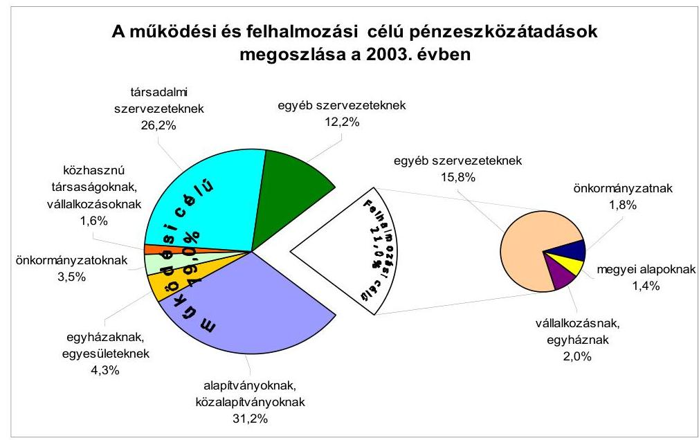
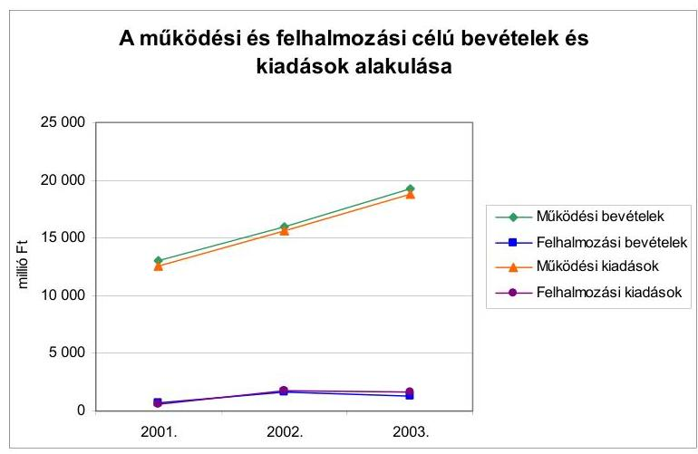
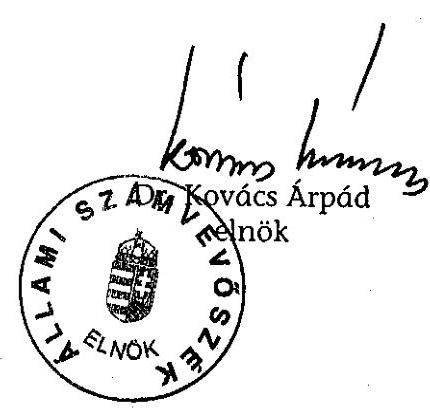
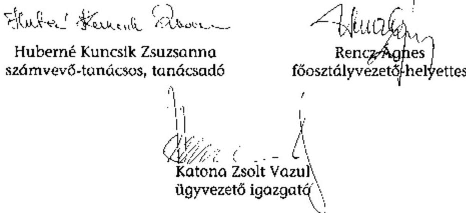
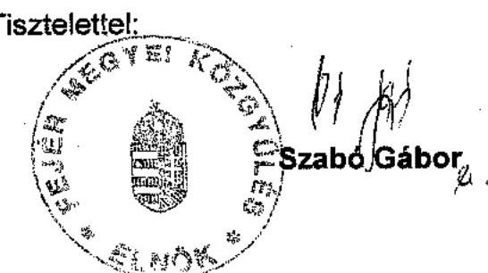

# JELENTÉS 

## a Fejér Megyei Önkormányzat gazdálkodásának átfogó ellenőrzéséről

---

3. Önkormányzati és Területi Ellenőrzési Igazgatóság
3.3 Átfogó Ellenőrzések Főcsoport

Iktatószám: V-1002-4/28/18/2004.
Témaszám: 692
Vizsgálat-azonosító szám: V0165

# Az ellenőrzést felügyelte: 

Dr. Lóránt Zoltán
főigazgató
Az ellenőrzés végrehajtásáért felelős:
Dr. Sepsey Tamás
főigazgató-helyettes
Az ellenőrzést vezette:
Csecserits Imréné
főcsoportfőnök-helyettes

## Az ellenőrzést végezték:

## Huberné Kuncsik Zsuzsanna

tanácsadó

## Mohl Anna

számvevő tanácsos

## A témához kapcsolódó - az elmúlt négy évben készített - számvevőszéki jelentések:

## címe   sorszáma

Jelentés a helyi önkormányzatok és helyi kisebbségi 0010
önkormányzatok pénzügyi-gazdasági tevékenységének 1999. évi ellenőrzési tapasztalatairól
Jelentés az önkormányzati tulajdonban lévő kórházak pénzügyi 0023
helyzetének, gazdálkodásának vizsgálatáról
Jelentés a közbeszerzési törvény végrehajtásának ellenőrzéséről 0109
Jelentés a megyei, fővárosi illetékhivatali tevékenység 0243
ellenőrzéséről
Jelentés a helyi önkormányzatok tartós szociális ellátási 0317
feladatainak ellenőrzéséről az idősek otthonainál
Jelentés a szakképzési struktúra szerepéről a munkaerőpiaci 0321
igények kielégítésében
Jelentés a helyi önkormányzatok gyermekvédelmi szakellátási 0430
tevékenységének ellenőrzéséről

Jelentéseink az Országgyűlés számítógépes hálózatán és az Interneten a www.asz.hu címen is olvashatók.

---

# TARTALOMJEGYZÉK 

BEVEZETÉS ..... 5
I. ÖSSZEGZŐ MEGÁLLAPÍTÁSOK, KÖVETKEZTETÉSEK, JAVASLATOK ..... 7
II. RÉSZLETES MEGÁLLAPÍTÁSOK ..... 16
1.A költségvetés tervezésének, végrehajtásának, az Önkormányzat vagyongazdálkodásának és a zárszámadás elkészítésének szabályszerűsége ..... 16
1.1.A költségvetési rendelet jóváhagyásának, módosításának, az előirányzatok nyilvántartásának és betartásának szabályszerűsége ..... 16
1.2.A gazdálkodás szabályozottsága, a bizonylati rend és fegyelem szabályszerűsége ..... 24
1.3.A pénzügyi-számviteli feladatok ellátásának informatikai támogatottsága ..... 31
1.4.Az önkormányzati vagyon nyilvántartása, számbavétele ..... 33
1.5.A vagyonnal való gazdálkodás szabályszerűsége, célszerűsége, nyilvánossága ..... 35
1.6.A céljelleggel nyújtott támogatások szabályszerűsége ..... 39
1.7.A közbeszerzési eljárások szabályszerűsége ..... 44
1.8.A zárszámadási kötelezettség teljesítésének szabályszerűsége ..... 48
2.Az önkormányzati feladatok és a rendelkezésre álló források összhangja ..... 49
2.1.A feladatok meghatározása és szervezeti keretei ..... 49
2.2.A költségvetés egyensúlyának helyzete ..... 52
2.3.A feladatok finanszírozása ..... 56
3.A belső irányítási, ellenőrzési rendszer működésének értékelése ..... 61
3.1.Az ellenőrzési rendszer kialakítása, működése ..... 61
3.2.A könyvvizsgálati kötelezettség teljesítése ..... 63
3.3.A korábbi számvevőszéki ellenőrzések javaslatainak hasznosulása ..... 64

---

# MELLÉKLETEK 

1. számú Az önkormányzati vagyon nagyságának alakulása (1 oldal)
2. számú Az Önkormányzat 2003. évi bevételeinek és kiadásainak alakulása (1 oldal)
3. számú Az Önkormányzat gazdálkodását meghatározó adatok, mutatószámok (1 oldal)
4. számú Egyes feladatok és kiadásainak finanszírozása (1 oldal)
5. számú Helyszíni ellenőrzési jegyzőkönyv (2 oldal)
6. számú Szabó Gábor polgármester úr észrevétele (1 oldal)

---

# RÖVIDÍTÉSEK JEGYZÉKE 

Ötv.
Áht.
Ámr.
Kbt.
Htv.

Ksztv.
Számv. tv.
Vhr.

Ber.

Ktv.
ÁSZ
MÁK
Önkormányzat
Önkormányzat hivatala
Közgyűlés
Közgyűlés elnöke
főjegyző
SzMSz
ügyrend $_{1}$
ügyrend $_{2}$
vagyongazdálkodási rendelet
közbeszerzési rendelet
Illetékhivatal
Oktatási bizottság
Környezetvédelmi bizottság
Pénzügyi bizottság
Szociális bizottság
a helyi önkormányzatokról szóló 1990. évi LXV. törvény az államháztartásról szóló 1992. évi XXXVIII. törvény az államháztartás működési rendjéről szóló 217/1998. (XII. 30.) Korm. rendelet
a közbeszerzésekről szóló 1995. évi XL. törvény
a helyi önkormányzatok és szerveik, a köztársasági megbízottak, valamint egyes centrális alárendeltségű szervek feladat- és hatásköreiről szóló 1991. évi XX. törvény
a közhasznú szervezetekről szóló 1997. évi CLVI. törvény
a számvitelről szóló 2000. évi C. törvény
az államháztartás szervezetei beszámolási és könyvvezetési kötelezettségének sajátosságairól szóló 249/2000. (XII. 24.) Korm. rendelet
a költségvetési szervek belső ellenőrzéséről szóló 193/2003. (XI. 26.) Korm. rendelet
a köztisztviselők jogállásáról szóló 1992. évi XXIII. törvény
Állami Számvevőszék
Magyar Államkincstár Fejér Megyei Területi Igazgatósága
Fejér Megyei Önkormányzat
Fejér Megyei Önkormányzat Hivatala
Fejér Megyei Közgyűlés
Fejér Megyei Közgyűlés elnöke
Fejér Megyei Önkormányzat főjegyzője
a Fejér Megyei Önkormányzat 6/2003. (IV. 24.) számú rendelete a Fejér Megyei Közgyűlés és Szervei Szervezeti és Működési Szabályzatáról
az SzMSz 6. sz. melléklete a Fejér Megyei Önkormányzati Hivatal ügyrendjéről
a Fejér Megyei Önkormányzat elnöke és főjegyzője által kiadott 121/2003. számú ügyrend a Fejér Megyei Önkormányzat Gazdálkodási főosztályának működéséről
Fejér Megyei Önkormányzat 14/2003. (IV. 24.) számú rendelete a vagyonáról és annak hasznosításáról
Fejér Megyei Önkormányzat 5/1996. (III. 28.) számú rendelete az Önkormányzat és szervei közbeszerzéséről
Fejér Megyei Illetékhivatal
Fejér Megyei Közgyűlés Oktatási és Kulturális Bizottsága
Fejér Megyei Közgyűlés Környezetvédelmi és Vidékfejlesztési Bizottsága
Fejér Megyei Közgyűlés Pénzügyi és Gazdálkodási Bizottsága
Fejér Megyei Közgyűlés Szociális és Gyermekvédelmi Bizottsága

---

| Elnöki kabinet | Fejér Megyei Önkormányzat Hivatalának Elnöki Kabinetje |
| :-- | :-- |
| Gazdálkodási főosztály | Fejér Megyei Önkormányzat Hivatalának Gazdálkodási Főosztálya |
| Humán főosztály | Fejér Megyei Önkormányzat Hivatalának Humán Főosztálya |
| Ellenőrzési szervezet | Fejér Megyei Önkormányzat Hivatalának Költségvetési és Belső Ellenőrzési Szervezete |
| Ellátó szervezet | Fejér Megyei Önkormányzat önállóan gazdálkodó Ellátó Szervezete |
| Kórház | Fejér Megyei Önkormányzat önállóan gazdálkodó Szent György Kórháza |
| VVSI | Fejér Megyei Önkormányzat önállóan gazdálkodó Velencei-tavi Vízi Sportiskolája |
| OEP | Országos Egészségbiztosítási Pénztár |
| ESzCsM | Egészségügyi Szociális és Családügyi Minisztérium |

---

# JELENTÉS   a Fejér Megyei Önkormányzat gazdálkodásának átfogó ellenőrzéséről 

## BEVEZETÉS

Az Ötv. 92. § (1) bekezdése, az ÁSZ-ról szóló 1989. évi XXXVIII. törvény 2. § (3) bekezdése, valamint az Áht. 120/A. § (1) bekezdése szerint az önkormányzatok gazdálkodását az ÁSZ ellenőrzi. Az ellenőrzés elvégzése az Országgyűlés illetékes bizottságai részére is átadott, országosan egységes ellenőrzési program alapján történt.

## Az ellenőrzés célja annak értékelése volt, hogy:

- az önkormányzati gazdálkodás törvényességét, szabályszerűségét biztosították-e a tervezés, a költségvetés végrehajtása, a vagyongazdálkodás és a zárszámadás során;
- az Önkormányzat által ellátott feladatok és az azokhoz rendelkezésre álló források összhangja biztosított volt-e, különös tekintettel egyes kiemelt feladatokra;
- a gazdálkodás szabályszerűségét biztosító kontrollok megfelelően segítették-e a végrehajtást.

Az ellenőrzött időszak: a 2003. év, valamint a 2004. I. félév, az 1.5, 2.1-2.3 és a 3.3 ellenőrzési pontok esetében ezen túlmenően a 2001-2002. évek.

Fejér megye a Dunántúl közép-keleti részén terül el. A megye 109 településén a népességszám a 2003. évben 433 ezer fő volt, s a lakosság 53%-a a városokban élt.

A 40 tagú Közgyűlés munkáját 10 állandó bizottság, és az Önkormányzat hivatalában 145 fő köztisztviselő segítette. A 2002. évi választásokat követően a Közgyűlés elnökének személye változott, a főjegyző az Önkormányzat megalakulása óta látja el feladatát.

[^0]
[^0]:    ${ }^{1}$ A törvényi előírások betartásának elmulasztásakor egységesen a törvénysértés megjelölést alkalmazzuk, mivel az ÁSZ nem tehet különbséget a törvényi előírások között.
    ${ }^{2}$ A gazdálkodás szabályszerűségét biztosító kontroll alatt értjük a kiépített és működő belső irányítási és szabályozási rendszert, valamint a belső ellenőrzési funkciók ellátását.

---

Az Önkormányzat feladatainak végrehajtása érdekében 27 önállóan gazdálkodó és 7 részben önállóan gazdálkodó költségvetési intézményt működtetett, amelyekben a különböző szakmai és gazdasági feladatokat a 2003. évben 4921 közalkalmazott látta el.

Az Önkormányzat a 2003. évben a 3. számú mellékletben részletezettek szerint 20538 millió Ft költségvetési bevételt, 20394 millió Ft költségvetési kiadást teljesített és a 2003. év végén 31213 millió Ft könyvviteli mérleg szerinti vagyonnal rendelkezett.

---

# I. ÖSSZEGZŐ MEGÁLLAPÍTÁSOK, KÖVETKEZTETÉSEK, JAVASLATOK 

A Közgyűlés a 2002-2006. évek közötti időszakra vonatkozóan ciklusprogramot fogadott el, melyben a szükséges források megjelölése nélkül gazdasági célkitűzéseket is meghatároztak. Gazdasági programot - megsértve az Ötv. előírását - az Önkormányzat nem készített.

A költségvetés tervezése során betartották az Áht. előírásait, a költségvetési koncepciót és a rendelettervezetet határidőben terjesztették a Közgyűlés elé. A Pénzügyi bizottság koncepcióról és költségvetési rendelettervezetről alkotott véleményét csatolták az előterjesztésekhez az Ámr-ben foglaltaknak megfelelően. A költségvetési koncepciót a gazdálkodást meghatározó prioritásokat, a helyben képződő bevételeket, valamint az ismert kötelezettségeket figyelembe véve állították össze. A 2003. és a 2004. évi költségvetési rendeletek az Áht. és az Ámr. előírásainak megfelelően tartalmazták a működési és a felhalmozási célú bevételeket és kiadásokat elkülönítetten és mérlegszerűen bemutatva, a kiemelt előirányzatokat intézményenként és Önkormányzatra összesítve. A 2003. és a 2004. évi költségvetési rendeletek az Áht. előírásait megsértve a bevételek és kiadások különbségeként a hiányt nem mutatták be, a költségvetési bevételek/kiadások finanszírozási célú pénzügyi műveleteket is tartalmaztak. A költségvetés és a zárszámadás előterjesztésekor bemutatandó mérlegek és kimutatások tartalmi követelményeit - megsértve az Áht. előírásait - a vagyonkimutatás kivételével rendeletben nem határozták meg, valamint a költségvetés előterjesztésekor és a zárszámadáskor nem mutatták be a közvetett támogatásokat tartalmazó kimutatást szöveges indoklással. A 2003. és a 2004. évi költségvetési rendeletekben a céljelleggel juttatott támogatásokra „alap" elnevezéssel költségvetési előirányzatokat alakítottak ki, azonban az „alap" kifejezés használata félreérthető, mivel azok nem felelnek meg az Áht. követelményeinek.

A Közgyűlés az Ámr-ben foglalt előírásokat betartva módosította az éves költségvetési rendeleteket. Az Önkormányzat költségvetési intézményei közül hét az éves előirányzat-gazdálkodás során nem tartotta be a költségvetési rendeletben jóváhagyott módosított kiadási előirányzatot a dologi, a személyi juttatások és járulékaik, az ellátottak pénzbeli juttatása, a felújítási és beruházási kiadások tekintetében, ezzel megsértették az Áht. előírásait. A jóváhagyott előirányzatok túllépése miatt nem indult vizsgálat az okok megállapítására, a gazdálkodási kötelezettségeket megszegőkkel szemben felelősségre vonást nem kezdeményeztek.

Az Önkormányzat hivatalának szervezeti felépítését és feladatait az SzMSz-ben meghatározta a Közgyűlés. A gazdasági szervezet feladatait a Közgyűlés elnöke és a főjegyző az ügyrend${ }_{2}$-ben rögzítette.
Az operatív gazdálkodással kapcsolatos hatás- és jogköröket az Önkormányzati hivatalban az Ámr-ben előírtak figyelembe vételével alakították ki. Nem rendelkeztek a szakmai teljesítés igazolásának módjáról, nem jelölték ki az azt végző személyeket. A főjegyző nem alakította ki az intézmények egységes számviteli rendjét a Htv. előírásait megsértve. Az Önkormányzat hivatalában

---

az operatív gazdálkodást érintő szabályzatokat elkészítették. A számviteli politika keretében hagyták jóvá a számlarendet, az eszközök és források értékelési szabályzatát, valamint a leltározási és pénzkezelési szabályzatot. Nem tettek eleget a Vhr. előírásának, mivel a leltárkészítési és leltározási szabályzatot nem egészítették ki az ingatlanok piaci értékelésének tartalmi követelményeivel annak ellenére, hogy az ingatlanok esetében a piaci értékelés évenkénti elvégzéséről döntött a Közgyűlés.

Az Önkormányzat hivatalának működésével, épületének fenntartásával kapcsolatos dologi kiadások bonyolítása az Ellátó szervezetnél történt. Az Ellátó szervezet által az Önkormányzat hivatalát érintő feladatellátás megosztását és az együttműködés módját nem szabályozták. Az Ellátó szervezetnél alkalmazott, de az Önkormányzat hivatalában dolgozók az Ellátó szervezet alapító okiratában nem nevesített igazgatási feladatokat végeztek, az általuk ellátott feladat alapján a besorolásuknál, valamint esetükben a munkáltatói jogkör gyakorlásánál megsértették a Ktv-ben és az Ötv-ben előírtakat.

A pénzügyi és számviteli feladatok munkafolyamatát az ügyrendben szabályozták. Az egyes munkafázisokhoz rendelt ellenőrzési kötelezettségeket és a végrehajtandó feladatokat az éves ellenőrzési tervben határozták meg. A munkaköri leírásokban nem rögzítették az eltérés megállapításának viszonyítási alapját és dokumentálásának módját, valamint az eltérés esetén szükséges eljárási rendet. A Gazdálkodási főosztályon gondoskodtak a gazdasági események adatainak könyvviteli rögzítéséről.

A gazdasági műveletek bizonylatai közül a kötelezettségek és követelések számviteli bizonylatai az Önkormányzat hivatalában 25,6%-ban, az Ellátó szervezetnél 29,4%-ban nem feleltek meg a Számv. tv-ben előírt alaki és tartalmi követelményeknek. Az Ellátó szervezetnél a pénztári kifizetések kötelezettségvállalását az Ámr-ben előírtak ellenére 32%-ban nem dokumentálták (kis értékű eszközbeszerzések, kisjavítások, rendezvények esetében), a kötelezettségvállalás ellenjegyzése mindkét szervezetnél a pénztári kifizetések 61,6%-nál (támogatási szerződéseknél, kiküldetési rendelvényeknél, szolgáltatások megrendelésénél) elmaradt. A kötelezettségvállalásokról az Önkormányzat hivatalánál nem vezettek teljes körű nyilvántartást, az Ellátó szervezetnél ennek kialakításáról

 nem gondoskodtak. Az Ámr. előírásai ellenére 17%-ban nem a szakmai teljesítés igazolása alapján történt az érvényesítés, továbbá az utalványozás ellenjegyzése (banki bevételek, intézményfinanszírozások, hiteltörlesztések) a nem termékértékesítésből és szolgáltatás-nyújtásból származó banki bevételek 8,4%-ánál, a pénzforgalmi bizonylatok 14%-ánál elmaradt. A gazdasági események bizonylatainak adatait a készpénzforgalomnál és a banki tételeknél a Vhr-ben előírtak ellenére 5-15 napos késéssel rögzítették a könyvvitelben. A nemzetközi kapcsolatokhoz fűződő külföldi kiküldetéshez felvett előlegek elszámolása 75%-ban nem határidőre valósult meg. Az Önkormányzat nem élt az Ámr-ben foglalt lehetőséggel, a költségvetésen kívüli idegen pénzeszközök kezelésére nem nyitott alszámlát.

Az Önkormányzat hivatalában kiépített számítógép hálózat működött. A pénzügyi és számviteli területen számítógépen, különféle szoftverek segítségével látják el a feladatokat. Biztosították az információs rendszer védelmét, az alkalmazott számítástechnikai eszközökről, a programokról és a felhasználók jogosultságáról nyilvántartást vezettek, az adatállomány mentéséről és tárolásáról gondoskodtak. A pénzügyi számviteli területen alkalmazott szoftverek 50%-ánál - a MÁK által adott szoftvereknél - hiányzott a rendszer és működési leírás, a felhasználói leírásokat valamennyi programhoz biztosították. A feladatellátás érdekében évente fejlesztették, bővítették a számítógépes ellátottságot és az alkalmazott szoftvereket. Jelentős előrelépés volt a költségvetés tervezéséhez és a beszámoltatáshoz kapcsolódó program kifejlesztése és használatának bevezetése. Az Önkormányzat hivatala nem rendelkezett informatikai stratégiával, valamint a folyamatos és biztonságos munkavégzés érdekében szükséges katasztrófa elhárítási tervvel.

Az Önkormányzat vagyontárgyainak nyilvántartásáról a főkönyvi és analitikus nyilvántartásokkal, valamint az ingatlanvagyon kataszter vezetésével gondoskodtak. Elkülönítetten tartották nyilván az Önkormányzat törzsvagyonát, valamint a 2003. évi mérleg készítésekor az értékadatok egyezőségét biztosították a főkönyvi és a kapcsolódó analitikus nyilvántartások között. Az Önkormányzat élt az ingatlanok esetében a piaci értékelés lehetőségével, a Számv. tv-ben előírt értékeléseket a szabályozás hiánya ellenére a 2003. év végén elvégezték. A Közgyűlés elnöke és a főjegyző intézkedett a 2003. évi leltározás végrehajtásáról. A 2003. évi leltározási feladatokat az immateriális javak, az ingatlanok, beruházások, az üzemeltetésre átadott eszközök, a részesedések és az értékpapírok esetében a Vhr-ben és a leltározási szabályzatban foglaltaktól eltérően, a Közgyűlés egyetértése nélkül, a részletező nyilvántartásokból összesítő kimutatás készítésével végezték el. A Számv.tv. előírásait megsértve, elmulasztották az év végi értékelési feladatokat, nem vizsgálták az értékvesztés elszámolásának a szükségességét a követelések, értékpapírok és részesedések esetében. A követelések és az értékpapírok esetében értékvesztés elszámolása nem volt indokolt.

A vagyongazdálkodás szabályait a Közgyűlés vagyongazdálkodási rendeletben szabályozta. A hatáskörökkel való rendelkezés szabályozása célszerűen, a helyi sajátosságok figyelembe vételével történt, azonban nem írták elő az átruházott hatáskörrel rendelkezők beszámoltatását, ennek rendjét nem szabályozták. A vagyontárgyak értékesítése, apportálása, bérbeadása, ingyenes és kedvezményes átadása a rendeletben meghatározott hatáskörök betartásával valósult meg. A vagyonhasznosítás nyilvánosságát szabályozta a Közgyűlés, melynek érvényesülését a 2001-2003. években biztosították. Követelés elengedésére nem került sor. Az Ellátó szervezet vezetője a Közgyűlés elnökével történő egyeztetést követően öt pártszervezet részére biztosított kedvezményes bérleti díj mellett helyiségeket, amely sérti az Ötv. előírásait. A Közgyűlés elnöke a vagyongazdálkodási rendelet előírását figyelmen kívül hagyva döntött az átmenetileg szabad pénzeszközökből államilag nem garantált nyílt végű befektetési jegy vásárlásáról.

Az Önkormányzat a céljellegű támogatások rendjét szabályozta. Az elkülönített támogatási keretek felhasználásának egységes nyilvántartási feladatait, továbbá a kiutalt támogatásokról készített számadások ellenőrzési módját, feltételeit nem határozta meg. Megsértve az Ötv. előírását az alelnökök részére is biztosítottak hatáskört a támogatási keretek felhasználásához kapcsolódóan. Az alapítványok és közalapítványok támogatásáról az Ötv. előírását betartva Közgyűlés döntött. Az Áht-ban foglaltakat megsértve, három támogatás esetében nem írtak elő számadási kötelezettséget. A támogatások felhasználásának ellenőrzését nem végezték el. A számadás elmulasztása esetén nem intézkedtek a visszafizettetésre, a további finanszírozást, támogatást nem függesztették fel. A közhasznú szervezetek esetében a támogatási szerződések tartalma megfelelt a Ksztv-ben foglaltaknak.

A Közgyűlés az 1998. évben rendeletet alkotott a közbeszerzési eljárás helyi szabályairól, ebben azonban nem rögzítették az eljárásba bevont személyek szakmai felkészültségére vonatkozó követelményeket, az eljárást lezáró határozatot hozó személy helyett a Kbt. előírásait megsértve, bíráló bizottság hatáskörébe rendelték az ajánlatok elbírálását. Az Önkormányzat az 1998. évtől csatlakozott a központosított közbeszerzéshez, azonban az intézmények részére eseti felmentést biztosítottak az aktuális piaci árnál 5%-kal kedvezőbb árubeszerzés esetén. Az Önkormányzat megsértve a Kbt. előírásait nem határozta meg az azonos vagy hasonló tárgyú beszerzések körét, a tulajdonában lévő épületek felújítása, és az Ellátó szervezetnél az őrzés-védelem, valamint a takarítás megrendelése nem közbeszerzési eljárás keretében történt, a Közbeszerzések Tanácsa részére éves összegzést a 2003. évben nem készítettek. Az intézményi konyhák üzemeltetésének vállalkozásba adásakor az előkészítés és lebonyolítás során a Kbt-ben és a közbeszerzési rendeletben előírtak érvényesültek, a tárgyalásos eljárás kiválasztása indokolt volt.

A zárszámadást az elfogadott költségvetéssel összehasonlítható módon készítették el. A pénzmaradvány megállapítását, elszámolását és felhasználását a Vhr-ben és az Ámr-ben foglaltaknak megfelelően mutatták ki. A zárszámadási rendelet előterjesztésekor, megsértve az Áht. előírását nem készítettek szöveges indoklást a többéves kötelezettségek alakulásáról. A Gazdálkodási főosztály az ügyrendben meghatározottak szerint elvégezte az előirányzatok és a teljesítési adatok egyeztetését, az intézmények elemi beszámolóinak felülvizsgálatát.

Az Önkormányzat kötelező és önként vállalt feladatait a Közgyűlés az Ötv. figyelembe vételével az SzMSz-ben határozta meg. Az Önkormányzat kötelező feladatait döntően költségvetési intézményei útján biztosította. Az Önkormányzat a 2001-2003. években egy intézmény létrehozásáról döntött, az intézményhálózat szervezeti kereteit érintően átszervezésre és megszüntetésre nem került sor. Az önkormányzati feladatellátáshoz kapcsolódóan az Önkormányzat kettő gazdasági és egy közhasznú társaság megszüntetését kezdeményezte.

Az Önkormányzat pénzügyi helyzete a likviditási mutatók alapján romlott, a költségvetésekben folyamatosan forráshiány jelentkezett, amely állandósult. A likviditási problémák jelezték, hogy a több területet érintő, a költségek csökkentésére, az intézmények hatékonyabb működtetésére irányuló intézkedések nem bizonyultak elegendőnek, a pénzügyi helyzet azok eredményeként alapvetően nem javult. Az Önkormányzat működési bevételei a 2001-2003. években meghaladták a működési kiadásokat, a felhalmozási jellegű feladatok bevételei a felhalmozási célú kiadásokat a 2002. és a 2003. évben nem fedezték. A 2003. évben a felhalmozási kiadások 22,1%-kal haladták meg a teljesített felhalmozási célú bevételeket, a finanszírozási szükségletet a működési bevételi többlet bevonásával, értékpapír eladásával biztosították. A tervezett fejlesztéseknél jellemző volt az elmaradt bevételek miatt fejlesztési feladatok elhagyása,

átütemezése. A súlyosbodó gazdálkodási nehézségek miatt az államháztartáson belüli szervezetek által kiírt pályázati lehetőségek kihasználása érdekében kialakították az ehhez szükséges pályázat-figyelő és nyilvántartási rendszert. A külső források igénybe vételénél, a pályázatok benyújtásához kapcsolódó döntéseknél a központi és a helyi szabályozásban meghatározott hatásköri előírásokat betartották.

A szociális és oktatási ágazatot érintő feladatok finanszírozása összességében a 2001-2003. években döntően állami támogatásból valósult meg, melynek aránya folyamatosan csökkent. Az egy általános iskolai oktatottra jutó kiadások 76,3%-kal, a középiskolai oktatás területén 35,6%-kal, a bentlakásos szociális intézményeknél 63,7%-kal növekedtek az ellátotti létszám minimális (1,1-9,4%) változása mellett. A működési kiadások meghatározó része (71,7-77,5%) személyi juttatás és a hozzá kapcsolódó járulék, amely a központi bérpolitikai intézkedések hatására emelkedett.

Az Önkormányzat az önként vállalt feladatait az SzMSz-ben rögzítettek szerint látta el. Jelentősebb önként vállalt kiadásként a velencei sportiskola működtetése és az óvodai, iskolai egészséggondozó, tehetség menedzselő diáksport fejlesztése, támogatása, valamint a különféle szervezetek céljellegű támogatása jelentkezett. Az Önkormányzat a költségvetési kiadások 1,4-1,6%-át fordította ezekre a célokra, amely nem veszélyeztette a kötelező feladatok ellátását.

A főjegyző elkészítette az Ámr-ben előírt likviditási terveket és gondoskodott annak aktualizálásáról. A 2003. évben és a megelőző két évben év végén rendelkeztek rövid lejáratú hitelállománnyal, a folyószámla hitelkeret összegét folyamatosan növelték, annak jóváhagyott összege a 2004. évben a hitelfelvételi korlát 98%-a volt. Az Önkormányzat a 2003. évben adósságot keletkeztető kötelezettségvállalásról nem döntött, erre a 2002. évben került sor. A fejlesztési feladatok megvalósításához 700 millió Ft-os kötvényt bocsátottak ki, ennek során az előírásokat betartották. A kötvénykibocsátásból származó forrásokat a Közgyűlés által meghatározott célnak megfelelően használták fel.

A fogyatékos személyek esélyegyenlőségének biztosítása céljából a 2002-2003. évi beruházások és felújítások során az Önkormányzat akadálymentesítésre saját forrásaiból 34,4 millió Ft-ot fordított. Ezek eredményeként a középületek 41%-ában megoldott az akadálymentesítés. Az intézményi adatszolgáltatások alapján a megoldásra váró feladatok pénzügyi kihatása 2334 millió Ft. Az eddigi ráfordításokat figyelembe véve a fogyatékos személyek jogairól és esélyegyenlőségük biztosításáról szóló törvényben meghatározott 2005. január 1-i határidőre a feladatok elvégzése nem biztosítható.

Az Önkormányzat biztosította az ellenőrzési szervezet függetlenségét, az ellenőrzési szabályzatban meghatározták az Önkormányzat hivatala belső ellenőrzési, valamint az intézmények ellenőrzési feladatait. Az elvégzett ellenőrzések megállapításait hasznosították, az ellenőrzött szervezetek a megállapításokat elfogadták. Az ellenőrzési szabályzatnak az ellenőrzési tervek, programok elkészítésére, jóváhagyására, valamint a részben önállóan gazdálkodó intézmények ellenőrzésének megszervezésére irányuló rendelkezései nincsenek összhangban a Ber. előírásaival. A Közgyűlés által átadott hatáskör alapján az el-

lenőrzések tapasztalatait tartalmazó beszámolót a Pénzügyi bizottság tárgyalta meg.

Az Önkormányzat az Ötv-ben előírt könyvvizsgálati kötelezettségének eleget tett, a könyvvizsgáló az éves beszámolót hitelesítő záradékkal látta el. Az Önkormányzat a korábbi számvevőszéki vizsgálatok megállapításait hasznosította, a javaslatok 85%-át megvalósították, ennek eredményeként az ellenőrzésekkel érintett önkormányzati feladatellátás törvényessége, szabályozottsága, a feladatellátás színvonala javult. A javaslatoknak megfelelően intézkedési tervek készültek, amelyek megvalósítását figyelemmel kísérték.

A helyszíni ellenőrzés megállapításainak hasznosítása mellett javasoljuk:

# a Közgyűlés elnökének 

a jogszabályi előírások maradéktalan betartása érdekében

1. kezdeményezze a Közgyűlésnél - a főjegyző által előkészített gazdasági programtervezet alapján - az Önkormányzat több évre szóló gazdasági programjának meghatározását az Ötv. 91. § (1) bekezdésében előírtak betartása érdekében;
2. terjessze - a főjegyző által készített előterjesztés alapján - a Közgyűlés elé az Áht. 118. §-ban előírt mérlegek, kimutatások tartalmának meghatározásáról szóló rendelettervezetet;
3. intézkedjen annak érdekében, hogy az Áht. 12/A. § (1) bekezdésében foglaltak betartása érvényesüljön, a költségvetési intézmények az Áht. 93.§ (1) bekezdésében foglaltakat betartva a jóváhagyott kiadási előirányzatok mértékéig vállaljanak tárgyévi fizetési kötelezettséget. Az előirányzat-túllépések okait vizsgálják felül, indokolt esetekben kezdeményezzen személyes felelősségrevonást;
4. tartsa be az értékpapírok vételénél a vagyongazdálkodási rendelet 14. § l) pontjában foglalt, államilag garantált értékpapírok vásárlására lehetőséget biztosító korlátozást;
5. biztosítsa, hogy írják elő a támogatottak számadási kötelezettségét az Áht. 13/A. § (2) bekezdése alapján;
6. kezdeményezze a Közgyűlésnél az alelnökök döntési hatáskörébe tartozó céljelleggel juttatott támogatási keretek megszüntetését az Ötv. 9. § (3) bekezdésében előírtak betartása érdekében;
7. gondoskodjon arról, hogy a pártok részére biztosított helyiségek bérleti díja összhangba kerüljön a Közgyűlés lakás és helyiség hasznosítási rendeletével az Ötv. 1. § (2) bekezdésében, Ötv. 78. § (1) bekezdésében és az Alkotmány 70/A. §-ában foglaltaknak megfelelően;
8. gondoskodjon arról, hogy az Önkormányzat működésével, valamint az államigazgatási ügyek döntésre való előkészítésével és végrehajtásával kapcsolatos feladatok ellátását végző dolgozók
 az Önkormányzat hivatalában kerüljenek alkalmazásra az Ötv. 38. §-a, valamint a Ktv. 1. § (7) bekezdése b) pontjának előírásai betartása érdekében;

---

a munka színvonalának javítása érdekében
9. kezdeményezze az Önkormányzat hivatala és az önállóan gazdálkodó Ellátó szervezet közötti feladatellátás megosztásának, az együttműködés módjának a szabályozását, intézkedjen az Ellátó szervezet által végzett tevékenység és az alapító okiratban meghatározott feladatok összhangjának biztosítása érdekében;
10. kezdeményezze, hogy a Közgyűlés az általa átruházott vagyongazdálkodási jogkörök gyakorlásáról a felhatalmazottak beszámoltatásának rendjét meghatározza;
11. kísérje figyelemmel a középületek akadálymentessé tételét, tekintettel a fogyatékos személyek jogairól és esélyegyenlőségük biztosításáról szóló 1998. évi XXVI. törvény 29. § (6) bekezdésében meghatározott 2005. január 1-i teljesítési határidőre;
12. kezdeményezze a számvevőszéki ellenőrzés tapasztalatainak közgyűlési megtárgyalását, a feltárt hiányosságok megszüntetése érdekében készíttessen intézkedési tervet;

# a főjegyzőnek 

a jogszabályi előírások maradéktalan betartása érdekében

1. az éves költségvetés tervezése során gondoskodjon arról, hogy az Áht. 8. § (1) bekezdésében foglaltaknak megfelelően a költségvetési bevételek és kiadások különbségeként a tervezett hiány a költségvetési rendelettervezetben bemutatásra kerüljön;
2. készítse el a költségvetési és zárszámadási rendelettervezet előterjesztésekor az Áht. 118. §-a alapján tájékoztatásként bemutatandó kimutatásokat a közvetett támogatásokról és azok szöveges indoklását, valamint a zárszámadás előterjesztésekor a többéves kötelezettségek alakulásáról szóló kimutatáshoz a szöveges indoklást;
3. a gazdálkodási és a pénzügyi-számviteli feladatok szabályozása tekintetében
a) alakítsa ki a Htv. 140. § (1) bekezdés c) pontja alapján a költségvetési intézmények számviteli rendjét;
b) egészítse ki a leltározási szabályzatot a piaci értékelésbe bevont ingatlanok esetében a Vhr. 32/A § (1) bekezdésében foglalt követelményekkel;
c) jelölje ki az Ámr. 134. § (6) bekezdésének előírásait figyelembe véve a szakmai teljesítés igazolását végzőket és határozza meg a szakmai teljesítés igazolásának módját;
d) gondoskodjon az Ámr. 134. § (6) bekezdésében előírtaknak megfelelően a kötelezettségvállalások nyilvántartási rendjének kialakításáról, vezetéséről oly módon, hogy abból az évenkénti kötelezettségvállalás összege megállapítható legyen;
e) biztosítsa az Ámr. 134. § (7) bekezdése alapján a kötelezettségvállalás ellenjegyzésére vonatkozó előírások betartását;

---

f) gondoskodjon az Ámr. 136. § (1) és (6) bekezdésében foglaltak alapján a nem termékértékesítésből és szolgáltatásnyújtásból származó banki bevételek utalványozásáról, utalvány ellenjegyzéséről;
g) gondoskodjon arról, hogy az utalványozásra szolgáló írásbeli rendelkezésen az Ámr 136. § (4) bekezdés h) pontja előírásainak megfelelően tüntessék fel a kötelezettségvállalás nyilvántartásba vételének sorszámát;
h) biztosítsa a számviteli bizonylatok feldolgozási rendjének kialakításakor a Számv. tv. 165. § (3) bekezdésében foglaltaknak megfelelően, hogy a pénzeszközöket érintő gazdasági műveletek, események, bizonylatok adatai késedelem nélkül rögzítésre kerüljenek, készpénzforgalom esetében a pénzmozgással egyidejűleg, a bankszámlaforgalomnál a hitelintézeti értesítés megérkezésekor;
i) intézkedjen, hogy az év végi értékelési feladatokat elvégezzék a követelések, értékpapírok és részesedések esetében, vizsgálják meg az értékvesztés elszámolásának szükségességét a Számv. tv. 55. § (1) bekezdése és a Számv. tv. 54. § (1) bekezdése és (2) bekezdés c) pontjában és (4) bekezdésében előírtaknak megfelelően;
4. biztosítsa, hogy az Önkormányzatnak az ideiglenes külföldi kiküldetés rendjéről szóló 11/2002. (VI. 20.) számú rendelete 7. § (1) bekezdésében előírtaknak megfelelően a külföldi kiküldetésére felvett előlegekkel történő elszámolás a kiküldetés befejezésétől számított 15 napon belül megtörténjen;
5. gondoskodjon a nem szociális célra nyújtott céljellegű támogatások esetén az Áht. 13/A. § (2) bekezdésének betartása érdekében arról, hogy az Önkormányzat által juttatott céljellegű támogatások felhasználásáról benyújtott számadások és a támogatások rendeltetésszerű felhasználásának ellenőrzése megtörténjen, intézkedjen számadás elmulasztása esetén a támogatás visszafizetetésére, a további finanszírozás, támogatás felfüggesztésére;
6. a közbeszerzések bonyolítása esetében
a) gondoskodjon a közbeszerzési értékhatárt elérő árubeszerzéseknél, építési beruházásoknál és szolgáltatások megrendelésénél a közbeszerzési eljárás lefolytatásáról a közbeszerzésekről szóló 2003. évi CXXIX. törvény 2. § (2) bekezdésében előírtak alapján;
b) gondoskodjon arról, hogy szabályozzák a közbeszerzésekről szóló 2003. évi CXXIX. tv. 8. § (1) bekezdésben előírtak alapján a közbeszerzési eljárásba bevont személyek szakmai felkészültségére vonatkozó követelményeket, valamint a 16. § (1) bekezdése alapján évente készített összegző jelentést küldjék meg a Közbeszerzések Tanácsa részére;
7. gondoskodjon arról, hogy az ellenőrzési szabályzatban a Ber. 6. § (4)-(5) bekezdéseiben az ellenőrzési terv és program-készítésre előírtak érvényesüljenek, valamint kezdeményezze a Ber. 36. § (2) bekezdése alapján az önállóan és részben önállóan gazdálkodó költségvetési szervek belső ellenőrzési feladatainak közös megszervezését;

---

a munka színvonalának javítása érdekében
8. intézkedjen annak érdekében, hogy a Pénzügyi és Katasztrófa Elhárítási Alap költségvetésen kívüli pénzeszközeit elkülönített számlán kezeljék;
9. terjessze - a főjegyző által készített előterjesztés alapján - a Közgyűlés elé az Önkormányzat hivatala és az önállóan gazdálkodó Ellátó szervezet közötti feladatellátás megosztását oly módon, hogy az megfeleljen az Áht. és az Ámr. operatív gazdálkodásra vonatkozó előírásainak, továbbá biztosítsa az Ellátó szervezet által végzett tevékenység és az alapító okiratban meghatározott feladatok összhangját;
10. határozza meg a céljelleggel nyújtott támogatások egységes nyilvántartási feladatait, határozza meg a számadások ellenőrzésének módját, feltételeit, feladatait, hatásköri és felelősségi rendjét;
11. kezdeményezze a költségvetési rendelettervezet előkészítése során a félreérthető és az Áht-ban foglaltakkal nem összhangban lévő önkormányzati pénzalapok elnevezésének a megváltoztatását;
12. gondoskodjon a Gazdálkodási főosztály dolgozóinak munkaköri leírása kiegészítéséről annak érdekében, hogy azokban a megállapított eltérések esetén az eljárási és dokumentálási rend szerepeljen;
13. gondoskodjon az Önkormányzat hivatala informatikai rendszerével történő biztonságos munkavégzés érdekében a váratlan események esetére katasztrófa elhárítási terv, továbbá az informatikai fejlesztésekhez kapcsolódó informatikai stratégia elkészítéséről;
14. gondoskodjon arról, hogy az Ellátó szervezetnél megállapított hiányosságok megszüntetését, a megtett intézkedések eredményességét az Ellenőrzési szervezet belső ellenőrzés keretében vizsgálja meg.

---

# II. RÉSZLETES MEGÁLLAPÍTÁSOK 

## 1. A KÖLTSÉGVETÉS TERVEZÉSÉNEK, VÉGREHAJTÁSÁNAK, AZ ÖNKORMÁNYZAT VAGYONGAZDÁLKODÁSÁNAK ÉS A ZÁRSZÁMADÁS ELKÉSZÍTÉSÉNEK SZABÁLYSZERŰSÉGE

### 1.1. A költségvetési rendelet jóváhagyásának, módosításának, az előirányzatok nyilvántartásának és betartásának szabályszerűsége

A Közgyűlés erre vonatkozó előterjesztés hiányában az Önkormányzat gazdasági programját nem határozta meg, ezzel megsértette az Ötv. 91. § (1) bekezdésének előírását, valamint nem tett eleget az SzMSz 27. §-ban foglaltaknak. A 2002-2006. évekre kidolgozott ciklusprogramot a Közgyűlés a 63/2003. (IV. 24.) számú határozatával fogadta el, mely 14 területen határozott meg konkrét feladatokat az elérendő megyei stratégiai célokhoz, programokhoz igazodóan. Az általános megyepolitikai célokon túl a program kiemelte:

- a szakképzési struktúra átalakítása érdekében az intézmények működésének felülvizsgálatát, a fogyatékos és szociálisan rászoruló személyek intézményes ellátásának fejlesztését, a szenvedélybetegek ellátásának megoldását, a turisztikai célok megvalósítását célzó támogatások biztosítását, a kistérségi tevékenységek fejlesztését és koordinálását;
- az ETALONSPORT program ${ }^{3}$ folytatását, a civil kapcsolatok erősítését önálló támogatási alap létrehozásával, a pályázati lehetőségek jobb kihasználását, a szükséges önerő biztosítását, önálló pályázat-előkészítő csoport létrehozását, a vagyongazdálkodás megújítását, az ellenőrzési rendszer erősítését;
- az Önkormányzat hivatalában a munka javításaként a szervezet racionalizálását, a továbbképzések, a nyelvtanulás támogatását, a minőségbiztosítási rendszer továbbfejlesztését.

A határozatban döntöttek arról, hogy a ciklusprogram végrehajtását a Közgyűlés évente megtárgyalja, döntéseivel elősegíti annak tervszerű és eredményes megvalósítását. A tervek gazdasági megalapozottsága érdekében azonban a megvalósítás várható pénzügyi kihatását és a finanszírozás forrásösszetételét nem mutatták be, arról a Közgyűlés az éves költségvetésekben a mindenkori pénzügyi lehetőségek figyelembe vételével döntött.

[^0]
[^0]:    ${ }^{3}$ A program célja a megye települési önkormányzatainál az óvodai és iskolai egészséggondozó, tehetség menedzselő diáksport fejlesztése, támogatása, sportóvodák létesítése, melynek érdekében az Önkormányzat megállapodást kötött az ETALONSPORT Rt-vel arról, hogy a program megvalósítását 2004. december 31-ig összesen 125 millió Ft-tal támogatja.

---

A közbenső egyeztetés során a Közgyűlés elnöke által adott észrevétel szerint: "Az Ötv. 91. § (1) bekezdése valóban előírja ezt a kötelezettséget, de a gazdasági programot nem definiálja, vonatkozási időszakát, tartalmát nem határozza meg. Véleményünk szerint a Közgyűlés elé terjesztett és általuk elfogadott éves költségvetések tartalmazzák az önkormányzat gazdasági programját."

A gazdasági programmal kapcsolatos észrevétel nem megalapozott, mivel a gazdasági programot nem helyettesíthetik a Közgyűlés által elfogadott éves költségvetések. Az Ámr. 24. § (1) bekezdés d) pontja alapján a költségvetés készítés első szakaszában a tervezés fő kereteit meghatározó költségvetési irányelvek összeállításához alapadatokat kell szolgáltatnia az önkormányzati gazdasági programnak. A szakmai ágazati koncepciókban megfogalmazott célkitűzések szolgálhatnak alapul a hosszabb távú gazdasági program-tervezet összeállításához, amelynek elkészítése a helyi önkormányzatok és szerveik, a köztársasági megbízottak, valamint egyes centrális alárendeltségű szervek feladat- és hatásköreiről szóló 1991. évi XX. törvény 140. § (1) bekezdés a) pontja alapján a jegyző gazdálkodási feladata és hatásköre. Az önkormányzatoknál a 2003. évben lefolytatott ellenőrzések tapasztalatai alapján a belügyminiszternél kezdeményeztük az Ötv. gazdasági program készítését előíró követelményének kiegészítését, pontosítását.

A Közgyűlés elnöke a 2003. évi költségvetési koncepciót, betartva az Áht. 70. §-ában előírtakat, határidőben ${ }^{4}$, 2002. december 7-én nyújtotta be a Közgyűlés részére. A költségvetési koncepciót a helyben képződő bevételek, és az ismert kötelezettségek figyelembe vételével állították össze. Az Önkormányzat bizottságai megtárgyalták a költségvetési koncepciót, azt a Pénzügyi bizottság változtatás nélkül elfogadásra javasolta a Közgyűlésnek. A Pénzügyi bizottság véleményét - a többi szakbizottságéval együtt - írásban csatolták a koncepció tervezet előterjesztéséhez, betartva az Ámr. 28. § (3) bekezdésében előírtakat.

A Közgyűlés a 178/2002. (XII. 19.) számú határozattal elfogadta a költségvetési koncepciót, és döntött a költségvetés-készítés további munkálatairól. A Közgyűlés a koncepcióról hozott határozatában elfogadta a csatolt mellékletekben bemutatott előirányzatokat, irányelveket, egyben felkérte a Közgyűlés elnökét, hogy a költségvetési rendelettervezet benyújtásáig tekintse át a lehetséges csökkentések jogcímeit a tartalékok növelésének érdekében.

A koncepcióban a működési forráshiány finanszírozására 500 millió Ft hitelbevételt terveztek, bemutatták az állami támogatások előző évhez viszonyított növekedését jogcímenkénti részletezésben (1018 millió Ft), valamint a 2002. szeptember 1-től hatályos központi bérfejlesztés 2003. évi hatását (1329 millió Ft).

A Közgyűlés elnöke a 2004. évi költségvetési koncepciót a határidőt betartva 2003. november 13-án, határidőn belül terjesztette a Közgyűlés elé, melyet a Közgyűlés a 174/2003. (XI. 27.) számú határozatával fogadott el. A költségvetési koncepció tervezethez a Pénzügyi bizottság és az Önkormányzat szakbizottságainak véleményét írásban csatolták.

[^0]
[^0]:    ${ }^{4}$ A költségvetési koncepciót a Közgyűlés elnökének az Áht. 70. §-a alapján november 30-ig, az önkormányzati képviselő-testület tagjai általános választásának évében legkésőbb december 15-ig kell benyújtania a Közgyűlésnek.

---

A költségvetési koncepció tartalmazta a gazdálkodást meghatározó alapelveket, így az Önkormányzat fizetőképességének megőrzését, az intézmények biztonságos működését, a vagyonfelélés elkerülését. További célkitűzések voltak:

- a vagyonhasznosítási koncepció végrehajtásából származó bevételek kötelező intézményi feladatokra és fejlesztésekre fordítása, a fejlesztéseknél előnyt élvez a pályázattal külső forrásokat is elnyert munkák megvalósítása, szükséges a „kiskincstári" finanszírozási rend újraszabályozása;
- a hitelfelvételi halmozódásokkal korrigált költségvetési főösszeg az előző évhez viszonyítva nem nőhet, költségcsökkentő intézkedések szükségesek egyes feladatok más szervezeti keretekben történő megoldásával, az intézményi struktúra átalakításával;
- a 2004. évi költségvetési koncepcióban 830 millió Ft hitelbevételi előirányzattal számoltak, amelyet az intézmények zavartalan működésének biztosításához a takarékossági követelmények érvényesítése mellett is
 szükségesnek tartottak.

A 2003. évi költségvetési rendelettervezetben az Ámr. 26. § (2) és (6) bekezdésében előírt alapelőirányzatot, a tervévet megelőző év eredeti előirányzatának szerkezeti változásokkal és szintre hozásokkal módosított összegeként, a kiadási és bevételi többleteket a költségvetési évben jelentkező feladatváltozások alapján határozták meg. A költségvetés kimunkálásához az intézmények és az Önkormányzat hivatalának szervezeti egységei részletes tervezési utasítást kaptak.

A főjegyző eleget tett az Ámr. 29. § (4) bekezdésében foglaltaknak, mivel a költségvetési rendelettervezetet az intézmények és az Önkormányzat hivatala szervezeti egységeinek vezetőivel egyeztette, írásban rögzítette és annak eredményét a Közgyűlés elnökével és bizottságaival ismertette.

A Pénzügyi bizottság 2003. február 13-i ülésén véleményezte a bizottságok által megtárgyalt költségvetési rendelettervezetet, azt a Közgyűlés általános vitájára alkalmasnak minősítette, és írásbeli állásfoglalásával ${ }^{5}$ elfogadásra javasolta. A bizottságok állásfoglalását és a könyvvizsgáló írásos jelentését csatolták a Közgyűlés részére készített költségvetési rendeletalkotási javaslathoz, ezzel eleget tettek az Ámr. 29. § (9) bekezdésében foglaltaknak.

A Közgyűlés elnöke a 2003. évi költségvetési rendelettervezetet az Áht. 71. § (1) bekezdésében előírt határidőn belül, ${ }^{6}$ február 1-én terjesztette a Közgyűlés elé, amelyről az Önkormányzat a 4/2003. (II. 20.) számú rendeletével döntött.

A 2003. évi költségvetési rendelet kiadási és bevételi főösszege 19925 millió Ft volt, mely megsértve az Áht. 8/A. § (7) bekezdésének előírását finanszírozási célú pénzügyi műveleteket (hitelek felvétele és hitel törlesztése) is tartalmazott. A bevételek-kiadások különbségeként az Áht. 8. §

[^0]
[^0]:    ${ }^{5}$ A Pénzügyi bizottság 3/2003. (II. 13.) számú állásfoglalása.
    ${ }^{6}$ A főjegyző által elkészített költségvetési rendelettervezetet a Közgyűlés elnökének az Áht. 71. § (1) bekezdése alapján február 15-ig kell benyújtania a Közgyűlésnek.

---

(1) bekezdésében foglaltakat megsértve a hiányt nem mutatták be. A működési célú hitel felvételét 500 millió Ft-ban határozták meg, hitelek törlesztésére 423 millió Ft-ot terveztek, melyből 400 millió Ft a 2002. december 31-i likvid hitelállomány visszafizetési kötelezettsége, 23 millió Ft a korábbi években felvett fejlesztési hiteleknek a 2003. évben esedékes törlesztőrészlete.

Az Önkormányzatnak a MÁK felé leadott eredeti és módosított költségvetési előirányzatok teljesítési adatait a csatolt 2. számú melléklet tartalmazza. Az abban foglaltaktól a 2003. évi költségvetési rendeletben elfogadott bevételi és kiadási főösszeg eltér, 141,7 millió Ft-tal több. Az eltérést az okozta, hogy az Önkormányzat a költségvetési rendeletében olyan céltámogatást és céljellegű decentralizált támogatást is szerepeltetett, amelyek támogatási szerződéseit még nem kötötték meg.

Az Önkormányzat költségvetési rendeletének szerkezete megfelelt az Ámr. 29. § (1) bekezdésében előírtaknak, a bevételeket és a kiadásokat a rendelet mellékleteiben részletezték.

Az Önkormányzat hivatala és intézményei (önállóan és részben önállóan gazdálkodó) bevételeit a költségvetési rendelet a következő csoportosításban tartalmazta: működési bevételek (ellátottak térítési díja, egyéb működési bevétel, vállalkozási bevétel), központi támogatás, intézményi támogatás (működésre, felhalmozásra), felhalmozási és tőkejellegű bevétel, átvett pénzeszköz (működésre, felhalmozásra), hitel, és pénzmaradvány. Az illetékbevételeket az Önkormányzat hivatalánál az egyéb működési bevételek, az OEP finanszírozás összegét a Kórháznál az átvett pénzeszközök tartalmazták.

A működési és fenntartási előirányzatokat intézményenként és összesítve, ezen belül kiemelt előirányzatonként részletezve, a felújítási előirányzatokat célonként, a felhalmozási kiadásokat feladatonként, továbbá az Önkormányzat hivatala előirányzatait feladatonként mutatták be. Meghatározták az általános és céltartalékot, valamint az éves létszámkeretet, a 2003. év várható bevételeiről és kiadásairól előirányzat felhasználási ütemtervet készítettek.

A költségvetési rendeletben - az Áht. 67. § (3) bekezdésében előírtakat betartva - meghatározták a címrendet.

A működési és felhalmozási célú bevételek és kiadások 2003-2005. évi alakulását bemutató mérleget mellékletként csatolták, ezzel eleget tettek az Ámr. 29. § (1) bekezdés h) pontjában, valamint az Áht. 71. § (3) bekezdésében előírtaknak. A 2003. évi költségvetési rendelet mellékletében - az Áht. 71. § (2) bekezdésében foglaltaknak megfelelően - bemutatták a többéves elkötelezettséggel járó kiadási tételek későbbi évekre vonatkozó kihatásait, továbbá az Áht. 71. § (3) bekezdését figyelembe véve a költségvetési évet követő két év várható előirányzatait, amelyeket a költségvetési év folyamatai és áthúzódó hatásai, valamint a gazdasági előrejelzések alapján állapítottak meg. Az Áht. 116. § 6. pontjában előírtaknak megfelelően az Önkormányzat tervezett bevételeit és kiadásait tartalmazó összevont mérleget a költségvetési rendelet tartalmazta. A költségvetési és zárszámadási rendelet előterjesztésekor tájékoztatásként bemutatandó mérlegek és kimutatások tartalmi követelményeit az Áht. 118. §-ában előírtakat megsértve rendeletben nem határozták meg, valamint nem mutatták be az Áht. 116. § 10. pontjában meghatározott közvetett támogatásokat (bérletidíj-kedvezmények) tartalmazó kimutatást és annak szöveges indoklását.

Az Önkormányzat a költségvetési rendelet előterjesztésekor jóváhagyta azokat a rendeleteket ${ }^{7}$, amelyek a javasolt költségvetési előirányzatokat megalapozták.

A költségvetési rendeletben meghatározták az illetményalapot (50 ezer Ft), a Ktv. előírásaival összhangban az illetménykiegészítés és a vezetői illetménypótlék mértékét, az intézményeknél alkalmazható nyersanyagköltségeket korcsoportonként, valamint a képviselők és bizottsági tagok járandóságait (tiszteletdíjakat, költségtérítéseket). Az Önkormányzat céltartalékba vonta a kötött felhasználású központi támogatásokat, az üres állások bérét, a jubileumi jutalmakat, a dolgozók képzési költségét, a nevelőszülői hálózat bővítésére és a pályázatok önrészére szolgáló elkülönített keretek előirányzatát. Meghatározták a tartalékkal történő rendelkezés módját, az évközben befolyó többletbevételek terhére vállalható feladatokat.

# A költségvetési rendeletben meghatározták a végrehajtással kapcsolatos legfontosabb szabályokat: 

- a feladatellátás és az önkormányzati intézmények finanszírozásának módját a kiskincstári rendszer és a likviditási ütemtervtől eltérő előfinanszírozási lehetőség alkalmazásával;
- az Áht. 75. §-ában előírt hitelműveletekre 700 millió Ft összeghatárig ${ }^{8}$ a Közgyűlés elnökének biztosítottak hatáskört a Közgyűlés soron következő ülésén történő tájékoztatási kötelezettség mellett;
- a céltartalékba vont előirányzatok felhasználásáról a jogszabályi előírások, valamint a Pénzügyi bizottság előzetes véleményének figyelembe vételével, a Közgyűlés elnöke dönthetett;
- a támogatások nyújtásával kapcsolatos döntési jogköröket decentralizáltan határozták meg a felhasználható keretösszegek megjelölésével;
- a jogszabályi előírások és a költségvetési rendeletben elfogadott bérfejlesztések végrehajtását az intézményi dolgozók esetében az intézményvezetők, az Önkormányzat hivatalának köztisztviselőit érintően a Közgyűlés elnöke és a főjegyző hatáskörébe utalták;

[^0]
[^0]:    ${ }^{7}$ Az Önkormányzat 2/2003. (III. 1.) számú rendelete a fenntartásában működő gyermekvédelmi intézmények térítési díjáról, a 3/2003. (III. 1.) számú rendelete a személyes gondoskodást nyújtó szakosított szociális ellátásokról, azok igénybevételéről, valamint a fizetendő térítési díjakról.
    ${ }^{8}$ A költségvetési rendeletben határoztak arról, hogy a felhalmozási kiadások és a fedezetükre szolgáló felhalmozási célú bevételek tervtől eltérő teljesülése esetén - 12 hónapon belüli visszafizetési kötelezettséggel -, évközben 200 millió Ft fejlesztési hitel vehető igénybe. Ezt a keretösszeget a költségvetés nem tartalmazta, abban az 500 millió Ft működési forráshiányt finanszírozó hitelt szerepeltették az egyensúly biztosítása érdekében.

---

- az önkormányzati költségvetési szervek előirányzat-változtatásának, a többletbevételek felhasználásának hatásköri rendjét az Áht. és az Ámr. előírásaival összhangban határozták meg, élve az Áht. 93. § (4) bekezdésében biztosított lehetőséggel, a költségvetési rendeletben rögzítették, hogy az alaptevékenység bevételeit támogatásértékű bevételként kell figyelembe venni, azok előirányzatai intézményi hatáskörben nem módosíthatók.

A Közgyűlés az előirányzat átcsoportosítás jogát - az Áht. 74. § (2) bekezdése alapján - a Pénzügyi bizottságra és a Közgyűlés elnökére ruházta át.

A kiemelt és részelőirányzatok között alkalmanként a Pénzügyi bizottság 40 millió Ft összeghatárig, a Közgyűlés elnöke 20 millió Ft összeghatárig - a feladatban érintett bizottsági elnök véleményének előzetes kikérése mellett - gyakorolhatta átcsoportosítási jogkörét, de egy költségvetési éven belül az átcsoportosítás összege hatáskörönként nem haladhatta meg a 80 millió Ft-ot.

A költségvetési rendeletben előírták, hogy az önkormányzati intézmények saját hatáskörben végrehajtott előirányzat-változtatásaikról azzal egyidőben kötelesek a főjegyzőt tájékoztatni és az előirányzat-módosításokról, valamint a költségvetés végrehajtásaként átruházott hatáskörben hozott döntésekről a Közgyűlést a költségvetési rendeletek módosításakor, de legalább az évközi és éves beszámolók tárgyalásakor írásban kell tájékoztatni.

A Közgyűlés elnöke a 2004. évi költségvetési rendelettervezetet az Áht. 71. § (1) bekezdésében előírt határidőn ${ }^{9}$ belül, 2004. február 6-án terjesztette a Közgyűlés elé. A Közgyűlés a 2004. évi költségvetési rendelettervezetet a 2/2004. (II. 20.) számú rendeletével elfogadta.

A Közgyűlés a 2004. évi költségvetési rendeletben a költségvetési kiadási és bevételi főösszeget 20681 millió Ft-ban állapította meg. A költségvetési rendeletben a bevételek és kiadások különbözetét, 690 millió Ft-ot nem mutatták be, a tervezett hitelfelvételt költségvetési bevételként figyelembe vették, ezáltal megsértették az Áht. 8. § (1) bekezdésében előírtakat, valamint a hitelfelvétel költségvetési bevételként való tervezésével az Áht. 8/A. § (7) bekezdésében előírtakat.

A közbenső egyeztetés során a Közgyűlés elnöke által adott észrevétel szerint: „Elfogadjuk, hogy a költségvetési rendeletben formailag nem a törvény pontos előírása szerint jártunk el, de nem értünk egyet azzal a megállapítással, hogy a hiányt nem mutattuk be, legfeljebb nem az Áht. által előírt formában, hiszen a hiány finanszírozása érdekében felvenni szükséges hitel mértékéről a Közgyűlés teljes körű tájékoztatást kapott, a költségvetés ennek pontos ismeretében került elfogadásra. Megjegyezni kívánjuk, hogy amennyiben az Áht. 8. §-a alapján mutatjuk ki a hiány mértékét, az sokkal kisebb lesz (hiszen nem csak a hitel felvétele nem szerepeltethető költségvetési bevételként, hanem a korábbi években felvett hitel adott évre esedékes törlesztő részlete sem vehető számba a költségvetési kiadások között), mint az adott évre tervezett összes kiadás finanszírozása érdekében felveendő hitel összege."

[^0]
[^0]:    ${ }^{9}$ Az Áht. 71. § (1) bekezdése szerint a határidő a tárgyév február 15-e.

---

Az észrevétel nem megalapozott, mivel az Áht. 8. § (1) bekezdés szerint „a költségvetési év költségvetési bevételeinek és költségvetési kiadásainak különbsége a tervezett, illetve tényleges költségvetési többlet, vagy hiány", valamint az Áht. 8/A. § (7) bekezdése szerint a költségvetésben nem lehet a finanszírozási célú pénzügyi műveleteket a költségvetési hiányt, illetve költségvetési többletet módosító költségvetési bevételként, illetve költségvetési kiadásként elszámolni.
A költségvetésben azonban szükséges bemutatni a tárgyévi finanszírozási célú pénzügyi műveleteket is a következők miatt:

- az Áht. 118. §-ában foglaltak alapján - mely szerint a költségvetés előterjesztésekor tájékoztatásul be kell mutatni az Önkormányzat összes bevételét, kiadását, finanszírozását és pénzeszközének változását tartalmazó mérleget;
- az Áht. 29. § (1) bekezdés h) pontja alapján - amely szerint a működési és a felhalmozási célú bevételi és kiadási előirányzatok bemutatása tájékoztató jelleggel mérlegszerűen, egymástól elkülönítetten, de - a finanszírozási műveleteket is figyelembe véve - együttesen, egyensúlyban a költségvetési rendelettervezetben szerepeltetni kell.
Az Önkormányzat 2003. és 2004. évi költségvetési rendeleteinek főösszege tartalmazta a finanszírozási célú pénzügyi műveleteket, a normaszöveg a bevétel-kiadás különbségeként nem mutatta be a hiány összegét.

A 2004. évi költségvetési rendelettervezet hiányosságai azonosak voltak a 2003. évi költségvetési rendelettervezetnél megállapítottakkal. A 2004. évi költségvetési rendelet főösszege a MÁK részére benyújtott pénzügyi információs adatszolgáltatásban szereplő eredeti előirányzatát a finanszírozási szerződés hiányában figyelembe vett, és a költségvetési rendeletben szerepeltetett céljellegű decentralizált támogatás
 miatt (Megyei Művelődési Központ színháztermének klímaberendezéséhez elnyert pályázati támogatás) 8 millió Ft-tal haladta meg.

A költségvetés végrehajtásával kapcsolatos szabályok a 2003. évi költségvetési rendeletben foglaltakkal azonosak voltak, azzal az eltéréssel, hogy a Közgyűlés a költségvetési rendelet 4. § (5) bekezdésében „Megyepolitikai Innovációs Alap"-ot hozott létre 1 millió Ft-os előirányzattal a ciklusprogramban felvállalt, nem kötelező feladatok finanszírozására.

Az Önkormányzat a 2003. évi, valamint a 2004. évi költségvetési rendeleteiben a céljelleggel juttatott támogatásokra támogatási kereteket hagyott jóvá. Az adott célra szolgáló pénzügyi előirányzatokat „Civil Alap", „Ifjúsági Alap" a 2004. évben „Megyepolitikai Innovációs Alap" néven határozták meg. A költségvetésen belül elkülönített pénzügyi keretösszegek „alap"-ként történő elnevezése nincs összhangban az Áht-ban foglaltakkal, mert az elkülönített állami pénzalapokra az Áht. szóhasználatával röviden az „alap" kifejezést használja, amelyekre az Áht. meghatározza azok létrehozásának, gazdálkodásának feltételeit. Ezen feltételeket az Önkormányzat által létrehozott „alapok" nem felelnek meg, a kifejezés félreérthető. Az államháztartás rendszerében a meghatározott feltételekhez kötött fogalomnak eltérő tartalmú alkalmazása bizonytalanságot okoz.

Az Önkormányzat a 2003. évi költségvetési rendeletet öt alkalommal ${ }^{10}$ módosította, az utolsó rendeletmódosításnál az Ámr. 53. § (6) bekezdéseiben

[^0]
[^0]:    ${ }^{10}$ Az Önkormányzat az 5/2003. (IV. 24.) számú, a 16/2003. (VI. 26.) számú, a 24/2003. (IX. 25.) számú, a 28/2003. (XI. 27.) számú és az 1/2004. (II. 20.) számú rendeleteivel módosította a 2003. évi költségvetési rendeletét.

---

előírt határidőt ${ }^{11}$ betartották. Az intézményektől a saját hatáskörben végrehajtott előirányzat-változtatásaikról havonta írásban kértek tájékoztatást. A főjegyző előkészítésében a Közgyűlés elnöke kezdeményezte a költségvetési rendelet módosítását, melyet előzetesen a Pénzügyi bizottság is megtárgyalt.

A költségvetési rendelet módosítására előterjesztett rendelettervezetek a költségvetéssel összehasonlítható módon tartalmazták a módosított előirányzatokat.

A 2003. évben végrehajtott előirányzat-módosítások hatásaként a kiemelt kiadási előirányzatok közül a dologi kiadások 883 millió Ft-tal (63%), személyi jellegű kiadások 230 millió Ft-tal (16%), a beruházások 245 millió Ft-tal (17%) növekedtek. A kiemelt előirányzatok egyéb jogcímein (ellátottak pénzbeli juttatása, pénzeszközátadások, felújítás) az előirányzat 52 millió Ft-tal nőtt (4%).

A költségvetési szervek önkormányzati szinten a 2003. évi költségvetési kiadási és bevételi módosított előirányzati főösszegen belül gazdálkodtak. A kiemelt működési és felhalmozási kiadások tekintetében hét önállóan gazdálkodó intézmény nem tartotta be a 2003. évre jóváhagyott előirányzatokat.

A kiemelt előirányzatok közül a dologi kiadásokat a Kórház 4%-kal (169 356 ezer Ft-tal), az Iskola és Gyermekotthon Velence 1%-kal (529 ezer Ft-tal), személyi juttatások és a munkaadókat terhelő járulékok előirányzatát két intézmény (József Attila Iskola Bicske és a Táncsics Mihály Gimnázium Mór) 1-2%-kal (687 ezer Ft, 1593 ezer Ft), az ellátottak pénzbeli juttatásai előirányzatát a Kossuth Zsuzsa Iskola Sárbogárd 18%-kal (144 ezer Ft-tal) túllépte. A felújításra a VVSI 34%-kal (1149 ezer Ft-tal), a beruházásra az Ellátó szervezet 1%-kal (103 ezer Ft-tal) többet költött a jóváhagyott előirányzatnál.

A költségvetési intézmények a jóváhagyott kiadási előirányzatok túllépésével megsértették az Áht. 93. § (1) bekezdésében foglalt, a jóváhagyott előirányzaton belüli gazdálkodásra vonatkozó kötelezettséget, valamint megsértették az Áht. 12/A. § (1) bekezdésének azon előírását, mely szerint tárgyévi fizetési kötelezettség a jóváhagyott kiadási előirányzatok mértékéig vállalható.

A jóváhagyott előirányzatok túllépésének okaira az érintett intézmények vezetői a 2003. évi beszámolójukban adtak magyarázatot, arról - a Kórház kivételével - a Közgyűlést írásban nem tájékoztatták. Vizsgálat nem indult az előirányzaton belüli gazdálkodásra vonatkozó kötelezettség megszegése miatt, felelősségre vonást nem kezdeményeztek.

Az eredeti előirányzatok változásait, módosításait és azok teljesülésének alakulását önkormányzati szinten, az Önkormányzat hivatala és intézményei részletezésében, a kiemelt előirányzatok szerinti bontásban nyilvántartották, ez meg-

[^0]
[^0]:    ${ }^{11}$ Az Ámr. 53. § (2) és (6) bekezdése értelmében a Közgyűlés legkésőbb a költségvetési szerv számára a költségvetési beszámoló felügyeleti szervhez történő megküldésének külön jogszabályban meghatározott határidejéig dönt a költségvetési rendelet módosításáról. A Vhr. 10. § (1) bekezdése értelmében az éves költségvetési beszámolót legkésőbb a következő költségvetési év február 28-ig kell a felügyeleti szervnek megküldeni.

---

felelt az Áht. 103. § (1)-(2) bekezdésében előírt folyamatos nyilvántartási kötelezettségnek. Az Önkormányzat hivatalában valamennyi előirányzat-változtatást hitelt érdemlően dokumentáltak, a 2003. évi előirányzat-nyilvántartás adatai a költségvetési rendelettel megegyeztek. A MÁK részére benyújtott információs adatok és a költségvetési rendeletben elfogadott előirányzatok eltéréséről, annak okairól a költségvetés és a zárszámadás előterjesztésében a Közgyűlést nem tájékoztatták.

# 1.2. A gazdálkodás szabályozottsága, a bizonylati rend és fegyelem szabályszerűsége 

Az Önkormányzat hivatalának, mint önállóan gazdálkodó költségvetési szervnek szervezeti felépítését és feladatait, a szervezeti egységek megnevezését, a hatásköröket, a költségvetés tervezés és végrehajtás, valamint a vagyongazdálkodás alapjait és feltételeit az Ámr. 10. § (4) bekezdésének megfelelően az SzMSz-ben határozta meg a Közgyűlés.

A gazdasági-szervezeti feladatok ellátását biztosító Gazdálkodási főosztály működéséről a főosztály vezetője ügyrendet készített, melyet a főjegyző hagyott jóvá a Közgyűlés elnökének egyetértésével. Az ügyrendben az Ámr. 17. § (5) bekezdésének megfelelően rögzítették a feladatok ellátásáért felelős személyek feladat, hatás- és jogkörét. Az Ámr. 17. § (1) bekezdésében előírtak alapján a Gazdálkodási főosztály feladatkörébe tartoznak a tervezéssel, az előirányzat-felhasználással, a beruházással, a vagyon használatával és hasznosításával, a munkaerő-gazdálkodással, a készpénzkezeléssel, a könyvvezetéssel és a beszámolással kapcsolatos feladatok. Az ügyrendet évente aktualizálták.

A ügyrend tartalmazza az operatív gazdálkodással kapcsolatos hatás és jogköröket az Ámr. 134. § (3) bekezdésében megfogalmazott elvárások figyelembe vételével:

- a Közgyűlés elnöke felhatalmazta a közvetlen helyetteseként megjelölt alelnököt távolléte esetére kötelezettségvállalási jogkörrel a költségvetési rendeletben jóváhagyott kiadási és bevételi előirányzat erejéig;
- a Közgyűlés elnökének felhatalmazása alapján, a munkáltatói jogkört érintő kötelezettségvállalás (kinevezések, átsorolások, megbízási szerződések, nem rendszeres és külső személyi juttatások előirányzatai) a főjegyző hatáskörébe tartozik, távolléte esetén a helyettesítésével megbízott aljegyző, az Illetékhivatal tevékenységét érintően a hivatal vezetője, távolléte esetén helyettese jogosult kötelezettségvállalásra;
- a főjegyző felhatalmazta kötelezettségvállalás ellenjegyzési jogkörrel távolléte esetére az aljegyzőt, az általa vállalt kötelezettségek esetére a Gazdálkodási főosztály vezetőjét;
- utalványozás és annak ellenjegyzése a kötelezettségvállalás és annak ellenjegyzésével azonos módon szabályozott;
- érvényesítéssel három dolgozót bízott meg a Közgyűlés elnöke és a főjegyző, akik az Ámr. 135. § (2) bekezdésében előírt iskolai és szakmai végzettséggel rendelkeztek;
- az Ámr. 135. § (3) bekezdésében előírtak ellenére nem rögzítették a teljesítés szakmai igazolásának módját, és nem jelölték ki az ezt végző személyeket.

---

A szabályozás során a felhatalmazásoknál, és a jogkörök kijelölésénél biztosították az összeférhetetlenség követelményeinek érvényesülését az Ámr. 135. § (5) bekezdése és a 138. § (1)-(3) bekezdéseinek megfelelően. Nem számoltatták be a felhatalmazottakat a jogkör gyakorlásáról, ezt a kötelezettséget nem szabályozták.

A főjegyző nem alakította ki az Önkormányzat felügyelete alá tartozó intézmények egységes számviteli rendjét, ezzel megsértette a Htv. 140. § (1) bekezdés c) pontjának előírásait.

Az Önkormányzat hivatalának számviteli politikáját a 2001. évben a főjegyző egyetértésével a Közgyűlés elnöke hagyta jóvá, melynek módosítására és aktualizálására 2002. július 1-től került sor. A számviteli politika keretében hagyták jóvá a számlarendet, az eszközök és források értékelési szabályzatát, valamint a leltározási és pénzkezelési szabályzatot.

A számviteli politikában - a Vhr. 8. § (5) bekezdésében előírtaknak megfelelően - meghatározták a számviteli elszámolás és az értékelés szempontjából lényeges, illetve nem lényeges információkat, rögzítették a jelentős, illetve nem jelentős összegű hiba mértékét.

Lényeges információnak minősítettek minden olyan információt, körülményt, amelynek elhagyása befolyásolja a költségvetési gazdálkodásról a megbízható valós kép kialakítását. Jelentős összegű hiba az ellenőrzés, önellenőrzés során feltárt 10 millió Ft értékhatárt meghaladó hiba.

A számviteli politikában a Vhr. 8. § (6) bekezdése alapján rögzítették a mérlegkészítés időpontját.

A Vhr. 8. § (4) bekezdésében előírtak alapján szabályozták a leltárkészítési és leltározási tevékenységet. A szabályzat tartalmazta a leltározás célját, a leltározással szemben támasztott tartalmi és alaki követelményeket, a leltározás módját és módszereit, az egyeztetési feladatokat, a leltárkülönbözetek rendezését. A szabályzatban évenkénti leltározási kötelezettséget írtak elő az Önkormányzat hivatalában nyilvántartott valamennyi vagyontárgy esetében. A szabályzatban nem éltek a Vhr. 37. § (4) bekezdésében biztosított lehetőséggel, mely szerint a tulajdon megfelelő védelme esetén a leltár helyettesíthető a részletező nyilvántartások alapján készített összesítő kimutatással. A leltározási szabályzatot az ingatlanok piaci értékelésének tartalmi követelményeivel a Vhr. 32/A § (1) bekezdésben foglaltak ellenére (piaci érték, nettó érték és a kettő különbözetének meghatározási kötelezettségével) nem egészítették ki. Az ingatlanok esetében a piaci értékelés évenkénti elvégzéséről döntött a Közgyűlés a 2002. évben.

A leltár végrehajtásáért az Önkormányzat hivatalában a Gazdálkodási főosztály vezetője, a kötelezettség teljesítésének ellenőrzéséért a főjegyző felelős. Az Önkormányzat hivatalát egy leltározási körzetként kezelték, a szabályozás alapján külön ütemterv, és intézkedés nélkül gondoskodtak az évenkénti leltározás végrehajtásáról. Az Önkormányzat hivatalának működését szolgáló épületek üzemeltetése és fenntartása az Ellátó szervezet feladatkörébe tartozott az alapító okirata szerint, ezáltal ezen eszközök nyilvántartása az Ellátó szervezet számvitelében történt. Az Ellátó szervezet vezetője saját hatáskörében állapította meg a vagyontárgyak leltározásának szabályait 1996. január 1-től, a szabályzatot 2004. január 1-től módosította. Az Önkormányzat hivatalának és az Ellátó szervezetnek a leltározásra vonatkozó szabályozása megfelelt a Vhr. 37. § (1)-(6) bekezdéseiben megfogalmazott elvárásoknak.

Az eszközök és források értékelési szabályzatában részletesen rögzítették eszközönként és forrásonként a minősítés, értékelés szabályait, melyhez mellékletben segédletet adtak ki az egységes értelmezés és a végrehajtás érdekében. Meghatározták a beszerzéssel, beruházással létesített, követelés fejében átvett, csere útján szerzett eszközök, valamint a gazdasági társaságban tulajdonosi részesedést jelentő befektetések értékelését, az eszközök bekerülési értékébe beszámítandó ráfordítások körét. Rögzítették az értékvesztés és az értékvesztés visszaírásának rendjét, a piaci értéken történő értékelés elveit, módszerét.

Az Önkormányzat hivatala saját kivitelezésben nem végez beruházást, nem állít elő terméket, nem értékesít, és nem nyújt szolgáltatást, ezért önköltségszámítási szabályzatot nem köteles készíteni.

A Közgyűlés elnöke és a főjegyző 2001. július 1-től rendelkeztek a pénzkezelés szabályairól, a pénzkészlet biztosítás és kezelés szabályairól, a pénztári pénzkeretről (200 ezer Ft), a pénzkezeléssel kapcsolatos feladatkörökről, az alkalmazandó bizonylatokról. Részletesen szabályozták az utólagos elszámolásra kiadott összegek elszámolási rendjét, az értékpapírok kezelésével és nyilvántartásával kapcsolatos feladatokat. Meghatározták a pénztáros helyettesítésének rendjét, a bankforgalom bonyolításához igénybe vett ügyfélterminál használatára vonatkozó szabályokat. A szabályzatban rögzítették az Ámr. 103. § (2), (6) és (7) bekezdése alapján megnyitott bankszámlák körét, rendeltetését.

Az Önkormányzat hivatalának működésével kapcsolatos személyi jellegű kifizetések kivételével a működéssel és fenntartással kapcsolatos pénzforgalmat az Ellátó szervezet bonyolította, melynek szabályait annak vezetője rögzítette. Az Ellátó szervezet pénzkezelési szabályzata nem tartalmazta a házipénztáron kívüli pénzkezelés szabályait annak ellenére, hogy az Önkormányzat hivatalában a főosztályok és az Illetékhivatal részére havi ellátmányt biztosítottak a kiküldetési, reprezentációs és egyéb kiadások kifizetésére, valamint gondoskodtak az Ellátó szervezethez tartozó részben önálló intézmény készpénzellátásáról. Az
 Önkormányzat hivatalában és az Ellátó szervezetnél a pénztár ellenőrzésére havi rendszerességet írtak elő.

Az Ellátó szervezet nyilvántartásában szereplő felesleges vagyontárgyak hasznosításának és selejtezésének szabályozásáról az Ellátó szervezet vezetője a Vhr. 37. § (5) bekezdésében előírtaknak megfelelően gondoskodott.

Az Önkormányzat hivatalának számlarendjét a Közgyűlés elnöke és a főjegyző a 2001. évtől a számviteli politika keretében szabályozta. A Számv. tv. 161. § (1)-(3) bekezdésében foglaltaknak megfelelő szabályzat tartalmazta a könyvviteli egyeztetéseket a főkönyv és az analitika között, a feladások határidejét, azok módját, a zárlati teendőket és azok módját. Az egyeztetési, zárlati feladatok végrehajtásáért felelős személyek kijelölését az ügyrend$_{2}$, illetve a dolgozók munkaköri leírása tartalmazta. A számlarendben rög-

---

zítették a főkönyvi számlák megnevezését, azok tartalmát, az értékváltozás jogcímeit számlacsoportonként, az analitikus nyilvántartások tartalmát, bizonylatait.

Az Ellátó szervezet feladatkörébe tartozott az alapító okirata szerint az Önkormányzat hivatalának tevékenységét érintő épületek fenntartása, üzemeltetése, gépek, berendezések, felszerelések beszerzése, folyamatos karbantartása, a munkavégzéshez szükséges nagy- és kis értékű tárgyi eszközök, anyagok beszerzése, raktározása. Az Önkormányzat hivatala és az Ellátó szervezet közötti feladatmegosztás rendje, az együttműködés módja nem szabályozott.

Az Ellátó szervezet szervezeti és működési szabályzata 2002. április 4-én készült, tartalmazta a pénzügyi-gazdasági, a műszaki-üzemeltetési, a gondnoksági és ellátási feladatokat. A gazdálkodási jogkörök gyakorlásáról az Ellátó szervezet gazdasági ügyrendje rendelkezett. Nem szabályozott a szakmai teljesítések igazolásának módja, továbbá a hatáskörök gyakorlóinak távollétére és az összeférhetetlenség eseteire a jogkörök gyakorlóit írásban nem hatalmazták fel.

Az Önkormányzat hivatalában a pénzügyi és számviteli feladatok elvégzésének munkafolyamatát az ügyrend$_{2}$-ben szabályozták. Részletesen meghatározták az egyes munkakörökhöz kapcsolt tevékenységeket, a dolgozók által elvégzendő munkafolyamatba épített belső ellenőrzési feladatokat, előírták az egyes munkafázisokhoz rendelt ellenőrzési kötelezettséget. A végrehajtandó feladatokat a 2003. évi munka- és ellenőrzési tervben rögzítették, személyre szólóan, tevékenység és ellenőrzési határidő megjelölésével.

Nem határozták meg a munkaköri leírásokban rögzített folyamatba épített ellenőrzések, valamint a pénzgazdálkodási jogkörök gyakorlása (kötelezettségvállalás és utalványozás ellenjegyzése) során az eltérés megállapításának viszonyítási alapját és dokumentálásának módját, valamint az eltérés esetén szükséges eljárási rendet.

Az ügyrend$_{2}$ munkakörönként tartalmazta az ellátandó tevékenységeket, a személyre szóló munkaköri leírások a dolgozók által ellátott feladatokat nem részletezték, azokban visszahivatkoztak az ügyrend$_{2}$-ben szabályozottakra. A dolgozók az évente átdolgozásra kerülő ügyrend$_{2}$-t aláírásukkal dokumentálva vették át, ezzel nyilatkoztak az abban foglaltak megismeréséről és alkalmazásáról. Az ellenőrzésre és egyeztetésre vonatkozó feladatok meghatározása a gazdálkodásra vonatkozó szabályzatokkal összhangban került kialakításra.

A Gazdálkodási főosztály pénzügyi-számviteli és ellenőrzési tevékenységének folyamatszabályozását az Önkormányzat minőségirányítási és eljárási dokumentációja tartalmazta. A rendszer dokumentáció magába foglalta a költségvetési, gazdálkodási, pénzügyi és műszaki tevékenységek általános folyamatait, melynek betartása a Gazdálkodási főosztály valamennyi dolgozójának kötelessége.

A főkönyvi számlák további tagolásával, a feladatokhoz kapcsolódó egységkód alkalmazásával, illetve a könyvviteli számlákhoz tartozó analitikus nyilvántartások vezetésével biztosították a gazdasági események számviteli elszámolását, rögzítését.

---

A Gazdálkodási főosztályon az analitikus nyilvántartásokat a Vhr. 9. számú mellékletében, valamint a számlarendben előírtak szerint vezették.

Az üzemeltetésre, kezelésre átadott eszközökről, a tartós hitelviszonyt megtestesítő értékpapírokról, a munkavállalókkal szembeni követelésekről, továbbá a belföldi szállítói kötelezettségekről saját fejlesztésű számítástechnikai program alkalmazásával vezették az analitikus nyilvántartásokat, és negyedévenként elvégezték azoknak a főkönyvi számlákkal történő egyeztetését.

Az éves beszámoló összeállítását, a könyvviteli mérleget és a pénzforgalmi kimutatást a Vhr. 17. számú melléklet szerinti főkönyvi kivonattal alátámasztották.

A számviteli rend kialakítását és végrehajtását a központi és a belső szabályozásokban foglalt előírások figyelembevételével az Önkormányzat hivatalánál valamint az Ellátó szervezetnél vizsgáltuk, mivel az Önkormányzat hivatalát érintő dologi kiadások elszámolása az önálló gazdálkodási jogkörrel rendelkező Ellátó szervezetnél történik.

A házipénztári bevételekről és a pénztárból kifizetett előlegekről a Számv. tv. 165. § (1)-(2) bekezdésében előírt bizonylatokat kiállították, azok megfeleltek a Számv. tv. 167. § (1) bekezdésében foglalt alaki és tartalmi követelményeknek. Az egyéb gazdasági műveletek (követelések és kötelezettségek) számviteli bizonylatai alaki és tartalmi szempontból az Önkormányzat hivatalánál 25,6%-ban, az Ellátó szervezetnél 29,4%-ban nem feleltek meg a Számv. tv. 167. § (1) bekezdésében előírt követelményeknek.

A bizonylatok az előírt tartalmi követelményeknek az alábbiak miatt nem feleltek meg:

- az Ellátó szervezetnél a pénztári kifizetések 32%-ánál (kis értékű eszközbeszerzések, karbantartások, gépkocsijavítások, rendezvények lebonyolításához kapcsolódó költségek) a kötelezettségvállalást nem dokumentálták, valamint mindkét szervezetnél a támogatási szerződések, kiküldetési rendelvények, szolgáltatások megrendelésének 61,6%-ánál elmulasztották a kötelezettségvállalások ellenjegyzését, ezáltal nem tartották be az Ámr. 134. § (2) bekezdését.
- Az Önkormányzat hivatalában és az Ellátó szervezetnél a banki és pénztári kifizetések utalványrendeletei (személyi jellegű kifizetések, tanfolyami költségek, kiküldetések, kis értékű szolgáltatások) nem tartalmazták a kötelezettségvállalás nyilvántartásba vételének sorszámát, mivel azokat nem vezették, ennek következtében nem tartották be az Ámr. 136. § (4) bekezdés h) pontjában előírtakat. Az Önkormányzat hivatalában az egységes tartalmú, teljes körűen vezetett kötelezettségvállalási nyilvántartások hiányossága ellenére az elemi költségvetésben részletezett felhasználható előirányzatok mértékéről folyamatos információval rendelkeztek, melyet a számviteli politikában részletezett kódrendszer alkalmazása, valamint az egyéb analitikus nyilvántartások adatai biztosítottak.
- A szakmai teljesítés igazolása az Ámr. 135. § (3) bekezdésében előírtak ellenére nem történt meg a kifizetések 17%-ánál (pénztári kifizetéseknél, kis ér-

---

tékű eszközbeszerzéseknél, kisjavításoknál, szolgáltatásoknál), mivel ezt nem szabályozták.

- Az érvényesítő nem tett eleget az operatív gazdálkodást meghatározó szabályzatban rögzítetteknek, mivel a kifizetések érvényesítése során nem hiányolta a kötelezettségvállalás okmányainak ellenjegyzését, a szakmai teljesítés igazolását, ez az eljárás ellentétes az Ámr. 135. § (1) bekezdés előírásával.
- Az Önkormányzat hivatalában a banki bizonylatok 8,4%-ának utalványozása (a bankszámla forgalom bevételei) és a pénzforgalom 14%-ánál a kiskincstári rendszerben bonyolított (intézményfinanszírozás kiadásai, hiteltörlesztés) az utalványozás ellenjegyzése az Ámr. 137. § (3) bekezdésében előírtak ellenére elmaradt. Ezekben az esetekben a bevételek nem tartoztak az Ámr. 136. § (6) bekezdésben meghatározott kivételek (számla alapján termékértékesítésből, szolgáltatásból származó, átutalási postautalvány alapján befolyó bevételek) hatálya alá.

Az Ellátó szervezet a pénzkezelési szabályzatban előírt 50 ezer Ft-os keretet a 2003. évben a pénztárzárlatkor öt alkalommal túllépte, a szervezet vezetője ezt nem kifogásolta, illetve nem intézkedett a keret módosításáról.

Az Önkormányzat hivatalában a költségvetési pénzforgalmat érintő gazdasági események bizonylatainak adatait a készpénzforgalom esetében 67%-ban nem a pénzmozgással egyidejűleg (10-20 napos késéssel), a banki tételeknél minden esetben utólagosan (5-15 napos késedelemmel) rögzítették a könyvvitelben, ezáltal nem tartották be a Vhr. 51. § (1) bekezdés a) pontjában előírtakat. A gazdasági eseményeket megtörténtük után, a tárgynegyedévet követő hónap 15. napjáig a főkönyvi számlákon és az analitikus nyilvántartásokban rögzítették.

Az Önkormányzat hivatalában a pénzgazdálkodási jogköröket minden esetben az arra jogosultak, illetve az általuk felhatalmazott személyek gyakorolták, ennek során az Ámr. 138. § (1)-(3) bekezdésében rögzített összeférhetetlenségi követelményeket betartották. Nem fordult elő a kötelezettségvállalás és utalványozás utasításra történő ellenjegyzése. A Gazdálkodási főosztály dolgozói az ügyrendben meghatározott munkafolyamatba épített ellenőrzési feladataikat a részletes munkatervben előírtak szerint végezték.

A kiadások és bevételek előirányzatait, azok teljesítését a főkönyvi könyvelésben közgazdasági osztályozás szerint költségnemenként, funkcionális osztályozás szerint tevékenységenként és szakfeladatonként számolták el. A Számv. tv. 3. § (4) bekezdés 8. és 9. pontjában foglaltaknak megfelelően határolták el a felújításokat a karbantartásoktól és a kisjavításoktól.

A költségvetés szerkezeti rendjének megfelelően, a Vhr. 9. számú melléklete szerint, könyvelték:

- a működési és felhalmozási célú pénzeszközátvételeket és az előző évi pénzmaradvány igénybevételét;
- a tárgyi eszköz-karbantartások, kisjavítások dologi kiadásait;

---

- a felhalmozási célú pénzeszközátadásokat, valamint az ingatlanok felújítását.

Az operatív gazdálkodás során a jogszabályi előírásokkal és a helyi szabályzatokban foglaltakkal ellentétes eljárások voltak:

- az Önkormányzat hivatalában a külföldi kiküldetésekre adott előlegeknél 75%-ban nem tartották be az Önkormányzatnak az ideiglenes külföldi kiküldetések rendjéről szóló 11/2002. (VI. 20.) számú rendelete 7. § (1) bekezdésében előírtakat, mely szerint a külföldi kiküldetésre felvett előlegekkel a kiküldetés befejezésétől számított 15 napon belül el kell számolni. Az elszámolásra egy-hét hónapos késedelemmel került sor.
- Az Ellátó szervezetnél munkajogilag nyolc főt alkalmaztak különböző beosztásokban, akik ténylegesen az Önkormányzat hivatalában végeztek tevékenységet. A dolgozókat érintő személyi jellegű kifizetésekre (bér, jutalom, albérleti hozzájárulás), az Ellátó szervezet vezetője vállalt kötelezettséget a Közgyűlés elnökének írásbeli intézkedései alapján. A közalkalmazottként alkalmazott dolgozók által ellátott feladat az intézmény alapító okiratában nem szerepelt.
Az Ellátó Szervezetben alkalmazott dolgozók az Ötv. 38. §-a értelmében az Önkormányzat hivatala részére az Önkormányzat működésével, valamint az államigazgatási ügyek döntésre való előkészítésével és végrehajtásával kapcsolatos feladatokat láttak el. Az Ötv. 36. § (2) bekezdése alapján az Önkormányzat hivatalát a főjegyző vezeti és gyakorolja az ott dolgozók feletti munkáltatói jogokat, ezzel ellentétes az alkalmazott gyakorlat, mivel az Ellátó szervezetnél dolgozók felett a munkáltatói jogokat az Ellátó szervezet vezetője gyakorolta.
- A Ktv. 1. § (1) bekezdése szerint a törvény előírásai kiterjednek az Önkormányzat hivatalának köztisztviselőinek és ügykezelőinek közszolgálati jogviszonyára. A Ktv. 1. § (6) bekezdése alapján a köztisztviselőnek, ügykezelőnek nem minősülő munkavállaló munkaviszonyára a Munka Törvénykönyvének rendelkezéseit kell alkalmazni. A Ktv-t módosító 2003. évi XLV. tv. 1. § (3) bekezdése 2003. VII. 1-től módosította az ügykezelőkre vonatkozó korábbi előírásokat, mely szerint ügykezelő az, aki a közigazgatási szervnél közhatalmi, irányítási, ellenőrzési és felügyeleti tevékenység gyakorlásához kapcsolódó ügyviteli feladatot lát el. A Közgyűlés elnökének és alelnökeinek titkárnői (ügykezelői) ilyen feladatot látnak el, ennek következtében nem köztisztviselőként történő alkalmazásuk nem felel meg a Ktv. 1. § (7) bekezdés b) pontjában előírtaknak. A köztisztviselőként történő alkalmazásra az Ellátó szervezetnél nincs törvényi lehetőség, ezért ezen dolgozók esetében az alkalmazás során megsértették az Ötv. 38. §-ában, valamint a Ktv. 1. § (7) bekezdés b) pontjában foglaltakat.
- Az Ellátó szervezet által kiegyenlített, az Önkormányzat hivatalának a működéséhez kapcsolódó fenntartási, kis értékű eszközbeszerzési számlák 17%-át az Önkormányzat hivatala és az Illetékhivatal nevére állították ki, amelyek elfogadásával megsértették a Számv. tv. 165. § (2) bekezdésében előírtakat.
- Az Ellátó szervezet önállóan gazdálkodó költségvetési szerv, az éves beszámolójában az Önkormányzat hivatala működésével kapcsolatban felmerült

---

igazgatási kiadások a „máshová nem sorolható szervek tevékenysége" szakfeladaton (751791), és nem az erre megjelölt „önkormányzatok igazgatási tevékenysége" szakfeladaton (751153) szerepeltek (az előírások szerint ezt csak az önkormányzati hivatalok használhatják). Ezzel megsértették a Számv. tv. 16. § (3) bekezdésében foglalt - a tartalom elsődlegessége a formával szemben - számviteli alapelvet, a szakfeladatokon nem a tényleges ráfordításokat mutatták ki.

- Az Önkormányzat az 1991. évben rendkívüli kárelhárítási céllal települési önkormányzatokkal közösen elkülönített alapot hozott létre. Az Önkormányzat hivatala nem élt az Ámr. 103. § (6) bekezdés m) pontjában biztosított lehetőséggel, nem nyitott a költségvetésen kívüli, nem saját rendelkezésű pénzeszközök elkülönítésére a költségvetési elszámolási számlához kapcsolódó alszámlát. Az önkormányzati befizetések, illetve az alapból történő kifizetések elkülönített nyilvántartását a számviteli elszámolásokban egységkód
 használatával biztosították.

# 1.3. A pénzügyi-számviteli feladatok ellátásának informatikai támogatottsága 

Az Önkormányzat hivatalában működő számítógép-hálózat kiépítése az 1998. évben megtörtént, melyet folyamatosan fejlesztettek és korszerűsítettek. Az Önkormányzat hivatalának számítástechnikai feladatait helyileg három épületben két informatikai hálózat működtetésével biztosították (Önkormányzati hivatal, Illetékhivatal). Az illetékek beszedéséhez kapcsolódó külön hálózat működtetését a tevékenység jellege és specialitása is indokolta a távolságon túlmenően.

Az Önkormányzat hivatalában a főkönyvi és analitikus nyilvántartások vezetése számítógépes programok alkalmazásával történt. A számítástechnikai eszközök a központi hálózathoz kapcsolódva, a költségvetési gazdálkodást érintő programok - adatvédelmi szempontból indokoltan - külön szerveren működtek. A feladatellátás során - kettő kivételével - a MÁK által térítésmentesen biztosított szoftvereket alkalmazták.

Az analitikus nyilvántartások vezetése saját fejlesztésű programokkal történt. Az alkalmazott rendszerben a közvetlen adatátadás nem biztosított, azonban a főkönyvi könyveléshez és a költségvetési gazdálkodáshoz kapcsolódó számviteli analitikus nyilvántartások a jogszabályi és a helyi szabályozásnak megfelelő tartalommal készültek, az adatok egyeztethetőségét biztosították.

Az Önkormányzat hivatalában az önállóan gazdálkodó költségvetési intézményekkel közvetlen internetes kapcsolatot alakítottak ki. Az intézmények és a Gazdálkodási főosztály között elektronikus úton történik a havi és negyedéves rendszeres, valamint az egyéb munkavégzéshez kapcsolódó információátadás.

A költségvetés tervezése, az előirányzatok módosítása, a végrehajtás és a féléves valamint az éves beszámoló készítése számítástechnikai támogatottsággal történik.

---

A Gazdálkodási főosztály által alkalmazott, a gazdálkodást, és a pénzügyi-számviteli feladatok ellátását biztosító számítástechnikai szoftvereket a központi jogszabályváltozásokkal és a helyi szabályzatok módosításával összhangban aktualizálták.

Az Önkormányzat hivatala az informatikával kapcsolatos hosszú távú elképzeléseket, terveket tartalmazó informatikai stratégiával és a váratlan események bekövetkezésekor - a folyamatos, biztonságos munkavégzés, az adatmentés és adatmegőrzés érdekében - teendő intézkedésekre vonatkozó katasztrófa-elhárítási tervvel nem rendelkezett.

A számítógépes információs rendszer védelmét a Közgyűlés elnöke és a főjegyző közös, illetve az Illetékhivatal vezetője önálló utasításban szabályozta. Az utasítások rendelkeznek az eszközök fizikai védelméről és az adatbiztonsági rendszer működtetéséről, valamint a rendszert üzemeltetők és felhasználók felelősségéről. Az Önkormányzat hivatalában a számítógépek hálózatokba kötötten működnek, valamennyi felhasználói névvel ellátott és a hozzáférés jelszóval védett. Az alkalmazott hálózati operációs rendszer, valamint egy kiegészítő szoftver nyilvántartja és dokumentálja a felhasználók adatait, az alkalmazott hardvereket és szoftvereket, illetve a jogosultságokat. A hozzáférési jogosultságok megállapítása a felhasználó munkaköre alapján történt, a szervezeti egységek szakmai igényeinek megfelelően.

Az Önkormányzat hivatalának informatikai rendszere a külső behatolás elleni védelmi eszközzel - tűzfallal - rendelkezett. A számítógépeken automatikus napi mentés történt. A munkahelyeken mentett adatok archiválása havonta, illetve évente CD-re és tömörített formában külön számítógépre történt.

Az Önkormányzat pénzügyi-számviteli feladatainak ellátásához a Gazdálkodási főosztályon használt programok 50%-nál, a MÁK által adott szoftvereknél hiányzott a rendszer és a működési leírás, üzemeltetési dokumentáció. Valamennyi szoftverhez biztosított a felhasználói leírás. A Gazdálkodási főosztályon dolgozók 20%-a (négy fő) felsőfokú informatikai végzettségű, további hét fő rendelkezett alapfokú OKJ-s és ECDL bizonyítvánnyal. A Önkormányzat hivatalán belüli rendszerekkel kapcsolatos felhasználói szintű oktatás megoldott, a munkavégzéshez szükséges számítástechnikai ismeretekkel a köztisztviselők rendelkeztek. A pénzügyi-számviteli területen a felhasználók munkaköri leírása tartalmazta az informatikai rendszer alkalmazásával elvégzendő feladatok leírását.

Az Önkormányzat hivatalában évente 15-20 millió Ft-ot fordítottak a meglévő hálózat fejlesztésére, bővítésére és a számítógépek cseréjére. A Gazdálkodási főosztály tevékenységét érintően a 2003. évben a költségvetési tervezés, az előirányzat módosítás, és a beszámoló készítés egyszerűsítésére, illetve a feladatok számítástechnikai támogatásához vásároltak szoftvert, amelynek működtetéséhez a meglévő géppark felújítására (nyolc számítógép) és négy nagyobb teljesítményű gép beszerzésére volt szükség.

A megvalósult informatikai fejlesztés meggyorsította a tervezéshez és beszámoláshoz kapcsolódó munkafolyamatokat, naprakész és pontos információt szolgáltat az előirányzatok alakulásáról és lehetővé teszi elemzések készítését.

---

# 1.4. Az önkormányzati vagyon nyilvántartása, számbavétele 

Az Önkormányzat hivatalában a számviteli rendszer keretében az analitikus nyilvántartások és a főkönyvi számlák vezetésével, illetve az ingatlanvagyon kataszteri és saját fejlesztésű egyedi nyilvántartással biztosították a vagyon számbavételét.

Az önkormányzati vagyon nagyságának alakulását a 2001-2003. években a jelentés 1. számú melléklete mutatja be.

A részletező analitikus nyilvántartásokban gondoskodtak a Vhr. 9. számú melléklet 1/k pontjában foglaltaknak megfelelően a törzsvagyon elkülönített nyilvántartásáról. A főkönyvi számlákhoz kapcsolódóan analitikus nyilvántartást vezettek az ingatlanokról, részesedésekről, értékpapírokról, üzemeltetésre átadott eszközökről, rövid- és hosszú lejáratú követelésekről, kötelezettségekről és a pénzeszközökről. A 2003. évi könyvviteli mérleg készítésekor az értékadatok egyezőségét biztosították a főkönyvi számlák és a kapcsolódó analitikus nyilvántartások, valamint az ingatlanvagyon kataszter között. A vagyon értékét befolyásoló gazdasági eseményeket rögzítették az ingatlanok esetében.

Az Önkormányzat 151 millió Ft értékben üzemeltetésre, kezelésre átadott eszközt tartott nyilván vagyonában a Vhr. 20. § (1) bekezdésében előírtaknak megfelelően. Másik három települési önkormányzattal közös tulajdonát (vajtai hévízfürdő), valamint egy üdültetési és turisztikai célú ingatlancsoportot adott át üzemeltetésre települési önkormányzat és egyesület részére.

Az önkormányzati szintű 2003. év végi leltározásról a Közgyűlés elnöke és a főjegyző az 5/2003. számú közös utasításban rendelkeztek. A leltár végrehajtásához a Gazdálkodási főosztály segédletet adott ki. A leltár végrehajtása és kiértékelése az év végi költségvetési beszámoló összeállításáig elkészült. Az Önkormányzat hivatalában a 2003. évi leltározás során részletező nyilvántartások alapján készített összesítő kimutatással helyettesítették a leltárt az immateriális javak, ingatlanok, beruházások, az üzemeltetésre átadott eszközök, a részesedések és az értékpapírok esetében. A rövid és hosszú lejáratú kötelezettségeket, a követeléseket valamint az aktív és passzív pénzügyi elszámolásokat, a bankszámlák egyenlegét a nyilvántartásokkal való összevetéssel, a könyvelés helyességét igazoló okmányok egyeztetésével, a pénzkészletet mennyiségi felvételezéssel leltározták. Az Önkormányzat hivatalában elhelyezett, valamint az Önkormányzat hivatalának tevékenységét szolgáló tárgyi eszközök esetében az Ellátó szervezetnél történt a leltározás, az Ellátó szervezet vezetője által kiadott szabályozásnak megfelelően. Az Ellátó szervezetnél a gépek, berendezések, felszerelések, a kis értékű tárgyi eszközök és a járművek, valamint a pénzkészlet leltározása mennyiségi felvétellel történt, a többi vagyontárgy esetében a nyilvántartásokkal való összevetéssel, a könyvelés helyességét igazoló okmányok egyeztetésével bonyolították le a leltározást. A leltár részletező nyilvántartások alapján készített összesítő kimutatással történő helyettesítésére a leltározási szabályzatban előírtaktól eltérve került sor és ehhez a Vhr. 37. § (4) bekezdésében előírtak ellenére a felügyeleti szerv egyetértésével nem rendelkeztek az Önkormányzat hivatalában és az Ellátó szervezetnél.

---

Az Önkormányzat élt az ingatlanok piaci értékelésének a lehetőségével, ezek esetében a leltár tartalmazta - a szabályozás hiánya ellenére - az eszközök piaci értékét, a könyv szerinti nettó értéket, és a két érték különbözetét.

Az Önkormányzat hivatalában a 2003. évi leltár felülvizsgálata során a Gazdálkodási főosztály megállapította, hogy az év végi zárómérlegben és az azt alátámasztó leltárban a valóságosnál 945 millió Ft-tal magasabb értékhelyesbítést mutattak ki és számoltak el, erről 2004. április 27-én írásban értesítették a főjegyzőt. A téves elszámolás oka, hogy a 2003. évben keletkezett értékkülönbözet helyett a 2002. évben elszámolt értékkülönbözetet ismét rögzítették a változásokkal együtt a nyilvántartásokban. Az eltérés a számviteli politika szerint jelentős összegű hibának minősült (a mérlegfőösszeg 3%-át meghaladta), amellyel megsértették a Számv. tv. 15. § (3) bekezdésének a valódiság elvére vonatkozó előírását. A hibát a 2003. évi költségvetési beszámoló elkészítése és leadása után állapították meg, az Önkormányzat könyvvizsgálója a téves elszámolást tartalmazó egyszerűsített éves beszámolót, ennek részeként az értékhelyesbítések elszámolását is hitelesítő záradékkal látta el. A hiba feltárását követően a főjegyző írásban értesítette a könyvvizsgálót és intézkedett annak kijavítására.

Az Önkormányzat hivatalában a követelések és értékpapírok értékeléséhez rendelkezésre álltak, a részesedések értékeléséhez hiányoztak a szükséges információk. Az Önkormányzat hivatala a követelések (1856 millió Ft), az értékpapírok (90,6 millió Ft), valamint a részesedések (24,1 millió Ft) értékelési feladatait nem végezte el, ezáltal megsértették a Számv. tv. 55. § (1) bekezdésében előírtakat, mivel a költségvetési év mérleg-fordulónapján fennálló és pénzügyileg nem rendezett követeléseknél a veszteségjellegű különbözet összegére értékvesztést nem számoltak el. Az év végi értékelési feladatok elmaradása miatt nem vizsgálták a részesedések értékvesztés elszámolásának szükségességét, ezzel megsértették a Számv. tv. 54. § (1) bekezdése és (2) bekezdése c) pontjának előírásait, mely szerint a tulajdoni részesedést jelentő befektetéseknél értékvesztést kell elszámolni, ha a befektetés könyv szerinti értéke és a piaci értéke között veszteségjellegű a különbözet és ez a különbözet tartósnak mutatkozik és jelentős összegű. Az egy évnél hosszabb lejáratú értékpapírok esetében nem vizsgálták az értékvesztés indokoltságát, megsértve a Számv. tv. 54. § (4) bekezdését, amely szerint értékvesztést kell elszámolni, ha a hitelviszonyt megtestesítő értékpapír könyv szerinti értéke és - (felhalmozott) kamatot nem tartalmazó - piaci értéke közötti különbözet veszteségjellegű, tartósnak mutatkozik és jelentős összegű.

A 2003. évi mérlegben 1856,2 millió Ft követelés került kimutatásra, melyből a vevőkkel szembeni követelés 61,5 millió Ft (ebből az Önkormányzat hivatalában 0,1 millió Ft jelentkezett), a lakáscélú munkáltatói kölcsön tartozás összege 9,5 millió Ft és az illetékkel kapcsolatos követelésállomány 1785 millió Ft. Az illeték kinnlevőségből 1169 millió Ft a végrehajtás alá nem vonható követelés (csődés felszámolás alatt álló gazdasági társaságok, kiskorúak tartozása, fizetési határidőn belüli követelés, illetve részletfizetésből és halasztásból ered). A különbözetből 407 millió Ft végrehajtás alá vont, illetve 209 millió Ft a végrehajtás alá nem vont tartozásból adódik.

A rendelkezésre álló információk alapján nem volt indokolt értékvesztés elszámolása a követeléseknél és az értékpapíroknál. A részesedések esetében a befek-

---

tetés könyv szerinti értéke és névértéke, a gazdasági társaságok saját tőkéje és jegyzett tőkéje megállapításához az Önkormányzat hivatala nem rendelkezett a szükséges dokumentumokkal, emiatt az értékvesztés elszámolásának indokoltsága nem állapítható meg.

Az Önkormányzat az ingatlanok esetében élt a piaci értékelés lehetőségével, melyről a Közgyűlés a 106/2002. (VI. 20.) számú határozatával döntött. Az értékeléseket első alkalommal a 2002. év végéig végezték el, a Közgyűlés által meghatározottak és a Vhr. 32. § (7) bekezdésének megfelelően. Az értékelési feladatok ellátására munkacsoportot állítottak fel, az ingatlanok értékbecslését az Illetékhivatal végezte, az értékelést a könyvvizsgáló felülvizsgálta.

Az értékelés eredményeként a 2001. év végi állapothoz viszonyítva a 2002. év végére 15011 millió Ft-tal növekedett a vagyon könyvviteli mérleg szerinti értéke. Az értékelési tartalék elszámolása a Vhr. 32. § (7) bekezdésében előírtak szerint megtörtént a főkönyvi és analitikus nyilvántartásokban.

A 2003. évben az értékeléseket ismételten elvégezték, a piaci értékelés következtében a vagyon értéke 29,5 millió Ft-tal növekedett.

# 1.5. A vagyonnal való gazdálkodás szabályszerűsége, célszerűsége, nyilvánossága 

A Közgyűlés a Htv. 138. § (1) bekezdés j) pontjában foglaltaknak megfelelően, az Önkormányzat vagyonával történő gazdálkodás szabályait a vagyongazdálkodási rendeletben és a lakás és helyiség hasznosítási rendeletében rögzítette ${ }^{12}$. A két rendelet hatálya együttesen az Önkormányzat teljes vagyonára kiterjed.

A vagyongazdálkodási rendelet 2. §-a nevesíti az Önkormányzat törzsvagyonát és az egyéb vagyontárgyakat. A vagyontárgyak forgalomképességének meghatározása, átminősítése a
 Közgyűlés hatáskörébe tartozik.

A vagyongazdálkodási rendeletben a Közgyűlés átruházott hatásköröket biztosított a Pénzügyi bizottságnak, a Közgyűlés elnökének és az intézményvezetőknek:

- a Pénzügyi bizottság dönt az ügyletenként 150 ezer Ft-ot meghaladó, igazoltan behajthatatlan követelés és kártartozás törléséről és elengedéséről.
- A Közgyűlés elnöke a vagyongazdálkodási rendelet 14. §-ában meghatározottak szerint dönt a 2 millió Ft-ot meg nem haladó beszerzési értékű vagyontárgy vásárlásáról, értékesítéséről és egyéb hasznosításáról. Dönt továbbá az ingatlan jelzálogjog bejegyzéséről, törléséről, az ügyletenként 100 ezer Ft-ot meghaladó, de 150 ezer Ft-ot el nem érő igazoltan behajthatatlan követelés törléséről; a 100 ezer Ft-ot meghaladó, de 150 ezer Ft-ot el nem érő károk leírásáról; az intézményeknél igazoltan behajthatatlanná váló térítési díjkövetelés

[^0]
[^0]:    ${ }^{12}$ Hatályon kívül helyezte a Közgyűlés az Önkormányzat vagyonáról és vagyongazdálkodás szabályairól, valamint a lakások és helyiségek bérletéről és elidegenítéséről szóló 25/2004. (VII. 9.) számú rendelete 2004. július 15-től.

---

elengedéséről. Rendelkezik az átmenetileg szabad pénzeszközök egy évnél rövidebb idejű lekötéséről, a 100%-ban államilag garantált értékpapírok vásárlásáról; az Önkormányzatnak felajánlott ingó vagyontárgy elfogadásáról, és bérleti szerződést köt az Önkormányzat tulajdonában lévő vagyon hasznosítására. Engedélyezi az 1 millió Ft beszerzési értéket meghaladó ingóság selejtezését, hozzájárul az intézmények ingó és ingatlanvagyon bérbeadásához.

- Az intézményvezetők hatáskörébe tartozik az 1 millió Ft beszerzési érték alatti ingóság selejtezése, a 100 ezer Ft értéket meg nem haladó kár törlése, a 100 ezer Ft-ot meg nem haladó igazoltan behajthatatlan követelés törlése és a 2 millió Ft értéket meg nem haladó ingóság értékesítése, valamint a vagyon 1 évet meg nem haladó időtartamú bérbeadása.

A Közgyűlés apportálásra, ingyenes vagy kedvezményes vagyonátadásra vonatkozó hatáskört nem ruházott át.

A hatáskörök szabályozása a helyi sajátosságok figyelembe vételével, célszerűen történt. Az átruházott hatáskört gyakorlók beszámoltatásának rendjét a Közgyűlés nem szabályozta.

A vagyongazdálkodási rendeletben meghatározták a vagyon tulajdonjoga ingyenes átruházásának, továbbá a követelésről történő lemondás módját és eseteit.

Az Önkormányzat által nyújtott, nem normatív, céljellegű, fejlesztési támogatások, valamint az Önkormányzat pénzeszközei felhasználásával, vagyonával történő gazdálkodással összefüggő - nettó 5 millió Ft-ot elérő, vagy azt meghaladó értékű - szerződések egyes adatainak -az Áht. 15/A. és 15/B. §-aiban foglaltak alapján történő- közzétételi kötelezettséget rendeletben ${ }^{13}$ szabályozták. A jogszabály hatálya alá tartozó szerződések közzététele megtörtént.

A Közgyűlés az Áht. 108. § (1) bekezdésében előírtak alapján szabályozta a vagyon hasznosításának nyilvánosságát a vagyongazdálkodási rendeletben, mely szerint az 5 millió Ft piaci értéket meghaladó vagyontárgy értékesítésére, a vagyon használatának, illetve a hasznosítás jogának átadására nyilvános pályázati eljárás keretében kerülhet sor. Az Önkormányzat tulajdonában lévő vagyontárgyak értékesítése, kezelésbe és használatba adása a 2001-2003. években nyilvános pályázati eljárás keretében történt.

Az Önkormányzat 2001-2003. év között a tulajdonában lévő három telek értékesítéséről, apportálásról döntött. Bérbeadás útján szántót, szolgálati lakásokat és egyéb helyiségeket hasznosítottak a Közgyűlés elnökének, illetve az intézmények vezetőinek döntésével. A Közgyűlés egy esetben földterület használati jogot biztosított, földhasználati díj ellenében. ${ }^{14}$ A döntéseket a vagyongaz-

[^0]
[^0]:    ${ }^{13}$ Az Önkormányzatnak a közpénzek felhasználásával, átláthatóbbá tételével és ellenőrzésének bővítésével kapcsolatos szabályokról szóló 18/2004. (IV. 23.) számú rendelete.
    ${ }^{14}$ A Közgyűlés 57/2002. (V. 2.) számú határozatával 99 évig biztosított földhasználati jogot a művese állomás alatti területre.

---

dálkodási rendeletben szabályozott hatásköri előírások betartásával hozták meg.

Ingatlan térítésmentes használatba adásáról a Közgyűlés döntött ${ }^{15}$. Egyesületek és egy települési önkormányzat részére turisztikai céllal turistaházakat adtak át ingyenesen.

Selejtezés az intézményeknél volt, az Önkormányzat hivatalának tevékenységét érintő, - de az Ellátó szervezetnél nyilvántartott - kis értékű tárgyi eszközök selejtezését az Ellátó szervezet végezte. A „0”-ra leírt eszközök selejtezése az intézmény selejtezési szabályzatában rögzített feltételek és eljárási rend szerint valósult meg.

Az Önkormányzat vagyonát érintő intézkedések szabályszerűségét, a döntések célszerűségét, két ingatlanértékesítés dokumentumainak áttekintése alapján ellenőriztük. A döntések célszerűek voltak, a végrehajtásuk - az egyik ingatlan vételárának megállapítását kivéve - szabályszerűen történt.

Az Önkormányzat a Székesfehérvár, 8449 helyrajzi számú volt szovjet kórház ingatlan (telek) értékesítéséről három alkalommal döntött a 2001. év előtt, melyekre értékelhető ajánlatok nem érkeztek. Az Illetékhivatal a terület forgalmi értékét a 2000. év júliusában 283,4 millió Ft-ban határozta meg. Az ingatlan értékesítésére a 2001. év októberében ismételten pályázatot írtak ki, arra három vállalkozó nyújtotta be ajánlatát. A pályázatok elbírálása az Önkormányzat számára legkedvezőbb ajánlat (a vételi ajánlatok 100-150 millió Ft közöttiek voltak) alapján történt, a Közgyűlés 167/2001. (X. 24.) számú határozatával. A $15744 \mathrm{~m}^{2}$ beépítetlen terület eladására 2002. január 25-én kötöttek adásvételi szerződést. A 150 millió Ft vételár megfizetése a szerződésben foglaltak szerint megtörtént. A Közgyűlés a vagyongazdálkodási rendelet 5 § (2) bekezdés c) pontjában előírtakat, mely szerint értékesítéskor a 6 hónapnál nem régebbi értékbecslések alapján kell a forgalmi értéket megállapítani, a döntés meghozatalakor figyelmen kívül hagyta, az ingatlant a legmagasabb ajánlati vételáron értékesítette, értékbecslését ismételten nem végeztette el.

A Székesfehérvár, Ady Endre utca 19. szám alatt található 188/1 helyrajzi számú $5043 \mathrm{~m}^{2}$ alapterületű sporttelep értékesítésének nyílt pályáztatására az Önkormányzat vagyonhasznosítási koncepciója alapján került sor a 2003. évben. A pályázati felhívásban a terület értékére minimál árat nem határoztak meg. A pályázati felhívásra négy ajánlat érkezett. Az ajánlatok elbírálása a vételár nagysága és a fizetési feltételek alapján a Közgyűlés 107/2003. (VI. 26.) számú határozatával történt. A földterületre Székesfehérvár Megyei Jogú Városnak elővételi joga volt, továbbá a területen fekvő ingatlanok lebontása miatt elővételi szerződés kötésére került sor a vevővel 2003. augusztus 5-én. Az adásvételi szerződés megkötése 2003. november 5-én történt, az előszerződésben rögzített feltételek teljesítését követően. A vevő a két szerződésben rögzített feltételeknek megfelelően 30 millió Ft vételárat fizetett az előszerződés megkötését követő nyolc napon belül, valamint 130 millió Ft-ot az adásvételi szerződés megkötése után. Az ingatlan forgalmi értéke az Illetékhivatal 2003. júniusi értékbecslése alapján 161,2 millió Ft volt.

[^0]
[^0]:    ${ }^{15}$ A Közgyűlés 111/2003. (VI. 26.) számú, valamint 176/2003. (XI. 27.) számú határozataival döntött a használatba adásról.

---

A Közgyűlés a lakás és helyiség hasznosítási rendeletének 7. §-ában határozta meg az intézmények használatába adott ingatlanok helyiségbérletére vonatkozó szabályokat. A helyiségek bérbeadása a Közgyűlés elnökének előzetes véleményezése mellett, az intézményvezetők hatáskörébe tartozott a lakás és helyiség hasznosítási rendelet 1. számú mellékletében meghatározott bérleti díjjal. A bérleti díjak elengedéséről, kedvezmény nyújtásáról a Közgyűlés nem döntött, a rendeletben nem szabályozott kérdésekben az intézményvezetők kaptak hatáskört.

Az Ellátó szervezet vezetője a Közgyűlés elnökével történő egyeztetést követően öt pártszervezet ${ }^{16}$ részére biztosított a lakás és helyiség hasznosítási rendeletben megállapított díjhoz viszonyítva kedvezőbb bérleti díj mellett helyiségeket. A szerződéseket évente ötpárti egyeztetéssel felülvizsgálták és az infláció mértékével azonos mértékben növelték valamennyi párt esetében. A szerződések alapján a 2001. évben a lakás és helyiség hasznosítási rendeletben megállapított ( $1400 \mathrm{Ft} / \mathrm{m}^{2} / \mathrm{hó}$ ) díj 3,1-3,4%-ának megfelelő díjat ( $43-59 \mathrm{Ft} / \mathrm{m}^{2} / \mathrm{hó}$ ), illetve működési költségtérítést fizettek ( $490-628 \mathrm{Ft} / \mathrm{m}^{2} / \mathrm{hó}$ ) a pártok az igénybevett területek arányában. A szerződések módosítása alapján a 2003. évtől 681-699 Ft/m²/hó bérleti díjat állapított meg az Ellátó szervezet. A pártszervezetek részére a lakás és helyiség hasznosítási rendeletben megállapított bérleti díj és tényleges működési költségek figyelembe vételével éves szinten nyújtott közvetett támogatás mértéke a 2001. évben 3,6 millió Ft, a 2002. évben 2,9 millió Ft, a 2003. évben 2,8 millió Ft volt.

Az Alkotmánybíróság álláspontja szerint ${ }^{17}$ az Önkormányzatnak a vagyonával való gazdálkodása - beleértve a vagyon hasznosítása során nyújtott kedvezményeket, támogatásokat is - a helyi önkormányzással, az önkormányzati feladatellátással kapcsolatos célokhoz kell, hogy kapcsolódjon. Az Ötv. 1. § (1) bekezdése alapján az Önkormányzat feladat- és hatáskörébe tartozó helyi érdekű közügyekben önállóan jár el. A pártok, szervezetek támogatása nem tartozik a helyi közügyek körébe. A díjkedvezményen keresztül számukra nyújtott közvetett támogatás nem tekinthető olyannak, amely önkormányzati feladatellátással kapcsolatos célokat szolgál. Ezért e szervezetek és más - e kedvezményben nem részesülő - helyiségbérlők közötti megkülönböztetésnek elfogadható indoka nincs. Az Alkotmány 70/A. §-ában, illetve az Ötv. 1. § (2) bekezdésében és a 78. §-ának (1) bekezdésébe ütközik az Önkormányzat részéről adott támogatás.

Az év közben átmenetileg szabad pénzeszközök befektetéséről a Közgyűlés elnöke döntött. A hatáskörébe rendelt jogkörével élve a 2002. évben 240 millió Ft névértékű diszkont kincstárjegy vásárlásáról döntött. A Közgyűlés elnöke államilag nem garantált, nyílt végű befektetési jegy vételéről a 2002. évben 100 millió Ft, a 2003. évben 240 millió Ft értékben döntött. Ezen döntéseknél

[^0]
[^0]:    ${ }^{16}$ Magyar Szocialista Párt, Szabad Demokraták Szövetsége, Magyar Demokrata Fórum, Magyar Igazság és Élet Pártja, Független Kisgazdapárt.
    ${ }^{17}$ Az Alkotmánybíróság 47/2002. (X. 11.) AB. határozat indoklásának III. fejezete is ezt támasztja alá.

---

nem vette figyelembe a vagyongazdálkodási rendelet 14. § l) pontjában foglaltakat, mely szerint csak államilag garantált értékpapírok vásárlására kapott hatáskört. A Közgyűlés a vagyongazdálkodási és költségvetési rendeleteiben nem szabályozta a befektetési eljárás rendjét, az értékpapírok vételéhez és értékesítéséhez kapcsolódó szerződéseket a főjegyző ellenjegyezte. Az átmenetileg szabad pénzeszközök az Önkormányzat által kibocsátott kötvényből származtak. Az értékpapírok vétele és eladása célszerű volt. A pénzügyi befektetésből realizált kamat átlag hozama meghaladta a befektetés időszakában a kötvény után az Önkormányzat által fizetendő kamatot 0,2%-kal. Az Önkormányzat által realizált átlag hozam 8,1% volt, amely a pénzpiaci átlag hozamoknak megfelelő volt. Az értékpapírok elhelyezése zárolt, együttes rendelkezést lehetővé tevő alszámlán történt.

Az Önkormányzati hivatalban a 2003. évben illeték-követelésből az illetékekről szóló 1990. évi XCIII. törvény 79. § (1) bekezdése alapján 79,3 millió Ft követelést töröltek, egyéb követelés elengedésére nem került sor.

Ingatlan tulajdonjogának ingyenes átadásáról a járó-beteg szakellátás bicskei Önkormányzat részére történő átadása miatt döntött a 2003. évben a Közgyűlés a vagyongazdálkodási rendelet előírásait betartva ${ }^{18}$.

A vagyontárgyak értékesítésekor és bérbeadáskor a szerződésekben az Önkormányzat érdekeit védő garanciális elemeket beépítették.

# 1.6. A céljelleggel nyújtott támogatások szabályszerűsége

Az Önkormányzat 2003. évi költségvetési rendelete, betartva az Áht. 69. § (1) bekezdésében előírtakat, tartalmazta a speciális célú támogatásokra elkülönített összegeket. A költségvetés jóváhagyásakor meghatározták a támogatandó szervezeteket, és a korábbi évek gyakorlatának megfelelően elkülönített támogatási keretekről döntöttek.

A Közgyűlés a költségvetési rendeletben a közvetlen döntési hatáskörébe tartozó támogatási előirányzatok felhasználásán túlmenően az elkülönített keretekből nyújtható támogatások odaítélésére átruházott hatáskört biztosított a Közgyűlés elnökének, alelnökeinek, valamint a szakbizottságoknak.

A 2003. évben az elnök 10 millió Ft, az
 általános alelnök 3 millió Ft, a társadalmi alelnökök (2 fő) 1-1 millió Ft, a bizottságok egységesen 3-3 millió Ft felhasználásáról dönthettek. (A döntésre jogosultak a keretek előző évi maradványát is korlátozás nélkül felhasználhatták).

Az alelnökök részére biztosított pénzeszközök feletti rendelkezési jogosultsággal megsértették az Ötv. 9. §. (3) bekezdésében előírt hatáskör átruházási korlátozást.

[^0]
[^0]:    ${ }^{18}$ A Közgyűlés a 175/2003. (XI. 27.) számú határozatával döntött az átadásról.

---

A Közgyűlés a civil szervezetek támogatására a költségvetési rendeletben 20 millió Ft-os kerettel „Civil Alap"-ot hozott létre, az ifjúsági célok megvalósításának segítésére 5 millió Ft éves kerettel „Ifjúsági Alap"-ot működtetett.

Az alapok kereteinek felhasználására pályázatot írtak ki, melyben a részletes támogatási célokat és feltételeket is meghatározták. A beadott pályázatokat a Közgyűlés döntésével létrehozott eseti bizottságok véleményezték, amelyek javaslatai alapján a Közgyűlés elnöke döntött a támogatások odaítéléséről. A pályázati kereteket a Humán főosztály munkatársa kezelte, a támogatási szerződések előkészítéséért és a támogatások célszerű felhasználásának ellenőrzéséért a Humán főosztály vezetője volt felelős.

A Közgyűlés 48/2001. (IV. 26.) számú határozatával rendelkezett az Önkormányzat által finanszírozott és támogatott szervezetek, magánszemélyek számadási kötelezettségéről, annak ellenőrzéséről. Meghatározták, hogy a támogatott szervezetek részére - kivéve a saját intézményeiket, amelyek a különböző támogatási keretekből részesülhetnek -, számadási kötelezettséget kell előírni, melyet minden esetben írásban megkötött támogatási szerződésben kell rögzíteni. Az Önkormányzat fenntartásában működő intézményeknek a céljellegű támogatás felhasználásáról a határozatban előírtak szerint az éves beszámolók keretében kellett számot adniuk. A határozatban előírták a szerződések főbb tartalmi követelményeit, megjelölték a megállapodások előkészítéséért felelősöket. A szabályozás hiányossága, hogy a számadások ellenőrzésének módját, feltételeit nem rögzítette, a helyszíni ellenőrzési kötelezettséget nem tartalmazta. A 2003. évben nyújtott támogatások esetében a Közgyűlés határozatában foglaltak voltak az irányadók, az Önkormányzat 2004. április hónapban a támogatásokra vonatkozó szabályokat rendeletben határozta meg. ${ }^{19}$

A támogatásokkal kapcsolatos adminisztrációs tevékenység rendszere nem szabályozott, minden érintett szervezet saját maga alakította ki a nyilvántartási rendszerét. A Gazdálkodási főosztály a támogatási szerződések alapján teljesítette a kifizetéseket.

A támogatottak számadási kötelezettségének teljesítéséről a Közgyűlést az éves beszámoló keretében tájékoztatták. A tájékoztatás a Közgyűlés egyedi döntésével támogatott szervezetek számadási kötelezettségeinek teljesítési adatait nem tartalmazta.

[^0]
[^0]:    ${ }^{19}$ Az Önkormányzatnak a közpénzek felhasználásával, átláthatóbbá tételével és ellenőrzésének bővítésével kapcsolatos szabályokról szóló 18/2004. (IV. 23.) számú rendelete a céljelleggel adott támogatások rendjét is szabályozta, abban a korábbi rendelkezések hiányosságait - a helyszíni ellenőrzések megszervezésének és lebonyolítási rendjének kivételével - pótolták.

---

A célhoz kötött önkormányzati támogatásokat a 2003. évben az alábbi kiadási jogcímeken és összegekben ${ }^{20}$ biztosították:

| Megnevezés | millió Ft |
| :-- | --: |
| Működési célú pénzeszközátadások | $\mathbf{225,7}$ |
| alapítványoknak, közalapítványoknak | 89,0 |
| egyházaknak, egyesületeknek | 12,3 |
| önkormányzatoknak | 10,0 |
| közhasznú társaságoknak, vállalkozásoknak | 4,6 |
| társadalmi szervezeteknek | 74,8 |
| egyéb szervezeteknek (Polgárőrség, Rendőrség, Színház, köz- | 35,0 |
| ponti és egyéb költségvetési szervek) | $\mathbf{60,0}$ |
| Felhalmozási célú pénzeszközátadások | 5,8 |
| vállalkozásnak, egyháznak | 5,0 |
| önkormányzatnak (várfelújítás) | 4,0 |
| megyei alapoknak (pénzügyi és katasztrófa elhárítási alapok) | 45,2 |
| egyéb szervezeteknek (ETALONSPORT programhoz) |  |

A működési és felhalmozási célú pénzeszközátadások támogatottak közötti megosztását a 2003. évben a következő ábra szemlélteti:

[^0]
[^0]:    ${ }^{20}$ Működési célú pénzeszközátadások között nem mutatták ki a saját intézmények részére céljelleggel adott év közbeni forrásokat (8,4 millió Ft), az Önkormányzat önállóan gazdálkodó intézményei által társintézményeknek nyújtott támogatásokat (1,0 millió Ft), valamint a szakszervezetnek átadott és Bursa Hungarica ösztöndíjakkal kapcsolatos támogatásokat (4,5 millió Ft), továbbá az EU népszavazásra települési önkormányzatoknak továbbadott összegeket (60,8 millió Ft).

---

Az Önkormányzat által nyújtott céljellegű támogatásoknak 79,0%-a működési, 21,0%-a felhalmozási (beruházás, felújítás, eszközbeszerzés) célokat szolgált.

A 2003. évben kifizetett működési támogatásokról szóló döntéseket a támogatási összeg 79,1%-a esetében a Közgyűlés, 7,9%-ában az éves költségvetési rendeletben hatáskörrel felhatalmazott bizottságok, 11,5%-a esetében a Közgyűlés elnöke, 1,5%-ában az alelnökök a költségvetési rendeletben biztosított hatáskörükben hozták meg.

A Közgyűlés elnöke 26 millió Ft felhasználásáról döntött, a saját rendelkezésű keretén túlmenően (7,2 millió Ft) az eseti bizottságok véleményét figyelembe véve az alapítványi támogatások kivételével - a civil és ifjúsági alapok elkülönített kereteiből is nyújtott támogatásokat.

A működési támogatások 39,4%-át (89,0 millió Ft) alapítványok, közalapítványok részére adták, ennek 93,7%-a (83,4 millió Ft) a Közoktatási Közalapítvány működését segítő központi költségvetési hozzájárulás volt, ezen felül az Önkormányzat támogatásban nem részesítette a közalapítványt. Az Önkormányzat 5,6 millió Ft támogatást nyújtott különböző alapítványok, közalapítványok részére. Az Önkormányzatnál betartva az Ötv. 10. § (1) bekezdés d) pontjában foglaltakat az alapítványok és közalapítványok kérelméről a Közgyűlés döntött a költségvetési rendelet módosításával.

A Közgyűlés elnöke, az alelnökök és a bizottságok kereteiből öt alapítvány és öt közalapítvány, a civil alapból 26, az ifjúsági alapból 7 alapítvány kapott támogatást a Közgyűlés döntése alapján.

A működési célú támogatások 60,6%-át (136,7 millió Ft) egyházak, egyesületek, önkormányzatok, vállalkozások, közhasznú társaságok, társadalmi szervezetek és egyéb szervezetek (Polgárőrség, központi és egyéb fenntartású költségvetési szervek), részére nyújtották:

- a Közgyűlés elnökének, alelnökeinek és a bizottságoknak biztosított támogatási keretekből 321 szervezetet 28,4 millió Ft-tal támogattak. A céljellegű támogatásokban részesülők 57%-a települési és helyi kisebbségi önkormányzat volt, amelyek rendezvények lebonyolításához kértek és kaptak támogatást. A vállalkozások, közhasznú társaságok támogatása arányaiban nem volt jelentős (3,4%), egyházak támogatásáról három esetben döntöttek, az egyesületek és társadalmi szervezetek, egyéb költségvetési szervek a támogatottak 38,6%-át alkották.
- Az ifjúsági alapból 36 szervezet részesült támogatásban (2,8 millió Ft), ebből négy egyház, nyolc egyesület és 24 társadalmi szervezet.
- A civil alapból 95 szervezetet támogattak, ezek 52,6%-a társadalmi szervezet, 47,4%-a egyesület volt.
- Az Önkormányzat a saját alapítású Európai Információs Pont Kht működési költségeihez 3 millió Ft-tal járult hozzá, a támogatás felhasználásáról a Kht vezetője 2004. áprilisában beszámolt a Közgyűlésnek. A Közgyűlés a megkötött megállapodások, támogatási szerződések alapján a támogatások 60%-át társadalmi szervezeteknek, 36,5%-át egyéb, költségvetésből gazdálkodó központi szervezeteknek nyújtotta.

---

- Az Önkormányzat három intézménye összesen 0,2 millió Ft-tal támogatott egy-egy szervezetet (szakmai egyesületek, diákönkormányzat eszközellátottságának javítása céljából) saját költségvetéséből, a Közgyűlés engedélyével.

A felhalmozási célú pénzeszköz átadásokról a 2003. évben a Közgyűlés döntött, ezek 75,3%-a (45,2 millió Ft) az ETALONSPORT program végrehajtásához kapcsolódó kifizetés volt. A támogatások folyósítására a programban részt vevő települési önkormányzatok teljesítési igazolásai alapján került sor. A Közgyűlés a beruházások helyzetéről, a vállalt feladatok teljesítéséről év közben két alkalommal beszámoltatta az ETALONSPORT Rt igazgatóját.

A Közgyűlés döntött a további felhalmozási célú támogatásokról is, amelynek keretében támogattak egy egyházat templom felújításában, hozzájárultak a csókakői vár felújítási munkálataihoz, valamint egyik intézményük jobb megközelíthetősége érdekében az útépítési költségekhez.

A Közgyűlés elnöke, alelnökei, a bizottságok a támogatások odaítéléséről határozatban döntöttek. Az Önkormányzat megsértette az Áht. 13/A. § (2) bekezdésének előírásait, mivel a 2003. évben céljelleggel nyújtott támogatásoknál:

- három esetben nem írtak elő számadási kötelezettséget, nem tartották be a Közgyűlés 48/2001. (IV. 26.) számú határozatának azon előírását, mely szerint minden esetben, a meghatározott tartalommal szerződést kell kötni a támogatottal. Nem írták elő a támogatás célját, összegét, folyósításának ütemezését, határidejét, a felhasználásról való számadási kötelezettség teljesítésének módját, formáját és határidejét;
- a 2003. évben a számadási kötelezettséget (4,8 millió Ft összértékben) elmulasztó 37 szervezet közül 20 szervezetet az Önkormányzat hivatala a határidő lejárata után nem szólított fel levélben a számadás pótlására, nem intézkedtek a támogatás összegének visszafizetése érdekében;
- az elszámolási kötelezettségüket teljesítők számadásainak (összesítő kimutatások, számlamásolatok) ellenőrzését nem végezték el;
- a támogatások rendeltetésszerű felhasználását a támogatott szervezeteknél nem ellenőrizték.

A számadási kötelezettségüket 2004. június 30-ig nem teljesítő szervezeteket felszólították a hiányosság pótlására, három kivétellel (0,7 millió Ft) ennek eleget tettek és számadásaikat pótolták. A mulasztókkal szemben intézkedés nem történt. Egy támogatott szervezet számadási kötelezettségét részben teljesítette.

A számadást benyújtó szervezetek 90%-a a támogatási összeg felhasználását igazoló számlamásolatokat, valamint a támogatás felhasználásáról szóló rövid értékelést megküldte az Önkormányzat hivatalának. A támogatottak 10%-a a számlamásolatok helyett összesítő kimutatást mellékelt, nem nyilatkozott a megjelölt eredeti bizonylatok fellelhetőségéről.

---

A támogatásokra jóváhagyott költségvetési előirányzatokat betartották, az előirányzat-maradványok összege a pénzmaradvány-elszámolásban tételesen szerepelt.

A közhasznú szervezetek esetében a támogatási szerződések tartalma megfelelt a Ksztv. 14. § (2) bekezdésében foglaltaknak, meghatározták a támogatással való elszámolás feltételeit és módját.

Az Állami Számvevőszékről szóló 1989. évi XXXVIII. tv. 21. § (3) bekezdésében foglalt felhatalmazás alapján ellenőriztük az Új Babilon '95 Kiadó Bt-nél a támogatás felhasználását. A 2004. szeptember 23-i helyszíni ellenőrzésről jegyzőkönyv készült, amely a jelentés 5. számú melléklete. A költségvetési rendeletben biztosított hatáskörében a társadalmi megbízatású alelnök döntött az Új Babilon '95 Kiadó Bt. fejlesztési célokat szolgáló támogatásáról. A támogatási szerződésben előírták a támogatás (350 ezer Ft) felhasználásáról való számadási kötelezettséget. A támogatott a szerződésben meghatározott határidőig nem nyújtott be elszámolást az Önkormányzat részére, a felhasználást az Önkormányzat nem ellenőrizte. A támogatás ellenőrzésének elmulasztásával megsértették az Áht. 13/A. § (2) bekezdésében foglaltakat.

A számviteli nyilvántartások alapján megállapítottuk, hogy a támogatás felhasználása a szerződésben meghatározott célra történt, a támogatás összegét és az ehhez kapcsolódó kiadásokat az Új Babilon '95 Kiadó Bt. számviteli elszámolásaiban rögzítették. A beszerzett eszköz bekerülési költsége 1625 ezer Ft volt.

# 1.7. A közbeszerzési eljárások szabályszerűsége 

A Közgyűlés a Kbt. felhatalmazása alapján rendeletben szabályozta az Önkormányzat hivatala és az intézmények vonatkozásában a közbeszerzési eljárás kiírásával és elbírálásával kapcsolatos tevékenységet, az abban eljáró személyekre vonatkozó, a Kbt-ben nem szabályozott rendelkezéseket. A közbeszerzések évenként előforduló száma és értéke indokolta a Kbt. 96. § (2) bekezdés a) pontjában kapott felhatalmazás alapján a közbeszerzés rendeleti szabályozását. A közbeszerzési rendeletet az Önkormányzat hat alkalommal módosította és az EU jogharmonizációs követelményeinek megfelelően, a törvényi változásokkal összhangban 2004. május 1-től hatályon kívül helyezte.

A közbeszerzési rendelet meghatározta a közbeszerzési eljárásban résztvevőket, azok felelősségét és hatáskörét, az előkészítés és lebonyolítás módját, rendelkezett a központosított közbeszerzési eljárásról. Nem rögzítették az eljárásba bevont személyek szakmai felkészültségére vonatkozó követelményeket a Kbt. 31. § (1) bekezdését megsértve. A közbeszerzéseket előkészítő munkacsoport tagjait a Közgyűlés elnökének javaslata alapján a főjegyző jelölte ki. A Közbeszerzési Bíráló Bizottság tagja volt a Pénzügyi bizottság elnöke és alelnöke, valamint a Közgyűlés vagyonügyi tanácsnoka. A lebonyolított közbeszerzések munkacsoportjainak kijelölése során a főjegyző biztosította a közbeszerzések jellegétől függően a megfelelő szakmai végzettségű közreműködő részvételét.

Az Önkormányzat
 hivatalának feladatkörébe tartozott a saját, valamint az intézmények beruházásainak és árubeszerzéseinek bonyolítása, a közbeszerzési

---

rendelet szabályozása szerint. A közbeszerzési eljárást lezáró határozatot hozó személyt a Kbt. 31. § (3) bekezdését megsértve nem jelölték ki, ez a feladat a bíráló bizottság hatáskörébe tartozott ${ }^{21}$.

A közbeszerzési rendelet külön fejezetben rögzítette a Kórház beszerzési eljárását a tevékenységét érintő nagyszámban előforduló és speciális jellegű árubeszerzés és szolgáltatás-rendelés miatt. Az intézmény saját hatáskörben, önállóan bonyolította közbeszerzéseit. A közbeszerzési rendelet szerint az ajánlatkérő és az intézményi közbeszerzési bíráló bizottság javaslata alapján az eljárást lezáró határozatot hozó személy a Kórház főigazgatója volt.

A közbeszerzési rendeletben nem határozták meg az előkészítés során érvényesítendő felelősségi rendet a Kbt. 31. § (6) bekezdését megsértve. Az összeférhetetlenség követelményének érvényesülését a Kbt. 31. § (2) bekezdésében előírtaknak megfelelően a 2003. évben lefolytatott közbeszerzés során valamennyi résztvevő esetében megvizsgálták.

Az Önkormányzat nem élt a Kbt. 96. § (2) bekezdés b) pontjában kapott felhatalmazással, mely szerint az értékhatár alatti beszerzésekre helyi szabályozást alkothat.

A Közbeszerzések Tanácsa részére az Önkormányzat a 2003. évben nem készített éves összegzést, ezzel megsértette a Kbt. 61. § (9) bekezdésében előírtakat. A 2003. évben megvalósult tíz közbeszerzésből az Önkormányzat hivatala egy eljárást bonyolított le, melynek értéke 301 millió Ft volt. A Kórház kilenc közbeszerzési eljárást indított, melyből hat zárult eredményesen, összértéke 438 millió Ft volt.

A közbeszerzési eljárás központosított, centrális megvalósításának lehetőségét az Önkormányzat 1998-ban vizsgálta és a Közgyűlés 36/1998. (II. 19.) számú határozatával a csatlakozásról döntött. Az intézmények igénybe vették a központosított közbeszerzést, azonban esetenként felmentést biztosítottak az intézményeknek (évi 10-15 alkalommal) amikor a központosított közbeszerzési ár 5\%-kal magasabb volt az egyes termék vagy szolgáltatás aktuális piaci áránál.

A Kbt. 5. § (2) bekezdésében előírtakat megsértve, nem vizsgálták a 2003. évben a becsült érték kiszámítása során, hogy mindazon szolgáltatások értékét egybe kell számítani, amelyek beszerzésére egy költségvetési évben kerül sor, beszerzésére egy ajánlattevővel lehetne szerződést kötni, továbbá rendeltetése azonos, vagy hasonló, illetve felhasználásuk egymással összefügg.

[^0]
[^0]:    ${ }^{21}$ Az Önkormányzat a közbeszerzésekről szóló 2003. évi CXXIX. törvényben foglaltakkal összhangban megalkotta az önkormányzat és intézményei beruházásainak és beszerzéseinek rendjéről szóló 17/2004. (IV. 23.) számú rendeletét, mely egyebek mellett szabályozza a felelősségi rendet, megjelöli a közbeszerzési eljárást lezáró határozatot meghozó személyeket, továbbá szabályozza a közbeszerzési értékhatár alatti beszerzéseket. A rendelet 2004. május 1-től hatályos, ezzel a korábban meglévő szabályozási hiányosságok megszűntek.

---

Az Önkormányzat tulajdonában lévő épületek felújítására (vizesblokk, tetőjavítás, világítás, padlóburkolat) tervezett előirányzatok és a teljesített kifizetések együttes összege meghaladta a költségvetési törvényben megállapított értékhatárt.

A közbenső egyeztetés során a Közgyűlés elnöke által adott észrevétel szerint:" Az intézményi felújításokkal, karbantartásokkal kapcsolatosan hiányként állapították meg, hogy ezek összesített értéke meghaladta a hatályos közbeszerzési értékhatárt, ennek ellenére nem került lefolytatásra közbeszerzési eljárás.
Az önkormányzatok, így a Fejér Megyei Önkormányzat pénzügyi helyzetének romlása és az egyre alacsonyabb szintű finanszirozás miatt a felújítások, karbantartások az ingatlanaink hasznosításából befolyt bevételek függvényében kerülnek megvalósításra. Ezen bevételek tervezhetetlensége miatt nem lehet biztosítani év elején az egész évi forrást, - s ez által több esetlegesen összevonható (bár sokszor területileg elkülönülő) munka együttes közbeszerzését - márpedig a közbeszerzés egyik feltétele, hogy az eljárás megindításakor ajánlatkérőnek rendelkeznie kell a megvalósításhoz szükséges pénzügyi fedezettel."

Az észrevétel nem megalapozott, mivel a Kbt. 5. § (2) bekezdése rendelkezett arról, hogy a becsült érték kiszámítása során milyen szolgáltatásokat kell egybeszámítani. A közbeszerzési eljárás elmaradását forráshiány nem indokolta, mivel az Önkormányzat éves költségvetésében 174,7 millió Ft felújítási előirányzattal rendelkezett. Az éves költségvetésben szerepeltetett munkák megvalósításának forrásait megalapozott tervezéssel kellett biztosítani. Az észrevételben hivatkozott Kbt. 32. §. (2) bekezdésében szereplő előírás szerint „az ajánlatkérő az ajánlati felhívást, illetőleg az előminősítési eljárással összefüggő hirdetményt - a szerződés megkötéséhez szükséges engedélyek megléte esetén - akkor teheti közzé, ha rendelkezik a szerződés teljesítését biztosító anyagi fedezettel, vagy az arra vonatkozó biztosítékkal, hogy a teljesítés időpontjában az anyagi fedezet rendelkezésre áll", nem ad felmentést a közbeszerzési törvény előírásainak betartása alól. Az Önkormányzat 2003. évi zárszámadási rendeletében kimutatott módosított felújítási előirányzat összege 134,4 millió Ft volt, a teljesített felújítási kiadás 68 millió Ft, amelyből az azonos, vagy hasonló, egymással összefüggő (területileg elkülönülő) épület-felújítások értéke 13 millió Ft volt. A Kbt. 5. § (4) bekezdése alapján ha az 5. § (2) bekezdésében előírtaktól eltérően a szolgáltatás megrendelés becsült értékének kiszámításakor az egybeszámítást nem végezték el a közbeszerzésnek a költségvetési évben még beszerzendő tárgyaira - azok értékétől függetlenül - csak közbeszerzési eljárás alapján lehet szerződést kötni. A kötelezően lefolytatandó közbeszerzések elmaradásának a forráshiánnyal történő indokolása és annak elfogadása nem szolgálná az érintett felek jogkövető magatartásának erősítését, ez összeegyeztethetetlen a törvényalkotói szándékkal.

A szállítói szerződések nyilvántartásai alapján az Ellátó szervezetnek két olyan közbeszerzési eljárás alá tartozó szolgáltatás megrendelése volt, amelyek esetében - a Kbt. 4. § (5) bekezdésének előírásait megsértve ${ }^{22}$ -
${ }^{22}$ A Kbt. 4. § (5) bekezdése alapján a törvény előírásait alkalmazni kell a határozatlan időre kötött szerződés alapján megvalósuló beszerzés esetén, ha az egy évre számított ellenszolgáltatás összege eléri az adott évben érvényes értékhatárt.

---

elmulasztották a közbeszerzési eljárás lefolytatását ${ }^{23}$. Az Ellátó szervezet határozatlan idejű szerződéses kapcsolatban állt egy gazdasági társasággal, az épületek, helyiségek őrzésére, a portaszolgálat ellátására, és a helyiségek takarítására vonatkozóan. Az e feladatokra megkötött két szolgáltatási szerződés együttes értéke éves szinten meghaladta a közbeszerzési értékhatárt ${ }^{24}$, ezért ezekre a munkákra közbeszerzési eljárást kellett volna lefolytatni a Kbt. 2 § (2) bekezdése alapján.

Az Önkormányzat hivatala a 2003. évben egy közbeszerzési eljárást bonyolított a Közgyűlés 146/2002. (IX. 26.) számú határozata alapján, az intézményi konyhák üzemeltetésének vállalkozásba adására. Az azonos céllal, a 2000. évben meghirdetett nyílt eljárás eredménytelenül zárult, ennek következtében, valamint a meghirdetett szolgáltatási feladatok sokrétűsége miatt (közétkeztetési ellátás biztosítása, a saját konyhák dolgozóinak lehetőség szerinti továbbfoglalkoztatása, a helyiségek és eszközök bérbeadása, a HACCP élelmezésbiztonsági előírásoknak megfelelő fejlesztések vállalkozó általi átvállalása) a közbeszerzést tárgyalásos eljárás keretében folytatták le. A közbeszerzés kilenc ápoló otthon és 11 oktatási intézmény közétkeztetési feladatainak ellátására terjedt ki.

A közbeszerzési eljárás lebonyolításában részt vevők összeférhetetlenségét a Kbt. rendelkezéseinek megfelelően vizsgálták. A részvételi felhívást 2003. május 14-én hirdették meg, melyre két jelentkezés érkezett. A részvételi jelentkezések bontása, azok minősítése valamint az ajánlati felhívás megküldése a Kbt. előírásai szerint történt. A projekt nagyságára, összetettségére való tekintettel részletes részvételi és ajánlati dokumentációt biztosítottak a pályázóknak. A két jelentkező ajánlatának értékelése kétfordulós tárgyalás keretében történt. Az eljárást a Kbt. előírásai szerint bonyolították. A közbeszerzést lezáró határozatot hozó döntést a Kbt. 31. § (3) bekezdését megsértve, a közbeszerzési rendeletben foglaltaknak megfelelően a bíráló bizottság hozta meg. A vállalkozási szerződést az Önkormányzat nevében a Közgyűlés elnöke, mint megrendelő és az intézmények vezetői, mint költségviselők 2003. október 27-én kötötték meg a Kbt. 62. § (2) bekezdésében megjelölt határidőn belül. A szerződés alapján a vállalkozó 2004. január 1-től látta el a közétkeztetési feladatokat 10 éven keresztül. A Közgyűlést az eljárás eredményéről a vállalkozásba adás feladatairól és az ezzel összefüggő intézkedések megtételéről a Közgyűlés elnöke tájékoztatta. ${ }^{25}$ Az eljárás eredményének kihirdetése a Kbt. 61. §-a szerint történt.

A Közbeszerzések Tanácsa Közbeszerzési Döntőbizottsága az Önkormányzatot érintő elmarasztaló döntést nem hozott a 2003. évben.

[^0]
[^0]:    ${ }^{23}$ A kifogásolt esetekben a Kbt. 79. § (7) bekezdésében meghatározott kezdeményezési határidő - a Kbt. szabályait sértő esemény bekövetkezésétől számított 90 nap - letelte miatt az ÁSZ-nak nem volt módja a Kbt. 79. § (4) bekezdésében biztosított jogorvoslat kezdeményezésére.
    ${ }^{24}$ A Magyar Köztársaság 2003. évi költségvetéséről szóló 2002. évi LXII. törvény 55. § (1) bekezdés c) pontja szerint 2003. december 31-ig a közbeszerzési értékhatár szolgáltatások igénybevétele esetén 10 millió Ft volt.
    ${ }^{25}$ A tájékoztatást, illetve az intézkedést a Közgyűlés a 163/2003. (X. 27.) számú határozatával fogadta el.

---

# 1.8. A zárszámadási kötelezettség teljesítésének szabályszerűsége 

A Közgyűlés elnöke a 2003. évi zárszámadási rendelettervezetet az Áht. 82. §-ában előírt határidőn belül ${ }^{26}$ 2004. április 8-án nyújtotta be. Az Önkormányzat a 6/2004. (IV. 23.) számú rendeletével fogadta el a 2003. évi költségvetésének végrehajtásáról szóló beszámolót.

A zárszámadást az elfogadott költségvetéssel azonos szerkezetben, azzal összehasonlítható módon készítették el, ezzel eleget tettek az Áht. 18. §-ban foglaltaknak.

A működési és felhalmozási célú bevételeket és kiadásokat elkülönítetten és mérlegszerűen az Ámr. 29. § (1) bekezdés h) pontjában előírtaknak megfelelően, a felújítási előirányzatok teljesítését célonként, valamint a felhalmozási kiadásokat feladatonként az Ámr. 29. § (1) bekezdés c) pontjaiban meghatározottak szerint tartalmazta a zárszámadás.

A zárszámadás előterjesztésekor bemutatták a Közgyűlésnek az Áht. 116. § 8-9. pontjaiban előírt mérlegeket, a vagyonkimutatást, a hitelek állományát a többéves kihatással járó döntések részletezésében. Az Áht. 118. §-ában foglaltakat megsértve elmaradt a közvetett támogatások bemutatása, továbbá a többéves kihatással járó döntések adatait szövegesen nem indokolták.

A Önkormányzat hivatalánál a pénzmaradvány megállapítását, elszámolását és felhasználását a költségvetési beszámolóban a Vhr. 38-39. §-aiban és az Ámr. 65-67. §-aiban foglaltaknak megfelelően mutatták ki. A pénzmaradványt a záró pénzkészletből kiindulva, az aktív és passzív elszámolásokkal helyesbítve vezették le.

A Közgyűlés a zárszámadási rendeletben a pénzmaradványt költségvetési szervenként (önállóan és részben önállóan gazdálkodók elkülönítésével) határozta meg az Ámr. 66. § (4) bekezdésének megfelelően, ennek során a túlfinanszírozás (22,4 millió Ft), valamint a kiutalatlan támogatás (108,5 millió Ft) összegét figyelembe vették. A felhasználható pénzmaradványt a Gazdálkodási főosztály által végzett tételes felülvizsgálat, és az annak alapján kidolgozott javaslat szerint hagyták jóvá. A 2003. évi gazdálkodás során előirányzat túllépés miatt az Áht. 98. § (3) bekezdés előírását megsértették és öt intézménynél „negatív előjelű" pénzmaradvány keletkezett.

A Kórháznál az előirányzattal nem fedezett kiadás -92,6 millió Ft módosított pénzmaradványt eredményezett, további négy intézménynél (Táncsics Mihály Gimnázium Mór, Perczel Mór Szakképző Iskola Mór, Szabolcs vezér Gimnázium Pusztaszabolcs és Dr. Entz Ferenc Mezőgazdasági Szakmunkásképző Iskola Velence) a negatív előjelű pénzmaradvány összességében 14,3 millió Ft-ot tett ki.

[^0]
[^0]:    ${ }^{26}$ A költségvetési évet követő négy hónapon belül.

---

Az intézmények 15\%-ának szabálytalan gazdálkodása miatt (az előirányzat nélküli kiadások finanszírozásának megtakarításokból nem fedezhető rendezése), a túlfinanszírozáson felül gazdasági szükségszerűségből is történt pénzmaradvány elvonás. A Közgyűlés a jóváhagyott pénzmaradványok megállapításánál figyelembe vette az intézmények és az Önkormányzat hivatalának
 ismert kötelezettségvállalásait, felhasználási jogcímeit tételesen meghatározta, azt előirányzat-módosításként engedélyezte.

Az Önkormányzat hivatala vállalkozási tevékenységet nem végzett, így eredmény-kimutatást nem kellett készítenie.

Az Önkormányzat az Ámr. 149. § (3) bekezdésében előírtaknak megfelelően meghatározta az intézmények elemi beszámolójának felülvizsgálatának rendjét és tartalmát. Az intézményi beszámolókat a felügyeleti szerv hatáskörében eljárva, az ügyrendjében szabályozottaknak megfelelően a Gazdálkodási főosztály határidőn belül - tárgyévet követő április 30-ig - felülvizsgálta. Az Ámr. 149. § (5) bekezdésében előírtakat teljesítették, a Közgyűlés elnöke az intézmények vezetőit írásban értesítette az éves beszámoló elfogadásáról. Ezzel egyidejűleg közölte a jóváhagyott pénzmaradvány összegét, jogcímeit, a fejlesztésekhez kapcsolódóan, a kötelezettségvállalásokkal összhangban, a konkrétan megvalósítandó feladatot is meghatározta.

Az Önkormányzat a zárszámadás mellékleteinek és a MÁK felé továbbított költségvetési beszámoló adatainak egyezőségét nem biztosította. A zárszámadási rendeletben az eredeti és módosított előirányzatok, valamint a teljesített bevételek eltértek a költségvetési beszámoló adataitól.

A zárszámadási rendeletben az előirányzatokat a költségvetésekben elfogadott adatokkal azonosan szerepeltették, az előző évi pénzmaradvány igénybevételét a beszámoló adatánál (10,7 millió Ft-tal) magasabb összegben mutatták be.

# 2. AZ ÖNKORMÁNYZATI FELADATOK ÉS A RENDELKEZÉSRE ÁLLÓ FORRÁSOK ÖSSZHANGJA 

### 2.1. A feladatok meghatározása és szervezeti keretei

Az Önkormányzat feladatait a Közgyűlés az Ötv. 69. és 70. §-aiban foglaltak figyelembe vételével határozta meg az SzMSz-ben. Az SzMSz II. fejezetében rögzítette a Közgyűlés a kötelezően ellátandó és önként vállalt feladatok megállapításakor figyelembe veendő szempontokat. Az SzMSz függelékei tartalmazták a kötelező feladatok ellátása érdekében fenntartott intézmények és az önként vállalt feladatok jegyzékét.

A Közgyűlés a feladatellátáshoz kapcsolódóan meghatározta, hogy közfeladat önkéntes felvállalása esetén előkészítő eljárást kell lefolytatni. Az előkészítésért a Közgyűlés elnöke a felelős. Az eljárás során ki kell kérni az érintett települési önkormányzat és bizottság véleményét, a javaslatnak tartalmaznia kell a feladat ellátásához szükséges forrásokat.

Az Önkormányzat a kötelezően ellátandó feladatait döntően az általa alapított költségvetési szervein keresztül látta el.

---

Az Önkormányzat egyes feladatainak ellátásáról a következők szerint gondoskodott:

- az egészségügyi feladatok ellátása a 12 telephelyen működő Kórház keretein belül valósult meg. A Kórház megyei feladatköréből adódóan kórházi ellátást biztosított a megye betegei részére és Székesfehérvár, Dunaújváros megyei jogú városokkal együtt regionális ellátási kötelezettséget is teljesített. A Kórházban a betegellátás területén átszervezésre került az endoscopia és a laboratóriumi feladatok ellátása (vállalkozási formában). A Közgyűlés 2003. évben döntött a szakorvosi rendelő átadásáról Bicske Város Önkormányzata részére.
- A szakosított szociális ellátás feladatait a megyében hét önállóan gazdálkodó ápoló-gondozó otthon útján biztosította az Önkormányzat. Az intézmények közül kettő időskorúak ellátását, három értelmi fogyatékosok és kettő a pszichiátriai betegek, illetve értelmi fogyatékos felnőttek gondozását látta el. A feladatellátás szerkezetében 2001-től változás nem történt, a szakmai munka megújítását és az elhelyezési körülmények javítását célzó döntések születtek.
- A gyermek- és ifjúságvédelmi feladatok ellátását az Önkormányzat öt intézmény működtetésével biztosította. Az intézmények közül kettőben speciális szakiskolai oktatás folyt és a diákotthoni ellátás is megoldott. A területi gyermekvédelmi szakszolgálat keretében a szakellátáson túl gondoskodtak a nevelőszülői hálózat működtetéséről. Gyermekvédelemhez kapcsolódó feladatokat látott el a Fejér Megyei Gyermek- és Ifjúsági Alapítvány, amely kedvezményes üdültetést szervezett és alapítványi célok megvalósítása érdekében közösségeket támogatott pályázati úton.
- Az Önkormányzat az oktatási feladatok ellátására öt alapfokú és hét középfokú, valamint két pedagógiai és tanulási képességet segítő önálló gazdálkodási jogkörrel rendelkező intézményt működtetett. Az intézményi struktúrán belül két intézményben folyt alapfokú művészeti oktatás, háromban gyógypedagógiai oktatás, melyből kettőben előkészítő és speciális szakiskolai oktatást is biztosítottak. Középfokú oktatáson belül négy intézményben gimnáziumi, három intézményben szakközépiskolai és szakiskolai oktatás folyt, egy intézmény kivételével kollégiumi ellátást is biztosítottak a tanulók részére. Közoktatáshoz kapcsolódó feladatot látott el a Fejér Megye Közoktatásáért Közalapítvány. Az oktatási tevékenységet érintően változás a 2002. évben történt, a Pedagógiai Szakmai és Szakszolgáltató intézményből kivált és részben önállóan gazdálkodó intézményként, szakmailag önállóan működött a Gyógypedagógiai Központ és Tanulási Képességet vizsgáló Szakértő és Rehabilitációs Bizottság.
- A közművelődési feladatok tekintetében az Önkormányzat biztosította a levéltári, múzeumi, közművelődési és könyvtári feladatok ellátását. Ezen a területen négy intézményt működtettek, melyek tevékenységében és szervezeti kereteiben nem történt változás a 2001. évtől.
- A sportfeladatok ellátását az Önkormányzat a fenntartásában működő intézményekben, valamint a Fejér Megyei Sportági Szövetségek Szövetségével kötött külön megállapodás alapján biztosította. Ezen túl sport- és természetbarát létesítményeket tartott fenn, sportszervezetek és egyesületek működését támogatta. Sporttal kapcsolatos feladatot látott el az Önkormányzat által alapított Velence-tavi szabadidő-, verseny- és diáksport közalapítvány.

---

mészetbarát létesítményeket tartott fenn, sportszervezetek és egyesületek működését támogatta. Sporttal kapcsolatos feladatot látott el az Önkormányzat által alapított Velence-tavi szabadidő-, verseny- és diáksport közalapítvány.

- Idegenforgalmi értékek feltárására és bemutatására egy részben önállóan gazdálkodó intézményt tartott fenn az Önkormányzat.

A Közgyűlés a fenntartásában működő intézmények helyzetét a 2001. évben tekintette át részletes tájékoztató keretében „Helyzetkép és útirány" címmel, amely tartalmazta a szükséges módosításokra tett javaslatokat. ${ }^{27}$. A Közgyűlés a vagyongazdálkodáshoz kapcsolódóan és az Önkormányzat likviditását érintően a 2003. és a 2004. években több alkalommal foglalkozott az intézményhálózat szervezeti kereteivel, de intézmény-megszüntetésre és átszervezésre vonatkozó döntést nem hozott. A Közgyűlés a feladatellátás tekintetében a „Ciklusprogram"-on túl szakmai, ágazati koncepciókban rögzítette a rövid és hosszabb távú elképzeléseit ${ }^{28}$. Az Önkormányzat intézményfenntartó, illetve igazgatási társulásban nem vett részt a 2001-2003. években.

A feladatok ellátásához kapcsolódóan az Önkormányzat a 2003. december 31-i állapot szerint nyolc gazdasági társaságban és kettő közhasznú társaságban rendelkezett 24 millió Ft tulajdoni hányaddal. Ezek közül végelszámolással megszüntették:

- az 1995-ben létrehozott Vármegye Kft-t (13,7 millió Ft), melyről a Közgyűlés a 24/1999. (IV. 22.) számú határozatával döntött. Az intézményi fejlesztések szervezésére és bonyolítására hozta létre az Önkormányzat a Kft-t.
- az 1999-ben létrehozott Fejér TV Kft-t (4 millió Ft), a Közgyűlés 53/2003. (IV. 24.) számú határozata alapján.
- az 1999-ben létrehozott Civil Információs és Szolgáltató Kht-t (1 millió Ft), amely a civil szervezetek tevékenységét segítette, a Közgyűlés 67/2001. (IV. 26.) számú határozatával szüntették meg.

A szervezetek végelszámolása áthúzódott a 2004. évre.
Az Önkormányzat a 2002. évben a romániai partner Kolozs megyével létrehozott egy turisztikai társaságot 9 ezer Ft törzstőkével, melyben 50% tulajdoni hányaddal rendelkezik. A Kórház tevékenységét érintő három gazdasági társaságban érdekelt az Önkormányzat a 2001. évtől, a részesedések értéke a 2003. év végén összesen 2009 ezer Ft volt. Az Önkormányzat a 2001. évet megelőzően részesedést szerzett a Fejér Megyei Kéményseprő és Tüzeléstechnikai Vállalatban valamint a Fejérvíz Rt-ben, a részesedések értéke a 2003. december 31-i könyvviteli mérleg alapján 370 ezer Ft volt.

# 2.2. A költségvetés egyensúlyának helyzete 

Az Önkormányzat a 2001-2003. évi költségvetésében évi 500 millió Ft összegű működési forráshiányt tervezett, a hiány fedezetéül a költségvetési rendeletben éven belüli, működési célú hitel (folyószámla hitelkeret) bevonásáról döntött. A tervezett hiány összege 2001-2003. év között a költségvetési főösszeg 3,8-3,3-2,5%-át tette ki. Az Önkormányzatnál a működési forráshiány állandósult, a növekvő likviditási problémák megoldására a 2003. évben a működési hitelkeret szerződést módosították, a Közgyűlés annak 100 millió Ft-os felemelését engedélyezte. Az év végi rövid lejáratú hitelállomány a 2001. és a 2002. évben azonos mértékű volt (400 millió Ft), a 2003. év végén 600 millió Ft-ot tett ki. Az Önkormányzat gazdálkodási nehézségeit jelzi, hogy a 2004. évi költségvetésben tervezett 600 millió Ft-os hitelkeret mellé két további hitelszerződést is kötöttek, ezzel az igénybe vehető hitelkeret 900 millió Ft-ra nőtt.

A folyószámla hitelkeret szerződést 2004. március 2-től 2005. március 1-ig 600 millió Ft-ra kötötték. A 2004. március 3-án kelt hitelszerződéssel december 28-i lejárattal 150 millió Ft rövid lejáratú, a 2004. április 28-án kötött hitelszerződéssel a forráshiány pótlására 2004. április 29-től 2004. december 24-ig igénybe vehető 150 millió Ft rulírozó hitelt vettek fel. A folyószámla hitelkeret szerződések sajátossága, hogy a rendelkezésre tartás egy évi időtartama nem kapcsolódik a költségvetési naptári évhez. A likvid hitel a szerződések lejártakor, azok meghosszabbításával, folyamatosan igénybe vehető, az Ötv. 88. §-ban előírt adósságot keletkeztető kötelezettségvállalások felső határának kötelező vizsgálata nélkül.

Az Önkormányzat 2003. évi költségvetési beszámolójának finanszírozási bevételeket és kiadásokat ${ }^{29}$ nem tartalmazó adatai szerint a 2003. évben a működési bevételek fedezetet nyújtottak a működési kiadásokra. A felhalmozási jellegű feladatok bevételei a kiadásokat nem fedezték. A felhalmozási kiadások 22,1%-kal meghaladták a teljesített felhalmozási célú bevételeket, a finanszírozási szükségletet a működési bevételi többlet bevonásával, értékpapír-eladásával biztosították.

A 2003. évi működési bevételek tervezett összegét - az eredeti előirányzathoz képest - 9%-kal, 1618,8 millió Ft-tal teljesítették túl.

Az illetékbevételeknél az eredeti előirányzathoz viszonyítva 225,1 millió Ft többletbevételt realizáltak. Az intézményi működési bevételeket a tervezetthez képest 223,1 millió Ft-tal, (15,3%-kal), a működési célú átvett pénzeszközök bevételeit

[^0]
[^0]:    ${ }^{29}$ A hitel, forgatási célú értékpapír, átfutó, függő és kiegyenlítő bevételek és kiadások.

---

608,9 millió Ft-tal, (6,2%-kal), az Önkormányzat költségvetési támogatásának bevételeit 155,3 millió Ft-tal, (4,7%-kal) teljesítették túl.

Az Önkormányzat 2003. évi teljesített felhalmozási bevételei 364,3 millió Ft-tal maradtak el a költségvetésben tervezettől, nem valósultak meg a tervezett ingatlaneladások, továbbá nem realizálódtak a tervezéskor figyelembe vett mértékben a pályázati források, átvett pénzeszközök, céljellegű decentralizált támogatások.

Az Önkormányzat 2001-2003. évekre szóló költségvetésének teljesítési adatai alapján a működési és felhalmozási célú bevételek, valamint kiadások alakulását a következő táblázat szemlélteti: ${ }^{30}$

Adatok: millió Ft-ban

| Megnevezés | 2001. év   tény | 2002. év   tény | 2003. év   tény |
| :-- | :--: | :--: | :--: |
| Működési bevételek | 13084,0 | 16015,0 | 19231,3 |
| Felhalmozási bevételek | 704,3 | 1615,0 | 1306,6 |
| Összes költségvetési bevétel | $\mathbf{1 3 7 8 8 , 3}$ | $\mathbf{1 7 6 3 0 , 0}$ | $\mathbf{2 0 5 3 7 , 9}$ |
| Működési bevétel az összes költségvetési | 94,9 | 90,8 | 93,6 |
| bevételhez viszonyítva (%) | | | |

 %-ában | 5,1 | 9,2 | 6,4 |
| Felhalmozási bevétel az összes költségvetési |  |  |  |
| bevétel %-ában | 12524,9 | 15620,6 | 18798,0 |
| Működési kiadások | 604,3 | 1777,8 | 1595,7 |
| Felhalmozási kiadások | $\mathbf{1 3 1 2 9 , 2}$ | $\mathbf{1 7 3 9 8 , 4}$ | $\mathbf{2 0 3 9 3 , 7}$ |
| Összes költségvetési kiadás | 95,4 | 89,8 | 92,2 |
| Működési kiadások az összes költségvetési | 4,6 | 10,2 | 7,8 |
| kiadás %-ában |  |  |  |

A működési bevételek összegei évenként (a 2001. évről a 2002. évre 22,4%-kal, a 2002. évről a 2003. évre 20,1%-kal) növekedtek, az összes költségvetési bevételen belüli részarányuk mindhárom évben elérte a 90,8%-ot.

Az Önkormányzat saját bevételeinek összege a 2001. évről a 2002. évre 22,0%-kal növekedett, mely növekedéshez az intézményi működési bevételek 19,0%-os, az illetékbevételek 15,6%-os, a működési célra átvett pénzeszközök bevételének 22,2%-os, a felhalmozási célra átvett pénzeszközök 37,0%-os növekedése járult hozzá. A 2001. évhez viszonyítva a saját bevételek összege a 2003. évben 40,0%-kal nőtt, így 16578,4 millió Ft forrást jelentett az Önkormányzat költségvetésében. A saját bevételek részaránya a költségvetési bevételekhez viszonyítva 2001-2003 években 85,8-80,7% volt. Az egy lakosra jutó saját bevételek összege a 2001. évben 27456 Ft, a 2002. évben 33408 Ft és a 2003. évben 38294 Ft volt.

[^0]
[^0]:    ${ }^{30}$ Hitelek és értékpapírok, egyéb finanszírozás (függő, átfutó, kiegyenlítő) bevételei és kiadásai nélkül.

---

Az összes költségvetési kiadáson belül a működési kiadások, a 2001-2003. években 89,8%-ot meghaladó részarányt képviseltek. A működési kiadások a 2001. és a 2003. évek között 50,1%-kal emelkedtek, ezen belül meghatározó a személyi juttatások és járulékaik (72,1-53,2%-os) növekedése.

A dologi kiadások évente 15,7-11,2%-os mértékben növekedtek, az Önkormányzat a pénzeszközátadásokra, ennek részeként a céljellegű támogatásokra, a 2003. évben 7,1%-kal kevesebbet fordított, mint a 2001. évben.

A felhalmozási jellegű bevételek a 2001. évről a 2002. évre megkétszereződtek (129,3%-os növekedés), amely alapvetően két beruházás címzett támogatás igénybevételével történő megvalósulásának a következménye.

Elkezdődött a Kórház rekonstrukció IV. üteme (összköltsége 1500 millió Ft), továbbá Móron 350 millió Ft-os összköltséggel 10 tantermes, a sérült gyermekek oktatását biztosító új iskola épült. Mindkét beruházás a 2003. évben zárult, a megvalósítást összesen 1539 millió Ft címzett támogatás, a móri iskola esetében a települési önkormányzat által további átadott pénzeszköz segítette.

A felhalmozási jellegű bevételek a 2003. évben az előző évhez viszonyítva 19,1%-kal alacsonyabb összegben teljesültek, legjelentősebbek a pályázatokon elnyert többletforrások (71,8%) és az ingatlanértékesítésekből származó bevételek (17,8%) voltak.

A felhalmozási jellegű bevételek között a 2001-2003. években a vagyonértékesítésből (forgalomképes ingatlanok) származó bevételek összege a 2001. évben 113,2 millió Ft-ot, a 2002. évben 367,7 millió Ft-ot, 2003. évben 232,4 millió Ft-ot tett ki.

A felhalmozási kiadások a 2002. évben voltak a legmagasabbak, az összes kiadáson belüli részarányuk ebben az évben 10,2% volt, a 2002-2003. évben meghaladták (163-289 millió Ft-tal) a felhalmozási célú bevételeket. A felhalmozási kiadások részaránya az összes kiadáson belül a 2003. évben 7,8% volt. A 2003. évi felhalmozási célú kiadások 10,2%-kal maradtak el az előző évi összegtől. A 2003. évi felhalmozási célú kiadások összege 22,1%-kal haladta meg a tárgyévi felhalmozási célú bevételeket. Beruházási kiadásokra 1395,3 millió Ft-ot, míg felújításokra mindössze 68,0 millió Ft-ot fordítottak.

---

Az Önkormányzat a 2001-2003. években a gazdálkodási nehézségek megoldására több alkalommal hozott költségcsökkentő intézkedéseket. Ezek között a tervezett, de az elmaradt bevételek miatt átütemezett fejlesztési feladatok voltak a meghatározók. A fejlesztési kiadásoknak a 2003. évben történő a tervezettől elmaradó teljesítése (felújítások 50,6%-os, a beruházások 84,3%-os) ebből adódott. A feladatellátás hatékonyabbá tétele érdekében a 2002. évben a rendészeti és portaszolgálat ellátását, a 2003. évben a Kórház laboratóriumát, az intézményi konyhák működtetését adták külső szervezetnek vállalkozásba. A 2001-2004. első félév közötti időszakban az Önkormányzat összlétszáma (közalkalmazottak és köztisztviselők) 5254 főről 4953 főre (5,8%-kal) csökkent.

A betöltetlen állások felülvizsgálatának eredményeként a 2001. évben 27, a 2004. évben további 38 álláshelyet véglegesen megszüntettek. A Kórháznál a feladatellátás átszervezése (portaszolgálat, laboratórium) 105 fős, az intézményi konyhák vállalkozásba adása 154 fős létszámcsökkentéssel járt. A szervezet racionalizálása érdekében a 2004. évtől az Önkormányzat hivatalában nyolc státuszt megszüntettek.

A kiadások csökkentése, az eladósodás megállítása, továbbá a kötelező feladatok ellátásának biztosítása érdekében 2004. áprilisában tárgyalta a Közgyűlés a gazdálkodással kapcsolatos szervezeti formák és feladatok átalakítását. Az előterjesztés megvitatását és újbóli bizottságok általi véleményezését követően a Közgyűlés július 8-án döntött $^{31}$ a tervezett intézkedésekről, kijelölte azok felelőseit és a határidőket.

Az Önkormányzat a 2001-2003. évek között működési, illetve felhalmozási célú pénzeszközöket - a Kórház feladatait finanszírozó OEP támogatásokat nem számítva - 1976,4 millió Ft összegben vett át. (Az OEP-től átvett pénzeszközök összege ugyanebben az időszakban 24604,8 millió Ft volt). Az OEP finanszírozás figyelembe vétele nélkül az átvett pénzeszközökből az államháztartáson belüli források a 2001. évben 54,3%-ot (308,8 millió Ft), a 2002. évben 71,9%-ot (566,5 millió Ft), a 2003. évben 68,3%-ot (423,3 millió Ft) képviseltek.

Az Önkormányzat tényleges bevételei között az államháztartáson belülről átvett források a működési feladatok megvalósításának finanszírozásában a 2001-2003. években 1,0-1,8-1,5% részarányt képviseltek, a felhalmozási feladatok megvalósításának finanszírozásában részarányuk mindhárom évben alacsony (0,7-1,2-0,5%) volt.

Az államháztartáson belülről és az államháztartáson kívülről átvett pénzeszközök az Önkormányzat költségvetési bevételeinek a 2001. évben 4,1%-át, a 2002. évben 4,5%-át, a 2003. évben 3,0%-át tették ki.

A 2001-2003. években a működési és felhalmozási célú átvett pénzeszközök 37,2-34,5-30,8%-a származott a különböző pályázatokból. A pályázatokból befolyó összegek kizárólag az államháztartáson belüli körből származtak. A pályázatokkal arányaiban nagyobb mértékben a felhalmozási feladatok

[^0]
[^0]:    ${ }^{31}$ A Közgyűlés 135/2004. (VII. 8.) számú határozata.

---

forrásait egészítették ki a 2001. és a 2002. évben (52,1-73,4%), a 2003. évben az arányok a működtetési feladatok megoldása felé tolódtak el, az elnyert pályázatok 57,9%-a működtetési feladatokhoz kapcsolódott.

Az Önkormányzat az ESzCsM-től a martonvásári fogyatékos gyermekeket gondozó gyermekintézménynél három lakásotthont kialakítására 21 millió Ft, a mezőszilasi időskorúakat gondozó otthon férfi osztályának bővítésére 10 millió Ft támogatást kapott. A Közép-dunántúli Regionális Fejlesztési Ügynökséghez az alapfokú intézmény vizes ivóvizének kiváltására sikeresen pályáztak, és 15 millió Ft támogatást nyertek el. Az önkormányzati intézmények 2001-2003. években költségvetési bevételi forrásaikat pályázati úton összesen 517,5 millió Ft-tal bővítették. A többletforrások bevonásával a szigorú takarékossági, és gazdálkodási előírások mellett is bővítették eszközellátottságukat, emelték az ellátási színvonalat, a szociális és gyermekvédelmi intézményekben javították a gondozottak életminőségét.

A központosított támogatások között elszámolt címzett támogatásból a 2001. és 2003. évek közötti időszakban kettő beruházás valósult meg (Kórház rekonstrukció IV. üteme, Móron az általános iskola), a fejlesztésekhez az elnyert céljellegű decentralizált támogatások is segítséget nyújtottak. (Az Önkormányzati hivatal épületének tető- és homlokzat-felújítása 45 millió Ft, oktatási intézményekben nyílászárók cseréje 5 millió Ft, szociális intézményben orvosi szoba kialakítása 3,2 millió Ft, a Levéltár statikai problémáiból adódó életveszély elhárítására a vis maior keretből 9 millió Ft).

Az Önkormányzat a bevételei növelése érdekében a pályázatok személyi, szakmai és szervezeti feltételeit kialakította, a pályázatok előkészítésével kapcsolatos feladatok koordinálására a 2004. évtől az aljegyző irányítása és felügyelete alatt működő három fős pályázat-előkészítő csoportot hoztak létre. A pályázatfigyelés rendszerét kialakították, az ezzel kapcsolatos feladatokat a 2001-2003. években a Gazdálkodási főosztály szervezte, a pályázatok kidolgozásában a társfőosztályok és az érintett intézmények is részt vettek.

A pályázati tevékenység összhangban volt az éves költségvetésekben foglalt célkitűzésekkel. A külső források igénybevételénél, a pályázatok benyújtásához kapcsolódó döntéseknél a központi és a helyi szabályozásban előírt hatásköri előírásokat betartották.

# 2.3. A feladatok finanszírozása 

Az Önkormányzat a 2001-2003. években a zárszámadás keretében bemutatta a szociális és oktatási ágazatokat érintő intézményeknél a felmerülő kiadások finanszírozását. A normatív állami támogatáson túl a 2001. évben 618 millió Ft-ot, a 2002. évben 696 millió Ft-ot és a 2003. évben 1164 millió Ft-ot fordított az Önkormányzat saját bevételből és személyi jövedelemadóból a feladatok ellátására. Mindkét ágazatra jellemző, hogy a működési kiadásokon belül magas arányt képvisel a személyi jellegű kifizetések és a kapcsolódó járulékok összege. A szociális területen a 2001. évről a 2003. évre ezen kiadások aránya 71,7%-ról 74%-ra, az oktatásnál 61,9%-ról 77,5%-ra emelkedett. A kiadások növekedésében szerepe volt a közalkalmazotti béremelésnek, az alapilletmények növekedésének, valamint az illetménypótlék változásának és a kapcsolódó járulékfizetési kötelezettség emelkedésének. A két ágazat személyi jellegű kifizetéseit érintő változások önkormányzati többletterhe 360 millió Ft volt.

Az Önkormányzat által ellátott naturális mutatókkal mérhető feladatok fajlagos kiadásainak vizsgálatát az általános és középfokú oktatás, és a bentlakásos szociális intézményi ellátás vonatkozásában végeztük el a 2001-2003. évekre. A feladatok kiadásainak finanszírozását a jelentés 4. számú melléklete szemlélteti.

Az általános iskolai oktatás öt intézményben folyt enyhén és középsúlyos értelmi fogyatékos gyerekek részére. Az egy ellátottra jutó kiadás a 2003. évben 744526 Ft/fő volt, a 2001. évhez viszonyítva 76,3%-kal növekedett. A növekedést befolyásolta az ellátotti létszám hét fővel (1,1%) történő emelkedése, valamint az összes működési kiadás 78,2%-os növekedése. A működési kiadásokon belül a személyi jellegű kifizetések és a fenntartási kiadások is növekedtek. A feladatok finanszírozásában az állami hozzájárulás aránya a 2001. évi 63%-ról 60,5%-ra csökkent. Az önkormányzati támogatás mértéke az intézményi saját bevételek 1,2 százalékpontos csökkenését is figyelembe véve 31,4%-ról 36,1%-ra nőtt a 2001-2003. években. A férőhelyek kihasználtsága kis mértékben 2,8%-kal javult, az egy tanulócsoportra jutó tanulók száma 0,3 fővel, 11 fő/csoportra emelkedett. A megyei feladat-ellátási kötelezettségből adódóan, a folyamatosan csökkenő alsó tagozatos tanulók aránya mellett növekedett a felső és a 9-10. évfolyamos tanulók oktatási igénye, amit a települési önkormányzatok nem tudtak biztosítani.

A középiskolai oktatásban az egy tanulóra jutó kiadás a 2001. évi 310021 Ft/főről, 420518 Ft/főre emelkedett a 2003. évre. A tanulólétszám 151 fővel (9,4%-kal) nőtt a 2001. és a 2003. évek között. Tankötelezettségből adódóan, Sárbogárd és Mór városok körzetében jelentkező beiskolázási igény miatti négy új tanulócsoport indítása vált szükségessé. Az egy tanulócsoportra jutó tanulók száma a 2001. évi 26,8 főről, 27 főre (1%-kal növekedett) a 2003. évre. Az egy ellátottra jutó kiadások növekedését meghatározó mértékben a bérnövekedés eredményezte. Az összes működési kiadás a 2001. évi 497,6 millió Ft-ról a 2003. évre 738,4 millió Ft-ra 48,4%-kal növekedett. A felmerült kiadásokat a 2001.
 évben 48,5%-ban állami hozzájárulás és támogatás finanszírozta, melynek aránya a 2003. évre 10,7 százalékponttal emelkedett. Az intézményi saját bevételek aránya 2001-2003. évek között 8,5%-ról 3%-ra csökkent.

A bentlakásos szociális intézményi ellátás négy intézmény keretében történt. Az egy ellátottra jutó kiadás fajlagos mutatója 63,7%-os emelkedés mellett a 2001. évi 685372 Ft/főről a 2003. évre 1121684 Ft/főre növekedett. A működési kiadás 59,4%-kal nőtt, az ellátottak száma 22 fővel csökkent, ezek együttes hatása eredményezte a fajlagos költségek változását. A férőhelyek kapacitáskihasználtsága 2,6%-kal csökkent, mivel egy intézményben, amely rehabilitációs tevékenységet folytatott az ellátás iránti igény folyamatosan csökkent. A feladat finanszírozásában 7,0 százalékponttal csökkent az állami hozzájárulás mértéke, ez a 2001. évben 74,4%-át, a 2003. évben 67,4%-át fedezte a működési kiadásoknak. A további kiadásokat intézményi saját bevétel fedezte, amely részaránya a finanszírozásban 9,9 százalékpontos csökkenést mutatott. Mindhárom évben az állami hozzájárulás és a saját bevétel összege biztosította a felmerülő költségek fedezetét. Az Önkormányzat egy ellátottra vetítve

---

2001. évben 127841 Ft-ot, míg a 2003. évben 20409 Ft-ot tudott szociális és más intézményi fenntartásra fordítani, ennek mértéke éves szinten a 2001. évben 108,5 millió Ft-ot és a 2003. évben 16,9 millió Ft-ot jelentett.

A Közgyűlés az önként vállalt feladatokat az SzMSz-ben meghatározta. Az SzMSz 8. számú függelékben részletezettek alapján az Önkormányzat önként vállalt feladatként egyeztető tevékenységet folytat a megye településeinek fejlődését eredményező intézkedések, kezdeményezések érdekében, szakmai segítséget és támogatást nyújt a kistérségi programok megvalósításához. Nemzetközi kapcsolatokat tart fenn és szorgalmazza a települések nemzetközi kapcsolatait, támogatást nyújt a nemzeti és etnikai kisebbségek érdekérvényesítéséhez, kulturális hagyományaik ápolásához. Az Európai Unióhoz való csatlakozással összefüggő regionális és térségi információáramlás segítésére a 2002. évben az Önkormányzat létrehozta az Európai Információs Pont Kht-t 3 millió Ft törzstőkével.

Intézményi keretek között támogatja a megye diák, szabadidő- és versenysport fejlődését a VVSI működtetésével, valamint az ETALONSPORT program beindításával. A közművelődési tevékenységhez kapcsolódóan Táncházat működtet.

Nem kötelező önkormányzati feladatok ellátása keretében évek óta különféle szervezeteket támogatott az államháztartáson kívülre irányuló működési és felhalmozási célú pénzeszközátadás keretében.

Az önként vállalt feladatok részaránya a költségvetési kiadáson belül a 2001. évben 1,4%, a 2002. évben 1,6%, a 2003. évben 1,5% volt.

Az önként vállalt feladatok ellátása a 2001-2003. évek közötti időszakban nem veszélyeztette az Önkormányzat kötelező feladatainak teljesítését.

A pénzállomány várható alakulásáról a főjegyző az Ámr. 139. §-ban előírtaknak megfelelően a 2003-2004. évben likviditási tervet készített, annak folyamatos aktualizálását elvégezték. A pénzügyi helyzet alakulásáról a Gazdálkodási főosztály likviditási gyorsjelentésben rendszeresen tájékoztatta a főjegyzőt és a Közgyűlés elnökét a szükséges intézkedések megtétele céljából. Az Önkormányzat fizetőképességét megőrizte, de ennek biztosításához folyamatosan növekvő likviditási célú hitelt kellett igénybe vennie.

A 2002. és a 2003. évek között erőteljesen $^{32}$ romlott az Önkormányzat likviditási helyzete, az év végi mérlegadatok szerint a mobilizálható pénzeszközök állománya egyik évben sem nyújtott fedezetet a rövid lejáratú kötelezettségek teljesítésére. Az Önkormányzat adósságállománya a 2003. év végén 2150 millió Ft volt, ebből a rövid lejáratú kötelezettség 1440 millió Ft-ot tett ki. A rövid lejáratú tartozások 52%-a (749 millió Ft) a Kórháznál jelentkezett.

[^0]
[^0]:    $^{32}$ A likviditási mutató, amely a pénzeszközök és a rövid lejáratú kötelezettségek arányát mutatja egy egész alatti, a két év viszonylatában 35%-kal csökkent.

---

Az Önkormányzatnál rendszeressé váltak a finanszírozási problémák. A saját bevételek, ezen belül kiemelten az illetékbevételek az év során nem egyenletesen érkeznek be az Önkormányzathoz, ugyanakkor a kiadások időbeli ütemezését csak részben tudták a bevételek rendelkezésre állásához igazítani, ezért év közben több alkalommal is szükség volt likviditási hitel igénybevételére.

A folyószámlahitel keret igénybevételére a 2003. évben összesen 245 napon került sor, a halmozott hitelfelvétel összege 5318,9 millió Ft-ot tett ki. Az igénybevett hitel legkisebb napi összege 22 ezer Ft, a legnagyobb 298,3 millió Ft, az átlagos napi hitelösszeg 19,3 millió Ft volt. A hitelek igénybevétele következtében a kamatkiadások a 2003. évben megduplázódtak. Az igénybe vett likvid hitelhez kapcsolódó kamatkiadás a 2004. év I. félévében 32,5 millió Ft volt, meghaladta az előző évi 30,4 millió Ft-os szintet.

A számlavezető pénzintézettel kötött folyószámla hitelkeret szerződés szerint a 2003. évben 600 millió Ft likvid hitelt vehettek igénybe, a keretet év végén is maximálisan kimerítették. Ez a megelőző két évben is jellemző volt. A 2004. évben a 600 millió Ft-os folyószámlahitel mellett további 150-150 millió Ft, éven belüli hitel felvételére van lehetősége az Önkormányzatnak. A forráshiány állandósult, a működőképesség fenntartását a likviditási hitel igénybe vételével biztosították a 2004. évben.

Az Önkormányzat hivatalánál a Gazdálkodási főosztályon a kötelezettségvállalásokról vezettek nyilvántartást, de a költségvetési évet terhelő kötelezettségvállalások összege abból nem állapítható meg, az Ámr. 134. § (6) bekezdésében előírtak ellenére.

Az egységes szerkezetű kötelezettségvállalási nyilvántartás nem tartalmazta a személyi kiadásokhoz és azok járulékaihoz, a dologi kiadásokhoz, a felújításokhoz és beruházásokhoz, az intézményfinanszírozásokhoz, a tartalékok felhasználásához, valamint az 50 ezer Ft alatti kifizetésekhez kapcsolódó kötelezettségvállalások adatait.

Az Önkormányzat a 2003. évben nem vállalt az Ötv. 88. §-a szerinti, adósságot keletkeztető kötelezettséget. A 2003. év végén fennálló, több évet terhelő kötelezettségek a korábbi években keletkeztek. A 2003. december 31-én fennálló hosszú lejáratú fejlesztési hitelek állománya 31,1 millió Ft volt, ebből a 2004. évet terhelő törlesztési kötelezettség összege 21,6 millió Ft.

Az Önkormányzat a 2002. évben a szükséges beruházási és felújítási feladatok megvalósításához a Közgyűlés döntése $^{33}$ alapján 700 millió Ft értékben kötvényt bocsátott ki. A kibocsátott kötvény fix kamatozású, a tőketörlesztés a 2008. évtől a 2013. évig bezárólag évi 100 millió Ft-os fizetési kötelezettséget fog jelenteni. A kötvény éves kamatterhe 55,3 millió Ft, a 2002. évben 27,2 millió Ft volt. A kötvény kibocsátásából származó forrásokat a Közgyűlés által meghatározott célnak megfelelően használták fel.

[^0]
[^0]:    $^{33}$ A Közgyűlés 25/2002. (II. 21.) számú határozata.

---

Az adósságot keletkeztető kötelezettségvállalás felső határát - ami az Ötv. 88. § (3) bekezdésében meghatározott tartalommal számított korrigált saját folyó bevétel - a kötvénykibocsátást megelőzően a Gazdálkodási főosztály vizsgálta, a döntés során azt betartották. Az Önkormányzatnál az adósságot keletkeztető kötelezettségvállalás összege a megengedett érték alatt volt.

A számított hitelfelvételi korlát összege a 2002. évben 575,2 millió Ft, a 2003. évben 901,4 millió Ft, a 2004. évben 916,7 millió Ft. A likvid hitelkeretet $^{34}$ is figyelembe véve az évenkénti adósságot keletkeztető kötelezettségvállalás (a felvett hitel és kamatterhei, valamint a kötvény esedékes kamatterhei) ennek a 2002. évben 78,9%-a, a 2003. évben 76,2%-a volt.

A fogyatékos személyek jogairól és esélyegyenlőségük biztosításáról szóló 1998. XXVI. törvényben foglaltak megvalósítása érdekében a felmerülő feladatokról és azok pénzügyi kihatásáról nem készült felmérés az Önkormányzatnál. A 2003. évi költségvetésben 2 millió Ft-ot biztosított a Közgyűlés az akadálymentesítés felmérésére, melyet év közben a pénzügyi nehézségekből adódóan átcsoportosítottak más célokra. A Közgyűlés részére a 2001. évben az Önkormányzat fenntartásába tartozó intézmények helyzetéről készült „Helyzetkép és útirány" című tájékoztatóban valamennyi intézménynél felsorolásra került az akadálymentes közlekedés megoldása, a feladatok és a pénzügyi kihatás bemutatása nélkül.

A Fejér Megyei Közigazgatási Hivatal részére készített 2004. június 30-i állapotfelmérés szerint a 81 középület 41%-ában megoldott az akadálymentesítés, a fennmaradó feladatok végrehajtása az intézmények által biztosított adatszolgáltatás szerint becsült értéken 2334 millió Ft terhet jelent az Önkormányzatnak.

Az Önkormányzat a 2002. és a 2003. években a beruházások és felújítás keretében saját forrásból évente 17,2 millió Ft-ot fordított küszöbmentesítésre, rámpák kialakítására, padló burkolat és vizesblokk csúszásmentesítésére, lift beépítésére. Az akadálymentesítés 120,6 millió Ft pályázati forrás igénybevételével valósult meg a Kórház épületében, valamint egy általános iskola építése, és két szociális intézmény bővítése, építése során. Az Önkormányzat a 2004-ben négy pályázatot nyújtott be, melyek az akadálymentesítés megvalósítását is tartalmazzák. A pályázatok közül egy sikeresen zárult.

A fogyatékos személyek jogairól és esélyegyenlőségük biztosításáról szóló 1998. évi XXVI. törvény 29. § (6) bekezdésében az akadálymentessé tételre meghatározott 2005. január 1-i határidőre a közintézmények akadálymentes megközelíthetőségét nem tudja megoldani az Önkormányzat.

[^0]
[^0]:    $^{34}$ Az önkormányzatnál a likvid hitelek állománya az egyes években áthúzódott, a felvehető hitelkeretet mindkét év végén maximálisan igénybe vették, emiatt a hitel jellegét és célját tekintve nem éven belülinek minősül.

---

# 3. A BELSŐ IRÁNYÍTÁSI, ELLENŐRZÉSI RENDSZER MŰKÖDÉSÉNEK ÉRTÉKELÉSE 

### 3.1. Az ellenőrzési rendszer kialakítása, működése

Az Önkormányzat az Ötv. 92. § (2) bekezdésében meghatározott ellenőrzési kötelezettsége teljesítéséhez szükséges személyi feltételeket kialakította.

Az Ellenőrzési szervezet 2001. június 1-i hatállyal alakult meg. A szervezeti változással megvalósult az ellenőrzési szervezet függetlensége, mivel a belső ellenőrök korábban a Gazdálkodási főosztály létszámába tartoztak, az új szervezeti egységet közvetlenül a főjegyző irányítja. Az önálló szervezet létszáma egy fővel - a technikai és adminisztrációs feladatokat végző személlyel - bővült, ugyanakkor az ellenőrzést végzők száma (négy fő) változatlan maradt. A foglalkoztatott belső ellenőrök a képzettségi követelményeknek megfelelnek, felsőfokú iskolai végzettséggel és szakképesítéssel, öt évet meghaladó szakmai gyakorlattal rendelkeznek.

Az Önkormányzat az ellenőrzés rendjét az ellenőrzés szabályozásáról szóló a Közgyűlés elnöke és főjegyzője által kiadott közös utasításban szabályozta$^{35}$. Az Ellenőrzési szervezet az SzMSz-ben meghatározott módon önállóan működik, az ellenőrzési tevékenység szervezését és koordinálását a 2003. évben az aljegyző végezte.

Az ellenőrzési szabályzatban meghatározták az Önkormányzat hivatala belső ellenőrzési, továbbá a költségvetési intézmények belső ellenőrzési feladatait. A belső ellenőrök az éves ellenőrzési tervek alapján, a programban meghatározott beosztás szerint végezték az Önkormányzat hivatalán belüli belső ellenőrzéseket, és az intézményi belső ellenőrzéseket.

Az Önkormányzat ellenőrzési szabályzata a Ber. 6. § (4)-(5) és a 36. § (2) bekezdés előírásaival nincs összhangban (az ellenőrzési tervek és a programok elkészítése, jóváhagyása, a részben önállóan gazdálkodó költségvetési szervek belső ellenőrzési rendjének szabályozása).

A főjegyző az intézmények gazdálkodásának ellenőrzéséről a 2003. és a 2004. évi ellenőrzési ütemterv jóváhagyásával gondoskodott, eleget téve a Htv. 140. § (1) bekezdés e) pontjában előírtaknak. A 2003. évi intézményi és hivatali belső ellenőrzési tervet, valamint a középtávú ellenőrzési ütemtervet az aljegyző készítette el az ellenőrzési szabályzatnak megfelelően, azt megtárgyalta a Pénzügyi bizottság és változtatás nélkül tudomásul vette. A 2003. évi ellenőrzési tervet a Közgyűlés elnöke és a főjegyző jóváhagyta.

A Ber. 18. § előírásának megfelelően a 2004. évi ellenőrzési tervet az ellenőrzési szervezet főosztályvezető-helyettesi besorolású vezetője készítette el, a jóváha-

[^0]
[^0]:    $^{35}$ A Közgyűlés elnöke és a főjegyző által kiadott 3/2003. számú 2003. augusztus 1-től hatályos közös utasítás.

---

gyása a Ber. 18. §-ában foglaltakkal ellentétben a korábbi gyakorlat szerint történt.

A 2003.
 évben a belső ellenőrzéseket a funkcionálisan és szervezetileg független Ellenőrzési szervezet munkatársai, és esetenként a szakmai főosztályok dolgozói, mint szakmai szakértők végezték. A vizsgálatokat ellenőrzési program és megbízólevél alapján folytatták le, azokat az intézményeket érintő ellenőrzések esetében a főjegyző, az Önkormányzat hivatalán belüli belső ellenőrzéseknél a Közgyűlés elnöke hagyta jóvá. A 2003. évi munkatervhez viszonyítva egy módosítás történt, az Illetékhivatal belső ellenőrzése elmaradt, helyette egy szociális szakellátó intézmény pénzügyi-gazdasági ellenőrzését hajtották végre.

Az év során kettő intézményi szabályszerűségi-, egy témaellenőrzés (14 oktatási intézményt érintett), valamint egy hivatali belső ellenőrzés lefolytatására került sor. Az intézmények belső ellenőrzése hasonló profilú szociális intézményekben zajlott le, abban, valamint az oktatási intézményeknél a tantárgyfelosztás, túlóra-felhasználás szabályszerűségére irányuló témavizsgálatban a Humán főosztály munkatársai is részt vettek. Az Önkormányzat hivatalában végzett belső ellenőrzés során a Humán főosztály tevékenységét vizsgálták.

A lefolytatott ellenőrzésekről jelentések készültek, azokat a munkatervet jóváhagyók részére, a vizsgált intézményeknek és az érintett főosztályvezetőnek átadták. A jelentések a vizsgálati programokkal összhangban, azonos szerkezetben készültek, a feltárt hiányosságok megszüntetésére javaslatokat tartalmaztak. Az intézmények ellenőrzéséről készített jelentéseket realizáló utasítás kiadását követően a főjegyző zárta le. Az abban foglaltakra az ellenőrzöttek észrevételt nem tettek, az előírt intézkedési tervet elkészítették. Az intézkedési tervek végrehajtásáról a következő ellenőrzés során győződtek meg, önálló utóellenőrzést nem végeztek. A 2003. évben az intézményeknél a hiányosságok megállapítása alapján büntető, kártérítési, illetve fegyelmi eljárás megindítására okot adó cselekményt nem tártak fel.

A 2004. évi munkatervben az előző évinél hárommal több intézményi szabályszerűségi vizsgálatot terveztek, amelyek végrehajtása időarányosan megfelelő.

Öt intézménynél hajtottak végre pénzügyi-szabályszerűségi ellenőrzést, közülük egy intézményhez további két részben önálló intézmény ellenőrzése is kapcsolódott. A vizsgálatok keretében a korábbi ellenőrzések utóellenőrzését is elvégezték.

Az ellenőrzések során feltárt hiányosságok megszüntetésére irányuló realizálások és az érintett intézményvezetők részéről a visszacsatolások („foganatosítási jelentések” a megtett intézkedésekről) megtörténtek. A Kórháznál célvizsgálatot végeztek a 2003. évben vállalkozásba adott laboratóriumi tevékenység és a szerződési kötelezettségek teljesítése, valamint az önállóan bonyolított közbeszerzések törvényességére és szabályszerűségére irányulóan. A vizsgálatban az Ellenőrzési szervezettől egy fő vett részt, közreműködtek az Önkormányzat hivatalának szakmai főosztályai is. A célvizsgálat tapasztalatait a Közgyűlés

---

megtárgyalta, a javasolt intézkedésekről határozatot ${ }^{36}$ hoztak, amelynek végrehajtásáról az igazgató írásban beszámolt.

A 2004. évben tervezett kettő hivatali belső ellenőrzést lefolytatták. A Jogi és Testületi főosztály belső ellenőrzése során vizsgálták, hogy a tevékenység során betartják-e a jogszabályok és a hivatali szabályzatok előírásait, a feladatellátás célszerűen szervezett-e, továbbá a dolgozók munkaköri leírásai összhangban vannak-e végzett feladataikkal, szerepel-e azokban a feladatellátáshoz kapcsolódó felelősség.

A Jogi és Testületi főosztály feladatellátásával kapcsolatban több hiányosság került megállapításra, amelyek megszüntetésére javaslatokat fogalmaztak meg a jelentésben.

Az ellenőrzési szabályzatban meghatározottakkal ellentétben a realizálásra belső utasítást nem adtak ki.

Az Illetékhivatalnál az ellenőrzési csoport folytatott le vizsgálatot, az összefoglaló vizsgálati jelentés a helyszíni vizsgálat befejezéséig nem készült el.

Az Ellenőrzési szervezet a kialakított gyakorlat szerint évente az e célra készített nyomtatványok kitöltésével beszámoltatta az intézmények vezetőit az éves ellenőrzési tevékenységükről, az adatokhoz szöveges értékelést nem kértek.

A beszámoló a tervezett és tényleges ellenőrzések számát, a ráfordított munkanap kapacitást, a megtett intézkedések és a felelősségre vonások számát tartalmazza. A kitöltés az intézményeknél az 1999. évben bevezetett, ellenőrzési napló adataira épül, amelyben minden vezetői ellenőrzést dokumentálni kell. Az ellenőrzési napló használata az Önkormányzat hivatalának főosztályain is kötelező, a beszámolási kötelezettséget ezekre a szervezeti egységekre nem terjesztették ki.

A Közgyűlés nem tekintette át az Önkormányzat hivatala belső ellenőrzéséről és az intézményi ellenőrzések 2003. évi tapasztalatairól készült összefoglaló beszámolót. Az ellenőrzésekről szóló beszámolót az SzMSz-ben rögzített átruházott hatáskörben a Pénzügyi bizottság tárgyalta meg, azt tudomásul vette, az ellenőrzéssel kapcsolatos további követelményekről, elvárásokról ajánlásokat nem fogalmazott meg.

# 3.2. A könyvvizsgálati kötelezettség teljesítése 

Az Önkormányzat folyamatos könyvvizsgálatra volt kötelezett, amely feladatot 1996. január 1. napjától ugyanaz a könyvvizsgáló látta el.

Az Önkormányzat eleget tett az Ötv. 92/A. § (1) bekezdésében foglalt könyvvizsgálói megbízási kötelezettségének, azonban a Vhr. 46.§-ban előírt ellenőrzési feladatokkal a könyvvizsgálói szerződés módosítása elmaradt.

[^0]
[^0]:    ${ }^{36}$ A Közgyűlés 76/2004. (IV. 22.) számú határozata.

---

A megbízott könyvvizsgáló rendelkezik a Magyar Könyvvizsgálói Kamara „költségvetési” minősítésével, továbbá nyilatkozott arról, hogy az Ötv. 92/B. § (2) bekezdése szerinti összeférhetetlenség nem áll fenn.

A könyvvizsgáló írásban véleményezte az éves költségvetések készítésével, módosításával kapcsolatos előterjesztéseket, rendelettervezeteket. Felülvizsgálta a költségvetés végrehajtásáról szóló előterjesztést és a zárszámadási rendelettervezetet, valamint az Önkormányzat egyszerűsített tartalmú költségvetési beszámolóját.

A könyvvizsgáló az egyszerűsített mérleget, az egyszerűsített pénzmaradványkimutatást érintően auditálási eltérést a 2002. és a 2003. évben nem állapított meg. A könyvvizsgálói jelentés a 2002. évi és a 2003. évi összevont egyszerűsített éves beszámolókat közzétételre és testületi előterjesztésre alkalmasnak minősítette. A könyvvizsgáló mindkét évben korlátozás nélküli hitelesítő záradékkal látta el az Önkormányzat költségvetési beszámolóját. A 2003. évben az értékhelyesbítések téves elszámolása a számviteli politikában meghatározottak szerint a mérlegfőösszegre jelentős hatást gyakorolt (a mérlegfőösszeg 3%-át meghaladta). A könyvvizsgálót az Önkormányzat 2004. június 2-án írásban értesítette a leltár felülvizsgálata során megállapított eltérésről és annak okáról. A könyvvizsgáló 2004. június 24-i észrevételében jelezte ennek tudomásulvételét, megállapította, hogy a hiba ellenére az Önkormányzatnak a 2003. évről készített egyszerűsített mérlege megbízható és valós képet ad, az egyszerűsített éves beszámolót nem szükséges ismételten közzétenni. Az észrevételben a könyvvizsgáló felhívta a figyelmet a hiba legkésőbb 2004. december 31-ig történő kijavítására.

# 3.3. A korábbi számvevőszéki ellenőrzések javaslatainak hasznosulása 

Az Állami Számvevőszék az Önkormányzat gazdálkodását a 2000. évben ellenőrizte átfogó jelleggel és különböző témákban az elmúlt három évben is tartott vizsgálatokat.

A gazdálkodás 2000. évi átfogó ellenőrzése során 17 szabályszerűségi és 10 célszerűségi javaslatot tartalmazott a jelentés. A javaslatok 78%-a realizálódott, ennek eredményeként:

- aktualizálták a Gazdálkodási főosztály ügyrendjét, szabályozták a kiskincstár működését, az SzMSz-t kiegészítették az önként vállalt feladatokkal, elkészült az Önkormányzat hivatalának alapító okirata, felülvizsgálták és módosították az intézmények alapító okiratait;
- rendeletben szabályozták az átmenetileg szabad pénzeszközök lekötésének szabályait, a költségvetési és zárszámadási rendeletekhez csatolták a bizottságok véleményét, intézményeiket rendszeresen beszámoltatták a szakmai feladatok ellátásáról;
- szabályozták a céljelleggel nyújtott támogatási keretek felhasználását;

---

- biztosították az Ellenőrzési szervezet függetlenségét, az Önkormányzat hivatalában végzendő belső ellenőrzések lefolytatását, az ellenőrzések realizálásának dokumentáltságát.

Négy szabályszerűségi és kettő célszerűségi javaslatot részben valósítottak meg:

- az operatív gazdálkodást érintő jogszabályi előírások betartása, a kötelezettségvállalási nyilvántartás kialakítása és vezetése nem teljes körű, a költségvetési szervek egységes számviteli rendjét nem alakították ki;
- a költségvetési és zárszámadási rendelet előterjesztésekor bemutatandó mellékletek tartalmi követelményeit - a vagyonkimutatás kivételével - nem határozták meg, azokról szöveges értékelés nem készült, a közvetett támogatásokról a Közgyűlést nem tájékoztatták;
- a párthelyiségek használatának ingyenességét megszüntették, ugyanakkor a jogszabályi előírásokkal ellentétben kedvezményes bérleti díjat alkalmaztak.

Az önkormányzati tulajdonban lévő kórházak pénzügyi-gazdasági helyzetéről készült jelentés javaslatot nem tartalmazott.

Az Önkormányzatnál a 2000. évben a közbeszerzések lefolytatását, a törvény előírásainak betartását vizsgáltuk. A jelentés szabályszerűségre vonatkozó javaslatot nem tartalmazott, a feladatellátás célszerűségének javítására irányuló öt javaslatból négy hasznosult. Nem növelték a bíráló bizottság tagjainak számát. Megvalósult:

- az önkormányzati szabályozás kibővítése az intézmények által bonyolított közbeszerzések figyelésével, értékelésével, az értékhatár alatti beszerzések szabályozásával, a végrehajtás segítésére irányelveket adtak ki;
- a felügyeleti ellenőrzés során vizsgálták az intézmény közbeszerzési tevékenységét.

A 2002. évben ellenőriztük az Önkormányzatnál a kialakított szakképzési struktúra és a munkaerő-piaci igények összhangját. A jelentés szabályszerűségre vonatkozó javaslatot nem tartalmazott. A munka hatékonyságának javítását szolgáló 11 célszerűségi javaslatot az Önkormányzat és a vizsgálatba bevont intézménye elfogadta, és egy kivétellel - a szakképzést végző intézményekben a szakképzési hozzájárulások szabályszerű felhasználására irányuló témavizsgálatot nem végeztek - megvalósította. A javaslatoknak megfelelően:

- az Önkormányzat egyeztetéseket kezdeményezett más fenntartókkal a megyén belüli párhuzamos képzések csökkentése, a munkaerő-piaci igényeknek jobban megfelelő képzési struktúra átalakítása érdekében;
- szoros kapcsolatot alakítottak ki a Megyei Munkaügyi Központtal a szakképzés és a munkaerő-piaci prognózisok átadása és közzététele terén;
- felmérést végeztek adatlapok közzétételével és bekérésével a szakképző intézményekben végzett fiatalok elhelyezkedésének, továbbtanulásának helyzetéről, melynek kiértékelése folyamatban van;

---

- átdolgozták az intézmény pedagógiai programját, korszerűsítették a képzési formákat új szakok bevezetésével (kereskedelem-marketing, környezetvédelem-vízgazdálkodás), nem piacképes szakok megszüntetésével (mezőgazdasági gépjavító és karbantartó).

A 2002. évben lefolytatott tartós szociális ellátási feladatok ellenőrzésére irányuló jelentés kilenc szabályszerűségi és négy célszerűségi javaslatot tartalmazott, azok 62%-a hasznosult. A jelentést a szakbizottság és a Közgyűlés is önálló napirend keretében tárgyalta, intézkedési terv készült. Ennek végrehajtásaként:

- pótolták a szakmai szabályzatok, a munkaköri leírások, az alapító okiratok hiányosságait, a saját konyhák vállalkozásba adásával szabályszerűbbé vált az élelmezési tevékenység, a soron kívüli elhelyezéseknél a jogszabályi előírásokat érvényesítik;
- elkészült az Önkormányzat Szociális Szolgáltatás-tervezési Koncepciója, melyet a Közgyűlés is elfogadott a szociális rendelet kiegészült a szociális ellátások területi összehangolására irányuló koordinációs feladatokkal;
- növelték a szociális intézményekben a Humán főosztály munkatársai által végzett szakmai célellenőrzések számát, a tárgyi, személyi feltételek javítását pályázati önerő biztosításával segítették.

A szociális intézmények törvényes működésének feltételei forráshiány miatt nem biztosítottak, a szakmai jogszabályokban előírt tárgyi, személyi feltételek nem teljesülése miatt továbbra is ideiglenes működési engedéllyel rendelkeznek. Az Önkormányzat a feladatellátást nyújtó intézményekben a 2003. évben pályázati forrásokkal kiegészítve férőhelybővítést, épület-felújításokat, eszközbeszerzéseket végzett, ezáltal javult az időskorúak intézményi ellátásának színvonala.

A 2002. évben vizsgáltuk az Illetékhivatal tevékenységét, ennek során egy szabályszerűségi és egy, a munkavégzés színvonalának javítására irányuló javaslatot tettünk, melyek megvalósultak:

- az Önkormányzat módosította az illetékügyi feladatokat ellátó köztisztviselők anyagi érdekeltségéről szóló rendeletét, így az összhangban van az alkalmazott gyakorlattal;
- a megyei jogú városokkal az illetékügyi feladatok ellátásával kapcsolatban megkötött megállapodásokat a 2003. évtől a törvényi előírásoknak megfelelően kibővítették a felek által közösen lefolytatandó ellenőrzési kötelezettséggel, a 2003. évi költségelszámolás ellenőrzésénél ${ }^{37}$ annak megfelelően jártak el.

[^0]
[^0]:    ${ }^{37}$ A 2004. június 24-én készült közös ellenőrzési jegyzőkönyv a felek közötti, az illetékbevételek arányában megosztott költségelszámolást szakszerűnek és pontosnak minősítette.

---

A gyermekvédelmi szakellátó tevékenység a 2003. évben került ellenőrzésre, kilenc szabályszerűségi és kettő célszerűségi javaslatot tartalmazott a jelentés. A vizsgálat tapasztalatait a szakbizottság megtárgyalta, a Közgyűlés 2003. szeptember 30-án tűzte napirendre. Az intézmények jelentései alapján a javaslatokat hasznosították, az önkormányzati szintű intézkedési tervet a Közgyűlés határozatban ${ }^{38}$ jóváhagyta.

Budapest, 2005. február "12"

Melléklet: $\quad 6 \mathrm{db} \quad 7$ lap

${ }^{38}$ A Közgyűlés 172/2004. (IX. 30.) számú határozatában.

---

# Fejér Megyei Önkormányzat

## Az önkormányzati vagyon nagyságának alakulása

|  Mérlegsor megnevezése | 2001.év (ezer Ft) | 2002. év (ezer Ft) | 2003. év (ezer Ft) | Változás %-a |  | 
  |
| --- | --- | --- | --- | --- | --- | --- |
|   |  |  |  | 2002/2001. | 2003/2002. | 2003/2001.  |
|  Immateriális javak | 22971 | 63989 | 65266 | 278,56 | 102,00 | 284,12  |
|  Tárgyi eszközök | 9873132 | 26237832 | 26945726 | 265,75 | 102,70 | 272,92  |
|  ebből: ingatlanok | 8394123 | 8479036 | 10491542 | 101,01 | 123,74 | 124,99  |
|  beruházások | 461762 | 1119913 | 196381 | 242,53 | 17,54 | 42,53  |
|  Befektetett pénzügyi eszközök | 45456 | 55739 | 55759 | 122,62 | 100,04 | 122,67  |
|  Üzemeltetésre átadott eszközök | 28194 | 40160 | 151013 | 142,44 | 376,03 | 535,62  |
|  Befektetett eszközök összesen | 9969753 | 26397720 | 27217764 | 264,78 | 103,11 | 273,00  |
|  Forgóeszközök összesen | 2899661 | 3789464 | 3995558 | 130,69 | 105,44 | 137,79  |
|  ebből: követelések | 1034815 | 1476640 | 1856208 | 142,70 | 125,70 | 179,38  |
|  pénzeszközök | 1204650 | 1217218 | 817152 | 101,04 | 67,13 | 67,83  |
|  Eszközök összesen | 12869414 | 30187184 | 31213322 | 234,57 | 103,40 | 242,54  |
|  Saját tőke összesen | 10138251 | 26456639 | 27348040 | 260,96 | 103,37 | 269,75  |
|  Tartalék összesen | 492271 | 338439 | 468544 | 68,75 | 138,44 | 95,18  |
|  Kötelezettségek összesen | 2238892 | 3392106 | 3396738 | 151,51 | 100,14 | 151,72  |
|  ebből: rövid lejáratú kötelezettségek | 1064610 | 1389597 | 1440785 | 130,53 | 103,68 | 135,33  |
|  hosszú lejáratú kötelezettségek | 151468 | 731778 | 709708 | 483,12 | 96,98 | 468,55  |
|  Források összesen: | 12869414 | 30187184 | 31213322 | 234,57 | 103,40 | 242,54  |

---

# Fejér Megyei Önkormányzat 

## Az Önkormányzat 2003. évi bevételeinek és kiadásainak alakulása

Adatok: ezer Ft-ban

| Mérlegsor megnevezése | Eredeti | Módosított | Teljesítés |
| :--: | :--: | :--: | :--: |
|  | előirányzat |  |  |
| Bevételek |  |  |  |
| Intézményi működési bevételek | 1458924 | 1684328 | 1682065 |
| Kamatbevételek | 31641 | 41814 | 37140 |
| Gépjárműadó |  |  |  |
| Helyi adók és kapcsolódó pótlékok, bírságok |  |  |  |
| Illetékek | 1759000 | 1855000 | 1984145 |
| Személyi jövedelemadó | 1909898 | 1923674 | 1923674 |
| Egyéb átengedett adók, adójellegű bevételek |  |  |  |
| Önkorm. megillető bírságok és egyéb sajátos bevételek |  |  |  |
| Működési célra átvett pénzeszközök | 9733795 | 10291874 | 10342750 |
| Költségvetési kiegészítések, visszatérülések |  |  | 136726 |
| Felhalmozási és tőkejellegű bevételek | 347268 | 252934 | 249093 |
| ebből: |  |  |  |
| Tárgyi eszköz, immateriális javak értékesítése | 326568 | 232234 | 232484 |
| Önkorm. lakások, egyéb helyiségek ért., cseréje |  |  |  |
| Részesedések értékesítése |  |  |  |
| Felhalmozási célra átvett pénzeszközök | 281257 | 359530 | 209531 |
| Kölcsönök visszatérülése, igénybevétele |  | 7784 | 13352 |
| Saját bevételek összesen | 15521783 | 16416938 | 16578476 |
| Önkormányzat költségvetési támogatása | 3307157 | 3470429 | 3462508 |
| Előző évi pénzmaradvány igénybevétele | 454550 | 492663 | 496986 |
| Hitelek bevételei | 500000 | 600000 | 5318932 |
| Értékpapírok bevételei |  | 354050 | 513364 |
| Egyéb finanszírozás bevételei |  |  | 158224 |
| BEVÉTELEK MINDÖSSZESEN | 19783490 | 21334080 | 26528490 |
| Kiadások |  |  |  |
| Személyi juttatások | 8836166 | 8991688 | 8836056 |
| Munkaadókat terhelő járulékok | 2929889 | 3004053 | 2937023 |
| Dologi kiadások | 5381402 | 6264868 | 6374057 |
| Egyéb folyó kiadások | 127351 | 324951 | 323381 |
| Ellátottak pénzbeli juttatása | 41280 | 57448 | 55827 |
| Működési célú pénzeszköz átadás | 267891 | 310936 | 292066 |
| Társadalom- és szociálpolitikai juttatások |  | 5000 | 4453 |
| Tervezett maradvány, eredmény, tartalék | 194880 | 63409 | 32246 |
| Felújítás | 104707 | 134459 | 68010 |
| Intézményi beruházási kiadások | 1409051 | 1654281 | 1395357 |
| Egyéb felhalmozási kiadások |  |  |  |
| Részesedések vásárlása |  |  |  |
| Felhalmozási célú pénzeszköz átadások | 66100 | 82394 | 60069 |
| Kölcsönök törlesztése, nyújtása | 2000 | 17820 | 15154 |
| Hitelek törlesztése | 422773 | 422773 | 5141705 |
| Értékpapírok kiadásai |  |  | 240017 |
| Egyéb finanszírozás kiadásai |  |  | 463244 |
| KIADÁSOK MINDÖSSZESEN | 19783490 | 21334080 | 26238665 |

---

# Az Önkormányzat gazdálkodását meghatározó adatok, mutatószámok 

| Megnevezés | 2003. év |
| :--: | :--: |
| A megye állandó lakosainak száma (fő) 2003. év január 1-jén | 432931 |
| A Közgyűlés tagjainak a száma (fő) | 40 |
| A Közgyűlés munkáját segítő állandó bizottságok száma (db) | 10 |
| Az Önkormányzat hivatalában foglalkoztatott köztisztviselők száma (fő) | 145 |
| Az összes vagyon értéke, a 2003. december 31-i számviteli mérleg szerint (millió Ft) | 31213 |
| Az adósságállomány értéke 2003. december 31-én (millió Ft) | 2150 |
| Az egy lakosra jutó adósságállomány ( Ft ) | 4967 |
| Az összes költségvetési bevétel (millió Ft) | 20538 |
| Ebből: saját bevétel (millió Ft), melyből | 16578 |
| illetékbevétel (millió Ft) | 1984 |
| Az egy lakosra jutó összes költségvetési bevétel (Ft) | 47439 |
| Az egy lakosra jutó saját bevétel (Ft) | 38294 |
| Az egy lakosra jutó illetékbevétel (Ft) | 4583 |
| Saját bevétel/Összes költségvetési bevétel (\%) | 80,72 |
| Helyi adó bevétel/Összes költségvetési bevétel (\%) | 9,66 |
| Az összes teljesített költségvetési kiadás (millió Ft) | 20394 |
| Ebből: felhalmozási célú kiadás (millió Ft) | 1596 |
| Az összes költségvetési kiadásból a felhalmozási kiadás részaránya (\%) | 7,83 |
| Az egy lakosra jutó költségvetési kiadás (Ft) | 47106 |
| Az egy lakosra jutó felhalmozási kiadás (Ft) | 3686 |
| Az Önkormányzat által fenntartott költségvetési intézmények száma (db) | 34 |
| Ebből: részben önállóan gazdálkodó (db) | 7 |
| Az Önkormányzat által fenntartott költségvetési intézményekben foglalkoztatott közalkalmazottak száma (fő) | 4921 |

Megjegyzés:Az összes költségvetési bevétel és kiadás nem tartalmazza a finanszírozási célú bevételeket és kiadásokat (hitel, értékpapír-forgalom, egyéb finanszírozási bevételek és kiadások).

---

# Egyes önkormányzati feladatok finanszírozása

|  Megnevezés | 2001. év | 2002. év | 2003. év | A finanszírozási források megoszlásának változása (+/- százalékpont) |   |
| --- | --- | --- | --- | --- | --- |
|   |  |  |  | 2002-2001. év | 2003-2002. év  |
|  Általános Iskolai oktatás: egy ellátottra jutó kiadás (Ft/fő) | 422199 | 561945 | 744526 |  |   |
|  Egy ellátottra jutó kiadás változása (előző év =100\%) |  | 133,1 | 132,5 |  |   |
|  A kiadások forrásának megoszlása (\%) |  |  |  |  |   |
|  - állami hozzájárulás, támogatás | 63,0 | 61,5 | 60,5 | -1,5 | -1,0  |
|  - önkormányzati támogatás | 31,4 | 34,1 | 36,1 | 2,7 | 2,0  |
|  - intézményi saját bevétel | 5,6 | 4,4 | 3,4 | -1,2 | -1,0  |
|  Középiskolai oktatás: egy ellátottra jutó kiadás (Ft/fő) | 310021 | 327722 | 420518 |  |   |
|  Egy ellátottra jutó kiadás változása (előző év = 100\%) |  | 105,7 | 128,3 |  |   |
|  A kiadások forrásának megoszlása (\%) |  |  |  |  |   |
|  - állami hozzájárulás, támogatás | 48,5 | 56,0 | 59,2 | 7,5 | 3,2  |
|  - önkormányzati támogatás | 43,0 | 39,8 | 37,8 | -3,2 | -2,0  |
|  - intézményi saját bevétel | 8,5 | 4,2 | 3,0 | -4,3 | -1,2  |
|  Bentlakásos szociális intézményi ellátás: egy ellátottra jutó kiadás (Ft/fő) | 685372 | 878850 | 1121684 |  |   |
|  Egy ellátottra jutó kiadás változása (előző év = 100\%) |  | 128,2 | 127,6 |  |   |
|  A kiadások forrásának megoszlása (\%) |  |  |  |  |   |
|  - állami hozzájárulás, támogatás | 74,4 | 70,7 | 67,4 | -3,7  | -3,3  |
|  - önkormányzati támogatás | 18,7 | 5,0 | 1,8 | -13,7 | -3,2  |
|  - intézményi saját bevétel | 44,3 | 34,3 | 34,4 | -10,0 | 0,1  |

---

# Helyszíni ellenőrzési jegyzőkönyv 

Készült: Az Új Babilon '95 Kiadó Bt hivatalos helyiségében (Székesfehérvár, Honvéd u. 1.) 2004. szeptember 23-án

## Jelen vannak:

| Huberné Kuncsik Zsuzsanna | számvevő-tanácsos, tanácsadó | Állami Számvevőszék részéről |
| :--: | :--: | :--: |
| Rencz Ágnes | Gazdálkodási főosztály vezető-helyettes | Fejér Megyei Önkormányzat részéről |
| Katona Zsolt Vazul | Új Babilon '95 Kiadó Bt vezetője | Új Babilon '95 Kiadó Bt részéről |

Tárgy: az Új Babilon '95 Kiadó Bt részére műszaki fejlesztés költségeihez nyújtott 350 ezer Ft összegű önkormányzati támogatás felhasználásának ellenőrzése az Állami Számvevőszékről szóló 1989. évi XXXVIII. törvény 21. § (3) bekezdésében foglalt felhatalmazás alapján az államháztartásról szóló 1992. évi XXXVIII. törvény 13/A. §-ban előírtak szerint.

## Megállapítások:

1. Az Önkormányzat 2003. évi költségvetési rendeletében biztosított előirányzatból az alelnökök rendelkezésére bocsátott keretből a 6/2003. (VI. 26.) számú

 alelnöki határozattal az Új Babilon '95 Kiadó Bt. 350 ezer Ft támogatásban részesült a műszaki fejlesztés költségeihez. Az Új Babilon '95 Kiadó Bt. a támogatási kérelmében a műszaki fejlesztés konkrét célját, és a megvalósítás tervezett határidejét nem határozta meg. A Közgyűlés elnöke és az Új Babilon '95 Kiadó Bt. ügyvezető igazgatója által 2003. június 6-án aláírt támogatási szerződés értelmében a támogatás felhasználásának célja műszaki fejlesztés, a megítélt támogatást az Új Babilon '95 Kiadó Bt. számlájára egy összegben, 2003. július 4-ig átutalja az Önkormányzat. A szerződésben rögzítették, hogy a támogatás felhasználásáról annak megtörténtét követő 30 napon belül, de legkésőbb a tárgyévet követő év (2004. év) január 31-ig el kell számolni a támogatásról döntést hozó alelnök részére szöveges beszámolóval és pénzügyi elszámolással. A szerződésben az elszámolás ellenőrzésének feltételeit nem írták elő.
2. A támogatás felhasználásáról a támogatott nem nyújtott be a megjelölt határidőig elszámolást – erről az Önkormányzatnál írásos dokumentum nem található –, emiatt a 2003. évi beszámolóban az elszámolási kötelezettségüket nem teljesítő támogatott szervezetekről készült kimutatásban szerepelt. Az Új Babilon '95 Kiadó Bt. vezetőjét az Állami Számvevőszék által végzett helyszíni vizsgálat ideje alatt felszólították az elszámolás pótlására, melynek eleget tett (A beszerzett eszköz számlamásolatát megküldte az Önkormányzatnak.) A finanszírozó a támogatás felhasználását, annak jogszerűségét nem ellenőrizte.
3. A támogatott szervezet vezetője a helyszíni ellenőrzést végzők részére rendelkezésre bocsátotta a támogatás felhasználásának eredeti dokumentumait és a Bt. számviteli nyilvántartását. Az Új Babilon '95 Kiadó Bt. egyszeres könyvvitelt vezetett a 2003. évben, a könyvelést a TRT Adótanácsadó és Könyvelő Iroda végezte.
4. Az Új Babilon '95 Kiadó Bt. társasági szerződésében rögzített alaptevékenysége reklám-marketing, helyi televíziózás és közműsorszolgáltatás. A Fejér megyében működő Alba-Orion helyi televíziónak készült műsorok adásvételét elősegítő mikrohullámú berendezés beszerzése és működtetése az Új Babilon '95 Kiadó Bt. alaptevékenységének feladatellátását segíti.
A különböző helyszínekről az élőadások közvetítését lehetővé tevő MWS 1000 H mikrohullámú berendezés bekerülési költsége 1625 ezer Ft volt, az eszköz beszerzésére 2003. december 11-én került sor. A berendezés ellenértékét az Új Babilon '95 Kiadó Bt. kiegyenlítette, a 395/2003. számú számlát az Új Babilon '95 Kiadó Bt. részére állították ki, az eszköz az Új Babilon '95 Kiadó Bt.-nél nyilvántartásba került és megtalálható. (Gyári szám: 0311044201102)
5. A helyszínen az eredeti bizonylatok alapján elvégzett ellenőrzés során megállapítottuk, hogy a támogatást a kért célra fordították, a támogatási szerződésben meghatározott feltétel teljesült, a műszaki fejlesztés megvalósult. A számviteli nyilvántartásból megállapítottuk, hogy az Önkormányzat által utalt támogatás összege a bevételek között szerepelt, (2003. július 8-i 101/2003. sorszámú bankkivonat) a kiadások között a felhasználást a jogszabályi előírásoknak megfelelően rögzítették. A támogatás felhasználásának ellenőrzését az eredeti bizonylatokon igazoltuk.

A jelenlévők a jegyzőkönyvben rögzített megállapításokat egyeztették, egyetértésüket aláírásukkal igazolták.

Kmf.

---

Ikt.szám:78-27/2004.
Ügyintéző: Galler Nándorné

# Dr. Kovács Árpád 

Állami Számvevőszék
Elnöke

## Budapest

## Tisztelt Elnök Úr!

A Fejér Megyei Önkormányzat gazdálkodásának átfogó ellenőrzéséről készült számvevőszéki jelentést, illetve a számvevői jelentéshez korábban tett észrevételeinkre adott tájékoztatást megkaptuk, azzal kapcsolatban további megjegyzést, észrevételt nem kívánunk tenni.

Ugyanakkor kérjük, hogy a korábban tett észrevételeink közül a gazdasági programra, a költségvetési hiányra illetve a közbeszerzések összeszámításával kapcsolatban tett megjegyzések továbbra is kerüljenek feltüntetésre.

Az előirányzatok túllépésével (23. oldal), a teljes körű kötelezettségvállalással (29. oldal), az önkormányzat által létrehozott alapokkal (31-32. oldal) illetve a leltározással (35. oldal) kapcsolatos észrevételeket a jelentés szövegének módosításával és az indoklás kiegészítésével elfogadjuk, így azoknak a végleges jelentésben való feltüntetésével nem kívánunk élni.

Javaslataikat a jövőbeni munkánk hatékonysága illetve magasabb szinten történő ellátása érdekében köszönettel vettük, további munkájukhoz sok sikert kívánunk.

Székesfehérvár, 2004. december 30.

