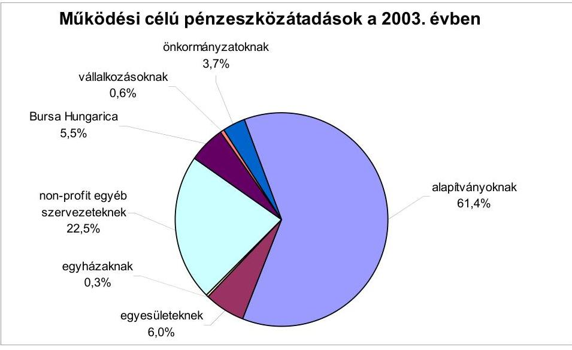
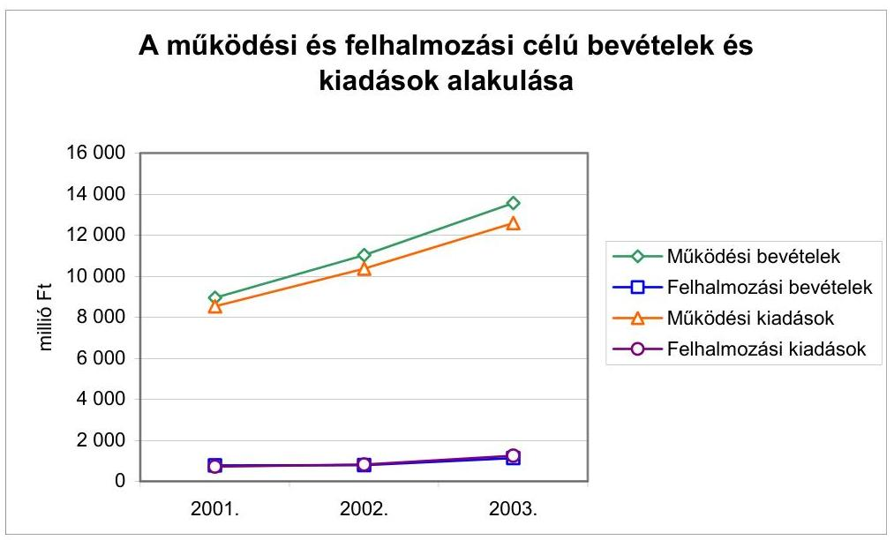
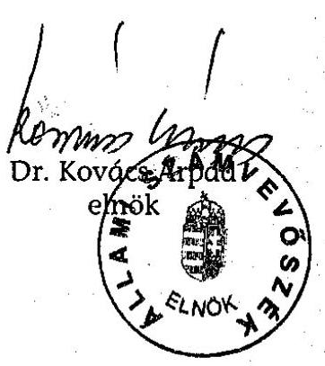
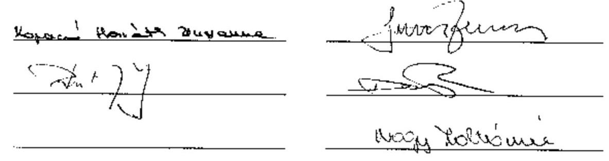
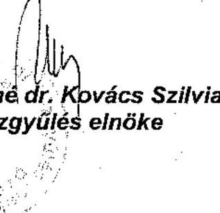

# JELENTÉS 

## a Tolna Megyei Önkormányzat gazdálkodásának átfogó ellenőrzéséről

---

3. Önkormányzati és Területi Ellenőrzési Igazgatóság
3.3 Átfogó Ellenőrzések FőcsoportIktatószám: V-1002-4/32/13/2004.Témaszám: 692
Vizsgálat-azonosító szám: V0165
Az ellenőrzést felügyelte:
Dr. Lóránt Zoltán
főigazgató
Az ellenőrzés végrehajtásáért felelős:
Dr. Sepsey Tamás
főigazgató-helyettes
Az ellenőrzést vezette:
Csecserits Imréné
főcsoportfőnök-helyettes
Az ellenőrzést végezték:
Eigner Györgyszámvevő
Kopaczné Horváth
Zsuzsanna
számvevő tanácsos
Péntek László
főtanácsadó
A témához kapcsolódó - az elmúlt négy évben készített -számvevőszéki jelentések:
címe
sorszáma
Jelentés a helyi önkormányzatok és a helyi kisebbségi ..... 0010
önkormányzatok pénzügyi-gazdasági tevékenységének 1999. évi
ellenőrzési tapasztalatairól
Jelentés a megyei, fővárosi illetékhivatali tevékenység ..... 0243
ellenőrzéséről
Jelentés a helyi önkormányzatok tartós szociális ellátási ..... 0317
feladatainak ellenőrzéséről az idősek otthonainál

---

# TARTALOMJEGYZÉK 

BEVEZETÉS ..... 5
I. ÖSSZEGZŐ MEGÁLLAPÍTÁSOK, KÖVETKEZTETÉSEK, JAVASLATOK ..... 7
II. RÉSZLETES MEGÁLLAPÍTÁSOK ..... 16
1.A költségvetés tervezésének, végrehajtásának, az Önkormányzat vagyongazdálkodásának és a zárszámadás elkészítésének szabályszerűsége ..... 16
1.1.A költségvetési rendelet jóváhagyásának, módosításának, az előirányzatok nyilvántartásának és betartásának szabályszerűsége ..... 16
1.2.A gazdálkodás szabályozottsága, a bizonylati rend és fegyelem szabályszerűsége ..... 22
1.3.A pénzügyi-számviteli feladatok ellátásának informatikai támogatottsága ..... 32
1.4.Az önkormányzati vagyon nyilvántartása, számbavétele ..... 34
1.5.A vagyonnal való gazdálkodás szabályszerűsége, célszerűsége, nyilvánossága ..... 36
1.6.A céljelleggel nyújtott támogatások szabályszerűsége ..... 40
1.7.A közbeszerzési eljárások szabályszerűsége ..... 45
1.8.A zárszámadási kötelezettség teljesítésének szabályszerűsége ..... 48
2.Az önkormányzati feladatok és a rendelkezésre álló források összhangja ..... 49
2.1.A feladatok meghatározása és szervezeti keretei ..... 49
2.2.A költségvetés egyensúlyának helyzete ..... 53
2.3.A feladatok finanszírozása ..... 57
3.A belső irányítási, ellenőrzési rendszer működésének értékelése ..... 61
3.1.Az ellenőrzési rendszer kialakítása, működése ..... 61
3.2.A könyvvizsgálati kötelezettség teljesítése ..... 65
3.3.A korábbi számvevőszéki ellenőrzések javaslatainak hasznosulása ..... 65

---

# MELLÉKLETEK 

1. számú Az Önkormányzat vagyonának alakulása a 2001-2003. évek között (1 oldal)
2. számú Az Önkormányzat 2003. évi bevételeinek és kiadásainak alakulása (1 oldal)
3. számú Az Önkormányzat gazdálkodását meghatározó főbb adatok, mutatószámok (1 oldal)
4. számú Egyes önkormányzati feladatok finanszírozása (1 oldal)
5. számú Helyszíni ellenőrzési jegyzőkönyv (8 oldal)
6. számú Frankné dr. Kovács Szilvia úrhölgy, a Tolna Megyei Önkormányzat Közgyűlése elnökének észrevétele (1 oldal)

---

# RÖVIDÍTÉSEK JEGYZÉKE 

Ötv.
Áht.
Ásztv.
Kbt.
Számv. tv.
Htv.

Ktv.
Ksztv.
Szoctv.
Gyvt.
Társ. tv.
Ámr.
Vhr.

Ber.
ÁSZ
MÁK
Önkormányzat
Közgyűlés
Közgyűlés elnöke
Pénzügyi bizottság
Gazdasági bizottság
Művelődési bizottság
Sport bizottság
Szociális bizottság
Önkormányzati hivatal főjegyző
Pénzügyi osztály
Műszaki osztály
a helyi önkormányzatokról szóló 1990. évi LXV. törvény az államháztartásról szóló 1992. évi XXXVIII. törvény
az Állami Számvevőszékről szóló 1989. évi XXXVIII. törvény
a közbeszerzésekről szóló 1995. évi XL. törvény
a számvitelről szóló 2000. évi C. törvény
a helyi önkormányzatok és szerveik, a köztársasági megbízottak, valamint egyes centrális alárendeltségű szervek feladat- és hatásköreiről szóló 1991. évi XX. törvény
a köztisztviselők jogállásáról szóló 1992. évi XXIII. törvény
a közhasznú szervezetekről szóló 1995. évi XL. törvény
a szociális igazgatásról és szociális ellátásról szóló 1993. évi III. törvény
a gyermekek védelméről és a gyámügyi igazgatásról szóló 1997. évi XXXI. törvény
a helyi önkormányzatok társulásairól és együttmúködéséről szóló 1997. évi CXXXV. törvény
az államháztartás múködési rendjéről szóló 217/1998. (XII. 30.) Korm. rendelet
az államháztartás szervezetei beszámolási és könyvvezetési kötelezettségének sajátosságairól szóló 249/2000. (XII. 24.) Korm. rendelet
a költségvetési szervek belső ellenőrzéséről szóló 193/2003. (XI. 26.) Korm. rendelet

Állami Számvevőszék
Magyar Államkincstár Tolna Megyei Területi Igazgatósága
Tolna Megyei Önkormányzat
Tolna Megyei Közgyűlés
Tolna Megyei Közgyűlés elnöke
Tolna Megyei Közgyűlés Pénzügyi Bizottsága
Tolna Megyei Közgyűlés Gazdasági és Mezőgazdasági Bizottsága
Tolna Megyei Közgyűlés Művelődési és Oktatási Bizottsága
Tolna Megyei Közgyűlés Ifjúsági és Sport Bizottsága
Tolna Megyei Közgyűlés Szociális és Egészségügyi Bizottsága
Tolna Megyei Önkormányzati Hivatal
Tolna Megyei Önkormányzat főjegyzője
Tolna Megyei Önkormányzati Hivatal Pénzügyi Osztálya
Tolna Megyei Önkormányzati Hivatal Műszaki és Informatikai Osztálya

---

| Humánszolgáltatási osztály | Tolna Megyei Önkormányzati Hivatal Humánszolgáltatási Osztálya |
| :--: | :--: |
| Illetékhivatal | Tolna Megyei Illetékhivatal |
| GAMESZ | Tolna Megyei Önkormányzat Gazdasági Műszaki Ellátó Szervezete |
| Kórház | Tolna Megyei Önkormányzat Balassa János Kórháza |
| ÁMK | Tolna Megyei Önkormányzat Általános Művelődési Központ, Pedagógiai, Kulturális és Sportintézet intézménye |
| SzMSz | a Tolna Megyei Önkormányzat 10/2003. (IV. 22.) számú rendelete a Tolna Megyei Önkormányzat Szervezeti és Múködési Szabályzatáról |
| vagyongazdálkodási rendelet | a Tolna Megyei Önkormányzat 17/1999. (XI. 29.) számú rendelete a Tolna Megyei Önkormányzat vagyonáról és a vagyongazdálkodás szabályairól |
| közbeszerzési rendelet | a Tolna Megyei Önkormányzat 16/1999. (XI. 29.) számú rendelete a közbeszerzési eljárás egyes szabályairól |
| Közlekedési Felügyelet | a Közlekedési, Hírközlési és Vízügyi Minisztérium Tolna Megyei Közlekedési Felügyelete |

---

# JELENTÉS   a Tolna Megyei Önkormányzat gazdálkodásának átfogó ellenőrzéséről 

## BEVEZETÉS

Az Ötv. 92. § (1) bekezdése, az Ásztv 2. § (3) bekezdése, valamint az Áht. 120/A. § (1) bekezdése szerint az Önkormányzat gazdálkodását az ÁSZ ellenőrzi. Az ellenőrzés elvégzése az Országgyűlés illetékes bizottságai részére is átadott, országosan egységes ellenőrzési program alapján történt.

## Az ellenőrzés célja annak értékelése volt, hogy

- az önkormányzati gazdálkodás törvényességét ${ }^{1}$, szabályszerűségét biztosítot-ták-e a tervezés, a költségvetés végrehajtása és a zárszámadás során;
- az Önkormányzat által ellátott feladatok és az azokhoz rendelkezésre álló források összhangja biztosított volt-e, különös tekintettel egyes kiemelt feladatokra;
- a gazdálkodás szabályszerűségét biztosító kontrollok ${ }^{2}$ megfelelően segitettéke a végrehajtást.

A vizsgált időszak: a 2003. év, valamint a 2004. év I. félév, az 1.5., 2.1-2.3. és a 3.3. ellenőrzési pontok esetében ezen túlmenően a 2001-2003. évek.

Tolna megye területe $3704 \mathrm{~km}^{2}$, az ország területének $4 \%$-a, a megye népessége 2003. január 1-jén 251527 fő volt. A megyére a középfalvas településszerkezet jellemző, a 108 településből kilenc a város, itt él a lakosság több mint 50\%-a.

Az önkormányzati feladat- és hatásköröket a 41 fős Közgyűlés gyakorolja, mellette hét állandó bizottság múködik.

A 2002. évi önkormányzati választásokhoz kapcsolódóan a Közgyűlés elnöke és alelnökei - egy főállású és egy társadalmi megbízatású - személyében változás történt. A Közgyűlés elnökének munkáját Elnöki Kabinet segíti.

[^0]
[^0]:    ${ }^{1}$ A törvényi előírások betartásának elmulasztásakor egységesen a törvénysértés megjelölést alkalmazzuk, mivel az ÁSZ nem tehet különbséget a törvényi előírások között.
    ${ }^{2}$ A gazdálkodás szabályszerűségét biztosító kontroll alatt értjük a kiépített és működő belső irányítási rendszert, valamint a belső ellenőrzési funkciók ellátását.

---

A Közgyűlés - a köztisztviselői jogviszonyát közös megegyezéssel megszüntető főjegyző helyére - 2003. július hónapban új főjegyzőt nevezett ki, akit általános helyettesítési jogkörrel a megyei aljegyző helyettesít.

Az Önkormányzati hivatal az 1998. év óta az ISO 9001 szabvány szerint múködik, a feladatellátását a Minőségbiztosítási Kézikönyv utasításaként szervezi. A hét szervezeti egységében dolgozó és az osztályszervezetbe nem sorolt köztisztviselők létszáma 2003. december 31-én 90 fő volt.

Az Önkormányzat a 2003. évben 31 önálló és három részben önálló gazdálkodási jogkörű intézményt múködtetett, a foglalkoztatott közalkalmazottak létszáma 3405 fő volt.

A Közgyűlés Szekszárd Megyei Jogú Város Önkormányzatának Közgyűlésével a közös feladatokban való együttműködés előkészítésére és összehangolására Egyeztető Bizottságot múködtet. Az Önkormányzat társulásban nem vett részt a 2003. évben. Az önkormányzati feladatellátásában három közalapítvány múködik közre.

Az Önkormányzat 2003. évi költségvetési bevétele 14,7 milliárd Ft-ban, a költségvetési kiadása 13,8 milliárd Ft-ban teljesült ${ }^{3}$, a 2004. évi költségvetésének főösszege 13,9 milliárd Ft. A számviteli mérlegének főösszege 2003. december 31-én 16,4 milliárd Ft volt.

Az önkormányzati gazdálkodást meghatározó főbb adatokat, mutatószámokat a jelentés 3. számú melléklete tartalmazza.
${ }^{3}$ Az adatok a hiteltörlesztéseket, valamint a kiegyenlítő, függő, átfutó bevételeket és kiadásokat nem tartalmazzák.

---

# I. ÖSSZEGZŐ MEGÁLLAPÍTÁSOK, KÖVETKEZTETÉSEK, JAVASLATOK 

Az Önkormányzat a feladatokat hosszabb távra kijelölő gazdasági programmal az Ötv. előírásának megfelelően rendelkezett. A 2003. évi költségvetési koncepciót a Közgyűlés elnöke az előírt határidőn belül, a 2004. évi költségvetési koncepciót - az Áht. előírását megsértve - határidőn túl terjesztette a Közgyűlés elé. Az SzMSz-ben foglaltak alapján a költségvetési koncepciók tervezetét valamennyi bizottság megtárgyalta, és az arról alkotott véleményét a Közgyűlés ülésein szóban ismertették. A költségvetési koncepciókat az Ámr-ben foglaltaknak megfelelően a helyben képződő bevételek és az ismert kötelezettségek figyelembevételével állították össze.
Az Áht. előírását megsértve nem határozták meg rendeletben - a vagyonkimutatás kivételével - a költségvetés és a zárszámadás előterjesztésekor bemutatandó mérlegek, kimutatások tartalmi követelményeit.

A főjegyző a 2003. és a 2004. évi költségvetési rendelettervezetet az intézmények vezetőivel egyeztette, annak eredményét azonban - az Ámr. előírása ellenére - írásban nem rögzítette.

A Közgyűlés elnöke a 2003. évi költségvetési rendelettervezetet az Áht-ban előírt határidőn belül, a 2004. évi költségvetési rendelettervezetet - az Áht. előírását megsértve - az előírt határidő után terjesztette a Közgyűlés elé. A Közgyűlés elnöke a költségvetési koncepciók és a költségvetési rendelettervezetek előterjesztéséhez - az Ámr. előírása ellenére - nem csatolta a Pénzügyi bizottság írásos véleményét. A Közgyűlés elnöke a költségvetési rendelettervezetek benyújtásakor az Áht-ban előírt mérlegek és kimutatások közül - tájékoztatási céllal bemutatta az Önkormányzat összevont mérlegeit, valamint a több éves kihatással járó döntések számszerűsítését évenkénti bontásban és összesítve szöveges indoklással együtt. A költségvetési rendelettervezetek benyújtásakor előterjesztették azokat a rendelettervezeteket, amelyek a javasolt előirányzatokat megalapozták. A költségvetési rendelet szerkezetére, tartalmára vonatkozó - az Áht-ban és az Ámr-ben meghatározott - előírásokat mindkét évben betartották. A költségvetési rendeletekben rögzítették a költségvetés végrehajtásával összefüggő helyi szabályokat, meghatározták az Áht-ban foglaltaknak megfelelően a címrendet.

A Közgyűlés a 2003. évi költségvetésben jóváhagyott előirányzatokat 15,1\%-kal módosította. Az előterjesztett rendelettervezetek a költségvetéssel összehasonlítható módon tartalmazták a módosítási javaslatokat, valamennyi előirányzatváltoztatást hitelt érdemlően dokumentálták.

Az Ámr-ben előírtak ellenére a költségvetési rendeletet a központi pótelőirányzatokkal nem módosították legalább negyedévenkénti gyakorisággal és a költségvetési szervek saját hatáskörben végrehajtott előirányzat-változtatásairól a főjegyző előkészítésében a Közgyűlés elnöke 30 napon belül sem tájékoztatta a Közgyűlést.

---

A költségvetési rendelet módosított előirányzatait, ezen belül a kiemelt kiadási előirányzatokat önkormányzati szinten és költségvetési szervenként is betartották.

Az Önkormányzati hivatal - mint önálló gazdálkodási jogkörű költségvetési szerv - az Ámr. előírásainak megfelelő tartalmú szervezeti és múködési szabályzattal nem rendelkezett, az SzMSz-nek a hivatali szervezetre és múködésre vonatkozó szabályozása nem tartalmazta az Önkormányzati hivatal kiadásait, bevételeit befolyásoló, a gazdálkodás előirányzatok keretei között tartását biztosító feltétel- és követelményrendszerét, folyamatát, kapcsolatrendszerét. A gazdasági szervezet az Ámr. előírásainak megfelelő ügyrenddel a 2003. évben nem rendelkezett, azt a főjegyző a 2004. év áprilisában hagyta jóvá.

Az operatív gazdálkodással kapcsolatos döntési hatásköröket és a felelősségi körök gyakorlására vonatkozó szabályokat a Közgyűlés elnöke a kötelezettségvállalás és szakmai teljesítés igazolás rendjére vonatkozó utasításában, a főjegyző a pénzkezelési szabályzatban határozta meg. A Közgyűlés elnöke és a főjegyző a gazdálkodási jogkörök gyakorlóit írásban hatalmazta fel, illetve jelölte ki. A felhatalmazottak beszámoltatása nem történt meg.

A gazdálkodás szabályozottsága és szabályszerűsége érdekében elkészítették a számviteli politikát, melyben a számviteli elszámolás és értékelés szempontjából a megbízható és valós kép kialakítását lényegesen befolyásoló hibahatár az Önkormányzati hivatal 4143 millió Ft saját tőkéjének és tartalékának együttes értékére figyelemmel indokolatlanul magas. A számviteli politika keretében elkészített - az eszközök és a források leltározási és leltárkészítési szabályzata, az eszközök és források értékelésének szabályozása, az önköltségszámítás rendjére vonatkozó belső szabályzat, a pénzkezelési szabályzat és a számlarend - szabályzatok megfeleltek a jogszabályi előírásoknak, gondoskodtak a változások követéséről. A főjegyző a Htv. előírását megsértve nem alakította ki az önkormányzati intézmények számviteli rendjét.

A pénzügyi-számviteli munkafolyamatokban elvégzendő ellenőrzési feladatokat, egyeztetési kötelezettséget - a felelősség előírásával egyidejűleg - a dolgozók munkaköri leírásában rögzítették. A szabályzatoknak és a munkaköri leírásoknak a folyamatba épített belső ellenőrzésre, egyeztetésre vonatkozó előírásai összhangban voltak.

Az Önkormányzati hivatalban - a számlarend előírásainak megfelelően minden főkönyvi számlához analitikus nyilvántartást vezettek. A főkönyvi könyvelés és az analitikus nyilvántartások egyeztetését - a számlarendben előírtak szerint - a negyedéves zárásokhoz kapcsolódóan elvégezték. Az éves beszámoló összeállítását megelőzően a könyvviteli mérleget főkönyvi kivonattal alátámasztották. A könyvviteli nyilvántartásokban elszámolt gazdasági műveletekről, eseményekről a Számv. tv-ben előírt követelményeknek megfelelő, a helyi szabályozással összhangban lévő bizonylatokat állítottak ki.

A pénzgazdálkodási jogkörök gyakorlása során nem tartották be az Ámr. és a helyi szabályozás előírásait, a kifizetések 6\%-ában elmaradt az előzetes írásbeli kötelezettségvállalás, a kötelezettségvállalások 22\%-ban a kötelezettségvállalások ellenjegyzése nem történt meg. A gazdasági eseményekről, műve-

---

letekről kiállított bizonylatokat a könyvviteli nyilvántartásokban a költségvetés szerkezeti rendjének megfelelően rögzítették.

Az Önkormányzati hivatalban a pénzügyi-számviteli feladatok ellátásának informatikai támogatása megoldott. A főkönyvi könyvelést, valamint az analitikus nyilvántartások 70\%-át számítástechnikai segítséggel vezették. A pénz-ügyi-számviteli területen használt számítógépes programok a számviteli politika, a számlarend és az analitikus nyilvántartás követelményeinek megfelelő aktualizálásáról gondoskodtak.

Az informatikai rendszer múködésének feltételeit meghatározó szabályozás hiányos, nem rendelkeztek informatikai stratégiával, katasztrófa elhárítási tervvel, program részletezettségű hozzáférési jogosultsági rendszerrel, a rendszer üzemeltetési leírásával.

Az Önkormányzati hivatalban a vagyon nyilvántartásának módját a Vhr. alapján kialakították, melynek zárt rendszerét a főkönyvi könyvelés és az analitikus nyilvántartások együttesen biztosították. A könyvviteli mérleg, a főkönyvi számlák és az analitikus nyilvántartások értékadatai a 2003. évben megegyeztek. A vagyon értékét befolyásoló gazdasági eseményeket a számviteli nyilvántartásokban rögzítették. A 2003. évi könyvviteli mérleg értékadatait leltárral alátámasztották. A leltározást mennyiségi felvétellel és egyeztetéssel végezték el, a leltár kiértékelése, az eredményének számviteli nyilvántartásba vétele megtörtént. Az üzemeltetésre átadott ingatlanok leltározását az analitikus és az ingatlanvagyon kataszteri nyilvántartás egyeztetésével hajtották végre, nem tartották be a leltározási szabályzat leltározás módjára vonatkozó előírását. Az Önkormányzati hivatal a 2003. évi könyvviteli mérlegében kimutatott részesedés és követelés eszközcsoport év végi értékelését a számviteli politikában és az annak keretében elkészített eszközök és források értékelési szabályzatában foglaltak alapján, az abban foglaltaknak megfelelően végezte el, a részesedések értékelésénél a Pénzügyminisztérium által a 2003. évi éves költségvetési beszámoló készítéséhez kiadott útmutató szerint járt el.

Az Önkormányzat könyvviteli mérlegeiben kimutatott eszközérték a 20012003. évek között 47,7\%-kal emelkedett, ezen belül az ingatlanok állományának 169,1\%-os növekedése volt a meghatározó. Az ingatlanállomány növekedésének 54,6\%-a a Kórház korábban érték nélkül nyilvántartott földterületeinek, telkeinek 2003. évben végrehajtott érték-megállapításából származott. Az értéknövekedés $25,2 \%$-át a címzett állami támogatások felhasználásával megvalósított beruházások eredményezték.

A Közgyűlés az 1999. évben alkotta meg a vagyongazdálkodási rendeletét, melyben meghatározta a vagyongazdálkodással kapcsolatos feladatokat és a döntési hatásköröket. A vagyontárgyakat az Ötv. előírásainak megfelelően sorolták be a törzsvagyon és a forgalomképes vagyon körébe. Az Önkormányzat nem szabályozta a forgalomképesség szerinti besorolás megváltoztatásának módját, feltételeit. A 2001-2003. évek vagyongazdálkodási tevékenységét a meglévő vagyon megőrzését, illetve gyarapítását szolgáló - közgyűlési döntéseken alapuló - fejlesztési, felújítási feladatok megvalósítása jellemezte. Önkormányzati vagyon ingyenes átadására, valamint 10 millió Ft értéket meghaladó vagyontárgy elidegenítésére - egy 2001. évi ingatlanértékesítés kivételé-

---

vel - nem került sor. Önkormányzati követelésről - az intézményi behajthatatlannak minősített követelések leírása kivételével - nem mondtak le. A vagyonváltozást eredményező döntéseknél és azok végrehajtásánál szabályszerűen jártak el.

Az Önkormányzat a 2003. évben a költségvetési kiadása 1,1\%-át kitevő, összesen 153,7 millió Ft működési célú pénzeszköz átadásról adott számot költségvetési beszámolója keretében, felhalmozási célú pénzeszközátadás nem történt. Az átadott pénzeszközök 68,5\%-a céljellegű támogatás volt, melyből meghatározó - 52 millió Ft - összeggel a Tolna Megyei Közoktatás-fejlesztési Közalapítvány részesedett. A Közgyűlés a támogatási rendszer múködésének főbb elveit a költségvetési rendeleteiben rögzítette, a részletes szabályokat - a támogatások folyósításának, felhasználásának, elszámolásának és ellenőrzésének feltételeit, módját - azonban nem dolgozta ki, nem határozta meg a Közgyűlés elnöke, illetve az egyes bizottságok részére biztosított pénzügyi keretek felhasználásával kapcsolatos nyilvántartási, elszámoltatási kötelezettségeket, nem állapított meg követelményeket a támogatásokkal foglalkozó dolgozók feladatellátásának módjára. Az Önkormányzati hivatalban nem alakították ki a céljellegú támogatások nyilvántartásának egységes rendszerét. Az Önkormányzat megsértve a Ksztv. előírását nem kötött szerződést a közhasznú szervezetekkel. A támogatások 3,1\%-át kitevő megyei kulturális és sport nagyrendezvények támogatásánál nem írtak elő számadási kötelezettséget és a számadási kötelezettséget elmulasztó szervezeteket nem szólították fel a számadás pótlására, visszafizetést nem kezdeményeztek, nem biztosították, hogy további támogatásban ne részesüljön az, aki nem adott számadást, mindezekkel megsértették az Áht. előírását.

Az Önkormányzatnál a támogatásokról szóló döntések meghozatalakor betartották az Ötv. előírásai szerinti hatásköri szabályokat. Egy intézmény az Ötv. előírását, valamint a Közgyűlés rendelkezését megsértve alapítványnak nyújtott támogatást. Az Önkormányzati hivatalban - az Áht. előírásait megsértve ellenőrzést nem végeztek, nem vizsgálták a támogatások felhasználását.

A Közgyűlés az 1999. évben alkotta meg a közbeszerzési rendeletet, melynek hatálya a Kbt. előírását megsértve - az önkormányzati költségvetési szerveken kívül - az Önkormányzatra is kiterjedt. A rendeletben foglalt szabályozások egyebekben megfeleltek a törvényi előírásoknak. A Közgyűlés a Kbt. hatályon kívül helyezésével egyidejűleg a közbeszerzési rendeletet hatályon kívül helyezte. A közbeszerzési eljárások centrális megvalósíthatóságának lehetőségét, célszerűségét nem vizsgálták.

A közbeszerzésekre előírt értékhatárt elérő beszerzéseknél a közbeszerzési eljárást lefolytatták, a végrehajtás során a Kbt. és a közbeszerzési rendelet előírásait betartották.

A Közgyűlés elnöke a 2003. évi zárszámadási rendelettervezetet az Áhtban előírt határidőn belül terjesztette a Közgyűlés elé. A rendelettervezet szerkezetére és tartalmára vonatkozó - az Áht-ban és az Ámr-ben foglalt - előírásokat betartották. A Közgyűlés tájékoztatása céljából a zárszámadás előterjesztésekor az Áht. előírása alapján bemutatták az Önkormányzat összes bevételét és kiadását, finanszírozását és pénzeszközének változását, valamint az Önkor-

---

mányzat összevont mérlegeit. Az Áht. előírását megsértve nem mutatták be tájékoztatásul a többéves kihatással járó döntéseket évenkénti bontásban és öszszesítve, a szöveges indoklással együtt. A Közgyűlés a zárszámadás keretében jóváhagyta az Önkormányzat és költségvetési szervei 2003. évi pénzmaradványát. Az Önkormányzati hivatal pénzmaradványának megállapítása szabályszerűen történt. Az Ámr. előírása ellenére a Közgyűlés a költségvetési szervek elemi beszámolója felülvizsgálatának rendjét, tartalmát nem határozta meg. Az Önkormányzati hivatal az intézmények költségvetési beszámolóját az Ámr-ben meghatározott határidőig felülvizsgálta, és annak elfogadásáról, valamint a jóváhagyott pénzmaradványról a főjegyző írásban értesítette az intézményeket.

A Közgyűlés az SzMSz-ben meghatározta az Önkormányzat kötelezően ellátandó és önként vállalt közszolgáltatásait. A feladatokat és azok ellátási módját a négyéves gazdasági és humán program, valamint az ágazati koncepciók tartalmazták részletesen. Az Önkormányzat az egészségügyi, a szociális, a közoktatási és a közművelődési közfeladatait költségvetési intézményein keresztül látta el, a feladatellátásban a három közalapítvány vállalt szerepet. A közszolgáltatások biztosításába gazdasági társaságot nem vont be, társulásnak 2004. január 1-től tagja. A 2001-2003. években végrehajtott szervezeti változások az ágazati koncepciókban jóváhagyott feladatok végrehajtásához, az Önkormányzat által kezdeményezett óvodai és bölcsődei ellátás Szekszárd Megyei Jogú Város Önkormányzata részére történő átadásához, a Német Színház működtetésére társulási megállapodás megkötéséhez, továbbá feladatbővüléshez kapcsolódtak. Az átszervezések során az Önkormányzat betartotta a jogszabályi előírásokat.

A Közgyűlés jelentős ráfordítást igénylő, nem kötelező feladatok ellátását nem vállalta fel, az önként vállalt feladatok kiadásai nem voltak számottevőek, a költségvetésen belüli részarányuk a 2003. évben 1,7\%-ot tett ki. Az önként vállalt feladatok finanszírozása nem veszélyeztette a kötelezően ellátandó feladatok végrehajtását. A 2001-2003. években az Önkormányzat pénzügyi helyzete stabil volt, a költségvetési bevételek fedezték a költségvetési kiadásokat. A 2001. évet követően múködési, illetve felhalmozási célú hitelt nem vettek igénybe a feladatok finanszírozásához. A 2003. december 31-i fejlesztési célú hitelállomány 10 millió Ft volt.
A pályázatok útján elnyert, valamint az államháztartáson kívülről átvett pénzeszközök az összes önkormányzati bevételből évente 2-3,3\%-kal részesedtek. A felhalmozási célú pályázati döntéseknél a központi és az önkormányzati szabályozásban foglalt hatásköri előírásokat betartották.
A főjegyző az Ámr. előírása ellenére nem készített likviditási tervet az Önkormányzat pénzállományának alakulásáról. A kötelezettségvállalásokról az Ámr-ben előírtaknak megfelelő - teljes körű és naprakész - nyilvántartást vezettek, melyből megállapítható volt az évenkénti kötelezettségvállalások összege. Adósságot keletkeztető kötelezettségvállalásokról - a 2001. évi múködési hitel felvételén kívül - a 2002-2003. években nem döntöttek.

Az Önkormányzat a fogyatékos személyek jogairól és esélyegyenlőségük biztosításáról szóló törvényi kötelezettség - a középületekben az akadálymentes közlekedés kialakítása - teljesítését az intézmények felújítási, korszerűsítési, bővítési munkáival összekapcsolva végezte. A megvalósult fejlesztések

---

eredményeként 2004. július hónapban az egészségügyi és gyermekintézmények, valamint a szociális otthonok épületeinek 40\%-ában, a közművelődési intézmények 14\%-ában, egy középfokú tanintézményben és az Önkormányzati hivatal épületében volt biztosított az akadálymentes közlekedés. Az eddigi ilyen célú felhasználást és a 2004. évi tervezett kiadásokat figyelembe véve a fogyatékos személyek jogairól és esélyegyenlőségük biztosításáról szóló törvényben meghatározott 2005. január 1-i határidőre a feladatok elvégzése nem biztosítható.

Az Önkormányzat a feladatkörébe utalt ellenőrzés végrehajtásának szervezeti kereteit kialakította, a Közgyűlés 2003. áprilisában - a hivatali belső ellenőr, a kontrolling csoport és a Pénzügyi osztályon dolgozó intézményi ellenőrök részvételével - belső ellenőrzési egységet hozott létre.
Az ellenőrzési feladatokat négy köztisztviselő belső ellenőrként látta el, funkcionális és szervezeti függetlenségük 2004. áprilisától érvényesült, feladatukat a főjegyzőhöz tartozó belső ellenőrzési vezető irányításával végezték. A Közgyűlés elnöke és a főjegyző az Önkormányzati hivatal ellenőrzési szabályzatáról a 2003. évben együttes utasítást adott ki. A szabályzatban az intézmények pénz-ügyi-gazdasági ellenőrzéseinek gyakoriságát - a Közgyűlés döntésének megfelelően - három évben határozták meg.
A belső ellenőrzési vezető elkészítette és a főjegyző 2004. június 30-i nappal hatályba léptette az Önkormányzat Belső ellenőrzési kézikönyvét. Az ellenőrzéseket éves ellenőrzési terv szerint, ellenőrzési program alapján végezték. A 2003. évben sem a hivatali belső ellenőrzési, sem az intézményi ellenőrzési tervet nem teljesítették. A jelentésekben megfogalmazott javaslatok segítséget nyújtottak az ellenőrzöttek részére a gazdálkodási fegyelem, a működés törvényességének és szabályszerűségének javításához. Az intézkedési tervek végrehajtásának utóellenőrzése önállóan, illetve a soron következő ellenőrzéshez kapcsolódóan történt.
A Közgyűlés évente napirendjére tűzte az intézményi pénzügyi ellenőrzések tapasztalatait összegző beszámolót, melyet elfogadott, az ellenőrzési tervek részleges végrehajtását tudomásul vette. Az Önkormányzati hivatal belső ellenőrzéseinek megállapításait, a javaslatok hasznosítását összegző előterjesztés nem készült, előterjesztés hiányában a Közgyűlés megsértette a Htv. hivatali belső ellenőrzés tapasztalatainak áttekintésére vonatkozó előírását.

Az Önkormányzat az Ötv-ben előírt könyvvizsgálati kötelezettségének eleget tett, a könyvvizsgáló megbízásánál betartotta a szakmai és az összeférhetetlenségi követelményeket. A könyvvizsgáló az Önkormányzat beszámolóját korlátozás nélkül, hitelesítő záradékkal látta el, intézkedést igénylő javaslatot, ajánlást nem fogalmazott meg.

Az ÁSZ a 2000. évben átfogó ellenőrzést, a 2002. évben három - a címzett- és céltámogatások, a tartós szociális feladatellátás, az Illetékhivatal tevékenysége - témavizsgálatot végzett az Önkormányzatnál. Az Önkormányzat a számvevői jelentések javaslatait 47\%-ban realizálta. Nem, illetve részben teljesültek a költségvetési koncepció, költségvetési rendelet-tervezet Közgyűlés elé terjesztése határidejére, az Illetékhivatal ellenőrzési kötelezettségének teljesítésére irányuló javaslatok, illetve a jelentős költségvetési forrást igénylő célszerűségi javaslatok.

---

A helyszíni ellenőrzés megállapításainak hasznosítása mellett javasoljuk:

# a Közgyülés elnökének 

a jogszabályi előírások maradéktalan betartása érdekében

1. kezdeményezze a költségvetési gazdálkodás szabályszerű helyi kereteinek kialakítása céljából, hogy a Közgyűlés
a) rendeletben határozza meg az Áht. 118. §-ának előírása alapján - az Áht. 116. § 6., 9. és 10. pontjai szerint - a költségvetés és a zárszámadás előterjesztésekor tájékoztatásul bemutatandó mérlegek, kimutatások tartalmi követelményeit;
b) hagyja jóvá - a főjegyző által az Ámr. 10. § (4)-(5) bekezdései előírásai szerint elkészített - az Önkormányzati hivatal szervezeti és múködési szabályzatát;
c) szabályozza az Ámr. 149. § (2) bekezdése alapján a költségvetési szervek elemi beszámolója felülvizsgálatának rendjét és tartalmát;
d) tekintse át a Htv. 138. § (1) bekezdése g) pontjában foglaltak alapján az Önkormányzati hivatal ellenőrzésének tapasztalatait is;
2. a szabályszerű költségvetési gazdálkodás biztosítása érdekében
a) terjessze a Közgyűlés elé a költségvetési koncepciót az Áht. 70. §-ában meghatározott határidőig, valamint a költségvetési rendelettervezetet az Áht. 71. § (1) bekezdésében előírt határidőig;
b) csatolja a Pénzügyi bizottság véleményét a költségvetési koncepció tervezetéhez az Ámr. 28. § (3) bekezdése előírása szerint, valamint a költségvetési rendelet előterjesztéséhez az Ámr. 29. § (9) bekezdése rendelkezése szerint;
c) intézkedjen, hogy az Önkormányzati hivatalban a kötelezettségvállalási jogkör gyakorlói tartsák be az Ámr. 134. § (2) bekezdése előírását;
d) intézkedjen annak érdekében, hogy az intézmények tartsák be a Közgyűlés támogatások nyújtására vonatkozó - az Ötv. 10. § (1) bekezdése d.) pontjában foglalt követelménynek megfelelő - előírásait;
a munka színvonalának javítása érdekében
3. számoltassa be a kötelezettségvállalásra és utalványozásra felhatalmazottakat;
4. vizsgáltassa meg a közbeszerzési eljárások centrális megvalósíthatóságának lehetőségét, célszerűségét;
5. kezdeményezze a vagyongazdálkodási rendelet kiegészítését a vagyontárgyak forgalomképesség szerinti besorolása megváltoztatásának módjára, feltételeire vonatkozó rendelkezéssel;
6. gondoskodjon a számvevőszéki jelentés Közgyűlés elé terjesztéséről és a javaslatok hasznosítása céljából intézkedési terv készítéséről;

---

7. kísérje figyelemmel a középületek akadálymentessé tételét, tekintettel a fogyatékosok jogairól és esélyegyenlőségük biztosításáról szóló 1998. évi XXVI. törvény 29. § (6) bekezdésében meghatározott 2005. január 1-i teljesítési határidőre;

# a főjegyzőnek 

a jogszabályi előírások maradéktalan betartása érdekében
1. a költségvetés elkészítésével, jóváhagyásával, módosításával és a zárszámadási rendelettervezet elkészítésével összefüggően
a) gondoskodjon az Ámr. 29. § (4) bekezdésében előírtak betartása érdekében arról, hogy a költségvetési rendelettervezet költségvetési szervek vezetőivel történő egyeztetésének eredményét írásban rögzítsék;
b) gondoskodjon arról, hogy az Áht. 118. §-ában meghatározott mérlegek között mutassák be a Közgyűlésnek zárszámadáskor az Áht. 116. § 9. pontja szerint a több éves kihatással járó döntéseket évenkénti bontásban és összesítve, szöveges indoklással együtt;
c) gondoskodjon arról, hogy amennyiben a központi költségvetés pótelőirányzatot biztosít az Önkormányzat számára, abban az esetben az Ámr. 53. § (2) bekezdésében foglaltaknak megfelelően negyedévenként készüljön előterjesztés a Közgyűlés számára a költségvetési rendelet módosítására;
d) készítse elő az önállóan gazdálkodó költségvetési szervek saját hatáskörében végrehajtott előirányzat-változtatásáról szóló tájékoztatót oly módon, hogy a Közgyűlés tájékoztatása az Ámr. 53. § (6) bekezdése előírásának megfelelő határidőn belül megtörténhessen;
2. a szabályszerű költségvetési és operatív gazdálkodás biztosításához
a) alakítsa ki - a Htv. 140. § (1) bekezdése c) pontja alapján - az önkormányzati intézményekre vonatkozó számviteli rendet;
b) intézkedjen, hogy az Önkormányzati hivatalban az ellenjegyzői jogkör gyakorlói tartsák be az Ámr. 134. § (7) bekezdése előírását;
c) biztosítsa, hogy az üzemeltetésre átadott ingatlanok leltározása - az Önkormányzati hivatal leltározási szabályzata 2/1.) pontja előírása szerint - mennyiségi felvétellel történjen;
d) intézkedjen, hogy az Önkormányzat által céljelleggel juttatott támogatás folyósítása esetében a számadási kötelezettség előírásra kerüljön, az Önkormányzati hivatal az Áht. 13/A. § (2) bekezdése alapján ellenőrizze a számadást, a támogatás célszerinti felhasználását, intézkedjen a támogatások jogszabálysértő vagy nem rendeltetésszerű felhasználásakor a támogatás visszafizettetésére, valamint arra, hogy a számadás elmulasztása esetén újabb támogatás ne kerüljön megállapításra;

---

e) készíttesse el az Ámr. 139. §-ának megfelelően a likviditási tervet és biztosítsa, hogy az szükség szerint aktualizálásra kerüljön;
a munka színvonalának javítása érdekében
3. módosítsa a számviteli politikában a számviteli elszámolás és értékelés szempontjából a megbízható és valós kép kialakítását lényegesen befolyásoló hibahatárt, annak csökkentése érdekében;
4. számoltassa be a kötelezettségvállalás és az utalványozás ellenjegyzésére felhatalmazottakat;
5. intézkedjen az Önkormányzati hivatal informatikai rendszerének tervszerű fejlesztése és zavartalan múködése érdekében az informatikai stratégiai terv, a katasztrófaelhárítási terv, a program részletezettségű hozzáférési jogosultsági rendszer kidolgozása érdekében, valamint az informatikai rendszer üzemeltetési leírása elkészítésére;
6. dolgozza ki a céljellegú támogatási rendszer részletes szabályait, a támogatások folyósításának, a számadásnak és ellenőrzésének feltételeit, módját, jelölje ki az ellenőrzésért felelősöket, határozza meg a feladatellátásuk követelményeit;
7. alakítsa ki a céljellegú támogatások olyan nyilvántartási rendszerét, melyből naprakészen megállapítható, hogy a támogatottak mikor, milyen forrásból részesültek támogatásban, eleget tettek-e számadási kötelezettségüknek;
8. gondoskodjon az éves belső ellenőrzési terv teljesítéséről.

---

# II. RÉSZLETES MEGÁLLAPÍTÁSOK 

## 1. A KÖLTSÉGVETÉS TERVEZÉSÉNEK, VÉGREHAJTÁSÁNAK, AZ ÖNKORMÁNYZAT VAGYONGAZDÁLKODÁSÁNAK ÉS A ZÁRSZÁMADÁS ELKÉSZÍTÉSÉNEK SZABÁLYSZERŰSÉGE

### 1.1. A költségvetési rendelet jóváhagyásának, módosításának, az előirányzatok nyilvántartásának és betartásának szabályszerűsége

A Közgyűlés az Ötv. 91. (1) bekezdésének előírása alapján az 1999-2002. évek közötti időszakra gazdasági és humán koncepciót fogadott el. A koncepció részét képező gazdasági program Tolna megye gazdasági jellemzőit mutatta be, továbbá a területfejlesztési elképzeléseket és az Önkormányzat pénzügyi politikáját körvonalazta.

A 2002. évben megválasztott Közgyűlés a 2003-2006. évekre szóló programját és annak részeként a gazdasági programot a 37/2003. (IV. 22.) számú határozatával jóváhagyta.

A gazdasági programban foglaltak alapján az Önkormányzat a közszolgáltatásokat nyújtó intézmények és az Önkormányzati hivatal működőképességének fenntartását, a pénzügyi feltételek lehetőség szerinti fokozatos javítását elsődleges feladatának tekintette. A szakmai feladatellátásnál és a beruházások megvalósításánál továbbra is kiemelt szerepe volt a külső források (elsősorban a pályázati pénzeszközök) bevonásának. A beruházások körében a szociális és a gyermekvédelmi feladatokat ellátó intézmények működési feltételeinek javítása, illetve megteremtése kapott prioritást.
A gazdasági programban foglaltak megfelelő alapul szolgáltak az éves költségvetések összeállításához.

A főjegyző az Önkormányzat 2003. és 2004. évre vonatkozó költségvetési koncepcióját - az Ámr. 28. § (1) bekezdésében foglaltaknak megfelelően - a helyben képződő bevételek és az ismert kötelezettségek figyelembevételével állította össze. A Közgyűlés elnöke a 2003. évi költségvetési koncepciót 2002. december 10-én, a 2004. évi költségvetési koncepciót - az Áht. 70. §-ának előírását megsértve ${ }^{4}$ - 2003. december 9-én terjesztette a Közgyűlés elé.

Az SzMSz-ben foglaltak alapján a 2003. és a 2004. évi költségvetési koncepció tervezetét valamennyi bizottság megtárgyalta, és az arról alkotott véleményét a Közgyűlés ülésein szóban ismertette. A Közgyűlés elnöke a Pénzügyi bizottság véleményét - az Ámr. 28. § (3) bekezdésének előírása ellenére - nem csatolta a költségvetési koncepciókhoz.

[^0]
[^0]:    ${ }^{4}$ Az Áht. 70. § -a szerint a költségvetési koncepciót november 30-ig, a Közgyűlés tagjai általános választásának évében december 15-ig kell benyújtani a Közgyűlésnek.

---

A Közgyűlés a 2003. és a 2004. évi költségvetési koncepcióról hozott határozataiban ${ }^{5}$ - az Ámr. 28. § (4) bekezdésében előírtaknak megfelelően - részletesen meghatározta az éves költségvetés előkészítése során végrehajtandó feladatokat, valamint a bevételek és a kiadások tervezésekor érvényesítendő szempontokat.

Az Önkormányzati hivatal 2003. és 2004. évi költségvetési előirányzatainak meghatározása - az Ámr. 26. §-ában előírtak szerint - az előző évi eredeti előirányzatokból kiindulva, a várható változások (szerkezeti változások és szintrehozások, előirányzati többletek) hatásának számszerű kimunkálásával történt.

A főjegyző a 2003. és a 2004. évi költségvetési rendelettervezetet az intézmények vezetőivel egyeztette, de annak eredményét - az Ámr. 29. § (4) bekezdésének előírása ellenére - írásban nem rögzítette.

A közbenső egyeztetés során a Közgyűlés elnöke által adott észrevétel szerint: „a jelentés rögzíti, hogy a főjegyzö a 2003. és a 2004. évi költségvetési rendelettervezetet az intézmények vezetőivel írásban egyeztette, annak eredményét azonban - az Ámr. előírása ellenére - írásban nem rögzítette.
Álláspontunk ebben a kérdésben eltér. Megítélésünk szerint az Ámr. 29. § (4) bekezdése és (9) bekezdése rendelkezésének tárgya - mondattanilag, illetve nyelvtanilag - egyértelmüen a költségvetési rendelettervezet, amelyet egyeztetni, írásba foglalni, bizottságok és a közgyülés elé kell terjeszteni. A (9) bekezdés pontosan meghatározza, mit kell beterjeszteni a költségvetési rendelettervezettel együtt a Közgyülés elé, a jogszabály az intézményekkel történt egyeztetés eredményének, megtörténtének írásba foglalt anyagát, mint közgyülés elé terjesztendő anyagot, nem jelöli meg.
Az államháztartás müködési rendjéről szóló módositott 217/1998. (XII. 30.) Korm. rendelet (továbbiakban: Ámr.) 29. §-a egyes bekezdései a helyi önkormányzatok költségvetési rendelettervezetének elkészitéséről rendelkeznek. Az (1) bekezdés a költségvetési rendelet szerkezetét határozza meg, a (4) bekezdés a jegyző költségvetési rendelettervezettel kapcsolatos feladatairól rendelkezik, a (9) bekezdés a polgármester költségvetési rendelettervezettel kapcsolatos feladatairól szól, amely feladatok logikai sorrendben és időben is követik egymást.
A jogszabálysértés alapját képező rendelkezés, a következőket tartalmazza:
„A jegyző a költségvetési rendelettervezetet a költségvetési szervek vezetőivel egyezteti, írásban rögzíti és a szervezeti müködési szabályzatban foglaltak szerint a polgármester a képviselő-testület bizottságai elé terjeszti."
A (9) bekezdés az alábbiakat tartalmazza: „A polgármester a képviselő-testület elé terjeszti a bizottságok által megtárgyalt, a pénzügyi bizottság által véleményezett, valamint az önkormányzatokról szóló törvény 92/A-92/C. §-ok alapján szükséges könyvvizsgáló írásos jelentését is csatoltan tartalmazó rendelettervezetet. A képviselő-testület ennek alapján megalkotja a költségvetési önkormányzati rendeletét."
Értelmezésünk szerint az Ámr. 29. § (4) bekezdése egyértelmüen a költségvetési rendelettervezet írásba foglalásáról rendelkezik, amelyet tehát egyeztetni, írásba foglalni, bizottságok és a közgyülés elé kell terjeszteni.
Amennyiben értelmezésünk téves, és az írásba foglalási kötelezettség nem a rendelettervezet írásba foglalását, hanem az ÁSZ értelmezésének megfelelően az intézményekkel történt egyeztetés írásba foglalását jelenti, véleményünk szerint a (4) bekezdés rendelkezése - az Ámr. módosítása során - az egyértelmüség érdekében pontositásra szorul,

[^0]
[^0]:    ${ }^{5}$ Az Önkormányzat 105/2002. (XII. 20.) számú, illetve 131/2003. (XII. 15.) számú határozata.

---

mert mint esetünk példázza, a jelenlegi megfogalmazás többféle értelmezést is lehetővé tesz."

Az észrevétel nem megalapozott, mivel álláspontunk szerint a költségvetési rendelettervezet minden esetben írásos dokumentum, amely alapján kerülhet sor annak egyeztetésére. Az egyeztetés eredményét tükröző dokumentumot az SzMSzben meghatározott módon kell a Közgyűlés bizottságai elé terjeszteni, annak érdekében, hogy a bizottságok a véleményeltérésről, vagy egyezőségről tudomást szerezzenek és indokolt esetben állást foglaljanak.

A Közgyűlésnek a költségvetés és a zárszámadás előterjesztésekor tájékoztatásként bemutatandó mérlegek tartalmi követelményeit a vagyonkimutatás kivételével - az Áht. 118. §-ának előírását megsértve - rendeletben nem határozták meg.
Az Áht. 67. §-ában foglalt előírásoknak megfelelő címrendet a költségvetési rendeletekben rögzítették.

A Közgyűlés elnöke a 2003. évi költségvetési rendelet tervezetét az Áht. 71. § (1) bekezdésében meghatározott február 15-i határidőig - 2003. február 14-én - beterjesztette a Közgyűlésnek. A főjegyző a 2004. évi költségvetési rendelet tervezetét 2004. február 3-án elkészítette, azt a Közgyűlés elnöke - az Áht. 71. § (1) bekezdése előírását megsértve az előírt határidő után ${ }^{6}$ 2004. február 18-án terjesztette a Közgyűlés elé.

A Közgyűlés elnöke az Ámr. 29. § (9) bekezdésének előírása ellenére a Pénzügyi bizottság véleményét nem csatolta az előterjesztésekhez. Az Önkormányzat könyvvizsgálójának a rendelettervezet vizsgálatáról készített jelentését mindkét évben az előterjesztéshez mellékelték.

Az Áht. 71. § (2) bekezdésének előírása alapján a Közgyűlés elnöke a 2003. és a 2004. évi költségvetési rendelettervezet benyújtásakor előterjesztette azokat a rendelettervezeteket ${ }^{7}$ is, amelyek a javasolt előirányzatokat megalapozzák.

Az éves költségvetések előterjesztésekor az Áht. 118. §-ában előírt mérlegek és kimutatások közül - a Közgyűlés tájékoztatása céljából - bemutatták az Áht. 116. § 6. pontja szerint az Önkormányzat összevont mérlegeit, továbbá az Áht. 116. § 9. pontja szerint a több éves kihatással járó döntések számszerűsítését évenkénti bontásban és összesítve szöveges indoklással együtt.

Az Önkormányzat a 2003. évi költségvetést a 2/2003. (II. 21.) számú rendelettel, a 2004. évi költségvetést a 2/2004. (II. 24.) számú rendelettel fogadta el. A

[^0]
[^0]:    ${ }^{6}$ Az Áht. 71. § (1) bekezdése szerint a költségvetési rendelettervezet benyújtásának határideje a tárgyév február 15-e.
    ${ }^{7}$ Az Önkormányzat 3/2003. (II. 21.) számú rendelete az Önkormányzati hivatal köztisztviselőinek díjazásáról és egyéb juttatásáról, 4/2003. (II. 21.) számú rendelete az Önkormányzat által fenntartott szociális intézményekben fizetendő térítési díjakról, 6/2003. (II. 21.) számú rendelete az Önkormányzat által fenntartott gyermekintézményekben fizetendő intézményi térítési díjakról, 7/2003. (II. 21.) számú rendelete az illetékügyi feladatokat ellátó dolgozók anyagi érdekeltségéről.

---

költségvetési rendeletek szerkezete és tartalma az Áht. 69. § (1), valamint az Ámr. 29. § (1) bekezdésében foglalt előírásoknak megfelelt.

A költségvetési rendeletekben az Önkormányzat és a költségvetési szervei bevételeit forrásonként az Ámr. 29. § (1) bekezdés a) pontja szerinti részletezettséggel szerepeltették. A kiemelt kiadási előirányzatok és az éves létszámkeretek meghatározása Önkormányzatra összesen, valamint önállóan és részben önállóan gazdálkodó költségvetési szervenként az Áht. 69. § (1) bekezdésében és az Ámr. 29. § (1) bekezdés b)-f) pontjaiban előírtaknak megfelelően történt. A költségvetési rendeletekben bemutatták tájékoztató jelleggel - az Ámr. 29. § (1) bekezdés h) pontja szerint - a működési és a felhalmozási célú bevételi és kiadási előirányzatokat mérlegszerűen, egymástól elkülönítetten, de együttesen egyensúlyban. Az Ámr. 29. § (1) bekezdés j) pontjának előírása alapján elkészítették az év várható bevételi és kiadási előirányzatainak teljesítéséről az előirányzat-felhasználási ütemtervet.

A 2003. évi költségvetési rendeletben az Áht. 8/A. § (3)-(7) bekezdései előírásait betartva a finanszírozási célú pénzügyi múveleteket költségvetési bevételként, illetve költségvetési kiadásként nem mutattak ki. A költségvetésekben hitelfelvételt nem irányoztak elő. A finanszírozási célú kiadásként tervezett hiteltörlesztés előirányzata a 2003. évben 16,7 millió Ft, a 2004. évben 10 millió Ft.

A Közgyűlés a költségvetési rendeletekben meghatározta az önkormányzati szintű előirányzatok évközi megváltoztatásával kapcsolatos hatásköröket, az önállóan gazdálkodó költségvetési szervek előirányzat-módosítási jogkörét, a tartalékokkal való rendelkezés jogosultjait, a pénzeszközátadások rendjét, a bevételi többletek felhasználásának szabályait, a finanszírozási hitel és a munkabérhitel felvételére vonatkozó felhatalmazást, a vagyonnal kapcsolatos tárgyévi aktuális teendőket, a finanszírozás rendjét, valamint az intézmények pénzmaradványának megállapítására vonatkozó szabályokat.

A 2003. évi költségvetési rendeletben a Közgyűlés elnöke felhatalmazást kapott arra, hogy:

- az általános tartalék terhére 6 millió Ft összeghatárig bármely céllal, további 10 millió Ft összeghatárig önkormányzati és intézményi feladatok végrehajtása céljából kötelezettséget vállaljon, illetve a felhasználásról döntsön;
- a céltartalék cél szerinti felhasználásáról, az előirányzatok átcsoportosításáról rendelkezzen;
- az intézmények működőképességének fenntartása érdekében a jóváhagyott intézményi költségvetési támogatási előirányzaton felüli támogatás kiutalásáról rendelkezzen;
- az Önkormányzati hivatal jóváhagyott kiadási előirányzatai között indokolt esetben átcsoportosítást hajtson végre.

A 2004. évi költségvetési rendeletben foglalt felhatalmazás alapján a Közgyűlés elnöke által bármely célra felhasználható általános tartalék összege 8 millió Ftra, az önkormányzati és intézményi feladatokra felhasználható általános tartalék 20 millió Ft-ra emelkedett, ami az előző évhez viszonyítva 33,3\%-os, illetve 100\%-os növekedést jelentett.

---

A Közgyűlés az éves költségvetési rendeletekben a pénzeszközátadások rendjére vonatkozóan rögzítette:

- az alapítványok csak közgyűlési döntés alapján támogathatóak;
- az intézmények a saját foglalkoztatottjaik szakmai és munkavállalói érdekképviseleti szervezetét, illetve az ellátottak, a foglalkoztatottak oktatási, kulturális, szociális és sport tevékenységét segítő szervezetet támogathatnak, egyéb társadalmi szervezet támogatásához a Közgyűlés engedélye szükséges;
- a támogatási keretek felhasználására az I. és II. félévben 50-50\%-ban kerülhet sor;
- a támogatásban részesülőket számadási kötelezettség terheli;
- a döntéshozóknak legkésőbb a zárszámadás keretében kell tájékoztatást adniuk az előirányzatok felhasználásáról.

A Közgyűlés az Ámr. 66. § (6) bekezdés g) pontjában biztosított jogköre alapján a 2003. évi költségvetési rendeletben rendelkezett arról, hogy a pénzmaradványból - az Ámr. 66. § (6) bekezdés a)-f) pontjaiban foglaltakon túlmenően - milyen előirások szerint számított összeg nem illeti meg az intézményeket:

- a normatív állami hozzájárulásokhoz kapcsolódóan a tervezéskor alapul vett, az évközi, határidőn belül érkezett lemondással korrigált, tervezett ellátotti-, tanuló-, illetve foglalkoztatotti létszám és a tényleges létszám különbözete figyelembevételével számított összeg, amennyiben a teljesítés elmarad a tervezett létszámtól;
- a normatív kötött felhasználású támogatásoknál az évközi, határidőn belüli lemondásokkal korrigált, tervezett összeg és a ténylegesen elszámolható teljesítés különbözete;
- az állami támogatásokkal kapcsolatos évközi lemondások elmulasztásából adódó kamatkiadás teljes összege;
- a Közgyűlés által évközben biztosított - kötelezettségvállalással nem terhelt támogatások maradványa.

A Közgyűlés a 2003. évi költségvetési rendeletben jóváhagyott bevételi és kiadási előirányzatokat négy alkalommal ${ }^{8}$, összesen 1902,9 millió Ft-tal, 15,1\%-kal módosította. Az előterjesztett rendelettervezetek a költségvetéssel összehasonlítható módon tartalmazták a módosítási javaslatokat, valamenynyi előirányzat-változtatást hitelt érdemlően dokumentálták.

Az előirányzatok évközi módosítását a bevételek (saját bevételek, támogatások, átvett pénzeszközök) változásai, az előző évi pénzmaradvány igénybevétele, a Közgyűlési határozatok, a Közgyűlés elnöke hatáskörében hozott döntések, valamint az intézmények saját hatáskörben végrehajtott előirányzatváltoztatásai tették szükségessé.

A 2003. évi eredeti előirányzatokhoz képest az intézményi működési bevételek előirányzata $16,4 \%$-kal, a támogatások (a címzett állami támogatás, a területfej-

[^0]
[^0]:    ${ }^{8}$ Az Önkormányzat 8/2003. (IV. 22.) számú, 11/2003. (VII. 7.) számú, 13/2003. (X. 28.) számú, 1/2004. (II. 24.) számú rendelete.

---

lesztési támogatások) előirányzata 21,1\%-kal, az átvett pénzeszközök előirányzata $6,2 \%$-kal növekedett.
Az önkormányzati szintű kiadások körében a múködési kiadások előirányzata 7,5\%-kal, a felhalmozási kiadások előirányzata 191,4\%-kal emelkedett.

# A 2003. első félévben végrehajtott költségvetési rendelet-módosításnál az Ámr. 53. § (2) bekezdésének - a központi költségvetésből biztosított pótelőirányzatok miatti negyedévenkénti költségvetési rendeletmódosításra vonatkozó - előírását nem tartották be. 

A 2003. évi költségvetési rendeletet módosító 4/2003. (IV. 22.) számú rendeletbe nem építették be a központi költségvetésből 2003. február és március hónapban biztosított - összesen 16,5 millió Ft összegű - pótelőirányzatokat. Az előirányzatok ezen összeggel való megváltoztatása csak a Közgyűlés 2003. július 7-i ülésén végrehajtott rendeletmódosítás keretében történt.

Nem tartották be az Ámr. 53. § (6) bekezdésében foglalt előírást, amely szerint a költségvetési szervek saját hatáskörben végrehajtott előirányzatváltoztatásáról a főjegyző előkészítésében a Közgyűlés elnöke 30 napon belül tájékoztatja a Közgyűlést. Az intézményi előirányzat-változtatásokra vonatkozó adatszolgáltatások és azok alapján a tájékoztatások időpontja a 2003. évi költségvetési rendelet tervezett módosításaihoz (2003. június és október, illetve 2004. január hónap) igazodott.

A közbenső egyeztetés során a Közgyűlés elnöke által adott észrevétel szerint: „a költségvetési rendelet módosítását eddig általában éven belül háromszor, legkésőbb pedig tárgyévet követően a beszámoló elkészitését megelőző közgyülésen tűztük napirendre. Az I. negyedévi pótelőirányzatok rendeletbe foglalása csak a II. félévben történt meg, ugyanakkor a Közgyűlés a költségvetési rendeletét rendszerint április hónapban is módosítja, így az előirányzatok teljes körű számbavétele is megtörténhet. A központi költségvetésből elnyert pótelőirányzatok negyedévente történő rendeletbe foglalásának akadálya nincs.
Az önállóan gazdálkodó költségvetési szervek saját hatáskörben végrehajtott előirányzat módosításait rendszeresen rendeletbe foglaltuk. A Közgyűlés általában évente 6-7 ülést tart, az intézmények bejelentései természetesen a közgyűlések - ezen belül is a költségvetési rendeletek módosításának - időpontjaihoz kötődtek. Amennyiben az intézményi saját hatáskörü előirányzat módosítások rendeletbe foglalása mellett további intézményi bejelentések érkeznek, a Közgyűlés jogszabályi előirásoknak megfelelő tájékoztatását biztosítani fogjuk.
Ugyanakkor az Ötv. 12. § (1) bekezdése a Közgyűlés hatáskörébe utalja ülései számának meghatározását - természetesen a szükség szerinti kitétellel - emiatt egy-egy intézmény által tetszés szerinti időpontban beküldött saját hatáskörü előirányzat módosításról beérkezett tájékoztatás 30 napon belüli Közgyűlés elé terjesztése miatt soron kívüli közgyűlés összehívásáról kellene rendelkezni, ami megítélésem szerint nem kivitelezhető. Ezekben az esetekben egy-egy intézmény határozná meg a közgyűlések számát és időpontját, nem pedig a Közgyűlés, akinek az ülések számának meghatározása az Ötv. alapján a hatáskörébe tartozik. Emiatt célszerúnek tartanám az Ámr. vonatkozó rendelkezésének módosítását úgy, hogy a jogszabályi előirás végrehajtható is legyen."

Az észrevétel nem megalapozott, mivel álláspontunk szerint az Ámr. 53. § (6) bekezdése a Közgyűlés elnöke részére azt a kötelezettséget írja elő, hogy a jegyző előkészítésében 30 napon belül tájékoztatnia kell a Közgyűlést az önállóan gazdálkodó költségvetési szerv saját hatáskörben végrehajtott előirányzatváltozatásáról. Ennek módjáról, formájáról nem rendelkezik jogszabály.

---

A 2003. évi költségvetés előirányzatait a Közgyűlés utolsó alkalommal - az Ámr. 53. § (2), (3) és (6) bekezdéseinek előírásait betartva - az 1/2004. (II. 24.) számú rendeletével 2003. december 31-i hatállyal módosította. Ennek keretében a központi pótelőirányzatok, valamint a költségvetési szervek által saját hatáskörben - december 31-ig - végrehajtott előirányzat-változtatások miatti módosításokra került sor.

A 2003. évi költségvetésben jóváhagyott előirányzatokról és azok változásairól a Pénzügyi osztály - az Áht. 103. § (1)-(2) bekezdéseiben előírtaknak megfelelő - teljes körü, naprakész nyilvántartást vezetett, melynek adatai megegyeztek a költségvetési beszámolóban kimutatott számadatokkal.

A 2003. évi zárszámadási rendelet adatai szerint a költségvetési rendelet módosított előirányzatait, ezen belül a kiemelt kiadási előirányzatokat önkormányzati szinten és költségvetési szervenként is betartották.

# 1.2. A gazdálkodás szabályozottsága, a bizonylati rend és fegyelem szabályszerűsége 

Az Önkormányzati hivatal, mint önálló gazdálkodási jogkörű költségvetési szerv az Önkormányzat és szervei múködésével, a jogszabályokban foglalt államigazgatási ügyek döntés-előkészítésével és végrehajtásával kapcsolatos feladatokon túl ellátta - megállapodás ${ }^{9}$ szerint - a részben önállóan gazdálkodó GAMESZ gazdálkodási feladatait is.
Az Önkormányzati hivatal szervezetére és múködésére az SzMSz vonatkozó melléklete ${ }^{10}$ nem tartalmazott részletes szabályozást. Az alapító okiratban foglaltak - az Ámr. 10. § (4) bekezdése előírásainak megfelelő - részletes szabályozása nem történt meg, az Önkormányzati hivatal, mint költségvetési szerv szervezeti és múködési szabályzattal nem rendelkezett. A Közgyűlés nem határozta meg - az Ámr. 10. § (5) bekezdése a)-b) pontjai előírásai ellenére - az Önkormányzati hivatal kiadásait, bevételeit befolyásoló, a gazdálkodás előirányzatok keretei között tartását biztosító feltétel- és követelményrendszerét, folyamatát, kapcsolatrendszerét. A kötelezettségvállalások célszerűségét megalapozó eljárást és dokumentumai tartalmát - az Ámr. 10. § (5) bekezdésében foglaltak ellenére - elnöki utasításban szabályozták.
Az Önkormányzati hivatal gazdasági szervezete a 2001-2003. években az Ámr. 17. § (5) bekezdése előírása ellenére - ügyrenddel nem rendelkezett, az Ámr. 17. § (1) bekezdésében rögzített feladatokat, azok ellátási módját belső szabályzatok, vezetői utasítások írták elő.
A főjegyző 2004. április 1-i hatállyal adta ki - a jogszabályi előírásoknak

[^0]
[^0]:    ${ }^{9}$ A Közgyűlés a 47/2002. (IV. 24.) számú határozatával hagyta jóvá az Önkormányzati hivatal és a GAMESZ közötti munkamegosztás és felelősségvállalás rendjére vonatkozó megállapodást.
    ${ }^{10}$ Az SzMSz 8. számú melléklete tartalmazza az „Önkormányzati hivatal szervezete és ügyrendje" szabályozását.

---

megfelelő - az Önkormányzati hivatal gazdasági szervezetének ügyrendjét.

Az ügyrend tartalmazta az Önkormányzati hivatal gazdasági szervezetének - a Pénzügyi osztálynak - ellátandó feladatait, beleértve az Önkormányzati hivatallal, az intézményekkel kapcsolatos feladatokat, szabályozta az egyes gazdasági folyamatok lebonyolításának módját. Részletezte az éves költségvetés tervezésével, az előirányzat felhasználással és módosításával, az Önkormányzati hivatal múködtetésével, a beruházásokkal, felújításokkal, a vagyon hasznosításával, használatával, biztosításával, a munkaerő-gazdálkodással, a pénzkezeléssel, a könyvvezetéssel, az adózási feladatokkal, a beszámolási kötelezettséggel, az adatszolgáltatási kötelezettséggel, az intézmények finanszírozásával kapcsolatos feladatokat. Az ügyrend meghatározta tevékenységi körönként a vezetők és más dolgozók feladat-, hatás- és jogkörét.

# Az operatív gazdálkodással kapcsolatos döntési hatásköröket és a felelősségi körök gyakorlására vonatkozó szabályokat a Közgyűlés 

elnöke a kötelezettségvállalás és szakmai teljesítés igazolás rendjére vonatkozó utasításában ${ }^{11}$, a főjegyző a pénzkezelési szabályzatban ${ }^{12}$ határozta meg.

A kötelezettségvállalás és a szakmai teljesítés igazolás rendjének meghatározása és a pénzkezelési szabályzat egymással összhangban lévő rendelkezései együttesen szabályozták az operatív gazdálkodási jogkörök gyakorlásának rendjét:

- a Közgyűlés elnökének utasítása tartalmazta a kötelezettségvállalás, az ellenjegyzés, a szakmai teljesítésigazolás feladatait, az öszszeférhetetlenségi követelményeket, a gazdasági eseményenként 50 ezer Ft-ot el nem érő, előzetes írásbeliséghez nem kötött kötelezettségvállalások rendjét és nyilvántartási formáját. A kötelezettségvállalást megelőzően célszerűségi vizsgálat végzését rendelte el, konkrétan meghatározta annak tartalmát és dokumentumait;
- a főjegyző a pénzkezelési szabályzatban meghatározta az érvényesítés során ellátandó feladatokat, a szabályzat mellékletei tartalmazták a kötelezettségvállalásra, az utalványozásra, az utalványozás ellenjegyzésére és az érvényesítésre vonatkozó, a Közgyűlés elnöke, illetve a főjegyzö által kiadott - az Ámr. előírásainak megfelelő - felhatalmazásokat, megbízásokat.

Az Önkormányzat nevében kötelezettséget a Közgyűlés elnöke vállal és ellátja az utalványozást.

[^0]
[^0]:    ${ }^{11}$ A Közgyűlés elnökének 1/2002. számú utasítása a kötelezettségvállalási szabályzatról, melyet módosított a 2/2003. számú utasítás (a szakmai teljesítésigazolás szabályozásával bővült) és a 4/2003. számú utasítás.
    ${ }^{12}$ A főjegyző 1997. április 25-én adta ki a pénzkezelési szabályzatot, melyet az alábbi időpontokban módosított: 2001. január 1., 2001. május 15., 2002. május 15., 2002. november 6., 2003. május 21., 2003. július 10., 2004. április 23. (A módosítások többsége a felhatalmazottak, megbízottak személyében bekövetkezett változások miatt történt.)

---

# A Közgyűlés elnöke ezen jogköre gyakorlására felhatalmazta: 

- a Közgyűlés főállású alelnökét, aki teljes jogkörrel jogosult gyakorolni a helyettesítéskor a gazdálkodási jogköröket;
- a főjegyzőt, aki az Önkormányzati hivatal - az éves költségvetési rendeletek 301. önkormányzati igazgatás címén tervezett előirányzaton belül - folyamatos működésével és ügyintézésével összefüggő kiadások teljesítésére, továbbá a munkáltatói jogköréhez tartozóan vállalhat;
- a pénzügyi osztályvezetőt és helyettesét, akik az intézményfinanszírozás vonatkozásában vállalhatnak kötelezettséget, utalványozást 500 ezer Ftig végezhetnek az Önkormányzati hivatal kiadásainak teljesítésére, illetve a bevételek beszedésére.

A kötelezettségvállalás és az utalványozás ellenjegyzése a főjegyzönek, illetve írásbeli felhatalmazása alapján az aljegyzönek, a Pénzügyi osztály vezetőjének és helyettesének, valamint kijelölt dolgozóinak a feladata.

Az érvényesítés a Pénzügyi osztály írásban megbízott - az Ámr. 135. § (2) bekezdésében előírt legalább középfokú iskolai végzettséggel és emellett pénzügyi-számviteli képesítéssel rendelkező - köztisztviselőinek a feladata.

A szakmai teljesítésigazolást végző személyeket a Közgyűlés elnöke jelölte ki, általános hatáskörrel a kötelezettségvállalásra jogosultakat, illetve az egyes szakmai osztályok feladatkörében előkészített szerződések, megrendelések, megbízások tekintetében a szakmai osztályok vezetőit és helyetteseit, a beruházási, felújítási, karbantartási feladatok esetében a műszaki ellenőrzést végző köztisztviselőket vagy külön szerződés szerint a műszaki ellenőrzéssel megbízott személyt vagy szervezetet, a számítástechnikai eszközbeszerzések tekintetében az informatikusokat. Feladatuk a kiadások teljesítésének elrendelése előtt az okmányok jogosultságának, összegszerűségének, a szerződés, a megrendelés, a megállapodás teljesítésének szakmai - a számlán történő - igazolása.

A szabályozások tartalmazták az összeférhetetlenségre vonatkozó előírásokat. A főjegyző kötelezettségvállalása esetén az ellenjegyzési jogkört az aljegyző gyakorolta. Nem rendelkeztek a felhatalmazottak beszámoltatásának módjáról, formájáról, a 2003. évben a beszámoltatás nem történt meg.

A közbenső egyeztetés során a Közgyűlés elnöke által adott észrevétel szerint: „A jelentésben kifogásolta az Állami Számvevőszék, hogy a kötelezettségvállalásra, utalványozásra, ellenjegyzésre felhatalmazottak beszámoltatását nem szabályoztuk, illetve arra nem került sor. A javaslatokban is megfogalmazódik ennek szükségessége.
Szeretném felhívni a Tisztelt Állami Számvevőszék figyelmét, hogy a felhatalmazottak beszámoltatásának kötelezettségét jogszabály nem írja elő, legfeljebb célszerüségi és ellenőrzési szempontok indokolhatják. Ugyanakkor meg kívánom jegyezni, hogy a felhatalmazottak az operatívabb, gyorsabb ügyintézés érdekében kapnak felhatalmazást a tömegével elöforduló, gyakran rendszeres kifizetések utalványozására, ellenjegyzésére, vagy a felhatalmazást pl. az intézmények finanszírozásában a folyamatosság biztosítása indokolja. Ha a felhatalmazott alelnököt, főjegyzöt, munkatársakat beszámoltatásra

---

kötelezzük, értelmetlenné válik a felhatalmazás megadása, mert a feladat teljesítése és a beszámoltatás kétszeres munkavégzést eredményez számukra, figyelemmel a tömeges kisösszegü kifizetésekre. Ha ez követelmény velünk szemben, akkor a felhatalmazások visszavonása is indokolt lehet, mert ebben az esetben csak egy munkafolyamatot kell végrehajtani a hivatal dolgozóinak."

Az észrevétel nem megalapozott, mivel a felhatalmazottak beszámoltatását célszerűségi megfontolásból javasoltuk. Ezzel a javaslattal az ÁSZ elő kívánja segíteni azt, hogy az esetenként igen jelentős költségvetési kihatású jogkörök más által történő gyakorlásáról a felhatalmazó rendszeresen tájékoztatást kapjon. A beszámoltatás formáját, tartalmát és gyakoriságát nem kívántuk meghatározni, mert ennek kialakítása a felhatalmazó joga.

A főjegyző - a Htv. 140. § (1) bekezdés c) pontja rendelkezését megsértve nem alakította ki az önkormányzati intézmények számviteli rendjét. Nem határozta meg - a Vhr. 7. § (6) és (7) bekezdéseiben foglaltak ellenére - az elkészítendő költségvetési beszámoló, valamint az Önkormányzat és intézményei adatait összevontan tartalmazó egyszerűsített éves költségvetési beszámoló összeállítását biztosító egységes követelményeket.

Az önkormányzati szinten egységes számviteli rend az önkormányzati szintű öszszevont beszámoló egységes szemléletben történő elkészítését biztosítja, valamint meghatározza, megalapozza a Vhr. 8. § (3) bekezdése alapján az intézményenként kialakítandó számviteli politika és számlarend kereteit.

E követelményeknek való megfelelést az azonos pénzügyi, számviteli programok - főkönyvi könyvelés, analitikus nyilvántartások, beszámoló készítés - kötelező használatának előírása, a költségvetések, a beszámolók készítéséhez kiadott főjegyzői útmutatók részlegesen biztosították.

A közbenső egyeztetés során a Közgyűlés elnöke által adott észrevétel szerint: „a részletes megállapítás 23. oldalán található azon megállapítással, mely szerint a föjegyzö nem határozta meg - a Vhr. 7. § (6) és (7) bekezdésében foglaltak ellenére - az elkészítendő költségvetési beszámoló, valamint az Önkormányzat és intézményei adatait összevontan tartalmazó egyszerüsített éves költségvetési beszámoló összeállítását biztosító egységes követelményeket, nem értünk egyet.
A központilag előállított és kiadott beszámoló nyomtatvány egyes úrlapjai sorainak tartalmát, ezzel együtt az egyszerüsített beszámoló tartalmát a Pénzügyminiszter határozza meg, a költségvetési szervek számlarendjének tartalmával is összhangban, és nem határozhatja meg a főjegyzö.
A Vhr. 7. § (6) bekezdésében foglaltak azt jelentik, hogy az önálló jogalanyisággal rendelkező önkormányzati költségvetési szervek elemi beszámolóinak összesített adatállománya, aggregált szintje - melybe beletartozik az önkormányzati hivatal és minden adott önkormányzat fenntartásában müködő költségvetési intézmény, amely jogalanyisággal bír - a helyi önkormányzat beszámolója, hiszen könyvvezetési kötelezettség teljesitésére csak elemi, költségvetési szervi szinten, nem pedig önkormányzat szinten kerül sor.
Az államháztartásról szóló 1992. évi XXXVIII. törvény 124. § (2) bekezdés h), illetve b) pontjában az államháztartás könyvvezetési és beszámoló készitési kötelezettség részletes szabályainak megalkotására, a költségvetési szervek tervezési, beszámolási és pénzellátási rendszerének, gazdálkodásának, számvitelének, nyilvántartásának, az államháztartás információs és számviteli rendszerének és ezen belül a 116. §-ban említett mérlegek tartalmának részletes szabályainak megállapítására a Kormány kapott felhatalmazást. A beszámoló adattartamának meghatározása már az elemi költségvetés elkészítésével megkezdődik, melyhez a főjegyzö kiadta a megfelelő rendelkezést, mellékleten megküld-

---

te a Pénzügyminiszter által kiadott, a költségvetési nyomtatvány garnitúra egyes ürlapjainak, azon belül egyes sorainak tartalmát is meghatározó, a garnitúrák kitöltésére vonatkozó előirásokat tartalmazó tervezési Tájékoztatót (ügynevezett Útmutatót). Ezzel adott költségvetési évre meghatározott a pénzforgalmi jelentés egyes sorainak, adatainak tartalmi követelménye.
A teljesités során a pénzforgalmi adatok fókönyvi könyvelése - a 249/2000. (XII. 24.) Korm. rendelet (továbbiakban: Vhr.) 9. számú mellékletében elöirt költségvetési szervek egységes számlarendjének megfelelően tovább bontott intézményi számlarend alapján a költségvetési tervezéskor elöirt tartalomnak megfelelően történik.
Az elemi beszámoló költségvetési szervenként központilag előállított nyomtatványgarnitúra felhasználásával készül. A beszámoló összeállításával kapcsolatos intézkedést a föjegyzö minden évben kiadta. Az intézmények megkapták a PM által elkészített nyomtatványt, a Pénzügyminiszter Az államháztartás szervezetei 2003. évi éves költségvetési beszámolójának összeállítására szolgáló A), B), és C) jelü költségvetési beszámoló garnitúrák összeállításához címü Tájékoztatóját, amely a beszámoló felügyeleti szervhez történő leadási határidejétől kezdve az önkormányzati intézményi költségvetési beszámoló minden ürlapjának, ezen belül minden sorának adattartamát, a kitöltés tartalmi és formai követelményét meghatározza, biztositva ezáltal az önkormányzati szintü, az államháztartás alrendszerei szerinti és az államháztartás egészére vonatkozóan a nyomtatványokban foglalt adatok összesíthetőségét, adattartamának azonosságát. İgy a könyvviteli mérleg, a pénzforgalmi jelentés, a pénzmaradvány kimutatás, az eredmény kimutatás sorainak tartalmát, megállapításának rendjét.
Ezen túlmenően megkapták az intézmények a beszámoló belső és külső összefüggéseinek vizsgálatát biztosító feldolgozó programot, a szükséges egyeztetések elvégzéséhez kapcsolódó adatokat.
A föjegyzö csak azt tudja szabályozni, elöirni, hogy a Pénzügyminiszter által kiadott nyomtatvány garnitúrán, az általa meghatározott adattartalomnak megfelelően kell a beszámolót elkészíteni, annak mi a rendje. A könyvvezetési kötelezettséget a költségvetési szervek vonatkozásában a már idézett magasabb szintü jogszabályok, a számviteli törvény és a Vhr. szabályozza. A föjegyzö hatásköre arra korlátozódik, amit e magasabb szintü jogszabályok megsértése nélkül, azok felhatalmazása alapján befolyásolni tud. E kötelezettségét teljesítette.
A beszámolók egyes ürlapjai - ezen belül a pénzforgalmi jelentés, könyvviteli mérleg, pénzmaradvány kimutatás és eredmény kimutatás - adattartalmának meghatározása nem tartozik a föjegyzö hatáskörébe."

Az észrevétel nem megalapozott, mert az önkormányzati szinten egységes számviteli rendszer kialakítása a Htv. 140. § (1) bekezdés c) pontja alapján kötelező, mivel az önkormányzati szintű összevont beszámoló egységes szemléletben történő elkészítését az biztosítja, valamint meghatározza, megalapozza a Vhr. 8. § (3) bekezdése alapján intézményenként kialakítandó számviteli politika és számlarend kereteit. A számviteli rendben a Vhr. 7. § (6) és (7) bekezdésében foglaltak alapján elkészítendő költségvetési beszámoló, valamint az önkormányzat és intézményei adatait összevontan tartalmazó egyszerüsített éves költségvetési beszámoló összeállítását biztosító követelmények meghatározása szükséges (pl. mérlegkészítés időpontjának kijelölése, számviteli elszámolás szempontjából a jelentős összeg, lényeges eltérés, kis összeg meghatározása). A jogszabályi előírások változása indokolja, hogy nem esetenként egy-egy részterület, hanem lehetőség szerint évente egy átfogó, az intézmények évenkénti számviteli szabályozási feladataihoz iránymutatást tartalmazó követelményrendszer kiadásra kerüljön. Ez nem jelenti a hatáskör átadását, illetve elvonását az intézményvezető tekintetében.

---

Az Önkormányzati hivatal rendelkezett a főjegyző által jóváhagyott - a jogszabályi változásoknak megfelelően aktualizált ${ }^{13}$ - számviteli politikával.

A számviteli politikában - a Vhr. 8. §-a előírásainak megfelelően - rögzítették, hogy a számviteli elszámolás és az értékelés szempontjából mit tekintenek lényegesnek, nem lényegesnek, továbbá jelentős, nem jelentős összegnek, meghatározták a mérlegkészítés időpontját, az értékelések és helyesbítések határidejét, a beszerzett immateriális jószág, tárgyi eszköz üzembe helyezésének dokumentumait.

A számviteli elszámolás és értékelés szempontjából lényeges:

- a megbízható és valós kép kialakítását lényegesen befolyásoló hiba, ha a megállapítások következtében a saját tőke és tartalékok együttes értéke 10\%kal változik;
Az Önkormányzati hivatal saját tőkéjének és tartalékának együttes összege a 2003. évi éves beszámoló adatai szerint 4143 millió Ft volt, ezáltal a megbízható és valós képet lényegesen befolyásoló hiba - 414,3 millió Ft - indokolatlanul magas összegnek tekinthető.
- a kis értékű tárgyi eszközök minősítésénél lényeges, hogy a számítástechnikai eszközök értékhatártól függetlenül tárgyi eszköznek minősülnek.

A számviteli elszámolás és értékelés szempontjából jelentős összeg:

- az eszközök év végi értékelésekor, ha a könyvszerinti érték és a terven felüli értékcsökkenés közötti különbözet meghaladja a terv szerinti értékcsökkenést, vagy 100 ezer Ft-ot;
- a tulajdoni részesedést jelentő befektetéseknél, ha az értékvesztés összege meghaladja a bekerülési érték 20\%-át, vagy 100 ezer Ft-ot;
- a követeléseknél, ha az értékvesztés meghaladja a bekerülési érték 20\%-át, vagy az adott évre vonatkozóan az Áht. 108. §. (4) bekezdése szerinti követelés értékhatárát;
- jelentős összegű hiba: a mérleg főösszeg 2\%-a, illetve 100 millió Ft.

A tárgyévi helyesbítések és értékelési feladatok a költségvetési évet követő év február 15. napjáig végezhetőek el.

A számviteli politika részeként elkészítették, és a főjegyző jóváhagyta a Vhr. 8. § (4) bekezdésében előírt szabályzatokat: az eszközök és a források leltározási és leltárkészítési szabályzatát, az eszközök és források értékelésének szabályozását, az önköltségszámítás rendjére vonatkozó belső szabályzatot, a pénzkezelési szabályzatot.

# Az eszközök és források leltározási és leltárkészítési szabályzata ${ }^{14}$ 

tartalmazta a leltározás alapfogalmait, célját, a folyamatos leltározás időtar-

[^0]
[^0]:    ${ }^{13}$ A főjegyző a számlarendet és annak részeként a számviteli politikát 2001. április 1jén léptette hatályba, melyet 2001. június 15., 2002. április 1., 2003. április 1. és 2004. január 1. dátummal módosított.
    ${ }^{14}$ A főjegyző a szabályzatot 1997. áprilisában hagyta jóvá, mely az 1999. és a 2001. évben módosításra került.

---

tamát, a leltározási ütemterv tartalmát, a leltárral szemben támasztott követelményeket, a leltározási tevékenység szabályait, a leltározás végrehajtását, a leltárfelvétel bizonylatolását, a leltározás eredményének kiértékelését, a mérlegtételek leltárral való alátámasztásának szabályait. A leltározási körzeteket, helyszíneket az évenként készített leltározási ütemtervben rögzítették.

A szabályzat szerint az egyes eszközcsoportok leltározása

- a szellemi termékek évenként a nyilvántartások alapján december 31-i fordulónappal mennyiségi felvétellel;
- az ingatlanok évenként, a leltározási ütemtervben meghatározott fordulónappal a nyilvántartásoktól függetlenül mennyiségi felvétellel;
- a beruházások és a beruházásra adott előlegek állománya évente, a létesítményenként vezetett analitikus nyilvántartások alapján, szükség esetén az eredeti bizonylatokkal összevetve;
- a könyvviteli mérlegben értékkel nem szereplő, használt és használatban levő kis értékű tárgyi eszközöket kétévenként, a nyilvántartásokkal való egyeztetéssel, a kizárólagos személyi használatba adott vagyontárgyak kétévente a nyilvántartásokkal való egyeztetéssel;
- a követelések évente, december 31-i fordulónappal, egyeztetéssel, az értékpapírok évente az analitikus nyilvántartással való egyeztetéssel, a pénzeszközök minden évben, december 31-i fordulónappal, a pénztárban végrehajtott szabályszerű zárlattal, a számlakövetelések esetében a bakszámlakivonat egyenlegértesítővel történő egyeztetésével;
- az egyéb pénzügyi elszámolások minden évben, december 31-i fordulónappal, egyeztetéssel
történik.
A szabályzat az üzemeltetésre átadott ingatlanokra (tűzoltólaktanya, „MÁK-irodaház", „Közlekedési Felügyelet irodaháza", üdülők) vonatkozóan sajátos szabályozást nem tartalmazott.

Az eszközök és források értékelési szabályzata ${ }^{15}$ tartalmazta eszközcsoportonként - a Számv. tv. 47. §-a és a Vhr. 28-29. §-ai előírásai szerint - a bekerülési értékbe beszámítandó kifizetések, ráfordítások konkrét tartalmát, az amortizációs politika részeként a terven felüli értékcsökkenés elszámolásának rendjét, az értékvesztés és visszaírása szabályait, a mérlegben szereplő eszközök és források értékelését, az értékelésért felelős személyeket. A szabályzatban rögzítették, hogy az Önkormányzat piaci értékelést nem alkalmazott, a térítés nélkül átvett, társadalmi munkával létrehozott eszközökre állapított meg piaci értéket.

A követelések értékvesztésének elszámolásához az adósok minősítését minden évben egyedileg kellett elvégezni a számviteli politikában meghatározott alábbi szempontok szerint: fizetőképes, fizetőképes garanciával rendelkező adós, a köve-

[^0]
[^0]:    ${ }^{15}$ A főjegyző a szabályzatot 2001. október 1-jén hagyta jóvá, melyet 2002. április 1-jén, és 2003. április 1-jén módosított, 2004. január 1-től új szabályzatot adott ki.

---

telés egy részének megtérülése nem várható, átmeneti pénzügyi nehézségek jelentkeznek, csődeljárás, felszámolási eljárás van folyamatban.

Az önköltségszámítás szabályzata 2004. április 1-től hatályos. Az Önkormányzati hivatalnak a 2001-2003. években nem állt fenn szabályzatkészítési kötelezettsége azért, mert saját kivitelezésű beruházási tevékenységet, rendszeres termékértékesítést, szolgáltatásnyújtást nem végzett.

A pénzkezelési szabályzat tartalmazta az Ámr. 103. § (6) bekezdése alapján megnyitható bankszámlák körét, a bankszámlák felett rendelkezésre jogosultak megnevezését, a pénztáros helyettesítésének rendjét, a pénztári ellenőrzés módját, feladatait, az ellenőrzésért felelős munkaköröket, a pénzszállítás és őrzés rendjét. A szabályzat napi pénztárzárási kötelezettséget írt elő, melyet követően a házipénztárban 200 ezer Ft az engedélyezett napi záró-pénzkészlet.

# A felesleges vagyontárgyak hasznosításának és selejtezésének sza- 

bályzata ${ }^{16}$ tartalmazta a felesleges vagyontárgyak fajtáit, a hasznosítást, a selejtezést kezdeményező munkaköröket, a kezdeményezés módját, a felülvizsgálat feladatait, az azt végző munkakört, a hasznosítás módját, a selejtezési eljárás lefolytatását, a bizottság kijelölését, a dokumentálást és a selejtezéssel kapcsolatos számviteli elszámolásokat, valamint a selejtezés végrehajtásának ellenőrzéséért felelős munkakört. A szabályzatban rögzítették, hogy a hasznosításról - a gazdálkodó szervek és magánszemélyek részére térítés ellenében történő, illetve a saját intézmények részére az ingyenes átadásról - a Közgyűlés elnöke és a főjegyző dönt.

A számlarend ${ }^{17}$ rögzítette az Önkormányzati hivatal azonosító adatait, számvitelének általános jellemzőit, a számviteli politikát, a számlatükröt, az alkalmazott főkönyvi számlák tartalmi meghatározását, a számla értéke növekedésének, csökkenésének jogcímeit, a számlát érintő gazdasági eseményeket, az analitikus nyilvántartásokat, a főkönyv-analitika kapcsolatát, a bizonylati rendet.

A főkönyv és az analitika egyeztetését negyedévente írták elő. Az analitikus nyilvántartások adataiból készített összesítő kimutatások (feladások) határidejét a tárgynegyedévet követő hó 10. napjában határozták meg.

A pénzügyi, gazdálkodási és számviteli feladatellátás területén a munkafolyamatba épített ellenőrzési kötelezettséget a számviteli politika keretében elkészített szabályzatok, a számlarend, a 2001. májusában jóváhagyott minőségbiztosítási kézikönyv, az Önkormányzati hivatal ellenőrzési szabályzata ${ }^{18}$, vala-

[^0]
[^0]:    ${ }^{16}$ A főjegyző 1999. május 5-én hagyta jóvá, melyet 2001. január 1-jén módosított.
    ${ }^{17}$ A főjegyző 2001. április 1-jén hagyta jóvá a szabályzatot, melyet 2001. június 15-én, 2002. április 1-jén, 2003. április 1-jén módosított. Az évenkénti módosítások miatt nehezen kezelhető számlarend helyett 2004. január 1-től új (szerkezetében nem változott) számlarendet hagyott jóvá.
    ${ }^{18}$ A Közgyűlés elnöke és a főjegyző 2/2003. számon együttes utasítást adott ki az Önkormányzati hivatal ellenőrzési szabályzatáról.

---

mint 2004. áprilisától az Önkormányzati hivatal gazdasági szervezetének ügyrendje írta elő. A szabályzatokban rögzítették az előző munkafázis elvégzésének ellenőrzését, meghatározták az ellenőrzéskor elvégzendő műveleteket, a hibák feltárása esetén a követendő eljárást (jegyzőkönyv felvétel, javítás).

# A pénzügyi-számviteli munkafolyamatokban elvégzendő ellenőrzési feladatokat, egyeztetési kötelezettséget - a felelősség előírásával egyidejűleg - a dolgozók munkaköri leírásában rögzítették. 

A költségvetési ügyintézők ellenőrzési feladatai között szerepeltek: a főkönyvi adatok ellenőrzése, a havi, negyedéves, éves zárással kapcsolatos feladatok szervezése, végrehajtása, az egyeztetési feladatok elvégzése, dokumentálása, a főkönyvi könyvelés és az analitikus nyilvántartások egyeztetése, az intézményi beszámolók átvétele, ellenőrzése, az intézményi pénzmaradvány elszámolásának felülvizsgálata, ellenjegyzési, érvényesítési feladatok.

A pénzügyi ügyintézők munkaköri leírása tartalmazta az érvényesítési, az ellenjegyzési feladatok ellátását.

A vagyongazdálkodási ügyintéző munkaköri leírásában előírták az intézményi adatszolgáltatásnak és a házipénztárnak az ellenőrzését, a beruházási analitika és az állami támogatás igénybevételének főkönyvi könyveléssel való egyeztetését.

Az Önkormányzati hivatalban a szabályzatoknak és a munkaköri leírásoknak a folyamatba épített belső ellenőrzésre, egyeztetésre vonatkozó előírásai összhangban voltak.

Az Önkormányzati hivatalban minden főkönyvi számlához - a Vhr. 9. számú melléklete és a számlarend előírásainak megfelelő tartalmú - analitikus nyilvántartást vezettek.

A tárgyi eszközök - ezen belül az üzemeltetésre átadott ingatlanok - analitikus nyilvántartása a Vhr. 9. számú melléklete f.) és k.) pontjai előírásainak megfelelő tartalommal készült. Az Önkormányzat a 2003. évben tartós hitelviszonyt megtestesítő értékpapírral nem rendelkezett, a munkavállalók illetményelőleg tartozásairól, a belföldi szállítókról folyamatos nyilvántartást vezettek.

A számlarendben kijelölték a főkönyvi és az analitikus nyilvántartások, valamint a bizonylatok adatai közötti egyeztetési pontokat: a tárgyi eszközök vonatkozásában a bruttó értékadatok, a szállítóállománynál a negyedéves állományok értékadatainak egyeztetését írták elő.

A főkönyvi könyvelés, az analitikus nyilvántartások és a bizonylatok adatai közötti egyeztetéseket a számlarendben előírtak szerint a negyedéves zárásokhoz kapcsolódóan, az ezzel a feladattal megbízott költségvetési ügyintéző elvégezte. Az éves beszámoló összeállítását megelőzően a könyvviteli mérleget főkönyvi kivonattal alátámasztották.

A könyvviteli nyilvántartásokban elszámolt gazdasági múveletekről, eseményekről a Számv. tv. 165. § (1)-(2) bekezdésben előírt számviteli bizonylatokat kiállították.

---

A gazdasági eseményeket magukba foglaló bizonylatok megfeleltek a Számv. tv. 167. § (1) bekezdésében és a számlarendben foglalt követelményeknek.

A házipénztári bevételekhez kapcsolódóan a bérleti díjak, a bérlőket terhelő közüzemi díjak beszedése számlák, egyszerűsített számlák alapján történt, melyek hitelességét a pénzkezelési szabályzatban nevesített pénzügyi ügyintéző igazolta, a vásárlási előleg kifizetése készpénzigénylés elszámolása nyomtatványon történt. A főkönyvben tételesen nem könyvelt adatok - a szállítók, a vevők, az adósok - esetében összesítő kimutatásokat készítettek, a könyvelés a feladások alapján megtörtént.

A költségvetési pénzforgalmat érintő gazdasági események bizonylatainak adatait a készpénzforgalom esetében a pénzmozgással egy időben, az időszaki pénztárjelentésben rögzítették.
A bankszámlaforgalom esetében a Vhr. 51. § (1) bekezdés a) pontja előírásának -„...bankszámla, elöirányzat-felhasználási keretszámla forgalomnál a hitelintézeti értesités, illetve a Kincstár értesitésének megérkezésekor a könyvekben rögzíteni kell"- a bankszámlakivonatok tételeinek folyamatos nyilvántartásba vételével tettek eleget. A könyvvitelben történő rögzítés a következő hónapban történt meg.

Az egyéb gazdasági múveletek, események bizonylatai, illetve a folyamatosan vezetett analitikus nyilvántartásokból készített összesítő bizonylatok adatainak rögzítése során nem tartották be a Vhr. 51. § (1) bekezdés b) pontjának előírását, mely szerint a feladás adatait „a gazdasági múveletek, események megtörténte után, legkésőbb a tárgynegyedévet követő hónap 15. napjáig kell a könyvekben rögzíteni". A negyedéves pénzügyi információk, a mérlegjelentések elkészítéséhez a feladások könyvviteli rögzítése megtörtént.

Az Önkormányzati hivatalban a kiadások teljesítésénél és a bevételek beszedésénél a banki és a pénztári bizonylatok utalványozására külön írásbeli rendelkezést (utalványt) alkalmaztak, melyeken az Ámr. 136. §. (4) bekezdés h) pontja előírásának megfelelően a kötelezettségvállalás nyilvántartási sorszámát feltüntették.

A kiadások teljesítésénél az előzetes írásbeli kötelezettségvállalást igénylő kifizetések 94\%-ában - a helyi szabályzásnak megfelelően - a Közgyúlés elnöke, alelnöke, illetve a főjegyzö kötelezettséget vállalt. A kifizetések 6\%-ában a kötelezettségvállalás nem írásban történt, ezáltal megsértették az Áht. 98. § (2) bekezdésének a kötelezettségvállalás írásban történő elvégzésére vonatkozó előírását, és a kötelezettségvállalás rendjére vonatkozó elnöki utasítással is ellentétesen jártak el.

A kötelezettségvállalások ellenjegyzése a bizonylatok 22\%-ában - a céljellegű támogatásokhoz kapcsolódóan ${ }^{19}$ - elmaradt, a kötelezettségvállaló

[^0]
[^0]:    ${ }^{19}$ Az ÁSZ helyszíni ellenőrzése időtartama alatt, a 2004. július hónaptól megkötött támogatási szerződések ellenjegyzése megtörtént.

---

és az ellenjegyzői jogkör gyakorlója nem tartotta be az Ámr. 134. § (2) és (7) bekezdései - a kötelezettségvállalás ellenjegyzésére és az ellenjegyzés során végzendő ellenőrzési kötelezettségre vonatkozó - előírásait.
Az Önkormányzat a 2003. évi költségvetési rendeletében a céljellegú támogatásokra jóváhagyott keretek között gazdálkodott, az ellenőrzések elmulasztása nem okozott előirányzat túllépést.

Az utalványozás ellenjegyzése a bizonylatok 98\%-ában történt meg, a kiküldetési rendelvények alapján az összeg utalványozásának ellenjegyzése maradt el, ehhez kapcsolódóan a munkafolyamatba épített belső ellenőrzési kötelezettségének nem tett eleget az Ámr. 137. § (3) bekezdése alapján az utalvány ellenjegyzője.

A gazdálkodási jogkörök gyakorlása során betartották az összeférhetetlenségre vonatkozó követelményeket, az arra jogosultak végezték el a feladatokat, utasításra történő ellenjegyzés nem történt a 2003. évben.
A szakmai teljesítésigazolások és az érvényesítések megtörténtek.
A bizonylatok adatait a könyvviteli nyilvántartásban a költségvetés szerkezeti rendjének megfelelően rögzítették. Az érvényesítők a feladatellátásuk során a Vhr. 135. § (4) bekezdése előírása szerint megadták a közgazdasági és a funkcionális osztályozás szerinti főkönyvi számlaszámokat, a szakfeladatokra történő besorolást. A múködési bevételek és kiadások (ezen belül a tárgyi eszköz karbantartások, kisjavítások), a felhalmozási kiadások elszámolása a Vhr. 9. számú mellékletében foglaltaknak megfelelő, a számlarend szerinti főkönyvi számlákon történt.

# 1.3. A pénzügyi-számviteli feladatok ellátásának informatikai támogatottsága 

Az Önkormányzati hivatalban a pénzügyi-számviteli feladatok ellátása informatikai támogatással történt.
A főkönyvi könyvelést a folyamatosan karbantartott számítógépes programmal végezték, az elkészített beszámoló adatainak ellenőrzésére a MÁK által biztosított egységes programot használták.
Az analitikus nyilvántartások 70\%-át számítógépeken vezették.
Számítógéppel történt a tárgyi eszközök, az értékcsökkenés elszámolása, a leltár, az ingatlanvagyon-kataszter, a támogatások, a függő-, átfutó-, kiegyenlítő tételek, a vevők, a szállítók, az áfa, a személyi juttatások elszámolása, a kötelezettségvállalások, a beruházások, a létszámok nyilvántartása.

A részesedés, hitel - egy-egy tétel - analitikus nyilvántartásának vezetése manuálisan történt, nem használtak számítógépet a reprezentációs kiadások, az előleg, a ruházati juttatás, a költségvetési előirányzatok nyilvántartásának vezetéséhez sem.

A főkönyvi könyvelés és a beszámoló készítés számítógépes támogatottsága biztosított volt. A főkönyvi és az analitikus nyilvántartások programjai között a konzisztencia fenn állt.

---

A pénzügyi-számviteli területen használt számítógépes programok jogszabályi változásoknak megfelelő aktualizálásáról gondoskodtak, a vásárolt szoftverek karbantartását - szerződésben foglaltak szerint - a fejlesztők biztosították. A saját fejlesztésű programok jogszabálykövetését az Önkormányzati hivatal informatikusai végezték.

A számítógépes programokkal előállított adatok archiválása az adatgazdánál hetente, a szerver gépeken havonta történt, a Számv. tv. 169. §-a előírásával érintett adatállományt - költségvetési beszámoló, főkönyvi kivonat, főkönyvi számlák, részletező nyilvántartások - CD lemezeken őrizték meg.

A Közgyűlés nem határozta meg az Önkormányzati hivatal informatikai fejlesztésére vonatkozó hosszú távú célkitűzéseit, az informatikai stratégiáját.
Az Önkormányzati hivatal nem rendelkezik az informatikai rendszer hatékony múködését biztosító, a biztonságos üzemeltetést szolgáló szabályozással:

- a főjegyző által az 5/2001. számú utasítással kiadott közszolgálati és informatikai szabályzat nem tartalmazza a licencszerződés, a hardver, a szoftver nyilvántartások kötelező tartalmi elemeit, az illegális programhasználatok ellenőrzésére vonatkozó előírásokat, az egyes szoftverek hozzáférési jogosítványait, nem rögzíti a jelszavak visszavonásának eseteit, eljárását; ${ }^{20}$
- az informatikai rendszerre katasztrófa-elhárítási tervet nem készítettek, nem határozták meg váratlan esemény bekövetkezésekor a folyamatos, biztonságos munkavégzés érdekében a teendőket a felelősök megjelölésével;
- nem dolgozták ki az informatikai rendszer program részletezettségű hozzáférési jogosultsági rendszerét;
- az Önkormányzati hivatal informatikai rendszerre üzemeltetési leírás nem készült.

A Pénzügyi osztályon használt szoftverek közül a vásárolt programokhoz rendelkezésre álltak azok rendszer- és múködési leírásai, üzemeltetési dokumentációi, felhasználói leírásai, a támogatásokra és az áfa nyilvántartásra használt saját fejlesztésű programok esetében ezek hiányoztak.

A pénzügyi-számviteli területen dolgozó 11 köztisztviselő közül ketten rendelkeznek igazolt (OKJ-s) informatikai képzettséggel, négyen egyetemi és főiskolai tanulmányaik során részesültek informatikai képzésben, a többiek az általuk használt programok alkalmazásához szükséges ismereteket betanításkor, illetve a munkájuk során sajátították el. A dolgozók munkaköri leírásai tartalmazták a feladat-ellátásukhoz szükséges számítógépes programok használatát, az Önkormányzati hivatal hálózatához való hozzáférési jogosultság szintjét.

[^0]
[^0]:    ${ }^{20}$ Az Önkormányzati hivatal belső ellenőre a 2004. évben - az ÁSZ által kiadott „Módszertan az információs rendszerek kontrolljának ellenőrzéséhez" tárgyú kiadvány útmutatása szerint - vizsgálta az informatikai rendszer múködését, az ellenőrzésről készült jelentésben tételesen felsorolta a szabályozásbeli hiányosságokat.

---

Az Önkormányzati hivatalban a gazdálkodási feladatokat ellátó köztisztviselők számítógéppel rendelkeznek, a külső és belső hálózat mindenki számára elérhető. Az Illetékhivatal külön hálózati rendszert múködtet. Az Önkormányzati hivatal informatikai feladatait a Műszaki osztály, illetve az Illetékhivatal informatikusa látja el.

Az Önkormányzati hivatalban a Pénzügyi osztályon a költségvetési gazdálkodás feladatait támogató informatikai fejlesztés a 2003. évben egy darab asztali számítógép, kettő nyomtató és egy monitor beszerzés volt.

# 1.4. Az önkormányzati vagyon nyilvántartása, számbavétele 

Az Önkormányzati hivatal a Vhr. 9. számú melléklete 1/k) pontja - a törzsvagyon elkülönített nyilvántartására vonatkozó - előírását betartva a főkönyvi számlák alábontásával és az analitikus nyilvántartásokban is elkülönítette az önkormányzati vagyont törzsvagyonra (ezen belül forgalomképtelen és korlátozottan forgalomképes vagyonra) és nem törzsvagyonra. A vagyontárgyak elkülönítése a vagyongazdálkodási rendelet alapján történt.

## A vagyon nyilvántartásának zárt rendszerét a főkönyvi könyvelés és

az analitikus nyilvántartások - minden főkönyvi számla analitikus nyilvántartással alátámasztott - együttesen biztosították. A könyvviteli mérleg, a főkönyvi számlák és az analitikus nyilvántartások értékadatai a 2003. évben megegyeztek:

- az Önkormányzati hivatal 2003. évi mérlegében az ingatlanvagyon nettó értéke 517 millió Ft volt, mely egyezett az analitikus nyilvántartással és a főkönyvi kivonatban kimutatott 182 millió Ft forgalomképtelen, 16 millió Ft korlátozottan forgalomképes és 319 millió Ft vállalkozói vagyon értékének összegével. Az Önkormányzat hét társasházban tulajdonos, az ingatlanok a tulajdoni lap szerinti tulajdoni hányadon szerepeltek a számviteli nyilvántartásokban.
- A részesedések értéke 95 ezer Ft, a főkönyv, az analitika és az alapbizonylatok egyezősége biztosított volt, értékpapírral nem rendelkeztek.
- Az üzemeltetésre átadott ingatlanok könyvviteli mérleg szerinti nettó értéke 81 millió Ft, mely hat helyrajzi számon lévő ingatlan értékét tartalmazta az egyező főkönyvi és analitikus nyilvántartás szerint.
- A hosszú lejáratú követelések között 31 millió Ft a tartósan adott kölcsön (dolgozói lakáskölcsönök), a tételes nyilvántartás pénzintézeti kimutatással alátámasztott, a főkönyv, az analitika és az alapbizonylatok egyezősége biztosított volt.
- A rövid lejáratú követelések mérleg szerinti értéke 873 millió Ft, melynek 98\%-a illetékhátralék, az Illetékhivatal nyilvántartásában az előző évi hátralék 273 millió Ft, a tárgyévi 585 millió Ft, a főkönyvi kivonat szerinti öszszeggel azonosan. A vevőkkel szembeni követelés 1,2 millió Ft (melyből 0,7 millió Ft a tárgyévet megelőzően képződött), az analitikus nyilvántartással egyezett. A munkáltatói lakáskölcsönök következő évi törlesztő-részlete 13,8 millió Ft volt, az analitikus nyilvántartással egyezően.

---

- A 2003. december 31-én az Önkormányzatnak hosszú lejáratú kötelezettsége nem volt, az 1999. évben felvett beruházási hitel - 2004. évben esedékes utolsó törlesztő részlete a rövid lejáratú kötelezettségek között szerepelt. A főkönyvben szereplő adat megegyezett az analitikus nyilvántartás értékadatával.
- A 82 millió Ft rövid lejáratú kötelezettségek 81\%-a a szállítói analitikából kigyűjtött összeg, melyből 64 millió Ft a tárgyévet követő kötelezettség. A főkönyvi könyvelés és az analitikus nyilvántartás egyezősége biztosított volt.
- A pénzeszközök könyvviteli mérleg szerinti értéke 514 millió Ft, az időszaki pénztárjelentés és a költségvetési elszámolási számla december 31-i záró állományával egyező érték.

Az ingatlanok bruttó értéke tekintetében az ingatlanvagyon kataszteri nyilvántartás és a számviteli nyilvántartás közötti egyezőség biztosított volt.

Az Önkormányzati hivatalban a vagyon értékét befolyásoló gazdasági eseményeket a számviteli nyilvántartásokban - főkönyvben, analitikus nyilvántartásokban - rögzítették.

Az Önkormányzati hivatal 2003. évi könyvviteli mérlegének értékadatait - az üzemeltetésre átadott eszközök kivételével - a Vhr. 37. §-a és a leltározási szabályzat előírásainak megfelelő, szabályszerű leltárral alátámasztották.

A 2003. évi leltározást mennyiségi felvétellel és egyeztetéssel végezték el, a leltár kiértékelése, eredményének számviteli nyilvántartásba vétele megtörtént.

Az ingatlanokat 2003. december 31-i fordulónappal mennyiségi felvétellel, a részesedést, a rövid- és hosszú lejáratú követeléseket, kötelezettségeket egyeztetéssel leltározták.

Az üzemeltetésre átadott ingatlanok leltározását az analitikus és az ingatlanvagyon kataszteri nyilvántartás egyeztetésével hajtották végre, az eljárás nem felelt meg a leltározási szabályzat 2/1. pontja elő́rásának, amely mennyiségi felvételezési kötelezettséget írt elő.

Az Önkormányzati hivatal a 2003. évi könyvviteli mérlegében 95 ezer Ft részesedést és 872,8 millió Ft követelést mutatott ki, értékpapírral nem rendelkezett. E kettő eszközcsoport értékelését a számviteli politikában és az annak keretében elkészített értékelési szabályzatban foglaltak alapján végezték el a könyvviteli mérlegkészítés időszakában.

A Dél-Dunántúli Idegenforgalmi és Gazdaságfejlesztési Kht-ban 2003. év végén 1 millió Ft névértékű, 95 ezer Ft nyilvántartási értékű részesedéssel rendelkezett az Önkormányzat. A részesedés 2003. év végi értékelése a közhasznú társaság előző éves beszámolója alapján történt, amely során az értékvesztés visszaírásának indokoltságát állapították meg. Értékvesztés visszaírására a Pénzügyminisztérium

---

által kiadott - a 2003. évi költségvetési beszámoló összeállítására szolgáló - tájékoztató alapján nem került sor. ${ }^{21}$

A követelések között az adósok eszközcsoportban az illetékhátralékot - a Vhr. 34. § (7) bekezdése előírásának megfelelően - 100\%-os összegben mutatták ki.

A vevőkkel szembeni követeléseknél 278 ezer Ft értékvesztést számoltak el egyedi minősítés alapján. A felszámolás alatt lévő részvénytársaság előző évi tartozása csökkentésére tett javaslatot a pénzügyi osztályvezető, melyet a Közgyűlés elnöke és a főjegyző - az eszközök és források értékelési szabályzata szerinti hatáskörben - jóváhagyott.

Az egyéb követelések között az Önkormányzati hivatal köztisztviselői tartozásai kerültek kimutatásra, értékvesztés elszámolására nem került sor, az adósok fizetőképes minősítése következtében.

# 1.5. A vagyonnal való gazdálkodás szabályszerűsége, célszerúsége, nyilvánossága 

Az Önkormányzati vagyon nagyságának alakulását - a 2001-2003. évek között - a jelentés 1. számú melléklete tartalmazza.
Az Önkormányzat könyvviteli mérlegeiben kimutatott eszközök értéke a 2001. december 31-i 11135 millió Ft-ról 2003. december 31-ig 16449 millió Ft-ra $(47,7 \%-k a l)$ emelkedett.

A változást előidéző tényezők közül az ingatlanok értékének növekedése volt a meghatározó, melyek év végi állománya a 2001. évi 2420 millió Ft-ról a 2003. évben 6514 millió Ft-ra (169,1\%-kal) nőtt. Az ingatlanok értékének növekedéséből 2237 millió Ft (54,6\%) a Kórház épület-ingatlanjaihoz, illetve telephelyeihez tartozó - korábban érték nélkül nyilvántartott - telkek, mezőgazdasági és egyéb földterületek 2003. évben végrehajtott érték-megállapításából származott. A címzett állami támogatások felhasználásával megvalósított -2002-2003. években aktivált - beruházások értéke 1033 millió Ft-ot (25,2\%-ot) tett ki.

A beruházások állománya a 2001-2003. években fokozatosan csökkent, a 2003. december 31-i 5336 millió Ft értékből a Kórház műtő- és diagnosztikai beruházásának értéke 5257 millió Ft-ot ( $98,5 \%$-ot) képviselt.
Az 1994. évben indított műtőblokk beruházás befejezéséhez és üzembe helyezéséhez szükséges forrásokkal az Önkormányzat nem rendelkezik. A Közgyűlés 2003. július hónapban - a fővállalkozó hibás és késedelmes teljesítése miatt - a fővállalkozási szerződéstől való elállásról döntött. A beruházás teljesítésével összefüggésben peres eljárás van folyamatban.

A forgóeszközök 1040,9 millió Ft-os növekedéséből a követelések 417,3 millió Ft-ot, a pénzeszközök 358,3 millió Ft-ot tettek ki.
A követeléseken belül az illetékkövetelések részaránya a 2001. évi 87,9\%-ról a 2003. évben $93,7 \%$-ra nőtt.

A tárgyévben és az előző években képződött illetékhátralék a 2001. évben

[^0]
[^0]:    ${ }^{21}$ A Pénzügyminisztérium az államháztartás szervezetei 2003. évi éves költségvetési beszámolójának összeállítására szolgáló tájékoztatója szerint: „A visszairást csak a 2001. január 1-je után elszámolt értékvesztésre szabad alkalmazni!"

---

437,9 millió Ft, a 2002. évben 681,3 millió Ft, a 2003. évben 858,2 millió Ft, ezen belül a végrehajtás alá vonható hátralék 173,1 millió Ft (39,5\%), 236,3 millió Ft ( $34,7 \%$ ), illetve 246 millió Ft ( $28,7 \%$ ) volt. A Vhr. 34. § (7) bekezdése alapján - 100\%-os értékben - kimutatott illetékkövetelés magában foglalta a teljesítést követően a központi költségvetést és Szekszárd Megyei Jogú Város Önkormányzatát megillető összegeket is.

Az Önkormányzat tartaléka évente közel azonos mértékben növekedett, a 2003. december 31-i állomány 949,1 millió Ft volt. Az eszközök forrását a 2001. évben 88,2\%-ban, a 2002. évben 88,4\%-ban, a 2003. évben 89,8\%-ban a saját tőke és a tartalék fedezte.

A kötelezettségek állománya a 2001. évi 1320 millió Ft-ról a 2003. évben 1675 millió Ft-ra ( $26,9 \%$-kal) emelkedett, a mérleg föösszegéhez viszonyított aránya $11,9 \%$-ról $10,2 \%$-ra módosult.
A 2003. december 31-i állapot szerint az Önkormányzatnak 10 millió Ft fejlesztési hiteltartozása volt. A rövid lejáratú kötelezettségek között kimutatott 469,5 millió Ft szállítói állományból 33,6 millió Ft a 2003. évi költségvetést, 435,9 millió Ft a 2004. évi költségvetést terheli.

A Közgyűlés az 1999. évben alkotta meg a vagyongazdálkodási rendeletet, melynek hatálya - a lakások és a nem lakás céljára szolgáló helyiségek kivételével ${ }^{22}$ - a teljes vagyoni körre kiterjed.
A vagyongazdálkodási rendeletben - az Ötv. 79. § (2) bekezdésében foglaltaknak megfelelően - meghatározták a törzsvagyon körébe tartozó forgalomképtelen és korlátozottan forgalomképes vagyontárgyakat, valamint a forgalomképes vagyont, de nem rendelkeztek a forgalomképesség szerinti besorolás megváltoztatásának módjáról, feltételeiről.

A vagyonnal való rendelkezési, döntési hatásköröket az értékesítésre, az apportálásra, a bérbeadásra, az ingyenes átadásra, a követelésekről való lemondásra, valamint az értékpapírok vételére-eladására és a pénzügyi befektetésekre is kiterjedően, célszerűen szabályozták:

- ingatlan elidegenítéséről 2 millió Ft (áfa nélküli) forgalmi érték alatt a Közgyűlés elnöke, 2-5 millió Ft (áfa nélküli) forgalmi értékhatár között a Közgyűlés elnöke a Gazdasági bizottság egyetértésével, ezen értékhatár felett a Közgyűlés - az elidegenítési szándék kinyilvánításával és az eladási ár minimum összegének meghatározásával, vagy egyedi és konkrét ajánlat alapján - dönt;
- az önkormányzati vagyonhasználó a Közgyűlés engedélyével alapíthat gazdasági társaságot, szerezhet gazdasági társaságban érdekeltséget;
- ingóság tulajdonjogának átruházásáról - forgalmi értékhatártól függetlenül - a tulajdonos, illetve a vagyonhasználó képviselője jogosult dönteni;

[^0]
[^0]:    ${ }^{22}$ A lakások és a nem lakás céljára szolgáló helyiségek elidegenítésére vonatkozó szabályokat az Önkormányzat 13/1997. (X. 21.) számú rendelete tartalmazza.

---

- a vagyon ingyenes (térítésmentes) átadása - forgalmi értékhatártól függetlenül - a Közgyűlés hatáskörébe tartozik;
- az önkormányzati vagyon használói az ingatlanvagyont - az alapfeladat sérelme nélkül - csak bérbeadás útján, a Közgyűlés elnökének jóváhagyásával hasznosíthatják;
- az önkormányzati vagy intézményi követelésekről való lemondást 100 ezer Ft értékhatárig a Közgyűlés elnöke, ezen értékhatár felett a Közgyűlés elnöke a Gazdasági bizottság egyetértésével engedélyezi;
- az éven belüli lejáratú, államilag garantált értékpapír vásárlása - a főjegyző ellenjegyzésével - a Közgyűlés elnökének döntési hatáskörébe tartozik.

Az Önkormányzat a 2004. I. félévben az Áht. 15/A. §-a hatálya alá tartozó támogatási szerződést nem kötött, az Áht. 15/B. §-a hatálya alá tartozó, nettó 5 millió Ft-ot meghaladó értékű megbízási és vállalkozási szerződések adatait - a szerződéskötést követő 60 napon belül - az internetes honlapján közzétette.

A vagyongazdálkodási rendeletben - az Áht. 108. § (1) bekezdésének előírása alapján - az ingatlanok esetében 10 millió Ft-ban, az ingóságok esetében 5 millió Ft-ban állapították meg azt az értékhatárt, amely felett a vagyont elidegeníteni, használatának vagy hasznosításának jogát átengedni csak nyilvános versenytárgyalás útján, a legjobb ajánlatot tevő részére lehet. A vagyongazdálkodási rendelet 2001. október 12-étől hatályos módosításával ${ }^{23}$ az ingatlanokra vonatkozó értékhatárt 100 millió Ft (áfa nélküli) forgalmi értékre emelték azzal, hogy a 10-100 millió Ft közötti forgalmi értékű ingatlan értékesítési szándéka esetén az értékesítés módjáról, a nyilvános versenytárgyalás lefolytatásáról a Közgyűlés az értékesítésre történő kijelöléskor határozatban rendelkezhet.
A vagyongazdálkodási rendeletben előírták, hogy az ingatlan és ingó vagyontárgy értékesítésére, egyéb módon történő hasznosítására irányuló döntést megelőzően a forgalmi értéket három hónapnál nem régebbi forgalmi értékbecslés, illetve a korábban készült értékbecslésnek a döntést megelőzően aktualizált változata alapján kell meghatározni.

A 2001-2003. években 100 millió Ft-ot meghaladó forgalmi értékű ingatlant, illetve 5 millió Ft-ot meghaladó forgalmi értékű ingóságot nem adtak el, 10100 millió Ft közötti forgalmi értékű ingatlan elidegenítésére egy esetben - a 2001. évben - nyilvános pályáztatás nélkül került sor.

Az 1995. év óta nem használt, leromlott műszaki állagú tengelici volt Oktatási Központ értékesítésére az 1999. május hónapban meghirdetett nyilvános pályázat - ajánlat hiányában - nem járt eredménnyel. Ezt követően a Közgyűlés a 49/1999. (VI. 17.) számú határozatában felhatalmazta a Közgyűlés elnökét az ingatlan eladására 50 millió Ft (+áfa) feletti vételár ellenében, az értékesítés lebonyolításának határidejét nem határozta meg. Az ingatlant a 2001. november 15-én megkötött adásvételi szerződéssel 57,8 millió Ft (+áfa) vételár ellenében értékesítették.
Az értékesítés módja megfelelt a vagyongazdálkodási rendelet előírásának,

[^0]
[^0]:    ${ }^{23}$ Az Önkormányzat 11/2001. (X. 12.) számú rendelete.

---

amely szerint az elidegenítési szándékról és az eladási ár minimum összegének meghatározásáról szóló közgyűlési határozat elfogadása esetén a tényleges értékesítésről a Közgyűlés elnöke jogosult dönteni.

Az Önkormányzat vagyongazdálkodási tevékenységét a 2001-2003. években a meglévő vagyon megőrzését, illetve gyarapítását szolgáló, a Közgyűlés által jóváhagyott beruházások, rekonstrukciók és felújítások megvalósítása jellemezte, melyek finanszírozásához önkormányzati vagyon elidegenítéséből származó bevételt - a 2001. évi költségvetésben tervezett 50 millió Ft kivételével - nem irányoztak elő.

A 2003. évben két ingatlant értékesítettek a vételi szándék bejelentését és annak elfogadását követően. A forgalomképes vagyon körébe sorolt szekszárdi épületingatlan eladási ára 3,5 millió Ft, a gyönki földterület eladási ára 0,6 millió Ft volt. Az értékesítésekre irányuló döntésekhez az ingatlanok három hónapnál nem régebbi forgalmi értékbecslései rendelkezésre álltak, a döntéshozatalnál a vagyongazdálkodási rendeletben foglalt hatásköri előírásokat betartották.

A Közgyűlés által értékesítésre kijelölt szekszárdi ingatlan becsült forgalmi értéke 4,8 millió Ft volt. A vagyongazdálkodási rendelet előírásainak megfelelően az elidegenítésről és az eladási árról a Közgyűlés elnöke a Gazdasági bizottság egyetértésével döntött. Az épület eladási árát 3,5 millió Ft-ban állapították meg. Az ingatlant - élve az elővásárlási jogával - Szekszárd Megyei Jogú Város Önkormányzata vásárolta meg. Az adásvételi szerződésben meghatározták az ingat-lan-nyilvántartásba történő bejegyzés feltételeit, a tulajdonjog átruházására a vételár kiegyenlítését követően az Önkormányzat nyilatkozata alapján került sor.

A Közgyűlés felhatalmazása alapján a gyönki földterület eladási árát a Közgyűlés elnöke - a forgalmi értékbecslésben szereplő $30 \mathrm{Ft} / \mathrm{m}^{2}$ alapul vételével 0,6 millió Ft-ban határozta meg. Az adásvételi szerződés aláírásával egyidejűleg a vevő a vételárat kifizette az Önkormányzatnak.

A Közgyűlés 25/2001. (IV. 27.) számú határozata alapján az Önkormányzat bejelentette igényét az Állami Privatizációs és Vagyonkezelő Rt-hez (továbbiakban ÁPV Rt.) a szekszárdi volt Budai Nagy Antal laktanya ingyenes tulajdonba vételére. Az ingatlan térítés nélküli önkormányzati tulajdonba adásáról a Magyar Köztársaság Kormánya a 2055/2002. (II. 27.) Korm. határozatban döntött. Az ingatlanátadási megállapodást az Önkormányzat az ÁPV Rt-vel 2002. április 10-én kötötte meg. Az ingatlan a szerződés aláírásától számított öt éven belül nem idegeníthető el. A volt laktanya hasznosításával kapcsolatos évenkénti írásbeli tájékoztatási kötelezettségének az Önkormányzat a 2002. és a 2003. évben eleget tett. Az ingatlan hasznosítására 2002. szeptember hónapban meghirdetett nyilvános pályázat - ajánlat hiányában - nem járt eredménnyel. Az ingatlan átvételekor már meglévő bérleti szerződéseket nem szüntették meg, emellett bővítették a bérlemények körét. A volt laktanyát forgalmi értékbecslés alapján megállapított piaci értéken 196,4 millió Ft értéken - vették nyilvántartásba.

A 2001-2003. években az Önkormányzat értékpapírokat nem vásárolt és nem értékesített.

---

Tárgyi eszközök selejtezésére a 2003. évben a számítástechnikai eszközök körében került sor. A 2,6 millió Ft bruttó értékű, „0"-ra leírt eszközök selejtezési eljárását a főjegyző által jóváhagyott szabályzat ${ }^{24}$ előírásainak megfelelően hajtották végre.

Az Áht. 108. § (2) bekezdésének előírása alapján a vagyongazdálkodási rendeletben és az éves költségvetési rendeletekben szabályozták az önkormányzati követelésekről történő lemondás módját és eseteit.

A Közgyűlés elnöke a 2002. évben engedélyezte - a Gazdasági bizottság egyetértésével - intézményi behajthatatlan követelések törlését. Az intézmények a Gazdasági bizottság részére készített írásos anyagokban részletesen ismertették a befizetések érdekében megtett intézkedéseket, a behajthatatlanság okát, és mellékelték az azokat alátámasztó dokumentumokat. A behajthatatlan követelések 84\%-át a Kórház által kimutatott detoxikálási, ápolási és egyéb intézeti szolgáltatásokhoz kapcsolódó tartozások tették ki. A 2002. évben elengedett és a könyvviteli nyilvántartásból törölt 9,1 millió Ft értékű követelés a 2002. január 1-jei összes követelés állomány 1,8\%-át tette ki. A 2003. évben önkormányzati követelésről történő lemondást nem engedélyeztek.

A vagyongazdálkodási rendelet előírása alapján a törzsvagyon körébe tartozó vagyont - értékhatárra való tekintet nélkül - térítésmentesen átruházni csak abban az esetben lehet, ha a kedvezményben részesített az Ötv. 69. §-ában meghatározott feladatok valamelyikének ellátását vállalja, és a vagyonrész ehhez szükséges. Térítés nélkül átruházható az 500 ezer Ft forgalmi érték alatti vagyonrész abban az esetben, ha az átadás közcélú feladat megvalósítását szolgálja. A térítésmentes átruházásokra vonatkozó döntés a Közgyűlés hatáskörébe tartozik.
A 2001-2003. években önkormányzati vagyon térítésmentes átruházására nem került sor.

# 1.6. A céljelleggel nyújtott támogatások szabályszerűsége 

Az Önkormányzat a 2003. évben múködési célú pénzeszköz átadásokra 93 millió Ft, a felhalmozási célú pénzeszköz átadásokra 2 millió Ft előirányzatot tervezett, a 2004. évi költségvetésben 105 millió Ft múködési és 2 millió Ft felhalmozási célú pénzeszköz átadás jóváhagyása történt meg. Az átadott pénzeszközök 93, illetve 90\%-a államháztartáson kívüli szervezetek részére került elkülönítésre.

A Közgyűlés az éves költségvetési rendeleteiben a konkrétan megnevezett támogatásokon túl a pénzeszköz átadások és a céltartalékok között elnöki rendelkezésű, valamint közművelődési és sport célokra felhasználható támogatási keretösszegeket határozott meg, melyek felett a Közgyűlés elnökének, a Művelődési bizottságnak, továbbá a Sport bizottságnak biztosított rendelkezési jogot.

Az Önkormányzat a 2003. évi költségvetési beszámolójában - a költségvetési kiadás 1,1\%-át kitevő - összesen 153,7 millió Ft működési célú pénzeszköz át-

[^0]
[^0]:    ${ }^{24}$ A felesleges vagyontárgyak hasznosításának és selejtezésének szabályzata.

---

adásról adott számot ${ }^{25}$, melyből a céljellegű támogatások összege 105,3 millió Ft volt. Felhalmozási célú pénzeszközátadás nem történt.

| Megnevezés | millió Ft |
| :-- | --: |
| Múködési célú pénzeszközátadások | 105,3 |
| - alapítványoknak | 64,7 |
| - egyesületeknek | 6,3 |
| - egyházaknak | 0,3 |
| - non-profit egyéb szervezeteknek | 23,7 |
| - Bursa Hungarica (felsőoktatási ösztöndíj rendszerhez való hozzájárulás) | 5,8 |
| - vállalkozásoknak | 0,6 |
| - önkormányzatoknak | 3,9 |
| Felhalmozási célú pénzeszközátadások | 0 |

A céljellegú támogatásokra átadott pénzeszközök 9,2\%-a államháztartáson belüli támogatás, $90,8 \%$-a államháztartáson kívüli szervezetek által ellátott feladatok forrásait bővítette.

[^0]
[^0]:    ${ }^{25}$ A 2003. évi költségvetési beszámoló 80 -as űrlapján elszámolt működési célú pénzeszközátadás tartalmazta a népszavazásra átadott 41,6 millió Ft-ot, valamint az önkormányzati intézmények átszervezésekhez kapcsolódó 5,2 millió Ft pénzmaradvány rendezést, a magánszemélyek részére történt 1,3 millió Ft pénzeszközátadást az idősek otthonaiban az emelt szintű ellátást igénybe vevők egyszeri hozzájárulásának részbeni visszatérítéséhez kapcsolódóan, továbbá központi költségvetési szervnek átadott 0,3 millió Ft összeget is.

---

Az Önkormányzat az államháztartáson kívüli pénzeszközátadások keretében 95,6 millió Ft összegű támogatást folyósított, melynek 54,6\%-át a Tolna Megyei Közoktatási-fejlesztési Közalapítvány részére átadott pénzeszköz tette ki. ${ }^{26}$ A fennmaradó 43,4 millió Ft összegből 268 esetben nyújtott - nem szociális ellátásként - támogatást: gazdasági társaságok 14, közhasznú társaságok hét, társadalmi szervezetek 200, alapítványok 40, egyházak hét esetben részesültek önkormányzati támogatásban.

A támogatási rendszer múködésének részletes szabályait - a támogatások folyósításának, felhasználásának, elszámolásának és ellenőrzésének feltételeit, módját - nem dolgozták ki, nem határozták meg a Közgyűlés elnöke, illetve az egyes bizottságok részére biztosított pénzügyi keretek felhasználásával kapcsolatos nyilvántartási, elszámoltatási kötelezettségeket, nem jelölték ki a számadások ellenőrzéséért felelősöket, nem állapítottak meg követelményeket a támogatásokkal foglalkozó dolgozók feladatellátása módjára. Nem alakították ki a céljellegú támogatások nyilvántartásának olyan egységes rendszerét, melyből naprakészen megállapítható, hogy a támogatottak mikor, milyen célra, milyen forrásból részesültek támogatásban, eleget tettek-e számadási kötelezettségüknek.

A Művelődési és a Sport bizottságok által nyújtott támogatásokról a Humánszolgáltatási osztály, az elnöki keretből támogatott szervezetekről a Pénzügyi osztály vezetett nyilvántartást.

A Közgyűlés elnöke és a bizottsági elnökök a támogatott közhasznú szervezeteket levélben értesítették, nem kötöttek velük szerződést, megsértve a Ksztv. 14. § (2) bekezdése előírását. ${ }^{27}$
Az önkormányzati nyilvántartásokból nem állapítható meg a támogatott szervezetek közhasznúsági besorolása.

A támogatásról szóló értesítő levelekben a közgyűlési, a bizottsági határozatokra hivatkozva közölték a támogatás összegét, a felhasználás jogcímeit (a konkrét célok mellett általános jelleggel a tevékenység, a múködés segítése került megfogalmazásra), a támogatás folyósításának várható időpontját. A számlamásolatokkal történő számadást és annak határidejét a Művelődési bizottság által nyújtott támogatások értesítő leveleiben rögzítették.

A Közgyűlés elnöke az összes támogatás 3,1\%-át kitevő, a megyei kulturális és sport nagyrendezvényekhez kapcsolódó támogatásoknál nem írt elő számadási kötelezettséget, a támogatottak 35,5\%-nál (elnöki keretből nyújtott támogatásoknál) nem határozta meg a számadási kötelezettség teljesítésének ha-

[^0]
[^0]:    ${ }^{26}$ A közalapítvány részére a Magyar Köztársaság 2001. és 2002. évi költségvetéséről szóló 2000. évi CXXXIII. törvény 8. számú mellékletében foglaltak alapján az Önkormányzatot megillető 52189 ezer Ft normatív, kötött felhasználású támogatás került átadásra.
    ${ }^{27}$ A közbenső egyeztetés során a Közgyűlés elnöke által adott észrevétel szerint: „a közhasznú szervezetek részére nyújtott támogatások szerződésbe foglalására, a számadási kötelezettség előírására vonatkozóan - a hiányosság vizsgálat keretében történt észlelését követően - megtette a főjegyző a szükséges intézkedéséket."

---

táridejét, ezzel megsértette az Áht. 13/A. § (2) bekezdése számadás előírására vonatkozó rendelkezését. A Sport bizottság 24 megyei szakmai sportszövetség múködéséhez nyújtott támogatásokról szóló határozatát megküldte a Tolna Megyei Sportszövetségek Szövetségének, melyben előírta a számadási kötelezettséget és annak határidejét. A Tolna Megyei Sportszövetségek Szövetsége csak a támogatások összegéről értesítette a szakmai szövetségeket, a számadási kötelezettség előírásáról nem.

A 2003. évben támogatásban részesült 386 szervezet 38\%-a (146 szervezet) nem számolt el a kapott támogatással: az elnöki keretből támogatott szervezetek 62\%-a (a számadások benyújtásának határidejét nem írták elő), a közművelődési célú támogatásban részesültek 14\%-a, az alapítványok 60\%-a, továbbá a nagyrendezvények támogatottjai (részükre számadási kötelezettséget nem írtak elő).
A számadást elmulasztó szervezeteket az Önkormányzati hivatal nem szólította fel a számadások pótlására, visszafizetési kötelezettséget nem írt elő, ezzel megsértették az Áht. 13/A. § (2) bekezdése előírását.

A 238 támogatott szervezet az Önkormányzati hivatalnak megküldött számadását rövid szakmai értékeléssel, számlamásolatokkal támasztotta alá, az általános célok - tevékenység, működés támogatása - megvalósítását a szervezet részére kibocsátott számla másolatokkal igazolták, a konkrét célok megjelölése esetén a rendezvények szervezését, az azon való részvételt, az eszközbeszerzéseket tanúsító számlamásolatokat csatolták. Kettő közalapítvány - a Tolna Megyei Közoktatás-fejlesztési Közalapítvány, a Tolna Megyei Gyermek és Ifjúsági Közalapítvány - a Közgyűlés részére beszámolt a 2003. évi tevékenységéről. Mindkét közalapítvány 2003. évi beszámolóját, közhasznúsági jelentését könyvvizsgáló hitelesítette, a Tolna Megyei Közoktatás-fejlesztési Közalapítvány működését - belső ellenőrzésre kötött megbízási szerződés alapján - az Önkormányzati hivatalban dolgozó köztisztviselő folyamatosan vizsgálta.

Az Önkormányzati hivatal az elszámolásokat tartalmi, formai szempontból nem vizsgálta, helyszíni ellenőrzést nem végzett, ezáltal megsértette az Áht. 13/A. § (2) bekezdése azon előírását, mely szerint a finanszírozó köteles ellenőrizni a felhasználást és a számadást.

Az Önkormányzati hivatallal közösen - 2004. szeptember 15-én - a Tolna Megyei Asztalitenisz Szövetségnél helyszínen ellenőriztük az önkormányzati támogatások felhasználását. A szövetség az Önkormányzattól négy jogcímen, összesen 558 ezer Ft támogatást kapott a 2003. évben, a Sport bizottság a múködéshez 170 ezer Ft-ot, pályázat keretében sportszakmai célokra 100 ezer Ft-ot, utánpótlás edzőtábor szervezésére 80 ezer Ft-ot ítélt meg, a Közgyűlés elnöke eszközvásárláshoz nyújtott 208 ezer Ft támogatást. Határidőre történő számadási kötelezettséget a 180 ezer Ft pályázati pénzeszköz esetében írtak elő.

A Tolna Megyei Asztalitenisz Szövetség - a 170 ezer Ft múködési támogatás kivételével - a többi támogatásról számadást készített és nyújtott be az Önkormányzati hivatalhoz, az Önkormányzati hivatal a kapott számadásokat nem ellenőrizte.

---

A Tolna Megyei Asztalitenisz Szövetség a céljelleggel kapott támogatásokat az Önkormányzat által meghatározott célokra használta fel, mivel múködésének alapját az önkormányzati támogatás biztosította, egyéb szervezetektől összesen 160 ezer Ft támogatást kapott.
A helyszíni ellenőrzésről készült jegyzőkönyvet a jelentés 5. számú melléklete tartalmazza.

Az Önkormányzat 2003. évi költségvetési rendeletében három alapítvány támogatása az eredeti előirányzatok között már jóváhagyásra került, év közben 38 alapítványtól érkezett kérelem a Közgyűlés elnökéhez, illetve a Művelődési bizottsághoz, amelyekről a javaslatok alapján a Közgyűlés döntött betartva az Ötv. 10. § (1) bekezdés d) pontja előírását.

A 2003. évi költségvetési rendeletben jóváhagyott közmúvelődési célú támogatási keretösszeget - 8 millió Ft - a Múvelődési bizottság pályázat útján osztotta szét.

A Művelődési bizottság a megye közművelődési tevékenységének segítése, a nemzeti és nemzetiségi hagyományőrzés támogatása érdekében három témakörben művelődési közösségek támogatása, helyi értékek feltárásának támogatása, közművelődési nagyrendezvények költségeihez való hozzájárulás - írt ki pályázatot az önkormányzatok, a közművelődésben szerepet vállaló szervezetek, intézmények, egyesületek és alapítványok részére. A kiírás szerint a pályázaton csak az előző évben kapott támogatással elszámolt szervezet vehetett részt.
A Művelődési bizottság a 48/2003. (VI. 17.) számú határozatában döntött a támogatások odaítéléséről, a folyósítás időpontjáról, a támogatottak elszámolási határidejéről és módjáról. Az alapítványi pályázók támogatására a bizottsági javaslat alapján a Közgyűlés döntött. A 2003. évben a közművelődési pályázatra 250 pályázat érkezett, mintegy 40 millió Ft igénnyel, a rendelkezésre álló 8 millió Ft-ot 194 támogatott között osztotta szét a bizottság.

A 2003. évben a Sport bizottság rendelkezésére bocsátott sportcélú támogatási keret 8 millió Ft volt, mely felosztásáról a 18/2003. (IV. 11.) számú határozatában döntött.

A Sport bizottság a Tolna Megyei Sportszövetségek Szövetsége múködésének támogatására 3,9 millió Ft-ot (24 szakmai szövetség részére), pályázatok alapján a sportszakmai célokra 2 millió Ft-ot, az utánpótlás edzőtáborok szervezéséhez 1 millió Ft-ot, a fogyatékkal élők sportrendezvényeire 100 ezer Ft-ot, a Tolna Megyei Diáksport Tanács múködésére 1 millió Ft-ot hagyott jóvá.

A 2003. évben sport célokra fordítható támogatási keretet 7,7 millió Ft-tal emelte a Gyermek-, Ifjúsági és Sportminisztériummal kötött együttmüködési megállapodás alapján folyósított támogatás, mely összeg felhasználása a támogatási szerződések szerint történt.

Az Önkormányzat három intézménye támogatott a 2003. évben államháztartáson kívüli szervezeteket, összesen 661 ezer Ft összegben. A támogatások nyújtásánál a Sztárai Mihály Gimnázium megsértette az Ötv. 10. § (1) bekezdés d.) pontjában foglaltakat, valamint a Közgyülés alapítványi támogatásra vonatkozó rendelkezését.

---

Az Önkormányzati hivatalban - az Áht. 13/A. § (2) bekezdése előírását megsértve - nem ellenőrizték a támogatottak számadásait, a támogatások cél szerinti felhasználását, a támogatás visszafizettetésre nem tettek intézkedést. A számadási kötelezettséget nem teljesítőkkel szemben a közművelődési célú támogatásoknál alkalmaztak szankciókat: a pályázati rendszerből kizárták azokat a pályázókat, akik az előző évi támogatással nem számoltak el, azt azonban nem vizsgálták, hogy más önkormányzati forrásból - az elnöki keretből - kapott támogatással elszámolt-e a pályázó. A 2004. év első félévében az elnöki keretből, a sport nagyrendezvényekhez nyújtott támogatásoknál nem vizsgálták az előző évi támogatásokkal történt számadások teljesítését. Az ÁSZ ellenőrzése során megállapított törvénysértések megszüntetésére a főjegyző azonnal intézkedett, mely eredményeként 2004. július hónaptól (a 2004. évben megítélt támogatások 66\%-ában) a támogatások folyósítására szerződés alapján került sor, melyben rögzítették a számadási kötelezettséget és annak határidejét. A Pénzügyi osztály a számadást elmulasztó szervezeteket felszólította annak pótlására, az újabb támogatás folyósítására a számadások teljesítését követően került sor.

# 1.7. A közbeszerzési eljárások szabályszerűsége 

Az Önkormányzat a közbeszerzésekkel kapcsolatos eljárás egyes szabályait a közbeszerzési rendeletben határozta meg, melynek hatálya kiterjedt az Önkormányzat, az Önkormányzati hivatal és az intézmények közbeszerzéseire.
A közbeszerzési rendelet hatályának az Önkormányzatra történt kiterjesztése megsértette a Kbt. 96. § (2) bekezdésének előírását, amely az önkormányzatok által alapított költségvetési szervek vonatkozásában adott felhatalmazást helyi szabályozás kialakítására.

A Kbt. 96. § (2) bekezdés a) pontjában foglaltak alapján a közbeszerzési rendelet az eljárás kiírásával és elbírálásával kapcsolatos tevékenységre és az abban eljáró személyekre vonatkozó - a Kbt-ben nem szabályozott - rendelkezéseket tartalmazta. A közbeszerzési rendeletben a Kbt. 31. §-ában előírtaknak megfelelően rögzítették az eljárásba bevont személyek szakmai felkészültségére vonatkozó követelményeket, meghatározták az ajánlatok előkészítésében és elbírálásában résztvevők körét, feladatait és felelősségét, továbbá kijelölték az eljárást lezáró határozatot meghozó személyt.
A közbeszerzési rendelet az értékhatárt el nem érő beszerzések esetében az ajánlatkérő egyedi döntésére bízta e rendelet szabályainak alkalmazását.

Az Önkormányzat - a Kbt. hatályon kívül helyezésével ${ }^{28}$ egyidejűleg, 2004. május 1-jei hatállyal - a közbeszerzési rendeletet hatályon kívül helyezte. A közbeszerzésekről szóló 2003. évi CXXIX. törvény 6. § (1) bekezdésében előírtak teljesítése érdekében elkészítették az Önkormányzat közbeszerzési szabályzatának tervezetét, de azt még nem terjesztették a Közgyűlés elé.

A közbeszerzési eljárások centrális (Önkormányzati hivatalra és intézményekre összevont) megvalósíthatóságának lehetőségét, célszerűségét

[^0]
[^0]:    ${ }^{28}$ A közbeszerzésekről szóló 2003. évi CXXIX. törvény 405. § (1) bekezdés a) pontja.

---

nem vizsgálták. Nem határozták meg az Önkormányzat költségvetésében előirányzott azonos, vagy hasonló tárgyú beszerzések körét, és értékét. Nem vizsgálták továbbá azt, hogy az azonos tárgyú beszerzésekre egy ajánlattevővel lehetne-e szerződést kötni.

A 2003. évi költségvetési rendelet előírása alapján az intézmények a költségvetési előirányzataik jóváhagyását követő 30 napon belül kötelesek írásban bejelenteni a főjegyzőnek, ha a tárgyévben az intézményi beszerzéseknél közbeszerzési eljárás lefolytatására kerül sor. A bejelentésnek tartalmaznia kell a beszerzés tárgyát és a közbeszerzési eljárás kiírásának várható időpontját.

Az Önkormányzati hivatal, mint ajánlatkérő a 2003. évben két építési beruházásra indított közbeszerzési eljárást, azok lezárására a 2004. évben került sor. Az Önkormányzat költségvetési intézményei közül a 2003. évben a Kórház három - két áru és egy szolgáltatás - beszerzésére folytatott le közbeszerzési eljárást.

Az Önkormányzati hivatalnak a 2003. évi költségvetésben szereplő dologi és felhalmozási előirányzatok, az év végi teljesítési adatok, valamint a megkötött szállítói szerződések alapján - a két lefolytatott közbeszerzési eljáráson túlmenően - a közbeszerzési értékhatárt ${ }^{29}$ meghaladó beszerzése nem volt.

A 2003. évi költségvetési rendeletben egy 2002. évről áthúzódó feladat kivételével felújításokat nem irányoztak elő. A költségvetési rendelet évközi módosításai alapján az Önkormányzati hivatal a 2003. évben különböző időpontokban öt intézmény felújítási munkáira kötött szerződést, összesen 9,6 millió Ft (áfa nélküli) értékben. A közbeszerzési eljárás mellőzésével lebonyolított felújítások összértéke nem haladta meg a szolgáltatásokra vonatkozó közbeszerzési értékhatárt.

A 2003. évi költségvetési rendeletben foglalt előírás alapján az intézmények - a Kórház kivételével - saját forrásaik terhére éves szinten összességében 1 millió Ftot meghaladó beruházást, épület, építmény felújítást kizárólag felhalmozási célú bevételek és a pénzmaradvány terhére, a Közgyűlés elnökének írásbeli engedélye alapján végezhettek.

Az ellenőrzés az Önkormányzati hivatal két - a 2003. évben indított és a 2004. évben befejezett - közbeszerzési eljárásának szabályszerűségét vizsgálta:

- a Bonyhádi Árpád-házi Szent Erzsébet Otthon rekonstrukciós és bővítési munkáinak megvalósítását az Önkormányzat - 1020 millió Ft címzett támogatás és 80 millió Ft saját forrás felhasználásával - a 2003-2005. évekre ütemezte.
A beruházás kivitelezőjének kiválasztására - a Kbt. 26. §-ában előírtakkal összhangban - nyílt előminősítéses közbeszerzési eljárást folytattak le. A részvételi felhívás és az ajánlati felhívás előkészítését végző munkacsoport tagjait a főjegyzö az Önkormányzati hivatal megfelelő szakértelemmel rendelkező

[^0]
[^0]:    ${ }^{29}$ A Magyar Köztársaság 2003. évi költségvetéséről szóló 2002. évi LXII. törvény 55. § (1) bekezdése alapján a közbeszerzés értékhatára 2003. december 31-ig az árubeszerzésnél 20 millió Ft, az építési beruházásnál 40 millió Ft, a szolgáltatás megrendelésénél 10 millió Ft volt.

---

köztisztviselői közül jelölte ki. Az eljárás lebonyolításába külső szakértő céget is bevontak. A közbeszerzési eljárás előkészítésében és lebonyolításában résztvevők írásban nyilatkoztak arról, hogy nem tartoznak a Kbt. 31. § (2) bekezdésében meghatározott összeférhetetlenségi feltételek hatálya alá.

A részvételi felhívást a Közbeszerzési Értesítő 2003. november 26-i számában tették közzé. A Közgyűlés elnöke, mint az ajánlatkérő nevében eljáró személy - a bíráló bizottság javaslata alapján - a 16 részvételre jelentkezőt alkalmasnak minősítette és felhívta ajánlattételre. Az ajánlati felhívásban rendelkezett arról, hogy az ajánlatokat az összességében legelőnyösebb ajánlat szempontja alapján bírálja el. Az ajánlati felhívásra kilenc vállalkozás nyújtott be ajánlatot. Két ajánlatot érvénytelennek nyilvánítottak, mert azokban az ajánlati biztosíték rendelkezésre bocsátásának ideje rövidebb volt a kiírásban meghatározottnál. A Közgyűlés elnöke a bíráló bizottság javaslatát elfogadva döntött az eljárás nyerteséről. Az ajánlatok felbontása során és azok elbírálásánál - a Kbt. 51-59. §-ainak előírásai szerint - szabályszerűen jártak el. A Közgyűlés elnöke - a Kbt. 61. §-ában előírtaknak megfelelően - 2004. március 9-én kihirdette az eljárást lezáró döntését, és közzétette az eljárás eredményéről szóló tájékoztatót a Közbeszerzési Értesítő 2004. március 19-i számában.
A fővállalkozási szerződést 2004. március 17-én - a felhívásnak, a dokumentációnak és az ajánlatnak megfelelő tartalommal - kötötték meg. A szerződésben rögzített vállalási díj bruttó 960,8 millió Ft, a teljesítés határideje 2005. május 15-e.
Az egyik ajánlattevő 2004. március 12-én jogorvoslati kérelmet nyújtott be a Közbeszerzések Tanácsa Közbeszerzési Döntőbizottságához, melyben kérte az ajánlatkérő eljárást lezáró döntésének megsemmisítését, a nyertes ajánlatban szereplő - álláspontja szerint - irreális kötelezettségvállalások miatt. A kérelmező a jogorvoslati kérelmét 2004. március 30-án visszavonta, ezért a Döntőbizottság a jogorvoslati eljárást megszüntette.

- A Közgyűlés 96/2003. (X. 28.) számú határozatában foglaltak végrehajtására az Önkormányzat - a Kbt. 70. § (2) bekezdése alapján - hirdetmény közzététele nélkül tárgyalásos közbeszerzési eljárást folytatott le a szekszárdi Fogyatékosok Otthona és Rehabilitációs Intézménye átalakítása, bővítése kivitelezési munkáihoz kapcsolódó kiegészítő építési beruházási munkákra.
A folyamatban lévő, három fogyatékosok otthonára kiterjedő átalakítási, bővítési munkákra a vállalkozási szerződést - közbeszerzési eljárás lefolytatását követően - 2002. szeptember 30-án kötötték meg, bruttó 658,6 millió Ft vállalkozói díj ellenében. A kivitelezés során - a bontási munkák elvégzését követően - állapították meg azt, hogy az intézmény kiszolgáló épületében (kazánház, konyha, mosoda) hiányzik a talajvíz és a falburkolat mögötti használati víz elleni szigetelés, azért annak pótlása feltétlenül szükséges a létesítmény használatba vételéhez. A vállalkozási szerződésben nem szereplő kiegészítő munkák várható ellenértékét a korábbi közbeszerzés értékének 5\%-ára becsülték. Az építési munkák jellege és értéke alapján a korábbi nyertes ajánlattevővel történt tárgyalásos eljárás lefolytatása a Kbt. 70. § (2) bekezdésében előírt feltételének megfelelt.

A Kbt. 71/B. § (2) bekezdése alapján a tárgyalásos eljárás megkezdésekor 2003. november 27-én - az ajánlati felhívást megküldték a Közbeszerzési Döntőbizottságnak. A Kbt. 71. §-ában foglalt - az ajánlati felhívás tartalmára, az eljárás lefolytatására és a szerződéskötésre vonatkozó - előírásokat betartották.
A Közgyűlés elnöke - a bíráló bizottság értékelése alapján - 2004. március 2án hozta meg az eljárást lezáró döntését. Az eljárás eredményéről készített tá-

---

jékoztatót a Közbeszerzési Értesítő 2004. március 17-i számában közzétették. A vállalkozási szerződés 2004. március 12-én aláírt módosításával a vállalkozói díj - a kiegészítő építési munkák miatt - bruttó 38,5 millió Ft-tal (5,8\%-kal) emelkedett, a szerződéses munkák befejezési határideje 2004. július 5-e volt. A kivitelező a kiegészítő építési munkákat határidőre elvégezte.

# A Közbeszerzések Tanácsa Közbeszerzési Döntőbizottsága az Önkormányzatot érintő - a Kbt. előírásainak megsértése miatti - elmarasztaló döntést nem hozott. 

### 1.8. A zárszámadási kötelezettség teljesítésének szabályszerűsége

A Közgyűlés elnöke a Pénzügyi bizottság által megtárgyalt és a könyvvizsgáló által véleményezett 2003. évi zárszámadási rendelettervezetet az Áht. 82. §ában előírt határidőn belül ${ }^{30}$ - 2004. április 13-án - terjesztette a Közgyűlés elé, azt a Közgyűlés a 9/2004. (IV. 19.) számú rendeletében elfogadta.
A zárszámadási rendeletben a költségvetési bevételeket 14698,9 millió Ft-ban, a költségvetési kiadásokat 13835 millió Ft-ban, a finanszírozási kiadásokat 16,7 millió Ft-ban, az önkormányzati szintű pénzmaradványt 781,2 millió Ftban állapították meg.

A zárszámadási rendelettervezetet - az Áht. 18. §-a előírásának megfelelően - a költségvetési rendelettel összehasonlítható módon készítették el, abban az eredeti előirányzatok és a módosított előirányzatok a Közgyűlés által jóváhagyott részletezettséggel és összeggel szerepeltek. A rendelettervezet szerkezetére és tartalmára vonatkozó - az Áht. 69. § (1) és az Ámr. 29. § (1) bekezdésében foglalt - előírásokat betartották.

A Közgyűlés tájékoztatása céljából a zárszámadás előterjesztésekor bemutatták az Áht. 118. §-a alapján az Önkormányzat összes bevételét és kiadását, finanszírozását és pénzeszközének változását, az Áht. 116. § 6. pontja szerinti az Önkormányzat összevont mérlegeit, valamint az Áht. 116. § 8. pontja szerinti vagyonkimutatást.
A vagyonkimutatás tartalmi követelményeit a Közgyűlés a vagyongazdálkodási rendeletben meghatározta.

A vagyonkimutatás az önkormányzati vagyont törzsvagyon, ezen belül forgalomképtelen és korlátozottan forgalomképes vagyon, valamint forgalomképes vagyon bontásban, az egyes vagyoncsoportokon belül

- az ingatlanokat és a vagyoni értékű jogokat tételesen;
- az ingó vagyontárgyakat a könyvviteli mérleg szerinti részletezésben, ezen belül intézményenként, értékben;
- a befektetett pénzügyi eszközöket tételesen, értékben;
- a kötelezettségeket - a hitelállomány kivételével - a könyvviteli mérleg szerinti részletezésben, értékben;

[^0]
[^0]:    ${ }^{30}$ Az Áht. 82. §-ában foglaltak alapján a Közgyűlés elnöke a zárszámadási rendelettervezetet a költségvetési évet követően négy hónapon belül terjeszti a Közgyűlés elé.

---

- a hitelállományt tételesen, értékben tartalmazta.

Az Áht. 118. §-ának előírását megsértve nem mutatták be tájékoztatásul az Áht. 116. § 9. pontja szerint a több éves kihatással járó döntéseket évenkénti bontásban és összesítve.

A Közgyűlés a 2003. évi zárszámadási rendeletben - az Ámr. 66. § (4) bekezdésében előírtaknak megfelelően - jóváhagyta az Önkormányzat és azon belül az önállóan és a részben önállóan gazdálkodó költségvetési szervek pénzmaradványát.

Az Önkormányzati hivatal pénzmaradványát - a Vhr. 38-39. §-ai és az Ámr. 65-67. §-ai alapján - szabályszerűen állapították meg, és azt a tényleges összegben mutatták ki a zárszámadásban.

Az Önkormányzati hivatal 364 millió Ft összegű módosított pénzmaradványából 183,9 millió Ft felhasználását a 2004. évi költségvetési rendeletben számításba vették, 105,4 millió Ft felhasználásáról és a fennmaradó 74,7 millió Ft tartalékba helyezéséről a zárszámadás keretében döntöttek.
Az Önkormányzati hivatal vállalkozási tevékenységet nem folytatott, ezért eredmény-kimutatás készítésére nem volt kötelezett.

Az intézményi pénzmaradvány elszámolások felülvizsgálata során a 2003. évi költségvetési rendeletben foglalt szabályokat érvényesítették, a normatív állami hozzájárulások és a normatív kötött felhasználású állami támogatások elszámolásával összefüggő, feladatelmaradásnak minősített maradványokat 19,1 millió Ft összegben - a zárszámadás keretében az intézményektől elvonták.
Az intézmények módosított pénzmaradványa összességében 416 millió Ft volt.
A Közgyűlés a költségvetési szervek elemi beszámolója felülvizsgálatának rendjét, tartalmát - az Ámr. 149. § (2) bekezdésének előírása ellenére - nem határozta meg. Az Önkormányzati hivatal az intézmények költségvetési beszámolóját az Ámr. 149. § (3) bekezdésében meghatározott határidőig felülvizsgálta, annak elfogadásáról és a jóváhagyott pénzmaradványról a főjegyző írásban értesítette az intézményeket.
Az Önkormányzat felügyelete alá tartozó költségvetési szervek 2003. évi szakmai teljesítményének értékelése a zárszámadási rendelet mellékletét képezte.

A 2003. évi zárszámadási rendelet és a 2003. évi költségvetési beszámolók adatainak egyezőségét biztosították.

# 2. AZ ÖNKORMÁNYZATI FELADATOK ÉS A RENDELKEZÉSRE ÁLLÓ FORRÁSOK ÖSSZHANGJA 

### 2.1. A feladatok meghatározása és szervezeti keretei

A Közgyűlés az SzMSz-ben meghatározta az Önkormányzat kötelezően ellátandó és önként vállalt közszolgáltatásait. A feladatokat és azok el-

---

látási módját a négyéves gazdasági és humán program, valamint az ágazati koncepciók ${ }^{31}$ részletesen tartalmazták.
Az Önkormányzat által nevesített kötelező feladatok az Ötv. 69. §-ában előírt közszolgáltatások teljes körét lefedték. Az önként vállalt feladatok között két intézmény, a Német Színház és a Bezerédj Pál Általános Iskola fenntartása szerepelt a területi önkormányzatisághoz kapcsolódó - a megye szellemi életének serkentése, a települési önkormányzatok közötti koordinációs feladatok ellátása, együttmúködés, információcsere, érdekérvényesítés, szakmai, módszertani segítségnyújtás, térségi fejlesztési programok kidolgozásában való közremúködés - szolgáltatások mellett.

Az Önkormányzat az egészségügyi, a szociális, a közoktatási és a közművelődési közfeladatait a 2001-2003. években 33 költségvetési intézmény útján látta el, a feladatellátásban a 2001. októberétől három közalapítvány - a Tolna Megyei Közoktatás-fejlesztési Közalapítvány, a Tolna Megyei Gyermek és Ifjúsági Közalapítvány, a Duna Menti Folklórfesztivál Közalapítvány - vállalt szerepet. A közszolgáltatások ellátásába gazdasági társaságot nem vont be, társulásnak 2004. január 1-től tagja. Az Önkormányzati hivatalhoz integráltan, épületüzemeltetési feladatok ellátására, egy részben önálló gazdálkodási jogkörű intézményt működtet.

A szociális szakosított ellátást 13 ápoló-gondozó és rehabilitációs intézmény biztosítja, az intézményhálózatra az erős területi széttagoltság jellemző. Az Önkormányzat - önként vállalt feladatként - a megyei szenvedélybetegek pszichoszociális ellátásában a Szent Erzsébet Caritas Alapítvánnyal kötött megállapodás alapján, a RÉV Szenvedélybeteg Segítő Szolgálat támogatásával vállalt szerepet.

A gyermekjóléti alapellátás keretében az Önkormányzat a 2001. évben egy bölcsődét tartott fenn a Kórház szervezetén belül. A gyermek- és ifjúságvédelmi szakellátást az Önkormányzat két intézménye útján látta el.

Az egészségügyi szakellátást az öt telephelyen működő Kórház nyújtotta, az intézmény a fekvőbetegek gyógyintézeti aktív és krónikus ellátása mellett a járóbetegek szakorvosi ellátását, gondozását, a fogászati szakellátást, az anya-, gyermek- és csecsemővédelmi ellátást biztosította.

A közoktatási feladatokat tíz intézmény végzi: általános iskolai oktatás egy általános iskolában (hátrányos helyzetű tanulók képzése) és három hat évfolyamos gimnáziumban folyt, öt középfokú iskola középiskolai, német nemzetiségi oktatást, szakképzést végzett, és kollégiumi ellátást biztosított. A speciális nevelést igénylő gyermekek részére óvodát, az értelmileg akadályozott tanulók

[^0]
[^0]:    ${ }^{31}$ A Közgyűlés a 109/1999. (XI. 19.) számú határozatával az Önkormányzat Gyermekvédelmi koncepcióját, az 54/2001. (VI. 29.) számú határozatával a Tolna Megye Közoktatási feladat-ellátási, intézményhálózat-működtetési és fejlesztési tervét, a 73/2001. (X. 12.) számú határozatával a Szociális intézmények átalakításáról és korszerűsítéséről szóló intézkedési tervet, a 77/2002. (IX. 27.) számú határozatával a Tolna Megye Sportkoncepcióját, a 91/2003. (X. 28.) számú határozatával a Közművelődési Koncepciót fogadta el.

---

részére gyógypedagógiai általános iskolát múködettek, az enyhe fokban értelmileg sérült tanulók oktatása, nevelése, valamint a középsúlyos értelmi fogyatékos gyermekek képzése egy-egy intézményben folyt. A Pedagógiai Szakszolgálat öt városban végzett feladatokat. Az Önkormányzat közoktatási feladatellátásában a Tolna Megyei Közoktatás-fejlesztési Közalapítvány vállalt szerepet oktatásszervezési és pályázati rendszer múködtetésével. A gyermek és ifjúsági feladatok ellátására az Önkormányzat az 1995. évben létrehozta a Tolna Megyei Gyermek és Ifjúsági Közalapítványt, mely felvállalta a gyermekek iskolán kívüli nevelését, képzését, ifjúsági tábort múködtet, információs-tanácsadó szolgáltatást nyújt. A kiemelten közhasznú szervezetként múködő közalapítványt az Önkormányzat évenként 5 millió Ft támogatásban részesíti.

A közmúvelődési feladatokat az Önkormányzat öt költségvetési intézménye útján látta el.

A megyei testnevelési és sportszervezési feladatok ellátásáról gondoskodó ÁMK Sportintézete megállapodás alapján múködött együtt a 26 tagszövetséget számláló Tolna Megyei Sportszövetségek Szövetségével, valamint a Tolna Megyei Diáksport Tanáccsal.

A megye idegenforgalmi értékeinek feltárása, bemutatása és propagálása feladatait a több funkciójú Humán Szolgálatok Központja végezte a 20012002. években, a Közgyűlés 81/2002. (IX. 27.) számú határozata alapján a Humán Szolgálatok Központja jogutódjaként létrehozott ÁMK részben önálló gazdálkodási jogkörű intézménye látta el e feladatokat.

Az Önkormányzat az üdültetési, a munkahelyi vendéglátás, a nyomdai, az épületüzemeltetési feladatok ellátására GAMESZ-t, az Önkormányzati hivatal részben önálló gazdálkodási jogkörű intézményeként működtette.

Az Önkormányzat a 2001-2003. években az ágazati koncepciókban jóváhagyott feladatok végrehajtásához, az Önkormányzat által kezdeményezett feladat-átadáshoz, társulási megállapodás megkötéséhez, továbbá feladatbővüléshez kapcsolódóan hajtott végre szervezeti változtatásokat.

A Közgyűlés a Szoctv-ben előírt feltételeknek megfelelő színvonalú intézményhálózat, ellátási formák biztosítása érdekében - intézményei teljes körű vizsgálatát követően - intézkedési tervet fogadott el, mely 2008. évig ütemezett végrehajtása lehetővé teszi a szociális intézményhálózatnak az igényekhez és a jogszabályi követelményekhez igazodó átalakítását.

A 2001. évben a regölyi fogyatékosok rehabilitációs intézményéhez kapcsolódóan nyolc férőhelyes lakóotthon került átadásra. A 2002. évben az alsótengelici idősek otthona profilváltása eredményeként 60 férőhelyen szenvedélybetegek rehabilitációs ellátását, 40 férőhelyen pedig ápoló-gondozó ellátását biztosítják, az értényi idősek otthonában 10 férőhelyes hajléktalan ápoló-gondozó részleg kialakítása történt meg. A 2003. évben a szekszárdi fogyatékosok otthonában 40 férőhelyen fogyatékosok rehabilitációs ellátását biztosító részleg, a gyönki, a palánki idősek otthonaiban demens részlegek kialakítása történt meg, a pálfai fogyatékosok otthonában megszűnt a rehabilitációs részleg, a férőhelyek száma

---

250-ről, 150-re csökkent (folyamatban van a címzett támogatással megvalósuló rekonstrukció), a belecskai otthon férőhelyeinek a száma 55 -ről 115 -re bővült.

Az Önkormányzat gyermekvédelmi szakellátást nyújtó intézményhálózata a Gyvt-ben előírt szakmai, tárgyi feltételeknek nem felelt meg. A nagy létszámú gyermekotthonok - jelentős fejlesztési forrást igénylő - átszervezése, a lakóotthonok kialakítása a gyermekvédelmi koncepció ütemezése szerint valósul meg. A Gyermekotthonok Igazgatósághoz négy 11 lakásotthont is magában foglaló - gyermekotthon tartozik, a gondozott gyermeklétszám 30-40 fő gyermekotthononként.

A 2001-2003. években új lakásotthonok kerültek átadásra Tamásiban, Szekszárdon, valamint Iregszemcse, Kapospula, Kéty, Szedres községekben, mellyel párhuzamosan az iregszemcsei gyógypedagógiai intézményben a gyermekotthoni feladatok ellátása megszűnt.

Az Oktatási Minisztérium kezdeményezte a Humán Szolgálatok Központja Kulturális, Turisztikai, Sport és Pedagógiai Irodái intézmény, mint közoktatási intézmény alapító okiratának felülvizsgálatát jogszabálysértésre hivatkozva, ugyanis az intézmény alaptevékenységei között olyan feladat is szerepelt (utazásszervezés, idegenvezetés), amelyet közoktatási intézmény nem végezhet. A Közgyűlés a 81/2002. (IX. 27.) számú határozatában az intézmény profiltisztító átszervezéséről döntött.

A Humán Szolgálatok Központja intézményből kettő önálló gazdálkodási jogkörű intézményt - ÁMK Pedagógiai, Kulturális és Sport Intézet, valamint Pedagógiai Szakszolgálat - alapított, a turisztikai feladatok ellátására egy részben önálló költségvetési intézményt hozott létre. A Bezerédj Pál Általános Iskolához integrált Speciális Óvoda részben önálló gazdálkodási jogkörű költségvetési szervet szakmai indokok alapján - a Pedagógiai Szakszolgálathoz csatolták.

Az Önkormányzat és Baja, Kalocsa, Szekszárd városok önkormányzatai évtizedek óta megrendezik a Duna Menti Folklórfesztivált, mely a térségi települések környezeti, szellemi és művészeti értékeinek, hagyományainak feltárására bemutatására vállalkozik. A szervező önkormányzatok a saját források mellett nagymértékben támaszkodtak a központi pénzügyi támogatásokra is, melyek elnyerésének előfeltétele a jogi személyiség. Az önkormányzatok a legkedvezőbb szervezeti formaként közalapítvány alapításáról döntöttek. A Közgyűlés a 67/2001. (X. 12.) számú határozatával hagyta jóvá a Duna Menti Folklórfesztivál Közalapítvány alapító okiratát.

Az Önkormányzat a Kórház részben önálló gazdálkodási jogkörű intézményeként múködtette a Kórházi Óvodát és Bölcsődét. A feladatellátás a települési önkormányzat kötelező feladata, ezért a Közgyűlés - az Egyeztető Bizottság egyetértésével - a 40/2001. (IV. 27.) számú határozatában kezdeményezte a bölcsődei és óvodai feladat Szekszárd Megyei Jogú Város Önkormányzatának történő átadását. Az önkormányzatok részletes megállapodásban rögzítették az átadás-átvétel feltételeit, a vagyon rendezését és a pénzügyi elszámolásokat.

A feladatátadás időpontja a nevelési évhez igazodóan 2001. augusztus 31-e volt. A részben önálló költségvetési intézmény ezen időponttól jogutódlással megszűnt. A feladatellátást szolgáló ingatlanra az átadó 10 éves időtartamra ingye-

---

nes használati jogot biztosított, az ingó vagyontárgyak átadása leltár szerint megtörtént. Az ingatlan átadására a 2003. évben került sor a két önkormányzat közötti ingatlan tulajdonjog rendezés keretében.

Az Önkormányzat legjelentősebb kiadásigényű önként vállalt feladata a Német Színház működtetése. A Magyarországi Németek Országos Önkormányzata a 2002. évben kezdeményezte az intézmény fenntartásának átvételét. Az egyeztető tárgyalások eredményeként az önkormányzatok a Német Színház társulási formában történő közös fenntartásáról állapodtak meg a 2004. január 1. és 2006. december 31. közötti időszakra. A társulási megállapodást a Társ. tv. 8. §-a előírásainak megfelelően kötötték meg.

A társult önkormányzatok az állami támogatáson felül 50-50\%-ban járulnak hozzá a színház múködéséhez. A társulás létrehozása nem érintette a színház, mint önkormányzati intézmény államháztartási besorolását, alkalmazottainak jogviszonyát, a színház által használt épületek, a színház illetve az Önkormányzat vagyonának tulajdoni viszonyait.

A Közgyűlés az ágazati koncepciók végrehajtásáról szóló beszámolók, valamint az éves zárszámadások keretében tájékozódott a szervezeti változások - melyek a törvényi, jogszabályi előírásoknak való megfelelést eredményezték - hatásáról. A kórházi bölcsőde és óvoda fenntartásához az Önkormányzat a 2001. évben 31 millió Ft önkormányzati támogatást nyújtott, a feladatellátás megszüntetésének a költségvetésre gyakorolt gazdasági előnye ezen összegben számszerűsíthető.

Az intézményátszervezések előkészítése során a Szoctv. 92/B. § (1) bekezdés h) pontja előírásának eleget téve az Önkormányzat kikérte az ellátottak országos érdekképviseleti szervezetei területileg illetékes szervének, továbbá - az Ötv. 10. § (1) bekezdés k) pontja előírása alapján - a települési önkormányzatnak a véleményét. Az ellátottakkal lakógyúléseken beszélték meg a tervezett - a fejlesztésekhez kapcsolódóan lényegesen magasabb színvonalú ellátást biztosító - átszervezéseket.

# 2.2. A költségvetés egyensúlyának helyzete 

Az Önkormányzat 2001-2004. évi költségvetési rendeleteiben a tervezett költségvetési bevételek és költségvetési kiadások összhangját biztosították, forráshiányt nem mutattak ki.

Az éves költségvetések egyensúlyának fenntartását és a 2001. évet megelőzően keletkezett hitelállomány csökkentését kiemelt feladatként kezelték. Utoljára a 2001. évi költségvetésben irányoztak elő 68 millió Ft működési célú hitelfelvételt. A 2000. december 31-i hitelállomány 148 millió Ft - ezen belül a felhalmozási célú hitelállomány 63 millió Ft, a múködési célú hitelállomány 85 millió Ft - volt. A 2003. december 31-i állapot szerint 10 millió Ft összegű felhalmozási célú hitellel rendelkeztek.

---

A 2001-2003. évi költségvetések végrehajtása során a költségvetési bevételek fedezetet nyújtottak a költségvetési kiadásokra, költségvetési hiány nem keletkezett.

A költségvetés bevételeinek és kiadásainak alakulása ${ }^{32}$ :
Adatok: millió Ft-ban

| Megnevezés | 2001. | 2002. | 2003. |
| :-- | --: | --: | --: |
| Múködési bevételek | 8950,0 | 11026,4 | 13559,2 |
| Felhalmozási bevételek | 771,1 | 782,1 | 1139,7 |
| Összes költségvetési bevétel | $\mathbf{9 7 2 1 , 1}$ | $\mathbf{1 1 8 0 8 , 5}$ | $\mathbf{1 4 6 9 8 , 9}$ |
| Múködési bevétel az összes költségvetési   bevétel \%-ában | 92,1 | 93,4 | 92,2 |
| Felhalmozási bevétel az összes költségve-   tési bevétel \%-ában | 7,9 | 6,6 | 7,8 |
| Múködési kiadások | 8531,6 | 10364,8 | 12592,3 |
| Felhalmozási kiadások | 722,4 | 815,0 | 1242,7 |
| Összes költségvetési kiadás | $\mathbf{9 2 5 4 , 0}$ | $\mathbf{1 1 1 7 9 , 8}$ | $\mathbf{1 3 8 3 5 , 0}$ |
| Múködési kiadás az összes költségvetési   kiadás \%-ában | 92,2 | 92,7 | 91,0 |
| Felhalmozási kiadás az összes költségve-   tési kiadás \%-ában | 7,8 | 7,3 | 9,0 |

A 2001-2003. években a tervezett költségvetési bevételek 89,9\%-át, 96\%-át, illetve $96,8 \%$-át a múködési célú bevételek tették ki. A teljesített költségvetési bevételekből a múködési bevételek 92,1\%-kal, 93,4\%-kal, illetve 92,2\%-kal részesedtek. A tervezett és a tényleges múködési bevételek költségvetési bevételeken belüli részarányának változását főként a központi támogatások (a címzett támogatás, a területfejlesztési támogatások), a véglegesen átvett pénzeszközök évközi növekedése, valamint az előző évi pénzmaradvány igénybevétele okozta.

A teljesített költségvetési kiadásokon belül a múködési kiadások részaránya évente $92,2 \%, 92,7 \%$, illetve $91 \%$ volt, azok 1,4-3,5-4,8 százalékponttal tértek el a tervezettől.

Az Önkormányzatnál múködési forráshiány nem jelentkezett. A múködési bevételek az egyes években 4,9\%-kal, 6,4\%-kal, illetve 7,7\%-kal meghaladták a múködési kiadásokat. A múködési célú bevételi többleteket a hiteltörlesztési kötelezettségekre, valamint a 2002-2003. években a felhalmozási célú kia-

[^0]
[^0]:    ${ }^{32}$ A táblázatban szereplő adatok a hitelfelvételt és hiteltörlesztéseket, valamint a kiegyenlítő, függő, átfutó bevételeket és kiadásokat nem tartalmazzák.

---

dási többletek finanszírozására fordították, a fennmaradó összegből pedig tartalékot képeztek.

A költségvetési kiadásokon belül a felhalmozási kiadások részaránya évente $7,8 \%, 7,3 \%$, illetve $9 \%$ volt. A felhalmozási célú bevételek a 2001. évben 6,7\%kal meghaladták a felhalmozási célú kiadásokat. A felhalmozási bevételek a 2002. évben $96 \%$-ban, a 2003. évben $91,7 \%$-ban fedezték a felhalmozási célú kiadásokat.

A 2001-2003. években az Önkormányzat pénzügyi helyzete stabil volt. A megelőző éveknél kedvezőbb pénzügyi feltételek kialakulásában jelentős szerepet játszott az illetékbevétel elosztás központi szabályainak módosítása, továbbá a 2001. év előtt végrehajtott intézmény átadások, átszervezések következtében elért megtakarítás. Az Önkormányzat kiskincstár típusú gazdálkodást folytatott, az intézmények kiadásait a teljesítéshez igazodóan - a saját források elsődleges felhasználása mellett - finanszírozta.

Az Önkormányzat több évre szóló célkitűzéseit rögzítő gazdasági programban, valamint az éves költségvetési koncepciókban és költségvetési rendeletekben kiemelt feladatként kezelték a külső - elsősorban pályázatok útján elnyerhető források bevonását a szakmai feladatellátás és a tervezett beruházások, felújítások finanszírozásába.

A költségvetési beszámolók adatai szerint az Önkormányzat által múködési és felhalmozási célokra átvett források - az Egészségbiztosítási Alapból a Kórház múködéséhez biztosított támogatások nélkül - a 2001. évben 300,3 millió Ft-ot, a 2002. évben 486 millió Ft-ot, a 2003. évben 359,6 millió Ft-ot tettek ki.

Az Önkormányzatnak a pályázatok útján elnyert, valamint az államháztartáson kívülről átvett pénzeszközökből a 2001. évben 291,9 millió Ft, a 2002. évben 387,1 millió Ft, a 2003. évben 298,7 millió Ft bevé-

---

tele származott, ami az összes önkormányzati bevétel 3\%-át, 3,3\%-át, illetve $2 \%$-át tette ki. Ezen bevételeken belül az Önkormányzati hivatal bevételeinek részaránya évente $40,8 \%, 48,3 \%$, illetve $35,1 \%$, az intézményi bevételek részaránya $59,2 \%, 51,7$, illetve $64,9 \%$ volt.

A pályázati rendszer keretében elnyert támogatásokból a Tolna Megyei Területfejlesztési Tanács által biztosított támogatások a 2001. évben 73,8\%-kal, a 2002. évben $48,6 \%$-kal, a 2003. évben $82,5 \%$-kal részesedtek. A területi kiegyenlítést szolgáló fejlesztési célú előirányzat, valamint a céljellegú decentralizált támogatás a pályázatok 77\%-a esetében intézményi rekonstrukciót, korszerűsítést, $23 \%$-a esetében eszközbeszerzést tett lehetővé. Az igénybe vett támogatások összege az egyes években 46,5 millió Ft, 82,5 millió Ft, illetve 72,4 millió Ft volt. Az elnyert támogatások a felújítási, rekonstrukciós munkák finanszírozásában átlagosan 68\%-os, az eszközbeszerzések finanszírozásában átlagosan $62 \%$-os részarányt képviseltek.

Az Önkormányzati hivatal a 2002. évben - pályázat útján - 9,4 millió Ft támogatást kapott a Tolna Megyei Közoktatás-fejlesztési Közalapítványtól az oktatási intézmények eszközfejlesztésére. Ezen túlmenően az Önkormányzati hivatal felhalmozási célokra - pályázat, illetve megállapodás alapján - az államháztartáson kívülről nem vett át pénzeszközöket.

# Az Önkormányzat a pályázatokkal kapcsolatos személyi, szakmai és 

szervezeti feltételeket megteremtette. A Közgyűlés által elfogadott beruházási és felújítási feladatok megvalósítása érdekében az SzMSz-ben a Műszaki osztály feladataként határozták meg - egyebek mellett - a programtervek és a költségbecslések elkészítését, a forrásszerző pályázatokhoz tervek készítését, továbbá a pályázatok előkészítését és benyújtását. A feladatok ellátásának személyi feltételei a Műszaki osztály megfelelő szakmai felkészültséggel rendelkező köztisztviselői által biztosítottak.

A Tolna Megyei Területfejlesztési Tanácshoz a 2003. évben benyújtott három pályázat ellenőrzése alapján megállapítható, hogy az Önkormányzat a felhalmozási célú pályázati döntéseinél a központi és az önkormányzati szabályozásban foglalt hatásköri előírásokat betartotta.

A Közgyűlés a 2003. évi költségvetési rendeletben a benyújtandó pályázatok saját forrásának fedezetét felhalmozási céltartalékként előirányozta. A pályázatok benyújtását megelőzően a Közgyűlés - a költségvetési rendelet módosításával - jóváhagyta a beruházási feladatokat és azzal összhangban a céltartalék átcsoportosítását a részletes kiadási előirányzatokba. A Közgyűlés döntését követően a Múszaki osztály - az SzMSz-ben előírtaknak megfelelően - a pályázatokat elkészítette, és azokat a Közgyűlés elnöke benyújtotta a Tolna Megyei Területfejlesztési Tanácshoz.

Az Önkormányzat által a 2001-2003. években pályázatokkal elnyert támogatások és az államháztartáson kívülről átvett pénzeszközök a gazdasági programban és az éves költségvetésekben megfogalmazott célkitűzések megvalósítását szolgálták.
Az Önkormányzat 2003. évi bevételeinek és kiadásainak alakulását a jelentés 2. számú melléklete tartalmazza.

---

# 2.3. A feladatok finanszírozása 

Az Önkormányzat a 2001-2003. években múködési kiadásainak 13-14-12\%-át az általa ellátott, naturális mutatókkal mérhető - a vizsgálatba vont - gyermekjóléti, közoktatási és szociális feladatok ellátására fordította.
E feladatok kiadásai a 2001-2003. években 462 millió Ft-tal növekedtek, melyek fedezetét az Önkormányzat 19\%-ban a saját bevételéből, 78\%-ban a normatív állami hozzájárulásból biztosította.

A múködési kiadások jelentős - 69-76-87\%-os - hányada a személyi juttatásokhoz és járulékaihoz kapcsolódik, így a kiadások növekedésében meghatározó szerepe volt a végrehajtott közalkalmazotti béremeléseknek, kiemelten a 2002. szeptemberi átlag 50\%-os emelésnek, a Kjt. szerinti pótlékalap változásnak, a minimálbér emelésének.

A gyermekjóléti alapellátás keretében nyújtott bölcsődei ellátást a 25 férőhelyes kórházi bölcsőde biztosította a 2001. évben, a férőhelykihasználtság $48 \%$, a fajlagos kiadás 897667 Ft/fő volt, melynek 74,6\%át önkormányzati támogatás biztosította. A nem fogyatékos gyermekek óvodai ellátását biztosító 200 férőhelyes kórházi óvodában a 2001. évben 135 gyermekről gondoskodtak, az egy ellátottra jutó múködési kiadás 279259 Ft volt, melyet 58,1\%-ban önkormányzati támogatás fedezett. A feladatellátás Szekszárd Megyei Jogú Város Önkormányzata részére történő átadása szakmai és gazdasági indokok alapján egyaránt célszerű volt.

Az általános iskolai oktatásban a 2001. évben 269 tanuló vett részt, a tanulólétszám a 2003. évben 270 fő volt, egy tanulócsoportban átlag 18 tanuló oktatása folyt. A feladat ellátására az Önkormányzat a 2003. évben $46,4 \%$-kal, 30,5 millió Ft-tal nagyobb összeget használt fel, mint a 2001. évben. Az egy gyermek oktatására fordított kiadások átlagos összege ugyanezen időszakban 110817 Ft/fő összeggel emelkedett, a 2003. évben 352059 Ft/fő összegben realizálódott. Az alapfokú oktatási feladat finanszírozásában jelentős - a normatív állami hozzájárulások és támogatások az általános iskolai oktatás egységnyi kiadásainak a 2001-2002. években 59,9\%-át, a 2003. évben 63,8\%-át fedezték az önkormányzati támogatás 32,7-30,5-31,5\%-os részaránya mellett - az állami szerepvállalás. Az Önkormányzat az öt középfokú oktatási intézményében a 2001. évben 2 102, a 2003. évben 2030 tanuló általános és szakmai képzését biztosította a tanulócsoportok számának emelkedése mellett, így az egy tanulócsoportban oktatottak száma az átlagos 25 fơről 23 főre csökkent. Az egy tanulóra számított múködési kiadás a 2001. évben 199757 Ft/fő, a 2003. évben 323731 Ft/fő összegben teljesült, melyet 76,2-78,1\%-ban az állami hozzájárulás és támogatás fedezte, az önkormányzati finanszírozás súlya 20,6\%-ról $19,1 \%$-ra csökkent.

---

Az Önkormányzat a bentlakásos szociális intézményi ellátást a 2001. évben 636, a 2003. évben 566 férőhelyen ${ }^{33}$ biztosította, a csökkenés az intézményhálózat - a profilváltásokkal, a rekonstrukciókkal összefüggő - átszervezéséhez kapcsolódott, a kapacitáskihasználás 101-99\%-os volt. A feladatellátásra fordított múködési kiadások egységnyi összege 932429 Ft-ról 1394671 Ft-ra emelkedett. A tevékenység finanszírozásában az állami támogatás súlya 51,1-53,8\%-ot képviselt, az intézményi bevétel 33,6-27,1\% volt, az Önkormányzat közvetlen költségvetési támogatási szükséglete a 2001. évről a 2003. évre 4,1\%-kal emelkedett, és 19,1\%-ban realizálódott. Az egységnyi működési kiadások jelentős - 462242 Ft/fős - növekedését a személyi juttatások és járulékai központi emelése, a szakdolgozói létszám feltöltése, a demens részlegek, a hajléktalanok elhelyezését biztosító egység kialakítása miatti személyi és dologi kiadás emelkedése, továbbá az intézményekben lakók egészségi állapota romlása miatti többlet költségek okozták.
A jelentés 4. számú melléklete tartalmazza a vizsgálat keretében végzett számítások adatait.

Az Önkormányzat önként vállalt feladatai nem jelentettek számottevő kiadást, a költségvetésen belüli részesedésük a 2001. évben 2,4\%, a 2003. évben $1,7 \%$ volt. A részarány-csökkenés a Közgyűlés - az önként vállalt feladatok körének szűkítésére, az így felszabaduló források kötelező feladatellátás színvonalának emelésére irányuló - döntésének eredménye. A 2000. évben a Közgyűlés ideiglenes bizottságot hozott létre az önként vállalt feladatokat ellátó intézmények támogatása csökkentésének vizsgálatára. A bizottság - a Kórházi Óvoda és Bölcsőde Szekszárd Megyei Jogú Város Önkormányzatának történő átadását, a Bezerédj Pál Általános Iskola működéséhez való települési önkormányzati hozzájárulás fizetésének indítványozását, a Német Színház fenntartásához történő hozzájárulás kezdeményezését a települési és az országos német kisebbségi önkormányzatnál - javaslatait a Közgyűlés a 2/2001. (II. 23.) számú határozatában elfogadta. A Közgyűlés a határozatot a 2001-2003. években végrehajtotta.

Az önként vállalt feladatok kiadása a 2001-2003. években 221 millió Ft-ról 231 millió Ft-ra emelkedett, a kiadások belső arányaiban jelentős eltolódás következett be. A 2001. évben a nem kötelező feladatok kiadásainak 11\%-a ( 25 millió Ft) az Önkormányzati hivatal múködési kiadásai között szerepelt. A jelentősebb ráfordítások: a nemzetközi kapcsolatok 9 millió Ft, a megyenap rendezvény 3 millió Ft, az Európai Információs Pont múködése 2 millió Ft, az Új Dunatáj Tudományos és Művészeti Szemle kiadása 3 millió Ft, az államháztartáson belüli pénzeszközátadás mellett. A három intézmény fenntartásához kapcsolódó kiadás 186 millió Ft volt, mely összeg biztosította a Német Színház, a Bezerédj Pál Általános Iskola, és a Kórházi Óvoda és Bölcsőde múködtetését. Az államháztartáson kívülre juttatott pénzeszközök között az alapítványok és társadalmi szervezetek támogatása volt - $93 \%$-os arányával - a meghatározó.

[^0]
[^0]:    ${ }^{33}$ A bentlakásos szociális intézményi ellátást biztosító intézmények férőhelyeinek száma 1441, mely a fogyatékosok, az elme és pszichiátriai betegek ellátását is biztosítja, a vizsgált fajlagos kiadás az időskorúak és szenvedélybetegek ellátását biztosító intézmények vonatkozásában került meghatározásra.

---

A 2002-2003. években az önként vállalt feladatok kiadásainak 19-20\%-a (4146 millió Ft) az Önkormányzati hivatal költségvetésében jelent meg. Forrást biztosított a nemzetközi kapcsolatokra ( 13 millió Ft ), a megyenap rendezvényre (5 millió Ft), az Európai Információs Pont múködésére (6 millió Ft), az Új Dunatáj Tudományos és Művészeti Szemle kiadására (3 millió Ft), az államháztartáson belüli pénzeszközátadásra. Az intézményfenntartás kiadásai a Kórházi Óvoda és Bölcsőde megszüntetése következtében csökkentek, a 2003. évben 171 millió Ft-ban teljesültek. Az államháztartáson kívülre juttatott pénzeszközök $96 \%$-át alapítványok és társadalmi szervezetek kapták.

A nem kötelező feladatok ellátása kiadásainak 97-96-98\%-a múködési kiadás volt a 2001-2003. években.

# Az Önkormányzatnál az önként vállalt feladatok finanszírozása a 

2001-2003. években nem veszélyeztette a kötelezően ellátandó feladatok végrehajtását.

A főjegyző az Ámr. 139. §-ában előírt kötelezettség ellenére a 2001-2003. években az Önkormányzat pénzállományának alakulásáról likviditási tervet nem készített.

Az éves költségvetések végrehajtása során - a költségvetési rendeletek előírásainak betartásával - a pénzügyi egyensúlyt biztosították.

Az Önkormányzat a pénzellátás folyamatossága és a múködés biztonsága érdekében évente - 110 millió Ft, illetve 150 millió Ft összeggel - folyószámlahitelkeret szerződést kötött a számlavezető pénzintézettel. A folyószámlahitel igénybevétele a 2001. évben mind a folyósítás összegét, mind annak időtartamát tekintve csökkent az előző évihez képest. A 2001. évben igénybevett folyószámlahitel legnagyobb összege 53 millió Ft volt, a felvett hitel összege általában 1 millió Ft és 30 millió Ft között váltakozott. A folyósítás időtartama - két eset ( 24 nap, illetve 27 nap) kivételével - egy-hét nap volt. A pénzügyi helyzet javulása eredményeként a 2002. évben folyószámlahitelt nem vettek igénybe. A 2003. évben a hitel igénybevételére két napon került sor, 896 ezer Ft, illetve 899 ezer Ft összegben. A 2001-2003. években átmenetileg szabad pénzeszközöket kamat-bevétel elérése céljából nem kötöttek le.

A kötelezettségvállalás nyilvántartás vezetésére és tartalmára vonatkozó előírásokat a számlarendben rögzítették.
A Pénzügyi osztály a 2003. évi kötelezettségvállalásokról - az Ámr. 134. § (6) bekezdésében előírtaknak megfelelően - teljes körű és naprakész számítógépes nyilvántartást vezetett, cím, alcím szerint és azon belül kiemelt előirányzatonkénti részletezettségben. A nyilvántartás alapján havonként és éves szinten megállapították a kötelezettségvállalások összegét.
A kötelezettségvállalás nyilvántartás vezetésével biztosították az Áht. 12/A. § (1) bekezdésében előírtak érvényesülését, amely szerint a költségvetés végrehajtása során kötelezettségvállalás és utalványozás csak a jóváhagyott kiadási előirányzatok mértékéig teljesíthető.

Az Önkormányzat a 2001-2003. években - a 2001. évi múködési célú hitel felvételén kívül - adósságot keletkeztető kötelezettségvállalásokról

---

(kötvény kibocsátásáról, lízingszerződés kötéséről, garancia-, illetve kezességvállalásról) nem döntött.

A Közgyűlés a 2001. és 2002. évi költségvetésről szóló rendeletben a 2001. évre 68 millió Ft rövid lejáratú (egy éves futamidejű) működési célú hitel felvételét rendelte el. A hitel igénybevételéről az Ötv. 88. § (2)-(4) bekezdései alapján számított felső határ figyelembevételével döntöttek, azt a kötelezettségvállalás mértéke nem haladta meg.
A 2001. október hónapban felvett 68 millió Ft összegű működési hitelt 2002. január hóban visszafizették a számlavezető pénzintézetnek.

A 2001. évi és az azt megelőző hitelfelvételekből eredő tőketörlesztési és kamatfizetési kötelezettség a 2001. évben 119,3 millió Ft, a 2002. évben 88,3 millió Ft, a 2003. évben 18,3 millió Ft volt, a 2004. évben esedékessé váló hiteltörlesztési és kamatfizetési kötelezettség 10,9 millió Ft. A hitelekkel kapcsolatos pénzügyi kötelezettségek mértéke a 2003. évben számottevően csökkent az előző évekhez viszonyítva, a kötelezettségek teljesítése az Önkormányzat fizetőképességét, múködőképességét nem veszélyeztette.

A fogyatékos személyek jogairól és esélyegyenlőségük biztosításáról szóló 1998. évi XXVI. törvény - a közintézmények akadálymentessé tétele - végrehajtásához az Önkormányzati hivatal az 1999. évben felmérést készített, mely szerint a közoktatási és egyéb intézményekben nem, az egészségügyi és gyermekintézmények, valamint a szociális otthonok épületeinek 33\%ában, a közművelődési intézmények 11\%-ában volt biztosított az akadálymentes közlekedés. ${ }^{34}$

Az Önkormányzat a törvényi kötelezettség teljesítésére önálló programot nem készített, az intézmények felújítási, korszerűsítési, bővítési munkáival összekapcsolva végezte a középületekben az akadálymentes közlekedés kialakítását is. A Közgyűlés az éves költségvetési rendeletekben előirányzat csoportot nem képezett. Az akadálymentesítéssel kapcsolatos feladatok előirányzatai a felújítási és beruházási előirányzatok között szerepeltek.
A Közgyűlés a 2001-2003. években 0,5-14-10 millió Ft saját forrást vett igénybe a munkálatok végzésére, melyet a 2002. évben 21 millió Ft központi forrás egészített ki. Öt szociális otthonban felvonók, rámpák építésével a mozgáskorlátozottak részére is megoldódott az épületekbe való bejutás, a szobák és a fürdők akadálymentes megközelítése. A Kórház pincehelyi egységében és az Önkormányzati hivatal épületében felvonó üzembe helyezése történt meg, az Ady Endre Középiskolában lift és rámpák építése fejeződött be, a 2004. évben folyamatban van két szociális otthon - címzett támogatással megvalósuló rekonstrukciók keretében - akadálymentes közlekedésének kialakítása.

A megvalósított fejlesztések eredményeként a 2004. év júliusában az egészségügyi és gyermekintézmények, valamint a szociális otthonok épületei 40\%ában, a közművelődési intézmények 14\%-ában, továbbá egy középfokú tanintézményben és az Önkormányzati hivatal épületében volt biztosított az aka-

[^0]
[^0]:    ${ }^{34}$ Az Állampolgári Jogok Országgyűlési Biztosa részére 1999. szeptember 14-én megküldött tájékoztató adatok.

---

dálymentes közlekedés. A további akadálymentesítési munkák becsült költségigénye 484 millió $\mathrm{Ft}^{35}$

A fogyatékos személyek jogairól, és esélyegyenlőségük biztosításáról szóló 1998. évi XXVI. törvény 29. § (6) bekezdésében az akadálymentessé tételre meghatározott 2005. január 1-i határidőre a közintézmények akadálymentes megközelíthetőségét az Önkormányzat a tervezett kiadásokkal nem tudja megoldani.

# 3. A BELSŐ IRÁNYÍTÁSI, ELLENŐRZÉSI RENDSZER MŰKÖDÉSÉNEK ÉRTÉKELÉSE 

### 3.1. Az ellenőrzési rendszer kialakítása, múködése

Az Önkormányzat - az Ötv. 92. § (2) bekezdése alapján - a feladatkörébe utalt ellenőrzés végrehajtásának szervezeti kereteit kialakította.
A 2003. májusáig a hivatali belső ellenőrzés és a kontrolling csoport ${ }^{36}$ osztályszervezeten kívüli státuszban múködött a Közgyűlés elnökének közvetlen irányításával, a Pénzügyi osztály keretében folyt az intézményi költségvetési ellenőrzés. A hivatali belső ellenőr 2001. július 1-től ellátta az Önkormányzati hivatal minőségügyi rendszerével (ISO) kapcsolatos teendőket is, ezzel megsértették az Áht. 121/A. § (4) bekezdés e) pontjában foglalt azon előírást, mely szerint a belső ellenőr ellenőrzési tevékenységen kívül más tevékenységbe nem vonható be. A főjegyzö a Ber. 6. § (3) bekezdése előírása alapján a belső ellenőr minőségbiztosítási feladatokra adott megbízását 2004. április 15. napjától megszüntette.

A Közgyűlés a 2003. április 22-i ülésén döntött a hivatali szervezet átalakításáról, amely során a főjegyző közvetlen irányítása mellett létrehozta a belső ellenőrzési egységet, megszüntetve a kontrolling csoportot és a Pénzügyi osztály keretében végzett intézményi ellenőrzést. A szervezeti egység feladatait a Közgyűlés elnöke és a főjegyző az Önkormányzati hivatal ellenőrzési szabályzatában ${ }^{37}$ határozták meg, mely szerint a szervezeti egység ellátja a saját intézmények pénzügyi ellenőrzését, az Önkormányzati hivatal - mint önállóan gazdálkodó költségvetési szerv -, továbbá az Illetékhivatal függetlenített belső ellenőrzését, valamint az intézmények és az Önkormányzati hivatal kontrolling rendszerének működtetését. Az egység létrehozása a 2003. évben nem érin-

[^0]
[^0]:    ${ }^{35}$ A Tolna Megyei Közigazgatási Hivatal részére 2004. július 19-én megküldött tájékoztató adatok.
    ${ }^{36}$ A Közgyűlés a 2002. II. 15-i ülésén döntött a kontrolling csoport felállításáról, melynek feladata „az Önkormányzat intézményei és a Hivatal közötti együttműködés eredményesebbé tétele, a gazdálkodás racionalizálása, az önkormányzati tervezési, ellenőrzési és információszolgáltatási rendszer működtetése és fejlesztése".
    ${ }^{37}$ A Közgyűlés elnöke és a főjegyző 2003. július 23-án léptette hatályba a 2/2003. számú utasítását az Önkormányzati hivatal ellenőrzési szabályzatáról.

---

tette a hivatali belső ellenőr feladatellátását, az intézményi ellenőrzésekbe a kontrolling csoport bevonása történt meg.

A főjegyző 2004. február 1-jén nevezte ki a belső ellenőrzési vezetőt, aki korábban intézményi ellenőri munkakört látott el.

Az ellenőrzési feladatokat négy köztisztviselő 2004. március 30-tól belső ellenőrként látja el, képesítésük - egy fő kivételével - megfelel a Ber. 11. § (1) bekezdése iskolai és szakmai követelményekre vonatkozó előírásainak. Az előírt képesítéssel nem rendelkező dolgozó szakirányú iskolai végzettségének megszerzésére a főjegyző a Ber. 11. § (2) bekezdésében biztosított átmeneti felmentési lehetőséggel élve - 2004. február 12-i levelében a 2006. évig halasztást engedélyezett.

A belső ellenőrök - az Áht. 121/A. § (4) bekezdése a)-c) pontjai előírásainak megfelelő - funkcionális és szervezeti függetlensége érvényesült, mivel:

- feladatukat a főjegyzőhöz tartozó belső ellenőrzési vezető irányításával végzik;
- a 2004. március 30-án kiadott új munkaköri leírásuk szerint a feladatukat kizárólag szakmai szempontok alapján, a belső ellenőrzési szabályzatban és kézikönyvben lefektetett belső ellenőrzési standardok szerint kötelesek végezni;
- az éves ellenőrzési terv kidolgozása a belső ellenőrzési vezető, az ellenőrzési program elkészítése és végrehajtása, az ellenőrzési módszerek kiválasztása a belső ellenőrök feladata;
- a helyszíni ellenőrzésekről jelentést készítenek;
- nyomon követik az intézkedési tervek végrehajtását;
- ellátják az ellenőrzéshez kapcsolódó adminisztrációt, nyilvántartást.

Az ellenőrzési szabályzat az általános - az intézményi, a hivatali ellenőrzés, a kontrolling rendeltetése, az ellenőrzések munkaszakaszai és eljárási rendje, a vizsgálat megalapozása, a helyszíni ellenőrzés módszerei, az írásba foglalás, a realizálás, az ellenőrzéssel kapcsolatos jogok és kötelezettségek szabályainak meghatározása - rendelkezéseken túl rögzítette az intézményi ellenőrzések, valamint a hivatali belső ellenőrzés sajátos szabályait.

A szabályzat az intézmények pénzügyi-gazdasági ellenőrzéseinek gyakoriságát - a Közgyűlés az 1999. évben hozott döntésének ${ }^{38}$ megfelelően három évben határozta meg. Az Önkormányzati hivatalhoz integrált, részben önálló gazdálkodási jogkörű GAMESZ belső ellenőrzésére az utasítás nem tartalmaz szabályozást.

A belső ellenőrzési vezető elkészítette és a főjegyző 2004. június 30-i nappal hatályba léptette az Önkormányzat Belső ellenőrzési kéziköny-

[^0]
[^0]:    ${ }^{38}$ A Közgyűlés a 21/1999. (IV. 29.) számú határozata.

---

vét. A Pénzügyminisztérium által elkészített belső ellenőrzési kézikönyv-minta alapján az Önkormányzat sajátosságainak figyelembe vételével készült szabályozás tartalmazza a belső ellenőrzési alapszabályt, a belső ellenőrök szakmai, etikai kódexét, a belső ellenőrzési tevékenységre vonatkozó belső szabályokat és eljárásokat, a kockázatelemzést, módszertani útmutatókat, az egységes iratmintákat. A belső ellenőrzési vezető összeállította - a Ber. 12-17. §-ai szerint a belső ellenőrzési vezető feladatait, a belső ellenőr, az ellenőrzött szerv jogait és kötelezettségeit, valamint a Ber. 18-32. §-aiban előírt, a belső ellenőrzés eljárási és végrehajtási rendjét tartalmazó - az új ellenőrzési szabályzatot, melynek Közgyűlés elé terjesztése a helyszíni ellenőrzés befejezéséig nem történt meg.

Az ellenőrzések végrehajtása éves ellenőrzési terv alapján történt, a 2003. évben a hivatali belső ellenőrzésre és az intézményi ellenőrzésre külön munkaterv, a 2004. évre egy ellenőrzési terv készült, melyet a főjegyző 2004. február 26-án hagyott jóvá.

A Közgyűlés elnöke által a 2003. évre kiadott hivatali belső ellenőrzési munkaterv négy - áthúzódó feladatként a vagyongazdálkodás, az SzMSz-ben meghatározott hivatali feladatok ellátása, a hivatali informatikai rendszer vizsgálatai, a 2002. évre vonatkozóan utóellenőrzés - feladatot jelölt ki, összesen 76 revizori munkanap felhasználásával, mely a hivatali belső ellenőr munkaidejének $1 / 3$-ad részét kötötte le a minőségügyi rendszer működésével kapcsolatos feladatellátás, valamint a szakmai továbbképzés mellett.
A 2003. évi intézményi ellenőrzési terv ${ }^{39} 17$ intézmény költségvetési ellenőrzését irányozta elő a három - normatív állami hozzájárulások elszámolásának felülvizsgálata, szociális otthonok gyógyszergazdálkodásának, a közoktatási intézmények szakmai létszám szükségletének ellenőrzése - cél- és témavizsgálat mellett.
Az ellenőrzések munkaidő-szükségletét 595 napban számították, a rendelkezésre álló munkaidő-fedezet 345 nap, mely következtében hat intézmény ellenőrzését külső megbízással tervezték megvalósítani.

A 2004. évi ellenőrzési terv az intézményi költségvetési ellenőrzés prioritását fogalmazta meg, új - az előző évről átütemezett vizsgálatokon túl - hivatali belső ellenőrzést nem tervezett.
A tervezett ellenőrzési feladatok: átfogó vizsgálatok, vagyonvédelem, pénzgazdálkodás, vállalkozási tevékenység, gyógyszer-nyilvántartás, gondozottak pénzés értékkezelése, informatikai rendszer, szociális intézményirányítás racionalizálása témákra terjedtek ki. Az ellenőrzések típusai: szabályszerűségi, rendszer, pénzügyi, informatikai rendszer ellenőrzések, teljesítmény-vizsgálatok.
Az ellenőrzési feladatok kapacitásigénye 548 revizori nap (melyből intézményi ellenőrzésre fordítandó: 423 nap), külső kapacitást igénybevételét nem tervezték.

[^0]
[^0]:    ${ }^{39}$ A főjegyző 539/2003. számon, 2003. január 14-én adta ki az intézményi költségvetési ellenőrzésekhez az éves ellenőrzési tervet, melyet 2003. április 28-i dátummal - a saját, illetve külső megbízással ellenőrizendő intézmények közötti átcsoportosítás - módosított.

---

A 2003. évben a hivatali belső ellenőrzési terv 50\%-a teljesült, melynek oka, hogy a hivatali belső ellenőr munkaidejének döntő részét a minőségügyi rendszer új ISO szabvány szerinti átdolgozása kötötte le.
A tervezett intézményi ellenőrzések 53\%-a fejeződött be, melynek oka egyrészt a külső ellenőrzési kapacitás hiánya (három intézményi ellenőrzésre kötöttek megbízási szerződést, melyből egy zárult le), másrészt, hogy a belső ellenőrzési vezető ellenőrzéseinek száma a vezetői feladatok ellátása miatt csökkent.

A 2003. évi ellenőrzések a hivatali belső ellenőrzés esetében a Közgyűlés elnöke, az intézményi ellenőrzéseknél a főjegyző által jóváhagyott ellenőrzési programok alapján folytak, az ellenőrök részére megbízólevelek kiadásra kerültek.

Az ellenőrzésekről készült jelentések a hatályban lévő ellenőrzési szabályzatban előírt szerkezetben, részletezettséggel, jó színvonalon készültek, információ-tartalmuk, a konkrét javaslatok megfogalmazásai segítséget nyújtottak az ellenőrzöttek részére a gazdálkodási fegyelem, a működés törvényességének és szabályszerűségének javításához. Az ellenőrzéseket realizáló levéllel, illetve realizáló tárgyalással zárták. A 2003. évben az ellenőrök nem tártak fel olyan súlyos jogszabálysértéseket, melyek fegyelmi eljárás megindítását indokolták volna, egy intézményvezető elnöki figyelmeztetésben részesült.

Az ellenőrzések megállapításaira készített intézkedési terveket az ellenőrök alkalmasnak ítélték a feltárt szabálytalanságok, hiányosságok megszüntetésére. Az intézkedési tervek végrehajtásának utóellenőrzése önállóan, illetve a soron következő ellenőrzés kapcsán történt.

Az intézményi költségvetési ellenőrzések során az ellenőrök az intézkedési tervek végrehajtása mellett ismétlődő hiányosságként a szabályzatok aktualizálásának elmaradását, a jogszabályi változások késedelmes átvezetését, a szabályzatok közötti, illetve a szabályzatok és a gyakorlat összhangjának a hiányát állapították meg.

A Htv. 138. § (1) bekezdés g) pontja alapján az SzMSz-ben jóváhagyott szabályozás szerint a Közgyűlés évente napirendjére tűzte az ellenőrzési tapasztalatokról a főjegyzö által készített beszámolót.

A főjegyző beszámolt a Közgyűlésnek az előző évi intézményi ellenőrzések tapasztalatairól. ${ }^{40}$ Az Önkormányzati hivatal belső ellenőrzéseinek megállapításait, a javaslatok hasznosítását összegző előterjesztés nem készült, előterjesztés hiányában a Közgyűlés a hivatali belső ellenőrzési tapasztalatok áttekintésének elmulasztásával megsértette a Htv. 138. § (1) bekezdés g.) pontjának előírását.

[^0]
[^0]:    ${ }^{40}$ Az intézmények 2002. évi ellenőrzésének tapasztalatairól készült beszámolót a Közgyűlés a 2003. április 22-i ülésén, a 2003. évi beszámolót a 2004. június 30-i ülésén tárgyalta meg.

---

A Közgyűlés az intézményi ellenőrzések tapasztalatairól készített beszámolókat elfogadta, az ellenőrzési tervek részleges végrehajtását tudomásul vette, az ellenőrző munka színvonalának javítása érdekében nem fogalmazott meg követelményeket, elvárásokat.

# 3.2. A könyvvizsgálati kötelezettség teljesítése 

Az Önkormányzat az Ötv. 92/A. § (1) bekezdése alapján fennálló könyvvizsgálati kötelezettségének eleget tett.

A könyvvizsgáló megbízásánál betartották az Ötv. 92/B. §-ban előírt szakmai és összeférhetetlenségi követelményeket, a megbízott könyvvizsgáló a Magyar Könyvvizsgálói Kamara bejegyzett, regisztrált, költségvetési minősítéssel rendelkező tagja, nyilatkozata alapján a személyével szemben öszszeférhetetlenség nem állt fenn.

A Közgyűlés 2003. június 7 -én - pályázat útján - a tevékenységet a korábbi években is ellátó könyvvizsgálót bízta meg. A megbízási szerződés 2007. június 30 -ig érvényes.

A könyvvizsgáló írásban véleményezte az éves költségvetés készítésével kapcsolatos előterjesztéseket, rendelettervezeteket, felülvizsgálta a 2003. évi zárszámadási rendelettervezetet, valamint az Önkormányzat összevont, egyszerűsített éves költségvetési beszámolóját.
A könyvvizsgálat kiemelt feladatának tekintette a Vhr. 46. § előírása teljesítését, nevezetesen az éves költségvetési beszámoló mérlegében kimutatott ingatlanok értékadatainak és a vagyonkimutatásban, illetve az önkormányzati vagyonkataszterben szereplő értékadatok egyezőségének vizsgálatát. A jelentésben a könyvvizsgáló megállapította, hogy az Önkormányzat ingatlanvagyon kataszterében kimutatott ingatlanok bruttó értéke egyezett a számviteli nyilvántartás szerinti bruttó értékkel.

A könyvvizsgáló az Önkormányzat beszámolóját korlátozás nélkül, hitelesítő záradékkal látta el, intézkedést igénylő javaslatot, ajánlást nem tett.

### 3.3. A korábbi számvevőszéki ellenőrzések javaslatainak hasznosulása

Az ÁSZ a 2000. évben átfogó ellenőrzést, a 2002. évben három - a cím-zett- és céltámogatások, a tartós szociális feladatellátás, az Illetékhivatal tevékenysége - témavizsgálatot végzett az Önkormányzatnál.

## Az ÁSZ az ellenőrzésekről készült számvevői jelentésekben összesen 15 javaslatot tett.

A Közgyűlés az ÁSZ jelentéseit önálló napirendi pontként nem tárgyalta, de az ellenőrzéssel érintett területekre vonatkozó intézkedéseibe beépítette a számvevőszéki javaslatokat, melyek $47 \%$-a realizálódott, $40 \%$-át részben hasznosították.

---

A tartós szociális ellátás vizsgálatát követően elkészítették az Önkormányzat Szolgáltatástervezési Koncepcióját, az intézmények alapító okiratait a jogszabályi előírásoknak, a feladat- és szervezetváltozásoknak megfelelően módosították, intézményi ellenőrzéseket végeztek.
A szakmai feladatellátás tárgyi és személyi feltételei javítását - jelentős saját és központi források felhasználásával - rekonstrukciós program keretében biztosítják.

Az Illetékhivatal tevékenységének ellenőrzéséről készült jelentés javaslatai részben realizálódtak: változatlanul nem teljesítették az ellenőrzési kötelezettséget, az érdekeltségi rendszer múködését szabályozó önkormányzati rendeletet módosították, megteremtették a rendszer és az egyéni teljesítményértékelés összhangját, az ügyintézési határidőket a kifogásolt 28 napról átlag 17 napra csökkentették, a létszámgondok enyhítésére polgári szolgálatos fiatalokat alkalmaznak.

A pénzügyi-gazdasági átfogó ellenőrzés javaslatai közül hasznosultak a belső ellenőrzési kötelezettség, a címzett támogatás lemondására teljesítésére vonatkozó javaslatok. A célszerűségi javaslatok között megfogalmazott kiadáscsökkentő intézkedések végrehajtása hitel nélküli gazdálkodást eredményezett. Nem teljesültek azonban az éves költségvetési koncepciók, költségvetési rendelettervezetek Közgyűlés elé terjesztésének határidejére vonatkozó javaslatok.

Budapest, 2005. január " $\hat{j} 0$ "

Melléklet: $\quad 6 \mathrm{db} \quad 13$ lap

---

# Az önkormányzati vagyon nagyságának alakulása

|  Mérlegsor megnevezése | 2001.év (ezer Ft) | 2002. év (ezer Ft) | 2003. év (ezer Ft) | Változás \%-a |  |   |
| --- | --- | --- | --- | --- | --- | --- |
|   |  |  |  | 2002/2001. | 2003/2002. | 2003/2001.  |
|  Immateriális javak | 42528 | 105565 | 83212 | 248,22 | 78,83 | 195,66  |
|  Tárgyi eszközök | 8640104 | 9566993 | 12879882 | 110,73 | 134,63 | 149,07  |
|  ebből: ingatlanok | 2420369 | 3449979 | 6513795 | 142,54 | 188,81 | 269,12  |
|  beruházások | 5698108 | 5352295 | 5335774 | 93,93 | 99,69 | 93,64  |
|  Befektetett pénzügyi eszközök | 60239 | 38140 | 111864 | 63,31 | 293,30 | 185,70  |
|  Üzemeltetésre átadott eszközök | 144388 | 142256 | 85757 | 98,52 | 60,28 | 59,39  |
|  Befektetett eszközök összesen | 8887259 | 9852954 | 13160715 | 110,87 | 133,57 | 148,09  |
|  Forgóeszközök összesen | 2247381 | 2888079 | 3288321 | 128,51 | 113,86 | 146,32  |
|  ebből: követelések | 498142 | 749803 | 915467 | 150,52 | 122,09 | 183,78  |
|  pénzeszközök | 1186781 | 1600888 | 1545030 | 134,89 | 96,51 | 130,19  |
|  Eszközök összesen | 11134640 | 12741033 | 16449036 | 114,43 | 129,10 | 147,73  |
|  Saját tőke összesen | 9219037 | 10493393 | 13824837 | 113,82 | 131,75 | 149,96  |
|  Tartalék összesen | 595115 | 762287 | 949117 | 128,09 | 124,51 | 159,48  |
|  Kötelezettségek összesen | 1320488 | 1485353 | 1675082 | 112,49 | 112,77 | 126,85  |
|  ebből: rövid lejáratú kötelezettségek | 367647 | 343176 | 507531 | 93,34 | 147,89 | 138,05  |
|  hosszú lejáratú kötelezettségek | 26660 | 10000 | 37094 | 37,51 | 370,94 | 139,14  |
|  Források összesen: | 11134640 | 12741033 | 16449036 | 114,43 | 129,10 | 147,73  |

Forrás: Államháztartási Hivatal Költségvetési Nyilvántartási és Adatfeldolgozási Főosztály éves költségvetési beszámoló "01" számú űrlapok adatai

---

# Az Önkormányzat 2003. évi bevételeinek és kiadásainak alakulása 

Adatok: ezer Ft-ban

| Mérlegsor megnevezése | Eredeti | Módosított | Teljesítés |
| :--: | :--: | :--: | :--: |
|  | elöirányzat |  |  |
| Bevételek |  |  |  |
| Intézményi müködési bevételek | 1002341 | 1162423 | 1169888 |
| Kamatbevételek | 40321 | 51499 | 54422 |
| Gépjármüadó | - | - | - |
| Helyi adók és kapcsolódó pótlékok, bírságok | - | - | - |
| Illetékek | 1138927 | 1383512 | 1383512 |
| Személyi jövedelemadó | 1652756 | 1658323 | 1658323 |
| Egyéb átengedett adók, adójellegü bevételek | - | - | - |
| Önkorm. megillető bírságok és egyéb sajátos bevételek | - | - | - |
| Müködési célra átvett pénzeszközök | 5793566 | 6063704 | 6300861 |
| Költségvetési kiegészitések, visszatérülések | - | 4536 | 77699 |
| Felhalmozási és tőkejellegű bevételek | 9854 | 10055 | 15880 |
| ebböl: |  |  |  |
| Tárgyi eszköz, immateriális javak értékesítése | - | 201 | 4491 |
| Önkorm. lakások, egyéb helyiségek ért., cseréje | - | - | - |
| Részesedések értékesítése | - | - | - |
| Felhalmozási célra átvett pénzeszközök | 33300 | 126615 | 140179 |
| Kölcsönök visszatérülése, igénybevétele | - | 12000 | 10569 |
| Saját bevételek összesen | 9671065 | 10472667 | 10811333 |
| Önkormányzat költségvetési támogatása | 2839874 | 3439046 | 3307725 |
| Előző évi pénzmaradvány igénybevétele | 88139 | 590246 | 579828 |
| Hitelek bevételei | - | - | - |
| Értékpapírok bevételei | - | - | - |
| Egyéb finanszírozás bevételei | - | - | 112823 |
| BEVÉTELEK MINDÖSSZESEN | 12599078 | 14501959 | 14811709 |
| Kiadások |  |  |  |
| Személyi juttatások | 6035307 | 6154442 | 6052432 |
| Munkaadókat terhelő járulékok | 2002068 | 2042176 | 2013231 |
| Dologi kiadások | 3627880 | 4202483 | 4093658 |
| Egyéb folyó kiadások | 34210 | 122206 | 117825 |
| Ellátottak pénzbeli juttatása | 139040 | 165919 | 163113 |
| Müködési célú pénzeszköz átadás | 93391 | 169892 | 153697 |
| Társadalom- és szociálpolitikai juttatások | - | - | - |
| Tervezett maradvány, eredmény, tartalék | 174911 | 113217 | - |
| Felújítás | 3469 | 91371 | 76059 |
| Intézményi beruházási kiadások | 462152 | 1414103 | 1157012 |
| Egyéb felhalmozási kiadások | - | - | - |
| Részesedések vásárlása | - | - | - |
| Felhalmozási célú pénzeszköz átadások | 2000 | - | - |
| Kölcsönök törlesztése, nyújtása | 8000 | 9500 | 8000 |
| Hitelek törlesztése | 16650 | 16650 | 16650 |
| Értékpapírok kiadásai | - | - | - |
| Egyéb finanszírozás kiadásai | - | - | 318341 |
| KIADÁSOK MINDÖSSZESEN | 12599078 | 14501959 | 14170018 |

Forrás: Államháztartási Hivatal Költségvetési Nyilvántartási és Adatfeldolgozási Főosztály éves költségvetési beszámoló "80" számú űrlap adatai

---

# Az Önkormányzat gazdálkodását meghatározó adatok, mutatószámok 

| Megnevezés | 2003. év |
| :--: | :--: |
| A megye állandó lakosainak száma (fő) 2003. év január 1-jén | 251527 |
| A Közgyűlés tagjainak a száma (fő) | 41 |
| A Közgyűlés munkáját segítő állandó bizottságok száma (db) | 7 |
| Az Önkormányzati hivatalban foglalkoztatott köztisztviselők száma (fő) | 90 |
| Az összes vagyon értéke, a 2003. december 31-i számviteli mérleg szerint (millió Ft) | 16449 |
| Az adósságállomány értéke 2003. december 31-én (millió Ft) | 37 |
| Az egy lakosra jutó adósságállomány ( Ft ) | 147 |
| Az összes költségvetési bevétel (millió Ft) | 14699 |
| Ebből: saját bevétel (millió Ft) | 10811 |
| Az egy lakosra jutó összes költségvetési bevétel (Ft) | 58439 |
| Az egy lakosra jutó saját bevétel (Ft) | 42983 |
| Saját bevétel/Összes költségvetési bevétel (\%) | 73,6 |
| Az összes teljesített költségvetési kiadás (millió Ft) | 13835 |
| Ebből: felhalmozási célú kiadás (millió Ft) | 1243 |
| Az összes költségvetési kiadásból a felhalmozási kiadás részaránya (\%) | 9,0 |
| Az egy lakosra jutó költségvetési kiadás (Ft) | 55004 |
| Az egy lakosra jutó felhalmozási kiadás (Ft) | 49 |
| Az Önkormányzat által fenntartott költségvetési intézmények száma (db) | 34 |
| Ebből: részben önállóan gazdálkodó (db) | 3 |
| Az Önkormányzat által fenntartott költségvetési intézményekben foglalkoztatott közalkalmazottak száma (fő) | 3405 |

---

# Egyes önkormányzati feladatok finanszírozása

|  Megnevezés | 2001. év | 2002. év | 2003. év | A finanszírozási források megoszlásának változása (+/- százalékpont) |   |
| --- | --- | --- | --- | --- | --- |
|   |  |  |  | 2002-2001. év | 2003-2002. év  |
|  Általános iskolai oktatás: egy ellátottra jutó kiadás (Ft/fö) | 241242 | 303798 | 352059 |  |   |
|  Egy ellátottra jutó kiadás változása (előző év = 100\%) |  | $126 \%$ | $116 \%$ |  |   |
|  A kiadások forrásának megoszlása (\%) |  |  |  |  |   |
|  - állami hozzájárulás, támogatás | 59,9 | 59,9 | 63,8 | - | 3,9  |
|  - önkormányzati támogatás | 32,7 | 30,5 | 31,5 | - 2,2 | 1,0  |
|  - intézményi saját bevétel | 7,4 | 9,7 | 4,7 | 2,3 | - 5,0  |
|  Középiskolai oktatás: egy ellátottra jutó kiadás (Ft/fö) | 199757 | 254348 | 323731 |  |   |
|  Egy ellátottra jutó kiadás változása (előző év = 100\%) |  | $127 \%$ | $127 \%$ |  |   |
|  A kiadások forrásának megoszlása (\%) |  |  |  |  |   |
|  - állami hozzájárulás, támogatás | 76,2 | 75,5 | 78,1 | - 0,7 | 2,6  |
|  - önkormányzati támogatás | 20,6 | 20,7 | 19,1 | 0,1 | - 1,6  |
|  - intézményi saját bevétel | 3,2 | 3,7 | 2,8 | 0,5 | - 0,9  |
|  Bentlakásos szociális intézményi ellátás: egy ellátottra jutó kiadás (Ft/fö) | 932429 | 1240858 | 1394671 |  |   |
|  Egy ellátottra jutó kiadás változása (előző év = 100\%) |  | $133 \%$ | $112 \%$ |  |   |
|  A kiadások forrásának megoszlása (\%) |  |  |  |  |   |
|  - állami hozzájárulás, támogatás | 51,1 | 49,5 | 53,8 | - 1,6 | 4,3  |
|  - önkormányzati támogatás | 15,3 | 19,4 | 19,1 | 4,1 | - 0,3  |
|  - intézményi saját bevétel | 33,6 | 31,1 | 27,1 | - 2,5 | - 4,0  |

---

# Helyszíni ellenőrzési jegyzőkönyv 

Készült: A Tolna Megyei Sportszövetségek Szövetsége hivatalos helyiségében ( 7100 Szekszárd Bajcsy Zs. u. 7. szám földszinti Iroda), 2004. szeptember 15-én.

## Jelen vannak:

- Kopaczné Horváth Zsuzsanna számvevő tanácsos, az Állami Számvevőszék 3. Önkormányzati Területi Igazgatóság Tolna Megyei Ellenőrzési Irodája részéről
- Probszt József vezető főtanácsos, a Tolna Megyei Önkormányzati hivatal Humánszolgáltatási osztály képviseletében
- Link Ferenc a Tolna Megyei Asztalitenisz Szövetség elnöke, a Tolna Megyei Sportszövetségek Szövetsége elnöke
- Dallos Tibor igazgató, a Tolna Megyei Önkormányzat ÁMK Sportintézete részéről
- Nagy Zoltánné könyvelő, a H\&] Komplex Bt. képviseletében

Tárgy: Tolna Megyei Önkormányzat (továbbiakban: Önkormányzat) által a 2003. évben a Tolna Megyei Asztalitenisz Szövetség (továbbiakban: Szövetség) részére nyújtott céljellegủ támogatások felhasználásának ellenőrzése.

A Szövetség - az alapszabályában meghatározottak szerint - megrendezi, szervezi, illetőleg engedélyezi a sportág területi és helyi sporteseményeit, közremüködik a sportszakemberei képzésében, továbbképzésében, képviseli a sportág érdekeit. A Szövetségnek hat - Fastran AC Tolna, Dombóvári VMSE, Nagymányoki SE, Jeans Tex Szekszárd AC, a Bátai SE, a TMVI SE - egyesület a tagja.

A Szövetség a Tolna Megyei Sportszövetségek Szövetségének (továbbiakban: területi szövetség) szakmailag önálló szervezeti egysége, bankszámlával, adószámmal nem rendelkezik. A gazdálkodási feladatait a területi szövetség külső vállalkozó útján látja el, aki analitikus nyilvántartást vezet a Szövetség rendelkezésére álló forrásokról és azok felhasználásáról.

A Szövetség részére az Önkormányzat a 2003. évben az alábbiak szerint nyújtott támogatást:

1. A Szövetség müködéséhez a Tolna Megyei Közgyűlés Ifjúsági és Sport Bizottsága a 18/2003. (IV. 11.) számú határozatában 170000 Ft támogatást ítélt meg. A támogatás nagyságára a területi szövetség és az

---

ÁMK Sportintézete tett javaslatot. A bizottság döntéséről a területi szövetség elnöke levélben értesítette a támogatottat, melyben számadási kötelezettséget nem írt elő.
2. A sportszakmal célok megvalósítására a Tolna Megyei Közgyülés Ifjúsági és Sport Bizottsága a 2003. április 11-i dátummal pályázatot írt ki. A Szövetség május 6-án nyújtotta be - határidőn belül - pályázatát 180 ezer Ft összegben a négy sportegyesülete eszközbeszerzésére. A bizottság a 27/2003. (VI. 19.) számú határozatában 100000 Ft támogatást hagyott jóvá. A bizottság elnöke 2003. június 20-án levélben értesítette a Szövetséget a támogatásról, előírta, hogy 2003. december 15 -ig tételes számadást kell benyújtani az ÁMK Sportintézetéhez.
3. Az utánpótlás edzőtábor szervezésére a Tolna Megyei Közgyülés Ifjúsági és Sport Bizottsága által kiírt pályázatra a Szövetség május 5 -én nyújtott be pályázatot 35 fiatal sportoló 10 napos edzőtáborának költségeire. A bizottság a 21/2003. (V. 23.) számú határozatában 80000 Ft támogatásról döntött.
A bizottság elnöke 2003. május 27 -én levélben értesítette a Szövetséget a támogatásról, melyben az ÁMK Sportintézetéhez benyújtandó tételes számadás határidejét december 15. napjában jelölte meg.
4. A Szövetség elnöke 2003. október 1-jén támogatási kérelemmel fordult a Közgyülés elnökéhez asztalitenisz asztalok vásárlásához. A 2 darab asztalitenisz garnitúra beszerzéséhez 208000 Ft támogatás nyújtására került sor.
Az október 8-án kelt értesítő levélben az Elnöki Kabinet részére a számlamásolatokkal történő számadási kötelezettséget elöírták, a határidőt azonban nem rögzítették.

A Szövetség részére az Önkormányzat a fentiek szerint a 2003. évben összesen 558000 Ft ( $170000 \mathrm{Ft}+80000 \mathrm{Ft}+100000 \mathrm{Ft}+208000 \mathrm{Ft}$ ) támogatást folyósított.

A támogatás folyósítására a 2003. évben a következő ütemezésben került sor: május 30-án 80000 Ft , június 16-án 90000 Ft , augusztus 15-én 100000 Ft , szeptember 26-án 80000 Ft. és október 14-én 208000 Ft utalása történt meg.

A területi szövetség - a Szövetségre elkülönített - analitikus nyilvántartásában az Önkormányzattól átvett pénzeszközök összege 558000 Ft volt.

A területi szövetség 2003. december 10-i keltezéssel elkészítette a bizottsági támogatások felhasználásának a 25 szakszövetségre összesített a számla másolatokat és azok összesítő kimutatását tartalmazó - elszámolását, melyből a Szövetség felhasználása megállapítható volt:

- a 170000 Ft müködési célú támogatás elszámolásához benyújtott számlamásolatok összege 126569 Ft volt, mely tartalmazott a bizottsági döntést megelőző kifizetéseket is 59229 Ft összegben;

---

- a 100000 Ft sportszakmai célok megvalósítására kapott támogatásból asztalitenisz ütők vásárlására került sor, a beszerzést számlával igazolták;
- a 80000 Ft utánpótlás edzőtábor megszervezéséhez kapott támogatást a sportolók étkeztetésére és sportfelszerelésre fordították a számlák tanúsága szerint.

Az elszámolásokat az ÁMK Sportintézetéhez nyújtották be, aki a számlamásolatokat számadásként elfogadta, észrevételt nem tett, a felhasználást nem ellenőrizte, azt továbbította a Humánszolgáltatási osztály - a bizottság adminisztrációs teendőit ellátó - köztisztviselőjének.

Az elnöki keretből kapott támogatás felhasználásáról a Szövetség december 3-i levelében számolt el számlamásolat megküldésével. Az Elnöki Kabinet a számadást elfogadta.

A helyszíni ellenőrzés során a támogatott képviselője bemutatta az elszámoláshoz benyújtott számlamásolatok eredeti példányait, a számlák alapján történt átutalások bankszámlakivonatait, a készpénzkifizetések kiadási pénztárbizonylatait.

Az elszámolásban szereplő, a helyszínen ellenőrzött bizonylatokról készült kimutatást a jegyzőkönyv 1. számú melléklete tartalmazza.

A Szövetség a kapott támogatást müködésével összefuggő feladatokra, valamint a pályázati célok megvalósítására fordította.

A Szövetség az Önkormányzat által nyújtott - 170 ezer Ft - müködési támogatásból 43.491 Ft összeggel nem számolt el. A helyszíni ellenőrzés során a támogatás cél szerinti felhasználásának igazolására - a jegyzőkönyv 2. számú mellékletét képező - analitikus nyilvántartást mutatta be.

A Szövetség más szervezetektől is részesült a 2003. évben müködését elősegítő támogatásban:

- A Magyar Asztalitenisz Szövetség Elnöksége döntése - mely szerint azoknak a területi szövetségeknek, melyek folyamatos megyei felnőtt csoport bajnokságot rendeznek, és a kötelező évi közgyülésüket megtartották, 100-100 ezer Ft-ot utal át a megyei bajnokságok megrendezéséhez - alapján a 2003. június 2-án 100000 Ft müködési támogatásban részesült a Szövetség. A támogató számadási kötelezettséget nem írt elő.
- A Wesselényi Miklós Sport Közalapítványtól 60000 Ft pályázati pénzeszközt nyertek el, mely felhasználásáról aláírt támogatási szerződés előírásainak megfelelően 2003. december 2-án elszámoltak.
A bemutatott és a fentiekben részletezett dokumentumok szerint a Szövetség

---

az Önkormányzat felé elszámolt számlákat nem nyújtotta be a Wesselényi Miklós Sport Közalapitványnak az elszámolásában.

A jegyzőkönyvben foglaltakkal a megjelentek egyetértenek, amelyet aláírásukkal igazolnak.

Kmf

---

# KIMUTATÁS

a Tolna Megyei Asztalitenisz Szövetség támogatásáról és annak számadásáról

|  Támogatás |  | Számadás |  |  |   |
| --- | --- | --- | --- | --- | --- |
|  célja | összege
Ft | bizonylata | összege
Ft | kiállítás
dátuma | kifizetés
dátuma  |
|  utánpótlás
edzótábor | 80000 |  |  |  |   |
|   |  | 285/03 sz. számla BALL
TRAINING WHITE | 7000 | 2003.06.12 | 2003.06.26  |
|   |  | A2409354 számla lobda | 25000 | 2003.06.12 | 2003.06.24  |
|   |  | AQ0084505 sz. számla edzőtá-
bor étkezés | 48000 | 2003.08.18 | 2003.08.25  |
|   |  | Összesen | 80000 |  |   |
|  sportszakmai
célok | 100000 |  |  |  |   |
|   |  | FC225609 sz. számla, eszközök | 100800 | 2003.09.21 | 2003.09.21  |
|  müködési tá-
mogatás | 170000 |  |  |  |   |
|   |  | 10705250 sz. számla serleg | 35480 | 2003.02.14 | 2003.02.19  |
|   |  | VD3933365 számla oklevél | 14000 | 2003.02.19 | 2003.03.31  |
|   |  | 253480 sz. versenybírói költség | 4289 | 2003.04.06 | 2003.04.08  |
|   |  | 376050 sz. versenybírói költség | 2000 | 2003.04.06 | 2003.04.08  |
|   |  | 253560 sz. versenybírói költség | 3400 | 2003.04.06 | 2003.04.08  |
|   |  | 253490 sz. versenybírói költség | 3600 | 2003.05.08 | 2003.04.08  |
|   |  | 253491 sz. versenybírói költség | 5420 | 2003.05.11 | 2003.05.14  |
|   |  | AK1264662 sz. számla érem | 3920 | 2003.05.16 | 2003.05.20  |
|   |  | 0067012 szla versenybírói ktg. | 3700 | 2003.05.17 | 2003.05.19  |
|   |  | 253492 sz. versenybírói költség | 3600 | 2003.05.17 | 2003.05.20  |
|   |  | 0080131 sz. számla érem | 18240 | 2003.08.28 | 2003.08.28  |
|   |  | M0462465 érem, serleg | 28860 | 2003.11.06 | 2003.11.07  |
|   |  | Összesen | 126509 |  |   |
|   |  | 43.491 Ft összeg felhasználásáról nem adtak számot. |  |  |   |
|  elnöki keret | 208000 |  |  |  |   |
|   |  | 735/03. sz. számla osztaltenisz-
asztal | 208000 | 2003.11.19 | 2003.11.25  |
|  MIND-
ÖSSZESEN | 558000 |  | 515309 |  |   |

---

# A helyszini ellenőrzési jegyzőkönyv 2. számú melléklete 

Sportszovetség Szövetsége
03.01 .01

## FÓ ADATBAZIS

Aszlitikus fingsdom
Hstárok. 000 ZZZ 010-010 0-4ZZZ 03.01.01-03.12.31
Biz. kínija
(Megnevezés)
Biz. dátum
Novekedés
Csökkenés
Egyenleg

* Analitikus egység: 000 SZÖVETSÉG: 010 ASZTALITENISZ.
$\square$ Rovat: 35201 önk. müködési támogatás
*0/71/1 (ÖNKORMÁNYZATI TÁMOGATÁS)
*0/131/1 (ÖNKORMÁNYZATI TÁMOGATÁS)
Rovat összesen
$\square$ Rovat: 35202 önk. szokasztály támogatás
*0/142/2 (TÁMOGATÁS)
Rovat: 35203 Önk. felszerelés vásárlás
03/08/1 (PELSZERELÉSI TÁMOGATÁS)
$\square$ Rovat: 35204 önk. cázótábor
*0/65/2 (EDZÖTABORI TÁMOGATÁS)
$\square$ Rovat: 35401 Weszelényi pályázat
*0/19/1 (WESSELÉNYI)
$\square$ Rovat: 35403 MASZ. támogatás
*0/66/1 (TÁMOGATÁS)
$\square$ Rovat: 355 Tagdijból kapott támogatás)
*0/154/1 (ASZTALITENISZ SZÖV. TÁMOGATÁS)
Rovat 3***** $\qquad$ összeglési: $\quad 744400.00 \mathrm{~Ft}$
$\square$ Rovat: 4133 EÜ. hozzájárulás
*0/7/1 (APEH EHQ)
*0/101/4 (EHQ)
*0/181/3 (EHQ BFFIZETÉS)
$\square$ Rovat összesen
$\square$ Rovat: 41402 felszerelés vásárlás
*0/357 (LINK F LABDA VÁSÁRLÁS)
*0.75/8 (LABDA VÁSÁRLÁS)
*0/569 (LINK F. FELSZERELÉS VÁSÁRLÁS)
*0/167/4 (PINPONG ASZTAL VÁSÁRLÁS)
Rovat összesen
$\square$ Rovat: 41404 oktatás díja
*0/218 (LINK F. VB DIJ UTI KTG)
*0/241 (LINK F. VB DIJ UTI KTG)
*0/263 (KÉMETH L VB DU)
*0/293 (LINK F. VB DIJ UTI KTG)
*0/649 ( LINK F. VB DIJ UTI KTG)
*0/747 (NÉMETH L VB DU)
*0/814 (KÉMETH L VB DUJJ)
*0/842 (LINK VB DU)
*0/909 (LINK F. SERLEG VB DIJ UTI TKTG)
*0/928 (LINK F. VB DIJ UTI KTG)
Rovat összesen
$\square$ Rovat: 41407 honkköltség
*0/16/1 (ALSZÁMLÁK FELTÖLTÉSE)
*0/62/2 (ALSZÁMLA FELTÖLTÉS)
*0/78/6 (ALSZÁMLA MEGSZÉNTETÉS)
Rovat összesen
$\square$ Rovat: 41409 egyéb kig.
*0/587 (VASZKÓ PÁLVÁZATI DU)
$\square$ Rovat: 4141 vb. díj. ellenési díj
*0/142 (LINK F. VB DIJ UTI KTG)
*0/163 (LINK F. VB DIJ UTI KTG)

FÓ ADATBAZIS
Aszlitikus fingsdom
Biz. dátum
Novekedés
Csökkenés
Egyenleg

- 90000.00 Ft
80000.00 Ft
170000.00 Ft
170000.00 Ft
208000.00 Ft
100000.00 Ft
100000.00 Ft
80000.00 Ft
80000.00 Ft
80000.00 Ft
60000.00 Ft
100000.00 Ft
26400.00 Ft
összeglési: $\quad 744400.00 \mathrm{Ft}$
03.01 .24
03.01 .24
03.05 .05
03.05 .14
03.05 .19
03.05 .27
03.10 .07
03.11 .08
03.11 .24
03.12 .04
03.12 .17
03.12 .31
03.02 .19
03.05 .27
03.07 .01
03.09 .27
03.09 .00 Ft
35600 Ft
413.00 Ft
293.00 Ft
-20600 Ft
-20000.00 Ft
-25600.00 Ft
106240.00 Ft
272640.00 Ft
272690.00 Ft
-3600.00 Ft
-7000.00 Ft
-10700.00 Ft
-14300.00 Ft
-18300.00 Ft
-23788.00 Ft
-29276.00 Ft
-34764.00 Ft
-38864.00 Ft
-46714.00 Ft
-46714.00 Ft
-1333.00 Ft
-1368.00 Ft
-2507.00 Ft
-2507.00 Ft
-2507.00 Ft
-600.00 Ft
-7000.00 Ft
-7000.00 Ft

---

Sportszövetség Szövetsége 03.01.01

FÓ ADATBAZIS Apallikus Bagalom

Aronn Sutt. LISTÁK 2. LAP

Hozó kódja

Hozó tólna

Hozó tólna

Hozó tólna

Hozó tólna

Hozó tólna

Hozó tólna

Hozó tólna

Hozó tólna

Hozó tólna

Hozó tólna

Hozó tólna

Hozó tólna

Hozó tólna

Hozó tólna

Hozó tólna

Hozó tólna

Hozó tólna

Hozó tólna

Hozó tólna

Hozó tólna

Hozó tólna

Hozó tólna

Hozó tólna

Hozó tólna

Hozó tólna

Hozó tólna

Hozó tólna

Hozó tólna

Hozó tólna

Hozó tólna

Hozó tólna

---

Sportzervetség Szövetsége
03.01.01
FÓ ADATBAZIS
Annalitikus forgalom
Arcam. beft.
LISTAK
11.AP
Határok: 000-2ZZ 010-010 01-4ZZZ 03.01.01-03.12.31
Biz. kódja
(Megnevezés)
Biz. dátum
Névokedés
Csökkenés
Egyesleg
= Analitikus egység: 000 SZÖVETS.: 010 ASZTALJTEMISZ folytatás
+P/469 (LINK F. ÉREM VÁSÁRLÁS)
03.08.28
3 648.00 Ft
-31 242.00 Ft
+P/509 (LINK F. FEISZFRELÉS VÁSÁRLÁS)
03.09.19
20 160.00 Ft
-51 402.00 Ft
+P/743 (LINK F. ÉREM SZALAG VÁSÁRLÁS)
03.11.07
5 772.00 Ft
-57 174.00 Ft
+D/167/4 (PINPONG ASZTAL VÁSÁRLÁS)
03.11.25
41 600.00 Ft
-98 774.00 Ft
+P/909 (LINK F. SERLEG VB DÜ ÚTITKTG)
03.12.17
10 000.00 Ft
-108 774.00 Ft
+P/909 (LINK F. SERLEG VB DÜ ÚTITKTG)
03.12.17
192.00 F
-108 966.00 Ft
Kovat összesen
-108 966.00 Ft
1 Rovat: 453 áts befizetés
+B/146/2 (ÁFA BEFIZETÉS)
03.10.20
52 000.00 Ft
52 00.00 Ft
1 Rovat: 4****
Asszestíve:
-714 131.00 Ft
Analitikus egység összesen: (000 SZÖVETSÉG: 010 ASZTALI-
TÉNISZ)
30 269.00 Ft
Analitikus csoport összesen: 000 SZÖVETSÉG
30 269.00 Ft

---

# TOLNA MEGYEI ÖNKORMÁNYZAT KÖZGYŰLÉSÉNEK ELNÖKE 

Szám: 1054-10/200
$V-1002-4137 / A 4 / 2004$.

Táray: Észrevétel az Állami Számvevőszék Tolna Megyei Önkormányzat gazdálkodásának átfogó ellenőrzéséről készült jelentéséhez

## Dr. Kovács Árpád Elnök Úrnak Állami Számvevőszék BUDAPEST

## Tisztelt Elnök Úr!

A Tolna Megyei Önkormányzat gazdálkodásának átfogó ellenőrzéséről szóló jelentést megkaptam. Tájékoztatom, hogy a jelentésben foglaltakkal kapcsolatban további észrevételt nem kívánok tenni.

A végleges jelentésben kérem, hogy az általam korábban tett, az Állami Számvevőszék által el nem fogadott észrevételeket, illetve az Állami Számvevőszék álláspontját a végleges jelentésben is tüntessék fel. Az eltérő álláspontok bemutatása, az ellenőrzést végző szervezet véleményének megismerése is okulásul szolgálhat számunkra és más érdeklődő számára is.

Köszönöm Elnök Úrnak és munkatársainak az ellenőrzés során tanúsított pozitív hozzáállást, segítő szándékot.

Szekszárd, 2004. december 21.

Tisztelettel:
