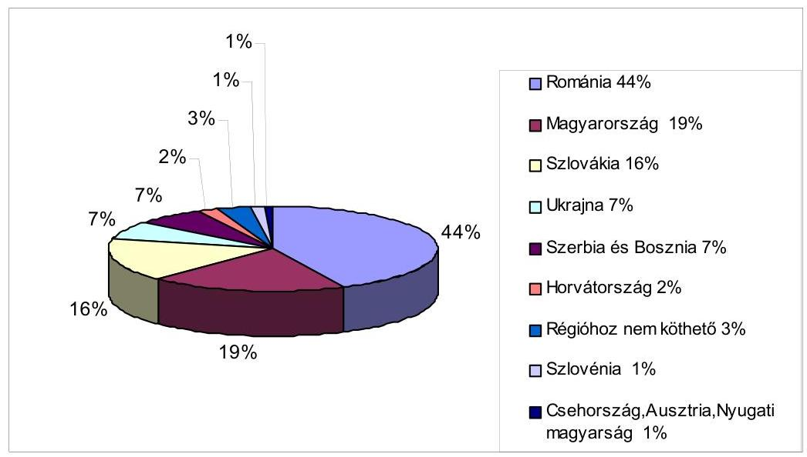
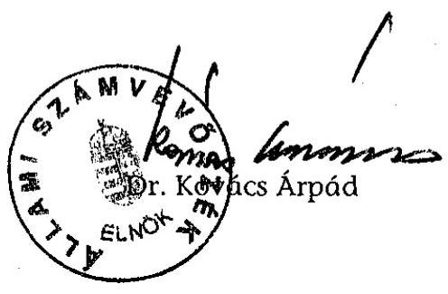
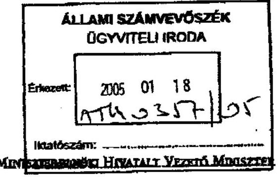
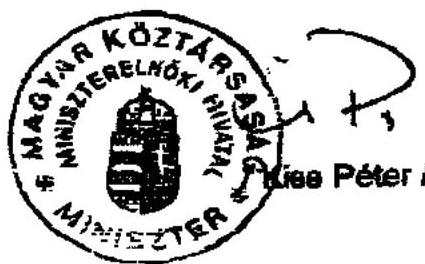
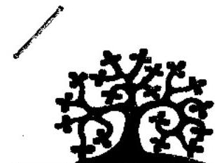
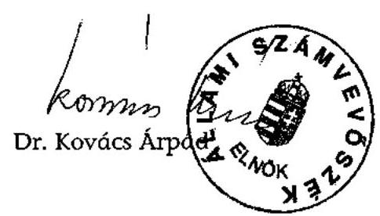
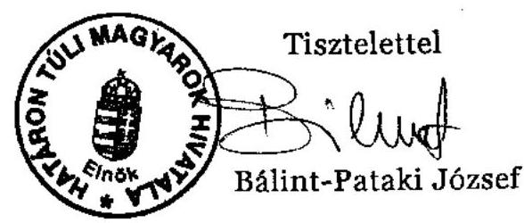
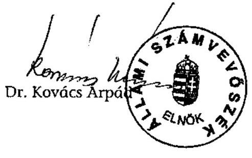
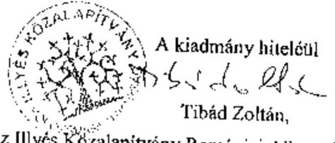

# JELENTÉS 

## az Illyés Közalapítvány gazdálkodásának ellenőrzéséről

---

3. Önkormányzati és Területi Ellenőrzési Igazgatóság
3.1. Szabályszerűségi Ellenőrzések Főcsoport
Iktatószám: V-1015-85/2004.
Témaszám: 719
Vizsgálat-azonosító szám: V0140

# Az ellenőrzést felügyelte: 

Dr. Lóránt Zoltán
főigazgató
Az ellenőrzés végrehajtásáért felelős:
Dr. Elek János
főigazgató-helyettes

## Az ellenőrzést vezette:

Balázs Andrásné
főcsoportfőnök-helyettes
Az összefoglaló jelentést készítette:
Solymár Ágnes
számvevő tanácsos

Az ellenőrzésben részt vettek:

Pásztor Katalin számvevő tanácsos Robák Ferencné számvevő Solymár Ágnes számvevő tanácsos

## Sas Imréné

számvevő tanácsadó
Szijjártó Károly
külső szakértő

## Az ÁSZ által a témában eddig készített jelentések: címe

sorszáma
Jelentés a Nemzeti Gyermek és Ifjúsági Alapítvány pénzügyi- 80 gazdasági ellenőrzéséről (1992)
Jelentés a Magyar Vállalkozásfejlesztési Alapítvány részére PHARE 220 forrásból juttatott pénzügyi támogatások felhasználásának vizsgálatáról (1994)

---

Jelentés a fejezetek és intézményeik által az alapítványoknak ..... 306
juttatott állami pénzek és vagyon felhasználásának, működtetésének ellenőrzéséről (1996)
Jelentés a Magyar Alkotóművészeti Közalapítvány ..... 347
gazdálkodásának ellenőrzéséről (1997)
Jelentés a Gandhi Közalapítvány pénzügyi-gazdasági ..... 351
ellenőrzéséről (1997)
Jelentés a Magyarországi Cigányokért Közalapítvány pénzügyi- ..... 372
gazdasági ellenőrzéséről (1997)
Jelentés a Magyarországi Nemzeti és Etnikai Kisebbségekért ..... 373
Közalapítvány pénzügyi-gazdasági ellenőrzéséről (1997)
Jelentés a médiatörvény végrehajtásának pénzügyi - gazdasági ..... 396
ellenőrzéséről (1997)
Jelentés a Magyar Rádió Közalapítvány és - kapcsolódó ..... 9806
ellenőrzésként - a Magyar Rádió Részvénytársaság gazdálkodásának ellenőrzéséről
Jelentés a Magyar Televízió Közalapítvány és kapcsolódó ellenőrzés ..... 9812
keretében a Magyar Televízió Rt. működésének és gazdálkodásának ellenőrzéséről
Jelentés a Nemzetközi Pető András Közalapítvány és - kapcsolódó ..... 9822
ellenőrzésként - a Mozgássérültek Pető András Nevelőképző és Nevelőintézet pénzügyi-gazdasági ellenőrzéséről
Jelentés a Magyar Nemzeti Üdülési Alapítványnak juttatott állami ..... 9906
eszközök felhasználásának és működtetésének pénzügyi-gazdasági ellenőrzéséről
Jelentés a sportcélú közalapítványok működésének pénzügyi- ..... 9907
gazdasági ellenőrzéséről
Jelentés a Fogyatékos Gyermekek, Tanulók Felzárkóztatásáért ..... 9915
Országos Közalapítvány működésének pénzügyi-gazdasági ellenőrzéséről
Jelentés a Nemzeti Gyermek és Ifjúsági Közalapítvány ..... 0002
működésének pénzügyi-gazdasági ellenőrzéséről
Jelentés a Közoktatási Modernizációs Közalapítvány működésének ..... 0011
ellenőrzéséről
Jelentés a Magyar Nemzeti Üdülési Alapítvány ..... 0101
vagyongazdálkodásának ellenőrzéséről
Jelentés az Országos Foglalkoztatási Közalapítvány ..... 0117
gazdálkodásának ellenőrzéséről
Jelentés az Új Kézfogás Közalapítvány gazdálkodásának ..... 0136
ellenőrzéséről

---

Jelentés a közalapítványoknak és az alapítványoknak az 1998- ..... 0228
2001. évek között juttatott nem normatív központi költségvetési támogatás felhasználásának ellenőrzéséről
Jelentés a Magyar Mozgókép Közalapítvány gazdálkodásának ..... 0304
ellenőrzéséről
Jelentés a Magyar Alkotóművészeti Közalapítvány ..... 0323
gazdálkodásának ellenőrzéséről
Jelentés az EU Kommunikációs Közalapítvány gazdálkodásának ..... 0351
ellenőrzéséről
Jelentés a Magyarországi Zsidó Örökség Közalapítvány ..... 0402
gazdálkodásának ellenőrzéséről
Jelentés a Magyarországi Cigányokért Közalapítvány ..... 0427
gazdálkodásának ellenőrzéséről
Jelentés a Magyarországi Nemzeti és Etnikai Kisebbségekért ..... 0437
Közalapítvány gazdálkodásának ellenőrzéséről

---

# TARTALOMJEGYZÉK 

BEVEZETÉS ..... 7
I. ÖSSZEGZŐ MEGÁLLAPÍTÁSOK, KÖVETKEZTETÉSEK, JAVASLATOK ..... 11
II. RÉSZLETES MEGÁLLAPÍTÁSOK ..... 23

1. A közalapítvány működésének jogi, szervezeti feltételei ..... 23
1.1. Az alapító okirat és az SZMSZ ..... 23
1.2. A képviseleti jog, a bank- és értékpapírszámla feletti rendelkezés ..... 26
1.3. A kuratórium működése ..... 27
1.4. Felügyelő bizottság ..... 29
1.5. A közalapítványi iroda működése ..... 30
2. A könyvvezetés és gazdálkodás szabályozottsága, szabályossága ..... 31
2.1. A gazdálkodási szabályzatok ..... 31
2.2. Az éves költségvetések ..... 33
2.3. A számviteli nyilvántartások rendszere és szabályossága ..... 34
2.4. Az éves beszámolók és a beszámolási kötelezettség teljesítése ..... 35
2.5. A bevételek és a kapott támogatások ..... 36
2.6. A költségek alakulása ..... 38
2.6.1. Tiszteletdíjak és költségtérítések ..... 40
2.7. A pénzügyi helyzet és a likviditás alakulása ..... 40
3. A közalapítványnak nyújtott központi költségvetési támogatás rendeltetésszerű, törvényes és célszerű felhasználása ..... 41
3.1. A közalapítvány támogatási rendszere ..... 41
3.1.1. Az alkuratóriumok működési költségei ..... 43
3.1.2. A támogatások lebonyolítása ..... 43
3.1.3. A közalapítvány által nyújtott támogatások ..... 47
3.2. A kuratórium központi keretéből nyújtott támogatások felhasználása ..... 49
3.3. A Határon Túli Magyarok Hivatalának nyújtott támogatás ..... 51
3.3.1. A támogatás felhasználásának törvényessége és szabályossága ..... 54
3.3.2. A HTMH házipénztárából adott előleg ..... 56
3.3.3. A kötelezettségvállalás, ellenjegyzés és utalványozás rendje ..... 57
3.3.4. A HTMH ún. „Illyés pénztár"-ának szabályozottsága ..... 58
3.3.5. A bizonylati rend és okmányfegyelem ..... 59

---

3.4. A felvidéki beiratkozási program ..... 61
3.5. A Teleki Oktatási Központ beruházásához adott támogatás ..... 62
3.6. A "Televízió - határok nélkül 2001." program támogatása ..... 63
3.7. Az alkuratóriumi keretekből nyújtott támogatások felhasználása ..... 67
3.7.1. A romániai alkuratórium elnöki sürgősségi keretének felhasználása ..... 70
3.8. A közalapítvány soron kívüli keretéből nyújtott támogatások ..... 70
3.9. A központi költségvetés célelőirányzatából finanszírozott „Szülőföldön magyarul" program végrehajtása ..... 71
3.9.1. A kapott támogatás átcsoportosítása és felhasználása ..... 75

# MELLÉKLETEK 

1. számú Az IKA eszközei és forrásai
2. számú Az IKA eredmény-kimutatása
3. számú Az IKA bevételei és működési költsége
4. számú Kuratóriumi és FB tagok tiszteletdíja és költségtérítése
5. számú Az IKA által adott támogatások
6. számú Az IKA által támogatott feladatok
7. számú Az IKA által magánszemélyeknek adott támogatások
8. számú A központi keret terhére nyújtott támogatások
9. számú Az IKA alkuratóriumainak működési költségei
10. számú A KüM közigazgatási államtitkárának nemleges észrevétele
11. számú A MEH miniszter nemleges észrevétele
12. számú Az IKA-nak a jelentésre tett észrevétele és az ÁSZ elnökének válasza
13. számú A HTMH elnökének a jelentésre tett észrevétele és az ÁSZ elnökének válasza

## FÜGGELÉKEK

1. számú A romániai alkuratórium által felkért bizottság jelentése az RMPSZ szovátai helyszínű Teleki Oktatási Központjában tett helyszíni szemléről

---

# RÖVIDÍTÉSEK JEGYZÉKE 

| Áht. | az államháztartásról szóló 1992. évi XXXVIII. törvény |
| :--: | :--: |
| Ámr. | az államháztartás működési rendjéről szóló 217/1998. (XII. 30.) Korm. rendelet |
| ÁSZ törvény | az Állami Számvevőszékről szóló 1989. évi XXXVIII. törvény |
| BM | Belügyminisztérium |
| FB | Felügyelő Bizottság |
| GM | Gazdasági Minisztérium |
| HTMH | Határon Túli Magyarok Hivatala |
| IKA | Illyés Közalapítvány |
| IM | Igazságügyi Minisztérium |
| kedvezménytörvény | a szomszédos államokban élő magyarokról szóló 2001.   évi LXII. törvény |
| Kh. tv. | a közhasznú szervezetekről szóló 1997. évi CLVI. törvény |
| Kincstár | Magyar Államkincstár |
| KüM | Külügyminisztérium |
| MÁÉRT | Magyar Állandó Értekezlet |
| MEH | Miniszterelnöki Hivatal |
| MTA | Magyar Tudományos Akadémia |
| NKÖM | Nemzeti Kulturális Örökség Minisztériuma |
| OGY | Országgyűlés |
| OM | Oktatási Minisztérium |
| Ptk. | a Polgári Törvénykönyvről szóló 1959. évi IV. törvény |
| régi Szt. | a számvitelről szóló 1991. évi XVIII. törvény |
| RMPSZ | Romániai Magyar Pedagógusok Szövetsége |
| SZJA törvény | a személyi jövedelemadóról szóló 1995. évi CXVII. törvény |
| SZMSZ | Szervezeti és Működési Szabályzat |
| TOK | Teleki Oktatási Központ |
| új Szt. | a számvitelről szóló 2000. évi C. törvény |
| üvegzsebtörvény | a közpénzek felhasználásával, a köztulajdon használatának nyilvánosságával, átláthatóbbá tételével és ellenőrzésének bővítésével összefüggő egyes törvények módosításáról szóló 2003. évi XXIV. törvény |

---

.

---

# ÉRTELMEZŐ SZÓTÁR 

Az alapítvány bevételei

Az alapítvány költségei (kiadásai)

Az alapítvány kezelő
szervének költségei (kiadásai)

Alkuratórium

Cél szerinti tevékenység

Induló vagyon

Kiemelkedően közhasznú közalapítvány

Közalapítvány

Közfeladat

A vállalkozási tevékenység bevétele, valamint az alapítványi célú tevékenység bevételei (minden olyan bevétel, amely nem a vállalkozási tevékenységhez kapcsolódó befizetés, ideértve a céltámogatást is) [115/1992. (VII. 23.) Korm. rendelet 3. § (1) bekezdésének a)-b) pontja].
A vállalkozási tevékenység közvetlen költségei, az alapítványi célú tevékenység közvetlen költségei, az alapítvány kezelő szervének költségei (kiadásai) és az egyéb közvetett költségek (kiadások) [115/1992. (VII. 23.) Korm. rendelet 3. § (2) bekezdésének a)-b)-c) pontja].

Az alapítvány kezelő szervének üzemeltetési, fenntartási költségei (az alapító okiratok ezeket a költségeket tekintik a kuratórium és a munkaszervezet működési költségeinek).
A kuratórium munkáját segítő, a határon túli magyar közösségek demokratikusan megválasztott vezetőséggel rendelkező, országos hatáskörű képviseleti és szakmai szervei által létrehozott, testület.
Minden olyan tevékenység, amely az alapító okiratban megjelölt célkitűzés elérését közvetlenül szolgálja [Kh. tv. 26. § b) pontja].

A közalapítvány javára a célja megvalósításához az alapító okiratban meghatározott vagyon [Ptk. 74/A. § (1) bekezdése, 74/B. § (1) bekezdése]. A közalapítvány rendelkezésére legalább olyan mértékű vagyont kell bocsátani, amely a működése megkezdéséhez feltétlenül szükséges [Ptk. 74/B. § (4) bekezdése]. A közalapítványi vagyon pontos megjelölése nélkül a közalapítvány nem jöhet létre [BH2001. 303].
A kiemelkedően közhasznú közalapítványnak a közhasznú közalapítványokra előírt követelmények teljesítésén túl közhasznú tevékenysége során olyan közfeladatot kell ellátnia, amelyről törvény vagy törvény felhatalmazása alapján más jogszabály rendelkezése szerint, valamely állami szervnek vagy a helyi önkormányzatnak kell gondoskodnia, az alapító okirata szerinti tevékenységének és gazdálkodásának legfontosabb adatait a helyi vagy országos sajtó útján is nyilvánosságra hozza, továbbá a közhasznú tevékenységet maga látja el [Kh. tv. 5. § és a BH2001. 451 alapján].
A közalapítvány olyan alapítvány, amelyet az Országgyűlés, a Kormány, valamint a helyi önkormányzat vagy kisebbségi önkormányzat képviselő-testülete közfeladat ellátásának folyamatos biztosítása céljából hoz létre [Ptk. 74/G. § (1) bekezdése].
Közfeladat az az állami vagy helyi önkormányzati, kisebbségi önkormányzati feladat, amelynek ellátásáról -

---

Közhasznú egyszerüsített éves beszámoló

Közhasznú tevékenység

Közhasznúsági jelentés

Pályázat

Szomszédos állam

Támogatás
Vezető tisztségviselő a
közalapítványoknál
jogszabály alapján - az államnak vagy az önkormányzatnak kell gondoskodnia [Ptk. 74/G. § (2) bekezdése].
A közhasznú nyilvántartásba vett közalapítványoknál mérlegből, közhasznú eredmény-kimutatásból és tájékoztató adatokból áll [224/2000. (XII. 19.) Korm. rendelet 6. § (8) bekezdése, illetve 4. és 6 . számú melléklete].

A társadalom és az egyén közös érdekeinek kielégítésére irányuló, a közhasznú közalapítvány alapító okiratában szereplő cél szerinti tevékenység a törvényben meghatározott körben [Kh. tv. 26. § c) pontja].
Tartalmazza a számviteli beszámolót; a költségvetési támogatás felhasználását; a vagyon felhasználásával kapcsolatos kimutatást; a cél szerinti juttatások kimutatását; a központi költségvetési szervtől, az elkülönített állami pénzalaptól, a helyi önkormányzattól, a kisebbségi települési önkormányzattól, a települési önkormányzatok társulásától és mindezek szerveitől kapott támogatás mértékét; a közhasznú szervezet vezető tisztségviselőinek nyújtott juttatások értékét, illetve összegét; a közhasznú tevékenységről szóló rövid tartalmi beszámolót [Kh. tv. 19. § (3) bekezdése].

Az a nyilvános vagy előre meghatározott körben közzétett felhívás, amely a pályázók összevetésére alkalmas feltételeket és a pályázattal elnyerhető cél szerinti juttatást, a pályázat értékelésének lényeges feltételeit (beleértve a benyújtási és értékelési határidőket, valamint a pályázat elbírálására hivatottak körét) megjelöli [Kh. tv. 26. § i) pontja].
A kedvezménytörvény értelmében szomszédos államnak minősül a Horvát Köztársaság, Románia, Szerbia és Montenegró, a Szlovák Köztársaság, a Szlovén Köztársaság és Ukrajna.
Pénzbeli és nem pénzbeli juttatás [Kh. tv. 26. § j) pontja].
A közalapítvány kuratóriumának és felügyelő bizottságának elnöke és tagja, a közalapítvánnyal munkaviszonyban vagy munkavégzésre irányuló egyéb jogviszonyban álló, az alapító okirat szerint egyszemélyi felelős vezető feladatot ellátó személy [Kh. tv. 26. § m) pontja].

---

# JELENTÉS 

## az Illyés Közalapítvány gazdálkodásának ellenőrzéséről

## BEVEZETÉS

A nonprofit szervezetek között 1994. január 1-jétől jelentek meg a közalapítványok, melyek megalakítására és működésére a Ptk. az alapítványok szabályozásán belül külön feltételeket és követelményeket határozott meg az alapítók körét, az ellátandó közfeladatokat, valamint a működés és gazdálkodás feltételeit illetően. Közalapítványt csak az Országgyűlés, a Kormány, valamint a helyi önkormányzat vagy kisebbségi önkormányzat képviselő-testülete hozhat létre közfeladat (állami, helyi önkormányzati vagy országos kisebbségi önkormányzati feladat) ellátásának folyamatos biztosítása céljából, de a közalapítvány létrehozása
 nem érinti az államnak, illetve az önkormányzatnak a feladat ellátására vonatkozó kötelezettségét. A közalapítványok alapító okiratát, tevékenységének és gazdálkodásának legfontosabb adatait nyilvánosságra kell hozni, a kuratóriumok ülései és határozatai nyilvánosak.

A közpénzek törvényes, felelős és közhasznú felhasználása érdekében a Ptk. és a közhasznú szervezetekről szóló törvény részletesen meghatározta a közalapítvány vagyonkezelő szervezete (kuratóriuma) működésének, képviseletének, a tisztségviselők felelősségének és összeférhetetlenségének szabályait. A közalapítvány vagyonát kezelő szervezet (kuratórium) tagjai az alapítók bizalmából látják el feladatukat, de tőlük sem közvetlenül, sem közvetve nem függhetnek, az alapítók nem gyakorolhatnak meghatározó befolyást a közalapítvány vagyonának felhasználására.

A közalapítványok ellenőrzésére az alapítványoknál szigorúbb követelmények vonatkoznak, így az alapítóknak már az alapítással egy időben létre kell hozni a kuratórium ellenőrzésére jogosult ellenőrző szervet (ellenőrző vagy felügyelő bizottságot). Az Országgyűlés és a Kormány által alapított közalapítványoknál az Állami Számvevőszék nemcsak az állami támogatás felhasználását, hanem a gazdálkodás törvényességét és célszerűségét is jogosult ellenőrizni.

A 2004 végén - az ún. média közalapítványokkal együtt - 50 működő, illetve 2 bejegyzés alatt álló, az Országgyűlés és a Kormány által alapított közalapítvány volt.

A 2004. évi költségvetési törvény - eredeti előirányzatként - a Kormány által alapított közalapítványoknak közvetlenül névre címzetten 35,5 milliárd Ft ere-

---

deti támogatási előirányzatot hagyott jóvá¹, amelyből az államháztartás egyensúlyi helyzetének javításához szükséges rövid és hosszabb távú intézkedésekről szóló 2050/2004. (III. 11.) Korm. határozat 2,1 milliárd Ft-ot (5,9\%-ot) zárolt.

A 2004. évi éves költségvetési törvényben az Illyés Közalapítvány eredeti támogatási előirányzata 1021 millió Ft volt, amelyből a Kormány az államháztartás egyensúlyi helyzetének javítása érdekében 195 millió Ft-ot (19,1\%-ot) zárolt.

Az Országgyűlés az éves költségvetési törvényekben a 2000-2003. években az Illyés Közalapítvány részére közvetlenül névre címzetten 4748 millió Ft támogatást hagyott jóvá, illetve a Kormány a szomszédos államokban élő magyarokról szóló 2001. évi LXII. törvényben meghatározott támogatási feladatokra további 1477 millió Ft céltámogatást biztosított, továbbá egyéb állami forrásból 128 millió Ft-ot kapott.

A határon túli magyarság szülőföldjén való megmaradásának elősegítése céljából nyújtott állami támogatás alapvetően az e célra létrehozott közalapítványokon és alapítványokon (Illyés Közalapítvány, Új Kézfogás Közalapítvány, Apáczai Közalapítvány, Teleki László Alapítvány, Mocsáry Alapítvány, Segítő Jobb Alapítvány, Pro Hungaris Alapítvány) keresztül történik. Emellett az egyes szaktárcák (MEH, OM, NKÖM) és az MTA közvetlenül is folyósítanak pénzeszközöket a határon túli magyarok oktatási és kulturális támogatására, valamint a határon túli kutatás segítésére. A 2000-2003. évek között az állami költségvetés összesen 38,5 milliárd Ft-ot folyósított a határon túli magyarság támogatására, amelyen belül az IKA összesen 6,4 milliárd Ft (16,6\%) felett rendelkezett. ${ }^{2}$

A Magyar Köztársaság Kormánya - az Alkotmány 6. cikkelye 3 bekezdésében foglaltak végrehajtására - 1990-ben alapította az Illyés Alapítványt. A Ptk. módosításáról rendelkező 1993. évi XCII. törvény 40. § (6) bekezdése alapján az alapítvány 1994. január 1-jétől közalapítványnak minősül. A Fővárosi Bíróság a 13. Pk. 62358/1990/22. számú végzésével 1998. január 1. napjától kiemelkedően közhasznú szervezetté minősítette.

Az IKA alapító okiratban megjelölt célja az Alkotmány 6. cikkelye 3. bekezdésében rögzített, a határainkon kívül élő magyarok sorsáért érzett felelősségéből adódó állami közfeladat folyamatos ellátása érdekében a határainkon túl élő magyar közösségek és a szórványmagyarság támogatása, sajátos gondjai megoldásának elősegítése. A közalapítvány az alapító Kormány szándékainak megfelelően támogatja a határainkon túl élő magyarság önazonosságának megőrzését, fejlődését és megerősödését célzó kezdeményezéseket; az anyanyelv ápolását, fejlesztését szolgáló kezdeményezéseket; a határainkon túl élő magyarságot érintő tudományos munkát; az anyanyelvű hitélet tárgyi és személyi

[^0]
[^0]:    ${ }^{1}$ Ez az összeg nem tartalmazza az OGY által alapított három ún. média-közalapítvány támogatását.
    ${ }^{2}$ Forrás: A HTMH 2004. évi beszámolója az OGY Külügyi bizottsága számára

---

feltételeinek javítását; a határon túli magyar kisebbségek hazai kulturális bemutatóit.

A jelen ellenőrzés megállapításainak többszöri egyeztetését követően is maradt véleményeltérés az IKA kuratóriuma és az Állami Számvevőszék között a közalapítvány által támogatott, az alapító okirattal, az alapítói szándékkal összhangban álló tevékenységek körét illetően. A kuratórium „aránytévesztésnek tekintette, hogy a jelentést készítők mintegy az alapítói szándék letéteményeseinek szerepébe helyezve magukat leszűkítő módon értelmezik ezeket a célokat, annak ellenére hogy az alapító okiratok 1991. év óta történt módosításaiból, az egymást váltó, de mindenkor az alapító képviselőjének részvételével működő kuratóriumok közel másfél évtizedes, következetes támogatási gyakorlatából is egyértelműen dokumentálható a tényleges alapítói szándék: a határon túl élő magyarság önazonosságának megőrzését, fejlődését és megerősödését célzó kezdeményezések támogatása tudatosan tág értelmezésre lehetőséget adó - a kuratóriumi gyakorlat által kitöltendő - formulájával a lehető legszélesebb támogatási területet rendelni a közalapítvány tevékenységéhez."

Az elmúlt tíz év alatt a közalapítványok gazdálkodásának törvényességére irányuló ellenőrzések során az Állami Számvevőszék szembesült azzal, hogy az alapító nem mindig rögzítette az alapító okiratban kellő szabatossággal azt a közfeladatot, amely ellátásának folyamatos biztosítása céljából a közalapítványt létrehozta. Feltártuk azt is, hogy a közalapítványok többségének a Kormány az alapító okiratban nagyszámú vagy nem kellően behatárolt közfeladatot határozott meg, jóllehet ezek ellátásában való közreműködés fedezetét az állam feladat-ellátási kötelezettségére tekintettel - a központi költségvetésből kell biztosítani. Megállapítottuk ${ }^{3}$, hogy a közalapítványok alapító okiratban megjelölt céljai és az évenként a központi költségvetésből adott támogatások nem voltak kellően összhangban, mivel a támogatások nem terjedtek ki az alapító okiratban meghatározott valamennyi cél támogatására. Emiatt a kuratóriumok - a Ptk. és az alapító okirat előírásaival ellentétben - a támogatás összegének meghatározásakor a közcélok rangsorolására kényszerültek. Kifogásolnunk kellett azt is, ha a kuratóriumok jóhiszeműen, a közalapítvány közreműködésével ellátandó közfeladat megoldása iránti elkötelezettség által motiválva bővítették, szűkítették vagy átértelmezték az alapító okiratokban megjelölt, jogszabályokra alapozott közfeladatot, mivel az Állami Számvevőszék (mint bármely más jogalkalmazó, így a kuratóriumok is) a jogszabályok és/vagy alapító okiratok szövegét csak szöveghűen alkalmazhatja.

Az Illyés Közalapítvány - mint kiemelkedően közhasznú közalapítvány - az alapító okiratban megjelölt céljainak elérése érdekében a Kh. tv.-ben meghatározott közhasznú tevékenységek közül a kulturális tevékenységet, a kulturális

[^0]
[^0]:    ${ }^{3}$ Lásd: Jelentés a közalapítványoknak és az alapítványoknak az 1998-2001. évek között juttatott nem normatív központi költségvetési támogatás felhasználásának ellenőrzéséről (2002. év, 0228.)

---

örökség megóvását, a műemlékvédelmet, a gyermek- és ifjúságvédelmet, a gyermek- és ifjúsági érdekképviseletet, az emberi és állampolgári jogok védelmét és a határon túli magyarsággal kapcsolatos tevékenységet jelölte meg.

Az Állami Számvevőszék az IKA gazdálkodásának törvényességét és célszerűségét átfogóan legutóbb 1995-ben ellenőrizte. 2002-ben az IKA - a témavizsgálat keretében ellenőrzött 193 alapítvány, közalapítvány egyikeként - adatlapok kitöltésével számolt el az 1998-2001. években kapott állami támogatás felhasználásáról. A témavizsgálat nem terjedt ki a gazdálkodás törvényességének és célszerűségének ellenőrzésére. Az IKA írásos beszámolójából - többek között az derült ki, hogy a támogatást juttató Külügyminisztérium az éves költségvetési támogatás cél szerinti felhasználására és a felhasználás elszámolására vonatkozóan nem kötött szerződést a közalapítvánnyal, és a pályázatok nyerteseivel a kuratórium sem kötött támogatási szerződést.

Az Állami Számvevőszék az ÁSZ tv. 2. § (5) bekezdése alapján ellenőrzi a közalapítványoknál az állami költségvetésből nyújtott támogatás felhasználását, továbbá a Ptk. 74/G. § (8) bekezdése alapján a gazdálkodás törvényességét és célszerűségét.

Jelen ellenőrzés törvényességi és célszerűségi szempontból értékelte, hogy

- az IKA működése és gazdálkodása hogyan segítette elő az alapító okiratban meghatározott célok és feladatok megvalósítását;
- a gazdálkodás és a könyvvezetés szabályozottsága biztosította-e a gazdálkodás törvényességét;
- az IKA a vagyonát, illetve a kapott állami támogatást rendeltetésszerűen használta-e fel az alapító okiratban meghatározott céljainak megvalósítása érdekében.

Az IKA ellenőrzése a beszámolóval lezárt utolsó négy teljes naptári év - a 2000-2003. évek - gazdálkodásának törvényességére és célszerűségére terjedt ki, de a gazdálkodás áthúzódó folyamatait a helyszíni ellenőrzés 2004. július végi befejezéséig vizsgáltuk.

---

# I. ÖSSZEGZŐ MEGÁLLAPÍTÁSOK, KÖVETKEZTETÉSEK, JAVASLATOK 

Az Illyés Közalapítvány (IKA) kuratóriuma megalapítása óta közreműködik a határainkon túl élő magyar közösségek és a szórványmagyarság támogatásában, sajátos gondjai megoldásának elősegítésében.

Az IKA 2000-2003 között összesen 6,5 milliárd Ft bevételt realizált, amelyből 6,4 milliárd Ft ( $98,5 \%$ ) származott a központi költségvetésből. Egyéb bevételei teljes egészében a közhasznú tevékenységéből származtak, mivel az IKA vállalkozási tevékenységet nem folytatott. Ugyanezen időszakban a kuratórium az alapító okirat szerinti célok megvalósítása érdekében összesen 5,8 milliárd Ft támogatást nyújtott, továbbá saját működésére 0,3 milliárd Ft-ot használt fel.

Az ellenőrzött időszakban a Kormány az IKA tekintetében az alapító nevében és képviseletében eljáró kormányzati felelősként 2003 áprilisáig a külügyminisztert, ezt követően a MEH kisebbségi ügyekért felelős politikai államtitkárát jelölte meg. Az IKA 2000-2001. évi eredeti és módosított, valamint a 2002. évi eredeti előirányzata a KüM, a 2002. évi módosított, valamint a 2003-2004. évi eredeti és módosított előirányzata a Miniszterelnökség fejezetben szerepelt. A KüM a 2000-2002. években az éves költségvetési támogatás cél szerinti felhasználására és elszámolására nem kötött szerződést a közalapítvánnyal. A MEH a 2003. évre szerződésben rögzítette a támogatás felhasználásával kapcsolatos előírásokat, kikötötte az alapító okiratban meghatározott célok szerinti felhasználás kötelezettségét, meghatározta a szerződésszegés szankcióit, valamint az elszámolások benyújtásának módját és határidejét. Az IKA a támogatási szerződésben előírt elszámolási határidőt túllépve küldte meg a támogatás felhasználásáról készített szakmai és pénzügyi elszámolást a MEH-nek.

A kuratórium a kapott állami támogatásból és egyéb bevételeiből a határainkon túl élő magyarság önazonosságának megőrzését, fejlődését és megerősödését, az anyanyelv ápolását, fejlesztését szolgáló kezdeményezéseket, a határainkon túl élő magyarságot érintő tudományos munkát, az anyanyelvű hitélet tárgyi és személyi feltételeinek javítását, a határon túli magyar kisebbségek hazai kulturális bemutatóit támogatta rendszeresen.

Az ellenőrzött 2000-2003. évek közötti időszakban összességében a teljesített kiadások mintegy 46\%-át kifogásoltuk: Az alapítói célok megvalósítására nyújtott 5,8 milliárd Ft-ból a központi keret terhére fizetett ki a közalapítvány 3,1 milliárd Ft-ot, ebből 2000-2001. években a közhasznú szervezetekről szóló törvény előírásainak nem megfelelően kiírt pályázatok alapján 1,3 milliárd Ft-ot, a 2002-2003. években az alapító okiratban megjelölt pályáztatási kötelezettség mellőzésével 1,5 milliárd Ft-ot. A 2000-2003. évek között a központi keretből a HTMH-nak nyújtott 39,5 millió Ft támogatásból az alapítói célokkal ellentétes volt 30,4 millió Ft támogatás odaítélése, illetve felhasználása. A kuratórium a saját működésére felhasznált 0,3 milliárd Ft-ból az alapító okirat előírásaitól eltérően költött el 11 millió Ft-ot.

---

Az IKA pályáztatási szabályzattal nem rendelkezett, a pályáztatási tevékenységre vonatkozó szabályokat az alapító okirat, az SZMSZ, a támogatások elszámolási szabályzata, valamint az egyedi kuratóriumi határozatok tartalmazták. Az IKA-hoz 2000-2003 között összesen 19939 db pályázat érkezett be 35,1 milliárd Ft támogatási igénnyel. Az elfogadott pályázatok száma 10231 db volt, 5,5 milliárd Ft támogatási összeggel. A kuratórium a pályázók 51\%-át támogatta, az
 igényelt összeg 16%-át ítélte meg támogatásként. A kuratórium által a négy év alatt odaítélt, összesen 5,5 milliárd Ft támogatás 19%-át magyarországi pályázók nyerték el, ebből a HTMH támogatása 39,5 millió Ft volt. Az IKA támogatás 44%-át a Romániában, 16%-át a Szlovákiában, 7%-át az Ukrajnában, 7%-át a Szerbiában és Boszniában élő magyarság kapta, a fennmaradó 7% a Horvátországban, Szlovéniában, Csehországban élő magyarok, valamint a nyugati magyarság között oszlott meg, illetve régióhoz nem köthető támogatás volt. A kuratórium összesen húsz célra ítélt meg támogatást, amelyből összegét tekintve a legjelentősebb a magyar nyelvű rádió és TV adások (17%), az oktatási intézmények és szervezetek (16%), a kulturális intézmények és szervezetek (15%), az egyházi intézmények és szervezetek (7%) támogatása, valamint a magyar nyelvű lapok szerkesztőségei működési feltételeinek javítása (6%) volt.

Az ellenőrzött időszakban - az alapító okirat felhatalmazása alapján - a határon túli magyar szervezetek által létrehozott testületek, ún. alkuratóriumok segítették a kuratóriumot, amelyeknek a támogatások lebonyolításában javaslattevő szerepük volt.

A kuratórium - az alapító okirat előírásának megfelelően - a cél szerinti támogatásra fordítható összeget minden évben felosztotta ún. alkuratóriumi és központi keretösszegekre, az alkuratóriumi keret a szomszédos országok magyar közösségei támogatását szolgálta, a központi keret a határon túli magyarságot általában érintő, stratégiai célok támogatására nyújtott fedezetet. A kuratórium előre, a következő évi még jóvá nem hagyott állami támogatási keret terhére ítélt meg 2000-ben és 2001-ben összesen 367,3 millió Ft támogatást, így szabálytalanul, fedezet nélkül vállalt kötelezettséget.

A kuratórium az alkuratóriumi keretösszegből nyújtott támogatásokra minden évben pályázati felhívást adott ki, a központi keret terhére azonban csak a 2000. és a 2001. években. A pályázati felhívásokat a kuratórium nyilvánosságra hozta.

A központi keret terhére az ellenőrzött időszakban lebonyolított három pályázatból kettő - amelyekre a kuratórium összesen mintegy 2,8 Mrd Ft kiadást teljesített - nem felelt meg a pályázatok kiírására és értékelésére vonatkozó törvényi előírásoknak, mivel e két pályázatra vonatkozó ún. pályázati felhívást a kuratórium általános céllal, beadási és értékelési határidő nélkül adta ki az magyarországi és nyugati magyar szervezetek részére, ezáltal az érintettek kérelmeiket folyamatosan beadhatták, így a kérések elbírálása és a támogatások megítélése egyedileg, a hasonló tárgyú pályázattal vagy hasonló tevékenységet végző pályázóval való összevetés és versenyeztetés nélkül történt. Ez a támogatási gyakorlat ellentétes volt az alapító okirattal is, amely kötelezően írta elő a kuratóriumnak, hogy nyilvános pályázati rendszer keretében, a közalapítványi

---

célokkal összhangban döntsön a támogatás odaítéléséről, azok mértékéről és formájáról.

A kuratórium a központi keret terhére - a HTMH-nak nyújtott támogatások 3/4-ét leszámítva - az alapító okiratnak megfelelő célú támogatást nyújtott, de a támogatások lebonyolításánál törvénysértő, illetve a belső szabályzatokat sértő módszereket is alkalmazott, mivel a megítélt támogatások db számát tekintve 3%-ánál nem tartotta be a döntéshozatali összeférhetetlenséget, 14%-ánál a pályázati kiírások feltételeit, 3%-ánál az elszámolási kötelezettség elmulasztása ellenére újabb támogatást nyújtott, az ingatlan vásárlásokra adott támogatások mintegy 50%-ánál nem követelte meg a pályázóktól a független szakértői értékbecslés elkészíttetését.

Az alkuratóriumi keretből adott támogatások célja megfelelt a közalapítványi és a pályázati kiírásban megfogalmazott céloknak, a pályázók minden esetben határon túl működő magyar szervezetek voltak. A támogatások kifizetése - két támogatott kivételével - a kuratóriumi határozat meghozatalát követően, azzal összhangban történt.

A pályázatok nyerteseivel a kuratórium nem kötött támogatási szerződést, arra hivatkozva, hogy az elszámolás szabályait tartalmazó, minden támogatásra egységesen érvényes elszámolási szabályzatot a kedvezményezettek aláírásukkal elfogadták. A szabályzat azonban nem nyújtott elegendő garanciát a támogatások rendeltetésszerű felhasználására, mivel a céltól eltérő felhasználás szankciója az volt, hogy a pályázó újabb támogatásban nem részesülhet. A kuratórium a szabályzatban nem rögzítette, hogy az elszámolásként benyújtott számla másolatok hitelesítettek legyenek, nem igényelte a számlán annak feltüntetését, hogy a teljesítés az IKA támogatása terhére történt, nem írta elő a kapott támogatások terhére elszámolt költségeknek a számviteli nyilvántartásában való elkülönítési kötelezettségét. A pénzügyi elszámoltatást a támogatott által megküldött és az elszámolási szabályzatban előírt dokumentumok alapján végezték. A támogatottak 9%-a a kuratórium által előírt elszámolási határidőt túllépte. Az IKA a támogatások célszerű felhasználását, a pályázatokban megjelölt célok megvalósulását a támogatott pályázatok mindössze 0,3%-ánál ellenőrizte a helyszínen.

A támogatás összegét tekintve az IKA két legjelentősebb programja a „Televizió - határok nélkül 2001." és a „Szülőföldön magyarul" támogatási programok voltak.

Az Országgyűlés - az OGY Kulturális és sajtóbizottsága kezdeményezésére - a 2000. december 5-én kihirdetett 1999. évi zárszámadási törvényben 900 millió Ft pótlólagos támogatást hagyott jóvá, amelyet a kuratórium - a törvényjavaslat indokolásának megfelelően - a „Televizió - határok nélkül 2001." című program pénzügyi fedezetére, a kárpát-medencei magyar tömegtájékoztatás feltételeinek javítására kívánt fordítani, kétharmadát konkrét pályázati kiírással, egyharmadát az általános pályázati kiírás keretei között. A kuratórium határozata szerint 300 millió Ft támogatásban részesült a Duna TV Rt., de az IKA alapító okiratával és a kuratórium határozatával ellentétesen, nem pályázat útján, hanem egyedi kérelem alapján. Az rt. a támogatást - kérelmétől eltérően - csak mintegy kétharmad részben fordította meglévő eszközeinek bővítésé-

---

re, a támogatás egyharmada az rt. likviditási gondjai enyhítését szolgálta. A Duna TV Rt. az IKA 2001. évi támogatása terhére a 2000. évi 110 millió Ft értékű eszközbeszerzését számolta el, 190 millió Ft összegű beruházást - mivel ennek az IKA által adott fedezetét „felélte" - csak a 2003. évi tőkeemelésből, a támogatás megvalósítási határidejéhez képest két év késéssel tudta megvalósítani. A Duna TV Rt. tőkehiányát, likviditási problémáit és az alaptőke-emelés indokoltságát az Állami Számvevőszék legutóbb 2002-ben ellenőrizte ${ }^{4}$ az OGY 94/2002. (XI. 13.) sz. határozata alapján lefolytatott célvizsgálat keretében, és az alaptőke-emelés indokoltnak tartotta.

A kuratórium 600 millió Ft-ot pályázati úton osztott el, felét műsorkészítési programokra, felét tárgyi eszköz beszerzésre és stúdióingatlanok megvásárlásának a támogatására. A műsorkészítési programra 232 db pályázat érkezett be, amelyből 77 pályázó kapott 281,8 millió Ft támogatást. A bíráló bizottság tagjai közt a Duna TV Rt. szakemberei is ott voltak, így a döntéshozatali összeférhetetlenség szabályai sérültek, mivel a bizottság az rt. öt műsorára összesen 105,5 millió Ft támogatást javasolt. A támogatottak 33,8%-a a támogatással nem, illetve nem teljes körűen számolt el, ennek ellenére az IKA nem alkalmazott szankciókat. A tárgyi eszköz beszerzésre és ingatlan vásárlásra kiírt pályázat lebonyolítása sem a pályázati kiírásnak, sem a pályáztatás általános feltételeinek nem felelt meg, mivel a kuratórium a pályázat kiírását követően, a pályamunkák beérkezése után változtatta meg a támogatási koncepciót. A kuratórium a romániai eszközbeszerzési támogatások közül a mobil műholdak, optikai kábelek, stúdióközpontok felszerelését pályázati kiírás nélkül ítélte meg. Az eszközökre a támogatottak nem nyújtottak be pályázatot, a pályázati űrlapot utólag, visszadátumozva töltötték ki. A programhoz kapcsolódó kifizetések alapján a legtöbb támogatást három szervezet kapta, a Székelyudvarhelyért Alapítvány 181,7 millió Ft-ot, a Video Pontes Alapítvány 169 millió Ft-ot, a Pro Média Társaság 87 millió Ft-ot. A támogatásból létrehozott kapacitások a Székelyudvarhelyért Alapítványnál és a Video Pontes Alapítványnál - a kihasználtságot figyelembe véve - túlméretezettek, e két stúdió központ a kapott támogatással hiányosan számolt el.

A „Szülőföldön magyarul" támogatási program a kedvezménytörvényben meghatározott nevelési-oktatási, valamint tankönyv és taneszköz támogatások 2002. évi lebonyolítását tartalmazta, amelynek fedezeteként a Kormány a 2002. évi költségvetés általános tartaléka terhére a Külügyminisztérium fejezetben 1200 millió Ft célelőirányzatot biztosított. A célelőirányzat felhasználásának felelőse a HTMH elnöke volt. A célelőirányzat felhasználásáról a HTMH és az IKA, illetve az IKA és a határon túli lebonyolító szervezetek között megkötött megállapodások rendelkeztek. A határon túli lebonyolító szervezetek által kiírt pályázati felhívások - a kedvezménytörvénnyel összhangban - tartalmazták a pályázat célját, a pályázók körét, a pályázható támogatás összegét jogcímenként. A lebonyolító szervezetekhez 51957 db pályázat érkezett be, amelyből a formai ellenőrzést követően 50653 db pályázatot továbbítottak az IKA-hoz. A kuratórium által létrehozott bizottság összesen 14467 db pályázatot

[^0]
[^0]:    ${ }^{4}$ Lásd: Vélemény a Duna Televízió Részvénytársaság 2003. évi költségvetési támogatási igényének megalapozottságáról, indokoltságáról (2002. év, 0245.)

---

(28,6%) tárgyalt meg, ebből 9851 pályázat (68%) esetében elnapolta a döntést, mivel a pályázók nem rendelkeztek a pályázat feltételeként előírt magyar igazolvánnyal, 4615 esetben megítélte, egy esetben elutasította a támogatást. Az IKA a 4615 elfogadott pályázatra - az 1200 millió Ft célelőirányzattal szemben - csak 180 millió Ft támogatást hagyott jóvá, amelyből 122 millió Ft-ot fizetett ki, 66%-át a romániai, 15%-át a kárpátaljai, 5%-át a vajdasági, 5%-át a szlovákiai, 3%-át a szlovéniai, 3%-át a horvátországi magyarok számára. A lebonyolító szervezetek a helyszíni ellenőrzés befejezéséig, 2004 júliusáig a kifizetett összeg 96%-ával, a megállapodásokban előírtaknak megfelelően elszámoltak. Az IKA a program lebonyolításának költségeire - összhangban a HTMH-val kötött megállapodással - 108 millió Ft-ot (9%) használt fel.

A Kormány a 2002. áprilisi határozatában úgy döntött, hogy az 1200 millió Ft célelőirányzat - a kedvezménytörvényben meghatározott nevelési-oktatási támogatáson, valamint a tankönyv- és taneszköz-támogatáson túlmenően - felhasználható a munkavállalás jogszabályi feltételeinek megteremtésével kapcsolatos kiadások megtérítésére, a határon túli magyarság számára közszolgálati televízió-műsor készítéshez és sugárzáshoz szükséges pénzügyi források fedezésére, valamint magyar nemzeti közösségek azonosságtudatának, anyanyelvének és kultúrájának megőrzését elősegítő, a szomszédos államokban működő szervezetek támogatására is. A kuratórium a 912 millió Ft maradványösszeget a központi keretbe csoportosította át, felhasználásáról elkülönített nyilvántartást vezetett. A kuratórium a kormányhatározatban megjelölt célok közül csak azokra nyújtott támogatást, amelyek alapító okiratában is szerepeltek. Az IKA két esetben elfogadta a támogatással való elszámolást annak ellenére, hogy a támogatott cél egyáltalán nem vagy csak részben valósult meg. A célelőirányzat felhasználásáról az IKA az előírt határidőt túllépve számolt el a HTMH-nak.

A kuratórium - a közalapítvány alapító okiratban rögzített céljait jóhiszeműen kiterjesztően értelmezve - központi kerete terhére 2000-2003. között összesen 39,5 millió Ft támogatást ítélt meg a HTMH részére a határon túli magyar szervezetek képviselőinek hivatalos utazási és tartózkodási költségeire, különböző, egyedi elbírálás alapján támogatandó eseményekre, valamint a határon túli magyarságot érintő, érdeklődésre méltó könyvek beszerzésére és továbbítására. A HTMH-nál lefolytatott kapcsolódó ellenőrzés keretében feltártuk, hogy az átvett IKA támogatásból a HTMH - 30,4 millió Ft összegben - olyan kiadásokat is teljesített, amelyeket a saját és/vagy más állami és államigazgatási szervek költségvetéséből kellett volna fedeznie, így pl. a határon túli magyar szervezetek képviselőinek hivatalos utazási és tartózkodási költségeihez való hozzájárulást, a munka- és vegyes bizottsági konferenciák szervezésének, lebonyolításának, tolmácsolási és előadói díjainak költségeit. A közalapítványoknak
 - így az IKA-nak - a Ptk.-ban és az alapító okiratokban megjelölt alapítási célja nem az, hogy az Országgyűlés által számukra megítélt előirányzatokból az állami és/vagy államigazgatási szervek működését, feladataik ellátását pénzátadással támogassák, erre az éves költségvetési törvényekben a fejezetek és intézmények számára jóváhagyott előirányzatok szolgálnak. Eddigi ellenőrzéseink során nem tapasztaltuk, hogy a központi költségvetésből származó közalapítványi forrásokból államigazgatási szervek kérjenek és kapjanak támogatást az államigazgatási feladatok ellátására. A feltárt gyakorlat elfogadhatatlan az állami pénzek útjának követé-

---

se, a teljesített államháztartási kiadások számbavételének, nagyságának és jogosságának elemzése vagy ellenőrzése szempontjából is, mivel a kiadások nem ott jelennek meg, ahol azt a feladatok indokolják. A HTMH által felhasznált további 9,1 millió Ft a felhasználás célját tekintve összhangban volt az IKA alapító okiratával, indokolatlannak tartottuk azonban azt, hogy ezekben az esetekben a HTMH a kuratórium kizárásával döntött a támogatottak kiválasztásáról, támogatásuk módjáról, mértékéről. A közalapítvány alapítási célja - a Ptk. előírásaival összhangban - ugyanis az volt, hogy ne az államigazgatás keretében, hanem az alapítótól független, a téma legjobb szakembereiből kiválasztott kuratóriumokban döntsön az állami támogatás célszerű felhasználásáról.

A támogatás felhasználásáról a HTMH egyik évben sem készített szakmai beszámolót, a 2000. és a 2003. évi támogatással késedelmesen számolt el, de ezt a kuratórium nem kifogásolta.

A HTMH-nak adott támogatások felhasználását kapcsolódó helyszíni ellenőrzés keretében ellenőriztük, amelynek során a következő törvénysértéseket és szabálytalanságokat állapítottuk meg:

A HTMH az IKA kuratóriuma által odaítélt 39,5 millió Ft összegű támogatást 2003. december 31-ig készpénzben vette fel, és törvénysértő módon azt sem a kincstári számlájára, sem pedig a házipénztárába nem fizette be, azt külön pénztárban, az ún. „Illyés pénztár"-ban kezelte. A támogatás terhére történt kifizetéseket nem rögzítette kiadásai között, így megszegte beszámoló készítési, könyvvezetési, könyvvizsgálati kötelezettségét, megsértette a bizonylati rendet és ezzel a vagyoni helyzetének áttekintését, illetve ellenőrzését megnehezítette. A 2000-2003. évek közötti időszakra vonatkozó törvénysértések miatt a HTMH volt és jelenlegi vezetőinek (elnök, főtitkár, gazdasági elnökhelyettes, gazdasági vezető) személyes felelősségét állapítottuk meg.

A HTMH házipénztárából az ún. „Illyés pénztár"-nak kölcsönöztek 0,5 millió Ft-ot, amelynek engedélyezése, utalványozása és nyilvántartása szabálytalanul történt, emiatt a HTMH elnöke, pénzügyi osztályvezetője, pénzügyi ügyintézője és pénzügyi előadója személyes felelősségét állapítottuk meg.

Az ún. „Illyés pénztár"-ra vonatkozóan nem tartották be a hivatal elnöke által kiadott és hatályos pénzkezelési szabályzatok - pénztárzárására, kifizetésre, pénztári bizonylatok kezelésére, a pénz megőrzésére és tárolására, a pénztár ellenőrzésére kiterjedő - előírásait. Az IKA-tól kapott támogatások terhére történt kifizetéseknél nem a hivatal belső szabályzata szerint vállaltak kötelezettséget, illetve nem az abban foglaltak szerint végezték a pénzügyi ellenjegyzést, és utalványozást, a pénztáros nem a készpénzmozgással egyidejűleg állította ki a bevételi és kiadási pénztárbizonylatokat. A 2000-2003. évek közötti időszakra vonatkozó törvénysértések, szabálytalanságok és hiányosságok miatt a HTMH volt és jelenlegi vezetőinek és munkatársainak (elnök, gazdasági vezető, pénzügyi osztályvezető, pénzügyi előadó) személyes felelősségét állapítottuk meg. Az ÁSZ tv. 23. §-a alapján a vizsgálat folyamán a felelősként megjelölt személyekkel a megállapításokat írásban ismertettük és tőlük írásos magyarázatot kértünk. Az írásos magyarázatok a feltárt tényeket nem cáfolták, így ezek

---

elutasításáról a felelősként megjelölt személyeket tájékoztattuk, és személyes felelősségüket fenntartottuk.

Az Állami Számvevőszék kezdeményezte a felelősségre vonással kapcsolatosan a szükséges intézkedések megtételét.

Az alapító okirat engedélyezte, hogy a kuratóriumi ülések között a kuratórium titkára - két kurátor egyetértésével és a kuratórium utólagos tájékoztatásának kötelezettségével - az IKA céljaival összhangban soron kívül döntsön 0,3 millió Ft-ot meg nem haladó egyedi összegű támogatásokról, de az így hozott döntések éves összegére vonatkozóan nem határozott meg felső korlátot. Az ellenőrzött időszakban a soron kívüli keretből 93 pályázó 20,8 millió Ft összegű támogatást kapott. A támogatások egyedi értékhatárára vonatkozó előírást minden esetben betartották, az odaítélés az alapító okiratban foglaltak szerint történt, a támogatások célja összhangban volt az IKA alapító okirat szerinti céljaival, két támogatott azonban nem számolt el az előírt határidőben.

Az IKA hatályos alapító okirata ellentétes a törvényi előírásokkal, mivel a kuratórium határozatképtelensége miatt megismételt ülést a megjelentek számától függetlenül határozatképesnek nyilvánítja, előírása szerint a kuratórium ülései nem nyilvánosak, továbbá nem tartalmaz előírásokat a kurátorok határozathozatali összeférhetetlenségére. Az alapító okirat e részeit azonban a Fővárosi Bíróság a nyilvántartásba vételi eljárások során nem kifogásolta.

A Kormány 2000-2003. évek között az alapító okiratot egy alkalommal, 2002-ben módosította a kuratórium és felügyelő bizottság személyi összetételének változása miatt. A személyi változások előkészítése, az alapító javaslatainak időközbeni módosítása, az új tisztségviselők delegálása és a jogerős bírósági nyilvántartásba vétel elhúzódása miatt az IKA kuratóriuma 2002. október 7. és 2003. március 21. között nem működött.

Az IKA módosított alapító okirata a helyszíni ellenőrzés 2004. júliusi befejezéséig nem lett nyilvánosságra hozva, mert a Kormány feladat-megjelölése ellenére a MEH határon túli magyarok ügyében illetékes politikai államtitkára és a MEH közigazgatási államtitkára nem gondoskodott az alapító okirat Magyar Közlönyben történő közzétételéről. A Kormány mint alapító IKA alapító okiratát a törvényben előírt módon 2003. októberéig nem módosította, illetve pontosította az évi egy millió Ft-ot meghaladó cél szerinti juttatások pályáztatási kötelezettségével, emiatt az alapító okiratnak az egyedi támogatási rendszerre vonatkozó jelenlegi szabályozása törvénysértő.

A kuratórium az ülések határozatképességének megállapításánál törvénysértő gyakorlatot folytatott, mivel a jelenlévők számát nem az alapító okiratban meghatározott létszámhoz, hanem egy kurátor lemondása miatt csökkentett létszámhoz viszonyította. Így 2001-2002. években három olyan kuratóriumi ülést minősített határozatképesnek, amelyek valójában határozatképtelenek voltak, így az ott meghozott valamennyi határozat törvénysértő. ${ }^{5}$ A kura-

[^0]
[^0]:    ${ }^{5}$ A Legfőbb Ügyészség szerint törvénysértő az a határozat, amelyet nem az alapító okiratban meghatározott arányú megjelenéssel hoztak [Pld. Magyar Mozgókép Közala-

---

tórium az SZMSZ és a 2002. évi közhasznúsági jelentés elfogadásánál nem tartotta be az alapító okirat minősített többséget igénylő határozataira vonatkozó előírását.

A képviseleti jog gyakorlásának, valamint a bankszámla és értékpapírszámla feletti rendelkezés szabályait az alapító okirat és az SZMSZ a törvényi előírásoknak megfelelően tartalmazta. A képviseleti jog, valamint a bankszámla feletti rendelkezés gyakorlása azonban nem a szabályozás szerint történt, mivel a működéshez kapcsolódó szerződéseket az IKA nevében - a kuratórium elnökén és titkárán kívül - esetenként az irodavezető írta alá. Az IKA bank- és értékpapírszámlája tekintetében a kuratórium elnökén és titkárán kívül a külső könyvelő cég alkalmazottai is jogosultak voltak aláírásra, ezáltal a külső könyvelő cég alkalmazottai - a kuratórium vagyonkezelési jogát csorbítva - rendelkeztek az IKA vagyona felett.

A Ptk. és az alapító okirat szerint az IKA-nál - mint közalapítványnál - kötelező FB létrehozása. Az FB azonban 2000. augusztus és 2003. márciusa között nem működött, mivel a háromtagú FB elnöke és egy tagja lemondott, helyettük a Kormány új elnököt és tagot nem jelölt ki és az alapító okiratot nem módosította.

A kuratórium - az alapító okirat felhatalmazásával - elkészítette és jóváhagyta az SZMSZ-t. A szabályzat azonban az alapító okirat változásainak figyelmen kívül hagyásával tartalmazott olyan előírásokat is, amelyekről kizárólag az alapító az alapító okiratban hivatott rendelkezni (kuratórium létszáma, kuratóriumi és FB tagok megbízatásának időtartama). A kuratórium - ellentétben az alapító okirat előírásával - nem határozta meg az SZMSZ-ben a közalapítványi iroda, ezen belül az irodavezető részletes feladat-, hatás- és jogkörét, működési rendjét. Az alapító az alapító okirat mellékletét képező vagyon és pénzkezelési szabályzatot sem a jogszabályi, sem pedig a személyi változások miatt nem aktualizálta. Az IKA a 2000. évre nem készített számviteli politikát, leltárkészítési, leltározási és értékelési szabályzatokat, 2001-től rendelkezett a jogszabályokban előírt és a kuratórium által jóváhagyott belső szabályzatokkal. A számviteli politika nem tartalmazta teljes körűen a közalapítványra jellemző, sajátos elszámolásokat, az eszközök és források értékelési szabályzata, valamint a leltározási-, leltárkészítési szabályzat nem az IKA működése sajátosságainak és jellemzőinek figyelembevételével készült, a számlarend nem tartalmazott minden alkalmazásra kijelölt számlát. Az IKA a tárgyi eszközök leltározását nem a leltározási szabályzatban előírt módon és gyakorisággal végezte.

Az ellenőrzött időszakban hatályos alapító okiratok a működési költségek mértékét a tárgyévi költségvetési törvényben meghatározott támogatás 8%-ában határozták meg, a tényleges működési költségek, a 2001-2002. években a szomszédos országokban létrehozott alkuratóriumok működési költségei nélkül is meghaladták az előírt mértéket (2001-ben 5,7 millió Ft, 2002-ben 5,3 millió Ft volt a túllépés). Az alapító okirat szerint tiszteletdíjban csak a kuratóriumi
pítvány (2003. év, 0304.), Magyarországi Nemzeti és Etnikai Kisebbségekért Közalapítvány (2004. év, 0437.)]

---

elnök és titkár részesülhetett, ezt az előírást megszegve 2001. évtől a kuratóriumi és FB tagok „részvételi díj" elnevezéssel ülésenként kaptak, 2003 végéig összesen 17 millió Ft díjazást, holott részükre az alapító okirat csak a munkájuk során felmerült és igazolt költségeik megtérítését engedélyezte.

A számviteli nyilvántartásokban nem különítették el teljes körűen a közalapítványi célú tevékenység közvetlen költségeit (pl. a támogatásokhoz kapcsolódó szakértői díjat, hirdetési díjat, postaköltséget) a kuratórium és a munkaszervezet költségeitől, illetve az egyéb közvetett költségektől ${ }^{6}$, a könyvvezetés nem biztosította a kuratórium által felosztott támogatási keret felhasználásának központi keret és alkuratóriumi keretek szerinti nyilvántartását. A pénzügyi helyzet a 2000-2003. években stabil volt, az átmenetileg szabad pénzeszközöket a Kincstár által forgalmazott, rövidlejáratú értékpapírba fektették. Az IKA az ellenőrzött időszak minden évére elkészítette az egyszerűsített éves beszámolót és - a 2001. év kivételével - a közhasznúsági jelentést. Gazdálkodásának legfontosabb adatait nyilvánosságra hozta, a kuratórium beszámolt az alapítónak az IKA működéséről.

A helyszíni ellenőrzés megállapításainak hasznosítása mellett javasoljuk:

# a Kormánynak 

1. Tekintse át, és indokolt esetekben módosítsa vagy pontosítsa Kormány által alapított közalapítványok alapító okirataiban megjelölt célokat annak érdekében, hogy teljes mértékben összhangba kerüljenek azokkal a közfeladatokkal, amelyek ellátásáról törvény alapján az államnak kell gondoskodni.
2. Kezdeményezze - a közalapítványokra vonatkozó szabályozások felülvizsgálata keretében - a Ptk. 74/G. § kiegészítését azzal, hogy a közalapítványok alapítói az ellátandó közcélok sajátosságaira tekintettel indokolt esetben bővíthetik vagy szűkíthetik az alapító okiratban a közalapítvány alapításkor megjelölt célját.
3. Módosítsa, illetve egészítse ki az Illyés Közalapítvány alapító okiratát a következőkkel:
a) vezesse át az Áht. 104/A. § (2) bekezdésének 2003. június 9-től hatályos előírását, amely szerint a közalapítvány köteles pályázatot kiírni, ha az általa nyújtott cél szerinti juttatás az évi egymillió forintot meghaladja, kivéve, ha törvény vagy kormányrendelet a közalapítvány közfeladatára tekintettel más eljárási rendet állapít meg;
[^0]
[^0]:    ${ }^{6}$ Korábban már az Új Kézfogás Közalapítványnál (2001., 0136. számú jelentés), a Magyar Mozgókép Közalapítványnál (2003., 0304. számú jelentés), a Magyarországi Cigányokért Közalapítványnál (2004., 0427. számú jelentés), valamint a Magyarországi Nemzeti és Etnikai Kisebbségekért Közalapítványnál (2004.,
 0437. számú jelentés) is megállapítottuk, hogy a számviteli nyilvántartásban nem teljes körűen különítették el közalapítványi célú tevékenység közvetlen költségeit a kuratórium és a munkaszervezet költségeitől, illetve az egyéb közvetett költségektől.

---

b) ne engedélyezze az állami és/vagy kormányzati szervek hivatalos meghívásaira (rendezvények, tárgyalások, stb.) érkező határon túli szervezetek és/vagy személyek részvételi (utazás, szállás, ellátás és egyéb) költségeire a támogatások nyújtását, valamint e szerveket zárja ki a közalapítvány cél szerinti juttatásaira pályázók köréből, figyelemmel a Ptk. 74/G. § (1)-(2) bekezdéseire;
c) tegye lehetővé, hogy a kuratórium - figyelemmel a Ptk. 74/C. § (4) bekezdésének előírására - képviseleti jogot biztosíthasson az Illyés Közalapítvány irodaigazgatójának, megjelölve a képviseleti jog gyakorlásának módját, illetőleg terjedelmét;
d) határozza meg a határozatképtelenség miatt megismételt kuratóriumi ülések határozatképességének feltételét a Ptk. 74/C. § (1) bekezdésére figyelemmel, valamint a kuratóriumi ülések nyilvánosságát a Kh. tv. 7. § (1) bekezdésének megfelelően;
e) egészítse ki a kuratóriumi tagok határozathozatali összeférhetetlenségre vonatkozó szabályozással a Kh. tv. 8. § (1) bekezdésének megfelelően;
f) gondoskodjék a felügyelő bizottság működőképessé tételéről a lemondott tag helyett más személy soron kívüli jelölésével és az alapító okirat erre vonatkozó módosításának a Fővárosi Bírósághoz történő benyújtásával.

# az Illyés Közalapítvány alapítói jogait gyakorló kormányzati felelősnek 

1. Gondoskodjék az Illyés Közalapítvány hatályos alapító okiratának a Magyar Közlönyben való nyilvánosságra hozásáról.

## a külügyminiszternek

1. érvényesítse a Határon Túli Magyarok Hivatala elnökének felelősségét az Illyés Közalapítványtól 2000-2003. évek között kapott támogatások felhasználásával kapcsolatosan feltárt törvénysértésekre, szabálytalanságokra és hiányosságokra vonatkozóan, a Magyar Köztársaság minisztériumainak felsorolásáról szóló 2004. évi XCV. törvény 2. § h) pontjában megjelölt hatásköre alapján;
2. gondoskodjék a Határon Túli Magyarok Hivatalának jelentésben megjelölt alkalmazottai személyes felelősségének érvényesítéséről az Illyés Közalapítványtól 2000-2003. évek között kapott támogatások felhasználásával kapcsolatosan feltárt törvénysértésekre, szabálytalanságokra és hiányosságokra vonatkozóan, figyelemmel a köztisztviselők jogállásáról szóló 1992. évi XXIII. törvény 51. § (5) bekezdésének b) pontjára és 53. §-ára.

## a Határon Túli Magyarok Hivatala elnökének

1. Intézkedjék, hogy a hivatal a gazdálkodási feladatok ellátása során maradéktalanul tartsa be az államháztartásról szóló 1992. évi XXXVIII. törvény 12. §-ban az államháztartás gazdálkodására meghatározott alapelveket, illetve a készpénz kezelésében

---

az államháztartás működési rendjéről szóló 217/1998. (XII. 30.) Korm. rendelet 133. § (5) bekezdésének előírásait.
2. Intézkedjék, hogy a hivatal a jövőben semmilyen jogcímen se igényeljen támogatást az Illyés Közalapítvány kuratóriumától, figyelemmel a Ptk. 74/G. § (1)-(2) bekezdéseire.

# az Illyés Közalapítvány kuratóriumának 

1. Állítsa helyre a kuratórium működésének törvényességét, ennek keretében:
a) tételesen vizsgálja felül a határozatképtelen üléseken és a minősített többséghez szükséges szavazatok nélkül hozott törvénysértő határozatokat és intézkedjék ezek megerősítéséről, törléséről vagy a szükséges módosításokkal új határozatok meghozataláról;
b) gondoskodjék arról, hogy a támogatások elbírálásában, a kuratórium határozatok előkészítésében és meghozatalában maradéktalanul érvényesüljenek az összeférhetetlenségre vonatkozó törvényes előírások;
c) intézkedjék, hogy csak az alapító okiratban képviseleti joggal felruházott személy gyakorolja a képviseleti jogot, beleértve a vállalkozói szerződések megkötését, valamint a bank- és értékpapírszámlákkal kapcsolatos rendelkezéseket is, haladéktalanul vonja vissza a könyvelő kft. alkalmazottainak bank- és értékpapírszámlák feletti rendelkezési jogát.
2. Tételesen vizsgálja felül a belső szabályzatokat a következők figyelembevételével:
a) biztosítsa az SZMSZ összhangját az alapító okirattal, illetve törölje az SZMSZ-ből az alapító hatáskörébe tartozó rendelkezéseket, így pl. a kuratórium létszámát, a kuratórium és a felügyelő bizottság megbízatásának időtartamát, az alapító képviseletét illetően, egészítse ki a közalapítványi iroda feladat-, hatás- és jogkörének, valamint működési rendjének szabályozásával;
b) határozza meg a számviteli politikában a közalapítvány sajátosságait figyelembe véve a közalapítványi tevékenység közvetlen költségeibe (kiadásaiba), illetve a kuratórium, az alkuratóriumok és a munkaszervezet költségeibe (kiadásaiba) tartozó költségeket (kiadásokat), a költségek elkülönítésének módját, a bevételek és költségek időbeli elhatárolásának rendjét;
c) módosítsa a közalapítvány számlarendjét a könyvvezetésben ténylegesen alkalmazott számláknak megfelelően;
d) módosítsa az eszközök és források értékelési szabályzatát, a leltározási-, leltárkészítési szabályzatot a közalapítványok, ezen belül az IKA működésének, sajátosságainak, jellemzőinek figyelembe vételével;
e) készítsen a pénzgazdálkodás teljes folyamatára kiterjedő pénzkezelési szabályzatot, amely a hatályos alapító okirattal és a vagyonkezelési szabályzattal összhangban tartalmazza az utalványozásra, a bankszámla és értékpapírszámla felett

---

rendelkezésre jogosult személyek megnevezését és hatáskörét, ezek figyelembevételével módosítsa a pénzügyi szolgáltatást ellátó cég szerződését;
f) haladéktalanul törölje a befektetési szabályzatban a pénzügyi szolgáltatást ellátó cég alkalmazottainak az átmenetileg szabad pénzeszközök befektetésére vonatkozó felhatalmazását;
g) gondoskodjék a kuratóriumi határozattal jóváhagyott belső szabályzatok hatályba léptetéséről és maradéktalan alkalmazásáról.
3. Gondoskodjék a tárgyi eszközök leltárkészítési és leltározási szabályzat előírásának megfelelő leltározásról.
4. Intézkedjék, hogy a könyvvezetés biztosítsa a kuratórium által felosztott támogatási keret felhasználásának központi keret és régiónkénti keretek szerinti nyilvántartását.
5. Gondoskodjék a működési költségek alapító okiratban megjelölt mértékének a betartásáról, valamint a kuratórium és az FB tagjai részére megállapított, az alapító okirat előírásaitól eltérő, a kuratóriumi üléseken való részvételi díjra vonatkozó határozatok haladéktalan törléséről.
6. Módosítsa a támogatások odaítélésének és elszámoltatásának módszereit, gyakorlatát a következők figyelembevételével:
a) készítsen a pályáztatás és elszámoltatás teljes folyamatára kiterjedő pályáztatási és elszámolási szabályzatot;
b) gondoskodjék arról, hogy az alapító okirat előírását betartva, támogatást csak nyilvános pályázati rendszer keretében - a Kh. tv. vonatkozó előírásának megfelelő pályázati felhívások útján - nyújtson;
c) tartsa be a támogatások odaítélésénél az alapító okirat előírásait;
d) kössön a támogatottakkal a támogatások cél szerinti felhasználására, elszámolására támogatási szerződést, amely az adott támogatás sajátosságainak megfelelően konkrétan tartalmazza a szerződésszegés szankcióit is;
e) utasítsa a közalapítványi irodát, hogy rendszeresen és dokumentáltan ellenőrizze a támogatottaknál a támogatások szerződés szerinti felhasználását;
f) következetesen érvényesítse a határidőben el nem számolókkal szemben az elszámolási szabályzatban és a támogatási szerződésben meghatározott szankciókat;
g) szüntesse meg a fedezet nélkül odaítélt támogatások gyakorlatát.

---

# II. RÉSZLETES MEGÁLLAPÍTÁSOK 

## 1. A KÖZALAPÍTVÁNY MŰKÖDÉSÉNEK JOGI, SZERVEZETI FELTÉTELEI

A Magyar Köztársaság Kormánya az Alkotmány 6. cikkelye 3. bekezdésében foglaltak végrehajtására 1990-ben alapította az Illyés Alapítványt. A Ptk. módosításáról rendelkező 1993. évi XCII. törvény 40. § (6) bekezdése alapján az alapítvány 1994. január 1-jétől közalapítványnak minősült. Az IKA alapító okiratában meghatározott célja a határainkon kívül élő magyarok sorsáért érzett felelősségéből adódó állami közfeladat folyamatos ellátása érdekében a határainkon túl élő magyar közösségek és a szórványmagyarság támogatása, sajátos gondjai megoldásának elősegítése.

A közalapítvány céljai elérése érdekében támogatja:

- a határainkon túl élő magyarság önazonosságának megőrzését, fejlődését és megerősödését célzó kezdeményezéseket;
- az anyanyelv ápolását, fejlesztését szolgáló kezdeményezéseket;
- a határainkon túl élő magyarságot érintő tudományos munkát;
- az anyanyelvű hitélet tárgyi és személyi feltételeinek javítását;
- a határon túli magyar kisebbségek hazai kulturális bemutatóit.

A Kormány az IKA tekintetében az alapítót megillető jogkör gyakorlójának az 1117/1998. (IX. 18.) Korm. határozatban 2003. április 23-ig a külügyminisztert, az 1034/2003. (IV. 24.) Korm. határozatban 2003. április 24-től a MEH kisebbségi ügyekért felelős politikai államtitkárát jelölte ki.

A Fővárosi Bíróság az 1999. február 15-én kelt, 13. Pk. 62358/1990/22. számú végzésével az IKA-t 1998. január 1. napjától kiemelkedően közhasznú szervezetként nyilvántartásba vette.

### 1.1. Az alapító okirat és az SZMSZ

Az ellenőrzött 2000-2003. évek közötti időszakban az IKA alapító okiratát a Kormány egy alkalommal, az 1124/2002. (VII. 17.) Korm. határozattal módosította, a kuratórium és az FB személyi összetételének változása miatt. A személyi változásokat a Fővárosi Bíróság 2003. március 26-án záradékolta, és 2003. január 7-én jogerőre emelkedett végzésével vette nyilvántartásba, ez alatt az időszak alatt az IKA kuratóriuma nem működött, a régi személyi összetételű kuratórium utolsó ülése 2002. október 7-én volt, az új kuratórium 2003. március 21-én tartotta alakuló ülését.

A Ptk. 74/C. § (1) bekezdésének 2002. január 1-jétől hatályos előírása alapján az alapító az alapító okiratban úgy is rendelkezhet, hogy a kezelő szerv (szervezet) vagy annak tagja kijelölése meghatározott időtartamra vagy feltétel bekövetkezéséig áll fenn. E rendelkezés azonban az időtartam lejárta, illetve a feltétel bekövetkezése esetén is csak az új kezelő szerv (szervezet), illetve az új tag kijelölésének bírósági nyilvántartásba vételével egyidejűleg válik hatályossá.

---

Az alapító 2002. július 18-án kérte az alapító okirat módosítását. A bíróság felhívta a kérelmezőt, hogy csatolja be a kurátorok lemondó nyilatkozatát, illetve visszahívásuk dokumentumait. Az alapító 2002. szeptember 10-én elállt a kérelmétől, majd 2002. október 17-én - a négy évre kijelölt kuratórium megbízatásának lejártát követően - azt ismételten előterjesztette. A bíróság 2002. december 17-én kelt végzésében az alapító okirat módosítását tudomásul vette, tekintve, hogy az alapító 1998. október 1. napján négy évre nevezte ki a kuratórium tagjait, és a feladatvállaló nyilatkozatuk is erre az időtartamra szólt, így a kuratórium megbízatása lejárt. A végzés ellen egy kurátor fellebbezést nyújtott be, melyet a másodfokú bíróság 2003. március 11-én kelt végzésével - jogosultság hiányában - elutasított.

A Kormány megbízása ellenére a módosított, a helyszíni ellenőrzés idején hatályos alapító okirat a Magyar Közlönyben való közzétételéről - a Ptk. 74/G. § (6) bekezdése és a 1124/2002. (VII. 17.) Korm. határozat 4. pontja előírásával ellentétben - a MEH határon túli magyarok ügyében illetékes politikai államtitkára és a MEH közigazgatási államtitkára nem gondoskodott.

A kuratórium, mint testületi szerv hatáskörét csorbítja az alapító okirat azon rendelkezése, amely szerint határozatképtelenség esetén a kuratórium ülését 14 napon belül, változatlan napirenddel ismét össze kell hívni azzal, hogy a megismételt ülés a megjelentek számára tekintet nélkül határozatképes.

Ezt támasztja alá a Legfelsőbb Bíróság Kny. II. 28.805/1997. számú iránymutató eseti döntése is, amely szerint az alapítvány alapító okirata nem tartalmazhat olyan rendelkezést, hogy a megismételt kuratóriumi ülés a megjelentek számától függetlenül határozatképes, mivel az alapító okirat ilyen irányú rendelkezése mellett előfordulhat, hogy határozatképtelenség esetén az újabb időpontra összehívott kuratóriumi ülés egyetlen kurátor jelenlétében is határozatképes.

A kuratórium a 2000-2002. évek alatt hat alkalommal tartott határozatképtelenség miatt megismételt ülést, és ebből csak egy alkalommal volt jelen az alapító okirat által előírt határozatképességhez szükséges kuratóriumi létszám. A kuratórium még a lehetőségét sem teremtette meg az ülések határozatképessége biztosításának, ugyanis már a kuratóriumi ülések meghívóiban rögzítették, hogy határozatképtelenség esetén a kuratórium ugyanazon a napon, fél órával később tartja meg az ülését.

A hatályos alapító okirat az alábbiak tekintetében nem volt összhangban a Kh. tv. előírásaival:

- Az alapító okirat alapján - a Kh. tv. előírásától eltérően - a kuratórium ülései nem nyilvánosak.

A Kh. tv. 7. § (1) bekezdésének 3. pontja szerint az alapító okiratnak tartalmaznia kell a kuratórium üléseinek nyilvánosságára vonatkozó szabályokat, illetve a 2002. január 1-jétől módosított 7. § (1) bekezdése szerint a kuratórium ülései nyilvánosak.

- Az alapító okirat nem tartalmazott előírást a kurátorok határozathozatali összeférhetetlenségére.

A Kh. tv. 8. § (1) bekezdése szerint a vezetőszerv határozathozatalában nem vehet részt az a személy, aki, vagy akinek
 közeli hozzátartozója [Ptk. 685. § b) pont],

---

élettársa (a továbbiakban együtt: hozzátartozó) a határozat alapján kötelezettség vagy felelősség alól mentesül, vagy bármilyen más előnyben részesül, illetve a megkötendő jogügyletben egyébként érdekelt.

Az alapító okirat nem a hatályos kormányrendeletet jelölte meg az IKA könyvvezetési-, és beszámolási kötelezettségére.

Az alapító okirat 10.3. és 10.4. pontjaiban hivatkozott 157/1992. (XII. 4.) Korm. rendelet 1996. február 1-jétől hatálytalan. Az ellenőrzött időszakban a közalapítványok beszámoló-készítési és könyvvezetési kötelezettségét 2001. január 1-jéig a 219/1998. (XII. 30.) Korm. rendelet, azt követően a 224/2000. (XII. 19.) Korm. rendeletek írták elő.

Az alapító - az ún. üvegzsebtörvény 38. § (1) bekezdésével és az Áht. 104/A. § (2) bekezdésével ellentétben - 2003. októberéig nem módosította az IKA alapító okiratát azzal, hogy köteles pályázatot kiírni, ha az általa nyújtott cél szerinti juttatás az évi egymillió forintot meghaladja, kivéve, ha törvény vagy kormányrendelet a közalapítvány közfeladatára tekintettel más eljárási rendet állapít meg. A helyszíni ellenőrzés 2004. júliusi befejezéséig az IKA hatályos alapító okirata csak részben volt összhangban a fenti törvényi előírással.

Az alapító okirat előírta, hogy a kuratórium az IKA vagyonának közalapítványi célok megvalósítására irányuló hasznosítására vonatkozó javaslatokat, kezdeményezéseket nyilvános pályázati rendszer keretében gyűjti össze, de engedélyezte - meghatározott eljárási rend szerint - soron kívüli, egyedi támogatási rendszer működtetését.

Az SZMSZ-t a kuratórium az alapító okirat felhatalmazása alapján, de nem az abban meghatározott minősített, 2/3-os szótöbbséggel hagyta jóvá.

Az alapító okirat szerinti, minimálisan 10 támogató szavazattal szemben az 1999. március 29-ei kuratóriumi ülésen előterjesztett SZMSZ-t 8 igen szavazattal fogadta el az akkor 14 tagú kuratórium.

Az SZMSZ meghatározta az IKA szervezeti és irányítási rendszerét, ezen belül a kuratórium feladat-, hatás- és jogkörét, működési rendjét. Az alapító okirattal összhangban szabályozta a kuratóriumi döntések Kh. tv. előírásának megfelelő dokumentálását, rögzítette továbbá a pályáztatási/támogatási tevékenység főbb szabályait. Nem határozta meg azonban a közalapítványi iroda, ezen belül az irodavezető - mint a kuratórium döntéseit előkészítő és azokat végrehajtó szervezet - részletes feladat-, hatás- és jogkörét, működési rendjét, holott az alapító okirat 13. pontja előírta, hogy a közalapítványi iroda szervezetét, működését a kuratóriumnak kell meghatározni.

Kifogásoltuk, hogy a kuratórium által elfogadott SZMSZ tartalmazott olyan, az IKA működésével kapcsolatos előírásokat, amelyekről kizárólag az alapító az alapító okirat keretei között jogosult rendelkezni, így pl. a kuratórium létszámát, a kuratórium és a felügyelő bizottság megbízatásának időtartamát, valamint az alapító képviseletét.

Kifogásoltuk továbbá, hogy az SZMSZ-t a kuratórium az alapító okirat változását követően nem módosította, emiatt az alapító okirattól eltérő előírásokat is tartalmazott.

---

Az SZMSZ a kuratórium létszámát 11 helyett 14 főben, a kurátorok és FB tagok megbízatását határozatlan időtartam helyett négyéves időtartamban, az alapító képviseletében pedig a Külügyminisztérium politikai államtitkárát jelölte meg a MEH kisebbségi ügyekért felelős politikai államtitkára helyett.

# 1.2. A képviseleti jog, a bank- és értékpapírszámla feletti rendelkezés 

Az IKA képviseletének, jegyzésének jogosultsága, illetve a bankszámla feletti rendelkezés tekintetében az alapító okirat és az SZMSZ összhangban volt a Ptk. 74/C. § (1) és (4) bekezdéseivel.

Az alapító okirat szerint a közalapítványt a kuratórium elnöke és titkára önállóan, vagy az elnök által a kuratórium tagjai közül írásban felhatalmazott személy(ek) képviseli(k). Felkérés esetén a képviselet együttes vagy önálló voltáról nyilatkozni kell. A bankszámla feletti rendelkezéshez minden esetben két képviseletre jogosult személy együttes aláírása szükséges.

A képviseleti jog, valamint a bankszámla feletti rendelkezés gyakorlása azonban nem volt összhangban a Ptk.-val és az alapító okirattal az alábbiak miatt:

- A közalapítványi iroda működéséhez kapcsolódó szerződéseket a Ptk.-val és az alapító okirattal ellentétesen, az IKA nevében - a kuratórium elnökén és titkárán kívül - esetenként az irodavezető írta alá.

Az irodavezető írta alá - többek között - a számítógépes rendszer karbantartói és oktatási megállapodást a 2000. évre, az átalánydíjas üzemeltetési, illetve vállalkozási szerződést rendszergazda feladatra a 2001-2003. évekre, a helyiség bérleti szerződést 2000-ben, a számítógépes szoftver vásárlásáról 2003-ban kötött felhasználási szerződést.

- A Magyar Államkincstárnál vezetett számla tekintetében - a kuratóriumi elnök bejelentése értelmében - 2000. évtől a helyszíni ellenőrzés befejezéséig a kuratórium elnöke és titkára, valamint a külső könyvelő cég négy megbízottja voltak jogosultak aláírásra, az aláírás akkor volt érvényes, ha azt két arra jogosult személy írta alá. E szabályozás tehát megengedte, hogy a könyvelő cég dolgozói önállóan, érdemben - a kuratórium nélkül - rendelkezzenek a bankszámla, így az IKA vagyona felett, amely ellentétes volt a Ptk. 74/C. § (1) bekezdésével, valamint az ellenőrzött időszakban hatályos alapító okirattal.

A Ptk. 74/C. § (1) bekezdése szerint az alapítvány képviselője az alapító által kijelölt, illetve létrehozott kezelő szerv, vagyis a kuratórium. Az alapító okirat 13. pontja alapján a bankszámla feletti rendelkezéshez minden esetben két képviseletre jogosult személy együttes aláírása szükséges.

- Az átmenetileg szabad pénzeszközeit az IKA - összhangban az Áht. 18/C. § (7) bekezdésének 2004. február 20-ig hatályos előírásával - a Magyar Államkincstár által forgalmazott, államilag garantált értékpapírba fektette. A képviseletre jogosult kuratóriumi elnökön és titkáron túl a könyvelő cég alkalmazottai is jogosultak voltak az értékpapírszámla felett rendelkezni. Tekintettel arra, hogy minden aláíró egyenrangúan jogosult

---

volt aláírni, tehát a külső cég alkalmazottai érdemben is rendelkezhettek az IKA pénzbefektetéseiről, ez ellentétes volt az alapító okirat 12. pontjával, amely szerint a kuratórium biztosítja a közalapítványi vagyon gondos kezelését.

Az IKA átutalási és készpénzfelvételi bizonylatait - az irodaigazgató, illetve a közalapítványi iroda alkalmazottjai által írásba foglalt utasítások alapján - a könyvelő cég banki aláírásra bejelentett alkalmazottjai írták alá. Az ideiglenesen szabad pénzeszközök lekötését - az irodaigazgatóval történt szóbeli egyeztetést követően - a könyvelő cég alkalmazottja végezte.

# 1.3. A kuratórium működése 

Az IKA-nál 1998. október 1-jétől 14 tagú, a 2003. január 7-étől jogerős bírósági végzéssel nyilvántartásba vett, de nyilvánosságra nem hozott alapító okirat alapján 11 tagú kuratórium működött.

A kuratórium személyi összetétele megfelelt a Ptk. 74/C. § (3) bekezdésében foglalt előírásoknak, mivel az alapító a kuratóriumban a vagyon felhasználására meghatározó befolyást nem gyakorolt.

Az ellenőrzött időszakban hatályos alapító okiratok szerint a kuratóriumban az alapítót három kurátor képviselte, ez a kuratórium összlétszámának 2003. január 7-ig 21%-át, azt követően pedig 27%-át képezte.

A kurátorok a törvényes előírásnak megfelelően nyilatkoztak tisztségük elfogadásáról, valamint arról, hogy a tisztség elfogadását korlátozó ok nem áll fenn, az alapítóval, annak képviselőjével, rokoni-, munka-, illetőleg egyéb, függőséget eredményező jogviszonyban nem állnak, továbbá arról, hogy a Kh. tv. 9. § (1) bekezdésében foglalt kizáró ok személyükkel nem áll fenn.

Az ellenőrzött időszak minden évében a kuratórium eleget tett az alapító okiratnak a kuratóriumi ülések gyakoriságára vonatkozó előírásának.

Az időszakban hatályos alapító okiratok értelmében a kuratórium szükség szerinti gyakorisággal, de legalább negyedévenként ülésezik. 2000-ben 13, 2001-ben 15, 2002-ben 16, 2003-ban 10 alkalommal ülésezett a kuratórium.

Az IKA hatályos alapító okiratai szerint a kuratórium akkor volt határozatképes, ha az ülésen tagjainak több mint fele jelen volt, vagyis 2003-ig 8 kurátor, azt követően 6 kurátor jelenléte volt szükséges a határozatképes ülés megtartásához.

A kuratórium az ülések határozatképességének megállapításakor - eltérően a Ptk. rendelkezésétől és az alapító okirattól - egy kurátor lemondása miatt csökkentette az alapító okirat szerinti kuratóriumi létszámot.

Az alapító az alapító okiratban meghatározott kuratóriumi létszámot a lemondás miatt nem csökkentette.

A 2001-2002. években három alkalommal (2001. május 16-án, 2002. február 27-én és 2002. július 19-én) a kuratóriumi üléseken 7 kurátor volt jelen, így ezek az ülések határozatképtelenek, az ott meghozott határozatok tör-

---

vénysértők voltak, mivel az alapító okirat szerint minimálisan szükséges 8 kurátor nem volt jelen.

Az alapító okiratnak a kuratórium létszámával és személyi összetételével kapcsolatos változása csak az alapító okirat erre vonatkozó módosításának bírósági nyilvántartásba vételével válik hatályossá (Ptk. 74/C. § (1) bekezdése). Ez azt jelenti, hogy a kuratórium - az egyes kurátorok lemondásától függetlenül - mindaddig az eredeti létszámú és személyi összetételű, amíg az alapító a bíróság által nyilvántartásba vett alapító okiratban ezt a létszámot és összetételt nem módosítja. A lemondással az érintett kurátor az alapítónak a felkért tisztségre adott korábbi elfogadó nyilatkozatát vonja vissza, jelezve, hogy a kuratórium munkájában a jövőben nem kíván részt venni, ezért az alapító gondoskodjék - a kuratórium működőképessége fenntartása érdekében - másik kurátor felkéréséről.

A kuratóriumi ülésekről készített emlékeztetők és azok mellékletét képező jelenléti ívek alapján megállapítottuk, hogy - a kuratóriumi elnök és titkár által hitelesített - emlékeztetőben jelenlévőként feltüntetett, és a jelenléti ívet aláíró kurátorok száma három esetben (az ellenőrzött időszakban megtartott ülések 5%-a) eltért egymástól:

- 2000. április 19-én a hitelesített emlékeztető szerint 9 kurátor volt jelen a kuratórium ülésén, a jelenléti ívet pedig 6 kurátor írta alá.
- 2001. május 23-án a hitelesített emlékeztető szerint 7 kurátor volt jelen a kuratórium ülésén, a jelenléti ívet 6 kurátor írta alá.
- 2002. március 13-án a hitelesített emlékeztető szerint 8 kurátor volt jelen az ülésen, a jelenléti ívet 7 kurátor írta alá.

A kuratóriumi ülésekről - megfelelően az alapító okirat és az SZMSZ 11. pontjának - írásos emlékeztetőket készítettek. Az emlékeztetőkből egyértelműen megállapítható volt - többek között - a kuratóriumi ülések időpontja, a résztvevők száma, a megtartott ülések határozatképessége, illetve a határozatképtelenség miatt megismételt ülések.

Az emlékeztetők szolgáltak a kuratórium határozatainak nyilvántartására is, azokról külön nyilvántartást nem vezettek. A határozatok tartalmazták a szavazás eredményét, a nem egyhangúlag elfogadott határozatok esetében feltüntették a tartózkodó és elutasító kurátorokat. A kuratóriumi határozatok számozása azonban nem biztosította a határozatok egyedi beazonosítását, tekintettel arra, hogy ugyanazon számmal több különböző határozatot jelöltek, illetve egy határozathoz több szám kapcsolódott.

A kuratórium például három egymást követő ülésén hozott „A-18." számú, de három különböző határozatot: 2000. február 9-én az alkuratóriumok titkárságainak támogatásáról, március 8-án egy pályázó támogatásának elnapolásáról, április 12-én 0,2 millió Ft támogatás odaítéléséről szóló határozatokat.

A kuratóriumi határozatoknak a kuratóriumi döntést követően új iktatószámot adtak, a kapcsoló dokumentumokat ezen a számon tartották nyilván, így egy határozathoz, ezáltal egy támogatáshoz/pályázathoz több különböző szám is kapcsolódott (pl. 2002. szeptember 4-én az R-3 számon odaítélt támogatáshoz még további két iktatószám is tartozott, úgymint 5195/2002. és 5255/2002).

---

# 1.4. Felügyelő bizottság 

Az alapító az IKA működése és gazdálkodása törvényességének és célszerűségének ellenőrzésére három tagból álló felügyelő bizottságot (továbbiakban FB) nevezett ki, működését az alapító okirat 14. pontja szabályozta részletesen. Az alapító okirat a Kh. tv. 8. § (2) bekezdésével összhangban teljes körűen tartalmazta az FB tagjaira vonatkozó összeférhetetlenségi szabályokat.

Az FB elnöke és tagjai a törvényes előírásnak megfelelően nyilatkoztak
 tisztségük elfogadásáról, valamint arról, hogy a tisztség elfogadását korlátozó ok nem áll fenn, az alapítóval, annak képviselőjével, rokoni-, munka-, illetőleg egyéb, függőséget eredményező jogviszonyban nem állnak.

Az FB elnöke és tagjai a kuratórium ülésein - állandó meghívottként - tanácskozási joggal vettek részt.

Az ellenőrzött időszak alatt az alapító nem gondoskodott folyamatosan a lemondott FB tagok helyett új tagok kijelöléséről, illetve azok bírósági nyilvántartásba vételéről.
2000. augusztusban a korábbi személyi összetételű FB elnöke - a Nemzeti és Etnikai Kisebbségi Hivatal elnökévé történt kinevezése miatt - felmentését kérte az alapítótól, egyik tagja pedig 2000. júniusban nyugdíjazása miatt lemondott a tisztségről, és az új felügyelő bizottsági tagokat a Fővárosi Bíróság csak a 2003. január 7-én jogerőre emelkedett végzésével vette nyilvántartásba.
2004. január 1-jétől a jelenlegi személyi összetételű FB egyik tagja - munkahelyi áthelyezés miatt - lemondott tisztségéről, ezért a jelenlegi FB elnöke - a célellenőrzésekre is tekintettel - írásban kérte az alapító képviselőjétől a bizottság létszámának pénzügyi-számviteli szakemberrel való kiegészítését, új FB tagot a helyszíni ellenőrzés 2004. júliusi 15-i befejezéséig a Fővárosi Bíróság nem vett nyilvántartásba.

Az ellenőrzött időszakban az alapító az FB személyi összetételét két alkalommal módosította, amelyek során a személyi összetétel teljes egészében megváltozott. Új ügyrendet a megváltozott személyi összetételű FB-k nem készítettek, hanem az 1995-ben elfogadott ügyrendet alkalmazták. Az ülésekről - amelyeket az ügyrend negyedéves gyakorisággal írt elő -, és a hozott határozatokról készült jegyzőkönyveket sem a korábbi, sem pedig a jelenlegi FB elnök nem tudta bemutatni.

Az FB korábbi elnöke az ellenőrzést arról tájékoztatta, hogy 2000. augusztusától nem volt tudomása a bizottság tevékenységéről, az FB jelenlegi elnöke pedig arról nyilatkozott, hogy az FB a kuratóriumi ülések előtt és a célvizsgálatok során rendszeresen ülésezett, de az ülésekről nem készítettek jegyzőkönyvet.

Az alapító okirat előírása alapján az FB-nek éves tevékenységéről és az IKA működéséről jelentést kellett készíteni az alapítónak, ennek a kötelezettségnek a 2000. és a 2001. évek kivételével eleget tettek. A 2002. évről szóló jelentést tekintve, hogy a korábbi személyi összetételű FB megbízatása lejárt - a jelenlegi személyi összetételű FB készítette el, amelyben értékelte az IKA működését, a kuratóriumi ülések rendjét, valamint javaslatokat fogalmazott meg a 2003. évre. A 2003. évről szóló jelentés szerint az FB az IKA törvényes működését a ku-

---

ratóriumi üléseken való rendszeres részvétellel, a határozatok folyamatos nyomon követésével végezte, fontosnak tartotta olyan adatfeldolgozási és nyilvántartási rendszerre való áttérést, amely kizár bármilyen utólagos módosítást.

A jelenlegi személyi összetételű FB 2003-ban - közérdekű bejelentés alapján célvizsgálat keretében a Székelyudvarhelyi „Civil Központ" ingatlan vásárláshoz nyújtott támogatás döntési folyamatának szabályosságát, a program megalapozottságát és megvalósulását, a támogatás célszerű felhasználását ellenőrizte, mely alapján megállapította, hogy az elszámolás ellenére a pályázati cél nem valósult meg. Az ellenőrzés megállapításairól az FB jelentést és javaslatokat készített az alapítónak, a kuratóriumnak és az irodaigazgatónak. A kuratórium az FB javaslatát elfogadva, 2004. január 5-i határozata alapján felszólította a támogatott szervezetet a támogatás visszafizetésére.

# 1.5. A közalapítványi iroda működése 

Az alapító okirat 13. pontja alapján az IKA működésének technikai segítésére a kuratórium közalapítványi irodát hoz létre. Az SZMSZ 5. pontja szerint az iroda biztosítja az IKA működésének személyi és tárgyi feltételeit. Koordinálja a kuratórium döntés-előkészítő munkáját, gondoskodik a kuratórium által odaítélt támogatások folyósításáról, és azok felhasználásáról készített elszámolások bekéréséről és ellenőrzéséről.

Az alapító okirat 13. pontjának megfelelően a munkaszervezetet az ellenőrzött időszakban a kuratórium által kinevezett irodaigazgató vezette.

A kuratórium a korábbi irodaigazgatót 1999. július 28. és 2003. március 15. között megbízási szerződés alapján, azt követően a jelenlegi irodaigazgatót munkaszerződéssel foglalkoztatta.

A közalapítványi irodának 2003. december 31-én 9 fő határozatlan idejű munkaszerződés alapján, 3 fő határozott idejű munkaszerződés alapján, és 2 fő vállalkozási szerződéssel foglalkoztatott, összesen 14 alkalmazottja volt.

A munkaügyi-, pénzügyi- és számviteli tevékenységet szerződés alapján külső könyvelő cég látta el, a jogi feladatokat megbízási szerződés alapján jogi szakértő végezte.

Az ellenőrzött időszak alatt az IKA-nál foglalkoztatott dolgozók szabályos munkaszerződéssel és munkaköri leírással rendelkeztek. A munkaszerződések szerint az alkalmazottak felett a munkáltatói jogkör gyakorlására a kuratórium, az utasítási és ellenőrzési jog gyakorlására az irodaigazgató volt jogosult.

A belső ellenőrzési rendszer kialakítására és működtetésére vonatkozóan sem az alapító okirat, sem az SZMSZ nem tartalmazott előírást. Az IKA 2001-2002. években - megbízási szerződés alapján - az IKA belső pénzügyi ellenőrzése, a könyvelő céggel való kapcsolattartás, a gazdálkodási szabályzatok elkészítése, módosítása céljából foglalkoztatott belső ellenőrt, a 2003. évtől belső ellenőri megbízás nem volt.

---

# 2. A KÖNYVVEZETÉS ÉS GAZDÁLKODÁS SZABÁLYOZOTTSÁGA, SZABÁLYOSSÁGA 

### 2.1. A gazdálkodási szabályzatok

Az IKA mivel a 2000. évre nem készített számviteli politikát, leltárkészítési, leltározási és értékelési szabályzatokat, 2001-től azonban rendelkezett a hatályos jogszabályokban előírt, és a kuratórium által elfogadott szabályzatokkal. A szabályzatok nem tartalmazták a beazonosításhoz szükséges adatokat, így az elfogadásukról hozott kuratóriumi határozat számát és időpontját (a befektetési szabályzat kivételével), a hatálybalépés időpontját (a számviteli politika és a befektetési szabályzat kivételével).

A régi Szt. 14. § (3-5) bekezdései, valamint az új Szt. 14. § (3-5) bekezdései szerint el kellett készíteni a számviteli politikát, azon belül az eszközök és a források leltárkészítési és leltározási-, az eszközök és a források értékelési-, és a pénzkezelési szabályzatokat, valamint a régi Szt. 79. § (1) bekezdése, illetve az új Szt. 161. §-a szerint a számlarendet, és a Kh. tv. 17. §-a szerint befektetési szabályzatot kellett készíteni.

A számviteli politika tartalmazta, hogy az IKA mit tekint a számviteli elszámolás, az éves beszámoló és az értékelés szempontjából lényegesnek, jelentősnek, nem tartalmazta azonban teljes körűen a közalapítványra jellemző, sajátos elszámolásokat.

Így pl. nem határozta meg a közalapítványi tevékenység közvetlen költségeibe, illetve a kuratórium, az alkuratóriumok és a közalapítványi iroda költségeibe tartozó költségek körét, ezek elkülönítésének módját, a költségek és a bevételek időbeli elhatárolásának rendjét, valamint a „Szülőföldön magyarul" programmal kapcsolatos lebonyolítási költségek elkülönítésének módját az IKA működési költségeitől.

A számlarend tartalmazta a főkönyvi számlák számjelét, megnevezését és tartalmát, az egyes számlákat érintő gazdasági eseményeket, valamint a főkönyvi számlák és az analitikus nyilvántartások kapcsolatát. A számlarendet azonban nem vizsgálták felül a könyvvezetésben ténylegesen alkalmazott számláknak megfelelően, így az nem tartalmazott minden alkalmazásra kijelölt számlát, így például nem tartalmazta a „Szülőföldön magyarul" programhoz kapcsolódó eszköz számlákat, a céltartalék képzés kapcsán használt számlákat, és egyéb ténylegesen alkalmazott főkönyvi számlákat (pl. a 145. képzőművészeti alkotások, 216. taneszközök, stb.).

Az eszközök és források értékelési szabályzata nem vette figyelembe az IKA működésének sajátosságait és jellemzőit, valamint olyan tételeket is tartalmazott, melyeket a közalapítványok nem használnak, vagy nem is használhatnak.

Előírta az önköltség számítási szabályzattal való összhangot, azonban az (új) Szt. 14. § (6) bekezdése értelmében az IKA, mint egyszerűsített beszámolót készítő szervezet mentesül a szabályzat elkészítése alól. A jegyzett tőkét, mint a tulajdonosok által rendelkezésre bocsátott vagyont jelölte meg, a közalapítványoknál azonban induló tőke van, és azt az alapító bocsátja rendelkezésre.

---

A leltározási-, leltárkészítési szabályzat a leltározással kapcsolatos fogalmakat, folyamatokat általánosságban, nem pedig az IKA működésének megfelelően tartalmazta.

A leltározás személyi feltételei között az IKA-nál nem létező munkaköröket tartalmazott, mint például a gazdasági vezető, a szakmai vezető, a szakmai egységvezető, a közalapítvány vezetője, valamint a közalapítványnál nem létező eszközöket tartalmazott a szabályzat, így például a követelések között a váltót, az értékpapírokon belül a tőzsdén jegyzett értékpapírokat. A közalapítvány által vezetett házipénztár leltározásáról rendelkezett, holott azt megbízási szerződés alapján külső cég vezette.

A tárgyi eszközök leltározását a szabályzat előírásától eltérően végezték:

- a tárgyi eszközöket mennyiségi felvétellel csak a 2001. évben leltározták, holott a szabályzat évenkénti gyakoriságot írt elő (más években egyeztetéssel leltározták),
- a leltározási bizonylatokat hiányosan, a leltározók és a leltárfelelősök aláírása nélkül készítették, és azokat nem kezelték szigorú számadású bizonylatként (nem vezettek azokról nyilvántartást, nem sorszámozták),
- a leltározás eredményéről nem készítettek leltározási jegyzőkönyvet.

Az alapító okirat 8. pontja a vagyon és pénzkezelési szabályzatot és annak mellékleteit (utalványozási joggal rendelkező személyek jegyzéke, az IKA irodáján létesített pénzkezelő hely szervezeti és működési rendje) az alapító okirat mellékleteként jelölte meg. A szabályzat tartalmazta a vagyon kezelésével és felhasználásával kapcsolatos előírásokat és döntési jogköröket, valamint a készpénzes kifizetések szabályait. Kifogásoltuk, hogy a szabályzatot és annak mellékleteit az alapító az ellenőrzött időszakban nem aktualizálta sem a jogszabályi, sem pedig a személyi változásoknak megfelelően. A pénzügyi szolgáltatást ellátó külső cég szerződése, az utalványozók körét illetően, nem volt összhangban a szabályzattal.

Az utalványozásoknál, illetve a kifizetések elrendelésénél az irodaigazgatón kívül, vele egyenrangúan az iroda alkalmazottjai is jogosultak voltak.

A véletlenszerűen kiválasztott átutalási megbízások és pénztárbizonylatok ellenőrzése során megállapítottuk, hogy a kuratórium által odaítélt támogatások és a működéshez kapcsolódó számlák átutalásáról, illetve készpénzes kifizetéséről 2000-ben az iroda alkalmazottjai, 2001-2002-ben 20%-ban az iroda alkalmazottjai, 80%-ban az irodaigazgató, 2003-ban az irodaigazgató rendelkeztek a pénzügyi szolgáltatás ellátásával megbízott cég felé.

A megbízott céggel kötött szerződés 2003. október 15-én kelt módosítása alapján 2004. január 1-jétől a kuratórium elnöke és titkára, valamint az irodaigazgató voltak jogosultak utalványozásra.

A vagyon és pénzkezelési szabályzat mellékletét képező pénzkezelő hely szervezeti és működési rendje az iroda működését szolgáló ellátmány-, valamint a kiküldetések elszámolásáról rendelkezett, előírásait a gyakorlatban nem tartották be.

---

Az ellátmány kezelésére vonatkozóan a pénztáros, a helyettes, a pénztárellenőr munkaköri leírását nem egészítették ki a szabályzat szerint. A pénzkészletre meghatározott 50000 Ft keretösszeget az ellenőrzött időszakban minden esetben túllépték. A kiküldetésekhez felhasznált nyomtatványokról (kiküldetési rendelvény és elszámolás, valutaellátmány kiadása és visszavételezése) - annak ellenére, hogy a szabályzat szerint ezek szigorú számadásra kötelezettek - nyilvántartást nem vezettek, és azokat nem sorszámozták.

A kuratórium által 2001-ben elfogadott pénz- és értékkezelési szabályzat a házipénztár vezetését és kezelését az IKA székhelyén jelölte meg, és előírta annak személyi és tárgyi feltételeit, működési szabályait. Ettől eltérően az IKA házipénztárát - annak létrehozása óta - megbízási szerződés alapján külső cég kezelte.

A befektetési szabályzat nem tartalmazta, hogy az IKA átmenetileg szabad pénzeszközeit az ellenőrzött időszakban a Kincstár hálózatában értékesített állampapírok vásárlásával hasznosíthatja (Áht. 18/C. § (7) bekezdésének 2000. január 1.-2004. február 20. között hatályos előírása).

A 2000-2003. években az IKA szabad pénzeszközeit a Kincstárnál vásárolt rövid lejáratú értékpapírokba fektette.

A bel- és külföldi kiküldetések elszámolási szabályai címen a kuratórium által 1998-ban elfogadott belső szabályzatot a vonatkozó törvényi előírások változásának megfelelően nem módosították, a kiküldetések elrendelésének gyakorlata pedig csak részben felelt meg a szabályzat előírásának.

Az 5ZJA törvénynek a szabályzatban megjelölt rendelkezése - a törvény többszöri
 módosítása miatt – az ellenőrzött időszak alatt megváltozott.

A szabályzat alapján a kiküldetések elrendelése személyre szólóan és feladatra egyaránt a kuratórium döntése, illetve két kuratóriumi ülés között – két kurátor egyetértésével a kuratórium titkárának döntésével – történik. A szabályzattól eltérően az irodaigazgató is rendelkezett az iroda alkalmazottainak kiküldetéséről, pl. helyszíni szemlék lefolytatása, különböző rendezvényeken, programokon, alkuratóriumi üléseken való részvétel, vagy elszámolások egyeztetése céljából.

# 2.2. Az éves költségvetések 

Az alapító okirat előírta, hogy az IKA vagyoni helyzete és bevételei ismeretében a kuratórium minden év elején dönt az IKA működési költségeiről és a közalapítványi célú feladatok végrehajtásához felhasználható pénzeszközök mértékéről. A kuratórium az ellenőrzött időszakban az alapító okirat előírásának megfelelően – 2/3-os szótöbbséggel – fogadta el az éves működési és támogatási költségvetéseket.

A kuratórium 2000–2002. években január, illetve február hónapokban, 2003-ban pedig márciusban határozott a költségvetés elfogadásáról.

A tervezés során a kuratórium – az éves költségvetési törvényekben biztosított támogatás alapján – központi és alkuratóriumi keretet állapított meg. Az alapító okirat szerint mindkét keret felhasználásáról kizárólagosan a kuratórium rendelkezik, utóbbiról az alkuratóriumok ajánlásainak figyelembe vételével. Az

---

ellenőrzött időszakban a központi és alkuratóriumi keret részaránya átlagosan 50,5 %: 49,5 % volt.

A kuratórium által évenként felosztott központi és alkuratóriumi támogatási keretek felhasználását, azaz a kifizetett támogatások központi és régiók szerinti nyilvántartását a könyvvezetés nem biztosította.

A könyvvezetésben a kifizetett támogatásokat nem a támogatási költségvetésben meghatározott részletességgel – központi keret és régiónkénti keretek szerinti bontásban – vezették. A főkönyvi kivonat egy alszámlán tartalmazta az adott évben kifizetett összes támogatást, és külön alszámlán a visszautalt támogatásokat, azaz nem a támogatási költségvetésnek megfelelő szerkezetben.

A kuratórium és a közalapítványi iroda éves működési költségét az alapító okiratban előírt költségkeret figyelembe vételével, az éves beszámolóval azonos kiadási jogcímek szerinti csoportosításban tervezték, négy év alatt összesen 297,7 millió Ft-ot irányoztak elő, amely ugyanezen időszak költségvetési előirányzatának 7,7%-a volt, ebből következően átlagosan az éves költségvetési támogatás 92,3%-át tervezték cél szerinti kifizetésre felhasználni.

A tervezett működési költség 2000-ben 60 millió Ft, 2001-ben 75 millió Ft, 2002-ben 81 millió Ft, 2003-ban 81,7 millió Ft volt.

Az alapító okirat szerint az IKA működési költsége éves szinten nem haladhatta meg a tárgyévi költségvetési törvényben meghatározott támogatás 8%-át.

# 2.3. A számviteli nyilvántartások rendszere és szabályossága 

Az IKA – összhangban a vonatkozó jogszabályokkal – a kettős könyvvitel rendszerében vezette nyilvántartásait, az ellenőrzött időszak minden évében közhasznú egyszerűsített éves beszámolót és közhasznúsági jelentést készített.

A közalapítványok éves beszámoló készítésének és könyvvezetési kötelezettségének a számviteli törvény általános előírásaitól eltérő sajátosságait 1999. január 1-jétől a 219/1998. (XII. 30.), 2001. január 1-jétől a 224/2000. (XII. 19.), gazdálkodási rendjét a 115/1992. (VII. 23.) Korm. rendeletek szabályozták. A Kh. tv. 19. §-a szerint a közhasznú közalapítvány köteles volt az éves beszámoló jóváhagyásával egyidejűleg közhasznúsági jelentést készíteni.

Az IKA könyvvezetését külső cég végezte, az éves beszámolót analitikus nyilvántartásokkal alátámasztott főkönyvi kivonat alapján állították össze.

A könyvelő cég az immateriális javakról és tárgyi eszközökről folyamatos, tételes nyilvántartást vezetett, a kimutatásokban feltüntetett év végi állomány értéke megegyezett az éves beszámolókban kimutatott értékekkel. A követelések és kötelezettségek egyedi nyilvántartását a főkönyvi könyvelés keretében vezették.

A támogatások nyilvántartása 2000–2002. években nem felelt meg a vonatkozó számviteli előírásoknak, mivel a továbbutalási céllal kapott támogatásokat nem a kötelezettségek között tartották nyilván. Az IKA célja szerinti feladatokra kapott központi költségvetési támogatás teljes összegét – eltérően a vonatkozó kormányrendeletek előírásától – a bevételek, a különböző szervezetek részére

---

kifizetett támogatásokat pedig 2000-ben a költségek, azt követően az egyéb ráfordítások között számolták el.

A 2000. december 31-ig hatályos 219/1998. (XII. 30.) Korm. rendelet 22. § (6) bekezdése és a 2001. január 1-jétől hatályos 224/2000. (XII. 19.) Korm. rendelet 16. § (5) bekezdése szerint a közalapítványnak nem bevételként, hanem kötelezettségként kellett kimutatni azt az alaptevékenység céljára kapott támogatást, amelyet az alapítótól, pályázati vagy egyéb más úton kapott, és azt továbbutalta olyan szervezet részére, amely a cél szerinti feladatot közvetlenül megvalósította.

Az IKA könyvvezetésében – eltérően az alapítványok gazdálkodási rendjéről szóló 115/1992. (VII. 23.) Korm. rendelet 3. § (2) bekezdése előírásától – nem
különítette el teljes körűen az alapítványi célú közvetlen költségeket a kuratórium és a munkaszervezetének működési költségeitől.

A 115/1992. (VII. 23.) Korm. rendelet 3–5. §. szerint a közalapítvány bevételeit a vállalkozási tevékenység bevétele és az alapítványi célú tevékenység bevételei részletezésben, költségeit (kiadásait) a vállalkozási tevékenység közvetlen költségei; az alapítványi célú tevékenység közvetlen költségei; az alapítvány kezelő szervének költségei (kiadásai) és az egyéb közvetett költségek (kiadások) szerinti részletezésben elkülönítetten, a számviteli előírások szerint tartja nyilván.

Az alapítványi célú tevékenység közvetlen költségei és a működési költségek elkülönítésével kapcsolatban az alábbiakat kifogásoltuk:

- a kuratórium által adott támogatásokat – a főkönyvi könyvelés keretében csak a 2001. évtől különítették el a működési költségektől,
- a működési költségek között számoltak el alapítványi célú közvetlen költségeket (így pl. a támogatások kapcsolatos szakértői díjat, hirdetési díjat, postaköltséget),
- a kuratórium működési költségeit nem teljes körűen különítették el az iroda egyéb költségeitől (pl. a reprezentációs költséget, az utazási és benzin költséget),
- az alkuratóriumok működési költségeit nem a költségek között, hanem az IKA által nyújtott cél szerinti támogatásként, az egyéb ráfordítások között számolták el,
- a „Szülőföldön magyarul” programnak az IKA-nál felmerült működési költségeit kivezették a költségek közül, és a kötelezettségek között mutatták ki, holott a program lebonyolításában az IKA közreműködött, így a lebonyolítás költségeit is a költségek között, az egyéb működési költségektől elkülönítve kellett volna kimutatni.

# 2.4. Az éves beszámolók és a beszámolási kötelezettség teljesítése 

Az IKA az ellenőrzött időszak minden évére elkészítette – a kettős könyvvitel szerinti könyvvezetéssel alátámasztott – közhasznú egyszerűsített éves beszámolóit. A számviteli rend folyamatos ellenőrzését független könyvvizsgáló végezte. A könyvvizsgáló az IKA közhasznú egyszerűsített éves (negyedéves) beszámolóiról szöveges jelentést készített és a beszámolókat hitelesítő záradékkal látta el.

---

Az IKA éves beszámolóit az 1. és 2. számú mellékletek mutatják be.
Az IKA az éves közhasznúsági jelentéseket – a 2001. év kivételével – a Kh. tv. 19. §-ával összhangban készítette el. A 2001. évi közhasznúsági jelentés tartalmában nem felelt meg a Kh. tv. előírásának.

A kuratórium által – a 2001. évi közhasznúsági jelentés címen – elfogadott beszámoló az IKA 1990–2001 közötti (12 év) támogatási tevékenységét tartalmazta.

A kuratórium az éves beszámolókat és közhasznú jelentéseket az ellenőrzött időszak minden évében megtárgyalta, és a 2002. évi közhasznúsági jelentés kivételével, az alapító okirat előírásával összhangban, 2/3-os szótöbbséggel elfogadta. A 2002. évi közhasznúsági jelentést (2003. május 27-én) az alapító okirat szerinti minimum 8 támogató szavazat helyett 7 igen és egy tartózkodás mellett fogadta el, így ez a határozat az alapító okirattal ellentétes.

Az FB az ellenőrzött időszakban csak a 2002. éves beszámolót és közhasznúsági jelentést véleményezte.

A kuratórium, a Ptk. és az alapító okirat előírásainak megfelelően beszámolt az alapítónak. A kuratórium az éves beszámolókat és közhasznú jelentéseket elfogadó ülésekre az alapítói jogot gyakorló államtitkárt meghívta, részére az éves beszámolót és közhasznúsági jelentést – az ellenőrzött időszak minden évében – megküldte.

A gazdálkodás legfontosabb adatainak a Ptk. és az alapító okirat által előírt nyilvánosságra hozatali kötelezettségét az IKA a 2000–2002. évekre vonatkozóan teljesítette, éves közhasznú beszámolóinak főbb adatait országos sajtóban megjelentette, az éves közhasznú jelentéseit pedig saját honlapján közzétette.

A Ptk. 74/G. § (8) bekezdés szerint a kezelő szerv (szervezet) a közalapítvány működéséről köteles az alapítónak évente beszámolni és gazdálkodásának legfontosabb adatait nyilvánosságra kell hoznia. Az alapító okirat 12. pontja szerint a kuratórium köteles a közalapítvány működéséről az alapítónak évente beszámolni, valamint az alapító okirata szerinti tevékenységének és gazdálkodásának legfontosabb adatait országos sajtó útján is nyilvánosságra hozni.

# 2.5. A bevételek és a kapott támogatások 

Az IKA 2000–2003 között összesen 6460,6 millió Ft bevétellel rendelkezett. A bevétel 98,3%-a (6352,8 millió Ft) származott a központi költségvetésből, 1,3%-át (83,9 millió Ft) tette ki az átmenetileg szabad pénzeszközök lekötéséből származó pénzügyi bevétel, és mindössze 0,4%-át (23,9 millió Ft) a jogi-, és magánszemélyektől származó egyéb támogatás, illetve egyéb bevétel.

A bevételek alakulását a 3. számú melléklet mutatja be.
A kapott központi költségvetési támogatás 75%-a (4747,9 millió Ft) volt az éves költségvetési törvényekben közvetlenül névre címzett támogatás, 23%-a (1477,1 millió Ft) a kedvezménytörvényben meghatározott feladatokra kapott

---

céltámogatás, és 2%-a (127,8 millió Ft) minisztériumoktól kapott egyéb céltámogatás.

2000-ben a költségvetési törvényben az IKA eredeti támogatási előirányzata 801,1 millió Ft volt, amely a 2000. év elején kialakult árvízi katasztrófahelyzet pénzügyi fedezetének biztosításáról szóló 2076/2000. (IV. 11.) Korm. határozat alapján 16,8 millió Ft-tal (2,1 %) csökkent, az 1999. évi költségvetés végrehajtásáról szóló, 2000. évi CXVIII. törvény alapján pedig 900 millió Ft-tal nőtt, így az éves támogatás 1684,3 millió Ft volt. A 900 millió Ft támogatás felhasználásának célját a törvény indokolása nem tartalmazta.

2001–2003 között a költségvetési törvényekben az IKA eredeti támogatási előirányzatai, és a tényleges támogatás egyaránt 1021,2 millió Ft volt évenként.

Az IKA az ellenőrzött időszakban – a módosított előirányzat kivételével – a költségvetési támogatást havi egyenlő ütemezésben kapta meg, de igény esetén a támogatás időarányostól eltérő folyósítását a támogató minisztérium biztosította. A 2000. évi előirányzat módosításával biztosított 900 millió Ft-ot a 2000. év végén, egy összegben kapta meg.

A 2000–2002. években a támogató KüM a Kh. tv. előírását megszegve, az éves költségvetési támogatás cél szerinti felhasználására, és a felhasználás elszámolására vonatkozó szerződést nem kötött a közalapítvánnyal.

A Kh. tv. 14. § (2) bekezdése szerint a közhasznú (köz)alapítvány az államháztartás alrendszereitől – a normatív támogatás kivételével – csak írásbeli szerződés alapján részesülhet támogatásban. A szerződésben meg kell határozni a támogatással való elszámolás feltételeit és módját.

A 2003. évre a MEH – összhangban a Kh. tv. 14. § (2) bekezdésével – szerződésben rögzítette a támogatás felhasználásával kapcsolatos előírásokat, kikötötte az alapító okiratban meghatározott célok szerinti felhasználás kötelezettségét, meghatározta a szerződésszegés szankcióit, valamint az elszámolások benyújtásának módját és határidejét. A szerződés pénzügyi, szakmai és közhasznúsági jelentés megküldését írta elő. Az IKA az előírt 2004. március 31-ei határidőt túllépve, 2004. május 19-én küldte meg a támogatás felhasználásáról készített szakmai és pénzügyi elszámolást, a közhasznúsági jelentést pedig a szerződésben megjelölt határidőre (2004. június 30.). A támogatási szerződéstől eltérően, az IKA a vonatkozó bizonylatokon nem tüntette fel, hogy azok a MEH támogatása terhére kerültek elszámolásra.

Az IKA a szakmai beszámolóhoz az odaítélt támogatásokról tételes listát, a működési költségekről pedig költség
 jogcímenként vezetett főkönyvi számlákat csatolt, a Miniszterelnöki Hivataltól az elszámolás elfogadására vonatkozó visszaigazolást a helyszíni ellenőrzés befejezéséig nem kapott.

A 2002-2003. években összesen 1477,1 millió Ft céltámogatást kapott az IKA a kedvezménytörvényben meghatározott nevelési-oktatási, valamint tankönyv- és taneszköz támogatásra, ebből 2002-ben 1200 millió Ft-ot a KüM, 2003-ban 277,1 millió Ft-ot a Miniszterelnökség célelőirányzatából.

A támogatás célszerinti felhasználását és a felhasználás elszámolását részletesen a 3.9. pont tartalmazza.

---

Az IKA 2000-2003 között 127,8 millió Ft egyéb céltámogatást kapott, ebből az NKÖM-től 67,8 millió Ft-ot, az ISM-től 40 millió Ft-ot, a MEH-től 20 millió Ft-ot. Az egyéb céltámogatások elfogadásáról - a minisztériumok által megjelölt támogatási cél alapján - minden esetben a kuratórium határozott. A támogató minisztériumok a közalapítvánnyal minden esetben szerződést, illetve együttműködési megállapodást kötöttek.

# 2.6. A költségek alakulása 

A 2000-2003. évek alatt az IKA - a főkönyvi kivonatok adatai alapján - összesen 5765,3 millió Ft támogatást fizetett ki, és ugyanezen időszak alatt 327,3 millió Ft költséget számolt el.

A költségek alakulását a 3. számú melléklet mutatja be.
A működési költségek (314,5 millió Ft) összege a 2000-2003. években a költségvetési törvényekben meghatározott támogatásnak átlag 8,2%-a volt.

Az IKA a működési költségek tervezése és elemzése során a támogatások átutalásának költségét (12,8 millió Ft) - helyesen - nem vette figyelembe.

A működési költségek aránya a 2001-2002. években meghaladta az alapító okiratban megjelölt, a tárgyévi költségvetési törvényben meghatározott támogatás 8%-os mértéket.

Az arány 2000-ben 7,5%, 2001-ben 8,6%, 2002-ben 8,5% és 2003-ban 8% volt. A 2001-2002. évi túllépést a pályázatok számának emelkedésével indokolták: a támogatott pályázat 2001-ben 17%-kal, 2002-ben 24%-kal, a támogatás összege 2001-ben 70%-kal, 2002-ben 62%-kal volt magasabb, mint 2000-ben.

Az ellenőrzött időszakban tényleges működési költség (314,5 millió Ft) 5,6%-kal volt magasabb az éves költségvetésekben tervezett (297,7 millió Ft) költségnél.

A tényleges működési költség 2001-ben és 2002-ben haladta meg a tervezettet, 2001-ben 16,5%-kal, 2002-ben 7,4%-kal.

Kifogásoltuk, hogy az IKA költségei nem tartalmazták a szomszédos országokban létrehozott alkuratóriumok működési költségét, mivel azokat helytelenül - az IKA által nyújtott támogatásként - számolták el. Az alkuratóriumok költségével megnövelt működési költség a 2000-2003. években az alapító okiratban megjelölt 8%-os mértéket minden évben meghaladta, a költségvetési támogatásnak átlagosan 10,5%-át tette ki.

Az arány 2000-ben 9,8%, 2001-ben 11,5%, 2002-ben 10,9%, 2003-ban 9,6% volt.
Az IKA összes költsége jogcímenként az ellenőrzött időszakban az alábbiak szerint alakult:

- A személyi jellegű ráfordítások az ellenőrzött 2000-2003. években 170,3 millió Ft-ot tettek ki, amely az összes költség 52%-a volt. A személyi jellegű kifizetéseken belül 111,4 millió Ft (65,4%) bérköltséget, a kifizetett bérek után 41 millió Ft (24,1%) bérjárulékot, továbbá 17,9 millió Ft (10,5%) egyéb személyi jellegű költséget számoltak el.

---

A bérköltségen (111,4 millió Ft) belül az IKA alkalmazottainak bérköltsége 90,4 millió Ft, a kuratóriumi és FB tagok tiszteletdíja és üléseken való részvételi díja együtt 17 millió Ft (2.6.1 pont szerint), a jogi képviselő tiszteletdíja 4 millió Ft volt. Az ellenőrzött időszakban az alkalmazottak átlagjövedelmének emelkedése 2001-ben nem érte el az éves infláció mértékét, 2002-ben 5,7%-kal, 2003-ban 12%-kal haladta azt meg, az átlagjövedelem 2000-ben havi 162300 Ft/fő, 2003-ban pedig 223400 Ft/fő volt.

Az egyéb személyi jellegű kifizetéseken (17,9 millió Ft) belül a külföldi kiküldetések napidíj- és saját gépkocsi-használat miatti költségét (9,7 millió Ft), a reprezentációs költséget (2,2 millió Ft), és az alkalmazottak egyéb költségtérítését (6 millió Ft) számolták el.

Az ellenőrzött időszakban az anyagjellegű ráfordítások összege 140,3 millió Ft volt, amely az összes költség 43%-át jelentette. Ezen belül legjelentősebb tételek a helyiség bérleti díj (27,1 millió Ft), a posta-, telefon és internet költség (23,3 millió Ft), a könyvelési, könyvvizsgálati díj (18 millió Ft) voltak, amelyeket - a kuratórium által megítélt, illetve a kifizetett támogatások mértékét figyelembe véve - indokoltnak tartottunk.

A helyiség bérleti díj és rezsiköltség (27,1 millió Ft) az összes költség 8,3%-át tette ki, évente átlag 6,8 millió Ft volt, legalacsonyabb (4,3 millió Ft) 2000-ben, legmagasabb (9,1 millió Ft) 2002-ben. Az időszak alatt az IKA székhelye kétszer változott meg, ennek során a bérleti díj kedvezően alakult, a jelenlegi bérlemény nagyobb, a bérleti díjtétel pedig alacsonyabb volt a korábbiaknál.

A posta-, telefon és internet költségen (23,3 millió Ft) belül a posta-, és telefonköltség 17,2 millió Ft volt, évenként 3,9 - 4,6 millió Ft között alakult. Az internet előfizetési díj - négy év alatt 6,1 millió Ft - összege folyamatosan csökkent, a 2000. évben kifizetett 2 millió Ft-tal szemben 2003-ban 0,8 millió Ft volt.

A könyvelési, könyvvizsgálati díj (18 millió Ft), amelyből a könyvelési díj 13,2 millió Ft, átlag 3,3 millió Ft/év, a könyvvizsgálat díja 4,8 millió Ft, átlag 1,2 millió Ft/év.

Az anyagjellegű költségeken belül elszámolt hardver és szoftver karbantartási, fejlesztési, tanácsadási, számítástechnikai oktatási költségből (15,4 millió Ft) 5,2 millió Ft összegű költséget eredményességi szempontból kifogásoltuk, mivel az IKA-nál az ellenőrzött időszakban nem használták az egységes pályázatkezelési informatikai rendszert.

Az IKA volt irodaigazgatója, a korábbi kuratórium határozata alapján - az ellenőrzött időszakot megelőzően - még 1999 végén 4,6 millió Ft-ért megvásárolta a „GRANTSYS pályázatkezelő és alapítványi rendszer” elnevezésű számítógépes szoftvert, kifizette annak telepítését és betanítását együtt 0,6 millió Ft-ot, de a rendszer bevezetése nem történt meg, így az 5,2 millió Ft összegű ráfordítás nem volt eredményes. A jelenlegi kuratórium 2003-ban - a beérkező pályázatok, és a kuratórium által megítélt támogatások mértékére tekintettel - az informatikai rendszer szükségessé vált fejlesztéséről, a korábban beszerzett pályázatkezelő rendszer új verziójának megvásárlásáról és bevezetéséről határozott.

- Az IKA a befektetett eszközök után összesen 16,7 millió Ft értékcsökkenést (az összes költség 5%-át) számolt el.

---

# 2.6.1. Tiszteletdíjak és költségtérítések 

A kuratórium és az FB tagok tiszteletdíja és költségtérítése az ellenőrzött időszakban összesen 22,3 millió Ft, az összes költség 6,8%-a volt (4. számú melléklet).

Az IKA az alapító okirat előírásával összhangban összesen 8,2 millió Ft tiszteletdíjat fizetett ki, amely az eddig ellenőrzött közalapítványokat tekintve nem volt magas.

A kuratórium elnöke 5,4 millió Ft (2000 kivételével évenként 1,8 millió Ft), a kuratórium titkára 2,8 millió Ft (2000-ben 0,6 millió Ft, 2001-ben 0,8 millió Ft, 2002-ben nem vett fel, 2003-ban 1,4 millió Ft) tiszteletdíjban részesült. A kuratórium és a felügyelő bizottság tagjai - összhangban az alapító okirat előírásával - nem részesültek tiszteletdíjban.

Kifogásoltuk, hogy a kuratórium - az alapító okirat előírásától eltérően - a kuratóriumi üléseken való részvételért saját tagjai és az FB részére 2001-2003. években összesen 8,8 millió Ft kifizetéséről hozott határozatot.

Az alapító okirat értelmében a kuratórium és az FB tagjai csak a munkájuk során felmerült, igazolt költségeik megtérítésére voltak jogosultak.

A részvételi díj mértéke 2001-2002-ben kuratóriumi ülésenként 25000 Ft/fő volt, 2003-ban budapesti tisztségviselőknek 25000 Ft/fő, vidéki tisztségviselőknek 30000 Ft/fő volt ülésenként.

A kuratóriumi és FB tagok költségtérítésként összesen 5,3 millió Ft-ot kaptak, ebből az FB tagoké mindössze 0,1 millió Ft volt. A költségtérítésből 5 millió Ft-ot külföldi kiküldetésekhez kapcsolódó utazási költség, szállásdíj, napidíj, és 0,3 millió Ft-ot mobiltelefon költség megtérítése címen számolták el. A kifizetett költségtérítéseket indokoltnak tartottuk.

A kiküldetési költségek összege legmagasabb 2000-ben (2,1 millió Ft) és 2003-ban (2 millió Ft) volt, 2001-ben 0,7 millió Ft, 2002-ben 0,5 millió Ft. A 2000. és 2003. évi kiküldetések ellenőrzése alapján megállapítottuk:

- a 2000. évi elszámolások a kiküldetési feladat elvégzéséről, a különböző rendezvényeken való részvételről szóló úti jelentéseket nem tartalmaztak,
- a 2003. évben az iroda alkalmazottai a helyszíni szemlékről jelentést készítettek, az alkuratórium ülésein való részvételt pedig jegyzőkönyvben rögzítették, feltüntetve a résztvevő kurátorokat is. Az elszámolások kitöltése azonban hiányos volt, pl. nem tüntették fel a kiküldetés célját, nem tartalmazták a feladat elvégzésének igazolását, és 10%-ban a kiküldetést elrendelő aláírását sem.

### 2.7. A pénzügyi helyzet és a likviditás alakulása

Az IKA pénzügyi helyzete a 2000 - 2003. években stabil volt, az év végi likvid eszközök (rövid lejáratú értékpapírok és pénzeszközök) állománya magas, a rövidlejáratú kötelezettségek értéke alacsony volt.

Az év végi likvid eszközök szükségességét a kuratórium által odaítélt támogatások kifizetésének következő évre történő áthúzódása indokolta. A legmagasabb

---

állomány (932 millió Ft) 2000-ban, legalacsonyabb (95 millió Ft) pedig 2002-ben volt. A 2000. év végi állomány az egy összegben beérkezett 900 millió Ft költségvetési többlettámogatás miatt volt magas. A rövid lejáratú kötelezettségek állománya átlagosan 26,1 millió Ft volt.

Az IKA átmenetileg szabad pénzeszközeit a Kincstár által forgalmazott rövidlejáratú értékpapírba fektette. Az analitikus nyilvántartás adatai alapján az értékpapírok éves átlagos állománya 2000-ben 170 millió Ft, 2001-ben 650 millió Ft, 2002-ben 370 millió Ft volt. 2003-ban nem vásárolt értékpapírt az IKA, holott a pénzeszközök átlagos állománya azt lehetővé tette volna, így 2003-ban nem realizált kamatbevételt az értékpapírok értékesítéséből.
2003. március 31-én az IKA bankszámlájának egyenlege csupán 5 millió Ft volt, de azt követően a hó végi egyenlegek alapján az átlagos állomány 485 millió Ft volt.

A 2000-2002. évek alatt az átmenetileg szabad pénzeszközök befektetéséből származó hozam összesen 83,9 millió Ft, az összes bevétel (6460,6 millió Ft) 1,3%-a volt.

# 3. A KÖZALAPÍTVÁNYNAK NYÚJTOTT KÖZPONTI KÖLTSÉGVETÉSI TÁMOGATÁS RENDELTETÉSSZERŰ, TÖRVÉNYES ÉS CÉLSZERŰ FELHASZNÁLÁSA 

### 3.1. A közalapítvány támogatási rendszere

Az IKA az ellenőrzött időszakban az alapító okiratában megfogalmazott valamennyi feladatára kiterjedő támogatási tevékenységet folytatott.

Az ellenőrzött időszakban a kuratórium összesen húsz célra ítélt meg támogatást, amelyből 17,1%-ot a magyar rádió és TV adások, 15,8%-ot oktatási intézmények és szervezetek, 14,6%-ot kulturális intézmények és szervezetek, 7,1%-ot egyházi intézmények és szervezetek, 6%-ot magyar lapszerkesztőségek működési feltételeinek javítására fordította.

Az IKA által támogatott feladatok alakulását a 6. számú melléklet tartalmazza.
Az ellenőrzött időszakban az IKA pályáztatási szabályzattal nem rendelkezett, a pályáztatási tevékenységre vonatkozó szabályokat az alapító okirat, az SZMSZ, a támogatások elszámolási szabályzata, valamint az egyedi kuratóriumi határozatok tartalmazták.

Az alapító okirat előírása szerint a kuratórium az IKA vagyonának közalapítványi célok megvalósítására irányuló hasznosítására vonatkozó javaslatokat, kezdeményezéseket nyilvános pályázati rendszer keretében gyűjti össze. A pályázati feltételek meghirdetésébe, a támogatások odaítéléséről történő döntés előkészítésébe és a megítélt támogatások rendeltetésszerű felhasználásának ellenőrzésébe intézményesen bevonja a határon túli magyarság szervezeteit, amelyek ajánlási joggal bírnak, javaslataik erkölcsi értékűek, a döntési jog a kuratóriumot illeti meg.

---

Az SZMSZ - az alapító okirattal összhangban - további részletes szabályokat határozott meg az IKA támogatási rendjére vonatkozóan, így rögzítette a kuratórium és az alkuratóriumok közötti, a pályáztatással
 kapcsolatos feladat és hatáskör megosztás szabályait, valamint a támogatások rendeltetésszerű felhasználásának ellenőrzése céljából tételes elszámolás megküldését írta elő.

Az SZMSZ mellékletét képező elszámolási szabályzatban rögzítették továbbá, a támogatások folyósításának szabályait, az elszámolások formai és tartalmi kellékeit, valamint azt, hogy a támogatások megítélésekor meghatározott céltól eltérő felhasználáshoz kuratóriumi hozzájárulás szükséges.

A kuratórium a támogatások nagyságrendjét, a folyósítási feltételeket, az elszámolási feltételeket (határidőt és az elszámoláshoz benyújtandó dokumentumok körét) az egyedi kuratóriumi döntések szintjén határozta meg.

Az ellenőrzött időszakban - az alapító okirat felhatalmazása alapján - alkuratóriumok, a határon túli magyar szervezetek által létrehozott testületek segítették a kuratóriumot a pályázati feltételek nyilvános meghirdetésében, a megítélt támogatások rendeltetésszerű felhasználásának ellenőrzésében, valamint a támogatások minél teljesebb nyilvánosságának biztosításában.

2000-ben hat, Románia, Szlovákia, Ukrajna, Jugoszlávia, Horvátország, Szlovénia, 2001-től - Ausztriával kibővülve - hét országban működött alkuratórium.

A romániai alkuratórium munkáját az egyes kiemelt támogatási terület szakértőiből álló szaktestületek segítették. A szaktestületek tagjait az oktatás, a művelődés, a tudomány, a gazdaság, az egyházi, a szociális, a sajtó, az önkormányzatok és az ifjúság területének szakemberei alkották.

A romániai alkuratórium működési szabályzata meghatározta a szaktestületek hatáskörét. Eszerint a szaktestület az IKA kuratóriumának, valamint romániai alkuratóriumának tanácsadó testülete. Feladata a hatáskörébe tartozó pályázatok és kérelmek véleményezése. A tételes elbíráláson alapuló véleményezés a pályázat vagy kérelem támogatására, elutasítására, támogatás esetén annak összegszerű mértékére terjed ki.

A szaktestületek minden évben kidolgozták a támogatási célok megosztásának irányelveit, valamint az alkuratóriumi keret szaktestületek közötti megosztási arányait. Döntött továbbá az alkuratóriumi elnöki sürgősségi keretről, valamint az alkuratórium működési költségének tervezett mértékéről is. Ugyancsak évente, szaktestületi szinten fogalmazták meg a pályázati felhívásokat.

A kuratórium - az alapító okirat előírásának megfelelően - a cél szerinti támogatásra fordítható összeget minden évben meghatározta és felosztotta ún. alkuratóriumi és központi keretösszegekre:

- az alkuratóriumi keret az egyes szomszédos országok magyar közösségei támogatását szolgálta, a keret terhére nyújtott támogatásokról a kuratórium az alkuratóriumok bevonásával, azok javaslatát figyelembe véve döntött;
- a központi keret a határon túli magyarságot általában érintő, továbbá a stratégiainak minősített pályázatok támogatására nyújtott fedezetet, felhasználásáról a kuratórium közvetlenül döntött.

---

# 3.1.1. Az alkuratóriumok működési költségei 

A kuratórium a pályázati feltételek kialakításába és meghirdetésébe, valamint a támogatások odaítélését tartalmazó döntések előkészítésébe, a megítélt és kifizetett támogatások rendeltetésszerű felhasználásának ellenőrzésébe - az alapító okirat felhatalmazása alapján - bevonta a határon túli magyarság szervezeteit, ún. alkuratóriumokat hozott létre, amelyek működésének költségeire fedezetet biztosított.

Kifogásoltuk, hogy az ellenőrzött időszakban az alkuratóriumok működési költségeit az IKA célszerű támogatásként kezelte, így a számviteli nyilvántartásában nem a költségek között számolta el.

Az ellenőrzött időszakban a kuratórium, az alkuratóriumok működési költségeire megítélt 98,8 millió Ft-ból, 89,4 millió Ft-ot (90%-ot) fizetett ki, amellyel az alkuratóriumi titkárságok elszámoltak. A kuratórium által meghatározott keretet az alkuratóriumok egyik évben sem lépték túl, mivel a kifizetett és elszámolt összeg minden évben alatta maradt a megítélt összegnek.

A kuratórium minden évben, határozatban döntött az alkuratóriumi működési költségelőirányzatokról, amelyeken belül elkülönítette a személyi jellegű költségeket (a titkárságon dolgozóknak fizetett összeget), a dologi költségeket, valamint a szükséges tárgyi eszköz beszerzéseket.

A meghozott határozatok alapján a kuratórium összesen 98,8 millió Ft-ról döntött, amelyen belül 52 millió Ft volt a dologi költségek, 28,5 millió Ft volt a személyi jellegű költségek, és 18,3 millió Ft volt a tárgyi eszközök beszerzésének fedezetére megítélt összeg.

Az alkuratóriumok működési költségeinek évenkénti alakulását a 9. számú melléklet tartalmazza.

Az alkuratóriumi titkárságok működési költségeivel való elszámolások közül a 2001. évi romániai alkuratóriumnak kifizetett 10,3 millió Ft-tal való elszámolást ellenőriztük tételesen, amelyből - a kuratórium határozatával jóváhagyott költségelőirányzatnak megfelelően - 2,3 millió Ft-ot a titkárságon dolgozóknak ösztöndíjként, 4,0 millió Ft-ot dologi költségekre és 4,0 millió Ft-ot gépkocsi beszerzésre fordítottak. A támogatással az alkuratóriumi titkár teljes körűen számlamásolatokkal, a kifizetési bizonylatok másolataival, kiküldetési rendelvényekkel alátámasztva - elszámolt.

- Az alkuratóriumi titkárságon dolgozóknak ösztöndíjként kifizetett összegről hozott kuratóriumi határozatokban az ösztöndíj elnevezés nem felelt meg az SZJA törvény 1. számú mellékletének 3.1. pontjában meghatározott ösztöndíj fogalmának, amelynek értelmében ösztöndíjnak minősül a magánszemély részére kifizetett azon összeg, amelyet az oktatási intézményekben folytatott tanulmányokra, kutatásra, külföldi tanulmányútra folyósítanak.

### 3.1.2. A támogatások lebonyolítása

A pályázatok kiírásáról minden esetben a kuratórium döntött, és gondoskodott azok nyilvános meghirdetéséről. A pályázati felhívásokat támogatott

---

régiónként (szomszédos országok, valamint magyarországi és nem kárpátmedencei országok) írta ki a kuratórium.

A pályázati felhívásokban megjelölt pályázati célok összhangban voltak az IKA alapító okiratában megfogalmazott célokkal.

Az alkuratóriumi keretösszegből nyújtott támogatásokra kiírt pályázati felhívásokra vonatkozó javaslatokat a kuratórium évenként megtárgyalta és jóváhagyta. A pályázati felhívások tartalmazták a pályázat tárgyát, a pályázók körét, a pályázathoz csatolandó dokumentumok körét, a pályázatok benyújtásának határidejét. A felhívásokban megjelölt pályázati célok megfeleltek az IKA alapító okiratában megfogalmazott céloknak. A pályázati felhívásokat a magyar nyelvű hírközlő eszközökön (napilapok, hetilapok) keresztül tették közzé.

Így pl. a romániai alkuratórium pályázati felhívásai a romániai magyarnyelvű írott és elektronikus sajtóban, az IKA honlapján jelentek meg, valamint eljutatták az RMDSZ megyei szervezeteinek székházába. A szlovákiai alkuratórium a pályázati felhívásait az Új Szó nevű napilapban és a Szabad Újság nevű napilapban kétszeri megjelenéssel tették közzé.

A központi keretre egységes pályázati felhívás az ellenőrzött időszakban nem volt. A Magyarországgal határos egyes országok magyar szervezetei, illetve a magyar magánszemélyek részére az alkuratóriumok írtak ki a kuratórium által is elfogadott pályázatokat. Az ezekre a kiírásokra benyújtott pályázatok közül azokat ítélte meg a kuratórium a központi keret terhére, amelyek az alkuratóriumi keretek szűkössége miatt azokból nem voltak támogathatóak.

Az ellenőrzött időszakban a kuratórium csak 2000 és 2001. években írt ki pályázatot (összesen hármat) a központi keret terhére, amelyből kettőt általános céllal, magyarországi és a nyugati magyar szervezetek részére, egyet pedig "Televízió határok nélkül-2001" címmel a kárpát-medencei tömegtájékoztatás fejlesztésére.

A meghirdetett pályázatok szerint olyan kezdeményezéseket akart támogatni a kuratórium, melyek a határon túl élő magyarság önazonossága megőrzésének, fejlődésének és megerősödésének, kulturális, közművelődési, tudományos, tájékoztatási, hitéleti, szociális és szakmai előmozdítására irányultak, és a Kárpátmedence magyarságának egészére kiterjedtek, egyidejűleg több határon túli magyar nemzeti közösséget vagy a nyugati magyarságot érintették.

A két általános célú pályázatot nem konkrét programra írták ki, hanem a határon túli magyarság kezdeményezéseit részesítették előnyben, amelyeken belül az IKA - a pályázó szervezetek kezdeményezésére - több hosszú távú programot is elindított. Ilyen volt pl. A „Felvidéki beiratkozási program" 1994-től és a "Magyar ház" program 2000-től.

A központi keret terhére kiírt pályázati felhívásokkal kapcsolatban az alábbiakat állapítottuk meg:

- az általános célú két pályázati kiírás nem felelt meg a Kh. tv. 26. § i) pontjában foglaltaknak, mivel azok nem tartalmazták az értékelési határidőket és a pályázat elbírálásának eredményének nyilvánosságra hozatali időpontját;

---

A Kh. tv. 26. § i) pontja szerint pályázat: az a nyilvános vagy előre meghatározott körben közzétett felhívás, amely a pályázók összevetésére alkalmas feltételeket és a pályázattal elnyerhető cél szerinti juttatást, a pályázat értékelésének lényeges feltételeit (beleértve a benyújtási és értékelési határidőket, valamint a pályázat elbírálására hivatottak körét) megjelöli;

- a pályázati kiírások nem tartalmazták az elosztható keretösszeget, az egy pályázónak maximálisan megítélhető támogatást, viszont tartalmazták az elbírálás szempontrendszeréből azt, hogy milyen pályázatokat részesít előnyben a kuratórium, valamint azt, hogy mely támogatási célok nem részesíthetők támogatásban;
- a pályázatok benyújtása és az elbírálása folyamatos volt, a nyertes és elutasított pályázókat levélben értesítette az irodavezető;
- A "Televízió határok nélkül-2001" pályázati kiírásához képest a kuratórium késedelmesen határozott a támogatásokról, 2001 júliusa helyett 2001 szeptemberében bírálta el a műsorkészítési támogatásokat, és októberben a stúdiótechnikai eszköztámogatásokat.

2002-ben és 2003-ban a kuratórium - ellentétben az alapító okirattal - pályázati kiírás nélkül, egyedi kérelmek alapján határozott a központi keret terhére odaítélt támogatásokról.

Az alapító okirat szerint a kuratórium az IKA vagyonának a közalapítványi célok megvalósítására irányuló hasznosítására vonatkozó javaslatokat, kezdeményezéseket nyilvános pályázati rendszer keretében gyűjti össze.

Az IKA kuratóriuma 8/2003. március 21-i határozatával kurátorokból és az irodaigazgatóból álló bizottságot kért fel a központi keret elosztásáról szóló koncepció kidolgozására. A 2003. évben kezdeményezett egységes, központi keretre szóló pályázat kiírását a kuratórium nem szavazta meg. Egységes, a központi keretre érvényes pályázatot 2004-ben írt ki a kuratórium.

A kuratórium elnöke a 2004. november 18-án kelt levelében a kifogásolt pályáztatási gyakorlatra a következő magyarázatot adta: „A központi keret terhére kiírt pályázatok esetében a folyamatos benyújtás lehetőségét az motiválta, ne lehetetlenüljenek el eleve azok a határon túli magyar közösségek egy részének akkori, objektív helyzetéből adódóan hosszabb távra előre nem tervezhető eseményekhez kapcsolódó - menet közben jelentkező - támogatási igények, amelyek egy- vagy akár kétfordulós benyújtási határidő esetén meg sem jelenhettek volna."

Az ellenőrzött időszakban a közalapítványnál nem működött egységes pályázatkezelési rendszer.

A 2003. májusi kuratóriumi ülésre készített feljegyzés szerint 1999-ben a pályázatok kezelésére megvásárolt szoftver telepítése és a program használatának betanítása megtörtént, de azt az iroda egyáltalán nem használta. A feljegyzés - többek között - azt tartalmazta, hogy „az irodai adminisztrációt a lassúság és pontatlanság, a nehézkesség és a sok felesleges munka jellemezte". A pályázatok feldolgozásának és a támogatások lebonyolításának adminisztrációs munkafolyamata több alrendszerre volt osztva (a pályázatok felvitele az alkuratóriumoknál és a központi irodánál, elszámoltatás, statisztika, pénzügyi nyilvántartás), az alrend-

---

szerek között nem volt egységes megoldás az adatok továbbítására, a visszakérdezések komoly gondot jelentettek.

A pályázatok iktatási rendje nem volt átlátható, egy-egy pályázathoz több különböző iktatószám kapcsolódott, valamint nem volt következetes és folyamatos a támogatásokról szóló kuratóriumi határozatok számozása sem.

Kifogásoltuk, hogy a pályázatok nyerteseivel az IKA nem kötött támogatási szerződést, a nyertes pályázóknak megküldött értesítő levél tartalmazta a kuratórium döntését, a támogatási összeget, a folyósítás feltételeit, valamint az elszámolás határidejét és módját. A kuratórium - az elszámolási szabályzatban előírtakon túl - a támogatás nem rendeltetésszerű felhasználása esetére nem határozott meg szigorú szankciókat, így pl. nem írta elő a támogatás visszafizetésének kötelezettségét, időarányos kamat felszámítását, illetve azok jogi úton való érvényesítését.

A pályázati dokumentáció mellett a pályázók nyilatkozatot töltöttek ki arról, hogy a pályázati űrlap mellékletét képező elszámolási szabályzatot megismerték, valamint vállalták a megítélt támogatási összeg rendeltetésszerű felhasználását és az általános elszámolási feltételek szerinti elszámolást. A nyilatkozattal tudomásul vették továbbá a pályázó, hogy a támogatásból beszerzett tárgyi eszköz, ingatlan kizárólag a kuratórium előzetes hozzájárulása esetén idegeníthető el, hasznosítható és terhelhető.

Az elszámolási szabályzat alapján a fel nem használt maradványösszeget a pályázóknak vissza kellett fizetniük. Az elszámolási szabályzat előírta továbbá, hogy azoknak a pályázóknak, akik a szabályzatban foglaltakat nem tartották be, a kuratórium a nem
 rendeltetésszerűen felhasznált támogatás visszafizetéséig, illetve az elszámolás hiányosságának pótlásáig újabb támogatást nem nyújthatott.

Az alkuratóriumi keretből támogatott programok pénzügyi elszámoltatását első lépésben az alkuratóriumok, majd azt követően a közalapítványi iroda, a központi keret terhére nyújtott támogatások esetén csak a közalapítványi iroda végezte. Az IKA a támogatások pénzügyi szempontból történő ellenőrzését a támogatott által megküldött - az elszámolási szabályzatban előírt - dokumentumok alapján végezte.

Kifogásoltuk, hogy a kuratórium nem írta elő a pályázók részére, hogy az elszámolási összesítőkhöz csatolt számla másolatok hitelesítettek legyenek, valamint annak rögzítését, hogy a teljesítés az IKA támogatása terhére történt, nem írta elő továbbá, a kapott támogatások terhére elszámolt költségek elkülönítési kötelezettséget. Az elszámolási szabályzatban rögzített előírások tehát nem nyújtottak teljes garanciát a támogatás szabályos, csak a meghatározott célra történő felhasználásáról.

A támogatások felhasználásának elszámoltatásával kapcsolatos megállapításainkat a központi keretből adott támogatásokra vonatkozóan a 3.2.-3.6. pontok, az alkuratóriumi keret terhére nyújtott támogatásokra vonatkozóan a 3.7. pont tartalmazzák.

A kuratóriumi tagok és a közalapítványi iroda dolgozói a támogatások célszerű felhasználásának, valamint a benyújtott pályázatok megalapozottságának ellenőrzése céljából helyszíni szemléket tartottak, amelyekről úti jelentéseket készítettek. A jelentések szerint a támogatások célszerű felhasználását, a pályázatban megjelölt cél megvalósulását a támogatott pályázatok mindössze 0,3%-ánál ellenőrizték utólagosan.

Az ellenőrzés részére a helyszíni szemlékről csak 2002. és 2003. évekre mutattak be dokumentumot, összesen 67 db pályázatra vonatkozóan, amelynek a 23,9%-a (16 db támogatás) esetében volt utólagos az ellenőrzés, vagyis a támogatás célszerű felhasználására vonatkozott.

A kuratórium elnöke 2004. szeptemberében az utólagos ellenőrzések alacsony (0,3%-os) arányára vonatkozóan azt az írásos magyarázatot adta, hogy a támogatások legnagyobb hányada 100-150 ezer forint nagyságrendben, általában civil szervezetek működési költségeihez, vagy általuk szervezett programok költségeihez való hozzájárulás volt, így ezek utólagos helyszíni ellenőrzése - a felmerülő költségek miatt - nem indokolt.

# 3.1.3. A közalapítvány által nyújtott támogatások 

Az ellenőrzött időszakban az IKA-hoz összesen 19939 db pályázat érkezett, melyből 10231 db (51,3%) volt az elfogadott és támogatott pályázatok száma. A beérkezett és támogatott pályázatok aránya folyamatosan javult, a 2000. évi 44,8%-ról 2003-ra 56,8%-ra.

A központi keret terhére 2000-2003 között 4099 db pályázat (a beérkezett pályázatok 20,6%-a), illetve egyedi kérelem érkezett be, amelynek 38,3%-át (1570 db) támogatta a kuratórium. A beérkezett pályázatok száma 2000-ben volt a legmagasabb (1515 db), 2002-ben a legkevesebb, 575 db.

A romániai alkuratóriumhoz érkezett a pályázatok 42%-a, összesen 8373 pályázat. A négy év alatt a kuratórium a beérkezett pályázatok 49,3%-át (4131 db) ítélte támogathatónak. A beérkezett pályázatok száma 2001-ben volt a legmagasabb (2211 db), 2000-ben a legalacsonyabb (1829 db).

A beérkezett pályázatok 37,4%-a (7467 db) a további hat (szlovákiai, szerbiai, horvátországi, ukrajnai, szlovéniai, ausztriai) alkuratóriumhoz érkezett. Ennek 44,3%-át (4530 db) ítélte a kuratórium támogathatónak.

A közalapítványhoz benyújtott pályázatokban a négy év alatt összesen 35076,4 millió Ft volt az igényelt támogatás összege, amelynek a kuratórium mindössze 15,8%-át - 5549,5 millió Ft-ot - hagyta jóvá.

2000-ben 1092,6 millió Ft, 2001-ben 1864,3 millió Ft, 2002-ben 1774,0 millió Ft, 2003-ban 818,6 millió Ft volt a kuratórium által odaítélt támogatások összege. Az időszak alatt odaítélt támogatások összegének (5549,5 millió Ft) a 65,6%-át tehát a 2001. és 2002. években ítélte meg a kuratórium, amelynek oka egyrészt az volt, hogy 2000-ben az Országgyűlés az 1999. évi költségvetés végrehajtásáról szóló törvényben 900 millió Ft céltámogatást biztosított a közalapítványnak, amelyet 2001-ben használtak fel. Másrészt az, hogy 2002-ben a Külügyminisztériumtól kapott céltámogatás maradványát 700 millió Ft-ot a kuratórium - kormányhatározat felhatalmazása alapján meghozott kuratóriumi döntést követően - az IKA céljaira fordíthatta.

A kuratórium által a négy év alatt odaítélt összes támogatás (5549,5 millió Ft) országonkénti megoszlása a következő volt:

A magyarországi pályázók viszonylag magas arányának oka a "Televízió határok nélkül-2001" program keretében megítélt nagy összegű fejlesztési és műsorkészítési támogatás volt. A magyar rádió és televízió adások működési feltételeinek javítására 354,5 millió, filmkészítésre 234,8 millió Ft támogatást ítélt meg a kuratórium. A magyar szervezetek közül legnagyobb arányban a Duna Televízió Rt. részesedett a támogatásokból, a kuratórium 300 millió Ft-ot fejlesztésre és 105,5 millió Ft műsorkészítésre ítélt meg az Rt.-nek, a Dunatáj Alapítványnak (a Duna TV által létrehozott alapítványnak) pedig 15,5 millió Ft-ot műsorkészítésre.

Az ellenőrzött négy év átlagában az odaítélt támogatások 64,8%-át a központi, 35,2%-át a hét alkuratóriumi keret terhére nyújtotta a kuratórium, amelynek 46,9%-át a romániai, 22,6%-át a szlovákiai, 15,8%-át a szerbiai, 7,3%-át az ukrajnai, 4,2%-át a horvátországi, 1,8%-át a szlovéniai, 1,4%-át az ausztriai alkuratóriumi keret terhére ítélte meg a kuratórium.

A kuratórium által megítélt támogatásokon belül a központi keretből megítélt támogatások aránya 2001-ben és 2002-ben volt a legmagasabb (75,2%, illetve 71,8%).

Az időszak alatt a romániai támogatások 61,7%-át, a szlovákiai támogatások 51,6%-át, az ukrajnai támogatások 64,8%-át, a szlovéniai támogatások 47,3%-át a központi keretből nyújtotta a kuratórium. A magyarországi, a boszniai, a csehországi, a "nyugati" és más, régióhoz nem köthető támogatásokat csak a központi keret terhére ítélték meg.

A központi keretből nyújtott támogatások (3594,7 millió Ft) 41,1%-a Romániába, 29,3%-a Magyarországra, 13,1%-a Szlovákiába, 7,3%-a Ukrajnába, 1,6%-a a Vajdaságba irányult, 5,3%-a volt a régióhoz nem köthető támogatások aránya. Továbbá 2,3%-ot tett ki a Szlovéniában, Horvátországban, Boszniában, Csehországban, Ausztriában élő, valamint a nyugati magyarság támogatása.

Az egy pályázatra jutó átlagos támogatás összege a négy év átlagában 0,5 millió Ft volt, ez az arány a központi keretből adott támogatásoknál volt a legmagasabb (2,3 millió Ft/pályázat) és az alkuratóriumi keret terhére adott támogatások összege átlagosan 0,2 millió Ft volt pályázatonként.

A közalapítványi könyvvezetés alapján a 2000-2003. évek alatt összesen 5765,3 millió Ft összegű támogatást fizettek ki.

2000-ben 1069,3 millió Ft-ot, 2001-ben 1763,4 millió Ft-ot, 2002-ben 2152,0 millió Ft-ot, 2003-ban 780,6 millió Ft-ot fizettek ki.

A kifizetett támogatás tartalmazta a 2000. évet megelőző években megítélt, de az ellenőrzött időszakban kifizetett támogatásokat is.

Kifogásoltuk, hogy a kuratórium előre, a következő évi keret terhére ítélt meg összesen 367,3 millió Ft támogatást, így fedezet nélküli kötelezettséget vállalt.

A kuratórium már 2000-ben 208,9 millió Ft összegű támogatást ítélt meg a 2001. évi központi keret terhére, 2001-ben pedig 158,4 millió Ft támogatást ítélt meg a 2002. évi központi keret terhére.

# 3.2. A kuratórium központi keretéből nyújtott támogatások felhasználása 

Az ellenőrzött időszakban a kuratórium által, a központi keret terhére odaítélt támogatások szabályosságát, célszerű felhasználását és elszámoltatását véletlenszerű mintavétellel ellenőriztük. Az ellenőrzött minta a központi keretből nyújtott támogatási összegnek a (3594,7 millió Ft) 27,5%-át fedte le.

Az ellenőrzött 29 db támogatásból 12 db volt 30 millió Ft feletti, ebből 5 db a "Televízió határok nélkül" program keretében összesen 586 millió Ft-ról szóló döntés, 4 db támogatás (MTI hírszolgáltatás) 189,3 millió Ft, egyéb programszerű, illetve évenként újra nyújtott támogatás 215 millió Ft összegben.

A támogatások odaítélésének szabályossága tekintetében az alábbiakat kifogásoltunk:

- a kuratórium - az ellenőrzött támogatások 3%-ára vonatkozóan - nem tartotta be a Kh. tv. 8. § (1) bekezdése szerinti összeférhetetlenségi szabályokat a Rákóczi Szövetség számára hozott támogatási döntéseinél, mivel a kuratórium elnöke a támogatás elnyerésében érdekelt volt;

A Kh. tv. 8. § (1) bekezdése szerint nem vehet részt a határozathozatalban az a kurátor, aki a megkötendő jogügyletben érdekelt.

A 2000. és 2003. évek között 10 támogatás esetében összesen 10,8 millió Ft támogatást szavazott meg a kuratórium a Rákóczi Szövetségnek, a kuratórium elnöke a Rákóczi Szövetségnek is az elnöke volt.

Azokban az esetekben sem tartózkodott a kuratórium elnöke a szavazástól, amikor a Rákóczi Szövetség tagszervezetei illetve célalapjai támogatásáról szavazott a kuratórium, jóllehet e szervezetek támogatásához is érdeke fűződött:

- a Rákóczi Szövetség célalapjai bonyolították az IKA által támogatott felvidéki beiratkozási programot;
- a kuratórium elnöke javaslatára 2001-ben 50 millió Ft-ot különített el a kuratórium a budapesti székhelyű Csehországi és Szlovákiai Magyar Kultúráért Alapítvány (a Rákóczi Szövetség célalapja) által bonyolított 2002. évi beiratkozási programra.
- a kuratórium a támogatási döntéseinél nem vette figyelembe saját pályázati feltételeit, olyan pályázati célokra is támogatást nyújtott, amelyeket a pályázati kiírásban kizárt a támogatásból. Így pl. a kuratórium annak ellenére ítélt meg folytatólagosan a HTMH pályázataira támogatást, hogy azok a pályázati kiírásokkal ellentétesek voltak (ez az ellenőrzött támogatások 14%-át jelentette);

A pályázati kiírás szerint kormányzati rendezvényre nem lehetett támogatást adni, ennek ellenére a HTMH által benyújtott pályázati célok között szerepelt a határon túli magyar szervezetek képviselőinek hivatalos utazási költségeihez való hozzájárulás, illetve különböző kormányzati rendezvényen való részvétel költségtérítése is, sőt a 2001. évtől a HTMH által benyújtott pályázati célok közül már csak a kormányzati rendezvények, illetve hivatalos utak költségtérítésére adott támogatást a kuratórium.

- a kuratórium a HTMH-nak adott támogatásoknál nem követelte meg a pályázati űrlap teljes kitöltését, így a teljes költségigényt tartalmazó tételes költségvetés elkészítését, illetve annak - a folyósítás feltételeként előírt - pótlólagos benyújtását;

A HTMH - a kiírás ellenére - egy esetben sem készített a támogatási igényt alátámasztó költségvetést, az IKA a hiánypótlásra 2000-2003 között egy esetben sem szólította fel.

- a kuratórium az előírt hiánypótlás teljesítéseként benyújtott dokumentumokat már nem vizsgálta meg;

Pl. a Gyulafehérvári Katolikus Érsekség a Hittudományi Főiskola és Líceum 2002-2003. tanévi működéséhez 4973 millió lej egyházmegyei támogatást igényelt. A kuratórium a 2002. évi központi keret terhére elkülönített 30 millió Ft-ot a két intézmény 2002. évi működési költségeihez való hozzájárulásként és felkérte a pályázót arra, hogy teljes és tételes felhasználási költségtervet és ütemtervet bocsásson rendelkezésre. A pályázó a májusi költségvetését vetítette ki teljes évre, amelyet a kuratórium nem fogadott el, hiánypótlást kért. A támogatott ismételten a már előzőekben benyújtott költségvetését küldte meg a pályázó, a kuratórium mégis döntött az elkülönített 30 millió Ft egyösszegű azonnali folyósításáról.

- a szomszédos országokban működő magyar lapszerkesztőségek számára biztosított műholdas hírellátáshoz adott támogatásokra vonatkozó kuratóriumi határozatok nem feleltek meg az alapító okirat 12. pontjában megfogalmazott nyilvánossági követelményeknek, azokban az esetekben, amikor a támogatási határozatban megnevezett támogatott és a támogatás tényleges kedvezményezettje nem ugyanazon szervezet volt.

Az alapító okirat 12. pontja a kuratórium feladatává tette többek között, hogy gondoskodjon - a határon túli magyar közösségek alapvető érdekeinek veszélyeztetése nélkül - a megítélt támogatások minél teljesebb körű nyilvánosságának biztosításáról.

A támogatást a kuratórium a HTMH-nak ítélte meg, de támogatási szerződést nem
 kötött vele és a támogatás összegét sem utalta át a HTMH-nak. A támogatás kedvezményezettjei azok a szomszédos országokban működő magyar lapszerkesztőségek voltak, amelyeket a HTMH megjelölt. Ezek a lapszerkesztőségek az MTI-vel (mint szolgáltatóval) kötöttek szerződést, és az IKA az e szerződések alapján leszámlázott szolgáltatási díjakat - az ellenőrzött időszakban összesen 169,9 millió Ft-ot - a számlák alapján közvetlenül az MTI-nek fizetett meg.

- A kuratórium - az alapító okirattal ellentétesen - pályázat nélkül adott támogatást;

Az MTI szolgáltatást igénybevevő lapszerkesztőségek a támogatáshoz pályázat nélkül jutottak.

A „Televízió Határok nélkül" program keretében megítélt romániai eszközbeszerzések közül a mobil műhold és az optikai kábel összeköttetés megvalósításakor a támogatottak háttérmegállapodások alapján, pályázat nélkül kapták meg a támogatást.

- a kuratórium - az elszámolási szabályzattal ellentétesen - támogatást ítélt meg azoknak a pályázóknak is, akiknek elszámolási hátralékuk volt (az ellenőrzött támogatások 3%-ánál).

Az elszámolási szabályzat 14. pontja kimondta, hogy azon pályázók újabb pályázatait, akik a szabályzatban foglaltakat nem tartották be, a kuratórium az elszámolás hiányosságainak pótlásáig nem bírálja el.

A kuratórium - az elszámolási szabályzatával ellentétesen - ítélte meg a Csehországi és Szlovákiai Magyar Kultúráért Alapítvány 2002. évi támogatását, mivel a szervezet a 2001. évi támogatásával nem számolt el.

# 3.3. A Határon Túli Magyarok Hivatalának nyújtott támogatás 

A HTMH a határon túli magyar szervezetek képviselőinek hivatalos utazási és tartózkodási költségeire, egyéb egyedi elbírálás alapján történő költségtérítéseire, a határon túli magyarságot érintő, érdeklődésre számot tartó könyvek beszerzésére és továbbítására nyújtott be pályázatokat az IKA-hoz. Az IKA kuratóriuma 2000-2003. között összesen 39,5 millió Ft támogatást ítélt meg a HTMH fenti célú pályázataira.

A 2000. évben a kuratórium az igényelt 8 millió Ft támogatást március 8-i határozatával megítélte. A HTMH 2000. június 21-én pótlólagos támogatási igényt nyújtott be a közalapítványhoz, melynek indoka az volt, hogy a 2000. év első felében jelentős mértékben, és előre pontosan nem tervezhetően megnőtt a határon túli magyarsággal kapcsolatos rendezvények száma. A kuratórium a pótpályázatra 7,5 millió Ft támogatást ítélt meg.

A kuratórium a 2001. évi első pályázatra az igényelt 12 millió Ft-tal szemben március 23-án 6 millió Ft-ot, a pótpályázatokra az igényelt támogatással megegyezően október 13-án 3 millió, december 5-én újabb 3 millió Ft támogatást

---

ítélt meg. A két pótpályázat indoklása szerint a státustörvény előkészítésével összefüggően előre nem látható módon jelentősen megnőtt a HTMH által a határon túli magyar tisztségviselők részére kifizetett költségtérítések összege (szállás, útiköltség).

2002-ben és 2003-ban az IKA kuratóriuma a kért 12 millió, illetve 8 millió Ft helyett 6-6 millió Ft támogatást ítélt meg. Pótpályázatot a HTMH ebben a két évben nem nyújtott be.

A HTMH által benyújtott pályázatokkal kapcsolatban az alábbiakat kifogásoltuk:

- a határon túli magyar szervezetek képviselőinek hivatalos utazási és tartózkodási költségeihez való hozzájárulás, a munka- és vegyes bizottsági konferenciák szervezésének, lebonyolításának, tolmácsolási és előadói díjainak költségei a HTMH működési költségeinek kiegészítését célozták, azok nem voltak összhangban az IKA alapító okiratban megjelölt céljaival és pályázati felhívásaival (a HTMH az alaptevékenységébe tartozó, a határon túli magyar szervezetekkel való kapcsolattartás feladatára a saját költségvetésében megtervezett költségeken túl igényelt támogatást az IKA-tól);
- az IKA alapító okirata szerinti céljához - a határainkon túl élő magyarság önazonosságának megőrzését, fejlődését és megerősödését célzó kezdeményezések támogatása - nem illeszkedett, hogy a hivatalos, politikai célú rendezvényekkel, megbeszélésekkel kapcsolatban felmerült kiadásokat a meghívó állami/államigazgatási szerv helyett megtérítse.

A kuratórium 2000. évi határozatai szerint - amelyek ellentétesek voltak az IKA elszámolási szabályzatával - a támogatást a HTMH készpénzben vehette fel. A 2001. évtől a kuratórium külön nem határozott a támogatás készpénzben történő folyósításáról, de az irodaigazgató, illetve az iroda egyik alkalmazottja - a vagyon- és pénzkezelési szabályzattal ellentétesen - az IKA házipénztára felé továbbra is a készpénzes kifizetésről rendelkezett.

A támogatás folyósítása 2000-ben és 2001-ben nem a kuratóriumi határozatnak megfelelő ütemezésben történt, azokat az IKA irodája a HTMH kérésének megfelelő részletekben biztosította, és nem csökkentette a maradvány összegével.

A 2000. március 8-i kuratóriumi határozatban jóváhagyott 8 millió Ft támogatás utalására négy egyenlő részletben, negyedévenként 2 millió Ft-ot meg nem haladóan kerülhetett volna sor azzal a feltétellel, hogy amennyiben a támogatási időszakban maradvány keletkezik, a következő negyedévben kifizethető részletet a maradványösszeggel csökkenteni kell. A kuratórium ennek a feltételnek a teljesítését nem kérte számon a HTMH-tól.

A HTMH 2000. március 27-én 1,5 millió Ft-ot; április 28-án 2 millió Ft-ot; június 13-án 0,5 millió Ft-ot; június 20-án 2 millió Ft-ot; augusztus 1-jén 2 millió Ft-ot vett fel készpénzben, de a felvett támogatásról csak részelszámolásokat nyújtott be, és a támogatás felhasználásáról nem készített szakmai beszámolót, ennek ellenére a kuratórium a 2000. évre újabb 7,5 millió Ft-os támogatást ítélt meg.

---

A 2003. évi támogatással a HTMH ugyancsak késedelmesen, 2004. január helyett március 4-én számolt el, ugyanakkor visszafizette az IKA-nak a támogatás 3755 Ft-os maradványát.

A támogatás felhasználásáról a HTMH egyik évben sem készített szakmai beszámolót az IKA-nak, továbbá a 2000. és a 2003. évi támogatással késedelmesen számolt el. Az elszámolások hiányosságait, illetve a kuratóriumi határozattal ellentétes gyakorlatot a kuratórium nem kifogásolta.

A támogatások felhasználásának jogosságát a hivatal az IKA felé nem dokumentálta, a hivatalos látogatások meghívóleveleit, a megbeszélések jelenléti íveit a támogatás elszámolásakor nem csatolták, a bizonylatokon a teljesítést nem igazolták.

Az IKA a benyújtott elszámolásokat csak összegszerűen ellenőrizte és ez alapján fogadta el. 30,4 millió Ft összegben olyan kifizetések elszámolását fogadta el az IKA a HTMH-tól, amelyeket a hivatalnak kellett volna a saját vagy más államigazgatási szervezet költségvetése terhére fizetni vagy a támogatás jóváhagyott céljával ellentétesek voltak:

- 21,4 millió Ft felhasználása a hivatalos állami ünnepségekre (pld. augusztus 20-i ünnepség, a köztársasági elnök beiktatása) érkező határon túli politikusok és más szervezetek vendéglátási költségeire, mivel e költségeket a meghívó szervezeteknek kellett volna kifizetni. Ezen belül 3 millió Ft felhasználása a romániai helyhatósági választások költségeihez 2000-ben mind az IKA, mind a hivatal alapító okiratával ellentétes volt;
- 5,4 millió Ft a vegyes bizottsági, szakbizottsági ülések és a MÁÉRT lebonyolítási költségeihez adott támogatásra, annak ellenére, hogy a vegyes bizottsági, szakbizottsági ülések a hivatal alapító okirata szerint a HTMH feladatai közé tartoztak (lásd a HTMH alapító okiratának 6. pontját), illetve a MÁÉRT költségeinek fedezetét a hivatal költségvetési előirányzatai tartalmazták (lásd a HTMH 2000., 2001. és 2002. évi éves költségvetését);
- 2,3 millió Ft a romániai és szlovákiai sajtótermékek HTMH-ba való eljuttatásának költségeire;
- 1,3 millió Ft felhasználása a HTMH hivatali adminisztrációhoz szükséges nyomtatványok (időszaki pénztárjelentés, kiadási pénztárbizonylat tömb), a hivatali kiadványok (Jelentés a határon túli magyarság helyzetéről) nyomdai előállítása és a HTMH logója elkészítése költségeire, mivel a kuratórium a támogatást a határon túli magyar szervezetek magyarországi tartózkodása költségeinek fedezetére ítélte meg.

Az egyes jogcímeken teljesített kifizetések évek szerinti összetételét a következő táblázat mutatja:

---

adatok: millió Ft-ban

| Megnevezés | 2000. év | 2001. év | 2002. év | 2003. év | Összesen |
| :-- | :--: | :--: | :--: | :--: | :--: |
| MÁÉRT és vegyes bizottsági ülé-   sek | 1,9 | 1,5 | 1,1 | 0,9 | 5,4 |
| Hivatalos megbeszélések és kor-   mányzati rendezvények | 8,5 | 6,9 | 3,2 | 2,8 | 21,4 |
| Romániai és szlovákiai sajtóter-   mékek | 0,5 | 0,6 | 0,8 | 0,4 | 2,3 |
| Hivatali dologi kiadások | 1,1 | 0,2 | 0 | 0 | 1,3 |
| Összesen | 12,0 | 9,2 | 5,1 | 4,1 | 30,4 |

A HTMH-nál feltárt hiányosságok nem a jogszabályi szabályozatlanság, hanem a hatályos jogszabályok folyamatos megsértése miatt következtek be. Ezt támasztja alá az a tény is, hogy e szabálytalanságok egy részét saját hatáskörben, még a számvevőszéki ellenőrzést megelőzően megszüntették.

A HTMH elnöke a 2004. november 18-án kelt levelében a következő magyarázatot adta:
„Az Áht. 2004. január 1-jétől hatályos 124. § (2) bekezdés t) pontja szerint a Kormány felhatalmazást kapott arra, hogy rendeletben állapítsa meg - többek között - a határon túli támogatások eltérő szabályozásának rendjét, amely - tájékoztatásuk szerint - jelenleg kidolgozás és egyeztetés alatt van."
„Az 1998 óta kialakított gyakorlat, amely a gazdálkodás egészét érintette, feltárásra került, és a Szomszédos államokban élő magyarokról szóló 2001. évi LXII. törvény életbelépésével 2002-től jelentősen bővülő feladatokra is figyelemmel megkezdődött a helyes megoldási módozatok kiválasztása. Ez a tevékenység az új SZMSZ kidolgozásával, elfogadásával indult. Ezt követően megtörténtek a gazdálkodási szabályok szükségesnek tartott módosításai és kiegészítései. A kifogásolt módon igénybevett összeg is fokozatosan csökkent. Az ellenőrzés megkezdésének ismertté válásáig az észrevételezett hiányosságok megszüntetésre kerültek, a szabályzatok módosításai nagyobbrészt elkészültek."

# 3.3.1. A támogatás felhasználásának törvényessége és szabályossága 

A HTMH az IKA házi pénztárából készpénzben felvett támogatást - esetenként 1-5 millió Ft-ot - 2003. december 31-ig az ún. „Illyés pénztár"-ban, pénzkazettában őrizte, abból folyamatosan kifizetéseket teljesített. A pénztáros a pénzmozgásról bevételi és kiadási pénztárbizonylatot állított ki, ezeket pedig időszaki pénztárjelentésben rögzítette.

Az IKA-tól felvett készpénz kezelése 2003. december 31-ig a következők miatt törvénysértő volt:

- a készpénzben felvett támogatást a HTMH az Áht. 18/C. § (5) bekezdésével és az Ámr. 133. § (5) bekezdésével ellentétesen a kincstári számlájára nem fizette be, házipénztárába nem vételezte be, és az Áht. 12. §-ával ellentétesen bevételei között nem számolta el;

---

- a bevételi és a kiadási pénztárbizonylatokon szereplő gazdasági események adatait a régi Szt. 83. § (1), illetve az új Szt. 165. § (1) bekezdésével ellentétesen nem rögzítette;
- a hivatal 2000-2003. évekre vonatkozó költségvetési beszámolói, ezekben az években a zárszámadási törvényben megjelent HTMH beszámoló adatai, valamint a fejezeti beszámolóban szereplő adatok nem voltak valósak;
- a HTMH nem teljes körű költségvetési beszámolói miatt a 2000-2003. években a Külügyminisztérium, illetve a Miniszterelnökség fejezeti beszámolójában szereplő adatok nem voltak valósak;
- a kapott támogatás összegével bevételi, felhasználásakor kiadási előirányzatát nem módosította, ezzel megsértette az Áht. 12. § (1), valamint a 93. § (1)(2) bekezdéseiben foglalt előírásokat;
- megsértette a költségvetés alapján gazdálkodó szervek beszámolási és könyvvezetési kötelezettségéről szóló 54/1996. (IV. 12.) Korm. rendelet 5. §-ában és az államháztartás szervezetei beszámolási és könyvvezetési kötelezettségének sajátosságairól szóló 249/2000. (XII. 24.) Korm. rendelet 9. §-ában meghatározott számviteli alapelvek közül az alábbiakat:
A) a teljesség elvét, mivel nem könyvelte le a felvett támogatásokra vonatkozó gazdasági eseményeket:
- a bevételek között 2000-ben 14 millió Ft-ot, 2001-ben 13,5 millió Ft-ot, 2002-ben 6 millió Ft-ot, 2003-ban 6 millió Ft-ot;
- a tárgyévi kifizetések
 között 2000-ben 12,3 millió Ft-ot, 2001-ben 10,1 millió Ft-ot, 2002-ben 4 millió Ft-ot, 2003-ban 5,2 millió Ft-ot a ráfordítások között;
- az év végi pénzeszköz készletet: 2000. december 31-én 1,7 millió Ft-ot, 2001. december 31-én 3,4 millió Ft-ot, 2002. december 31-én 2 millió Ft-ot, 2003. december 31-én 0,8 millió Ft-ot.
B) az összemérés elvét, mely szerint a maradvány (előirányzatmaradvány, pénzmaradvány) megállapításakor a ténylegesen befolyt (beszedett) bevételeket, a pénzforgalom nélküli bevételeket és a tárgyévben ténylegesen teljesített kiadásokat kell figyelembe venni;
C) a bruttó elszámolás elvét, mivel a készpénzbevételek terhére közvetlenül teljesített kifizetéseket (a bevételek és a költségek (ráfordítások), illetve a követelések és a kötelezettségek egymással szemben nem számolhatók el).

A 2003. évben az ÁSZ az államháztartás forrásait és azok felhasználását, valamint a vagyonnal való gazdálkodást az Áht. 121. § (1) bekezdése alapján átfogóan ellenőrizte a Külügyminisztérium fejezetnél. Az ellenőrzés a fejezet és címei 1998-2002. I. félévi gazdálkodási folyamataira, a helyszíni ellenőrzés a HTMH-ra is kiterjedt. A HTMH a helyszíni ellenőrzést végző számvevők kérésének megfelelő tartalomban az 1998-2002. évekre vonatkozóan 2002. november 21-én tanúsítványokat készített azzal a záradékkal, hogy az adatok az intézmény számviteli nyilvántartásában szereplő adatokkal megegyeznek. A tanúsítványokban szereplő bevételi és kiadási összegek azonban nem tartalmazták az IKA-tól kapott támogatásokat és az ezek terhére teljesített kiadásokat - amelyekről analitikus számviteli nyilvántartásként bevételi és kiadási pénztárbizonylatok és időszaki pénztárjelentések készültek - így a tanúsítványokban szereplő adatok az aláírt tanúsító nyilatkozattal ellentétben nem egyeztek meg a számviteli nyilvántartásában szereplő adatokkal.

Az ellenőrzött időszakban az ún. „Illyés pénztár"-át a hivatal belső ellenőrzése és a felügyeleti ellenőrzés nem ellenőrizte.

Fenti törvénysértésekkel a HTMH megszegte beszámoló készítési, könyvvezetési, könyvvizsgálati kötelezettségét, megsértette a bizonylati rendet és ezzel a vagyoni helyzetének áttekintését, illetve ellenőrzését megnehezítette, emiatt felelősség terheli a HTMH volt és jelenlegi elnökét, a HTMH volt főtitkárát, volt gazdasági vezetőjét, volt gazdasági elnökhelyetteseit, a gazdasági főosztályvezetőt.

Az ÁSZ tv. 23. §-a alapján a vizsgálat folyamán a felelősként megjelölt személyekkel a megállapításokat írásban ismertettük és tőlük írásbeli magyarázatot kértünk. Az írásos magyarázatok a feltárt tényeket nem cáfolták, így ezek elutasításáról a felelősként megjelölt személyeket tájékoztattuk, és személyes felelősségüket fenntartottuk.

# 3.3.2. A HTMH házipénztárából adott előleg 

2003. június és július hónapjaiban az ún. „Illyés pénztár"-ban nem állt rendelkezésre fedezet, emiatt a költségtérítéseket szabálytalanul a hivatal házipénztárából az elnök által előlegként engedélyezett és külföldi útiköltség előlegként utalványozott 500000 Ft készpénz terhére fizették ki. A felvételre engedélyezett összeg azonban a valóságban nem útiköltség előleg volt, mivel nem a készpénzt felvevő személy, illetve a ténylegesen útiköltség-térítésben részesült személyek által kifizetendő útiköltség megelőlegezését, hanem az ún. Illyés pénztár átmeneti likviditási zavarának megoldását szolgálta. Ezt támasztja alá az is, hogy az 500000 Ft készpénzzel történt „elszámolása" nem a tényleges útiköltségszámlák és a keletkezett különbözet elszámolásával, hanem a felvett 500000 Ft készpénz maradéktalan visszafizetésével történt. Az ún. Illyés pénztárnak átadott összeg a valóságban tehát kölcsönként funkcionált.

A HTMH Gazdasági Főosztályának vezetője 2003. június 4-én kelt iktatószám nélküli feljegyzésben kérte a HTMH elnökének engedélyét, hogy a 2003. júniusi értekezleteken résztvevő, határon túlról érkező magyarok számára engedélyezze az útiköltség térítés kifizetését a hivatal házipénztárából, mivel az IKA 2003. július 30-án bocsátja rendelkezésre azt az összeget, amelyből utólagos elszámolással visszafizetnék a házipénztárba az előleget. A feljegyzés szerint az „előleg"-ben felvett összeg 500000 Ft, az elszámolási határidő 2003. július 30. A HTMH elnöke a feljegyzésen az engedélyt aláírásával ellátva megadta. 2003. június 4-én a házipénztárnak szóló 5/03-01560 iktatószámú utalványon a HTMH elnöke - az ellenjegyző és érvényesítő személy aláírása mellett - utalványozta 500000 Ft kifizetését az ún. „Illyés Pénztár" pénztárosa javára, „Illyés A. külföldi útiköltség előleg" jogcím megjelölésével. Az 500000 Ft készpénzt az ún. „Illyés Pénztár" pénztárosa a KI03-00362 számú pénztár kiadási bizonylat szerint 2003. június 4-én felvette.
2003. augusztus 1-jén a házipénztárnak szóló S/03-02193 iktatószámú utalványon a HTMH elnöke - az ellenjegyző és érvényesítő személy aláírása mellett utalványozta 500000 Ft bevételezését az ún. „Illyés Pénztár" pénztárosa terhére, „előleg visszafizetés" jogcím megjelölésével. Az 500000 Ft készpénzt az ún. „Illyés Pénztár" pénztárosa a BE03-00037 számú pénztár bevételi bizonylat szerint 2003. augusztus 1-jén befizette.

Az ún. „Illyés pénztár" pénztárkönyvébe a pénztáros 2003. június 4-én a HTMH házipénztárából felvett 500000 Ft bevételezését, illetve 2003. augusztus 1-jén a visszafizetését nem vezette be. Az ezen összeg terhére teljesített kifizetéseket nem a pénzmozgással egyidejűleg, hanem 2003. augusztus 1-jei dátummal az IKA-tól származó készpénz támogatás felvételével egy időben vezette be a pénztárkönyvbe.

Felelős az 500000 Ft készpénz felvételének szabálytalan engedélyezéséért és nyilvántartásáért a HTMH elnöke, a pénzügyi osztályvezető, a pénzügyi ügyintéző és a pénzügyi előadó.

Az ÁSZ tv. 23. §-a alapján a vizsgálat folyamán a felelősként megjelölt személyekkel a megállapításokat írásban ismertettük és tőlük írásbeli magyarázatot kértünk. Az írásos magyarázatok a feltárt tényeket nem cáfolták, így ezek elutasításáról a felelősként megjelölt személyeket tájékoztattuk, és személyes felelősségüket fenntartottuk.

# 3.3.3. A kötelezettségvállalás, ellenjegyzés és utalványozás rendje 

A HTMH-nál az IKA-tól átvett működési célú támogatás felhasználása során 2000-2003 között a véletlenszerűen kiválasztott dokumentumok ellenőrzése során azt állapítottuk meg, hogy egyetlen alkalommal sem a hivatal belső szabályzata - EG/113/1993. számú Elnöki utasítás, és a 2/2002. sz. Elnöki utasítás a Kötelezettségvállalás részletes szabályairól - szerint vállaltak kötelezettséget, végezték a pénzügyi ellenjegyzést, illetve utalványoztak. Az IKA-tól átvett működési célú támogatás felhasználása során egyetlen alkalommal sem készült szabályszerű utalványrendelet. A pénztáros nem tartotta be az Ámr. 135. §-át, mivel a véletlenszerűen kiválasztott dokumentumok ellenőrzése során azt állapítottuk meg, hogy érvényesítés és szabályszerű utalványozás nélkül teljesített kifizetéseket a pénztárból. Az ellenőrzött dokumentumokon a teljesítésigazolás rendre hiányzott: a véletlenszerűen kiválasztott 41 kiadási pénztárbizonylatot alátámasztó pénzügyi dokumentumok közül csak 3 db-on szerepelt a szakmai teljesítés igazolása.

- az ellenőrzött kiadási pénztárbizonylatokból kilenc db útiköltség térítés volt, ebből öt esetben 48 fő útiköltségét előzetes kötelezettségvállalás nélkül fizették ki;
- az ellenőrzött 41 db kiadási pénztárbizonylattal dokumentált kifizetéshez 22 db esetében a pénzügyi ellenjegyzés nem tartalmazta, hogy mely pénzügyi forrás terhére történt a kötelezettségvállalás,
- nem felelt meg a kötelezettségvállalás és a pénzügyi ellenjegyzés tartalmának a 152584 számú kiadási pénztárbizonylat alapján 2001. november 21-én teljesített kifizetés, mivel a fedezetet a gazdasági vezető a hivatal előirányzatain belül az „MO 2000" illetve a MÁÉRT maradványa terhére jelölte meg. A hivatal elnöke ennek alapján engedélyezte a kötelezettségvállalást, a 2,5 millió Ft-os kötelezettségvállalásból azonban 48,5 ezer Ft-ot - a rendelkezéstől eltérően - az IKA támogatás terhére fizetett ki a pénztáros;
- a HTMH elnöke a 72/2002 számú feljegyzésben a miniszterelnökhöz érkező RMDSZ elnök és kísérője számára engedélyezett szállásbiztosítást, és annak ellenére, hogy a pénzügyi ellenjegyzésben nem szerepelt a fedezet megjelölése, a kifizetés 2002. január 21-én (39112 Ft) az IKA támogatás terhére történt (152605 számú kiadási pénztárbizonylat),
- a 1047/3/2003 iktatószámú 2003. december 4-én kelt feljegyzés alapján engedélyezett utazási költségtérítések pénzügyi ellenjegyzése nem tartalmazta a kifizetés fedezetének megjelölését. A kifizetést az IKA támogatás terhére valósították meg. A 0104350 sorszámú kiadási pénztárbizonylatot a csoportos kifizetésről 2003. december 5-i dátummal töltötte ki a pénztáros. A kiadási pénztárbizonylat 18 fő részére tartalmazott útiköltség térítést, amelyek közül 1 fő részére az átvevő aláírásával igazolt kifizetés (25201 Ft) a pénztárbizonylat kiállítását követő 3. napon történt (2003. december 8-án);
- a 231/6/2003 iktatószámú 2003. szeptember 16-án kelt feljegyzésen engedélyezte a hivatal elnöke a 2003. évi Médiahajó rendezvényen résztvevő határon túli magyar vendégek szállás és útiköltség térítését. A dokumentum a pénzügyi ellenjegyzés nem tartalmazza. A kifizetés az IKA támogatás terhére történt, az előzetesen engedélyezett résztvevők listájától eltérően történt az utalványozás. Két fő részére kötelezettségvállalás nélküli utalványozás alapján történt kifizetés.

# 3.3.4. A HTMH ún. „Illyés pénztár"-ának szabályozottsága 

Az IKA-tól készpénzben felvett támogatást 2003. december 31-ig a költségvetésen kívüli, nem hivatalos, ún. „Illyés pénztár"-ban kezelték. (Ez a gyakorlat 2004. január 1-jétől megszűnt.) A hivatal elnöke által kiadott pénzkezelési szabályzat erre a pénztárra vonatkozó külön szabályozást nem tartalmazott, az ellenőrzött időszak hatályos hivatali pénzkezelési szabályzatainak pénztárzárásra, kifizetésre, pénztári bizonylatok kezelésére, a pénz megőrzésére és tárolására, a pénztár ellenőrzésére vonatkozó előírásait nem tartották be.

Az ellenőrzött időszakban a 10/2000. (08. 08.) számú HTMH Elnöki utasítással, illetve a 8/2003. (IV. 10.) számú HTMH Elnöki utasítással kiadott pénzkezelési szabályzat volt hatályos.

Az ún. „Illyés pénztár"-ban sem napi, sem havi, sem éves zárásra nem került sor.

A 2000. augusztus 8-tól hatályos pénzkezelési szabályzat 6. pontja szerint: a pénztárosnak naponta minden pénztári be- és kifizetést a felmerülés sorrendjében számítógépen rögzíteni kellett. A pénztáros a pénztári órák befejeztével naponta pénztárzárlatot volt köteles készíteni.

A 2003. április 10-től hatályos pénzkezelési szabályzat 6. pontja szerint a napi pénztárzárlattól abban az esetben lehetett eltekinteni, ha a be- és kifizetések együttes száma nem haladta meg a 10 db-ot, illetve az 50 ezer Ft-ot.

Az ún. „Illyés pénztár" pénztárkönyve alapján számított záró pénzkészlet 13 esetben nem felelt meg a pénzkezelési szabályzatnak, mely a maximált napi záró készpénz állományt 600000 Ft-ban határozta meg.

Az ellenőrzött időszakban az ún. „Illyés pénztár"-ban lévő záró pénzkészletek meghaladták a pénzkezelési szabályzatban előírt 600000 Ft-os értéket. (pl.: 2000. július 20-án 1097135 Ft, 2000. november 30-án 1811770 Ft, 2000. április 20-án 2999831 Ft volt a pénztár záró pénzkészlete)

Pénztárkönyvként időszaki pénztárjelentés nyomtatványt rendszeresítettek, melyet 2000. április 4-én a számviteli rendért felelős vezető hitelesített. A pénztárkönyv vezetése nem felelt meg az államháztartás szervezetei beszámolási és könyvvezetési kötelezettségének sajátosságairól szóló 249/2000. (XII. 24.) Korm. rendelet 52. § a) pontjának, mivel a nyilvántartás nem költségvetési évre készült, és abba nem jegyeztek be minden pénzmozgást. Év végén a pénzkészletről leltár nem készült.

Az ellenőrzött időszakban az ún. „Illyés pénztár" pénztárellenőrzését az ezzel a feladattal megbízott pénzügyi osztályvezető
- az alapbizonylatok számviteli törvény szerinti alaki és tartalmi megfelelését nem ellenőrizte;
- a kifizetés ellenőrzését aláírásával nem igazolta;
- a pénztári bizonylatok adatait az alapbizonylatokkal nem egyeztette;
- a pénztár zárásáról havonta nem győződött meg;
- a pénzkészlet meglétéről jegyzőkönyvet nem vett fel.

# 3.3.5. A bizonylati rend és okmányfegyelem 

A pénztáros nem a készpénzmozgással egyidejűleg állította ki a bevételi és kiadási pénztárbizonylatokat, az analitikus nyilvántartást nem a kiállított bizonylatoknak megfelelően vezette. Nem tartotta be a régi Szt. 83. § és az új Szt. 165. § (3) bekezdésének a) pontjában foglaltakat, miszerint a pénzeszközöket érintő gazdasági műveletek, események bizonylatainak adatait késedelem
 nélkül, készpénzforgalom esetén a pénzmozgással egyidejűleg a könyvekben rögzíteni kell.

Az ellenőrzés során a következő törvénysértéseket és hiányosságokat állapítottuk meg:

- nem a valóságnak megfelelően töltötte ki a bevételi pénztárbizonylatot, és nem a valóságnak megfelelően szerepeltette az analitikus nyilvántartásban az IKA házipénztárából 2000. március 27-én a gazdasági vezető által

---

egy összegben felvett 2288970 Ft-ot. A kitöltött bevételi pénztárbizonylat és pénztárnapló szerint 1,5 millió Ft-ot 2000. március 24-én fizette be a gazdasági vezető, és 788970 Ft-ról 2000. március 27-én töltöttek ki bevételi pénztárbizonylatot. Ezt azonban egy előző időszaki pénztárkönyvbe vezette be. A támogatás elszámolásakor az IKA felé a teljes felvett támogatási összeggel számoltak el,

- 2003. június 4-én a HTMH házipénztárából felvett 500000 Ft felvételét és visszafizetését nem tartalmazta az ún. „Illyés pénztár" pénztárkönyve (lásd részletesen a 3.3.2. pontban);
- egy kiadási pénztárbizonylaton tüntettek fel időben eltérő teljesítésű gazdasági eseményeket;

A 152476 számú kiadási pénztárbizonylat 105648 Ft utazási költségtérítés kifizetését rögzíti öt fő részére 2000. október 20-án. A kifizetés időpontja két fő részére október 17., két fő részére október 19., egy fő részére pedig október 20. volt.

A 152435 számú pénztárbizonylat kiállításának kelte (2000. június 23.) egy nappal későbbi, mint a csatolt készpénzfizetési számlák dátuma.

A 152591 számú kiadási pénztárbizonylatot a pénztáros 2001. november 29-én hét fő útiköltség térítéséről egy összegben - csatolt alapbizonylatok megnevezése nélkül - töltötte ki, a rendelvényeken az igazolt kifizetési időpont ettől eltért. Kifizetés 11 esetben volt, mindössze négy esetben egyezett meg a kifizetés a kiadási pénztárbizonylaton szereplő dátummal.

- a kifizetések alapját képező számlák és útiköltség térítési bizonylatok nem feleltek meg a régi Szt. 85. § (1) bekezdése és az új Szt. 167. § (1) bekezdése szerint a bizonylat általános alaki és tartalmi követelményeinek, valamint a szigorú számadású nyomtatványokra vonatkozó előírásoknak.

A kiválasztott minta ellenőrzése során a következőket állapítottuk meg:

- az útiköltség igénylő lapokat (elszámolásokat) nem szigorú számadású nyomtatványként kezelték, nem sorszámozták, nem iktatták, holott a mind a régi, mind az új Szt. előírása szerint minden olyan nyomtatványt, amelyért a nyomtatvány értékét meghaladó vagy a nyomtatványon szereplő névértéknek megfelelő ellenértéket kell fizetni, vagy amelynek az illetéktelen felhasználása visszaélésre adhat alkalmat, szigorú számadási kötelezettség alá kell vonni,
- a 152459, 152460, 152470, 152472, 152475, 152477 számú kiadási pénztárbizonylatok mellékletét képező szolgáltatásról egy romániai vállalkozó által, román számlákon, de magyar nyelven és Ft-ban kiállított, összesen 3 millió Ft összegű számlát fogadott be 2000 szeptemberében és októberében a pénztáros, így ezek a számlák sem alakilag, sem tartalmilag nem elfogadhatók. Egyik bizonylaton sem szerepelt a teljesítés igazolása a HTMH részéről, így a fenti számlák alapján a 3 millió Ft kifizetése nem jogszerű.

A számla kiállítója négy számlán tüntetett fel 2000. júniusi teljesítési időponttal különböző szállított létszámot Budapesti indulással és érkezéssel, különböző romániai városok érintésével, két számlán a szállítás időpontja sem szerepelt. A készpénz átvételét a kiadási pénztárbizonylatokon aláírásával igazolta a szám-

---

lák kiállítója. A kifizetés engedélyezését a hivatal gazdasági elnökhelyettese a számlákon feltüntetett teljesítési időpontot követően, utólag, 2000. augusztus 3-án kérte és kapta meg a hivatal elnökétől „egyéb, egyedi elbírálás alapján történő események támogatása" címen az IKA támogatása terhére, a romániai helyhatósági választásokhoz kapcsolódó szervező tevékenység közlekedésijármű-használati költségeire, 3,2 millió Ft összegben.

Az 3.3.3., a 3.3.4. és a 3.3.5. pontban részletezett törvénysértésekért és hiányosságokért felelős a HTMH volt elnöke, a HTMH jelenlegi elnöke, a volt gazdasági vezető, a volt gazdasági elnökhelyettesek, a gazdasági főosztályvezető, a pénzügyi osztályvezető és a pénzügyi előadó (az ún. Illyés pénztár pénztárosa).

Az ÁSZ tv. 23. §-a alapján a vizsgálat folyamán a felelősként megjelölt személyekkel a megállapításokat írásban ismertettük és tőlük írásbeli magyarázatot kértünk. Az írásos magyarázatok a feltárt tényeket nem cáfolták, így ezek elutasításáról a felelősként megjelölt személyeket tájékoztattuk, és személyes felelősségüket fenntartottuk.

# 3.4. A felvidéki beiratkozási program 

A programra 2000-2002-ig évente ítélt meg a kuratórium támogatást (2000-ben a 2001. évi keret terhére 40 millió Ft-ot, 2001-ben 50 millió Ft-ot, 2002-ben szintén 50 millió Ft-ot különítettek el a programra). A megítélt támogatás az igényelt támogatással megegyező összegű volt. A program lebonyolítója a Rákóczi Szövetségnek a Csehországi és Szlovákiai Magyar Kultúráért Alapítvány nevű alapítványa volt.

Az IKA 1994-ben indította el a felvidéki beiratkozási programot a Szlovákiai Magyar Pedagógus Szövetség közreműködésével.

A kuratórium személyi összetételének megváltozását követően az új személyi összetételű kuratórium 1999-ben úgy döntött, hogy a program folytatását a Csehországi és Szlovákiai Magyar Kultúráért Alapítványra bízza.

A 2003-tól felkért új kuratórium a program eredményeit áttekintette és hasznosulását nem ítélte jónak. 7 igen, 1 nem és két tartózkodás mellett a 2003. október 3-i kuratóriumi ülésen azt a határozatot hozta, hogy a beiratkozási programot ebben a formájában 2004-től már nem kívánja tovább támogatni. Felhívta a pályázó Csehországi és Szlovákiai Magyar Kultúráért Alapítvány figyelmét arra, hogy pályázatával a jövőben az Apáczai Közalapítványhoz forduljon. Az Apáczai Közalapítvány az IKA támogatás miatt 2004-ig beiratkozási támogatást nem nyújtott a felvidékre.

A kuratórium a határozatait a Csehországi és Szlovákiai Magyar Kultúráért Alapítvány által benyújtott költségterv alapján hozta meg és ezzel egyben jóváhagyta a program költségvetését is. A költségvetések szerint az alapítvány a programra igényelt támogatást egyrészről a Rákóczi Szövetség célalapjainak működési költségeire, másrészről iskolák és pedagógusok jutalmazására és diáktámogatásra kívánták fordítani. A diáktámogatásra a benyújtott költségvetés szerint az igényelt támogatásnak mindössze felét tervezték be. A kuratórium a benyújtott költségtervet nem kifogásolta, jóllehet a Rákóczi Szövetség célalap-

---

jai működésének támogatása nem tartozik a beiratkozási program által támogatandó célok közé.

A 2000. október 8-i ülésén 20 millió Ft felhasználásáról határozott a kuratórium, melyet teljes egészében a lebonyolító szervezetek működési költségeire ítélt oda.

Bérköltségre 0,8 millió Ft-ot, útiköltség térítésre 0,4 millió Ft-ot, dologi és személyi kiadásokra 18,8 millió Ft-ot hagyott jóvá a kuratórium.

A 2001. október 30-i kuratóriumi határozat alapján a megítélt 50 millió Ft - a programmal ellentétesen - 32%-át személyi, szervezési, programszervezési költségekre fordíthatták, 68%-át a programmal összhangban álló kiadásokra, így pl. 13%-át pedagógusok és iskolák jutalmazására, 55%-át könyvek, kiadványok és diákok támogatására fordíthattak.

A 2002. szeptember 4-i kuratóriumi ülésen az elkülönített 50 millió Ft-ból 16 millió Ft-ot annak ellenére ítélt meg a kuratórium személyi, dologi és szervezési költségek fedezetére, hogy a 2001. évi támogatás felhasználását az alapítvány nem tudta teljes körű elszámolással alátámasztani, továbbá ezek a kiadások a program tartalmához nem illeszkedtek.

A kuratórium a határozatban azt is rögzítette, hogy 34 millió Ft folyósításáról később dönt.

Az új személyi összetételű kuratórium a 34 millió Ft felhasználásának engedélyezéséről részletekben, több kuratóriumi ülésen határozott: 2003. szeptember 9-én 9 millió Ft-ot tanszercsomagokra, 2003. október 3-án 12 millió Ft-ot a program költségeihez való hozzájárulásként, 2004. március 4-én rendezvényekre, bejárási és étkezési költségekre, 4 millió Ft-ot pedig a következő tanév tanszercsomagjaira ítélt meg.

Véletlenszerű mintaválasztás alapján ellenőriztük a 2001-ben megítélt támogatásból a célalapok személyi, szervezési költségeire fordított 10 millió Ft felhasználását.

A támogatott 24 célalapból 6 nem csatolt az elszámoláshoz számlákat a dologi és utazási kiadásai igazolásához, a személyi kifizetésekhez pedig nem csatoltak teljesítést igazoló ösztöndíjszerződést. A hiányzó bizonylatokat a helyszíni ellenőrzés 2004. júliusi lezárásáig nem küldték meg.

# 3.5. A Teleki Oktatási Központ beruházásához adott támogatás 

A Romániai Magyar Pedagógusok Szövetségének Teleki Oktatási Központja (TOK) az ellenőrzött időszakban felújítására és telkének megvásárlására az IKA nyilvántartása szerint az IKA kuratóriuma 78,5 millió Ft-ot ítélt meg, átalakításra négy kuratóriumi határozat alapján 64,5 millió Ft-ot, az ingatlanhoz tartozó telek megvételére a 2002. évi kuratóriumi határozat alapján 14 millió Ft-ot.

---

A 2000. március 8-án megítélt 16 millió Ft és a 2000. május 17-én megítélt 8,5 millió Ft felhasználására az IKA-nak megküldött és a közalapítványi iroda által elfogadott elszámolásokat ellenőriztük.

Az elszámolások összegszerűen lefedték a támogatást, de a kifizetés bizonylatai, a Tectum Kft. által kiállított számlákat sem összegükben, sem dátumukban nem támasztották alá. Az összesen 1,4 Mrd lei leszámlázott építési tevékenységre (5 db számla) 1,1 Mrd lei teljesítés történt 10 kifizetési bizonylat alapján. A legkorábbi számla dátuma 2000. április 4. volt, a legkorábbi banki átutalás dátuma ezt megelőzte, 2000. március 28. volt. A banki átutalások (8 db) közül 4 db-on nem volt számlahivatkozás. A Tectum Kft. számlái a ténylegesen elvégzett építési teljesítményt nem tartalmazták, a számlákat - magyar fordításban - a konferencia központon végzett építési munkáról állították ki.

Az elszámolás hiányosságai miatt helyszíni ellenőrzésre kértük fel az IKA romániai alkuratóriumát. Az alkuratórium jelentésben rögzítette ellenőrzésének tapasztalatait a támogatás hasznosulásáról. Az eredetileg kétszintes épületet kibővítették, de a TOK kibővített része még nem rendelkezik használatbavételi engedéllyel. Az új épületrész telekkönyvezése folyamatban van.

Az alkuratóriumnak a helyszíni szemléről készített jelentését a Függelék tartalmazza.

# 3.6. A "Televízió - határok nélkül 2001." program támogatása 

A Magyar Köztársaság 1999. évi költségvetésének végrehajtásáról szóló 2000. évi CXVIII. törvény 25. § (6) bekezdésének e) pontja az IKA 2000. évi támogatási előirányzatát 1701,1 millió Ft-ra, azaz 900 millió Ft-tal emelte meg. A törvény a támogatás célját nem határozta meg.

Az OGY Kulturális és Sajtóbizottsága 2000. október 31-én kapcsolódó módosító javaslatot terjesztett elő, amelynek indoklása szerint a 900 millió Ft támogatást a magyar kultúra határon túli támogatása céljából javasolják. A törvényt 2000. december 5-én hirdették ki.

A kuratórium a 2001. február 7-i határozatával a Magyar Köztársaság 1999. évi költségvetésének végrehajtásáról szóló 2000. évi CXVIII. törvényben jóváhagyott 900 millió Ft központi költségvetési támogatást a kuratóriumi határozat indoklásában az alapító szándéknak megfelelően a Kárpát-medencei magyar tömegtájékoztatás feltételeinek javítása céljára - a cél megvalósítására kidolgozott támogatási koncepció nélkül - elkülönített keretként kezelte. A kuratórium a 2001. február 28-i ülésén úgy határozott, hogy az elkülönített 900 millió Ft céltámogatási keretből

- 600 millió Ft-ot pályázati úton kell felosztani;
- 300 millió Ft felhasználásáról pedig az általános pályázati felhívás keretei között fog dönteni.

A kuratórium a 300 millió Ft-ot a Duna TV Rt. részére ítélte oda. A kuratóriumi határozat a támogatás felhasználását két részre osztotta, de a támogatást egyösszegű azonnali folyósítással és 2001. decemberi elszámolási határidővel nyújtotta. A kuratórium 110 millió Ft-ot a Duna TV II. vezérlőjének közbeszerzési eljárásban történő beszerzési költségeihez, 190 millió Ft-ot a Duna TV Rt. hírmű-

---

sorai műszaki parkjának korszerűsítési költségeihez való hozzájárulásként nyújtott.

A Duna TV Rt. által benyújtott pályázatot, annak kuratórium általi megítélését és a támogatás felhasználását a következők miatt kifogásoltuk:

- a kuratórium a támogatási határozatát alapító okiratával ellentétesen, pályázati kiírás nélkül, egyedi kérelemre hozta
 meg;
- a kuratórium indoklás, vagyis a kérelem lényegi felülvizsgálata nélkül ítélte meg az igényelt 580 millió Ft-tal szemben a 300 millió Ft támogatást;
- a Duna TV Rt. a pályázatában az igényelt támogatás folyósításának javasolt ütemtervét azzal indokolta, hogy az eszközbeszerzésre közbeszerzési eljárást kell lefolytatni és ahhoz a pénznek az Rt. számláján a meghirdetéskor már rendelkezésre kell állnia, valójában a közbeszerzési eljárást a hírműsorok lebonyolításához szükséges stúdióvezérlő, illetve annak berendezései szállítására már 2000-ben lebonyolította, így a támogatás a Duna TV Rt. már - 2000-ben közbeszerzési eljárással - lebonyolított eszközbeszerzési költségeinek utólagos megtérítése volt;
- az IKA a támogatást támogatási szerződés megkötése nélkül nyújtotta;
- a támogatási összeggel a Duna TV Rt. nem a kuratórium által előírt módon és nem határidőben számolt el.

A Duna TV Rt. 110 millió Ft-tal késedelmesen (2002. május 23-án), és nem a kuratórium által előírtak szerint számolt el, nem csatolt számlamásolatokat a költségelszámoláshoz, az eszközök leltárba vételi jegyzőkönyvének másolatát nem küldte meg az IKA-nak;

190 millió Ft cél szerinti elszámolását az előírt határidőig - 2001. december 31-ig - nem küldte meg, az elszámolási határidő módosítását két ízben is megkérte az IKA-tól, de az elszámolást a módosított határidőhöz képest is késve, 2004. január végén nyújtotta be, a beruházást - mivel az IKA-tól kapott támogatást nem cél szerint használta fel - a 2003-ban megvalósult tőkeemelésből bonyolította le.

A pályázati úton felosztandó 600 millió Ft összegű támogatásra vonatkozóan a kuratórium 2001 májusában fogadta el a kuratóriumi tagokból álló bizottság által kidolgozott támogatási koncepciót és az ez alapján elkészített pályázati kiírást. A pályázatot 300 millió Ft elosztható keret erejéig műsorkészítésre, ugyancsak 300 millió Ft elosztható keret erejéig tárgyi eszköz beszerzésre és stúdió ingatlan megvételére írta ki az IKA.

A műsorkészítési programra 232 db pályázat érkezett be, melyből 77 pályázó kapott 281,8 millió Ft támogatást. Egy pályázó esetenként 2-3 műsorra is kért és kapott támogatást. A Duna TV Rt. öt műsora összesen 105,5 millió Ft támogatást kapott. A bíráló bizottság tagjai közt a Duna TV szakemberei is ott voltak.

A pályázatokat a kuratórium által felkért és megbízott média szakemberekből álló bizottság bírálta el. A bizottság tagjai között az MTV és a Duna TV szakemberei is ott voltak.

---

A pályázatok elbírálását bizottság által előre meghatározott szempontrendszer szerint végezték. Az általuk támogatandónak minősített pályázatokat részesítette a kuratórium támogatásban.

A műsorkészítési támogatásokra a nyertes pályázókkal támogatási szerződést kötött az IKA. A támogatási szerződés szerinti elszámolási kötelezettséget elmulasztókkal szemben az IKA szankciókat nem alkalmazott, annak ellenére, hogy a támogatottak 33,8%-a a támogatással nem, illetve nem teljes körűen számolt el. A Duna TV Rt. a kapott 5 műsorkészítési támogatásból 5 esetében nem tett eleget teljes körű elszámolási kötelezettségének, mivel a támogatás felhasználásáról számlákkal igazolt tételes elszámolásokat nem küldött az IKA részére, csak elszámolási összesítőt. Az elszámolási hiányosságok pótlására az IKA irodaigazgatója felszólította a Duna TV Rt.-t.

A tárgyi eszköz beszerzésre és ingatlan vásárlásra kiírt pályázat lebonyolítása sem a pályázati kiírásnak, sem a pályáztatás általános feltételeinek nem felelt meg. A pályázat kiírását követően, a pályamunkák beérkezése után változtatta meg az IKA a támogatási koncepciót.

A beérkezett pályázatok elbírálására felkért szakértői bizottság a pályázatok értékelése után javaslatot tett a kuratórium felé egységes, a magyarországi televíziók felszereltségével kompatibilis eszközrendszer beszerzésére és a határon túli stúdiók felé az ajánlat továbbítására, mivel a bizottság által megfelelőnek tartott eszközlista és a pályázati kiírás alapján a pályázók által igényelt eszközök eltérőek voltak.

A kuratórium a támogatások odaítéléséről 2001. szeptember 5-i kuratóriumi ülésén elvi támogatási döntést hozott, a nyertes pályázatok összegszerű támogatását is tartalmazó határozatait a 2001. október 3-i ülésén hozta meg, 19 pályázó részére 309 millió Ft támogatást ítélt meg.

A kuratórium a 2001. október 3-i ülésén az eszközbeszerzési támogatásokat a romániai pályázók részére nem a pályázati kiírásnak megfelelően ítélte meg. A pályázati kiírás értelmében ugyanis pályázhattak mindazok a devizakülföldi határon túli magyar jogi személyek, jogi személyiséggel nem rendelkező gazdasági társaságok valamint társadalmi szervezetek és alkotói közösségek, amelyek eddigi és jövőbeli tevékenységükkel a pályázati célokat szolgálják, és azt pályázati anyagukkal dokumentálták, ezzel szemben a kuratórium támogatási határozatait a következő rendszer szerint hozta meg:

- két romániai pályázót stúdió központnak, míg más pályázókat tudósítói pontnak minősített (a stúdió központokhoz földrajzilag csoportosította a tudósítói pontokat);
- a tudósítói pontok részére ingyenes, határozatlan idejű eszközhasználatot ítélt meg az eszközök Ft értékének megfelelő összegben, ugyanakkor a határozatban megnevezte eszköztulajdonosként a stúdió központot;
- a megítélt eszközök specifikációját és mennyiségét támogatottanként elkülönítve a kuratóriumi határozat melléklete tartalmazta.

Az eszközök tulajdonosa és használója számára elszámolási feltételként szabta meg a kuratórium az ingyenes használatra vonatkozó, a tulajdonos és az esz-

---

közhasználó közötti szerződés megkötését, valamint az eszközök tulajdonosa számára a leltárba vétel igazolását, dokumentálását. A két stúdióközpont elszámolásai sem a megkötött szerződéseket, sem a leltárba vétel igazolását nem tartalmazták annak ellenére, hogy az IKA irodája felszólította a két szervezetet az elszámolási hiány pótlására. A két stúdióközpont a Székelyudvarhelyért Alapítvány és a Video Pontes Alapítvány. A harmadik elszámolási feltételt teljesítették, az eszközök használatáról szóló tartalmi beszámolót megküldték az IKA-nak.

Az IKA a támogatottak nevére kiállított számlák alapján közvetlenül az eszközöket szállító kft.-nek utalta a számlák ellenértékét, a támogatottak és a kft. által kötött szerződések szerinti ütemezésben (2001-ben összesen 179,1 millió, 2002-ben összesen 49,5 millió Ft).

A kuratórium a romániai eszközbeszerzési támogatások egy csoportját (mobil műhold, optikai kábel, stúdióközpontok felszerelése) a pályázati kiírás megkerülésével ítélte meg.

A kuratórium 2001 októberében mobil műhold adó bérleti díjának 3 éven keresztüli fizetésére, valamint a bérelt eszközök biztosítási díjának megtérítésére vállalt kötelezettséget. A mobil műhold bérlet díjára és a biztosítási díjra az IKA a helyszíni ellenőrzés befejezéséig 102,4 millió Ft-ot fizetett ki.

A két mobil műholdat a Székelyudvarhelyért Alapítvány és a Video Pontes Alapítvány részére ítélte meg a kuratórium a határozatában. Az eszközökre a támogatottak nem nyújtottak be pályázatot, a pályázati űrlapot utólag, visszadátumozva töltötték ki.

Nem a valóságnak megfelelően, hanem 2001-re visszadátumozva töltötte ki pályázatát 2003-ban a Székelyudvarhelyért Alapítvány a Székelyföldi Regionális Stúdió számára egy műholdas átlévő egység bérléséhez szükséges anyagi fedezet előteremtésére. A 2001. július 6-i pályázati űrlapon olyan IKA támogatások megvalósításáról és elszámolásáról is beszámol, amelyek elszámolási határideje a pályázat benyújtásának megjelölt időpontjához képest egy, illetve két évvel későbbi:

- a főiskolai célú ingatlan megvásárlásához 2001-ben nyújtott 39,87 millió Ft támogatás elszámolásának határideje 2002. május 31. volt
- a stúdió felszerelés 72 millió Ft-os támogatásának elszámolási határideje 2002. február 1. volt;
- a gépkocsi vásárlás 2 millió Ft-os támogatásának határideje 2002. május 31. volt;
- a stúdió működési költsége 6,5 millió Ft-os 2002. évi támogatásának határideje 2003. március 30. volt.

A felsorolt támogatások felhasználásáról a pályázati dokumentáció szerint már elszámolt az alapítvány.

A kuratórium a 2001. október 3-i ülésén hozott határozataiban a támogatás nyújtásának feltételeként olyan keret megállapodás betartását írta elő, amely a pályázati támogatások megítélésekor még nem állt rendelkezésre.

---

A keret-megállapodást 2001. december 21-én írták alá a határon túli támogatott szervezetek, az IKA, valamint a kárpát-medencei tömegtájékoztatás hazai szervezetei, a Duna TV Rt. és a Magyar Televízió Rt.

A szerződés szerint a Video Pontes Alapítványnál elhelyezett mobil műhold egység valójában nem került az alapítványhoz, azt a Duna TV Rt. használta, így a Video Pontes Alapítvány támogatásaként megjelenő 57,2 millió Ft, valójában a Duna TV Rt. támogatása volt.

A műhold egység Kolozsvárra kiszállítását igazoló okmányok nem voltak fellelhetőek, a Video Pontes Alapítvány és a Duna TV Rt. közötti eszközátadásról dokumentumok nem készültek.

Ugyancsak pályázat nélkül, a határon túli televíziózás támogatási koncepciója megváltoztatása után döntötte el a kuratórium a Székelyudvarhelyért Alapítvány és a Video Pontes Alapítvány, valamint a Video-Klipp Kft. támogatásaként megjelenő, a MATÁV által nyújtott képjel átviteli szolgáltatás öt éven keresztüli támogatását. Erre a szolgáltatásra az IKA 2004. június végéig 60,4 millió Ft-ot fizetett ki.

A „televízió határok nélkül-2001" program keretében és a programhoz kapcsolódó kifizetések alapján a három legtöbb támogatást kapott határon túli szervezet a Székelyudvarhelyért Alapítvány (181,7 millió Ft), a Video Pontes Alapítvány (169 millió Ft), a Pro Média Társaság (87 millió Ft) volt.

A kuratórium a helyszínen 5 támogatottnál ellenőrizte a támogatás felhasználását, és az alábbiakat állapította meg:

- a Video Pontes Alapítványnál a Duna TV elegendő megrendelése hiányában nem lefedett a műsorgyártó kapacitás, a stúdióingatlan épülete túlméretezett;
- a Székelyudvarhelyért Alapítvány stúdiójának működése veszteséges, a Duna TV nem rendel, az optikai kábel kihasználtsága e miatt elenyésző.

# 3.7. Az alkuratóriumi keretekből nyújtott támogatások felhasználása 

Az alkuratóriumi keret terhére adott támogatások tekintetében tételesen ellenőriztük az 5 millió Ft-nál magasabb támogatásokat és véletlenszerű mintavétellel az 5 millió Ft alatti támogatásokból.

Így tételesen ellenőriztünk 61 db pályázatot (34 pályázat a romániai és 27 pályázat a felvidéki, a kárpátaljai, a délvidéki, a horvátországi, a szlovéniai és az ausztriai alkuratóriumi keretből odaítélt támogatásokból), mely a kuratórium által - az alkuratóriumi keretekből - támogatott pályázatok (8661 db) 0,7%-ának felelt meg. A 61 pályázatra összesen 291,3 millió Ft-ot hagyott jóvá a kuratórium, ami az alkuratóriumi keretekből odaítélt támogatások (1954,8 millió Ft) 14,9%-ának felelt meg.

A kiválasztott támogatásokhoz tartozó kuratóriumi határozatok a kivonatokból visszakereshetők voltak, de az adott pályázatra vonatkozó esetleges további

---

határozatokat - határozatok tára hiányában - már csak a közalapítványi iroda munkatársainak segítségével lehetett megtalálni.

A támogatások célja minden esetben megfelelt a közalapítványi és a pályázati kiírásban megfogalmazott céloknak.

A pályázók minden esetben határon túl működő magyar szervezetek voltak, a megítélt összegek támogatták tevékenységüket, lehetővé tették működésüket.

A kuratórium minden támogatásról határozatot hozott. A kuratóriumi ülés azonban nem minden esetben volt határozatképes.

Az alapító tizennégy tagú kuratóriumot bízott meg, az alapító okirat szerint a kuratóriumi ülés akkor határozatképes, ha azon a kuratóriumi tagok többsége, tehát 8 fő jelen van.

Csak hét fő volt jelen a 2002. március 13-i kuratóriumi ülésen 10 millió Ft-os és a 2002. július 19-i ülésen, ahol a kuratórium két pályázatról (összesen 12,8 millió Ft-ról) határozott.

Kifogásoltuk, hogy - az alapító okirat előírását megszegve - a romániai alkuratórium javasolt, a kuratórium pedig megítélt támogatást előzetesen benyújtott pályázati kérelem nélkül. Ezek összege az ellenőrzött időszak folyamán 85,5 millió Ft volt. A kifogásolt esetekben a pályázók utólag, vagy egyáltalán nem nyújtották be pályázatukat.

Az alkuratórium, illetve az IKA kuratóriuma megszegte az alapító okirat 9. pontját, miszerint az IKA kuratóriuma a közalapítvány vagyonának a közalapítványi célok megvalósítására irányuló hasznosítására vonatkozó
 javaslatokat, kezdeményezéseket nyilvános pályázati rendszer keretében gyűjti össze, amikor pályázaton kívül nyújtott támogatásokat.

Az IKA kuratóriuma elfogadta a romániai alkuratóriumi keret szaktestületek közötti megosztását. A szaktestületi keretek mellett, előzetesen beérkezett pályázat nélkül különített el a kuratórium:

- 2000-ben három támogatottnak összesen 51 millió Ft-ot;
- 2001-ben két támogatottnak összesen 24 millió Ft-ot;
- 2002-ben két támogatottnak összesen 5,5 millió Ft-ot;
- 2003-ban egy támogatottnak 5 millió Ft-ot.

Ezek a határozatok 2000-ben a romániai alkuratóriumi keret 23,6%-át, 2001-ben 10,9%-át, 2002-ben 2,5%-át, 2003-ban 2,2%-át használták fel előzetes pályázat nélkül.

A támogatásokról a szaktestületek javaslata alapján a kuratórium döntött.
Az ellenőrzött pályázatok támogatását az alkuratórium - egy kivételével (a mintanagyság 2,9%-a, a támogatásra megítélt összeg 0,6%-a) - a szaktestület javaslata alapján határozta meg. Ezen kívül a mintában szereplő pályázatok mindegyikénél a kuratórium az alkuratórium által javasolt támogatást ítélte meg.

A 2868/2003. számú pályázat esetében a szaktestület 2 millió Ft támogatást javasolt sajtóklub kialakítására. A kuratórium az alkuratórium 1 millió Ft-os javas-

---

latát hagyta jóvá. (A támogatás kifizetésére a helyszíni ellenőrzés befejezéséig nem került sor, mivel a pályázó szervezet nem teljesítette a folyósítás feltételeit.)

A nyertes pályázókat a kuratóriumi döntésnek megfelelően, az IKA nevében az alkuratóriumi iroda értesítette a megítélt támogatás összegéről, a folyósítás és az elszámolás feltételeiről.

A kifizetésekről minden esetben az irodaigazgató rendelkezett. A támogatások folyósítása - egy pályázat kivételével - a kuratórium határozata szerint történt.

A pályázat benyújtása előtt a kuratórium 2000. februári ülésén elkülönített 15 millió Ft támogatást. Az irodaigazgató a pályázati anyag kuratóriumi tárgyalása előtt, 2000. május 25-én intézkedett a keret terhére 8,5 millió Ft-nak megfelelő USD készpénzben történő kifizetéséről. A kuratórium 2000. június 14-én határozott a pályázat elfogadásáról és a 8,5 millió forintnak megfelelő deviza haladéktalan, készpénzfelvétel útján történő kifizetéséről. Ezzel az irodaigazgató túllépte hatáskörét, de a kuratórium utólag elfogadta az intézkedést.

Az elszámolási szabályzat szerint a támogatások kizárólag a kuratórium által támogatott célra fordíthatók, egyéb célú felhasználásuk előzetes kuratóriumi hozzájárulás nélkül nem megengedett. Indokolt esetben a támogatottak kizárólag az egyéb célú felhasználás előtt, írásban, részletes és megalapozott indoklással kérhetik az egyéb célú felhasználáshoz a kuratórium hozzájárulását.

A kuratórium egy pályázatra 2000. októberi havi elszámolási határidővel ítélt meg 2 millió Ft támogatást rendezvény szervezésére. Az irodaigazgató 2001. áprilisában felszólította a pályázót, hogy számoljon el a felhasználásról. Csak ez után egy évvel kérte a pályázó a kuratórium hozzájárulását a pályázati cél módosításához. A kuratórium 2002. áprilisi ülésén utólag hozzájárult ahhoz, hogy a támogatást az egyházközségi parókia bővítéséhez használta fel a pályázó.

A kuratóriumi határozatokban kikötött elszámolási határidő túllépését a kuratórium egy módon szankcionálta: az elszámolás elfogadásáig nem járult hozzá a pályázónak megítélt további támogatások kifizetéséhez.

A közalapítványi iroda felszólította azokat a pályázókat, akik az elszámolást határidőre nem készítették el. A késve elszámolók kérelmére a kuratórium a határidőt módosította.

Az elszámolás három esetben az eredeti határidőt jóval meghaladva késedelmesen, csak újabb felszólításra történt meg.

Egy pályázat elszámolási határidejét kétszer módosította a kuratórium, a 2000. decemberében esedékes elszámolás határidejét a kuratórium 2002. március 30-ra módosította, mivel a drámapályázat meghirdetését a pályázó átütemezte és kérte a határidő-módosítást. Az eredményhirdetés időpontjának meghosszabbítása miatt ismét kérte az elszámolási határidő módosítását.

Egy pályázat elszámolási határidejét az ingatlan megvásárlásával kapcsolatos ügyintézés elhúzódása miatt hosszabbította meg a kuratórium.

Az elszámolásokhoz elszámolási összesítőt mellékeltek a támogatottak. Az összesítő tartalmazta a pályázat azonosító adatait, a banki átutalás, a devizaváltás, az esetleg képződött kamat adatait, a csatolt számlák és bizonylatok jegyz-

---

ékét. Az elszámoláshoz a számlák és a teljesítés belső bizonylatainak (pénztári kifizetési bizonylat, átutalási megbízás) másolatát kellett mellékelni.

Az IKA elszámolási szabályzata nem kötelezte a pályázókat, hogy a benyújtott számlamásolatokon tüntessék fel, hogy a kifizetés az IKA támogatásából történt.

Mindössze egy pályázat elszámolásában szerepeltek olyan számlamásolatok, melyeken feltüntették, hogy a teljesítés az IKA támogatásából történt.

Az elszámoltatás a kivonatokban szereplő elszámolási feltételeknek megfelelően történt. Kiterjedt az előírt feltételek, az elszámolási összesítő és a tartalmi beszámoló ellenőrzésére is. A hiányos, vagy tartalmilag nem megfelelő elszámolásokat az IKA munkatársa hiánypótlásra visszaküldte. A pályázók gondoskodtak a pótlásról, kérelmezték az esetleges maradvány felhasználását. A pályázók által kiegészített elszámolásokat az irodaigazgató fogadta el.

# 3.7.1. A romániai alkuratórium elnöki sürgősségi keretének felhasználása 

Az alkuratórium minden évben - a szaktestületi keretek mellett - döntött az alkuratóriumi elnöki sürgősségi keret elkülönítéséről. Ennek összege a vizsgált időszakban összesen 12 millió Ft volt.

A 2000. októbere és 2002. márciusa közötti pályázatokat és az elszámolást tételesen ellenőriztük (48 pályázónak nyújtott 4 millió Ft), és megállapítottuk, hogy azok megfeleltek az IKA belső szabályozásának.

A pályázó 13 esetben magánszemély, 35 esetben romániai magyar szervezet volt. A támogatott célok között szerepelt, pl. a magánszemélyek esetében konferencia részvételi díja, szervezetek esetében működési költségekhez, rendezvények kiadásaihoz való hozzájárulás.

2003. áprilisában a kuratórium egyhangúlag elfogadta az alkuratóriumi elnöki sürgősségi keret 2 millió Ft-os 2002. évi maradványára vonatkozó szabályozást. Eszerint az alkuratóriumi elnök kizárólagos javaslattételi hatáskörében és az indokoltságot tekintve kizárólagos felelősségére a kuratórium határozata előtt kifizethetők a támogatások.

A maradvány terhére 16 pályázatot hagyott jóvá a kuratórium. 12 pályázó esetében az IKA a támogatást átutalta (összesen 1,1 millió Ft). 4 esetben a pályázónak felróható okból nem történt folyósítás.

A támogatások összege 75 és 140 ezer Ft között volt. 4 esetben a pályázó magánszemély, 12 esetben jogi személy volt.

### 3.8. A közalapítvány soron kívüli keretéből nyújtott támogatások

Az alapító az alapító okirat 11. pontjában többek között arról is rendelkezett, hogy a kuratórium titkára két ülés között két kuratóriumi tag egyetértésével soron kívüli kifizetéseket engedélyezhet 0,3 millió Ft összeg erejéig forintban és

---

devizában, erről azonban köteles a kuratórium elnökét haladéktalanul, a kuratóriumot pedig a legközelebbi ülésen tájékoztatni.

Kifogásoltuk, hogy az alapító okirat a soron kívüli döntésekre vonatkozóan nem határozott meg éves felső korlátot.

Az ellenőrzött időszakban - az alapító okirat felhatalmazása alapján - az IKA 93 esetben nyújtott soron kívüli támogatást, amelyek összege 20,8 millió Ft-ot tett ki. A támogatásokra meghatározott 0,3 millió Ft-os értékhatárt minden esetben betartotta.

Öt támogatás odaítélésének és elszámolásának szabályosságát ellenőriztük, és alábbiakat állapítottuk meg:

- a támogatások odaítélése minden esetben - az alapító okiratban előírtaknak megfelelően - a kuratórium titkára vagy elnöke kezdeményezésére további két kuratóriumi tag levélben kifejezett egyetértésével történt;
- a támogatásokról - az alapító okirat előírása ellenére - a soron következő kuratóriumi ülésen egyik esetben sem tájékoztatták a kuratóriumot;
- a támogatottakat az irodaigazgató levélben értesítette a támogatás soron kívüli eljárás keretében történő odaítéléséről, meghatározta továbbá az elszámolás határidejét és módját;
- az ellenőrzött támogatások közül két támogatott nem számolt el sem az előírt határidőben, sem az IKA által megküldött felszólító levél követően. Mindkét támogatás célja összhangban volt az IKA alapító okiratában megfogalmazott célokkal.

A Magyar Rádió Vasárnapi Újság számára megítélt 0,3 millió Ft-os támogatás elszámolási határideje 2001. január 17-én járt le, amelyre az IKA 2001. október 17-én felhívta a pályázó figyelmét, ennek ellenére a helyszíni ellenőrzés befejezéséig a pályázó nem számolt el, további felszólítást az IKA nem küldött. A támogatás célja az újság honlapjának fenntartási költségei fedezéséhez való hozzájárulás volt.

A Hitel Alapítvány részére a Hitel című folyóirat határon túli magyar intézmények és magánszemélyek részére nyújtott kedvezményes előfizetési díjához való hozzájárulásként megítélt és kifizetett 0,3 millió Ft-os támogatással a támogatottnak 2003. december 31-ig kellett volna elszámolnia, amellyel - az IKA által 2004. május 26-án elküldött felszólítás ellenére - a helyszíni ellenőrzés befejezéséig nem számolt el.

# 3.9. A központi költségvetés célelőirányzatából finanszírozott „Szülőföldön magyarul" program végrehajtása 

A szomszédos államokban élő magyarokról szóló 2001. évi LXII. tv. (továbbiakban: kedvezménytörvény) 14. § (1) és (2) bekezdésében meghatározott nevelési-oktatási, valamint tankönyv- és taneszköz támogatások finanszírozása céljából a Kormány a 2012/2002. (I. 25.) Korm. határozattal a 2002. évi költségvetés általános tartaléka terhére a Külügyminisztérium fejezetben 1200 millió Ft célelőirányzatot biztosított.

---

A kormányhatározat alapján a külügyminiszter az előirányzat felhasználásának részletes szabályairól - az Áht. 24. § (4)-(7) bekezdéseiben és a 49. § o) pontjában foglaltak alapján, valamint a 217/1998. (XII. 30.) Korm. rendelet előírásainak figyelembe vételével - utasítást adott ki. A Kormány a fenti kormányhatározat szerinti támogatásokra benyújtott pályázatokkal kapcsolatos feladatok ellátására az IKA-t kérte fel.

A kuratórium a 2002. január 30-i ülésén - a folyamatos döntéshozatal biztosítása érdekében - létrehozta a három kuratóriumi tagból álló oktatási állandó bizottságot.

A külügyminiszter által kiadott utasítás szerint a célelőirányzatot - az Áht. 24. § (7) bekezdésében kapott felhatalmazás alapján - átcsoportosították a HTMH-hoz, és ezzel a célelőirányzat felhasználás felelőseként a HTMH elnökét jelölte meg.

Az utasítás tartalmazta a célelőirányzatból finanszírozható feladatok körét, a támogatási rendszer működtetésére felhasználható keret összegét (a célelőirányzat 3%-át az IKA, 6%-át a támogatások lebonyolításában résztvevő külföldi közhasznú szervezetek használhatták fel), a HTMH feladatait, a HTMH és a belföldi pályáztató szervezet közötti megállapodás tartalmát, a célelőirányzat felhasználásának és nyilvántartásának szabályait.

A HTMH 2002. március 27-én megállapodást kötött a közalapítvánnyal, mint a kormányhatározatban megjelölt belföldi pályáztató szervezettel. A megállapodás a fentiekben említett KüM utasításban foglalt valamennyi feladatra, jogra és kötelezettségre vonatkozóan teljes körűen tartalmazta a célelőirányzat felhasználásának részletes szabályait.

Az IKA a KüM utasítás 7.1. pontjában előírtaknak megfelelően együttműködési keretmegállapodást kötött hat külföldi közhasznú szervezettel (szlovén, román, ukrán, horvát, vajdasági, észak-bácskai). A megállapodások - a KüM utasításban, valamint a HTMH és az IKA között létrejött megállapodásban rögzítettekkel összhangban - egységesen tartalmazták az IKA és a külföldi lebonyolító szervezet jogait és kötelezettségeit.

Így a HTMH elnökének ellenjegyzésével megkötött együttműködési keretmegállapodások tartalmazták a pályázati dokumentációk összeállításának, a pályázati felhívások közzétételének, a pályázatok befogadásának és kezelésének, a döntés előkészítésének, a támogatások felhasználása ellenőrzésének, a támogatásokkal való pénzügyi elszámolásnak a részletes szabályait, felelőseit, határideit (az elszámolás határidejeként 2003. január 30-át jelölte meg), az IKA, a HTMH és a lebonyolító szervezet közötti egyeztetési kötelezettségeket.

A határon túli lebonyolító szervezetek által kiírt pályázati felhívások tartalmazták a pályázat célját, a pályázók körét, a pályázható támogatás összegét jogcímenként, amelyek összhangban voltak a kedvezménytörvény 14. § (1) és (2) bekezdéseiben előírtakkal. Tartalmazták továbbá a pályázati határidőt, a pályázathoz kötelezően csatolandó dokumentumok körét, az elbírálási határidőt és a folyósítás lehetséges módjait (banki átutalás, vagy személyesen beváltható forint felvételre jogosító banki csekk).

---

A pályázók köre azok a magyar igazolvánnyal vagy magyar igazolvány kibocsátása iránt folyamatban lévő kérelemmel rendelkező szülők, akik saját háztartásukban nevelt kiskorú gyermekeik részére biztosítják az életkornak megfelelő magyar nyelvű oktatást.

A pályázható támogatás jogcímei a pályázati kiírás értelmében egyrészt
 tankönyv és taneszköz támogatás (2390 Ft) amennyiben a kiskorú a szomszédos állam területén működő oktatási intézményben magyar nyelven tanul, másrészt nevelési-oktatási támogatás (gyermekeként 20000 Ft), amennyiben legalább két kiskorú gyermeket nevel és biztosítja számukra a magyar nyelven való tanulást.

Az IKA – mint a belföldi pályáztató szervezet – nem tartotta be a HTMH-val kötött megállapodásban előírtakat az alábbiak miatt:

- a szlovákiai magyarság nevelési-oktatási, valamint tankönyv és taneszköz vásárlási támogatással kapcsolatban kifogásoltuk, hogy a kuratórium a 2002. október 7-i ülésén annak ellenére döntött 5,9 millió Ft támogatás kifizetéséről, hogy az IKA és a szlovák külföldi lebonyolító szervezet között nem volt – a HTMH által ellenjegyzett – együttműködési keret megállapodás. Az IKA volt irodaigazgatója a fenti kuratóriumi döntésnek megfelelően rendelkezett a támogatási összeg OTP részére történő átutalásáról.

Az OTP Bank Rt. által kiállított csekkeket átvételi elismervénnyel 2003. január 3-án az IKA átvette, és azokat tértivevényes küldemény formájában közvetlenül postázta a támogatottaknak. Kilenc támogatott részére személyesen adta át az irodaigazgató az őket megillető csekkeket.

- nem teljesítette a megállapodás 6. pontja szerinti elszámolási kötelezettségét (támogatásokról havi, a működési költségekről negyedévenkénti);
- a megállapodás 7. pontjában előírt, a célelöirányzat teljes összegével való elszámolás 2003. január 31-i határidejét túllépve csak 2003. május 29-én számolt el.

Az előírt elszámolási időszakban az IKA-nál nem működött a kuratórium (a régi személyi összetételű kuratórium 2002. október 7-én ülésezett utoljára, az új személyi összetételű kuratórium pedig 2003. március 21-én tartotta alakuló ülését).

Az IKA által 2003. május 29-én kelt elszámolása szerint a határon túli lebonyolító szervezetekhez 51957 db pályázat érkezett be, amelyből 50653 db pályázatot véleményeztek és továbbítottak az IKA-hoz. A kuratórium által létrehozott – három kurátorból álló – ún. oktatási állandó bizottság 2002. október 7-én megtartott utolsó üléséig összesen 14467 db (a beérkezett pályázatok 28,6%-át) pályázatot tárgyalt meg, amelyek közül 9851 pályázat esetében (68%) a bizottság elnapolta a döntést, mivel a pályázók nem rendelkeztek – a pályázat feltételeként előírt – magyar igazolvánnyal, 4615 esetben megítélte, egy esetben elutasította a támogatást.

A bizottság 2002-ben 4615 pályázatra összesen 180 millió Ft összegű támogatást ítélt meg, amelyből 122,2 millió Ft-ot ki is fizettek.

A kifizetett támogatások 66,4%-át (81,2 millió Ft-ot) a romániai, 14,6%-át (17,8 millió Ft) a kárpátaljai, 4,9%-át (6 millió Ft-ot) a vajdasági, 4,8%-át (5,9 millió Ft-ot) a szlovákiai, 2,7%-át (3,3 millió Ft-ot) a szlovéniai, 2,5%-át (3 millió Ft-ot) a horvátországi magyarság kapta.

A kifizetett támogatásokkal való elszámolások teljes körű ellenőrzését követően megállapítottuk:

- a külföldi lebonyolító szervezetek a helyszíni ellenőrzés befejezéséig a kifizetett összeg (122,2 millió Ft) 95,7%-ával számoltak el;

A Szlovéniai Magyar Nemzetiségi Művelődési Intézet – mint külföldi lebonyolító szervezet – a helyszíni ellenőrzés befejezéséig nem számolt el 2,7 millió Ft összegű támogatással.

A Horvátországi Magyar Pedagógusok Fóruma – mint külföldi lebonyolító szervezet – által benyújtott elszámolás alapján a 3 millió Ft összegű támogatásból csak 1,5 millió Ft-tal számolt el, a maradvány összegre kérelmet adott be.

A Szlovákiába irányuló támogatás (5,9 millió Ft) kifizetése banki csekkel valósult meg, amelyből – a csekket beváltó OTP Bank Rt. 2003. március 7-i elszámolása szerint – 4,8 millió Ft-ot váltottak be a támogatottak.

- az elszámolások alkalmával a szervezetek a támogatás összegének banki jóváírásáról szóló bank bizonylatok másolatát, a támogatások kifizetését igazoló átutalási megbízásokat és a hozzájuk csatolt, a támogatottak nevét, címét és támogatási összegét tartalmazó listák másolatait megküldték az IKA-hoz;
- a banki csekk formájában kifizetett támogatások esetében megküldték az átvételi elismervények másolatát, amelyek tartalmazták a támogatott nevét, magyar igazolványának számát, a támogatásként átvett összeget és a támogatott aláírását.

A program lebonyolítására 2002-ben összesen 108 millió Ft költséget számoltak el, amelyből 72 millió Ft-ot (a célelőirányzat 6%-a) a külföldi lebonyolító szervezetek működésének költségei és 36 millió Ft-ot (3%) a közalapítványi irodánál felmerült költségek fedezésére fordítottak.

A külföldi lebonyolító szervezetek a működésre felhasznált összeggel teljes egészében elszámoltak az IKA felé, amely elszámolások teljes körű ellenőrzését követően az alábbiakat állapítottuk meg:

- az elszámolások időbeni ütemezése nem a megállapodásban előírtaknak megfelelően történt, mivel a külföldi lebonyolító szervezetek nem negyedévenként számoltak el;

Négy szervezet esetében két részletben történt az elszámolás, egy szervezet havonként küldte meg az elszámolást.

- az elszámolások minden esetben tartalmazták a működésre kapott támogatásra beérkezett összeg banki jóváírásáról és annak az adott ország devizanemére történő átváltásáról szóló bizonylat másolatát, a támogatás terhére kifizetett költségek – a szervezet képviselője által aláírt és a szervezet bélyegzőjével ellátott – összesítő elszámolását, valamint a költségek elszámolása alapjául szolgáló bizonylatok másolatait (számla másolatok, bérkifizetések bizonylatai, útnyilvántartások, megbízási és bérleti szerződések);

- az elszámolásoknál minden esetben megkövetelte az IKA, hogy amennyiben a szervezet a támogatásból tárgyi eszköz beszerzését valósította meg, úgy annak a leltárba vételét igazoló dokumentum másolatát is küldje meg, amely kötelezettségnek a szervezetek eleget tettek;
- a szervezetek minden esetben küldtek az elszámolásukhoz tartozó beszámolót a programhoz kapcsolódó tevékenységükről;

A program lebonyolításában az IKA 2003-ban is részt vett, azzal a különbséggel, hogy az IKA számláján csak a 9%-os lebonyolítási díj és a banki csekk útján folyósított támogatások fedezetéül szolgáló célelőirányzat jelent meg, a banki átutalással folyósított támogatásokat a külföldi lebonyolító szervezetek közvetlenül kapták meg a HTMH-tól.

A Magyar Köztársaság 2003. évi költségvetéséről szóló 2002. évi LXII. törvény a Miniszterelnökség fejezetben célelőirányzatai között 1200 millió Ft-ot hagyott jóvá az Országgyűlés, a 42. § (1) bekezdés u) pontja alapján előirányzatmódosítási kötelezettség nélkül teljesülő kiadásként.

2003-ban a programra összesen 1571,6 millió Ft támogatást folyósítottak, a támogatottak ennek a 94,7%-ával számoltak el a helyszíni ellenőrzés befejezéséig.

# 3.9.1. A kapott támogatás átcsoportosítása és felhasználása 

A Kormány a 2124/2002. (IV. 26.) Korm. határozatban úgy döntött, hogy a kedvezménytörvényben meghatározott támogatási feladatok végrehajtásáról szóló 2012/2002. (I. 25.) Korm. határozat 1. b) pontjában meghatározott 1200 millió Ft – a kedvezménytörvény 14. § (1) és (2) bekezdésében meghatározott nevelési-oktatási támogatáson, valamint a tankönyv és taneszköz támogatáson túlmenően – felhasználható a kedvezménytörvény 16. § (1), valamint a 17. § (2) és 18. § (2) bekezdéseiben meghatározott támogatások pénzügyi fedezetére is. A kormányhatározattal összhangban a HTMH és az IKA 2002. április 29-én módosította a közöttük fennálló megállapodást, így azt a célelőirányzat felhasználásaként támogatható feladatokkal – a kormányhatározatban foglaltaknak megfelelően – kibővítette.

A kuratórium – a 2002. április 30-i ülésén elfogadott határozata szerint – elemezte az ülés előkészítő anyagainak mellékleteként rendelkezésre bocsátott, a 2012/2002. (I. 25) Korm. határozatot módosító 2124/2002. (IV. 26) Korm. határozatot, valamint a külügyminiszteri utasítás módosítását és felkérte a kuratórium elnökét, hogy levélben kérje az alapító képviseletében eljáró politikai államtitkár állásfoglalását a 2002. évi oktatási-nevelési támogatási igények várható összegszerű alakulásáról. A kuratórium ezen alapítói álláspont ismeretében kívánt dönteni a 2124/2002. (IV. 26) Korm. határozatban biztosított egyéb támogatási célokra fordítható támogatási összeg meghatározásáról.

A kuratórium – a kormányhatározat felhatalmazása alapján és a fentiekben említett alapítói álláspont ismeretében – a 2002. május 14-én megtartott ülésén meghozott határozatában úgy döntött, hogy a 2124/2002. (IV. 26) Korm. határozatban biztosított pénzügyi források és támogatási felhatalmazás keretei között, a 2002. évben pályázati úton 700 millió forinttal támogatja a kedvezménytörvény 16. § (1) bekezdés, 17. § (2) bekezdés, valamint 18. § (2) bekezdés szerinti támogatási igényeket.

A megítélt támogatások 59,8%-át (673,2 millió Ft) a romániai magyarságot, 17,9%-át (201,6 millió Ft) a szlovákiai magyarságot érintő támogatások tették ki.

A megítélt támogatások közül a 30 millió Ft feletti támogatásokat ellenőriztük tételesen (hét pályázatot), amelyekre a kuratórium összesen 347,8 millió Ft-ot ítélt meg és fizetett ki 2002. októberéig, így az ellenőrzött támogatások a 2002. évben megítélt összes támogatás (1774,0 millió Ft) 19,6%-át tette ki.

A hét pályázatból hat a romániai magyarságot érintő és egy a kárpátaljai magyarságot érintő támogatás volt.

Az ellenőrzött támogatásokkal kapcsolatban az alábbiakat állapítottuk meg:

- A támogatásokat – ellentétben az alapító okirattal – pályázati felhívás nélkül, egyedi kérelemre nyújtották;

Az alapító okirat 10. pontja szerint a kuratórium vagyonának célszerű hasznosítására vonatkozó kezdeményezéseket nyilvános pályázati rendszer keretében gyűjti össze.

- a támogatások kérelméhez – egy kivétellel – benyújtottak az IKA-hoz ún. pályázati űrlapot, amely alapján a kuratórium a támogatást megítélte;

Az IKA nem tudta átadni a Romániai Magyar Pedagógusok Szövetsége 40 millió Ft-os támogatásának pályázatát és az ahhoz csatolt mellékleteket (az ingatlan tulajdoni lapját, egy részletes ismertetőt a Madarasi Hargitai Menedékházról, egy tételes költségtervet a felújítási munkálatokról valamint egy együttműködési megállapodást a tulajdonos és az RMPSZ között). A pályázat tárgya a hargitai táborközpont használati joga megszerzésének költségeihez valamint táboroztatási költségekhez – különös tekintettel az utazási és étkezési költségekre – való hozzájárulás volt.

- a kuratóriumi döntések meghozatalának folyamatát négy támogatás esetében kifogásoltuk:

Az Easy Alapítvány részére nyújtott 80 millió Ft összegű támogatással kapcsolatban kifogásoltuk, hogy a kuratórium közvetve egy Romániában bejegyzett, profit orientált gazdálkodó szervezetet, a Krónika Rt.-t támogatta. Az alapítvány 2002. április 6-án nyújtotta be pályázatát, amely szerint pályázatának tárgya a magyaroknak szóló alternatív gyorsposta kiépítése, magyarnyelvű sajtótermékek, könyvek terjesztése Erdélyben, valamint a kedvezménytörvény kapcsán nyújtott támogatások házhoz juttatása, magyar igazolványok kikézbesítése volt. A feladatokat az alapítvány a Krónika Rt. terjesztési hálózatán keresztül, azt továbbfejlesztve tervezte megvalósítani. Kifogásoltuk, hogy a döntés előkészítése során az IKA nem kért a pályázótól a pályázati célhoz kötődő megvalósíthatósági tanulmányt, valamint csak utólag a döntést követően kérte a pályázat támogatottja és kedvezményezettje által megkötött együttműködési megállapodást, amely rögzítette a pályázat tárgyát képező terjesztési hálózat kialakításának részletes feltételeit. Az IKA kuratóriuma – egy ellenszavazattal és egy tartózkodással – 2002. május 29-i ülésén döntött az alapítvány támogatásáról.

A Székelyudvarhelyért Alapítvány által a Székelyföldi Regionális stúdiónak helyet adó ingatlan megvásárlására benyújtott pályázattal kapcsolatos döntések meghozatalakor a kuratórium nem volt következetes, mivel két kuratóriumi ülésen is döntött a támogatás odaítéléséről, holott csak a folyósítási és elszámolási feltételeken változtatott.

Ugyanerre a pályázatra a kuratórium 8 millió Ft-tal magasabb támogatást ítélt meg amiatt, hogy a volt irodaigazgató az előterjesztésekben nem tájékoztatta a kuratóriumot a pályázó által önerőből fedezni kívánt összegről.

A kuratórium a 2002. szeptember 4-i ülésén döntött az Erdélyi Református Egyházkerület Igazgatótanácsa által 2002. május 14-én benyújtott pályázatáról, amelynek tárgya az egyházkerülethez visszakerült kolozsvári ingatlan felújítási, tetőtér beépítési költségeihez való hozzájárulás volt. A kuratórium egyhangúlag 50 millió Ft-nak megfelelő deviza elkülönítéséről döntött a 2002. évi központi keret terhére, amely összegből 5 millió Ft-nak megfelelő deviza azonnal egy összegben volt folyósítható a teljes felújítás, valamint a tetőtér beépítéséhez szükséges költségvetés
 és tervdokumentáció elkészítésének költségeihez való hozzájárulásként. A fennmaradó 45 millió Ft elkülönített támogatási összeg folyósításáról és elszámolási feltételeiről a kuratórium az ingatlan tulajdonjogszerzését igazoló telekkönyvi kivonat és a teljes felújításhoz szükséges költségvetés és tervdokumentáció csatolása után kívánt dönteni. Ezzel szemben a kuratórium a 2002. szeptember 26-i ülésén úgy határozott a pályázatról, hogy nem volt birtokában az ingatlan tulajdoni lapja, a felújítás tervdokumentációja és költségterve, mivel ezeket a dokumentumokat csak 2004. január 26-án küldte meg a pályázó az IKA részére. Így a kuratórium számára a 2002. szeptember 26-i döntése meghozatalakor nem volt ismert sem a támogatásból megvalósítani kívánt beruházás 150 millió Ft-ra tervezett teljes költségvetése, sem az, hogy honnan tervezték a hiányzó forrást biztosítani.

A Székelyudvarhelyért Alapítvány - Civil Központ létrehozásának támogatása tárgyában 2002. március 9-én pályázatot nyújtott be az IKA-hoz, amely pályázat tárgya Székelyudvarhelyen, a Bethlen Gábor u. 43. szám alatti ingatlan megvásárlása volt, az igényelt támogatási összeg 39,85 millió Ft volt. Az IKA kuratóriuma a 2002. április 30-i ülésén egyhangúlag elutasította ezt a pályázatot. A pályázó pályázatához mellékelte a megvásárolni kívánt ingatlanra megkötött adás-vételi előszerződést, valamint az ingatlanra elkészíttetett független szakértői értékbecslést, amelyek az ingatlan értékét 39,85 millió Ft-ban határozták meg. A közalapítványnál lévő dokumentumokból nem derült ki, hogy mi volt a pályázat elutasításának, illetve azt követően az újbóli kuratórium elé vitelének oka. A 2002. szeptember 4-i kuratóriumi ülésen a kuratórium egyhangúlag megítélt 39,85 millió Ft támogatást a székelyföldi civil központ és médiacentrum vételárához való hozzájárulásként, a 2002. évi központi keret terhére, egyösszegű azonnali folyósítással, 2002. decemberi elszámolási határidővel. A kuratóriumi határozatban leírt megjegyzés azonban - egy másik pályázattal összetéveszthetően - más ingatlan címet és indoklást tartalmazott.

- a támogatási kérelmekben megjelölt és az IKA által támogatott célok összhangban voltak az alapító okiratban megfogalmazott célokkal;
- a támogatott cél egy esetben csak részben, egy esetben pedig nem valósult meg, ennek ellenére mindkét támogatott elszámolását elfogadta az IKA volt irodaigazgatója;

---

Az Easy Alapítványnak nyújtott támogatás esetében annak ellenére, hogy a pályázatban megjelölt öt cél közül kettő nem valósult meg, az IKA volt irodaigazgatója a pályázó elszámolását 2003. február 25-én elfogadta. A megküldött - konkrét számadatokat nem tartalmazó - tartalmi beszámolók szerint a magyar nyelvű kiadványok, könyvek terjesztési hálózatának extenzív (bevont települések száma) és intenzív (előfizetők száma) bővítése a támogatás révén megvalósult, ugyanakkor a pályázatban meghatározott feladatok közül a csomagküldő szolgálat kialakítása és a kedvezménytörvény alkalmazása kapcsán felmerülő terjesztési feladatok megvalósítása nem sikerült.

Az IKA küldöttsége 2003. június 2-án ellenőrizte a Székelyudvarhelyért Alapítvány Civil központ létrehozására beadott pályázatban foglaltakat és azt tapasztalta, hogy a pályázati cél az elszámolás ellenére nem valósult meg. Az IKA felügyelő bizottsága célvizsgálatot végzett a támogatás jogszerűsége és célszerű megvalósítása ügyében, amely vizsgálat eredményeként a kuratóriumnak javasolta a 39,85 millió Ft összegű támogatás visszakövetelését. A kuratórium - az FB javaslatát elfogadva - a 2004. január 5-i rendkívüli kuratóriumi ülésén hozott határozatában felszólította a támogatott alapítvány kuratóriumát, hogy a 2002. szeptember 26-án hozott kuratóriumi döntéssel megítélt 39,85 millió Ft-ot legkésőbb 2004. február 15-ig fizesse vissza az IKA-nak. A helyszíni ellenőrzés befejezéséig nem utalták vissza a támogatási összeget a közalapítványnak.

A kuratórium 2004. év elején egy független ingatlanszakértőt bízott meg az ingatlan felértékelésére, amely szerint az ingatlan piaci értéke 25600 EURO, az ingatlanon végzett, folyamatban lévő javítások értéke 27700 EURO volt, amelyek együttes értéke a támogatásként átutalt 163052 EURO 32,7%-át tette ki.

A kuratórium a 2004. július 8-án megtartott ülésén az alábbi határozatot hozta: „Az Illyés Közalapítvány kuratóriuma felkéri a kuratórium elnökét és titkárát, hogy a 2002. szeptember 4-i ülésén a Székelyudvarhelyért Alapítványnak a Székelyföldi Civil Központ vételárához való hozzájárulásként megítélt 39,85 millió Ft támogatás tárgyában felkért jogi szakértők egybehangzó véleménye alapján a törvények által előírt szükséges - a megegyezés lehetőségét is magában foglaló - jogi lépéseket (igénybejelentés, perindítás) tegyék meg és gondoskodjon a jogi képviseletről."

- a támogatási kérelmek beérkezése és a kuratóriumi döntések között eltelt idő a hét pályázat esetében átlagosan három hónap volt. A támogatásokról meghozott kuratóriumi döntések előkészítésének szakaszában egyik pályázat esetében sem volt az IKA részéről helyszíni szemle, amely elsősorban a megvásárolni kívánt ingatlanok, és az elvégzendő felújítások tekintetében indokolt lett volna;
- kifogásoltuk, hogy a kuratórium nem volt következetes az ingatlan vásárlásokra adott támogatások esetében, mivel nem minden esetben követelte meg a pályázótól a független szakértői értékbecslés elkészíttetését;

A hét támogatásból négy esetében szólt a pályázat ingatlan, vagy ingatlanrész vásárlásra, amelyből két támogatás esetében - Romániai Magyar Pedagógusok Szövetsége Teleki Oktatási Központ és a Video Pontes Alapítvány - nem készült értékbecslés.

- a támogatások átutalása - egy pályázó kivételével - a kuratórium döntését követően, azzal összhangban történt;

Az átutalást a Székelyudvarhelyért Alapítvány Civil Központ létrehozására benyújtott pályázat esetében kifogásoltuk. A kuratórium 2002. szeptember 4-én

---

megítélt 39,85 millió Ft támogatást a székelyföldi civil központ és médiacentrum vételárához való hozzájárulásként, a 2002. évi központi keret terhére, egyösszegű azonnali folyósítással, 2002. decemberi elszámolási határidővel.

A kuratóriumi döntést követően 2002. szeptember 17-én az IKA volt irodaigazgatója levélben értesítette a pályázót a kuratórium szeptember 4-i döntéséről. Ezt követően szeptember 18-án a pályázó - a kuratórium által elfogadott pályázatban megjelölt ingatlantól eltérő - új ingatlanra kötött előszerződést, amelyről szeptember 19-én kelt levelében értesítette az IKA volt irodaigazgatóját.

Az újonnan kiválasztott ingatlanra vonatkozó értékbecslést, a megkötött adásvételi előszerződést, valamint az ingatlan tulajdoni lapját az IKA 2002. október 1-jén vette át. Annak ellenére, hogy az IKA volt irodaigazgatója már tudomást szerzett a pályázó pályázat módosítási igényéről, 2002. szeptember 25-én átutalási megbízást adott 39,85 millió Ft-nak megfelelő EURO-ra, az eredeti pályázatot elfogadó szeptember 4-i kuratóriumi ülésen készült jegyzőkönyvre hivatkozva, és csak a szeptember 26-i kuratóriumi ülésre terjesztette be az ingatlan címének változását, vagyis a pályázat módosítását. Így a kuratórium szeptember 26-án már egy olyan pályázat módosítási kérelemről döntött, amely esetében az igényelt támogatási összeget az előző napon átutaltatta a volt irodaigazgató.

- a hét támogatott közül négy számolt el az előírt határidőn belül, három kért határidő hosszabbítást - melyet a kuratórium elfogadott -, amelyek közül az egyik elszámolása így még nem volt esedékes, a másik elszámolt a megjelölt új határidőig, a harmadik (a Kárpátaljai Magyar Tanárképző Főiskola) az új határidő lejárta után sem számolt el.

Az elszámolásokhoz mellékelten megküldött számlák másolataira egyik pályázó esetében sem vezették rá, hogy az IKA támogatása terhére került felhasználásra, így az elszámoltatás gyakorlati megvalósítása nem garantálta a támogatás szabályos, csak a meghatározott célra történő felhasználását.

Az elszámolásokkal kapcsolatban az alábbiakat kifogásoltuk:

- Sem a kuratórium nem írta elő az Easy Alapítványnak, sem az alapítvány a Krónika Rt.-nek, - mint a támogatás kedvezményezettjének - hogy a nyilvántartásaikban különítsék el a kapott támogatás terhére elszámolt költségeket, így nem volt kimutatható, hogy a támogatásból megvalósított tevékenységből származott-e az Rt.-nek nyeresége.
- Az RMPSZ által benyújtott - az ingatlan megvételével kapcsolatos - kifizetési bizonylatok másolatai és az ingatlan adás-vételi szerződése nem voltak összhangban, mivel a szerződés szerint a vételárat a vevőnek 2002. szeptember 17-ig kellett teljes egészében kifizetnie, ugyanakkor a benyújtott kifizetési bizonylatok másolatai szerint a telek kifizetése több részletben és a szerződésben meghatározott időpontot követően történt (2002. november 4-én, 2003. április 25-én és 29-én). Az ingatlan vételárából a pályázó előleget fizetett ki 2002. augusztus 2-án, tehát még azelőtt, hogy a módosítási kérelemhez a kuratórium hozzájárult volna. (A pályázó módosítási kérelemmel fordult a kuratóriumhoz, amelyben a támogatásból megvásárolni kívánt ingatlant akarta megváltoztatni.)
- Az Erdélyi Református Egyházkerület 50 millió Ft-os támogatás első - 5 millió Ft-os részletének csak mintegy 23%-ával számolt el a támogatott az előírt februári határidőt túllépve - április 15-én, majd a pályázó a maradvánnyal való elszámolás határidejének 2003. augusztus 31-ig történő meghosszabbítását kérte, amelyhez a kuratórium a 2003. július 10-i ülé-

---

sén hozzájárult. A maradvánnyal azonban a pályázó a helyszíni ellenőrzés befejezéséig nem számolt el.

- Az IKA kuratóriuma 2002. május 29-i ülésén döntött 58 millió Ft-nak megfelelő deviza-támogatásról a Kárpátaljai Magyar Tanárképző Főiskola tulajdonát képező beregszászi központi oktatási épület felújításának és átalakításának költségeihez való hozzájárulásként. A kuratórium az elszámolási határidőt 2002. decemberében határozta meg. A pályázó 2003. július 23-án levélben kérte az elszámolási határidő 2004. április 30-ig történő meghosszabbítását, és amelyhez a kuratórium a 2003. október 3-i ülésén hozzájárult. Ezt követően 2004. április 20-án ismét kérte a pályázó az elszámolás határidejének meghosszabbítását 2004. október 25-ig. A pályázó a helyszíni ellenőrzés befejezéséig nem számolt el a támogatással az IKA felé.
- a hét támogatásból helyszíni ellenőrzés négy esetben volt az IKA részéről.

Az IKA küldöttsége 2003. június 2-án ellenőrizte a Székelyudvarhelyért Alapítvány Civil Központ létrehozására, a Székelyföldi Regionális Stúdió részére, valamint a Video Pontes Alapítvány részére nyújtott támogatások felhasználását és hasznosulását. A bizottság megállapította, hogy a székelyudvarhelyi ingatlan nagyon rossz állapotban van: nedves, dohos a padló, a falak feláztak, a tetőzet cserére szorul. A teljes belső szerelési munkálatokat el kell végezni (víz, gáz, központi fűtés, stb.). A bizottság javasolta a kuratóriumnak, hogy kérjen föl független romániai értékbecslőt, annak érdekében, hogy az ingatlanvásárlás megalapozottságáról képet kapjon. A Video Pontes Alapítvány részére ingatlan vásárlásra adott közalapítványi támogatás célszerűsége szempontjából kifogásolta a bizottság, hogy a megvásárolt ingatlan nagysága a tevékenységhez képest túl nagy, az ingatlan vételára túlzottan magas volt.

A 2003. június 16-17-én a kárpátaljai beruházások megtekintése céljából a kuratóriumi titkár, az irodaigazgató, a területi referens, és egy építész szakértő helyszíni szemlét tartott, amelyen a Kárpátaljai Magyar Tanárképző Főiskola részére megítélt 58 millió Ft-os támogatás felhasználását ellenőrizték. A helyszínen megállapították, hogy 2003. június 16-ig 20 millió Ft (a támogatás 34,5%-a) került felhasználásra.

Budapest, 2004. december 16.
Melléklet: $\quad 11 \mathrm{db} \quad 16$ lap
Függelék: $\quad 1 \mathrm{db} \quad 3$ lap

---

# AZ ILLYÉS KÖZALAPÍTVÁNY ESZKÖZEI ÉS FORRÁSAI

|  Az alárisok |  | Értékkód/ok: mibió Ft.bari, egészedet pontossággal |  |  |   |
| --- | --- | --- | --- | --- | --- |
|  A. | Befekeletelt eszközök (I+H+III+IV) | 18,5 | 19,6 | 34,7 | 36,2  |
|   | I. Immateriális javak | 4,2 | 5,3 | 13,7 | 13,2  |
|   | II. Tárgyi eszközök | 14,0 | 12,7 | 19,7 | 22,3  |
|   | 1. Ingatlanok

 |  |  |  |   |
|   | 2. Műszaki és egyéb berendezések, gépek, járművek | 14,0 | 12,7 | 19,7 | 22,3  |
|   | 3. Beruházások, beruházásokra adott előlegek |  |  |  |   |
|   | III. Befektetett pénzügyi eszközök | 0,3 | 1,6 | 1,3 | 0,7  |
|   | 1. Részesedések |  |  |  |   |
|   | 2. Értékpapírok |  |  |  |   |
|   | 3. Adott kölcsönök (1 éven túl) | 0,3 | 1,6 | 1,3 | 0,7  |
|   | 4. Hosszú lejáratú bankbetétek (1 éven túl) |  |  |  |   |
|   | IV. Befektetett eszközök értékhelyesbítése |  |  |  |   |
|  B. | Forgóeszközök (I+II+III+IV) | 932,3 | 230,2 | 121,6 | 512,9  |
|   | I. Készletek |  |  |  | 3,5  |
|   | II. Követelések |  | 1,6 | 26,3 | 1,0  |
|   | 1. Követelések áruszállításból és szolgáltatásokból |  | 1,4 | 1,4 | 0,5  |
|   | 2. Valtakövetelések |  |  |  |   |
|   | 3. Egyéb lejáratú kölcsönök |  |  |  |   |
|   | 4. Egyéb követelések |  | 0,2 | 24,9 | 0,5  |
|   | III. Értékpapírok | 900,0 | 129,5 | 14,9 |   |
|   | 1. Eladásra vásárolt kötvények |  |  |  |   |
|   | 2. Saját és eladásra vásárolt részvények, üzletrészek |  |  |  |   |
|   | 3. Egyéb értékpapírok | 900,0 | 129,5 | 14,9 |   |
|   | IV. Pénzeszközök | 32,3 | 99,1 | 80,4 | 508,4  |
|  C. | Aktív időbeli elhalózások | 0,6 | 2,0 | 0,2 | 0,9  |
|   | A. Állami Számvevőszékről szóló 1989. évi XXXVII. törvény 24. § 6 pontja alapján aláírásommal kijelentem, hogy a feltüntetett adatok teljesek és a közalapítvány nyilvántartásaival, iskmányával mindenben egyeznek. |  |  |  |   |

Alulírott az Állami Számvevőszékről szóló 1989. évi XXXVII. törvény 24. § 6 pontja alapján aláírásommal kijelentem, hogy a feltüntetett adatok teljesek és a közalapítvány nyilvántartásaival, iskmányával mindenben egyeznek.

Budapest, 2004. 17. hó 21. nap

E.H.

Képviselésre jogosult aláírás

---

# AZ ILLYÉS KÖZALAPÍTVÁNY EREDMÉNYKIMUTATÁSA

|   |  | Értékadatok: millió Ft-ban, együzelés pontossággal |  |  |   |
| --- | --- | --- | --- | --- | --- |
|  |   |   |   |   |   |
|  A. | Összes (közhasznú) tevékenység bevétele (1-4) | 1 727,3 | 1 078,3 | 1 165,3 | 849,2  |
|   | (Közhasznú) célra, működésre kapott támogatás | 1 704,3 | 1 031,2 | 1 022,7 | 799,2  |
|   | a. Jajapítótól | 1 684,3 | 1 021,2 | 1 021,2 | 798,9  |
|   | b. Államháztartás alrendszeréből | 20,0 | 10,0 |  |   |
|   | c. más adományozótól |  |  | 1,5 | 0,3  |
|   | 2. Pályázati úton elnyert támogatás |  |  |  |   |
|   | 3. Cél szerinti (közhasznú) tevékenységből származó bevétel | 3,6 | 3,9 |  | 4,2  |
|   | 4. Egyéb bevétel | 19,4 | 43,2 | 142,6 | 45,8  |
|  B. | Vállalkozási tevékenység bevétele |  |  |  |   |
|  C. | Vállalkozás |  |  |  |   |
|  D. | Cél szerinti (közhasznú) tevékenység költségei és ráfordításai (1+2) | 1 069,0 | 1 929,8 | 1 184,4 | 837,2  |
|   | (Közhasznú) tevékenység közvetlen költségei és ráfordításai | 1 008,4 | 1 838,9 | 1 092,1 | 753,7  |
|   | 2. Működési költségek (kezelőszerv ktg-ei és egyéb közvetett ktg-ek) | 60,6 | 90,9 | 92,3 | 83,5  |
|  E. | Vállalkozási tevékenység költségei és ráfordításai |  |  |  |   |
|  F. | Vállalkozás |  |  |  |   |
|  G. | Adózás előtti eredmény |  |  |  |   |
|  H. | Adófizetési kötelezettség |  |  |  |   |
|  I. | Készpénzforgalom |  |  |  |   |

Alulírott az Állami Számvevőszékről szóló 1989. évi XXXVII. törvény 24. § 2 pontja alapján aláírásommal kijelentem, hogy a feltüntetett adatok teljesek és a közalapítvány nyilvántartásával mindenben egyeznek.

Budapest, 2004. 07. hó 0. nap

Képviseletre jogosult aláírása

---

# 3. számú melléklet

a V-1015/2004. számú jelentéshez

## AZ ILLYÉS KÖZALAPÍTVÁNY BEVÉTELEI ÉS MÜKÖDÉSI KÖLTSÉGEI

|  Sor szám | Megnevezés | 2000. | 2001. | 2002. | 2003. | Összesen  |
| --- | --- | --- | --- | --- | --- | --- |
|  1. | Éves címzett költségvetési támogatás | 1684,3 | 1021,2 | 1021,2 | 1021,2 | 4747,9  |
|  2. | Költségvetési támogatás Korm. hat. |  |  | 1200,0 | 277,1 | 1477,1  |
|  3. | Egyéb támogatások | 66,5 | 51,3 | 24,5 | 5,2 | 147,6  |
|  3.1. | költségvetésből | 60,9 | 46,4 | 20,0 | 0,5 | 127,8  |
|  3.2. | jogi személyektől | 4,0 | 3,9 | 3,0 | 4,0 | 14,9  |
|  3.3. | magánszemélyektől | 1,7 | 1,0 | 1,5 | 0,7 | 4,9  |
|  4. | Egyéb bevételek | 0,1 | 0,2 | 0,1 | 3,7 | 4,1  |
|  5. | Pénzügyi műveletek bevételei | 19,4 | 43,2 | 21,2 | 0,1 | 83,9  |
|  6. | Bevételek összesen (1+2+3+4+5) | 1770,4 | 1118,9 | 2267,0 | 1307,3 | 6460,6  |
|  6. | Anyagköltség-vásárolt anyagok költségei | 3,4 | 6,1 | 2,8 | 2,6 | 14,9  |
|  6.1. | energia költség | 0,6 | 1,0 | 0,8 | 0,8 | 3,2  |
|  6.2. | nyomtatvány, irodaszer | 2,0 | 1,7 | 1,0 | 1,1 | 5,8  |
|  6.3. | egyéb anyagköltség | 0,5 | 3,4 | 1,0 | 0,7 | 5,9  |
|  7. | Igénybevett szolgáltatások költsége | 23,1 | 32,9 | 30,7 | 23,2 | 109,9  |
|  7.1. | rezsi költség, takarítás |  | 1,6 | 2,1 | 0,8 | 4,5  |
|  7.2. | bérleti díjak | 4,3 | 6,3 | 7,0 | 5,0 | 22,6  |
|  7.3. | karbantartási költség | 2,1 | 2,3 | 1,0 | 1,3 | 6,7  |
|  7.4. | hirdetés, reklám költség | 0,1 | 1,4 | 0,5 | 0,5 | 2,3  |
|  7.5. | utazási és szállás költség | 2,1 | 1,0 | 0,5 | 0,5 | 4,1  |
|  7.6. | posta, telefon | 4,2 | 4,6 | 4,5 | 3,9 | 17,2  |
|  7.7. | fénymásolás, előfizetési díj, nyomda ktg. | 0,7 | 1,2 | 1,0 | 0,1 | 3,0  |
|  7.8. | könyvelési díj | 2,7 | 3,3 | 3,7 | 3,5 | 13,2  |
|  7.9. | könyvvizsgálói díj | 0,7 | 1,1 | 1,7 | 1,3 | 4,8  |
|  7.10. | gazdasági tanácsadás, adminisztratív szolg. |  | 3,5 | 1,4 | 0,5 | 5,4  |
|  7.11. | hardver-, szoftver karbantartás, oktatás, tanácsadás | 2,8 | 3,7 | 4,7 | 4,2 | 15,4  |
|  7.12. | internet előfizetés | 2,0 | 2,0 | 1,3 | 0,8 | 6,1  |
|  7.13. | egyéb | 1,4 | 0,9 | 1,3 | 1,0 | 4,6  |
|  8. | Egyéb szolgáltatások költsége | 2,3 | 4,1 | 6,1 | 3,0 | 15,5  |
|  8.1. | deviza forgalmi jutalék | 1,9 | 3,5 | 5,3 | 2,1 | 12,8  |
|  8.2. | egyéb (biztosítás, adó, hatósági díj) | 0,4 | 0,6 | 0,8 | 0,9 | 2,7  |
|  9. | Anyagjellegű költség összesen (6+7+8) | 28,8 | 43,1 | 39,6 | 28,8 | 140,3  |
|  10. | Bérköltség | 16,5 | 28,6 | 33,2 | 33,1 | 111,4  |
|  10.1. | teljes munkaidőben foglalkoztatottak | 15,2 | 21,8 | 27,2 | 26,2 | 90,4  |
|  10.2. | jogi képviselő tiszteletdíja | 0,7 | 0,8 | 0,8 | 1,7 | 4,0  |
|  10.3. | tisztségviselők tiszteletdíja | 0,6 | 6,0 | 5,2 | 5,2 | 17,0  |
|  11. | Személyi jellegű egyéb kifizetések | 4,7 | 4,4 | 3,9 | 4,9 | 17,9  |
|  11.1. | napi díj | 2,1 | 2,1 | 1,0 | 2,3 | 7,5  |
|  11.2. | útiköltség-térítés | 0,4 | 0,7 | 0,8 | 0,6 | 2,5  |
|  11.3. | gépkocsi- költségtérítés | 0,1 | 0,6 | 0,5 | 1,0 | 2,2  |
|  11.4. | ruhapénz | 0,3 | 0,3 | 0,5 |  | 1,1  |
|  11.5. | érkezési költségtérítés | 0,1 | 0,1 | 0,2 |  | 0,4  |

 | 0,6 | 1,0  |
|  11.6. | reprezentációs költség | 1,1 | 0,3 | 0,5 | 0,3 | 2,2  |
|  11.7. | táppénz, betegszabadság | 0,5 | 0,2 | 0,2 | 0,1 | 1,0  |
|  11.8. | egyéb | 0,1 | 0,1 | 0,2 | 0,0 | 0,4  |
|  12. | Személyi juttatások, munkáltatói járulék | 7,2 | 10,6 | 11,5 | 11,7 | 41,0  |
|  13. | Személyi jellegű ráfordítások (10+11+12) | 28,4 | 43,6 | 48,6 | 49,7 | 170,3  |
|  14. | Értékcsökkenési leírás | 3,4 | 4,2 | 4,1 | 5,0 | 16,7  |
|  II. | Működési költségek összesen (9+13+14) | 60,6 | 90,9 | 92,3 | 83,8 | 327,3  |

Megjegyzés: a tanúsítvány nem tartalmazza a közalapítvány által kifizetett célszerinti támogatások összegét! Alulírott az Állami Számvevőszékről szóló 1989. évi XXXVII. törvény 24. § c pontja alapján aláírásommal kijelentem, hogy a feltüntetett adatok teljesek és a közalapítvány nyilvántartásaival mindenben egyeznek.

Budapest, 2004. 07. hó 6. nap

P. H. képviseletre jogosult aláírása

---

4. számú melléklet a V-1015/2004. számú jelentéshez

Kuratóriumi és Fő tagok tiszteletdíja és költségtérítése

|   |  |  |  |  |  |  |  | Értékadatok: millió Ft-ban, egytizedes pontosságjal |  |  |   |
| --- | --- | --- | --- | --- | --- | --- | --- | --- | --- | --- | --- |
|   |  | 2000. |  | 2001. |  | 2002. |  | 2003. |  | Összesen |   |
|   |  | 15 | kifizetett összeg | 15 | kifizetett összeg | 15 | kifizetett összeg | 15 | kifizetett összeg | kifizetett összeg |   |
|  Kuratóriumi tagok tiszteletdíja |  |  |  |  |  |  |  |  |  |  |   |
|  Fő tagok tiszteletdíja |  |  |  |  |  |  |  |  |  |  |   |
|  Tiszteletdíjak összesen |  |  |  |  |  |  |  |  |  |  |   |
|   |  |  | 0,6 | 2 | 2,6 | 1 | 1,8 | 2 | 3,2 | 8,2 |   |
|  Kurátorok részvételi díja kuratóriumi üléseken |  |  |  |  |  |  |  |  |  |  |   |
|  Fő tagok részvételi díja kuratóriumi üléseken |  |  |  | 12 | 3,1 | 10 | 3,1 | 7 | 1,4 | 7,6 |   |
|  Részvételi díjak összesen |  |  |  | 13 | 3,4 | 11 | 3,4 | 10 | 2,0 | 8,8 |   |
|  Kuratóriumi tagok költségtérítése |  |  |  |  |  |  |  |  |  |  |   |
|  Külföldi kiküldetési költségek |  |  |  |  |  |  |  |  |  |  |   |
|  szállásdíj, út költség |  |  |  |  |  |  |  |  |  |  |   |
|  napidíj |  |  |  |  |  |  |  |  |  |  |   |
|  személygépkocsi költségtérítés |  |  |  |  |  |  |  |  |  |  |   |
|  Mobil telefon költségtérítés |  |  |  |  |  |  |  |  |  |  |   |
|  Költségtérítések összesen |  |  |  |  |  |  |  |  |  |  |   |
|   |  |  | 2,1 | 6 | 0,6 | 6 | 0,5 | 8 | 1,7 | 4,9 |   |
|  Fő tagok költségtérítése |  |  |  |  |  |  |  |  |  |  |   |
|  Külföldi kiküldetési költségek |  |  |  |  |  |  |  |  |  |  |   |
|  szállásdíj, út költség |  |  |  |  |  |  |  |  |  |  |   |
|  napidíj |  |  |  |  |  |  |  |  |  |  |   |
|  személygépkocsi költségtérítés |  |  |  |  |  |  |  |  |  |  |   |
|  Mobil telefon költségtérítés |  |  |  |  |  |  |  |  |  |  |   |
|  Költségtérítések összesen |  |  |  |  |  |  |  |  |  |  |   |
|   |  |  | 1 | 0,1 |  |  |  |  |  | 0,1 |   |

Alulírott az Állami Számvevőszékről szóló 1989. évi XXXVIII. törvény 24. § c) pontja alapján aláírásommal kijelentem, hogy a feltüntetett adatok teljesek és a közalapítvány nyilvántartásával, okmányaival mindenben egyeznek:

Budapest, 2004. 07. hó 06. nap

P. H.

Képviseletre jogosult aláírása

---

# AZ ILLYÉS KÖZALAPÍTVÁNY ÁLTAL ADOTT TÁMOGATÁSOK

|  Évek/Támogalási keret |  | Beérkezett pályázatok száma (db) | Igényelt összeg | Támogatott pályázatok száma (db) | Elfogadott összeg | Kifizetett támogatás összege  |
| --- | --- | --- | --- | --- | --- | --- |
|  2000. év | Központi keret | 1 515 | 4 544,2 | 297 | 606,2 | 443,1  |
|   | Romániai alkuratórium | 1 829 | 1 754,0 | 891 | 735,3 | 150,0  |
|   | Szlovák alkuratórium | 771 | 724,8 | 558 | 108,6 | 95,8  |
|   | Szerbiai alkuratórium | 354 | 144,5 | 254 | 73,0 | 62,3  |
|   | Horvátországi alkuratórium | 61 | 65,1 | 37 | 24,4 | 19,5  |
|   | Ukrajnai alkuratórium | 159 | 184,2 | 56 | 37,1 | 23,8  |
|   | Szlovéniai alkuratórium | 33 | 27,9 | 24 | 8,0 | 3,5  |
|   | Ausztriai alkuratórium |  |  |  |  |   |
|   | Összesen | 4 722 | 7 444,7 | 2 117 | 1 092,6 | 798,0  |
|  2001. év | Központi keret | 1 202 | 7 497,6 | 385 | 1 402,4 | 1 142,6  |
|   | Romániai alkuratórium | 2 211 | 1 907,6 | 921 | 207,3 | 152,4  |
|   | Szlovák alkuratórium | 1 191 | 907,9 | 775 | 107,5 | 95,8  |
|   | Szerbiai alkuratórium | 484 | 370,6 | 253 | 78,1 | 61,4  |
|   | Horvátországi alkuratórium | 79 | 86,8 | 55 | 17,4 | 11,9  |
|   | Ukrajnai alkuratórium | 210 | 560,5 | 61 | 34,3 | 28,3  |
|   | Szlovéniai alkuratórium | 39 | 38,0 | 23 | 8,0 | 6,5  |
|   | Ausztriai alkuratórium | 13 | 11,1 | 13 | 9,3 | 5,5  |
|   | Összesen | 5 429 | 11 380,1 | 2 486 | 1 864,3 | 1 504,4  |
|  2002. év | Központi keret | 575 | 7 495,0 | 292 | 1 274,3 | 1 228,3  |
|   | Romániai alkuratórium | 2 134 | 1 662,5 | 1 173 | 241,8 | 189,0  |
|   | Szlovák alkuratórium | 1 006 | 832,9 | 740 | 109,3 | 96,7  |
|   | Szerbiai alkuratórium | 504 | 352,8 | 276 | 76,5 | 65,6  |
|   | Horvátországi alkuratórium | 76 | 66,3 | 45 | 12,9 | 16,4  |
|   | Ukrajnai alkuratórium | 145 | 472,6 | 51 | 35,8 | 30,9  |
|   | Szlovéniai alkuratórium | 34 | 21,1 | 28 | 9,4 | 9,4  |
|   | Ausztriai alkuratórium | 21 | 21,1 | 17 | 9,0 | 7,5  |
|   | Összesen | 4 495 | 10 924,3 | 2 622 | 1 774,0 | 1 643,8  |
|  2003. év | Központi keret | 807 | 1 322,1 | 596 | 311,8 | 247,5  |
|   | Romániai alkuratórium | 2 199 | 1 564,6 | 1 146 | 252,5 | 138,1  |
|   | Szlovák alkuratórium | 1 259 | 1 140,6 | 720 | 115,5 | 88,9  |
|   | Szerbiai alkuratórium | 515 | 438,3 | 291 | 81,7 | 73,2  |
|   | Horvátországi alkuratórium | 119 | 26,5 | 69 | 22,0 | 18,4  |
|   | Ukrajnai alkuratórium | 329 | 287,7 | 91 | 52,2 | 41,7  |
|   | Szlovéniai alkuratórium | 41 | 31,7 | 27 | 10,2 | 8,1  |
|   | Ausztriai alkuratórium | 16 | 14,7 | 11 | 7,2 | 5,1  |
|   | Összesen | 5 786 | 5 076,2 | 3 061 | 1 092,6 | 822,1  |

 | 772,2 | 137 | 36,2 | 24,8  |
|   | Szlovéniai alkuratórium | 38 | 37,7 | 30 | 9,4 | 9,4  |
|   | Ausztriai alkuratórium | 27 | 25,3 | 17 | 9,5 | 9,0  |
|   | Összesen | 5 293 | 5 327,3 | 3 006 | 818,6 | 609,3  |
|  2000-2003. | Központi keret | 4 099 | 20 858,9 | 1 570 | 3 594,7 | 3 061,5  |
|  évek | Romániai alkuratórium | 8 373 | 6 888,7 | 4 131 | 916,9 | 629,5  |
|  összesen | Szlovák alkuratórium | 4 227 | 3 606,2 | 2 793 | 440,9 | 377,2  |
|   | Szerbiai alkuratórium | 1 857 | 1 306,2 | 1 074 | 309,3 | 262,5  |
|   | Horvátországi alkuratórium | 335 | 244,7 | 206 | 81,7 | 66,2  |
|   | Ukrajnai alkuratórium | 843 | 1 989,5 | 305 | 143,4 | 107,8  |
|   | Szlovéniai alkuratórium | 144 | 124,7 | 105 | 34,8 | 28,8  |
|   | Ausztriai alkuratórium | 61 | 57,5 | 47 | 27,8 | 22,0  |
|  2000-2003. év |  | 19 939 | 35 076,4 | 10 231 | 5 549,5 | 4 555,5  |

Alulírott az Állami Számvevőszékről szóló 1989. évi XXXVIII. törvény 24. § c pontja alapján aláírásommal kijelentem, hogy a feltüntetett adatok teljesek és a közalapítvány nyilvántartásával mindenben egyeznek.

Budapest, 2004. 07. hó 25. nap

P. H.

Képviseletre jogosult aláírása

---

1. számú melléklet a V-1015/2004. számú jelentéshez

AZ ILLYÉS KÖZALAPÍTVÁNY ÁLTAL IÁMOGATOTI FELADATOK 2000-2003. ÉVEXSEN

Értékadatok: millió Ft-ban, egytizedes pontossággal

|  támogatási terület * |  |  |  |  |  |  |  |  |  |  |  |  |  |  |  |  |  |  |  |  |  |  |  |  |  |  |  |  |   |
| --- | --- | --- | --- | --- | --- | --- | --- | --- | --- | --- | --- | --- | --- | --- | --- | --- | --- | --- | --- | --- | --- | --- | --- | --- | --- | --- | --- | --- |
|  |   |   |   |   |   |   |   |   |   |   |   |   |   |   |   |   |   |   |   |   |   |   |   |   |   |   |   |   |
|  Hogyoró |  |  |  |  |  |  |  |  |  |  |  |  |  |  |  |  |  |  |  |  |  |  |  |  |  |  |  |   |
|  Hozó |  |  |  |  |  |  |  |  |  |  |  |  |  |  |  |  |  |  |  |  |  |  |  |  |  |  |  |   |
|  Hozó |  |  |  |  |  |  |  |  |  |  |  |  |  |  |  |  |  |  |  |  |  |  |  |  |  |  |  |   |
|  Hozó |  |  |  |  |  |  |  |  |  |  |  |  |  |  |  |  |  |  |  |  |  |  |  |  |  |  |  |   |
|  Hozó |  |  |  |  |  |  |  |  |  |  |  |  |  |  |  |  |  |  |  |  |  |  |  |  |  |  |  |   |
|  Hozó |  |  |  |  |  |  |  |  |  |  |  |  |  |  |  |  |  |  |  |  |  |  |  |  |  |  |  |   |
|  Hozó |  |  |  |  |  |  |  |  |  |  |  |  |  |  |  |  |  |  |  |  |  |  |  |  |  |  |  |   |
|  Hozó |  |  |  |  |  |  |  |  |  |  |  |  |  |  |  |  |  |  |  |  |  |  |  |  |  |  |  |   |
|  Hozó |  |  |  |  |  |  |  |  |  |  |  |  |  |  |  |  |  |  |  |  |  |  |  |  |  |  |  |   |
|  Hozó |  |  |  |  |  |  |  |  |  |  |  |  |  |  |  |  |  |  |  |  |  |  |  |  |  |  |  |   |
|  Hozó |  |  |  |  |  |  |  |  |  |  |  |  |  |  |  |  |  |  |  |  |  |  |  |  |  |  |  |   |
|  Hozó |  |  |  |  |  |  |  |  |  |  |  |  |  |  |  |  |  |  |  |  |  |  |  |  |  |  |  |   |
|  Hozó |  |  |  |  |  |  |  |  |  |  |  |  |  |  |  |  |  |  |  |  |  |  |  |  |  |  |  |   |
|  Hozó |  |  |  |  |  |  |  |  |  |  |  |  |  |  |  |  |  |  |  |  |  |  |  |  |  |  |  |   |
|  Hozó |  |  |  |  |  |  |  |  |  |  |  |  |  |  |  |  |  |  |  |  |  |  |  |  |  |  |  |   |
|  Hozó |  |  |  |  |  |  |  |  |  |  |  |  |  |  |  |  |  |  |  |  |  |  |  |  |  |  |  |   |
|  Hozó |  |  |  |  |  |  |  |  |  |  |  |  |  |  |  |  |  |  |  |  |  |  |  |  |  |  |  |   |
|  Hozó |  |  |  |  |  |  |  |  |  |  |  |  |  |  |  |  |  |  |  |  |  |  |  |  |  |  |  |   |
|  Hozó |  |  |  |  |  |  |  |  |  |  |  |  |  |  |  |  |  |  |  |  |  |  |  |  |  |  |  |   |

 |  |  |  |  |  |  |  |  |  |  |  |  |  |  |   |
|  Hozó |  |  |  |  |  |  |  |  |  |  |  |  |  |  |  |  |  |  |  |  |  |  |  |  |  |  |  |   |
|  Hozó |  |  |  |  |  |  |  |  |  |  |  |  |  |  |  |  |  |  |  |  |  |  |  |  |  |  |  |   |
|  Hozó |  |  |  |  |  |  |  |  |  |  |  |  |  |  |  |  |  |  |  |  |  |  |  |  |  |  |  |   |
|  Hozó |  |  |  |  |  |  |  |  |  |  |  |  |  |  |  |  |  |  |  |  |  |  |  |  |  |  |  |   |
|  Hozó |  |  |  |  |  |  |  |  |  |  |  |  |  |  |  |  |  |  |  |  |  |  |  |  |  |  |  |   |
|  Hozó |  |  |  |  |  |  |  |  |  |  |  |  |  |  |  |  |  |  |  |  |  |  |  |  |  |  |  |   |
|  Hozó |  |  |  |  |  |  |  |  |  |  |  |  |  |  |  |  |  |  |  |  |  |  |  |  |  |  |  |   |
|  Hozó |  |  |  |  |  |  |  |  |  |  |  |  |  |  |  |  |  |  |  |  |  |  |  |  |  |  |  |   |
|  Hozó |  |  |  |  |  |  |  |  |  |  |  |  |  |  |  |  |  |  |  |  |  |  |  |  |  |  |  |   |
|  Hozó |  |  |  |  |  |  |  |  |  |  |  |  |  |  |  |  |  |  |  |  |  |  |  |  |  |  |  |   |
|  Hozó |  |  |  |  |  |  |  |  |  |  |  |  |  |  |  |  |  |  |  |  |  |  |  |  |  |  |  |   |
|  Hozó |  |  |  |  |  |  |  |  |  |  |  |  |  |  |  |  |  |  |  |  |  |  |  |  |  |  |  |   |
|  Hozó |  |  |  |  |  |  |  |  |  |  |  |  |  |  |  |  |  |  |  |  |  |  |  |  |  |  |  |   |
|  Hozó |  |  |  |  |  |  |  |  |  |  |  |  |  |  |  |  |  |  |  |  |  |  |  |  |  |  |  |   |

7. számú melléklet a V-1015/2004. számú jelentéshez

# AZ ILLYÉS KÖZALAPÍTVÁNY ÁLTAL MAGÁNSZEMÉLYEKNEK ADOTT TÁMOGATÁSOK

|  Szé | Támogatás | 2000. |  | 2001. |  | 2002. |  | 2003. |  | Összesen |   |
| --- | --- | --- | --- | --- | --- | --- | --- | --- | --- | --- | --- |
|   |  |  |  |  |  |  |  |  |  |  |   |
|  1. |  |  |  |  |  |  |  |  |  |  |   |
|  1.1. | Magyar állampolgárok támogatása | 13 | 2,5 | 13 | 4,8 | 2 | 1,2 | 3 | 0,5 | 41 | 9,5  |
|  1.2. | Kiadó tevékenység | 4 | 0,5 | 3 | 0,3 |  |  | 1 | 0,1 | 8 | 0,9  |
|  1.3. | Hozzájárulás méréseleti alkotás | 2 | 0,7 | 2 | 0,3 |  |  |  |  | 4 | 1,0  |
|  1.4. | Tudományos, kutató tevékenység | 1 | 0,6 | 8 | 2,6 | 1 | 1,7 | 2 | 0,4 | 15 | 5,3  |
|  1.5. | Egyéb | 3 | 0,5 | 1 | 0,4 |  |  |  |  | 4 | 0,9  |
|  1.6. | Külföldi állampolgárok támogatása határon túlra | 32 | 15,9 | 94 | 41,0 | 62 | 15,1 | 57 | 10,1 | 245 | 82,1  |
|  1.7. | Tanulmányi ösztöndíj | 1 | 0,3 | 1 | 0,2 |  |  |  |  | 2 | 0,5  |
|  1.8. | Egyéb ösztöndíj | 27 | 13,5 | 39 | 12,8 | 18 | 12,1 | 57 | 10,7 | 151 | 50,1  |
|  1.9. | Egyéb segítség | 53 | 2,8 | 71 | 23,1 | 49 | 2,0 |  |  | 173 | 27,9  |
|  2.0. | Sárga ezekéz juttatás | 1 | 0,3 |  |  |  |  |  |  | 1 | 0,3  |
|  2.1. | Egyéb |  |  |  |  |  |  |  |  |  |   |
|  2.2. | Összesen | 143 | 46,6 | 221 | 85,5 | 132 | 41,3 | 120 | 21,1 | 756 | 194,5  |

Aláírt az állami Számvevőszék 1989. évi XXXVII. törvény 24. § (c) pontja alapján aláírásommal kijelentem. Nagy a feltüntetett adatok teljesültek és a közigazgatási nyilvántartásokkal mindenben egyeznek.

Budapest, 2004. 07. hó 20. nap

F. H.

Közviselésre jogosult aláírása

---

# 8. számú melléklet

a V-1015/2004. számú jelentéshez

## A KÖZPONTI KERET TERHÉRE NYÚJTOTT TÁMOGATÁSOK A 2000-2003. ÉVEKBEN

Értékadatok: millió Ft-ban, egytizedes pontossággal

|   |  | Támogatás területe |  |  |  |  |   |
| --- | --- | --- | --- | --- | --- | --- | --- |
|   |  | infrastruktúra, ingatlan | intézmény | Rendezvény |  |  |   |
|   | Évek/ Régió |  | működés, | kutatás, | Film |  |   |
|   |  |  | fejlesztés | kiadvány | produkció | Egyéb | Összesen  |
|   | Magyarország |  | 70,4 | 50,2 |  |  | 120,6  |
|   | Románia | 154,9 | 27,5 | 7,9 |  | 0,2 | 190,5  |
|   | Szlovákia | 111,0 | 11,9 | 6,8 |  | 0,3 | 130,0  |
|   | Ukrajna | 16,5 | 60,6 | 1,0 |  |  | 78,1  |
|   | Szlovénia |  |  | 0,3 |  | 3,0 | 3,3  |
|  2000. | Vajdaság | 10,0 | 3,6 | 1,0 |  |  | 14,6  |
|   | Bosznia-Hercegovina |  | 2,3 |  |  |  | 2,3  |
|   | Horvátország |  | 1,4 | 0,4 |  |  | 1,8  |
|   | Csehország |  | 3,5 | 0,3 |  |  | 3,8  |
|   | Nyugat-magyarország |  |  |  |  | 1,7 | 1,7  |
|   | Régióhoz nem köthető |  | 51,5 | 8,0 |  |  | 59,5  |

  | 59,5  |
|   | Összesen | 292,4 | 232,7 | 75,9 |  | 5,2 | 606,2  |
|   | Magyarország |  | 333,8 | 73,3 | 211,5 | 62,0 | 680,6  |
|   | Románia | 130,7 | 278,5 | 22,0 | 24,1 | 1,9 | 457,2  |
|   | Szlovákia | 63,0 | 55,5 | 1,9 | 7,3 | 0,3 | 128,0  |
|   | Ukrajna | 1,3 | 26,3 | 13,5 | 0,1 |  | 41,2  |
|   | Szlovénia |  | 1,5 |  | 3,0 |  | 4,5  |
|  2001. | Vajdaság |  | 24,4 | 0,3 | 6,0 |  | 30,7  |
|   | Bosznia-Hercegovina |  | 1,0 |  |  |  | 1,0  |
|   | Horvátország |  | 7,8 |  |  |  | 7,8  |
|   | Csehország |  | 1,6 | 1,3 |  |  | 2,9  |
|   | Nyugat-magyarország |  | 2,1 | 4,0 |  |  | 6,1  |
|   | Régióhoz nem köthető |  | 36,7 |  |  | 5,7 | 42,4  |
|   | Összesen | 195,0 | 769,2 | 116,3 | 252,0 | 69,9 | 1 402,4  |
|   | Magyarország |  | 8,5 | 56,8 | 4,3 | 52,2 | 121,8  |
|   | Románia | 425,1 | 268,0 | 20,0 |  | 27,6 | 740,7  |
|   | Szlovákia | 103,5 | 46,7 | 34,9 |  | 4,2 | 189,3  |
|   | Ukrajna | 79,0 | 14,3 | 22,5 |  |  | 115,8  |
|   | Szlovénia | 10,5 | 0,3 |  |  |  | 10,8  |
|  2002. | Ausztria |  |  | 2,3 |  |  | 2,3  |
|   | Vajdaság |  | 3,8 | 0,3 |  |  | 4,1  |
|   | Bosznia-Hercegovina |  | 0,5 |  |  |  | 0,5  |
|   | Horvátország |  | 0,4 |  |  |  | 0,4  |
|   | Nyugat-magyarország |  |  | 0,3 |  |  | 0,3  |
|   | Régióhoz nem köthető |  | 62,3 |  | 20,0 | 6,0 | 88,3  |
|   | Összesen | 618,1 | 404,8 | 137,1 | 24,3 | 90,0 | 1 274,3  |
|   | Magyarország | 1,8 | 12,5 | 52,4 |  | 63,8 | 130,5  |
|   | Románia | 59,0 | 8,5 | 21,9 |  | 1,1 | 90,5  |
|   | Szlovákia | 12,2 | 5,0 | 6,0 |  |  | 23,2  |
|   | Ukrajna | 22,0 | 2,1 | 3,3 |  |  | 27,4  |
|   | Szlovénia | 10,0 | 0,6 | 2,0 |  |  | 12,6  |
|  2003. | Ausztria |  | 3,0 | 0,3 |  |  | 3,3  |
|   | Vajdaság | 5,8 | 0,8 | 2,3 |  |  | 8,9  |
|   | Bosznia/Macedónia |  | 1,0 |  |  |  | 1,0  |
|   | Csehország | 1,2 | 2,1 | 2,1 |  |  | 5,4  |
|   | Horvátország | 5,3 | 0,5 | 3,0 |  |  | 8,8  |
|   | Nyugat-magyarország |  | 0,2 |  |  |  | 0,2  |
|   | Régióhoz nem köthető |  |  |  |  |  |   |
|   | Összesen | 117,3 | 36,3 | 93,3 |  | 64,9 | 311,8  |

Alulírott az Állami Számvevőszékről szóló 1989. évi XXXVIII. törvény 24. § 9. pontja alapján aláírásommal kijelentem, hogy a feltüntetett adatok teljesek és a közalapítvány nyilvántartásáról, okmányolvasás mindenben egyeznek.

Budapest, 2004. C:f:...hó:f:...nap

P. H. képviseletre jogosult aláírása

---

9. számú melléklet a V-1015/2004. számú jelentéshez

# AZ IKA ALKURATÓRIUMAINAK MÜKÖDÉSI KÖLTSÉGEI 2000-2003.

|  Megítélés időpontja | Alkuratórium megnevezése | Megítélt összeg |  |  |  | Kifizetett összeg  |
| --- | --- | --- | --- | --- | --- | --- |
|   |  | Dologi Kts. | Személyi Kts. | Tárgyi eszköz | Összesen |   |
|  2000.02.09 | Románia | 1,2 | 2,3 | 1,5 | 5,0 | 4,4  |
|   | Szlovákia | 1,9 | 1,6 | 0,6 | 4,1 | 4,1  |
|   | Vajdaság | 0,2 | 1,2 | 0,6 | 2,0 | 2,0  |
|   | Ukrajna | 0,2 | 1,0 | 0,8 | 2,0 | 2,0  |
|  2000.04.12 | Románia Sz. | 3,5 | 0,0 | 0,0 | 3,5 | 3,5  |
|  2000.06.14 | Horvátország | 0,7 | 0,4 | 0,3 | 1,4 | 1,4  |
|  2000.09.27 | Ukrajna |  |  | 0,5 | 0,5 | 0,5  |
|  2000.év.összesen: |  | 7,7 | 6,5 | 4,3 | 18,5 | 17,9  |
|  2001.02.07 | Románia | 4,5 | 2,3 | 4,0 | 10,8 | 10,3  |
|   | Szlovákia | 2,5 | 1,7 | 2,0 | 6,2 | 6,2  |
|   | Vajdaság | 3,0 | 1,2 | 4,0 | 8,2 | 8,2  |
|   | Ukrajna | 0,8 | 0,9 | 0,0 | 1,7 | 1,7  |
|   | Horvátország | 2,0 | 0,6 | 0,0 | 2,6 | 2,6  |
|   | Szlovénia | 2,0 | 0,6 | 0,0 | 2,6 | 1,2  |
|   | Ausztria | 2,0 | 0,6 | 0,0 | 2,6 | 0,0  |
|  2001.év összesen: |  | 16,8 | 7,9 | 10,0 | 34,7 | 30,2  |
|  2002.01.30 | Románia | 4,0 | 2,6 | 0,0 | 6,6 | 6,6  |
|   | Szlovákia | 2,5 | 1,9 | 0,0 | 4,4 | 4,4  |
|   | Vajdaság | 3,0 | 1,2 | 0,8 | 5,0 | 4,5  |
|   | Ukrajna | 0,8 | 1,0 | 0,0 | 1,8 | 1,8  |
|   | Horvátország | 2,0 | 1,1 | 3,0 | 6,1 | 5,1  |
|   | Szlovénia | 2,0 | 0,6 | 0,0 | 2,6 | 1,2  |
|   | Ausztria | 1,0 | 0,6 | 0,0 | 1,6 | 0,6  |
|  2002.év összesen: |  | 15,3 | 9,0 | 3,8 | 28,1 | 24,2  |
|  2003.05.07 | Románia | 4,0 | 1,7 |  | 5,7 | 5,7  |
|   | Szlovákia | 3,0 | 1,3 |  | 4,3 | 4,3  |
|   | Vajdaság | 2,5 | 0,8 | 0,2 | 3,5 | 3,5  |
|   | Szlovénia | 0,7 | 0,4 |  | 1,1 | 1,1  |
|   | Ausztria | 0,4 | 0,4 |  | 0,8 | 0,4  |
|  2003.07.17 | Szlovénia | 0,0 | 0,2 |  | 0,2 | 0,2  |
|  2003.10.29 | Ukrajna | 0,2 | 0,2 |  | 0,4 | 0,4  |
|   | Horvátország | 1,4 | 0,1 |  | 1,5 | 1,5  |
|  2003.év összesen: |  | 12,2 | 5,1 | 0,2 | 17,5 | 17,1  |
|  2000-2003 év összesen: |  |  |  |  |  |   |
|   | Románia | 17,2 | 8,9 | 5,5 | 31,6 | 30,5  |
|   | Szlovákia | 9,9 | 6,5 | 2,6 | 19,0 | 19,0  |
|   | Vajdaság | 8,7 | 4,4 | 5,6 | 18,7 | 18,2  |
|   | Ukrajna | 2,0 | 3,1 | 1,3 | 6,4 | 6,4  |
|   | Horvátország | 6,1 | 2,2 | 3,3 | 11,6 | 10,6  |
|   | Szlovénia | 4,7 | 1,8 |  | 6,5 | 3,7  |
|   | Ausztria | 3,4 | 1,6 |  | 5,0 | 1,0  |
|  Mindösszesen: |  | 52,0 | 28,5 | 18,3 | 98,8 | 89,4  |

Alulírott az Állami Számvevőszékről szóló 1989. évi XXXVIII. törvény 24. § 6. pontja alapján aláírásommal kijelentem, hogy a feltüntetett adatok teljesek és a közalapítvány nyilvántartásával mindenben egyeznek.

Budapest, 2004. 07. hó 0 nap

P. A. képviselője

képviseletre jogosult aláírása

---

# Dr. Kovács Árpád 

elnök

Állami Számvevőszék

Budapest
Apáczai Cs. János u. 10.
1052

Tisztelt Elnök Úr!

Hivatkozással a V-1015-88/2004. iktató számú, 719. témaszámú, az Illyés Közalapítvány gazdálkodásának ellenőrzésére tájékoztatjuk Önöket, hogy a jelentésre észrevételt nem teszünk, az abban foglaltakat elfogadjuk.

Budapest, 2004. december 27.

Üdvözlettel:
Dr. Hajdu András
közigazgatási államtitkár

---

Dr. Kovács Árpád úrnak
elnök
Állami Számvevőszék
Budapest

Tisztelt Elnök Úr!

Az Állami Számvevőszéknek az Illyés Közalapítvány gazdálkodása ellenőrzéséről készített jelentésében foglalt megállapításokkal egyetértünk, a javasolt intézkedések megvalósítása érdekében az illetékes minisztereket felkértem a szükséges lépések megtételére.

1. Az Illyés Közalapítvány tekintetében az alapítói jogokat gyakorlásával megbízott MeH politikai államtitkárait utasítottam arra, hogy 2005. február 15-ig

 terjesz a kormány elé a közalapítvány alapító okiratában szükséges módosítások, illetve kiegészítések tervezetét, illetve a kormány döntése után haladéktalanul járjon el a módosított alapító okirat Fővárosi Bírósághoz történő benyújtása és annak a Magyar Közlönyben történő közzététele érdekében.

2. Az igazságügyi minisztert felkértem arra, hogy az Állami Számvevőszék megállapításai szerint szükséges jogszabályi intézkedéseket 2005. február 15-ig vizsgálja meg, és - ha szükséges - kezdeményezze a polgári törvénykönyvről szóló 1959. évi IV. törvény módosítását annak érdekében, hogy a közalapítványok az ellátandó közcélok sajátosságaira tekintettel az alapításkor megjelölt célokat indokolt esetben módosíthassák.

3. A külügyminisztert felkértem arra, hogy a Határon Túli Magyarok Hivatalát érintő felelősség megállapítása tekintetében a szükséges vizsgálatot 2005. február 15-ig folytassa le.

4. A külügyminisztert felkértem arra, hogy utasítsa a Határon Túli Magyarok Hivatalának elnökét a hivatali gazdálkodási feladatok tekintetében megállapított hiányosságok azonnali felszámolására.

5. Az Illyés Közalapítvány tekintetében az alapítói jogokat gyakorlásával megbízott MEH politikai államtitkárait utasítottam arra, hogy kísérje figyelemmel az Állami Számvevőszéknek az Illyés Közalapítvány kuratóriuma számára tett javaslatok végrehajtását, és erről 2005. február 15-ig számoljon be.

Budapest, 2005. január 11.

Tisztelettel:

---

1131 BUDAPEST, FIASTYÚK UTCA 4-8. POSTACÍM 1241 BUDAPEST, PF. 102. ILLYES@IKA.HU WWW.IKA.HU

TELEFON: 36-1 359-6798 FAX: 36-1 359-6799 12. számú melléklet 1. oldal a V-1015/2004. számú jelentéshez

Dr. Kovács Árpád elnök részére Állami Számvevőszék Budapest

Fax.: 06-1/456-83-92 .........06-1/484-92-00

Tisztelt Elnök Úr!

Az Illyés Közalapítvány Kuratóriumának 2004. január 5-i ülésén született döntése értelmében ezúton szeretném tájékoztatni az Állami Számvevőszék által az Illyés Közalapítványnál lefolytatott vizsgálat anyagában megfogalmazottakkal, illetve az ez alapján készülő számvevőszéki jelentés legutolsó tervezetével kapcsolatos kuratóriumi állásfoglalásról.

„Az Illyés Közalapítvány Kuratóriuma továbbra sem ért egyet az Állami Számvevőszék jelentéstervezetében megfogalmazottakkal. Változatlan formában fenntartja, és érvényesnek tekinti a korábbi tervezettel kapcsolatban megfogalmazott, és az Állami Számvevőszéknek eljuttatott észrevételeit és kifogásait. Mindezeken túl aggályosnak tartja, hogy ezen észrevételek és kifogások alapján nem került sor érdemi változtatásra.”

Budapest, 2004. január 6.

Tisztelettel:

Pomogáts Béla elnök

Alapítva 1990

ALKURATÓRIUMOK

|  AÚSZTRIA | HORYÁTORSZÁG | ROMÁNIA | VAJDASÁG | SZLOVÁKIA | SZLOVÉNIA | UKRAJNA  |
| --- | --- | --- | --- | --- | --- | --- |
|  850 Bécs | 3000 Pelzemeister | 400/50 Keiszevár | 24000 Szelredés | 68000 Pécsény | 69900 Lendris | 90300 Buregiszáz  |
|  Szüvedéségszá 2- | A. Ceszata 16. |  | Ago Maimontz 15/17 | Spelcsonni Zoltán Fénybe, |  | Murkánsi 6. 53.  |
|  Lorcsdőnig 5/1/8-9 | Tel.: 031-705-323 |  | Tel.: 031-705-324 | FőB. 031-705-324-659 | FőB. 031-705-324-659 | Tel.: 031-705-324-659-6666  |
|  Tel.: 0676-5152069 | Fax: 031-705-324 | belomester@ika.hu | beosznar@ika.hu | szobadka@ika.hu | Fax: 031-705-324-659 | Fax: 031-705-324-659-6666  |
|  beos@ika.hu | pelzemeister@ika.hu |  |  |  | Fax: 031-705-324-659-6666 | Fax: 031-705-324-659-6666-6668  |

Magyar Államkincstár 10032000-00280350-00000000

1. Számiat Hfess a.sz.

01 11 11 11

---

# Pomogáts Béla úr 

kuratóriumi elnök
Illyés Közalapítvány

## Budapest

## Tisztelt Elnök Úr!

Az Illyés Közalapítvány gazdálkodásának ellenőrzéséről készült jelentéshez - az Állami Számvevőszékről szóló 1989. évi XXXVIII. tv. III. fejezet 25. § (1) bekezdésének megfelelően - a kuratórium észrevételét köszönettel megkaptam.

Sajnálattal tapasztaltam, hogy a jelentéstervezet egyeztetése során felvetett észrevételekre a vezető munkatársaim által írásban adott, tényszerű indokolások nem késztették a kuratóriumot álláspontja felülvizsgálatára, ezeket továbbra is érvényesnek tekinti. Természetesen tudomásul vesszük a kuratórium álláspontját, bár nem kaptunk arról ismételten tájékoztatást, hogy az észrevételekkel kapcsolatos álláspontunkat, annak alátámasztottságát a kuratórium mérlegelte-e, azoknak milyen konkrét indokok alapján nem adott helyt, miért nem vette azokat tudomásul.

Tájékoztatom, hogy a nyilvánosságra hozott jelentéshez - az ÁSZ tv. III. fejezet 25. § (1) bekezdésének megfelelően 8 napos határidőn belül - tett észrevétele és jelen levelem másolatát csatolom.

Budapest, 2005. január 19.
Melléklet: 1 pld. jelentés

Tisztelettel:

---

# HATÁRON TÚLI MAGYAROK HIVATALA 

ELNÖK

Iktatószám: 1529/9/2004.

Hivatkozási szám: V-1015-87/2004.
Témaszám: 719
Úgyintéző: Dr. Halmai László
Elérhetőség: 372-9531

## Dr. Kovács Árpád úrnak,   elnök

Állami Számvevőszék

## Budapest

## Tisztelt Elnök Úr!

Az Illyés Közalapítvány gazdálkodásának ellenőrzéséről készült végleges jelentéshez kapcsolódóan a jogszabályban előírt határidőn belül kinyilvánítjuk, hogy továbbra is érvényesnek tekintjük az Állami Számvevőszék részére a 2004. november 18-i keltezéssel 1529/4/2004. számon, valamint a 2004. december 1-i keltezéssel 1529/6/2004. számon megfogalmazott részletes észrevételeinket.

Az észrevételeinkből azt tartom kiemelendőnek, hogy a jelentés jelentősen leszűkítetten értelmezi az Illyés Közalapítvány Alapító Okiratában foglaltakat, továbbá teljes körűen nem veszi figyelembe a határon túli magyarsággal kapcsolatos kormányzati feladatok, különösen kiemelt nemzetpolitikai - nemzetbiztonságot is érintő - sajátos szempontjait.

Kérem részletes észrevételeinket is figyelembe venni szíveskedjék.

Budapest, 2004. december 21.

---

# Bálint-Pataki József úr 

elnök
Határon Túli Magyarok Hivatala

## Budapest

## Tisztelt Elnök Úr!

Az Illyés Közalapítvány gazdálkodásának ellenőrzéséről készült jelentéshez az Állami Számvevőszékről szóló 1989. évi XXXVIII. tv. III. fejezet 25. § (1) bekezdésének megfelelően tett észrevételét megkaptam.

Sajnálattal tapasztaltam, hogy a jelentéstervezet korábbi egyeztetései során felvetett észrevételeire a vezető munkatársaim által írásban adott, tényszerű indokolások nem késztették álláspontja felülvizsgálatára, ezeket az észrevételeket továbbra is érvényesnek tekinti.

Jelen észrevételében - a korábban tett észrevételek közül - kiemelte egyrészt azt, hogy a jelentés jelentősen „leszűkítetten értelmezte az Illyés Közalapítvány alapító okiratában foglaltakat", másrészt azt, hogy a jelentés teljes körűen nem vette figyelembe „a határon túli magyarsággal kapcsolatos kormányzati feladatok, különösen kiemelt nemzetpolitikai - nemzetbiztonságot is érintő - sajátos szempontjait".

A közalapítvány támogatási céljának leszűkített értelmezését a 2004. november 18-án kelt, 1529/4/2004. számú észrevételében vetette fel. Álláspontja szerint „a határainkon túl élő magyarság önazonosságának megőrzését, fejlődését és megerősödését célzó kezdeményezéseket" megfogalmazó alapítói cél kiterjed - és ezt töretlenül értelmezte így mind a korábbi, mind a jelenlegi kuratórium - arra is, hogy ne legyen anyagi akadálya a határon túli magyar szervezetek képviselői magyarországi rendezvényeken, központi és állami ünnepségeken, kulturális egyházi és történelmi évfordulós rendezvényeken, megemlékezéseken való részvételének. A mindenkori magyar kormány azt a döntést hozta, hogy átvállalja a határon túli szervezetek meghívott képviselőinek magyarországi és külföldi utazással járó költségeit azon okból, hogy ne terheljék a kapcsolattartás kiadásai a határon túli szervezetek költségvetését. A jelentésben azonban - állításával szemben - nincs olyan megállapítás, amely vitatná az Illyés Közalapítvány kuratóriumának azt a jogát, hogy fent idézett alapítói célra a határon túli magyar szervezeteknek és/vagy személyeknek támogatást adjon. A közalapítványnak az alapító okiratban meghatározott célok szerint joga van e célra is pályázatot kiírni, és a jóváhagyott pályázatok alapján - elszámolási kötelezettséggel - támogatást adni. A jelentés azt kifogásolta, hogy a HTMH - kvázi pályázatok alapján - kért és kapott támogatást az Illyés Közalapítvány kuratóriumától, és ennek terhére járult hozzá saját és más állami, államigazgatási szervezetek feladatai ellátásához oly módon, hogy a meghívó állami és/vagy államigazgatási szervek igényei alapján a határon túli szervezetek vagy személyek kiválasztásáról és részvételi költségeik megtérítéséről saját hatáskörben döntött, illetve a támogatás egy részéből saját működési költségeit finanszírozta. A hatályos törvényekkel ellentétes, ha az Illyés Közalapítvány vagy bármely másik közalapítvány az Országgyülés által számára megítélt előirányzatokból állami vagy államigazgatási szervezetek működésére vagy feladatai ellátására juttat vissza támogatást. E célokra az éves költségvetési törvényekben a fejezetek és intézmények számára jóváhagyott előirányzatok szolgálnak.

Értelmezhetetlenek számunkra a jelen észrevételében jelzett, „a határon túli magyarsággal kapcsolatos kormányzati feladatok, különösen kiemelt nemzetpolitikai nemzetbiztonságot is érintő - sajátos szempontok", ha e szempontok nincsenek a határon túli magyarsággal kapcsolatos vagy más kormányzati dokumentumokban egyértelműen megfogalmazva, illetve ezekről egyáltalán nincs említés. Ha ilyen szempontok vannak, akkor azokat szabatosan rögzíteni kell, nyílt vagy minősített dokumentumban. A Kormánynak tett javaslatok végrehajtása keretében szükség esetén e szempontok is megfogalmazhatók, illetve figyelembe vehetők. Megjegyzem ugyanakkor, hogy a nemzetpolitikai, nemzetbiztonsági szempontok, illetve az államháztartás gazdálkodására meghatározott alapelvek és a törvényes gazdálkodás nem egymást kizáró fogalmak.

Tájékoztatom, hogy a nyilvánosságra hozott jelentéshez az ÁSZ tv. III. fejezet 25. § (1) bekezdésének megfelelően 8 napos határidőn belül tett észrevétele és jelen levelem másolatát csatolom.

Budapest, 2005. január 17.
Melléklet: 1 pld. jelentés

Tisztelettel:

---

# JELENTÉS 

a Magyar Állami Számvevőszék kérésére az Illyés Közalapítvány Romániai Alkuratóriuma által felkért bizottságnak a Romániai Magyar Pedagógusok Szövetsége szövetségi helyszínű Teleki Oktatási Központjában tett helyszíni szemléjéről

A bizottság tagjai:
Béres András, alkuratóriumi tag, a marosvásárhelyi Szentgyörgyi István Színművészeti Egyetem rektora

Kötő József, alkuratóriumi tag, az RMDSZ oktatási és egyházi ügyvezető alelnöke
Lolkodi Edit, jogász-közgazdász, a Maros megyei tanács elnöke
Szalkai József, közgazdász, az RMDSZ felügyelő bizottságának alelnöke
Takács Gyula, közgazdász-könyvvizsgáló, az RMDSZ felügyelő bizottságának elnöke
Tibád Zoltán, az alkuratórium titkára

A helyszíni szemle időpontja: 2004. július 1.

A Magyar Állami Számvevőszék V-1015-13/2004. számú, 719. témaszámú 2004. június 14-én kelt levelében az alábbi kérdésekkel kereste meg az Illyés Közalapítvány romániai alkuratóriumát.

- rendelkezett-e a Teleki Oktatási Központ engedélyezett építési tervvel és kiviteli tervdokumentációval;
Bizottsági válasz: A Teleki Oktatási Központ a beruházás megkezdésének időpontjában két építkezési engedéllyel rendelkezett:
- a 153/28.07/1999-es számú, az épület felújítására és korszerűsítésére
- a 77/08.08/2000-es számú, az oktatási központ kiterjesztésére vonatkozik

Mellékeljük a két engedély másolatát és a telekkönyvi kivonat másolatát (1, 2, 3 melléklet). Megjegyezzük, hogy Romániában csak érvényes tervdokumentáció és építési terv alapján adnak ki építkezési engedélyt.

- kötöttek-e és mely szervezet a kivitelezésre szerződést, ennek összege, a kivitelezés kezdési és befejezési határideje, az esetleges szerződés-módosítások oka, időpontja, összege;
Bizottsági válasz: A meghirdetett versenytárgyalás alapján választották ki a kivitelező céget. Mellékeljük a döntésről az RMPSZ jegyzőkönyvét (4. melléklet). Az építkezési engedélyeknek megfelelően, a kivitelezésre vonatkozóan két szerződés született:
- Az egyik tárgya az épület felújítása és korszerűsítése, 1999. április 28-i keltezéssel. A szerződés értéke 51.719 USD-nak megfelelő 769.888.965 ROL. A munkálatok elvégzésének határideje 5 hónap az előleg átutalásától kezdve. A megbízott kivitelező cég a Tectum Kft. (5. melléklet)
- A második szerződés tárgya az épület bővítése, konferenciaterem kialakítása. Keltezése 2000. október 31. A munkálatok megkezdésének dátuma 2000. november 1., befejezésének kelte 2001. december 31. A szerződésben foglalt kivitelezés összege 250.000 USD + ÁFA. A megbízott a Tectum Impex Kft. (6. melléklet)

---
 részszámlák műszaki teljesítésigazolásával összhangban volt-e a pénzügyi teljesítés;
Bizottsági válasz: A beruházás műszaki ellenőrzését a tervező cég (a VIANOVA kft. részéről Nagy Zoltán) és a megrendelő (az RMPSZ részéről Kiss Dénes, Márton Zoltán és Lászlófy Pál) végezte a kivitelező cég jelenlétében. A kifizetések átutalási megbízással történtek, a műszaki teljesítés összhangban volt a pénzügyi teljesítéssel.
- az alkuratórium ellenőriztette-e az egyes építési szakaszok kivitelezését az alkuratóriumi iroda munkatársaival vagy külső szakértő bevonásával, kapott-e erre felkérést a kuratóriumtól; Bizottsági válasz: Az alkuratórium tagjai figyelemmel kísérték az egyes építési szakaszok kivitelezését és mivel a beruházás az építkezési grafikonnak megfelelően folyt, nem történt tételes ellenőrzés. Külső minőségi ellenőrt nem vontak be a munkálatok folyamán.
- hátráltatta-e a beruházást műszaki, anyagellátási, finanszírozási stb. fennakadás;

Bizottsági válasz: Kirívó anyagellátási és finanszírozási gondok nem akadályozták a beruházás megvalósításának ütemét.

- értékelhető-e a beruházás jelenlegi műszaki készültségi foka (hány %-os), illetve - ha a beruházás már befejeződött - maradéktalanul megvalósultak-e a kiviteli szerződésben rögzített munkálatok, megkapták-e a használatbavételi engedélyt;
Bizottsági válasz: Hiányosságként értékelhető, hogy az RMPSZ Teleki Oktatási Központjának kibővített része még nem rendelkezik használatbavételi engedéllyel. Az engedély beszerzése, akárcsak az új épületrész telekkönyvezése folyamatban van, különben az épület rendelkezik a működéshez szükséges engedélyekkel (tüzoltósági, környezetvédelmi, közegészségügyi, egészségügyi). A beruházás teljes mértékben, a kivitelezési szerződésekben foglaltak szerint valósult meg.
- jelenleg milyen célra hasznosítják az épületegyüttest;

Bizottsági válasz: Az épület a Romániai Magyar Pedagógusok Szövetségének országos módszertani és továbbképző központjaként működik, valamint helyszínt biztosít más szervezetek rendezvényei számára is. Mivel az épületegyüttes fenntartási költségei tetemesek, ennek biztosítására bérelhetők a központ konferencia felületei, szolgáltatásai. Mindemellett fokozottabban oda kell figyelni arra, hogy mivel közösségi támogatással jött létre a létesítmény, csak szakmai, közhasznú kezdeményezések számára biztosítsanak teret, örizkedjenek attól, hogy olyan szolgáltatásokat vállaljanak, amelyek politikai töltetük révén közösségmegosztókká válhatnak. A módszertani és továbbképző tevékenység mellett nyitni kellene a konkrét oktatáskutatási munka felé is, hogy hatékonyabban oldódjanak meg az erdélyi magyar iskolahálózat építésének, tankönyvíró műhelyek létrehozásának, a minőség biztosításának gondjai. Csatolva küldjük a központ tevékenységének részletes beszámolóját. (7. melléklet)

---

- az Oktatási Központ üzemeltetését a Romániai Magyar Pedagógus Szövetség saját maga végzi-e vagy más szervezetet von be a feladat elvégzésébe; ;
Bizottsági válasz: A Teleki Oktatási Központ működtetését a Romániai Magyar Pedagógusok Szövetsége a saját tulajdonában lévő TOKIMPEX kft.-vel közösen végzi:
o a saját rendezvények bonyolítását az RMPSZ,
o az épületegyüttes üzleti alapon történő kihasználását a TOKIMPEX kft. végzi (más szervezetek rendezvényei esetében).
- egyéb észrevételek a támogatás felhasználásával, illetve a beruházás lebonyolításával kapcsolatban.
Bizottsági válasz: Az épület eredetileg két szintes volt (földszint, I. emelet). A beruházás során kibővítették az I. emeletet, valamint a meglévő ingatlanra még két szintet (II., III. emelet) építettek. (alaprajzok mellékelve).
Az építkezés ideje alatt több ízben történt ellenőrzés a megyei pénzügyi szervek részéről. Az általuk készített jegyzőkönyvek értelmében az eddigi tevékenységben nem észleltek jelentős mértékű törvényi tévedéseket.
A beruházás nem az Illyés Kózalapítvány kizárólagos támogatásával valósult meg. Jelentős mértékben folyósítottak adományt, támogatást az RMPSZ számlájára más intézmények és magánszemélyek is.

Szováta, 2004. július 1.

Béres András sk
Kötő József sk
Lolkodi Edit sk
Szalkai József sk
Takács Gyula sk
Tibád Zoltán sk

A kiadmány hiteléül

Tibád Zoltán,
az Illyés Kózalapítvány Romániai Alkuratóriumának titkára

