# JELENTÉS 

## az államháztartáson kívüli állami feladatellátás rendszerének ellenőrzéséről

---

# 2. Államháztartás Központi Szintjét Ellenőrző Igazgatóság 2.3. Átfogó Ellenőrzési Főcsoport 

Iktatószám: V-5-205/2004-2005.
Témaszám: 706.
Vizsgálat-azonosító szám: V0139

## Az ellenőrzést felügyelte:

## Bihary Zsigmond

főigazgató
Az ellenőrzés végrehajtásáért felelős:
Hegedűsné dr. Müllern Veronika
főcsoportfőnök

## Az ellenőrzést vezette:

## dr. Horváth Margit

osztályvezető főtanácsos

## Az ellenőrzést végezték:

| dr. Bartos László Pál számvevő | dr. Burján Margit számvevő tanácsos, főtanácsadó | Dede Katalin számvevő |
| :--: | :--: | :--: |
| dr. Horváth Erika számvevő | Kocsis Ferencné számvevő | Krüzselyi Attila számvevő |
| dr. Márkus Gábor számvevő tanácsos, főtanácsadó | Méhes Áron számvevő gyakornok | Szélpál Ferenc számvevő tanácsos |
| Tóth Árpád számvevő tanácsos | dr. Zsombor András számvevő |  |

Jelentéseink az Országgyűlés számítógépes hálózatán és az Interneten a www.asz.hu címen is olvashatók.

---

# A témához kapcsolódó eddig készített számvevőszéki jelentések: 

címe
sorszáma
Jelentés a médiatörvény végrehajtásának pénzügyi - gazdasági 396 ellenőrzéséről
Jelentés a közalapítványoknak és az alapítványoknak az 1998- 0228 2001. évek között juttatott nem normatív központi költségvetési támogatás felhasználásának ellenőrzéséről
Jelentés a társadalmi szervezeteknek és köztestületeknek juttatott 0237
költségvetési támogatások ellenőrzéséről
Jelentés a Magyar Televízió Közalapítvány és a Magyar Televízió 0315
Rt. működésének ellenőrzéséről
Jelentés a Magyar Távirati Iroda Rt. 2002. évi gazdálkodásának 0326 ellenőrzéséről
Jelentés a Magyar Köztársaság 2002. évi költségvetése 0329
végrehajtásának ellenőrzéséről
Jelentés az Állami Privatizációs és Vagyonkezelő Rt. 2002. évi 0330
működésének és a központi költségvetés végrehajtásához kapcsolódó tevékenységének ellenőrzéséről (2003)
Jelentés a Magyar Rádió Közalapítvány és a Magyar Rádió 0335
Részvénytársaság működésének ellenőrzéséről
Jelentés a Magyar Nemzeti Bank 2002. évi működésének 0340
ellenőrzéséről
Jelentés a Hungária Televízió Közalapítvány és a Duna Televízió 0408
Rt. működésének ellenőrzéséről
Jelentés a Magyar Távirati Iroda Rt. 2003. évi gazdálkodásának 0425 ellenőrzéséről
Jelentés a Magyar Köztársaság 2003. évi költségvetése 0443
végrehajtásának ellenőrzéséről
Jelentés az Állami Privatizációs és Vagyonkezelő Rt. 2003. évi 0444
működésének és a központi költségvetés végrehajtásához
kapcsolódó tevékenységének ellenőrzéséről
Vélemény a Magyar Köztársaság 2003. évi költségvetési 0241
törvényjavaslatáról
Vélemény a Magyar Televízió Részvénytársaság 2003. évi 0244
költségvetési támogatási igényének megalapozottságáról, indokoltságáról
Vélemény a Duna Televízió Részvénytársaság 2003. évi 0245
költségvetési támogatási igényének megalapozottságáról, indokoltságáról

---

# TARTALOMJEGYZÉK 

BEVEZETÉS ..... 7
I. ÖSSZEGZŐ MEGÁLLAPÍTÁSOK, KÖVETKEZTETÉSEK, JAVASLATOK ..... 13
II. RÉSZLETES MEGÁLLAPÍTÁSOK ..... 20

1. AZ ÁLLAMHÁZTARTÁSON KÍVÜLI ÁLLAMI FELADATELLÁTÁS SZABÁLYSZERŰSÉGE, INDOKOLTSÁGA ..... 20
1.1. A feladatellátás szabályozottsága, követelményrendszere ..... 20
1.2. Az alapítói (tulajdonosi) joggyakorlás szabályszerűsége, hatékonysága ..... 30
2. AZ ÁLLAMHÁZTARTÁSON KÍVÜLI ÁLLAMI FELADATELLÁTÁS FINANSZÍROZÁSA ..... 33
2.1. A finanszírozás rendszere, az államháztartáson kívülre juttatott források alakulása ..... 33
2.2. Az állami feladatellátással kapcsolatos támogatások megalapozottsága, szabály- és célszerűsége ..... 40
2.3. A fejezetek intézményei vagyonkezelésében lévő szervezetek részesedése, azok nyilvántartása ..... 43
2.4. A vizsgálatba bevont szervezetek gazdálkodása ..... 46
2.4.1. A létszám alakulása ..... 52
2.4.2. A szabad pénzeszközök alakulása ..... 53
3. AZ ELLENŐRZÉSEK RENDSZERE, A MEGÁLLAPÍTÁSOK HASZNOSULÁSA A VIZSGÁLT SZERVEZETEKNÉL ..... 55

## MELLÉKLETEK

1/a-r. számú Észrevételek
2. számú Az államháztartáson kívüli szervezetek részére az állami feladatellátással kapcsolatban átadott eszközök 2002. évben
3. számú Az államháztartáson kívüli szervezetek részére az állami feladatellátással kapcsolatban átadott eszközök 2003. évben
4. számú A fejezetek intézményei felügyeletében lévő szervezetek részére az állami feladatellátással kapcsolatban átadott eszközök 2002. évben
5. számú A fejezetek intézményei felügyeletében lévő szervezetek részére az állami feladatellátással kapcsolatban átadott eszközök 2003. évben

---

6. számú Fejezeti kezelésű előirányzatokból a gazdasági, a közhasznú társaságoknak és a (köz)alapítványoknak biztosított támogatások 2003. évben
7. számú A veszteségesen/forráshiányosan gazdálkodó szervezetek közhasznú és vállalkozási eredménye 2002-ben és 2003-ban
8. számú Az alapítói, a költségvetési és a pályázati támogatások szervezettípusonkénti megoszlása (2002-2003.)
9. számú Az alapítói, a költségvetési és a pályázati támogatások fejezetenkénti megoszlása (2002-2003.)
10. számú A továbbadott támogatások megoszlása fejezetenként (2002-2003.)
11. számú A szervezetek létszámának megoszlása fejezetenként (2002-2003.)

# FÜGGELÉKEK 

1. számú A kérdőíves felmérésben választ adó szervezetek jegyzéke

---

# RÖVIDÍTÉSEK JEGYZÉKE 

| áfa | általános forgalmi adó |
| :--: | :--: |
| Áht. | az államháztartásról szóló, többször módosított 1992. évi XXXVIII. törvény |
| Ámr. | az államháztartás működési rendjéről szóló, többször módosított 217/1998. (XII. 30.) Kormány rendelet |
| APEH | Adó- és Pénzügyi ellenőrzési Hivatal |
| ÁPV Rt. | Állami Privatizációs és Vagyonkezelő Részvénytársaság |
| ÁSZ | Állami Számvevőszék |
| BM | Belügyminisztérium |
| BMK | Biztonságos Magyarországért Közalapítvány |
| DTV Rt. | Duna Televízió Részvénytársaság |
| ESZA Kht. | ESZA Európai Szociális Alap Nemzeti Programirányító Iroda Társadalmi szolgáltató Közhasznú Társaság |
| ESzCsM | Egészségügyi, Szociális és Családügyi Minisztérium |
| Fejezet | A költségvetési fejezet gazdálkodását is felügyelő cím /intézmény /igazgatás |
| FMM | Foglalkoztatási és Munkaügyi Minisztérium |
| FVM | Földművelésügyi és Vidékfejlesztési Minisztérium |
| GKM | Gazdasági és Közlekedési Minisztérium |
| GyISM | Gyermek, Ifjúsági és Sportminisztérium |
| HM | Honvédelmi Minisztérium |
| IHM | Informatikai és Hírközlési Minisztérium |
| IM | Igazságügyi Minisztérium |
| Jbt. | Magyar Nemzeti bankról szóló 2001. évi LVIII. törvény |
| Kht. | Közhasznú Társaság |
| Kincstár | Magyar Államkincstár Részvénytársaság |
| KSH | Központi Statisztikai Hivatal fejezet |
| Kszt. | Közhasznú szervezetekről szóló 1997. évi CLVI. törvény |
| KÜM | Külügyminisztérium |
| KVI | Kincstári Vagyoni Igazgatóság |
| KvVM | Környezetvédelmi és Vízügyi Minisztérium |
| ME | Miniszterelnökség fejezet |
| MEH | Miniszterelnöki Hivatal |
| média törvény | A rádiózásról és televíziózásról szóló 1996. évi I. törvény |
| MNB | Magyar Nemzeti Bank Részvénytársaság |
| MR KA | Magyar Rádió Közalapítvány |
| MR Rt. | Magyar Rádió Részvénytársaság |
| MTA | Magyar Tudományos Akadémia |
| MTI Rt. | Magyar Távirati Iroda Részvénytársaság |
| MTV Rt. | Magyar Televízió Részvénytársaság |
| NKÖM | Nemzeti Kulturális Örökség Minisztérium |
| OFA | Országos Foglalkoztatási Közalapítvány |

---

| OGY | Országgyűlés |
| :-- | :-- |
| OM | Oktatási Minisztérium |
| OMKT Kft. | Országos Munkavédelmi Képző és Továbbképző Kft. |
| Pedagógus Továbbképző | Pedagógus-továbbképzési Módszertani és Információs |
| Kht. | Központ Közhasznú Társaság |
| PM | Pénzügyminisztérium |
| Ptk. | Polgári Törvénykönyv |
| szervezet | az állami feladatellátással kapcsolatban alapított (rész- |
|  | sedés szerzéssel érintett) gazdasági társaságok, közhasznú |
|  | társaságok, alapítványok, közalapítványok |
| SzMSz | Szervezeti és Működési Szabályzat |
| „üvegzseb törvény" | a közpénzek felhasználásával, a köztulajdon használatá- |
|  | nak nyilvánosságával, átláthatóbbá tételével és ellenőrzé- |
|  | sének bővítésével összefüggő egyes törvények módosításá- |
|  | ról szóló 2003. évi XXIV. törvény |

---

# ÉRTELMEZŐ SZÓTÁR 

alapítvány
elkülönített állami pénzalap
gazdasági társaság
közalapítvány
közhasznú társaság
közvetett állami tulajdonú részesedés
non-profit szektor

TEÁOR

A Polgári Törvénykönyvről szóló 1959. évi IV. törvény, illetve a közhasznú szervezetekről szóló 1997. évi CLVI. törvény szerint tartós közérdekű célra, alapító okiratban létrehozott célvagyon, amelynek felhasználását és működtetését kezelő szervezet, többnyire az alapító által kinevezett kuratórium irányítja.

Az államháztartásról szóló 1992. évi XXXVIII. törvény szerint az állam egyes feladatait részben államháztartáson kívüli forrásokból finanszírozó olyan alap, amely működésének jellege az államháztartáson belül elkülönített finanszírozást tesz szükségessé.

Azon gazdálkodó szervezetek gyűjtőfogalma, amelyek üzletszerű közös gazdasági tevékenység végzésére saját cégnév alatt jogalanyisággal rendelkeznek és megfelelnek a gazdasági társaságokról szóló 1997. évi CXLIV. törvényben taxatívan felsorolt valamelyik társasági formának.

A Polgári Törvénykönyvről szóló 1959. évi IV. törvény, illetve a közhasznú szervezetekről szóló 1997. évi CLVI. törvény szerint olyan alapítvány, amelyet az Országgyűlés, a Kormány, a helyi önkormányzat vagy kisebbségi önkormányzat képviselőtestülete közfeladat ellátásának folyamatos biztosítása céljából hoz létre.

A közhasznú szervezetekről szóló 1997. évi CLVI. törvény szerint olyan non-profit szervezet, amely társasági formában, de közjavak és közszolgáltatások előállítására jön létre. A közhasznú tevékenység mellett kizárólag annak elősegítése érdekében és kiegészítő jelleggel folytathat üzletszerű gazdasági tevékenységet, mely a társadalom szükségleteinek a kielégítését nyereség- és vagyonszerzési cél nélkül szolgálja.

A fejezetek intézményei vagyonkezelésében, illetve érdekeltségében lévő gazdasági és közhasznú társaságok, (köz)alapítványok által alapított gazdálkodó szervezetek.

Olyan szervezetek (egyesületek, alapítványok, szövetségek, közhasznú társaságok és egyéb társadalmi szervezetek) összefoglaló elnevezése, melyek nem tartoznak sem a szorosan vett állami, sem a gazdasági, üzleti szférához.

A gazdasági tevékenységek egységes ágazati osztályozási rendszere.

---

# 6

---

# JELENTÉS 

## az államháztartáson kívüli állami feladatellátás rendszerének ellenőrzéséről

## BEVEZETÉS

A Magyar Köztársaság Alkotmánya rögzíti a jogállamiság legfontosabb intézményeinek (Országgyűlés, Köztársasági Elnökség, Alkotmánybíróság, Állami Számvevőszék, Magyar Nemzeti Bank, Kormány, a helyi önkormányzatok, a bírói szervezet és az Úgyészség) fő feladatait, emellett az alkotmányos alapjogokat és kötelességeket. Az intézmények működéséhez, az alapjogok érvényesüléséhez az Alkotmány a feltételek biztosítását az állam elsőrendű feladatává teszi, ezzel az állami feladatellátás kereteit is kijelöli. Az állami feladatokat alapvetően az államháztartás alrendszerei keretében látják el, ugyanakkor az államháztartásról szóló, többször módosított 1992. évi XXXVIII. törvény (Áht.) lehetővé teszi azoknak részben vagy egészben, közvetve vagy közvetlenül államháztartáson kívül történő ellátását is összhangban a civil társadalom erősítésének szándékával. A civil szervezetek által ellátott feladatokhoz többféle formában biztosítható költségvetési forrás (pályázati úton, normatív finanszírozásként és közvetlenül alapítványok, közalapítványok létesítésével).

Az állami feladatok tartalmát és azok ellátásának követelményeit az Áht. szerint külön törvényekben kell előírni, de ez csak az állami feladatok egy részénél érvényesül. Állami feladatokat a legszélesebb körben, törvényi felhatalmazás nélküli jogszabályokban és jogszabályi körön kívül, alacsonyabb döntési szinteken egyaránt meghatároznak. Sem az Áht-ban, sem az államháztartás működésére vonatkozó más jogszabályban nem található meg az állami feladat tartalmi definíciója, az állami finanszírozás terjedelme és mértéke.

A gazdasági és közhasznú társaságok, (köz)alapítványok működésének előnye, hogy megfelelő alkalmazásuk esetén kímélik a költségvetési eszközöket, a közfeladat ellátásban teret kaphat a menedzsment szemlélet. Az állam azonban változatlanul felelős a feladatok ellátásáért, akkor is, ha az állami feladatot vállaló államháztartáson kívüli szervezet annak nem tud eleget tenni.

Az Állami Számvevőszék (ÁSZ) ellenőrzései ${ }^{1}$ a feladat-, szervezetrendszernek a költségvetési forrásokkal való összhangja tekintetében folyamatosan feltártak

[^0]
[^0]:    ${ }^{1} 0329$ Jelentés a Magyar Köztársaság 2002. évi költségvetése végrehajtásának ellenőrzéséről, 0241 Vélemény a Magyar Köztársaság 2003. évi költségvetési törvényjavaslatáról, 0431 Jelentés a Pénzügyminisztérium fejezet működésének ellenőrzéséről, 0330 Jelentés az Állami Privatizációs és Vagyonkezelő Rt. 2002. évi működésének és a központi költségvetés végrehajtásához kapcsolódó tevékenységének ellenőrzéséről, 0443 Jelentés a Magyar Köztársaság 2003. évi költségvetése végrehajtásának ellenőrzéséről, 0338 Vélemény a Magyar Köztársaság 2004. évi költségvetési javaslatára.

---

hiányosságokat, megállapításai, javaslatai azonban nem hasznosultak megfelelően.

Az ÁSZ a fejezetek ún. átfogó és téma ellenőrzései ${ }^{1}$ során visszatérően felhívta a figyelmet a párhuzamos feladatellátásra, az együttműködési zavarokra és az ezek felszámolásában rejlő költségmegtakarítási lehetőségekre.

Az ÁSZ elnöke 2004-ben miniszterelnöki felkérésre külön összeállítást készített az ÁSZ által elvégzett ellenőrzések tapasztalatai alapján - a Kormány takarékossági intézkedéseinek megalapozásához.

Az Országgyűlés és a Kormány által alapított közalapítványok gazdálkodásának törvényességére és célszerűségére vonatkozó vizsgálataink feltárták, hogy az alapítói céltól eltérően a közalapítványokat
 csaknem teljes egészében a központi költségvetés finanszírozza. ${ }^{2}$ A létrehozásuk eredeti szándéka - az államháztartáson kívüli források, ezen belül a civil szféra bevonása az állami közfeladatok ellátásának finanszírozásába - nem teljesült.

Az állami feladatok szűkítését a Kormányok kivétel nélkül prioritásként határozták meg, érdemi elmozdulás azonban az állami feladatellátás rendszerének egészét illetően nem történt. Az állam működési költségeinek csökkentése, a nagy ellátó rendszerek reformja, hatékonyabb működtetése hosszú évek óta, kormányokon túlmutatóan központban lévő, ám napjainkig alapvetően megoldatlan feladat. A megoldás összehangolt, megalapozott, költség- és hatékonyság-elemzéssel alátámasztott jogi és gazdasági szabályozásokat és azok következetes végrehajtását igényelte volna. ${ }^{3}$

Az állami feladatok csökkentését a fejezetek, azok intézményei gazdasági és közhasznú társaságok, alapítványok létesítésével oldották meg, ez sok esetben azt jelentette, hogy érdemi funkció- és feladatelemzés nélkül saját érdekeltségű, államháztartáson kívüli szervezetekbe mentették át a létszámot.

Ezeket a törekvéseket elősegítette a jogi, szabályozási környezet változása is. Az állami vállalatok átalakításával nagy számban jöttek létre állami tulajdonban és kezelésben működő gazdasági társaságok, majd a kilencvenes évek elején elsősorban alapítványok, később - 1994-től - közalapítványok szervezeti keretei között nyílt lehetőség az állami feladatok államháztartáson kívüli ellátására,

[^0]
[^0]:    ${ }^{1} 0228$ Jelentés a közalapítványoknak és az alapítványoknak az 1998-2001. évek között jutatott nem normatív központi költségvetési támogatás felhasználásának ellenőrzéséről, 0237 Jelentés a társadalmi szervezeteknek és köztestületeknek jutatott költségvetési támogatások ellenőrzéséről, 0311 Jelentés a felsőoktatási intézményhálózat integrációjának ellenőrzéséről 0301 Jelentés az állami és egyházi tulajdonban lévő korházak, egyetemi klinikák gazdálkodásának ellenőrzéséről, 0222 Jelentés az Egészségügyi Minisztérium működésének ellenőrzéséről, 0023 Jelentés az önkormányzati tulajdonban lévő kórházak pénzügyi helyzetének, gazdálkodásának vizsgálatáról, 0025 Jelentés a társadalombiztosítás pénzügyi alapjai 1999. évi költségvetése végrehajtásának ellenőrzéséről.
    ${ }^{2} 0427$ Jelentés a Magyarországt Cigányokért Közalapítvány gazdálkodásának ellenőrzéséről, Jelentés az Illyés Közalapítvány gazdálkodásának ellenőrzéséről, 0437 Jelentés a Magyarországi Nemzeti és Etnikai Kisebbségekért Közalapítvány gazdálkodásának ellenőrzéséről
    ${ }^{3}$ A közigazgatás reformjával foglalkozó kormánybiztos számára az ÁSZ elnöke megküldte az államháztartás központi szintjét érintő ÁSZ ajánlások gyűjteményét az 1999-2004. közötti évekről, melyet a kormánybiztos a közigazgatás reformjához készítendő tanulmányához felhasznált.

---

majd a kilencvenes évek második felében a közhasznú társaságok megjelenése vált jellemzővé.

A nagy ellátó rendszerek közül az egészségügyi és oktatási ágazatban a feladatok zömmel az önkormányzatokon keresztül valósulnak meg, a reformok, az átfogó rendszerelemek kidolgozása viszont a központi kormányzathoz tartozik. Az egészségügy az állami újraelosztás egyik legjelentősebb, az egész társadalmat érintő ágazata, amelynek átalakítása körülbelül egy évtizede folyik. A reform megvalósítása azonban a tervezettnél lassúbb, az ellátó rendszer átalakításában eddig csak részleges eredményeket hozott és esetenként egymásnak ellentmondó lépések történtek. A törvényi bizonytalanságok, a költségvetési alkumechanizmusok, az ellentmondásos, többcsatornás finanszírozás a hatékony feladatellátást, a megtakarításokat nem segítette elő.

Az oktatási ágazatban jelentősebb változtatásokra - pl. integráció, normatívák kialakítása - a felsőoktatásban került sor, ezek azonban összességükben és intézményenként sem eredményeztek költségcsökkenést.

A költségvetésből származó források felhasználásának mérséklésére, ellenőrzésére a vizsgált időszakban is hoztak az államháztartáson kívüli feladatellátás egyes elemeit érintő szigorító és korlátozó intézkedéseket a gazdasági és közhasznú társaságok alapítását, a részesedések szerzését, a költségvetési intézmények mozgásterét illetően.

A helyszíni ellenőrzést követően az államháztartás egyensúlyi helyzetének javítása kapcsán az államháztartás hatékony működését elősegítő szervezeti átalakításokról és a megalapozó intézkedésekről hozott kormányszintű döntések ${ }^{1}$ az egész állami feladatellátás rendszerét is érintő átfogó intézkedés-sorozatot rendeltek el (fejezeti intézkedési tervek, hozzárendelt módszertani útmutató alapján; feladat, szervezet, intézmény-felülvizsgálatok; szakmai, költséghatékonysági átvilágítások).

Vizsgálatunk a 2002. és a 2003. év gazdálkodási folyamataira terjedt ki. Az ellenőrzésünk célja annak megállapítása volt, hogy

- az állami feladatellátással összefüggésben az államháztartáson kívülre történő vagyon-, pénzeszközjuttatás rendszerében mennyiben érvényesültek egységes rendező elvek a döntések előkészítésében, azok megvalósításában;
- a központi kormányzat, az elkülönített állami pénzalapok és a társadalombiztosítás alrendszerei állami feladatellátásában közreműködő államháztartáson kívüli szervezetek köre meghatározható volt-e;
- az állami feladatellátással összefüggésben az államháztartáson kívülre jogés célszerűen biztosították-e a forrásokat, a közpénzek felhasználását megfelelő

[^0]
[^0]:    ${ }^{1}$ Az államháztartás egyensúlyi helyzetének javításához szükséges rövid és hosszabb távú intézkedésekről szóló 2050/2004. (III. 11.) Korm. határozat, továbbá a Kormány 2004. VI. 2-ai jegyzőkönyvi határozata az államháztartás hatékony működését elősegítő szervezeti átalakításokról és az azt megalapozó intézkedésekről.

---

előírásokkal;
- a közpénzek felhasználását megfelelően ellenőrizték-e, a hatékonyság szempontjait figyelembe vették-e, a közpénzek megtakarítása kimutatható volt-e.

Az ellenőrzés előkészítése keretében felhasználtuk az ÁSZ által a Magyar Köztársaság költségvetése 2002. évi végrehajtásának ellenőrzésekor végzett, az államháztartásból a felügyeleti szervek és intézményeik által alapított, illetve többségi állami tulajdonban lévő gazdasági szervezetek és közhasznú társaságok részére a fejezeti kezelésű előirányzataikból átadott költségvetési pénzeszközök nagyságrendjére vonatkozó felmérés adatait.

Ugyancsak az előkészítés keretében a központi költségvetés 25 fejezete, továbbá a Munkaerőpiaci Alap, az Egészségbiztosítási Alap körében kérdőíves felmérést végeztünk az állami feladatellátásban részt vevő szervezeteknek biztosított erőforrások, az intézmények (rész)tulajdonában /alapításában lévő szervezetek számbavétele érdekében. A kérdések érintették az intézmények vagyonkezelésében, alapításában lévő szervezetekkel kapcsolatos alapítói /tulajdonosi joggyakorlást, az ezen szervezetek részére különböző jogcímeken biztosított támogatások rendszerét (tőkejuttatás, a működésre, felhalmozásra átadott pénzeszközök, a megbízási, vállalkozási, szakértői szerződés keretében biztosított egyéb kifizetések), az állami feladatellátásban részt vevő szervezetek tevékenységében az állami feladatellátás súlyát (a vagyonkezelésben lévő /alapított szervezetek mérleg, eredmény és létszám adatain keresztül), a közvetett támogatásokat.

A tulajdonosi joggyakorlás és támogatás rendszerét átfogó kérdéscsoportból összegző áttekintést kívántunk kapni az intézmények által alapított, vagyonkezelésükben működő gazdasági társaságokról, közhasznú társaságokról és (köz)alapítványokról a 2002. december 31-ei, illetve a 2003. december 31-ei állapot szerint.

A vizsgálat fontosságával, időszerűségével a fejezetek egyetértettek, ugyanakkor sok esetben nem mérték fel helyesen az adatszolgáltatás időigényét, illetve nem fordítottak kellő gondot az adatok ellenőrzésére, ezáltal azok megbízhatóságára. A szervezetek nagy része a fejezetek közbeiktatása nélkül, közvetlenül küldte meg a kért tanúsítványokat, sok esetben jogcím és azonosító adatok megadása nélkül, illetve számos kitöltési hibával (GKM, NKÖM, OM).

Törekvéseink a sorozatos konzultációk ellenére sem jártak megfelelő sikerrel, elsősorban a nagy fejezetek (ME, OM, NKÖM, GKM) nem közölték teljes körűen a pénzeszközátadásokra vonatkozó adatokat. Nehezítette az ellenőrzést és az elemzést, hogy a tanúsítványok többségét jelentős késéssel kaptuk meg.

Az ellenőrzés nem terjedt ki az államháztartás önkormányzati alrendszerére, az Állami Privatizációs és Vagyonkezelő Részvénytársaság hozzárendelt vagyonában lévő, privatizációra előkészített gazdasági, illetve közhasznú társaságokra, továbbá a vizsgált időszakban az állami vagyoni körből - felszámolási és végelszámolási eljárás révén - kikerülő részesedésekre.

---

Nemleges adatszolgáltatást nyújtott be az Országgyűlés (OGY), a Köztársasági Elnökség (KE), az Alkotmánybíróság, az ÁSZ ${ }^{1}$, az Országgyűlési Biztosok Hivatala, a Bíróságok, az Ügyészség, a Gazdasági Versenyhivatal fejezet és a Nyugdíjbiztosítási Alap.

A helyszínen ellenőrzött 57 szervezet kiválasztásánál alapvetően a részesedés mértékét, súlyát vettük figyelembe. Az ellenőrzés során nagymértékben támaszkodtunk a közalapítványoknak és az alapítványoknak az 1998-2001. évek között juttatott nem normatív központi költségvetési támogatás felhasználásával kapcsolatban végzett számvevőszéki ellenőrzés tapasztalataira. Kontrollként felhasználtuk a közpénzek felhasználásával, a köztulajdon használatának nyilvánosságával, átláthatóbbá tételével és ellenőrzésének bővítésével összefüggésben végrehajtandó feladatokról szóló 2396/2002. (XII. 27.) Korm. határozat 2. és 3. pontja alapján - a Pénzügyminisztérium (PM) által - végzett felmérés adatait.

Ellenőrzéseink során első ízben került sor az államháztartáson kívüli állami feladatellátás átfogó, tényfeltáró jellegű átvilágítására. Az államháztartáson kívüli állami feladatellátás rendszere elemzéséhez a számítógépes feldolgozással nyert és a helyszíni ellenőrzés tapasztalataival kiegészített adatbázist hoztunk létre, mivel az államháztartás pénzügyi információs rendszerében a vizsgálatunkhoz szükséges adattartalmú adatbázis nem állt rendelkezésre.

Ellenőrzésünk aktualitására többek között a minisztériumoknak az ÁSZ által kockázatosnak minősített finanszírozási gyakorlata hívta fel a figyelmet. A tárcák a tervezettnél magasabb költségvetési hiány mellett - a társaságok folyamatos feladatellátásához szükséges forrásokon túl - a jelentős összegű költségvetési támogatásokkal kamatbevételekhez juttatták a társaságaikat. A társaságok egy része a többletforrások ellenére is veszteségessé vált, felélték a jegyzett tőkét, a tőkehiányt költségvetési támogatásból pótolták.

Az államháztartáson kívüli állami feladatellátás rendszerének ellenőrzésével párhuzamosan végeztük el a magyarországi nemzeti és etnikai kisebbségek támogatási rendszerének vizsgálatát. ${ }^{2}$ A két ellenőrzés megállapításai több esetben jól egészítik ki egymást.

Az ellenőrzés jogalapját az ÁSZ-ról szóló 1989. évi XXXVIII. törvény 2. § (6) és (9) bekezdései képezték.

[^0]
[^0]:    ${ }^{1}$ Az Állami Számvevőszék fejezetet az Állami Számvevőszékről szóló 1989. évi XXXVIII. törvény 1. § (5) bekezdése alapján független könyvvizsgáló ellenőrzi, a jelen adatkérésünk ÁSZ-ra történő kiterjesztésére a teljes körűség érdekében került sor.
    ${ }^{2}$ A magyarországi nemzeti és etnikai kisebbségek támogatási rendszerének ellenőrzéséről szóló jelentésünket várhatóan 2005 január hónapban hozzuk nyilvánosságra.

---

A jelentés-tervezetet egyeztettük az érintett 17 fejezet vezetőjével. Az érintettek részéről érdemi észrevétel nem merült fel. ${ }^{1}$ A levelek másolatát a jelentés 1/a-r. számú melléklete tartalmazza.

[^0]
[^0]:    ${ }^{1}$ A NKÖM és az ICSSZEM fejezet vezetője az észrevételezés keretében már a tervezett intézkedésekről is tájékoztatást adott.

---

# I. ÖSSZEGZŐ MEGÁLLAPÍTÁSOK, KÖVETKEZTETÉSEK, JAVASLATOK 

A vizsgált államháztartási alrendszereknél az ellenőrzött időszakban nem érvényesült az államháztartáson kívüli állami feladatellátásban a rendszerszemlélet. A jogi szabályozás nem határozott meg egységes, átlátható követelményrendszert az állami feladatok államháztartáson kívülre szervezésére, sőt az állami feladatok tartalmát, követelményeit illetően sem volt következetes.

A szabályozási hiányosságok is hozzájárultak ahhoz, hogy a fejezetek sem törekedtek a feladatok, a vagyon, a pénzeszközök államháztartáson kívülre helyezésénél egységes rendező elvek kimunkálására; a döntések előkészítésénél nem vált általánossá a megalapozó hatástanulmányok készítése. Nem volt egyértelműen behatárolható az államháztartáson kívüli szervezeteknek az állami feladatok ellátásával való kapcsolata. Az állami feladatot a megadott osztályozási rendben az adatbázisban szereplő szervezetek több mint fele (417-ből 228) nem tudta meghatározni.

Az állami feladatok államháztartáson kívüli ellátását determinálta, hogy a költségvetések tervezésénél az intézményi rendszer szűkítése folyamatosan prioritásként szerepelt, amit a Kormány többek között a központi költségvetési szervek számára előírt folyamatos létszámleépítéssel kényszerített ki. A szervezetek alapítása esetenként - megalapozó elemzések hiányában - többletköltséggel járt (a Kincstár megszüntetése három jogutód szervezet, benne két részvénytársaság megalakításával, majd a kincstári és banki funkciók ismételt szervezeti egyesítésével), illetve nem mindig az adott állami feladatot végezték.

Az állami feladatellátásban résztvevő szervezetek működésére, gazdálkodására vonatkozó szabályozásokban csak egyes elemeikben jelentek meg az állam tulajdonosi szerepéből következő sajátosságok az alapításra, a tulajdonosi joggyakorlásra, az ellenőrzésre és a megfelelő átláthatóságot biztosító számviteli nyilvántartásra vonatkozóan.

A vizsgált időszak alatt az állami feladatellátásban közreműködő gazdasági és közhasznú társaságok alapítására, a részesedés-szerzésekre vonatkozó előírásokat szigorították. Az Áht. módosításával 2003. június 9-étől a költségvetési szervek csak többségi irányítást biztosító befolyással rendelkező társaságot alapíthatnak; az alapításokhoz, részesedés-szerzésekhez a központi és társadalombiztosítási
 költségvetési szervek esetén a Kormány jóváhagyását írták elő; egyes jogok gyakorlását meghatározott döntési szintekhez kötötték (az alapítást, részesedés-szerzést a fejezet felügyeletét ellátó szervek nem ruházhatják át). A vizsgált időszakban létrehozott 3 gazdasági, 4 közhasznú társaság esetében a Kormány jóváhagyását beszerezték, ugyanakkor egy esetben (KvVM fejezet) az alapítás intézményi hatáskörben történt.

A költségvetési intézmények gazdasági szerepvállalására további korlátozásokat (közalapítványok, közhasznú társaságok alapításának szigorítása; alapít-

---

ványok létrehozási tilalmának kiterjesztése minden költségvetési szervre) vezetett be az „üvegzseb törvény". Ugyanakkor átfogó szabályrendszer felállítására nem került sor. Az állami feladatellátással, annak rendszerével összefüggő fontos feladatokat (államháztartási alrendszerek szabályozásának felülvizsgálata; monitoring rendszer kialakítása a tulajdonosi joggyakorlás támogatására; feladat- és teljesítménymutatók meghatározása az állami feladatellátásra; minisztériumi feladatok költségvetési körön kívülre szervezése) meghatározó kormányhatározatokat hatályon kívül helyeztek anélkül, hogy a végre nem hajtott feladatokat tartalmilag jogszabályi szinten összerendezték volna. A fejezetek, költségvetési szervek részére a meglévő részesedések, érdekeltségek megtartása indokoltságának felülvizsgálatát sem írták elő.

Az alapítóknak, vagyonkezelőknek a vizsgált években 300 fölötti szervezetben csaknem kétharmaduk gazdasági, egyharmaduk közhasznú társaság - évente 500 Mrd Ft nagyságrendű részesedése ${ }^{1}$ volt.

Az állami feladatok államháztartáson kívüli ellátásában a Kormány szerepe jelentős volt. Jogszabályokkal, kormányzati szintű döntésekkel hozták létre a vizsgált időszakban működő gazdasági és közhasznú társaságok több mint 50%-át, valamint az összes közalapítványt. (A Kormány 2002-ben hat, 2003-ban négy közalapítványt - ebből egyet alapítvány közalapítvánnyá történő átalakításával - alapított.) A közalapítványok felülvizsgálatának szükségességére ${ }^{2}$ az ÁSZ a jelentéseiben visszatérően rámutatott. A Kormány 2004-ben - átfogó felülvizsgálatot követően - döntött közalapítványok megszüntetéséről, átalakításáról, gazdasági és közhasznú társaságok megszüntetéséről, teljes vagy részleges privatizációjáról.

Az állami feladatok közül legnagyobb arányban műszaki kutatásokra, fejlesztésekre alapítottak közhasznú társaságokat. A gazdasági társaságok többsége az ár- és belvízvédelem, mező- és erdőgazdálkodás, vízellátás feladataiban működött közre. A (köz)alapítványokat különböző tevékenységek (a nemzeti és etnikai kisebbségek, határon túliak támogatása, sport, az európai integrációval kapcsolatos kommunikációs feladatok ${ }^{3}$, kutatás, egészségmegőrzés, szociális tevékenység, oktatás, kultúra) támogatására hozták létre. A közalapítványok azonban az állami pénzeszközök „továbbosztását" végezték.

Az állami feladatokat ellátó államháztartáson kívüli szervezetek finanszírozására egységes rendező elveket nem állapítottak meg, a jogszabályban történt forrásmegjelölésen túl a tulajdonosok, alapítók pénzügyi lehetőségeik függvényében, egyedi döntések alapján nyújtottak támogatást, amelynek összege mindkét vizsgált évben a központi költségvetés kiadásának 10%-a volt (2002-ben 613,1 Mrd Ft, 2003-ban 578,1 Mrd Ft). Az erőforrások döntő, 90% körüli részét a fejezetek költségvetésében megjelenő feladatokhoz rendelt fejezeti kezelésű előirányzatokból nyújtották.

[^0]
[^0]:    1 A KVI portfoliójában szereplő - 2002-ben 9,1 Mrd Ft, 2003-ban 5,3 Mrd Ft - kisebbségi részesedések nélkül. 20228 Jelentés a közalapítványoknak és az alapítványoknak az 1998-2001. évek között juttatott nem normatív központi költségvetési támogatás felhasználásának ellenőrzéséről.
    3 A Kormány a 1043/2004. (V. 7.) Korm. határozatával megszüntette az EU Kommunikációs Közalapítványt.

---

A fejezeti kezelésű előirányzatokból származó források kétharmada gazdasági társaságok, egyötöde közhasznú társaságok, 5-7%-a pedig (köz)alapítványok részére került átadásra. Ennek átlagosan 8%-át fordították működésre, a többit a feladatfinanszírozás keretében biztosították. ${ }^{1}$

Az alapítók, vagyonkezelők rendszeresen biztosítottak gazdasági és közhasznú társaságaik részére is működési támogatást, amelyhez nem határoztak meg rendező elveket. A működési támogatások (2003-ban 23 Mrd Ft) közel felét egy fejezet (GKM) nyújtotta a gazdasági és közhasznú társaságai számára.

Az államháztartáson kívülre került források felhasználásának jog- és célszerűségét tekintve komoly aggályok merültek fel. Megállapításaink szerint a fejezetek, költségvetési intézmények több mint egyharmada előzetes felmérés, elemzés nélkül alapított szervezeteket, szerzett részesedéseket. Az alapítók, vagyonkezelők nem mérték fel teljes körűen a várható előnyöket, hátrányokat, melyhez 2002. január 1-jétől az államháztartás működési rendjéről szóló, többször módosított 217/1998. (XII. 30.) Korm. rendelet (Ámr.) szempontokat adott.

A vizsgált időszakban alapított szervezetek 60%-ánál nem tartották be a létesítés indokolására vonatkozó jogszabályi előírást. Az összehasonlító elemzési tevékenységet nehezítette, hogy a költségvetési intézmények által ellátott feladatokra vonatkozó mutatószámok, normatívák kidolgozása annak ellenére nem történt meg, hogy az államháztartási reform elemeként azt több kormányhatározatban elrendelték.

A fejezetek több mint háromnegyedénél alapvetően szabályozási és működési hiányosságokat állapítottunk meg. Kevésbé voltak jellemzőek ezek a hibák három fejezetnél (PM, Központi Statisztikai Hivatal /KSH/, Külügyminisztérium /KÜM/). A tulajdonosi, alapítói joggyakorlást általában a sajátosságok (pl. többségi, kisebbségi tulajdon; eltérő szervezetek) figyelembevétele nélkül, elnagyoltan szabályozták. Azok a gyakorlatban néhány elem (tulajdonosi joggyakorlók, vezető tisztségviselők kinevezése; üzleti terv, éves beszámoló, közhasznúsági jelentés jóváhagyása) működtetésére korlátozódtak.

A közmédiumokat az ÁSZ rendszeresen vizsgálta ${ }^{2}$ és tett elmarasztaló megállapításokat az irányítási, tulajdonosi struktúrák döntési mechanizmusára, különösen az MTV Rt-t illetően a felelőtlen gazdálkodásra. Ezeket a jelen vizsgálatunk is alátámasztotta.

A közmédiumok esetében kialakított sajátos tulajdonosi és irányítási konstrukció (közalapítványok közbeiktatása), valamint a közszolgálati feladatellátás

[^0]
[^0]:    ${ }^{1}$ Jelentés az Illyés Közalapítvány gazdálkodásának ellenőrzéséről, 0437 Jelentés a Magyarországi Nemzeti és Etnikai Kisebbségekért Közalapítvány gazdálkodásának ellenőrzéséről
    ${ }^{2}$ Jelentés a Magyar Televízió Közalapítvány és a Magyar Televízió Rt. működésének ellenőrzéséről, 0326 Jelentés a Magyar Távirati Iroda Rt. 2002. évi gazdálkodásának ellenőrzéséről, 0335 Jelentés a Magyar Rádió Közalapítvány és a Magyar Rádió Részvénytársaság működésének ellenőrzéséről, 0408 Jelentés a Hungária Televízió Közalapítvány és a Duna Televízió Rt. működésének ellenőrzéséről, 0244 Vélemény a Magyar Televízió Részvénytársaság 2003. évi költségvetési támogatási igényének megalapozottságáról, indokoltságáról, 0245 Vélemény a Duna Televízió Részvénytársaság 2003. évi költségvetési támogatási igényének megalapozottságáról, indokoltságáról.

---

követelmény- és normarendszere törvényi szintű meghatározásának elmulasztása áttekinthetetlen, pazarló gazdálkodáshoz, vagyonvesztéshez is vezetett. ${ }^{1}$

A jogszabályi előírások nem egységesek a szervezeteknek juttatott, továbbá a működésük alatt keletkezett vagyon felhasználhatóságának szabályozását illetően. Kötelezően csak a (köz)alapítványoknál kell a felhasználhatóságról rendelkezni a létesítő okiratban. Az előírásoknak a (köz)alapítványok - néhány kivétellel - eleget tettek. A 100%-os, illetve a többségi tulajdonú társaságok egyharmadánál jártak el a kötelező jogszabályi előírás hiányában kellő gondossággal, az alapítók rendelkeztek a vagyon felhasználhatóságáról. A szabályozás hiánya is hozzájárult több szervezetnél a vagyonvesztéshez.

A költségvetés szerkezete nem biztosítja, hogy az állami feladatokat ellátó, a fejezet intézményei vagyonrészesedésében lévő gazdasági és közhasznú társaságok részére átadott állami/költségvetési eszközök teljes körűen áttekinthetők, azonosíthatók legyenek. Az éves költségvetésekről, illetve azok végrehajtásáról szóló törvények adatai az államháztartáson kívüli szervezeteknek juttatott támogatásokról - a névre címzett előirányzatokat és teljesítéseket kivéve - összevontan tájékoztatnak, nem mutatják be tételesen az egyedi támogatásokat, a minisztériumi hatáskörben (pályázattal vagy anélkül) adott támogatásokat.

Adatgyűjtésünk szerint a fejezetek a vagyonkezelésükben lévő gazdasági és közhasznú társaságoknak, az alapítók a (köz)alapítványoknak 2002-ben közel 70 Mrd Ft, 2003-ban mintegy 180 Mrd Ft állami támogatást és tőkejuttatást biztosítottak.

Az egyéb, állami feladatellátásra kifizetett pénzeszközök - az állami feladatellátásra dologi kiadásként kifizetett források, az állami feladatellátás kapcsán igénybevett tevékenységekre kötött megbízási, szakértői, tanácsadói szerződésekre kifizetett összegek - évente 40-50 Mrd Ft körül alakultak.

A fejezetek támogatást mind az érdekeltségükben lévő, mind az érdekeltségükön kívüli szervezeteknek a fejezeti kezelésű előirányzatokból, az évente aktualizált, az Áht. 49. § (o) pontja szerint a pénzügyminiszter által jóváhagyott Fejezeti kezelésű előirányzatok gazdálkodási, kötelezettségvállalási és utalványozási szabályzata alapján nyújtottak nagyobb részben pályáztatással, kisebb részben egyedi döntésekkel. Az egyedi döntéseknél külön eljárási rendet nem dolgoztak ki. A pályázati támogatások rendszere nem volt egységes, tartalmuk fejezetenként és pályázatonként eltért. A fejezetek jellemző módon vissza nem térítendő támogatást nyújtottak. A támogatások felhasználásának ellenőrzése alapján a támogatások egy részének visszafizetésére - 14 szervezet esetében 956 M Ft értékben - intézkedtek.

A fejezetek részesedés nyilvántartásában egyes esetekben pontatlanságokat tapasztaltunk, az Oktatási Minisztérium /OM/ és az Egészségügyi Szociális és Családügyi Minisztérium /ESzCsM/ nyilvántartása nem tartalmazta teljes

[^0]
[^0]:    ${ }^{1}$ A Magyar Televízió Rt. részére építendő székház beruházásáról és normatív finanszírozásának megteremtéséről szóló 2179/2004. (VII. 19.) Korm. határozat a nemzeti kulturális örökség minisztere, illetve a pénzügyminiszter részére - 2005. március 31-ei határidővel - javaslat kidolgozását írta elő a közszolgálati műsorszolgáltatók új működési rendszerére, valamint a műsorperc alapú finanszírozási rendszer kidolgozására.

---

körűen a részesedésként megtestesülő vagyon értékét, a Belügyminisztérium /BM/, és a Gazdasági és Közlekedési Minisztérium /GKM/ mérlegei nem tartalmazták a privatizációs törvény szerint felügyelt szervezetekben való részesedéseket, emiatt nem érvényesült a mérlegvalódiság ${ }^{1}$.

A hatékonyabb közfeladat-ellátás csak deklarált cél volt, kimutatható megtakarítással nem járt, sőt a szervezetek harmada a vizsgált időszakban veszteségesen gazdálkodott. A kérdőíves felmérésünk adatai alapján az alapítások, részesedésszerzések deklarált célja (a közhasznú társaságok 80%-ánál, a közalapítványok 60%-ánál, a gazdasági társaságok 30%-ánál) a közfeladatok hatékonyabb ellátása volt. Az alapítások, társasággá történő átalakítások egy részénél előfordult, hogy az átalakítás a költségvetési törvényekben előírt kötelező létszámcsökkentések végrehajtásának ellensúlyozásaként, vagy a társasági formával járó - az alapítók számára - előnyösebb áfa-elszámolási lehetőségek miatt történt.

A fejezetek vagyonkezelésében lévő szervezetek harmada gazdálkodott a vizsgált időszakban veszteségesen, illetve forráshiányosan. Évenként 20-28 Mrd Ft nagyságú veszteség jelentkezett a gazdasági társaságoknál. Folyamatos vagyonvesztés mellett működtek a média-részvénytársaságok, összesen évente 11 Mrd Ft körüli veszteséget felhalmozva.

Az állami feladat ellátására létrehozott - adatot szolgáltató - társaságok, (köz)alapítványok 2002-ben összesen 82 Mrd Ft bevételt realizáltak, amelynek 40%-át a média-részvénytársaságoké tette ki, 2003-ban az összbevétel 122 Mrd Ft volt, melynek közel 30%-át képviselték a média-részvénytársaságok. A bevételeken belül domináns volt az alapítói, illetve a médiarészvénytársaságoknál a költségvetési és egyéb törvényben biztosított támogatás.

Három fejezetnél (GKM, GyISM, OM) több társaság esetében is előfordult, hogy a támogatás/összbevétel arány a vizsgált időszakban meghaladta a 90%-ot, esetükben sem végezték el a működtetés célszerűségére és indokoltságára vonatkozó felülvizsgálatot.

A fejezetek általában nem fordítottak figyelmet a közvetett részesedésű társaságokban való részesedés-szerzés feltételeinek meghatározására, ezen szervezetek működésére, gazdálkodására, sem a számukra juttatott közvetett támogatások felhasználására.

2002-ről 2003-ra a vagyonkezelésben lévő társaságok és a (köz)alapítványok befektetett pénzügyi eszközeinek állománya 70%-kal növekedett, elsősorban a gazdasági társaságok befektetés-növekménye miatt, a 2002. év végi befektetett állomány 67 Mrd Ft volt. A szabad pénzeszközök befektetésénél a reprezentatív mintában szereplő szervezeteknél végzett helyszíni ellenőrzés szabálytalanságot nem tárt fel.

[^0]
[^0]:    ${ }^{1}$ Az államháztartás szervezetei beszámolási és könyvvezetési kötelezettségének sajátosságairól szóló 249/2000. (XII. 24.) Korm. rendelet 19. § (3) bekezdése szerint „egyéb tartós részesedésként kell kimutatni az állam vállalkozói vagyonának törvény által tartós vagy ideiglenes jellegűnek minősített tulajdonrészeit...".

---

A vizsgált szervezetekben foglalkoztatottak nagyságrendje a fejezetek költségvetési létszámához viszonyítva is jelentős volt (10% körüli), a kisebb létszámú fejezetek a feladatellátáshoz szinte minden harmadik munkatárs után még egy főt vettek igénybe közvetett módon, társaságaik, (köz)alapítványaik révén.

Az ellenőrzések hatékonyságát több tényező befolyásolta kedvezőtlenül. Az ellenőrzési funkciók szabályozásában a vizsgált időszakban
 bekövetkezett szigorítások (többségi tulajdonú gazdasági társaságoknál felügyelő bizottságok létrehozása, közalapítványoknál könyvvizsgáló megbízása) hatása kevésbé érvényesült, a (köz)alapítványok 32%-ánál nem működött ellenőrző szervezet. Kedvezőbb helyzetben voltak a 100%-os részesedésű gazdasági társaságok, illetve a közhasznú társaságok, amelyek négyötödénél funkcionált az ellenőrzés.

A társaságok, (köz)alapítványok kétharmadánál az alapítók, tulajdonosok elmulasztották az állami támogatások felhasználásának ellenőrzését, illetve annak megfelelő dokumentálását. A vizsgált időszakban az ellenőrzések során a vizsgált szervezetek több mint felénél állapítottak meg szabálytalanságokat. A szervezetek többségénél működött a belső ellenőrzésnek a vezetői és munkafolyamatba épített funkciója, függetlenített belső ellenőrt csak a nagyobb, illetve több munkavállalóval működő társaságok (a szervezetek egynegyede) alkalmaztak. A beszámolók auditálására vonatkozó előírásokat betartották, a beszámolók az alapítók, a tulajdonosok tájékoztatása szerint a legtöbb szervezetnél hiteles képet adtak a gazdálkodásról, ugyanakkor a vizsgált időszakban a gazdasági társaságok 5%-ánál, a közhasznú társaságok és közalapítványok több mint 10%-ánál (összesen a részesedések 3%-át kitevő, évente 15-18 Mrd Ft vagyonra vonatkozóan) a beszámolókat korlátozó, illetve függő záradékkal látták el.

Az üvegzseb program elfogadása után - kormányzati intézkedések hatására is javult a koordináció az alapítók, a vagyonkezelők és szervezeteik között, megkezdődtek az átvilágítások az állami feladatellátás hatékonysága szempontjából, fejezeti szinten intézkedési tervek készültek.

A helyszíni ellenőrzés megállapításainak hasznosítása mellett javasoljuk:

# a Kormánynak 

1. kezelje prioritásként az állami feladatok egyértelmű meghatározására irányuló munkálatokat az államháztartás működésének átláthatósága, elszámoltathatósága és ellenőrizhetősége érdekében;
2. alakítson ki - az államháztartás egyensúlyi helyzetének javítására, továbbá a hatékonyabb működés elősegítésére elrendelt intézkedések végrehajtásának átfogó értékelése kapcsán - egységes és átlátható követelményrendszert az állami feladatok államháztartáson kívülre szervezésére, a közpénzek védelme érdekében szükséges garanciákra, dolgozza ki ennek az államháztartási szabályozási hátterét;

---

# a fejezet, Alap felügyeletét ellátó szervezet vezetőjének 

1. intézkedjen a tulajdonosi, alapítói joggyakorlás sajátosságoknak megfelelő részletes szabályozására, különös tekintettel a szervezetek pénzügyi, üzleti terveinek jóváhagyására, azok végrehajtására, a vagyon felhasználhatóságára;
2. tegyen eleget a fejezet intézményei részesedésében lévő társaságok teljes körű számbavételének; ellenőrzéseiben kezelje kiemelt szempontként a mérleg valódiság elvének érvényesülését;
3. tegye kötelezővé új alapítások, részesedés-szerzések esetében az elemzésekkel, hatástanulmányokkal alátámasztott döntés-előkészítést;
4. intézkedjen a fejezetnél a gazdasági és közhasznú társaságokkal, (köz)alapítványokkal kapcsolatban kialakított és működtetett ellenőrzési funkciók hatékonyságát kedvezőtlenül befolyásoló feltételek javítása érdekében;
5. vizsgálja felül a fejezet által nyújtott támogatások rendszerét, intézkedjen a pályázati úton biztosított támogatások egységesítésére, illetve az egyedi döntések eljárási rendjének kialakítására.

---

# II. RÉSZLETES MEGÁLLAPÍTÁSOK 

## 1. Az államháztartáson Kívüli állami feladatellátás szabályszerűsége, indokoltsága

### 1.1. A feladatellátás szabályozottsága, követelményrendszere

A vizsgált időszakban nem volt jellemző az államháztartás alrendszereire, hogy az államháztartáson kívüli állami feladatellátásukat rendszerszemléletben közelítették volna meg.

Az Áht. 9. § (2) bekezdése szerint az állami feladatok tartalmát és követelményeit külön törvények írják elő. Ezzel ellentétesen állami feladatokat az ágazati szakmai törvényeken kívül, részint azok végrehajtására, alacsonyabb szintű jogforrások is, sőt jogszabálynak nem minősülő döntések is megállapítanak. Az állami feladatokról, valamint az azokat ellátó intézmények tevékenységéről rendelkező jogszabályok többsége csak a feladatok általános leírását tartalmazza, azok terjedelmét, illetve a feladatellátás követelményrendszerét és módját nem határozzák meg.

A központi költségvetési szervek számára a vizsgált években 38%-ban törvényben, 48%-ban egyéb jogszabályban, 14%-ban pedig alacsonyabb döntési szinten határoztak meg állami feladatot, ami hozzávetőleg ezer jogszabályt és egyéb döntést jelentett.

A jogi szabályozás nem határozta meg egyértelműen, sem teljes körűen az állami feladatellátás körét, esetenként egymással felcserélhető fogalomként használja az „állami feladat"-ot, illetve „közfeladat"-ot. Nem határozza meg azokat a kiegészítő-támogató tevékenységeket sem, amelyek ellátása az állami feladatot végrehajtó szervezet fenntartása, működtetése érdekében szükséges. Hiányzik az állami támogatásra vonatkozó szabályozás is, így a támogatás fogalmi meghatározása, annak részletezése, hogy támogatásban mely szervezetek, milyen célokra és kritériumok esetén részesíthetők.

A nem egyértelmű szabályozás miatt hasonló jellegű tevékenységet költségvetési intézmény is és államháztartáson kívüli szervezet is ellátott.

A Pesti Magyar Színház például költségvetési intézményként működik, ellentétben a Nemzeti Színház Rt-vel.

A jogi szabályozásban a gazdasági társaságok mellett a szervezettípusok körét bővítő változások eredményeként a közfeladatok államháztartáson kívüli ellátásának lehetősége az 1990-es évek közepétől az állami forrásból származó pénzeszközökkel rendelkező közalapítványokkal, köztestületekkel, közhasznú társaságokkal jelentősen megnövekedett.

A Polgári Törvénykönyvről szóló 1959. évi IV. törvény (Ptk.) 1987. évi módosítása az alapítvány, majd az 1994. évben hatályba lépő újabb módosítása a közala-

---

pítvány, a köztestület és a közhasznú társaság jogintézményének jogrendszerünkben való megjelenését tette lehetővé. Az 1998. évtől hatályos Kszt. - a közhasznú minősítés elnyerésének biztosításával - közhasznú és kiemelkedően közhasznú szervezetek alapítására adott lehetőséget.

Az államháztartáson kívülre kerülő állami feladatok ellátásának finanszírozásához, az abban közreműködő szervezetek oldaláról nincsenek meghatározva a szervezetek között differenciáló, külön tervezési elvek és eljárások, illetve a média részvénytársaságok esetében sajátos szabályozás érvényesül.

A támogatott szervezetek az előző évi tapasztalatok, valamint a tárgyévben ellátandó feladatok, megvalósítandó programok forrásigényének figyelembevételével tettek javaslatot költségvetésük éves tervszámaira, amelyek az alapítókkal, vagyonkezelőkkel folytatott egyeztetések eredményeként realizálódtak.

A költségvetések tervezésénél az intézményi rendszer szűkítése prioritásként szerepelt, ennek ellenére a cél nem valósult meg, sőt esetenként többletköltséggel járt (a Kincstár megszüntetése három jogutód szervezet, benne két részvénytársaság megalakításával).

A megszüntetett Kincstár a 2001. és 2002. évi költségvetési törvényben 2002-re elfogadott 6515,9 M Ft eredeti előirányzatához képest a három jogutód szervezet (ÁHH, ÁKK Rt. és MÁK Rt.) állami feladatainak ellátására összesen 8833,0 M Ftot fordítottak, ami 35,6% növekedést jelentett.

Az államháztartási szabályozás a fejezeti kezelésű előirányzatok terhére, támogatás formájában átadott pénzeszközök államháztartáson kívüli felhasználására ad lehetőséget.

Az Ámr. 3. § (5) bekezdése értelmében fejezeti kezelésű előirányzatok tervezhetők a központi költségvetés alrendszeren belüli felhasználásra, ha a tervezéskor a kedvezményezett nem ismert vagy ismert, de a jogosultság mértéke a tervezés időszakában nem határozható meg, továbbá az államháztartás más alrendszere, államháztartáson kívüli szervezetek támogatására, valamint fejezeti tartalékra.

Továbbá a jogszabály 20. § (4) bekezdése meghatározza, hogy az előirányzat kezelésével és működtetésével kapcsolatos kiadásokat az államháztartáson kívüli szervezet részére történő juttatás esetén vásárolt szolgáltatásként kell elszámolni.

A fejezeti kezelésű előirányzatokból az államháztartáson kívülre kerülő források tekintetében a fejezetek - az ÁSZ a költségvetési törvények végrehajtásának ellenőrzéséről szóló jelentéseiben visszatérően tett megállapításainak hatására is - a szükséges szabályzatokkal rendelkeztek. Egyes fejezetek esetében (OM, ME) a pályázati rendszerek szabályozása nem naprakész, vagy nem egységes.

Vizsgálatunk ideje alatt volt egyeztetés alatt az OM minden pályázatára érvényes rendelettervezet, amely szétválasztja a pályázati célok és feltételek megállapítására jogosult szervezetet, és a pályázat végrehajtóját kiküszöbölve a támogatások döntési folyamatában a kézi vezérlés lehetőségét.

A ME fejezetnél a társadalmi szervezetek támogatása előirányzat felhasználása teljes egészében pályázati rendszeren keresztül történt. Több éves pályázati rendszer nem létezik a fejezetnél, sőt az is elmondható, hogy a témakörre vonatkozó-

---

an fejezeti szinten nincs egységes szabályozás, hanem eseti jelleggel előirányzatonként szabályozzák a támogatásokhoz való hozzájutás feltételeit.

A Számvevőszék 2002. és 2003. évi ellenőrzési tapasztalatai ${ }^{1}$ tükrében komoly problémák mutatkoztak a fejezeti kezelésű előirányzatok felhasználása és egyes fejezeteknél a feladatok lebonyolítására kijelölt, a tárcák által alapított gazdasági társaságok pénzügyi elszámolásai és ebből következően - az összeállított beszámolók hitelessége tekintetében.

A Magyar Köztársaság 2002. évi költségvetése végrehajtásának számvevőszéki ellenőrzése kiemelte, hogy a GyISM fejezeti szintű feladatai ellátásában, illetve a fejezeti kezelésű előirányzatok felhasználásában meghatározó szerepe volt a tárca által alapított Sportfólió Kht.-nak, amely működése közel három éve alatt 988,2 M Ft veszteséget halmozott fel, 2002. évben 738 M Ft költségvetési forrást vont ki saját közhasznú tevékenysége finanszírozásából azzal, hogy a többségi tulajdonában lévő kft-k tőkeemelését finanszírozta, továbbá kölcsönt nyújtott társaságainak.

Az államháztartási belső pénzügyi ellenőrzési rendszer továbbfejlesztéséről szóló 2201/2004. (VIII. 12.) Korm. határozat elrendelte a fejezeti kezelésű előirányzatok terhére nyújtott támogatások rendszerének egységesítését, a pénzügyi lebonyolítás és ellenőrzés szabályozását.

Az ÁSZ által végzett zárszámadási ellenőrzéseken belül a fejezeti kezelésű előirányzatok auditálása szintén ráirányította a figyelmet az államháztartásból kikerülő pénzeszközök felhasználásának kérdésére. A Kincstár megalakulásával (1996) - az átalakított finanszírozási rendszerből következően - a költségvetési szervek befektetési célú pénzügyi műveleteket nem végezhetnek, az államháztartáson kívüli szervezetek tekintetében azonban a jogi szabályozás, illetve a költségvetési pénzeszközátadás gyakorlata ezt nem zárja ki.

A szabad pénzeszközök felhasználásának szabályozása nem egységes, szervezet típusonként eltérő. A közalapítványok, továbbá a Diákhitel Központ Rt. az Áht. 18/C. § (6) d), e) pontjában foglalt előírás szerint az átmenetileg szabad pénzeszközeiket a Kincstár hálózatában értékesített - az értékpapír-számlán, illetve értékpapír-letéti számlán nyilvántartott - állampapírok vásárlásával hasznosíthatják, míg a társaságok szabad pénzeszközeiket a gazdasági társaságokról szóló törvény előírásai alapján kötetlenül, az általuk legkedvezőbb hasznosítási módnak megfelelően fektethetik be. Ezáltal a fejezetektől kapott és szabad pénzeszközeik lekötésével a társaságok jelentős kamatbevételt realizáltak. A többletforrások ellenére a társaságok egy része veszteségesen gazdálkodott, a 2003. évi zárszámadási jelentésünkben ismételten megállapítottuk ennek a gyakorlatnak a fennállását azzal, hogy a feleslegesen átadott források elvonására sem került sor.

Az ÁSZ különösen kockázatosnak minősítette azt a gyakorlatot, miszerint a fejezetek költségvetési pénzeszközöket adnak át gazdasági szervezetek, közhasznú társaságok bankszámláira, miközben e szervezetek folyamatos feladatellátásá-

[^0]
[^0]:    ${ }^{1}$ 0329. sz. Jelentés a Magyar Köztársaság 2002. évi költségvetése végrehajtásának ellenőrzéséről és a 0443. sz. Jelentés a Magyar Köztársaság 2003. évi költségvetése végrehajtásának ellenőrzéséről.

---

hoz csak e források töredékére van szükség a tárgyévben, illetve a tárgyévet követő években. A társaságok a szabad pénzeszközeikből rendszeres kamatjövedelmet realizálhatnak.

Ezt a lehetőséget kívánta megszüntetni az Áht. 2003. június 30-ai módosítása, amely szerint az állami feladatokat ellátó társaságok pénzforgalmát, a feladatok megvalósításához biztosított állami támogatások kezelését, az átláthatóság, az ellenőrizhetőség, a kockázatok minimalizálása biztosítása céljából a Kincstárba terelte. A törvény 18/C. § (6) bekezdés f) pontja alapján a 2003. július 1-jét megelőzően már bejegyzett közhasznú társaságok, amelyekben a központi költségvetési szervek többségi irányítást biztosító befolyással rendelkeznek, 2004. január 1-jétől pénzforgalmi számlájukat a Kincstárban kötelesek vezetni. A 2003. június 30-át követően bejegyzésre kerülő közhasznú társaságok számlanyitásukat már ez évben is a Kincstárnál kötelesek kezdeményezni. Az érintett közhasznú társaságok - az OGY és a Kormány által alapított közalapítványokhoz és a Diákhitel Központ Rt-hez hasonlóan - más hitelintézetnél pénzforgalmi számlával nem rendelkezhetnek, átmenetileg szabad pénzeszközeiket a Kincstár hálózatában értékesített állampapírok vásárlásával hasznosíthatják.

Az „üvegzseb törvény" kapcsán az állami feladatellátással összefüggő fontos (államháztartási alrendszerek szabályozásának felülvizsgálata; monitoring rendszer kialakítása a tulajdonosi joggyakorlás támogatására; feladat- és teljesítménymutatók meghatározása az állami feladatellátásra; minisztériumi feladatok költségvetési körön kívülre szervezése), teljes körűen végre nem hajtott kormányhatározatokat is hatályon kívül helyeztek. A feladatokat tartalmilag sem vitték tovább, pl. az „üvegzseb törvényben".

Az államháztartási reform kapcsán az államháztartás pénzügyi rendszerének továbbfejlesztési irányairól és a kincstári rendszer új szervezeti rendjének
 kialakításáról szóló 2064/2000. (III. 29.) Korm. határozatban elrendelték „az államháztartás körének, alrendszereinek meghatározásának és az egyes alrendszerek feladatainak általános és speciális szabályozásának" felülvizsgálatát, illetve ez alapján „az állam tulajdonosi szerepvállalásának szabályozásával a tulajdonosi szerepéhez társítható jogok és kötelezettségek, a tulajdonolt szervezet teljesítményének alakulásából adódó potenciális költségvetési kockázatok monitoring rendszerének" meghatározását, továbbá a feladatok állam által való ellátása indokoltságának, a feladatok ellátási módjának, terjedelmének, követelményrendszerének felmérését. Az egyes feladatok határideje folyamatosan változott, végül az egyes kormány- és minisztertanácsi határozatok hatályon kívül helyezéséről, valamint a 2004. évi deregulációs programról szóló 1067/2004. (VII. 8.) Korm. határozat hatályon kívül helyezte e kormányhatározatot, anélkül, hogy a meghatározott feladatokat teljes körűen végrehajtották volna. Ugyancsak elmaradt a végre nem hajtás okainak, indokainak elemzése.

A közigazgatás továbbfejlesztésének 2001-2002. évekre szóló kormányzati feladattervéről szóló 1057/2001. (VI. 21.) Korm. határozat szerint „folytatni kell a minisztériumok által ellátott feladatok és hatáskörök felülvizsgálatát". Ennek kapcsán az „operatív feladatok közül a közigazgatási szolgáltató és információs feladatokat, valamint az egyedi hatósági jogköröket a minisztérium szervezetétől elkülönült önálló hatáskörű központi hivatalra, a területi kormányhivatalra, a tárca által irányított területi vagy helyi államigazgatási szervre, önkormányzati közigazgatási szervre és kamarákra, illetőleg a civil szféra szervezeteire kell bízni. A miniszteriális feladatok „kiszervezése" minden esetben az érintett létszám és pénzügyi előirányzatok csökkentésével, illetve a feladatok, egyedi hatósági jogkört ellátó szervezetnek történő átadással járjon." Az előírások maradéktalan végrehajtása nem történt meg, de a közigazgatási szolgáltatások korszerűsítési programjáról szóló 1113/2003. (XI. 11.) Korm. határozat hatályon kívül helyezte a korábbi határozatot.

A vizsgált időszak alatt az állami feladatellátásban közreműködő gazdasági és közhasznú társaságok alapítására, a részesedésszerzésekre vonatkozó előírásokat szigorították. Az Áht. módosításával 2003. június 9-étől a költségvetési szervek csak többségi irányítást biztosító befolyással rendelkező társaságot alapíthatnak; az alapításokhoz, részesedésszerzésekhez a központi és társadalombiztosítási költségvetési szervek esetén a Kormány jóváhagyását írták elő; egyes jogok gyakorlását meghatározott döntési szintekhez kötötték (az alapítást, részesedésszerzést a fejezet felügyeletét ellátó szervek nem ruházhatják át). A vizsgált időszakban létrehozott 3 gazdasági, 4 közhasznú társaság esetében a Kormány jóváhagyását beszerezték, ugyanakkor egy esetben (KvVM fejezet) az alapítás intézményi hatáskörben történt.

Az „üvegzseb törvény" kidolgozásával korlátozottabbá vált a költségvetési szervek gazdasági szerepvállalása.

A törvény kiterjeszti a költségvetési szervek teljes körére azt a főszabályt, amely szerint költségvetési szerv alapítványt nem hozhat létre, ahhoz nem csatlakozhat. Éves szinten 5 millió Ft értékhatárig lehet alapítványi kifizetésekre kötelezettséget vállalni, vagy részükre bevételt átengedni, ugyanakkor az ún. fejezeti kezelésű előirányzatok pályázat útján történő felhasználása során nyújtott támogatásokra ez a korlát nem vonatkozik, így az állami támogatásoknak - amennyiben megfelelnek a jogszabályok és a pályázati kiírás feltételeinek - non-profit szervezetek is lehetnek kedvezményezettjei.

A törvény szigorítja az államháztartás alrendszereihez kapcsolódó vagyonból a törvény hatálybalépése után létrehozott közalapítványok és közhasznú társaságok alapítását és működését, ezen szervezetek csak a külön törvényben meghatározott közhasznú szervezetként alapíthatók. Ugyanakkor nem írja elő a fejezetek, költségvetési szervek részére a meglévő részesedéseik, érdekeltségeik felülvizsgálatát.

Az állami feladatellátásban résztvevő szervezetek működésére, gazdálkodására alapvetően az egyes szervezet-típusra vonatkozó szabályozások érvényesek. A szabályozásokban ugyanakkor nem jelennek meg az állam tulajdonosi szerepéből következő sajátosságok az alapítástól, a tulajdonosi joggyakorláson keresztül az ellenőrzésig és a megfelelő átláthatóságot biztosító számviteli nyilvántartásokig.

Analógiaként megemlíthető az időközben több részletében hatályon kívül helyezett 1977. évi VI. törvény, amelyik az állami vállalatokról szól és tartalmazza a létesítéssel, megszüntetéssel, a szervezettel, a vezetéssel, a gazdálkodással, a képviselettel, az alapítói jogok gyakorlásával és a különböző ellenőrzésekkel kapcsolatos sajátos előírásokat.

Az államháztartás egyensúlyi helyzetének javításához szükséges rövid és hosszabb távú intézkedésekről szóló 2050/2004. (III. 11.) Korm. határozat a központi költségvetési körben konkrét, tételesen felsorolt szervezeti intézkedésekről döntött (az állami feladatok ellátásához szükséges források felhasználási módjának, az intézményrendszer átalakításának elveire szempontok kidolgozása; intézkedési tervek elkészítése a költségvetési szerveket, alapítványokat, közalapítványokat, közhasznú társaságokat és gazdasági társaságokat érintő szükséges szervezeti átalakításokról (ideértve szervezetek megszüntetését is), szem előtt tartva a feladatellátás hatékonyságát, a működési költségek csökkentését, a költségvetési támogatások felhasználásának átláthatóbbá tételét és ellenőrizhetőségét; az állami részesedésű gazdálkodó szervezetekre vonatkozó szabályozás áttekintése, a szükséges jogszabályok kidolgozása az alapítás, a közfeladatok ellátása, a működtetés, a vagyonnal történő gazdálkodás átláthatóbbá tétele érdekében).

A Kormány saját hatáskörben intézkedett (rendelet és határozati szinten) több alapítvány, közalapítvány megszüntetéséről az államháztartás egyensúlyi helyzetének javításához szükséges rövid és hosszabb távú intézkedésekről szóló 2050/2004. (III. 11.) Korm. határozatban.

A Kormány a hivatkozott határozatában döntött nyolc (köz)alapítvány és három közhasznú társaság megszüntetéséről (a közalapítványok közül három fejezeti kezelésű előirányzattá történő átalakításáról), két-két közalapítvány, közhasznú társaság és gazdasági társaság összevonásáról és hét gazdasági társaság teljes vagy részleges privatizációjáról. A döntés a ME fejezet három, a BM két, a HM két, a GKM hat, az OM hat, a PM egy, az ESzCsM egy, a GyISM három szervezetét érintette.

A Kormány a 216/2004. (VII. 19.) Korm. rendeletével az EU Kommunikációs Közalapítvány, a 2056/2004. (III. 11.) Korm. határozatával a Nemzeti Labdarúgó Akadémia Kht. megszüntetéséről döntött.

A NKÖM fejezetnél meghatározták a felügyelő bizottság működésével, valamint a testületi munkával kapcsolatos elvárásokat, a társaságok vezetői részére kidolgozták az üzleti terv általános szempontjait. Elkészítették a vizsgálatokra vonatkozó módszertani útmutatót, amelyben meghatározták az elemzési szempontokat a szakmai tevékenység funkcionális hátterének integrálásához, a normatív alapon történő finanszírozáshoz, a szervezet önfinanszírozó képességének az állami források szükséges arányának megállapításához, a szükséges jogszabályi változtatások kezdeményezéséhez.

Az „üvegzseb törvény"-nek az 1994 előtt alapított alapítványok (37) működésének felülvizsgálatára vonatkozó rendelkezését az FMM nem hajtotta végre, a NKÖM-nél a felülvizsgálat a helyszíni ellenőrzés lezárásáig nem fejeződött be.

Az FMM 2003. évben kormány-előterjesztést készített a Nemzeti Üdülési Alapítvány feletti alapítói jogkör ME részére történő átadása érdekében. Az 1034/2003. (IV. 24.) Korm. határozat alapítói jogkör-átadást célzó módosítására azonban csak 2004. évben, a 1029/2004. (IV. 15) Korm. határozattal került sor. A 2002. évi feladatátvételtől a 2004. évi módosításig eltelt időszakban az FMM az alapítvánnyal kapcsolatos alapítói jogkörét az alapítói döntések nehézkes ügyintézése miatt ${ }^{1}$ - az éves beszámoltatás kivételével - nem gyakorolta, a működtetés „üvegzseb törvény" által előírt felülvizsgálata, az alapítvány közalapítvánnyá alakítása iránt nem intézkedett.

Az ESzCsM a Mocsáry Lajos Alapítvány közalapítvánnyá való átalakításáról döntött, ennek alapján az ESzCsM kezdeményezte az alapítvány közalapítvány-

[^0]
[^0]:    ${ }^{1}$ Az alapítványt a Kormány, valamint hat szakszervezeti szövetség alapította, az alapítói döntéseket csak együttesen gyakorolhatják.

nyá alakítását, amit a feladatok ellátásának célszerű és hatékony fejlesztése alapozott meg. A Kormány az 1035/2004. (IV. 19.) Korm. határozattal megszüntette a Mocsáry Lajos Alapítványt, a Gyorssegély Alapítványt, a Jóléti Szolgálat Alapítványt és a Human Agape Alapítványt.

Az OM vezetése részben az ún. üvegzseb törvény, részben a 2004. évi megtakarításokat előíró kormányzati intézkedések hatására folyamatosan vizsgálta a gazdasági és közhasznú társaságainak kötelezettségvállalásait és kifizetéseit az évközi átvilágítások és az Ámr. alapján a szakterületekre beküldött mérlegbeszámolóit és jelentéseit. Ezek áttekintése alapján sor került a tevékenységek részletes átvilágítására és ezekből a hasznos következtetések levonására. Azon szervezeteknél, ahol a pénzügyi helyzet nem biztosította a vállalt feladatok ellátásához a stabil alapokat, az OM megszüntetésre, értékesítésre vonatkozó döntést hozott, így kezdeményezte több alapítvány, közalapítvány megszüntetését, átalakítását.

Az OM kezdeményezte a Bursa Hungarica Közalapítvány, a Márton Áron Alapítvány, a Határon Túli Magyar Diákokért és az Európáért Verseny Alapítvány megszüntetését. Más tárca feladatkörébe való átcsoportosítás miatt kezdeményezte a Magyar Távoktatási Alapítványnál az OM alapítói jogának megszüntetését. Tárgyalásokat kezdeményeztek az Apertus Alapítvány FMM felügyeletéhez történő átadásáról. Közalapítvánnyá történő átalakítást kezdeményezték a Pro Renovanda Cultura Hungariae Alapítvány, a Vezetőképzésért Alapítvány, az Alapítvány a Magyar Felsőoktatásért, a Bay Zoltán Alkalmazott Kutatási Alapítvány, a Bánki Alapítvány és az Épület-és Lakásgazdálkodási Fenntartási Innovációs K+F Alapítvány esetében.

A NKÖM által folytatott, az érdekeltségében lévő, 1994. év előtt alapított hét alapítvány (Művészeti és Szabadművelődési Alapítvány, Magyar Történelmi Film Alapítvány, Fórum Film Alapítvány, Balázs Béla Filmstúdió Alapítvány, Magyar Kultúra Alapítvány, Magyar Könyv Alapítvány és a Magyar Filmtörténeti Fotógyűjtemény Alapítvány) működésére kiterjedő felülvizsgálat ellenőrzésünk ideje alatt folyamatban volt.

Az üvegzseb program elfogadása után - kormányzati intézkedések hatására is - javult a koordináció az alapítók, a vagyonkezelők és szervezeteik között, megkezdődtek az átvilágítások az állami feladatellátás hatékonysága szempontjából, fejezeti szinten intézkedési tervek készültek.

Az állami feladatellátásban közreműködő gazdasági és közhasznú társaságok alapításához az Ámr. 2002. január 1-jétől hatályos módosítása ${ }^{1}$ megadott szempontok szerinti kötelező indokolást írt elő.

Az indokolási kötelezettséget a 2004. január 1-jétől hatályos módosítás tovább bővítette, kiterjesztette a közalapítványok létesítésére, valamint a részesedésszerzésekre.

2002-ben összesen 680 M Ft induló tőkével 2 gazdasági, 3 közhasznú társaságot, 5 közalapítványt, 2003-ban 185 M Ft induló tőkével 1 gazdasági, 1 közhasznú társaságot és 1 közalapítványt hoztak létre, amelyek 60%-ánál nem tartották be a létesítés indokoltságára vonatkozó jogszabályi előírást. A KvVM fejezetnél a Dél-Dunántúli Környezetvédelmi és Vízügyi Igazgatóság saját hatáskörben alapította meg a korlátolt felelősségű társaságát, holott ez a jogosítvány a fejezet felügyeletét ellátó szervhez tartozott. A Kormány jóváhagyására vonatkozó előírásokat betartották.

Megállapításaink szerint fejezetek, költségvetési intézmények több mint egyharmada előzetes felmérés, elemzés nélkül alapított szervezeteket, szerzett részesedéseket.

A ME, a BM, a HM, a GKM, a KÜM, az ESzCsM, a NKÖM alapítványainak létrehozását nem előzte meg elemzés.

Az OM 19 gazdasági társaságának alapítása előtt négy esetben, 18 alapítványnál 4 esetben, 15 közalapítványnál 3 esetben készült előzetes értékelés.

Az előzetes felmérés a közhasznú társaságok alapításánál csaknem teljes körű volt. A 100%-os, illetve a többségi részesedésű gazdasági társaságok és közhasznú társaságok több mint háromnegyedénél mérték fel előzetesen a várható következményeket. Az alapítványok esetében csupán azok negyedénél került sor az előnyök, hátrányok számbavételére.

Gondosabban járt el az alapítás, részesedésszerzés felmérésénél az MTA, a GKM, az FVM, a PM, az IM, míg az ME, a BM, a KvVM csak néhány esetben készített előzetes elemzéseket.

Az alapítás, részesedésszerzés több esetben kormányrendeletek, kormányhatározatok alapján történt, (Európai Szociális Alap Nemzeti Programvégrehajtó Iroda Kht., Országos Foglalkoztatási Közalapítvány, Teleki László Alapítvány létrehozása) ez azonban nem indokolja a célokat megalapozó számvetések, előzetes költség-haszon elemzések elmaradását. Az alapítások, társasággá történő átalakítások egy része nem hatásvizsgálattal alátámasztott, átgondolt koncepció alapján történt, hanem elsősorban a költségvetési törvényben előírt kötelező létszámcsökkentés végrehajtása érdekében, illetve egyes esetekben, pl. a társasági formával járó előnyösebb áfa-elszámolási lehetőségek miatt történt.

Az előzetes felmérésekben, jellemzően a közfeladat költségvetési szervezeti formában történő ellátásával szemben hasonlították össze a várható előnyöket, hátrányokat, részletes

[^0]
[^0]:    ${ }^{1}$ A szabályozást a 280/2001. (XII. 26) Korm. rendelet 90. §-a iktatta be.
 költség-haszon elemzést nem készítettek. Az összehasonlító elemzési tevékenységet nehezítette, hogy a költségvetési intézmények által ellátott feladatokra vonatkozó mutatószámok, normatívák kidolgozása annak ellenére nem történt meg, hogy az államháztartási reform elemeként azt több kormányhatározatban elrendelték.

Felmérésünk alapján legnagyobb arányban műszaki kutatásra, fejlesztésre alapítottak szervezeteket főleg gazdasági és közhasznú társaságok formájában. A gazdasági társaságok többsége az ár- és belvízvédelem, mező-, erdő- és vízgazdálkodás feladatait látta el. A (köz)alapítványokat a nemzeti és etnikai kisebbségekkel, a határon túli magyarokkal, az euró-atlanti integrációval, kutatással, szociális- és egészségüggyel, oktatással, kultúrával kapcsolatos állami feladatokra hozták létre, azok azonban inkább forrás-továbbosztó szerepet láttak el.

---

Az állami feladatellátásban résztvevő gazdasági és közhasznú társaságok, (köz)alapítványok tevékenységét megvizsgáltuk az ún. TEÁOR (a gazdasági tevékenységek egységes ágazati osztályozási rendszere), valamint a nemzetközi szervezetek (pl. ENSZ, EU) által is használt COFOG ${ }^{1}$ osztályozási rendszer alapul vételével. A TEÁOR szerinti fő tevékenységi kört megjelölő 302 szervezet összesen 89 féle feladatot végez, tevékenységük igen sokrétű. Legnagyobb arányban (12,2\%, 37 szervezet) műszaki kutatási, fejlesztési feladatok ellátására alapítottak szervezeteket, amelyből 12-t az FVM, 8-at az OM, 5-5-öt az MTA és a GKM tulajdonosi felügyeletéhez tartozóan, a szervezetek alapvetően a korábbi kutató intézetekből alakultak át.

Harminchárom szervezet - ebből 4 az ESzCsM, 5-5 a ME és a NKÖM, 6 az OM felügyelete alatt - jelölte meg fő tevékenységi körének a nehezen behatárolható „egyéb közösségi, társadalmi" tevékenységet. Egyéb szárazföldi szállítást segítő tevékenység a 21 közútkezelő Kht. feladata.

Az ellátott állami feladatot a megadott osztályozás (COFOG) alapján 189 szervezet jelölte meg.

A nemzetközi szervezetek által is meghatározott osztályozási rendszer 69 állami feladatot jelöl meg, pl. általános közszolgáltatások, védelem, gazdasági ügyek, környezetvédelem, egészségügy, oktatás stb. főbb területeken, majd ezeken belül további osztályozást is használ.

Az állami feladat ellátásban közreműködő szervezetek az osztályozási rendszer 69 állami feladatából 54 tevékenységi kört jelöltek meg, tevékenységük nagyon sokrétű, csupán négyféle tevékenységet végez tíznél több szervezet. Meghatározó a közútkezeléshez kapcsolódó 21 szervezet (20 közhasznú társaság, 1 gazdasági társaság) súlya a GKM felügyeletében. Kulturális szolgáltatást végez 17 szervezet döntően (13) közhasznú társasági formában, a NKÖM tulajdonosi felügyelete alatt.

A szervezetek kétharmada nem tudta naturális mutatókkal bemutatni a tevékenységét.

A GKM-hez tartozó közútkezelő közhasznú társaságok Ft/km-ben határozták meg az elvégzett feladatokat. Az FVM-hez tartozó, termelést, kutatást végző szervezetek, továbbá a környezetvédelem, vízkezelés területén dolgozók tudták mérni a tevékenységüket. Az oktatás, kultúra területén a hallgatói létszám, a rendezvények száma, a nézőszám, a publikációk, kiadványok száma jellemezi az elvégzett feladatokat, az állami források felhasználását.

Közhasznú és kiemelten közhasznú minősítésű volt a választ adó szervezetek közel háromnegyede.

Az alapítás, a részesedés-szerzés célja a közfeladatok hatékonyabb ellátása volt a közhasznú társaságok 84\%-ánál, a közalapítványok 61\%-ánál, az alapítványok közel felénél, a gazdasági társaságok harmadánál.

[^0]
[^0]:    ${ }^{1}$ Classification of the Functions of Government (az állami tevékenységek funkcionális bontása), azaz az államháztartás és részei folyó, tőke- és pénzügyi műveleteinek társadalmi-gazdasági célok szerinti osztályozása.

---

Az alapításról szóló jogszabályi előírás teljesítése a gazdasági és a közhasznú társaságoknál volt jellemző (kb. 45\%-ban).

A közhasznú társaságok, közalapítványok létrehozásánál a szervezetek több mint 40\%-ánál a feladat nem költségvetési intézményi formában történő ellátása volt a cél.

A helyszíni vizsgálatok tapasztalatai szerint az alapítást, illetve tulajdonjogszerzést követően rendszeres és teljes körű vizsgálatok nem voltak a kitűzött cél megvalósulására, az állami feladat államháztartáson kívülre szervezésének indokoltságára vonatkozóan.

A tulajdonosok, illetve a szervezetek álláspontja szerint ugyanakkor a gazdasági és a közhasznú társaságok kb. háromnegyed részének, a közalapítványok 60\%-ának, az alapítványok 50\%-ának létrehozása eredményes volt.

A GKM, az IM, a KvVM, az MTA véleménye szerint a szervezetek alapításával, működtetésével elérték a tervezett eredményeket.

A Magyar Televízió Közalapítvány képviselői szerint az alapítás célja megvalósult, azonban nem lehet eredményes működésnek tekinteni, ha (pazarló gazdálkodás, stb. miatt) egy szervezet teljes vagyonát elveszti, évente tízmilliárdos nagyságrendű veszteséggel gazdálkodik.

Az Egészségügyi Minisztérium által 2001-ben alapított Hungarotransplant Kht-nél a létesítés indokoltságának alátámasztására vonatkozó elemzés, hatástanulmány nem található, nem állt rendelkezésre dokumentáció arra vonatkozóan sem, hogy elemzés készült arra, hogy a kitűzött cél hogyan valósult meg. A szervezet veszteséges, két év alatt alaptőkéjét elvesztette. Ennek ellenére az igazgató szerint, az alapító a közhasznú társaság tevékenységét pozitívan ítéli meg, ugyanis a beszámolókat elfogadta, a szervezetet nem szüntette meg.

A vagyon működtetésének és az állami források felhasználásának ellenőrzését előíró kötelező szabályok a szervezeti formától és a vagyon nagyságától függően eltérő megoldásokat alkalmaznak a vagyonnal történő gazdálkodás és a működés feletti ellenőrzés tekintetében. A szabályozások ellentmondásaira, hiányosságaira az ÁSZ vizsgálatai ${ }^{1}$ során ismétlődően rámutatott, így a közhasznú szervezetekkel, az alapítványokkal kapcsolatosan.

A korábbi, a 90-es évek első felére vonatkozó ÁSZ ellenőrzések súlyos - egyes esetekben büntetőeljárást is magával vonó - hiányosságokat tártak fel. A legutóbbi összefoglaló jelentések ${ }^{2}$ főként a jogszabályok be nem tartása és a beszámoltatás, valamint a nyilvántartás hiányosságait emelték ki.

[^0]
[^0]:    1 0003. sz. Jelentés a kizárólagos állami tulajdon nyilvántartása helyzetéről és a 0035. sz. Jelentés az állami tulajdonú földterület-ingatlanok nyilvántartásának ellenőrzéséről.
    2 0228. sz. Jelentés a közalapítványoknak és az alapítványoknak az 1998-2001. évek között juttatott nem normatív központi költségvetési támogatás felhasználásának ellenőrzéséről és a 0237. sz. Jelentés a társadalmi szervezeteknek és köztestületeknek juttatott költségvetési támogatások ellenőrzéséről.

---

# 1.2. Az alapítói (tulajdonosi) joggyakorlás szabályszerűsége, hatékonysága 

A fejezetek intézményeinél a tulajdonosi, alapítói jogok gyakorlásáról a miniszterek feladat- és hatásköréről szóló jogszabályokban érintőlegesen rendelkeztek, azokat az SzMSz-ekben, egyéb belső szabályzatokban, utasításokban tárcánként eltérő alapossággal szabályozták. Az alapító okiratok, a költségvetési alapokmányok, az SzMSz-ek jellemzően nem tértek ki megfelelő részletezettséggel a tulajdonosi jogok gyakorlásának sajátosságaira, pl. többségi, kisebbségi tulajdon, társasági, alapítványi formák szerint. Egyes esetekben nem is rögzítették a tulajdonosi/alapítói jogok gyakorlásának szabályait (NKÖM, $\mathrm{FMM}^{1}$ ), illetve a feladatmegosztást nem szabályozták teljes körűen (PM).

A PM SzMSz-e nem szabályozta teljes körűen a tulajdonosi jogkör gyakorlásával kapcsolatos feladatok megosztását, illetve azoknak a minisztériumon belüli gyakorlási rendjét.

Az ÁPV Rt. működésének legutóbbi, 2004. évben végzett ÁSZ ellenőrzése ${ }^{2}$ során megállapítást nyert, hogy a 2003. évben befejezett, a feladatokhoz jobban igazodó szervezeti átalakítás a privatizációs feladatok ellátását javította, azonban jogi területen még mindig nincs összhangban azokkal, az átalakítás mértéke a feladatoknak még nem felel meg teljes körűen. A tulajdonosi joggyakorlás nem megfelelő szabályozása akadályozta a felelős gazdálkodást is.

Egy-két minisztérium (HM, MTA) rendelkezett külön szabályzattal a gazdasági társaságokban való részesedésekkel kapcsolatban.

A HM részesedésében lévő társaságok működtetését, irányítását és ellenőrzését a 33/2001. HM utasítás szabályozta, ennek keretében rendelkeztek a beszámolók, jelentések és egyéb adatszolgáltatások elemzéséről, értékeléséről és az alapítói döntések előkészítéséről.

Az MTA Vagyonhasznosítási Szabályzata a tulajdonosi/alapítói jogok gyakorlása keretében a részesedések nyilvántartásával, az ellenőrzéssel, a beszámoltatással kapcsolatos feladatokat rögzítette.

A tulajdonosi joggyakorlással kapcsolatban sajátos konstrukció jött létre a közmédiumok esetében azt követően, hogy a rádiózásról és televíziózásról szóló 1996. évi I. törvény kivonta azokat a Kormány hatásköréből, egyúttal a részvénytársasággá történt átalakítást követően az irányításukat, felügyeletüket közalapítványokra (az Magyar Távirati Iroda /MTI/ Rt. esetében Tulajdonosi Tanácsadó Testületre) bízta. Az ÁSZ a kialakított megoldást, különösen a Magyar Televízió (MTV) Rt. esetében többször kifogásolta. A Magyar Televízió Közalapítvány és a Magyar Televízió Rt. működésének ellenőrzéséről szóló jelentésünkben ${ }^{3}$ a Közalapítvány és az Rt. hatévi működésének áttekintése után kifogásoltuk a médiatörvény által kialakított tulajdonosi, működtetési, finan-

[^0]
[^0]:    ${ }^{1}$ 2003. évtől a 16/2003. (MÜK. VII. 25.) FMM utasítás rendelkezett az FMM felelősségi körébe tartozó szervezetek szakmai felügyeletének ellátásáért felelős szervezeti egységek kijelölése tárgyában.
    ${ }^{2}$ 0444 sz. Jelentés az Állami Privatizációs és Vagyonkezelő Rt. 2003. évi működésének és a központi költségvetés végrehajtásához kapcsolódó tevékenységének ellenőrzéséről.
    ${ }^{3}$ 0315. sz. Jelentés a Magyar Televízió Közalapítvány és a Magyar Televízió Rt. működésének ellenőrzéséről.

---

szírozási és gazdálkodási rend célszerűségét. Az MTI Rt. esetében a megosztott tulajdonosi irányítás és ellenőrzés (az OGY, a TTT, a felügyelő bizottság és az MTI Rt. elnöke között) hátrányosan befolyásolta a részvénytársaság működését. A nemzeti hírügynökségi törvény és a Társaság alapító okirata, a testületek ügyrendje, az SZMSZ sem rendelkezett a tulajdonosi jogok gyakorlóinak egymás és a Társaság közötti, a működés során alkalmazandó eljárási rendjéről.

Az ÁSZ az MTI Rt. 2002. évi gazdálkodásának ellenőrzése során rámutatott, hogy a közszolgálati feladatok konkrét meghatározása nélkül a költségvetési törvényben biztosított céltámogatás és a nemzeti hírügynökségi törvényben meghatározott céltámogatás törvényes felhasználása nem ellenőrizhető, valamint a működési támogatás követelményrendszer nélküli folyósítása és ebből következően az elszámoltatás lehetőségének hiánya a „felelős gazdálkodás" megítélését nem teszi lehetővé.

Az állami feladatellátásban részt vevő, a fejezetek intézményeinek vagyonkezelésében lévő gazdasági és közhasznú társaságok csaknem 90\%-ánál a tulajdonosi jogok gyakorlóját kinevezték.

A tulajdonosi jogok gyakorlása keretében a 100\%-os, valamint a többségi tulajdonú társaságoknál a joggyakorlás legfontosabb eszközeivel éltek, így a társaságok több mint 80\%-ánál jóváhagyták az SzMSz-eket és a felügyelő bizottsági ügyrendeket, a több mint 90\%-ánál kinevezték a vezetőket és megállapították javadalmazásukat, elmaradásokat néhány fejezetnél tapasztaltunk (OM, NKÖM, GyISM).

A NKÖM-nél a tulajdonos nem hagyta jóvá a Kultúr Part Kft. SzMSz-ét és a felügyelő bizottság ügyrendjét.

Az OM-nél két gazdasági és két közhasznú társaság, a NKÖM-nél és a GyISM-nél egy-egy közhasznú társaság esetében a vezető tisztségviselők díjazását nem a tulajdonosi jog gyakorlója állapította meg.

Ugyanakkor az alapítók, vagyonkezelők nem fordítottak megfelelő figyelmet az alapításkori, továbbá a társaságok működése során keletkezett vagyon felhasználhatóságának szabályozására.

A jogszabályi előírások nem egységesek a szervezeteknek juttatott, továbbá a működésük alatt keletkezett vagyon felhasználhatósága szabályozását illetően. Kötelezően csak a (köz)alapítványoknál kell a felhasználhatóságról rendelkezni a létesítő okiratban, ennek az előírásnak néhány kivétellel a (köz)alapítványok eleget is tettek. Az állami vagyonnal való, megfelelő gondossággal történő gazdálkodás indokolttá teszi legalább a többségi tulajdonú társaságok esetében a vagyon felhasználhatóságáról való rendelkezést, ezért a kérdőíves felmérésünkben erre a kérdéskörre kitértünk. A beérkező adatok elemzéséből egyértelműen megállapítható, hogy a 100\%-os, illetve a többségi tulajdonú társaságoknak csak az egyharmada szabályozta a vagyon felhasználását.

Az adatszolgáltató közalapítványok 5,5\%-ánál a létesítő okiratban nem szabályozták a vagyon felhasználását, 16,7\%-ánál a vagyon teljesen, 63,9\%-ánál csak részben, 8,3\%-ánál egyéb módon és 5,6\%-ánál csak a vagyon hozadéka volt felhasználható.

---

Az adatszolgáltató alapítványoknál az arány rosszabb, 14,6\%-uk nem tett eleget a szabályozási kötelezettségének, a vagyon teljes felhasználhatóságáról több mint egynegyedük rendelkezett.

Az alapítók, vagyonkezelők nem számoltatták be rendszeresen, írásban a vezető, ellenőrző testületekbe delegált tagokat. A rendszeres
 beszámolást a szervezetekbe delegált tagok a 100%-os és többségi tulajdonosi részesedésű szervezetek negyedénél nem teljesítették.

A tulajdonosok széleskörű tájékoztatását, az irányítás megalapozottságát szolgáló üzleti, pénzügyi tervek, éves beszámolók, közhasznúsági jelentések jóváhagyása tekintetében a jogi szabályozás sem egységes, a Ptk. közalapítványokra vonatkozó 74/G. § (8) bekezdése ${ }^{1}$ évenkénti beszámolási kötelezettséget ír elő a kezelő szerv számára, míg a gazdasági és a közhasznú társaságok esetében a tulajdonos a legfőbb döntéshozó szerv résztvevőjeként hagyja jóvá az éves beszámolót.

A gazdasági társaságokról szóló (többször módosított) 1997. évi CXLIV. törvény (Gt.) előírásai nem teszik kötelezővé, de megengedik az alapító okiratban az üzleti, pénzügyi terv jóváhagyásának besorolását a közgyűlés kizárólagos hatáskörébe tartozó jogosítványok közé.

A 100%-os és a többségi részesedésű társaságoknál az állami vagyonnal való gazdálkodás megalapozottsága érdekében indokolt lenne, egyben előkészítené és megkönnyítené a beszámoló jóváhagyását, a gazdálkodás teljes folyamatának áttekintését, ha eleve kizárólagos közgyűlési hatáskörbe tartozna a pénzügyi terv jóváhagyása. Felmérésünk szerint ugyanis az alapítók, vagyonkezelők a 100%-os és többségi részesedésben lévő szervezetek 35%-ánál nem határozták meg az éves szakmai feladatokat, 15%-uknál nem hagyták jóvá az üzleti, pénzügyi tervet, e társaságok 15%-a, továbbá a közhasznú társaságok 25%-a, a közalapítványok 30%-a nem tett eleget a beszámolási kötelezettségének sem.

A vizsgált években a társaságok, (köz)alapítványok csaknem 20%-a nem rendelkezett a legfontosabb hatályos működési, gazdálkodási szabályzatokkal.

A 100%-os, illetve többségi részesedésű társaságok egynegyedénél hiányzott az SzMSz és hatályos felügyelő bizottsági ügyrenddel sem rendelkezett a társaságok egyharmada.

Hatályos számviteli politikával, számlarenddel, továbbá a számviteli törvényben előírt kötelező szabályzatokkal a társaságok, (köz)alapítványok mintegy 15%-a nem rendelkezett.

A számvitel szabályozottsága az alapítványoknál volt a legkedvezőtlenebb.
A beszámolók auditálására vonatkozó előírásokat betartották. Ugyanakkor a felmérésünk adatai arra utalnak, hogy az alapítók, vagyonkezelők megítélése a társaságok, (köz)alapítványok gazdálkodásának hitelességéről eltér az auditok eredménye által összegezhető helyzettől. A tulajdonosok tájékoztatása

[^0]
[^0]:    ${ }^{1}$ „A kezelő szerv (szervezet) a közalapítvány működéséről köteles az alapítónak évente beszámolni és gazdálkodásának legfontosabb adatait nyilvánosságra kell hoznia."

---

szerint a legtöbb szervezetnél hiteles képet adtak a gazdálkodásról, ugyanakkor a vizsgált időszakban a gazdasági társaságok 5%-ánál, a közhasznú társaságok és közalapítványok több mint 10%-ánál (összesen a részesedések 3%-át kitevő, évente 15-18 Mrd Ft vagyonra vonatkozóan) a beszámolókat korlátozó, illetve függő záradékkal látták el.

# 2. AZ ÁLLAMHÁZTARTÁSON KÍVÚLI ÁLLAMI FELADATELLÁTÁS FINANSZÍROZÁSA 

### 2.1. A finanszírozás rendszere, az államháztartáson kívülre juttatott források alakulása

A tárcák nem határoztak meg egységes, a szervezetek között differenciáló rendező elveket sem az állami feladatellátásnak, sem a vagyonkezelésükben lévő szervezetek működésének finanszírozására. A tárcák egy része (MTA, KSH, FMM) a vagyonkezelésükben lévő gazdasági és közhasznú társaságoknak egyáltalán nem biztosított támogatást, míg a fejezetek többsége - prioritások nélkül - nyújtott támogatást egyes vagyonkezelésében lévő szervezeteknek működésre is, illetve állami feladatellátásra is.

A HM csak a közhasznú társaságai részére nyújt vissza nem térítendő intézményműködtetési támogatást éves támogatási megállapodás alapján.

Az állami feladatellátással kapcsolatban a KvVM csak egy gazdasági társaságnak (ÉRV Észak-magyarországi Regionális Vízművek Rt.) és öt közhasznú társaságnak (Hortobágyi Természetvédelmi és Génmegőrző Kht, a Környezetbarát Termék Kht, az Árvizvédelmi és Belvízvédelmi Központi Szervezet Kht. és a Tisza Szamos Kht.) adott át eszközöket.

A közalapítványok állami feladatellátása, illetve a működésük finanszírozása fejezetenként és közalapítványonként eltérő. A közalapítványok feladataik ellátásához és működési kiadásaikhoz általában az éves költségvetésről szóló törvényben kapnak meghatározott mértékű, névre címzett támogatást, melyet részben működési kiadásra, részben a támogatások folyósítására fordítanak. Egyes (köz)alapítványok működésének és programjának támogatása külön jelent meg a költségvetési törvényekben.

Nem kapott mindegyik közalapítvány (2002-ben 37, 2003-ban 26) névre címzett támogatást a vizsgált évek költségvetési törvényeiben, annak ellenére, hogy a közalapítványok állami feladatot látnak el.

A 2002. évi költségvetési törvényben a NKÖM fejezet költségvetésében a Magyar Mozgókép Közalapítvány, a Magyar Könyv Alapítvány és a Magyar Történelmi Film Alapítvány kapott névre címzett támogatást külön a program feladatokra, külön a működésre.

Az államháztartáson kívülre juttatott költségvetési támogatások forrása 2002-ben közel 70%-ban, 2003-ban 80%-ban az éves költségvetési törvényben, alapvetően a fejezeti kezelésű előirányzatok körében volt biztosítva.

A támogatások forrása döntően költségvetési törvényben nyújtott támogatás, közel azonos mértékben (2002-ben 16-17%, 2003-ban 9-10%) egyedi, illetve egyéb

---

fejezeti támogatás és 1%-ban minisztériumi döntési hatáskörben pályáztatással jóváhagyott támogatás volt.

Az állami feladatellátásban tulajdonosi kapcsolaton keresztül közreműködő szervezetek működésében, feladataik ellátásában fontos szerepet tölt be a központi költségvetési támogatás.

A költségvetés szerkezete nem biztosítja, hogy az állami feladatokat ellátó, a fejezet intézményei vagyonrészesedésében lévő gazdasági és közhasznú társaságok részére átadott állami/költségvetési eszközök teljes körűen áttekinthetők, azonosíthatók legyenek. Az éves költségvetésekről, illetve azok végrehajtásáról szóló törvények adatai az államháztartáson kívüli szervezeteknek juttatott támogatásokról - a névre címzett előirányzatokat és teljesítéseket kivéve - összevontan tájékoztatnak, nem mutatják be tételesen az egyedi támogatásokat, a minisztériumi hatáskörben (pályázattal vagy anélkül) adott támogatásokat.

A zárszámadási törvények szerint a vizsgált körre vonatkozóan névre címzett támogatásként 2002. évben összesen 64 szervezetnek (27 közalapítványnak, 17 alapítványnak, 7 közhasznú társaságnak, 10 gazdasági társaságnak és 3 köztestületnek) közel 53 Mrd Ft-ot, 2003. évben összesen 71 szervezetnek (29 közalapítványnak, 20 alapítványnak, 9 közhasznú társaságnak, 11 gazdasági társaságnak és 2 köztestületnek) 43,7 Mrd Ft-ot juttatott az Országgyűlés, a fejezetek fejezeti kezelésű előirányzatai között.

A támogatásokat a költségvetési törvényekben alapvetően a fejezeti kezelésű előirányzatok biztosították.

Kivételek is előfordultak, így a ME fejezet költségvetésének ME Központi Üdülési és Oktatási Főigazgatósága címből támogatták - a HUMAN-JÓVŐ 2000. Egészségmegőrző és Oktatási Közhasznú Társasággal kötött üzemeltetési szerződés keretében - az integrált üdülési rendszer mellett az állami vezetői üdülést és egyes létesítmények (pl. Kancellária Étterem, Országgyűlési Képviselők Klubja) fenntartását is, az ESzCsM fejezetnél pedig az ESzCsM gazdasági igazgatósága cím költségvetésében a Club Aliga Vagyonkezelő Rt. működését támogatták.

Az éves költségvetési törvényekben a fejezeti kezelésű előirányzatok között nevesítve rendelkeztek a média-részvénytársaságok, a Magyar Orvosi Kamara, a Magyar Gyógyszerészkamara, a legtöbb közalapítvány, az ITD-H Kereskedelmi szolgálat, az Energia Központ Kht., a Diákhitel Központ Rt., az egészségügyi és a kulturális feladatot ellátó alapítványok finanszírozásáról.

A média részvénytársaságok esetében a támogatások célját, mértékét, módját a rádiózásról és televíziózásról szóló 1996. évi I. törvény (médiatörvény), illetve az éves költségvetési törvények határozták meg. A központi költségvetésből kapott támogatások évenkénti összegei nem álltak arányban a részvénytársaságok tényleges tevékenységének eredményességével. Finanszírozásuk objektív megalapozottsága sem alakult ki ez ideig, a finanszírozási rendszer sokkal inkább eltérő elveket érvényesített.

Az MTV, a Duna TV és az Magyar Rádió (MR) részvénytársaságok rendszeres és eseti támogatásban, a médiatörvényben jóváhagyott mértékű működési célú tá-

---

mogatásban, valamint tőkejuttatásban részesültek a központi költségvetésből, illetve a Műsorszolgáltatási Alapból.

Az MTI Rt. finanszírozása nem a közösségi joggyakorlatnak megfelelő szabályozás szerint történt. Nincs összhangban a hírügynökségi törvénnyel, továbbá az európai uniós normákkal a vállalatoknak nyújtott állami támogatások tilalma alóli mentességek egységes rendjéről szóló kormányrendelet. Az uniós csatlakozással kapcsolatos állami támogatást szerződés nélkül, konkrét feladatok, illetve feltételek meghatározása nélkül folyósítják az Rt-nek. Szerződés hiányában az MTI Rt. nem alanya a támogatások felhasználását szabályozó kormányrendeletnek, az igénybe vett támogatás viszont csak e rendelet szerint használható fel. Az MTI-NET projektre biztosított állami támogatás keretében ugyan megkötötték a támogatási szerződést, de a 2003. évi folyósításkor a támogató nem határozta meg a konkrét támogatási kategóriát. Az MTI Rt. pedig nemcsak kutatásfejlesztési célra használta fel a támogatást.

A nevesített támogatások a Kormány által alapított közalapítványok állami feladata, valamint a társaságok és alapítványok speciális állami feladatai (nemzetközi szerződésekben rögzített kötelezettségek, befektetés-ösztönzés és kereskedelemfejlesztés, rehabilitációs ellátás) miatt indokoltak voltak.

A ME fejezeti kezelésű előirányzatai között 2002-ben 31, 2003-ban pedig 32, a költségvetési törvényben nevesített előirányzat volt.

A költségvetési törvények a NKÖM által támogatott alapítványokat jogcímcsoportban nevesítették. A kör változott az egyes években, a 2002-ben támogatott alapítványok közül 2003-ban nem kapott támogatást a Közel és Kelet-európai Történelem és Társadalom Kutatásért Közalapítvány (az alapítvány által létesített Terror Háza Múzeum azonban nevesítve kapott), az Atlanti Kutató és Kiadó Közalapítvány. Támogatást kapott 2003-ban az előző évben támogatásban nem részesült az 1956-os Magyar Forradalom Történetének Dokumentációs és Kutatóintézete Közalapítvány és a Politikatörténeti Alapítvány.

Az FVM, az IM, a NKÖM fejezeteknél összevontan - a jogcím-csoporton belül sem nevesítve a támogatásban részesülőket - különítettek el költségvetési forrást a szervezetek támogatására.

Az IM a költségvetésében a fogva tartottakat foglalkoztató gazdálkodó szervezeteket, a NKÖM a közhasznú társaságok közhasznú feladatait, az FVM a felügyelt állami tulajdonú társaságokat finanszírozta. Az IM fejezet esetében véleményük szerint az összevonást az indokolta, hogy támogatási pénzkeret felosztásának alapjául szolgáló fogvatartotti létszám, illetve a foglalkoztatási többletköltség a költségvetés tervezésekor pontosan még nem ismert.

Az FVM a költségvetésében - közhasznú megállapodások alapján - nyújtott támogatást többek között fajtakutatásra, nemesítésre, teljesítményvizsgálatokra, biotermesztési technológiák kidolgozására, versenyképes ún. „hungarikum" termékek kialakítására, valamint ezeknek a termékeknek piaci bevezetésére, agrármarketing tevékenységre részben állami támogatás, részben tőkejuttatás, valamint egyéb fejezeti támogatás jogcímeken.

A NKÖM a költségvetésében a fejezeti kezelésű előirányzatok kulturális feladatfinanszírozás alcímén belül a közhasznú társaságok közhasznú feladatainak finanszírozására - közhasznú, vagy támogatási szerződés keretében - 19 vagyon-

---

kezelésében lévő és 4 nem állami tulajdonú társaságnak biztosított támogatást. A Nemzeti Színház Rt. működési támogatását önálló előirányzaton biztosították.

Az államháztartáson kívüli állami feladatellátásban résztvevő szervezeteknek biztosított erőforrások mértékét, rendszerét a fejezetektől kért tanúsítványok adatai alapján értékeltük.

Az adatgyűjtést, illetve az adatok feldolgozását több tényező nehezítette. A közölt adatok sok esetben hiányosak, pontatlanok voltak a teljességet igazoló záradékok ellenére. A költségvetési támogatásban részesült államháztartáson kívüli szervezetekről, illetve a részükre juttatott támogatások összegéről nem volt egységes központi nyilvántartás.

Az államháztartás pénzügyi információs rendszerével kapcsolatos szabályozási hiányosságok is hozzájárultak ahhoz, hogy a fejezetek nem tudták teljes körűen biztosítani a finanszírozási kapcsolatok nyomon követhetőségét.

A pénzügyi információs rendszer keretében az Államháztartási Hivatal vezette a nyilvántartást a támogatások kifizetéséről, a jogosultakról, egyúttal a kifizetésekkel kapcsolatban előzetes és folyamatba épített ellenőrzést végzett.

Az információs rendszer keretében kialakított nyilvántartás - a csoportos feladások rendszere miatt - nem alkalmas a támogatott szervezetek részére biztosított költségvetési források nagysága, illetve a támogatott szervezetek szerinti lekérdezésére.

A közpénzek felhasználásáról, a köztulajdon használatának nyilvánosságáról, átláthatóbbá tételéről és ellenőrzésének bővítéséről szóló „Üvegzseb" törvényből eredő és az államháztartási információs és működési rendszer korszerűsítését szolgáló egyes feladatokról 1096/2003. (IX. 11.) Korm. határozat feladatokat tartalmaz az államháztartási információs és működési rendszere korszerűsítésével kapcsolatban is (fejezetenként ki kell dolgozni az államháztartás alrendszereiből támogatott költségvetési és más, közfeladatot ellátó szervek feladatellátásának, kapacitásának jellemzésére és teljesítményének mérésére alkalmas mutatókat).

A támogatásokról rendszerint külön nyilvántartás nem állt rendelkezésre, csak a kötelezettségvállalás nyilvántartásának keretében vezettek nyilvántartást a támogatott szervezetekről, a
 támogatási szerződésekről, azok módosításáról. A nyilvántartások előirányzaton belül feladatonkénti bontásban készültek, a támogatott szervezeti formájára, valamint a fejezeti kapcsolatra részletezést nem tartalmaztak. A felügyeleti szervek - az önálló előirányzaton elszámolt közalapítványok, alapítványok, közhasznú társaságok adatai kivételével - a kötelező előírások hiányára hivatkozva nem teljesítették a kifizetések szerződő fél jogállása szerinti kimutatását. Ez egyúttal azt is jelentette, hogy a tárcák sem tartották fontosnak a felhasználások ilyen irányú elemzését.

Az „üvegzseb törvény" sok tekintetben érintette a költségvetési források felhasználására és ellenőrzésére vonatkozó szabályrendszert, ugyanakkor nem módosultak a 249/2000. (XII. 24.) Korm. rendelet azon előírásai, amelyek a számlarendre, a kötelezően vagy ajánlottan vezetendő számlákra vonatkoznak.

A vizsgálattal érintett időszakban is hatályos jogszabály szerint a költségvetési szerveknek olyan számlarendet kellett készíteniük, amely az előírt költségvetési

---

beszámoló készítését maradéktalanul biztosítja. Az államháztartáson kívülre történő (működési, felhalmozási) pénzeszköz-átadások nyilvántartását a jogszabályi előírások szerint a vállalkozásoknak, a pénzügyi vállalkozásoknak, a háztartásoknak, a non-profit szervezeteknek és a külföldre történő pénzeszköz-átadás szerint kellett bontaniuk.

A tárcák által beküldött és feldolgozásra került tanúsítványok adatai szerint állami feladatellátással kapcsolatban az államháztartáson kívüli szervezetek részére 2002. évben 613,1 Mrd Ft (a központi költségvetés kiadásának 10,5%-a), 2003. évben 578,1 Mrd Ft (a központi költségvetés kiadásának 10,2%-a) költségvetési forrást biztosítottak (2-3. sz. mellékletek).

Az államháztartáson kívüli szervezetek részére biztosított források közel 70%-a vállalkozásoknak, 24%-a non-profit szervezeteknek ${ }^{1}$, kb. 6%-a nem a vizsgált szervezeteknek került átadásra.

Az államháztartáson kívülre biztosított erőforrások 2002-ben 22,7%-a, 2003-ban 3,6%-a tőkejuttatás (tőkeemelés, apport és térítésmentesen átadott eszköz), 70,3%-a, illetve 87,3%-a átadott pénzeszköz (működésre, felhalmozásra), és 7,0%-a, illetve 9,1%-a egyéb, az állami feladatellátással kapcsolatban kötött szerződés (vállalkozási, szakértői, megbízási) kiadása volt.

Az államháztartáson kívüli állami feladatellátás keretén belül a működés támogatására a MR Rt., a Magyar televízió Rt., a Duna Televízió Rt. és a Magyar Távirati Iroda Rt. tevékenységéhez 2002-ben 32,4 Mrd Ft, 2003-ban 34,7 Mrd Ft költségvetési támogatást biztosítottak. A legtöbb forrást (51,5%) az MTV Rt. részére biztosították (2002-ben 19,3 Mrd Ft, 2003-ban 15,3 Mrd Ft), a többi média támogatásának nagyságrendje jóval kisebb (az MR Rt 24,2%, a Duna TV Rt 19,6%, az MTI Rt. 4,7%) volt.

A támogatások forrása döntően (96,8%) költségvetési törvényben nyújtott támogatás, kisebb mértékben egyedi (2,8%), illetve 0,4%-ban pályázati támogatás volt.

A költségvetési törvényben nyújtott támogatás összege az MTV Rt. részére 2002-ben 19,2 Mrd Ft, 2003-ban 15,2 Mrd Ft, a Duna TV Rt. részére 2002-ben 5,8 Mrd Ft, 2003-ban 6,2 Mrd Ft, az MR Rt. részére 2002-ben 5,4 Mrd Ft, 2003-ban 10,2 Mrd Ft, az MTI Rt. 2002-ben 1,4 Mrd Ft, 2003-ban 1,5 Mrd Ft volt.

Egyedi támogatásként az MTV Rt. 2002-ben 33,4 M Ft, 2003-ban 1,7 M Ft, a Duna TV Rt. 2002-ben 402 M Ft, 2003-ban 602,8 M Ft, az MR és az MTI Rt 2003-ban 620 M Ft, illetve 205 M Ft forrást kapott.

Pályázat alapján kapott fejezeti támogatást a Duna TV Rt. 2002-ben 63 M Ft-ot és 2003-ban 76,2 M Ft-ot és az MTV Rt. 2003-ban 114,7 M Ft-ot.

A média-részvénytársaságok közül az MTI Rt. kivételével mindhárom szervezetben hajtottak végre tőkeemelést, a Magyar Rádió Rt-ben a két év alatt összesen 2 Mrd Ft-ot, az MTV Rt.-ben 2002. évben 4,96 Mrd Ft-ot, a Duna TV-ben 2003. évben 0,7 Mrd Ft-ot.

Az MR Rt. 2002-ben a NKÖM útján - kormányhatározat alapján - 1,5 Mrd Ft tőkejuttatást kapott. A kormányhatározat a támogatás jogalapjául szolgáló törvény jogcímétől eltérő feltételeket szabott és ezzel az intézkedésével megsértette a médiatörvényt.

Sajátos konstrukcióban valósult meg az Egészségbiztosítási Alapból az egészségügyi szolgáltatást nyújtók, illetve egyéb szervezetek finanszírozása. A gyógyító-megelőző ellátásokat gazdasági társasági formában és non-profit jelleggel működő egészségügyi szolgáltatókon, a gyógyszer, gyógyászati segédeszköz és gyógyfürdő támogatást gazdasági társasági formában működő patikákon és gyógyászati segédeszköz forgalmazókon, illetve gyógyfürdőkön keresztül teljesítik.

A természetbeni ellátások feladatra a gazdasági társaságoknak 2002-ben 335,7 Mrd Ft, 2003-ban 403,3 Mrd Ft, az egyéb (non-profit) szervezeteknek 2002-ben 13,7 Mrd Ft és 2003-ban 17,5 Mrd Ft forrást biztosítottak, melyből a gyógyító-megelőző ellátásokra 2002-ben 91,4 Mrd Ft-ot, 2003-ban 117,3 Mrd Ft-ot fordítottak.

A természetbeni ellátások kiadásai között a legnagyobb tételt az ellenőrzött időszak mindkét évében a gyógyszertámogatások képezték, melyre 2002-ben 209 Mrd Ft-ot, 2003-ban pedig 251,8 Mrd Ft-ot, az ellátási kiadásoknak kb. a kétharmadát fordították.

Az alap költségvetéséből gazdasági társaságok 2002-ben 509 E Ft, egyéb szervezetek pedig 2,5 M Ft működési célú pénzeszközátadásban részesültek. 2003-ban köztestületek 5 M Ft, alapítványok 300 E Ft, egyéb szervezetek pedig 700 E Ft támogatást kaptak.

Adatgyűjtésünk szerint a tárcák a vagyonkezelésükben lévő gazdasági és közhasznú társaságoknak, az alapítók a (köz)alapítványoknak 2002-ben 63,7 Mrd Ft állami támogatást és 2,1 Mrd Ft tőkejuttatást, 2003-ban 174,0 Mrd Ft állami támogatást és 4,5 Mrd Ft tőkejuttatást biztosítottak. (4-5. sz. mellékletek)

A vizsgált időszakban állami feladatellátással kapcsolatban a fejezetek a támogatások 2002-ben 30,7%-át, 2003-ban 63,3%-át a vagyonkezelésükben lévő gazdasági társaságoknak, 2002-ben 42,6%-át, 2003-ban 19,6%-át közhasznú társaságoknak, 2002-ben 25,8%-át, 2003-ban 16,7%-át a közalapítványoknak és a töredékét (0,9%, illetve 0,4%) a költségvetési szervi alapítású alapítványoknak biztosították. A gazdasági társaságok súlyának növekedését a Nemzeti Autópálya Rt.-nek a GKM vagyonkezelésébe adása, továbbá az Rt.-nek adott nagyobb összegű (86,8 Mrd Ft) támogatás okozta.

A fejezetek intézményei vagyonkezelésében lévő gazdasági társaságok tevékenységét a GKM, a NKÖM és a GyISM, míg a közhasznú társaságok működését a BM, az FVM, a HM, az IM, a GKM, az OM, a NKÖM és a GyISM támogatta rendszeresen.

---

A támogatásokról szerződéseket (elsősorban támogatási és közhasznúsági) kötöttek, melyekben előírták a felhasználásról való beszámolási kötelezettséget. A támogatottak kb. 90%-a készített szöveges értékelést a támogatások felhasználásáról, amelyeket támogatást nyújtók többnyire elfogadtak. (Az OM-nél a támogatott szervezetek 7%-a, a NKÖM-nél 26%-a nem készített szöveges értékelést a támogatások felhasználásáról.)

A tárcák a vagyonkezelésükben lévő, illetve az általuk alapított szervezeteknek 2002. évben 37, 2003. évben 19 szervezet részére biztosítottak összesen 6,6 Mrd Ft tőkejuttatást. A tőkeemelésben elsősorban a 100%-os részesedésben lévő 43 közhasznú szervezet, valamint a GyISM vagyonkezelésében lévő Rendezvénycsarnok Rt. részesült.

A 43 közhasznú szervezetben 2,3 Mrd Ft tőkeemelést, a tőkejuttatás 35%-át, a Rendezvénycsarnok Rt.-ben 3,7 Mrd Ft tőkeemelést, a tőkejuttatás 55%-át hajtottak végre.

Az egyéb, állami feladatellátásra kifizetett pénzeszközök - az állami feladatellátásra dologi kiadásként kifizetett források, az állami feladatellátás kapcsán igénybevett tevékenységekre kötött megbízási, szakértői, tanácsadói szerződésekre kifizetett összegek - 2002-ben 40,6 Mrd Ft-ot, 2003-ban 49,5 Mrd Ft-ot tettek ki.

A BM a Gazdálkodási Szabályzat kiadásáról szóló 25/2002. (BK 18.) BM utasítás rendelkezése a különböző feladatok ellátására (pl. titkársági feladatok, könyvírás, lektorálás, pályázatok szakmai értékelése, kézbesítés, nyilvántartások vezetése) 2002-ben 78 fő részére 78,8 M Ft-ot 2003-ban 63 fő részére 83,4 M Ft-ot fizetett ki.

A GKM fix összegben, célelőirányzatonként és évenként határozta meg a felügyelete alatt álló szervezetek megbízási díjait közhasznú vagy közreműködői szerződések keretében.

A Magyar Vállalkozásfejlesztési Kht. részére 2002-ben 879,7 M Ft-ot, 2003-ban 1035 M Ft-ot, az Energiaközpont Kht. részére 2002-ben 300 M Ft-ot, 2003-ban 316,2 M Ft-ot fizettek megbízási díjként.

Az Regionális Fejlesztési Holding Rt.-vel szintén évenként, célelőirányzatonként és szerződési feladatonként megállapított fix összeget határoztak meg a közreműködői szerződések, összességében 419 M Ft értékben, 2002-ben. Változott a díj meghatározás struktúrája 2003-ban, amikor fix összeg és fejkvóta szerint határozták meg a járandóságot, 140 M Ft értékben.

A Magyar Fejlesztési Bank Rt. az érintett minisztériumokkal kötött megbízási szerződések alapján lebonyolítói feladatokat látott el állami pénzalapokból és célelőirányzatokból származó források hatékony kihelyezése céljából. 2002. folyamán a bank 514 db szerződést kötött, 8 Mrd Ft támogatási összegre. Ezekből az ügyletekből 264,8 M Ft bevétele származott. A szerződött támogatási összegek 1%-át kapta a SMART-1-2-4 pályázatok értékeléséért és szerződéskötésért. A helyszíni vizsgálattal egybekötött döntés-előkészítési feladatok további 1,3%-ot hoztak a banknak és végül a vonatkozó döntés-előkészítésért és szerződéskötésekért 100 M Ft-tot kapott 2003-ban.

---

A NKÖM a vizsgált időszakban az állami feladatellátással kapcsolatban 2002-ben 178,6 M Ft, 2003-ban 174,4 M Ft összegben teljesített kifizetéseket. Saját érdekeltségbe tartozó közhasznú társaságnak 2002-ben 18,5 M Ft és 2003-ban 12,8 M Ft értékben adtak megbízást.

A KSH megyei igazgatóságainál az egyéb állami feladatellátásra kifizetett pénzeszközök lényegében az összeíróknak és a belső ellenőrnek kifizetett pénzeszközöket foglalták magukban. 2002-ben a KSH szintjén 705,4 M Ft-ot, míg 2003-ban 539,1 M Ft-ot fizettek ki vállalkozási, megbízási és tanácsadói szerződések alapján magánszemélyeknek.

A felügyeleti szervek az éves beszámolóikban 2002-ben a fejezeti kezelésű előirányzatokhoz kapcsolódó feladatok, programok bemutatása, 2003-ban a kedvezményezettek körének (esetleg számának) megjelölésével az egyes feladatok, programok bemutatása során összevontan tértek ki az államháztartáson kívüli szervezetek részére biztosított forrásokra, azok felhasználására, a vagyonkezelésükben lévő szervezetek részére teljesített kifizetéseket tételesen nem mutatták be.

A PM a 2003. évi költségvetésről szóló 2002. évi LXII. törvény végrehajtásával kapcsolatos törvényjavaslat előkészítéséhez kiadott köriratában előírta egyrészt a cím/alcím, illetve intézmény alapítói/vagyonkezelői felügyelete alá tartozó szervezetek tekintetében az állami tulajdoni részesedés mértékének, valamint a részükre biztosított költségvetési támogatás összegének és céljának, másrészt a fejezeti kezelésű előirányzatok teljesítési adatainak a kedvezményezettek megjelölésével való bemutatását. A 2003. évi fejezeti beszámolókban részletesen felsorolták az intézmények vagyonkezelésében lévő részesedéseket, azonban a részükre juttatott költségvetési támogatás összege és célja oszlopokat nem teljes körűen töltötték ki.

A fejezeti kezelésű előirányzatokból származó források kétharmada gazdasági társaságok, egyötöde közhasznú társaságok, 5-7%-a pedig (köz)alapítványok részére került átadásra. A fejezetek 2003. évi költségvetés végrehajtásáról szóló beszámolóik szerint a fejezeti kezelésű előirányzatokból gazdasági társaságoknak 190,8 Mrd Ft-ot, közhasznú társaságoknak 61,3 Mrd Ft-ot, közalapítványoknak 19,8 Mrd Ft-ot, alapítványoknak 14,5 Mrd Ft-ot biztosítottak. Az összesen 286,4 Mrd Ft átlagosan 92,0%-a meghatározott feladatot, 8,0%-a működést finanszírozott (4. sz. melléklet).

Mind az alapítványok, mind a közalapítványok esetében 18% körüli volt a működés finanszírozása.

A működési támogatások (2003-ban 23 Mrd Ft) közel felét egy fejezet (GKM) nyújtotta a gazdasági és közhasznú társaságai számára.

# 2.2. Az állami feladatellátással kapcsolatos támogatások megalapozottsága, szabály- és célszerűsége 

A felügyeleti szervek és intézményeik támogatást mind az érdekeltségükben lévő, mind az érdekeltségükön kívüli szervezeteknek a fejezeti kezelésű előirányzatokból, az évente aktualizált, az Áht. 49. § (o) pontja

---

szerint a pénzügyminiszter által jóváhagyott Fejezeti kezelésű előirányzatok gazdálkodási, kötelezettségvállalási és utalványozási szabályzata alapján nyújtottak nagyobb részben pályáztatással, kisebb részben egyedi döntésekkel.
 Az egyedi döntések alapján biztosított támogatások kivételével a pályáztatások többségében szabályozottan történtek. A pályázati támogatások rendszere nem volt egységes, tartalmuk fejezetenként és pályázatonként eltért.

A Nemzeti Labdarúgó Akadémia Kht. nem rendelkezett pályáztatási szabályzattal, mely a pályázatok kiírása miatt elengedhetetlen lett volna.

A ME álláspontja szerint a heterogén feladatstruktúra következtében egységes szabályozás kiépítése velük szemben nem tekinthető reális követelménynek, ezért eseti jelleggel előirányzatonként szabályozzák a támogatásokhoz való hozzájutás feltételeit. Azoknál a szervezeteknél, ahol a fejezetnek részesedése, alapítói/felügyeleti jogosultsága volt, általában nem alkalmaztak pályázati rendszert.

A bűnmegelőzés hatékonyságának növelése érdekében, az Országos Bűnmegelőzési Programból adódó tárgyévi feladatok megvalósításának pénzügyi támogatását a Biztonságos Magyarországért Közalapítvány (BMK) pályázati úton biztosította. Egyedi döntés alapján a Fehér Gyűrű Közhasznú Egyesületet 2002-ben 36 M Ft-tal, 2003-ban 30 M Ft-tal és az Országos Polgárőr Szövetséget 2003-ban 75 M Ft-tal támogatta.

A nyertes pályázókkal a támogatási szerződéseket megkötötték, esetenként a sajátosságokat is érvényesítették.

A BMK a nyertes pályázókkal kötött támogatási szerződésekben rögzítette, hogy milyen célokra használható fel a támogatás, ha nem cél szerinti felhasználás történik, akkor a támogatást vissza kell fizetni, továbbá a BMK jogosult a támogatás felhasználásának ellenőrzésére. A támogatásról külön nyilvántartást kell vezetni, s el kell vele számolni a BMK-nak.

A Radioaktív Hulladékokat Kezelő Kht. 2002-ben az önkormányzatokkal, míg 2003-ban már az információs társulásokkal háromoldalú (az Országos Atomenergiai Hivatal mint támogató, a Kht. mint lebonyolító vett részt) támogatási szerződéseket kötött. A támogatási szerződések mintegy kétharmadát módosították, néhányat 4-5 alkalommal is. A módosítások jellemzően a támogatási összegek növelését célozták.

Az NLA Kht. által kötött támogatási szerződésekben meghatározták az elvégzendő feladatok szakmai részletezését, és az elszámolás módját (számlamásolatokkal alátámasztva, a támogatással megtérített költségek számlájának más támogató felé elszámolásának tilalma), a támogatottak vállalták a támogatásról elkülönített nyilvántartás vezetését.

A fejezetek, intézmények nagyobb arányban választották az előfinanszírozással nyújtott támogatási formákat, utófinanszírozással a támogatások alig egyötödénél éltek. Az előfinanszírozás a közhasznú társaságok, közalapítványok esetében volt jellemzőbb, a támogatási szerződésben rögzített elszámolási határidővel.

Az NGYIK a támogatásokat utófinanszírozással nyújtotta a feladatok teljesítésének ellenőrzését követően.

---

A tárcák jellemző módon a vissza nem térítendő támogatást nyújtottak.
Az EszCsM-nél alapvetően vissza nem térítendő támogatást nyújtanak, egy esetben (2002. évben) fordult elő, hogy visszatérítendő kölcsönt adtak a tárgyévi fejezeti kezelésű előirányzati sorról. Erre az adósságkönnyítési program állami támogatása keretében egy speciálisan erre létrehozott bíráló bizottság döntése nyomán került sor, amelynek harminc kedvezményezettje volt, és amelynek költségei 2,8 Mrd Ft-ot tettek ki.

A KvVM-nél a visszatérítendő támogatás körébe a kedvezményes kamatozású támogatás, illetve kamattámogatás és (2003-ig) a kamatmentes támogatás tartozott.

A fejezeti sajátosságoknak megfelelően a KvVM-nél a támogatásokat nagyobb részt programfinanszírozási, esetenként feladatfinanszírozási keretek között folyósították a felhasználóknak, míg a ME-nél programfinanszírozást nem alkalmaztak.

A GKM-nél a támogatási szerződések egységesítése csak 2003-ban történt meg, de a korábban megkötött szerződések esetében is a költségvetési források védelmét szolgálta, hogy a beruházás jellegű támogatásokhoz bankgaranciát, vagy jelzálogjog bejegyzését követelték meg.

Az alapítók, vagyonkezelők minden támogatott szervezet részére előírták ugyan a beszámolási kötelezettséget, a támogatások felhasználásáról, annak ellenőrzéséről azonban csak a támogatott szervezetek 85%-ával kötöttek szerződést. A szerződés nélkül támogatott szervezetek többsége gazdasági társaság volt.

2002-ről 2003-ra viszont javuló tendenciát állapíthattunk meg, 2003-ban a gazdasági társaságok felével megkötötték a támogatásra vonatkozó szerződést, míg 2002-ben csak az egyharmadukkal.

A tárcák által beküldött és feldolgozásra került tanúsítványok adatai szerint 2002. évben az adott támogatások 60,2%-át éves, 16,4%-át több éves, 9,4%-át eseti szerződés kötése mellett, 14,0%-át szerződés kötése nélkül biztosították. A szerződések 60,7%-a támogatási, 26,8%-a közhasznúsági, 2,7%-a pályázati és 9,8%-a egyéb szerződés volt. A támogatások felhasználását az esetek 96,7%-ában ellenőrizték, a támogatások egy részének visszafizetésére 4 esetben 75,8 M Ft értékben került sor.
2003. évben az adott támogatások 53,8%-át éves, 25,6%-át több éves, 9,4%-át eseti szerződés kötése mellett, 11,2%-át szerződés kötése nélkül biztosították. A szerződések 66,2%-a támogatási, 24,2%-a közhasznúsági, 3,4%-a pályázati és 6,2%-a egyéb szerződés volt. A támogatások felhasználását az esetek 96,2%-ában ellenőrizték, a támogatások egy részének visszafizetésére 12 esetben 880,3 M Ft értékben került sor.

A Nemzeti Kollégium Közalapítványnál szerződésszegés egy esetben volt, a támogatás teljes összegét visszafizetették.

A Nemzeti Kollégium Közalapítvány Kuratóriuma 2003. április 11-ei ülésén úgy döntött, hogy nem fogadja el a Budapesti Közgazdaságtudományi és Államigaz-

---

gatási Egyetem Társadalomelméleti Kollégium által beküldött méltányossági kérelmet, amelyben a kiírt Szakkollégiumi programfinanszírozási pályázat keretében nyert pályázataik maradványösszegének felhasználását és az elszámolási határidő meghosszabbítását kérelmezik. Az Alapítványnak a maradvány teljes összegét (1,8 M Ft-ot) vissza kellett utalnia a Közalapítvány számlájára.

A pályázatokra vonatkozó - fejezeti szintű, összesített - nyilvántartások az OM fejezet kivételével általában hiányoztak.

Sem a Mobilitásnál, sem a GyISM más szervezeti egységénél nem lehet fellelni olyan nyilvántartást, ami az összes pályázati támogatást együtt tartalmazná és kezelné.

Az IHM-nél átfogó nyilvántartás nincs, külön szervezeti egységek vezetik a nyilvántartást, a Jogi főosztály a szerződés-nyilvántartást, a Közgazdasági és Költségvetési főosztály a kötelezettségvállalás nyilvántartását. A pályázatokkal kapcsolatos adatok nyilvántartását szerződéses kötelezettségként az IT Kht. végzi.

Az OM-nél támogatott szervezetekről, a kötelezettségvállalásokról és a támogatási szerződésekről és azok módosításáról a szakmai felügyeletet ellátó szervezeti egységek vezettek nyilvántartást - előirányzaton belül feladatonkénti bontásban - a kötelezettségvállalás nyilvántartásának keretében.

A fejezeteknél a támogatási/pályázati rendszer különböző hiányosságai ritkán jelentkeztek egyszerre, egymás negatív hatásait felerősítve. Ilyen, a kedvezőtlen jelenségek halmozódó hatásaival találkoztunk azonban a Környezetvédelmi Alap Célelőirányzat (KAC) esetében. A célelőirányzat hatékony felhasználását a pályázati mechanizmus lassúsága és a bírálati rendszer működésének hiányosságai korlátozták. A támogatási mechanizmuson belül a belső ellenőrzés szabályozottsága hiányos volt. A KAC felhasználásának eljárási rendje a konkrét ellenőrzési fázisokat nem rögzítette, a vezetői és a munkafolyamatba épített ellenőrzés részletes szabályai nem készültek el, a kezelésért felelős főosztály ellenőrzési szabályzattal nem rendelkezett. Nem volt megoldott a támogatási rendszer függetlenített ellenőrzése, a felügyeleti és belső ellenőrzés nem volt hatékony. A támogatások felhasználásának értékelése sem a fejezet, sem a kezelő szintjén nem készült el 2002-ben annak ellenére, hogy a felhasználásról szóló rendelkezés ezt előírta.

A helyszíni ellenőrzésre kiválasztott szervezetek közel negyede a tizennégy fejezet fejezeti kezelésű előirányzatok címéből kapott költségvetési támogatásokat továbbadta államháztartáson kívüli szervezeteknek, magánszemélyeknek, illetve közreműködő szervezetként vett részt a fejezet pályáztatási rendszerének működtetésében.

# 2.3. A fejezetek intézményei vagyonkezelésében lévő szervezetek részesedése, azok nyilvántartása 

A fejezetek a részesedésként megtestesülő vagyon értékét nem minden esetben tartották pontosan nyilván, mely miatt a fejezetek nem teljes körűen számoltak be a részesedésükben lévő szervezetekről, több esetben - a BM, a

---

GKM, az ESzCsM és az OM fejezeteknél - a mérleg valódisága sem érvényesült.

A fejezetek éves beszámolói I/4. sz. mellékletének a részesedések és a részesedések utáni osztalékok alakulásának adatait összevetve a tanúsítvány, valamint a közhiteles cégnyilvántartás adataival, jelentős eltéréseket tapasztaltunk. Az ESzCsM és az OM fejezeteknél a nyilvántartások hiányosak voltak, a fejezetek intézményei vagyonkezelésében, 100%-os részesedésben lévő szervezetek adatait nem teljes körűen tartalmazták.

Az EszCsM fejezet nyilvántartása nem tartalmazta a vagyonkezelésében lévő, 100%-os részesedésű Hungarotransplant Kht. 5 M Ft alaptőkéjét.

Az OM nyilvántartása 2003-ig nem tartalmazta a vagyonkezelésében lévő, 100%-os részesedésű 96' Beruházás Szervező Kft. 200 M Ft alaptőkéjét, annak ellenére, hogy a minisztérium a részesedést 2001. június 12-én vagyonkezelői döntés révén megszerezte.

Az államháztartás szervezetei beszámolási és könyvvezetési kötelezettségének sajátosságairól szóló 249/2000. (XII. 24.) Korm. rendelet 19. § (3) bekezdése szerint „egyéb tartós részesedésként kell kimutatni az állam vállalkozói vagyonának törvény által tartós vagy ideiglenes jellegűnek minősített tulajdonrészeit..."Az előírást a BM és a GKM nem tartotta be, a fejezetnél a mérlegük nem tartalmazta¹ a privatizációs törvény szerint felügyelt szervezetekben való részesedéseket.

A BM nyilvántartása nem tartalmazta az Építésügyi Minőségellenőrző Innovációs Kht-ban lévő részesedését annak ellenére, hogy belügyminiszter gyakorolja a szervezet feletti tulajdonosi jogokat az állam tulajdonában lévő vállalkozói vagyon értékesítéséről szóló 1995. évi XXXIX. törvény 2002. július 27-vel hatályos módosítása alapján.

# Egyes fejezetek (KvVM, OM) nyilvántartásai és azok adatai egymással sem voltak összhangban. 

Az OM a 2002. évi szöveges beszámolójában a fejezet és intézményei vagyonkezelésében lévő részesedésekről címenként, összevontan - egyes esetekben elnagyoltan - számolt be. Az OM a 2002. évi beszámolóban a minisztérium vagyonkezelésében lévő 8 gazdasági és 5 közhasznú társaságot meg sem említette, továbbá az intézmények gazdálkodásának általános értékelése fejezetében megfogalmazott állítása „Gazdasági társaságokban való részvétel igen kis számban jellemző az intézmények körében." nem felelt meg a valóságnak, a 2. címhez tartozó intézményeinek 66 szervezetben 299 M Ft részesedése volt. A 2002. évi részesedés értéke helyesen 840,6 M Ft a 640,6 M Ft-tal szemben. Az OM 2003. évi nyilvántartásban a törvény alapján tartós állami részesedések között alapítványokban lévő részesedést is számba vettek az intézmények által átadott adatok ellenőrzése hiányában. A Mundus Kiadó Kft-ben lévő részesedést egyedül a Budapesti Közgazdaságtudományi és Államigazgatási Egyetem tartotta nyilván, annak ellenére, hogy a cégnyilvántartás adatai szerint a szervezet vagyonkezelője az Eötvös Lóránt Tudományegyetem, a Debreceni Egyetem és a Pécsi Tudományegyetem is.

[^0]
[^0]:    ¹ A BM közigazgatási államtitkára a 3-545/3/2004. sz. levelében tájékoztatást adott arról, hogy 2004-től az ÉMI Kht-ban lévő részesedésük szerepel a BM mérlegében.

---

A KvVM a Gödöllői Királyi Kastély Kht-ban lévő 37,34%-os 752,9 M Ft-os részesedését annak ellenére szerepeltette a 2003. évi nyilvántartásában, hogy azt 2003. december 31-én átadta a NKÖM-nek.

A tanúsítványokban a szervezetek a részesedéseik mértékét - egyeztetés hiányában - nem minden esetben a fejezeti nyilvántartásnak megfelelően adták meg.

A GyISM 100%-os tulajdonában lévő Sportfólió Kht. szerint a 2002. évi részesedés mértéke 610,5 M Ft, míg a fejezet nyilvántartásában 810,5 M Ft. A fejezettől kapott tájékoztatás szerint az eltérést a banki átutalás késedelme (a 200 M Ft átutalására 2002. év utolsó banki napján került sor) okozta.

A Diákhitel Központ Rt. tanúsítványa szerint 2743,6 M Ft a részesedése, míg a PM fejezet nyilvántartásában a bekerülési értékkel azonosan 2443,6 M Ft szerepelt.

A fejezetek részesedés nyilvántartása szerint - a KVI portfoliójában szereplő kisebbségi átmeneti részesedések kivételével, mely 2002-ben 105 szervezetben 9100,6 M Ft, 2003-ban 79 szervezetben 5314,7 M Ft volt - azoknak 2002-ben 324 szervezetben 506 154 M Ft, 2003-ban 311 szervezetben 494 931,5 M Ft részesedésük volt.

2002-ben a szervezetek 66,4%-ának gazdasági társaságban összesen 455 664,7 M Ft, 33,6%-ának közhasznú társaságban 50 489,3 M Ft részesedése, 2003-ban a szervezetek 65,0%-ának gazdasági társaságban 443 628,6 M Ft, 35,0%-ának közhasznú társaságban 51 302,9 M Ft részesedése volt.
2003. december 31-én a KVI kezelt mérlegében 120 db társasági részesedés szerepelt, amelynek döntő része 70 db állami öröklésből származott.
 Ha a Ptk. 599. §-ának (2) és (3) bekezdése alapján az állam a törvényes örökös, illetve ha végintézkedés alapján az állam válik örökössé, akkor a hagyatékkal kapcsolatos minden peres és nem peres ügyben a KVI jár el. Ennek keretében gyakorolja az örököst megillető jogokat és viseli a hagyatékkal kapcsolatos terheket, nyilvántartja az államra szálló hagyatékot és gyakorolja a vagyonkezelői jogot. Az állami öröklésből származó portfolióelemek döntő része 1% alatti tulajdoni részesedést jelent.

Az adatszolgáltatás – az FVM, HM, IM, GyISM, IHM, FMM, KSH, KNPA fejezetek kivételével – nem volt teljes körű, a nyilvántartásban lévő szervezetek több mint tizedére vonatkozóan nem kaptunk adatokat. E szervezetek harmada többségi, illetve 100%-os tulajdonában volt a fejezeteknek, Alapoknak.

Az adatszolgáltatást nem teljesítő szervezetek – a vagyonkezelésben lévő szervezetek számát tekintve – többségében a három nagy fejezet, az OM, a GKM és a NKÖM felügyelete alatt álltak.

A tanúsítványok adatai alapján a fejezetek intézményeinek 2002-ben 240 társaságban 94 724,3 M Ft, 2003-ban 244 társaságban 208 177,7 M Ft részesedésük volt.

A fejezetek intézményeinek 2002. december 31-én 154 társaságban 100%-os, 24 társaságban többségi, 23 társaságban jelentős, 39 társaságban kisebbségi részesedésük volt. A részesedések közül 2003. december 31-én 160 100%-os, 25 többségi, 24 jelentős és 35 kisebbségi részesedés volt.

---

A fejezetek intézményeinek vagyonkezelésében lévő 40 szervezetnek volt közvetett állami tulajdonú részesedése – a költségvetési szervek vagyonkezelésében, illetve érdekeltségében lévő szervezetek által alapított gazdálkodó szervezetekben lévő többségi részesedés – 2002-ben 65 szervezetben 6,0 Mrd Ft, 2003-ban 62 szervezetben 6,1 Mrd Ft volt.

A közvetett részesedések között legnagyobb súlyt az Országos Foglalkoztatási Közalapítvány (OFA) szervezetei (mintegy 2 Mrd Ft) képviselnek. Az OFA az Agora Ipari Kft., az Erfo Ipari Kft., a Fővárosi Kézműipari Rt., a Főkefe Ipari Kft., a Savaria Nett-Pack Kft., valamint a Szegedi Fonalfeldolgozó Rt. egyszemélyes gazdasági társaságok felett a privatizációs törvény felhatalmazása alapján gyakorolja a tulajdonosi jogokat. Az OFA, illetve jogelődje alapított három közhasznú társaságot és két gazdasági társaságot is.

A közvetett részesedésű társaságok 20%-a létesült állami feladatellátás céljából, részben jogszabályi előírás következtében, részben állami feladat hatékonyabb ellátására, és csak 8 társaságot alapítottak közhasznú feladat ellátására.

A PM az OFA privatizációs törvény felhatalmazása szerint tulajdonolt gazdálkodó szervezeteit – a megváltozott munkaképességű dolgozók foglalkoztatásáról és szociális ellátásáról szóló 8/1983. (VI. 29.) EÜM-PM együttes rendelet alapján megváltozott munkaképességű (a munkaképességük jelentős csökkenését elszenvedő, illetve fogyatékos) személyek rehabilitációs foglalkoztatását végző célszervezeteknek jelölte ki.

A Fogyatékosok Esélye Közalapítvány a szolgáltatásai egy részének ellátására 2002-ben hatékonyabb formában és nagyobb mozgástérrel működtethető közhasznú társaságot alapított (Esély XXI. Kht.). A Kht. elindítására a Közalapítvány a háttér megalapozása mellett (a Közalapítvány vagyonából 10 M Ft induló vagyon biztosítása), összesen 40 M Ft összegű megállapodás keretében biztosított lehetőséget.

A felügyeleti szervek általában – az IHM fejezet kivételével – nem fordítottak figyelmet sem a közvetett tulajdonban lévő társaságok működésére, gazdálkodására, sem ezen társaságoknak közvetve juttatott támogatás felhasználására.

Az IHM nemcsak értékelte a Puskás Tivadar Alapítvány tulajdonában lévő társaságok (a Nemzetközi Technológiai Kht. és a NETI Informatikai Tanácsadó Kft.) működését, a Nemzetközi Technológiai Kht.-val – amely elsősorban az IHM egyedi projektjeinek megvalósításában működik közre – egyedi támogatási szerződést kötött, 2003-ban a Kht. az összbevételének 97,1%-át a fejezettől kapta költségvetési támogatás formájában.

# 2.4. A vizsgálatba bevont szervezetek gazdálkodása 

A fejezetek vagyonkezelésében/alapításában lévő szervezetek gazdálkodását egyrészt a tanúsítványok, másrészt a mérleg és eredménykimutatás adatai alapján értékeltük.

---

Az egyes szervezetek gazdálkodásának eredményességét döntően befolyásolta, hogy bevételei jelentős mértékben és tartósan állami támogatásból származtak, így korlátozottan voltak kitéve a piaci viszonyoknak.

A fejezetek intézményei vagyonkezelésében lévő, az ellenőrzés részére adatot szolgáltató 110 gazdasági, 93 közhasznú társaság és 66 (köz)alapítvány eredménykimutatása adatai szerint 2002-ben 81, 2003-ban 76 szervezet működött veszteségesen/forráshiányosan, 2002-ben 20 017,8 M Ft, 2003-ban 27 798,4 M Ft veszteségük/forráshiányuk volt (7. sz. melléklet).

A gazdasági társaságok közül a vizsgált időszak mindkét évében 23 társaság gazdálkodott veszteségesen, 2002-ben 15 694,8 M Ft, 2003-ban 23 909,1 M Ft veszteségük volt.

A veszteségesen működő gazdasági társaságok számát tekintve a GyISM volt az élenjáró, 2002-ben mind a négy adatszolgáltatást teljesítő gazdasági társasága veszteségesen működött, 2003-ban már csak kettő (2002-ben 1475,5 M Ft, 2003-ban 2514 M Ft volt a veszteség). 2003-ban a Rendezvénycsarnok Rt., a fejezettől kapott 3654,9 M Ft tőkeemelés ellenére 2444,2 M Ft-tal növelte veszteségét.

A média-részvénytársaságokon kívüli jelentős veszteséget felhalmozó társaságok az FVM tulajdonában lévő – közhasznú minősítést nem szerzett – Tartalékgazdálkodási Kht. (2002-ben 862 M Ft, 2003-ban 1327,6 M Ft), a GKM felügyelete alá 2003-ban került társaságok, az Állami Autópálya Kezelő Rt. (2002-ben 9,7 M Ft, 2003-ban 6353,9 M Ft), a Nemzeti Autópálya Rt. (2002-ben 491,7 M Ft), valamint a PM tulajdonosi felügyelete alatt álló ÁPV Rt. (2003-ban 1938,1 M Ft) és a Diákhitel Központ Rt. (2002-ben 75,6 M Ft) voltak.

A közhasznú társaságok közül 2002-ben 35, 2003-ban 31 társaság működött veszteségesen, 2002-ben 3531,3 M Ft, 2003-ban 2680,7 M Ft negatív eredményt elérve a közhasznú tevékenységükből. Ugyanezen társaságok a vállalkozási tevékenységükből 2002-ben 428,7 M Ft, 2003-ban 827,5 M Ft nyereséget értek el.

A legtöbb közhasznú veszteséget felhalmozó társaságok a Millenáris Kht. (2002-ben 1713 M Ft), a GyISM tulajdonában lévő Sportfólió Kht. (2002-ben 862 M Ft, 2003-ban 1327,6 M Ft) voltak.

A KvVM 100%-os tulajdonában lévő Hortobágyi Természetvédelmi és Génmegőrző Kht. a közhasznú tevékenységéből 2002-ben 206,6 M Ft, 2003-ban 132,5 M Ft veszteséget ért el, mialatt a vállalkozási tevékenységéből a veszteségét meghaladó nyereséget ért el (2002-ben 233,8 M Ft, 2003-ban 195 M Ft).

Ez a tendencia jellemző a GKM tulajdonában lévő 27 társaság gazdálkodására is, a közhasznú tevékenységükből 2002-ben 222,4 M Ft veszteséget, 2003-ban 25,8 M Ft nyereséget értek el, mialatt a vállalkozási tevékenységükből a közhasznú tevékenység eredményét jelentősen meghaladó nyereséget realizáltak, 2002-ben 659,7 M Ft-ot, 2003-ban 886,7 M Ft-ot.

A közalapítványok, alapítványok közül 2002-ben 23, 2003-ban 22 szervezet működött veszteségesen/forráshiányosan, 2002-ben 791,7 M Ft, 2003-ban 1208,6 M Ft negatív eredményt elérve a közhasznú tevékenységükből. Ugyanezen alapítványok és közalapítványok a vállalkozási tevékenységükből 2002-ben 269,6 M Ft, 2003-ban 82,5 M Ft nyereséget értek el.

---

Jelentős forráshiány mellett működtek egyes közalapítványok, a Budapesti Német Nyelvű Egyetemért Közalapítvány 2003-ban 479 M Ft, a Biztonságos Magyarországért Közalapítvány 2002-ben 157 M Ft, 2003-ban 206 M Ft, a MAZSÖK 2002-ben 102,4 M Ft, a Magyar Alkotóművészeti Közalapítvány 2002-ben 92 M Ft, 2003-ban 81,1 M Ft negatív eredményt ért el.

Folyamatos vagyonvesztés mellett gazdálkodtak a médiarészvénytársaságok, 2002-ben 10 988,6 M Ft, 2003-ban 11 128,2 M Ft veszteséget felhalmozva.

Az MTV Rt. saját tőkéje a minden évben veszteséges üzleti tevékenység következtében az alapításkori 18,5 Mrd Ft-ról a jelen ellenőrzés tárgyát képező időszak első évére, tehát 2002-re 1,7 Mrd Ft-ra csökkent, tehát a társaság vagyonának több mint 90%-át elveszítette. A saját tőkén belül a jegyzett tőke értéke az induláskor 16,1 Mrd, 2002-ben 1,2 Mrd Ft volt.

Az MTV Rt. gazdálkodásának eredménytelensége részben a bevételek hiányából, részben a pazarló gazdálkodásból, működésből ered. A részvénytársasággá alakulásától kezdve megoldatlan volt a bevételek és költségek egyensúlyban tartása és a tanúsítványok adatai szerint ez a helyzet az ellenőrzött időszakban sem változott.

A folyamatos vagyonvesztés eredményeként az ellenőrzött időszak végére, tehát 2003. december 31-re a társaság teljes vagyonát elveszítette és a tulajdonos részesedése a saját tőkéből -9,1 Mrd Ft volt.

Az MTV Rt. folyamatos vagyonvesztésével összefüggő gazdálkodási és finanszírozási problémáinak a megoldása érdekében (a Magyar Televízió Közalapítvány és a Magyar Televízió Rt. működésének ellenőrzéséről), 2003 júniusában publikált ÁSZ jelentésben¹ javasoltuk az Országgyúlésnek, hogy fontolja meg a közszolgálati média átfogó újraszabályozását; kérje fel a Kormányt, hogy a szabályozásig tegyen javaslatot az MTV Rt. kiszámítható bevételekre épülő, független, veszteségmentes gazdálkodásának megoldására. Az erre irányuló folyamat elkezdődött, azonban a helyszíni ellenőrzés időpontjáig az erre vonatkozó törvényt még nem alkotta meg az Országgyúlés.

A Duna TV Rt. a vagyonának kb. egyharmad részét veszítette el, az indulás óta eltelt hat év alatt keletkezett összesen 662 M Ft veszteség következtében a saját vagyona 2002 végére 1,835 Mrd Ft-ról 1,173 Mrd Ft-ra csökkent.

A pénzügyi nehézségek, az előforduló működési hiányosságok ellenére a korábbi számvevőszéki vizsgálatot követően több pozitív változás volt a társaság tevékenységében. Az éves üzleti tervek részletezettebb, számon kérhetőbb adatokat tartalmaztak. Megvalósult az egységes számítógépes rendszerre épülő integrált vállalatirányítási rendszer, amely lehetőséget ad a döntések előkészítéséhez szükséges információáramlásra, a gazdálkodás tervszerűségének naprakész kontrolljára.

A költségek visszafogása, a pénzügyi stabilitás megőrzése érdekében folyamatosan tett szigorító intézkedések mellett az üzemszervezésben, a honoráriumok-

[^0]
[^0]: ¹ 0315 Jelentés az MTV Közalapítvány és az MTV Rt. működésének ellenőrzéséről.

---

ban rejlő tartalékok felhasználásának folyamata is elkezdődött. Mindezeknek köszönhetően az ellenőrzött időszak első évében, 2002-ben már nyereséges volt a társaság. Ebben az évben a mérleg szerint 198 M Ft volt a nyereség, 2003-ban pedig (a kb. 7,5 Mrd Ft-os bevételekhez és kiadásokhoz viszonyítva) csekélynek minősíthető 27 M Ft veszteség keletkezett.

A MR Közalapítvány (MR KA) mérleg szerinti eredménye 2002-ben 711,8 M Ft nyereség, 2003-ban 141,4 M Ft veszteség volt.

Lényeges működési hiányosság volt az ellenőrzött időszakban, hogy az MR KA nem felelt meg a közhasznú szervezetekről szóló törvény követelményének, amely szerint 1998. június 1-jéig köteles lett volna felvételét kérni a közhasznúsági nyilvántartásba. Az MR KA a törvényes előírások szerint elkészítette alapító okiratának módosítási tervezetét, eljuttatva azt a cégbírósághoz bejegyeztetési céllal. A tervezet elfogadása – amely az OGY-nek, mint alapítónak a kötelezettsége lett volna – elmaradt annak ellenére, hogy az MR KA elnöke levélben tájékoztatta az Országgyúlés elnökét. Az alapító okiratot az OGY hosszú időn keresztül nem módosította annak ellenére sem, hogy az MR KA minden országgyúlési beszámolójában jelezte a probléma megoldatlanságát. Módosítás hiányában a Fővárosi Bíróság a kiemelten közhasznú szervezetté nyilvánítást többszöri halasztás után 2002. márciusi végzésével elutasította.

Az MTI Rt. 2002-ben 142,4 M Ft, 2003-ban 138 M Ft veszteséget ért el. Az Rt. szervezete, működési költségei és ráfordításai 2003-ban nem igazodtak a csökkenő saját bevételekhez, miközben a társaság folyamatosan növekvő összegű támogatásra tart igényt. A veszteséges gazdálkodás fő oka a személyi jellegű ráfordítások inflációt meghaladó növekedése volt, konkrét feladatok meghatározása, teljesítmény és hatékonyság javulás nélkül.

# A bevételek, a kapott és adott támogatások alakulását a szervezetek beszámoló adatai alapján vizsgáltuk. 

A média-részvénytársaságokat nem számítva a fejezetek felügyelete alatt lévő szervezetek beszámoló adatai szerint 2002-ben az alapítótól 28,7 Mrd Ft, a
 központi költségvetéstől 19,9 Mrd Ft, pályázati úton 1,7 Mrd Ft bevételt, 2003-ban az alapítótól 52,2 Mrd Ft, a központi költségvetéstől 28,2 Mrd Ft, pályázati úton 1,3 Mrd Ft bevételt realizáltak (8-9. sz. mellékletek).

A média-részvénytársaságok a költségvetési törvényben nyújtott támogatásként 2002-ben 31,7 Mrd Ft, 2003-ban 33,1 Mrd Ft, más jogszabály alapján kapott támogatásként 2002-ben 435,4 M Ft, 2003-ban 1429,5 M Ft és pályázat alapján 2002-ben 63 M Ft, 2003-ban 395,9 M Ft bevételt realizáltak.

A fejezetek intézményei vagyonkezelésében lévő gazdasági társaságok összes bevételének 2002-ben átlagosan a 9,2%-a, 2003-ban a 27,8%-a központi költségvetésből származott. Ugyanakkor egyes társaságoknál a támogatás/bevétel arány meghaladta a 90%-ot, melyek esetében célszerű a gazdasági társaságként való működtetés felülvizsgálata, a társaságok költségvetési szervvé alakítása vagy a feladatok költségvetési szervhez való telepítése szempontjából.

A vizsgált időszak mindkét évében 90%-ot meghaladó támogatás/összebevétel arányt a GKM vagyonkezelésében lévő Magyar Turizmus Rt. (2002-ben 94,0%, 2003-ban 93,6%) és a NKÖM részesedésében lévő Kultúr-Part Kft. (2002-ben 98,9%, 2003-ban 98,4%) ért el.

2002-ben a GyISM részesedésében lévő Hazai Sportlapok Kft. ért el 98,2%-os és 2003-ban 71,7%-os támogatás/összebevétel arányt, valamint 2003-ban kapott 27 M Ft-os tőkeemelést is.

Az OM részesedésében lévő vagyonkezelési tevékenységet végző Multinova Kft. 2003-ban az összbevételének 86,9%-át fejezeti támogatásból kapta.

Az összbevétel 50%-át meghaladó támogatást kapott 2003-ban a GyISM részesedésében lévő Rendezvénycsarnok Rt. (54,9%) és a Hungaroring Sport Rt. (55,1%).

A fejezetek intézményei vagyonkezelésében lévő gazdasági társaságok 2002-ben az alapítói támogatás töredékét, 6,4 M Ft-ot és 2003-ban az alapítói támogatás 35,9%-át, 18,7 Mrd Ft-ot kaptak. A jelentős növekedés oka a Nemzeti Autópálya Rt-nek adott 17,6 Mrd támogatás volt.

A központi költségvetés 2002-ben 10,8 Mrd Ft-ot, a támogatások 54,1%-át, 2003-ban 18,3 Mrd Ft-ot, a támogatások 65,0%-át biztosította a fejezetek intézményei vagyonkezelésében lévő gazdasági társaságoknak.

A több mint háromszoros növekedést az Állami Autópálya Kezelő Rt.-nek adott 4,6 Mrd Ft, valamint a Hungaroring Sport Rt.-nek adott 2,7 Mrd Ft támogatás okozta.

A fejezetek intézményei vagyonkezelésében lévő közhasznú társaságok összes bevételének 2002-ben átlagosan a 29,2%-a, 2003-ban a 33,0%-a - a pályázatokon szerzett bevételeket figyelmen kívül hagyva - a központi költségvetésből származott. 2002-ben az adatszolgáltató közhasznú társaságok 17,8%-a, 2003-ban a 26,3%-a az összbevételének több mint 70%-át központi költségvetési támogatásból kapta.

A vizsgált időszak mindkét évében az összbevétel 90%-át meghaladó támogatást 9 közhasznú társaság kapott, a BM részesedésében lévő Magyar Lakás-innovációs Kht., az FVM-hez tartozó Agrármarketing Centrum Kht., a HM Térképészeti Kht., a GKM tulajdonosi felügyelete alatt álló Magyar Gazdaságelemző Intézet Kht., a Magyar Vállalkozásfejlesztési Kht., és az ITDH Magyar Befektetési és Kereskedelemfejlesztési Kht., az OM részesedésében lévő Pedagógus-továbbképzési Módszertani Kht. (az ellenőrzés idején Sulinova Kht. néven működött), a NKÖM tulajdonosi joggyakorlása alatt álló NKÖV Kht., és a GyISM részesedésében lévő Nemzeti Labdarugó Akadémia Kht.

Az összbevétel 90%-át meghaladó támogatást kapott 2002-ben a NKÖM tulajdonosi joggyakorlása alatt álló Magyar Nemzeti Filharmonikus Zenekar és Kottatár Kht., valamint a 2003. év óta FMM többségi részesedésében lévő ESZA Kht., 2003-ban a NKÖM részesedésében lévő Neumann-ház Kht. és az IHM részesedésében lévő IT Információs Társadalom Kht.

A fejezetek intézményei vagyonkezelésében lévő közhasznú társaságok 2002-ben az alapítói támogatás 79,8%-át, 22,9 Mrd Ft-ot és 2003-ban az alapítói támogatás 51%-át, 26,6 Mrd Ft-ot kaptak.

A központi költségvetés 2002-ben 4,6 Mrd Ft-ot, a támogatások 23,4%-át, 2003-ban 6,0 Mrd Ft-ot, a támogatások 21,2%-át biztosította a fejezetek intézményei vagyonkezelésében lévő gazdasági társaságoknak.

A fejezetek intézményei vagyonkezelésében lévő közhasznú társaságok 2002-ben 1,4 Mrd Ft, 2003-ban 0,7 Mrd Ft pályázati támogatást realizáltak.

A fejezetek által alapított/felügyelt (köz)alapítványok összes bevételének 2002-ben átlagosan a 21,2%-a, 2003-ban a 71,3%-a - a pályázatokon szerzett bevételeket figyelmen kívül hagyva - a központi költségvetésből származott. 2002-ben az adatszolgáltató alapítványok és közalapítványok 36,7%-a, 2003-ban a 38,8%-a az összbevételének több mint 70%-át központi költségvetési támogatásból kapta. $^{12}$

Az összbevétel 90%-át meghaladó támogatást elsősorban a közalapítványok kaptak, valamint az OM alapítói joggyakorlása alatt álló közhasznú minősítés nélküli Magyar-Amerikai Fulbright Alapítvány, az EszCsM felügyelete alá tartozó Mocsáry Lajos Alapítvány és Gyorssegély Alapítvány.

Az Illyés Közalapítvány 2000-2003. évek között 6,5 milliárd Ft bevételt realizált, amelyből 6,4 milliárd (98,5%) származott a központi költségvetésből.

A Magyarországi Cigányokért Közalapítvány az 1999-2003. évek között összesen 2,8 milliárd Ft bevételt realizált, amelyből 2,4 milliárd Ft (85,7%) származott a központi költségvetésből.

A Magyarországi Nemzeti és Etnikai Kisebbségekért Közalapítvány 1999-2003. évek között összesen 3,1 milliárd bevételt realizált, amelynek 95,5%-a állami támogatás volt.

A fejezetek által alapított/felügyelt alapítványok, közalapítványok 2002-ben az alapítói támogatás 20,1%-át, 5,8 Mrd Ft-ot és 2003-ban az alapítói támogatás 13,1%-át, 6,8 Mrd Ft-ot kaptak. A központi költségvetés 2002-ben 4,4 Mrd Ft-ot, a támogatások 22,3%-át, 2003-ban 3,9 Mrd Ft-ot, a támogatások 13,8%-át biztosította.

A fejezetek által alapított/felügyelt alapítványok, közalapítványok 2002-ben 0,3 Mrd Ft, 2003-ban 0,6 Mrd Ft pályázati támogatást realizáltak.

A közhasznú társaságok és (köz)alapítványok a cél szerinti feladataik ellátása érdekében pályázati úton 2002-ben 172,8 Mrd Ft, 2003-ban 188,3 Mrd Ft, pályázaton kívül 2002-ben 5,1 Mrd Ft, 2003-ban 7,3 Mrd Ft támogatást nyújtottak (10. sz. melléklet).

A pályázati úton nyújtott támogatások 90%-át a Magyar Történelmi Film Alapítvány adta, az alapítvány feladata a hazai filmgyártás finanszírozása.

2002-ben a pályázaton kívüli támogatások 64,7%-át, 2003-ban a 76,5%-át közhasznú társaságok nyújtották. A pályázat kiírása nélkül adott összes támogatás 2002-ben közel 50%-át, 2003-ban 38,2%-át a GyISM felügyelete alatt álló Sportfólió Kht. és a Wesselényi Miklós Közalapítvány, valamint 2003-ban a 40,1%-át az FVM tulajdonában lévő Agrármarketing Centrum Kht. fizette ki.

# 2.4.1. A létszám alakulása 

Az adatszolgáltató szervezetek adatai szerint a fejezetek felügyelete alatt álló szervezetek teljes munkaidőben 2002-ben 27632 főt, 2003-ban 26968 főt, részmunkaidőben 2002-ben 1582 főt, 2003-ban 1676 főt, megbízási szerződéssel 2002-ben 9664 főt, 2003-ban 9730 főt, továbbá költségvetési szervhez kirendelve 2002-ben 145 főt, 2003-ban 170 főt foglalkoztattak.

A teljes munkaidőben foglalkoztatottak száma átlagosan 2,4%-kal csökkent, a részmunkaidőben foglalkoztatottak száma átlagosan 6,0%-kal, a megbízási szerződés keretében foglalkoztatottak száma átlagosan 0,7%-kal és a költségvetési szervhez kirendelt létszám 17,2%-kal nőtt.

A fejezetek intézményei vagyonkezelésében lévő gazdasági társaságok munkavállalói létszáma és összetétele jelentősen nem változott, a megbízási szerződéssel foglalkoztatottak száma azonban 30,9%-kal csökkent. A gazdasági társaságok teljes munkaidőben 2002-ben 12977 főt, 2003-ban 12941 főt, részmunkaidőben 2002-ben 666 főt, 2003-ban 691 főt, megbízási szerződéssel 2002-ben 3668 főt, 2003-ban 2536 főt, továbbá költségvetési szervhez kirendelve 2002-ben 119 főt, 2003-ban 132 főt foglalkoztattak.

Számottevő létszámnövekedés a NKÖM felügyelete alatt álló Nemzeti Színház Rt.-nél történt, ahol a színház indulásával az állományi létszám 3 főről 45 főre emelkedett.

A megbízási szerződéssel foglalkoztatottak száma összességében minden fejezetnél csökkent, a legnagyobb mértékben a BM (69,6%) és az MTA (60%) gazdasági társaságainál.

A KVI a kincstári vagyon kezelésével kapcsolatos feladatait a kirendeltségein a létszámigényekhez kapcsolódó létszámkeret hiányában a KVI irányítása alatt álló, 100%-os állami tulajdonban lévő KIVING Kft. munkatársainak a KVI-hez való kirendelésével oldotta meg.

A fejezetek intézményei vagyonkezelésében lévő közhasznú társaságok munkavállalói létszáma - a teljes munkaidőben foglalkoztatottak számának kivételével - növekedett, teljes munkaidőben 2002-ben 14196 főt, 2003-ban 13545 főt, részmunkaidőben 2002-ben 841 főt, 2003-ban 902 főt, megbízási szerződéssel 2002-ben 5547 főt, 2003-ban 6639 főt, továbbá költségvetési szervhez kirendelve 2002-ben 26 főt, 2003-ban 38 főt foglalkoztattak. Jelentős, 80% fölötti létszámnövekedés az OM közhasznú társaságainál, 30% fölötti létszámcsökkenés a HM alapítású közhasznú társaságoknál volt.

Az Educatio Kht-nél a teljes munkaidőben foglalkoztatottak száma 54 főről 125 főre, a részmunkaidőben foglalkoztatottak száma 6 főről 9 főre, a Pedagógus-továbbképzési Módszertani Kht-nél a teljes munkaidőben foglalkoztatottak száma 69 főről 102 főre növekedett.

A HM közhasznú társaságaitól 2003-ban feladatcsökkentés és racionalizálás keretében több mint 500 dolgozó került elbocsátásra.

A megbízási szerződéssel foglalkoztatottak száma jelentősen növekedett az Educatio Kht-nél 4156-ról 6056 főre, valamint a GyISM tulajdonosi felügyelete alatt álló Zánkai Gyermek és Ifjúsági Centrum Kht-nél 174-ről 335 főre. A megbízási szerződéssel való foglalkoztatási forma jelentős súlyt képviselt a Váti Kht-nél (2002-ben 138, 2003-ban 143 fő), a Pedagógus-továbbképzési Módszertani Kht-nél (2002-ben 1281, 2003-ban 1384 fő), a Filharmónia Budapest és felső-Dunántúl Kht-nél (2002-ben 235, 2003-ban 196 fő) és a Magyar Cirkusz és Varieté Kht-nél (2002-ben 235, 2003-ban 200 fő).

Költségvetési szervhez a Budapesti Kamaraszínház Kht. 2002-ben 25, 2003-ban 21 főt, a Belügyi Általános Beruházó és Fejlesztő Kht. 2003-ban 17 főt rendelt munkavégzésre.

A fejezetek felügyelete alatt álló alapítványok, közalapítványok létszáma képviseli a legalacsonyabb súlyt, teljes munkaidőben 2002-ben 459 főt, 2003-ban 482 főt, részmunkaidőben 2002-ben 75 főt, 2003-ban 83 főt, megbízási szerződéssel 2002-ben 534 főt, 2003-ban 565 főt foglalkoztattak.

Számottevő létszámnövekedés történt a NKÖM felügyelete alatt álló Holocaust Dokumentációs Központ és Emlékgyűjtemény Közalapítványnál, ahol az átlagos állományi létszám 16 főről 25 főre növekedett, valamint a Magyar Mozgókép Közalapítványnál az átlagos állományi létszám 10 főről 18 főre emelkedett.

A megbízási szerződéssel foglalkoztatottak többségét (2002-ben 251 főt, 2003-ban 297 főt) az OM fejezet felügyelete alatt álló (köz)alapítványok, valamint (2002-ben 137 főt, 2003-ban 106 főt) az FMM felügyelete alatt álló (köz)alapítványok foglalkoztatták.

A vizsgált szervezetekben foglalkoztatott létszám a fejezetek költségvetési létszámához képest is jelentős volt. Például 2003-ban a szervezetekben - teljes és részmunkaidőben - foglalkoztatott 28644 fő az érintett fejezetek költségvetési létszámának (266429 fő) egytizedét tették ki. A fejezetek egy csoportjánál a költségvetési körön kívüli állomány még jelentősebb mértékben járult hozzá a feladatellátáshoz. Hat nagy létszámú fejezet (BM, FVM, HM, OM, ESzCsM, PM együttesen 215137 fő) esetében a fenti arány csak 4,8%-ot jelent, de a többi fejezetnél (ideértve a médiumokat is) már 31,9%-ot eredményez, vagyis a feladatellátáshoz a fejezetek minden harmadik munkatársuk után még egy főt alkalmaztak közvetett módon, a társaságaik, (köz)alapítványaik révén. (A GyISM esetében a 2003. évi 454 fős költségvetési létszámnál tíz százalékot meghaladó mértékben, 508 főt foglalkoztattak ilyen formában.)

# 2.4.2. A szabad pénzeszközök alakulása 

A többségi irányítást biztosító részesedésben lévő közhasznú társaságok - a ME részesedésében lévő Hungarian Rewiew Információs és Kiadói Kht. és a GKM és KÜM részesedésében lévő ITDH Magyar Befektetési és Keres- kedelemfejlesztési Kht. $^{1}$ kivételével - 2004. január 20-ig a kincstári számlanyitási kötelezettségüknek eleget tettek.

Egyes fejezetek, - a HM, a ME, az EszCsM -
 a fejezeti előirányzatok eljárási rendjében történő szabályozásnak megfelelően használták fel a szervezeteknél keletkezett szabad pénzeszközöket, míg a fejezetek másik köre a szabad pénzeszközöket az Áht. 18/C. § (7) bekezdésében foglalt előírásnak megfelelően hasznosította.

A szabad pénzeszközök felhasználását a HM szervezeteinél a fejezeti előirányzatok eljárási rendjében szabályozták, de mivel időarányos finanszírozást végeznek, számottevő szabad pénzeszközök a szervezeteknél nem képződnek. A fejezet felügyelete alá tartozó közalapítványok és a közhasznú társaságok a Kincstárnál vezetik a pénzforgalmi számlát.

Az FMM felügyelete alatt álló OFA a szabad pénzeszközeit kizárólag állampapír vásárlásával hasznosította. Az OFA a Kincstártól ajánlatot kért, majd a várható kamat, illetve hozam bevételtől függően döntött a jegyzésről. A lekötések idejéről és mértékéről, valamint az értékpapír típusáról a Kuratórium elnöke és a Kuratórium által az utalványozásra feljogosított kuratóriumi tag együttesen döntött. A Közalapítványi Iroda negyedévente tájékoztatta a Kuratóriumot a szabad pénzeszközök befektetésének helyzetéről.

A NKÖM fejezet vizsgált szervezeteinél szabad pénzeszközök felhasználását a pénzkezelési szabályzat, illetve az SzMSz előírásainak megfelelően kizárólag államilag garantált értékpapírokba fektették. A Gödöllői Királyi Kastély Kht. a szabad pénzeszközöket a tárgyévi kötelezettségvállalások ütemezésének figyelembevételével, a számlavezető bankon keresztül államilag garantált értékpapírba fektette. A Magyar Alkotóművészeti Közalapítvány a vagyonkezelési és befektetési szabályzatának megfelelően általában rövid lejáratú diszkont kincstárjegybe fektette.

Az OM felügyelete alatt álló Nemzeti Kollégium Közalapítvány átmenetileg szabad pénzeszközeit a Magyar Államkincstártól vásárolt diszkont kincstárjegyekbe fektették.

Egyes fejezeteknél - pl. az OM és PM fejezetek -, csak a tulajdonos hozzájárulásával történhet a gazdasági társaságoknál átmenetileg képződött szabad pénzeszközök felhasználása.

Az OM részesedésében lévő Innotech Kft. átmenetileg szabad pénzeszközeit a Magyar Államkincstártól vásárolt diszkont kincstárjegyekbe fektették. A befektetési tevékenységet befektetési szabályzat alapján folytatták.

Az Adó és Pénzügyi Ellenőrzési Hivatal (APEH) részesedésében lévő Pillér Kft. a CIB Banknál és a Magyar Külkereskedelmi Banknál vezet bankszámlát, a szabad pénzeszközökből a számlavezető bankoknak adott megbízással kizárólag államilag garantált értékpapírokat vásárolnak. A szabad pénzeszközök felhasználása csak a tulajdonos hozzájárulásával történhet. A negyedévente készített mérleg mellékletében beszámolnak a tulajdonosnak az értékpapír állományról, tételesen felsorolva annak összetételét.

[^0]
[^0]:    ${ }^{1}$ Az ITDH Magyar Befektetési és Kereskedelemfejlesztési Kht. a kincstári számla nyitási kötelezettségének 2004. április 22-ig tett eleget.

---

A társaságok szabad pénzeszközeiket az Áht. 18/C. § (7) bekezdésében előírtak szerint kizárólag államilag garantált értékpapírokban tartották.

A Diákhitel Központ Rt. a pénzeszközeit a Kincstárnál vezeti, a szabad pénzeszközeit államilag garantált értékpapírban tartja.

A fejezetek felügyelete alatt álló, adatszolgáltató szervezetek adatai szerint 2002. december 31-én a befektetett pénzügyi eszközök állománya 34,9 Mrd Ft, az értékpapírok állománya 31,8 Mrd Ft, 2003. december 31-én a befektetett pénzügyi eszközök állománya 59,1 Mrd Ft, az értékpapírok állománya 47,4 Mrd Ft volt. A befektetett pénzügyi eszközök mintegy 70%-os növekedésének indoka a gazdasági társaságok 84,4%-os befektetés növekménye a közhasznú társaságok 50,2%-os és a (köz)alapítványok 20,2%-os befektetés csökkenése mellett.

Jelentős mértékben két gazdasági társaság pénzügyi befektetése növekedett, az FVM részesedésében lévő Concordia Közraktár Rt.-nél a 2002. évi 245 M Ft-ról 516 M Ft-ra és a Magyar Tejgazdasági Kísérleti Intézet Kft.-nél a 2002. évi 7 M Ft-ról 268 M Ft-ra.

Az értékpapírok mintegy 50%-os növekedésének indoka a (köz)alapítványok tulajdonában lévő értékpapír állomány több mint két és félszeres növekedése a gazdasági társaságoknál lévő értékpapír állomány 57,6%-os csökkenése és a közhasznú társaságoknál lévő értékpapír állomány 9,9%-os növekedése mellett.

Jelentős mértékben növekedett a Hadigondozottak Közalapítvány értékpapír állománya - a kárpótlási feladatra kapott támogatás befektetése miatt - a 2002. évi 2 Mrd Ft-ról 26,7 Mrd Ft-ra, a Magyar Mozgógép Közalapítvány értékpapír állománya a 2002. évi 0 Ft-ról 1,3 Mrd Ft-ra.

# 3. AZ ELLENŐRZÉSEK RENDSZERE, A MEGÁLLAPÍTÁSOK HASZNOSULÁSA A VIZSGÁLT SZERVEZETEKNÉL 

Az állami feladatellátásban közreműködő többségi részesedésű gazdasági társaságok, az ötmillió forintos éves bevételt meghaladó közhasznú szervezetek, közalapítványok működésének és gazdálkodásának ellenőrzését törvényi szinten szabályozták. A kisebbségi részesedés esetében is kötelezővé tehették felügyelő bizottság létrehozását.

A Gt. 32. § (2) bekezdése előírja a társaságok ellenőrző szerveként felügyelő bizottság létrehozását. Az Áht. - a 2003. évi XXIV. törvénnyel beiktatott - 95/A. §-a kötelezővé teszi azon államháztartáson kívüli gazdasági társaságok számára FB létrehozását, amelyek az állami feladatellátásban részt vettek és a tárcák többségi tulajdonát képezték.

A Magyar Köztársaság 2001. és 2002. évi költségvetéséről szóló 2000. évi CXXXIII. törvényt módosító 2002. évi XXIII. törvény 23. §-a visszaállította a felügyelő bizottság intézményét és a felügyelő bizottságot az MNB folyamatos tulajdonosi ellenőrzési szerveként határozta meg.

A Ptk. 59. § (2) bekezdése a közhasznú társaságokat kötelezte felügyelő bizottság létrehozására és a könyvvizsgáló választására. A közhasznú szervezetekről szóló törvény rendelkezése szerint, ha a közhasznú szervezet éves bevétele meghaladja

---

az ötmillió forintot, a vezető szervtől elkülönült felügyelő szerv létrehozása kötelező.

A közalapítványokra vonatkozóan a PTK. 74/G. § (5) bekezdése előírja a kezelő szerv ellenőrzésére jogosult szervezet létrehozásának kötelezettségét is.

A 100%-os, valamint a többségi részesedésű gazdasági és közhasznú társaságok közel 20%-ánál a felügyelő bizottságokat nem hozták létre.

Az FMM felügyelete alatt működő, egyszemélyi állami tulajdonú Országos Munkavédelmi Képző és Továbbképző Kft. (OMKT Kft.), a felügyelő bizottság létrehozására vonatkozó kötelezettségének nem tett eleget.

Az OM-hez tartozó Veszprémi Egyetem és a BME sem hozott létre felügyelő bizottságot az egyszemélyi tulajdonban lévő Egyetemi Centrum Kft-nél és Bioprocess Kft-nél.

Nem működött felügyelő bizottság az ME 1, a KVM 1, az OM 1 és a NKÖM 7 közhasznú társaságánál.

Nem működött felügyelő bizottság a NKÖM vagyonkezelésében lévő Filharmónia Dél-Dunántúli Koncertszervező és Rendező Kht-nél és az Alföldi Műemlékház Kht-nél. A Gödöllői Királyi Kastély Kht-nél 2003-ban a tulajdonosok nem tudtak megegyezni a felügyelő bizottságba delegálandók személyéről.

Az alapítványok felénél, valamint a közalapítványok harmadánál sem működött ellenőrző szervezet.

A Magyar Televízió Közalapítvány Kuratóriumának elnöksége és Ellenőrző Testülete a megalakulástól napjainkig a folyamatos változás és bizonytalanság időszakát élte át, ami egyes időszakokban nem tette lehetővé az MTV Rt. feletti alapítói és közgyűlési jogok gyakorlását, a közalapítvány működésének ellenőrzését és egy hosszú távú - az MTV Rt-t irányító és ellenőrző - tulajdonosi koncepció megalkotását. Mindez rontotta a tulajdonosi jogok gyakorlásának hatékonyságát.

A 100%-os tulajdoni részesedésű szervezetek közel háromnegyedében (2002-ben 68%-ában), a többségi tulajdonúaknál azonban (csökkenő mértékben, 2002-ben 48%-ban) alig harmadában delegáltak munkavállalót az ellenőrző szervezetbe. 2003-ban a közhasznú társaságok 73%-ában, a gazdasági társaságok felénél, az alapítványok, közalapítványok 43%-ánál volt az ellenőrző szervezet tagja a tulajdonos szerv munkavállalója.

# A kuratóriumokba delegált tagok közel 50%-a nem számolt be rendszeresen a delegálónak a vizsgált időszakban. A közhasznú társaságok esetében számoltak be a leggyakrabban a delegáltak (49%, illetve 75%-tól). 

A Magyar Rádió, valamint az MTV Közalapítvány kuratóriumába delegált tag az ellenőrzött időszakban nem számolt be rendszeresen a tulajdonosi/alapítói joggyakorlónak, továbbá nehézségeket okozott a kurátorok rövid időre (1 év) szóló megbízása, esetenként a szakmai hozzáértés hiánya.

A PM fejezetnél ellenőrzött szervezetek vezető testületeiben (igazgatóság, felügyelő bizottság) a tulajdonos érdekképviselete az előírásoknak megfelelt. A delegált tagok beszámolási és tájékoztatási feladataiknak eleget tettek.

---

A kuratóriumok, illetve a felügyelő bizottságok üléseiről az összes szervezet közel 30%-ánál nem készült jegyzőkönyv, illetve nyilvántartás a vizsgált időszakban.

A Hungarotransplant Kht-nél (ESZCSM) a felügyelő bizottság többször ülésezett az ellenőrzött időszakban, de az üléseikről készített jegyzőkönyveket, illetve határozatokat sem az ügyvezetésnek, sem az alapítói jogokat gyakorlónak nem küldték el.

A Fogyatékosok Esélye Közalapítvány kuratóriumi ülésekről hangfelvételt készítettek, amely felvételeket a közalapítvány székhelyén archiváltak.

Az ellenőrző szervek a szervezetek mintegy harmadánál negyedévente üléseztek, egynegyedüknél nem meghatározott gyakorisággal, hanem szükség szerint hívták össze az üléseket.

A szervezetek közel egytizedénél nagyon ritkán, évente egy alkalommal üléseztek. A gyakoribb ülésezés a gazdasági és a közhasznú társaságokra volt jellemző, az alapítványok ellenőrző szerveinek közel egyharmada évente egyszer tárgyalt.

A ME szervezeteinek 24%-ánál, az OM szervezetei 22%-ánál, a NKÖM szervezetei 16%-ánál évente egyszer ülésezett az ellenőrző szervezet.

Az FVM által delegált tagok a tájékoztatási feladataiknak eleget tettek, a taggyúlések és a felügyelő bizottsági ülések jegyzőkönyveit és a határozatokat a joggyakorlóhoz eljuttatták.

A tárcák a 100%-os, illetve többségi tulajdonú szervezetek 20%-ának ellenőrző testületétől nem követelték meg a jegyzőkönyvek, emlékeztetők vezetését, a határozatok nyilvántartását.

A felügyelő bizottságok, illetve a kuratóriumok az állami támogatások felhasználását csak részben ellenőrizték, illetve az ellenőrzések eredményét nem dokumentálták. Ilyen jellegű ellenőrzés a szervezetek egyharmadánál volt.

A NKÖM helyszíni ellenőrzésre kiválasztott szervezeteinél a felügyelő bizottságok, illetve a kuratóriumok éves munkaterv alapján ellenőrizték a támogatások felhasználását és az állami feladatellátást. Az ellenőrzések során intézkedésre okot adó megállapítást nem tettek.

A Fogyatékosok Esélye Közalapítványnál (ESzCsM) a pályázatok útján, a kuratórium által odaítélt támogatások felhasználásának ellenőrzését külső szakértő látta el. A feltárt hiányosságokról minden esetben jegyzőkönyv készült. Mind a felügyelő bizottság, mind a kuratórium ellenőrizte az állami feladatok ellátását, a megfelelő intézkedéseket megtették, a megállapításokat és határozatokat dokumentálták.

A költségvetési támogatások felhasználását a 100%-os, valamint a többségi részesedésű társaságok közel 80%-ánál ellenőrizte a felügyelő bizottság.

Az ellenőrző testületek írásban dokumentált megállapításai a gazdasági és közhasznú társaságok esetében közel 20%-ban, az alapítványok 25%-ánál, a

---

# közalapítványok 10%-ánál a támogatások céltól eltérő felhasználását jelezték. 

Személyes felelősségre vonásra irányuló megállapítást a vizsgált időszakban 15 társaság és 4 közalapítvány ellenőrzése keretében tettek.

Kedvezőtlen tendenciát mutat, hogy míg 2002-ben 117 szervezet ellenőrzése kapcsán 4, addig 2003-ban 106 ellenőrzés során 15 személyes felelősségre vonásra irányuló megállapítást tettek, ami felhívja a tulajdonosok figyelmét egyfelől a tulajdonosi, másfelől az ellenőrző testületi ellenőrzések száma, hatékonysága növelésének szükségességére.

Az FMM fejezetnél a társaságok ellenőrző szerveinek az állami támogatások felhasználását ellenőrző tevékenysége nem volt egyenletes színvonalú, széleskörű ellenőrzési feladatellátás csak egy közalapítványt jellemzett.

Az OM fejezetnél a Gandhi Közalapítványnál a felügyelő bizottság ellenőrzése során a támogatás céltól eltérő felhasználását állapította meg, amelynek alapján a korrekcióra a szükséges intézkedéseket megtették.

Az ESzCsM fejezethez tartozó Hungarotransplant Kht-nél a felügyelő bizottság ellenőrzését nem dokumentálták, így nem volt megállapítható, milyen ellenőrzéseket végeztek, azokat milyen intézkedések követték.

A belső ellenőrzés funkciói nem működtek egyforma hatékonysággal. A vezetői és a munkafolyamatba épített ellenőrzés a szervezetek többségénél funkcionált, függetlenített belső ellenőrrel csak a nagyobb, több alkalmazottat foglalkoztató társaságok rendelkeztek.

A szervezetek kb. egyharmadánál működött a belső ellenőrzés, mely arány 2003-ban tovább csökkent (2002-ben 117 szervezetnél 37%, 2003-ban 110 szervezetnél 34%).

Függetlenített belső ellenőrt mindössze a szervezetek egynegyedénél alkalmaztak, mivel nem volt kötelező vagy a szervezet mérete nem indokolta, illetve a gazdasági helyzet nem tette lehetővé. Esetenként a függetlenített belső ellenőr feladatait külső cég alkalmazásával vagy megbízásos jogviszony keretében oldották meg. A függetlenített belső ellenőrzést nem minden esetben segítette éves munkaterv, illetve
 a vizsgálatokról sem minden esetben készült jelentés.

Ez az arány volt jellemző a 100%-os, illetve többségi részesedésű társaságokra is.
A ME szervezeteinek 12%-ánál, a BM-nél 18%-ában, a HM-nél 38,5%-ában, a GKM-nél 34%-ában, a KvVM-nél 11%-ában, az OM-nél 5%-ában, a PM-nél 80%-ában foglalkoztattak függetlenített belső ellenőrt.

A PM vizsgált szervezetei a belső ellenőrzési feladatokat szabályozottan, ellenőrzési terv alapján látták el. A társaságok foglalkoztattak függetlenített belső ellenőröket, kivéve a Pillér Kft. és az Xterrum Immobilia Kft-t.

Az NKÖM fejezethez tartozó Gödöllői Királyi Kastély Kht., a tárca többi szervezetéhez hasonlóan nem foglalkoztatott függetlenített belső ellenőrt. Ugyanakkor a

---

Barokk Színház rekonstrukciójával kapcsolatban ellenőri feladatokkal külső szakértőt bíztak meg.

A HM társaságainál korábban foglalkoztatott öt fő függetlenített belső ellenőr közül az általános költségcsökkentési program keretében két fő elbocsátásra került.

Az ESzCsM érdekeltségi körébe tartozó Fogyatékosok Esélye Közalapítványnál és a Hungarotransplant Kht-nél függetlenített belső ellenőrt arra képezhető forrás hiányában nem alkalmaztak.

A Nemzeti Gyermek és Ifjúsági Közalapítványnál külső céget alkalmaztak.
A ME fejezethez tartozó VÁTI Magyar Regionális Fejlesztési és Karbantartási Kht-nál a felügyelő bizottság által megbízott külső szakértő látta el a függetlenített belső ellenőrzési tevékenységet. 2003-ban az EU előírások és az ellenőrzés hatékonyabbá tétele érdekében Belső Ellenőrzési Osztály alakult, amelynek munkatervét a felügyelő bizottság megtárgyalta és jóváhagyta.

A beszámolók auditálásának többnyire eleget tettek. A vizsgált időszakban a beszámolók több mint 90%-át (2002-ben 94%-át) vizsgálta könyvvizsgáló. A tulajdonosi/alapítói joggyakorlók a mérlegbeszámolók elkészítésére a jogszabályi előírásoknál szorosabb határidőt jellemzően nem határoztak meg, holott célszerű lenne, ha a tulajdonosok, alapítók a fejezeti mérlegbeszámoló határideje előtt értékelhetnék a szervezetek auditált mérlegbeszámolóját.

Az alapítványok, közalapítványok és közhasznú társaságok éves beszámoló készítésének és könyvvezetési kötelezettségének a számviteli törvény általános előírásaitól eltérő sajátosságait 2002. január 1-jétől a 224/2000. (XII.19.) Korm. rendelet szabályozza. A jogszabály szerint minden közalapítvány köteles beszámolójának felülvizsgálatával a mérleg fordulónapja előtt könyvvizsgálót vagy könyvvizsgálói társaságot megbízni. Az alapítványoknál akkor kötelező az éves beszámolót könyvvizsgálóval felülvizsgáltatni, ha a vállalkozási tevékenységének éves árbevétele a tárgyév és a tárgyévet megelőző év átlagában meghaladja az 50 millió forintot. A számviteli törvény előírásai szerint Rt-nél és olyan Kft-nél, amelynél a törzstőke mértéke az ötvenmillió forintot meghaladja, kötelező könyvvizsgálót alkalmazni.

A beszámolók a legtöbb szervezetnél hiteles képet adtak a gazdálkodásról, a beszámolók 10%-át azonban nem látták el hitelesítő záradékkal. A vizsgált időszakban korlátozó záradékkal 26, függővel 4, elutasítóval 1 szervezet beszámolóját látták el.

Az állami feladatokat ellátó szervezeteket érintő ún. külső (hatósági, törvényességi és egyéb) ellenőrzések szintén vizsgálták a törvényességet, a működést, a gazdálkodást és az egyéb kötelezettségek teljesítését.

Külső ellenőrzés csaknem a szervezetek felénél fordult elő. Az adózók által felajánlott szja 1%-ának felhasználására és a támogatás jogszerűségére vonatkozó hatósági ellenőrzést a vizsgált ellenőrzött szervezeteknél nem végeztek.

A Gödöllői Királyi Kastély Kht-nél hét külső ellenőrzés volt a vizsgált években, melyek közül hat esetben nem született megállapítás. A Pest Megyei Főügyészség a többségi tulajdonos képviselőjének kérésére tartott vizsgálatában megállapította, hogy a társaság nem hozta nyilvánosságra a taggyűlési határozatokat az 1998-2002. közötti időszakban, továbbá a felügyelő bizottság nem volt működőképes 2002. augusztus - 2003. március között. A közhasznúsági jelentésekkel kapcsolatban pontatlanságokat és hiányosságokat állapítottak meg.

A Radioaktív Hulladékokat Kezelő Kht-nél a Fővárosi és Pest Megyei Nyugdíjbiztosítási Főigazgatóság és a Munkaügyi Főfelügyelőség 2002. októberében, az APEH Pest Megyei Igazgatósága 2003. májusában folytatott vizsgálatot. Egyik ellenőrzés sem tárt fel olyan hiányosságokat, amelyek intézkedési terv készítését indokolták volna.

A Nemzeti Labdarugó Akadémia Kht-t az APEH 2003. májusában vizsgálta. Az ellenőrzés a Kht. gazdálkodására irányult, adóhatósági intézkedést igénylő megállapítást nem tettek.

A Hungarotransplant Kht-nél az Ügyészség a közhasznú szervezetekről szóló 1997. évi CLVI. tv. 21. §-a alapján folytatott vizsgálatot, megállapításai azonban nem indokoltak ügyészi intézkedést a Kht-vel szemben.

A helyszíni ellenőrzésre kiválasztott szervezetek közül az Alternatív Gimnázium Közalapítvány (OM) kapott az 1%-os szja felajánlásából származó támogatást. A felajánlások felhasználását, a személyi jövedelemadó meghatározott részének az adózó rendelkezése szerinti felhasználásáról szóló 1996. évi CXXVI. tv. 6. § (3) bekezdésének megfelelően, sajtóközleményben nyilvánosságra hozták.

A támogatások felhasználását a szakmai felügyelet keretében is ellenőrizték a felügyeleti szervek. Működtettek monitoring rendszereket is (OFA, ESZA Kht.), amelyek keretében a szakfőosztályok értékelték az időszaki (negyed-, fél-, illetve éves, ritkábban havi) beszámolókat, könyvvizsgálói jelentéseket, adatszolgáltatásokat.

A fejezeteknek a támogatások felhasználására vonatkozó helyszíni ellenőrzései általában csak a problémák esetére, vagy korábbi, esetleg más szervezet (ÁSZ, Kormányzati Ellenőrzési Hivatal, APEH, Ügyészség) által végzett ellenőrzések megállapításai hasznosulására, az intézkedési tervek megvalósulására korlátozódtak.

A KvVM Ellenőrzési Főosztálya egyetlen utóellenőrzést tartott az Áht.-n kívüli szervezetekkel kapcsolatban 2002-2003-ban egy hasonló témájú KEHI ellenőrzés megállapításaira készített intézkedési terv végrehajtásának tárgyában. Az ellenőrzött időszak a 2002. év volt. Az ellenőrzés feladata annak megállapítása volt, hogy a minisztérium megnevezett szervezeti egységei milyen mértékben és a határidőt betartva tettek-e eleget a KvVM érdekeltségi körébe tartozó 5 gazdasági társaság részesedési nyilvántartásával kapcsolatos, 2001. december 11-én kelt és két pontban módosított közigazgatási államtitkári intézkedési tervben előírtaknak. Megállapították, hogy a minisztérium nyilvántartásai még mindig nem voltak teljes körűek, melynek oka volt az is, hogy a társaságok nem tettek eleget határidőre az adatszolgáltatási kötelezettségüknek. A Társasági Önálló Osztály megalakulása óta megszigorított felügyelet időközben pótolta a hiányosságokat, így a jelenlegi ellenőrzéskor már rendelkezésre álltak a kifogásolt Alapítói Határozat nyilvántartások is.

A NKÖM szakmai főosztályainak ellenőrzése során 2003. évben mintegy 370 esetben (a támogatások közel 5%-ában) állapítottak meg visszafizetési kötelezettséget a feladat részben, vagy teljesen elmaradt megvalósítása, illetve a támogatás nem a szerződésben meghatározott célra történő felhasználása miatt.

A támogatást nyújtók visszafizetési kötelezettséget a vizsgált időszakban összesen 956 M Ft összegben írtak elő, 14 szervezet (2 gazdasági, 9 közhasznú társaság, 3 közalapítvány) számára. A visszafizetési kötelezettségnek az érintett szervezetek eleget tettek.

Budapest, 2005. február 7.

| Melléklet: | 11 db | 17 lap |
| :-- | --: | --: |
| Függelék: | 1 db | 4 lap |

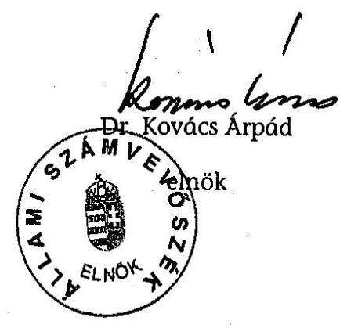

---

Központi Statisztikai Hivatal
Főnök
733-299/2/2004

Dr. Kovács Árpád úrnak elnök Állami Számvevőszék

# Budapest 

## Tisztelt Elnök Úr!

Köszönettel vettem a V-5-202/2004. számon megküldött - az államháztartáson kívüli állami feladatellátás rendszerének ellenőrzéséről készített - jelentést, melyhez észrevételt nem kívánok tenni.

A jelentés megállapításai, javaslatai alapján a Központi Statisztikai Hivatalban intézkedési terv készítése nem indokolt.

Budapest, 2005. január 10.
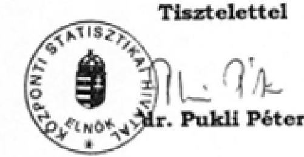

---

1/b. sz. melléklet
a V-5-205/2004-2005. sz. jelentéshez:

1051 Budapest, Roosevelt tér 9.
Telefon: 332-7176 Fax: 332-8943

E-15/2005.

Dr. Kovács Árpád úrnak
az ÁSZ elnöke

Állami Számvevőszék

Budapest

Tisztelt Elnök Úr!

Köszönettel vettem a V-5-202/2004. szám alatt megküldött az államháztartáson kívüli állami feladatellátás rendszerének ellenőrzéséről készített jelentést, amelyhez észrevételt nem kívánok tenni.

Budapest, 2005. január 10.

Üdvözlettel:

Dr. Vizi E. Szilveszter

---

# 1/c. sz. melléklet a V-5-205/2004-2005. sz. jelentéshez: 

## Miniszterelnöki Hivatalt vezető miniszter

Dr. Kovács Árpád úr
elnök

Állami Számvevőszék

Budapest

## Tisztelt Elnök Úr!

Az államháztartáson kívüli állami feladatellátás rendszerének ellenőrzéséről készített jelentéssel kapcsolatban észrevételt nem teszek.

Budapest, 2005. január 19.
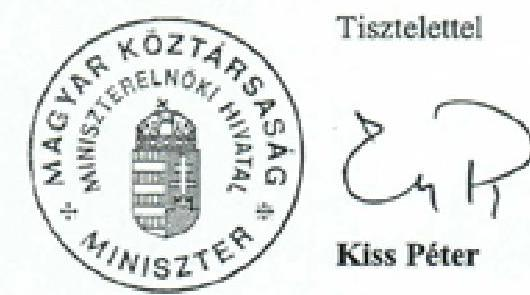

---

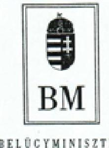

1/d. sz. melléklet
a V-5-205/2004-2005. sz. jelentéshez

1-2-2/2004.
3-545/6/2004.

Dr. Kovács Árpád úrnak
elnök
Állami Számvevőszék

# Budapest 

## Tisztelt Elnök Úr!

Az államháztartáson kívüli állami feladatellátás rendszerének ellenőrzéséről készített jelentéshez nem teszek észrevételt.

Budapest, 2005. január 4.
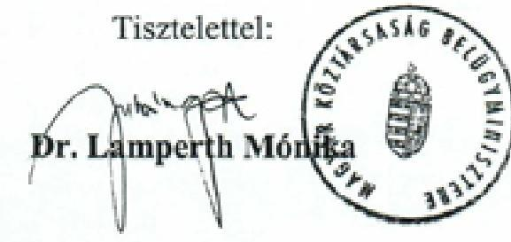

---

# Egészségügyi Minisztérium   Miniszter 

Iktatószám: 1534-1/2005-0018 PÜF
Hivatkozási szám: V-5-202/2004

Előadó: Domokos Sándor
Telefon: 301-7905

Dr. Kovács Árpád úrnak
Elnök

Állami Számvevőszék
Budapest

## Tisztelt Elnök Úr!

Az államháztartáson kívüli állami feladatellátás rendszerének ellenőrzéséről szóló, 706-os témaszámú számvevői jelentésre észrevételt nem teszek. Az ellenőrzés alapján elrendelt intézkedéseimről tájékoztatni fogom.

Budapest, 2005. január 23.

Üdvözlettel:
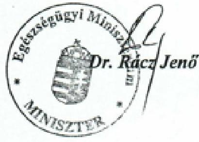

---

1/f. sz. melléklet
a V-5-205/2004-2005. sz. jelentéshez

Foglalkoztatáspolitikai és Munkaügyi Miniszter

Ikt.sz.: 13227-2/2004

Dr. Kovács Árpád úr
elnök

Állami Számvevőszék

Budapest

Tisztelt Elnök Úr!

Hivatkozással a V-5-202/2004. számon megküldött „Az államháztartáson kívüli állami feladatellátás rendszerének ellenőrzéséről” készített jelentés-tervezetükre észrevételt nem teszünk.

Budapest, 2004. december 29.

Üdvözlettel:

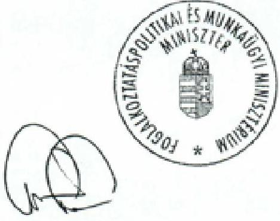

Csizmár Gábor

Levélcím: H-1054 Budapest, Alkotmány u. 3. Telefon: (06-1) 473-8177, (06-1) 473-8184 Fax: (06-1) 302-1373
Internet: www.fmm.gov.hu

---

1/g. sz. melléklet a V-5-205/2004-2005. sz. jelentéshez

Földművelésügyi és Vidékfejlesztési Miniszter

Ügyiratszám: 40008/1/2005.

Hiv.sz.: V-5-202/2004.

Dr. Kovács Árpád úr
elnök
Állami Számvevőszék

Budapest
Pf.: 54
H-1364

Tisztelt Elnök Úr!

Tájékoztatom, hogy az „Államháztartáson kívüli állami feladatellátás
rendszerének ellenőrzéséről” című jelentéssel kapcsolatosan tárcánk részéről
észrevételt nem teszek, az abban foglaltakkal egyetértek.

Tájékoztatom továbbá, hogy a jelentés tárcánkra is vonatkozó
megállapításaira intézkedési terv került összeállításra, amelynek
végrehajtásáról intézkedem.

Kérem tájékoztatásom szíves tudomásul vételét.

Budapest, 2005. január 24.

Üdvözlettel:

Dr. Németh L. Ing.
miniszter

Melléklet!

---

Miniszter

III-6/162/2/2004.

Hivatkozási szám: V-5-202/2004.

Dr. Kovács Árpád úr
elnök

Állami Számvevőszék

Budapest

Tisztelt Elnök Úr!

Az államháztartáson kívüli állami feladatellátás rendszerének ellenőrzéséről készített jelentést köszönettel vettem. A jelentésben foglaltakkal egyetértek, ahhoz észrevételt nem fűzök. A javaslatok megvalósítása érdekében intézkedtem. Az intézkedési tervet 30 napos határidőn belül megküldöm.

Budapest, 2004. december 28.

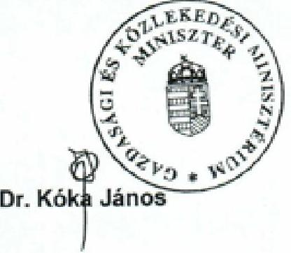

Dr. Kóka János

1055 Budapest, Honvéd u. 13-15.
postacím: 1880 Budapest, Pf. 111.

telefon: +36 1 374 2840, +36 1 374 2880
telefax: +36 1 269 3485

---

1. számú példány

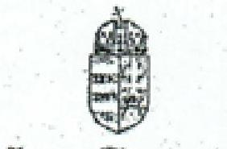

Magyar Köztársaság
Honvédelmi minisztere

Ny. szám: 337/256/2004.
Hiv. szám: V-5-202/2004.

Dr. Kovács Árpád úr
Állami Számvevőszék elnöke

Budapest

Tisztelt Elnök Úr!

Az államháztartáson kívüli állami feladatellátás rendszerének ellenőrzéséről a fenti hivatkozási számon megküldött Állami Számvevőszéki jelentést köszönettel megkaptam.

A jelentésben foglalt helyzetértékelés átfogóan, szakmailag megalapozottan mutatja be a vizsgált területet, a szabályozási hiányosságokat is magába foglaló jellemző problémákat. A tett megállapítások helytállóak, a megfogalmazott javaslatok realizálása a jövőben jelentős mértékben segítheti az ellenőrzésben érintett területtel kapcsolatos döntések megalapozottságát, eredményességét.

A HM tárcát érintő javaslatok alapján hozott intézkedéseimről az Állami Számvevőszékről szóló 1989. évi XXXVIII. törvény II. fejezet 25. § (1) bekezdésében foglalt határidőre részleteiben kívánok tájékoztatást adni.

Ezúton fejezem ki köszönetemet Ön és munkatársai felé az ellenőrzés során tanúsított segítő szándékért, a feltárt gondok megoldását célzó közreműködésért.

Budapest, 2005. január 22.

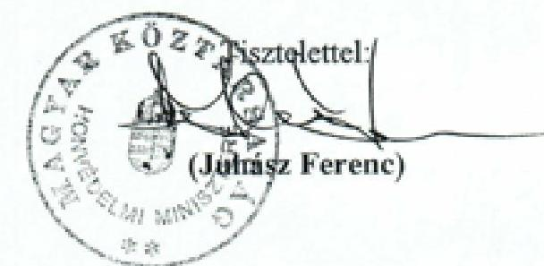

---

# Ifjúsági, Családügyi, Szociális és Esélyegyenlőségi Miniszter 

Ikt. szám: 4394-1/2004-4001KÖZ Hiv. szám: V-5-202/2004. Ügyintéző: dr. Hoffman István

Dr. Kovács Árpád úrnak
elnök
Állami Számvevőszék

## Budapest

Tisztelt Elnök Úr!

Az államháztartáson kívüli állami feladatellátás rendszerének ellenőrzéséről készített, az Ifjúsági, Családügyi, Szociális és Esélyegyenlőségi Minisztériumot érintő jelentéseket elfogadom.

A jelentésben hivatkozott ÁSZ jelentésekkel kapcsolatos intézkedések tekintetében az alábbiakról tájékoztatom:

A Magyarországi Nemzeti és Etnikai Kisebbségekért Közalapítvány gazdálkodásának ellenőrzéséről szóló 0437 ÁSZ jelentésben foglaltak kapcsán az Ifjúsági, Családügyi, Szociális és Esélyegyenlőségi Minisztérium (ICSSZEM) első fázisban 2005. január végén - február elején a Kormány elé terjeszti az Alapító Okirat módosítására vonatkozó előterjesztést. Az előterjesztés elfogadása és az Alapító Okirat bírósági nyilvántartásba vétele esetén a Kuratórium és a Felügyelő Bizottság működőképessé válik. Tekintettel arra, hogy jelenleg az Országgyűlés előtt fekszik a kisebbségi önkormányzati képviselők választásáról, valamint a nemzeti és etnikai kisebbségekre vonatkozó egyes törvények módosításáról szóló T/9126 számú törvényjavaslat, amely módosítaná a Közalapítványra vonatkozó legfontosabb, törvényi szintű szabályokat, ezért csak a törvény - várhatóan - nyáron történő elfogadását követően, 2005. őszén kerülne sor az Alapító Okirat nagy volumenű felülvizsgálatára.

Az ICSSZEM még e hónap végén, a következő hónap elején a Kormány elé kívánja terjeszteni a Magyarországi Cigányokért Közalapítvány Alapító Okiratának módosítására vonatkozó előterjesztését. A fenti előterjesztés teljes mértékben tekintettel volt az Állami Számvevőszék jelentésére, az ÁSZ-nak
 a 0427 számú jelentésében foglalt javaslatait beépítettük az előterjesztésbe.

Az ÁSZ 0449 számú jelentéséhez kapcsolódva tájékoztatom, hogy a szociális igazgatásról és a szociális ellátásokról szóló 1993. évi III. törvény és a gyermekek védelméről

---

szóló 1997. évi XXXI. törvénynek a költségvetési törvényhez kapcsolódó módosításainak az Országgyűlés elé terjesztésére sor került, az egyes szociális tárgyú törvények módosításáról szóló törvényjavaslatot az Országgyűlés elfogadta, a 2004. évi CXXXVI. törvény vonatkozó rendelkezései a költségvetési törvénnyel egyidejűleg - 2005. január 1-én - hatályba léptek.

A minisztérium 2004. végi létrehozása során az új belső szabályzatok - részben még folyamatban levő - kialakításánál tekintettel voltunk és vagyunk az ÁSZ 0443 számú jelentésében foglalt javaslatokra is. Intézkedtem, hogy a tárca igazgatása, egyes fejezeti kezelésű előirányzatai, és a felügyeletünk alá tartozó költségvetési szervek működése, gazdálkodása - figyelemmel a rendelkezésre álló szűkös ellenőri kapacitásra is - kiemelt figyelmet kapjon a 2005. évi ellenőrzésekben. Az Igazgatás cím vizsgálata az ICSSZEM és NSH közötti előirányzat lekötöttségének, maradványmegosztásának vizsgálatára terjed ki. A Minisztérium fejezeti kezelésű előirányzatainál - családi és szociális szolgáltatások és a civil kapcsolatok területén - a pályáztatási folyamat teljes rendszervizsgálatát rendeltem el, mely a FEUVE kialakításának és működtetésének a vizsgálatára is kiterjed. Az Ellenőrzési Főosztály 2005. évben 12 intézményben hajt végre szabályszerűségi, vagy pénzügyi, vagy megbízhatósági ellenőrzést. A Minisztérium felügyelete alá tartozó ezen költségvetési intézményeknél a FEUVE kialakításának, működtetésének és belső ellenőrzési egységének tevékenységére is kiterjed a vizsgálat.

Budapest, 2005. január 24.
Üdvözlettel:
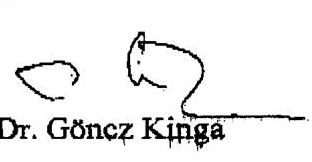

---

1/k. sz. melléklet
a V-5-205/2004-2005. sz. jelentéshez

Informatikai és
Hírközlési
Minisztérium

1077 BUDAPEST, DOB U. 75-81. TELEFON: (06-1) 461 3610 WWW.IHM.HU

LEVÉLCÍM: 1400 BUDAPEST, PF. 87. FAX: (06-1) 461 3406

Dr. Kovács Árpád
Elnök

Ikt. Szám: 9242/s/2004.

Állami Számvevőszék

Budapest
Apáczai Csere János u. 10.

Tisztelt Elnök Úr!

Köszönettel vettem az Állami Számvevőszék „államháztartáson kívüli állami feladatellátás
rendszerének" ellenőrzéséről szóló jelentését, melyhez észrevételt nem kívánok tenni.

Az ellenőrzés alapján elrendelt intézkedésekről tájékoztatni fogom.

Budapest, 2005. január 5.

Tisztelettel:

Kovács Kálmán

---

A Magyar Köztársaság
Igazságügy-minisztere

IM/KGF/2005/ELL/ 13/3

Dr. Kovács Árpád úr
elnök
Állami Számvevőszék

Hiv. szám: V-5-202/2004

Budapest

Tisztelt Elnök Úr!

Hivatkozott számú levelére tájékoztatom, hogy az államháztartáson kívüli állami feladatellátás rendszerének ellenőrzéséről készített jelentéssel kapcsolatban észrevételt nem teszünk.

Az Igazságügyi Minisztériumra vonatkozó intézkedési tervet az Állami Számvevőszék részére 30 napon belül megküldjük.

Kérem tájékoztatásom szíves elfogadását.

Budapest 2005. január 10.

Tisztelettel

Dr. Petrétei József

---

1/m. sz. melléklet
a V-5-205/2004-2005. sz. jelentéshez

Dr. Kovács Árpád úr
elnök

Állami Számvevőszék

Budapest

Tisztelt Elnök Úr!

Tájékoztatom, hogy az államháztartáson kívüli állami feladatellátás rendszerének
ellenőrzéséről készített ÁSZ jelentésben foglaltakkal kapcsolatban észrevételt nem teszek.

Mellékelten megküldöm az ellenőrzéssel kapcsolatban készített Intézkedési Tervet.

Budapest, 2005. január

Üdvözlettel:

(dr. Hajdu András)

Melléklet: Intézkedési terv (1 oldal)

---

1/n. sz. melléklet
a V-5-205/2004-2005. sz. jelentéshez

MAGYAR KÖZTÁRSASÁG
KÖRNYEZETVÉDELMI ÉS VÍZÜGYI MINISZTERE

Ell-134/11/2004.

Dr. Kovács Árpád úr
elnök

Állami Számvevőszék

Budapest

Tisztelt Elnök Úr!

Az államháztartáson kívüli állami feladatellátás rendszerének ellenőrzéséről készített számvevőszéki
jelentést megkaptam, az abban foglaltakra észrevételt nem kívánok tenni, azt elfogadom.

A jelentésben a fejezetek vezetői részére javaslatként megfogalmazottak realizálására a tárca részéről
esetleg szükséges intézkedésekről 30 napon belül a megkeresésében foglaltaknak megfelelően, a
szükséges tájékoztatást megteszem.

Budapest, 2005. január 6.

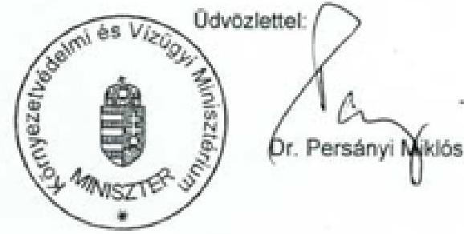

---

# NEMZETI KULTURÁLIS ÖRÖKSÉG MINISZTÉRIUMA

**MONDÉTER**

**Szám: 2.1.1/62-1/2005.**

**Dr. Kovács Árpád úr**

**elnök**

**Állami Számvevőszék**

**Budapest**

**Tisztelt Elnök Úr!**

Mellékelten megküldöm Nemzeti Kulturális Örökség Minisztériumának az államháztartáson kívüli állami feladatellátás rendszerének ellenőrzéséről készült V-5-202/2004. Iktatószámú jelentés alapján készített intézkedési tervét.

Budapest, 2005. január

Tisztelettel:

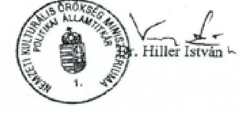

1077 Budapest, Wesselényi utca 20-22. • Telefon: 484-7139 • Fax: 484-7140, 484-7301

---

1/p. sz. melléklet a V-5-205/2004-2005. sz. jelentéshez

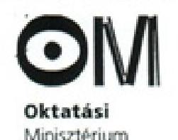

OM

Oktatási
Minisztérium

1055 Budapest V.
Szabay utca 10-14.
telefon: +36 1 473 7000
telefax: +36 1 473 7001
1884 Budapest, Pf. 1.

A MAGYAR KÖZTÁRSASÁG
OKTATÁSI MINISZTERE

1358/2005.

Dr. Kovács Árpád
elnök
Állami Számvevőszék

Budapest

Tisztelt Elnök Úr!

Az államháztartáson kívüli állami feladatellátás rendszerének ellenőrzéséről készített jelentésükre a tárca észrevételt nem tesz.

Budapest, 2005. január 11.

Tisztelettel:

Dr. Magyar Bálint

---

1/r. sz. melléklet a V-5-205/2004-2005. sz. jelentéshez

H-1051 BUDAPEST V., JÓZSEF NÁDOR TÉR 2-4. POSTACIM: 1369 BUDAPEST, POSTAFIÓK 481.

TELEFON: 327-2107 FAX: 317-8389
TELEFONKÖZFONT: 318-2066

E-MAIL: gyorgy.radnais@pm.gov.hu

KÖZIGAZGATÁSI ÁLLAMTITKÁR

1214/2005.

Hiv.sz.: V-5-202/2004.

Dr. Kovács Árpád úrnak,
elnök

Állami Számvevőszék

Budapest

Tisztelt Elnök Úr

Tájékoztatom, hogy fenti számon küldött, az államháztartáson kívüli állami feladatellátás rendszerének ellenőrzéséről készített jelentésükkel kapcsolatban észrevételt nem teszek.

Budapest, 2004. január 11.

Tisztelettel:

Dr. Radnai György

---

Az államháztartáson kívüli szervezetek részére az állami feladatellátással kapcsolatban átadott eszközök 2002. évben*

|   | Megnevezés | Vállalkozásoknak | Non-profit szervezeteknek | Egyéb | Összesen  |
| --- | --- | --- | --- | --- | --- |
|  I. | Tőkejuttatás (a+b) | 128 103,5 | 1 046,8 | 2 737,1 | 131 887,4  |
|  a) | tőkeemelés | 6 503,6 | 429,3 | 66,7 | 6 999,6  |
|  b) | apport formájában, térítésmentesen átadott eszközök | 121 599,9 | 617,5 | 2 670,4 | 124 887,8  |
|  II. | Átadott pénzeszközök (a+b) | 289 254,2 | 137 400,3 | 13 993,1 | 440 647,6  |
|  a) | működési célú átadás | 115 256,2 | 114 768,3 | 9 613,1 | 239 637,6  |
|  b) | felhalmozási célú átadás | 173 998,0 | 22 632,0 | 4 380,0 | 201 010,0  |
|  III. | Egyéb állami feladatellátásra kifizetett pénzeszközök | 22 585,0 | 348,1 | 17 662,5 | 40 595,6  |
|  IV. | Mindösszesen (I+II+III) | 439 942,7 | 138 795,2 | 34 392,7 | 613 130,6  |

- Nem tartalmazza az Egészségbiztosítási Alapból természetbeni ellátásokra szervezeteknek átadott 349,4 Mrd Ft támogatást.

---

Az államháztartáson kívüli szervezetek részére az állami feladatellátással kapcsolatban átadott eszközök 2003. évben*

|   | Megnevezés | Vállalkozásoknak | Non-profit szervezeteknek | Egyéb | Összesen  |
| --- | --- | --- | --- | --- | --- |
|  I. | Tőkejuttatás (a+b) | 16563,3 | 400,3 | 2368,2 | 19331,8  |
|  a) | tőkeemelés | 3939,4 | 80,0 | 0,0 | 4019,4  |
|  b) | apport formájában, térítésmentesen átadott eszközök | 12623,9 | 320,3 | 2368,2 | 15312,4  |
|  II. | Átadott pénzeszközök (a+b) | 363347,2 | 126896,3 | 19016,3 | 509259,8  |
|  a) | működési célú átadás | 131516,8 | 115045,4 | 8862,1 | 255424,3  |
|  b) | felhalmozási célú átadás | 231830,4 | 11850,9 | 7786,9 | 251468,2  |
|  III. | Egyéb állami feladatellátásra kifizetett pénzeszközök | 27775,9 | 1346,2 | 20399,4 | 49521,5  |
|  IV. | Mindösszesen (I+II+III) | 407686,4 | 128642,8 | 41783,9 | 578113,1  |

- Nem tartalmazza az Egészségbiztosítási Alapból természetbeni ellátásokra szervezeteknek átadott 420,8 Mrd Ft támogatást.

---

A fejezetek intézményei felügyeletében lévő szervezetek részére az állami feladatellátással kapcsolatban átadott eszközök 2002. évben

| Fejezet | Tőkejuttatás | Állami támogatás | A támogatások forrásai |  |  |  |
| :--: | :--: | :--: | :--: | :--: | :--: | :--: |
|  |  |  | Költségvetési törvényben nyújtott támogatás | Egyedi   támogatás | Fejezeti   támogatás   pályázat   alapján | Egyéb, fejezeti támogatás |
| ME | 20,0 | 5174,8 | 4076,5 | 962,0 | 76,3 | 60,0 |
| BM | 0,0 | 781,3 | 100,0 | 7,1 | 0,0 | 674,2 |
| FVM | 171,8 | 2031,3 | 0,0 | 10,0 | 10,0 | 2011,3 |
| HM | 327,3 | 7931,4 | 7931,4 | 0,0 | 0,0 | 0,0 |
| IM | 0,0 | 638,9 | 528,9 | 0,0 | 0,0 | 110,0 |
| GKM | 719,5 | 15166,8 | 2542,5 | 9604,7 | 0,3 | 3019,3 |
| KvVM | 115,0 | 296,4 | 249,4 | 0,0 | 0,0 | 47,0 |
| KÜM | 0,0 | 1345,7 | 245,7 | 0,0 | 0,0 | 1100,0 |
| OM | 0,0 | 5621,9 | 671,9 | 362,5 | 0,5 | 4587,0 |
| ESzCsM | 20,0 | 942,5 | 198,1 | 7,7 | 439,1 | 297,6 |
| PM | 0,0 | 3777,9 | 2998,7 | 0,0 | 0,0 | 779,2 |
| NKÖM | 20,6 | 9726,5 | 7528,6 | 250,0 | 73,2 | 1874,7 |
| GyISM | 570,5 | 7036,0 | 4656,1 | 400,0 | 0,0 | 1979,9 |
| IHM | 150,0 | 0,9 | 0,0 | 0,0 | 0,0 | 0,9 |
| FMM | 0,0 | 2791,8 | 0,0 | 2782,8 | 0,0 | 9,0 |
| MTA | 0,0 | 100,0 | 100,0 | 0,0 | 0,0 | 0,0 |
| MPA | 0,0 | 435,1 | 0,0 | 0,0 | 405,5 | 29,6 |
| ÖSSZ | 2114,7 | 63799,2 | 31827,8 | 14386,8 | 1004,9 | 16579,7 |
| ebből |  |  |  |  |  |  |
| Gazdasági   társaságnak | 178,6 | 19529,3 | 7711,4 | 10014,7 | 74,6 | 1728,6 |
| Közhasznú   társaságnak | 1886,1 | 27158,5 | 14755,0 | 257,0 | 73,2 | 12073,3 |
| Közalapítványnak | 50,0 | 16455,9 | 8908,6 | 4107,3 | 823,0 | 2617,0 |
| Alapítványnak | 0,0 | 550,2 | 401,6 | 7,8 | 34,1 | 106,7 |

Közalapítványnak
$25,8 \%$
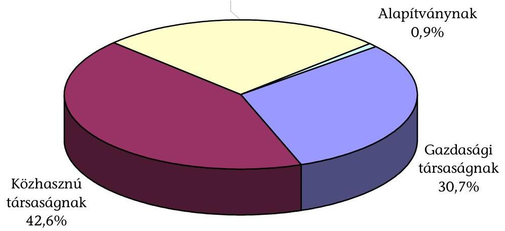

---

A fejezetek intézményei felügyeletében lévő szervezetek részére az állami feladatellátással kapcsolatban átadott eszközök 2003. évben

| Fejezet | Tőkejuttatás | Állami támogatás | A támogatások forrásai |  |  |  |
| :--: | :--: | :--: | :--: | :--: | :--: | :--: |
|  |  |  | Költségvetési törvényben nyújtott támogatás | Egyedi   támogatás | Fejezeti   támogatás   pályázat   alapján | Egyéb, fejezeti   támogatás |
| ME | 0 | 6560,4 | 5584 | 950 | 0 | 26 |
| BM | 0 | 959,4 | 108 | 9 | 0 | 843 |
| FVM | 128 | 2732,6 | 0 | 2345 | 80 | 307 |
| HM | 0,0 | 7505,8 | 7500,8 | 0,0 | 0,0 | 5,0 |
| IM | 0,0 | 734,4 | 598,5 | 0,0 | 0,0 | 135,9 |
| GKM | 412,0 | 109 486,6 | 97756,7 | 9284,1 | 0,0 | 2445,8 |
| KvVM | 0,0 | 2030,6 | 318,9 | 0,0 | 86,9 | 1624,8 |
| KÜM | 0,0 | 1195,7 | 285,7 | 0,0 | 0,0 | 910,0 |
| OM | 22,0 | 8978,2 | 1230,4 | 350,0 | 102,9 | 7294,9 |
| ESzCsM | 0,0 | 6782,4 | 5906,0 | 0,0 | 510,9 | 365,5 |
| PM | 0,0 | 288,5 | 0,0 | 0,0 | 0,0 | 288,5 |
| NKÖM | 0,0

 | 13634,3 | 9408,1 | 260,2 | 240,2 | 3725,8 |
| GyISM | 3881,9 | 8246,1 | 5644,2 | 0,0 | 0,0 | 2601,9 |
| IHM | 0,0 | 272,4 | 0,0 | 0,0 | 44,6 | 227,8 |
| FMM | 38,0 | 3931,2 | 5,0 | 3654,6 | 0,0 | 271,6 |
| MTA | 0,0 | 97,5 | 97,5 | 0,0 | 0,0 | 0,0 |
| MPA | 0,0 | 598,0 | 0,0 | 0,0 | 450,0 | 148,0 |
| ÖSSZ | 4481,9 | 174034,1 | 134444,2 | 16852,7 | 1515,5 | 21221,7 |
| ebből |  |  |  |  |  |  |
| Gazdasági   társaságnak | 4031,9 | 110187,2 | 99488,9 | 9395,1 | 167,8 | 1135,4 |
| Közhasznú   társaságnak | 428,0 | 34162,1 | 13809,1 | 2492,3 | 239,3 | 17621,4 |
| Közalapítványnak | 22,0 | 29009,3 | 20727,2 | 4964,8 | 1057,5 | 2259,8 |
| Alapítványnak | 0,0 | 675,5 | 419,0 | 0,5 | 50,9 | 205,1 |

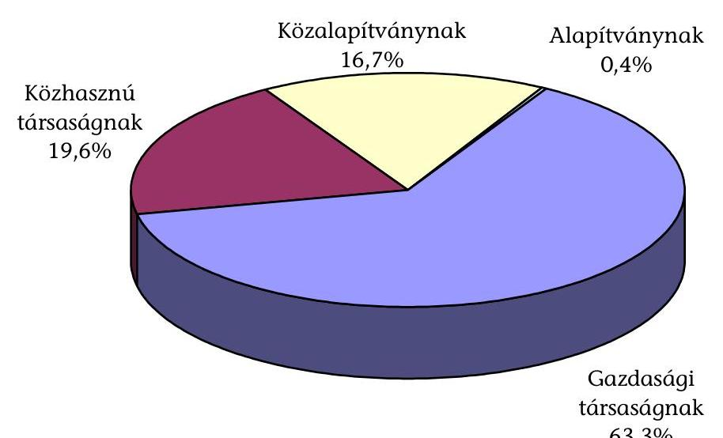

---

Fejezeti kezelésű előirányzatokból a gazdasági, a közhasznú társaságoknak és a (köz)alapítványoknak biztosított támogatások 2003. évben

|  Kedvez-   ményezett | gazdasági társaság |  |  | közhasznú társaság |  |  | közalapítvány |  |  | alapítvány |  |  | összesen |  |   |
| --- | --- | --- | --- | --- | --- | --- | --- | --- | --- | --- | --- | --- | --- | --- | --- |
|  Fejezet | Kiadás | Mükö-   désre | Feladat   -ra | Kiadás | Mükö-   désre | Feladat   -ra | Kiadás | Mükö-   désre | Feladat   -ra | Kiadás | Mükö-   désre | Feladat   -ra | Kiadás | Mükö-   désre | Feladat   -ra  |
|  ME | $4535,8$ | 0,0 | $4535,8$ | $3188,1$ | 7,4 | $3180,7$ | $6167,2$ | 0,0 | $6167,2$ | $2835,0$ | 39,4 | $2795,6$ | $16726,1$ | 46,8 | $16679,3$  |
|  BM | 22,1 | 18,0 | 4,1 | 448,2 | 444,0 | 4,2 | 475,1 | 475,1 | 0,0 | 40,5 | 5,0 | 35,5 | 985,9 | 942,1 | 43,8  |
|  FVM | $79589,7$ | 0,0 | $79589,7$ | $2035,5$ | 0,0 | $2035,5$ | 0,0 | 0,0 | 0,0 | 57,0 | 0,0 | 57,0 | $81682,2$ | 0,0 | $81682,2$  |
|  HM | 0,0 | 0,0 | 0,0 | $7367,9$ | 0,0 | $7367,9$ | 0,0 | 0,0 | 0,0 | 5,0 | 5,0 | 0,0 | $7372,9$ | 5,0 | $7367,9$  |
|  IM | 517,3 | 0,0 | 517,3 | 0,0 | 0,0 | 0,0 | 11,7 | 0,0 | 11,7 | 12,5 | 0,0 | 12,5 | 541,5 | 0,0 | 541,5  |
|  GKM | $75904,0$ | $9962,2$ | $65941,8$ | $34414,3$ | $1176,2$ | $33238,1$ | 10,7 | 0,0 | 10,7 | $1670,2$ | 0,0 | $1670,2$ | $111999,2$ | $11138,4$ | $100860,8$  |
|  KvVM | $10895,0$ | 0,0 | $10895,0$ | 678,2 | 24,0 | 654,2 | 5,1 | 0,0 | 5,1 | 383,2 | 0,0 | 383,2 | $11961,5$ | 24,0 | $11937,5$  |
|  KüM | $1353,2$ | 557,0 | 796,2 | $1057,6$ | 3,3 | $1054,3$ | 164,8 | 0,0 | 164,8 | 186,1 | 135,7 | 50,4 | $2761,7$ | 696,0 | $2065,7$  |
|  OM | $6775,9$ | 95,9 | $6680,0$ | $4952,4$ | 983,9 | $3968,5$ | $2027,0$ | $1638,0$ | 389,0 | $2964,1$ | 949,9 | $2014,2$ | $16719,4$ | $3667,7$ | $13051,7$  |
|  ESzCsM | 209,7 | 0,0 | 209,7 | 210,1 | 109,6 | 100,5 | $1111,6$ | 885,8 | 225,8 | $1465,0$ | 564,7 | 900,3 | $2996,4$ | $1560,1$ | $1436,3$  |
|  PM | $2464,8$ | $2322,8$ | 142,0 | 0,0 | 0,0 | 0,0 | 0,0 | 0,0 | 0,0 | 113,3 | 0,0 | 113,3 | $2578,1$ | $2322,8$ | 255,3  |
|  NKÖM | $1729,8$ | 0,0 | $1729,8$ | $1306,5$ | 43,5 | $1263,0$ | $6850,1$ | 991,7 | $5858,4$ | $3022,7$ | 699,7 | $2323,0$ | $12909,1$ | $1734,9$ | $11174,2$  |
|  GyISM | $3678,3$ | 0,0 | $3678,3$ | $2571,6$ | 475,5 | $2096,1$ | $2695,8$ | 89,2 | $2606,6$ | 441,9 | 30,0 | 411,9 | $9387,6$ | 594,7 | $8792,9$  |
|  IHM | $1869,9$ | 0,0 | $1869,9$ | $2212,2$ | 0,0 | $2212,2$ | 173,5 | 0,0 | 173,5 | 544,8 | 0,0 | 544,8 | $4800,4$ | 0,0 | $4800,4$  |
|  FMM | $1051,8$ | 0,0 | $1051,8$ | 831,6 | 196,6 | 635,0 | 48,3 | 0,0 | 48,3 | 481,8 | 0,0 | 481,8 | $2413,5$ | 196,6 | $2216,9$  |
|  MTA | 160,7 | 0,0 | 160,7 | 0,0 | 0,0 | 0,0 | 97,5 | 0,0 | 97,5 | 267,6 | 0,0 | 267,6 | 525,8 | 0,0 | 525,8  |
|  Összesen | 190758,0 | 12955,9 | 177802,1 | 61274,2 | 3464,0 | 57810,2 | 19838,4 | 4079,8 | 15758,6 | 14490,7 | 2429,4 | 12061,3 | 286361,3 | 22929,1 | 263432,2  |

---

A veszteségesen/forráshiányosan gazdálkodó szervezetek közhasznú és vállalkozási eredménye 2002-ben és 2003-ban

E Ft

| 2002. év |  |  |  |  |  |  |  |   |
| --- | --- | --- | --- | --- | --- | --- | --- | --- |
|  Fejezet | gazdasági társaságok |  | közhasznú társaságok |  |  | (köz)alapítványok |  |   |
|   | db | vállakozási eredmény | db | közhasznú eredmény | vállalkozási eredmény | db | közhasznú eredmény | vállalkozási eredmény  |
|  ME | 0 | 0 | 4 | -1736496 | -158861 | 4 | -166989 | 146691  |
|  BM | 0 | 0 | 2 | -27572 | -527 | 2 | -173874 | 0  |
|  FVM | 2 | -1022982 | 1 | -34477 | 38418 | 0 | 0 | 0  |
|  HM | 2 | -191243 | 0 | 0 | 0 | 1 | -148 | 0  |
|  IM | 2 | -18119 | 0 | 0 | 0 | 0 | 0 | 0  |
|  GKM | 3 | -615846 | 13 | -560263 | 343951 | 0 | 0 | 0  |
|  KvVM | 0 | 0 | 2 | -237116 | 239591 | 0 | 0 | 0  |
|  KÜM | 0 | 0 | 0 | 0 | 0 | 0 | 0 | 0  |
|  OM | 6 | -462287 | 3 | -53648 | 21397 | 7 | -181336 | -425  |
|  ESzCsM | 0 | 0 | 0 | 0 | 0 | 1 | -8230 | -662  |
|  PM | 0 | 0 | 1 | -19968 | -831 | 0 | 0 | 0  |
|  NKÖM | 0 | 0 | 6 | -205924 | -30170 | 4 | -153205 | 96649  |
|  GyISM | 4 | -1475456 | 2 | -609467 | -24241 | 2 | -69087 | 2  |
|  IHM | 0 | 0 | 1 | -46354 | 0 | 1 | -24991 | 27356  |
|  FMM | 0 | 0 | 0 | 0 | 0 | 1 | -13804 | 0  |
|  KSH | 1 | -4276 | 0 | 0 | 0 | 0 | 0 | 0  |
|  MTA | 1 | -6334 | 0 | 0 | 0 | 0 | 0 | 0  |
|  KNPA | 0 | 0 | 0 | 0 | 0 | 0 | 0 | 0  |
|  Médiumok | 2 | -11898270 |  |  |  |  |  |   |
|   | 23 | -15694813 | 35 | -3531285 | 428727 | 23 | -791664 | 269611  |
|  E Ft |  |  |  |  |  |  |  |   |
|  2003. év |  |  |  |  |  |  |  |   |
|  Fejezet | gazdasági társaságok |  | közhasznú társaságok |  |  | (köz)alapítványok |  |   |
|   | db | vállakozási eredmény | db | közhasznú eredmény | vállalkozási eredmény | db | közhasznú eredmény | vállalkozási eredmény  |
|  ME | 0 | 0 | 1 | -8459 | -1616 | 1 | -2853 | 0  |
|  BM | 1 | -29690 | 2 | -54034 | 9656 | 2 | -213667 | 0  |
|  FVM | 2 | -1390841 | 4 | -74693 | 79989 | 0 | 0 | 0  |
|  HM | 0 | 0 | 1 | -228861 | -10589 | 0 | 0 | 0  |
|  IM | 4 | -164260 | 0 | 0 | 0 | 0 | 0 | 0  |
|  GKM | 3 | -6390367 | 11 | -454279 | 534435 | 0 | 0 | 0  |
|  KvVM | 0 | 0 | 2 | -237116 | 239591 | 0 | 0 | 0

 | -171358 | 202157 | 0 | 0 | 0  |
| KÜM | 0 | 0 | 0 | 0 | 0 | 0 | 0 | 0  |
| OM | 2 | -162652 | 2 | -6795 | -55 | 9 | -781338 | -5311  |
| ESzCsM | 1 | -15207 | 1 | -8843 | 0 | 2 | -9182 | -1189  |
| PM | 2 | -2013631 | 0 | 0 | 0 | 0 | 0 | 0  |
| NKÖM | 1 | -98380 | 5 | -158382 | -1364 | 4 | -101165 | 68136  |
| GyISM | 2 | -2514012 | 2 | -1514985 | 14902 | 2 | -73810 | 2  |
| IHM | 0 | 0 | 0 | 0 | 0 | 1 | -7063 | 20877  |
| FMM | 0 | 0 | 0 | 0 | 0 | 1 | -19528 | 0  |
| KSH | 0 | 0 | 0 | 0 | 0 | 0 | 0 | 0  |
| MTA | 1 | -1807 | 0 | 0 | 0 | 0 | 0 | 0  |
| KNPA | 0 | 0 | 0 | 0 | 0 | 0 | 0 | 0  |
| Médiumok | 4 | -11128217 |  |  |  |  |  |   |
|   | 23 | -23909064 | 31 | -2680689 | 827515 | 22 | -1208606 | 82515  |

---

Az alapítói, a költségvetési és a pályázati támogatások szervezet-típusonkénti megoszlása (2002-2003.)
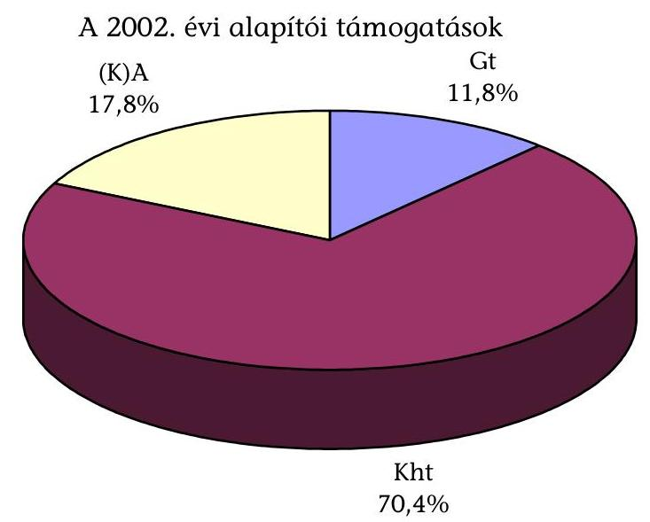

A 2002. évi költségvetési támogatások
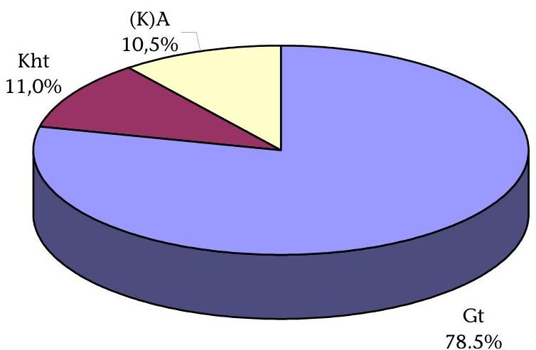

A 2002. évi pályázati támogatások
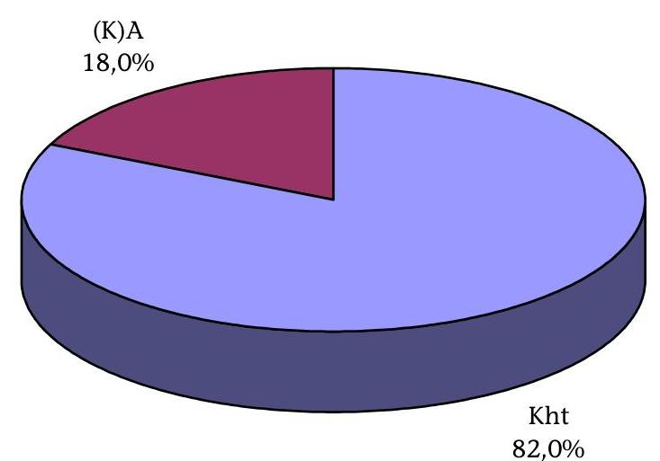

---

Az alapítói, a költségvetési és a pályázati támogatások szervezet-típusonkénti megoszlása (2002-2003.)
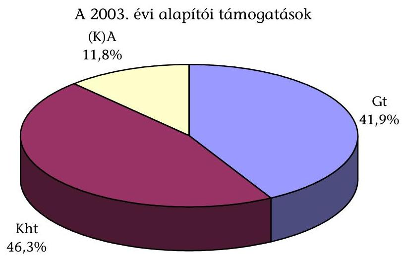

A 2003. évi költségvetési támogatások
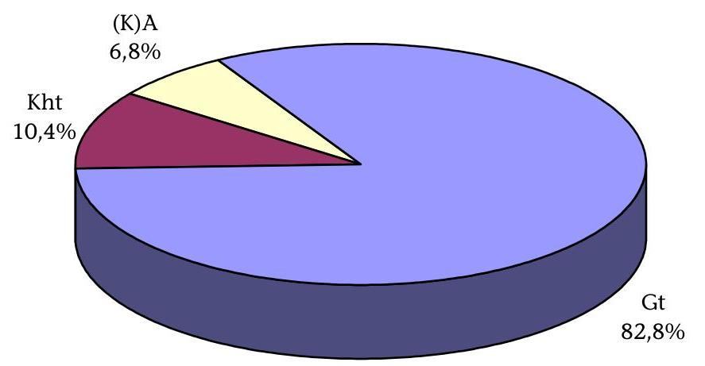

A 2003. évi pályázati támogatások
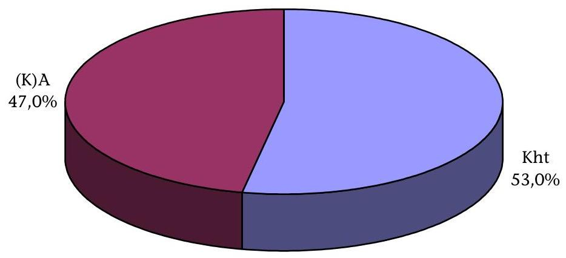

---

Az alapítói, a költségvetési és a pályázati támogatások fejezetenkénti megoszlása (2002-2003.)
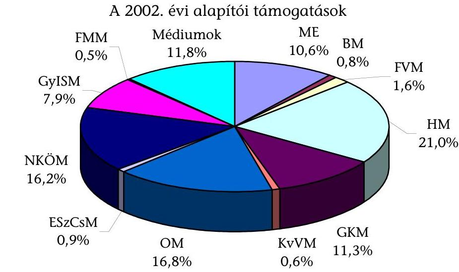

A 2002. évi költségvetési támogatások
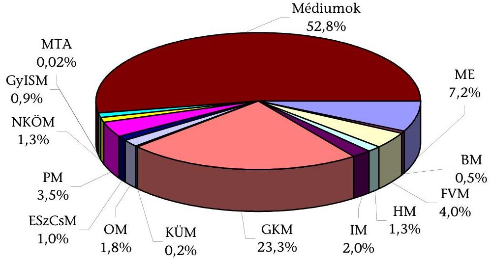

A 2002. évi pályázati támogatások
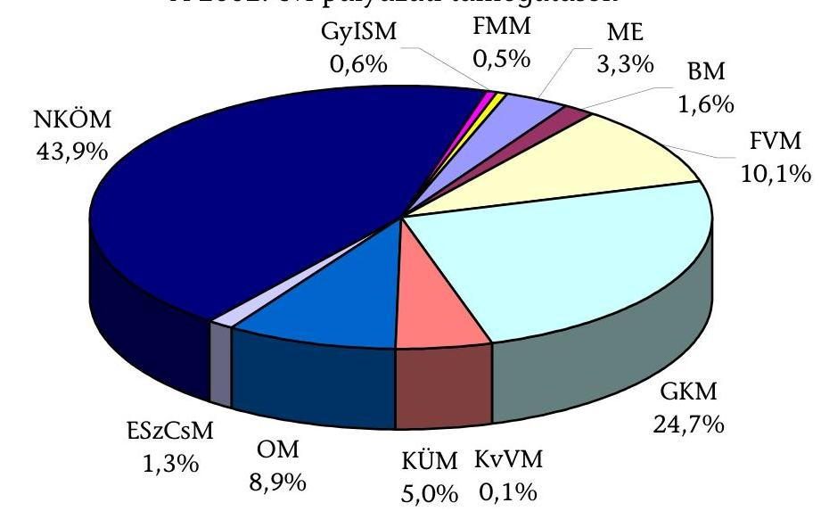

---

Az alapítói, a költségvetési és a pályázati támogatások fejezetenkénti megoszlása (2002-2003.)
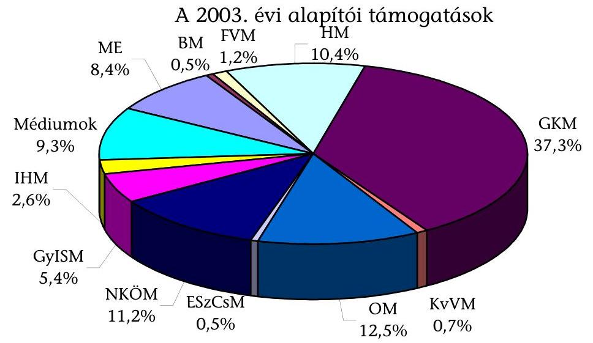

A 2003. évi költségvetési támogatások
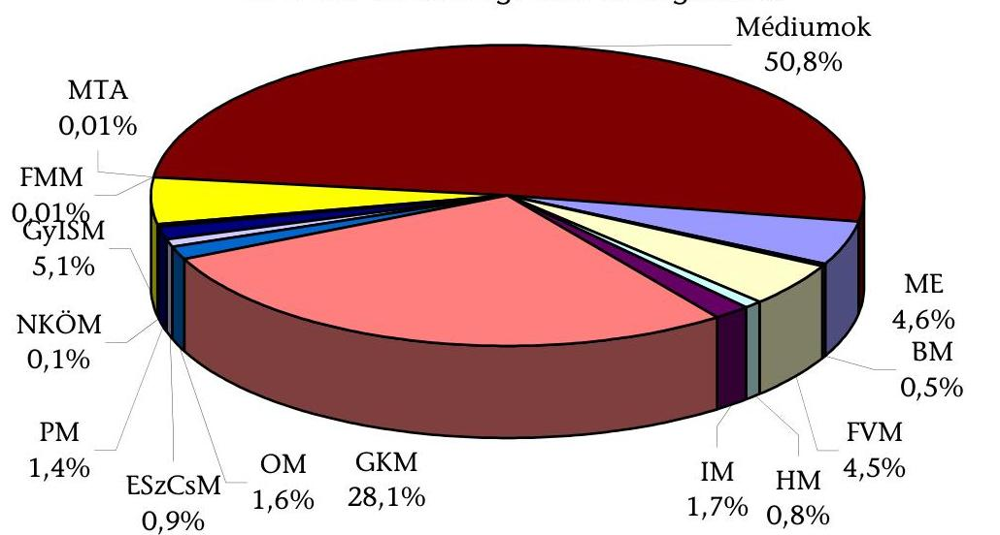

A 2003. évi pályázati támogatások
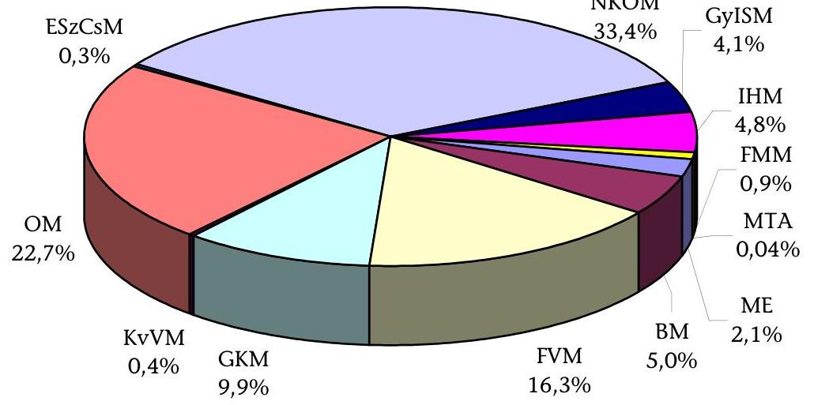

---

A továbbadott támogatások megoszlása fejezetenként (2002-2003.)
2002. évben
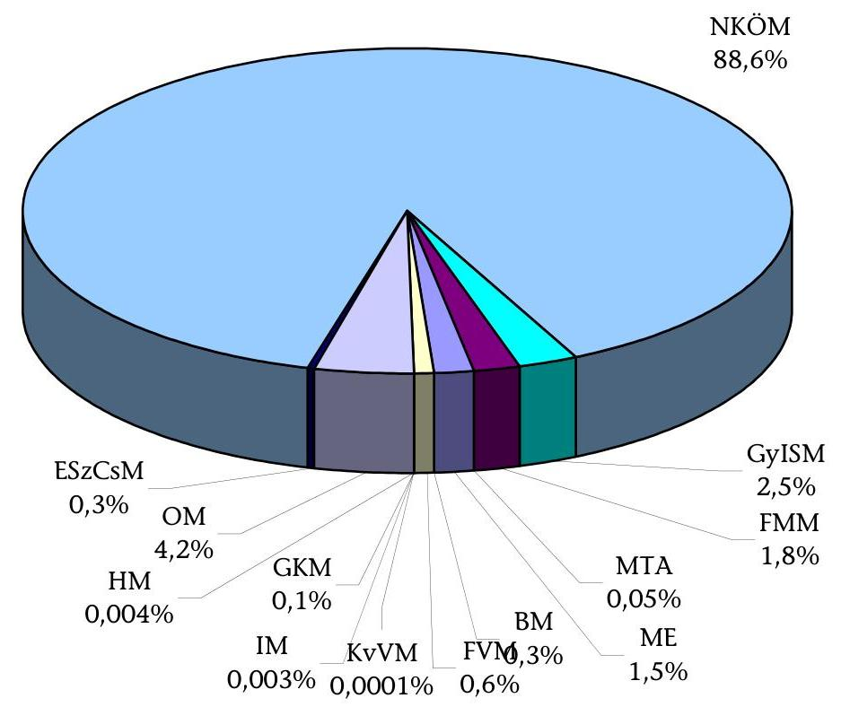
2003. évben
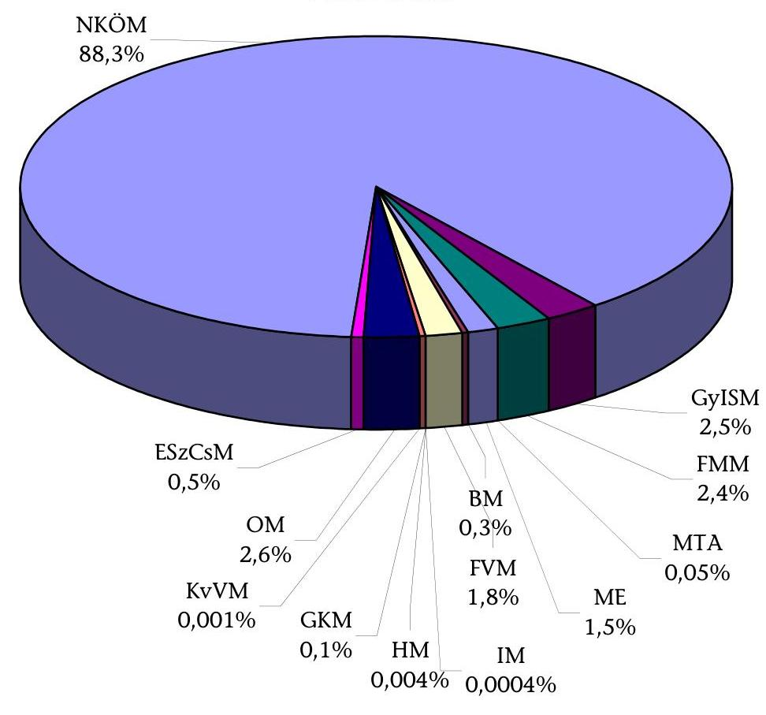

---

A szervezetek létszámának megoszlása fejezetenként (2002.-2003.)

A 2002. évi teljes és részmunkaidőben foglakoztatottak
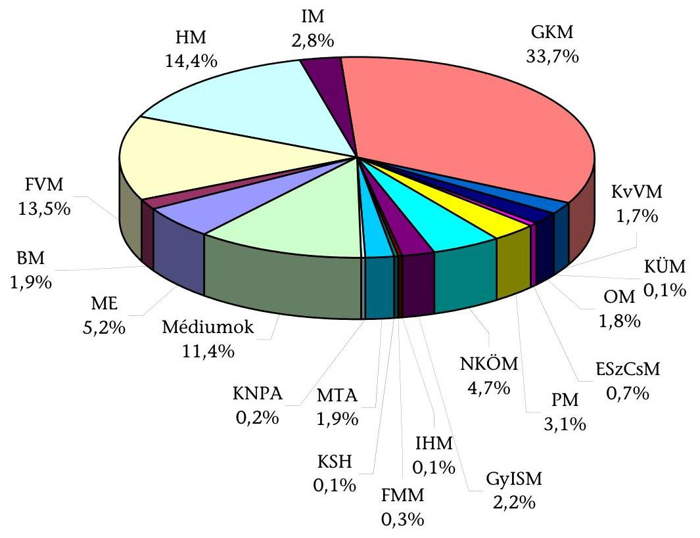

A megbízási szerződéssel foglalkoztatottak 2002. évben
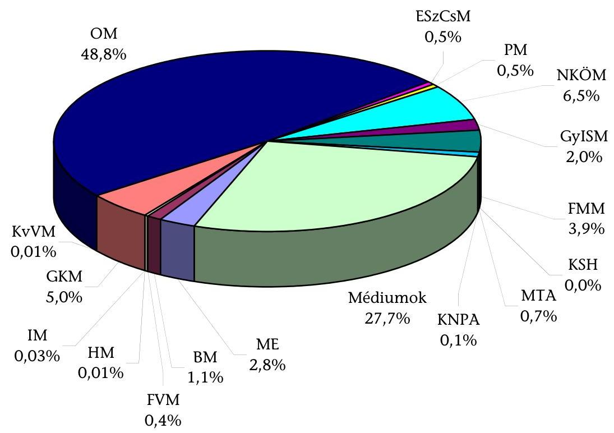

---

A szervezetek létszámának megoszlása fejezetenként (2002.-2003.)

A 2003. évi teljes és részmunkaidőben foglakoztatottak
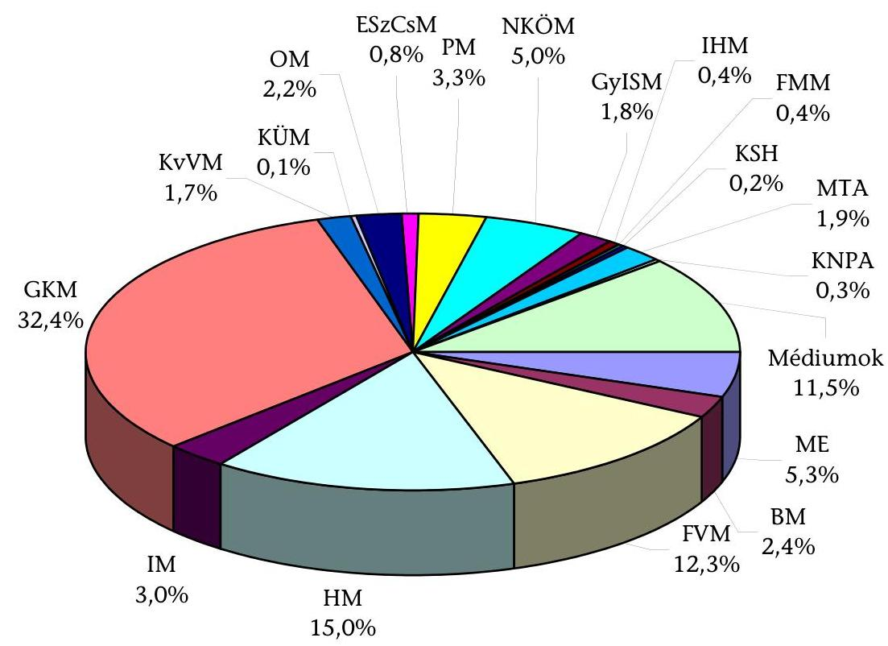

Megbízási szerződéssel foglalkoztatottak 2003. évben
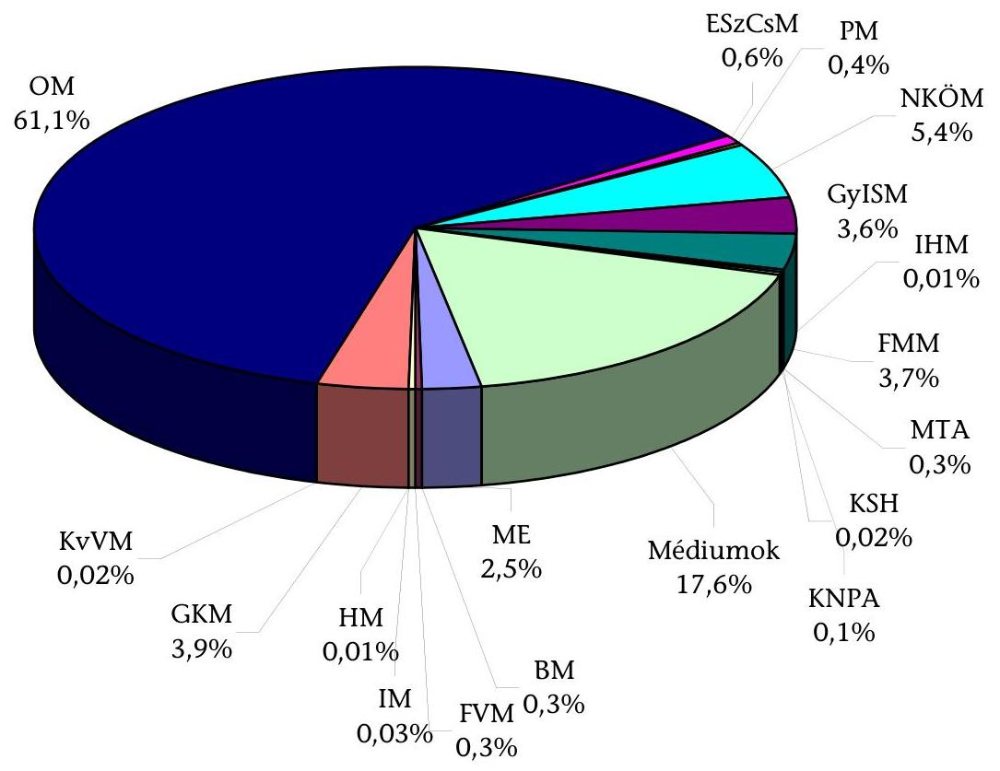

---

Adatszolgáltatást teljesítő szervezetek

| Fejezet | Alapítványok |
| :--: | :--: |
| 1 ME | Németh László Közép-Európai Népi Akadémiai Alapítvány |
| 2 BM | Az Építés Fejlődéséért Alapítvány |
| 3 | Épület- és Lakásgazdálkodási -Fenntartási Innovációs K+F Alapítvány |
| 4 HM | Magyar Honvédség Szociálpolitikai Alapítvány |
| 5 GKM | Magyar Vállalkozásfejlesztési Alapítvány |
| 6 | Ipar Műszaki Fejlesztéséért Alapítvány |
| 7 KvVM | Agrár Nemzetközi Kapcsolatok Alapítvány |
| 8 | Cineglób Alapítvány |
| 9 | Drégelyvár Alapítvány |
| 10 | "Ipar a korszerű mérnökképzésért" Alapítvány |
| 11 | Környezetgazdálkodási Oktatás Fejlesztéséért Alapítvány |
| 12 | Mérnöktovábbképzés Fejlesztése Alapítvány |
| 13 KÜM | Teleki László Alapítvány |
| 14 OM | Budapesti Német Iskola Alapítvány |
| 15 | JPTE Alapítvány |
| 16 | Báthorys Gyermekekért Alapítvány |
| 17 | Fogyatékos Gyermekekért Alapítvány |
| 18 | Korszerű Kereskedelemért Alapítvány |
| 19 | Magyar-Amerikai Fulbright Alapítvány |
| 20 | Magyar-Francia Ifjúsági Alapítvány |
| 21 | A Jövő Mérnöke Alapítvány |
| 22 | Bánki Alapítvány |
| 23 | Design Alapítvány |
| 24 | Épület és Lakásgazdálkodási Alapítvány |
| 25 | Magyar-Koreai Alapítvány |
| 26 | Mérnöktovábbképzés Fejlesztése Alapítvány |
| 27 | Cultura Oeconomica Alapítvány |
| 28 | Környezetgazálkodási Ép.Eszk.Fejlesztése Alapítvány |
| 29 | Pro Medicina Quinqueecclesiense Alapítvány |
| 30 | SEED Kisvállalkás-fejlesztési Alapítvány |
| 31 | VOSZ Vállalkozói Alapítvány |
| 32 ESZCSM | Gyorssegély Alapítvány |
| 33 | Hajléktalanokért Alapítvány |
| 34 | A Lokális Szociális Hálózatok Fejlesztéséért Jóléti Szolgálat Alapítvány |
| 35 | Mocsáry Lajos Alapítvány |
| 36 NKÖM | Magyar Kultúra Alapítvány |
| 37 | Magyar Történelmi Film Alapítvány |
| 38 | Magyar Nemzeti Múzeum Alapítvány |
| 39 | Fórum Film Alapítvány |
| 40 | Pataki vár Alapítvány |
| 41 GYISM | Homo Ludens Alapítvány |
| 42 IHM | Puskás Tivadar Alapítvány |

---

Adatszolgáltatást teljesítő szervezetek

| Fejezet | Közalapítványok |
| :--: | :--: |
| 1 ME | Avicenna Közel-Kelet Kutatások Közalapítvány   Az 1956-os Magyar Forradalom Történetének |
| 2 | Dokumentációs és Kutató Intézete Közalapítvány |
| 3 | EU Kommunikációs Közalapítvány |
| 4 | Európai Összehasonlító Kisebbségkutatások Közalapítvány |
| 5 | Illyés Közalapítvány |
| 6 | Magyarországi Nemzeti és Etnikai Kisebbségekért Közalapítvány |
| 7 | Magyarországi Zsidó Örökség Közalapítvány |
| 8 | Természet és Társadalombarát Fejlődésért Közalapítvány |
| 9 | Új Kézfogás Közalapítvány |
| 10 BM | Biztonságos Magyarországért Közalapítvány |
| 11 | Szabadságharcosokért Közalapítvány |
| 12 HM | Hadigondozottak Közalapítvány |
| 13 IM | Emberi Jogok Magyar Központja Közalapítvány |
| 14 GKM | Magyar Termelékenységi Központ Közalapítvány |
| 15 OM | Apáczai Közalapítvány |
| 16 | Ghandi Közalapítvány |
| 17 | Habsburg-kori Kutatások Közalapítvány |
| 18 | Közoktatási Modernizációs Közalapítvány |
| 19 | Nemzeti Kollégiumi Közalapítvány |
| 20 | Országos Kiemelésű Társadalomtudományi Kutatások Közalapítvány |
| 21 | Pető András Közalapítvány |
| 22 ESZCSM | Fogyatékosok Esélye Közalapítvány |
| 23 | Magyar Koraszülött Mentő Közalapítvány |
| 24 | Nemzetközi Pikler Emmi Közalapítvány |
| 25 NKÖM | Atlanti Kutató és Kiadó Közalapítvány |
| 26 | Holocaust Dokumentációs Központ és Emlékgyűjtemény Közalapítvány |
| 27 | Közép- és Kelet-Európai Történelmi és Társadalomkutató Közalapítvány |
| 28 | Magyar Alkotóművészeti Közalapítvány |
| 29 GYISM | Mező Ferenc Közalapítvány |
| 30 | Nemzeti Gyermek és Ifjúsági Közalapítvány |
| 31 | Unió Labdarúgó Eb közalapítvány |
| 32 | Wesselényi Miklós Sport Közalapítvány |
| 33 FMM | Munkavédelmi Kutatási Közalapítvány |
| 34 | Országos Foglalkoztatási Közalapítvány |
| 35 MTA | Arany János Közalapítvány |

---

Adatszolgáltatást teljesítő szervezetek

| Fejezet | Közhasznú társaságok |
| :--: | :--: |
| 1 ME | Balatoni Integrációs és Fejlesztési Ügynökség Kht. |
| 2 | Humán-Jövő 2000 Kht. |
| 3 | Millenáris Kht. |
| 4 | PROEMI Modernizációs és Euroatlanti Integrációs Projekt Iroda Kht. |
| 5 | VÁTI Magyar Regionális Fejlesztési és Urbanisztikai Kht. |
| 6 BM | Belügyi Általános Beruházó és Fejlesztő Kht. |
| 7 | Építésügyi Minőségellenőrző Innovációs Kht. |
| 8 | Magyar Lakás-innovációs Kht. |
| 9 | Országos "Kós Károly" Otthonteremtést Segítő Kht. |
| 10 FVM | Agrármarketing Centrum Kht. |
| 11 | Ceglédi Gyümölcstermesztési Kutató Kht. |
| 12 | Érdi Gyümölcstermesztési Kutató Kht. |
| 13 | Fertődi Gyümölcstermesztési Kutató Kht. |
| 14 | Fűszerpaprika Kutató-Fejlesztő Kht. |
| 15 | Gabonatermesztési Kutató Kht. |
| 16 | Húsipari Kutatóintézet Kht. |
| 17 | Konzervipari Kutató-Fejlesztő Kht. |
| 18 | Nemzeti Kataszteri Program Kht. |
| 19 | Újfehértói Gyümölcstermesztési Kutató Kht. |
| 20 | Tartalékgazdálkodási Kht. |
| 21 HM | HM ReCreativ Kht. |
| 22 | HM Honvéd Kulturális Szolgáltató Kht. |
| 23 | HM Kulturális és Szabadidő Központ Kht. |
| 24 | HM Térképészeti Kht. |
| 25 | HM Zrínyi Kummonikációs Szolgáltató Kht. |
| 26 | Monostori Erőd Hadkultúra Központ Kht. |
| 27 GKM | Állami Közúti Műszaki és Információs Kht. |
| 28 | Bács-Kiskun Megyei Állami Közútkezelő Kht. |
| 29 | Baranya Megyei Állami Közútkezelő Kht. |
| 30 | Békés Megyei Állami Közútkezelő Kht. |
| 31 | Borsod-Abaúj-Zemplén Megyei Állami Közútkezelő Kht. |
| 32 | Csongrád Megyei Állami Közútkezelő Kht. |
| 33 | Energia Központ Kht. |
| 34 | Fejér Megyei Állami Közútkezelő Kht. |
| 35 | Győr-Moson-Sopron Megyei Állami Közútkezelő Kht. |
| 36 | Hajdú-Bihar Megyei Állami Közútkezelő Kht. |
| 37 | Heves Megyei Állami Közútkezelő Kht. |
| 38 | Ipari Hulladékhasznosító Kht. |
| 39 | ITDH Magyar Befektetési és Kereskedelemfejlesztési Kht. |
| 40 | Jász-Nagykun-Szolnok Megyei Állami Közútkezelő Kht. |
| 41 | KHVT Közlekedési, Hírközlési és Vízügyi Tartalékgazdálkodási Kht. |
| 42 | Komárom-Esztergom Megyei Állami Közútkezelő Kht. |
| 43 | Magyar Gazdaságelemző Intézet Kht. |
| 44 | Magyar Vállalkozásfejlesztési Kht. |
| 45 | Nógrád Megyei Állami Közútkezelő Kht. |
| 46 | Pest Megyei Állami Közútkezelő Kht. |
| 47 | Somogy Megyei Állami Közútkezelő Kht. |
| 48 | Szabolcs-Szatmár-Bereg Megyei Állami Közútkezelő Kht. |
| 49 | Tolna Megyei Állami Közútkezelő Kht. |
| 50 | Vas Megyei Állami Közútkezelő Kht. |

---

Adatszolgáltatást teljesítő szervezetek

| Fejezet | Közhasznú társaságok |
| :--: | :--: |
| 51 GKM | Vasútegészségügyi Szolgáltató Kht. |
| 52 | Veszprém Megyei Állami Közútkezelő Kht. |
| 53 | Zala Megyei Állami Közútkezelő Kht. |
| 54 KvVM | Árvízvédelmi és Belvízvédelmi Központi Szervezet Kht. |
| 55 | Energia Központ Kht. |
| 56 | Hortobágyi Természetvédelmi és Génmegőrző Kht. |
| 57 | Környezetbarát Termék Kht. |
| 58 | Tisza-Szamos Kht. |
| 59 KÜM | ITDH Magyar Befektetési és Kereskedelemfejlesztési Kht. |
| 60 OM | Debreceni CAMPUS Kht. |
| 61 | Debreceni Lovasakadémia Kht. |
| 62 | Debreceni NYÁRI EGYETEM |
| 63 | Debreceni UNIVERSITAS Kht. |
| 64 | Debreceni Tudományos Műszaki Park Kht. |
| 65 | Dél-Dunántúli Idegenforgalmi Kht. |
| 66 | EDUCATIO Társadalmi Szolgáltató Kht. |
| 67 | EGÉSZSÉGÉRT 98 Kht. |
| 68 | Európa Centrum Regionális Európai Információs és Oktatási Központ Kht. |
| 69 | Ex-Sell Oktatás Kutatási Kht. |
| 70 | Kapos Innovációs Központ Kht. |
| 71 | Károly Róbert Főiskola |
| 72 | MEDNET Kht. |
| 73 | Pedagógus-továbbképzési Módszertani Kht. |
| 74 | SZOTE Szolgáltató Kht. |
| 75 ESZCSM | Hungarotransplant Kht. |
| 76 PM | Gálfi Béla Kht. |
| 77 | Monostori Erőd Hadkultúra Központ Kht. |
| 78 NKÖM | Budai Várgondnokság Kht. |
| 79 | Budapesti Kamaraszínház Kht. |
| 80 | Filharmónia Budapest és Felső-Dunántúl Kht. |
| 81 | Filharmónia Dél-Dunántúli Koncertszervező és Rendező Kht. |
| 82 | Filharmónia Kelet-Magyarország Koncertszervező és Rendező Kht. |
| 83 | Gödöllői Királyi Kastély Kht. |
| 84 | Helikon Kastélymúzeum Kht. |
| 85 | Hungarofest Kht. |
| 86 | Játékszín Kht. |
| 87 | Könyvtárellátó Kht. |
| 88 | Magyar Cirkusz és Varieté
 Kht. |
| 89 | Magyar Nemzeti Filharmóniai Zenekar és Kottatár Kht. |
| 90 | Nemzeti Táncszínház Kht. |
| 91 | Neumann-ház Kht. |
| 92 | NKÖM Védelmi Kht. |
| 93 | SZENZUS Múzeumi Szolgáltató Kht. |
| 94 GYISM | Nemzeti Labdarúgó Akadémia Kht. |
| 95 | SPORTFOLIÓ Kht. |
| 96 | Zánkai Gyermek és Ifjúsági Centrum Kht. |
| 97 IHM | IT Információs Társadalom Kht. |
| 98 FMM | ESZA Európai Szociális Alap Nemzeti Programirányító Iroda Társadalmi Szolgáltató Kht. |
| 99 MTA | Debreceni Tudományos Műszaki Park Kht. |
| 100 KNPA | Radioaktív Hulladékokat Kezelő Kht. |

---

Adatszolgáltatást teljesítő szervezetek

| Fejezet | Gazdasági társaságok |
| :--: | :--: |
| 1 ME | Informatikai és Technológiai Innovációs Park Rt. |
| 2 | Kopint-Datorg Rt. |
| 3 | Magyar Hivatalos Közlönykiadó Kft. |
| 4 BM | BM Beszerzési és Kereskedelmi Rt. |
| 5 | BM HEROS Javító, Gyártó, Szolgáltató és Kereskedelmi Rt. |
| 6 | BM Nyomda Kft. |
| 7 FVM | AGROSTER Besugárzó Rt. |
| 8 | Alattenyésztési Teljesítményvizsgáló Kft. |
| 9 | ATEV Fehérjefeldolgozó Rt. |
| 10 | Concordia Közraktár Kereskedelmi Rt. |
| 11 | Gabonatermesztési Kutató Üzletház Kft. |
| 12 | Geodéziai és Térképészeti Rt. |
| 13 | Magyar Tejgazdasági Kísérleti Intézet Kft. |
| 14 | Országos Mesterséges Termékenyítő Rt. |
| 15 | Pécsi Geodéziai és Térképészeti Kft. |
| 16 | Szentesi-Mag Termeltető, Szolgáltató és Kereskedelmi Kft. |
| 17 | Temperáltvízű Halszaporító és Kereskedelmi Kft. |
| 18 | Vetőmag 95 Kft. |
| 19 | Zöldségtermesztési Kutatóintézet Rt. |
| 20 HM | HM ARMCOM Kommunikációtechnikai Rt. |
| 21 | HM ARZENÁL Elektromechanikai Rt. |
| 22 | HM Budapesti Erdőgazdaság Rt. |
| 23 | HM CURRUS Gödöllői Harcjárműtechnikai Rt. |
| 24 | HM Elektronikai, Logisztikai és Vagyonkezelő Rt. |
| 25 | HM KASZÓ Erdőgazdaság Rt. |
| 26 | HM VERGA Veszprémi Erdőgazdaság Rt. |
| 27 IM | Alföldi Bútorgyártó Kft. |
| 28 | Annamajori Mezőgazdasági és Kereskedelmi Kft. |
| 29 | ÁBRÁND-ÁGYNEMŰ Fehérneműgyártó és Forgalmazó Kft. |
| 30 | Állampusztai Mezőgazdasági és Kereskedelmi Kft. |
| 31 | "BUFA" Budapesti Faipari Termelő, Kereskedelmi Kft. |
| 32 | DUNA- MIX Ipari Kereskedelmi és Szolgáltató Kft. |
| 33 | DUNA PAPÍR Termelő, Kereskedelmi és Szolgáltató Kft. |
| 34 | Ipoly Cipőgyár Termelő és Szolgáltató Kft. |
| 35 | Kalocsai Konfekcióipari Termelő és Kereskedelmi Kft. |
| 36 | Nagyfa - Alföld Mg-i és Vegyesipari Kft |
| 37 | Nagyfai Mezőgazdasági Kereskedelmi és Szolgáltató Kft. |
| 38 | Országos Fordító és Fordításhitelesítő Iroda Rt. |
| 39 | Pálhalmai Agrospeciál Mezőgazdasági Termelő, Értékesítő és Szolgáltató Kft. |
| 40 | Sopronkőhidai Szövő és Ruhaipari Kft. |
| 41 GKM | Állami Autópálya Kezelő Rt. |
| 42 | Autóipari Kutató és Fejlesztő Rt. |
| 43 | ÉKKO Építőipari, Közszolgáltató, Kereskedő és Oktató Kft. |
| 44 | ExVÁ Robbanásbiztos Villamos Berendezések Vizsgáló Állomása Kft. |
| 45 | Geofizikai Szolgálat Európa Kft. |
| 46 | Informatikai és Technológiai Innovációs Park Rt. |
| 47 | KERMI Minőségellenőrző és Szolgáltató Kft. |
| 48 | Kisvállalkozás-fejlesztő Pénzügyi Rt. |
| 49 | Közlekedéstudományi Intézet Rt. |
| 50 | KÖZÚTI VENDÉGHÁZ Kft. |

---

Adatszolgáltatást teljesítő szervezetek

| Fejezet | Gazdasági társaságok |
| :--: | :--: |
| 51 GKM | Magyar Nemesfémvizsgáló Rt. |
| 52 | Magyar Turizmus Rt. |
| 53 | MAVIR Magyar Villamosenergia-ipari Rendszerirányító Rt. |
| 54 | MBVTI Műszaki Biztonsági Vizsgáló és Tanúsító Intézet Kft. |
| 55 | MEEI Magyar Elektrotechnikai Ellenőrző Intézet Kft. |
| 56 | Nemzeti Autópálya Rt. |
| 57 | NORD-OST Kft. |
| 58 | Polgári Kézilőfegyver és Lőszervizsgáló Kft. |
| 59 | Villamosenergia-ipari Kutatóintézet Rt. |
| 60 KvVM | ADUVIÉP Alsó-Duna-Völgyi Vízügyi Építő Kft. |
| 61 | Bajai Országos Közforgalmú Kikötőműködtető Kft. |
| 62 | Biztonsági Üzem Kft. |
| 63 | Dráva-Vizépítő Kft. |
| 64 | Duna Menti Regionális Vízmű Rt. |
| 65 | DUNAKŐ Közép-Duna Kőbánya Kft. |
| 66 | Dunántúli Regionális Vízmű Rt. |
| 67 | ÉDUVIZ Északdunántúli Vízügyi Építő és Szolgáltató Kft. |
| 68 | ÉPVIZKÖR Építési, Vízügyi és Környezetvédelmi Szolgáltató Kft. |
| 69 | ÉRV Északmagyarországi Regionális Vizművek Rt. |
| 70 | Északdunántúli Vízmű Rt. |
| 71 | FETIVÍZ Felső-Tisza-Vidéki Vízépítő Kft. |
| 72 | FEVIÉP Székesfehérvári Vízépítő és Szolgáltató Kft. |
| 73 | GÁTÉPÍTŐ Karbantartó és Szolgáltató Kft. |
| 74 | Hortobágyi Halgazdaság Rt. |
| 75 | KÖTIVIÉP Közép-Tisza Vidéki Vízépítő Kft. |
| 76 | NYÍRSÉGVÍZ Rt. |
| 77 | Pannon Hajózási Kft. |
| 78 | RÓNA-IM Ipari és Mélyépítő Kft. |
| 79 | SAVIÉP Sajó Vízügyi Építő Kft. |
| 80 | Szegedi Vízügyi Kft. |
| 81 | Tiszamenti Vízművek Rt. |
| 82 | Vasi VÍZ-KÖR Kft. |
| 83 | VITUKI Rt. |
| 84 | Vízhasznosítási Kft. |
| 85 | VIZINSZO Vízügyi Információs és Szolgáltató Kft. |
| 86 | Vízkár-MBSZ Vízügyi Kárelhárító Műszaki, Biztonsági Szolgáltató Kft. |
| 87 | Vizpart Kft. |
| 88 OM | 96 Beruházásszervező és Fővállalkozó Kft. |
| 89 | Bakonyi Erőmű Rt. |
| 90 | BME Bioprocess Kft. |
| 91 | BME Szolgáltató Kft. |
| 92 | CORAL Kft. |
| 93 | Corvinus Rt. |
| 94 | DB. KOSÁRLABDA Rt. |
| 95 | DEPO Logisztikai Kft. |
| 96 | DISPOMEDICOR Rt. |
| 97 | Egyetemi Centrum Kft. |
| 98 | HANWHA Bank Mo. Rt. |
| 99 | Háttér Kiadó |
| 100 | Hőgyes Endre Patika Bt. |

---

Adatszolgáltatást teljesítő szervezetek

| Fejezet | Gazdasági társaságok |
| :--: | :--: |
| 101 OM | Informatikai és Technológiai Innovációs Park Rt. |
| 102 | INNOTECH Kft. |
| 103 | K+F Infrastruktúra Kft. |
| 104 | KDK-Képalkotó Diagnosztikai Központ DOTE Kft. |
| 105 | Normon-Tool Kft. |
| 106 | PMMFK POLITECHNIKA KUTATÓ Tervező és Szolgáltató Kft. |
| 107 | PSZF-Salgó Kft. |
| 108 | Szókratész Oktató és Tanácsadó Kft. |
| 109 | Vegyész Üdülési Kft. |
| 110 ESZCSM | Gyógynövény Kutató Intézet Rt. |
| 111 | KORTEX Kórházi Tervező-Szervező Mérnöki Iroda Kft. |
| 112 PM | Államadósság Kezelő Központ Rt. |
| 113 | Bábolna Nemzeti Ménesbirtok Kft. |
| 114 | Diákhitel Központ Rt. |
| 115 | HM CURRUS Gödöllői Harcjárműtechnikai Rt. |
| 116 | KIVING Ingatlangazdálkodó és Beruházásszervező Kft. |
| 117 | NORMON-TOOL Gép- és Szerszámgyártó Kft. |
| 118 | Pillér Pénzügyi és Számítástechnikai Kft. |
| 119 | Radar Holding Rt. |
| 120 | XTERRUM IMMOBILIA Ingatlanhasznosító Kft. |
| 121 NKÖM | Alföldi Múemlékhely Kft. |
| 122 | DEPO Logisztikai Kft. |
| 123 | Kultúr-Part Kft. |
| 124 | K+F Infrastruktúra Kft. |
| 125 | Nemzeti Színház Rt. |
| 126 GYISM | Hazai Sportlapok Kft. |
| 127 | Hungaroring Sport Rt. |
| 128 | Rendezvénycsarnok Rt. |
| 129 | Sportlétesítmények Rt. |
| 130 FMM | OMKT Országos Munkavédelmi Képző és Továbbképző Kft. |
| 131 KSH | DEPO Logisztikai Kft. |
| 132 | Rózsadomb Vendéglő Kft. |
| 133 MTA | AEMI Atomenergia Mérnökiroda Kft. |
| 134 | ANTE Egyesülés |
| 135 | Bázismag Kft. |
| 136 | Biocenter Kft. |
| 137 | Elitmag Kft. |
| 138 | HI-TE-LAP Rt. |
| 139 | Izinta Kereskedelmi Kft. |
| 140 | Izotóp Intézet Kft. |
| 141 | K+F Infrastruktúra Kft. |
| 142 | KFKI Üzemeltető Kft |
| 143 | Konzumbank Rt. |
| 144 | Technorg Linda Kft. |
| 145 Médiumok | Duna Televízió Rt. |
| 146 | Magyar Rádió Rt. |
| 147 | Magyar Televízió Rt. |

