# JELENTÉS 

a magyarországi nemzeti és etnikai kisebbségek támogatási rendszerének ellenőrzéséről

---

2. Államháztartás Központi Szintjét Ellenőrző Igazgatóság
2.3. Átfogó Ellenőrzési Főcsoport

Iktatószám: V-9-140/2004.
Témaszám: 713
Vizsgálat-azonosító szám: V0127

# Az ellenőrzést felügyelte: 

Bihary Zsigmond
föigazgató
Az ellenőrzés végrehajtásáért felelős:
Hegedüsné dr. Müllern Veronika
főcsoportfőnök
Az ellenőrzést vezette:
Matusek István
főcsoportfőnök-helyettes
Belovai Sándorné
osztályvezető főtanácsos
Az ellenőrzést végezték:
Dobos András Csaba Dr. Fónyad Erzsébet Jankó Géza
számvevő
számvevő tanácsos
számvevő
Vértényi Gábor
számvevő
Zagyi Judit
számvevő
Záhonyiné Horváth Ildikó
számvevő
Jakubcsák Jenő
Semeczki László
Semeczki tanácsos
Tótfalusi Zoltán
számvevő
Hütter Erzsébet
számvevő
A témához kapcsolódó eddig készített számvevőszéki jelentések:
Jelentés az Országos Cigány Önkormányzat pénzügyi-gazdasági 0001 tevékenysége utóvizsgálatának ellenőrzési tapasztalatairól (2000. január)
Jelentés az Országos Lengyel Kisebbségi Önkormányzat pénzügyi- 0043 gazdasági tevékenységének utóellenőrzéséről (2000. december)
Jelentés a helyi és a helyi kisebbségi önkormányzatok átfogó 0113 ellenőrzéséről (2001. június)
Jelentés az országos kisebbségi önkormányzatok pénzügyi-gazdasági 0201 tevékenységének vizsgálatáról (2002. január)
Jelentés a Bolgár Országos Önkormányzat pénzügyi gazdasági 0202 tevékenységének vizsgálatáról (2002. január)
Jelentés a Görög Országos Önkormányzat pénzügyi gazdasági 0203 tevékenységének vizsgálatáról (2002. január)

---

Jelentés az Országos Horvát Önkormányzat pénzügyi gazdasági ..... 0204 tevékenységének vizsgálatáról (2002. január)
Jelentés a Magyarországi Németek Országos Önkormányzata pénzügyi ..... 0205 gazdasági tevékenységének vizsgálatáról (2002. január)
Jelentés az Országos Örmény Önkormányzat pénzügyi gazdasági ..... 0206 tevékenységének vizsgálatáról (2002. január)
Jelentés a Magyarországi Románok Országos Önkormányzata pénzügyi ..... 0207 gazdasági tevékenységének vizsgálatáról (2002. január)
Jelentés az Országos Ruszin Kisebbségi Önkormányzat pénzügyi ..... 0208 gazdasági tevékenységének vizsgálatáról (2002. január)
Jelentés a Szerb Országos Önkormányzat pénzügyi gazdasági ..... 0209 tevékenységének vizsgálatáról (2002. január)
Jelentés az Országos Szlovák Önkormányzat pénzügyi gazdasági ..... 0210 tevékenységének vizsgálatáról (2002. január)
Jelentés az Országos Szlovén Önkormányzat pénzügyi gazdasági ..... 0211 tevékenységének vizsgálatáról
Jelentés az Ukrán Országos Önkormányzat pénzügyi gazdasági ..... 0212 tevékenységének vizsgálatáról (2002. január)
Jelentés a helyi és a helyi kisebbségi önkormányzatok gazdálkodásának ..... 0220 átfogó ellenőrzéséről (2002. június)
Jelentés a helyi és a helyi kisebbségi önkormányzatok gazdálkodásának ..... 0319 átfogó ellenőrzéséről (2003. július)
Jelentés az Országos Örmény Önkormányzat pénzügyi-gazdasági ..... 0354 tevékenységének utóvizsgálatáról (2003. december)
Jelentés az Országos Cigány Önkormányzat pénzügyi-gazdasági ..... 0406 tevékenységének ellenőrzéséről (2004. március)

---

# TARTALOMJEGYZÉK 

BEVEZETÉS ..... 7
I. ÖSSZEGZŐ MEGÁLLAPÍTÁSOK, KÖVETKEZTETÉSEK, JAVASLATOK ..... 11

1. A magyarországi nemzeti és etnikai kisebbségek támogatási rendszerének szabályozottsága, felépítése és működtetése ..... 17
1.1. A kisebbségek támogatási rendszerének jogi szabályozása ..... 17
1.2. A nemzeti és etnikai kisebbségi feladatok támogatási rendszere ..... 20
1.3. A kisebbségi célokra előirányzott pénzeszközök elosztása ..... 27
1.4. A támogatások elosztására kialakított szervezeti struktúra, koordináció és együttműködés ..... 29
1.5. A támogatások felhasználásának ellenőrzése, kiértékelése ..... 31
2. Az országos kisebbségi önkormányzatok tevékenysége, működésének eredményessége ..... 32
2.1. A működés szabályozása, a gazdálkodás jogszabályi feltételrendszere ..... 32
2.2. Az OKÖ-k feladatai, működésük szervezeti keretei, szakmai és pénzügyi tervezésük, kapcsolataik a támogatási rendszerben közreműködő szervezetekkel ..... 34
2.3. A rendelkezésre álló források felhasználása, elosztási rendszere ..... 38
2.4. Az elvégzett szakmai feladatok, ráfordítások összhangja ..... 42
3. A támogatások végső felhasználóinak ellenőrzése ..... 45
4. A korábbi számvevőszéki ellenőrzések hasznosulása ..... 48
MELLÉKLETEK
5. sz. melléklet A jelentésre tett észrevételek
6. sz. melléklet A nemzeti és etnikai kisebbségek támogatásának rendszere 2004. évben (folyamatábra)
7. sz. melléklet A nemzeti és etnikai kisebbségi feladatokra nyújtott támogatások felhasználásának célok szerinti megoszlása a 2001. évben
8. sz. melléklet A nemzeti és etnikai kisebbségi feladatokra nyújtott támogatások felhasználásának célok szerinti megoszlása a 2002. évben
9. sz. melléklet A nemzeti és etnikai kisebbségi feladatokra nyújtott támogatások felhasználásának célok szerinti megoszlása a 2003. évben
10. sz. melléklet A nemzeti és etnikai kisebbségi feladatokra nyújtott támogatások alakulása a felosztás módja szerint a 2001-2003. években
11. sz. melléklet Az országos kisebbségi önkormányzatok feladatonkénti forrásfelhasználása a 2001-2003. években

---

# RÖVIDÍTÉSEK JEGYZÉKE 

| Áht. | Az államháztartásról szóló 1992. évi XXXVIII. törvény |
| :--: | :--: |
| Ámr. | Az államháztartás működési rendjéről szóló 217/1998 (XII.30.) Korm. rendelet |
| ÁSZ | Állami Számvevőszék |
| Avt. | A személyes adatok védelméről és a közérdekű adatok nyilvánosságáról szóló 1992. évi LXIII. törvény |
| BM | Belügyminisztérium |
| BOÖ | Bolgár Országos Önkormányzat |
| CKÖ | Cigány Kisebbségi Önkormányzat |
| CTB | Cigányügyi Tárcaközi Bizottság |
| EKH | Esélyegyenlőségi Kormányhivatal |
| GKM | Gazdasági és Közlekedési Minisztérium |
| GOÖ | Görög Országos Önkormányzat |
| hkö | helyi kisebbségi önkormányzat |
| ICsSzEM | Ifjúsági, Családügyi, Szociális és Esélyegyenlőségi Minisztérium |
| IHM | Informatikai és Hírközlési Minisztérium |
| IM | Igazságügyi Minisztérium |
| MCKA | Magyarországi Cigányokért Közalapítvány |
| ME | Miniszterelnökség |
| MeH | Miniszterelnöki Hivatal |
| MNEKK | Magyarországi Nemzeti és Etnikai Kisebbségekért Közalapítvány |
| MNOÖ | Magyarországi Németek Országos Önkormányzata |
| MROÖ | Magyarországi Románok Országos Önkormányzata |
| Nek tv. | A nemzeti és etnikai kisebbségek jogairól szóló 1993. évi LXXVII. törvény |
| NEKH | Nemzeti és Etnikai Kisebbségi Hivatal |
| NKÖM | Nemzeti Kulturális Örökség Minisztériuma |
| OCÖ | Országos Cigány Önkormányzat |
| OGY | Országgyűlés |
| OHÖ | Országos Horvát Önkormányzat |
| OKB | Országos Kisebbségi Bizottság |
| okö | országos kisebbségi önkormányzat |
| OLKÖ | Országos Lengyel Kisebbségi Önkormányzat |
| OM | Oktatási Minisztérium |
| OÖÖ | Országos Örmény Önkormányzat |
| ORKÖ | Országos Ruszin Kisebbségi Önkormányzat |
| OSZkÖ | Országos Szlovák Önkormányzat |
| OSZnÖ | Országos Szlovén Önkormányzat |
| PHARE | Poland, Hungary Assistance for the Reconstruction of the Economy |
| SZMSZ | Szervezeti és működési szabályzat |
| SZOÖ | Szerb Országos Önkormányzat |
| UOÖ | Ukrán Országos Önkormányzat |

---

# ÉRTELMEZŐ SZÓTÁR 

Civil szervezet

Elektor
Helyi kisebbségi önkormányzat

Kisebbségek

Közalapítvány

Különleges adat

Nemzeti és etnikai kisebbség

Országos kisebbségi önkormányzat

Személyes adat

Az egyesülési jogról szóló 1989. évi II. törvény alapján létrejött, jogi személyiséggel bíró társadalmi szervezet, szövetség (kivéve a pártot, a munkaadói érdekképviseleti szervezetet, a biztosító egyesületet, valamint az egyházat), és a Ptk. alapján létrejött, jogi személyiséggel bíró alapítvány (ide nem értve a közalapítványt).
Kisebbségi jelöltként megválasztott képviselő, szószóló.
A települési önkormányzati rendszerbe integrált önálló feladat- és hatáskörrel rendelkező helyi kisebbségi önkormányzatok hivatottak biztosítani a településen élő nemzeti és etnikai kisebbség jogainak helyi közügyek intézésével együtt történő érvényesülését.
A Nek tv. értelmében Magyarországon honos: a bolgár, a cigány, a görög, a horvát, a lengyel, a német, az örmény, a román, a ruszin, a szerb, a szlovák, a szlovén, és az ukrán népcsoport.
A közalapítvány olyan alapítvány, amelyet az Országgyűlés, a Kormány, a helyi önkormányzat vagy a kisebbségi önkormányzat képviselőtestülete közfeladat folyamatos ellátására hoz létre [Ptk. 74/G. § (1) bekezdése].
A faji eredetre, a nemzeti, nemzetiségi és etnikai hovatartozásra, a politikai véleményre vagy pártállásra, a vallásos vagy más meggyőződésre vonatkozó személyes adatok.
A Magyar Köztársaság területén legalább egy évszázada honos népcsoport, amelynek tagjai magyar állampolgárok és a lakosság többi részétől saját nyelve, kultúrája és hagyományai különböztetik meg. Az állam lakossága körében számszerű kisebbségben van. Nemzetiségnek minősül az a népcsoport, amelynek van önálló államisága, és etnikum, amelynek nincs.
Az országos kisebbségi önkormányzat a közösségi kisebbségi jogok gyakorlásának szervezete. Ellátja az általa képviselt kisebbség érdekeinek országos, valamint területi képviseletét és védelmét. A kisebbség kulturális autonómiájának megteremtése érdekében intézményeket hozhat létre. Az országos kisebbségi önkormányzat jogi személy.
A meghatározott természetes személlyel kapcsolatba hozható adat, az adatból levonható, az érintettre vonatkoztatható következtetés. A személyes adat az adatkezelés során mindaddig megőrzi e minőségét, amíg kapcsolata az érintettel helyreállítható.

---

# JELENTÉS 

## a magyarországi nemzeti és etnikai kisebbségek támogatási rendszerének ellenőrzéséről

## BEVEZETÉS

A magyarországi nemzeti és etnikai kisebbségek jogait alapvetően az Alkotmány 68. §-a, részletesebben a nemzeti és etnikai kisebbségek jogairól szóló 1993. évi LXXVII. törvény (Nek tv.) fogalmazta meg. A Nek tv. 1. § (2) bekezdése értelmében nemzeti és etnikai kisebbség minden olyan népcsoport, amelynek tagjai magyar állampolgárok, az állam lakossága körében számszerű kisebbségben van, a Magyar Köztársaság területén legalább egy évszázada honos, a lakosság többi részétől saját nyelve és kultúrája, hagyományai különböztetik meg, egyben olyan összetartozás-tudatról tesz bizonyságot, amely mindezek megőrzésére, a történelmileg kialakult közösségek érdekeinek kifejezésére és védelmére irányul.

A Nek tv. 61. § (1) bek. értelmében Magyarországon 13 honos népcsoport minősül kisebbségnek, a bolgár, a cigány, a görög, a horvát, a lengyel, a német, az örmény, a román, a ruszin, a szerb, a szlovák, a szlovén és az ukrán. Nemzetiségnek minősül az a népcsoport, amelynek van önálló államisága, és etnikumnak az, amelynek nincs. Nálunk a ruszinokat is nemzetiségnek tekintik, bár nincs anyaországuk, ezért 12 nemzetiség, és egy etnikum (cigányság) van. A 2001. évi népszámlálás alapján a magyar állampolgárok 3,1%-a (314 060 fő) vallotta magát valamelyik nemzetiséghez tartozónak, azonban mérvadó szakértők a nemzeti, etnikai kisebbségekhez kötődők számarányát ennek többszörösére becsülik. A személyes adatok védelméről és a közérdekű adatok nyilvánosságáról szóló 1992. évi LXIII. törvény (Avt.) 2. § 2/a pontja értelmében - az európai országokhoz hasonlóan - a nemzeti és etnikai kisebbséghez tartozás különleges személyes adat. Magyarországon napjainkban nem létezik olyan nyilvántartás, amely feltüntetné az állampolgárok nemzeti és etnikai hovatartozását.

Magyarország a nemzeti és etnikai kisebbségek támogatását több nemzetközi szerződésben vállalta. Elfogadta, és törvényben kihirdette a 43 európai államot képviselő Európa Tanács két legfontosabb kisebbségvédelmi dokumentumát: a Regionális vagy Kisebbségi Nyelvek Európai Kartáját és a Nemzeti Kisebbségek Védelméről szóló Keretegyezményt. A jogalkotás során figyelembe veszi az Európa Tanács Parlamenti Közgyűlésének 1201/1993-as ajánlását. Magyarország aláírta az Európai Biztonsági és Együttműködési Értekezlet (EBEÉ) Helsinki Záródokumentumát és az Új Európáért Párizsi Kartáját.

---

A kisebbségek alkotmányos joga, hogy élhetnek közösségi kisebbségi jogaikkal, ennek keretében társadalmi szervezeteket, helyi és országos önkormányzatokat hozhatnak létre. A kisebbségi önkormányzatok létrehozása, tevékenysége az így megvalósuló kulturális autonómia a kisebbségek sajátos jogérvényesítésének legfontosabb alapfeltétele, ami hatékony és legitim érdekérvényesítést hivatott biztosítani a kisebbségek számára helyi és országos szinten egyaránt. A kisebbségi önkormányzatok alapvető feladata a kisebbségek érdekeinek védelme és képviselete a részükre megállapított feladat- és hatáskörök gyakorlásával.

A jogszabályokban meghatározott nemzeti és etnikai kisebbségi jogok megvalósulását az állam pénzügyi támogatásokkal segíti, amelyeket a mindenkori éves költségvetési törvényekben deklarál. A nemzeti és etnikai kisebbségek támogatásaként vettük számba azokat a kifizetéseket, amelyeket az Alkotmányban és a Nek tv.-ben megfogalmazott nemzeti és etnikai kisebbségi jogok érvényesíthetősége érdekében elkülönített keretből vagy más előirányzatból, de egyértelműen azonosíthatóan erre a célra irányoztak elő. Az általános célú, a nemzeti és etnikai kisebbségek támogatására is juttatott források összege nem meghatározható, mert az elosztás nem a nemzeti és etnikai hovatartozás, hanem egyéb jogosultságok alapján valósult meg, pl. a Nemzeti Civil Alapprogram előirányzatából kisebbségi civil szervezetek is részesültek.

Az ellenőrzés a 2001-2003. évek előirányzatainak teljesítésére és a 2004. év előirányzataira terjedt ki. A vizsgált időszakban a kisebbségi feladatokra fordított állami támogatás mintegy 35 Mrd Ft, ebből az országos kisebbségi önkormányzatok (okö) részesedése
 2,8 Mrd Ft volt, a támogatási rendszerben résztvevő 2 közalapítvány 3,7 Mrd Ft támogatásban részesült.

A 2002. évben a támogatást biztosító fejezeteknél jelentős feladatátcsoportosítás történt. A szakmai feladatot ellátó NEKH felügyelete, a 13 országos önkormányzat támogatási előirányzata, valamint a kisebbségi feladatok ellátásában lényeges szerepet játszó közalapítványok (MCKA, MNEKK) támogatási előirányzatai az IM-től a ME-hez kerültek.

A központi költségvetésből a magyarországi nemzeti és etnikai kisebbségek támogatására fordított pénzeszközök hasznosulásának rendszerszemléletű ellenőrzésére az ÁSZ működése alatt eddig még nem került sor ${ }^{1}$.

Az ellenőrzés célja annak értékelése volt, hogy

- a nemzeti etnikai kisebbségek pénzügyi támogatási rendszere megfelelően segítette-e az Alkotmányban és a Nek tv.-ben megfogalmazott kisebbségi jogok érvényesítését;
- a központi költségvetésben a fejezeteknél jóváhagyott előirányzatok összehangolt és jogszabályi előírásoknak megfelelő felhasználásának feltételeit biztosították-e;

[^0]
[^0]:    ${ }^{1}$ Korábban az országos és helyi kisebbségi önkormányzatok, valamint a MNEKK és a MCKA gazdálkodását vizsgálta az ÁSZ.

---

- a nyújtott támogatások a nemzeti és etnikai kisebbségi szervezetek közreműködésével célszerűen, eredményesen kerültek-e felhasználásra;
- a korábbi ÁSZ ellenőrzések tapasztalatai hogyan hasznosultak.

Az ellenőrzés során a nemzeti és etnikai kisebbségek támogatási rendszere működésének hármas szintű tagozódását követtük: a központi költségvetési fejezetek és szervezetek, az országos kisebbségi önkormányzatok és a támogatások végső felhasználói szintjét (kisebbségi civil szervezetek, helyi kisebbségi önkormányzatok, költségvetési szervek stb.).

A 2001-2004. években a nemzeti és etnikai kisebbségek számára biztosított közvetlen központi támogatások a Belügyminisztérium (BM), az Igazságügyi Minisztérium (IM), a Miniszterelnökség (ME), a Nemzeti Kulturális Örökség Minisztériuma (NKÖM), az Oktatási Minisztérium (OM), és az Országgyűlés (OGY) fejezetek költségvetésében jelentek meg. A rendelkezésre álló források elosztásában fontos szerepet töltött be a Magyarországi Nemzeti és Etnikai Kisebbségekért Közalapítvány (MNEKK) és a Magyarországi Cigányokért Közalapítvány (MCKA). A támogatási rendszer működésében jelentős a Nemzeti és Etnikai Kisebbségi Hivatal (NEKH) szerepe, amelynek feladata volt a Kormány kisebbségpolitikai döntéseinek előkészítése, valamint a kormányprogram végrehajtásának és a kormányszintű finanszírozási programoknak az összehangolása. A 2004. évtől létrehozott Esélyegyenlőségi Kormányhivatal (EKH) is részt vett a nemzeti és etnikai kisebbségek támogatásában, amely a cigány kisebbség kulturális támogatásának egy részét, és a nem kifejezetten kisebbségi célú szociális-gazdasági felzárkóztatását, integrációját célzó programok meghatározó részét is kezelte.

A jelen ellenőrzés a teljesítmény-ellenőrzés módszerével, rendszerszemléletű megközelítésben történt. A nagyobb hányadot - a vizsgált időszakban 62%-ot kitevő normatív alapú támogatások típusait csak az egységes rendszerszemlélet szempontjából értékeltük.

Az Állami Számvevőszék korábban ellenőrizte mind a 13 okö pénzügyigazdasági tevékenységét, ezért a jelen helyszíni ellenőrzés csak azokra a szempontokra tért ki, amelyek a támogatási rendszer értékelése miatt lényegesek voltak. Az ellenőrzés keretében adatszolgáltatást kértünk a 13 kisebbségi népcsoporttól, helyszíni ellenőrzést végeztünk 6 okö-nál: Bolgár Országos Önkormányzat (BOÖ), Országos Cigány Önkormányzat (OCÖ) Országos Horvát Önkormányzat (OHÖ), Magyarországi Németek Országos Önkormányzata (MNOÖ), Országos Szlovák Önkormányzat (OSzKÖ), Szerb Országos Önkormányzat (SZOÖ).

A 2001-2003. években az ellenőrzésben érintett fejezetek adatszolgáltatása szerint - a támogatási rendszerben lévő közalapítványok által nyújtott támogatások nélkül ${ }^{2}$ - összesen 2400 darab (normatív, pályázati és egyedi) támogatást hagytak jóvá. Ezeket a támogatásokat Magyarország 480 településén lévő 1360 szervezet kapta meg. Ebből 5 megyében (Baranya, Csongrád, Nógrád, Szabolcs-

[^0]
[^0]:    ${ }^{2}$ Az ÁSZ 2004. évben ellenőrizte a MCKA és a MNEKK gazdálkodását.

---

Szatmár-Bereg, Vas), véletlenszerűen kiválasztott 20 település, összesen 24 szervezetének juttatott 163 támogatási tételt ellenőriztük a helyszínen. A kiválasztott szervezeteknek nyújtott támogatás összértéke 166,4 M Ft volt. A település alapon megvalósult kiválasztás 4,1%-os mintavételnek felelt meg. Az ellenőrzött szervezetek közül 8 egyesület, 1 országos kisebbségi önkormányzat, 1 egyházi jogi személy, 3 alapítvány, 2 központi, 3 önkormányzati költségvetési szerv, 1 megyei önkormányzat és 5 helyi kisebbségi önkormányzat volt. A támogatások elosztási módját tekintve egyaránt megtalálható volt a normatív, a pályázati úton, és egyedi elbírálás alapján odaítélt támogatás.
A jelentésben a támogatási rendszer értékelésénél hasznosítottuk az ÁSZ korábbi, a témához kapcsolódó ellenőrzési tapasztalatait. A magyarországi nemzeti és etnikai kisebbségek támogatási rendszerének ellenőrzésével párhuzamosan elvégeztük az államháztartáson kívüli állami feladatellátás rendszerének vizsgálatát is, megállapításaink jól kiegészítik egymást. ${ }^{3}$
Az ellenőrzés végrehajtására az államháztartásról szóló 1992. évi XXXVIII. törvény (Áht.) 120/A. § (1) bekezdésében, az Állami Számvevőszékről szóló 1989. évi XXXVIII. tv. (ÁSZ tv.) 2. § (3) és (5) valamint a 17. § (1) és (5) bekezdéseiben, és a nemzeti és etnikai kisebbségek jogairól szóló 1993. évi LXXVII. tv. 57. §-ában foglaltak adtak jogszabályi alapot.
A Magyar Köztársaság minisztériumainak felsorolásáról szóló 2004. évi XCV. tv. létrehozta az Ifjúsági, Családügyi, Szociális és Esélyegyenlőségi Minisztériumot. A 289/2004 (X. 28.) Korm. rendelet a minisztérium hatáskörébe utalta a nemzeti és etnikai kisebbségi feladatok ellátását, koordinációját, és részben koncentrálta a feladatokhoz szükséges pénzügyi forrásokat.
A jelentést egyeztetésre megküldtük a BM, az OM, az IM, az ICsSzEM, a MeH, valamint az NKÖM minisztereinek. Észrevételeiket az 1. számú melléklet tartalmazza.

[^0]
[^0]:    ${ }^{3}$ Az államháztartáson kívüli állami feladatellátás rendszerének ellenőrzéséről külön ÁSZ jelentés készül.

---

# I. ÖSSZEGZŐ MEGÁLLAPÍTÁSOK, KÖVETKEZTETÉSEK, JAVASLATOK 

A rendszerváltást követően hazánkban is előtérbe került a nemzeti és etnikai kisebbségek jogai érvényesülésének törvényi szintű szabályozási igénye. A Kormány első lépésként 1990-ben - a hazai nemzeti és etnikai kisebbségekkel kapcsolatos állami feladatok ellátása céljából - létrehozta a Nemzeti és Etnikai Kisebbségi Hivatalt (NEKH), amelynek döntés-előkészítő, elemző, értékelő és koordináló tevékenysége mellett fő feladata a kisebbségi törvény előkészítése volt.

A nemzeti és etnikai kisebbség támogatásában a Nek tv. hatályba lépését követően - folyamatosan erősödött, és egyre növekvő - kiemelt szerep jutott a roma kisebbség támogatásának, felzárkóztatásának, a társadalomba történő teljes beilleszkedésének, amelynek következtében a nemzeti és etnikai kisebbségi kérdések és feladatok egyre jobban ötvöződtek a szociálpolitikai kérdésekkel. Amíg a roma kisebbség támogatására folyamatos és kiemelt stratégiai kezdeményezések történtek, ezzel egy időben a nemzeti és etnikai kisebbségek egységes elveken alapuló támogatási rendszerének stratégiai kialakítása háttérbe szorult. Mindezt hátráltatta, hogy Magyarországon nincs olyan hitelt érdemlő nyilvántartás, amely eligazítást adna a kisebbségek létszámáról. Ennek egyik de nem kizárólagos oka, hogy az Avt. szerint ezek az adatok különleges személyi adatoknak minősülnek.

A keretszabályozást biztosító Nek tv.-ben megfogalmazott kisebbségi jogok érvényesülésének segítéséhez a különböző pénzügyi támogatási formák az önszerveződés, érdekképviselet, oktatás, kulturális tevékenység, kutatás, tömegtájékoztatás, nemzetközi kapcsolattartás, társadalmi integrációs feladatok, beruházás és felújítás, valamint egyéb célok megvalósításához kapcsolódnak. A kisebbségi feladatok ellátására a Nek tv. megfelelő keretet biztosított a résztvevő szervezetek számára, kihirdetését nem követte egy hosszabb távú eredményeket meghatározó, a feladatokhoz megfelelő források hozzárendelésével készült, egységes kisebbségi stratégia kialakítása.

Az ellenőrzött időszakban a Kormány folyamatosan napirenden tartotta a roma társadalom integrációjának és felzárkóztatásának kérdését, de ennek ellenére érdemi változások nem következtek be. 2001-ben elfogadták a hosszú távú roma társadalom- és kisebbségpolitikai stratégia irányelveit tartalmazó vitaanyagról szóló kormányhatározatot. Jóváhagyása a kormányváltás időszakáig elhúzódott, majd megrekedt, így a társadalmi vitát követően a hosszú távú stratégia határozattervezetének benyújtása és annak elfogadása nem történt meg. A Kormány 2004-ben kormányhatározattal döntött a romák integrációját elősegítő középtávú kormányzati programról, amelynek hatásai a helyszíni ellenőrzés lezárásáig nem voltak mérhetőek.

A támogatási rendszer működésében az ellenőrzött időszak alatt lényeges változások mentek végbe. A Nek tv. hatályba lépése előtt a feladatok támogatását mindössze két fejezet (OGY, ME) költségvetésében biztosították, a 2001-

---

2004. évek közötti időszakban decentralizáltan és rendszerszerűen már 6 fejezet (BM, IM, ME, NKÖM, OM, OGY) költségvetésében jelentek meg, és további 2 fejezetnél (IHM, GKM) a vizsgált időszak utolsó két évében. Az évenkénti költségvetési törvényekben a kifejezetten kisebbségi előirányzatok száma 2001. évi 18-ról 2004. évre 28-ra emelkedett. Az előirányzatok számának emelkedése elsősorban a roma-programok kiválásával és nevesítésével valósult meg. (A 2004. évi támogatási rendszert az 2. sz. melléklet mutatja be.)

A 2002. évben végrehajtott jelentős feladatátcsoportosítás nem egyszerűsítette a több csatornás, nehezen átlátható, decentralizált támogatási rendszert. Tovább tagolta az elosztási rendszert a NEKH feladatai közül leválasztott, a roma integrációt elősegítő programok áthelyezése az önálló szervezeti egységként létrehozott MeH Romaügyi Hivatalba, amely igazgatóságként beépült az Esélyegyenlőségi Kormányhivatal (EKH) struktúrájába. Az évközben bekövetkezett strukturális változásokat nem követték rugalmasan a költségvetés szintjén nevesített pénzeszközök.

A 2001-2003. évek alatt az összes felhasznált állami támogatás mintegy 35 Mrd Ft-ot tett ki. Ebből 2,8 Mrd Ft támogatás jutott az okö-k részére, amelynek 86%-át a működésükre használták fel. A nemzeti és etnikai támogatások elosztásában jelentős szerepet betöltő közalapítványok (MCKA és MNEKK) ugyanezen időszak alatt 3,7 Mrd Ft támogatást kaptak a központi költségvetésből, ebből a működésükre fordított kiadások a teljes támogatás 11%-át jelentették. A kisebbségi feladatokra juttatott állami támogatás összege a 2001. évi 9,0 Mrd Ft-ról 2003. évre jelentősen, 14,8 Mrd Ft-ra, 64,4%-kal emelkedett. A nemzeti és etnikai kisebbségi feladatokra fordított összes állami támogatás legnagyobb hányadát (60-66%-át) oktatásra fordították (3-5. sz. mellékletek).

A kisebbségi célokat szolgáló állami támogatások meghatározó, és növekvő arányát - 2001-ben 78%-át, 2003-ban 90%-át közvetlen (normatív és egyedi elbírálás) módon, a kisebb hányadát pályáztatással osztották szét. A normatív támogatások elosztásában és lebonyolításában alapvetően a BM, kiegészítő normatív támogatások kiutalásában az OM töltött be szerepet. A pályázatok aránya az egyes fejezeteknél változóan alakult, a ME-nél és az OM-nél csökkent, az NKÖM-nél emelkedett.

A fejezeti kezelésű források elosztására jellemző volt, hogy a források szakmai szempontok szerinti elosztását, pályáztatását az ágazati minisztériumok (NKÖM, OM) végezték, a BM gyakorlatilag kiutaló funkciót látott el, a helyi önkormányzatokon keresztül eljuttatta a támogatásokat a helyi kisebbségi önkormányzatokhoz, kisebbségi feladatot ellátó szervezetekhez (óvoda, iskola, színház stb.).

A ME a nemzeti és etnikai kisebbségi feladatokra rendelkezésre álló fejezeti kezelésű előirányzatok felhasználását közvetlen fejezeti kifizetéssel, és ahol a feladatellátás intézménynél történt, előirányzat-átadással biztosította.

A kisebbségi koordinációs és intervenciós keret a kritikus helyzetbe került intézmények zavarainak elhárítására szolgál, amelyet a NEKH nem szabályozott, a döntés-előkészítéshez nem határozott meg prioritásokat. Az ellenőrzés során

---

tapasztaltuk, hogy az elnyert támogatások nem kizárólag kritikus helyzethez, kisebbségpolitikai célok megvalósulásához kapcsolódtak.

A roma koordinációs és intervenciós keret előbb a Romaügyi Hivatal, majd az Esélyegyenlőségi Kormányhivatal kezelésébe került. A beérkezett igények elbírálási folyamata igen lassú volt, nem biztosította a pályázók által igényelt időben a felhasználás lehetőségét.

A kisebbségi intézmények átvételének és fenntartásának előirányzata segíti elő a kisebbségi oktatási és kulturális intézmények más intézményfenntartótól való átvételét. A döntés-előkészítő munka során a NEKH nem kért a támogatottól tételes költségszámítást, emellett ugyanazon feladat ellátására több fejezet is biztosított forrást (OHÖ hercegszántói iskola, nyári anyanyelvi táborok).

A roma kisebbség kulturális programjainak támogatására 2003-ban létrehozták a Roma Kulturális Alapot,
 amely összhangban állt a Nek tv. célkitűzésével. A pályázható összeg 2004. évi eredményes felhasználását hátráltatta azonban, hogy 2004. június 30-ig szerződést még egy kedvezményezettel sem kötöttek, és nem tették közzé a nyertes pályázók névsorát sem.

A feladat-átcsoportosítások következtében a Kormány kisebbségpolitikai koncepciójának megfelelően 2002. évben két politikai államtitkárságot hozott létre a MeH keretein belül. A kisebbségi ügyekért felelős politikai államtitkárt a MeH SZMSZ alapján önálló szervezeti egység, a Kisebbségi Ügyek Hivatala (Hivatal) segíti. A Hivatal és a NEKH tevékenységében jelentős átfedést tapasztaltunk. Az új kormányzati struktúrában létrejött Ifjúsági, Családügyi, Szociális és Esélyegyenlőségi Minisztérium szervezetébe integrálásával megteremtették az átfedés megszüntetésének lehetőségét. A tárcák közötti koordináció nem megoldott, a Hivatal és a NEKH a koordinációs feladatát sem a tervezés, (erre a tárcaközi egyeztetés rendszere nem alkalmas) sem a végrehajtás során nem tudta betölteni. A NEKH a szaktárcák (OM, NKÖM) számára elkészítette a tervezési prioritásokat, de a szaktárcák tájékoztatást sem küldtek arról, hogy az elsődleges szempontokat hogyan vették figyelembe a költségvetés tervezése során. A koordináció hiányát kifogásolta jelentésében a kisebbségi jogok országgyűlési biztosa is. Megállapítása szerint az okö-k a fejezetektől a tervezési lehetőségekről olyan késői szakaszban kaptak tájékoztatást, amikor javaslataikkal, észrevételeikkel érdemben már nem tudtak befolyást gyakorolni a költségvetési keretek optimális kialakítására.

A kisebbségi támogatások elosztásában résztvevő egyes szaktárcák különböző szervezeti egységeket alakítottak ki a nemzeti és etnikai feladatok ellátására. Az NKÖM szervezetében a művészeti és nemzetközi kapcsolatok helyettes államtitkárának felügyelete alatt önálló szervezeti egységként Nemzeti és Etnikai Kisebbségek Főosztálya működik. Az OM-ben a hátrányos helyzetű és roma gyerekek integrációjával miniszteri biztos, a nemzeti és etnikai kisebbségek oktatásának feladataival 2002. június 30-ig a Közoktatási és Kisebbségi Kapcsolatok Főosztályán belül külön osztály, azóta közvetlenül a közigazgatási államtitkár alá rendelt főosztály foglalkozik.

Jellemző volt, hogy a folyósító szervezeteknél a támogatási rendszerhez nem kapcsolódott egységes monitoring rendszer. Nem határoztak meg teljesítmény

---

elvárásokat, kritériumokat. A beszámoltatások és elszámoltatások többnyire a pénzfelhasználásra irányultak, amelyet nem követett a támogatásokat nyújtó szervezetek részéről a pénzügyi források felhasználásának eredményességét, hatékonyságát, gazdaságosságát vizsgáló kiértékelő tevékenység.

Az okö-k működésének jogi szabályozottsága hiányos és ellentmondásos. A Nek tv. nem rendelkezik egyértelműen a működés feltételrendszerét meghatározó, illetve befolyásoló kérdések teljes köréről (pl. közhiteles nyilvántartás, törvényességi felügyelet). A törvényességi felügyelet és közhiteles nyilvántartás hiánya miatt nincsenek bejegyezve. A működés folyamatosságát, szabályszerűségét semmilyen szervezet nem kontrollálja, számviteli beszámolóikat nem kell benyújtaniuk, vagy letétbe helyezniük. Az okö-k nem tartoznak az államháztartás szervezetei közé, ezért gazdálkodásuk szabályozását kettősség jellemzi, részben a társadalmi szervezetek, részben a költségvetési szervek előírásai vonatkoznak rájuk. Az okö-kat gazdálkodásukat tekintve a társadalmi szervezetek közé sorolták be, melyekre a számviteli törvény szerinti egyes egyéb szervezetek beszámolókészítési és könyvvezetési kötelezettségének sajátosságairól szóló kormányrendelet előírásai vonatkoznak. Ugyanakkor az államháztartás működési rendjére vonatkozó kormányrendelet is nevesíti az okö-kat, mintha az államháztartás alrendszerébe tartoznának. Az államháztartás részét viszont csak az általuk fenntartott költségvetési szervezetek képezik, az okö-k csak, mint felügyeleti szerveik tartoznak a kormányrendelet hatálya alá. A besorolásukra, gazdálkodásukra vonatkozó jogi szabályozás nem egyértelmű, félreérthető. A jogszabályi hiányosságok, ellentmondások megszüntetését már korábbi számvevőszéki vizsgálat is javasolta ${ }^{4}$, a kisebbségi jogok országgyűlési biztosa éves jelentéseiben észrevételezte, azonban az ellentmondások feloldása nem történt meg.

A Nek tv. módosítására benyújtott törvényjavaslat számos új, illetve pontosító rendelkezést tartalmaz, amelyek elfogadása esetén az okö-k gazdálkodása szabályozottabbá, számonkérhetőbbé válhat.

A helyszínen vizsgált okö-k 83%-a hiányosságokkal készítette el SZMSZ-ét. Bonyolult, sajátosságaikhoz csak részben igazodó szervezeti struktúrát alakítottak ki. Számos bizottságot működtettek, nem vagy csak részben szabályozták a bizottságok munkáját, és sok esetben a bizottságok nem, vagy csak részlegesen működtek. Általános tendencia volt, hogy az okö-k a Nek tv.-ben meghatározotthoz viszonyítva a maximálisan megengedetthez közelítő képviselői létszámmal dolgoztak (átlagosan 82%).

Az okö-k kapcsolata a támogatások elosztásában meghatározó közalapítványokkal (MNEKK, MCKA) a kuratóriumokba delegált önkormányzati képviselők révén érvényesült. A támogatási programok kialakításában az okö-k szerepe nem volt jelentős. Az okö-k és a helyi kisebbségi önkormányzatok kapcsolata elsősorban a képviselők személyén keresztül, mind a két szervezetben való részvételük útján valósult meg.

[^0]
[^0]:    ${ }^{4} 0201$ Jelentés az országos kisebbségi önkormányzatok pénzügyi gazdasági tevékenységének vizsgálatáról (2002. január)

---

2001-2003 között az okö-k pénzügyi forrásainak legnagyobb része - 92,8%-a az állami költségvetésből származott. A vizsgált időszakban az okö-k a feladatellátásukra, az általuk lebonyolított programok finanszírozására, saját működésükre és támogatásokra 3694 M Ft-ot fordítottak, amelynek célok szerinti felhasználását a 7. sz. melléklet tartalmazza. A helyszíni ellenőrzés alapján megállapítható volt, hogy az okö-k kétharmadánál a gazdálkodásra vonatkozó belső szabályozás hiányossággal és ellentmondással valósult meg a költségvetések, zárszámadások törzsvagyon tartalmának meghatározására, az egyes évek közötti összehasonlíthatóság biztosítására, a gazdálkodási és számviteli rend feladat-ellátási sajátosságokhoz igazítására vonatkozóan, amelyeket korábbi ÁSZ jelentés ${ }^{4}$ is megállapított.

Az okö-knál a források felhasználásának ellenőrzése csak részlegesen megoldott. Az SZMSZ-ekben meghatározott pénzügyi ellenőrző bizottságok az öko-k kétharmadánál nem működtek, illetve szakmai és egyéb okok miatt feladataikat csak részlegesen tudták ellátni.

Az okö-k az általuk alapított, kisebbségi feladatokat ellátó szervezetek, a nemzeti és etnikai kisebbséghez tartozó civil szervezetek, és a helyi kisebbségi önkormányzatok részére a 2001-2003. években összesen 1051 M Ft támogatást nyújtottak, amely megközelítőleg a saját bevételek (nemzetiségi újság értékesítése, ingatlan bérleti díjak, értékpapír-értékesítés stb.) és az egyéb támogatások összegével megegyezett.

A vizsgált időszakban az okö-k működési célú ráfordításainak összege 2420 M Ft volt. A működési költségeken belül meghatározó volt a nagy létszámú testületek tagjainak költségtérítése, tiszteletdíja, a testületi vezetők munkabére és járulékai, a hivatalok munkatársainak munkabére és járulékai, a külső szakértők megbízási díjai, a hivatalok működésének dologi költségei.

Tapasztalatunk szerint az okö-k működésük, szervezeti felépítésük, gazdálkodásuk, feladatellátásuk és az ehhez szükséges ráfordítások, erőforrás felhasználásának összhangját, hatékonyságát nem értékelték, erre vonatkozó elemzéseket nem készítettek, az egyes tevékenységekhez hatékonysági mutatókat nem rendeltek, de a kapott költségvetési támogatásoknál a felhasználásra vonatkozóan a támogatók sem határoztak meg teljesítmény alapú kritériumokat a hatékonyság, gazdaságosság, eredményesség vonatkozásában.

A helyszínen ellenőrzött, kisebbségi támogatást felhasználók a Nek tv.-ben meghatározott céloknak megfelelő alapító okirattal, illetve az előírt bejegyzéssel rendelkeztek. Szervezeti és működési szabályzatot a vizsgált 24 szervezet közül 2 szervezet nem készített.

A támogatást nyújtó hivatalok - a vizsgálati tapasztalatok alapján - helyszíni ellenőrzést a 163 támogatásból mindössze 1 alkalommal végeztek.

A támogatott szervezetek által elkészített pénzügyi és szakmai elszámolások, a számviteli nyilvántartások többségében kisebb hibákat, hiányosságokat tartalmaztak, de súlyosabb szabálytalanságok miatt két esetben az érintettek személyes felelősségét felvetettük.

---

A helyszíni ellenőrzés megállapításainak hasznosítása mellett javasoljuk:

# a Kormánynak 

1. kezdeményezze egy hosszú távú - eredményeket meghatározó, a feladatokhoz megfelelő források hozzárendelését biztosító, konszenzuson alapuló egységes, az integrációs és szociálpolitikai feladatokat magába nem foglaló - nemzeti és etnikai kisebbségi stratégia kialakítását;
2. tekintse át a kisebbségi feladatok támogatási és koordinációs rendszerét, és alakítson ki egy koncentráltabban működtethető elosztási mechanizmust annak átláthatóbbá és ellenőrizhetőbbé tétele érdekében;
3. intézkedjen arról, hogy az államháztartás pénzügyi információs rendszerében a kisebbségi támogatások eredményessége nyomon követhető legyen;
4. kezdeményezze a kisebbségi önkormányzatok működése és gazdálkodása jogszabályi kereteinek összehangolását;
5. gondoskodjon a megkezdett hosszú távú roma integrációs és szociálpolitikai feladatokat megalapozó és magába foglaló társadalom-politikai stratégia kialakításáról.

---

# II. RÉSZLETES MEGÁLLAPÍTÁSOK 

## 1. A MAGYARORSZÁGI NEMZETI ÉS ETNIKAI KISEBBSÉGEK TÁMOGATÁSI RENDSZERÉNEK SZABÁLYOZOTTSÁGA, FELÉPÍTÉSE ÉS MŰKÖDTETÉSE

### 1.1. A kisebbségek támogatási rendszerének jogi szabályozása

A rendszerváltást követően - a demokratikus országokhoz hasonlóan - hazánkban is előtérbe került a nemzeti és etnikai kisebbségek jogai érvényesülésének, törvényi szintű szabályozási igénye. A Kormány első lépésként a 34/1990. (VIII. 30.) Korm. rendeletével 1990-ben létrehozta a NEKH-t.

Az OGY 1993-ban elfogadta a nemzeti és etnikai kisebbségek jogairól szóló 1993. évi LXXVII. törvényt, amely az évek folyamán elsősorban a kapcsolódó jogszabály-változások miatt 12 alkalommal módosult. A Nek tv. szerint megfogalmazott jogok érvényesülését az állam jogszabályok alkotásával és pénzügyi támogatási rendszer működtetésével segíti elő. A Nek tv.-ben megfogalmazott 47 kisebbségi jog 7 csoportba sorolható ${ }^{5}$.

A csoportok a következők: általános kisebbségi jogok; egyéni kisebbségi jogok; kollektív kisebbségi jogok; helyi kisebbségi önkormányzatok jogai; országos kisebbségi önkormányzatok jogai; kisebbségek helyi szószólójának jogai; kisebbségek jogai az oktatás és művelődés területén.

A pénzügyi támogatások az önszerveződés, érdekképviselet, oktatás, kulturális tevékenység, kutatás, tömegtájékoztatás, nemzetközi kapcsolattartás, társadalmi integrációs feladatok, beruházás és felújítás, valamint egyéb célok megvalósításához kapcsolódnak.

A Nek tv.-ben megfogalmazott kisebbségi jogok érvényesülésének nyomatékosítása érdekében 1995-ben a 84/1995. (VII. 6.) OGY határozattal megválasztották a nemzeti és etnikai kisebbségi jogok országgyűlési biztosát, akinek feladata a tudomására jutott visszásságok kivizsgálása, és orvoslásukra intézkedések kezdeményezése.

A pénzügyi támogatás rendszerét sajátos kettősség jellemzi. Egyrészt a költségvetési törvényekben konkrét támogatási összegű normatív célú, önkormányzati működést szolgáló, vagy egyszeri vagyonjuttatást biztosító támogatáson keresztül garantálja a rendszer a Nek tv.-ben megfogalmazott jogok érvényesülését. Másrészt olyan témaköröket határoz meg a kisebbségi közösségek részére, amelyekkel kapcsolatban költségvetési támogatást igényelhetnek, pl. kisebbségi színház, tankönyv, oktatás, könyvtár fenntartás, tárgyi emlékek gyűjtése stb.

[^0]
[^0]:    ${ }^{5}$ Forrás: Nemzeti és Etnikai Jogok Országgyűlési Biztosa: Kisebbségi Önkormányzatok Kézikönyve 1999.

---

A Nek tv. 62. § (1) bek. kimondja, hogy a Kormány - a nemzeti etnikai és kisebbségi feladattal érintett minisztériumok és országos hatáskörű szervek bevonásával, a megyei, fővárosi közigazgatási hivatal vezetőinek közreműködésével - a Nemzeti és Etnikai Kisebbségi Hivatal útján segíti a kisebbségek jogainak és sajátos érdekeinek érvényesülését, szervezi ezek feltételeinek biztosítását.

A Nek tv. a kisebbségi feladatok ellátására megfelelő kereteket biztosított a résztvevő szervezetek számára, a törvény kihirdetését azonban nem követte egy hosszabb távú eredményeket meghatározó, források hozzárendelésével készült országos szintű, egységes stratégia kialakítása.

A kormányprogramok csak részben tartalmaztak a hazai kisebbségekre vonatkozó utalásokat, nagyobb hangsúlyt helyeztek a romák általános szociálpolitikai felemelkedésére, felzárkóztatására. A programok a hazai kisebbségek művelődésének segítését, a nemzeti és etnikai kisebbségek saját kultúrájának megőrzését, fejlesztését, művelődési hátrányaik csökkentését irányozták elő. Külön hangsúlyozta a roma állampolgárok, illetve közösségek kulturális céljai támogatásának, iskolán kívüli, felnőttképzési és művészeti törekvéseik segítésének fontosságát.

Az NKÖM elkészítette kisebbségi stratégiáját, amely összhangban állt a Nek tv. és a kormányprogramban megfogalmazott általános célkitűzésekkel. Az alapvető célkitűzést - a hazai kisebbségek saját kultúrájának, nemzeti hagyományainak megőrzését - egybehangzóan tartalmazza, de a célokhoz kapcsolható mutatószámokat, számadatokban is mérhető eredményeket viszont nem határozott meg.

Az NKÖM kulturális stratégiája és éves munkatervei a nemzeti hagyományok, jelentős alkotások megbecsülésén, őrzésén és támogatásán túl az alkotói kreativitás és az útkereső folyamatok ösztönzését is tartalmazzák. Ebbe a körbe tartoznak a kisebbségi színházak, országos gyűjtőkörrel rendelkező közgyűjtemények, kulturális, művészeti, tudományos intézetek,
 könyvtárak, kiadók fenntartása, a könyvkiadási, az anyanyelvi vallási tevékenység stb.

Az OM a vizsgált időszakban nem, de a helyszíni ellenőrzés időszakában (2004. június hó) kidolgozta, és a miniszteri értekezlet elfogadta a nemzeti és etnikai kisebbségi oktatás középtávú fejlesztési programját.

Az elfogadott programban az oktatás és nevelés jelenlegi helyzetének, a jogi szabályozásának, a finanszírozás rendszerének, valamint a feladatellátás személyi és tárgyi feltétel rendszerének értékelése alapján intézkedési tervet állítottak össze az elérendő célok, felelősök és határidő megjelölésével.

Az OM a kisebbségi neveléssel, oktatással kapcsolatos jogszabály alkotási feladatainak összességében eleget tett. A miniszter kiadta a kisebbségi nevelés és oktatás központi szabályzóit: az óvodai nevelés és az iskolai oktatás - minden kisebbség tekintetében - egységes irányelvét. Az oktatási intézménnyel rendelkező (összesen hét) kisebbség közül öt esetében teljes mélységében, a másik kettő és a többi hat esetében részlegesen elkészítette a pedagógiai programok összeállításához szükséges központi szabályzókat (irányelvek, követelmények, valamint kerettantervek).

---

A nemzeti és etnikai kisebbség támogatásában a Nek tv. hatályba lépését követően folyamatosan erősödött, és egyre növekvő, kiemelt szerep jutott a roma kisebbség támogatásának.

A törvény elfogadása után 1995-ben megszületett az első rövid távú kormányzati program, majd a 1121/1995. (XII. 7.) Korm. határozattal létrehozták a Magyarországi Cigányokért Közalapítványt (MCKA). Később elkészült a cigányság életkörülményeinek és társadalmi helyzetének javítására irányuló középtávú intézkedési csomag, az 1047/1999. (V. 5.) Korm. határozat, amely az oktatás, a kultúra, a foglalkoztatás és agrárgazdaság, a szociális és egészségügy, a diszkrimináció ellenes programok, valamint a cigánysággal kapcsolatos kommunikációs munka feladatait jelölte ki az érintett fejezetek számára. A középtávú intézkedéscsomag végrehajtása érdekében a minisztériumok és országos hatáskörű szervek tevékenységének összehangolása céljából a Kormány a 1048/1999. (V. 5.) Korm. határozattal létrehozta a Cigányügyi Tárcaközi Bizottságot (CTB).

Hosszas szakértői munka eredményeként 2001 nyarára elkészült a hosszú távú roma társadalom-politikai stratégia vitaanyaga, amelyet az 1078/2001. (VII. 13.) Korm. határozattal fogadtak el. Jóváhagyása elhúzódott, majd megrekedt, és a társadalmi vitát követően a hosszú távú stratégia határozattervezete a kormányváltás időszakában már nem került benyújtásra a Parlament elé, így annak elfogadása nem történt meg.

A stratégiai tervezetben a kormányzati roma programok három összehangolt szintje alakult ki, a 20-25 évre vonatkozó hosszú távú stratégia, amely az elveket, a prioritásokat és az elérendő célokat fogalmazta meg, kormányzati ciklusok 3-4 éves középtávú intézkedési csomagjai és konkrét operatív programok a szaktárcák akcióterveiben.

A cigányság esélyegyenlőségét, szociális integrációját elősegíteni hivatott pénzügyi támogatások sajátossága, hogy létük az általános alkotmányos elvekre, a Nek tv.-re, illetve újabban az esélyegyenlőségi törvényre és más szakági jogszabályokra visszavezethetőek, de döntően kormányzati programok, ún. középtávú roma programok képezik jogi alapjait.

A négy éves időszakra megfogalmazott kormányprogramban a magyarországi cigányság társadalmi és politikai integrációjával összefüggő feladatok között fontos hangsúlyt kapott a társadalmi kirekesztődés megakadályozására és az esélyegyenlőség javítására szolgáló széles körű diszkrimináció ellenes és komplex integrációs program. Az integráció legfontosabb eszköze az oktatás-képzés fejlesztése, ezen belül a roma kultúrát erősítő módszertani iskolák működtetése, pedagógusok, családsegítő szolgálatok közreműködése, ösztöndíj és gyakornoki programok beindítása. A felnőttoktatásban a program a cigány lakosság iskolázottságának és elhelyezkedési esélyeinek javítását tűzte ki célként. A Kormány elsősorban a kisebbségi önkormányzatok és a különböző civil szervezetek segítségével kívánta támogatni a nemzeti és etnikai kisebbségek saját kultúrájának megőrzését, fejlesztését, művelődési lehetőségeik növelését.

A Kormány a romák társadalmi integrációját előmozdító kormányzati együttműködés irányelveiről és szervezeti kereteiről szóló döntését fogalmazta meg az 1186/2002. (XI. 5.) Korm. határozatában. Kiemelt szempontként jelölték meg, hogy a cigányság életkörülményeinek és társadalmi helyzetének javítására irányuló középtávú intézkedéscsomagot a stratégiai

---

feladatok időszerűsítése céljából rendszeresen felül kell vizsgálni. A felülvizsgálat elsődleges szempontja, hogy azok a programok teljesüljenek, amelyek a mindennapi életben is érzékelhető változást eredményeznek mind a roma, mind a többségi társadalom számára. A döntés előkészítés szempontrendszerét ki kell bővíteni a döntési javaslat roma társadalomra gyakorolt hatásainak elemzésével. Ezeket az érzékelhető, kézzel fogható változásokat azonban mérhető eredménykategóriában nem fogalmazták meg.

A Kormány elfogadta a 1021/2004. (III. 18.) Korm. határozatot a romák társadalmi integrációját elősegítő Kormányzati Programról. A Kormányzati Programhoz kapcsolódóan az érintett minisztereknek és országos hatáskörű szervek vezetőinek éves ütemezéssel középtávú intézkedési tervet kell készíteni. Az intézkedési terveket a költségvetés tervezésével összhangban kell meghatározni és a forrásokat saját fejezeti kezelésű célelőirányzataiból kell biztosítani. A terveket az Országos Cigány Önkormányzat előzetes véleményét kikérve a Cigányügyi Tárcaközi Bizottság elé kell beterjeszteni. A Kormány elrendelte, hogy a Kormányzati Program végrehajtására egységes szakmai beszámolórendszer, illetve egységes szakmai és pénzügyi utókövetési rendszer épüljön ki. Az erről szóló kormány-előterjesztés kidolgozása a Roma Integrációs Igazgatóság tájékoztatása szerint 2004 októberében előkészítés alatt állt.

A programok célszerű és eredményes megvalósítása érdekében az elsősorban érintett két szaktárcánál (OM, NKÖM) romaügyi koordinációért felelős miniszteri biztost neveztek ki.

Összességében megállapítottuk, hogy amíg a roma kisebbség támogatása tekintetében folyamatos és kiemelt stratégiai kezdeményezések voltak, amelyek keveredtek a felzárkóztatási és integrációs, esetenként a szociális elemekkel, addig általában a nemzeti és etnikai kisebbségek támogatásának átfogó stratégiája nem került kialakításra.

# 1.2. A nemzeti és etnikai kisebbségi feladatok támogatási rendszere 

A Nek tv. hatályba lépése előtt a feladatok támogatását mindössze két fejezet - OGY, ME - költségvetésében biztosították. A vizsgált időszakban rendszerszerűen már 6 fejezet költségvetésében, majd további 2 fejezetnél a vizsgált időszak utolsó két évében jelentek meg.

Az 1994. évtől kezdődően a feladatokat megosztották 4 költségvetési fejezet (Országgyúlés, Miniszterelnökség, Belügyminisztérium, Művelődési és Közoktatási Minisztérium) között. A vizsgálat tárgyát képező 2001-2004. évek között pedig összesen 6 fejezet (Országgyűlés, Miniszterelnökség, Belügyminisztérium, Igazságügyi Minisztérium, Oktatási Minisztérium, Nemzeti Kulturális Örökség Minisztériuma) költségvetésében hagyták jóvá. 2003. évben az IHM és GKM fejezet költségvetésében is megjelentek kisebbségi pályázati támogatások. A Nemzeti és Etnikai Kisebbségi Hivatal és 2004. évtől az Esélyegyenlőségi Kormányhivatal is részt vesz a támogatások elosztásában.

Az NKÖM és az OM jellemzően szakfeladatok támogatására, az Országgyűlés a nemzeti és etnikai civil szervezetek támogatására, a BM a helyi önkormányza-

---

tokon keresztül juttatott normatív jellegű támogatások biztosítására különít el forrásokat a költségvetésében. A MeH koordinatív, felügyeleti szerepén túl szintén biztosít támogatási pénzeszközöket a kisebbségek részére.

A 2002. évben a támogatási rendszerbe vont fejezeteknél jelentős feladatátcsoportosítás történt. A szakmai feladatot ellátó NEKH felügyelete, a 13 országos önkormányzat támogatási előirányzata, valamint a kisebbségi feladatok ellátásában lényeges szerepet játszó három közalapítvány, MCKA, MNEKK és az Európai Összehasonlító Kisebbségkutatások Közalapítvány támogatási előirányzata az IM-től a ME-hez került. A feladat-átcsoportosítás azonban nem egyszerűsítette a több csatornás, nehezen átlátható támogatási rendszert. Tovább tagolta az elosztási rendszert az, hogy a NEKH feladatai közül leválasztották a cigányság integrációjával kapcsolatos, valamint a roma integrációt elősegítő PHARE programokat és önálló szervezeti keretek közé az újonnan létrehozott MeH Romaügyi Hivatalba helyezték át. A Romaügyi Hivatal egy év múlva igazgatóságként beépült az Esélyegyenlőségi Kormányhivatal (EKH) struktúrájába. A változások miatt a költségvetési források felhasználásához külön szerződések, megállapodások, szabályzatmódosítások váltak szükségessé.

Az illetékes tárcavezetők közötti megállapodások alapján átmeneti, ideiglenes megoldásokat kellett alkalmazni. A ME fejezetében rögzített keretek esetében pedig belső szabályzatok, illetve a ME és a NEKH között létrejött szerződések képezték a pénzfelhasználás jogi alapjait, ami jelentősen lassította, sőt az év első hónapjaiban megnehezítette a keretek időarányos felhasználását.

A nemzeti és etnikai kisebbségek támogatása a Magyar Köztársaság költségvetésében számos jogcímen (költségvetési cím, alcím stb.) jelent meg. A konkrét, ezen a címen nevesített előirányzatok száma a 2001. évben 18, míg 2004. évben 28 jogcím volt. A nemzeti és etnikai kisebbségek támogatási rendszerének 2004. évi felépítését az 2. sz. melléklet szemlélteti.

A kisebbségi feladatokra juttatott állami támogatás összege jelentősen, a 2001. évi 9,0 Mrd Ft-ról 2003. évre 14,8 Mrd Ft-ra, 64,4%-kal emelkedett. A vizsgált három évben az összes felhasznált állami támogatás mintegy 35 Mrd Ft-ot tett ki. Az elosztási rendszerben a legnagyobb összegű támogatási forrást a BM fejezeten és az önkormányzatokon keresztül biztosították a kisebbségi feladatot ellátó szervezetek számára. A kisebbségek között normatív alapon felosztott támogatások súlya csökkent a vizsgált időszakban, a 2001. évi 79,8%-os arányról 62,4%-ra változott. Ennek oka, hogy az IM, majd a ME fejezet által közvetített támogatások aránya az összes támogatáson belül megnőtt, 10,2%-os részarányról 28,8%-ra emelkedett.

A nemzeti és etnikai kisebbségi feladatokra fordított összes állami támogatás legnagyobb hányadát az oktatásra fordították a vizsgált időszakban, amelynek összege a 2001. évi 6 Mrd Ft-ról a 2003. évi 8,9 Mrd Ft-ra emelkedett. Az összes támogatáson belüli részarányuk 66,1%-ról 59,8%-ra csökkent. Az önszerveződésre és érdekképviseletre fordított források összege 1,7 Mrd Ft-ról 2,3 Mrd Ft-ra bővült, részarányuk 19,1%-ról 15,2%-ra változott. A társadalmi integrációs feladatokra 2001-ben fordított 675 M Ft 2003. évre több mint kétszeresére, 1,4 Mrd Ft-ra nőtt, míg a beruházásra, felújításra fordított

---

pénzösszeg nagysága ugyanezen időszak alatt 290 M Ft-ról 1,5 Mrd Ft-ra bővült. A fennmaradó részt az egyéb támogatások (kulturális tevékenység, kutatás, tömegtájékoztatás, nemzetközi kapcsolattartás stb.) tették ki (3-5. sz. mellékletek).

A központi költségvetésből juttatott kisebbségi támogatások meghatározó része normatív támogatás, amelyet a költségvetési törvények a BM költségvetésében hagytak jóvá. Az egyes normatívák, támogatási összegek megalapozott kialakítására vonatkozó számítások, értékelések külön nem készültek. A nemzeti és etnikai kisebbségeket érintő támogatásokat, normatívákat a korábbi évek bázis adatai, a korrekciós tényezők (infláció, tervezési körirat előírásai) és az egyes szaktárcák (OM,NKÖM) javaslatai alapján határozták meg.

A fejezeti kezelésű előirányzatok elosztására jellemző, hogy azok szakmai szempontok szerinti elosztását, pályáztatását az ágazati minisztériumok (NKÖM, OM) végezték, a BM gyakorlatilag csak az elosztó és kiutaló funkciót töltötte be, vagyis a helyi önkormányzatokon keresztül eljuttatta a támogatásokat a helyi kisebbségi önkormányzatokhoz, kisebbségi feladatot ellátó szervezetekhez (óvoda, iskola, színház stb.).

A „Helyi kisebbségi önkormányzatok működésének általános támogatása" elnevezésű előirányzatból a helyi kisebbségi önkormányzatok igényelhettek pénzforrást működésük biztosításához. A normatíva nagysága az 1 kisebbségi önkormányzatra jutó 2001. évi 628 E Ft-ról 2004. évre 714 E Ft-ra emelkedett, amely kisebb részben a normatíva 11,8%-os, nagyobb részben a kisebbségi önkormányzatok számának 34%-os emelkedésének a következménye volt. Az ezen a jogcímen igénybe vett támogatás összege 2001. és 2003. években 830,7 M Ft-ról 1263,5 M Ft-ra emelkedett.

A "Kiegészítő támogatás nemzeti (óvodák és) iskolák fenntartásához" című támogatást azok a helyi önkormányzatok igényelhették, amelyek a nemzetiségi nyelvű, nemzetiségi kétnyelvű vagy nemzetiségi nyelvoktató nevelési oktatási feladatokat ellátó iskola fenntartását bevételi forrásalk hiánya miatt nem tudják a jogszabályokban meghatározott feltételeknek megfelelően biztosítani. A támogatások előirányzata a 2001. évi 320 M Ft-ról 2003. évre 340 M Ft-ra, 6,3%-kal nőtt.

A nemzetiségi színházak támogatására „A helyi önkormányzatok színházi támogatása"
 keretében került sor. A kisebbségi színházak közül a Tolna megyei Önkormányzat kapott támogatást a Deutsche Bühne működésére. A támogatási előirányzat a 2001. évi 32,6 M Ft-ról 2003. évre 52,9 M Ft-ra emelkedett. További, az NKÖM által pályáztatott forrásokat osztott szét a BM a helyi önkormányzatok által fenntartott nemzetiségi színházak között, amelynek összege a 2001. évi 51 M Ft-ról 2003. évre 80 M Ft-ra, 2004-ben 100 M Ft-ra emelkedett.

A nemzeti és etnikai kisebbségi oktatási támogatások jogosultjai az oktatási intézményeket fenntartó helyi önkormányzatok, vagy országos kisebbségi önkormányzatok. A nem magyar nyelven folyó nevelés és oktatás, valamint cigány kisebbségi oktatás keretében nyújtható normatív támogatások mértéke a 2001. évi 29 E Ft/fő-ről 2003. évre 33 E Ft/fő-re, majd 2004. évben 45 E Ft/főre emelkedett. A kiegészítő hozzájárulás 170%-a jár a helyi önkormányzatnak, ha az oktatás nemzetiségi nyelven vagy két nyelven folyik.

Kiegészítő támogatást igényelhettek a helyi önkormányzatok a település méretének függvényében. A kiegészítő normatíva a 2001-2003. években változatlanul

---

12 E Ft/fő, 2004. évben 12,5 E Ft. A normatíva kétszeresét igényelhette a helyi önkormányzat azon gyerekek, tanulók után, akiknek óvodai, iskolai nevelését nemzetiségi vagy két tanítási nyelven szervezte meg.

A Miniszterelnöki Hivatal a nemzeti és etnikai kisebbségi feladatokra rendelkezésre álló fejezeti kezelésű előirányzatok felhasználását a feladatok egy részénél közvetlen fejezeti kifizetéssel, míg azoknál a feladatoknál, ahol a feladat ellátás intézménynél történt, előirányzat-átadással biztosította.

A fejezetnél történt felhasználások a fejezeti kezelésű előirányzatokra vonatkozó eljárási rend szerint történtek, amely eljárási rend részletesen szabályozta a kötelezettségvállalások, kifizetések és elszámolások szabályait.

A NEKH részére - az előirányzat-átcsoportosítást követően - a vizsgált időszakban 3 előirányzat került átadásra.

A kisebbségi koordinációs és intervenciós keretet a kritikus helyzetbe került intézmények zavarainak elhárítására hozták létre. A Nemzeti és Etnikai Hivatalról szóló 125/2001. (VII.10.) Korm. rendelet szerint a NEKH készíti elő a kérelmek elbírálását, ellenőrzi azok végrehajtását. A keret felosztása egyedi kérelmek alapján, 2004-től pályázati úton történik, amely a „kritikus helyzettel" és a „zavarelhárítással" nehezen egyeztethető össze. A keretösszeg a 2002. évtől folyamatosan lecsökkent: 2001-ben 228,7 MFt, 2002. évben 266,4 M Ft; 2003 évben 127,3 M Ft és 2004. évben már csak 49,3 M Ft volt. Ennek oka, hogy a feladatok kettéválását követően 2003. évtől csak a kisebbségek intervenciós keretét kezeli a NEKH. Megállapítottuk, hogy a keret felhasználását a NEKH nem szabályozta, nem határoztak meg prioritásokat és a döntéselőkészítéshez hiányzott a számszaki megalapozás. Az ellenőrzött pályázatok alapján megállapítást nyert, hogy azok céljaikban, tartalmukban sokrétűek, nem mindig lehetett igazán a keret felhasználását a kritikus helyzethez, a kisebbségpolitikai célokhoz rendelni.

Sajólád község Önkormányzata az óvoda műszaki-technikai bővítésére kért 1291,5 E Ft támogatást. A kérelem indoka az volt, hogy a magyar gyermekek mellett 30%-os a roma gyerekek aránya. A támogatás pénzügyi elszámolásában óvodabútorokat, illetve kerítéskészítést számoltak el.

Gilvánfa község Önkormányzata a község ivóvízellátásának megoldására kért 1,2 M Ft támogatást.

Iklad község Önkormányzata a templom tornyának toronyóra vásárlásához kért 500 E Ft támogatást.

Az Országos Horvát Önkormányzat a színházközösség utazási költségeihez kért 110 E Ft összegű támogatást. Újabb kérelmet nyújtottak be konferencia tolmácsolásával összefüggő költségek, illetve szállásköltségek részbeni támogatására, amelynek összege 500 E Ft volt.

A Békéscsabai Szlovák Gimnázium az iskolai számítógéppark fejlesztésének támogatására kért és kapott 1950 E Ft támogatást.

A roma koordinációs és intervenciós keret előbb a Romaügyi Hivatalhoz, majd az Esélyegyenlőségi Kormányhivatal kezelésébe került. A keretösszeg

---

mindkét évben 68,5 M Ft, a beérkezett igények elbírálási folyamata lassú volt. Nem biztosította a támogatottak feladatellátásához időben igazodó hasznosítást, és a céltól eltérő felhasználást is tapasztaltunk.

A roma koordinációs és intervenciós keretre 2004 első félévében mintegy 350 kérelmet nyújtottak be. A beérkezett kérelmek közül 2004. július 10-ig mindössze 1 érvényes szerződés volt meg és 44 pozitív elbírálású kérelem állt rendelkezésre, amelyekre még szerződést nem kötöttek. A többi pályázat szakértői vélemény, illetve egyéb előkészítő tevékenység alatt állt. A krízishelyzetre szánt keretből 2,4 M Ft összegben az Integrációs Roma Szövetség esetében az EU csatlakozással kapcsolatos kiadványt támogattak, ami céltól eltérő felhasználást jelentett. A szakmai beszámoló mellé nem csatolták a teljesítést igazoló kiadványt sem.

A kisebbségi intézmények átvételének és fenntartásának előirányzatát 2003-ban hozták létre. Ez a forrás segíti elő a kisebbségi oktatási és kulturális intézmények más intézményfenntartótól való átvételét. A cél annak elérése, hogy elsősorban a már meglevő intézmények kerüljenek az országos kisebbségi önkormányzatok felügyelete alá úgy, hogy a települési önkormányzatok a finanszírozásban továbbra is részt vegyenek. 2003-ban 440 M Ft volt az előirányzat, amely évközi zárolás miatt 429 M Ft-ra módosult. A 2004. évi költségvetési előirányzat 440 M Ft volt, amelyből a Kormány 73,1 M Ft-ot zárolt. A keret felhasználása 2003. évben egyedi kérelmek alapján, 2004-től pályázati úton valósult meg. Hiányosságként állapítottuk meg, hogy a döntés-előkészítő munka során a NEKH nem kért a támogatottól tételes költségszámításokat. Nem egyértelműen meghatározott az egyes szakfeladatok tartalma, gazdája, átfedés, párhuzamosság tapasztalható a feladatellátásban és a forrás biztosításában, mert ugyanazon feladat ellátására, intézmény fenntartására több fejezet is biztosított forrást.

A NEKH az Országos Horvát Önkormányzat részére, a Hercegszántói iskola működtetésére és felhalmozási kiadásaira 24,2 M Ft-ot ítélt meg. Az OM is biztosított 4,9 M Ft forrást az iskola számára. A NEKH a megítélt támogatást csökkentette, és működési költségre 18,5 M Ft-ot, felhalmozási kiadásaira pedig 776 E Ft-ot kapott a támogatott. A jelen esetben két forrás is rendelkezésre állt, melyek összehangolt felhasználására a NEKH a támogatási szerződésben külön odafigyelt.

Az 1/1995.(IX. 28.) ME rendelettel alapított és a 168/1998. (X. 6.) Korm. rendelettel módosított Kisebbségekért Díj a kisebbségekért kimagasló tevékenységet végző magyarországi és külföldi személyeknek és szervezeteknek, illetve a kisebbségi önkormányzatoknak adható. A keret 2002-ig a Külügyminisztérium, ezután a ME költségvetésében állt rendelkezésre, 2001-2002-ben 6,9 M Ft, 2003-ban 7,6 M Ft, 2004-ben 5,9 M Ft volt. A miniszterek összesített javaslata alapján a díjat a miniszterelnök ítéli oda.

A roma kisebbség kulturális programjainak támogatására 2003-ban létrehozták a Nemzeti Televízió célkitűzéseivel összhangban álló Roma Kulturális Alapot. Az előirányzat célja a roma kulturális értékek felkutatásának, megőrzésének és fejlesztésének, valamint a kiemelkedő művészeti tevékenységet végző együttesek, szervezetek támogatása. Az Alapból 2003-ban 165,2 M Ft került kifizetésre (MeH Romaügyi Hivatal), a 2004-ben 134,1 M Ft előirányzatból a helyszíni ellenőrzés végéig kifizetés nem történt (EKH). A pályázatok eredményes fel-

---

használását hátráltathatja, hogy szerződést 2004. június 30-ig egy kedvezményezettel sem kötöttek, illetve nem tették közzé a nyertes pályázók névsorát sem.

A Roma Kulturális Alap 134,1 M Ft keret előirányzatából 100 M Ft összeggel nyílt pályázatot hirdetett 2004. április 15-i benyújtási határidővel. A keretre 233 magánszemély és 611 szervezet nyújtott be pályázatot. Magánszemélyek közül 36-ot, szervezetek közül 211-et formai okból elutasítottak. A kuratórium elé került 597 pályázat támogatási igénye a meghirdetett keretösszeg tízszerese volt. A Roma Kulturális Alapból 25 M Ft-ot egyedi elbírálásra különítettek el.

A MNEKK ellenőrzéséről szóló 0437 számú ÁSZ jelentés, valamint az ellenőrzés során készült interjú is megerősítette azt a véleményünket, hogy a közalapítvány kuratóriumának felépítése a működtetés szempontjából túl nagy létszámú, összetétele nem segíti elő a gyakorlatias működést. Tevékenysége bürokratikus, döntési mechanizmusa nehézkes, nehezen átlátható, működése költséges. Az alapítvány rendelkezésre álló források összege 2003. és 2004. évek között mintegy 25%-kal csökkent (2001-ben 600 M Ft, 2002-ben 620 M Ft, 2003-ban 663 M Ft, 2004-ben 500 M Ft).

A MCKA-t a magyarországi cigány etnikai kisebbség támogatására alapították. Működése és a szervezeti felépítése hasonló a MNEKK-hez. Az OCÖ a MCKA kuratóriumába 5 képviselőt delegál. A működésével kapcsolatban ugyanazok a problémák mutatkoztak, mint a MNEKK-nél. A MCKA gazdálkodását a 0427 számú jelentésében vizsgálta az ÁSZ. A 2001-2003. évek között a MCKA bevételeinek meghatározó része az éves költségvetési törvényekben közvetlenül címzett állami támogatás volt, ami ebben az időszakban több mint háromszorosára - 350 M Ft-ról 1135 M Ft-ra nőtt. Egyéb bevételei teljes egészében közhasznú tevékenységéből származtak, a közalapítvány vállalkozási tevékenységet nem folytatott.

2004-ben először tervezték meg az EKH költségvetésében a Roma Konfliktuskezelő és Jogvédő alapot, előirányzata 20,5 M Ft volt. Ebből a keretből az első félévben a Roma honlap regionális munkatársainak vállalkozási és megbízási díjait fizették ki. A munkatársak feladata a területükhöz tartozó hírszolgáltatás, valamint a székhelyük térségében tapasztalt konfliktusok és problémák naprakész jelentése volt.

A kisebbségi törvény és a kormányprogram által egyaránt kiemelten kezelt kulturális autonómia megvalósulása érdekében, a nemzetiségi szervezetek művészeti, közművelődési, hagyományőrző programjait, a nemzetiség-kutatások támogatásait, a kisebbségek közgyűjteményeit, a nemzetiségek szép-, ismeretterjesztő és szakirodalmi alkotásait, valamint a könyvkiadás elősegítését tartották szem előtt a források elosztásához rendelt kritériumok. Az NKÖM költségvetésében a vizsgált időszak alatt a hazai kisebbségek támogatása két önálló fejezeti címen, a „Magyarországi nemzeti, etnikai kisebbségi kulturális feladatok támogatása" és az „Országos Cigány Kulturális Információs Központ Kht." támogatásaként jelent meg. A 2001-2003. évek eseti és pályázati úton történt támogatásainak ellenőrzése azt igazolta, hogy a lebonyolítások - egy kivétellel - szabályszerűen történtek, a programokat célszerűen tervezték és valósították meg. A pályáztatási folyamatban az értékeléshez nem dolgoztak ki egységes szempontrendszert.

---

Magyarországi nemzeti, etnikai kisebbségi kulturális feladatok támogatása: a hazai kisebbségek kulturális támogatási kerete, amely megosztás nélkül szerepelt a költségvetésekben. Segítette a kisebbségi törvény és a kormányprogram által megfogalmazott kulturális autonómiák, a rendezvények és táborok megvalósulását, a nemzetiségi kutatásokat, a közgyűjteményeket, a nemzetiségi szép-, ismeretterjesztő és szakirodalmi alkotások megjelenését anyanyelven, illetve két nyelven. A cigányság kulturális életének tekintetében a cigányság nyelvének, hagyományainak, kultúrájának megőrzését és erősítését szolgáló programokat, cigány közösségi, kulturális intézmények működését támogatta. Az előirányzat felhasználásában a cigányság életkörülményeinek és társadalmi helyzetének javítására irányuló, az 1073/2001. (VII. 13.) Korm. határozatban foglalt középtávú intézkedéscsomagban meghatározott feladatokat tekintette a tárca mérvadónak. E kulturális feladatok támogatása a vizsgált időszakban változatlanul 120 M Ft/év volt.

Az Országos Cigány Információs és Művelődési Központ Kht. működési kiadásaira a tárca 2001-2003. években egyaránt 35 M Ft-os támogatást folyósított, a 2004. évre jóváhagyott támogatás 31,9 M Ft. A Kht. könyvvizsgálója a 2003. évi mérleget elutasító záradékkal látta el gazdálkodási problémák (analitikus nyilvántartások és szigorú számadású bizonylatok teljes körűségének hiánya, szabálytalan tárgyi eszköz selejtezés, bizonylati hiányosságok) az alapító okirat módosításának elmaradása miatt.

A kisebbségi oktatási nevelési intézmények finanszírozása alapvetően a normatív támogatások rendszerén belül történik. A más forrásból nem finanszírozható oktatási feladatokat az OM támogatja. A kisebbségi közoktatási intézmények fenntartásához az állam az általános normatívákon túl a Nemzetiségi törvény 55. § (2)
 a) pontja értelmében kiegészítő normatív támogatást nyújt, valamint a 47. § (14) bekezdése alapján a kisebbségi önkormányzati intézményfenntartókat pályázati úton odaítélt támogatásokkal is segíti. A „Nemzeti és etnikai kisebbségi feladatok támogatása" előirányzatot 2004. évtől külön „Etnikai kisebbségi feladatok támogatása", valamint „Nemzetiségi feladatok támogatása" előirányzatokra választották szét.

Az oktatással kapcsolatos nemzetiségi feladatok támogatására pályázati úton került sor, a támogatás mértéke $131,4 \mathrm{M}$ Ft-ról $232,4 \mathrm{M}$ Ft-ra nőtt a vizsgált időszak alatt.

A kisebbségi jogokból származó feladatok finanszírozásában az OGY hatáskörében lévő forrást az OGY Emberi jogi, kisebbségi és vallásügyi bizottsága (Bizottság) javaslatára osztotta fel az OGY a vizsgált időszakban. Az OGY által kezelt előirányzat - 2001-ben 105 M Ft, a további években 110 M Ft - csökkenő hányadát képviselte az erre a célra fordított költségvetési támogatásoknak. Az Emberi jogi, kisebbségi és vallásügyi bizottság a döntés-előkészítés során minden évben pályázatot írt ki a nemzeti és etnikai kisebbségi szervezetek költségvetési törvényben elkülönített kerete felosztására, amelyhez külön apparátussal nem rendelkezett. A döntés-előkészítéshez esetenként munkavégzésre irányuló egyéb jogviszony keretében alkalmaztak munkatársakat.

A támogatásban részesülő szervezetekkel sem az OGY, sem a Bizottság nem kötött szerződést. A döntés-előkészítés (Bizottság), a döntéshozó (OGY) és a végrehajtó szervezet (Magyar Államkincstár) elválik egymástól, ami a pénzügyi ellenőrzés folyamatára is hatással volt. A pályázati kiírásban és a szempontrendszerben rögzítették a pénzügyi elszámolás módját. A bizottság nem követelte meg a szer-

vezettől, hogy a pénzügyi összesítéshez kapcsolódó számlákkal dokumentálja a felhasználás valódiságát, a beküldött bizonylatokat tételesen nem vizsgálta felül. Ellenőrzésünk során a támogatások felhasználásának fokozottabb belső ellenőrzésére hívtuk fel a figyelmet.

# 1.3. A kisebbségi célokra előirányzott pénzeszközök elosztása 

A kisebbségi célokat szolgáló állami támogatások meghatározó, de növekvő arányát - 2001-ben 78,0%-át, 2003-ban 90,0%-át közvetlen (normatív és egyedi elbírálás) módon, 22,0%-át, illetve 10%-át pályáztatással osztották el. A normatív támogatások elosztásában és bonyolításában alapvetően a BM, kiegészítő normatív támogatások kiutalásában az OM töltött be szerepet.

A fejezeteknél történt felhasználások a fejezeti kezelésű előirányzatokra vonatkozó eljárási rend szerint történtek, amely eljárási rend részletesen szabályozta a kötelezettségvállalások, kifizetések és elszámolások módját.

2001-ben a költségvetésben nevesített támogatások kivételével a pályázati úton nyújtott támogatások aránya volt a meghatározó, 58%-ot képviselt az összes támogatáson belül. A későbbiekben az arány csökkent, 2002-ben 31%-ra, majd 2003-ban 40%-ra módosult.

A vizsgálat során kifogásoltuk, hogy a NEKH a részére átadott fejezeti kezelésű előirányzatok felhasználásával kapcsolatban a felosztás módjára vonatkozó szabályzattal nem rendelkezett, azt csak 2004 májusában készítették el.

2003 márciusában és májusában elkészültek a ME fejezeti kezelése alá tartozó Roma Kulturális Alap és a Roma Koordinációs és Intervenciós Keret felhasználásának és ellenőrzésének szabályzatai. Azonban egyik szabályzat sem került hatályba, így az előirányzatokat a fejezeti kezelésű előirányzatokkal kapcsolatos eljárási rendről és hatáskörökről szóló utasítás tervezete alapján kezelték. Az utasítás rendkívül szűkszavúan rendelkezett a felhasználás céljáról. Előfordult, hogy az előirányzat felhasználása nem a célnak megfelelő volt, például intervenciós keret terhére kulturális tevékenységet is támogattak.

Az EKH-ban az esélyegyenlőségi tárca nélküli miniszter felügyelete alatt levő fejezeti kezelésű előirányzatok felhasználásáról szóló 6/2004. (VI. 2.) TNM rendelet szabályozza az előirányzatokra történő kötelezettségvállalás rendjét. A rendelet 2004. júniusi hatálybalépése késleltette az előirányzatok időarányos felhasználását.

Az NKÖM fejezetnél a pályáztatással elnyert támogatások részaránya a 2001. évi 54,3%-ról 57,0%-ra javult, ezzel párhuzamosan az eseti támogatások részaránya 45,7%-ról 43%-ra csökkent. A felhasználások célját illetően nem volt érdemi különbség az eseti és a pályázati keretek között, mert mindkét elosztási formánál a nemzeti kisebbségi közösségek önazonosságtudatának erősítése, a kisebbségi hagyományőrző programok, a kisebbségi kulturális rendezvények támogatása volt a cél. A források elosztási rendszerének jellemzője, hogy a kisebbségi feladatok ellátásában résztvevő szervezetek és szakmai programok átláthatatlanok, decentralizáltak. (Pl. a minisztérium a támogatásban résztvevő cigány szervezetek közül közvetlenül kurátorokon keresztül 7 szervezettel áll kapcsolatban.)

Az OM fejezetnél a 11/7/4 Magyarországi nemzeti, etnikai kisebbségi feladatok támogatása címen 2001-ben 143,2 M Ft, 2002-ben 174,7 M Ft, 2003-ban 134,7 M Ft támogatást használtak fel. Ez a fejezetből a kisebbségi feladatokra költött összes előirányzat 2001-ben 20,9%-a és 2003-ban 10,3%-a volt.

Az OM fejezetnél az összes nemzeti etnikai feladatra fordított támogatás növekvő összegét, de csökkenő hányadát nyerték el pályázati úton, 2001-ben az összes támogatás 19,7%-át (131,4 M Ft-ot), 2003-ban 17,5%-át (232,4 M Ft-ot). A támogatások közt jelentős hányadot képviselnek a kisebbségi oktatással (Ghandi Gimnázium és Kollégium, Hriszto-Botev Bolgár-Magyar Általános Iskola és Gimnázium) vagy azzal összefüggésben működő szervezetek (Pedagógus-továbbképzési Módszertani és Információs Központ Kht.) jogszabály vagy országok közötti megállapodás előírása szerinti támogatásai.

Az OM támogatásokra országos kisebbségi önkormányzatok, valamint kisebbségi neveléssel, oktatással és kutatással foglalkozó intézmények adhatnak be pályázatot.

Az állami támogatások párhuzamosságának elkerülése érdekében a bíráló bizottságokba meghívják a NEKH és - kölcsönösségi alapon - az NKÖM képviselőjét is. A pályázati űrlapon nyilatkozatot kértek a más helyről igényelt támogatásokról, és arról, hogy van-e elszámolatlan költségvetési támogatásuk. A nyilatkozatok adattartalmának valódiságát a pályázatok nagy száma miatt csak részben ellenőrizte az OM.

A támogatások elosztásánál az előre rögzített prioritásúakat kiemelve minden érvényes pályázatot támogatnak. Az elosztás rendszeréből következően az egy pályázóra jutó támogatás mértéke függ az érvényes pályázatok számától is, de ez egyelőre nem vezetett a támogatások elaprózódásához, az a nagyobb igények esetén minimum 100 E Ft volt.

A pályázókat előfinanszírozásban részesítették, kivéve a kutatási pályázatokat, ahol 50%-os előfinanszírozás volt, és az utófinanszírozású pedagógustovábbképzéseket.

Az egyedi támogatásokról a belső szabályozás szerint a Nemzeti és Etnikai Oktatási Főosztály javaslata alapján a közigazgatási államtitkár dönt. Döntés előtt ellenőrizték, hogy a támogatást igénylő szervezetnek van-e a Főosztály által kezelt keretből elszámolatlan támogatása. Ennek ellenére az ellenőrzés rendszere nem alkalmas arra, hogy megakadályozza azt, hogy ugyanannak a bizonylatnak a fénymásolatával több állami támogatásnál is elszámoljanak, amire példát korábbi ÁSZ ellenőrzés is talált. ${ }^{6}$

[^0]
[^0]:    ${ }^{6} 0406$ Jelentés az Országos Cigány Önkormányzat pénzügyi gazdasági tevékenységének ellenőrzéséről (2004. március)

# 1.4. A támogatások elosztására kialakított szervezeti struktúra, koordináció és együttműködés 

2002-ben a Kormány kisebbségpolitikai koncepciójának megfelelően két politikai államtitkárságot hozott létre a MeH keretein belül.

A kisebbségi ügyekért felelős politikai államtitkárt a MeH SZMSZ alapján önálló szervezeti egység a Kisebbségi Ügyek Hivatala (Hivatal) segíti. A Hivatal a Kormány kisebbségi közösségekkel kapcsolatos feladatainak ellátása érdekében közreműködik a kormányzati koordinációban a kisebbségi közösségeket érintő jogszabályok véleményezésében és kidolgozásában, valamint a kisebbségi közösségekkel kapcsolatos nemzetközi ügyek intézésében. A Hivatal egyik fontos feladata a tárcák közötti koordináció megteremtése a helyszíni ellenőrzés végéig nem volt megoldott. A tárcaközi egyeztetés rendszere nem alkalmas arra, hogy célszerűen már a tervezés időszakában kölcsönös információhoz jussanak a fejezetek. A minisztériumok költségvetéseiben a kisebbségek támogatására szolgáló előirányzatok egy soron szerepelnek, nem részletezettek, ezért nem olvasható ki, hogy melyik kisebbségnek, milyen céllal és mekkora összeget kíván juttatni a tárca.

A koordináció hiányára utal az a gyakorlat is - amelyet a kisebbségi jogok országgyűlési biztosa is kifogásolt jelentésében -, hogy az önkormányzatok a fejezetektől a tervezési lehetőségekről olyan késői szakaszban kapnak tájékoztatást, amikor javaslataikkal, észrevételeikkel érdemben már nem tudnak befolyást gyakorolni a költségvetési keretek optimális kialakítására.

A romaügyi államtitkárt a miniszterelnök javaslatára a köztársasági elnök a 97/2002. (VI. 25.) KE határozattal nevezte ki. Feladata többek között a romaügyi politika koncepciójának kidolgozása, a roma integrációt érintő intézkedésekkel összefüggő kormányzati döntések tervezetének előkészítése, az EU integrációból adódó kormányzati romaügyi feladatok végrehajtása előkészítésének összehangolása, a romaügyi integrációval összefüggő társadalompolitikai, gazdasági folyamatok elemzése és értékelése.

A 2004 januárjában felállított Esélyegyenlőségi Kormányhivatal feladata különösen a társadalmi kirekesztettség okainak feltárása, a társadalmi szolidaritás erősítése. Esélyegyenlőségi és esélyteremtő programokat dolgoz ki és koordinálja azok megvalósulását. A szakmai feladatok ellátására öt igazgatóságot hoztak létre, a kifejezetten roma ügyekkel kapcsolatos teendők a Roma Integrációs Igazgatóság feladatkörébe tartoznak. A Roma Integrációs Igazgatóság végzi a roma integrációval kapcsolatos kormányzati koordinációs feladatokat, ellátja a Cigányügyi Tárcaközi Bizottság működésével kapcsolatos titkársági feladatokat, az MCKA felügyeletével kapcsolatos teendőket.

A Nek tv. rögzíti, hogy a Kormány - az e feladattal érintett minisztériumok és országos hatáskörű szervek bevonásával, a megyei, fővárosi közigazgatási hivatal vezetőinek közreműködésével - a NEKH útján segíti a kisebbségek jogainak és sajátos érdekeinek érvényesülését, szervezi ezek feltételeinek biztosítását. A Nemzeti és Etnikai Kisebbségi Hivatalról szóló 125/2001. (VII. 10.) Korm. rendelet a Kormány kisebbségpolitikai tevékenységével kapcsolatban kiemelt szerepet biztosít a NEKH számára a döntés-előkészítés, a koordináció és a végrehajtás során. A vizsgálat során megállapítottuk, hogy a NEKH a koordinációs feladatát sem a tervezés, sem a végrehajtás során nem tudta betölteni. A NEKH a szaktárcák számára is elkészítette a tervezési prioritásokat, de egyes esetekben a szaktárcák még tájékoztatást sem küldtek arról, hogy az elsődleges szempontokat hogyan vették figyelembe a költségvetés tervezése során. A Hivatal és a NEKH feladataiban jelentős átfedést tapasztaltunk.

Mindkét szervezet ügyrendjében előírt feladat: a nemzeti és etnikai kisebbségek anyagi támogatásának koordinációja; közreműködés a kisebbségi szervezetek közötti kapcsolattartásban; stb.

A NKÖM szervezetében a művészeti és nemzetközi kapcsolatok helyettes államtitkárának felügyelete alatt önálló szervezeti egységként működik a Nemzeti és Etnikai Kisebbségek Főosztálya.

A Nemzeti és Etnikai Főosztály három további szervezeti egységre tagozódik: Hazai Kisebbségek Osztályára, Határon Túli Magyarok Osztályára és a Roma Ügyek Osztályára. A Főosztály létszáma - főosztályvezetővel együtt - 17 fő. A Főosztály képviselője - több-kevesebb rendszerességgel - tanácskozási joggal meghívást kapott az Országgyűlés Emberi jogi, és kisebbségi és vallásügyi bizottság üléseire, továbbá a tárca teljes jogú kurátort delegált a Nemzeti és Etnikai Kisebbségekért Közalapítványba és a Magyarországi Cigányokért Közalapítványba, illetve kapcsolatban állt a Nemzeti és Etnikai Kisebbségi Hivatallal. A romák társadalmi integrációját elősegítő kormányzati programról és az azzal összefüggő intézkedésekről szóló 1021/2004. (III. 18.) Korm. határozat 1. számú melléklet VII. fejezete 7 pontban rögzíti a nemzeti kulturális örökség miniszter roma integrációval kapcsolatos feladatait. E feladatok tárcán belüli összehangolása, illetve a kormányzati döntések előkészítése során a tárca képviselete a miniszteri biztos feladata. További lényeges feladata a civil szervezetekkel, az önkormányzatokkal és a kormányzati szervekkel való kapcsolattartás, egyeztetés.

Az OM-ben a három fő szakterület (közoktatás, szakképzés, felsőoktatás) ellátását helyettes államtitkár vezeti. A hátrányos helyzetű és roma gyerekek integrációjával miniszteri biztos, a nemzeti és etnikai kisebbségek oktatásának feladataival 2002. június 30-ig a Közoktatási és Kisebbségi Kapcsolatok Főosztályán belül külön osztály, azóta közvetlenül a közigazgatási államtitkár alá rendelt főosztály foglalkozik. A Főosztály szervezeti függetlensége, valamint az, hogy az ügyintézők a kisebbséghez tartoznak, ezáltal nagyobb empátiát tanúsítva elősegíti
 a feladatellátást. A Főosztályon 9 fő teljes és 1 fő részmunkaidős munkatárs a jóváhagyott ügyrend alapján dolgozik. A miniszter a döntéshozatalba bevonja a kisebbségek képviselőit, akik az Országos Kisebbségi Bizottságban gyakorolják véleményezési és egyetértési jogukat.

Pozitív kezdeményezés, hogy a szaktárcáknál kisebbségi konzultatív testületet alakítottak.

A Nemzeti Kulturális Örökség Minisztériuma által létrehozott Tanács elnöke a mindenkori politikai államtitkár, társelnöke a nemzeti és etnikai kisebbségek által megválasztott képviselő. A Tanács tagjai a 13 nemzeti és etnikai kisebbség által megválasztott 1-1 személy, illetve a minisztérium részéről delegált tagok. A Tanács feladata a nemzetiségeket érintő törvénytervezetek előkészítésében való közreműködés, állampolgárok széleskörű tájékoztatása és a kulturális támogatá-

---

sok céljainak és feltételeinek megfogalmazása. Az alakuló ülés jelenléti ívéből megállapítható, hogy több tárca képviselője is jelen volt, ami azt igazolja, hogy a tárcák részéről igény van a kisebbségi célok megvalósításához szükséges együttműködésre és információcserére.

Az OM-nél létrehozott Országos Kisebbségi Bizottság (OKB) az oktatási miniszter tanácsadó testülete ${ }^{7}$, amely részt vesz a nemzeti, etnikai kisebbségi óvodai neveléssel, iskolai oktatással, kollégiumi neveléssel kapcsolatos döntéseinek előkészítésében.

# 1.5. A támogatások felhasználásának ellenőrzése, kiértékelése 

A pályázati források odaítélése során nem készült a társadalmi igényeket figyelembe vevő koncepció, a támogatási igényt megalapozó gazdasági számítás, a feladatellátás csak általánosan került megfogalmazásra, a felhasználás és a szakmai beszámoltatás csak számszaki jellegű volt. Gyakori probléma, hogy ugyanazt a programot vagy feladatot (anyanyelvi táborok szervezése, kiadványok megjelentetése, kulturális rendezvények költsége) több forrásból is finanszírozták, ami bonyolította a szükséges források előteremtését, és megnehezítette a felhasználás ellenőrzését és elszámoltatását.

A támogatást folyósító szervezeteknél a támogatási rendszerhez nem kapcsolódott egységes monitoring rendszer, nem határoztak meg teljesítményi elvárásokat, kritériumokat, nem működött egységes hatékony ellenőrzési rendszer a felhasználás területén. A beszámoltatás többnyire számszaki jellegű volt, a támogatásokat nyújtó szervezetek nem vizsgálták a pénzügyi források felhasználásának eredményességét, hatékonyságát, gazdaságosságát.

A támogatási kereteket a MeH a NEKH részére szerződéssel adta át a költésvetési törvényben előírt célelőirányzat felhasználására vonatkozó előírásokkal. A támogatás odaítélésénél a döntési és felelősségi jogok megoszlottak a NEKH elnöke és a MeH politikai államtitkára között. A NEKH a 2001-2003. évek között nem szabályozta a keretek felosztását. Erre 2004-ben került sor, de a kiadott szabályzat nem kezelte megfelelően az egyes keretek sajátosságait, nem határozta meg a prioritásokat, bírálatiszempontokat, az elszámolások szakmai felülvizsgálatának, kiértékelésének módját.

A NEKH az Országos Horvát Önkormányzat részére, a Hercegszántói iskola működtetésére és felhalmozási kiadásaira odaítélt 24179 E Ft-ot, időközben az OM is támogatást biztosított 4904 E Ft összegben. Ezért a NEKH módosította a jóváhagyott összeget 19275 E Ft-ra.

A MNOÖ pécsi kollégiumának működésére odaítélt 19000 E Ft-os támogatás célja a kollégium 2003. szeptember 1. és 2003. december 31. között felmerült működési költségeihez való hozzájárulás volt, az elszámolás tartalmazott megelőző és következő időszakra vonatkozó költségeket is, amelyeket a NEKH elfogadott.

Az NKÖM esetében a Pályázati Igazgatóság látta el a pályáztatással kapcsolatos lebonyolítói feladatokat 2003-ig, 2004-től a Nemzeti és Etnikai Szakmai Kollégium végzi ezt a tevékenységet. A támogatások felhasználásának be- és elszámol-

[^0]
[^0]:    ${ }^{7}$ A közoktatásról szóló 1993. évi LXXIX. törvény 98. § (1) bekezdés.

---

tatása többnyire számszaki volt. A kedvezőtlen jelenségek ismétlődésének megelőzésére a pályázati felhívásokhoz egy tájékoztatást mellékeltek felsorolva a leggyakrabban előforduló elszámolási hibákat. A támogatási tevékenységről éves beszámoló készül, a megelőző év júniustól- tárgyév júniusig az illetékes helyettes államtitkár részére. A beszámolók értékelést, a tapasztalatok hasznosítására vonatkozó javaslatokat nem tartalmaztak.

Az OM-nél a támogatások részben normatívak, részben egyedi döntésűek voltak. A Nemzeti és Etnikai Oktatási Főosztály a Fejezeti kezelésű előirányzatok gazdálkodási, kötelezettségvállalási és utalványozási szabályzatában előírt helyszíni ellenőrzéseket elvégezték, azokról jegyzőkönyvet készítettek. A Magyarország nemzeti, etnikai kisebbségi feladatok támogatása cím felhasználásáról a gazdálkodási szabályzatban előírt formában elkészítették a számszaki kimutatást. Az ellenőrzés rendszere nem alkalmas arra, hogy megakadályozza ugyanannak a bizonylatnak a fénymásolatával több állami támogatásról is elszámoljanak, amire példát a korábbi ÁSZ ellenőrzés talált ${ }^{8}$. A Főosztály minden évben készített szöveges beszámolót, azonban az ezekben feltüntetett adatok éven belül, és az évek között is nehezen összehasonlíthatóak, mert a pályázatokat nem egységes rendszerben mutatják be.

# 2. AZ ORSZÁGOS KISEBBSÉGI ÖNKORMÁNYZATOK TEVÉKENYSÉGE, MŰKÖDÉSÉNEK EREDMÉNYESSÉGE 

### 2.1. A működés szabályozása, a gazdálkodás jogszabályi feltételrendszere

A Nek tv. szabályozza az okö-k létrehozásának módját, jogait, kötelezettségeit, működési feltételeit, kapcsolatait az állammal. Alapvető feladatuk a kisebbségek érdekeinek védelme és képviselete.

Az okö jogi személy, a közgyűlés tagjainak számát és személyi összetételét az elektorok gyűlése határozza meg, tagjait saját körükből az elektorok választják. Ellátja az általa képviselt kisebbség érdekeinek országos, valamint területi (regionális, megyei) képviseletét és védelmét. A kisebbség kulturális autonómiájának megteremtése érdekében intézményeket hozhat létre (a feladatokhoz költségvetési támogatást igényelhet), összehangolja azok működését. Önállóan dönt székhelyéről, szervezetéről, működési rendjéről, költségvetéséről, zárszámadásáról, vagyonleltár megállapításáról, törzsvagyonának köréről stb., amit az SZMSZ-ében szabályoz.

Működési költségeik biztosítására első megalakulásukat követően egyszeri vagyonjuttatásban részesültek összesen 300 M Ft névértékű MOL részvények formájában. Működésük feltételeinek biztosítására, a helyileg illetékes önkormányzatok állami kompenzáció mellett, 150-300 négyzetméter hasznos alapterületű önállóan használható épületet vagy épületrészt biztosítottak részükre a Nek tv. 59. §(2) és 63. § (4) bekezdései alapján.

Folyamatos működésük és feladatellátásuk biztosítására többcsatornás finanszírozási rendszer útján jutnak a szükséges pénzügyi forrásokhoz. Ennek elemei: az

[^0]
[^0]:    ${ }^{8} 0406$ Jelentés az Országos Cigány Önkormányzat pénzügyi-gazdasági tevékenységének ellenőrzéséről (2004. március).

---

állam költségvetési hozzájárulása, saját bevételek (ideértve vállalkozásaik hozadékát is), alapítványi támogatások, hazai és külföldi szervezetektől kapott támogatások, a rendelkezésre bocsátott vagyontárgyak hozadéka, adományok.

# A Nek tv. nem rendelkezik olyan a működés feltételrendszerét meghatározó, illetve befolyásoló kérdésekről, mint a (közhiteles nyilvántartás, törvényességi felügyelet). A gazdálkodásukra vonatkozó jogszabályok nem egységesek és nem tükrözik működési sajátosságaikat. Az okö-k nem tartoznak az államháztartás szervezetei közé, működésüket részben a társadalmi szervezetek, részben a költségvetési szervek előírásai szabályozzák.

Működésüknek jogi szabályozásában a társadalmi szervezetre (egyesület) jellemző, hogy megalakításuk az egyesülethez hasonló módon történik, vezetésük testületi (közgyűlés), gazdálkodásukat, és a könyvvezetési, beszámolási kötelezettségüket a társadalmi szervezetek (egyéb szervezetek) előírásai szerint végzik, gazdálkodásukban az Állami Számvevőszék csak az állami támogatásokat ellenőrizheti.

Működésüknek jogi szabályozásában a költségvetési szervekre (önkormányzat) jellemző, hogy rendszeres, a költségvetésükhöz képest jelentős állami támogatást kapnak, havi ütemezésben, a közbeszerzési törvény és az államháztartás működési rendjéről szóló kormányrendelet hatálya alá tartoznak, rendeletet alkothatnak, költségvetési szervet alapíthatnak, és működtetésükhöz normatív támogatást igényelhetnek.

A jogértelmezést nehezíti, hogy a fogalmak is keverednek. Az okö-k nem az egyesülési jogról szóló 1989. évi II. törvény értelmében vett társadalmi szervezetek, nem költségvetési szervek és a települési önkormányzatok körébe sem tartoznak. Az Ámr. 3. § (3) e) pontja az okö-k előirányzatait, mint a központi költségvetés államháztartási alrendszeréhez tartozót határozza meg. A Nek tv. 37. § b)-c) pontjai szerint az okö-k költségvetéséről, zárszámadásáról és törzsvagyonáról, a települési önkormányzatokhoz hasonlóan rendelkezik.

Nincsen közhiteles nyilvántartásuk, megoldatlan a törvényességi felügyeletük, statisztikai számjelük szerint országos kisebbségi önkormányzati végrehajtó költségvetési szervek, valójában gazdálkodásukat, könyvvezetésüket a számviteli törvény szerinti egyes egyéb szervezetek beszámoló készítési és könyvvezetési kötelezettségének sajátosságairól szóló 224/2000. (XII. 19.) Korm. rendelet szabályozza.

Gazdálkodási tevékenységének jogszabályi feltételeit a Nek tv. 64. § (5) bekezdése, a kisebbségi önkormányzatok költségvetésének, gazdálkodásának, vagyonjuttatásának egyes kérdéseiről szóló 20/1995. (III. 3.) Korm. rendelet, a társadalmi szervezetek gazdálkodó tevékenységéről szóló 114/1992. (VII. 23.) Korm. rendelet, a számviteli törvény szerinti egyes egyéb szervezetek beszámoló készítési és könyvvezetési kötelezettségeinek sajátosságairól szóló 224/2000. (XII. 19.) Korm. rendelet határozza meg. Ennek értelmében az okö-k az egyéb szervezetek közé kerültek besorolásra. Az államháztartás működési rendjéről szóló 217/1998. (XII. 30.) Korm. rendelet (Ámr.) 1.§ (2) bekezdés f), 3. § (3) bekezdés e) pontja és a Számvitelről szóló 2000. évi C. törvény 5-7. § az okö-kat és ezek által alapított költségvetési szerveket az államháztartási alrendszerbe sorolta és a költségvetési

9 9001/2002. (SK 3.) KSH Közlemény

---

szervekre érvényes pénzforgalmi tervezést, és elszámolást írt elő részükre, az államháztartás szervezetelvel megegyezően. Az államháztartásról szóló 1992. évi XXXVIII. törvény (Áht) 87. § 2. bekezdés d) pontja, csak az okö költségvetési szervet, amelyet a 88. § (1) bekezdése szerint maga az okö alapíthat, sorolja a költségvetési szervek közé. Így rendelkezik az államháztartás szervezeteinek beszámolási és könyvvezetési sajátosságairól szóló 249/2000. (XII. 24.) Korm. rendelet 1. § 1. bekezdés e) pontja is. A nem egyértelmű jogi szabályozás miatt az okö-k SZMSZ-el is vegyesen használták a költségvetési intézményekre és az egyéb szervezetekre vonatkozó meghatározásokat, előírásokat (pl. költségvetés tervezés, zárszámadás készítés), és ennek megfelelően rendelték hozzá a feladatokat.

Az okö-k működésének jogi szabályozottsága hiányos és ellentmondásos. A szabályozásában előforduló hiányosságok, ellentmondások megszüntetését minden korábbi számvevőszéki vizsgálat javasolta ${ }^{10}$, a kisebbségi jogok országgyűlési biztosa éves jelentéseiben észrevételezte, azonban az ellentmondások nem szűntek meg.

# 2.2. Az okö-k feladatai, működésük szervezeti keretei, szakmai és pénzügyi tervezésük, kapcsolataik a támogatási rendszerben közreműködő szervezetekkel 

Az okö-k legfőbb döntéshozó szerve a közgyűlés, amely az SZMSZ-ben határozza meg az önkormányzat feladatait, tevékenységét, működésének szabályait, szervezetét, valamint alapító okirat vagy alapszabály hiányában mindazokat a kritériumokat, amelyek a szervezett és megalapozott működést biztosítják. A helyszínen ellenőrzött 6 önkormányzat (BOÖ, OHÖ, MNOÖ, OCÖ, OSZkÖ, SZ0Ö) mindegyike rendelkezett SZMSZ-szel. A helyszínen vizsgált okö-k 83%-ánál az SZMSZ-eket hiányosságokkal készítették és fogadták el, ami kedvezőtlenül hatott működésükre. Nem fogalmazták meg az egyes kisebbségek sajátosságaihoz igazodó gyakorlati célkitűzéseket, ellátandó feladatokat. Szervezeti struktúrájuk csak részben járult hozzá az eredményes működéséhez.

A helyszíni vizsgálatba vont önkormányzatok közül a SZOÖ az SZMSZ-ét nem aktualizálta, a BOÖ, HOÖ, OCÖ, OSZkÖ esetében az aktualizálás csak a személyi változások átvezetését jelentette. Az SZMSZ-eikben feladataikkal, céljaikkal és tevékenységükkel kapcsolatban a Nek tv.-ben megfogalmazottakat vették át, nem igazították ezeket az illető kisebbség egyedi helyzetéhez, tevékenységük, működésük sajátosságaihoz. Ennek eredményeként a szervezeti struktúra kialakítása sem tükrözte az adott kisebbség által az adott időszakban megvalósítani kívánt jelentősebb feladatokat. Bonyolult többlépcsős szervezeti struktúrákat hoztak létre. Kialakították az elnökséget, amelynek tagjai az elnök és az elnökhelyettesek (számuk 2-3 fő), valamint az egyes bizottságok vezetői és esetenként az alelnökök (OCÖ). Az elnökségek legfontosabb feladata az operatív irányítás, a közgyűlési előterjesztések előkészítése volt. A közgyűlési vagy elnökségi vitákat nem minden esetben előzte meg írásos, szakmailag megalapo-

[^0]
[^0]:    ${ }^{10} 0201$ Jelentés az Országos kisebbségi önkormányzatok pénzügyi gazdasági tevékenységének vizsgálatáról (2002. január)

---

zott előterjesztések, javaslatok készítése (BOÖ, OCÖ). A bizottságok (kabinetek) száma 3-14 között változott. Minden önkormányzat rendelkezett oktatási, kulturális és pénzügyi ellenőrző bizottsággal. A létrehozott bizottságok jelentős
 része nem alkotta meg működésének szabályait, nem működött, vagy működése és ennek eredményessége nem volt dokumentálva SZOÖ, OCÖ, BOÖ.

Működésük szabályozottsága és dokumentáltsága tekintetében pozitív példaként lehet említeni a MNOÖ kulturális és oktatási bizottságait, BOÖ kulturális bizottsága, OCÖ területfejlesztési bizottsága, vagy az OHO bizottságainak tevékenységét. Az OCÖ egy év elteltével meg is szüntette a korábban kialakított kabinetrendszert. Az OHO és MNOÖ kivételével az önkormányzati bizottságok nem vagy csak részlegesen működtek.

Általános tendencia volt, hogy az okö-k a Nek tv.-ben meghatározott képviselői létszámon belül inkább a maximálisan megengedett, vagy ehhez közelítő létszámú testülettel dolgoztak (átlagosan a megengedett létszám 82%-a).

A képviselők 10-120 E Ft/hó közötti juttatást (költségtérítés, tiszteletdíj) kaptak. Az OHO esetében a közgyűlési tagok által felvett költségtérítések évente 5-6%-kal emelkedtek, 2003-ban elérték a 13 M Ft-ot. A SZOÖ és OSZkÖ az éves költségvetési támogatást meghaladó összeget fordított működési célú felhasználásra. A MNOÖ a bizottságok utazási, étkezési, telefon és egyéb költségtérítésére 4 M Ft-ot irányzott elő. A BOÖ esetében a közgyűlési tagok költségtérítése 40-50 E Ft/hó volt, ami 2003-tól 10-40 E Ft/hó-ra csökkent. Az OCÖ-nál a tiszteletdíj vagy munkabér és költségtérítés összege 100-120 E Ft volt, amin felül az önkormányzati képviselők jelentős összegben elszámoltak még belföldi kiküldetési költséget is.

A tisztségviselők tiszteletdíjra, költségtérítésre, vagy mindkettőre jogosultak voltak, az elnökök a BOÖ, az elnökhelyettesek, alelnökök a MNOÖ és BOÖ kivételével főállású munkavállalóként látták el feladatukat, amelynek összege növelte a működési költségeket.

Az okö-k egy része (BOÖ, SZOÖ, OHÖ, MNOÖ) nem készített átfogó, az önkormányzat teljes működési időszakára vonatkozó szakmai programot. Az OCÖ, SZOÖ, BOÖ nem készített éves konkrét feladatterveket sem. Az OSZkÖ, OHÖ, MNOÖ elkészítették ezeket, és pozitívan értékelhető, hogy az OHÖ, MNOÖ, OSZkÖ ezeket közzé is teszi saját nemzetiségi lapjában.

A bemutatott hiányosságok nagyon eltérővé tették az egyes okö-k szakmai feladatellátásának színvonalát, amelyek kiértékelésére az önkormányzatok vagy a finanszírozó részéről nem került sor.

Az okö-k kapcsolata a kisebbségek támogatásában közreműködő minisztériumokkal, az egyes tárcák (NKÖM, IHM) mellett működő kisebbségi tanácsokban, valamint az OM mellett működő OKB-ba delegált okö képviselők közreműködésével valósult meg.

Az egyes önkormányzatok egy-egy tagot delegáltak a tárcák mellett működő kisebbségi feladatokat ellátó szervezetekbe. A tanácsok testülete kiegészült az egyes szaktárcák, valamint a NEKH képviselőivel.

A tárcákkal a kapcsolat jó, de a kapcsolattartásra elsősorban a szóbeliség volt a jellemző. A támogatási rendszer működésére vonatkozó pozitív és negatív ta-

---

pasztalatok visszacsatolása az okö-k részéről formálisan nem valósult meg, ezt a támogatási rendszer működésében közreműködő központi költségvetési szervek sem szorgalmazták.

Tapasztalatunk szerint az egyes tárcáknál működő kisebbségi tanácsokban, illetve az OKB-ben résztvevő, az okö-k által delegált képviselők az önkormányzatok részére írásos beszámolót munkájukról nem készítettek, az okö-k a tanácsok munkáját közgyűlések keretében írásos előterjesztés alapján nem értékelték. Az egyes tárcák részére írásos szakmai javaslatot a támogatási rendszer működésével a hiányosságok kiküszöbölésével, új elképzelésekkel, a feltételrendszer javításával kapcsolatban nem dolgoztak ki, nyújtottak be. A tárcák szakmai vélemény kérése esetleges volt, amikor ilyenre sor került a nagyon rövid határidők miatt érdemben nem biztosította a megalapozott vélemény kialakítás lehetőségét. 2002-től ez a szakmai véleményezési tevékenység még rendszertelenebbé és esetlegesebbé vált.

Problémáként jelentkezett, hogy az egyes tárcák nem hangolták össze pályázataikat, egyazon feladat ellátására, vagy akár egy program bonyolítására a források több fejezetnél (OM,NKÖM,ME) is megjelentek. Ennek eredményeként azonos program finanszírozására egy - egy tárca csak részben biztosít forrásokat, a különbözet megszerzésére pedig más tárcához kell pályázni (anyanyelvi táborok, kulturális rendezvények stb.). Ez megnöveli a pályázatok számát, a ráfordított erőforrásokat, megnehezíti a források felhasználásának elszámolását az eredményesség nyomon követését.

Az okö-k kapcsolata a NEKH-val jó, de a kapcsolattartást többnyire a szóbeliség jellemezte. Tényleges írásos szakmai egyeztetésre, vitára a Nek.tv. folyamatban lévő változtatásának véleményezésével kapcsolatban került sor. A NEKH működéséről szóló 125/2001. (VII. 10.) Korm. rendelet 6. § a) pontja szerinti szakmai koordináció és segítségnyújtás a belső szabályozás, gazdálkodás stb. kérdésekben csak részlegesen valósult meg.

Az okö-k kapcsolata a támogatások elosztásában meghatározó közalapítványokkal (MNEKK, MCKA) a kuratóriumokba delegált önkormányzati képviselők révén valósult meg. A támogatási programok kialakításában az okö-k szerepe nem jelentős. Az okö-kkel készített interjúk tapasztalata szerint a közalapítványok működése bürokratikus, nehézkes, nehezen átlátható, nem eléggé gyakorlatias.

Az egyes okö-k egymás közötti együttműködése során, a közös érdekek együttes képviseletéből származó előnyöket többnyire nem használták ki. Az együttműködés, a Nek.tv. módosításával kapcsolatos egyeztetések kivételével alkalomszerű, informális volt.

Ennek oka elsősorban az okö-k eltérő érdekeltsége. Ez a pénzügyi források megszerzése, az egyes kisebbségek lélekszámából adódó különbségek miatt áll fenn. Az egyes tárcák mellett működő kisebbségi tanácsokba, valamint a MNEKK kuratóriumába csak egy-egy képviselőt delegálhatnak a kisebb és a nagyobb lélekszámú közösségek is.

Az együttműködésre találhatunk pozitív példákat a MNOÖ, OSZkÖ és OHÖ együttműködése területén, ami elsősorban a regionális együttélésből, hasonló érdekekből, szervezeti felépítésből adódik.

---

Az okö-k kapcsolata a helyi kisebbségi önkormányzatokkal elsősorban az önkormányzati képviselők okö és hkö tagsága révén valósult meg. Az okö-k és helyi kisebbségi önkormányzatok között a szakmai feladatok, a középtávú programok, az éves feladattervek összehangolása nem valósult meg. Nem megoldott a hatékony megyei, regionális és kistérségi érdekképviselet biztosítása az okö-k részéről. A probléma megoldására a nagyobb létszámú kisebbséget képviselő önkormányzatok, regionális koordinátori (tanácsnoki) rendszert (OSZkÖ, OHO, OCÖ), regionális irodákat (MNOÖ) működtettek, vagy hoznak létre (OCÖ).

Az okö-k kapcsolata az ugyanahhoz a kisebbséghez tartozó civil szervezetekkel eltérő képet mutat.

A BOÖ, MNOÖ, SZOÖ, OSZkÖ, OHÖ rendelkeznek a civil szervezetek tevékenységéről általános információkkal. Az OHO esetében pozitív példaként lehet említeni, hogy körkérdéssel méri fel a közösség igényeit, szakértőket kérnek fel az eredmények feldolgozására. Az OCÖ nem rendelkezik adatbázissal a kisebbségi civil szervezetekről, ezek tevékenységéről a kapott támogatásokról és ezek hasznosulásáról.

Az önkormányzatok kapcsolata az anyaországokkal pozitív, de a MNOÖ és kisebb mértékben az OHO kivételével jelentősebb anyagi támogatást az anyaországok nem nyújtottak. Segítséget elsősorban a nyelvi táborok szervezése, anyanyelvi pedagógusok, vagy hazai oktatók továbbképzése terén biztosítottak. Az okö-k elsősorban kulturális, oktatási feladataik ellátásához kapcsolódóan nagyobb pénzügyi szakmai támogatásra tartanának igényt.

A finanszírozásához használt pénzügyi források 73,6%-a az állami költségvetésből származik és közvetlen állami, vagy pályázati úton elnyert támogatásként jut el az okö-khöz. A tervezési tevékenységet jelentősen nehezíti, hogy a pályázati úton megszerezhető támogatások az év elején a költségvetés tervezésekor még nem ismertek, kialakításukra és az ehhez rendelhető források meghatározására csak év közben kerül sor. Az érvényben lévő szabályozás (Nek. tv., Ámr.) költségvetési típusú tervezést, vagyonleltáron alapuló zárszámadás elkészítését feltételezte, mindkettő elfogadását a közgyűlés hatáskörébe utalta. Ez szükségessé teszi a költségvetési tervezés és a zárszámadás szerkezeti, tartalmi összehangolását, az önkormányzat várható tevékenységéhez, működtetett programjaihoz való igazítását. A jogi szabályozás nem ad egyértelmű iránymutatást a költségvetés tervezésének egységes szerkezetére, elkészítésének határidejére, a zárszámadással való összevethetőségre, erre vonatkozóan belső szabályozás nem készült, szakmai segítségnyújtást a NEKH nem biztosított. Az egyes évek költségvetésének tervezése igen heterogén képet mutat.

A BOÖ, SZOÖ, OCÖ esetében az egyes évek költségvetései igen nehezen összevethetőek, eltérő szerkezetben készültek, és a várhatóan rendelkezésre álló forrásoknak is eltérő körével számoltak. A saját működési költségeket megtervezték, de akadt példa arra, hogy megtervezték a várható programok egy részét is. Az éves költségvetéseket a SZMSZ-ek szerint a közgyűlésnek kell elfogadnia, a megvitatást megelőzően a pénzügyi (pénzügyi ellenőrző) bizottságnak kell véleményeznie. Megállapítható volt, hogy a pénzügyi (pénzügyi ellenőrző) bizottságok véleményezése csak formális volt, érdemben nem járult hozzá a megalapozott pénzügyi tervezéshez. Az egyes évekre vonatkozó elfogadott pénzügyi tervek jelentősen eltértek a tényleges felhasználásoktól, a bevételi forrásokban, ráfordításokban be-

---

következett évközi változásokat az önkormányzatok nem vezették át a költségvetési terveken.

Az okö-k költségvetéseinek az elvégzett feladatok, megvalósított programokhoz viszonyított értékelését hátráltatta a középtávú és éves programok, feladattervek hiánya, a tervezés tartalmi, szerkezeti ellentmondásai, a zárszámadással és különösen a mérlegbeszámolókkal való egybevethetőség hiánya. Ez kedvezőtlenül befolyásolta az okö-k gazdálkodásának hatékonyságának, eredményességének vizsgálatát.

A költségvetésből közvetlenül juttatott finanszírozási forrásokat az önkormányzatok a teljes támogatás 1/12 részében havi rendszerességgel kapták meg, ami lehetővé tette számukra a folyamatos működés biztosítását. Ez alól részben kivételt képez a 2003. és 2004. év, amikor a támogatási szerződések aláírása körüli problémák miatt az éves finanszírozás időben néhány hónap késedelemmel indult. Az említett években az évközi átutalások is kisebb, néhány napos csúszással valósultak meg. A pályázati úton kapott források esetében többször okozott gondot az utófinanszírozás, és problémák mutatkoztak a források elszámolásában és elszámoltatásában is.

# 2.3. A rendelkezésre álló források felhasználása, elosztási rendszere 

Az okö-k bevételeinek alakulása bevételi forrásonként (millió Ft)
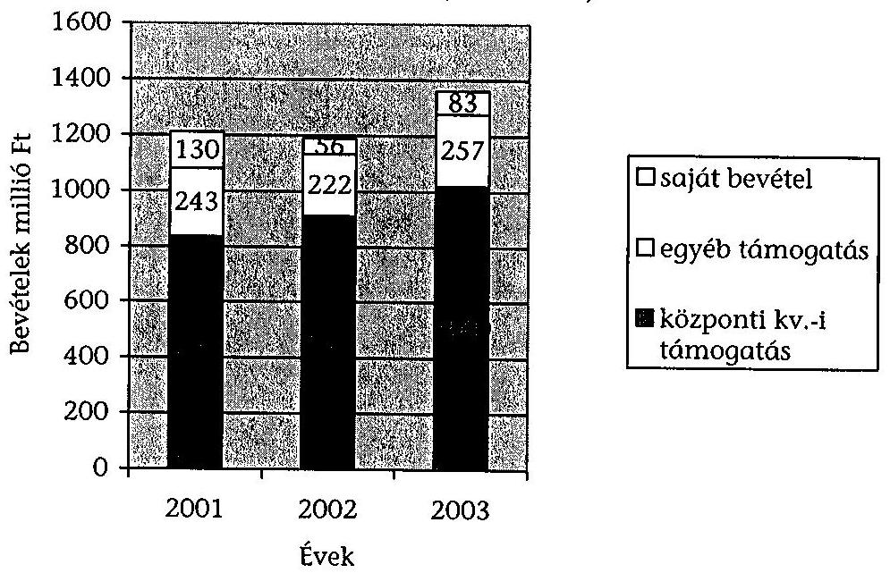

Az adatszolgáltatásban résztvevő okö-k 2001-2003 között összességében 3759 M Ft bevétellel gazdálkodtak. A bevételek 2002-ben 2001-hez viszonyítva 1,7%-kal csökkentek és 2003-ban 2002-höz viszonyítva 14,4%-kal növekedtek.

A vizsgált adatok szerint a 2001-2003 közötti időszakban az okö-k teljes bevételének 73,6% származott a központi költségvetésből, az egyéb támogatások

---

(anyaországi, nem közvetlenül juttatott központi költségvetési támogatások) 19,2%, a saját bevételek (bérleti díjak, reklámból, sajtótermékek értékesítéséből stb. származó bevételek) aránya 7,2% volt. A központi költségvetésből származó forrásokon belül a közvetlen támogatások 80,1%-ot, a pályázati úton kapott támogatások 19,9%-ot jelentettek. Dinamikájában is megfigyelhető volt a közvetlen támogatások részarányának növekedése, amelynek összege 2002-ben 2001-hez viszonyítva 11,7%-kal és 2003-ban 2002-höz viszonyítva 22,5%-kal emelkedett.

A bevételeken belül a központi költségvetésből közvetlenül juttatott támogatások részaránya meghatározó az okö-k gazdálkodásában. Erre vonatkozóan hiányzik az elosztási elvek objektív meghatározása, amelyek a támogatások felosztásának alapját képeznék.

A Nek tv. a rendelkezésre álló források felhasználásával kapcsolatos döntéseket az okö-k közgyűlésének hatáskörébe utalja. A közvetlenül a központi költségvetésből kapott működési célú támogatások a teljes bevételek 59%-a, amely a 2001. évi 53%-ról 2003-ra 64%-ra növekedett. A támogató (IM, ME) 2001-2003 között semmilyen megkötést nem írt elő a felhasználás céljainak vonatkozásában. A 2004. évre megkötött támogatási szerződésben (ME) a felhasználás céljaként kizárólag a működési kiadások finanszírozását jelölte meg.

# Az okö-k 2001-2003 évi ráfordításainak megoszlása (millió Ft) 

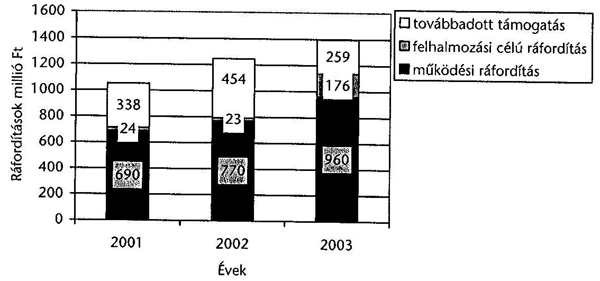

A pályázati úton vagy egyedi döntés alapján juttatott támogatások meghatározott feladat ellátásához, program megvalósításához kapcsolódtak. A vizsgált időszakban az okö-k feladatellátásukra, az általuk bonyolított programok finanszírozására, saját működésükre és tovább adott támogatásokra 3694 M Ft-t fordítottak (a 2001. évi népszámlálás adatai alapján egy nemzeti és etnikai kisebbséghez tartozó magyar állampolgárra 12 E Ft jutott).

Az okö-k könyvvezetési kötelezettségeit elrendelő az egyéb szervezetek beszámoló készítési és könyvvezetési kötelezettségére vonatkozó 224/2000. (XII. 19.) Korm. rendelet csak a tevékenység célja szerinti és a vállalkozáshoz
 kapcsolódó

---

bevételek és ráfordítások elkülönítéséről rendelkeznek, ezért a működési ráfordítások tartalmazzák a saját működés és az ellátott feladatok ráfordításait egyaránt. Az önkormányzatok tapasztalatunk szerint csak részben különítik el az önkormányzat fenntartására, (működtetés, testületi működés, önkormányzati hivatal működése) és feladataik programjaik finanszírozására (kisebbségi sajtó, rendezvények stb.) fordított költségeiket. E miatt csak részben állapítható meg, hogy a pályázati úton kapott források milyen mértékben fedezték egy-egy feladat ellátását, a központi költségvetésből közvetlenül nyújtott támogatásokból pedig mennyi ráfordítást igényelt az önkormányzati testület, hivatal működése, és mennyit az egyéb tevékenységek.

A helyszíni vizsgálatok alapján az önkormányzatok kétharmadánál a gazdálkodásra vonatkozó belső szabályozás számos hiányossággal és ellentmondással valósult meg, amelyet a korábbi ÁSZ jelentések ${ }^{11}$ is megállapítottak.

Ezek közül a legjellemzőbb a szabályzatok vagy ezek közgyűlés általi elfogadásának hiánya. A szabályzatokban az önkormányzatok tevékenységére vonatkozó sajátosságokat az időközben bekövetkezett változásokat nem vezették át. A gazdálkodásra vonatkozó szabályozásban a jogszabályi ellentmondások miatt keverednek a költségvetési szervekre és az egyéb szervezetekre vonatkozó előírások, fogalmak. A gazdálkodásra vonatkozó belső szabályozás kialakításánál az önkormányzatok szakmai támogatást, iránymutatást, segítséget a szabályozás egységesítése, a jogszabályi előírásoknak való megfelelése szempontjából a nemzeti és etnikai szervezetek támogatásának koordinálásával megbízott szervezetek részéről nem kaptak.

Az önkormányzatok elkészítették éves számviteli beszámolóikat, amelyeket a közgyűlés elfogadott. Számviteli nyilvántartásaik vezetése szempontjából az önkormányzatok között jelentős különbség mutatkozott. A jogszabály lehetővé teszi számukra értékhatároktól függően az egyszeres vagy kettős könyvvitel vezetését. Ennek megfelelően a helyszíni vizsgálatba vont önkormányzatok közül a BOÖ egyszeres, a többi kettős könyvvezetést alkalmazott. A 224/2000. (XII. 19.) Korm. rendelet csak a vállalkozási tevékenységhez igazodóan ír elő kötelező könyvvizsgálatot. Az ellenőrzött önkormányzatok közül, közgyűlési döntés alapján, a SZOÖ, OCÖ, MNOÖ beszámolóját auditálták. Az OCÖ esetében a könyvvizsgáló a 2002. és 2003. évi számviteli beszámolókat korlátozó záradékkal látta el.

2003-ban ennek indoka a belső szabályozottság, szervezeti működésbeli, a képviselők tiszteletdíjának és költségtérítésének elszámolásbeli, a határozatok tára vezetésének hiányosságai, valamint az OCÖ által alapított és tulajdonolt társaságok mérlegeinek elutasító, illetve korlátozó záradékkal történt auditálása volt. A 2002. évi beszámoló esetében megfogalmazott kifogásokat a 2003. évi beszámoló elfogadásáig nem javították ki. Az OCÖ a 2001., 2002., 2003. éveket egyaránt veszteséggel zárta, aminek eredményeként, teljes vagyonvesztés következett be és a 2003. év végére sajátőke összege -2814 E Ft lett. Az ÁSZ az OCÖ gazdálkodásában tapasztalt hiányosságok miatt 2004-ben feljelentést tett. ${ }^{12}$

[^0]
[^0]:    ${ }^{11} 0201$ Jelentés az országos kisebbségi önkormányzatok pénzügyi gazdasági tevékenységének vizsgálatáról (2002. január)
    ${ }^{12} 0406$ Jelentés az Országos Cigány Önkormányzat pénzügyi-gazdasági tevékenységének ellenőrzéséről (2004. március)

---

A pályázati úton kapott támogatások elszámoltatása számszakilag megtörtént, de a felhasználás eredményességére, hatékonyságára, gazdaságosságára vonatkozó értékelést nem tartalmazott.

Az önkormányzatoknál, a források felhasználásának ellenőrzése csak részlegesen megoldott. Az SZMSZ-ekben meghatározott pénzügyi ellenőrző bizottságok a 6 önkormányzatból 4-nél nem működtek. Ahol működött ott is szakmai és egyéb okok miatt feladatát csak részlegesen tudta ellátni. A számviteli beszámolók auditálása belső ellenőrzés kialakítása nem kötelező, a finanszírozó részéről a beszámoltatás és elszámoltatás csak részlegesen, és formálisan valósult meg. A felhasznált források legnagyobb része, közpénz, ezért a nyilvánosság szerepének erősítését, a közpénzek felhasználásával, a köztulajdon használatának nyilvánosságával, átláthatóbbá tételével és ellenőrzésének bővítésével összefüggő egyes törvények módosításáról szóló 2003. évi XXIV. törvény előírásai is indokolják.

Két önkormányzatnál volt ebbe az irányba elmozdulás, az OHŐ és MNOO saját nemzetiségi sajtójában, és a MNOO internetes honlapján is közzéteszi a gazdálkodására vonatkozó fontosabb adatokat.

Tevékenységeiknek finanszírozására rendelkezésre álló források közül a központi költségvetésből közvetlenül kapott egyéb működési célú támogatások egy része, és a saját bevételek azok, melyeknek terhére saját hatáskörben meghatározhatják és kialakíthatják támogatási rendszerüket.

Megállapításaink szerint az önkormányzatok általában nem dolgoztak ki a támogatások nyújtásához pályáztatási feltételrendszert, ehhez kapcsolódó döntés előkészítési, nyilvántartási mechanizmust, monitoring rendszert, részlegesen szabályozták támogatási tevékenységüket. A felhasználáshoz hatékonysági, eredményességi kritériumokat nem rendeltek, nem értékelték a támogatásként nyújtott összegek kisebbségi feladatnak megfelelő hasznosítását, a feladatellátás eredményességét. Egyes esetekben nem került sor szerződéskötésre.

A teljes vizsgált időszakban az önkormányzatok az általuk alapított kisebbségi feladatokat ellátó szervezetek, a nemzeti és etnikai kisebbséghez tartozó civil szervezetek, helyi kisebbségi önkormányzatok részére 1051 M Ft támogatást nyújtottak, ami az összes bevétel 27,9 %-a, teljes ráfordítások 28 %-a volt. A továbbadott támogatás 2001-ben 338 M Ft, 2002-ben 454 M Ft, 2003-ban 259 M Ft volt. A továbbadott támogatások összege megközelítőleg a saját bevételek (nemzetiségi újság értékesítése, ingatlan bérleti díjak, értékpapír értékesítés stb.) és az egyéb támogatások összegével megegyező. Igen eltérő összegű (4,3 M Ft UOÓ és 731 M Ft MNOO) és célú támogatásokat nyújtottak. A továbbadott támogatások mintegy kétharmadára az egyedi kérelmek és döntések voltak a jellemzőek, és a döntéshozatal szakmai előkészítettsége sem volt kellően megalapozott.

Többségében a támogatások jóváhagyása közgyűlési hatáskörben történt, de volt példa arra is BOO, OCÖ esetében, amikor a döntést - az SZMSZ előírásaival ellentétesen - az elnökség vagy az elnök hozta meg. A támogatási célok sokrétűek voltak, szerepeltek közte a saját alapítású, fenntartású kisebbségi intézmények, a helyi kisebbségi önkormányzatok, kisebbségi civil szervezetek, egyházak vagy akár magánszemélyek szociális támogatásai is. Az OCÖ úgy nyújtott szociális támogatásokat, valamint roma civil szervezetek számára támogatást, hogy az

---

esetek többségében a döntéseket az elnök hozta, támogatási szerződés nem készült és a támogatást a magánszemélyek, vagy a civil szervezetek képviseletében magánszemélyek kapták, és esetek legnagyobb részében nem számoltak el a kapott támogatásokkal. Ez adózási szempontból is aggályos, a helyszíni vizsgálat lezárásának időpontjában a kérdést az APEH vizsgálta. A BOÖ 8 esetben nyújtott úgy támogatást civil szervezetek, magyarországi bolgár egyházközség részére hogy nem készült támogatási szerződés sem. A SZOÖ az adott támogatásokról nem készít kimutatást, nem kért elszámolást. A támogatási rendszer közzététele, az eredmények nyilvánosságra hozatala, is az OHO, MNOO, OSZkÖ kivételével megoldatlan volt.

A helyszínen vizsgált önkormányzatok által működtetett támogatási rendszerről megállapítható, hogy az esetek közel 70%-ban, nem kellőképpen szabályozott, átlátható, nyilvános, nem kapcsolódott hozzá megfelelő monitoring, a feladatellátás eredményességét mérő kritérium rendszer, az ellenőrzés részleges, nem került kiértékelésre a felhasznált összegek kisebbségi feladatnak megfelelő felhasználása és ennek eredményessége, hatékonysága.

# 2.4. Az elvégzett szakmai feladatok, ráfordítások összhangja 

Eltérő az egyes önkormányzatok részéről megvalósított feladatellátás, valamint a kezelésükben lévő, vagy alapításukkal működő kisebbségi közösségi jogok gyakorlását támogató intézményhálózat szerkezete működésének eredményessége. Az intézmények (iskolák, kulturális, kutatási, szociális intézmények stb.) átvétele jelentős szakmai kihívást jelent önkormányzatok számára. Az önkormányzatok kétharmadánál kevésbé érvényesült a kisebbségi civil szervezetek, helyi kisebbségi önkormányzatok javaslataira támaszkodó tervszerű építkező munka.

A feladatellátás biztosítására az OCÖ, BOÖ, OHÖ, OSZkÖ, kht.-t, a MNOÖ kft.-t alapított. Emellett a MNOÖ, OHÖ, OSZkÖ, OCÖ különböző intézményeket, alapítványokat is létrehozott a nemzetiségi oktatási, kutatási, művelődési tevékenység elősegítésére. A MNOÖ, OHÖ, OSZkÖ sikeresen tudta megvalósítani néhány intézmény átvételét. Az OCÖ ugyanakkor az általa alapított és felügyelt intézmények esetében nem tudta biztosítani ezek hatékony működtetését, mindegyik esetében szükségessé vált a gazdálkodási és vagyoni helyzet rendezése.

Az elvégzett feladatok összetettsége, nagyságrendje, az önkormányzat és a hivatalon belül működő juttatási és javadalmazási feltételrendszer, számottevően befolyásolták a működési költségeket, és jelentős differenciálódást eredményeztek.

---

# Az önkormányzatok működési célú ráfordításainak alakulása (millió Ft) 

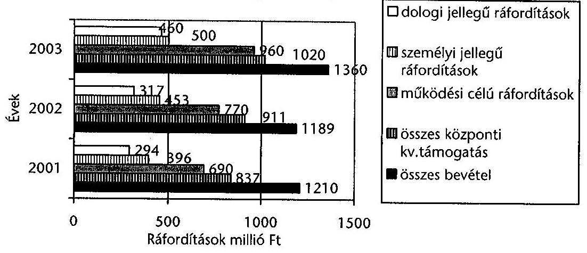

A vizsgált időszakban az önkormányzatok működési célú ráfordításainak összege 2420 M Ft az összes bevétel 64,4 %-a volt. A személyi jellegű ráfordítások 1 350 M Ft 55,8%, dologi ráfordítások 1071 M Ft 44,2% volt. A működési célú ráfordítások a központi költségvetésből közvetlenül kapott támogatások 87,5%-a volt. Dinamikájában a működési célú ráfordítások 2001-ről 2002-re 11,7%-kal, 2003-ban 2002-höz viszonyítva 24,6 %-kal növekedtek. Ezen belül a személyi ráfordítások növekedési üteme, azonos időszakokra 14,4% és 10,3%, a dologi ráfordítások növekedési üteme 8% és 45% volt. A működési költségeken belül meghatározók voltak a testületek és a hivatalok működési költségei. Legfontosabb elemei a nagy létszámú testületek tagjainak költségtérítése, tiszteletdíja, a testületi vezetők munkabére és járulékai, a hivatalok munkatársainak munkabére és járulékai, a külső szakértők megbízási díjai, a hivatalok működésének dologi költségei.

A vizsgált időszak három éve alatt a SZOÖ működési kiadásai 13183 E Ft-tal, az OSZkÖ működési kiadásai 2487 E Ft-tal (a Szlovák Közművelődési Központ és a Dokumentációs Központ irodáinak kialakítási költségei miatt) meghaladták a központi költségvetésből közvetlenül kapott egyéb működési célú támogatások, kiadások jogcímen kapott források összegét.

A BOÖ a 2001. és 2002. években a központi költségvetésből közvetlenül kapott működési célú támogatásokat egészében saját működésére fordította, míg 2003-ban ez az arány 76,2 %-ra csökkent.

Az OCÖ a vizsgált időszakban saját bevételeinek 60,7%-át (499 M Ft) fordította saját tevékenysége működési költségeinek finanszírozására. A központi költségvetésből közvetlenül kapott működési célú támogatásokból 2001-ben 85,4%, 2002-ben 81,6 %, 2003-ban 93,1 % volt működés ráfordítása. 2003-tól az OCÖ-nél az önkormányzati képviselők díjazásukat a költségtérítés (gépkocsi és mobil telefon használat) mellett tiszteletdíj vagy munkabér formájában is kérhették. Ugyanakkor a képviselők a költségtérítés mellett jelentős összegben belföldi kiküldetési költségeket is elszámoltak.

A helyszíni vizsgálatba bevont önkormányzatok kétharmada, a hivatal szervezeti felépítését, létszámát, a feladatok, felelősségek meghatározását tartalmazó szervezeti működési szabályzatot nem készítette el. A munkavállalók munkaköri leírásait nem,

---

vagy nem a konkrét feladatellátáshoz igazodóan készítették el, vagy nem aktualizálták a feladatok változásaival összhangban.

Az adatszolgáltatásban részvett önkormányzatok a különböző feladatok ellátására részmunkaidőben és megbízásos jogviszonyban is jelentős számban foglalkoztattak külsős partnereket. A foglalkoztatottak száma 2001-ről 2003-ra 36,2%-kal, ezen belül a főmunkaidőben foglalkoztatottaké 40 %-kal növekedett, a részmunkaidőben foglalkoztatottak száma ugyanakkor 20,8 %-kal csökkent, a megbízásos jogviszonyban foglalkoztatottak száma átlagosan 19 %-kal növekedett. A tiszteletdíjban részesült tisztségviselők száma ugyanebben az időszakban 77,8 %-kal növekedett 2002-ről 2003-ra az önkormányzati választásokat követően.

A helyszíni ellenőrzés megállapította, hogy az önkormányzatok működésük, szervezeti felépítésük, gazdálkodásuk, feladatellátásuk és az ehhez szükséges ráfordítások, erőforrás felhasználásának összhangját, hatékonyságát nem értékelték, erre vonatkozó elemzéseket nem készítettek, az egyes tevékenységekhez hatékonysági mutatókat nem rendeltek. Nem dolgozták ki, az egyes tevékenységek eredményességének mérését. Ehhez hozzájárult az is, hogy a kapott költségvetési támogatásoknál a felhasználásra vonatkozóan a támogatók sem határoztak meg teljesítmény alapú kritériumokat a hatékonyság, gazdaságosság, eredményesség vonatkozásában. E miatt az önkormányzatok támogatási rendszerének értékelésénél a felhasznált pénzforrások eredményességére vonatkozó következtetések nem vonhatóak le.

A Nek tv. 62 § (3) bekezdés előírja, hogy a Kormány kétévente legalább egy alkalommal áttekinti a kisebbségek helyzetét és arról az OGY-nek beszámol. A NEKH koordinálásával elkészült beszámolók a támogatási rendszer működésének kiértékelését az önkormányzatok
 vonatkozásában nem tartalmazzák, más a támogatási rendszer eredményességét vizsgáló értékelés nem készült.

Az interjúkra kapott válaszok alapján ököl-ök pozitívan értékelik a finanszírozásra fordítható források növekedését, a szaktárcák és a koordinációt biztosító szervezetek részéről nyújtott támogatást. A jelenlegi támogatási rendszert túl bonyolultnak, bürokratikusnak, nehezen átláthatónak, fölösleges energiákat lekötőnek tartják. Az egyes tárcák pályázati kiírásai azonos feladatellátás esetén is eltérnek egymástól, bonyolultak a nyomtatványok, nem egységes az elszámolási rend, gyakran van többcsatornás, keresztbe finanszírozás egy feladat, program esetében. A döntésre és a finanszírozásra egyes esetekben a rendezvény megtartása után kerül sor. A különböző célokra történő forrás felosztás nem feladatarányos. Legfontosabb megoldandó kérdésnek a feladatarányos támogatási rendszer, az írott kisebbségi sajtó normatív jellegű támogatásának kialakítását, a kisebbségi intézmények finanszírozásának állami költségvetésben történő fejezeti nevesítését, a kisebbségi civil szervezetek szerepének erősítését, és finanszírozásuk kiszámítható biztonságos rendezését tartják. Problematikusnak ítélik a működtetett intézmények finanszírozásának jelenlegi rendszerét, a finanszírozási források tervezhetősége kiszámíthatósága szempontjából.

A vizsgálat tapasztalatai szerint a gazdálkodás szabályozásának egységesítése, a jogszabályi ellentmondások feloldása, a kapott támogatások elosztási rendszere átláthatóságának, koordinálásának javítása, a rendszer sajátosságait figyelembevevő monitoring rendszer kialakítását indokoltnak tartjuk. A Nek tv. folyamatban lévő módosítása kapcsán az általunk észrevételezett az ököl-ök gazdálkodására vonatkozó jogszabályi ellentmondások jelentős része megoldódhat.

---

# 3. A TÁMOGATÁSOK VÉGSŐ FELHASZNÁLÓINAK ELLENŐRZÉSE 

A támogatást felhasználók a Nek tv.-ben meghatározott céloknak megfelelő alapító okirattal, illetve az előírt bejegyzéssel rendelkeztek. A helyi kisebbségi önkormányzatok (hkö) mindössze 25%-a kötött a települési önkormányzattal együttműködési megállapodást. Szervezeti és működési szabályzatot a vizsgált 24 szervezet közül 2 (Pályaorientációs Alapítvány Rabindranath Tagore Tanoda, Kékcse CKÖ) nem készített.

A helyszíni ellenőrzésbe vont támogatásoknál általános problémaként jelentkezett, hogy a jóváhagyott pénzeszközök odaítélésekor nem határozták meg az egyes projektekben az állami támogatás mértékét (támogatási intenzitás). A többcsatornás finanszírozási rendszerben a támogatást nyújtó fejezetek a támogatás odaítélése előtt - az OM és NKÖM egyes előirányzatai kivételével - általában nem egyeztettek sem a fejezeten belül, sem egymással abban a tekintetben, hogy az illető szervezet milyen más állami forrást használ fel a támogatni kívánt projekthez és van-e elszámolatlan tartozása. Ezekről az adatokról nyilatkozatot kértek ugyan a támogatottaktól, de annak valóságtartalmát nem ellenőrizték.

A civil szervezeteknek létkérdés a pályázati támogatások megszerzése, mert ezen kívül támogatottságuk vagy nagyon csekély, vagy egyáltalán nincs. Ezért ezek a pályázók többször és több helyre is pályáztak működési kiadásaik fedezetére.

A Gyerekekért SOS '90 Alapítványnál 2001. évben az OM 150 E Ft-os, az NKÖM 100 E Ft-os támogatásával, 2002. évben az NKÖM 100 E Ft-os támogatásával szerveztek cigány anyanyelvi, hagyományőrző tábort; a cigány hagyományőrző tábor megvalósítására 2003. évben 120 E Ft-ot az OM-től és 100 E Ft-ot a NKÖM-től nyert el.

A hkö-kre kevésbé volt jellemző a magas pályázati aktivitás, ugyanis a bevételeik nagy részét közvetlen állami támogatás biztosította. A hkö-ok közvetlen állami támogatásainál nem értékelték a támogatás hasznosulását.

Az ellenőrzött hkö-ok 40%-a (Mándok CKÖ, Kékcse CKÖ) szociális és foglalkoztatáspolitikai feladatok ellátására is támogatást nyújtott, amely az általános nemzeti és etnikai feladatoktól vonta el a támogatási forrásokat, s melyekre más, a felzárkóztatást és integrációt, szociális támogatást biztosító források álltak rendelkezésre.

A támogatást nyújtó hivatalok - a vizsgálati tapasztalatok alapján - helyszíni ellenőrzést ritkán végeztek, az általunk ellenőrzött 163 támogatásból, erre mindössze 1 alkalommal került sor.

A Gyerekekért SOS '90 Alapítványnál 2003. évben ellenőrizte az OM az alapítványnak juttatott támogatásai felhasználásának szabályszerűségét.

A támogatott szervezetek által elkészített pénzügyi és szakmai elszámolások, a számviteli nyilvántartások kisebb hibákat, hiányosságokat tartalmaztak.

Az állami támogatások pénzügyi elszámolása és a hozzá tartozó bizonylatok nem minden esetben voltak meg az irattárakban (pl. Országos Roma Kupa Alapítvány), vagy az ott feleltek nem feleltek meg a támogatási szerződés előírásainak (pl. Sátoraljaújhelyi Hagyományőrző Cigány Egyesület). A bizonylatok hiányát egy esetben az okozta, hogy az egyetlen eredeti példányt elküldték a támogatás elszámolásakor.

Súlyosabb szabálytalanságok miatt két esetben (Mándok CKÖ, Pályaorientációs Alapítvány Rabindranath Tagore Tanoda) a számvevői jelentés felelősségi záradékkal zárult.

A Pályaorientációs Alapítvány nem rendelkezik számviteli szabályzatokkal, 2001-ben és 2002-ben nem zárta le a naplófőkönyvét, 2003. IV. negyedévétől a helyszíni ellenőrzésig a gazdasági műveletek könyvelését nem végezték el, és nem készítette el az éves beszámolót és a közhasznúsági jelentést.

Az Alapítvány leltárából - a nyilvántartások hiányossága miatt nem pontosan megállapítható, de - legalább 100 E Ft értékű eszköz hiányzik, melynek eltulajdonításáról az Alapítvány képviselője tudott, feljelentést mégsem tett.

Mándoki CKÖ-nál végzett ellenőrzés tapasztalatai szerint a pályázati cél egy pályázat esetében sem valósult meg teljes körűen. A kedvezményes vetőmag és vetőburgonya pályázaton minden évben több mint 100 család részére adtak vetőmag egységcsomagokat, de a helyszíni ellenőrzés alkalmával megállapításra került, hogy csak a cigány családok 15,7%-ánál használták fel eredményesen a vetőmagvakat.

A megélhetési pályázat keretében támogatott meggyfaültetvény telepítés nem valósult meg a pályázatban megjelölt földterületen. A programban résztvevő 40 család közül 3 családnál ültették el a meggyfákat - a pályázatban megjelölt földterület helyett - a saját tulajdonú házi kertekbe, azonban a támogató részéről ilyen irányú szerződésmódosítással, írásbeli engedéllyel nem rendelkeztek. A jogosulatlanul igénybe vett támogatás összege 647,5 E Ft volt.

A közösségi ház eszközbeszerzéseire juttatott pályázati összegből beszerzett eszközök nem szolgálják a kisebbségi lakosság érdekeit, miután azok az önkormányzat elnökének lakásán vannak.

Az ellenőrzési rendszer nem zárja ki, hogy a támogatottak ugyanazt a bizonylatot több elszámoláshoz is felhasználhatták, és fel is használták (Hodászi Görög Katolikus Cigány Egyházközség, Nikolaus Lenau Közművelődési Egyesület, Magyarországi Szlovének Szövetsége), mert az eredeti bizonylatokra nem írták rá - még ha erre a szerződés kötelezi is őket -, hogy azt valamely állami támogatás igénybe vételéhez felhasználták. Utólagos ellenőrzést csak az Állami Számvevőszék végezett, és talált példát ilyen visszaélésre $^{13}$. Jelen ellenőrzésünk a támogatási összeg elszámolásának helyesbítését, ennek hiányában a jogosulatlanul igénybe vett támogatás visszafizetését kezdeményezte.

[^0]
[^0]:    $^{13}$ 0406 Jelentés az Országos Cigány Önkormányzat pénzügyi-gazdasági tevékenységének ellenőrzéséről (2004. március)

---

# Jogosulatlanul igénybe vett támogatások 

| Szervezet neve | Kétszer   felhasznált szám-   lák   darab-   száma | Jogosulatlanul igénybe vett támogatás mértéke | Év | Támogató szervezet és keret |
| :--: | :--: | :--: | :--: | :--: |
| Hodászi Görög   Katolikus Ci-   gány Egyház-   község | 2 db | 776,5 E Ft | 2003 | MeH Koordinációs és intervenciós keret MeH Egyházi Kulturális Alap |
| Nikolaus Lenau   Közművelődési   Egyesület | 4 db | 141,8 E Ft | 2002 | NKÖM Országos hatáskörű Kulturális szervezetek támogatása   OM Országos szövetségek, társaságok és egyesületek támogatása |
| Magyarországi Szlovének Szövetsége | 1 db | 19,7 E Ft | 2001 | NKÖM Magyarországi nemzeti, etnikai kisebbségi kulturális feladatok támogatása   MNEKK |

A támogatásokat - a Mándoki CKÖ kivételével - a támogatási szerződésben meghatározott céloknak megfelelően használták fel. Egy esetben a célszerű felhasználás ellenére sem volt eredményes a támogatás, mert a támogatásból megkezdett beruházás 3 év eltelte után sem fejeződött be.

Kiscsécs és Girincs községek óvodai nevelési iskolai oktatási nevelési feladatait intézményfenntartói társulás keretében Girincs község látta el, melynek bővítéséhez Kiscsécs Önkormányzata a tulajdonában lévő épület felújításával tag óvodát kívánt létrehozni. Az épület felújítási munkáit az Igazságügyi Minisztérium Kisebbségi Intervenciós keretéből 2001-ben nyújtott 3000 E Ft , egyedi támogatás felhasználásával elvégezték. Források hiányában az épület épületgépészeti és belsőépítészeti munkái nem készültek el, ezért az épületben a tag óvoda nem működik.

Egy esetben a támogatás bizonylatainak ellenőrzését megakadályozta, hogy a támogatott költségvetési szervet fenntartó önkormányzatnál folyó bírósági eljárás keretében az iratok egy részét lefoglalták, és ugyanezzel kapcsolatosan a megvalósított beruházás építésügyi szakértői véleménye még nem készült el.

Az IM Kisebbségi Intervenciós keretből 2001-ben egyedi elbírálás alapján 2658 E Ft támogatást nyújtott a Szendrőládi Napközi Otthonos Óvoda és Általános Iskola központi épületében két foglalkoztató kialakítására, amelyeket használatba vételi engedély nélkül is használatba vettek 2001-ben. Az akkori polgármester ellen 2002-ben indított rendőrségi eljárás során a beruházásra vonatkozó bizonylatokat és egyéb okiratokat foglalt le, amelyek egy része nem került vissza, a rendőrség az ügyészségre továbbította. A rendőrségi eljárás során építési igazságügyi szakértőt is felkért a beruházás lebonyolításának és a kivitelezés minőségének ellenőrzésére.

A hkö-k feladattól függetlenül egyforma mértékű, közvetlen állami támogatásban részesülnek, emiatt a támogatás nem feladatarányos, nincs összhangban az ellátandó feladatok nagyságával. A nagyobb lélekszámú kisebbséget képviselő hkö-k nagy mértékben függenek a települési önkormányzattól, és az adminisztrációjuk működtetéséhez is pályázati úton kell forrást szerezzenek.

# 4. A KORÁBBI SZÁMVEVŐSZÉKI ELLENŐRZÉSEK HASZNOSULÁSA 

Az Állami Számvevőszék 2001-2002-ben vizsgálta a 13 okö gazdálkodását. A feltárt hiányosságok megszüntetésére javaslatokat fogalmaztak meg a Kormány és az egyes okö-k részére. A jelen vizsgálatunk alapján megállapítottuk, hogy korábban a Kormány részére megfogalmazott javaslatok nem valósultak meg. Az okö-k részére tett javaslatok a következők szerint hasznosultak: az OHO, OSZkÖ MNOÖ intézkedési tervet készített, ezt a közgyűlés megvitatta, jóváhagyta. A helyszíni ellenőrzés befejezéséig a BOO, OCO, SZOÖ nem készített a hiányosságok felszámolására intézkedési tervet, de a BOO a javaslatok alapján a feltárt hiányosságok egy részét kiküszöbölte.

Az Állami Számvevőszék 2003 novemberében lezárt újabb helyszíni vizsgálat keretében ellenőrizte az OCÓ pénzügyi gazdasági tevékenységét. Ennek eredményeként számos, a szabályozást, gazdálkodást, pénzügyi fegyelmet érintő hiányosságot állapított meg. Javaslatait 18 pontban fogalmazta meg, és a pályázati támogatások jogtalan igénybevétele, valamint a számviteli fegyelem megsértése miatt ismeretlen tettes ellen feljelentést tett.

Az OCÖ Közgyűlése az Állami Számvevőszék ellenőrzési jelentését nem vitatta meg, a feltárt hiányosságok megszüntetésére a közgyűlés által elfogadott intézkedési tervet nem dolgozott ki, a javaslatokat a gyakorlatban nem, vagy csak igen kis mértékben hasznosította.

Jelen vizsgálatunk megállapította, hogy a nemzeti és etnikai kisebbségek támogatási rendszerében közreműködő különböző szervezeteknél végzett korábbi ÁSZ ellenőrzések során feltárt hiányosságok jelentős része továbbra is fennáll, javaslataink csak részben hasznosultak.

Budapest, 2005. január " 25 "

Melléklet: $\quad 7 \mathrm{db} \quad 8$ lap
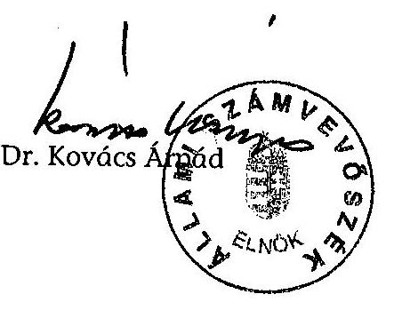

---

# A jelentésre tett észrevételek 

Belügyminisztérium
Oktatási Minisztérium
Igazságügyi Minisztérium
Ifjúsági, Családügyi, Szociális, és Esélyegyenlőségi Minisztérium
Miniszterelnöki Hivatal
Nemzeti Kulturális Örökség Minisztériuma

---

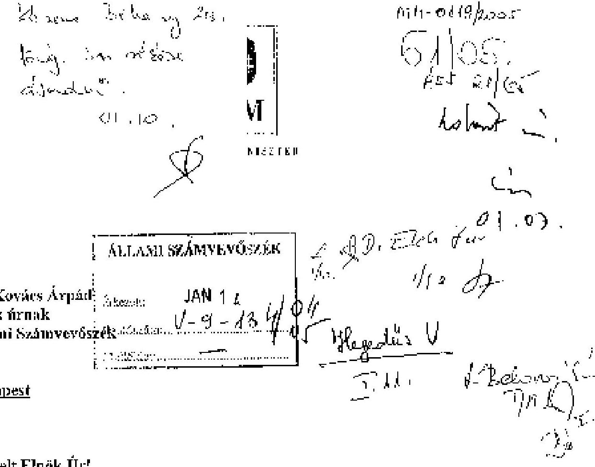

Tisztelt Főnök Úr!
Köszönettel veszem a magyarországi nemzeti és etnikai kisebbségek támogatási rendszerének ellenőrzéséről készült jelentés megküldését, az abban foglalt észrevételekkel maradéktalanul egyetértek.

A Kormány programjának fontos eleme a magyarországi nemzeti és etnikai kisebbségek támogatási rendszerének hatékony működtetése, a támogatások felhasználásának ellenőrzése, amely a helyi kisebbségi önkormányzatok tekintetében fokozottan indokolt.

Az elmúlt időszak hatékony együttműködését továbbra is fenntartva, a jövőben is várom az ellenőrzések során tapasztalt észrevételeiket és javaslataikat, amelyek segítik a gazdálkodás szempontjából hatékonyabb szakmai tevékenységet.
 hiszen ez mindannyiunk közös érdeke.

Budapest, 2004. december 31.

Üdvözlettel:
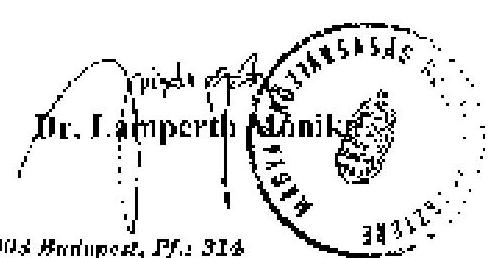

---

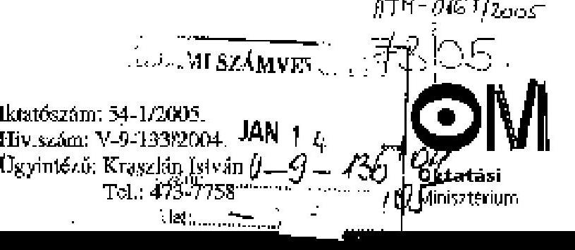

Dr. Kovács Árpád elnök úr
Állami Számvevőszék
Budapest

Tisztelt Elnök Úr!
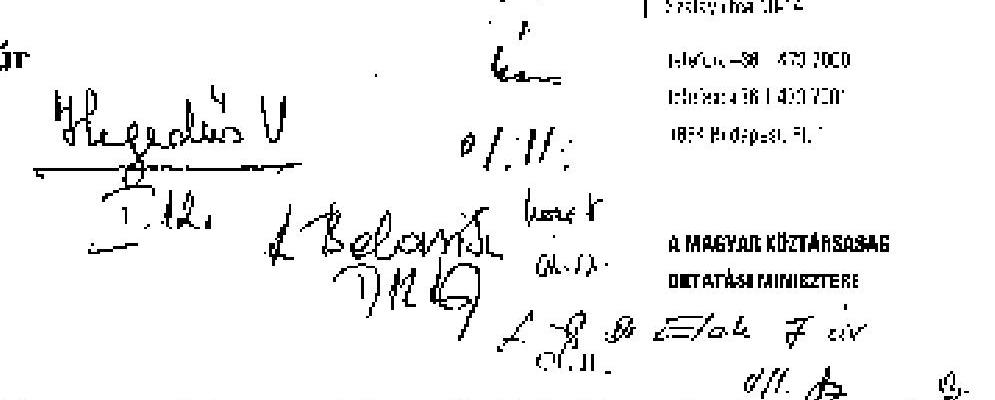

Kísérőlevelével megkaptuk a Magyarország nemzeti és etnikai kisebbségek támogatási rendszerének ellenőrzéséről megküldött végleges ÁSZ jelentést, az abban foglaltakra válaszolva az alábbiakról tájékoztatom:
Miután a jelentés tervezeteinek szakértői egyeztetése során tárcánkkal a megfelelő egyeztetések megtörténtek és a legutóbbi tervezethez már külön észrevételt nem is tettünk, a végleges jelentést elfogadjuk.
Jelezni szeretném, hogy az Önök által is említett igen sok hiányosságot felszínre hozó OCO ÁSZ jelentés kapcsán közvetlenül fordultunk az önkormányzat elnökéhez, de sajnos többszöri megkeresésünkre sem érkezett arra válasz.
Meg szeretném említeni azt is, hogy az ellenőrzési jelentés 46. oldalának utolsó bekezdésében említést tesznek arról is, hogy a Nikolaus Lenau Közművelődési Egyesületnél jogosulatlan kettős elszámolás vonatkozásában közvetlen ÁSZ intézkedést tettek, de az anyagból nem derül ki, hogy milyen formában.
Tisztelt Elnök Úr!
A tárca intézkedéseiről a megadott határidőre megküldjük tájékoztatásunkat.

Budapest, 2005. január  

Tisztelettel:
Dr. Magyar Bálint

---

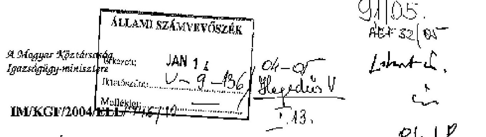

Kovács Árpád úr
elnök
Állami Számvevőszék

Budapest

Hiv. szám:V-9-133/2004

Tisztelt Elnök Úr!

Hivatkozott számú levelére tájékoztatom, hogy a magyarországi nemzeti és etnikai kisebbségek támogatási rendszerének ellenőrzéséről készített jelentéssel kapcsolatban észrevételt nem teszünk.

A XIV. Igazságügyi Minisztérium fejezetre vonatkozó megállapítások intézkedési terv készítését nem indokolják.

Kérem tájékoztatásom szíves elfogadását.

Budapest 2005. január 5.

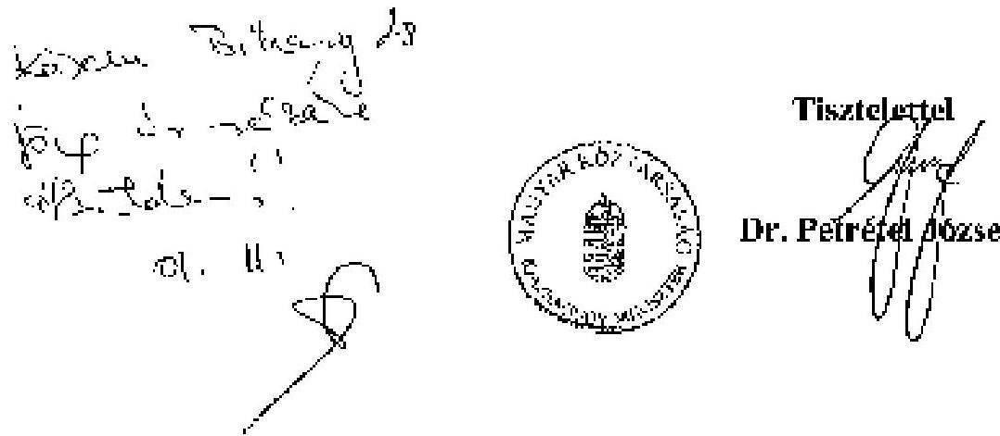

---

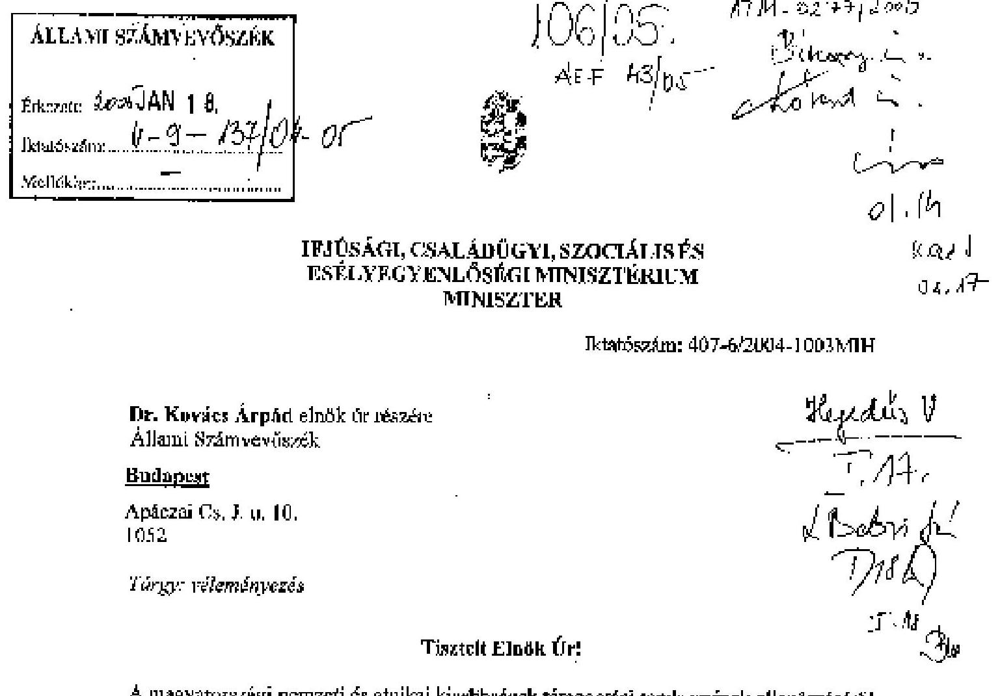

# Tisztelt Elnök Úr!

A magyarországi nemzeti és etnikai kisebbségek támogatási rendszerének ellenőrzéséről készített jelentés megállapításaira észrevételt nem teszek.

Az ellenőrzés kapcsán a Kormánynak tett javaslataik megvalósítására kidolgozzuk a szükséges intézkedéseket és azokról tájékoztatjuk Önöket.

Budapest, 2005. január 10.

Tisztelettel:

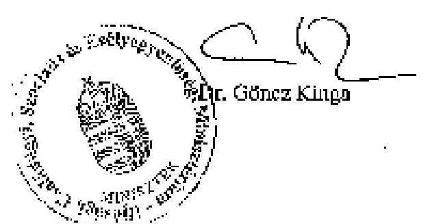

1054 BUDAPEST, VEGADO u. 6. Telefon: 235-4450, fax: 235-4576

---

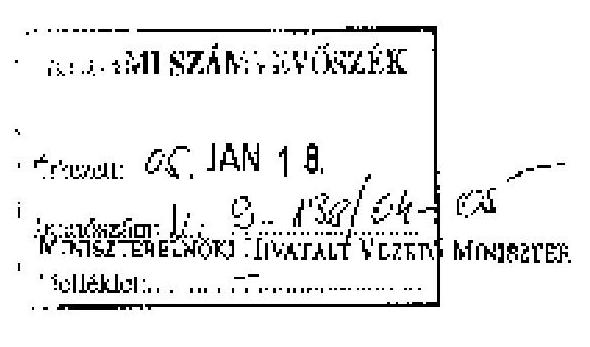

Dr. Kovács Árpád úrnak
elnök

Állami Számvevőszék
Budapest

Tisztelt Elnök Úr!

Az Állami Számvevőszéknek a magyarországi nemzeti és etnikai kisebbségek
támogatási rendszerének ellenőrzéséről készített jelentésével kapcsolatban az alábbi
észrevételeket szeretném tenni:

A kisebbségek költségvetési támogatása az Alkotmány, a nemzeti és etnikai
kisebbségek jogairól szóló 1993. évi LXXVII. törvény, továbbá más, az oktatás,
kultúra, média, stb. területét érintő jogszabályok alapján történik. A Medgyessy-
kormány programja a kormányzati kisebbségpolitika legfontosabb céljainak és
prioritásainak rögzítésével a kisebbségi támogatási stratégia fő elemeit is
meghatározta. A Gyurcsány-kormány hivatalba lépése ebben a vonatkozásban nem
jelentett változást.

A kormány az érintett kisebbségi érdekképviseleti szervezetekkel 2002-2003-
ban folytatott széles körű egyeztetést, illetve szakmai vitát után 2004. március 5-én az
Országgyűlés elé terjesztette a kisebbségi önkormányzati képviselők választásáról,
valamint a nemzeti és etnikai kisebbségekre vonatkozó egyes törvények
módosításáról szóló törvényjavaslatot, melynek hangsúlyos célja az önkormányzati
rendszer működésében tapasztalható anomáliák kiküszöbölése. A törvényjavaslat
központi eleme a kisebbségi közösségeket alkotó személyek számbavételére
alkalmas, ugyanakkor az alkotmányossági és adatvédelmi követelményeket kielégítő
névjegyzék megteremtése. A névjegyzék létrehozása lehetőséget adna arra, hogy a
kisebbségek számára biztosított jogok tényleges gyakorlását a költségvetés normatív
alapon nyújtott támogatással segítse elő.

A törvényjavaslat a jelenleginél lényegesen áttekinthetőbb rendszerben
szabályozza az országos kisebbségi önkormányzatok gazdálkodási tevékenységét.
Meghatározza a gazdálkodó tevékenység gyakorlásának szigorú törvényi korlátait, a
tartozásokért való helytállás rendjét, az önkormányzati vagyon összetételét, a
gazdálkodás biztonságáért és jogszerűségéért való felelősség rendjét, a
gazdálkodás ellenőrzésére hivatott intézmények körét. A javaslat - jelentős hiányt
pótolva - szabályozza az országos kisebbségi önkormányzatok működésének
törvényességi ellenőrzését. Ennek következtében a jövőben teljes körűen

---

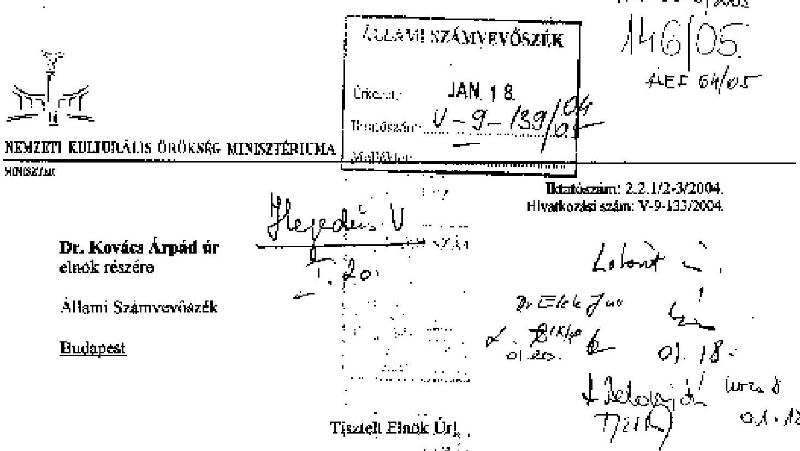

A magyarországi nemzeti és etnikai kisebbségek támogatási rendszerének ellenőrzéséről készült jelentést megkaptam, arra az Állami Számvevőszékről szóló 1989. évi XXXVIII. törvény 25. § (1) bekezdésében foglaltak alapján észrevételt nem teszek.

A Jelentés I. pontjában szereplő javaslatok megvalósítása érdekében tett minisztériumi intézkedésekről 30 napon belül tájékoztatom.

Budapest, 2005. január 14.

Tisztelettel:

Dr. Hiller István

1077 Budapest, Wesselényi utca 20-22. • Telefon: 484-7189 • Fax: 484-7140

---

2. sz. melléklet
a V-9-140/2004-05. sz. jelentéshez

A nemzeti és etnikai kisebbségek támogatásának rendszere 2004. évben (folyamatábra)

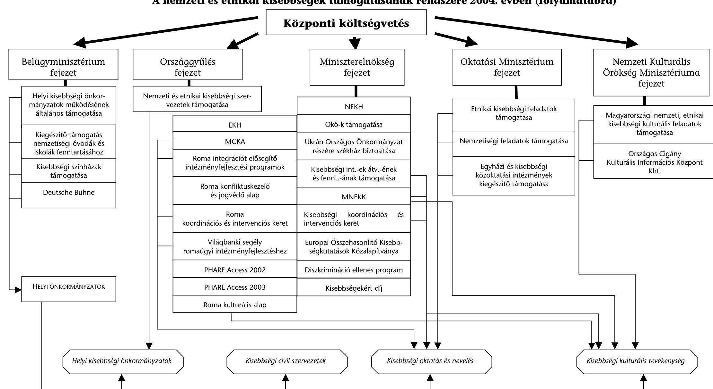

---

# A nemzeti és etnikai kisebbségi feladatokra nyújtott támogatások felhasználásának célok szerinti megoszlása a 2001. évben 

adatok E Ft-ban

| 2001. év | Önszerveződés, érdekképviselet | Oktatás | Kulturális tevékenység | Kutatás | Tömegtájékoztatás | Nemzetközi kapcsolattartás | Társadalmi integrációs feladatok | Beruházás, felújítás | Egyéb | Összesen |
| :--: | :--: | :--: | :--: | :--: | :--: | :--: | :--: | :--: | :--: | :--: |
| IM | 660829,0 | 542889,0 | 8935,0 | 0,0 | 0,0 | 0,0 | 672840,0 | 90778,0 | 92953,0 | 2069224,0 |
| ME | 0,0 | 0,0 | 0,0 | 0,0 | 0,0 | 0,0 | 0,0 | 0,0 | 0,0 | 0,0 |
| NKÖM | 35200,0 | 2300,0 | 95816,0 | 200,0 | 16314,0 | 1450,0 | 600,0 | 180,0 | 26380,0 | 178440,0 |
| OGY | 105000,0 | 0,0 | 0,0 | 0,0 | 0,0 | 0,0 | 0,0 | 0,0 | 0,0 | 105000,0 |
| OM | 87810,0 | 361430,7 | 4777,0 | 17980,0 | 0,0 | 0,0 | 1500,0 | 199000,0 | 11640,0 | 684137,7 |
| BM | 830687,0 | 5057773,0 | 95200,0 | 0,0 | 0,0 | 0,0 | 0,0 | 0,0 | 0,0 | 5983660,0 |
| Összesen | 1719526,0 | 5964392,7 | 204728,0 | 18180,0 | 16314,0 | 1450,0 | 674940,0 | 289958,0 | 130973,0 | 9020461,7 |

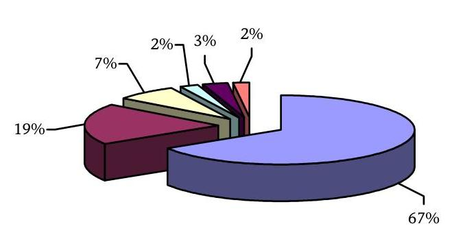
$\square$ Oktatás
$\square$ Önszerveződés
$\square$ Társadalmi integrációs feladatok
$\square$ Kulturális tevékenység
$\square$ Beruházás felújítás
$\square$ Egyéb

---

# A nemzeti és etnikai kisebbségi feladatokra nyújtott támogatások felhasználásának célok szerinti megoszlása a 2002. évben 

adatokE Ft-ban

| 2002. év | Önszerveződés, érdekképviselet | Oktatás | Kulturális tevékenység | Kutatás | Tömegtájékoztatás | Nemzetközi kapcsolattartás | Társadalmi integrációs feladatok | Beruházás, felújítás | Egyéb | Összesen |
| :--: | :--: | :--: | :--: | :--: | :--: | :--: | :--: | :--: | :--: | :--: |
| IM | 0,0 | 0,0 | 0,0 | 0,0 | 0,0 | 0,0 | 0,0 | 0,0 | 0,0 | 0,0 |
| ME | 697300,0 | 872011,0 | 9980,0 | 62184,0 | 3250,0 | 0,0 | 689228,0 | 526693,0 | 154438,0 | 3015084,0 |
| NKÖM | 36781,0 | 600,0 | 103145,0 | 0,0 | 16870,0 | 2335,0 | 1000,0 | 0,0 | 20250,0 | 180981,0 |
| OGY | 110000,0 | 0,0 | 0,0 | 0,0 | 0,0 | 0,0 | 0,0 | 0,0 | 0,0 | 110000,0 |
| OM | 89900,0 | 238929,0 | 7900,0 | 14000,0 | 7100,0 | 200,0 | 179360,0 | 320600,0 | 46920,0 | 904909,0 |
| BM | 902553,0 | 5944670,0 | 100900,0 | 0,0 | 0,0 | 0,0 | 0,0 | 0,0 | 0,0 | 6948123,0 |
| IHM | 0,0 | 0,0 | 0,0 | 0,0 | 0,0 | 0,0 | 0,0 | 0,0 | 0,0 | 0,0 |
| Összesen | 1836534,0 | 7056210,0 | 221925,0 | 76184,0 | 27220,0 | 2535,0 | 869588,0 | 847293,0 | 221608,0 | 11159097,0 |

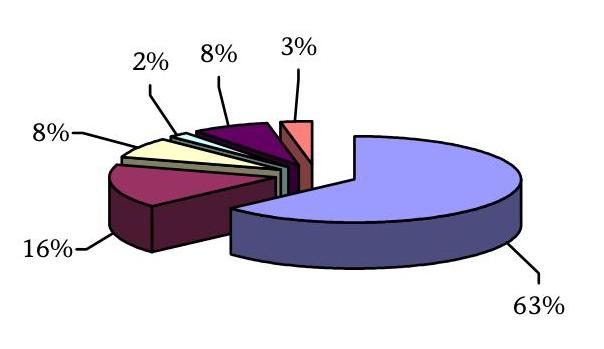

Oktatás
Önszerveződés
Társadalmi integrációs feladatok
Kulturális tevékenység
Beruházás felújítás
Egyéb

---

# A nemzeti és etnikai kisebbségi feladatokra nyújtott támogatások felhasználásának célok szerinti megoszlása a 2003. évben 

adatok E Ft-ban

| 2003. év | Önszerveződés, érdekképviselet | Oktatás | Kulturális tevékenység | Kutatás | Tömegtájékoztatás | Nemzetközi kapcsolattartás | Társadalmi integrációs feladatok | Beruházás, felújítás | Egyéb | Összesen |
| :--: | :--: | :--: | :--: | :--: | :--: | :--: | :--: | :--: | :--: | :--: |
| IM | 0,0 | 0,0 | 0,0 | 0,0 | 0,0 | 0,0 | 0,0 | 0,0 | 0,0 | 0,0 |
| ME | 870200,0 | 663932,1 | 9320,7 | 51099,4 | 12300,0 | 0,0 | 1157211,1 | 1223811,7 | 176028,3 | 4163903,3 |
| NKÖM | 35000,0 | 3966,0 | 102138,0 | 300,0 | 13110,0 | 1800,0 | 1100,0 | 0,0 | 23572,0 | 180986,0 |
| OGY | 110000,0 | 0,0 | 0,0 | 0,0 | 0,0 | 0,0 | 0,0 | 0,0 | 0,0 | 110000,0 |
| OM | 90000,0 | 842917,5 | 9345,0 | 35220,0 | 2550,0 | 10000,0 | 243269,0 | 3300,0 | 93966,0 | 1330567,5 |
| BM | 1256243,0 | 7365554,0 | 141800,0 | 0,0 | 0,0 | 0,0 | 0,0 | 0,0 | 0,0 | 8763597,0 |
| IHM | 0,0 | 0,0 | 0,0 | 0,0 | 0,0 | 0,0 | 0,0 | 300000,0 | 0,0 | 300000,0 |
| Összesen | 2361443,0 | 8876369,6 | 262603,7 | 86619,4 | 27960,0 | 11800,0 | 1401580,1 | 1527111,7 | 293566,3 | 14849053,8 |

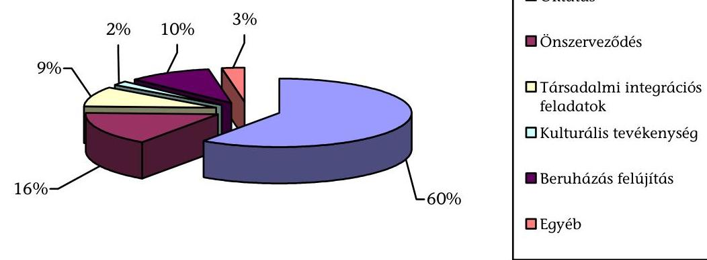

---

# A nemzeti és etnikai kisebbségi feladatokra nyújtott támogatások alakulása a felosztás módja szerint a 2001-2003. években 

| adatok E Ft-ban |  |  |  |  |
| :-- | --: | --: | --: | --: |
| 2001. év | Közvetlen támogatás | Pályázat | Pályázat aránya | Összesen |
| IM | 786324,0 | 1282900,0 | 62,00% | 2069224,0 |
| ME | 0,0 | 0,0 | - | 0,0 |
| NKÖM | 81590,0 | 96850,0 | 54,28% | 178440,0 |
| OGY | 0,0 | 105000,0 | 100,00% | 105000,0 |
| OM | 552772,0 | 131365,7 | 19,20% | 684137,7 |
| BM | 5612660,0 | 371000,0 | 6,20% | 5983660,0 |
| Összesen | 7033346,0 | 1987115,7 | 22,03% | 9020461,7 |

| 2002. év | Közvetlen támogatás | Pályázat | Pályázat aránya | Összesen |
| :-- | --: | --: | --: | --: |
| IM | 0,0 | 0,0 | - | 0,0 |
| ME | 1377184,0 | 1637900,0 | 54,32% | 3015084,0 |
| NKÖM | 77981,0 | 103000,0 | 56,91% | 180981,0 |
| OGY | 0,0 | 110000,0 | 100,00% | 110000,0 |
| OM | 792059,0 | 112850,0 | 12,47% | 904909,0 |
| BM | 6552123,0 | 396000,0 | 5,70% | 6948123,0 |
| IHM | 0,0 | 0,0 | - | 0,0 |
| Összesen | 8799347,0 | 2359750,0 | 21,15% | 11159097,0 |

| 2003. év | Közvetlen támogatás | Pályázat | Pályázat aránya | Összesen |
| :-- | --: | --: | --: | --: |
| IM | 0,0 | 0,0 | - | 0,0 |
| ME | 3849111,7 | 314791,7 | 7,56% | 4163903,3 |
| NKÖM | 77786,0 | 103200,0 | 57,02% | 180986,0 |
| OGY |

 0,0 | 110000,0 | $100,00 \%$ | 110000,0 |
| OM | 1098212,0 | 232355,5 | $17,46 \%$ | 1330567,5 |
| BM | 8343597,0 | 420000,0 | $4,79 \%$ | 8763597,0 |
| IHM | 0,0 | 300000,0 | $100,00 \%$ | 300000,0 |
| Összesen | 13368706,7 | 1480347,2 | $9,97 \%$ | 14849053,8 |

---

# Az országos kisebbségi önkormányzatok feladatonkénti forrásfelhasználása 2001-2003. években 

2001. év
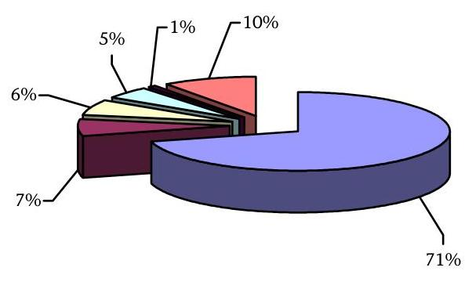
$\square$ Önszerveződés érdekképviselet, egyéb
$\square$ Oktatás, kutatás
$\square$ Kultúra
$\square$ Tömegtájékoztatás
$\square$ Nemzetközi, integrációs feladatok
$\square$ Beruházás felújítás
2002. év
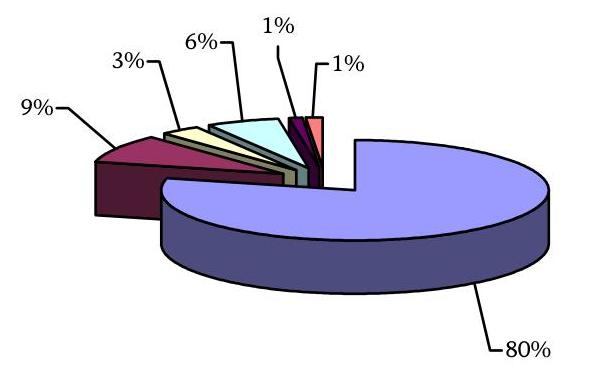
$\square$ Önszerveződés érdekképviselet, egyéb
$\square$ Oktatás, kutatás
$\square$ Kultúra
$\square$ Tömegtájékoztatás
$\square$ Nemzetközi, integrációs feladatok
$\square$ Beruházás, felújítás
2003. év
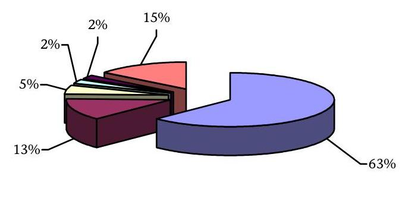
$\square$ Önszerveződés érdekképviselet, egyéb
$\square$ Oktatás, kutatás
$\square$ Kultúra
$\square$ Tömegtájékoztatás
$\square$ Nemzetközi, integrációs feladatok
$\square$ Beruházás, felújítás

