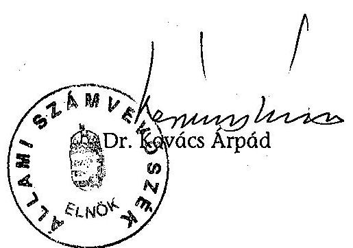
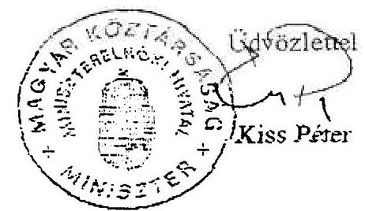
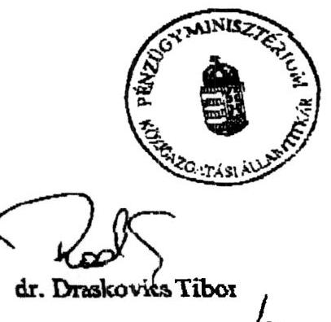
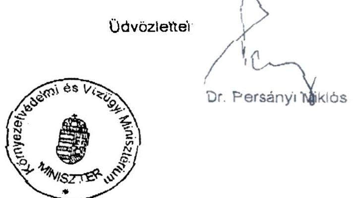
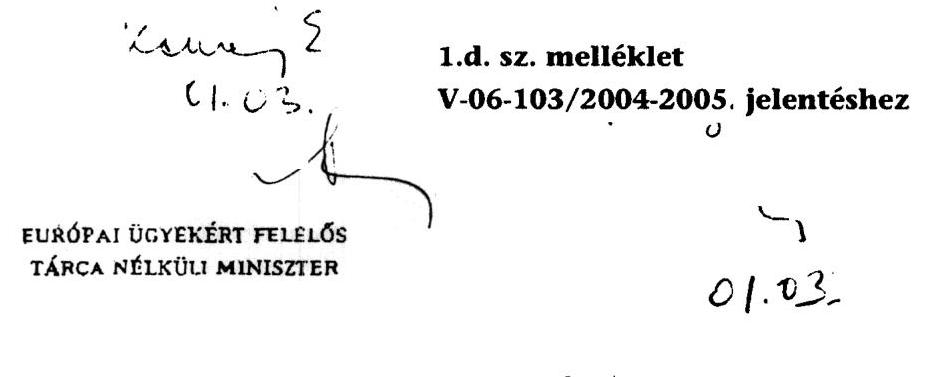
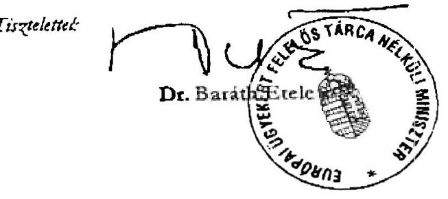
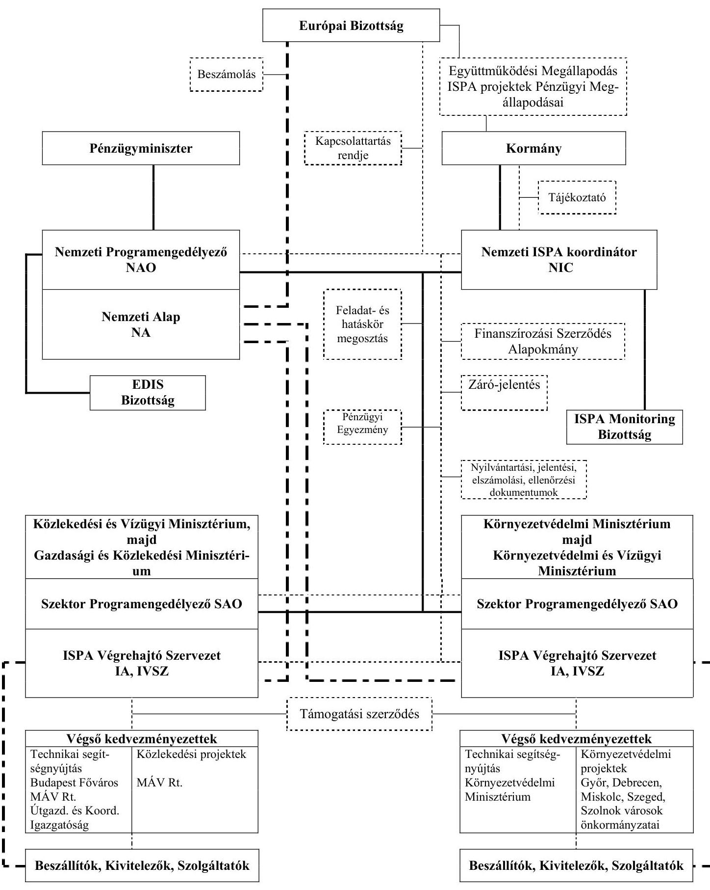

# JELENTÉS 

## az ISPA támogatásból megvalósított környezetvédelmi programok ellenőrzéséről

---

2. Államháztartás Központi Szintjét Ellenőrző Igazgatóság
2.1. Teljesítmény Ellenőrzési Főcsoport
Iktatószám: V-06-103/2004-2005.
Témaszám: 710
Vizsgálat-azonosító szám: V-0131
Az ellenőrzést felügyelte:
Bihary Zsigmond
főigazgató
Az ellenőrzés végrehajtásáért felelős:
Kemény Emil
főcsoportfőnök
Az ellenőrzést vezette:
Karsainé Dömsödi Éva
számvevő igazgatóhelyettes
Az ellenőrzést végezték:

| Bank Lajos   tanácsadó | Szepes Béla   számvevő | Dr. Zöldréti Attila   számvevő |
| :-- | :-- | :-- |
| Fekete Gábor   tanácsos | Tóthné Kiss Katalin   tanácsadó | Komáromy Attila   külső szakértő |
| Szabó Balázs   számvevő | Tukacs Éva   tanácsos | Vitányi István   külső munkatárs |

A témához kapcsolódó eddig készített számvevőszéki jelentések: címe
sorszáma
Jelentés a Környezetvédelmi és Területfejlesztési Minisztérium ..... 390
fejezet múködésének pénzügyi-gazdasági ellenőrzéséről
Jelentés a helyi önkormányzatok beruházásaihoz és ..... 0332
rekonstrukcióihoz nyújtott 2002. évi címzett és céltámogatások igénybevételének és felhasználásának vizsgálatáról
Jelentés a nemzetközi támogatások monitoring rendszerének ..... 0247
ellenőrzéséről
Jelentés a Nyugat-dunántúli környezetvédelmi beruházások ..... 0239
ellenőrzéséről
Jelentés a helyi önkormányzatok beruházásaihoz és ..... 0229
rekonstrukcióhoz nyújtott 2001. évi címzett és céltámogatások igénybevételének és felhasználásának ellenőrzéséről
Jelentés a Környezetvédelmi Minisztérium fejezet múködésének ..... 0225
ellenőrzéséről

---

Jelentés a települési önkormányzatok szilárdhulladék-gazdálkodási ..... 0221
feladatai ellátásának ellenőrzéséről
Jelentés a Szigetköz környezetvédelmi céljaira fordított források ..... 0125
felhasználásának ellenőrzéséről
Jelentés a helyi önkormányzatok beruházásaihoz és ..... 0120
rekonstrukcióihoz nyújtott 2000. évi címzett és céltámogatások igénybevételének és felhasználásának vizsgálatáról

---

# TARTALOMJEGYZÉK 

BEVEZETÉS ..... 9
I. ÖSSZEGZŐ MEGÁLLAPÍTÁSOK, KÖVETKEZTETÉSEK, JAVASLATOK ..... 11
II. RÉSZLETES MEGÁLLAPÍTÁSOK ..... 17

1. Az ISPA támogatási keret felhasználására kialakított szabályozás és intézményrendszer ..... 17
1.1. A hazai jogszabályi környezet kialakítása ..... 17
1.2. Az intézményrendszer kiépítése és szabályozottsága ..... 20
1.3. Az intézményi ellenőrzési feladatok ellátása ..... 25
1.4. Az ISPA program monitoring rendszere ..... 26
1.5. Az EDIS akkreditációs folyamat alakulása ..... 26
2. A projektek kiválasztása ..... 28
2.1. A stratégia érvényesülése a projektek kiválasztásában ..... 28
2.2. A partnerség érvényesülése ..... 31
2.3. A projektjavaslatok kiválasztása és a pályázatok előkészítése ..... 32
3. Az ISPA projektek megvalósítása ..... 36
3.1. Az ISPA támogatás igénybevételének feltételei ..... 37
3.1.1. Pénzügyi Megállapodás ..... 37
3.1.2. Támogatási Szerződés ..... 38
3.1.3. Konzorciumi Szerződés ..... 39
3.1.4. Közszolgáltatási Szerződés ..... 39
3.2. A kiválasztott projektek megvalósítása ..... 40
3.3. A megvalósításban közreműködő szervezetek együttműködése ..... 46
3.4. Az ISPA által támogatott környezetvédelmi projektek technikai előkészítését segítő programok ..... 48
4. Az ISPA által támogatott környezetvédelmi projektek pénzügyi, számviteli és ellenőrzési rendszerének kialakítása, valamint a projektek finanszírozása ..... 50
4.1. A pénzügyi és számviteli rendszerek megbízhatósága ..... 50
4.2. Az árfolyam-különbözetek és a kifizetési késedelmek elemzése ..... 58
4.3. A projektek megvalósításának pénzügyi tervezése, forrás finanszírozása ..... 60
4.4. Az ellenőrzési nyomvonal kialakítása ..... 63

---

# MELLÉKLETEK 

1.a. Miniszterelnöki Hivatalt vezető miniszter észrevétele
1.b. Pénzügyminiszter észrevétele
1.c. Környezetvédelmi és vízügyi miniszter észrevétele
1.d. Európai ügyekért felelős tárca nélküli miniszter észrevétele
2. Szabályozási kronológia
3. A környezetvédelmi ISPA Pénzügyi Megállapodások aláírása, kihirdetése és a támogatási szerződések aláírásának időpontjai
4. A főbb ISPA intézmények, kapcsolatok, dokumentumok
5. Az ISPA projektek előrehaladását gátló tényezők ok-okozati listája
6.a. A 2004. évi központi költségvetésben csak környezetvédelmi beruházás célú előirányzatok jogcímenként
6.b. A 2004. évi központi költségvetésben jelentős mértékben környezetvédelmi beruházási célú előirányzatok jogcímenként
6.c. A központi költségvetés környezetvédelmi beruházási célú előirányzatai összesítés 2001-2004. évekre
6.d. Környezetvédelmi célú tervezett kötelezettségvállalási keretösszegek 2004-2006.
7. A költség-haszon elemzések tartalmi összehasonlítása
8. A projektek dokumentációival kapcsolatos észrevételek
9. Kimutatás a központi költségvetésből az EU forrás átmeneti hiányának megelőlegezése miatt fennálló kötelezettségekről, a KvVM IVSZ nyilvántartása alapján
10. Kimutatás a központi költségvetés által az EU forrás átmeneti hiányának megelőlegezése miatt fennálló kötelezettségekről, a KvVM, mint fejezet nyilvántartása alapján
11. Kimutatás az ISPA projektek Pénzügyi Megállapodás és szerződés szerinti tender értékeinek összehasonlításáról
12. Kimutatás az EU forrás átmeneti hiánya miatt a 2000/HU/16/P/PA/005 számú ISPA projektre igénybe vett költségvetési támogatás
13. Végső kedvezményezettek ellenőrzési nyomvonal használata ISPA környezetvédelmi projektek
14. Teljesítménymutatók és a hozzátartozó kritériumok a környezetvédelmi ISPA projektek értékeléséhez

---

# RÖVIDÍTÉSEK JEGYZÉKE 

| ACQUIS | Közösségi jogi vívmányok (Acquis communautaire) |
| :--: | :--: |
| ÁFA | Általános Forgalmi Adó |
| ÁHH | Államháztartási Hivatal |
| ÁSZ | Állami Számvevőszék |
| BM | Belügyminisztérium |
| DG Regio | Regionális főigazgatóság |
| DIS | Decentralizált Végrehajtási Rendszer |
| DSAO | Helyettes Programengedélyező |
| EDIS | Kiterjesztett Decentralizációs Végrehajtási Rendszer |
| EK | Európai Közösség |
| EKKE | Európai Közbeszerzési Koordinációs és Szabályozási Egység |
| EMIR | Egységes Monitoring Informatikai Rendszer |
| EU | Európai Unió |
| FI | Fejlesztési Igazgatóság (Környezetvédelmi és Vízügyi Minisztérium) |
| FIDIC | Tanácsadó Mérnökök Szövetsége |
| FKTB | Fejlesztéspolitikai Koordinációs Tárcaközi Bizottság |
| FM | Pénzügyi Megállapodás |
| FMM | Foglalkoztatáspolitikai és Munkaügyi Minisztérium |
| FVM | Földművelésügyi és Vidékfejlesztési Minisztérium |
| GKM | Gazdasági és Közlekedési Minisztérium |
| ISPA | A csatlakozás előtti strukturális politikák támogatási eszköze |
| IT | Információ Technológia |
| IVSZ | ISPA Végrehajtó Szervezet |
| KAKSZ | Kohéziós Alap Közreműködő Szervezet |
| KEHI | Kormányzati Ellenőrzési Hivatal |
| KöM | Környezetvédelmi Minisztérium |
| KvVM | Környezetvédelmi és Vízügyi Minisztérium |
| LOT | Projekt megvalósítási egység |
| MÁK | Magyar Államkincstár |
| MeH | Miniszterelnöki Hivatal |
| MEMOR | Magyar Egységes Monitoring Rendszer |

---

| NA | Nemzeti Alap (National Fund) |
| :-- | :-- |
| NAO | Nemzeti Programengedélyező (National Athorizing   Officer) |
| NFH | Nemzeti Fejlesztési Hivatal |
| NFT | Nemzeti Fejlesztési Terv (National Development Plan) |
| NFTH | Nemzeti Fejlesztési Terv és EU Támogatások Hivatala   (NFH elődje) |
| NIC | Nemzeti ISPA Koordinátor (National Ispa Coordinator) |
| NTF | Nemzetközi Támogatások Főosztálya (Környezetvédelmi   és Vízügyi Minisztérium) |
| PM | Pénzügyminisztérium |
| PME | Projekt Menedzsment Egység |
| PRAG | Gyakorlati útmutató (Practical Guide) |
| ROP | Regionális Operatív Program |
| SAO | Szektor Programengedélyező (Sector Authorizing Officer) |
| SZMSZ | Szervezeti és Múködési Szabályzat |
| TA | Technical Assistence (Technikai segítségnyújtás) |
| TNM | Tárca Nélküli Miniszter |

---

# ÉRTELMEZŐ SZÓTÁR 

Audit trail

Beszállító

Decentralizált Végrehajtási Rendszer (DIS)

Együttmúködési Megállapodás

Egységes Monitoring Informatikai Rendszer (EMIR)

Előcsatlakozási alapok

FIDIC

FIDIC Piros Könyv (Red Book, 1999)

FIDIC Sárga Könyv (Yellow Book, 1999)

Final Report

Az ellenőrzési nyomvonal az Európai Unió által az előcsatlakozási eszközök támogatásai felhasználásának rendszervizsgálati eszköze, amely tartalmazza különösen a felelősségi és információs színteket és kapcsolatokat, továbbá irányítási és ellenőrzési folyamatokat, lehetővé téve azok nyomon követését és ellenőrzését.

A vonatkozó szabályok alapján közbeszerzési eljárás keretében kiválasztott kivitelező, szállító vagy szolgáltató, amely a kedvezményezettel kötött szerződés teljesítéséért tartozik felelősséggel.

Az irányítás és a lebonyolítási felelősség egy részét átruházzák a kedvezményezett országra, de a végső felelősség továbbra is az Európai Bizottságot terheli. Az Európai Bizottság budapesti Delegációja előzetes ellenőrzést gyakorol az EK Szerződés rendelkezéseinek megfelelően.

Az irányító hatóság és a kifizető hatóság között létrejött, a programok szakmai és pénzügyi megvalósítására vonatkozó felelősségi és feladatköröket meghatározó dokumentum.

A nemzeti költségvetési, illetve nemzetközi támogatással megvalósuló programok figyelemmel kísérése céljából létrehozott egységes számítógépes rendszer, amely kizárólagosan jogosult a programok monitoring adatainak gyüjtésére és rendszerezésére.

Az EU által a tagjelölt országok számára biztosított pénzügyi források, amelyek célja a csatlakozásra való felkészülés támogatása. Három ilyen alap létezik, a PHARE, valamint a 2000-ben elindított SAPARD és ISPA.

A FIDIC meghatározza azokat a szerződéses feltételeket, amelyek szerint egy építési munka vállalkozásba adható, az alkalmazható eljárásokhoz rendelt ajánlásokkal, lebonyolítási előírásokkal.

A versenytárgyalás kiírásakor a tervek megfelelő minőségben rendelkezésre állnak, az építési vállalkozóra nem hárul nagy kockázat.

A megrendelő követelményei alapján a vállalkozó végzi a részletes tervezési munkálatokat, az építés árában benne van a tervezés költsége és kockázata.

Partnerkapcsolati segítségnyújtást lezáró jelentés.

---

Finanszírozási Szerződés Az ISPA esetében a Nemzeti Programengedélyező és a Szektor Programengedélyező között létrejött, a programok szakmai és pénzügyi megvalósítására vonatkozó kétoldalú írásbeli kötelezettségvállalás.

Irányító hatóság Az Alap tagállamokban végzett múveleteinek általános irányításáért és koordinációjáért felelős hatóság. Az ISPA és a Kohéziós Alap irányító hatósági feladatait a Nemzeti Fejlesztési Hivatal látja el.

ISPA Instrument for Structural Policies for Pre-Accession: a környezetvédelmi és közlekedési infrastruktúra fejlesztését támogató előcsatlakozási alap, a strukturális politikák eszköze a Kohéziós Alap előfutára.

ISPA Albizottság A Fejlesztéspolitikai Koordinációs Tárcaközi Bizottságnak az albizottsága, amely az ISPA támogatással megvalósuló projektek stratégiai, tervezési, fejlesztéspolitikai kérdéseinek felelőse.

ISPA Monitoring Bizottság

Kifizető hatóság

Kiterjesztett Decentralizált Végrehajtási Rendszer (EDIS)

Kohéziós Alap

Kohéziós Alap keretstratégia

Kohéziós Alap Közreműködő Szervezet

A NIC elnökletével múködő, az ISPA támogatások EU által előírt monitoring feladatainak ellátásáért felelős testület.

A Kohéziós Alaptól igényelt kifizetendő kiadások igazolásáért felelős hatóságok vagy szerv.

A PHARE és ISPA előcsatlakozási eszközök jelenlegi lebonyolítási rendszerének átalakítása, az Európai Bizottság előzetes (ex ante) ellenőrzési funkciója helyett áttérés az Európai Bizottság utólagos (ex post) ellenőrzésére, a programok, illetve a projektek technikai végrehajtását illetően.

A Kohéziós Alap a környezetvédelmi és infrastrukturális beruházásokhoz nyújtható EU támogatás, amelynek feltételeit és mértékét bilaterális megállapodásban rögzítik.

A Kohéziós Alapból támogatandó projektek kiválasztását megalapozó, a vonatkozó közösségi politikákkal és a nemzeti környezetvédelmi és közlekedési stratégiákkal összhangban álló keretdokumentum.

A környezetvédelem területén a KvVM Fejlesztési Igazgatósága, a SAO által közvetlenül felügyelt szervezet, amely felelős a környezetvédelmi ISPA projektek teljes életciklusát átfogó menedzseléséért. Az irányító vagy kifizető hatóság felelősségi körében eljáró, vagy a végrehajtó szervezetekkel kapcsolatban, a nevükben feladatokat teljesítő közcélú vagy magánszervek, illetve szolgálatok. (KAKSZ, korábban ISPA Végrehajtó Szervezet (IVSZ))

---

Mérnök

Monitoring

Mutatók/indikátorok

Nemzeti Alap (National Fund)

Nemzeti Programengedélyező (National
Athorizing Officer)
Nemzeti Fejlesztési Terv (National Development Plan)

Nemzeti ISPA Koordinátor (National Ispa Coordinator)

Nyílt tenderezés

Organizáció

Az építési beruházási projekteknél a beruházó megbízásából a műszaki megvalósítást és ellenőrzést végző szervezet, illetve személy. Felügyeleti és döntési jogkörrel bír a létesítményi munkákat illetően, véleménye meghatározó a beruházó és a vállalkozó közötti véleménykülönbség esetében. Döntési jogkörrel az ISPA projekteknél a Mérnök nem rendelkezik, az ISPA végrehajtó szervezet a pótmunkák vonatkozásában azt fenntartotta magának.

Folyamatos értékelő, figyelő és jelző rendszer, a pénzügyi, a múszaki megvalósítás, az eredmények és a teljesítmények ütemezésre, formai és tartalmi követelményekre kiterjedő, rendszeres vizsgálata, a programok eredményes, tervszerű és hatékony megvalósítása érdekében.

Azon gazdasági mennyiségek vagy jellemzők, amelyeket a projektek és programok tervezéséhez, nyomon követéséhez és értékeléséhez használnak. Ezeket outputok, eredmények és hatások szerint csoportosítják. Jellemezhetik a tevékenységhez rendelt célokat, feltételeket, erőforrásokat (input) és/vagy a megvalósítás végtermékét, az outputot.

A NAO közvetlen felügyeletével múködő szervezet, amelynek fő feladata az EU-ból érkező támogatások fogadása, nyilvántartása, és továbbítása a végrehajtó szervezetekhez.

Teljes felelősséggel tartozik az ISPA támogatások pénzügyi irányításáért, és közvetlenül felügyeli a Pénzügyminisztérium keretein belül múködő Nemzeti Alapot.

Helyzetelemzést, stratégiát, a tervezett fejlesztési területek prioritásait, azok konkrét céljait és a hozzájuk kapcsolódó pénzügyi források megjelölését tartalmazó dokumentum, melyet a Magyar Köztársaság készít az Európai Unió programozási irányelveinek, célkitúzéseinek megfelelően.

Felelős az ISPA nemzeti koordinációjáért, a monitoringért, valamint az EU-val való kapcsolattartásért a NAO-val, az ISPA Végrehajtó Szervezetekkel (környezetvédelmi és közlekedési) együttmúködve.

Olyan tenderezési eljárás, amelyben minden érdekelt vállalkozó, aki megvásárolta az ajánlati felhívást, benyújthat ajánlatot.

A múszaki és kereskedelmi organizáció az ajánlat tárgyát képező létesítményi munkák megvalósítási feltételeinek helyszíni felmérése és pontosítása.

---

Pénzügyi Megállapodás Financing Memorandum (FM): Az ISPA előcsatlakozási alap projektenkénti Pénzügyi Megállapodása. Tartalmazza a projekt megvalósítás szervezeti, felelősségi, múszaki tartalmi jellemzőit, ütemezését, pénzügyi megvalósítását, költségvetését, költségviselők közötti megosztást.

Projekt

Projekt menedzsment

Projektmenedzser

Szektor Programengedélyező (Sector
Authorizing Officer, SAO)

Támogatási Szerződés

Tenderezési eljárás

Végrehajtó szervezetek
Végső kedvezményezett

Zárónyilatkozat

Egy beruházási terv véghezvitele olyan komplex tevékenység, amelynek eredménye(i) előre meghatározott műszaki paraméterekkel leírható önmagában működőképes létesítmény(ek), amely(ek) megvalósítása időben és pénzértékben is egyaránt meghatározott.

A létesítmény-megvalósítás folyamatának vezetése, irányítása és szervezése.

A projekt teljesítésének egészéért, de különösen a teljesítményparaméterekért, a költségért és a határidőkért egyszemélyi felelősséget viselő vezető. Az ISPA projekteknél a felelősség megosztott az önkormányzat, IVSZ és a Mérnök között.

Közvetlenül felügyeli a Környezetvédelmi és Vízügyi Minisztérium ISPA Végrehajtó Szervezetét (IVSZ), felelős annak múködéséért és a projektek teljes adminisztratív, pénzügyi és technikai/műszaki irányításáért.

Kohéziós Alap esetében a közremúködő szervezetnek a kedvezményezettel kötött szerződése, amely a támogatás felhasználásának részletes feltételeit tartalmazza.

A létesítmény-megvalósítási folyamat azon szakasza, amely során a beruházó az alkalmasnak ítélt vállalkozók köréből kiválasztja azt a vállalkozót, amellyel az adott létesítményi munkákra szerződést hoz létre.

A projektek végrehajtásáért felelős szervezetek.
A projekt használója és - az IVSZ-szel kötött támogatási szerződésben meghatározottaknak megfelelően - a beszállítókkal való szerződések megkötéséért, a teljesítések ellenőrzéséért és igazolásáért, a projekt költségeinek megfelelő nyilvántartásáért felelős.

A Kormányzati Ellenőrzési Hivatal által készített nyilatkozat, amely összegzi a korábbi években végzett ellenőrzések során tett megállapításokat, elbírálja a záró kifizetés iránti kérelem megalapozottságát, valamint a kiadásokról szóló záró igazolás tárgyát képező ügyletek jogszerüségét és szabályszerúségét, az Európai Bizottság és a pénzügyminiszter által kiadott módszertani útmutatások alapján.

---

# JELENTÉS 

## az ISPA támogatásból megvalósított környezetvédelmi programok ellenőrzéséről

## BEVEZETÉS

Az Állami Számvevőszék stratégiai célkitűzéseivel összhangban nyomon követi az európai uniós támogatások felhasználását, az uniós tagságra való felkészülést. A felzárkózást segítő, gazdaságfejlesztő hatású ezek között az ISPA program, amely kiterjed a környezetvédelem és a közlekedési infrastruktúra fejlesztésére, a közösségi követelményekkel összhangban lévő beruházások finanszírozására. Az ISPA 2000 óta évi 88 millió euro támogatási keretet jelentett Magyarország számára, 50-50\%-ban megosztva a környezetvédelmi és a közlekedési fejlesztési célok között. A támogatásból 5 millió euro összköltség feletti projektek voltak támogathatók. A jelenlegi ellenőrzés a környezetvédelmi infrastruktúra fejlesztésére felhasznált források hasznosulására irányult. Célja a Csatlakozási Partnerség, az EU környezetvédelmi joganyagában foglalt követelmények teljesítésének elősegítése.

Az ISPA támogatásból 2000-2004 közötti időszakban lekötött ISPA keretek a csatlakozástól a Kohéziós Alap részét képezik, így felhasználásukra ettől az időponttól a Kohéziós Alapra vonatkozó előírások vonatkoznak. A két támogatási eszköz egymásra épült, az ISPA szabályozási és intézményrendszere, múködtetése a Kohéziós Alap támogatás fogadására való felkészülést szolgálta.

Az Európai Tanács 1266/1999. és 1267/1999. rendelete szabályozta az Európai Unióhoz csatlakozni szándékozó országok számára az ISPA források felhasználását, mint az előcsatlakozási szerkezetátalakítás egyik eszközét. A 2000-2003. évek közötti időszakban összesen 25 környezetvédelmi ISPA projektet - 7 szennyvíztisztítási, 12 hulladékkezelési beruházást és 6 technikai segítségnyújtást - fogadott el az Európai Bizottság. A 2004-2006-ra vonatkozó Kohéziós Keretstratégia szerint a projektek összhangban vannak az EU Kohéziós Alap Stratégia prioritásaival. A szennyvízkezelési projektek a környezetvédelmi célú nagyberuházások fejlesztését irányozták elő, a további 12 projekt a komplex regionális rendszereken belüli hulladékgazdálkodási infrastruktúra fejlesztését szolgálja. A programok lehetővé teszik a nagy kapacitású regionális lerakók, vagy égetők köré szervezett szelektív hulladékgyűjtési és kezelési hálózatok létesítését, valamint a nagy kockázatokat jelentő, nem megfelelően működő régi hulladéklerakók lezárását, illetve rehabilitációját.

Magyarország a 2000-2003. évi környezetvédelmi célokra rendelkezésre álló ISPA keretet 332,7 millió euro értékben kötötte le. A projektek megvalósítása többéves késedelemmel indult el, így az elsőként támogatott ISPA projekteket 2006-2008. évek között fejezik be. A környezetvédelmi építési projektek közül négy kiválasztott fejlesztést vizsgáltunk: a Győr város szennyvíztisztító telep és Szeged város szennyvíztisztító telep és csatornahálózat fejlesztése projekteket, valamint a Hajdú-Bihar megyei és a Miskolc városi regionális hulladékgazdálkodási projekteket. Ezek teljes értéke 113 millió euro, amely az összes 2006-ig

---

jóváhagyott beruházási projekt 21\%-a. A technikai segítségnyújtási jellegű projektek közül kiválasztottuk azt a kettőt, amelyek későbbi fejlesztések előkészítését, tenderdokumentációk összeállítását támogatták, valamint azt, amelyre a Zárónyilatkozatot a KEHI elkészítette.

A beszerzések lebonyolításának ellenőrzését az EU beszerzésekre vonatkozó szabályai és útmutatói, valamint az Európai Bizottság és a Magyar Köztársaság Kormánya között létrejött Pénzügyi Megállapodások alapján, továbbá a hazai költségvetés felhasználására vonatkozó jogszabályok alapján folytattuk le.

Az ellenőrzés célja: annak értékelése volt, hogy az ISPA támogatásra lekötött projektek kiválasztása, előrehaladása gazdaságosan és hatékonyan szolgálta-e a magyar környezetvédelmi célok megvalósítását és az EU támogatások hasznosulását, illetve a projektek folytatását a Kohéziós Alap feltételrendszere szerint. Ennek során értékeltük, hogy:

- a projektjavaslatok kiválasztásakor a kedvezményezettek és a közbenső szervezetek együttműködése hatékonyan szolgálta-e a rendelkezésre álló ISPA keret teljes lekötését;
- az intézményrendszer alkalmas volt-e a módosult jogszabályi környezetben hatékony együttműködésre, a monitoring és az ellenőrzési rendszer működtetésére;
- megvalósult-e a projektek megállapodások szerinti előrehaladása, érvényre jutottak-e a gazdaságosság mellett a jogosultságra, a tender eljárásra és a szerződéskötésre vonatkozó szabályok;
- a pénzügyi és számviteli rendszer alkalmas volt-e a pénzügyi folyamatok megbízható, minden tranzakcióra kiterjedő rögzítésére, az EU kifizetések igénylésére, a hazai társfinanszírozásra.
Az ellenőrzés végrehajtására, az Állami Számvevőszékről szóló 1989. évi XXXVIII. törvény 2. § (5), (6) és a (7) bekezdése alapján került sor.

A teljesítmény-ellenőrzési kritériumok (14. sz. melléklet) alkalmazásával végzett ellenőrzés az ÁSZ ellenőrzési tapasztalatain; a bekért, illetve a helyszínen átadott dokumentumokon; a beruházások megvalósításának helyszíni szemléjén; az összegyűjtött információk elemzésén alapult.

Az ellenőrzött időszak 2000. évtől a 2004. júniusig terjedt, kitekintéssel az előkészítő folyamatokra és ráfordításokra. Áttekintettük a szabályozást és intézményrendszert, a projektjavaslat kiválasztást, a támogatott projektek megvalósítását és ezek pénzügyi folyamatait a Környezetvédelmi és Vízügyi Minisztériumban, annak Fejlesztési Igazgatóságánál, az NFH-ban, a PM-ben és a kedvezményezett önkormányzatoknál. A vizsgálat visszatekintett a korábbi átfogó, illetve a települési önkormányzatok ellenőrzéséről szóló jelentések ellenőrzési tapasztalatainak, és ajánlásainak hasznosulására is.

A jelentést 8 napos egyeztetésre megküldtük a Miniszterelnöki Hivatalt vezető miniszternek, a pénzügyminiszternek, a környezetvédelmi és vízügyi miniszternek, valamint az európai ügyekért felelős tárca nélküli miniszternek. Válaszleveleik másolatát az 1.a., 1.b., 1.c. és 1.d. sz. mellékletek tartalmazzák.

---

# I. ÖSSZEGZŐ MEGÁLLAPÍTÁSOK, KÖVETKEZTETÉSEK, JAVASLATOK 

A 2000-ben megkezdett környezetvédelmi ISPA program hozzájárult ahhoz, hogy Magyarország 2004. májusi Európai Uniós csatlakozására kiépüljön az uniós források felhasználásához szükséges intézményrendszer, a munkatársak elsajátítsák az EU eljárási követelményeket, illetve kialakuljanak a hazai módszerek. Ez segítette az ország felkészülését a Kohéziós Alap fogadására is.

A magyar környezetvédelmi programok (pl. szennyvíztisztítás, regionális hulladékkezelés) hamarabb megvalósulhattak az ISPA támogatások felhasználásával. Ezzel az EU hozzájárult az uniós normáktól való elmaradásunk csökkentéséhez.

A 2000-2004 közötti időszakban azonban folyamatosan változó és követő jellegű volt az ISPA program intézményeinek és szabályozásainak kialakítása, valamint két-három éves késedelmek tapasztalhatók a beruházási folyamatokban.

Mindezek következménye, hogy az ISPA környezetvédelmi programok gördülékeny és hatékony felhasználását nem biztosították a megvalósítás magyarországi feltételei és körülményei. A 2000-től rendelkezésre álló éves támogatási kereteket lekötötték az EU Bizottság által jóváhagyott, környezetfejlesztési célokat szolgáló projektekkel, de a támogatások tényleges lehívása, illetve felhasználása a szabályozási, intézményi együttmúködési hiányosságok miatt csúszott. A hatékonyságot kedvezőtlenül befolyásolta a lebonyolítással összefüggő uniós és hazai szabályozás változása, a hazai szabályozások késedelmes megjelenése, a projektjavaslatok nem teljes körű jogi, műszaki és környezetvédelmi előkészítése, a hazai társfinanszírozás forrásszerkezetéből, illetve rendelkezésre állásából fakadó problémák, továbbá a projektirányítás nehézségei.

Kedvező irányú változást jelez, hogy az ellenőrzés lezárásakor öt KA projektjavaslat volt elbírálás alatt, amely a 2004-2006-ra leköthető környezetvédelmi keretet 80 millió euroval meghaladta. Ez előremutató atekintetben, hogy javulhat az előkészítés, felgyorsulhat a végrehajtás, így teljesen kihasználható lesz az alap.

A környezetvédelmi fejlesztési források prioritásai részben érvényesültek az ISPA program esetében. A vonatkozó szabályozás nem tisztázta a projekt tervezés és előkészítés felelősségét, a forráselosztás koncepcionális kérdéseit és a fejlesztések finanszírozási forrásainak rendelkezésre bocsátását, a kedvezményezett önkormányzatoktól a központi költségvetésig. A hazai források felhasználását nem hangolták össze a stratégiai fejlesztési célokkal, nem fordítottak megfelelő figyelmet az EU támogatás feltételeinek érvényesítésére, a forráselosztás és a regionális érdekek harmonizálására.

A 2000-2004. évi ISPA program keretében realizálandó projektek kiválasztását követően lassan haladt az elfogadott projektek végrehajtásához kapcsolódó

---

Pénzügyi Megállapodások aláírása, valamint kihirdetése, a támogatási szerződések aláírása és a közbeszerzési eljárás. Így a 2000-ben jóváhagyott projektek 2003-ra tervezett befejezése 2006-2008. évekre várható. Valamennyi fejlesztési projekt folyamatban van, a leginkább előrehaladott beruházás közel 70\%-os mértékben készült el.

Az ISPA támogatásra benyújtott projektjavaslatok kiválasztásánál az elsődleges szempont az EU elfogadásra, a keretlekötésre alkalmasan előkészített, az uniós pályázati kritériumokat teljesítő projekt volt, amelyekhez felhasználták a korábban hazai forrásokból megvalósítani tervezett, és ennek megfelelően előkészített projekteket. A javaslatok értékelésekor figyelembe vették a környezetvédelmi stratégiával, a Nemzeti Környezetvédelmi Programmal, az ISPA céljaival és kritériumrendszerével való összhangot, rangsorolták a szakmai szempontok szerint a fejlesztési elképzeléseket is.

Az ISPA program indulásakor a feltételeknek megfelelő, jól előkészített projektek kevés száma ${ }^{1}$ miatt korlátozottan valósulhatott meg az ISPA támogatási források kihasználására kialakított stratégia. Ez a folyamat 2002-2003-ban felgyorsult, ami segített az uniós támogatási lehetőségekhez igazodó forráslekötési képesség kifejlesztésében.

Az ISPA program magyarországi intézményrendszere a szabályozási környezet és az intézményi koncepciók változásait követve, folyamatos átalakulásban látta el feladatát. Az ismételt átszervezések késleltették az intézményrendszer múködési stabilitásának kialakulását. Az intézményi belső szabályozottság folyamatosan javult, de még mindig maradtak szabályozatlan és lefedetlen területek. Az ISPA intézményi együttmúködés hatékonyságának erősítését célzó megállapodások teljesítették a jogszabályi előírásokat, de tartalmi tekintetben nem kellő részletességgel tértek ki az operatív együttmúködés technikai kérdéseinek rendezésére.

A projektjavaslatok kiválasztási feltételei nem tartalmazzák a tervezés és előkészítés fázisára is kiterjedően a partnerség érvényesítésének és a társadalmi érdekegyeztetés lefolytatásának kritériumait és finanszírozásának forrásait. Múködési zavarok voltak tapasztalhatók az együttmúködésben, a partnerség elvének érvényesülésében, a társadalmi és szakmai szervezetek bevonásában mind a projekt előkészítés, mind a megvalósítás során. Az előzetes társadalmi egyeztetés elmaradása miatt fordult elő, hogy a már támogatott projektek helyszíne kérdésessé vált a társadalmi fogadókészség hiányában. A társadalmi érdekegyeztetés utólagos lefolytatása, a helyi népszavazások költségei mellett a projektek helyszínváltozásából eredő műszaki tartalomváltozást, az áttervezések költségeit, és több hónapot kitevő csúszásokat eredményeztek. A nem tervezett költségek a projektek eredeti költségvetésének növekedését, az ISPA támogatási arány csökkenését, a hazai társfinanszírozási arány növekedését okozták. Az

[^0]
[^0]:    ${ }^{1}$ Az ÁSZ 2001-2002. évi, a Környezetvédelmi Minisztérium fejezet múködésének ellenőrzéséről szóló jelentésben megállapította, hogy: „A KÖM szakmai feladatai között a napi munkában, a stratégiai tervezésben az ISPA támogatások hosszú távú programozása, a projektek előkészitése méltatlanul háttérbe szorulnak."

---

előkészítési hiányosságok pótlásának ráfordításai rontották a fejlesztési források felhasználásának gazdaságosságát.

Az ISPA projektek előkészítési dokumentumainak minősége nem volt egységes, a minőségi hiányosságok a költségvetések megalapozottsági kockázatában ${ }^{2}$ jelentkeztek. A folyamatos változások előre nem tervezett többletkiadásokat is eredményeztek a megvalósítás során. Többlet ráfordítások keletkeztek például a támogatásra elfogadott projektek áttervezéséből, a közbeszerzési tenderezés új uniós és hazai szabályozásának alkalmazásából, az időközben bekövetkezett inflációs hatásokból. Az ÁFA szabályozás változása értelmezési és finanszírozási bizonytalanságot okozott 2003-tól. Az ISPA programok indulását hátráltatta az uniós források lehívásához szükséges hazai társfinanszírozás tervezhetősége, a költségvetés szerkezete, az önkormányzati források ${ }^{3}$ biztosításának nehézségei, és a hazai környezetvédelmi infrastruktúra fejlesztését célzó források összehangolásának hiánya. A környezetvédelmi fejlesztési források igénylésének koordinációját nehezítette, hogy egyes környezetvédelmi célokat ISPA és hazai előirányzatok is támogattak.

Nem szabályozták 2003 júliusáig az ISPA programok sajátos könyvvezetési követelményeit, továbbá nem hangolták össze valamennyi, a projektek pénzügyi lebonyolításában részt vevő szervezet nyilvántartási kötelezettségét. 2003 második felétől szabályozásra került az ISPA nyilvántartási kötelezettség sajátossága, azonban a szabályozás még meglévő és a végrehajtás hiányossága miatt előfordultak elszámolás-technikai, egyeztetési problémák és tartalmi eltérések is az ISPA intézmények között.

Az uniós és a hazai számviteli szabályozás eltéréséből adódóan az ISPA intézményeknek, felelősöknek egyidejűleg két különböző irányú és típusú jelentéstételi, beszámolási kötelezettségnek kellett megfelelni és ehhez megfelelő nyilvántartási rendszert kialakítani. Az Európai Bizottságnak az ISPA támogatások felhasználását, a projektek pénzügyi helyzetét eredményszemléletben, az elért előrehaladást bemutatva kellett jelenteni, míg a Kormány által az államháztartási szervezetek részére előírt beszámolási kötelezettség költségvetési típusú és pénzforgalmi szemléletű volt.

Az intézmények belső szabályzatainak kidolgozottsága, színvonala, jogszabályi előírásoknak való megfelelősége, valamint azok gyakorlatban történő alkal-

[^0]
[^0]:    ${ }^{2}$ A vizsgált projektek megvalósíthatósági tanulmányai közül csak egy szennyvízkezelési projekt esetében szerepel részletes, a beruházás pénzügyi megállapodásban szereplő összköltsége alátámasztását célzó költségbecslés (a beruházás naturális adatait és az ezekhez kapcsolódó költségeket tartalmazó részletes kimutatás).
    ${ }^{3}$ Az ÁSZ 2004. évi, a települési önkormányzatok szennyvízközmű fejlesztési és múködtetési feladatai ellátásának ellenőrzéséről szóló jelentésében megállapította, hogy: „...a központi és az egyéb állami támogatások pályázati rendszere gondot okozott a pályázó önkormányzatoknak, nem tette lehetővé a fejlesztések megfelelő időben történő pénzügyi megalapozását. A forráskoordináció még a vizsgált időszak utolsó éveiben sem érvényesült megfelelően." „..a különböző pénzügyi forrásokból elnyerhető támogatások pályáztatási, döntési és szerződéskötési szabályai, előirásai eltérőek."

---

mazása eltérő. ${ }^{4}$ Az eljárások nem tartalmaznak a feladat ellátására vonatkozó időütemtervet. Például a pénzáramlás útját szabályozták, de az időszükségletet, szervezetenként és szervezeteken belül az egyes szervezeti egységekre nem mérnek fel, illetve nem határozták meg. ${ }^{5}$ A vizsgálatba bevont négy építési projekt szállítói számláinak kiegyenlítésekor a 60 napos fizetési határidőhöz képest a 36 kifizetésből 26 esetben, a kifizetések 72\%-ánál volt késedelem.

Az ISPA programban a szabályozó és ellenőrző rendszerek széles körének kialakítása mellett a projektek előkészítése, tervezése és műszaki menedzsmentje nem kapta meg a feladat műszaki tartalmának megfelelő hangsúlyt, sem az ISPA Végrehajtó Szervezet, sem a végső kedvezményezettek tekintetében. A szükséges műszaki szakmai felkészültség és tapasztalat, valamint a kapacitás hiánya miatt nem volt kielégítő a projektmenedzsment múködése, a közbeszerzési eljárások lebonyolítása, a végső kedvezményezettek forráselosztási rendszere és a jelenleg alkalmazott szerződéskötési, műszaki ellenőrzési gyakorlata.

A hiányzó gyakorlati projektmenedzsment tapasztalatok és a fennálló forráshiányok miatt, a végső kedvezményezettek projektmenedzsmentjének műszaki, technikai, szervezeti és személyi feltételei a végrehajtás kockázatát jelentik. A menedzsment hiányosságokból fakadó kockázat érvényesült abban, hogy a fizikai megvalósítás alatt nem minden esetben az ajánlatokban, illetve a szerződésekben vállalt kötelezettségeik szerint teljesítette feladatát a kivitelező, a Mérnök, illetve a megbízott szakértő a kivitelezési szerződés megkötését követően. ${ }^{6}$

Nem alakították ki a műszaki tartalom változásaiból és egyéb okokból (pl. a pályázatok benyújtásakor már ismert inflációs hatások) bekövetkezett költségnövekedések nyomon követésének, elemzésének és a pályázat kereteiben történő érvényesítésének módját. Az Unió a már aláírt projekt támogatási keretét nem növeli, így a költségtúllépések minden esetben csak hazai többletforrás bevonásával finanszírozhatók.
${ }^{4}$ A KvVM FI esetében a belső szabályzatok a feladatok meghatározásán túl nem tartalmazzák a végrehajtás személyre, munkakörre szabott módját, valamint a szabályzatok nem érintik a felelősség kérdéskörét.
${ }^{5}$ Az IVSZ-en belül például a kifizetésekhez kapcsolódó munkálatok időszükséglete és rendje is eltért. Az IVSZ az önkormányzatok, mint végső kedvezményezettek által megküldött számlák pénzügyi ügyintézési feladatainak ellátását vagy az igazolási feladatát ellátó szervezeti egységnél, vagy a Pénzügyi Önálló Osztályon kezdte el és nem alakult ki egységes gyakorlat az ügyintézés menetére. Ez az állapot még 2003 második felében is jellemző volt. Az igazolási feladat ellátásának dátuma a 36 esetből 8 esetben, a számla Pénzügyi Osztályon való érkeztetése 21 esetben hiányzott.
${ }^{6}$ Például a szegedi projektnél a csatorna árokba visszatöltendő homokmennyiséget nem csökkentették az árokba visszatöltött homokos kavics mennyiségével. A hibás méret és mennyiségszámítás költségkihatása és a szállítási költségváltozás tényleges mértéke nem határozható meg, mivel a homok visszatöltésre és tömörítésre egységárat a szerződés nem tartalmaz.

---

A jogszabályi változásokat és az ISPA program intézményrendszerének változását követve fejlődött az ellenőrzés rendszere. A jogszabályokban előírt követelményeknek megfelelően jöttek létre, illetve múködtek a funkcionálisan független belső ellenőrzési egységek. A belső szabályozás eltérő részletessége miatt azonban még nem érvényesül mindenhol a folyamatok ellátása során a „négy szem elv" alkalmazása, a folyamatba épített és vezetői ellenőrzés és az ezt dokumentáló rendszer. A belső ellenőrzés intézményi rendszere mellett kialakították és múködtetik az ISPA program 15\%-os mértékre kiterjedő, valamint a zárónyilatkozat kiadásához szükséges ellenőrzéseket végrehajtó intézményrendszert.

Kialakították és múködik a jogszabályokban meghatározott monitoring rendszer. Az ISPA Monitoring Bizottság az elfogadott ügyrendjének megfelelő gyakorisággal ülésezett és látta el feladatát. A projekt és program monitoring a végrehajtás fázisában lépett be a rendszerbe, így ezen keresztül a tervezésből és előkészítésből adódó késedelmeket, utólagos tudomásulvétel mellett, érdemben befolyásolni nem tudták. A rendszeres értékelések és ajánlások az utóbbi időben pozitív elmozdulást eredményeztek. A KA monitoring feladatainak informatikai támogatását biztosító EMIR rendszer részlegesen üzemelt a helyszíni vizsgálat idején. Hiányzott a számviteli modul, így a KA szerinti könyvelés nem volt lehetséges.

Az ISPA intézményrendszer tekintetében a tagjelölt országokra vonatkozó EDIS eljárásrendre való áttéréshez kapcsolódó akkreditációs folyamat nem fejeződött be a csatlakozás idejére. A Bizottság az ISPA környezetvédelmi szektor intézményrendszerének felkészültségét nem találta teljes körűnek, így határozatában a környezetvédelmi ISPA programot végrehajtó intézményrendszer nem kapta meg az EDIS akkreditációt. A sikertelen akkreditáció nem akadályozta a támogatási források felhasználását, de a feltárt hiányosságok pótlása a Kohéziós Alap feltételrendszernek való megfeleléshez jelent többletfeladatot az intézményrendszernek.

A helyszíni ellenőrzés megállapításainak hasznosítása mellett javasoljuk:

# a Kormánynak: 

1. Koordinálja az érintett tárcákkal együttműködve a környezetvédelmi infrastruktúrafejlesztési stratégiához illeszkedő, az uniós és a hazai lehetséges támogatásokat is tartalmazó, egymásra épülő és egymást kiegészítő forrásszerkezet kialakítását.
2. Gondoskodjon a hazai társfinanszírozás jóváhagyott ütemezésnek megfelelő rendelkezésre bocsátásáról a költségvetés tervezés és végrehajtás során, figyelemmel az önkormányzati forrásokra is.
3. Gondoskodjon az EU követelményeknek megfelelő részletességű projektjavaslatok előkészítésének finanszírozási forrásairól, továbbá javítsa az előkészítő munka hatékonyságát, az ország abszorpciós képességének növelése érdekében.

---

# az európai ügyekért felelős tárca nélküli miniszternek: 

1. Határozza meg a projektjavaslatok előkészítésében a partnerség elvének és a társadalmi érdekegyeztetés érvényesítésének kritériumait és biztosítékait, a műszaki előkészítéshez kapcsolódó társadalmi konszenzus kialakításának rendjét.
2. Dolgoztassa ki a Kohéziós Alapból támogatott projektek lebonyolításának éves időütemezését, az egyes eljárási szakaszokhoz felhasználható időkeretet, illetve az időütemezés érvényesítését biztosító eszközrendszert.
3. Kezdeményezze az EMIR rendszer véglegesítését és terjessze ki a monitoring rendszert a Kohéziós Alap Közreműködő Szervezet és a végső kedvezményezett munkamegosztására és az engedélyezési folyamatokra.

## a környezetvédelmi és vízügyi miniszternek:

1. Dolgoztasson ki javaslatot az uniós környezetvédelmi fejlesztési források ütemezett lekötésének erősítésére, az abszorpciós képesség növelésére.

---

# II. RÉSZLETES MEGÁLLAPÍTÁSOK 

## 1. Az ISPA támogatási keret felhasználására kialakított SZABÁLYOZÁS ÉS INTÉZMÉNYRENDSZER

AZ ISPA program a csatlakozni szándékozó országok környezetvédelmi és infrastrukturális felzárkóztatását támogató előcsatlakozási eszköz. Így tanuló programja az uniós kohéziós politika érvényesítését támogató Kohéziós Alapnak, és ebben folytatódnak a megkezdett ISPA beruházások.

Az Európai Unió 1999-ben határozta meg a 2000-2006-os programozási időszakra vonatkozóan az ISPA program igénybevételének és felhasználásának feltételrendszerét ${ }^{7}$. Az igényelhető uniós források felosztásáról a Bizottság 2000 márciusában, a 229/2000/EC határozattal döntött, így az uniós feltételrendszer az éves igényelhető keretek megállapításával párhuzamosan vált ismertté. Ez szűk időkeretet jelentett a tagjelölt országok felkészülésére, az ISPA keretek lekötésére. Az uniós szabályozás kronológiáját a 2. sz. melléklet tartalmazza.

### 1.1. A hazai jogszabályi környezet kialakítása

Az ISPA program igénybevételének és felhasználásának hazai jogi szabályozása megindult, de nem fejeződött be az első pályázatok benyújtásának időpontjára. A jogi szabályozás folyamatát az események követése és nem a megelőző, felkészítő szabályozás jellemezte. A nemzetközi szerződések aláírásának és kihirdetésének, valamint a hazai szabályozás kronológiáját az 1. sz., az elfogadott pályázatokhoz tartozó Pénzügyi Megállapodások aláírásának és kihirdetésének kronológiáját a 3. sz. melléklet tartalmazza. Az egyes projektek elfogadását jelentő uniós aláírások, majd azt követően a hazai aláírások dátumát öszszevetve a két aláírás között eltelt legrövidebb idő 52 nap, a leghosszabb idő 522 nap volt. Az aláírások között átlagosan eltelt napok száma pedig 177 nap volt.

A nemzetközi szerződések hazai kihirdetése egy évet meghaladó késedelmet szenvedett. Az „Együttmüködési Megállapodást a Nemzeti Alapnak az ISPA keretében történő igénybevételéről" 2000. november 27-én aláírták, de 2002 áprilisában hirdették ki a 89/2002. (IV.20.) Korm. rendelettel. Ebben a rendeletben hirdették

[^0]
[^0]:    ${ }^{7}$ Az előcsatlakozási stratégia keretében az Európai Unió Tanácsa 1999. június 21-i 1267/1999/EK rendeletével hozta létre az Előcsatlakozási Strukturális Politikák Eszköze, továbbiakban „ISPA" programot. Az ISPA program a 3906/89/EGK rendelettel létesített Phare programmal, valamint az 1268/99/EK rendelettel létrehozott SAPARD programmal együttesen jelentette a csatlakozni szándékozó országok részére az előcsatlakozási stratégia keretében nyújtott uniós támogatások eszközrendszerét. A támogatások felhasználásának koordinálását a 3906/89/EGK rendeletet módosító 1266/99/EK rendeletben írták elő.

---

ki a 2000. évi ISPA projektek Pénzügyi Megállapodásait is, amelyek így két éves késéssel váltak a magyar jogrend részévé.

A 2000-es ISPA projektek Pénzügyi Megállapodásainak aláírásával egy időben jelent meg a 255/2000. (XII. 25.) Korm. rendelet, amely tartalmazta a pénzügyi tervezési, lebonyolítási és ellenőrzési rendjét, azonban a költségvetési számviteli és könyvviteli elszámolást a 8005/2001. (PK.15.) PM tájékoztatóban szabályozták egy évvel később. A külső ellenőrzések, valamint az ISPA projektek zárónyilatkozatának kiadásához szükséges ellenőrzések elvégzéséért felelős intézményt 2002 szeptemberében, a 2287/2002. (IX. 26.) Korm. határozatban jelölték ki.

Az ISPA hazai szabályozás követő jellege mellett a jogszabályi változások tovább bonyolították a támogatás felhasználását. A 255/2000. (XII. 25.) Korm. rendeletet a kibocsátást követően négy alkalommal módosították, majd az ezt felváltó 80/2003. (VI.7.) Korm. rendelettel ötször változott a szabályozás két és fél év alatt. Ez egyrészt jelzi az uniós változásokhoz való harmonizációs készséget, másrészt azt, hogy a jogszabályváltozások hatása a rendszer múködését folyamatosan befolyásolta.

Az általános forgalmi adóról szóló 1992. évi LXXIV. törvény (továbbiakban: ÁFA törvény) változásai ÁFA elszámolásában okoztak bizonytalanságokat a lebonyolításban (lásd részletesen a 4.3. pontban).

A hazai környezetvédelmi jogszabályok változása ugyancsak a 2000. évi hulladékgazdálkodással kapcsolatos ISPA projektek átdolgozását és módosítását tette szükségessé. A környezet védelmének általános szabályairól szóló 1995. évi LIII. törvény, valamint a hulladékgazdálkodásról szóló 2000. évi XLIII. törvény gyakorlati végrehajtását számos kiegészítő jogszabály támogatta. A környezetvédelmi ISPA projektek tekintetében a 22/2001. (X.10.) KöM rendelet a hulladéklerakás, valamint a hulladéklerakók lezárásának és utógondozásának szabályairól és egyes feltételeiről, valamint a 98/2001. (VI.15.) Korm. rendelet a veszélyes hulladékokról rendelkezik.

Az EU a Pénzügyi Megállapodásokban rögzítette az üzemeltetés gazdaságosságának utólagos (5 éves időtartamra vonatkozó) ellenőrzési jogát, így ha a jövőbeni ellenőrzés nem megfelelő gazdaságossági adatokat eredményez, az EU a támogatás visszafizetését követelheti. A projektek gazdaságosságát befolyásolhatják a megvalósításuk ideje alatt hatályba lépő jogszabályok. A hulladékgazdálkodásról szóló 2000. évi XLIII. törvény 59. § (1) felhatalmazza a Kormányt, illetve az ágazati minisztereket, hogy törvény záró rendelkezéseiben foglaltaknak megfelelően alkossák meg az ott felsorolt rendeleteket.

Nem készült el több szabályozás (a Kormány négy, a környezetvédelemért felelős miniszter kettő, a földművelésügyi feladatok ellátásáért felelős miniszter kettő, az ásványvagyon-gazdálkodási feladatok ellátásáért felelős miniszter egy, az építésügyi feladatok ellátásáért felelős miniszter a környezetvédelmi és vízügyi feladatok ellátásáért felelős miniszterrel együttesen egy rendelet) a helyszíni vizsgálat befejezéséig. A hiányzó szabályozások közül az alábbiak befolyásolhatják a hulladékkezelési ISPA projektek gazdaságosságát:

- a letéti díj, a betétdíj, a visszavételi és visszaadási lehetőségek alkalmazásának részletes szabályai;

---

- a közszolgáltatás ellátásáért a települési önkormányzatot megillető támogatás megállapításának szabályai;
- a fedezetre vonatkozó részletes feltételek;
- a hulladékkereskedelem részletes feltételei,
- a kiselejtezett járművek kezelésének részletes szabályai;
- az elektromos és elektronikai készülékek, illetve hulladékaik kezelésének részletes szabályai;
- a mezőgazdasági nem veszélyes hulladékok kezelésének részletes szabályai;
- az építési és bontási hulladékok kezelésének részletes szabályai.

Jogszabályi módosításokból származó további késedelmet okozott, hogy az EU a 89/2002. (IV. 20.) Korm. rendeletben kihirdetett „Együttmüködési Megállapodás" 6. cikk 3.§ (iii) pontjában, a közbeszerzési eljárások tekintetében alkalmazásra előírt Gyakorlati Útmutatót (Practical Guide) 2003. május 30-án módosította. A folyamatban levő ügyeket a változásoknak megfelelően át kellett dolgozni, ez szakértői becslés szerint három hónap időt igényelt. A közbeszerzési szabályok változása a tenderezés ismételt változását eredményezte, a jogharmonizáció keretében 2004. május 1-én hatályba lépett a közbeszerzésről szóló új, 2003. évi CXXIX. törvény. Az új törvény alkalmazását megnehezítette, hogy a végrehajtási rendeletek, a törvény hatályba lépését követően késedelemmel jelentek meg. A kialakult kezdeti bizonytalanságot feloldó végrehajtási szabályok ismeretében, az ellenőrzés időszakában kezdődött meg a folyamatban lévő ISPA tenderkiírások ismételt átdolgozása. Az emiatt bekövetkező időveszteség, a változások helyszíni vizsgálati időszakkal való egybeesése miatt nem állapítható meg.

A jogi szabályozási rendszer hiányossága, hogy nem alakítottak ki átfogó szabályozást a különböző források tervezésének összehangolására, a projektek előkészítésének finanszírozási rendszerére, az előzetes tájékoztatás és társadalmi érdekegyeztetés ellátására és annak finanszírozására.

Az ISPA projektek forrásainak tervezését és biztosítását nehezítette a társfinanszírozási összegek fejezetek közötti átcsoportosítása, a projekt-összeállítás és a költségvetés tervezésének eltérő időciklusa. Az uniós programok/projektek hazai társfinanszírozási összegeit a fejezeti felelősöknek kellett a költségvetésben megjeleníteniük. Tervezési hibából vagy a Pénzügyi Megállapodás aláírásának csúszásából előfordult, hogy a társfinanszírozás összegét nem tervezték be. A források biztosításában szerepet játszó fejlesztési célelóirányzatokról a projektek Uniónak történő benyújtásától eltérő időpontban döntöttek, így annak megléte kérdéses volt a pályázat készítése során.

Szeged város cél- és címzett támogatási pályázatát 2001. és 2002. években is az elnyert ISPA támogatástól függetlenül visszautasították és 2002. nyaráig a hazai társfinanszírozás rendelkezésre állása az ágazati szaktárca és a pénzügyi tárca között nem volt tisztázott.

---

A jogi szabályozás előkészítésében és gyakorlati alkalmazása tekintetében előrehaladás a helyszíni vizsgálat időszakában sem volt tapasztalható. A 89/2004. (IV. 20.) Korm. rendeletben hirdették ki a módosításokat illetve a további Pénzügyi Megállapodásokat, amelyek 2001-, 2002-, és 2003-as ISPA projekteket egyaránt tartalmaztak. A kihirdetett projektlista nem volt teljes körű, ezt a 201/2004. (VI.25.) Korm. rendelettel biztosították. A késedelmes kihirdetésben a szerződések módosításának hatásköri bizonytalanságai, az együttmúködés és a jogalkotási folyamat zavarai jelentkeztek.

Részleges a szabályozás a Kohéziós Alap Keretstratégia alapján az ISPA projektek befejezéséhez szükséges ráfordításokra, továbbá az ISPA Kohéziós Alap átmenetre vonatkozóan. Kormányhatározat rendelkezik a támogatások fogadására alkalmas Kifizető Hatóság kijelöléséről, kormányrendeletek szabályozzák a támogatások fogadásához kapcsolódó pénzügyi lebonyolítás, számviteli és ellenőrzési rendszerek kialakítását, a hazai felhasználásáért felelős intézményrendszert. Viszont a csatlakozást követően jelent meg a Kohéziós Alap számviteli elszámolása tárgyában kiadott könyvviteli, számviteli szabályozás. A kohéziós szabályozás változatlanul követő jellegű, a helyszíni vizsgálat végét követően, 2004. augusztus 13-án jelent meg a Strukturális Alapok és a Kohéziós Alap támogatásai felhasználásának általános eljárási szabályait meghatározó külön jogszabály.

# 1.2. Az intézményrendszer kiépítése és szabályozottsága 

A Magyar Köztársaság Kormánya és az Európai Unió Bizottsága közötti megállapodás alapján kialakított intézményrendszert a 4. sz. melléklet szemlélteti.

Az intézményfejlesztési elképzelések változása befolyásolta az intézményrendszer működési stabilitását és hozzájárult az egyes intézményeken belüli strukturális változásokhoz, így azok belső fejlesztése folyamatosan zajlott. A táblázat tartalmazza az intézményi és személyi változások összefoglalását.

Az intézményrendszerben bekövetkezett változások az ISPA program indulását követően

|  | NAO | NA | NIC | SAO | IVSZ   (NTF, FI) |
| :-- | :--: | :--: | :--: | :--: | :--: |
| Intézményi változások száma | 2 | 2 | 4 | 3 | 2 |
| Személyi változások száma | 2 | 2 | 5 | 3 | 2 |

A Nemzeti Programengedélyező Iroda - segíti a Nemzeti Programengedélyező (NAO) munkáját és ellátja a Nemzeti Alap (NA) feladatait - rendelkezett az előírt belső szabályozásokkal. Az SZMSZ, a munkaköri leírások és a feladatellátást szabályozó eljárásrendek és azok gyakorlatban történő alkalmazása alkották a jogszabályokban előírt feladatok végrehajtásának kereteit. Alkalmazott eljárásaikban érvényesült a négy szem elve, a folyamatba épített és a vezetői ellenőrzés. A feldolgozási folyamathoz kapcsolódó bizonylatokon az előzőek dokumentálása megtalálható volt. Az ISPA tényleges folyamatokat lefedő ellenőrzési nyomvonallal rendelkeztek.

---

A Nemzeti ISPA Koordinátor (NIC) funkció ellátását felügyelő minisztériumok és miniszterek változásai az intézményi együttműködés rendjének újra és újra ismétlődő szabályozását eredményezték. A felügyeletben bekövetkezett változások a jogszabály előkészítési folyamatok ismételt újraszervezését is jelentették, ami nehezítette, hogy stabilizálódjon, rutinszerűvé váljon ez a folyamat.

A 1061/2000.(VII.11.) Korm. határozat kijelölte a Nemzeti ISPA Koordinátort a PHARE programokat koordináló tárca nélküli miniszter személyében. A 148/2002. (VII.1.) Korm. rendelet a Miniszterelnöki Hivatalról szólva meghatározta, hogy a MeH minisztere a Nemzeti Fejlesztési Terv és EU-támogatások Hivatalát (NFTH) vezető politikai államtitkár útján ellátja a Nemzeti ISPA Koordinátor feladatait. A 70/2003.(V.19.) Korm. rendelet az európai integrációs ügyek koordinációjáért felelős tárca nélküli miniszter feladat- és hatásköréről rendelkezve meghatározta, hogy ellátja a NIC feladatkörét, továbbra is az NFTH politikai államtitkár közremúködésével. A 196/2003.(XI.28.) Korm. rendelet a Nemzeti Fejlesztési Hivatalról meghatározta, hogy a politikai államtitkár a Nemzeti ISPA Koordinátor. A Hivatalt a Kormány irányítja és az európai integrációs ügyek tárca nélküli miniszter felügyete.

A belső szabályzatok megfelelő részletességgel határozták meg az ISPA Pénzügyi Megállapodások kihirdetésével, az egyéb jogi előkészítő munkákkal kapcsolatos tevékenységeket, mégis ezeken a területeken voltak tapasztalhatók a legnagyobb időbeli csúszások. Ez a szabályozás és a gyakorlat szétválását, a menedzsment és végrehajtási hiányosságokat jelzi.

A Szektor Programengedélyező (SAO) és az ISPA Végrehajtó Szervezet (IVSZ) feladatait és felelősségét az unióval kötött együttműködési megállapodás és a vonatkozó kormányrendeletek együttesen meghatározták. Az IVSZ feladataira a KÖM, majd a KvVM kapott kijelölést. Kezdetben a minisztérium egyik főosztálya látta el a feladatokat, az érintett szakfőosztályokkal együttműködve, majd a belső feladat-átcsoportosítások után a változó követelményeknek és a növekvő feladatoknak megfelelően önálló intézmény jött létre, 2003. augusztus 29-én megalapították a Környezetvédelmi és Vízügyi Minisztérium Fejlesztési Igazgatóságát (KvVMFI), amely a KA-ra való áttéréssel a közreműködő szervezet funkcióját tölti be, összhangban a vonatkozó kormányrendeletekkel.

A Nemzeti Programengedélyező által kinevezett Szektor Programengedélyező az IVSZ tevékenységét felügyelő személy volt (kezdetben a kijelölt helyettes államtitkár, majd az intézményi változások következtében a Miniszteri Biztos). A KvVMFI megalapításától az intézmény igazgatója látta/látja el ezt a feladatot.

A KvVMFI feladatainak ellátására vizsgálat lezárásakor két különböző tartalmú SZMSZ volt hatályban. Az egyik az, amelyet a KvVM közgazdasági és költségvetési helyettes államtitkára hagyott jóvá 2003. szeptember 5-én, az FI Alapító Okiratának megfelelően. Az FI igazgatója 2/2004. (V. 3.) utasításával hatályba helyezte a Kohéziós Alap Kézikönyvet (KAKSZ), amelynek 1. sz. melléklete ugyancsak Szervezeti és Múködési Szabályzat címet visel. Ez utóbbi kézikönyvet és eljárási szabálygyűjteményt közbeszerzési eljárás keretében kiválasztott szakértő cég készítette. A helyszíni vizsgálat időszakában folyamatban volt a kézikönyv (KAKSZ) minőségbiztosítása, de a vezetői utasítás értelmében a kézikönyv is jóváhagyottnak minősült. A helyszíni vizsgálat végéig nem tisztázódott a különböző SZMSZ-ek viszonya, azok eltérően határozták meg a fela-

---

dat - felelősség - hatáskör viszonyokat, így a feladatok ellátása és a kapcsolódó felelősség nem egyértelmű.

A Kohéziós Alap felhasználásának szabályozására készített kézikönyvek életbe léptetésének dátuma több kötet esetében is megelőzi a kézikönyvek jóváhagyási dátumát. Ez tükrözi azt a törekvést, hogy megfeleljenek a formai követelményeknek a szabályozás tartalmi alakítása helyett, figyelemmel a felkészülési folyamat csúszására. A kohéziós támogatások bonyolításának eljárásaira hatályba helyezett Kohéziós Alap Kézikönyvben az utasítást 2004. május 3. dátummal aláírták, de a Kézikönyv IV., V., VI., VII. és VIII. kötetén 2004. május 27. a jóváhagyás dátuma. A befejezés hiányára utal, hogy tervezet szintű formai jelzések maradtak, pl. a II. kötetben.

A vizsgálat során bemutatott különböző hatályú eljárásrendekről egységesen megállapítható, valamennyire (DIS, EDIS, KA) érvényesen, hogy a kialakított szabályozás nem fedi le teljesen az IVSZ és a KAKSZ tevékenységét.

A 80/2003.(VI.7.) Korm. rendelet 18. § (5) c, pontjában foglaltak szerint a SAO feladatkörébe tartozik a feladatok delegálásával kapcsolatos szabályozás kialakítása, amelyet a 20. § (2) pontja is megerősített. A KvVMFI a kormányrendeletben előírt szabályozást nem készítette el, ezért a feladatok delegálására az általános jogi szabályozáson túlmenően a Támogatási Szerződések, illetve a NAO-SAO szerződés vonatkozórészei az irányadók.

A KvVMFI SZMSZ 54. § (1) pontja tartalmazta, hogy az Igazgatóság valamennyi munkavállalója köteles az Igazgatóságon rendszeresített pártatlansági és titoktartási nyilatkozatot aláirni. A szabályzatok ugyanakkor nem tartalmazták, hogy hogyan kell eljárni összeférhetetlenség esetén. (Ez alól kivétel a VII. kötet, ahol az audit tevékenységgel összefüggésben fellelhető az összeférhetetlenség szabályozása.)

A szabályzatok nem tartalmazták a lehetséges kedvezményezettek tájékoztatására vonatkozó kötelmeket, a projekt javaslatok kidolgozása és beadása előtt szükséges tájékoztatási tevékenység és társadalmi érdekegyeztetés lebonyolítását. Nem határozták meg a tájékoztatás és érdekegyeztetés teljesítésének igazolási módját.

A szabályzatok nem határozták meg írásban, előre, hogy pontosan mit kell beadni a Végső Kedvezményezettnek a projektjavaslat benyújtása keretében. Az FI által készített Önkormányzati Kézikönyv 2004-től javított ezen a helyzeten.

A kedvezményezettektől beérkezett ISPA támogatási igények, projektjavaslatok vizsgálata során a különböző verziójú szabályzatok előirása szerint az FI Projekt Előkészítő Osztály kijelölt munkatársa megvizsgálja a projektjavaslatot egy meghatározott szempontrendszer szerint. A szabályzatok II. 1. számú melléklete tartalmazta a szempontokat, de nem tartalmazta a szempontok megfelelőségi mértékét. A hatályba helyezett KA kézikönyv a fenti követelményeknek már megfelel. Nem tartalmazott az eljárásrend olyan dokumentumot, amelyben a projektjavaslat értékelésének bírálati eredményei, minősítései összefoglalóan megjelentek volna, a bírálatot végző személyek aláírásával.

A 80/2003. (VI.7.) Korm. rendelet 2. § (24) pontjában meghatározott „négy szem elve" érvényesítésének tartalmi és formai követelményeit előírták az eljárásrendi szabályozás a IV. kötetében található pénzügyi folyamatokra, és a VII. kötetben szabályozott audit tevékenységre. A kézikönyv minőségbiztosítása a helyszíni

---

vizsgálat alatt elkezdődött. A kézikönyv nem tartalmazott viszont pl. a projektek előkészítésére, műszaki menedzsmentre, a szabálytalanságok és tévedések köréhez tartozó feladatok ellátását dokumentáló ellenőrzési listákat. Az ellenőrző listák és egyéb a feldolgozás eredményeit rögzítő dokumentumok hiányában a „négy szem elv" dokumentált alkalmazására, a folyamatellátás egészére kiterjedő vezetői ellenőrzésre csak a vezetői aláírásokból következtethetünk, az esetleges kontrol intézkedések nem támaszthatók alá megfelelő dokumentummal.

A belső szabályozás nem érinti a költségtúllépés kezelését. Nem jelenik meg a szabályozásban sem a projektmegvalósítás, sem a kifizetés igénylés szabályozásánál, és nem szerepel a szabálytalanságok témakörében sem. A megvalósítás fázisában levő projektek esetében tapasztalt költségtúllépés mutatja a probléma jelentőségét. Az Unió elzárkózik a Pénzügyi Megállapodásban rögzített költségeket meghaladó költségek finanszírozásától, a hazai érintettek szerepének összemosódása miatt pedig egyelőre a költségvetés viseli a többletköltségeket. A költségtúllépések kezelését szabályozza ugyan a 14/2004. (VIII. 13.) ötoldalú miniszteri rendelet, viszont ez csak a hatályba lépését követően irányadó.

A belső szabályozás ellentmondása, hogy a projektjavaslatok előkészítése tekintetében a szabályzatok a javaslattevőt a Végső Kedvezményezettel azonosították, ugyanakkor a múködési gyakorlat szerint projektjavaslatot a minisztérium szakfőosztálya is tehetett. A szabályozás nem választotta külön ezt a két esetet. A projektjavaslat és pályázat-előkészítés szabályozásában nem vált el a Végső Kedvezményezett „pályázó" és a pályázat hazai értékelőjének szerepe. A feladat elválasztás hiánya miatt nem egyértelmű a felelősség kezelése.

A szabályozások nem tartalmaztak időütemezést, valamint időkereteket az egyes feladatok ellátására. Jogszabályokban nincs korlátozva a Támogatási Szerződések megkötésének határideje az ISPA forrásainak igénybevétele esetében. A KA esetében a 14/2004. (VIII. 13.) ötoldalú miniszteri rendelet szabályozza a Támogatási Szerződés benyújtásának határidejét.

A Pénzügyi Megállapodások aláírását követően a Támogatási Szerződések projektenként megköthetők voltak, mégis - határidő hiányában - több hónap eltelt az aláírásokig. A 3. számú melléklet adataiból látható, hogy a Támogatási Szerződés aláírásáig eltelt legrövidebb idő 328 nap, a leghosszabb 758 nap, míg az átlagos aláírási idő 539 nap volt. A szerződések megkötésének jelentősége a delegált feladatok egyértelmű meghatározásában van.

A Pénzügyi Megállapodás és a Támogatási Szerződés aláírása közötti időszakra esett a projektek megvalósítását megalapozó tenderek előkészítésének és folyamatos egyeztetésének időszaka. Így nem szabályozták - többek között - az IVSZ és a Végső Kedvezményezett között a munkamegosztást, a feladatok delegálását, az ellenőrzésben résztvevő szervezetek munkájának összehangolását. Nem lehet a további, már a projekt-végrehajtás előkészítésére vonatkozó feladatokat számon kérni, ha erre nincs előzetes írásos megállapodás. Ezt hiányolta az EU Bizottság képviselője a Monitoring Bizottság harmadik ülésén, már 2002-ben. A Támogatási Szerződés megkötésének részletes feltételeit a Végrehajtó Szervezet állapítja meg, arra vonatkozóan irányelveket a vonatkozó rendeletek nem határoztak meg.

---

A Fejlesztési Igazgatóság fiatal szervezet, mind megalakulásának időpontját (2003. szeptember), mind munkavállalóinak átlag életkorát és szakmai gyakorlatát tekintve. A Kohéziós Alap és ISPA Főosztályon (19 fő) közalkalmazotti jogviszonyban állók átlagéletkora 31 év, iskolai végzettségük megoszlása: 11 fő egyetemet végzett, 7 fő főiskolát (1 fő végzettsége honosítás alatt) volt. Az egyes munkakörökhöz - a projektek előkészítése, végrehajtása és műszaki menedzsmentje ellátásához - szükséges a speciális szakmai ismeret és gyakorlati tapasztalat. A tényleges szakmai gyakorlat csak néhány vezető esetében éri el az indokolt szintet. A szakmai gyakorlat hiányának pótlását eseti külső szakértők bevonásával oldják meg. A benyújtott számlák teljesítés igazolási záradékkal történő ellátása az IVSZ, illetve a KAKSZ feladata, hiszen amennyiben a számla tartalmát a Végrehajtó Osztály nem találja összhangban lévőnek a jelentésekkel és a tapasztaltakkal, akkor azt haladéktalanul vissza kell küldenie a Kedvezményezettnek, megjelölve az elutasítás okát. Ez a projektek fizikai, szakmai teljesítésének igazolásával összefüggő feladat és felelősség. A FIDIC ajánlások tartalmazzák a Mérnök feladatait és felelősségét, általában, de az egyedi esetekben mindig a konkrét szerződéses feltételek a meghatározóak. A szektor programengedélyező részéről fennáll a műszaki ellenőrzési tevékenység felülvizsgálatának kötelezettsége, amelynek teljesítéséhez megfelelő felkészültségű, képzettségű munkatársak szükségesek. A kedvezményezett szervezetek esetében a helyszíni vizsgálat tapasztalatait a 3. pont részletezi.

A Magyar Államkincstár (MÁK) az ISPA Kohéziós Alap alrendszer alkalmazására vonatkozóan Felhasználói Kézikönyvet dolgozott ki. Az ISPA lebonyolítás feladatait a jogszabályoknak megfelelően látta el a Feladatfinanszírozási Főosztály. A 217/1998. (XII. 30.) Korm. rendelet 7. számú melléklete az összehangolás szabályai alá tartozó előirányzatok között tartalmazza az ISPA/Kohéziós Alap támogatásaival megvalósuló környezetvédelmi projekteket, amelyeknél a támogatások összehangolását az OTMR rendszerben ellenőrzik.

Az Európai Közbeszerzési Koordinációs és Szabályozási Egység (EKKE) az ISPA támogatások igénybevételét támogató szervezetek között a legújabb, a Nemzeti Fejlesztési Hivatalról szóló 196/2003. (XI. 28.) Korm. rendelet a 4. § (6) pontjában a hivatalhoz sorolt Központi Pénzügyi és Szerződéskötő Egység szakmailag önálló szervezeti egysége. Az NFH 2004. január 30-i SZMSZ-e 30. § (1) pontja szerint az EKKE múködését az NFH elnöke által elfogadott saját SZMSZ határozza meg. Ennek megfelelően végzett tevékenységének egyik célja a közbeszerzési eljárások minőségbiztosítása, továbbá feladata, hogy megfigyelő tagok delegálásával felügyelje a közbeszerzési eljárások szabályoknak megfelelő lebonyolítását.

Az intézményi együttműködés szabályozott kereteit az unióval kötött megállapodás és a hazai kormányrendeletek teremtették meg azáltal, hogy a technikai szintű együttműködésre vonatkozó megállapodások kidolgozását és megkötését írták elő. Ennek megfelelően létrejöttek a 255/2000. (XII. 25.) Korm. rendelet és a 80/2003. (VI. 7.) Korm. rendelet szerint előírt Együttmúködési Megállapodások. A lebonyolításban tapasztalható időveszteségek hátterében az intézményi együttműködés hiányos technikai mélysége, részletezettsége áll, amelyek nem segítették az intézményi együttműködést.

---

A Nemzeti Programengedélyező és a Nemzeti ISPA Koordinátor közötti megállapodás az együttműködésre 2002 augusztusában jött létre. A munkamegosztást a jogszabályokban már korábban definiált feladatoknál részletesebben szabályozta a megállapodás. Szabályozták a Pénzügyi Megállapodás módosítása során ellátandó feladatokat, a gyakorlati végrehajtás mégis múködési nehézségeket mutatott, amelyre példát a 3. sz. és az 5. sz. melléklet adatai mutatnak.

Az „Együttmüködési Megállapodás a Nemzeti Alapnak az ISPA keretében történő igénybevételéről" 6. cikk 1. §-ának megfelelően 2001. július 11. dátummal Finanszírozási Szerződés jött létre a NAO és a SAO között. Ezt a szerződést megújították az intézményi változások nyomon követése érdekében két évvel később 2003. július 21.-én. A módosításban megfelelően szabályozott a SAO kötelezettsége és felelőssége, de a módosítás is csak a jelentési kötelezettség és kapcsolattartás ütemére tartalmaz időbeli kötelezettségeket a SAO részére.

A NIC és a SAO munkamegosztásának szabályozására 2003. június 17. dátummal kötötték meg az Együttmüködési Megállapodást. Ez a NIC feladatai között tartalmazza az ISPA támogatásokkal kapcsolatban létrejött kétoldalú megállapodások hazai kihirdetésének feladatát. Ez a megállapodás sem tartalmaz a feladatellátásra vonatkozó időkereteket, ütemezést.

# 1.3. Az intézményi ellenőrzési feladatok ellátása 

Az 1267/1999/EK rendelet 9. cikk határozta meg az ISPA program elvárt irányítási és ellenőrzési elveit és gyakorlatát, amelynek további részletezését a rendelet III. számú melléklete tartalmazta. Az uniós alap előírásban foglaltak érvényesültek a hazai jogszabályokban is (a 255/2000. (XII. 25.) Korm. rendelet és a 80/2003. (VI. 7.) Korm. rendelet VI. fejezete, valamint a 233/2003. (XII. 16.) KA orm. rendelet VIII. és IX. fejezetei).

Az előírásokban nevesített intézményekben elkészültek az ISPA ellenőrzési nyomvonalak, kialakították a funkcionálisan független belső ellenőrzés szervezetét, és biztosították annak múködési feltételeit, de eltérő módszertani alapokon és színvonalon. A funkcionálisan független belső ellenőrzés tevékenysége megfelelően szabályozott volt az egyes intézményeknél, feladataikat a tervekben foglaltaknak megfelelően hajtották végre.

Az intézmények belső szabályozottságának eltérő színvonalával összefüggésben ugyanakkor még nem érvényesül mindenhol a folyamatokban a „négy szem elv" alkalmazása, a folyamatba épített és a vezetői ellenőrzések rendszere. A belső ellenőrzés intézményi rendszere mellett a 2287/2002. (IX. 26.) Korm. határozat szabályozta a 15\%-os mértékre kiterjedő, valamint a zárónyilatkozat kiadásához szükséges ellenőrzéseket. A 2002 szeptemberében hozott határozat, az ISPA program indításához képest három éves késéssel rendezte ezt a feladatot.

A 233/2003. (XII. 16.) Korm. rendelet a Kohéziós Alap tekintetében is kijelölte az ellenőrzést ellátó intézményrendszert. Az államháztartásról szóló 1992. évi XXXVIII. Törvény 121/B. § (2) bekezdés d, pontjában kapott felhatalmazásnak megfelelően a pénzügyminiszter létrehozta az Âllamháztartási Belső Pénzügyi

---

Ellenőrzési Rendszer Tárcaközi Bizottságot. A Bizottság a Strukturális Alapok és a Kohéziós Alap felhasználását ellenőrző rendszerek kialakításával összefüggő koordinációs és konzultatív feladatokat látja el. A Bizottság elfogadta ügyrendjét és megkezdte múködését.

# 1.4. Az ISPA program monitoring rendszere 

Az „Együttmüködési Megállapodás a Nemzeti Alapnak az ISPA keretében történő igénybevételéről" a monitoring funkció ellátására az ISPA Monitoring Bizottság felállításán keresztül rendelkezik. Ennek alapján 2000. október 11-én a Monitoring Vegyes Bizottság (Joint Monitoring Committee-JMC) és 2001. április 25én az ISPA Monitoring Bizottság alakult meg. A rendelkezések érvényesítéséről a hazai jogszabályokban a 166/2001. (IX.14.) Korm. rendelet, illetve módosítása után a helyszíni vizsgálat idején a 124/2003. (VIII.15.) Korm. rendelet volt hatályos. A Bizottságok a jogszabályban foglalt tartalommal és előírt gyakorisággal, rendszeresen üléseztek.

Az ISPA Monitoring Bizottság ülésein az EU képviselői észrevételeket fogalmaztak meg a projektek előrehaladását gátló tényezőkről ${ }^{8}$. Az EU kérések realizálásának elmaradása, illetve a monitoring jelentésekben késedelmesen megfogalmazott akadályközlések miatt a monitoring funkción keresztül nem sikerült az Unió érdekeinek eredményes védelmén túlmenő hatást gyakorolni a múködésre. Az Unió érdekérvényesítésének tekinthető, hogy látva az aláírási késlekedéseket, bevezették, hogy a lebonyolításra szánt időkeretet az uniós aláírástól kell számítani. Deklarálták azt is, hogy az elfogadott költségekhez képest költségtúllépést nem finanszíroznak. Ezeknek az intézkedéseknek a hazai intézményi múködésre gyakorolt hatásait a helyszíni vizsgálat idején a szabályozás szintjén nem tapasztaltuk, a vizsgált projektekre nem volt befolyásuk.

A 166/2001. (IX.14.) Korm. rendelet az egységes információtechnológiai rendszer kialakítása érdekében létrehozta a Magyar Egységes Monitoring Rendszert (MEMOR) az előcsatlakozási eszközök monitoring feladatainak ellátása segítésére. A MEMOR rendszer problémáinak felülvizsgálatát követően a 124/2003. (VIII.15.) Korm. rendelet - többek között - a Kohéziós Alapra létrehozta az egységes monitoring információs rendszert (EMIR), amely a vizsgált időszakban részlegesen volt múködőképes, értékelésére csak a későbbiekben lesz lehetőség.

### 1.5. Az EDIS akkreditációs folyamat alakulása

A kiterjesztett decentralizáció akkreditációs folyamata az egész intézményrendszert érintette. A 31/03/2004 EU bizottsági határozatban a környezetvédelmi ISPA programot végrehajtó intézményrendszer nem kapta meg az EDIS

[^0]
[^0]:    ${ }^{8}$ A 2002.április 12-i bizottsági ülésen az EU képviselők egyebek mellett kérték a végrehajtó szervezet és a Végső Kedvezményezettek közötti munkamegosztás pontosabb meghatározását, és kifogásolták a kifizetések szervezettségét.

---

akkreditációt. Az 1266/1999 EK rendelet 12. cikk (1.) pontja kimondja, hogy a csatlakozni szándékozó országokban a projektek kiválasztása, a tenderezés, a szerződéskötés, a Bizottság előzetes (ex-ante) jóváhagyásával lehetséges. Ugyanakkor 12. cikk (2.) pontja alapján az EU Bizottsága a nemzeti és ágazati program/projektek menedzselési képességének, továbbá az állami pénzügyekkel kapcsolatos pénzügyi ellenőrzési eljárásoknak és struktúráknak eseti elemzése alapján dönthet úgy, hogy eltekint az ex ante jóváhagyás követelményétől és a támogatások kezelését a decentralizálás alapján átruházza a csatlakozni szándékozó országok végrehajtó ügynökségeire. A szabályozás e pontja alapján elvi lehetőség volt a belépést megelőzően áttérni erre a rendszerre. Az unió támogatta az áttérés gondolatát és ezért a tagjelölt országokban kezdeményezte az ehhez szükséges folyamatok, illetve akkreditáció lefolytatását.

A Nemzeti Programengedélyező a kiterjesztett decentralizációs kritériumok teljesítésének nyomon követésére létrehozta és múködtette az ISPA EDIS Bizottságot (Extended Decentralised Implementation System - Kiterjesztett Decentralizációs Végrehajtási Rendszer). Ennek keretében a Nemzeti Programengedélyező Iroda az intézményrendszer EDIS eljárásrendre való felkészülésétnek koordinálását végezte. Az ISPA EDIS Bizottság az elfogadott ügyrendnek megfelelő tartalommal és rendszerességgel tartotta üléseit.

Az EDIS rendszer az EU általi előzetes ellenőrzés (ex ante) helyett a nemzeti hatóságok nagyobb felelősségét jelentő, utólagos (ex post) ellenőrzési rendszerére való áttérést jelenti.

Az EDIS felkészülési folyamat négy szakaszból állt. Az első fázisban megtörtént az intézményrendszer felkészültségének hiányfelmérése. A hiányfelmérést a KEHI végezte. A megállapított hiányosságok alapján a második fázisban valamennyi érintett intézmény elkészítette a hiányok pótlására vonatkozó intézkedési tervet, majd pótolták a hiányokat. A harmadik fázisban került sorra az intézményrendszer megfelelőségi vizsgálata, majd azt követően a NAO beadta az EU Bizottságnak az EDIS iránti kérelmet. A Bizottság, a negyedik fázisban, a kérelem elbírálására megfelelőségi audit eljárást folytatott le.

A teljes jogú uniós tagságunkkal megszűntek a csatlakozni szándékozó országokra vonatkozó előírások, helyettük a teljes jogú tagokra vonatkozó szabályok léptek életbe. Ennek megfelelően megszűnt az EU Bizottság előzetes (ex ante) ellenőrzése és életbe lépett a támogatások bonyolításával kapcsolatos utólagos uniós ellenőrzés intézménye. Erre a tényre való tekintettel az EDIS folyamat eredménytelensége nem akadályozta meg az uniós támogatások bonyolítását végző intézményrendszer jelenlegi múködését, az EU ex-ante ellenőrzését, de figyelemfelhívó az akkreditáció elmaradása az utólagos EU ellenőrzéseknél.

---

# 2. A PROJEKTEK KIVÁLASZTÁSA 

### 2.1. A stratégia érvényesülése a projektek kiválasztásában

Nemzeti Környezetvédelmi ISPA stratégia ${ }^{9}$ (2000. június) a szennyvízkezelés és a hulladékkezelés területére tartalmazza a prioritásként kezelendő települések listáját. Az ISPA stratégiában szereplő projekt prioritások csak részben valósultak meg. A 22 projekt közül hetet, a pályázati dokumentációk készültségi foka és a projektek - bizottsági elbírálás során figyelembe vett - gazdaságossági paraméterei miatt nem nyújtották be. Ugyanakkor 2000-2003 között a pályázatelőkészítés előrehaladása és a stratégiai prioritások felülbírálata alapján kilenc olyan projektet nyújtottak be a DG Regiohoz, amelyek nem szerepeltek a stratégiában. Ennek oka, egyrészt a stratégia folyamatos változása a projektek előkészítettségének megfelelően. Olyan projekteket is tartalmazott, amelyek az ISPA kritériumok (egy főre eső beruházási költség, érintett lakosság száma, beruházás értéke) szerint nem voltak prioritásként kezelendőek, vagy az EU részéről új szempontként jelentkeztek a bírálatkor a magas fajlagos költségek, vagy a túlzottan regionális érdek (pápai, kaposvári, jászsági szennyvízkezelési projektek). A budapesti központi szennyvízkezelési projekt nem volt megfelelő készültségi fokon, így azt csak Kohéziós Alap pályázatként nyújtották be. A minisztérium szervezeti és személyi változásai hátráltatták az évenkénti indikatív listák összeállítását, előfordult több mint féléves csúszás is.

A Kohéziós Alap Keretstratégia (2003. december) indikatív listáján szereplő hulladékgazdálkodási projektek nagy számú (100 feletti) települést érintő regionális projektek, amelyek tervezett beruházási költsége 200 euro/fő alatt van.

A Kohéziós Alap keretstratégia indikatív listáján szereplő szennyvízkezelési projektek a makói és Tápió-menti projekt kivételével nagyvárosi rendszerek fejlesztésére irányultak. Az indikatív listán szereplő szennyvízkezelési projektek ugyanakkor az Európai Bizottság által alkalmazott elbírálási mutatói szempontjából jelentős szóródást mutatnak (lakosságszám, egy főre jutó beruházási költség). Míg a 2000-2003 között elfogadott projektek között nem volt 400 euro/fő feletti beruházási költségű, addig a 2004-2006 közötti időszak 19 projektje közül 7 esetben az egy főre jutó beruházási költség meghaladja a 400 eurot. A gazdaságossági szempontok alapján az ISPA pályázatok elbírálása során a 630 euro/fő beruházási költségű jászsági projektet elutasították. Ennek ellenére a KA projektjavaslatok között 4 db ennél magasabb egy főre jutó költségű projekt szerepel (Zalaegerszeg: 638 eruó/fő, Dél-Buda: 739 euro/fő, Tápió: 950 euro/fő, Makó: 1336 euro/fő). A gazdaságossági szempontokon kívüli egyéb szempontok is érvényesülhetnek (Dél-budai projekt jelentős agglomerációt érint), de a másik három projekt bizottsági elfogadása az alapkövetelmények részleges teljesítése miatt a vizsgálat lezárásakor még bizonytalan volt.

[^0]
[^0]:    ${ }^{9}$ A Nemzeti Környezetvédelmi ISPA stratégia mind a szennyvízkezeléssel, mind a hulladékkezeléssel kapcsolatban a Nemzeti Környezetvédelmi Programban foglalt célokat tartalmazta. A támogatás iránti kérelem 6. pontja mutatja be a projekt stratégiákhoz való illeszkedését.

---

A kitűzött stratégiai környezetvédelmi infrastruktúra fejlesztési célok eléréséhez a források összehangolása egyik fontos feltétele a hazai és EU-s források hatékony felhasználásának. Ennek megítélése érdekében elemeztük a forrásokat. A 6. sz. melléklet a környezetvédelmi célú forrásokat mutatja be. A 6.a. sz. melléklet a 2004. évi költségvetésben csak környezetvédelmi beruházási célú előirányzatokat a célok kifejtésével tartalmazza. A 6.b. sz. melléklet a nem elsődlegesen, de jelentős mértékben környezetvédelmi beruházási célú előirányzatokat tartalmazza hasonló felépítésben. Szakértői vélemények alapján jelentős mértékűnek tekintjük a mintegy 8\%-nál jelentősebb súllyal környezetvédelmi funkciójú előirányzatokat. A „csak" környezetvédelmi célú előirányzat is tartalmazhat kis súllyal más funkciókat. A 6.c. sz. melléklet a 2001-2004. évi költségvetés soraiból kiindulva ad áttekintést a „csak környezetvédelmi felhalmozási célú" és a „jelentős mértékben környezetvédelmi felhalmozási célú" forrásokról a mellékletben kifejtett módon. A 6.d. sz. melléklet az EU támogatáshoz nem kapcsolódó és az EU támogatáshoz kapcsolódó hazai, valamint az EU támogatás „csak környezetvédelmi célú" kötelezettség-vállalási keretösszegeit tartalmazza forrásonként prognosztizálva a 2004-2006. évekre.

A EU források koncepcionális összehangolását és a felhasználás megalapozottságát jellemzi, hogy a 2004. évi költségvetési törvényben a X. fejezet 8. EU támogatások cím alatt a Nemzeti Fejlesztési Hivatal költségvetési előirányzatai között szerepel minden Operatív Program előirányzata és az ISPA/Kohéziós Alap támogatásból megvalósuló környezetvédelmi projektek.

A fejezeti forrásfelhasználás környezetvédelmi fejlesztési koordinálását nehezíti, hogy azok számos címen, alcímen, több fejezethez rendelten találhatók meg, vagy egy jogcímen belül különböző intézményeknél jelennek meg. További koordinációs probléma forrása, hogy elkülönül, illetve más szervezetbe tartozik a feladat és a felelős. A KIOP Irányító Hatóság a GKM szervezetébe, az ISPA Végrehajtó Szervezet a KvVM szervezetébe, a ROP Irányító Hatóság az MTRFH szervezetébe tartozik.

A forrásfelhasználás tervezésének és a felhasználás összehangolásának szükségességét alátámasztja, hogy a támogatási rendszerben azonos célokhoz több támogatási jogcímen is lehet forrásokat igényelni. Az EU integráció cím alá tartozó MTRFH felelőssége a 24/2003. (III. 4.) Korm. rendelet szerint a pályázati rendszerben felhasználható egyes fejezeti kezelésű előirányzatok koordinációja.

Rontja a felhasználás hatékonyságát és koordinálását a központi költségvetésben pl. a három fejezetben, négy előirányzatban azonos megnevezéssel szereplő környezetvédelmi célú jogcím a "Duna-Tisza közi homokhátság vízvisszatartása, vizpótlása". A 2004. évi költségvetési törvény 1. sz. mellékletében a X. Miniszterelnökség 8/3/29/25, továbbá a XVI. KvVM 10/1/14/7, a KvVM 10/2/14, valamint a XII. FVM 10/1/14 előirányzat célja azonos.

A források elaprózottságára utal, hogy 2004-ben a 62 környezetvédelmi beruházási célú előirányzat közül „csak környezetvédelmi beruházási célú" előirányzatok száma 15, de további 47 jogcímen lehetséges „jelentős mértékben környezetvédelmi célú" felhalmozási költségvetést (beruházást) megvalósítani. A „csak környezetvédelmi múködési célú" előirányzatok számát nem vizsgáltuk.

---

A „csak környezetvédelmi beruházási célú" legkisebb és legnagyobb összegű előirányzat 47,4 M Ft -18 404,0 M Ft, átlagosan 3 614,4 M Ft. A „jelentős mértékben környezetvédelmi beruházási célú" legkisebb és legnagyobb összegű előirányzat 25,0 M Ft-64 255,0 M Ft, átlagosan 2 940,5 M Ft.

Jellemző, hogy az elaprózottság mellett a 2003. szeptember 30-án benyújtott T/5601. sz. költségvetési törvényjavaslat előirányzatainak száma megnőtt a jóváhagyott költségvetésben. Csak a költségvetési törvényben nevesített külön jogcímben feltüntetett forrásokban látnak garanciát a költségvetés összeállítói a megkezdett, fontos tevékenységek finanszírozására.

A környezetvédelem súlyát és összehangolt koncepció szükségességét érzékelteti, hogy a 2004-2006. években kötelezettség-vállalásként erre a célra rendelkezésre álló összeg várhatóan 423 572,4 M Ft, éves átlagban 141 90,0 M Ft lesz. 2004. évben ez 139983 M Ft a bemutatott előzetes adatok alapján.

A 6.c. sz. mellékletben számszerúsítettük a „jelentős mértékben környezetvédelmi felhalmozási célú" források 2001-2004. évi értékeit is. Az elmúlt évek tapasztalata alapján 8-35\%-ra becsült környezetvédelmi hányadot átlagosnak (21,5\%nak) tekintve 2004. évre ez további 30000 M Ft jelent.

A 2001-2004 évek kiadási előirányzataiban a „jellemzően környezetvédelmi felhalmozási célú" források 50 000-63 000 M Ft éves nagyságrendje is igényelte volna a gyakorlatban is múködő, pénzügyi garanciákat is tartalmazó környezetvédelmi koncepciót. Ennek ki kellett volna terjednie továbbá a „jelentős mértékben környezetvédelmi felhalmozási célú" források 111 144-138 201 M Ft érték kb. 21,5\%-ára 24 000-30 000 M Ft-ra.

A felhasználói oldalról megérthető, hogy a könnyebben elérhető és felhasználható források irányába mutatkozik nagyobb igény. Ez a jelenség a csatlakozást megelőző időszakban érvényesült elsősorban, amikor az uniós és hazai támogatási források elérésében és felhasználásában jelentős különbségek álltak fenn. Részben ezzel is magyarázható, hogy a megyei jogú városok szennyvízkezelése nem csak ISPA/KA forrás bevonásával valósul meg, hanem volt olyan város, ahol a projekt kizárólag hazai címzett és céltámogatásból valósult meg.

Az EU kohéziós támogatásra nem alkalmas projekt-javaslatok más támogatási formák igénybevételével történő megvalósítása nem szabályozott, nincs a forráskoordinációnak kialakított eljárásrendje (a strukturális alapokból a Környezetvédelmi és infrastruktúrafejlesztési operatív program keretében nyújtott támogatások; címzett és céltámogatások, önkormányzati környezetvédelmi feladatokra fordítható források, környezetvédelmi és vízügyi céle1őirányzat stb.). Nincs olyan szervezet, vagy informatikai rendszer, amely a projekt javaslatokat és a forrásokat kölcsönösen megfeleltetné. A forráskoordináció megkívánja a felhasználói igények rendszerezését, a környezetvédelmi fejlesztési célokkal való összehangolást és ezeknek, valamint az igényeknek legjobban megfelelő, részben centralizált, és a szükségleteknek megfelelően decentralizált forrásgazdálkodási irányok meghatározását.

---

# 2.2. A partnerség érvényesülése 

A lehetséges kedvezményezettek tájékoztatására, a lefolytatandó érdekegyeztetésre vonatkozó követelményeket, belső szabályozásokat az IVSZ-nél nem alakították ki. A 1267/1999/EK rendelet 13. cikk előírta, hogy a kedvezményezett országoknak gondoskodni kell a program megfelelő nyilvánosságáról és arról, hogy a potenciális kedvezményezettek, valamint a szakmai szervezetek tájékoztatást kapjanak az egyes intézkedésekről.

A tájékoztatás és társadalmi érdekegyeztetés szabályozásának hiányában a projektjavaslatok kiválasztása és a projektek kidolgozása során nem érvényesült a partnerség elve, az ötletgazdák a javaslatok előkészítésébe nem vonták be a regionális és helyi szervezetek képviselőit. A társadalmi fogadtatás előzetes felmérésének hiányában az elnyert támogatás lehívásának kockázata mellett, szerencsés esetben is az új helyszín kiválasztásának és az új dokumentáció elkészítésének többletköltsége mellett időveszteség lép fel. Ilyen esetek megelőzése érdekében - egyetértve az ISPA monitoring bizottság megállapításával -, a projektek előkészítését fejleszteni kell; a hulladékkezelési projektek bizottsági elfogadása addig nem lehetséges, míg pl. a lerakó helyéről nem született megegyezés. A 6. ISPA monitoring bizottság jegyzőkönyve szintén általános tanulságként fogalmazza meg a projektek megfelelő előkészítésének szükségességét, lakossági támogatással nem rendelkező projektekre vonatkozó pályázatokat nem érdemes a Bizottsághoz kiküldeni.

A tájékoztatás és társadalmi érdekek előzetes (Pénzügyi Megállapodás aláírása előtti) egyeztetésének szükségességét támasztja alá, hogy ennek hiányában bizonytalanná válhat a támogatás megítélése, vagy felhasználhatósága az ütemezéstől való időcsúszások mértéke, vagy a tartalom megváltozása miatt. A Pénzügyi Megállapodás aláírása után olyan helyzet alakult ki (és a továbbiakban alakulhat ki), hogy az eredetileg tervezett beruházás nem valósul meg a társadalmi ellenállás, illetve érdekegyeztetés hiánya, vagyis a projekt előkészítés hiányossága következtében (pl. a hulladékgazdálkodási ISPA projektek).

Az Észak-kelet Pest megyei térség regionális szilárd hulladék kezelési rendszer kiépítésére irányuló, már elfogadott 2002/HU/16/P/PE/014 sz. ISPA projekt esetében a civil szervezetek jelentős aktivitása, a lakosság ellenállása és a meglévő csömöri lerakó ellenérdekeltsége miatt kialakult társadalmi helyzetben a lerakó tervezett és új helyszínein, összesen 5 helyszínen tartottak népszavazást és egy helyszínen aláírásgyűjtést, amelyek egy kivétellel elutasító eredményt hoztak.

Az Észak-kelet Pest megyei hulladékgazdálkodási projekt: Kerepes gesztorságával, a gödöllői hulladéklerakó (kerepesi területen) bővítésével és a nógrádmarcali hulladéklerakó fejlesztésével új helyszíneken valósulna meg a projekt, ehhez azonban a Pénzügyi Megállapodást (FM) is módosítani kell. Az új projektet a Kohéziós Alap szabályai szerint kell végrehajtani, de a költségek csak az eredeti FM-ben meghatározottak szerint alakulhatnak, mivel azokat az EU már 2002-ben lekötötte. A megvalósítás késedelme mellett az átdolgozás többletköltségeinek forrása még nem volt tisztázott a helyszíni vizsgálat végéig.

Az Észak-Balaton térség regionális települési szilárdhulladék kezelési rendszer kiépítésére irányuló, már elfogadott 2002/HU/16/P/PE/017 számú projekt esetében a hulladéklerakó helyszínének véglegesítése négy évig volt bizonytalan. A mú-

---

szaki problémák mellett két önkormányzati és egy helyi népszavazási elutasítást követően a Szentgálon 2003. december 7 -én tartott helyi népszavazás lett sikeres.

A Tisza-tó települési hulladékkezelési rendszer kiépítésére irányuló 2000/HU/P/PE/006 számú ISPA projekt esetében a hulladéklerakó helyszínének kijelölése a helyi érdekcsoportok ellenállása miatt szintén jelentős (mintegy féléves) késedelmet szenvedett. Az Európai Bizottság kérésére 2003 elején közmeghallgatás keretében tájékoztatták a lakosságot.

Az előzetes tájékoztatás költségei csak hazai forrásból finanszírozhatók, mert ISPA támogatásokat - az európai bizottsági határozat szerint - csak a projektek Pénzügyi Megállapodásának aláírását követően kiírt kommunikációs tenderek finanszírozására lehet igénybe venni. Az eddigi gyakorlat szerint az egyébként is forráshiányos önkormányzatok keretét terheli az előzetes tájékoztatás, a népszavazás költsége. A projektek előkészítésére vonatkozó tájékoztatási tevékenység ellátása tekintetében, a helyi önkormányzatokról szóló törvény lehetővé teszi helyi népszavazás kezdeményezését a vizsgált projektek a kérdésében is. A környezetvédelmi engedélyeztetési eljárás pedig kötelezően előírja a felügyelőségi határozat nyilvánosságra hozatalát, lehetőséget biztosítva ezzel a projekt előzetes környezetvédelmi hatástanulmányának megtekintésére az azokkal kapcsolatos észrevételek és kifogások megtételére.

A Pénzügyi Megállapodások aláírását követően volt lehetőség a tájékoztatási tevékenység ellátásához ISPA forrás bevonására. Ezek a források így a lebonyolításra vonatkozó tájékoztatást, és nem az előkészítés fázisában szükséges tájékoztatást és érdekegyeztetést támogatták.

Az ISPA program keretében tervezett és megvalósuló környezetvédelmi nagyberuházásokat élénk társadalmi érdekegyeztetés kíséri. A tájékoztatás és társadalmi konszenzus kialakításának jelentősége ismeretében a KvVM FI szakértő társasággal kötött szerződést az előkészítés során elvégzendő PR feladatokra.

# 2.3. A projektjavaslatok kiválasztása és a pályázatok előkészítése 

A projektjavaslatok nyilvántartására az IVSZ-nél nem alakították ki a Végső Kedvezményezettek ${ }^{10}$ projektjavaslatainak IVSZ-hez való eljuttatására, a projektjavaslatok gyűjtésére vonatkozó szabályozást, amely tartalmazná a benyújtás módját, a projektjavaslat tartalmi követelményeit stb. A Brüsszelbe be-

[^0]
[^0]:    ${ }^{10}$ A csatornázási és szennyvízkezelési projektek potenciális kedvezményezettjeit, a szennyvízkezelési agglomerációkat az, a Nemzeti Települési Szennyvíz-elvezetési és tisztítási Megvalósítási Programról szóló 25/2002. (II. 27.) Korm. rendelet tartalmazza. 2002-ben a COWI Kft. által készített jelentés tartalmazza 13 szennyvízkezelési agglomeráció költséghatékonysági rangsorolását.

    A hulladékgazdálkodási projektek lehetséges kedvezményezettjeinek meghatározását segítő jogszabályok az Országos Hulladékgazdálkodási Terv (110/2002. (XII.12.) OGY határozat), a területi hulladékgazdálkodási tervek (15/2003. (XI.7) KvVM rendelet), valamint a hulladékgazdálkodás országos helyzetét felmérő Phare forrásból készült jelentés.

---

adandó pályázati kérelmek tartalmi követelményeit az 1999. június 21-i az Előcsatlakozási Strukturális Politikák Eszközének létrehozásáról szóló 1267/1999/EK rendelete (7. cikk (3) bekezdésének a) pontja) tartalmazta. A 2002. évi minisztériumok közötti átszervezés előtt a projektjavaslatok kezelése nem volt egységes, szennyvízkezelési és tisztítási projektjavaslatok érkeztek az akkori Közlekedési és Vízügyi Minisztériumhoz is, ezeket az ISPA monitoring bizottságok ülései során juttatták el a Környezetvédelmi Minisztériumhoz. A Végső Kedvezményezettek által IVSZ-hez benyújtott projektjavaslatok, projektötletek első változatainak tartalma, minősége, terjedelme változó volt (a néhány soros projekttel kapcsolatos elképzeléseket tartalmazó vázlattól a több oldalas tanulmányig).

Az IVSZ-en belül a lehetséges Végső Kedvezményezett önkormányzatok által benyújtott projektjavaslatok követése és nyilvántartása nem volt szabályozott, az IVSZ Szervezeti és Múködési Szabályzata nem tartalmazott erre vonatkozó előírásokat. A projekt-előkészítő osztályon dolgozó projektmenedzserek munkaköri leírása tartalmazta a projektjavaslatok listájának összeállítását, de a projekt-előkészítés előrehaladásának nyilvántartása nem volt szabályozott.

A projektjavaslatok nyilvántartása nem volt teljes körű, a nyilvántartásban szereplő projekt-tervek és a projektjavaslatokkal kapcsolatos levelezések nem ugyanazokat a projektjavaslatokat tartalmazták. A 2002 előtti szennyvizes projektek esetében az egyeztetéseket a Vízügyi Irányító Testület folytatta le, a két szaktárca munkatársainak bevonásával.

A lehetséges ISPA projektjavaslatok nyilvántartása nem volt naprakész annak ellenére, hogy ezt a 80/2003. Korm. rendelet előírja a szektor programengedélyezőnek. A helyszíni vizsgálat kezdetén a projektjavaslatokkal kapcsolatos levelezés feldolgozása a másfél évvel korábbi (2002. december) állapotban volt.

A kohéziós támogatások fogadására a helyi önkormányzatok felkészítését szolgálta a 2004-ben elkészült kézikönyv, amelyet a FI megbízásából külső szakértő társaság készített.

A nyilvántartott levelezésekből esetenként nem állapítható meg a projektjavaslat (projektkezdeményezés) valódi története. Egyes projekt-kezdeményezésekre vonatkozó levelezések azelőtt megszakadtak, hogy a projektjavaslat eljutna az IVSZ véleményezésig (pl. Érd hulladékgazdálkodási projekt, Mohács-DélBalaton). A nyilvántartások alacsony színvonalához - a szabályozás hiányán kívül - hozzájárult az IVSZ-en belüli személyi cserélődés, a projektmenedzserek $40 \%$-a kevesebb, mint egy éve dolgozott a szervezetnél.

A projektjavaslatok véleményezése és kiválasztása, a Végső Kedvezményezettekkel való kapcsolattartás az ISPA végrehajtó szervezet feladata volt. Az NTF a beérkezett projektjavaslatokat a szakmai főosztályokhoz (Települési Vízgazdálkodási Főosztály, Környezeti Elemek Főosztály) küldte véleményezésre, majd a szakmai főosztályok véleményét továbbította a Végső Kedvezményezettekhez. Az NTF és a szakmai főosztályok az együttműködés módjáról megállapodást kötöttek. A projektjavaslatokkal kapcsolatosan rendelkezésre álló levelezések szerint a szakmai főosztályok általában határidőre véleményezték a hozzájuk eljuttatott javaslatokat, ugyanakkor a projektjavaslatokat és véleményeket az

---

NTF rendszeresen több hónapos késedelemmel továbbította a szakmai főosztály és a Végső Kedvezményezett felé.

A projektjavaslatokkal kapcsolatosan rendelkezésre álló levelezések szerint a szakmai főosztályok az ISPA támogatásokra vonatkozó EU jogszabályokban foglalt kritériumok szerint véleményezték a beküldött projektjavaslatokat (beruházási költség, érintett lakossági száma, egy főre jutó beruházási költség). A szakmai főosztályok által véleményezett projektjavaslatok „rövid listáját" előzetesen - még a pályázati dokumentáció kidolgozása előtt - egyeztették a DG Regioval. A 2001. évi egyeztetés során a Bizottság kérte a Jászsági komplex és a Tápió menti régió szennyvízelvezetési és szennyvíztisztítási projektek visszavonását. A projektek visszavonásába 2002. február 20-án a magyar fél beleegyezett, de egyúttal kérte a támogatásra rendelkezésre álló összeg hulladékgazdálkodási projektekre való átcsoportosítását, az ott elfogadott 50\%-os közösségi finanszírozás megemelését. Ennek megfelelően az öt, 2002. évi hulladékgazdálkodási projekt közül három projekt ISPA támogatása meghaladta az 50\%-ot (Homokhátság: 75\%, Nyugat-Balaton-Zala völgye: 70\%, Dél-Balaton-Sió völgye: 65\%). A 2003. évi projektek esetében a Bizottság javasolta egy további, tartalék projekt kidolgozását, arra az esetre, ha a már előkészített három pályázat valamelyike nem felelne meg.

A szennyvízkezelési projektek kiválasztása során az IVSZ-nél 2002 után a külső szakértő által készített jelentést kívánták figyelembe venni. Ugyanakkor a 2002-ben elkészült, a projektek költséghatékonysági és környezeti hatás szempontjából való rangsorolását bemutató jelentés nem vette figyelembe a projektek készültségi fokát, amelynek az időtényező (adott évi ISPA keretkihasználás) szempontjából volt jelentősége. Ennek megfelelően a tanulmány által kidolgozott rangsor az idő múlásával, az eltérő ütemű projektkidolgozás miatt megváltozott. A 2002 utáni szennyvízkezelési pályázatok esetében a szakértői jelentésben felállított rangsor - a projektek eltérő készültségi foka miatt - nem érvényesült.

A támogatás iránti kérelmeket és a csatolt dokumentációkat, tehát az elfogadott projektjavaslatok pályázattá történő kidolgozását, az IVSZ koordinációjával, külső szakértők bevonásával készítették.

A támogatás iránti kérelemhez csatolt dokumentációk a vizsgált projektek esetében tartalmazták az EK rendelet szerinti információkat, de azok tartalma és terjedelme nem egységes. Annak ellenére, hogy a dokumentációkat különböző tanácsadó/szakértő cégek dolgozták ki, majd az IVSZ-nél a minőségbiztosítást mindig ugyanaz a cég végezte, nem ellenőrizték a dokumentációkat egységes szempontok szerint. Az Unió rugalmasságát mutatja, hogy az eltérő tartalmak nem akadályozták a bizottsági elfogadást.

A vizsgált projektek pályázati dokumentációjának részét képező költség-haszon elemzések tartalmilag, és módszertanilag eltértek a költség-haszon elemzés típusában (gazdasági, környezeti, társadalmi); a beruházás várható élettartamának megítélésében, az alkalmazott árfolyamokban; és az érzékenység vizsgálatba bevont tényezők értékelésében.

---

A vizsgált projektek megvalósíthatósági tanulmányai közül csak a győri szennyvízkezelési projekt esetében szerepelt részletes, a beruházás Pénzügyi Megállapodásban szereplő összköltsége alátámasztását célzó költségbecslés (a beruházás naturális adatai, a kapcsolódó költségek). Ugyanakkor a győri projekt esetében megvalósíthatósági tanulmány 1997-ben (Phare pályázatra) 1996-os árakon készült, amely szerint a projekt teljes elszámolható költsége 11,26 millió euro. A másik 3 vizsgált projekt dokumentációjában a költségvetés 10 tételes bontásban szerepelt. A beruházási költségek becslése módszertanilag nem volt egységes, a pályázati dokumentáció kidolgozásában projektenként több szakértő cég vett részt. A kidolgozásban részt vevő cégekkel kötött szerződések egy része, a helyzetvizsgálat időszakában, nem volt megtalálható az IVSZ-nél. A kiválasztott projektek pályázati dokumentációi tartalmával kapcsolatos összehasonlító elemzést a 8. sz. melléklet tartalmazza.

Elutasított pályázatok is szerepeltek a projektjavaslatok kiválasztása során, amelyek nem teljesítették az uniós ISPA szabályozásban foglalt alapkövetelményeket (pl. egy főre jutó beruházási költségek vagy az érintett lakosságszám). Ezek a javaslatok pályázattá fejlesztésük után sem feleltek meg a bizottsági elbírálásoknak és elutasították, vagy javaslat alapján visszavonták ezeket:

Elutasított pályázatok

| Pályázat, tervezett pályázat | Projektjavaslat benyújtása | Bizottsági elutasítás | Projekt tervezett költségvetése (millió euro) | Elutasítás okai |
| :--: | :--: | :--: | :--: | :--: |
| Pápa régió szennyvízelvezetési és szennyvíztisztítási program | 2001.05.31. | 2001.08.09. | 24,2 | Alacsony lakosságszám, kétséges lakossági fizetőképesség, megyei jogú városok prioritást élveznek |
| Kaposvár szennyvízelvezetési és szennyvíztisztítási program | 2001.05.31. | 2001.08.09. | 11,6 | Alacsony lakosságszám, kétséges gazdaságosság |
| Projekt visszavonása |  |  |  |  |
| Jászsági komplex szennyvízelvezetési és szennyvíztisztítási program* | 2002.02.20. |  | 53,56 | Alacsony lakosságszám, magas egy főre jutó költségek |
| Tápió menti régió szennyvízelvezetési és szennyvíztisztítási program** | 2002.02.20. |  | 75,1 | Alacsony lakosságszám, magas egy főre jutó költségek |

---

*A projekteket az EU Bizottság javaslatára a magyar fél vonta vissza és kérte a támogatásra rendelkezésre álló összeg hulladékgazdálkodási projektekre való átcsoportosítását.
**Forrás: Cowi tanulmány (2002) (a legalacsonyabb és legmagasabb beruházási költségű változatok).

A Kecskeméti és Szombathelyi szennyvízelvezetési és tisztítási projektek a Bizottság kérésére az eredeti elképzelésekhez képest módosított formában kerültek benyújtásra és elfogadásra 2003-ban. Az agglomerációba sorolt települések számát a költséghatékonysági szempont érvényesítése érdekében csökkentették.

# 3. Az ISPA PROJEKTEK MEGVALÓsítÁSA 

Az Európai Bizottság (2000/229/EK, 2000. március 7-i) határozatában tette közzé az összes kedvezményezett ország részére az ISPA forrás 2000-2006. évek között rendelkezésre álló összegét. (2000-2002. időszakról szóló ISPA jelentés szerint 7710,5 millió euro). A Magyarország számára rendelkezésre álló keretet hozzávetőlegesen a 7-10\%-os sávban határozta meg. Magyarország a teljes rendelkezésre álló összeg 8,6\%-át kötötte le, amely megfelel a határozatban foglaltaknak.

A DG Regio 2004. februárban a 2000-2003. közötti időszakról kiadott ISPA jelentése szerint a magyarországi ISPA projektek támogatásainak összege 656 millió euro, amelyből a környezetvédelmi projektekre 323,6 millió euro, technikai segítségnyújtásra 14,6 millió euro, közlekedési projektekre 317,6 millió euro használható fel.

Az elfogadott 19 db környezetvédelmi projekt megvalósításának teljes értéke 603 millió euro, amelyhez az EU 323824 ezer euro támogatást nyújt, vagyis a rendelkezésre álló ISPA keretet teljes egészében lekötötte a környezetvédelmi szektor.

A helyszíni vizsgálatra azt a négy projektet választottuk ki, amelyben a kivitelezési munka megkezdődött, és kifizetések történtek. A vizsgált projektek értéke a teljes szerződött összeg 20\%-a. A kiválasztott projektek:

- Győr város szennyvíztisztító telepének fejlesztése ISPA program száma: 2000/HU/16/P/PE/001
- Szelektív hulladékgyűjtési, hasznosítási és kommunális hulladékgazdálkodási rendszer megvalósítása Hajdú-Bihar megyében ISPA program száma: 2000/HU/16/P/PE/002
- Szeged városi szennyvíztisztító telep és csatornahálózat fejlesztése ISPA program száma: 2000/HU/16/P/PE/003
- Miskolci regionális hulladékgazdálkodási projekt ISPA program száma: 2000/HU/16/P/PE/004.

Projektenként a tervezett költségeket, a források megoszlását az alábbi táblázat tartalmazza:

---

Tervezett projektköltségek

| Projekt száma | Összes költség | Magán-   szektor   hozzá-   járulása | Nem elszámolható kiadások | Összes elszámolható költség | ISPA támogatás | Támogatás aránya \% |
| :--: | :--: | :--: | :--: | :--: | :--: | :--: |
| 2000/HU/16/P/PE/001 | 18400 | - | 3900 | 14500 | 7250 | 50 |
| 2000/HU/16/P/PE/002 | 23810 | - | 5072 | 18738 | 14053,5 | 75 |
| 2000/HU/16/P/PE/003 | 84051,25 | - | 17401,25 | 66650 | 33325 | 50 |
| 2000/HU/16/P/PE/004 | 16225 | - | 3325 | 12900 | 9030 | 70 |

# 3.1. Az ISPA támogatás igénybevételének feltételei 

A jogszabályoknak megfelelő beruházáshoz és a későbbi üzemeltetéshez szükséges szerződéseket megkötötték az EU, az ISPA Végrehajtó Szervezet, illetve a Végső Kedvezményezettek. A Pénzügyi Megállapodás és a Támogatási Szerződés megkötése a projektek megvalósításának jogi és pénzügyi feltétele volt. A projektek üzemeltetéséhez szükséges a Közszolgáltatási Szerződés, amelyet a hulladékgazdálkodási projektek esetében a Konzorciumi Szerződés egészít ki. Mindegyik ISPA beruházás folyamatban van, ezért befejezésüket követően lehetséges az üzemeltetés ellenőrzése a Pénzügyi Megállapodásban foglaltaknak megfelelően. A jogosultsági feltételeknek megfeleltek a Végső Kedvezményezett önkormányzatok a helyszíni vizsgálat befejezéséig mind a négy vizsgált projekt esetében.

### 3.1.1. Pénzügyi Megállapodás

Az EU három projekt Pénzügyi Megállapodását 2000. év végén, Miskolc esetében 2001 márciusában, míg a magyar fél 3 hónappal később írta alá, a költségvetési törvény készítésének elhúzódásával indokolva a késedelmet, annak ellenére, hogy már a pályázatok benyújtásakor igazolni kellett a magyar félnek a társfinanszírozási források rendelkezésre állását. Az aláírások elhúzódása hátráltatta a tenderezési folyamatot, mivel annak költségét a Végső Kedvezményezettek viselték, és csak akkor használhatták fel forrásaikat, ha a támogatási források már garantáltak voltak.

A Pénzügyi Megállapodások a rendeleteknek megfelelően tartalmazták - többek között - a projektek elfogadott műszaki tartalmát, az Európai Unióból és a magyar (központi költségvetési, illetve önkormányzati) forrásból finanszírozott hazai hozzájárulásokat, valamint az ISPA, a központi költségvetés és a helyi önkormányzatok közötti költségmegosztást, a megvalósítás határidejét, a források rendelkezésre bocsátásának éves ütemezését. Meghatározták továbbá a projektek fizikai előrehaladásának mérését szolgáló indikátorok jegyzékét, a monitoring jelentés tartalmát. A Pénzügyi Megállapodásban aláírtaktól eltérni csak annak módosításával lehetett, ettől eltérő esetet az ellenőrzés nem tárt fel. A Kohéziós Alap szerint tovább múködő ISPA projektek alapdokumentuma maradt továbbra is a megkötött Pénzügyi Megállapodás, amelynek alapján az EU a végrehajtást ellenőrzi a folyamat alatt, majd a befejezést követő öt évben.

---

A helyszínen vizsgált négy projekt a megállapodások, illetve módosításaik alapján valósult meg a vizsgált időszakban. A Végső Kedvezményezettek adatai, a megvalósulás főbb mutatói nem változtak. A jóváhagyott módosítások a befejezés várható határidejét és - a későbbi befejezés miatt - a pénzügyi ütemezést érintették. A beruházások forrásigénye a helyszíni vizsgálat befejezéséig 20-$40 \%$-kal megnőtt az előkészítés idején tervezetthez, valamint a Pénzügyi Megállapodásban rögzítetthez mérten. A költségnövekedés oka az előkészítés pontatlansága, az időközben bekövetkezett infláció, valamint jogszabályi változások. Az egyes projektek költségeit tovább növeli majd az elfogadható pótmunka, amelynek műszaki tartalma és összege még nem volt ismert a helyszíni vizsgálat végéig. A hajdú-bihari projekt esetében az egyik alprojekt, a rekultiváció tervezése folyamatban volt, a miskolci és a hajdú-bihari beszerzési tender nem zárult le.

A várható többletköltségek kizárólag hazai forrásból finanszírozhatók, az EU nem támogat a Pénzügyi Megállapodásban megállapítottnál magasabb költségeket, ezért a NAO vállalta a központi költségvetés terhére a megemelt finanszírozást a négy vizsgált projekt esetében. A költségmegtakarítás forrása nem lehet a műszaki tartalom csökkentése, mert abban az esetben, ha a Pénzügyi Megállapodásban rögzített beruházás nem az eredeti műszaki tartalommal valósul meg, akkor a teljes támogatást vissza kell fizetni az EU költségvetésébe.

A Monitoring Bizottság 2003. májusi és 2003. októberi ülésein az EU képviselője a költségek növekedését a rossz műszaki-gazdasági előkészítésben látta, a többi csatlakozó ország hasonló projektjeinél a költségek 30-40\%-kal alacsonyabbak.

# 3.1.2. Támogatási Szerződés 

A Támogatási Szerződések, az átláthatóság kívánalmainak megfelelően, minden megvizsgált projektre azonos megszövegezésben készültek, eltérés csak az adott projektre vonatkozó sajátos adattartalomban volt, összhangban a Pénzügyi Megállapodásban foglaltakkal.

A szerződő felek olyan kötelezettségeket is írásba foglaltak, amelyet nem tudtak sem az IVSZ munkatársai, sem a Végső Kedvezményezettek értelmezni a helyszíni vizsgálat idején, illetve a kötelezettséget nem teljesítették.

Szabályozási hiányosság, hogy a Támogatási Szerződés 7.3 pontja szerinti tájékoztatási kötelezettség formáját, tartalmát, annak rendszerességét az IVSZ nem írta elő. A helyszíni vizsgálat idején a megvalósítás késéseinek okairól készített írásbeli tájékoztatás nem volt fellelhető, kivéve a Mérnök havi jelentéseit, valamint eseti PR, vagy kivitelezői jelentéseket. Nem készült írásbeli tájékoztatás olyan körülményekről, amelyeket a Mérnök jelentése nem tartalmazott (pl. a Mérnök szerződése előtti időszakról, vagy az önkormányzatok hatáskörében felmerült gondokról). Az IVSZ ennek a pontnak a betartását írásban nem kérte a Végső Kedvezményezettektől. Szóban egyeztettek az önkormányzatokkal, de ennek írásos dokumentálása nem volt szabályozott és rendszeres, így nem alkalmas felelősségi kérdések későbbi tisztázására.

A Támogatási Szerződés szerint az önkormányzat köteles minden olyan körülményről tájékoztatást adni a végrehajtó szervezetnek, amely a beruházás meg-

---

valósítását, a támogatás céljának elérését, illetve visszafizetésének veszélyeztetését eredményez(het)i.

A 17.3 pont utolsó bekezdése szerinti szabályozási kötelezettségének - a támogatással kapcsolatos személyi és anyagi felelősség meghatározása, - a Végső Kedvezményezett nem tett eleget, a Fejlesztési Igazgatóság ezt nem is kérte számon.

A személyi felelősség szabályozására elkészültek a köztisztviselőik feladatleírásai mind az önkormányzatoknál, mind az IVSZ-nél. Az anyagi felelősség érvényesítésére lehetőséget adhat a köztisztviselők jogállásáról rendelkező 1992. évi XXIII. törvény. Az IVSZ az anyagi felelősségre vonatkozó irányelveket nem adott ki, és egyik megkérdezett önkormányzat sem tudta a helyszíni vizsgálat idején, hogy milyen szabályozást kellett volna elkészítenie, erre vonatkozó tapasztalatok, információk nincsenek az EU gyakorlatából sem.

A 18.7 pont szerinti kötelezettségének az IVSZ nem tett eleget, nem készített elfogadott monitoring eljárásrendet. Az EDIS kézikönyv részletezte a monitoring rendszert, de nem hagyta jóvá az EU az akkreditációs folyamatban, a csatlakozást követően pedig nem kell alkalmazni. A Pénzügyi Megállapodásban meghatározott monitoring táblázatok már ismertek voltak a Támogatási Szerződések aláírásakor, azokat nem az IVSZ készítette, nem feleltethető meg a hivatkozott monitoring rendszernek. A kohéziós kézikönyvben megjelenő monitoring rendszer minőségbiztosítása folyamatban volt a vizsgálat lezárásakor.

A Támogatási Szerződések módosítása elkezdődött a helyszíni vizsgálat idején a Kohéziós Alapra való áttérés miatt.

# 3.1.3. Konzorciumi Szerződés 

A két hulladékgazdálkodási projektben érintett települések önkormányzatai (Borsod-Abaúj-Zemplén Megyében: 38, Hajdú-Bihar Megyében: Debrecen Megyei Jogú Város, a Bihari Szilárd Hulladéklerakó és Hasznosító Társulás 33 önkormányzata, valamint a Hajdúsági Szilárd Hulladéklerakó és Hasznosító Társulás 14 önkormányzata) társulásokat hoztak létre a beruházási és üzemeltetési feladatok közös ellátására. A konzorciumi szerződéseket a polgármesterek kötötték testületi felhatalmazással, amelyben a jogszabályoknak megfelelően szabályozták - többek között - az egymás közötti pénzügyi kötelezettségeket, a feladatok megosztását, a gesztor önkormányzat felhatalmazását a projekt lebonyolításában.

### 3.1.4. Közszolgáltatási Szerződés

Az önkormányzatok a megvalósuló projektek üzemeltetésére közszolgáltatási szerződést kötöttek, illetve a hajdúsági és a bihari társulás a hulladéklerakó üzembe helyezése után köt majd.

A Miskolc és Debrecen Megyei Jogú Városok önkormányzata már rendelkezett Közszolgáltatási Szerződéssel, amelyet kiterjesztettek a támogatásokkal megvalósuló hulladékgazdálkodási létesítményekre is annak ellenére, hogy ezt a jogszabályok nem teszik lehetővé, mivel az így kialakuló monopóliumok verseny-

---

korlátozó szerepe befolyásolhatja a későbbiekben a megvalósult projektek múködésének gazdaságosságát.

A Pénzügyi Megállapodásban meghatározott gazdaságossági mutatók megvalósulásának ellenőrzése a NAO és a Végső Kedvezményezett feladata, a projekt Pénzügyi Megállapodásának 8. Cikke szerint tehát abban az esetben, ha a megvalósult beruházás üzemeltetése nem felel meg az előre meghatározott gazdaságossági mutatóknak, akkor a támogatás teljes összegét vissza kell fizetni az EU költségvetésébe.

A hulladékkezelési projektek esetében az önkormányzatok, illetve konzorciumuk a közszolgáltató kiválasztásáról és a közszolgáltatási szerződésről szóló 224/2004. (VII. 22.) Korm. rendelet alapján dönthetnek.

A tisztességtelen piaci magatartás és a versenykorlátozás tilalmáról szóló 1996. évi LVII. törvényben, valamint a hulladékgazdálkodásról szóló 2000. évi XLIII. törvényben foglaltakkal ellentétben a hulladékkezelési közszolgáltató kiválasztásáról és a közszolgáltatási szerződésről szóló, akkor hatályos 241/2000. (XII. 23.) Korm. rendelet ${ }^{11}$ 29. §-ában csak kizárólagos jogot adó közszolgáltatási szerződés megkötését teszi lehetővé az önkormányzatok számára. Az így készített közszolgáltatási szerződés lefedi a megyei piac 100\%-át, és 25 évre szólóan ad kizárólagos jogot a régi szervezetnek. A szemétszállítás díját az önkormányzat saját hatás-körében évente határozza meg a szolgáltató szervezet kalkulációja alapján. Az érvényes közszolgáltatási szerződésre hivatkozva, pályáztatás nélkül kiterjesztette a kormányrendelet megjelenése előtt megkötött közszolgáltatási szerződést az önkormányzat az ISPA támogatásból megvalósított több milliárd forintos beruházásokra. A gazdaságosságot befolyásolja, hogy az üzemeltetési költségkalkulációk is tartalmaznak rekultivációs költséghányadot, de a projekt esetében ezt a tevékenységet el kell végezni az üzemeltetés megkezdése előtt, a támogatás forrásainak terhére.

# 3.2. A kiválasztott projektek megvalósítása 

A tenderdokumentációk elkészítése, minőségbiztosítása a négy projekt Végső Kedvezményezettje, valamint az IVSZ együttműködésében valósult meg.

A projektek műszaki előkészítése nem fejeződött be az Pályázati Forma (Application Form) benyújtásával. Az engedélyezési terveket a technológiai követelményeknek, a jogszabályok változásainak megfelelően átdolgozták (Győr, Miskolc, Debrecen). A hulladékkezelés területén időközben bekövetkezett jogszabályi változások valamint az induló műszaki feltételek megváltozása (mértékadó árvísszint megemelkedése) következtében módosultak a tervezés kiindulási feltételei.

Nem készültek el a pénzügyi megállapodásokban, illetve a monitoring jelentések közbeszerzési tervében bemutatott határidőre az építési és szolgáltatási tenderek Az előkészítés hiányait jelzi, hogy az EU Bizottság a Pénzügyi Megállapo-

[^0]
[^0]:    ${ }^{11}$ A 224/2004. (VII. 22.) Korm. rendelet ezt hatálytalanította.

---

dás aláírásakor feltételeket szabott (8, Cikk.), amelyek teljesüléséig a versenyeztetési eljárások megkezdését felfüggesztette. A feltételek teljesülésének időtartamát a projekt megvalósításának ütemezésekor előzetesen nem tervezték, így a megvalósítás a tervezettnél hosszabb lett.

A szegedi szennyvíztisztító esetében öt hónapos késedelmet okozott, hogy mindaddig nem lehetett a tendert kihirdetni (2002. áprilisi jóváhagyását követően,) amíg a Pénzügyi Megállapodásban szereplő feltételek teljesítését az EU Bizottság vissza nem igazolta (2002. szeptemberéig), valamint a közszolgáltatási szerződés átláthatóságáról meg nem bizonyosodtak, az ezzel kapcsolatos polgári per le nem zárult.

További késedelmet okozott, hogy a Támogatási Szerződés megkötése elhúzódott a társfinanszírozással kapcsolatos problémák miatt. Az IVSZ nyilatkozata alapján a Támogatási Szerződés megkötésének akadálya a megfelelő szerződéses garanciák hiánya volt. A 2034/2001. (II.23.) Korm. határozatban foglaltakat a Belügyminisztérium nem tartotta be a hazai társfinanszírozás biztosításával kapcsolatban, mivel Szeged város cél- és címzett támogatási pályázatát 2001. és 2002. években az elnyert ISPA támogatástól függetlenül visszautasították, és 2002. nyaráig a hazai társfinanszírozás megléte a minisztériumok között nem volt megnyugtatóan rendezett.

A szegedi 1. sz. projektelemnél a tenderdokumentáció jóváhagyására és a módosításra fordított idő meghaladta a tender dokumentáció elkészítésének időigényét. A tenderdokumentáció ajánlati kiírásának elkészítésére kalkulált 26 szakértői naphoz viszonyítva a minőségbiztosításra tervezett idő annak ötszörösét érte el.

Egy hónap állt rendelkezésre a pályázati dokumentációk kidolgozására Miskolcon. A tenderdokumentáció minőségbiztosítási és átdolgozási feladatai, az EU Delegációnak történt első megküldésétől az EU jóváhagyásáig tartó folyamat, 8 hónapot vett igénybe. Az EU észrevételek száma és jellege nem indokolta a minőségbiztosításra fordított idő hosszát.

Az építési munkákat - az EU normáknak megfelelően - a Tanácsadó Mérnökök Nemzetközi Szövetsége (FIDIC) által javasolt szerződéses formák alapján adták vállalkozásba. Az ISPA építési tenderei során a FIDIC kétféle szerződési módját alkalmazták, az „Építési munkák" (továbbiakban Piros Könyv - Red Book, 1999), illetve a „Vállalkozó által tervezett technológiai és egyéb mérnöki létesítmények telepítése és tervezése, építése" (Sárga Könyv - Yellow Book, 1999) alapján kötötték meg a szerződéseket. Mindkét szerződési mód alkalmazása szabályos volt ${ }^{12}$.

Az Önkormányzatok Közlönyében rendelkezésre álló, a környezetvédelmi és vízügyi miniszter közleményében közölt, a települések címzett és céltámogatással megvalósuló vízgazdálkodási célú, valamint a főváros és a megyei jogú vá-

[^0]
[^0]:    ${ }^{12}$ A Sárga Könyv alkalmazása akkor célszerű, ha nem állnak rendelkezésre a szerződéskötésig a kiviteli terv szintű tervdokumentációk. Ebben az esetben az építési munkák árában benne van a tervezés költsége, és annak fedezete, hogy a Piros Könyves vállalkozásba adáshoz képest nagyobb kockázatot kell vállalnia a vállalkozónak ajánlata adásakor.

---

rosok szennyvízelvezetési és szennyvíztisztítási beruházásainak évenkénti fajlagos költségeivel kapcsolatos adatokat használták fel az építési költségek meghatározására, a konkrét esetre való adaptálás, a munkanemekhez és tételrendhez igazítás nélkül. Az országos átlagok összevont tételrend alapján készültek, ezért nem feleltek meg a gazdaságosság szempontjainak, a mérhetőségi követelményeinek a tervezési folyamatban. Az IVSZ a leginkább elfogadhatónak ítélte meg ezen költségadatok felhasználását a kalkulációhoz. Ennek megalapozása a befejezett beruházási adatok ismeretében elemezhető.

A tenderanyagok összeállításában több hónapos késést okozott az IVSZ, az önkormányzatok és az EU közötti tárgyalás arról, hogy melyik szerződéstípus (sárga könyv, piros könyv) alapján készítsék el a tenderdokumentációt.

A tapasztaltak és a fellelt dokumentumok szerint az EU Delegáció DIS és PRAG eljárások alkalmazásával kapcsolatos következetlensége (a Delegáció nagyköveteinek levelezése szerint) hozzájárult a jóváhagyási eljárás elhúzódásához.

Győrben a tendereket először a PHARE DIS MANUAL alapján készítették el. Az ISPA támogatás elnyeréséhez átdolgozták, és a FIDIC piros könyv szerinti dokumentáció 2000 végén rendelkezésre állt, illetve adott volt a technológia és az arról szóló engedélyek. Az IVSZ és az önkormányzat több hónapon keresztül próbált kiállni a FIDIC piros könyves tenderdokumentáció szükségessége mellett. Azonban Európai Bizottság, illetve Európai Beruházási Bank ragaszkodtak a sárga könyvhöz, elsősorban a verseny semlegesség és a pályázók részére szabad ajánlatadási helyzet megadása érdekében, ezért a tendert át kellet dolgozni.

A tenderdokumentáció három változatban készült el, végső formájában a FIDIC Sárga Könyv alapján. A tenderdokumentáció jóváhagyási folyamata 18 hónapot vett igénybe.

A Hajdú-Bihar megyei projekt tendereit is át kellett dolgozni, azok jóváhagyási folyamata is egy évig tartott.

A költség- és időütemezések nem voltak alkalmasak az építési költségek megalapozására, mivel a feladatok műszaki tartalma, részletezettsége nem tette lehetővé a pontosabb kalkulációt, árelemzéseket. Átalányáras árformát alkalmaztak olyan esetekben is, ahol az előkészítés tervdokumentáció nem érte el a kiviteli terv szintű tételbontást. Ez a projekt előkészítési gyakorlat nem elégíti ki a gazdaságossági szempontokat érvényesítő projektirányítás igényét.

Az ISPA pályázati követelmények megvalósíthatósági tanulmány készítését és költség-haszon elemzést írtak elő. Nem volt követelmény a kiviteli terv szintű tételrendnek megfelelő árkalkuláció, hiányzott a kiviteli terv, ezeket a tenderezést követően készíttették el a fővállalkozóval. Mindössze tíz hónap állt rendelkezésre az ISPA keretek lekötésére az EU által elfogadott pályázatokkal, a lekötésre alkalmas projektötletek benyújtásával. Ezért a 1999-2000-ben meglévő, más, hazai forrásokhoz kidolgozott pályázatokat alakították a támogatási igény formai és tartalmi követelményeihez. Valamennyi projekt kidolgozásában az EU szakértői vettek részt, a Delegáció és a Bizottság is ellenőrizte a munkát. A gazdasági elemzéseket nem kifogásolták, viszont mindegyik projekt gazdasági előkészítése arra a közelítő tervezői költségbecslésre épült, amely a támogatások megszerzésének megalapozását szolgálta, több évvel a pályázat elfogadása előtt. Ez az ISPA keretlekötésre kezdetben alkalmazott műszaki-

---

gazdasági előkészítés azonban nem folytatható a későbbiekben, illetve a kohéziós források esetében sem, mivel nem átlátható a költségirányítás folyamata, a költségbecslések felülvizsgálatára csak az első projektek értékelését követően, a tervezett költségszintet meghaladó ajánlati árak ismeretében került sor.

A költségtúllépések miatti pótlólagos források megszerzésének időigénye tovább növelte az előkészítési szakasz hosszát és ily módon vezetett a tervezett befejezéshez képest végül összességében 2-4 év csúszáshoz. Az IVSZ által felkért szakértői vizsgálatok szerint a költségnövekedés az inflációs hatás és árfolyamváltozások együttes hatásaként alakult ki. A költségeltéréseket magyarázó szakértői dokumentumokkal kapcsolatban az EU kifejezte fenntartásait. Nem intézkedett az IVSZ arról, hogy megfelelő részletességgel kidolgozott költségszámítások álljanak rendelkezésre. Nem vizsgálták a beruházás útépítési feladatainak költség kihatásait abból a szempontból, hogy az országos fajlagos mutatók szerint a teljes útpálya felületen a burkolat helyreállításra mintegy 20\%-os költségtöbblet kalkulálható, ugyanakkor ez a költség a szegedi projektnél elérheti a $30 \%$-ot.

A négy projekt közül a kivitelezésére megkötött szerződésekből három átalányáras (Szeged, Miskolc, Győr), egy pedig rögzített egységáras (Debrecen) volt. Az átalányáras szerződés nem felelt meg a projektek szükségszerú műszaki változtatásai, valamint a kiviteli tervek hiányos rendelkezésre állása és előkészítettsége miatt.

Nincs a projekt előkészítési szakaszára is kiterjedő dokumentációs könyvtár, amely az ellenőrzések hatékonyabb végrehajtását lehetővé tenné és alapkövetelménye az EU és más ellenőrző szervek által kért rendezett adatarchiválásnak.

A műszaki tartalom változtatásai befolyásolták az időbeli és pénzügyi megállapodások teljesülését, növelték a Mérnök döntéseinek kockázatát, mennyiségi és minőségi felmérések hiányában.

A miskolci projektben rekultiválandó szeméttelepeken elhelyezett hulladék térfogatának és súlyának meghatározási bizonytalanságai időben és térben ugyancsak kockázatokat jelentettek a szerződéses árak kialakításában és a kifizetések jövőbeni alakulásában. (A rekultivációs költségek $40 \%$-os növekedését valószínűsítette a Kivitelező és a Mérnök a tartalék keret terhére.). A miskolci önkormányzat a kiviteli tervek készítésével egyidejűleg kívánta érvényre juttatni a teljes életciklusra kiterjedő gazdaságossági követelményeket az üzemeltető igények aktualizálásával és az időközben elért technológiai fejlődés követésével. Ugyanakkor nem valósult meg a projektben közreműködők fokozott ellenőrzése, amelyet az átalányáras szerződés típusból eredő összevont tételrend (egy szociális épület egy tétel, a tendertervben metszet nélkül) és a tendertervtől, az engedélyezési tervektől eltérés megrendelése indokolt (megváltozott alapterületek, új bekötőút nyomvonal), továbbá csak a kiviteli tervezéskor pontosítható minőségi specifikációk jóváhagyása igényelt.

A Hajdú-Bihar megyei projektre megkötött szerződésekben alkalmazott részletes tételrenden és fix egységáron történő tételes elszámolási mód alkalmas volt a pontos költségirányításra. Ugyanakkor előfordult, hogy a költségelszámolás alapjául szolgáló ajánlati dokumentációban lévő méret és mennyiségszámítás hibás volt. Például a tapasztaltak szerint a homokos kavics ágyazatot nem tervezte be

---

a burkolatok alá a tervező. A projekt jelenlegi készültségi szakaszában nem ítélhető meg a költségek végleges alakulása, mivel az engedélyek lejárta, a módosítási igények miatt (például a tűzoltósági engedélyekkel kapcsolatos pótmunkák miatt) a műszaki tervek átdolgozásával együtt folyamatosan aktualizálják az elmaradó és pótlólag felmerülő költségeket. A tapasztaltak szerint, a számlákban a műszaki változások költségkihatásainak követése átlátható és megalapozottsága ellenőrizhető. A versenyeztetés során elért ár-előnyök a rögzített egységáras elszámolási módszerrel fenntarthatóak maradtak.

A szegedi projektnél a csatorna árokba visszatöltendő homokmennyiséget nem csökkentették az árokba visszatöltött homokos kavics mennyiségével. A hibás méret és mennyiségszámítás költségkövetkezménye nem határozható meg, mivel a homok visszatöltésre és tömörítésre egységárat a szerződés nem tartalmaz. Ezzel kapcsolatban a Kedvezményezett megkezdte az egyeztetéseket a kivitelezővel.

Az egyes projektek mindenkori ellenőrzése szempontjából kockázatos, hogy nem aktualizálták a részletes (szerkezeti mennyiségeket és erőforrásokat feltüntető) ütemterveket a tényleges állapotoknak megfelelően, amely előfeltétele az előrehaladás követhetőségének és az elszámolások, kifizetési előrejelzések kontrolljának. A részletes ütemtervek nem tartalmaznak pénzügyi adatokat, és nem jelenítették meg a Mérnök által jóváhagyott bázis ütemtervet. Kockázatos, hogy a Mérnöknek a szerkezeti mennyiségeket felmérő munkájával takarékoskodtak, (a szerződések nem írták elő ezeket a tevékenységet), a fel nem mért, nem dokumentált szerkezeti mennyiségek miatt csak becslésen alapultak a részszámlák.

A helyszíni ellenőrzés során az építési naplók vezetése hiányos, esetenként hibás volt. A tapasztaltak hatására az érintett önkormányzatok a Mérnöknél intézkedtek.

A szerződéses árra kiható tényezők közül az ajánlati dokumentációkban a méret és mennyiségszámítást teljes körűen nem vizsgálták felül.

Az építési munkák közbeszerzése PRAG szerint, annak megfelelően zajlott le, minden vizsgált esetben. Az eljárások lefolytatásában 3-5 hónapos késéseket okozott, hogy az első projektek a PHARE támogatás elnyeréséhez készültek (Győr, Szeged), majd az ISPA támogatások meghirdetése után a DIS közbeszerzési előírásai szerint kidolgozott pályázati dokumentumokat át kellett dolgozni az előkészítés időszakában érvénybe lépett közbeszerzés eljárás, a PRAG alapján.

Nem voltak teljes körűek a tenderdokumentáció minőségbiztosításának, a műszaki menedzsmenttel kapcsolatos tevékenység ellátásának feltételei, az EU Delegáció a 2000. évi projekteknél több alkalommal tett észrevételt az értékelési folyamat visszatérően jelentkező gyengeségeire, amely 3-6 hónap közötti csúszást okozott. A minőségbiztosítási rendszer múködtetésének megkezdése is elhúzódott a szerződéskötési folyamat csúszásai miatt.

Az EU Delegáció kifogásai, észrevételei nem csökkentek a 2001-2003 közötti években. A nyílt közbeszerzési eljárások lefolytatása közben kiderült, hogy azok nem voltak eredményesek. A sikertelenség oka az volt, hogy a benyújtott pályázatok magasabb vállalási összegűek voltak, mint a Pénzügyi Megállapo-

---

dásban tervezettek. Ezért - az EU jóváhagyásával - tárgyalásos eljárással választották ki a nyertes pályázót.

Késedelmet okozott a projektek végrehajtása szempontjából, hogy az EU a feltárt hiányosságok miatt a versenyeztetési eljárást felfüggesztette, illetve új, tárgyalásos eljárás lefolytatását írta elő (Debrecen, Szeged).

Az Értékelő Bizottságok munkáját az EU több esetben kifogásolta, hiányosnak találta a jegyzőkönyvek vezetését, kiegészítő információkat kért az értékelésről, az elutasítások okairól, egy esetben pedig új Értékelő Bizottság felállítását követelte (Miskolc). AZ EU többször kifogásolta az értékelési kritériumokat, azok használatát.

A szegedi 1. sz. alprojekt ajánlatok kiértékelésénél az EU Delegáció felhívta a figyelmet arra, hogy az új PRAG szerint mód van kiegészítő adatok bekérésére az adminisztratív kritériumok értékeléséhez. Ennek megtörténtét igazoló dokumentumok nem álltak rendelkezésre, mivel nem csatolta az Értékelő Bizottság a pótlólag beszerzett információkat a Szegeden archivált ajánlati dokumentációkhoz. Az IVSZ a részletesebb jegyzőkönyvet a későbbi projekteknél vezette be.

Az Értékelési Bizottság tevékenységéről készült jegyzőkönyv nem tartalmazott olyan részletes szakértői indoklásokat és az azokat alátámasztó dokumentumokat, amely szerint az 5 millió euro-val alacsonyabb ajánlatot adó vállalkozó ajánlatában megtévesztő pénzügyi adatokat szolgáltatott, amely a kizárásához vezetett. Továbbá nem indokolta kellő részletességgel az Értékelő Bizottság azt, hogy a banki tanúsítványok elégtelenek voltak a pályázó hitelfelvevő képességének bizonyítására.

Az egyik debreceni pályázat egy speciális gép tulajdonlását írta elő minimum kritériumként, amellyel erőteljesen korlátozták a versenyben résztvevők számát. Ez a körülmény az Értékelő Bizottság számára nem tette lehetővé a gazdaságossági követelmények teljes körű érvényesíthetőségét. 8 pályázót zártak ki a versenyből, többek között a fólia hegesztő gép meglétéről való nyilatkozat hiányában. A gép beszerzése vagy bérlése versenyképes építőipari nagyvállalat számára műszakilag és gazdaságilag megoldható feladat. A fólia hegesztés költsége a beruházási költségek $1 \%$-a körül alakul. Ebből a szempontból nem volt kiemelt jelentősége a gép beszerzésének.

A monitoring, a nemzetközi segélyek, támogatások felhasználásával megvalósuló programok megfigyelő és értékelő rendszerének kialakítása megfelelő volt, de a végrehajtásban a monitoring rendszer csak hiányosan múködött.

A feladatot az IVSZ részben delegálta a Támogatási Szerződésekben az önkormányzatok számára. A monitoring táblázatokat az érintettek kitöltötték, bár a kitöltés minőségét a Monitoring Bizottság folyamatosan bírálta, fejlődésként értékelte a 2003. évi jelentéseket.

A monitoring jelentések nem voltak alkalmasak a gondok beavatkozásra alkalmas időben történő jelzésére. Akkor jelezték, ha egy időben a Pénzügyi Megállapodás módosítását is kérte az IVSZ az EU-tól. Ez a gyakorlat nem volt megfelelő a Delegációnak sem a Monitoring Bizottság jegyzőkönyvei szerint, hiszen az előre jelzés, a megfelelő intézkedések meghozatalát, illetve a meghozott intézkedések ellenőrzését tette volna lehetővé számukra.

---

Az indikátorok adattartalma, jellege nem tette lehetővé a fizikai előrehaladás értékelését, ezért az önkormányzatok a fizikai előrehaladás mutatójául a pénzügyi teljesítés arányszámait használták fel. Ez nem felelt meg az EU elvárásainak, hiszen a monitoring táblázatokban külön kérte a kétféle teljesítés értékelését, az esetleges eltéréseik okának bemutatását. Az IVSZ elkészítette az új projektekre vonatkozó indikátorjegyzék-tervezetét, amelynek megtárgyalása a vizsgálat idején folyamatban volt.

A monitoring rendszer múködését támogatná a céljainak megfelelően kialakított indikátorok alkalmazása, amely lehetővé tenné a fizikai előrehaladás nyomon követését. Az EU 2001. év óta folyamatosan bírálta az alkalmazott indikátorokat. A helyszíni tapasztalatok szerint egyik projekt indikátorrendszere sem alkalmas a fenti feladatok ellátására.

Az időbeli előrehaladás üteme a Pénzügyi Megállapodáshoz, a Támogatási Szerződéshez képest nem mérhető, mert csak az egyes szerződések teljesítésének végső határideje rögzített. A minőségbiztosítás fejlesztéséhez a monitoring jelentések nem tartalmaztak adatokat. Nem készült összeállítás a felmerült problémákról (Pl. hozzáférhető hibajegyzékek, indikátorjegyzékek), annak ellenére, hogy ezt a delegáció 2001 óta folyamatosan bírálta.

A Monitoring Bizottság találkozóinak - az elsőtől eltekintve - a Végső Kedvezményezettek állandó meghívottjai voltak, minden olyan információnak, kérésnek ismeretében voltak, ami az üléseken elhangzott.

# 3.3. A megvalósításban közremúködő szervezetek együttmúködése 

A projektek megvalósítása érdekében több szervezet együttműködése szükséges, amely a megkötött szerződések szerint átfedéseket és hiányosságokat is tartalmazott, a tevékenységi és a felelősségi körök megosztása nem megfelelő minden esetben. A Fejlesztési Igazgatóság megalakulása és eddigi múködése, valamint az önkormányzatoknál a szervezeti feltételek továbbfejlesztése hozzájárult a hiányosságok csökkentéséhez. Ez megmutatkozott elsősorban a 2004. évben megkezdett, a Támogatási Szerződésekkel kapcsolatos aktualizálási és fejlesztési tevékenységben, a tenderdokumentációkkal kapcsolatos minőségi hiányosságok feltérképezésében és minőségirányítási rendszer bevezetésének elindításában.

A projektek előkészítésében és a megvalósítás folyamatában résztvevő szervezetek személyi állományát az EU szakértői folyamatosan bírálták a Monitoring Bizottság jegyzőkönyvei szerint. Különösen hiányosnak találták a műszaki szakértelemmel rendelkezők létszámát. A helyszíni vizsgálat végéig nem volt megfelelő képzettséggel, építési beruházási tapasztalatokkal rendelkező szakember, projektmenedzser, műszaki ellenőr, sem a közreműködő szervezet szintjén, sem a kedvezményezett önkormányzatiknál, annak ellenére, hogy az egyes projektek több milliárd forintos építési szerződéseket tartalmaznak. Részben hátrányt jelent a köztisztviselői bérezési rendszer, de a követelmények meghatározása sem volt megfelelő. A projekt menedzserek munkaköri leírása szerint a fő feladat a megvalósítás műszaki menedzselése, mégis bármilyen felsőfokú végzettség megfelelt az állás betöltésére a vizsgált időszakban.

---

Nem készült fel az ISPA végrehajtó szervezet, illetve kohéziós közreműködő szervezet megfelelő szakemberekkel a milliárdos környezetvédelmi építési nagyberuházások koordinációs és döntési feladatainak ellátására, amelyek az átalányáras szerződéstípusból és az időközben szükségessé vált műszaki tartalomváltozásból eredően, a költség, idő és minőségirányításban jelentkező kockázatok kezelésével kapcsolatosak. A végrehajtásért felelős osztály tevékenységének szabályozása nem terjedt ki a projekt műszaki összetételének változásával és annak jóváhagyásával kapcsolatos felelősségi kérdések egyértelmű meghatározására.

A 3.1.2. pontban értékelt Támogatási Szerződések mellett a kedvezményezett önkormányzatok és a kivitelezők a jogszabályoknak megfelelő vállalkozási szerződést kötöttek a megvalósításra. A kivitelezés megfelelő műszaki, gazdasági végrehajtásáért - szerződése szerint - a Mérnök volt a felelős (Győr, Miskolc, Debrecen), ettől eltérő volt a szegedi önkormányzat gyakorlata, ahol az önkormányzati műszaki ellenőrzési feladatokat is a Mérnökre bízták.

Nem volt szerencsés az a gyakorlat, hogy a Mérnökkel és a PR vállalkozókkal az építési tenderezés idején, vagy a kiviteli szerződéssel párhuzamosan kötöttek szerződést. Ez lehetőséget adott számukra, hogy elhárítsák a korábbi, az előkészítés hiányosságaiból eredő idő és költség túllépést.

A vizsgált projekteknél a PR szerződések alapján végzett tevékenységek megfelelően segítették a projektek lakossági megismertetését és elfogadtatását.

A megvalósítás minőségbiztosítására alkalmazott modellek megfelelőek voltak, de a szerződésekben nem kellő részletességgel határozták meg a felelősségmegosztási szinteket.

A kivitelezés szakaszában a projektek megvalósításában közreműködő Mérnökök feladataikat az előírásoknak megfelelően látták el. Az előrehaladási jelentés felépítése és tartalma részben megfelelt a projekt idő, költség és minőségirányítási céljainak. A hulladéklerakó helyek építésénél nem írta elő az IVSZ a Mérnöki szerződésekben a folyamatos műszaki ellenőri jelenlétet annak ellenére, hogy a szerkezetek hosszú életciklusa ellenére mindössze 1 éves a garanciális idő a kivitelezővel kötött szerződés szerint. A hulladéklerakók építése fokozottan érzékeny a technológiai utasítások betartására. A tapasztaltak szerint az IVSZ és az önkormányzatok nem alakították ki megfelelő időben - a minőségi kockázatokkal összhangban - a minőségirányítást koordináló és felügyelő stratégiájukat és operatív tevékenységüket, beleértve a független laborok igénybevételét is. Ugyanakkor pozitív fejlemény volt az, hogy a helyszínein tapasztalt hiányosságok kiküszöbölésére az IVSZ már a helyszíni vizsgálat időszakában intézkedett. Kidolgozás alatt állt a Fejlesztési Igazgatóságon az ellenőrzési lista, amellyel a projektmenedzserek a helyszínen ellenőrizhetik a kivitelezést.

A projektek irányításában megfelelően alkalmazták a FIDIC szerződések megkötésére vonatkozó előírásait. A korábban tapasztalt hiányosságok alapján az EU Delegáció és a KvVM FI független Projekt Menedzsment Egységek (PME) kialakítását szorgalmazta a kohéziós források igénybevételének folyamatában.

A szegedi önkormányzat önálló, saját alapítású szervezetet hozott létre, saját forrásai terhére, a beruházások lebonyolítására. Ez az ISPA beruházás esetében vál-

---

lalkozási szerződés keretében látja el feladatait az 1 éves garanciális felülvizsgálat befejezéséig 2007. december 31-ig. Az ISPA támogatás igénybevételéhez külön minőségbiztosítási szakértőt alkalmaztak a támogatási keretből. A szerződések tárgyának, a feladatok és azok céljainak meghatározásakor az önkormányzat nem gondoskodott az általa vállalt, a Támogatási Szerződésben szereplő kötelezettségek teljes körű delegálásáról, a feladatok nevesítéséről, az anyagi felelősségek elhatárolásáról az érintett szervezetek felé.

A miskolci önkormányzat szerződéses megbízású műszaki ellenőrt alkalmazott saját kerete terhére, valamint Mérnököt ISPA keretből. A helyi Mérnök, azaz a műszaki ellenőri feladatok ellátására a miskolci önkormányzat egy társasággal kötött szerződést. A kiválasztás körülményei - hirdetmény nélküli pályáztatás, a meghívottak összetétele (a háromból kettőt nem talált az értékelés alkalmasnak a feladatra) azt mutatták, hogy nem volt összhangban az elvárt teljesítmény az ellátandó feladattal, az önkormányzat anyagi felelősségének mértékével. Az ISPA és a helyi Mérnök közti munkamegosztást és a felelősségek elhatárolását az ISPA Mérnök szerződése tartalmazta, amely szerint a helyi Mérnök számára a kifizetést a 2004 áprilisa óta kinevezett Polgármesteri Biztos csak az ISPA Mérnök jóváhagyásával engedélyezte. Ezek a szerződések nem rendezték a társaság által esetlegesen okozott károkat, amellyel kapcsolatban a helyi Mérnök szerződése nem intézkedett. Nem tisztázta a helyi Mérnök szerződése-a tevékenységével öszszefüggő felelősségeket. A helyszínen tapasztaltak felvetik ennek a hiányosságnak a kockázatait, mivel nem megfelelően dokumentált az építési munkák ellenőrzése az építési naplóban történt bejegyzések szerint. A Polgármesteri Biztos kinevezése óta eltelt rövid időszak miatt nem ítélhető meg az, hogy más feladata ellátása mellett elégséges kapacitása marad (munkaköri leírása szerint) a vizsgált ISPA projekt irányítására.

A debreceni projekt esetében a Mérnök látta el az önkormányzati műszaki ellenőri feladatokat is. Ez a helyszíni tapasztalatok szerint megfelelő eljárás volt.

# 3.4. Az ISPA által támogatott környezetvédelmi projektek technikai előkészítését segítő programok 

A helyszíni vizsgálat a 2001. és 2002. évi ISPA projektekkel kapcsolatos alábbi két technikai segítségnyújtási programra terjedt ki:

- 2000/HU/16/P/PA/005 - Technikai segítség a 2001. évi ISPA projektek dokumentumainak felülvizsgálatához és minőségének javításához, valamint segítség a Magyar Köztársaság területén megvalósuló projektek versenytárgyalási dokumentációjának előkészítéséhez;
- 2001/HU/16/P/PA/009 - Technikai segítség a 2002. évi ISPA projektek dokumentumainak felülvizsgálatához és minőségének javításához, valamint segítség a Magyar Köztársaság területén megvalósuló projektek versenytárgyalási dokumentációjának előkészítéséhez.

Az ISPA végrehajtó szervezet koordinálta a feladatok végrehajtását annak meghatározásától a zárójelentés elfogadásáig. A szerződő felek az IVSZ és a szakértő cégek voltak, a munka teljes folyamatába bevonták a Végső Kedvezményezetteket is.

A Fejlesztési Igazgatóság megalakítása előtt a minisztériumban, kis létszámban (3 fő) végezte a feladatokat. 2003 szeptemberétől az FI Projekt Előkészítési osz-

---

tály feladata volt a pályázatkészítés irányítási és koordinálási folyamata a technikai segítségnyújtást biztosító projektek esetében is. Jelenleg a szervezet létszáma az elvégzendő feladatokhoz igazított.

2000-2002-ben a projektek lebonyolítására az IVSZ nem rendelkezett hatályos ellenőrzési nyomvonallal, valamint jóváhagyott SZMSZ-el és végrehajtási kézikönyvvel. A projektekről átadott dokumentumok (dossziék, levelezések stb.) hiányosak voltak. Bár a projekt végrehajtásának időszakában az IVSZ-en belül 2003-tól működött funkcionálisan független belső ellenőrzési egység, hiányosan voltak meg az ellenőrzést támogató és szabályozó dokumentumok.

Az IVSZ a rögzített szabályoknak megfelelően az EU Delegációtól mindig megkérte a szükséges engedélyeket, rendelkezett a szükséges jóváhagyásokkal az anyagok benyújtásakor, a szerződések módosítása a szabályozásoknak megfelelő volt.

A szakértők a vizsgált technikai segítségnyújtás projektek keretében az anyagok minőségi felülvizsgálatát elvégezték, javaslataik alapján kijavított anyagokat a Bizottság befogadta, valamint a Delegációtól érkezett észrevételek, kérdések megválaszolásában a segítséget megadták. A tenderdokumentációk készítésében a helyszíni vizsgálat tapasztalatai szerint szerződött szakértők megadták a szükséges segítséget.

A technikai segítségnyújtás két fázisban valósult meg. Az I. fázisban a szerződésben rögzített feltételek szerint a külföldi szakértők összevetették az ajánlati anyagot az előfeltevésekkel, valamint az EU követelményekkel. A II. fázisban a tenderdokumentációk elkészítéséhez nyújtottak segítséget.

A projekt keretében elvégzett tevékenységek I. fázisának eredményeként elkészült pályázati anyagok színvonala az EU elvárásoknak megfelelt, azokat az egyeztetéseket követően az EU Bizottság befogadta. A II. fázis a tenderdokumentációk elkészítésével fejeződik be.

A vizsgált projektek Pénzügyi Megállapodásában nem volt elegendő idő tervezve a technikai segítségnyújtás munkáira, valamint az építési projektek benyújtott pályázati anyagai kapcsán az EU Delegáció által feltett kérdések megválaszolására. Nem választható el egyértelmúen az ellenőrzésre átadott dokumentumok alapján, hogy a folyamatok elhúzódását a válaszadók késése és a több lépcsős folyamat, vagy a benyújtott anyag hiányosságai okozták-e.

Az átvizsgált projekteknél az I. fázis a Pénzügyi Megállapodásban tervezetthez képest több hónapos késéssel zárult le. A munkák később kezdődtek a Pénzügyi Megállapodásban rögzített időnél annak aláírása, a feladatkiírás átdolgozási igénye, vagy a dokumentáció Brüsszelbe való kijuttatásának késése miatt.

A PA/005-ös technikai segítségnyújtást adó projekt esetében a nyertes szakértőkkel a szerződéskötés az Pénzügyi Megállapodásban tervezett befejezési ütemhez képest 2 hónappal később, a PA/009-es technikai segítségnyújtást biztosító projekten belül a debreceni építési projekt TA vonatkozásában a szerződéskötés 5 hónappal később történt, míg a Dél-Balatoni építési projekt esetében a TA I. fázis befejezése előtt 1 hónappal került sor a szerződéskötésre.

---

A TA II. fázis feladatai a PA/005 projekt esetében az Pénzügyi Megállapodásban tervezett 2 és fél hónap helyett 12 hónap alatt zárultak le, a debreceni építési projekt vonatkozásában az ütemezett 2 és fél hónap helyett a II. fázisra felhasznált időtartam már 8 hónap (a helyszíni ellenőrzéskor ez a fázis még nem fejeződött be), a Dél-Balatoni építési projekt vonatkozásában a késés a szerződésmódosítás szerint 21 hónap.

Meghosszabbította a II. fázis munkáit, hogy az önkormányzatok késtek a tenderdokumentációk készítésével, megvárták a benyújtott pályázati anyag EU Bizottság általi befogadását (a biztos döntés után kezdték meg a tervezési munkákat).

A késés a debreceni építési projektnél 2-3 hónapot, a Dél-Balatoni építési projektnél 4-5 hónapot jelentett.

Az új közbeszerzési törvény alkalmazása 2004. májustól azt eredményezte, hogy az addig elkészített, a szakértők által felülvizsgált anyagokat újból átdolgozták, ami több hónapos csúszást és további költségeket jelentett.

A Kohéziós Alapra áttérés után az EU Delegációval történő egyeztetés elmarad, ez lehetőséget adhat a munka meggyorsítására, de megnöveli az IVSZ minőségbiztosításának felelősségét.

# 4. AZ ISPA ÁltAl TÁMOGATOTT KÖRNYEZETVÉDELMI PROJEKTEK PÉNZÜGYI, SZÁMVITELI ÉS ELLENŐRZÉSI RENDSZERÉNEK KIALAKÍTÁSA, VALAMINT A PROJEKTEK FINANSZíROZÁSA 

### 4.1. A pénzügyi és számviteli rendszerek megbízhatósága

Az ISPA intézményeknek, felelősöknek, a pénzügyi és számviteli rendszer múködtetésével egyidejúleg, két különböző irányú és típusú jelentéstételi, beszámolási kötelezettségnek kellett megfelelni, és ehhez megfelelő nyilvántartási rendszert kialakítani. Az Európai Bizottságnak az ISPA támogatások felhasználását, a projektek pénzügyi helyzetét eredményszemléletben, az elért előrehaladást bemutatva kellett teljesíteni, míg a Kormány által az államháztartási szervezetek részére előírt beszámolási kötelezettség költségvetési típusú és pénzforgalmi szemléletű volt.

A pénzügyi és számviteli rendszerre vonatkozó követelményeket a hazai jogszabályokon túlmenően az ISPA keretében kötött nemzetközi megállapodások, valamint azoknak a hazai jogrendbe történő integrálása meghatározta.

A 255/2000. (XII. 25.) Korm. rendelet 3. és 4. számú melléklete az ISPA fejezeti költségvetési és könyvviteli elszámolás rendjét az ISPA projektek megvalósításának kezdetétől, könyvelési tétel mélységig meghatározta. Hiányosság volt, hogy a számviteli rendről szóló 36. § (1) bekezdése nem írta elő az ISPA programok könyvvezetésének sajátosságait a programok lebonyolításában résztvevő NA-ra és a KvVM IVSZ-re, továbbá nem hangolta össze valamennyi a projektek lebonyolításában résztvevő szervezet nyilvántartási kötelezettségét. Ez a jogszabályi hiányosság a projektek indításától 2003 közepéig fennállt, bár a szabályozásra szükség lett volna, mivel az Európai Bizottság Pénzügyi Megál-

---

lapodásokhoz kapcsolódó számvitelre vonatkozó előírásai általános, nem szervezetekre lebontott követelményeket határoztak meg.

A fenti kormányrendelet alkotója az érintett szervezetekre bízta, hogy a hazai jogszabályok szerint alakítsák ki számviteli rendjüket úgy, hogy egyben eleget tegyenek az Európai Bizottsággal kötött Pénzügyi Megállapodásokban előírt beszámolási kötelezettségnek is. A szervezetek ennek megfelelően jártak el. Az ISPA intézmények különböző nyilvántartásai, elszámolásai összehangolásának, egymásra épülésének hiánya, az adatbázisok hiányosságai, és a még szabályozatlan területek következtében az adatok megbízhatósága, az átláthatóság a számvitelben csak részben teljesült a vizsgált időszakban, különösen 2001. és 2002. években, valamint 2003. év első felében. A hiányosságokat a későbbiekben részletezzük.

Az ISPA projektek lebonyolításában résztvevő szervezetek a 80/2003. (VI.7.) Korm. rendelet hatálybalépését megelőzően - az EDIS akkreditációs eljárás folyamán - elkészítették számviteli szabályzatukat, de az intézmények által egyedileg kialakított szabályzatok nem voltak összhangban egymással és nem feleltek meg teljes mértékben a vonatkozó jogszabályoknak, illetve előfordultak jogszabályi hiányosságok a vizsgált időszak folyamán. A szabályozások és azok végrehajtásának hiányossága miatt előfordultak elszámolás-technikai, egyeztetési problémák és tartalmi eltérések is az ISPA intézmények között. El-számolás-technikai, és egyeztetési problémához vezetett az eredményszemléletű és az államháztartás pénzforgalmi szemléletű nyilvántartásainak különbözősége, továbbá az NA és a KvVM IVSZ által csak devizában, a KvVM, mint fejezet által pedig csak Ft-ban vezetett nyilvántartások egyeztethetőségének korlátja, valamint a KvVM-nél, mint fejezetnél az árfolyam különbözetek kimutatásának hiánya. Tartalmi eltérés a KvVM IVSZ és a KvVM beszámolójában a központi költségvetés által megelőlegezett ISPA támogatások miatt keletkezett. A könyvvezetésben és a beszámolásban meglévő hiányosságok rontják az átláthatóságot, ami sérti a Sztv. 15. § (4) bekezdésében meghatározott világosság elvét, valamint az Együttmúködési Megállapodásban meghatározott átláthatóság követelményét.

A 80/2003. (VI.7.) Korm. rendelet - a többször módosított 255/2000. (XII. 25.) Korm. rendelet hatályon kívül helyezésével egyidejűleg - 2003 második felétől már meghatározta az ISPA lebonyolításában résztvevő szervezetek pénzügyi és különösen számviteli rendszerére vonatkozó beszámolási, és ez által nyilvántartási kötelezettségének sajátosságait, amelynek során a számvitelről szóló 2000. évi C. törvény (továbbiakban: Sztv.) mellett figyelembe vették a nemzetközi megállapodásokat. A jogszabályi háttér rendezése lehetővé tette az egységes, egymásra épülő, országos szintű, összevont adatgyűjtést, beszámolást.

Az Európai Bizottságnak készített jelentéseket a Kormánnyal kötött Együttmúködési Megállapodás és Pénzügyi Megállapodások szerint készítették, az ISPA támogatások felhasználásáról, a projektek pénzügyi, műszaki helyzetéről, amelyeket a NAO és a NIC teljesített. A két szervezet a fenti megállapodásokban foglalt jelentési kötelezettségének eleget tett. A NAO e feladatát 2003 végéig a valamennyi ISPA Pénzügyi Megállapodáshoz kapcsolódó III.3.A. melléklet szerinti „Kifizetés igénylés, pénzügyi és müszaki teljesitésről készült jelentés"-sel látta el, a NIC rendszeres előrehaladási jelentést készített az Együttműködési Megálla-

---

podás 7. Cikke szerinti tartalommal, az ISPA Monitoring Bizottság - az Európai Bizottsággal közösen múködtetett monitoring bizottság - által meghatározott formátumban.

A NIC a rendszeres előrehaladási jelentéseken túl a megvalósítás minden teljes évének végétől számított három hónapon belül valamennyi programra vonatkozóan jelentést terjesztett az Európai Bizottság elé, a mindegyik ISPA Pénzügyi Megállapodáshoz kapcsolódó III.1. melléklet X. szakasz 3. a) pontja alapján. A NIC az éves előrehaladási jelentést határidőben (pl. 2003 évről 2004 március 30-ig) megküldte, viszont a jelentés felhasználóinak figyelembe kellett venni, hogy az ISPA Monitoring Bizottság csak e határidőt követően (2004. április elején) tárgyalta a 2003. évi éves jelentés részeit képező monitoring jelentéseket, amelyekhez a Bizottság rendszeresen kiegészítéseket és módosításokat kért. Az ISPA Monitoring Bizottság üléseinek ütemtervét, illetve az időpontokat az EU Bizottsággal közösen állapították meg, de az időpontok meghatározását nem hangolták össze az éves monitoring jelentések beadásának, illetve az ezek alapját képező egyedi monitoring jelentések Bizottsági véleményezésének időpontjaival. Az éves előrehaladási jelentés kifizetési adatai a vizsgált projektek esetében megegyeztek a KvVM IVSZ számviteli nyilvántartáson alapuló adataival. A kettős könyvvezetésen alapuló számviteli nyilvántartás éves adatai csak a 2003. évi éves előrehaladási jelentés elkészítését (2004. márciusát) követően 2004. április végén álltak rendelkezésre, így csak az előrehaladási jelentés utólagos egyeztetésére volt lehetőség.

A projektek szakmai és pénzügyi adatainak nyilvántartását, a monitoring feladatok ellátását az erre a célra kifejlesztett egységes informatikai rendszer, a MEMOR nem támogatta megfelelően. Az NFH, illetve jogelődje az NFTH 2002. decemberétől a rendszer központi felügyeletét ellátó szervezetként, a felhasználók igényei alapján, 2003 folyamán is képzéseket szervezett, összegyűjtötte a felhasználóknak a rendszer múködtetéséről szerzett tapasztalatait. A tapasztalatok alapján 2003 végére nyilvánvalóvá vált, hogy a rendszer tartalmi fejlesztése indokolt. Ezt erősítette meg az NFH fejlesztési terv vázlata, amely alapján a végrehajtandó fejlesztéseket kiváltotta egy a Kohéziós-, a Strukturális Alapokra kifejlesztett új monitoring IT rendszer, az EMIR fejlesztése, valamint annak az ISPA keretében indult projektek nyilvántartására történő kiterjesztése. Ennek megfelelően a MEMOR további fejlesztésére a csatlakozást követően nincs szükség.

Az EU csatlakozást követően a Pénzügyi Megállapodásokban kikötött központi költségvetési, illetve önkormányzati saját hozzájárulás meglétének figyelése az Európai Unió által nyújtott egyes pénzügyi támogatások felhasználásával megvalósuló programok monitoring rendszerének kialakításáról szóló 124/2003.(VIII. 15.) Korm. rendelet 15-20. §-aiban részletezett egységes monitoring informatikai rendszer (EMIR) feladata. Ennek a monitoring rendszernek a finanszírozással kapcsolatos modulja a helyszíni vizsgálat végéig (2004. július 16.) elkészült. A számviteli modul a helyszíni vizsgálat alatt fejlesztés alatt állt, így a Kohéziós Alap szerinti könyvelés még nem volt biztosított. A rendszer működéséről a kormányrendelet 15. § (1) bekezdése alapján a MeH Nemzeti Fejlesztési Hivatala köteles gondoskodni, de a számviteli modul véglegesítéséhez a Pénzügyminisztériummal való további egyeztetés szükséges.

---

A számviteli, nyilvántartási rendszer fejlesztése összhangban a 80/2003. (VI.7.) Korm. rendelet 55. § (2) bekezdésében előírtakkal, az analitikus nyilvántartás vezetéséről a kettős könyvvezetésre való áttérést jelentette, mind az NA-nál, mind a KvVM IVSZ-nél. A 2003. év folyamán az EDIS-re történő felkészülés és a KvVM felügyeleti ellenőrzés megállapításai alapján tett intézkedés eredményeként javult a számviteli nyilvántartásra és a beszámolásra vonatkozó belső szabályozás helyzete. A lebonyolításban résztvevő NA és a KvVM IVSZ 2003. évi könyvelését teljes körűen számviteli szoftver alkalmazásával végezte -, amelyben az eredményszemléletű könyvelés a második félértől, részben viszszamenőleg, utólagos rögzítéssel történt -, de ez nem képezett integrált rendszert a pénzügyi és más nyilvántartásokkal. A hiányosságok rendszerbeli problémákból, elsősorban az ISPA intézmények közötti teljes körű egyeztetés hiányából, az egyeztetési lehetőség korlátjaiból adódtak.

Az NA számára az Együttmúködési Megállapodás 15. Cikkének 3. §-a kettős, vagy analitikus könyvelés vezetését írta elő. 2002 végéig az ISPA program pénzforgalmi szemléletű könyvelését az ÁHH végezte az NA számára, és az NA 2003 közepéig analitikus nyilvántartást vezetett. 2003 második felében - az EDIS-re való felkészülés keretében - a 80/2003. (VI.7.) Korm. rendelet és a 2003. július 16-tól hatályos Múködési Kézikönyvében meghatározottaknak megfelelően, áttért kettős könyvvezetésre. Az NA visszamenőleg 2003 elejétől könyvelt minden gazdasági eseményt, egyeztetett nyitó adatokkal.

Az NA-nál az analitikus, majd a kettős könyvviteli nyilvántartás elkülönült a szervezet múködésével kapcsolatos könyvvezetéstől. Az NA pénzügyi és számviteli rendszere lehetővé tette a tranzakciók azonosítását, a kiadások szakszerű rögzítését (a közösség pénzeszközeit a bankszámlákon elkülönítették, és a számviteli bizonylatokon elkülönítetten megjelölték). A nyilvántartás átláthatósága ebben a tekintetben teljesült.

Az NA - az EDIS-hez kapcsolódóan - elkészítette a számviteli kézikönyvet, amely - a KvVM Fejlesztési Igazgatóságáétól eltérően - hatályos és érvényes. Az EU Bizottság a másik végrehajtó szervezet, a GKM Útgazdálkodási és Koordinációs Igazgatóság (UKIG) vonatkozásában az EDIS rendszert elfogadta. Az NAnak, mint pénzellátás lebonyolításában közreműködő szervezetnek feladata volt, hogy az EU Bizottság által átutalt pénzeszközöket haladéktalanul a végrehajtó szervezetekhez juttassa tovább és elkészítse az EU Bizottság részére a 80/2003. (VI.7.) Korm. rendelet 57. § (1) bekezdésében előírt Éves pénzügyi jelentést. A fenti kormányrendelet nem szabályozta az éves pénzügyi jelentés elkészítésének határidejét és a leadás rendjét, így a Nemzeti Alap elkészítette ennek a jelentésnek a tervezetét, de nem küldte el az EU Bizottságának, mert a rendelet nem szabályozta, hogy a Nemzeti Alapnak, vagy a NIC-nek kell azt a Bizottsághoz eljuttatni. Az NA által összeállított Éves pénzügyi jelentés nem épült be a 89/2002. (IV.20) Korm. rendelettel kihirdetett Együttmúködési Megállapodás szerinti, Európai Bizottságnak megküldendő jelentéstételi rendbe. Ez a hiányosság 2004. május 1 után a Kohéziós Alapra vonatkozóan már nem áll fenn.

A KvVM IVSZ 2003 márciusáig önálló gazdálkodási-pénzügyi és számviteli szabályzattal nem rendelkezett, az ISPA-ra vonatkozó rendelkezéseket amenynyiben az a KvVM-et, mint fejezetet érintette, a minisztérium már meglévő sza-

---

bályzataiba építették be (számviteli politika, számlarend, számlatükör kiegészítése).

A KvVM IVSZ-nél az EDIS szerinti akkreditációhoz kapcsolódóan elkészítették a Számviteli Kézikönyvet de nem léptették hatályba, mivel az IVSZ nem felelt meg az akkreditációs követelményeknek. A számviteli analitikus nyilvántartásának hiányossága, majd a 2003 közepétől hatályba lépő 80/2003. (VI. 7.) Korm. rendelet előírásai megkövetelték, hogy az IVSZ kettős könyvviteli nyilvántartást vezessen számviteli szoftver támogatásával a korábbi, hiányos analitikus nyilvántartás helyett. Ellentmondás volt a vizsgált időszakban, hogy a Számviteli Kézikönyvet nem léptették hatályba, elnevezésében az EDIS Múködési Kézikönyv részét képezte, de azt elrendelés nélkül alkalmazták. Azáltal, hogy a Kézikönyvet alkalmazták és az, tartalmában megfelelő alapul szolgált az ISPA kettős könyvviteli nyilvántartásának vezetéséhez, az ellenőrzés az ez alapján kialakított gyakorlatot, keletkezett adatokat, információkat vetette öszsze a jogszabályi követelményekkel. Hiányosság volt, hogy a KvVM IVSZ-nek nem volt hatályba léptetett számviteli belső szabályzata, amelynek készítését a 80/2003. (VI.7.) Korm. rendelet 56. § (2) bekezdése már előírta.

A jóváhagyott, de hatályba nem léptetett Számviteli Kézikönyv kettős könyvvezetésre vonatkozó előírása, és a nyilvántartás információ tartalmára vonatkozó előírás összhangban van a 80/2003. (VI. 7.) Korm. rendelettel, de a beszámoló típusa tekintetében ez nem áll fenn. A KvVM IVSZ-e önmagára nézve előírta, hogy mérlegét az Sztv. 1. sz. mellékletének „A" változata szerint, az eredmény kimutatását a 2. sz. melléklet „A" változata szerinti összköltségeljárással készíti. Az IVSZ ezeket a kimutatásokat az NA-nak megküldendő adatszolgáltatás összeállításakor, 2004. április végéig nem állította össze, mivel az NA a 80/2003. (VI.7.) Korm. rendelet 57. § (1) bekezdésével összhangban, az általa összeállított ISPA 2003. évi Pénzügyi jelentéshez szükséges adatszolgáltatás keretében nem kérte azokat. A KvVM Fejlesztési Igazgatósága adatszolgáltatásával eleget tett a 80/2003. (VII.7.) Korm. rendelet 57. §-ban részletezett a Nemzeti Alap által az EU Bizottsága részére készítendő Éves pénzügyi jelentéséhez füződő adatszolgáltatási kötelezettségének, de a könyvviteli nyilvántartás 2003. évre vonatozó valamennyi dokumentumát (kinyomtatott főkönyvi kartonok, naplók, kimutatás) és a beszámoló tervezetét kérésünkre csak egy hónap múlva, nem végleges formában, tervezetként tudták átadni, és a helyszíni vizsgálat végéig sem készült el. Ez a gyakorlat nem felel meg a Számviteli törvény 15. § (1)-(3) bekezdéseiben foglalt alapelveknek, valamint a fentiek alapján a Számviteli Kézikönyvében foglaltaknak.

Az egyeztetések során véleményeltérés alakult ki a 80/2003. (VII.7.) Korm. rendelet 55. § (1)-(3) bekezdéseiben foglalt beszámolási kötelezettség értelmezésében, ugyanis a kormányrendelet nem szabályozza kifejezetten az ISPA támogatások felhasználásáról szóló beszámoló elkészítésének kötelezettségét és határidejét. A számviteli alapelvekből, illetve törvényből, valamint az IVSZ önmagára nézve kötelezően előírt Számviteli Kézikönyvéből következik, hogy az ISPA felhasználásáról elkülönített, éves beszámolót kell készíteni. A beszámoló szükségességét a teljesség elve támasztja alá, amely ugyan a gazdálkodókra vonatkozik és a KvVM Fejlesztési Igazgatósága az ISPA pénzeszközök tekintetében nem gazdálkodó, de mint a kettős könyvviteli elvek alkalmazására kötelezett sem hagyhatja ezt az elvet figyelmen kívül. Csak az egyeztetett, aláírt és lepe-

---

csételt beszámoló teremt lezárt könyvelési időszakot, e nélkül megmarad a könyvviteli nyilvántartások tartalmának változtatási lehetősége, amely az adatok megbízhatóságát veszélyezteti.

A könyvelést végző társaság elfogadta az ÁSZ álláspontját és elkészítette a beszámoló tervezetét, valamint változtatásokat vezettek át a könyvelésben. Ezzel azt is alátámasztotta, hogy a 2004. június 10 -én az ellenőrzésnek átadott iratanyag nem a végleges változat volt, ellentétben azzal, ahogyan azt a könyvelést készítő társaság beadványában írásba foglalta. Az IVSZ hatáskörébe tartozó számviteli feladatok megfelelő ellátása az IVSZ felelőssége, mivel a 80/2003. (VI.7.) Korm. rendelet szerint a számviteli feladatokat nem delegálhatja. Az IVSZ számviteli feladatait szolgáltatás-vásárlással látta el és a szakmai teljesítése igazolását a Fejlesztési Igazgatóság igazgatója végezte. Az ISPA felhasználásokról készített éves beszámoló hiánya, a könyvviteli nyilvántartások hiányosságai indokolják, hogy a számviteli feladatok ellátásának szakmai teljesítésigazolását, a könyvelő céggel a kapcsolattartást a megfelelő képzettséggel és gyakorlattal rendelkező szakember lássa el.

Az ISPA intézmények közötti éves adatokra vonatkozó adattovábbítási kötelezettség jogi szabályozása a 80/2003. (VI. 7.) Korm. rendelettel megoldott, de a gyakorlatban ez nem múködött, csak előírás maradt. Nem teljesült a többször módosított 217/1998. (XII. 30.) Korm. rendelet 164. § (1) bekezdésében az önkormányzatok számára előírt, az éves adatok egyeztetéshez szükséges adatközlés és adatkérés sem, tehát az ISPA projektek adatainak év végi egyeztetése korlátozottan valósult meg, ami az adatok megbízhatóságát rontja.

A KvVM IVSZ-nél a pénzügyi tranzakciók átláthatóságát javítja, hogy a kialakított elszámolási rendszer szerint elkülönítetten kezelték az EU-ból származó pénzeszközöket, a hazai pénzügyi forrásoktól, az előírásoknak megfelelően. Az EU-ból származó pénzeszközök fogadására 2003. évtől projektenként elkülönített ún. „fejezeti, kamatozó euro" bankszámlát nyitottak a Magyar Államkincstárban, majd - ugyancsak projektenként - ún. „lebonyolítási számlára" utalták át az EU Bizottságtól érkező összegeket. A kialakított eljárásrend alkalmas az EU Bizottságtól és a hazai forrásokból származó pénzeszközök projektenkénti elkülönítésére és a tranzakciók egyedi azonosítására a 80/2003. (IV. 7.) Korm. rendelet 43. §-ában foglaltaknak megfelelően.

A KvVM, mint fejezet éves beszámolóját az Sztv. és a 249/2000. (XII. 24.) Korm. rendelet előírásainak megfelelően készítette el. Az ISPA támogatásokat a tényleges felhasználás összegében múködési, illetve felhalmozási célú pénzeszköz átvételeként könyvelték, amely összegek az előírásoknak megfelelően pénzforgalmi tételként nem, csak technikai tételként jelentek meg a KvVM beszámolójában. Ezek alapján fontos szerepe lenne a KvVM, mint fejezet és a KvVM IVSZ beszámoló adatai egyeztetésének, de az összegszerú egyeztetéshez a feltételek nem álltak rendelkezésre, csak az egyes tételek, illetve a tételek bizonylatainak azonosítására volt lehetőség az év folyamán. Év végén a MÁK által a KvVM, mint fejezet számára adott kimutatás a kifizetések összegeit projektenként és jogcímenként forintban, míg a kifizetések összeget csak projektekre összevontan euroban tartalmazta.

---

A KvVM az ISPA pénzügyi adatokat csak Ft-ban dolgozta fel, euroban nem követte a pénzmozgásokat és árfolyam-különbözeteket sem számolt, a pénzügyi teljesítések alkalmával. A minisztérium 2003. évi számviteli politikája kitért a devizás eszközök év végi értékelésére, de a gyakorlatban nem terjedt ki az év végén meglévő euro követelés értékelésére (központi költségvetés által megelőlegezett ISPA támogatásra).

A KvVM, mint fejezet és a KvVM IVSZ a pénzügyi és számviteli feladatok ellátására kötött ugyan megállapodást, de abban a közösen végrehajtandó konkrét számviteli feladatok ellátását nem határozták meg.
2004. május 1-je után a Kohéziós Alap tekintetében a nyilvántartások egyeztetési nehézségeire megoldást jelenthet, hogy a 233/2003. (XII.16.) Korm. rendelet már előírja a Kifizető Hatóságnak, hogy a nyilvántartásokat euroban kell vezetni, és gondoskodni kell a forintra történő átszámításról (a Bizottság által megadott elszámoló ár alkalmazásával). Ezáltal az árfolyam-különbözetek elszámolását, az eddigiekben vagy csak euroban, illetve vagy csak forintban vezetett nyilvántartások egyeztethetőségét az árfolyamok nyilvántartásának hiánya már nem akadályozza majd.

Az éves beszámolókban, jelentésekben bemutatott elszámolásnak több hiányossága is volt.

- A KvVM IVSZ a központi költségvetés által megelőlegezett és 2003. december 31-én fennálló kötelezettségének adatait a helyszíni ellenőrzéskor módosította, de továbbra is eltérés mutatkozott ezen adatok tekintetében a nyilvántartásában (ISPA támogatás tartozás, KvVM fejezetnek) (9. sz. melléklet).

A 2000/HU/16/P/PA/001-es projektre a központi költségvetés által megelőlegezett támogatás miatt 2003. december 31-én fennálló kötelezettség állomány értéke a KvVM IVSZ D-II. 31. sz. melléklet szerint 403 442,13 euro, amely összeg a nyitó és záró tételek felülvizsgálatát követően sem egyezik a Nyitó rendbetétel táblában szereplő értékkel (355 690,50 euro). Az eltérés a 2002-ben visszafizetett összeg eltéréséből adódik (az egyik esetben 109 463,37 euro, a másik esetben 157 215,00 euro a visszatérített összeg a KvVM IVSZ két kimutatásában).

A fentiekből adódóan eltérés mutatkozott a végrehajtó szervezet és a fejezet beszámolójában, amely eltérés a helyszíni ellenőrzés végéig fennállt.

A központi költségvetés által megelőlegezett ISPA támogatás kimutatásánál a KvVM IVSZ és a KvVM, mint fejezet adataikat nem egyeztették, illetve az összegszerű egyeztetésnek a csak euroban, illetve csak forintban vezetett nyilvántartások miatt korlátjai voltak ( 9 . és 10 . sz. melléklet eltérései).

A KvVM és a KvVM IVSz nyilvántartási adatainak összevetése szerint a megelőlegezett források visszapótlása tétel számában is eltért, a már lezárt 200/HU/16/P/PA/005-ös technikai projekt adatai sem egyeztek.

A KvVM, mint fejezet 2003. évi beszámolója, illetve az NFH felé a pénzmaradvánnyal történő elszámolás dokumentuma tartalmazta az információt, hogy a központi költségvetés (KvVM által) megelőlegezett ISPA támogatást, de a megelőlegezés mértéke a beszámoló és a pénzmaradvány elszámolás

---

jellegéből adódóan (folyó kiadások, vagy pénzmaradvány felhasználás címén könyvelt tételek) nem állapítható meg.

- A KvVM IVSZ beszámoló készítésének célja volt, hogy az NA mellett a Végső Kedvezményezettekkel és a KvVM-mel is teljes körűen egyeztessen, elszámoljon, azonban ez a cél részlegesen teljesült, ami kihatott az NA által az ISPA egészére összeállított beszámoló pontosságára, átláthatóságára. A KvVM IVSZ (illetve nevében a könyveléssel megbízott Kft.) egyeztetett az NA-val, de az IVSZ a vonatkozó jogszabályokban előírtak szerint nem végezte el a beszámoló összeállítása előtti év végi egyeztetést a KvVM-mel, mint fejezettel és az önkormányzatokkal, mint Végső Kedvezményezettekkel, a jogszabályi előírások ellenére. Ebből adódóan nem volt egyértelműen megállapítható a felhasznált ISPA támogatások egyezősége, ami a központi költségvetés számára kockázatot jelent az elszámolások, a projekt adatok megbízhatósága, a jóváhagyott és az elkövetkező időszakban felhasználható ISPA források összege szempontjából.

A vizsgált önkormányzatok, mint Végső Kedvezményezettek a valamennyi ISPA Pénzügyi Megállapodásra vonatkozó III.1. melléklet XII. szakaszának a számvitel átláthatóságára vonatkozó előírását betartották. Az ISPA projektekre vonatkozó ügyletek azonosíthatók.

A Végső Kedvezményezettek számviteli rendszerének megfelelőségéről minden esetben könyvvizsgáló nyilatkozott. Ez a Támogatási Szerződésben foglaltaknak megfelelően a támogatás folyósításának feltételét képezte.

Az önkormányzatoknak a beszámoló készítés során nem volt kapcsolata a KvVM IVSZ-szel, ugyanakkor a 80/2003. (VI. 7.) Korm. rendelet és a 217/1998. (XII. 30.) Korm. rendelet is egyeztetési kötelezettséget írt elő számukra. Ez az adatszolgáltatási kötelezettség nem teljesült az IVSZ-nél leírt módon.

Az ISPA projektek számviteli nyilvántartáson alapuló, az ISPA egészére kiterjedő éves beszámoló készítésébe, a zárlati munkálatokba az önkormányzatokat a KvVM IVSZ nem vonta be, emiatt a KvVM IVSZ ISPA éves beszámoló készítésének célja a 80/2003. (VI. 7.) Korm. rendelet és a számviteli belső szabályzatuk szerint nem teljesült maradéktalanul.

A nyilvántartási adatok egyezőségének megállapítása és egyeztethetőségének megteremtése - a KvVM-nél, mint fejezetnél leírtak szerint - az önkormányzatok és a KvVM IVSZ között nem történt meg.

A 217/1998. (XII. 30.) Korm. rendelet 164. § (1) bekezdésében foglalt adatszolgáltatási és egyeztetési kötelezettségek részletes formai és eljárási szabályait nem dolgozták ki, ez a feladat a jövőben megoldásra vár. Az ISPA projektek egységes számviteli rendjének kialakításába az önkormányzatokat, mint végső kedvezményezetteket be kell vonni.

---

# 4.2. Az árfolyam-különbözetek és a kifizetési késedelmek elemzése 

Az árfolyamok tekintetében az ISPA intézmények a projektek teljes összegét a támogatási kérelmekben és az Európai Bizottság által előírt pénzügyi tervekben euroban fejezték ki. A Bizottságnak benyújtott kifizetési kérelmekhez tartozó költségkimutatást szintén euroban adták meg, és a Bizottság a pénzügyi kifizetéseket euroban teljesítette a támogatások fogadására kijelölt hatóságnak, a Nemzeti Alapnak. Ezzel betartotta az eljárásokban az euro használatára előírtakat, (89/2002.(IV.20.) Korm. rendelet II.1. melléklet IV. szakaszában, és a 16. számú melléklet, a III.1. melléklet IV. szakasza).

Jelen ellenőrzés során vizsgált (2000/HU/16/P/PE/001, 002, 003 és 004 számú) építési projektek esetében a KvVM IVSZ a szállítóknak euroban teljesítette a kifizetéseket, így az ISPA támogatás felhasználásakor, az EU támogatási rész kifizetéskor árfolyam-különbözet nem keletkezett. Árfolyam-különbözet a hazai társfinanszírozási részből a központi költségvetés és az önkormányzati (saját) hozzájárulás felhasználásakor keletkezett, mivel ezeknek a támogatásoknak a tervezése Ft-ban történt és a kifizetéseket pedig euroban teljesítették. A hazai költségvetésbe az ISPA projektek társfinanszírozási összegeként a Pénzügyi Megállapodásokban meghatározott euro összeget a Tervezési Köriratban meghatározott árfolyamon számították át.

A KvVM-nél, mint fejezetnél (forrásgazda) és az önkormányzatoknál, mint Végső Kedvezményezetteknél (saját forrást biztosító) keletkezett árfolyamnyereség, illetve veszteség nem érintette az EU támogatási részt, hanem azt a központi költségvetés és az önkormányzatok fedezték, illetve azokat terhelte. Ez az eljárás a 80/2003.(VI.7.) Korm. rendelet 44. § (1) és (3) bekezdésével összhangban történt.

Az árfolyam-különbözetek számviteli nyilvántartásban való kezeléséhez kapcsolódóan a - nemzetközi standardokkal összhangban lévő - Sztv-hez képest a 80/2003. (VI. 7.) Korm. rendelet nem tartalmazott előírásokat. A 89/2002. (IV. 20.) Korm. rendelet hivatkozott, az euro használatára vonatkozó szakaszából következik, hogy év közben a devizás tételeket elszámoló áron kell nyilvántartani és az árfolyam-különbözeteket meg kell állapítani és el kell számolni. Az árfolyam vezetését, nyilvántartásba vételét indokolja az EU-nak történő visszautalás és a végső pénzügyi rendezés is, bár erre a vizsgált építési projektek esetében nem került sor.

Az önkormányzatok a kiadások teljesítésekor realizált árfolyam-különbözeteket kimutatták számviteli nyilvántartásaikban, de a KvVM és a KvVM IVSZ nem. A MÁK értesítése alapján a kiadások teljesítése napján érvényes pénzintézeti (kincstári) középárfolyam ismert volt a KvVM, mint fejezet és a KvVM IVSZ számára is, de a KvVM csak forintban, a KvVM IVSZ csak euroban rögzítette a gazdasági eseményeket. Az intézmények által alkalmazott számviteli szoftver az euro forintra történő átszámítását automatikusan nem biztosította, az intézmények pedig egyéb nyilvántartást erre vonatkozóan nem alakítottak ki. A KvVM és a KvVM IVSZ nyilvántartása nem elégíti ki a 89/2002. (IV. 20.) Korm. rendelet nyilvántartásra és árfolyam-különbözetek megállapítására és elszámolására vonatkozó követelményeket. Ebből következik, hogy a nyilvántartás

---

nem volt alkalmas annak megállapítására, hogy a többletkiadásokhoz milyen mértékben járultak hozzá az árfolyam-növekedések, illetve egyéb tényezők.

A fenti hiányosságokat megszünteti, hogy a 233/2003. (XII. 16.) Korm. rendeletben a Kohéziós Alapra vonatkozóan az árfolyamkezelés már szabályozott (a tervezéshez, a pénzügyi lebonyolításhoz, az elszámoláshoz, az év végi árfolyamkülönbözetek megállapításához kapcsolódóan).

A kifizetési késedelmeket a szállítókkal kapcsolatosan az ellenőrzésbe vont négy építési projektre vonatkozóan vizsgáltuk, összesen 36 kifizetést elemezve. Az előleg és a végszámlák 60 napos fizetési határidejéhez képest a 36 kifizetésből 26 esetben, a kifizetések 72\%-ánál volt késedelem. Késedelmes kifizetés mind az előleg, mind a rész-számlák kiegyenlítésénél előfordult. A késedelmes napok száma átlagosan 59 nap, a minimális késedelem 12 nap, a maximális késedelem 136 nap volt.

Jogszabályi szinten a pénzáramlás útja szabályozott volt, de az időszükségletet, szervezetenként és szervezeteken belül az egyes szervezeti egységekre nem mérték fel, a szervezeti egységekre megszabott ügyintézési (teljesítésigazolási, különböző folyamatba épített ellenőrzések a kincstárnál, az IVSZ-nél stb.) időtartamot nem határoztak meg. Az IVSZ-en belül például a kifizetésekhez kapcsolódó munkálatok időszükséglete és rendje is eltért. Az IVSZ a Végső Kedvezményezettek által megküldött számlák pénzügyi ügyintézési feladatainak ellátását vagy az igazolási feladatát ellátó szervezeti egységnél, vagy a Pénzügyi Önálló Osztályon kezdte el, nem alakult ki egységes gyakorlat az ügyintézés menetére. Ez az állapot még 2003 második felében is jellemző volt. Az igazolási feladat ellátásának dátuma a 36 esetből 8 esetben, a számla Pénzügyi Osztályon való érkeztetése 21 esetben hiányzott.

A szállítók késedelmes fizetés miatt elsősorban az önkormányzatokat keresték meg reklamációikkal, de késedelmi kamat felszámítására nem került sor, a vizsgálat végéig.

A kifizetési fegyelem javításához a helyszíni vizsgálat végéig a Kohéziós Alap tekintetében a 233/2003.(XII.16.) Korm. rendelet 35. § (2) bekezdése járulhat hozzá, amely szerint: „A Kohéziós Alap közremúködő szervezet végzi a közösségi és központi költségvetési támogatás, valamint a kedvezményezett által rögzített feltételek szerint, engedményezés útján - a szállító részére történő kifizetéseket 3 munkanapon belül.". A fenti előírást a Kohéziós Alap Irányító Hatóság által kiadott eljárásrendben még tovább pontosították, miszerint „az utolsó forrásnak a Közremúködő Szervezet lebonyolítási számlájára történő megérkezéséről történő tudomásunkra jutást követő 3 munkanapon belül kell intézkedni a kifizetés iránt".

A kifizetési késedelmekben szerepet játszott, - és ez a jövőben is gondot jelenthet - hogy a Magyar Államkincstár nincs elektronikus kapcsolatban a KvVM IVSZ-szel, és ezért az IVSZ csak több napos késedelemmel szerzett tudomást arról, hogy a bankszámlájukra jóváírás érkezett.

A KvVM IVSZ gyakorlati megoldásként bevezette, hogy a Végső Kedvezményezett faxon eljuttatja hozzájuk az átutalási megbízást, amelyet a bankjának adott és ezt követően 4-5 nap múlva a MÁK Deviza Osztályán érdeklődnek arról, hogy megtörtént-e az átutalás, lekönyvelték-e már számlájukon a jóváírást. Ha jóváírták az adott tételt és erről tudomást szereztek, akkor a KvVM

---

IVSZ Pénzügyi Osztály munkatársa személyesen, kézben elhozza a kivonatot. Ezzel a megoldással néhány nap megtakarítást értek el.

Az ISPA szállítói, szolgáltatási szerződések szerinti 60 napos fizetési határidő betartásához, a 60 napból az egyes szervezeteknek (Kifizető hatóság, Közreműködő szervezet, MÁK, Végső Kedvezményezettek) és azok szervezeti egységeinek a rendelkezésére álló idő továbbra sem meghatározott. A 60 napos fizetési határidő betartásához, vagy - a szállítókkal történt megállapodás alapján - ennél hosszabb fizetési határidő szerinti kifizetés teljesítéséhez a kifizetés lebonyolításában érintett szervezetek időszükségletének felmérése elengedhetetlen az elkövetkező időszakban.

A kifizetési késedelmek költségvetési többletkiadással járhatnak, ami már elő is fordult a gyakorlatban. Amennyiben a pénzügyi lebonyolításban résztvevő szervezetek a projektek végső kifizetési határidejét nem tudják tartani, akkor a Pénzügyi Megállapodás szerint az ISPA által elismert kiadásokat, ténylegesen a központi költségvetésből kell majd finanszírozni, tehát a késedelem a hazai költségvetésnek okozhat többletkiadást. Erre példa volt a 2000/HU/16/P/PA/005 számú ISPA projekt utolsó négy számlájának kifizetése, a késedelmes kifizetések a hazai költségvetésnek 50 178,49 euro többletkiadást jelentettek.

# 4.3. A projektek megvalósításának pénzügyi tervezése, forrás finanszírozása 

A 2000 novemberében létrejött Együttmúködési Megállapodás 3. Cikk 2. §. (iv) pontja szerint a Nemzeti Programengedélyezőnek kötelessége volt gondoskodni az ISPA támogatásokról kötött Pénzügyi Megállapodásokban meghatározott hazai és egyéb társfinanszírozási források megnyitásáról. A 80/2003. (IV.7.) Korm. rendelet 26. § (1)-(2) bekezdései alapján a programok előkészítése során a Nemzeti Programengedélyezőnek volt feladata meggyőződni arról, hogy a Pénzügyi Megállapodás aláírása előtt a projektek hazai forrásai (központi költségvetési támogatás, önkormányzati hozzájárulás) a Pénzügyi Megállapodásban meghatározott időpontokban rendelkezésre állnak majd. Ezt általában nyilatkozat formájában kérték meg, de a 2000. évi projektek esetében külön 2034/2001 (II.23.) Korm. határozat írta elő a költségvetési támogatásokat. A Pénzügyi Megállapodások magyar részről történő aláírását - egy kivétellel megelőzte a kötelezettségvállalások bekérése. A szegedi hulladékgazdálkodási projekt esetében viszont (Pénzügyi Megállapodás 10. sz. melléklet 5. sora) a 2001. március 14.-i aláírás megelőzte Szeged város 203/2001. (III. 27. ) határozatát. Ebben az időszakban még csak az Együttmúködési Megállapodás volt érvényben, amely nem írta elő, hogy a magyar fél részéről történő aláírást meg kell, hogy előzze a kötelezettségvállalás, így a Nemzeti Alap a szabályoknak megfelelően járt el.

Projektenként az aláírás késedelmének részletezése

| 1-100 nap | 8 esetben |
| :-- | :-- |
| $100-183$ nap | 3 esetben |
| $183-365$ nap | 6 esetben |
| Több, mint 365 nap | 2 esetben |

---

A hazai és az EU szabályozás nem határozta meg a két aláírás között időtartamot, de a fenti késedelmek a folyamatok nem kellő gondossággal végzett előkészítésére utalnak.

A győri, valamint a miskolci projektek esetében a helyszíni vizsgálat végéig a szállítók számára csak előleg kifizetések voltak. Az előlegek kifizetése számlák (illetve számlát helyettesítő okmány) alapján történt. A Mérnök esetében az előleg nyújtását a FIDIC előírás lehetővé teszi, tehát nem szabályellenes, ugyanakkor indokolatlannak tartjuk, mert a Mérnöki tevékenység során nem merült fel előzetesen olyan költség (pl. anyagköltség), amelyet a vállalkozónak előre meg kellene finanszírozni. A győri projekt esetében például a Mérnöknek adott előleg kirívóan magas, a szerződött összeg $60 \%$-a volt.

A Hajdú-Bihar megyei projekt esetében már résszámla kifizetés is történt, amelyhez a szükséges mellékleteket (teljesítésigazolás, „forrás-térkép", ÁFA nyilatkozat) csatolták.

Az ISPA-ra vonatkozó szabályok esetében az EU-tól 20\% előleg igényelhető két részletben, amelyből az első 10\%-ot a Pénzügyi Megállapodás aláírását követően utalják, a második 10\% pedig az első jelentős vállalkozói szerződés aláírását követően igényelhető. A megvalósítás során jelentkező késedelem miatt az EU Bizottság által átutalt első $10 \%$ előleg évekig kamatozott a devizaszámlán, amelyet a projekt megvalósítása során fel lehetett használni.

Az ellenőrzött négy építési projekt esetében az egyes építési tenderek tervezett értékénél a megkötött szerződések értéke ténylegesen $25,2 \%$-kal magasabb volt. Ez a növekedés több tényező hatására vezethető vissza, így pl. árnövekedés, árfolyamváltozás, műszaki tartalom-változás, jogszabályi változások. A mérnöki és a nyilvánosság tájékoztatásáról szóló tenderek értéke az eredeti kereten belül maradt (11. sz. melléklet).

A záró kifizetés iránti kérelem benyújtása egy projektnél vált szükségessé, amelyhez ellenőrzést végzett a KEHI, betartva maradéktalanul a vonatkozó előírásokat. A KEHI funkcionálisan független az intézkedések irányításáért és felügyeletéért felelős hatóságoktól. A KEHI a Zárónyilatkozatot a követelményeknek megfelelően adta ki és a kiadáshoz szükséges ellenőrzést valamennyi, a nyilatkozat tartalmának megfelelő szempont szerint végezte el. A feltárt problémák hatásainak az EU támogatásokat érintő számszerűsítése megtörtént.

A záró kifizetés iránti kérelem benyújtásához elvégzett ellenőrzést korlátozta, hogy a hivatkozott projekt végrehajtásának időszakában a KvVM IVSZ még nem rendelkezett jóváhagyott működési kézikönyvvel, így jóváhagyott pénzügyi eljárásrenddel sem, a projektekkel kapcsolatosan átadott iratanyag nem volt teljes, az áttekintett számlák igazolásánál nem került feltüntetésre a teljesítésigazolás dátuma, továbbá eljárásrendi hibák is voltak.

A projekt technikai jellegéből adódóan a projekt célkitűzések megvalósításának értékelése nem ütközött akadályba, a projektjavaslatokat az Európai Bizottság elfogadta, az al-projektek esetében a pályázatok kiírása megtörtént. A projekt végső határidejét követően teljesített kifizetések, fizetési késedelmek viszont már az EU által ténylegesen elismerhető kiadások összegét csökkentették.

---

Az EU felé irányuló követelés nagyságát, illetve jogosságát nem befolyásolták ugyan, de a magyar költségvetéssel szembeni elszámolás hiányosságára utal, hogy az EU forrás átmeneti hiánya miatt több esetben igénybe vett költségvetési támogatás pénzügyi rendezése a projekt befejezési határidejét (2003. április 30.) követően több, mint egy év elteltével, az ÁSZ ellenőrzés helyszíni vizsgálatának befejezésig nem történt meg. Költségvetési támogatás átmeneti igénybevételére - a KvVM IVSZ nyilvántartása alapján - a fenti projektnél összesen hat esetben került sor, összesen 124 558,07 euro összegben, amelyből visszapótlásra került 26 210,66 euro. A magyar költségvetést megillető, az ISPA forrásból a hazai forrásgazdának átutalandó még 98347,41 euro (mintegy 25 M Ft ) (12. sz. melléklet).

Előfinanszírozás címén a 217/1998. (XII. 30.) Korm. rendelet 127/A. § (2) és (3) bekezdései alapján lehetőség volt a központi költségvetés átmeneti igénybevételére. A költségvetési támogatás visszapótlását nem szabályozták, a gyakorlatban a KvVM-nek a megelőlegezési forrás biztosításáról szóló ügyiratában rögzítették azt. A hivatkozott projekt esetében a KvVM Közgazdasági és Költségvetési Főosztálynak a forrás megelőlegezéséről szóló Kg 231/6/2002 számú ügyirata nem terjedt ki a visszapótlási kötelezettség határidejére. Más esetekben ez a határidő az EU forrás megérkezését követő időpont, vagy a projekt zárását követő időpont. E technikai projekt esetében egyik határidőt sem vették figyelembe. A KvVM, mint fejezet és a KvVM IVSZ a hazai költségvetéssel szembeni késedelmes elszámolás konkrét okát nem tudták megjelölni.

Az általános forgalmi adó szabályok változásainak kezelése rendezetlen az EU támogatásból megvalósuló környezetvédelmi projekteknél.

A projektek beruházási számláin vevőként a Végső Kedvezményezett önkormányzatokat, vagy az önkormányzatok által alapított társulást jelölték meg. A számlák nettó (ÁFA nélküli) összegének ellenértékét a KvVM Fejlesztési Igazgatósága által vezetett, lebonyolítási számlákról utalták át, míg az ÁFA-t az önkormányzatok (vagy az általuk alapított társulások) egyenlítették ki.

Az ISPA EU által finanszírozott részének levonási joggal járó adómentességére vonatkozó ÁFA törvény hivatkozott bekezdése fél év alatt háromszor változott, de a 2004. január 01.-től 2004. április 30-ig és a 2004. május 01-től érvényes rendelkezés szerint a törvény 12. szakasza a mentességre vonatkozóan nem egyértelmú. A „kiirt pályázatok" szóösszetétel nem csak a Pénzügyi Megállapodásokra, hanem a KvVM Fejlesztési Igazgatóság által kiírt pályázatokra is értelmezhető. Nem egyértelmú, hogy a törvényalkotó a 2003. év végéig lezárt Magyarország és az EU Bizottság közötti ISPA Pénzügyi Megállapodásokat érti-e kiírt pályázatok alatt, azonban az idézett szakasz nem ezt tartalmazza. A „PHARE és ISPA előcsatlakozási eszközökből finanszírozott beszerzések" és a „2004. január 1-jét megelőzően kiirt pályázatok nyertesei tekintetében" mondatrészek között „és" szó szerepel, amely azt jelenti, hogy mindkét feltételnek teljesülnie kell, tehát nem lehet a mondatot úgy értelmezni, hogy a „PHARE és ISPA előcsatlakozási eszközökből finanszírozott beszerzések" esetében alkalmazhatók a 2004. január 1-jét megelőzően érvényes szabályok.

Bizonytalan a jogi helyzet a projektek hazai finanszírozású (költségvetési és önkormányzati) részére jutó ÁFA visszaigényelhetőségével kapcsolatban is. A

---

2003. december 31-ig hatályos ÁFA törvény 4. § (2) bekezdése adóalanyiságot biztosított az önkormányzatoknak (kedvezményezetteknek) és így módjuk volt a 48. § szerinti ÁFA levonásra. A 2004. 01. 01-től hatályos ÁFA törvény új 4/A § (1) bekezdés b) pontja szerint viszont „nem minősülnek adóalanynak a közhatalom gyakorlására jogosult szervek, így a helyi önkormányzatok és a helyi kisebbségi önkormányzatok, valamint a felügyeletük alá tartozó költségvetési szervek, a közhatalom gyakorlásával végzett tevékenységük, valamint olyan vagyon, vagyoni értékü jog, továbbá tevékenység gyakorlásának átengedése tekintetében, amelyre külön törvény rendelkezései alapján koncessziós szerződést lehet kötni."

A koncesszióról szóló 1991. évi XVI. törvény 1. §. d) pontja szerint az önkormányzati vagyon részét képező helyi közművek működtetésére koncessziós szerződést lehet kötni és így az önkormányzatok 2004. január 1-je utáni ÁFA levonási joga nem biztosított.

# 4.4. Az ellenőrzési nyomvonal kialakítása 

Az ellenőrzési nyomvonal jogi szabályozásában hiányosság, hogy a Nemzeti Alap számára 2003 júliusa előtt ezt a kötelezettséget nem írta elő. A Pénzügyminisztériumtól az EU-nak megküldött 2001. évről szóló éves jelentés függeléke a Nemzeti Alap esetében felrója az ellenőrzési nyomvonal hiányát.

Nem határozták meg az EU és a magyar jogszabályok, hogy mely szervezeteket kell felölelnie, vagy mely konkrét feladatoknak kell szerepelnie az ellenőrzési nyomvonalban. Módszertani segítséget jelent az Európai Unió által kiadott, 1998. január 1-jétől hatályos 2064/97/EK rendelet 2. cikk és az I. számú melléklet, amelynek alapján gondoskodni kell a tagállamok vezetési és ellenőrzési rendszerei között a megfelelő ellenőrzési nyomvonalról. Azonban ezek különbözőképpen határozzák meg az ellenőrzési nyomvonal formai elemeit.

Az ellenőrzési nyomvonal gyorsan áttekinthető segédeszköz az irányítás és végrehajtás számára, amely az aktuális felelősségi struktúrára épül, a hatályos szabályozásoknak megfelelő eljárást tükrözi egységes bizonylatokon, a hatékony munkavégzés eszköze. Célja továbbá az ellenőrzési funkció támogatása. Az ellenőrzési nyomvonalnak a Végső Kedvezményezettől a Nemzeti programengedélyező (NAO) adatszolgáltatási kötelezettségéig felépülő folyamatot kell átfognia, továbbá ki kell terjednie mindazon szervezetekre, felelősségi szintekre, amely az adott projekttel összefüggő kifizetések feltételeként a Bizottság felé adatot szolgáltat. Ezt az elvárást a Bizottság 2064/97/EK rendelete 2. cikk 2. pontjának módszertani segédletként való értelemszerű alkalmazására alapozva fogalmaztuk meg. Ezek az elvárások részben teljesültek, a következők szerint.

Az ISPA Irányító Hatóság ellenőrzési nyomvonal készítési kötelezettségének eleget tett azáltal, hogy 2003 júliusában a NIC hagyta jóvá az „ISPA AUDIT TRAIL" című dokumentumot. 2004 áprilisában a Kohéziós Alap Irányító Hatóság vezetője hagyta jóvá az „Audit trail" című dokumentumot, amelyet a 2004. május 1-jétől hatályos a csatlakozás miatt módosult szabályozás tett szükségessé, a Kohéziós Alapra. Az ellenőrzési nyomvonal felépítése táblázatos formát követett, de nem tükrözte gyorsan áttekinthető formában a tevékenységek időrendjét. Elszakadt egymástól a feladat, a felelősség és annak bizonylata, dokumentuma. Nem az ellenőrzési nyomvonal rész tartalmazta a Hatóság tevékenységét.

---

kenységének logikai rendjét, hanem a „Rendszerszemléletú normatív folyamatmodell" kötet. Annak szimbolikus jelölései, megnevezései nem fejezik ki könnyen kezelhető formában, egyértelműen a végrehajtandó tevékenységet.

Az ellenőrzési nyomvonal készítésének kötelezettsége 2003. júliusig az IVSz feladata volt, majd kibővült a Nemzeti Alappal. 2004. január 1-jétől hatályos 233/2003. (XII.16.) Korm. rendelet 51. § (2) rendelkezése alapján. Nem határozták meg pontosan a „program indítása" időpontjának fogalmát, amely a nyomvonalkészítés kezdő időpontja, viszont nem köthető a kihirdetés időpontjához, mert a rendelet mellékletei nem tartalmazták a Pénzügyi Megállapodások aláírásának keltét.

Az ellenőrzési nyomvonal eljárásrendjének szabályozásában egységes az IVSZ, a NAO Iroda és az Irányító Hatóság gyakorlata, egyikük sem készített projektenként külön ellenőrzési nyomvonalat. Adott időpontban egységes szabályok vonatkoznak minden projektre. Emiatt nem szükséges projektenként külön ellenőrzési nyomvonalat készíteni.

A NAO Iroda általános ellenőrzési nyomvonala nem fogja át a Végső Kedvezményezettől a Nemzeti programengedélyező adatszolgáltatási kötelezettségéig felépülő folyamatot, csak a saját felelősségi körébe sorolható feladatokat és azok kapcsolódási pontjait tartalmazza.

A Nemzeti Alap és az IVSZ az általános ellenőrzési nyomvonal kialakítása során egyeztettek, így a vertikális kapcsolódást egymás között biztosították. A fol-yamat-felépítés módszere megkönnyítette a tevékenységek gyors követését. A feladatpontok tartalmazták a feladat rövid leírását és az aktuális bizonylat megnevezését. Munkakör mélységig meghatározta a feladat felelősét. Illeszkedett az IVSZ ellenőrzési nyomvonalához. A feladatokhoz rendelt „időszükséglet" oszlop mérhető teljesítményelvárást is megfogalmazott. Esetleges viszont az ellenőrzési nyomvonal módosítását szükségessé tevő szervezeti és szabályozásbeli változások követése.

A NA 2002. januárban került a Pénzügyminisztériumba, ahol kezdetben az ÁHH-ban alkalmazott ISPA Program Eljárási Rendjét tartották hatályban, amely nem tartalmazta a szükséges ellenőrzési nyomvonalat. A NAO Iroda főigazgatója egy évvel később kiadta a múködési kézikönyvet. A NA ISPA ellenőrzési nyomvonalát átdolgozta az EDIS követelményeinek megfelelően, amelyet 2003. július 15 -én hagyott jóvá a Nemzeti Programengedélyező (NAO) a Múködési Kézikönyv mellékleteként. A Nemzeti Alapnál az új rendszer az ellenőrzési nyomvonalat a DIS rendszernél szigorúbban, részletesebben szabályozta.

Az IVSZ-nél nem hatályos a 2002. szeptember 2-án a Helyettes Szektor Programengedélyező által kihirdetett kézikönyv és ellenőrzési nyomvonal, mivel nem lelhető fel a SAO, mint az IVSZ vezetője által aláírt, nyomtatott változata, jóllehet az IVSZ valamennyi dolgozója számára megismerhetővé vált elektronikus úton a DSAO körlevele alapján. 2003. március 28-án a SAO aláírásával hatályba léptek az első ISPA kézikönyvek, amelyekre a hozzá kapcsolódó ellenőrzési nyomvonal pontonként hivatkozik. Formailag ezzel tett eleget tett az IVSZ a hatályos szabályozásból következő ellenőrzési nyomvonal kialakítási kötelezettségének. Esetleges volt az ellenőrzési nyomvonal módosítását indikáló

---

szervezeti és szabályozásbeli változások követése. Az IVSZ által kialakított ellenőrzési nyomvonal csak a saját felelősségi körébe sorolható feladatokat és azok kapcsolódási pontjait tartalmazta. Hiányosság volt, hogy a Végső Kedvezményezett vonatkozásában csak a kapcsolódási pontok mélységéig tartalmazta az IVSZ és a NA ellenőrzési nyomvonala a feladatokat. A számlákat és azok elfogadásának feltételeit a Végső Kedvezményezettek ellenőrzik és minden további dokumentum, ellenőrzés ebből indul ki.

A 2000/HU/16/P/PE/001 és a 2000/CE/16/P/AT/006 projekt ellenőrzési nyomvonala megfelelő, a folyamat dokumentumai alapján jól követhetők a munkafeladatok, a felelősségi és hatáskörök. Mindkét projekt esetében a folyamatfelépítés módszere megkönnyítette a tevékenységek gyors követését. A számozott feladatpontok gyorsan azonosíthatók voltak, tartalmazták a kézikönyv megfelelő pontjára való hivatkozást és az aktuális bizonylat azonosítóját.

A Hajdú-Bihar megyei projekt esetében a nyomvonal elkészült. Hátráltatta a gyakorlati alkalmazást, az EDIS és a DIS rendszer közötti átfedés az akkreditálás elhúzódása, illetve elmaradása miatt. A gyakorlatban a PRAG szerint megváltozott nyomtatványokat alkalmazták. Az AT02 és az AT03 ellenőrzési nyomvonalnak megfelelőek voltak, a folyamat dokumentumai alapján jól követhetők a munkafeladatok, a felelősségi és hatáskörök.

Nem voltak alkalmazhatóak az EDIS rendszernek megfelelően kialakított és a SAO által jóváhagyott kézikönyvek és ellenőrzési nyomvonalak, miután az EDIS rendszert a Bizottság nem akkreditálta a csatlakozás időpontjáig. A nem akkreditált EDIS rendszer adaptációja csak egy projekt ellenőrzési nyomvonalát változtatta meg a négy ellenőrzési nyomvonal közül.

A 2000/HU/16/P/PE/003 és a 2001/HU/16/P/PA/009 projekt esetében a folya-mat-felépítés módszere megkönnyítette a tevékenységek gyors követését. A számozott feladatpontok gyorsan azonosíthatók voltak, tartalmazták a kézikönyv megfelelő pontjára való hivatkozást és az aktuális bizonylat azonosítóját (13. sz. melléklet).

Az aktuális ellenőrzési nyomvonal egyeztetését az IVSZ nem tudta igazolni, csupán a Kohéziós Alap eljárásrendjére épülő kézikönyv és ellenőrzési nyomvonal továbbításának dokumentumát tudták bemutatni.

A Nemzeti Alap nem igazolta a helyszíni vizsgálatokon, hogy a 2003-ban hatályba lépett ellenőrzési nyomvonalakat megküldte az ellenőrző szervezeteknek (KEHI, ÁSZ és a NAO). A Nemzeti Programengedélyező hatályba léptetett ellenőrzési nyomvonala ismert volt.

Budapest, 2005. január " 74 "

Melléklet: $\quad 14 \mathrm{db} \quad 48$ lap

---

# 1.a. sz. melléklet   V-06-103/2004-2005. jelentéshez 

## UniszTERELNÖKI Hivatali Vezetó MinisZTIR

V/573/3/2004.

Dr. Kovács Árpád úr részére
elnök

Állami Számvevőszék

## Budapest

Tisztelt Elnök Úr!

Az ISPA támogatásból megvalósított környezetvédelmi programok ellenőrzéséről szóló jelcitésre észevéteht nem teszek.

Budapest, 2005. január . 7 .

---

H-1051 BUDAPEST V. JÓZSEF NÁDOR TÉR 2-4. POSTACIM: 1369 BUDAPEST, POSTAFIÓK 481.

TELSSON: 333-2011 FAX: 338-0738
FEMZÜGYMINISZTER

23387/5/2004.
457/2005.

Dr. Kovács Árpád
Elnök úr részére

Állami Számvevőszék

Budapest

Bihorg

01.12

Tárgy: ISPA támogatásból megvalósított környezetvédelmi programok ellenőrzéséről szóló V-06-101/2004. számú számverői jelentés

Tisztelt Elnök Úr!

Kösztnettel megkapjuk az Állami Számvevőszék fent említett jelentésének végleges példányát.

Tekintettel arra, hogy észrevételeinket átvezették, a jelentéssel kapcsolatban további észrevételt nem teszünk.

Budapest, 2005. január 12.

Üdvözlettel:

dr. Draskovics Tibor

WWW.PENZUGYMINISZTERIUM.HU

---

# 1.c. sz. melléklet 

V-06-103/2004-2005. jelentéshez

## MAGYAR KÖZTÁRSASÁG   VÓRNVEZETVÉGELMI ES VIZÜGYI MINISZTERE

## FI/77/2/2005.

Dr. Kovács Árpád úr
elnök
Állami Számvevőszék
Budapest

## Tisztelt Elnők Úr!

Köszönettel vettem az „ISPA támogatásból megvalósitott környezetvédelmi programok ellenőrzéséról" készített jelentésüket.

Tekintettel arra, hogy a jelentésben foglaltakat elôzetesen Óri István államtitkár úrral részletesen egyeztették, a jelentés megállapításaival kapcsolatban a továbbiakban észrevételt nem teszek.

A megállapítások alapján elrendeit intézkedési tervet - a határidő és felelős megjelö/ésével - 30 napon belül megküldöm.

Kérem fentiek szíves tudomásulvételét.

Budapest, 2005. január 12.

Üdvözlettel

---

# Dr. Kovács Árpád úr 

elnök

## Állami Számvevőszék

Tárgy észrevételsk az ISPA támogutásból megvalósitott kömyezetvédelmi programok ellenörzésiröl készitett jelentéare

## Tisztelt Elnök Úr!

Hivatkozva V.06-101/2004. számú, levelćre tájékoztatom, hogy a tárgy szerinti jelentésre észrevételt nem teszek.

Budapest, 2004. december 29.

---

# SZABÁLYOZÁSI KRONOLÓGIA 

Az ISPA program és a Kohéziós Alap uniós szabályozásának kronológiája

| Uniós joganyag száma | Uniós joganyag tartalma |
| :-- | :-- |
| 1267/1999/EK rendelet | Előcsatlakozási Strukturális Politikák Eszkö-   ze, „ISPA" |
| 1266/1999/ EK rendelet | Az előcsatlakozási stratégia keretében nyújtott   támogatások koordinálásáról |
| 229/2000/EC határozat | Az ISPA keret felosztása a tagjelölt országok   között |
| 1164/1994/EK rendelet | A Kohéziós Alap létrehozásáról |
| 1264/1999/EK rendelet | A Kohéziós Alapra vonatkozó rendelet módos-   sításáról |
| 1265/1999/EK rendelet | A Kohéziós Alapra vonatkozó rendelet módos-   sításáról |
| 1386/2002/EC határozat | A KA végrehajtására vonatkozó részletes sza-   bályozásról |

Az ISPA igénybevételére vonatkozó nemzetközi szerződések kronológiája

| A nemzetközi szerződés tár-   gya | Az aláírás időpontja | A kihirdetés időpontja |
| :-- | :--: | :-- |
| Megállapodás a Nemzeti Alap   felállításáról | 1998. december 17. | 84/2002.(IV.19.) Korm. ren-   delet |
| Együttmüködési Megállapo-   dás a Nemzeti Alapnak az   ISPA keretében történő   igénybevételéről | 2000. november 27. | 89/2002.(IV.20.) Korm. ren-   delet |
| Az ISPA projektek Pénzügyi   Megállapodásai | Melléklet szerint | 89/2002.(IV.20.) Korm. ren-   delet |
|  |  | 89/2004.(IV.20.) Korm. ren-   delet |
|  |  | 201/2004.(IV.25.) Korm. ren-   delet |

---

Az ISPA program és a Kohéziós Alap hazai jogi szabályozásának kronológiája

| Megjelenés időpontja | A joganyag tartalma |
| :--: | :--: |
| 2171/1999.(VII.8.) Korm. határozat | A Fejlesztéspolitikai Koordinációs Tárcaközi Bizottság felállításáról |
| 1061/2000.(VII.11.) Korm. határozat | A Nemzeti ISPA Koordinátor kijelöléséről |
| 1064/2000.(VII.26.) Korm. határozat | Felhatalmazás az ISPA megállapodás aláírására |
| 2273/1999.(X.22.) Korm. határozat | A SA és KA és az előcsatlakozási támogatások hazai megfigyelő és értékelő (monitoring) rendszerének kialakításáról |
| 1095/2000.(XI.24) Korm. határozat | A Nemzeti Programengedélyező kijelölése |
| 255/2000.(XII.25.) Korm. rendelet | Az Európai Uniós előcsatlakozási eszközök támogatásai felhasználásának pénzügyi tervezési, lebonyolítási és ellenőrzési rendjéről |
| $\begin{aligned} & \text { 178/2001.(X.4.); 310/2001.(XII.28.); } \\ & \text { 321/2001.(XII.29.) Korm. rendelet } \end{aligned}$ | 255/2000.(XII.25.) Korm. rendelet módosításai |
| 52/2000.(XII.27.) PM-TNM együttes rendelet | A PHARE, SAPARD és ISPA előcsatlakozási eszközökből finanszírozott beszerzések általános forgalmi adó alóli mentességének szabályairól |
| 2/2002.(I.31.) PM-TNM és 51/2002.(XII.29.) PM-MeHVM együttes rendelet | 52/2000.(XII.27.) PM-TNM együttes rendelet módosításai |
| 166/2001.(IX.14.) Korm. rendelet | A nemzetközi segélyek, támogatások felhasználásával megvalósuló programok megfigyelő és értékelő rendszerének kialakításáról |
| 8005/2001.(PK.15.)PM tájékoztató | A KPSZE közremüködésével megvalósuló ...programok ... költségvetési és könyvviteli elszámolási rendjéről |
| 8005/2002.(PK.15.)PM tájékoztató | A 8005/2001.(PK.15.)PM tájékoztató módosításáról |
| 89/2002.(IV.20.) Korm. rendelet | A NA az ISPA keretében történő igénybevételéről szóló Együttmüködési Megállapodás, valamint a 2000. évi ISPA projektek pénzügyi megállapodásainak kihirdetéséről |
| 2187/2002.(VI.14.) Korm. határozat | Az Európai Unió strukturális és kohéziós alapjainak fogadására alkalmas Kifizető Hatóság kijelöléséről |

---

| 148/2002.(VII.1.) Korm. rendelet | A MeH létrehozásáról  |
| --- | --- |
|  2287/2002.(IX.26.) Korm. határozat | Az előcsatlakozási eszközök ellenőrzéseinek egyes kérdéseiről  |
|  70/2003.(V.19.) Korm. rendelet | Az európai integrációs ügyek koordinációjáért felelős tárca nélküli miniszter feladat- és hatásköréről  |
|  80/2003.(VI.7.) Korm. rendelet | Az Európai Uniós előcsatlakozási eszközök támogatásai felhasználásának pénzügyi tervezési, lebonyolítási és ellenőrzési rendjéről  |
|  124/2003.(VIII.15.) Korm. rendelet | Az EU által nyújtott egyes pénzügyi támogatások felhasználásával megvalósuló programok monitoring rendszerének kialakításáról  |
|  193/2003.(XI.26.) Korm. rendelet | A költségvetési szervek belső ellenőrzéséről  |
|  196//2003. (XI.28.) Korm. rendelet | A Nemzeti Fejlesztési Hivatalról  |
|  233/2003.(XII.16.) Korm. rendelet | Az Európai Unió Strukturális Alapjai és a Kohéziós Alap támogatásainak fogadásához kapcsolódó pénzügyi lebonyolítási, számviteli és ellenőrzési rendszerek kialakításáról  |
|  2003. évi XCV. törvény | Az 1992. évi XXXVIII. tv. Módosításával az Államháztartási Belső Pénzügyi Ellenőrzési Rendszer Tárcaközi Bizottságának felállításáról  |
|  2090/2003.(V.15.) Korm. határozat | A NFT-hez tartozó operatív programok, valamint a Kohéziós Alap Stratégia elfogadásáról  |
|  2003. évi CXXIX. törvény | A közbeszerzésről  |
|  1/2004.(I.5.) Korm. rendelet | Az EU SA és KA-ból származó támogatások hazai felhasználásáért felelős intézményrendszerről  |
|  1/2004.(II.16.)TNM-FMM-FVM-GKM-KvVM-PM együttes rendelet | Az EU strukturális, valamint az ISPA/KA-ból származó támogatásokhoz kapcsolódó költségvetési előirányzatok felhasználásának egyes szabályairól  |
|  8006/2004.(PK.7.) PM tájékoztató | A Kohéziós Alap számviteli elszámolásának szabályairól  |

---

A környezetvédelmi ISPA Pénzügyi Megállapodások aláírása, kihirdetése és a támogatási szerződések aláírásának időpontjai

|  Sor-
szám | Kód | Megnevezés | EU aláírás | HU aláírás | Támogatási szerződés időpontja | Kihirdetés  |
| --- | --- | --- | --- | --- | --- | --- |
|  1. | 2000/HU/16/P/PE/001 | Győr város szennyvíztisztító telepének fejlesztése | 2000.12.21 | 2001.03.14 | 2002.02.05 | 89/2002.(IV.20) Korm. rend.  |
|  2. | 2000/HU/16/P/PE/002 | Hajdú-Bihar megyében hulladékgazdálkodási rendszer | 2000.11.10 | 2001.03.14 | 2002.04.04 | 89/2002.(IV.20) Korm. rend.  |
|  3. | 2000/HU/16/P/PE/003 | Szeged városi szenyvíz-telep és csatorna-hálózat | 2000.12.22 | 2001.03.14 | 2002.10.07 | 89/2002.(IV.20) Korm. rend.  |
|  4. | 2000/HU/16/P/PE/004 | Miskolci regionális hulladékgazdálkodási program | 2000.03.16 | 2000.05.07 | nincs dátum | 89/2002.(IV.20) Korm. rend.  |
|  5. | 2000/HU/16/P/PE/005 | Szegedi regionális hulladékgazdálkodási program | 2000.12.22 | 2001.03.04 | 2002.10.07 | 89/2002.(IV.20) Korm. rend.  |
|  6. | 2000/HU/16/P/PE/006 | Tisza-tó régió hulladékgazdálkodási rendszer | 2000.12.17 | 2002.05.23 |  | 201/2004.(VI.25.) Korm. rend.  |
|  7. | 2000/HU/16/P/PE/007 | Szolnok térsége hulladékgazdálkodási rendszer | 2000.12.22 | 2001.03.14 | 2002.07.26 | 89/2002.(IV.20) Korm. rend.  |
|  8. | 2001/HU/16/P/PE/008 | Duna-Tisza közi nagytárság hulladékgazd. rendsz. | 2001.12.13 | 2002.04.23 |  | 201/2004.(VI.25.) Korm. rend.  |
|  9. | 2001/HU/16/P/PE/009 | Pécs város szennyvíz és csatornahálózat fejlesztés | 2001.12.13 | 2002.03.20 | 2004.04.16 | 201/2004.(VI.25.) Korm. rend.  |
|  10. | 2001/HU/16/P/PE/010 | Sajó-Bodva völgyében reg. hulladék-kezelő rendsz. | 2001.12.17 | 2002.08.13 | 2004.07.15 | 201/2004.(VI.25.) Korm. rend.  |
|  11. | 2001/HU/16/P/PE/011 | Soproni szennyvíztisztító és csatorna-hálózat prog. | 2001.12.14 | 2002.09.20 | 2004.01.21 | 201/2004.(VI.25.) Korm. rend.  |
|  12. | 2002/HU/16/P/PE/014 | Észak-Kelet Pest megyei reg. hulladék-kezelő rendsz. | 2002.12.10 | 2004.04.06 |  | 89/2004(IV.20.) Korm rend.  |
|  13. | 2002/HU/16/P/PE/015 | Homokhátság reg. hulladék-kezelő program | 2002.12.10 | 2003.10.15 |  | 89/2004(IV.20.) Korm rend.  |
|  14. | 2002/HU/16/P/PE/016 | Nyugat-Balaton és Zala völgye hulladékk. rendsz. | 2002.12.14 | 2003.10.15 |  | 89/2004(IV.20.) Korm rend.  |
|  15. | 2002/HU/16/P/PE/017 | Észak-Balaton reg. hulladék-kezelő program | 2003.07.14 | 2004.02.26 |  | 89/2004(IV.20.) Korm rend.  |
|  16. | 2002/HU/16/P/PE/018 | Dél-Balaton és Sió völgye reg. hulladékk. rendsz. | 2002.12.14 | 2003.10.15 |  | 89/2004(IV.20.) Korm rend.  |
|  17. | 2003/HU/16/P/PE/019 | Kecskemét és környéke szennyvizzhálózat fejlesztése | 2003.12.11 | 2004.02.11 |  | 89/2004(IV.20.) Korm rend.  |
|  18. | 2003/HU/16/P/PE/020 | Debrecen és környéke szennyvizzhálózat fejlesztése | 2003.12.15 | 2004.02.11 |  | 89/2004(IV.20.) Korm rend.  |
|  19. | 2003/HU/16/P/PE/021 | Szombathely és környéke szennyvizzhálózat fejlesztése | 2003.11.28 | 2004.02.11 |  | 89/2004(IV.20.) Korm rend.  |
|  20. | 2000/HU/16/P/PA/001 | Budapesti Központi Szennyvíztisztító előkészítése TA | 2000.12.22 |  |  | 89/2002.(IV.20) Korm. rend.  |
|  21. | 2000/HU/16/P/PA/005 | TA a 2001. évi ISPA projektekhez | 2001.03.05 | 2001.05.24 |  | 89/2002.(IV.20) Korm. rend.  |
|  22. | 2001/HU/16/P/PA/008 | TA a megyei jogú városok szennyvízk. programjaihoz | 2001.12.14 | 2001.12.14 |  | 201/2004.(VI.25.) Korm. rend.  |
|  23. | 2001/HU/16/P/PA/009 | TA a 2002. évi ISPA projektekhez | 2001.01.18 | 2001.12.13 |  | 201/2004.(VI.25.) Korm. rend.  |
|  24. | 2003/HU/16/P/PA/011 | TA a Zagyva-Tarna folyó medence fejlesztéséhez |  | 2003.09.01 |  | 89/2004(IV.20.) Korm rend.  |
|  25. | 2003/HU/16/P/PA/012 | TA a Kohéziós Alapból finanszírozott projektekhez | 2003.07.03 | 2003.09.24 |  | 89/2004(IV.20.) Korm rend.  |
|  |   |   |   |   |   |   |

---

# A főbb ISPA intézmények, kapcsolatok, dokumentumok 

---

# Az ISPA projektek előrehaladását gátló tényezők ok-okozati listája 

| Okozatok | Az okozatot kiváltó okok |
| :--: | :--: |
| A projektjavaslatok kiválasztásának elhúzódása | - Szükségletfelmérésen alapuló a benyújtási kritériumokat teljesítő igények aktualizált nyilvántartásának hiánya   - A potenciális pályázók tájékoztatásának hiánya   - A partnerség és társadalmi érdekegyeztetés szabályozásának hiánya   - A projektjavaslat benyújtás formai és tartalmi kellékeinek szabályozatlansága   - A kiválasztási folyamat ütemezésének hiánya   - A kiválasztási kritériumok következetlen alkalmazása   - A projektjavaslatok egymással összemérhető értékelő rendszerének hiánya   - A javaslatok és feldolgozásuk naprakész nyilvántartásának hiánya   - A javaslatok adminisztratív véleményezésének lassúsága   - A véglegesített kiválasztási listák változtathatósága |
| A benyújtandó pályázatok előkészítésének és kidolgozásának elhúzódása | - A pályázat kidolgozásának/kidolgoztatásának munkamegosztási és finanszírozási problémái a kormányzati szektor és a végső kedvezményezettek között   - Változó uniós koncepciók   - A tervezés és előkészítés tervezésének és ütemezésének hiánya   - Az előkészítési rangsorok átdolgozása, egyes megkezdett projektek előkészítésének csúsztatása, más projektek |

---

|  | eröltetett ütemủ kidolgozása   - A pályázat kidolgozásának szűk hazai szakértői köre (belső intézményi és külső szakértői kapacitáshiányok)   - Szakmai ellenőrzés hiányából fakadó minőségi hiányosságok a dokumentációban   - Az ÁFA szabályozás bizonytalanságának hatása a tervezésre   - Megkérdőjelezhető megalapozottságú költségvetés és lebonyolítási ütemtervek   - A folyamatba épített belső minőségbiztosítás hiánya   - A végső kedvezményezett önkormányzat tervezési cikluson átnyúló kötelezettségvállalásának problémája   - A célzott támogatások és a hazai társfinanszírozás tervezésének eltérő ciklusa a pályázatbenyújtás ciklusától   - A hazai támogatási források összehangolásának hiányossága |
| :--: | :--: |
| Az elfogadott projektekhez tartozó Pénzügyi Megállapodások aláírásának elhúzódása | - Kötelezettségvállalási nyilatkozatok késlekedése (fejezeti forrástervezés és felhasználási korlátok, önkormányzati forrásnyilatkozatokhoz tartozó egyéb támogatási döntések elmaradása, hazai forráskoordináció hiánya)   - Az önkormányzatok alulfinanszírozottsága   - Az intézményi ügyintézés lassúsága   - Intézményi kompetenciazavarok az unióval való kapcsolattartásban |
| A Pénzügyi Megállapodások kihirdetésének elhúzódása | - Intézményi kompetenciazavarok a kihirdetésre vonatkozóan   - Intézményi együttműködési és működési zavarok a jogalkotás előkészítési munkában   - A kihirdetés tervezésének és ütemtervének hiánya |

---

|  | - Vezetői ellenőrzési hiányosságok |
| :--: | :--: |
| A Támogatási Szerződések aláírásának késedelme | - Szabályozási hiányosság az N+2 évben ellátandó feladatok és felelősség vonatkozásában (szabályozás hiányában a végső kedvezményezettek kiszolgáltatottsága) |
| A lebonyolítási folyamat késedelmei | - Az előzetes társadalmi érdekegyeztetés hiányából fakadóan társadalmi ellenállás lehetetlenné teszi az eredetileg tervezett helyszínen való megvalósítást   - A társadalmi érdekegyeztetési folyamat elhúzódása az új helyszín kiválasztásában   - Az új helyszín következtében a megváltozó műszaki paraméterekhez történő ismételt tervezés időszükséglete   - A projekt módosítási tárgyalások időigénye   - A hazai szabályozási környezet változásában fellépő áttervezési kötelezettség időigénye   - A végrehajtás tervezésének és előkészítésnek tervezési és ütemezési hiányossága   - Az engedélyezési eljárások elhúzódása, a változásokból fakadó ismétlés   - Projektmenedzsment hiányosságok az IVSZ-nél és a végső kedvezményezetteknél különös tekintettel a költséggazdálkodásra   - Monitoring hiánya az előkészítési folyamatokra   - A monitoring indikátorok rendezettlensége   - A közbeszerzési tendereztetés csúszása a szabályozási környezet változása miatt   - A közbeszerzési eljárások bonyolításának bizonytalanságaiból fakadó időveszteségek   - Szerződéskötési stratégia bizonytalan- |

---

|  | ságai   - Kivitelezési eltérések a műszaki tartalom és ütemterv tekintetében   - Teljesítésigazolási bizonytalanságok   - Kompetenciazavarok a pótmunkák és elmaradó munkák jóváhagyási folyamatában |
| :--: | :--: |
| Kifizetési késedelmek | - A kifizetési időszükséglet szabályozásának hiányában lassú adminisztratív ügyintézés intézményen belül és intézmények között   - Vezetői ellenőrzés hiányossága   - Az ÁFA elszámolás zavarai (jogszabályi hiányosság)   - A pénzügyi nyilvántartások eltérő adattartalma, a központi nyilvántartás müködési zavarai   - A magyar szabályok szerinti beszámoló készitésének elmaradása |

---

# A 2004. évi központi költségvetésben csak környezetvédelmi beruházás célú előirányzatok jogcímenként

## X. MINISZTERELNÖKSEG

|  É |  |  |  |  |  |  |  |  |  |  |  |  |  |  |  |  |  |  |  |  |  |  |  |  |  |  |  |  |  |  |  |  |  |  |  |  |  |  |  |  |  |  |  |  |  |  |  |  |  |  |  |  |  |  |  |  |  |  |  |  |  |  |  |   |
| --- | --- | --- | --- | --- | --- | --- | --- | --- | --- | --- | --- | --- | --- | --- | --- | --- | --- | --- | --- | --- | --- | --- | --- | --- | --- | --- | --- | --- | --- | --- | --- | --- | --- | --- | --- | --- | --- | --- | --- | --- | --- | --- | --- | --- | --- | --- | --- | --- | --- | --- | --- | --- | --- | --- | --- | --- | --- | --- | --- | --- | --- | --- | --- | --- | --- | --- | --- | --- | --- | --- | --- | --- | --- | --- | --- | --- | --- | --- | --- | --- | --- | --- | --- | --- | --- | --- | --- | --- | --- | --- | --- | --- | --- | --- | --- | --- | --- | --- | --- | ---

---

|  2004. évi előirányzat | Az előirányzatok felhasználásának célja  |
| --- | --- |
|  Kiemelt előirányzat neve | Kiadás  |
|  2001/HU/16/P/PE/009 Pécs ivóvíz bázis védelme, csatornázás 2001/HU/16/P/PE/010 Sajó-Bódva völgyi hulladékgazdálkodási rendszer 2001/HU/16/P/PE/011 Sopron szennyvízkezelés és csatornázás projekt 2002/HU/16/P/PE/014 Észak-kelet Pest m. térség regionális települési szilárdhull. kezelési rendsz. 2002/HU/16/P/PE/015 Homokhátsági települések regionális települési szilárdhullad. kezelési rendsz. 2002/HU/16/P/PE/016 Reg. Hull.kezelő és hull.lerakó rendsz megv. Ny-Balaton és Zala-folyó medenc. 2002/HU/16/P/PE/018 Dél-balatoni és sióvölgyi települési szilárd hulladékgazdálkodási rendszer |   |
|  2001/HU/16/P/PE/009 Pécs ivóvíz bázis védelme, csatornázás 2001/HU/16/P/PE/010 Sajó-Bódva völgyi hulladékgazdálkodási rendszer 2001/HU/16/P/PE/011 Sopron szennyvízkezelés és csatornázás projekt 2002/HU/16/P/PE/014 Észak-kelet Pest m. térség regionális települési szilárdhull. kezelési rendsz. 2002/HU/16/P/PE/015 Homokhátsági települések regionális települési szilárdhullad. kezelési rendsz. 2002/HU/16/P/PE/016 Reg. Hull.kezelő és hull.lerakó rendsz megv. Ny-Balaton és Zala-folyó medenc. 2002/HU/16/P/PE/018 Dél-balatoni és sióvölgyi települési szilárd hulladékgazdálkodási rendszer |   |
|  29 |   |
|  25 | Duna-Tisza közi homokhátság vízvisszatartása, vízpótlása  |
|  2 | Felhalmozási költségvetés  |
|  3 | Egyéb intézményi felhalmozási kiadások  |

|  2000.00 | 5 | Lakóépületek Energia-megtakarítási programja (iparosított technológiával készült lakóépületek energiakorszerűsítésére, felújítására)  |
| --- | --- | --- |
|  2 |  | 2  |
|  3 |  | 3  |
|  2000.00 |  |   |
|  2000.00 |  |   |
|  2000.00 |  |   |
|  2000.00 |  |   |
|  2000.00 |  |   |
|  2000.00 |  |   |
|  2000.00 |  |   |
|  2000.00 |  |   |
|  2000.00 |  |   |
|  2000.00 |  |   |
|  2000.00 |  |   |
|  2000.00 |  |   |
|  2000.00 |  |   |
|  2000.00 |  |   |
|  2000.00 |  |   |
|  2000.00 |  |   |
|  2000.00 |  |   |
|  2000.00 |  |   |
|  2000.00 |  |   |
|  2000.00 |  |   |
|  2000.00 |  |   |
|  2000.00 |  |   |
|  2000.00 |  |   |
|  2000.00 |  |   |
|  2000.00 |  |   |
|  2000.00 |  |   |
|  2000.00 |  |   |
|  2000.00 |  |   |
|  2000.00 |  |   |
|  2000.00 |  |   |
|  2000.00 |  |   |

---

|  2004. évi előirányzat | Az előirányzatok felhasználásának célja  |
| --- | --- |
|  Kiemelt előirányzat neve | Kiadás  |
|  191,00 | Bevétel  |
|  191,00 | Támogatás  |
|  191,00 | Az elöirányzatok felhasználásának célja  |
|  153,00 | Korm. rendelet szerint a pályázati rendszerben felhasználható egyes fejezeti kezelésű előirányzatok koordinációja. Ez az itt felsorolt előirányzatok közül a *-gal jelzett előirányzatokat érinti elhelyezésére, ezeket a tárolóból vissza kell nyerni. Az előirányzat felhasználásának célja hulladéktömörítő berendezés beszerzése.  |
|  153,00 |   |
|  191,00 | Az előirányzat felhasználásának célja tömegspektrométer beszerzése. Tömegspektrométer alkalmazása ismeretlen eredetű nukleáris anyagok és környezeti minták analízisére.  |
|  153,00 | Az előirányzat felhasználásának célja tömegspektrométer beszerzése. Tömegspektrométer alkalmazása ismeretlen eredetű nukleáris anyagok és környezeti minták analízisére.  |
|  191,00 |   |
|  2000. évi előirányzat | Az előirányzat felhasználásának célja tömegspektrométer beszerzése. Tömegspektrométer alkalmazása ismeretlen eredetű nukleáris anyagok és környezeti minták analízisére.  |
|  2000,00 |   |

## **XII. FÖLDMŰVELÉSÜGYI ÉS VIDÉKFEJLESZTÉSI MINISZTÉRIUM**

|  10 | Fejezeti kezelésű előirányzatok |  |  |  |  |  |  |  |  |   |
| --- | --- | --- | --- | --- | --- | --- | --- | --- | --- | --- |
|  1 |  |  |  | Beruházás |  |  |  |  |  |   |
|   | 14 |  |  |  | Duna-Tisza közi homokhátság |  |  |  | 100 | 9  |
|   |  |  |  |  | vízvisszatartása, vízpótlása |  |  |  |  |   |
|   |  | 2 |  |  |  | Felhalmozási költségvetés |  |  |  |   |
|   |  |  | 4 |  |  |  | Kormányzati beruházás | 100 |  |   |

## *XV. Gazdasági és közlekedési Minisztérium*

|  25 |  |  |  |  |  |  |  |  |  |  |  |  |  |  |  |  |  |  |  |  |  |  |  |  |  |  |  |  |  |  |  |  |  |  |  |  |  |  |  |  |  |  |  |  |  |  |  |  |  |  |  |  |  |  |  |  |  |  |  |  |  |  |  |  |  |  |  |  |  |  |  |  |  |  |  |  |  |  |  |  |  |  |  |  |  |  |  |  |  |  |  |  |  |  |  |  |  |  |  | 

---

|  2004. évi előirányzat | Az előirányzatok felhasználásának célja  |
| --- | --- |
|  Kismelt előirányzat neve | Kiadás  |
|  1 | 2  |
|  3 | 4  |
|  5 | 6  |
|  6 | 7  |
|  8 | 9  |
|  10 | 11  |
|  12 | 13  |
|  14 | 15  |

|  2004. évi előirányzat | Az előirányzatok felhasználásának célja  |
| --- | --- |
|  Kismelt előirányzat neve | Kiadás  |
|  1 | 2  |
|  2 | 3  |
|  3 | 4  |
|  4 | 5  |
|  5 | 6  |
|  6 | 7  |
|  8 | 9  |
|  10 | 11  |
|  12 | 13  |
|  14 | 14  |

|  Az előirányzatok felhasználásának célja | Az EU integráció alá tartozó MTRFH felelőssége a 24/2003.(III.4.) Korm. rendelet szerint a pályázati rendszerben felhasználható egyes fejezeti kezelésű előirányzatok koordinációja. Ez az itt felsorolt előirányzatok közül a *-gal jelzett előirányzatokat érinti. |   |
| --- | --- | --- |
|  -A környezetvédelmi engedélyben el írt vizsgálatok, tanulmányok; |  |   |

## *XVI. KÖRNYEZETVÉDELMI ÉS VÍZÜGYI MINISZTÉRIUM*

|  10 | Fejezeti kezelésű előirányzatok |  |  |  |  |  |  |  |  |   |
| --- | --- | --- | --- | --- | --- | --- | --- | --- | --- | --- |
|  1 |  |  |  | Beruházás |  |  |  |  |  |   |
|   | 3 |  |  |  | Környezetvédelem beruházásai |  |  |  | 203 | 11  |
|   |  | 2 |  |  |  | Felhalmozási költségvetés |  |  |  |   |
|   |  |  | 4 |  |  |  | Kormányzati beruházás | 203 |  |   |
|   | 4 |  |  |  |  | Természetvédelem beruházásai |  |  | 154 | 12  |
|   |  | 2 |  |  |  | Felhalmozási költségvetés |  |  |  |   |
|   |  |  | 4 |  |  |  | Kormányzati beruházás | 154 |  |   |
|   | 5 |  |  |  |  | Vízügyi szervek beruházásai |  |  | 195 | 13  |
|   |  | 2 |  |  |  |  | Felhalmozási költségvetés |  |  |   |
|   |  |  | 4 |  |  |  | Kormányzati beruházás | 195 |  |   |
|   | 6 |  |  |  |  | Kiemelt városok szennyvízkezelése |  |  | 72,1 | 14  |
|   |  | 2 |  |  |  |  | Felhalmozási költségvetés |  |  |   |
|   |  |  | 4 |  |  |  | Kormányzati beruházás | 72,1 |  |   |
|   | 7 |  |  |  |  | Vizkárelhárítás |  |  |  |   |
|   |  | 1 |  |  |  | Duna Budapest-Szap közötti szakaszának rendezése |  |  | 94 | 15  |
|   |  | 2 |  |  |  |  | Felhalmozási költségvetés |  |  |   |
|   |  |  | 4 |  |  |  | Kormányzati beruházás | 94 |  |   |
|   |  | 2 |  |  |  | Felső-Tisza vidéki árvízvédelmi rendszerek fejlesztése |  |  | 2 333,00 | 16  |
|   |  | 2 |  |  |  |  | Felhalmozási költségvetés |  |  |   |
|   |  |  | 4 |  |  |  | Kormányzati beruházás | 2 333,00 |  |   |
|   |  | 3 |  |  |  |  | Bodrogközi árvízvédelmi rendszer fejlesztése |  |  | 284  |
|   |  |  |  |  |  |  |  |  |  | 17  |

|  2004. évi előirányzat | Az előirányzatok felhasználásának célja  |
| --- | --- |
|  203 | 11  |
|  154 | 12  |
|  195 | 13  |
|  72,1 | 14  |

|  Az előirányzat elsősorban a főváros és a megyei jogú városok szennyvíztisztításának költségvetési támogatását biztosítja, összhangban a Nemzeti Települési Szennyvíz-elvezetési és -tisztítási Programmal. |  |   |
| --- | --- | --- |
|  15 | 14 |   |

|  2004. évi előirányzat | Az előirányzatok felhasználásának célja  |
| --- | --- |
|  233,00 | 16  |
|  2  |
|  2  |
|  2  |
|  2  |
|  2  |
|  2  |
|  2  |
|  2  |
|  2  |
|  2  |
|  2  |
|  2  |
|  2  |
|  2  |
|  2  |
|  2  |
|  2  |
|  2  |
|  2  |
|  2  |
|  2  |
|  2  |
|  2  |
|  2  |
|  2  |
|  2  |
|  2  |
|  2  |
|  2  |
|  2  |
|  2  |
|  2  |
|  2  |
|  2  |
|  2  |
|  2  |
|  2  |
|  2  |
|  2  |
|  2  |
|  2  |
|  2  |
|  2  |
|  2  |
|  2  |
|  2  |
|  2  |
|  2  |
|  2  |
|  2  |
|  2  |
|  2  |
|  2  |
|  2  |
|  2  |
|  2  |
|  2  |
|  2  |
|  2  |
|  2  |
|  2  |
|  2  |
|  2  |
|  2  |
|  2  |
|  2  |
|  2  |
|  2  |
|  2  |
|  2  |
|  2  |
|  2  |
|  2  |
|  2  |
|  2  |
|  2  |
|  2  |
|  2  |
|  2  |
|  2  |
|  2  |
|  2  |
|  2  |
|  2  |
|  2  |
|  2  |
|  2  |
|  2  |
|  2  |
|  2  |
|  2  |
|  2  |
|  2  |
|  2  |
|  2  |
|  2  |
|  2  |
|  2  |
|  2  |
|  2  |
|  2  |
|  2  |
|  2  |
|  2  |
|  2  |
|  2  |
|  2  |
|  2  |
|  2  |
|  2  |
|  2  |
|  2  |
|  2  |
|  2  |
|  2  |
|  2  |
|  2  |
|  2  |
|  2  |
|  2  |
|  2  |
|  2  |
|  2  |
|  2  |
|  2  |
|  2  |
|  2  |
|  2  |
|  2  |
|  2  |
|  2  |
|  2  |
|  2  |
|  2  |
|  2  |
|  2  |
|  2  |
|  2  |
|  2  |
|  2  |
|  2  |
|  2  |
|  2  |
|  2  |
|  2  |
|  2  |
|  2  |
|  2  |
|  2  |
|  2  |
|  2  |
|  2  |
|  2  |
|  2  |
|  2  |
|  2  |
|  2  |
|  2  |
|  2  |
|  2  |
|  2  |
|  2  |
|  2  |
|  2  |
|  2  |
|  2  |
|  2  |
|  2  |
|  2  |
|  2  |
|  2  |
|  2  |
|  2  |
|  2  |
|  2  |
|  2  |
|  2  |
|  2  |
|  2  |
|  2  |
|  2  |
|  2  |
|  2  |
|  2  |
|  2  |
|  2  |
|  2  |
|  2  |
|  2  |
|  2  |
|  2  |
|  2  |
|  2  |
|  2  |
|  2  |
|  2  |
|  2  |
|  2  |
|  2  |
|  2  |
|  2  |
|  2  |
|  2  |
|  2  |
|  2  |
|  2  |
|  2  |
|  2  |
|  2  |
|  2  |
|  2  |
|  2  |
|  2  |
|  2  |
|  2  |
|  2  |
|  2  |
|  2  |
|  2  |
|  2  |
|  2  |
|  2  |
|  2  |
|  2  |
|  2  |
|  2  |
|  2  |
|  2  |
|  2  |
|  2  |
|  2  |
|  2  |
|  2  |
|  2  |
|  2  |
|  2  |
|  2  |
|  2  |
|  2  |
|  2  |
|  2  |
|  2  |
|  2  |
|  2  |
|  2  |
|  2  |
|  2  |
|  2  |
|  2  |
|  2  |
|  2  |
|  2  |
|  2  |
|  2  |
|  2  |
|  2  |
|  2  |
|  2  |
|  2  |
|  2  |
|  2  |
|  2  |
|  2  |
|  2  |
|  2  |
|  2  |
|  2  |
|  2  |
|  2  |
|  2  |
|  2  |
|  2  |
|  2  |
|  2  |
|  2  |
|  2  |
|  2  |
|  2  |
|  2  |
|  2  |
|  2  |
|  2  |
|  2  |
|  2  |
|  2  |
|  2  |
|  2  |
|  2  |
|  2  |
|  2  |
|  2  |
|  2  |
|  2  |
|  2  |
|  2  |
|  2  |
|  2  |
|  2  |
|  2  |
|  2  |
|  2  |
|  2  |
|  2  |
|  2  |
|  2  |
|  2  |
|  2  |
|  2  |
|  2  |
|  2  |
|  2  |
|  2  |
|  2  |
|  2  |
|  2  |
|  2  |
|  2  |
|  2  |
|  2  |
|  2  |
|  2  |
|  2  |
|  2  |
|  2  |
|  2  |
|  2  |
|  2  |
|  2  |
|  2  |
|  2  |
|  2  |
|  2  |
|  2  |
|  2  |
|  2  |
|  2  |
|  2  |
|  2  |
|  2  |
|  2  |
|  2  |
|  2  |
|  2  |
|  2  |
|  2  |
|  2  |
|  2  |
|  2  |
|  2  |
|  2  |
|  2  |
|  2  |
|  2  |
|  2  |
|  2  |
|  2  |
|  2  |
|  2  |
|  2  |
|  2  |
|  2  |
|  2  |
|  2  |
|  2  |
|  2  |
|  2  |
|  2  |
|  2  |
|  2  |
|  2  |
|  2  |
|  2  |
|  2  |
|  2  |
|  2  |
|  2  |
|  2  |
|  2  |
|  2  |
|  2  |
|  2  |
|  2  |
|  2  |
|  2  |
|  2  |
|  2  |
|  2  |
|  2  |
|  2  |
|  2  |
|  2  |
|  2  |
|  2  |
|  2  |
|  2  |
|  2  |
|  2  |
|  2  |
|  2  |
|  2  |
|  2  |
|  2  |
|  2  |
|  2  |
|  2  |
|  2  |
|  2  |
|  2  |
|  2  |
|  2  |
|  2  |
|  2  |
|  2  |
|  2  |
|  2  |
|  2  |
|  2  |
|  2  |
|  2  |
|  2  |
|  2  |
|  2  |
|  2  |
|  2  |
|  2  |
|  2  |
|  2  |
|  2  |
|  2  |
|  2  |
|  2  |
|  2  |
|  2  |
|  2  |
|  2  |
|  2  |
|  2  |
|  2  |
|  2  |
|  2  |
|  2  |
|  2  |
|  2  |
|  2  |
|  2  |
|  2  |
|  2  |
|  2  |
|  2  |
|  2  |
|  2  |
|  2  |
|  2  |
|  2  |
|  2  |
|  2  |
|  2  |
|  2  |
|  2  |
|  2  |
|  2  |
|  2  |
|  2  |
|  2  |
|  2  |
|  2  |
|  2  |
|  2  |
|  2  |
|  2  |
|  2  |
|  2  |
|  2  |
|  2  |
|  2  |
|  2  |
|  2  |
|  2  |
|  2  |
|  2  |
|  2  |
|  2  |
|  2  |
|  2  |
|  2  |
|  2  |
|  2  |
|  2  |
|  2  |
|  2  |
|  2  |
|  2  |
|  2  |
|  2  |
|  2  |
|  2  |
|  2  |
|  2  |
|  2  |
|  2  |
|  2  |
|  2  |
|  2  |
|  2  |
|  2  |
|  2  |
|  2  |
|  2  |
|  2  |
|  2  |
|  2  |
|  2  |
|  2  |
|  2  |
|  2  |
|  2  |
|  2  |
|  2  |
|  2  |
|  2  |
|  2  |
|  2  |
|  2  |
|  2  |
|  2  |
|  2  |
|  2  |
|  2  |
|  2  |
|  2  |
|  2  |
|  2  |
|  2  |
|  2  |
|  2  |
|  2  |
|  2  |
|  2  |
|  2  |
|  2  |
|  2  |
|  2  |
|  2  |
|  2  |
|  2  |
|  2  |
|  2  |
|  2  |
|  2  |
|  2  |
|  2  |
|  2  |
|  2  |
|  2  |
|  2  |
|  2  |
|  2  |
|  2  |
|  2  |
|  2  |
|  2  |
|  2  |
|  2  |
|  2  |
|  2  |
|  2  |
|  2  |
|  2  |
|  2  |
|  2  |
|  2  |
|  2  |
|  2  |
|  2  |
|  2  |
|  2  |
|  2  |
|  2  |
|  2  |
|  2  |
|  2  |
|  2  |
|  2  |
|  2  |
|  2  |
|  2  |
|  2  |
|  2  |
|  2  |
|  2  |
|  2  |
|  2  |
|  2  |
|  2  |
|  2  |
|  2  |
|  2  |
|  2  |
|  2  |
|  2  |
|  2  |
|  2  |
|  2  |
|  2  |
|  2  |
|  2  |
|  2  |
|  2  |
|  2  |
|  2  |
|  2  |
|  2  |
|  2  |
|  2  |
|  2  |
|  2  |
|  2  |
|  2  |
|  2  |
|  2  |
|  2  |
|  2  |
|  2  |
|  2  |
|  2  |
|  2  |
|  2  |
|  2  |
|  2  |
|  2  |
|  2  |
|  2  |
|  2  |
|  2  |
|  2  |
|  2  |
|  2  |
|  2  |
|  2  |
|  2  |
|  2  |
|  2  |
|  2  |
|  2  |
|  2  |
|  2  |
|  2  |
|  2  |
|  2  |
|  2  |
|  2  |
|  2  |
|  2  |
|  2  |
|  2  |
|  2  |
|  2  |
|  2  |
|  2  |
|  2  |
|  2  |
|  2  |
|  2  |
|  2  |
|  2  |
|  2  |
|  2  |
|  2  |
|  2  |
|  2  |
|  2  |
|  2  |
|  2  |
|  2  |
|  2  |
|  2  |
|  2  |
|  2  |
|  2  |
|  2  |
|  2  |
|  2  |
|  2  |
|  2  |
|  2  |
|  2  |
|  2  |
|  2  |
|  2  |
|  2  |
|  2  |
|  2  |
|  2  |
|  2  |
|  2  |
|  2  |
|  2  |
|  2  |
|  2  |
|  2  |
|  2  |
|  2  |
|  2  |
|  2  |
|  2  |
|  2  |
|  2  |
|  2  |
|  2  |
|  2  |
|  2  |
|  2  |
|  2  |
|  2  |
|  2  |
|  2  |
|  2  |
|  2  |
|  2  |
|  2  |
|  2  |
|  2  |
|  2  |
|  2  |
|  2  |
|  2  |
|  2  |
|  2  |
|  2  |
|  2  |
|  2  |
|  2  |
|  2  |
|  2  |
|  2  |
|  2  |
|  2  |
|  2  |
|  2  |
|  2  |
|  2  |
|  2  |
|  2  |
|  2  |
|  2  |
|  2  |
|  2  |
|  2  |
|  2  |
|  2  |
|  2  |
|  2  |
|  2  |
|  2  |
|  2  |
|  2  |
|  2  |
|  2  |
|  2  |
|  2  |
|  2  |
|  2  |
|  2  |
|  2  |
|  2  |
|  2  |
|  2  |
|  2  |
|  2  |
|  2  |
|  2  |
|  2  |
|  2  |
|  2  |
|  2  |
|  2  |
|  2  |
|  2  |
|  2  |
|  2  |
|  2  |
|  2  |
|  2  |
|  2  |
|  2  |
|  2  |
|  2  |
|  2  |
|  2  |
|  2  |
|  2  |
|  2  |
|  2  |
|  2  |
|  2  |
|  2  |
|  2  |
|  2  |
|  2  |
|  2  |
|  2  |
|  2  |
|  2  |
|  2  |
|  2  |
|  2  |
|  2  |
|  2  |
|  2  |
|  2  |
|  2  |
|  2  |
|  2  |
|  2  |
|  2  |
|  2  |
|  2  |
|  2  |
|  2  |
|  2  |
|  2  |
|  2  |
|  2  |
|  2  |
|  2  |
|  2  |
|  2  |
|  2  |
|  2  |
|  2  |
|  2  |
|  2  |
|  2  |
|  2  |
|  2  |
|  2  |
|  2  |
|  2  |
|  2  |
|  2  |
|  2  |
|  2  |
|  2  |
|  2  |
|  2  |
|  2  |
|  2  |
|  2  |
|  2  |
|  2  |
|  2  |
|  2  |
|  2  |
|  2  |
|  2  |
|  2  |
|  2  |
|  2  |
|  2  |
|  2  |
|  2  |
|  2  |
|  2  |
|  2  |
|  2  |
|  2  |
|  2  |
|  2  |
|  2  |
|  2  |
|  2  |
|  2  |
|  2  |
|  2  |
|  2  |
|  2  |
|  2  |
|  2  |
|  2  |
|  2  |
|  2  |
|  2  |
|  2  |
|  2  |
|  2  |
|  2  |
|  2  |
|  2  |
|  2  |
|  2  |
|  2  |
|  2  |
|  2  |
|  2  |
|  2  |
|  2  |
|  2  |
|  2  |
|  2  |
|  2  |
|  2  |
|  2  |
|  2  |
|  2  |
|  2  |
|  2  |
|  2  |
|  2  |
|  2  |
|  2  |
|  2  |
|  2  |
|  2  |
|  2  |
|  2  |
|  2  |
|  2  |
|  2  |
|  2  |
|  2  |
|  2  |
|  2  |
|  2  |
|  2  |
|  2  |
|  2  |
|  2  |
|  2  |
|  2  |
|  2  |
|  2  |
|  2  |
|  2  |
|  2  |
|  2  |
|  2  |
|  2  |
|  2  |
|  2  |
|  2  |
|  2  |
|  2  |
|  2  |
|  2  |
|  2  |
|  2  |
|  2  |
|  2  |
|  2  |
|  2  |
|  2  |
|  2  |
|  2  |
|  2  |
|  2  |
|  2  |
|  2  |
|  2  |
|  2  |
|  2  |
|  2  |
|  2  |
|  2  |
|  2  |
|  2  |
|  2  |
|  2  |
|  2  |
|  2  |
|  2  |
|  2  |
|  2  |
|  2  |
|  2  |
|  2  |
|  2  |
|  2  |
|  2  |
|  2  |
|  2  |
|  2  |
|  2  |
|  2  |
|  2  |
|  2  |
|  2  |
|  2  |
|  2  |
|  2  |
|  2  |
|  2  |
|  2  |
|  2  |
|  2  |
|  2  |
|  2  |
|  2  |
|  2  |
|  2  |
|  2  |
|  2  |
|  2  |
|  2  |
|  2  |
|  2  |
|  2  |
|  2  |
|  2  |
|  2  |
|  2  |
|  2  |
|  2  |
|  2  |
|  2  |
|  2  |
|  2  |
|  2  |
|  2  |
|  2  |
|  2  |
|  2  |
|  2  |
|  2  |
|  2  |
|  2  |
|  2  |
|  2  |
|  2  |
|  2  |
|  2  |
|  2  |
|  2  |
|  2  |
|  2  |
|  2  |
|  2  |
|  2  |
|  2  |
|  2  |
|  2  |
|  2  |
|  2  |
|  2  |
|  2  |
|  2  |
|  2  |
|  2  |
|  2  |
|  2  |
|  2  |
|  2  |
|  2  |
|  2  |
|  2  |
|  2  |
|  2  |
|  2  |
|  2  |
|  2  |
|  2  |
|  2  |
|  2  |
|  2  |
|  2  |
|  2  |
|  2  |
|  2  |
|  2  |
|  2  |
|  2  |
|  2  |
|  2  |
|  2  |
|  2  |
|  2  |
|  2  |
|  2  |
|  2  |
|  2  |
|  2  |
|  2  |
|  2  |
|  2  |
|  2  |
|  2  |
|  2  |
|  2  |
|  2  |
|  2  |
|  2  |
|  2  |
|  2  |
|  2  |
|  2  |
|  2  |
|  2  |
|  2  |
|  2  |
|  2  |
|  2  |
|  2  |
|  2  |
|  2  |
|  2  |
|  2  |
|  2  |
|  2  |
|  2  |
|  2  |
|  2  |
|  2  |
|  2  |
|  2  |
|  2  |
|  2  |
|  2  |
|  2  |
|  2  |
|  2  |
|  2  |
|  2  |
|  2  |
|  2  |
|  2  |
|  2  |
|  2  |
|  2  |
|  2  |
|  2  |
|  2  |
|  2  |
|  2  |
|  2  |
|  2  |
|  2  |
|  2  |
|  2  |
|  2  |
|  2  |
|  2  |
|  2  |
|  2  |
|  2  |
|  2  |
|  2  |
|  2  |
|  2  |
|  2  |
|  2  |
|  2  |
|  2  |
|  2  |
|  2  |
|  2  |
|  2  |
|  2  |
|  2  |
|  2  |
|  2  |
|  2  |
|  2  |
|  2  |
|  2  |
|  2  |
|  2  |
|  2  |
|  2  |
|  2  |
|  2  |
|  2  |
|  2  |
|  2  |
|  2  |
|  2  |
|  2  |
|  2  |
|  2  |
|  2  |
|  2  |
|  2  |
|  2  |
|  2  |
|  2  |
|  2  |
|  2  |
|  2  |
|  2  |
|  2  |
|  2  |
|  2  |
|  2  |
|  2  |
|  2  |
|  2  |
|  2  |
|  2  |
|  2  |
|  2  |
|  2  |
|  2  |
|  2  |
|  2  |
|  2  |
|  2  |
|  2  |
|  2  |
|  2  |
|  2  |
|  2  |
|  2  |
|  2  |
|  2  |
|  2  |
|  2  |
|  2  |
|  2  |
|  2  |
|  2  |
|  2  |
|  2  |
|  2  |
|  2  |
|  2  |
|  2  |
|  2  |
|  2  |
|  2  |
|  2  |
|  2  |
|  2  |
|  2  |
|  2  |
|  2  |
|  2  |
|  2  |
|  2  |
|  2  |
|  2  |
|  2  |
|  2  |
|  2  |
|  2  |
|  2  |
|  2  |
|  2  |
|  2  |
|  2  |
|  2  |
|  2  |
|  2  |
|  2  |
|  2  |
|  2  |
|  2  |
|  2  |
|  2  |
|  2  |
|  2  |
|  2  |
|  2  |
|  2  |
|  2  |
|  2  |
|  2  |
|  2  |
|  2  |
|  2  |
|  2  |
|  2  |
|  2  |
|  2  |
|  2  |
|  2  |
|  2  |
|  2  |
|  2  |
|  2  |
|  2  |
|  2  |
|  2  |
|  2  |
|  2  |
|  2  |
|  2  |
|  2  |
|  2  |
|  2  |
|  2  |
|  2  |
|  2  |
|  2  |
|  2  |
|  2  |
|  2  |
|  2  |
|  2  |
|  2  |
|  2  |
|  2  |
|  2  |
|  2  |
|  2  |
|  2  |
|  2  |
|  2  |
|  2  |
|  2  |
|  2  |
|  2  |
|  2  |
|  2  |
|  2  |
|  2  |
|  2  |
|  2  |
|  2  |
|  2  |
|  2  |
|  2  |
|  2  |
|  2  |
|  2  |
|  2  |
|  2  |
|  2  |
|  2  |
|  2  |
|  2  |
|  2  |
|  2  |
|  2  |
|  2  |
|  2  |
|  2  |
|  2  |
|  2  |
|  2  |
|  2  |
|  2  |
|  2  |
|  2  |
|  2  |
|  2  |
|  2  |
|  2  |
|  2  |
|  2  |
|  2  |
|  2  |
|  2  |
|  2  |
|  2  |
|  2  |
|  2  |
|  2  |
|  2  |
|  2  |
|  2  |
|  2  |
|  2  |
|  2  |
|  2  |
|  2  |
|  2  |
|  2  |
|  2  |
|  2  |
|  2  |
|  2  |
|  2  |
|  2  |
|  2  |
|  2  |
|  2  |
|  2  |
|  2  |
|  2  |
|  2  |
|  2  |
|  2  |
|  2  |
|  2  |
|  2  |
|  2  |
|  2  |
|  2  |
|  2  |
|  2  |
|  2  |
|  2  |
|  2  |
|  2  |
|  2  |
|  2  |
|  2  |
|  2  |
|  2  |
|  2  |
|  2  |
|  2  |
|  2  |
|  2  |
|  2  |
|  2  |
|  2  |
|  2  |
|  2  |
|  2  |
|  2  |
|  2  |
|  2  |
|  2  |
|  2  |
|  2  |
|  2  |
|  2  |
|  2  |
|  2  |
|  2  |
|  2  |
|  2  |
|  2  |
|  2  |
|  2  |
|  2  |
|  2  |
|  2  |
|  2  |
|  2  |
|  2  |
|  2  |
|  2  |
|  2  |
|  2  |
|  2  |
|  2  |
|  2  |
|  2  |
|  2  |
|  2  |
|  2  |
|  2  |
|  2  |
|  2  |
|  2  |
|  2  |
|  2  |
|  2  |
|  2  |
|  2  |
|  2  |
|  2  |
|  2  |
|  2  |
|  2  |
|  2  |
|  2  |
|  2  |
|  2  |
|  2  |
|  2  |
|  2  |
|  2  |
|  2  |
|  2  |
|  2  |
|  2  |
|  2  |
|  2  |
|  2  |
|  2  |
|  2  |
|  2  |
|  2  |
|  2  |
|  2  |
|  2  |
|  2  |
|  2  |
|  2  |
|  2  |
|  2  |
|  2  |
|  2  |
|  2  |
|  2  |
|  2  |
|  2  |
|  2  |
|  2  |
|  2  |
|  2  |
|  2  |
|  2  |
|  2  |
|  2  |
|  2  |
|  2  |
|  2  |
|  2  |
|  2  |
|  2  |
|  2  |
|  2  |
|  2  |
|  2  |
|  2  |
|  2  |
|  2  |
|  2  |
|  2  |
|  2  |
|  2  |
|  2  |
|  2  |
|  2  |
|  2  |
|  2  |
|  2  |
|  2  |
|  2  |
|  2  |
|  2  |
|  2  |
|  2  |
|  2  |
|  2  |
|  2  |
|  2  |
|  2  |
|  2  |
|  2  |
|  2  |
|  2  |
|  2  |
|  2  |
|  2  |
|  2  |
|  2  |
|  2  |
|  2  |
|  2  |
|  2  |
|  2  |
|  2  |
|  2  |
|  2  |
|  2  |
|  2  |
|  2  |
|  2  |
|  2  |
|  2  |
|  2  |
|  2  |
|  2  |
|  2  |
|  2  |
|  2  |
|  2  |
|  2  |
|  2  |
|  2  |
|  2  |
|  2  |
|  2  |
|  2  |
|  2  |
|  2  |
|  2  |
|  2  |
|  2  |
|  2  |
|  2  |
|  2  |
|  2  |
|  2  |
|  2  |
|  2  |
|  2  |
|  2  |
|  2  |
|  2  |
|  2  |
|  2  |
|  2  |
|  2  |
|  2  |
|  2  |
|  2  |
|  2  |
|  2  |
|  2  |
|  2  |
|  2  |
|  2  |
|  2  |
|  2  |
|  2  |
|  2  |
|  2  |
|  2  |
|  2  |
|  2  |
|  2  |
|  2  |
|  2  |
|  2  |
|  2  |
|  2  |
|  2  |
|  2  |
|  2  |
|  2  |
|  2  |
|  2  |
|  2  |
|  2  |
|  2  |
|  2  |
|  2  |
|  2  |
|  2  |
|  2  |
|  2  |
|  2  |
|  2  |
|  2  |
|  2  |
|  2  |
|  2  |
|  2  |
|  2  |
|  2  |
|  2  |
|  2  |
|  2  |
|  2  |
|  2  |
|  2  |
|  2  |
|  2  |
|  2  |
|  2  |
|  2  |
|  2  |
|  2  |
|  2  |
|  2  |
|  2  |
|  2  |
|  2  |
|  2  |
|  2  |
|  2  |
|  2  |
|  2  |
|  2  |
|  2  |
|  2  |
|  2  |
|  2  |
|  2  |
|  2  |
|  2  |
|  2  |
|  2  |
|  2  |
|  2  |
|  2  |
|  2  |
|  2  |
|  2  |
|  2  |
|  2  |
|  2  |
|  2  |
|  2  |
|  2  |
|  2  |
|  2  |
|  2  |
|  2  |
|  2  |
|  2  |
|  2  |
|  2  |
|  2  |
|  2  |
|  2  |
|  2  |
|  2  |
|  2  |
|  2  |
|  2  |
|  2  |
|  2  |
|  2  |
|  2  |
|  2  |
|  2  |
|  2  |
|  2  |
|  2  |
|  2  |
|  2  |
|  2  |
|  2  |
|  2  |
|  2  |
|  2  |
|  2  |
|  2  |
|  2  |
|  2  |
|  2  |
|  2  |
|  2  |
|  2  |
|  2  |
|  2  |
|  2  |
|  2  |
|  2  |
|  2  |
| 2  |
| 2  |
| 2  |
|  2  |
|  2  |
|  2  |
|  2  |
|  2  |
|  2  |
|  2  |
| 2  |
|  2  |
|  2  |
| 2  |
| 2  |
|  2  |
|  2  |
|  2  |
|  2  |
|  2  |
|  2  |
|  2  |
|  2  |
|  2  |
|  2  |
| 2  |
|  2  |
|  2  |
| 2  |
|  2  |
| 2  |
|  2  |
|  2  |
|  2  |
| 2  |
| 2  |
| 2  |
|  2  |
| 2  |
|  2  |
| 2  |
|  2  |
| 2  |
| 2  |
| 2  |
| 2  |
| 2  |
| 2  |
| 2  |
| 2  |
| 2  |
| 2  |
| 2  |
| 2  |
|  2  |
| 2  |
| 2  |
| 2  |
| 2  |
| 2  |
| 2  |
|  2  |
| 2  |
| 2  |
| 2  |
| 2  |
| 2  |
| 2  |
| 2  |
| 2  |
| 2  |
| 2  |
| 2  |
| 2  |
| 2  |
| 2  |
| 2  |
| 2  |
| 2  |
| 2  |
| 2  |
| 2  |
| 2  |
| 2  |
| 2  |
| 2  |
| 2  |
| 2  |
| 2  |
| 2  |
| 2  |
| 2  |
| 2  |
| 2  |
| 2  |
| 2  |
| 2  |
| 2  |
| 2  |
| 2  |
| 2  |
| 2

---

|  |   |   |   |   |   |   |   |   |   |   |   |   |   |   |   |   |   |   |   |   |   |   |   |   |   |   |   |   |   |   |   |   |   |   |   |   |   |   |   |   |   |   |   |   |   |   |   |   |   |   |   |   |   |   |   |   |   |   |   |   |   |   |   |   |   |   |   |   |   |   |   |   |   |   |   |   |   |   |   |   |   |   |   |   |   |   |   |   |   |   |   |   |   |   |   |   |   |   |   |   |   |   |

---

|  6.össz.: 7 |  |  |  |  |  |  |  |  |  |  |  |  |  |  |  |  |  |  |  |  |  |  |  |  |  |  |  |   |
| --- | --- | --- | --- | --- | --- | --- | --- | --- | --- | --- | --- | --- | --- | --- | --- | --- | --- | --- | --- | --- | --- | --- | --- | --- | --- | --- | --- | --- |
|  2004. évi előirányzat |  |  |  |  |  |  |  |  |  |  |  |  |  |  |  |  |  |  |  |  |  |  |  |  |  |  |  |   |
|  2005. évi előirányzat |  |  |  |  |  |  |  |  |  |  |  |  |  |  |  |  |  |  |  |  |  |  |  |  |  |  |  |   |
|  2006. évi előirányzat |  |  |  |  |  |  |  |  |  |  |  |  |  |  |  |  |  |  |  |  |  |  |  |  |  |  |  |   |
|  2007. évi előirányzat |  |  |  |  |  |  |  |  |  |  |  |  |  |  |  |  |  |  |  |  |  |  |  |  |  |  |  |   |
|  2008. évi előirányzat |  |  |  |  |  |  |  |  |  |  |  |  |  |  |  |  |  |  |  |  |  |  |  |  |  |  |  |   |
|  2009. évi előirányzat |  |  |  |  |  |  |  |  |  |  |  |  |  |  |  |  |  |  |  |  |  |  |  |  |  |  |  |   |
|  2010. évi előirányzat |  |  |  |  |  |  |  |  |  |  |  |  |  |  |  |  |  |  |  |  |  |  |  |  |  |  |  |   |
|  2011. évi előirányzat |  |  |  |  |  |  |  |  |  |  |  |  |  |  |  |  |  |  |  |  |  |  |  |  |  |  |  |   |
|  2012. évi előirányzat |  |  |  |  |  |  |  |  |  |  |  |  |  |  |  |  |  |  |  |  |  |  |  |  |  |  |  |   |
|  2013. évi előirányzat |  |  |  |  |  |  |  |  |  |  |  |  |  |  |  |  |  |  |  |  |  |  |  |  |  |  |  |   |
|  2014. évi előirányzat |  |  |  |  |  |  |  |  |  |  |  |  |  |  |  |  |  |  |  |  |  |  |  |  |  |  |  |   |
|  2015. évi előirányzat |  |  |  |  |  |  |  |  |  |  |  |  |  |  |  |  |  |  |  |  |  |  |  |  |  |  |  |   |
|  2016. évi előirányzat |  |  |  |  |  |  |  |  |  |  |  |  |  |  |  |  |  |  |  |  |  |  |  |  |  |  |  |   |
|  2017. évi előirányzat |  |  |  |  |  |  |  |  |  |  |  |  |  |  |  |  |  |  |  |  |  |  |  |  |  |  |  |   |
|  2018. évi előirányzat |  |  |  |  |  |  |  |  |  |  |  |  |  |  |  |  |  |  |  |  |  |  |  |  |  |  |  |   |
|  2019. évi előirányzat |  |  |  |  |  |  |  |  |  |  |  |  |  |  |  |  |  |  |  |  |  |  |  |  |  |  |  |   |
|  2020. évi előirányzat |  |  |  |  |  |  |  |  |  |  |  |  |  |  |  |  |  |  |  |  |  |  |  |  |  |  |  |   |
|  2021. évi előirányzat |  |  |  |  |  |  |  |  |  |  |  |  |  |  |  |  |  |  |  |  |  |  |  |  |  |  |  |   |
|  2022. évi előirányzat |  |  |  |  |  |  |  |  |  |  |  |  |  |  |  |  |  |  |  |  |  |  |  |  |  |  |  |   |
|  2023. évi előirányzat |  |  |  |  |  |  |  |  |  |  |  |  |  |  |  |  |  |  |  |  |  |  |  |  |  |  |  |   |
|  2024. évi előirányzat |  |  |  |  |  |  |  |  |  |  |  |  |  |  |  |  |  |  |  |  |  |  |  |  |  |  |  |   |
|  2025. évi előirányzat |  |  |  |  |  |  |  |  |  |  |  |  |  |  |  |  |  |  |  |  |  |  |  |  |  |  |  |   |
|  2026. évi előirányzat |  |  |  |  |  |  |  |  |  |  |  |  |  |  |  |  |  |  |  |  |  |  |  |  |  |  |  |   |
|  2027. évi előirányzat |  |  |  |  |  |  |  |  |  |  |  |  |  |  |  |  |  |  |  |  |  |  |  |  |  |  |  |   |
|  2028. évi előirányzat |  |  |  |  |  |  |  |  |  |  |  |  |  |  |  |  |  |  |  |  |  |  |  |  |  |  |  |   |
|  2029. évi előirányzat |  |  |  |  |  |  |  |  |  |  |  |  |  |  |  |  |  |  |  |  |  |  |  |  |  |  |  |   |
|  2030. évi előirányzat |  |  |  |  |  |  |  |  |  |  |  |  |  |  |  |  |  |  |  |  |  |  |  |  |  |  |  |   |
|  2031. évi előirányzat |  |  |  |  |  |  |  |  |  |  |  |  |  |  |  |  |  |  |  |  |  |  |  |  |  |  |  |   |
|  2032. évi előirányzat |  |  |  |  |  |  |  |  |  |  |  |  |  |  |  |  |  |  |  |  |  |  |  |  |  |  |  |   |
|  2033. évi előirányzat |  |  |  |  |  |  |  |  |  |  |  |  |  |  |  |  |  |  |  |  |  |  |  |  |  |  |  |   |
|  2034. évi előirányzat |  |  |  |  |  |  |  |  |  |  |  |  |  |  |  |  |  |  |  |  |  |  |  |  |  |  |  |   |
|  2035. évi előirányzat |  |  |  |  |  |  |  |  |  |  |  |  |  |  |  |  |  |  |  |  |  |  |  |  |  |  |  |   |
|  2036. évi előirányzat |  |  |  |  |  |  |  |  |  |  |  |  |  |  |  |  |  |  |  |  |  |  |  |  |  |  |  |   |
|  2037. évi előirányzat |  |  |  |  |  |  |  |  |  |  |  |  |  |  |  |  |  |  |  |  |  |  |  |  |  |  |  |   |
|  2038. évi előirányzat |  |  |  |  |  |  |  |  |  |  |  |  |  |  |  |  |  |  |  |  |  |  |  |  |  |  |  |   |
|  2039. évi előirányzat |  |  |  |  |  |  |  |  |  |  |  |  |  |  |  |  |  |  |  |  |  |  |  |  |  |  |  |   |
|  2040. évi előirányzat |  |  |  |  |  |  |  |  |  |  |  |  |  |  |  |  |  |  |  |  |  |  |  |  |  |  |  |   |
|  2041. évi előirányzat |  |  |  |  |  |  |  |  |  |  |  |  |  |  |  |  |  |  |  |  |  |  |  |  |  |  |  |   |
|  2042. évi előirányzat |  |  |  |  |  |  |  |  |  |  |  |  |  |  |  |  |  |  |  |  |  |  |  |  |  |  |  |   |
|  2043. évi előirányzat |  |  |  |  |  |  |  |  |  |  |  |  |  |  |  |  |  |  |  |  |  |  |  |  |  |  |  |   |
|  2044. évi előirányzat |  |  |  |  |  |  |  |  |  |  |  |  |  |  |  |  |  |  |  |  |  |  |  |  |  |  |  |   |
|  2045. évi előirányzat |  |  |  |  |  |  |  |  |  |  |  |  |  |  |  |  |  |  |  |  |  |  |  |  |  |  |  |   |
|  2046. évi előirányzat |  |  |  |  |  |  |  |  |  |  |  |  |  |  |  |  |  |  |  |  |  |  |  |  |  |  |  |   |
|  2047. évi előirányzat |  |  |  |  |  |  |  |  |  |  |  |  |  |  |  |  |  |  |  |  |  |  |  |  |  |  |  |   |
|  2048. évi előirányzat |  |  |  |  |  |  |  |  |  |  |  |  |  |  |  |  |  |  |  |  |  |  |  |  |  |  |  |   |
|  2049. évi előirányzat |  |  |  |  |  |  |  |  |  |  |  |  |  |  |  |  |  |  |  |  |  |  |  |  |  |  |  |   |
|  2050. évi előirányzat |  |  |  |  |  |  |  |  |  |  |  |  |  |  |  |  |  |  |  |  |  |  |  |  |  |  |  |   |
|  2051. évi előirányzat |  |  |  |  |  |  |  |  |  |  |  |  |  |  |  |  |  |  |  |  |  |  |  |  |  |  |  |   |
|  2052. évi előirányzat |  |  |  |  |  |  |  |  |  |  |  |  |  |  |  |  |  |  |  |  |  |  |  |  |  |  |  |   |
|  2053. évi előirányzat |  |  |  |  |  |  |  |  |  |  |  |  |  |  |  |  |  |  |  |  |  |  |  |  |  |  |  |   |
|  2054. évi előirányzat |  |  |  |  |  |  |  |  |  |  |  |  |  |  |  |  |  |  |  |  |  |  |  |  |  |  |  |   |
|  2055. évi előirányzat |  |  |  |  |  |  |  |  |  |  |  |  |  |  |  |  |  |  |  |  |  |  |  |  |  |  |  |   |
|  2056. évi előirányzat |  |  |  |  |  |  |  |  |  |  |  |  |  |  |  |  |  |  |  |  |  |  |  |  |  |  |  |   |
|  2057. évi előirányzat |  |  |  |  |  |  |  |  |  |  |  |  |  |  |  |  |  |  |  |  |  |  |  |  |  |  |  |   |
|  2058. évi előirányzat |  |  |  |  |  |  |  |  |  |  |  |  |  |  |  |  |  |  |  |  |  |  |  |  |  |  |  |   |
|  2059. évi előirányzat |  |  |  |  |  |  |  |  |  |  |  |  |  |  |  |  |  |  |  |  |  |  |  |  |  |  |  |   |
|  2060. évi előirányzat |  |  |  |  |  |  |  |  |  |  |  |  |  |  |  |  |  |  |  |  |  |  |  |  |  |  |  |   |
|  2061. évi előirányzat |  |  |  |  |  |  |  |  |  |  |  |  |  |  |  |  |  |  |  |  |  |  |  |  |  |  |  |   |
|  2062. évi előirányzat |  |  |  |  |  |  |  |  |  |  |  |  |  |  |  |  |  |  |  |  |  |  |  |  |  |  |  |   |
|  2063. évi előirányzat |  |  |  |  |  |  |  |  |  |  |  |  |  |  |  |  |  |  |  |  |  |  |  |  |  |  |  |   |
|  2064. évi előirányzat |  |  |  |  |  |  |  |  |  |  |  |  |  |  |  |  |  |  |  |  |  |  |  |  |  |  |  |   |
|  2065. évi előirányzat |  |  |  |  |  |  |  |  |  |  |  |  |  |  |  |  |  |  |  |  |  |  |  |  |  |  |  |   |
|  2066. évi előirányzat |  |  |  |  |  |  |  |  |  |  |  |  |  |  |  |  |  |  |  |  |  |  |  |  |  |  |  |   |
|  2067. évi előirányzat |  |  |  |  |  |  |  |  |  |  |  |  |  |  |  |  |  |  |  |  |  |  |  |  |  |  |  |   |
|  2068. évi előirányzat |  |  |  |  |  |  |  |  |  |  |  |  |  |  |  |  |  |  |  |  |  |  |  |  |  |  |  |   |
|  2069. évi előirányzat |  |  |  |  |  |  |  |  |  |  |  |  |  |  |  |  |  |  |  |  |  |  |  |  |  |  |  |   |
|  2070. évi előirányzat |  |  |  |  |  |  |  |  |  |  |  |  |  |  |  |  |  |  |  |  |  |  |  |  |  |  |  |   |
|  2071. évi előirányzat |  |  |  |  |  |  |  |  |  |  |  |  |  |  |  |  |  |  |  |  |  |  |  |  |  |  |  |   |
|  2072. évi előirányzat |  |  |  |  |  |  |  |  |  |  |  |  |  |  |  |  |  |  |  |  |  |  |  |  |  |  |  |   |
|  2073. évi előirányzat |  |  |  |  |  |  |  |  |  |  |  |  |  |  |  |  |  |  |  |  |  |  |  |  |  |  |  |   |
|  2074. évi előirányzat |  |  |  |  |  |  |  |  |  |  |  |  |  |  |  |  |  |  |  |  |  |  |  |  |  |  |  |   |
|  2075. évi előirányzat |  |  |  |  |  |  |  |  |  |  |  |  |  |  |  |  |  |  |  |  |  |  |  |  |  |  |  |   |
|  2076. évi előirányzat |  |  |  |  |  |  |  |  |  |  |  |  |  |  |  |  |  |  |  |  |  |  |  |  |  |  |  |   |
|  2077. évi előirányzat |  |  |  |  |  |  |  |  |  |  |  |  |  |  |  |  |  |  |  |  |  |  |  |  |  |  |  |   |
|  2078. évi előirányzat |  |  |  |  |  |  |  |  |  |  |  |  |  |  |  |  |  |  |  |  |  |  |  |  |  |  |  |   |
|  2079. évi előirányzat |  |  |  |  |  |  |  |  |  |  |  |  |  |  |  |  |  |  |  |  |  |  |  |  |  |  |  |   |
|  2080. évi előirányzat |  |  |  |  |  |  |  |  |  |  |  |  |  |  |  |  |  |  |  |  |  |  |  |  |  |  |  |   |
|  2081. évi előirányzat |  |  |  |  |  |  |  |  |  |  |  |  |  |  |  |  |  |  |  |  |  |  |  |  |  |  |  |   |
|  2082. évi előirányzat |  |  |  |  |  |  |  |  |  |  |  |  |  |  |  |  |  |  |  |  |  |  |  |  |  |  |  |   |
|  2083. évi előirányzat |  |  |  |  |  |  |  |  |  |  |  |  |  |  |  |  |  |  |  |  |  |  |  |  |  |  |  |   |
|  2084. évi előirányzat |  |  |  |  |  |  |  |  |  |  |  |  |  |  |  |  |  |  |  |  |  |  |  |  |  |  |  |   |
|  2085. évi előirányzat |  |  |  |  |  |  |  |  |  |  |  |  |  |  |  |  |  |  |  |  |  |  |  |  |  |  |  |   |
|  2086. évi előirányzat |  |  |  |  |  |  |  |  |  |  |  |  |  |  |  |  |  |  |  |  |  |  |  |  |  |  |  |   |
|  2087. évi előirányzat |  |  |  |  |  |  |  |  |  |  |  |  |  |  |  |  |  |  |  |  |  |  |  |  |  |  |  |   |
|  2088. évi előirányzat |  |  |  |  |  |  |  |  |  |  |  |  |  |  |  |  |  |  |  |  |  |  |  |  |  |  |  |   |
|  2089. évi előirányzat |  |  |  |  |  |  |  |  |  |  |  |  |  |  |  |  |  |  |  |  |  |  |  |  |  |  |  |   |
|  2090. évi előirányzat |  |  |  |  |  |  |  |  |  |  |  |  |  |  |  |  |  |  |  |  |  |  |  |  |  |  |  |   |
|  2091. évi előirányzat |  |  |  |  |  |  |  |  |  |  |  |  |  |  |  |  |  |  |  |  |  |  |  |  |  |  |  |   |
|  2092. évi előirányzat |  |  |  |  |  |  |  |  |  |  |  |  |  |  |  |  |  |  |  |  |  |  |  |  |  |  |  |   |
|  2093. évi előirányzat |  |  |  |  |  |  |  |  |  |  |  |  |  |  |  |  |  |  |  |  |  |  |  |  |  |  |  |   |
|  2094. évi előirányzat |  |  |  |  |  |  |  |  |  |  |  |  |  |  |  |  |  |  |  |  |  |  |  |  |  |  |  |   |
|  2095. évi előirányzat |  |  |  |  |  |  |  |  |  |  |  |  |  |  |  |  |  |  |  |  |  |  |  |  |  |  |  |   |
|  2096. évi élő |  |  |  |  |  |  |  |  |  |  |  |  |  |  |  |  |  |  |  |  |  |  |  |  |  |  |  |   |
|  2097. évi élő |  |  |  |  |  |  |  |  |  |  |  |  |  |  |  |  |  |  |  |  |  |  |  |  |  |  |  |   |
|  2098. évi élő |  |  |  |  |  |  |  |  |  |  |  |  |  |  |  |  |  |  |  |  |  |  |  |  |  |  |  |   |
|  2099. évi |  |  |  |  |  |  |  |  |  |  |  |  |  |  |  |  |  |  |  |  |  |  |  |  |  |  |  |   |
|  2100. évi |  |  |  |  |  |  |  |  |  |  |  |  |  |  |  |  |  |  |  |  |  |  |  |  |  |  |  |  |   |
|  2101. 10. v. 11. 11. |  |  |  |  |  |  |  |  |  |  |  |  |  |  |  |  |  |  |  |  |  |  |  |  |  |  |  |  |   |
|  2102. 11. v. 12. 12. |  |  |  |  |  |  |  |  |  |  |  |  |  |  |  |  |  |  |  |  |  |  |  |  |  |  |  |  |  |   |
|  2103. 12. v. 13. 13. |  |  |  |  |  |  |  |  |  |  |  |  |  |  |  |  |  |  |  |  |  |  |  |  |  |  |  |  |  |   |
|  2104. 13. v. 14. 14. |  |  |  |  |  |  |  |  |  |  |  |  |  |  |  |  |  |  |  |  |  |  |  |  |  |  |  |  |  |   |
|  2105. 14. v. 15. 15. |  |  |  |  |  |  |  |  |  |  |  |  |  |  |  |  |  |  |  |  |  |  |  |  |  |  |  |  |  |   |
|  2106. 14. v. 16. 16. |  |  |  |  |  |  |  |  |  |  |  |  |  |  |  |  |  |  |  |  |  |  |  |  |  |  |  |  |  |  |   |
|  2107. 14. v. 17. 17. |  |  |  |  |  |  |  |  |  |  |  |  |  |  |  |  |  |  |  |  |  |  |  |  |  |  |  |  |  |  |   |
|  2108. 14. v. 18. 14. |  |  |  |  |  |  |  |  |  |  |  |  |  |  |  |  |  |  |  |  |  |  |  |  |  |  |  |  |  |  |  |   |
|  2109. 14. v. 19. 14. |  |  |  |  |  |  |  |  |  |  |  |  |  |  |  |  |  |  |  |  |  |  |  |  |  |  |  |  |  |  |  |  |   |
|  2110. 14. v. 10. 14. |  |  |  |  |  |  |  |  |  |  |  |  |  |  |  |  |  |  |  |  |  |  |  |  |  |  |  |  |  |  |  |  |  |   |
|  2111. 14. v. 11. 14. |  |  |  |  |  |  |  |  |  |  |  |  |  |  |  |  |  |  |  |  |  |  |  |  |  |  |  |  |  |  |  |  |  |   |
|  2112. 14. v. 12. 14. |  |  |  |  |  |  |  |  |  |  |  |  |  |  |  |  |  |  |  |  |  |  |  |  |  |  |  |  |  |  |  |  |  |   |
|  2113. 14. v. 13. 14. |  |  |  |  |  |  |  |  |  |  |  |  |  |  |  |  |  |  |  |  |  |  |  |  |  |  |  |  |  |  |  |  |  |  |   |
|  2114. 14. v. 15. 14. |  |  |  |  |  |  |  |  |  |  |  |  |  |  |  |  |  |  |  |  |  |  |  |  |  |  |  |  |  |  |  |  |  |  |   |
|  2115. 14. v. 16. 14. |  |  |  |  |  |  |  |  |  |  |  |  |  |  |  |  |  |  |  |  |  |  |  |  |  |  |  |  |  |  |  |  |  |  |  |   |
|  2116. 14. v. 17. 14. |  |  |  |  |  |  |  |  |  |  |  |  |  |  |  |  |  |  |  |  |  |  |  |  |  |  |  |  |  |  |  |  |  |  |   |
|  2117. 14. v. 18. 14. |  |  |  |  |  |  |  |  |  |  |  |  |  |  |  |  |  |  |  |  |  |  |  |  |  |  |  |  |  |  |  |  |  |  |   |
|  2118. 14. v. 19. 14. |  |  |  |  |  |  |  |  |  |  |  |  |  |  |  |  |  |  |  |  |  |  |  |  |  |  |  |  |  |  |  |  |  |  |  |   |
|  2118. 14. v. 11. 14. |  |  |  |  |  |  |  |  |  |  |  |  |  |  |  |  |  |  |  |  |  |  |  |  |  |  |  |  |  |  |  |  |  |  |  |   |
|  2119. 14. v. 12. 14. |  |  |  |  |  |  |  |  |  |  |  |  |  |  |  |  |  |  |  |  |  |  |  |  |  |  |  |  |  |  |  |  |  |  |  |  |   |
|  2120. 14. v. 13. 14. |  |  |  |  |  |  |  |  |  |  |  |  |  |  |  |  |  |  |  |  |  |  |  |  |  |  |  |  |  |  |  |  |  |  |  |  |  |  |   |
|  2121. 14. v. 14. v. 15. 14. |  |  |  |  |  |  |  |  |  |  |  |  |  |  |  |  |  |  |  |  |  |  |  |  |  |  |  |  |  |  |  |  |  |  |  |  |  |  |  |  |   |
|  2122. 14. v. 15. 14. |  |  |  |  |  |  |  |  |  |  |  |  |  |  |  |  |  |  |  |  |  |  |  |  |  |  |  |  |  |  |  |  |  |  |  |  |  |  |  |   |
|  2123. 14. v. 16. 14. |  |  |  |  |  |  |  |  |  |  |  |  |  |  |  |  |  |  |  |  |  |  |  |  |  |  |  |  |  |  |  |  |  |  |  |  |  |  |  |   |
|  2124. 14. v. 17. 14. |  |  |  |  |  |  |  |  |  |  |  |  |  |  |  |  |  |  |  |  |  |  |  |  |  |  |  |  |  |  |  |  |  |  |  |  |  |  |  |  |   |
|  2125. 14. v. 18. 14. |  |  |  |  |  |  |  |  |  |  |  |  |  |  |  |  |  |  |  |  |  |  |  |  |  |  |  |  |  |  |  |  |  |  |  |  |  |  |  |  |  |   |
|  2126. 14. v. 19. 14. |  |  |  |  |  |  |  |  |  |  |  |  |  |  |  |  |  |  |  |  |  |  |  |  |  |  |  |  |  |  |  |  |  |  |  |  |  |  |  |  |  |  |  |   |
|  2127. 14. v. 110. v. 11. 11. v. 12. v. 13. v. 15. v. |  |  |  |  |  |  |  |  |  |  |  |  |  |  |  |  |  |  |  |  |  |  |  |  |  |  |  |  |  |  |  |  |  |  |  |  |  |  |  |  |  |  |  |   |
|  2128. 14. v. 111. v. 12. v. 13. v. 15. v. |  |  |  |  |  |  |  |  |  |  |  |  |  |  |  |  |  |  |  |  |  |  |  |  |  |  |  |  |  |  |  |  |  |  |  |  |  |  |  |  |  |  |  |  |   |
|  2129. 14. v. 12. v. 13. v. 15. v. |  |  |  |  |  |  |  |  |  |  |  |  |  |  |  |  |  |  |  |  |  |  |  |  |  |  |  |  |  |  |  |  |  |  |  |  |  |  |  |  |  |  |  |   |
|  2130. 14. v. 13. v. 15. v. | 15. v. | 15. v. | 15. v. | 15. v. | 15. v. | 15. v. | 15. v. | 15. v. | 15. v. | 15. v. | 15. v. | 15. v. | 15. v. | 15. v. | 15. v. | 15. v. | 15. v. | 15. v. | 15. v. | 15. v. | 15. v. | 15. v. | 15. v. | 15. v. | 15. v. | 15. v. | 15. v. | 15. v. | 15. v. | 15. v. | 15. v. | 15. v. | 15. v. | 15. v. | 15. v. | 15. v. | 15. v. | 15. v. | 15. v. | 15. v. | 15. v. | 15. v. | 15. v. | 15. v. | 15. v. | 15. v. | 15. v. | 15. v. | 15. v. | 15. v. | 15. v. | 15. v. | 15. v. | 15. v. | 15. v. | 15. v. | 15. v. | 15. v. | 15. v. | 15. v. | 15. v. | 15. v. | 15. v. | 15. v. | 15. v. | 15. v. | 15. v. | 15. v. | 15. v. | 15. v. | 15. v. | 15. v. | 15. v. | 15. v. | 15. v. | 15. v. | 15. v. | 15. v. | 15. v. | 15. v. | 15. v. | 15. v. | 15. v. | 15. v. | 15. v. | 15. v. | 15. v. | 15. v. | 15. v. | 15. v. | 15. v. | 15. v. | 15. v. | 15. v. | 15. v. | 15. v. | 15. v. | 15. v. | 15. v. | 15. v. | 15. v. | 15. v. | 15. v. | 15. v. | 15. v. | 15. v. | 15. v. | 15. v. | 15. v. | 15. v. | 15. v. | 15. v. | 15. v. | 15. v. | 15. v. | 15. v. | 15. v. | 15. v. | 15. v. | 15. v. | 15. v. | 15. v. | 15. v. | 15. v. | 15. v. | 15. v. | 15. v. | 15. v. | 15. v. | 15. v. | 15. v. | 15. v. | 15. v. | 15. v. | 15. v. | 15. v. | 15. v. | 15. v. | 15. v. | 15. v. | 15. v. | 15. v. | 15. v. | 15. v. | 15. v. | 15. v. | 15. v. | 15. v. | 15. v. | 15. v. | 15. v. | 15. v. | 15. v. | 15. v. | 15. v. | 15. v. | 15. v. | 15. v. | 15. v. | 15. v. | 15. v. | 15. v. | 15. v. | 15. v. | 15. v. | 15. v. | 15. v. | 15. v. | 15. v. | 15. v. | 15. v. | 15. v. | 15. v. | 15. v. | 15. v. | 15. v. | 15. v. | 15. v. | 15. v. | 15. v. | 15. v. | 15. v. | 15. v. | 15. v. | 15. v. | 15. v. | 15. v. | 15. v. | 15. v. | 15. v. | 15. v. | 15. v. | 15. v. | 15. v. | 15. v. | 15. v. | 15. v. | 15. v. | 15. v. | 15. v. | 15. v. | 15. v. | 15. v. | 15. v. | 15. v. | 15. v. | 15. v. | 15. v. | 15. v. | 15. v. | 15. v. | 15. v. | 15. v. | 15. v. | 15. v. | 15. v. | 15. v. | 15. v. | 15. v. | 15. v. | 15. v. | 15. v. | 15. v. | 15. v. | 15. v. | 15. v. | 15. v. | 15. v. | 15. v. | 15. v. | 15. v. | 15. v. | 15. v. | 15. v. | 15. v. | 15. v. | 15. v. | 15. v. | 15. v. | 15. v. | 15. v. | 15. v. | 15. v. | 15. v. | 15. v. | 15. v. | 15. v. | 15. v. | 15. v. | 15. v. | 15. v. | 15. v. | 15. v. | 15. v. | 15. v. | 15. v. | 15. v. | 15. v. | 15. v. | 15. v. | 15. v. | 15. v. | 15. v. | 15. v. | 15. v. | 15. v. | 15. v. | 15. v. | 15. v. | 15. v. | 15. v. | 15. v. | 15. v. | 15. v. | 15. v. | 15. v. | 15. v. | 15. v. | 15. v. | 15. v. | 15. v. | 15. v. | 15. v. | 15. v. | 15. v. | 15. v. | 15. v. | 15. v. | 15. v. | 15. v. | 15. v. | 15. v. | 15. v. | 15. v. | 15. v. | 15. v. | 15. v. | 15. v. | 15. v. | 15. v. | 15. v. | 15. v. | 15. v. | 15. v. | 15. v. | 15. v. | 15. v. | 15. v. | 15. v. | 15. v. | 15. v. | 15. v. | 15. v. | 15. v. | 15. v. | 15. v. | 15. v. | 15. v. | 15. v. | 15. v. | 15. v. | 15. v. | 15. v. | 15. v. | 15. v. | 15. v. | 15. v. | 15. v. | 15. v. | 15. v. | 15. v. | 15. v. | 15. v. | 15. v. | 15. v. | 15. v. | 15. v. | 15. v. | 15. v. | 15. v. | 15. v. | 15. v. | 15. v. | 15. v. | 15. v. | 15. v. | 15. v. | 15. v. | 15. v. | 15. v. | 15. v. | 15. v. | 15. v. | 15. v. | 15. v. | 15. v. | 15. v. | 15. v. | 15. v. | 15. v. | 15. v. | 15. v. | 15. v. | 15. v. | 15. v. | 15. v. | 15. v. | 15. v. | 15. v. | 15. v. | 15. v. | 15. v. | 15. v. | 15. v. | 15. v. | 15. v. | 15. v. | 15. v. | 15. v. | 15. v. | 15. v. | 15. v. | 15. v. | 15. v. | 15. v. | 15. v. | 15. v. | 15. v. | 15. v. | 15. v. | 15. v. | 15. v. | 15. v. | 15. v. | 15. v. | 15. v. | 15. v. | 15. v. | 15. v. | 15. v. | 15. v. | 15. v. | 15. v. | 15. v. | 15. v. | 15. v. | 15. v. | 15. v. | 15. v. | 15. v. | 15. v. | 15. v. | 15. v. | 15. v. | 15. v. | 15. v. | 15. v. | 15. v. | 15. v. | 15. v. | 15. v. | 15. v. | 15. v. | 15. v. | 15. v. | 15. v. | 15. v. | 15. v. | 15. v. | 15. v. | 15. v. | 15. v. | 15. v. | 15. v. | 15. v. | 15. v. | 15. v. | 15. v. | 15. v. | 15. v. | 15. v. | 15. v. | 15. v. | 15. v. | 15. v. | 15. v. | 15. v. | 15. v. | 15. v. | 15. v. | 15. v. | 15. v. | 15. v. | 15. v. | 15. v. | 15. v. | 15. v. | 15. v. | 15. v. | 15. v. | 15. v. | 15. v. | 15. v. | 15. v. | 15. v. | 15. v. | 15. v. | 15. v. | 15. v. | 15. v. | 15. v. | 15. v. | 15. v. | 15. v. | 15. v. | 15. v. | 15. v. | 15. v. | 15. v. | 15. v. | 15. v. | 15. v. | 15. v. | 15. v. | 15. v. | 15. v. | 15. v. | 15. v. | 15. v. | 15. v. | 15. v. | 15. v. | 15. v. | 15. v. | 15. v. | 15. v. | 15. v. | 15. v. | 15. v. | 15. v. | 15. v. | 15. v. | 15. v. | 15. v. | 15. v. | 15. v. | 15. v. |

---

|  |   |   |   |   |   |   |   |   |   |   |   |   |   |   |   |   |   |   |   |   |   |   |   |   |   |   |   |   |   |   |   |   |   |   |   |   |   |   |   |   |   |   |   |   |   |   |   |   |   |   |   |   |   |   |   |   |   |   |   |   |   |   |   |   |   |   |   |   |   |   |   |   |   |   |   |   |   |   |   |   |   |   |   |   |   |   |   |   |   |   |   |   |   |   |   |   |   |   |   |   |   |   |

---

# **A 2004. évi központi költségvetésben jelentős mértékben környezetvédelmi beruházási célú előirányzatok jogcímenként**

## **X. MINISZTERELNŐKSÉG**

|  Cím-szám |  |  |  |  |  |  |  |  |  |  |  |  |  |  |  |  |  |  |  |  |  |  |  |  |  |  |  |  |  |  |  |  |  |  |  |  |  |  |  |  |  |  |  |  |  |  |  |  |  |  |  |  |  |  |  |  |  |  |  |  |  |  |  |  |  |  |  |  |  |  |  |  |  |  |  |  |  |  |  |  |  |  |  |  |  |  |  |  |  |  |  |  |  |  |  |  |  |  |  | 

---

|   |  |  |  |  |  |  |  |  |  |  |  |  |  |  |  |  |  |  |  |  |  |  |  |  |  |  |  |  |  |  |  |  |  |  |  |  |  |  |  |  |  |  |  |  |  |  |  |  |  |  |  |  |  |  |  |  |  |  |  |  |  |  |  |  |  |  |  |  |  |  |  |  |  |  |  |  |  |  |  |  |  |  |  |  |  |  |  |  |  |  |  |  |  |  |  |  |  |  |  |  |  | 

---

|   |  |  |  |  |  |  |  |  |  |  |  |  |  |  |  |  |  |  |  |  |  |  |  |  |  |  |  |  |  |  |  |  |  |  |  |  |  |  |  |  |  |  |  |  |  |  |  |  |  |  |  |  |  |  |  |  |  |  |  |  |  |  |  |  |  |  |  |  |  |  |  |  |  |  |  |  |  |  |  |  |  |  |  |  |  |  |  |  |  |  |  |  |  |  |  |  |  |  |  |  |  | 

---

|   |  |  |  |  |  |  |  |  |  |  |  |  |  |  |  |  |  |  |  |  |  |  |  |  |  |  |  |  |  |  |  |  |  |  |  |  |  |  |  |  |  |  |  |  |  |  |  |  |  |  |  |  |  |  |  |  |  |  |  |  |  |  |  |  |  |  |  |  |  |  |  |  |  |  |  |  |  |  |  |  |  |  |  |  |  |  |  |  |  |  |  |  |  |  |  |  |  |  |  |  |  | 

---

|   |  |  |  |  |  |  |  |  |  |  |  |  |  |  |  |  |  |  |  |  |  |  |  |  |  |  |  |  |  |  |  |  |  |  |  |  |  |  |  |  |  |  |  |  |  |  |  |  |  |  |  |  |  |  |  |  |  |  |  |  |  |  |  |  |  |  |  |  |  |  |  |  |  |  |  |  |  |  |  |  |  |  |  |  |  |  |  |  |  |  |  |  |  |  |  |  |  |  |  |  |  |  | 

---

|  1 | 2 | 3 | 4 | 5 | 6 | 7 | 8 | 9 | 10 | 11 | 12 | 13 | 14 | 15 | 16 | 17 | 18 | 19 | 20 | 21 | 22 | 23 | 24 | 25 | 26 | 27 | 28 | 29 | 30 | 31 | 32 | 33 | 34 | 35 | 36 | 37 | 38  |
| --- | --- | --- | --- | --- | --- | --- | --- | --- | --- | --- | --- | --- | --- | --- | --- | --- | --- | --- | --- | --- | --- | --- | --- | --- | --- | --- | --- | --- | --- | --- | --- | --- | --- | --- |
|  Cím-szám |  |  |  |  |  |  |  |  |  |  |  |  |  |  |  |  |  |  |  |  |  |  |  |  |  |  |  |  |  |  |  |  |  |  |   |
|  Alcím-szám |  |  |  |  |  |  |  |  |  |  |  |  |  |  |  |  |  |  |  |  |  |  |  |  |  |  |  |  |  |  |  |  |  |  |   |
|  Jogcím-szám |  |  |  |  |  |  |  |  |  |  |  |  |  |  |  |  |  |  |  |  |  |  |  |  |  |  |  |  |  |  |  |  |  |  |   |
|  Előirányzatcsoport-szám |  |  |  |  |  |  |  |  |  |  |  |  |  |  |  |  |  |  |  |  |  |  |  |  |  |  |  |  |  |  |  |  |  |  |   |
|  Kiemeltelőirányzat-szám |  |  |  |  |  |  |  |  |  |  |  |  |  |  |  |  |  |  |  |  |  |  |  |  |  |  |  |  |  |  |  |  |  |  |   |
|  Cím-régió |  |  |  |  |  |  |  |  |  |  |  |  |  |  |  |  |  |  |  |  |  |  |  |  |  |  |  |  |  |  |  |  |  |  |  |   |
|  Jogcímcsoport-régió |  |  |  |  |  |  |  |  |  |  |  |  |  |  |  |  |  |  |  |  |  |  |  |  |  |  |  |  |  |  |  |  |  |  |  |   |
|  Előirányzatcsoport-régió |  |  |  |  |  |  |  |  |  |  |  |  |  |  |  |  |  |  |  |  |  |  |  |  |  |  |  |  |  |  |  |  |  |  |  |   |
|  Kiemeltelőirányzat-neve |  |  |  |  |  |  |  |  |  |  |  |  |  |  |  |  |  |  |  |  |  |  |  |  |  |  |  |  |  |  |  |  |  |  |  |   |
|  200 |  |  |  |  |  |  |  |  |  |  |  |  |  |  |  |  |  |  |  |  |  |  |  |  |  |  |  |  |  |  |  |  |  |  |  |  |   |
|  200 |  |  |  |  |  |  |  |  |  |  |  |  |  |  |  |  |  |  |  |  |  |  |  |  |  |  |  |  |  |  |  |  |  |  |  |  |   |
|  200 |  |  |  |  |  |  |  |  |  |  |  |  |  |  |  |  |  |  |  |  |  |  |  |  |  |  |  |  |  |  |  |  |  |  |  |  |   |
|  b) Mosoni-Duna térség komplex területfejlesztése, Mosonmagyaróvár település közigazgatási területére vonatkozó rendezés; |  |  |  |  |  |  |  |  |  |  |  |  |  |  |  |  |  |  |  |  |  |  |  |  |  |  |  |  |  |  |  |  |  |  |  |  |   |
|  Támogatási költségvetés |  |  |  |  |  |  |  |  |  |  |  |  |  |  |  |  |  |  |  |  |  |  |  |  |  |  |  |  |  |  |  |  |  |  |  |   |
|  Egyéb intézményi felhalmozási kiadások |  |  |  |  |  |  |  |  |  |  |  |  |  |  |  |  |  |  |  |  |  |  |  |  |  |  |  |  |  |  |  |  |  |  |  |   |
|  Támogatási célprogram |  |  |  |  |  |  |  |  |  |  |  |  |  |  |  |  |  |  |  |  |  |  |  |  |  |  |  |  |  |  |  |  |  |  |  |  |   |
|  Terület- és régiófejlesztési célelőirányzat |  |  |  |  |  |  |  |  |  |  |  |  |  |  |  |  |  |  |  |  |  |  |  |  |  |  |  |  |  |  |  |  |  |  |  |   |
|  Támogatási költségvetés |  |  |  |  |  |  |  |  |  |  |  |  |  |  |  |  |  |  |  |  |  |  |  |  |  |  |  |  |  |  |  |  |  |  |  |  |   |
|  Személyi juttatások |  |  |  |  |  |  |  |  |  |  |  |  |  |  |  |  |  |  |  |  |  |  |  |  |  |  |  |  |  |  |  |  |  |  |  |  |   |
|  Munkaadókat terhelő járulékok |  |  |  |  |  |  |  |  |  |  |  |  |  |  |  |  |  |  |  |  |  |  |  |  |  |  |  |  |  |  |  |  |  |  |  |  |   |
|  Dologi kiadások |  |  |  |  |  |  |  |  |  |  |  |  |  |  |  |  |  |  |  |  |  |  |  |  |  |  |  |  |  |  |  |  |  |  |  |  |  |   |
|  Egyéb működési célú támogatások, kiadások |  |  |  |  |  |  |  |  |  |  |  |  |  |  |  |  |  |  |  |  |  |  |  |  |  |  |  |  |  |  |  |  |  |  |  |  |   |
|  Támogatások, kiadások |  |  |  |  |  |  |  |  |  |  |  |  |  |  |  |  |  |  |  |  |  |  |  |  |  |  |  |  |  |  |  |  |  |  |  |  |   |
|  Felhalmozási költségvetés |  |  |  |  |  |  |  |  |  |  |  |  |  |  |  |  |  |  |  |  |  |  |  |  |  |  |  |  |  |  |  |  |  |  |  |  |   |
|  Egyéb intézményi felhalmozási kiadások |  |  |  |  |  |  |  |  |  |  |  |  |  |  |  |  |  |  |  |  |  |  |  |  |  |  |  |  |  |  |  |  |  |  |  |  |   |
|  Egyéb beruházások és fejlesztési támogatások |  |  |  |  |  |  |  |  |  |  |  |  |  |  |  |  |  |  |  |  |  |  |  |  |  |  |  |  |  |  |  |  |  |  |  |  |   |
|  4 000,0 |  |  |  |  |  |  |  |  |  |  |  |  |  |  |  |  |  |  |  |  |  |  |  |  |  |  |  |  |  |  |  |  |  |  |  |  |  |   |

## XI. Belügyminisztérium

|  19 | Fejezeti kezelésű előirányzatok |  |  |  |  |  |  |  |  |  |  |  |  |  |  |  |  |  |  |  |  |  |  |  |  |  |  |  |  |  |  |  |  |  |  |   |
| --- | --- | --- | --- | --- | --- | --- | --- | --- | --- | --- | --- | --- | --- | --- | --- | --- | --- | --- | --- | --- | --- | --- | --- | --- | --- | --- | --- | --- | --- | --- | --- | --- | --- | --- | --- | --- |
|  2 | Ágazati célteladatok |  |  |  |  |  |  |  |  |  |  |  |  |  |  |  |  |  |  |  |  |  |  |  |  |  |  |  |  |  |  |  |  |  |  |   |
|  23 | Helyi önkormányzatok támogatásai, hozzájárulásai |  |  |  |  |  |  |  |  |  |  |  |  |  |  |  |  |  |  |  |  |  |  |  |  |  |  |  |  |  |  |  |  |  |  |  |   |

---

|   |  |  |  |  |  |  |  | millió forintban |  |  |  |   |
| --- | --- | --- | --- | --- | --- | --- | --- | --- | --- | --- | --- | --- |
|  6 |  |  |  |  |  |  |  |  |  |  |  |   |
|  16 |  |  |  |  |  |  |  |  |  |  |  |   |
|  15 |  |  |  |  |  |  |  |  |  |  |  |   |
|  14 |  |  |  |  |  |  |  |  |  |  |  |   |
|  13 |  |  |  |  |  |  |  |  |  |  |  |   |
|  12 |  |  |  |  |  |  |  |  |  |  |  |   |
|  9 |  |  |  |  |  |  |  |  |  |  |  |   |
|  8 |  |  |  |  |  |  |  |  |  |  |  |   |
|  7 |  |  |  |  |  |  |  |  |  |  |  |   |
|  6 |  |  |  |  |  |  |  |  |  |  |  |   |
|  5 |  |  |  |  |  |  |  |  |  |  |  |   |
|  4 |  |  |  |  |  |  |  |  |  |  |  |   |
|  3 |  |  |  |  |  |  |  |  |  |  |  |   |
|  2 |  |  |  |  |  |  |  |  |  |  |  |   |
|  1 |  |  |  |  |  |  |  |  |  |  |  |   |
|  0 |  |  |  |  |  |  |  |  |  |  |  |   |
|  0 |  |  |  |  |  |  |  |  |  |  |  |   |
|  0 |  |  |  |  |  |  |  |  |  |  |  |   |
|  0 |  |  |  |  |  |  |  |  |  |  |  |   |
|  0 |  |  |  |  |  |  |  |  |  |  |  |   |
|  0 |  |  |  |  |  |  |  |  |  |  |  |   |
|  0 |  |  |  |  |  |  |  |  |  |  |  |   |
|  0 |  |  |  |  |  |  |  |  |  |  |  |   |
|  0 |  |  |  |  |  |  |  |  |  |  |  |   |
|  0 |  |  |  |  |  |  |  |  |  |  |  |   |
|  0 |  |  |  |  |  |  |  |  |  |  |  |   |
|  0 |  |  |  |  |  |  |  |  |  |  |  |   |
|  0 |  |  |  |  |  |  |  |  |  |  |  |   |
|  0 |  |  |  |  |  |  |  |  |  |  |  |   |
|  0 |  |  |  |  |  |  |  |  |  |  |  |   |
|  0 |  |  |  |  |  |  |  |  |  |  |  |   |
|  0 |  |  |  |  |  |  |  |  |  |  |  |   |
|  0 |  |  |  |  |  |  |  |  |  |  |  |   |
|  0 |  |  |  |  |  |  |  |  |  |  |  |   |
|  0 |  |  |  |  |  |  |  |  |  |  |  |   |
|  0 |  |  |  |  |  |  |  |  |  |  |  |   |
|  0 |  |  |  |  |  |  |  |  |  |  |  |   |
|  0 |  |  |  |  |  |  |  |  |  |  |  |   |
|  0 |  |  |  |  |  |  |  |  |  |  |  |   |
|  0 |  |  |  |  |  |  |  |  |  |  |  |   |
|  0 |  |  |  |  |  |  |  |  |  |  |  |   |
|  0 |  |  |  |  |  |  |  |  |  |  |  |   |
|  0 |  |  |  |  |  |  |  |  |  |  |  |   |
|  0 |  |  |  |  |  |  |  |  |  |  |  |   |
|  0 |  |  |  |  |  |  |  |  |  |  |  |   |
|  0 |  |  |  |  |  |  |  |  |  |  |  |   |
|  0 |  |  |  |  |  | 

---

|  8./ össz.:13 |  |  |  |  |  |  |  |  |  |  |  |  |  |  |  |  |  |  |  |  |  |  |  |  |  |  |  |  |  |  |  |  |  |  |  |  |  |   |
| --- | --- | --- | --- | --- | --- | --- | --- | --- | --- | --- | --- | --- | --- | --- | --- | --- | --- | --- | --- | --- | --- | --- | --- | --- | --- | --- | --- | --- | --- | --- | --- | --- | --- | --- | --- | --- | --- | --- |
|  2004. évi előirányzat |  |  |  |  |  |  |  |  |  |  |  |  |  |  |  |  |  |  |  |  |  |  |  |  |  |  |  |  |  |  |  |  |  |  |  |  |  |   |
|  Az előirányzatok felhasználásának célja |  |  |  |  |  |  |  |  |  |  |  |  |  |  |  |  |  |  |  |  |  |  |  |  |  |  |  |  |  |  |  |  |  |  |  |  |  |   |
|  ( Az EU integráció alá tartozó MTRFH felelőssége a 24/2003.(III.4.) Korm. rendelet szerint a pályázati rendszerben felhasználható egyes fejezeti kezelésű előirányzatok koordinációja. Ez az itt felsorolt előirányzatok közül a *-gal jelzett előirányzatokat érinti.) |  |  |  |  |  |  |  |  |  |  |  |  |  |  |  |  |  |  |  |  |  |  |  |  |  |  |  |  |  |  |  |  |  |  |  |  |  |  |   |
|  4. § (1) Céltámogatás az e törvény mellékleteiben meghatározott céloknak és feltételeknek megfelelő, 1 milliárd forint, illetve az 1 milliárd forint alatti beruházási összköltségű önkormányzati beruházások megvalósításához igényelhető. Támogatható célok 2002-2004. évekre (Igénybevétel feltételei a Cct törv 5.sz. mellékletében) |  |  |  |  |  |  |  |  |  |  |  |  |  |  |  |  |  |  |  |  |  |  |  |  |  |  |  |  |  |  |  |  |  |  |  |  |  |   |
|  I. Szennyvízelvezetés és -tisztítás |  |  |  |  |  |  |  |  |  |  |  |  |  |  |  |  |  |  |  |  |  |  |  |  |  |  |  |  |  |  |  |  |  |  |  |  |  |   |
|  I.1. Szennyvízközmű beruházás: A szennyvíztisztító-telep, valamint a szennyvízcsatorna-hálózat együttes megvalósítása szennyvízközmű beruházásnak minősül. |  |  |  |  |  |  |  |  |  |  |  |  |  |  |  |  |  |  |  |  |  |  |  |  |  |  |  |  |  |  |  |  |  |  |  |  |  |  |   |
|  I.2. Szennyvíztisztító-telep építése A támogatási arány: 50% |  |  |  |  |  |  |  |  |  |  |  |  |  |  |  |  |  |  |  |  |  |  |  |  |  |  |  |  |  |  |  |  |  |  |  |  |  |   |
|  I.3. Települési folyékony hulladék (tengelyen szállított szennyvíz) tisztítótelep építése A felsorolt feltételek együttes fennállása esetén a támogatási arány: 50%. |  |  |  |  |  |  |  |  |  |  |  |  |  |  |  |  |  |  |  |  |  |  |  |  |  |  |  |  |  |  |  |  |  |  |  |  |  |  |   |
|  I.4. Szennyvízcsatorna-hálózat építése A támogatási arány 5000 fő feletti állandó népességű település esetében: 40%. A támogatási arány 5000 fő alatti állandó népességű település esetében: 50%. |  |  |  |  |  |  |  |  |  |  |  |  |  |  |  |  |  |  |  |  |  |  |  |  |  |  |  |  |  |  |  |  |  |  |  |  |  |  |   |
|  II. Egészségügy Működő kórházak és szakrendelők gép-műszer beszerzései A támogatási arány: 40%. |  |  |  |  |  |  |  |  |  |  |  |  |  |  |  |  |  |  |  |  |  |  |  |  |  |  |  |  |  |  |  |  |  |  |  |  |  |   |
|  III. II.1. Hulladékgazdálkodás Térségi szilárd hulladék kezelő rendszer építése A támogatási arány: 40%. |  |  |  |  |  |  |  |  |  |  |  |  |  |  |  |  |  |  |  |  |  |  |  |  |  |  |  |  |  |  |  |  |  |  |  |  |  |   |

---

|  7 |  |  |  |  |  |  |  |  |  |  |  |  |  |  |  |  |  |  |  |  |  |  |  |  |  |  |  |  |  |  |  |  |  |  |  |  |  |  |  |  |  |  |  |  |  |  |  |  |  |  |  |  |  |  |  |  |  |  |  |  |  |  |  |  |  |  |  |  |  |  |  |  |  |  |  |  |  |  |  |  |  |  |  |  |  |  |  |  |  |  |  |  |  |  |  |  |  |  |  |  |  |

---

|  Cím-szám |  |  |  |  |  |  |  |  |  |  |  |  |  |  |  |  |  |  |  |  |  |  |  |  |  |  |  |  |  |  |  |  |  |  |  |  |  |  |  |  |  |  |  |  |  |  |  |  |  |  |  |  |  |  |  |  |  |  |  |  |  |  |  |  |  |  |  |  |  |  |  |  |  |  |  |  |  |  |  |  |  |  |  |  |  |  |  |  |  |  |  |  |  |  |  |  |  |  |  | 

---

|  Cím-szám |  |  |  |  |  |  |  |  |  |  |  |  |  |  |  |  |  |  |  |  |  |  |  |  |  |  |  |  |  |  |  |  |  |  |  |  |  |  |  |  |  |  |  |  |  |  |  |  |  |  |  |  |  |  |  |  |  |  |  |  |  |  |  |  |  |  |  |  |  |  |  |  |  |  |  |  |  |  |  |  |  |  |  |  |  |  |  |  |  |  |  |  |  |  |  |  |  |  |  |  | 

---

|   |  |  |  |  |  |  |  |  |  |  |  |  |  |  |  |  |  |  |  |  |  |  |  |  |  |  |  |  |  |  |  |  |  |  |  |  |  |  |  |  |  |  |  |  |  |  |  |  |  |  |  |  |  |  |  |  |  |  |  |  |  |  |  |  |  |  |  |  |  |  |  |  |  |  |  |  |  |  |  |  |  |  |  |  |  |  |  |  |  |  |  |  |  |  |  |  |  |  |  |  |  | 

---

|  Cím-szám |  |  |  |  |  |  |  |  |  |  |  |  |  |  |  |  |  |  |  |  |  |  |  |  |  |  |  |  |  |  |  |  |  |  |  |  |  |  |  |  |  |  |  |   |
| --- | --- | --- | --- | --- | --- | --- | --- | --- | --- | --- | --- | --- | --- | --- | --- | --- | --- | --- | --- | --- | --- | --- | --- | --- | --- | --- | --- | --- | --- | --- | --- | --- | --- | --- | --- | --- | --- | --- | --- | --- | --- | --- | --- | --- |
|  |   |   |   |   |   |   |   |   |   |   |   |   |   |   |   |   |   |   |   |   |   |   |   |   |   |   |   |   |   |   |   |   |   |   |   |   |   |   |   |   |   |   |   |
|  |   |   |   |   |   |   |   |   |   |   |   |   |   |   |   |   |   |   |   |   |   |   |   |   |   |   |   |   |   |   |   |   |   |   |   |   |   |   |   |   |   |   |   |
|  |   |   |   |   |   |   |   |   |   |   |   |   |   |   |   |   |   |   |   |   |   |   |   |   |   |   |   |   |   |   |   |   |   |   |   |   |   |   |   |   |   |   |   |
|  |   |   |   |   |   |   |   |   |   |   |   |   |   |   |   |   |   |   |   |   |   |   |   |   |   |   |   |   |   |   |   |   |   |   |   |   |   |   |   |   |   |   |   |
|  |   |   |   |   |   |   |   |   |   |   |   |   |   |   |   |   |   |   |   |   |   |   |   |   |   |   |   |   |   |   |   |   |   |   |   |   |   |   |   |   |   |   |   |
|  |   |   |   |   |   |   |   |   |   |   |   |   |   |   |   |   |   |   |   |   |   |   |   |   |   |   |   |   |   |   |   |   |   |   |   |   |   |   |   |   |   |   |   |
|  |   |   |   |   |   |   |   |   |   |   |   |   |   |   |   |   |   |   |   |   |   |   |   |   |   |   |   |   |   |   |   |   |   |   |   |   |   |   |   |   |   |   |   |
|  |   |   |   |   |   |   |   |   |   |   |   |   |   |   |   |   |   |   |   |   |   |   |   |   |   |   |   |   |   |   |   |   |   |   |   |   |   |   |   |   |   |   |   |
|  |   |   |   |   |   |   |   |   |   |   |   |   |   |   |   |   |   |   |   |   |   |   |   |   |   |   |   |   |   |   |   |   |   |   |   |   |   |   |   |   |   |   |   |
|  |   |   |   |   |   |   |   |   |   |   |   |   |   |   |   |   |   |   |   |   |   |   |   |   |   |   |   |   |   |   |   |   |   |   |   |   |   |   |   |   |   |   |   |
|  |   |   |   |   |   |   |   |   |   |   |   |   |   |   |   |   |   |   |   |   |   |   |   |   |   |   |   |   |   |   |   |   |   |   |   |   |   |   |   |   |   |   |   |
|  |   |   |   |   |   |   |   |   |   |   |   |   |   |   |   |   |   |   |   |   |   |   |   |   |   |   |   |   |   |   |   |   |   |   |   |   |   |   |   |   |   |   |   |
|  |   |   |   |   |   |   |   |   |   |   |   |   |   |   |   |   |   |   |   |   |   |   |   |   |   |   |   |   |   |   |   |   |   |   |   |   |   |   |   |   |   |   |   |
|  |   |   |   |   |   |   |   |   |   |   |   |   |   |   |   |   |   |   |   |   |   |   |   |   |   |   |   |   |   |   |   |   |   |   |   |   |   |   |   |   |   |   |   |
|  |   |   |   |   |   |   |   |   |   |   |   |   |   |   |   |   |   |   |   |   |   |   |   |   |   |   |   |   |   |   |   |   |   |   |   |   |   |   |   |   |   |   |   |
|  |   |   |   |   |   |   |   |   |   |   |   |   |   |   |   |   |   |   |   |   |   |   |   |   |   |   |   |   |   |   |   |   |   |   |   |   |   |   |   |   |   |   |   |
|  |   |   |   |   |   |   |   |   |   |   |   |   |   |   |   |   |   |   |   |   |   |   |   |   |   |   |   |   |   |   |   |   |   |   |   |   |   |   |   |   |   |   |   |
|  |   |   |   |   |   |   |   |   |   |   |   |   |   |   |   |   |   |   |   |   |   |   |   |   |   |   |   |   |   |   |   |   |   |   |   |   |   |   |   |   |   |   |   |
|  |   |   |   |   |   |   |   |   |   |   |   |   |   |   |   |   |   |   |   |   |   |   |   |   |   |   |   |   |   |   |   |   |   |   |   |   |   |   |   |   |   |   |   |
|  |   |   |   |   |   |   |   |   |   |   |   |   |   |   |   |   |   |   |   |   |   |   |   |   |   |   |   |   |   |   |   |   |   |   |   |   |   |   |   |   |   |   |   |
|  |   |   |   |   |   |   |   |   |   |   |   |   |   |   |   |   |   |   |   |   |   |   |   |   |   |   |   |   |   |   |   |   |   |   |   |   |   |   |   |   |   |   |   |
|  |   |   |   |   |   |   |   |   |   |   |   |   |   |   |   |   |   |   |   |   |   |   |   |   |   |   |   |   |   |   |   |   |   |   |   |   |   |   |   |   |   |   |   |
|  |   |   |   |   |   |   |   |   |   |   |   |   |   |   |   |   |   |   |   |   |   |   |   |   |   |   |   |   |   |   |   |   |   |   |   |   |   |   |   |   |   |   |   |
|  |   |   |   |   |   |   |   |   |   |   |   |   |   |   |   |   |   |   |   |   |   |   |   |   |   |   |   |   |   |   |   |   |   |   |   |   |   |   |   |   |   |   |   |
|  |   |   |   |   |   |   |   |   |   |   |   |   |   |   |   |   |   |   |   |   |   |   |   |   |   |   |   |   |   |   |   |   |   |   |   |   |   |   |   |   |   |   |   |
|  |   |   |   |   |   |   |   |   |   |   |   |   |   |   |   |   |   |   |   |   |   |   |   |   |   |   |   |   |   |   |   |   |   |   |   |   |   |   |   |   |   |   |   |
|  |   |   |   |   |   |   |   |   |   |   |   |   |   |   |   |   |   |   |   |   |   |   |   |   |   |   |   |   |   |   |   |   |   |   |   |   |   |   |   |   |   |   |   |
|  |   |   |   |   |   |   |   |   |   |   |   |   |   |   |   |   |   |   |   |   |   |   |   |   |   |   |   |   |   |   |   |   |   |   |   |   |   |   |   |   |   |   |   |
|  |   |   |   |   |   |   |   |   |   |   |   |   |   |   |   |   |   |   |   |   |   |   |   |   |   |   |   |   |   |   |   |   |   |   |   |   |   |   |   |   |   |   |   |
|  |   |   |   |   |   |   |   |   |   |   |   |   |   |   |   |   |   |   |   |   |   |   |   |   |   |   |   |   |   |   |   |   |   |   |   |   |   |   |   |   |   |   |   |
|  |   |   |   |   |   |   |   |   |   |   |   |   |   |   |   |   |   |   |   |   |   |   |   |   |   |   |   |   |   |   |   |   |   |   |   |   |   |   |   |   |   |   |   |

---

# A központi költségvetés környezetvédelmi beruházási célú előirányzatai összesítés 2001-2004. évekre

Csak környezetvédelmi felhalmozási célú források millió forint

|  év | Kiadás | Bevétel | Támogatás  |
| --- | --- | --- | --- |
|  2001* | 55933,0 | 12430,7 | 43502,3  |
|  2002** | 50123,4 | 1834,0 | 48289,4  |
|  2003*** | 62791,2 | 13996,4 | 48794,8  |
|  2004**** | 54216,7 | 14253,0 | 39963,7  |

Jelentős mértékben környezetvédelmi felhalmozási célú források millió forint

|  év | Kiadás | Bevétel | Támogatás  |
| --- | --- | --- | --- |
|  2001* | 116873,3 | 1193,6 | 115679,7  |
|  2002** | 111144,1 | 0,0 | 111144,1  |
|  2003*** | 122752,9 | 6451,3 | 116301,6  |
|  2004**** | 138201,6 | 20778,6 | 117423,0  |

- A Magyar Köztársaság 2001. és 2002. évi költségvetésének 2001. évi végrehajtásáról szóló törvény alapján ** A Magyar Köztársaság 2001. és 2002. évi költségvetésének 2002. évi végrehajtásáról szóló törvény alapján *** A Magyar Köztársaság 2003. évi költségvetéséről szóló törvény alapján **** A Magyar Köztársaság 2004. évi költségvetéséről szóló törvény alapján Az 1995. évi LIII.sz. A környezet védelmének általános szabályairól szóló törvény figyelembevételével, a költségvetési törvényjavaslat fejezeti indoklásai, költségvetési alapokmányok, ill. fejezeti kezelésű előirányzatokról szóló Korm. rendeletek, jogszabályok alapján készült. A vizsgálati dokumentumok között fellelhető a soroknak a fenti törvények alapján, az 5.a. és 5.b. mellékletben kifejtett, fejezetenkénti részletezettségű dokumentuma.

---

|   | 2004 |  |  | 2005 |  |  | 2006 |  |  | 2004-2006 |  |   |
| --- | --- | --- | --- | --- | --- | --- | --- | --- | --- | --- | --- | --- |
|   | Összesen | EU | Hazai | Összesen | EU | Hazai | Összesen | EU | Hazai | Összesen | EU | Hazai  |
|  ISPA/Kohéziós Alap ${ }^{1}$ |  |  |  |  |  |  |  |  |  |  |  |   |
|  Környezetvédelem | 76844,9 | 48028,1 | 28816,8 | 63585,8 | 39741,1 | 23844,7 | 86382,1 | 53988,8 | 32393,3 | 226812,9 | 141758,0 | 85054,8  |
|  Operatív Programok ${ }^{2}$ |  |  |  |  |  |  |  |  |  |  |  |   |
|  KIOP környezetv. prioritás | 9980,4 | 7469,5 | 2510,9 | 14248,6 | 10663,9 | 3584,7 | 18460,0 | 13815,8 | 4644,2 | 42689,0 | 31949,2 | 10739,8  |
|  INTERREG III.B CADSES ${ }^{3}$ |  |  |  |  |  |  |  |  |  |  |  |   |
|  Környezetvédelem |  |  |  |  |  |  |  |  |  | 705,4 | 556,9 | 148,5  |
|  PHARE ${ }^{4}$ |  |  |  |  |  |  |  |  |  |  |  |   |
|  Környezetvédelem | 1963,2 | 1514,7 | 448,5 | 207,0 | 129,5 | 77,5 | 0,0 | 0,0 | 0,0 | 2170,2 | 1644,2 | 526,0  |
|  EU tám.-hoz nem kapcsolódó költségvetési forrás |  |  |  |  |  |  |  |  |  |  |  |   |
|  Környezetv. müködési célú ${ }^{5}$ | 19868,8 |  | 19868,8 | 19000,0 |  | 19000,0 | 19000,0 |  | 19000,0 | 57868,8 | 0,0 | 57868,8  |
|  Környezetv. felhalmoz.célú ${ }^{5}$ | 31326,1 |  | 31326,1 | 31000,0 |  | 31000,0 | 31000,0 |  | 31000,0 | 93326,1 | 0,0 | 93326,1  |
|  Összesen: | 139983,4 |  |  |  |  |  |  |  |  | 423572,4 | 175908,3 | 247664,0  |

# Megjegyzések:

${ }^{1}$ Az uniós forrás összege a koppenhágai megállapodásban szereplő érték, mely tartalmazza egyrészt az újonnan megnyíló Kohéziós Alap források kötelezettségvállalási keretösszegeit, másrészt a már lekötött ISPA források ezen évekre vonatkozó kötelezettségvállalási összegeit. Az euró összeg 255 Ft/euró árfolyamon lett átszámítva annak érdekében, hogy összehasonlítható legyen a KIOP prioritásainak ezen az árfoylamon meghatározott kötelezettségvállalási keret-összegeivel. A hazai forrás nagysága indikatív jellegü. ${ }^{2}$ Forrás: A Magyar köztársaság 2004. évi költségvetéséről és az államháztartás három éves kereteiről szóló 2003. CXVI. törvény 16. számú melléklete. [Ezen felül a KIOP közlekedés prioritás és a ROP 2. prioritás (Térségi infrastruktúra és települési környezet fejlesztése) jelentős mértékben tartalmaz környezetvédelmi feladatokat is. Lásd az 5.b. sz. melléklet X. fejezet 8/3/1 és 8/3/4 jogcímcsoport-szám meletti szöveges kifejtést.] ${ }^{3}$ A 2004-2006. évekre történő megosztást az EU később hajtja végre. Az INTERREG III.B CADSES (Határon átnyúló) négy program mindegyike tartalmaz környezetvédelmi intézkedést is. A 2004. évi érték várhatóan alacsony lesz. ${ }^{4}$ A PHARE vonatkozásában nem születik az EU részéről új kötelezettségvállalás a 2003. évet követően. Azonban addig az EU részéről keletkezett kötelezettségvállalás terhére : hazai társfinanszírozással együttes keret mértékéig a költségvetés kötelezettséget vállalhat 2004-2006 években is. ${ }^{5}$ Forrás: Az 5.a. sz. melléklet utolsó oldala. A "csak környezetvédelmi beruházási célú előirányzatok" közül kiemeltük az ebből "EU támogatáshoz nem kapcsolódó költségvetési források" összegét.) A 2005-2006. évekre változatlan nagyságrendet tételezünk fel. (Az itt számszerűsített összegen túl "az EU támogatáshoz nem kapcsolódó költségvetési forrás" az 5.b. sz. mellékletben részletezett további előirányzatokat tartalmaz, melyek jelentős mértékben hivatottak környezetvédelmi feladatokat is ellátni.) ${ }^{6}$ A vizsgálati dokumentumok között fellelhető a sornak a Magyar köztársaság 2004. évi költségvetéséről és az államháztartás három éves kereteiről szóló 2003. CXVI. Törvény alapján való tételes levezetése. A 2005-2006. évekre változatlan nagyságrendet tételezünk fel.

---

# Költség-haszon elemzések tartalmi összehasonlítása 

|  | Miskolci hulladékgazdálkodási projekt | Hajdú Bihar megyei hulladékgazdálkodási projekt | Szegedi szennyvízkezelési projekt | Győri szennyvízkezelési projekt |
| :--: | :--: | :--: | :--: | :--: |
| Készítő | Miskolci Egyetem Közgazdasági Kar | ÖKO Rt | SZVM PLC Tóth and Partner | FCI Fischer Group International |
| Költség-   haszon elem-   zés típusa: | 1. Gazdasági   Számbavett költségek: beruházási költség, működési költség (anyagi jell. Ráf., személyi jellegű ráf.,fenntartás, javítás ráf.-i,szállítási ktgek,) amortizáció   Számbavett bevételek: szemétdíj, újrahasznosításból származó bevétel, gázhasznosítás bevétele   Csak említés szintjén szerepel, nincs számszerúsítve és nem része a kalkulációnak: a beruházás területének környezeti „kára", az emberi egészség és életminőség javulása, környezeti terhek csökkenése | 1. Gazdasági   2. Környezeti   Pozitív környezeti   hatások:   felszín alatti vizek   szennyezési kocká-   zata csökken, véde-   lemre fordított ösz-   szegek csökkenése   illegális lerakók   által foglalt földte-   rületek csökkenése   lakossági egészség-   javulás   a Hortobágyi Nem-   zeti Park múködési   feltételeinek javula-   sa   szebb táj   ingatlanok értéké-   nek emelkedése   csökkenő természeti   erőforrás-   felhasználás   munkahelyteremtés   Negatív környezeti   hatások:   a tehergépjármú   forgalom növekedé-   se   3. Társadalmi,   4. Külső környezeti   hatások elemzése | 3.Környezetitársadalmi   Számszerúsített társadalmi hasznok:   Környezetterhelés csökkenése   Munkanélküli járadék fizetési kötelezettség csökkenése   Tisza folyón végezhető rekreációs tevékenység   Biogáz termelés | 1. Gazdasági számbavett költségek: beruházási költségek, felújítási költségek, múködési költségek, ingatlan értéke (nem mérhető), számbavett bevételek: szolgáltatás díjai, költségmegtakarítások: szennyvíz büntetési díj, környezetterhelési díj,   továbbá említés szintjén: nem mérhető bevételek: komposzt felhasználás, biogáz felhasználás, halászat, javuló vízminőség, turizmus, a szaghatás és egészségkárosítás miatt fizetendő kártérítés megtakarítása |
| A beruházás (jelenérték számítás során figyelembe vett) hasznos élettartama (kivitelezés befejezése után) | 20 év múködés | 15 év müködés |  | 20 év múködés   (?) |
| Felhasznált Ft/euro árfolyamok | 2004.: tervezett: 297 Ft, tényleges: 255 Ft ; | 248 Ft (2000.) | 251 Ft (2000.) | 2004.: tervezett:   $303,13 \mathrm{Ft} / €$, |
| Érzékenység vizsgálat: | diszkont ráta, múködési költségek, bevétel, 22,5\%-os hitel igénybevétel a beruházás | bevételek, szemétdíj, újrahasznosítható hulladék mértéke, értékesített, újra- | csatornadíjak változása | beruházási költségek növekedése, müködési költségek növe- |

---

|  | finanszírozásához, a hulladék mennyiségének $10 \%$-os növekedése | hasznosított hulladék mértéke, müködési költség, beruházási költség |  | kedése, szennyvíz mennyiség csökkenése/növekedése, csatornadíjak változása a projekt élettartama során |
| :--: | :--: | :--: | :--: | :--: |
| Pénzügyi adatok | 1. Gazdasági költség haszon elemzés:   Diszkont ráta: 5\%,   Nettó jelenérték: 246,9   ezer euro   Belső megtérülési ráta:   5\%   Haszon/költség: 1 | 1. Gazdasági költség haszon elemzés:   Diszkontráta: 10\%, Nettó jelenérték: 5879,3 euro; Belső megtérülési ráta: 2,97\%, Haszon/költség: $1,138$ | 3. Környezetitársadalmi költség haszon elemzés:   ISPA támogatás nélkül:   Diszkontráta 5\%, Belső megtérülési ráta: 6.38\%, Nettó jelenérték: 8,97 M euro, Haszon/költség: 1,1   ISPA támogatással:   Belső megtérülési ráta: $16.4 \%$, Nettó jelenérték: 37,92 M euro, Haszon/költség: 1,63 | 1. Gazdasági költség haszon elemzés:   Diszkont ráta:   5\%,   Nettó jelenérték   25584 ezer euro,   Belső megtérülési ráta: 19,2\%,   Haszon/költség:   1,853   1999-es árakon |

---

# A projektek dokumentációival kapcsolatos észrevételek 

Rövidítések: AF: támogatás iránti kérelem, FS: megvalósíthatósági tanulmány, CBA: költség haszon elemzés, EIA: környezetvédelmi hatásvizsgálat

## Miskolc

AF: A támogatásigénylésben szereplő költség-haszon elemzésben a diszkontált nettó jövedelem soron a nem diszkontált értékek szerepelnek (25. o.)
A támogatásigénylés 16. pontja szerint a Miskolci Önkormányzat Városfejlesztési osztályán belül létrehozták a projekt-előkészítő egységet, ugyanakkor a helyszíni vizsgálat során szerzett információk szerint ez 2004 májusáig még nem jött létre, a projektnek egy személy volt a felelőse. A támogatásigénylés 17. pontja szerint a Miskolci Önkormányzat tartott lakossági fórumot (közmeghallgatást) ugyanakkor a helyszíni információk szerint lakossági fórumot csak Hejópapin tartottak.
FS: A 2000 márciusában elkészült megvalósíthatósági tanulmányban a hulladéklerakó helyére két alternatíva szerepel: Hejópapi és Mályi helyi önkormányzatok területén, ezeket a tanulmányban részletes szempontrendszer szerint hasonlítják össze. A tanulmány készítésekor már ismert lehetett a Mályi Önkormányzat 2000. február 7-i döntése, mely a község közigazgatási területén regionális hulladéklerakó létesítését nem engedélyezi, melynek következtében a Polgármesteri Hivatal Jegyzője megtagadta szakhatósági hozzájárulását, így az ÉszakMagyarországi Környezetvédelmi Felügyelőség 2000. május 24-i és szeptember 8-i határozatában a mályi lerakó tervét elutasította.
A megvalósíthatósági tanulmány tartalmazza mindkét beruházási alternatíva (mintegy 40 tételre lebontott) költségbecslését, de nem ismerteti, hogy ezek elkészítése során milyen árakat alkalmaztak.
CBA: A költség-haszon elemzés során figyelembe vett Ft/euró árfolyamok jóval meghaladják a ténylegest (2004: tervezett: 297 Ft , tényleges: $255 \mathrm{Ft} ; 7$. oldal) A beruházási költségek számításánál a $257 \mathrm{Ft} /$ euró árfolyamot vették figyelembe, a kivitelezés idején (2004-ben) érvényes árfolyam ettől lényegesen nem tér el (2004 májusában $255 \mathrm{Ft} /$ euró). Amennyiben az árfolyamok az elemzés szerint alakulnak (2004-ben 297Ft/euró) az ISPA támogatás folyó árfolyamon forintban számított összege jelentősen meghaladta volna a beruházási költségekben becsült forint összeget: 129000M euró*297Ft/euró=3831300e Ft. Amennyiben az építőipari árindex elmarad az euró árfolyam növekedési ütemétől, ez forintban (és vásárlóerőben) számítva többletforrást eredményezhetett volna.
A költség-haszon elemzés 2.4. pontja szerint a projekt nettó jelenértéke erősen érzékeny a begyűjtött és újrahasznosított hulladék mennyiségére, (az érzékenységi elemzést a dokumentum nem tartalmazza). A projekt esetében kockázati tényezőt jelentő rekultiválandó (elhordandó) illegális lerakóhelyeken elhelyezett hulladék mennyiségére nem végeztek érzékenységvizsgálatot vagy egyéb becsléseket, ugyanakkor ez a mennyiség a beruházási határidők késésével folyamatosan növekszik.A rekultivációra (elhordásra) kerülő illegális hulladéklerakók kiválasztási szempontjait ( 19 a kb 100-ból) a dokumentáció nem tartalmazza.

## Hajdú Bihar

AF: A támogatásigénylés 10. pontja három féle költség haszon elemzést tartalmaz. A környezeti költségeket és hasznokat számszerűen bemutató elemzés a beruházásokhoz kapcsolódó környezeti hasznokat számszerúsíti. Több esetben a számszerúsített haszon naturális mutatókkal, adatokkal nincs megfelelően alátámasztva (pl.: lakossági- és állategészségügyi kockázatok csökkenése esetében az elemzés is elismeri, hogy a haszon jelenleg nem számszerúsíthető, ugyanakkor konkrét összeget rendel hozzá - 2,3 M eurót) (56-57.old)
A támogatásigénylés nem tartalmazza a tendereztetési tervet és az előreláthatólag megkötendő szerződések bemuatatását (13. rész, 63-64.old.)
CBA: A költség haszon elemzés szerint a projekt hasznos élettartama 15 év (ugyanakkor a miskolci projekt esetében 20 év az eltérés indoklása az elemzésben nem szerepel.

---

FS: A megvalósíthatósági tanulmány nem tartalmaz részletes költségbecsléseket (a beruházás naturális adatait és ezekhez kapcsolódó költségeket tartalmazó részletes kimutatást); melyek megfelelően alátámasztják a pénzügyi megállapodásban szereplő projekt összköltséget és támogatási összeget.
CBA: A 2001 márciusában aláírt FM olyan CBA-n alapul , mely szerint a projekt 2003-ra teljesen elkészül. A költség haszon elemzésben a nettó jelenérték kiszámításához 10\%-os diszkontrátát használtak, ugyanakkor a hasonló miskolci projekt esetében 5\%-osat. A magas diszkontráta miatt a projekt nettó jelenértéke negatív ( $-5,879 \mathrm{M}$ euro) (117/a) oldal.
EIA: A környezetvédelmi hatástanulmány tartalmazza a 85/337 EGK irányelv III. mellékletében meghatározott információkat: projekt jellemzése, a projektgazda által megvizsgált főbb alternativák és a választás főbb okainak megjelölését; az érintett környezeti tényezők leírását, a környezeti hatások jellemzését, és a kedvezőtlen hatások megelőzésére és csökkentésére tervezett intézkedések bemutatását.

# Szeged 

AF: a pénzügyi és gazdasági elemzés a beruházási költségek 10 fő költségkategóriára való bontását tartalmazza, részletesebb, a pénzügyi megállapodásban szereplő projekt összköltséget és az ISPA támogatási összeget alátámasztó adatokat nem tartalmaz.

## Győr

FS: A támogatási kérelmet alátámasztó dokumentumok között szereplő megvalósíthatósági tanulmány 1997-ben (Phare pályázatra) készült. A tanulmányban található részletes költségkimutatások 1996-os árakon készültek (ecu-ben), mely szerint a projekt teljes elszámolható költsége $11,26 \mathrm{M}$ ecu ( 5 .fejezet).
CBA: a költség haszon elemzésben a forint/euró árfolyamot jelentősen túlbecsülték (2004. évi becslés $303,13 \mathrm{Ft} / €$, a tényleges 2004 . májusi árfolyam $255 \mathrm{Ft} / €$ ).

---

# KIMUTATÁS

## a központi költségvetésből az EU forrás átmeneti hiányának megelőlegezése miatt fennálló kötelezettségekről a KvVM IVSZ nyilvántartása alapján

|  Ssz | Projekt kódja | Pojekt
zárásának
időpontja | Megelőlegezés
visszapótlásának
határideje
(megelőlegezésről szóló
dokumentum sz.) | Kötelezettség,
azaz megelőlegezés
összesen |  | Fennálló
kötelezettség
2003.12.31-én
euro  |
| --- | --- | --- | --- | --- | --- | --- |
|   |  |  |  | értéke
euro | keletkezés
éve |   |
|  1. | 2000/HU/16/P/PA/001 | 2005.06.30. | A projekt zárása | 512905,50 | 2002 | 403442,13  |
|  2. | 2000/HU/16/P/PA/005 | 2003.04.30. | - | 124558,07 | 2001-2002 | 98347,41  |
|  3. | 2000/HU/16/P/PA/008 | 2003.12. hó | - | 75331,96 | 2002 | 34931,96  |
|  4. | 2000/HU/16/P/PA/009 | 2004.10.31. | A projekt zárása | 667394,40 | 2002 | 631418,40  |
|  5. | 2000/HU/16/P/PE/001 | 2006.06. hó | Az EU forrás
megérkezése | 59639,49 | 2003 | 59639,49  |
|  Összesen: |  |  |  | 1439829,42 | - | 1227779,39  |

---

# KIMUTATÁS

## a központi költségvetés által az EU forrás átmeneti hiányának megelőlegezése miatt fennálló kötelezettségekről a KvVM, mint fejezet nyilvántartása alapján

|  Ssz. | Projekt száma | Fejezeti kezelésú előirányzat megnevezése | Megelőlegezett ISPA támogatás |  | Megelőlegezett forrás visszapótlása |   |
| --- | --- | --- | --- | --- | --- | --- |
|   |  |  | év | Ft | év | Ft  |
|  1. | 2000/HU/16/P/PE/001 | 10/5/5/1 Győr város szennyvíztisztító telepének fejlesztése | 2003 | 15763314 | - | -  |
|  2. | 2000/HU/16/P/PA/005 | 10/5/5/8 Technikai segítségnyújtás Pécs, Cegléd, Sajó-Bódva ISPA projektek kidolgozásához | 2002 | 21210101 | - | -  |
|  3. | 2000/HU/16/P/PA/008 | 10/5//5/11 Technikai segítségnyújtás a Fővárosi és megyei jogú városok szennyvíztisztítási programjához | 2002 | 14416160 | 2003 | 10588840  |
|  4. | 2000/HU/16/P/PA/009 | 10/5/5/12 Technikai segítségnyújtás a 2002. évi ISPA programjához és tenderdokumentációjának elkészítéséhez | 2002 | 125204658 | - | -  |
|  5. | 2000/HU/16/P/PA/001 | 10/5/5/13 Budapesti központi szennyvíztisztítótelep-ISPA technikai segítségnyújtás | 2002
(KÖVIM) | nincs adat | 2004 | 34370812  |
|  Összesen |  |  | - | 176594233 | - | 44959652  |

---

# KIMUTATÁS

## az ISPA projektek Pénzügyi Megállapodás és szerződés szerinti tender értékeinek összehasonlításáról*

|  Ssz. | Projekt száma | Projekt megnevezése | Projekt értéke |  | Eltérés összege (Szerződés Pü-i Megállapodás) | Eltérés \%-a  |
| --- | --- | --- | --- | --- | --- | --- |
|   |  |  | Pü-i
Megállapodás
szerint
ezer euro | Szerződés
szerint
ezer euro | ezer euro |   |
|  1. | 2000/HU/16/P/PE/001 | Győr város szennyvíztisztító telepének fejlesztése |  |  |  |   |
|   |  | - Építési tender | 14050,0 | 17270,5 | 3220,5 | 22,9  |
|   |  | - Felügyelőmérnök tender | 400,0 | 385,8 | $-14,2$ | $-3,5$  |
|   |  | - Nyilvánosság tájékoztatásáról szóló tender | 50,0 | 44,0 | $-6,0$ | $-10,2$  |
|  2. | 2000/HU/16/P/PE/002 | Hajdú-Bihar megyében hulladékgazdálkodási rendszer |  |  |  |   |
|   |  | - Építési tender (3 db LOT) | 8806,0 | 9457,0 | 651,0 | 7,4  |
|   |  | - Felügyelőmérnök tender | 400,0 | 394,0 | $-6,0$ | $-1,5$  |
|   |  | - Nyilvánosság tájékoztatásáról szóló tender | 173,0 | 172,8 | $-0,2$ | $-0,1$  |
|  3. | 2000/HU/16/P/PE/003 | Szeged Városi szennyvíz-telep és csatorna-hálózat |  |  |  |   |
|   |  | - Építési tender I. | 28000,0 | 36777,1 | 8777,1 | 31,3  |
|   |  | - Felügyelő mérnök tender | 400,0 | 349,6 | $-50,4$ | $-12,6$  |
|   |  | - Nyilvánosság tájékoztatásáról szóló tender | 250,0 | 246,0 | $-4,0$ | $-1,6$  |
|  4. | 2000/HU/16/P/PE/004 | Miskolci regionális hulladékgazdálkodási program |  |  |  |   |
|   |  | - Építési tender és rekultivációs tender | 12180,0 | 15950,2 | 3770,2 | 31,0  |
|   |  | - Felügyelőmérnök tender | 180,0 | 175,0 | $-5,0$ | $-2,8$  |
|  Összesen: |  |  | 64889,0 | 81222,0 | 16333,0 | 25,2  |

*A kimutatásban az ellenőrzésbe vont négy építési projektnek csak azok a tenderei kerültek bemutatásra, amelyekre már szerződést kötöttek. Forrás: KvVM Fejlesztési Igazgatóság „ISPA Projekt Állapot Jelentés" kimutatása, 2004. május 11-i lekérdezése szerint

---

# KIMUTATÁS

## az EU forrás átmeneti hiánya miatt a 2000/HU/16/P/PA/005 számú ISPA projektre igénybe vett költségvetési támogatás

Adatok: euroban

|  Ssz. | Számla száma/
banki kivonat
száma, kelte | Számla szerinti finanszírozás |  |  | Tényleges kifizetés szerint |  |  |   |
| --- | --- | --- | --- | --- | --- | --- | --- | --- |
|   |  | ISPA tám. | Költségvetési
tám. | Összesen | ISPA tám. | ISPA tám.
megelőlegezése
költségvetésből | Költségvetési
tám. | Összesen  |
|  1. | 5012027 | 50228,40 | 16742,80 | 66971,20 | 30375,00 | 19853,40 | 16742,80 | 66971,20  |
|  2. | 2001.011-
TRANSO | 39287,49 | 13095,83 | 52383,32 | 27290,32 | 11997,17 | 13095,83 | 52383,32  |
|  3. | 5013310 | 11454,90 | 3818,30 | 15273,20 | - | 11454,90 | 3818,30 | 15273,20  |
|  4. | 5012022 | 45819,60 | 15273,20 | 61092,80 | 30375,00 | 15444,60 | 15273,20 | 61092,80  |
|  5. | V02/022 | 35172,00 | 11724,00 | 46896,00 | - | 35172,00 | 11724,00 | 46896,00  |
|  6. | 5020773 | 30.636,00 | 10.212,00 | 40.848,00 | - | 30.636,00 | 10.212,00 | 40.848,00  |
|  7. | 2002.034-
TRANSO | 40998,00 | 13666,00 | 54664,00 | 54664,00 | $-13666,00 *$ | - | 54664,00  |
|  8. |  | - | - | - | - | $-12.544,66$ | - | $-12.544,66$  |
|  Összesen: |  | 253596,39 | 84532,13 | 338128,52 | 142704,32 | 98347,41 | 70866,13 | 325583,86  |

*Központi költségvetésből, KvVM által megelőlegezett ISPA támogatás rendezése (visszapótlás) beszámítással, pénzforgalom nélküli tételként

---

# Végső kedvezményezettek ellenőrzési nyomvonal használata ISPA környezetvédelmi projeketek

|   | ISPA program száma | támogatott projekt tárgya | használ- e ellenőrzési nyomvonalat  |
| --- | --- | --- | --- |
|  1. | 2000/HU/16/P/PE/001 | Győr város szennyvíztisztító telepének fejlesztése | saját ellenőrzési nyomvonal  |
|  2. | 2000/HU/16/P/PE/002 | Hajdú-Bihar megyében hulladékgazdálkodási rendszer | nem áll rendelkezésre ellenőrzési nyomvonal, de tervezik alkalmazni  |
|  3. | 2000/HU/16/P/PE/003 | Szeged városi szenyvíz-telep és csatorna-hálózat | saját ellenőrzési nyomvonal  |
|  4. | 2000/HU/16/P/PE/004 | Miskolci regionális hulladékgazdálkodási program | -  |
|  5. | 2000/HU/16/P/PE/005 | Szegedi regionális hulladékgazdálkodási program | készül saját ellenőrzési nyomvonal  |
|  6. | 2000/HU/16/P/PE/006 | Tisza-tó régió hulladékgazdálkodási rendszer (Tiszafüred) | nem áll rendelkezésre ellenőrzési nyomvonal  |
|  7. | 2000/HU/16/P/PE/007 | Szolnok térsége hulladékgazdálkodási rendszer | nem , de megkérik IVSZ-től  |
|  8. | 2001/HU/16/P/PE/008 | Duna-Tisza közi nagytárság hulladékgazd. rendsz. | -  |
|  9. | 2001/HU/16/P/PE/009 | Pécs város szennyvíz és csatornahálózat fejlesztés | készül az IVSZ, PRAG és szakértő közremüködéséve  |
|  10. | 2001/HU/16/P/PE/010 | Sajó-Bodva völgyében reg. hulladék-kezelő rendsz. | -  |
|  11. | 2001/HU/16/P/PE/011 | Soproni szennyvíztisztító és csatorna-hálózat prog. | -  |
|  12. | 2002/HU/16/P/PE/014 | Észak-Kelet Pest megyei reg. hulladék-kezelő rendsz. | folyamatszabályozás, de nem folyamatábra  |
|  13. | 2002/HU/16/P/PE/015 | Homokhátság reg. hulladék-kezelő program (Csongrád) | nem ( talán indokolná a társulásban rész vevők nagy száma)  |
|  14. | 2002/HU/16/P/PE/016 | Nyugat-Balaton és Zala völgye hulladékk. rendsz.(Zalabér) | készül a IVSZ-szel közösen Kohéziós Alap szabályai szerin  |
|  15. | 2002/HU/16/P/PE/017 | Észak-Balaton reg. hulladék-kezelő program Veszprém) | készül a IVSZ-szel közösen Kohéziós Alap szabályai szerin  |
|  16. | 2002/HU/16/P/PE/018 | Dél-Balaton és Sió völgye reg. hulladékk. rendsz.(Siófok) | előkészítés alatt, az IVSZ-szel közösen Kohéziós Alap szabályai szerin  |
|  17. | 2003/HU/16/P/PE/019 | Kecskemét és környéke szennyvízhálózat fejlesztése | saját ellenőrzési nyomvonal  |
|  18. | 2003/HU/16/P/PE/020 | Debrecen és környéke szennyvízhálózat fejlesztése | nem áll rendelkezésre ellenőrzési nyomvonal, de tervezik alkalmazni  |
|  19. | 2003/HU/16/P/PE/021 | Szombathely és környéke szennyvízhálózat fejlesztése | -  |

---

# Teljesítménymutatók és a hozzátartozó kritériumok a környezetvédelmi ISPA projektek értékeléséhez 

| Vizsgálati kérdés | Kiválasztott mutató, elemzési módszer | Kritériumok, adatforrások |
| :--: | :--: | :--: |
| 1. Projektkiválasztás |  |  |
| A korábbi ÁSZ ellenőrzések megállapításainak hasznosulásának értékelése mellett, azokat az eljárásokat, melyek a Kohéziós Alapra való áttérést követően is biztosítják az összes lehetséges kedvezményezett számára a pályázati lehetőségekről és feltételekről való megfelelő tájékoztatását. | Hirdetések, közlemények információs források száma, terjedelme, elért lehetséges kedvezményezettek köre, aránya az összes lehetséges kedvezményezetthez. | Sajtó |
| A lehetséges kedvezményezettek tekintetében a társadalmi érdekek egyeztetésének szabályozottságát, és megvalósulását. | A projektjavaslatonként megvalósult lakossági/társadalmi tájékoztató és érdekegyeztető fórumok száma, részvételi arány (érintettekhez képest). | Érdekegyeztető fórumok jegyzőkönyvei |
| A projektjavaslatok összes lehetséges kedvezményezettől a kiválasztásért felelős hatósághoz való eljuttatását biztosító eljárásokat, ezek érvényesülését ezen a területen. |  |  |
| A projektjavaslatok kiválasztási folyamata a Magyarország rendelkezésére álló ISPA támogatási keret felhasználása szempontjából való megfelelőségét. | Elfogadott és elutasított projektjavaslatok és ISPA keret aránya, projektjavaslatok feldolgozása időigénye az egyes munkafázisokban.   COWI Magyarország Tanácsadó és Tervező Kft. jelentésében használt gazdaságossági és környezeti hatás elemző módszer alkalmazásával.   Az ISPA támogatott hulladékgazdálkodási beruházások környezeti hatáselemzése.   Katalizációs - tovagyűrűző - hatás értékelése, (ISPA finanszírozási keretdokumentumban szereplő kritérium).   Fenntarthatóság értékelése (ISPA finanszírozási keretdokumentumban szereplő kritérium)   Környezetvédelmi hatékonyság értékelése (mennyiségi hatékony- | Projektregiszter, levelezések   Projektdokumentációk, tervek   A költséghatékonysági elemzés leírása a teljesítménymutatókat összefoglaló táblázat végén található. |

---

|  | ság: a lehető legnagyobb lakosságszámot érintő projektek valósuljanak meg; minőségi hatékonyság: megelőző jellegü, az emberi egészségre legnagyobb hatást gyakorló projektek valósuljanak meg; ISPA finanszírozási keretdokumentumban szereplő kritérium) |  |
| :--: | :--: | :--: |
| Az EU Bizottsághoz benyújtott ISPA pályázatok bizottsági elbírálás szempontjából való sikerességét. | Elfogadott és elutasított ISPA pályázatok valamint ISPA keret aránya. | Projektregiszter, levelezések |
| A bizottsági elbírálás során elfogadott pályázatok Pénzügyi Megállapodásai aláirásának és kihirdetésének folyamatát. | Az elfogadott projektek Pénzügyi Megállapodásai EU bizottsági és magyar részről való aláírásának időigénye. | Pénzügyi Megállapodások |
| A környezetvédelemre rendelkezésre álló források (KAC, ISPA, Phare) optimális felhasználásához szükséges koordináció szabályozottságát és gyakorlati megvalósulását. | ISPA támogatás nélkül megvalósult, az ISPA követelményrendszerének megfelelő projektek aránya az ISPA projektekhez képest (kiszorítási hatás elkerülésének értékelése, ISPA finanszírozási keretdokumentumban szereplő kritérium) | Környezetvédelmi beruházások nyilvántartásai |

# 2. Az ISPA intézményrendszere 

Időben kialakították-e az ISPA program hazai jogszabályi feltételrendszerét és ennek megfelelően időben felállították-e az intézményrendszert?

A; Időigény mutatók:

- Az ISPA program EU kihirdetése és a hazai jogszabályi környezet kialakítása közötti intervallum kimutatása hónapokban.
- Az ISPA program EU kihirdetése és a jogszabályoknak megfelelő intézményrendszer felállításának intervalluma hónapokban.
B; Szabályozás stabilitási mutató:
- A hazai jogszabályok módosításainak száma.
- Jogszabályok átlagos érvényességi élettartama hónapokban.
- A jogszabályok kihirdetésének időpontjai
- Az új vagy meglevő intézmények Alapító Okiratainak kihirdetése/módosítása az ISPA-nak megfelelő tartalommal
- Az új vagy meglevő intézmények SZMSZ-ének kihirdetése/módosítása az ISPAnak megfelelő tartalommal
- A hazai jogszabályok változásának száma és időpontja

---

| Az intézményrendszer szabályozottsága megfelel-e a jogszabályi előírásoknak? | Szabályozottsági mutató:   Meglevő/Előírt szabályzatok aránya | - Alapító rendelet   - Alapító okirat   - SZMSZ   - Munkaköri leírások   - Eljárásrendek, belső szabályzatok (iratkezelés, végrehajtás, pénzügyi tervezés és lebonyolítás, kifizetés, számvitel, szabálytalanságok kezelése, adatvédelem és informatika, eljárásrendek érvényessége és módosítása)   - A belső ellenőrzés szabályzatai   - Audit Trail   - Együttmüködési megállapodások |
| :--: | :--: | :--: |
| A belső és külső ellenőrzések hatásai az ISPA program végrehajtására. | Ellenőrzések száma   - A lefolytatott belső ellenőrzések   - A lefolytatott külső ellenőrzések (EU ellenőrzéseket is beszámítva) | - Ellenőrzési jelentések   - EU riportok |
| 3.1.A kedvezményezett és a mérnök jelentések |  |  |
| A Kedvezményezettekkel és a Mérnökkel kötött szerződés(ek), a kialakított feltételek lehetővé tették-e a beruházás felügyeletének független, elfogulatlan elvégzését a technológia, a szerkezeti mennyiségek és a minőség ellenőrzése alapján;   A Mérnök, a Beruházó, a Tervező és a Kivitelező közötti koordináció hozzájárult-e a gazdaságossági szempontok érvényesüléséhez; | Fizikai megvalósítás belső ellenőrzése (Mérnök, Vállalkozó) feltárt hiányosságok számához viszonyítva a tervezet és tett intézkedések kooperációs megbeszélések eredményei, döntések aránya.   Fizikai megvalósítás külső ellenőrzése (IVSZ,-stb.) feltárt hiányosságok/hozott döntések. | 51/2000. (VIII.9.) FVM-GMKöViM együttes rendelet az építőipari kivitelezési, valamint a felelős műszaki vezetői tevékenység gyakorlásának részletes szakmai szabályairól és az építési naplóról.   a) Kedvezményezett és a Mérnöki jelentés   b) kooperációs jegyzőkönyvek   c) egyéb egyeztetések, jegyzőkönyvek, emlékeztetők |
| 3.2.Terv-tény teljesítés és követése |  |  |
| A megvalósításban közremüködő szervezetek alkalmaztak-e a tényleges teljesítést nyomon követő adatokkal és információkkal szolgáló monitoring rendszert;   Az ISPA információs rendszer szolgáltatta-e az IVSZ számára a szükséges információkat a beruházás szerződéses kötelezettségek teljesítésének követéséhez, a gazdaságosság figyelemmel kiséréséhez és kontrolljához;   A Kedvezményezett és az IVSZ időben megtette-e azokat az intézkedéseket, amelyekre a monitoring | A projektekben elkészült létesítmények, és befejezett szolgáltatások aránya az eredeti és módosított határidők szerint,   A projektek állása.   A tervezett és a tényleges átadási határidő viszonya, a túllépés nagysága.   A kivitelezés készültségi fokának követése, az előrehaladás fázisonkénti alakulása az előrejelzésekhez és az aktualizált állapothoz képest.   A késedelmek mértéke, időbeli aránya | Viszonyítási alap:   - Pénzügyi Megállapodások),   - a Kedvezményezettekkel kötött szerződéses megállapodások,   - monitoring jelentések,.   - aktualizált ütemtervek. |

---

| rendszer jelzései hívták fel a fi- | és térbeli megoszlása a projektek |
| :-- | :-- | :-- |
| gyelmet; | legutolsó, módosított ütemtervéhez |

# 3.3. A projektek teljes életciklusa / hatások 

A beruházás teljes életciklusára kiterjedően körültekintően gondoskodtak e a Kedvezményezettek és az üzemeltetők a környezetvédelem hosszú távú érdekeinek érvényesítéséről.

Végeztek-e hatékonysági számításokat.

Eredmény mutatók:

1. megtisztított víz mennyisége
2. hulladéktároló kapacitás növekedése
3. szelektíven gyüjtött hulladék mennyisége
4. csatornázott lakások arányának növekedése

Hatások/hatásmutatók:

- környezetterhelés csökkenése (talaj, levegő, természetes vizek)
- ivóvízbázis védelme
- felszíni vizek vízminőségének javulása

Forrás: projektek környezeti hatástanulmányai

Pénzügyi Megállapodások költség-haszon elemzései

TEIR VÁTI Terület Információs Rendszer)

KSH statisztikai adatsorok
Országos Környezetvédelmi Monitoring Rendszer

## 4. Pénzügyi és számviteli rendszer ellenőrzése

A kifizetések során a szerződéses kötelezettségvállalásokhoz kapcsolódó fizetési késedelmeket

A szabályszerü teljesités igazolással befogadott számlák tényleges kifizetései, és a vállalkozási szerződésben foglalt kifizetési határidők öszszehasonlítása

A projekt szerződés szerinti értékének alakulását a projekttervhez képest

A projekt tervezett értéke viszonyitva a szerződés szerinti értékhez.

Számlák, teljesítés igazolások, szerződések és azok módosításai

Tenderdossziék és a szerződések, valamint azok módosításai