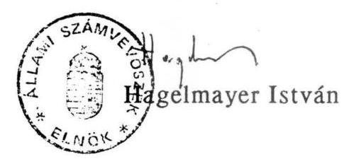

# 2325. szám 

## Állami Számvevőszék

## VÉLEMÉNY

az 1991. évi költségvetési folyamatok alakulásáról készített beszámolóról

---

Állami Számvevőszék
A-137-2/91.

Az Állami Számvevőszék ellenőrizte a Kormány 1991. évi költségvetés I. negyedévi teljesítéséről szóló - 2247. sz. Beszámoló az Országgyűlés részére az 1991. évi költségvetési folyamatok alakulásáról címmel beterjesztett beszámolóját.

A Kormány az 1991. évi költségvetés módosítására javaslatot nem nyújtott be, hivatkozva arra, hogy az előirányzatok változtatásának szükségessége még nem ítélhető meg. A negyedéves adatok ezt az indoklást alátámasztják.

Ugyanakkor a negyedéves beszámoló lehetőséget ad annak megítélésére is, hogy az első ízben alkalmazott költségvetési szerkezet, az állami költségvetés intézményi bevételekkel bővített tartalma, a törvényben rögzített előirányzatátcsoportosítási, gazdálkodási szabályok a gyakorlatban hogyan funkcionálnak.

Véleményünket ezért két fő részre tagoltuk. Az első részben az I. negyedévi beszámolóval kapcsolatos konkrét észrevételeinket, ellenőrzési megállapításainkat, a másodikban pedig a költségvetési törvény új szerkezetéből adódó problémákat részletezzük. Függelékben adunk tájékoztatást az önkormányzatok helyzetéről.

# I. 

## Jelentés az 1991. évi költségvetés I. negyedévi teljesítéséről készített beszámolóról

A beszámolót az alábbi szempontok szerint ellenőriztük:

- A beszámolóban közölt adatok megegyeznek-e az állami költségvetés központi bankszámláinak pénzforgalmi adataival.
- A fejezetenként részletezett adatok megbízhatóak-e - tekintettel a beszámolás rendkívüli időpontjára.

---

- A gazdálkodás I. negyedévi vitele megfelelt-e "A Magyar Köztársaság 1991. évi állami költségvetéséről és az államháztartás vitelének 1991. évi szabályozásáról szóló 1990. évi CIV. törvény" (továbbiakban költségvetési törvény) előírásainak.
- Az önkormányzatok 1991. évi gazdálkodásának feltételei; hol vannak a várható feszültségpontok.

Jelentésünk a Pénzügyminisztériumban, a Magyar Nemzeti Banknál, a Művelődési és Közoktatási, a Közlekedési, Hírközlési és Vízügyi Minisztériumoknál, valamint a Magyar Tudományos Akadémiánál, s ezek reprezentatív módon kiválasztott intézményeinél, továbbá 11 megye önkormányzatainál végzett helyszíni ellenőrzések tapasztalatain, megállapításain és a benyújtott beszámoló számszaki összefüggéseinek ellenőrzésén, értékelésén alapszik.

# Az I. negyedéves beszámoló adatainak valódisága 

a.) A beszámoló 1. sz. mellékletében bemutatott költségvetési mérleg adatai, beleértve a hiány összegét is, az állami költségvetés központi bankszámláin az I. negyedévben lebonyolított pénzforgalom adataival - a szükséges, általunk tételesen ellenőrzött korrekciók után - számszakilag megegyeznek.

A központilag vezetett számlákkal kapcsolatos, a végösszeget nem befolyásoló, pontosító jellegű észrevételeinket a PM-nek közvetlenül megküldtük.
b.) Közvetlenül nem kapcsolódik az I. negyedévi teljesítés értékeléséhez, de mégis az I. negyedévi mérlegpozíciót befolyásolja, hogy ellenőrzésünk 1990. decemberi elszámolással összesen 12 milliárd forint összegű olyan kiutalást talált, amely vitathatóan terheli az 1990. évi költségvetést, automatikusan javítva az 1991. évi, s ezen belül az I. negyedév költségvetési pozícióját.

Az előbbiekben említett kifizetések — pl. Hungária Biztosító túlfinanszírozott felelősségbiztosítási fedezete, az OTP-nek a magánlakásépítés szociálpolitikai kedvezményeire átutalt térítés - a költségvetés finanszírozási rendjének szabályozatlansága miatt vitathatók. A finanszírozási rend szabályozatlanságát már korábbi ellenőrzésünk alkalmával is jeleztük. A részben az 1990. évi jóváhagyott előirányzatok túllépését is eredményező teljesítésekről részletesebben majd az 1990. évi zárszámadás véleményezésében térünk ki.
c.) A prognosztizáltnál lényegesen nagyobb arányú kedvezményes kamatozású lakáshitelek lakossági törlesztéseinek hatása az I. negyedévi teljesítésben még nem jelennek meg. Ennek oka az OTP vonatkozó nyilvántartásának és elszámolásának mintegy két hónapos elmaradása. Az azóta megismert adatok alapján megállapítható, hogy a rendkívüli törlesztések olyan mértékű hatással járnak, amely indokolja a Lakásalap támogatására szolgáló 1991. évi költségvetési előirányzat felülvizsgálatát, és az Alap működési mechanizmusának újragondolását is.
d.) A beszámoló 2. sz. mellékletének adatait - a jóváhagyott költségvetés fejezet és cím szerinti szerkezetben - a fejezetek és a PM rendkívül szoros határidővel állították össze. Az Állami Számvevőszék által vizsgált fejezeteknél, címeknél előfordult, hogy a III. havi adatot becsléssel határozták meg. Más esetben értelmezési zavar miatt az előző évi pénzmaradvány igénybevételének elszámolása nem történt szabályosan, illetve átfutó bevételt, kiadást is szerepeltettek az adatok között. A szakszerűtlen adatszolgáltatás miatti hibákat a Pénzügyminisztérium részben javította, azonban az egyeztetést zártkörűen elvégezni nem tudta, mert a fejezetek folyamatosan, egészen a beszámoló parlamenti benyújtásának időpontjáig korrigálták adataikat. A helyesbítések mintegy fél milliárd forinttal módosították a fejezetek által szolgáltatott korábbi adatokat. A módosítások dokumentálására idő hiányában nem is került sor.

Megállapítható, hogy sem a fejezetek, sem a PM nem voltak felkészülve arra, hogy rendkívüli időpontban ilyen részletes beszámolót készítsenek. A kiépített információs és számítógépes összesítő rendszer az 1991. évi költségvetési törvényben szereplő struktúrának nem felel meg. Az adatok a kötelezően vezetendő könyvvitel adataival csak nehézkesen egyeztethetők, ezért megbízhatóságuk is kétséges.

Általános hiányosságként tapasztaltuk, hogy az intézmények nem rendelkeznek a részletes előirányzataikat és azok változásait folyamatosan követő nyilvántartással, amely a negyedéves beszámoló összeállításához feltétlenül szükséges. Ugyanakkor az egyeztetésekhez a Pénzügyminisztérium sem rendelkezett olyan nyilvántartással, amely az egyes költségvetési címek aktuális támogatási előirányzatát tartalmazza.

---

A fejezetenkénti adatok mindezek ellenére lehetőséget adnak a költségvetési címek I. negyedévi teljesítésének értékeléséhez, a címek közötti átcsoportosítások jellegének, gyakoriságának megítéléséhez.

# A költségvetési előirányzatok módosítása 

a.) A 2. sz. melléklet tanúsága szerint az állami költségvetés bevételeinek és kiadásainak fő összege egyaránt 2675 millió forinttal növekedett a költségvetési törvényben elfogadott összeghez képest.

A növekmény a költségvetési szervek és feladatok saját bevételeinél keletkezett, amelyre a költségvetési törvény felhatalmazást ad. Az érvényes gazdálkodási szabályok szerint a többletbevételből az intézmények saját hatáskörben növelhetik kiadásaikat is.
b.) A költségvetési támogatások növekedésével járó előirányzatmódosításra az I. negyedévben egy esetben került sor. A Magyar Vöröskereszt 235 millió forint támogatását a parlament az általános tartalék terhére biztosította.
c.) A költségvetési törvény 9. §. (2) bekezdése alapelvként rögzíti, hogy az Országgyűlés hatásköre a fejezetek közötti előirányzatátcsoportosítás joga. Az ez alóli kivételek azonban - a 9. §. (3) bekezdésében szereplő feladatátadás és a 9. §. (10) bekezdése szerint a fejezeteknél központilag kezelt előirányzatok terhére végrehajtott előirányzatátcsoportosítási lehetőség - szinte minden a gyakorlatban előforduló fejezetek közötti átcsoportosításra módot adnak a Kormánynak és a fejezeteknek. Az első jogcímen végrehajtott átcsoportosításokhoz is csupán utólagos beszámolási kötelezettség kapcsolódik.

Az eddigi átcsoportosítások a 9. §. (3) bekezdés jogcímeire hivatkozva, kormányrendelet vagy határozat alapján, a pénzügyminiszter jóváhagyásával történtek.
d.) Az ellenőrzött fejezetek a fejezeten belüli előirányzatok módosítása során a költségvetési törvény szerint, de helyenként szakszerűtlenül jártak el. A módosítások jellemzően a fejezetek által központilag tervezett előirányzatok lebontásához kapcsolódtak.

---

e.) A költségvetési törvény 9. §. (5) bekezdése tartalmazza azokat a fejezeteken belül kiemelt címeket, amelyek előirányzatmegváltoztatási jogát az Országgyűlés magának tartja fenn. Ezek között elsőként szerepel az önkormányzatok támogatása.

Az önkormányzatok módosított támogatása a beszámolóból egyértelműen nem állapítható meg. A beszámoló szöveges része tervezett és végrehajtott módosításokat egyaránt tartalmaz.

A 2. sz. melléklet adatai szerint a Belügyminisztérium fejezetnél a "25. Állami hozzájárulás az önkormányzatok költségvetéséhez" cím előirányzata az I. negyedévben két jogcímen változott:

- 3850 millió forinttal csökkent egyes "centralizált" szervezetek támogatásának más fejezetekhez történő átcsoportosítása miatt;
- 5792,4 millió forinttal nőtt az oktatási és közművelődési dolgozókat érintő bérpolitikai intézkedések támogatása miatt.

A törvény 9. §. (5) bekezdése és a törvény szelleme alapján az önkormányzatok állami támogatásának módosítására, a bérpolitikai intézkedés önkormányzatok közötti felosztására a Kormánynak nem volt felhatalmazása. A deklarált jogkört tartalmazó hivatkozott bekezdés zárójelében szereplő felsorolás nem teljeskörű, amely "értelmezési" lehetőséget adva feloldja a rögzített alapelvet. Így a bérpolitikai intézkedés fejezetek közötti átcsoportosítása - amely a 2201. számon benyújtott tájékoztatóban szerepel - a 9. § (3) alapján nem kifogásolható.

# A Kormány költségvetést érintő intézkedései 

a.) A költségvetési törvény 8. §. (3) bekezdés alapján a Kormány az 1991. évi költségvetési folyamatok alakulásáról szóló beszámoló benyújtásáig az általános tartalék terhére csak az Országgyűlés külön felhatalmazása alapján vállalhat kötelezettséget.

Vizsgálatunk megállapította, hogy több, kormányhatározattal megerősített kötelezettségvállalás történt, amelyek fedezetéről a határozatok nem rendelkeznek. Felsorolásukat az 1. sz. függelék tartalmazza.

---

b.) Ellenőrzésünk az önkormányzatoknál több településen is tapasztalta, hogy a körjegyzők bérének megállapítása annak reményében történt, hogy ezt a költséget járulékaival együtt az állami költségvetés központilag felvállalja. Várakozásukat a helyi önkormányzatokról szóló törvény indoklási részében foglaltakra alapozták. Ezt a Belügyminisztérium körlevele is megerősítette, amely szerint "a körjegyző bérét az állami költségvetés fedezi". Ezzel kapcsolatosan központi intézkedés még nem történt.
c.) Az önkormányzatok normatív támogatásai közül a kommunális feladatra jóváhagyott 1400 Ft/fő normatíva tartalmát — ezzel áttételesen az ebből fedezendő kiadás célját - a Belügyminisztérium a törvény megjelenését követően pontosította. Tájékoztatásuk alapján e normatívából fedezendő 300 Ft/fő összeggel a fiatal házasok első lakáshoz jutásának támogatása, 200 Ft/fő összeggel pedig a kamatadó törlesztésének támogatása. Vitatható, hogy a költségvetési törvény ilyen, kiterjesztő jellegű utólagos értelmezésére joga van-e a Kormánynak.

# A költségvetési törvényben meghatározott határidők teljesítése 

A különböző, következőkben felsorolt paragrafusokban meghatározott határidők betartását a Kormány nem tudta teljesíteni, részben a törvény késői megjelenése, részben a kellően át nem gondolt határidők kitűzése miatt. Ezek a késedelmek elsősorban az önkormányzatok 1991. évi végleges pénzügyi kondícióinak kialakulását akadályozzák, felerősítve az önkormányzatok gazdálkodását gátló még hiányzó törvények miatt egyébként is jelentkező feszültségeket.
a.) A költségvetési törvény 1. §. (1) bekezdés f. pontja felkéri a Kormányt, hogy mérje fel a költségvetési vita során módosult vagy új önkormányzati normatív hozzájárulásokhoz kapcsolódó mutatószámokat. A törvény e felmérést azonban a köztársasági megbizottak és egyes centrális alárendeltségű szervek feladat- és hatásköréről szóló törvények elfogadásához kötötte.

A hatásköri törvény elfogadása és a felmérés is elhúzódott, így a hivatkozott bekezdés d.) pontjában előírt, a költségvetési törvény 3. sz. mellékletét képező okmány közzététele eddig nem történt meg.

---

Ez azt jelenti, hogy a mai napig nincs olyan, az 1991. évi jóváhagyott előirányzatokat tükröző hiteles dokumentum, amely alapján az önkormányzatok egyértelműen megállapíthatnák 1991. évi állami hozzájárulásuk összegét.

Az önkormányzatokra is kötelező, folyamatban lévő költségvetési információszolgáltatás összeállítása, — amely a zárszámadás alapja lesz — e dokumentum hiánya miatt számos eltérésre ad alkalmat.

Az 1. §. (3) bekezdés a Kormányt arra kötelezte, hogy az önkormányzatok céltámogatás igénylésének mechanizmusát 1991. jan. 15-ig tegye közzé, s a tervezett összeg felosztására 1991. március 31-ig tegyen javaslatot az Országgyűlésnek.
A tájékoztató 1991. január 29.-én jelent meg a Magyar Közlönyben, a felosztási javaslatot 1991. április 30-án nyújtották be.

Az 1. §. (5) bekezdése január 15-i határidővel rendelte el az önhibájukon kívül hátrányos pénzügyi helyzetben lévő önkormányzatok adatszolgáltatási kötelezettségének előírását, s a rendelkezésre álló összeg felosztási javaslatát 1991. március 31-ig kellett volna benyújtani.
Az adatszolgáltatási kötelezettség formátuma 1991. II. 6.-án jelent meg, a felosztási javaslatot 1991. ápr. 30-án nyújtották be a Parlamentnek.

Az előírt két határidő elmulasztásának következménye, hogy az önkormányzatok 1991. évi állami hozzájárulásuk teljes összegét legkorábban az I. félév végén ismerhetik meg.
b.) A 9. §. (3) bekezdés alapján a feladatátcsoportosítások miatti előirányzatátcsoportosítást a pénzügyminiszter ellenjegyzésével a Kormány végrehajthatja azzal, hogy az átcsoportosításról az Országgyűlést
 a soron következő ülésén tájékoztatni kell. Az első ilyen tájékoztatót 1991. április 19.-én nyújtották be, amely összevontan tartalmazta az addig végrehajtott módosításokat.
c.) 12. §. (5) bekezdése szerint az állami forgóalaphoz kapcsolt bevételi és kiadási számla elnevezését, MNB számlaszámát a Magyar és a Pénzügyi Közlönyben közzé kell tenni. A közzététel eddig nem történt meg.

---

# A költségvetés I. negyedévi likviditása 

A költségvetés kiadásainak finanszírozása a korábbiakhoz képest szigorúbb havi ütemezés szerint történt. Az 1991. évi költségvetés finanszírozása 20,2 milliárd forint nyitó forgóalapállománnyal indult, amelyhez 1991. januárban vették fel a 40 milliárd forint forgóalapnövelő hitelt. A forgóalap nyitóállománya már nem tartalmazta azt a 12,9 milliárd forintot, amelyet a költségvetési törvény 23. §. (1) bekezdése alapján 1990. december 20-án az önkormányzatoknak átutaltak.

Bár az előrelépés nem tagadható, megállapítható, hogy az állóeszközfelújítás, egyes fejezeteknél az ágazati szakmai célfeladatok, a fejezeti tartalékok, az intézményberuházás támogatásának időarányos havi átutalása feleslegesen terhelte a forgóalapot, mert ezek teljesítése messze elmarad az időarányostól. Az átutalások jogszerűsége nem vitatható, indokoltságuk azonban igen. Az időarányosan leutalt, de fel nem használt támogatások miatt a fejezetek pénzellátási számláin március végére 3 milliárd forint halmozódott fel.

Jelentésünk megállapításai alapján a következőket javasoljuk:

- Mielőbb történjék meg az önkormányzatok normatív állami támogatásának közzététele.
- A Kormány nyilatkozzon az 1. sz. függelékben részletezett kormányhatározatokkal vállalt kötelezettségek és a körjegyzők bérének fedezéséről.
- A parlamenti hatáskörbe tartozó előirányzatmódosítások egyértelmű törvényi szabályozása mielőbb történjék meg.
- A Kormány tegyen megfelelő intézkedést arra, hogy az 1992. évi költségvetéshez likviditási terv készüljön, de a II. félévben is pontosítsák tovább a finanszírozási gyakorlatot. Ehhez szabályozni kell bizonyos bevételi és kiadási tételek finanszírozásának esedékességét. Kötelezni kell a fejezeteket, hogy az olyan - pl. felújítási, ágazati célfeladat kiadásokra, amelyek nem időarányosan teljesülnek, a várható kifizetésekhez igazodó pénzellátási tervet készítsenek.
- A Kormány tekintse át a Lakásalap helyzetét és tegyen javaslatot a várható pénzügyi feszültség megnyugtató rendezésére, a konstrukció esetleges megváltoztatására az Országgyűlésnek.

---

# II . 

## az 1991. évi költségvetési törvény szerkezetéből, a szabályozás pontatlanságából adódó problémák

Az I. negyedévi teljesítésről szóló beszámoló formailag azonos a költségvetési törvény új szerkezetének megfelelő zárszámadási kötelezettségnek. Ezért abból előzetesen is megítélhető, hogy a zárszámadás reális képet ad-e majd az 1991. évi költségvetés teljesítéséről, a részletes vitában jóváhagyott előirányzatok teljesítése számon kérhető-e, a korlátozni kívánt előirányzatátcsoportosítási jogkörök érvényesülnek-e.

Alapelv, hogy a zárszámadást a jóváhagyott költségvetés szerkezetében kell elkészíteni, ezért indokolt már most vizsgálni, hogy a költségvetési törvény mennyiben felel meg a felsorolt elvárásoknak.
a.) Az I. negyedévi teljesítés adatai — amelyeket a 2. sz. mellékletben az új költségvetés szerkezete szerint csoportosítottak - rávilágítanak, hogy az 1991. évtől bevezetett rendszer nem alkalmas arra, hogy a bevételek és kiadások egyenlegeként a központi költségvetés hiánya - tehát az állami költségvetés 1991. évi belföldi adósságának növekedése - hitelesen megállapítható legyen.

Az új költségvetési struktúra bevezetésénél az előterjesztők, az Állami Számvevőszék és a törvényhozók közös szándéka volt, hogy a korábbi évek elnagyolt költségvetésjóváhagyási procedurája szigorodjék, a költségvetésben a feladatok és előirányzataik konkrétabban kerüljenek meghatározásra. Arra is igény volt, hogy felelős tárca "védje" az egyes feladatokért javasolt előirányzatait, amely az új struktúra kialakításában jelentős szerepet játszott.

Az elmúlt évek költségvetési szervekre vonatkozó liberalizált gazdálkodási szabályozása saját bevételeik jelentős növekedését eredményezte. A korábbi, csak a nettó támogatásokat jóváhagyó rendszerben e többletbe-

---

vételek a törvényhozás előtt ismeretlenek maradtak. (A hagyományos költségvetési terminológia szerint a költségvetési szervek bevételei és az ezek terhére teljesített kiadások csak az államháztartás mérlegében szerepeltek, s csupán támogatásuk képezte az állami költségvetés kiadását.)

Az 1991. évi költségvetési törvény az állami költségvetési bevételek és kiadások körébe vonta a költségvetési szervek és feladatok saját bevételeit, és az ezek terhére teljesített kiadásokat is. Így az állami költségvetés a költségvetési szervek kiadásait bruttó módon tartalmazza.

A költségvetési szervekre vonatkozó gazdálkodási szabályok azonban az idő rövidsége miatt alapvetően nem változtak, így

- a 13. §. alapján a központi költségvetési szervek a tervezettet meghaladó bevételeikből, illetve pénzmaradványból, érdekeltségi alapból növelhetik kiadási előirányzataikat;
- az 54. §. szerint az alaptevékenységen elért előirányzatmegtakarítást pénzmaradványként a következő évre átvihetik.

Ezért a törvény 9. §. (1) bekezdésében rögzített alapelv, mely szerint a megállapított kiadási előirányzatokat túllépni nem lehet, csak eszmei értékű deklaráció marad, mert az állami költségvetés bevételei és kiadásai automatikusan "követik" a költségvetési szervek saját hatáskörben végrehajtott előirányzatmódosulásait. Ugyanakkor az új szerkezet szerinti év végi egyenleg - a központi költségvetés valós hiányát csökkentően - tartalmazza a költségvetési szervek pénzmaradványát is.

A hagyományos költségvetési mérleg - amely megegyezik a Kormány beszámolójának 1. sz. mellékletével - a központi költségvetés fő bevételi és kiadási jogcímeit, a költségvetési hiányt egyszerű, áttekinthető módon tartalmazta. (A központi költségvetés hiányának a negyedéves beszámoló is az 1. sz. melléklet egyenlegét fogadja el.)

A hagyományos és az új szerkezeti rend között csak az eredeti előirányzatok "számított" adatai alapján teremthető meg a viszonylag könnyen áttekinthető kapcsolat. (Lásd az 1991. évi költségvetéshez benyújtott Állami Számvevőszéki jelentés 1. sz. táblázatát.) A teljesített kiadásoknál azonban áttekinthetően nem feleltethetők meg egymásnak a költségvetési szervek kiadását bruttó módon tartalmazó új, és a csak a támogatásokat tartalmazó hagyományos mérleg adatai. A költségvetési szervek eltérést

---

okozó pénzmaradványa ugyanis több tényező mérlegelésével - bevételi többlet, kiadási megtakarítás, feladatelmaradás - állapítható csak meg, amelynek kimutatására ez a szerkezeti rend nem alkalmas.

A beszámoló 1. és 2. sz. mellékleteinek végösszegei ezért nem egyeznek meg egymással azzal a különbséggel, hogy az I. negyedévben nem beszélhetünk pénzmaradványról, csak az időarányostól elmaradó felhasználásról.

A különböző szemléletű és mértékű hiány magyarázataként a beszámoló 1./a sz. melléklete, vagy ehhez hasonló aggregált adatokat tartalmazó levezetés az éves zárszámadásban nem fogadható el. Ezért az 1991. évi zárszámadás elkészítéséhez a költségvetési törvény olyan módosítása szükséges, amely a központi költségvetés hiányának kimutatását áttekinthető, "hitelesíthető" módon lehetővé teszi.
b.) A költségvetési törvény 9. §. (10) bek. alapján a fejezeteknél központilag tervezett előirányzatok (nagyjavítás, tartalék, ágazati feladatok) felhasználásáról a fejezet irányításáért felelős dönt, azaz átcsoportosíthatja ezen előirányzatokat a fejezeten belüli vagy kívüli más költségvetési címekre.

A törvény szelleméből, de a 9. §. (1) bek.-ből is az következik, hogy meghatározott célra jóváhagyott összeg a címek közötti átcsoportosítás után is csak a parlament által jóváhagyott célra legyen fordítható.

Ennek követése azonban a bemutatott dokumentációban nem lehetséges, mert az intézmények előirányzatában pl. a nagyjavításról, ágazati feladatról átcsoportosított összeg rendszerint csak mint "dologi előirányzat" szerepel.
c.) A költségvetési törvény 9. §. (14) bekezdése szerint az előirányzatátcsoportosításokról a zárszámadásban tételesen be kell számolni. Az I. negyedévi beszámoló 3. sz. melléklete teljesíti ezt az előírást.

Felhívjuk a figyelmet arra, hogy a beszámolásnak ez a módszere nem teljeskörű, fejezetenként, címenként eltérő szerkezetű, amely az éves indoklások halmozódásával követhetetlenné válik.
d.) A törvény 60.000 millió forint 25%-os kamatozású hosszú lejáratú hitel felvételét és 18.786,1 millió forint államkötvény és kincstárjegy kibocsá-

---

tását rendeli el a költségvetés 78.786,1 millió forint tervezett hiányára. Nem rendelkezik arról, hogy a hosszú lejáratú hitel mikor vehető fel, valamint a visszafizetés lejáratáról, s a türelmi időről sem. (A költségvetési törvény értelmében a hitel akár 1991. I. 1-én is felvehető lett volna.) A költségvetési hiány az év során folyamatosan "teljesül", pontos összege csak az 1991. évi pénzforgalmi tételek zárásakor állapítható meg.

Bár a forgóalap mértéke jelentős, a költségvetés folyamatos finanszírozásához szükség lesz a hiányt fedező hitel ütemezett felvételére. Adott időszakban előfordulhat, hogy csak a bevételek és kiadások eltérő ütemkülönbsége miatt, néhány napra, hétre, merül ki a forgóalapszámla. Ez likviditási hitellel is áthidalható, s a hosszú lejáratú hitel felvétele — amelynek kamatát a felvétel után egész évben fizetni kell — elodázható.

Az 1991. évi költségvetési törvény azonban likviditási hitel felvételét nem engedélyezi. A költségvetési javaslatban még szereplő, a likviditási hitel mértékét meghatározó paragrafus a költségvetési vita során törlésre került.

A jelentős mértékű hiány miatt a kamatteher csökkentése érdekében a piaci kamatozású, rövid lejáratú likviditási hitel és a kedvezőbb kamatozású, de a felvétel után vissza nem vonható hosszú lejáratú hitel évközi felvételét kombináltan célszerű alkalmazni.

Mindenképpen elkerülendő, hogy több hosszú lejáratú hitel felvételére kerüljön sor, mint amennyit majd a tényleges hiány indokol.

Fentiekben részletezett megfontolásból az Állami Számvevőszék elnöke 1991. április 27-én - amikor a Pénzügyminisztérium hitel felvételét kezdeményezte - csak 20 milliárd forint hosszú lejáratú hitel felvételét ellenjegyezte, mert az I. negyedév adatai alapján 22,2 milliárd forint "teljesült" a tervezett költségvetési hiányból. A szerződésben a lejárati idő 15 év, a türelmi idő pedig 8 év.

---

- Az új szerkezeti rend előnyeit elismerve javasoljuk, hogy a kormány költségvetési címenként ne csak a kiadásokat, hanem az engedélyezett támogatás összegét is mutassa ki.

Ez teremti meg a feltételt arra, hogy az állami költségvetés mérlegét, mindkét szemléletben követhető, ellenőrizhető módon állítsák össze, s a költségvetés a hagyományos mérleg utólagos jóváhagyásával kiegészíthető legyen. Ezzel egyben teljesül az a jogos igény is, hogy a képviselők egy-egy költségvetési intézmény, feladat állami ráfordítását, támogatását közvetlenül, külön számítások nélkül mérlegelhessék.

A parlamenti vita alapján sor került néhány "végrehajthatatlan" támogatáscsökkentésre, amelynek rendezését a beszámoló 36. oldalán a kormány felveti. Erre azért kerülhetett sor, mert az előterjesztett előirányzatoknál a támogatás külön számítás nélkül nem volt megállapítható. Ismét hivatkozunk az Állami Számvevőszék költségvetéshez benyújtott véleményének 2. sz. táblázatára, ahol a támogatásokat is kimutattuk, a 7. oszlopban egyszerűen megállapítható, hogy a jelzett címeknél a költségvetési javaslat támogatást nem tartalmazott.

- Javasoljuk, hogy a költségvetésben konkrét, meghatározott célra jóváhagyott tételek, az átcsoportosítás után az új költségvetési címen kiemelt előirányzatként, az eredetileg jóváhagyott rendeltetéssel szerepeljenek. Ez segítené a képviselők tájékozódását, s megteremti az ellenőrzés feltételét is.

Ezek a kötöttségek rendszerint a fejezetek, a gazdálkodók ellenállásába ütköznek. Ugyanakkor csak ilyen módszerekkel követelhető meg a megfontolt, részletes alapokon nyugvó költségvetési tervezés, amely az utóbbi évek "túlliberalizált" gazdálkodási gyakorlata miatt egyre inkább háttérbe szorult. Az állami feladatvállalás szűkítése is csak ezen az úton érhető el.

- Javasoljuk annak előírását, hogy az átcsoportosításokról szóló indoklásokat - a 9.§. (2-13) bekezdések szerint - az előirányzatátcsoportosítási jogcímeknek megfelelően csoportosítsák.

---

- Javasoljuk likviditási hitel felvételének engedélyezését, felvehető mértékének rögzítésével. Ez azért is indokolt, mert likviditási tervek hiányában - adott pillanatban - nem lehet megállapítani, hogy likviditási problémáról, vagy pedig a tervezett hiány időarányos "teljesítéséről" van-e szó.
- A költségvetési törvényt célszerű a még fel nem vett hosszú lejáratú hitel futamidejével, s a türelmi idő meghatározásával kiegészíteni. Ellenkező esetben ezek meghatározása a kormány hatáskörében
 marad, a törvény alapján ugyanis az ellenjegyzés nem tagadható meg.

Budapest, 1991. május 15.

---

A Kormány ez idáig a következő - kormányhatározattal megerősített - elkötelezettséget vállalta.

| S.sz. | Megnevezés | Korm.h.száma | Fejezet | Összeg (MFt.) |
| :--: | :--: | :--: | :--: | :--: |
| 1./ Los Angeles-i főkonzulátus létrehozása |  | 3071/91. | KüM | 59.0 |
| 2./ A montreáli és torontói főkonzulátus létrehozása |  | 3001/91. | KüM | 25,9 |
| 3./ Állandó külképviselet Pretóriában |  | 3021/91. | KüM | 29,7 |
| 4./ Nagykövetség létesítése Abu Dhabiban (1991. évi ktg.vetésben nem szerepel!) |  | 3464/90. | KüM | 31.1 |
| 5./ Állandó külképviselet Strasbourgban (1991. évi ktg.vetésben nem szerepel!) |  | 3514/90. | KüM | 37,2 |
| 6./ Vizumelengedésekkel kapcsolatos bevételkiesés |  | 3055/91. | KüM | 8,5 |
| 7./ Az Európai Biztonsági és Együttműködési Értekezlet távközlési hálózatára |  | 3039/91. | KüM | 6,6 |
| 8./ Az iskolarendszerű szakképzési feladatok 1991. évi p.ü. fedezetének biztosítása |  | 3085/91. | $\begin{aligned} & \text { MüM, FM,. } \\ & \text { Népj.M } \end{aligned}$ | 170,0 |
| 9./ Közigazgatási bíráskodás (OGY előtt van!) |  |  | IM, LB. | $\begin{gathered} 1286,6 \\ 7,9 \end{gathered}$ |
| 10./A lakáscélú kölcsönök kamatemeléséhez kapcsolódó állami támogatás (OGY előtt van!) |  |  |  | 1500,0 |
| 11./ Országos Kárrendezési Hivatal létrehozása |  | 3064/91. | BM | 120,0 |
| 12./ Az európai hagyományos fegyveres erőkról szóló szerződés ellátásával kapcsolatos költségekre |  | 3105/91. | HM | 10,6 |
| Számszerűsíthető adatok összesen: |  | - | - | 3293,1 |

---

# Tájékoztató az önkormányzatok működéséről, pénzügyi feltételeiről 

Az önkormányzatok 1991. évi költségvetési pozícióját kedvezően befolyásolta, hogy a tanácsok 1990. I.-III. negyedévben általában visszafogottabb gazdálkodást folytattak, elsősorban a működés zavartalanságát igyekeztek biztosítani, megfelelő pénzügyi feltételeket akartak teremteni az új testületeknek.

A felújítási, beruházási tevékenység háttérbe szorult. Ennek eredményeként a tanácsok többsége nem üres "kasszát" adott át az önkormányzatnak. A IV. negyedév gazdasági döntéseit már az önkormányzatok hozták meg. A pénzügyi döntéseket inkább a helyzetfelmérés, a folyamatos fenntartás igénye határozta meg.

Az önkormányzati vagyon átadásához a megyékben eddig csak a vagyonellenőrző bizottságok alakultak meg.

A vagyonátadó bizottságok elnökeit és tagjait a belügyminiszter a vizsgálat ideje alatt kinevezte, azonban a működés törvényi feltételei - tulajdonjogi-, feladat- és hatásköri-, földtörvény - hiányoznak.

Az önkormányzatok az előzőekben említett törvények hiányában nem tudták teljes körűen számba venni vagyonukat. A volt közös tanácsoknál a vagyon megosztására nem került sor. A vizsgálatba bevont önkormányzatok egy része megkezdte a feladatok elvégzését és a részleges eredményről tájékoztatták a testületeket.

Az 1991. évi költségvetési törvény késői megjelenése, valamint az ebben előírt feladatok központi rendezésének elhúzódása kedvezőtlen az önkormányzatok 1991. évi feladatellátására. Eltolódott a költségvetések jóváhagyása, ami a gazdálkodásban megalapozatlan döntéseket idézhet elő. Az ellenőrzött önkormányzatok többsége az 1991. évi költségvetését a vizsgálat idején - március hó közepén - még "csak ceruzásan", vagy első olvasatban készítette el, csupán néhánynak volt jóváhagyott költségvetése. Az állami

---

hozzájárulás teljes összege a korábban részletezett okok miatt nem is szerepelhet az önkormányzatok költségvetésében.

Általános gyakorlat, hogy a testületek két fordulós tárgyalás után fogadják el a költségvetést és ezt követően alkotnak rendeletet.

A céltámogatások és az önhibáján kívül hátrányos helyzetű önkormányzatok támogatásának felosztására készített kormányelőterjesztések parlamenti vitája most kezdődik. Ez azt jelenti, hogy az önkormányzatok költségvetéseinek véglegesítésére legkorábban júniusban kerülhet sor. A jóváhagyott, illetve elutasított pályázatok alapján a szükséges intézkedéseket az önkormányzatok csak a II. félévben tehetik meg, ami a feladatok zavartalan ellátását akadályozza, egyes beruházások kivitelezését meg is hiúsítja. Mindezek alapján elkerülhetetlen lesz a legtöbb önkormányzat költségvetési rendeletének évközi módosítása.

A megyei önkormányzatok esetében a költségvetés jóváhagyását külön nehezíti, hogy a feladat- és hatásköri törvény hiányában nem ismert az a szakmai feladatrendszer, intézményhálózat, amit a tárgyévi költségvetésüknek fenn kell tartania, működtetnie.

Nem történt meg a helyi és megyei önkormányzatok között a térségi feladatok átadás-átvétele sem. Az intézmények hovatartozását nem egy esetben befolyásolja a normatív támogatás nagysága, illetve a várható fejlesztési, felújítási szükséglete.

Tapasztalataink szerint a feladat- és hatásköri törvény hiánya veszélyezteti a térségi feladatokat ellátó intézmények biztonságos és folyamatos üzemeltetését is, mivel ezek hovatartozásuk tisztázásáig csak a minimális eszközöket kapják meg működésükhöz.

A volt közös tanácsok keretében működő társközségeknek — a szétválást követően — több esetben olyan kritikus helyzetet kellett megoldaniuk, amely a lakosság közvetlen ellátását érintette. Tapasztalataink szerint a közös tanácsok felbomlását követően a feladatmegosztás vitás helyzeteket teremtett.

A kötelezően előírt általános iskolai oktatást eddig általában több községre kiterjedő körzeti iskola fenntartásával látták el, ami gyakran a székhelyközségben volt. Az önkormányzatok többsége a megalakulást követően megegyezett abban, hogy a normatív állami támogatást az iskolát fenntartó önkormányzat kapja. Az ezen felüli költségekben viszont gyakran hosszas viták után sem tudtak megállapodni.

---

Az eddig közösen végzett feladatok megbontását nehezíti az is, hogy gyakran közös kötelezettségvállalásra is sor került, elsősorban a beruházások, felújítások területén. A megalakult önkormányzatok egy részénél az ezévi költségvetési kondíció jó néhány esetben nem teszi lehetővé a megkezdett feladatok folytatását, illetve befejezését.

Több volt társközség jelezte, hogy a székhely településeken folyamatban lévő felújításokhoz, beruházásokhoz nem tud hozzájárulni, ezért a vagyonmegosztásnál az őt megillető hányadról inkább lemond, mintsem a későbbiekben vállalja a fenntartási költségeket.

Az 1991. évi költségvetés a normatívák alapján elosztható állami támogatásra 147 milliárd forintot irányzott elő. A rendszer jellegéből eredően a normatívákat 1991-ben is a támogatás szétosztásának eszközeként alkalmazták, a normativák összegének nincs közgazdasági tartalma. Az operatív gazdálkodás gyakorlatában az önkormányzatok túlnyomó többsége ennek ellenére a normatívákat úgy tekinti, mint egy-egy feladat költségéhez való hozzájárulást.

Ez a szemléletbeli különbség mindaddig fennáll, míg a tervező tárcák nem terjesztik a Parlament elé az állami feladatok körét, illetve az állam feladatvállalásának mértékét. Szükséges lenne az is, hogy egy-egy normatíván belül az állandó és a változó költségek elhatárolásra kerüljenek.

A kommunális normatíva tartalmába utólag "beleértelmezett" feladatok fedezése egyes önkormányzatoknál komoly gondot okoz, jelentős költségigénye miatt.

Az eladósodással küszködő önkormányzatok kivételével likviditási gondokkal nem találkoztunk, az új - APEH bonyolításával történő - finanszírozási gyakorlat sem okozott pénzellátási problémákat. (Kisebb önkormányzatoknál az 1/12-es finanszírozási módszer okozhat napi problémákat, a decemberben kiutalt előleg ellenére.)

# A helyi adók bevezetésével kapcsolatos gondok 

A bevételi érdekeltség kiszélesítése érdekében életbe lépett a helyi adózási rendszer. Az önkormányzatok ez évben — néhány kivételtől eltekintve — még a régi adózási rendszert tartják fenn.

Ennek oka egyrészt az, hogy az önkormányzatok a helyi adókról szóló törvény késői elfogadása miatt nem tudtak felkészülni az új adónemek bevezetésére, másrészt az, hogy a lakosság terheit — különösen a községekben — nem kívánják tovább növelni.

---

Mindemellett a törvény helyi alkalmazása több problémát is felvet.
A gazdálkodó szerveknél el kell dönteni, hogy mely épületek legyenek adómentesek. Kérdés, hogy az állattartásra szolgáló épületet, a takarmányraktárat a kialakult kínálati piac miatt indokolt-e adóztatni, a vállalkozók részére célszerű-e a kommunális adó kivetése a munkanélküliség miatt.

Az iparűzési adónál az adóalap megállapítása több telephely vonatkozásában nehézkes, mivel a településenkénti bevételeket az adózó nem köteles a jelenlegi számviteli előírások szerint elkülöníteni.

Az önkormányzatok az adótárgyakat illetően teljes körű, naprakész nyilvántartásokkal még nem rendelkeznek.

Ellenőrzéseink tapasztalatait összegezve megállapítottuk, hogy a megalakult önkormányzatok a hiányzó jogszabályok, a tapasztalatlanságuk és gyakran magárahagyatottságuk miatt jó néhány esetben nehéz helyzetbe kerültek. Gondjaik többsége szervezeti, gazdasági, pénzügyi kérdésekben ma is megoldatlanok.

Általában — néhány súlyosabb eset kivételével — kisebb "zökkenőkkel", de tartós fizetőképtelenség nélkül fedezték az I. negyedév feladatait. Várható azonban, hogy az állami hozzájárulás végleges összegének ismeretében a vállalt kötelezettségek miatt az év során újabb feszültségek keletkeznek, amit nem tud feloldani az önhibáján kívül hátrányos helyzetben lévő önkormányzatok támogatására az év második felére tartalékolt összeg.
