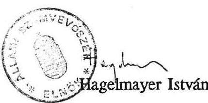

# T:47 

## 2̈̈lami 2̧̧ántoróóssék

## ÖSSZEFOGLALÓ JELENTÉS

a pályázati úton nyújtott szociálpolitikai támogatások ellenôrzési tapasztalatairól

---

# ÖSSZEFOGLALÓ JELENTÉS 

## a pályázati úton nyújtott szociálpolitikai támogatások ellenôrzési tapasztalatairól

A Magyar Köztársaság 1990. évi állami költségvetéséről szóló 1989. évi L. törvény a tanácsi központosított előirányzatok között 230 millió forintot hagyott jóvá szociálpolitikai célokra, amelyet a tanácsok pályázat útján vehettek igénybe.

A Szociális és Egészségügyi Minisztérium 1990. év februárjában pályázati felhívást tett közzé a szociális ellátás fejlesztési programjainak megvalósítására.

Az Állami Számvevőszék ezévi munkatervi feladatainak keretében törvényességi, célszerüségi és eredményességi szempontok alapján vizsgálta a 230 millió forint szociálpolitikai célú tanácsi központosított előirányzat felhasználását.

A vizsgálat fő célja annak megállapítása volt, hogy a szociális ellátás fejlesztésére kiírt felhívás mozgósította-e a helyi erőforrásokat, milyen társadalmi igényeket jelzett, melyek a legellátatlanabb területek, milyen mértékủ a pályázati célban megjelölt feladatok megvalósulása és azok oldották-e az adott területen lévő szociális feszültségeket.

A vizsgálat az 1990. január 1. és 1991. március 31-e közötti időszakot érintette.
A vizsgálatot az érintett központi szerveken - a Belügyminisztériumon, a Népjóléti Minisztériumon és a Pénzügyminisztériumon kívül 15 megyében és a fővárosban folytattuk le.

Helyszíni vizsgálatot összesen 237 helyszínen: 16 megyei (fôvárosi) önkormányzatnál, 179 pályázónál, 42, pályázattal érintett helyi önkormányzatnál végeztünk.

---

# MEGÁLLAPÍTÁSOK 

## I.

A központi szerveknél végzett vizsgálat tapasztalatai

## 1.) Döntéselőkészítés, hatásköri és feladatmegosztás

Az 1990. évi költségvetési törvény a tanácsok központosított előirányzatai között hagyta jóvá azt a 230 millió forint állami támogatást, amelyet a tanácsok
—a többszektorú szociálpolitika kiépítésére,
—a modellértékű megoldások támogatására,

- családsegítő és mentálhigiénés szolgáltatásokra, valamint
— szociális szakemberképzésre pályázat útján vehettek igénybe.
A törvényalkotás feltételezte a tervezéssel és finanszírozással érintett központi szervek együttmüködését, mivel a tanácsokat a Belügyminisztérium felügyelte és rendelkezett központi előirányzataik felett, a pályázatkiírás a Szociális és Egészségügyi Minisztériumnak (későbbiekben: Népjóléti) határozott meg szakmai feladatokat, a Pénzügyminisztérium pedig a finanszírozó szerepkörét töltötte be.

A vizsgálat során egyértelművé vált, hogy az érintett központi szervek között a tervezés, majd a lebonyolítás korai szakaszában nem alakult ki semmiféle együttmüködés, erre csak igen későn, a pályázati pénzeszközök odaítélése után került sor.

Figyelmen kívül hagyták azt is, hogy a törvény a 230 millió forintot végülis nem a korábbi évek hagyományainak megfelelően, szakmai programként, hanem célzottan, tanácsi pénzeszközként, a tanácsok normatív támogatásának kiegészítéseként határozta meg. A törvény indoklási része ebben határozottan és egyértelmúen foglal állást.

---

# 2.) Pályázat-kiírás 

A Szociális és Egészségügyi Minisztérium 1990. februárjában pályázati felhívást tett közzé a szociális ellátás fejlesztési programjainak megvalósítására.

A pályázat szektorsemleges meghirdetése ellentétes volt a törvény előírásaival, lévén, hogy a törvény csak a tanácsok számára tette lehetővé a céltámogatás igénybevételét.

Bárki és bármely szerv - központi állami intézmény, tanácsok és intézményeik, gazdálkodó szervek, egyházak, alapítványok, szövetségek, magánvállalkozók - pályázhatott a tanácsok finanszírozására célzott pénzeszközökből.

A felhívás a tanácsoknak még véleményező, koordináló szerepkört sem adott abban az esetben sem, ha az általa alapított valamelyik intézménye jelentkezett pályázati céllal.

A pályázati felhívás céljaként a gyermek- és ifjúságvédelmi, valamint a felnőttvédelmi szociális ellátás fejlesztését szolgáló szakmai programok, modellértékű, innovatív kezdeményezések, hiányzó ellátási formák támogatását jelölték meg.

A rendelkezésre álló szűkös pénzügyi fedezet ismeretében szakmai hiba volt olyan pályázat kiírása, amely nem szabta meg a konkrét, alapvető pályázati követelményeket.

A pályázati kiírás szerint a központi támogatás egyszeri forráskiegészítést jelentett, a szakmai programok folyamatos müködési költségeiről pedig a pályázóknak kellett gondoskodniuk. Meghatározták továbbá, hogy előnyben részesülnek azok a pályázók, akik a cél megvalósítása érdekében jelentős saját vagy külső forrást vonnak be. Azt azonban nem határozták meg, hogy mi az, amely jelentős saját vagy külső forrásnak minősül.

A pályázatot közvetlenül a Szociális és Egészségügyi Minisztérium Gyermek- és Ifjúságvédelmi Főosztályára kellett benyújtani 1990. április 30-ig.

A szektorsemlegesnek meghirdetett pályázati felhívásra közel 1500 pályázat érkezett 4,2 milliárd Ft igénnyel. A benyújtott pályázatok szakmai jellege, irányultsága egyértelműen utal azokra az ellátási gondokra, hiányokra, amelyek az ország szinte minden területén egyre erőteljesebben jelentkeznek.

Többek között nem megoldott a differenciált gondozási igények kielégítése, az átmenetileg intézményi elhelyezésre szoruló idős emberek

---

ellátása, a hajléktalanná válók részére átmeneti otthon biztosítása, a fogyatékosok ellátása.

A gyermek- és if júságvédelem területén létrehozott intézményi ellátási formák sem képesek hatékonyan kezelni az if júság körében egyre erőteljesebben jelentkező társadalmi beilleszkedési zavarokat.

Ezen feladatok megoldásához kellenek olyan új ellátási formák, amelyek képesek egyénre szabott ellátást, gondozást megvalósítani. A pályázati felhívás fogyatékosságának kell azonban betudni, hogy nem körvonalazódik a szociálpolitika e területének távlati koncepciója, nem érhető tetten, hogy a szakma pontosan milyen célokat és milyen mértékben kíván támogatni.

A Népjóléti Minisztérium számítógépes feldolgozással listázta a beérkezett pályázatok adatait. A rendelkezésünkre bocsátott - 1991. április 17-i - lista alapján a legjellemzőbb információk a következők:

Összesen 1488 db pályázat érkezett be, 4,2 milliárd Ft támogatási igénnyel. A kimutatott saját forrás 1,9 milliárd Ft, $46,3 \%$ volt.

A pályázatok $69,2 \%$-a tanácsi szervektől, a többi pedig állami intézményektől, egyházaktól, alapítványoktól, magánszemélyektől érkezett be. A 4,2 milliárd Ft $64 \%$-át igényelték a tanácsi szervek, $36 \%$-át pedig az egyéb szektor.

A beérkezett pályázatok $20,2 \%$-a, 300 db pályázat nyert kedvező elbírálást. A pályázók a rendelkezésre álló 230 millió Ft-tal szemben 329,4 millió Ft saját forrást jelöltek meg, a valóságos helyzet azonban ettől lényegesen eltért.

A beérkezett pályázatok közül az idős és a fogyatékos ellátás pénzigénye volt a legmagasabb, az összes forrásigény 34, illetve $21 \%$-a. Az odaítélt támogatás mértéke is e két területen volt a legjelentősebb, idős ellátásra az összes támogatás $32,4 \%$-át, a fogyatékosok ellátására pedig az összes támogatás $17,3 \%$-át biztosították.

A területről beérkező pályázatokból a legjelentősebb a főváros 1,2 milliárd Ft-os és Pest megye 330 millió Ft-os igénye volt. A kedvezően elbírált pályázatokból Borsod-Abauj-Zemplén megye a legtöbbet, az igényelt támogatás $10,1 \%$-át nyerte el. A többi megyében az arány ettől kisebb volt, a fővárosban mindössze 3,6 \%.

Az odaítélt támogatás $67,3 \%$-át megyei (fővárosi) és helyi tanácsi szervek nyerték el.

---

# 3.) A pályázatok elbírálása és a támogatás mértékének meghatározása 

Az időközben megalakult Népjóléti Minisztérium számára nem kis munkát jelentett a közel 1500 pályázat jelentős anyagának feldolgozása.

A minisztérium külső szakértőkből és a területért felelős minisztériumi szakemberekből hat munkacsoportot hozott létre. Tagjai pszichológusok, szociológusok, közgazdászok, pedagógusok, gyakorló vagy irányító szakemberek voltak.

Egy-egy szakterület pályázatalnak feldolgozásáért, véleményezéséért, elbírálásáért és rangsorolásáért feleltek. A hat munkacsoport tagjaiból ún. Csúcsbizottság alakult, amely a végső döntést meghozta.

Tekintettel a pályázatok tömegére, a csúcsbizottság a feladat elvégzéséhez részletes bírálati szempontokat dolgozott ki. Általános elvként rögzítette többek között az $50 \%$-os forráskiegészítést, a 10 millió Ft-on felüli támogatási igényű pályázatok elutasítását, továbbá témacsoportonként keretösszeget határozott meg.

Álláspontunk szerint az utólagos belsó elvek kialakítása ellentétes a pályázat nyitottságával és nem ad lehetőséget az objektív szempontok alapján való értékelésre.

A bizottságok az igazán innovatív, modellértékű kezdeményezéseket - az igényelt összegek nagyságrendjére tekintettel - csak kis mértékben támogatták.

A beérkezett pályázatok szúrópróbaszerű ellenőrzése és a (későbbiekben részletezett) helyszíni vizsgálatok tapasztalatai azt igazolták, hogy az elfogadott pályázatok többsége nem felelt meg a meghirdetett újszerü megoldásoknak (pl. új elvekre épülő nevelési célok megvalósítása, új gondozási módszerek és ellátási típusok kialakítása stb.), hanem - többé-kevésbé - az ellátási feszültségeket oldották fel, hiányokat pótoltak, a tárgyiszemélyi feltételek javítását szolgálták.

A pályázati rendszer kidolgozatlanságára utal, hogy a bizottságok - helyismeret, alapdokumentációk, fedezetigazolások hiányában - a pályázók által leírt helyzet alapján döntöttek. A pályázatok körülbelül háromnegyed részében az igényelt összeg töredékét javasolták támogatásként.

Megállapítottuk továbbá azt is, hogy a pályázatokra rávezetett bíráló-bizottsági vélemények többsége szakszerűtlen volt.

Többek között az 1006-os számu "Hajléktalanok gondozási központja önálló életkezdési program" elnevezésű pályázat 1 millió Ft saját forrás megjelöléssel 3,5

---

millió Ft támogatást igényelt, a bíráló javaslat a "talán"-ról - nem szabályszerűen - "igen"-re van javítva, a bizottsági vélemény pedig az alábbi:
"A koncepciózus pályázat kellő szakértelemmel próbál újtípusú segitséget nyújtani egy drámai kilhívásra".

A pályázatot 1,3 millió Ft-tal támogatták, az azonban, hogy az összeg miért ennyi, a jelzett saját forrás rendelkezésre áll-e és a program melyik része támogatott, nem derül ki a döntésböl.

A 82-es, "Tehetséggondozás hivatásos nevelőszülői családmodell" 6 millió Ft-os igényével szemben a bizottság 500 ezer Ft-ot javasolt, a csúcsbizottság 1 millió Ft-ot itélt meg. Az indokolás a következő:
"A pályázatnak erénye, hogy a szerencsés véletlent nagy bravúrral építi be pedagógiai-gondozási rendszerébe, ettől adekvát megoldást talál. Meggondolásra szorul a kért támogatás igen nagy, szinte túlzott összege."

A pályázat anyagi háttere viszont mindössze a település városi tanácsától remélt segítség volt, egy kertes ház tulajdonjogának megszerzéséhez.

Nincs magyarázata annak, hogy az 1004-es számu "Szakmai Tanácsadó Szolgálat" című pályázatban az igényelt 500 ezer Ft helyett 1 millió Ft támogatást itéltek oda, ugyanakkor ezt semmilyen indokkal, számítási anyaggal, dokumentációval nem támasztották alá.

Kifogásoljuk, hogy az ellenőrzött pályázatok irattári példányain általában nem volt feltüntetve a beérkezés időpontja, a bíráló bizottság és a csúcsbizottság véleménye és végső döntése.

Megjegyezzük, hogy a Népjóléti Minisztérium új vezetése - a számvevőszéki vizsgálattól függetlenül, attól időben eltérően - belső vizsgálatot folytatott le a pályázatok elbírálásával kapcsolatban, amelynek során több szabálytalanságot állapított meg. A vizsgálat realizálása még folyamatban volt.

# 4.) A támogatások finanszírozása 

A Népjóléti Minisztérium 1990. június 15-ig értesített minden pályázót, 1990. július végéig pedig valamennyi megyei (fővárosi) tanács egészségügyi szakigazgatási szervét, valamint a BM-et az elbírálás eredményéről.

---

A Népjóléti Minisztérium a Belügyminisztériumtól 229.850 ezer Ft kiutalását kérte, ugyanakkor a számítógépes feldolgozás alapján 231.350 ezer Ft-ot nyertek el a pályázók. A két összeg közötti 1,5 millió Ft-ot két nagy állami intézet kapta meg, mivel a Népjóléti Minisztérium az 1989. évi pályázati keretmaradványból kigészítette a keretösszeget.

A szakmai viták akkor kezdődtek, amikor a Népjóléti Minisztérium szakértői számára egyértelművé vált, hogy a 230 millió forint nem ágazati szakmai program fedezeteként kezelendő, hanem a Belügyminisztérium költségvetésében, tanácsi központosított előirányzatként áll rendelkezésre.

A Népjóléti Minisztérium pénzügyi szakterülete 1990. júniusában kezdeményezte e keret ágazati pénzzé történő átcsoportosítását, s miután ez törvénymódosítást igényelt, elkészítettek egy minisztertanácsi határozattervezetet, melynek megtárgyalására azonban nem került sor. A Belügyminisztérium nem értett egyet a pénzeszközök átcsoportosításával és a PM sem támogatta azt.

Hosszas tárcaegyeztetések után, 1990. július végén született meg a döntés a pénzeszközök kiutalásának rendjéről, továbbá arról, hogy a Népjóléti Minisztérium a nyertes pályázókkal támogatási szerződést köthet.

A BM - bár augusztus 8-i levelében jelezte az egészségügyi tárcának -, csak augusztus 30-i keltezéssel intézkedett, ezért a PM a szeptemberi, illetve az október havi állami támogatás kiutalásával teljesítette a finanszírozást.

Az akkori finanszírozási rendszer anomáliája, hogy az állami támogatás helyi önkormányzatok (tanácsok) részére való továbbutalására csak a megyei tanács testületi döntése után kerülhetett sor.

Ennek megfelelően egyes pályázatnyertesek - jobb esetben - már október végén hozzájuthattak a pénzükhöz, többnyire azonban csak november elején-végén, illetve néhány esetben december második felében jutott el a támogatási összeg a címzetthez. Ez nem kis szerepet játszott a határidők csúszásában, a pályázati rendszer eredménytelenségében. A támogatási szerződés megkötése - a tárcaegyeztetésekkel együtt - szabálytalanul történt, mivel a Népjóléti Minisztérium nem rendelkezett a támogatási összeggel. A pályázók elbírálásába, illetve a szerződések megkötésébe be kellett volna vonnia a Belügyminisztériumot és a Pénzügyminisztériumot.

---

Kifogásolható továbbá, hogy a támogatási szerződésben - az igényeltnél alacsonyabb összeg elnyerése esetén - nem kötötték ki, hogy a pályázat mely részprogramját támogatják. Erre egyébként semmilyen adatot, információt nem kértek be.

Szabálytalannak tartjuk, hogy - a pályázat meghiúsulása esetén - a támogatási szerződés a Népjóléti Minisztérium évvégi maradványelszámolási számláját jelöli meg a fel nem használt pénzek visszautalására. Miután a 230 millió Ft a Belügyminisztérium költségvetésében szerepel, a maradvány elszámolása, illetve a felette való rendelkezési jog a BM hatáskörébe tartozik.

A Népjóléti Minisztérium tájékoztatása alapján az 1990. évben elnyert pályázati összeg fel nem használása miatt a vizsgálat befejezéséig egy önkéntes visszautalás történt.

Tengelic Községi Önkormányzat 45.409/742/90. számú pályázatának 250 ezer Ft-os támogatási összegét visszautalta a Népjóléti Minisztérium maradványelszámolási számlájára.

A feltételek meghiúsulása, más célok kitűzése miatt több önkormányzat kért támogatási szerződés módosítást. Ezek egy része a vizsgálat időpontjában még folyamatban volt. A szerződésmódosítási igény azt jelzi, hogy az önkormányzatok egy része nem fogadta el a volt tanácsok döntéseit, egyúttal azonban ez a tény hosszabbította is a megvalósítási folyamatot.

Álláspontunk szerint szerződés módosítás esetén a belügyi tárca ellenjegyzését is kérni kell, amennyiben az összeg eltér az eredeti szerződésben meghatározott támogatástól.

# II. 

Az önkormányzatoknál végzett helyszíni vizsgálatok tapasztalatai

## 1.) A tanácsok szerepe a pályázatok előkészítésében

A vizsgálat általánosítható tapasztalata volt, hogy a tanácsok - a pályázható szakmai programok ismeretében - nem mérték fel és nem rangsorolták a területükön jelentkező ellátási igényeket.

---

Az általuk készített pályázatok többsége a felnőttvédelmi szociális gondoskodás új ellátási formáinak bevezetésére, illetve a meglévők tárgyi feltételeinek javítására irányult.

A pályázati felhívás nyitott és közvetlen volta miatt - mivel a SZEM nem is igényelte közreműködésüket -, a pályázatok előkészítésében, továbbításában játszott szerepük általában nem volt meghatározó és rendkívül heterogén képet mutat.

A Borsod-Abaúj-Zemplén megyei Tanács a pályázatokat személyesen juttatta el a minisztériumhoz.

A Somogy megyei Tanács Társadalompolitikai Főosztályához a megyei 33 pályázatból 28 -at juttattak el. A 9 elfogadott pályázatból 6-ot a Főosztály segítségével állítottak össze a pályázók.

A vizsgálat tapasztalatai szerint a pályázati listát a megyei tanácsok nem dolgozták fel, ez nem is volt feladatuk, bár jelentős információt szerezhettek volna ezáltal.

A helyi tanácsok az intézményi pályázatok előkészítésében érdemben nem vettek részt, és általában elmaradtak a feladatok pénzügyi megalapozását szolgáló egyeztetések is.

Ugod községben például, ahol a bakonyszücsi Daganatos Betegek Rehabilitációs Üdülőjének továbbfejlesztésére nyújtott be önálló pályázatot az intézmény vezetője, a pénzeszköz kezelőjeként a községi tanácsot jelölte meg. Ugyanerre a célra a "TUBA" Klub Gyermekcsoportja is pályázott ugyanakkora összeggel, felhasználóként szintén a községi tanácsot jelölve meg. Erről a szervezet 1990. szeptember 28-án értesítette hivatalosan a megbízott tanácselnőköt.

A pályázatok közvetlen benyújtási lehetőségéből következett, hogy a Népjóléti Minisztérium olyan pályázatokhoz is biztosított részbeni fedezetet - elsősorban beruházási, illetve többéves programok megvalósításához - melyeknek későbbi (3-6 éves) müködtetéséhez az önkormányzatok anyagi, illetve egyéb jellegű feladatvállalása elengedhetetlen lett volna.

A szentesi "Szent Miklós" Ortodox Egyháznak nyújtott "Cigány közösségi ház" felépítéséhez 3.000 eFt. támogatás esetében az önkormányzat képviselői nem tettek a kötelezettségvállalásra konkrét nyilatkozatot, ennek ellenére az egyház képviselöje a beruházáshoz szükséges anyagbeszerzést megkezdte.

---

Általánosságban megfogalmazható, hogy a tanácsok koordináló, véleményező szerepkörével a megalapozatlan pályázatok megakadályozhatók lettek volna. A helyzetet rontotta a pályázat elkészítésére rendelkezésre álló idô rövidsége, továbbá a megszünó tanácsok érdektelensége, átalakulása és az ebből adódó bizonytalanság, amely nem teremtette meg a célirányos, átgondolt munka feltételeit.

# 2.) Az önkormányzatok közremüködése a támogatások kiutalásában 

A tárcaközi egyeztetések elhúzódását, a finanszírozás többlépcsős rendszerét a korábbiakban már ismertettük.

A pályázattal odaítélt állami támogatást a pályázók általában késón kapták meg annak ellenére, hogy a megyék - lehetőségeikhez mérten - többnyire azonnal intézkedtek.

Ezt egy Hajdú-Bihar megyei példával illusztráljuk:
A Belügyminisztérium 1990. szeptember 13-án értesítette a Megyei Tanács VB. Pénzügyi Osztályát a kapott 11.250 eFt-os pótelőirányzatról. A pályázók, illetve a helyi tanácsok részére a lebontás az 1990. szeptember 21-I testületi döntéssel történt meg, az erről szóló értesítést az osztály szeptember 28-án küldte ki. Debrecen Megyei Jogú Város Polgármesteri Hivatala 1990. november 7-I keltezéssel értesítette intézményeit a pótelőirányzatokról.

Hajdúszoboszló Város Polgármesteri Hivatala pedig 1990. december 17-én. Ez utóbbinál a vállalt programnak 1990. szeptember hónapban meg kellett volna valósulnia.

A magánvállakozó pályázati nyertesek esetében még ennél is kedvezőtlenebb tapasztalatunk volt.

Borsod-Abaúj-Zemplén megyében a támogatások döntő részét 1990. november első felében írták jóvá a pályázók számláin. A tardi "Kelemen Diák" Szeretet Ház bővítését szolgáló 1.000 eFt összegủ támogatásról a tardi önkormányzatnak nem volt információja, így a támogatás csak a pályázó közbenjárására, 1990. december 19-én jutott el rendeltetési helyére.

A központi intézkedések késedelme mellett a rendszer bürokratizmusa, továbbá a megyei tanácsok egy részének és a helyi önkormányzatoknak a lassúsága is hozzájárult ahhoz, hogy a vizsgált pályázatok közül alig néhányat valósítottak meg a pályázatban jelzett határidőre.

---

# III. 

## A helyszíni vizsgálatok tapasztalatai a pályázóknál

## 1.) Az elfogadott pályázatok kidolgozottsága, pénzügyi megalapozottsága

A helyszíni vizsgálatok tapasztalatai megerősítették a Népjóléti Minisztérium összegzését, mely szerint a pályázattal érintett területeken a család egészének problémáit felvállaló intézményrendszer kiépítetlenségében, az intézményi rendszerből kikerülő állami gondozottak problémáinak megoldatlanságában érzékelhető a legnagyobb feszültség. Ezzel együtt azonban a vizsgálat azt is igazolta, hogy az óriási költségvetési forráshiány miatt a pályázók többsége pénzszerzési alkalomnak tekintette a pályázati lehetőséget, amely a rendelkezésre álló kerethez képest igen magas igényben nyilvánult meg, s emiatt természetesen csak töredékét ítélhette meg a tárca.

Baranya megyéből például 70 pályázat érkezett be 326 millió Ft támogatási igénnyel, ezzel szemben 17 pályázat nyert el mindössze 10,9 millió Ft-os támogatást, amely $3,3 \%$-a az igényelt összegnek. Az elutasítás nagyobb arányban pénzhiány miatt történt.

Jász-Nagykun-Szolnok megye 83 pályázatából 13 pályázat nyert el 9,4 millió Ft-ot, amely az összes támogatási igény $3,6 \%$-a, de a kedvezően elbírált pályázatok is átlagosan csak $52 \%$-os támogatást kaptak.

Miután a pályázók többsége a támogatás megszerzését tekintette elsődleges célnak, az elfogadott pályázatok általában kellő kidolgozottság nélkül kerültek benyújtásra.

Ebből következően azonban például Győr-Moson-Sopron megyében a 11,9 millió Ft-os támogatásból az ellenőrzés időpontjáig 7 millió Ft-ot nem használtak fel, mivel a tervezett beruházások megvalósítása nem kezdődött el.

Heves megyében a 7,0 millióval szemben 1,1 millió Ft- ot, Somogy megyében pedig a 6,9 millió Ft-ból 503 ezer Ft-ot használtak fel a vizsgálat időpontjáig.

A helyszíni vizsgálat tapasztalatai alapján az elfogadott pályázatok egy része előkészítetlen és pénzügyileg megalapozatlan volt, azzal együtt, hogy a pályázati kiírás nem szabta meg feltételként a saját forrás arányát.

---

Szemléltetésként néhány jellemző példa:
A Győr-Moson-Sopron megyei Tanács egészségügyi osztálya Gönyü községben kívánt egészségügyi szociális intézményt létrehozni, a volt határőrlaktanyában. Az igényelt 5 milliós támogatásból 4-et megkaptak. Nem tudták azonban aláirni a támogatási szerződést, mivel a Minisztertanács moratóriumot rendelt el a volt BM-HM ingatlanokra. A tényleges helyzetre alapozva nem kerülhettek volna ilyen helyzetbe. A szociális otthon bekerülési költsége közel 30 millió Ft. Ezzel szemben a pályázatban 10.150 eFt-ot tüntettek fel a szakmai program teljes pénzigényeként.

A megye a kért támogatást annak ellenére is megkapta, hogy a szerződést nem kötötték meg.

A szegedi Kodály téri Általános Iskola Esti-Levelező tagozata 42.400 eFt teljes fedezetű szakmai programja - szemben a pályázatban feltüntetett saját és egyéb forrás 20.400 eFt-os összegével -, mindössze 2.569 eFt apporttal és a szakfeladaton megtervezett költségvetési pénzeszközzel rendelkezett, amely egyébként is e célra szolgált.

Teljességgel megalapozatlan volt a Szabolcs-Bereg Református Egyházmegye 4 pályázata.

Az egyik pályázatban kimutatott 6.000 eFt-os támogatási igényt a másik pályázatban tüntette fel saját forrásként a tervezett gondozóház kialakításához.

Ezen túlmenően nyújtott be pályázatot e ház müködtetésére is, a negyedik pályázatban pedig a majdani ház átmeneti jelleggel segítőház céljára történő hasznosítására igényelt 2.000 eFt-ot. Tehát minden megoldást a pályázatokra alapozott.

A beruházási jellegű pályázati célok esetében a megvalósítás költségeire a pályázók költségvetést általában nem készítettek, a pályázatban szerepeltetett összegeket becsléssel, viszonyítással állapították meg.

Az esetek többségében - mint arra már utaltunk - az igényelt és elnyert támogatás összege jelentősen eltért egymástól. Esetenként az eltérés olyan mértékű volt, hogy a támogatás csak egy szűkítettebb program megvalósítását tette lehetővé, vagy az eredeti elképzelés feladására kényszerítette a pályázót.

A Hajdúszoboszlói Egyesített Egészségügyi Intézményben, 2.825 eFt-os támogatási igénnyel egy új intézményt kívántak létrehozni. Ténylegesen 500 eFt támogatást kaptak, ezért - a minisztérium engedélyével - egy személygépkocsit szereztek be, illetve irodahelyiséget-, gépkocsi tárolót létesítettek.

---

Nem szolgál előnyére a pályázati kiírásnak, hogy el nem fogadott pályázatokat más úton érvényesiteni lehetett.

A Győr megyei Városi Tanács Egészségügyi Osztálya - Segítőház létrehozását célzó - 0475 Iktatószámú pályázatát elutasították. Az Osztály az átdolgozott pályázatot - 30 -ról 16 - ra csökkentve a férőhelyeket - újra benyújtotta, amelyet a Minisztérium "Válság stábja" október 30-án elfogadott. Az igényelt 630 ezer Ft-tal szemben 1 millió Ft támogatást nyújtott, amelyet ugyancsak nem indokolt meg. A pályázó a kitűzött célt a vizsgálat időpontjáig részben megvalósította.

Néhány pályázat szorosan kapcsolódott a korábban már támogatott pályázati célhoz, illetve a pályázó már megkezdett munkáihoz nyújtott be pályázatot.

Somogy megyében a Drávatamási Szociális Otthon 1989-ben megkezdte rehabilitációs garzonlakások kialakítását és ehhez kért és kapott központi támogatást.

A Jászberényi Szociális Intézet 1989-ben 2 M Ft összegủ állami támogatásban részesedett, amelyet a volt bölcsőde gondozóházzá való átalakítására fordítottak. Az 1990. évi pályázat kapcsán megítélt támogatásból a helyiségek bebútorozását oldották meg.

Ezzel ellentétben nem nyert támogatást a Siklós-Gyüd Egyesített Szociális Intézmények harkányi gyógyvízre alapozott pályázata, melynek első ütemét 1989-ben - ugyancsak pályázati pénzből - megvalósították. A második ütem támogatására - az akkori SZEM-től - szóbeli igérvényt kaptak. A vizsgálat idópontjában a liftakna üresen állt, a mozgássérült betegek pedig kénytelenek voltak a lépcsőt használni.

# 2.) A pályázatok megvalósításához szükséges pénzeszközök összetételének, felhasználásának tapasztalatai 

A helyszínen 161 db elfogadott pályázatot ellenőriztünk, amely a 300 db elfogadott pályázat $53,7 \%$-a. A vizsgált kör 258,5 millió Ft igényt nyújtott be, amelyből 138 millió Ft-ot nyert el. Ez a 230 millió Ft összes támogatás $60 \%$-a. Vizsgálatunk időpontjáig a pályázók 87 millió Ft-ot ( $63 \%$ ) használtak fel.

A pályázati célok megvalósításához szükséges teljes fedezet 491 millió Ft. A rendelkezésre álló saját forrás 191 millió Ft. Ez az összes szükséglet 38,9 százaléka.

Az idegen források aránya jelentéktelen, tehát a 161 pályázatot eredetileg átlagosan $36 \%$-os céltámogatással tervezték megvalósítani. A pályázatok jó része azonban

---

pénzügyileg megalapozatlan volt, továbbá az igényelt támogatásnak alig több mint felét nyerték el, így a vizsgálat időpontjában a befejezéshez (megvalósításhoz) szükséges teljes fedezethez viszonyítva mintegy 130 millió Ft fedezet hiányt mutattunk ki. Ezek közül a legjelentősebbek:

Borsod-Abaúj-Zemplén megyében 17,8 millió, Csongrád megyében 44,3 millió, Szabolcs-Szatmár-Bereg megyében 15,9 millió, Veszprém megyében 11,5 millió és a fővárosban 11,2 millió Ft forráshiányt regisztráltunk.

A vizsgálat alapján az odaitélt támogatáshoz viszonyított tényleges saját forrás 26 és $240 \%$ között szóródott.

Borsod-Abaúj-Zemplén megyében közel két és félszerese, Komárom-Esztergom megyében pedig alig egynegyede volt a megpályázott céltámogatásnak. Ez utóbbinál viszont a pályázatokban kimutatott saját forrás jóval magasabb volt, $26 \%$ - kal meg is haladta az odaitélt támogatás összegét.

A pályázónkénti összetétel még az előbbiektől is heterogénebb képet mutat. Az állami támogatási igény 7-100 \% között szóródott, de eleve forráshiányos pályázatokkal is talákoztunk. Az apportként feltüntetett összeg nem volt jelentős, esetenként pedig helytelenül mutatták ki azt a pályázók.

Az ózdi Egyesitett Szociális Intézmény egyik pályázatában az igényelt állami támogatás az összes ráfordítás $92,7 \%$-át tette ki, a másik pályázatában ugyanez az arány $88 \%$, a harmadik pályázatában $100 \%$ volt. A pályázatok egyikében sem jelöltek meg saját forrást.

A szegedi Ifjügárda Nevelőotthonnál a tervezett program teljes megvalósításához szükséges 12.500 eFt pénzeszköz igénnyel szemben az intézmény mindössze az állóeszköz nyilvántartásukban szereplő földterülettel és egyéb tárgyi apporttal rendelkezett csak.

A győri Értelmi Fogyatékosok Napközi Otthona 2.000 eFt értékű ingatlant jelölt meg saját forrásként, holott annak kezelöje az Egészségügyi Osztály.

A csökkentett mértékben odaitélt állami támogatás több pályázónál jelentett kényszerü halasztást, vagy bizonytalanná tette a pályázat megvalósítását. Esetenként hátráltatta, időben halasztotta a végrehajtást a tanácsok megszűnésével és az önkormányzatok létrejöttével kialakult, átmeneti helyzet.

A Kállói Általános Iskola az igényelt 2 millió Ft helyett csak 500 ezer Ft támogatást nyert el. Mivel a szükséges fedezet $93 \%$-át tervezte állami támogatásból és az önkormányzat sem tud többleteszközt biztosítani, bizonytalanná vált az elgondolt önálló műhely megépítése, kialakítása.

---

Veszprém megyében több pályázó figyelmen kívül hagyta a támogatás egyszeri jellegét, így azt folyamatos müködtetésre kívánja fordítani.

A pályázott és támogatott cél megvalósítása érdekében az ellenőrzés napjálg nem született döntés Máriapócson, ahol 1,5 millió Ft támogatást nyertek el.

A támogatást - szabálytalanul - folyamatos feladataik finanszírozására használták, mivel az elmúlt évi pénzmaradványuk mindössze 366 ezer Ft volt.

A Tolna megyei Alsónánán a 900 ezer Ft támogatást 1990-ben - ugyancsak szabálytalanul - müködési feladatok finanszírozására fordították. Az önkormányzat által örökölt adósságok ismeretében az is megállapítható, hogy a pályázati cél megvalósításának feltételei ez évben sem adottak.

Gyakorlatilag tehát számos esetben nem sikerült elérni azt a célt, hogy a központi támogatás forráskiegészítő szerepet töltsön be és mozgósítsa a helyi erőforrásokat.
3.) A pályázatok eredményességének, dokumentáltságának ellenőrzési tapasztalatai

A vizsgálat időszakáig - az előkészítetlenség, a megalapozatlanság, a támogatások késői megérkezése, a saját források hiánya, a kényszerű halasztások miatt - a pályázatban vállalt feladatok megvalósítása csak részleges eredményeket mutat. A működés tervezett kezdő időpontját tekintve ugyanis - a 161 db helyszínen vizsgált pályázatból - 117 db pályázat ( $72,7 \%$ ) tervezett belépése késett. A kisösszegű, főleg eszközbeszerzés-, pótlás céljára szolgáló támogatások általában felhasználást nyertek, ugyanakkor a beruházási jellegű programok csorbát szenvedtek. A kép megyénként is nagyon változó.

Borsod-Abaúj-Zemplén megyében például a 16 ellenőrzött pályázatból 11 megvalósítása befejeződött, 3 folyamatban volt, kettő pedig nem kezdődött el.

Hajdú-Bihar megyében az ellenőrzött 17 pályázat közül - a helyszíni vizsgálat időpontjáig - csupán 4 esetben valósult meg a pályázati cél, további 9 esetben a megvalósítás folyamatban volt.

Szabolcs-Szatmár-Bereg megyében 15 vizsgált téma közül 3 nyert befejezést, a többi folyamatban volt.

A vizsgált körben pályázók többségénél a szükséges alapbizonylatok rendelkezésre álltak. A saját források azonban nem kerültek elkülönítésre, továbbá analitikus

---

nyilvántartások felfektetésére sem került sor, így a felhasználás csak kigyűjtéssel volt regisztrálható.

A Szentesi "Szent Miklós" Ortodox Egyház az elnyert 3 millió forint pályázati pénzzel "zsebből" gazdálkodott. Az ellenőrzés időpontjáig 2351 ezer Ft-ot használt fel, azonban a megvásárolt építési anyagokat, különböző felszereléseket nem vette nyilvántartásba.

A Somogy megyei Csurgón, illetve a Pest megyei tököli Gondozási Központban, valamint a piliscsabai Gyermekházban nem tudták bemutatni a benyújtott pályázat egyetlen példányát sem.

A támogatási szerződések a vizsgált pályázatoknál rendelkezésre álltak, azonban a fővárosi Menhely Alapítvány vezetője - bár elnyert 1 millió Ft összegű támogatást - nem tudta azt bemutatni.

# 4.) A pályázati cél megvalósításának hatása az intézményi, illetve önkormányzati költségvetésekre 

Tapasztalataink alapján a megalapozott, saját pénzügyi forrással rendelkező pályázatoknál a cél megvalósításával nem jelentkeztek gazdálkodási feszültségek.

Azoknál az eseteknél, ahol a pályázatban kimutatott saját pénzügyi források nem voltak valósak, vagy a kért összeget csak részben kapták meg, a pályázati cél teljesülése, illetve múködtetése pénzügyi feszültségeket indukál.

A Debrecen városban lévő Csapókerti közösségi ház a "családsegitő szolgálat intézményi infrastruktúrájának megteremtésére, tanyai és lakótelepi mobil tanácsadó szolgálat kiépítésére, szociális térkép elkészítésére és a humán adattár bővitésére" kért támogatást. A kapott 1.800 eFt-ból a vizsgálat időpontjáig csupán létszámfejlesztés történt. Az eredetileg szándékolt 4 fővel szemben 6 új dolgozót vettek fel, akik költségeire ezideig 424 eFt-ot fizettek ki. A támogatás - az egyéb célkitűzések elhagyása esetén is - csak az 1991. évi III. negyedévig elegendő a dolgozók foglalkoztatására. Az intézmény költségvetésében viszont - a támogatási maradványon túl - a müködésre elölrányzat nem szerepel.

Csongrádon "a komplex családsegitő hálózat kiépítésére" a vizsgálat időpontjáig az elnyert 2.000 eFt támogatásból 660 e Ft-ot használtak fel, ebben bérjellegủ kifizetést is találtunk. Mivel a program 6 éves tartós kötelezettségvállalást jelent, ennek megfelelően a tervezett bérjellegủ kiadások jelentősen meghaladják az elnyert pályázat összegét, az egyéb dologi jellegü kiadásokon felül.

---

5.) A pályázatban jelzett szakmai célok megvalósulásának hatása a szociálpolitikai feszültségek oldására

Az ellenőrzött pályázatok közel $60 \%$-a az időskori ellátást és a fogyatékosok gondozását célozta, ezzel szemben e célra a támogatások kevesebb, mint fele jutott.

A keretek szűkössége miatt a pályáztatás csak szerény lépést jelentett az adott térségek szociálpolitikai feszültségének feloldásában, azonban az adott település szociálpolitikai gondjait - sikeres megvalósulás esetén - mindenképpen enyhítette.

A Borsod-Abaúj-Zemplén megyei Tornanádaskán, Megyaszón, Göncön a pályázati feladatok végrehajtásának eredményeként javultak az állami gondozásban lévố gyermekek elhelyezési, együttélési körülményei.

Az egri Gondozóház komplex szolgáltatások - szociális étkeztetés, átmeneti szállás, hajléktalan családok elhelyezése - megvalósítására törekszik.
6.) Az elutasított pályázatok kihatása a helyi szociálpolitikai feladatok ellátására

A benyújtott pályázatok közel $80 \%$-át elutasították. A vizsgálati adatok, információk arra engednek következtetni, hogy a pályázatok pénzügyi megalapozatlansága ellenére - az ellátatlan területek kiépítetlensége miatt - mintegy 3 milliárd Ft jogos igény regisztrálható.

A Népjóléti Minisztérium belső elosztási elvei miatt - tekintettel a pénzügyi korlátokra is - ugyanolyan gyakorisággal kerültek elutasításra szakmailag és pénzügyileg megalapozott pályázatok, mint ahogy a támogatott célok egy része előkészítetlen és megalapozatlan volt. Így tehát objektivitáson alapuló esélyegyenlőségről nem beszélhetünk.

A helyszíni vizsgálat során több elutasított pályázatot is ellenőriztünk.

Ózdon az idős, egyedülálló betegek utógondozásának megoldását, ezáltal kórházi ágyak felszabadítását tervezték. Miskolcon elmaradt az Egyesített Szociális Intézmény 150 fős bővítése és szakosítása.

Több figyelmet érdemelt volna a kerecsendi Községi Közös Tanács ifJúságvédelmi célú pályázata, amely a terület ifjúságvédelmi feladatainak megoldásához nyújtott volna segítséget annál is inkább, mivel a lakosság több, mint $30 \%$-a, az iskoláskorúak közel $60 \%$-a cigány.

Már a csúcsbizottság által kialakított elvek alapján sem nyerhetett a nagyatádi Szociális Otthon 20 millió Ft, a nágocsi Nevelőotthon ugyan-

---

csak 20 millió Ft, valamint a Kecelhegyi Általános Iskola 15 millió Ft támogatási igényú pályázata, mert meghaladta a 10 millió Ft -ot.

Semmivel sem magyarázható az, hogy elutasitásra került Somogy megye valamennyi községi pályázata, amelyek céljaikban hasonló feladatokat fogalmaztak meg, mint az elfogadott más, városi pályázatok.

Ugyanígy elutasították a Fejér megyei Tanács VB Ifjúsági Otthona müködési feltételek javítását célzó pályázatát azzal, hogy a berendezés korszerűsítése nem felel meg a pályázati felhívásnak. Ugyanakkor az újonnan induló Dunaújvárosi Értelmi Fogyatékosok Napköziotthona hasonló célokat szolgáló pályadijban részesült annak ellenére, hogy az intézményi költségvetés az első fogyóeszközbeszerzés fedezetét is tartalmazza.

Az elbírálás logikája tehát a vizsgált elutasított pályázatoknál sem volt teljeskörűen nyomonkövethető.

Tekintettel arra, hogy számos, megalapozott pályázat került az elutasítottak listájára, megvalósításuk nyilvánvalóan hozzájárult volna a helyi szociális feszültségek csökkentéséhez, a nevelési, szakmai elképzelések végrehajtásához.

# ÖSSZEFOGLALÓ ÉRTÉKELÉS 

Az Országgyűlés az 1990. évi költségvetési törvényben 230 millió Ft-ot hagyott jóvá a tanácsok központosított tartalékában arra a célra, hogy azt a tanácsok a szociálpolitikai ellátások fejlesztésére fordíthassák. A céltámogatások megszerzésére a pályázati út vetítette előre a legjobb megoldási lehetőséget, mivel nyitottsága miatt esélyegyenlőséget jelentett a tanácsok számára.

A törvény név szerinti felelőst nem határozott meg, hiszen az érintett tárcák feladatmegosztását és együttműködését tételezte fel. Ebből következően a BM-nek, a PM-nek és a SZEM-nek adott feladatokat.

A szakmai feladatokért felelős Szociális és Egészségügyi Minisztérium - a korábbi évek hagyományainak megfelelő - szakmai programként kezelte a 230 millió Ft-ot és írta ki a pályázatot.

---

5.) A pályázatban jelzett szakmai célok megvalósulásának hatása a szociálpolitikai feszültségek oldására

Az ellenőrzött pályázatok közel $60 \%$-a az időskori ellátást és a fogyatékosok gondozását célozta, ezzel szemben e célra a támogatások kevesebb, mint fele jutott.

A keretek szűkössége miatt a pályáztatás csak szerény lépést jelentett az adott térségek szociálpolitikai feszültségének feloldásában, azonban az adott település szociálpolitikai gondjait - sikeres megvalósulás esetén - mindenképpen enyhítette.

A Borsod-Abaúj-Zemplén megyei Tornanádaskán, Megyaszón, Göncön a pályázati feladatok végrehajtásának eredményeként javultak az állami gondozásban lévố gyermekek elhelyezési, együttélési körülményei.

Az egri Gondozóház komplex szolgáltatások - szociális étkeztetés, átmeneti szállás, hajléktalan családok elhelyezése - megvalósítására törekszik.
6.) Az elutasított pályázatok kihatása a helyi szociálpolitikai feladatok ellátására

A benyújtott pályázatok közel $80 \%$-át elutasították. A vizsgálati adatok, információk arra engednek következtetni, hogy a pályázatok pénzügyi megalapozatlansága ellenére - az ellátatlan területek kiépítetlensége miatt - mintegy 3 milliárd Ft jogos igény regisztrálható.

A Népjóléti Minisztérium belső elosztási elvei miatt - tekintettel a pénzügyi korlátokra is - ugyanolyan gyakorisággal kerültek elutasításra szakmailag és pénzügyileg megalapozott pályázatok, mint ahogy a támogatott célok egy része előkészítetlen és megalapozatlan volt. Így tehát objektivitáson alapuló esélyegyenlőségről nem beszélhetünk.

A helyszíni vizsgálat során több elutasított pályázatot is ellenőriztünk.

Ózdon az idős, egyedülálló betegek utógondozásának megoldását, ezáltal kórházi ágyak felszabadítását tervezték. Miskolcon elmaradt az Egyesített Szociális Intézmény 150 fős bővítése és szakosítása.

Több figyelmet érdemelt volna a kerecsendi Községi Közös Tanács ifJúságvédelmi célú pályázata, amely a terület ifjúságvédelmi feladatainak megoldásához nyújtott volna segítséget annál is inkább, mivel a lakosság több, mint $30 \%$-a, az iskoláskorúak közel $60 \%$-a cigány.

Már a csúcsbizottság által kialakított elvek alapján sem nyerhetett a nagyatádi Szociális Otthon 20 millió Ft, a nágocsi Nevelőotthon ugyan-

---

csak 20 millió Ft, valamint a Kecelhegyi Általános Iskola 15 millió Ft támogatási igényú pályázata, mert meghaladta a 10 millió Ft-ot.

Semmivel sem magyarázható az, hogy elutasitásra került Somogy megye valamennyi községi pályázata, amelyek céljaikban hasonló feladatokat fogalmaztak meg, mint az elfogadott más, városi pályázatok.

Ugyanígy elutasították a Fejér megyei Tanács VB Ifjúsági Otthona múködési feltételek javítását célzó pályázatát azzal, hogy a berendezés korszerűsítése nem felel meg a pályázati felhívásnak. Ugyanakkor az újonnan Induló Dunaújvárosi Értelmi Fogyatékosok Napköziotthona hasonló célokat szolgáló pályadijban részesült annak ellenére, hogy az intézményi költségvetés az első fogyóeszközbeszerzés fedezetét is tartalmazza.

Az elbírálás logikája tehát a vizsgált elutasított pályázatoknál sem volt teljeskörűen nyomonkövethető.

Tekintettel arra, hogy számos, megalapozott pályázat került az elutasítottak listájára, megvalósításuk nyilvánvalóan hozzájárult volna a helyi szociális feszültségek csökkentéséhez, a nevelési, szakmai elképzelések végrehajtásához.

# ÖSSZEFOGLALÓ ÉRTÉKELÉS 

Az Országgyűlés az 1990. évi költségvetési törvényben 230 millió Ft-ot hagyott jóvá a tanácsok központosított tartalékában arra a célra, hogy azt a tanácsok a szociálpolitikai ellátások fejlesztésére fordíthassák. A céltámogatások megszerzésére a pályázati út vetítette előre a legjobb megoldási lehetőséget, mivel nyitottsága miatt esélyegyenlőséget jelentett a tanácsok számára.

A törvény név szerinti felelőst nem határozott meg, hiszen az érintett tárcák feladatmegosztását és együttműködését tételezte fel. Ebből következően a BM-nek, a PM-nek és a SZEM-nek adott feladatokat.

A szakmai feladatokért felelős Szociális és Egészségügyi Minisztérium - a korábbi évek hagyományainak megfelelő - szakmai programként kezelte a 230 millió Ft-ot és írta ki a pályázatot.

---

A megfogalmazott pályázati célban nem kristályosodott ki a minisztérium távlati koncepciója, a szociális ellátás túl széles területét kívánta támogatni. Ezért - az egyébként is szűkös költségvetési forrással szemben - a pályáztatás parttalanná vált, kielégíthetetlen mennyiségủ és pénzigényű pályázatot eredményezett, nem könnyítve meg ezzel a bírálatot végző szakértők dolgát sem.

A pályázat közvetlen, szektorsemleges kiírása ellentétes volt az 1990. évi költségvetési törvényben foglaltakkal, mivel a gazdaság bármely szférájában készített pályázatot csak a tanácsokon keresztül lehetett volna benyújtani. A pénzeszközök továbbításának hosszú átfutási ideje nemcsak technikai akadályt jelentett, hanem hozzájárult több pályázati cél megvalósításának elhúzódásához, ezáltal megdráguításához, hiszen a többség a saját források szűkössége, vagy hiánya miatt nem előlegezte meg a szükséges fedezetet.

Ebből következően a központi támogatás helyi forrás kiegészítésként sem múködött, mivel - éppen a forráshiányokból eredően - nem mozgósított pótlólagos eszközök feltárására.

A pályázók nagy száma és az igények jelentős összege - a pályázatok többségének kidolgozatlansága és pénzügyi megalapozatlansága ellenére - a szociális terület alulfinanszírozottságát, ellátáshiányát, beruházásigényét jelzi, amely az állami pénzeszközök jövőbeni elosztása szempontjából mindenképpen figyelemet érdemel.

A pénzügyi kritériumok tekintetében hiányosan kiírt feltételek miatt arányaiban sok volt a megalapozatlan pályázat. Az államigazgatási szerveknél végbemenő változások sem gyakoroltak kedvező hatást a pályázati célok megvalósítására. Éppen ezért a 230 millió Ft szociálpolitikai támogatás felhasználása összességében csak részleges eredményeket hozott, mivel a célok többségének megvalósítására nem került sor a tervezett időben.

Bár az 1990. évi szociálpolitikai támogatást csak egy évre iktatták be a tanácsok állami támogatásának rendszerébe, nem tartjuk azt megfelelő konstrukciónak elsősorban a következők miatt:

- A tanácsok koordináló, véleményező szerepkörének kiiktatása a megalapozatlan pályázatok tömegét indította útnak.
- A pályázati kiírás hiányos, nem egyértelmű volta, a bírálók helyismeretének hiánya kezelhetetlenné tette és szubjektív alapokra helyezte az elbírálást, így megalapozatlan döntéssorozatot indukált.

---

- Az előbbiekből következően számos fedezetlen beruházás indult be, amely későbbi müködési feszültség alapját is képezi.
- A szektorsemlegesség kívánatos, de elengedhetetlen a térségi összehangolás, amely ebből a rendszerből hiányzott.
- A szerződéskötések módja, következetlensége időnként lazaságokra is alkalmat adott.

Tapasztalataink alapján általánosságban is megfogalmazható a pályázati rendszer kritikája. A költségvetési pénzeszközök szükös volta szembesül az ellátatlan területekkel, a gazdaság fejlődési szükségszerűségével. Az ily mértékű forráshiány miatt azonban maga a pályázati rendszer - mint metodika - alkalmatlan a finanszírozásra, mivel a valóságban pénzeszközök hiányában, mindössze a meglévő központi támogatás szétosztásáról van szó.

Ezeket a rendszerbeli hiányosságokat csak tovább erősítik az előkészítési, döntési folyamatok feltárt hibái.

Ebből eredően tehát a nagymértékben forráshiányos területeken célszerű szükíteni a pályáztatás útján való finanszírozást, vagy a központi támogatások objektívebb elosztásának módjait szükséges megkeresni.

# AJÁNLÁSOK 

Az 1990. évi támogatás teljeskörű hasznosulására, továbbá a pályázati rendszer módosítására a következő ajánlásokat fogalmazzuk meg a pályáztatásban közreműködő kormányzati szervek számára:

Szükségesnek tartjuk az 1990. évi támogatás elszámoltatását, a felhasználatlan támogatási összegek visszautalását, a pénzmaradványok rendezését a tárcák között. A visszatérülő összegek ismét szociális célokat szolgáljanak.

Az 1991-es és az esetleges további pályázatok kiírásánál szükségesnek tartjuk a célok pontos megfogalmazását, az egyértelmű szakmai és pénzügyi alapfeltételek kikötését.

---

Ezen belül a saját forrás arányának, tartalmának pontos meghatározását, fedezetigazolásának módját, elkülönített kezelésének biztosítását, pályázatok részletes költségvetéssel, szükség szerint tervdokumentációval való alátámasztását.
— Szükségesnek tartjuk az önkormányzatok koordináló, véleményező szerepkörének megerősítését, saját intézmény esetén a folyamatos működtetési kötelezettség, valamint a rendelkezésre álló saját forrás ellenjegyzését.

- Javasoljuk a biztosított támogatások közvetlenül helyi önkormányzati kezelésbe való utalását.
- Javasoljuk, hogy a pályázók a támogatási szerződést az önkormányzatok közreműködésével kössék meg, a Népjóléti Minisztérium a pályázókat számoltassa el, s a maradványt a pályázók utalják vissza a Népjóléti Minisztérium maradványelszámolási számlájára.
- Célszerűnek tartjuk a nyitottság érdekében összefoglaló kiadvány megjelentetését a pályázati tapasztalatokról, a tartalmi és formai elvárásokról, továbbá a támogatást elnyert pályázatokról.

Budapest, 1991. április 10.

---

A vizsgálatot irányította és az összefoglaló jelentést összeállította:

Közremüködött:

## A VIZSGÁLATOT VÉGEZTÉK:

Baranya megye:

Borsod-Abaúj-Zemplén megye:

Csongrád megye:

Fejér megye:
Győr-Moson-Sopron megye:
Hajdú-Bihar megye:
Heves megye:
Jász-Nagykun-Szolnok megye:
Komárom-Esztergom megye:
Nógrád megye:
Pest megye:
Somogy megye:
Szabolcs-Szatmár-Bereg megye:
Tolna megye:
Veszprém megye:
Főváros:
dr. Koronics Károlyné számvevő

Fekete Tibor számvevő tanácsos
dr.Takács András számvevő tanácsos
dr. Ótott Lajos számvevő tanácsos
Csiszárné dr. Kosik Mária számvevő
Ébner Vilmosné számvevő
Berényi Magdolna számvevő
Kozák György számvevő tanácsos
Maróti Sándor számvevő
Buczkó András számvevő
Koltayné Szepesi Zsuzsanna számvevő
Fercsik Gyula számvevő tanácsos
Gordos László számvevő
dr. Hegedűs György számvevő tanácsos
Kenéz Sándor számvevő tanácsos
Péntek László számvevő
Rénes Mária számvevő
dr.Felleg Zsoltné számvevő tanácsos

---

az 1990. évi költségvetésben szereplő szociálpolitikai tárgyú helyszíni ellenőrzésbe bevont pályázatok főbb adatairól ezer forintban

|  sor-
szám | vizsgált
megye
megnevezése | vizsgált
pályázatok
száma | a pályázat
megvalósításához
szükséges összes
fedezet | ebből: saját forrás |  | a pályázat kapcsán |  | a vizsgálat
időpontjáig
a támogatásból
felhasznált összeg  |
| --- | --- | --- | --- | --- | --- | --- | --- | --- |
|   |  |  |  | összege | $\%$ | igényelt | odaftélt |   |
|   |  |  |  |  |  | összeg |  |   |
|  1. | Baranya | 12 | 21.355 | 3.725 | 17,4 | 16.270 | 8.180 | 4.352  |
|  2. | Borsod | 16 | 83.091 | 46.063 | 55,4 | 36.139 | 19.190 | 13.710  |
|  3. | Csongrád | 12 | 79.608 | 24.278 | 30,5 | 15.500 | 11.000 | 6.738  |
|  4. | Győr | 10 | 33.860 | 14.745 | 43,4 | 16.190 | 11.960 | 4.246  |
|  5. | Fejér | 7 | 24.961 | 16.188 | 64,9 | 17.833 | 6.900 | 6.826  |
|  6. | Hajdú | 17 | 18.463 | 5.792 | 31,4 | 21.624 | 11.050 | 9.732  |
|  7. | Heves | 9 | 15.885 | 2.450 | 15,4 | 11.935 | 6.995 | 1.110  |
|  8. | Jász-Nagykun-Szolnok | 10 | 35.351 | 14.286 | 40,4 | 14.275 | 7.650 | 6.482  |
|  9. | Komárom-Esztergom | 8 | 12.899 | 1.353 | 10,5 | 6.945 | 5.200 | 4.141  |
|  10. | Nógrád | 9 | 14.360 | 8.650 | 60,2 | 5.500 | 4.050 | 3.050  |
|  11. | Pest | 4 | 10.150 | 2.250 | 22,2 | 7.400 | 4.800 | 5.243  |
|  12. | Somogy | 8 | 22.730 | 10.110 | 44,5 | 12.820 | 6.945 | 503  |
|  13. | Szabolcs-Szatmár-Bereg | 15 | 47.559 | 19.399 | 40,8 | 28.160 | 12.200 | 4.396  |
|  14. | Tolna | 5 | 16.750 | 8.250 | 49,3 | 8.500 | 4.050 | 3.050  |
|  15. | Veszprém | 12 | 21.902 | 3.587 | 16,4 | 17.805 | 6.850 | 5.342  |
|  16. | Főváros | 7 | 32.106 | 9.946 | 40,0 | 21.160 | 10.960 | 8.075  |
|   | összesen | 161 | 491.030 | 191.072 | 38,9 | 258.506 | 137.980 | 86.996  |