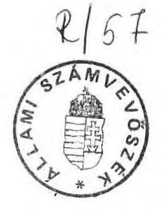
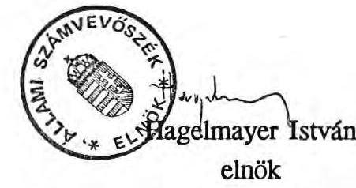

# JELENTÉS 

az önkormányzati rendszerre való átállás
szervezeti, gazdálkodási kérdéseinek ellenőrzési tapasztalatairól

---

# JELENTÉS 

## az önkormányzati rendszerre való átállás   szervezeti, gazdálkodási kérdéseinek ellenőrzési tapasztalatairól

A Parlament az 1990. LXV. tv. megalkotásával létrehozta a tanácsokat felváltó önkormányzati rendszert. Ezzel a magyar államigazgatás számára alapvetően új szervezeti, működési feltételeket teremtett, lehetővé tette az alulról építkező önkormányzó közigazgatás kialakítását.

Ellenőrzésünk célja az volt, hogy az érvényes szabályozás figyelembe vételével — a helyi önkormányzatokról szóló 1990. évi LXV. tv. az 1991. évi állami költségvetésre vonatkozó 1990. évi CIV. tv. valamint az átmeneti szabályozásról szóló 1990. évi LXXXIII. tv. alapján - megvizsgáljuk az önkormányzatok szervezeti, működési, pénzügyi feltételeit, helyzetértékelést adjunk a kialakult új államigazgatási egységek működéséről, gazdálkodásáról.

Az ellenőrzésre 11 megyében került sor, ahol jelenleg 1871 önkormányzat működik, az önkormányzatoknak mintegy 60%-a.

## Megállapítások

## I.

## Az önkormányzatok szervezeti felépítése

Az 1990. évi LXV. tv. megnyitotta az utat ahhoz, hogy a helyi önkormányzás, a választópolgárok helyi közösségei önállóan, demokratikusan intézzék közügyeiket, azaz a tanácsokat váltsa fel az önkormányzatok önszervező közössége.

Az új helyi szervezetek létrehozása, a gazdálkodási feltételek megteremtése tapasztalataink szerint gyakran együttjárt a bizonytalanság, a magárahagyatottság érzésével, esetenként a bizalmatlanság légkörével is.

---

Az átmenet általában azokon a településeken jelentett kisebb gondot, ahol a testületek támaszkodhattak a hivatali apparátus szakértelmére.

Az új szervezetek kialakítását, a működés feltételeinek megteremtését több tényező lassította, illetve kedvezőtlen hatást gyakorolt erre a folyamatra. Ezek közül a jelentősebbek:
— hiányoznak azok az alapvető jogszabályok (az államháztartásról, a számvitelről, a földről, az önkormányzati tulajdonról, a feladat- és hatáskörről szóló törvények), melyek lehetetlenné tették az önkormányzatok tudatos szervezetépítését, megalapozott gazdálkodását;
— megszűnt a tanácsi hierarchia hármas szintje (tárca, megye, helyi tanács) ezzel egyidejűleg megváltozott a megye hagyományos szerepe, az eddigi függőségi viszonyt a kölcsönös érdekeket kifejező együttműködés váltja fel. Az ilyen típusú — hosszú távon igen pozitív - "együttműködést", "önállóságot" az önkormányzatoknak azonban még el kell sajátítani, megfelelő módszereket és formákat kell kialakítani;
— az új szervezeteket hosszabb távon nem a régi szervezeti keretekben, személyi feltételekkel kívánják létrehozni, ehhez viszont hosszabb időre van szükség.

Az önkormányzati törvény lehetőséget adott a közhatalom demokratikus decentralizációjára, a helyi igényekre épülő igazgatási egységek létrehozására. Ezt a folyamatot felgyorsíthatta volna, ha optimális szervezeti, működési modellek ismeretében dönthetnek az önkormányzatok saját szervezeti formájuk kialakításáról.

Tapasztalataink szerint az alakuló önkormányzatok rendkívül heterogén, ideiglenesnek tekinthető szervezeti formákat alakítottak ki.

Sem az állami, sem az érdekképviseleti szervezetek nem ajánlottak széles körben olyan alternatív, tudományosan megalapozott — nemzetközi és hazai feltételeket is figyelembe vevő - szervezeti, működési formákat, amit az önkormányzatok saját feltételeik ismeretében alkalmazhattak volna szervezeti keretek meghatározásához. Ennek hiánya mind a hagyományos közigazgatási múlttal rendelkező településeknél, mind az eddig önállósággal nem rendelkező - volt tanácsi társközségeknél - bizonytalanságot teremtett.

A helyi önkormányzatokról szóló törvény jóváhagyását követően mintegy 3070 önkormányzat jött létre. (Ezt megelőzően több mint 1600 tanács működött). Az

---

önkormányzatok új, eddig nem alkalmazott szervezeti formákat — pl. körjegyzőség, közös képviselő testület — is létrehozhattak.

A vizsgálat idején a szervezés folyamata még nem zárult le. Elsősorban a kisebb településeken tapasztaltuk, hogy nem született döntés a végleges működési formáról.

A vizsgált megyékben 1871 önkormányzat alakult (980 tanáccsal szemben) ezen belül 335 körjegyzőség, illetve 8 közös képviselő testület jött létre.

# 1.) A megyei önkormányzatok, megyeszékhely városok szervezeti struktúrája 

a) A feladat- és hatásköröket rendező törvény hiánya elsősorban a megyei önkormányzatoknál okozott gondot. Az új hivatal felállítását az elhúzódó választások, a meglévő szervezeti keretek lebontása, a tanácsi apparátus leépítése is jelentősen befolyásolta.

A vizsgált megyékben elkezdődött az ideiglenes szervezet létrehozása, amit ideiglenes SZMSZ-szel szabályoztak:

Baranya megyében a volt 12 osztály helyett 2 osztály felállítását tervezik az önkormányzási és gazdálkodási feladatok ellátására.

Vas megyében 4 titkárságot hoznak létre: szervezési és jogi, pénzügyi és gazdasági, művelődési és sport, egészségügyi és szociális titkárságot.

Veszprém megyében 2 szervezeti egységet (önkormányzati és közgazdasági főosztályt) alakítottak ki.

Nógrád megyében még nem alakult ki konkrét elképzelés a hivatal szervezeti formájára, erre szervező intézettől működési modellt rendeltek meg.

A megyei hivatalok szervezetépítésében tapasztalt különbségek összefüggnek azzal is, hogy jelenleg szükségleten felüli létszámmal rendelkeznek, ami jelentős anyagi terheket ró az amúgy is szűkös költségvetésükre.

Nógrád megyében az állomány leépítését még nem kezdték meg.
Baranya megyében az eddigi 200 fős létszámból még 132 főt foglalkoztatnak, holott 40 fő végleges létszámmal számolnak.

Vas megyében 1990-ben 209 fő átlaglétszám volt, amit 1991. III. hóra 103 főre csökkentettek, a tervezett végleges létszám 40 fő.

---

A Belügyminisztérium 1991. januárban felmérte a megyei önkormányzatok átszervezésével járó többletköltségeket, illetve ennek TB vonzatát, amelyek elsősorban a felmondási időre, korengedményes nyugdíjazásra vonatkoznak.

Országosan ezek a költségek mintegy 350 millió Ft-ot, ezen belül a vizsgált megyékben csaknem 190 millió Ft-ot jelentenek.

A költségek realitását a dekoncentrált szervezetek létrehozásáig megítélni nem lehet. Nagyságrendjük azonban jelentős, főként akkor, ha figyelembe vesszük, hogy a megyei önkormányzatok 1991. évi tervezett bérköltsége 6,5 milliárd Ft.

A megyei önkormányzatok közül néhányan — nem is számolnak létszámuk gyors leépítésével —, a "kivárás" álláspontjára helyezkedtek, reménykednek a megfelelő nagyságú intézményállományban, ezért nagyobb méretű feladatra rendezkednek be. A dekoncentrált szervezetek kiépítetlensége miatt nem tisztázott az sem, hogy az önkormányzatok csak intézményfenntartó szerepet kapnak, vagy szakmai irányítást is végeznek. Ez utóbbi ugyanis speciális felkészültségű apparátust igényel.

Mindemellett az apparátus leépítése humánus kérdéseket is takar. A jó szakembereket pedig mindenhol megpróbálják megtartani. Ennek egyik módja pl. az, hogy az önkormányzatok különféle társulásokat, irodákat hoznak létre, ezzel felismerve a kistelepülések gondjait - igyekeznek kitölteni a ma meglévő tanácsadási űrt.

Baranya megyében a községek szakmai segítségnyújtására 20 főből álló szakmai társulást hoznak létre. Ez utóbbi fedezetét részben a megyei önkormányzat - 2 millió Ft-tal -, részben a szolgáltatást igénybevevő önkormányzatok - lakosságra vetítve 35 Ft/fő - biztosítják.

Veszprém megyében a hivatal mellett jogtanácsosi, közigazgatási és informatikai szolgáltatási iroda alakult. Az irodák saját feladataikon túl szabad kapacitásukat szolgáltatásként más szervezeteknek - elsősorban települési önkormányzatoknak - ajánlják fel.
b) A megyeszékhely városok - melyek 2 kivételével megyei jogú városok - ideiglenes szervezeti struktúrája ugyancsak igen eltérő. Annak ellenére, hogy itt a szakmai feladatok sokkal egyértelműbben körvonalazódtak, nem kell számolni a meglévő apparátus jelentős mérséklésével sem.

Miskolcon a szervezetkiépítésre még szabályozás nem történt.

---

Pécsett a közgyűlés többlépcsős átszervezést fog végrehajtani. A polgármesteri hivatalon belül polgármesteri és jegyzői irodát állítottak fel, a volt 12 szakigazgatási szerv helyett 5 osztállyal. A tisztségviselők munkáját szakreferensek segítik, a jegyzőknek pedig a vezető jogtanácsos illetve a kincstárnok lesz a szakmai tanácsadója.

Veszprémben 3 igazgatóságot - ezen belül irodákat - hoznak létre: közoktatási-szociálpolitikai-egészségügyi, városigazgatási, illetve a hatósági és ügyfélszolgáltatási feladatokra.

Tapasztalataink szerint mind a megyei önkormányzatoknál, mind a megyei székhely városoknál a szervezetépítésben kialakult, viszonylag hosszabb ideje tartó ideiglenes állapot kedvezőtlen, az apparátusban a bizonytalanság érzése a jó szakemberek eltávozását ösztönzi. Különös hangsúlyt kap ez a kérdés, ha figyelembe vesszük az önkormányzatok azon törekvését, hogy optimális - az eddigieknél kevesebb - létszámmal kívánják ellátni feladataikat. A kevesebb létszám viszont szakmailag jól felkészült apparátust igényel.

# 2.) A nagyközségek, községek, szervezeti struktúrája 

Az önkormányzati törvény hatálybalépését követően mintegy 2.900 községi, nagyközségi önkormányzat jött létre, ami az önkormányzatok 93%-át jelenti. Ezeken a településeken lakik a lakosság közel 40%-a, így nagyságrendjükkel, sajátos gondjaikkal meghatározó szerepet töltenek be.

Ellenőrzéseink során elsősorban ebben a körben találkoztunk a legerősebb önállósulási törekvésekkel. Az eddig gyakran presszionált társközségi formát egyre inkább az önálló közigazgatási státusz, majd az önként társuló szervezeti formák váltják fel.

Mindez hozzájárult ahhoz, hogy a vizsgált körben mindössze néhányan vállalták a közös képviselőtestületi formát, mivel ez a szervezeti konstrukció emlékeztette legjobban az önkormányzatokat a régi társközségi kapcsolatokra. Vizsgálatunk során egy sajátos problémával is találkoztunk:

Nógrád megyében Ecseg és Kozárd települések két polgármestert választottak, de a közös képviselő testület csak egy jegyzőt nevezett ki. Ez esetben a jogszabály nem intézkedik arról, hogy ki a jegyző munkáltatója.

---

A volt társközségek között nem egy esetben még ott is "szétválásra" került sor, ahol az eddigi együttműködés hatékony volt, illetve jól bevált kistérségi közös feladatokat láttak el.

A szeméttárolást gazdasági és környezetvédelmi szempontok miatt célszerű kistérségi viszonylatban ellátni. Ennek ellenére megszüntették ezt a közös szolgáltatást a Nógrád megyei Ecseg és Csécsei, illetve Karancskeszi, Karancslapujtó, Karancsalja községekben.

A vizsgált megyékben 920 nagyközség és község 335 körjegyzőséget hozott létre, ami az önállóvá vált volt társközségek adott személyi, tárgyi feltételei mellett reális igény volt.

Országos viszonylatban jellemző, hogy a községek többsége körjegyzőség keretében működik.

Tapasztalataink szerint elsősorban a volt társközségek egymással alakítottak körjegyzőséget.

Ugyanakkor a volt székhelyközségek más társközségekkel kerestek kapcsolatot, ez esetben általában a székhelyközségek lettek a körjegyzőségek központjai.

Ellenőrzésünk során Baranya megyében találkoztunk a legnagyobb körjegyzőséggel, ahol 10 település társult, Vajszló székhellyel.

Ezeken a kis településeken a választást követően az önkormányzatok általában tiszteletdíjas és nem főállású polgármestert alkalmaznak. A körjegyzőségek helyi irodája jórészt apparátus nélkül, vagy 1-2 fő, ügyintézővel működik. Ilyen feltételekkel nem várható el, hogy "önállóan" intézzék az alapvető igazgatási feladataikat.

Borsod-Abaúj-Zemplén megyében a községek 30-35%-ánál nincs apparátus.

Veszprém megyében a körjegyzőségekhez tartozó csaknem 100 községben nincs apparátus, hasonló feltételeket találtunk Vas megyében is.

Baranya megyében Mattyon és Szaván főállású polgármester mellett részfoglalkozású jegyzőt neveztek ki, hivatali apparátus azonban nincs.

Körjegyzőségeket városok és közeli községek is létrehoztak, bár ezt csak néhány esetben tapasztaltuk.

Tapolca város és 4 környékbeli községi önkormányzat körjegyzőséget hozott létre. Megállapodásuk szerint a városi polgármesteri hivatal ellátja

---

a községek működésével, az államigazgatási ügyek döntéselőkészítésével, végrehajtásával kapcsolatos feladatokat, emellett a költségvetési gazdálkodás teljeskörű teendőit is. Ezért a községek lakosonként 1.300 Ft/fő hozzájárulást fizetnek.

A települések valóságos önkormányzattá válása csak hosszabb folyamat eredménye lehet. Ma még nem egy esetben az önállóvá válás tudata erősebb tényező, mint a közös érdekek felismerése. Ezért fordulhattak elő olyan esetek, hogy igen alacsony népességszámú önkormányzatok is önálló hivatalt hoztak létre.

Nógrád megyében 18 olyan 1000 fő alatti lakosságszámmal rendelkező önkormányzat van - a megye önkormányzatainak 20%-a - ahol önálló polgármesteri hivatal alakult, holott a közös gondok, a közlekedési viszonyok, a közvetlen földrajzi adottságok a körjegyzőség létrehozását indokolták volna. (Pl. Sámsonházán 394 fő, Erdőkürtön 806 fő, Lucfalván 981 fő a lakosság száma.)

Ezekben az önkormányzati apparátusokban összesen 83 fő dolgozik — ebből 13 fő részfoglalkozású —, így a polgármesteri hivatalok 2-8 fő létszámot foglalkoztatnak.

A körjegyzőségek szervezeti felépítése, a körjegyzőségek és a helyi irodák együttműködése igen eltérő, sok esetben tisztázatlan. Ezek végleges formában történő szabályozására a feladat- és hatásköri törvény megjelenését követően
 kerülhet sor.

Tolna megyében Várdomb-Pörböly körjegyzőség 3 fős apparátusa látja el az önkormányzatok hivatali feladatait. Működési fedezetét 60-40 % arányban osztják meg. Korábban mindkettő Bátaszékkel alkotott társközséget.

Kisdorog-Bonyhádvarasd körjegyzőség esetében a kinevezett körjegyzőség mellett mindkét községben önálló apparátus van 3, illetve 2 fő ügyintézővel.

Kéty-Felsőnána-Murga községek körjegyzősége mellett Felsőnánán önálló apparátus működik 3 fővel. A murgai önkormányzat ügyeit a kétyi apparátus látja el, ezért népességarányosan hozzájárulnak az adóügyi és az igazgatási bérköltségekhez. A gazdálkodási feladatok ellátásáért havi 5.000 Ft-ot, a dologi kiadásokra 240.000 Ft-ot fizetnek.

Ellenőrzésünk során több településen is tapasztaltuk, hogy a körjegyző bérének megállapítása annak reményében történt, hogy ezt a költséget, járulékaival együtt az állami költségvetés felvállalja. Várakozásukat a helyi önkormányzatokról szóló törvény indoklási részében foglaltakra alapozták, amelyet a Belügyminisztérium

---

körlevele is megerősített: "a körjegyző bérét az állami költségvetés fedezi". Ezzel kapcsolatosan központi intézkedés még nem történt.

Baranya megyében Csarnóta-Turony körjegyzőségben heti 3 napra részmunkaidős körjegyzőt alkalmaznak 10.000 Ft-ért. Sumony-Gyöngyfalva körjegyzőségben a főmunkaidőben álló körjegyző bére 42.340 Ft. Szava községben részmunkaidős - nyugdíj melletti — körjegyző bére 19.000 Ft.

Ezek a települések közel azonos adottságokkal rendelkeznek, korábban társközségek voltak.

Országos viszonylatban a körjegyzők bérének felső határa megközelíti az $50.000 \mathrm{Ft}$-ot.

A hatáskörök, feladatok tisztázatlansága ezeken a településeken — ahol a megfelelő személyi feltételek biztosítása is igen nagy feladat - különös formában jelenik meg. Nem egy esetben az operatív ügyek intézését is a testületek vállalják fel.

Nógrád, Veszprém megyékben jó néhány esetben tapasztalható, hogy a konkrét segélyezési feladatokat, a szociális ügyek intézését a testületek végzik.

A kistelepüléseken gondot okoz az is, hogy olyan jegyzőt alkalmazzanak, aki megfelel a törvényben előírt feltételeknek.

Pest megyében Nagykovácsi községben az alpolgármester irányítja a hivatalt, a testületi tagok bevonásával napi operatív ügyeket intéznek. A jegyző felvételére kiírt pályázat eredménytelen volt.

Nógrád megyében a vizsgálat idején még 7 településnek nem volt jegyzője.

# II. 

Az önkormányzatok működésének pénzügyi feltételei

## 1.) A rendszerváltás gazdálkodási gondjai

A helyhatósági választásokat követően a vizsgált településeken — néhány kivételtől eltekintve - nem készültek záró, illetve nyitó mérlegek, teljeskörű vagyonleltárak, erre vonatkozóan nem volt központi intézkedés. Célszerű lett volna az átmeneti törvényben elrendelni az eszközök és a források felmérését. Ennek hiányában az új önkormányzatok többsége csak hozzávetőlegesen mérte fel az induló pénzügyi, vagyoni helyzetét, ami bizonytalanságot váltott ki az új tisztségviselőkben és az

---

apparátusban. A feszültségeket elsősorban a tartozások, az elkötelezettségek nagyságának ismeretlensége okozta. E mellett - a bevételi források szűkössége miatt - gondot jelentett az is, hogy nem tudták megítélni a mobilizálható vagyontárgyaik körét, szabad pénzeszközeik nagyságrendjét sem.

A volt városi tanácsok közül néhányan részletes felmérést készítettek az elvégzett, illetve a folyamatban lévő feladatokról az 1990. évi költségvetés időarányos teljesítéséről. Minderről tájékoztatták az új önkormányzati testületeket is.

Veszprém megyében Várpalota képviselőtestülete, 1990. novemberben áttekintette az 1990. évi költségvetés időarányos végrehajtását, a hátralévő feladatokat, illetve a likviditási helyzetet.

Ajka és Pápán az 1990. évi költségvetés végrehajtásának szeptember 30-i állapotáról tájékoztatták a képviselőtestületeket, rámutatva a hátralévő feladatokra, a várható pénzmaradvány volumenére, illetve a kötelezettségvállalásokra.

A volt közös tanácsok a szétválást követően tapasztalataink szerint nem bontották meg az 1990. évi költségvetésüket, továbbra is együtt gazdálkodtak. Erre jogszabály nem kötelezte őket, de az esetek többségében az adott személyi, tárgyi - pl. polgármesteri hivatal épület hiánya - feltételek mellett nem is lett volna reális igény. Az egymás közötti tételes elszámolást a 1990. évi pénzmaradvány megállapításakor tervezik.

Az 1990. évi I-III. negyedévben a tanácsok általában visszafogottabb gazdálkodást folytattak, elsősorban a működés zavartalanságát igyekeztek biztosítani, megfelelő pénzügyi feltételeket akartak teremteni az új testületeknek. A felújítási beruházási tevékenység háttérbe szorult. Ennek eredményeként a tanácsok többsége nem üres "kasszát" adott át az önkormányzatoknak. A IV. negyedév gazdasági döntéseit már az önkormányzatok hozták meg, azonban a szó igazi értelmében érdemi, céltudatos gazdálkodással még nem találkoztunk. A pénzügyi döntéseket a helyzetfelmérés, a folyamatos fenntartás igénye határozta meg. Az önkormányzatok többségénél a gazdálkodás kielégítő pénzügyi kondícióval indult. Ott ahol megfelelő pénzügyi örökséghez jutottak, meg volt a feltétele a kiegyensúlyozott gazdálkodásnak.

Így például az OTP-nél lekötött betétek állománya az 1990. év eleji 3,8 milliárd Ft-ról év végére 5,1 milliárd Ft-ra nőtt, ennek 71 %-a a helyi önkormányzat számláján volt. (1989. évvégi állomány 2,6 milliárd Ft volt). A betétek között az 1-3 hónap közötti lekötés volt a jellemző.

---

Vas megyében Sárvárnak 1989. szeptemberétől folyamatosan nőttek a betétjei, amelynek állománya 1990. december 31-én 35,6 millió Ft volt, 18-23 % közötti kamatozással. Az elmúlt évben 1,4 millió Ft kamatbevételhez jutott az önkormányzat.

Veszprém megyében Tapolca város 1990. második félévében a CITY Banknál helyezett el 30 millió Ft-ot, amit havonta hosszabbít. Jelenleg a betéti kamatráta 31 %-os.

Heves megyében Gyöngyös város 19,2 millió Ft-ot örökölt - két éves lekötéssel - a volt városi tanácstól, amelynek kamatbevétele 1990. év végén 6 millió Ft volt. A betétet további három hónapra meghosszabbították, amelynek kamata 26 %-ról 37 %-ra növekedett.

A vizsgált önkormányzatok kisebbik része azonban jelentős, évek óta halmozódó hitelállományt örökölt a volt tanácsoktól. Itt magas volt az eladósodás mértéke, ami súlyos pénzügyi terheket jelentett, alapvetően befolyásolta - a jövőben is meghatározza - a gazdasági döntéseket.

Veszprém megyében Veszprém város hitelállománya 1986-tól folyamatosan nőtt, 1990. december 31-én 285,5 millió Ft, amelyből csak 28,4 %-ot képviselt a lakásépítés helyi támogatása. Az 1991. évi visszafizetési kötelezettségük 114,7 millió Ft tőke és 44,5 millió Ft kamat. Ebből 1991. február végéig 62,1 millió Ft tőkét fizettek vissza.

Várpalota város elmúlt év végi hitelállománya 157,2 millió Ft volt. Ennek 50,9 %-a a kórház rekonstrukcióhoz kibocsátott kötvény. Az 1991. évi hiteltörlesztés és kamatfizetés együttes összege 57,7 millió Ft, ez az összeg a város pénzügyi lehetőségeinek 11 %-át jelenti.

Békés megyében Békéscsaba önkormányzatának adósságterhe 356 millió Ft volt, amelyből az 1991. évet terhelő fizetési kötelezettség 80,2 millió Ft. Ezzel a beruházási lehetőség az éves költségvetésben mintegy 9 %-ra csökken.

Pest megyében Budaörs önkormányzatának 1990. évről 35,5 millió Ft áthúzódó hiteltartozása van, aminek évi törlesztése 24,3 millió Ft tőke és 8,3 millió Ft kamat. Emiatt az önkormányzatnak már az első két hónapban fizetési gondjai jelentkeztek.

A jelenlegi szabályozás mellett ebből a helyzetből a "kilábalást" csaknem kizárólag saját erőből, illetve hitelfelvétellel kell megoldani, ami újabb eladósodáshoz vezethet.

Néhányan a kötelezettségek 1991. évre szóló átütemezését kérték.

Jász-Nagykun-Szolnok megyében Tiszfüred város az 1990. évi hitelállományból 7,0 millió Ft-ot nem fizetett vissza fedezet hiányában. Továbbá nem tudott átutalni 6,5 millió Ft-ot sem a távbeszélő hálózat fejlesztéséhez,

---

valamint 6,8 millió Ft-ot a szennyvízhálózati beruházáshoz esedékes kötelezettségből.

Ugyancsak ebben a megyében Kunmadaras nagyközség több mint 3 millió Ft, Tiszabő község pedig közel 4 millió Ft kiadási teljesítést kénytelen volt 1991. évre halasztani.

Néhányan már az elmúlt évi szinten sem tudták működésüket biztosítani, ami kihatással lesz az 1991. évi ellátási szintre is.

Baranya megyében Siklós város 10 millió Ft hitelállománnyal rendelkezett, amelyet a tornacsarnok építésére vett fel. Ez 1991. évben 5 millió Ft tőke visszafizetést és 3,0 millió Ft kamatterhet jelent. Így a város a szűk pénzügyi lehetőségei miatt sem beruházást, sem felújítást nem tervezett, sőt a szennyvíztelep rekonstrukcióját is leállította.

Pécs megyei jogú városnak 590,5 millió Ft hitelállománya volt. Ezen belül a pécsi 25 emeletes magasházra felvett hitel 250 millió Ft. A Minisztertanács korábban garanciát vállalt arra, hogy a hitel kamatát, valamint a megye és a város erejét meghaladó kiadásokat megtéríti. A pécsi magasház előirányzata azonban az 1991. évi állami költségvetés címzett támogatásai között nem szerepel. Így a város tervezett költségvetése 160,5 millió Ft hiánnyal számol, amit csak újabb hitellel tudnak ellensúlyozni, ez viszont tovább növeli az eladósodást.

Heves megyében Heves város hitelállománya 1990. december 31-én 67 millió Ft volt. Ennek az 1991. évi törzstőke visszafizetési és kamatterhe 45 millió Ft. Ezért a város ez évben nem tervezett fejlesztéseket, sőt ez a teher már az intézményi működtetés rovására megy.

Az 1991. évi állami költségvetés tartalmaz ugyan 5 milliárd Ft-ot a kritikus pénzügyi helyzetben lévő önkormányzatok megsegítésére ("önhibáján kívül hátrányos pénzügyi helyzetben lévő önkormányzatok"), — ami viszonylag egy szűkebb körre terjedhet ki. Ez az összeg mérsékelheti az érintettek terheit, azonban várható, hogy nem lesz elégséges az igények teljeskörű kielégítésére. A felmérések még folyamatban vannak.

Az eladósodással küszködő önkormányzatok kivételével likviditási gondokkal nem találkoztunk, az új — az APEH bonyolításával történő — finanszírozási gyakorlat sem okozott pénzellátási problémákat. Jellemző, hogy az 1990. évi átlag 28,5 milliárd Ft hóvégi pénzkészlethez képest mintegy 3-4 milliárd Ft-tal nagyobb az önkormányzatok és intézmények számláin a maradvány. (1991. január 31-én 31 milliárd Ft, február 28-án 32 milliárd Ft). A növekményhez - a megye elosztó funkciójának kikapcsolásán túl — az önálló igazgatási egységek számának csaknem 100 %-os növekedése is hozzájárult.

---

A pénzkészlet növekedése igen kedvező a számlavezető pénzintézetek számára. 1991-től az önkormányzatok szabad bankválasztási jogot kaptak, ennek ellenére csaknem teljes körben az OTP-t választották számlavezető banknak. Mindössze 2 %-63 - fordult más pénzintézethez, elsősorban a Takarékszövetkezethez.

# 2.) Az 1991. évi költségvetés feszültségei 

a) A költségvetési törvényből adódó rendezetlen kérdések
—Az 1991. évi költségvetési törvény késői megjelenése, valamint az ebben előírt feladatok központi rendezésének elhúzódása kedvezőtlen az önkormányzatok 1991. évi feladatellátására. Emiatt eltolódik a költségvetések jóváhagyása, ami a gazdálkodásban megalapozatlan döntéseket idézhet elő.

Az ellenőrzött önkormányzatok többsége az 1991. évi költségvetését a vizsgálat idején — március hó közepén — még csak "ceruzásan", vagy első olvasatban készítette el, csupán néhánynak volt jóváhagyott költségvetése.

A vizsgált önkormányzatok közül Baranya és Vas megyében egynek sem, Veszprém és Jász-Nagykun-Szolnok megyében egynek volt testületileg elfogadott költségvetése.

Általános gyakorlat, hogy a testületek két fordulós tárgyalás után fogadták el a költségvetést és ezt követően alkottak rendeletet.

A megyei önkormányzatok esetében a költségvetés jóváhagyását külön nehezíti, hogy a feladat- és a hatásköri törvény hiánya miatt:

Nem ismert az a szakmai feladatrendszer, intézményhálózat amit a tárgyévi költségvetésnek kell fenntartani, működtetni.

A centrális irányítású, úgynevezett dekoncentrált szervezetek működtetésére az állami költségvetés 11,4 milliárd Ft-ot irányzott elő. Ezek közül azonban még csak néhány szervezet jött létre (pl. TÁKISZ, a többiről még nem született döntés. Addig is ezek a feladatok - mint volt tanácsi szakigazgatási tevékenységek - a megyei önkormányzatok amúgy is szűkös költségvetését terhelik.

Nem történt meg a térségi feladatok átadás-átvétele sem. Ennek rendezése a feladat- és hatásköri törvényen túl - néhány intézmény pl. középfokú intézmények vonatkozásában - a megyei és a helyi önkormányzatok

---

hatáskörébe tartozik, így a döntések elhúzódása az
 önkormányzatok felelőssége is.

Az intézmények hovatartozásának meghatározását nem egy esetben befolyásolja a normatív támogatás nagysága, illetve fejlesztési, felújítási szükséglete is.

#### Abstract

Veszprém megyében 6 városi önkormányzat elsősorban a térségi feladatokat ellátó középfokú oktatási intézmények átadását tervezi a megyei önkormányzatnak. Veszprém város által végzett számítások azt bizonyítják, hogy a középfokú intézmények átadásával mintegy 50 millió Ft-ot takaríthatnának meg. A megyei önkormányzat viszont Veszprém várostól a művelődési központ és a gyerekek háza fenntartása miatt hozzájárulást akar kérni, illetve ezen ingatlan vagyont meg akarja osztani.

Borsod-Abaúj-Zemplén megyében a szociális otthonokat, a középfokú oktatási intézményeket és a csecsemőotthonokat kívánják megyei fenntartásba adni a helyi önkormányzatok. Itt is a normatíva nagysága befolyásolja a döntést.

Baranya megyében Szigetvár és Mohács városok négy szociális otthont, Szentlőrinc nagyközség középiskolát akar átadni a megyei önkormányzatnak.

Tapasztalataink szerint a feladat- és hatásköri törvény és az önkormányzatok egymás közötti megállapodásának hiánya veszélyezteti a térségi feladatokat ellátó intézmények biztonságos és folyamatos üzemeltetését, mivel ezek a hovatartozásuk tisztázásáig csak a minimális eszközöket kapják meg működésükhöz.
—Az 1991. évi állami költségvetésről szóló törvény 1. paragrafus (5) bekezdése az önhibáján kívül hátrányos pénzügyi helyzetben lévő helyi önkormányzatok működőképességének megőrzésére kiegészítő támogatást biztosít. A keret 75%-ának szétosztására a Kormánynak március 31-ig kellett volna a Parlament elé javaslatot terjeszteni. A törvényben foglaltakkal ellentétben március 31-ig csak az önkormányzatok pályázati határideje telt le, így a felosztásra vonatkozó döntés csak ezután következhet.

Alapvető gondot okoz a fogalom pontos meghatározása, mivel a – az elbírálást alapvetően befolyásoló – bevételek és a kiadások korrigált egyenlege nem fedi egyértelműen a törvényben megfogalmazott "önhibáján kívül"-i meghatározást. (Az önkormányzatok döntésétől függ – ami központilag igen nehezen ellenőrizhető – hogy milyen tételeket szerepeltetnek, milyen

---

nagyságrendben a kiadások között, illetve milyen várható források maradnak ki a bevételekből). Gondot okoz, hogy a források között az előző évi pénzmaradvány is szerepel, továbbá az is, hogy a "pályázat" az év közben objektív okok miatt hátrányos helyzetbe kerülő önkormányzatokat nem kezeli.

A törvényalkotók szándékát jobban kifejezte volna, ha az e célra elkülönített 5 milliárd Ft-ot konkrétabban meghatározható mutatókhoz kötik. Az ehhez kapcsolódó feltételeket pedig már a költségvetési törvényben rögzítik.

A fenti okok miatt a vizsgált megyei önkormányzatok többsége is pályázatot kíván benyújtani.

A Veszprém megyei önkormányzatnál 43 millió Ft, a Nógrád megyei önkormányzatnál 131 millió Ft a deficit.

Heves megyében Heves város esetében az 1990. év eleji 67,2 millió Ft hiány – amelyet az elmúlt évben a megyei tanács lefedezett – 1991-re 72,9 millió Ft-ra növekedett. A költségvetés tervezett kiadása 372,7 millió Ft. Ebből a hitelvisszafizetés és a kamatteher 45,0 millió Ft. Amennyiben az önkormányzat nem kap kiegészítő támogatást, a működési kiadások radikális csökkentésére kerül sor.

Kisebb mértékben ugyan, de hasonló probléma jelentkezik Jász-Nagykun-Szolnok megyében. Tiszabő községi önkormányzat 1991. évi költségvetésének bevételi előirányzata 32,3 millió Ft, a kiadási 40,3 millió Ft.

- A költségvetési törvény kiemelt feladatok finanszírozására céltámogatást vezetett be. Ezzel kapcsolatban több probléma vetődött fel:

Egyrészt a céltámogatás pályázati feltétele későn került nyilvánosságra – amit az állami költségvetés évvégi elfogadása is befolyásolt – így az önkormányzatoknak nem maradt idejük a megalapozott pályázatok elkészítésére. (Célszerűbb lett volna a pályázati feltételeket már a költségvetési törvényben rögzíteni.) Másrészt a pályázatok elbírálására várhatóan májusban kerül sor, ezért az önkormányzatok költségvetésének véglegesítésére, a feladatok rangsorolására csak májusban-júniusban kerülhet sor. Ennek az lesz a következménye, hogy a feladatok előkészítésével kapcsolatos intézkedések is késnek, ami kedvezőtlen hatást gyakorol a kivitelezésekre.

Fejér megyében Sárbogárd városi önkormányzat szennyvízcsatorna építéséhez igényelt támogatást, amihez hitelt is terveznek felvenni. E kérdésben azonban a testület csak a céltámogatás elnyerésének ismeretében tud dönteni.

---

Heves megyében Recsken a nagyközség kezelésébe került szennyvíztisztító telep kapacitásbővítését tervezik, amely egy lakótelep ellátását biztosítja. A 13,6 millió Ft beruházáshoz 8,2 millió Ft céltámogatási igényt nyújtottak be. Pozitív döntés esetén is csak májusban tudják a beruházást elindítani – amely további 240 lakás bekötését is lehetővé teszi – és így az csak augusztusra készül el. Az erre vonatkozó lakossági közműfejlesztési hozzájárulás csak augusztusban vethető ki. Félő, hogy az év hátralévő részében az önkormányzat nem tudja a tartozást behajtani, ami bevételkiesést okoz.

A kistelepülések költségvetése jó néhány esetben nem tette lehetővé a pályázati feltételként előírt saját erő biztosítását. Központi támogatás nélkül hitelt kell felvenniük, ami a magas kamatok miatt ezeken a településeken nagyarányú eladósodást idéz elő. Pl. Jász-Nagykun-Szolnok megyében Tiszabő, Tiszaigar, Nagyrév községek.

Közülük néhányan pályázni csak azok tudtak, amelyeknek erre a célra a megyei önkormányzat a térségi feladatokra biztosított pénzeszközéből támogatást nyújtott. A "térségi feladatok" fedezetét a megyei önkormányzatok viszont ugyancsak az állami költségvetésből címzett támogatásként kapják.

Heves megyében a Terpes-Szajla-Kisfüzes önkormányzatok a folyamatban lévő közös közmű építésekhez igényeltek céltámogatást. Ehhez előzetesen figyelembe vettek önkormányzatonként 2 millió, összesen 6 millió Ft megyei támogatást. A támogatás elfogadásáról a megyei önkormányzat azonban csak március elején döntött.

Néhány esetben előfordult, hogy az önkormányzatok valótlan összeget állítottak be saját forrásként a támogatás elnyerése érdekében. Így előfordulhat, hogy ha erre épül az elbírálás, újból megjelenik az országban a fedezetlen beruházások sora.

Pest megyében Érd város önkormányzata 7 témában nyújtott be beruházási célra pályázatot. A saját forrásként megjelölt közel 112 millió Ft-ból csak mintegy 50 millió Ft-tal rendelkezik az önkormányzat.

Heves megyében Heves város 8 témában nyújtott be céltámogatási igényt. Saját forrásként 6,2 millió Ft-ot jelölt meg, holott erre fedezettel nem rendelkezik.

Ennek kapcsán jelentkezik az a gond is, hogy a vízgazdálkodási támogatás feltételrendszere az aprófalvas (Baranya, Borsod-Abaúj-Zemplén) megyékben

---

lehetetlenné teszi az ivóvízellátás fejlesztését. Ugyanis ezen településeknél a lakosságszám 500 fő alatti, de vannak 100-150 közöttiek is.

Ezeknél az érdekeltségi hozzájárulásokon túl, további 10% saját erő biztosítására nincs mód.

Gondot okoz az is, hogy a céltámogatások csak 1991. évre vonatkoznak. Több évre áthúzódó beruházás esetén az önkormányzatok bizonytalanságban vannak a korábbi évek kötelezettségvállalása miatt. Amennyiben nem kapnak megfelelő támogatást, nem tudják befejezni beruházásaikat.
b) Az állami támogatás normatív elosztásából származó feszültségek

Az 1991. évi költségvetés a normatívák alapján elosztható állami támogatásra 147 milliárd Ft-ot irányzott elő. A rendszer jellegéből eredően a normatívákat 1991-ben is a támogatás szétosztásának eszközeként alkalmazták. Az operatív gazdálkodás gyakorlatában az önkormányzatok túlnyomó többsége a normatívákat úgy tekinti, mint egy-egy feladat költségéhez való hozzájárulást, vagy mint feladatfinanszírozást. Ez a szemléletbeli különbség mindaddig fennáll, míg a tervező tárcák nem terjesztik a Parlament elé az állami feladatok körét, az állam feladatvállalásának mértékét, illetve míg nem vállalják fel az ágazati tárcák a szakmai feladatok költségmodelljének kidolgozását.

Szükséges lenne az is, hogy egy-egy normatíván belül az állandó és a változó költségek elhatárolásra kerüljenek.

Ellenőrzésünk során legnagyobb feszültséget – a normatíva és a tényleges költségek különbsége miatt – az óvodai, az általános iskolai, a közművelődési és a kommunális feladatoknál tapasztaltunk.

Az óvodáknál a 15 ezer Ft/fő normatívával szemben az egy főre jutó üzemeltetési költség a vizsgált önkormányzatoknál 33 ezer és 63 ezer Ft között szóródott. Pl. Baranya megyében Siklóson 40 ezer Ft/fő, Drávaszabolcson 63 ezer Ft/fő, Heves megyében Kálban 56 ezer Ft/fő, Recsken 45 ezer Ft/fő.

Az általános iskolánál szintén nagy az eltérés a 30 ezer Ft/fő normatíva és az egy tanulóra jutó tényleges üzemeltetési költség között. Az eltérés azonban nem olyan mértékű, mint az óvodáknál. Itt a szórás – a vizsgált önkormányzatoknál – 31,0 ezer Ft és 49,0 ezer Ft között van.

---

Jász-Nagykun-Szolnok megyében Tiszaigar község önkormányzata 10% dologi automatizmussal tervezett, így az egy tanulóra jutó költség 46,4 ezer Ft/fő a 135 fős intézményben. Ezzel szemben Tiszabura község többek között figyelembe vette a várható áremeléseket is és a fajlagos költség a 330 fős intézménynél csak 36,3 ezer Ft.

A közművelődési célú normatíva nagyságrendje – 100 Ft/fő – szimbólikus összegnek tekinthető. Felhívja a figyelmet arra, hogy az ilyen jellegű normatíva még nehezebben teszi elfogadhatóvá ezt az elosztási rendszert.

Jánoshidán a művelődési ház és a könyvtár együttes költségvetése 1,6 millió Ft 0,3 millió Ft normatív támogatás mellett.

A kommunális normatíva értelmezéséhez a Belügyminisztérium sajátos módon tájékoztatót adott ki a törvény megjelenését követően. Ebben utólagosan közölték, hogy a normatíván belül két tétel szerepel: 300 Ft/fő összeg a fiatal házasok első lakáshoz jutásához, illetve 200 Ft/fő összeg a kamatadó törlesztéséhez.

Megjegyezzük, hogy a törvényalkotók felfogásától is idegen, hogy a normatíván belül konkrét feladatra, konkrét összeget határoznak meg.

Az önkormányzatok a tájékoztatást jónéhány esetben intézkedésnek tekintették, megállapítva, hogy a két témára elkülönített összeg jelentős nagyságrendet képvisel.

Heves megyében Gyöngyös város e címen 51,5 millió Ft támogatáshoz jut. Ebből az első lakáshoz jutók támogatására 11,0 millió Ft-ot, a kamatadó törlesztésére pedig 7,4 millió Ft-ot különített el. A megmaradó 33,1 millió Ft pedig lényegesen alatta marad a közvilágítás, az útfenntartás 44,6 millió Ft, valamint a lakásmobilitás 6,7 millió Ft költségének.

Jász-Nagykun-Szolnok megyében Tiszabura községi önkormányzathoz 70 kérelmet nyújtottak be kamatadó törlesztési támogatás igénylésére. Az 553,8 ezer Ft-ból viszont csak 30-40 család igénye elégíthető ki. Jánoshidán hasonló a helyzet.

Jászladányban várhatóan a kérelmek 20%-ára lesz elegendő a pénzügyi fedezet.

Fejér megyében Székesfehérvárott az állandó lakosra jutó 500 Ft/fő 54,8 millió Ft-ot jelent. Ez kevesebb annál az összegnél is, amit az elmúlt években lakáshoz jutásra fordítottak.

Tehát a várható igényeknek csak a töredékét tudják kielégíteni.

---

# c) A helyi adók bevezetésével kapcsolatos gondok 

A bevételi érdekeltség kiszélesítésére életbe lépett a helyi adózási rendszer. Az önkormányzatok többsége ez évben még a régi adózási rendszert tartja fenn. (Március végéig mindössze 45 önkormányzat jelezte, hogy helyi adót vezet be.) Ennek oka egyrészt az, hogy az önkormányzatok a helyi adókról szóló törvény késői elfogadása miatt nem tudtak felkészülni az új adónemek bevezetésére, másrészt az, hogy a lakosság terheit – különösen a községekben – nem kívánják tovább növelni. Így az egyes adónemek bevezetésére várhatóan csak szelektív módon kerülhet sor. Mindemellett a törvény helyi alkalmazása is több problémát vetett fel:

A gazdálkodó szerveknél el kell dönteni, hogy mely épületek legyenek adómentesek. Az állattartásra szolgáló épületet, a takarmányraktárat a kialakult kínálati piac miatt indokolt-e adóztatni?

A vállalkozók részére logikus-e a kommunális adó kivetése a munkanélküliség miatt?

Az iparűzési adónál az adóalap megállapítása több telephely vonatkozásában nehézkes, mivel a telephelyenkénti bevételeket az adózó nem köteles a jelenlegi számviteli előírások szerint elkülöníteni.

Az önkormányzatok az adótárgyakat illetően teljes körű, naprakész nyilvántartásokkal még nem rendelkeznek.

Az ellenőrzött önkormányzatok közül két település számításokat végzett arra vonatkozóan, hogy valamennyi kivethető adó bevezetése esetén milyen nagyságrendű
 többletforrással számolhatnak. A számítások a következő eredményeket mutatták:

Veszprém megyében Devecserben ez 1,0 millió Ft, ami az 1990. évi lakossági adóhoz képest többletbevétel nem jelentene.

Vas megyében Merseváton 200 ezer Ft lenne a többletbevétel a község mintegy 8 millió Ft összforrásán belül.

A vizsgált önkormányzatok közül többen - elsősorban a városok - foglalkoznak a helyi adók későbbi bevezetésével, azonban az ezzel kapcsolatos felmérések, adatfeldolgozások hosszabb időt vesznek igénybe.

Iparűzési adót terveznek bevezetni ez év áprilistól Vácott, a második félévtől Ajkán, Gyöngyösön.

Veszprém megyében a Somlószőlőshöz tartozó Somlóhegyen az idegenforgalmi adó bevezetése mellett döntött az önkormányzat. Ez mintegy 900

---

építményre terjed ki, ami az $50 \mathrm{~Ft} /$ négyzetméter adót figyelembe véve átlagos 20 négyzetméter alapterülettel számolva jelentős többletbevételt jelent. Ugyancsak tervezik ezen adónem bevezetését Vas megyében Sárváron és Hegyfalun.

Kommunális adó kivetését Pest és Jász-Nagykun-Szolnok megyében csak egy-két település tervezi.
d) Az önkormányzatok vagyona

A megyékben eddig csak a vagyonellenőrző bizottságok alakultak meg.
A vagyonátadó bizottságok elnökeit és tagjait a belügyminiszter a vizsgálat ideje alatt nevezte ki, azonban a működés törvényi feltételei - tulajdonjogi, feladat- és hatásköri illetve földtörvény - még hiányoznak.

Az önkormányzatok az előzőekben említett törvények hiányában nem tudták teljeskörűen számba venni vagyonukat. Az ellenőrzött volt közös tanácsoknál a vagyon megosztására nem került sor. Egy részük megkezdte a vagyonfelmérést, amelyről tájékoztatást adott a testületeknek.

Jász-Nagykun-Szolnok megyében az önkormányzatok többsége, Heves megyében Gyöngyös és Heves városok feltérképezték a volt állami és a tanácsi kezelésben lévő tulajdonokat. Ezek általában csak mennyiségi és könyvszerinti értékben, a föld szintén naturálisan került számbavételre.

Fejér megyében Székesfehérvár megyei jogú város - az önkormányzati törvénnyel tulajdonába került - vagyonának teljeskörű leltározását határozta el 1990. októberében. A többi állami tulajdon tekintetében a földhivatalnál az adatokat kinyomtatták, a feldolgozás azonban még folyamatban van.

Az önkormányzatoknál gondot jelentenek a korábban községi kezelésben lévő ún. közbirtokossági földek (rét, legelő, erdő), ezek ugyanis tagosításkor a termelőszövetkezetek kezelésébe kerültek, így az önkormányzatok nem rendelkezhetnek velük. Ugyanakkor rendezetlen a közös tanácsok kezelésébe került volt párt és társadalmi tulajdon, a szovjetek által használt objektumok hasznosítása is.

[^0]
[^0]:    Heves megyében Parád nagyközség polgármesteri hivatala a település déli részén elhelyezkedő szennyvíztelep részére nem tud egy $1800 \mathrm{~m}^{2}$-es területet kijelölni - ami hátráltatja a kiviteli terv megrendelését —, mivel az arra alkalmas terület a szajlai mezőgazdasági termelőszövetkezet kezelésében van. Korábban ez Parád közbirtokossági területe volt.

---

Jász-Nagykun-Szolnok megyében Kunmadaras nagyközség 16 ezer hold volt legelő tulajdonát szeretné visszakapni. Kunszentmárton holtágak, szántóföldek, Nagyrév község különböző épületek tulajdonjogának visszaadásával számol.

Fejér megyében Gárdony városban gondot okoz a volt párt és társadalmi szervezetek épületeinek hasznosítása. Rendezetlen a városi alapítású hajózási kisvállalat mintegy 80 millió Ft-os eszközállományának tulajdonjoga.

Ugyancsak rendezetlen ebben a megyében azon településeken, ahol szovjet alakulatok állomásoztak (Székesfehérvár, Sárbogárd, Lepsény, Polgárdi) a laktanyák, lakótelepek sorsa. Az önkormányzatok ezeket fedezet hiányában nem tudják megvásárolni.

Az önkormányzatok csak vagyoni helyzetük ismeretében tervezhetik azok egy részének hasznosítását. Vállalkozásokban való részvétellel, bérbeadás, értékesítés útján kívánnak folyamatos, illetve egyszeri bevételhez jutni. Tapasztalataink szerint a vagyoni helyzet tisztázása után sem várható gyors előrelépés a vagyon hasznosításában. Elsősorban azért, mert az önkormányzatok többségénél nincs erre - kisebb települések esetében ez nem is lenne célszerű - megfelelő szakapparátus.

Hiányzik az a szervezet - pl. állami, érdekképviseleti -, amelyik segítséget nyújthatna a vagyontárgyak hasznosításában.
e) A volt társközségek közös feladatainak ellátása

A közös tanácsok keretében működő volt társközségeknek - a szétválást követően - több esetben olyan kritikus helyzetet kellett megoldaniuk, amely a lakosság közvetlen ellátását érintette. Tapasztalataink szerint a közös tanácsok felbomlását követően a feladatmegosztás vitás helyzeteket teremtett.

A kötelezően előírt általános iskolai oktatást eddig általában több községre kiterjedő körzeti iskola fenntartásával látták el, ami gyakran a székhelyközségben volt. Az önkormányzatok többsége a megalakulást követően megegyezett abban, hogy a normatív állami támogatást az iskolát fenntartó önkormányzat kapja. Az ezen felüli költségekben viszont gyakran hosszas viták után sem tudtak megállapodni.

Tolna megyében Bonyhádvarasd községből 61 tanuló jár Tevelre. Tevel község önkormányzata tanulónként 51 ezer Ft hozzájárulást kér, a bonyhádvarasdiak azonban ezt soknak tartják, így megegyezés nem történt.

---

(Bonyhádvarasd korábban Tevel társközsége volt, jelenleg Kisdorog községgel alakított körjegyzőséget.)

Baranya megyében megegyezés hiányában, kényszerhelyzetből adódóan a társközségek egy része kénytelen a volt székhelyközségek intézményi szolgáltatását igénybe venni és ezért térítést fizetni. Amennyiben ezt nem vállalnák, a gyerekek kedvezőtlenebb utazási körülmények mellett vehetnék igénybe az oktatási szolgáltatást. (Pl.: Matty, Drávaszabolcs, Szava községek).

Az eddig közösen végzett feladatok megbontását nehezíti az is, hogy gyakran közös kötelezettségvállalásra is sor került, elsősorban a beruházások, felújítások területén.

A megalakult önkormányzatok egy részénél az ezévi költségvetési kondíció jó néhány esetben nem teszi lehetővé a megkezdett feladatok folytatását, illetve befejezését.

Több volt társközség jelezte, hogy a volt székhely településeken folyamatban lévő felújításokhoz, beruházásokhoz nem tud hozzájárulni, ezért a vagyonmegosztásnál az őt megillető hányadról inkább lemond, mintsem a későbbiekben vállalja a fenntartási költségeket.

Nógrád megyében Karancsalja a községet megillető vagyonrészéről annak fejében mond le, hogy a folyamatban lévő karancslapujtói beruházás terhe alól mentesüljön.

Karancsság székhelyközség iskolájának megépítésére a közös tanács valamennyi társközségében településfejlesztési hozzájárulást vetett ki. A társközségekben a befolyt TEHO összegénél jóval nagyobb értékű beruházást (útépítést) végeztek. Emiatt a társközségek polgármesterei úgy állapodtak meg, hogy a befizetett TEHO összegét nem kérik vissza a székhelyközségtől. Ezzel kapcsolatban testületi döntés még nem született.

Hasonló feszültségek jelentkeztek azoknál a kivitelezéseknél is, amit eddig a volt megyei tanács pénzügyi támogatásából - nem egy esetben évenként engedélyezett pénzmaradványából - fedeztek (Pl.: Szigetvár város, Cece nagyközség).

Ellenőrzéseink tapasztalatait összegezve megállapítottuk, hogy a megalakult önkormányzatok a hiányzó jogszabályok, a tapasztalatlanságuk és gyakran magárahagyatottságuk miatt jó néhány esetben nehéz helyzetbe kerültek. Hozzájárult ehhez az is, hogy olyan esetekben sem vállalták fel a döntéseket - pl. térségi feladatok, közös vagyonmegosztás, közös intézményfenntartás -,

---

amihez helyi és nem parlamenti döntés szükséges. Gondjaik jórésze mind szervezeti, mind gazdasági, pénzügyi kérdésekben még ma is megoldatlanok. Az önkormányzatok többsége az "örökölt" pénzügyi feltételek mellett kisebb "zökkenőkkel", de tartós fizetőképtelenség nélkül fedezte az átmeneti időszak feladatait. Az önkormányzatok kisebbik része az elmúlt években történt erőn felüli hitelfelvételek miatt jelentősen eladósodott, súlyos pénzügyi helyzetbe került. Számítani kell arra is, hogy a jóváhagyott költségvetések és a vállalt kötelezettségek ismeretében az év során újabb feszültségek keletkeznek, amit egyáltalán nem, vagy csak részben tud az állami költségvetésből biztosított -cél-, címzett és az önhibáján kívül hátrányos helyzetben lévőknek juttatott támogatás kezelni.

Kritikus helyzetbe elsősorban az eladósodott, megalapozatlan kötelezettségvállalásokat — beruházásoknál, felújításoknál, vállalkozásban való részvételnél — folytató önkormányzatok kerülhetnek.

Az önkormányzatok biztonságos és megalapozott gazdálkodása érdekében szükségesnek tartjuk, hogy
—a hiányzó alapjogszabályok (elsősorban a feladat- és hatásköri, az önkormányzati tulajdonról és a földről szóló törvények) mielőbb megalkotásra kerüljenek,

- biztosítva legyen az állami támogatás normatív rendszerének továbbfejlesztése. Ennek keretében meg kell határozni az állami feladatok körét és annak pénzügyi fedezetét, illetve az állami költségvetésből normatív módon finanszírozott feladatok költségmodelljét,
—a céltámogatások feltételrendszerében legyen kizáró ok, ha a pályázó önkormányzat ezen kívül más támogatást is igényel, melyet közvetlenül, vagy közvetve az állami költségvetés fedez,
— az önhibáján kívül hátrányos pénzügyi helyzetben lévő helyi önkormányzatok működőképességének megőrzésére biztosított 5 milliárd Ft felosztását objektív mutatószámokkal meghatározó feltételekkel biztosítsák.

Ennek hiányában - ez évre vonatkozóan - elképzelhetőnek tartjuk azt is, hogy ez az összeg a megyei és a fővárosi önkormányzatoknak juttatott normatíva (50 millió forint/önkormányzat) és a megyei (fővárosi) önkormányzatoknak biztosított normatív fejlesztési célú támogatás ($400 \mathrm{Ft} /$ fő) között

---

kerüljön szétosztásra, mivel a jelentkező igények jó része e két témakörbe tartozik;
—a körjegyzők bérének állami költségvetésből történő fedezésére térjenek vissza a tervező tárcák;
— az érdekképviseleti szervek vállalják fel a kritikus problémák (pl: kistelepülések, megyei önkormányzatok, vagyonhasznosítás) kezelését, menedzselését.

Budapest, 1991. május

---

Az ellenőrzést végzők névsora:

A vizsgálatot irányította:

Közreműködött:

A helyszíni vizsgálatot végezték:

Baranya megye:

Borsod-Abaúj-Zemplén megye:

Békés megye:

Fejér megye:

Heves megye:

Jász-Nagykun-Szolnok megye:

Nógrád megye:

Pest megye:

Tolna megye:

Vas megye:

Veszprém megye:

Hegedűsné dr. Müllern Veronika főtanácsos
Dr. Tóth András számvevő tanácsos

Dr. Nagy Ágnes számvevő
Remeczky László számvevő
Győrffi Dezső számvevő tanácsos
Dankó Géza számvevő tanácsos
Kollár Lászlóné számvevő tanácsos
Horváth József számvevő
Dr. Tóth András számvevő tanácsos
Csomán Mihály számvevő
Németh Péterné számvevő
Bocsi Sándor számvevő

Benczik Lászlóné számvevő
Simon Ákosné számvevő
Dr. Tóth Annamária számvevő
Farkas Tamás számvevő
Csekei Gyula számvevő
Dr. Gyuk József számvevő tanácsos
Horváth János számvevő
Rénes Mária számvevő
Kemenszky Sándor számvevő

---

# PÉLDATÁR 

az önkormányzati rendszerre való átállás szervezeti, gazdálkodási kérdéseinek ellenőrzési tapasztalatairól készült jelentéshez

## I.

Az önkormányzatok szervezeti felépítése

Az önkormányzati hivatalok szervezeti kiépítését akadályozza a feladat- és hatásköri törvény. A megyei önkormányzatok ezen felül - a múlt örökségeként - a szükségesnél magasabb létszámmal rendelkeznek. Így az önkormányzatok általában heterogén, ideiglenesnek tekinthető szervezeti formákat hoznak létre.

## 1.) A megyei önkormányzatok, megyeszékhely városok szervezeti struktúrája

A Borsod-Abaúj-Zemplén megyei önkormányzatnál osztályszervezetet hoznak létre 6 osztály felállításával, mintegy 55-60 fővel. Ugyanakkor a szervezet átlag létszáma 1991. I. 1-én 222 fő volt, amely a vizsgálat idejére mintegy 35-40 fővel csökkent.

A Pest megyei önkormányzatnál 4 szervezeti egységet - titkársági, intézményi irányítói, gazdasági és műszaki osztályt - alakítanak ki. Az önkormányzatok mellett jogtanácsosi iroda is működni fog. A 270 fős apparátus létszámának 60-80 főre történő leépítése folyamatban van.

Tolna megyében a megyei önkormányzati hivatal kialakítása a volt szakigazgatási szervezetek létszámának fokozatos csökkentésével folyik, végleges szervezet még nincs. Az 1991. március 1-én meglévő 70 fős átlaglétszámot 42-44 főre tervezik leépíteni.

A Heves megye közgyűlésének 28/1991. (I.17.) határozata alapján a megyei önkormányzat hivatalát négy - jogi, pénzügyi, vállalkozói és intézményi -

---

irodával hozták létre. Az 1991. I. 1-i 183 fős volt igazgatási apparátust 52 főre tervezik leépíteni.

A Jász-Nagykun-Szolnok megyei önkormányzatnál ugyancsak négy egységet hoztak létre: művelődési és népjóléti, pénzügyi, koordinációs és területfejlesztési, valamint közgyűlési irodát. Az 1990. december 31-ei 180 fős igazgatási létszámot 48-50 főre építik le.

Fejér megyében a megyei önkormányzati hivatalt a következő szervezeti tagozódásban állították fel: testületi és szervezési, pénzügyi és gazdálkodási, titkársági jogi osztályok, továbbá kommunális szolgáltatások, valamint humánszolgáltatások osztálya. Az 1990. december 31-ig 151 fős létszámot 53 főre tervezik lecsökkenteni.

A Békés megyei önkormányzatnál még nincs közgyűlési döntés a szervezet kialakításáról. A megyei igazgatási létszám 1990. december 31-én 149 fő volt. Előreláthatóan 4 szervezeti egység létrehozását tervezik, mintegy 50 fővel.

Békéscsabán a megyei jogú városi önkormányzatnál még a régi szervezeti felállásban dolgoznak. A 9 osztály 139 főt foglalkoztat. A feladat- és hatásköri törvény megjelenését követően tervezik az átszervezést.

Szombathely megyei jogú városi önkormányzatnál 3 szervezeti egység - költségvetési, hatósági, népjóléti - létrehozását tervezik.

Eger megyei jogú város polgármesteri hivatalánál 7 - jegyzői és képviselői, főmérnöki, lakosság szolgálati, gazdasági, művelődési és sport, egészségügyi és
 szociális, valamint idegenforgalmi és kereskedelmi irodát létesítettek.

Székesfehérvárott a megyei jogú városi önkormányzatnál 12 osztály kialakítása van folyamatban.

Dunaújvárosban még nincs elképzelés a megyei jogú városi önkormányzat szervezetének kialakítására.

Szolnok megyei jogú város önkormányzatánál a korábbi 8 szakigazgatási szervvel szemben 6 – polgármesteri, ügyfélszolgálati, művelődési és népjóléti, városfejlesztési és üzemeltetési, pénzügyi, valamint vállalkozási és informatikai – irodát hoztak létre.

---

# 2.) A nagyközségek, községek szervezeti struktúrája 

A települések működtetését az önkormányzati szervek sokfélesége jellemzi:
Közös képviselő testületek létrehozására került sor néhány megyében.
Borsod-Abaúj-Zemplén megyében a közös tanácsot alkotó Girincs-Kiscsécs községek az önkormányzati alakuló ülésükön közös képviselő testület létrehozásáról döntöttek. Az SZMSZ tervezet szerint a közös képviselő testület a költségvetést és a vagyont egyesíti. Ennek alapján a kiscsécsi önkormányzat számlanyitást nem is kezdeményezett.

Baranya megyében ugyancsak egy közös képviselőtestület megalakítására került sor Sumony és Gyöngyfa esetében, amelyek korábban Szabadszentkirályhoz tartoztak.

Körjegyzőséget város és környező községek is hoztak létre.
Pl. Vas megyében két körjegyzőség városközpontokkal jött létre.
A körjegyzőségek szerveződésének sajátosságait mutatják:
Borsod-Abaúj-Zemplén megyében a korábban Halmaj székhellyel működő 6 községet magában foglaló közös tanács területén a választást követően 6 önálló képviselőtestület alakult, melyből 3-3 község 2 körjegyzőséget hozott létre. A költségvetést és a vagyont 6 részre osztották, s valamennyi önkormányzat saját bankszámlát nyitott.

Tolna megyében Hőgyész nagyközség, valamint Kalaznó-Mucsi-Duzs községek alkotnak körjegyzőséget. Valamennyi csatlakozó községben van egy-egy gazdálkodási feladatokat ellátó ügyintéző, aki a körjegyzőséghez fog tartozni.

Baranya megyében Szalántához tartozott 9 település, amelyből Turony és Csarnóta önálló körjegyzőséget, Szava és Garé külön-külön önálló önkormányzati hivatalt hozott létre, a többi 5 település a szalántai körjegyzőséghez tartozik.

Társulási formák kialakítása is megfigyelhető.

---

Borsod-Abaúj-Zemplén megyében a képviselő testületek 13 hatósági és 6 intézményirányítói társulást hoztak létre.

Nógrád megyében a választásokat megelőzően is működő négyféle hatósági (építési-műszaki, szabálysértési, adóigazgatási, kereskedelmi) és egy ellenőrzési társulás maradt fenn. A választásokat követően mindössze két új építés-műszaki társulás szerveződött, hat önkormányzat részvételével. A hatásköri feladatok meghatározásáig lényeges változtatásokat nem tartanak célszerűnek.

Tolna megyében a hatósági igazgatási társulások kialakítása folyamatban van. Műszaki igazgatási társulást tervez Kéty, Felsónána, Murga, Zomba, Harc, Sióagárd, Medina önkormányzata. Alsónánai önkormányzat a várdombi körjegyzőséggel állapodott meg – 1991. február 1-től – műszaki igazgatási feladatok közös ellátásában havi 3000 Ft bérköltség + TB, valamint 600 Ft utiköltség átvállalásával.

A körjegyzőségek és a körjegyzőségek helyi irodáinak létszáma jelenleg meglehetősen sajátosan alakult.

Borsod-Abaúj-Zemplén megyében Halmaj székhellyel létrehozott körjegyzőség, amely 3 községet tömörít – az összlakosság száma 2.801 fő –, 10 fős hivatallal működik. Kázsmárk székhellyel működő körjegyzőség, amely ugyancsak 3 községet lát el, s az összlakosság száma 2.076 fő, 5 főt alkalmaz. Sóstófalva, mely a választásokat követően vált ki a közös tanácsból és hozott létre önálló képviselőtestületet – e község lélekszáma 240 fő – a hivatali feladatokra az 1 főfoglalkozású polgármesteren kívül 1 főfoglalkozású ügyintézőt alkalmaz. Jegyző kinevezésére még nem került sor.

Az új önkormányzatok tárgyi és személyi feltételei nagyon eltérő színvonalúak. A volt székhelytelepülések tanácsi apparátusa és technikai lehetőségei kedvező körülményeket teremtettek az új önkormányzatoknak. A volt társközségekben létrejött hivatalok mind személyi, mind technikai feltételekben viszont rendkívül hiányosak.

Baranya megyében Sumonyban, Mattyon és Turonyban 1-1 helyiségből áll a hivatal, melyek fűtése sincs kellően megoldva. Az irodákban hiányos a bútorzat, a felszerelés, Matty és Szava önkormányzata telefonnal sem rendelkezik.

---

Nógrád megyében Csécsén az új önkormányzati hivatalhoz csak úgy tudtak telefont biztosítani, hogy azt az öregek napközi otthonából leszerelték. Emiatt súlyos egészségügyi problémák esetén a késedelem életveszélyes lehet.

Nógrád megyében az új polgármesteri hivataloknál a legnagyobb gondot a megfelelő szakértelemmel, végzettséggel rendelkező jegyző alkalmazása jelentette. Néhány önkormányzat csak többszöri próbálkozásra tudta betölteni ezt a funkciót. Hét településen a vizsgálat időpontjáig nem sikerült megfelelő személyt találni a jegyzői álláshelyre.

Baranya megyében 4 polgármesteri hivatal még nem tudta betölteni a jegyzői állást (Alsómocsolád, Gödre, Homorúd, Máza), emellett hat körjegyzői állás is betöltetlen volt (Lippó, Olasz, Véménd, Egyházasharaszti, Magyarbóly, Szabadszentkirály).

# II. 

Az új önkormányzatok működésének pénzügyi feltételei

Az átmeneti időszakban a települések működtetésének és az 1991. gazdasági év beindításának általános problémájaként vetődött fel a törvényi szabályozás teljeskörűségének hiánya. Kedvezőtlenül hatott az átmenetre az is, hogy a volt tanácsi vezetés csak formálisan adta át az új képviselőtestületnek a folyamatban lévő feladatokat, a vagyont. Így az új vezetés nem rendelkezett a település helyzetéről megfelelő információval, ami a gazdálkodásban bizonytalanságokat eredményezett. Ezen kívül problémákat okozott a települések fejlettségbeli különbsége is.

## 1.) A rendszerváltás gazdálkodási gondjai

Néhány volt városi tanács részletes felmérést készített az elvégzett, illetve a folyamatban lévő feladatokról, erről tájékoztatta az új önkormányzati testületeket.

Veszprém megyében Veszprém város képviselőtestülete a város 1990. évi költségvetésének időarányos teljesítését 1990. november 23-i ülésén tárgyalta.

---

Heves megyében Eger város tanácsa a múlt év májusában részletes anyagot készített "A város társadalmi, gazdálkodási folyamatainak helyzet-felmérése, különös tekintettel az önkormányzat előtt álló feladatokra". Ebben bemutatták a feszültségekkel terhes és a következő időszakban megvalósításra váró feladatokat.

A volt tanácsok általában igyekeztek óvatos gazdálkodással megfelelő pénzügyi feltételeket teremteni az új testületeknek.

Jász-Nagykun-Szolnok megyében Kunszentmárton önkormányzatának 36.875 ezer Ft volt az év végi számlamaradványa. Jászladány nagyközség önkormányzatnak több mint 4 millió Ft, Tiszabura községi önkormányzatnak 3 millió Ft, Jánoshida községi önkormányzatnak 5,7 millió Ft pénzmaradványa keletkezett.

Tiszaigar községi önkormányzat a jogelőd közös tanács pénzmaradványából 2 millió Ft-tal részesedett. Az önkormányzat vezetői ennek ellenére úgy ítélték meg, hogy a támogatásra szoruló lakosság megélhetéséhez alig-alig tudnak segítséget nyújtani.

A megfelelő pénzügyi kondícióval induló önkormányzatok továbbra is kiegyensúlyozott gazdálkodást folytattak és nőtt a lekötött betétek állománya:

Fejér megyében Székesfehérvár megyei jogú város 1990. évben összesen 158 millió forintot kötött le az OTP-nél, az éves kamatbevétel 17,5 millió forint. Ez évben 31%-os kamatra a CITY Banknál helyeztek el 10 millió forintot.

Heves megyében Demjén községben átadásra került a társulati úton elkészült víziközmű. Az eltérő műszaki megoldásból származó alacsonyabb építési költség miatt a lakossági hozzájárulásból – amellett, hogy a lakosság részére egy évet elengedtek – 1,7 millió Ft megtakarítás keletkezett. Ebből a község 600 ezer Ft-ot 1990-ben lekötött, ami után 54 ezer Ft kamatot realizált. A betétet 1991. januárban további 6 hónapra 33%-os kamattal meghosszabbította. További 1 millió Ft-ot két hónapra tervez lekötni.

Jász-Nagykun-Szolnok megyében Kunszentmárton város 1988. szeptember óta 12,5 millió Ft-ot, 1990. április óta 5 millió Ft átvett pénzeszközt tartott betétben, melyek után 1990-ben 3,5 millió Ft kamatot kapott.

---

Jászladány nagyközség 1 millió Ft-ot tart takaréklevélben. Tiszabő község a pályázatokon nyert 2,4 millió Ft-ot kötötte le 3 hónapra 18, illetve 24%-os kamatra. Jánoshida községi önkormányzat 1990. októberben 1,3 millió Ft-ot, 1991. januárjában 1 millió Ft-ot helyezett el kamatozó betétben.

Veszprém megyében Ajka város 10 millió Ft-ot kötött le az Országos Takarékpénztár Ajkai Fiókjánál február 1-től 1 hónapra, 30%-os kamatra.

Pest megyében Dabas 10,0 millió Ft-ot 3 hónapos, 5 millió Ft-ot 28 hónapos futamidővel kötött le.

Az önkormányzatok kisebbik része jelentős adósságot örökölt.
Pest megyében Cegléd város önkormányzatának a tőke és kamattartozása 140 millió Ft az 1991. január 1-i állapotnak megfelelően. Az 1991. évben visszafizetésre kerülő 41,6 millió Ft jelentősen csökkenti a fejlesztési lehetőségeket.

Érd város a korábbi években (1981-1990. között) a jelentősebb beruházásaihoz, a lakásépítés helyi támogatásához hitelt vett igénybe, illetve 1987-ben tanácsi határozat alapján 40 millió Ft értékben kommunális kötvényt bocsátott ki. A felvett 151,8 millió Ft hitelállományból 1990. december 31-ig 79,1 millió Ft törlesztése történt meg. Az 1991. január 1-én fennálló tőketartozása 112,7 millió Ft.

Veszprém megyében Balatonalmádi város 1990. december 31-i hitelállománya 12,1 millió Ft, melyből 10 millió Ft-ot a tanácsház rekonstrukciójához, 2,1 millió Ft-ot a fiatal házasok első lakáshoz juttatása támogatásához vett igénybe. Az 1991. évi tőketörlesztési kötelezettsége 5,1 millió Ft.

Pápa város hiteltartozása 1990. december 31-én 35,2 millió Ft, melyből a lakásépítés helyi támogatása 63,8%-ot tett ki. Kötvénykibocsátás miatt 49 millió Ft kötelezettsége van. Az 1991. évben a hitelek miatt 10,5 millió Ft-ot kell törleszteni (ebből tőke 9,3 millió Ft, kamat 1,2 millió Ft), a kibocsátott kötvények után pedig 21,1 millió Ft-ot (tőke 14,7 millió Ft, kamat 6,4 millió Ft).

Heves megyében Recsken a volt nagyközségi tanács 1989-ben egy 400 adagos konyha-étterem építéséhez 6 millió Ft hitelt vett fel, négy évi lejáratra. A kamatterhek időközben megnövekedtek, vagyis megkötéskor 20%, 1990-

---

ben 27%, és jelenleg 36%. A törlesztést 1990-ben elkezdték, ami jelentős terhet ró az önkormányzatra. Így az ez évi 1,5 millió Ft hiteltörlesztés mellett a kamatkiadás 1,4 millió Ft lesz. Ez a 7,1 millió Ft fejlesztési lehetőséget 4,2 millió Ft-ra mérsékli, amely teher 1994-ig – csökkenő mértékben ugyan – jelentkezik.

# 2.) Az 1991. évi költségvetés feszültségei 

a) A költségvetési törvényből adódó rendezetlen kérdések

Az ellenőrzés időszakában az önkormányzatok többsége még nem rendelkezett jóváhagyott 1991. évi költségvetéssel. Emiatt az operatív gazdálkodás továbbra is csak a legszükségesebb kiadások teljesítésére szorítkozott.

Veszprém megyében a megyei önkormányzat az ellenőrzés idején jóváhagyott 1991. évi költségvetéssel nem rendelkezett, az intézményi költségvetések egyeztetése folyamatban volt. A képviselőtestület az 1991. évi költségvetést március második felében tűzte napirendre.

Ajka városban a képviselőtestület az 1991. évi költségvetés I. fordulójának megvitatását március közepére tervezte.

A Veszprém megyei önkormányzat közgyűlése 1991. február 21-i ülésén megtárgyalta az 1991. évi költségvetés irányelveit. Ez után átmeneti felhatalmazást adott a közgyűlés elnökének a gazdálkodás vitelére, a főjegyzőt utasította, hogy a költségvetési javaslatot március 20-ig terjessze a közgyűlés elé.

Nemesszalók, Ugod, Bakonyszücs, Homokbögöde-Nagytevel önkormányzatok 1991. évi költségvetési javaslattal rendelkeznek, jóváhagyott költségvetéssel azonban nem.

Városlőd-Csehbánya körjegyzőségének és az önkormányzatoknak még nem volt 1991. évi költségvetése. Ezt a két képviselőtestület március 14-i ülésén tervezte első fordulóban megtárgyalni. Itt mindkét polgármesteri hivatal önállóan gazdálkodik (a körjegyzőség csak hatósági feladatokra jött létre). A kötelezettségvállaló, utalványozó a két polgármester, míg az ellenjegyző a körjegyző.

---

Több tényező kedvezőtlenül hatott az 1991. évi költségvetés összeállítására.
A térségi feladatok átadás-átvétele nem történt meg, bár végeztek felméréseket.

A Pest megyei önkormányzat készített egy – az igénybevételi arányokat is tartalmazó – kimutatást azokról az oktatási, egészségügyi és szociális intézményekről, amelyek várhatóan a megyei önkormányzat irányítása alá kerülnek. A listán szereplő intézmények átadás-átvételének megyei terveiről a helyi önkormányzatoknak nem volt ismeretük. A felsorolt intézmények legtöbbjének megtartását, működtetését tervezték az érintett települések.

A megyei önkormányzat listáján szerepel többek között: Cegléd Város Kórháza, 4 középiskolája, valamint Vác Város Kórháza és néhány oktatási intézménye is.

A városok azonban csak a közigazgatási területükön kívül eső szociális otthonok átadását kezdeményezték.

Dabas város minden intézményét (egészségügyi-szociális, oktatási) átadja a megyei önkormányzatnak.

Nógrád megyében a több
 települést ellátó intézmények üzemeltetésére az önkormányzatok zömében már megállapodtak. Néhány esetben a megállapodást nem véglegezték, mert nem tisztázódott a működtetésen felül periodikusan jelentkező (pl. felújítási) költségek számításba vételének módja. Ugyanis ezekre felméréssel, kalkulációval nem rendelkeznek.

Több település által alapított költségvetési üzem átalakításában nagyon sok bizonytalansági tényező tapasztalható. Néhány esetben (pl. Karancslapujtő, Etes, Karancskeszi, Karancsalja, Litke, Mihálygerge) még azt sem sikerült a rendelkezésre álló dokumentumokból megállapítani, hogy az alapító tanácsok költségvetési előirányzattal hozzájárultak-e az üzem alapításához, vagy azt az akkori járási tanács hozta létre saját pénzeszközeiből.

A Veszprém megyei önkormányzat felülvizsgálja a megyeszékhelyen működő intézményeit és többek között a művelődési központ, gyerekek háza fenntartási költségeihez hozzájárulást szándékozik kérni a megyei jogú városi önkormányzattól. Ezzel párhuzamosan felvetődött a megyei jogú város

---

önkormányzata részéről az az igény, hogy a működési költségekhez történő hozzájárulással egyidejűleg a vagyont is indokolt volna megosztani.

A megyei jogú önkormányzat azokat az intézményeket nem kívánja átvenni a megyei önkormányzattól, amelyek a normatív támogatáson felül további jelentős önkormányzati támogatást igényelnének (pl. a színház, kórház).

Borsod-Abaúj-Zemplén megyében a volt megyei tanács oktatási és továbbképző intézete korábban két telephellyel - Mályi és Kéked — rendelkezett. A megyei önkormányzat az 1991. évi költségvetésében csak a kékedi részleg további működésének támogatásigényével számol, így a Mályi továbbképző intézet további üzemeltetése jelenleg rendezetlen.

- A céltámogatások igénybevétele, a pályázatok elkészítése problémát jelent az önkormányzatoknál.

Pécs megyei jogú város 403 millió Ft-ra nyújtott be pályázatot, azonban a rövid határidő miatt nagy gondot jelentett a 35 pályázat elkészítése, mivel azok között volt olyan is - német nyelvű gimnázium beruházásának indítása -, amely testületi döntést igényelt.

Vas megyében két város és egy nagyközség kért céltámogatást. A városok igénylése megfelel a feltételeknek, de Vép nagyközség beruházásánál — ahol egy szennyvízcsatorna-rendszer építkezéseit kezdték meg a múlt évben és ehhez 34 millió Ft céltámogatást kért — a készültségi fok csak 6 %. Így a folyamatban lévő beruházások kiírt támogatási feltételeinek ez nem felel meg.

Heves megyében Parádon a volt tanács 1989-ben elkezdte az Általános Művelődési Központ 9,7 millió Ft összegű bővítését. A befejezéshez 3,7 millió Ft-ot pályáztak meg. Az elbírálás elhúzódása miatt csak áprilisban tudja meghirdetni a versenytárgyalást.

Az alapfokú oktatás céltámogatásánál az 5 millió Ft alsó határ rendkívül hátrányos helyzetbe hozza a kistelepüléseket, ellentétben van azzal az oktatásszervezési törekvéssel, hogy indokolt esetben legyen mód a tagiskolák megnyitására, a túlzott körzetesítés oldására. Hasonló problémákat vet fel az a feltétel is, hogy meghatározott esetekben csak az 500 fő feletti kistelepülések juthatnak céltámogatáshoz.

---

Nem érthető egyértelműen az a kritérium sem, hogy miért csak azon települések részesülhetnek támogatásban, amelyek nem rendelkeznek önálló iskolával. Baranya megyében sok olyan település található, ahol az általános iskolai oktatás több, egymástól távol eső, esetenként az elmúlt században épült, romos és gazdaságosan fel nem újítható épületekben folyik. Indokolt lenne ezek támogatása is.

Nógrád megyében Ecseg, Csécse községek ivóvízhálózatának megoldásával kapcsolatos pályázat elkészítéséhez a szükséges szakhatósági véleményeket, tanulmányokat a kitűzött határidőig nem lehetett beszerezni. Így ezen önkormányzatok nem tudták benyújtani támogatási igényüket. Saját erőből viszont ezen települések nem tudják megoldani az önkormányzati törvényben kötelező feladatként megfogalmazott egészséges ivóvízellátást.

Nehéz helyzetbe kerültek azok az önkormányzatok, amelyek olyan beruházásokat indítottak, amelyeket az ez évre érvényes céltámogatási rendszer nem kezel. Pl.:

Nógrád megyében Karancslapujtőn az orvosi rendelő beruházását emiatt várhatóan az idén nem lehet befejezni.

Borsod-Abaúj-Zemplén megyében Arnót község 1990-ben megyei támogatással egy 8 tantermes általános iskola építésébe kezdett, 1991. augusztusi befejezéssel. A beruházás bekerülési költsége 54,5 millió Ft, melyből 13 millió Ft-ot 1990-ben kifizettek. A befejezéshez 1991-ben 41,5 millió Ft-ra lenne szükség, melyhez központi céltámogatásból - amennyiben a pályázatokat elfogadják - 16,6 millió Ft-ot igényelhetnek. Ezen felül a befejezéshez 24,9 millió Ft saját forrás bevonására lenne szükség, amit a község nem tud vállalni. A község 1991. évi költségvetési bevétele ugyanis valamennyi forrást figyelembe véve mindössze 30 millió Ft.

Tolna megyében a jelenlegi pénzügyi szabályozás miatt Pörböly község a víziközmű társulati beruházást, amelyhez a megyei tanács 1991. évre 1,5 millió Ft támogatást ígért, nem tudja befejezni. Az 1991. évi költségvetési törvény alapján ezt a megyei önkormányzat a címzett támogatásból nem biztosíthatja, mert a társulati beruházás szerepel a céltámogatások között. Pörböly önkormányzata ugyanakkor céltámogatást sem igényelhet, mert a törvény 6. számú mellékletében szereplő céltámogatási feltételek között kizáró tényező a megyeközpont által 1991. évre vállalt támogatás.

---

# b) Az állami támogatás normatív elosztásából származó feszültségek 

A legnagyobb feszültség a területen az óvodai, általános iskolai, közművelődési és a kommunális normatíváknál jelentkezik.

Heves megyében Bátorban 45 ezer Ft/fő, Parádon 51,7 ezer Ft/fő költség mellett tudják üzemeltetni az óvodát.

Tolna megyében Hőgyész községben az egy általános iskolás tanulóra jutó üzemeltetési költség 41 ezer Ft.

Veszprém megyében Ugod községben egy óvodáskorú lakosra jutó költség 44 ezer Ft, a 15 ezer Ft normatívával szemben. A térségi feladatokat is ellátó művelődési központ 2,4 millió Ft előirányzatával szemben ez évben 167 ezer Ft normatív támogatást kap.

A költségek nehezen összehasonlíthatók a következők miatt:
—a tervezés módja a dologi automatizmus mértékét illetően különböző,
—a kihasználtság az intézményeknél eltérő, a városokban nagyobb, a községekben alacsonyabb, így az utóbbiaknál az egy főre jutó állandó költség magasabb,
—a napközis ellátásnál a konyha költségei egyes helyeken a GAMESZ költségvetésében szerepelnek (pl. Recsk nagyközségben), így az 1 főre jutó költség lényegesen kevesebb.

Nógrád megyében a kommunális célokra biztosított normatívából a kamatadó törlesztésére, illetve a fiatal házasok első lakáshoz jutásra tervezett támogatás elkülönített összege egy közepes nagyságúnak mondható 1500 fős településnél sem fedezi az igényeket. Ebből csupán 10-15 hiteladósnak és 2-3 lakásépítőnek tudnak támogatást biztosítani. Ugyanakkor pl. Ecseg községben ez év február közepéig 14 család jelentette be lakástámogatási igényét.
c) A helyi adók bevezetésével kapcsolatos gondok

A vizsgált önkormányzatok többsége csak későbbiekben tervezi a helyi adók bevezetését, mivel az ezzel kapcsolatos felmérések, elemzések hosszabb időt vesznek igénybe.

---

Veszprém megyében Veszprém és Várpalota városok, Külsővat önkormányzata, továbbá Noszlop, Oroszi és Bakonypölöske körjegyzőségek nem tervezik 1991. évben a helyi adó bevezetését. Várpalota kivételével azonban mindenütt elkezdődtek az előkészületi munkák a következő évi bevezetéshez.

Pest megyében Érden és Törökbálinton az iparűzési, kommunális és az idegenforgalmi adó bevezetésével foglalkoznak, 1991. II. félévtől, illetve 1992-től. Ezen időre tervezik az adóapparátus kiépítését is.

# d) Az önkormányzatok vagyona 

A megyei vagyonellenőrző bizottságok az önkormányzati vagyon védelmében néhány esetben a volt tanács értékesítési szándékát meghiúsították, ami általában a vagyonértékelés fogyatékosságait is bizonyította.

Veszprém megyében a vagyonellenőrző bizottság az irreálisan alacsony összeg miatt meghiúsította a Tejipari Vállalatnak átadásra tervezett 8359 m²-es földingatlan 100 Ft/m²-es kezelői joggal történő átengedését.

Az ALKIMIA Vegyesipari Szolgáltató GMK a veszprémi 2135/2, 2135/4. helyrajzi számú ingatlanokat kívánta megvásárolni. A volt végrehajtó bizottság a szakigazgatási szervek 150-200 Ft/m² értékre vonatkozó javaslatát nem fogadta el és szakértő igénybevételét rendelte el. A szakértő 281 Ft/m²-es értéket állapított meg, amit viszont a GMK tartott magasnak és újabb szakértői véleményt kért. Ez utóbbi szakértő 166 Ft/m²-re becsülte a szóbanforgó ingatlan értékét, amit a vagyonellenőrző bizottság alacsonynak tartott és az értékesítést nem engedélyezte.

A vagyonértékelés fogyatékosságait mutatja a következő példa is:
A veszprémi Ady Endre utcában egy 57 m²-es alapterületű ingatlant virágüzlet építése céljából értékesített a volt végrehajtó bizottság. A szakigazgatási szervek négyzetméterenként 1000 Ft egységárat javasoltak, ami 57 ezer Ft vételárat jelentett volna. Ezt követően 1990. szeptember 11-én közjegyző jelenlétében a kérdéses ingatlant versenytárgyaláson hirdették meg, ahol az induló 57 ezer Ft minimális árral szemben 250 ezer Ft-ért kelt el az ingatlan, ÁFA és kezelési költség nélkül.

Előfordult, hogy az önkormányzati tulajdon védelme érdekében az új képviselőtestület megváltoztatta a volt tanács döntését.

---

Veszprém megyében Veszprém város tanácsának végrehajtó bizottsága 1990. szeptemberében hozott határozata értelmében 2236 m²-es területet kívánt átadni térítés nélkül az ingatlankezelő vállalatnak. A forgalmi értékbecslő a terület árát 780 Ft/m²-ben állapította meg. Az önkormányzat képviselőtestülete 64/1990. (XII. 7.) sz. határozatával megváltoztatta a tanácsi végrehajtó bizottság szeptemberi döntését és az ingyenes átadáshoz nem járult hozzá.

A tulajdonjogi és a földtörvény hiányában az önkormányzatok nem tudják számba venni vagyonukat, illetve a hasznosításukból való bevétel kiesés gondokat okoz a kistelepüléseken.

Nógrád megyében Mátraterenyén a földtulajdon rendezetlensége miatt hiúsult meg egy külföldi üzleti ajánlat, amelybe a település a telket vitte volna be apportként. Ugyanebben a községben egy vállalkozó kénytelen volt az autójavító szervizének beruházását halasztani ilyen címen. Továbbá Csécsén a közigazgatási területen lévő Bélahalmi kastély, Ecsegen a Nagymezői Turistaház, Karancsberényben a volt MSZMP KB üdülő és vadászház mind olyan jelentős vagyontárgyak, amelyek hasznosításával a települések anyagi gondjai lényegesen mérséklődhetnének.

A Pest megyei önkormányzat és a vizsgálatba bevont települési önkormányzatok az igazgatási, vagy jóléti célokat szolgáló ingatlanaik hasznosításával nem foglalkoznak. Ugyanakkor néhány intézmény tulajdona rendezésre vár. Pl. A Révfülöpön lévő ifjúsági tábor a dabasi tanács kezelésében volt, az ingatlanra a révfülöpi önkormányzat az Önkormányzati törvény alapján tulajdonjogi igényt jelentette be.

Fejér megyében Szabadbattyán közös tanácsú nagyközségnél nem történt meg a tulajdoni megosztás. A székhely község a pénzmaradványt létszámarányosan kívánja megosztani, de a volt társközség - Kőszárhegy — ennél többet igényel. A volt társközségek a pénzmaradványból 500 ezer forint előleget kaptak.

Lepsényben a pénzmaradványt népességarányosan megosztották. Itt gondot okoz a sportpálya és a tűzoltószertár helyzete, mivel az a volt társközséggel közös.

Cecén a volt társközségekkel még nem tárgyaltak a vagyon megosztásáról, esetleges közös üzemeltetésről. A volt társközségek - Vajta, Sáregres - a

---

pénzmaradványból 1-1 millió forintot kaptak, azonban a végleges megoldásra megállapodást még nem kötöttek.

A volt közös tanácsok társközségei általában arra tartanak igényt, hogy a tanácsi beruházásban megvalósult ingatlanok után pénzbeni térítést kapjanak. Több polgármester ebben a megyei vagyonátadó bizottsághoz kíván fordulni.

Tolna megyében a pörbölyi és várdombi polgármesterek testületi állásfoglalást terveznek előkészíteni arra vonatkozóan, hogy a bátaszéki önkormányzat a költségvetési üzem vagyona, autóbusz, szemétszállító autó, stb. után fizessen térítést a volt társközségeknek, miután azok szolgáltatásait a továbbiakban nem veszik igénybe. A bonyhádvarasdi önkormányzat testületi ülésén olyan döntés született, hogy a teveli iskola tulajdonrészét pénzben kérjék, ezzel helyben teremtsék meg az oktatás feltételeit.

Veszprémben a megyei önkormányzat tulajdonába került volt tanácsi épületből felszabaduló irodákat elsősorban államigazgatási szervek elhelyezésével kívánják hasznosítani. Az önkormányzat irányítása alatt álló egységek évi 1000 Ft/m², a többi elhelyezettek évi 2000 Ft/m² bérleti díjat fizetnek.

A megyei önkormányzat saját bevételi forrásai között számoltak az önkormányzati vagyon hasznosításával. A KOMFORT Rt-nél a dolgozói
 részvények értékesítéséből 2,0 millió Ft bevételt irányoztak elő. A tartós lekötések és a számlaegyenleg után fizetett pénzintézeti kamatból 8 millió Ft bevétel várható. Továbbá jelentős, mintegy 9 millió Ft volt a megyei tanács által különböző szervezeteknek adott kölcsönök visszafizetése.

# e) A volt társközségek közös feladatainak ellátása 

A volt társközségek a szétválást követően a közös feladatok megoldását különböző módon rendezték, illetve tervezik rendezni.

## Az intézményi működtetésnél:

Borsod-Abaúj-Zemplén megyében a Sajólád-Sajópetri község közös tanács területén létrejött Sajóládi és Sajópetri önkormányzatok képviselőtestületei döntöttek arról, hogy az általános iskolát és a körzeti egészségügyi szolgálatot közösen működtetik.

---

Sajólád községben három munkahelyes orvosi rendelő beruházása van folyamatban, ami 6,2 millió Ft-ba kerül. Ebből 1990. december 31-ig mintegy 4 millió Ft kifizetése történt meg, a hátralévő munkák fedezetét a sajóládi önkormányzat költségvetésében kívánják megtervezni. Az elképzelések szerint a korábban kifizetett 4 millió Ft-ot népességarányosan tervezik megosztani, s így 1/3 arányban sajópetri önkormányzatának megfizetni.

Sóstófalva község, mely korábban Újcsanálos községgel együtt alkotott közös tanácsot, költségvetését már 1990. január 1-től elkülönítve állapította meg, s így az év folyamán tényleges kiadásait is elkülönítve számolta el. A választásokat követően 1991. október 1-től a két önkormányzat önállóan gazdálkodott. A bevételek megosztásában vita támadt a két község között. Sóstófalva képviselőtestülete azzal a kéréssel fordult a korábbi székhelyközséghez, hogy az év hátralévő részére megillető bevételeket az 1990. október 1-ig elért megtakarítások ráeső részét - számításai szerint összesen 1 millió Ft - utalja át számukra. Újcsanálos ezzel szemben csak 459 eFt-ot utalt át. Megállapodás hiányában Sóstófalva követelését bírósági úton kívánja érvényesíteni.

Baranya megyében néhány település megegyezés hiányában a korábbi szerződéses kapcsolatokat felbontva olyan önkormányzatokat, illetve intézményeket választott, ahol alacsonyabb összegű térítést kell fizetni. Így Turony és Csarnóta községek - tekintettel arra, hogy a szalántai óvoda a normatíván felül jelentős összegű hozzájárulást kért volna - a 9 fő óvodást 1991. február 1-től Harkányba járatják, ahol a normatíván felül 2.000 Ft/fő összeget kell fizetniük. A szalántai óvoda költségszámításánál kifogásolták a települések, hogy 65 óvodásra 13 fő dolgozót foglalkoztatnak és létszámcsökkentést továbbra sem terveznek.

A megyei támogatással létrehozott intézményeknél, illetve a folyamatban lévő beruházásoknál, felújításoknál:

Fejér megyében Céce nagyközség beruházásában jelentős megyei támogatással épült a Vajtai Ifjúsági Tábor. A működtetést a környező tanácsok hozzájárulásával biztosították, ami 1991. évtől megszűnt. A tábor tulajdoni helyzete rendezetlen. Az 1991. évi működtetéshez a megyei önkormányzat 1,7 millió Ft-tal, kisebb fejlesztéséhez és felújításához 6 millió Ft-tal hozzájárult. Végleges rendezés a tulajdoni helyzet alakulásától függ.

---

Iszkaszentgyörgyön a kastély épületének felújítása több éve folyik, döntően megyei támogatással. A kastély épületében került elhelyezésre az általános iskola, az óvoda, az önkormányzat hivatala, a posta, a rendőrség. Az önkormányzat saját erőből a kivitelezést nem tudja folytatni. Az önkormányzat a Belügyminisztériumnál és a megyei önkormányzatnál is kezdeményezte a támogatás biztosítását. A megyei önkormányzat költségvetési javaslata 15 millió Ft támogatást tartalmaz.

Baranya megyében Szigetvár városnak súlyos gondot okozott az, hogy a Megyei Tanács kötelezettséget vállalt 20 millió Ft összegben - Makovecz Imre tervei alapján épülő - Oktatási és Közművelődési Központ támogatására. Az építkezést gazdálkodó szervezetek és a város lakossága - 4 éven át 1000 Ft/család - támogatta. Az Oktatási Minisztérium ígérete ellenére ez a beruházás az 1991. évi címzett támogatások között nem szerepel. Az elkezdett beruházás kivitelezési költsége, az időközbeni anyagáremelkedés, az ÁFA megjelenése miatt kétszeresére növekedett. Számításokkal igazolt, hogy a leállítás költsége magasabb lenne, mint egy csökkentett ütemű folytatás, ugyanis a faszerkezetek jelentősen károsodnának. A folyamatban lévő beruházás állagmegóvására 7 millió Ft, őrzésére 1,5 millió Ft kellene ez évben, azonban erre a város fedezettel nem rendelkezik.

A Szalántai Községi Közös Tanács indította a Szava-Csarnóta Viziközmű Társulat létesítését, 21,4 millió Ft bekerülési költséggel. Csarnóta Turonnyal hozott létre körjegyzőséget, Szava önálló lett. A szalántai körjegyzőséghez tartozó Bosta, Bisse, Babarcszőlős, Szilvás, Garé községek önkormányzata nem vállalják a korábbi testületi döntések következményeként a társulat részére 4,3 millió Ft megfizetését.

A Csarnótai és a Szavai Önkormányzat állami céltámogatást pályázott meg. Ha ezt megkapják, akkor a még mindig hiányzó összeget úgy pótolják, hogy Turony 500 eFt-tal, Csarnóta 800 eFt-tal, Szava 1.200 eFt-tal saját pénzeszközeiből járul hozzá a vízműtársulat létesítéséhez. Fenti megoldás hiányában a kivitelező a már megkötött átalányszerződés alapán kártérítési és kötbér igénnyel lépne fel.

A folyamatban lévő beruházások, rekonstrukciók, felújítások pénzügyi feltételeinek megosztásáról intézkedések még nem történtek. Több volt társközség jelezte, hogy a volt székhelytelepüléseken folyamatban lévő felújításokhoz, bővítésekhez nem tud hozzájárulni. A vagyonmegosztásnál az őt megillető

---

hányadről le kíván mondani, mert a későbbiekben a fenntartással, a felújításokkal kapcsolatos költségeket nem tudja vállalni. Pl. A Sumonyi önkormányzat a Királyegyházán folyó intézményfelújítást, illetve bővítést nem tudja finanszírozni.

Tolna megyében a volt Bátaszék Nagyközségi Közös Tanácshoz tartozó Pörböly községben vízmű épül 32,3 millió Ft költséggel, 1991. május 15. befejezéssel. Az 1991. évi pénzügyi ütem 9,3 millió Ft, melyből a Vízügyi Alap 1,5 millió Ft-ra és Bátaszék Közös Tanács 2,9 millió Ft-ra vállalt korábban kötelezettséget. A volt közös tanács ezen vízmű beruházás előkészítésénél azzal számolt, hogy ezt a beruházást összekötik a nagyközség meglévő rendszerével és ezért nagyobb kapacitásra tervezték a vízibázist. Bátaszék önkormányzata a közös tanács korábbi kötelezettségét nem vállalta át és nem tart igényt a vízrendszerek összekötésére sem. Így a társulathoz jelenleg benyújtott 2,8 millió Ft számlának nincs fedezete és késedelmi kamat is felmerülhet. Ugyanakkor az előzetes számítások szerint Pörböly Önkormányzatának 1991. évi fejlesztési lehetősége 1-1,5 millió Ft körül várható, amelyből az ugyancsak folyamatban lévő faluház felújításának befejezését tervezik.

Tevel községben általános iskolai tornaterem épül. A Bonyhádvarasdi gyermekek is oda járnak, de a beruházáshoz nem terveznek hozzájárulni.

Budapest, 1991. május
