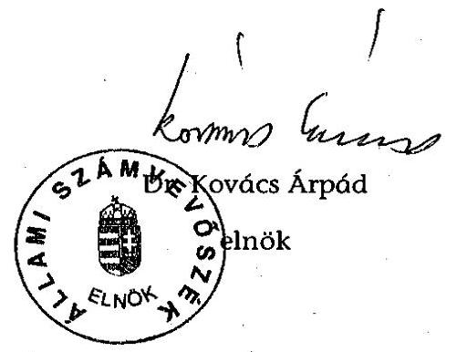
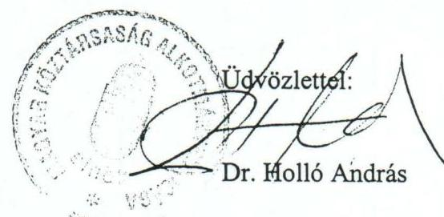
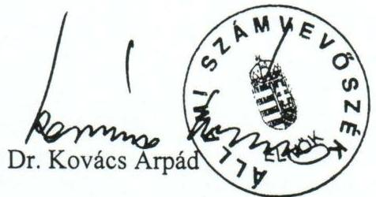

# JELENTÉS 

## az Alkotmánybíróság fejezet működésének ellenőrzéséről

---

# 2. Államháztartás Központi Szintjét Ellenőrző Igazgatóság 2.3. Átfogó Ellenőrzési Főcsoport   Iktatószám: V-15-20/2004-2005.   Témaszám: 721.   Vizsgálat-azonosító szám: V0151 

## Az ellenőrzést felügyelte:

## Bihary Zsigmond

főigazgató
Az ellenőrzés végrehajtásáért felelős:
Hegedűsné dr. Müllern Veronika
főcsoportfőnök

## Az ellenőrzést vezette:

## dr. Horváth Margit

osztályvezető főtanácsos

## Az ellenőrzést végezték:

Székely Ibolya számvevő tanácsos, tanácsadó

Farkas Ildikó
számvevő gyakornok

## Szilas István

számvevő tanácsos

---

# A témához kapcsolódó eddig készített számvevőszéki jelentések: 

## címe

Vélemény a Magyar Köztársaság 2000. évi költségvetéséről ..... 9932
Jelentés a Magyar Köztársaság 2000. évi költségvetése ..... 0126
végrehajtásának ellenőrzéséről
Vélemény a Magyar Köztársaság 2001. és 2002. évi költségvetési ..... 0034
törvényjavaslatáról
Jelentés a Magyar Köztársaság 2001. évi költségvetése ..... 0232
végrehajtásának ellenőrzéséről
Jelentés a Magyar Köztársaság 2002. évi költségvetése ..... 0329
végrehajtásának ellenőrzéséről
Vélemény a Magyar Köztársaság 2003. évi költségvetési ..... 0241
törvényjavaslatáról
Jelentés a Magyar Köztársaság 2003. évi költségvetése ..... 0443
végrehajtásának ellenőrzéséről
Az Alkotmánybíróság fejezet pénzügyi-gazdasági ellenőrzése ..... 288
(1995.)
Jelentés az Alkotmánybíróság fejezet működésének pénzügyi- ..... 0037
gazdasági ellenőrzéséről (2000.)

---

# TARTALOMJEGYZÉK 

BEVEZETÉS ..... 5
I. ÖSSZEGZŐ MEGÁLLAPÍTÁSOK, KÖVETKEZTETÉSEK, JAVASLATOK ..... 7
II. RÉSZLETES MEGÁLLAPÍTÁSOK ..... 11

1. A feladatok, a szervezeti- és létszámkeretek, valamint a működés összhangja ..... 11
1.1. A szervezet szabályszerűsége, működése ..... 11
1.2. A belső kontrollok ..... 13
1.2.1. A belső ellenőrzés rendszere ..... 17
1.2.2. Az „üvegzseb" programmal kapcsolatos feladatok ellátása ..... 18
2. A FEJEZET KÖLTSÉGVETÉSI GAZDÁLKODÁSA ..... 19
2.1. A költségvetés tervezése ..... 19
2.1.1. Az előirányzatok módosítása, a likviditási helyzet, az előirányzat-maradványok alakulása ..... 21
2.2. A létszámmal és a személyi juttatásokkal való gazdálkodás ..... 23
2.2.1. Megbízási szerződések ..... 28
2.3. A dologi kiadások alakulása, az eszközgazdálkodás ..... 29
2.4. Az alkotmánybírók egyes juttatásaira vonatkozó előírások érvényesülése ..... 32
2.5. A fejezeti kezelésű előirányzatok felhasználása ..... 35
2.6. Az éves költségvetési beszámolók, mérlegek valódisága ..... 35
3. Az előző vizsgálataink alapján tett intézkedések ..... 36
3.1. Az előző fejezeti átfogó ellenőrzés megállapításai alapján tett intézkedések ..... 36
3.2. A központi költségvetés végrehajtása ellenőrzésének megállapításai alapján tett intézkedések ..... 37

## MELLÉKLETEK

1. a-b számú Az Alkotmánybíróság elnökének észrevétele és az arra adott válaszunk.
2. számú A fejezet kiadásainak alakulása
3. számú A bevételek alakulása kiemelt előirányzatonként
4. számú A személyi juttatások alakulása
5. számú A költségvetési és a tényleges létszám alakulása
6. számú A kiadási és a bevételi előirányzatok módosítása

---

# RÖVIDÍTÉSEK JEGYZÉKE 

| Abtv. | az Alkotmánybíróságról szóló 1989. évi XXXII. törvény |
| :--: | :--: |
| Áht. | az államháztartásról szóló, többször módosított 1992. évi XXXVIII. törvény |
| Ámr. | az államháztartás működési rendjéről szóló, többször módosított 217/1998. (XII. 30.) Korm. rendelet |
| Er. | a központi, a társadalombiztosítási és a köztestületi költségvetési szervek kormányzati, felügyeleti, valamint belső költségvetési ellenőrzéséről szóló 15/1999. (II. 5.) Korm. rendelet |
| Kbt. | a közbeszerzésekről szóló, többször módosított, 1995. évi XL. törvény |
| Ktv. | a köztisztviselők jogállásáról szóló, többször módosított 1992. évi XXIII. törvény |
| KVI | Kincstári Vagyoni Igazgatóság |
| MK | Magyar Köztársaság |
| Mt. | a Munka Törvénykönyvéről szóló, többször módosított 1992. évi XXII. törvény |
| OGY | Országgyűlés |
| PM | Pénzügyminisztérium |
| SzMSz | Szervezeti és Működési Szabályzat |

---

# 4

---

# JELENTÉS 

## az Alkotmánybíróság fejezet működésének ellenőrzéséről

## BEVEZETÉS

Az Alkotmánybíróságnak, mint az alkotmányvédelem legfőbb szervének hatáskörét, szervezetét, eljárási szabályait az Alkotmányról szóló 1949. évi XX. törvény, valamint az Alkotmánybíróságról szóló 1989. évi XXXII. törvény határozza meg. Feladata a jogállamiság letéteményeseként a jogszabályok alkotmányosságának felülvizsgálata, az alkotmányos rend és az Alkotmányban biztosított alapjogok védelme.

Az Alkotmánybíróság a vizsgált időszakban (2000-2004. I. félév) változatlan feladat- és szervezeti rendben, közel azonos költségvetési létszámmal működött. A kiadási főösszeg eredeti előirányzata 902,6 M Ft-ról 1286,6 M Ft-ra növekedett. A fejezet költségvetési létszáma 2004-ben 122 fő volt.

Az Alkotmánybíróságnál az Állami Számvevőszék (ÁSZ) 1995-ben és 2000-ben végzett átfogó ellenőrzést, de az ellenőrzött időszak minden évében véleményeztük a fejezet költségvetési tervezését, illetve elvégeztük az éves zárszámadások financial audit típusú ellenőrzését.

Az ellenőrzésre az Állami Számvevőszékről szóló 1989. évi XXXVIII. törvény 2. § (3), illetve a 17. § (3) bekezdései alapján került sor.

Az Alkotmánybíróságnál a fejezet működésére, költségvetési gazdálkodására irányuló vizsgálatunk nem érintette az alkotmányvédelem érdekében végzett feladatokat. Ellenőrzésünk célja - a korábbi átfogó ellenőrzéseinknek megfelelően - annak értékelése volt, hogy a fejezet

- szabályozási környezete, szervezeti, irányítási és működési rendszere, létszámkerete összhangban voltak-e a szakmai feladatokkal, mennyiben segítették azok eredményes ellátását;
- költségvetési előirányzataival való gazdálkodásában érvényesültek-e a törvényesség és a célszerűség szempontjai;
- irányító és gazdálkodó tevékenységében mennyiben hasznosította az ÁSZ előző két ellenőrzésének megállapításait, javaslatait.

A helyszíni ellenőrzés a 2000-2004. I. félévig terjedő időszak feladatellátására és gazdálkodására, valamint az ÁSZ ellenőrzések megállapításaihoz kapcsolódó intézkedések végrehajtásának ellenőrzésére terjedt ki. Egyidejűleg megkezdtük a fejezet 2004. évi költségvetése végrehajtására, a költségvetési beszámoló megbízhatóságára vonatkozó ellenőrzés előkészítését. A megállapításokat a Magyar Köztársaság 2004. évi költségvetése végrehajtásának ellenőrzéséről szóló jelentésünk fogja tartalmazni.

---

Előkészítettük továbbá a fejezet 2005. évi költségvetési tervjavaslata véleményezését is. A megállapításokat a Magyar Köztársaság 2005. évi költségvetésének véleményezéséről szóló ÁSZ jelentésben rögzítjük.

A végleges jelentést az Állami Számvevőszékről szóló 1989. évi XXXVIII. törvény III. fejezet 25. § (1) bekezdésének megfelelően megküldtük az Alkotmánybíróság elnökének, akinek észrevételét és az arra adott válaszunkat az 1. a-b. sz. melléklet tartalmazza.

---

# I. ÖSSZEGZŐ MEGÁLLAPÍTÁSOK, KÖVETKEZTETÉSEK, JAVASLATOK 

A fejezet feladatellátásának középpontjában az Alkotmánybíróság jogkörébe tartozó feladatok ellátási feltételeinek folyamatos és zavartalan biztosítása állt. Az Alkotmánybíróság feladatait az Alkotmány és az Alkotmánybíróságról szóló törvény határozza meg.

A működés törvényi szabályozottsága az előző ÁSZ vizsgálat óta nem javult, nem került sor a fejezet működése szempontjából alapvető ügyrendi törvény elfogadására, ezért az Alkotmánybíróság az ügyrendjét az Országgyűlés jogalkotási mulasztásának áthidalása érdekében önmaga adta ki 2001-ben ${ }^{1}$.

Az Alkotmánybíróság székhelyére, a fejezet költségvetésének speciális kialakítására, benyújtására vonatkozó törvényi előírások nem érvényesültek teljes körűen a vizsgált időszakban. Az Alkotmánybíróságról szóló törvény székhelyként Esztergomot jelölte meg, az Alkotmánybíróság viszont megalakulásától Budapesten működik. A törvény szerint az Alkotmánybíróság költségvetésének megállapítása a végrehajtó hatalomtól független. Ugyanakkor a fejezet költségvetéseinek elfogadása nem tért el az államháztartásban kialakult általános alkumechanizmusoktól. A fejezet gazdálkodása a vizsgált időszakban végig kiegyensúlyozott maradt.

Az Alkotmánybíróság működésére és szervezetére vonatkozó szabályozást hiányosságok, ellentmondások jellemezték, amelyek a jogszabályi előírások ellentmondásaira is visszavezethetők voltak, célszerűtlen gyakorlatot is eredményeztek, pl. alkotmánybírók foglalkoztak operatív gazdálkodási, működtetési kérdésekkel. A fejezet egyetlen intézménye, az Alkotmánybíróság Hivatala vonatkozásában nem szabályozták teljes körűen annak szervezeti felépítését, az egyes szervezeti egységek feladatát, jog- és hatáskörét. A szabályozás ellentmondásai, hiányosságai kimutatható veszteséget nem okoztak.

A belső kontrollok terén kedvező változások következtek be a gazdálkodással összefüggő tevékenységek szabályozásában. A hiányzó gazdálkodási szabályzatokat (gazdasági szervezet ügyrendje, számviteli politika, jutalmazás rendjének szabályozása) 2001-től elkészítették, azokat folyamatosan aktualizálták. Javult az informatikai tevékenység szabályozottsága is. Az integrált pénzügyiszámviteli rendszer bevezetése erősítette a számvitel informatikai támogatottságát. A belső ellenőrzés rendszerén belül a vezetői- és a munkafolyamatba épített ellenőrzés szabályszerűen működött. Ugyanakkor a függetlenített belső

[^0]
[^0]:    ${ }^{1}$ Az Országgyűlésnek 2003-ban benyújtott, az Alkotmánybíróságról szóló T/4487. számú törvényjavaslat szerint az ügyrend kiadása már az Alkotmánybíróság hatáskörébe tartozik.

---

ellenőrzés - az ellenőrzési témáknak a jogszabályi rendelkezéseknél szűkebb meghatározása miatt - korlátozottan tölthette be a vezetést támogató, a döntéshozatalt elősegítő, a hatékonyságot növelő, kezdeményező funkcióját. Az ellenőrzések nem terjedtek ki vagy csak részlegesen az előirányzatok, a rendelkezésre álló pénzeszközök felhasználására, a létszám- és illetménygazdálkodásra, a költségvetési beszámolók valódiságának vizsgálatára.

A belső ellenőrzésre vonatkozó kormányrendelet ${ }^{1}$ előírásaival ellentétesen a helyszíni ellenőrzésünk befejezéséig nem került sor a belső ellenőrzési vezető kinevezésére, a belső ellenőrzési kézikönyv elkészítésére.

A vizsgált időszakban a gazdálkodás során kisebb, a belső kontrollok működését, illetve a beszámolók megbízhatóságát lényegesen nem befolyásoló hiányosságokkal (kis értékű eszközökre vonatkozó nyilvántartási, illetve értékelési pontatlanságok) érvényesültek a szabályzatok előírásai.

Az „üvegzseb" törvényben², illetve ahhoz kapcsolódóan elrendelt feladatokból nem teljesült az adatszolgáltatásra vonatkozó szabályozás. Ugyanakkor az állampolgári adatkéréseknek eleget tettek. Az előírt tájékoztató adatokat (a fejezet költségvetése, összeghatár feletti szerződések) az Alkotmánybíróság honlapján hozzáférhetővé tették.

A fejezet rendelkezésére álló források 2000-2004 I. féléve között (mintegy 5,2 Mrd Ft) az Alkotmánybíróság közjogi szerepének megfelelően, likviditási feszültség nélkül biztosították a feladatok ellátásának feltételeit.

A fejezet összes kiadási és bevételi előirányzata 2000-2004 között 64%-kal, ezen belül a személyi juttatások és járulékai előirányzat 84%-kal nőtt, így az összes előirányzat közel háromnegyedét tette ki 2004-ben. A személyi juttatások arányának növekedését a jogszabályok által elrendelt illetményemelések okozták.

A kormányzati hatáskörben végrehajtott előirányzat-módosítások mértéke növekvő és jelentős volt. A Kormány a központi bérintézkedések forrásait év közben, előirányzat-módosítások formájában biztosította. A fejezet saját hatáskörű módosításai az előző évi maradványok, illetve 2000-2002 között a fejezeti kezelésű beruházási előirányzatok intézményi körben történő felhasználása miatt történtek. Az előirányzat-módosítások minden esetben szabályszerűek és dokumentáltak, szakmailag alátámasztottak voltak.

Az előirányzat-maradványok a vizsgált időszakban a bevételi-kiadási főösszeg 4-6%-át tették ki. Meghatározó részük kiadási megtakarításból, illetve a fejezeti kezelésű előirányzatokon belül keletkezett.

[^0]
[^0]:    ${ }^{1}$ A költségvetési szervek belső ellenőrzéséről szóló 193/2003. (XI. 26.) Korm. rendelet.
    ${ }^{2}$ A közpénzek felhasználásával, a köztulajdon használatának nyilvánosságával, átláthatóbbá tételével és ellenőrzésének bővítésével összefüggő egyes törvények módosításáról szóló 2003. évi XXIV. törvény.

---

A fejezet engedélyezett költségvetési létszáma szűk határok között (120-124 fő) változott, a volt elnökök részére a törvényi előírások szerinti titkárság biztosítása, továbbá az alkotmánybírókat segítő törzskarában az alkotmánybírósági (fő)tanácsadói munkakörök számának emelkedése miatt. Az alkotmánybírói testület 2003 közepéig a törvényben meghatározott létszámú alkotmánybíróval működött (11 fő), 2004 közepére az alkotmánybírói létszám 9 főre csökkent.

A személyi juttatások kiadásai (járulékokkal együtt a vizsgált időszakban a felhasznált összes előirányzat 65%-a) fedezetet nyújtottak az illetményekre, az illetménykiegészítésekre és pótlékokra, továbbá a vizsgált időszak második felére a munkavállalók számára adható ruházati költségtérítés, üdülési hozzájárulás, étkezési hozzájárulás, munkába járáshoz szükséges közlekedési költségtérítés jogszabályokban meghatározott legmagasabb mértékű biztosítására.

A vizsgált időszakban az illetmény, illetve béremelésre vonatkozó törvényi változásokat végrehajtották, a módosításokat a személyi anyagokban átvezették.

Az Alkotmánybíróság feladatellátása során mind nagyobb mértékben foglalkoztatott megbízási szerződéssel munkavállalókat. A megbízási szerződések alapján kifizetett díjak 2000-2003 között közel hatszorosukra emelkedtek. A megbízási jogviszonyra vonatkozóan szabályozás nem készült. A megbízási díjak kifizetésének alapjául szolgáló dokumentumokból esetenként nem volt megállapítható létesítésük indokoltsága és szabályszerűsége, a munkaköri feladatokkal való összefüggés.

A dologi kiadások (az összes teljesített előirányzat 23%-a) között meghatározó, azok mintegy kilenctizede volt az üzemeltetésre, fenntartásra, továbbá a szolgáltatások igénybevételére fordított összegek nagysága. A reprezentáció, a kül- és belföldi kiküldetés, illetve a mobiltávközlési szolgáltatás kiadásai nem voltak jelentősek (évente 20 M Ft alatt maradtak).

Az alkotmánybírókat
 megillető juttatásokat (illetmények, napidíjak, hivatali lakással és személyes használatú gépjárművel való ellátás) előírásszerűen biztosították.

A fejezeti kezelésű előirányzatok tervezésénél a központi előírásokat érvényesítették, felhasználásuk szabályszerűen történt.

A fejezet beruházási és felújítási előirányzatai fedezték az Alkotmánybíróság székhelyéül szolgáló épület fűtéskorszerűsítését, lehetővé tették az informatikai eszközök és szoftverek beszerzését, a munkatársi irodák bútorzatának, valamint a gépjárműveknek a cseréjét.

A személygépkocsik beszerzése indokoltan, személyes használat céljából történt. Törekedtek a gépkocsi-állománnyal való racionális gazdálkodásra. A gépkocsik száma a vizsgált időszakban egyhatodával csökkent, azokat 3-6 évenként (százezer kilométer futásteljesítmény után) cserélték.

A zárszámadás keretében a fejezet éves beszámoló jelentéseinek megbízhatóságát 2000-2003. évekre vonatkozóan - a financial audit típusú ellenőrzési módszerrel - vizsgáltuk. A beszámolók minden évben hitelesek voltak, a fejezet költségvetési és vagyoni helyzetéről megbízható és valós képet adtak.

A korábbi ellenőrzéseink megállapításai, javaslatai részben hasznosultak. Az Alkotmánybírósággal kapcsolatban 2003 júliusában benyújtott két törvényjavaslat több szabályozási ellentmondást felold (székhely, ügyrend kiadása, elnöki munkáltatói jogkörök), ugyanakkor továbbra sem rendezi az Alkotmánybíróság, mint szakmai testület és az Alkotmánybíróság, mint fejezet, egyben költségvetési szerv elhatárolását. Az Alkotmánybíróság javaslatainknak megfelelően elkészítette a hiányzó gazdálkodási szabályzatokat. Az előirányzatok tervezése a vizsgált időszak során megalapozottabbá vált.

A helyszíni ellenőrzés megállapításainak hasznosítása mellett javasoljuk:

# a fejezet felügyeletét ellátó szerv vezetőjének: 

1. kezdeményezze a fejezet belső szabályzatainak a hatályos törvényi előírásokkal való összehangolását, ennek keretében egyértelműen történjen meg az Alkotmánybíróság, mint szakmai testület, illetve az Alkotmánybíróság, mint fejezet, egyben költségvetési szerv hatás- és feladatkörének elhatárolása;
2. gondoskodjon a belső ellenőrzési vezetői feladatok ellátásáról, valamint a belső ellenőrzés hatékonyságának növeléséről;
3. intézkedjen az „üvegzseb" törvényben, illetve ahhoz kapcsolódóan elrendelt, az adatszolgáltatás rendjére vonatkozó szabályzat elkészítéséről és jóváhagyásáról.

---

# II. RÉSZLETES MEGÁLLAPÍTÁSOK 

## 1. A feladatok, a Szervezeti- És létszámkeretek, valamint a működés összhangja

### 1.1. A szervezet szabályszerűsége, működése

A Magyar Köztársaság Alkotmánybíróságának feladatrendszerét törvényi szinten szabályozták. A Magyar Köztársaság Alkotmányáról szóló 1949. évi XX. törvény 32/A. §-a rendelkezik az Alkotmánybíróságról, a szervezet hatáskörére, székhelyére, a testület tagjai megválasztására és kinevezésének feltételeire, valamint az eljárási szabályokra vonatkozó előírásokat az Alkotmánybíróságról szóló 1989. évi XXXII. törvény (Abtv.) rögzíti. Az Abtv. 29. §-ának rendelkezése szerint az Alkotmánybíróság szervezetére és eljárására vonatkozó részletes szabályokat az Alkotmánybíróság ügyrendje állapítja meg, amelyet az Országgyűlés (OGY) törvényben határoz meg.

Az Alkotmánybíróság feladatkörébe tartozik: a szűk körű előzetes normakontroll, a teljes körben érvényesülő utólagos normakontroll, a nemzetközi szerződésbe ütközés vizsgálata, az alkotmányjogi panasz elbírálása, a mulasztásban megnyilvánuló alkotmányellenesség, illetve hatásköri összeütközés megszüntetése, valamint az Alkotmány rendelkezéseinek értelmezése.

Az Alkotmánybírósághoz 2000-2003 között évente mintegy 950-1200 indítvány érkezett, 2004. első félévében 729. Az alkotmánybírák által adott évben lezárt ügyek száma emelkedett: 2000-ben 229 döntést (végzés, határozat) hoztak, 2003-ban 284-et, míg 2004 első félévében 176-ot. A folyamatban lévő ügyek száma 2004. VI. 30-ára - két év alatt - 980-ról 1164-re nőtt.

Az Alkotmánybíróság székhelyére, a fejezet költségvetésének kialakítására, illetve benyújtására vonatkozó törvényi előírások teljes körűen nem érvényesültek a vizsgált időszakban.

Az Abtv. 3. §-a az Alkotmánybíróság székhelyeként Esztergomot jelölte meg. Az Alkotmánybíróság megalakulásától Budapesten működik.

Az Alkotmánybíróság 1992 óta ingatlannal rendelkezett Esztergomban. A $400 \mathrm{~m}^{2}$ hasznos alapterületű műemlék jellegű épületet a város önkormányzata felújítási kötelezettséggel bocsátotta az Alkotmánybíróság rendelkezésére. Az épület felújításához szükséges források biztosítása elmaradt, így az Alkotmánybíróság nem használta az ingatlant és már 1995-ben kezdeményezte az ingatlan visszaadását az önkormányzatnak. A visszaadás csak 2002-ben valósult meg. Az ingatlannal kapcsolatban 2000-2002 között az Alkotmánybíróságnál villamos energia szolgáltatás és a karbantartási munkák költségeként 166 E Ft kiadás merült fel.

Az Abtv. 2. §-a szerint az „Alkotmánybíróság megállapítja saját költségvetését, amelyet az állami költségvetés részeként jóváhagyás céljából előterjeszt az Országgyűlésnek".

---

A rendelkezés alapján az Alkotmánybíróságnak a végrehajtó hatalomtól való költségvetési függetlensége jogszabályilag biztosított volt. Ugyanakkor a költségvetési gazdálkodásra vonatkozó jogszabályok ezzel kapcsolatban nem tartalmaztak speciális szabályozást, bár ennek szükségességére a fejezetnél végzett első átfogó ellenőrzés¹ kapcsán az ÁSZ felhívta a figyelmet. A fejezet költségvetéseinek kialakítása a költségvetési gazdálkodásra vonatkozó jogszabályok általános előírásai, illetve a Pénzügyminisztérium (PM) által kiadott éves tervezési köriratokban meghatározottak szerint történt, nem tért el a többi fejezettől. A PM-mel folytatott egyeztetések során kialakított tervjavaslatot - az állami költségvetés részeként - a Kormány terjesztette az OGY elé. Az Alkotmánybíróság a költségvetése tervezetét az OGY elnökének közvetlenül is megküldte, az általános eljárási rendet azonban ezzel érdemben nem változtatta meg.

Az Alkotmánybíróság határozatában (28/1995. (V. 19.) AB határozat) megállapította, hogy az Abtv. idézett szakaszában „az Alkotmánybíróság a költségvetés előkészítési szakaszában kapott hatékony garanciát a végrehajtó hatalommal szemben: bár az Alkotmánybíróság költségvetése része az állami költségvetésnek, sem a pénzügyminiszter, sem a Kormány nem jogosult megváltoztatni az Alkotmánybíróság által kidolgozott tervezetet, legfeljebb az Országgyűlésnek tehet javaslatot erre nézve." A külön szabályozás, az eljárási garanciák hiányában ez a rendelkezés nem érvényesült. Az OGY-hoz benyújtott költségvetési törvényjavaslat a Kormány által jóváhagyott fejezeti tervjavaslatot tartalmazta.

Az Alkotmánybíróság hatásköri szabályainak háromszintű szabályozására (Alkotmány, Abtv., Ügyrend) vonatkozó törvényi rendelkezés nem érvényesült teljes körűen.

Az OGY az Alkotmánybíróság megalakulása óta nem vette napirendjére az ügyrendet, az ÁSZ erre vonatkozó javaslatai ellenére sem. Az Alkotmánybíróság Teljes ülése² az ügyrendet - mivel a korábbi kezdeményezései a törvény megalkotására nem vezettek eredményre - saját maga, ideiglenes ügyrendként fogadta el és tette közzé (az Alkotmánybíróság 3/2001. (XII. 3.) Tü. határozata ideiglenes ügyrendjéről és annak közzétételéről), ezzel tulajdonképpen az OGY jogalkotási mulasztását hidalta át.

Hiányosságok, ellentmondások jellemezték a fejezet működésére és a szervezetére vonatkozó szabályozást. Nem történt meg a hatályos törvényi előírásoknak és az Alkotmánybíróság kialakított gyakorlatának összhangba hozása, valamint a szabályozás nem tett következetesen különbséget az Alkotmánybíróság, mint az alkotmányvédelem legfőbb szerveként működő testület és mint költségvetési intézmény, egyben fejezet között.

[^0]
[^0]:    ¹ 288. sz. Jelentés az Alkotmánybíróság fejezet pénzügyi-gazdasági ellenőrzéséről (1995.).
    ² Az Alkotmánybíróság Teljes ülése az összes tagból áll /Abtv. 30. § (2) bekezdés/. Feladat- és hatáskörét az Abtv. és az ügyrend állapítja meg.

---

# 1.2. A belső kontrollok 

Az Alkotmánybíróság fejezetre az ÁSZ 2001. évi belső kontroll vizsgálata nem terjedt ki, ugyanakkor a vizsgált időszakban az éves zárszámadások financial audit típusú ellenőrzése kapcsán értékeltük a kontrollok működését. Az értékelések alapján kiegyensúlyozott volt a számviteli és bizonylati fegyelem, a kincstári kapcsolatok működése, javult a számvitel informatikai támogatottsága, az informatikai környezet szabályozottsága.

Elnöki utasításként 2004 februárban kiadásra került az Informatikai Biztonsági Szabályzat.

Ugyanakkor hiányosságok mutatkoztak a fejezet működésének, tevékenységének szabályozását, illetve a függetlenített belső ellenőrzés hatékonyságát illetően.

A költségvetési alapokmány minden évre elkészült. Az államháztartás működési rendjéről szóló, többször módosított 217/1998. (XII. 30.) Korm. rendelet (Ámr.) előírásával ellentétben a 2004. évi alapokmányból is hiányzik a költségvetési szerv szervezeti felépítése és működése rendszerének, a szervezeti egységek, ezen belül a gazdasági szervezetnek a meghatározása.

A szabályozási ellentmondásokhoz a jogszabályok közötti összhang hiánya is hozzájárult.

Az Alkotmánybíróság ügyrendje, illetve ügyviteli szabályzata részben felelt meg az Abtv. előírásainak. Az Abtv. 18. § (2) bekezdése kimondja, hogy „az Alkotmánybíróság Hivatalának szervezetére és működésére vonatkozó szabályokat az Alkotmánybíróság ügyrendje állapítja meg". Az ideiglenes ügyrend, bár felsorolja a Hivatalt az Alkotmánybíróság szervei között, részletesen nem rendelkezik róla. Az ügyrend az egyes szervezeti egységekre (Alkotmánybíróság elnöki titkársága, gazdasági főosztálya és az alkotmánybírák törzskarái) vonatkozó szabályozást delegálja az Ügyviteli Szabályzatra. Az Alkotmánybíróság elnöke által 2004. II. 9-én kiadott Ügyviteli Szabályzat azonban a felsorolt szervezetekkel kapcsolatban csak az ügyviteli eljárás szempontjából tartalmaz rendelkezéseket.

Az Alkotmánybíróság Hivatala (Hivatal) nem rendelkezett alapító okirattal és Szervezeti és Működési Szabályzattal (SzMSz). A hiányt az ÁSZ eddigi ellenőrzései következetesen észrevételezték és pótlásukra javaslatot tettek.

Az SzMSz hiányára a függetlenített belső ellenőrzés is rámutatott 2001-ben.
A költségvetés fejezet- és címrendje - a 2000-2002 között meglévő „Fejezeti kezelésű előirányzatok" mellett - az „Alkotmánybíróság" címet tartalmazta. Ilyen költségvetési szerv azonban nem létezett, törzsszámot az Alkotmánybíróság Irányító Szervezete és a Hivatal kapott.

Az Alkotmánybíróság állásfoglalása szerint nincs szükség a Hivatal SzMSz-ének kiadására, mivel az ügyrend és más szabályzatok teljes körűen tartalmazzák az SzMSz-ben szabályozandó kérdéseket. Ugyanakkor a helyszíni ellenőrzés befe-

---

jezéséig a meglévő, hatályos szabályzatok nem rendelkeztek teljes körűen a szervezeti és működési kérdésekről.

Hiányosságokat tapasztaltunk az Ámr. szerint az SzMSz-ben meghatározandó kérdések szabályozásában is. Nem történt meg a feladatmutatók megnevezése (Ámr. 10. § (4) bekezdés e) pontja), a feladatellátásnak a költségvetési szerv kiadásait, bevételeit befolyásoló, a gazdálkodási előirányzatok keretei között tartását biztosító feltétel- és követelményrendszerének, valamint folyamatának, kapcsolatrendszerének szabályozása (10. § (5) bekezdés a)-b) pontjai).

Ugyancsak hiányzik a gazdasági szervezet felépítésének és feladatának (17. § (4) bekezdés), a szabálytalanságok kezelése eljárásrendjének (145/A. § (5) bekezdés) és az ellenőrzési nyomvonalnak (145/B. § (2) bekezdés) a rögzítése. Nem készült olyan dokumentum sem, amely az Ámr. 10. § (4) bekezdés f) pontja szerint egyértelműen, átfogóan, a hatályos előírásoknak megfelelően rögzíti a költségvetési szerv szervezeti felépítését, az egyes szervezeti egységek feladatát, jog- és hatáskörét.

A belső ellenőrzés a központi, a társadalombiztosítási és a köztestületi költségvetési szervek kormányzati, felügyeleti, valamint belső költségvetési ellenőrzéséről szóló 15/1999. (II. 5.) Korm. rendeletben (Er.) megjelölt ellenőrzési feladatok közül alapvetően csak a tulajdon védelmével foglalkozott.

Az ellenőrzések az Er. 6. § (1) bekezdés b) pontjában meghatározottak közül nem terjedtek ki az ellátott feladatok, a jogi, gazdálkodási formák, a kapacitások összhangjának vizsgálatára; az előirányzatok, a rendelkezésre álló pénzeszközök felhasználására, a belső ellenőrzés rendszerének szervezettsége és hatékonysága ellenőrzésére.

A fejezet felügyeletét ellátó szerv vezetője az Ámr. 2. § 2. pontja szerint az Alkotmánybíróság elnöke¹. A Hivatallal kapcsolatos egyes vezetői jogosítványokra vonatkozó szabályozás és gyakorlat, valamint a köztisztviselők jogállásáról szóló 1992. évi XXIII. törvény (Ktv.) és az Áht. előírásai között ellentmondás van.

A Ktv. 1. § (2) bekezdése szerint a Hivatal a törvény hatálya alá tartozik.
A Ktv. 1. § (3) bekezdése szerint a Hivatal vezetője államtitkári, helyettese helyettes államtitkári besorolású köztisztviselő.

Az ideiglenes ügyrend 13. § (1) bekezdése szerint a hivatalvezető megnevezése „főtitkár". A megnevezés nem a szervezet vezetéséhez, hanem az indítványok elbírálásával összefüggő alkotmánybírósági eljáráshoz kapcsolódó feladatkörét

[^0]
[^0]:    ¹ Az ún „alkotmányos" fejezeteknél (I-VIII.) a fejezet felügyeletét ellátó szerv vezetőjének meghatározása nem egységes: az OGY fejezet (I.) esetében az OGY Hivatalának gazdasági főigazgatója, a Köztársasági Elnökség fejezetnél (II.) a Köztársasági Elnöki Hivatal vezetője, a Bíróságoknál (VI.) az Országos Igazságszolgáltatási Tanács elnöke, az MK Ügyészségénél (VIII.) a legfőbb ügyész.

---

hangsúlyozta. A főtitkár kinevezési okmányának nem volt része a munkaköri leírás sem.

Az ideiglenes
 ügyrend szerint a főtitkár feladatkörére és az irányítása alatt álló szervezeti egységek működésére vonatkozó részletes szabályokat az Ügyviteli Szabályzatban kell meghatározni. A szabályozás nem történt meg.

A gazdálkodási szabályozásban 2001-től jelentős változások történtek. Elkészültek, illetve - a 2001. és 2004. évi belső ellenőrzések tapasztalatait is hasznosítva - aktualizálásra kerültek a gazdálkodásra vonatkozó szabályzatok. Előírásai összhangban voltak az Ámr-ben, továbbá a számvitelről szóló 2000. évi C. törvényben, valamint az államháztartás szervezetei beszámolási és könyvvezetési kötelezettségének sajátosságairól szóló 249/2000. (XII. 24.) Korm. rendeletben foglaltakkal.

A vizsgált időszakban a gazdálkodás során kisebb, a belső kontrollok működését, illetve a beszámolók megbízhatóságát lényegesen nem befolyásoló hibákkal (készlet-nyilvántartási hiányosságok, megbízási szerződések pontatlansága, előirányzatok évközi változásának dokumentálási hiányossága) érvényesültek a szabályzatok előírásai.

A beszámolók megbízhatóságát vizsgáló számvevőszéki ellenőrzések ${ }^{1}$ megállapították, hogy a munkahelyre kiadott kisebb értékű (24 000 Ft alatti) eszközökről, anyagokról nem vezettek 2000-ben készletnyilvántartást, 2003-ban a megbízási szerződéseknél a feladatok pontos meghatározására, illetve az előirányzat évközi változásainak az előírás szerinti dokumentálására hívták fel a figyelmet.
A munkáltatói és a fegyelmi jogkört az Alkotmánybíróság dolgozói tekintetében az ügyrend szerint az Alkotmánybíróság elnöke gyakorolja.

A Ktv. 6. § (1) bekezdése kimondja, hogy „a munkáltatói jogokat, ha törvény vagy kormányrendelet eltérően nem rendelkezik, a közigazgatási szerv hivatali szervezetének (a továbbiakban: hivatali szervezet) vezetője, illetve a testület gyakorolja".

A Ktv. 6. § (1) bekezdése a munkáltatói jogok gyakorlása tekintetében a Hivatalra is érvényes, mivel eltérő jogszabályi rendelkezés nincs. (Az ideiglenes ügyrend az OGY mulasztása miatt nem jogszabályként került kiadásra.)

A vizsgált időszakban hatályos belső szabályzatok szerint a fejezetnél kötelezettségvállalásra az Alkotmánybíróság elnöke volt jogosult, beleértve a Hivatalt is.

Az Áht. 98. § (1) bekezdése szerint kötelezettségvállalásra a költségvetési szerv vezetője jogosult.

A belső szabályozás összhangban volt az Alkotmánybíróságnál kialakított gyakorlattal, mivel a Hivatal tényleges vezetője nem a főtitkár, hanem az Alkotmánybíróság elnöke volt.

[^0]
[^0]:    ${ }^{1} 0126$ sz. Jelentés az MK 2000. évi költségvetése végrehajtásának ellenőrzéséről, illetve a 0214 sz. Jelentés az MK 2003. évi költségvetése végrehajtásának ellenőrzéséről.

---

A gazdálkodással összefüggésben egyaránt használták azonos értelemben az „Alkotmánybíróság"-ot és az „Alkotmánybíróság Hivatalá"-t.

A Hivatal részére beszerzett eszközök esetében rendszeresen a „Magyar Köztársaság Alkotmánybírósága" volt a megrendelő és használt adószámot (és hasonló feliratú bélyegzőt), jóllehet ténylegesen a Hivatal volt az adóalany.

A gazdálkodási feladatok végrehajtásával kapcsolatos feladat- és hatáskörök szabályozása sem volt következetes. Az ügyrend előírásával ellentétesen a gazdasági szervezet 2002. I. 1-jétől hatályos ügyrendjét a szervezeti egység vezetője hagyta jóvá az „Alkotmánybíróság gazdasági szervezete" részére, formailag önmaga számára is megállapított feladatokat, jogköröket.

A szabályozás ellentmondásai és a törvényi előírásokkal ellentétes gyakorlat kimutatható veszteséget nem okoztak, a költségvetési gazdálkodás színvonalát közvetlenül nem befolyásolták.

A gazdálkodási, működtetési feladatok megosztásánál az ideiglenes ügyrend az Abtv-hez képest kiterjesztette mind az elnök, mind az Alkotmánybíróság teljes ülésének feladat- és jogkörét.

Az ideiglenes ügyrend 2. § (3) bekezdés e)-f) pontjai szerint a Teljes ülés „állást foglal az alkotmánybírák munkakörülményeit érintő alapvető kérdésekben" és „a költségvetés körébe tartozó kérdésekben".

A döntések több szintű előkészítése, megvitatása hozzájárult azok megalapozottabbá tételéhez. Az elnök, illetve a Teljes ülés döntés-előkészítő - 2003-tól tanácsadó - szerveként működött a Gazdasági és Személyügyi Bizottság.

A Gazdasági és Személyügyi Bizottság három alkotmánybíróból állt, tagjait a Teljes ülés választotta. Az állandó bizottságként működő Bizottság szükség szerint ülésezett, amelyről általában emlékeztető készült. Feladat- és hatáskörét az ügyrendben és a 2003 júniusában kiadott Juttatási Szabályzatban határozták meg.

Ugyanakkor az a célszerűtlen gyakorlat alakult ki, hogy az alkotmányvédelemmel kapcsolatos feladatok ellátására megválasztott alkotmánybírók foglalkoztak a törvények szerint a hivatalvezető, illetve a gazdasági területért felelős helyettese hatáskörébe tartozó operatív gazdálkodási, működtetési kérdésekkel is.

A Teljes ülés határozott az elnök egyetértésével rendszeresen a költségvetési tervezés különböző előirányzatainak kialakításáról, az illetményemelésekről, jutalmazásokról (egyedi esetekben is), a dolgozók munkavédelmi szemüveg vásárlásának 10 E Ft-os támogatásáról is (2002. I. 21.).

A Gazdasági és Személyügyi Bizottság a gazdasági vezető előterjesztésére javaslatot tett például a gazdasági bejáratnál működő elektromos sorompó korszerűsítésére (2001. XI. 13.) is, amelynek értéke 0,9 M Ft volt. Határozott 1-1 fő számviteli, illetve munkavédelmi konferencián való részvételéről (költsége 11,9 E Ft és 13,5 E Ft) és egy munkatárs új számítógépének beszerzéséről (2000. X. 10.).

A számvitel informatikai támogatása területén kockázatot csökkentő tényező volt, hogy 2004. I. 1-jétől bevezetésre került egy hazai fejlesztésű integrált ügyviteli rendszer pénzügyi és főkönyvi modulja. A rendszer

---

biztosította a korábbi, négy különböző programmal, illetve - a kötelezettségvállalásokat illetően - kézi nyilvántartással kezelt feladatoknak összefüggő, zárt rendszerben történő, elkülönített, csak a jogosultak munkaállomásaihoz csatlakozó hálózaton történő elvégzését. A beszerzésre 3 árajánlat elemzése után, szabályszerűen került sor.

A rendszer bevezetésének és működésének értékelése a 2004. évi belső ellenőrzés egyik feladata volt. Az ellenőrzés tapasztalatai alapján megtörtént a betanulással együtt járó kisebb hiányosságok feltárása és kijavítása.

Az illetménnyel és munkabérrel kapcsolatos feladatokat (1996 óta) az Alkotmánybíróság igényeinek megfelelően kidolgozott és folyamatosan fejlesztett saját programmal végezték.

Az Alkotmánybíróság nem része a Központi Illetményszámfejtési Rendszernek, de a szükséges adatszolgáltatást teljesítette.

A belső kontrollok működésének mérsékelt kockázati szintjéhez a gazdasági szervezet munkatársainak a feladatok ellátásához megfelelő képzettsége és gyakorlati ideje, továbbá az állomány stabilitása is hozzájárult: átlagosan 8 éve - a gazdasági vezető 1993 óta - dolgoztak a Hivatalnál.

# 1.2.1. A belső ellenőrzés rendszere 

Az Alkotmánybíróságnál a korábban (1996-ban) kiadott belső ellenőrzési szabályzatot 2003-ban felváltó új szabályzat megfelelt a jogszabályi előírásoknak.

A munkafolyamatba épített és a vezetői ellenőrzés a szabályzatokban és a munkaköri leírásokban előírtaknak megfelelően működött. Ugyanakkor a függetlenített belső ellenőrzés korlátozottan tudta a vezetést támogatni, a döntéshozatalt elősegíteni, a hatékonyság növelése érdekében intézkedéseket kezdeményezni, de hozzájárult a gazdálkodás szabályszerűségének erősítéséhez, így megbízhatóan szolgálta a vagyon megóvását. A vizsgált időszak alatt nem végeztek hatékonysági ellenőrzést.

Az ellenőrzések - típus szerint - téma- és cél-, illetve szabályszerűségi ellenőrzések voltak. Esetenként utóellenőrzésre is sor került, 2001-ben az ÁSZ előző évi átfogó ellenőrzése során tett javaslatok, illetve 2003-ban az előző évi függetlenített belső ellenőrzés megállapításainak hasznosítására vonatkozóan.

Az ellenőrzések az Er. 6. § (1) bekezdés b) pontjában meghatározott prioritások közül részlegesen érintették a létszám- és illetménygazdálkodást, a költségvetési beszámolók, valamint az előirányzat-maradványok és az eredmény kimunkálása valódiságának, szabályszerűségének, a befizetési kötelezettségek teljesítésének, illetve a programok és céljellegű előirányzatok felhasználásának ellenőrzését, azok megvalósításának, hatékonyságának értékelését.

A függetlenített belső ellenőrzés témái voltak: a bútorcsere lebonyolítása, selejtezés és a selejtezett eszközök értékesítése, a kötelezettségvállalások, illetve az utalványozás szabályozottságának értékelése, a tárgyi eszközök felújítása, főkönyvi könyvelés, házipénztár ellenőrzés és rendszeresen a leltározás szabályszerűségének, megbízhatóságának vizsgálata.

---

Az Alkotmánybíróság elnöke által jóváhagyott ellenőrzési terv, illetve ellenőrzési program alapján végzett ellenőrzésekről jelentések és éves beszámolók készültek. A tapasztalt hibák, hiányosságok feltárása az ellenőrzések során szakszerű volt, a hibák megszüntetésére az ellenőrzést végzők javaslatokat dolgoztak ki.

Ugyanakkor a Teljes ülés nem tárgyalta meg az értékelő beszámolókat és az ellenőrzésekről az előírt nyilvántartást sem vezették. Ezt a megállapítások hiányával, illetve azok csekély jelentőségével indokolták.

Intézkedési tervek - a 2003. XII. 12-ei ellenőrzés megállapításait kivéve - nem készültek. A megállapított hiányosságokat ugyanakkor megszüntették.

A függetlenített belső ellenőrzés 2001-ben javasolta, hogy a szabályozás a selejtezés teljes folyamatára terjedjen ki, 2002-ben felhívta a figyelmet az áfa-tartalom elkülönített nyilvántartására, a személyi kifizetések nyilvántartásánál a jogcím szerinti elkülönítésre. 2003-ban az ellenjegyzés esetenkénti hiányára, a szabályszerű kötelezettségvállalást bizonyító dokumentumok számlákhoz történő csatolására hívták fel a figyelmet. A hibákat kijavították, a hiányosságokat pótolták.

A Hivatal megbízási, 2003-tól vállalkozási szerződés alapján foglalkoztatott belső ellenőröket. Az ellenőrzést végzők (3 fő) az előírt szakmai követelményeknek megfeleltek, de az összeférhetetlenség vizsgálatának nem volt írásos dokumentációja.

Az Er. helyébe lépő, a költségvetési szervek belső ellenőrzéséről szóló 193/2003. (XI. 26.) Korm. rendelet előírásainak részben tettek eleget. Nem került sor belső ellenőrzési vezető kijelölésére.

Az Alkotmánybíróság nem készítette el a PM belső ellenőrzési kézikönyve alapján a saját belső ellenőrzési kézikönyvét, illetve középtávú belső ellenőrzési tervét. A 2003. VIII. 1-jén kiadott hatályos ellenőrzési szabályzat sem került a helyszíni ellenőrzés befejezéséig aktualizálásra.

A késedelmet részben magyarázta a nyári szabadságolások, illetve a 2005. évi költségvetési tervezési munkák egybeesése.

# 1.2.2. Az „üvegzseb" programmal kapcsolatos feladatok ellátása 

Az adatnyilvánosság biztosítása érdekében a közpénzek felhasználásával, a köztulajdon használatának nyilvánosságával, átláthatóbbá tételével és ellenőrzésének bővítésével összefüggő egyes törvények módosításáról szóló 2003. évi XXIV. törvény (az üvegzseb törvény hatályba lépett 2003. VI. 9-én), illetve az államháztartás működési rendjéről szóló 217/1998. (XII. 30.) Korm. rendelet módosításáról szóló 95/2003. (VII. 15.) Korm. rendelet előírásait az Alkotmánybíróság a helyszíni ellenőrzés befejezéséig részben hajtotta végre. Az adatszolgáltatással kapcsolatban nem készült szabályozás. Az állampolgári adatkéréseknek - az Alkotmánybíróság illetékes munkatársainak tájékoztatása szerint - szabályozás hiányában mindenkor eleget tettek.

Az Alkotmánybíróság honlapján nyilvánossá tették a 2004. évi fejezeti költségvetést, a nettó 5 M Ft-ot meghaladó szerződéseket, a fejezetnél 2004-ben lefolytatott

---

külső- és belső ellenőrzések legfontosabb adatait, valamint a külföldi utazásokra, a gépjárművekre és a mobiltelefon-szolgáltatás igénybevételére vonatkozó költségadatokat.

# 2. A FEJEZET KÖLTSÉGVETÉSI GAZDÁLKODÁSA 

### 2.1. A költségvetés tervezése

A vizsgált időszakban az Alkotmánybíróság az éves költségvetési javaslatainál a PM által kiadott tervezési köriratok előírásait érvényesítette.

Az Alkotmánybíróság eredeti kiadási előirányzata a vizsgált időszakban (782,6 M Ft-ról 1 286,6 M Ft-ra) 504,0 M Ft-tal, 64,4%-kal növekedett (2. sz. melléklet).

A bevételek 96-98%-át központi támogatásként, a fennmaradó részt saját bevételként tervezték. A fejezet vállalkozási tevékenységet nem végzett, ilyen jellegű bevételt nem terveztek (3. sz. melléklet).

A fejezeti költségvetésekben a személyi juttatás eredeti előirányzatának aránya - a járulékokkal együttesen - az összes kiadáshoz viszonyítva 2000-ről 2004-re mintegy 8 százalékponttal, 74,1%-ra emelkedett. Összességében a fejezet 2000-2004 közötti 5169,1 M Ft eredeti előirányzatának közel kétharmadát tették ki a személyi juttatások és járulékaik (4. sz. melléklet).

A fejezet összkiadásán belül a személyi juttatások arányeltolódását jelzi, hogy míg az összes kiadás eredeti előirányzata 2000-2004 között 64,4%-kal, addig a személyi juttatások eredeti előirányzata 83,5%-kal (519,2 M Ft-ról 952,8 M Ft-ra) emelkedett. Az engedélyezett létszám (5. sz. melléklet) szűk körben (120-124 fő) ingadozott, ezért a személyi juttatások előirányzatainak növekedését az alapilletmények központilag elrendelt változása okozta.

Az alkotmánybírók illetménye 2000. I. 1-2004. I. 1. között több mint háromszorosára (az elnöké ennél kisebb mértékben), a (fő)tanácsadóké kétszeresére növekedett. A két állománycsoport jelentőségét mutatja, hogy 2004. VI. 30-án arányuk a létszám alig egyharmadát (8%-át az alkotmánybírók, 24%-át a tanácsadók), részesedésük a rendszeres személyi juttatások közel kétharmadát (alkotmánybírók 27%, tanácsadók 38%) tette ki.

Az éves tervezési köriratok alapján számításokkal alátámasztottan és a jogszabályi előírásoknak
 megfelelően alakították ki a személyi juttatások eredeti előirányzatát.

A rendszeres személyi juttatások kialakításánál a tervezési körirat szerint vették figyelembe 2000. évben a köztisztviselői illetményalap 8,25%-os emelését, 2001. évben a 8,75%-os keresetnövekedést és a 2001. és 2003. évben végrehajtott bérpolitikai intézkedések hatását, amelyet a Ktv. módosítása rendelt el, valamint az alkotmánybírók illetményének rendezését.

A munkaadókat terhelő járulékok eredeti előirányzata 2000-2004 között 143,3 M Ft-ról 234,4 M Ft-ra, 63,6%-kal emelkedett.

---

A munkaadókat terhelő járulékok mértékét - amely 33%-ról 29%-ra csökkent a vizsgált időszakban - a tervezési köriratokban előírtak szerint alkalmazták.

A nem rendszeres személyi juttatások eredeti előirányzatainak aránya az összes személyi juttatás eredeti előirányzatán belül változatlan maradt, annak 7-8%-át tette ki. A vizsgált időszakban - a 2003. évet kivéve (4 M Ft) - a fejezet az éves költségvetésében jutalom előirányzatot forrás hiányában nem tervezett.

A nem rendszeres személyi juttatások (jubileumi jutalom, ruhapénz, üdülési hozzájárulás, étkezési hozzájárulás, közlekedési költségtérítés stb.) eredeti előirányzata kialakításánál figyelembe vették az illetményalaphoz köthető törvényi mérték szerinti változásokat.

A dologi kiadások eredeti előirányzata 2000-2004 között 215,4 M Ft-ról 273,8 M Ft-ra, 27,1%-kal növekedett, ami még az évenkénti infláció mértékét sem érte el. 2003-2004-ben a dologi kiadások növekménye az inflációt meghaladta (15,1%). A dologi kiadások a vizsgált időszak eredeti előirányzatainak közel egynegyedét tették ki.

Az Alkotmánybíróság minden évben végrehajtotta a dologi kiadások tételes felülvizsgálatát, összhangban a tervezési köriratok ésszerű, takarékos gazdálkodásra irányuló előírásával.

Az intézményi felújítási kiadások eredeti előirányzata 2000-2002 között évente 10,0 M Ft, 2003. évben 30,0 M Ft, 2004. évben 20,0 M Ft volt, amely a székházzal, illetve az elnöki rezidenciával kapcsolatos munkálatok fedezetére szolgált. A felújítási kiadások az összes eredeti előirányzat 1,5%-át jelentették.

Az Alkotmánybíróság a beruházásainak forrásait az intézményi, illetve a központi beruházások előirányzatain tervezte. Előbbiek eredeti előirányzata 2000-2002 között évente 38,0 M Ft, 2003-ban 58,0 M Ft, 2004-ben 40,0 M Ft, az utóbbiaké pedig - fejezeti kezelésű előirányzatként - 2000-2002 között évente 120,0 M Ft volt. A fejezet beruházási kiadásai az összes eredeti előirányzat egytizedét tették ki.

Az intézményi beruházások között szerepelt 2001-2002-ben a Donáti utcai székház felújított irodái berendezéseinek a beszerzése, 2003-ban az elnöki rezidencia berendezésének részleges kicserélése, valamint a székház irodai berendezéseinek, biztonsági felszereléseinek beszerzése, 2004-ben 6 db személygépjármű, valamint irodai berendezések (fénymásolók és egyéb berendezések) vásárlása.

A felhalmozási és tőke jellegű, valamint a működési bevételeknél a személygépjárművek cseréjéből adódóan az értékesítésből származó bevételeket bruttó módon (nettó ár + áfa) vették figyelembe a tervezésnél. Az áfa összegét az előírtaknak megfelelően az intézményi működési bevétel előirányzatánál tervezték meg (kivéve a 2003. évet).

A fejezeti kezelésű előirányzatok létrehozása a fejezeti költségvetésen belül, a beruházási kiadások megbontása intézményi, illetve központi beruházási előirányzatokra esetenként - a központi tervezési előírások miatt - csak technikai jellegű volt. A gépjárművek beszerzését mindkét forrásból fedezték. A központi

---

előírások megváltozására tekintettel az Alkotmánybíróság a 2002. évet követően a beruházások - részleges - forrásaként nem állított be a költségvetésébe fejezeti kezelésű előirányzatokat, hanem teljes egészében intézményi körben tervezte meg.

# 2.1.1. Az előirányzatok módosítása, a likviditási helyzet, az előirányzat-maradványok alakulása 

Az eredeti előirányzatok módosítására OGY hatáskörben nem került sor. Kormány hatáskörben $363,4 \mathrm{M} \mathrm{Ft}$, felügyeleti hatáskörben $377,9 \mathrm{M}$ Ft és intézményi hatáskörben $186,1 \mathrm{M}$ Ft összegben hajtottak végre előirányzatmódosítást az Alkotmánybíróságnál (6. sz. melléklet).

Az Alkotmánybíróságnál, mint egyintézményes fejezetnél, a felügyeleti-, illetve intézményi hatáskörű módosítás nem a döntéshozatal eltérő szintjére utal. A különbség abban áll, hogy a felügyeleti hatáskörű módosítás a fejezeti kezelésű előirányzatokat, a többletbevételek felhasználását és az átvett pénzeszközöket érintette.

Az előirányzat-módosítások az intézményi költségvetés kiadási főösszegéhez viszonyított aránya különösen 2001-ben (29,6%) és 2002-ben (49,4%) volt magas (2000-ben és 2003-ban csak 12,8%, illetve 16,2%). Az előirányzatmódosításokon belül a kormányhatáskörben végrehajtott módosítások aránya folyamatosan emelkedett: 2000-ben még csak 3,5% volt, 2001-ben már 34,1%, 2003-ban pedig 58,5%.

Kormány-hatáskörben történtek az új köztisztviselői törvény 2001. és 2003. évi illetményváltozással kapcsolatosan végrehajtott előirányzat-módosítások.

Az intézményi hatáskörben végzett előirányzat-módosítások az előző évi intézményi maradvány igénybevétele miatt 2000. évben 33,3 M Ft, 2001. évben 55,4 M Ft, 2002. évben 43,1 M Ft és 2003. évben 54,4 M Ft összegben megtörténtek, kivéve 2000-ben, amikor 10,8 M Ft többletbevételt is tartalmazott az arra az évre vonatkozó szabályozásnak megfelelően.

A fejezeti kezelésű bevételi és kiadási előirányzatok módosítása - a tárgyévi központi beruházási kiadások teljesítésének megfelelően - felügyeleti hatáskörben történt, felhasználásra intézményi körben került sor: 2000. évben 34,6 M Ft, 2001. évben 104,4 M Ft, 2002. évben 82,6 M Ft és 2003. évben - előző évi maradványként - 12,7 M Ft összegben.

A fejezeti kezelésű előirányzatok maradványának előző évi igénybevételéhez az előirányzat-módosítás 2001. évben 34,6 M Ft, 2002. évben 69,9 M Ft és 2003. évben 12,7 M Ft összegben megtörtént, intézményi hatáskörben a központi beruházási kiadás terhére.

Az átcsoportosítások előkészítettek voltak, szakmailag indokolt időpontban és mértékben történtek. A módosított előirányzatok teljesülése átlagosan 94-95%-os volt.

A 2001. és 2003. évek központi költségvetése céltartalékából megvalósult a Ktv. módosítása alapján a 2001. és 2003. évi köztisztviselői illetményrendezés, illetve

---

emelés. Az átcsoportosításokhoz az igénylés megalapozott és számításokkal alátámasztott volt.

Az előirányzat-módosításokat dokumentálták és azokról megfelelő, áttekinthető analitikus nyilvántartást vezettek.

A fejezet az előirányzat-felhasználási keret megállapításánál szabályszerűen járt el. A Kincstár által a fejezet részére megállapított időarányos költségvetési előirányzat-felhasználási keret elegendő volt a finanszírozáshoz, összhangban volt a finanszírozási igények és az előirányzat felhasználás ütemezése. A fejezetnél a finanszírozási rendből származó likviditási probléma nem merült fel a vizsgált időszakban, előfinanszírozásra nem volt szükség.

Az intézményi költségvetés tárgyévi előirányzat-maradványai a vizsgált időszakban a módosított kiadási főösszeg 5-6%-át tették ki, a maradvány 2000. évben 55,4 M Ft, 2001. évben 43,1 M Ft, 2002. évben 54,4 M Ft és 2003. évben 66,8 M Ft volt. Az előirányzat-maradványok a vizsgált időszakban kiadási megtakarításból és 2000. és 2001. években (0,1 M Ft és 15,4 M Ft) bevételi többletből, illetve 2002. és 2003. években (7,5 M Ft és 7,6 M Ft) bevételi elmaradásból képződtek.

A bevételi többletek, illetve elmaradások oka az volt, hogy 2000. és 2001. években nem számoltak tárgyi eszközök értékesítésével, illetve 2002. és 2003. években tervezték a régi gépjárművek értékesítését. Az értékesítés csak az új gépjárművek beszerzése után történhetett meg. A beszerzés a közbeszerzési eljárások késedelme miatt áthúzódott a következő évekre. Ez pedig jelentősen meghatározta a saját bevételi előirányzatok alakulását, hiszen a régi gépjárművek értékesítésének árbevétele a fejezet 2000-2004. első félév közötti 89 M Ft összegű saját bevételének 68,5%-át jelentette (2003-ban a 85,5%-át).

A tárgyévi fejezeti kezelésű előirányzat-maradvány alakulása 2000. évben 34,6 M Ft, 2001. évben 69,9 M Ft és 2002. évben 12,7 M Ft volt, a fejezeti kezelésű előirányzatok 29, 58, illetve 11%-a.

A fejezet a tárgyévi előirányzat-maradványai levezetését, valamint a kötelezettségvállalással terhelt előirányzat-maradványok dokumentálását a jogszabályoknak megfelelően hajtotta végre.

Az intézmény 2003. évi előirányzat-maradványának szabad kerete fedezetet nyújtott az Alkotmánybíróság elnöke által a kiadási megtakarításból felajánlott 17,0 M Ft befizetésére, amelynek a rendezése a helyszíni ellenőrzés befejezésekor folyamatban volt.

A fejezet előző évi előirányzat-maradványainak felülvizsgálata megtörtént, de azok jóváhagyása a PM részéről a jogszabályban rögzített határidőig nem valósult meg.

A központi költségvetést megillető bevétel, az elvonási, módosítási és befizetési kötelezettség a 2002. évi előirányzat-maradványnál 0,3 M Ft összegben jelentkezett a fejezetnél, amelyet 2003 december hónapban teljesítettek.

---

Az 1999-2002. években képződött intézményi előirányzat-maradványok (175,3 M Ft) felhasználása szabályszerűen történt: 55%-a személyi juttatásokra (és közterheikre), 38%-a felhalmozási, a többi dologi kiadásokra.

A fejezeti kezelésű előirányzatok maradványait a tárgyévet követő évben felhasználták, kivéve a 2002. évi maradvány kötelezettségvállalással le nem kötött, így elvonásra felajánlott részét, 0,3 M Ft értékben.

# 2.2. A létszámmal és a személyi juttatásokkal való gazdálkodás 

A fejezet költségvetési létszáma a vizsgált időszakban kis mértékben változott. Az engedélyezett létszám mértéke nem jelentett korlátozó tényezőt a feladatellátásban. Az alkotmánybírókat is magába foglaló engedélyezett létszám az 1999. évi 118 főről 2000-re 124-re növekedett, majd később 120-ra csökkent, 2003-tól pedig ismét emelkedett, 122 főre.

A költségvetési létszám 2001. évi 2 fős csökkenésének oka az 1998-tól a volt elnök részére törvényileg 2 évig biztosított 2 fős titkárság megszűnése volt.

A 2002. évi 2 fős költségvetési létszámcsökkenés a fejezetekre előírt évi 2%-os létszámcsökkentés eredménye, míg a 2003. évi költségvetési létszám 2 fővel történt emelése az elnökváltás miatt történt.

A vizsgált időszak nagy részében (2003. VIII. 1-jéig) az Alkotmánybíróság teljes bírói testülettel (11 fő) látta el feladatát. A helyszíni ellenőrzés befejezése idején a bírók száma - a 70. életév betöltése, illetve lemondás miatt - 9 fő volt.

Az Abtv. 8. § (4) bekezdése szerint az Alkotmánybíróság új tagját az elődje megbízási idejének lejártát megelőző három hónapon belül kell megválasztania az OGY-nek. Ennek az előírásnak az OGY nem tett eleget.

A Hivatal teljes személyi állománya 2001. VI. 30-áig köztisztviselő volt. Ezt követően a köztisztviselők jogállásáról szóló 1992. évi XXIII. törvény, valamint egyéb törvények módosításáról szóló 2001. évi XXXVI. törvény előírása szerint a fizikai állományúak (gépkocsivezetők, takarítók, telefonkezelő, elektroműszerész, gépész, sokszorosító) kikerültek a Ktv. hatály alól. A köztisztviselők költségvetési létszáma a vizsgált időszakban 2000. évről 2001. évre 24%-kal csökkent, 113 főről 85 főre.

A Munka Törvénykönyvéről szóló 1992. évi XXII. törvény (Mt.) alapján foglalkoztatottak létszáma 2004. VI. 30-án 24 fő volt.

Az alkotmánybírók feladatellátásához szakmai-adminisztratív támogatást nyújtó törzskarok keretszáma törzskaronként 6 fő, az elnöké 7 fő volt. A törzskarok a vizsgált időszakban 3, illetve 4 (fő)tanácsadóból, 1-1 személyi titkárból, titkárnőből és gépkocsivezetőből álltak.

A törzskarok létszámán belül - a belső ellenőrzés javaslata alapján - a főtanácsadók száma a bírói törzskar erősítését szolgáló létszám-racionalizálás eredményeként 1999. évről 2000. évre 2 főről 3 főre növekedett. Az álláshelyek (11 státusz) feltöltését folyamatosan hajtották végre.

---

A fő(tanácsadói) besorolási feltételeket a 6/1999. (XI. 16.) Tü. határozat rögzítette.

A volt alkotmánybírák törzskarainak munkaviszonyával kapcsolatos kérdésekről szóló 2/1998. (I. 19.) Tü. határozat, illetve annak módosításáról szóló 2/2003. (VI. 16.) Teljes ülési határozat szerint az alkotmánybíró megbízatásának megszűnését követően törzskarának tagjait más, elsősorban a helyére megválasztott alkotmánybíró törzskarába kell beosztani.

Az Alkotmánybíróság ezen határozata biztosította a munkavállalók folyamatos jogviszonyát. Így a vizsgált időszakban végkielégítés kifizetésére csak 2000., illetve 2004. évben került
 sor 1-1 fő részére.

Egy vidéki lakhelyű alkotmánybíró megbízatási időtartamának leteltével gépkocsivezetőjét 2000-ben felmentették, miután a számára felajánlott budapesti munkakört nem fogadta el, végkielégítése 230 E Ft volt.

Átszervezés következtében 2004. évben megszűnt a főtitkársági főosztályvezetői álláshely, végkielégítésének összege kéthavi illetményének (mintegy 1 M Ft) felelt meg.

Az állomány stabilizálódására utalt, hogy az engedélyezett költségvetési létszámon belül a teljes munkaidőben foglalkoztatottak tényleges átlaglétszáma növekedést mutatott: 2000-ben 78%, 2003-ban 87% volt. A vizsgált időszakban a teljes munkaidőben foglalkoztatottakat tekintve (nem számítva az alkotmánybírókat) a munkaerő fluktuációja javult, a harmadára (14,4%-ról 4,7%-ra) csökkent.

Az Alkotmánybíróság a Ktv. és az Mt. módosításainak előírásait maradéktalanul végrehajtotta, az illetmények, azon belül az illetménykiegészítések és - a jogosultak részére - a vezetői pótlékok mértékének meghatározása a Ktv. 44. §. (5) bekezdése, továbbá a 46. §. (1) bekezdése szerint történt. A módosításokat a személyi anyagokban átvezették.

A személyi anyagok tartalmazták a kinevezési okmányt/munkaszerződést, illetve az azokhoz tartozó munkaköri leírást, módosításaikkal együtt (pl. az illetmény-, munkabérváltozásokat, a szervezeten belüli áthelyezéseket megfelelően dokumentálták).

A személyes használatú gépkocsik gépjárművezetőinek munkafeltételei szabályozását munkaköri leírásuk részletesen tartalmazta.

A gépjárművezetők havi munkaidőkerete 174 óra volt. Az elnök a Gazdasági és Személyügyi Bizottság egyetértése mellett a rendszeresen vidékre járó, akkor még köztisztviselő gépjárművezetőknek 2002-ig 15 nap, a budapesti gépjárművezetőnek 10 nap szabadidő-átalányt állapított meg. Ezt követően a gépjárművezetők részére az Mt. szerinti teljesítményarányos túlóra került kifizetésre. A túlóra-

---

megállapításnál a jogszabályi felső határ (200 óra) betartását a gazdasági szervezet rendszeresen ellenőrizte.

A teljesítményértékelésről a Ktv. 34. §-ában foglaltak alapján a Hivatal köztisztviselőinek teljesítményértékelése szabályairól szóló 1. sz. Elnöki utasítás (2002. V. 27.) rendelkezett. Az alapilletmény eltérítések a jogszabályi előírások betartásával történtek. A teljesítményértékeléshez használt módszer az eltérítés mértékét számszerűsítő értékeléshez kapcsolta.

Illetményeltérítést a vizsgált időszakban a tényleges köztisztviselői átlaglétszám 11-15%-ánál alkalmaztak. 2004. I. 1-jén 12 főnél alkalmaztak alapilletmény eltérítést (9 fő felfelé, 3 fő lefelé).

Személyi illetmény megállapítására 2000 júliusát követően nem került sor.
A vagyonnyilatkozat-tételi kötelezettségének valamennyi érintett köztisztviselő eleget tett.

A főtitkár, mint államtitkári, illetve a gazdasági vezető, mint helyettes államtitkári juttatásban részesülő köztisztviselő a Ktv. 22/A. §. (8) bekezdés alapján előírt évenkénti vagyonnyilatkozat-tételi kötelezettségét teljesítette.

Az alkotmánybírók számára az Abtv. 3 évenként írja elő a vagyonnyilatkozattételi kötelezettséget. Az alkotmánybírók vagyonnyilatkozata a törvény alapján az azonosító adatok kivételével nyilvános. Ennek az előírásnak az alkotmánybírók eleget tettek, vagyonnyilatkozataik az Alkotmánybíróság székhelyén megtekinthetők voltak.

A vagyonnyilatkozatok munkahelyi kezelésének adatvédelmi szabályait a Ktv. alapján a helyi Közszolgálati és Adatvédelmi Szabályzatban kell meghatározni, amellyel a vizsgált időszakban az Alkotmánybíróság nem rendelkezett. A helyszíni ellenőrzés időtartama alatt elkészítése folyamatban volt.

A szabályzat hiányában, de a Ktv. 22/A. §. (6) bekezdését figyelembe véve a vagyonnyilatkozatokkal kapcsolatos összes iratot az egyéb iratoktól elkülönítetten és együttesen kezelték az Alkotmánybíróság erre a célra elkülönített helyiségében található páncélszekrényben.

A vizsgált időszak egészére vetítve a személyi juttatások összegének növekedése mind a költségvetés eredeti előirányzatait, mind a teljesítést tekintve több mint kétszerese volt az összes kiadás növekedési mértékének. A személyi juttatások - járulékokkal együttes - kifizetése 79,0%-kal nőtt (509,6 M Ft-ról 911,9 M Ft-ra). Ennek oka az illetmények/bérek - központi intézkedések hatására - dologi kiadásokét meghaladó mértékű növekedése volt.

A vizsgált időszak második felében jelentős - központilag szabályozott - illetményemelésre került sor (a köztisztviselőkre vonatkozóan 2002-2003, az alkotmánybírók esetében 2003-2004 között).

Az illetményemelésekkel kapcsolatos kiadásnövekedést csak részben tervezhette meg a fejezet eredeti előirányzatként, a többit a Kormány évközbeni előirányzat-módosításként bocsátotta a fejezet rendelkezésére. A személyi juttatások a módosított előirányzataikhoz képest átlagosan 96,8%-ra teljesültek.

---

Az előirányzatok - járulékokkal számított - 2001. évi növekedését a közszféra 2000. évi kereset kiegészítéséről szóló 44/2001. (III. 23.) Korm. rendelet alapján biztosított egyszeri kereset kiegészítés (3745 E Ft), a Magyar Köztársaság (MK) 2001. és 2002. évi költségvetéséről szóló 2000. évi CXXXIII. törvény alapján történt minimálbér felemelés (122 E Ft), a köztisztviselők új illetményrendszerének bevezetése (81364 E Ft) nemzetközi szervezettől átvett pénzeszköz (799 E Ft), előirányzat-maradvány (3958 E Ft), egyösszegű keresetkiegészítés (386 E Ft), valamint a Belügyminisztériumtól (BM) továbbképzésre és a köztisztviselők új illetményrendszerének pótfelmérése alapján kapott összeg (128 E Ft) okozta.

A 2002. évi növekedés a minimálbér és az új illetményrendszer többletkiadásainak fedezetére kapott (183707 E Ft), valamint 2001. évi előirányzat-maradvány (43 024 E Ft) és BM-től továbbképzésre kapott összeg eredménye volt (1272 E Ft).

A 2003. évi előirányzatok növekedését - az MK 2003. évi költségvetéséről szóló 2002. évi LXII. törvény 48. §. alapján - törvényi módosítások (74544 E Ft), a 8 fő pályakezdő illetményének rendezése (30051 E Ft) és 2002. évi maradvány (47 529 E Ft), valamint a BM-től továbbképzésre kapott összeg (300 E Ft) igénybevétele okozták.

A nem rendszeres személyi juttatások módosított előirányzatai jóval meghaladták az eredetit (általában háromszorosan). A legjelentősebb változás így a tervezetthez képest a nem rendszeres személyi juttatások felhasználásánál következett be.

A nem rendszeres személyi juttatások eredeti előirányzatainak aránya az összes személyi juttatás eredeti előirányzatának egytizedét tette ki, a módosított előirányzatokhoz viszonyítva részesedésük évente 35,9, 26,1, 24,6 és 23,6% volt.

A nem rendszeres személyi juttatások saját hatáskörű módosítására alapvetően a jutalom előirányzat-módosításai miatt került sor.

A jutalom módosított előirányzatainak - járulékokkal együtt számított - aránya a nem rendszeres személyi juttatások módosított előirányzatain belül 68,3, 70,4, 71,1, illetve 63,5% volt, összegük 86 049-103 331 E Ft között mozgott, átlagosan 1,5-3 havi illetménynek/bérnek felelt meg.

A jutalmazáshoz szükséges források rendelkezésre álltak. A forrásokat az előző évi maradványok és a be nem töltött álláshelyek megtakarításai mellett a bérmaradványok biztosították.

A jutalom-előirányzatok a módosított előirányzathoz képest 100, 73,3, 74,3, 99,9%-os mértékben teljesültek.

A Hivatalnál a Ktv. 44. § (5) bekezdése szerint illetménykiegészítés került megállapításra. Mértéke a felsőfokú iskolai végzettségű köztisztviselők esetében az alapilletményének 80%-a, a középiskolai végzettségű köztisztviselők esetében az alapilletményének 35%-a volt.

A vezetői illetménypótlékok megállapításánál érvényesítették a jogszabály (Ktv. 46. § (1) bekezdés) előírásait.

---

A Ktv. 32. §-a alapján az alkotmánybírósági főtanácsadói, valamint tanácsadói munkakörökbe kinevezettek főosztályvezetői, illetve főosztályvezető-helyettesi illetményre voltak jogosultak.

A nyelvpótlékok megállapítása és kifizetése a jogszabályoknak és módosításaiknak megfelelően történt.

Idegennyelvtudási-pótlékban a vizsgált időszakban 70-80 fő részesült.
A Juttatási Szabályzatot 2003 augusztusában kiegészítették a bolgár és román nyelvvizsgával rendelkezők nyelvpótlékával.

Képzettségi pótlékban 2000. évben, illetve 2001. I. félévében 1 fő, 2001. II. félévétől - a Ktv. módosítást követően - 6-7 fő részesült. Az összes képzettségi pótlék együttes havi összege a vizsgált időszakban 11260 Ft-ról 94380 Ft-ra (2004 július hó) növekedett.

Az Alkotmánybíróság munkavállalóinak képzettségi pótlékával kapcsolatos intézkedéseket a Juttatási Szabályzat, illetve annak 2003 augusztusi módosítása szabályozta.
2004. IX. 1-jén 1 fő köztisztviselő rendelkezett szakmai tanácsadói, illetve 5 fő címzetes főmunkatársi címmel. A szakmai (fő)tanácsadói címek számát a Ktv. 30/A. § (1) bekezdésével ellentétesen nem határozták meg, ugyanakkor betartották a jogszabályban meghatározott mértéket (a köztisztviselői létszám 15%-a).

A munkavállalók munkavégzéssel kapcsolatos juttatásaival, munkájuk elismerésével, jóléti, szociális és egészségügyi ellátások, illetve egyéb juttatások igénybevételével, képzésével, továbbképzésével, lakáshoz jutásának elősegítésével összefüggő feladatokról is a Gazdasági és Személyügyi Bizottság tett döntési javaslatokat a Teljes ülés, illetve az elnök részére.

Átfogó és komplex módon, mind a Ktv., mind az Mt. által előírt juttatásokra és kedvezményekre vonatkozó szabályozás is a Juttatási Szabályzatban került meghatározásra.

A munkavállalók a jogszabályokban meghatározott, illetve a Juttatási Szabályzat által előírt juttatásokban (ruházati költségtérítés, üdülési hozzájárulás, étkezési hozzájárulás, munkába járáshoz szükséges közlekedési költségtérítés stb.) a jogszabályok szerint lehetséges legnagyobb - adómentes - mértékben részesültek. Az üdülési támogatást teljes körűen, minden munkavállalóra kiterjedően 2004-ben vezették be.

A gazdasági vezető az üdülési hozzájárulás támogatási mértékeiről és a jogszabályok által engedélyezett mindhárom választási lehetőségről 2004 áprilisában körlevélben tájékoztatta a hozzájárulásra jogosultakat.

A vizsgált időszakban a Hivatal támogatta munkavállalóinak képzését.
A különböző tanfolyami, főiskolai, egyetemi képzésben való részvétel pénzügyi támogatásával kapcsolatos döntési javaslatokat a Gazdasági és Személyügyi

---

Bizottság hozta meg és terjesztette a Teljes ülés vagy az elnök elé. Tanulmányi szerződést egy esetben sem kötöttek, de a támogatások megítélése és kifizetése utólagosan történt, amelynek feltétele - a kialakult gyakorlat szerint - legalább jó minősítésű vizsgaeredmény elérése volt.

A köztisztviselők továbbképzéséről és a közigazgatási vezetőképzésről szóló 199/1998. (XII. 4.) Korm. rendelet 9. §. (1) bekezdése alapján az intézmény minden évben elkészítette éves továbbképzési tervét és azt a Magyar Közigazgatási Intézet Oktatási és Módszertani Igazgatója részére megküldte.

A Ktv. 2001. VII. 1-jétől hatályos módosítása alapján a köztisztviselőknek közigazgatási alap-, illetve szakvizsgát kell tennie. Az Alkotmánybíróságnál a beiskolázásokat ütemezték.

A közigazgatási alap-, illetve szakvizsgára kötelezettek száma a vizsgált időszakban évente 1-3 fő volt, az érintettek a vizsgakötelezettségüknek általában eleget tettek, az elmaradásoknak objektív okai (pl. szülési szabadság) voltak.

Az Alkotmánybíróság a munkatársainak angol, német és francia nyelvre való oktatására 2001-től szemeszterenként megbízási szerződést kötött egy, a Magyar Közigazgatási Intézet által akkreditált nyelviskolával.

A nyelviskolának kifizetett díj 2001. évben 4350 E Ft, 2002. évben 4500 E Ft, 2003. évben 3762 E Ft volt. A nyelvi továbbképzéshez - átvett pénzeszközként egyéb költségvetési forrást is igénybe vettek. Az Alkotmánybíróság 2002. évtől a BM fejezet adott évi költségvetésében jóváhagyott közigazgatási továbbképzési célelőirányzatból különböző mértékű támogatásban részesült. 2002. évben 1272,5 E Ft (ebből 112,5 E Ft a lebonyolításra), 2003. évben 941,8 E Ft (300 E Ft), míg 2004. évben 745,5 E Ft (300 E Ft) összegben.

# 2.2.1. Megbízási szerződések 

Az Alkotmánybíróság a feladatellátásában növekvő mértékben alkalmazta a megbízási szerződéses foglalkoztatási formát. A fejezetnél a megbízási szerződések alapján kifizetett összegek emelkedtek. 2000-ben 2,7 M Ft-ot, 2004. I. félévében 10,3 M Ft-ot fizettek ki ezen a címen. A növekedéshez hozzájárult, hogy az Alkotmánybíróság volt elnökének titkársági feladatait 2003-tól megbízási szerződés alapján látták el. A 3 fő részére a megbízási díj 2003-ban mintegy 4,5 M Ft, 2004. I. félévben pedig 5,7 M Ft volt.

Megbízási szerződésre 2000-ben 2736 E Ft-ot fordítottak 13 fő megbízott részére, 2001-ben 7499 E Ft-ot 45 fő részére, 2002-ben 14784 E Ft-ot 18 fő részére, 2003-ban 16127 E Ft-ot 21 fő részére, 2004 első félévében pedig 10373 E Ft-ot 16 fő részére.

Az Alkotmánybíróság 2001-ben rendezte meg a közép- és kelet-európai országok alkotmánybíróságai regionális konferenciáját. A konferencia megszervezésében, előkészítésében résztvevőkkel, az előadókkal kötött megbízási szerződések miatt növekedett a megbízási szerződések száma.

Egy évet meg nem haladó határozott időre szóló, de folyamatosan megújított megbízási szerződést külső munkatársakkal, az üzemorvossal és két asszisztensével, a volt elnök részére titkársági feladatokat
 ellátó személyekkel, továbbá a

---

gépkocsi szolgálatot és az épület-gépészeti feladatokat ellátó két fő nyugdíjassal kötöttek.

További megbízási szerződéseket kötöttek a (függetlenített) belső ellenőrzési feladatokra, objektum-őrzési feladatokra, kertészeti munkák elvégzésére stb. Megbízási szerződésekre mintaszerződéssel az Alkotmánybíróság rendelkezett. A szerződések tartalmazták az elvégzendő feladat megnevezését. A teljesítéseket az arra jogosult igazolta. Ugyanakkor nem készült külön szabályozás arra vonatkozóan, hogy milyen feladatokat, milyen feltételek megléte esetén lehet megbízásos jogviszony alapján ellátni (a saját dolgozóval köthető szerződésre vonatkozó előírásokat is beleértve).

A saját dolgozókkal kötött szerződések száma évente 4-7 között változott, kivéve 2001. évet, amikor a konferenciával összefüggő munkák elvégzésére 22 munkatárssal kötöttek szerződést.

A megbízási szerződésekből nem mindig állapítható meg egyértelműen, hogy a megbízott saját dolgozó a munkakörén kívüli feladatra kapott-e megbízást, azaz indokolt és jogszerű volt-e a jogviszony létesítése.

A konferenciával kapcsolatban kötött megbízási szerződésben a megbízás tárgyát képező feladat (a konferencia szervezési, előkészítési és lebonyolítási munkáinak végrehajtása) meghatározása nem ad lehetőséget annak megállapítására, hogy például a megbízott gépkocsivezetők, fénymásoló a munkakörükbe nem tartozó feladatot láttak-e el. (A megbízás tárgyát képező feladat eredménykötelmet jelent, tartalmilag inkább vállalkozási, mint megbízási szerződésről van szó.)

A főtitkár írásos utasítására 4 fő részére 2001. VI. 29-én 510 E Ft került kifizetésre, hivatkozással az elnök előzetesen adott megbízására.

# 2.3. A dologi kiadások alakulása, az eszközgazdálkodás 

A dologi kiadások között meghatározó volt (kilenc-tized) az üzemeltetésre, fenntartásra, továbbá a szolgáltatások igénybevételére fordított összegek nagysága. A reprezentáció, a kül- és belföldi kiküldetés, illetve a mobiltávközlési szolgáltatás kiadásai a fejezetnél nem voltak jelentősek, nem haladták meg az évi 20 M Ft-ot.

A fejezet tárgyi eszközeinek bruttó értéke 2000-2003 között 1073,8 M Ftról 1514,2 M Ft-ra, 41,0%-kal növekedett.

A bruttó növekedést 2000. évben 254,6 M Ft, 2001. évben 228,4 M Ft, 2002. évben 228,2 M Ft, és 2003. évben 72,3 M Ft értékű vásárlás és felújítás okozta. A csökkenés a 421,1 M Ft összegben, a tárgyévben feleslegessé váló tárgyi eszközök értékesítésből (gépjárművek) és a selejtezésből (immateriális javak, számítógépek stb.) adódott.

A vizsgált időszakban a fejezet az előírtaknak (249/2000. (XII. 24.) Korm. rendelet) megfelelő leírási kulcs alkalmazásával 1843,4 M Ft összegben számolt el értékcsökkenési leírást.

---

A fejezet tárgyi eszközeinek nettó értéke a vizsgált időszak végén 17,6%-os növekedés mellett 950,4 M Ft, az elhasználódás mértéke átlagban 33,9%-os volt.

A tárgyi eszközök állományának elhasználódási foka 2001. évben az immateriális javaknál 67,6 %, az ingatlanoknál 13,3 %, a gép, műszer és berendezéseknél 60,1 % és 2003. évben a gépjárműveknél 41,7 % volt.

A teljesen (0-ra) leírt eszközök értéke a vizsgált időszakban 114,9 M Ft-ról 156,1 M Ft-ra növekedett (35,8 %), a növekedés megközelítette a bruttó érték (41,0 %) növekedésének a mértékét.

A Kincstári Vagyoni Igazgatósággal (KVI) az Alkotmánybíróság 1997. évben vagyonkezelési szerződést kötött a kincstári vagyon kezelésére. A vagyonkezelési szerződést 2002-ben módosították. A szerződés részletesen tartalmazta a szerződő felek jogait és kötelezettségeit.

A vizsgált időszakban a beruházási és felújítási terveket elkészítették és a változásokkal kapcsolatos adatszolgáltatási kötelezettségnek a tárgyévet követően határidőre eleget tettek.

A KVI a nyilvántartás egyezőségéről, illetve a hiányosságról nem küldött értesítést az intézmény részére, valamint ellenőrzést sem végzett 2000-2004 között.

A készletek beszerzése a belső szabályozás szerint közvetlenül dologi kiadásként került elszámolásra, raktári készlettel nem rendelkeztek. A vizsgált időszakban a készletek beszerzésénél a költségtakarékos gazdálkodás megtakarítást eredményezett.

Az Alkotmánybíróság nem rendelkezett közbeszerzési szabályzattal, de betartotta a közbeszerzésekről szóló 1995. évi XL. törvényben és a végrehajtására kiadott, a központi költségvetési szervek központosított közbeszerzéseinek részletes szabályairól szóló 125/1996. (VII. 24.) Korm. rendeletben előírtakat.

A közbeszerzési törvény által meghatározott érték feletti beszerzések és szolgáltatások igénybevétele esetén a pályázati eljárást az Alkotmánybíróság felkérésére a Miniszterelnöki Hivatal Közbeszerzési és Gazdasági Igazgatósága folytatta le az előírtaknak megfelelően.

Az Alkotmánybíróság 2000-2004. első félévéig terjedő időszakban 15 db Volvo és 7 db Opel típusú személygépkocsit szerzett be, a Volvókat átlagosan 12,5 M Ft-ért, illetve az Opeleket 4,3 M Ft-ért, összesen: 217,5 M Ft értékben.

A beszerzések forrása 204,2 M Ft összegben fejezeti kezelésű előirányzat, a többi intézményi beruházási kiadás volt.

Az Alkotmánybíróságnál a gépkocsiállománnyal való racionális gazdálkodásra törekedtek. A vizsgált időszakban (elnökké választás, illetve a tisztség megszűnése miatt) két alkotmánybíró által használt négy gépkocsi került ki a személyes használati körből. Ezeknél a beszerzés ideje, illetve a futásteljesítmény alapján célszerűtlen lett volna az értékesítés, ezért az egyik Opel Astrát tartalékba helyezték, a másikat a napi ügyintézésben használták. A két

---

Volvo S80 típusú gépkocsi tartalékba került, mivel nem tervezhető, mikor választja meg az új alkotmánybírókat az OGY.

Az Alkotmánybíróság fejezet 2004. VI. 30-án 21 személygépkocsival rendelkezett: 12 db Volvo S80 (9 db az alkotmánybírók használatában, 3 db tartalék), 2 db Volvo S60 (a főtitkár és helyettese használatában), valamint 7 db Opel Astra (5 db az alkotmánybírók használatában, 1-1 db tartalék, illetve a hivatali használatú gépkocsi).

Az Alkotmánybíróságnál a személygépkocsik beszerzésére a Gazdasági és Személyügyi Bizottság javaslata, a Teljes ülés, illetve az elnök döntése alapján csak személyes használat céljából került sor. A személygépkocsik száma a vizsgált időszakban 25-ről 21-re csökkent.

A vizsgált időszakban 16 db Volvót és 6 db Opelt adtak el, átlagosan 3317 E Ft, illetve 1285 E Ft, összesen 60782 E Ft értékben. Az értékesített gépkocsik átlagos futásteljesítménye a Volvók esetében 143746 km, míg az Opelek esetében 109 563 km volt. A Volvókat átlagosan 45 hónapig (38-68 hónap), az Opeleket pedig 64 hónapig (54-77 hónap) használták.

A vizsgált időszakban történt 78 külföldi kiküldetés elszámolása, bizonylatokkal való alátámasztása a jogszabályoknak és a belső szabályozásnak alapvetően megfelelt. Ugyanakkor a végrehajtott kiküldetésről az előírások szerinti jelentést nem készítettek.

A külföldi utazások lebonyolítási rendjét az alkotmánybírák és az Alkotmánybíróság munkatársai külföldi utazásairól szóló 3/1998. (IV. 14.) sz. Tü. határozat, továbbá a Juttatási Szabályzat határozta meg.

A szabályzatok meghatározták a pénzügyi elszámolások módját, az engedélyezést, a teljesítés igazolását, a kiküldetéshez kapcsolódó költségek elszámolásának kötelezettségét.

A szabályozás során a külföldi kiküldetéshez kapcsolódó elismert költségekről szóló 168/1995. (XII. 27.), valamint az állami vezetői juttatások jogosultsági feltételeiről szóló 131/1997. (VII. 24.) Korm. rendeletben meghatározottak szerint jártak el.

A várható utazásokról a Juttatási Szabályzatban előírtakkal ellentétesen nem a Tudományos és Nemzetközi Bizottság állította össze az utazási tervet.

A külföldi kiküldetésekre tervezett előirányzatok nagysága a vizsgált időszakban több mint 15%-kal csökkent. A módosított előirányzatok átlagosan 28%-kal voltak alacsonyabbak az eredetinél, és a teljesítések ezt nem érték el.

A belföldi kiküldetés költségei (napidíj és dologi kiadások) 2000-2004 első féléve között mindössze 168 E Ft-ot tettek ki.

A belföldi kiküldetésekre vonatkozóan a Juttatási Szabályzat kiadása előtt nem volt belső szabályozás. A napidíjaknál a jogszabály által meghatározott mértékeket alkalmazták.

A vizsgált időszakban a reprezentációs kiadások teljesített előirányzata 42,6%-kal növekedett. A módosított előirányzatok átlagosan 55,3%-kal megha-

---

ladták az eredeti előirányzatot, a teljesítések azonban a módosításoknak megfelelően alakultak.

Az elnök reprezentációs költsége 2004-ben 18 E Ft/hó, a helyettes elnöké 16 E Ft/hó, az alkotmánybíróké 12 E Ft/hó, a főtitkáré 10,5 E Ft/hó, a gazdasági vezetőé 9,5 E Ft/hó volt.

A személyekhez kapcsolódó reprezentációs kereteket a megfelelő döntéselőkészítő, döntéshozó fórumok rendszeresen felülvizsgálták.

Az Alkotmánybíróság reprezentációs kiadásait az 1/1996. (I. 23.) Tü. határozat szabályozta.

A határozat részletesen meghatározta, mind tartalmi, mind számszerűsített formában a hivatali és a személyi reprezentációval kapcsolatos kiadásokat.

A reprezentációs költségek további részét a külföldi delegációk vendéglátása (szállás, étkeztetés), továbbá a munkatársak számára év végén rendezett étkeztetéssel egybekötött ünnepségek tették ki. A költségek elszámolása számlákkal történt, a személyes reprezentációs kereteket nem lépték túl.

Az Alkotmánybíróságnál a mobiltelefon-szolgáltatások igénybevételét szabályozták. Korlátlan használatot 26 előfizetés esetében engedélyeztek. A havi átlagos költség 2004 első félévében mintegy 250 E Ft volt.

Az alkotmánybírók és a főtitkár rendelkezett 1-1 db személyes használatú és 1-1 db, az általuk használt gépkocsiba beépített mobiltelefonnal. Ezen kívül a gazdasági vezető és a munkavédelmi felelős számára biztosítottak 1-1 készüléket.

Havi 3 E Ft-os mértékben támogatták a 14 gépkocsivezető részére biztosított mobiltelefon-használatot.

További 4 előfizetéssel támogatták a munkatársak vonalas telefonról mobil telefonra kezdeményezett hívásait, melynek a havi átlagos költsége 2004 első félévében 270 E Ft volt.

# 2.4. Az alkotmánybírók egyes juttatásaira vonatkozó előírások érvényesülése 

Az Alkotmánybíróság elnökének és az alkotmánybíróknak járó juttatásokat törvények biztosítják. Az alkotmánybírók az Abtv. 13. §-a alapján - egyes eltérésekkel (pl. a vezetői illetménypótlékuk a miniszteri illetménypótlék másfélszerese) - miniszteri juttatásokra jogosultak.

A minisztereknek járó juttatásokat a Kormány tagjai és az államtitkárok jogállásáról és felelősségéről szóló 1997. évi LXXIX. törvény határozza meg.

A juttatások körébe a törvény IV. fejezete szerint a havi illetménynek megfelelő juttatások, továbbá a hivatali lakással való ellátás; a személyes biztosítás; napidíj és ellátmány; személygépkocsi használat; egészségügyi ellátás; a Kormány központi üdülőjének használata (2002. VII. 12-ig „K" távbeszélő hálózat használata) tartoznak.

---

A hivatalban lévő és volt elnökökre ezen kívül külön törvény, a köztársasági elnök, a miniszterelnök, az Országgyűlés elnöke, az Alkotmánybíróság elnöke és a Legfelsőbb Bíróság elnöke tiszteletdíjáról és juttatásairól szóló 2000. évi XXXIX. törvény határozott meg juttatásokat.

A törvény utaló rendelkezése alapján az Alkotmánybíróság elnöke rezidencia használatára jogosult. A törvény 25. §-a alapján az Alkotmánybíróság volt elnökét meghatározott (6, illetve 3 hónap) havi illetményének megfelelő juttatás, 30 ezer km keretig személyes gépkocsi használat; két évig két fős titkárság illeti meg.

Az állami vezetői juttatások jogosultsági feltételeiről szóló 131/1997. (VII. 24.) Korm. rendelet előírásait érvényesítették.

Az Alkotmánybíróság volt elnökének, mivel tagsága a 70. életévének betöltése miatt szűnt meg - a törvény előírásának megfelelően - a megbízatási időtartam letelte után (2003. VII. 31.) további hat hónapon keresztül folyósították a havi illetményének megfelelő összeget és további két évig biztosítanak számára titkárságot.

A jogszabályok alapján egyes juttatásokat nem a munkáltató biztosít az alkotmánybíróknak, így azok fedezete nem a fejezet költségvetését terheli. Így például a Kormány központi üdülőjének használatával, az egészségügyi ellátással összefüggő igazgatási teendők központi intézéséről a Miniszterelnöki Hivatal gondoskodik.

Az Alkotmánybíróság az alkotmánybírók hivatali lakással való ellátási feladatának eleget tett. Az alkotmánybírók részére négy (bérelt) szolgálati lakást, a volt és a hivatalban lévő elnökök részére hivatali lakást, illetve rezidenciát biztosított. (A bérlemények száma 2004 tavaszán eggyel csökkent.) A fejezet tulajdonában lévő, illetve bérelt hivatali lakásokat a vizsgált időszakban folyamatosan igénybe vették.

Az Alkotmánybíróság 1998 januárjában 8,5 évre a kerületi önkormányzattal a Budapest, I. kerület, Szalag u. 14-16. szám alatt lévő öröklakásra, illetve 1998 márciusában határozatlan időre egy magánszeméllyel a Budapest, I. kerület, Batthyány u. 2. szám alatt található öröklakásra kötött bérleti szerződést. (A lakások bérleti díja 2004.
 évben havonta 249 E Ft, illetve 211 E Ft volt.)

Mind a négy lakás esetében a bérleti díjat vagy a közös költséget az Alkotmánybíróság, a közüzemi díjakat az érintett alkotmánybíró fizette. A bérleti jogviszony - miután az Alkotmánybíróság kijelölte a bérleményt használó alkotmánybírót - az önkormányzat és az alkotmánybírók között, azok alkotmánybírósági tagsága megszűnéséig jött létre.

Az Alkotmánybíróság 1993-ban a Budapest, I. kerület, Donáti u. 18. számú házban lévő két lakás kétszeres bérlőkijelölési jogát 5,5 M Ft-ért vásárolta meg.

Az egyik lakást a 2004. IV. 30-án tisztségéről lemondott alkotmánybíró az önkormányzat képviselőjének leltárszerűen, jegyzőkönyvileg átadta. Ezzel megszűnt az Alkotmánybíróság bérlőkijelölési joga.

---

A Teljes ülés másodszori bérlőkijelölési jog alapján 2000. februárjában a helyettes elnököt, továbbá egy alkotmánybírót jelölt ki bérlőnek, ezzel a bérlőkijelölési jogát kimerítette.

Az Alkotmánybíróság becslése szerint egy hasonló jellegű lakás bérleti díja 2004-ben 200-250 E Ft/hó. A lakás közös költsége ugyanakkor 2004-ben havonta átlagosan 18 E Ft volt.

A másik lakást használó alkotmánybírót 2003. VII. 31-ével az Alkotmánybíróság elnökévé választották. Az elnök átköltözött a Rege utcai elnöki rezidenciába, egyúttal 2003. októberétől továbbra is bérelte a lakást, de - a korábbiaktól eltérően - a közüzemi díjak mellett a bérleti díjat is fizette.

Az Alkotmánybíróság 1992. XII. 12-én megállapodást kötött a Belügyminisztériummal a Budapest, XII. kerület, Rege u. 5. szám alatt található ingatlan kezelői jogának átruházása tárgyában.

Az Alkotmánybíróság elnöki rezidenciáját - összekapcsolva az elnökváltást a szükségessé vált felújítási-karbantartási munkákkal - 2003. évben 13 M Ft értékben felújították, amely többek között a rezidencia külső-belső festését, a fürdőszoba felújítását, szőnyegek és bútorok vásárlását, valamint a járda térburkolattal való lerakását foglalta magában. Az Alkotmánybíróság 2004. I. félévben havonta átlagosan 122 E Ft-ot fizetett ki a rezidencia energiaszolgáltatási és közüzemi díjára.

Az Alkotmánybíróság a kormány tagjai és az államtitkárok jogállásáról és felelősségéről szóló 1997. évi LXXIX. törvény 46. §. (1) bekezdése alapján az Alkotmánybíróság 1998-tól volt elnöke részére lakást biztosított.

Erre a célra az Alkotmánybíróság 1997. XII. 17-én Budapest, XII. kerület, Kútvölgyi út 103/B. szám alatt 30 M Ft értékben társasházi öröklakást vásárolt.

A lakás közös költségét, amely 2004. I. félévben havonta átlagosan 25 E Ft-ot tett ki, az Alkotmánybíróság, a közüzemi díjakat az Alkotmánybíróság volt elnöke fizette.

Az alkotmánybírák számára a személyes gépkocsihasználatot - gépkocsivezetővel - biztosították. A hivatalban lévő és volt elnökök személyes gépkocsihasználatáról nem a fejezet, hanem a Köztársasági Őrezred gondoskodott.

Az alkotmánybírókat személyes gépkocsihasználat címén egy nagykategóriájú és egy legfeljebb felső középkategóriájú személygépkocsi illeti meg. A vizsgált időszakban csak 5-7 alkotmánybíró vette igénybe a második gépkocsit.

Megtakarítást jelentett, hogy az alkotmánybírók által használt Volvo S80, illetve Opel Astra típusú gépkocsik az engedélyezettnél alacsonyabb kategóriájúnak minősülnek a meghatározott műszaki paraméterek alapján: az előbbiek csak felső-közép, az utóbbiak csak alsó-közép kategóriájúak.

Az alkotmánybírák 2003. VI. 30-áig a kormány tagjai és az államtitkárok jogállásáról és felelősségéről szóló 1997. évi LXXIX. törvény 41. §-a szerint részesültek nyelvpótlékban. A Ktv. módosítása (2003. évi XLV. törvény 26. §-a) alap-

---

ján az alkotmánybírók részére 2003. VII. 1-jétől kizárólag vezetői pótlékot állapítottak meg, egyúttal hat alkotmánybírótól a havonta összesen 191 400 Ft-ot kitevő nyelvpótlékot visszavonták.

# 2.5. A fejezeti kezelésű előirányzatok felhasználása 

Az Alkotmánybíróság a 2000-2002. években rendelkezett felhalmozási célú fejezeti kezelésű előirányzatokkal.

A fejezeti kezelésű előirányzatokra vonatkozó külön szabályozást évente elkészítették, előírásainak eleget tettek.

Az eredeti előirányzatok (évente 120 M Ft) módosítása felügyeleti jogkörben történt. A fejezeti kezelésű előirányzat átcsoportosításokat az évközi feladatokkal összhangban hajtották végre.

Kormányhatáskörben, az Alkotmánybíróság felajánlása alapján az előirányzatot 2000-ben csökkentették a 2076/2000. (IV. 11.) Korm. határozatban 15 M Ft összegű elvonással. (További 3,8 M Ft elvonás az intézményi költségvetés terhére történt.)

A felhasználások szabályszerűen történtek. A maradványok kiadási megtakarítások voltak, melyeket a következő évben a PM engedélye alapján felhasználtak.

A fejezet 2003. évre fejezeti kezelésű eredeti előirányzattal nem rendelkezett, előző évi maradványa (126 910 Ft a kötelezettségvállalással le nem kötött 311 E Ft elvonása után) módosított előirányzatként jelent meg, amelyet az adott évben felhasználtak.

Az összesen felhasznált 344,7 M Ft fejezeti kezelésű előirányzat biztosított fedezetet 2000-2001-ben a fűtéskorszerűsítés keretében az Alkotmánybíróság székhelyén a kazánház átépítésére (47,1 M Ft), 2001-ben a felvonó felújítására (5,4 M Ft). Ebből cserélték ki 2000-2002 között a munkatársi irodák bútorzatát (8,3 M Ft). Fedezték az új személygépjárművek (204,2 M Ft), informatikai eszközök és szoftverek (72,7 M Ft), illetve egyéb gépek és berendezések, például fénymásolók (7 M Ft) beszerzését.

A feladatfinanszírozás alapokmányait a Kincstárhoz benyújtották. Az Alapokmányt, illetve az Engedélyokiratot az Ámr. 72. §. (2) bekezdése alapján minden egyes részfeladatra elkészítették.

### 2.6. Az éves költségvetési beszámolók, mérlegek valódisága

A vizsgált időszakban a költségvetési beszámolókat, mérlegeket főkönyvi kivonatokkal és leltárral megfelelően alátámasztották. A leltározási szabályzat és az éves leltári ütemezés szerint minden évben elvégezték a használatban lévő tárgyi eszközök mennyiségi leltározását. A leltározások végrehajtását a függetlenített belső ellenőrzés rendszeresen vizsgálta. A leltározások eredménye az értékelések, a levezetett eltérések figyelembevétele után megegyezett az analitikus nyilvántartással.

---

A beszámolókat, a mérlegeket a jogszabályok előírásai alapján készítették el, azok a 2000-2003. évek költségvetése végrehajtásának ellenőrzéséről készült ÁSZ jelentések megállapításai szerint megbízható és valós képet adtak a költségvetési szerv vagyoni és pénzügyi helyzetéről.

# 3. AZ ELŐZŐ VIZSGÁLATAINK ALAPJÁN MEGTETT INTÉZKEDÉSEK 

### 3.1. Az előző fejezeti átfogó ellenőrzés megállapításai alapján tett intézkedések

A korábbi átfogó vizsgálataink során az OGY-nek javasoltuk, hogy tekintse át az Alkotmánybíróságról szóló törvényből adódó feladatait. Az OGY nem alkotta meg az ügyrendről rendelkező törvényt. Ugyanakkor 2003. júliusában a Kormány benyújtotta az OGY-nek az Alkotmány módosításáról szóló T/4486. számú, továbbá az Alkotmánybíróságról szóló T/4487. sz. törvényjavaslatot.

A törvényjavaslatok a szabályozási ellentmondások nagy részét megszüntetik. Csökkentik a törvényi szabályozás szintjeit. Az Alkotmánybíróság eljárására vonatkozó, garanciális szabályok teljes körűen az Alkotmánybíróságról szóló (új) törvényben kerülnek szabályozásra, az egyéb kérdésekről rendelkező ügyrend törvényi szabályozása szükségtelenné válik.

A T/4487. sz. törvényjavaslat szerint - a szabályozási szintek csökkentésével - az Alkotmánybíróság hatáskörébe tartozik az ügyrend megállapítása.

Az Alkotmány-módosítás pontosítja, egyben bővíti az Alkotmánybíróság feladatkörét, egyúttal megszűnteti az Alkotmánybíróság számára az egyéb törvényben történő feladat-meghatározás lehetőségét. A T/4487. sz. törvényjavaslat az Alkotmánybíróság székhelyeként már Budapestet jelöli meg.

A T/4487. sz. törvényjavaslat sem szabályozza az Alkotmánybíróság, mint szakmai testület és az Alkotmánybíróság, mint fejezet, egyben költségvetési szerv kapcsolatát. A hatályos törvényi szabályozás átvétele miatt megtartja a Hivatalt, jóllehet az - az elnöki jogosítványok kiterjesztése miatt - funkciótlanná válik. Ezzel a megoldással fenntartja a meglévő ellentmondásokat.

A 2000. évi átfogó ellenőrzésünk során az Alkotmánybíróság elnökének tett javaslataink részben hasznosultak. Javasoltuk egyes, hiányzó gazdálkodási szabályzatok (Gazdasági szervezet ügyrendje, Számviteli politika, Munkaügyi szabályzat, Jutalmazás rendjének szabályozása) kiadását, valamint a gazdálkodási és a számviteli tevékenységet érintő meglévő szabályzatok (Számlarend, Kötelezettségvállalás, érvényesítés, utalványozás rendje, Pénzkezelési szabályzat) aktualizálását. A hiányzó szabályzatok kiadásra és a meglévő szabályzatokkal együtt folyamatosan aktualizálásra kerültek.

Javaslatunknak megfelelően 2000-2003 között minden évben elkészült az előírtaknak megfelelően a költségvetési beszámoló szöveges értékelése, melyet minden zárszámadási évben a PM részére megküldött az intézmény.

---

Javasoltuk továbbá, hogy a költségvetés tervezése során az előirányzatok a szakmai feladatok ellátását biztosító, az igények reális felmérésén alapuló megalapozott és dokumentált számításokra épüljenek. Javaslatunk megvalósult. A vizsgált időszakban a költségvetés tervezése során az előirányzatok kialakítása a szakmai feladatok ellátását biztosító igényfelmérés alapján történt, amely dokumentált és megalapozott volt.

# 3.2. A központi költségvetés végrehajtása ellenőrzésének megállapításai alapján tett intézkedések 

Az MK 2001. évi költségvetése végrehajtásának ellenőrzéséről készült jelentésben a fejezetek felügyeletét ellátó szervek vezetőinek intézkedéseket javasoltunk a beszámolójelentések megbízhatóságát elősegítő ellenőrzések megvalósítására, hatékonyabbá tételére, a függetlenített belső ellenőrzés megállapításainak hasznosítására.

Az Alkotmánybíróságnál a függetlenített belső ellenőrzés 2003. évi megállapításainak hasznosítására intézkedtek, az intézkedések végrehajtásának ellenőrzése utóvizsgálat keretében 2004. évben történt meg. Ugyanakkor továbbra is hiányosságok mutatkoztak a függetlenített belső ellenőrzés hatékonyságát illetően, annak típusai, témái lényegében a tulajdon védelmére koncentráltak, kevésbé foglalkoztak az előirányzatok felhasználásának szabály- és célszerűségével, a létszám- és illetménygazdálkodással, a beszámolók értékelésével.

Budapest, 2005. január 27.

Melléklet: $\quad 6 \mathrm{db} \quad 7$ lap

---

# Magyar Köztársaság Alkotmánybírósága   Elnök 

## Állami Számvevőszék Elnöke

Dr. Kovács Árpád úr részére

## Tisztelt Elnök Úr!

Az Alkotmánybíróság fejezet működésének ellenőrzéséről szóló - észrevételezés céljából megküldött jelentést áttanulmányoztam. A megállapítások lényegét tekintve nincs ellenvetésem.

Egy elvi megjegyzést - általában az Állami Számvevőszék tevékenysége és az ellenőrzött Alkotmánybíróság viszonyában - szükségesnek tartok.

Az Állami Számvevőszék az Alkotmány 32/C.§ (1) bekezdése szerint „Feladatkörében ellenőrzi az államháztartás gazdálkodását, ennek keretében ....." - s itt az Alkotmány részletes felsorolást tartalmaz. Az Alkotmány 32/C.§ (2) bekezdés értelmében „Az Állami Számvevőszék ellenőrzéseit törvényességi, célszerűségi és eredményességi szempontok alapján végzi." Meggyőződésem, hogy az ellenőrzési szempontok a „feladatkörbe" tartozó ellenőrzésekre vonatkoznak. Úgy vélem, hogy az Alkotmánybíróság gazdálkodásával távoli összefüggést mutató működési kérdések elemzése az Állami Számvevőszék kompetenciájába nehezen illeszthető értékelési zónába tartozik. Amennyiben az Állami Számvevőszék a gazdálkodás ellenőrzése során ilyen működésbeli anomáliákat észlel, úgy - álláspontom szerint - az nem az ellenőrzött szerv (az Alkotmánybíróság) gazdasági működését értékelő (minősítő) jelentésbe tartozik, hanem a problémát megoldani képes jogalkotó szerv, esetünkben az Országgyűlés figyelmébe.

Budapest, 2005. január 19.

---

# Dr. Holló András úr 

Magyar Köztársaság Alkotmánybírósága elnöke

## Budapest

## Tisztelt Elnök Úr!

Köszönettel vettem az Alkotmánybíróság fejezet működésének ellenőrzéséről szóló jelentésünkre adott észrevételét, mely szerint a megállapítások lényegét tekintve nincs ellenvetése.
Engedje meg ugyanakkor, hogy az Állami Számvevőszék kompetenciájával kapcsolatban tett elvi megjegyzéséhez hozzáfüzzek néhány gondolatot.
Magam is nagy jelentőségűnek tartom, hogy az Alkotmány az alkotmányos alapintézmények sorában nevesíti az Állami Számvevőszéket. Részletes feladatait, szervezetét, működésének elveit pedig külön kétharmados törvény szabályozza. Az ÁSZ törvény 2. § (3) bekezdése szerint: „Az Állami Számvevőszék ellenőrzi a központi költségvetés szerkezeti rendjébe tartozó fejezetek működését". Minden kétséget kizáróan tehát feladatunk a működés ellenőrzése. A gazdálkodás és a működés szorosan összetartozó dimenziója az adófizetőktől származó bevételek felhasználásának, és ebből következően a felhasználások ellenőrzése keretében értékelni kell a működés törvényességét, célszerűségét és eredményességét is.
Ugyanakkor az ÁSZ ellenőrzései során nem foglalkozik a döntések szakmapolitikai vonatkozásaival, még államháztartási kihatásaiban sem vizsgálja azokat az ítéleteket, határozatokat, kezdeményezéseket, amelyeket akár az Alkotmánybíróság, akár a bíróságok, ügyészi apparátusok hoznak meg. Jelen esetben már a jelentésünk bevezetőjében hangsúlyozzuk, hogy az ÁSZ az alkotmányvédelem feladataival nem foglalkozik.
Van arra példa, hogy a törvényalkotó a szabályszerűség ellenőrzésére korlátozta az ÁSZ hatáskörét. Az Alkotmánybíróság fejezet esetében ilyen külön szabály nincs. Megítélésem szerint az eddig két alkalommal (1995-ben és 2000-ben) lefolytatott átfogó ellenőrzéseink során nem merült fel
 olyan probléma, ami arra utalt volna, hogy az ÁSZ túllépte a hatáskörét. Erre a jelen ellenőrzés során sem volt példa.
Végezetül tájékoztatom Elnök urat, hogy az ellenőrzésről készült jelentést - kialakult gyakorlatunk szerint - az Ön észrevételeivel és az azokra adott válaszommal együtt megküldöm az Országgyűlés elnökének, az illetékes bizottságok elnökeinek és a Miniszterelnöknek.

Budapest, 2005. január 26.
Tisztelettel:

---

# A fejezet kiadásainak alakulása

|  Sorsz. | Megnevezés | 2000. év |  |  | 2001. év |  |  | 2002. év |  |  | 2003. év |  |  | 2004. I. félév |  |   |
| --- | --- | --- | --- | --- | --- | --- | --- | --- | --- | --- | --- | --- | --- | --- | --- | --- |
|   |  | Eredeti ei. | Módosi- tott ei. | Teljesi- tés | Eredeti ei. | Módosi- tott ei. | Teljesi- tés | Eredeti ei. | Módosi- tott ei. | Teljesi- tés | Eredeti ei. | Módosi- tott ei. | Teljesi- tés | Eredeti ei. | Módosi- tott ei. | Teljesi- tés  |
|  1. | Személyi juttatások | 375900 | 377384 | 373526 | 400600 | 469044 | 442126 | 423000 | 586608 | 555949 | 583000 | 688787 | 683724 | 718400 | 719075 | 301198  |
|  2. | Munkaadókat terhelő járulékok | 143300 | 143835 | 136109 | 140500 | 164985 | 145192 | 135400 | 207795 | 184518 | 191600 | 238237 | 228261 | 234400 | 239467 | 101501  |
|  3. | Dologi és egyéb folyó kiadások | 215400 | 198293 | 182827 | 221700 | 219922 | 218563 | 222200 | 216191 | 208907 | 237900 | 251612 | 220414 | 273800 | 292448 | 118508  |
|  4. | Pénzeszkózátadás, egyéb támogatás |  | 50 | 50 |  |  |  |  |  |  | 90 | 90 |  |  |   |
|  5. | Ellátottak pénzbeli juttatásai |  |  |  |  |  |  |  |  |  |  |  |  |  |  |   |
|  6. | Felújítás | 10000 | 14000 | 13875 | 10000 | 19890 | 18088 | 10000 | 30259 | 30258 | 30000 | 30000 | 26279 | 20000 | 22983 | 10339  |
|  7. | Beruházási kiadások | 38000 | 147063 | 118954 | 38000 | 176711 | 168061 | 38000 | 196845 | 196007 | 58000 | 70380 | 45845 | 40000 | 70722 | 18124  |
|  8. | Egyéb kiadás (kölcsön nyújtás) |  | 1900 | 1900 |  |  |  |  |  |  |  |  |  |  |  | 600  |
|  9. | Intézményi kiadás összesen | 782600 | 882525 | 827241 | 810800 | 1050552 | 992030 | 828600 | 1237698 | 1175639 | 1100500 | 1279106 | 1204613 | 1286600 | 1344695 | 550270  |
|  10. | Fejezeti kezelésű központi beruházás | 120000 | 34568 | - | 120000 | 104435 | 34568 | 120000 | 82558 | 69867 | - | 12691 | 12691 | - | - | -  |

---

# A bevételek alakulása kiemelt előirányzatonként

|  Sorsz. | Megnevezés | 2000. év |  |  | 2001. év |  |  | 2002. év |  |  | 2003. év |  |  | 2004. I. félév |  |   |
| --- | --- | --- | --- | --- | --- | --- | --- | --- | --- | --- | --- | --- | --- | --- | --- | --- |
|   |  | Eredeti ei. | Módosi- tott ei. | Teljesi- tés | Eredeti ei. | Módosi- tott ei. | Teljesi- tés | Eredeti ei. | Módosi- tott ei. | Teljesi- tés | Eredeti ei. | Módosi- tott ei. | Teljesi- tés | Eredeti ei. | Módosi- tott ei. | Teljesi- tés  |
|  1. | Intézményi működési bevételek |  | 6611 | 6684 |  | 7886 | 4799 |  | 6857 | 6857 | 8700 | 14763 | 13275 | - | 3834 | 4613  |
|  2. | Felhalmozási és tőke jellegű bevételek | 5500 | 8773 | 8774 | 15800 | 12640 | 291 | 16400 | 16400 | 8746 | 34700 | 34700 | 28604 | - | 3410 | 6357  |
|  3. | Felügyeleti szervtől kapott támogatás | 777100 | 843732 | 843732 | 795000 | 927005 | 927005 | 812200 | 1101026 | 1101026 | 1057100 | 1162558 | 1162558 | 1286600 | 1286600 | 750518  |
|  4. | működésre | 734600 | 730800 | 730800 | 762800 | 844672 | 844672 | 780600 | 962117 | 962117 | 1057100 | 1162558 | 1162558 | 1226600 | 1226600 | 715518  |
|  5. | felhalmozásra | 42500 | 112932 | 112932 | 32200 | 82333 | 82333 | 31600 | 138909 | 138909 |  |  |  | 60000 | 60000 | 35000  |
|  6. | Átvett pénzeszközök |  |  |  |  | 47663 | 47663 |  | 70329 | 70329 |  | 12680 | 12680 | - | 942 | 942  |
|  7. | működésre |  |  |  |  | 13095 | 13095 |  | 462 | 462 |  | 300 | 300 | - | 942 | 942  |
|  8. | felhalmozásra |  |  |  |  | 34568 | 34568 |  | 69867 | 69867 |  | 12380 | 12380 | - | - | -  |
|  9. | Kölcsönök igénybevétele és visszatérülése |  | 900 | 900 |  |  |  |  |  |  |  |  |  | - | - | 600  |
|  10. | Pénzforgalom nélküli bevétel (előirányzat maradvány igénybevétele) |  | 22509 | 22509 |  | 55358 | 55358 |  | 43086 | 43086 |  | 54405 | 54405 | - | 49909 | 49909  |
|  11. | Intézményi bevételek összesen | 782600 | 882525 | 882599 | 810800 | 1050552 | 1035116 | 828600 | 1237698 | 1230044 | 1100500 | 1279106 | 1271522 | 1286600 | 1344695 | 812939  |
|  12. | Fejezeti kezelésű központi beruházás | 120000 | 34568 | - | 104435 | 104435 | 34568 | 120000 | 82558 | 69867 | - | 12691 | 12691 | - | - | -  |

---

# A személyi juttatások alakulása

|  Sorsz. | Megnevezés | 2000. év |  |  | 2001. év |  |  | 2002. év |  |  | 2003. év |  |  | 2004. I. félév |  |   |
| --- | --- | --- | --- | --- | --- | --- | --- | --- | --- | --- | --- | --- | --- | --- | --- | --- |
|   |  | Eredeti ei. | Módosi- tott ei. | Teljesítés | Eredeti ei. | Módosi- tott ei. | Teljesítés | Eredeti ei. | Módosi- tott ei. | Teljesítés | Eredeti ei. | Módosi- tott ei. | Teljesítés | Eredeti ei. | Módosi- tott ei. | Teljesítés  |
|  1. | Rendszeres személyi juttatások | 331900 | 231167 | 230386 | 354500 | 339309 | 337350 | 377200 | 426448 | 425809 | 504300 | 508928 | 506485 | 633100 | 629571 | 261349  |
|  2. | Ebből: |  |  |  |  |  |  |  |  |  |  |  |  |  |  |   |
|  3. | alapilletmény | 196929 | 147730 | 146951 | 207754 | 196400 | 194444 | 221052 | 223851 | 223564 | 260146 | 272254 | 270981 | 326465 | 326465 | 136882  |
|  4. | Nem rendszeres személyi juttatások | 38000 | 135327 | 133700 | 40100 | 122188 | 98894 | 41800 | 144127 | 114731 | 64600 | 162745 | 160125 | 71200 | 71875 | 27839  |
|  5. | Ebből: |  |  |  |  |  |  |  |  |  |  |  |  |  |  |   |
|  6. | jutalom |  | 92389 | 92389 |  | 86049 | 63081 |  | 102309 | 76019 | 4000 | 103331 | 103307 | 5441 | 5475 | 2160  |
|  7. | jubileumi jutalom | 8500 | 6540 | 6537 | 8100 | 7119 | 7119 | 8040 | 8131 | 8121 | 18000 | 12527 | 12527 | 18000 | 17002 | 5767  |
|  8. | végkielégítés |  | 230 | 230 |  |  |  |  |  |  |  |  |  |  | 998 | 998  |
|  9. | Külső személyi juttatások | 6000 | 10890* | 9440** | 6000 | 7547 | 5882 | 4000 | 16033 | 15409 | 14100 | 17114 | 17114 | 14100 | 17629 | 12010  |
|  10 | Személyi juttatások összesen | 375900 | 377384 | 373526 | 400600 | 469044 | 442126 | 423000 | 586608 | 555949 | 583000 | 688787 | 683724 | 718400 | 719075 | 301198  |

 469044 | 442126 | 423000 | 586608 | 555949 | 583000 | 688787 | 683724 | 718400 | 719075 | 301198  |

- Ebből nyugdíjas foglalkoztatott juttatásai 6138 E Ft ** Ebből nyugdíjas foglalkoztatott juttatásai 6138 E Ft

---

# A költségvetési és a tényleges létszám alakulása

|  Sorsz. | Megnevezés | 2000. év |  | 2001. év |  | 2002. év |  | 2003. év |  | 2004. I. félév |   |
| --- | --- | --- | --- | --- | --- | --- | --- | --- | --- | --- | --- |
|   |  | Költségvetési létszám | Tényleges átlaglétszám | Költségvetési létszám | Tényleges átlaglétszám | Költségvetési létszám | Tényleges átlaglétszám | Költségvetési létszám | Tényleges átlaglétszám | Költségvetési létszám | Tényleges átlaglétszám  |
|  1. | Választott tisztségviselők | 11 | 11 | 11 | 11 | 11 | 11 | 11 | 11 | 11 | 9  |
|  1/A | Köztisztviselők | 113 | 100 | 85 | 82 | 84 | 79 | 86 | 79 | 86 | 77  |
|  2. | Mt. alapján és egyéb foglalkoztatottak |  |  | 26 | 24 | 25 | 27 | 25 | 26 | 25 | 24  |
|  3. | Foglalkoztatottak összesen | 124 | 111 | 122 | 117 | 120 | 117 | 122 | 116 | 122 | 110  |
|  4. | Teljes munkaidőben foglalkoztatottak | 124 | 97 | 122 | 107 | 120 | 106 | 122 | 106 | 122 | 102  |
|  5. | Részmunkaidőben foglalkoztatottak |  | 14 |  | 10 |  | 11 |  | 10 |  | 8  |
|  6. | Állományba nem tartozók |  | 4 |  | 4 |  | 3 |  | 5 |  | 5  |
|  7. | Foglalkoztatottak összesen | 124 | 115 | 122 | 121 | 120 | 120 | 122 | 121 | 122 | 115  |

---

# A kiadási és a bevételi előirányzatok módosítása

|  Sorsz. | Megnevezés | 2000. év |  | 2001. év |  | 2002. év |  | 2003. év |  | 2004. I. félév |   |
| --- | --- | --- | --- | --- | --- | --- | --- | --- | --- | --- | --- |
|   |  | Intézményi ei. | Fejezeti ei. | Intézményi ei. | Fejezeti ei. | Intézményi ei. | Fejezeti ei. | Intézményi ei. | Fejezeti ei. | Intézményi ei. | Fejezeti ei.  |
|  1. | Eredeti kiadási előirányzat | 782600 | 120000 | 810800 | 120000 | 828600 | 120000 | 1100500 |  | 1286600 |   |
|  3. | Módosítás hatáskörök szerint: |  |  |  |  |  |  |  |  | - |   |
|  4. | OGY |  |  |  |  |  |  |  |  | - |   |
|  5. | kormány | $-3800$ | $-15000$ | 81872 |  | 180707 |  | 104595 | 863 | - |   |
|  6. | felügyeleti szervi | 70432 | $-70432$ | 102522 | $-15565$ | 185305 | $-37442$ | 19606 | 11828 | 4972 |   |
|  7. | saját | 33293 |  | 55358 |  | 43086 |  | 54405 |  | 53123 |   |
|  8. | Módosítás összesen | 99925 | $-85432$ | 239752 | $-15565$ | 409098 | $-37442$ | 178606 | 12691 | 58095 |   |
|  9. | Módosított kiadási előirányzat | 882525 | 34568 | 1050552 | 104435 | 1237698 | 82558 | 1279106 | 12691 | 1344695 |   |
|  10. | Eredeti bevételi előirányzat | 782600 | 120000 | 810800 | 120000 | 828600 | 120000 | 1100500 |  | 1286600 |   |
|  11. | Módosítás: |  |  |  |  |  |  |  |  |  |   |
|  12. | OGY |  |  |  |  |  |  |  |  |  |   |
|  13. | kormány | $-3800$ | $-15000$ | 81872 |  | 180707 |  | 104595 | 863 |  |   |
|  14. | felügyeleti szervi | 70432 | $-70432$ | 102522 | $-15565$ | 185305 | $-37442$ | 19606 | 11828 | 4972 |   |
|  15. | saját | 33293 |  | 55358 |  | 43086 |  | 54405 |  | 53123 |   |
|  16. | Módosítás összesen | 99925 | $-85432$ | 239752 | $-15565$ | 409098 | $-37442$ | 178606 | 12691 | 58095 |   |
|  17. | Módosított bevételi előirányzat | 882525 | 34568 | 1050552 | 104435 | 1237698 | 82558 | 1279106 | 12691 | 1344695 |   |

