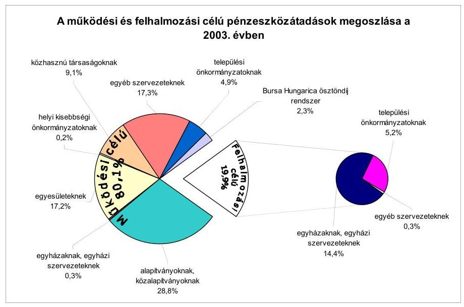
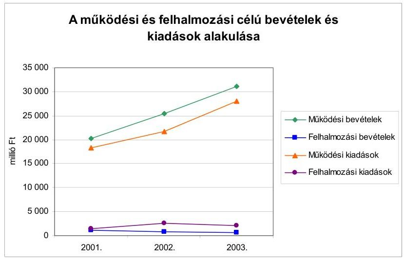
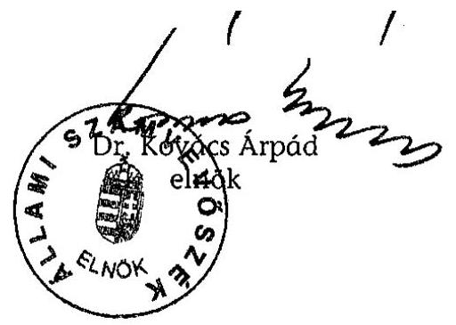
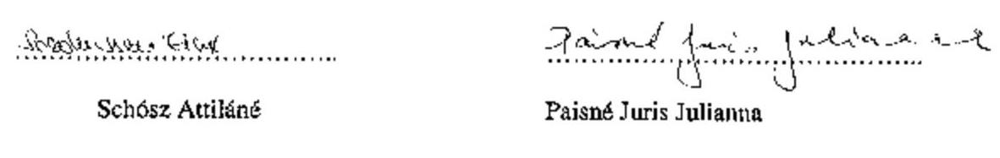
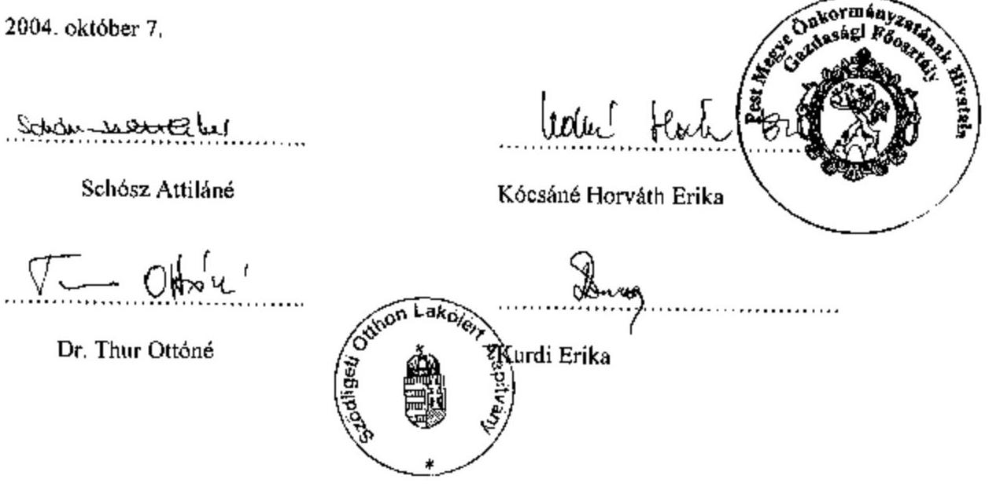
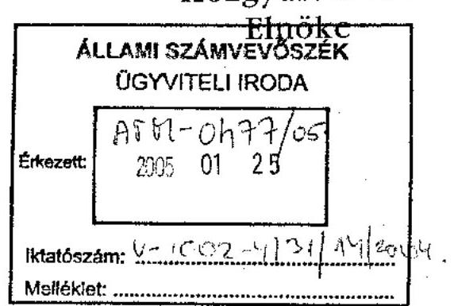
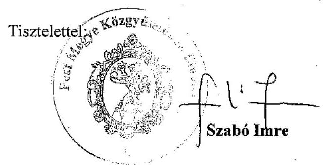

# JELENTÉS 

## a Pest Megyei Önkormányzat gazdálkodásának átfogó ellenőrzéséről

---

3. Önkormányzati és Területi Ellenőrzési Igazgatóság
3.3 Átfogó Ellenőrzések Főcsoport
Iktatószám: V-1002-4/31/13/2004.
Témaszám: 692
Vizsgálat-azonosító szám: V0164
Az ellenőrzést felügyelte:
Dr. Lóránt Zoltán
főigazgató
Az ellenőrzés végrehajtásáért felelős:
Dr. Sepsey Tamás
főigazgató-helyettes
Az ellenőrzést vezette:
Csecserits Imréné
főcsoportfőnök-helyettes
Az ellenőrzést végezték:
Gyüre Lajosné
számvevő
Dr. Karáné Kőszegi Zsuzsanna
számvevő tanácsos
Schósz Attiláné
számvevő

# A témához kapcsolódó - az elmúlt négy évben készített - számvevőszéki jelentések: 

címe
sorszáma
Jelentés a helyi önkormányzatok és a helyi kisebbségi 0010
önkormányzatok pénzügyi-gazdasági tevékenységének 1999. évi ellenőrzési tapasztalatairól
Jelentés az önkormányzati tulajdonban lévő kórházak pénzügyi 0023
helyzetének, gazdálkodásának vizsgálatáról
Jelentés a Magyar Köztársaság 2000. évi költségvetése 0126
végrehajtásának ellenőrzéséről
Jelentés a megyei, fővárosi illetékhivatali tevékenység 0243
ellenőrzéséről
Jelentés a helyi önkormányzatok tartós szociális ellátási 0317
feladatainak ellenőrzéséről az idősek otthonainál
Jelentés a szakképzési struktúra szerepéről a munkaerőpiaci 0321
igények kielégítésében

---

Jelentés a 2002. évi országgyűlési, valamint a helyi és kisebbségi 0325 önkormányzati képviselő választások lebonyolítására felhasznált pénzeszközök ellenőrzéséről
Jelentés a kötött felhasználású támogatások 2002. évi 0331
felhasználásának ellenőrzéséről
Jelentés a helyi önkormányzatok beruházásaihoz és 0332
rekonstrukcióihoz nyújtott 2002. évi címzett és céltámogatások igénybevételének és felhasználásának vizsgálatáról
Jelentés a helyi önkormányzatok gyermekvédelmi szakellátási 0430 tevékenységének ellenőrzéséről

---

# TARTALOMJEGYZÉK 

BEVEZETÉS ..... 5
I. ÖSSZEGZŐ MEGÁLLAPÍTÁSOK, KÖVETKEZTETÉSEK, JAVASLATOK ..... 7
II. RÉSZLETES MEGÁLLAPÍTÁSOK ..... 20
1.A költségvetés tervezésének, végrehajtásának, az Önkormányzat vagyongazdálkodásának és a zárszámadás elkészítésének szabályszerűsége ..... 20
1.1.A költségvetési rendelet jóváhagyásának, módosításának, az előirányzatok nyilvántartásának és betartásának szabályszerűsége ..... 20
1.2.A gazdálkodás szabályozottsága, a bizonylati rend és fegyelem szabályszerűsége ..... 25
1.3.A pénzügyi-számviteli feladatok ellátásának informatikai támogatottsága ..... 32
1.4.Az önkormányzati vagyon nyilvántartása, számbavétele ..... 34
1.5.A vagyonnal való gazdálkodás szabályszerűsége, célszerűsége, nyilvánossága ..... 36
1.6.A céljelleggel nyújtott támogatások szabályszerűsége ..... 41
1.7.A közbeszerzési eljárások szabályszerűsége ..... 46
1.8.A zárszámadási kötelezettség teljesítésének szabályszerűsége ..... 50
2.Az önkormányzati feladatok és a rendelkezésre álló források összhangja ..... 52
2.1.A feladatok meghatározása és szervezeti keretei ..... 52
2.2.A költségvetés egyensúlyának helyzete ..... 56
2.3.A feladatok finanszírozása ..... 58
3.A belső irányítási, ellenőrzési rendszer működésének értékelése ..... 63
3.1.Az ellenőrzési rendszer kialakítása, működése ..... 63
3.2.A könyvvizsgálati kötelezettség teljesítése ..... 65
3.3.A korábbi számvevőszéki ellenőrzések javaslatainak hasznosulása ..... 66

---

# MELLÉKLETEK 

1. számú Az önkormányzati vagyon nagyságának alakulása (1 oldal)
2. számú Az Önkormányzat 2003. évi bevételeinek és kiadásainak alakulása (1 oldal)
3. számú Az Önkormányzat gazdálkodását meghatározó adatok, mutatószámok (1 oldal)
4. számú Egyes önkormányzati feladatok finanszírozása (1 oldal)
5. számú Helyszíni ellenőrzési jegyzőkönyv (2 oldal)
6. számú Helyszíni ellenőrzési jegyzőkönyv (3 oldal)
7. számú Szabó Imre úr a Pest Megyei Önkormányzat Közgyűlése elnökének észrevétele (2 oldal)
8. számú Szabó Imre úr a Pest Megyei Önkormányzat Közgyűlése elnökének írt válaszlevél (1 oldal)

---

# RÖVIDÍTÉSEK JEGYZÉKE 

Ötv.
Áht.
Ámr.
$\mathrm{Kbt}_{.1}$
Kbt. 2
Számv. tv.
Htv.

Vhr.

Ber.

SzMSz
ügyrend $_{1}$
ügyrend $_{2}$
ügyrend $_{3}$
2003. évi költségvetési rendelet
2004. évi költségvetési rendelet
2003. évi zárszámadási rendelet
közbeszerzési rendelet
vagyongazdálkodási rendelet ${ }_{1}$
vagyongazdálkodási rendelet ${ }_{2}$
lakás és helyiség bérletéről szóló rendelet

ÁSZ
OEP
Önkormányzat
Közgyűlés
a helyi önkormányzatokról szóló 1990. évi LXV. törvény az államháztartásról szóló 1992. évi XXXVIII. törvény az államháztartás működési rendjéről szóló 217/1998. (XII. 30.) Korm. rendelet
a közbeszerzésekről szóló 1995. évi XL. törvény
a közbeszerzésekről szóló 2003. évi CXXIX. törvény
a számvitelről szóló 2000. évi C. törvény
a helyi önkormányzatok és szerveik, a köztársasági megbízottak, valamint egyes centrális alárendeltségű szervek feladat- és hatásköreiről szóló 1991. évi XX. törvény
az államháztartás szervezetei beszámolási és könyvvezetési kötelezettségének sajátosságairól szóló 249/2000. (XII. 24.) számú Korm. rendelet
a költségvetési szervek belső ellenőrzéséről szóló 193/2003. (IX. 26.) számú Korm. rendelet

Pest Megyei Önkormányzat 14/2001. (V. 15.) számú rendelete a Közgyűlés és szervei Szervezeti és Működési Szabályzatáról
Pest Megyei Önkormányzat Hivatalának 2003. március 1-től hatályos ügyrendje, az SzMSz 5. számú melléklete
Pest Megyei Önkormányzat Hivatalának 2004. június 1-től hatályos ügyrendje, az SzMSz 6. számú melléklete
Pest Megyei Illetékhivatal 2003. január 1-től hatályos ügyrendje
Pest Megyei Önkormányzat 2/2003. (III. 1.) számú rendelete a 2003. évi költségvetésről
Pest Megyei Önkormányzat 5/2004. (III. 5.) számú rendelete a 2004. évi költségvetésről
Pest Megyei Önkormányzat 14/2004. (VI. 18.) számú rendelete a 2003. évi zárszámadásról
Pest Megyei Önkormányzat 8/2001. (IV. 20.) számú rendelete a közbeszerzéseiről és a beruházásairól
Pest Megyei Önkormányzat 9/1996. (VI. 17.) számú rendelete a vagyonáról és a vagyontárgyak feletti tulajdonosi jogok gyakorlásáról
Pest Megyei Önkormányzat 11/2003. (VI. 20.) számú rendelete a vagyonáról, a vagyongazdálkodás szabályairól
Pest Megyei Önkormányzat 11/1994. (V. 1.) számú rendelete az Önkormányzat tulajdonában lévő lakások és helyiségek bérletéről
Állami Számvevőszék
Országos Egészségbiztosítási Pénztár
Pest Megyei Önkormányzat
Pest Megyei Önkormányzat Közgyűlése

---

| Pénzügyi bizottság | Pest Megyei Önkormányzat Közgyűlésének Pénzügyi Bizottsága |
| :--: | :--: |
| Gazdasági bizottság | Pest Megyei Önkormányzat Közgyűlésének Gazdasági Bizottsága |
| Közgyűlés elnöke | Pest Megyei Közgyűlés elnöke |
| főjegyző | Pest Megyei Önkormányzat főjegyzője |
| Hivatal | Pest Megyei Önkormányzat Hivatala |
| Közgazdasági főosztály | Pest Megyei Önkormányzat Hivatalának Közgazdasági Főosztálya |
| Elnöki iroda | Pest Megyei Önkormányzat Hivatalának Elnöki Irodája |
| Főjegyzői titkárság | Pest Megyei Önkormányzat Hivatalának Főjegyzői Titkársága |
| Illetékhivatal | Pest Megyei Illetékhivatal |
| önkormányzati köz-   üzemi vállalat | Pest Megyei Kéményseprő és Tüzeléstechnikai Vállalat |
| EREK Kht. | EREK Együtt a Régió Egészségéért Közhasznú Társaság |
| Szimfonikus Zenekar Kht. | Pest Megyei Szimfonikus Zenekar Közhasznú Társaság |
| PEMPSZI Kht. | Pest Megyei Pedagógiai Szak és Szakmai Szolgáltató Közhasznú Társaság |
| PEMPSZI | Pest Megyei Pedagógiai Szak és Szakmai Szolgáltató Intézet |
| PM TEGYESZI | Pest Megyei Területi Gyermekvédelmi Szakszolgálat |
| Szent Rókus Kórház | Pest Megyei Szent Rókus Kórház és Intézményei |
| Flór Ferenc Kórház | Pest Megyei Flór Ferenc Kórház |

---

# JELENTÉS   a Pest Megyei Önkormányzat gazdálkodásának átfogó ellenőrzéséről 

## BEVEZETÉS

Az Ötv. 92. § (1) bekezdése, az Állami Számvevőszékről szóló 1989. évi XXXVIII. törvény 2. § (3) bekezdése, valamint az Áht. 120/A. § (1) bekezdése szerint az önkormányzatok gazdálkodását az Állami Számvevőszék ellenőrzi. Az ellenőrzés elvégzése az Országgyűlés illetékes bizottságai részére is átadott, országosan egységes ellenőrzési program alapján történt.

## Az ellenőrzés célja annak értékelése volt, hogy

- az önkormányzati gazdálkodás törvényességét, szabályszerűségét biztosították-e a tervezés, a költségvetés végrehajtása, a vagyongazdálkodás és a zárszámadás során;
- az Önkormányzat által ellátott feladatok és az azokhoz rendelkezésre álló források összhangja biztosított volt-e, különös tekintettel egyes kiemelt feladatokra;
- a gazdálkodás szabályszerűségét biztosító kontrollok megfelelően segítették-e a végrehajtást.

Az ellenőrzött időszak: a 2003. év, valamint a 2004. év I. félév, az 1.5., 2.12.3. és 3.3. programpontok tekintetében a 2001-2002. évek is.

Pest megye az ország legnépesebb megyéje, a népességszám 2003. január 1-jén 1108 ezer fő volt. A megyében 186 önkormányzat működött, s az urbanizáció fokát jelzi, hogy a lakosság 52,3%-a városokban él.

A közgyűlési tagok száma 80 fő, akiknek a munkáját 10 állandó bizottság segítette. A Közgyűlés elnökének és három alelnökének személye a 2002. évi önkormányzati választásokat követően változott, a főjegyző 1999. április 1-től látja el feladatát.

[^0]
[^0]:    ${ }^{1}$ A törvényi előírások betartásának elmulasztásakor egységesen a törvénysértés megjelölést alkalmazzuk, mivel az ÁSZ nem tehet különbséget a törvényi előírások között.
    ${ }^{2}$ A gazdálkodás szabályszerűségét biztosító kontroll alatt értjük a kiépített és működő belső irányítási és szabályozási rendszert, valamint a belső ellenőrzési funkciók ellátását.

---

Az Önkormányzat 73 költségvetési intézményt tartott fenn, amelyekből 59 önállóan gazdálkodott, s a feladatok ellátásában egy önkormányzati közüzemi vállalat, három közhasznú társaság, hét közalapítvány és egy alapítvány vett részt.

A feladatok ellátására foglalkoztatott közalkalmazottak száma a 2003. évben 6838 fő volt, a Hivatalban 292 fő köztisztviselő dolgozott.

Az Önkormányzat a 2003. évben 31703 millió Ft költségvetési bevételt és 30163 millió Ft költségvetési kiadást teljesített, a 2003. év végén 37267 millió Ft értékű könyvviteli mérleg szerinti vagyonnal rendelkezett. Az Önkormányzat gazdálkodását meghatározó 2003. évi adatokat, mutatószámokat a 3. számú melléklet részletezi.

---

# I. ÖSSZEGZŐ MEGÁLLAPÍTÁSOK, KÖVETKEZTETÉSEK, JAVASLATOK 

A Közgyűlés meghatározta az Önkormányzat 2003-2006. évekre vonatkozó gazdasági programját az Ötv-ben előírt kötelezettségének megfelelve. A 2003. és a 2004. évi költségvetési koncepciót és rendelettervezetet a Közgyűlés elnöke határidőben a Közgyűlés elé terjesztette. A költségvetési koncepciót a bizottságok véleményének ismeretében a Közgyűlés határozattal elfogadta a helyben képződő bevételek és az ismert kötelezettségek számbavételével. A Közgyűlés az Áht. előírásait megsértve nem határozta meg rendeletben a költségvetési és a zárszámadási rendeletek előterjesztésekor tájékoztatásul bemutatandó mérlegek, kimutatások tartalmát. A Közgyűlés részére a költségvetési rendelettervezet előterjesztésekor tájékoztatásul nem mutatták be az Áht. előírását megsértve a többéves kihatással járó döntések számszerűsítését évenkénti bontásban, valamint összesítve szöveges indoklással. A 2003. és a 2004. évi költségvetési rendelettervezetek összeállításánál részben vették figyelembe az Ámr-ben előírtakat. Az intézményi előirányzatokat az intézményvezetőkkel egyeztették, melyet írásba foglaltak. A Közgyűlés a 2003. és a 2004. évi költségvetésben a bevételi és a kiadási előirányzatok között az Áht. előírásának megfelelően hiányt állapított meg, melynek finanszírozását hitelfelvétellel tervezték. A címrendet és a költségvetés végrehajtásával összefüggő végrehajtási szabályokat a költségvetési rendeletben meghatározták. Az Ámr. előírása ellenére nem mutatták be feladatonként a Hivatal költségvetését. Az önállóan gazdálkodó intézmények többletbevételének előirányzat módosítására vonatkozó jogkörének részletszabályait nem határozták meg az Áht. és az Ámr. előírása ellenére, valamint a Közgyűlés tájékoztatását az Ámr. előírása szerinti 30 napon belüli határidőtől eltérően évi három alkalomban írták elő. A költségvetési hiány finanszírozásával kapcsolatos hatásköröket az Áht. előírásának megfelelően határozták meg. A költségvetésekben elkülönítetten szerepeltek az Áht. előírásának megfelelően az általános- és céltartalékok. A Közgyűlés által külön rendeletben szabályozott „Alapok" nem rendelkeztek államháztartáson kívüli bevételekkel, ezért elnevezésük félreérthető, a tartalmuk alapján bizottsági felhasználású előirányzatok.

A Közgyűlés a 2003. évi költségvetési rendeletet öt alkalommal módosította, melynek során az előirányzatok 13,9%-kal nőttek. A Hivatal és az intézmények kiemelt előirányzataikat nem lépték túl, megvalósult az előirányzatokon belüli gazdálkodás. A 2003. évi költségvetési rendelet módosítása során az Ámr-ben előírt határidőt betartották. A Közgyűlés által elfogadott előirányzatokban bekövetkezett változásokat folyamatosan nyilvántartották. A kiemelt előirányzatokat betartották.

Az Önkormányzat SzMSz-e magában foglalta a Hivatal ügyrendjét. A Hivatal szervezeti egységeit, feladatait és működési rendjét nem szervezeti és működési szabályzatban, hanem ügyrendben határozták meg. Az ügyrendben nem részletezték az Ámr-ben előírtakat, az alapító okirat keltét, számát, az alaptevékenység forrásait, a feladatmutatók megnevezését, körét, a költségvetés végrehajtására szolgáló számlaszámot, a költségvetés tervezésével és végrehajtásával

---

kapcsolatos előírásokat, feltételeket, a Hivatalhoz rendelt részben önállóan gazdálkodó költségvetési szervek felsorolását, azok pénzügyi-gazdasági tevékenységét ellátó személyek feladatkörének, munkakörének meghatározását, a szervezeti egységek vezetőjének azon jogosítványait, amelyek körében a költségvetési szerv képviselőjeként járhat el. A gazdasági szervezet (Közgazdasági főosztály) felépítését és feladatkörét az ügyrendben ${ }_{1,2}$ rögzítették. Az Ámr-ben előírtak ellenére nem határozták meg a főosztály és szervezeti egységei és a pénzügyi-gazdasági feladatok ellátásáért felelős személyek által, továbbá a hozzá rendelt részben önállóan gazdálkodó költségvetési szervek tekintetében ellátandó - az Ámr. szerinti
 - feladatait, a vezetők és más dolgozók feladat-, hatás- és jogkörét.

Az operatív gazdálkodással összefüggő jogkörök szabályozását a Közgyűlés elnöke a kiadmányozás rendjéről szóló utasításban, a főjegyző a pénzkezelési szabályzatban adta ki. A Közgyűlés elnöke az Ámr-ben és a Hivatal működési rendjéről szóló utasításban foglaltakkal ellentétben felhatalmazást adott a főjegyzőnek, hogy rendelkezzen a kötelezettségvállaló és az utalványozó személyek kijelöléséről. A főjegyző a kötelezettségvállalási jogkör gyakorlására a Közgazdasági főosztály vezetőjének, a sajtófőnöknek és az Elnöki iroda kabinetfőnökének, az utalványozásra a Közgazdasági főosztály vezetőjének adott felhatalmazást, ezzel nem vette figyelembe az Ámr-ben foglaltakat, mivel erre vonatkozóan jogszabályon alapuló felhatalmazással nem rendelkezett. Az Illetékhivatal gazdálkodási és ellenőrzési jogköreinek szabályozását a Közgyűlés elnöke és a főjegyző külön ügyrendben rögzítették.

A Hivatalban az 50 ezer Ft-ot el nem érő kifizetések esetén a kötelezettségvállalások rendjét és nyilvántartási formáját, annak indokoltsága ellenére nem határozták meg. A gazdálkodási és ellenőrzési jogkörök felhatalmazottainak kijelölésénél az összeférhetetlenségi követelményeket betartották, azonban nem számoltatták be a gazdálkodási jogkörök gyakorlásáról a felhatalmazottakat és nem szabályozták a beszámoltatás módját, formáját. A szakmai teljesítésigazolás módjáról, az azt végző személyek kijelöléséről a főjegyző belső szabályzatban nem rendelkezett, ezzel nem tett eleget az Ámr-ben előírt kötelezettségének.

A Hivatal számviteli politikáját kialakították. Az Önkormányzat által alapított költségvetési intézmények számviteli rendjét a főjegyző nem alakította ki, ezzel megsértette a Htv. előírását. A számviteli politikában a Vhr. előírásai ellenére nem határozták meg a számviteli elszámolás és az értékelés szempontjából lényeges, illetve nem lényeges információkat, nem határozták meg a terven felüli értékcsökkenés elszámolásánál figyelembe veendő szempontokat. Az eszközök és források leltározási és leltárkészítési szabályzata tartalmazta a leltározás előkészítésével, végrehajtásával, a leltározás és a könyvvitel adatainak egyeztetésével kapcsolatos feladatokat, a felelősök megnevezését. Az eszközök és források értékelési szabályzatában részletesen meghatározták az eszközök bekerülési értékébe beszámítandó kifizetések, ráfordítások konkrét tartalmát, megnevezését, eszközcsoportonkénti részletezettségben, valamint a források értékelésének szabályait. A Vhr. előírása alapján, az indokoltság ellenére nem rögzítették az értékvesztés visszaírásának eszközcsoportonkénti rendjére vonatkozó szabályokat. A pénzkezelési szabályzatban meghatározták a megnyitható bankszámlák körét, rendeltetésüket, az azok feletti rendelkezési

---

jogosultságokat, a házipénztári keret összegét, a készpénzfelvétel, a szállítás és őrzés rendjét, a pénztáros, a pénztárellenőr feladatait, az előlegek igénybevételének, nyilvántartásának, elszámolásának szabályait. A házipénztári keret maximális összege (1 millió Ft) a napi pénzforgalom figyelembevételével indokolatlanul magas volt. A felesleges vagyontárgyak hasznosításának, selejtezésének szabályzata tartalmazta a felesleges vagyontárgyak feltárásának, hasznosításának, selejtezésének feladatait, felelőseit. A Hivatal számlarendje tartalmazta a főkönyvi számlák számjelét, megnevezését, tartalmát, értékváltozásának jogcímeit, a főkönyvi számlákat érintő gazdasági eseményeket, az analitikus nyilvántartások vezetésének a főkönyvi könyveléssel való egyeztetésének szabályait. Nem határozták meg a Vhr. előírása ellenére az analitikus nyilvántartások adataiból az összesítő feladások elkészítésének határidejét. A bizonylati rendet a számviteli politika részeként készítették el, melyben a Számv. tv-ben foglaltakat megsértve az analitikus nyilvántartások alapján készítendő feladások formáját nem határozták meg, nem írták elő a bizonylatok kiállításával, feldolgozásával, ellenőrzésével, szállításával, tárolásával, megőrzésével kapcsolatos feladatokat. A kötelezettségvállalás, ellenjegyzés, érvényesítés, utalványozás rendjének szabályozásakor az ellenjegyzés és az érvényesítés esetén az ellenőrzési pontokat, az ellenőrzéskor elvégzendő műveleteket, az esetleges eltérések dokumentálásának rendjét, valamint a kötelezettségvállalás és ellenjegyzés folyamatának szabályait nem határozták meg. A munkaköri leírásokban előírták a munkaköri feladatokat, a főkönyvi és az analitikus nyilvántartás egyeztetési, ellenőrzési kötelezettségét, a dolgozók hatáskörét és felelősségét, nem rögzítették azonban a folyamatba épített ellenőrzési (ellenjegyzési) feladatokat.

A főkönyvi könyvelés, az analitikus nyilvántartások és a bizonylatok adatainak egyeztetését a számlarendben az egyéb gazdasági eseményeknél negyedéves gyakorisággal írták elő. A negyedéves egyeztetéseket a Számv. tv-ben és a számlarendben foglaltaknak megfelelően végezték el és dokumentálták. A könyvviteli nyilvántartásban elszámolt gazdasági eseményekről a Számv. tv-ben előírt bizonylatokat kiállították.

A gazdálkodási jogkörök gyakorlása során az Ámr-ben rögzített összeférhetetlenségi követelményeket betartották. Az Ámr-ben előírtak ellenére a munkafolyamatba épített ellenőrzési feladatok közül a szabályozás hiánya miatt elmaradt a szakmai teljesítés igazolása a kiadási bizonylatok 7,9%-ánál, a nem termékértékesítésből és nem szolgáltatásnyújtásból származó bevételek bizonylatainak teljes körénél, nem végezték el a kiadások teljesítésének és a bevételek beszedésének elrendelése előtt az ellenőrzéssel kapcsolatos feladatokat. A kötelezettségvállalás ellenjegyzése a kiadási bizonylatok 17,1%-ánál hiányzott, nem teljesült ezeknél a bizonylatoknál a kiadási előirányzat által biztosított fedezet meglétének, a kötelezettségvállalás jogszerűségének és célszerűségének munkafolyamatba épített ellenőrzése. A Közgyűlés elnöke fedezet nélkül vállalt támogatás nyújtására vonatkozó kötelezettséget 4 millió Ft összeg erejéig a 2003. és a 2004. években, ezzel megsértette az Áht. előírását. A kiadások teljesítésénél megsértették az Áht. kötelezettségvállalás írásban történő elvégzésére vonatkozó előírását a kifizetések 12,8%-ánál, mivel nem készítettek értékadatot is tartalmazó írásbeli kötelezettségvállalást, ezen belül a megrendelőket a rendelési érték meghatározása nélkül készítették el a kifizetések 3,6%-ánál. A megrendelt termék, szolgáltatás értékének feltüntetése nélküli kötelezettségvállalás-

---

sal nem tettek eleget az Ámr-ben foglaltaknak. Ezen hiányossághoz kapcsolódóan a munkafolyamatba épített ellenőrzési kötelezettségének nem tett eleget az érvényesítő. A házipénztárban nem tartották be a pénzkezelési szabályzat előlegek kifizetésére és elszámolására vonatkozó előírásait és ezt a pénztárellenőr a pénztárellenőrzés dokumentumai szerint nem kifogásolta. A főkönyvi könyvelésben karbantartások között számoltak el 1,5 millió Ft értékben felújítási feladatokat a Számv. tv. előírásait megsértve, nem növelték a felújítási munkák értékével az adott tárgyi eszközök értékét.

A Hivatal pénzügyi-számviteli feladatait kiszolgáló informatikai rendszer és az ahhoz kapcsolódó eszközellátottság jól kiépített, azonban az Önkormányzat informatikai stratégiával nem rendelkezett, a váratlan események esetére a feladatokat tartalmazó katasztrófa elhárítási terv nem készült. A programok teljes lehetőségeit nem használták ki, egységes pénzügyi-számviteli program hiánya miatt a feladatok elvégzése párhuzamos adatrögzítést, folyamatos manuális egyeztetést igényelt. Az adatvédelmi szabályzatban előírták az adatvédelmi feladatok ellátásának kötelezettségeit, meghatározták a mentések gyakoriságát, módját. A pénzügyi-számviteli területen dolgozók munkaköri leírásai a felhasználók esetén tartalmazták a rendszer használatát, azonban az általuk végzett feladat leírását nem szerepeltették.

A Hivatalban a vagyon nyilvántartási feladatokat a pénzeszközök esetében a főkönyvi számlák alábontásával, az ingatlanok, részesedések, rövid- és hosszúlejáratú követelések, az üzemeltetésre, kezelésre átadott eszközök és a rövidlejáratú kötelezettségek esetében analitikus nyilvántartások vezetésével oldották meg. A 2003. évre - a leltározási és leltárkészítési szabályzatban foglaltaktól eltérően - a főjegyző leltározási ütemtervet nem hagyott jóvá. A 2003. évre vonatkozó mérleg alátámasztását leltárral és a részletező nyilvántartások alapján készített összesítő kimutatással biztosították, annak ellenére, hogy a Közgyűlés egyetértésével nem rendelkeztek. Összesítő kimutatással helyettesítették a leltárt az ingatlanok, a részesedések és az üzemeltetésre, kezelésre átadott eszközök esetében. A rövid- és hosszú lejáratú követeléseket és a rövidlejáratú kötelezettségeket egyeztetéssel leltározták a Vhr. előírásának megfelelően.

A követelések értékelését a mérlegkészítést megelőzően elvégezték. A részesedések esetében az - év végi értékelési feladatok keretében - értékvesztés elszámolásának szükségességét három társaságnál vizsgálták, ezeknél az értékvesztés elszámolásának feltételei nem álltak fenn. Egy társaságban lévő tulajdoni részesedése után a Hivatal a Számv. tv-ben előírtakat megsértve nem vizsgálta az értékvesztés elszámolásának szükségességét. A részesedések analitikus nyilvántartásában szerepeltettek egy közalapítvány részére átadott összeget, amely ellentétes a Vhr-ben foglalt előírással. A részesedések analitikus nyilvántartása tartalmazta két olyan gazdasági társasági befektetés értékét, melyeket felszámolás miatt már több éve töröltek a cégjegyzékből, ezáltal megsértették a Számv. tv-ben foglalt valódiság elvét. A mérlegben kimutatott és a tényleges részesedés közötti különbség nem minősült jelentős összegűnek a Hivatal számviteli politikájában meghatározottak alapján.

Az Önkormányzat a vagyonnal való gazdálkodás szabályait a vagyongazdálkodási rendeletben 1,2, valamint a lakás és helyiség bérletéről szóló rendeletben határozta meg, melyek hatálya a teljes vagyoni körre kiterjedt. A vagyon-

---

gazdálkodási rendeletben 1 a vagyonnal való döntési hatásköröket megosztották a Közgyűlés, a Hivatal, az intézmények, a közüzemi vállalat vezetői, a Közgyűlés elnöke, továbbá a bizottságok között. Az Önkormányzat a vagyongazdálkodási rendeletében 1 0,5 millió Ft-ban határozta meg azt az értékhatárt, amely felett csak nyilvános pályázat útján lehet értékesíteni a feleslegessé váló ingóvagyont. A vagyongazdálkodási rendelet 2 alapján fő szabályként csak nyilvános pályázat útján lehet a vagyont értékesíteni, a használat jogát átadni. Az Önkormányzat a vagyongazdálkodási rendelet 1,2 előírásai alapján határozatokat hozott a vagyongazdálkodási irányelvekről, melyek tartalmazták az Önkormányzat teljes vagyonának kezelésére, hasznosítására, értékesítésére vonatkozó célkitűzéseket. Az Önkormányzat az ingatlanértékesítések során a vagyongazdálkodási irányelvekben foglaltakkal összhangban értékesítette az ingatlanokat a vagyongazdálkodási rendeletben 1,2 előírt szabályok betartásával. Az Önkormányzat a tulajdonában lévő lakások és helyiségek bérbeadása során a lakás és helyiség bérbeadásáról szóló rendelet előírásainak megfelelően járt el. Az Önkormányzat vagyonában a 2001-2003. évek között - a könyvviteli mérlegadatok alapján - folyamatos növekedés következett be, mely a 2001. évről a 2002. évre 26,6%, a 2002. évről a 2003. évre 35,7% volt. Az ingatlanok esetében a 2002. évről a 2003. évre kimutatott 70,2%-os növekedést a korábban érték nélkül nyilvántartott ingatlanok érték megállapítása okozta. Ennek figyelembevétele nélkül a tényleges növekedés 12,3% volt. A vagyon ingyenes átruházásának és a követelésről való lemondásnak a módjait, eseteit, ennek keretében a döntési hatásköröket szabályozták a vagyongazdálkodási rendeletben 1,2, mellyel eleget tettek az Áht-ban foglalt kötelezettségnek. A hatáskör Pénzügyi bizottságra és Gazdasági bizottságra való együttes átruházása során azonban nem szabályozták eltérő döntés esetén az eljárás rendjét. A vagyon ingyenes átruházása során a vagyongazdálkodási rendelet 1 előírásai alapján jártak el. A követelésről való lemondás a 2003. évben a vagyongazdálkodási rendelet 2 előírásainak megfelelően történt.

Az Önkormányzat a 2003. évben céljelleggel - nem szociális ellátásként - 347,9 millió Ft támogatást biztosított működési és felhalmozási célra. A célhoz kötött támogatásokról szóló döntéseket a támogatási összeg 57,4%-a esetében a Közgyűlés, 33,8%-ában a hatáskörrel felruházott bizottságok és 8,8%-a esetében az elnöki, alelnöki keret terhére hozták. A 2003. és a 2004. évi költségvetési rendeletben nevesített támogatások és bizottsági jogkörben hozott döntések esetében az Áht. alapján előírták a számadási kötelezettséget a támogatott szervezetek részére. Az elnöki, alelnöki keretből nyújtott támogatások esetében nem írtak elő számadási kötelezettséget a 2003. évben és a 2004. év I. félévében, mellyel megsértették az Áht-ban foglalt előírást, továbbá nem kötöttek szerződést közhasznú szervezetekkel, mellyel megsértették a közhasznú szervezetekről szóló törvényben foglalt számadási kötelezettséget tartalmazó szerződéskötési kötelezettségre vonatkozó előírást. A Közgyűlés elnöke, az alelnökök és a bizottságok a 2003. évben és a 2004. év I. félévében az alapítványok, közalapítványok számára is nyújtottak támogatást, mellyel megsértették az Ötv-ben foglalt azon előírást, mely szerint a Képviselő-testület hatásköréből nem ruházható át a közösségi célú alapítvány és alapítványi forrás átadása. Az alelnökök esetében a költségvetési rendeletek a hatáskör átruházására
 vonatkozó rendelkezést nem tartalmaztak. Az alelnöki keret felhasználásáról az alelnökök döntöttek annak ellenére, hogy az Ötv. alapján nem rendelkezhetnek döntési hatáskörrel. A 2003. évi költségvetésben nevesített és a bizottsági

---

hatáskörben hozott támogatások esetében a benyújtott számadásokat a becsatolt bizonylatok alapján ellenőrizték az illetékes szakirodák dolgozói, ezáltal az Önkormányzat eleget tett az Áht-ban előírt - számadás ellenőrzésére vonatkozó - kötelezettségének. A támogatások felhasználását a helyszínen nem ellenőrizték. Az ÁSZ helyszíni ellenőrzést folytatott két támogatottnál, amelyek a támogatást rendeltetésszerűen használták fel. Az Önkormányzat a céltól eltérő felhasználás miatt a támogatás összegét nem követelte vissza, mellyel megsértette az Áht-ban foglalt visszafizetési kötelezettségre vonatkozó előírást. A Hivatalban összesített nyilvántartás hiányában a 2004. évben egyeztetés útján kísérték figyelemmel, hogy a pályázó csak egy jogcímen részesüljön támogatásban.

A Közgyűlés rendeletet alkotott az Önkormányzat és költségvetési szervei közbeszerzési eljárásainak helyi szabályairól. A lefolytatott közbeszerzési eljárások során az ajánlattételre, az ajánlatok felbontására, értékelésére és az eredményhirdetésre megállapított szabályokat, illetve határidőket betartották. A nyertes pályázók kiválasztásáról szóló döntést a Kbt.¹-et betartva a Közgyűlés elnöke hozta meg. A Kbt.¹ hatálya alá nem tartozó értékhatár alatti beszerzések rendjét, a minőségbiztosítási eljárásban határozták meg. Az ügyrend szabályozásának hiányossága, hogy a szakfőosztályok feladatellátásánál nem sorolta fel a közbeszerzésekért történő felelősséget, valamint az esetleges szerződésmódosításokat megelőzően a közbeszerzéssel kapcsolatos egyeztetési kötelezettséget a közbeszerzési referenssel. Ennek következtében a 2003. évben a Hivatalnál nem történt meg a különböző közbeszerzési értékhatárt meghaladó beszerzések Kbt.¹ szerinti kategorizálása. A Hivatalban a 2003. évben a személygépkocsik cseréje, az irodaszer, nyomtatvány beszerzés, az őrző-védő tevékenység és három felújítás esetében a Kbt.¹-et megsértve nem folytatták le közbeszerzési eljárást. A Hivatal és az intézmények taneszköz- és egészségügyi gépműszer beszerzésénél a közbeszerzési eljárást centrálisan valósították meg és éltek a központosított közbeszerzési eljáráshoz való csatlakozás lehetőségével.

Az Önkormányzat a 2003. évi zárszámadásról szóló rendeletet határidőben, a költségvetéssel összehasonlítható módon terjesztette be a Közgyűlés elnöke. Az Ámr. előírása ellenére a Hivatal felhalmozási kiadásainak bemutatásakor a felújítások között beruházásokat is feltüntettek, valamint nem mutatták be a Hivatal feladatonkénti teljesítési adatait. A zárszámadás elfogadásakor a Közgyűlés részére tájékoztatásul az Áht-t megsértve nem mutatták be a vagyonkimutatást, valamint a többéves kihatással járó döntések számszerűsítését évenkénti bontásban, összesítve, szöveges indoklással. A pénzmaradvány elszámolást az Ámr. előírásai szerint készítették el.

A Közgyűlés az Önkormányzat Ötv-ben részletezett feladatait az SzMSz-ben meghatározta. Az Önkormányzat a feladatellátási kötelezettségének költségvetési szervei, gazdasági társaságai és önkormányzati közüzemi vállalata útján tett eleget. A 2001-2003. években a települési önkormányzatok kezdeményezésére 16 intézmény megyei fenntartásba vételéről döntött a Közgyűlés. Az önkormányzati feladatok ellátását hét közalapítvány és egy alapítvány segítette.

Az Önkormányzat gazdálkodása a 2001-2003. évi beszámolóinak teljesítési adatai alapján egyensúlyban volt, a költségvetési bevétel fedezetet nyújtott a

---

költségvetési kiadásokra, hitelt nem vettek fel. A 2003. évi működési célú bevételek és kiadások közötti egyensúly - az illetékbevételek túlteljesítését, a 2003. évre tervezett feladatok szervezeti változtatással történt racionalizálását követően - biztosított volt. Az Önkormányzat 2001-2003. évek között pályázati forrásokat nyert el feladatellátása finanszírozására. Az OEP támogatáson felül a 2003. évben a ténylegesen átvett pénzeszközök összege 2140 millió Ft volt, mely az összes költségvetési bevétel 6,7%-át jelentette.

Az Önkormányzat feladatainak ellátásához rendelkezésre álló források közül a 2003. évben az állami hozzájárulás az általános iskolai oktatás esetében 53,3%, a középiskolai oktatás esetében 60,4%, valamint a bentlakásos szociális intézményi ellátásnál 60,2% volt. Az általános- és középiskolai oktatás működési kiadásaihoz az intézményi saját bevételek a 2001-2003. években közel azonos mértékben - 2,2-2,3% - járultak hozzá. A bentlakásos szociális intézményi ellátás kiadásainak finanszírozásában az intézményi saját bevételek a 2003. évben 28,4%-os részarányt képviseltek. A működési kiadások növekedéséhez hozzájárult a közalkalmazotti bérfejlesztés. Az Önkormányzat a kapacitáskihasználtság javítása érdekében - a Hivatalban működtetett feladatfinanszírozási program segítségével - a költségvetés elkészítése és az intézményvezetőkkel való egyeztetés során vizsgálta az oktatás területén az optimális osztály- és pedagóguslétszámot, valamint a szociális feladatellátás területén az ellátottak számához szükséges szakemberek számát. A vizsgálat megállapításainak figyelembevételével az Önkormányzat a 2001. évben döntött egy szakmunkásképző iskola és kollégium jogutód nélküli megszüntetéséről, továbbá egy gimnázium működtetésének városi önkormányzat részére történő visszaadásáról. A gazdaságosabb működtetés érdekében 2004. január 1-től két szociális intézményt összevontak.

Önként vállalt feladat volt 2004. évig az Önkormányzatnál egy általános iskola működtetése, valamint a céljelleggel nyújtott támogatások az államháztartáson kívülre irányuló működési és felhalmozási célú pénzeszközátadások keretében. Az önként vállalt feladatok kiadása a 2001. évben 304,0 millió Ft, a 2002. évben 378,7 millió Ft és a 2003. évben 432,5 millió Ft volt. Ezen kiadások növekedése ellenére az összes költségvetési kiadáson belüli részaránya a 2001. és a 2002. évi 1,5%-ról a 2003. évre 1,4%-ra csökkent. Az Önkormányzat által önként vállalt feladatok finanszírozása a 2001-2003. években a kötelező feladatok ellátását nem veszélyeztette.

A 2003. évben a tervezett likviditási hitelt nem vették igénybe. A főjegyző a 2003. évben nem, de a 2004. évben már likviditási tervet készített és azt havonta aktualizálta. Az Önkormányzat egyik intézménye, a Flór Ferenc Kórház a 2003. évben kölcsönszerződést kötött rövidlejáratú (25 napos) hitel felvételére. A hitelszerződés megkötésével és a hitel igénybevételével megsértette az Áhtban foglalt azon előírást, hogy költségvetési intézmény pénzkölcsönt (hitelt) nem vehet fel.

A Hivatalban a 2003. évben a kötelezettségvállalások közül csak a szerződéseken alapuló kötelezettségvállalásokat tartották nyilván. A kötelezettségvállalás nyilvántartását 2004. január 1-től vezették a Hivatalban, amelyben azonban az Ámr-ben előírtak ellenére nem tartották nyilván a személyi juttatásokat és járulékokat, továbbá a kötelezettségvállalások 5,0%-a a nyilvántar-

---

tásban nem szerepelt, mely hiányosság miatt a nyilvántartás nem volt alkalmas a kötelezettségvállalás éves összegének megállapítására.

Az Önkormányzat a 2003. évben kezességet vállalt a Szent Rókus Kórház részére 22,0 millió Ft összeg erejéig. Az adósságot keletkeztető kötelezettségvállalás során a felső korlátot betartották, annak 0,6%-át érték el. A kezességvállalás nem veszélyeztette az Önkormányzat fizető- és működőképességét.

Az Önkormányzat a 2002. évben felmérést készíttetett a középületek akadálymentesítése céljából. A felmérés intézményenként mutatta be a megvalósítás műszaki lehetőségeit, a várható kiadásokat viszont nem tartalmazta. A középületek közül 49 megfelelt, 98 épület nem felelt meg az akadálymentesítési követelményeknek, melyből 53 épület nem alakítható át. A fennmaradó 46 épület akadálymentesítésének költségét a - 2004. június 30-i - kimutatás szerint 740,0 millió Ft-ban jelölték meg. Az eddigi ráfordításokat figyelembe véve a fogyatékos személyek jogairól és esélyegyenlőségük biztosításáról szóló törvényben meghatározott 2005. január 1-i határidőre a feladatok elvégzése nem biztosítható.

Az Önkormányzat az ügyrendben¹ kialakította az ellenőrzési feladatok végrehajtásához szükséges szervezeti kereteket. Az ügyrendben² a 2004. évben a Ber. előírása ellenére a Hivatalon belüli független belső ellenőr a Közgyűlés elnökének alárendeltségébe került. Nem határozták meg a belső ellenőrzési szervezet jogállását, feladatait, a belső ellenőrök számát, valamint nem jelölték ki a belső ellenőrzési vezetőt. A főjegyző ellenőrzési szabályzatban rendelkezett az intézményi és a belső ellenőrzési feladatok elvégzéséről. A Hivatalban a 2003. évben és 2004. I. negyedévében nem történt belső ellenőrzés az álláshely betöltetlensége miatt. Az intézményi ellenőrzések ellenőrzési munkaterv alapján, megbízólevél kiállításával valósultak meg, azokról minden esetben jelentés készült. A Közgyűlés elnöke és a főjegyző az ellenőrzési program aláírásakor nem vette figyelembe a 2004. évben a belső ellenőrzést végző szervezet Ber. szerinti önállóságát. Az ellenőrzött szervezetek az ellenőrzések megállapításaihoz intézkedési tervet készítettek. A Közgyűlés áttekintette az intézményi belső ellenőrzések tapasztalatait.

Az Önkormányzat a 2003. évben a törvényben előírt könyvvizsgálati kötelezettségét költségvetési minősítésű könyvvizsgálóval - az összeférhetetlenségi követelmények figyelembevételével - teljesítette. A könyvvizsgáló az Önkormányzat 2003. évi beszámolóját hitelesítő záradékkal látta el, az egyszerűsített éves beszámoló és a valóságos állapot között auditálási eltérést nem állapított meg.

A korábbi számvevőszéki vizsgálatokról készült jelentéseket a Közgyűlés nem tárgyalta meg, a javaslatok hasznosítására intézkedési tervet a javaslatok 98,3%-ánál nem készítettek, a javaslatok 83%-át realizálták.

---

A helyszíni ellenőrzés megállapításainak hasznosítása mellett javasoljuk:

# a Közgyűlés elnökének 

a jogszabályi előírások maradéktalan betartása érdekében
1. a költségvetési gazdálkodás jogszabályszerű kereteinek kialakítása céljából
a) terjessze a Közgyűlés elé a főjegyző által előkészített, a költségvetési és zárszámadási rendeletek előterjesztésekor tájékoztatásul bemutatandó mérlegek és kimutatások tartalmi követelményeit meghatározó rendelettervezetet az Áht. 118. §-a alapján;
b) tájékoztassa 30 napon belül a Közgyűlést a főjegyző előkészítésében az önállóan gazdálkodó költségvetési szervek saját hatáskörben végrehajtott előirányzat-változtatásáról az Ámr. 53. § (6) bekezdése alapján;
2. a szabályszerű költségvetési gazdálkodás érdekében
a) kezdeményezze az Ámr. 17. § (4) bekezdésében foglaltak alapján a főjegyző előkészítésében a Hivatal szervezeti és működési szabályainak Közgyűlés által történő jóváhagyását, valamint az Ámr. 10. § (4) bekezdés a), d), e), g-j) pontjai szerinti kiegészítését az alapító okirat keltével, számával; az alaptevékenység forrásaival; a feladatmutatók megnevezésével, körével; a költségvetés végrehajtására szolgáló számlaszámmal; a költségvetés tervezésével és végrehajtásával kapcsolatos előírásokkal, feltételekkel; a Hivatalhoz rendelt részben önállóan gazdálkodó költségvetési szervek felsorolásával, azok pénzügyi-gazdasági tevékenységét ellátó személyek feladatkörének, munkakörének meghatározásával, a szervezeti egységek vezetőinek azon jogosítványaival, amelyek körében a költségvetési szerv képviselőjeként járhat el;
b) kezdeményezze a főjegyző előterjesztésében elkészített SzMSz. 6. számú mellékletét képező ügyrend² módosítását annak érdekében, hogy a Ber. 6. § (2) bekezdésével összhangban a Hivatal belső ellenőre a főjegyző közvetlen alárendeltségébe tartozzon, és ezáltal a főjegyző teljesíthesse az Áht. 121/A. § (3) bekezdése szerint a belső ellenőrzés kialakítására vonatkozó kötelezettségét és érvényesíthető legyen az Áht. 97. § (1) bekezdése alapján a belső ellenőrzés megszervezéséért és hatékony működtetéséért való felelőssége;
3. a céljelleggel - nem szociális ellátásként - nyújtott támogatások esetében:
a) kössön a számadási kötelezettséget is tartalmazó szerződést az elnöki keretből a közhasznú szervezetek részére nyújtott támogatásokra a közhasznú szervezetekről szóló 1997. évi CLVI. törvény 14. § (2) bekezdésében foglalt kötelezettség betartása érdekében;
b) terjessze a Közgyűlés elé döntéshozatal céljából az alapítványok, közalapítványok támogatási kérelmét a főjegyző előkészítésében az Ötv. 10. § (1) bekezdés d) pontjában előírtak betartása érdekében;

---

c) gondoskodjon az Ötv. 9. § (3) bekezdésében foglalt előírás betartása érdekében arról, hogy az alelnökök ne gyakoroljanak döntési hatáskört;
a munka színvonalának javítása érdekében
4. gondoskodjon a kötelezettségvállalásra és az utalványozásra felhatalmazottak beszámoltatásáról;
5. kezdeményezze a Közgyűlésnél a főjegyző által előkészített vagyongazdálkodási rendelet² kiegészítését arra vonatkozóan, hogy szabályozásra kerüljön a Pénzügyi bizottságra és a Gazdasági bizottságra együttesen átruházott döntési hatásköröknél eltérő döntés esetében az eljárás rendje;
6. kísérje figyelemmel a középületek akadálymentessé tételét, tekintettel a fogyatékos személyek jogairól és esélyegyenlőségük biztosításáról szóló 1998. évi XXVI. törvény
 29. § (6) bekezdésében előírt 2005. január 1-i határidőre;
7. kezdeményezze a számvevőszéki ellenőrzés tapasztalatainak Közgyűlés általi megtárgyalását, a feltárt hiányosságok megszüntetésére készíttessen intézkedési tervet;

# a főjegyzőnek 

a jogszabályi előírások maradéktalan betartása érdekében
1. a költségvetés és zárszámadás elkészítésével, jóváhagyásával összefüggően:
a) készítse el az Áht. 118. §-a alapján az Áht. 116. § 9. pontja szerint a többéves kihatással járó döntések számszerűsítését évenkénti bontásban, valamint összesítve tartalmazó kimutatást szöveges indoklással annak érdekében, hogy a Közgyűlés részére tájékoztatásul az éves költségvetési és zárszámadási rendelettervezetek előterjesztésekor bemutatásra kerüljön;
b) mutassa be az éves költségvetési és zárszámadási rendelettervezetekben az Ámr. 29. § (1) bekezdés e) pontja alapján a Hivatal költségvetését feladatonként;
c) szabályozza a költségvetési rendelettervezetben az önállóan gazdálkodó költségvetési szervek többletbevételeinek saját hatáskörben felhasználható körét és mértékét az Áht. 93. § (4) bekezdése alapján, az Ámr. 53. § (4) bekezdésének figyelembevételével;
d) gondoskodjon arról, hogy a zárszámadási rendelettervezetben az Ámr. 29. § (1) bekezdés c) pontja alapján a felújítási előirányzatok teljesítési adatai között ne szerepeltessenek felhalmozási (beruházási) teljesítési adatokat;
e) gondoskodjon arról, hogy a zárszámadási rendelet előterjesztésekor tájékoztatásul bemutatásra kerüljön a Közgyűlés részére az Áht. 118. §-a alapján az Áht. 116. § 8. pontja szerinti vagyonkimutatás;

---

2. a szabályszerű költségvetési és operatív gazdálkodás érdekében
a) egészítse ki az ügyrendben a gazdasági szervezet ügyrendjét, hogy az tartalmazza a gazdasági szervezet és szervezeti egységei, valamint a pénzügyigazdasági feladatok ellátásáért felelős személyek által, továbbá a hozzá rendelt részben önállóan gazdálkodó költségvetési szervek tekintetében ellátandó - az Ámr. 17. § (1) bekezdése szerinti - feladatait, a vezetők és más dolgozók feladat-, hatás- és jogkörét az Ámr. 17. § (5) bekezdésének előírásainak megfelelően;
b) rendelkezzen belső szabályzatban a szakmai teljesítés igazolásának módjáról és az azt végző személyek kijelöléséről az Ámr. 135. § (3) bekezdésében előírt kötelezettségének eleget téve;
c) intézkedjen a Htv. 140. § (1) bekezdés c) pontjának előírása alapján a költségvetési intézményekre vonatkozó számviteli rend kialakításáról;
d) szabályozza a számviteli politikában a Vhr. 8. § (5) bekezdésében előírtak alapján a számviteli elszámolás és értékelés szempontjából lényeges, illetve nem lényeges információkat, rögzítse a Vhr. 8. § (5) bekezdés g) pontjában előírtak alapján a terven felüli értékcsökkenés elszámolásánál figyelembe veendő szempontokat,
e) rögzítse az eszközök és források értékelési szabályzatában eszközcsoportonként az értékvesztés visszaírásának szabályait a Vhr. 8. § (4) bekezdés b) pontjában foglaltak alapján;
f) gondoskodjon a Vhr. 49. § (4) bekezdésében előírtak betartása érdekében a számlarend kiegészítéséről, az analitikus nyilvántartások adataiból készített összesítő kimutatások elkészítési határidejének előírásáról; a bizonylati rend kiegészítéséről a Számv. tv. 161. § (2) bekezdés d) pontjában foglalt előírás szerint az analitikus nyilvántartások alapján készítendő összesítő bizonylatok formájának meghatározásáról, a bizonylatok kiállításával, feldolgozásával, ellenőrzésével, szállításával, tárolásával, megőrzésével kapcsolatos feladatok meghatározásáról;
g) intézkedjen az Ámr. 134. § (7) bekezdésében foglaltak betartása érdekében, hogy az írásbeli kötelezettségvállalások bizonylatai tartalmazzák a megrendelt termék, szolgáltatás értékadatait;
h) intézkedjen az Ámr. 135. § (1) bekezdésében előírtak betartása érdekében arról, hogy a kiadások teljesítésének és a bevételek beszedésének elrendelése előtt az okmányok alapján ellenőrizzék, szakmailag igazolják azok jogosultságát, összegszerűségét, a szerződés, megrendelés, megállapodás teljesítését, valamint az érvényesítő tegyen eleget a munkafolyamatba épített ellenőrzési feladatainak, a szakmai teljesítés igazolása alapján ellenőrizze az összegszerűséget, a fedezet meglétét és az előírt alaki követelmények betartását;
i) gondoskodjon arról, hogy az utalvány ellenjegyzése során tegyenek eleget az Ámr. 137. § (3) bekezdésében előírt munkafolyamatba épített ellenőrzési feladataiknak, az utalvány ellenjegyzése során győződjenek meg arról, hogy a szakmai teljesítés igazolása megtörtént-e;
j) biztosítsa a folyamatba épített ellenőrzési feladatok elvégeztetésével az Ámr. 134. § (7) bekezdésének előírásai alapján, a kötelezettségvállalás ellenjegyzésére

---

vonatkozó valamint az Áht. 98. § (2) bekezdésében és az Ámr. 134. § (1) és (2) bekezdésében foglalt írásbeli kötelezettségvállalásra vonatkozó előírások betartását;
k) gondoskodjon az Áht. 12/A. § (1) bekezdésében előírtak betartása érdekében arról, hogy a költségvetés végrehajtása során tárgyévi fizetési kötelezettséget a jóváhagyott kiadási előirányzatok mértékéig vállaljanak, hogy fedezet nélküli kötelezettségvállalásra ne kerüljön sor;
l) gondoskodjon arról, hogy az előlegek kifizetése során a pénzkezelési szabályzat 1.2.1. pontja szerinti elszámolási határidőt tartsák be, valamint a pénztárellenőr folyamatosan ellenőrizze a pénzkezelési szabályzat előírásainak betartását;
m) gondoskodjon arról, hogy a felújítási feladatok könyvelésekor a Számv. tv. 3. § (4) bekezdés 8. pontjában foglalt előírásnak megfelelően járjanak el, az elvégzett felújítási munkák értékével növeljék az adott tárgyi eszköz értékét;
n) gondoskodjon arról, hogy a Számv. tv. 54. § (1) és (2) bekezdése alapján - az év végi értékelési feladatok keretében - vizsgálják a Kht-ban lévő részesedések esetében az értékvesztés elszámolásának szükségességét, továbbá töröljék a részesedések analitikus nyilvántartásából a Vhr. 19. § (2) bekezdésének előírása alapján a közalapítvány részére átadott összeget, valamint a Számv. tv. 15. § (3) bekezdése alapján a felszámolás miatt cégjegyzékből törölt gazdasági társasági befektetéseket;
o) érvényesítse a céljelleggel nyújtott támogatásoknál a céltól eltérő felhasználás esetén az Áht. 13/A. § (2) bekezdése alapján a visszafizetési kötelezettséget;
p) gondoskodjon a közbeszerzési értékhatárt elérő árubeszerzéseknél és szolgáltatások megrendelésénél a közbeszerzési eljárás lefolytatásáról, a Kbt. 22. §-ban előírtak alapján;
q) gondoskodjon a kötelezettségvállalás nyilvántartásának vezetéséről a személyi juttatások és a járulékok tekintetében és ezáltal biztosítsa, hogy a kötelezettségvállalás éves összege az Ámr. 134. § (6) bekezdése alapján a nyilvántartásból megállapítható legyen;
3. a belső ellenőrzéshez kapcsolódóan kezdeményezze a Hivatal szervezeti és működési szabályzatában a belső ellenőrzést végző személy vagy szervezet jogállásának és feladatainak a Ber. 4. § (2) bekezdésével összhangban lévő meghatározását, a Ber. 4. § (5) bekezdése alapján a belső ellenőrzési vezető kijelölését, a Ber. 4. § (6) bekezdése alapján a belső ellenőrök számának meghatározását, valamint biztosítsa a Ber. 6. § (4) bekezdése alapján a belső ellenőrzési szervezet önálló eljárását a tevékenysége tervezése során;
a munka színvonalának javítása érdekében
4. kezdeményezze a költségvetési rendelettervezet előkészítése során a céljellegű támogatási előirányzatoknál a félreérthető és az Áht. 54. §-ában foglaltakkal nem összhangban lévő „Alap” elnevezésű költségvetési előirányzatok elnevezésének megváltoztatását;

---

5. szabályozza az 50 ezer Ft-ot el nem érő kifizetések kötelezettségvállalásának rendjét és nyilvántartási formáját az indokoltság és az Ámr. 134. § (4) bekezdésében biztosított lehetőség figyelembevételével;
6. gondoskodjon az ellenjegyzéssel felhatalmazott személyek beszámoltatásáról, a beszámoltatás módjának és formájának szabályozásáról;
7. határozza meg a kötelezettségvállalás, ellenjegyzés, érvényesítés, utalványozás rendjének szabályozásakor az ellenjegyzés és az érvényesítés esetében az ellenőrzési pontokat és az ellenőrzéskor elvégzendő műveleteket, továbbá az eltérés dokumentálásának módját, valamint a kötelezettségvállalás és ellenjegyzés folyamatának szabályait;
8. vizsgálja felül a pénzkezelési szabályzatban meghatározott házipénztári keret nagyságrendjét és az indokoltság figyelembevételével módosítsa;
9. segítse elő a pénzügyi, gazdálkodási és számviteli feladatok ellátására egységes pénzügyi számviteli program alkalmazását, a párhuzamos adatrögzítéssel járó többletmunka és hibalehetőségek csökkentése érdekében;
10. készíttesse el a Hivatal informatikai rendszerének fejlesztésével kapcsolatos hosszú távú célkitűzéseket tartalmazó informatikai stratégiát és a folyamatos és zavartalan működés érdekében szükséges katasztrófa elhárítási tervet;
11. hagyja jóvá - a leltározási és leltárkészítési szabályzat előírása alapján - az évenkénti leltározás feladatait tartalmazó leltározási ütemtervet;
12. készítse elő az ügyrend₂ módosítását annak érdekében, hogy a szakfőosztályok feladatellátása tartalmazza a közbeszerzésekért való felelősséget és a szerződésmódosítást megelőzően a közbeszerzési referenssel való egyeztetési kötelezettséget;
13. alakítson ki együttes összesített nyilvántartást a céljelleggel juttatott támogatásokhoz kapcsolódóan elősegítve az Önkormányzat civil szerveződéseket támogató alapokról szóló 6/2004. (III. 19.) számú rendeletének azon előírását, hogy a pályázó csak egy jogcímen részesüljön támogatásban, továbbá gondoskodjon arról, hogy a támogatások felhasználását a helyszínen is ellenőrizzék.

---

# II. RÉSZLETES MEGÁLLAPÍTÁSOK 

## 1. A KÖLTSÉGVETÉS TERVEZÉSÉNEK, VÉGREHAJTÁSÁNAK, AZ ÖNKORMÁNYZAT VAGYONGAZDÁLKODÁSÁNAK ÉS A ZÁRSZÁMADÁS ELKÉSZÍTÉSÉNEK SZABÁLYSZERŰSÉGE

### 1.1. A költségvetési rendelet jóváhagyásának, módosításának, az előirányzatok nyilvántartásának és betartásának szabályszerűsége

A Közgyűlés a 2003-2006. évekre vonatkozó gazdasági programját a 100/2003. (IV. 25.) számú határozatával jóváhagyott - az Otv. 91. § (1) bekezdésében előírtakkal összhangban - ciklusprogramban határozta meg.

A program a megye adottságainak figyelembevételével tartalmazta az előző választási ciklus idejére készített program vállalásainak teljesülését, az új program kezdetének helyzetelemzését, a Közgyűlés tevékenységének alapelveit, a megye lakossága érdekeit kiemelten szolgáló együttműködés célkitűzéseit meghatározó feladatokat a területfejlesztés, az egészségügy, a szociális gondoskodás, a gyermek- és ifjúságvédelem, a közoktatás, a kultúra, a sport, az idegenforgalom, a környezet- és természetvédelem, a közlekedés, a közbiztonság és a nemzetközi kapcsolatok területén. A feladatok hatékony végrehajtásának érdekében tartalmazta a Hivatal szervezeti korszerűsítését, valamint az Önkormányzat figyelembe vehető forrásait.

A hosszú távú szakmai koncepciókat³ a választási ciklus idejére elfogadott programban foglaltak figyelembevételével módosították.

A Közgyűlés elnöke a 2003. és a 2004. évi költségvetési koncepciót az Áht. 70. §-ában előírt határidőn⁴ belül 2002. december 10-én, illetve 2003. november 25-én terjesztette a Közgyűlés elé. A Közgyűlés elnöke az Ámr. 28. § (3) bekezdése alapján az SzMSz 26. § (3) bekezdésében foglaltak szerint kikérte a szakbizottságok⁵ véleményét. A Közgyűlés a koncepcióhoz csatolt bizottsági vélemények ismeretében - az Ámr. 28. § (4) bekezdésének megfelelően -
³ Kapcsolattartási és együttműködési koncepció a megyei településekkel, Közbiztonsági koncepció, Vagyongazdálkodási irányelvek, Közoktatási feladat-ellátási, intézményhálózat-működtetési és fejlesztési terv, Közoktatási minőségirányítási megvalósítási program, Ifjúságsegítő koncepció, Egészségügyi koncepció, Szociális szolgáltatástervezési koncepció, Sportkoncepció, Idegenforgalmi koncepció, Külügyi koncepció, Környezetvédelmi program.
⁴ Az Áht. 70. § előírása szerint a költségvetési koncepciót november 30-ig, a Közgyűlés tagjai általános választásának évében december 15-ig kell benyújtani a Közgyűlésnek.
⁵ A Pénzügyi és a Gazdasági bizottság véleményezte teljes egészében a költségvetési koncepciókat.

---

megtárgyalta a koncepciót és a 2003. évi költségvetési koncepciót a 190/2002. (XII. 13.) számú, a 2004. évi költségvetési koncepciót a 282/2003. (XI. 28.) számú határozattal fogadta el.

A költségvetési koncepcióban az Ámr. 28. § (1) bekezdésében előírtaknak megfelelően figyelembe vették a központi költségvetésből, az OEP támogatásból, illetve az illetékbevételből származó források várható összegét, az intézményi térítési díjak növeléséből származó bevételi többletet, a felhalmozási bevételek csökkenő mértékét, kiegészítő forrásként a pályázati lehetőségeket. Meghatározták a kiadási előirányzatok tervezésének fő szempontjait, a feladat finanszírozás és a takarékos gazdálkodás figyelembevételét, a felhalmozási kiadások tekintetében az előzetes kötelezettségvállalás és a Közgyűlés által jóváhagyott feladatok prioritását.

A 2003. és a 2004. évi költségvetési rendelettervezet beterjesztését megelőzően, illetve azzal egy időben a Közgyűlés elnöke az Áht. 71. § (2) bekezdésének megfelelően benyújtotta és a Közgyűlés elfogadta a tervezett előirányzatokat megalapozó, az intézményi térítési díjak emelését tartalmazó rendeleteket⁶.

A Közgyűlés rendeletben nem határozta meg a költségvetési és zárszámadási rendelet előterjesztésekor tájékoztatásul bemutatandó mérlegek és kimutatások tartalmi követelményeit, ezzel megsértették az Áht. 118. §-ában előírtakat.

A 2003. és
 a 2004. évi költségvetési rendelettervezet elkészítésekor figyelembe vették a költségvetési koncepcióban megfogalmazottakat, a feladatfinanszírozás kialakult rendszerét, a települési önkormányzatok által átadott intézmények működtetésével kapcsolatos önkormányzati többletforrásigényt, a fenntartott kórházak adósság-konszolidációs terheit, valamint a kötelezettségvállalásokból adódó kiadási szükségletet. A kiadási és bevételi előirányzatok meghatározása az előző évi eredeti előirányzatból kiindulva a szerkezeti változások és szintrehozások, valamint az előirányzati többletek számszerű kidolgozásával történt.

A 2003. és a 2004. évi költségvetési rendelettervezetet a főjegyző az intézményvezetőkkel 2003. és 2004. január első felében egyeztette és írásban rögzítette az Ámr. 29. § (4) bekezdésének megfelelően. A Közgyűlés elnöke a Közgyűlés elé terjesztette a bizottságok által megtárgyalt, a könyvvizsgáló írásos jelentését tartalmazó költségvetési rendelettervezetet ${ }^{7}$.

[^0]
[^0]:    ${ }^{6}$ Az Önkormányzat 31/2002. (XII. 20.), illetve 39/2004. (II. 20.) számú rendelete a fenntartásában működő, személyes gondoskodást nyújtó ellátások intézményi térítési díjairól.
    ${ }^{7}$ A Pénzügyi bizottság elfogadásra javasolta a Közgyűlésnek a 2003., illetve a 2004. évi költségvetésről szóló rendelettervezetet a 16/2003. (II. 11.), illetve a 13/2004. (II. 10.) számú határozatával. A bizottságok írásos véleményét a Közgyűlés ülése előtt a képviselők megkapták, azok tartalmát a Közgyűlés elnöke a napirendi pont tárgyalása előtt ismertette. A Közgyűlés az Ámr. 29. § (9) bekezdésében előírt vélemények alapján alkotta meg a költségvetési rendeleteit.

---

A Közgyűlés elnöke a 2003. és a 2004. évi költségvetési rendelettervezetet az Áht. 71. § (1) bekezdésében előírt határidőt ${ }^{8}$ betartva 2003. február 5-én, illetve 2004. február 4-én nyújtotta be a Közgyűlésnek. A költségvetési rendelettervezetek előterjesztésekor tájékoztatásul nem mutatták be a Közgyűlés részére az Áht. 118. §-át megsértve az Áht. 116. § 9. pontjában előírt többéves kihatással járó döntések számszerűsítését évenkénti bontásban, valamint összesítve. A költségvetési rendelettervezetekben az Áht. 71. § (3) bekezdésének megfelelően bemutatták a költségvetési év folyamatai és a gazdasági előrejelzések alapján a következő két év várható előirányzatait.

A Közgyűlés a 2003. évi költségvetést a 2/2003. (III. 1.) számú rendelettel fogadta el, 25875 millió Ft bevételi és 27456 millió Ft kiadási főösszeggel ${ }^{9}$. A bevételi és a kiadási előirányzatok közötti hiányt 1581 millió Ft-ban állapította meg, a hiány fedezetéül hitelfelvételt tervezett a 2003. évi költségvetési rendelet 3. § (1) bekezdésében. A Közgyűlés a 2004. évi költségvetést az 5/2004. (III. 5.) számú rendelettel fogadta el 32339 millió Ft bevételi és 33781 millió Ft kiadási főösszeggel. A hiány összegét a 2004. évi költségvetési rendelet 3. § (1) bekezdésében 1442 millió Ft-ban határozta meg. A költségvetési hiány finanszírozását hitelfelvétellel tervezték.

A 2003. és a 2004. évi költségvetési rendeletekben - az Áht. 67. § (3) bekezdésében előírtakat betartva - meghatározták a címrendet. A költségvetési rendeletek az Áht. 69. § (1) bekezdésének megfelelően kiemelt előirányzatonként tartalmazták a működési és felhalmozási célú bevételeket és kiadásokat az Önkormányzatra és költségvetési szerveire elkülönítetten és összesítve. A költségvetési rendeletekben nem mutatták be az Ámr. 29. § (1) bekezdés e) pontjának előírása ellenére a Hivatal költségvetését feladatonként. Az Ámr. 29. § (1) bekezdésében meghatározott további, a költségvetés szerkezetére vonatkozó előírásokat figyelembe vették. A költségvetési rendeletek tartalmazták a végrehajtással kapcsolatos szabályokat:

- az önállóan gazdálkodó intézmények többletbevételei előirányzatának módosítására vonatkozó jogkörének részletszabályait az Áht. 93. § (4) és az Ámr. 53. § (4) bekezdése előírása ellenére nem határozták meg. A jogszabályra történő hivatkozással nem adtak az intézményvezetők részére egyértelmű utasítást.
- Az önállóan gazdálkodó költségvetési szervek előirányzat módosítási jogkörét az Ámr. 53. § (4) és (5) bekezdése alapján határozták meg a költségvetési rendeletek 10. §-ában.
- Az intézmények saját hatáskörben kezdeményezett előirányzat módosításáról a tájékoztatási kötelezettség évenkénti három alkalomban történt meghatározása nem felelt meg az Ámr. 53. § (6) bekezdésében foglalt 30 napon belüli tájékoztatási kötelezettségnek.

[^0]
[^0]:    ${ }^{8}$ Az Áht. 71. § (1) bekezdése szerint a határidő a tárgyév február 15-e.
    ${ }^{9}$ A 2. számú mellékletben bemutatott eredeti előirányzat adatok az év közben átvett intézmények eredeti előirányzatát is tartalmazzák, ezért nem egyeznek meg az éves költségvetés eredeti előirányzat adataival.

---

- A Közgyűlés a céltartalék és az általános tartalék feletti rendelkezési joggal a Közgyűlés elnökét hatalmazta fel az Áht. 73. § (3) bekezdésének megfelelően.
- A 2003. és a 2004. évi költségvetési rendelet 16. §-ában a Közgyűlés a működési célra átadott pénzeszközök között tervezett elnöki keret felhasználásáról a tájékoztatás idejét - félévi és év végi beszámolóval egyidejűleg - rögzítette.
- A költségvetés hiányának finanszírozásával összefüggő hitelműveletekkel kapcsolatos hatásköröket az Áht. 75. §-a alapján meghatározták, 500 millió Ft összeghatárig a likviditási problémák ellensúlyozására a működési hitelfelvétel jogát a Közgyűlés a Közgyűlés elnökére ruházta át.

A költségvetésekben elkülönítetten szerepeltek az Áht. 73. § (1) bekezdése alapján az általános- és céltartalék előirányzatok. A 2003. és a 2004. évi költségvetési rendeletben a céltartalékok között feltüntetett „Alapok feltöltése" elnevezésű előirányzat felhasználását a Közgyűlés rendeletekben ${ }^{10}$ szabályozta.

Az Áht. 54. § (1) bekezdésében foglaltak szerint „Alapot létrehozni csak törvénnyel lehet...", továbbá az 54. § (2) bekezdése szerint „Az alap létrehozásának feltétele, hogy a meghatározott feladatok állami ellátásához részben célzott adójellegű befizetések, hozzájárulások, járulékok, illetve birságok címén államháztartáson kívülről származó források legyenek közvetlenül hozzárendelhetők". Az Áht. 54. § (1)-(2) bekezdéseiben előírtaknak az Önkormányzat költségvetésében kialakított „Alap" elnevezésű költségvetési előirányzat nem felelt meg, az alap kifejezés használata ezért félreérthető. Az „Alap" elnevezéssel azokat a kiadásokat mutatták be, amelyek felhasználásáról külön rendeletben szabályozottak szerint a Közgyűlés által felhatalmazott bizottságok rendelkezhettek és ezen előirányzatok a tartalmuk alapján bizottsági rendelkezésű kiadási előirányzatok.

A Közgyűlés öt alkalommal módosította a 2003. évi költségvetési rendeletében jóváhagyott előirányzatokat, összesen 3821 millió Ft-tal, melyekről rendeleteket alkotott. ${ }^{11}$ A főösszeget érintő módosítások az eredeti előirányzat 13,9%-át tették ki. A Közgyűlés elnöke évközben az Országgyűléstől, a Kormánytól, költségvetési fejezettől, elkülönített alaptól kapott pótelőirányzatokról az Ámr. 53. § (2) bekezdésében foglaltak szerint tájékoztatta a Közgyűlést és azokkal a költségvetési rendeleteket módosították ${ }^{12}$.
${ }^{10}$ Az Önkormányzat 7/2003. (IV. 15.) számú rendelete az iskolarendszeren kívüli szabadidős tevékenységet támogató alapról és 8/2003. (V. 1.) számú rendelete a civil szerveződéseket támogató alapokról (Idegenforgalmi és Kulturális Alap, Természeti és Környezetvédelmi Alap, Önszerveződő, Öntevékeny Közösségeket Támogató Alap, Ifjúsági és Sport Alap, Szociális Alap, Egészségügyi Alap, Közbiztonsági Alap, Iskolarendszeren Kívüli Szabadidős Tevékenységet Támogató Alap).
${ }^{11}$ Az Önkormányzat 2003. évi költségvetésének módosításáról szóló 12/2003. (VII. 18.), 14/2003. (IX. 19.), 16/2003. (X. 17.), 20/2003. (XII. 31.) és 7/2004. (III. 19.) számú rendeletei.
${ }^{12}$ Az előirányzatokat a 2003. I. negyedévben nem módosították, mivel a 2003. évet érintően ebben az időszakban az Önkormányzat pótelőirányzatot nem kapott az Ámr. 53. § (2) bekezdésben felsorolt szervezetektől.

---

A költségvetési kiadások teljesítésének szabályszerű elszámolása érdekében gondoskodtak a központi költségvetésből juttatott pótelőirányzatoknak, az OEP-től és más szervektől átvett pénzeszközöknek, a saját bevételi többleteknek, az előző évi pénzmaradvány igénybevételének a költségvetési rendeletben történő átvezetéséről, a költségvetési előirányzatok módosításáról.

Az önállóan gazdálkodó intézmények jelezték a Hivatalnak az általuk végzett módosításokat, azokról a Közgyűlés tájékoztatása a szabályozásuk szerinti három alkalommal és a költségvetési rendeletbe a beépítésük a költségvetési rendeletek módosításakor megtörtént az Ámr. 53. § (6) bekezdése szerinti határidőnek megfelelően.

Az előirányzat módosításra irányuló előterjesztések részletes információt nyújtottak a Közgyűlés számára a pótelőirányzatok forrásairól, a módosítások okairól. Az előirányzat-változtatások hitelt érdemlően dokumentáltak, az azokról vezetett nyilvántartások teljes körűek, az előirányzatok az Áht. 69. § (1) és az Ámr. 29. § (1) bekezdésének megfelelően részletezettek, áttekinthetőek voltak. A költségvetési rendelet módosítására előterjesztett rendelettervezetek részletezettsége azonos volt az eredeti előirányzatokat tartalmazó költségvetési rendelet szerkezetével.

A Közgyűlés a 2003. évi költségvetésének előirányzatait utolsóként a 2004. február 27-i ülésén, a 7/2004. (III. 19.) számú rendelettel módosította, az abban elfogadott előirányzatokat szerepeltették a zárszámadásban. ${ }^{13}$ Az utolsó rendeletmódosítás esetében betartották az Ámr. 53. § (2) bekezdésében előírt határidőt ${ }^{14}$.

Az Önkormányzat a 2004. évi költségvetési rendeletét 2004. június 30-ig egy alkalommal, a 2004. június 18-i ülésén módosította a 2003. évi pénzmaradvány, a központi költségvetési támogatások, a pályázati pénzeszközök többletbevétele és a kapcsolódó kiadások, valamint egyes kiemelt előirányzatok közötti átcsoportosítások és a hitelfelvételi igény összegének csökkentése miatt.

A 2003. évi költségvetési beszámoló, illetve zárszámadási rendelet szerint a költségvetési rendelet módosított előirányzatait a teljesítési adatok nem haladták meg. A költségvetési beszámoló adatai alapján önkormányzati szinten és önállóan gazdálkodó költségvetési szervek szintjén is betartották a kiemelt kiadási előirányzatokat, figyelemmel voltak az Áht. 93. § (1) bekezdésében foglaltakra, a jóváhagyott előirányzatokon belül gazdálkodtak.

[^0]
[^0]:    ${ }^{13}$ Az Önkormányzat 14/2004. (VI. 18.) számú rendelete a 2003. évi zárszámadásról.
    ${ }^{14}$ Az Ámr. 53. § (2) bekezdése értelmében a Képviselő-testület legkésőbb a költségvetési szerv számára a költségvetési beszámoló felügyeleti szervhez történő megküldésének külön jogszabályban meghatározott határidejéig dönt a költségvetési rendelet módosításáról. A Vhr. 10. § (1) bekezdése értelmében az éves költségvetési beszámolót legkésőbb a következő költségvetési év február 28-ig kell a felügyeleti szervnek megküldeni.

---

# 1.2. A gazdálkodás szabályozottsága, a bizonylati rend és fegyelem szabályszerűsége 

Az Önkormányzat SzMSz-e magába foglalta a Hivatal - mint önállóan gazdálkodó költségvetési szerv - ügyrendjét ${ }_{1,2}$. Az Ámr. 17. § (4) ${ }^{15}$ bekezdésével ellentétesen nem szervezeti és működési szabályzatban, hanem az ügyrendben ${ }_{1,2}$ határozták meg a Hivatal szervezeti egységeit, feladatait és működési rendjét. Nem részletezték sem a szervezeti és működési szabályzatban, sem az ügyrendben ${ }_{1,2}$ az Ámr. 10. § (4) bekezdés a), d), e), g-j) pontjaiban előírtak ellenére, az alapító okirat keltét, számát, az alaptevékenység forrásait, a feladatmutatók megnevezését, körét, a költségvetés végrehajtására szolgáló számlaszámot, a költségvetés tervezésével és végrehajtásával kapcsolatos előírásokat, feltételeket, a Hivatalhoz rendelt részben önállóan gazdálkodó költségvetési szervek felsorolását, azok pénzügyi-gazdasági tevékenységét ellátó személyek feladatkörének, munkakörének meghatározását, a szervezeti egységek vezetőjének azon jogosítványait, amelyek körében a költségvetési szerv képviselőjeként járhat el.

A Közgazdasági főosztály - gazdasági szervezet - felépítését és feladatkörét az ügyrendben ${ }_{1,2}$ rögzítették. A gazdasági szervezetre vonatkozóan az Ámr. 17. § (5) ${ }^{16}$ bekezdésében előírtak ellenére nem határozták meg a Közgazdasági főosztály és szervezeti egységei és a pénzügyi-gazdasági feladatok ellátásáért felelős személyek által, továbbá a hozzá rendelt részben önállóan gazdálkodó költségvetési szervek tekintetében ellátandó - az Ámr. 17. § (1) bekezdése szerinti feladatait, a vezetők és más dolgozók feladat-, hatás- és jogkörét.

Az operatív gazdálkodással összefüggő jogkörök szabályozását a Közgyűlés elnöke a
 kiadmányozás rendjéről szóló utasításban ${ }^{17}$ adta ki. A Közgyűlés elnöke kötelezettségvállalási és utalványozási joggal összeghatár nélkül a gazdálkodásért felelős alelnököt hatalmazta fel. Felhatalmazást adott továbbá a 2002. november 7-én kelt levelében a főjegyzőnek, hogy a Hivatal gazdálkodásának zavartalan működőképességét biztosítva rendelkezzen a kötelezettségvállaló és az utalványozó személyek kijelöléséről, mely felhatalmazás ellentétes az Ámr. 134. § (3) és a 136. § (2) bekezdésében, valamint az 1/2000. számú együttes utasítás ${ }^{18} 4$. c) pontjában foglaltakkal, miszerint a kötelezettségvállalással és az utalványozással kapcsolatos jogkörök felhatalmazottainak meghatározása, írásbeli kijelölése a Közgyűlés elnökének hatásköre ${ }^{19}$.

[^0]
[^0]:    ${ }^{15}$ A számozás 2002. január 1. - 2003. december 31. között (3) bekezdés volt, 2004. január 1-től (4) bekezdés.
    ${ }^{16}$ A számozás 2002. január 1. - 2003. december 31. között (4) bekezdés volt.
    ${ }^{17}$ A Hivatal kiadmányozási rendjéről szóló 1/2003. számú utasítást a Közgyűlés elnöke 2003. szeptember 8-án írta alá.
    ${ }^{18}$ A Közgyűlés elnöke és a főjegyző az 1/2000. számú együttes utasítást a Hivatal működési rendjéről 2000. július 10-én adta ki.
    ${ }^{19}$ A Közgyűlés elnökének mellékelt tájékoztatása szerint elnöki utasításban megtörtént a kötelezettségvállalásra, utalványozásra vonatkozó felhatalmazás.

---

A főjegyző a pénzkezelési szabályzat ${ }^{20}$ mellékletében a kötelezettségvállalási jogkör gyakorlására 100 ezer Ft összeghatárig a Közgazdasági főosztály vezetőjét, a sajtó és kommunikációs feladatok előirányzataira összeghatár nélkül a sajtófőnököt és az Elnöki iroda kabinetfőnökét hatalmazta fel, utalványozásra összeghatár megjelölése nélkül a Közgazdasági főosztály vezetőjének adott felhatalmazást. A főjegyző a kötelezettségvállalás és utalványozás ellenjegyzésére távollétében, összeghatárra való tekintet nélkül az aljegyzőt és a Főjegyzői titkárság vezetőjét hatalmazta fel. Érvényesítéssel a Közgazdasági főosztály hat dolgozóját írásban bízta meg. Az érvényesítéssel megbízott személyek valamennyien rendelkeztek az Ámr. 135. § (2) bekezdésében előírt iskolai és pénzügyi-számviteli képesítéssel.

Az Illetékhivatal - mint a Hivatalhoz tartozó részjogkörű költségvetési egység - gazdálkodási és ellenőrzési jogköreinek szabályozását a Közgyűlés elnöke és a főjegyző ügyrendben ${ }_{3}$ rögzítették. A szabályozásban az Illetékhivatal költségvetési előirányzataival összefüggésben összeghatár nélkül kapott felhatalmazást kötelezettségvállalásra és utalványozásra az Illetékhivatal vezetője. A kötelezettségvállalás és az utalványozás ellenjegyzésére, valamint az érvényesítésre az Illetékhivatal vezető-helyettesét, távollétében a pénzügyi csoportvezetőt hatalmazták fel.

A Hivatalban az 50 ezer Ft-ot el nem érő kifizetések esetén a kötelezettségvállalások rendjét és nyilvántartási formáját annak indokoltsága ellenére nem határozták meg.

A gazdálkodási és ellenőrzési jogkörök felhatalmazottainak kijelölésénél az Ámr. 135. § (5) és a 138. § (1)-(4) bekezdéseiben foglaltak szerinti összeférhetetlenségi követelményeket betartották. Nem számoltatták be a gazdálkodási jogkörök gyakorlásáról a felhatalmazottakat, a beszámoltatás módját és formáját nem szabályozták.

A szakmai teljesítésigazolás módjáról és az azt végző személyek kijelöléséről a főjegyző belső szabályzatban nem rendelkezett, ezáltal nem tett eleget az Ámr. 135. § (3) bekezdésében előírt kötelezettségének.

A Hivatal számviteli politikáját ${ }^{21}$ a Vhr. 8. § (4) bekezdésének megfelelően kialakították, annak részeként elkészítették az eszközök és források leltározási és leltárkészítési szabályzatát, az eszközök és források értékelési szabályzatát, a pénzkezelési szabályzatot, továbbá a felesleges vagyontárgyak hasznosításának és selejtezésének szabályzatát. Az Önkormányzat felügyelete alá tartozó költségvetési intézmények számviteli rendjét a főjegyző nem alakította ki, ezzel megsértette a Htv. 140. § (1) bekezdés c) pontjának előírását. A számviteli politikában a Vhr. 8. § (5) bekezdésében előírtak ellenére nem hatá-

[^0]
[^0]:    ${ }^{20}$ A pénzkezelési szabályzatot a főjegyző 2002. július 1-jén és 2003. április 30-án adta ki, melyet 2004. április 1-jén módosított.
    ${ }^{21}$ A főjegyző 2002. október 1-jén hagyta jóvá a Hivatal és a hozzá kapcsolt részben önállóan gazdálkodó költségvetési szervek 2003. gazdasági évre vonatkozó számviteli politikáját, melyet 2004. január 1-jei hatállyal módosított.

---

rozták meg a számviteli elszámolás és az értékelés szempontjából lényeges, illetve nem lényeges információkat, a jelentős, illetve nem jelentős összeget. A 2004. január 1-től hatályos számviteli politikában az értékpapírok, a készletek és a követelések értékelése szempontjából jelentős, illetve nem jelentős összeget rögzítették. A jelentős összegű hiba ${ }^{22}$ nagyságát a mérleg főösszeg 2%-ában jelölték meg, amely a Hivatal 2003. évi költségvetési mérlegének főösszege figyelembevételével 454,3 millió Ft - figyelembe véve a közpénzekkel történő gazdálkodással szembeni fokozott és szigorú elszámolási igényt - indokolatlanul magas volt. A Vhr. 8. § (5) bekezdés g) pontjában foglaltak ellenére nem határozták meg a terven felüli értékcsökkenés elszámolásánál figyelembe veendő szempontokat. A Vhr. 8. § (8) bekezdésének megfelelően kijelölték a mérlegkészítés időpontját, mely szerint a tárgyévet követő időszak február 28-ig az értékelési feladatokat el kell végezni, illetve a költségvetési évre vonatkozóan a könyvekben helyesbítések e nappal bezáróan végezhetők.

Az eszközök és források leltározási és leltárkészítési szabályzata ${ }^{23}$ tartalmazta a leltározás előkészítésével, végrehajtásával kapcsolatos feladatokat, a felelősök megnevezését. Nem tartalmazta a szabályzat a leltárkülönbözetek megállapításának és rendezésének módját. Meghatározták a leltározás és a könyvvitel adatainak egyeztetési feladatait. A szabályzat eszközönként és forrásonként rendelkezett a leltárfelvétel gyakoriságáról, ennek értelmében az ingatlanokat, a beruházásokat, üzemeltetésre, kezelésre átadott eszközöket évenként kell leltárfelvétellel leltározni, míg a gépek, berendezések, felszerelések, járművek leltározását mennyiségi felvétellel kétévenkénti gyakorisággal írták elő. Nem határozták meg a Vhr. 37. §-ának - a 2003. évben még hatályos - (4) bekezdésében meghatározott összesítő kimutatás készítésének tartalmát, formáját és kellékeit, a Közgyűlés egyetértésével nem rendelkeztek.

Az eszközök és források értékelési szabályzatában részletesen meghatározták az eszközök bekerülési értékébe beszámítandó kifizetések, ráfordítások tartalmát, megnevezését, eszközcsoportonkénti részletezettségben, valamint a források értékelésének szabályait. Az értékvesztés visszaírásának eszközcsoportonkénti rendjére vonatkozó szabályokat a Vhr. 8. § (4) bekezdés b) pontja alapján nem rögzítették annak ellenére, hogy indokolták a Hivatal sajátos eszközei (követelések, részesedések). Nem éltek a - Számv. tv. 57. § (3) bekezdés, valamint a Vhr. 32/A. § (5) bekezdésében biztosított - piaci értékelés lehetőségével.

A Hivatal saját kivitelezésben beruházást, rendszeres termékértékesítést nem végzett, ezért önköltségszámítási szabályzatot nem kellett készítenie.

A pénzkezelési szabályzatban meghatározták az Ámr. 103. § (6) bekezdése alapján a megnyitható bankszámlák körét, rendeltetésüket, az azok feletti rendelkezési jogosultságokat. A szabályzat tartalmazta a házipénztári keret összegét (1 millió Ft), a készpénzfelvétel, a szállítás és őrzés rendjét, a pénztári át-adás-átvétel szabályait. A házipénztári keret maximális összege a napi pénz-

[^0]
[^0]:    ${ }^{22}$ A jelentős összegű hiba maximális értéke a Vhr. 5. § (8) bekezdésének előírása szerint 2004. január 1-től 100 millió Ft.
    ${ }^{23}$ A szabályzatot a főjegyző 2002. október 1-jén hagyta jóvá.

---

forgalom figyelembevételével indokolatlanul magas volt. Rögzítették a pénztáros, a pénztárellenőr feladatait, a helyettesítések rendjét, az előlegek igénybevételének, nyilvántartásának, elszámolásának részletes szabályait.

A felesleges vagyontárgyak hasznosításának, selejtezésének szabályzata ${ }^{24}$ tartalmazta a felesleges vagyontárgyak feltárásának, hasznosításának, az értékesítés esetére az eladási ár megállapításával és a használhatatlanná vált eszközök selejtezésével kapcsolatos feladatokat. A döntéshozatalra jogosult személy a szabályzat értelmében a főjegyző volt.

A Hivatal számlarendje ${ }^{25}$ a Számv. tv. 161. § (2) bekezdés a-c) pontjaiban előírtaknak megfelelően tartalmazta az alkalmazásra kijelölt főkönyvi számlák számjelét, megnevezését, tartalmát, értékváltozásának jogcímeit. Rögzítették a számlarendben a főkönyvi számlákat érintő gazdasági eseményeket, a főkönyvi számlák közötti kapcsolatot a Vhr. 49. § (2) bekezdésben foglaltak alapján. Előírták az analitikus nyilvántartások vezetésének, illetve a főkönyvi könyveléssel való egyeztetésének szabályait, az egyeztetési, zárlati teendőket, azok rendszerességét. A Vhr. 49. § (4) bekezdésének előírása ellenére nem határozták meg az analitikus nyilvántartások adataiból az összesítő feladások elkészítésének határidejét.

A számlarendben foglaltak alátámasztását szolgáló bizonylati rendet a számviteli politika részeként készítették el, melyben meghatározták a bizonylati elv és a bizonylati fegyelem általános követelményeit és a szigorú számadás alá vont bizonylatokat. A főkönyvi számlákat érintő gazdasági események bizonylatait a bizonylati albumban nevesítették. A Számv. tv. 161. § (2) bekezdés d) pontjában foglaltakat megsértve az analitikus nyilvántartások alapján készítendő feladások (összesítő bizonylatok) formáját nem határozták meg, nem írták elő a bizonylati rend keretében a bizonylatok kiállításával, feldolgozásával, ellenőrzésével, szállításával, tárolásával, megőrzésével kapcsolatos feladatokat.

Az operatív gazdálkodás és a számviteli politika különböző területeinek rendjét meghatározó szabályzatok egymással összhangban voltak. A kötelezettségvállalás, ellenjegyzés, érvényesítés, utalványozás rendjének szabályozásakor az ellenjegyzés és az érvényesítés esetén az ellenőrzési pontokat és az ellenőrzéskor elvégzendő műveleteket az esetleges eltérések dokumentálásának módját, valamint a kötelezettségvállalás és ellenjegyzés folyamatának szabályait nem határozták meg.

A pénzügyi-számviteli területen dolgozók rendelkeztek a munkaköri feladataikat meghatározó munkaköri leírással. A munkaköri leírásokban előírták a folyamatba épített ellenőrzési (ellenjegyzési) feladatok kivételével a

[^0]
[^0]:    ${ }^{24}$ A főjegyző 2002. október 1-jén adta ki a szabályzatot.
    ${ }^{25}$ A főjegyző 2002. október 1-jén adta ki a Hivatal és a hozzá kapcsolódó részben önállóan gazdálkodó költségvetési szervek számlarendjét.

---

munkaköri feladatokat ${ }^{26}$, a főkönyvi és az analitikus nyilvántartás egyeztetési, ellenőrzési kötelezettségét, azok gyakoriságát, a helyettesítések rendjét, a dolgozók hatáskörét és felelősségét. A szakmai teljesítés igazolására vonatkozó feladat és az igazolható tevékenység megjelölése a kijelölt hat dolgozó munkaköri leírásában szerepelt.

A főkönyvi számlákhoz kapcsolódó analitikus nyilvántartások vezetésével biztosították a beszámoló megfelelő alátámasztását. Az analitikus nyilvántartások megfeleltek a Vhr. 9. számú mellékletében foglalt előírásoknak.

Az üzemeltetésre, kezelésre átadott eszközök nyilvántartása tartalmazta az eszközök bruttó értékét, a növekedéseket, csökkenéseket, valamint az értékcsökkenést. A követeléseket adósok, vevők, munkavállalókkal szembeni követelések és egyéb követelések tagolásban mutatták ki. A belföldi szállítói kötelezettségekről vezetett nyilvántartásban rögzítették a számla keltét, összegét, a fizetési határidőt, a szállító nevét és a kiegyenlítés időpontját. Tartós hitelviszonyt megtestesítő értékpapírral az Önkormányzat nem rendelkezett.

A főkönyvben tételesen nem könyvelt adatok esetében az analitikus nyilvántartásokból az állományváltozásokat kimutató összesítő feladásokat elkészítették. A számlarend szabályozása alapján az üzemeltetésre átadott eszközök, a munkavállalókkal szembeni követelések és a belföldi szállítói kötelezettségek esetében az egyeztetési pontokat kialakították. A gazdasági eseményeket rögzítő főkönyvi könyvelésből azonosítható volt az összesítő bizonylat és visszakereshető az analitikus nyilvántartási tétel. A főkönyvi könyvelés, az analitikus nyilvántartások és a bizonylatok adatainak egyeztetését a számlarendben az egyéb gazdasági eseményeknél negyedéves gyakorisággal írták elő. A negyedéves egyeztetéseket a Számv. tv. 165. § (4) bekezdésében és a számlarendben foglaltaknak megfelelően végezték el és dokumentálták. Az összesítő feladásokon az analitikus nyilvántartó és a főkönyvi könyvelő az egyeztetés és az egyezőség tényét dátummal ellátott kézjegyével igazolta. Az éves beszámoló elkészítését megelőzően a könyvviteli mérleget és a pénzforgalmi kimutatást a Vhr. 17. számú melléklete szerinti főkönyvi kivonattal alátámasztották.

A könyvviteli nyilvántartásban elszámolt gazdasági eseményekről, ennek keretében a házipénztári bevételekről és a pénztárból
 kifizetett előlegekről a Számv. tv. 165. § (1)-(2) bekezdésében előírt bizonylatokat kiállították, melyek megfeleltek a Számv. tv. 167. § (1) bekezdésében foglalt alaki és tartalmi követelményeknek. A bizonylatok tartalmazták a Számv. tv. 167. § (1) bekezdés h) pontjában előírt hivatkozást a főkönyvi számlákra. Több bizonylat adatainak egy tételen történő elszámolásához csatolták a Számv. tv. 167. § (1) bekezdés g) pontjában előírt összesítő bizonylatot.

A házipénztárból kifizetett előlegekről a kiadási bizonylatokat kiállították, az elszámolások bizonylatok alapján történtek. Az előlegek engedélyeztetése során a pénztáros a 2003. évben nem tüntette fel a kötelezően alkalmazott

[^0]
[^0]:    ${ }^{26}$ A Közgyűlés elnökének mellékelt tájékoztatása szerint megtörtént az ellenjegyzési feladatokkal felhatalmazottak munkaköri leírásának a kiegészítése.

---

előleg kifizetési engedély nyomtatványon - a pénzkezelési szabályzat előírása ellenére - az előleg felvevőjének korábbi elszámolatlan tételeit, ennek következtében a szabályzattal ellentétesen előlegeket fizettek ki. Nem tartották be a pénzkezelési szabályzat 1.2.1. pontjában előírt szabályokat ${ }^{27}$, mivel a 2003. évben 63 esetben folyósítottak 1-500 ezer Ft összegű újabb előleget, mielőtt az előzőleg felvett összeggel az elszámolás megtörtént volna. Emellett az elszámolásra előírt határidőket a 2003. évben 56 esetben átlagosan 26 nappal, a 2004. I. félévben 18 esetben átlagosan hét nappal lépték túl ${ }^{28}$. A pénztáros 2003. december 1-től feltüntette az előleg kifizetési engedély nyomtatványon az előleg felvevőjének korábbi elszámolatlan tételeit, a 2004. évben a felvett előlegek kifizetésének időpontjáig a 2004. évben előzőleg felvett összegekkel az átvevők elszámoltak.

A házipénztári bevételeket rögzítő bizonylatokat szabályszerűen állították ki. A bankszámláról történő készpénzfelvételt a pénzintézet által hitelesített bizonylatok alapján könyvelték.

Az egyéb gazdasági eseményekről vezetett analitikus nyilvántartások adatait bizonylatokkal támasztották alá. A követelések és a kötelezettségek gazdasági műveleteinek részletező nyilvántartásaiból negyedévente az összesítő bizonylatokat elkészítették, azok tartalmazták a főkönyvi számlák jelölését, az összeget, az analitikus nyilvántartás hivatkozásait, a keltezést, az elszámolási időszakot és az aláírásokat.

A költségvetési pénzforgalmat érintő gazdasági események, ennek keretében a házipénztári bevételek és a pénztárból kifizetett előlegek bizonylatainak adatait a könyvvitelben készpénzforgalom esetében a pénzmozgással egy időben, a banki tételeknél a pénzintézeti értesítés megérkezésekor rögzítették a Vhr. 51. § (1) bekezdés a) pontjában foglaltaknak megfelelően. Az egyéb gazdasági események rögzítését, köztük a követelések és a kötelezettségek állományváltozásának elszámolását az analitikus nyilvántartásokból készített összesítő feladások alapján a Vhr. 51. § (1) bekezdés b) pontjában foglalt előírásnak megfelelően a tárgynegyedévet követő hó 15. napjáig rögzítették a könyvvitelben.

A banki és a pénztári bizonylatok utalványozására külön írásbeli rendelkezést (utalványrendeletet) alkalmaztak, az utalványrendeleteken feltüntették az Ámr. 136. § (4) a-g) pontjaiban előírt megnevezéseket, dátumokat és aláírásokat. Az utalványrendeleten a 2003. évi kifizetések esetén a kötelezettségvállalás-nyilvántartásba vételi sorszámát az Ámr. 136. § (4) bekezdés h) pontjának előírása ellenére nem tüntették fel. A 2004. évben mind a banki utalások,

[^0]
[^0]:    ${ }^{27}$ A pénzkezelési szabályzat 1.2.1. pontja szerint: „Újabb összeget elszámolásra kiutalni csak akkor szabad, ha az elszámolásra kiadott összeget nyilvántartó személy (pénztáros) igazolja, hogy a pénz felvevőjének elszámolatlan tétele nincs. A pénztárból kiadott előleggel a felvétel céljának megvalósulását követően azonnal, de legkésőbb a kiadás napjától számított 30 napon belül el kell számolni."
    ${ }^{28}$ A szabályzattal ellentétes kifizetések és a határidőn túli elszámolások kivizsgálását a Közgazdasági főosztály vezetője 2003 decemberében elrendelte. A Közgazdasági főosztály megbízott dolgozói által végzett ellenőrzés 2004. június 30 -ig nem zárult le.

---

mind a pénztári kifizetések utalványrendeletén szerepeltették a kötelezettségvállalás nyilvántartásba vételének sorszámát.

A bizonylatokon, illetve az utalványrendeleten a kötelezettségvállalást, a kötelezettségvállalás ellenjegyzését, az érvényesítést, az utalvány ellenjegyzését és az utalványozást az arra felhatalmazottak, illetve megbízottak írták alá. A szakmai teljesítés igazolását a bizonylatokon a munkaköri leírásokban megbízott személyek végezték. A gazdálkodási jogkörök gyakorlása során az Ámr. 138. § (1)-(3) bekezdéseiben rögzített összeférhetetlenségi követelményeket betartották. Kötelezettségvállalás és utalvány ellenjegyzése utasításra nem történt.

A Hivatalban a munkafolyamatba épített ellenőrzési feladatok közül elmaradt a szakmai teljesítés igazolása a kiadási bizonylatok 7,9%-ánál (áramdíj, fénymásoló gépek karbantartása, tolmácsolás), valamint a bevételi bizonylatok ${ }^{29}$ teljes körénél. A szakmai teljesítésigazolás szabályozásának hiánya miatt ezekben az esetekben az Ámr. 135. § (1) bekezdésében foglalt előírás ellenére nem végezték el a kiadások teljesítésének és az Ámr. 136. § (6) bekezdésében meghatározottakon kívüli bevételek beszedésének elrendelése előtt az ellenőrzéssel kapcsolatos feladatokat.

A költségvetési kiadások és bevételek bizonylatait az érvényesítő aláírásával ellátta, a gazdasági események szakfeladati besorolását és a főkönyvi számlák kijelölését elvégezte. Azoknál a bizonylatoknál, amelyeknél a szakmai teljesítés igazolása hiányzott, nem tett eleget az érvényesítő az Ámr. 135. § (1) bekezdésében, az utalvány ellenjegyző az Ámr. 137. § (3) bekezdésében foglalt munkafolyamatba épített ellenőrzési feladatainak.

A kötelezettségvállalás ellenjegyzése a kiadási bizonylatok 17,1%-ánál (szemétszállítás, fénymásoló gép karbantartása, tolmácsolás, rendezvényszervezés megrendelőin) hiányzott, ezáltal nem tettek eleget az Ámr. 134. § (7) bekezdésében előírtaknak. A kötelezettségvállalás ellenjegyzésének elmaradása miatt nem teljesült ezeknél a bizonylatoknál a kiadási előirányzat által biztosított fedezet meglétének, a kötelezettségvállalás jogszerűségének és célszerűségének ellenőrzése.

A Közgyűlés elnöke a 2003. és a 2004. évben egy-egy esetben úgy vállalt kötelezettséget, hogy a költségvetési rendeletekben e célra előirányzatot nem terveztek, a fedezet nélküli kötelezettségvállalással megsértették az Áht. 12/A. § (1) bekezdésében foglalt előírást ${ }^{30}$. A Közgyűlés elnöke megállapodást kötött - 2003. május 15-én, továbbá 2004. május 3-án - a Pest Megyei Romaszervezettel évi 4 millió Ft összegű pénzbeli támogatás nyújtására. A támogatás célja a Pest Megyei Romaszervezet működésének anyagi feltételeihez történő hozzájárulás volt a Pest me-

[^0]
[^0]:    ${ }^{29}$ Kivéve a termékértékesítésből, szolgáltatásnyújtásból befolyó bevételek beszedését, melyet az Ámr. 136. § (6) bekezdésének előírása alapján nem kell utalványozni.
    ${ }^{30}$ A Közgyűlés a 2004. évi költségvetési rendeletét módosította a 21/2004. (IX. 29.) számú rendeletével, mely módosítás során a működési célú pénzeszköz átadások között szerepeltették a Pest Megyei Romaszervezet részére adott támogatás összegét. E rendeletmódosítás azonban a kötelezettségvállalást követően történt.

---

gyében élő roma kisebbség érdekérvényesítésének szervezett formában való megvalósításához.

A Hivatalban a kifizetések 12,8%-ánál nem készítettek értékadatot is tartalmazó előzetes írásbeli kötelezettségvállalást (szállítás, étkezés, rendezvényszervezés, bútorszállítás, papírzúzás, gépjármű átvizsgálása, ásványvíz, számítógép, hangfal beszerzés), ezzel megsértették az Áht. 98. § (2) bekezdésében foglaltakat, valamint nem teljesítették az Ámr. 134. § (1) és (2) bekezdésében előírtakat, amelyek szerint kötelezettségvállalás - a törvényben meghatározott kivételekkel - csak írásban történhet. A kifizetések 3,6%-ánál az értékadatot nem tartalmazó kötelezettségvállalásokkal nem tettek eleget az Ámr. 134. § (7) bekezdésében foglaltaknak, miszerint a kötelezettségvállalás ellenjegyzése során vizsgálni kell, hogy a kötelezettségvállalás tárgyával összefüggő kiadási előirányzat biztosította-e a fedezetet. Ezen hiányossághoz kapcsolódóan az érvényesítő nem tett eleget az Ámr. 135. § (1) bekezdése alapján a munkafolyamatba épített ellenőrzési kötelezettségének.

A pénztárellenőr ellenőrizte a bevételi és a kiadási pénztárbizonylatokat, a pénztárjelentést, a meglévő pénzkészletet és a házipénztári keret betartását. A pénztárellenőrzés dokumentumai nem tartalmazták a pénztárellenőr kifogását az elszámolatlan tétellel rendelkező személyek részére történő újabb előlegek kifizetése, az elszámolási határidők túllépése eseteiben, ezzel nem tett eleget az erre vonatkozó ellenőrzési feladatainak.

A kiadások és bevételek előirányzatait, azok teljesítését a főkönyvi könyvelésben közgazdasági osztályozás szerint költségnemenként, funkcionális osztályozás szerint tevékenységenként és szakfeladatonként számolták el. A felújításokat a karbantartásoktól és a kisjavításoktól a Számv. tv. 3. § (4) bekezdés 8. és 9. pontjának fogalom-meghatározásait megsértve határolták el.

Az elhasználódott tárgyi eszközök eredeti állapotának helyreállítását szolgáló felújítási munkák értékét nem a felhalmozási kiadások között számolták el, azzal nem növelték az adott tárgyi eszköz értékét a 2003. október 1-én 535 ezer Ft összegben kifizetett mellékhelyiség komplett felújítási munkái, a 2003. augusztus 15-én 850 ezer Ft összegben kifizetett irodák felújítási, parkettázási munkái és a 2003. március 21-én 137,5 ezer Ft összegben kifizetett radiátor csere munkálatai esetében.

A teljesített bevételeket, ennek keretében a működési célú és a felhalmozási célú pénzeszköz átvételek, pénzeszköz átadások, valamint az előző évi pénzmaradvány igénybevételek elszámolása a főkönyvi számlákon a költségvetés szerkezeti rendjének megfelelően történt.

# 1.3. A pénzügyi-számviteli feladatok ellátásának informatikai támogatottsága 

A Hivatal egy központi hálózati rendszerrel rendelkezett, amelyhez tíz „szervergép" kapcsolódott. A központi hálózatba kapcsolt gépek, szoftverek tekintetében a rendszergazdai teendőket a Főjegyzői titkárság informatikusai látták el. A pénzügyi informatikai, karbantartási teendőkről megbízási szerződés alapján gondoskodtak.

---

A Hivatalban a főkönyvi könyvelés és a beszámoló készítés számítógépes támogatottsága biztosított volt. A számviteli analitikus nyilvántartások közül manuálisan történt a befektetett eszközök, a részesedések és az egyéb rövidlejáratú kötelezettségek analitikus nyilvántartása. Az analitikus és a főkönyvi nyilvántartások programjai egymással konzisztensek voltak. A pénzügyi-számviteli feladatok ellátását támogató számítógépes programokat a központi jogszabály-változásokkal összhangban aktualizálták.

Az Önkormányzat nem rendelkezett informatikai stratégiával, a Hivatal informatikai feladatainak minőségbiztosítási eljárása értelmében az éves költségvetések előkészítése során az informatikusok javaslata alapján határozták meg az adott évi informatikai fejlesztési elképzeléseket.

A Hivatal adatvédelmi szabályzatában rendelkeztek a számítástechnikai adathordozókon rögzített adatok védelmével kapcsolatos teendőkről, az adatok mentésének és archiválásának rendjéről, a vírusvédelemre vonatkozó kötelezettségekről. A szabályzatban megfogalmazták az adatbiztonsági előírásokat, a számítógépes környezettel kapcsolatos biztonsági és védelmi intézkedéseket, a felelősségi szabályokat, valamint az adathozzáférési jogosultságokat. A számítógépes rendszer üzemeltetési rendjét az adatvédelmi szabályzat melléklete, az informatikai üzemeltetési szabályzat tartalmazta.

A gyakorlatban - a szabályzatban rögzítetteknek megfelelően - a pénzügyi és számviteli rendszerek működését biztosító szervereken a mentéseket naponta végezték, négy hét teljes adatállományát tárolták. A számviteli bizonylatok adatainak elektronikus formában történő megőrzésével kapcsolatos - a Számv. tv. 169. § (5) bekezdésében előírt - követelményeket úgy biztosították, hogy azokat nem törölték a számítógépekből, bármikor megtekinthetők, utólag már nem módosíthatók. (Az 1997. évtől kezdődően minden főkönyvi könyvelési program dokumentum újra indítható a számítógépen.) A dokumentációkat tíz évre archiválták.

A Hivatalban nem készítettek katasztrófa elhárítási tervet, a rendkívüli események bekövetkezésekor szükséges intézkedésekről az adatvédelmi szabályzatban rendelkeztek. A szabályozás szerint váratlan esemény bekövetkezésekor az osztályok vezetői és a rendszergazda kaptak rendelkezési jogot, nem írták elő azonban a folyamatos munkavégzés érdekében ilyenkor szükséges elvégzendő feladatokat.

A felhasználók jelszavainak nyilvántartását az informatikai feladatok folyamatszabályozásában előírtak szerint az informatikusok végezték. A jelszavak dokumentációját a minőségbiztosítás vezetője őrizte.

A pénzügyi-számviteli feladatokat ellátó Közgazdasági főosztály 28 számítógépet használt, az ellátottság 1,27 db/fő. A CD jogtár, Internet kapcsolat, e-mail minden dolgozó részére biztosított volt. A pénzügyi ügyviteli folyamatok programjairól átfogó rendszer- és működési leírás nem készült, a bizonylati albumban nevesítették azokat a dokumentumokat, amelyek számítógépes feldolgozás termékei. A Közgazdasági főosztály által - a gazdálkodási és szám-

---

viteli feladatok ellátásához - használt szoftverek ${
 }^{31}$ felhasználói leírásait, üzemeltetési dokumentációt a programból történő kiíratással előállították.

A programok teljes kapacitását nem használták ki. A rendelkezésre álló analitikus nyilvántartási lehetőségek közül a 2004. évtől a befektetett eszközök nyilvántartását számítógépes program segítségével vezették. Nem állt rendelkezésre egységes pénzügyi-számviteli program a 2003. évben, így a költségvetési előirányzatok és azok teljesítésének követése, a kiadási előirányzatokat terhelő kötelezettségvállalások nyilvántartása, az utalványrendeletek kitöltése, valamint a szállítók analitikus nyilvántartása párhuzamos adatrögzítést, folyamatos manuális egyeztetést igényelt.

A pénzügyi alkalmazói szoftverek üzemeltetéséhez szükséges ismeretekkel a felhasználók rendelkeztek. A Közgazdasági főosztály személyi állományának 43%-a számítógép kezelői vizsgával rendelkezett. A pénzügyiszámviteli területen dolgozók munkaköri leírásai a felhasználók esetében tartalmazták a rendszer használatát, azonban az általuk végzett feladatok leírását nem szerepeltették.

A Hivatalban a 2001-2003. évek között összesen 154 db számítógép beszerzése történt. A beszerzett hardver eszközökből tíz db számítógépet a pénzügyi-, számviteli feladatellátást végző Közgazdasági főosztályra telepítették. A 2001-2003. évek között 18 db szoftvert vásároltak. A pénzügyi-számviteli feladatellátás terén alkalmazott programokat a korábbi években szerezték be, azok fejlesztését, karbantartását a szoftverek készítői folyamatosan elvégezték.

# 1.4. Az önkormányzati vagyon nyilvántartása, számbavétele 

A Hivatalban a Vhr. 49. § (1) bekezdése alapján a vagyon nyilvántartási feladatokat a pénzeszközök esetében a főkönyvi számlák alábontásával, az ingatlanok, részesedések, rövid- és hosszúlejáratú követelések, az üzemeltetésre, kezelésre átadott eszközök és a rövidlejáratú kötelezettségek esetében analitikus nyilvántartások vezetésével oldották meg, melyben biztosították a törzsvagyon (ezen belül a forgalomképtelen, illetve korlátozottan forgalomképes), valamint a nem törzsvagyon részét képező eszközök elkülönítését.

Az analitikus nyilvántartások értékadatai számszerűen megegyeztek a főkönyvi könyveléssel. Értékpapírokkal az Önkormányzat nem rendelkezett. A 2003. évben a Hivatal mérlegében hosszúlejáratú kötelezettség nem szerepelt.

A vagyon értékét befolyásoló gazdasági események adatait a főkönyvi könyvelésben rögzítették. Az ingatlanok esetében a beruházások befejezésével annak értékét aktiválták és a beszámolóban kimutatták. Üzemeltetésre, kezelésre át-

[^0]
[^0]:    ${ }^{31}$ A pénzügyi-számviteli feladatok ellátásához használt számítástechnikai programok: egységes főkönyvi könyvelési rendszer, számlázó rendszer, költségvetési beszámolórendszer, tárgyi eszköz nyilvántartás, bérszámfejtő rendszer, pénzintézeti ügyfélterminál.

---

adott eszközöket a 2003. évi mérlegben 585,2 millió Ft összegben mutattak ki, melynek nyilvántartását a Vhr. 20. § (1) bekezdése alapján a Hivatalban biztosították.

A 2003. évre - a leltározási és leltárkészítési szabályzatban foglaltaktól eltérően - a főjegyző leltározási ütemtervet nem hagyott jóvá. A 2003. évre vonatkozó mérleg alátámasztását leltárral és a részletező nyilvántartások alapján készített összesítő kimutatással biztosították. Összesítő kimutatással helyettesítették a leltárt az ingatlanok, a részesedések és az üzemeltetésre, kezelésre átadott eszközök esetében. Egyeztetéssel hajtották végre a leltározást a Vhr. 37. § (3) bekezdésében foglalt előírásnak megfelelően a rövid- és hosszúlejáratú követelések és a rövidlejáratú kötelezettségek esetében. A leltározással megbízott köztisztviselők a főkönyvi számlák és az analitikus nyilvántartások egyeztetését aláírásukkal és dátummal igazolták. A leltár kiértékelése megtörtént, az eltérést a számviteli nyilvántartásban rendezték ${ }^{32}$.

A 2003. december 31-i állapotra vonatkozóan 16546,0 millió Ft követelést mutattak ki a Hivatal mérlegében, melyből 18,6 millió Ft vevőkövetelés, 16 508,7 millió Ft adósokkal szembeni követelés és 18,7 millió Ft egyéb követelés volt. Adósokkal szembeni követelésként az Illetékhivatal által kimutatott illetékhátralékot szerepeltették a mérlegben a Vhr. 34. § (7) bekezdésében foglalt előírás alapján 100%-os értéken. A kimutatott illetékkövetelésből 11674,7 millió Ft (70,7%) volt a végrehajtás alá nem vonható kintlévőség az alábbiak miatt:

- csőd- és felszámolási eljárás miatt 1891,6 millió Ft;
- kiskorúság miatt nem esedékes 101,6 millió Ft;
- fizetési határidőn belüli ügyek 1164,2 millió Ft;
- részletfizetés engedélyezése kapcsán 2852,8 millió Ft;
- halasztás miatt 124,3 millió Ft;
- el nem bírált ügyek kapcsán 5540,2 millió Ft.

Egyéb követelésként a munkáltatói kölcsönöket mutatták ki, melyek értékelését, továbbá a vevőkövetelések értékelését a mérlegkészítést megelőzően elvégezték, értékvesztés elszámolása nem volt indokolt.

A Hivatal a 2002. évben 42,7 millió Ft értékben számolt el értékvesztést azon vevőkövetelések után, amelyet különböző behajtási cselekmények - letiltás, ingóságfoglalás, hitelezői igény bejelentése - révén nem sikerült realizálni a 2002. évi mérleg készítésének időpontjáig. Az elszámolt értékvesztés visszaírásának szükségességét a 2003. évben vizsgálták, mely nem volt indokolt.

A Hivatal 2003. évi könyvviteli mérlegében a részesedések értéke 45,0 millió Ft, amely a mérleg főösszeg 0,2%-a. Az év végi értékelési feladatok keretében az értékvesztés elszámolásának szükségességét azokban az esetekben

[^0]
[^0]:    ${ }^{32}$ A szállítókkal szembeni kötelezettségek analitikus és főkönyvi nyilvántartása között 9968 Ft eltérés volt.

---

vizsgálták, ahol az ehhez szükséges információk rendelkezésre álltak ${ }^{33}$. A Szimfonikus Zenekar Kht., a PEMPSZKI Kht., valamint az önkormányzati közüzemi vállalat esetében a Számv. tv. 54. § (1) bekezdése és (2) bekezdés c) pontja alapján az értékvesztés elszámolásának feltételei nem álltak fenn.

A saját tőke és jegyzett tőke aránya a 2003. évi mérlegadatok alapján a Szimfonikus Zenekar Kht. esetében 182,9%-os, a PEMPSZI Kht-nál 206,2%-os, valamint az önkormányzati közüzemi vállalat esetében 294,9%-os volt. A 2001-2003. évek mérlegadatai alapján a saját tőke és jegyzett tőke arányában tartós - egy éven túl fennálló - csökkenés nem következett be.

Az EREK Kht-ban lévő tulajdoni részesedése után az Önkormányzat a Számv. tv. 54. § (1) és (2) bekezdésében előírtakat megsértve nem vizsgálta az értékvesztés elszámolásának szükségességét ${ }^{34}$.

A saját tőke és a jegyzett tőke aránya a 2001-2003. évek között 100% alatt volt. A 2001. évről a 2002. évre növekedés, a 2003. évre csökkenés következett be, így tartós - egy éven túl fennálló - csökkenés nem volt, mely az értékvesztés elszámolásának szükségességét indokolta volna.

A részesedések analitikus nyilvántartásában szerepeltették a Vármegye Közalapítvány 6,0 millió Ft-os „alapító tőkéjét”, mely ellentétes a Vhr. 19. § (2) bekezdésében foglalt - vállalkozásban lévő tulajdoni részesedésre vonatkozó - előírással. A részesedések analitikus nyilvántartása tartalmazta a Pest Megyei Szervezési és Továbbképzési Központ Kft. üzletrészét 1,0 millió Ft, valamint a „Dunatours (Ister Kft.)” üzletrészét 0,5 millió Ft összegben, melyeket felszámolás miatt 1997. november 18-án, illetve 2000. március 1-én töröltek a cégjegyzékből. Azáltal, hogy ezen részesedéseket a 2003. évben is szerepeltették a könyvviteli nyilvántartásban, továbbá a változást a könyvvitelben nem rögzítették, megsértették a Számv. tv. 15. § (3) bekezdésében foglalt valódiság elvét. A 2003. évi könyvviteli mérlegben kimutatott 45,0 millió Ft részesedéssel szemben az Önkormányzat ténylegesen 37,5 millió Ft részesedéssel rendelkezett. A 7,5 millió Ft különbség nem jelentős összegű a Hivatal számviteli politikájában meghatározott jelentős összegű hiba mértékéhez viszonyítva ${ }^{35}$.

# 1.5. A vagyonnal való gazdálkodás szabályszerűsége, célszerűsége, nyilvánossága 

Az Önkormányzat a vagyonnal való gazdálkodás szabályait a vagyongazdálkodási rendeletben ${ }_{1,2}$, valamint a lakás és helyiség bérletéről szóló rendeletben határozta meg a Htv. 138. § (1) bekezdés j) pontjában foglaltak alapján, me-

[^0]
[^0]:    ${ }^{33}$ A Szimfonikus Zenekar Kht., a PEMPSZI Kht. és az önkormányzati közüzemi vállalat megküldte az Önkormányzatnak az éves beszámolóját.
    ${ }^{34}$ Az EREK Kht. beszámolója - az év végi értékelési feladatok időszakában - nem volt a Közgazdasági főosztály birtokában.
    ${ }^{35}$ A számviteli politikában a megbízható, valós összképet befolyásoló jelentős összegű hiba mértékét a mérleg főösszeg 2%-ában határozták meg, mely a 2003. évben 454,3 millió Ft volt.

---

lyek hatálya a teljes vagyoni körre kiterjedt. A vagyongazdálkodási rendeletben ${ }_{1,2}$ az Önkormányzat nevesítette a törzsvagyont és egyéb vagyont. A forgalomképesség szerinti besorolás megváltoztatásának jogát a Közgyűlés saját hatáskörében tartotta fenn. Az SzMSz 45. § (1) bekezdése alapján a döntéshez egyszerű szótöbbség szükséges.

A vagyongazdálkodási rendeletben ${ }_{1}$ a vagyonnal való döntési hatásköröket megosztották a Közgyűlés, a Hivatal, az intézmények, a közüzemi vállalat vezetői, a Közgyűlés elnöke és a bizottságok között:

- a Közgyűlés saját hatáskörében tartotta fenn az ingatlanvagyon tulajdonjogának átruházását, a forgalomképes vagyon gazdasági társaságba való apportálását, a vagyon ingyenes vagy kedvezményes átruházását, értékpapírok vételét-eladását, valamint a követelésről való lemondást értékhatár nélkül, továbbá az 5 millió Ft egyedi bruttó nyilvántartási értékhatár felett a feleslegessé váló ingó vagyontárgy selejtezését és értékesítését, az értékpapírok vételét-eladását, valamint a pénzügyi befektetéseket.
- A Hivatal, az intézmények, illetve az önkormányzati közüzemi vállalat az általuk kezelt ingó vagyontárgyakat 0,5 millió Ft egyedi bruttó nyilvántartási értékhatárig selejtezhetik és idegeníthetik el. A 0,5-1 millió Ft értékhatár között a Közgyűlés elnöke engedélyével, az 1-5 millió Ft értékhatár között a Gazdasági bizottság és a Pénzügyi bizottság hozzájárulásával hajtanak végre selejtezést, illetve értékesítést. A vagyongazdálkodási rendeletben ${ }_{2}$ a selejtezésre és az azt követő értékesítésre vonatkozó szabályozást az Önkormányzat - a vagyongazdálkodási rendeletben ${ }_{1}$ meghatározott összeghatárok és a hatáskörök változatlanul hagyása mellett - kiterjesztette a befektetett eszközökre is. A pénzügyi befektetésekkel kapcsolatos döntést a Képviselőtestület saját hatáskörében tartotta fenn.
- A lakás és helyiség bérletéről szóló rendelet szerint a bérlőkijelölés kérdésében az intézmény által kezelt lakások esetén az intézmény vezetője jogosult dönteni. A Hivatal által kezelt lakások, valamint az intézményvezető részére történő bérbeadás esetén a bérleti szerződésről a Közgyűlés elnöke jogosult dönteni. A nem lakás céljára szolgáló helyiség bérbeadása legfeljebb öt év időtartamig a Közgyűlés elnöke, ezt meghaladó időtartamra szólóan a Gazdasági bizottság hatáskörébe tartozik.

Az Önkormányzat az Áht. 15/A. § és 15/B. §-ainak előírásait megsértve a 2004. év I. félévében nem teljesítette a céljellegű, fejlesztési támogatások és a nettó 5 millió Ft-ot elérő vagy azt meghaladó értékű vagyont érintő szerződések létrejöttét követő 60 napon belüli közzétételi kötelezettségét ${ }^{36}$ 33 db tervezési, vállalkozási, adásvételi, szállítási, megbízási és támogatási szerződés esetén.

[^0]
[^0]:    ${ }^{36}$ Az Önkormányzat 8. számú Közlönyében 2004. szeptember 17-én közzétette a nettó 5 millió Ft-ot elérő és azt meghaladó értékű 33 db szerződést. A közzétételben szereplő első szerződést 2004. február 16-án kötötték, melyet ezáltal 150 napos késedelemmel tettek közzé.

---

Az Önkormányzat a vagyongazdálkodási rendeletében ${ }_{1}$ 0,5 millió Ft-ban határozta meg azt az értékhatárt, amely felett csak nyilvános pályázat útján lehet értékesíteni a feleslegessé váló ingóvagyont. A vagyongazdálkodási rendeletben ${ }_{2}$ fő szabályként csak nyilvános pályázat útján lehet a vagyont értékesíteni, a használat jogát átadni. Mellőzni lehet a versenyeztetést, ha annak értéke nem haladja meg ingatlan esetében a 20 millió Ft-ot. Ingó vagyontárgy értékesítése esetén nem kell versenyeztetési eljárást lefolytatni, ha a vagyontárgy értéke nem haladja meg az 1 millió Ft-ot. Az eladásra kijelölt ingatlanokról értékbecslést kell készíttetni, azonban nem szabályozták az értékbecslés elfogadásakor figyelembe vehető érvényességi határidőt.

Az Önkormányzat a vagyongazdálkodási rendelet ${ }_{1,2}$ előírásai alapján a vagyongazdálkodási irányelvekről határozatot ${ }^{37}$ hozott, melyek tartalmazták - a vagyon forgalomképességének megfelelő bontásban - az Önkormányzat vagyonának
 kezelésére, hasznosítására, értékesítésére vonatkozó célkitűzéseket. Meghatározták a forgalomképes vagyon körébe tartozó azon vagyonelemeket, amelyek értékesítését, hasznosítását az adott évben tervezték.

Az Önkormányzat az ingatlanértékesítések során a vagyongazdálkodási irányelvekben foglaltakkal összhangban értékesítette az ingatlanokat a vagyongazdálkodási rendeletben ${ }_{1,2}$ előírt szabályok betartásával ${ }^{38}$.

Az ingatlan értékesítéseket megelőzően értékbecslést végeztettek, a megállapított értéket a Közgyűlés a döntéshozatalnál figyelembe vette:

- a Közgyűlés a 211/2003. (VIII. 29.) számú határozatában döntött az Önkormányzat tulajdonában lévő Budapest, I. kerület Corvin tér 6. szám alatt lévő $223 \mathrm{~m}^{2}$-es iroda árverés útján történő értékesítéséről, melyben az induló licitárat 28,0 millió $\mathrm{Ft}+$ áfában határozta meg. Az iroda az értékbecslés szerint 27,0 millió $\mathrm{Ft}+$ áfa értéket képviselt. Az iroda értékesítésére az adásvételi szerződést az egyedüli jelentkezővel kötötték meg az induló licitáron. Ezt megelőzően az egyes állami tulajdonban lévő vagyontárgyak önkormányzatok tulajdonba adásáról szóló 1991. évi XXXIII. törvény 39. § (1) bekezdésében foglalt - elővásárlási jogra vonatkozó - előírás alapján megkeresték a Budapest Főváros I. kerületi Budavári Önkormányzatot, amely nem kívánt élni elővásárlási jogával.
- A Közgyűlés a 213/2003. (VIII. 29.) számú határozatában döntött a Budapest, I. kerület Szilágyi Dezső tér 6. szám alatti ingatlanban lévő $27 \mathrm{~m}^{2}$-es iroda értékesítéséről, melyben az induló licitárat 4,0 millió Ft + áfa összegben határozta meg. Az iroda az értékbecslés szerint 3,9 millió Ft + áfa értéket képviselt. A lefolytatott árverés ellen a két vesztes ajánlattevő óvást nyújtott be, melyet a Közgyűlés elnöke elfogadott és az árverés ismételt lefolytatásáról döntött. A megismételt árverésen az irodára 7,1 millió Ft + áfa összegben tettek ajánlatot. A Budapest Főváros I. kerületi Budavári Önkormányzat elővásárlási jogával

[^0]
[^0]:    ${ }^{37}$ A 2001-2002. évekre szóló vagyongazdálkodási irányelvet a Közgyűlés a 64/2001. (IV. 27.) számú határozatával fogadta el. A 2003-2004. évekre szóló vagyongazdálkodási irányelveket a Közgyűlés a 20/2003. (II. 14.) számú határozatával fogadta el, majd a 13/2004. (II. 13.) számú határozatával külön irányelveket határozott meg a 2004. évre.
    ${ }^{38}$ A 2003. évben öt ingatlant értékesítettek.

---

nem kívánt élni, így az árverésen a legmagasabb ajánlatot adóval kötött a Közgyűlés elnöke szerződést.

Az Önkormányzat a tulajdonában lévő lakások és helyiségek bérbeadása során betartotta a lakás és helyiség bérbeadásáról szóló rendelet előírásait.

Lakást az Önkormányzattal szolgálati jogviszonyban álló személy részére biztosítottak a köztisztviselői jogviszony időtartalmára. A szerződésben a bérleti díjat a Közgyűlés által meghatározott $\mathrm{Ft} / \mathrm{m}^{2}$ árnak megfelelően rögzítették. Helyiség bérbeadására a 2001. évben három év időtartamra kötött a Közgyűlés elnöke szerződést, melyeket a lakás és helyiség bérbeadásáról szóló rendelet előírása alapján egy alkalommal meghosszabbított.

Az adásvételi és a bérleti szerződésekben szerepeltek az Önkormányzat érdekeit védő garanciális elemek.

Ingatlanértékesítés esetén a teljes vételár megfizetése esetén külön nyilatkozatban járultak hozzá a tulajdonjog földhivatali bejegyzéséhez. Lakás bérbeadásánál a szerződésben kikötötték, hogy más személyt csak a bérbeadó hozzájárulásával fogadhat be a bérlő, továbbá a bérlő a bérleti jogviszony megszűnése esetén a lakás átadásáért térítésre és elhelyezésre nem tarthat igényt. A bérlőt a késedelmes lakbér és közüzemi díj fizetése esetén késedelmi kamat megfizetése terheli.

A felesleges vagyontárgyak selejtezése során a Selejtezési bizottság jegyzőkönyvben rögzítette a selejtezésre kerülő vagyontárgyakat, azok bruttó, nettó értékét és az elszámolt értékcsökkenést. Ismertették továbbá a selejtezés okát. A főjegyző a jegyzőkönyv aláírásával engedélyezte a feleslegessé vált vagyontárgyak selejtezését. A főkönyvi- és a vagyonnyilvántartásból történő kivezetésről szabályszerűen gondoskodtak.

Az Önkormányzat vagyonában a 2001-2003. évek között - a könyvviteli mérleg adatok alapján - folyamatos növekedés következett be, mely a 2001. évről a 2002. évre 26,6 %, a 2002. évről a 2003. évre 35,7 % volt. A vagyon változásának alakulását az 1. számú melléklet mutatja be. Az ingatlanok esetében a 2002. évről a 2003. évre kimutatott 70,2 %-os növekedést a korábban érték nélkül nyilvántartott ingatlanok ${ }^{39}$ érték megállapítása okozta. Ennek figyelembevétele nélkül a tényleges növekedés 12,3 % volt. Az eszközök értékadataiban bekövetkezett változásokhoz hozzájárult az immateriális javak szoftver - folyamatos növekedése is, mely a 2001. évről a 2002. évre 147,9 %, a 2002. évről a 2003. évre 31,8 %-os volt. A befektetett pénzügyi eszközöknek a 2001. évről a 2003. évre bekövetkezett 42,5 %-os értékváltozása a tartósan adott kölcsönök növekedéséből adódott. A források között kialakult értékváltozás az ingatlanok érték megállapításának nyilvántartásba vételéből, továbbá a rövidlejáratú kötelezettségek növekedéséből keletkezett. A 2003. évben a rövidlejáratú kötelezettségek növekedése az előző évhez képest 63,4 %-os volt, amely a rövidlejáratú kölcsönök és a szállítói kötelezettségek növekedéséből alakult ki.

[^0]
[^0]:    ${ }^{39}$ A korábban érték nélkül nyilvántartott ingatlanokon belül 93,4% telek, földterület, 2,4% épület és 4,2% építmény volt.

---

A vagyon ingyenes átruházásának és a követelésről való lemondásnak a módjait, eseteit, ennek keretében - értékhatárhoz kötötten - a döntési hatásköröket szabályozták a vagyongazdálkodási rendeletben ${ }_{1,2}$, mellyel eleget tettek az Áht. 108. § (2) bekezdésében foglalt kötelezettségnek.

A vagyongazdálkodási rendeletben ${ }_{1}$ a követelésről való lemondás jogát a Közgyűlés saját hatáskörében tartotta. A vagyongazdálkodási rendeletben ${ }_{2}$ 1,0 millió Ft értékhatárig a hatáskört átruházta a Gazdasági bizottságra és a Pénzügyi bizottságra. A követelésről való lemondás eseteit az alábbiakban jelölték meg:

- csőd egyezségi megállapodásokban,
- bírói egyezség keretében,
- felszámolási eljárás során, ha a felszámoló írásbeli nyilatkozata alapján a követelés várhatóan nem térül meg,
- végrehajtás során, ha a követelés nem vagy csak részben térül meg,
- ha a követelés igazoltan csak veszteséggel érvényesíthető,
- ha hitelt érdemlően bizonyított, hogy a követelés kötelezettje nem lelhető fel.

A vagyongazdálkodási rendeletben ${ }_{2}$ 2004. június 18-tól ${ }^{40}$ szigorították a követelésről való lemondás eseteit. Ezen időponttól a Közgyűlés, illetve átruházott hatáskörben a Pénzügyi bizottság és a Gazdasági bizottság csak akkor mondhattak le az Önkormányzatot megillető követelésről, ha az egyezséget a bíróság jóváhagyta, illetve a követelés kiegyenlítése a kötelezett létfenntartását veszélyeztette.

Az ingyenes vagy kedvezményes vagyonátadás esetében a vagyongazdálkodási rendeletben ${ }_{1}$ foglaltak alapján a kedvezményezettek az alapítványok, közalapítványok, az egyházak, a köztestületek, a társadalmi szervezetek és más önkormányzatok lehettek. Az önkormányzati vagyon ingyenes vagy kedvezményes átruházásának eseteire az ajándékozást, a közérdekű kötelezettségvállalást, az alapítványi hozzájárulást, valamint az ingatlanok tulajdonjogi helyzetének rendezését jelölték meg. A vagyongazdálkodási rendeletben ${ }_{2}$ a kedvezményezettek körét és az átruházás eseteit szűkítették. A kedvezményezettek köréből kikerültek az egyházak, a köztestületek és a társadalmi szervezetek. A célok között a közérdekű kötelezettségvállalást és az alapítványi hozzájárulást jelölték meg. Rögzítették, hogy más önkormányzat számára csak meghatározott céllal lehet a vagyont ingyenesen vagy kedvezményesen átruházni.

A selejtezés és azt követő értékesítés, továbbá a követelésről való lemondás hatáskörének Pénzügyi bizottságra és Gazdasági bizottságra való együttes átruházása során nem szabályozták eltérő döntés esetére az eljárás rendjét. A 2003. évben összesen 38,4 millió Ft behajthatatlan követelésről mondott le a Közgyűlés, amelynek összege a 2003. január 1-én fennálló követeléshez viszonyítva 0,4 % volt. A követelésről való lemondás a 2003. évben a vagyongazdálkodási rendelet ${ }_{2}$ előírásainak megfelelően történt.

[^0]
[^0]:    ${ }^{40}$ A Közgyűlés a 13/2004. (VI. 18.) számú rendeletével módosította a vagyongazdálkodási rendeletet ${ }_{2}$.

---

A Közgyűlés saját hatáskörben 37,3 millió Ft - felszámolás következtében, végrehajtható ingó-ingatlan vagyon, továbbá letiltható jövedelem hiányában - behajthatatlan követelés törlését rendelte el ${ }^{41}$, a Pénzügyi bizottság és a Gazdasági bizottság 1,1 millió Ft értékben mondott le ${ }^{42}$ külön-külön ugyanazon követelésekről.

Az Önkormányzat kettő épület és egy földrészlet tulajdonjogát ruházta át ingyenesen a 2001-2003. években.

A törökbálinti külterületen lévő tűzoltóság épületének tulajdonjogát az érdi városi önkormányzat kérésére, a ceglédi belterületen lévő tűzoltóság épületének tulajdonjogát a ceglédi városi önkormányzat részére - a tűz elleni védekezésről, a műszaki mentésről és a tűzoltóságról szóló 1996. évi XXXI. törvény 46. § (1) bekezdése alapján - ingyenesen adta át a 2001. évben az Önkormányzat a hivatásos önkormányzati tűzoltóságot fenntartó önkormányzatok részére. Az Önkormányzat $52 \mathrm{~m}^{2}$ alapterületű földrészletet adott át a 2001. évben ingyenesen a Római Katolikus Plébánia részére Törökbálinton, melyre a templom körüli járda kialakításához volt szüksége az egyházközségnek.

Az épületek és a földrészlet átruházása során a vagyongazdálkodási rendelet ${ }_{1}$ előírásai alapján jártak el. A döntéseket a Közgyűlés hozta ${ }^{43}$, amelyeket követően a Közgyűlés elnöke a megállapodásokat megkötötte.

# 1.6. A céljelleggel nyújtott támogatások szabályszerűsége 

A Közgyűlés a 2003. évi módosított költségvetési rendeletében 482,6 millió Ft-ot különített el speciális célú támogatásokra az Áht. 69. § (1) bekezdése alapján.
${ }^{41}$ A Közgyűlés a behajthatatlan követelés törlését a 96/2003. (IV. 25.), a 97/2003. (IV. 25.), a 98/2003. (IV. 25.) és a 99/2003. (IV. 25.), valamint a 27/2004. (II. 27.) számú határozatokban rendelte el.
${ }^{42}$ A Pénzügyi bizottság a 2/2003. (IX. 23.) és az 1/2004. (II. 24.) számú határozatokkal, a Gazdasági bizottság a 4/2003. (IX. 23.) és a 2/2004. (II. 24.) számú határozatokkal mondott le követelésről.
${ }^{43}$ Az érdi tűzoltóság átadásáról a 215/2001. (XI. 16.) számú határozatában, a ceglédi tűzoltóság átadásáról a 214/2001. (XI. 16.) számú határozatában döntött az Önkormányzat. A földterület átadását a 182/2001. (IX. 28.) számú határozatával hagyta jóvá a Közgyűlés.

---

Az Önkormányzat a 2003. évben céljelleggel - nem szociális ellátásként - az alábbi kiadási jogcímeken és összegekben biztosított támogatást ${ }^{44}$ :

| Megnevezés | millió Ft |
| :-- | --: |
| Működési célú pénzeszközátadások | 278,8 |
| alapítványoknak, közalapítványoknak | 100,1 |
| egyházaknak, egyházi szervezeteknek | 0,9 |
| egyesületeknek | 59,8 |
| helyi kisebbségi önkormányzatoknak | 0,8 |
| közhasznú társaságoknak | 31,7 |
| egyéb szervezeteknek | 60,2 |
| (úttörőszövetség, baráti kör, gazdasági társaság) |  |
| települési önkormányzatoknak | 17,2 |
| ösztöndíj rendszer (Bursa Hungarica) | 8,1 |
| Felhalmozási célú pénzeszközátadások | 69,1 |
| egyházaknak, egyházi szervezeteknek | 50,0 |
| települési önkormányzatoknak | 18,1 |
| egyéb szervezeteknek | 1,0 |

A célhoz kötött támogatásokról szóló döntéseket a támogatási összeg 57,4%-a esetében a Közgyűlés, 33,8%-ában a hatáskörrel felruházott bizottságok és 8,8%-a esetében az elnöki, alelnöki keret terhére hozták.

Az átadott pénzeszközök 80,1%-át működési célra, 19,9%-át felhalmozási célra biztosította az Önkormányzat a támogatott szervezeteknek. Az Önkormányzat alapítványoknak, közalapítványoknak nyújtott a legnagyobb mértékben támogatást, 28,8%-ban. A működési és felhalmozási célú pénzeszközátadások megoszlását a következő ábra mutatja be.

[^0]
[^0]:    ${ }^{44}$ A táblázat nem tartalmazza az átadott pénzeszközök között kimutatott szociális jellegű támogatásokat, valamint az Önkormányzat intézményei részére adott támogatásokat.

---

A Közgyűlés a 2003. és a 2004. évi költségvetési rendeletekben megnevezte, hogy mely
 szervezeteket milyen összegű támogatásban részesít, továbbá meghatározta az „elnöki keretet” és az „Alapokat”.

Az alelnökök esetében a költségvetési rendeletek a hatáskör átruházására vonatkozó rendelkezést nem tartalmaztak. Az alelnöki keret felhasználásáról az alelnökök döntöttek annak ellenére, hogy az Ötv. 9. § (3) bekezdése alapján nem rendelkezhetnek döntési hatáskörrel.

Az „Alapok” felett a Közgyűlés által jóváhagyott rendeletek ${ }^{45}$ előírásainak megfelelően a bizottságok rendelkezhettek.

A rendeletekben előírták, hogy céljelleggel támogatást nyújtani pályázat útján lehet. Meghatározták mindegyik „Alap” esetében a pályázati célokat és a pályáztatás eljárási rendjét. A pályázaton elnyert támogatást - a rendeletek szerint - két részletben kell utalni. Az első részletet - 50%-ot - a szerződéskötést követő 30 napon belül, a második részletet a szakmai beszámoló és a számadás elfogadását követő 8 napon belül kell teljesíteni.

A támogatási döntéseket a rendeletekben foglalt szabályozásnak megfelelően hozták meg a bizottságok.

Az Önkormányzat a támogatási előirányzatok felhasználásakor a támogatásokra jóváhagyott előirányzatot nem lépte túl.

[^0]
[^0]:    ${ }^{45}$ Az „Alapokról” szóló rendeletek az alábbiak voltak: A Közgyűlés által létesített alapokról szóló 8/2000. (IV. 21.) számú rendelet, az iskolarendszeren kívüli szabadidős tevékenységet támogató alapokról szóló 7/2003. (IV. 15.) számú rendelet, valamint a civil szerveződéseket támogató alapokról szóló 8/2003. (V. 1.) és 6/2004. (III. 19.) számú rendelet.

---

A 2003. és a 2004. évi költségvetési rendeletben nevesített támogatások esetében az Áht. 13/A. § (2) bekezdésében foglaltak alapján előírták a számadási kötelezettséget a támogatott szervezetek részére.

A számadási kötelezettséget 77,8%-ban a megkötött szerződések (megállapodások), 22,2%-ban a kiértesítő levelek tartalmazták.

A bizottsági jogkörben hozott döntésekhez kapcsolódóan a támogatott szervezetekkel szerződést kötöttek, melyben előírták a támogatás célját, összegét, folyósításának ütemezését. A szerződésben rögzítették a felhasználásról való számadási kötelezettség teljesítésének módját, formáját és határidejét, ezzel eleget tettek az Áht. 13/A. § (2) bekezdésében foglalt - számadási kötelezettség előírására vonatkozó - kötelezettségnek.

Az elnöki, alelnöki keretből nyújtott támogatások esetében nem írtak elő számadási kötelezettséget a 2003. évben és a 2004. év I. félévében, mellyel megsértették az Áht. 13/A. § (2) bekezdésében foglalt előírást, valamint a közhasznú szervezetek esetében megsértették a közhasznú szervezetekről szóló 1997. évi CLVI. törvény 14. § (2) bekezdésében foglalt - írásbeli szerződéskötési kötelezettségre vonatkozó - előírást ${ }^{46}$.

Az elnöki keretből a 2003. évben 19,9 millió Ft-ot, az alelnöki keretből 9,9 millió Ft-ot fordítottak 186 szervezet támogatására. A 2004. év I. félévében az elnöki keretből 3,9 millió Ft, az alelnöki keretből 4,0 millió Ft támogatást adtak 48 szervezet részére.

Az elnöki keretből a 2003. évben hat közhasznú szervezetet 1,2 millió Ft, a 2004. év I. félévében egy közhasznú szervezetet 0,3 millió Ft támogatásban részesítettek. Az alelnöki keretből a 2003. évben hét közhasznú szervezetet 0,8 millió Ft-tal, a 2004. év I. félévében négy közhasznú szervezetet 0,6 millió Ft-tal támogattak.

A Közgyűlés elnöke, az alelnökök és a bizottságok a 2003. évben és a 2004. év I. félévében az alapítványok, közalapítványok számára is nyújtottak támogatást, mellyel megsértették az Ötv. 10. § (1) bekezdés d) pontjában foglalt azon előírást, mely szerint a Képviselő-testület hatásköréből nem ruházható át a közösségi célú alapítvány és alapítványi forrás átadása.

A Közgyűlés elnöke és az alelnökök a 2003. évben 25 esetben 3,7 millió Ft értékben döntöttek támogatások odaítéléséről alapítványok, közalapítványok részére. A 2004. év I. félévében tíz szervezetet 1,4 millió Ft támogatásban részesítettek. A bizottságok döntése értelmében a 2003. évben 232 esetben 30,0 millió Ft értékben folyósítottak támogatást alapítványok, közalapítványok részére. A 2004. év I. félévében 118 esetben 21,8 millió Ft értékben hoztak döntést alapítványok, közalapítványok támogatásáról.

A 2003. évben a Közgyűlés elnöke, az alelnökök és a bizottságok által az alapítványok, közalapítványok részére folyósított támogatás az összes támogatási összeg 9,9%-a, a 2004. év I. félévében 9,2%-a volt.

[^0]
[^0]:    ${ }^{46}$ A Közgyűlés elnöke a mellékelt tájékoztatása szerint a céljelleggel - nem szociális ellátásként - nyújtott támogatások esetében a támogatott szervezetek számára a számadási kötelezettséget előírta.

---

A Közgyűlés elnöke az elnöki keret felhasználásáról a 2003. évi zárszámadás során beszámolt, melyet a Közgyűlés a zárszámadási rendelet 23. számú mellékleteként elfogadott.

Az Önkormányzat által a 2003. évben támogatott szervezetek a számadást az előírt tartalommal és - 16 finanszírozott szervezet kivételével - az előírt határidőre a Hivatalba benyújtották.

A 2003. évi költségvetésben nevesített és a bizottsági hatáskörben hozott támogatások esetében az elszámolásokat az illetékes szakirodákhoz küldték meg. A benyújtott számadásokat a becsatolt hitelesített számlamásolatok alapján ellenőrizték az illetékes szakirodák dolgozói, ezáltal az Önkormányzat eleget tett a számadás ellenőrzésére vonatkozó kötelezettségének.

A támogatások felhasználását a Hivatal a helyszínen nem ellenőrizte. Az Önkormányzat ellenőrzése során helyszíni ellenőrzést folytattunk le a Sződligeti Otthon Lakóiért Alapítványnál és Valkó Nagyközségi Önkormányzatnál az Állami Számvevőszékről szóló 1989. évi XXXVIII. törvény 1. § (5) bekezdésében foglalt felhatalmazás alapján:

- Valkó Nagyközség Önkormányzata kérelme alapján a Közgyűlés elnöke a 2003. évi elnöki keretből 1,5 millió Ft támogatást biztosított egy terepjáró gépjármű vásárlásához. A 2004. október 6-i helyszíni ellenőrzés során bemutatott dokumentumok és a számviteli nyilvántartások alapján a támogatás felhasználása a támogatási célra történt. A helyszíni ellenőrzésről készült jegyzőkönyvet az 5. számú melléklet tartalmazza.
- A Közgyűlés a 229/2003. (VIII. 29.) számú határozatában 39,2 millió Ft támogatást biztosított a Sződligeti Otthon Lakóiért Alapítvány részére egy alapítvány által működési engedély nélkül létrehozott otthonokban élők ellátásának további biztosítása érdekében. A 6. számú mellékletként csatolt helyszíni ellenőrzési jegyzőkönyv alapján a támogatás célnak megfelelő felhasználását és a pénzügyi számadásban szerepeltetett bizonylatok valódiságát a bemutatott dokumentumok alátámasztották.

A számadási kötelezettségének - határidőre - 16 támogatott nem tett eleget, mely miatt részükre a további támogatást az Áht. 13/A. § (2) bekezdésében foglalt előírás alapján felfüggesztették. Felszólításra 13 szervezet pótlólag benyújtotta a kapott támogatás összegéről a számadást, három szervezet visszautalta a támogatást. A bizottságok három szervezet esetében utólag határozatban engedélyezték a támogatási céltól eltérő felhasználást. Egy szervezet esetében a további támogatás felfüggesztéséről döntöttek, mivel a támogatást nem a támogatási célra fordította. Az Önkormányzat a céltól eltérő felhasználás miatt a támogatás összegét nem követelte vissza, mellyel megsértette az Áht. 13/A. § (2) bekezdésében foglalt - visszafizetési kötelezettségre vonatkozó - előírást.

A Hivatalban külön nyilvántartást vezettek az „Alapokról”, a költségvetésben nevesített támogatásokról és az elnöki, alelnöki keret felhasználásáról. Együttes, összesített nyilvántartás hiányában a nyilvántartást végző dolgozók a 2004. évtől egyeztetés útján kísérték figyelemmel, hogy ugyanaz a pályázó nyújtott-e be több döntéshozóhoz pályázatot és erről a döntést hozókat tájékoztatták annak érdekében, hogy a pályázó csak egy jogcímen részesüljön támo-

---

gatásban a civil szerveződéseket támogató alapokról szóló 6/2004. (III. 19.) számú rendeletben foglalt előírásnak megfelelően.

# 1.7. A közbeszerzési eljárások szabályszerűsége 

Az Önkormányzat a Kbt. ${ }_{1}$ 96. § (2) bekezdésének felhatalmazása alapján megalkotta a 2/1996. (III. 14.) számú közbeszerzési rendeletét. A Kbt. ${ }_{1}$ módosításaival összefüggő szabályozások, kiegészítések ${ }^{47}$ figyelembevételével a Közgyűlés az előző rendelet hatályon kívül helyezésével egyidejűleg - a 2001. évben elfogadta a közbeszerzési rendeletet. A közbeszerzési rendelet alanyi hatályát kiterjesztették a Hivatalra és az intézményekre a Kbt. ${ }_{1}$ 96. § (2) bekezdésének megfelelően. A közbeszerzési rendelet tárgyi hatályát a Kbt. ${ }_{1}$-ben meghatározott értékhatárt elérő és azt meghaladó beszerzésekre határozták meg összhangban a Kbt. ${ }_{1}$ 2. § (3) bekezdésében foglaltakkal. A közbeszerzési rendelet 11. $\S$-ában az ajánlatok elbírálására vonatkozó szabályozás megfelelt a Kbt. ${ }_{1}$ 31. § (3) bekezdésében előírtaknak, mivel az ajánlatkérőt jogosította fel a közbeszerzési eljárást lezáró határozat meghozatalára. A közbeszerzési rendelet tartalmazta az ajánlatkérő nevében eljáró személyekkel kapcsolatos szabályokat. A közbeszerzési rendelet az eljárás kiírásával és elbírálásával kapcsolatos tevékenységre és az abban eljáró személyekre vonatkozóan meghatározta az ajánlatkérő nevében eljáró személyeket, az ajánlattevők műszaki alkalmassága igazolásának feltételeit, az ajánlatok felbontásáról, az eredményhirdetésről készített jegyzőkönyv, valamint a bíráló bizottság által készített szakvélemény tartalmi követelményeit. Mindezen szabályok a Kbt. ${ }_{1}$ előírásaival összhangban a helyi sajátosságokat tartalmazták.

A közbeszerzési rendelet III. fejezete szabályozta a beruházások rendjét. A Kbt. ${ }_{1}$ által meghatározott értékhatárt el nem érő beruházások, felújítások eljárási rendjét, a beszállítói szerződéskötésekre vonatkozó minőségbiztosítási eljárásban határozták meg, miszerint a beszerzés előtt „írásban részletes ajánlatot kell kérni három potenciális szállítótól”.

A Közgyűlés a 2004. május 1-től hatályba lépett Kbt. ${ }_{2}$ rendelkezésére figyelemmel hatályon kívül helyezte a közbeszerzési rendeletének közbeszerzéseket szabályozó részeit a 9/2004. (V. 1.) számú rendeletével. Az SzMSz módosításával a Közgyűlés felhatalmazta a Közgyűlés elnökét, hogy gyakorolja az ajánlatkérő jogait és kötelezettségeit.

A Kbt. ${ }_{2}$ végrehajtásához kapcsolódó feladatokat szervezetten és határidőben elvégezték. Az intézmények vezetőit levélben tájékoztatták a Kbt. ${ }_{2}$ szabályaiból származó kötelezettségekre. A Közgyűlés elnöke az Önkormányzat Kbt. ${ }_{2}$ hatálya

[^0]
[^0]:    ${ }^{47}$ A Kbt. ${ }_{1}$ 1999. évi LX. törvénnyel hatályba léptetett módosítása rendelkezett az összeférhetetlenség esetén a kizárásáról, az írásbeli összegzés készítésének kötelezettségéről, a 2001. évi LXXIV. törvény rögzítette a közbeszerzési eljárás belső felelősségi rendjének meghatározási kötelezettségét, valamint az éves összegzés készítésének feladatát.

---

alá tartozásáról 2004. május 5-i levélben tájékoztatta a Közbeszerzések Tanácsát ${ }^{48}$.

A közbeszerzési referens a szakfőosztályoknak az éves közbeszerzésekre vonatkozó jelzése alapján végezte munkáját. Az ügyrend, szabályozásának hiányossága, hogy a szakfőosztályok feladatellátásánál nem sorolta fel a közbeszerzésekért történő felelősséget, valamint az esetleges szerződés módosításokat megelőzően a közbeszerzéssel kapcsolatos egyeztetési kötelezettséget a közbeszerzési referenssel. Ennek következményeként a 2003. évben a Hivatalnál nem történt meg a különböző közbeszerzési értékhatárt meghaladó beszerzések Kbt ${ }_{1}$ 7-9. §-ai szerinti kategorizálása (árubeszerzés, építési beruházás, szolgáltatás). A Hivatalban nem folytatták le a közbeszerzési eljárást az árubeszerzés körébe tartozó személygépkocsik cseréje, illetve dologi kiadási előirányzatok nyilvántartása alapján az irodaszer, nyomtatvány beszerzés, valamint a szolgáltatás igénybevételnél az őrző-védő tevékenységre kötött szerződések és három felújítási munka ${ }^{49}$ esetében, megsértve ezáltal a Kbt. ${ }_{1}$ 7. § (1) bekezdésében az árubeszerzésre, illetve a Kbt. ${ }_{1}$ 9. § (1) bekezdésében a szolgáltatásra és a Kbt. ${ }_{1}$ 2. § (3) bekezdésében az értékhatárra ${ }^{50}$ vonatkozó előírást.

A közbenső egyeztetés során a Közgyűlés elnöke által adott észrevétel szerint: „A gépkocsik beszerzése esetén külön kell választani a Hivatal részére beszerzett személygépkocsikat és a Hivatal által lefolytatott, de az intézmények részére történt kisbuszbeszerzéseket. Megjegyzem, hogy a kisbusz-beszerzések soron kívül történtek az adott intézménynél - mely kezdetektől fogva és folyamatosan üzemeltetője a gépkocsinak - lévő feladatok ellátása érdekében, és az egyik gépjármű nem is
 személygépkocsi, hanem busz kategóriába tartozik. Előzőeket igazolja az eltérő VTSZ szám is, mely személygépkocsinál 8703, míg kisbusznál 8702.

Az észrevétel nem megalapozott, mivel álláspontunk szerint nem vették figyelembe a Kbt ${ }_{1} 5 . \S$ (2) bekezdésében foglalt - a részekre bontás tilalmára vonatkozó - előírást, miszerint „A becsült érték kiszámítása során mindazon árubeszerzések vagy építési beruházások vagy szolgáltatások értékét egybe kell számítani, amelyek a) beszerzésére egy költségvetési évben kerül sor [a 4. § (6) bekezdése szerinti eset kivételével], és b) beszerzésére egy ajánlattevővel lehetne szerződést kötni, továbbá c) rendeltetése azonos vagy hasonló, illetőleg felhasználásuk egymással összefügg". A Kbt ${ }_{1} 5 . \S$ (2) bekezdését alkalmazni kellett, mivel a Hivatal 2003. évi költségvetési rendeletének 5. számú mellékletében a „Hivatal részére személygépkocsik cseréje" soron az eredeti előirányzat 30,0 millió Ft volt, amely indokolta a közbeszerzési eljárás lefolytatását. A beszerzés egy éven belül történt és arra egy ajánlattevővel is lehetett szer-

[^0]
[^0]:    ${ }^{48}$ A Kbt. ${ }_{2}$ előírása alapján elkészítették az Önkormányzat közbeszerzési szabályzatát, mely a Közgyűlés elnökének aláírásával 2004. szeptember 6-án lépett hatályba.
    ${ }^{49}$ Nagykőrósi Toldi Miklós Élelmiszeripari Középiskola, Szakiskola és Kollégium homlokzat felújítás, nettó 12941 ezer Ft; Cegléd Losonci István Óvoda, Általános Iskola, Diákotthon, Gyermekotthon és Pedagógiai Szakszolgálat rekonstrukció, nettó 15960 ezer Ft; Örkény Pálóczi Horváth István Szakképző Iskola és Kollégium rekonstrukció, nettó 10531 ezer Ft.
    ${ }^{50}$ A Magyar Köztársaság 2003. évi költségvetéséről szóló 2002. évi LXII. törvény 55. § (1) bekezdés a) pontja szerint 2003. december 31-ig a közbeszerzési értékhatár árubeszerzés esetén 20 millió Ft , c) pontja szerint szolgáltatások igénybevétele esetén 10 millió Ft volt.

---

ződést kötni, a gépkocsik eladásával foglalkozó szervezetek személygépkocsikat és mikrobuszokat egyaránt értékesítenek. A személygépkocsik és a mikrobuszok eleget tettek az azonos vagy hasonló rendeltetési feltételnek, ugyanis mindkettő rendeltetése szállítás. A Kbt ${ }_{1}$ nem határozta meg kategóriába sorolás, illetve VTSZ szám szerint a rendeltetés fogalmát.

A közbenső egyeztetés során a Közgyűlés elnöke által adott észrevétel szerint: „az irodaszer esetében - mivel csak az új közbeszerzési törvény ír elő közbeszerzési tervet az év végén derült ki, hogy át fogjuk lépni az értékhatárt, de ekkor már eredményes közbeszerzési eljárást időben nem lehetett volna lefolytatni és a napi működés biztosítása érdekében a beszerzéseket realizálni kellett. Megjegyezni kívánom, hogy 2002. előtt a Hivatal egyedi beszerzéseket folytatott, melyet mi megszüntettünk, minősített beszállítót választottunk, s vele szerződést kötöttünk."

Az észrevétel nem megalapozott, mivel a költségvetésre vonatkozó nyilvántartásban ezen beszerzések áfa nélküli eredeti előirányzata - a 22602 ezer Ft - meghaladta a közbeszerzési értékhatárt és ezért a Kbt ${ }_{1} 2 . \S$ (1) bekezdése alapján a közbeszerzési törvény szabályai szerint kellett eljárni. Az év végi teljesítés adata 26270 ezer Ft, ami meghaladta az eredeti előirányzatot, tehát a beszerzés összege nem csökkent a Kbt ${ }_{1}$-ben meghatározott értékhatár alá. Abban az esetben, ha év elején a becsült érték kiszámításakor a beszerzés nem éri el a meghatározott értékhatárt, de év közben meghaladja azt, a Kbt ${ }_{1} 5 . \S$ (4) bekezdése alapján a költségvetési évben még beszerzendő tárgyakra - azok értékétől függetlenül - csak a törvény szerinti eljárás alapján lehet szerződést kötni.

A közbenső egyeztetés során a Közgyűlés elnöke által adott észrevétel szerint: „a CÉDE pályázaton elnyert összegek felhasználását beruházásnak minősítettük, ennek következtében az értékhatárnál a 40 milliós építési beruházásra vonatkozót kellett figyelembe venni és nem a 10 milliós szolgáltatás megrendelésére vonatkozót, ezért ezekben az esetekben nem léptük túl a törvényi értéket."

Az észrevétel nem megalapozott, mivel a CÉDE pályázaton elnyert összegek felhasználása alapján a felújítások beruházásnak történő minősítése nem felelt meg a Kbt ${ }_{1}$ 8. § (1) bekezdésében szereplő beruházás fogalmának, miszerint „E törvény alkalmazásában építési beruházás - a felújítás és a korszerűsítés kivételével - az építmény, építményrész, építményegyüttes megépítése, átalakítása, bővítése, helyreállítása, lebontása, elmozdítása, rendeltetésének építési munkával járó megváltoztatása, valamint az ezekhez kapcsolódó szakipari, technológiai szerelési munkák". A felújításokra a Kbt ${ }_{1}$ 9. § (1) bekezdése vonatkozik, miszerint „szolgáltatás az árubeszerzésnek és az építési beruházásnak nem minősülő, visszterhes szerződés alapján végzett tevékenység". A közbeszerzés szempontjából nem a CÉDE pályázatra vonatkozóan kialakított fogalmakat, hanem a Kbt ${ }_{1}$ előírásait kell figyelembe venni.

Az Önkormányzatnál megvalósították a Hivatal és az intézmények beszerzéseire a közbeszerzés centrális lebonyolítását a közoktatási intézmények taneszköz (67,6 millió Ft), valamint a kórházak és a szakorvosi rendelők egészségügyi gép-műszer (26,9 millió Ft) beszerzésénél.

A 2003. év decemberében központosított közbeszerzés keretében 39,9 millió Ft értékben szereztek be irodatechnikai eszközöket, személyi számítógép rendszereket, bútorokat.

A 2003. évben lefolytatott közbeszerzési eljárásokról készített éves összegzés alapján az értékhatár feletti beszerzések száma három, melyből mindhárom

---

eredményes eljárás volt. Az eljárások megkezdésekor a Közgyűlés elnöke meghatározta a Kbt., 31. § (6) bekezdése alapján a belső felelősségi rendet:

- az Önkormányzat intézménye gyermekotthon kialakítása családi ház vásárlásával célra a 2002. év áprilisában a Szociális és Családügyi Minisztérium pályázatán 16 millió Ft támogatásban részesült. A támogatási szerződés alapján 2002. novemberben az elszámolási határidőt 2003. március 30-ra módosították. A Közgyűlés a 200/2002. (XII. 13.) számú határozatában döntött két lakásotthon megvásárlásához, felújításához szükséges önrész biztosításáról és felhatalmazta a Közgyűlés elnökét a hirdetmény nélküli tárgyalásos közbeszerzési eljárás lefolytatására a Kbt., 70. § (3) bekezdés c) pontja, valamint a 71/8. § (5) bekezdése alapján. A Közgyűlés elnöke a Kbt., 71/8. § (2) bekezdésének megfelelően az eljárás megkezdésekor a 2002. december 17-én kelt levelében megküldte a Közbeszerzési Döntőbizottság elnöke részére az ajánlati felhívást, a megbízni kívánt szervezetek listáját, valamint a tárgyalásos eljárás alkalmazását megalapozó körülményekről szóló tájékoztatást. Az ajánlati felhívást 33 szervezet részére küldték meg. A közbeszerzési rendeletben foglalt szabályozásnak megfelelően a Közgyűlés elnöke háromtagú bizottságot hozott létre. A 2003. január 17-én kelt megbízó levelek alapján megbízott tagok a Kbt., 31. § (2) bekezdésének megfelelően megadták az összeférhetetlenségi nyilatkozatot. Az ajánlati felhívásra nyolc ajánlat érkezett. Az első tárgyalást az ajánlati felhívásban feltüntetett időpontban tartották meg, melyről jegyzőkönyvet készítettek. Az előkészítő bizottság 2003. január 23-i ülésén javaslatot tett öt ajánlat érvénytelenné nyilvánítására. Az ingatlanok helyszíni állapotfelmérése a rossz időjárási viszonyok miatt elhúzódott, ezért az eredményhirdetés időpontját (2003. február 3.) a Kbt., 55. § (2) bekezdése alapján módosították, melyről minden ajánlattevőt írásban értesítettek. Az előkészítő bizottság 2003. január 31-én kialakította javaslatát a három érvényes ajánlat sorrendjéről. A Közgyűlés elnöke a 2003. február 3-án kelt határozatában döntött a javasolt ajánlatok érvénytelenné nyilvánításáról, melyet megküldtek az érintett ajánlattevők részére. A Közgyűlés elnöke meghatalmazta az előkészítő bizottság elnökét a közbeszerzési eljárás javaslatnak megfelelő eredményének kihirdetésére, mely a módosított időpontban, 2003. február 14-én megtörtént, erről jegyzőkönyv készült. Ezt követően elkészítették az összegzést az eljárásról, valamint a tájékoztatót az eljárás eredményéről, melyet megjelentetés céljából megküldtek a Közbeszerzési Értesítő Szerkesztőségének. Az adásvételi szerződéseket az ajánlatnak (17-17 millió Ft) megfelelő összegben 2003. február 21-én megkötötték. A közbeszerzési eljárást a jogszabályoknak megfelelően folytatták le.
- A Flór Ferenc Kórház rekonstrukciójához nyert címzett támogatás felhasználásának vizsgálatakor az ÁSZ ellenőrzés a beruházás 2002. évben megkezdett közbeszerzési eljárását ${ }^{51}$ megfelelőnek tartotta. A vállalkozási szerződést 2003. május 28-án kötötték meg a Közgyűlés elnökének döntése alapján a nyertes ajánlattevővel 818,5 millió Ft + áfa értékben. A vállalkozási szerződést első alkalommal 2003. december 12-én módosították. A szerződés műszaki tartalma bővült, a vállalkozói díj nettó 61,6 millió Ft-tal növekedett, a talajmechanikai feltárás elmaradása, terveken nem szereplő közművezeték kiváltása, az eltakart szerkezeti kialakítások következtében a tervezett nyílászárók be nem építhetősége, korszerűbb padlóburkolat, főhomlokzat nyílászáróinak cseréje, gőzhőhordozó melegvízre váltása miatt. A szerződés módosítása előre nem látható ok következtében történt, ami megfelelt a Kbt., 73. §-

[^0]
[^0]:    ${ }^{51}$ Az ajánlati felhívás a nyílt előminősítéses eljárásra a Közbeszerzési Értesítőben 10866/2002. számon jelent meg.

---

ának a szerződés módosítására vonatkozó előírásának. A vállalkozási szerződés következő módosításakor kiegészítő építési beruházási munkákra a hirdetmény közzététele nélküli tárgyalásos eljárásra szóló részvételi felhívást 2004. március 17-én megküldték a Közbeszerzések Tanácsának, mellyel kapcsolatban a Közbeszerzési Döntőbizottság D/182/4/2004. számon, 2004. március 25-én hivatalból eljárást indított. A Közgyűlés elnöke 2004. március 26-án nyertessé nyilvánította a korábbi nyertes ajánlattevőt és aláírták az 1067,2 millió Ft vállalkozási díjat tartalmazó vállalkozási szerződés II. számú módosítását. A Közbeszerzési Döntőbizottság D/182/11/2004. számú, 2004. április 29-i döntése szerint hiányos volt az ajánlati felhívás tartalma, valamint az eljárás fajtájának megválasztása nem volt jogszerű. A Közbeszerzési Döntőbizottság tekintettel arra, hogy a megkötött szerződés „nem reparálható" 2 millió Ft bírságot szabott ki. Az Önkormányzat nem értett egyet a Közbeszerzési Döntőbizottság döntésével és a Fővárosi Bírósághoz keresetlevelet nyújtott be, döntés 2004. június 30-ig nem történt.

- A Hivatal 2003. október 22-én ajánlati felhívást tett közzé nyílt közbeszerzési eljárásra a 2003. évi orvosi gép-műszer centrális beszerzésére, mely a Közbeszerzési Értesítőben 8056/2003. számon jelent meg. A közbeszerzési eljárást szabályszerűen folytatták le, az ajánlatok értékelését szakemberekből álló bizottság végezte, mely javaslata alapján az eredményhirdetés 2003. december 22-én megtörtént. Az eljárás nyerteseivel a szerződéseket az ajánlatban feltüntetett tartalommal és összegben megkötötték és a teljesítés az abban foglaltak szerint 2004. I. negyedévében megtörtént.

A Közbeszerzési Döntőbizottság a Flór Ferenc Kórház rekonstrukciójának szerződésmódosításánál hozott elmarasztaló döntésén túl a Flór Ferenc Kórház 2004. évi egészségügyi-gép műszer beszerzése ${ }^{52}$ esetében marasztalta el a Hivatalt. A jogorvoslati kérelemnek a D422/1/2004. számú határozatában részben adott helyt és 1 millió Ft bírságot szabott ki, mert a részajánlat jogszerűen meghozott érvénytelenné nyilvánításáról a Kbt., 54. §-ában foglaltak ellenére írásban nem tájékoztatták az ajánlattevőt.

# 1.8. A zárszámadási kötelezettség teljesítésének szabályszerűsége 

A Közgyűlés elnöke a 2003. évi zárszámadási rendelet-tervezetet az Áht. 82. §-ában előírt határidőn ${ }^{53}$ belül 2004. április 14-én terjesztette be a Közgyűlésnek. A Közgyűlés elnöke a zárszámadási rendelettervezet mellékleteként mutatta be az egyszerűsített tartalmú éves pénzforgalmi jelentést, a könyvviteli mérleget, a pénzmaradvány kimutatást és a záradékkal ellátott könyvvizsgálói jelentést a Közgyűlésnek az Áht. 82. §-ában foglaltaknak megfelelően.

Az Önkormányzat a 14/2004. (VI. 18.) számú rendeletével elfogadta a 2003. évi költségvetésének végrehajtásáról szóló zárszámadást és az egyszerűsített beszámolót. A 2003. évi költségvetés teljesítése a módosított előirányzathoz képest a bevételeknél 100,3%-os teljesítést, a kiadásoknál 93,9%-os

[^0]
[^0]:    ${ }^{52}$ Az ajánlati felhívás a 2999/2004. számon jelent meg a Közbeszerzési

 Értesítőben.
    ${ }^{53}$ Az Áht. 82. §-a alapján a polgármester a zárszámadási rendelettervezetet a költségvetési évet követő négy hónapon belül - április 30-ig - terjeszti a Képviselő-testület elé.

---

teljesítést mutatott ${ }^{54}$. Az Önkormányzat 2003. évi bevételeinek és kiadásainak alakulását a 2. számú melléklet mutatja be.

A 2003. évi zárszámadási rendelet mellékletei az Áht. 18. §-ának ${ }^{55}$ megfelelően összehasonlíthatóak a 2003. évi költségvetési rendelet mellékleteivel, azonban a Hivatal 2003. évi felhalmozási kiadásait bemutató mellékletben - az évközi döntések alapján történt előirányzat-módosításoknál - az Ámr. 29. § (1) bekezdés c) pontja szerinti felújítási előirányzatokra és d) pontja szerinti felhalmozási kiadásokra vonatkozó előírás ellenére a felújítások között (felhalmozási kiadásokat) beruházásokat is feltüntettek.

A zárszámadási rendelettervezet az Áht. 69. § (1) bekezdésének megfelelően kiemelt előirányzatonként tartalmazta a működési és felhalmozási célú bevételek és kiadások teljesítését az Önkormányzatra és költségvetési szerveire elkülönítetten és összesítve, továbbá az Ámr. 29. § (1) bekezdés h) pontja előírásának megfelelően mérlegszerűen bemutatta a működési, felhalmozási célú bevételi és kiadási előirányzatokat, azok teljesítését.

A zárszámadási rendelettervezetben az Ámr. 29. § (1) bekezdés e) pontjának előírása ellenére nem mutatták be a Hivatal feladatonkénti teljesítési adatait. Az Ámr. 29. § (1) bekezdésében meghatározott további előírásokat figyelembe vették.

A zárszámadási rendelettervezet előterjesztésekor bemutatták a Közgyűlés részére tájékoztatásul a helyi önkormányzat összes bevételét és kiadását, finanszírozását és pénzeszközeinek változását az Áht. 118. §-a alapján. Az Áht. 118. $\S$-át megsértve nem mutatták be tájékoztatásul, az Áht. 116. § 8. pontja szerint a vagyonkimutatást ${ }^{56}$, az Áht. 116. § 9. pontja szerint a többéves kihatással járó döntések számszerűsítését évenkénti bontásban, összesítve, szöveges indoklással ${ }^{57}$.

A Közgyűlés az önkormányzati szintű költségvetési pénzmaradványt 1392 millió Ft-ra - a zárszámadási rendeletben hagyta jóvá a Vhr. 38-39. §-aiban és az Ámr. 65-67. §-aiban foglaltaknak megfelelően. A Hivatal zárszámadásában kimutatott, helyesbített pénzmaradvány megegyezett a főkönyvi könyve-

[^0]
[^0]:    ${ }^{54}$ A 2003. évi zárszámadási rendelet és a beszámoló nem egyezett meg az év közben átvett intézmények adatai miatt. A helyi önkormányzatoktól év közben átvett intézményeknek a beszámolóban az éves gazdálkodásukról kellett számot adniuk, míg a 2003. évi zárszámadási rendeletben - és a költségvetést módosító rendeletekben - csak az átvételtől kezdődő gazdasági eseményekről.
    ${ }^{55}$ Az Áht. 18. §-a szerint a költségvetés végrehajtásáról szóló zárszámadást az elfogadott költségvetéssel összehasonlítható módon kell elkészíteni.
    ${ }^{56}$ A zárszámadási rendelet a vagyon egy részét, az ingatlanvagyon leltárt tartalmazta.
    ${ }^{57}$ Az ÁSZ 0126 sorszámú, a Magyar Köztársaság 2000. évi költségvetése végrehajtásának ellenőrzéséről szóló jelentése feltárta az Áht. 118. §-ának megsértését és javasolta megszüntetését.

---

lésben a tárgyévi költségvetési tartalék záró egyenlegével, valamint a beszámoló szerinti pénzmaradvánnyal és a könyvviteli mérlegben szereplő összeggel.

A Közgyűlés élt az Ámr. 66. § (6) bekezdés g) pontja szerinti felhatalmazással és meghatározta a költségvetési szerveit meg nem illető összegeket. A zárszámadási rendelet a pénzmaradványt az önállóan gazdálkodó költségvetési szervenként határozta meg az Ámr. 66. § (4) bekezdésének megfelelően. A Hivatal vállalkozási tevékenységet nem végzett, így eredménykimutatást nem kellett készítenie.

Az intézményi beszámolókat az Ámr. 149. § (3) bekezdésében foglaltak figyelembevételével számszaki szempontból az előírt határidőben ${ }^{58}$ felülvizsgálták. Az Ámr. 149. § (5) bekezdésében előírtakat teljesítették, mivel az intézmények vezetőit írásban tájékoztatták a 2003. évi pénzmaradványuk jóváhagyott összegéről és felhasználási jogcímeiről, valamint a számszaki beszámolójuknak és működésük elbírálásáról, jóváhagyásáról.

# 2. AZ ÖNKORMÁNYZATI FELADATOK ÉS A RENDELKEZÉSRE ÁLLÓ FORRÁSOK ÖSSZHANGJA 

### 2.1. A feladatok meghatározása és szervezeti keretei

A Közgyűlés meghatározta az Önkormányzat feladatait az SzMSz-ben az Ötv. 69. § (1) bekezdése és a 70. §-a alapján. Az SzMSz nem tartalmazta elkülönítetten és teljes körűen az Önkormányzat kötelező és önként vállalt feladatait.

Az Önkormányzat feladatainak ellátásában meghatározó szerepe volt az általa működtetett 53 önállóan gazdálkodó és nyolc részben önálló gazdálkodási jogkörrel rendelkező költségvetési szervnek. Az Önkormányzat a kötelező feladataihoz két közhasznú társaság ${ }^{59}$ és egy önkormányzati közüzemi vállalat ${ }^{60}$ kapcsolódott, a feladatok ellátását hat közalapítvány és egy alapítvány segítette.

A közoktatási feladatellátás keretében az Önkormányzat 25 önállóan gazdálkodó és hat részben önálló gazdálkodási jogkörrel rendelkező intézményt működtetett, melyekből 25 intézményben többcélú feladatellátás történt.

Az intézménystruktúrában alapfokú általános iskolai oktatás nyolc intézményben folyt, melyből hét intézményben sajátos nevelést igénylő gyermekeket oktattak. A középfokú oktatás feladatait 22 intézményben látták el. A nevelési tanácsadás, a logopédiai szolgáltatás, a gyógypedagógiai tanácsadás feladatairól két

[^0]
[^0]:    ${ }^{58}$ Az Ámr. 149. § (3) bekezdése alapján a költségvetési szerv beszámolóját a tárgyévet követően április 30-ig kell felülvizsgálni.
    ${ }^{59}$ EREK Kht., Szimfonikus Zenekar Kht.
    ${ }^{60}$ Az önkormányzati közüzemi vállalat tevékenységét, az egyes helyi közszolgáltatások kötelező igénybevételéről szóló 1995. évi XLII. törvény, valamint az Önkormányzat 24/1996. (XII. 31.) számú rendelete alapján látta el.

---

intézményben gondoskodtak. Az alapfokú művészetoktatás feladatait két intézményben látták el. A felnőttoktatással kapcsolatos feladatokat kilenc intézményben biztosították. Kollégiumi ellátásról 16 intézményben gondoskodtak, melyből a sajátos nevelést igénylő gyermekek kollégiumi ellátását négy intézményben biztosították.

A közoktatási feladatellátás intézményeinek köre a 2001-2003. években az Ötv. 70. § (1) bekezdése alapján a települési önkormányzatok kezdeményezésére feladatátvétel útján 12 (hét önállóan gazdálkodó és öt részben önálló jogkörű) intézménnyel bővült, három nevelési tanácsadót, három alapfokú művészetoktatási intézményt, hat középiskolát, egy kollégiumot és egy sajátos nevelést igénylő gyermekek ellátását szolgáló intézményt vettek át.

A közoktatási intézmények átszervezése keretében a Közgyűlés a 104/2001. (V. 25.) számú határozatában - figyelemmel az Önkormányzat anyagi helyzetére - döntött a biatorbágyi Mezőgazdasági Szakmunkásképző Iskola és Kollégium jogutód nélküli megszüntetéséről, egyes oktatási feladatainak a saját fenntartásban lévő más intézményben való további ellátásáról.

Az előterjesztésben foglaltak szerint az intézmény megszüntetésének oka az volt, hogy az intézmény fűtérendszerének, kollégiumi helyiségeinek, nyílászáróinak felújítási munkálatai szükségessé váltak, melynek fedezete (közel 40 millió Ft) nem állt az Önkormányzat rendelkezésére. A települési önkormányzat Képviselőtestülete úgy döntött, hogy nem kívánja üzemeltetésre, fenntartásra az intézményt átvenni, mint tulajdonos hozzájárult a más fenntartó általi működtetéshez.

Az Ötv. 69. § (3) bekezdése alapján Pécel Város Képviselő-testülete kezdeményezésére a Közgyűlés a 127/2001. (VI. 29.) számú határozatában úgy döntött, hogy a péceli Rádai Pál Gimnáziumot fenntartásra, illetve működtetésre 2001. szeptember 1. napjával visszaadja Pécel Város Önkormányzatának.

A Közgyűlés a 73/2001. (IV. 27.) számú határozatában döntött a PEMPSZI megszüntetéséről, egyidejűleg a 74/2001. (IV. 27.) számú határozatával - a pedagógiai szakszolgálat, a pedagógiai szakmai szolgáltatások megszervezése és működtetése céljából - 3 millió Ft alaptőkével megalapította a PEMPSZI Kht-t.

Az előterjesztés szerint a közhasznú társasági formától további bevételi forrásokra számítottak a költségvetési intézményi formához képest. Előnyként sorolták fel, hogy a közhasznú társaság belső szervezeti struktúráját, az alkalmazottak létszámát, ösztönzését a kht. szabadabban alakíthatja ki, külső forrásokra tehet szert. A Közgyűlés döntött a közhasznú társaság létrehozásáról annak ellenére, hogy a közoktatási tevékenység csak intézményi formában látható el. A közhasznú társaság létrehozásának ezen akadályára az előterjesztés nem tért ki. Az oktatási miniszter határozatában ${ }^{61}$ a PEMPSZI Kht-t törölte a közoktatás információs rendszeréből azzal az indokkal, hogy közoktatási tevékenység csak intézményi formában látható el. A közoktatási intézmények kötelesek bekapcsolódni

[^0]
[^0]:    ${ }^{61}$ Az oktatási miniszter a 2002. október 8-án kelt 1371-3/2002. számú határozatában törölte a PEMPSZI Kht-t a közoktatás információs rendszeréből.

---

a közoktatás információs rendszerébe ${ }^{62}$, ezért a Közgyűlés elnöke a 2003. évben javasolta a Közgyűlésnek a PEMPSZI Kht. jogutód nélküli megszüntetését.

A Közgyűlés a 224/2003. (VIII. 29.) számú határozatában hagyta jóvá a PEMPSZI Kht. jogutód nélküli megszüntetését, egyidejűleg a 225/2003. (VIII. 29.) határozatában úgy döntött, hogy a pedagógiai szakmai szolgáltatások ellátására együttműködési megállapodást köt - 2003. szeptember 1-től 2005. augusztus 31-ig - Budapest Főváros Önkormányzatával.

A megyei közoktatási fejlesztési tervben meghatározott körzeti, térségi, országos feladatok támogatása, a pedagógiai szakszolgálat feltételrendszerének fejlesztése céljából a Pest Megyei Közoktatásfejlesztési Közalapítványt működtették.

A szociális ellátás feladatait a megyében 15 ápoló-gondozó otthon biztosította. Az intézményekben koruk, betegségük, fogyatékosságuk alapján látták el a rászorultakat. Működtettek idősek, fogyatékkal élők - kiskorú, értelmi fogyatékkal élők és mozgáskorlátozottak - pszichiátriai betegek, valamint szenvedélybetegek bentlakásos intézményeit. A szociális feladatellátás intézményrendszerében a nagykőrösi önkormányzat kezdeményezésére a Közgyűlés 308/2003. (XII. 12.) számú határozatában döntött a szociális intézményi feladatok átvételéről és a feladatellátást szolgáló épületek megyei tulajdonba vételéről. A Közgyűlés 304/2003. (XII. 12.) számú határozata alapján 2003. december 31-i hatállyal megszüntettek két bentlakásos intézményt és 2004. január 1-től a két otthon integrációjával létrehozták a tápiószentmártoni bentlakásos szociális intézményt.

Az önkormányzati intézmények gazdaságosabb működtetése érdekében alkalmazott feladatarányos finanszírozás tapasztalatai alapján az előterjesztésben bemutatták, hogy kis férőhelyszámú intézmény gazdaságosan nem működtethető, ilyen intézmény esetében célszerű az integráció lehetőségével élni. Ezen szempontok szerint a pándi és a tápiószentmártoni intézmények összevonásának szakmai és gazdaságossági indokai a két otthon földrajzi közelsége (10 km), egymáshoz viszonyított jó megközelíthetősége és az alacsony férőhelyszám voltak.

Az egészségügyi feladatok ellátása keretében öt önállóan gazdálkodó intézményt működtetett az Önkormányzat, három intézményt általános kórházként, két intézményt pedig járó beteg szakellátást biztosító szakorvosi rendelőintézetként. Az egészségügyi feladatokat ellátó intézményrendszer a monori önkormányzat kezdeményezésére, a Közgyűlés 184/2003. (VI. 17.) számú határozata alapján, 2003. július 1-től a Monori Szakorvosi Rendelőintézet átvételével bővült. Az egészségmegőrzés és betegségmegelőzés elősegítése érdekében működtették az EREK Kht-t. A Flór Ferenc Kórház működésének segítésére egy közalapítványt hoztak létre.

A gyermek- és ifjúságvédelmi feladatokra két önálló gazdálkodási jogkörrel rendelkező intézményt tartott fenn az Önkormányzat. A PM TEGYESZI a személyes gondoskodást nyújtó szakellátás keretében otthont nyújtó ellátást és területi gyermekvédelmi szakszolgáltatást biztosított 11 lakóotthon és nevelő-

[^0]
[^0]:    ${ }^{62}$ A közoktatásról szóló 1993. évi LXXIX. törvény végrehajtásáról szóló 20/1997. (II. 13.) Korm. rendelet 12/A. §-ának (1) bekezdése írja elő.

---

szülői hálózat működtetésével. A gyermekvédelmi feladatellátás intézményrendszerében a megye gyermekvédelmi rendszer struktúraváltásának ${ }^{63}$ utolsó lépéseként a Közgyűlés 41/2001. (IV. 6.) számú határozatában döntött az abonyi Nevelési Otthon megszüntetéséről. Az intézmény által ellátott feladatokat a PM TEGYESZI vette át. A Pest megyében élő, önálló jövedelemmel nem rendelkező fiatalok támogatása céljából hozták létre a Pest Megyei Gyermek- és Ifjúságvédelmi Alapítványt.

A közművelődési feladatellátás területén (múzeum, könyvtár, levéltár, közművelődési szakmai tanácsadás) az Önkormányzat fenntartásában három önállóan gazdálkodó és egy részben önálló gazdálkodási jogkörrel rendelkező intézmény működött. A megye zenei kultúrájának fejlesztése céljából, valamint a megyei

 művészeti, kulturális és közművelődési tevékenység támogatása érdekében a Szimfonikus Zenekar Kht-t működtették. A közművelődési feladatok ellátását két közalapítvány segítette. A Pest megye történetét bemutató monográfia és egyéb kiadványok megjelentetése céljából működtették a Pest Megyei Monográfia Közalapítványt. A Váci Múzeumért Közalapítvány a múzeumi feladatok és kiállítások megszervezését segítette. A Közgyűlés 140/2001. (VI. 29.) számú határozata alapján a Vármegye elnevezésű közalapítványt hozták létre, melynek célja Pest megye értékeinek felmutatása, alkotó művészeinek bemutatása, a megye jelenének és múltjának rögzítése, a művészeti tevékenység támogatása.

A megyei testnevelési-sportszervezési feladatok ellátására a Pest Megyei Sportigazgatóságot, mint önállóan gazdálkodó intézményt tartották fenn.

A megyei idegenforgalmi értékek feltárásáról, a megyei idegenforgalmi célkitűzések megvalósításáról a Hivatalhoz rendelt részben önállóan gazdálkodó Pest Megyei Turisztikai Iroda útján gondoskodtak. A feladatellátást segítette a Börzsönyi Gyermekvasútért Közalapítvány, melyet a gyermekvasút fenntartása, az idegenforgalmi és ifjúsági szolgáltatások kialakítása céljából hoztak létre.

Az épített és természeti környezet védelmével kapcsolatos feladatok segítésére a Tápióvidék Természeti Értékeiért Közalapítványt hozták létre, melynek célja a Tápióvidék és a történetileg hozzá kapcsolódó területek természeti értékei feltárásával, megvalósításával és megismertetésével kapcsolatos feladatok ellátása.

A kötelező közszolgáltatással kapcsolatos feladatokat az önkormányzati közüzemi vállalat keretében látták el, a vállalat tevékenységi köre kiterjedt a kéményseprés, kéményvizsgálat és építési tervek előzetes tervfelülvizsgálatára.

Az Önkormányzat a 2001. január 1-től 2003. december 31-ig terjedő időszakban az Ötv. 69-70. §-ai alapján a települési önkormányzatok kezdeményezésére összesen 16 intézmény megyei fenntartásba vételéről döntött. A települési önkormányzatokkal kötött megállapodásokban rögzítették a feladat átadás-átvételt, valamint a kapcsolódó pénzügyi intézkedéseket. A megállapodások szerint a feladatokat az Önkormányzat határozatlan időre vette át. A települési önkormányzatok a feladathoz kapcsolódóan a tulajdonukban lévő, a feladatellátást szolgáló ingó vagyon tulajdonjogát, illetve az ingatlanok térítésmentes és kizárólagos használatát engedték át az Önkormányzat számára. Három intézmény esetében történt a feladat átvételével egyidejűleg a feladatellátást szolgáló ingatlanok tulajdonjogának átvétele. Az intézményi feladatok átvétele következtében az Önkormányzat vagyona összesen bruttó 435 millió Ft-tal növekedett. A feladatok átvételének költségvetési kiadási vonzata 448 millió Ft-ot jelent a 2004. évben.

Az Önkormányzat társulásban nem vett részt, térségi feladatot ellátó közoktatási intézmények működtetésének támogatására együttműködési megállapodást kötött Érd és Pécel Város Önkormányzataival ${ }^{64}$.

# 2.2. A költségvetés egyensúlyának helyzete 

Az Önkormányzat a 2003. évi költségvetésben a költségvetési főösszeg 5,7%-át elérő 1581 millió Ft forráshiányt tervezett. A tervezett hitelt nem vették igénybe ${ }^{65}$ a 2003. évben, mert a bevételek fedezték a kiadásokat ${ }^{66}$. A 2003. évi ${ }^{67}$ működési bevételek tervezett előirányzatát 35%-kal, 5308 millió Ft-tal túlteljesítették, mert az illetékbevételek a tervezetthez képest 13,8%-kal, a működési célra átvett pénzeszköz bevételek 18,3%-kal növekedtek. A 2003. évi felhalmozási bevételeket alultervezték, az eredeti előirányzathoz képest 130 millió Ft-tal, 28,5%-kal túlteljesítették. A felhalmozási célra átvett pénzeszközök teljesítése 174,5%-os volt a tervezetthez viszonyítva. A 2003. évi költségvetés teljesítésekor a kiadások 3,8%-kal, 1122 millió Ft-tal haladták meg az eredeti előirányzatot.

A 2001., 2002. évek költségvetéseiben a költségvetési főösszeg egyensúlya biztosított volt. A működési és felhalmozási bevételek az eredeti előirányzathoz képest mindhárom évben túlteljesültek. A működési kiadások az eredetileg tervezett előirányzat szintjén teljesültek. A felhalmozási kiadások teljesítése a 2001. évben 818 millió Ft-tal (114%-kal), a 2002. évben 2332 millió Ft-tal (79,5%-kal), a 2003. évben 811 millió Ft-tal (64,4%-kal) haladta meg a tervezettet.

[^0]
[^0]:    ${ }^{64}$ A Közgyűlés az együttműködési megállapodásokat a 178/2003. (VI. 27.) számú és a 313/2003. (XII. 12.) számú határozataival hagyta jóvá.
    ${ }^{65}$ A 2. számú melléklet teljesítés oszlopában feltüntetett 50000 ezer Ft hitel a Flór Ferenc Kórház által - az Áht. 100. § (1) bekezdés a) pontjának megsértésével - felvett rövidlejáratú hitele.
    ${ }^{66}$ A bevételek és a kiadások elemzése a 2001-2003. évi költségvetési beszámoló adatain alapul, amelyben az év közben átvett intézmények egész évi adatai szerepelnek.
    ${ }^{67}$ A 2. számú mellékletben feltüntetett adatok alapján a hitelek, egyéb finanszírozási műveletek bevételei és kiadásai nélkül.

---

Az Önkormányzat 2001-2003. évekre szóló költségvetéseinek teljesítési adatai alapján a működési és felhalmozási célú bevételek, valamint kiadások alakulását a következő táblázat szemlélteti ${ }^{68}$ :

| Megnevezés | Adatok: millió Ft-ban |  |  |
| :--: | :--: | :--: | :--: |
|  | 2001. év   tény | 2002. év   tény | 2003. év   tény |
| Működési bevételek | 20191 | 25425 | 31117 |
| Felhalmozási bevételek | 1155 | 826 | 586 |
| Összes költségvetési bevétel | 21346 | 26251 | 31703 |
| Működési bevétel az összes költségvetési bevétel %-ában | 94,6 | 96,8 | 98,1 |
| Felhalmozási bevétel az összes költségvetési bevétel %-ában | 5,4 | 3,2 | 1,9 |
| Működési kiadások | 18385 | 21680 | 28094 |
| Felhalmozási kiadások | 1534 | 2626 | 2069 |
| Összes költségvetési kiadás | 19919 | 24306 | 30163 |
| Működési kiadás az összes költségvetési kiadás %-ában | 92,3 | 89,2 | 93,5 |
| Felhalmozási kiadás az összes költségvetési kiadás %-ban | 7,7 | 10,8 | 6,8 |

Az Önkormányzat működési bevételei fedezték a működési kiadásokat a 2001., a 2002. és a 2003. években. A működési bevételek összes költségvetési bevételen belüli részaránya a 2003. évben volt a legmagasabb (98,1%). A 2003. évi működési célú bevételek a 2002. évhez képest 22,4%-kal növekedtek, miközben a működési kiadások növekedése 29,6%-os volt. A működési kiadások összes költségvetési kiadáson belüli részaránya a 2002. évről a 2003. évre 4,3 százalékponttal, a működési célú bevételeknek az összes költségvetési bevételhez viszonyított részaránya 1,3 százalékponttal emelkedett. A működési bevételekből a 2001. évben 1,9%-ot, a 2002. évben 7,0%-ot, a

[^0]
[^0]:    ${ }^{68}$ Hitelek, egyéb finanszírozási műveletek bevételei és kiadásai nélkül.

---

2003. évben 4,8%-ot fordítottak felhalmozási kiadások finanszírozására. A felhalmozási bevételek a 2003. évben a 2002. évhez képest 29,1%-kal csökkentek. A felhalmozási kiadások összege a 2003. évben a 2002. évhez viszonyítva 21,2%-kal csökkent, 6,8%-os részarányt képviselt az összes költségvetési kiadáson belül. Az Önkormányzat költségvetési bevételei a 2001. évről 2003. évre 48,5%-kal 10357 millió Ft-tal, míg a költségvetési kiadások 51,4%-kal 10244 millió Ft-tal növekedtek.

A költségvetés egyensúlyának javítása érdekében az önkormányzati feladatellátás hatékonyságát, az egyes intézmények kapacitás kihasználtságát a 2003. évben készített ágazati koncepciók keretében vizsgálták.

A Közgyűlés által az oktatáspolitikai koncepció keretében a 2002. évben jóváhagyott feladat és ütemtervben részletesen előírták azokat a feladatokat - feladatfinanszírozás bevezetése, iskolai pedagógiai programok módosítása, intézményszerkezet átalakítása -, amelyek végrehajtása az intézményhálózat működtetési, feladat-ellátási és fejlesztési elképzeléseinek megvalósítását alapozta meg.

Az Önkormányzat bevételei között az átvett források a működési feladatok megvalósításának finanszírozásához a 2001. évben 37,2%-kal, a 2002. évben 38,8%-kal, a 2003. évben 39,2%-kal, a felhalmozási feladatok megvalósításához a 2001. évben 33,8%-kal, a 2002. évben 29,6%-kal, a 2003. évben 20,7%-kal járultak hozzá. Az Önkormányzat a 2003. évben működési, illetve felhalmozási célú pénzeszközöket 11486 millió Ft összegben vett át. A működési célú államháztartáson belüli pénzeszköz átvétel 10058 millió Ft volt, melyből az OEP-től 9346 millió Ft származott.

Az Önkormányzat a bevételek növelése érdekében a pályázati munka személyi, szakmai és szervezeti feltételeit kialakította, a pályázatok előkészítésével kapcsolatos feladatokat a szakmai főosztályokon végezték. A pályázatfigyeléssel kapcsolatos feladatokat a Főjegyzői titkárság látta el. A pályázati tevékenység összhangban volt az éves költségvetések célkitűzéseivel. A pályázatok eredményeként elnyert pénzösszegek a 2001-2003. években összesen 2742 millió Ft-tal növelték az Önkormányzat bevételeit ${ }^{69}$, melyből az önkormányzati intézmények pályázati úton 978,5 millió Ft-ot nyertek el.

A pályázatok benyújtásához kapcsolódó döntések meghozatalakor, a külső források igénybevételekor, a központi és a helyi szabályozás szerinti hatásköri előírásokat betartották.

# 2.3. A feladatok finanszírozása 

Az Önkormányzatnál a fajlagos kiadások vizsgálata az általános- és középiskolai oktatás, valamint a bentlakásos szociális intézményi ellátás tevékenységek 2001-2003. évek közötti költségvetési gazdálkodás működésére vonatkozó adatainak felhasználásával történt. Az egyes naturális mutatókkal mérhető feladatok kiadásainak alakulását a 4. számú melléklet tartalmazza.

[^0]
[^0]:    ${ }^{69}$ A 2001-2003. években címzett támogatás 963 millió Ft, céljellegű decentralizált támogatás 134 millió Ft, informatikai célú támogatás 57 millió Ft.

---

Az általános iskolai oktatásban ${ }^{70}$ az egy tanulóra jutó kiadás 2003. évi összege 407250 Ft/fő volt, amely 49,3%-kal magasabb a 2001. évi mutatószámnál. A férőhely kihasználtságát jelző átlagos osztálylétszám a 2001. és a 2002. évben 28 fő volt, a 2003. évben 29 főre növekedett. A 2003. évi fajlagos mutatószám növekedését a működési kiadások 45,0%-os emelkedése és az oktatottak számának 5,7%-os csökkenése okozta. Az általános iskola fenntartási kiadásaihoz az önkormányzati támogatás a 2003. évben 44,4%-ban nyújtott fedezetet. Az állami hozzájárulás összege a 2001. évről a 2003. évre 65,5%-kal emelkedett, mely a 2001. évben 48,3%-ban, a 2003. évben 53,3%-ban fedezte a működési kiadásokat. Az intézményi saját bevételek a 2001. és a 2003. évben 2,3%-ot, a 2002. évben 2,2%-ot képviseltek.

A középiskolai oktatásban az összes működési kiadás a 2001. évről a 2003. évre 85,3%-kal emelkedett. Ezzel szemben az egy ellátottra jutó kiadás növekedése 53,8%-os volt, mivel a tanulók létszámában 20,5%-os emelkedés következett be. A fenntartási kiadásokhoz az önkormányzati támogatás a 2003. évben 37,4%-ban nyújtott fedezetet, mely 4,5 százalékponttal mérséklődött a 2001. évhez képest. A férőhely kihasználtságát jelző átlagos osztálylétszám a 2001-2002. évben nem változott, egyaránt 21 fő volt, míg a 2003. évre 19 főre csökkent. Az intézményi saját bevételek a 2001-2002. években 2,3%-os, a 2003. évben 2,2%-os részarányt képviseltek.

A bentlakásos szociális intézményi ellátásnál az egy ellátottra jutó kiadás a 2001. évről a 2003. évre 49,6%-kal emelkedett, a kapacitáskihasználtság 6,7 százalékpontos növekedése ellenére. Az önkormányzati támogatás a 2003. évben 11,4%-ban, az állami hozzájárulás 60,2%-ban, a saját 28,4%-ban fedezték a működési kiadásokat. Az előző évekhez viszonyítva a saját bevételek átlag 4,6%-kal csökkentek a térítési díjak emelése ellenére.

A működési kiadások 2001. évhez viszonyított növekedéséhez hozzájárult a 2002. szeptember 1-el végrehajtott bérfejlesztés. Az általános- és középiskolai oktatás, valamint a bentlakásos szociális intézményi ellátás kiadásainak finanszírozásában az állami hozzájárulás volt a meghatározó.

Az Önkormányzat a kapacitáskihasználtság javítása érdekében - a Hivatalban működtetett feladatfinanszírozási program segítségével - a költségvetés elkészítése és az
 intézményvezetőkkel való egyeztetés során vizsgálta az oktatás területén az optimális osztály- és pedagóguslétszámot, valamint a szociális feladatellátás területén az ellátottak számához szükséges szakemberek számát. Az Önkormányzat a vizsgálat megállapításainak figyelembevételével a 2001. évben döntött egy szakmunkásképző iskola és kollégium jogutód nélküli megszüntetéséről, továbbá egy gimnázium működtetésének városi önkormányzat részére történő visszaadásáról. A gazdaságosabb működtetés érdekében 2004. január 1-től két szociális intézményt összevontak.

[^0]
[^0]:    ${ }^{70}$ Az adatok tartalmazzák a Vasadi Általános Iskola és Diákotthon, valamint a sajátos nevelést ellátó hét intézmény adataiból az alapfokú oktatásban részesülő gyermekekre vonatkozó működési kiadásokat.

---

Az Önkormányzat kötelező feladatai mellett több olyan feladatot is ellátott, melyek nem voltak számára kötelezőek. Önként vállalt feladat volt az Önkormányzatnál az általános iskolai oktatás, valamint a céljelleggel nyújtott támogatások.

Az Önkormányzat önként vállalt feladatai keretében finanszírozott egy nyolc osztályos általános iskolát. Ezen önként vállalt feladat kiadása a 2001. évben 49,6 millió Ft, a 2002. évben 55,6 millió Ft és a 2003. évben 81,7 millió Ft volt. Részaránya az összes költségvetési kiadáshoz viszonyítva mindhárom évben 0,3% volt. A Közgyűlés a 176/2004. (V. 28.) számú határozatával döntött a Vasadi Általános Iskola és Diákotthon megszüntetéséről.

Az Önkormányzat folyamatosan, nem kötelező feladatként különféle szervezeteknek ${ }^{71}$ adott céljellegű támogatást az államháztartáson kívülre irányuló működési és felhalmozási célú pénzeszközátadások keretében. Támogatta továbbá a felsőoktatásban tanulókat a Bursa Hungarica Ösztöndijrendszer keretében, melynek aránya az összes költségvetési kiadáshoz viszonyítva a 2002. és a 2003. évben 0,03% volt. Az Önkormányzat „Pest Megye Biztonságos Települése" címet ${ }^{72}$ alapított, melyből települési önkormányzatokat támogatott évi 3,0 millió Ft összegben ${ }^{73}$. A működési célra adott céljellegű támogatások az összes költségvetési kiadáshoz viszonyítva a 2001. és a 2002. évben azonos volt (1,2%), mely arány a 2003. évben 1,0% alá csökkent. A felhalmozási célra adott céljellegű támogatások az összes költségvetési kiadáshoz viszonyított részaránya a 2003. évben érte el a legmagasabb mértéket, 0,2%-ot. A 2003. évben a legjelentősebb összegű támogatást, 39,2 millió Ft-ot a Sződligeti Otthon Lakóiért Alapítvány kapta egy működési engedéllyel nem rendelkező Alapítvány által létrehozott otthonokban élők ellátásának további biztosítása érdekében.

Az önként vállalt feladatok kiadásai a 2001. évben 304,0 millió Ft, a 2002. évben 378,7 millió Ft és a 2003. évben 432,5 millió Ft volt. Az önként vállalt feladatokra fordított kiadások növekedése ellenére az összes költségvetési kiadáson belüli részaránya a 2001. és a 2002. évi 1,5%-ról a 2003. évre 1,4%-ra csökkent. Az Önkormányzat által önként vállalt feladatok finanszírozása a 2001-2003. években a kötelező feladatok ellátását nem veszélyeztette.

A 2003. évben a főjegyző az Önkormányzat pénzállományának alakulásáról nem készített likviditási tervet, ezáltal nem tett eleget az Ámr. 139. §-ában előírt kötelezettségének. A 2004. évről a likviditási tervet elkészítette jogcím és címrend szerint havi bontásban és azt havonta aktualizálta. A likviditási tervben reálisan vették figyelembe a bevételek és a kiadások időütemezését.

[^0]
[^0]:    ${ }^{71}$ Az Önkormányzat alapítványoknak, közalapítványoknak, társadalmi szervezeteknek, más önkormányzatoknak és közhasznú társaságoknak adott céljellegű támogatást.
    ${ }^{72}$ A Közgyűlés a Pest Megye Biztonságos Települése cím alapításáról és adományozásának rendjéről szóló 17/1999. (XI. 19.) számú rendeletében döntött a cím alapításáról.
    ${ }^{73}$ A 2001. évben a címet nem ítélte oda az Önkormányzat.

---

A 2003. évben a számlavezető pénzintézettel kötött folyószámla hitelkeret szerződés szerint 2003. június 1-ig 200 millió Ft, ezt követően 500 millió Ft összeghatárig volt lehetősége az Önkormányzatnak hitel felvételére. Ezzel a lehetőséggel a 2003. évben nem éltek, nem vettek fel likviditási hitelt.

Az átmenetileg szabad pénzeszközöknek a számlavezető pénzintézetnél betétként történő elhelyezéséből származó kamatbevétel összege a 2003. évben 137,7 millió Ft, mely 34,7 millió Ft-tal (20,1%-kal) kisebb kamatbevételt jelentett a 2002. évihez képest.

Az Önkormányzat intézménye, a Flór Ferenc Kórház 2003. január 6-án kölcsönszerződést kötött egy pénzintézettel 50 millió Ft rövidlejáratú hitel felvételére 2003. január 31-i visszafizetési kötelezettséggel. A Flór Ferenc Kórház a hitelszerződés megkötésével és a hitel igénybevételével megsértette az Áht. 100. § (1) bekezdés a) pontjában foglalt azon előírást, hogy költségvetési intézmény pénzkölcsönt (hitelt) nem vehet fel ${ }^{74}$.

A Hivatalban a 2003. évben a kötelezettségvállalások közül csak a szerződéseken alapuló kötelezettségvállalásokat tartották nyilván, mely nyilvántartásba a megkötött szerződések 4,0%-át nem vezették be. A szerződésnyilvántartás nem felelt meg az Ámr. 134. § (6) bekezdésében foglalt azon előírásnak, mely szerint a kötelezettségvállalásokhoz kapcsolódóan olyan analitikus nyilvántartást kell vezetni, amelyből megállapítható az évenkénti kötelezettségvállalás összege.

A kötelezettségvállalás nyilvántartását 2004. január 1-től vezették a Hivatalban, mely kiterjedt a dologi kiadásokra, az átadott pénzeszközökre, továbbá a beruházásokra és felújításokra. A nyilvántartásban ezen kiemelt előirányzatok vonatkozásában folyamatosan kimutatták a felhasználható szabad előirányzat mértékét. Nem vezették a nyilvántartást a személyi juttatásokra és járulékokra, továbbá a kötelezettségvállalások 5,0%-a a nyilvántartásban nem szerepelt, mely hiányosságok miatt a nyilvántartás nem volt alkalmas a kötelezettségvállalás összegének megállapítására az Ámr. 134. § (6) bekezdésében foglalt előírás ellenére.

Az Önkormányzat a 2003. évi költségvetési rendeletében hitel felvételét tervezte. A döntést megelőzően az adósságot keletkeztető kötelezettségvállalás felső határát - az Ötv. 88. § (2)-(4) bekezdéseiben foglalt előírásokat figyelembe véve - bemutatták, amely 2612,8 millió Ft volt. A Pénzügyi bizottság a hitel felvételének indokait és gazdasági megalapozottságát - az Ötv. 92. § (3) bekezdés c) pontjában foglalt előírás alapján - a költségvetési rendelettervezet tárgyalása során vizsgálta. Az Önkormányzat a tervezett hitelt nem vette fel. A Közgyűlés a 2003. évben egy alkalommal a 220/2003. (VIII. 29.) számú határozatában vállalt az Ötv. 88. § (2) bekezdése szerinti adósságot keletkeztető

[^0]
[^0]:    ${ }^{74}$ A Közgyűlés elnökének mellékelt tájékoztatása szerint megtörtént az intézményvezetők figyelemfelhívása a hitel felvétel korlátozására vonatkozó Áht. 100. § (1) bekezdés a) pontjában foglaltak betartására.

---

kötelezettséget, kezességet a Szent Rókus Kórház részére 22,0 millió Ft összeg erejéig.

A Szent Rókus Kórházzal szemben egy gazdasági társaságnak 22,0 millió Ft szállítói követelése volt. Egy pénzintézet ezen követelést megvásárolta a gazdasági társaságtól. Az engedményezési szerződés alapján a pénzintézet - 2003. szeptember 5-én - megállapodást kötött a Szent Rókus Kórházzal, mint kötelezettel és az Önkormányzattal, mint kezességvállalóval. A megállapodás értelmében hat részletben kell a 22,0 millió Ft-ot megfizetni, melyből két részlet - 6,0 millió Ft - a 2004. évet terheli.

Az Önkormányzat a 2003. évben az adósságot keletkeztető kötelezettségvállalás során a felső korlátot betartotta, annak 0,6%-át érték el. A kezességvállalás nem veszélyeztette az Önkormányzat fizető- és működőképességét.

A fogyatékos személyek jogairól és esélyegyenlőségük biztosításáról szóló 1998. évi XXVI. törvény 29. § (6) bekezdésében foglaltak végrehajtása érdekében az Önkormányzat a 2002. évben felmérést készíttetett a középületek akadálymentesítése céljából. A felmérés intézményenként mutatta be a megvalósítás műszaki lehetőségeit, a várható kiadásokat viszont nem tartalmazta. A Közgyűlés a 2003. évi költségvetési rendelet első módosításában ${ }^{75}$ az intézmények akadálymentesítésének felmérésére 4 millió Ft előirányzatot biztosított és a 104/2003. (IV. 25.) számú határozatában felkérte a főjegyzőt, hogy végeztesse el a középületek akadálymentesítésének felmérését és készíttessen költségbecslést. A felmérés elkészítésére három árajánlatot kértek be, azonban szerződést nem kötöttek a magas ajánlati összeg - 14,3 millió Ft - miatt. Az Önkormányzat a 2001-2002. évek között az éves költségvetésekben a középületek akadálymentesítésére nem tervezett kiadási előirányzatot. Az elvégzett beruházási, felújítási munkák során azonban biztosították az akadálymentes közlekedés feltételeit. A Központi Statisztikai Hivatalnak készített jelentés alapján ${ }^{76}$ a középületek közül 49 megfelelt, 98 épület nem felelt meg az akadálymentesítési követelményeknek, melyből 53 épület nem alakítható át. A fennmaradó 46 épület akadálymentesítésének költségét a Pest Megyei Közigazgatási Hivatal részére készített - 2004. június 30-i - kimutatás szerint 740,0 millió Ft-ban jelölték meg. Az eddigi ráfordítások és az időarányos teljesítések azt mutatják, hogy a fogyatékos személyek jogairól és esélyegyenlőségük biztosításáról szóló 1998. évi XXVI. törvény 29. § (6) bekezdésében az akadálymentessé tételre meghatározott 2005. január 1-i határidőre a közintézmények akadálymentes megközelíthetőségét az Önkormányzat nem tudja megoldani.

[^0]
[^0]:    ${ }^{75}$ Az Önkormányzat a 2003. évi költségvetésének módosításáról szóló 12/2003. (VII. 18.) számú rendeletében biztosította az előirányzatot.
    ${ }^{76}$ A jelentés a 2003. december 31-i állapotra vonatkozott.

---

# 3. A BELSŐ IRÁNYÍTÁSI, ELLENŐRZÉSI RENDSZER MŰKÖDÉSÉNEK ÉRTÉKELÉSE 

### 3.1. Az ellenőrzési rendszer kialakítása, működése

Az Önkormányzat az Ötv. 92. § (2) bekezdésében előírtakkal összhangban az ügyrendben ${ }_{1,2}$ kialakította a feladatkörébe utalt belső ellenőrzési feladatok végrehajtásához szükséges szervezeti kereteket.

Az ügyrendben ${ }_{1}$ - 2003. március 1-től 2004. május 30-ig - érvényesült a főjegyző Áht. 97. §-a szerinti felelőssége a belső ellenőrzés megszervezéséért és működéséért, mert a Hivatalon belüli függetlenített belső ellenőr közvetlenül, a költségvetési intézmények belső ellenőrzését végző ellenőrök - az Önkormányzati és Nemzetközi Kapcsolatok Főosztályának vezetőjén keresztül - a főjegyzőnek voltak alárendelve.

Az ügyrendben ${ }_{2}$ - 2004. június 1-től - a megváltozott szervezeti rend szerint a Ber. 6. § (2) bekezdésének előírása ellenére a Hivatalon belüli függetlenített belső ellenőr a Közgyűlés elnökének közvetlen alárendeltségébe került. Ezen módosított szabályozással megsértették az Áht. 121/A. § (3) bekezdésében foglaltakat, miszerint a főjegyző köteles gondoskodni a belső ellenőrzés kialakításáról és a belső ellenőrzést végző személy vagy szervezet tevékenységét a költségvetési szerv vezetőjének közvetlenül alárendelve végzi, jelentéseit közvetlenül a költségvetési szerv vezetőjének küldi meg, továbbá az Áht. 97. § (1) bekezdésében előírtakat, miszerint a főjegyző felelős a Hivatalban a folyamatba épített, előzetes és utólagos vezetői ellenőrzés, valamint a belső ellenőrzés megszervezéséért és hatékony működéséért.

A közbenső egyeztetés során a Közgyűlés elnöke által adott észrevétel szerint: „- a belső ellenőrzésre vonatkozóan - álláspontom szerint - az Áht. végrehajtásáról szóló 217/1998. (XII. 30.) Korm. rendelet 2.§ 4. pontja egyértelműen rendelkezik, miszerint a felügyeleti szerv vezetője a Közgyűlés Elnöke, ebből következően a belső ellenőrzés szervezetileg az ő felügyelete alá kell hogy tartozzon."

Az észrevétel nem megalapozott, mert az Önkormányzat 2004. június 1-től módosított ügyrendje - miszerint a Hivatalon belüli függetlenített belső ellenőr a Közgyűlés elnökének közvetlen alárendeltségébe került - szabályozása nem felel meg az Áht. 2003. november 27-től hatályos 121/A. § (3) bekezdésében foglalt előírásnak, miszerint a belső ellenőrzés kialakításáról és megfelelő működtetéséről a költségvetési szerv - ez esetben a Hivatal - vezetője köteles gondoskodni összhangban az Áht. 97. § (1) bekezdésével. A Hivatal vezetője a főjegyző (az Ötv. 36. § (2) bekezdése szerint „A jegyző vezeti a Képviselő-testület hivatalát.").

Az ügyrend ${ }_{1,2}$ a
 szervezeti besoroláson túlmenően meghatározta a függetlenített belső ellenőr, valamint az intézmények ellenőrzését végző belső ellenőrök feladatkörét.

A 2000. szeptember 1-től hatályos, a Közgyűlés elnöke és a főjegyző által kiadott ellenőrzési szabályzat meghatározta a költségvetési szervek és az önkormányzati közüzemi vállalat ellenőrzésére, a Hivatal belső - a folyamatba épített előzetes és utólagos vezetői, valamint a függetlenített - ellenőrzésére vonatkozó feladat ellátásának célját, módját, az eljárási szabályokat, az ellenőr-

---

zést végzők és az ellenőrzöttek jogait és kötelezettségeit, az ellenőrzési megállapítások hasznosítását, realizálását, az ellenőrzések nyilvántartását, az ellenőrzések tapasztalatairól évente tájékoztató készítésének és Közgyűlés elé terjesztésének kötelezettségét.

A 2004. március 1-től hatályos ellenőrzési szabályzat nem tartalmazta a Hivatal belső - ezen belül a függetlenített - ellenőrzésére vonatkozó feladat ellátásának részletes meghatározását annak ellenére, hogy az ügyrend ${ }_{2}$ szerint a függetlenített belső ellenőrre vonatkozó szervezeti változás 2004. június 1-től lépett hatályba. A 2004. március 1-től hatályos ellenőrzési szabályzatban és az ügyrendben ${ }_{2}$ foglaltak nem feleltek meg a Ber. 4. § (2) bekezdésének, mert a belső ellenőrzést végző személy vagy szervezet jogállását, feladatait nem írták elő a költségvetési szerv szervezeti és működési szabályzatában, a 4. § (5) bekezdésének, mert a főjegyző nem jelölte ki a Hivatal belső ellenőrzési tevékenységének külső erőforrások bevonásával történő megszervezéséért felelős ellenőrzési vezetőt és a 4. § (6) bekezdésének, mert a belső ellenőrök számát nem kapacitás felmérés alapján állapították meg. Nem tettek eleget a Ber. 6. § (1) bekezdésének, mert nem érvényesült a főjegyző felelőssége a belső ellenőrök funkcionális függetlenségének biztosítása esetében, a 6. § (2) bekezdésének, mert a belső ellenőrzést végző személy vagy szervezet tevékenységét nem a költségvetési szerv vezetőjének, a főjegyzőnek közvetlenül alárendelve szabályozta.

Az ellenőrzési szabályzatok a költségvetési intézmények ellenőrzésének gyakoriságát három évben határozták meg. A főjegyző az intézmények ellenőrzését a 2003. évben négy fő szakirányú végzettséggel rendelkező ellenőrrel látta el. Az intézményi ellenőrzések keretében a 2003. évben tíz átfogó, egy önkormányzati közüzemi vállalati, hét cél és három utóvizsgálatot végeztek. Az éves ellenőrzési tervben meghatározott vizsgálat tartós távollét miatt nem maradt el, mert azt a következő évben minden esetben elvégezték. A 2004. I. félévében négy intézmény átfogó vizsgálata fejeződött be. A főjegyző ezáltal biztosította, hogy az ellenőrzési szabályzatban foglaltaknak megfelelően minden intézményben háromévente megvalósult az átfogó ellenőrzés. Az intézményi ellenőrzést végzők a megbízólevél és az általuk összeállított ellenőrzési program alapján tett megállapításaikról jelentést készítettek. Az ellenőrzés megállapításait - indokolt esetben - záró tárgyaláson kiértékelték, amelyről jegyzőkönyvet készítettek, meghatározták az intézkedési terv készítésének határidejét, valamint az abban foglaltak számonkérésének módját (beszámoltatás, jelentés kérés vagy utóvizsgálat). Egyéb esetekben a realizálás realizáló levél formájában történt. A 2004. március 1-től hatályos ellenőrzési szabályzat szerint a záró tárgyalásról készült jegyzőkönyv kézhezvételétől számított 30 napon belül köteles az intézmény benyújtani az intézkedési tervet a hiányosságok kiküszöbölésére. Az ellenőrzött szerv az intézkedési terv végrehajtásáról - az utolsó határidő napját követő 15 napon belül köteles „készrejelentést" küldeni. A határidők megtartását az ellenőrzést végzők figyelemmel kísérték. A 2004. évben nyilvántartott négy „készrejelentési" határidőt az intézmények betartották. A 2003. évben és 2004. év I. félévében ellenőrzött intézmények közül egy-egy esetben tártak fel az ellenőrök fegyelmi eljárás megindítására okot adó cselekményt.

A Hivatalban a 2003. évben belső ellenőrzés nem történt az álláshely betöltetlensége miatt. A belső ellenőri álláshelyre a főjegyző pályázatot jelente-

---

tett meg. A pályázat nyertesét kiválasztotta, a köztisztviselő áthelyezéséhez az előző munkáltató 2004. március 1-i hatállyal járult hozzá. A kinevezési okmányt a főjegyző 2004. március 1-én elkészítette, melyet a belső ellenőr átvett. Ezt követően a köztisztviselő kérte áthelyezését másik munkahelyre, melyhez a főjegyző 2004. április 1. napjával hozzájárult.

A 2004. március 1-én hatályba lépett ellenőrzési szabályzat, valamint az SzMSz mellékletét képező ügyrendnek ${ }_{1}$ a tervezett módosítása ${ }^{77}$ következtében megváltozott a belső ellenőr helyzete. A módosítás lényege a belső ellenőr Közgyűlés elnöke alárendeltségébe helyezése volt, amelyről a Közgyűlés 2004. június 1-i hatállyal döntött. A Közgyűlés döntését megelőzően a Közgyűlés elnöke megbízási szerződést kötött gazdasági társasággal 2004. március 29-én belső ellenőrzési tevékenység ellátására, melyet a főjegyző ellenjegyzett. A gazdasági társaság a 2004. június 9-én kelt, a Közgyűlés elnöke és a főjegyző által aláírt megbízólevél és ellenőrzési program alapján kezdte el az Illetékhivatal belső ellenőrzését ${ }^{78}$. A Közgyűlés elnöke és a főjegyző az ellenőrzési program aláírásakor nem vette figyelembe a Ber. 6. § (4) bekezdése előírását, miszerint a belső ellenőrzést végző szervezet a tevékenysége tervezése során önállóan jár el.

Az önállóan gazdálkodó intézményeknél végzett pénzügyi ellenőrzések által feltárt hiányosságokat felszámolták, melynek megtörténtéről a „készrejelentés" megküldése, illetve utóellenőrzés alapján győződtek meg. A Hivatalhoz tartozó részben önállóan gazdálkodó intézmények gazdálkodását a belső ellenőri állás betöltetlensége miatt nem vizsgálták.

Az intézményekben és a Hivatalban végzett ellenőrzések tapasztalatairól a beszámolási kötelezettséget és annak gyakoriságát az ellenőrzési szabályzatok tartalmazták. A főjegyző tájékoztató előterjesztést készített a Közgyűlésnek az intézmények ellenőrzésének tapasztalatairól, melyet a Közgyűlés elfogadott ${ }^{79}$. A Közgyűlés a 2003. évben a Htv. 138. § (1) bekezdés g) pontját megsértve, előírt kötelezettségének - ellenőrzés hiányában - a Hivatal belső ellenőrzése tekintetében nem tett eleget.

# 3.2. A könyvvizsgálati kötelezettség teljesítése 

Az Önkormányzat eleget téve az Ötv. 92/A. § (1) bekezdésében foglalt kötelezettségének a folyamatos könyvvizsgálat ellátására könyvvizsgálót bízott meg.

Az 1999. július 1-től megbízott könyvvizsgálóval a Közgyűlés 91/1999. (VI. 25.) számú határozata alapján kötöttek szerződést, aki 2003. augusztus 31-ig látta el az Önkormányzatnál a könyvvizsgálói feladatokat. Pályázat kiírását követően, a Közgyűlés a 209/2003. (VIII. 29.) számú határozatával kiválasztott könyvvizsgálót 2003. szeptember 1-től 2006. december 31-ig bízta meg az Önkormányzat könyvvizsgálói feladatainak ellátásával.

[^0]
[^0]:    ${ }^{77}$ Az ügyrendnek ${ }_{1}$ a tervezett módosítását az első alkalommal (2004. április 30-án) a Közgyűlés nem fogadta el.
    ${ }^{78}$ A jelentés elkészítésének határideje 2004. augusztus 15-e volt.
    ${ }^{79}$ A Közgyűlés a 2003. évi ellenőrzésekről szóló tájékoztatót a 145/2004. (IV. 30.) számú határozatával fogadta el.

---

A könyvvizsgálók kiválasztásánál és megbízásánál a szakmai követelményekre és az összeférhetetlenségre vonatkozó törvényi előírásokat betartották.

Az Önkormányzatnál érvényesült az Ötv. 92/B. § (1) bekezdésében foglalt előírás, miszerint a könyvvizsgálattal, az egyszerűsített beszámoló felülvizsgálatával megbízott könyvvizsgálók a Magyar Könyvvizsgálói Kamara által vezetett könyvvizsgálói névjegyzékben szerepeltek, rendelkeztek „költségvetési" minősítéssel. A könyvvizsgálókkal kötött szerződésekben az Ötv. 92/B. § (3) bekezdésében foglalt előírásnak megfelelően megnevezték a könyvvizsgálatot ellátó természetes személyt. A könyvvizsgálati feladatokat ellátó könyvvizsgálók nyilatkoztak arról, hogy az Ötv. 92/B. § (2) bekezdése szerinti összeférhetetlenségek nem állnak fenn.

A könyvvizsgálók írásban véleményezték az éves költségvetés készítésével kapcsolatos előterjesztéseket, rendelettervezeteket. Felülvizsgálták a költségvetés végrehajtásáról szóló előterjesztést, a zárszámadási rendelettervezetet, valamint az Önkormányzat egyszerűsített tartalmú költségvetési beszámolóját. A könyvvizsgálók megállapításaikról a folyamatos kapcsolattartás keretében írásban tájékoztatták az Önkormányzatot.

A könyvvizsgáló az Önkormányzat költségvetési szervei adatait összevontan tartalmazó 2003. évi egyszerűsített mérleg, egyszerűsített pénzforgalmi jelentés és egyszerűsített pénzmaradvány kimutatás, valamint a zárszámadási rendelettervezet felülvizsgálatáról jelentésben számolt be. Az egyszerűsített beszámolót érintően auditálási eltérést nem állapított meg, azt hitelesítő záradékkal látta el.

# 3.3. A korábbi számvevőszéki ellenőrzések javaslatainak hasznosulása 

Az ÁSZ az elmúlt négy évben az Önkormányzatnál kilenc témavizsgálatot végzett, a pénzügyi-gazdasági tevékenységet átfogó jelleggel utolsó alkalommal a 2000. évben ellenőrizte.

Az ÁSZ összesen 31 törvényességi és 28 célszerűségi javaslatot tett az Önkormányzat pénzügyi-gazdasági tevékenységének, a Flór Ferenc Kórház gazdálkodásának, az Önkormányzat 2000. évi zárszámadásának, a tartós szociális ellátási feladatainak, a normatív kötött felhasználású támogatások 2002. évi felhasználásának, a 2002. évben kórház rekonstrukcióhoz nyújtott címzett támogatásnak, a PM TEGYESZI és intézményei gyermekvédelmi szakellátási feladatainak, az Illetékhivatal tevékenységének, a szakképzési struktúra szerepének, valamint az önkormányzati képviselőválasztásra felhasznált pénzeszközöknek az ellenőrzéséről készült jelentésekben rögzített hiányosságok megszüntetése érdekében.

A vizsgálatról készült jelentéseket a Közgyűlés nem tárgyalta meg, a javaslatok realizálása érdekében intézkedési tervet a javaslatok 98,3%-ára nem készítettek. Az ellenőrzések javaslatait 83%-ban realizálták, nem valósult meg hat és részben valósult meg négy javaslat:

- a pénzügyi gazdasági tevékenység átfogó ellenőrzése során tett javaslatok figyelembevételével elkészítették a Hivatal alapító okiratát, a pénzke-

---

zelési szabályzatot kiegészítették, a pénzgazdálkodással kapcsolatos jogkörök szabályozását aktualizálták. Rendeletben szabályozták az ingatlanok érték megállapításának részletes rendjét, a dolgozók munkaköri leírásában rögzítették az ingatlanvagyon-kataszter vezetési kötelezettséget, az ingatlan-vagyon-kataszter rendszerét átalakították, a vezetése során az önkormányzatok tulajdonában lévő ingatlanvagyon nyilvántartási és adatszolgáltatási rendjéről szóló 147/1992. (XI. 6.) számú Korm. rendeletben foglalt határidőket betartották. A Közgyűlés az éves pénzmaradvány összegét számszerűen meghatározta, a könyvviteli szabályok miatti önkormányzati szintű halmozódásokat a Közgyűlés elé kerülő költségvetési beszámolókban kiszűrték. A javaslatok alapján részben valósult meg a munkaköri leírásokban a munkafolyamatba épített ellenőrzési feladatok megjelölése, valamint a különböző nyilvántartások közötti összhang megteremtése céljából a munkafolyamatok szabályozása. Nem történt meg a saját hatáskörben végrehajtott előirányzat átcsoportosítások és a Közgyűlés által jóváhagyott előirányzat módosítások egyértelmű elkülönítése a költségvetésben, valamint nem készült a Pénzügyi bizottság ellenőrzéséről írásos jelentés.

- Az Önkormányzat 2000. évi zárszámadásának ellenőrzése során tett javaslatok alapján szabályozták az analitikus nyilvántartás szerinti leltározás tartalmát, formáját és kellékeit, az ingatlanokról tételes, nettó adatokat tartalmazó leltárt készítettek. Teljes körűvé tették a vagyonleltárt, a tárgyi eszközöket nettó értéken szerepeltették. A zárszámadási rendeletben a részben önállóan gazdálkodó intézmények adatait is bemutatták. A javaslatokban foglaltak ellenére nem mutatták be a zárszámadási rendeletben a többéves kihatással járó döntéseket, az intézmények állami támogatással kapcsolatos elszámolásainak felülvizsgálatát nem dokumentálták.
- A tartós szociális ellátási feladatok ellenőrzéséről készült számvevői jelentés során tett javaslatokat realizálták. Elkészítették az Önkormányzat Szociális Szolgáltatástervezési Koncepcióját, a koncepció alapján megkezdődött az együttműködés a megyében működő idősotthonok fenntartóival a szociális ellátások összehangolása érdekében. Megvizsgálták a szociális és gyermekvédelmi iroda létszámellátottságának helyzetét az ellátandó feladatok figyelembevételével. A törvényi határidők figyelembevételével tettek intézkedéseket az intézmények tárgyi-, személyi feltételeinek és elhelyezési körülményeinek megteremtésére, amely feladatokat a Közgyűlés a 325/2004. (IX. 24.) számú határozatában határozta meg. Intézkedtek a személyes gondoskodást nyújtó szociális ellátások szabályozására kiadott rendelet kiegészítése érdekében ${ }^{80}$.
- A kötött felhasználású támogatások 2002. évi felhasználásának ellenőrzése során tett javaslatok figyelembevételével a pályázati kiírás feltételeit betartották, az elnyert támogatás összegét a jogszabályban meghatározott időn belül az intézmények részére átutalták. Az adott évre szóló támogatást a pályázatban tervezettek szerint, a tárgyévben felhasználták, az elszámolás a tárgyévi beszámolás keretében valósult meg.

[^0]
[^0]:    ${ }^{80}$ A Közgyűlés a rendeletet 2004. szeptember 24-én hagyta jóvá.

---
- A PM TEGYESZI és
 intézményei gyermekvédelmi szakellátási feladatainak ellenőrzése során tett javaslatok végrehajtásáról intézkedtek, a Közgyűlés a 275/2004. (VIII. 27.) számú határozatában fogadta el a gyermekvédelmi rendszerben elvégzendő feladatokról szóló intézkedési tervet (ütemtervet). A Szociális és Egészségügyi Főosztályt átszervezték, elkülönült a Családvédelmi és Gyermekvédelmi Osztály és a Szociális Osztály. A Családvédelmi és Gyermekvédelmi Osztály feladatait négy gyermekvédelmi szakreferens látta el.
- A Pest Megyei Illetékhivatal tevékenységének ellenőrzéséről készített jelentésben rögzített javaslatok végrehajtása során az Illetékhivatal vezetője ötéves ellenőrzési programot határozott meg. Módosították az elemző táblák azon adatait, amelyek a kintlévőségek önkormányzatok közötti megoszlását tartalmazták. A 2003. évben tíz fős létszámemelést hajtottak végre az ügyirat-hátralék és az ügyintézési határidők csökkentése érdekében. Az ellenőrizendő szervezetekről és magánszemélyekről vezetett nyilvántartást korszerűsítették, új egységes nyilvántartási naplót készítettek. Az illetékbeszedési jutalék kifizetésének feltételeit rendeletben szabályozták, felülvizsgálták az érdekeltségi szabályzat alapnormáit, a személyenkénti értékelést célfeladat-kiírásokkal biztosították, az egyéni teljesítménykövetelményeket a Ktv. előírásainak megfelelően kitűzték. Az elavult APEH-SZTADI illetékszoftver korszerűsítését, átalakítását kezdeményezték, mivel a központi fejlesztésű program átalakítása nem kezdődött el, saját fejlesztésű illetékkezelő program kidolgozásába kezdtek. A javaslatok alapján részben valósult meg az ügyiratok érkezés napján, de legkésőbb a következő munkanapon történő iktatása, valamint az illetékkiszabások során az államigazgatási eljárás általános szabályairól szóló törvény ügyintézésére vonatkozó határidőinek betartása.
- A szakképzési struktúra szerepéről a munkaerőpiaci igények kielégítésében tárgyú ellenőrzésről készített jelentésben tett javaslatok figyelembevételével a közoktatással összefüggő körzeti jellegű szolgáltatások ellátására együttműködési megállapodást kötöttek a megye területén működő önkormányzatokkal. A szakképzésben érdekelt gazdálkodó szervezetekkel, iskolafenntartókkal az Önkormányzat kapcsolattartását rendszeressé tették, fórumokon adtak részükre tájékoztatást az Önkormányzat oktatáspolitikájáról és a szakképzéssel kapcsolatos tervekről. A Pest Megyei Munkaügyi Központ rendszeresen beszámolt és tájékoztatást biztosított az Önkormányzat részére a megye munkaerőpiaci helyzetéről, a pályaválasztással kapcsolatos információkról. Nem készült el az intézményhálózat működtetési és fejlesztési tervének felülvizsgálata, valamint nem történt meg a Közgyűlés tájékoztatása az ÁSZ ellenőrzés megállapításairól.

Budapest, 2005. február " 44 "

Melléklet: $\quad 8 \mathrm{db} \quad 14$ lap

---

Pest Megyei Önkormányzat

# Az önkormányzati vagyon nagyságának alakulása

|  Mérlegsor megnevezése | 2001. év (ezer Ft) | 2002. év (ezer Ft) | 2003. év (ezer Ft) | Változás %-a |  |   |
| --- | --- | --- | --- | --- | --- | --- |
|   |  |  |  | 2002/2001. | 2003/2002. | 2003/2001.  |
|  Immateriális javak | 48736 | 120800 | 159163 | 247,87 | 131,76 | 326,58  |
|  Tárgyi eszközök | 7975832 | 10754221 | 15326882 | 134,84 | 142,52 | 192,17  |
|  ebböl: ingatlanok | 4601418 | 6525065 | 11106339 | 141,81 | 170,21 | 241,37  |
|  beruházások | 1887929 | 2211998 | 2114765 | 117,17 | 95,60 | 112,02  |
|  Befektetett pénzügyi eszközök | 81617 | 88527 | 116285 | 108,47 | 131,36 | 142,48  |
|  Üzemeltetésre átadott eszközök | 244657 | 425584 | 598302 | 173,95 | 140,58 | 244,55  |
|  Befektetett eszközök összesen | 8350842 | 11389132 | 16200632 | 136,38 | 142,25 | 194,00  |
|  Forgóeszközök összesen | 13351058 | 16073646 | 21066331 | 120,39 | 131,06 | 157,79  |
|  ebböl: követelések | 9296541 | 11114842 | 16627581 | 119,56 | 149,60 | 178,86  |
|  pénzeszközök | 2947122 | 3268759 | 2793395 | 110,91 | 85,46 | 94,78  |
|  Eszközök összesen | 21701900 | 27462778 | 37266963 | 126,55 | 135,70 | 171,72  |
|  Saját tőke összesen | 17227364 | 22042978 | 31918669 | 127,95 | 144,80 | 185,28  |
|  Tartalék összesen | 1336636 | 1378789 | 1668480 | 103,15 | 121,01 | 124,83  |
|  Kötelezettségek összesen | 4374536 | 5419800 | 5348294 | 124,07 | 98,33 | 122,26  |
|  ebböl: rövid lejáratú kötelezettségek | 770679 | 730160 | 1192890 | 94,74 | 163,37 | 154,78  |
|  hosszú lejáratú kötelezettségek | 20799 | 135994 | 122098 | 653,85 | 89,78 | 587,04  |
|  Források összesen: | 21701900 | 27462778 | 37266963 | 126,55 | 135,70 | 171,72  |

---

# Az Önkormányzat 2003. évi bevételeinek és kiadásainak alakulása* 

Adatok: ezer Ft-ban

| Mérlegsor megnevezése | Eredeti | Módosított | Teljesítés |
| :--: | :--: | :--: | :--: |
|  | előirányzat |  |  |
| Bevételek |  |  |  |
| Intézményi működési bevételek | 1699091 | 1914326 | 1906267 |
| Kamatbevételek | 41023 | 124626 | 137651 |
| Gépjárműadó | - | - | - |
| Helyi adók és kapcsolódó pótlékok, bírságok | - | - | - |
| Illetékek | 3869000 | 4406407 | 4406407 |
| Személyi jövedelemadó | 3420402 | 3486078 | 3486078 |
| Egyéb átengedett adók, adójellegű bevételek | - | - | - |
| Önkorm. megillető bírságok és egyéb sajátos bevételek | - | - | - |
| Működési célra átvett pénzeszközök | 9345016 | 11287043 | 11056962 |
| Költségvetési kiegészítések, visszatérülések | - | 9579 | 638188 |
| Felhalmozási és tőkejellegű bevételek ebböl: | 209960 | 270653 | 157577 |
| Tárgyi eszköz, immateriális javak értékesítése | 206960 | 257082 | 146770 |
| Önkorm. lakások, egyéb helyiségek ért., cseréje | - | - | - |
| Részesedések értékesítése | - | - | - |
| Felhalmozási célra átvett pénzeszközök | 245762 | 430833 | 429021 |
| Kölcsönök visszatérülése, igénybevétele | - | 9709 | 215561 |
| Saját bevételek összesen | 18830254 | 21939254 | 22433712 |
| Önkormányzat költségvetési támogatása | 7434835 | 7762303 | 7458205 |
| Előző évi pénzmaradvány igénybevétele | - | 1878449 | 1811609 |
| Hitelek bevételei | 1581000 | - | 50000 |
| Értékpapírok bevételei | - | - | - |
| Egyéb finanszírozás bevételei | - | - | 125235 |
| BEVÉTELEK MINDÖSSZESEN | 27846089 | 31580006 | 31878761 |
| Kiadások |  |  |  |
| Személyi juttatások | 13050246 | 13704598 | 13151105 |
| Munkaadókat terhelő járulékok | 4222461 | 4428127 | 4332700 |
| Dologi kiadások | 7356049 | 8415945 | 8199562 |
| Egyéb folyó kiadások | 243439 | 1120273 | 1106889 |
| Ellátottak pénzbeli juttatása | 700701 | 757002 | 718955 |
| Működési célú pénzeszköz átadás | 341832 | 772254 | 648249 |
| Társadalom- és szociálpolitikai juttatások | - | - | - |
| Tervezett maradvány, eredmény, tartalék | 1778986 | 358683 | - |
| Felújítás | 71100 | 438613 | 361177 |
| Intézményi beruházási kiadások | 1183306 | 2092050 | 1607036 |
| Egyéb felhalmozási kiadások | - | - | - |
| Részesedések vásárlása | - | 2160 | 2160 |
| Felhalmozási célú pénzeszköz átadások | 4159 | 129074 | 98740 |
| Kölcsönök törlesztése, nyújtása | 25000 | 32255 | 48581 |
| Hitelek törlesztése | 170000 | - | 50000 |
| Értékpapírok kiadásai | - | - | - |
| Egyéb finanszírozás kiadásai | - | - | 55986 |
| KIADÁSOK MINDÖSSZESEN | 29147279 | 32251034 | 30269168 |

## Megjegyzés:

* A 2003. évben az eredeti és a módosított előirányzatok esetében a bevételek mindösszesen és a kiadások mindösszesen adatai nincsenek egyensúlyban, mert az év közben átvett intézmények egész éves adatait tartalmazzák.

---

Pest Megyei Önkormányzat

# Az Önkormányzat gazdálkodását meghatározó adatok, mutatószámok 

| Megnevezés | 2003. év |
| :--: | :--: |
| A megye állandó lakosainak száma (fő) 2003. év január 1-jén | 1107792 |
| A Közgyűlés tagjainak a száma (fő) | 80 |
| A Közgyűlés munkáját segítő állandó bizottságok száma (db) | 10 |
| A Hivatalban foglalkoztatott köztisztviselők száma (fő) | 292 |
| Az összes vagyon értéke, a 2003. december 31-i számviteli mérleg szerint (millió Ft) | 37267 |
| Az adósságállomány értéke 2003. december 31-én (millió Ft) | 3680 |
| Az egy lakosra jutó adósságállomány ( Ft ) | 3322 |
| Az összes költségvetési bevétel (millió Ft) * | 31703 |
| Ebből: saját bevétel (millió Ft), melyből | 22434 |
| Az egy lakosra jutó összes költségvetési bevétel (Ft) | 28618 |
| Az egy lakosra jutó saját bevétel (Ft) | 20251 |
| Saját bevétel/Összes költségvetési bevétel (\%) | 70,7 |
| Az összes teljesített költségvetési kiadás (millió Ft) * | 30163 |
| Ebből: felhalmozási célú kiadás (millió Ft) | 2069 |
| Az összes költségvetési kiadásból a felhalmozási kiadás részaránya (\%) | 6,8 |
| Az egy lakosra jutó költségvetési kiadás (Ft) | 27228 |
| Az egy lakosra jutó felhalmozási kiadás (Ft) | 1868 |
| Az Önkormányzat által fenntartott költségvetési intézmények száma (db) | 73 |
| Ebből: részben önállóan gazdálkodó (db) | 14 |
| Az Önkormányzat által fenntartott költségvetési intézményekben foglalkoztatott közalkalmazottak száma (fő) | 6838 |

## Megjegyzés:

* Az összes költségvetési bevétel és kiadás nem tartalmazza a finanszírozási célú bevételeket és kiadásokat (hitel, értékpapír-forgalom, egyéb finanszírozási bevételek és kiadások).

---

# Egyes önkormányzati feladatok finanszírozása

|  Megnevezés | 2001. év | 2002. év | 2003. év | A finanszírozási források megoszlásának változása (+/- százalékpont) |   |
| --- | --- | --- | --- | --- | --- |
|   |  |  |  | 2002-2001. év | 2003-2002. év  |
|  Általános Iskolai oktatás: egy ellátottra jutó kiadás (Ft/fő) | 272800 | 331220 | 407250 |  |   |
|  Egy ellátottra jutó kiadás változása (előző év = 100\%) | - | 121,4 | 123,0 |  |   |
|  A kiadások forrásának megoszlása (\%) |  |  |  |  |   |
|  - állami hozzájárulás, támogatás | 48,3 | 44,1 | 53,3 | - 4,2 | 9,2  |
|  - önkormányzati támogatás | 49,4 | 53,7 | 44,4 | 4,3 | - 9,3  |
|  - intézményi saját bevétel | 2,3 | 2,2 | 2,3 | - 0,1 | 0,1  |
|  Középiskolai oktatás: egy ellátottra jutó kiadás (Ft/fő) |  |  |  |  |  
 |
|  Egy ellátottra jutó kiadás változása (előző év = 100\%) | 265933,0 | 311545,0 | 408889,0 |  |   |
|  A kiadások forrásának megoszlása (\%) |  |  |  |  |   |
|  - állami hozzájárulás, támogatás | 55,8 | 53,0 | 60,4 | -2,8 | 7,4  |
|  - önkormányzati támogatás | 41,9 | 44,7 | 37,4 | 2,8 | -7,3  |
|  - intézményi saját bevétel | 2,3 | 2,3 | 2,2 | - | -0,1  |
|  Bentlakásos szociális intézményi ellátás: egy ellátottra jutó kiadás (Ft/fő) | 836031 | 999766 | 1250592 |  |   |
|  Egy ellátottra jutó kiadás változása (előző év = 100\%) | - | 119,6 | 125,1 |  |   |
|  A kiadások forrásának megoszlása (\%) |  |  |  |  |   |
|  - állami hozzájárulás, támogatás | 59,7 | 57,5 | 60,2 | -2,2 | 2,7  |
|  - önkormányzati támogatás | 6,8 | 10,1 | 11,4 | 3,3 | 1,3  |
|  - intézményi saját bevétel | 33,5 | 32,4 | 28,4 | -1,1 | -4,0  |

---

# Helyszíni ellenőrzési jegyzőkönyv 

Készült: A Pest Megyei Önkormányzat Hivatalának hivatali helyiségében (Budapest, Városház út 7. szám; I. emelet 136. számú iroda) 2004. október hó 6-án.

## Jelen vannak:

Schósz Attiláné számvevő, az Állami Számvevőszék Önkormányzati és Területi Ellenőrzési Igazgatósága részéről;

Vidákné Rácz Terézia pénzügyi főelőadó, Valkó Községi Önkormányzat, mint finanszírozott részéről;

Paisné Juris Julianna költségvetési osztályvezető, Pest Megyei Önkormányzat, mint finanszírozó részéről.

Tárgy: A Pest Megyei Önkormányzat által céljelleggel juttatott támogatás felhasználásának ellenőrzése az Állami Számvevőszékről szóló 1989. évi XXXVIII. törvény 1. § (5) bekezdésében kapott felhatalmazás alapján

## Megállapítások:

1. Valkó Nagyközség Polgármestere a 696/2003. számú, 2003. június 3-án kelt levelében 2 millió Ft támogatást kért a Pest Megyei Önkormányzat Elnökétől az elnöki keretből. Támogatási kérelmét azzal indokolta, hogy ki kell alakítani az egészségügyi alapellátás központi ügyeletét, melynek minimum tárgyi feltételei között szerepel egy terepjáró gépkocsi beszerzése, továbbá a településen a mezőgazdasági termelők mezei őrszolgálat kialakítását szorgalmazták, melyhez szintén szükséges egy terepjáró gépkocsi.
2. A Pest Megyei Önkormányzat Elnöke az 1634/2003. számú, 2003. június 19-én kelt levelében tájékoztatta Valkó Nagyközség Polgármesterét, hogy az elnöki keret terhére a kérelemben foglalt feladatok megvalósítására 1,5 millió Ft támogatást ad és intézkedett a Közgazdasági Főosztály felé a támogatás utalásáról.
3. A támogatás nyújtásáról szerződést, megállapodást nem kötöttek. A finanszírozó a finanszírozott részére számadási kötelezettséget nem írt elő, ezáltal a finanszírozott a támogatási összeg felhasználásáról számadást nem nyújtott be. A finanszírozó a támogatás felhasználását, annak jogszerűségét nem ellenőrizte.
4. A finanszírozott a helyszíni ellenőrzés során bemutatta az alábbi eredeti dokumentumokat: Valkó Nagyközség Önkormányzata 2,2 millió Ft-ért megvásárolta az IHM053 forgalmi rendszámú Lada Niva típusú gépjárművet, melyet a Benkő Kft. által 2003. július 7-én kiállított G2003/1330 számú számla bemutatásával igazolt. A 2003. július 9-i bankkivonat bizonyítja, hogy a gépjármű ellenértékét átutalták az eladó számlájára. A gépjármű üzembe helyezése 2003. július 9-én történt meg és ezen

---

a napon a tárgyi eszközök számviteli analitikus nyilvántartásában állományba vették. A jármű 610338D számú törzskönyve szerint a gépjármű gyártási éve 2002. A jármű forgalmi engedélyébe tulajdonosként és üzembentartóként Valkó Nagyközség Önkormányzata van bejegyezve 2003. július 8-i keltezéssel. A bemutatott (225201 sor-számtól-225249 sorszámig) menetlevél 2003. augusztus 11-én tartalmazta az első, és 2004. szeptember 27-én az utolsó bejegyzést. A menetlevélben az igénybevétel céljaként „mezőőri figyelő szolgálati" bejegyzések szerepeltek.
5. Az ellenőrzés részére bemutatott könyvviteli nyilvántartás szerint a terepjáró megvásárlásához máshonnan nem kaptak támogatást. A finanszírozott nyilatkozott, hogy ezért vásárolt használt gépjárművet. A központi ügyeleti szolgálat a környező települések egyezségének hiányában meghiúsult, ezért a gépjárművet a mezőőri szolgálat céljára használják.

A bemutatott és előzőekben felsorolt dokumentumok alapján megállapítható, hogy azok a pályázati célhoz kötődnek. A finanszírozott a támogatást rendeltetésszerűen használta fel. A gépjármű a Polgármesteri hivatal analitikus tárgyi eszköz nyilvántartásában szerepel.

A fenti jegyzőkönyv a megjelentek által elmondottakat tartalmazza, melyet aláírásukkal igazolnak.
2004. október 6.

Vidákné Rácz Terézia

---

# Helyszíni ellenőrzési jegyzőkönyv 

Készült: A Pest Megyei Önkormányzat Hivatalának hivatali helyiségében (Budapest, Városház út 7. szám; I. emelet 136. számú iroda) 2004. október 7-én.

## Jelen vannak:

Schósz Attiláné számvevő, az Állami Számvevőszék Önkormányzati és Területi Ellenőrzési Igazgatósága részéről;
Dr. Thur Ottóné kuratóriumi tag és Kurdi Erika könyvelő, a Sződligeti Otthon Lakóiért Alapítvány, mint finanszírozott részéről;
Kócsáné Horváth Erika intézménygazdálkodási osztályvezető, a Pest Megyei Önkormányzat, mint finanszírozó részéről.

Tárgy: A Pest Megyei Önkormányzat által céljelleggel juttatott támogatás felhasználásának ellenőrzése az Állami Számvevőszékről szóló 1989. évi XXXVIII. törvény 1. § (5) bekezdésében kapott felhatalmazás alapján.

## Megállapítások:

1. A Katolikus Kereszt Alapítvány által létrehozott otthonok működési engedélyt (egy kivétellel) nem kaptak, a Közigazgatási Hivatal működést betiltó, illetve végrehajtást elrendelő határozatokat hozott. Pest Megye Főjegyzője a személyes gondoskodást nyújtó szociális intézmények és a falugondnoki szolgálat működésének engedélyezéséről, továbbá a szociális vállalkozás engedélyezéséről szóló 188/1999. (XII. 16.) Korm. rendelet 17. § (1) bekezdése alapján 2003. május 20-tól eleget tett feladat-ellátási kötelezettségének, ideiglenesen intézkedett az ellátás megszervezéséről. A Katolikus Kereszt Alapítvány által létrehozott otthonokban élők ellátásának biztosítása érdekében a Pest Megyei Önkormányzat a 229/2003. (VIII. 29.) számú határozatában döntött arról, hogy megállapodást köt a Sződligeti Otthon Lakóiért Alapítvánnyal és támogatást biztosít.
2. A 2003. szeptember 2-án megkötött „közhasznú szerződés" szerint a finanszírozó 2003. május 20. napjától 2003. december 31. napjáig 39,2 millió forint támogatást biztosít a finanszírozott részére. A szerződés szerint a támogatás kizárólag a Katolikus Kereszt Alapítvány által foglalkoztatott dolgozók továbbfoglalkoztatásával kapcsolatos kiadásokra (bér és annak járulékai és kapcsolódó egyéb költségek) fordítható. A szerződésben a finanszírozó a számadási kötelezettséget előírta.
3. A finanszírozott 2004. január 26-án 35002124 forinttal számolt el, melyről készült összesítő kimutatást az 1. számú függelék tartalmazza. A támogatásból fennmaradó 4197876 forintot 2004. március 11-én visszautalta a finanszírozó részére. A finanszírozó a benyújtott számadást tartalmilag és számszakilag ellenőrizte és elfogadta.
4. A Sződligeti Otthon Lakóiért Alapítvány az 1997. február 24-i keltezésű alapító okirat szerint az alapítvány közhasznú alapítvány. A finanszírozott nyilatkozott, hogy az alapítvány máshonnan erre a célra nem kapott támogatást. Más szervezettel közhasznú szerződést nem kötöttek. Az átmeneti időszakban a dolgozók részére történő nettó bérfizetésre a Pest Megyei Önkormányzat előleget utalt (2003. 07. 02. és 2003. 08. 11.), melyet a finanszírozott a kapott támogatásból visszafizetett 2003. szeptember 24-én.

---

5. A finanszírozott a helyszíni ellenőrzés során bemutatta a támogatások számadásához benyújtott dokumentumok eredeti példányát, továbbá a 2003. március 6-án megnyitott naplófőkönyvet és az átutalási jegyzékeket:

- A bankköltség igazolására becsatolt 5 darab számlán feltüntetett számlavezetési díj és pénzforgalmi jutalék 2003. augusztus - december hónapokra szólnak. A bemutatott bankszámla kivonatok szerint a számlákon feltüntetett összegek utalásra kerültek.
- A bérszámfejtésről, a könyvelésről és a bevallás készítéséről kiállított 7 darab számla igazolására bemutatták a vállalkozóval 2003. augusztus 4-én kötött szerződést. A bemutatott számlákon szereplő összegek a bankszámla kivonatok szerint átutalásra kerültek.
- Bemutattak továbbá három, a Fővárosi és Pest Megyei Egészségbiztosítási Pénztár által meghozott határozatot a Sződligeti Otthon Lakóiért Alapítványt, mint foglalkoztatót terhelő táppénz hozzájárulásról, melynek átutalása szintén megtörtént a bankszámla kivonatok szerint.
- A számadáshoz becsatolt Promobile Kft által kiadott telefon feltöltő kártyák vásárlásáról szóló számlával kapcsolatban a finanszírozott nyilatkozott, hogy azok azért szükségesek, mert az intézményekben vezetékes telefon nincs. A számlához bemutatták a kiadási pénztárbizonylatot és a kuratórium döntését a telefon feltöltő kártyák vásárlásának engedélyezéséről. Bemutatták továbbá a kártyák intézmények részére történő kiadását igazoló átvételi elismervényeket.
- A számadáshoz becsatolt bérlista havonta dolgozónként készült. Ehhez bemutatták a banki átutalásokat, továbbá a bankszámla kivonatokat, melyek igazolják, hogy a dolgozóknak a bért kifizették.

A bemutatott és előzőekben felsorolt dokumentumok alapján megállapítható, hogy a finanszírozott felé elszámolt és becsatolt dokumentumok mindegyike a közhasznú szerződés szerinti célhoz kötődik, azt rendeltetésszerűen használták fel. A gazdasági események a naplófőkönyvben rögzítésre kerültek.

A fenti jegyzőkönyv a megjelentek által elmondottakat tartalmazza, melyet aláírásukkal igazolnak.
2004. október 7.

---

1. számú függelék

2003/05./1-12.31. időszak költségei havi lebontásban az alábbiak szerint alakultak.

|  Hó | Hír. költség | MAJ. | T.B. 29 % | EHÖ | Könyvelés Posta-telef | Bank-költség | Szalák Hj 1,5% | Tápp. Hozzáj. | Mindössze-sen  |
| --- | --- | --- | --- | --- | --- | --- | --- | --- | --- |
|  05 | 1.071.336.- | 32.140.- | 310.687.- | 38.525.- | 100.000.- |  |  |  | 1.552.688.-  |
|  06 | 3.126.465.- | 93.794.- | 906.675.- | 110.170.- | 100.000.- |  |  |  | 4.337.104.-  |
|  07 | 3.118.229.- | 92.385.- | 904.286.- | 109.825.- | 100.000.- | 30.128.- |  |  | 4.354.853.-  |
|  08 | 3.440.014.- | 103.200.- | 997.604.- | 104.075.- | 100.000.- | 45.196.- |  | 10.460.- | 4.800.549.-  |
|  09 | 3.392.790.- | 101.784.- | 983.909.- | 112.355.- | 100.000.- | 29.349.- |  |  | 4.720.187.-  |
|  10 | 3.403.205.- | 102.096.- | 986.929.- | 118.910.- | 100.000.- |  |  |  | 4.711.140.-  |
|  11 | 3.485.389.- | 104.562.- | 1.010.763.- | 121.210.- | 128.800.- | 29.469.- |  | 5.512.- | 4.885.705.-  |
|  12 | 3.661.305.- | 109.839.- | 1.061.305.- | 119.830.- | 228.800.- | 53.450.- | 371.000.- | 34.369.- | 5.639.898.-  |
|  Össz | 24.698.733.- | 739.800.- | 7.162.158.- | 834.900.- | 957.600.- | 187.592.- | 371.000.- | 50.341.- | 35.002.124.-  |

Az önköltségi kiutalás és az alapítványi feladatok kifizetése

szempontjából az elkért összeg az alapítvány által felajánlott

3p. 2004. 03. 01. lett!

---

ÁSZ Önkormányzati és Területellenőrzési Igazgatóság Önkormányzatok Gazdálkodását Ellenőrző Osztály Csecserits Imréné vizsgálatvezető részére

Budapest
Pf: 54.
1364

Tisztelt Vizsgálatvezető Asszony!

Pest Megye
Közgyűlésének

Az Állami Számvevőszékről szóló 1989. évi XXXVIII. törvény 25. § (1) bekezdésére való hivatkozással Pest Megye Önkormányzata gazdálkodásának átfogó ellenőrzéséről készített és a V-1002-4/31/13/2004. számon megküldött számvevői jelentésben foglaltakkal kapcsolatban újabb észrevételt nem teszek, köszönöm a korábbi észrevételeink feltüntetését a jelentésben.

Tájékoztatom - és egyben mellékelten megküldöm az Önök által javasolt hiányosságok megszüntetése érdekében tett intézkedéseimet.
I. A költségvetési gazdálkodás

 jogszerű kereteinek kialakítása céljából a 2005. év január 28-i Közgyűlés elé terjesztem a főjegyző által előkészített rendeletet a „költségvetési rendelet kimutatásai és tartalmi követelményei" tárgyában.
(Jelentés: 15. oldal 1. p. a/ bekezdés
16. oldal 1. p. a/ bekezdés
19. oldal 4. p. b/ bekezdés)
(1. sz. melléklet)
II. A szabályszerű költségvetési gazdálkodás érdekében Elnöki utasításban újraszabályoztam a kötelezettségvállalásra, utalványozásra, ellenjegyzésre jogosultak körét.
(Jelentés: 15. oldal 2. p. b/ bekezdés)
(2. sz. melléklet)
III. Körlevélben felhívtam az intézményvezetők figyelmét az ÁSZT 100.§(1) bekezdés a/ pontjában foglaltak betartására.
(3. sz. melléklet)
IV. A céljelleggel - nem szociális ellátásként - nyújtott támogatások esetében a támogatott szervezetek számára a számadási kötelezettséget írtam elő. (Jelentés 16. oldal 3. p. a/)
(4. sz. melléklet)

1052 Budapest, Városház u. 7., 1364 Budapest, Pf.: 112.
201018 Telefon: (06 1) 4856800

---

V. A munka színvonalának javítása érdekében felülvizsgáltam a munkaköri leírásokat, személyhez kötötten rögzítettem a kötelezettségvállalási, utalványozási, ellenjegyzési kötelezettségeket.
(Jelentés: 19. oldal 9. p.)
(5. sz. melléklet)

Budapest, 2005. január 20.

---

# Állami Számvevőszék 

## Szabó Imre úr

a Közgyűlés elnöke
Pest Megyei Önkormányzat

Budapest
Városház u. 7.
1052

## Tisztelt Elnök Úr!

Köszönettel vettem a Pest Megyei Önkormányzat gazdálkodásának átfogó ellenőrzéséről készült jelentésre adott észrevételét.

Örömömre szolgált tájékoztatása, miszerint javaslataink közül már több feladatot végrehajtottak, ezeket a jelentésben az adott megállapításhoz kapcsolódó lábjegyzetben feltüntettük.

Köszönöm jelzését arról, hogy javaslataink közül többnek a végrehajtása, megvalósítása folyamatban van.

Kérem, hogy a gazdálkodás szabályszerűségének, valamint a munka színvonalának javítására tervezett további intézkedésekről szíveskedjen tájékoztatni.

Budapest, 2005. február " "

Tisztelettel:

Dr. Kovács Árpád

