# JELENTÉS 

## a felsőoktatás feladatfinanszírozási rendszere működésének ellenőrzéséről

---

2. Államháztartás Központi Szintjét Ellenőrző Igazgatóság
2.1 Teljesítmény Ellenőrzési Főcsoport

Iktatószám: V-11-121/2004-2005.
Témaszám: 715
Vizsgálat-azonosító szám: V0142
Az ellenőrzést felügyelte:
Bihary Zsigmond
főigazgató
Az ellenőrzés végrehajtásáért felelős:
Kemény Emil
főcsoportfőnök
Az ellenőrzést vezette:
Bittó Zoltán
számvevő igazgatóhelyettes
Az ellenőrzést végezték:

| Dr. Mihály Sándor | Maklári Ferencné | Deák Tamásné |
| :-- | :-- | :-- |
| számvevő tanácsos, | számvevő tanácsos, | számvevő tanácsos, |
| főtanácsadó | főtanácsadó | tanácsadó |
| Varga Szabolcs | Pappné dr. Szamosi | Berényi Magdolna |
| számvevő tanácsos, | Éva | számvevő tanácsos |
| tanácsadó | számvevő tanácsos | főtanácsadó |
| Maróti Sándor | Dr. Novák Zsuzsanna | Szalontai Miklós |
| számvevő tanácsos | Csilla | számvevő |
|  | számvevő |  |
| Nyikon Zsigmondné | Reichert Margit | Samu István |
| számvevő | számvevő | számvevő gyakornok |

Dr. Himber Péter
külső munkatárs
A témához kapcsolódó eddig készített számvevőszéki jelentések:
Címe
sorszáma
Jelentés a magyar egyetemi felsőoktatás ellenőrzéséről (1994) 218
Jelentés a főiskolák és az egyetemek főiskolai karai állami 318
támogatásának ellenőrzéséről (1996)
Jelentés az esztergomi Vitéz János Római Katolikus Tanítóképző 9841
Főiskola, a Zsámbéki Katolikus Tanítóképző Főiskola, valamint a
debreceni Kölcsey Ferenc Református Tanítóképző Főiskola
költségvetési támogatásának, illetve ezen főiskolák
gazdálkodásának ellenőrzéséről (1998)
Jelentés az Oktatási Minisztérium fejezet működésének
ellenőrzéséről (2000)

---

Jelentés a Pázmány Péter Katolikus Egyetem, a Károli Gáspár ..... 0036 Református Egyetem és a Budapesti Evangélikus Gimnázium (Fasor) ellenőrzéséről (2000)
Jelentés a Budapesti Közgazdaságtudományi és Államigazgatási ..... 0132
Egyetem működésének ellenőrzéséről (2001)
Jelentés a felsőoktatási intézményhálózat integrációjának ..... 0311 ellenőrzéséről (2003)
Jelentés a felsőoktatás normatív finanszírozási rendszere ..... 0433 működésének ellenőrzéséről (2004)
Jelentés a központi költségvetésből kutatás-fejlesztési célokra ..... 0440 fordított pénzeszközök hasznosulásának ellenőrzéséről (2004)

---

# TARTALOMJEGYZÉK 

BEVEZETÉS ..... 7
I. ÖSSZEGZŐ MEGÁLLAPÍTÁSOK, KÖVETKEZTETÉSEK, JAVASLATOK ..... 10
II. RÉSZLETES MEGÁLLAPÍTÁSOK ..... 15

1. A felsőoktatási feladatfinanszírozás állami támogatásának biztosítása és a fejezeti irányítás működése ..... 15
1.1. A feladatfinanszírozás jogszabályi előírásainak érvényesülése ..... 15
1.2. Az előirányzatok kialakításának megalapozottsága ..... 17
1.3. Az előirányzatok felhasználásának szabályozottsága ..... 18
1.4. Az előirányzatok felhasználásának ellenőrzése és értékelése ..... 20
2. A feladatfinanszírozási jogcímeken kapott intézményi támogatások felhasználása ..... 21
2.1. A szabályszerűség érvényesülése a támogatások felhasználásánál ..... 21
2.2. A támogatási összegek hasznosulása a felhasználási célok teljesítésében ..... 23
2.3. A beruházási feladatok keretében megvalósuló informatikai fejlesztések (intézmények információs infrastruktúra fejlesztése, a felsőoktatás irányítását elősegítő vezetői információs hálózat kiépítése) eredményes és gazdaságos megvalósulása ..... 30
2.4. Az intézményi belső integrációt segítő projektek megvalósítása ..... 33
2.5. Intézmények beszámolása a támogatások felhasználásának teljesítéséről ..... 34
3. Az egyházi felsőoktatási intézmények utóellenőrzésének tapasztalatai ..... 35

---

# MELLÉKLETEK 

1. sz. melléklet Észrevételek és az észrevételezésre adott válasz
2. sz. melléklet A felsőoktatási feladatfinanszírozás rendszerének folyamatábrája
3. sz. melléklet A feladatfinanszírozás aránya a felsőoktatás tényleges költségvetési támogatásából a 2000. és a 2003. évben (diagram)
4. sz. melléklet A felsőoktatás működésének fontosabb jellemző adatai

5/a. sz. melléklet A felsőoktatási feladatfinanszírozási támogatás eredeti előirányzata és a tényleges teljesítés az ellenőrzött időszakban (diagram)
5/b. sz. melléklet A vizsgált felsőoktatási feladatfinanszírozási jogcímek eredeti előirányzata és a tényleges teljesítés az ellenőrzött időszakban (diagram)
6. sz. melléklet Tanúsítvány a felsőoktatási feladatfinanszírozás 2000-2003. évek közötti költségvetési támogatásának alakulásáról jogcímenként és részfeladatonként
7. sz. melléklet A felsőoktatási feladatfinanszírozás felhasznált összege a felosztás módja szerint (diagram)
8. sz. melléklet A helyszíni ellenőrzésbe vont intézmények

9/a. sz. melléklet Az ellenőrzésbe vont feladatfinanszírozási előirányzatok megoszlása 2000. évben (diagram)

9/b. sz. melléklet Az ellenőrzésbe vont feladatfinanszírozási előirányzatok megoszlása 2001. évben (diagram)

9/c. sz. melléklet Az ellenőrzésbe vont feladatfinanszírozási előirányzatok megoszlása 2002. évben (diagram)

9/d. sz. melléklet Az ellenőrzésbe vont feladatfinanszírozási előirányzatok megoszlása 2003. évben (diagram)
10. sz. melléklet Kimutatás a felsőoktatási intézmények részesedéséről a feladatfinanszírozás eredeti előirányzatának jogcímeiből 2000-2003. években
11. sz. melléklet A feladatfinanszírozási támogatás hasznosulása a helyszíni ellenőrzésbe vont felsőoktatási intézményeknél 2000. évben
12. sz. melléklet A feladatfinanszírozási támogatás hasznosulása a helyszíni ellenőrzésbe vont felsőoktatási intézményeknél 2003. évben
13. sz. melléklet Az egy hallgatóra jutó vizsgált feladatfinanszírozási támogatás a helyszíni ellenőrzésbe vont felsőoktatási intézményeknél (diagram)
14. sz. melléklet A feladatfinanszírozási támogatás oktatás-képzési célok szerinti felhasználása a helyszíni ellenőrzésbe vont felsőoktatási intézményeknél
15. sz. melléklet A feladatfinanszírozási támogatás informatikai célok szerinti felhasználása a helyszíni ellenőrzésbe vont felsőoktatási intézményeknél
16. sz. melléklet A feladatfinanszírozási támogatás integrációs célok szerinti felhasználása a helyszíni ellenőrzésbe vont felsőoktatási intézményeknél

---

17. sz. melléklet A feladatfinanszírozási támogatásokról szóló felsőoktatási intézményi kérdőíves felmérés összegzése
18. sz. melléklet Kritériumok a felsőoktatási feladatfinanszírozási rendszer ellenőrzéséhez
19. sz. melléklet Kérdésfa a felsőoktatás feladatfinanszírozási rendszere működésének ellenőrzéséhez
20. sz. melléklet Képek a Hallgatói Információs Központról (1088 Budapest, Reviczky u. 6.)

# FÜGGELÉKEK 

Függelék Egyházi, alapítványi felsőoktatási intézmények és egyéb felhasználó szervezetek feladatfinanszírozása

---

# RÖVIDÍTÉSEK JEGYZÉKE 

| Áht. | 1992. évi XXXVIII. törvény az államháztartásról |
| :--: | :--: |
| Ámr. | 217/1998. (XII. 30.) Korm. rendelet az államháztartás működési rendjéről |
| BKÁE | Budapesti Közgazdaságtudományi és Államigazgatási Egyetem |
| BMF | Budapesti Műszaki Főiskola |
| DE | Debreceni Egyetem |
| DF | Dunaújvárosi Főiskola |
| DLA | Doctor of Liberal Arts |
| EDUCATIO Kht. | EDUCATIO Társadalmi Szolgáltató Közhasznú Társaság |
| EGR | Egységes Gazdálkodási Rendszer |
| EGHF | Egri Hittudományi Főiskola |
| EISZ | Elektronikus Információs Szolgáltatás |
| EJF | Eötvös József Főiskola |
| EKF | Eszterházy Károly Főiskola |
| ELTE | Eötvös Loránd Tudományegyetem |
| ETR | Egységes Tanulmányi Rendszer |
| FFPI | Felsőoktatási Fejlesztési Programok Irodája |
| FPI | Felsőoktatási Pályázati Iroda |
| FPO | Felsőoktatási Pályázati Osztály |
| Ftv. | 1993. évi LXXX. törvény a felsőoktatásról |
| GDF | Gábor Dénes Főiskola |
| HIK | Hallgatói Információs Központ |
| IFT | Intézményfejlesztési Terv |
| IHM | Informatikai és Hírközlési Minisztérium |
| KE | Kaposvári Egyetem |
| KTIF | Kölcsey Ferenc Református Tanítóképző Főiskola |
| KRE | Károli Gáspár Református Egyetem |
| KJF | Kodolányi János Főiskola |
| LFZE | Liszt Ferenc Zeneművészeti Egyetem |
| OM | Oktatási Minisztérium |
| OMAI | Oktatási Minisztérium Alapkezelő Igazgatósága |
| MeH | Miniszterelnöki Hivatal |
| ME | Miskolci Egyetem |
| MIE | Magyar Iparművészeti Egyetem |
| MTA | Magyar Tudományos Akadémia |
| NIIF Iroda | Nemzeti Információs Infrastruktúra Fejlesztési Iroda |
| NIIF Program | Nemzeti Információs Infrastruktúra Fejlesztési Program |
| NYME | Nyugat-Magyarországi Egyetem |
| PhD | A régebbi kandidátusi fokozatnak megfelelő tudományos minősítés |
| PPKE | Pázmány Péter Katolikus Egyetem |

---

| PTE | Pécsi Tudományegyetem |
| :-- | :-- |
| SRTA | Sárospataki Református Teológiai Akadémia |
| Szabályzat | OM fejezeti kezelésű előirányzatok gazdálkodási szabály- |
|  | zata |
| SZE | Széchenyi István Egyetem |
| SZMSZ | Szervezeti és Működési Szabályzat |
| VIR | Vezetői Információs Rendszer |
| VTIF | Vitéz János Római Katolikus Tanítóképző Főiskola |

---

# 6

---

# JELENTÉS 

## a felsőoktatás feladatfinanszírozási rendszere működésének ellenőrzéséről

## BEVEZETÉS

Az Állami Számvevőszék (továbbiakban: ÁSZ) a stratégiájában célul tűzte ki a felsőoktatás támogatási rendszerének teljesítmény szemléletű ellenőrzését. Ennek keretében az elmúlt években elkészült az intézményhálózat integrációjának, a normatív finanszírozási rendszer működésének és a központi költségvetésből kutatás-fejlesztési célokra fordított pénzeszközök hasznosulásának ellenőrzéséről szóló jelentésünk.

E korábbi jelentéseink a felsőoktatási intézmények belső integrációjának szükségességét, az Európai Felsőoktatási Térséghez illeszkedő képzési rendszer kialakítását, az új, normatív alapú finanszírozás zárt rendszerének kidolgozását, valamint a teljesítményarányos kutatás-fejlesztési támogatás súlyának növelését fogalmazták meg fő következtetésekként.

Ellenőrzési feladataink során a felsőoktatás egészét ellenőrizzük, jelentéseink szorosan kapcsolódnak az Országgyűlés törvényalkotó munkájához ${ }^{1}$. Jelen vizsgálatunk - a támogatási rendszer egy további elemére - a központi költségvetésből feladatfinanszírozási célokra fordított pénzeszközök hasznosulására irányult ${ }^{2}$. Az állami felsőoktatási intézmények ingatlangazdálkodásának ellenőrzését a 2005. évre irányoztuk elő.

A felsőoktatási intézményi rendszert az állami és - a felsőoktatásról szóló 1993. évi LXXX. tv. 9/H. § alapján - az állam által elismert nem állami (egyházi, alapítványi, magán) egyetemek és főiskolák alkotják. Jelenleg 31 állami és 37 nem állami intézmény működik az országban. A felsőoktatás állami támogatását a Kormány előterjesztése alapján az Országgyűlés az éves központi költségvetésben határozza meg.

A hazai felsőoktatási intézmények működtetésének alapvető pénzügyi forrásait a központi költségvetésen belül az Oktatási Minisztérium (OM) fejezet költség-

[^0]
[^0]:    ${ }^{1}$ A jelzett ellenőrzési feladatok végrehajtásával egyidejűleg az ÁSZ Fejlesztési és Módszertani Intézete „A felsőoktatás átalakulása, a finanszírozás korszerűsítése" címmel, a felsőoktatás egészéről készített tanulmányt, mely 2005. február első felében jelenik meg. Ez az összegző tanulmány szintén szorosan kapcsolódik a 2005. februárban az Országgyűlés elé kerülő felsőoktatási törvény tervezetéhez.
    ${ }^{2}$ A korábbi ÁSZ-ellenőrzések során csak egyes, kiemelt felsőoktatási feladatfinanszírozási jogcímek ellenőrzése valósult meg.

---

vetése tartalmazza. A költségvetési törvény a felsőoktatás részére az ellenőrzött időszakban az OM fejezeten belül 2000. évben összesen 116,3 Mrd Ft, 2003. évben 209,5 Mrd Ft eredeti támogatási előirányzatot rögzített.

A felsőoktatási törvény értelmében a felsőoktatási programfinanszírozás intézményi célprogramokat, oktatáshoz kapcsolódó, vagy azt kiegészítő tevékenységet, tankönyvkiadást, egyéb központi és intézményi feladatokat támogat. A felsőoktatási feladatfinanszírozás az OM fejezetnél önálló fejezeti kezelésű előirányzatként jelent meg. A központi költségvetés felsőoktatási feladatfinanszírozás alcímen 2000-ben 7,5 Mrd Ft, 2001-ben 5,0 Mrd Ft, 2002-ben 5,3 Mrd Ft, 2003-ban 5,4 Mrd Ft eredeti támogatási előirányzatot tartalmazott. A feladatfinanszírozási támogatás 2003-ban a felsőoktatás költségvetési támogatásának 2,6\%-át, nem meghatározó részét képezte.

A felsőoktatás feladatfinanszírozási rendszerének elemei és előirányzatai - az oktatás-képzéshez kapcsolódó, kiegészítő tevékenységek mellett - 2000-2003 között jellemzően a 2000. január 1-jével átalakult állami felsőoktatási intézményhálózat új, integrált egyetemi és főiskolai központjai fejlesztését támogatták. E támogatott feladatok között találhatók az Európai Felsőoktatási Térséghez való csatlakozásunkat segítő oktatás-képzésfejlesztési kezdeményezések, felsőoktatási informatikai fejlesztések.

A felsőoktatási feladatfinanszírozási jogcímekhez kapcsolódó feladatokra tervezett előirányzatok a fejezeti költségvetésben összesen a négy év alatt 16 jogcímen $^{3}$ szerepeltek, amelyek további 54 részfeladatra tagozódtak.

A vizsgálat magában foglalta a feladatfinanszírozású fejezeti kezelésű előirányzat 9 jogcíméről folyósított pénzeszközök felhasználásának teljesítményszemléletű ellenőrzését (9/a-d. sz. melléklet), amely a felsőoktatási feladatfinanszírozás 93%-át lefedte. A helyszíni ellenőrzés az OM fejezetre, 14 állami, 6 egyházi és 2 alapítványi felsőoktatási intézményre, valamint 5 egyéb szervezetre terjedt ki. Ez utóbbiak közül az oktatási, kutatási és közgyűjteményi információs struktúráért felelős szervezet, a NIIF Iroda 2004. január 1-től az IHM felügyelete alá tartozik.

Az ellenőrzés végrehajtására az Állami Számvevőszékről szóló 1989. évi XXXVIII. tv. 2. § (3), (5), valamint 17. § (3) bekezdéseiben foglaltak adnak jogszabályi alapot.

Az ellenőrzés célja annak értékelése volt, hogy:

- a felsőoktatás feladatfinanszírozási rendszere, az előirányzott költségvetési támogatás milyen eredményességgel járult hozzá a felsőoktatási politika oktatás-képzési céljainak megvalósításához, a felsőoktatási intézmények működési feltételeinek javításához, s mindezt mennyiben segítette a felügyeleti irányítás;

[^0]
[^0]:    ${ $^{3}$ A költségvetés végrehajtásáról szóló törvényekben az előző évi előirányzatmaradvány felhasználása következtében a jogcímek száma a négy év alatt 19-re emelkedett.

---

- a felsőoktatási intézmények és egyéb szervezetek a feladatfinanszírozási támogatások felhasználásánál szabályszerűen jártak-e el, az előirányzott támogatási célok eredményesen és gazdaságosan teljesültek-e, különösen az informatikai-beruházási előirányzatok és az intézményi belső integráció végrehajtását, továbbfejlesztését segítő projektek esetében; az állami támogatás elősegítette-e az adott szakmai feladat teljesítését;
- az egyházi felsőoktatási intézményeknél végzett korábbi ÁSZ ellenőrzések realizálására készített intézkedési terveket hogyan hajtották végre, a feladatfinanszírozási jogcímeken kapott támogatások mennyiben járultak hozzá ezen intézmények oktatás-képzési feladatai megvalósításához.

Az ellenőrzés a 2000-2003 közötti időszakra irányult és a felsőoktatási feladatfinanszírozás állami támogatása alakulásának és hasznosulásának értékelését foglalta magában. A vizsgálat a teljesítményellenőrzés módszerével az eredményesség és a gazdaságosság szempontjait vette alapvetően figyelembe.

Az ellenőrzés szempontjainak megalapozását képező teljesítménymutatókat, kritériumokat, valamint az ún. kérdésfát a 18. és 19. sz. mellékletek mutatják be.

A jelentést megküldtük észrevételezésre az oktatási, valamint az informatikai és hírközlési miniszternek, akik közül az oktatási miniszter tett általános észrevételeket. Leveleiket és az észrevételezésre adott válaszunkat az 1. sz. melléklet tartalmazza.

---

# I. ÖSSZEGZŐ MEGÁLLAPÍTÁSOK, KÖVETKEZTETÉSEK, JAVASLATOK 

A felsőoktatási feladatfinanszírozás tartalmi meghatározását jogszabályban nem rögzítették. Ugyanakkor a felsőoktatásról szóló törvényben meghatározták a programfinanszírozás fogalmát, ami része a feladatfinanszírozásnak.

A felsőoktatási feladatfinanszírozás kiegészítő jellegű, pótlólagos forrásként járult hozzá a felsőoktatási feladatok ellátásához, a felsőoktatási intézmények működési feltételeinek javításához.

A magyar felsőoktatás tényleges állami támogatása 2000-ről 2003-ra 85,2%-kal nőtt ${ }^{4}$, ezen belül a feladatfinanszírozás részaránya 7,0%-ról 2,6%-ra, a felhasználás nominális összege - az intézmények számára hátrányosan 7,6 Mrd Ft-ról 5,3 Mrd Ft-ra csökkent ${ }^{5}$. A költségvetési feladatfinanszírozási rendszer alapvetően a felsőoktatási törvény programfinanszírozási jogcímeit foglalja magába, kibővítve azon jogcímeket egyéb feladatokkal. Így a feladatfinanszírozási előirányzatok összességében heterogén, egymástól eltérő jellegű jogcímeket és számos részfeladat finanszírozását tartalmazzák (19 jogcím, ezen belül 69 részfeladat), ezért a felhasználás szétaprózott. A feladatfinanszírozás a kiemelt törvényi célok mellett támogatást biztosított az intézmények többletfeladatai ellátásához, jellegétől eltérően a normatív finanszírozás keretében kapott előirányzatok kiegészítésére, szociális célú ellátások biztosítására.

A feladatfinanszírozási támogatások a központi költségvetésben és a fejezeti gazdálkodási szabályzatban meghatározott oktatáspolitikai céloknak megfelelően - alapvetően oktatás-képzési, informatikafejlesztési és integrációs célokra - kerültek felhasználásra. Az előirányzatok elosztására alkalmazott, fejezeti gazdálkodási szabályzatban előírt és betartott eljárásoknál - pályáztatás, egyedi döntés és a kettő együttes alkalmazása - az egyedi döntések domináltak. A pályáztatásnál hosszú volt az átfutási idő a pályázati kiírástól a megvalósítá-

[^0]
[^0]:    ${ }^{4}$ Az OM álláspontja szerint a normatív támogatás emeléséhez biztosított forrást a magyar felsőoktatás tényleges állami támogatásának 85,2%-os növekedése. Ennek oka egyrészt a hallgatói létszám nagyarányú növelésére jelentkező társadalmi igény, amelyet a vizsgált időszak kormányzatai egyértelműen támogattak, így a hallgatói juttatások összességében növekedtek, másrészt a 2001-ben bevezetett oktatói garantált béremelés, amit a közalkalmazotti bérek 2002-ben történt 50%-os emelése tovább növelt.
    ${ }^{5}$ A normatív támogatások emelésével párhuzamosan az OM a tervezés során kísérletet tett a feladatfinanszírozási előirányzatok növelésére is, azonban a költségvetési források szűkössége miatt erre nem kerülhetett sor. A vizsgált időszakban a feladatfinanszírozás körébe vont előirányzatok közül több, például a vezető oktatók minőségi bérezése, a normatív kutatás vagy a doktori képzés támogatása beépült a normatív finanszírozás rendszerébe.

---

sig ${ }^{6}$. A támogatási szerződések előkészítése, megkötése, valamint a felhasználás lebonyolítása legalább másfél évet igényelt. A pályázati rendszer működése nem igazodott az éves finanszírozáshoz.

Az OM fejezeti gazdálkodási szabályzatában nem írt elő mérhető teljesítménykategóriákat (esetenként a tevékenység jellege ezt nem is tette lehetővé). Az éves költségvetési törvények a feladatfinanszírozási alcímen olyan jogcímeket is meghatároztak, amelyeket az Ámr. vonatkozó melléklete nem írt elő. A különböző részfeladatok előirányzatai részben azonos célok megvalósulását segítették elő.

A támogatások igénybevételéről készített intézményi beszámolók fejezeti felülvizsgálata, elfogadása formális volt. A vizsgált időszakban a támogatások tényleges felhasználásának ellenőrzése az OM fejezeti kezelésű előirányzatok gazdálkodási szabályzatában előírtak ellenére (a megkötött szerződések 5%-ában) nem történt meg. A lefolytatott szakmai ellenőrzések nem voltak alkalmasak a támogatások szélesebb körű, átfogó és érdemi értékelésére.

A feladatfinanszírozási támogatások kétharmad részét öt jogcím - felsőoktatási programfinanszírozások, Széchenyi Professzori Ösztöndíj, felsőoktatási fejlesztési (nem beruházási) program, felsőoktatási informatikai fejlesztés, NIIF Program - képezte. Ezek az előirányzatok oktatási célprogramok megvalósulását, az oktatás személyi feltételeinek minőségi javítását és az információs infrastruktúra fejlesztését szolgálták.

Az állami felsőoktatási intézmények költségvetési bevételeinek eredeti előirányzatában a feladatfinanszírozás részesedése nem volt jelentős, 2000-2003 közötti években 1,3%-ról 0,6%-ra csökkent.

A támogatási jogcímekről pályáztatás és egyedi döntés alapján a vizsgált időszak során - évenként eltérő mértékben és összegben, fenntartói hovatartozástól függetlenül - minden felsőoktatási intézmény részesült.

A vizsgált jogcímekből biztosított támogatások összege az ellenőrzésbe vont felsőoktatási intézményeknél a 2000. és 2003. években egy intézményt tekintve átlagosan 26,0%-kal csökkent, évenként 49,2 M Ft és 36,6 M Ft közötti volt. Az előző tényezők, valamint az intézményi oktatói és hallgatói létszám függvényében az egy oktatóra jutó intézményi feladatfinanszírozás összege 114,2 E Ft-ot, illetve 77,4 E Ft-ot, az egy hallgatóra jutó feladatfinanszírozás 6,1 E Ft-ot, illetve 3,7 E Ft-ot tett ki fajlagosan, melyek az intézmény finanszírozásában nem játszottak meghatározó szerepet.

Az ellenőrzött intézményeknél a támogatások felhasználása megfelelt a vonatkozó jogszabályokban, az OM-mel megkötött szerződésekben és az intézmények gazdálkodási szabályzatában foglaltaknak.

[^0]
[^0]:    ${ }^{6}$ A Magyar Köztársaság 2003. évi költségvetése végrehajtásának ellenőrzéséről szóló 0443. sorszámú ÁSZ jelentés (2004) is megállapította a pályázati rendszer átfutási idejének problematikáját.

---

A támogatások a felhasználási céloknak megfelelően hasznosultak. A vizsgált intézményeknél és jogcímeknél (részfeladatoknál) nem fordult elő céltól eltérő felhasználás. A programokat, feladatokat összességében eredményesen, de az alacsony támogatási összegek miatt csak részben tudták teljesíteni. Ezen a címen kapott források az egyetemek, főiskolák többségében nem járultak hozzá meghatározó mértékben a feladatok ellátásához, a működési feltételek biztosításához. A kisebb költségvetésű intézmények részére nagyobb jelentőségű volt a támogatás, mivel egyes feladataikat ez által tudták megvalósítani. Ezek a pénzeszközök alapvetően más költségvetési és külső forrásokkal, valamint a saját bevételekkel egészültek ki, és együttesen biztosították a projektek megvalósítását, s azok eredményességét.

Az ellenőrzésbe vont felsőoktatási intézmények a feladatfinanszírozási támogatások 75-92%-át oktatás-képzési célokra, 4-24%-át informatikai fejlesztésre, 2-4%-át belső integrációs célokra fordították a költségvetési előirányzatoknak megfelelően.

Az oktatás-képzési célok teljesítésén belül a szakmai könyvek, folyóiratok beszerzésének támogatása szükséges célt szolgált, de nem elégítette ki az intézményi igényeket. Ugyanez a megállapítás érvényes a minőségi képzési célok támogatásánál, mert a benyújtott pályázatokat vagy elutasították, vagy a támogatásokat az igényeltnél kevesebb összegben biztosították. Az oktatói ösztöndíjrendszer hatékonyan segítette a színvonalas oktató-utánpótlás megteremtését, a tehetséges fiatalok pályán tartását.

A feladatfinanszírozás informatikai célú hasznosítása 2003-ban 24%-ot képviselt a vizsgált jogcímeken belül. Az informatikai beruházások, a számítógépes infrastruktúra fejlesztése az intézményfejlesztési tervekkel összhangban, eredményesen, más pénzügyi források felhasználásával együtt valósult meg ${ }^{7}$. Az elnyert támogatások felhasználásával javult a felsőoktatási intézmények informatikai ellátása. Az ellenőrzött időszakban a felsőoktatási intézmények többségében javult az egy számítógépre jutó hallgatók számának mutatója, de ehhez a feladatfinanszírozási támogatás minimális mértékben járult hozzá. A felsőoktatási intézményeknél a kiemelt programok közül eredményesen és gazdaságosan működik a tudományos adatbázisokat biztosító Elektronikus Információs Szolgáltatás, a NIIF nagysebességű adathálózatára épülő országos telefonrendszer és az új országos felsőoktatási videokonferencia rendszer. 2003. januárjában létrejött Budapesten a Kempelen Farkas Hallgatói Információs Központ, mely komplex felsőoktatási információs és multimédiás számítógép szolgáltatást nyújt, és átlagosan 90%-os helykihasználtsággal üzemel.

Belső integrációs célokra alacsony összegek álltak az intézmények rendelkezésére, így ezen a feladatfinanszírozási jogcímen biztosított támogatás hatása

[^0]
[^0]:    ${ }^{7}$ A felsőoktatási intézmények informatikai célú beszerzései döntő többségét nem a feladatfinanszírozási előirányzatból, hanem központi beruházási- és intézményi beruházási előirányzatokból, valamint egyéb saját bevételekből valósították meg.

---

nem volt értékelhető ${ }^{8}$. E támogatásokkal elsősorban a gazdasági integrációval kapcsolatos feladatok valósultak meg. Az integrált oktatás szervezésével összefüggésben kevés előrehaladás történt.

Az ellenőrzés a feladatfinanszírozás jelenlegi rendszerét nehezen áttekinthetőnek ítélte. A vizsgált intézményeknél nem alakítottak ki a támogatások felhasználását nyomon követő belső értékelési és ellenőrzési rendszert. A támogatások eredményességéről sem felügyeleti-szakmai felmérés, sem intézményi értékelés nem született. Jelen ellenőrzésünk a felsőoktatás kiegészítő jellegű támogatásain keresztül - korábbi ellenőrzéseinkhez képest - rávilágított az oktatás-képzés céljait szolgáló állami támogatás koncentráltságának és teljesítménykövetelményeinek hiányára ${ }^{9}$.

Az egyházi felsőoktatási intézmények ellenőrzésében helyet kapott a korábbi ÁSZ-ellenőrzések javaslatainak utóellenőrzése. A Pázmány Péter Katolikus Egyetemen, a Károli Gáspár Református Egyetemen és a Vitéz János Római Katolikus Tanítóképző Főiskolán - a javaslatoknak megfelelően - biztosított az állami támogatás elkülönített nyilvántartása és felhasználásának nyomon követése, megfelelő belső gazdálkodási rendet működtetnek, kialakították a belső ellenőrzési rendszert. A Vitéz János Római Katolikus Tanítóképző Főiskolán - a gyakorlati lépések megtétele mellett - hiányzott az ellenőrzési javaslatok megvalósítását szolgáló intézkedési terv.

A felsőoktatási feladatfinanszírozási rendszer működésének helyszíni ellenőrzése során az intézményvezetőknek javasoltuk, hogy a kapott támogatások oktatási színvonalra gyakorolt hatásának megítélése érdekében dolgozzanak ki mérési módszereket, teljesítménymutatókat.

A helyszíni ellenőrzés megállapításainak hasznosítása mellett javasoljuk

# az oktatási miniszternek: 

1. Vizsgáltassa felül a felsőoktatási feladatfinanszírozási előirányzat jogcímeinek és részfeladatainak szükségességét, megnevezését és tartalmát, összefüggésben a felsőoktatás finanszírozási rendszere tervezett átalakításával ${ }^{10}$; a szociális és normatív típusú támogatásokat építsék be a jellegüknek megfelelő előirányzatokba, továbbá a felülvizsgálat során és a költségvetés tervezésekor törekedjenek az előirányzatok és a programok, feladatok összhangjának megteremtésére, a támogatások koncentráltabb elosztására.
[^0]
[^0]:    ${ }^{8}$ A felsőoktatási intézményhálózat integrációjának ellenőrzéséről szóló 0311. sorszámú ÁSZ jelentés is megállapította, hogy az intézményi fejlesztésekre a tervezettnél alacsonyabb fejlesztési összeg állt rendelkezésre; valamint nem voltak elégségesek a belső integrációt támogató működési pénzforrások (2003).
    ${ }^{9}$ Az OM véleménye szerint a 2004-ben bevezetett projekt alapú tervezés sem segítette elő az egyre szűkülő források elvárásként megfogalmazott koncentráltabb elosztását.
    ${ }^{10}$ A jelentésünkkel párhuzamosan formálódó új felsőoktatási törvény-tervezetnek részét képezi a felsőoktatási finanszírozás új szabályozásának kialakítása.

---

2. Alkalmazzák szélesebb körben - a feladatok tartalmától függően - a pályáztatási rendszert az előirányzatok felosztásánál, gyorsítsák meg a szerződések előkészítését és biztosítsák a szerződések megvalósításának helyszíni ellenőrzését, s a teljesítések szakmai eredményességének értékelését; a pályáztatásnál irányozzanak elő mérhető teljesítménykategóriákat, s vizsgálják meg ezek megjelenítésének célszerűségét és lehetőségét az új felsőoktatási törvényben.
3. Intézkedjen arról, hogy a helyszíni ellenőrzések megállapításai, javaslatai hasznosuljanak a felsőoktatási intézményekben.

---

# II. RÉSZLETES MEGÁLLAPÍTÁSOK 

## 1. A FELSŐOKTATÁSI FELADATFINANSZÍROZÁS ÁLLAMI TÁMOGATÁSÁNAK BIZTOSÍTÁSA ÉS A FEJEZETI IRÁNYÍTÁS MŰKÖDÉSE

### 1.1.
 A feladatfinanszírozás jogszabályi előírásainak érvényesülése

A felsőoktatásról szóló, többször módosított 1993. évi LXXX. törvény (Ftv.) 9/D-H. §-aiban meghatározták a programfinanszírozási előirányzat fogalmát, amely része a feladatfinanszírozásnak, de a feladatfinanszírozás tartalmi meghatározását jogszabályban nem rögzítették. A törvényi hely kiemeli, hogy az előirányzat, az állami támogatás részeként a felsőoktatási intézmény célprogramjaihoz, oktatáshoz kapcsolódó vagy azt kiegészítő tevékenységeihez nyújt hozzájárulást, többek között az egyedi sajátosságokkal rendelkező szakok és programok indításához, a tankönyvkiadáshoz és taneszköz-fejlesztéshez, a nemzetközi kapcsolatok és egyéb célfeladatok támogatására.

A feladatfinanszírozás a kiemelt fejlesztési célok finanszírozása mellett támogatást biztosított az intézmények többletfeladatainak ellátásához, a normatív finanszírozás keretében kapott előirányzatok kiegészítésére.

A feladatfinanszírozás körébe tartozó előirányzatokat a mindenkori költségvetési törvények nevesítik, meghatározva azok mértékét. (A felsőoktatási feladatfinanszírozás rendszerének folyamatábráját a 2. sz. melléklet mutatja be.) Az államháztartás működési rendjéről szóló 217/1998. (XII. 30.) Korm. rendelet (továbbiakban: Ámr.) tartalmazza azokat az előírásokat, amelyeket a feladatfinanszírozás körébe vont előirányzatok felhasználásánál alkalmazni kell. Az Ámr. 4. sz. mellékletében évenként változtak a feladatfinanszírozáshoz tartozó előirányzatok jogcímei, amelyek azonban nem voltak azonosak a költségvetési törvényben foglaltakkal. A kormányrendelet nem írt elő olyan jogcímeket, amelyeket az éves költségvetési törvény a feladatfinanszírozási alcímen meghatározott.

Az Ámr. 4. számú melléklete 2000-ben 6 jogcímet határozott meg a felsőoktatási feladatfinanszírozási körben, a 2000. évi költségvetési törvény 13 jogcímet tartalmazott. 2003-ban a feladatfinanszírozás előirányzataként 1 jogcímet (5/24), a 2003. évi költségvetési törvény 10 jogcímet határozott meg. 2001-2002. évekre a kormányrendelet egyáltalán nem határozott meg feladatfinanszírozási, illetve programfinanszírozási előirányzatokat az OM fejezet részére.

Az OM a fejezeti kezelésű előirányzatok gazdálkodási szabályzatában (továbbiakban: Szabályzat) évente határozta meg a feladatfinanszírozáshoz tartozó előirányzatok felhasználási rendjét. A Szabályzat a költségvetési törvény megfelelő előirányzatait tartalmazta, és azokat bontotta meg részfeladatokra. 2001-ben a feladatfinanszírozási alcím elnevezés - a programfinanszírozási al-

---

cím elnevezés helyett - a szabályozásban tartalmi változást nem eredményezett.

Az OM Szabályzata a feladatfinanszírozási előirányzatok felhasználási rendjét az Ámr. előírásainak figyelembevételével alakította ki. Az általános ügymenet keretében meghatározta az egyes eljárási módok tartalmát, végrehajtását.

A Szabályzat az informatikai fejlesztéseknél a feladat- és beruházás ismertető, továbbá az engedélyokirat elkészítését, illetve az alapokmány kitöltését írta elő. Az éves költségvetési törvény XX. fejezet 11. cím 5. feladatfinanszírozási alcímen szereplő, de jogszabály szerint feladatfinanszírozási eljárást nem igénylő előirányzat felhasználása során az általános ügymenet szerint kellett eljárni. Az egyes eljárási módoknál a Szabályzat hivatkozott a vonatkozó jogszabályi előírásokra.

A feladatfinanszírozás szerepét alapvetően a felhasználásra kerülő költségvetési támogatási előirányzat összege határozta meg. A feladatfinanszírozás tényleges összege 2000-ben 7644,4 M Ft-ot, 2003-ban 5267,7 M Ft-ot tett ki, ami a felsőoktatás működéséhez juttatott összes támogatáshoz viszonyítva 7,0\%, illetve 2,6\%-os arányt képviselt. A vizsgált időszakban a felsőoktatás összes támogatása $85,2 \%$-kal növekedett, a feladatfinanszírozás támogatása $31,1 \%$-kal csökkent. Ezáltal csökkent a feladatfinanszírozás szerepe a felsőoktatásban (3-6. sz. mellékletek).

Egy hallgatóra vetítve az összes állami támogatás összege 62,4\%-kal, 382,2 E Ft-ról 620,8 E Ft-ra emelkedett 2000-ről 2003-ra; a feladatfinanszírozás összege 39,6\%-kal, 26,6 E Ft-ról 16,1 E Ft-ra csökkent. Az egy államilag finanszírozott hallgatóra vetítve az összes állami támogatás $77,2 \%$-kal, 688,9 E Ft-ról 1221,0 E Ft-ra nőtt; a feladatfinanszírozás összege $34 \%$-kal, 48,0 E Ft-ról 31,7 E Ft-ra esett vissza (4. sz. melléklet).

Az egy fő teljes munkaidős oktatóra vetített állami támogatás összege 77,6 \%-kal, 7,6 M Ft-ról 13,5 M Ft-ra növekedett; a feladatfinanszírozás összege 33,9 \%-kal, 531,7 E Ft-ról 351,5 E Ft-ra csökkent. Az egy fő minősített oktatóra vetített állami támogatás $66,3 \%$-kal, 15,8 M Ft-ról 26,2 M Ft-ra emelkedett; a feladatfinanszírozás összege 38,1\%-kal, 1098,0 E Ft-ról 679,7 E Ft-ra csökkent (4. sz. melléklet).

Az OM a feladatfinanszírozás előirányzatának felosztásánál az oktatáspolitikai feladatok megvalósítása érdekében az oktatás-képzés, az informatikai fejlesztés és az integrációs folyamat támogatását határozta meg alapvető célként. 2000-2003. időszakában a tervezett előirányzatok és a teljesítések az oktatás-képzésnél és az integrációs fejlesztéseknél csökkentek, az informatikai fejlesztéseknél növekedtek.

A feladatfinanszírozás előirányzatából az oktatás-képzés támogatására 2000-ben 3357,1 M Ft-ot, 2003-ban 2050,0 M Ft-ot terveztek és ténylegesen (előző évi előirányzat-maradvány igénybevételével) 4180,7 M Ft-ot, illetve 2450,0 M Ft-ot használtak fel. Az informatikai fejlesztés támogatására a két évben 1380,0 M Ft-ot, illetve 3350,0 M Ft-ot irányoztak elő, a teljesítés 1380,0 M Ft-ot, illetve 2817,7 M Ft-ot tett ki. Az integrációhoz kapcsolódó feladat támogatására 2000-ben az előirányzat 1399,2 M Ft volt, tényleges teljesítésre 2000-ben 850,5 M Ft-ot fordítottak.

Az ellenőrzött időszakban 5 jogcím előirányzata volt meghatározó a felsőoktatás feladatfinanszírozásában (felsőoktatási programfinanszírozások, Széchenyi Professzori Ösztöndíj, felsőoktatási fejlesztési (nem beruházási) program, felsőoktatá-

---

si informatikai fejlesztés, NIIF Program). Az előirányzatok teljesített összege 2000-ben 4621,6 M Ft, 2003-ban 3785,7 M Ft volt, arányuk 60,5\%-ot, illetve 71,9\%-ot tett ki a feladatfinanszírozás előirányzatából.

# 1.2. Az előirányzatok kialakításának megalapozottsága 

A felsőoktatási feladatfinanszírozás alcímen belül az OM az ellenőrzött időszakban 16 jogcímen ${ }^{11}$, évente átlagban 28 részfeladatra osztotta fel az előirányzatokat. A különböző részfeladatok előirányzatai részben azonos célok megvalósulását segítették elő.

A programfinanszírozások jogcímen 2000-ben az 1-es és a 3-as részfeladat a fogyatékosok támogatását segítette; 2001-ben a 7-es és 8-as részfeladat egyaránt tartalmazott minőségbiztosítási feladatokat; 2002-ben a programfinanszírozási jogcím 7-8-as részfeladata is tartalmazta a környezetnevelés támogatását; 2003-ban a felsőoktatási programfinanszírozások jogcímen a 8-9-es részfeladat hasonló célt, a felsőoktatási intézmények fejlesztését szolgálta.

Az OM a jogcímek előirányzatainak tervezésénél prioritásként érvényesítette a törvényi és egyéb jogszabályi előírásokat, amelyek kötelezettségeket írtak elő a források biztosítására.

Az előirányzatok tervezése, felhasználása a szakmai főosztályok javaslatainak figyelembevételével történt. A javaslatokban figyelembe vették a több éves programok tárgyévi előirányzat-szükségletét (ösztöndíjak, informatikai fejlesztések), a felsőoktatási szervezetek működési igényét (pl. felsőoktatási testületek támogatása).

A fejezetnél a felsőoktatási feladatfinanszírozási rendszer működésének, az előirányzatok, jogcímek felülvizsgálatára nem került sor. A feladatfinanszírozási körben előirányzott források felhasználásához 19 jogcímet alakítottak ki. Az egyébként is csökkenő összegű feladatfinanszírozási előirányzat felhasználása szétaprózott. A vizsgált időszakban az OM-ban nem mutatkozott határozott törekvés arra, hogy jogcímek összevonásával, összetettebb jogcímek kialakításával az előirányzatok felhasználása koncentráltabbá váljék. Eddig nem született állásfoglalás a feladatfinanszírozás rendszerének hosszabbtávú szerepéről a felsőoktatás feladatellátásában.

A feladatfinanszírozási előirányzatok elosztásánál háromféle eljárást (pályáztatás, egyedi döntés és együttesen mindkettő) alkalmaztak, melyeket a Szabályzatban részfeladatonként határoztak meg. Pályázatot azoknál a jogcímeknél írtak ki, ahol az OM szabályzat szerint az egyenlő esélyek biztosítása mellett kívántak támogatást nyújtani az adott feladat finanszírozásához.

Pályáztatás útján született döntés a tankönyv és szakkönyv támogatás, a szakmai könyvek és folyóiratok beszerzése, a Széchenyi Professzori Ösztöndíj, a Békésy György posztdoktori ösztöndíj, a Széchenyi István ösztöndíj, a Szent-Györgyi Al-

[^0]
[^0]:    ${ }^{11}$ A költségvetés végrehajtásáról szóló törvényekben az előző évi előirányzatmaradvány felhasználása következtében a jogcímek száma a négy év alatt 19-re emelkedett.

---

bert ösztöndíj, a felsőoktatási informatikai fejlesztés támogatásáról. A pályáztatás alkalmazása ezeknél az előirányzatoknál indokolt volt. Az informatikai fejlesztés támogatásának elosztásánál 2003-ban a pályáztatást az egyedi döntésekkel együtt alkalmazták.

Az egyedi döntések olyan támogatásokhoz kapcsolódtak, amelyeket az intézmények működéséhez, feladatellátásához (pl. Collegium Budapest Egyesület, Felsőoktatási Testületek, kiegészítő támogatások, NIIF Program működtetése), vagy az évközben felmerülő ad-hoc igények, céljellegű feladatok, nemzetközi kapcsolatokkal összefüggő rendezvények megvalósításához biztosítottak.

A felhasznált előirányzatokat 2000-2003 között nagyobb arányban egyedi döntéssel osztották el. Egyedi döntés helyett - a nyilvánosság, esélyegyenlőség biztosítása érdekében - indokolt lett volna pályázati eljárás alkalmazása több előirányzatnál (pl. felsőoktatási intézmények fejlesztési feladatai, felsőoktatási informatikai rendszer, felsőoktatási világbanki (nem beruházási) program részfeladatai).

A 2000-2003. években az összes támogatásból 47,9\%-ban egyedi döntés alapján, $41,6 \%$-ban pályázati úton, $10,5 \%$-ban vegyes megoldással történt az elosztás (7. sz. melléklet).

A Szabályzat a feladatfinanszírozási előirányzat felhasználásának elszámolási módját és határidejét minden részfeladatra előírta. Az elszámolás határideje kötődik a költségvetési év zárszámadásához, kivételt jelentenek a több évre áthúzódó feladatok.

A Szabályzat a beszámoló elkészítési módját, tartalmát, az ellátott feladat értékelésénél érvényesítendő szempontokat az Ámr. 77. §-a figyelembevételével, az abban foglaltaknak megfelelően tartalmazta. A feladatok, programok értékeléséhez teljesítménykategóriákat nem határoztak meg.

# 1.3. Az előirányzatok felhasználásának szabályozottsága 

A feladatfinanszírozási előirányzatok felhasználásánál a pályáztatás rendszerét alkalmazták a felsőoktatási programfinanszírozási részprogramoknál (tankönyvkiadás), az ösztöndíjaknál, a szakmai könyvek és folyóiratok beszerzésénél, részben a felsőoktatási intézményi (informatikai és egyéb) fejlesztéseknél.

A pályázatok előkészítésével és lebonyolításával az OM szakmai főosztályai és az OM Felsőoktatási Pályázati Irodája (FPI), a későbbiekben az OM Alapkezelő Igazgatóságon (OMAI) belül a Felsőoktatási Pályázati Osztály (FPO) foglalkozott. Az FPI a pályáztatás eljárási rendjét 2003. december 31-ig érvényes szabályzatban rögzítette.

A feladatfinanszírozási pályázatok szakmai, tartalmi előkészítése, a teljesítések értékelése az OM szakmai főosztályainak hatáskörébe tartozik. A pályázati kiírás feltételeit, szempontjait a szakterületi főosztályok határozták meg. A beérkezett pályázatok értékelési szempontjait a kuratóriumokkal közösen alakították ki. A pályázatok nyilvánosságát biztosították.

---

A pályáztatás lebonyolítása és a szerződések megkötése között hosszú idő telt el. A pályázati rendszer működése nem igazodott a finanszírozási rendszerhez, a programok, a felhasználás lebonyolítása legalább másfél évet igényeltek. A pályáztatás folyamatában az OM szervezeti egységeinél és a pályázóknál egyaránt előfordult késedelem.

Az időbeli elhúzódás azzal függ össze, hogy a pályáztatás folyamata, az egyes szakaszok határideje nincs ügyrendben rögzítve; sürgetésre volt szükség a teendők meggyorsítása, a pályázati feladat megkezdése, elindítása, ütemes teljesítése érdekében. A 2004. évtől kezdődően az OM és az OMAI/FPO közötti, pályázatonként megkötött együttműködési megállapodás tartalmazza a pályázat lebonyolításának ütemezését.

A feladatfinanszírozás pénzügyi előkészítése, lebonyolítása, az éves beszámoltatás miatt a szakmai főosztályok közvetlen kapcsolatot a Költségvetési Főosztállyal tartottak. A szakterületek intézkedéseit a Költségvetési Főosztály elfogadta, nem bírálta felül; azt vizsgálta, hogy a felhasználás a költségvetési törvényben meghatározott célnak megfelel-e, a fedezet kiemelt előirányzati bontásban rendelkezésre áll-e.

Az ellenőrzött időszakban a szakmai főosztályok és az Ellenőrzési Főosztály együttműködése a feladatfinanszírozási támogatások felhasználásánál - a vizsgálatba be nem vont - Kecskeméti Főiskola átfogó költségvetési ellenőrzése keretében valósult meg, amelynek során a felügyeleti ellenőrzés megállapította, hogy a felhasználásról a jogszabályi előírások, a megkötött szerződések alapján megfelelően számoltak el.

A szakmai főosztályok kedvezményezettekkel való kapcsolattartása a szerződések előkészítésére, módosítására, a célfeladatok támogatási kérelmének indokolására terjedt ki. A pályázók közreműködése esetenként késedelmes (szerződéshez szükséges nyilatkozatok benyújtása, az aláírt szerződések, a teljesítésekről készült beszámolók határidőre történő beküldése) volt.

# A feladatismertetők, engedélyokiratok, kötelezettségvállalások, betétívek kitöltésére az Ámr. előírásainak megfelelően került sor, azok 

összhangban álltak egymással. A kötelezettségvállalás betétívein a támogatásokat kiemelt előirányzatonként bontották meg. A feladatfinanszírozási engedélyokirat a pénzügyi fedezetet forrásnemenként tartalmazta.

2003-ban az informatikai fejlesztést az OM vezetése nem tudta folyamatosan megvalósítani, elhúzódott a finanszírozás teljesítése, az 1250,0 M Ft összegű előirányzatból 899,0 M Ft-ot nem használtak fel a tervezett határidőre.

2003-ban a támogatási szerződések megkötésére év végén került sor, mert az Informatikai Miniszteri Biztos Hivatala év közben megszűnt és a feladatot csak az év utolsó hónapjában vette át más szervezeti egység (Informatikai Főosztály). Közel fél évig szünetelt az előirányzat felhasználásának előkészítése, lebonyolítása.

A Veszprémi Egyetemmel 2003 decemberében kötött szerződés gyakorlatilag már megvalósított teljesítéshez nyújtott támogatást. Az EDUCATIO Társadalmi Szolgáltató Közhasznú Társasággal (továbbiakban: EDUCATIO Kht.) 2003. december 15-én megkötött szerződésben a kezdési időpont 2003. június 1. volt, a befejezés időpontját 2004. február 29-ére határozták meg.

---

A fejezetnél a feladatfinanszírozási támogatások eredeti előirányzata a 2000-2003-as időszakban év közben módosult. A módosításokat új prioritások és kormányhatározatokkal előírt elvonások idézték elő.

Az elvonás összege 2000-ben 815,2 M Ft, 2001-ben 300,0 M Ft, 2002-ben 400,0 M Ft, 2003-ban 261,3 M Ft volt.

A feladatfinanszírozási előirányzatok egyes jogcímein belül a pénzügyminiszter egyetértésével a négy éves időszakban 270,0 M Ft került átcsoportosításra. Az átcsoportosításokat az indokolta, hogy az egyes részfeladatoknál a személyi juttatásra és munkaadói járulékra tervezett kiadási előirányzatok nem fedezték a feladatok végrehajtásához szükséges költségeket. Az előirányzatmódosításoknál a jogszabályi rendelkezések szerint jártak el.

A szerződések jellegét, tartalmát az előirányzat felhasználási céljának megfelelően alakították ki. Az intézmények, egyéb szervezetek esetében támogatási szerződést, az oktatók, kutatók esetében ösztöndíjszerződést alkalmaztak. Az általános tartalmi, formai követelményeknek megfelelő szerződéseket kiegészítették az előirányzatok céljával összefüggő speciális szempontokkal. A szerződések minden lényeges kritériumot tartalmaztak a támogatási cél megvalósításához.

A megkötött szerződések tartalmazták a teljesítés feltételeit, a támogató és a kedvezményezett kötelezettségeit. Az előirányzatoknak megfelelően kialakított szempontrendszer lehetőséget nyújtott arra, hogy a felhasználásnál a jogszabályi előírásokat, a szakmai, pénzügyi követelményeket érvényesítsék.

# 1.4. Az előirányzatok felhasználásának ellenőrzése és értékelése 

Az államháztartásról szóló 1992. évi XXXVIII. törvény (a továbbiakban Áht.) 13/A. § (1)-(2) bekezdése számadási kötelezettséget ír elő a kedvezményezett részére. A jogszabály előírja továbbá, hogy a támogató köteles ellenőrizni a felhasználást és a számadást. A vizsgált időszakban a támogatások tényleges felhasználásának ellenőrzése a Szabályzatban előírtaknak megfelelően (a megkötött szerződések minimum 5\%-ában) nem történt meg.

Az ellenőrzött időszakban megvalósított átfogó pénzügyi, szakmai ellenőrzések nem voltak alkalmasak a feladatfinanszírozási támogatások szélesebb körű értékelésére. Ellenőrzések hiányában a szakmai irányítás döntően a beszámolókra hagyatkozott a támogatások felhasználásának megítélésében.

A szakmai terület helyszíni ellenőrzései főként olyan programok teljesítésének értékelésekor hiányoztak, ahol a szerződések megvalósítási folyamatában problémák merültek fel, például a kitűzött célok forrásigénye növekedett, így azokat csak részben teljesítették.

Az OM-Semmelweis Egyetem között 2002. március 7-én megkötött szerződés szerint a 400,0 M Ft támogatást az egységes nyilvántartási rendszer, az adatbázis, a gazdasági információs rendszer korszerűsítésére, továbbá a gazdaságos működés megteremtése érdekében szükségessé váló feladatok ellátásának biztosítására kel-

---

lett fordítani. Az OM vizsgálati jelentése megállapította, hogy a támogatást ténylegesen csak az intézmény gazdálkodásának konszolidációjára használták fel.

A szakmai beszámolók a pénzügyi elszámolást a tervezettnek, módosítás esetén annak megfelelően kiemelt előirányzatonként, számlákkal, pénzügyi teljesítés kimutatásával tartalmazták. A beszámolók tartalma, mélysége eltérő volt. Azok egy része részletes, konkrét, a feladat teljesítését értékelhetően mutatta. Másik része formálisan, nem kellő értékeléssel adott számot a feladat szakmai megvalósításáról, ami összefügg a feladatfinanszírozási támogatás kiegyenlítő szerepével is. Előfordult, hogy a kedvezményezettek a kijelölt határidőre nem küldték meg a beszámolókat.

A támogatottak beszámolói alapján a szakterületek összegezést készítettek a fejezet éves zárszámadásához. A szakterületi beszámoló szakmai értékelése a beérkezett beszámolók formális összegezését jelentette. Az eredményesség értékelése sem jelent meg az összegzésben. Pozitív fejlemény, hogy az informatikai fejlesztés támogatásának felhasználásáról 2002-2003-ban megalapozottabb szakmai értékelés készült.

# 2. A feladatfinanszírozási jogcímeken kapott intézményi támogatások felhasználása 

### 2.1. A szabályszerűség érvényesülése a támogatások felhasználásánál

A vizsgált időszakban a helyszíni ellenőrzésbe 22 felsőoktatási intézmény (14 állami, 6 egyházi, 2 alapítványi), továbbá 5 egyéb felhasználó szervezet ( 2 fejlesztési iroda, 2 kiadó és 1 kht.) és 9 jogcím került bevonásra. (Az ellenőrzésbe vont felsőoktatási intézmények és jogcímek felsorolását a 8-9/a-d. sz. mellékletek, az összes felsőoktatási intézményt a 10. sz. melléklet tartalmazza.)

Az összes intézmény részesült feladatfinanszírozási támogatásban.
A támogatásokat az OM nyilvános pályázattal, egyedi döntéssel, illetve ezek együttes alkalmazásával biztosította.

A vizsgált intézmények nem ismerték az OM Fejezeti kezelésű előirányzatok gazdálkodási, kötelezettségvállalási és utalványozási szabályzatát, így a feladatfinanszírozásra rendelkezésre álló jogcímeket, azok felhasználásának módját. A minisztérium Szabályzata szerint az előirányzatok 26,7\%-át pályázat útján, 45,2\%-át egyedi döntés keretében, 28,1\%-át vegyes megoldásban tervezték felhasználni. Az intézmények csak a nyilvános pályázatokról szereztek tudomást, így nem volt információjuk az egyéb támogatási lehetőségekről.

A 2000-2003 közötti években az állami intézmények közül egyedi döntéssel és nyilvános pályázattal (mindkét módon minden évben) 12 intézmény (2003-ban egyedi döntéssel 11 intézmény) részesült támogatásban. Az egyházi intézmények közül egyedi döntéssel 4, 3, 5, illetve 4, nyilvános pályázattal az első három évben 5, 2003-ban 6 intézmény nyert el támogatást. Az alapítványi és magánintézményeknél egyedi döntéssel minden évben 1, nyilvános pályázattal 2 intézmény részére biztosított az OM támogatási pénzeszközöket.

---

Az OM és a kedvezményezettek közötti támogatási szerződésekben rögzítették a támogatások cél szerinti felhasználását.

A támogatási szerződések jogilag megalapozottak voltak, megfelelően rögzítették a felhasználás, a teljesítés, a felhasználás ellenőrzése és a beszámolás feltételeit, időpontját. Az intézmények a támogatási szerződésekben foglaltaknak megfelelően jártak el. Az OM esetenként nem küldött támogatási szerződést az intézményeknek.

Az előirányzat módosításról írásbeli tájékoztatást adott (NYME, SZE, PPKE). Az értesítő levelek nem minden esetben határozták meg a támogatási összegek forrását, a felhasználás konkrét területét. (Egyszeri finanszírozás több felhasználási jogcímre (pl. MIE). Az OM két esetben nem határozta meg a támogatás felhasználását és teljesítését (pl. EJF).

# Az intézmények a támogatásokat a feladatfinanszírozási jogcímekre, a részfeladatokban meghatározott célokra használták fel. 

A támogatások szabályszerű felhasználásának biztosítására valamennyi intézmény Gazdálkodási és Kötelezettségvállalási Szabályzatot készített, ami megfelelt a jogszabályokban meghatározottaknak.

## Az intézmények a beszerzéseket az érvényes jogszabályoknak megfelelően bonyolították le.

Az informatikai fejlesztéseket központosított közbeszerzéssel a 125/1996. (VII. 24.) Korm. rendeletnek megfelelően a MeH Közbeszerzési és Gazdasági Igazgatósága által a nyertes pályázókkal megkötött keretszerződések alapján végezték. A támogatások, illetve az azokból megvalósított beszerzések nagyságrendje - az informatikai támogatásokat kivéve - nem érte el a közbeszerzési törvény árubeszerzésekre vonatkozó adott évi értékhatárát, ezért alapvetően a szabadkézi vétellel történő beszerzés szabályairól szóló 126/1996. (VII. 24.) Korm. rendelet előírásainak megfelelően, a költséghatékonyság elvének figyelembevételével, a legkedvezőbb ajánlat elfogadásával végeztek beszerzést (pl. BMF). Az informatikai eszközök beszerzésénél több ajánlatból kerültek kiválasztásra a leggazdaságosabb és legolcsóbb eszközök (pl. VTIF). A szakkönyvek, folyóiratok beszerzésére nem vonatkoznak a közbeszerzési előírások, a szállító kiválasztásánál meghatározó szempont a kapott kedvezmény mértéke volt (DE, PTE, EJF).

Az intézményeknél nem került kialakításra a támogatások felhasználását segítő belső értékelési és ellenőrzési rendszer. Az éves ellenőrzési tervekben nem szerepeltették a támogatások ellenőrzését. Több intézmény nem, vagy a vizsgált időszak egy részében foglalkoztatott csak függetlenített belső ellenőrt (KRE, LFZE, BMF).

A kérdőívre adott intézményi válaszok - a támogatások felhasználásának ellenőrzéséről a 2000. és a 2003. évek adatai alapján - nem mutatnak jelentős eltérést.

A támogatások felhasználásának intézményi/fenntartói szintű ellenőrzését 10 intézménynél igen, 6-6 intézménynél részben, illetve nem végezték el. A belső ellenőrzés (1 állami intézmény kivételével) a vizsgált években nem állapított meg szabálytalanságot. A felügyeleti ellenőrzés soros ellenőrzést összesen 16 alkalommal, célellenőrzést 2 esetben végzett (a vizsgálatok 2 alkalommal érintették a

---

feladatfinanszírozási jogcímeket), az ellenőrzések során összesen 2 esetben tártak fel hiányosságokat.

# 2.2. A támogatási összegek hasznosulása a felhasználási célok teljesítésében 

A feladatfinanszírozásra előirányzott összeg 2000-ben 1151,0 M Ft-ot, 2003-ban 879,4 M Ft-ot tett ki, a ténylegesen felhasznált összeg a két évben az előirányzatok 93,9\%-a, illetve 91,5\%-a volt.

A felsőoktatási feladatfinanszírozás tényleges intézményi támogatása a vizsgálatba bevont felsőoktatási intézményeknél, illetve jogcímeknél a 2000-2003 közötti időszakban nagymértékben, 1081,6 M Ft-ról 804,4 M Ft-ra, 25,6\%-kal - egy intézményt tekintve átlagosan 49,2 M Ft-ról 36,6 M Ft-ra csökkent. Ezen belül jelentős a szóródás: az állami intézmények támogatása 24%-kal, az egyházi intézményeknek biztosított támogatás 42%-kal csökkent, az alapítványi intézményeknél 122%-kal növekedett (11-12. sz. melléklet).

A támogatási összegek intézményi részaránya a 2000. és a 2003. évek viszonylatában kismértékben változott. Az állami intézményeknél 1,8%-kal (85,2%-ról 87,0%-ra), az alapítványi intézményeknél 1,2%-kal (0,7%-ról 1,9%-ra) nőtt, az egyházi intézmények esetében 3,0%-kal (14,1%-ról 11,1%-ra) csökkent.

A támogatások összegének csökkenése mellett az átlagos oktatói létszám 9469 főről 10,0%-kal, a hallgatói létszám nagyobb mértékben, 176165 főről 22%-kal nőtt.

Az oktatói és a hallgatói létszám jelentős mértékű növekedése mellett a feladatfinanszírozás támogatásának nagymértékű csökkenése összességében hátrányosan befolyásolta a támogatási célok megvalósítását.

A feladatfinanszírozási támogatásból való részesedés az összes állami felsőoktatási intézménynél az eredeti bevételi előirányzathoz viszonyítva átlagosan 1,3%-ot (2000. év), illetve 0,6%-ot (2003. év) tett ki. A szervezetek közül az 1 Mrd Ft költségvetést el nem érő 5 intézmény részesedése kedvezőbb képet mutat, azok átlagos részesedése 1,6% volt.

A feladatfinanszírozás hasznosulása hallgatókra vetítve - az ellenőrzött összes felsőoktatási intézmény adatainak átlagában - 6,1 E Ft, illetve 3,7 E Ft (60,6%) juttatást jelentett az ellenőrzött jogcímek támogatását figyelembe véve (13. sz. melléklet). Az egy hallgatóra jutó informatikai felhasználás 2000-ben 0,3 E Ft-ot, illetve 2003-ban 0,9 E Ft-ot jelentett.

Az egy oktatóra jutó intézményi feladatfinanszírozás összege 114,2 E Ft-ról 77,4 E Ft-ra csökkent.

Az állami felsőoktatás hallgatóinak részesedése az átlag közeli értéket mutatja (6,4 E Ft, illetve 3,9 E Ft) az összes felhasználás terén. Az állami felsőoktatás informatikai támogatása mindkét évben azonos az összes intézményi átlaggal.

---

Az egyházi intézményeknél az egy hallgatóra jutó feladatfinanszírozás összege 13 E Ft-ot, illetve 6,3 E Ft-ot tett ki az ellenőrzési időszak elején, illetve a végén. Az informatikai fejlesztést érintő támogatások egy hallgatóra jutó összege 0,6 E Ft, illetve 1,8 E Ft volt.

Az alapítványi intézményeknél az egy hallgatóra jutó feladatfinanszírozási, valamint informatikai célú támogatások mindkét évben (2000., 2003.) 1,0 E Ft alatt maradtak.

Az oktatás-képzési és integrációs célokra felhasznált támogatások jelentős mértékben (39, illetve 72%-kal) csökkentek, az informatikai célú pénzeszközök 312%-kal növekedtek (14-16. sz. melléklet).

Az oktatás-képzési rendszer korszerűsítéséhez elnyert támogatások az ellenőrzésbe vont intézményeknél egy felsőoktatási intézményre vetítve átlagosan 47,4 M Ft-ot, illetve 27,5 M Ft-ot tettek ki. A támogatás összege intézményenként nagy szóródást mutat. A felhasználás csökkenő tendenciájú: az ellenőrzött időszak elején 200 E Ft és 275,9 M Ft között, a végén 53 E Ft és 133,5 M Ft között mozgott.

Az intézmények nem részesültek teljes körben informatikai támogatásban. 2001-2002. években nem volt informatikai fejlesztési támogatás. A juttatás összege átlagosan 5,1 M Ft.
 (2000-ben), illetve 11,8 M Ft (2003-ban) volt. A szélső értékek 1,2-10,6 M Ft, illetve 1,1-42,0 M Ft között alakultak a jelzett években.

Az integrációs feladatok 2000. évi 40,8 M Ft támogatása mindössze hat intézményt, illetve a 2003. évi 11,3 M Ft támogatása a vizsgálatba vontak közül két intézményt érintett. A támogatás összege átlagosan 6,8 M Ft, illetve 5,6 M Ft volt.

A feladatfinanszírozásra 2000-ben fordított támogatásból oktatás-képzési célokra $92 \%$-ot, informatikai célokra $4,2 \%$-ot, integrációs célokra $3,8 \%$-ot biztosított az OM. 2003-ban az oktatás-képzési célokra fordított összeg részaránya jelentősen, $75 \%$-ra csökkent, az informatikai célú támogatás nagymértékben, 23,5\%-ra nőtt. Az integrációs célokra (100\%-ban csak az állami intézményeknél) biztosított összeg 1,5\%-ra mérséklődött.

Az oktatás-képzési célokra biztosított támogatások arányának 17,0\%-os csökkenése a támogatások eredményességét befolyásolta. Ennek következtében az intézmények a csökkentett összegű támogatásból a kitűzött célokat csak részben valósították meg, vagy saját erőforrásokat vontak be a megvalósításhoz.

A feladatfinanszírozási támogatásból a vizsgált 22 intézménynél 2000-ben oktatás-képzési célokra 22, informatikai célokra 18, integrációs célokra 6 intézmény, 2003-ban a fenti célokra 22, 21, illetve 1 intézmény kapott költségvetési támogatást.

Az intézmények fenntartóit tekintve 2000-ben az ellenőrzött feladatfinanszírozási feladatokra juttatott összeg 85,2\%-át állami, 14,1\%-át egyházi, $0,7 \%$-át alapítványi felsőoktatási intézmények használták fel.

---

Az ellenőrzött időszakban ez az arány jelentősen nem változott, 2003-ban $87,0 \%, 11,1 \%$ és $1,9 \%$-ra módosult.

Az egyetemek, főiskolák az Intézményfejlesztési Tervben (IFT) dolgozták ki az oktatás-képzési és fejlesztési elképzelések fontos célkitűzéseit, ami a feladatfinanszírozási jogcímeken kapott támogatásokkal összhangban lehetőséget biztosított a célkitűzések, prioritások meghatározására.

A kapott támogatások felhasználási céljai, feladatai levezethetők az IFT fejlesztési programjainak célrendszeréből, mint egyes részcélok megvalósítását lehetővé tevő hozzájárulás, esetenként kiegészítő támogatás. Az intézményfejlesztési célok közül feladatfinanszírozási támogatással oktatás-képzési és informatikai fejlesztések megvalósítását határozták meg.

A támogatások felhasználásával az oktatáspolitikai célok (színvonalas könyv- és folyóirat-ellátás, gyermekeikkel otthon lévő szülők esetében első vagy második diploma tandíjmentes megszerzése, idegen nyelvi képzés segítése, minőségbiztosítás rendszerének fejlesztése, képzési rendszer korszerűsítése, ösztöndíjpályázat a kiemelkedő tevékenységet folytató oktatók és kutatók számára, az oktatás utánpótlást segítő posztdoktori állásrendszer bővítése) teljesültek.

Az intézmények a támogatási összegek felhasználásával a kitűzött szakmai és oktatáspolitikai célokat eredményesen, de - az alacsony támogatási összegek miatt - csak részben tudták megvalósítani. A támogatások felhasználása hozzájárult a szakmai célok teljesítéséhez azzal, hogy az intézményeknél a felhasználásokkal kapcsolatos szakmai célokat a támogatási összegek által biztosított lehetőségek figyelembevételével határozták meg.

A kapott támogatások, feladatok teljesítéséhez szükséges fedezet biztosításának megítélése a vizsgált időszakban érdemben nem változott. A támogatások 11-13 intézmény szerint igen, 18-19 intézmény szerint részben, 4 intézmény szerint nem biztosítottak elegendő fedezetet a feladatok teljesítéséhez (17. sz. melléklet). (Az „igen-nem-részben" válaszokból évente több válaszadásra volt lehetőség.)

A vizsgálatra kijelölt feladatfinanszírozási támogatások részlegesen hozzájárultak a szakmai célok megvalósulásához, azonban hatásuk nehezen számszerűsíthető. Ebben szerepet játszik a támogatások alacsony összege, a megfogalmazott támogatási jogcímek hasonlósága, illetve kapcsolódása a költségvetési támogatásokból megvalósított célokhoz.

A kérdőíves felmérés alapján megállapítottuk, hogy a kapott támogatások felhasználásával a szakmai célok megvalósulását az intézmények a 2000-2003 közötti időszakban minimális eltéréssel, azonos módon értékelték. Az intézmények közül 16 „igen" választ adott, ami 2003-ban 17-re nőtt, a „részben" minősítést 11 intézmény (2003-ban 12) adta meg. (Az „igen-nem-részben" válaszokból évente több válaszadásra volt lehetőség.)

Az intézmények támogatás felhasználási célokat hátráltató és segítő tényezőket egyaránt megfogalmaztak.

---

Általánosan hátráltató tényező a támogatási összegek hosszú átfutási idővel történő rendelkezésre bocsátása. A támogatási megállapodások, a felhasználáshoz szükséges részprogram engedélyezési okirat az adott években szeptemberdecemberi időszakban állt rendelkezésre (ELTE, NYME, SZE, MIE, VTIF, BMF).

Az utólagos finanszírozás is nehézséget okozott az intézményeknek (ELTE, VTIF).
A gyeses, gyedes hallgatók kiegészítő támogatásánál a kieső bevételek OM általi visszapótlásának alapjaként az egyenértékű létszám alapján számított képzési és fenntartási normatíva összegét veszik figyelembe. Emiatt az esti és levelező tagozatos képzésnél - ahol a támogatás összege a nappalinak harmada, illetve negyede - az elmaradt hallgatói költségtérítések részbeni visszapótlása miatt a tervezetthez képest bevételi összegek maradtak el (pl. BKÁE 2000-ben 73 M Ft, PPKE 2003-2004-ben 20,7 M Ft.) Az elutasított pályázatoknál nem minden esetben volt egyértelmű az elutasítás oka (KRE, BMF).

Szakmai könyvek, folyóiratok támogatásánál a beszerzésre fordított összeghez viszonyítva az elnyert összeg részaránya alacsony, 2003-ban 7\%, informatikai fejlesztésnél 5,5\% (BKÁE), a PPKE-nél ugyanez 4,7\%, illetve 7,2\% volt. A szakmai könyvek, folyóiratok esetében a támogatási összeg részaránya a vizsgált években a PTE-nél 53-74\%, az EJF-nél 23-45\% közötti, azonban a könyvtár beszerzési kiadásainak előbbinél 5,5-6,2\%-át, utóbbinál 4-12\%-át tette ki. Az informatikai fejlesztésekre fordított összegekből a feladatfinanszírozási támogatás aránya 3,5\% volt (PTE).

Az intézmények véleménye a támogatások felhasználásának eredményességét illetően a vizsgált időszakban minimális mértékben változott. 2000-ben 12 „igen", 9 „nem", a további három évben 11 intézmény „igen", 9 „részben", 1 intézmény „nem" minősítést adott, 1 intézmény nem kapott támogatást.

A vizsgált időszakban tankönyv- és szakkönyvtámogatásban (5/1. jogcím) az intézmények csökkenő hányada ( $41,0 \%$ helyett 5,0\%-a) részesült. A támogatások csak kis mértékben járultak hozzá az intézmények jobb könyvellátottságához.

Az ellenőrzött intézmények jelentős (2000-ben 13 intézmény), majd legnagyobb része (2003-ban 21 intézmény) nem részesült támogatásban. 2000-ben a 9 támogatott intézményből 6, 2001-ben a 6-ból 5 intézmény válaszolt „igen"-nel, 2002-2003-ban a támogatott 1-1 intézmény részbeninek minősítette a támogatást.

A támogatás felhasználásával az intézmény hallgatóinak kiegészítő segédanyagként használható „Egyháztörténeti szöveggyűjtemény" készült a KE-n.

A szakmai könyvek és folyóiratok beszerzésére (5/5. jogcím) fordított (2000-2003. évi) összesen 600,0 M Ft támogatás hozzájárult a könyvtárak szakkönyv- és folyóirat-állományának, informatikai tájékoztató eszközeinek javításához, azonban csak részben segítette a könyvtárak megfelelő színvonalon történő működését, mivel az intézmények a pályázatokban igényelt összeghez képest lényegesen kevesebb támogatásban részesültek.

Az intézmények a megpályázott összegek 9,0-57,5\%-át nyerték el, az egyes években átlagosan az igényelt támogatás $28,5 \%$-ában részesültek.

Pl. MIE 3,5 M Ft összegű pályázattal szemben 1,0-1,2 M Ft-ban részesült az egyes években, DE 26,6-37,4 M Ft közötti pályázattal szemben 15,3-16,5 M Ft össze-

---

gekben, a KE 14,3 M Ft összegű pályázatára $4,0 \mathrm{M}$ Ft támogatásban részesült. A NYME 13,5-15,1 M Ft összegű pályázathoz viszonyítva 3,5-4,0 M Ft, a BMF 4,05,5 M Ft igény mellett 1,6-2,0 M Ft támogatást kapott, a KTIF 1,1-1,8 M Ft összegű pályázatra 300-400 E Ft, a VTIF 700-1600 E Ft összegű igényére 200-450 E Ft, a GDF 2,0-2,3 M Ft pályázatra 200-300 E Ft, a KJF 2,1-2,4 M Ft igényével szemben 200-400 E Ft támogatásban részesült. A SRTA 800 E Ft igénye 31\%-ban (250 E Ft) teljesült, amelyet gazdaságosan - kiadói áron beszerzett könyvekre - használt fel.

A DF a pályázott összeg 42,0-67,0\%-át, az EJF 23,0-45,0\%-át nyerte el.
A támogatás elősegítette a szakdolgozatok készítéséhez szükséges idegen nyelvű szakirodalom beszerzését, a kottatár bővítését, a PhD és DLA képzés szakirodalmi ellátását, pl. LFZE, az új szakok, speciális, posztgraduális és PhD képzések szakirodalmi ellátását, többes példányok biztosítását, pl. PTE, a könyvtári éves állomány gyarapítását, szakkönyvek beszerzését (NYME, DE, KE, DF).

# A feladatfinanszírozási támogatások nem biztosították a szakkönyvellátással összefüggő intézményi feladatok teljes körű ellátását. 

A DF esetében a támogatási összeg a könyvtár adott évi beszerzésre fordított kiadásainak 2-2,9\%-át tette ki.

Az ELTE a könyv-, folyóirat-beszerzésre 2003-ban 438,0 M Ft-ot használt fel, amelynek 3,6\%-át ( $16,0 \mathrm{M}$ Ft) képezi a támogatás.

A BKÁE 2003-ban összesen 112,8 M Ft-ot fordított beszerzésre, amelyből a feladatfinanszírozási támogatással végrehajtott vásárlás 7,9 M Ft-ot (7%) tett ki. Ugyanilyen mértékű (7%) beszerzésre nyújtott fedezetet a támogatás a KE esetében is.

A NYME részére ezen a jogcímen juttatott feladatfinanszírozási támogatás a könyvtárak éves állománygyarapításra fordított kiadásainak 10,6-12,6\%-át jelentette az ellenőrzött időszakban.

A támogatások a kiemelt területek állománybővítéséhez elengedhetetlenül szükségesek voltak. A támogatások összege a ME könyvbeszerzések költségének átlagosan $24 \%$-ára, a BMF esetében 11,4-22,3\%-ára nyújtott fedezetet. (A részarány növekedését nem a támogatás emelkedése, hanem a beszerzésre fordított összeg csökkenése eredményezte.)

Egyéb felhasználó szervezetek közül az ellenőrzésbe vont két könyvkiadó (Medicina Könyvkiadó Rt., Osiris Kiadó és Szolgáltató Kft.) 112,7 M Ft és 90,8 M Ft támogatásban részesült feladatfinanszírozási előirányzatból. A szervezeteknél az elnyert támogatások felhasználásával előállított könyvek a felsőoktatásban hasznosultak. A helyszíni ellenőrzés tapasztalatait a Függelék tartalmazza.

A képzési rendszer korszerűsítése, fejlesztése (5/1/1) jogcímen a Kísérleti Főiskolai Pályázaton elnyert összegek felhasználása eredményes volt, elősegítette a főiskolai oktatók tudományos előmenetelét. Publikációk, főiskolai jegyzetek, konferencia előadások, szaktudományi új eljárások, adatbázisok, CD-k készültek (pl. ELTE), tananyag, konferencia, diplomás levelező ápoló szakos főiskolai hallgatók előzetes tudásszintjének beszámítása (pl. PTE).

A képzési rendszer korszerűsítése jegyében új szakirány indításához egy központ létrehozását támogatta a feladatfinanszírozási forrás, amelynek eredmé-

---

nyességét tudományos konferenciák szervezése, az azokon való részvétel, könyvek megjelentetése, honlap készítése, a kutatásokról, eredményekről, ösztöndíj lehetőségekről készült számítógépes adatbázis létrehozása jelentette (pl. ELTE).

A Széchenyi Professzori, a Széchenyi István-, a Békésy György Poszt-doktori- (5/4. jogcím) és a Szent-Györgyi Albert Ösztöndíjak (5/34. jogcím), valamint azok járulékainak fedezetére az OM a feladatfinanszírozás terhére nyújtott pénzeszközöket - az év végi beszámolóban a létszámváltozásnak megfelelő elszámolással - biztosította. Az ösztöndíj támogatások összege az állami felsőoktatási intézményeknél csak az adott évre vonatkozó szerkezeti változásokat jelentette - új belépőként jelentkező kiadásokat finanszírozta -, a fedezet másik részét ezek az intézmények normatív költségvetési támogatásként kapták. A felhasználást e két forrásból biztosított támogatások fedezték. Az egyházi intézmények a Széchenyi Professzori Ösztöndíj és a Békési György Posztdoktori Ösztöndíj fedezetét teljes egészében feladatfinanszírozási támogatásként kapják. Emiatt a feladatfinanszírozásra fordított összegek az állami és az egyházi felsőoktatás esetében nem összehasonlíthatók.

A professzori ösztöndíjak célja, hogy az ösztöndíjasok alkotóerejüket valamely felsőoktatási intézményben végzett kiváló oktatói és tudományos kutatói teljesítményük fenntartására és fokozására fordítsák. Ez pozitívan hat az oktatás színvonalára, az oktatáspolitikai célok megvalósítására, de a változás nem számszerűsíthető.

A támogatások felhasználásával a szakmai célok eredményes megvalósulása a pályázat nyertesei számára anyagi elismerésként közvetlenül, az oktatásban közvetetten érvényesült. Az ösztöndíjak hatása tapasztalható volt többek között az oktatók pályán maradásában, az oktatás-képzés minőségi színvonalának emelésében. A támogatások az oktatáspolitikai célok (oktatók elismerése, oktatás minőségének javítása) teljesítéséhez hozzájárultak.

A felsőoktatásban a minősített oktatók száma 6962 főről, 7750 főre nőtt 2003ban 2000-hez viszonyítva, ugyanezen időszakban a teljes munkaidőben foglalkoztatottak száma 4,2\%-kal növekedett.

A felhasználások hasznosulása jelentkezett a nemzetközi együttműködésben, az ösztöndíjak keretében végzett közös projektekben, kutatási feladatokban. Az új kutatási eredmények átadásával, a tantervek megújításával, a képzési formák bővítésével javult a képzés hatékonysága (pl. DE).

Az oktatói, kutatói ösztöndíj rendszer az intézmények 63-68\%-a szerint hozzájárult, $9 \%$-a szerint részben járult hozzá az oktatás tudományos-művészeti színvonalának emelkedéséhez. Az intézmények 23-28\%-a nem
 kapott ösztöndíj támogatást.

A minőségbiztosítás bevezetésére nyújtott támogatást (5/1/7. részfeladat) az intézmények - az ELTE, a SZE és a NYME kivételével - a célnak megfelelően (minőségbiztosítási kézikönyv, szakértői díjak stb.) használták fel.

Az ELTE a minőségbiztosítás bevezetésére szolgáló 7,2 M Ft összegű támogatást maradványként tartja nyilván. Előfordult, hogy a minőségbiztosítási rendszer tel-

---

jes vertikumának kiépítésére a támogatást az egyetem az eredeti határidőnél később használta fel (pl. DE).

A NYME az 1,9 M Ft összegű, a SZE 1,7 M Ft összegű támogatási szerződést, amely az OM adatközlése szerint a minőségbiztosítási rendszer bevezetésére szolgált nem tudta rendelkezésre bocsátani.

A feladatfinanszírozási támogatás (4,7 MFt) hozzájárult a minőségirányítási rendszer teljes dokumentációjának elkészítéséhez, amelyhez az egyetem saját forrást (1,7 MFt) is biztosított (pl. PTE).

A támogatás cél szerinti felhasználását a Minőségügyi Kézikönyv elkészítésével az EJF és a ME is biztosította, azonban az utóbbi intézmény a szerződésben rögzített külön pénzügyi beszámolási kötelezettségének nem tett eleget, az elszámolás az éves költségvetési beszámoló keretében történt meg.

A gyeses, gyedes hallgatók kiegészítő támogatása (5/26. jogcím) keretében nyújtott költségtérítés fedezete az egyetem kieső bevételét teljes körűen nem pótolja. Az oktatáspolitikai célok teljesülésében megmutatkozó hatása nem számszerűsíthető. Ezen a jogcímen is normatív típusú finanszírozás érvényesül (utólag, a költségvetési beszámoló keretében, a tényleges létszám ismeretében történő elszámolás) a feladatfinanszírozási előirányzat terhére. Az ellenőrzött időszakban az OM a felsőoktatási intézmények összességét tekintve a feladatra összesen 2 Mrd Ft-ot biztosított. A feladatfinanszírozási alcím céljától eltérő (gyeses, gyedes hallgatók költségtérítésének fedezete) a szociális jellegű támogatások nyújtása.

A támogatásokról az intézmények név szerinti nyilvántartással rendelkeznek. A támogatás mértéke azonban nem igazodott a karok által kialakított költségtérítés összegéhez, mivel az intézményi kieső bevételek visszapótlásának alapjaként - a jogszabályban foglaltaknak megfelelően - az egyenértékű létszám alapján számított képzési és fenntartási normatíva összegét veszik figyelembe.

Az elszámolások nem minden esetben voltak követhetők és hiányzott az összesítés. Az érintettek azonosítását nehezítette, hogy az OM felé az igénylés név nélkül történik, míg az egyetem név szerinti listák alapján dolgozik (pl. MIE).

A támogatás a költségtérítésből származó intézményi bevételhez képest alulmaradt a BKÁE-nél 73,0 M Ft-tal, az ELTE-nél 60,0 M Ft-tal, PPKE-nél 20,7 M Ft-tal.

Előfordult, hogy a Felsőoktatási kiegészítő támogatás jogcímen kapott összeg teljes körű felhasználása a szerződésben rögzített határidőig nem történt meg (pl. LFZE), illetve áthúzódott a következő gazdálkodási évre (pl. MIE).

A felsőoktatási kiegészítő támogatás keretében a ME-en a társadalomtudományi szakok számára biztosított 3,2 M Ft többlettámogatásról szerződés nem állt rendelkezésre, az intézmény tájékoztatása szerint ezt az OM nem küldte meg. Ez az összeg azokat a speciális képzési feladatokat finanszírozta, amelyekre a fenntartási normatívák nem nyújtottak fedezetet. A nyilvántartások alapján biztosították a célnak megfelelő felhasználást.

A BMF intézményfinanszírozásra kapott 7,0 M Ft összegű felsőoktatási kiegészítő támogatást támogatási szerződés megkötése nélkül.

---

A kiegészítő támogatásokra vonatkozó szerződésekben, illetve a támogatóval kötött megállapodásokban a feladatok, célok megfogalmazása nem volt elég konkrét (NYME, SZE).

A feladatra nyújtott támogatást az OM nem megfelelő jogcím terhére biztosította. A NYME, a kiegészítő támogatások keretéből kapott 7,0 M Ft-ot az integrációval kapcsolatos szervezeti átalakítás működési és egyéb kiadásokra, informatikai fejlesztésre, a SZE - a gyes, gyed és a nyelvvizsga-térítésen kívül - a képzési, fenntartási normatívákból nem biztosítható speciális feladatok ellátására.

Az OM a feladatfinanszírozás fejezeti kezelésű előirányzat felsőoktatási kiegészítő támogatás jogcímének terhére (5/26. jogcím) folyósított támogatást a képzés-fenntartással összefüggő hiány pótlására, amely a képzési normatíva kiegészítése volt (pl. ELTE a 2000-2003. évek között összesen 254,8 M Ft).

A kiegészítő támogatás a nyelvvizsgák költségeinek megtérítéséhez is fedezetet nyújtott a felsőoktatási intézmények számára, amelynek a cél szerinti felhasználását biztosították.

Az OM által kialakított pályázati rendszer intézményi értékelése a bázisévhez képest összességében negatív irányú.

A pályázati rendszer egyes elemei - pályázati kiírás, meghirdetés, elbírálás, döntés, szerződéskötés, finanszírozás - tekintetében a 2000-2003 közötti években (11, 14,17 , illetve 12 intézmény véleménye szerint) változatlan, illetve csökkenő mértékben (9, 5, 3, 3 intézmény) javult és növekvő mértékben (2, 2, 2, 7 intézmény) romlott a pályázati rendszer megítélése.

A helyszíni ellenőrzés tapasztalatai alapján összességében megállapítottuk, hogy az elnyert támogatások típusai és összegszerűsége az intézmények számára nem indokolták gazdaságossági számítások elvégzését.

A feladatfinanszírozás jelenlegi rendszerét az intézmények 10\%-a igen, 83\%-a részben és 7\%-a nem tartja célszerűnek. A rendszer átalakítását az érintettek 23\%-a igen, 50\%-a részben és 27\%-a nem ítéli indokoltnak.

### 2.3. A beruházási feladatok keretében megvalósuló informatikai fejlesztések (intézmények információs infrastruktúra fejlesztése, a felsőoktatás irányítását elősegítő vezetői információs hálózat kiépítése) eredményes és gazdaságos megvalósulása

A felsőoktatási informatikai fejlesztés (5/24.) jogcímről az ellenőrzött négy év alatt az összes intézmény részére 1132,0 M Ft támogatást biztosított az OM. A fejlesztési, működési lehetőségek kiegészültek a NIIF Iroda és az EDUCATIO Kht. részére nyújtott 5190,0 M Ft-tal, illetve 673,5 M Ft-tal.

Az informatikai fejlesztések összhangban voltak az ellenőrzött intézmények IFT-eivel, hozzájárultak a stratégiai célkitűzések megvalósításához (2000-ben 18, 2003-ban 21 intézménynél).

---

A helyszíni ellenőrzés tapasztalatai szerint a fejlesztésre biztosított pénzeszközöket a támogatási szerződésekben meghatározott feladatokra használták fel az abban megjelölt feltételeknek megfelelően. Az OM a feladatok ellátását, a teljesítést igazoló bizonylatok, illetve elszámolások alapján utófinanszírozással rendezte. Szerződésmódosításra - kevés kivétellel - nem került sor.

A rendelkezésre álló forrásokból a támogatási célok figyelembevételével a legszükségesebb eszközöket szerezték be, illetve a legszükségesebb feladatokra (pl. hálózatfejlesztés, szoftvervásárlás) fordították, amelyek egy-egy részcél megvalósítását szolgálták. A támogatás az intézmény informatikai kiadásának 10-20\%-át tette ki (ELTE, EKF). A pályázati forrásokat az intézmények saját forrásból kiegészítették.

Az intézmények informatikai fejlesztésük végrehajtásával (beszerzés és egyéb feladatok) a Miniszterelnöki Hivatal Közbeszerzési és Gazdasági Igazgatósága által kihirdetett nyertes pályázókat bízták meg a központosított közbeszerzés keretében.

### Az informatikai támogatások valamennyi intézménynél hozzájárultak az infrastruktúra fejlesztéséhez, amely az oktatáspolitikai célok

(kreditrendszer informatikai feltételeinek javítása és az oktatási feladatok gazdálkodási hátterét biztosító hardver feltételek fejlesztése) teljesülését is szolgálta. Az informatikai beszerzések határidőre teljesültek. Eredményesen, de csak részben járultak hozzá a működési feltételek javításához, a tevékenység fejlesztéséhez.

Az informatikai fejlesztésekre biztosított támogatások felhasználásával - a kreditrendszer bevezetését is szolgáló NEPTUN tanulmányi rendszer, hálózatfejlesztés, szervervásárlás, tűzfal kiépítése, szoftverellátottság javítása - az erre vonatkozó oktatáspolitikai célok teljesültek.

A NEPTUN 2000 Egységes Tanulmányi Rendszer (ETR) használatával egyszerűsödött és áttekinthetőbbé vált a hallgatók tanulmányi és pénzügyi ügyintézése, lehetővé vált a normatív finanszírozáshoz szükséges pontosabb statisztikai adatszolgáltatás a felügyeleti szerv részére. A rendszernek valamennyi felsőoktatási intézménynél történő bevezetéséhez az OM a szerver gép, illetve a Neptun licenc beszerzését támogatta.

A hallgatók részére beszerzett gépek a hallgatói termináltermek felszereltségének javítását jelentették. Az intézmények a számítógép-ellátottságot összességében tudták kimutatni a beszerzéseknél, a saját források jelentős részarányt tettek ki. Az ellátottság mértéke az intézmények között rendkívül nagy szóródást mutat.

Az ellenőrzött időszakban a felsőoktatási intézmények többségében javult az egy számítógépre jutó hallgatók számának mutatója, de ehhez a feladatfinanszírozási támogatás minimális mértékben járult hozzá.

Pl. DE 2000-ben 6 hallgató, 2003-ban 5 hallgató használt egy számítógépet, a BMF esetében minden negyedik hallgatóra jut egy számítógép a korábbi hat helyett. Az EJF-n az egy számítógépre jutó hallgatók száma 10,5 főről 6,7 főre csökkent.

---

kent. A KTIF-n az ellenőrzött időszakban az egy számítógépre jutó hallgatók száma 10 főről 6 főre csökkent. Az EGHF-nál egy számítógépet 10 hallgató használ. A VTIF-n a fejlesztés eredményeként az egy számítógépre jutó 27 hallgató, 19 főre csökkent.

Az ELTE esetében a hallgatói létszámnövekedés üteme meghaladta a számítógép beszerzés mértékét, így az egy számítógépre jutó hallgatók száma növekedett (2000-ben 50 hallgatóra, 2003-ban 56 hallgatóra jutott egy számítógép).

Az intézmény feladatellátását nem szolgálta megfelelően a támogatás késedelmes felhasználása (pl. MIE 14,5 M Ft). A ME-n az informatikai fejlesztésekre fordított 1,5 M Ft támogatás felhasználására 2003. évben nem került sor, mivel az összeg utalása csak 2004. március 8-án történt meg.

Az OM a felsőoktatás informatikai fejlesztése jogcímen biztosította az intézmények részére az Elektronikus Információ Szolgáltatás (EISZ) program működtetéséhez az Elsevier Science Tudományos Kiadóval kötött hosszú távú megállapodás értelmében a szükséges fedezetet. Ennek alapján biztosította az intézményeknek papír alapú folyóirat megrendelésük összegének 15\%-át.

Az EDUCATIO Kht. szervezeti egységét képező Kempelen Farkas Hallgatói Információs Központ (HIK) működéséhez az OM 2002-2003. években az Elektronikus tartalom szolgálat részfeladatról (5/30. jogcím) támogatási szerződések alapján 223,5 M Ft, illetve 450,0 M Ft pénzeszközt biztosított (20. sz. melléklet).

A felsőoktatásban és a tudományos munkához nélkülözhetetlen adatbázisok (bibliográfia, Elsevier Tudományos Kiadó teljes szövegű adatbázisa - 4,5 millió cikk, informatikai folyóirat, magyar tudományos folyóiratok, nagy szótárak, szakszótárak, nyelvvizsga-tesztek, lexikonok, Arcanum adatbázisok, magyar kortárs zeneszerzők műveivel kapcsolatos információk gyűjteménye, Magyar Távirati Iroda adatbázis) az EISZ - az OM nemzeti programja - keretében, a felsőoktatási törvényben nevesített felsőoktatási intézmények, határon túli magyar felsőoktatási intézmények, öt minisztérium, a MTA kutatóhelyei számára hozzáférhetőek. Ebbe az intézményi körbe tartozik a HIK is, ahol a felsőoktatási intézmények hallgatói, oktatói és kutatói használhatják az adatbázisokat. 2003. januártól működik a HIK, mint komplex felsőoktatási információ- és multimédiás számítógép szolgáltatást nyújtó központ, melynek helykihasználtsága átlagosan 90,0%-os.

A gazdálkodásra fordított kiadások áttekintéséből megállapítható volt, hogy a HIK az elhelyezését szolgáló épület használatáért 1,5 M Ft + áfa/hó bérleti díjat fizet a Multinova Kft. részére. Ez a megoldás a gazdaságossági szempontoknak nem tesz eleget.

A NIIF Iroda a hazai felső- és közoktatási, kutatási és közgyűjteményi információs infrastruktúráért felelős szervezet.

A NIIF Program támogatása az OM költségvetési fejezeti kezelésű előirányzatából (5. alcím/29. jogcím), 2000-2003. években változatlan összegű, évi 1300,0 M Ft volt.

---

Az éves szakmai tervekben a fejlesztési célok között a felsőoktatás informatikai alkalmazási feladatai kaptak prioritást.

Az egyes évek támogatási összege a Fejlesztési Program országos hálózatának és nemzetközi adathálózati kapcsolatainak költségeit, üzemeltetési és fenntartási feladatainak megvalósítását biztosította. A fejlesztéseket a Program egyéb bevételeiből finanszírozták.

### A támogatások felhasználása hozzájárult a szakmai célok eredményes megvalósításához, amely szerint:

- Kialakításra került, illetve kerül az egységes informatikai rendszerek kiépítése (ETR, EGR, VIR stb.).
- Nemcsak az adathálózat fejlődésében történt áttörés, hanem minden nagy egyetemen bevezetésre került a NIIF nagysebességű adathálózatára épülő, új országos telefonrendszer. Ennek következtében a telefonköltségek éves átlagban 15-20%-kal csökkentek.
- A NIIF nagysebességű adathálózatára épülve 30 felsőoktatási intézménybe telepítettek új országos videokonferencia-rendszert. A rendszer korszerű és hatékony együttműködést biztosít mind a hazai, mind a nemzetközi kommunikációban.
- A Tűzfal projekt keretében 40 intézménynél telepítettek korszerű informatika tűzfalat.

### 2.4. Az intézményi belső integrációt segítő projektek megvalósítása

A magyar felsőoktatási intézményhálózat átalakítása, a széttagoltság csökkentése, és az erőforrások egyesítése érdekében az Országgyűlés az 1999. évi LII. törvényben rendelkezett
 a felsőoktatási intézményhálózat átalakításáról. Az integráció célja a képzési rendszer korszerűsítése és a működési feltételek javítása, az erőforrások egyesítésével hatékonyabb gazdálkodási tevékenység kialakítása volt.

A feladatfinanszírozási források terhére az ellenőrzésbe vont intézmények 40,8 M Ft-ot (2000. év), 13,0 M Ft-ot (2001. év), 3,8 M Ft-ot (2002. év), illetve 11,3 M Ft-ot (2003. év) használtak fel. Ez a feladat elsősorban az ellenőrzött időszak elejét érintette.

A belső integrációt segítő támogatásokat az OM a feladatfinanszírozáson belül különböző jogcímekről - 2000-ben a felsőoktatási kiegészítő támogatás, 2003-ban a felsőoktatási informatikai fejlesztés - biztosította. Célja a szervezeti átalakítással, egységes gazdasági szervezet kialakításával kapcsolatos működési és egyéb kiadásokhoz, informatikai fejlesztésekhez történő hozzájárulás volt.

A támogatási igények felmérése nélkül, egyedi, illetve miniszteri döntés alapján részesültek az intézmények az integrációval összefüggő feladatok ellátására biztosított fedezetben. A támogatás elősegítette a belső gazdálkodás integrációjának kialakítását - növekvő információs igényeket kielégítő pénzügyi-

---

számviteli szoftverek beszerzésével - és részben hozzájárult az irányítási rendszer, a szervezeti egységek ez irányú információs igényeinek biztosításához. A fejlesztések létszámcsökkentést nem eredményeztek.

A támogatásokkal - összesen hét intézménynél ${ }^{12}$ - elsősorban a gazdasági integrációval kapcsolatos feladatokat valósították meg. Az oktatás szervezésével kapcsolatosan kevés előrehaladás történt ${ }^{13}$.

Pl. A BKÁE esetében a gazdasági irányítás integrációját, az oktatás eszközrendszerének fejlesztését (hallgatói laborok) szolgálta, számítógépek beszerzése útján.

A NYME-nél a beszerzések eredményeként javult a Gazdasági Főigazgatóság számítógép ellátottsága, 1999-ben egy gépre 2, 2000. évben már csak 1,3 alkalmazott jutott.

A feladat teljesítéséhez a KE 2,5 M Ft-ot, a BKÁE 4,0-5,0 M Ft-ot, az ELTE, a NYME 7,0 M Ft-ot, a BMF 11,9 M Ft-ot, az ME 12,7 M Ft-ot, a PTE 18,5 M Ft-ot használt fel.

# 2.5. Intézmények beszámolása a támogatások felhasználásának teljesítéséről 

Az intézmények elkészítették a szakmai beszámolókat és pénzügyi elszámolásokat. A szakmai és pénzügyi beszámolók alkalmasak a teljesítések értékelésére, azok a szerződésekben meghatározottak szerint kerültek összeállításra. A támogatások felhasználásáról kétféle módon számoltak be.

Az éves intézményi költségvetési beszámoló részeként számoltak el - az OM által meghatározott módon - az oktatói ösztöndíjak, a kiegészítő támogatások felhasználásáról.

Külön - a támogatási szerződés szerint - szakmai beszámoló és pénzügyi elszámolást készítettek a tankönyv- és szakkönyvtámogatásról, a szakmai könyvek és folyóiratok beszerzéséről és az informatikai fejlesztésről.

Az intézmények a támogatások felhasználásáról készített beszámolókat a felügyeleti szervnek - néhány kivétellel - határidőre megküldték.

A beszámolók alapján az általánostól eltérő megállapítások:
A beszámolók nem biztosítottak részletes és teljes körű tájékoztatást a felhasználásról (ME, LFZE, SRTA). A szerződésben foglalt beszámolási kötelezettségnek nem minden esetben tettek eleget (ME, KRE, BMF, EJF, EKF). A beszámolók intézményi testületek általi megtárgyalása során az egyes jogcímek és részfeladatok teljesítésére készített beszámolók nem kerültek napirendre (DE, MIE, KRE,

[^0]
[^0]:    ${ }^{12}$ Az ELTE az integrációra az 1999. évi maradványát használta fel 2000-ben.
    ${ }^{13}$ Lásd a 0311. sorszámú ÁSZ jelentést (2003) a felsőoktatási intézményhálózat integrációjának ellenőrzéséről.

---

LFZE, NYME, PTE, PPKE, SZE, BMF). A kapott támogatásokról készített beszámolókat az intézményi testületek megtárgyalták és elfogadták (KJF, GDF).

A feladatfinanszírozási támogatások jelenleg alkalmazott beszámolási rendszerében a fejezetnél nem követhető egyértelműen a kapott pénzeszközök felhasználása. A szakmai-pénzügyi beszámolási kötelezettséggel összefüggésben egységes, áttekinthető rendszert az OM nem alakított ki.

Az intézmények a támogatási összegeket a cél szerinti jogcímekre használták fel, a támogatások cél szerinti felhasználásának folyamatában kiegészítő intézkedésre nem volt szükség.

# 3. AZ EGYHÁZI FELSŐOKTATÁSI INTÉZMÉNYEK UTÓELLENŐRZÉSÉNEK TAPASZTALATAI 

A felsőoktatás feladatfinanszírozási rendszere működésének vizsgálata keretében három egyházi intézménynél - PPKE, KRE és a VTIF - utóellenőrzést is végeztünk.

Az Állami Számvevőszék 1998-ban ellenőrizte a VTIF, 2000-ben pedig a PPKE és a KRE működését. Az ellenőrzés javaslatokat fogalmazott meg a feltárt hiányosságok megszüntetésére mind a három intézmény esetében.

Az utóellenőrzés keretében azt vizsgáltuk, hogy a korábbi ÁSZ ellenőrzések során feltárt hiányosságok megszüntetése érdekében kezdeményezett javaslatokra születtek-e intézkedések és azokat az intézmények megvalósították-e.

A VTIF-en 2000-ben került sor az utóellenőrzésre, amely megállapította, hogy a Főiskola csak részben hajtotta végre a javasolt intézkedéseket. Ezért 2004-ben a feladatfinanszírozási jogcímek ellenőrzésekor, - mint kijelölt egyházi intézménynél - ismételt utóellenőrzésre került sor. A 2004-es utóellenőrzés megállapította, hogy a Főiskola intézkedéseket tett a költségvetési beszámoló Főiskolai Tanács elé terjesztése, és az OM-hez történő benyújtása ügyében, valamint megszüntették a belső ellenőrzési hiányosságokat.

Továbbra is hiányosság, hogy az ellenőrzésben érintett egyházi intézményeknél - 2002. év kivételével - a finanszírozási megállapodásokat az OM késedelmesen (az egyes évek második felében) kötötte.

2000-ben a PPKE-nél és a KRE-nél feltárt hiányosságok megszüntetésére az ellenőrzés öt pontban fogalmazta meg a javaslatait. Az utóellenőrzés megállapította, hogy:

- Mind a PPKE, mind a KRE SZMSZ meghatározza az intézmények szabályzatainak jóváhagyására hivatott testületeket. A Karok rendelkeznek Kari Tanács és Egyetemi Tanács által elfogadott szabályzatokkal, kivéve a KRE Hittudományi Kart és a nagykőrösi Tanítóképző Főiskolai Kart, amelyeknek csak Kari Tanács által elfogadott szabályzatuk van.

---

- Mindkét Egyetem rendelkezik a számviteli törvény által előírt szabályzatokkal (a PPKE a hiányzó szabályzatokat 2000. év végéig elkészítette, kiadásukra a számviteli törvény változása miatti átdolgozás következtében 2001. évben került sor, a KRE új gazdasági vezetése 2002-ben készítette el és léptette hatályba az előírt szabályzatokat).
- A PPKE 2001-ben egységes ügyviteli rendszert, 2002. január 1-jétől egységes bérszámfejtési és munkaügyi nyilvántartási rendszert vezetett be, és 2002. szeptember 1-jétől bevezették a NEPTUN hallgatói nyilvántartási rendszert. A KRE 2002. évben szervezte meg és vezette be az egységes egyetemi szintű nyilvántartási rendszert, és 2003. szeptember 1-jétől vezették be a NEPTUN hallgatói nyilvántartási rendszert.
- A PPKE-n és a KRE-n is biztosított az állami források jogcím szerinti elkülönített nyilvántartása a felhasználás részletezésével együtt (témaszámok szerint tartják nyilván a támogatási jogcímeket, pályázatokat). A kötelezettségvállalás mindkét Egyetemen megfelelően szabályozott.
- Az Egyetemek megalkották a Belső Ellenőrzési Szabályzatukat, amelyek tartalmazzák a függetlenített belső ellenőrzés feladatát, helyét az egyetemi szervezetben és tartalmazzák a munkafolyamatba épített ellenőrzés kötelezettségét is. A PPKE 2004. február 1-jétől foglalkoztat 1 fő belső ellenőrt, a KRE még nem foglalkoztat belső ellenőrt, de az Egyetem vezetése kifejezte szándékát, hogy meg kívánja oldani a belső ellenőr alkalmazását.

A PPKE a hiányosságok kiküszöbölésére tett javaslatokban foglaltaknak megfelelően a szükséges intézkedéseket teljes mértékben végrehajtotta, a KRE-nél az előzőekben jelzett kivételekkel az intézkedéseket szintén végrehajtották.

Budapest, 2005. február 11.

| Melléklet: | 20 db | 28 lap |
| :-- | --: | --: |
| Függelék: | 1 db | 4 lap |

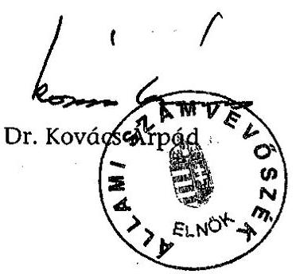

---

1. sz. melléklet

a V-11-121/2004-2005. sz. jelentéshez

# ÉSZREVÉTELEK ÉS AZ ÉSZREVÉTELEZÉSRE ADOTT VÁLASZ

---

# Dr. Kovács Árpád úr   elnök   Állami Számvevőszék 

Budapest

Tisztelt Elnök Úr!
A felsőoktatás feladatfinanszírozási rendszere működésének ellenőrzéséről készített végleges jelentésüket köszönettel megkaptam. Az ellenőrzés megállapításaival kapcsolatban általánosságban az alábbi észrevételeket teszem:

1.  A normatív támogatás emeléséhez biztosított forrást a magyar felsőoktatás tényleges állami támogatásának 85,2%-os növekedése. Ennek oka egyrészt a hallgatói létszám nagyarányú növelésére jelentkező társadalmi igény, amelyet a vizsgált időszak kormányzatai egyértelműen támogattak, így a hallgatói juttatások összességében növekedtek, másrészt a 2001-ben bevezetett oktatói garantált béremelés, amit a közalkalmazotti bérek 2002-ben történt 50%-os emelése tovább növelt.
2.  A normatív támogatások emelésével párhuzamosan a tervezés során kísérletet tettünk a feladatfinanszírozási előirányzatok növelésére is, azonban a költségvetési források szűkössége miatt erre nem kerülhetett sor.
3.  A vizsgált időszakban a feladatfinanszírozás körébe vont előirányzatok közül több, például a vezető oktatók minőségi bérezése, a normatív kutatás vagy a doktori képzés támogatása beépült a normatív finanszírozás rendszerébe.
4.  A 2004-ben bevezetett projekt alapú tervezés nem segítette elő az egyre szűkülő források elvárásként megfogalmazott koncentráltabb elosztását.

---

Megjegyezni kívánom, hogy a készülő új felsőoktatási törvény alapján az abban megfogalmazott feladatok jellegéből adódóan az egyes finanszírozási rendszerek és módszerek kidolgozásakor a jelentésben megfogalmazott célkitűzéseket a tárca a végrehajtási rendeleteiben illetőleg intézkedéseiben kívánja figyelembe venni.

Az ellenőrzés alapján elrendelt intézkedéseimről alaposabb szakterületi egyeztetés után később -a megadott határidőn belül - fogok tájékoztatást adni.

Budapest, 2005. február „04."
Tisztelettel:
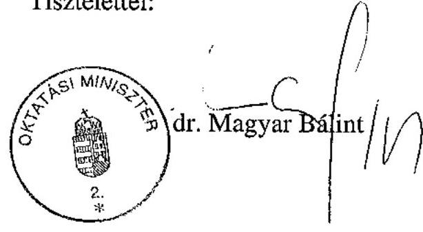

---

# Dr. Magyar Bálint úr 

miniszter

Oktatási Minisztérium

## Budapest

Tisztelt Miniszter Úr!

A felsőoktatás feladatfinanszírozási rendszere működésének ellenőrzéséről készített - államtitkári szinten már korábban egyeztetett - jelentésünkkel kapcsolatos általános észrevételeit köszönettel kézhez vettem.

A levelében foglaltakat áttekintve megállapítottam, hogy az nem tartalmaz véleménykülönbséget. A felsőoktatási finanszírozás egészét érintő, tényleges megállapításainkat kiegészítő és magyarázó észrevételeit a megfelelő szöveghelyeken a végleges jelentésbe beillesztettük.

Végezetül tájékoztatom Miniszter urat, hogy az ellenőrzésről készült jelentést - kialakult gyakorlatunk szerint - az Ön észrevételeivel és az azokra adott válaszommal együtt küldöm meg az Országgyűlés elnökének, az illetékes bizottságai elnökeinek és a Miniszterelnöknek.

Budapest, 2005. február 4.

Tisztelettel:
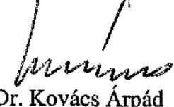

---

INFORMATIKAI ÉS HÍRKÖZLÉSI MINISZTER
1077 BUDAPEST, DOB U. 75-81. LEVÉLCÍM: 1400 BUDAPEST, PF. 07.

TELEFON: (06-1) 4613810
WWW.IHM.HU

1/c. sz. melléklet
a V-11-121/2004-2005. sz. jelentéshez

> Informatikai és
> Hírközlési
> Minisztérium
> 233/05.
> U-11-113/2004-2005.

Dr. Kovács Árpád
Elnök
Állami Számvevőszék

Budapest

Tisztelt Elnök Úr!

Ikt.sz.: 467/2/2005
Hiv.:V-11-117/2004-2005

Köszönettel vettem „a felsőoktatás feladatfinanszírozási rendszere működésének ellenőrzéséről"
készített jelentést.

Tájékoztatom, hogy a jelentéssel kapcsolatban észrevételt nem teszünk.

Budapest, 2005. január „31."

Tisztelettel:

Kovács Kálmán

---

# A felsőoktatási feladatfinanszírozás rendszerének folyamatábrája 

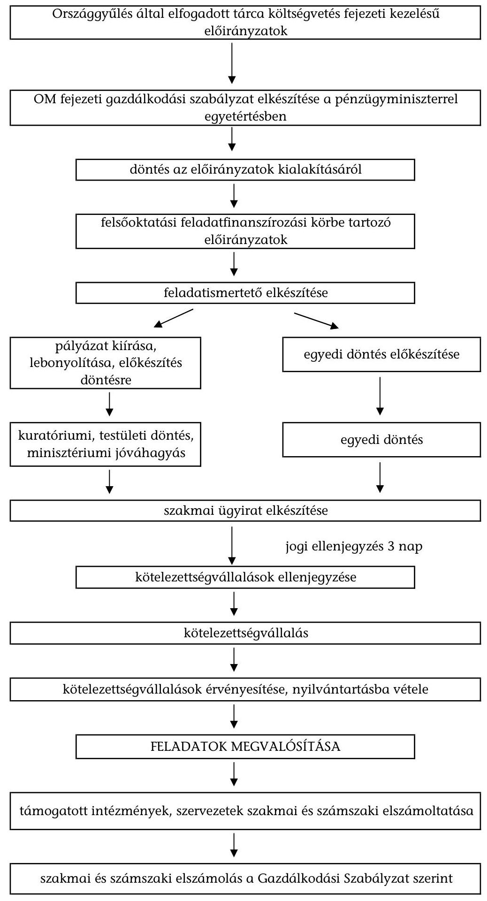

---

# A feladatfinanszírozás aránya a felsőoktatás tényleges költségvetési támogatásából a 2000. és a 2003. évben 

2000. év: 109,7 Mrd Ft
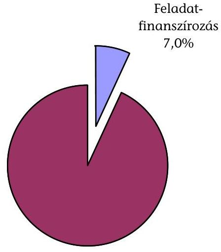
$93,0 \%$
2003. év: 203,1 Mrd Ft
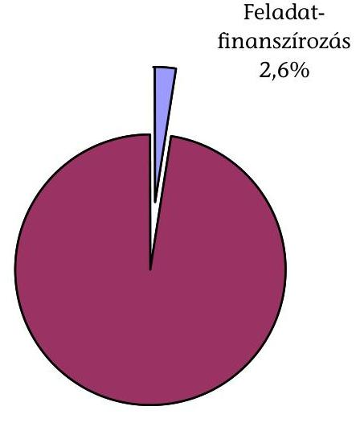
$97,4 \%$

---

# A felsőoktatás működésének fontosabb jellemző adatai

| Ssz. | Megnevezés | 2000 | 2003 | Index
2003 /
2000 |
| --- | --- | --- | --- | --- |
| 1 | Hallgatói létszám (1999/2000. és 2000/2001. illetve 2001/2002. és 2002/2003. tanév átlaga alapján) (fő) | 287018 | 327212 | $114,0 \%$ |
| 2 | ebből államilag finanszírozott (fő) | 159244 | 166363 | $104,5 \%$ |
| 3 | Teljes munkaidőben foglalkoztatott oktatók száma (fő) | 14377 | 14987 | $104,2 \%$ |
| 4 | Minősített oktatók száma (fő) | 6962 | 7750 | $111,3 \%$ |
| 5 | Az állami és nem állami felsőoktatási intézmények állami támogatásának összege (E Ft) | 109705700 | 203135600 | $185,2 \%$ |
| 6 | Feladatfinanszírozás összege (E Ft) | 7644400 | 5267700 | $68,9 \%$ |
| 7 | Feladatfinanszírozás összege/állami támogatás összege (\%) | 7,0 | 2,6 | $37,2 \%$ |
| 8 | Egy hallgatóra jutó állami támogatás összege (E Ft) | 382,2 | 620,8 | $162,4 \%$ |
| 9 | Egy hallgatóra jutó feladatfinanszírozás összege (E Ft) | 26,6 | 16,1 | $60,4 \%$ |
| 10 | Egy államilag finanszírozott hallgatóra jutó állami támogatás (E Ft) | 688,9 | 1221,0 | $177,2 \%$
 |
| 11 | Egy államilag finanszírozott hallgatóra jutó feladatfinanszírozás összege (E Ft) | 48,0 | 31,7 | $66,0 \%$ |
| 12 | Egy fő teljes munkaidőben foglalkoztatott oktatóra jutó állami támogatás (E Ft) | 7630,6 | 13554,1 | $177,6 \%$ |
| 13 | Egy fő teljes munkaidőben foglalkoztatott oktatóra jutó feladatfinanszírozás összege (E Ft) | 531,7 | 351,5 | $66,1 \%$ |
| 14 | Egy fő minősített oktatóra jutó állami támogatás (E Ft) | 15757,8 | 26211,0 | $166,3 \%$ |
| 15 | Egy fő minősített oktatóra jutó feladatfinanszírozás összege (E Ft) | 1098,0 | 679,7 | $61,9 \%$ |

Forrás: OM éves költségvetési beszámolói OM statisztikai tájékoztatói (felsőoktatás) OM Felsőoktatási Helyettes Államtitkársága által kitöltött tanúsítványok

---

5/a. sz. melléklet a V-11-121/2004-2005. sz. jelentéshez

## **A felsőoktatási feladatfinanszírozási támogatás eredeti előirányzata és a tényleges teljesítés az ellenőrzött időszakban**

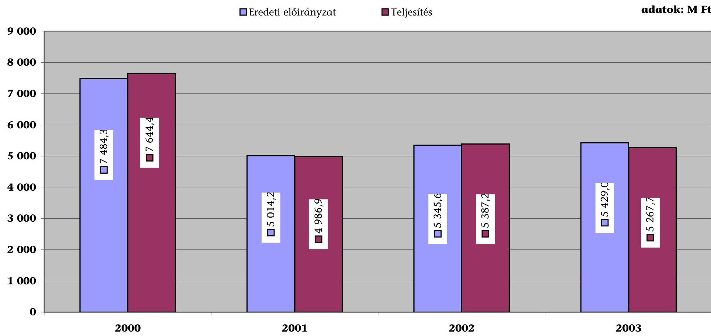

---

5/b. sz. melléklet a V-11-121/2004-2005. sz. jelentéshez

## **A vizsgált felsőoktatási feladatfinanszírozási jogcímek eredeti előirányzata és a tényleges teljesítés az ellenőrzött időszakban**

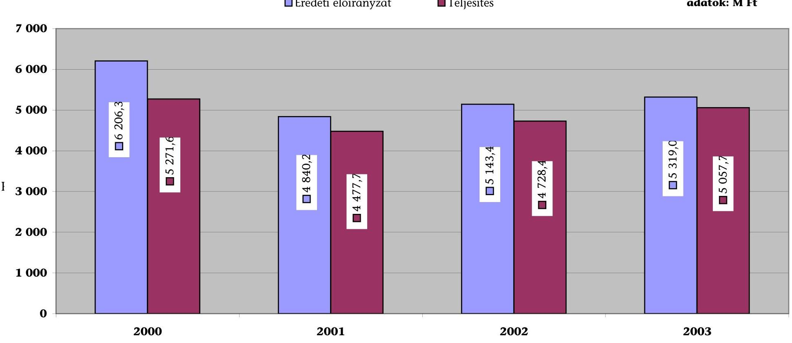

---

1. sz. melléklet a V-11-121/2004-2005. sz. jelentéshez

# Tanúsítvány a felsőoktatási feladatfinanszírozás 2000-2003. évek közötti költségvetési támogatásának alakulásáról jogcímenként és részfeladatonként

| Sze- | Feladat megnevezése | Eredeti előirányzata | | | | Módosított előirányzata | | | | Tényleges teljesítés | | | |
| --- | --- | --- | --- | --- | --- | --- | --- | --- | --- | --- | --- | --- | --- |
| szten | | 2000. | 2001. | 2002. | 2003. | 2000. | 2001. | 2002. | 2003. | 2000. | 2001. | 2002. | 2003. |
| | 5/1. Felsőoktatási programfinanszírozás" | 810,0 | 680,0 | 690,0 | 899,0 | 550,0 | | | | 550,0 | 680,0 | 680,0 | 899,0 |
| 1. | A felsőoktatási képzés rendszer korszerűsítése, fejlesztésének támogatása* | 330,0 | | | | 70,0 | | | | 70,0 | | | |
| | Felsőoktatási intézmények feladatainak támogatása (szerkezeti jelleggel) | | | 122,0 | | | | | | | | 122,0 | |
| 2. | Felsőoktatási Tanisínyi- és Szakkönyvtámogatási Pályázat* | 150,0 | 150,0 | 135,6 | 300,0 | | | | | 150,0 | 150,0 | 150,0 | 300,0 |
| 3. | Fogyatékos hallgatók képzésének támogatása | 30,0 | 30,0 | 30,0 | 50,0 | | | | | 24,0 | 30,0 | 30,0 | 49,6 |
| 4. | Magyar Felsőoktatás c. folyóirat támogatása | 15,0 | 25,0 | 25,0 | | | | | | 15,0 | 25,0 | 25,0 | |
| | OTOT támogatása | | | 13,0 | | | | | | | | 13,0 | |
| 5. | Felsőoktatási programfinanszírozás keretében megvalósuló célfeladatok* | 100,0 | | | | | | | | 115,0 | | | |
| 6. | Önkormányzati Csátóndíjrendszer Kísérleti Program | 10,0 | | | | | | | | 10,0 | | | |
| 7. | Fértel Diplomások Elvitatýja Vizagálat (FIDEV) | 15,0 | | | | | | | | 15,0 | | | |
| 8. | Felsőoktatási intézmények fejlesztése* | 160,0 | 150,0 | 152,0 | 100,0 | | | | | 161,0 | 152,7 | 150,0 | 100,0 |
| 9. | Pedagógus díszdípkona | | 35,2 | 79,1 | 80,0 | | | | | | 55,0 | 79,1 | 80,0 |
| 10. | IUCN támogatása | | 6,5 | 5,8 | 10,0 | | | | | | 11,5 | 5,8 | 10,0 |
| 11. | Kísérleti Főiskolai Pályázat | | 70,0 | | 70,0 | | | | | | 70,0 | | 68,7 |
| 12. | A felsőoktatási intézmények minőségbiztosítási rendszerének kialakítására és bevezetésére, valamint a kredit rendszerrel kapcsolatos intézményi feladatokra* | | 60,0 | | | | | | | | 60,0 | | |

---

| Sorszám | | | | | | | | | | | | | | |
| --- | --- | --- | --- | --- | --- | --- | --- | --- | --- | --- | --- | --- | --- | --- |
| | | | | | | | | | | | | | | |
| | | | | | | | | | | | | | | |
| 13. | | Felsőoktatási programfinanszírozás keretében elátrandó célfajadatok* | | | | | | | | | | | | |
| 14. | | Felsőoktatási intézmények fejlesztési feladatai elátáshoz támogatás* | | | | | | | | | | | | |
| 15. | | Felsőoktatási intézmények fejlesztése II.* | | | | | | | | | | | | |
| 16. | | Felsőoktatási intézmények minőségbiztosítási rendszerének átoszkítása* | | | | | | | | | | | | |
| | | | | | | | | | | | | | | |
| | | | | | | | | | | | | | | |
| | | | | | | | | | | | | | | |
| | | | | | | | | | | | | | | |
| | | | | | | | | | | | | | | |
| | | | | | | | | | | | | | | |
| | | | | | | | | | | | | | | |
| | | | | | | | | | | | | | | |
| | | | | | | | | | | | | | | |
| | | | | | | | | | | | | | | |
| | | | | | | | | | | | | | | |
| | | | | | | | | | | | | | | |
| | | | | | | | | | | | | | | |
| | | | | | | | | | | | | | | |
| | | | | | | | | | | | | | | |
| | | | | | | | | | | | | | | |
| |
 |  |  |  |  |  |  |  |  |  |  |  |  |   |
|   |  |  |  |  |  |  |  |  |  |  |  |  |  |   |
|   |  |  |  |  |  |  |  |  |  |  |  |  |  |   |
|   |  |  |  |  |  |  |  |  |  |  |  |  |  |   |
|   |  |  |  |  |  |  |  |  |  |  |  |  |  |   |
|   |  |  |  |  |  |  |  |  |  |  |  |  |  |   |
|   |  |  |  |  |  |  |  |  |  |  |  |  |  |   |
|   |  |  |  |  |  |  |  |  |  |  |  |  |  |   |
|   |  |  |  |  |  |  |  |  |  |  |  |  |  |   |
|   |  |  |  |  |  |  |  |  |  |  |  |  |  |   |
|   |  |  |  |  |  |  |  |  |  |  |  |  |  |   |
|   |  |  |  |  |  |  |  |  |  |  |  |  |  |   |
|   |  |  |  |  |  |  |  |  |  |  |  |  |  |   |
|   |  |  |  |  |  |  |  |  |  |  |  |  |  |   |
|   |

---

|  Sorszám |  |  |  |  |  |  |  |  |  |  |  |  |  |   |
| --- | --- | --- | --- | --- | --- | --- | --- | --- | --- | --- | --- | --- | --- | --- |
|   |  |  |  |  |  |  |  |  |  |  |  | Tényleges teljesítés |  |   |
|   |  |  |  |  |  |  |  |  |  |  |  | 2001. | 2002. | 2003.  |
|  28. | Széchenyi Professzori ösztöndíj, Békésy György Posztdoktori Ösztöndíj, Széchenyi István ösztöndíj |  |  |  |  |  |  |  |  |  |  |  |  |  |   |
|  29. | Felsőoktatási intézményekben kialakítandó posztdoktori alkalmazás kísérleti programja 2003. évben |  |  |  |  |  |  |  |  |  |  |  |  |  |   |
|   |  |  |  |  |  |  |  |  |  |  | 53,6 |  |  | 0,0  |
|   |  |  |  |  |  |  |  |  |  |  |  |  |  | 150,0  |
|   |  |  |  |  |  |  |  |  |  |  |  |  |  | 150,0  |
|  30. | Felsőoktatási intézményekben kialakítandó posztdoktori alkalmazás kísérleti programja 2003. évben | 170,0 |  |  |  |  |  |  |  |  |  |  |  |  |   |
|  31. | Szakmai könyvek és folyóiratok beszerzése a felsőoktatásban |  |  |  |  |  |  |  |  |  |  |  |  |  |   |
|   |  |  |  |  |  |  |  |  |  |  | 150,0 |  |  | 150,0  |
|   |  |  |  |  |  |  |  |  |  |  |  |  |  | 150,0  |
|   |  |  |  |  |  |  |  |  |  |  |  |  |  | 150,0  |
|  32. | A Collegium Budapest támogatása | 10,0 |  |  |  |  |  |  |  |  |  |  |  |  |   |
|  33. | Collegium Budapest Egyesület |  |  |  |  |  |  |  |  |  |  |  |  |  |   |
|   | Collegium Budapest Egyesület |  |  |  |  |  |  |  |  |  |  |  |  |  |   |
|   |  |  |  |  |  |  |  |  |  |  | 10,0 |  |  | 10,0  |
|  34. | A pedagógusképző folytató állami felsőoktatási intézmények által feladattal gyakorló iskolák és óvodák működésének támogatása (kétszeres normatívával számolva) többletének fedezete | 173,0 |  |  |  |  |  |  |  |  |  |  |  |  |   |
|  35. | Gyakorló iskolák normatív ellátása |  |  |  |  |  |  |  |  |  |  |  |  |  |   |
|   |  |  |  |  |  |  |  |  |  |  | 18,0 | 44,2 |  |  | 16,0  |
|   |  |  |  |  |  |  |  |  |  |  | 370,0 |  |  |  |   |
|   |  |  |  |  |  |  |  |  |  |  |  |  |  |  |   |
|   |  |  |  |  |  |  |  |  |  |  |  | 41,0 | 68,0 | 69,3 | 80,0  |
|  36. | Országos Tudományos Diákköri Tanács (OTDT) támogatása | 13,0 |  |  |  |  |  |  |  |  |  |  |  |  |   |
|  37. | Hallgatói Önkormányzatok Országos Konferenciája | 13,0 |  |  |  |  |  |  |  |  |  |  |  |  |   |
|  38. | Felsőoktatási szervezetek támogatása | 15,0 |  |  |  |  |  |  |  |  |  |  |  |  |   |
|  39. | Felsőoktatási Konferenciák Szövetségének támogatása |  |  |  |  |  |  |  |  |  |  |  |  |  |   |
|  40. | Doktoranduszok Országos Szövetségének támogatása |  |  |  |  |  |  |  |  |  |  |  |  |  |   |
|  41. | Országos és egyéb felsőoktatási testületek, egyesületek támogatása |  |  |  |  |  |  |  |  |  |  |  |  |  |   |
|  42. | Felsőoktatási Kollégiumok Országos Szövetsége |  |  |  |  |  |  |  |  |  |  |  |  |  |   |

---

|  5/1/2020 |  |  |  |  |  |  |  |  |  |  |  |  |   |
| --- | --- | --- | --- | --- | --- | --- | --- | --- | --- | --- | --- | --- | --- |
|  |   |   |   |   |   |   |   |   |   |   |   |   |   |
|  |   |   |   |   |   |   |   |   |   |   |   |   |   |
|  43. |  |  |  |  |  |  |  |  |  |  |  |  |   |
|  |   |   |   |   |   |   |   |   |   |   |   |   |   |
|  43. | Felsőoktatási fizetési költségtartók feladatai |  |  |  |  |  |  |  |  |  |  |  |   |
|   | 5/23. Felsőoktatási világbanki (nem beruházási) program | 1 460,0 |  |  |  |  |  |  |  |  |  |  |   |
|   | 5/23. Felsőoktatási fejlesztési (nem beruházási) program |  | 1 000,0 | 1 000,0 |  |  |  |  |  |  |  |  |   |
|   | 5/23/1. Program hitelfedezete | 876,0 |  |  |  |  |  |  |  |  |  |  |   |
|   | 5/23/2. Program hazai hozzájárulása | 584,0 |  |  |  |  |  |  |  |  |  |  |   |
|  44. | Felsőoktatási Reformpolitika és intézményi fejlesztés | 306,1 |  |  |  |  |  |  |  |  |  |  |   |
|  45. | Menedzsment információs rendszer program | 442,0 |  |  |  |  |  |  |  |  |  |  |   |
|  46. | Vezetőlépező program | 222,1 |  |  |  |  |  |  |  |  |  |  |   |
|  47. | Hallgatói hitelprogram | 220,8 |  |  |  |  |  |  |  |  |  |  |   |
|  48. | Felsőoktatási Fejlesztési Programok forditása (FFPI) | 269,0 | 250,0 | 40,0 |  |  |  |  |  |  |  |  |   |
|  49. | Szakinté programok |  | 750,0 |  |  |  |  |  |  |  |  |  |   |
|  50. | Felsőoktatási intézmények képzési feladatainak többletére (szerkezeti jellegjel) |  |  |  |  |  |  |  |  |  |  |  |   |
|  51. | Felsőoktatási informatikai rendszer |  |  | 342,0 |  |  |  |  |  |  |  |  |   |
|  52. | Beruházási tervek értékelése, koordinálása |  |  | 10,0 |  |  |  |  |  |  |  |  |   |
|  53. | Felsőoktatási reformprogram |  |  | 196,0 |  |  |  |  |  |  |  |  |   |
|  54. | Intézményfejlesztési tervek értékelése, koordinálása |  |  | 10,0 |  |  |  |  |  |  |  |  |   |
|   | 5/24. Felsőoktatási informatikai fejlesztés | 90,0 |  |  |  |  |  |  |  |  |  |  |   |
|  55. | A felsőoktatási intézmények informatikai fejlesztése | 90,0 |  |  |  |  |  |  |  |  |  |  |   |
|  56. | Felsőoktatási vezetői információs rendszer megvalósításával kapcsolatos feladatok |  |  |  |  |  |  |  |  |  |  |  |   |
|  57. | Felsőoktatási vezetői információs rendszer megvalósításával kapcsolatban az intelligens kártya használata kiterjesztése |  |  |  |  |  |  |  |  |  |  |  |   |
|  58. | Felsőoktatási intézmények számára országos szoftverkezelések vásárlása |  |  |  |  |  |  |  |  |  |  |  |   |

---

|  Sce-
szám | Feladat megnevezése | Etelebb előirányzat |  |  |  | Módosított előirányzat |  |  |  | Tényleges teljesítés |  |  |   |
| --- | --- | --- | --- | --- | --- | --- | --- | --- | --- | --- | --- | --- | --- |
|   |  | 2030. | 2001. | 2002. | 2003. | 2006. | 2001. | 2002. | 2003. | 2006. | 2001. | 2002. | 2003.  |
|  55 | Felsőoktatási intézmények informatikai infrastruktúrájának fejlesztése* |  |  |  | 300,0 |  |  |  | 250,0 |  |  |  | 250,0  |
|   | 5/25. OM-MTA határon túli kutatás támogatása | 30,0 | 30,0 | 30,0 |  |  |  |  |  |  |  |  |   |
|  60 | Az Oktatási Minisztérium és Magyar Tudományos Akadémia között létrejött megállapodás alapján az együttes finanszírozású "Donus Hungarica Scientiae et Atrium" tisztűnő/jendszer részeként a külföldön élő magyar tudások és kutatók részére nyújtunk szállás támogatást | 30,0 |  |  |  |  |  |  |  |  |  |  |   |
|  61 | OM-MTA határon túli kutatás támogatása |  | 30,0 | 30,0 |  |  |  |  |  |  |  |  |   |
|   | 5/26. Felsőoktatási kiegészítő támogatás* | 500,0 | 514,0 | 514,0 | 500,0 |  |  |  |  | 500,0 | 512,0 | 514,0 | 500,0  |
|  62 | A tárca fenntartói feladatköréből adódó intézménytámogatási, valamint a képzési és fenntartási előirányzatoknak - az intézményi működőképességet biztosító - részben pályázati rendszerű támogatása. A kiegészítő támogatás a felsőoktatási törvény 116. §-ában az egészségügyi és agrár-felsőoktatás sajátos intézményrendszerének - klinikák, tangazdaságok -, valamint a sportlétesítmények kiadásához biztosít többletfizetést.* | 500,0 |  |  |  |  |  |  |  | 500,0 |  |  |   |
|  63 | Felsőoktatási kiegészítő támogatás a 147/2000. (VIII.23.) Korm. rendelet alapján (A költségtérítéses képzésben résztvevő, terhességi, gyermekügyi segélyben, gyermeknevelési támogatásban, vagy gyermekgondozási díjban részesülő hallgatók költségtérítési díj nem szedhető)* |  | 514,0 | 514,0 | 500,0 |  |  |  |  | 512,0 | 514,0 | 500,0 |   |
|   | 5/29. A Nemzeti Információs Infrastruktúra Fejlesztési (NIIF) Program támogatása* | 1 290,0 | 1 300,0 | 1 300,0 | 1 300,0 |  |  |  |  | 1 290,0 | 1 300,0 | 1 300,0 | 1 300,0  |
|  64 | A Nemzeti Információs Infrastruktúra Fejlesztési (NIIF) Program támogatása* | 1 290,0 | 1 300,0 | 1 300,0 | 1 300,0 |  |  |  |  | 1 290,0 | 1 300,0 | 1 300,0 | 1 300,0  |
|   | 5/30. Elektronikus tartalom szolgálat (szakinformációs hálózat)* |  | 300,0 | 300,0 | 500,0 |  |  |  | 475,0 |  | 300,0 | 300,0 | 475,0  |

---

|  Sorszám |  |  |  |  |  |  |  |  |  |  |  |  |  |   |
| --- | --- | --- | --- | --- | --- | --- | --- | --- | --- | --- | --- | --- | --- | --- |
|   |  |  |  |  |  |  |  |  |  |  |  |  | Tényleges teljesítés |   |
|   |  |  |  |  |  |  |  |  |  |  |  |  | 2001. | 2002.  |
|  65. | Elektronikus tartalom szolgálat* |  |  |  |  |  |  |  |  |  |  |  |  |   |
|  66. | Elektronikus tartalom szolgálat érdekében egyetemi folyóiratbeszerzések támogatása* |  |  |  |  |  |  |  |  |  |  |  |  |   |
|   |  |  |  |  |  |  |  |  |  |  |  |  | 475,0 |   |
|   |  |  |  |  |  |  |  |  |  |  |  |  |  |   |
|   |  |  |  | 50,0 |  |  |  |  |  |  |  |  |  |   |
|   |  |  |  |  |  |  |  |  |  |  |  |  | 50,0 | 50,0  |
|  67. | Önkormányzati ösztöndíj rendszer támogatása |  |  |  |  |  |  |  |  |  |  |  |  |   |
|   |  |  |  | 50,0 |  |  |  |  |  |  |  |  | 50,0 | 50,0  |
|   |  |  |  |  |  |  |  |  |  |  |  |  |  |   |
|   |  |  |  |  |  |  |  |  |  |  |  | 147,0 |  |   |
|  68. | Szent-Györgyi Albert Ösztöndíj* |  |  |  |  |  |  |  |  |  |  |  |  |   |
|   |  |  |  |  |  |  |  |  |  |  |  | 147,0 |  |   |
|   |  |  |  |  |  |  |  |  |  |  |  |  |  |   |
|   |  |  |  | 20,0 |  |  |  |  |  |  |  |  |  |   |
|  69. | Az előirányzat a kormányzati tudomány- és technológiapolítika kialakítását elősegítő döntések/előkészítő, koordináló, szakmai elemző (szakértői) tevékenység fedezetéül szolgáló szolgáltatási szolgáltatási szolgáltatási szolgáltatási szolgáltatási szolgáltatási szolgáltatási szolgáltatási szolgáltatási szolgáltatási szolgáltatási szolgáltatási szolgáltatási szolgáltatási szolgáltatási szolgáltatási szolgáltatási szolgáltatási szolgáltatási szolgáltatási szolgáltatási szolgáltatási szolgáltatási szolgáltatási szolgáltatási szolgáltatási szolgáltatási szolgáltatási szolgáltatási szolgáltatási szolgáltatási szolgáltatási szolgáltatási szolgáltatási szolgáltatási szolgáltatási szolgáltatási szolgáltatási szolgáltatási szolgáltatási szolgáltatási szolgáltatási szolgáltatási szolgáltatási szolgáltatási szolgáltatási szolgáltatási szolgáltatási szolgáltatási szolgáltatási szolgáltatási szolgáltatási szolgáltatási szolgáltatási szolgáltatási szolgáltatási szolgáltatási szolgáltatási szolgáltatási szolgáltatási szolgáltatási szolgáltatási szolgáltatási szolgáltatási szolgáltatási szolgáltatási szolgáltatási

---

# A felsőoktatási feladatfinanszírozás felhasznált összege a felosztás módja szerint 

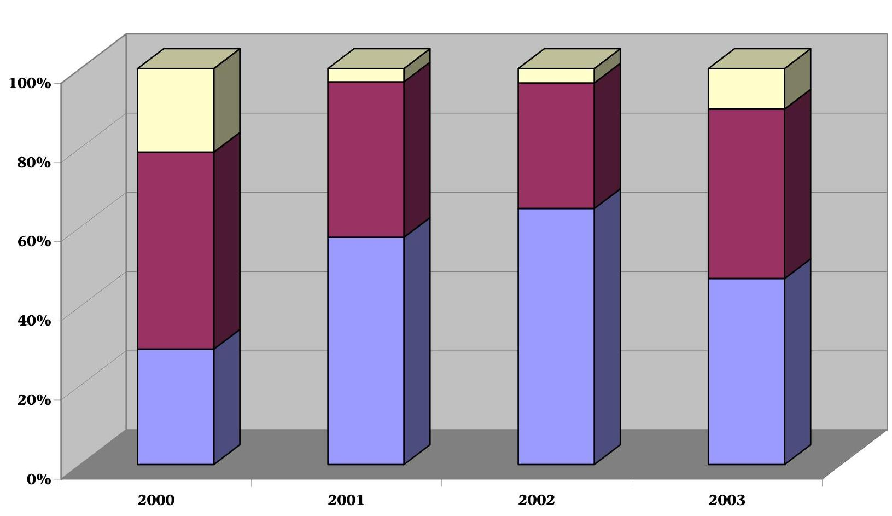

---

# A helyszíni ellenőrzésbe vont intézmények 

## Állami felsőoktatási intézmények:

1. Budapesti Közgazdaságtudományi és Államigazgatási Egyetem
2. Eötvös Loránd Tudományegyetem
3. Liszt Ferenc Zeneművészeti Egyetem
4. Magyar Iparművészeti Egyetem
5. Debreceni Egyetem
6. Pécsi Tudományegyetem
7. Miskolci Egyetem
8. Kaposvári Egyetem
9. Nyugat-Magyarországi Egyetem
10. Széchenyi István Egyetem
11. Budapesti Műszaki Főiskola
12. Dunaújvárosi Főiskola
13. Eötvös József Főiskola
14. Eszterházy Károly Tanárképző Főiskola

## Egyházi felsőoktatási intézmények:

1. Károli Gáspár Református Egyetem
2. Pázmány Péter Katolikus Egyetem
3. Egri Hittudományi Főiskola
4. Kölcsey Ferenc Református Tanítóképző Főiskola
5. Sárospataki Református Teológiai Akadémia
6. Vitéz János Római Katolikus Tanítóképző Főiskola

## Magán-alapítványi felsőoktatási intézmények:

1. Gábor Dénes Főiskola
2. Kodolányi János Főiskola

## Egyéb szervezetek:

1. EDUCATIO Társadalmi Szolgáltató Kht.
2. Nemzeti Információs Infrastruktúra Fejlesztési Iroda
3. Felsőoktatási Fejlesztési Programok Irodája
4. Medicina Könyvkiadó Rt.
5. Osiris Kiadó és Szolgáltató Kft.

---

# Az ellenőrzésbe vont feladatfinanszírozási előirányzatok megoszlása 2000. évben 

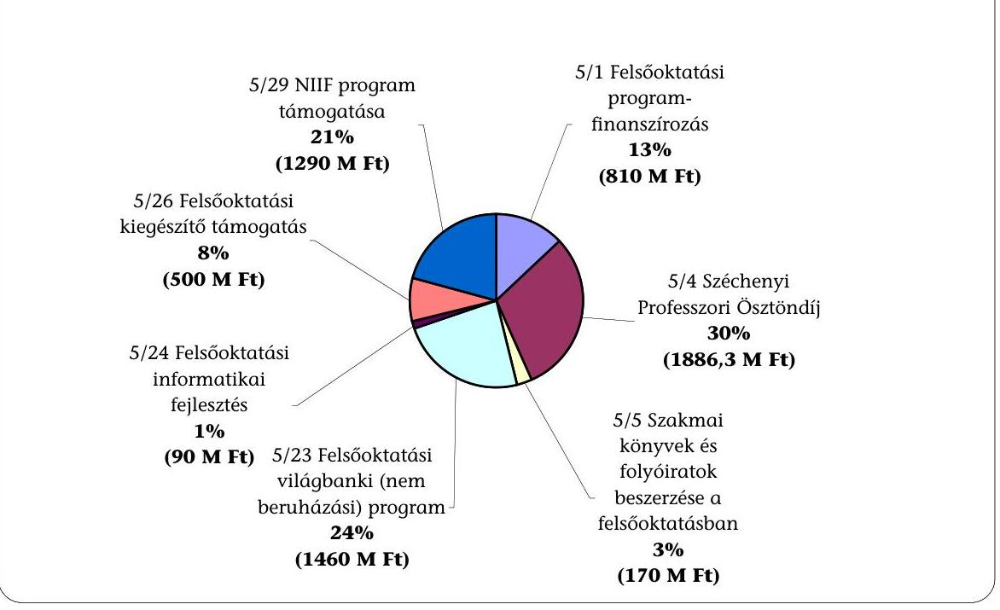

9/b. számú melléklet a V-11-121/2004-2005. sz. jelentéshez

## Az ellenőrzésbe vont feladatfinanszírozási előirányzatok megoszlása 2001. évben

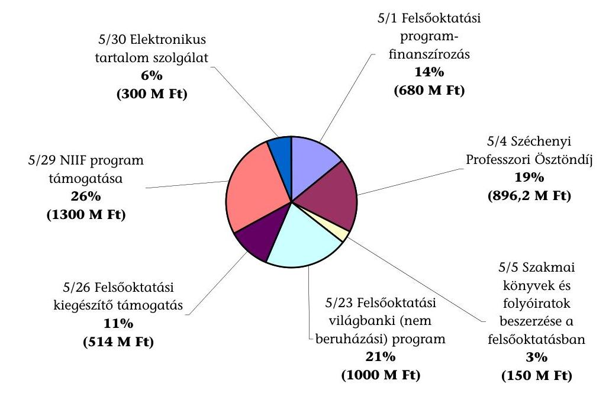

---

# Az ellenőrzésbe vont feladatfinanszírozási előirányzatok megoszlása 2002. évben 

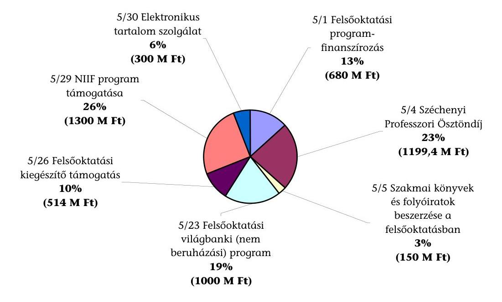

## Az ellenőrzésbe vont feladatfinanszírozási előirányzatok megoszlása 2003. évben

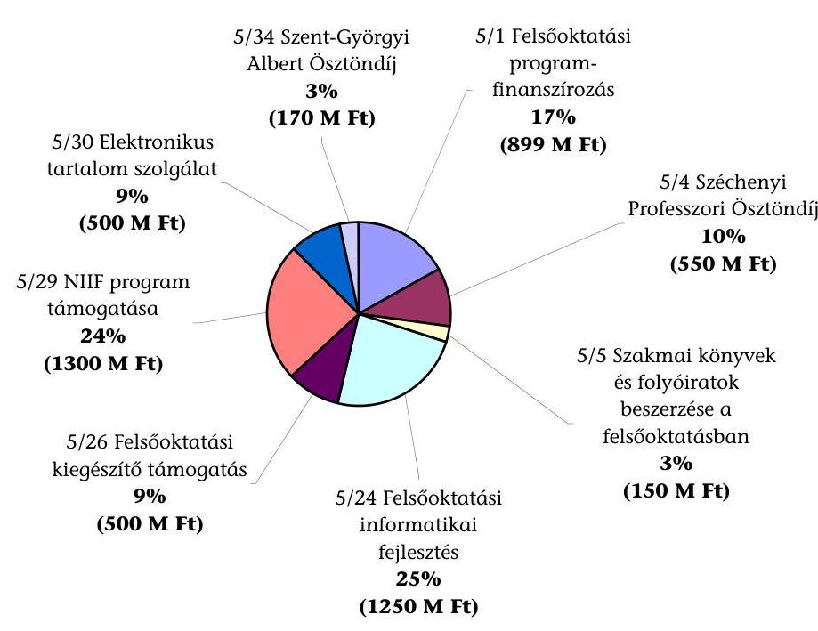

---

10. sz. melléklet

a V-11-121/2004-2005. sz. jelentéshez

# Kimutatás a felsőoktatási intézmények részesedéséről a feladatfinanszírozás eredeti előirányzatának jogcímeiből 2000-2003. években

|  Sorsz. | Kedvezményezett felsőoktatási intézmény megnevezése | Költségvetési támogatás összege |  |  |   |
| --- | --- | --- | --- | --- | --- |
|   |  | 2000. év | 2001. év | 2002. év | 2003. év  |
|  1. | Budapesti Közgazdaságtudományi és Államigazgatási Egyetem |  |  |  |   |
|   | 5.1.2 |  |  |  | 133  |
|   | 5.1.3 | 168 |  |  |   |
|   | 5.1.5 |  |  |  | 1500  |
|   | 5.1.7 | 15000 | 1700 |  |   |
|   | 5.1.7-10 |  |  |  | 432  |
|   | 5.1.7-10 |  |  |  | 3000  |
|   | 5.1.7-10 |  |  |  | 1118  |
|   | 5.4 | 47320 | 1331 | 27914 | 2446  |
|   | 5.4 |  |  |  | 2387  |
|   | 5.4 |  |  |  | 2714  |
|   | 5.5 | 5900 | 6000 | 7800 | 7900  |
|   | 5.24 | 10600 |  |  | 18597  |
|   | 5.26 | 9317 | 37244 | 18600 | 15600  |
|   | 5.31 |  |  | 971 |   |
|   | Összesen | 88305 | 46275 | 55285 | 55827  |
|  2. | Budapesti Műszaki és Gazdaságtudományi Egyetem |  |  |  |   |
|   | 5.1.2 |  | 1008 |  | 1700  |
|   | 5.1.3 | 1344 |  |  |   |
|   | 5.1.5 |  |  | 1596 |   |
|   | 5.1.7 |  | 4500 |  |   |
|   | 5.1.8 |  |  |  | 400  |
|   | 5.1.7-10 |  |  |  | 440  |
|   | 5.4 | 186135 | 21436 | 99672 | 7917  |
|   | 5.4 |  |  |  | 8804  |
|   | 5.4 |  |  |  | 8143  |
|   | 5.5 | 12000 | 12500 | 10000 | 10000  |
|   | 5.24 | 11000 |  |  | 24250  |
|   | 5.26 | 868 | 27031 | 15200 | 11400  |
|   | 5.31 |  |  | 2659 |   |
|   | 5.34 |  |  |  | 15818  |
|   | 5.34 |  |  |  | 5298  |
|   | Összesen | 211347 | 66475 | 129127 | 94170  |
|  3. | Debreceni Egyetem |  |  |  |   |
|   | 5.1.1 | 2000 |  |  |   |
|   | 5.1.2 | 824 | 1428 |  | 1200  |
|   | 5.1.3 | 1428 |  |  | 6450  |
|   | 5.1.4 |  | 1060 |  |   |
|   | 5.1.5 |  |  | 1344 |   |
|   | 5.1.6 |  | 3000 | 1089 |   |
|   | 5.1.7 |  | 5100 |  |   |
|   | 5.4 | 110814 | 25675 | 77154 | 14103  |
|   | 5.4 |  |  |  | 8360  |
|   | 5.4 |  |  |  | 5390  |

---

|   | 5.5 | 15300 | 15500 | 16500 | 16300  |
| --- | --- | --- | --- | --- | --- |
|   | 5.24 | 7000 |  |  | 25729  |
|   | 5.26 | 28215 | 24447 | 21000 | 39200  |
|   | 5.31 |  |  | 4282 |   |
|   | 5.34 |  |  |  | 5433  |
|   | Összesen | 165581 | 76210 | 121369 | 122165  |
|  4. | Eötvös Loránd Tudományegyetem |  |  |  |   |
|   | 5.1.1 | 6500 | 916 |  |   |
|   | 5.1.2 | 2691 | 3864 |  | 892  |
|   | 5.1.2 |  |  |  | 834  |
|   | 5.1.2 |  |  |  | 10900  |
|   | 5.1.3 | 3192 |  |  | 15520  |
|   | 5.1.4 |  | 11620 |  |   |
|   | 5.1.5 | 1230 |  | 4536 | 1100  |
|   | 5.1.5 |  |  |  | 500  |
|   | 5.1.6 |  | 3000 | 14942 |   |
|   | 5.1.7 |  | 7200 |  |   | |   |
|   | 5.1.7-10 |  |  |  | 7497  |
|   | 5.1.7-10 |  |  |  | 446  |
|   | 5.1.7-10 |  |  |  | 250  |
|   | 5.1.8 | 8037 | 5780 |  | 150  |
|   | 5.1.9 |  | 15995 | 7497 |   |
|   | 5.1.9 |  |  | 80000 |   |
|   | 5.4 | 221800 | 31744 | 99062 | 15570  |
|   | 5.4 |  |  |  | 16916  |
|   | 5.5 | 15400 | 15650 | 16000 | 16000  |
|   | 5.18 | 18380 |  |  |   |
|   | 5.24 | 9600 |  |  | 42025  |
|   | 5.26 | 37494 | 25911 | 110391 | 46900  |
|   | 5.31 |  |  | 3815 |   |
|   | 5.34 |  |  |  | 24435  |
|   | 5.34 |  |  |  | 5200  |
|   | Összesen | 324324 | 121680 | 336243 | 205135  |
| 5. | Kaposvári Egyetem |  |  |  |   |
|   | 5.1.1 | 2000 |  |  |   |
|   | 5.1.2 | 170 |  |  |   |
|   | 5.1.3 |  |  |  | 3750  |
|   | 5.1.4 |  | 3860 |  |   |
|   | 5.1.5 |  |  | 252 |   |
|   | 5.1.6 |  |  | 4631 |   |
|   | 5.1.7 |  | 700 |  |   |
|   | 5.4 | 13155 | 444 | 4685 | 2445  |
|   | 5.5 | 1000 | 900 | 1300 | 800  |
|   | 5.23 |  |  | 1029 |   |
|   | 5.23.1 |  | 18480 |  |   |
|   | 5.24 | 4700 |  |  | 7614  |
|   | 5.26 | 3384 | 3708 | 3600 | 6500  |
|   | 5.26 |  |  |  | 3494  |
|   | 5.31 |  |  | 971 |   |
|   | 5.34 |  |  |  | 10499  |
|   | Összesen | 24409 | 28092 | 16468 | 35102  |
| 6. | Liszt Ferenc Zeneművészeti Egyetem |  |  |  |   |
|   | 5.1.2 | 352 |  |  |   |
|   | 5.1.5 |  |  |  | 100  |
|   | 5.1.7 |  | 200 |  |   |

---

|   | 5.1.7-10 |  |  |  | 1881  |
| --- | --- | --- | --- | --- | --- |
|   | 5.1.7-10 |  |  |  | 4000  |
|   | 5.4 | 3064 | 521 | 1914 | 489  |
|   | 5.4 |  |  |  | 1358  |
|   | 5.5 | 1000 | 500 | 900 | 900  |
|   | 5.24 |  |  |  | 8954  |
|   | 5.26 | 90 | 527 | 500 | 1100  |
|   | 5.31 |  |  | 134 |   |
|   | Összesen | 4506 | 1748 | 3448 | 18782  |
| 7. | Magyar Iparművészeti Egyetem |  |  |  |   |
|   | 5.1.2 |  | 84 |  | 200  |
|   | 5.1.5 |  |  | 84 |   |
|   | 5.1.7 |  | 200 |  |   |
|   | 5.1.7-10 |  |  |  | 400  |
|   | 5.4 | 6128 | 333 | 3216 | 978  |
|   | 5.4 |  |  |  | 326  |
|   | 5.5 | 900 | 1000 | 1200 | 1100  |
|   | 5.24 | 2000 |  |  | 14529  |
|   | 5.26 | 481 | 14940 | 24574 | 7800  |
|   | 5.31 |  |  | 96 |   |
|   | Összesen | 9509 | 16557 | 29170 | 25333  |
| 8. | Magyar Képzőművészeti Egyetem |  |  |  |   |
|   | 5.1.3 | 168 |  |  |   |
|   | 5.1.7 |  | 200 |  |   |
|   | 5.1.8 |  |  |  | 3000  |
|   | 5.4 | 5973 | 333 | 999 | 489  |
|   | 5.5 | 1100 | 1000 | 1200 | 1200  |
|   | 5.24 | 3150 |  |  | 7449  |
|   | 5.26 |  |  | 100 | 2900  |
|   | 5.31 |  |  | 105 |   |
|   | Összesen | 10391 | 1533 | 2404 | 15038  |
| 9. | Miskolci Egyetem |  |  |  |   |
|   | 5.1.1 |  |  | 10000 |   |
|   | 5.1.2 | 1937 | 336 |  | 800  |
|   | 5.1.3 | 420 |  |  | 2500  |
|   | 5.1.4 |  | 2740 |  |   |
|   | 5.1.5 |  |  | 420 |   |
|   | 5.1.6 |  |  | 3282 |   |
|   | 5.1.7 |  | 2600 |  |   |
|   | 5.1.7-10 |  |  |  | 215  |
|   | 5.1.7-10 |  |  |  | 100  |
|   | 5.1.9 |  |  | 3225 |   |
|   | 5.4 | 61684 | 6435 | 25521 | 6358  |
|   | 5.4 |  |  |  | 1305  |
|   | 5.4 |  |  |  | 1358  |
|   | 5.5 | 6600 | 7500 | 7400 | 7400  |
|   | 5.18 | 16365 |  |  |   |
|   | 5.24 | 7000 |  |  | 26936  |
|   | 5.26 | 12792 | 26375 | 13400 | 27000  |
|   | 5.31 |  |  | 1260 |   |
|   | 5.34 |  |  |  | 12095  |
|   | 5.34 |  |  |  | 5383  |
|   | Összesen | 106798 | 45986 | 64508 | 91450  |
| 10. | Nyugat-Magyarországi Egyetem |  |  |  |   |
|   | 5.1.1 | 6500 |  |  |   |

---

|   | 5.1.2 |  | 588 |  | 2300  |
| --- | --- | --- | --- | --- | --- |
|   | 5.1.3 | 504 |  |  | 6575  |
|   | 5.1.4 |  | 3250 |  |   |
|   | 5.1.5 | 1500 |  | 840 |   |
|   | 5.1.6 |  |  | 5445 |   |
|   | 5.1.7 |  | 1900 |  |   |
|   | 5.1.7-10 |  |  |  | 500  |
|   | 5.1.7-10 |  |  |  | 1136  |
|   | 5.1.8 |  | 1900 |  | 300  |
|   | 5.4 | 27701 | 2448 | 9708 | 3342  |
|   | 5.4 |  |  |  | 326  |
|   | 5.5 | 3500 | 3600 | 4000 | 4000  |
|   | 5.23.1 |  | 7500 |  |   |
|   | 5.24 | 6000 |  |  | 14246  |
|   | 5.26 | 94548 | 8544 | 8100 | 15400  |
|   | 5.31 |  |  | 1805 |   |
|   | Összesen | 140253 | 29730 | 29898 | 48125  |
| 11. | Pécsi Tudományegyetem |  |  |  |   |
|   | 5.1.1 | 5000 | 1045 |  |   |
|   | 5.1.2 | 2662 | 2184 |  | 4600  |
|   | 5.1.3 | 1596 |  |  | 2150  |
|   | 5.1.4 |  | 200 |  |   |
|   | 5.1.5 | 4000 |  | 2016 |   |
|   | 5.1.6 |  | 3000 | 1585 |   |
|   | 5.1.7 |  | 4700 | 1009 |   |
|   | 5.1.8 | 3000 | 1200 |  |   |
|   | 5.1.7-10 |  |  |  | 800  |
|   | 5.1.7-10 |  |  |  | 4914  |
|   | 5.1.7-10 |  |  |  | 1000  |
|   | 5.4 | 57184 | 6214 | 57755 | 4891  |
|   | 5.4 |  |  |  | 4447  |
|   | 5.5 | 12500 | 13500 | 14000 | 14000  |
|   | 5.18 | 34686 |  |  |   |
|   | 5.23 |  |  | 1032 |   |
|   | 5.23.1 |  | 25597 |  |   |
|   | 5.24 | 7000 |  |  | 25586  |
|   | 5.26 | 27276 | 65786 | 30400 | 42800  |
|   | 5.31 |  |  | 5508 |   |
|   | Összesen | 154904 | 123426 | 113305 | 105188  |
|  12. | Semmelweis Egyetem |  |  |  |   |
|   | 5.1.1 | 2000 |  | 100000 |   |
|   | 5.1.2 | 354 |  |  | 200  |
|   | 5.1.3 |  |  |  | 1650  |
|   | 5.1.4 |  | 2170 |  |   |
|   | 5.1.5 |  |  | 336 |   |
|   | 5.1.6 |  |  | 2047 |   |
|   | 5.1.7 |  | 1600 |  |   |
|   | 5.1.7-10 |  |  |  | 2000  |
|   | 5.4 | 86531 | 6897 | 48332 | 5869  |
|   | 5.4 |  |  |  | 1630  |
|   | 5.5 | 9800 | 10000 | 10000 | 10000  |
|   | 5.18 | 2149 |  |  |   |
|   | 5.23 |  |  | 392317 |   |
|   | 5.24 | 6900 |  |  | 19545  |
|   | 5.26 | 18095 | 17666 | 14600 | 29300  |
|   | 5.31 |  |  | 925 |   |
|   | 5.34 |  |  |  | 15086  |
|   | 5.34 |  |  |  | 6512  |
|   | Összesen | 125829 | 38333 | 568557 | 91792  |
|  13. | Szegedi Tudományegyetem |  |  |  |   |
|   | 5.1.1 | 8000 |  |  |   |
|   | 5.1.2 | 3017 | 1848 |  | 2900  |
|   | 5.1.3 | 1512 |  |  | 10900  |
|   | 5.1.4 |  | 4000 |  |   |
|   | 5.1.5 | 1800 |  | 1764 |   |
|   | 5.1.6 |  | 6500 | 12725 |   |
|   | 5.1.7 |  | 6200 |  |   |
|   | 5.1.7-10 |  |  |  | 200  |
|   | 5.1.7-10 |  |  |  | 239  |
|   | 5.1.8 |  |  |  | 200  |
|   | 5.1.9 |  | 7000 |  |   |
|   | 5.4 | 158797 | 16200 | 121327 | 15325  |
|   | 5.4 |  |  |  | 10630  |
|   | 5.4 |  |  |  | 8143  |
|   | 5.5 | 15750 | 15500 | 16500 | 16300  |
|   | 5.18 | 2957 |  |  |   |
|   | 5.23 |  |  | 1023 |   |
|   | 5.23.1 |  | 24275 |  |   |
|   | 5.24 | 7000 |  |  | 20951  |
|   | 5.26 | 28682 | 41462 | 25700 | 28000  |
|   | 5.31 |  |  | 5307 |   |
|   | 5.34 |  |  |  | 15166  |
|   | 5.34 |  |  |  | 11076  |
|   | Összesen | 227515 | 122985 | 184346 | 140030  |
|  14. | Szent István Egyetem |  |  |  |   |
|   | 5.1.1 | 8500 | 1107 |  |   |
|   | 5.1.2 |  | 420 |  | 2234  |
|   | 5.1.3 | 336 |  |  | 4475  |
|   | 5.1.4 |  | 3600 |  |   |
|   | 5.1.5 |  |  | 924 |   |
|   | 5.1.6 |  | 9000 | 2376 |   |
|   | 5.1.7 |  | 3000 |  |   |
|   | 5.1.7-10 |  |  |  | 200  |
|   | 5.1.8 | 2100 |  |  |   |
|   | 5.1.9 |  | 3000 |  |   |
|   | 5.4 | 81021 | 11207 | 68923 | 6766  |
|   | 5.4 |  |  |  | 1305  |
|   | 5.4 |  |  |  | 2714  |
|   | 5.5 | 7150 | 8000 | 8500 | 8300  |
|   | 5.18 | 2921 |  |  |   |
|   | 5.23.1 |  | 50000 |  |   |
|   | 5.24 | 7000 |  |  | 13531  |
|   | 5.26 | 28964 | 15752 | 16800 | 60800  |
|   | 5.31 |  |  | 2387 |   |
|   | 5.34 |  |  |  | 15005  |
|   | Összesen | 137992 | 105086 | 99910 | 115330  |
|  15. | Színház- és Filmművészeti Egyetem |  |  |  |   |
|   | 5.1.1 |  |  | 12000 |   |
|   | 5.1.5 |  |  |  | 1116  |
|   | 5.1.7 |  | 100 |  |   |
|   | 5.1.7 |  |  | 430 |   |
|   | 5.1.8 |  |  |  |   |
|   | 5.1.7 |  |  | 200 |   |
|   | 5.1.8 |  |  |  |   |
|   | 5.1.7-10 |  |  |  | 300  |
|   | 5.1.8 |  |  |  | 2000  |
|   | 5.4 | 7800 | 777 | 3281 |   |
|   | 5.5 | 300 | 300 | 200 | 200  |
|   | 5.24 | 2200 |  |  | 5102  |
|   | 5.26 | 2043 | 42 | 200 | 400  |
|   | 5.31 |  |  | 35 |   |
|   | Összesen | 12343 | 1219 | 16346 | 9118  |
|  16. | Veszprémi Egyetem |  |  |  |   |
|   | 5.1.2 | 200 | 924 |  | 1000  |
|   | 5.1.3 | 756 |  |  |   |
|   | 5.1.5 |  |  | 588 |   |
|   | 5.1.7 |  | 2100 |  |   |
|   | 5.1.7-10 |  |  |  | 1000  |
|   | 5.4 | 39338 | 5213 | 20970 | 2935  |
|   | 5.4 |  |  |  | 4122  |
|   | 5.5 | 6000 | 6800 | 5600 | 5500 |
| | 5.24 | 10900 | | | 87085 |
| | 5.26 | 8471 | 10325 | 17824 | 9700 |
| | 5.31 | | | 2151 | |
| | Összesen | 65665 | 25362 | 47133 | 111342 |
| 17. | Zrínyi Miklós Nemzetvédelmi Egyetem | | | | |
| | 5.1.7 | | 900 | | |
| | 5.4 | 66030 | 66596 | 66895 | 3832 |
| | 5.4 | | | | 1630 |
| | 5.4 | | | | 65188 |
| | 5.5 | 1600 | 1600 | 1800 | 1700 |
| | 5.24 | 7000 | | | 3500 |
| | Összesen | 74630 | 69096 | 68695 | 75850 |
| 18. | Berzsenyi Dániel Főiskola | | | | |
| | 5.1.2 | | | | 300 |
| | 5.1.3 | 252 | | | 3300 |
| | 5.1.4 | | 1700 | | |
| | 5.1.5 | | | 168 | |
| | 5.1.6 | | 3000 | 2241 | |
| | 5.1.7 | | 1400 | | |
| | 5.1.7-10 | | | | 600 |
| | 5.1.7-10 | | | | 400 |
| | 5.1.7-10 | | | | 200 |
| | 5.4 | 5355 | | 666 | 815 |
| | 5.5 | 1000 | 1200 | 1300 | 1000 |
| | 5.18 | 8074 | | | |
| | 5.24 | 2450 | | | 8802 |
| | 5.26 | 2415 | 6565 | 6000 | 8000 |
| | 5.31 | | | 1018 | |
| | Összesen | 19546 | 13865 | 11393 | 23417 |
| 19. | Budapesti Gazdasági Főiskola | | | | |
| | 5.1.1 | 5500 | | | |
| | 5.1.2 | 700 | 84 | | 500 |
| | 5.1.3 | 168 | | | |
| | 5.1.5 | 600 | | 504 | |

---

| | 5.1.6 | | 3000 | | |
| --- | --- | --- | --- | --- | --- |
| | 5.1.7 | | 3400 | | |
| | 5.4 | -2291 | 5544 | | 326 |
| | 5.5 | 1000 | 1500 | 1700 | 1300 |
| | 5.24 | 10300 | | | 28699 |
| | 5.26 | 13596 | 72791 | 32276 | 12400 |
| | 5.31 | | | 1996 | |
| | Összesen | 29573 | 86319 | 36476 | 43225 |
| 20. | Budapesti Műszaki Főiskola | | | | |
| | 5.1.1 | 2000 | | | |
| | 5.1.2 | | 840 | | 1200 |
| | 5.1.2 | | | | 700 |
| | 5.1.3 | 252 | | | |
| | 5.1.5 | | | 504 | |
| | 5.1.6 | | 3000 | | |
| | 5.1.7 | | 2400 | | |
| | 5.4 | 3373 | 2994 | 1914 | |
| | 5.5 | 1900 | 2000 | 1900 | 1600 |
| | 5.23.1 | | 7500 | | |
| | 5.24 | 6000 | | | 8880 |
| | 5.26 | 7000 | 9576 | 5300 | 4300 |
| | 5.31 | | | 1724 | |
| | Összesen | 20525 | 28310 | 11342 | 16680 |
| 21. | Dunaújvárosi Főiskola | | | | |
| | 5.1.2 | | | | 200 |
| | 5.1.6 | | 3000 | | |
| | 5.1.7-10 | | | | 3000 |
| | 5.4 | 2446 | | | |
| | 5.5 | 700 | 800 | 800 | 800 |
| | 5.24 | 8730 | | | 4803 |
| | 5.26 | 847 | 9194 | 9810 | 2900 |
| | 5.31 | | | 912 | |
| | Összesen | 12723 | 12994 | 11522 | 11703 |
| 22. | Eötvös József Főiskola | | | | |
| | 5.1.2 | | 252 | | |
| | 5.1.3 | 420 | | | 2350 |
| | 5.1.4 | | 2900 | | |
| | 5.1.5 | | | 168 | |
| | 5.1.6 | | | 3763 | |
| | 5.1.7 | | 400 | | |
| | 5.4 | 2446 | | | |
| | 5.5 | 450 | 350 | 350 | 350 |
| | 5.24 | 2590 | | | 10500 |
| | 5.26 | 354 | 2331 | 1600 | 6823 |
| | 5.26 | | | | 3500 |
| | 5.31 | | | 697 | |
| | Összesen | 6260 | 6233 | 6578 | 23523 |
| 23. | Eszterházy Károly Főiskola | | | | |
| | 5.1.2 | 638 | 3276 | | 3300 |
| | 5.1.3 | 5208 | | | 1570 |
| | 5.1.4 | | 2600 | | |
| | 5.1.5 | 1050 | | 2604 | |
| | 5.1.6 | | 3500 | 2125 | |
| | 5.1.7 | | 1600 | | |
| | 5.1.8 | | 3377 | 750 | |

---

| | 5.1.7-10 | | | | 200 |
| --- | --- | --- | --- | --- | --- |
| | 5.4 | 3064 | 1165 | 3773 | 1630 |
| | 5.5 | 1350 | 1200 | 950 | 800 |
| | 5.23.1 | | 5000 | | |
| | 5.24 | | | | 38500 |
| | 5.26 | 17637 | 13140 | 51845 | 5600 |
| | 5.26 | | | | 18300 |
| | 5.31 | | | 907 | |
| | Összesen | 28947 | 34858 | 62954 | 69900 |
| 24. | Kecskeméti Főiskola | | | | |
| | 5.1.1 | 2500 | | | |
| | 5.1.2 | | 588 | | |
| | 5.1.3 | | | | 700 |
| | 5.1.4 | | 650 | | |
| | 5.1.6 | | 3000 | 1277 | |
| | 5.1.7 | | 1100 | | |
| | 5.4 | 5046 | 555 | 1942 | 408 |
| | 5.5 | 1000 | 1000 | 1300 | 1300 |
| | 5.24 | 7000 | | | 16500 |
| | 5.26 | 4260 | 8574 | 31771 | 6300 |
| | 5.31 | | | 1180 | |
| | Összesen | 19806 | 15467 | 37470 | 25208 |
  25. | Magyar Táncművészeti Főiskola |  |  |  |   |
|   | 5.1.1 |  | 430 |  |   |
|   | 5.1.7 |  | 100 |  |   |
|   | 5.4 | 464 | 277 | 832 |   |
|   | 5.5 | 500 | 500 | 400 | 400  |
|   | 5.18 | 22962 |  |  |   |
|   | 5.24 | 1540 |  |  | 7166  |
|   | 5.26 | 595 | 2340 | 15709 | 4300  |
|   | 5.31 |  |  | 2 |   |
|   | Összesen | 26061 | 3647 | 16943 | 11866  |
|  26. | Nyíregyházi Főiskola |  |  |  |   |
|   | 5.1.1 | 5000 |  |  |   |
|   | 5.1.2 |  | 1680 |  | 2400  |
|   | 5.1.3 | 1680 |  |  | 2410  |
|   | 5.1.4 |  | 3700 |  |   |
|   | 5.1.5 | 2000 |  | 1764 |   |
|   | 5.1.6 |  | 6000 | 3223 |   |
|   | 5.1.7 |  | 2300 |  |   |
|   | 5.1.8 | 4000 |  |  |   |
|   | 5.4 | 5818 | 500 | 1997 | 2038  |
|   | 5.4 |  |  |  | 978  |
|   | 5.5 | 1000 | 500 | 800 | 900  |
|   | 5.23.1 |  | 5000 |  |   |
|   | 5.24 | 3000 |  |  | 6974  |
|   | 5.26 | 36671 | 11894 | 8000 | 21200  |
|   | 5.31 |  |  | 1676 |   |
|   | Összesen | 59169 | 31574 | 17460 | 36900  |
|  27. | Rendőrtiszti Főiskola |  |  |  |   |
|   | 5.1.1 | 2000 |  |  |   |
|   | 5.4 |  | 222 | 1177 | 490  |
|   | 5.4 |  |  |  | 326  |
|   | 5.4 |  |  |  | 2201  |
|   | 5.5 | 400 | 400 |  | 250  |

Forrás: OM

---

|   | 5.24 |  |  |  | 3500  |
| --- | --- | --- | --- | --- | --- |
|   | Összesen | 2400 | 622 | 1177 | 6767  |
|  28. | Széchenyi István Főiskola |  |  |  |   |
|   | 5.1.1 | 2500 |  |  |   |
|   | 5.1.2 |  | 84 |  | 1200  |
|   | 5.1.3 | 84 |  |  |   |
|   | 5.1.4 |  |  |  |   |
|   | 5.1.6 |  |  |  |   |
|   | 5.1.7 |  | 1700 |  |   |
|   | 5.4 | 8419 | 938 | 2607 | 490  |
|   | 5.5 | 1100 | 1300 | 1500 | 1500  |
|   | 5.23.1 |  | 5000 |  |   |
|   | 5.24 | 4400 |  |  | 12334  |
|   | 5.26 | 379 | 20058 | 12100 | 1800  |
|   | 5.31 |  |  | 2143 |   |
|   | Összesen | 16882 | 29080 | 18350 | 17324  |
|  29. | Szolnoki Főiskola |  |  |  |   |
|   | 5.1.2 |  | 168 |  | 100  |
|   | 5.1.7 |  | 600 |  |   |
|   | 5.5 | 450 | 400 | 400 | 450  |
|   | 5.24 | 6500 |  |  | 10500  |
|   | 5.26 | 1784 | 10721 | 7700 | 200  |
|   | 5.31 |  |  | 651 |   |
|   | Összesen | 8734 | 11889 | 8751 | 11250  |
|  30. | Tessedik Sámuel Főiskola |  |  |  |   |
|   | 5.1.1 | 2000 |  |  |   |
|   | 5.1.2 |  | 252 |  | 200  |
|   | 5.1.3 | 168 |  |  | 2150  |
|   | 5.1.4 |  | 900 |  |   |
|   | 5.1.5 |  |  | 252 |   |
|   | 5.1.6 |  | 3000 | 2067 |   |
|   | 5.1.7 |  | 1200 |  |   |
|   | 5.1.7-10 |  |  |  | 400  |
|   | 5.4 | 2909 | 222 | 1221 |   |
|   | 5.5 | 800 | 800 | 600 | 450  |
|   | 5.24 | 9000 |  |  | 14500  |
|   | 5.26 | 5121 | 8800 | 5900 | 8400  |
|   | 5.26 |  |  |  | 3806  |
|   | 5.31 |  |  | 1352 |   |
|   | Összesen | 19998 | 15174 | 11392 | 29906  |
|  31. | Debreceni Református Hittudományi Egyetem |  |  |  |   |
|   | 5.1.2 |  | 168 |  | 200  |
|   | 5.1.5 |  |  | 252 |   |
|   | 5.4 | 2446 |  |  |   |
|   | 5.5 | 400 | 400 |  |   |
|   | 5.24 | 1100 |  |  | 3763  |
|   | 5.26 |  |  |  | 665  |
|   | 5.31 |  |  | 70 |   |
|   | Összesen | 3946 | 568 | 322 | 4628  |
|  32. | Evangélikus Hittudományi Egyetem |  |  |  |   |
|   | 5.4 |  | 333 | 1931 | 1467  |
|   | 5.5 | 500 | 500 | 400 | 400  |
|   | 5.24 | 1200 |  |  | 3794  |
|   | 5.31 |  |  | 24 |   |
|   | Összesen | 1700 | 833 | 2355 | 5661  |

Forrás: OM

---

|  33. | Károli Gáspár Református Egyetem |  |  |  |  |
| --- | --- | --- | --- | --- | --- |
|  | 5.1.1 | 2000 | 434 |  |  |
|  | 5.1.2 |  | 252 |  | 400 |
|  | 5.1.3 | 336 |  |  | 1400 |
|  | 5.1.4 |  | 650 |  |  |
|  | 5.1.5 |  |  | 84 |  |
|  | 5.1.6 |  | 3000 | 1045 |  |
|  | 5.1.8 | 5000 |  |  |  |
|  | 5.4 | 17119 | 20071 | 4078 | 978 |
|  | 5.4 |  |  |  | 18292 |
|  | 5.5 | 2100 | 1700 | 2200 | 2000 |
|  | 5.24 | 2100 |  |  | 5061 |
|  | 5.26 | 1000 | 101 |  | 1659 |
|  | 5.31 |  |  | 400 |  |
|  | Összesen | 29655 | 26208 | 7807 | 29790 |
| 34. | Országos Rabbiképző - Zsidó Egyetem |  |  |  |  |
|  | 5.1.2 |  |  |  |  |
|  | 5.1.3 | 84 |  |  |  |
|  | 5.4 |  |  |  |  |
|  | 5.5 | 800 |  |  | 700 |
|  | 5.24 | 2180 |  |  | 4076 |
|  | 5.31 |  |  | 17 |  |
|  | Összesen | 3064 | 0 | 17 | 4776 |
| 35. | Pázmány Péter Katolikus Egyetem |  |  |  |  |
|  | 5.1.2 | 739 | 1176 |  | 1800 |
|  | 5.1.3 | 1008 |  |  |  |
|  | 5.1.5 | 
 |  | 2688 |  |
|  | 5.4 | 34238 | 38212 | 4098 | 490 |
|  | 5.4 |  |  |  | 326 |
|  | 5.4 |  |  |  | 28778 |
|  | 5.5 | 2700 | 2500 | 3000 | 3000 |
|  | 5.24 | 5000 |  |  | 6406 |
|  | 5.26. | 66221 |  |  | 6249 |
|  | 5.31 |  |  | 747 |  |
|  | Összesen | 109906 | 41888 | 10533 | 47049 |
| 36. | Apor Vilmos Katolikus Főiskola |  |  |  |  |
|  | 5.1.2 |  | 168 |  |  |
|  | 5.1.3 | 252 |  |  | 3200 |
|  | 5.1.4 |  | 2600 |  |  |
|  | 5.1.5 |  |  | 168 |  |
|  | 5.1.6 |  |  | 6094 |  |
|  | 5.1.7-10 |  |  |  | 200 |
|  | 5.4 | 4891 | 5544 | 4356 | 6386 |
|  | 5.5 | 300 | 350 | 350 | 300 |
|  | 5.24 | 2100 |  |  | 5128 |
|  | 5.26 | 9100 | 224 |  | 762 |
|  | 5.31 |  |  | 219 |  |
|  | Összesen | 16643 | 8886 | 11187 | 15976 |
| 37. | A Tan Kapuja Buddhista Főiskola |  |  |  |  |
|  | 5.1.2 |  | 84 |  |  |
|  | 5.5 | 100 | 100 | 100 | 100 |
|  | 5.24 |  |  |  | 3793 |
|  | 5.31 |  |  | 21 |  |
|  | Összesen | 100 | 184 | 121 | 3893 |
| 38. | Baptista Teológiai Akadémia |  |  |  |  |

---

|   | 5.1.2 |  | 84 |  | 100 |
| --- | --- | --- | --- | --- | --- |
|   | 5.1.3 | 84 |  |  |  |
|   | 5.1.5 |  |  | 84 |  |
|   | 5.1.6 |  | 3000 |  |  |
|   | 5.5 | 200 | 150 | 100 | 100 |
|   | 5.24 | 830 |  |  | 4049 |
|   | 5.26 |  |  |  | 111 |
|   | 5.31 |  |  | 18 |  |
|   | Összesen | 1114 | 3234 | 202 | 4360 |
| 39. | Egri Hittudományi Főiskola |  |  |  |  |
|   | 5.1.2 |  | 168 |  | 100 |
|   | 5.1.3 | 168 |  |  |  |
|   | 5.1.5 |  |  | 252 |  |
|   | 5.5 | 200 | 250 | 300 | 150 |
|   | 5.24 |  |  |  | 4170 |
|   | 5.31 |  |  | 21 |  |
|   | Összesen | 368 | 418 | 573 | 4420 |
| 40. | Esztergomi Hittudományi Főiskola |  |  |  |  |
|   | 5.5 | 200 |  |  |  |
|   | 5.24 | 2400 |  |  | 3887 |
|   | 5.31 |  |  | 16 |  |
|   | Összesen | 2600 | 0 | 16 | 3887 |
| 41. | Győri Hittudományi Főiskola |  |  |  |  |
|   | 5.1.2 |  | 168 |  |  |
|   | 5.1.3 | 168 |  |  |  |
|   | 5.5 | 300 | 250 | 350 |  |
|   | 5.24 | 1150 |  |  | 4178 |
|   | 5.31 |  |  | 22 |  |
|   | Összesen | 1618 | 418 | 372 | 4178 |
| 42. | Kölcsey Ferenc Református Tanítóképző Főiskola |  |  |  |  |
|   | 5.1.3 |  |  |  | 3300 |
|   | 5.1.4 |  | 2800 |  |  |
|   | 5.1.6 |  |  | 3338 |  |
|   | 5.4 |  |  |  | 326 |
|   | 5.5 | 700 | 300 | 400 | 300 |
|   | 5.24 | 2800 |  |  | 8500 |
|   | 5.26 | 7300 |  |  |  |
|   | 5.31 |  |  | 335 |  |
|   | Összesen | 10800 | 3100 | 4073 | 12426 |
| 43. | Pécsi Püspöki Hittudományi Főiskola |  |  |  |  |
|   | 5.1.3 | 168 |  |  |  |
|   | 5.5 | 200 |  | 300 | 250 |
|   | 5.24 | 4400 |  |  | 3976 |
|   | 5.31 |  |  | 18 |  |
|   | Összesen | 4768 | 0 | 318 | 4226 |
| 44. | Pünkösdi Teológiai Főiskola |  |  |  |  |
|   | 5.5 | 100 | 100 | 100 | 100 |
|   | 5.24 |  |  |  | 3934 |
|   | 5.26 |  |  |  | 60 |
|   | 5.31 |  |  | 16 |  |
|   | Összesen | 100 | 100 | 116 | 4094 |
| 45. | Sapientia Szerzetesi Hittudományi Főiskola |  |  |  |  |
|   | 5.1.2 |  |  |  | 300 |
|   | 5.1.6 |  | 3000 |  |  |
|   | 5.1.9 |  | 1000 |  |  |

---

|   | 5.5 | 1200 | 1000 | 700 | 600 |
| --- | --- | --- | --- | --- | --- |
|   | 5.24 |  |  |  | 3737 |
|   | 5.26 |  |  |  | 234 |
|   | 5.31 |  |  | 4 |  |
|   | **Összesen** | **1200** | **5000** | **704** | **4871** |
| 46. | **Sárospataki Református Teológiai Akadémia** |  |  |  |  |
|   | 5.5 | 250 |  |  | 250 |
|   | 5.24 | 1150 |  |  | 3967 |
|   | 5.31 |  |  | 32 |  |
|   | **Összesen** | **1400** | **0** | **32** | **4217** |
| 47. | **Szegedi Hittudományi Főiskola** |  |  |  |  |
|   | 5.1.1 | 2000 |  |  |  |
|   | 5.1.2 |  | 84 |  | 100 |
|   | 5.1.3 | 84 |  |  |  |
|   | 5.1.5 |  |  | 84 |  |
|   | 5.4 |  | 222 |  |  |
|   | 5.5 | 900 | 550 | 700 | 550 |
|   | 5.24 | 1700 |  |  | 5500 |
|   | 5.31 |  |  | 13 |  |
|   | **Összesen** | **4684** | **856** | **797** | **6150** |
| 48. | **Szent Atanáz Görög Katolikus Hittudományi Főiskola** |  |  |  |  |
|   | 5.4 |  | 277 | 962 | 407 |
|   | 5.4 |  |  |  | 1223 |
|   | 5.5 | 300 | 200 | 200 |  |
|   | 5.24 | 750 |  |  | 3987 |
|   | **Összesen** | **1050** | **477** | **1162** | **5617** |
| 49. | **Szent Bernát Hittudományi Főiskola** |  |  |  |  |
|   | 5.24 | 930 |  |  | 2500 |
|   | **Összesen** | **930** | **0** | **0** | **2500** |
 | **2 500** |
| 50. | **Szent Pál Akadémia** | | | | |
| | 5.1.2 | | | | 200 |
| | 5.1.3 | 84 | | | |
| | 5.4 | 2 446 | 2 772 | | |
| | 5.5 | 100 | 100 | 100 | 100 |
| | 5.24 | 800 | | | 4 170 |
| | 5.31 | | | 7 | |
| | **Összesen** | **3 430** | **2 872** | **107** | **4 470** |
| 51. | **Veszprémi Érseki Hittudományi Főiskola** | | | | |
| | 5.1.2 | | 168 | | 200 |
| | 5.1.3 | 168 | | | |
| | 5.1.5 | | | 168 | |
| | 5.5 | 300 | 250 | 300 | 250 |
| | 5.24 | 850 | | | 5 000 |
| | 5.26 | 200 | 247 | | |
| | 5.31 | | | 125 | |
| | **Összesen** | **1 518** | **665** | **593** | **5 450** |
| 52. | **Vitéz János Római Katolikus Tanítóképző Főiskola** | | | | |
| | 5.1.2 | | | | 200 |
| | 5.1.3 | | | | 5 650 |
| | 5.1.4 | | 4 000 | | |
| | 5.1.6 | | 3 000 | 5 805 | |
| | 5.4 | | 2 772 | | |
| | 5.5 | 300 | 200 | 450 | 350 |
| | 5.24 | 1 400 | | | 3 957 |

---

| | 5.26 | 4800 | 286 | | 2824 |
| --- | --- | --- | --- | --- | --- |
| | 5.31 | | | 211 | |
| | Összesen | 6500 | 10258 | 6466 | 12981 |
| 53. | Wesley János Lelkészképző Főiskola | | | | |
| | 5.1.1 | 2000 | | | |
| | 5.1.2 | | | | 900 |
| | 5.1.3 | 168 | | | |
| | 5.1.5 | | | 504 | |
| | 5.1.6 | | 3000 | | |
| | 5.4 | 4891 | | 5973,000 | 6386,000 |
| | 5.5 | 100 | 100 | 200 | 150 |
| | 5.24 | | | | 4351 |
| | 5.26 | 20000 | 645 | | 1551 |
| | 5.31 | | | 41 | |
| | Összesen | 27159 | 3745 | 6718 | 13338 |
| 54. | Általános Vállalkozási Főiskola | | | | |
| | 5.4 | | 2772 | | |
| | 5.5 | 100 | | | |
| | 5.24 | 1400 | | | 4009 |
| | 5.26 | | 1585 | | |
| | 5.31 | | | 45 | |
| | Összesen | 1500 | 4357 | 45 | 4009 |
| 55. | Gábor Dénes Főiskola | | | | |
| | 5.1.1 | 2000 | | | |
| | 5.1.2 | | 504 | | 1300 |
| | 5.1.5 | 500 | | 168 | |
| | 5.5 | 300 | 200 | 200 | |
| | 5.24 | 1180 | | | 4416 |
| | 5.26 | | 5018 | | |
| | 5.31 | | | 245 | |
| | Összesen | 3980 | 5722 | 613 | 5716 |
| 56. | Kodolányi János Főiskola | | | | |
| | 5.1.2 | | 84 | | 700 |
| | 5.1.3 | 84 | | | |
| | 5.1.8 | | 4000 | | |
| | 5.4 | 2446 | 777 | 3236 | 4241 |
| | 5.5 | 400 | 200 | 400 | 300 |
| | 5.24 | 158 | | | 4334 |
| | 5.26 | | 4702 | | |
| | 5.31 | | | 342 | |
| | Összesen | 3088 | 9763 | 3978 | 9575 |
| 57. | Modern Üzleti Tudományok Főiskolája | | | | |
| | 5.1.2 | | 84 | | |
| | 5.1.6 | | 3000 | | |
| | 5.4 | | | | 408 |
| | 5.5 | 200 | | | |
| | 5.24 | 1100 | | | 5243 |
| | 5.26 | | 3333 | | |
| | 5.31 | | | 185 | |
| | Összesen | 1300 | 6417 | 185 | 5651 |
| 58. | Mozgássérültek Pető András Nevelőképző és Nevelő Intézete | | | | |
| | 5.5 | 200 | 200 | 200 | 200 |
| | 5.24 | 3500 | | | 4064 |
| | 5.31 | | | 66 | |

---

| | Összesen | 3700 | 200 | 266 | 4264 |
| --- | --- | --- | --- | --- | --- |
| 59. | Nemzetközi Üzleti Főiskola | | | | |
| | 5.24 | 1900 | | | 2500 |
| | Összesen | 1900 | 0 | 0 | 2500 |
| 60. | Heller Farkas Gazdasági és Turisztikai Szolgáltatások Főiskolája | | | | |
| | 5.5 | | 200 | 250 | 300 |
| | 5.24 | | | | 2500 |
| | Összesen | 0 | 200 | 250 | 2800 |
| 61. | Károly Róbert Főiskola | | | | |
| | 5.1.2 | | | 133 | 133 |
| | 5.4 | | | 326 | 326 |
| | 5.24 | | | | 53500 |
| | Összesen | 0 | 0 | 459 | 53959 |
| 62. | Adventista Teológiai Főiskola | | | | |
| | 5.1.2 | | | | 300 |
| | 5.24 | | | | 3904 |
| | 5.26 | | | | 172 |
| | 5.31 | | | 4 | |
| | Összesen | 0 | 0 | 4 | 4376 |
| 63. | Pápai Református Teológiai Akadémia | | | | |
| | 5.24 | | | | 3668 |
| | Összesen | 0 | 0 | 0 | 3668 |
| 64. | Sola Scriptura Teológiai Főiskola | | | | |
| | 5.24 | | | | 2500 |
| | Összesen | 0 | 0 | 0 | 2500 |
| 65. | Budapesti Kommunikációs Főiskola | | | | |
| | 5.5 | | | 300 | 400 |
| | 5.24 | | | | 3805 |
| | 5.31 | | |
 27 |   |
|   | Összesen | 0 | 0 | 327 | 4205 |
| 66. | Harsányi János Főiskola | | | | |
| | | | | | |
| | Összesen | 0 | 0 | 0 | 0 |
| 67. | Zsigmond Király Főiskola | | | | |
| | 5.5 | | | | 100 |
| | 5.24 | | | | 2500 |
| | 5.31 | | | 11 | |
| | Összesen | 0 | 0 | 11 | 2600 |
| 68. | Andrássy Gyula Budapest Német Nyelvű Egyetem | | | | |
| | 5.5 | | | | 500 |
| | 5.24 | | | | 1352 |
| | Összesen | 0 | 0 | 0 | 1852 |

# Megjegyzés:

A Harsányi János Főiskolán a 2004/2005. tanévben indult a képzés.

---

## **A feladatfinanszírozási támogatás hasznosulása a helyszíni ellenőrzésbe vont felsőoktatási intézményeknél 2000. évben**

| Intézmény megnevezése | 2000. évi tényleges felhasználás | | | | | | Adatok: E Ft-ban | | | |
| --- | --- | --- | --- | --- | --- | --- | --- | --- | --- | --- |
| | | | | | | | | | | |
| | | | | | | | Hallgatói
létszám
(október 15.)
(fő) | Egy oktatóra
jutó összes
felhasználás | Egy hallgatóra
jutó
informatikai
felhasználás | Egy hallgatóra
jutó
informatikai
felhasználás |
| 1. Budapesti Közgazdaságtudományi és Államigazgatási Egyetem | 56 837 | 10 596 | 5 000 | 72 433 | 1 074 | 11 848 | 67,4 | 6,1 | 0,9 | |
| 2. Eötvös Loránd Tudományegyetem* | 275 930 | | 7 200 | 283 130 | 1 650 | 28 797 | 171,6 | 9,8 | | |
| 3. Liszt Ferenc Zeneművészeti Egyetem | 10 334 | | | 10 334 | 206 | 844 | 50,2 | 12,2 | | |
| 4. Magyar Iparművészeti Egyetem | 7 508 | | | 7 508 | 58 | 540 | 129,4 | 13,9 | | |
| 5. Debreceni Egyetem | 139 464 | | | 139 464 | 1 443 | 21 747 | 96,6 | 6,4 | | |
| 6. Pécsi Tudományegyetem | 93 114 | 7 000 | 11 838 | 111 952 | 1 471 | 25 295 | 76,1 | 4,4 | 0,3 | |
| 7. Miskolci Egyetem | 69 221 | 7 000 | 9 500 | 85 721 | 715 | 12 914 | 119,9 | 6,6 | 0,5 | |
| 8. Kaposvári Egyetem | 17 209 | | 293 | 17 502 | 179 | 2 807 | 97,8 | 6,2 | | |
| 9. Nyugat-Magyarországi Egyetem | 120 753 | 6 000 | 7 000 | 133 753 | 388 | 9 634 | 344,7 | 13,9 | 0,6 | |
| 10. Széchenyi István Egyetem | 12 482 | 4 400 | | 16 882 | 282 | 7 754 | 59,8 | 2,2 | 0,6 | |
| 11. Budapesti Műszaki Főiskola | 10 373 | | | 10 373 | 406 | 9 077 | 25,6 | 1,1 | | |
| 12. Dunaújvárosi Főiskola | 3 293 | | | 3 293 | 260 | 4 156 | 12,7 | 0,8 | | |
| 13. Eötvös József Főiskola | 3 202 | 2 590 | | 5 792 | 95 | 2 038 | 62,3 | 2,8 | 1,3 | |
| 14. Eszterházy Károly Tanárképző Főiskola | 23 739 | | | 23 739 | 355 | 6 520 | 66,9 | 3,6 | | |
| 15. Károli Gáspár Református Egyetem | 29 361 | 2 100 | | 31 461 | 188 | 2 196 | 167,3 | 14,3 | 1,0 | |
| 16. Pázmány Péter Katolikus Egyetem | 103 897 | 5 000 | | 108 897 | 290 | 7 258 | 375,5 | 15,0 | 0,7 | |
| 17. Egri Hittudományi Főiskola | 200 | | | 200 | 12 | 113 | 16,7 | 1,8 | | |
| 18. Kölcsey Ferenc Református Tanítóképző Főiskola | 7 476 | | | 7 476 | 72 | 1 490 | 103,8 | 5,0 | | |
| 19. Sárospataki Református Teológiai Akadémia | | | | 0 | 23 | 134 | | | | |
| 20. Vitéz János Római Katolikus Tanítóképző Főiskola | 4 800 | | | 4 800 | 43 | 591 | 111,6 | 8,1 | | |
| 21. Gábor Dénes Főiskola | 2 800 | 1 180 | | 3 980 | 118 | 15 305 | 33,7 | 0,3 | 0,1 | |
| 22. Kodolányi János Főiskola | 2 930 | | | 2 930 | 143 | 5 107 | 20,5 | 0,6 | | |
| **MINDÖSSZESEN** | 994 923 | 45 866 | 40 831 | 1 081 620 | 9 469 | 176 165 | 114,2 | 6,1 | 0,3 | |
| **Ebből:** | | | | | | | | | | |
| - állami (1-14 sorszám) | 843 459 | 37 586 | 40 831 | 921 876 | 8 580 | 143 971 | 107,4 | 6,4 | 0,3 | |
| - egyházi (15-20 sorszám) | 145 734 | 7 100 | | 152 834 | 628 | 11 782 | 243,4 | 13,0 | 0,6 | |
| - alapítványi (21-22 sorszám) | 5 730 | 1 180 | | 6 910 | 261 | 20 412 | 26,5 | 0,3 | 0,1 | |
| - állami intézmények részaránya (%) | 84,78% | 81,95% | 100,00% | 85,23% | 90,61% | 81,73% | 94,06% | 104,29% | 100,27% | |
| - egyházi intézmények részaránya (%) | 14,65% | 15,48% | | 14,13% | 6,63% | 6,69% | 213,05% | 211,27% | 231,46% | |
| - alapítványi intézmények részaránya (%) | 0,58% | 2,57% | | 0,64% | 2,76% | 11,59% | 23,18% | 5,51% | 22,20% | |

*A 2000. évi teljesítés az 1999. évi támogatás maradványának felhasználása.

---

### **A feladatfinanszírozási támogatás hasznosulása a helyszíni ellenőrzésbe vont felsőoktatási intézményeknél 2003. évben**

| Intézmény megnevezése | 2003. évi tényleges felhasználás | | | | | | | | adatok: E Ft-ban |
| --- | --- | --- | --- | --- | --- | --- | --- | --- | --- |
| | | | | | | | Hallgatói | | |
| | | | | | | | létszám (október 15.) | | |
| | | | | | | | (fő) | | |
| 1. Budapesti Közgazdaságtudományi és Államigazgatási Egyetem | 33 097 | 18 597 | 4 000 | 55 694 | 971 | 17 243 | 57,36 | 3,23 | 1,08 |
| 2. Eötvös Loránd Tudományegyetem | 133 463 | 42 000 | | 175 463 | 1 918 | 32 486 | 91,48 | 5,40 | 1,29 |
| 3. Liszt Ferenc Zeneművészeti Egyetem | 13 069 | 8 954 | | 22 023 | 243 | 937 | 90,63 | 23,50 | 9,56 |
| 4. Magyar Iparművészeti Egyetem | 9 220 | | | 9 220 | 51 | 636 | 180,78 | 14,50 | |
| 5. Debreceni Egyetem | 109 026 | 12 669 | | 121 695 | 1 546 | 25 904 | 78,72 | 4,70 | 0,49 |
| 6. Pécsi Tudományegyetem | 77 847 | | | 77 847 | 1 650 | 31 858 | 47,18 | 2,44 | |
| 7. Miskolci Egyetem | 45 303 | 10 342 | | 55 645 | 754 | 14 857 | 73,80 | 3,75 | 0,70 |
| 8. Kaposvári Egyetem | 25 592 | 1 143 | | 26 735 | 284 | 4 226 | 94,14 | 6,33 |
 0,27  |
|  9. Nyugat-Magyarországi Egyetem | 33 879 | 11 246 |  | 45 125 | 445 | 13 798 | 101,50 | 3,27 | 0,82  |
|  10. Széchenyi István Egyetem | 4 990 | 12 334 |  | 17 324 | 316 | 9 553 | 54,86 | 1,81 | 1,29  |
|  11. Budapesti Műszaki Főiskola | 6 889 |  | 7 251 | 14 140 | 413 | 12 263 | 34,24 | 1,15 |   |
|  12. Dunaújvárosi Főiskola | 6 750 |  |  | 6 750 | 306 | 4 684 | 22,06 | 1,44 |   |
|  13. Eötvös József Főiskola | 7 535 |  |  | 7 535 | 79 | 2 480 | 95,38 | 3,04 |   |
|  14. Eszterházy Károly Tanárképző Főiskola | 26 530 | 38 500 |  | 65 030 | 381 | 9 163 | 170,68 | 7,10 | 4,20  |
|  15. Károli Gáspár Református Egyetem | 22 929 | 5 061 |  | 27 990 | 223 | 3 110 | 125,52 | 9,00 | 1,63  |
|  16. Pázmány Péter Katolikus Egyetem | 37 375 | 6 406 |  | 43 781 | 371 | 8 259 | 118,01 | 5,30 | 0,78  |
|  17. Egri Hittudományi Főiskola | 150 | 3 429 |  | 3 579 | 11 | 90 | 325,36 | 39,77 | 38,10  |
|  18. Kölcsey Ferenc Református Tanítóképző Főiskola | 597 | 6 000 |  | 6 597 | 73 | 1 688 | 90,37 | 3,91 | 3,55  |
|  19. Sárospataki Református Teológiai Akadémia | 53 |  |  | 53 | 22 | 103 | 2,41 | 0,51 | 0,00  |
|  20. Vitéz János Római Katolikus Tanítóképző Főiskola | 3 232 | 3 698 |  | 6 930 | 50 | 772 | 138,60 | 8,98 | 4,79  |
|  21. Gábor Dénes Főiskola | 1 300 | 4 416 |  | 5 716 | 123 | 11 973 | 46,47 | 0,48 | 0,37  |
|  22. Kodolányi János Főiskola | 5 241 | 4 334 |  | 9 575 | 168 | 9 340 | 56,99 | 1,03 | 0,46  |
|  **MINDÖSSZESEN** | **604 067** | **189 129** | **11 251** | **804 447** | **10 397** | **215 423** | **77,4** | **3,7** | **0,9**  |
|  **Ebből:** |  |  |  |  |  |  |  |  |   |
|  - állami (1-14 sorszám) | 533 190 | 155 785 | 11 251 | 700 226 | 9 356 | 180 088 | 74,8 | 3,9 | 0,9  |
|  - egyházi (15-20 sorszám) | 64 336 | 24 594 |  | 88 930 | 750 | 14 022 | 118,6 | 6,3 | 1,8  |
|  - alapítványi (21-22 sorszám) | 6 541 | 8 750 |  | 15 291 | 291 | 21 313 | 52,5 | 0,7 | 0,4  |
|  - állami intézmények részaránya (%) | 88,27% | 82,37% | 100,00% | 87,04% | 89,99% | 83,60% | 96,73% | 104,12% | 98,53%  |
|  - egyházi intézmények részaránya (%) | 10,65% | 13,00% |  | 11,05% | 7,21% | 6,51% | 153,25% | 169,84% | 199,78%  |
|  - alapítványi intézmények részaránya (%) | 1,08% | 4,63% |  | 1,90% | 2,80% | 9,89% | 67,92% | 19,21% | 46,76%  |

---

# Az egy hallgatóra jutó vizsgált feladatfinanszírozási támogatás a helyszíni ellenőrzésbe vont felsőoktatási intézményeknél 

adatok: E Ft/fő
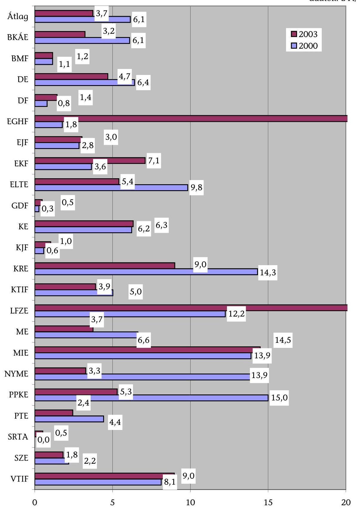

---

### **A feladatfinanszírozási támogatás oktatás-képzési célok szerinti felhasználása a helyszíni ellenőrzésbe vont felsőoktatási intézményeknél (az OM információs adatlap intézményi adatai és a helyszíni ellenőrzés tényadatai alapján)**

|   |  |  |  |  |  |  |  |  |  |  | adatok: E Ft-ban  |
| --- | --- | --- | --- | --- | --- | --- | --- | --- | --- | --- | --- |
|   |  | 2000. év |  | 2001. év |  | 2002. év |  | 2003. év |  | Index 2003/2000. év |   |
|  Intézmény megnevezése |  |  |  |  |  |  |  |  |  |  |   |
|   |  | Oktatás-képzési
célokra
előirányzott összeg |  | Oktatás-képzési
célokra
ténylegesen
felhasznált összeg |  | Oktatás-képzési
célokra
ténylegesen
felhasznált összeg |  | Oktatás-képzési
célokra
ténylegesen
felhasznált összeg |  |  |   |
|  1. Budapesti Közgazdaságtudományi és Államigazgatási Egyetem |  | 57 537 | 56 837 | 46 275 | 46 279 | 54 314 | 54 314 | 33 230 | 33 097 | 0,58 | 0,58  |
|  2. Eötvös Loránd Tudományegyetem |  | 289 330 | 275 930 | 95 500 | 87 850 | 330 314 | 330 964 | 133 463 | 133 463 | 0,46 | 0,48  |
|  3. Liszt Ferenc Zeneművészeti Egyetem |  | 4 506 | 10 334 | 1 748 | 6 619 | 3 314 | 6 161 | 9 728 | 13 069 | 2,16 | 1,26  |
|  4. Magyar Iparművészeti Egyetem |  | 7 508 | 7 508 | 16 473 | 15 253 | 28 990 | 26 693 | 10 604 | 9 220 | 1,41 | 1,23  |
|  5. Debreceni Egyetem* |  | 156 329 | 139 464 | 89 676 | 84 031 | 146 126 | 165 092 | 88 831 | 109 026 | 0,57 | 0,78  |
|  6. Pécsi Tudományegyetem |  | 93 122 | 93 114 | 92 445 | 87 185 | 105 055 | 98 823 | 72 852 | 77 847 | 0,78 | 0,84  |
|  7. Miskolci Egyetem* |  | 73 516 | 69 221 | 42 910 | 28 485 | 71 521 | 57 950 | 41 657 | 45 303 | 0,84 | 0,65  |
|  8. Kaposvári Egyetem |  | 17 209 | 17 209 | 5 752 | 4 852 | 9 585 | 9 704 | 23 738 | 25 592 | 1,38 | 1,49  |
|  9. Nyugat-Magyarországi Egyetem |  | 120 753 | 120 753 | 27 230 | 27 230 | 29 898 | 29 898 | 33 879 | 33 879 | 0,28 | 0,28  |
|  10. Széchenyi István Egyetem* |  | 12 482 | 12 482 | 29 280 | 29 280 | 18 350 | 18 350 | 4 990 | 4 990 | 0,40 | 0,40  |
|  11. Budapesti Műszaki Főiskola* |  | 12 273 | 10 373 | 14 570 | 9 477 | 13 114 | 17 807 | 5 900 | 6 889 | 0,48 | 0,66  |
|  12. Dunaújvárosi Főiskola |  | 3 993 | 3 293 | 3 800 | 1 728 | 10 610 | 13 309 | 6 700 | 6 750 | 1,68 | 2,05  |
|  13. Eötvös József Főiskola |  | 3 250 | 3 202 | 3 081 | 2 174 | 2 350 | 1 508 | 10 673 | 7 535 | 3,28 | 2,35  |
|  14. Eszterházy Károly Tanárképző Főiskola |  | 23 739 | 23 739 | 28 558 | 28 558 | 57 318 | 57 318 | 26 530 | 26 530 | 1,12 | 1,12  |
|  15. Károli Gáspár Református Egyetem |  | 27 219 | 29 361 | 22 306 | 22 537 | 22 894 | 26 239 | 22 929 | 22 929 | 0,84 | 0,78  |
|  16. Pázmány Péter Katolikus Egyetem* |  | 103 897 | 103 897 | 41 105 | 41 999 | 53 271 | 52 501 | 38 842 | 37 375 | 0,37 | 0,36  |
|  17. Egri Hittudományi Főiskola |  | 200 | 200 | 418 | 418 | 300 | 300 | 150 | 150 | 0,75 | 0,75  |
|  18. Kölcsey Ferenc Református Tanítóképző Főiskola |  | 8 000 | 7 476 | 300 | 593 | 400 | 442 | 626 | 597 | 0,08 | 0,08  |
|  19. Sárospataki Református Teológiai Akadémia |  | 250 |  |  | 250 |  |  | 250 | 53 | 1,00 | 0,00  |
|  20. Vitéz János Római Katolikus Tanítóképző Főiskola |  | 5 100 | 4 800 | 3 258 | 3 291 | 450 | 402 | 3 174 | 3 232 | 0,62 | 0,67  |
|  21. Gábor Dénes Főiskola |  | 2 800 | 2 800 | 5 722 | 5 722 | 613 | 613 | 1 300 | 1 300 | 0,46 | 0,46  |
|  22. Kodolányi János Főiskola |  | 2 930 | 2 930 | 9 763 | 9 763 | 3 978 | 3 978 | 5 241 | 5 241 | 1,79 | 1,79  |
 MINDÖSSZESEN |  | 1 025 943 | 994 923 | 580 170 | 543 574 | 962 765 | 972 366 | 595 287 | 604 067 | 0,58 | 0,61  |
|  Ebből: |  |  |  |  |  |  |  |  |  |  |   |
|  - állami (1-14 sorszám) |  | 875 547 | 843 459 | 497 298 | 459 001 | 880 859 | 887 891 | 522 775 | 533 190 | 0,60 | 0,63  |
|  - egyházi (15-20 sorszám) |  | 144 666 | 145 734 | 67 387 | 69 088 | 77 315 | 79 884 | 65 971 | 64 336 | 0,46 | 0,44  |
|  - alapítványi (21-22 sorszám) |  | 5 730 | 5 730 | 15 485 | 15 485 | 4 591 | 4 591 | 6 541 | 6 541 | 1,14 | 1,14  |
|  - állami intézmények részaránya (%) |  | 85,54% | 84,78% | 83,72% | 84,44% | 91,49% | 91,31% | 87,82% | 88,27% | 1,03 | 1,04  |
|  - egyházi intézmények részaránya (%) |  | 14,10% | 14,65% | 11,62% | 12,71% | 8,03% | 8,22% | 11,08% | 10,65% | 0,79 | 0,73  |
|  - alapítványi intézmények részaránya (%) |  | 0,56% | 0,58% | 2,67% | 2,85% | 0,48% | 0,47% | 1,10% | 1,08% | 1,97 | 1,88  |

*A helyszíni ellenőrzés alapján a támogatás előirányzata az OM információs adatlapján feltüntetett összegnél a 2002. évben az ME esetében 15 200 E Ft-tal, a DE-nél a 2001-2002. években 13 466 és 24 757 E Ft-tal, a 2001. évben a SZE-nél 200 E Ft-tal, a 2002. évben a BMF-en a 4 000 E Ft-tal, a KRE-n 15 087 E Ft-tal és a 2002. évben a PPKE-n 42 738 E Ft-tal magasabb.

---

### **A feladatfinanszírozási támogatás informatikai célok szerinti felhasználása a helyszíni ellenőrzésbe vont felsőoktatási intézményeknél (az OM információs adatlap intézményi adatai és a helyszíni ellenőrzés tényadatai alapján)**

|  adatok: E Ft-ban |  |  |  |  |  |  |  |  |   |
| --- | --- | --- | --- | --- | --- | --- | --- | --- | --- |
|   | 2000. év |  | 2001. év |  | 2002. év |  | 2003. év |  | Index 2003/2000. év  |
|  Intézmény megnevezése |  |  |  |  |  |  |  |  |   |
|   | Az informatikai
fejlesztésre
előirányzott
összeg | Az informatikai
fejlesztésre
ténylegesen
felhasznált összeg | Az informatikai
fejlesztésre
előirányzott
összeg | Az informatikai
fejlesztésre
ténylegesen
felhasznált összeg | Az informatikai
fejlesztésre
ténylegesen
felhasznált összeg | Az informatikai
fejlesztésre
ténylegesen
felhasznált összeg | Az informatikai
fejlesztésre
ténylegesen
felhasznált összeg | Az informatikai
fejlesztésre
ténylegesen
felhasznált összeg | Az informatikai
fejlesztésre
ténylegesen
felhasznált összeg  |
|  1. Budapesti Közgazdaságtudományi és Államigazgatási Egyetem | 10 600 | 10 596 |  |  |  |  | 18 597 | 18 597 | 1,75  |
|  2. Eötvös Loránd Tudományegyetem | 980 |  |  | 980 |  |  | 42 000 | 42 000 | 42,86  |
|  3. Liszt Ferenc Zeneművészeti Egyetem |  |  |  |  |  |  | 8 954 | 8 954 |   |
|  4. Magyar Iparművészeti Egyetem | 2 000 |  |  | 1 997 |  |  | 14 528 |  | 7,26  |
|  5. Debreceni Egyetem | 7 000 |  |  | 7 000 |  |  | 25 729 | 12 669 |   |
|  6. Pécsi Tudományegyetem | 7 000 | 7 000 | 25 597 | 25 597 |  |  | 25 586 |  | 3,66  |
|  7. Miskolci Egyetem | 7 000 | 7 000 |  |  |  |  | 11 935 | 10 342 | 1,71  |
|  8. Kaposvári Egyetem | 4 700 |  | 18 480 | 23 180 | 1 029 | 1 029 | 7 614 | 1 143 | 1,62  |
|  9. Nyugat-Magyarországi Egyetem | 6 000 | 6 000 |  |  |  |  | 14 246 | 11 246 | 2,37  |
|  10. Széchenyi István Egyetem | 4 400 | 4 400 |  |  |  |  | 12 334 | 12 334 | 2,80  |
|  11. Budapesti Műszaki Főiskola | 6 000 |  |  | 6 000 |  |  | 8 800 |  | 1,47  |
|  12. Dunaújvárosi Főiskola | 8 730 |  |  | 8 730 |  |  |  |  |   |
|  13. Eötvös József Főiskola | 2 590 | 2 590 |  |  |  |  | 10 500 |  | 4,05  |
|  14. Eszterházy Károly Tanárképző Főiskola |  |  |  |  |  |  | 38 500 | 38 500 |   |
|  15. Károli Gáspár Református Egyetem | 2 100 | 2 100 |  |  |  |  | 5 061 | 5 061 | 2,41  |
|  16. Pázmány Péter Katolikus Egyetem | 5 000 | 5 000 |  |  |  |  | 6 406 | 6 406 | 1,28  |
|  17. Egri Hittudományi Főiskola |  |  |  |  |  |  | 4 170 | 3 429 |   |
|  18. Kölcsey Ferenc Református Tanítóképző Főiskola | 2 800 |  |  | 2 800 |  |  | 8 500 | 6 000 | 3,04  |
|  19. Sárospataki Református Teológiai Akadémia | 1 150 |  |  | 1 150 |  |  | 3 967 |  | 3,45  |
|  20. Vitéz János Római Katolikus Tanítóképző Főiskola | 1 400 |  |  | 1 400 |  |  | 3 957 | 3 698 | 2,83  |
|  21. Gábor Dénes Főiskola | 1 180 | 1 180 |  |  |  |  | 4 416 | 4 416 | 3,74  |
|  22. Kodolányi János Főiskola |  |  |  |  |  |  | 4 334 | 4 334 |   |
|  **MINDÖSSZESEN** | **80 630** | **45 866** | **44 077** | **78 834** | **1 029** | **1 029** | **280 134** | **189 129** | **3,47**  |
|  **Ebből:** |  |  |  |  |  |  |  |  |   |
|  - állami (1-14 sorszám) | 67 000 | 37 586 | 44 077 | 73 484 | 1 029 | 1 029 | 239 323 | 155 785 | 3,57  |
|  - egyházi (15-20 sorszám) | 12 450 | 7 100 |  | 5 350 |  |  | 32 061 | 24 594 | 2,58  |
|  - alapítványi (21-22 sorszám) | 1 180 | 1 180 |  |  |  |  | 8 750 | 8 750 | 7,42  |
|  - állami intézmények részaránya (%) | 83,10% | 81,95% | 100,00% | 93,21% | 100,00% | 100,00% | 85,43% | 82,37% | 1,03  |
|  - egyházi intézmények részaránya (%) | 15,44% | 15,48% |  | 6,79% |  |  | 11,44% | 13,00% | 0,74  |
|  - alapítványi intézmények részaránya (%) | 1,46% | 2,57% |  |  |  |  | 3,12% | 4,63% | 2,13  |

---

# A feladatfinanszírozási támogatás integrációs célok szerinti felhasználása a helyszíni ellenőrzésbe vont felsőoktatási intézményeknél

(az OM információs adatlap intézményi adatai és a helyszíni ellenőrzés tényadatai alapján)

|  Intézmény megnevezése | 2000. év |  | 2001. év |  | 2002. év |  | 2003. év |  | Index 2003/2000. év* |   |
| --- | --- | --- | --- | --- | --- | --- | --- | --- | --- | --- |
|   | Integrációs célokra eleve |  | Integrációs |  |  |  |  |  |  |   |
|   |  |  | célokra |  |  |  |  |  |  |   |
|   |  |  | ténylegesen |  |  |  |  |  |  |   |
|   |  |  | felhasznált |  |  |  |  |  |  |   |
|   |  |  | összeg |  |  |  |  |  |  |   |
|  1. Budapesti Közgazdaságtudományi és Államigazgatási Egyetem | 5000 |  | 5000 |  |  |  | 4000 | 4000 | 0,80 | 0,80  |
|  2. Eötvös Loránd Tudományegyetem * |  |  | 7200 |  |  |  |  |  |  |   |
|  3. Liszt Ferenc Zeneművészeti Egyetem |  |  |  |  |  |  |  |  |  |   |
|  4. Magyar Iparművészeti Egyetem |  |  |  |  |  |  |  |  |  |   |
|  5. Debreceni Egyetem |  |  |  |  |  |  |  |  |  |   |
|  6. Pécsi Tudományegyetem | 18500 |  | 11838 |  | 6661 |  |  |  |  |   |
|  7. Miskolci Egyetem | 9500 |  | 9500 |  |  | 3225 | 3225 |  |  |   |
|  8. Kaposvári Egyetem | 2500 |  | 293 |  | 2207 |  |  |  |  |   |
|  9. Nyugat-Magyarországi Egyetem | 7000 |  | 7000 |  |  |  |  |  |  |   |
|  10. Széchenyi István Egyetem |  |  |  |  |  |  |  |  |  |   |
|  11. Budapesti Műszaki Főiskola | 2000 |  |  | 9900 | 4123 |  | 526 |  | 7251 |   |
|  12. Dunaújvárosi Főiskola |  |  |  |  |  |  |  |  |  |   |
|  13. Eötvös József Főiskola |  |  |  |  |  |  |  |  |  |   |
|  14. Eszterházy Károly Tanárképző Főiskola |  |  |  |  |  |  |  |  |  |   |
|  15. Károli Gáspár Református Egyetem |  |  |  |  |  |  |  |  |  |   |
|  16. Pázmány Péter Katolikus Egyetem |  |  |  |  |  |  |  |  |  |   |
|  17. Egri Hittudományi Főiskola |  |  |  |  |  |  |  |  |  |   |
|  18. Kölcsey Ferenc Református Tanítóképző Főiskola |  |  |  |  |  |  |  |  |  |   |
|  19. Sárospataki Református Teológiai Akadémia |  |  |  |  |  |  |  |  |  |   |
|  20. Vitéz János Római Katolikus Tanítóképző Főiskola |  |  |  |  |  |  |  |  |  |   |
|  21. Gábor Dénes Főiskola |  |  |  |  |  |  |  |  |  |   |
|  22. Kodolányi János Főiskola |  |  |  |  |  |  |  |  |  |   |
|  MINDÖSSZESEN | 44500 |  | 40831 | 9900 | 12991 | 3225 | 3751 | 4000 | 11251 | 0,09  |
|  Ebből: |  |  |  |  |  |  |  |  |  |   |
|  - állami (1-14 sorszám) | 44500 |  | 40831 | 9900 | 12991 | 3225 | 3751 | 4000 | 11251 | 0,09  |
|  - egyházi (15-20 sorszám) |  |  |  |  |  |  |  |  |  |   |
|  - alapítványi (21-22 sorszám) |  |  |  |  |  |  |  |  |  |   |
|  - állami intézmények részaránya (\%) | 100\% |  | 100\% | 100\% | 100\% | 100\% | 100\% | 100\% | 100\% | 100\%  |
|  - egyházi intézmények részaránya (\%) |  |  |  |  |  |  |  |  |  |   |
|  - alapítványi intézmények részaránya (\%) |  |  |  |  |  |  |  |  |  |   |

*A 2000. évi teljesítés az 1999. évi támogatás maradványának felhasználása.

---

1. sz. melléklet a V-11-121/2004-2005. sz. jelentéshez

|  Sor-
szám | Kérdések | Válaszok | 2000 |  |  | 2001 |  |  | 2002 |  |  | 2003 |  |   |
| --- | --- | --- | --- | --- | --- | --- | --- | --- | --- | --- | --- | --- | --- | --- |
|   |  |  | állami
intézmények | egyházi
intézmények | alapítványi és
magán
intézmények | állami
intézmények | egyházi
intézmények | alapítványi és
magán
intézmények | állami
intézmények | egyházi
intézmények | alapítványi és
magán
intézmények | állami
intézmények | egyházi
intézmények | alapítványi és
magán
intézmények  |
|  1. | Oktatás-képzést segítő támogatások |  |  |  |  |  |  |  |  |  |  |  |  |   |
|  1. | Az intézmény/szervezet részesült a feladatfinanszírozási támogatásban? | nem válaszolt |  |  |  |  |  |  |  |  |  |  |  |   |
|   |  | igen | 14 | 6 | 2 | 14 | 5 | 2 | 14 | 6 | 2 | 14 | 6 | 2  |
|   |  | nem |  |  |  |  | 1 |  |  |  |  |  |  |   |
|  2.* | Melyik felosztásmód szerint kapták a támogatást? | nem válaszolt |  |  |  |  |  |  |  |  |  |  |  |   |
|   |  | egyedi döntés | 12 | 4 | 1 | 12 | 3 | 1 | 12 | 5 | 1 | 11 | 4 | 1  |
|   |  | nyilvános pályázat | 12 | 5 | 2 | 12 | 5 | 2 | 12 | 5 | 2 | 12 | 6 | 2  |
|   |  | meghívásos pályázat | 1 | 1 |  | 1 |  |  | 1 |  |  | 1 |  |   |
|  3. | A támogatás szabályszerű felhasználását biztosította az intézményi gazdálkodási szabályzat? | nem válaszolt |  |  |  |  |  |  |  |  |  |  |  |   |
|   |  | igen | 14 | 6 | 2 |  |  |  |  |  |  |  |  |   |
|   |  | nem |  |  |  |  |  |  |  |  |  |  |  |   |
|  6.* | A kapott támogatások elegendő fokozást biztosítottak a feladatok teljesítéséhez? | nem válaszolt |  |  |  |  |  |  |  |  |  |  |  |   |
|   |  | igen | 7 | 3 | 1 | 7 | 2 |  | 8 | 3 |  | 9 | 3 | 1  |
|   |  | nem | 2 | 2 |  | 2 | 2 |  | 2 | 2 |  | 3 | 1 |   |
|   |  | részben | 12 | 5 | 2 | 13 | 4 | 2 | 11 | 5 | 2 | 11 | 6 | 1  |
|  8. | A beszerzések lebonyolításánál alkalmazták a közbeszerzési eljárást? | nem válaszolt | 1 |  |  | 1 |  |  | 2 |  |  |  |  |   |
|   |  | igen | 10 | 1 |  | 9 |  |  | 8 |  |  | 11 | 2 |   |
|   |  | nem | 3 | 5 | 2 | 4 | 6 | 2 | 4 | 6 | 2 | 3 | 4 | 2  |
|  9. | A közbeszerzési eljárás eredményezett-e költségcsökkenést? | nem válaszolt | 3 |  |  | 3 |  |  | 4 |  |  | 3 |  |   |
|   |  | igen | 1 | 1 |  | 2 |  |  | 1 |  |  | 2 | 2 |   |
|   |  | nem | 10 | 5 | 2 | 9 | 6 | 2 | 9 | 6 | 2 | 9 | 4 | 2  |
|  10.* | A támogatásokat az adott feladatok teljesítéséhez használták-e fel? | nem kapott |  |  |  |  | 1 |  |  |  |  |  |  |   |
|   |  | nem válaszolt |  |  |  |  |  |  |  |  |  |  |  |   |
|   |  | igen | 14 | 6 | 2 | 14 | 5 | 2 | 14 | 6 | 2 | 14 | 6 | 2  |
|   |  | nem |  |  |  |  |  |  |  |  |  |  |  |   |
|   |  | etszben |  |  |  |  |  |  |  |  |  |  |  |   |
|  11. | A támogatás feljebbítése a feladat teljesítésével összhangban volt-e? | nem válaszolt |  |  |  |  |  |  |  |  |  |  |  |   |
|   |  | igen | 9 | 4 | 2 |  |  |  |  |  |  |  |  |   |
|   |  | nem | 5 | 2 |  |  |  |  |  |  |  |  |  |   |
|  12.* | A kapott támogatások felhasználásával a szakmai célok megvalósultak-e? | nem válaszolt | 1 |  |  |  |  |  | 1 |  |  |  |  |   |
|   |  | igen | 11 | 3 | 2 | 12 | 2 | 2 | 11 | 3 | 2 | 12 | 3 | 2  |
|   |  | nem |  |  |  |  |  |  |  |  |  |  |  |   |
|   |  | etszben | 6 | 4 | 1 | 7 | 4 | 1 | 6 | 4 | 1 | 7 | 4 | 1  |

---

|  Sorszáma | Kérdések | Válaszok | 2000 |  |  | 2001 |  |  | 2002 |  |  | 2003 |  |   |
| --- | --- | --- | --- | --- | --- | --- | --- | --- | --- | --- | --- | --- | --- | --- |
|   |  |  | állami
intézmények | egyházi
intézmények | alapítványi és
magán
intézmények | állami
intézmények | egyházi
intézmények | alapítványi és
magán
intézmények | állami
intézmények | egyházi
intézmények | alapítványi és
magán
intézmények | állami
intézmények | egyházi
intézmények | alapítványi és
magán
intézmények  |
|  13. | A tankönyv- és szakkönyv
támogatás hozzájárult-e az
intézmény jobb
könyvellátottságához? | nem válaszolt |  |  |  |  |  |  |  |  |  |  |  |   |
|   |  | igen | 5 | 1 |  | 2 | 1 | 2 |  |  |  |  |  |   |
|   |  | nem |  |  |  |  |  |  |  |  |  |  |  |   |
|   |  | utazban | 2 | 1 |  |  | 1 |  |  | 1 |  |  | 1 |   |
|   |  | nem kapott | 7 | 4 | 2 | 12 | 4 |  | 14 | 5 | 2 | 14 | 5 | 2  |
|  14. | A szakmai könyvek és folyóiratok
beszerzésére fordított támogatások
segítettek-e az intézményi könyvtár
megbízható színvonalon történő
működését? | nem válaszolt |  |  |  |  |  |  |  |  |  |  |  |   |
|   |  | igen | 7 | 3 | 2 | 7 | 2 | 2 | 7 | 2 | 2 | 7 | 3 | 1  |
|   |  | nem | 1 |  |  | 1 |  |  | 1 |  |  | 1 |  |   |
|   |  | utazban | 6 | 3 |  | 6 | 3 |  | 6 | 3 |  | 6 | 3 |   |
|   |  | nem kapott |  |  |  |  | 1 |  |  | 1 |  |  |  | 1  |
|  16. | Az oktatói-kutatói ösztöndíj
rendszer (Széchenyi Professzori
Ösztöndíj, Széchenyi István
Ösztöndíj, Békésy György
ösztöndíj, Szent-
Györgyi Albert Ösztöndíj)
hozzájárul-e az intézmény
tudományos-művészeti
színvonalának növekedéséhez? | nem válaszolt |  |  |  |  |  |  |  |  |  |  |  |   |
|   |  | igen | 13 | 1 | 1 | 12 | 1 | 1 | 12 | 1 | 1 | 12 | 2 | 1  |
|   |  | nem |  |  |  |  | 1 |  |  |  |  |  |  |   |
|   |  | utazban | 1 | 1 |  | 1 | 1 |  | 1 | 1 |  | 1 | 1 |   |
|   |  | nem kapott |  | 4 | 1 | 1 | 3 | 1 | 1 | 4 | 1 | 1 | 3 | 1  |
|  17. | A támogatások felhasználását
intézményi szinten, illetve nem
állami intézmény esetében
intézményi/fenntartói szinten
ellenőriztek-e? | nem válaszolt |  |  |  |  |  |  |  |  |  |  |  |   |
|   |  | igen | 5 | 4 |  | 6 | 4 |  | 5 | 4 | 1 | 5 | 4 | 1  |
|   |  | nem | 4 | 2 |  | 3 | 2 |  | 4 | 2 |  | 4 | 2 |   |
|   |  | utazban | 5 |  | 2 | 5 |  | 2 | 5 |  | 1 | 5 |  | 1  |
|  17/a | A belső ellenőrzés tárt-e fel
hiányosságokat? | nem válaszolt | 4 |  |  | 4 |  |  | 4 |  |  | 3 |  |   |
|   |  | igen |  |  |  | 1 |  |  |  |  |  |  |  |   |
|   |  | nem | 10 | 6 | 2 | 9 | 6 | 2 | 10 | 6 | 2 | 11 | 6 | 2  |
|  18. | A támogatások felhasználásával
kapcsolatban a felügyeleti szerv
végzett-e helyszíni ellenőrzést? | nem válaszolt | 3 |  |  | 3 |  |  | 3 |  |  | 4 |  |   |
|   |  |  | 4 |  |  | 5 |  |  | 4 |  |  | 3 |  |   |
|   |  |  |  |  |  |  |  |  |  |  |  | 1 |  | 1  |
|   |  |  | 7 | 6 | 2 | 6 | 6 | 2 | 7 | 6 | 2 | 6 | 6 | 1  |
|  18/a | A felügyeleti szerv tárt-e fel
hiányosságokat? | nem válaszolt | 7 |  |  | 6 |  |  | 7 |  |  | 7 |  |   |
|   |  |  | 1 |  |  | 2 |  |  |  |  |  |  |  |   |
|   |  |  | 6 | 6 | 2 | 6 | 6 | 2 | 7 | 6 | 2 | 7 | 6 | 2  |
|  20. | A feladatfinanszírozás jelenlegi
rendszerét eredményesnek tartják
e? | nem válaszolt |  |  |  |  |  |  |  |  |  |  |  |   |
|   |  |  | 2 |  | 1 |  |  |  |  |  |  |  |  |   |
|   |  |  | 1 |  |  |  |  |  |  |  |  |  |  |   |
|   |  |  | 11 | 6 | 1 |  |  |  |  |  |  |  |  |   |

---

| Sorszám | Kérdések | Válaszok | 2000 |  |  | 2001 |  |  | 2002 |  |  | 2003 |  |   |
| --- | --- | --- | --- | --- | --- | --- | --- | --- | --- | --- | --- | --- | --- | --- |
|   |  |  | állami intézmények | egyházi intézmények | alapítványi és magán intézmények | állami intézmények | egyházi intézmények | alapítványi és magán intézmények | állami intézmények | egyházi intézmények | alapítványi és magán intézmények | állami intézmények | egyházi intézmények | alapítványi és magán intézmények  |
|  21. | Indokoltnak tartják-e a feladatfinanszírozás rendszerének átalakítását? | nem válaszolt |  |  |  |  |  |  |  |  |  |  |  |   |
|   |  | igen | 3 | 2 |  |  |  |  |  |  |  |  |  |   |
|   |  | nem | 3 | 2 | 1 |  |  |  |  |  |  |  |  |   |
|   |  | részben | 8 | 2 | 1 |  |  |  |  |  |  |  |  |   |
|  5. | Kérjük, értékeljék az OM pályázat rendszerét az alábbi szempontok szerint |  |  |  |  |  |  |  |  |  |  |  |  |   |
|   |  |  |  |  |  |  |  |  |  |  |  |  |  |   |
|   |  |  |  |  |  |  |  |  |  |  |  |  |  |   |
|   |  |  |  |  |  |  |  |  |  |  |  |  |  |   |
|   |  |  |  |  |  |  |  |  |  |  |  |  |  |   |
|   |  |  |  |  |  |  |  |  |  |  |  |  |  |   |
|   |  |  |  |  |  |  |  |  |  |  |  |  |  |   |
|   |  |  |  |  |  |  |  |  |  |  |  |  |  |   |
|   | Az informatikai támogatások eredményesen és gazdaságosan biztosították-e az infrastruktúra fejlesztését? |  |  |  |  |  |  |  |  |  |  |  |  |   |
|   |  |  |  |  |  |  |  |  |  |  |  |  |  |   |
|   |  |  |  |  |  |  |  |  |  |  |  |  |  |   |
|   |  |  |  |  |  |  |  |  |  |  |  |  |  |   |
|   |  |  |  |  |  |  |  |  |  |  |  |  |  |   |
|   |  |  |  |  |  |  |  |  |  |  |  |  |  |   |
|   |  |  |  |  |  |  |  |  |  |  |  |  |  |   |
|   |  |  |  |  |  |  |  |  |  |  |  |  |  |   |
|   |  |  |  |  |  |  |  |  |  |  |  |  |  |   |
|   |  |  |  |  |  |  |  |  |  |  |  |  |  |   |
|   | Az informatikai támogatások eredményesen és gazdaságosan biztosították-e az infrastruktúra fejlesztését? |  |  |  |  |  |  |  |  |  |  |  |  |   |
|   |  |  |  |  |  |  |  |  |  |  |  |  |  |   |
|   |  |  |  |  |  |  |  |  |  |  |  |  |  |   |
|   |  |  |  |  |  |  |  |  |  |  |  |  |  |   |
|   |  |  |  |  |  |  |  |  |  |  |  |  |  |   |
|   |  |  |  |  |  |  |  |  |  |  |  |  |  |   |
|   |  |  |  |  |  |  |  |  |  |  |  |  |  |   |
|   |  |  |  |  |  |  |  |  |  |  |  |  |  |   |
|   |  |  |  |  |  |  |  |  |  |  |  |  |  |   |
|   |  |  |  |  |  |  |  |  |  |  |  |  |  |   |
|   |  |  |  |  |  |  |  |  |  |  |  |  |  |   |
|   |  |  |  |  |  |  |  |  |  |  |  |  |  |   |
|   |  |  |  |  |  |  |  |  |  |  |  |  |  |   |
|   |  |  |  |  |  |  |  |  |  |  |  |  |  |   |
|   | A belső integációt segítő támogatások eredményesen és gazdaságosan járulnak-e hozzá az intézmény oktatás képzési, irányítási, szervezeti és gazdálkodási rendszerének átalakításához? |  |  |  |  |  |  |  |  |  |  |  |  |   |
|   |  |  |  |  |  |  |  |  |  |  |  |  |  |   |
|   |  |  |  |  |  |  |  |  |  |  |  |  |  |   |
|   |  |  |  |  |  |  |  |  |  |  |  |  |  |   |
|   |  |  |  |  |  |  |  |  |  |  |  |  |  |   |
|   |  |  |  |  |  |  |  |  |  |  |  |  |  |   |
|   |  |  |  |  |  |  |  |  |  |  |  |  |  |   |
|   |  |  |  |  |  |  |  |  |  |  |  |  |  |   |
|   | |  |  |  |  |  |  |  |  |  |  |  |  |   |
|   |  |  |  |  |  |  |  |  |  |  |  |  |  |   |
|   |  |  |  |  |  |  |  |  |  |  |  |  |  |   |
|   |  |  |  |  |  |  |  |  |  |  |  |  |  |   |
|   |  |  |  |  |  |  |  |  |  |  |  |  |  |   |
|   |  |  |  |  |  |  |  |  |  |  |  |  |  |   |
|   |  |  |  |  |  |  |  |  |  |  |  |  |  |   |
|   |  |  |  |  |  |  |  |  |  |  |  |  |  |   |
|   |  |  |  |  |  |  |  |  |  |  |  |  |  |   |
|   |  |  |  |  |  |  |  |  |  |  |  |  |  |   |
|   |  |  |  |  |  |  |  |  |  |  |  |  |  |   |
|   |  |  |  |  |  |  |  |  |  |  |  |  |  |   |
|   |  |  |  |  |  |  |  |  |  |  |  |  |  |   |
|   |  |  |  |  |  |  |  |  |  |  |  |  |  |   |
|   |  |  |  |  |  |  |  |  |  |  |  |  |  |   |
|   |  |  |  |  |  |  |  |  |  |  |  |  |  |   |
|   |  |  |  |  |  |  |  |  |  |  |  |  |  |   |
|   |  |  |  |  |  |  |  |  |  |  |  |  |  |   |
|   |  |  |  |  |  |  |  |  |  |  |  |  |  |   |
|   |  |  |  |  |  |  |  |  |  |  |  |  |  |   |
|   |  |  |  |  |  |  |  |  |  |  |  |  |  |   |
|   |  |  |  |  |  |  |  |  |  |  |  |  |  |   |
|   |  |  |  |  |  |  |  |  |  |  |  |  |  |   |
|   |  |  |  |  |  |  |  |  |  |  |  |  |  |   |
|   |

---

# Kritériumok a felsőoktatási feladatfinanszírozási rendszer ellenőrzéséhez 

## I. Ellenőrzési kritériumok

Az ellenőrzési kritériumok a korszerű költségvetési gazdálkodás nélkülözhetetlen részei. Ennek alapján lehet értékelni, hogy a feladatfinanszírozás állami támogatása, a fejezeti irányítás rendszere biztosította-e a feladatok eredményes ellátását, az intézmények működésében a feladatfinanszírozási támogatások gazdaságosan és eredményesen valósultak-e meg.

## Főbb ellenőrzési szempontok

1. A fejezeti szintű feladatfinanszírozási tevékenység és hasznosulása.
2. Az intézmények feladatfinanszírozási jogcímeken kapott állami támogatásának eredményessége, gazdaságossága.

## Az ellenőrzés kritériumai a következők:

## 1. Szabályszerűségi kritériumok

- az ellenőrzött évek költségvetési és költségvetés végrehajtási törvényei, a felsőoktatásról szóló és az államháztartásról szóló törvények, valamint az államháztartás működési rendjéről szóló kormányrendelet előírásai;
- a közbeszerzésekről szóló törvény előírásai a pályáztatási folyamatra;
- a központosított közbeszerzés és a szabadkézi vétellel történő beszerzés előírásairól szóló kormányrendeletek;
- a felsőoktatási fejlesztési (nem beszerzési) programra, a Nemzeti Információs Infrastruktúra Fejlesztési programra és a felsőoktatási kiegészítő támogatásra vonatkozó kormányrendeletek;
- a Széchenyi professzori-, a Széchenyi István-, a Békésy György posztdoktori és a Szent-Györgyi Albert ösztöndíjasokról szóló NKM és OM rendeletekben meghatározott feltételek;
- a fejezeti kezelésű előirányzatok gazdálkodási, kötelezettségvállalási és utalványozási szabályzatai.

## 2. Teljesítményellenőrzési kritériumok

## a.) Eredményességi kritériumok

A költségvetési törvények előirányzatainak célok szerinti teljesítése, a feladatfinanszírozási engedély-okiratok, a beruházási alapokmányban foglaltak, a támogatói szerződések megállapodásai.

---

Az informatikai közbeszerzési pályázatok értékelésénél a bírálati szempontok alapján kialakult pontszámok egymáshoz való viszonyításával a legelőnyösebb ajánlat kiválasztása.

# Fejezeti célkitűzéseknél: 

- a költségvetési törvények célkitűzéseinek teljesítése;
- a felsőoktatásról szóló törvényben (9/D. § 1-3. pontok; 9/B. §; 10/A. $\S ; 11/$ A. §) meghatározott, az oktatáshoz és az azt kiegészítő tevékenységekhez (tankönyvkiadás, tankönyvfejlesztés, sport és kultúra, nemzetközi kapcsolatok, ösztöndíjak, képzés-korszerűsítés, integráció) kapcsolódó támogatási értékek biztosítása;
- a felsőoktatási feladatfinanszírozás közvetlen állami támogatásának igények szerinti alakulása;
- a felsőoktatási informatikai fejlesztés támogatására kialakított részprogramok végrehajtása;
- a NIIF programcélok teljesítése (Internet kapcsolat, nemzetközi összeköttetés biztosítása), az elektronikus tartalomszolgáltatás a lehető legkedvezőbb áron történt-e.

## Intézményi célkitűzéseknél:

- a felsőoktatási programfinanszírozásból nyert támogatások célok szerinti teljesítése;
- szakmai könyvek, folyóiratok céloknak megfelelő, költségtakarékos beszerzése;
- felsőoktatási vezetői információs rendszer célok szerinti megvalósítása (kreditrendszer működése, hallgatói-oktatói-kutatói nyilvántartási rendszer kialakítása);
- a NIIF programban meghatározott feladatok NIIF Iroda általi teljesítése.

## b.) Gazdaságossági kritériumok

A fejezeti kezelésű előirányzatok pénzeszközei tervekhez képest gazdaságos, költségtakarékos felhasználása.

## Intézményi célkitűzéseknél:

- a felsőoktatási programfinanszírozás körébe tartozó projektek gazdaságos megvalósítása;
- a felsőoktatási informatikai fejlesztések költséghatékony végrehajtása.

---

# II. Teljesítménymutatók 

## A felsőoktatási képzési rendszer korszerűsítésénél

- pályázott összeg/intézmény/év;
- ténylegesen elnyert összeg/intézmény/év.

## Az informatikai fejlesztésnél

- pályázott összeg/intézmény/év;
- ténylegesen elnyert összeg/intézmény/év;
- számítógép/hallgató arány alakulása.

Az eredményesség és gazdaságosság mérését, teljesítménymutatók kialakítását korlátozza, illetve gátolja egyrészt, hogy a támogatások jelentős része egyedi döntés, meghívásos pályázat alapján került kiosztásra, másrészt, hogy a feladatok, részfeladatok egy részére a vizsgált időszakban nem minden évben biztosítottak költségvetési támogatást.

## III. Alkalmazott teljesítményellenőrzési módszerek

- az ellenőrzés kritériumainak meghatározása;
- strukturált kérdésfa kidolgozása, az ellenőrzés fő- és alkérdéseinek meghatározása alapján;
- tanúsítványi adatok kérése a fejezettől;
- kérdőíves felmérés a helyszíni ellenőrzésre kijelölt felsőoktatási intézményektől;
- helyszíni interjúk készítése;
- fókuszcsoport szervezése a jelentés-tervezet kialakítása során a helyszíni ellenőrzés megállapításainak értékeléséhez.

---

# KÉRDÉSFA   a felsőoktatás feladatfinanszírozási rendszere működésének ellenőrzéséhez 

## Fő kérdés: A felsőoktatás feladatfinanszírozási rendszere eredményesen járult-e hozzá a felsőoktatási politika céljainak megvalósításához, az intézmények működési feltételeinek javításához?

## 1. A feladatfinanszírozás állami támogatása, a fejezeti irányítás rendszere biztosította-e a felsőoktatási feladatok eredményes ellátását?

1.1 A feladatfinanszírozás jogszabályi előírásai érvényesültek-e?
1.1.1 A feladatfinanszírozás fogalmát jogszabályokban, a szakmai feladatok értelmezésének útmutatójában, vagy egyéb módon meghatározták-e? Változott-e tartalma a vizsgált időszakban?
1.1.2 A feladatfinanszírozási előirányzatok felhasználását, ügymenetét a költségvetési törvénnyel, az államháztartás működési rendjéről szóló kormányrendelettel összhangban alakították-e ki a fejezeti kezelésű előirányzatok gazdálkodási szabályzatában? Voltak-e eltérések, azok indokoltak voltak-e? A felügyeleti szerv indokolta-e az eltéréseket?
1.1.3 A fejezetnél kialakított felsőoktatási feladatfinanszírozási rendszer, a feladatfinanszírozási jogcímek betöltötték-e szerepüket a felsőoktatás állami támogatásában? Szükséges-e a feladatfinanszírozás rendszerének módosítása, átalakítása?
1.2 Megalapozott volt-e az egyes jogcímek, előirányzatok kialakítása?
1.2.1 A gazdálkodási szabályzatban pontosan, tartalmában elkülönítetten határozták-e meg a jogcímeket, a részfeladatok céljait, előirányzatait? Voltak-e átfedések az előirányzatok között?
1.2.2 A szakmai területek az előirányzatok kialakítására vonatkozó javaslataikat megfelelő indoklással tették-e meg? A javaslatok összhangban voltak-e a költségvetési törvénnyel és egyéb jogszabályokkal?
1.2.3 Az előirányzatok felosztás-módjai (egyedi, pályázat, egyedi és pályázat) indokoltak és alkalmasak voltak-e a jogcímben meghatározott feladatok forrásainak megalapozott biztosításához?
1.2.4 Az előirányzattal rendelkező meghatározta-e a megvalósítás időtartamát, határidejét, a bekerülő forrás összetételét? Kialakította-e a szakmai értékelés módját és követelményeit?

---

1.3 Megfelelő volt-e az előirányzatok felhasználása, ügymenetének szabályozottsága?
1.3.1 A rendelkezésre álló források felhasználásánál a pályázati rendszer működése megfelelő-e? A pályázati formák és kiírások esélyegyenlőséget biztosítottak-e az intézményeknek? A pályázatok elbírálása, a támogatások odaítélésének elbírálási szempontjai átláthatóak voltak-e? Az elbírálás rendszere biztosította-e az objektív kiválasztást?
1.3.2 A felhasználás előkészítésénél, lebonyolításánál megfelelő együttműködés alakult-e ki a közreműködők (OM szervezeti egységei, kedvezményezett intézmények, Kincstár) között? Volt-e olyan tényező, körülmény, amely zavarólag hatott az együttműködésre? Sikerült-e megoldani?
1.3.3 A finanszírozási okmányok (ismertetők, engedélyokiratok, alapokmányok) előkészítésénél biztosították-e az összhangot? Az előkészítéskor rendelkezésre álltak-e kiemelt előirányzati bontásban a finanszírozási források?
1.3.4 Előirányzat módosítás történt-e? Végrehajtása a vonatkozó jogszabályok, a gazdálkodási szabályzat előírásainak betartásával történt-e?
1.3.5 A jogcímcsoportokon, jogcímen belül a kiemelt előirányzatoknál betartották-e, hogy a személyi juttatások, a munkaadókat terhelő járulékok legfeljebb 5\%-os mértékben növelhetők? Az ezek feletti emeléshez megkérték-e a pénzügyminiszter engedélyét?
1.3.6 A kedvezményezettekkel megkötötték-e a szerződéseket? A szerződések tartalma megfelelt-e az előírt követelményeknek?
1.3.7 Az előirányzatok felhasználásához előírt ügymenet végrehajtásánál érvényesültek-e a vonatkozó jogszabályok és a gazdálkodási szabályzatban foglaltak?
1.4 Megfelelő volt-e az előirányzatok felhasználásának ellenőrzése és értékelése?
1.4.1 Az OM szervezeti egységei a gazdálkodási szabályzatban foglaltaknak megfelelően végeztek-e helyszíni ellenőrzést a támogatások cél szerinti felhasználásáról? Az ellenőrzések megállapításai alapján sor került-e intézkedésekre?
1.4.2 Az előirányzatokat a cél szerinti feladatok teljesítésére használták-e fel? Az előirányzatokból történtek-e nem rendeltetésszerű felhasználások? A jogszerűtlen felhasználásokat/felhasználókat szankcionálták-e? Képződött-e előirányzat maradvány? Ennek okait értékelték-e? A maradványok felhasználása megtörtént-e?
1.4.3 A felhasználók a teljesítésekről, az előírt tartalommal és határidőre beszámoltak-e? A felügyeleti szerv elszámolási kötelezettsége keretében összegezte-e a teljesítéseket?

---

1.4.4 A beszámolók szakmai és pénzügyi értékelése megtörtént-e? A beszámolók alapján megállapítható-e a feladat teljesítésének eredményessége és gazdaságossága? A fejezet foganatosított-e intézkedéseket a teljesítésértékeléseket követően?
2. Eredményesen, gazdaságosan használták-e fel az intézmények a feladatfinanszírozási jogcímeken kapott támogatásokat?
2.1 A támogatások felhasználása megfelelt-e a vonatkozó jogszabályoknak, a megkötött szerződéseknek és az intézmények gazdálkodási szabályzatának?
2.1.1 Az intézmények a jogcímekben, részfeladatokban meghatározott célra használták-e fel a támogatást? Megfelelő szerződésekben rögzítették-e a felhasználást és teljesítést? Az intézmény gazdálkodási szabályzata biztosította-e a kapott támogatás szabályszerű felhasználását?
2.1.2 A beszerzések lebonyolítása az érvényes jogszabályok szerint történt-e? Megfelelően alkalmazták-e a közbeszerzésekre, a pályáztatásokra vonatkozó előírásokat?
2.1.3 Az intézmények kezdeményeztek-e kiemelt előirányzatok közötti átcsoportosítást? Megfelelő indoklással alátámasztották-e? Az átcsoportosítást felügyeleti hatáskörben jóváhagyták-e?
2.1.4 A támogatások felhasználását belső értékelési és ellenőrzési rendszer segítette-e? Az értékelés és ellenőrzés tárt-e fel hiányosságokat? Voltak-e következményei a hiányosságok feltárásának?
2.2 A támogatási összegek eredményesen biztosították-e a felhasználási célok teljesítését?
2.2.1 Meghatároztak-e az intézmények fontos célokat és prioritásokat a felhasználási célokhoz? A kapott támogatások elegendő fedezetet biztosítottak-e a feladatok teljesítéséhez? Felmérték-e a felhasználási célokat segítő és hátráltató tényezőket?
2.2.2 A támogatások felhasználásával a szakmai célok eredményesen valósultak-e meg? A támogatások hozzájárultak-e az intézmények oktatáspolitikai céljainak teljesítéséhez?
2.2.3 Képződött-e a felhasználás során előirányzat maradvány? Ennek okait feltárták-e és értékelték-e? A maradvány felhasználása rendeződött-e?
2.3 A beruházási feladatok keretében megvalósuló informatikai fejlesztések (az intézményi információs infrastruktúra fejlesztése, a felsőoktatás irányítását elősegítő vezetői információs hálózat kiépítése) eredményesen és gazdaságosan valósultak-e meg?
2.3.1 Megfelelő tervekkel megalapozta-e az intézmény a beruházási feladatokat? A megvalósuló informatikai fejlesztések illeszkedtek-e az

---

intézményi stratégiába? A jogcímen belül a támogatások biztosították-e a beruházási feladatok megvalósítását? A finanszírozási feltételek megfelelőek voltak-e?
2.3.2 Az intézmények az adott feladatok teljesítéséhez használták-e fel a támogatásokat? Történt-e nem rendeltetésszerű felhasználás? A szabálytalan felhasználás miatt alkalmaztak-e szankciót?
2.3.3 A beszerzési eljárások előkészítésénél, lefolytatásánál érvényesültek-e a közbeszerzésről szóló jogszabályok? A pályázók kiválasztása és a megkötött szerződések biztosították-e a szerződéses célok megvalósítását? A közbeszerzési eljárás a legelőnyösebb ajánlat útján eredményezett-e költségcsökkenést?
2.3.4 A támogatásból megvalósult beruházások gazdaságosan, eredményesen és határidőre teljesültek-e? Szerződésmódosítás esetén származott-e abból hátránya a megrendelő intézménynek?
2.3.5 A beruházások megvalósítása hozzájárult-e az intézmények működési feltételeinek javításához? Segítette-e az intézményeket oktatáspolitikai céljaik teljesítésében? Az informatikai fejlesztések a részprogramoknak és a kitűzött céloknak megfelelően alakultak-e?
2.4 Az intézmények eredményesen és gazdaságosan valósították-e meg a belső integráció érdekében végrehajtott projekteket?
2.4.1 A belső integrációhoz szükséges állami támogatási igényüket megfelelően kidolgozták és megalapozták-e az intézmények? A belső integrációs projektek felügyeleti befogadása megtörtént-e? A projektekre előirányzott támogatások elegendő forrást biztosítottak-e a teljesítéshez, a belső integráció tartalmi fejlesztéséhez?
2.4.2 A támogatások felhasználása eredményesen járult-e hozzá az intézmények irányítási, szervezeti és gazdálkodási rendszerének korszerűsítéséhez? A korszerűsítéshez kapcsolódó szakmai teljesítménymutatók megfelelően alakultak-e?
2.4.3 A kapott támogatásokból az előirányzott célokat valósították-e meg? Eltérő célú felhasználás történt-e? Voltak-e ennek következményei?
2.5 Megfelelő volt-e az intézmények beszámolása a teljesítésekről?
2.5.1 Az intézmények elkészítették-e részletes szakmai és pénzügyi beszámolóikat a támogatások felhasználásáról? A beszámolókat intézményi testületek megtárgyalták-e és elfogadták-e?
2.5.2 A beszámolók tartalma alkalmas volt-e a teljesítések értékelésére? A támogatások felhasználásának cél szerinti megítélése egyértelmű volt-e az intézményen belül? Kiegészítő intézkedések megtételére volt-e szükség?

---

2.5.3 A beszámolókat megküldték-e határidőre a felügyeleti szervnek és az Államháztartási Hivatalnak? Felügyeleti értékelés történt-e a beszámolók alapján az intézmények részére a jogcím szerinti felhasználások teljesítéséről?

---

# Képek a Hallgatói Információs Központról (1088 Budapest, Reviczky u. 6.) 

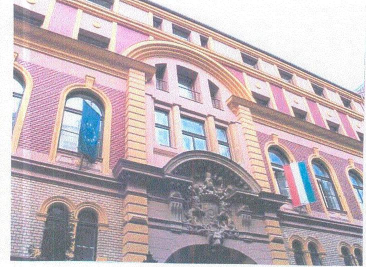

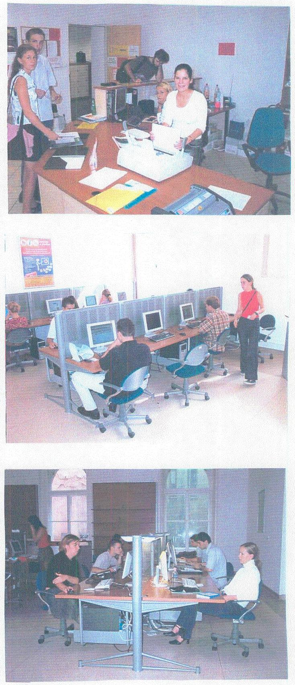

---

# FÜGGELÉK

---

# Egyházi, alapítványi felsőoktatási intézmények és egyéb felhasználó szervezetek feladatfinanszírozása 

## 1. AZ EGYHÁZI FELSŐOKTATÁSI INTÉZMÉNYEK FELADATFINANSZÍROZÁSA

A felsőoktatásról szóló, többször módosított 1993. évi LXXX. törvény alapján az egyházak által alapított felsőoktatási intézményeket az állami alapítású intézményekkel azonos jogok és kötelezettségek illetik meg. Ez biztosított lehetőséget arra, hogy a fejezeti kezelésű felsőoktatás feladatfinanszírozási jogcímekből az egyházi intézmények is támogatást kapjanak. Az ellenőrzésbe vont intézmények kiválasztásánál a jogcímekből való részesedés és a kapott támogatások nagysága érvényesült.

E szempontok alapján hat egyházi intézménynél ellenőriztük a támogatás felhasználását: Pázmány Péter Katolikus Egyetem, Károli Gáspár Református Egyetem, Egri Hittudományi Főiskola, Kölcsey Ferenc Református Tanítóképző Főiskola, Sárospataki Református Teológiai Akadémia és Vitéz János Római Katolikus Tanítóképző Főiskola.

A támogatásokat az intézmények kizárólag oktatás-képzési és informatikai célok megvalósítására használták fel.

Az egyházi intézményeket nem érintette a 2000. január 1-jei felsőoktatási integráció, ennek következtében belső integrációs célok megvalósítására nem kaptak támogatást.

Az egyházi intézmények az ellenőrzés alá vont költségvetési előirányzatokból 2000-ben 14,1\%-os, 2003-ban 11\%-os részarányban részesültek. A csökkenés alapvetően finanszírozás- és elszámolás technikai okokra vezethető vissza.

Az egyházi felsőoktatási intézmények valójában a feladatfinanszírozási támogatások többségében nem programfinanszírozási előirányzatot kaptak. 2000-ben például a részükre feladatfinanszírozásként biztosított előirányzat zöme valójában normatív támogatás volt, amelyre az Oktatási Minisztérium fejezetben az egyházi felsőoktatási intézmények hitéleti képzése és az egyházi világi képzés előirányzata címeken tervezett összeg nem nyújtott fedezetet. Ugyanakkor a feladatfinanszírozásra fordított összegek az állami és az egyházi felsőoktatás esetében nem összehasonlíthatóak. Az állami intézmények ugyanis egyebek mellett a Széchenyi Professzori Ösztöndíj és a Békési György Posztdoktori Ösztöndíj normatívájának jelentős részét nem feladatfinanszírozási előirányzatból kapták - csak az adott évi szerkezeti változást -, míg az egyházi intézmények a normatíva teljes fedezetét. Ezek, az egyházi intézményeknek feladatfinanszírozási támogatásként folyósított előirányzatok az állami intézményeknél beépítésre kerültek az intézményi költségvetésbe.

---

A hat ellenőrzött egyházi intézmény tényleges felhasználása 2000-ben oktatásképzési célokra összesen 145,7 M Ft, informatikai célokra 7,1 M Ft volt. 2003. évben az intézmények az oktatás-képzési célok megvalósítására ténylegesen 64,3 M Ft-ot, informatikai célok megvalósítására 24,6 M Ft-ot használtak fel.

Az intézmények és az OM között létrejött támogatási szerződésekben megfelelően rögzítették a felhasználás, a teljesítés, a felhasználás ellenőrzése és a beszámolás szabályait, valamint az egyéb rendelkezéseket (elállási-, felmondási jog, visszafizetési kötelezettség, biztosítékok). A szerződéseket jellemzően az adott év harmadik-negyedik negyedévében kötötték meg a következő évre áthúzódó teljesítési határidővel.

Az intézmények a támogatásokat a szerződésekben meghatározott célok teljesítésére szabályszerűen használták fel. A beszerzések lebonyolításánál az érvényes jogszabályi előírásokat betartották, elsődlegesen a központosított közbeszerzés szabályait alkalmazták, a szállítók kiválasztása gazdaságossági, illetve minőségi, szakmai szempontok együttes értékelése alapján történt.

A támogatások intézményi felhasználását belső értékelési, ellenőrzési rendszer - az EGHF kivételével - nem segítette.

Az intézmények a támogatási összegek felhasználásánál meghatároztak oktatás-képzési, illetve informatikai fejlesztési célokat.

Valamennyi intézmény célul tűzte ki a képzési kínálat bővítését, ennek elősegítését szolgálták a szakmai könyvek, folyóiratok beszerzésére kiírt pályázatokkal elnyert pénzeszközök.

Az informatikai fejlesztéseknél az intézményi hálózat kiépítése, eszközök beszerzése, a hallgatói nyilvántartási rendszer, a kreditrendszer bevezetését szolgáló háttér kialakítása és fejlesztése volt az alapvető cél.

A kapott támogatások a felhasználási célok megvalósítását csak részben segítették, mivel az intézmények egyik évben sem kapták meg a megpályázott teljes összeget.
Pl.: a szakmai könyvek és folyóiratok beszerzéséhez elnyert támogatás a pályázott összeg 25-50\%-a volt.

Az intézmények a kapott támogatásokhoz igazították a felhasználási célokat.

Saját forrással egészítette ki az informatikai fejlesztési célokra biztosított támogatási összegeket a KTIF, a SRTA és az EGHF.

A támogatások felhasználása hozzájárult az oktatáspolitikai célok teljesítéséhez, segítette az intézményi célok eredményes megvalósítását, de a kitűzött szakmai célok csak részben valósultak meg.

Az informatikai fejlesztési beruházások megvalósításához 2000-ben és 2003ban utólagos finanszírozással biztosított támogatást a fejezet.

---

Az intézmények 2000-ben összesen 12,4 M Ft támogatást nyertek el, a tényleges felhasználás 7,1 M Ft volt; 2001-ben nem kaptak támogatást, de az áthúzódó teljesítési határidő következtében felhasználták az 5,3 M Ft-ot; 2003-ban pályázattal és egyedi döntéssel összesen 32,1 M Ft támogatást kaptak, a tényleges felhasználás 24,6 M Ft-ot tett ki.

A kapott támogatások hozzájárultak az intézményi infrastruktúra fejlesztéséhez: hálózat kiépítést, majd hálózatfejlesztést valósítottak meg, növelték a hallgatók és oktatók, valamint a tanulmányi és gazdálkodási egységek számítógéppel való ellátottságát, bevezették az egységes tanulmányi- és kreditrendszert.

Az intézmények a támogatások felhasználásáról az éves beszámoló keretében egyrészt részletesen kimutatták a támogatásból megvalósult feladatokat és azok hasznosulását, másrészt a támogatási szerződésekben foglaltaknak megfelelően külön részletes szakmai és pénzügyi beszámolót készítettek az OM részére.

A Támogató részére készített beszámolókból megállapítható volt a támogatások cél szerinti felhasználása. Az OM részéről nem történt felügyeleti értékelés, ugyanakkor szakmai kifogással sem élt az intézmények szerződésben vállalt beszámolási kötelezettségének teljesítésével kapcsolatban.

A feladatfinanszírozás jelenlegi rendszere csak részben eredményes, az elnyert/megítélt összegek jelentős késéssel kerültek átutalásra, a pályázatok kiírása sok esetben későn történt, komplex fejlesztést nem tudtak megvalósítani.

# 2. AlAPÍTVÁNYI FELSŐOKTATÁSI INTÉZMÉNYEK FELADATFINANSZÍROZÁSA 

A felsőoktatás feladatfinanszírozási rendszerének működését két - 1992-ben létrejött - alapítványi felsőoktatási intézményben: KJF (Székesfehérvár) és GDF (Budapest) ellenőriztük.

A két főiskola 2000-2003 között oktatás-képzési és informatikai célok megvalósításához kapott támogatási összegeket, amelyeket pályázattal, illetve egyedi döntéssel nyert el. Az ellenőrzött időszakban összesen 42,3 M Ft feladatfinanszírozási támogatásban részesültek.

A KJF 17,9 M Ft-ot oktatás-képzési célokra, 8,3 M Ft-ot informatikai célokra használt fel, a GDF oktatás-képzési célokra 9,3 M Ft-ot, informatikai célokra 6,7 M Ft-ot fordított.

A Főiskolák és az OM között minden esetben támogatási szerződés készült, amelyben a felhasználással kapcsolatos feltételeket határozták meg: a támogatás összegét, célját, a felhasználás határidejét, a beszámolási kötelezettséget.

A két főiskola a kapott támogatásokat szabályszerűen, a megpályázott céloknak megfelelően használta fel. A felhasználás során - melynek szabályszerűségét az intézmények gazdálkodási szabályzata biztosította - figyelembe vették a

---

vonatkozó jogszabályokat és a megkötött támogatási szerződésekben foglaltakat.

Közbeszerzési pályázatot egyik főiskola sem írt ki, mivel a beszerzések sem összegüket, sem felhasználási céljukat tekintve nem tartoztak a közbeszerzésről szóló jogszabályok hatálya alá.

A támogatási összegek felhasználását a KJF és a GDF minden esetben értékelte, és a belső ellenőrzési rendszer keretében külön figyelmet fordítottak a szabályszerűségre.

A főiskolák meghatározták a támogatási összegek felhasználásánál a célokat, prioritásokat, és a kapott támogatási összegeket a tervezett célok megvalósítására használták fel, amelyek elsősorban az oktatáspolitikai célok (tananyagfejlesztés, szakmai könyvek és folyóiratok beszerzése, nyelvvizsgadíjak térítése, Széchenyi Professzori Ösztöndíj folyósítás) megvalósulását segítették elő.

A kapott támogatások eredményesen kiegészítették az intézményi forrásokat, ezáltal elősegítették a feladatok rövidebb idő alatti teljesülését. Az intézményeknél előirányzat-maradvány a támogatási összegek felhasználása során nem képződött.

A két intézmény informatikai fejlesztései megfeleltek az intézményi stratégiai célkitűzéseknek. A támogatásokból informatikai eszközöket (számítógépeket, alkatrészeket) szereztek be, amelyek részben a
 hallgatók tanulmányi információkhoz való könnyebb hozzáférését, részben a tanulmányi osztályok számítógép ellátásának fejlesztését szolgálták. Az eszközök beszerzése következtében mind a két főiskolán javult a számítógép ellátottság. Az eszközbeszerzéseken kívüli beruházásokat a főiskolák saját forrásból finanszírozták.

A támogatásból megvalósult beszerzések határidőre teljesültek, az eredményességi és gazdaságossági szempontokat figyelembe vették. Az informatikai eszközbeszerzések az oktatás feltételeinek javulását eredményezték.

A KJF-t és a GDF-t nem érintette a 2000. január 1-jei felsőoktatási integráció. A belső integrációs átszervezést a főiskolák saját forrásból biztosították.

A kapott támogatásokról szóló szakmai, számszaki és szöveges beszámolókat a két intézmény minden esetben elkészítette, az intézményi testületek megtárgyalták, majd jóváhagyás után a felügyeleti szervnek megküldték. A beszámolók alkalmasak voltak a támogatási célok teljesítésének értékelésére.

A két főiskola gazdaságosan és eredményesen használta fel a feladatfinanszírozási jogcímeken kapott támogatásokat. Problémát esetenként a megpályázottnál jelentősen kevesebb támogatási összegek jelentettek.

---

# 3. EGYÉB FELHASZNÁLÓ SZERVEZETEK TÁMOGATÁSHASZNOSÍTÁSÁNAK JELLEMZŐI 

A felsőoktatás feladatfinanszírozási támogatásból az állami és egyházi intézmények mellett a felsőoktatással kapcsolatban álló egyéb szervezetek is részesültek.

A szervezetek az elnyert támogatásokból megvalósított célokkal hozzájárultak a felsőoktatás oktatás-képzési, valamint informatikai fejlesztéséhez.

Az ellenőrzött szervezetek kiválasztásánál a jogcímek egyedisége és a folyósított támogatások nagysága érvényesült.

Ezen szempontok alapján ellenőriztük a Nemzeti Információs Infrastruktúra Fejlesztési Irodát (5/29. jogcím NIIF Program támogatása, összesen 5200 M Ft); az EDUCATIO Társadalmi Szolgáltató Közhasznú Társaságot (5/30. jogcím Elektronikus tartalom szolgálat, összesen 673,5 M Ft); a Felsőoktatási Fejlesztési Programok Irodáját (5/23/2. jogcím Felsőoktatási fejlesztési program hazai hozzájárulás, összesen 429,0 M Ft); a Medicina Könyvkiadó Részvénytársaságot (5/1/2. jogcím Felsőoktatási Tankönyv- és Szakkönyv támogatási Pályázat, összesen 112,7 M Ft) és az Osiris Kiadó és Szolgáltató Korlátolt Felelősségű Társaságot (5/1/2. jogcím Felsőoktatási Tankönyv- és Szakkönyv támogatási Pályázat, összesen 90,8 M Ft).

A támogatásokról a szervezetek és az OM között minden esetben megállapodás/szerződés készült, amelyben a felhasználással összefüggő feltételeket rögzítették (a támogatás összegét, célját, a felhasználás határidejét, a támogatás felhasználásának ellenőrzését, a beszámolási kötelezettséget, az elállási, felmondási jogot, tankönyv/szakkönyv kiadás esetén a megjelentetés időpontját és a minimális példányszámot). Ez utóbbi két feltételt a Medicina és az Osiris Kiadó nem minden esetben tudta teljesíteni, ugyanis a pályázatok beadásának, illetve a szerződések megkötésének időpontjában a könyvek még nem készültek el, így a terjedelem is változott a vállaltakhoz képest, ami kihatással volt a példányszámokra.

A kiadványok megjelenése a vállalt határidőhöz képest késett, a kiadott példányszámok a megváltozott terjedelem miatt csökkentek, a Medicina Könyvkiadónál 2000. évben 5, 2001-ben 2, 2003-ban 8, az Osiris Kiadónál 2002. évben 11, 2003-ban 6 szerződésnél.

A támogatási szerződések mellett vállalkozási szerződéseket is kötöttek a kapott összegek felhasználására. Ilyen típusú szerződéseket elsősorban a NIIF Iroda kötött informatikai eszközök beszerzésére, beüzemelésére, hálózati összeköttetések kialakítására és felügyeleti adatátviteli szolgáltatások biztosítására. A szerződések jogilag megalapozottan, megfelelően rögzítették a támogatások felhasználását.

Az ellenőrzött szervezetek a kapott támogatást a jogcímekben, részfeladatokban meghatározott célra, szabályszerűen használták fel. A felhasználás során a szervezetek a beszerzéseiknél megfelelően alkalmazták a közbeszerzésekről szóló jogszabályokat.

---

Az EDUCATIO Kht. elsősorban a központosított közbeszerzési eljárást követően közzétett nyertes pályázóktól vásárolt, de a Kht. is bonyolított le közbeszerzési eljárást.

A NIIF Iroda döntő többségben két szakaszból álló, tárgyalásos közbeszerzési eljárásokat folytatott le.

A felsőoktatási feladatfinanszírozási támogatások felhasználásával a szervezetek a szerződésekben rögzített szakmai célokat alapvetően eredményesen megvalósították az ellenőrzött időszakban.

A NIIF Program keretében kialakították a belföldi gerinchálózatot, megvalósították és fejlesztették a nemzetközi összeköttetési rendszert, korszerűsítették az adathálózati eszközrendszert, felsőoktatási PC laborokat hoztak létre, korszerű tűzfaltelepítés történt, biztosították az országos és nemzetközi adathálózati kapcsolatok költségeit.

Az EDUCATIO Kht. szervezeti egységét képező HIK segíti a hallgatókat, oktatókat és kutatókat tanulmányaik és munkájuk elmélyítésében. A nagy teljesítményű számítógépek, a széles körű szoftver választék és a fejlett belső hálózati szolgáltatások kielégítik a HIK látogatóinak az oktatással és kutatással kapcsolatos igényeit.

A Medicina Könyvkiadó a támogatott könyvekből összesen 50249 példányt jelentetett meg, amiből 47249 darab került értékesítésre, melynek 87%-át a felsőoktatás vásárolta meg. A támogatás a megjelentetett könyvek közvetlen költségének 29%-át fedezte, e nélkül a tankönyvek egy részét a Kiadó nem tudta volna megjelentetni.

Az Osiris Kiadó összesen 117429 példányt adott ki a támogatott könyvekből, ebből 103910 darabot értékesítettek, de a felsőoktatásban értékesített könyvek számáról a Kiadónak nincs információja. A Kiadó szerint a támogatás nélkül a tankönyvek egy része nem jelenhetett volna meg.

Az FFPI a kapott támogatásból fejlesztette az egységes gazdálkodási rendszert és folytatta az egységes tanulmányi rendszer fejlesztését.

A szervezetek - a két Kiadó kivételével - az elnyert támogatásokat a feladatok teljesítéséhez teljes mértékben felhasználták. A Medicina Könyvkiadó 14,9 M Ft támogatást - kiadási határidő módosítás miatt - nem tudott elkölteni, az OM a későbbi felhasználásra az engedélyt megadta. Egy elnyert támogatást a Kiadó nem vett igénybe, mivel a szerző a munkát határidőre nem fejezte be. Az Osiris Kiadó két elnyert támogatást nem vett igénybe, mivel a vállalt feladat - CD és könyv - nem készült el.

A szervezetek a támogatások felhasználásáról a szakmai és pénzügyi beszámolókat elkészítették, amelyek alkalmasak voltak a teljesítések értékelésére, a támogatások cél szerinti felhasználásának megítélésére. A beszámolókat határidőre megküldték a felügyeleti szervnek. Az OM-tól észrevétel, értékelés nem érkezett.

Budapest, 2005. február
