# JELENTÉS 

## a köztemetők fenntartásának ellenőrzéséről

---

# 3. Önkormányzati és Területi Ellenőrzési Igazgatóság 

3.3. Átfogó Ellenőrzések Főcsoport

Iktatószám: V-1010-34/2004-2005.
Témaszám: 704
Vizsgálat-azonosító szám: V0156

## Az ellenőrzést felügyelte:

Dr. Lóránt Zoltán
föigazgató
Az ellenőrzés végrehajtásáért felelős:
Dr. Sepsey Tamás
főigazgató-helyettes
Az ellenőrzést vezette:
Németh Gábor
igazgatóhelyettes
A számvevői jelentések feldolgozásában és a jelentés összeállításában
közreműködtek:
dr. Hegedűs György
főtanácsadó
Varga József
számvevő tanácsos
Az ellenőrzést végezték:
Czifra Erzsébet
tanácsadó
Fórián Erika
számvevő tanácsos
Humli Tamásné
számvevő
Kéri Péter
számvevő
Nagy János
számvevő tanácsos
Nagy Sándorné
számvevő tanácsos
Vojcsekné Szabó Ágnes
számvevő tanácsos

## Csuti Lajos

számvevő tanácsos
dr. Hegedűs György
főtanácsadó
Kenéz Sándor
főtanácsadó
dr. Marosi Gyöngyi
számvevő tanácsos
Nagy László Csaba
számvevő tanácsos
Varga József
számvevő tanácsos

A témához kapcsolódó eddig készített számvevőszéki jelentések:
A témához kapcsolódóan korábban számvevőszéki jelentés nem készült.

---

# TARTALOMJEGYZÉK 

BEVEZETÉS ..... 5
I. ÖSSZEGZŐ MEGÁLLAPÍTÁSOK, KÖVETKEZTETÉSEK, JAVASLATOK ..... 7
II. RÉSZLETES MEGÁLLAPÍTÁSOK ..... 12

1. A köztemető fenntartás önkormányzati feladatai ..... 12
1.1. A központi szabályozás érvényesülése ..... 12
1.2. A köztemetők tulajdonjogi helyzete ..... 14
1.3. A temetői létesítmények állapota ..... 16
1.4. Önkormányzati rendeletalkotás ..... 17
1.5. A temetők fenntartásának és üzemeltetésének ellenőrzése ..... 20
2. A kegyeleti közszolgáltatás ellátás típusai, formái és szabályozottsága, a működtetés tapasztalatai ..... 22
2.1. A kegyeleti közszolgáltatás ellátás típusai és formái ..... 22
2.2. Kegyeleti közszolgáltatási szerződések ..... 24
2.3. Sírhelytáblák lezárása ..... 26
2.4. Működtetési tapasztalatok ..... 27
2.5. A kegyeleti méltóság biztosítása ..... 28
3. A köztemető vagyon számviteli nyilvántartása és az üzemeltetéssel kapcsolatos elszámolások ..... 29
3.1. A köztemető vagyon számviteli nyilvántartása ..... 29
3.2. A temetők fenntartásával és üzemeltetésével kapcsolatos számviteli elszámolások ..... 32
4. A temetőfenntartás bevételeinek, kiadásainak alakulása, a megvalósított és tervezett fejlesztések ..... 34
4.1. A köztemetői szolgáltatási díjak megállapítása ..... 34
4.2. A köztemetővel kapcsolatos bevételek és kiadások alakulása ..... 38
4.3. A köztemetők üzemeltetésével összefüggő felhalmozási kiadások ..... 40

---

# MELLÉKLETEK 

1. számú melléklet A hagyományos és urnás temetéshez kapcsolódó köztemetői díjak átlagos mértékének alakulása a vizsgált időszakban.
2. számú melléklet A vizsgált önkormányzatok rendeleteiben megállapított árak átlagával számított közszolgáltatási díjak változása az ellenőrzött időszakban.
3. számú melléklet Hagyományos sírbatemetés köztemetői díjai a vizsgált önkormányzatok legalacsonyabb 2004. évi sírhelydíjaival.
4. számú melléklet Hagyományos sírbatemetés köztemetői díjai a vizsgált önkormányzatok legmagasabb 2004. évi sírhelydíjaival.
5. számú melléklet Urnás temetés köztemetői díjai a vizsgált önkormányzatok 2004. évi kolumbárium díjaival.
6. számú melléklet Az önkormányzatok köztemető fenntartással összefüggő kiadásai, bevételei, azok egyenlege a vizsgált időszakban. A lakosság, a bevételek, illetve kiadások megoszlása a vizsgált településeknél.
7. számú melléklet A vizsgált települések temetőinek egy négyzetméterére jutó köztemetőfenntartási kiadások.
8. számú melléklet A vizsgált települések egy állandó lakosára jutó köztemetőfenntartási kiadások.
9. számú melléklet A köztemetőfenntartás bevételei és kiadásai a vizsgált időszakban településtípusonként.
10. számú melléklet Fejlesztési célú kiadások alakulása a vizsgált időszakban.
11. számú melléklet A fejlesztési célú kiadások megoszlása településtípusonként.

## FÜGGELÉKEK

1. számú függelék Ellenőrzött önkormányzatok jegyzéke

---

# RÖVIDÍTÉSEK JEGYZÉKE 

Ptk.
Ötv.
Htv.

Tt.
Számv. tv.
Tt. Vhr.
Vhr.

Tr.
1/2002. BM irányelv

ÁSZ
BTI Rt.
SzMSz
a Polgári Törvénykönyvről szóló 1959. évi IV. törvény
a helyi önkormányzatokról szóló 1990. évi LXV. törvény
a helyi önkormányzatok és szerveik, köztársasági megbízottak, valamint egyes centrális alárendeltségű szervek feladat- és hatásköréről szóló 1991. évi XX. törvény
a temetőkről és a temetkezésről szóló 1999. évi XLIII. törvény
a számvitelről szóló 2000. évi C. törvény
a temetőkről és a temetkezésről szóló 145/1999. (X. 1.) Korm. rendelet
az 1999. évi XLIII. törvény végrehajtásáról
az államháztartás szervezetei beszámolási és könyvvezetési kötelezettségének sajátosságairól szóló 249/2000. (XII. 24.) Korm. rendelet
a temetőkről és a temetkezési tevékenységről szóló 10/1970. (IV. 17.) ÉVM-EüM együttes rendelet
1/2002. (BK 8.) BM-EüM-FVM-GM-ISM-KöM-KöViM-NKÖM-OM-SzCsM irányelv az önkormányzati ingatlanvagyon egységes és egyedi értékeléséhez
Állami Számvevőszék
Budapesti Temetkezési Intézet Részvénytársaság
szervezeti és működési szabályzat

---

.

---

# JELENTÉS 

## a köztemetők fenntartásának ellenőrzéséről

## BEVEZETÉS

A Magyar Köztársaság Alkotmánya szerint minden embernek veleszületett joga van az élethez és az emberi méltósághoz, amelytől senkit nem lehet önkényesen megfosztani. Az emberi méltósághoz való jog az elhunytakat is megilleti, eltemetésükről, hamvaik elhelyezéséről a kegyeleti méltóság megőrzésével és tiszteletben tartásával kell gondoskodni.

A kegyeleti méltóság megőrzése érdekében figyelembe kell venni, hogy az elhunytakról való gondoskodásra döntő befolyása van a hagyományoknak, az egyházak tanításainak, valamint a temetők tulajdonosának, a temető településen belüli helyének, a temetők igénybevételi feltételeinek.

Az elhunytak elhamvasztása fokozatosan terjedő temetési mód. A hamvak elhelyezésének helye a temetőkön kívül temetkezési emlékhely - leggyakrabban altemplom, templomkert - is lehet. A temetkezési emlékhelyeken való urnaelhelyezést többek között azért választják sokan, mert azok a lakóhelyhez közel vannak, könnyebben látogathatók idős emberek számára is, illetve a hamvak végleges elhelyezésére szolgáló urnafülkét még életükben megvásárolhatják, az urnafülkét nem kell a temetői gyakorlat szerint 10 évente újraváltani és nem kell arra gondolniuk, hogy az újraváltás majdani elmaradásakor temetési helyüket kiürítik.

Az elhunytakról való méltó gondoskodás közösségi feladat is, amelyben a helyi önkormányzatoknak is részt kell vállalniuk. Az ellenőrzés csak az önkormányzati feladatellátásra terjedt ki.

A helyi önkormányzatok számára az Ötv. kötelező feladatul írta elő a köztemető fenntartását. A köztemető az önkormányzat tulajdonában lévő temető, illetőleg a temetőnek az a része, amelyben az önkormányzat a köztemető fenntartására vonatkozó kötelezettségét teljesíti. A Htv. minden önkormányzatra, az Ötv. pedig az 1994. évi módosítása révén a Fővárosi Önkormányzatra vonatkozóan a köztemetővel kapcsolatos önkormányzati feladatokat részletesebben is meghatározta.

A feladatellátás módjának részletes szabályait 1999. szeptember 30-ig a Tr. szabályozta, amely a köztemető létesítési kötelezettség alól felmentette azokat a városokat és községeket, amelyekben temetkezésre alkalmas felekezeti temető volt. A Tr-t hatályon kívül helyező Tt. és a végrehajtásáról rendelkező Tt. Vhr. ezt a felmentést már nem adta meg. A Tr. által biztosított kedvezménnyel élő önkormányzatok a felekezeti temetők tulajdonosaival kötött különböző tartalmú megállapodásokkal igyekeztek feladatukat teljesíteni. Ezen önkormányzatok ellenőrzése során a felekezeti temető tulajdonos egyházaknál is tájékozódtunk.

A Fővárosi Önkormányzat az Ötv. 1994. évi módosítását megelőzően a tulajdonában lévő működő köztemetőket a BTI Rt-be apportálta. A Fővárosi Önkormányzat ellenőrzése során ezért a BTI Rt-nél tájékozódtunk a feladatellátás módjáról.

A Tt. minden működő temetőre vonatkozóan előírta a temető létesítésekor kötelezően kialakítandó temetői létesítmények és közművek pótlólagos megvalósítását öt év türelmi idővel. A temetői létesítményeket és közműveket ennek megfelelően 2004. október 1-ig kellett megépíteni.

A temető fenntartása a tulajdonos feladata. A tulajdonos jogosult a temetési helyek és azok újraváltásának díját, valamint a temetőben vállalkozásszerűen munkát végzők temető-fenntartási hozzájárulásának mértékét meghatározni, köteles a temető használatának rendjéről temető szabályzatot készíteni.

A temető tulajdonosa a temető fenntartási és üzemeltetési feladatait saját maga, illetve - szerződés alapján - gazdálkodó szervezet útján is elláthatja. Az önkormányzat a köztemető fenntartására és üzemeltetésére a Tt-ben előírt kötelező tartalmú kegyeleti közszolgáltatási szerződést köthet.

A települési önkormányzatnak, a fővárosban a közgyűlésnek a 2000. év október 1-ig rendeletben kellett szabályoznia a temető használatát.

Az ellenőrzés célja annak megállapítása volt, hogy:

- a temetők fenntartása során érvényesülnek-e a temetőkről és a temetkezésről szóló 1999. évi XLIII. törvény és az annak végrehajtásáról szóló 145/1999. (X. 1.) Korm. rendelet előírásai, illetve ezek hatálybalépése előtt érvényesültek-e a temetőkről és a temetkezési tevékenységről szóló 10/1970. (IV. 17.) ÉVM-EüM együttes rendelet előírásai, a települési önkormányzatok hogyan teljesítik a köztemetők fenntartására vonatkozó kötelező feladataikat;
- a kegyeleti követelmények megtartása mellett biztosították-e a gazdálkodás szabályszerűségét, a rendelkezésre álló források hatékony és célszerű felhasználását;
- a temető használatáért fizetendő térítési díjak hogyan alakultak a vizsgálati időszakban településtípusonként.

Az ellenőrzés 1999-2004. I. félév időtartamra terjedt ki.
Az ellenőrzést a Fővárosi Önkormányzatnál, 2 megyei jogú város, 13 város, 5 nagyközség és 13 község önkormányzatánál végeztük.

---

# I. ÖSSZEGZŐ MEGÁLLAPÍTÁSOK, KÖVETKEZTETÉSEK, JAVASLATOK 

Az Ötv. a helyi önkormányzatok kötelező feladataként írta elő a köztemető fenntartását. Az Ötv. hatálybalépésekor nem gondoskodtak arról, hogy a feladatellátás részletes szabályait tartalmazó Tr. rendelkezéseit módosítsák és összhangba hozzák a törvényi előírással. A jogszabályok közötti összhangot a Tt. 1999. október 1-i hatálybalépése hozta létre oly módon, hogy azoknak a városoknak és községeknek sem ad felmentést a köztemető fenntartási kötelezettség alól, amelyek területén temetésre alkalmas felekezeti temető van.

A jogszabályok közötti ellentmondás ilyen módon való megszüntetése nem volt célszerű, nem volt igény ezeken a településeken a meglévő felekezeti temetők mellett köztemető létesítésére. Ez indokolatlan anyagi terhet jelentene az önkormányzatok számára, amelyek ehhez forrással sem rendelkeznek.

A köztemetővel nem rendelkező önkormányzatok a felekezeti temető tulajdonos egyházakkal kötöttek különböző tartalmú szerződéseket a köztemető fenntartási és üzemeltetési feladatok ellátására. A Tt. és a Tt. Vhr. ezt a feladatellátási módot nem tartalmazza, és így az ellátási szerződés tartalmi követelményeire nem ad útmutatást.

A köztemető fogalomnak a Tt-beli meghatározásának második része, amely szerint köztemető a temetőnek az a része, amelyben az önkormányzat a köztemető fenntartására vonatkozó kötelezettségét teljesíti, nincs összhangban a Tt. temető fenntartás tartalmát meghatározó előírásával. A köztemető fenntartási feladat a temető egy részében nem teljesíthető, mert az magában foglalja a temető rendeltetésszerű használatához szükséges építmények, közművek, egyéb tárgyi és infrastrukturális létesítmények, valamint a közcélú zöldfelületek karbantartását, szükség szerinti felújítását, gondozását. A temető kijelölt részében csak a köztemetés végezhető el, ami nem azonos a köztemető fenntartással. A köztemető fogalmának ilyen meghatározása következményeként kötöttek a köztemetővel nem rendelkező önkormányzatok a felekezeti tulajdonú temetőket fenntartó egyházakkal olyan szerződést, hogy a temetőben a soron következő sírhely az önkormányzat köztemető fenntartási feladatteljesítésének helye.

A Tt. a helyi önkormányzatok köztemetővel kapcsolatos feladatait az Ötv-nél bővebben határozza meg, nemcsak a köztemető fenntartását, hanem annak üzemeltetését is előírja. Az Ötv. fővárosi önkormányzatra vonatkozó feladat meghatározása a köztemető fenntartásáról és üzemeltetéséről való gondoskodást tartalmazza. A Tt. az ellátandó két feladat összességét kegyeleti közszolgáltatásként határozza meg. A kegyeleti közszolgáltatásról való gondoskodás önkormányzati feladatként való egységes előírása nélkül a köztemetővel nem rendelkező helyi önkormányzatok szabályszerű feladatteljesítése nem oldható meg.

---

A temető fenntartásával és üzemeltetésével összefüggő feladatok ellátását a Tt. előírásának megfelelően az önkormányzatok negyedénél ellenőrizte, illetve ellenőriztette a temetők fekvése szerint illetékes jegyző.

Az Ötv. és a Tt. nem, csupán az 1/2002. BM irányelv írja elő, hogy a köztemetőt forgalomképtelen vagyonként kell nyilvántartani. Az önkormányzatok 18%-a forgalomképesnek, illetve korlátozottan forgalomképesnek minősítette a köztemető vagyonát, vagy annak egy részét.

A Tt. átmeneti rendelkezései között a temető tulajdonosának feladatává tette, hogy a törvényben előírt temetői létesítményeket és közműveket öt év türelmi idővel, 2004. október 1-ig meg kell építeni. A kötelezettség nem függ sem a település lakosainak számától, sem a temető nagyságától. A beruházások megvalósításához azonban a kötelezettség előírása ellenére az önkormányzatok nem igényelhettek nevesített támogatást a központi költségvetésből.

A közegészségügyi szempontból nélkülözhetetlen halotthűtő és ravatalozó az ellenőrzött önkormányzatok 94%-ánál van a temetőkben, ezek közel felét fel kellene újítani. A temetőkhöz vezető utak és a sírhelytáblákat összefogó úthálózat gépkocsival járható módon való kiépítése, a temetők bekerítése, élősövénnyel való határolása azonban hiányos.

A temető tulajdonosának a temető használatának rendjéről szabályzatot kell készíteni. A települési
 önkormányzatnak, a fővárosban a közgyűlésnek a Tt. előírása szerint 2000. év október 1-ig rendeletet kellett alkotnia a temető használatáról. A rendelet Tt-ben meghatározott tartalmi követelményei nincsenek összhangban a Tt. temető tulajdonosának jogairól szóló rendelkezéseivel, amely szerint a temető tulajdonosa állapítja meg a használat és az igénybevétel szabályait, a temetési hely gazdálkodás szabályait, a temetési helyek, illetőleg az újraváltás díját, továbbá a temetőben vállalkozásszerűen munkát végzők temető fenntartási hozzájárulási díját. A Tt. önkormányzati rendeletalkotásra vonatkozó előírása a temető tulajdonosától függetlenül kötelezi ezek rendeleti úton való meghatározására az önkormányzatokat.

Rendeletalkotási kötelezettségének az önkormányzatok 94%-a eleget tett. A rendeletet alkotó önkormányzatok 18%-ának tulajdonában nem volt működő köztemető, a fővárosban a BTI Rt, a többi ilyen önkormányzat területén pedig egyházi tulajdonban vannak a temetők.

A temetők használatára vonatkozó önkormányzati rendeletek 22%-a felel meg a Tt. előírásainak, a többiből hiányzik a sírhelyek méretének meghatározása, a temetőben végzett vállalkozási tevékenység szabályozása, a létesítmények vállalkozó részéről történő igénybevételi díjának meghatározása.

Az önkormányzat rendeletalkotási kötelezettsége kiterjed a köztemetőben a kegyeleti közszolgáltatás igénybevételéért fizetendő díjak fajtáinak és mértékének meghatározására. Az önkormányzatok 55%-ának rendelete tartalmazott 2004. évben hagyományos sírhelyre és hamvak elhelyezési helyére vonatkozó díjmegállapítást is. A rendeletek 47%-ában a kolumbárium 10 éves megváltási díja magasabb volt a hagyományos sírhely 25 éves megváltási díjánál. Ez a díj-megállapítási gyakorlat nem ösztönzi a helytakarékosabb temetkezési módot

---

elterjesztését. A hatékony ösztönzés csak a fővárosban érvényesül. A temető használatáért és a kegyeleti közszolgáltatásért megállapított díjakat az önkormányzatok nem kellő körültekintéssel állapították meg, nem követelték meg sem a kegyeleti közszolgáltatás más gazdasági tevékenységtől, így a temetkezési szolgáltatástól ${ }^{1}$ való elkülönítését, sem az üzemeltetéssel összefüggő bevételekről és kiadásokról az évenkénti tájékoztatást, és nem kérték ki a fogyasztók területileg illetékes érdekképviseleti szerveinek véleményét.

A megállapított díjak a település típusától és az üzemeltetés módjától függően változnak. A fővárosban alkalmazott díjak - amelyek emelése rendszeresen az inflációt meghaladó mértékű volt - a legalacsonyabb díjú egyes sírhelybe való temetés, illetve urnaelhelyezés esetében a Debrecenben alkalmazott díjak háromszorosát tették ki. A hasonlóan nagy forgalmú temetők esetében az ilyen arányú díjkülönbség közgazdaságilag nem indokolható, a temetők szolgáltatási színvonalában nincs értékelhető eltérés.

A köztemetőiket kegyeleti közszolgáltatási szerződés alapján gazdasági társasággal vagy saját alapítású kht-vel üzemeltető önkormányzatok díjai közül a Gyálon, Gyöngyösön és Nyíradonyban alkalmazottak a megyei jogú városokban megállapítottak kétszeresei. A községek esetében a nyereségérdekeltségű gazdasági társaságok bekapcsolása a feladatellátásba a díjakat a városi díjak átlagát meghaladó szintre emelte. Ahol a temetőfenntartást és üzemeltetést az önkormányzat maga látja el, illetve részfeladatokat megbízási szerződéssel végeztetnek el a köztemetői díjak az átlagosnál alacsonyabb szintűek. Ezeknél az önkormányzatoknál, annak ellenére, hogy a temetőfenntartás költségeit részben más szakfeladaton számolják el, a köztemetői bevételek nem fedezik az üzemeltetési ráfordításokat sem.

A köztemetői díjakat az önkormányzatok fele a vizsgált időszakban az infláció mértékét meghaladó mértékben emelte. A nagyarányú díjemelést alkalmazó önkormányzatok felénél az így kialakult díjak az országos átlagot lényegesen meghaladják. Az önkormányzatok 9%-a nem, 20%-a az inflációnál kisebb mértékben emelte a köztemetői díjakat, 3%-uk pedig csökkentette, 18%-uk nem állapított meg díjat, mivel nem volt tulajdonában köztemető.

A kegyeleti közszolgáltatási szerződések nem felelnek meg a jogszabályi előírásoknak. A Fővárosi Önkormányzat annak ellenére kötött ilyen szerződést, hogy nincs a tulajdonában működő köztemető. A további szerződésekben keverednek a kegyeleti közszolgáltatás és a temetkezési szolgáltatás elemei, a szolgáltatás ellenértékének mértékét és a megfizetésének módját törvénysértő módon határozták meg, hiányzik az önkormányzatot megillető ellenőrzési jogosítványok szerződésbe foglalása.

[^0]
[^0]:    ${ }^{1}$ A temetkezési szolgáltatás: a temetés felvétel, a halottszállítás, az elhunyt temetésre való előkészítése és a temetéshez szükséges kellékekkel való ellátása, a ravatalozás, a búcsúztatás - kivéve az egyházi szertartás szerinti búcsúztatást -, a sírbahelyezés, a hamvasztás, az urnaelhelyezés, az urnakiadás, a hamvak szórása, a sírnyitás, az exumálás és az újratemetés. A temetkezési szolgáltatás díjait nem az önkormányzat, hanem az azt végző szolgáltató állapítja meg.

---

Azoknál az önkormányzatoknál, amelyek az üzemeltetés feladatait több szervezettel, vagy magánszeméllyel végeztették, a kiadások egyértelmű elhatárolása sem volt biztosított. Főként a parkgondozás és a temetői utak fenntartása esetében fordult elő, hogy a temetőben végzett munkát is város- és községgazdálkodási szakfeladaton mutatták ki könyvelésükben.

A települések egy ötödénél értek el kiadásokat meghaladó bevételt a köztemető üzemeltetése során. Az önkormányzatok több mint egyharmadánál a bevételek nem érték el az elszámolt kiadások 10%-át. Amennyiben az önkormányzatok valamennyi kiadást az előírások szerint számoltak volna el, akkor ez az arány még rosszabb lenne.

Tekintettel arra, hogy a köztemetői bevételek csak kivételesen nyújtottak fedezetet a köztemetői feladatok ellátásának költségeire, és a köztemetők fejlesztési kiadásaira nevesített központi költségvetési támogatás nincs, a rendelkezésre álló forrásokból csak a hiányzó temetői létesítmények és közművek részleges pótlását, a ravatalozók egy részének felújítását tudták az önkormányzatok elvégezni. Temető céljára földterület vásárlás csak Budapesten volt.

Azokban az esetekben, amikor csak megbíztak egyes vállalkozásokat a temetőüzemeltetés összes, vagy csak részfeladataival, de a temetőket és létesítményeiket nem adták át üzemeltetésre, akkor a Számv. tv. előírását megsértve nettó elszámolásban állapodtak meg. A megállapodásokat úgy kötötték, hogy az önkormányzat tulajdonában és üzemeltetésében maradt eszközök igénybevételéért, használatáért a működtetéssel, vagy annak részfeladataival megbízott által beszedett díjakból finanszírozták a működtetés kiadásait, vagy azok egy részét.

A helyszíni ellenőrzés megállapításainak hasznosítása mellett javasoljuk:

# a belügyminiszternek 

1. kezdeményezze, hogy a helyi önkormányzatokról szóló 1990. évi LXV. törvény a köztemető fenntartás helyett, a kegyeleti közszolgáltatás biztosítására kötelezze az önkormányzatokat, és ennek megfelelően a 8. § (1) és (4) bekezdésében a köztemető fenntartás kegyeleti közszolgáltatásra változzon, valamint a 63/A. § f. pontjában a tulajdonát képező köztemetők fenntartásáról, üzemeltetéséről helyett, a kegyeleti közszolgáltatásról kerüljön, ezzel összhangban módosuljon a temetőkről és temetkezésről szóló 1999. évi XLIII. törvény 3. § b. pontjában az önkormányzat feladata;
2. kezdeményezze a temetőkről és a temetkezésről szóló 1999. évi LXIII. törvény módosítását annak érdekében, hogy
a) a 3. § b) pontjában a köztemető fogalom meghatározása összhangba kerüljön a 13. § (1) bekezdésével;
b) azok a helyi önkormányzatok, amelyek tulajdonában nincs köztemető, a kegyeleti közszolgáltatási feladatokat ellátási szerződés keretében is teljesíthessék;
c) a helyi önkormányzat tulajdonában lévő köztemető vagyon forgalomképtelen törzsvagyon legyen;

---

d) a 41. § (3) bekezdése csak a köztemetőkre vonatkozzon, legyen összhangban a 40. § (1) bekezdésével.
3. fontolja meg, hogy a temető méretétől függetlenül indokolt-e a temetői létesítmények és közművek, valamint az üzemeltetéssel összefüggő előírások teljes körű teljesítésének megkövetelése;
4. kezdeményezze a temetőkről és a temetkezésről szóló 1999. évi XLIII. törvény 9. §-ában előírt temetői létesítmények megvalósításához pályázati úton elérhető nevesített központi költségvetési forrás biztosítását;
5. hívja fel a fővárosi/megyei közigazgatási hivatalvezetők útján az önkormányzatok és a jegyzők figyelmét a temetőkkel kapcsolatos feladataik teljesítésére, így különösen:
a) a kegyeleti közszolgáltatási szerződések tartalmi hiányosságainak megszüntetésére;
b) a temető és a kegyeleti közszolgáltatás igénybevételéért fizetendő díjak megállapítására vonatkozó jogszabályi rendelkezések betartására;
c) a kegyeleti közszolgáltatást szerződés alapján végző gazdálkodó szervezetek számviteli szabályzatának felülvizsgálatára (az üzemeltetés és a temetési szolgáltatás költségei megosztásának elfogadására);
d) a temető üzemeltetőjének évenkénti beszámoltatására az üzemeltetéssel összefüggő bevételeiről és kiadásairól;
e) a jegyzők ellenőrzési kötelezettségének teljesítésére.

---

# II. RÉSZLETES MEGÁLLAPÍTÁSOK 

## 1. A KÖZTEMETŐ FENNTARTÁS ÖNKORMÁNYZATI FELADATAI

### 1.1. A központi szabályozás érvényesülése

Az Ötv. a települési önkormányzatoknak kötelezővé tette köztemető fenntartását, majd az 1991-ben hatályba lépő Htv. 18. §-a ezt ugyancsak előírta, és kiegészítette a köztemető létesítés, bővítés, bezárás, megszüntetés, kiürítés, újra használatba vétel feladataival.

Az Ötv. hatálybalépésével egyidejűleg nem helyezték azonban hatályon kívül a Tr. 1. § (1) bekezdésének azon rendelkezését, hogy nem szükséges köztemetőt létesíteni, ha a városban (községben) temetkezésre alkalmas felekezeti temető van. A jogszabályok közötti összhang hiánya 1999. október 1-ig, a Tt. Vhr. hatálybalépéséig állt fenn.

Az Ötv. és Htv. a köztemető fenntartási kötelezettség előírásával azon települések önkormányzatai feladatává is tette a köztemető fenntartását, amelyek területén felekezeti temető biztosította a temetési igények kielégítését. Ezeken a településeken a törvényi előírás ellenére a Tt. és a Tt. Vhr. hatálybalépéséig nem gondoskodtak önkormányzati tulajdonú temető létesítéséről, illetve fenntartásáról, ezt követően sem létesítettek új temetőt, hanem a felekezetekkel kötött szerződés révén gondoskodtak a köztemető fenntartására vonatkozó kötelezettség teljesítéséről. Tekintettel arra, hogy a temetési igények kielégítése a gyakorlati tapasztalatok alapján új köztemető létesítése nélkül is kielégíthető, a jogszabályi előírás célszerűtlenül szigorú.

A köztemető fenntartása nem értelmezhető szűkebben, mint az általánosan meghatározott temető fenntartási feladat, amely tartalma a Tt. 13. § (1) bekezdése szerint a temető rendeltetésszerű használatához szükséges építmények, közművek, egyéb tárgyi és infrastrukturális létesítmények, valamint a közcélú zöldfelületek karbantartása, szükség szerinti felújítása és gondozása. A Tt. 3. § b) pontjában a köztemető fogalom definíciójának második része, amely szerint köztemető a temetőnek az a része, amelyben az önkormányzat a köztemető fenntartására vonatkozó kötelezettségét teljesíti, nincs összhangban a Tt. 13. § (1) bekezdésével. A köztemető fenntartási feladat nem, csak a köztemetés végezhető a temető kijelölt részében.

A köztemető fogalmának ez a meghatározása eredményeként kötöttek a köztemetővel nem rendelkező önkormányzatok (Bicske, Lovasberény) a felekezeti tulajdonú temetőket fenntartó egyházakkal olyan ellátási szerződést, hogy a temetőben a soron következő sírhely az önkormányzat köztemető fenntartási feladatteljesítésének helye. A Tt. 5. § (3) bekezdése szerint a temető fenntartásáról a települési önkormányzatok társulás, illetőleg együttműködés útján is gondoskodhatnak. Ez a törvényi szabályozás nem teszi lehetővé az önkormányzatok számára, hogy más temető tulajdonosával - közöttük egyházakkal - ellátási szerződést kössenek.

---

A vizsgált 34 önkormányzat közül 25 (74%) SzMSz-ében kötelező feladatként írta elő a köztemető fenntartását. Az SzMSz rendelkezése ellenére azonban hat önkormányzat nem rendelkezik köztemetővel.

A köztemető tulajdonnal nem rendelkező kilenc önkormányzat közül hat a kötelező feladatok között sorolja fel a köztemető fenntartást, három önkormányzat (Dunavecse, Budapest Főváros, Lovasberény) az SzMSz-ben kötelező feladatnak nem említi a köztemető fenntartást.

A köztemetővel nem rendelkező kilenc önkormányzat közül hét megállapodást kötött - hat egyházakkal, egy gazdasági társasággal - köztemető fenntartással kapcsolatos feladataik ellátására.

Kettő önkormányzat (Csököly, Drávaszerdahely) nem rendelkezik köztemetővel (viszont kötelező feladatok között felsorolják a köztemető fenntartást) és megállapodást sem kötött temető tulajdonos egyházzal a köztemető fenntartással kapcsolatos feladatok ellátására.

Budapest helyzete sajátos, a Fővárosi Önkormányzat a működő köztemetőinek tulajdonjogát az 1994. évben az általa létrehozott részvénytársaságba apportálta. Ennek ellenére úgy látta el feladatát, mintha a temetők tulajdonjogával rendelkezne és közszolgáltatási szerződést kötött köztemető fenntartási feladatainak ellátására.

Az Ötv. a köztemető fenntartást jelöli meg kötelező önkormányzati feladatként, ugyanakkor a Tt. 3. § h) pontja a kegyeleti közszolgáltatás ${ }^{2}$ fogalmát, mint közfeladatot
 helyezi előtérbe, amely a köztemető fenntartását, továbbá üzemeltetését magába foglaló egyéni és közösségi kegyeleti célú, az elhunyt emlékének megőrzésére irányuló önkormányzati tevékenységek összessége.

A Tt. 6. § (3) bekezdése szerint a temető tulajdonosa köteles a temető fenntartásáról, továbbá üzemeltetéséről gondoskodni. A törvény tehát a temető fenntartást és az üzemeltetést a tulajdonhoz köti, a tulajdonos kötelező feladatává teszi és az önkormányzati tulajdonú temető, a köztemető esetében a kegyeleti közszolgáltatással azonosítja.

Ez a feladatmeghatározás pontosabban fejezi ki az elhunyt személyek emlékének méltó megőrzése és ápolása, a temetkezés kegyeleti rendeltetésének érvényesítése önkormányzati feladatait.

A köztemetőkkel nem rendelkező településeken mindenütt van működő egyházi temető. A kistelepüléseken az egyházi temetők meghatározó szerepe nem szűnt meg a Tt. hatálybalépésével.

[^0]
[^0]:    ${ }^{2}$ Ez új fogalom, a Tr-ben még nem szerepelt.

---

A köztemetővel nem rendelkező önkormányzatok területén, Budapest kivételével, az egyházi tulajdonú temetőkben temetkeznek, sokszor felekezeti hovatartozásra tekintet nélkül. Ezen települések önkormányzatai a Tt. hatálybalépése óta eltelt öt év alatt nem létesítettek köztemetőt, de erre vonatkozó lakossági igény sem jelentkezett. Mulasztásukkal azonban törvénysértést követnek el, nem teljesítik az Ötv. 8. § (4) bekezdésében előírt kötelező feladatot. Ez a helyzet a Tr. 1999. évi hatályon kívül helyezése, a felekezeti temető köztemető funkciójának eltörlése következtében alakult ki.

A helyszíni vizsgálatok során ezért ezeknél az önkormányzatoknál - a köztemetők hiányában - a kegyeleti közszolgáltatásból adódó feladatok teljesítését, ellátását néztük át, vizsgáltuk meg.

# 1.2. A köztemetők tulajdonjogi helyzete 

A vizsgált önkormányzatok 79%-a (27 önkormányzat) működtet köztemetőt, közülük három önkormányzat (Budapest Főváros, Görbeháza, Levelek) köztemetőinek jogi helyzete rendezésre szorul.

Budapest Főváros Önkormányzata 17 (12 működő, öt lezárt) köztemetőjét (31 db hrsz-on) az általa létrehozott BTI Rt-be apportálta. A helyszíni vizsgálat feltárta, hogy további hét db helyrajzi számú temetőingatlan jogi helyzete rendezetlen.

Görbeháza Községi Önkormányzat új köztemetője a felszámolás alatt álló szövetkezet tulajdonában van. A tulajdonviszonyokat az önkormányzat több alkalommal megkísérelte rendezni csere szántóföld felajánlása útján, a próbálkozások nem jártak sikerrel a szövetkezeti tagok tulajdonosi pozíciója miatt. Mindezek ellenére a temető működik, a temetőben ravatalozót is építettek.

Levelek Községi Önkormányzatnak egy köztemetője van, azonban az ingatlan-vagyon-kataszter készítésekor vált ismertté, hogy a saját tulajdonként kezelt és nyilvántartott temető a földhivatal nyilvántartásában egyházi tulajdonként szerepel.

A köztemetővel nem rendelkező önkormányzatok közül Csököly a ravatalozó tulajdonosa, Bükkszentmárton pedig a ravatalozóban lévő hűtőkoporsó tulajdonosa az egyházi temetőben. Bicske és Bodajk önkormányzatok tulajdonában nincs temető, de az egyházi temetők közötti földterület, valamint a rajta lévő ravatalozó épülete is önkormányzati tulajdon.

Az önkormányzati tulajdonban lévő köztemetők - Gyál kivételével - törzsvagyonba vannak besorolva.

Gyál Városi Önkormányzat a temetőit forgalomképes ingatlanként mutatta ki az ingatlanvagyon-kataszter nyilvántartásban.

A többi önkormányzat forgalomképtelennek minősítette köztemető vagyonát egy-egy vagyontárgy kivételével.

---

Csepreg Városi Önkormányzat rendelete a temetőt forgalomképtelennek minősítette, viszont a 2 db hrsz-on nyilvántartott temető közül az egyik hrsz-ú forgalomképtelen, a másik hrsz-ú korlátozottan forgalomképes az ingatlanvagyonkataszterben.

Kisköre Városi Önkormányzat és Kótaj Községi Önkormányzat a köztemetőket és azok építményeit a korlátozottan forgalomképes vagyoni körbe sorolta.

Nyírbátor Városi Önkormányzat a tulajdonában lévő temető földrészletét forgalomképtelen, a ravatalozót és az egyéb építményeket pedig korlátozottan forgalomképes vagyontárgynak minősítette és vette nyilvántartásba.

Szászvár Nagyközségi Önkormányzat Bányász-téri köztemetője 6 db önálló hrsz-ú ingatlanból áll. Az ingatlanvagyon-kataszter nyilvántartásban 2-2-2 ingatlan forgalomképes, korlátozottan forgalomképes, valamint forgalomképtelen besorolást kapott.

Az Ötv. és a Tt. sem rendelkezik arról, hogy a köztemetőt törzsvagyonnak kell besorolni, erre az Ötv. szabályozásából lehet következtetni. Ugyanis az Ötv. önkormányzat vagyonáról szóló fejezete szerint törzsvagyonnak az az önkormányzati tulajdon nyilvánítható, amely közvetlenül kötelező önkormányzati feladatkör ellátását szolgálja. Ennek alapján a tulajdonosi jogokat gyakorló képviselő-testület döntésétől függően nyilváníthatja köztemető vagyonát forgalomképtelennek, vagy korlátozottan forgalomképesnek. A Tt. 3. § b) pontjában foglalt értelmező rendelkezés szerint a köztemető az önkormányzat tulajdonában lévő temető. A kijelentő mód azt jelenti, hogy a köztemető nem kerülhet ki az önkormányzat tulajdonából. Ezt figyelembe véve a köztemetőt forgalomképtelen vagyonként kell besorolni.

Ezt erősíti meg a 1/2002. BM irányelv, amely az egyes vagyontárgyak értékeléséhez kiadott utasításban a forgalomképtelen vagyontárgyak között a 4. pontban írja le a köztemetők értékelésének szabályait.

Ellenőrzési tapasztalataink szerint a vagyontárgyak korlátozottan forgalomképes minősítése azok elidegenítési lehetőségének kizárásához nem elegendő. Ehhez az Alkotmánybíróság 10/2002. (III. 20.) és 11/2002. (III. 20.) számú határozataiban foglaltakat figyelembe véve az szükséges, hogy az ágazati törvény - jelen esetben a Tt. - meghatározza, hogy a köztemető vagyon korlátozottan forgalomképes és csak kegyeleti közszolgáltatás céljára hasznosítható, vagy kimondja, hogy a köztemető vagyon forgalomképtelen törzsvagyon.

A Tt. 4. § (1) bekezdése szerint köztemetőn kívül más temetők is működhetnek, így az egyházak, gazdálkodó és közhasznú szervezetek is rendelkezhetnek temető tulajdonnal.

Budapest Főváros Önkormányzata 1994. évben a BTI Rt. tulajdonába adta az akkor rendezett tulajdoni viszonyú köztemetőit. Ez a tulajdonba adás az akkor hatályos, a fővárosi és fővárosi kerületi önkormányzatokról szóló 1991. évi XXIV. törvény szerint lehetséges volt. Az Ötv. 1994. XII. 11-től hatályos 63/A. § f. pontja azonban már csak az üzemeltetésre, kezelésre történő átadást teszi lehetővé.

---

A helyszíni vizsgálattal érintett önkormányzatok közül 27 településen (városban, községben) van felekezeti temető, összesen 54, ezek közül egy adventista, három evangélikus, három görög katolikus, 21 izraelita, 15 református, és 11 római katolikus.

Budapesten a 38821/5 hrsz-on kimutatott izraelita temető (VII. kerület, Fiumei u. 16.) a Főváros és a BTI Rt. közötti kegyeleti közszolgáltatási szerződésben szerepel.

A temető az apport része volt. A 2004. május 20-án kiadott tulajdoni lapszemle másolat adatai szerint a BTI Rt. a tulajdonos, de nem használja a temetőt, mivel a vallási előírásoknak nem tud megfelelni. A tulajdonosi és használati jog tehát nincs összhangban. A kegyeleti közszolgáltatási szerződésben rögzítették, hogy izraelita temetőről van szó „tisztázandó az egyházi tulajdon”, amelyre a vizsgálat befejezéséig nem került sor.

# 1.3. A temetői létesítmények állapota 

Az ellenőrzés keretében vizsgáltuk, hogy a köztemetőkben kiépítették-e azokat a közműveket és létesítményeket ${ }^{3}$, amelyeket a Tt. 9. § (1) bekezdése előírt. A törvény öt évet adott a meglévő temető tulajdonosának, hogy a 9. §-ban meghatározott temetői létesítményeket és közműveket megépítse, a határidő 2004. október 1-én lejárt.

A vizsgált önkormányzatok összesen 93 temetőt tartottak fenn, amelyek közül 61 volt működő temető. A temetők közművekkel való ellátása nem teljes körű. A vízellátás (helyi kútból, vagy vezetékes hálózatról) 66 temetőben volt biztosítva. A működő temetők közül mindössze egyben (Bárdudvarnokon egy lipótfai temetőben) nem biztosított a vízellátás. Elektromos árammal 61 temető van ellátva, de a működő temetők közül sincs öt temetőben villanyáram. Ezek a temetők olyan településen találhatók, ahol több temetőt is működtetnek, így a halottak hűtése - Drávaszerdahely kivételével - településen belül (másik temetőben) biztosított.

Drávaszerdahelyen az egyházi temetőben nincs ravatalozó, a korábban ravatalozás céljára használt épület jelenleg romos állapotú. A temetőben nincs villanyáram, a halottak elhelyezésére szolgáló tárolóval, hűtővel, továbbá illemhellyel nem rendelkeznek, a temető bekerítése, vagy élő sövénnyel lehatárolása nem történt meg.

A Tt. előírásai szerinti kötelező létesítmények közül az illemhely hiányzott a legtöbb temetőből. A temetők alig 40%-ában, összesen 40 temetőben biztosították azt. A Tt. Vhr. nem rögzíti, hogy a nagy temetőkben milyen távolságokra kell azt biztosítani, ezért nem állapítható meg az sem, hogy a 40 temetőben kialakított, összesen 118 darab illemhely megfelel-e a szükségletnek.

A vizsgálat 10 önkormányzat esetében rögzítette, hogy az üzemeltetett temetők mindegyike rendelkezik a Tt.-ben előírt létesítményekkel. A többi településen az előírt létesítmények csak részben álltak rendelkezésre. A helyszíni vizsgálatok megállapításai alapján nem volt várható, hogy az előírt határidőre a még hiányzókat megépítenék.

# 1.4. Önkormányzati rendeletalkotás 

A Tt. 41. § (3) bekezdése kötelezte az önkormányzatokat, hogy a törvény hatálybalépését követő egy éven belül rendeletet alkossanak, amelyben különösen a következő feladatokat szabályozzák:
a) a temető rendeltetésszerű használatához szükséges egyéb helyi, tárgyi és infrastrukturális feltételeket;
b) a temető használatának és igénybevételének szabályait;
c) a temetési hely gazdálkodási szabályait;
d) a sírhely méretezését, sírjelek alkalmazását, a kegyeleti tárgyak, növényzet elhelyezését, a sírgondozás szabályait;
e) temetőben a kegyeleti közszolgáltatások feltételeit, a temetési hely megváltási díjat, a temető-fenntartási hozzájárulás díját, illetve a létesítmények vállalkozók részéről történő igénybevételének díját;
f) a temetési szolgáltatás, illetőleg a temetőben végzett egyéb vállalkozói tevékenységek ellátásának temetői rendjét;
g) a szabálysértés eseteit.

A rendeletalkotás kötelezettségének 32 önkormányzat tett eleget, két önkormányzat (Drávaszerdahely, Dunavecse) nem hozott rendeletet, mivel köztemetőjük nincs, és olyan megállapodást sem kötöttek a felekezeti tulajdonú temető tulajdonosával, amely ezt lehetővé teszi.

Dunavecse Városi Önkormányzat tulajdonában nincs temető, a város területén működő és a református egyház tulajdonában álló temetőt - írásbeli megállapodás alapján - az önkormányzat folyamatosan igénybe veheti a köztemető fenntartás kötelező feladatai teljesítéséhez. A Református Egyházközség Presbitériuma szabályrendeletet alkotott a temetőről és a temetkezésről, amelyet az önkormányzat képviselő-testülete határozattal tudomásul vett.

Öt köztemetővel nem rendelkező önkormányzat (Budapest Főváros, Csököly, Bicske, Bodajk, Lovasberény) gazdasági társasági, illetve egyházi tulajdonban lévő temetőkre vonatkozó rendelet alkotása törvényességi szempontból a Tt. egymással ellentétes rendelkezései miatt nem minősíthetők. A Tt. 41. § (3) bekezdése attól függetlenül kötelezi a települési önkormányzatot, a fővárosban a közgyűlést rendeletalkotásra, hogy ki a temető tulajdonosa. A rendelet kötelező tartalmaként olyan szabályozást is előír, amit a Tt. más rendelkezése a temető tulajdonos hatáskörébe ad. A Tt. 40. § (1) bekezdése szerint ilyen a temetési helyek, illetőleg az újraváltás díjának, továbbá a temetőben vállalkozásszerűen munkát végzők temető-fenntartási hozzájárulási díjának megállapítása, a Tt. 16. § a) pontja szerint a temetési szolgáltatás, illetőleg

---

a temetőben végzett egyéb vállalkozási tevékenység ellátása temetői rendjének meghatározása.

A Tt. 41. § (3) bekezdésében biztosított önkormányzati rendeletalkotás kötelezettsége véleményünk szerint nem valamennyi temetőre, hanem az önkormányzat tulajdonában álló köztemetőre vonatkozhat, arra értelmezhető. A nem önkormányzati temetőkre jogalkotási lehetőség legfeljebb akkor nyílhat meg, ha az önkormányzat és a temető tulajdonosa közötti megállapodás ezt lehetővé teszi, ilyen felhatalmazást enged meg az önkormányzatnak.

Bükkszentmárton Községi Önkormányzat és a Bélapátfalvai Római Katolikus Egyházközség között 2002. március 19-én megállapodás jött létre (amelyet a képviselő-testület határozattal elfogadott) a Bükkszentmárton községben lévő egyházi temetőre (ahogy a megállapodás nevezi: köztemető) vonatkozóan az Ötv. 8. § (4) bekezdésében meghatározott kötelező önkormányzati feladat ellátásáról, köztemető fenntartásáról. Az Önkormányzat ennek alapján két évvel később megalkotta
 a temetőről szóló 13/2204.(IV. 29.) számú rendeletét.

A rendeletét elkészítő önkormányzatok közül hét (Érsekhalma, Bicske, Pannonhalma, Debrecen, Pacsa, Karmacs, Budapest) önkormányzat (22%) rendeletében a Tt. 41. § (3) bekezdésében előírt feladatokat hiánytalanul szabályozták.

A többi önkormányzati rendeletnek hibái, hiányosságai vannak.
Nyírbátor Városi Önkormányzat rendeletének 4. § (4) bekezdésében foglalt „A térítés összegét a Polgármesteri Hivatal szabályozza" szövegrész ellentétes a Tt. 40. §. (1) bekezdésében foglaltakkal, mivel a temetőben a vállalkozásszerűen munkát végzők temető fenntartási hozzájárulás díját a tulajdonos állapítja meg.

Nagykáta Városi Önkormányzat a Tt. hatályba lépését követően új helyi rendeletet nem alkotott, az 1991. év óta hatályban lévő rendeletét módosította. A temető rendelet a Tt. hatályba lépését követő három módosítással sem felel meg a Tt. 41. § (3) bekezdésében foglalt előírásoknak. Jelenleg sem szabályozott a temető rendeletben a Tt. 43. § (3) bekezdésében előírtak közül a sírhelyek mérete, a temető fenntartási hozzájárulás díja, a létesítmények vállalkozók részéről történő igénybevételének díja. A temető rendelet a sírhelyek mérete helyett a síremlékek terepszint feletti megengedett legnagyobb méreteit tartalmazza a 9.§ (2) bekezdésében.

Gyál Városi Önkormányzatnál a temető rendeletben nem határozták meg a vízvételi hely és a kerítés kivételével - a temetők rendeltetésszerű használatához szükséges egyéb helyi, tárgyi és infrastrukturális feltételeket, amelynek meghatározását a Tt. 41.§ (3) bekezdés a) pontja írja elő.

Bárdudvarnok Községi Önkormányzat rendelete a sírásás díján, valamint a sírhely megváltási (rendelkezési jog) díjakon kívül nem állapít meg egyéb, a kegyeleti közszolgáltatás igénybevételéért fizetendő díjat, így a ravatalozó használati díjat, a temetőben vállalkozásszerűen munkát végzők temető-fenntartási hozzájárulási díját.

---

Gérce Községi Önkormányzatnál az érvényes sírhely megváltási díjakat nem rendelettel állapították meg, hanem azokat a 18/1995.(II.18.) számú képviselő-testületi határozatban rögzítették és azóta sem foglalták rendeletbe.

Köztemetőben a kegyeleti közszolgáltatás igénybevételéért fizetendő díjak fajtáit és mértékét az önkormányzat állapítja meg rendeletében a Tt. 40. § (2) bekezdése alapján. A temetési helyek, illetőleg az újraváltás díja, továbbá a temetőben vállalkozásszerűen munkát végzők temető-fenntartási hozzájárulási díja megállapításának joga a tulajdonost illeti meg a Tt. 40. § (1) bekezdése szerint. Ez utóbbi általános szabály a köztemetők esetében azt jelenti, hogy ezen díjakat szintén rendeleti úton kell megállapítani, ezt a Tt. 41. § (3) bekezdés e) pontja is előírja.

A díjmegállapítás több önkormányzat esetében törvénysértő.
Csurgó Városi Önkormányzat rendeletében szabályozta a díjakat, amelyek közül hiányzik a sírásás díjának megállapítása. A sírásás a kegyeleti közszolgáltatás körébe tartozik, ezért annak a díját az önkormányzatnak kell megállapítania.

Bárdudvarnok Községi Önkormányzat rendeletében tévesen, hibásan minősíti a sírásás tevékenységet kegyeleti közszolgáltatás körébe nem tartozó tevékenységnek. A Tt. 16. § e) pontja szerint a halott-átvétel a temető üzemeltetőjének a feladata és annak díját az önkormányzatnak kell megállapítania. Ezt szabálytalanul a kegyeleti közszolgáltatást végző vállalkozás állapította meg.

Gyöngyös Városi Önkormányzatnál meghatározták a sírhelyek megváltási díját, viszont a temető fenntartási hozzájárulás díját, valamint a létesítmények vállalkozók részéről történő igénybevételének díját nem állapították meg.

Nagykáta Városi Önkormányzatnál a sírhelyek díját a temető rendelet 3. számú melléklete tartalmazza, a rendelet szabályozása és a melléklet azonban nincs összhangban. A díjak megállapítása nem követi a temetkezési helyek formáit, mivel a hármas sírhely díját nem határozták meg. A temető rendelet önmagában ellentmondásos, mivel a 13. § (2) bekezdésében a sírhely használati idejét 25 évben, a sírbolt használati idejét 60 évben határozták meg, valamint a sírhely használati idejénél nem tettek különbséget a sima és falazott sírhely között. Ezzel szemben a temető rendelet 3. számú mellékletben jogszabályellenesen 50 évre szólóan határozták meg a falazott sírhely és a sírbolt díját. A Tt. Vhr. 18. §-a sírboltra vonatkozóan minimum 60 éves rendelkezési jog időtartamot ír elő. Önkormányzati rendeletben nem rendelkeztek az egyedi álló egyes és kettes urnasírhelyek megváltási díjáról, azt jogosulatlanul a temetőt üzemeltető gazdálkodó szervezet állapította meg a bekerülési költségek alapján.

Gérce Községi Önkormányzatnál az érvényes sírhely megváltási díjakat nem rendelettel állapították meg, hanem azokat a 18/1995.(II.18.) sz. képviselő-testületi határozatban rögzítették és azóta sem foglalták rendeletbe.

---

A díjak megállapítása előtt a képviselő-testületnek kötelessége, hogy kikérje a fogyasztók területileg illetékes érdek-képviseleti szerveinek véleményét. Ezt a követelményt Budapest Főváros Önkormányzata formálisan, Debrecen, Gyöngyös, Kalocsa és Kőszeg önkormányzata szabályszerűen teljesítette.

Budapesten a 2002. és a 2003. évi díjrendezések során kértek véleményt. Tekintettel arra, hogy a véleményalkotásra nem biztosítottak időt - a 2002. évben egy, a 2003. évben pedig kettő napot - az egyeztetés formálisnak mondható. Ezt a Budapesti Kereskedelmi és Iparkamara 2001. november 28-án és 2002. december 10-én, az Országos Fogyasztóvédelmi Egyesület pedig 2002. december 12-én kelt levelében szóvá is tette. Az Egyesület képviselői javasolták, hogy a „2002. december 12-i Közgyűlés vegye le napirendjéről ezen ármegállapítási előterjesztéseket, az érdekelt főpolgármester-helyettes úr hívja össze a Civil Fórumot..." A 2002. december 27-én megtartott egyeztetésre a tarifameg emelések jóváhagyását követően kerül sor.

Debrecen, Gyöngyös, Kalocsa, Kőszeg önkormányzatai kikérték a területileg illetékes fogyasztóvédelmi érdekképviselet véleményét, azonban érdemi választ, véleményt nem kaptak az önkormányzatok.

A temető használatának rendjéről a temető tulajdonosának Tt. 6. § (4) bekezdése szerint temető szabályzatot kell készíteni. A szabályzat kötelező tartalmi elemeit a Tt. Vhr. határozza meg.

Ezek részét képezik a Tt. 41. § (3) bekezdésében előírt önkormányzati rendeletben meghatározandóknak:

- a temetkezési hely gazdálkodási szabályai,
- a temetőben alkalmazott temetési helyek szélességi, hosszúsági mérete és egymástól való távolsága,
- az egy urnafülkébe vagy urnasírba elhelyezhető, valamint a sírhelybe (sírboltba) temethető urnák száma,
- a temetőben végzett vállalkozási tevékenység szabályai,
- a temetési hely, sírbolt felnyitása,
- a temetőben keletkező hulladék gyűjtése, elhelyezése, kezelése.

Az ellenőrzött önkormányzatok 85%-a (29) önkormányzati rendeletben szabályozta a temető használatát, két önkormányzat külön szabályzatot készített. Bicskén és Dunavecsén az egyházak készítettek temetőszabályzatot, Drávaszerdahelyen az egyházi temető használata nincs szabályozva.

# 1.5. A temetők fenntartásának és üzemeltetésének ellenőrzése 

A Tt. 7. § (1) bekezdése a temető fenntartásával és üzemeltetésével összefüggő feladatok ellátásának általános ellenőrzési jogával bízza meg a jegyzőt. Ezen kívül a Tt. 7. § (3) bekezdése kötelezi a jegyzőt, hogy a kegyeleti közszolgáltatási szerződés útján fenntartott, üzemeltetett köztemetők esetében a szerződésben foglaltak maradéktalan teljesítését is ellenőrizze.

---

A vizsgált önkormányzatok 24%-ánál (Bénye, Bicske, Budapest, Csepreg, Gérce, Harkány, Kalocsa, Kóny) végzett, illetve végeztetett a jegyző ellenőrzést a temetőkben.

Bénye Községi Önkormányzatnál a jegyző rendszeresen tartott szemlét a köztemető fenntartásával, üzemeltetésével kapcsolatban, amelynek eredményét a testületi ülések jegyzőkönyvei tartalmazzák. Ennek alapján kezdeményezték a temetőrendelet módosítását.

Harkány Városi Önkormányzat jegyzője 2003. október 19. napján kelt jegyzőkönyvben rögzítette a köztemető fenntartásával és üzemeltetésével összefüggő feladatok ellenőrzési megállapításait. Intézkedési javaslat nem volt.

Kalocsa Városi Önkormányzat címzetes főjegyzője 2003. áprilisában adott megbízást - belső ellenőrzés keretében - a temető fenntartásával kapcsolatos feladatok ellátásának, illetve a temető rendelet előírásai betartásának vizsgálatára. A belső ellenőri jelentés több hiányosság megszüntetésére hívta fel a figyelmet. A belső ellenőrzési jegyzőkönyvben megfogalmazott javaslatokra, a hiányosságok felszámolására intézkedési terv nem készült.

Budapest Főváros főjegyzője a Közmű Ügyosztályt bízta meg a részére deklarált feladat- és hatáskör gyakorlására. Az ügyosztály éves ellenőrzési terv alapján évente végzett ellenőrzéseket a kegyeleti közszolgáltatási szerződéssel érintett temetőkben. A vizsgált időszakban 11 esetben rögzítették jegyzőkönyvben az ellenőrzések tapasztalatait.

# Az ellenőrzött önkormányzatok szabálysértési eljárást a temetőrendeletük megsértése miatt nem indítottak. 

Az ÁNTSZ a jogszabályok által biztosított hatáskörében eljárva közegészségügyi ellenőrzéseket végez a helyi önkormányzatoknál. Ennek keretében rendszeresen vizsgálják a temetők létesítmény-ellátottságát, köztisztasági állapotát, a temetkezés közegészségügyi és kegyeleti rendeltetésének érvényesülését.

A számvevőszéki ellenőrzés a helyszíni vizsgálatok alkalmával tájékozódott az ÁNTSZ ellenőrzések eredményéről és hasznosulásáról. A vizsgált időszakban 26 önkormányzatnál (76%) volt ellenőrzés, hét önkormányzatnál mindent rendben találtak, és 19 önkormányzatnál kezdeményeztek intézkedést, hat önkormányzat nem, vagy csak részben hajtotta végre az ÁNTSZ előírását.

Görbeházán a vizsgált időszakban az ÁNTSZ három ellenőrzést végzett, 2000-ben, 2002-ben és 2004-ben. A megállapítások alapján a hibák felszámolására a szükséges intézkedéseket megtették, az ÁSZ helyszíni vizsgálata idején karbantartási és felújítási munkákat végeztek mindkét ravatalozóban.

Csökölyben a 2002-ben tartott ÁNTSZ vizsgálat számos hiányosságot állapított meg, és a hiányosságok megszüntetésére intézkedési terv készítését írta elő, annak megküldését 2002. december 31-ig jelölte meg. Az utóellenőrzés 2003. július 7-én megállapította, hogy nem került sor intézkedési terv készítésére és a hiányosságokat nem szüntették meg.

---

Gyálon az ÁNTSZ két alkalommal végzett vizsgálatot. A 2000. évben a Bem utcai köztemetőben a boncolóhelyiség higiénés közegészségügyi működése érdekében karbantartást és eszközpótlásokat írt elő. A városüzemeltetési kht. a szükséges javításokat a vizsgálatot követően, tárgyévben elvégezte, a hiányozó eszközöket pótolta. Az ÁNTSZ a 2004. február 4-én kelt határozata szerint ismét a boncolóhelyiség megfelelő higiénés működése és használhatósága érdekében rendelt el feladatokat, amelyeket a Városüzemeltetési kht. elvégzett. A tett intézkedések mindkét esetben alkalmasak voltak a hiányosságok megszüntetésére.

Pacsán a 2002. évben végzett ellenőrzésről készített ÁNTSZ jegyzőkönyvet a körjegyző írta alá, a megállapításokról a képviselő-testületet a polgármester tájékoztatta. Hiányosságok a Pacsatütősi temető és ravatalozó állapotával kapcsolatosan merültek fel, ezek megszüntetésére nem intézkedtek.

# 2. A KEGYELETI KÖZSZOLGÁLTATÁS ELLÁTÁS TÍPUSAI, FORMÁI ÉS SZABÁLYOZOTTSÁGA, A MŰKÖDTETÉS TAPASZTALATAI 

### 2.1. A kegyeleti közszolgáltatás ellátás típusai és formái

A Tt. az önkormányzatokat a köztemető fenntartása mellett az üzemeltetésre mint a kegyeleti közszolgáltatás egyik részére - is kötelezi.

A Tt. 6. § (3) bekezdése lehetővé teszi, hogy a kegyeleti közszolgáltatás feladatát az önkormányzat tulajdonosként saját maga, illetve - szerződés alapján - gazdálkodó szervezet útján is elláthatja.

Az önkormányzatok az önkormányzati hivatal keretében végzett ellátás és a költségvetési szervvel végeztetett tevékenység mellett közhasznú társaság, korlátolt felelősségű társaság, betéti társaság, és részvénytársaság szervezeti formát is alkalmaztak.

A kegyeleti közszolgáltatás sokszínűségét növelte, hogy több önkormányzat nem rendelkezett saját tulajdonú temetővel.

A kegyeleti közszolgáltatási tevékenységet 13 önkormányzat saját maga végzi, 14 önkormányzat gazdálkodó szervezet útján biztosítja, 6 önkormányzat feladatellátása egyházakkal kötött megállapodás szerint történik, 1 önkormányzatnál (Drávaszerdahely) pedig nem volt értékelhető ez a tevékenység.

Saját maga végzi a kegyeleti szolgáltatást Kalocsa, Érsekhalma, Pannonhalma, Szany, Árpás, Kisköre, Nagykáta, Levelek, Csepreg, Gérce, Pacsa, Karmacs, Görbeháza önkormányzata.

Ebben a csoportban van olyan önkormányzat (Kalocsa, Nagykáta, Gérce) amely költségvetési szervi jogállású intézményt hozott létre feladatainak ellátására. Több önkormányzat a képviselő-testület hivatala keretében gondoskodik a köztemető fenntartás feladatáról (Érsekhalma, Pannonhalma, Szany, Árpás, Görbeháza, Kisköre, Csepreg, Pacsa, Karmacs). Ezek az önkormányzatok a teljes kegyeleti közszolgáltatást nem mindenhol maguk látják el, egyes felada-

---

tokat, különösen az üzemeltetés körébe tartozókat külső szervezetekkel végeztetik, saját hatáskörben a Tt. 13. § (1) bekezdése szerinti temetőfenntartás feladatot végzik.

Csepreg város a köztemető fenntartási feladatok egy részét a polgármesteri hivatallal végezteti, de megbízási szerződést kötött a ravatalozó működtetésére. A szerződésben
 azonban a sírhely megváltások bonyolítása és a nyilvántartások vezetése is szerepelt.

Nagykátán az elhunytak átvételének biztosítására kötöttek külön szerződést két temetkezési vállalkozással.

Szany nagyközségben az elhaltak kötelező hűtését szolgáló hűtőt adták bérbe egy vállalkozás részére.

Pannonhalmán egy gazdasági vállalkozással - nem kegyeleti közszolgáltatási szerződés keretében - a halott hűtő üzemeltetését, a nyilvántartások vezetését és a közszolgáltatási díjak beszedését végeztetik. A parkgondozási, útfenntartási feladatokat az önkormányzat polgármesteri hivatala végezteti karbantartókkal, illetve közhasznú foglalkoztatottakkal.

Gazdálkodó szervezet útján 14 önkormányzat (Harkány, Szászvár, Debrecen, Nyíradony, Gyöngyös, Gyál, Bénye, Csurgó, Bárdudvarnok, Nyírbátor, Kótaj, Köszeg, Nagykanizsa, Budapest Főváros) biztosítja a kegyeleti közszolgáltatást. A szervezetek többsége gazdasági társaság, Rt, Kft, Bt. (Harkány, Debrecen, Gyöngyös, Bénye, Csurgó, Bárdudvarnok, Nyírbátor, Kótaj, Kőszeg, Budapest Főváros). Több önkormányzat (Szászvár, Nyíradony, Gyál, Nagykanizsa) a feladat ellátására közhasznú társaságot alapított.

A Tt. 2. § (2) bekezdése a) pontjában a törvény rendelkezéseit alkalmazható szervezetek között külön említi a gazdálkodó szervezeteket (Ptk. 685. §. c) pontra hivatkozva), valamint a közhasznú szervezeteket. A Ptk. 685. § c) pontja a gazdálkodó szervezetek közé sorolja a közhasznú társaságot.

A közhasznú társaság nem költségvetési szervi jogállású, nonprofit szervezet, de működésében a gazdasági társasági jog mögöttes jogként alkalmazható.

A kegyeleti közszolgáltatást ellátó szervezetek több esetben (Bárdudvarnok, Köszeg, Csurgó, Nyírbátor, Nyíradony, Kótaj, Bénye) nem a teljes kegyeleti közszolgáltatást, hanem csak az üzemeltetési feladatokat végzik, a köztemető fenntartásáról önkormányzati hatáskörben gondoskodnak.

Görbeháza és Bárdudvarnok esete azt mutatja, hogy a saját maga és a gazdálkodó szervezet útján történő gondoskodás belső tartalma azonos is lehet, hiszen mindkét esetben a szűkebben értelmezett köztemető fenntartás az önkormányzatoknál maradt, az üzemeltetést pedig vállalkozók végzik.

Görbeháza a köztemető fenntartását Községgondnokság útján látja el, azonban az üzemeltetési feladatok többségét egy kft. végzi.

Bárdudvarnokon kegyeleti közszolgáltatási szerződés alapján kft. látja el a feladatokat, azonban a szerződés alapján a köztemető fenntartást az önkormányzat maga végzi.

---

A kegyeleti közszolgáltatás két feladatának (köztemető fenntartás és üzemeltetés) elkülönített ellátása azt eredményezi, hogy a köztemető fenntartás önkormányzati keretek közötti biztosítása mellett az üzemeltetés már megbízási szerződéssel is megoldható. Az önkormányzatok így mentesülnek a kegyeleti közszolgáltatási szerződés megkötésének kötelezettségétől, amellyel szemben többlet követelmények érvényesülnek, valamint a jegyzőnek szélesebb körű ellenőrzést kell megvalósítania.

A saját maga, valamint a gazdálkodó szervezet útján való feladatellátás pontos elhatárolására tehát azért is szükség van, mert az utóbbi esetben kegyeleti közszolgáltatási szerződést kell kötni, valamint a gazdálkodó szervezet köteles meghatározott szakképesítésű dolgozót alkalmazni Tt. Vhr. 54. § szerint.

Egyházakkal kötött megállapodás alapján hat önkormányzat (Dunavecse, Bicske, Bodajk, Lovasberény, Bükkszentmárton, Csököly) biztosítja a kegyeleti közszolgáltatást.

Csököly Községi Önkormányzat a két egyházi temető (református és katolikus) tulajdonosával ajándékozási szerződést kötött 2003-ban az egyházi temetők át-adás-átvételére, amely még a felettes egyházi hatóság jóváhagyása hiányában nem történt meg. Az önkormányzat tulajdonában van a református temetőben található ravatalozó, amelyet a katolikus temető is használhat.

Lovasberényben egyházi temetők vannak, az önkormányzat az egyházakkal megállapodást kötött, a megállapodás tárgya temető területéből soron következő sírhely, valamint az ehhez szükséges tevékenység biztosítása.

Bodajkon a római katolikus és református egyházzal van megállapodása az önkormányzatnak. A két temető közötti önálló hrsz-ú önkormányzati tulajdonú földterületen áll az önkormányzat tulajdonában lévő ravatalozó épülete, a ravatalozó előtti urnatemető szintén az önkormányzat tulajdona.

Bicskén az előzőhöz hasonló tartalmú megállapodást kötött az önkormányzat az egyházakkal. Itt is önkormányzati tulajdonú földterületen van az önkormányzat tulajdonát képező halottasház hűtőkamrával és boncteremmel, amelyet az önkormányzat helyiségbérleti szerződéssel az egyházaknak bérbe adott.

Dunavecsén az önkormányzat a református egyházzal kötött megállapodást a temető és létesítményei használatára, amely alapján az önkormányzat üzemelteti a ravatalozót, a hozzá tartozó hűtő- és bonchelyiséggel.

Bükkszentmártonban az önkormányzat és római katolikus egyház megállapodása alapján közösen gondoskodnak az egyházi tulajdonban lévő temető fenntartásáról.

# 2.2. Kegyeleti közszolgáltatási szerződések 

A kegyeleti közszolgáltatási szerződések alapján fenntartott, üzemeltetett temetők szerződései kivétel nélkül hiányosak, a helyszíni ellenőrzés nem talált olyan szerződést, amelynek tartalma megfelelt a Tt. 39. § (2) bekezdésében előírt követelményeknek.

---

A köztemetők és létesítményeinek tulajdonba adása sajátos helyzetbe hozta a Fővárosi Önkormányzatot. A kötelező köztemetési feladatának úgy tud eleget tenni, hogy kegyeleti közszolgáltatási szerződést kötött a BTI Rt-vel. A szerződés a kialakított tulajdoni viszonyok miatt nem felelhet meg a Tt. 39. § (2) bekezdésében foglalt előírásoknak. A törvényben megfogalmazott előírások alkalmazása az alábbiak miatt okoz gondot:

- köztemetőkre köthető kegyeleti közszolgáltatási szerződés, de a Főváros tulajdonában nincs működő köztemető, amire a szerződést megköthetné;
- a szerződés érvényességi idejét 5-15 év között lehetne megállapítani, de mivel a temetők a szolgáltató tulajdonában vannak, nincs mód arra, hogy azt más szolgáltatóval kösse meg az önkormányzat;
- a szolgáltatást nem az önkormányzat finanszírozza, hanem a szolgáltató saját jogon elért bevételeiből;
- a szolgáltatás ellenértékének és a megfizetés módjának a szabályozása nem értelmezhető;
- nem határozhatók meg a szolgáltatáshoz szükséges eszközök mennyiségi és minőségi előírásai sem, továbbá azok rendelkezésre bocsátásának módjáról sem rendelkezhetnek;
- nincsenek az önkormányzat tulajdonában temetőkkel kapcsolatos vagyontárgyak, ezért használatukról, karbantartásukról, felújításukról és pótlásukról sem tudnak rendelkezni;
- nincs birtokbaadás, így annak feltételeit sem rögzíthetik.

Mindezek ellenére a Fővárosi Önkormányzat és a BTI Rt. megkötötte a kegyeleti közszolgáltatási szerződést. A szerződés megkötését megelőzően nem is vizsgálták, hogy a köztemető fenntartási kötelezettségének az önkormányzat más, esetleg előnyösebb formában eleget tud-e tenni. Elkészítették és elfogadták a temető használatának szabályait tartalmazó önkormányzati rendeletet is.

A bemutatott sajátosságok miatt számviteli szempontból szolgáltatói és megrendelői elszámolásra nem került sor. A BTI Rt. a megkötött szerződésben foglaltaknak megfelelően elkészítette számlarendjét, amit a Fővárosi Közgyűlés 481/A/2001. (III. 29.) számú határozatával elfogadott. Minden vizsgált évben készült beszámoló a közszolgáltatási szerződés végrehajtásának tapasztalatairól is, amelyeket a Fővárosi Közgyűlés megtárgyalt és jóváhagyott, de további intézkedéseket nem rendelt el.

A Tt. 40. § (1) bekezdésének előírását is megsértették, mert a kegyeleti közszolgáltatási szerződés 7.1 pontjában azt rögzítették, hogy „a BTI Rt.-t az Önkormányzattól ellenérték nem illeti meg, jogosult azonban a Fővárosi Közgyűlés külön rendeletében megállapított kegyeleti közszolgáltatásért fizetendő díjakra...". Mindezt annak ellenére foglalták a szerződésbe, hogy a hivatkozott előírás szerint a temetési helyek, illetőleg az újraváltás díját, továbbá a temetőben vállalkozásszerűen munkát végzők temetőfenntartási hozzájárulási díját a tulajdonos (jelen esetben a BTI Rt.) állapítja meg.

A feladatellátás szervezeti formáinak sokfélesége mellett a kegyeleti közszolgáltatás és a temetkezési szolgáltatás tartalma meghatározásának értelmezési problémái, a tartalmi elemek keveredése, vagyis a közfeladat-ellátás és a piaci alapon végzett, az önkormányzatok feladatkörén

---

kívül eső vállalkozói temetkezési szolgáltatás összemosása, összefonódása nehezíti az önkormányzati kötelező feladatellátás értékelését.

A kegyeleti közszolgáltatási szerződésekben keverednek a kegyeleti közszolgáltatás és a temetkezési szolgáltatás elemei.

Debrecen Megyei Jogú Városnál az üzemeltető temetkezési szolgáltatást is végez, ezzel magyarázható, hogy a helyi rendeletben és a kegyeleti közszolgáltatási szerződésben a két tevékenység elemei keverednek.

Nyíradony Városi Önkormányzatnál a szerződésben nem különülnek el a kegyeleti közszolgáltatás és a temetkezési szolgáltatás feladatai.

Nyírbátor Városi Önkormányzatnál az üzemeltetővel kötött megállapodás rögzíti, hogy az üzemeltető a köztemető területén teljes körű szolgáltatást végezhet kizárólagos joggal.

Bárdudvarnok Községi Önkormányzatnál a szerződésben rögzítve van, hogy a komplex temetési szolgáltatás (sírásás, ravatalozás, halott-szállítás, elhantolás, megrendelés szerint exhumálás és hamvasztásos temetés) ellátása az üzemeltető feladata.

A Tt. 17. § (2) bekezdése 2004. I. 27-től a korábbi a szövegrész - a temetkezési szolgáltatók közötti hátrányos megkülönböztetés alkalmazását tiltotta - helyébe az egyenlő bánásmód követelményének biztosítását helyezte a temetkezési szolgáltatók tekintetében.

A temetkezési szolgáltatók közötti egyenlő bánásmódot nem biztosítják azok a kegyeleti közszolgáltatási szerződések, amelyek a temető üzemeltetőjének kizárólagos jogot biztosítanak a temetési szolgáltatás végzésére.

Köszeg Városi Önkormányzatnál jelenleg is hatályban van az 1996. december 13-án kötött üzemeltetési és szolgáltatási szerződés, amelyet nem módosítottak a Tt. hatálybalépése után. A szerződés I. pontjában szerepel, hogy megbízza a Vállalatot a „temető kizárólagos fenntartásával, hozzátartozó épület üzemeltetésével és a temetkezési szolgáltatások végzésével".

Nyírbátor Városi Önkormányzatnál az üzemeltetővel kötött megállapodás 2. pontja szerint: „Üzemeltető halottszállítás, koporsó és kellékek árusítására vonatkozó 9/009. számú engedéllyel rendelkezik, ebben a körben az idevonatkozó jogszabályok betartásával a köztemető területén teljes körű szolgáltatást végezhet kizárólagos joggal."

# 2.3. Sírhelytáblák lezárása 

A helyszíni ellenőrzés keretében vizsgáltuk, hogy hol került sor sírhelytáblák lezárására és azok megfeleltek-e a Tt. Vhr. 19. § előírásainak.

Gyöngyösön az urnafülkék megváltási idejének lejártára tekintettel az üzemeltető VG Rt. a 2004. évben két országos napilapban háromszori - április, június és szeptember hónapokban történő - megjelentetéssel hirdetést tett közzé, amelyben felhívta a hozzátartozók figyelmét az újra megváltására, valamint annak elmulasztása esetére a Tt. Vhr. 19. §-ában foglalt felhatalmazás alapján a temetési hely megszüntetésére. Az intézkedés nem felelt meg a hi-

---

vatkozott jogszabály-hely (1) és (3) bekezdésében foglalt előírásnak, miszerint a hirdetményt tájékoztató táblán, temetőkapun, ravatalozónál vagy az érintett temetőrésznél is ki kell függeszteni, továbbá egy országos, és egy területi napilapban, valamint a helyben szokásos módon is közzé kell tenni. Az országos napilapokban történt hirdetésen túl a további hirdetményekre nem került sor.

Szanyban az önkormányzat által fenntartott temetőkben sírhelytáblák lezárására nem került sor, azonban az ismeretlen sírok nagy száma miatt - nyolc évvel a temető átvétele után - 2002. október 10-én felhívással fordultak az 1977. szeptember 30-ig megváltott sírhelyek jogosultjaihoz, hogy az újraváltást 2002. december 31-ig rendezzék. Egyúttal bejelentették, hogy a meg nem váltott sírhelyek felszámolásra kerülnek. Nem történt meg azonban a legalább egy országos és egy területi napilapban történő meghirdetés a Tt. 19. § (3) bekezdésében foglaltaknak megfelelően. Az önkormányzat azonban a temetési helyeket nem szüntette meg.

# 2.4. Működtetési tapasztalatok 

A Tt. Vhr. 17. § (2) bekezdése előírja, hogy a temetők bejáratánál a nyitva tartás és a temető rendjét, valamint a temetőtérképet jól láthatóan ki kell függeszteni.

Az önkormányzatok közül 13 tett eleget a térkép kifüggesztés kötelezettségének (38\%), a nyitva tartást és a temető rendjét 12 önkormányzat (35\%), helyezte el a temető bejáratánál.

Ellenőriztük a nyilvántartó könyveket ${ }^{4}$, azok meglétét, valamint azt is, hogy vezetésük mennyire felel meg a Tt. 18. §-ában és a Tt. Vhr. 41. §-ában előírt követelményeknek. Három önkormányzat (Drávaszerdahely, Csököly, Lovasberény) kivételével mindenütt bemutatták a nyilvántartó könyveket, azonban csak 10 önkormányzatnál (32\%) volt szabályos a könyvek vezetése.

Csepreg Városi Önkormányzatnál a nyilvántartást betűsorrendben vezetik, időrend szerinti nyilvántartás nincs, ezzel nem tartják be a Tt. Vhr. 41. § (1) bekezdése előírását. A nyilvántartás csak az elhunyt nevét, utolsó lakcímét, az eltemettető nevét és címét, a sírhely megjelölését és használati idejét tartalmazza.

Nyíradony Városi Önkormányzatnál kétféle nyilvántartó könyvet vezetnek a temetőkben és más-más tartalommal vezetik azokat, nem tartalmaznak minden adatot, amelyet a Tt. 18. § (2) bekezdése
 előír (az elhunyt leánykori nevét, foglalkozását, az elhalálozás időpontját).

[^0]
[^0]:    ${ }^{4}$ A nyilvántartó könyv kötelező tartalma: a folyószám, a temetés (urnaelhelyezés, vagy a hamvak szétszórásának) napja, az elhalt neve, leánykori neve, születési ideje, anyja neve, legutolsó lakóhelyének címe, foglalkozása, az elhalálozás időpontja, a sírtábla, sírhelysor, temetési hely száma, valamint az eltemettető neve, lakcíme és a síremlékre vonatkozó bejegyzések.

---

Karmacson és Kótajban a temető területe nincs sírhelytáblákra (parcellákra) osztva, a sírhelytáblák pedig sorokra osztva, azon belül nem lettek kialakítva a temetési helyek, valamint nem készült el a temetői térkép. Mindezek hiánya miatt a nyilvántartó könyvbe nem kerülhetett bejegyzésre a sírhely tábla, sírhelysor és a temetési hely száma.

# 2.5. A kegyeleti méltóság biztosítása 

A helyszíni vizsgálatok kitértek annak értékelésére, hogy a köztemető és létesítményei, illetve üzemeltetésük biztosította-e a kegyeleti méltóság megőrzését, a létesítmények állaga szavatolja-e az elhunytak kezelésének, eltemetésének méltó végrehajtását.

A kegyeleti méltóság biztosítása a vizsgált önkormányzatok 56\%-ánál (19 önkormányzat) jó, 35\%-ánál (11 önkormányzat, köztük Budapest Főváros Önkormányzata) elfogadható, míg 9\%-nál, három önkormányzatnál nem megfelelő.

Budapest Főváros temető létesítményei az alábbi esetekben nem feleltek meg a méltó temetés és a kegyeletgyakorlás feltételeinek:

- A Farkasréti Temetőben az érdi úti kriptasort a BTI Rt. Műszaki Osztálya tíz éve nyilvánította életveszélyessé. A rekonstrukció pénzügyi fedezet hiányában azóta húzódik. A kriptasor kegyeletet sértő állapotban volt.
- Az Újköztemetőben a bejárat jobb- és bal oldalán található kriptasorok életveszélyesek, állapotuk kegyeletsértő volt.
- Az Angeli úti és a Tamás utcai Urnatemetők ravatalozójának tetőszerkezetét a vizsgált időszakban többször javították. Ennek ellenére azok beáztak.
- Az Újköztemető ravatalozójának tetőszerkezete teljes felújításra szorul, mivel a 2-es és 3-as terem beázik. A 3-as, 9-es, a 10-es és 11-es ravatalozó termek előtt a térburkolat és a lépcsők töredezettek, balesetveszélyesek voltak.
- A Csepeli Temető ravatalozója előtti tér burkolata balesetveszélyes volt.
- A Lőrinci Temető halott hűtői mind megjelenésükben, mind pedig funkciójukban nem tettek eleget a méltó temetés követelményeinek. A helyszíni vizsgálat idején a 17 férőhely közül hat nem működött, javítás alatt állt. A hűtők műszaki állapota évek óta veszélyezteti a koporsós temetések lebonyolításának zavartalanságát.
- Az Újköztemető 60 db halott hűtőjéből 50 db hűtő műszaki állapota nem volt kielégítő, karbantartásuk folyamatos, cseréjük indokolt.
- A Farkasréti-, a Csepeli és az Újköztemető aszfaltútjainak egy része balesetveszélyes volt. Farkasréten a 34/2 és a 32-es parcella közötti út; Csepelen: a 32-es és a 31-es parcella közötti út, az Újköztemetőben: a 15, 27, 61, 62, 63. és 64-es parcellák közötti út. (A Kegyeleti közszolgáltatási szerződéssel érintett temetők úthálózatának egy része még murvás vagy földút.)

---

- A Budafoki Temetőben az ügyfelek fogadására, a temetés felvételére kialakított helyiségek méretüknél fogva nem tettek eleget a kulturált ügyfélfogadás feltételeinek.
- A Budafoki Temető Síp utcai oldalán a kerítés 25-30 méter hosszon balesetveszélyes volt, aládúcolták.

Drávaszerdahelyen és Lovasberényben csak egyházi temetők vannak, egyik egyházi temetőben sincs ravatalozó.

Bükkszentmártonban az egyházi tulajdonú temető ravatalozójának, létesítményeinek állaga nem felel meg az alapvető követelményeknek.

A kegyeleti méltóság mérésére is szolgál a temetői ingatlanok, létesítmények állagmutatóinak az értékelése. Az ingatlan vagyon kataszterben szereplő állagmutatók az elhasználódottság szerint a következőképpen alakultak:
a, $\quad 20 \%$ és alatta: nincs önkormányzat, öt önkormányzat részben
b, $\quad 40 \%$ és alatta: egy önkormányzat, hét önkormányzat részben
c, $\quad 60 \%$ és alatta: egy önkormányzat, nyolc önkormányzat részben
d, $\quad 60 \%$ fölött: kilenc önkormányzat, 8 önkormányzat részben.
Egy önkormányzat több helyen is szerepelhet, ha több temetője van és azok nem egyformán használódtak el, illetve az eltérő időpontban és színvonalon végrehajtott fejlesztések, felújítások miatt is különböző az egyes létesítmények elhasználódásának mértéke.

Pannonhalmán a legrosszabb állapotban a temető ravatalozója van, amely esztétikailag és statikailag is leromlott, amit az 1-19\%-os állagmutató jelez. A temető drótfonatos kerítéssel körbe van véve, annak állapota megfelelő. Állagmutatója lényegesen magasabb (40-59\%) mint a ravatalozóé.

Nagykanizsa Megyei Jogú Város Önkormányzata kilenc köztemetője létesítményeinek állagmutatói az ingatlanvagyon-kataszter „T" betétlapjai szerint 25\% (központi temető) és 95\% (Sánc- és Bagola városrészek köztemetői) között alakultak. Az alapfelszereltség valamennyi köztemetőben biztosított.

# 3. A KÖZTEMETŐ VAGYON SZÁMVITELI NYILVÁNTARTÁSA ÉS AZ ÜZEMELTETÉSSEL KAPCSOLATOS ELSZÁMOLÁSOK 

### 3.1. A köztemető vagyon számviteli nyilvántartása

Az ellenőrzött 34 települési önkormányzat közül 25-nek (74\%) a tulajdonában volt olyan temető, ahol a köztemetői szolgáltatást biztosítani tudta a település lakossága részére. A vizsgált településeken élő lakosság arányához viszonyítva azonban ez 20\% alatti szolgáltatási szintet jelent. A jelentős eltérés oka, hogy Budapesten a működő temetők nem az önkormányzat tulajdonában vannak. A fővárosi önkormányzat 100\%-os tulajdonosi jogosultsága biztosítja, hogy a BTI Rt. közvetlen irányítása révén, a köztemetői szolgáltatásokat el tudja látni. Ennek figyelembevételével a vizsgált településeken a lakosság 98,7\%-a igénybe tudja venni ezt a szolgáltatást.

---

A ravatalozó és a halotthűtő az ellenőrzött települések 94\%-ában az önkormányzatok (a fővárosban a BTI Rt) tulajdonában vannak.

Bicske és Bodajk településeken a ravatalozó és a halotthűtő elhelyezésére földterületet adtak át az önkormányzat részére, így az épületek úgynevezett „úszótelken" helyezkednek el. Csököly és Levelek esetében a földterület nincs az önkormányzat tulajdonában.

Az idegen tulajdonon végrehajtott beruházás eredményeként megépült ravatalozókat az önkormányzatok aktiválták, fenntartásukról, működtetésükről gondoskodtak. Az épület alatti földterület tulajdonjogának rendezése azonban elmaradt.

A földterület tulajdonjogának rendezése az érintett önkormányzatok szempontjából fontos, ugyanis a Ptk. 97. § (1) bekezdése szerint az épület tulajdonjoga a földtulajdonost illeti meg. Az építkezőt csak akkor illeti meg az épület tulajdonjoga a Ptk. 97. § (2) bekezdés szerint, ha törvény ${ }^{5}$, vagy a földtulajdonossal kötött írásbeli megállapodás így rendelkezik. Csököly és Levelek esetében ezek hiányában a ravatalozók számviteli nyilvántartásban történő szerepeltetése nem megalapozott.

További kilenc önkormányzat nem szerepelteti összes ingatlanát a számviteli nyilvántartásokban.

A leggyakoribb hiányosság, hogy egyes létesítmények (főként kerítések) aktiválása elmaradt.

Kalocsán a kerítésen kívül elmaradt a temetői vízhálózat és a szilárd burkolattal ellátott út aktiválása is.

Köszegen a 3525 hrsz. alatti területen az átadásról szóló VÁB határozat szerint két épület került az önkormányzat tulajdonába, de ezek a számviteli nyilvántartásban az ellenőrzés időpontjáig nem kerültek kimutatásra. Nem szerepelnek a 3524-es helyrajzi számon található „lakóház és udvar" elnevezésű ingatlanok sem a nyilvántartásban. (Tényleges funkcióját tekintve a Vas Megyei Temetkezési Vállalat kőszegi Fiókjának iroda és üzlethelyisége.) A ravatalozó tárgyi eszköznek minősülő berendezéseit (pl.: halott hűtő) sem szerepeltetik számviteli nyilvántartásaikban.

Ezzel ellentétes esetet tárt fel a vizsgálat Nagykanizsa Megyei Jogú város ellenőrzésekor, a Sánc településrészen elkészült ravatalozót 5101 ezer forint értékben a város polgármesteri hivatala és az üzemeltetést végző kht. is aktiválta. Ugyanitt a bagolai köztemetőhöz kapcsolódóan 7236 ezer forint bruttó értékkel három ravatalozót mutattak ki. Bizonylatokkal nem támasztották alá, hogy a korábbi egy darab, 1110 ezer forint bruttó értékű ravatalozóból hogyan származnak a jelenlegi nyilvántartási adatok.
${ }^{5}$ Ilyen törvényi rendelkezést tartalmaz a Ptk. 137. § (2) bekezdése, amely szerint a ráépítő szerzi meg a földnek, illetőleg a föld megfelelő részének tulajdonjogát, ha az épület értéke a földnek, illetőleg a föld megfelelő részének értékét lényegesen meghaladja. A bíróság a földtulajdonos kérelmére azt is megállapíthatja, hogy a ráépítő csak az épület tulajdonjogát szerezte meg; ebben az esetben a ráépítőt a földön használati jog illeti meg.

---

Ugyancsak Nagykanizsán, Miklósfa köztemetőjénél - az építmény nyilvántartásban - 346 ezer forint bruttó értékű kerítést mutattak ki annak ellenére, hogy a temető nincs bekerítve.

A hiányosságok azt mutatják, hogy az önkormányzatok nem fordítottak kellő gondot a temetőkhöz tartozó vagyontárgyak számbavételére.

A nyilvántartásokban szereplő ingatlanok értékelésénél is hibákat tártunk fel. Mindössze 12 önkormányzat szerepeltetett helyes adatokat az analitikus és főkönyvi nyilvántartásaiban. A hibák az azonosításhoz szükséges adatok hiányából, és a Számv. tv. értékelésre vonatkozó előírásainak megsértéséből származtak.

Szany Nagyközség Széchenyi utcai temetőjében az analitikus nyilvántartásból nem állapítható meg, hogy a boncoló helyiségcsoportnak feltüntetett épület a valóságban a halott hűtőket befogadó épület, ami alapozásában és felmenő falazatában is elkülönül a ravatalozótól.
Gyál Város Önkormányzata a köztemetőt forgalomképes vagyoni körbe sorolta és számviteli nyilvántartásában 2002-ben értékhelyesbítést számolt el. A köztemető esetében a piaci ár nem értelmezhető fogalom, így az értékhelyesbítés összege sem állapítható meg, azzal ugyanis meg kell egyeznie a számviteli nyilvántartásban szereplő nettó érték és a piaci ár különbözetének. A következő évben (2003-ban) figyelmen kívül hagyta a Vhr. 46. § (3) bekezdésének előírását, amely szerint, ha az államháztartás szervezete él a 32. § (7) bekezdés szerinti piaci értékelés lehetőségével, a piaci értéken történő értékelést - az érintett eszközök vonatkozásában - minden költségvetési év mérlegfordulónapjára vonatkozóan el kell végezni.
A sírhelyek és urnasírhelyek kialakításával kapcsolatos kiadásokat működési kiadásként számolták el, nem aktiválták a temetői beruházás részeként.
A pacsai temető ravatalozójának bekerülési értékét tévesen állapították meg, mert nem vették figyelembe az engedélyezési tervre és a pályázatra kifizetett összegeket.

A feltárt hiányosságok azt is jelzik, hogy az önkormányzatok nem tartották be a Vhr. 37. § (1) bekezdésének előírásait, amely rögzíti, hogy az önkormányzatok eszközeit minden évben december 31-i fordulónappal leltározni kell. A leltározás szabályszerű végrehajtása a feltárt hiányosságokra felhívta volna a figyelmet.

A vizsgálat megállapította, hogy 12 önkormányzat esetében a vizsgált ingatlanok számviteli adatai nem egyeztek meg az ingatlanvagyonkataszterben nyilvántartott adatokkal. Az eltérések egy része abból adódik, hogy a kataszterben szerepelnek azok az ingatlanok, amelyeknek számviteli nyilvántartásba vételét elmulasztották az önkormányzatok.

Kalocsán az ingatlanvagyon-kataszter tartalmazza azoknak a közműveknek az adatait, amelyeket a számviteli nyilvántartásból kihagytak.

Árpáson hasonlóképpen a számviteli nyilvántartásokból hiányzott a temetők kerítése, ami a valóságban és az ingatlanvagyon-kataszterben is megtalálható volt.

---

# 3.2. A temetők fenntartásával és üzemeltetésével kapcsolatos számviteli elszámolások 

A fővárosi önkormányzat 1994. évben a működő temetőket a BTI Rt. tulajdonába adta, ezért köztük a vizsgált időszakban tulajdonos és szolgáltató közötti elszámolási viszony nem állt fenn. A BTI Rt. az egyes díjakat saját nevében számlázta ki és szedte be.

A vizsgált 34 önkormányzat közül 13 adta át üzemeltetésre köztemetőit és annak létesítményeit. A kegyeleti közszolgáltatási szerződésekben a Tt. 39. § (2) bekezdés g) pontjában előírtak ellenére - egy kivételével (Debrecen) - nem rögzítették, hogy az üzemeltető az átvett eszközök után milyen mértékű térítésre és milyen időszakban kötelezett. A Debrecenben alkalmazott megoldás sérti a Szávm. tv. 15. § (2) bekezdésének előírását, amely szerint a gazdálkodónak könyvelnie kell mindazon gazdasági eseményeket, amelyek az eszközökre és forrásokra, illetve tárgyévi eredményre gyakorolt hatását a beszámolóban ki kell mutatni.

Debrecen esetében szerződésben rögzítették azokat a felújítási és fejlesztési feladatokat, amelyeket az üzemeltető köteles megvalósítani az önkormányzat átengedett köztemetői díjbevételéből. A szerződésben szabálytalanul állapodtak meg úgy, hogy az
 üzemeltető idegen vagyontárgyon végzett beruházásként aktiválja a felújítást, fejlesztést, amit így saját vagyonként mutat ki, saját szabályzata szerint amortizálja. Az önkormányzat tulajdonába csak a szerződés lejártakor kerülnek a megvalósított beruházások.

A további 12 önkormányzat esetében az üzemeltetésre történő átadás feltételei ennyire sem szabályozottak, illetve a tartalom szempontjából jelentősen eltérők voltak. Az üzemeltetésre átadott eszközök működtetésével összefüggő kiadások jellemzően az üzemeltetőt terhelik, de ettől eltérő megoldást rögzített szerződésében Harkány Város Önkormányzata.

A kegyeleti közszolgáltatási szerződés 5. pontja alapján az üzemeltetőt illeti a temetőről szóló rendeletben meghatározott díjak teljes összege, amit az önkormányzat 80 ezer forint megbízási díjjal minden hónapban kiegészít, és kifizeti a temető közüzemi díjait.

A nagyközségekre és a kisvárosokra jellemző az a gyakorlat, hogy a Tt. 16. §-ában meghatározott üzemeltetési feladatokat nem egy üzemeltetővel végeztették. Ezeknél az önkormányzatoknál a temetéshez közvetlenebbül kapcsolódó feladatokat nem kegyeleti közszolgáltatási szerződésben, hanem egyéb szerződésekben saját, vagy külső vállalkozásokkal végeztették, a feladatok más részét (parkgondozás, útfenntartás, hulladékgyűjtés és szállítás) a polgármesteri hivatal koordinálásával végezték és a kiadásokat a temetőfenntartás szakfeladaton számolták el.

Bicskén egyrészt a saját tulajdonú halottasházat és boncolóhelyiségcsoportot az egyház részére bérbe adták, másrészt az egyházi tulajdonú temetők fenntartási költségeihez szerződés alapján rendszeresen hozzájárultak.

Kótaj községben a helyi rendelet szerint a köztemető fenntartásáról a helyi önkormányzat gondoskodik. Egy egyéni vállalkozóval 2000. október 24-én kötöttek 10 évre szóló kegyeleti közszolgáltatási szerződést, majd a 2003. január 6-án a

---

polgármester egy kht.-val a temető egy részére kiterjedő fenntartási szerződést is kötött. A szerződés szerint a közszolgáltatási díjakat a kht. jogosult beszedni.

Bénye községben a korábbi szerződést módosították úgy, hogy a sírhelydíjakat 2001-től kezdődően az önkormányzat szedi be, valamint gondoskodik a hulladék elszállításáról. A ravatalozó közüzemi díjait is az önkormányzat fizeti annak ellenére, hogy a ravatalozót bérbe adta. Az út- és parkgondozási feladatokat a polgármesteri hivatal látja el.

Kisköre nagyközségnél temetőgondnokot foglalkoztattak. Kezdetben közhasznú foglalkoztatással, 2002-től egy-egy évre szóló munkaszerződéssel. A zöldterületek gondozását, az utak tisztítását közhasznú foglalkoztatottakkal biztosították.

Pannonhalmán egy gazdasági vállalkozással - nem kegyeleti közszolgáltatási szerződés keretében - a halott hűtő üzemeltetését, a nyilvántartások vezetését és a közszolgáltatási díjak beszedését végeztetik. A parkgondozási, útfenntartási feladatokat az önkormányzat polgármesteri hivatala végezteti karbantartókkal, illetve közhasznú foglalkoztatottakkal.

Az önkormányzatok különböző megoldásokat alkalmaztak a temetőüzemeltetésből származó bevételek beszedése és elszámolása tekintetében. Kilenc önkormányzatnál a polgármesteri hivatalok, illetve a körjegyzőségek szedték be a díjakat és számolták el bevételként. Tizenhat önkormányzat az üzemeltetést végző vállalkozást, vagy saját költségvetési szervét bízta meg a díjak beszedésével. Egy esetben az üzemeltető vállalkozás külön szerződés keretében egy magánszemélyre bízta a díjak beszedését, egy önkormányzatnál a községgondnokság feladatává tették azt. A megállapodások tartalmazták a díj befizetésének határidejét és formáját. Az elszámolások megtörténtek, de nem volt olyan önkormányzat, ahol ellenőrizték a beszedett díjak jogszerűségét, annak pontos idejét és mértékét.

Azoknál az önkormányzatoknál, amelyek az üzemeltetés feladatait több szervezettel, vagy magánszeméllyel végeztették, a kiadások egyértelmű elhatárolása sem volt biztosított. Főként a parkgondozás és a temetői utak fenntartása esetében fordult elő, hogy a temetőben végzett munkát is város- és községgazdálkodási szakfeladaton mutatták ki könyvelésükben.

Azokban az esetekben, amikor csak megbíztak egyes vállalkozásokat a temetőüzemeltetés összes, vagy csak részfeladataival, de a temetőket és létesítményeiket nem adták át üzemeltetésre, akkor nettó elszámolásban állapodtak meg. A megállapodásokat úgy kötötték, hogy az önkormányzat tulajdonában és üzemeltetésében maradt eszközök igénybevételéért, használatáért a működtetéssel, vagy annak részfeladataival megbízott által beszedett díjakból finanszírozták a működtetés kiadásait, vagy azok egy részét.

Nagykanizsa Megyei Jogú város önkormányzata kizárólagos tulajdonában lévő kht-t bízott meg az üzemeltetési feladatokkal, de üzemeltetési közszolgáltatási szerződést nem kötöttek. Annak ellenére, hogy üzemeltetési szerződés nem volt, a kht. a temető üzemeltetése során szedhető díjakat saját nevében számlázta, és saját bevételként számolta el.

Az ilyen formában bonyolított elszámolással megsértették a Számv. tv. 15. § (9) bekezdésében foglalt szabályozást (bruttó elszámolás elve), amelyet a Vhr. 9. §

---

(6) bekezdése alapján az államháztartás szervezeteinek az alaptevékenység és a vállalkozói tevékenység elszámolása során is alkalmazni kell.

A vizsgált önkormányzatok közül 10 kötött kegyeleti közszolgáltatási szerződést, de mindössze kettő nyújtotta be számlarendjét az önkormányzathoz. Nyolc önkormányzat megsértette Tt. 39. § (2) bekezdésének m) pontjában foglalt előírást, mert nem követelte meg az üzemeltetőtől a számlarend benyújtását. A hivatkozott szabályozás előírja, hogyha a gazdálkodó szervezet a kegyeleti közszolgáltatás mellett temetkezési szolgáltatást is végez, a kegyeleti közszolgáltatást más gazdasági tevékenységtől, így a temetkezési szolgáltatástól számvitelileg el kell különíteni.

A számlarend benyújtásának elmaradása miatt egyetlen önkormányzat sem élt a szerződés azonnali felmondásának lehetőségével, amit a Tt. 39. § (3) bekezdése lehetővé tesz.

A szolgáltató adatainak ellenőrzésére való jogosultságot hét önkormányzat rögzítette az üzemeltetési szerződésben, ahogyan azt a Tt. 39. § (3) bekezdésének l) pontja előírja. Három önkormányzat az ellenőrzés lehetőségét, formáját sem rögzítette. Négy önkormányzat volt, ahol az ellenőrzött időszakban legalább beszámolót kértek az üzemeltetőtől, azonban az csak három esetben biztosította az ellenőrzés lehetőségét.

Nagykanizsán rendszeresen áttekintették a kiadások és bevételek alakulását, de részletes - mutatószámokon alapuló - elemzést nem végeztek.

# 4. A TEMETŐFENNTARTÁS BEVÉTELEINEK, KIADÁSAINAK ALAKULÁSA, A MEGVALÓSÍTOTT ÉS TERVEZETT FEJLESZTÉSEK 

### 4.1. A köztemetői szolgáltatási díjak megállapítása

A vizsgált években a sírhelyekért, illetve a kegyeleti közszolgáltatásokért díjat megállapító önkormányzatok száma, és a megállapított tételek egyaránt emelkedtek. 1999-ben még csak 17 önkormányzat (50%) állapított meg díjakat mindkét feladatellátással összefüggésben. 2004-ben már 23 önkormányzat tette ezt. Az utolsó vizsgált évben már csak négy olyan önkormányzat volt, amelyik a köztemetői szolgáltatásokért nem, csupán a sírhelyekért állapított meg díjakat. Egy önkormányzat csak az általa üzemeltetett ravatalozó használatáért szedett díjat, mivel sírhelyekkel nem rendelkezett. A nyolc egyházi temetővel rendelkező település önkormányzatai közül Bodajk az urnahelyekért és a ravatalozóért is szedett díjat, Dunavecsén csak a ravatalozó használatáért állapított meg díjfizetési kötelezettséget az önkormányzat.

Az egyházi temetőkkel rendelkező további hat település önkormányzata nem állapított meg díjakat, annak ellenére, hogy a temető fenntartási feladatokból részt vállalt.

A temetéskor igénybevett közszolgáltatások együttes díjára (1. sz. melléklet) az alkalmazott díjak körének szélesítése mellett jelentős hatást gyakorolt a díjak mértékének emelése. Az önkormányzatok nem fordítottak megfelelő figyelmet a köztemető fenntartás kiadásainak és bevételeinek alakulására. A 34 önkor-

---

mányzat közül 28 írt elő díjfizetési kötelezettséget, de mindössze három volt, ahol utólag is ellenőrizhető formában vizsgálták a temetők fenntartásával kapcsolatos bevételek és kiadások alakulását. A többi önkormányzatnál a lakosság teherbírásához, és a környező településeken kialakított díjakhoz alakították saját díjtételeiket. Ezekben az esetekben a díjak emelése nem volt számításokkal alátámasztva.

A Tt. elfogadását követő évben 13 önkormányzat módosította a köztemető fenntartásával kapcsolatos díjakat. A 2001. és 2002. évi hét, illetve hat módosítást követően a következő két évben ugyanis 10-10 önkormányzat módosította (emelte) díjait. Évenkénti díj felülvizsgálat és módosítás csak Budapesten, a BTI Rt. kezdeményezésére történt. Négy alkalommal változtatta díjait Debrecen, Csurgó és Dunavecse. A vizsgált időszakban változatlan díjat alkalmazott két önkormányzat (Gérce és Szany).

Részben a ritkább változásoknak köszönhető, hogy az inflációt jelentősen meghaladó díjemeléseket is feltárt az ellenőrzés. (2. sz. melléklet)

A hagyományos egyes sírhelyek díját legjelentősebb mértékben (tízszeresére) Kótajon emelték, de ez mindössze 900 forintot jelent, mert 1999-ben még csupán 100 forintot fizettek egy sírhelyért, amit 2001-ben emeltek a tízszeresére, majd a vizsgálat befejezéséig változatlanul hagyták. Jelentősebb (ötszörös körüli) díjnövelés ebben a kategóriában Bénye és Pannonhalma önkormányzatainál volt megfigyelhető, de ennek mértéke sem haladja meg az ötezer forintot az öt év alatt, mivel mindkét helyen 1000 Ft volt a vizsgálat első évében alkalmazott sírhely díj.

A vizsgált önkormányzatok alapvetően egységes mértékben emelték a köztemetőkkel kapcsolatos díjak legalacsonyabb és legmagasabb összegeit. Eltérő gyakorlatot alkalmaztak Pacsán, Gyálon, Gyöngyösön és Debrecenben, ahol a legmagasabb díjak növekedése volt a nagyobb arányú.

Pacsa és Gyál esetében ez jelentős változásnak minősíthető, a másik két településnél az eltérés minimális, nagyrészt a kerekítésből származik.

Ezzel ellentétes tendencia figyelhető meg Budapesten, ahol öt év átlagában a hagyományos egyes sírhely legalacsonyabb díja 408%-ra emelkedett, míg a legmagasabb díj 187%-ra. Kisebb arányban, de hasonló irányú változás figyelhető meg Nagykanizsán (214%, illetve 122%), Nyírbátorban (200%, illetve 133%), valamint Nagykátán (369%, illetve 103%).

Budapesten az egyes sírhely díja az 1999. évi 6250 forintról 25490 forintra emelkedett. A másik két település esetében a növekedés összege lényegesen elmarad ettől, hiszen a 2004. évi díj Nagykáta esetében 6200 Ft, Nyírbátor esetében pedig mindössze 2000 Ft volt.

A vizsgálat kiterjedt arra, hogy az alkalmazott díjak változtatásában szerepet játszott-e a temetők telítettsége. Az esetleges területvásárlás elkerülése, vagy csökkentése érdekében anyagilag ösztönözték-e a kisebb helyigényű temetéseket. Annak ellenére, hogy a ravatalozók felújításával, új temetők kialakításával, illetve a hamvak bemosásával nőtt a hamvasztásos temetés lehetősége a vizsgált körben, még mindig csak 19 településen volt lehetőség a kétféle temetés díjainak összehasonlítására. A 19 település közül kilencnél volt csak alacsonyabb a hamvak elhelyezésére szolgáló temetési hely ára a hagyományos sírhely díjánál.

A sírhely díjak, illetve az urnahely díjak változtatási arányának és a változtatás mértékének ellenőrzése csak öt esetben állapította meg, hogy a helytakarékosabb temetési formákat ösztönzik az önkormányzatok. További 5 esetben részben figyelhetők meg erre irányuló törekvések, míg 9 esetben ezzel teljesen ellentétes díjpolitikát alkalmaztak az önkormányzatok.

A helytakarékos temetkezési formák ösztönzésének hiányát jól mutatja a Pacsa nagyközségben alkalmazott díjszabás, ahol a 25 évre megváltott sírhely maximális ára 2000 Ft, a kolumbárium 10 évre szóló megvásárlása 10000 Ft.

Ezzel szemben a legtöbb lakossal rendelkező és legtöbb temetést bonyolító főváros esetében a temetési helyek árában és a díjak változtatásánál is megfigyelhető a helytakarékos megoldások ösztönzése. A hamvak elhelyezésével kapcsolatos díjak emelésének mértéke 20 százalékponttal alacsonyabb volt a vizsgálati időszak alatt a hagyományos temetéshez kapcsolódó köztemetői díjak növekedési arányánál.

A vizsgált önkormányzatok díjainak szemléletesebb bemutatása érdekében az alkalmazott díjakból számítással meghatároztuk egy hagyományos és egy urnás temetés esetében fizetendő köztemetői szolgáltatási díjakat. A számításokat egyes sírhelyre, illetve egyes kolumbáriumra végeztük el.

Az önkormányzatok díjalakítási gyakorlata rendkívül eltérő, ezért a hagyományos egyes sírhelyek díjánál, illetve az urnahelyek díjainál elvégzett összehasonlítások más díjak esetében nem lehetségesek.

A számításokat a vizsgált évek mindegyikére vonatkozóan, a már említett hat, egyházi temetővel rendelkező település kivételével végeztük el. Az elemzést a legalacsonyabb és a legmagasabb sírhely, illetve urnafülke díjjal is elvégeztük. Az urnafülkék esetében az önkormányzatok két város (Budapest és Debrecen) kivételével csak egyféle díjat állapítottak meg, ezért az urnás temetések kegyeleti közszolgáltatási díjait egy sávdiagramon mutatjuk be, amelyen a két említett városnál külön sáv jelzi a legalacsonyabb
 és a legmagasabb díjjal számított értéket. (3., 4., 5. sz. melléklet)

Debrecen esetében külön díjat kell fizetni az utolsó állandó lakhelye alapján nem debreceninek tekintett elhalt után. A vizsgálat során ezt a díjat nem vettük figyelembe.

Nem számoltunk a különleges (többes sírhely, sírbolt, kiemelt sírhely, illetve többes, kiemelt urnahely) díjakkal, továbbá nem vettük figyelembe a síremlékek állítása miatt fizetendő díjakat sem. Nem állt rendelkezésre az egyházi fenntartású temetőkben a tulajdonosok által beszedett díj, ezért Bodajk és Dunavecse települések esetében a díjak nem teljes körűek.

Az elvégzett elemzések jelentős különbségeket mutattak ki településtípusonként. Ezt az összehasonlítást az egyes településeken alkalmazott legalacsonyabb és legmagasabb (egyes sírhely, illetve egyes kolumbárium) díjak számtani átlagával végeztük. A díjak másik részét minden településen a temetési szertartáshoz kapcsolódóan kötelező jelleggel igénybevett szolgáltatások díjai jelentették.

Bárdudvarnokon és Gércén ravatalozási, illetve egyéb szolgáltatási díj nincs, ezért csak a sírhelyért kell fizetni, ami azt eredményezte, hogy a temető üzemeltetője egy hagyományos temetésért 400, illetve 625 Ft-ot számláz a temettető részére.

A másik szélső érték 208357 Ft, amelyet egy budapesti hagyományos sírba temetésért számláz az üzemeltető. Ennek 65%-át, 134140 forintot az egy sírhelyért átlagosan fizetendő díj teszi ki.

A hagyományos temetéshez kapcsolódó díjak átlaga Budapest nélkül 17374 Ft volt. A fővárosban egy hagyományos temetés köztemetői díjai 12-szeresen haladják meg a többi vizsgált település díjait. Az egy temetésre jutó köztemetői díj az átlagosnál magasabb még Gyálon (55500 Ft), Nyíradonyban (53600 Ft), Gyöngyösön (51435 Ft), Debrecenben (41010 Ft), Nagykanizsán (36000 Ft), Görbeházán (28700 Ft), Kalocsán (28500 Ft), Kótajon (27200 Ft), valamint Bényen (24800 Ft).

A hamvasztásos temetések esetében a hasonló feltételek mellett számított köztemetői díjak 2004. évi átlagos mértéke 20964 Ft, ami a hagyományos temetés díjaitól több mint 13%-kal elmarad. A hamvasztásos temetéshez 24 településen álltak rendelkezésre díjak. E települések díjaiban a szóródás is lényegesen kisebb, mint a hagyományos temetés esetében. Budapest és a többi település közötti eltérés 7,3-szeres, ami jelentősen elmarad a hagyományos temetés esetében regisztrált 12-szerestől. Ennek egyik oka, hogy a hagyományosan nagyon alacsony díjakat alkalmazó kis lélekszámú településeken nincs hamvasztásos temetés, így hozzá kapcsolódó díj sem, a másik, hogy a fővárosi hamvasztásos temetés lényegesen olcsóbb a hagyományos temetésnél. Az elhalt hamvainak elhelyezéséhez kapcsolódó díj 59225 Ft, szemben a hagyományos sírba temetés 134140 forintos árával. Az átlagosnál magasabb díjak itt is azoknál a településeknél jellemzőek, amelyeket a hagyományos sírba temetés díjainál kiemeltünk.

A vizsgálat kiterjedt arra is, hogy a vizsgált időszakban milyen mértékben változtak az említett díjak. A százalékos növekedés ez esetben is azoknál az önkormányzatoknál magas, ahol a bázisnak tekintett 1999. év adata (esetenként irreálisan) alacsony volt. Egy temetésre jutó Ft-ban kifejezett növekedés egyértelműen Budapest esetében volt a legjelentősebb. Hagyományos temetés esetén a növekedés 86375 Ft, a hamvasztásos temetés esetében 40177 Ft. A fővárost az öt év alatt elért növekedés ütemében Gyöngyös (42 475, illetve 25506 forinttal), valamint Gyál (37 475, illetve 29760 forinttal) követi.

Két önkormányzat esetében csökkent a temetéshez kapcsolódó közszolgáltatási díj. Bodajkon a ravatalozás díját csökkentették, Görbeházán a halottak hűtéséért fizetendő díjat.

A megállapított díjak a település típusától és az üzemeltetés módjától függően változnak. A fővárosban alkalmazott díjak - amelyek emelése rendszeresen az inflációt meghaladó mértékű volt - a legalacsonyabb díjú egyes sírhelybe való temetés, illetve urnaelhelyezés esetében a Debrecenben alkalmazott díjak háromszorosát tették ki. A hasonlóan nagy forgalmú temetők esetében az ilyen arányú díjkülönbség közgazdaságilag nem indokolható, a temetők szolgáltatási színvonalában nincs értékelhető eltérés.

A köztemetőiket kegyeleti közszolgáltatási szerződés alapján gazdasági társasággal vagy saját alapítású kht-vel üzemeltető önkormányzatok díjai közül a Gyálon, Gyöngyösön és Nyíradonyban alkalmazottak a megyei jogú városokban megállapítottak kétszerese. A községek esetében a nyereségérdekeltségű gazdasági társaságok bekapcsolása a feladatellátásba a díjakat a városi díjak átlagát meghaladó szintre emelte. Ahol a temetőfenntartást és üzemeltetést az önkormányzat saját maga látja el, illetve részfeladatokat megbízási szerződéssel végeztetnek el, a köztemetői díjak az átlagosnál alacsonyabb szintűek. Ezeknél az önkormányzatoknál annak ellenére, hogy a temetőfenntartás költségeit részben más szakfeladaton számolják el, a köztemetői bevételek nem fedezik az üzemeltetési ráfordításokat sem.

A fajlagos díjak alakulása ugyan jelentősen befolyásolja a temettetők anyagi terheit, de a köztemetői díjak csak a töredékét teszik ki a piaci alapon bonyolított temetkezési szolgáltatások díjainak. A köztemetői díjaikat humanitárius céllal alacsonyan tartó önkormányzatok ezért csak kis mértékben enyhítenek az eltemettetők terhein, ugyanakkor éveken keresztül jelentős kiadási többlet jelentkezik a temetőüzemeltetés szakfeladaton.

Az egyházi tulajdonban lévő temetők esetében az egyes és kettes sírhelyek megváltási díjait vetettük össze a köztemetőkben alkalmazott díjakkal. Az egyes sírhely átlagos megváltási díja a köztemetőkben fizetendőnek a 97%-a, a kettes sírhelyeknél 62%-a. A díjemelés mértéke a vizsgált időszakban az egyes sírhelyek esetében 10 százalékponttal alacsonyabb, a kettes sírhelyek esetében pedig 10 százalékponttal magasabb volt a köztemetői díjaknál érvényesítettnél.

# 4.2. A köztemetővel kapcsolatos bevételek és kiadások alakulása 

A vizsgálat az öt év vonatkozásában áttekintette a temető üzemeltetése során alkalmazott díjakkal elért bevételeket és felmérte az üzemeltetés kiadásait is. A vizsgált körben 30 önkormányzat számolt el kiadásokat a temetőfenntartás szakfeladaton.

A kiadások és bevételek elszámolása öt településen megbízható és pontos, részben megbízható négy önkormányzatnál. Hat önkormányzat esetében csak a temetőt fenntartó egyház számolt el bevételeket, így ott az adatok nem álltak rendelkezésre, illetve eltérő tartalmuk miatt nem értékelhetők. A többi önkormányzat esetében az adatok nem a tényleges helyzetet tükrözik, aminek a legfőbb oka, hogy főként a parkgondozást, de más esetekben az utak fenntartását, síkosság mentesítését, a hulladék elszállítását nem a temető kiadásai között számolták el. Jellemző, hogy közcélú munka keretében végeznek el temetőüzemeltetői feladatokat és annak kiadásait város- és községgazdálkodási szakfeladaton számolták el.

Az említett hibák öt évre kiterjedő kijavítása részben megvalósíthatatlan, másrészt indokolatlan többletmunkát eredményezett volna. A feltárt hiányosságok elsősorban a kiadási oldalt érintik. Jellemzően kisebb összegű kiadást számoltak el a valósnál. A temetőfenntartás önkormányzati terheit mindezek figyelembevételével elemeztük.

Az összehasonlítást Budapest esetében csak 2001-től kezdődően végezhettük el, mert a bevételi adatok a kért bontásban csak ettől kezdődően álltak rendelkezésre. A kiadások azonban az 1999. és a 2000. évre is ismertek voltak, együttes összegük 3334206 ezer forint. E nélkül a vizsgált önkormányzatok 5010123 ezer forint kiadást teljesítettek a vizsgált években. Ugyanebben az időszakban 4866806 ezer forint bevételt értek el a temető rendeletekben jóváhagyott díjakból. (6. sz. melléklet) (E bevételt nem tudtuk a vizsgálat két első évében Budapesten elért bevételekkel összevonni, mert azok tartalmukban jelentősen eltérőek voltak.)

A vizsgált körbe tartozó önkormányzatok temetőik egy négyzetméterére évente átlagosan 267 forintot fordítottak. (7. sz. melléklet) A vizsgált időszak közepén (2001-ben és 2002-ben) az előző évekhez képest csökkent a fajlagos ráfordítás, majd 2003-ban (kis mértékben) ismét emelkedett. A budapesti temetők ráfordítása nélkül számított fajlagos mutató értéke mindössze $84 \mathrm{Ft} / \mathrm{m}^{2}$. Több önkormányzat $20-30 \mathrm{Ft} / \mathrm{m}^{2}$ körüli kiadással működtette temetőjét, ennek egyik oka a már ismertetett elszámolási pontatlanság.

A települések lakosságszáma alapján is vizsgáltuk a ráfordítások mértékét. (8. sz. melléklet) Az átlagos érték 773 Ft volt egy lakosra vetítve. Budapest nélkül számított fajlagos mutató: $390 \mathrm{Ft} /$ fő. A szórás - értelemszerűen - megegyezik a temető egy $\mathrm{m}^{2}$-re vetített kiadásainál bemutatottal. A vizsgált települések lakosságának 79,4%-át kitevő fővárosi kiadások az összes kiadás 83,3%-át, a bevételek az összes bevétel 89,1%-át érték el. További közel 10%-os részarányt képviseltek Debrecen bevételei és kiadásai. 1% körüli részarányt Kalocsa, Gyöngyös és Nagykanizsa ért el a vizsgált időszakban. A többi önkormányzat részaránya nem érte el az egy százalékot sem.

A települések közül hat (Bénye, Bodajk, Budapest Főváros, Csurgó, Gyál, Nagykanizsa) ért el a kiadásokat meghaladó bevételt - ennek összege csak háromnál haladta meg az egymillió Ft-ot - a köztemető üzemeltetése során. Nyolcvan százalékuk ráfizetéssel biztosította üzemeltetésüket. Tizenegy önkormányzat (37%) esetében a bevételek nem érték el az elszámolt kiadások 10%-át. Amennyiben az önkormányzatok valamennyi kiadást az előírások szerint számolták volna el, akkor ez az arány még rosszabb lenne. A bevételek és kiadások alakulását az ellenőrzött településekre vonatkozóan településtípusonként a 9. sz. melléklet mutatja be.

Az eredmények értékelésénél figyelembe kell venni, hogy a kegyeleti közszolgáltatási szerződés alapján temető fenntartást és üzemeltetést végző gazdasági társaságok és kht-k temetői szolgáltatást is végeznek. Debrecenben, ahol pályáztatás útján választották ki a köztemető fenntartását és üzemeltetését végző vállalkozást és pályázati feltétel volt az infláció mértékéhez igazodó köztemetői díj vállalása, a köztemetővel kapcsolatosan kimutatott veszteséget a temetői szolgáltatás eredménye fedezte. A fővárosban a monopol helyzetű BTI Rt. a kiugróan magas köztemetői díjak elérése révén a köztemető fenntartási és üzemeltetési tevékenységet is nyereségesen végezte a 2000. évtől.

# 4.3. A köztemetők üzemeltetésével összefüggő felhalmozási kiadások 

A vizsgálat kiterjedt a temetők és létesítményeinek fejlesztési célú kiadásaira, amelynek célja volt felmérni, hogy az önkormányzatok működésre fordított kiadásai mellett mekkora terhet jelent a feladatellátás biztosítását szolgáló létesítmények felújítása és szükség szerinti bővítése, cseréje.

A fejlesztési igények felmérésére és a tervek elkészítésére összesen 12611 ezer forintot költöttek a vizsgált időszakban. Ennek 54%-át a BTI Rt. fizette a vizsgált időszak első két évében. A további években ilyen címen nem számoltak el kiadást, ugyanis azokban az években valósultak meg a tervezett fejlesztések, amelyek nem csak a BTI Rt. forrásait kötötték le teljes mértékben, hanem az önkormányzat is nyújtott 150 millió forint fejlesztési célú támogatást. A többi önkormányzat esetében a fejlesztési célok megfogalmazása, a tervek készíttetése a Tt. hatályba lépését követő időszakra esik. 1999-ben az ilyen célú felhasználás még a fél százalékát sem érte el annak, amennyit a vizsgált időszakban tervek készítésére fordítottak. Hasonló helyzet figyelhető meg a fejlesztések előkészítéséhez kapcsolódó egyéb kifizetések (engedélyeztetés, pályáztatás) esetében is.

A fejlesztések sajátos része a temetők bővítését szolgáló földterület megvásárlása. Erre a célra 59159 ezer forintot fordítottak az önkormányzatok. Ennek az összegnek 94%-át Budapest fizette ki, ahol az összes fejlesztési célú kiadásnak ez a tíz százalékát jelentette. A többi önkormányzat esetében ez az arány nem éri el a másfél százalékot sem.

Új temetői létesítményekre a vizsgált időszakban 319307 ezer forintot költöttek az önkormányzatok, amelynek 68,4%-át (218 368 ezer forintot) Budapest fordította a kivitelezésre. A fejlesztési célú kiadásoknak ez a 39,1%-át tette ki a vizsgált településeken. Ebben az arányszámban érdemi eltérés nincs
 a fővárosi és más települési önkormányzatok között. A felhasználás céljában azonban jelentős eltérés állapítható meg, ugyanis a fővárosban közel a fele új urnafülkék kialakítását szolgálta, a többi önkormányzat esetében a legjelentősebb tételt a közművek (villanyáram, víz, utak) kiépítésére, valamint az elhaltak hűtésének biztosítására fordították.

A temetői létesítmények felújítására fordított kiadásoknak (411 millió forintnak) a kétharmadát (66,3\%) Budapesten használták fel. A fővároson kívüli felhasználás a ravatalozók felújítására irányult. A helyszíni vizsgálatok ennek ellenére kifogásolhatónak találták azok állapotát, ami azt jelenti, hogy e célra még az önkormányzatoknak további kiadásokat kell betervezni. Budapesten a fejlesztések 1,5\%-a szolgálta a ravatalozók felújítását, a többi önkormányzat esetében több mint 21\%. A felújítások között minden településen jelentős arányú a kerítések, utak, sírhelytáblák felújítására fordított kiadás. Az elektromos hálózat felújítására fordított kiadások a főváros kivételével nem számottevőek, ennek egyik oka lehet, hogy több kistelepülésen csak a vizsgált időszakban

---

alakítottak ki elektromos csatlakozásokat, illetve a hálózat mérete sem indokol jelentős felújítást.

A fejlesztési célú kiadások a vizsgált években összesen 816022 ezer forintot tettek ki, amelyből Budapest 553392 ezer forinttal (68\%) részesedett. A helyszíni vizsgálatok megállapításai szerint a kisebb városok és falvak ravatalozói még kifogásolható állapotban vannak, azok felújítása indokolt. Erre irányuló elképzeléseket több helyen is megfogalmaztak, konkrét tervvel és építési engedéllyel Pannonhalma rendelkezett. A fejlesztési célú kiadások települési típusonkénti mértékét a 10. sz. melléklet, a fejlesztési ráfordítások célonkénti megoszlását településtípusonkénti bontásban a 11. sz. melléklet mutatja be.

Budapest, 2005. február " 22 "

Melléklet: $\quad 11 \mathrm{db} \quad 11$ lap
Függelék: $\quad 1 \mathrm{db} \quad 1$ lap
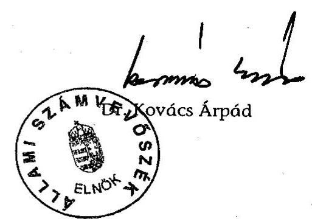

---

A hagyományos és urnás temetéshez kapcsolódó köztemetői díjak átlagos mértékének alakulása a vizsgált időszakban (Forintban)

|  sor-
szám | Település megnevezése | BM
kód | 2003.01.01. |  |  |  |  |  |  |  |  |  |  |  |  |  |  |   |
| --- | --- | --- | --- | --- | --- | --- | --- | --- | --- | --- | --- | --- | --- | --- | --- | --- | --- | --- |
|   |  |  |  |  |  |  |  |  |  |  |  |  |  |  |  |  |  |   |
|   |  |  |  |  |  |  |  |  |  |  |  |  |  |  |  |  |  |   |
|  1 | Árpás | 5 | 294 | 500 | 500 | 750 | 1000 | 1000 | 1000 | 0 | 0 | 0 | 0 | 0 | 0 | 0 | 0 | 0  |
|  2 | Bárdudvarnok | 5 | 1217 | 400 | 400 | 400 | 400 | 400 | 400 | 0 | 0 | 0 | 0 | 0 | 2000 | 2000 | 0 | 0  |
|  3 | Bénye | 5 | 1226 | 9800 | 9800 | 24800 | 24800 | 24800 | 24800 | 9300 | 9300 | 25800 | 25800 | 25800 | 25800 | 25800 | 25800 | 25800  |
|  4 | Bicske | 3 | 11496 | 0 | 0 | 0 | 0 | 0 | 0 | 0 | 0 | 0 | 0 | 0 | 0 | 0 | 0 | 0  |
|  5 | Bodajk | 4 | 4154 | 12500 | 16500 | 18750 | 18750 | 9000 | 9000 | 12500 | 16500 | 18750 | 18750 | 9000 | 9000 | 9000 | 9000 | 9000  |
|  6 | Budapest | 1 | 1726872 | 121982 | 140978 | 151086 | 174883 | 190037 | 208357 | 80473 | 90938 | 92638 | 104298 | 110917 | 120650 | 120650 | 120650 | 120650  |
|  7 | Bükkszentmárton | 5 | 380 | 0 | 0 | 0 | 0 | 0 | 0 | 0 | 0 | 0 | 0 | 0 | 0 | 0 | 0 | 0  |
|  8 | Csepreg | 3 | 3422 | 2000 | 3500 | 3500 | 3500 | 3500 | 3500 | 0 | 1000 | 1000 | 1000 | 1000 | 1000 | 1000 | 1000 | 1000  |
|  9 | Csököly | 5 | 1149 | 0 | 0 | 0 | 0 | 0 | 0 | 0 | 0 | 0 | 0 | 0 | 0 | 0 | 0 | 0  |
|  10 | Csurgó | 3 | 5788 | 16050 | 16950 | 15813 | 15813 | 16603 | 17830 | 14400 | 15200 | 13910 | 15010 | 15800 | 28322 | 28322 | 28322 | 28322  |
|  11 | Debrecen | 2 | 208235 | 15480 | 34125 | 34425 | 36825 | 38703 | 41010 | 8077 | 26065 | 26365 | 28185 | 29553 | 31665 | 31665 | 31665 | 31665  |
|  12 | Drávaszerdahely | 5 | 215 | 0 | 0 | 0 | 0 | 0 | 0 | 0 | 0 | 0 | 0 | 0 | 0 | 0 | 0 | 0  |
|  13 | Dunavecse | 4 | 4187 | 700 | 700 | 700 | 850 | 1000 | 1000 | 700 | 700 | 700 | 850 | 1000 | 1000 | 1000 | 1000 | 1000  |
|  14 | Érsekhalma | 5 | 735 | 1800 | 2400 | 2500 | 2500 | 2500 | 2500 | 1000 | 1500 | 7100 | 7100 | 7100 | 7250 | 7250 | 7250 | 7250  |
|  15 | Gécse | 5 | 1191 | 625 | 625 | 625 | 625 | 625 | 625 | 0 | 0 | 0 | 0 | 0 | 0 | 0 | 0 | 0  |
|  16 | Górbeháza | 5 | 2713 | 24000 | 23000 | 23000 | 28500 | 28500 | 28700 | 13500 | 7500 | 7500 | 12500 | 12500 | 12500 | 12500 | 12500 | 12500  |
|  17 | Gyál | 3 | 21624 | 18025 | 44500 | 44500 | 51000 | 55500 | 55500 | 10240 | 29000 | 29000 | 35500 | 40000 | 40000 | 40000 | 40000 | 40000  |
|  18 | Gyöngyös | 3 | 33320 | 8960 | 33525 | 33525 | 33525 | 47000 | 51435 | 20160 | 29675 | 29675 | 29675 | 42325 | 45666 | 45666 | 45666 | 45666  |
|  19 | Harkány | 3 | 3616 | 0 | 3360 | 3360 | 3360 | 13048 | 15988 | 0 | 2800 | 2800 | 2800 | 12208 | 14838 | 14838 | 14838 | 14838  |
|  20 | Kalocsa | 3 | 18464 | 5650 | 25050 | 25050 | 25050 | 28500 | 28500 | 7800 | 21050 | 21050 | 21050 | 21200 | 21200 | 21200 | 21200 | 21200  |
|  21 | Karmacs | 5 | 823 | 800 | 7000 | 7000 | 7000 | 7000 | 7000 | 0 | 5000 | 5000 | 5000 | 5000 | 5000 | 5000 | 5000 | 5000  |
|  22 | Kisköre | 4 | 3215 | 500 | 1500 | 1500 | 1500 | 1500 | 1700 | 0 | 0 | 0 | 0 | 0 | 0 | 0 | 0 | 0  |
|  23 | Kótaj | 5 | 4544 | 100 | 25900 | 26800 | 26800 | 27200 | 27200 | 100 | 9900 | 10800 | 10800 | 11200 | 11200 | 11200 | 11200 | 11200  |
|  24 | Köszeg | 3 | 11501 | 15000 | 16000 | 16000 | 16000 | 16000 | 16000 | 12000 | 15000 | 15000 | 15000 | 15000 | 15000 | 15000 | 15000 | 15000  |
|  25 | Levelek | 4 | 2915 | 0 | 0 | 0 | 0 | 0 | 0 | 0 | 0 | 0 | 0 | 0 | 0 | 0 | 0 | 0  |
|  26 | Lovasberény | 5 | 2724 | 0 | 0 | 0 | 0 | 0 | 0 | 0 | 0 | 0 | 0 | 0 | 0 | 0 | 0 | 0  |
|  27 | Nagykanizsa | 3 | 52733 | 25750 | 25750 | 31600 | 31600 | 36000 | 36000 | 17500 | 17500 | 22600 | 22600 | 37250 | 37250 | 37250 | 37250 | 37250  |
|  28 | Nagykáta | 3 | 12984 | 13120 | 15280 | 15280 | 15800 | 15800 | 16200 | 12810 | 15780 | 15780 | 16300 | 16300 | 16700 | 16700 | 16700 | 16700  |
|  29 | Nyíradony | 3 | 8036 | 34700 | 39100 | 44100 | 44600 | 50100 | 53600 | 20500 | 22600 | 25100 | 25600 | 28600 | 30100 | 30100 | 30100 | 30100  |
|  30 | Nyírbátor | 3 | 13823 | 1514 | 2400 | 2400 | 2400 | 2400 | 2400 | 1464 | 1900 |  |  |  |  |  |  |  |

 | 1900 | 1900 | 1900 | 1900 | 1900 | 1900 | 1900  |
|  31 | Pacsa | 4 | 1890 | 600 | 1500 | 1500 | 1500 | 10500 | 10500 | 0 | 0 | 0 | 0 | 0 | 19000 | 19000 | 19000 | 1900  |
|  32 | Pannonhalma | 3 | 3626 | 1000 | 4480 | 4480 | 4480 | 4480 | 7900 | 0 | 0 | 0 | 0 | 0 | 0 | 3300 | 3300 | 3300  |
|  33 | Szany | 4 | 2417 | 3000 | 3000 | 3000 | 3000 | 3000 | 3000 | 0 | 0 | 0 | 0 | 0 | 0 | 0 | 0 | 0  |
|  34 | Szászvár | 4 | 2740 | 1200 | 1200 | 5800 | 5800 | 5800 | 5800 | 400 | 800 | 2800 | 2800 | 2800 | 2800 | 2800 | 2800 | 2800  |

Magyarázat: 1. Az adatok az egyes temetési formákhoz kapcsolódó (sír, illetve urna) hely díjait tartalmazzák átlagáron. 2. A temetői szolgáltatások díjait ugyancsak átlagáron tartalmazzák, a hűtés díját két napra számítottuk. 3. Amennyiben az önkormányzat nem állapított meg díjat, vagy a temető nem önkormányzati tulajdon, a táblázatban "0" érték szerepel

---

# A vizsgált önkormányzatok rendeleteiben megállapított árak átlagával számított közszolgáltatási díjak változása az ellenőrzött időszakban

|  sor-
szám | Település megnevezése | BM
kód | 2003.01.01-lekosszám | Hagyományos temetés díjainak alakulása a vizsgált időszakban |  |  |  |  |  |  |  |  |  |   |
| --- | --- | --- | --- | --- | --- | --- | --- | --- | --- | --- | --- | --- | --- | --- | --- |
|   |  |  |  | 1999/2000. | 2000/2001. | 2001/2002. | 2002/2003. | 2003/2004. | 1999/2004. | 1999/2000. | 2000/2001. | 2001/2002. | 2002/2003. | 2003/2004. | 1999/2004.  |
|  1 | Árpás | 5 | 294 | 100,00\% | 150,00\% | 133,33\% | 100,00\% | 100,00\% | 200,00\% | - | - | - | - | - | -  |
|  2 | Bárdudvarnok | 5 | 1217 | 100,00\% | 100,00\% | 100,00\% | 100,00\% | 100,00\% | 100,00\% | - | - | - | - | 100,00\% | -  |
|  3 | Bénye | 5 | 1226 | 100,00\% | 253,06\% | 100,00\% | 100,00\% | 100,00\% | 253,06\% | 100,00\% | 277,42\% | 100,00\% | 100,00\% | 100,00\% | 277,42\%  |
|  4 | Bicske | 3 | 11496 | - | - | - | - | - | - | - | - | - | - | - | -  |
|  5 | Bodaik | 4 | 4154 | 132,00\% | 113,64\% | 100,00\% | 48,00\% | 100,00\% | 72,00\% | 132,00\% | 113,64\% | 100,00\% | 48,00\% | 100,00\% | 72,00\%  |
|  6 | Budapest | 1 | 1726872 | 115,57\% | 107,17\% | 115,75\% | 108,66\% | 109,64\% | 170,81\% | 113,00\% | 101,87\% | 112,59\% | 106,35\% | 108,78\% | 149,93\%  |
|  7 | Bükkszentmárton | 5 | 380 | - | - | - | - | - | - | - | - | - | - | - | -  |
|  8 | Csepreg | 3 | 3422 | 175,00\% | 100,00\% | 100,00\% | 100,00\% | 100,00\% | 175,00\% | - | 100,00\% | 100,00\% | 100,00\% | 100,00\% | -  |
|  9 | Csökóly | 5 | 1149 | - | - | - | - | - | - | - | - | - | - | - | -  |
|  10 | Csurgó | 3 | 5788 | 105,61\% | 93,29\% | 100,00\% | 105,00\% | 107,39\% | 111,09\% | 105,56\% | 91,51\% | 107,91\% | 105,26\% | 179,25\% | 196,68\%  |
|  11 | Debrecen | 2 | 208235 | 220,45\% | 100,88\% | 106,97\% | 105,10\% | 105,96\% | 264,92\% | 322,71\% | 101,15\% | 106,90\% | 104,85\% | 107,15\% | 392,04\%  |
|  12 | Drávaszerdahely | 5 | 215 | - | - | - | - | - | - | - | - | - | - | - | -  |
|  13 | Dunavecse | 4 | 4187 | 100,00\% | 100,00\% | 121,43\% | 117,65\% | 100,00\% | 142,86\% | 100,00\% | 100,00\% | 121,43\% | 117,65\% | 100,00\% | 142,86\%  |
|  14 | Ersekhalma | 5 | 735 | 133,33\% | 104,17\% | 100,00\% | 100,00\% | 100,00\% | 138,89\% | 150,00\% | 473,33\% | 100,00\% | 100,00\% | 102,11\% | 725,00\%  |
|  15 | Gécse | 5 | 1191 | 100,00\% | 100,00\% | 100,00\% | 100,00\% | 100,00\% | 100,00\% | - | - | - | - | - | -  |
|  16 | Görbeháza | 5 | 2713 | 95,83\% | 100,00\% | 123,91\% | 100,00\% | 100,70\% | 119,58\% | 55,56\% | 100,00\% | 166,67\% | 100,00\% | 100,00\% | 92,59\%  |
|  17 | Gyát | 3 | 21624 | 246,88\% | 100,00\% | 114,61\% | 108,82\% | 100,00\% | 307,91\% | 283,20\% | 100,00\% | 122,41\% | 112,68\% | 100,00\% | 390,63\%  |
|  18 | Gyöngyös | 3 | 33320 | 374,16\% | 100,00\% | 100,00\% | 140,19\% | 109,44\% | 574,05\% | 147,20\% | 100,00\% | 100,00\% | 142,63\% | 107,89\% | 226,52\%  |
|  19 | Harkány\* | 3 | 3616 | - | 100,00\% | 100,00\% | 388,33\% | 122,53\% | 475,83\% | - | 100,00\% | 100,00\% | 436,00\% | 121,54\% | 529,93\%  |
|  20 | Kalocsa | 3 | 18464 | 443,36\% | 100,00\% | 100,00\% | 113,77\% | 100,00\% | 504,42\% | 269,87\% | 100,00\% | 100,00\% | 100,71\% | 100,00\% | 271,79\%  |
|  21 | Kermacs\*\* | 5 | 823 | 875,00\% | 100,00\% | 100,00\% | 100,00\% | 100,00\% | 875,00\% | - | 100,00\% | 100,00\% | 100,00\% | 100,00\% | 100,00\%  |
|  22 | Kisköre | 4 | 3215 | 300,00\% | 100,00\% | 100,00\% | 113,33\% | 340,00\% | - | - | - | - | - | - | -  |
|  23 | Kótaj | 5 | 4544 | 25900,00\% | 103,47\% | 100,00\% | 101,49\% | 100,00\% | 27200,00\% | 9900,00\% | 109,09\% | 100,00\% | 103,70\% | 100,00\% | 11200,00\%  |
|  24 | Köszeg | 3 | 11501 | 106,67\% | 100,00\% | 100,00\% | 100,00\% | 100,00\% | 106,67\% | 125,00\% | 100,00\% | 100,00\% | 100,00\% | 100,00\% | 125,00\%  |
|  25 | Levelek | 4 | 2915 | - | - | - | - | - | - | - | - | - | - | - | -  |
|  26 | Lovasberény | 5 | 2724 | - | - | - | - | - | - | - | - | - | - | - | -  |
|  27 | Nagykanizsa | 3 | 52733 | 100,00\% | 122,72\% | 100,00\% | 113,92\% | 100,00\% | 139,81\% | 100,00\% | 129,14\% | 100,00\% | 164,82\% | 100,00\% | 212,86\%  |
|  28 | Nagykáta | 3 | 12984 | 116,46\% | 100,00\% | 103,40\% | 100,00\% | 102,53\% | 123,48\% | 123,19\% | 100,00\% | 103,30\% | 100,00\% | 102,45\% | 130,37\%  |
|  29 | Nyíradony | 3 | 8036 | 112,68\% | 112,79\% | 101,13\% | 112,33\% | 106,99\% | 154,47\% | 110,24\% | 111,06\% | 101,99\% | 111,72\% | 105,24\% | 146,83\%  |
|  30 | Nyírbátor | 3 | 13823 | 158,52\% | 100,00\% | 100,00\% | 100,00\% | 100,00\% | 158,52\% | 129,78\% | 100,00\% | 100,00\% | 100,00\% | 100,00\% | 129,78\%  |
|  31 | Pacsa | 4 | 1890 | 250,00\% | 100,00\% | 100,00\% | 700,00\% | 100,00\% | 1750,00\% | - | - | - | - | 100,00\% | -  |
|  32 | Pannonhalma | 3 | 3626 | 448,00\% | 100,00\% | 100,00\% | 100,00\% | 176,34\% | 790,00\% | - | - | - | - | - | -  |
|  33 | Szany | 4 | 2417 | 100,00\% | 100,00\% | 100,00\% | 100,00\% | 100,00\% | 100,00\% | - | - | - | - | - | -  |
|  34 | Szászvár | 4 | 2740 | 100,00\% | 483,33\% | 100,00\% | 100,00\% | 100,00\% | 483,33\% | 200,00\% | 350,00\% | 100,00\% | 100,00\% | 100,00\% | 700,00\%  |

Jelmagyarázat:

- Harkányban 1999. évben nem állapítottak meg díjakat, ezért bázisadatként 1999. évi adat helyett a 2000. évi szerepel. \*\* Kermacs önkormányzata a kolumbárium díját csak 2000-től állapította meg, ezért az 1999. évi helyett az szerepel bázis adatként. Díjszámítás elemei: 1. Az egyes temetési formák díjai a (sír, illetve urna) hely díjait tartalmazza átlagáron. ((Min.+Max)/2) 2. A helyi rendeletben előírt, kötelezően alkalmazandó temetői szolgáltatások díjait ugyancsak átlagáron tartalmazza. 3. Az elhalt hűtésének díját két napra számítottuk. (Urna temetésnél is, a hamvasztás előtti idő, ill. búcsúztatás miatt.) 4. Amennyiben az önkormányzat nem állapított meg díjat, vagy a temető nem önkormányzati tulajdon, a
 táblázatban nem szerepel érték (-).

---

## **Hagyományos sírbatemetés köztemetői díjai a vizsgált önkormányzatok legalacsonyabb 2004. évi sírhelydíjaival (Forintban)**

**(Nulla érték esetén nincs önkormányzatnak fizetendő díj a településen)**

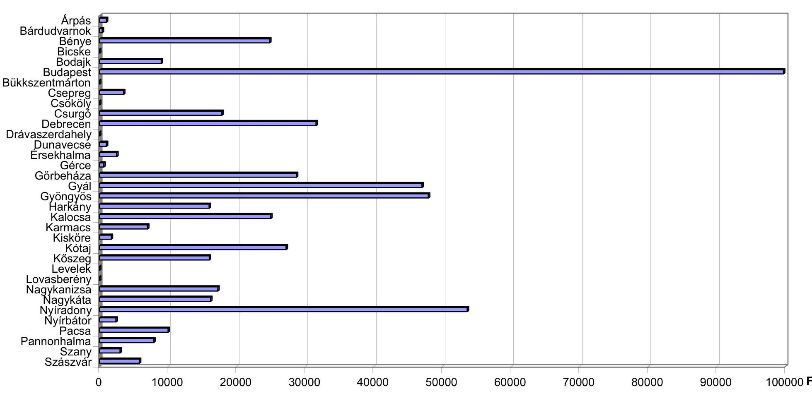

Díj elemei: - az egyes sírhely önkormányzati rendeletben előírt legalacsonyabb díja - ravatalozás rendelet szerinti díja - egyéb, kötelezően fizetendő temetői közszolgáltatási díj

---

4. számú melléklet
a V-1010-34/2004-2005. számú jelentéshez

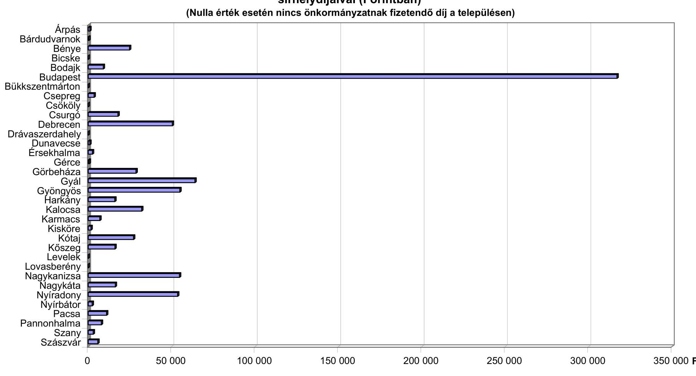

# Hagyományos sírbatemetés köztemetői díjai a vizsgált önkormányzatok legmagasabb 2004. évi sírhelydíjaival (Forintban)

(Nulla érték esetén nincs önkormányzatnak fizetendő díj a településen)

Árpás
Bárdudvarnok
Bénye
Bicske
Bodajk
Budapest
Bükkszentmárton
Cseregy
Csökölv
Csurgó
Debrecen
Drávaszerdahely
Dunavecsé
Érsekhalma
Gérce
Görbeháza
Gyál
Gyöngyös
Harkány
Kalocsa
Karmacs
Kisköre
Kótaj
Köszeg
Levelek
Lovasberény
Nagykanizsa
Nagykáta
Nyíradony
Nyírbátor
Pacsa
Pannonhalma
Szany
Szászvár

0 50 000 100 000 150 000 200 000 250 000 300 000 350 000 Ft

Díj elemei: - az egyes sírhely önkormányzati rendeletben előírt legmagasabb díja
- ravatalozás rendelet szerinti díja
- egyéb, kötelezően fizetendő temetői közszolgáltatási díj

---

5. sz. melléklet a V-1010-34/2004-2005. számú jelentéshez

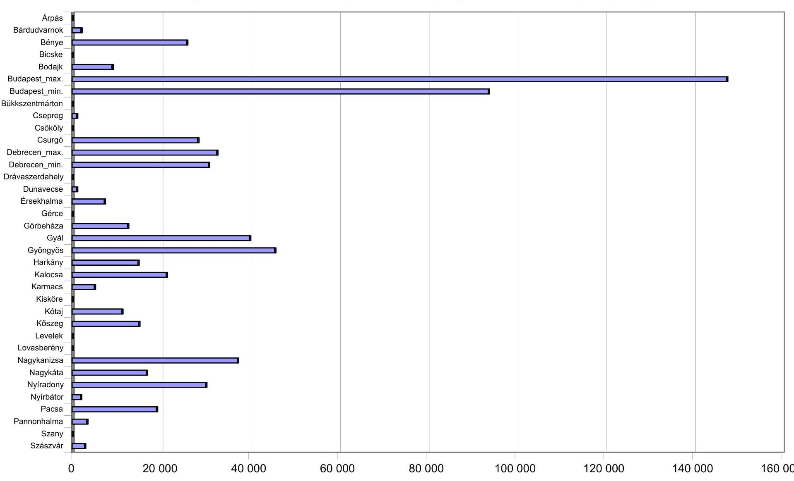

# Urnás temetés köztemetői díjai a vizsgált önkormányzatok 2004. évi kolumbárium díjaival (Forintban)

(Nulla érték esetén nincs önkormányzatnak fizetendő díj, vagy hamvasztásos temetési díj a településen)

|  Árpás |  |  |  |  |  |  |  |  |  |  |  |  |  |  |  |  |  |  |   |
| --- | --- | --- | --- | --- | --- | --- | --- | --- | --- | --- | --- | --- | --- | --- | --- | --- | --- | --- | --- |
|  Bárdudvarnok |  |  |  |  |  |  |  |  |  |  |  |  |  |  |  |  |  |  |   |
|  Bénye |  |  |  |  |  |  |  |  |  |  |  |  |  |  |  |  |  |  |   |
|  Bicske |  |  |  |  |  |  |  |  |  |  |  |  |  |  |  |  |  |  |   |
|  Bodajk |  |  |  |  |  |  |  |  |  |  |  |  |  |  |  |  |  |  |   |
|  Budapest_max. |  |  |  |  |  |  |  |  |  |  |  |  |  |  |  |  |  |  |   |
|  Budapest_min. |  |  |  |  |  |  |  |  |  |  |  |  |  |  |  |  |  |  |   |
|  Bükkszentmárton |  |  |  |  |  |  |  |  |  |  |  |  |  |  |  |  |  |  |   |
|  Csepreg |  |  |  |  |  |  |  |  |  |  |  |  |  |  |  |  |  |  |   |
|  Csökőly |  |  |  |  |  |  |  |  |  |  |  |  |  |  |  |  |  |  |   |
|  Csurgó |  |  |  |  |  |  |  |  |  |  |  |  |  |  |  |  |  |  |   |
|  Debrecen_max. |  |  |  |  |  |  |  |  |  |  |  |  |  |  |  |  |  |  |   |
|  Debrecen_min. |  |  |  |  |  |  |  |  |  |  |  |  |  |  |  |  |  |  |   |
|  Drávaszerdahely |  |  |  |  |  |  |  |  |  |  |  |  |  |  |  |  |  |  |   |
|  Dunavecse |  |  |  |  |  |  |  |  |  |  |  |  |  |  |  |  |  |  |   |
|  Érsekhalma |  |  |  |  |  |  |  |  |  |  |  |  |  |  |  |  |  |  |   |
|  Gérce |  |  |  |  |  |  |  |  |  |  |  |  |  |  |  |  |  |  |   |
|  Görbeháza |  |  |  |  |  |  |  |  |  |  |  |  |  |  |  |  |  |  |   |
|  Gyál |  |  |  |  |  |  |  |  |  |  |  |  |  |  |  |  |  |  |   |
|  Gyöngyös |  |  |  |  |  |  |  |  |  |  |  |  |  |  |  |  |  |  |   |
|  Harkány |  |  |  |  |  |  |  |  |  |  |  |  |  |  |  |  |  |  |   |
|  Kalocsa |  |  |  |  |  |  |  |  |  |  |  |  |  |  |  |  |  |  |   |
|  Karmacs |  |  |  |  |  |  |  |  |  |  |  |  |  |  |  |  |  |  |   |
|  Kisköre |  |  |  |  |  |  |  |  |  |  |  |  |  |  |  |  |  |  |   |
|  Kötaj |  |  |  |  |  |  |  |  |  |  |  |  |  |  |  |  |  |  |   |
|  Köszeg |  |  |  |  |  |  |  |  |  |  |  |  |  |  |  |  |  |  |   |
|  Levelek |  |  |  |  |  |  |  |  |  |  |  |  |  |  |  |  |  |  |   |
|  Lovasberény |  |  |  |  |  |  |  |  |  |  |  |  |  |  |  |  |  |  |   |
|  Nagykanizsa |  |  |  |  |  |  |  |  |  |  |  |  |  |  |  |  |  |  |   |
|  Nagykáta |  |  |  |  |  |  |  |  |  |  |  |  |  |  |  |  |  |  |   |
|  Nyíradony |  |  |  |  |  |  |  |  |  |  |  |  |  |  |  |  |  |  |   |
|  Nyírbátor |  |  |  |  |  |  |  |  |  |  |  |  |  |  |  |  |  |  |   |
|  Pacsa |  |  |  |  |  |  |  |  |  |  |  |  |  |  |  |  |  |  |   |
|  Pannonhalma |  |  |  |  |  |  |  |  |  |  |  |  |  |  |  |  |  |  |  

 |
|  Szany |  |  |  |  |  |  |  |  |  |  |  |  |  |  |  |  |  |  |   |
|  Szászvár |  |  |  |  |  |  |  |  |  |  |  |  |  |  |  |  |  |  |   |

---

Az önkormányzatok köztemető-fenntartással összefüggő kiadásai, bevételei, azok egyenlege a vizsgált időszakban (E Ft-ban) A lakosság, a bevételek, illetve a kiadások megoszlása a vizsgált településeknél.

|  Sorszám | Település megnevezése | BM
kód | 2003.01.01-i lakosság |  | Vizsgált évek bevételeinek alakulása |  |  | $\begin{gathered} \text { Bev.meg- } \ \text { oszlása } \end{gathered}$ | Vizsgált évek kiadásainak alakulása |  |  |  | Kiad. meg-
oszlása | Ered-
mény | Bevétel/kiadás (\%)  |
| --- | --- | --- | --- | --- | --- | --- | --- | --- | --- | --- | --- | --- | --- | --- | --- |
|   |  |  | Száma | Aránya | Tem. hely | Szolgáltatás | Együtt |  | Dologi | Személyi | Járulékok | Együtt |  |  |   |
|  1 | Árpás | 5 | 294 | 0,01\% | 0 | 14 | 14 | 0,00\% | 648 | 0 | 0 | 648 | 0,01\% | $-634$ | 2,16\%  |
|  2 | Bárdudvarnok | 5 | 1217 | 0,06\% | 0 | 0 | 0 | 0,00\% | 0 | 0 | 0 | 0 | 0,00\% | 0 | -  |
|  3 | Bénye | 5 | 1226 | 0,06\% | 1706 | 285 | 1991 | 0,04\% | 114 | 875 | 340 | 1329 | 0,03\% | 662 | 149,81\%  |
|  4 | Bicske | 3 | 11496 | 0,53\% | 0 | 0 | 0 | 0,00\% | 2245 | 0 | 0 | 2245 | 0,04\% | $-2245$ | 0,00\%  |
|  5 | Bodajk | 4 | 4154 | 0,19\% | 2440 | 45 | 2485 | 0,05\% | 807 | 0 | 0 | 807 | 0,02\% | 1678 | 307,93\%  |
|  6 | Budapest | 1 | 1726872 | 79,42\% | 1927305 | 2410285 | 4337590 | 89,13\% | 2931568 | 949126 | 290202 | 4170896 | 83,25\% | 166694 | 104,00\%  |
|  7 | Bükkszentmárton | 5 | 380 | 0,02\% | 0 | 0 | 0 | 0,00\% | 0 | 0 | 0 | 0 | 0,00\% | 0 | -  |
|  8 | Csepreg | 3 | 3422 | 0,16\% | 136 | 611 | 747 | 0,02\% | 5384 | 960 | 266 | 6610 | 0,13\% | $-5863$ | 11,30\%  |
|  9 | Csököly | 5 | 1149 | 0,05\% | 0 | 0 | 0 | 0,00\% | 983 | 0 | 0 | 983 | 0,02\% | $-983$ | 0,00\%  |
|  10 | Csurgó | 3 | 5788 | 0,27\% | 3721 | 391 | 4112 | 0,08\% | 541 | 2326 | 1002 | 3869 | 0,08\% | 243 | 106,29\%  |
|  11 | Debrecen | 2 | 208235 | 9,58\% | 203608 | 98721 | 302329 | 6,21\% | 431468 | 47834 | 18431 | 497733 | 9,93\% | $-195404$ | 60,74\%  |
|  12 | Drávaszerdahely | 5 | 215 | 0,01\% | 0 | 0 | 0 | 0,00\% | 0 | 0 | 0 | 0 | 0,00\% | 0 | -  |
|  13 | Dunavecse | 4 | 4187 | 0,19\% | 869 | 2745 | 3614 | 0,07\% | 14965 | 4410 | 1919 | 21294 | 0,43\% | $-17680$ | 16,97\%  |
|  14 | Érsekalma | 5 | 735 | 0,03\% | 47 | 56 | 103 | 0,00\% | 167 | 0 | 0 | 167 | 0,00\% | $-64$ | 61,68\%  |
|  15 | Gérce | 5 | 1191 | 0,05\% | 0 | 40 | 40 | 0,00\% | 975 | 0 | 0 | 975 | 0,02\% | $-935$ | 4,10\%  |
|  16 | Görbeháza | 5 | 2713 | 0,12\% | 1487 | 397 | 1884 | 0,04\% | 4102 | 2318 | 923 | 7343 | 0,15\% | $-5460$ | 25,65\%  |
|  17 | Gyál | 3 | 21624 | 0,99\% | 17377 | 9844 | 27221 | 0,56\% | 12448 | 8432 | 3238 | 24118 | 0,48\% | 3103 | 112,87\%  |
|  18 | Gyöngyös | 3 | 33320 | 1,53\% | 6866 | 35886 | 42752 | 0,88\% | 42739 | 21248 | 7689 | 71676 | 1,43\% | $-28924$ | 59,65\%  |
|  19 | Harkány | 3 | 3616 | 0,17\% | 202 | 218 | 420 | 0,01\% | 2685 | 0 | 0 | 2685 | 0,05\% | $-2265$ | 15,66\%  |
|  20 | Kalocsa | 3 | 18464 | 0,85\% | 9806 | 12495 | 22301 | 0,46\% | 22497 | 22671 | 8569 | 53737 | 1,07\% | $-31436$ | 41,50\%  |
|  21 | Karmacs | 5 | 823 | 0,04\% | 7 | 106 | 113 | 0,00\% | 1224 | 254 | 88 | 1566 | 0,03\% | $-1453$ | 7,22\%  |
|  22 | Kisköre | 4 | 3215 | 0,15\% | 0 | 365 | 365 | 0,01\% | 6711 | 0 | 0 | 6711 | 0,13\% | $-6346$ | 5,44\%  |
|  23 | Kótaj | 5 | 4544 | 0,21\% | 36 | 169 | 205 | 0,00\% | 4870 | 0 | 0 | 4870 | 0,10\% | $-4665$ | 4,21\%  |
|  24 | Köszeg | 3 | 11501 | 0,53\% | 0 | 2568 | 2568 | 0,05\% | 9113 | 416 | 182 | 9711 | 0,19\% | $-7143$ | 26,44\%  |
|  25 | Levelek | 4 | 2915 | 0,13\% | 0 | 0 | 0 | 0,00\% | 2096 | 0 | 0 | 2096 | 0,04\% | $-2096$ | 0,00\%  |
|  26 | Lovasberény | 5 | 2724 | 0,13\% | 0 | 0 | 0 | 0,00\% | 565 | 0 | 0 | 565 | 0,01\% | $-565$ | 0,00\%  |
|  27 | Nagykanizsa | 3 | 52733 | 2,43\% | 34034 | 65316 | 99350 | 2,04\% | 48813 | 20882 | 8831 | 78526 | 1,57\% | 20824 | 126,52\%  |
|  28 | Nagykáta | 3 | 12984 | 0,60\% | 3463 | 5925 | 9388 | 0,19\% | 3024 | 7385 | 2743 | 13152 | 0,26\% | $-3764$ | 71,38\%  |
|  29 | Nyíradony | 3 | 8036 | 0,37\% | 2294 | 501 | 2795 | 0,06\% | 3242 | 0 | 0 | 3242 | 0,06\% | $-447$ | 86,22\%  |
|  30 | Nyírbátor | 3 | 13823 | 0,64\% | 0 | 912 | 912 | 0,02\% | 0 | 0 | 0 | 0 | 0,00\% | 912 | -  |
|  31 | Pacsa | 4 | 1890 | 0,09\% | 111 | 131 | 242 | 0,00\% | 3482 | 0 | 0 | 3482 | 0,07\% | $-3240$ | 6,95\%  |
|  32 | Pannonhalma | 3 | 3626 | 0,17\% | 0 | 1820 | 1820 | 0,04\% | 3351 | 3961 | 1554 | 8866 | 0,18\% | $-7046$ | 20,53\%  |
|  33 | Szany | 4 | 2417 | 0,11\% | 0 | 792 | 792 | 0,02\% | 2933 | 102 | 14 | 3049 | 0,06\% | $-2257$ | 25,98\%  |
|  34 | Szászvár | 4 | 2740 | 0,13\% | 294 | 358 | 652 | 0,01\% | 6317 | 598 | 257 | 7172 | 0,14\% | $-6520$ | 9,09\%  |
|  Összes település együtt |  |  | 2174269 | 100,00\% | 2215809 | 2650997 | 4866806 | 100,00\% | 3570077 | 1093798 | 346248 | 5010123 | 100,00\% | $-143317$ | 97,14\%  |

---

#### **Ft/négyzetméter**

**A vizsgált települések temetőinek egy négyzetméterére jutó köztemető-fenntartási kiadások (Ft/négyzetméter)**

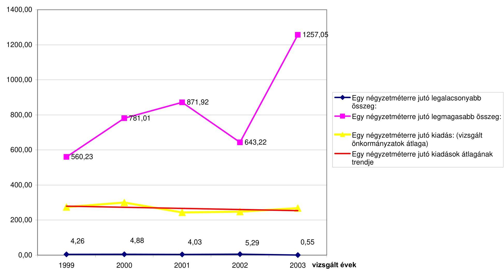

---

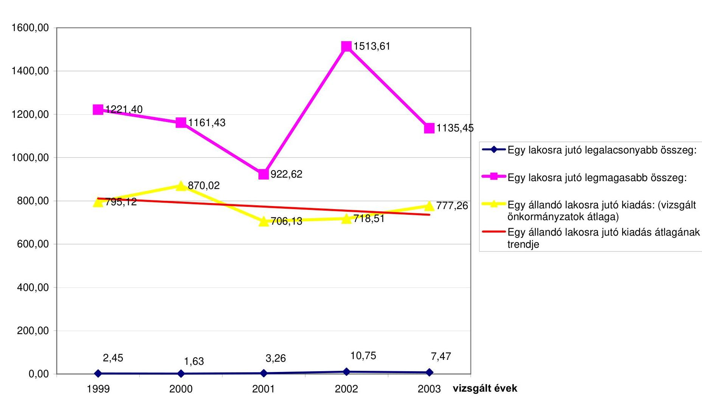

# A vizsgált települések egy állandó lakosára jutó köztemető-fenntartási kiadások (Ft/fő)

|  Ft/lakos | 2000 | 2001 | 2002 | 2003 | 2004 | 2005 | 2006 | 2007 | 2008 | 2009 | 2010 | 2011 | 2012 | 2013 | 2014 | 2015 | 2016 | 2017 | 2018 | 2019 | 2020  |
| --- | --- | --- | --- | --- | --- | --- | --- | --- | --- | --- | --- | --- | --- | --- | --- | --- | --- | --- | --- | --- | --- | --- |
|  Egy lakosra jutó legalacsonyabb összeg: |  |  |  |  |  |  |  |  |  |  |  |  |  |  |  |  |  |  |  |  |  |   |
|  Egy lakosra jutó legmagasabb összeg: |  |  |  |  |  |  |  |  |  |  |  |  |  |  |  |  |  |  |  |  |  |   |

 |  |  |  |  |  |  |  |  |  |  |  |  |  |  |  |  |  |   |
|  Egy állandó lakosra jutó kiadás (vizsgált önkormányzatok átlaga) |  |  |  |  |  |  |  |  |  |  |  |  |  |  |  |  |  |  |  |  |  |   |
|  Egy állandó lakosra jutó kiadás átlagának trendje |  |  |  |  |  |  |  |  |  |  |  |  |  |  |  |  |  |  |  |  |  |   |

---

9. számú melléklet
a V-1010-34/2004-2005. számú jelentéshez

A köztemető-fenntartás bevételei és kiadásai a vizsgált időszakban településtípusonként
(Budapest esetében csak a 2001-2003. évek adataival)

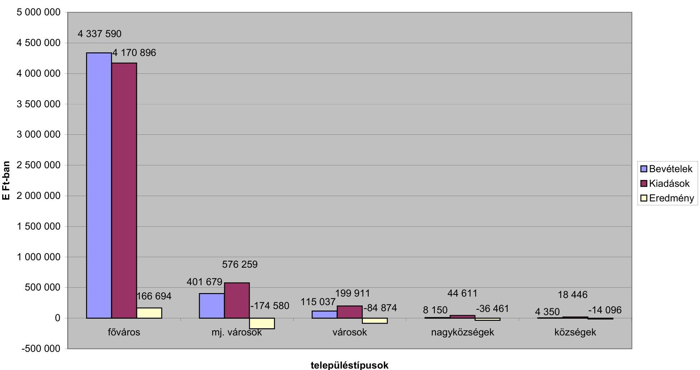

településtípusok

---

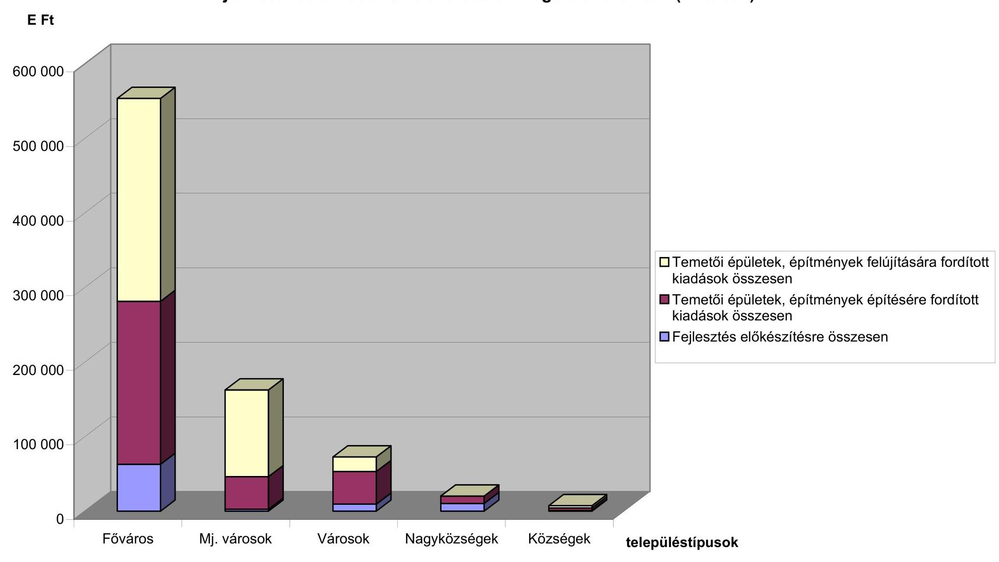

# **Fejlesztési célú kiadások alakulása a vizsgált időszakban (E Ft-ban)**

|  Temetői épületek, építmények felújítására fordított kiadások összesen |  |  |  |  |  |  |  |  |  |  |  |  |  |  |  |  |  |  |  |  |  |  |  |  |  |  |  |  |  |  |  |  |  |  |  |  |  |  |  |  |  |  |  |  |  |  |  |  |  |  |  |  |  |  |  |  |  |  |  |  |  |  |  |  |  |  |  |  |  |  |  |  |  |  |  |  |  |  |  |  |  |  |  |  |  |  |  |  |  |  |  |  |  |  |  |  |  |  |  |  | 

---

11. számú melléklet
a V-1010-34/2004-2005. számú jelentéshez

A fejlesztési célú kiadások megoszlása településtípusonként

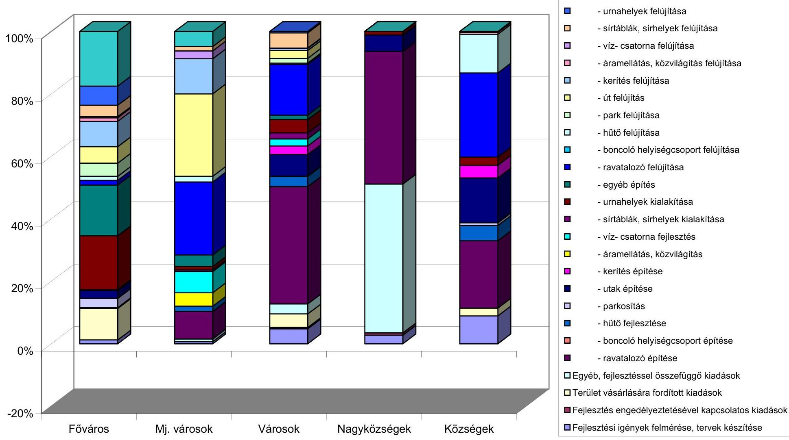

---

# Ellenőrzött önkormányzatok 

| Budapest | Fővárosi Önkormányzat |
| :--: | :--: |
| Baranya megye | Drávaszerdahely   Harkány   Szászvár |
| Bács-Kiskun megye | Dunavecse   Érsekhalma   Kalocsa |
| Fejér megye | Bicske   Bodajk   Lovasberény |
| Győr-Moson-Sopron megye | Árpás   Pannonhalma   Szany |
| Hajdú-Bihar megye | Debrecen   Görbeháza   Nyíradony |
| Heves megye | Bükkszentmárton   Gyöngyös   Kisköre |
| Pest megye | Bénye   Gyál   Nagykáta |
| Somogy megye | Bárdudvarnok   Csököly   Csurgó |
| Szabolcs-Szatmár-Bereg megye | Kótaj   Levelek   Nyírbátor |
| Vas megye | Csepreg   Gérce   Kőszeg |
| Zala megye | Karmacs   Nagykanizsa   Pacsa |

---

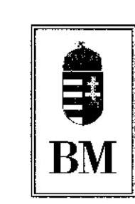

BELÜGYMINISZTER

1-a-1/3/2005.
304-39/22/2005.

Dr. Kovács Árpád úrnak, elnök
Állami Számvevőszék

## Budapest

## Tisztelt Elnök Úr!

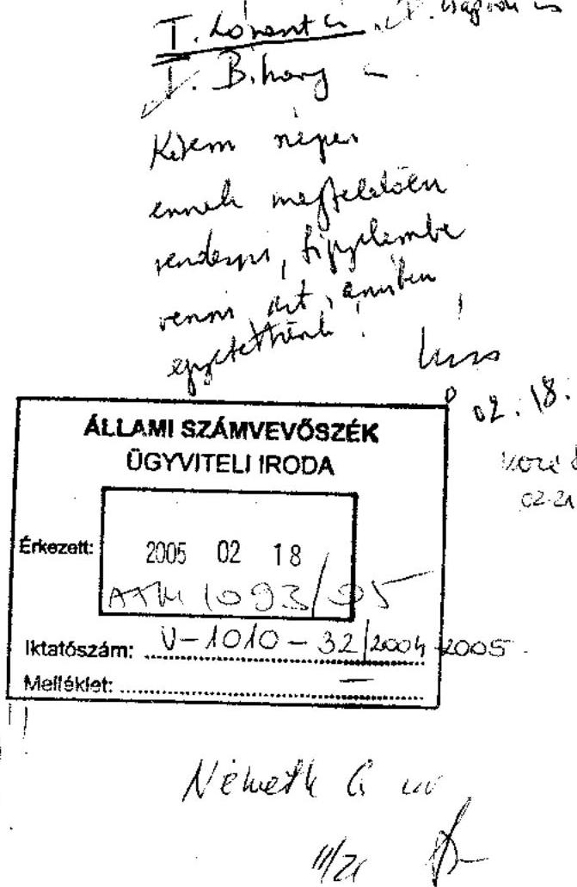

Megköszönöm a köztemetők fenntartásának ellenőrzéséről készült jelentést.
Az ellenőrzés megállapításait áttekintettem, azt rendkívül hasznosnak tartom, mivel eredményei alátámasztották a minisztérium temetőkkel, temető-fenntartással kapcsolatos tapasztalatait. A vizsgálat lefolytatása különösen időszerű volt, mivel - mint ahogyan arról az előzetes egyeztetések során bizonyára értesült - a temetőkről és a temetkezésről szóló 1999. évi XLIII. törvény (továbbiakban Tt.) és az annak végrehajtásáról szóló 145/1999. (X.1.) Korm. rendelet (továbbiakban: Tt. Vhr.) módosítása folyamatban van. Az előzetes egyeztetések eredményeként lehetőség nyílt arra, hogy egyes észrevételeikre már a jogszabály módosításának jelenlegi szakaszában megoldást találjunk.

A tervezetben kifejtett javaslataikat illetően a következő észrevételeket teszem:

Az 1. sz. javaslattal kapcsolatban: az önkormányzatokról szóló 1990. évi LXV. tv. (továbbiakban: Ötv.), 1.§ (5) bekezdése alapján az önkormányzat kötelező feladatait külön törvény állapíthatja meg, így a kegyeleti közszolgáltatások tárgyában a temetőkről és a temetkezésről szóló 1999. évi XLIII. törvény (továbbiakban Tt.). Az Ötv. 8.§ (1) bekezdése határozza meg azokat a feladatköröket, amelyeket a települési önkormányzat a helyi közszolgáltatások keretén belül ellát. E bekezdés a törvényalkotó számára állapít meg „korlátot", példálódzó jelleggel sorolja fel azokat a helyi közügyeket, amelyek az önkormányzat feladat- és hatáskörébe tartoznak. Az

---

Ötv. 8.§ (4) bekezdésében foglalt feladatkörök részletes tartalmát is külön törvények határozzák meg.

Az Ötv. 63/A.§-a sorolja fel azokat a feladatköröket, amelyeket a Fővárosi Önkormányzat lát el. A szóban forgó paragrafus előírása a főváros önkormányzati rendszerén belüli feladatmegosztást tartalmazza, azaz meghatározza azokat a település önkormányzatokat terhelő feladatokat, amelyeket a Főváros Önkormányzatának kell ellátni.

Az előzőek alapján az Ötv. 8.§-ában, illetve a 63/A.§-ában meghatározott feladatkörök további részletezését külön törvények szabályozhatják. Így a jogalkalmazás során álláspontom szerint nem okoz problémát a két törvény eltérő szóhasználata.

Az ÁSZ javaslatai hasznosítása érdekében azonban az Ötv. átfogó vizsgálata kapcsán megvizsgáljuk annak lehetőségét, hogy a megfogalmazott javaslatok hogyan építhetők be az Ötv. fenti rendelkezéseibe, és a két jogszabály fogalomhasználatának összehangolására hogyan nyílik mód.

A 2. sz. javaslat a), illetve b) pontjában megfogalmazott felvetés a Tt. 3.§ b) pontjának módosításával oldható meg. A Tt. 3.§ b) pontjának módosítására képviselői módosító javaslat érkezett. E szerint:
„köztemető: az önkormányzat tulajdonában lévő temető, illetőleg a nem önkormányzati tulajdonban lévő temető, vagy a temetőnek az a része, amelyben az önkormányzat a köztemető fenntartására vonatkozó kötelezettségét a temető tulajdonosával kötött megállapodás alapján teljesíti,"

Az indítvány támogatását javasoltuk a Kormánynak, mivel az megoldást nyújt a felvetéseire. Az önkormányzatnak megadja a lehetőséget, hogy amennyiben nincs tulajdonában köztemető, a temetőfenntartási, kegyeleti közszolgáltatási feladatokat ellátási szerződés keretében is teljesíthesse.

Egyetértünk továbbá a c) pontban megfogalmazott javaslat szándékával is. Feltétlenül támogatjuk, hogy a helyi önkormányzatok tulajdonában levő temetők - az önkormányzat kötelező feladatát szolgáló vagyonaként - a törzsvagyon részét képezzék. Mint ahogyan azt az egyeztetések során is jeleztük, az Ön által felvetett javaslatok közül szakmailag a köztemetők „korlátozottan forgalomképes, és csak kegyeleti közszolgáltatás céljára hasznosítható" besorolását támogatjuk.

A 2. sz. javaslat d) pontjában javasolják a Tt. 41.§ (3) bekezdésének módosítását olyan módon, hogy az a 40.§ (1) bekezdésével összhangban csak a köztemetőkre vonatkozzon. A Tt. módosítása során ez a probléma már felvetődött, annak megoldására képviselői módosító javaslat érkezett, amelyet támogatni javasolunk.

---

Az előzetes egyeztetés során többször felmerült a javaslatának 3. pontjában megfogalmazott aggálya, amelyben megfontolásra ajánlja, hogy a temető méretétől függetlenül indokolt-e a temetői létesítmények és közművek, valamint az üzemeltetéssel összefüggő előírások teljes körű teljesítésének megkövetelése. Hangsúlyozzuk, hogy ezen előírások azokat a minimális feltételeket határozzák meg, amelyek a temető közegészségügyi, környezetvédelmi szempontból megnyugtató működését garantálják, és biztosítják a kegyeleti méltóságot.

Az infrastruktúra kiépítése elengedhetetlen feltétele a kulturált kegyeleti joggyakorlásnak, sem a temető nagysága, sem a látogatók száma ezt nem befolyásolhatja.

A Tt. végrehajtásáról szóló 145/1999. (X.1.) Korm. rendelet (továbbiakban: Vhr.) a temetői létesítmények szakmai minimumfeltételeit határozza meg, egyéb részletekre nem terjed ki. Ez szándékos. A jogszabály az önkormányzatoknak így biztosítja, hogy az építményeket és közműveket gazdasági erejüknek megfelelő színvonalon biztosíthassák.

Meg kell jegyeznem, hogy mind a hatályos Tt. kialakításakor, mind annak módosítása során konzultációt folytattunk az önkormányzatok, továbbá a szakma érdekképviseleti szerveivel, és minden szereplő egyetértett ezen minimumfeltételek meghatározásával, bár annak költségvetési forrását hiányolták.

A probléma megoldásának érdekében a jelenleg folyamatban levő törvénymódosítás (T-12720 számú törvényjavaslat a temetőkről és a temetkezésről szóló 1999. évi XLIII. törvény módosításáról) részét képezi a Tt.-ben foglalt infrastruktúra határidejének két lépésben (2006, illetve 2009. december 31-ig) történő meghosszabbítása. (Tájékoztatom, hogy a Tt. módosítása során az Igazságügyi Minisztérium álláspontja szerint már maga a határidő utólagos meghosszabbítása is aggályos, mivel az „a jogalkotás tekintélyének, valamint a társadalom részéről a jogszabályok kötelező erejébe, követendő voltába és következetességébe vetett bizalomnak a megingatására" alkalmas.)

A jelentés 4. pontjában azt javasolja, hogy a jogszabályban előírt temetői létesítmények és közművek megvalósításához pályázati úton elérhető, nevesített központi költségvetési forrás kerüljön biztosításra. Megemlítve, hogy e célra - bár nem nevesítve - jelenleg is pályázhattak a helyi önkormányzatok a megyei területfejlesztési tanácsoknál a helyi önkormányzatok területi kiegyenlítést szolgáló fejlesztési célú támogatásra, illetőleg céljellegű decentralizált támogatásra, egyetértünk, hogy a központi költségvetés nevesített fejlesztési támogatást biztosítson a feladatra. Ezért a 2006. évi központi költségvetés tervezése során - az előző évekhez hasonlóan - kezdeményezni fogjuk ilyen célú támogatási rendszer bevezetését.

---

Egyetértünk az 5. pont azon javaslatával is, hogy a Belügyminisztérium a fővárosi/megyei közigazgatási hivatalok vezetői útján hívja fel az önkormányzatok figyelmét a köztemetőkkel kapcsolatos feladataik teljesítésére. Megfontolandónak tartom azonban, hogy e felhívásra az érintett jogszabályok hatályba lépése után kerüljön sor.
Ennek kapcsán tervezzük, hogy az ÁSZ jelentésében megfogalmazottak tárgyalására, továbbá a jogszabály-változások ismertetésére, magyarázatára egy írásbeli útmutatót készítünk, amely segítséget nyújt a temetőtulajdonosok és a temetőfenntartók számára munkájuk szakszerű ellátásához.

Kérdésére válaszolva javasolom, hogy Helyettes Államtitkár Úr észrevételei a végleges jelentésben ne szerepeljenek.
A megküldött jelentés jelzett részei megítélésünk szerint pontatlanságokat tartalmaznak. A jelentés 13. oldalán feltüntetett, az egyház és önkormányzat közötti megállapodásra irányuló módosítás támogatásával egyetértettünk, arról az egyeztetés során már tájékoztatást adtunk.
Felhívom a figyelmét arra is, hogy a jelentés 15. oldalán Helyettes Államtitkár Úr észrevételeként feltüntetett vélemény nem esik egybe az egyeztetés során írt legutolsó, január 27-i keltezésű levelünkben foglaltakkal.

Budapest, 2005. február 15.
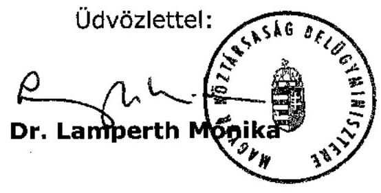

---

# Állami Számvevőszék 

## Dr. Lamperth Mónika úrhölgy

belügyminiszter

## Belügyminisztérium

## Budapest

## Tisztelt Belügyminiszter Úrhölgy!

Köszönettel megkaptam a köztemetők fenntartásának ellenőrzéséről készült jelentésünkre adott észrevételét. Annak különösen örülök, hogy a temetőkről és a temetkezésről szóló 1999. évi XLIII. törvény (továbbiakban Tt.) folyamatban lévő módosítása során - az előzetes egyeztetések eredményeként - javaslataink egy részének hasznosítását már most megoldhatónak tartja.

Az 1. sz. javaslatunk a Tt. és az Ötv. közötti összhang megteremtését kívánja elérni. A javaslat nem olyan jellegű, ami csak az Ötv. átfogó felülvizsgálata keretében valósítható meg. Ezért kérem, hogy a javaslatok realizálására készülő intézkedési tervben a törvénymódosítás kezdeményezésének határidejét jelölje meg.

Szeretnénk jelezni, hogy a 2. sz. javaslat a.) és b.) pontja megvalósítására a Tt. 3. § b.) pontjára beadott - levelében idézett - képviselői módosító indítvány csak részben alkalmas. A nem önkormányzati tulajdonban lévő temető egy részében ugyanis az önkormányzat nem tudja teljesíteni a Tt. 13. § (1) bekezdésében előírt
 temető-fenntartási kötelezettségét. A temető tulajdonosával kötött megállapodás lehetővé tételéhez pedig a Tt. 5. § (3) bekezdését is módosítani kell. Ennek hiányában a törvényi előírások közötti összhang nem biztosítható.

A 3. sz. javaslat esetében az észrevételében foglaltak ellenére szükségesnek tartjuk, hogy az egy településen működő temetők számától, méretétől, a településen, illetve más településen lévő temetőtől való távolságtól függően legyen meghatározva a temetők tulajdonosai számára a Tt. 9. § (1) bekezdésében előírt temetői létesítmények és közművek megépítési kötelezettsége.

Az Ön által említett törvénymódosítás, mely kettő, illetve öt évvel hosszabbítaná meg a határidőket, formai és nem tartalmi megoldása az ÁSZ által jelzett valós problémának.

A halottak ideiglenes elhelyezésére szolgáló tároló és hűtő létesítését a boncolóhelyiség-csoport biztosítási módjához hasonlóan - a gazdaságosságot és elérhetőséget figyelembe véve - lenne célszerű megkövetelni. Egymáshoz közeli temetőkben szükségtelen párhuzamos kapacitások biztosítása. A községekben lévő temetőkben a közegészségügyi szempontból megfelelően kialakított és üzemeltetett illemhely létesítésére az igénybevételhez viszonyítva csak aránytalanul nagy költségek mellett biztosítható. Tekintettel arra, hogy a Tt. végrehajtásáról szóló 145/1999. (X. 1.) Korm. rendelet nem határozza meg az illemhely biztosításának követelményét, ma egy fővárosi nagy temetőre és a vizsgálati körben szereplő 215 lakosú Drávaszerdahelyen lévő egyházi tulajdonú kis temetőre ugyanaz a meghatározatlan tartalmú előírás vonatkozik.

Az 5. sz. javaslatunk megvalósításával nem indokolt megvárni a Tt. módosítás jelenleg nem ismert hatálybalépésének időpontját, a javaslat nem érinti a Tt. módosítani tervezett előírásait.

A Helyettes Államtitkár Úr január 27-i keltezésű levele azt követően érkezett, hogy a jelentést Önnek megküldtük. Így az abban foglaltak figyelembevételére csak most volt lehetőségünk.

Egyidejűleg megköszönöm Miniszter Úr hölgynek és munkatársainak az ellenőrzésünk eredményes lefolytatásához nyújtott segítségét.

Budapest, 2005. február " "

Tisztelettel:

Dr. Kovács Árpád
