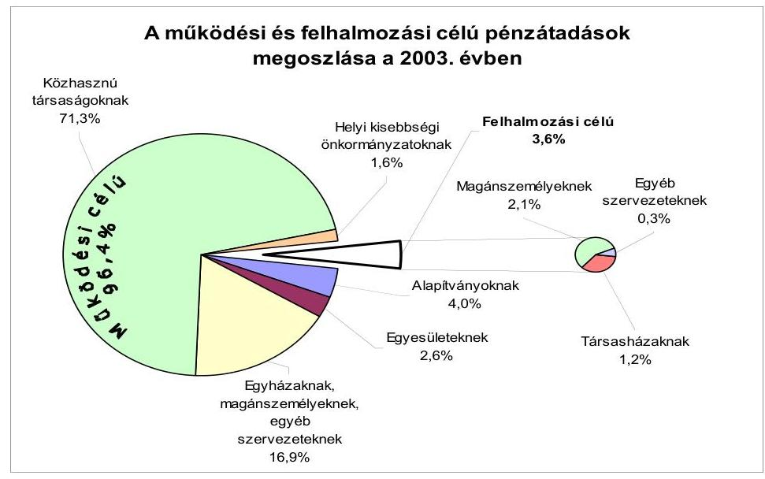
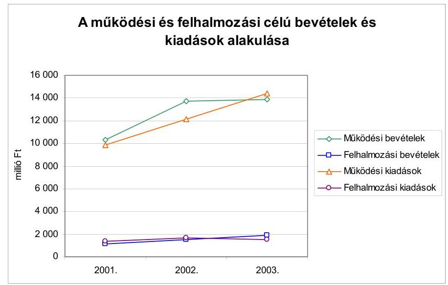
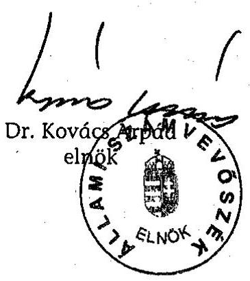
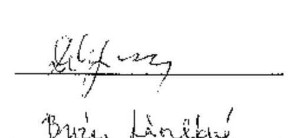
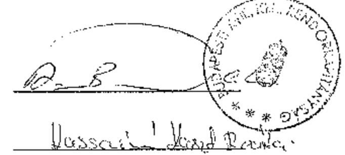
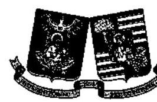

# JELENTÉS 

a Budapest Főváros XVIII. kerület Pestszentlőrinc-Pestszentimre Önkormányzata gazdálkodásának átfogó ellenőrzéséről

---

3. Önkormányzati és Területi Ellenőrzési Igazgatóság
3.3 Átfogó Ellenőrzések Főcsoport

Iktatószám: V-1002-4/26/15/2004.
Témaszám: 692
Vizsgálat-azonosító szám: V0175

# Az ellenőrzést felügyelte: 

Dr. Lóránt Zoltán
főigazgató
Az ellenőrzés végrehajtásáért felelős:
Dr. Sepsey Tamás
főigazgató-helyettes
Az ellenőrzést vezette:
Csecserits Imréné
főcsoportfőnök-helyettes

## Az ellenőrzést végezték:

## Endrődy Péterné

számvevő
Dér Géza
számvevő
Dr. Körös István
számvevő tanácsos

A témához kapcsolódó - az elmúlt négy évben készített - számvevőszéki jelentések:
címe
sorszáma
Jelentés a helyi és a helyi kisebbségi önkormányzatok átfogó 0113 ellenőrzéséről
Jelentés a Magyar Köztársaság 2001. évi költségvetése 0232
végrehajtásának ellenőrzéséről

---

# TARTALOMJEGYZÉK 

BEVEZETÉS ..... 5
I. ÖSSZEGZŐ MEGÁLLAPÍTÁSOK, KÖVETKEZTETÉSEK, JAVASLATOK ..... 7
II. RÉSZLETES MEGÁLLAPÍTÁSOK ..... 16

1. A költségvetés tervezésének, végrehajtásának, az Önkormányzat vagyongazdálkodásának és a zárszámadás elkészítésének szabályszerűsége ..... 16
1.1. A költségvetési rendelet jóváhagyásának, módosításának, az előirányzatok nyilvántartásának és betartásának szabályszerűsége ..... 16
1.2. A gazdálkodás szabályozottsága, a bizonylati rend és fegyelem szabályszerűsége ..... 21
1.3. A pénzügyi-számviteli feladatok ellátásának informatikai támogatottsága ..... 28
1.4. Az önkormányzati vagyon nyilvántartása, számbavétele ..... 28
1.5. A vagyonnal való gazdálkodás szabályszerűsége, célszerűsége, nyilvánossága ..... 30
1.6. A céljelleggel nyújtott támogatások szabályszerűsége ..... 36
1.7. A közbeszerzési eljárások szabályszerűsége ..... 39
1.8. A zárszámadási kötelezettség teljesítésének szabályszerűsége ..... 42
1.9. A Polgármesteri hivatal helyi kisebbségi önkormányzatok gazdálkodását segítő tevékenysége ..... 44
2. Az önkormányzati feladatok és a rendelkezésre álló források összhangja ..... 46
2.1. A feladatok meghatározása és szervezeti keretei ..... 46
2.2. A költségvetés egyensúlyának helyzete ..... 48
2.3. A feladatok finanszírozása ..... 52
3. A belső irányítási, ellenőrzési rendszer működésének értékelése ..... 55
3.1. Az ellenőrzési rendszer kialakítása, működése ..... 55
3.2. A könyvvizsgálati kötelezettség teljesítése ..... 58
3.3. A korábbi számvevőszéki ellenőrzések javaslatainak hasznosulása ..... 59

---

# MELLÉKLETEK 

1. számú Az önkormányzati vagyon nagyságának alakulása (1 oldal)
2. számú Az Önkormányzat 2003. évi bevételeinek és kiadásainak alakulása (1 oldal)
3. számú Az Önkormányzat gazdálkodását meghatározó adatok, mutatószámok (1 oldal)
4. számú Egyes önkormányzati feladatok finanszírozása (1 oldal)
5. számú Helyszíni ellenőrzési jegyzőkönyv (2 oldal)
6. számú Dr. Mester László polgármester úr észrevétele (1 oldal)

---

# RÖVIDÍTÉSEK JEGYZÉKE 

Ötv.
Áht.
Ámr.
Kbt.
Htv.

Ksztv.
Nek tv.
Számv. tv.
Vhr.

Ber.
ÁSZ
Önkormányzat
Polgármesteri hivatal
Képviselő-testület
Tulajdonosi bizottság
Pénzügyi és költségvetési bizottság

OKSB

Polgármesteri hivatali SzMSz

Önkormányzati SzMSz
polgármesteri-jegyzői utasítás
a helyi önkormányzatokról szóló 1990. évi LXV. törvény az államháztartásról szóló 1992. évi XXXVIII. törvény az államháztartás működési rendjéről szóló 217/1998. (XII. 30.) Korm. rendelet
a közbeszerzésekről szóló 1995. évi XL. törvény
a helyi önkormányzatok és szerveik, a köztársasági megbízottak, valamint egyes centrális alárendeltségű szervek feladat- és hatásköreiről szóló 1991. évi XX. törvény
a közhasznú szervezetekről szóló 1997. évi CLVI. törvény
a nemzeti és etnikai kisebbségek jogairól szóló 1993. évi LXXVII. törvény
a számvitelről szóló 2000. évi C. törvény
az államháztartás szervezetei beszámolási és könyvvezetési kötelezettségének sajátosságairól szóló 249/2000. (XII. 24.) Korm. rendelet
a költségvetési szervek belső ellenőrzéséről szóló 193/2003. (XI. 26.) Korm. rendelet

Állami Számvevőszék
Budapest Főváros XVIII. kerület Pestszentlőrinc-Pestszentimre Önkormányzata
Budapest Főváros XVIII. kerület Pestszentlőrinc-Pestszentimre Önkormányzat Polgármesteri Hivatala
Budapest Főváros XVIII. kerület Pestszentlőrinc-Pestszentimre Önkormányzata Képviselő-testülete
Budapest Főváros XVIII. kerület Pestszentlőrinc-Pestszentimre Önkormányzatának Tulajdonosi Bizottsága
Budapest Főváros XVIII. kerület Pestszentlőrinc-Pestszentimre Önkormányzatának Pénzügyi és Költségvetési Bizottsága
Budapest Főváros XVIII. kerület Pestszentlőrinc-Pestszentimre Önkormányzatának Oktatási-, Közművelődési és Sport Bizottsága
Budapest Főváros XVIII. kerület Pestszentlőrinc-Pestszentimre Önkormányzat Polgármesteri Hivatalának képviselő-testületi határozatokkal jóváhagyott egységes szerkezetbe foglalt Szervezeti és Működési Szabályzata
Budapest Főváros XVIII. kerület Pestszentlőrinc-Pestszentimre Önkormányzat 25/1995. (VIII. 31.) számú rendelete a Képviselő-testület Szervezeti és Működési Szabályzatáról
polgármesteri és jegyzői 13/2002. (XI. 4.) számú együttes utasítás az utalványozási, kötelezettségvállalási és az ellenjegyzési jog gyakorlásának engedélyezéséről, az érvényesítés rendjéről, valamint a megbízási szerződések létrejöttének szabályairól

---

| vagyongazdálkodási   rendelet | Budapest Főváros XVIII. kerület Pestszentlőrinc-   Pestszentimre Önkormányzata 29/1997. (X. 21.) számú   rendelete a vagyonáról és vagyontárgyak feletti tulajdonosi jogok gyakorlásáról |
| :--: | :--: |
| közbeszerzési rendelet | Budapest Főváros XVIII. kerület Pestszentlőrinc-   Pestszentimre Önkormányzata 28/1996. (X. 1.) számú   rendelete a közbeszerzési eljárás egyes kérdéseiről |
| GAMESZ | Budapest Főváros XVIII. kerületi Pestszentlőrinc-   Pestszentimre Önkormányzat Gazdasági Műszaki Ellátó   Szervezete |
| GESZ | Budapest Főváros XVIII. kerületi Pestszentlőrinc-   Pestszentimre Önkormányzat Gazdasági Ellátó Szervezete |
| POGESZ | Budapest Főváros XVIII. kerület Peremvárosi Óvodák Gaz-   dasági Ellátó Szervezete |
| PEOGESZ | Budapest Főváros XVIII. kerület Pestszentlőrinci Óvodák   Gazdasági Ellátó Szervezete |
| HOIGESZ | Budapest Főváros XVIII. kerület Havannai Oktatási In-   tézmények Gazdasági Ellátó Szervezete |
| Vagyonkezelő Rt. | Budapest Főváros XVIII. kerületi Vagyonkezelő Rt. |
| Városüzemeltető Kht. | Budapest Főváros XVIII. kerületi Városüzemeltetési Kht. |
| DPRF Rt. | Budapest Főváros XVIII. kerületi Dél-Pesti Regionális Fej-   lesztési Rt. |
| FCSM Rt. | Fővárosi Csatornázási Művek Rt. |
| OKS iroda | Budapest Főváros XVIII. kerület Pestszentlőrinc-   Pestszentimre Önkormányzat Polgármesteri Hivatalának   Oktatási, Közművelődési és Sport Irodája |
| 2003. évi költségvetési   rendelet | Budapest Főváros XVIII. kerület Pestszentlőrinc-   Pestszentimre Önkormányzata 9/2003. (III. 4.) számú   rendelet a 2003. évi költségvetésről |
| 2004. évi költségvetési   rendelet | Budapest Főváros XVIII. kerület Pestszentlőrinc-   Pestszentimre Önkormányzata 11/2004. (III. 2.) számú   rendelet a 2004. évi költségvetésről |
| 2003. évi zárszámadási   rendelet | Budapest Főváros XVIII. kerület Pestszentlőrinc-   Pestszentimre Önkormányzatának 28/2004. (IV. 30.) szá-   mú rendelete a 2003. évi zárszámadásról |
| Pénzügyi iroda | Budapest Főváros XVIII. kerület Pestszentlőrinc-   Pestszentimre Önkormányzat Polgármesteri Hivatalának   Pénzügyi Irodája |
| Számviteli csoport | Budapest Főváros XVIII. kerület Pestszentlőrinc-   Pestszentimre Önkormányzat Polgármesteri Hivatalának   Számviteli Csoportja |

---

# JELENTÉS 

## a Budapest Főváros XVIII. kerület Pestszentlőrinc-Pestszentimre Önkormányzata gazdálkodásának átfogó ellenőrzéséről

## BEVEZETÉS

Az Ötv. 92. § (1) bekezdése az Állami Számvevőszékről szóló 1989. évi XXXVIII. tv. 2. § (3) bekezdése, valamint az Áht. 120/A. § (1) bekezdése szerint az Önkormányzatok gazdálkodását az Állami Számvevőszék ellenőrzi. Az ellenőrzés elvégzése az Országgyűlés illetékes bizottságai részére is átadott, országosan egységes ellenőrzési program alapján történt.

## Az ellenőrzés célja annak értékelése volt, hogy

- az önkormányzati gazdálkodás törvényességét ${ }^{1}$, szabályszerűségét biztosították-e a tervezés, a költségvetés végrehajtása, a vagyongazdálkodás és a zárszámadás során;
- az Önkormányzat által ellátott feladatok és az azokhoz rendelkezésre álló források összhangja biztosított volt-e, különös tekintettel egyes kiemelt feladatokra;
- a gazdálkodás szabályszerűségét biztosító kontrollok ${ }^{2}$ megfelelően segítették-e a végrehajtást.

Az ellenőrzött időszak: a 2003. év, valamint a 2004. I. félév, az 1.5; 2.1.-2.3. és 3.3. ellenőrzési programpontok esetében a 2001-2002. évek is.

Budapest Főváros XVIII. kerületét két településrész - Pestszentlőrinc és a 2004. július 1-től települési részönkormányzatként működő Pestszentimre - alkotja. A kerület lakosainak száma 2003. december 31-én 96548 fő volt.

Az Önkormányzat 28 tagú Képviselő-testületének munkáját 8 állandó bizottság segítette. A 2002. évi választásokat követően a polgármester és a jegyző személye nem változott.

[^0]
[^0]:    ${ }^{1}$ A törvényi előírások betartásának elmulasztásakor egységesen a törvénysértés megjelölést alkalmazzuk, mivel az ÁSZ nem tehet különbséget a törvényi előírások között.
    ${ }^{2}$ A gazdálkodás szabályszerűségét biztosító kontroll alatt értjük a kiépített és működő belső irányítási és szabályozási rendszert, valamint a belső ellenőrzési funkciók ellátását.

---

Az Önkormányzat feladatainak végrehajtása érdekében 25 önállóan gazdálkodó és 34 részben önállóan gazdálkodó költségvetési intézményt működtetett, valamint öt gazdasági társasága vett részt a feladatok végrehajtásában. A feladatok ellátására foglalkoztatott közalkalmazottak száma a 2003. évben 2807 fő volt, a Polgármesteri hivatalban 291 fő köztisztviselő dolgozott.

Az Önkormányzat a 2003. évben 15827 millió Ft költségvetési bevételt, és 15945 millió Ft költségvetési kiadást teljesített ${ }^{3}$ és a 2003. év végén 100826 millió Ft értékű, könyvviteli mérleg szerinti vagyonnal rendelkezett. A kerületben a 2003. évben 11 helyi kisebbségi önkormányzat ${ }^{4}$ működött.
${ }^{3}$ A teljesített bevétel és kiadás összege a pénzforgalmi halmozódást nem tartalmazza.
${ }^{4}$ Bolgár, horvát, görög, lengyel, német, örmény, roma, román, ruszin, szerb, szlovén.

---

# I. ÖSSZEGZŐ MEGÁLLAPÍTÁSOK, KÖVETKEZTETÉSEK, JAVASLATOK 

Az Önkormányzat 2004-2006. évekre kiterjedő gazdasági programjáról 2003. novemberében döntött a Képviselő-testület. A 2003. és a 2004. évre vonatkozó költségvetési koncepciókat és költségvetési rendelettervezeteket a polgármester határidőn belül a Képviselő-testület elé terjesztette, a Pénzügyi és költségvetési bizottság véleményét csatolták a koncepció előterjesztéséhez, a helyi kisebbségi önkormányzatok írásos véleményét azonban a Vhr-ben előírtak ellenére nem. A költségvetési koncepció tartalmazta a gazdálkodást meghatározó alapelveket, a költségvetés készítés további munkálatait, a hiány hitellel történő finanszírozásáról döntöttek.

A 2003. és a 2004. évi költségvetési rendeletekben az Ámr. előírásának megfelelően alakították ki az alap előirányzatokat, a jegyző azonban nem tett eleget az Ámr. előírásának, mivel a rendelettervezet intézményvezetőkkel történő egyeztetését írásban nem rögzítette. Megsértették az Áht-ban előírtakat, mivel a 2003. évre vonatkozóan a költségvetési rendeletben bemutatandó mérlegek és kimutatások tartalmi követelményeit nem írták elő, nem mutatták be a többéves kihatással járó döntések számszerűsítését, hiányzott a közvetett támogatások kimutatása, szöveges indoklással mind a két év költségvetési rendelettervezetéből. A Képviselő-testület a költségvetési rendeletet a 2003. évben nem az Ámr-ben előírt gyakorisággal módosította. A költségvetési szervek saját hatáskörben végrehajtott előirányzat-változtatásról a jegyző előkészítésében a polgármester a Képviselő-testületet az Ámr-ben előírt 30 napon belül nem tájékoztatta. A Polgármesteri hivatal és az intézmények a 2003. évi költségvetési kiadási és bevételi módosított előirányzat főösszegén belül gazdálkodtak. Az eredeti előirányzatok változtatásait és azok teljesítésének alakulását az Áht. előírásainak megfelelően nyilvántartották.

A Polgármesteri hivatal a gazdasági szervezet felépítését és feladatát rögzítő SzMSz-el rendelkezett, a Pénzügyi iroda ügyrendjét az Ámr. előírása ellenére nem készítették el. Az operatív gazdálkodással kapcsolatos feladatokat és hatásköröket polgármesteri-jegyzői utasítással szabályozták, amelyben az Ámr. előírásaival összhangban rögzítették a kötelezettségvállalás és az utalványozás, valamint azok ellenjegyzésének rendjét. Az érvényesítéssel megbízott személyek megnevezését és azok aláírás mintáját a polgármesteri-jegyzői utasítás nem tartalmazta, a polgármesteri-jegyzői utasítás a megbízást az Ámr. előírásától eltérően a jegyző helyett a Pénzügyi iroda vezetőjének hatáskörébe utalta. A szakmai teljesítés igazolását külön utasításban szabályozták, az összeférhetetlenségi követelményeket figyelembe vették.

A költségvetési szervek egységes számviteli rendjét a Htv. előírását megsértve a jegyző nem alakította ki. A Polgármesteri hivatal a számviteli politika részeként előírt szabályzatokkal rendelkezett. A leltározási szabályzat azonban nem terjedt ki a leltározási körzetek meghatározására, és a főkönyvi számlákhoz kapcsolódó analitikus nyilvántartások formáját, vezetésének módját, valamint

---

az összesítő feladatok elkészítésének határidejét a számlarendben a Vhr. előírása ellenére nem határozták meg. A munkafolyamatba épített ellenőrzési kötelezettséget a kötelezettségvállalás ellenjegyzésének kivételével az érintett dolgozók munkaköri leírása tartalmazta. A szállítói kötelezettségeket a számlarend előírásától eltérően nem negyedévente, hanem félévenként egyeztették. A főkönyvi és az analitikus nyilvántartások egyeztetését nem dokumentálták. A könyvviteli mérleget és a pénzforgalmi kimutatást főkönyvi kivonattal alátámasztották.

A kötelezettségvállalást, utalványozást és azok ellenjegyzését az arra jogosultak, illetve felhatalmazottak végezték, az érvényesítés és a szakmai teljesítés igazolása megtörtént. A munkafolyamatba épített ellenőrzési
 feladatok közül a kötelezettségvállalás ellenjegyzése a bizonylatok 1%-ánál elmaradt. A gazdasági eseményeket magukba foglaló bizonylatok adatait a Vhr. előírásainak megfelelő időben rögzítették. Az 50 ezer Ft alatti kötelezettségvállalás írásba foglalása a gazdálkodási jogkörök gyakorlására vonatkozó polgármesteri-jegyzői utasításban előírtak ellenére a pénztárbizonylatok 11%-ánál nem történt meg. A vállalkozási tevékenység bevételeinek érdekében felmerült kiadásokat - az önköltség számítási szabályzatban foglaltak ellenére a számlarendben meghatározott főkönyvi számlákon - nem mutatták ki. A számviteli nyilvántartásokban a Számv. tv-ben előírtakat megsértve működési célú pénzeszközátadásként könyveltek szolgáltatásvásárlással kapcsolatos 10 millió Ft összegű kiadást, valamint 19 millió Ft felújításra és beruházásra fordított kiadást működési kiadásként számoltak el. A Vagyonkezelő Rt. lakbérhátralék beszedésével kapcsolatos jutalékának könyvviteli nyilvántartásba vétele során megsértették a Számv. tv. bruttó elszámolásra vonatkozó alapelvét, valamint az Áht-ban foglaltakat.

A Polgármesteri hivatal - a 2004-2006. évekre vonatkozóan - informatikai stratégiával rendelkezett. Az informatikai rendszer működtetésének feltételeit meghatározó szabályzatokban előírták a biztonságos üzemeltetés követelményeit. A pénzügyi-számviteli informatikai rendszert alkalmazók a szükséges számítógép kezelői ismeretekkel rendelkeztek. A felhasználók munkaköri leírásai tartalmazták az informatikai rendszer használatát, és az elvégzendő feladatok leírását.

A Polgármesteri hivatal a Vhr. előírásainak megfelelő számviteli analitikus nyilvántartások vezetésével gondoskodott a törzsvagyon elkülönített nyilvántartásáról. A részesedések és az értékpapírok egyedi nyilvántartását 2004-ben alakították ki. A könyvviteli mérlegben szereplő értékadatokat leltárral, illetve az azt helyettesítő összesítő kimutatással támasztották alá, amelyhez a Képviselő-testületnek a Vhr-ben előírt egyetértésével nem rendelkeztek. Az üzemeltetésre átadott eszközök, ingatlanok leltározását a leltározási szabályzatban és a Vhr-ben foglaltaktól eltérően a Képviselő-testület egyetértése nélkül egyeztetéssel hajtották végre. A követelések minősítését, megsértve a Számv. tv. és az értékelési szabályzatban foglaltakat, nem végezték el. A részesedések értékvesztését egy gazdasági társasági érdekeltség kivételével a Számv. tv. előírását megsértve nem vizsgálták, az értékvesztésüket nem számolták el.

A vagyongazdálkodással kapcsolatos feladatokat és döntési hatásköröket a Képviselő-testület rendeletben szabályozta. A vagyongazdálkodási rendelet az

---

értékpapírok vételére, eladására vonatkozó döntési, rendelkezési jogkört nem tartalmazta. A követelésről való lemondás módját és eseteit 2004. március 31-től rendeletben, az Áht. előírását megsértve nem szabályozták. Azt az értékhatárt, amely felett csak nyilvános pályázat útján lehet a vagyont értékesíteni, a 2004. március 31-ig hatályos vagyongazdálkodási rendeletben az Áht. előírását megsértve nem rögzítették, ezt követően 2 millió Ft-ban határozták meg. A vagyongazdálkodási rendeletben a versenyeztetési szabályok mellőzésére, megsértve az Áht. előírását, lehetőséget biztosítottak a Képviselő-testület számára. A nyilvánosság biztosításával történt a vevők kiválasztása a családi- és sorház építésére alkalmas telkek értékesítése esetén, és ennek során az értékbecslésben megállapított összegeket figyelembe vették, a nyilvánosság kizárásával értékesítettek ingatlanokat gazdasági társaságok részére, két esetben az értékbecslésben megállapított összeg alatt. Az értékesítések a vevők kezdeményezésére történtek. Az Önkormányzat az Ötv. előírását megsértve hét pártszervezetnek biztosított irodahelyiséget kedvezményesen. A 2003. évben a Vagyonkezelési Rt.-vel szembeni 7,4 millió Ft összegű követelés elengedéséről a vagyongazdálkodási rendelet előírásától eltérően a polgármester döntött. A víziközmű fejlesztése során épített 7,5 millió Ft értékű nyomóvezetéknek a Fővárosi Vízművek Rt. részére történő 2003. évi térítésmentes átadással megsértették az Ötv. és a vízgazdálkodásról szóló törvény előírásait. A térítésmentes átadásról a vagyongazdálkodási rendeletben előírtak ellenére a Képviselő-testület nem döntött, arra a műszaki átadási jegyzőkönyv alapján került sor.

Az Önkormányzat a 2003. évi költségvetésből 52 szervezet, illetve magánszemély részére nyújtott céljellegű támogatást, melyekre vonatkozó döntést a Képviselő-testület hozta meg. Az Áht. előírásait megsértve a támogatottak 9,6%-ánál számadási kötelezettséget nem írtak elő. A támogatott közhasznú szervezetek 44,4%-ával a Ksztv. előírását megsértve nem kötöttek megállapodást a támogatásra vonatkozóan. A támogatásban részesültek eleget tettek számadási kötelezettségüknek. A számadások tartalmi és formai ellenőrzését a támogatottak 46,2%-ánál nem végezték el, a támogatás felhasználását a támogatottak 26,9%-ánál nem ellenőrizték, ezzel megsértették az Áht. előírását.

Az Önkormányzat közbeszerzéseinek részletes szabályozásáról rendeletet alkotott. A közbeszerzésekről szóló 2003. évi CXXIX. törvény hatálybalépésével a közbeszerzési rendeletet hatályon kívül helyezték, és utasításban szabályozták a közbeszerzési eljárások rendjét. A 2003. évben az Önkormányzat nyolc közbeszerzési eljárást folytatott le, a közbeszerzésekről szóló, a Kbt-ben előírt éves összegzést a Kbt. előírását megsértve nem készítette el és nem küldte meg a Közbeszerzési Tanácsnak. A Polgármesteri hivatal központi fűtési és hűtési rendszerének felújítására kiírt nyílt közbeszerzési eljárás során megsértették a Kbt-nek az összeférhetetlenség vizsgálatára és az eljárást lezáró döntésre vonatkozó előírását.

A polgármester a 2003. évi zárszámadási rendelettervezetet - az elfogadott költségvetéssel összehasonlító módon - határidőn belül benyújtotta a Képviselő-testületnek. A zárszámadási rendelettervezetben az Áht-ban előírt mérlegek, kimutatások közül tájékoztatásul nem mutatták be a közvetett támogatásokat tartalmazó kimutatást szöveges indoklással, ezzel megsértették az Áht. előírását. A Képviselő-testület költségvetési szervenként jóváhagyta a pénzmaradványt. A vállalkozási tevékenység eredményét az alaptevékenységre használták

---

fel. Az intézmények beszámolóit felülvizsgálták, de az Ámr. előírása ellenére az éves számszaki beszámolójuk és működésük elbírálásáról, jóváhagyásáról az intézményvezetőket írásban nem értesítették.

Az Önkormányzat területén 11 helyi kisebbségi önkormányzat működik, ezek közül a román kisebbségi önkormányzat a 2002. évi önkormányzati választásokat követően alakult meg. Az Önkormányzat és a kisebbségi önkormányzatok megállapodásban rögzítették a költségvetés tervezetének összeállítása és a költségvetési rendelet megalkotása során az Önkormányzat és a kisebbségi önkormányzatok együttműködésére vonatkozó részletes szabályokat és eljárási rendet. A Polgármesteri hivatal biztosította a kisebbségi önkormányzatok testületi működésének feltételeit, gazdálkodásuk lebonyolításával kapcsolatos feladatokat a megkötött együttműködési megállapodások alapján - négy eset kivételével - a jogszabályi előírásoknak megfelelően végezte el. A kisebbségi önkormányzatok gazdálkodásával kapcsolatos szakmai teljesítés igazolásának módjáról - az Ámr-ben előírtak ellenére - nem rendelkeztek. Az előirányzatok évközi módosításának rendjét, az erről szóló határozatok átadásának idejét nem határozták meg, ezáltal nem tettek eleget az Ámr-ben előírtaknak. A megállapodásban nem rögzítették az előirányzat módosítás határozattervezetének jegyző általi elkészítését.

Az Önkormányzat kialakította közszolgálati feladatai ellátásának szervezeti kereteit és biztosította azok folyamatos működését. A kötelezően ellátandó és az önként vállalt feladatokat, illetve azt, hogy mely feladatokat milyen mértékben és módon lát el az Önkormányzat az Ötv. előírását megsértve nem határozták meg. A szociális és az egészségügyi ellátás feltételeit a költségvetési intézmények, valamint szerződéses vállalkozás keretében biztosították. A közművelődési feladatokat három önállóan gazdálkodó intézmény, valamint egy kht. biztosította. A kommunális feladatokról vásárolt szolgáltatások, valamint az Önkormányzat által alapított három gazdasági társaság útján gondoskodtak. A Képviselő-testület az intézményi rendszer racionális működését felülvizsgálta, s ennek eredményeképpen a szociális és közművelődési területen három intézményt közhasznú társasággá alakított át, egy általános iskolát a Református Egyház részére adott át.

Az Önkormányzatnál a 2003. évben a működési bevételek hitelfelvétellel és a felhalmozási bevételek 27,8%-ának átcsoportosításával nyújtottak fedezetet a működési kiadásokra. Az összes költségvetési bevételen belül a működési bevételek aránya a költségvetésben a 87,8%-ot meghaladta, mind a három évben. A vizsgált három év során folyamatosan hitelt vettek fel a finanszírozáshoz. Az Önkormányzat bevételei növelésének érdekében élt a helyi adó megállapításának lehetőségével, továbbá külső pénzügyi forrásokat is igénybe vett a feladatai finanszírozásához pályázatok útján.

A nevelési, oktatási és szociális feladatok finanszírozási megoszlásban a 2001-2003. év között a bölcsődei feladatok finanszírozásánál volt jelentős változás, mivel e feladatnál a kapacitás-kihasználás javulása hatására az állami hozzájárulás aránya 15,9 százalékponttal emelkedett. Az Önkormányzat kötelező feladatai mellett több olyan feladatot is ellátott, amelyek számára nem voltak kötelezőek (középfokú oktatás, közcélú szociális foglalkoztatás, bentlakásos szociális intézményi ellátás). Az önként vállalt feladatok kiadásai a költség-

---

vetés összes kiadásain belül tizenöt és húsz százalék közötti részarányt képviseltek. Az önként vállalt feladatok ellátása nem veszélyeztette az Önkormányzat kötelező feladatainak teljesítését. A pénzállomány alakulásáról a jegyző készített likviditási tervet. A 2001-2003. évek között a likviditási helyzet javult az Önkormányzatnál, mivel a folyamatosan fennálló hitel állomány összege a 2003. év végére csökkent. A Polgármesteri hivatalnál az adósságot keletkeztető kötelezettségvállalás felső határát vizsgálták, és azt betartották.

A fogyatékos személyek jogairól és esélyegyenlőségéről szóló törvény végrehajtásához szükséges feladatokat a 2001. évben felmérték. A felmérés szerint a feladat megoldásához 1327 millió Ft szükséges. A 2003. évi költségvetésben e feladatra 10 millió Ft előirányzatot biztosítottak. Az eddigi ráfordításokat és az időarányos teljesítést figyelembe véve a fogyatékos személyek jogairól és esélyegyenlőségük biztosításáról szóló törvényben előírt 2005. január 1-i határidőre az akadálymentesítés végrehajtása nem biztosítható.

A Polgármesteri hivatal SzMSz-ében a hivatali és az intézményi belső ellenőrzés feladatait meghatározták. A belső ellenőrzés funkcionális és szervezeti függetlenségét az Áht-ban előírtaknak megfelelően biztosították. A jegyző az ellenőrzési feladatokat a hivatali belső és intézményi ellenőrzési munkatervben írta elő. Az Önkormányzat a költségvetési szervek ellenőrzési tapasztalatainak áttekintését a Pénzügyi- és költségvetési bizottságra ruházta át. A foglalkoztatott belső ellenőrök egyike a köztisztviselők képesítési előírásairól szóló kormányrendeletben előírt szakképesítéssel nem rendelkezett. A 2003. és a 2004. évi belső ellenőrzési munkatervben szereplő vizsgálatokat időarányosan elvégezték. Az Önkormányzat 2004. évi ellenőrzési munkaterve, az ellenőrzési programok, valamint az ellenőrzési jelentések nem feleltek meg a Ber. előírásainak, mivel az ellenőrzés tárgyát, az ellenőrzés célját, az ellenőrizendő időszakot, továbbá az ellenőrzés részletes feladatait nem határozták meg.

Az Önkormányzat a törvényben előírt könyvvizsgálati kötelezettséget költségvetési minősítésű könyvvizsgálóval teljesítette, a szerződésben az Ötv. előírását megsértve a könyvvizsgálói feladatot ellátó személyt nem nevezték meg. A könyvvizsgáló az Önkormányzat költségvetési szerveinek adatait összevontan tartalmazó 2003. évi egyszerűsített beszámolót korlátozás nélküli záradékkal látta el, 18,6 millió Ft auditálási eltérést állapított meg.

A 2000-2003. években végzett számvevőszéki vizsgálatok során feltárt hiányosságok megszüntetésére az Önkormányzatnál intézkedési terveket készítettek. A 2001. évi zárszámadás ellenőrzése során tett javaslatok egy kivétellel megvalósultak, a pénzügyi-gazdasági tevékenység átfogó jellegű ellenőrzéséről készült jelentés javaslatainak 67%-a teljes mértékben, 25%-a részben megvalósult. Egy - az önként vállalt feladatok meghatározására, és elkülönített számviteli nyilvántartására vonatkozó - célszerűségi javaslat nem hasznosult.

---

A helyszíni ellenőrzés megállapításainak hasznosítása mellett javasoljuk:

# a polgármesternek 

a jogszabályi előírások maradéktalan betartása érdekében

1. kezdeményezze a helyi kisebbségi önkormányzatokkal kötött megállapodás kiegészítését, annak érdekében, hogy abban
a) szabályozzák az Ámr. 135. § (3) bekezdésében előírtakkal összhangban a szakmai teljesítés igazolásának módját és határozzák meg az azt végző személyt;
b) határozzák meg az Ámr. 29. § (10) bekezdése alapján az előirányzatok évközi módosításának rendjét, az erről szóló határozatok átadásának határidejét;
2. intézkedjen, hogy a költségvetési koncepció tervezethez csatolják az Ámr. 28. § (3) bekezdése szerint a helyi kisebbségi önkormányzatok koncepció tervezetről alkotott véleményét;
3. gondoskodjon a vagyongazdálkodási rendelet módosításáról annak érdekében, hogy az ne tartalmazzon az Áht. 108.§ (1) bekezdésében foglalt előírást sértő, a verseny szabályai alól felmentést adó, helyi szabályozást;
4. kezdeményezze a vagyongazdálkodási rendelet módosítását annak érdekében, hogy
a) az önkormányzati beruházás eredményeként létrejött víziközművek az Ötv. 79.
 § (1) és (2) bekezdései és a vízgazdálkodásról szóló 1995. évi LVII. törvény 6. § (3) bekezdésének megfelelően a továbbiakban önkormányzati tulajdonban maradjanak;
b) az értékpapírok vételére és eladására, valamint az Áht. 108.§ (2) bekezdésében foglaltak alapján a követelésről való lemondás módja és esetei rendeletben meghatározásra kerüljön;
5. gondoskodjon az önkormányzati ingatlanok pártszervezetek részére történő bérbeadásánál a kedvezmények megszüntetéséről az Ötv. 78. § (1) bekezdésének figyelembe vételével;
6. gondoskodjon a középületek akadálymentessé tételéről a fogyatékos személyek jogairól és esélyegyenlőségük biztosításáról szóló 1998. évi XXVI. törvény 29. § (6) bekezdésében foglaltak végrehajtása érdekében;
7. gondoskodjon arról, hogy az önkormányzat által közhasznú szervezetek részére céljellegű támogatás folyósítása a Ksztv. 14. § (2) bekezdésében foglaltak szerint, kizárólag írásbeli szerződés alapján történjen;
8. kezdeményezze, hogy a Képviselő-testület az Ötv. 8. § (2) bekezdésében foglaltak alapján határozza meg az önkormányzati kötelező és önként vállalt feladatokat, illetve azt, hogy mely feladatokat milyen mértékben és módon lát el;

---

a munka színvonalának javítása érdekében
9. kezdeményezze a számvevőszéki ellenőrzés tapasztalatainak Képviselő-testületi megtárgyalását, a feltárt hiányosságok megszüntetésére készítessen intézkedési tervet;

# a jegyzőnek 

a jogszabályi előírások maradéktalan betartása érdekében
1. a költségvetési rendelettervezet előkészítésekor
a) gondoskodjon az Ámr. 29. § (4) bekezdésében előírtak betartása érdekében arról, hogy a költségvetési rendelettervezet egyeztetése az önkormányzati intézményvezetőkkel megtörténjen, annak eredményét írásban rögzítsék;
b) biztosítsa, hogy a költségvetési rendelettervezet és a zárszámadási rendelettervezet előterjesztésekor tájékoztatásul bemutatásra kerüljön a Képviselő-testület részére az Áht. 116. § 10. pontja szerint a közvetett támogatásokról szóló kimutatás az Áht. 118. §-ában előírt szöveges indoklással együtt;
2. a költségvetési rendelet módosításakor
a) kezdeményezze, hogy az Ámr. 53. § (2) bekezdésében foglaltaknak megfelelően az előirányzat módosítása negyedévenként megtörténjen;
b) biztosítsa előterjesztés elkészítésével, hogy az intézmények saját hatáskörben végrehajtott előirányzat-változtatásairól a Képviselő-testület 30 napon belül tájékoztatást kapjon az Ámr. 53. § (6) bekezdésében foglaltak szerint;
3. intézkedjen a Pénzügyi iroda ügyrendjének elkészítéséről az Ámr. 17. § (5) bekezdésében foglalt előírás betartása érdekében;
4. alakítsa ki a Htv. 140. § (1) bekezdés c) pontja alapján a költségvetési szervek számviteli rendjét;
5. intézkedjen, hogy a Polgármesteri hivatal számlarendje tartalmazza
a) a számviteli analitikus nyilvántartások formáját, vezetésének módját a Vhr. 49. § (2) bekezdésében előírtaknak megfelelően;
b) a számviteli analitikus nyilvántartások adataiból készülő összesítő feladások elkészítésének határidejét a Vhr. 49. § (4) bekezdésében előírtak betartása érdekében;
6. biztosítsa az Ámr. 135. § (2) bekezdésében foglalt előírás betartását az érvényesítési feladatokat ellátó személyek jegyző általi megbízásával;
7. gondoskodjon a kötelezettségvállalás ellenjegyzésének maradéktalan elvégzéséről és a kötelezettségvállalások írásba foglalásáról az Ámr. 134. § (2) bekezdésében és a helyi szabályozásban foglaltak betartása érdekében;

---

8. gondoskodjon a vállalkozási tevékenységgel kapcsolatos kiadások elszámolásáról az önköltségszámítás szabályzat előírásainak megfelelően;
9. gondoskodjon a Számv. tv. 16.§ (3) bekezdésben foglalt - tartalom elsődlegessége a formában szemben - számviteli alapelv betartásáról a szolgáltatás-vásárlásoknál;
10. biztosítsa, hogy a beruházásokat és a felújításokat a számlarendben foglaltaknak megfelelően felhalmozási kiadásként mutassák ki a számviteli nyilvántartásokban, a Számv. tv. 3. § (4) bekezdés 7. és 8. pontjában foglalt előírások betartása érdekében;
11. gondoskodjon a lakbérhátralék beszedésével kapcsolatos jutalék Vagyonkezelő Rt-vel történő szabályszerű elszámolásáról a Számv. tv. 15. § (9) bekezdésében a - bruttó elszámolási alapelv - és az Áht. 13. §-ában foglaltak betartása érdekében;
12. gondoskodjon az ingatlanok, üzemeltetésre átadott eszközök mennyiségi leltározásának elvégzéséről a Vhr. 37. § (3) bekezdésében foglaltak betartása érdekében;
13. gondoskodjon arról, hogy a Számv. tv. 55. § (1) bekezdésének megfelelően a beszámoló elkészítése során minősítsék a követeléseket;
14. gondoskodjon a tulajdoni részesedést jelentő értékpapírok értékvesztés elszámolásáról a Számv. tv. 54. § (1) bekezdésében foglaltaknak megfelelően;
15. készítse elő az értékesítésre kijelölt ingatlanok nyilvános pályáztatását az Áht. 108. § (1) bekezdésében foglalt előírás betartása érdekében;
16. intézkedjen előterjesztés elkészítésével a követelésekről történő lemondás és az ingyenes átadás esetén a vagyongazdálkodási rendelet - Képviselő-testületi döntésre vonatkozó - előírásának érvényesülése érdekében;
17. intézkedjen - az Ámr. 149. § (5) bekezdése alapján -, hogy az éves számszaki beszámoló és működés elbírálásáról, jóváhagyásáról az intézményvezetők írásban értesítést kapjanak;
18. intézkedjen, hogy az önkormányzat által céljelleggel juttatott támogatás folyósítása esetében a számadási kötelezettség az Áht. 13/A. § (2) bekezdésében foglaltaknak megfelelően előírásra kerüljön;
19. intézkedjen az Áht. 13/A. § (2) bekezdésének betartása érdekében arról, hogy a céljellegű támogatások felhasználásáról benyújtott számadások és a támogatások rendeltetésszerű felhasználásának ellenőrzése megtörténjen;
20. gondoskodjon a közbeszerzések éves összegzésének a Közbeszerzési Tanács részére történő megküldéséről a közbeszerzésekről szóló 2003. évi CXXIX. tv. 16. § (1) bekezdésében foglalt előírás betartása érdekében;
21. intézkedjen a közbeszerzési eljárásba bevont személyek összeférhetetlenségének vizsgálatára vonatkozóan a 2003. évi CXXIX. tv. 10. § (2) bekezdésére figyelemmel;

---

22. gondoskodjon arról, hogy a belső ellenőrzési feladatokat ellátó ellenőr rendelkezzen a köztisztviselők képesítési előírásairól szóló 9/1995. (II. 3.) Korm. rendelet 1. melléklet II/3) pontjában előírt szakképesítéssel;
23. gondoskodjon az éves ellenőrzési munkaterv a Ber. 21. § (3) bekezdés c) és d) pontjában, az ellenőrzési jelentések a Ber. 27. § (2) bekezdés g) pontjában, valamint az ellenőrzési programok a Ber. 23. § (4) bekezdés c), d), e) és j) pontjaiban előírt követelmények szerinti elkészítéséről;
24. módosítsa a könyvvizsgálatra vonatkozó szerződést a könyvvizsgálatot végző természetes személynek a megbízási szerződésben történő megnevezésével az Ötv. 92/B. § (3) bekezdésében foglalt előírás betartása érdekében;
a munka színvonalának javítása érdekében
25. gondoskodjon a számlarend kiegészítéséről a főkönyvi számlák és az analitikus nyilvántartások egyeztetésére vonatkozó dokumentálási rend meghatározásával;
26. egészítse ki a leltározási szabályzatot a leltározási körzetek meghatározásával;
27. intézkedjen, hogy a kötelezettségvállalás ellenjegyzési feladatot az arra felhatalmazott dolgozó munkaköri leírása tartalmazza.

---

# II. RÉSZLETES MEGÁLLAPÍTÁSOK 

## 1. A KÖLTSÉGVETÉS TERVEZÉSÉNEK, VÉGREHAJTÁSÁNAK, AZ ÖNKORMÁNYZAT VAGYONGAZDÁLKODÁSÁNAK ÉS A ZÁRSZÁMADÁS ELKÉSZÍTÉSÉNEK SZABÁLYSZERŰSÉGE

### 1.1. A költségvetési rendelet jóváhagyásának, módosításának, az előirányzatok nyilvántartásának és betartásának szabályszerűsége

Az önkormányzat a 2003. évben nem rendelkezett gazdasági programmal, ezzel megsértette az Ötv. 91. § (1) bekezdésének előírását. A Képviselő-testület a 2004-2006. évekre az 1034/2003. (XI. 20.) számú határozatával elfogadta az önkormányzat gazdasági programját.

Az önkormányzat gazdasági programjában általános fejlesztési alapelveket fogalmaztak meg, a magyar közigazgatási reform várható hatásait részletezték, az önkormányzat előtt álló rövid távú kihívásokat bemutatták és rögzítették a fővárosi tervekből adódó kötelező jellegű feladatokat. A kerületi költségvetést meghatározó tényezőket értékelték, kiemelték a többletforrás megteremtésének lehetőségét és a vagyongazdálkodás stratégiai alapelemeit.

A polgármester a 2003. évi költségvetési koncepciót az Áht. 70. §-ában előírt határidő⁵ betartásával 2002. december 4-én benyújtotta a Képviselőtestület részére. A költségvetési koncepciót a helyben képződő bevételek, valamint az ismert kötelezettségeket figyelembe véve állították össze. Prioritásként határozták meg a hitelállomány csökkentését. A költségvetési koncepciót, a Pénzügyi és költségvetési bizottság határozata alapján elfogadásra javasolta a Képviselő-testületnek, a bizottság véleményét a polgármester csatolta a koncepció tervezetéhez. A helyi kisebbségi önkormányzatok a költségvetési koncepcióról - az Ámr. 28. § (6) bekezdése szerinti tájékoztatás ellenére - nem alakítottak ki véleményt, ezért az Ámr. 28. § (3) bekezdésének előírása nem teljesült.

A Képviselő-testület a 1117/2002. (XII. 12.) számú határozattal elfogadta a költségvetési koncepciót⁶, amely tartalmazta a központi költségvetésből, illetve a fővárosi forrásmegosztásból várható bevételeket és a tervezett helyi bevételek összegét. A Képviselő-testület koncepcióról hozott határozatában döntöttek a költségvetés-készítés munkálatairól, elfogadták a hiány hitellel történő

[^0]
[^0]:    ⁵ Az Áht. 70. §-a szerint a költségvetési koncepciót a polgármester november 30-ig, az általános választás évében legkésőbb december 15-ig benyújtja a Képviselő-testületnek.
    ⁶ A költségvetési koncepció készítésekor nem volt az önkormányzatnak gazdasági programja, ezért annak tárgyévre vonatkozó előírásait nem tudták figyelembe venni.

---

finanszírozását. Az egyes feladatokra tervezett intézményi kiadások előző évhez viszonyított növekedését bemutatták.

A polgármester a 2004. évi költségvetési koncepciót az előírt határidőn belül - 2003. november 11-én - terjesztette a Képviselő-testület elé, melyet a Képviselő-testület a 1036/2003. (XI. 20.) számú határozatával elfogadott. A költségvetési koncepció tervezetéhez a Pénzügyi és költségvetési bizottság határozatát a polgármester csatolta.

A költségvetési koncepció tartalmazta a gazdálkodást meghatározó alapelveket, amelyek között továbbra is előírták a hitelállomány csökkentését, az úthálózat fejlesztését, felkészülést az uniós kötelezettségek teljesítésére.

A 2003. évi költségvetési rendelettervezetben az Ámr. 26. § (2) és (6) bekezdéseiben előírt alap-előirányzatot a tervévet megelőző év eredeti előirányzatának szerkezeti változásokkal és szintre hozásokkal módosított összegeként alakították ki. A kiadási és bevételi többleteket a költségvetési évben jelentkező feladatváltozások alapján határozták meg. A jegyző gondoskodott a költségvetési rendelettervezet költségvetési intézmények vezetőivel történő egyeztetéséről, azonban annak eredményét az Ámr. 29. § (4) bekezdésében előírtak ellenére írásban nem rögzítette.

A Pénzügyi és költségvetési bizottság 2003. február 10-i ülésén véleményezte a bizottságok által megtárgyalt költségvetési rendelettervezetet, azt a Képviselőtestület általános vitájára alkalmasnak tartotta. Az Ámr. 29. § (9) bekezdésében foglaltaknak eleget téve a Pénzügyi és költségvetési bizottság 26/2003. (II. 10.) számú határozatát és a könyvvizsgáló írásos jelentését mellékelték.

A polgármester a 2003. évi költségvetési rendelettervezetet, az Áht. 71. § (1) bekezdésében foglalt határidő⁷ belül 2003. február 13-án nyújtotta be a Képviselő-testületnek, amelyről a 2003. évi költségvetésről szóló 9/2003. (III. 4.) számú önkormányzati rendeletet alkottak.

A költségvetési rendelet 15977 millió Ft bevételt⁸, 16967 millió Ft kiadást⁹, 990 millió Ft hiányt¹⁰ tartalmazott, amely 246,7 millió Ft felhalmozási és 743,3 millió Ft működési költségvetési hiány összegéből állt. A hiányt rövid lejáratú hitel felvételével tervezték finanszírozni.

[^0]
[^0]:    ⁷ A jegyző által elkészített költségvetési rendelettervezetet az Áht. 71. § (1) bekezdése szerint a polgármester február 15-ig nyújtja be a Képviselő-testületnek.
    ⁸ A 2003. évi költségvetési rendelet bevételi előirányzata nem tartalmazta a 990 millió Ft hitelt és a 45 millió Ft egészségügyi támogatást.
    ⁹ A 2003. évi költségvetési rendelet kiadási előirányzata - halmozódás kiszűrése miatt - nem tartalmazta a 45 millió Ft egészségügyi támogatást.
    ¹⁰ A költségvetési bevételeknek és kiadásainak különbsége a tervezett hiány az Áht. 8. § (1) bekezdésében foglaltaknak megfelelően került bemutatásra.

---

A költségvetési rendelet az önkormányzat bevételeit a következő csoportosításban tartalmazta: működési bevételek, támogatások, felhalmozási és tőke jellegű bevételek és átvett pénzeszközök. A bevételi előirányzatokat az Ámr. 29. § (1) bekezdésének a) pontjában előírt jogcím-csoportonként részletezték. Elkülönítették a Polgármesteri hivatal bevételeit (működési bevételei, az önkormányzat sajátos működési bevételei, felhalmozási és tőke jellegű bevételei, támogatások és átvett pénzeszközök bevételei) és az önállóan gazdálkodó intézmények bevételeit a tervezés során.

A költségvetési rendeletben - az Áht. 67. § (3) bekezdésében előírtakat betartva - meghatározták a címrendet. A működési és
 a felhalmozási célú bevételi és kiadási előirányzatokat tájékoztató jelleggel mérlegszerűen bemutatták. Tartalmazta a költségvetési rendelet a működési és a fenntartási előirányzatokat intézményenként és összesítve, ezen belül kiemelt előirányzatonként részletezve, a felújítási előirányzatokat célonként, a felhalmozási kiadásokat feladatonként, továbbá a Polgármesteri hivatal előirányzatait feladatonként. Az általános és a céltartalékot, valamint az éves létszámkeretet költségvetési szervenként meghatározták, elkülönítetten szerepeltették a helyi kisebbségi önkormányzatok költségvetését - határozataikban rögzítettekkel azonos összegben - az Ámr. 29. § (3) bekezdésében foglaltaknak megfelelően. A Polgármesteri hivatal a 2003. év várható bevételeinek és kiadásainak teljesüléséről előirányzat felhasználási ütemtervet készített.

A költségvetési rendelet mellékleteként nem mutatták be a többéves elkötelezettségekkel járó kiadási tételek későbbi évekre vonatkozó kihatásait, ezzel megsértették az Áht. 71. § (2) bekezdésében foglaltakat, valamint nem tettek eleget az Ámr. 29. § (1) bekezdés g) pontjában előírtaknak. Az Áht. 71. § (3) bekezdése figyelembevételével meghatározták a költségvetési évet követő két év várható előirányzatait. Az Önkormányzat jóváhagyta azokat a rendeletmódosításokat, melyek a javasolt költségvetési előirányzatokat megalapozták. Módosították két alkalommal ${ }^{11}$ a helyi adók bevezetéséről szóló rendeletüket, a magánszemélyek kommunális adójának megszüntetésével és a mentességek számának csökkentésével, továbbá az önkormányzati lakások lakbéréről szóló rendeletben ${ }^{12}$ a lakbér mértékét emelték.

A költségvetés előterjesztéskor tájékoztatásul bemutatandó mérlegek és kimutatások tartalmi követelményeit a 2003. évre, az Áht. 118. §-ában előírtakat megsértve nem határozták meg rendeletben. Az Önkormányzat 1/2004. (II. 3.) számú rendeletében meghatározta a költségvetés előterjesztésekor annak tartalmi követelményeit. A költségvetési rendelet 2003. évi előterjesztésekor bemutatandó mérlegek közül nem készítették el a több éves

[^0]
[^0]:    ${ }^{11}$ Az Önkormányzat helyi adókról szóló 20/1995. (VI. 19.) számú rendeletét, a magánszemélyek kommunális adójának megszüntetésével, az Önkormányzat 42/2002. (IX. 24.) számú rendeletével módosították, az építményadó és telekadó mentességek számát az Önkormányzat 52/2002. (XII. 23.) számú rendelet előírásával csökkentették.
    ${ }^{12}$ Az Önkormányzat lakások lakbéréről szóló 40/1995. (XII. 14.) számú rendeletét módosították 2002. január 1-től a 36/2001. (XII. 27.) számú, és 2003. május 27-től 24/2003. (V. 27.) számú önkormányzati rendelettel.

---

kihatással járó döntések számszerűsítését évenkénti bontásban, valamint összesítve, ezzel megsértették az Áht. 116. § 9. pontjában előírtakat, továbbá az Áht. 116. § 10. pontjában meghatározott előírást, mert a közvetett támogatásokat (adókedvezményeket, adómentességeket) tartalmazó kimutatást és megsértve az Áht. 118. §-ában foglaltakat a szöveges indoklást nem mutatták be.

A 2003. évi költségvetési rendelet a főbb végrehajtási szabályokat tartalmazta:

- a hiány hitellel történő finanszírozása során a kedvező kamatozású hitelek igénybevételére való törekvést, a hitelek év végi állományának felső korlátját;
- az általános tartalék létrehozását, annak felhasználási feltételeit;
- a céltartalék tervezési szabályait és felhasználási előírásait;
- a 2003. évi költségvetési éven túl nyúló 120 millió Ft-ot meghaladó kötelezettségvállalás csak a Képviselő-testületi döntés alapján történhet;
- a polgármester a költségvetési rendelet 12. § (2) bekezdésében meghatározott hatáskörét az Áht. 75. §-ában előírt hitelműveletekre - értékhatár nélkül - a következő testületi ülésen történő beszámolási kötelezettség mellett.

A polgármester a 2004. évi költségvetési rendelettervezetet az Áht. 71. § (1) bekezdésében meghatározott határidőn belül, 2004. február 11-én a Képviselő-testület részére előterjesztette, amelyhez csatolta a Pénzügyi és költségvetési bizottság véleményét. A Képviselő-testület a 2004. évi költségvetési rendelettervezetet az Önkormányzat a 11/2004. (III. 2.) számú rendeletével elfogadta. Az Önkormányzat a 2004. évi költségvetésében 18522 millió Ft bevételt, 20074 millió Ft kiadást, 1552 millió Ft hiányt (615 millió Ft működési és 937 millió Ft felhalmozási hiány) állapított meg, a hiány 19,4%-át kedvezményes hosszú lejáratú hitellel, 80,6%-át rövid lejáratú hitelfelvétellel tervezték finanszírozni.

A költségvetési rendeletben - az Áht. 67. § (3) bekezdésében előírtakat betartva - meghatározták a címrendet. A működési és a felhalmozási célú bevételi és kiadási előirányzatokat tájékoztató jelleggel mérlegszerűen bemutatták. Tartalmazta a költségvetési rendelet a működési és a fenntartási előirányzatokat intézményenként és összesítve, ezen belül kiemelt előirányzatonként részletezve, a felújítási előirányzatokat célonként, a felhalmozási kiadásokat feladatonként, továbbá a Polgármesteri hivatal előirányzatait feladatonként. Az általános és a céltartalékot, valamint az éves létszámkeretet költségvetési szervenként meghatározták, elkülönítetten szerepeltették a helyi kisebbségi önkormányzatok költségvetését - határozataikban rögzített összegekkel azonos összegben - az Ámr. 29. § (3) bekezdésében foglaltaknak megfelelően. A Polgármesteri hivatal a 2004. év várható bevételeinek és kiadásainak teljesüléséről előirányzat felhasználási ütemtervet készített.

---

A 2004. évi költségvetési rendelet az Áht. 71. § (2) bekezdésében foglalt előírásának megfelelően tartalmazta a többéves kihatással járó kötelezettségvállalásokat ${ }^{13}$.

A jegyző gondoskodott a rendelettervezet intézményvezetőkkel történő egyeztetéséről, de annak írásba foglalását az Ámr. 29. § (4) bekezdésében előírtak ellenére nem készítették el, a közvetett támogatásokat tartalmazó kimutatást nem mellékelték, ezzel megsértették az Áht. 116. § 10. pontjának előírását.

Jóváhagyták azokat a rendeletmódosításokat, melyek a javasolt költségvetési előirányzatokat megalapozták, ezek az Önkormányzat saját bevételeit jelentő helyi adókról szóló és a lakások lakbéréről szóló rendeletek ${ }^{14}$ módosításai voltak.

A 2004. évi költségvetési rendelet a főbb végrehajtási szabályokat tartalmazta:

- a kiadási előirányzatok - amennyiben a tervezett bevételek nem folynak be - nem teljesíthetők;
- a Képviselő-testület által meghatározott céltartalék előirányzatának felhasználását a polgármester évközben időszakosan korlátozhatja;
- a nem tervezett ingatlan értékesítésből származó bevételek felhasználásáról kizárólag a Képviselő-testület dönthet.

Az Önkormányzat a 2003. évi költségvetési rendeletet három alkalommal ${ }^{15}$ módosította, az Ámr. 53. § (2) bekezdésében előírtakat nem tartották be, mivel a 2003. évi költségvetési rendelet módosítása az Ámr. 53. § (2) és (6) bekezdéseiben előírt határidőt követően 2003. július 1-jén történt. (A támogatások igénylése megtörtént a 2003. év II. negyedévében, de a Kincstár által történő támogatás visszaigazolás azt követően érkezett meg.) Nem vették figyelembe az Ámr. 53. § (6) bekezdésében foglaltakat, mivel az önállóan gazdálkodó költségvetési szervek saját hatáskörben végrehajtott előirányzat-változtatásáról a jegyző előkészítésében a polgármester a Képviselő-testületet 30 napon belül nem tájékoztatta.

Az Önkormányzat a 2003. évi költségvetési bevételi előirányzatát összességében 33 millió Ft-tal (0,2%-kal) csökkentette, amely a központi támogatás 601 millió Ft-os növekedéséből és a saját hatáskörű bevételi előirányzat 634 millió Ft-os mérsékléséből tevődött össze. (A tervezett felhalmozási bevétel nem realizálódott ingatlanértékesítés elmaradása miatt.)

[^0]
[^0]:    ${ }^{13}$ A költségvetési rendelet 7. számú tábla 2015. évig tartalmazta a hosszú lejáratú kötelezettségek összegeit.
    ${ }^{14}$ Az Önkormányzat a helyi adók beszedéséről szóló 48/2003. (XII. 23.) számú rendelet, az Önkormányzat lakások lakbéréről szóló 24/2003. (V. 27.) számú rendelet.
    ${ }^{15}$ Az Önkormányzat a 25/2003. (VII. 1.) számú, 42/2003. (XI. 4.) és a 10/2004. (III. 2.) számú rendeleteivel módosította a 2003. évi költségvetési rendeletét.

---

A helyi kisebbségi önkormányzatok a 2003. évi előirányzatait az általuk hozott határozatok alapján módosították és vezették át az Önkormányzat költségvetési rendeletében az Áht. 74. § (3) bekezdésében előírtaknak megfelelően.

A költségvetési rendelet módosítására előterjesztett rendelettervezetek a költségvetéssel összehasonlítható módon tartalmazták a módosított előirányzatokat. A Polgármesteri hivatal valamennyi előirányzat-változtatást hitelt érdemlően dokumentált.

A 2003. évi zárszámadási rendelet 16934 millió Ft módosított kiadási főösszegéhez viszonyítva a teljesített kiadás 16035 millió Ft (94,7%) volt. A bevételi módosított előirányzat 96,2%-ban teljesült. A kiemelt módosított előirányzatok főösszegeinek teljesítése a személyi jellegű kiadásoknál 97,3%-os, a munkaadókat terhelő járulékoknál 96,8%-os, a dologi jellegű kiadásoknál 94,0%-os, a felújítási előirányzatoknál 96,5%-os és a felhalmozási kiadásoknál 72,2%-os volt.

A Polgármesteri hivatal és az intézmények a 2003. évi költségvetési kiadási és bevételi módosított előirányzat főösszegén belül gazdálkodtak. A költségvetési szervek betartották a módosított kiemelt kiadási előirányzataikat.

A Polgármesteri hivatalban az önállóan gazdálkodó költségvetési szervek módosított előirányzatait, - a költségvetési támogatás, bér előirányzat és a nettó finanszírozás - a teljesítés (utalás) adatait havi bontásban figyelemmel kísérték és előirányzat-módosítások előkészítése előtt intézményenként egyeztettek. Az eredeti előirányzatok változásait, módosításait és azok teljesítésének alakulását önkormányzati szinten, valamint a Polgármesteri hivatal vonatkozásában feladatonként, kiemelt előirányzatok szerinti bontásban nyilvántartották, ez megfelelt az Áht. 103. § (1)-(2) bekezdéseiben előírt folyamatos nyilvántartási kötelezettségnek.

# 1.2. A gazdálkodás szabályozottsága, a bizonylati rend és fegyelem szabályszerűsége 

A Polgármesteri hivatal szervezeti felépítését és működési rendjét a Polgármesteri hivatali SzMSz tartalmazta, amelyben az Ámr. 17. § (4) bekezdésében foglaltaknak megfelelően rögzítették a Pénzügyi iroda felépítését és feladatait. A Pénzügyi iroda, mint gazdasági szervezet az Ámr. 17. § (5) bekezdésében előírt ügyrenddel nem rendelkezett, a pénzügyi-gazdasági feladatok ellátásáért felelős személyek feladatait, vezetőinek és más dolgozóinak feladat-, hatás- és jogkörét a Polgármesteri hivatali SzMSz sem tartalmazta.

A közbenső egyeztetés során a polgármester észrevétele miszerint: „Véleményünk szerint a Polgármesteri Hivatal Pénzügyi Irodája nem önálló gazdasági szervezet, ezért saját ügyrendet nem köteles készíteni. A Polgármesteri Hivatal, mint gazdasági szervezet ügyrendjében elkülönítetten szabályozni fogjuk a Pénzügyi Irodára vonatkozó, jogszabályban meghatározott kérdéseket."

Az észrevétel nem megalapozott, mivel az Ámr. 17. § (1) bekezdés kimondja, hogy az önállóan gazdálkodó költségvetési szerv egyetlen gazdasági szervezettel rendelkezik, amelynek feladata „a tervezéssel, az előirányzat-felhasználással, a hatáskörébe tartozó előirányzat-módosítással, az üzemeltetéssel, fenntartással, működte-

---

téssel, beruházással, a vagyon használatával, hasznosításával, a munkaerőgazdálkodással, a készpénzkezeléssel, a könyvvezetéssel és a beszámolási, valamint a FEUVE-i kötelezettséggel, az adatszolgáltatással kapcsolatos összefoglaló és a saját szervezetére kiterjedő feladatokat, amely - a FEUVE kivételével - részben történhet vásárolt, a felügyeleti szerv által engedélyezett szolgáltatással, a felelősség átruházása nélkül." Ezen feladatokat ellátó szervezet (szervezeti egység) felépítését és feladatát az Ámr. 17. § (4) bekezdése alapján a Polgármesteri hivatal - mint költségvetési szerv - szervezeti és működési szabályzatában kell rögzíteni, valamint ezen gazdasági szerv vezetőjét (gazdasági vezetőt) az Ámr. 18. § (2) bekezdése alapján a költségvetési szerv vezetője - a polgármesteri hivataloknál a jegyző - bízza meg és menti fel. A gazdasági szervezet vezetője a működéssel összefüggő gazdasági és pénzügyi feladatok tekintetében a költségvetési szerv vezetőjének - a jegyzőnek - a helyettese, feladatait a költségvetési szerv vezetőjének - a jegyzőnek - a közvetlen irányítása és ellenőrzése mellett látja el. Ellenőrzéseink során a hangsúlyt nem arra helyeztük, hogy a gazdasági szervezet ügyrendje önálló, vagy a polgármesteri hivatal ügyrendjének részét képezi, hanem arra, hogy meghatározták-e a gazdasági szervezet és szervezeti egységei, valamint a pénzügyi-gazdasági feladatok ellátásáért felelős személyek által, továbbá a hozzá rendelt részben önállóan gazdálkodó költségvetési szervek tekintetében ellátandó feladatait, a vezetők és más dolgozók feladat-, hatás- és jogkörét.

# Az operatív gazdálkodással kapcsolatos feladatokat és hatásköröket 

polgármesteri-jegyzői utasítás tartalmazta. A szabályozásban rögzítették, hogy kötelezettségvállalás (szerződés, megállapodás, megrendelés) csak írásban történhet. Nem éltek az Ámr. 134. § (4) bekezdésében biztosított lehetőséggel, miszerint nem szükséges előzetes írásbeli kötelezettségvállalás a
 gazdasági eseményenként 50 ezer Ft-ot el nem érő kifizetések esetében.

A polgármesteri-jegyzői utasításban meghatározták a gazdálkodási és ellenőrzési jogkörök gyakorlására felhatalmazott személyeket:

- kötelezettségvállalásra általános jelleggel és összeghatár megjelölése nélkül hatalmazta fel a polgármester az alpolgármestereket, a jegyzőt és a Pénzügyi iroda vezetőjét;
- a szabályozás értelmében az utalványozásra felhatalmazott a Pénzügyi iroda vezetője, illetve távollétében annak helyettese az előirányzatok teljes körére vonatkozóan, korlátozás nélkül;
- a kötelezettségvállalás ellenjegyzésére teljes körűen, korlátozás nélkül az aljegyzőt, a Pénzügyi iroda vezetőjét és helyettesét hatalmazta fel a jegyző;
- az utalványozás ellenjegyzésére a Pénzügyi csoport vezetője és a Pénzügyi irodának a polgármesteri-jegyzői utasítás mellékletében meghatározott köztisztviselője volt felhatalmazva.

Ugyanazon gazdasági eseményre vonatkozóan az összeférhetetlenségi követelményeket meghatározták, az Ámr. 138. § (1)-(3) bekezdésének előírásaival összhangban állapították meg.

A polgármesteri-jegyzői utasításban rögzítették, hogy a kötelezettségvállalásra felhatalmazott az általa vállalt kötelezettségekről írásban és teljes körűen köteles beszámolni a polgármesternek.

---

A kötelezettségvállalásra, utalványozásra és ellenjegyzésre felhatalmazottak aláírás mintáját a polgármesteri-jegyzői utasítás melléklete tartalmazta, abban az érvényesítési feladatot ellátó személyek megbízási jogát a jegyző helyett a Pénzügyi Iroda vezetőjének hatáskörébe utalták, így nem tartották be az Ámr. 135. § (2) bekezdésének azon előírását, hogy érvényesítést a jegyző által megbízott dolgozó végezhet. A polgármesteri-jegyzői utasítás melléklete az érvényesítési feladattal megbízott személyek megnevezését és azok aláírás mintáját - a gazdálkodási és ellenjegyzési jogköröket gyakorlók nevesítésével ellentétben - nem tartalmazta. A feladatot ellátó személyekre közvetetten utalt a Pénzügyi iroda öt köztisztviselőjének munkaköri leírásához csatolt megbízás. A kijelölések során az iskolai és a szakmai végzettségre vonatkozó előírást betartották.

A szakmai teljesítés igazolását külön polgármesteri-jegyzői utasításban ${ }^{16}$ szabályozták. A polgármesteri-jegyzői utasítás melléklete tartalmazta a „Számlaigazoló lap" kötelező formáját, valamint a teljesítés igazolására jogosultak nevét és aláírás mintáját.

A jegyző nem alakította ki a költségvetési szervek egységes számviteli rendjét, ezzel megsértette a Htv. 140. § (1) bekezdés c) pontjának előírását.

A Polgármesteri hivatal számviteli politikájában ${ }^{17}$ rögzítették, hogy mit tekintenek lényegesnek a számviteli elszámolás szempontjából a megbízható és valós összkép kialakítását befolyásoló lényeges információk tekintetében. A kis értékű tárgyi eszközök, vagyoni értékű jogok és szellemi termékek - amelyek értéke dologi kiadásként egy összegben elszámolható - minősítésénél figyelembeveendő összeghatárt 50 ezer Ft-ban állapították meg, a nyilvántartásukra vonatkozó kötelezettséget előírták. A mérlegkészítés időpontját - ameddig az értékelési, helyesbítési feladatok elvégezhetők - február 28-ában határozták meg. A beszerzett tárgyi eszközök üzembe helyezésének dokumentálását szabályozták. A számviteli politika - a Polgármesteri hivatal vállalkozási tevékenysége ellenére - nem tartalmazta, hogy mit tekintenek figyelembe veendő szempontnak az értékcsökkenés összegének alap- és vállalkozási tevékenység közötti megosztásánál, valamint az alap- és vállalkozási tevékenységet terhelő előzetesen felszámított általános forgalmi adó megosztásánál, ezáltal nem tartották be a Vhr. 8. § (5) bekezdés c) és d) pontjában foglalt előírásokat. A 2004. évi számviteli politikában a szabályozás megtörtént. A jelentős összegű eltérés, a jelentős összegű hiba, a megbízható és valós képet lényegesen befolyásoló hiba tartalmát és mértékét a Vhr. 5. § 7), 8) és 10) pontjával összhangban szabályozták.

A Polgármesteri hivatal a Vhr. 8. § (4) bekezdésében a számviteli politika részeként előírt szabályzatokkal rendelkezett, a szabályzatok előírásai egymással összhangban voltak.

[^0]
[^0]:    ${ }^{16}$ Polgármesteri és Jegyzői 10/2002. (IX. 1.) számú együttes utasítás a számlakezelés rendjéről és a számla tartalmának ellenőrzéséről
    ${ }^{17}$ Polgármester és a Jegyző által jóváhagyott, 2002. január 1-től hatályos számviteli politika

---

A leltárkészítési és leltározási szabályzat részletesen tartalmazta a leltározás előkészítésére és végrehajtására, valamint a leltárkülönbözetek rendezésére vonatkozó szabályokat. A szabályzatban meghatározták a jegyző és a leltározásban közremúködők (leltározás vezetője, leltárellenőr, leltárfelelősök) feladatait és felelősségét. A szabályozás nem terjedt ki a leltározási körzetek meghatározására. Az eszközök leltározásának módját (mennyiségi felvétel, egyeztetés) a Vhr. 37. § (3) bekezdésében előírtaknak megfelelően határozták meg, az eszközök évenkénti mennyiségi leltározását írták elő a csak értékben kimutatott eszközök kivételével. A szabályozás kiemelte az 50 ezer Ft alatti, csak mennyiségben nyilvántartott tárgyi eszközöknek mennyiségi felvétellel történő évenkénti leltározási kötelezettségét.

Az eszközök és források értékelési szabályzatában a bekerülési érték meghatározását a Számv. tv. 47. és 48. § előírásainak megfelelően szabályozták. Az eszköz bekerülési értékét az eszköz megszerzése, létesítése érdekében felmerült kiadások együttes összegeként - a konkrét tételek nevesítésével - eszközcsoportonként határozták meg. Az eszközök mérlegben történő értékelésére (értékvesztés, visszaírás) vonatkozó előírásokat a szabályzatban rögzítették. A befektetett eszközök értékelésénél a - tartósságra vonatkozó - figyelembe veendő szempontokat és a jelentős összeget megállapították. Az értékpapírok értékvesztésére, valamint a követelések minősítésére vonatkozó javaslat elkészítésének határidejét és az elkészítéséért felelős személyt meghatározták. A szabályzat a kötelezettségek értékelésének szabályozására is kiterjedt. Az Önkormányzat élt a piaci értékelés lehetőségével.

A Polgármesteri hivatal az Alapító Okiratának 17. pontjában meghatározott vállalkozási tevékenységéből adódóan önköltség számítási szabályzattal rendelkezett. Az önköltség számítási szabályzat a Vagyonkezelő Rt-vel - a nem lakás céljára szolgáló helyiségek és ingatlanok hasznosítására - kötött szerződéssel kapcsolatos szolgáltatás önköltségének megállapítására szolgált. A szabályzatban rögzítették, hogy a haszonbérleti szerződés teljesítésével kapcsolatban felmerülő feladatokat ellátó személyek csoportja - amit öt főben határozták meg - képezi a kalkulációs egységet. A szabályzat értelmében az önköltség elszámolása negyedévenként a számviteli csoport feladása alapján történik.

A pénzkezelési szabályzatban rögzítették a bankszámlák körét és azok rendeltetését. Meghatározták a házipénztár kezelésének szabályait, a pénztáros és a pénztárellenőr feladatait. A házipénztár zárókészletének felső határát a napi pénztárforgalom figyelembevételével 500 ezer Ft-ban, a Pénzügyi iroda vezetőjének külön írásos engedélye alapján 1000 ezer Ft-ban határozták meg. A szabályzat tartalmazta a készpénz előleg elszámolásával és nyilvántartásával kapcsolatos előírásokat. A kihelyezett pénzbeszedő helyek (okmányirodák) működésének szabályait meghatározták.

A felesleges vagyontárgyak hasznosításának, selejtezésének szabályzatában részletesen meghatározták a felesleges vagyontárgyak feltárásának rendjét, a hasznosítás módjait, valamint az eljárás során követendő szabályokat. A szabályzat tartalmazta az értékesítésre nem került felesleges vagyontárgyak selejtezésével, megsemmisítésével kapcsolatos feladatokat, előírásokat. A szabályzat a selejtezési eljárás során javasolt intézkedések (leértékelés, kiselejte-

---

zés, megsemmisítés) megítélésére vonatkozó döntési jogosultságot a jegyző hatáskörébe utalta.

A számlarendben meghatározták a főkönyvi számlák tartalmát, értékváltozásának jogcímeit, a zárlati feladatokat és azok keretében elvégzendő egyeztetési kötelezettségeket. A vállalkozási tevékenység kiadási és bevételi előirányzatának és azok teljesítésének számviteli elszámolására szolgáló főkönyvi számlákat a számlarend tartalmazta, megnevezésük és tartalmuk meghatározása a Vhr. 9. számú mellékletében a számlaosztályok tartalmára vonatkozó előírásoknak megfelelően történt.

A főkönyvi számlákhoz kapcsolódó analitikus nyilvántartások formáját, vezetésének módját a Vhr. 49. § (2) bekezdésében előírtak ellenére a számlarendben nem szabályozták. Az analitikus nyilvántartások adataiból készült összesítő feladások elkészítésének határidejét nem határozták meg, ezáltal nem tettek eleget a Vhr. 49. § (4) bekezdésében foglalt előírásoknak. A főkönyvi számlák és az analitikus nyilvántartások egyeztetésére vonatkozó dokumentálási rendet nem szabályozták.

A munkafolyamatba épített ellenőrzési kötelezettséget a gazdálkodási, pénzügyi és számviteli feladatellátás területén - a kötelezettségvállalás ellenjegyzési feladat kivételével - az érintett dolgozók munkaköri leírása tartalmazta. A Pénzügyi iroda vezetőjének és helyettesének munkaköri leírásában a kötelezettségvállalás ellenjegyzési feladata nevesítve nem szerepelt.

A szabályzatok és a munkaköri leírások folyamatba épített belső ellenőrzésre, egyeztetésre vonatkozó előírásai egymással összhangban voltak.

A Vhr. 9. számú melléklet szerinti főkönyvi számlák további tagolásával és a számlákhoz kapcsolódó analitikus nyilvántartások vezetésével biztosították a beszámolók alátámasztását.

Az üzemeltetésre átadott eszközök analitikus nyilvántartása a tárgyi eszközök nyilvántartására is szolgáló, az Önkormányzat számára kidolgozott egyedi számítógépes program felhasználásával történt. A munkavállalókkal szembeni követelések és a belföldi szállítói kötelezettségek analitikus nyilvántartását szintén számítógépes program segítségével végezték.

A részesedésekről és a tartós hitelviszonyt megtestesítő értékpapírokról a helyi szabályozásban előírtak ellenére a 2003. év végéig egyedi nyilvántartást nem vezettek, analitikus nyilvántartásuk kialakítása 2004. január 1-gyel történt meg. A kis értékű tárgyi eszközök nyilvántartása és leltározása - az évenkénti leltározási kötelezettség leltározási szabályzatban való előírása ellenére - elmaradt.

A főkönyvi és az analitikus nyilvántartások egyeztetése az üzemeltetésre átadott eszközök, a követelések és a rövidlejáratú kötelezettségek esetében - a szállítói állomány kivételével - a számlarendben előírtaknak megfelelően negyedévenként történt, az egyeztetések dokumentálása azonban elmaradt. A szállítók analitikus nyilvántartásának a főkönyvi számlával történő egyeztetését - a számlarendben megfogalmazott negyedévenkénti kötelezettség ellené-

---

re - a féléves és év végi beszámoló készítését megelőző zárlati feladatok alkalmával végezték el.

Az éves beszámoló összeállításának keretében elkészített könyvviteli mérleget és a pénzforgalmi kimutatást a Vhr. 17. számú melléklete szerinti főkönyvi kivonattal alátámasztották.

A házipénztári bevételekről, készpénzelőlegekről és az egyéb gazdasági műveletekről - a vállalkozási eredmény igénybevételének kivételével - a bizonylatokat kiállították a Számv. tv. 165. § (2) bekezdésében előírtaknak megfelelően. A 2002. évi alaptevékenységre felhasználható vállalkozási eredmény igénybevételének 2003. évi helyesbítéséről - a Számv. tv. 165. § (1) bekezdésében foglaltakat megsértve - bizonylatot nem állítottak ki.

Az alaptevékenység bevételeinek és kiadásainak a megfelelő szakfeladatra való elszámolása megtörtént. A vállalkozási tevékenység kiadásainak könyvviteli elszámolása, a bevételek elérése érdekében felmerült kiadások kimutatása elmaradt. A nem lakás célú helyiségek bérletével kapcsolatos bevételekkel szemben a kiadásokat - az önköltség számítási szabályzat előírásai ellenére - a számlarendben meghatározott főkönyvi számlákon nem számolták el, a teljes bevételt vállalkozási eredményként mutatták ki. A vállalkozási tevékenység kiadásainak alaptevékenységre történő elszámolásával nem tartották be az Ámr. 65. § (1) bekezdésének - a pénzmaradvány elszámolására vonatkozó - előírását.

A gazdasági eseményeket magukba foglaló bizonylatokat a Vhr. 51. § (1) bekezdésében meghatározottaknak megfelelő időben rögzítették:

- a házipénztári bevételek és a pénztárból kifizetett előlegek számviteli elszámolása a pénzmozgással egy időben történt;
- a pénzforgalmat érintő gazdasági események bizonylatait bankszámlák esetében a pénzintézeti értesítés megérkezésekor rögzítették;
- a követelések, kötelezettségek analitikus nyilvántartásairól készített összesítő bizonylatok adatait legkésőbb a tárgy negyedévet követő hó 15-ig rögzítették a számviteli nyilvántartásban.

A gazdálkodási feladatellátás során a kötelezettségvállalást, az utalványozást, és azok ellenjegyzését az arra jogosultak, illetve felhatalmazottak végezték, az érvényesítés megtörtént. A szakmai teljesítés igazolását az erre a célra rendszeresített - az utalványokhoz mellékelt -ún. számlaigazoló lapon a polgármesteri-jegyzői utasításban foglaltaknak megfelelően végezték. A kötelezettségvállalás nyilvántartásba vételének sorszámát az utalványokon feltüntették. Utalványozás és ellenjegyzés utasításra nem történt, az Ámr. 138. § (1), (2) bekezdésében és a 135. § (5) bekezdésében rögzített összeférhetetlenségi követelményeket betartották.

Az 50 ezer Ft alatti kötelezettségvállalások írásba foglalása a pénztárkifizetések alapbizonylatainak 11%-ánál elmaradt, ezáltal nem tartották be az Ámr. 134. § (2) bekezdésének előírását, valamint gazdálkodási jogkörök gyakorlására vonatkozó polgármesteri-jegyzői utasításban foglaltakat, mivel nem éltek az Ámr. 134. § (4) bekezdésében biztosított szabályozási lehetőséggel.

---

A Drog-prevenciós program lebonyolításához két alkalommal felvett készpénzelőleg elszámolásához kapcsolódó - 540 ezer Ft-ot kitevő - 16 db 50 ezer Ft alatti számla esetében - amelyeket oktatási
 tevékenységről, fotószolgáltatásról, papírvásárlásról állítottak ki - nem készült írásos megrendelés.

A munkafolyamatba épített ellenőrzési feladatok (ellenjegyzés, érvényesítés) elmaradása eseti jellegű volt, a kötelezettségvállalás ellenjegyzésének hiányával függött össze, és a bizonylatok 1%-ánál fordult elő. A pénztárbizonylatok 11%-ánál az érvényesítés során az írásbeli megrendelés hiányát nem állapították meg, a munkafolyamatba épített ellenőrzési feladatot nem végezték el.

A Vagyonkezelő Rt.-t a lakbérbevételek hátralékainak beszedéséért a vagyonkezelői megállapodás 4. pontjában meghatározott 10% díjazás illette meg, amely összegről a társaság számlát nem állított ki. A megállapodás értelmében a társaság a hátralékból pénzforgalmilag befolyt összegről a tárgyhót követő hónap 10. napjáig elszámolást ad az Önkormányzatnak, és az összeg 90%-át utalja. A Polgármesteri hivatal a kapott elszámolás alapján a bevételek 90%-át teljesített bevételként elszámolta, a 10%-os jutalék összegével egyező, de át nem utalt bevételt követelésként mutatta ki, a jutalékról kiállított számla hiányában az összeget kiadásként nem számolta el. A Polgármesteri hivatalban a jutalék és az ennek megfelelő összegű bevétel könyvviteli nyilvántartásba vétele során megsértették a Számv. tv. 15. § (9) bekezdésének - bruttó elszámolás alapelvre vonatkozó - előírását, valamint az Áht. 13. §-ában foglaltakat, miszerint a költségvetési év során az államháztartás alrendszereiben a költségvetési bevételeket és költségvetési kiadásokat - a pénzforgalom nélküli és a pénzforgalmi tételek megkülönböztetésével, de azok egyenértékű kezelésével - részletesen, teljes összegükben kell számba venni.

A Polgármesteri hivatal a számviteli nyilvántartásban működési pénzeszközátadásként könyvelt a Városüzemeltetési Kht. részére - útfenntartási munkák többletkiadásainak fedezetére - fizetett 10 millió Ft-ot. A támogatásként nyújtott pénzeszközátadás a feladatellátás megrendeléséért fizetett ellenszolgáltatás volt. A gazdasági eseményt nem a tényleges tartalmának megfelelően számolták el, ezáltal megsértették a Számv. tv. 16. § (3) bekezdésében rögzített - tartalom elsődlegessége a formával szemben - számviteli alapelvet.

Működési kiadásként számoltak el olyan gazdasági események tételeit, amelyeket a Számv. tv. beruházásnak, illetve felújításnak minősít, ezzel megsértették a Számv. tv. 3. § (4) bekezdésének 7), 8) pontjában foglalt előírásokat, valamint a Vhr. 9. számú mellékletében a számlaosztályok tartalmára vonatkozó előírás 1) pontjában foglaltakat.

Működési kiadásként számolták el a következő tételeket: közvilágítási hálózat bővítés, bérlakás felújítás, játszótér- és parképítés, gázhálózat bővítés, összesen 19 millió Ft összegben.

---

# 1.3. A pénzügyi-számviteli feladatok ellátásának informatikai támogatottsága 

A Polgármesteri hivatalban a pénzügyi-számviteli feladatok számítógépes támogatottságát biztosították. Az analitikus nyilvántartások vezetésére - a pénztári előlegek kivételével - számítógépes programokat használtak.

A főkönyvi könyvelést, a féléves és éves beszámolókat a számítógépes program segítségével készítették el. Az analitikus és főkönyvi nyilvántartások programjai egymással összhangban álltak. A Polgármesteri hivatalban alkalmazott számítógépes programok alkalmasak voltak a költségvetési előirányzatok és azok teljesülésének folyamatos követésére, valamint a főkönyvi- és az analitikus nyilvántartások adatainak egyeztetésére és ellenőrzésére. A Polgármesteri hivatal informatikai szabályzattal rendelkezett. Ebben meghatározták a felhasználókra, az üzemeltetőkre vonatkozó szabályokat, a biztonsági előírásokat.

A 2004-2006. évekre szóló informatikai stratégiai tervet a Képviselőtestület a 445/2004. (V. 20.) számú határozatával hagyta jóvá.

Informatikai katasztrófa-elhárítási tervvel a 2003. évben nem rendelkeztek, ezt a vizsgálat ideje alatt - 2004. augusztus 26-án - készítették el és adták ki. Az adatmentéssel kapcsolatos feladatokat meghatározták.

A Polgármesteri hivatalban az alkalmazott programok rendszer- és működési leírásával, üzemeltetési dokumentációjával, felhasználói leírásával rendelkeztek. A pénzügyi-számviteli informatikai rendszert alkalmazók 65%-a számítógépes feladat ellátásához szükséges képzettséggel rendelkezett, a többiek képzése a helyszíni ellenőrzés ideje alatt folyamatban volt. A számítógépes programokat használók munkaköri leírása a programok alkalmazását tartalmazta. Rögzítették a hálózati és internetes jogosultságot, továbbá a munkakörhöz kapcsolódóan a feladatok elvégzését.

A 2003. évben a számítástechnikai eszközök beszerzésére 22,9 millió Ft-ot, a számítástechnikai programok vásárlására 5,9 millió Ft-ot fordítottak. (A pénzügyi rendszer, a tárgyi eszköznyilvántartó, valamint a vagyonkataszteri program fejlesztésére került sor.)

### 1.4. Az önkormányzati vagyon nyilvántartása, számbavétele

A forgalomképtelen és a korlátozottan forgalomképes törzsvagyon értékének elkülönített kimutatásáról a Vhr. 9. számú melléklete 1/k) pontjának megfelelő analitikus nyilvántartások vezetésével gondoskodtak.

Az ingatlanok, az üzemeltetésre átadott eszközök, a rövid és hosszú lejáratú követelések, a kötelezettségek, a pénzeszközök főkönyvi számláihoz analitikus nyilvántartások kapcsolódtak, amelyeket folyamatosan vezettek, azok a 2003. év végi záráskor a főkönyvi számlákkal egyezőséget mutattak.

---

A részesedések és az értékpapírok egyedi nyilvántartását a Vhr. 49. § (1) bekezdésének előírása ellenére a 2003. év végéig nem alakították ki.

A vagyon értékét befolyásoló gazdasági eseményeket (értékesítés, terv szerinti értékcsökkenés, térítésmentes átadás, vásárlás) a számviteli nyilvántartásokban rögzítették.

Az Önkormányzat tulajdonában lévő üzemeltetésre átadott eszközök értéke 2003. év végén 8638 millió Ft volt, amely összeg a Vagyonkezelő Rt.-nek üzemeltetésre, kezelésre átadott lakás és nem lakás céljára szolgáló helyiségek, valamint az FCSM Rt. részére kényszerüzemeltetésre átadott csatorna építmények értékéből tevődött össze.

A könyvviteli mérlegben szereplő értékadatokat leltárral, illetve azt helyettesítő összesítő kimutatással támasztották alá. Az ingatlanok, üzemeltetésre átadott eszközök leltározása - a leltározási szabályzatban foglaltaktól eltérve - egyeztetéssel történt, melyhez a Képviselő-testület egyetértésével a Vhr. 37. § 2003. december 31-ig hatályos (4) bekezdésében előírtak ellenére nem rendelkeztek.

Az üzemeltetésre átadott lakás- és nem lakás célú ingatlanok esetében éltek a piaci értékelés lehetőségével, 6118 millió Ft értékhelyesbítést mutattak ki a 2003. évi végi mérlegben. Az eszközcsoport leltárát a Vhr. 32/A. § (1) bekezdésben foglaltak szerint készítették el, az összesítő kimutatás tartalmazta az egyedi eszközök mérlegkészítéskori piaci értékét, a könyvszerinti értékét és a két érték közötti különbözetet.

A követelések minősítése - megsértve a Számv. tv. 55. § (1) bekezdésének előírását és az értékelési szabályzatban foglaltakat - elmaradt, értékvesztés elszámolás nem történt.

Az Önkormányzat a 2003. december 31-i mérlegében 807 millió Ft részesedést mutatott ki. Az üzletrészekről és a részvényekről egyedi nyilvántartást nem vezettek, azok 2003. év végi értékeléséhez szükséges információk a MALÉV Rt. kivételével nem álltak rendelkezésre. A részesedések analitikus nyilvántartását a 2004. évtől kialakították.

Az értékvesztés elszámolásának szükségességét a MALÉV Rt. részvények esetében vizsgálták. A társaság 2004. február 2-án tájékoztatta az Önkormányzatot, hogy 2003. december 19-én megtartott rendkívüli közgyűlésen a részvények névértékét 1000 Ft-ról 10 Ft-ra csökkentette. Az Önkormányzat ennek alapján a tulajdonát képező 37939 ezer Ft névértékű részvénycsomag értékvesztését 37559 ezer Ft összegben a 2003. évi mérlegkészítésekor elszámolta, az értékvesztést a főkönyvi nyilvántartásban szabályosan rögzítették.

Az Önkormányzat tulajdoni részesedést jelentő befektetései nyilvántartásának pontosítása érdekében az értékpapír-portfolió felülvizsgálatára adott megbízást 2004. február 18-án egy pénzügyi tanácsadó cégnek. A társaság a 2004. április

---

6-án készült jelentésében négy társaság$^{18}$ részvényeinek vonatkozásában javasolt értékvesztés elszámolást, amit a 2003. évi beszámoló készítésekor már nem tudtak figyelembe venni, így a 2003. év végén az értékvesztés elszámolás elmaradt. Ezzel megsértették a Számv. tv. 54.§ (1) bekezdésében foglalt előírást.

Az Önkormányzat öt társaságban$^{19}$ a 2003. év végén 100% tulajdoni részesedéssel rendelkezett. Ezen társaságok részvényeinél és üzletrészeinél a saját tőke/jegyzett tőke arányt figyelembe véve értékvesztés elszámolás nem volt indokolt. A társaságoknál nem volt vagyonvesztés, így a részesedések könyv szerinti értékét csökkenteni nem kellett.

A korábbi években 100%-os értékvesztést számolt el a Polgármesteri hivatal a Vasedény Rt. és a Délker Rt. részvényeinél a társaságok felszámolása miatt. A visszaírás szükségességét nem volt indokolt vizsgálni.

A Vagyonkezelő Rt. részére üzemeltetésre átadott ingatlanok esetében az értékhelyesbítést a számviteli nyilvántartásokban szabályszerűen rögzítették.

# 1.5. A vagyonnal való gazdálkodás szabályszerűsége, célszerűsége, nyilvánossága 

A Képviselő-testület az Önkormányzat vagyonáról és a vagyontárgyak feletti tulajdonosi jogok gyakorlásáról rendeletet alkotott, ezzel eleget tett a Htv. 138. § (1) bekezdés j) pontjában előírt szabályozási kötelezettségének. A vagyongazdálkodási rendelet hatálya kiterjedt az Önkormányzat tulajdonában álló ingó-, ingatlan vagyonra, a vagyoni értékű jogokra, a gazdasági társaságokban tagsági jogot megtestesítő üzletrészekre. A vagyonnal való rendelkezési, döntési hatásköröket részletesen szabályozták. A szabályozás kiterjedt az értékesítésre, apportálásra, bérbeadásra és a térítésmentes átadásra. A rendelet nem tartalmazta az értékpapírok vételére-eladására vonatkozó döntési, rendelkezési jogkört. A lakások és nem lakás célú helyiségek elidegenítésének szabályait külön rendeletben$^{20}$ határozták meg.

A vagyongazdálkodási rendelet az Ötv. 79. § (2) bekezdésének megfelelően határozta meg a forgalomképtelen és a korlátozottan forgalomképes törzsvagyon körét. A törzsvagyon és a forgalomképes vagyon tárgyainak vagyoncsoportokba való besorolását a rendelet mellékletei tartalmazták. A forgalomképesség szerinti besorolás megváltoztatásának módját meghatározták. A vagyongazdálkodási rendelet értelmében a Képviselő-testület az átminősítés jogát a zárszámadás elfogadását megelőzően a vagyonleltár megállapításakor, év

[^0]
[^0]:    $^{18}$ Útvasút Rt., Royal Bútorkereskedelmi Rt., Metrimpex Rt., Magyar Építők Rt.
    $^{19}$ Délpesti Regionális Fejlesztési Rt., Vagyonkezelő Rt., Városüzemeltetési Kht., Szociális Foglalkoztató Kht., Bókay Kert Kht.
    $^{20}$ A lakások és helyiségek elidegenítéséről szóló többször módosított 15/1994. (VI. 09.) számú rendelet

---

közben pedig az SzMSz rendeletalkotásra vonatkozó szabályainak megtartásával gyakorolja.

A vagyon ingyenes, kedvezményes átruházására és a követelésről való lemondásra vonatkozó döntési jogkört a Képviselő-testület a vagyongazdálkodási rendelet 2004. évi módosításáig saját hatáskörben tartotta, miszerint az illetékes bizottság előzetes véleménye alapján minősített többséggel dönt. A 2004. április 1-től hatályos vagyongazdálkodási rendeletben$^{21}$ a követelésről való lemondás módját, eseteit nem szabályozták, ezzel megsértették az Áht. 108. § (2) bekezdésében foglalt előírást.

A vagyont érintő döntési hatásköröket a Képviselő-testület a bizottságaira, a polgármesterre, illetve az intézményvezetőkre ruházta át az alábbiak szerint:
ingatlanvagyon értékesítéséről

- 5 millió Ft érték alatt a polgármester;
- 20 millió Ft forgalmi értéket meg nem haladó ingatlanok esetében a Tulajdonosi bizottság dönt a tulajdon tárgya szerint illetékes szakmai bizottság véleményének kikérését követően;
a tulajdonjogot nem érintő hasznosítás esetében
- a forgalomképtelen vagyonnak a tulajdonjogot nem érintő hasznosítása az illetékes bizottság előzetes véleményezése és egyeztetése alapján a polgármester hatáskörébe tartozik;
- a korlátozottan forgalomképes vagyontárgyak bérleti vagy használati jogára vonatkozó döntési jogkörrel a polgármester, illetve a vagyontárgy szerint illetékes bizottság rendelkezik a szerződés értékétől és a hasznosítás időtartamától, valamint a vagyontárgynak a vagyongazdálkodási rendeletben meghatározott fajtájától (közmű, középület, műemlék stb.) függően. A vagyontárgy fajtájától függetlenül az illetékes bizottság gyakorolja a korlátozottan forgalomképes vagyontárgyak bérleti vagy használati jogára vonatkozó döntési jogkört 20 millió Ft értékhatár alatt.

A vagyongazdálkodási rendeletben a forgalmi érték döntést megelőző meghatározásáról rendelkeztek, ingatlan és ingó vagyon esetében három hónapnál nem régebbi értékbecslést határoztak meg. Azt az értékhatárt, amely felett csak nyilvános pályázat útján lehet a vagyont értékesíteni, a 2004. március 31-ig hatályos vagyongazdálkodási rendeletben nem rögzítették, ezáltal az Áht. 108. § (1) bekezdésében foglalt előírást megsértették. A 2004. április 1-től hatályos vagyongazdálkodási rendeletben a Képviselő-testület az értékhatárt 2 millió Ft-ban határozta meg, a versenyeztetés részletes szabályait a rendelet mellékletében rögzítették, a versenyeztetési eljárás alóli felmentés eseteit meghatározták. A vagyongazdálkodási rendeletben az Áht. 108. § (1) be-

 }^{21}$ Az Önkormányzat 12/2004. (III. 02.) számú rendelete az Önkormányzat vagyonáról, a vagyontárgyak feletti tulajdonosi jogok gyakorlásáról szóló 29/1997. (X. 21.) számú rendelet módosításáról

---

kezdésében előírtakat megsértve lehetővé tették, hogy ingatlancsere esetén, valamint a többségi önkormányzati tulajdonrésszel rendelkező gazdasági társaság részére történő ingatlan eladás esetén, ha az eladás a forgalmi értékbecslésben meghatározott áron önkormányzati cél megvalósítása érdekében történik, nem szükséges a versenyeztetés. Az önkormányzati cél konkrét meghatározása elmaradt. A nyilvánosság kizárása nem segítette a célszerű - az Önkormányzat számára gazdaságilag legkedvezőbb - döntés meghozatalát, a köztulajdonnal történő gazdálkodás átláthatóságát.

Az Önkormányzat vagyona a 2001-2003. közötti években a könyvviteli mérleg ${ }^{22}$ szerint 12-szeresére növekedett. A 2001. évről a 2002. évre történő 114 milliárdos növekedés elsősorban piaci értékelés és az addig értéken nem szereplő ingatlanok érték megállapításának a következménye. Az önkormányzati vagyon a 2003. évben 17,8%-kal csökkent az előző évhez képest. A jelentős mértékű csökkenést az ingatlanok előző évben kétszeresen történő számbavételének megszüntetése, valamint az okozta, hogy az önkormányzatok tulajdonában lévő ingatlanvagyon nyilvántartási és adatszolgáltatási rendjéről szóló 48/2001. (III. 27.) Korm. rendelet 3. § alapján a 2002. évben végrehajtott értékelés során három labdarúgó pálya esetében hibás alapadat bevitel miatt túlértékelés történt. A hiba 2003. évi korrigálásakor, a helytelen értékelésből adódó különbözetet (32 milliárd Ft) egyéb csökkenésként számolták el.

A vagyongazdálkodási rendeletben előírt „Jogügylet Nyilvántartás" szerint telkeket értékesítettek összesen 1 milliárd Ft értékben a 2003. évben. Az építési telkek értékesítését magánszemélyek részére a nyilvánosság biztosításával végezték az értékbecsléssel megállapított egységáron, a Képviselő-testület döntése alapján.

A 157523 hrsz. beépítetlen telek értékesítésére vonatkozó felhívás egy országos napilapban jelent meg. A nyilvános versenyeztetés az értékbecslésben megállapított 5000 ezer Ft + áfa induló licitárral történt. A licitálás eredményéről szóló közjegyző által készített jegyzőkönyvből alapján a Képviselő-testület a 473/2003. (V. 22.) számú határozattal döntött az értékesítésről.

A 145201/88 és a 145201/95 hrsz. sorházépítésre alkalmas telkek értékesítési felhívása a Városkép című helyi újságban és az önkormányzati hirdetőtáblán jelent meg. Az értékesítés értékbecsléssel alátámasztott 13000 Ft/m² licitáron történt a Képviselő-testület 784/2002 és 787/2002. (IX. 19.) számú határozatai alapján. A szerződések megkötésére 2003. januárjában került sor.

Rendeleti szabályozás hiányában nyilvános versenyeztetés nélkül a nyilvánosság kizárásával értékesítették az alábbi négy ingatlant társaságok részére.

Két ingatlan értékesítése történt csereszerződés keretében. Az értékesítés mindkét esetben a vevő kezdeményezésére történt:

- a BAU-FER Kft. 2003. december 8-án vételi ajánlatot tett az Önkormányzat tulajdonában levő 153081/10 helyrajzi számú (Budapest, XVIII. ker. Gyömrői út

[^0]
[^0]:    ${ }^{22}$ 1. számú mellékletben részletezve.

---

- Őrs u. sarkán található), 4815 m² alapterületű ingatlanra, amely mellett irodájuk és bemutatótermük működik. A vételi szándékot bejelentő levelében egyidejűleg felajánlotta az Önkormányzatnak megvételre a társaság tulajdonában álló - az Üllői út 424. sz. alatti, 155434 helyrajzi számú - ingatlanát. A döntést előkészítő előterjesztés szerint a vételre felajánlott ingatlan a XVIII. kerületi városrehabilitációs akcióterület részét képezi. Mindkét ingatlanról értékbecslés ${ }^{23}$ készült, az Önkormányzat által megvásárolni kívánt ingatlan értékbecslését a Vagyonkezelő Rt. végezte. A Képviselő-testület 1249/2003. (XII. 18.) számú határozatban döntött az értékbecslők által megállapított értéken történő cseréről, valamint felhatalmazta a polgármestert az ingatlanok cseréjével kapcsolatos szerződés aláírására. A határozat értelmében a két ingatlan értéke közötti 37,2 millió Ft vételárkülönbséget a BAU-FER Kft-nek 2004. január 30-ig kellett kiegyenlíteni. A 2004. február 25-én megkötött szerződésben a két ingatlan vételárát az Önkormányzat számára kedvezőbb összegben (66 millió Ft + áfa, illetve 24,8 millió Ft + áfa) határozták meg. A szerződésben az alábbi kötelezettségeket vállalta a polgármester a Képviselő-testület felhatalmazása nélkül: a 153081/10 hrsz. ingatlanon található 5 db óriásplakátra vonatkozó bérleti szerződést megszünteti; a tulajdonába kerülő ingatlant 2004. március 1-től - 2006. december 31-ig terjedő időszakra a BAU-FER Kft. részére bérbe adja 80000 Ft/hó + áfa bérleti díjért; az eladott ingatlan telekhatárán túl kialakított kerítést elbontja, az utca nyomvonalát saját költségén kialakítja.
- A Képviselő-testület 859/2003. (IX. 18.) számú határozattal döntött a Budapest XVIII. kerület Üllői út 423. sz. alatti ingatlannak a DPRF Rt-vel közös hasznosítására vonatkozó megállapodás megkötésére vonatkozóan. A társaság az Önkormányzat által meghatározott feltételek mellett a megállapodást nem kötötte meg. Vételi szándékot jelentett be az ingatlanra, cserébe értékegyeztetéssel felajánlva a 153081/49 hrsz. alatti ingatlanát. A felajánlott ingatlant alapításkor a társaság apportként kapta az Önkormányzattól, amely korábban agyagbánya volt és vegyes építési törmelékkel lett feltöltve, az értékesítéskor zöldterület-közkert besorolású ingatlan volt. Az Önkormányzat tulajdonában lévő 997 m² nagyságú házas ingatlan értékét az értékbecslés 39 millió Ft-ban határozta meg, figyelembe véve az ingatlan kiváló telekadottságait, és azt, hogy a 249 m²-es felépítmény elbontásra szorul. A társaság által felajánlott gazdaságilag nem hasznosítható - besorolás szerint közkert funkcióra alkalmas, beépíthetetlen - 5325 m² földterület forgalmi értéke 54 millió Ft volt az értékbecslés szerint. A megfelelő döntéshez szükséges fenti információkat az előterjesztés tartalmazta. A Tulajdonosi bizottság az értékbecslésekkel alátámasztott 15 millió Ft különbözetnek az Önkormányzat által történő megfizetésével javasolta a szerződés megkötését. A Képviselő-testület határozata alapján 31,2 millió Ft vételár különbözetnek a társaság javára történő megfizetése mellett kötötték meg a szerződést. Az eltérés indoklását az előterjesztés és a határozat nem tartalmazta.

# Nyilvános versenyeztetés mellőzésével, a vevők kezdeményezésére történt az alábbi két ingatlan eladása is: 

- az Önkormányzat a 147759/78 hrsz. 4084 m² nagyságú építési telekingatlanra együttműködési megállapodást kötött a 2001. év közepén a Vagyonkezelő Rt-vel közös értékesítésű társasház építésére. A társaság a telek közművesítését elvégezte, az építési engedélyt beszerezte, a kivitelezést azonban nem kezdte el. A 2003. május 26-i levelében a telekre vételi ajánlatot tett, amit azzal indokolt, hogy a telek önkormányzati tulajdonjoga megakadályozza a hitelfede-

[^0]
[^0]:    ${ }^{23}$ 153081/10 hrsz. ingatlan 66 millió Ft, 155434 hrsz. ingatlan 28,8 millió Ft.

---

zetként történő számításba vételt. A Képviselő-testület a korábbi - közös hasznosításra vonatkozó - határozatát a Tulajdonosi bizottság véleménye ellenére hatályon kívül helyezte, és az együttműködési megállapodás megszüntetéséről határozattal döntött, egyúttal a Vagyonkezelő Rt. részére történő értékesítésre kijelölte a telket 37 millió Ft eladási áron. A forgalmi értékbecslésben megállapított 51 millió Ft összegből levonásra került a társaság által a közművesítés miatt indokoltan elszámolható költség. Az adásvételi szerződést a határozatban rögzített áron 2003. október 30-án megkötötték.

- Két vételi ajánlatot ${ }^{24}$ követően nyilvános pályáztatás mellőzésével értékesítette az Önkormányzat a 8724 m² nagyságú 150228/173 hrsz. közművekkel ellátható ingatlant a magasabb árajánlatot tevő gazdasági társaság részére 15000 Ft/m² áron. Az értékbecslés 16390 Ft/m² forgalmi értéket állapított meg. Az értékesítési feltételekről (ár, fizetési feltételek) a Képviselő-testület határozattal döntött.

Önkormányzati tulajdonban lévő ingatlanokban hét pártszervezet ${ }^{25}$ működött a 2001-2003. években. A különböző alapterületű (22-222 m²) nem lakás céljára szolgáló helyiségek bérleti szerződését utoljára 2003. júliusában módosították, a bérleti díjat mindegyik pártszervezet esetében 2000 Ft/m²/év + áfa összegben állapították meg. A bérbeadásról és a bérleti díjak meghatározásáról a Képviselő-testület határozatokkal döntött. A szerződéseket azonos feltételekkel kötötték 25 évre szóló határozott időtartamra, a felmondási feltételeket rögzítették. A bérleti szerződések 4. pontja értelmében a bérlő kötelezettséget vállal arra, hogy a bérleti díjon felül viseli a helyiség közüzemi díjait és a telefonszámláját.

A hasonló adottságú ingatlanok bérleti díja (10 000-24 000 Ft/m²/év) jelentősen meghaladja a párthelyiségek bérleti díjaként megállapított összeget, annak átlagosan nyolcszorosa. Az Önkormányzat a tulajdonában lévő irodahelyiségek kedvezményes bérleti díj ellenében történt használatba adásával közvetett támogatásban részesített hét pártszervezetet, amellyel megsértette az Ötv. 78. § (1) bekezdésének előírását, miszerint a helyi önkormányzatok vagyona az önkormányzati célok megvalósítását szolgálja. Az Alkotmánybíróság határozata ${ }^{26}$ szerint a pártok közvetett támogatása nem tartozik a helyi közügyek körébe, önkormányzati feladatellátással kapcsolatos célokat nem szolgál. A pártszervezetek és a kedvezményben nem részesülő helyiségbérlők közötti megkülönböztetésből adódóan - a hasonló adottságú ingatlanok piaci alapú bérleti díját figyelembe véve - az Önkormányzatnak éves szinten 17 millió Ft bevételkiesése származik.

[^0]
[^0]:    ${ }^{24}$ Tóth Frigyes Autóház Kft., valamint LIDL Élelmiszerkereskedelmi Kft. ajánlata.
    ${ }^{25}$ Magyar Szocialista Párt, Együtt Magyarországért Únió, Magyar Demokrata Fórum, Munkáspárt, Kereszténydemokrata Néppárt, Magyar Igazság és Élet Pártja, Fiatal Demokraták Szövetsége-Magyar Polgári Párt
    ${ }^{26}$ Az Alkotmánybíróság önkormányzati rendelet törvényességének és alkotmányosságának vizsgálatára irányuló indítvány alapján meghozott 47/2002. (X. 11.) AB. határozata

---

Az ingatlanok értékesítésére és bérbeadására irányuló szerződésekben az Önkormányzat érdekeit védő garanciális elemeket rögzítették. A tulajdonos változás földhivatali bejegyzéséhez csak a vételár teljes összegének kifizetését követően járultak hozzá. A bérbeadásnál a jogviszony megszüntetésének feltételeit és a késedelmes fizetés szankcióit meghatározták.

Az Önkormányzat a 2003. évben a tulajdonában lévő kárpótlási jegyeket eladta. A Képviselő-testület a tartós hitelviszonyt megtestesítő értékpapírok adás-vételére vonatkozó rendelkezési jogosultságot a vagyongazdálkodási rendeletben nem szabályozta, a tranzakcióról a döntést a polgármester hozta meg.

Az ÁPV Rt. 2003. év közepén a Forrás Vagyonkezelési és Befektetési Rt. részvények kárpótlási jegyek ellenében történő értékesítését hirdette meg. A nyilvános értékesítés keretében felajánlott részvényekből 1207 db, egyenként 1000 Ft névértékű névre szóló, dematerializált úton előállított részvényt vásárolt az Önkormányzat kárpótlási jegyek ellenében 1/1 cserearány mellett. A kárpótlási jegyek Forrás részvényekre történő átváltását a Pénzügyi iroda vezetőjének kezdeményezése alapján a polgármester 2003. július 7-én engedélyezte, a tranzakcióra a Képviselő-testület engedélyt nem adott.

A 2003. évben 8,4 millió Ft követelést engedett el az Önkormányzat, amely összegből 7,4 millió Ft a Vagyonkezelő Rt-vel szembeni követelés volt. A követelés elengedését - a vagyongazdálkodási rendelet előírásától eltérően - a Képviselőtestület helyett a polgármester engedélyezte.

A Vagyonkezelő Rt-vel kötött megállapodás értelmében a lakbérhátralék behajtásáért a társaságot jutalék illeti meg. A társaság a jutalékkal csökkentett hátralék összegét utalta, mint az Önkormányzatot megillető bevételt. Az Önkormányzat a 2002. novemberétől 2003. szeptemberig terjedő időszakra 7,4 millió Ft követelést tartott nyilván a társasággal szemben, amelynek leírását kezdeményezte a Pénzügyi iroda 2003. november 19-én.

A Polgármesteri hivatal a víziközmű fejlesztése során épített 7,5 millió Ft értékű víz-nyomóvezeték értékadatait a 2003. évben a számviteli nyilvántartásaiból a műszaki átadási jegyzőkönyv alapján a Fővárosi Vízművek Rt. részére történő térítésmentes átadásként kivezette. Az eljárással megsértették az Ötv. 79. § (2) bekezdésének és a vízgazdálkodásról szóló 1995. évi LVII. törvény 6. § (3) bekezdésének előírásait, mivel mindkét jogszabály szerint önkormányzati törzsvagyon része a víziközmű ${ }^{27}$. A térítésmentes átadásról a vagyongazdálkodási rendeletben előírtak
 ellenére nem a Képviselő-testület döntött.

[^0]
[^0]:    ${ }^{27}$ Az Alkotmánybíróság önkormányzati rendeleti előírás felülvizsgálatára és megsemmisítésére irányuló kezdeményezés tárgyában hozott 10/2002. (III. 20.) AB és 11/2002. (III.20.) AB határozatai az önkormányzati törzsvagyonnal kapcsolatos gazdálkodási jogosítványok korlátait részletesen tartalmazták.

---

# 1.6. A céljelleggel nyújtott támogatások szabályszerűsége 

A célhoz kötött - nem szociális ellátású - önkormányzati támogatásokat a 2003. évben az alábbi kiadási jogcímeken és összegben ${ }^{28}$ biztosították:

| Megnevezés | Összeg   (millió Ft) |
| :-- | --: |
| Működési célú pénzeszközátadás összesen: | 701,3 |
| Alapítványoknak, közalapítványoknak | 29,2 |
| Egyesületeknek | 18,9 |
| Helyi kisebbségi önkormányzatoknak | 11,7 |
| Egyházaknak, egyházi szervezeteknek | 0,5 |
| Egyéb szervezeteknek (gazdasági társaságok, nem önkormányzati |  |
| oktatási intézmények, sportszervezetek, kulturális és civil szerve- | 120,7 |
| zetek) |  |
| Magánszemélyeknek | 1,2 |
| Közhasznú társaságoknak | 519,1 |
| Felhalmozási célú pénzeszközátadások | 26,4 |
| Társasházaknak | 9,0 |
| Magánszemélyeknek | 15,5 |
| Egyéb szervezeteknek | 1,9 |
| Mindösszesen | 727,7 |

Az Önkormányzat költségvetési, zárszámadási rendeletek a céljelleggel nyújtott támogatások előirányzatait és teljesítési adatait az Áht. 69. § (1) bekezdésében előírtaknak megfelelően speciális célú támogatásként elkülönítetten tartalmazták.

A működési és felhalmozási célú pénzeszközátadások összetételét a 2003. évben a következő ábra szemlélteti.

[^0]
[^0]:    ${ }^{28}$ Működési célú pénzeszközátadások között tartották nyilván és szerepeltették a beszámolóban a szociális jellegű juttatásokat ( 48,3 millió Ft), szolgáltatásvásárlási ellenérték ( 0,1 millió Ft), önkormányzati intézményi támogatás ( 12,5 millió Ft) összegeit. Felhalmozási célú pénzeszközátadások között szerepeltették magánszemélytől visszavásárolt önkormányzati lakás ellenértékét ( 18 millió Ft ) és átmeneti szállásra igénybevett lakóház bérleti díját ( 1,2 millió Ft ).

---

A célhoz kötött önkormányzati támogatásokról szóló döntéseket a Képviselő-testület hozta meg a költségvetési rendeletben, illetve a költségvetési rendelet módosításokkal, e hatáskör gyakorlására a Képviselő-testület nem adott felhatalmazást bizottságoknak és a polgármesternek.

A 2003. évben a Képviselő-testület összesen 52 szervezetet, illetve magánszemélyt részesített céljellegű támogatásban. A támogatások célja a szervezetek működésének, kulturális és sportrendezvények szervezésének segítése, tehetséges tanulók és sportolók támogatása és a kerületi egészségügyi ellátás, közbiztonság javítás, valamint a lakáskorszerűsítés, lakáshoz jutás támogatása volt.

A Polgármesteri hivatalban a 2003. évben céljelleggel nyújtott támogatásoknál megsértették az Áht. 13/A. § (2) bekezdésének előírásait, mivel a támogatottak 9,6%-ánál nem írták elő a számadási kötelezettséget, valamint a számadások ellenőrzése a támogatásban részesültek 46,2%-ánál nem valósult meg, a céljellegű támogatások felhasználásának ellenőrzését a támogatottak 26,9%-ánál nem végezték el. A benyújtott számadásokat (számlamásolatokat, beszámolókat, eredeti számlákat) a Polgármesteri kabinetiroda, Szociális-egészségügyi és gyermekvédelmi iroda és OKS iroda dolgozói kapták meg, azokat az Áht. 13/A. § (2) bekezdésében előírtakat megsértve ellenőrzés nélkül elfogadták.

Az Önkormányzat a 2003. évben költségvetésből három alapítványt és négy közalapítványt támogatott, az Ötv. 10. § (1) bekezdés d) pontjában foglaltaknak megfelelően a Képviselő-testület döntése alapján.

Megsértették a Ksztv. 14. § (2) bekezdésében foglalt - szerződéskötési kötelezettségre vonatkozó - előírást, mivel a támogatott közhasznú szerve-

---

zetek 44,4%-ával nem kötöttek szerződést a 2003. évben ${ }^{29}$ a támogatás juttatásáról. A számadási kötelezettség előírása nem történt meg, ezzel megsértették az Áht. 13/A. § (2) bekezdésében foglaltakat.

A Képviselő-testület egyéb szervezetek ${ }^{30}$ részére az éves rendezvényterv alapján céljellegű támogatást biztosított nyolc programhoz, a támogatás számadás ellenőrzését nem végezték el.

Az Önkormányzat a kötelezően és önként vállalt feladatainak elvégzése érdekében a Városüzemeltető Kht-val szolgáltatási szerződést kötött, melyben az ellenérték összegét támogatásként határozta meg. A Polgármesteri hivatal a 2003. évben 494,8 millió Ft (az összes támogatás 62,2%-át) támogatást nyújtott, amely összeg szolgáltatásvásárlás volt.

A Városüzemeltetési Kht. útépítést, útkarbantartást, közúttisztántartást és a közhasználatú zöldterületek fenntartását végezte saját kapacitásával és külső vállalkozók megbízásával.

A költségvetési előirányzat terhére a Városüzemeltető Kht. részére a kiutalt összeg elszámolása negyedévenként történt a támogatási keretszerződésben foglaltaknak megfelelően. A saját kapacitás felhasználásával végzett munkákról készített számlák és a külső kivitelezők által kiállított számlák összegeit vette figyelembe, melyre a 2003. évben 3,5%-os bonyolítási díjat érvényesített a Polgármesteri hivatal felé a támogatás elszámolásával.

A Városüzemeltető Kht. részére teljesített pénzeszköz-átadás nem a működés támogatásául szolgált, hanem a feladatellátás megrendeléséért fizetett ellenértéket finanszírozta.

A felhalmozási célú pénzeszköz átadáson belül a 2003. évben a társasházak felújítására önkormányzati hozzájárulás 9 millió Ft-ot, magánszemélyek támogatása 15,5 millió Ft-ot és az OTTHON Lakásfenntartó Szövetkezet lakásfelújítás támogatása 1,9 millió Ft-ot tettek ki. Az Önkormányzat tíz felhalmozási célú támogatottal kötött megállapodást, melyben meghatározták a támogatás célját, összegét, számadás kötelezettségét és határidejét. A támogatottak eleget tettek az előírásoknak, a támogató gondoskodott a felhasználás és a számadás ellenőrzéséről.

A Képviselő-testület a támogatottak beszámolóját elfogadta. A számadási kötelezettségüknek különböző módon eleget tettek, a támogatott cél megvalósítását követő finanszírozás (utófinanszírozás) esetén számla bemutatásával, számla másolat beküldésével és a cél megvalósításáról készített tartalmi beszámoló elkészítésével.

[^0]
[^0]:    ${ }^{29}$ A saját alapítású közhasznú szervezetek támogatásáról a 2004. évben a szerződéskötési kötelezettségnek a Polgármesteri hivatal eleget tett.
    ${ }^{30}$ Nem önkormányzati oktatási intézmények, sportszervezetek és egyéb kulturális szervezetek által szervezett programokat támogatott.

---

A költségvetési rendelet egyéb pénzeszközátadások előirányzata között a Képviselő-testület a Havanna térfigyelő rendszer működtetésére 22,7 millió Ft támogatást biztosított a Budapest Rendőr-főkapitányság XVIII. kerületi Rendőrkapitányság részére a Budapest XVIII. kerület Havanna lakótelep közrendjének és közbiztonságának javításához. A támogatottnál az Állami Számvevőszékről szóló 1989. évi XXXVIII. törvény 21. § (3) bekezdésében foglalt felhatalmazás alapján helyszíni ellenőrzést végeztünk. A 2004. október 12-i helyszíni ellenőrzés ${ }^{31}$ során az alapbizonylatokból (megbízási szerződések, teljesítésigazolások) megállapítottuk, hogy a támogatás felhasználása a szerződésben meghatározott célra történt, az elkészített számadásokban meghatározott összegeket a Polgármesteri hivatal átutalta a megállapodásban rögzített összeg 99,1%-áig a támogatott részére.

A 2004. évi költségvetésben a 2003. évi előirányzathoz viszonyítva az Önkormányzat 40,4%-kal (293,9 millió Ft-tal) több céljellegű támogatási előirányzatot határozott meg.

A Polgármesteri hivatalban a céljellegű támogatások összegeit - a Képviselőtestület döntéseinek megfelelően - a kötelezettségvállalások nyilvántartásában szervezetenként rögzítették. A speciális célú támogatások felhasználásakor az Önkormányzat betartotta az éves költségvetésben meghatározott előirányzatokat. A támogató az ellenőrzött számadások esetében céltól eltérő felhasználást nem állapított meg, visszafizetési kötelezettséget nem írt elő.

A céljellegű támogatásokkal való elszámolásra a polgármester 2004. augusztus 25-én 3/2004. (VIII. 25.) számú polgármesteri utasítást adott ki, amelyben a támogatási összeg rendeltetésszerű felhasználásának és a számadási kötelezettség teljesítésének megállapodásban való rögzítését írta elő. Az írásban rögzített kötelezettségek teljesítésének elmulasztása esetére azonnali hatályú szerződésfelmondást határozott meg.

Az Önkormányzat költségvetési intézményei társadalmi szervezetek részére céljellegű támogatást nem nyújtottak a 2003-2004. I. félévében.

# 1.7. A közbeszerzési eljárások szabályszerűsége 

A Kbt. 96. § (2) bekezdésében kapott felhatalmazás alapján a Képviselő-testület rendeletet alkotott az Önkormányzat közbeszerzéseinek részletes szabályozásáról. A többször módosított közbeszerzési rendelet alanyi hatálya kiterjedt a Polgármesteri hivatalra és az Önkormányzat, illetve a jogelődje által alapított intézményekre, tárgyi hatályát a Kbt. előírásával összhangban határozták meg.

A közbeszerzési rendeletben meghatározták az ajánlatkérő nevében eljáró személyeket, az eljárásba bevont személyek szakmai felkészültségére vonatkozó követelményeket. A közbeszerzési eljárást lezáró döntéssel kapcsolatos rendelkezést a Kbt. 31. § (3) bekezdésében előírtak szerint határozták meg, rögzítették,

[^0]
[^0]:    ${ }^{31}$ A helyszíni ellenőrzésről jegyzőkönyv készült, amely az 5. számú melléklet.

---

hogy a benyújtott ajánlatokról az ajánlatkérő - a Polgármesteri hivatal és az intézmények közbeszerzései vonatkozásában egyaránt a polgármester - dönt.

A közbeszerzési rendelet 8. § (5) bekezdése értelmében a polgármester az építési beruházásokról minden év március 31-ig köteles a Kbt. 28. §-ában meghatározott előzetes összesített tájékoztatót elkészíteni. A helyi szabályozás ellenére előzetes tájékoztató a 2003. és a 2004. évre vonatkozóan nem készült.

A közbeszerzési eljárás centrális megvalósíthatóságának lehetőségét az Önkormányzat vizsgálta. Az iskolák, a szociális intézmények és a Polgármesteri hivatal közétkeztetési feladatainak ellátására folytattak le a 2003. évben centrális közbeszerzési eljárást.

A közbeszerzési eljárás fajtájának kiválasztása a Kbt. előírásainak megfelelően történt. A becsült érték számításakor a Kbt. 5. §-ának előírásai szerint jártak el, a Kbt. 2. §-ában meghatározott értékhatár feletti beszerzések esetében a közbeszerzési eljárást lebonyolították.

A közbeszerzésekről szóló 2003. évi CXXIX. törvény hatálybalépésével a közbeszerzési rendeletet hatályon kívül helyezték. A Képviselő-testület 141/2004. (III. 18.) számú határozatában adott felhatalmazás alapján polgármesteri-jegyzői együttes utasításban ${ }^{32}$ szabályozták a közbeszerzési eljárások előkészítésének, lefolytatásának, belső ellenőrzésének felelősségi rendjét, az eljárásba bevont személyek, illetőleg szervezetek felelősségi körét és a közbeszerzési eljárások dokumentálási rendjét.

A 2003. évi közbeszerzésekről szóló összegzést az Önkormányzat nem készítette el és nem küldte meg a Közbeszerzési Tanácsnak, ezáltal megsértette a Kbt. 61. § (9) bekezdésében foglalt előírást. A 2003. évben lefolytatott közbeszerzési eljárásokról a Pénzügyi és költségvetési bizottság 2004. április 28-i ülésére előterjesztés készült. A tájékoztató szerint nyolc közbeszerzési eljárást folytatott le az Önkormányzat a 2003. év folyamán.

Közbeszerzési eljárást indítottak társasház építésre, a Polgármesteri hivatal klíma rendszerének rekonstrukciójára, őrző-, védő- és pénzszállítási szolgáltatások biztosítására, közétkeztetési feladatok ellátására, szociális elhelyezést szolgáló lakások vásárlására, valamint szennyvízcsatorna építési munkákra három alkalommal.

Egy hirdetmény közzétételével induló tárgyalásos és egy nyílt közbeszerzési eljárás lefolytatását részletesen ellenőriztük.

- A Polgármesteri hivatal központi fűtési és hűtési rendszerének felújításával kapcsolatos nyílt közbeszerzési eljárás lebonyolításával és az ajánlatkérési műszaki dokumentáció összeállításával a BM Beszerzési és Kereskedelmi Rt-t 2003. május 13-án bízták meg. A közbeszerzési eljárás belső felelősségi rendjét, az ajánlatkérő nevében eljáró személy, az eljárásba

[^0]
[^0]:    ${ }^{32}$ Polgármesteri-jegyzői 9/2004. (VIII. 10.) számú együttes utasítás a közbeszerzési szabályzat kiadásáról

---

bevont szervezet felelősségi körét a közbeszerzési eljárás előkészítése során a közbeszerzési rendeletben való szabályozás hiányának ellenére - a Kbt. 31. § (6) bekezdésének előírását megsértve - nem határozták meg. A közbeszerzési eljárást lebonyolító társaság részéről az öttagú bíráló bizottságba kijelölt két személy összeférhetetlenségét nem vizsgálták, azok összeférhetetlenségi nyilatkozatot nem tettek. Az eljárást lezáró döntésről határozat nem készült, a bíráló bizottság javaslatának a polgármester általi jóváhagyása elmaradt. Az Önkormányzat eljárásával megsértette a Kbt. 31. § (2), (3) bekezdésében foglalt előírásokat.

A nyílt ajánlati felhívás a Közbeszerzési Értesítő 2003. május 28-i számában jelent meg. A felhívás a legalacsonyabb összegű ellenszolgáltatást határozta meg bírálati szempontként, a részajánlat tételi lehetőséget kizárta. A tenderdokumentációt megvásárolók ( 12 társaság) közül 10 vállalkozás adott be ajánlatot. A bíráló bizottság szakvéleménye és értékelése alapján az eredményt 2003. július 25-én kihirdették. Az ajánlat bontásáról és az eredmény kihirdetéséről jegyzőkönyv készült. A szerződést a közbeszerzési eljárás nyertesével kötötték meg 2003. augusztus 4-én 61,7 millió Ft + áfa összegben. A szerződést 2003. szeptember 29-én módosították a
 tartalékkeretet figyelembe vételével, a Kbt. 73. §-ában előírt feltételek fennálltak.

- Hirdetmény közzétételével induló tárgyalásos eljárást indított az Önkormányzat hat gyűjtőcsatornára csatlakozó szennyvízhálózat megépítésére. A tárgyalásos eljárást a Kbt. 70. § (1) bekezdés a) pontjában rögzített feltétel tette lehetővé, mert az Önkormányzat által korábban lefolytatott közbeszerzési eljárás eredménytelen volt a Kbt. 60. § (1) bekezdés g) pontja ${ }^{33}$ alapján, és a felhívásnak a közbeszerzés tárgyára vonatkozó feltételei nem változtak.

A hirdetmény a Közbeszerzési Értesítő 2003. október 8-i számában jelent meg, részajánlat tételi lehetőség biztosításával. A részvételi felhívásban rögzített szempontoknak a 21 pályázó közül kettő nem tett eleget. Az alkalmasnak talált részvételre jelentkezők részére az ajánlati felhívást 2003. november 21-én közvetlenül megküldték. A megküldött ajánlati felhívásra 19 ajánlattevő küldött ajánlatot, az ajánlatbontásról jegyzőkönyv készült. Hat ajánlattevőt - feltűnően alacsony árajánlatuk miatt - felszólítottak, hogy írásban adjanak magyarázatot. A második tárgyalási fordulót követően három ajánlattevő visszalépett, így az öttagú bíráló bizottság 16 ajánlattevő ajánlatát értékelte. Az írásos szakvélemény a hat vízgyűjtő terület nyertes ajánlattevőire vonatkozó javaslattételt tartalmazta, valamint a bíráló bizottság javaslatának a polgármester által történő jóváhagyását. Az ajánlati felhívásban meghatározott időpontban megtartott eredményhirdetésről jegyzőkönyv készült. A szerződéseket a felhívás és az ajánlat tartalmának megfelelően kötötték meg a nyertes pályázókkal. Négy szennyvízcsatorna-hálózat építésére kötött szerződést módosították, a Kbt. 73. §-ában előírt feltételek fennálltak.

A 2003. évben lefolytatott közbeszerzési eljárások közül három esetben ${ }^{34}$ jogorvoslati kérelmet nyújtottak be a Közbeszerzési Döntőbizottsághoz. Az első csa-

[^0]
[^0]:    ${ }^{33}$ A Döntőbizottság megsemmisítette az ajánlatkérő döntését
    ${ }^{34}$ Hét lakás vásárlására kiírt, valamint szennyvízcsatorna-hálózat építésre kiírt két közbeszerzési eljárás

---

tornahálózat építésre vonatkozó közbeszerzési eljárás ellen benyújtott jogorvoslati kérelemnek a Döntőbizottság helyt adott, az ajánlatkérő eljárást lezáró döntését a bírálati szempontoknak (Kbt. 55. § (6) bekezdés) és verseny tisztaságának (Kbt. 24. § (1) bekezdés) megsértése miatt megsemmisítette, és az Önkormányzatot 3 millió Ft bírsággal sújtotta. A „2003. évi szennyvízcsatornahálózat építés munkái II. ütem" tárgyú közbeszerzési eljárás ellen benyújtott jogorvoslati kérelmet a Döntőbizottság elutasította. A lakások vásárlására indított hirdetmény közzététele nélküli tárgyalásos eljárás ellen hivatalból kezdeményezett jogorvoslati eljárásnak a Döntőbizottság helyt adott a Kbt. 34. § (3) bekezdés d) pontjának és a 34. § (4) bekezdés c), e) pontjának, valamint az 55. § (6) bekezdésének megsértése miatt. Az elbírálási részszempontok nem gazdaságilag értékelhető mennyiségi és minőségi tényezőkön alapultak, nem lehetett megállapítani egyértelműen, hogy a pontszámokat az ajánlatkérő milyen módszerrel határozta meg. A Döntőbizottság az Önkormányzatot 1 millió Ft, az ajánlati felhívás tartalmának elkészítéséért felelős irodavezetőt 100 ezer Ft bírság megfizetésére kötelezte, a beszerzés kis (6,5 millió Ft) összegére tekintettel.

# 1.8. A zárszámadási kötelezettség teljesítésének szabályszerűsége 

A polgármester a 2003. évi zárszámadási rendelettervezetet az Áht. 82. §-ában előírt határidőn belül ${ }^{35}$ - 2004. április 23-án - nyújtotta be, melynek alapján 2004. április 29-i ülésén az Önkormányzat megalkotta a 28/2004. (IV. 30.) számú rendeletét a 2003. évi zárszámadásról.

A zárszámadást az elfogadott költségvetéssel összehasonlítható módon készíttették el, ezzel eleget tettek az Áht. 18. §-ában foglaltaknak.

Az Áht. 69. § (1) bekezdésében előírtakat betartották, mert a működési és felhalmozási előirányzatok teljesítését Önkormányzatra összesen és intézményenként, ezen belül kiemelt előirányzatonként, a költségvetési létszámkeretet, a felújítási előirányzatok teljesítését célonként az Ámr. 29. § (1) bekezdésének c) pontjában előírtaknak megfelelően tartalmazta a zárszámadás. Az Ámr. 29. § (1) bekezdés d) pontjában foglaltak szerint a felhalmozási kiadásokat feladatonként a szöveges elemzésben mutatták be.

A zárszámadás előterjesztésekor bemutatták a Képviselő-testületnek az Áht. 116. § 6. pontjában előírtaknak megfelelően a helyi és a helyi kisebbségi önkormányzatok mérlegeit elkülönítetten és összesítve, a 8. pontjában előírtaknak megfelelően a vagyonkimutatást, a 9. pontnak megfelelően a hitelek állományát a többéves kihatással járó döntések kimutatásában - külön sorokban - lejárat szerint. Az Áht. 116. § 10. pontjában és az Áht. 118. §-ában előírtakat megsértve a közvetett támogatásokat szöveges indoklással nem mutatták be.

[^0]
[^0]:    ${ }^{35}$ A polgármester a zárszámadási rendelet-tervezetet a költségvetési évet követően négy hónapon belül terjeszti a Képviselő-testület elé.

---

Az önkormányzati pénzmaradvány megállapítását, elszámolását és felhasználását a költségvetési beszámolóban a Vhr. 38-39. §-aiban és az Ámr. 65-67. §-aiban foglaltaknak megfelelően mutatták ki. A pénzmaradványt - költségvetési szervenként - a záró pénzkészletből kiindulva vezették le, az aktív és passzív elszámolásokkal helyesbítve és az előző években képződött fel nem használt tartalékok maradványával. Az intézmények pénzmaradványának meghatározása során a túlfinanszírozás összegét elvonták, a kiutalatlan támogatás figyelembevételével határozták meg az intézmények pénzmaradványát.

A Képviselő-testület a zárszámadási rendeletben a pénzmaradványt költségvetési szervenként jóváhagyta az Ámr. 66. § (4) bekezdésének megfelelően. Az intézmények részére a Képviselő-testület a pénzmaradvány összegével azonos összegű előirányzat-módosítást hagyott jóvá.

A Polgármesteri hivatal vállalkozási tevékenységének bevételeit külön szakfeladaton tartotta nyilván, a vállalkozási tevékenység ingatlan haszonbérleti szerződésben meghatározott feladatok elvégzésére irányult. A vállalkozási tevékenység bevételével kapcsolatban felmerült kiadásokat nem számoltak el, ezért a tevékenység eredményének megállapításánál a Vhr. 38. § (1) bekezdésében hivatkozott 4. számú mellékletben előírt tagolás ellenére a felmerült kiadásokat nem mutatták ki.

Az alaptevékenység ellátására a 2002. évben felhasznált eredményt a 2002. évben a számviteli nyilvántartásban nem vették figyelembe. Helyesbítésként 2003. évben elszámolták igénybevételként a 2002. évi nyilvántartásba nem vett eredményt, ezzel a 2003. évi alaptevékenység ellátására felhasználható eredmény a ténylegesen igénybe vehető 177,4 millió Ft helyett 2,1 millió $\mathrm{Ft}^{36}$ volt.

Az intézményi beszámolókat a felügyeleti szerv hatáskörében eljáró Polgármesteri hivatal az Ámr. 149. § (3) bekezdésében foglaltaknak megfelelően felülvizsgálta, amely a tárgyévet követő év április 30-ig megtörtént. Az Ámr. 149. § (5) bekezdésében előírtakat nem teljesítették, mivel az intézményvezetőket írásban nem értesítették az éves számszaki beszámolójuk és működésük elbírálásáról, jóváhagyásáról.

A Polgármesteri hivatal a Vhr. 7. § (1) bekezdésében foglaltaknak megfelelően elkészítette a 2003. évi költségvetési beszámolóját. A Polgármesteri hivatalnál a zárszámadás és a költségvetési beszámoló adatainak egyezőségét biztosították.

[^0]
[^0]:    ${ }^{36}$ A 2002. évi vállalkozási eredmény 175,3 millió Ft volt, amelyet a 2003. évi 177,4 millió Ft vállalkozási eredményből vonták le és ezért alakult ki a 2,1 millió Ft helyesbített eredmény.

---

# 1.9. A Polgármesteri hivatal helyi kisebbségi önkormányzatok gazdálkodását segítő tevékenysége 

Az Önkormányzat területén 11 helyi kisebbségi önkormányzat működik, amelyek közül a román kisebbségi önkormányzat a 2002. évi önkormányzati választásokat követően alakult meg.

Az Önkormányzat a Nek. tv. 28. §-a alapján rendeletben ${ }^{37}$ határozta meg a helyi kisebbségi önkormányzatok gazdálkodását segítő tevékenységét, „az együttműködés részletes szabályait". A kisebbségi önkormányzatok éltek az Ötv. 102./B. § (4) bekezdésében foglalt lehetőséggel és kezdeményezték a Képviselő-testületnél a Nek. tv. 27. § (1) bekezdés a), illetve c) pontjai alapján megalkotandó rendelet elfogadását. Ebben meghatározták a kisebbségi önkormányzatok feladat- és hatáskör ellátásához szükséges vagyontárgyakat, melyeket a helyi kisebbségi önkormányzatok használatába adtak.

Az Önkormányzat és a 11 helyi kisebbségi önkormányzat együttműködési megállapodásait megkötötték. Az önkormányzatok 2003. január 15-ig az együttműködési megállapodást az Ámr. 29. § (11) bekezdésében előírtak szerint felülvizsgálták, de nem módosították.

Az együttműködési megállapodások - az Áht. 66. §-ának megfelelően - tartalmazták a Polgármesteri hivatal felkérését a kisebbségi önkormányzati gazdálkodás végrehajtására, és - az Ámr. 29. § (3) bekezdésében foglaltaknak megfelelően - a jegyző felkérését a költségvetési, zárszámadási határozattervezetek előkészítésére. Tartalmazta továbbá a költségvetés tervezetének, a zárszámadás tervezetének összeállítását, valamint a kisebbségi önkormányzatok gazdálkodásával összefüggő számviteli és pénzügyi feladatok ellátásának részletes szabályait és eljárási rendjét. Az együttműködési megállapodásokban - az Áht. 68. § (3) és az Ámr. 29. § (10) bekezdésében előírtaknak megfelelően - rögzítették a költségvetési és zárszámadási határozatok benyújtási határidejét.

Az együttműködési megállapodásokban a kisebbségi önkormányzatok utalványozás ellenjegyzésének jegyző ${ }^{38}$ általi gyakorlását, valamint a kötelezettségvállalás ellenjegyzésének szabályozását az Áht. 74/A. § (2) bekezdésében leírtaknak megfelelően határozták meg.

Az érvényesítési feladatok elvégzésére az Ámr. 135. § (2) bekezdésben előírtakkal ellentétben nem a jegyző, hanem a Pénzügyi iroda vezetője adott írásos megbízást. Az érvényesítést végző személy megfelelő szakmai képzettséggel rendelkezett.

[^0]
[^0]:    ${ }^{37}$ Az Önkormányzat 59/2002. (XII. 19.) számú rendelete az önkormányzat Képviselőtestület és a helyi kisebbségi önkormányzatok egyes feladat- és jogköreire, valamint a kisebbségi-emberjogi tanácsnok feladatköréről.
    ${ }^{38}$ Az utalványozás ellenjegyzését a jegyző vagy az általa megbízott köztisztviselő látja el.

---

A kisebbségi önkormányzatok gazdálkodásával kapcsolatos szakmai teljesítés igazolásának módjáról, az azt végzők személyének kijelöléséről - figyelmen kívül hagyva az Ámr. 135. § (3) bekezdésében előírtakat - nem rendelkeztek.

Az együttműködési megállapodások a kisebbségi önkormányzatok költségvetés készítésének és zárszámadás elfogadásának, valamint az operatív gazdálkodás feladatainak ellátása során a települési és a helyi kisebbségi önkormányzatok közötti együttműködést - az előirányzat-módosítások kivételével - megfelelően szabályozták. Az együttműködési megállapodások az előirányzatok évközi módosításának rendjét, az erről szóló határozatok átadásának idejét nem határozták meg, ezáltal nem tettek eleget az Ámr. 29. § (10) bekezdésben előírtaknak.

A Polgármesteri hivatal a kisebbségi önkormányzatok 2003. évi jóváhagyott előirányzatait a helyi kisebbségi önkormányzatok határozatai alapján vezette át az Önkormányzat költségvetési rendeletének bevételi és kiadási előirányzatain.

A kisebbségi önkormányzatok részére a bankszámla és pénztár vezetését biztosították. A bankszámla feletti rendelkezési jogosultsággal az Önkormányzat és a helyi kisebbségi önkormányzat képviselői közösen rendelkeztek. A banki aláírási kartonon a kisebbségi önkormányzatok elnöke és elnökhelyettese mellett a Polgármesteri hivatal három munkatársa neve is aláíróként szerepelt az együttműködési megállapodásban előírtaknak megfelelően.

A kisebbségi önkormányzatok vagyoni és számviteli nyilvántartásait a helyi kisebbségi önkormányzatok költségvetésének, gazdálkodásának, vagyonának egyes kérdéseiről szóló 20/1995. (III. 3.) Korm. rendelet 15. §-ának megfelelően a Polgármesteri hivatal nyilvántartásain belül elkülönítetten vezették.

A Polgármesteri hivatalban a kisebbségi önkormányzatok bevételeit és kiadásait elkülönített szakfeladatokon tartották nyilván és számolták el. A kis értékű tárgyi eszközökről egyedi nyilvántartó kartont vezettek. A kötelezettségvállalásokról és a jóváhagyott költségvetési előirányzatok alakulásáról nyilvántartásokat vezettek.

A Polgármesteri hivatal a kisebbségi önkormányzatok működés feltételeit (helyiség- és irodahasználat, postai-, kézbesítési-, gépelési-, jegyzőkönyv-vezetési feladatok ellátása) az Ámr. 57. § (6) bekezdésében előírtak alapján a kisebbségi önkormányzatok kérésére biztosította és az ezzel járó költségeket viselte. A 11 helyi kisebbségi önkormányzat elhelyezéséhez az Önkormányzat kulturált körülményeket teremtett meg. Az Önkormányzat és a helyi kisebbségi önkormányzatok közötti együttműködést a kisebbségi-emberjogi tanácsnok, valamint a kisebbségi referens tevékenysége is elősegítette.

Az Önkormányzat a 2003. évben a kisebbségi önkormányzatok működését 33,2 millió Ft-tal támogatta, amely átlagosan 3,0 millió Ft kisebbségi önkormányzati támogatásnak felelt meg. A 2004. évben a kisebbségi önkormányzatok részére
 nyújtott támogatás 5,2%-kal emelkedett.

---

# 2. Az ÖNKORMÁNYZATI FELADATOK ÉS A RENDELKEZÉSRE ÁLLÓ FORRÁSOK ÖSSZHANGJA 

### 2.1. A feladatok meghatározása és szervezeti keretei

Az Önkormányzat az Ötv. 1. § (6) bekezdés a) pontjában foglalt felhatalmazás alapján kialakította feladatai ellátásának szervezeti struktúráját. A kötelezően ellátandó és az önként vállalt feladatokat, illetve azt, hogy mely feladatokat, milyen mértékben és módon lát el az Önkormányzat - az Ötv. 8 § (2) bekezdésében előírtakat megsértve - nem határozták meg.

Az Önkormányzat a szociális alapellátások közül a családsegítésről, a szociális étkeztetésről, a házi segítségnyújtásról, a gyermekjóléti szolgálatról, a gyermekek és családok bentlakásos átmeneti gondozásáról részben önállóan gazdálkodó költségvetési szervei útján gondoskodott. A három év alatti gyermekek napközbeni ellátását a kilenc bölcsödéből álló Egyesített Bölcsődék Intézménye, mint részben önállóan gazdálkodó költségvetési intézmény biztosította. A szakosított szociális ellátás keretében az értelmi fogyatékosok napközbeni ellátását, az időskorúak bentlakásos átmeneti gondozását biztosította az Önkormányzat. A kerületben működő öt időskorúak gondozási központja nappali klubként szakosított szociális ellátást is biztosított az azt igénybevevők számára. A megváltozott munkaképességű munkanélküliek foglalkoztatásának elősegítését a 2003. évben alapított közhasznú társaság útján biztosította az Önkormányzat.

Az egészségügyi alap- és szakosított ellátást az Önkormányzat az Egészségügyi szolgálat, mint önállóan gazdálkodó költségvetési intézménye útján biztosította. Ennek keretében a házi- és gyermekorvosi ellátást, a védőnői szolgálatot, az anya-, gyermek- és csecsemővédelmet, a járóbetegellátást, valamint a mentálhigiénés támogatást és a drogprevenciót látták el. A házi orvosi ellátást 11%-ban közalkalmazottként, 89%-ban egyéni és társas vállalkozásban, a házi gyermekorvosi ellátást személyekkel kötött szerződés alapján biztosították. Az iskolai egészségügyi ellátásról hét fő gondoskodott. A 24 órás orvosi ügyeletet az Egészségügyi szolgálat biztosította.

A nevelési-oktatási feladatok ellátása során az Önkormányzat óvodákat, általános iskolákat és gimnáziumokat működtetett. Az óvodák, az általános iskolák 31,6%-ban részben önállóan gazdálkodó intézményként, a három gimnáziumból kettő önállóan, egy részben önállóan gazdálkodó költségvetési intézményként működött. Az alapfokú művészetoktatást egy zeneiskola, illetve egy általános iskolán belüli zeneoktatás keretében biztosította az Önkormányzat.

Az Önkormányzat a speciális képzést igénylő gyermekek oktatását a Kincsesház Magániskolával (14 fő részére) és a Szivárvány Magántanoda Általános Iskolával kötött ellátási szerződés keretében biztosította.

A kettő és hat év közötti gyermekek napközbeni ellátására az óvodai intézmények mellett ellátási szerződést kötöttek a Gloriett Családi Napközi Játszóházzal.

---

A közművelődési feladatokat a 2001-2002. években három önállóan gazdálkodó költségvetési intézményben biztosították. Az Önkormányzat Képviselő-testülete 521/2003. (VI. 26.) számú határozatával döntött két költségvetési intézmény kht-vá való átalakításáról. A kht. alaptevékenységeként közművelődési és színházi feladatokat látott el. Emellett a Kondor Béla Közösségi Ház, mint önállóan gazdálkodó költségvetési intézmény is közművelődési feladatokat látott el.

Az Önkormányzat a helyi sporttevékenységet a diákolimpiák támogatásával segítette.

A településüzemeltetési feladatok közül az ivóvíz- és csatornaszolgáltatást, a települési szilárd hulladékgyűjtést és ártalmatlanítást vásárolt szolgáltatással biztosították. A helyi közutak és közterületek üzemeltetését és fenntartását, köztisztaságának biztosítását saját alapítású, kizárólagos tulajdonában álló kht., továbbá az önkormányzati tulajdonú ingatlanok kezelését a Vagyonkezelő Rt. ${ }^{39}$ látta el, amely szintén az Önkormányzat kizárólagos tulajdonában állt.

A 2001-2003. évek között a feladatok szervezeti megoldásában az alábbi változások következtek be:

- egy nyolc évfolyamos általános iskolai oktatást végző intézményt - a feladatellátást és az intézményi épületet - az Önkormányzat a Református Egyház részére a 2003. évben átadott;
- a közművelődési feladatokat ellátó két költségvetési intézményt 2003. december 31-én az Önkormányzat kht-vá alakította át;
- a szociális foglalkoztatást biztosító intézményt 2002. február 1-jén kht-vá alakította át az Önkormányzat. A saját alapítású közhasznú társaság létrehozásával a megváltozott munkaképességű foglalkoztatottak számát, továbbá a kht. bevételét tervezték növelni. A kht. a 2003. évi éves beszámolójában az összes bevétel 48,2 millió Ft, melyből az önkormányzati támogatás 24,0 millió Ft, a központi költségvetéstől kapott támogatás 13,6 millió Ft volt. A megváltozott munkaképességű munkavállalók létszáma 2003. december 31-én 40 fő volt. Az átszervezés céljai a foglalkoztatottak számának növelésében 80%-ban, valamint a bevétel növelésére irányuló célkitűzést tekintve 52,2%-ban teljesült.

A Képviselő-testület a 2003. április 3-i ülésen tárgyalta meg az alapfokú oktatási intézmények hálózat működtetésére és fejlesztésére a 2000. évben hozott intézkedési terv végrehajtásának tapasztalatait. Ennek alapján a Pénzügyi és költségvetési bizottság és az OKSB három${ }^{40}$ általános iskola megszüntetésére hozott határozatot, melyben a közoktatási feladatok összevonását javasolták az általános iskolák között. A bizottságok javaslatait a Képviselő-testület - indoklás nélkül - nem fogadta el.

[^0]
[^0]:    ${ }^{39}$ Bérbeadás, karbantartás, állagmegóvás, felújítás.
    ${ }^{40}$ Csontváry Kosztka Tivadar, Pitagorasz és a Katálydombi Általános Iskola.

---

A középfokú oktatási intézmények feladatellátását és finanszírozását a 2003. évben a Polgármesteri hivatal külső szakértő cég bevonásával felülvizsgáltatta. Az elkészített elemzés a középiskolai osztályok engedélyezett létszámának maximális feltöltésére tett javaslatot. A Képviselő-testület a 2003. október 30-i ülésén a gimnáziumok további működtetése mellett döntött, egyúttal a tanulólétszámok növelését, továbbá egy gimnáziumban a technikai álláshelyek számának csökkentését határozta meg.

A fejlesztési feladatok ellátásában az Önkormányzat kizárólagos tulajdonában álló gazdasági társaság, a DPRF Rt. is részt vett, amely a 2003. évben ingatlankezelési, építőipari és mérnöki tevékenységgel foglalkozott.

Az Önkormányzat a 2003. évben hat közalapítvánnyal${ }^{41}$ rendelkezett, melyek közhasznú tevékenységet láttak el. A közalapítványok 2003. évi tevékenységét az illetékes szakmai bizottság tárgyalta meg és határozattal hagyta jóvá a Képviselő-testület által átruházott hatáskörében.

# 2.2. A költségvetés egyensúlyának helyzete 

Az Önkormányzat a 2003. évi költségvetésében 990 millió Ft forráshiányt tervezett, a hiány fedezetéül a költségvetési rendeletben rövidlejáratú, illetve rollogó hitelfelvételt jelölt meg forrásként. A tervezett hiány összege a költségvetési főösszeg 5,8%-át tette ki. A 2003. évi költségvetés teljesítése során a beszámolóban kimutatott tényleges költségvetési hiány 118,1 millió Ft (0,75%) volt. A tervezett költségvetési hiány 88,1%-os csökkenését három tényező együttes hatása alakította ki. A tervezett működési bevételeket 3,5%-kal túlteljesítették, a felhalmozási bevételek 23,2%-kal elmaradtak a tervezettől, a felhalmozási kiadásokban a megtakarítás aránya 54,2%-os mértékű volt, amelyek együttesen eredményezték a tervezett hiány (a hitelfelvétel elmaradás) 871,9 millió Ft-tal történő csökkenését.

A 2003. évi intézményi működési bevételek tervezett összegét 16,4%-kal, 166 millió Ft-tal teljesítették túl, a helyi adóbevétel teljesítése 99,7%-os volt, amely 4425,3 millió Ft bevételt jelentett. A gépjárműadó bevételeket 34,3 millió Ft-tal (12,4%-kal), a működési célra átvett pénzeszközök bevételeit 319,7 millió Ft-tal (28,9%-kal), az Önkormányzat költségvetési támogatásának bevételeit 250 millió Ft-tal (6,9%-kal) teljesítették túl. Az Önkormányzat költségvetésében tervezett felhalmozási bevételeket 76,8%-ra teljesítette.

A felhalmozási bevételek csökkenése miatt - amely ingatlan értékesítés (Üllői úti katonai laktanya) elmaradása miatt 18,6%-os volt - a kiadásokat kellett csökkenteni, amelyet csatorna beruházás 2004. évre történő átütemezésével biztosítottak.

[^0]
[^0]:    ${ }^{41}$ Idősekért, Fiatalokért Közalapítvány, Alapítvány a Budapest XVIII. kerület Közbiztonságáért, Közművelődési és Sport Közalapítvány, Pestszentlőrinc-Pestszentimre Közoktatásáért Közalapítvány, Ifjúságért Közalapítvány.

---

A 2003. évben az Önkormányzat működési bevételei, a felhalmozási többletbevételei és hitelfelvétel biztosította a működési kiadások finanszírozását.

Az Önkormányzat a 2001-2003. évekre szóló költségvetésének teljesítési adatai alapján a működési és a felhalmozási célú bevételek, valamint kiadások alakulását a következő táblázat szemlélteti${ }^{42}$.

Adatok millió Ft-ban

| Megnevezés | 2001. év   tény | 2002. év   tény | 2003. év   tény ${ }^{43}$ |
| :-- | :--: | :--: | :--: |
| Működési bevételek | 10299,6 | 13696,0 | 13902,3 |
| Felhalmozási bevételek | 1168,5 | 1489,9 | 1925,0 |
| Összes költségvetési bevétel | $\mathbf{1 1 4 6 8 , 1}$ | $\mathbf{1 5 1 8 5 , 9}$ | $\mathbf{1 5 8 2 7 , 3}$ |
| Működési bevétel az összes költség-   vetési bevétel %-ában | 89,8 | 90,2 | 87,8 |
| Felhalmozási bevétel az összes költségvetési bevétel %-ában | 10,2 | 9,8 | 12,2 |
| Működési kiadások | 9876,1 | 12146,8 | 14438,7 |
| Felhalmozási kiadások | 1334,1 | 1672,7 | 1506,8 |
| Összes költségvetési kiadás | $\mathbf{1 1 2 1 0 , 2}$ | $\mathbf{1 3 8 1 9 , 5}$ | $\mathbf{1 5 9 4 5 , 5}$ |
| Működési kiadások az összes költségvetési kiadás %-ában | 88,1 | 87,9 | 90,6 |
| Felhalmozási kiadás az összes költségvetési kiadás %-ában | 11,9 | 12,1 | 9,4 |

A működési bevételek összege az előző évhez viszonyítva a 2002. évben 33%-kal, illetve a 2003. évben 1,5%-kal növekedtek, az összes költségvetési bevételen belüli részarányuk legmagasabb (90,2%) a 2002. évben volt. Az összes költségvetési kiadáson belül a működési kiadások a 2001-2003. években 87,9-90,6% közötti részarányt képviseltek, a 2003. évi emelkedéséhez a közalkalmazottak központi bérrendezése jelentős mértékben hozzájárult.

A felhalmozási jellegű bevételek évenkénti összege az előző évhez viszonyítva 2002. évben 27,5%-kal, a 2003. évben 29,2%-kal növekedtek, ezen bevételek meghatározó tényezői (2003. évben) az önkormányzati lakás és a telekértékesítés volt 57,1%-os részesedéssel. A felhalmozási kiadások részaránya az összes kiadáson belül 2001-2003. év között csökkent, 9,4%-ot ért el. A felhalmozási bevételek a 2003. évben 27,8%-kal (418,2 millió Ft-tal)

[^0]
[^0]:    ${ }^{42}$ A hitelek bevételei, egyéb finanszírozás bevételei és kiadásai nélkül.
    ${ }^{43}$ Az összes költségvetési bevételi és kiadási teljesítési adatok a halmozódást okozó pénzforgalmi összegeket nem tartalmazza.

---

haladták meg a felhalmozási kiadásokat, az elért többletet a működési kiadások finanszírozására fordították.

A működési bevételek a 2001-2002. években biztosították a működési kiadások fedezetét, a 2003. évben a működési bevétel 96,3%-ban biztosította a működési kiadás fedezetét. A felhalmozási bevételek 2001. évben 12,4%-kal (165,6 millió Ft-tal), a 2002. évben 10,9%-kal (182,8 millió Ft-tal) alatta maradtak a kiadásoknak, a 2003. évben a felhalmozási bevétel 27,8%-kal haladta meg a felhalmozási kiadásokat.

A saját bevételek összege a 2001. évről a 2002. évre 18,4%-kal növekedett, amely növekedéshez a helyi adóbevételek 26,9%-os, az átvett pénzeszközök bevételének 78,8%-os és a felhalmozási bevételek 27,5%-os növekedése járult hozzá. A működési bevétel a 2001. évhez viszonyítva a 2003. évben 35%-kal (3602,7 millió Ft-tal) nőtt. A saját bevételek részaránya mindhárom évben 67% felett volt. Az egy lakosra jutó saját bevételek összege a 2001. évben 67681 Ft, a 2002. évben 80462 Ft és a 2003. évben 112566 Ft volt.

Az önkormányzati feladatellátás tervezése során a költségvetési koncepciókban meghatároztak takarékossági prioritásokat, a költségvetési hiány csökkentése érdekében. A Polgármesteri hivatal munkájának racionalizálása érdekében minőségirányítási rendszer bevezetéséről és a teljes körű számítástechnikai rendszer bevezetéséről döntöttek, amelyek a 2002-2004. évek között valósultak meg.

Az Önkormányzat a 2003. évben működési, illetve felhalmozási célú pénzeszközöket
 2089,0 millió Ft összegben vett át. A működési célú államháztartáson belüli pénzeszköz átvételek között az OEP-től 982,2 millió Ft származott. Az átvett pénzeszközökből az államháztartáson belüli források a 2001. évben 94,0%-ot, a 2002. évben 98,9%-ot, a 2003. évben 93,4%-ot képviseltek.

---

Az Önkormányzat teljesített bevételei között az államháztartáson belülről átvett források a működési feladatok megvalósításának finanszírozásában a 2001-2003. években 10,5-16,1% közötti részarányt képviseltek, a felhalmozási feladatok finanszírozásában részarányuk 40,7-58,1% között volt.

Az Önkormányzat a 2003. évben a Budapest Fővárosi Önkormányzat stratégiai alapjából csatornaépítés céljára 524,5 millió Ft-tal részesült, a Széchenyi program keretében turisztikai pályázatra 11,9 millió Ft-ot kapott, ugyancsak a Széchenyi program támogatásából energiatakarékos felújításra és szociális bérlakásépítésre 13,1 millió Ft forráshoz jutott. Az önkormányzati intézmények a 2003. évi bevételeiket pályázati úton összesen 57,5 millió Ft-tal bővítették.

Az államháztartáson belülről és az államháztartáson kívülről átvett pénzeszközök az Önkormányzat költségvetési kiadásait a 2001. évben 10,5%-ban, a 2002. évben 16,1%-ban, a 2003. évben 12,2%-ban finanszírozták.

Az Önkormányzat bevételei növelése érdekében a pályázatok személyi szakmai és szervezeti feltételeit kialakította $^{44}$, pályázatok előkészítésével kapcsolatos feladatokat a jegyző irányításával négy fő látta el.

A pályázatfigyeléssel kapcsolatos feladatokat a 2001-2003. években az OKS iroda referensei, a 2003. július 1-től a Koordinációs és Integrációs Titkárság munkatársai, az EU referens és egy külső Kft. bevonásával látták el.

A pályázati tevékenység összhangban volt az éves költségvetésekben foglalt célkitűzésekkel, az elnyert pénzösszegek növelték az Önkormányzat bevételeit. A külső források igénybevételénél, a pályázatok benyújtásához kapcsolódó döntéseknél a központi és a helyi szabályozásban előírt hatásköri előírásokat betartották.

Az Önkormányzat a helyi adókról szóló 1990. év C. törvény 1. §-ában, valamint a Budapest Főváros Önkormányzatának a helyi adók bevezetéséről szóló többször módosított 5/1991. (II. 19.) számú rendeletében biztosított felhatalmazás alapján a helyi adók beszedéséről szóló 20/1995. (VI. 29.) számú rendeletével a magánszemélyek kommunális adóját, az építményadót és a telekadót állapította meg. A magánszemélyek kommunális adójának mértékét - 2000. január 1-től egységesen - 5600 Ft/lakás/évben, az építményadó mértékét 720 Ft/m²/év-ben, a telekadó mértékét (a törvényi szintű maximális mértékben) 200 Ft/m²/év-ben határozták meg. Az Önkormányzat a törvény által részére lehetővé tett adónemek indokoltságát, célszerűségét értékelte.

A helyi adóbevételek összege - az átengedett iparűzési adót is figyelembe véve a 2001. évről a 2002. évre 27%-kal emelkedett, amelyben meghatározó az iparűzési adó összege volt. A helyi adóbevételeken belül a legnagyobb részarányt 77,2%-ot meghaladó összegben az iparűzési adó képviselte, az

[^0]
[^0]:    $^{44}$ A Képviselő-testület a 615/2003. (VI. 26.) számú határozatában létrehozta önálló szervezeti egységként a Koordinációs és Integrációs Titkárságot.

---

építményadó 10,0%-ot, a telekadó 12,7%-ot, a kommunális adó $^{45}$ 0,1%-ot tett ki. Az egy lakosra jutó helyi adóbevételek a 2001. évhez viszonyítva a 2002. évben 27,4%-kal, a 2003. évben 27,6%-kal növekedtek.

Az Önkormányzat a törvényben biztosítottakon túl is meghatározott kedvezményeket, mentességeket.

A 2001-2003. években a kommunális adó fizetési kötelezettségben kedvezmény nem volt. Az építményadó mértékéből a magánszemélyt (aki építményadó fizetésére kötelezett) megillető adókedvezmény 360 Ft/m²/év összeg, nem illeti meg a kedvezmény a gazdasági társaságot, az egyéni vállalkozót. Az építményadó mentesség vonatkozott a szociális-, egészségügyi-, oktatási intézmények célját szolgáló helyiségekre, műemléképítményekre, egyházi tulajdonban álló építményekre, magánszemély lakáscéljára szolgáló építményre, valamint a 16 m²-t el nem érő garázsokra. A telekadó kedvezmény 110 Ft/m²/év összegű volt, amely nem illeti meg a vállalkozót az üzleti célt szolgáló telke után. A telekadó mentessége vonatkozott a keretövezeti besorolás szerint különböző mértékű beépítettség esetén, építési tilalom alatt álló telekre.

A közvetett támogatásokról a 2003. évi beszámoló előterjesztésekor az Áht. 116. § 10. pontja szerinti kimutatást az Áht. 118. §-ában előírtakat megsértve szöveges indoklással nem mutatták be.

# 2.3. A feladatok finanszírozása 

Az önkormányzati feladatok ellátását és finanszírozási forrásának megoszlását a 4. számú melléklet adatai szemléltetik. A bölcsődei ellátásnál az egy ellátottra jutó kiadás összege 830512 Ft/fő volt a 2003. évben, amely 36,6%-kal magasabb a 2001. évi mutatószám értékénél. A 2003. évi fajlagos mutató a 2001. évhez viszonyított 36,6%-os növekedését az ellátottak számának 3,4%-os emelkedését meghaladó mértékű kiadásnövekedés okozta. A bölcsődék kapacitáskihasználtsága a 2003. évben 100,3% volt. A bölcsődei ellátás kiadásait bár folyamatosan csökkenő mértékben - az önkormányzati források 44,8%-ban fedezték, amit az állami hozzájárulás arányának a 2001-2003. év közötti 15,9 százalékpontos emelkedése tett lehetővé.

Az óvodai nevelésnél az egy ellátottra jutó működési kiadás évről-évre növekedett, a 2001. évről a 2003. évre a növekedés mértéke 68,4% volt. A működési kiadások fajlagos értékének növekedési üteme a 2001. évről a 2002. évre 15,7%, a 2002. évről a 2003. évre 34,0% volt, amelyen belül a személyi juttatások növekedése $^{46}$ (a 2002. évre 19,8%, a 2003. évre 31,0%) volt a meghatározó. A 2003. évben 140 fővel kevesebben vették igénybe az óvodai ellátást, mint a 2001. évben. A működési kiadásokat a 2001-2003. években 56,9-60,8% között

[^0]
[^0]:    $^{45}$ Az Önkormányzat 42/2002. (IX. 24.) számú rendeletével a kommunális adót 2003. január 1-től megszüntette.
    $^{46}$ A személyi juttatások a 2002. évi 29,8%-os és a 2003. évi 31,0%-os növekedését a pedagógusoknak járó illetményemelés, a kötelező pótlékok növelése és a minimálbéremelés eredményezte.

---

az Önkormányzat finanszírozta. Az óvodai intézményekben a 2003. évben a kapacitáskihasználás 90,2% volt.

Az általános iskolai oktatásban az egy tanulóra jutó kiadás 2003. évi összege 360521 Ft/fő volt, mely 55,9%-kal magasabb a 2001. évi mutatószám értékénél. A 2003. évi fajlagos mutatószám növekedését a működési kiadások 51,8%-os emelkedése és az oktatottak számának 2,7%-os csökkenése okozta$^{47}$. Az általános iskolák fenntartási kiadásaihoz a 2003. évben az önkormányzati támogatás 41,1%-ban nyújtott fedezetet, az intézményi saját bevétel 4,7% volt, az állami támogatás aránya 54,2%-ot képviselt.

A középiskolai oktatásban a tanulók száma évről-évre növekedett, a 2001. évről a 2003. évre az emelkedés 19,2% volt. Az egy ellátottra jutó kiadás 360521 Ft/fő volt, amely 55,9%-kal magasabb a 2001. évi mutatószám értékénél. A működési kiadások 85,9%-os növekedése$^{48}$ meghaladta a tanulók számának 19,2%-os növekedését, amely a közalkalmazottaknak biztosított illetményemelés a kötelező pótlékok növekedése és a minimálbér növekedése miatt következett be. Az Önkormányzat a működési kiadásokat 2003. évben 25,8%-ban támogatta, melyhez az intézményi saját bevétel 6%-kal járult hozzá. Az állami támogatás aránya 68,2% volt.

A nappali szociális intézményi ellátásnál az egy ellátottra jutó kiadás a 2001. és a 2003. évek között 23,0%-kal növekedett az ellátottak számának 4,1%-os növekedése mellett. A működési kiadások fedezetét a 2003. évben 39,9%-ban az önkormányzati támogatás, 12,3%-ban az intézményi saját bevétel biztosította, az állami támogatás aránya 47,8% volt.

A bentlakásos szociális intézményi ellátásnál az egy ellátottra jutó kiadás a 2001. és a 2003. évek között 57,6%-kal növekedett$^{49}$ azonos ellátotti létszám mellett. A működési kiadások 51,1%-át az önkormányzati támogatás, 9,8%-át az intézményi saját bevétel és 39,1%-át az állami támogatás finanszírozta. A kapacitáskihasználás a 2003. évben 98,1% volt.

Az önkormányzati feladatok meghatározása és szétválasztása kötelező, illetve önként vállalt feladatokra nem történt meg. Az Önkormányzat az Ötv. 8. § (2) bekezdésében foglaltak figyelembevételével a kötelező feladatai mellett több olyan feladatot is ellátott, amelyek a hatályos jogszabályi elő-

[^0]
[^0]:    $^{47}$ A fajlagos mutatószám a 2001. évről a 2002. évre 25,3%-kal a 2002. évről a 2003. évre 24,5%-kal növekedett, amelyen belül a személyi juttatások növekedése (a 2002. évben 30,4%, a 2003. évben 26,7%) volt. A dologi kiadások a 2001. évről a 2002. évre 18,6%-kal emelkedtek, viszont a 2003. évben a 2002. évi összeget nem érték el.
    $^{48}$ A működési kiadások fajlagos értékének növekedése üteme a 2001. évről a 2003. évre 15,2%, a 2002. évről a 2003. évre 24,4% volt, amelyen belül a személyi juttatások növekedése volt a meghatározó (a 2002. évben 33,1%, a 2003. évben 52,0%).
    $^{49}$ A működési kiadások fajlagos értékének növekedési üteme a 2001. évről a 2002. évre 34,6%, a 2002. évről 2003. évre 17,1%, amelyen belül a személyi juttatások évenkénti növekedése 31,1% volt.

---

írások szerint számára nem voltak kötelezőek. Jelentősebb$^{50}$ kiadásból ellátott önként vállalt feladatok az Önkormányzatnál a középfokú oktatás, az alapfokú művészeti oktatás, kulturális és művelődési feladatok, közterület felügyeleti feladatok, közcélú, szociális foglalkoztatás és a bentlakásos szociális intézményi ellátás. Nem kötelező önkormányzati feladatok ellátását is támogatta az Önkormányzat a működési és felhalmozási jellegű pénzeszközök átadásával.

Az Önkormányzat korábban is nem kötelező feladatként különféle szervezeteket támogatott az államháztartáson kívülre irányuló működési célú pénzeszközátadás keretében. Támogatást nyújtott közalapítványok, alapítványok, egyesületek működéséhez, rendezvényekhez, sporttevékenységekhez és az egyházak működéséhez. A felhalmozási célú pénzeszközátadások magánszemélyek részére az első lakáshoz jutáshoz, a társasházak támogatásához és a lakásfelújításokhoz kapcsolódtak.

A jelentősebb önként vállalt feladatoknak a költségvetési kiadáson belüli részaránya a 2001-2003. években 16,7%-17,2% között volt, az önként vállalt feladatokra fordított kiadások összege 37,7%-kal emelkedett.

Az önként vállalt feladatok, működési kiadásainak részaránya az önkormányzat költségvetési kiadásának főösszegén belül 2001-2003. években 14,1%-15,2% közötti volt, a felhalmozási célú kiadásainak részaránya a 2001. évben 2,1%-ot, a 2002. évben 1,5%-ot, a 2003. évben 1,7%-ot képviselt.

Az önként vállalt feladatok ellátása a 2001-2003. években időszakban nem veszélyeztette az Önkormányzat kötelező feladatainak teljesítését.

A pénzállomány várható alakulásáról a jegyző az Ámr. 139. §-a szerint likviditási tervet elkészítette.

A 2003. évben az előző évhez képest az Önkormányzat likviditási helyzete javult, évközben csökkenő összegű hitelfelvételre került sor és az év végi állomány 480 millió Ft összeg, amely alacsonyabb volt a 2002. évi 1880 millió Ft záró állománynál. Az Önkormányzat bevételei az év során nem egyenletesen folytak be, ugyanakkor a kiadások 50,3%-át kitevő személyi juttatások rendszeresen merültek fel. A likviditás érdekében a 2003. évben folyamatosan szükség volt a hitel igénybevételére. A számviteli nyilvántartások szerint az év minden napján vették igénybe hitelt, melynek összege 360-1370 millió Ft között szóródott az éves súlyozott napi átlagos hitelállomány 586,2 millió Ft volt. A feladatellátás finanszírozását biztosító igénybevett hitelekre a Polgármesteri hivatal 50 millió Ft kamatot fizetett ki.

Az Önkormányzat a 2003.
 évben három alkalommal vállalt adósságot keletkeztető kötelezettséget, az éves költségvetési rendeletben eldöntött és elfogadott összegen belül, csatornaépítés előfinanszírozására és működési kiadások fedezetére. Az adósságot keletkeztető kötelezettségvállalás felső

[^0]
[^0]:    ${ }^{50}$ Jelentősebbnek az összes költségvetési kiadás 1\%-át meghaladó mértékű kiadást tekintettünk.

---

határát az Ötv. 88. § (3) bekezdésében meghatározott - számított korrigált saját folyó bevétel - tartalommal vizsgálták, a költségvetési rendeletben bemutatták. Az Önkormányzatnál az adósságot keletkeztető kötelezettségvállalási felső határt betartották, a hitel átlagos állománya a felső határ 16,9\%-át érte el a 2003. évben. Az Önkormányzat kötvénykibocsátás lehetőségével nem élt, garancia és kezességvállalást nem tett a 2003. évben, lízingszerződése korábbi évről volt egy személygépkocsira, és számítógépek igénybevételére.

A fogyatékos személyek jogairól és esélyegyenlőségük biztosításáról szóló 1998. XXVI. törvényben foglaltak végrehajtása érdekében a Polgármesteri hivatal a 2003. évben 10 millió Ft felhalmozási célú kiadási előirányzatot határozott meg. A 2001-2003. közötti években a ténylegesen megvalósított akadálymentesítési feladatokat az önkormányzati intézmények földszintjének megközelítéséhez szükséges rámpák kialakítása, az utcai kereszteződéseknél lévő járdaszegélyek lesüllyesztése jelentette. Az önkormányzati épületeket érintő felújítás és beruházási feladatok végzése során figyelemmel voltak az akadálymentes közlekedés biztosítására. Az Önkormányzatnál a középületek akadálymentessé tétele érdekében a 2003. évben 8,2 millió Ft kiadás volt.

A Polgármesteri hivatal 2001. áprilisi felmérése alapján az akadálymentes megközelítést 53 középületnél szükséges megoldani, ennek felmért költsége 1327 millió Ft, amelyről 2004. július 14-én a jegyző a közigazgatási hivatal részére jelentést készített.

Az eddigi ráfordítások és időarányos teljesítések azt mutatják, hogy a középületekben az akadálymentesség érdekében szükséges átalakításokat a fogyatékos személyek jogairól és esélyegyenlőségük biztosításáról szóló 1998. évi XXVI. törvény 29. § (6) bekezdésében előírt 2005. január 1-i határidőre nem végezték el.

# 3. A BELSŐ IRÁNYÍTÁSI, ELLENŐRZÉSI RENDSZER MŰKÖDÉSÉNEK ÉRTÉKELÉSE 

### 3.1. Az ellenőrzési rendszer kialakítása, működése

Az Önkormányzat kialakította - az Ötv. 92. § (2) bekezdésében előírt - feladatkörébe utalt ellenőrzési feladatok végrehajtásához szükséges szervezeti kereteket. A polgármesteri-jegyzői utasítással 2000. május 1-jén kiadott - a Polgármesteri hivatal SzMSz-ének mellékletét képező - ellenőrzési szabályzat szerint a belső ellenőrzés szervezete a 2003. évben a Jegyzői Kabinet Irodához tartozott. Az SzMSz-ben a belső ellenőrzés megszervezését és irányítását az Áht. 97. § (1) bekezdésében előírtaknak megfelelően a jegyző feladataként határozták meg. A polgármester és a jegyző által kiadott ellenőrzési szabályzatban meghatározták a belső ellenőrzés célját, az ellenőrzési munkaterv készítését, az ellenőrzésre való felkészülés módját, a belső ellenőrök jogait és kötelességeit, valamint az ellenőrzési jelentések megállapításainak hasznosulását.

A polgármester és a jegyző által kiadott a 2004. június 15-től érvényes belső ellenőrzési kézikönyv szerint a belső ellenőrzési munkacsoport közvetlenül a jegyző irányítása alá tartozik. A belső ellenőrzés funkcionális és szerve-

---

zeti függetlenségét - az Áht. 121/A. § (4) bekezdésében előírtaknak megfelelően - az éves ellenőrzési terv összeállításakor, az ellenőrzési módszer kiválasztásakor, a jelentés elkészítésekor, a következtetések és ajánlások kidolgozásakor biztosították. A belső ellenőröket a belső ellenőrzésen kívül más tevékenység végrehajtásába nem vonták be. A belső ellenőrzési kézikönyvben meghatározták a belső ellenőrzési vezető feladatait, a belső ellenőr jogait és kötelezettségeit, az ellenőrzött költségvetési intézmény jogait és kötelezettségeit. A belső ellenőrzés eljárási és végrehajtási rendjét a minőségügyi eljárás keretében határozták meg.

A foglalkoztatott belső ellenőrök egyike a köztisztviselők képesítési előírásairól szóló 9/1995. (II. 3.) Korm. rendelet 1. melléklet II/3) pontjában előírt szakképesítéssel nem rendelkezett.

A jegyző a hivatali és a költségvetési intézmények gazdálkodásának 2003. évi ellenőrzését a belső és intézményi ellenőrzési munkatervben írta elő. Az éves intézményi ellenőrzési munkatervben négy pénzügyi-gazdasági, nyolc téma- és három utóvizsgálatot terveztek a költségvetési intézményekben. A munkatervben előírtakat teljesítették, terven felül két célvizsgálatot tartottak.

A jegyző által elfogadott a 2003. évi hivatali belső ellenőrzési munkatervben hat témavizsgálatot terveztek. A hivatali belső ellenőrzések a támogatások pályáztatási és elszámoltatási rendszerének szabályszerűségére, a gazdálkodási jogkörök (kötelezettségvállalás, utalványozás és azok ellenjegyzése) gyakorlására, a pénztári nyilvántartásra és ellenőrzésére, a vagyonkataszteri nyilvántartásra, a Vagyonkezelő Rt-vel kapcsolatos pénzügyi elszámolásra és a kisebbségi önkormányzatok gazdálkodásával kapcsolatos témákra terjedtek ki.

A 2003. évi hivatali belső ellenőrzések során megállapították, hogy

- az Önkormányzathoz a 2002. évben benyújtott pályázatok bonyolításának eljárási-, pénzügyi-, nyilvántartási- és ellenőrzési rendjét nem megfelelően szabályozták, továbbá a támogatások felhasználása önkormányzati szinten nem teljes körűen ellenőrzött.
- A vagyonkataszteri nyilvántartás adatainak a számviteli analitikai nyilvántartás adataival való egyezősége - a manuális egyeztetés miatt - nehezen biztosítható.

Az ellenőrzési jelentések a hiányosságok megszüntetésére konkrét javaslatokat tartalmaztak.

A 2003. évi belső ellenőrzési jelentésekben a kötelezettségvállalás, az utalványozás és ezek ellenjegyzése, a Vagyonkezelő Rt-vel kapcsolatos pénzügyi elszámolás, a pénztár és a pénztári nyilvántartások ellenőrzése, valamint a Német Kisebbségi Önkormányzat gazdálkodásával kapcsolatos ellenőrzések hiányosságokat nem állapítottak meg. Az Önkormányzat a 44/1998. (XII. 22.) számú rendeletében az általa alapított és fenntartott költségvetési szervek ellenőrzési tapasztalatainak áttekintését a Pénzügyi- és költségvetési bizottságra ruházta át, ezáltal eleget tett a Htv. 138. § (1) bekezdés g) pontjában előírt kötelezettségének. A 2003. évben elvégzett ellenőrzések tapasztalatait - a

---

Képviselő-testület által átruházott hatáskörben - a Pénzügyi és költségvetési bizottság tárgyalta meg és határozatával fogadta el.

Az Önkormányzat a 2004. évi ellenőrzési munkaterve nem tartalmazta a Ber. 21. § (3) bekezdés c) és d) pontjában előírtak ellenére az ellenőrzés célját és az ellenőrizendő időszakot.

A 2004. éves ellenőrzési programok nem feleltek meg a Ber. 23. § (4) bekezdés c), d), e) és j) pontjaiban előírtaknak, mivel nem határozták meg: az ellenőrzés tárgyát, az ellenőrzés célját, az ellenőrzés részletes feladatait, valamint az ellenőrök feladatmegosztását. A megbízólevél megfelelt a Ber. 24. § (1) és (2) bekezdésében leírtaknak. A 2004. évi ellenőrzési jelentések nem tartalmazták az ellenőrzés célját, feladatait, ezáltal nem feleltek meg a Ber. 27. § (2) bekezdés g) pontjában előírt követelménynek.

A 2004. évi belső ellenőrzési munkaterv a költségvetési intézményeknél három pénzügyi-gazdasági, kilenc téma és négy utóvizsgálatot tartalmazott, melyből a vizsgálatokat időarányosan teljesítették. A 2004. évi belső ellenőrzési munkatervben szereplő vizsgálatokat időarányosan teljesítették. Hat intézménynél, valamint a Polgármesteri hivatalt érintően három témában végeztek ellenőrzést. Az ellenőrzéseket ellenőrzési program, ütemterv és megbízólevél alapján folytatták le. Az ellenőrzési jelentések konkrét megállapításokat, javaslatokat tartalmaztak. Az ellenőrzött intézmények vezetői nyolc napon belül észrevételüket megtették.

Az Önkormányzat az önállóan gazdálkodó intézményekben végzett pénzügyigazdasági ellenőrzések során feltárt hiányosságok megszüntetését utóellenőrzés keretében ellenőrizte. Az elvégzett utóvizsgálatok tapasztalatai alapján az intézmények a belső ellenőrzés javaslatai alapján intézkedési tervet készítettek, s abban foglaltakat határidőre teljesítették.

A Kondor Béla Közösségi Ház, mint önállóan gazdálkodó intézményben a 2003. decemberben végzett ellenőrzés megállapította: „a 2002. szeptember 30-án kelt ellenőrzési jelentésben foglalt hiányosságok és eltérések pótlására benyújtott intézkedési tervben foglaltak minden pontja teljesítésre került". A feladatok végrehajtásáról a jelentésben tételesen beszámoltak.

Az 1. számú ETALONSPORT Általános és Sportiskolában a 2003. november hónapban végeztek intézményi ellenőrzést, melynek során a korábbi vizsgálat intézkedési tervében foglaltak végrehajtását ellenőrizték. Az intézkedési terv 14 javaslatot tartalmazott, melyet az intézmény elfogadott, s a szükséges intézkedéseket megtette.

A Kapocs Általános és Magyar Angol Két Tannyelvű Iskolában a 2003. október hónapban végzett intézményi ellenőrzés során a 2002. november havi ellenőrzés javaslatai alapján készített intézkedési terv végrehajtását ellenőrizték. Az intézkedési tervben négy javaslat szerepelt, melyből hármat teljesítettek. A belső ellenőrzés megszervezésére irányuló javaslat realizálására a jelentés nem tért ki.

A Képviselő-testület a költségvetési intézményekben és a Polgármesteri hivatalban végzett ellenőrzések tapasztalatairól éves beszámolási kötelezettséget határozott meg. A beszámoló tartalmi követelményeinél: a munkatervi feladatok teljesítését, az ellenőrzések legfontosabb megállapításait, az ellenőrzési megál-

---

lapítások és javaslatok hasznosításának tapasztalatait, valamint az ellenőrzési tevékenység javítására vonatkozó javaslatokat határozták meg.

A Polgármesteri hivatalban a 2003. évben három belső ellenőrt foglalkoztattak. A feladatkörükbe tartozott a Polgármesteri hivatal belső ellenőrzése, valamint a 25 önállóan gazdálkodó költségvetési intézmény ellenőrzése. A részben önállóan gazdálkodó költségvetési szervek belső ellenőrzését a GAMESZ és a három GESZ belső ellenőrei végezték el. A belső ellenőrök számát a 2004. évben nem módosították.

A jegyző a Képviselő-testületet az éves költségvetési beszámoló keretében tájékoztatta a 2003. évben az intézményeknél végzett ellenőrzések tapasztalatairól. A revizori munkacsoport 2003. évi munkájáról szóló tájékoztatót a Képviselőtestület a zárszámadási rendelet részeként ${ }^{51}$ fogadta el.

# 3.2. A könyvvizsgálati kötelezettség teljesítése 

Az Önkormányzat az Ötv 92/A. § (1) bekezdése alapján könyvvizsgálatra kötelezett volt. A 2003. évi könyvvizsgálatot végző társaság 1995. december 28-án kapott megbízást a könyvvizsgálói feladatok ellátására. A szerződést a megbízási díj összegének és a szerződés érvényességi idejének változása miatt három alkalommal módosították.

A könyvvizsgálati feladatokat ellátó személyt a szerződésben nem nevezték meg, a szerződéshez csatolt elfogadó nyilatkozat közvetetten utalt a könyvvizsgáló személyére, ezáltal megsértették az Ötv. 92/B. § (3) bekezdésében foglalt előírást.

A könyvvizsgálatot végző személy a Magyar Könyvvizsgálók Kamarájának bejegyzett tagja, a költségvetési szakterületen történő működéshez szükséges költségvetési minősítéssel rendelkezik. A könyvvizsgálói feladatokat - a könyvvizsgálattal megbízott társaság ügyvezetőjeként - ellátó személy az összeférhetetlenségre vonatkozó 1995. évben adott nyilatkozatát a szerződés 2003. évi módosításakor megerősítette.

A könyvvizsgáló az Önkormányzat költségvetési szerveinek adatait összevontan tartalmazó 2003. évi egyszerűsített tartalmú mérleget, pénzforgalmi jelentést és pénzmaradvány kimutatást felülvizsgálta, a beszámolót korlátozás nélküli hitelesítő záradékkal látta el. Az értékpapírok értékvesztésének elmaradt elszámolásából adódóan 18,6 millió Ft auditálási eltérést állapított meg.

A könyvvizsgáló 2003. április 9-i, a 2002. évre vonatkozó könyvvizsgálói jelentésében a gazdálkodás és feladatellátás intézményrendszerének racionalizálására és költségkímélőbb megoldásokként történő megszervezésére vonatkozó javaslata eddig nem hasznosult.

[^0]
[^0]:    ${ }^{51}$ Az Önkormányzat 28/2004. (IV. 30.) számú rendelete.

---

A 2003. évre vonatkozó könyvvizsgálói jelentés javaslatot nem tartalmazott, a külön készített vezetői levélben az intézmények ingatlan nyilvántartási dokumentációjának pótlására hívta fel a figyelmet. A javaslatok realizálása megkezdődött.

# 3.3. A korábbi számvevőszéki ellenőrzések javaslatainak hasznosulása 

Az ÁSZ a 2000-2003. években két ellenőrzést végzett az Önkormányzatnál. A 2002. év májusában 2001. évi zárszámadást ellenőrizte. A jelentés négy szabályszerűségre vonatkozó és egy célszerűségi javaslatot tartalmazott. A javaslatok hasznosulása érdekében intézkedési terv készült a felelősök és határidők meghatározásával. A vagyonnyilvántartáshoz és a vagyonállapotot bemutató vagyonleltár készítéséhez kapcsolódó javaslatok teljesültek. Az intézkedési terv 3. pontja a befektetett pénzügyi eszközök értékvesztése elszámolásának határidejét a 2002. évi mérlegbeszámoló készítés időszakában határozta meg. Az értékvesztés elszámolásra vonatkozó korábbi javaslat a 2003. évi beszámoló elkészítéséig nem teljesült, a részvények értékvesztésének elszámolása - a MALÉV Rt. részvények kivételével - elmaradt. A javaslatok 80\%-a megvalósult.

Az Önkormányzatnál „a helyi és a helyi kisebbségi önkormányzatok átfogó ellenőrzését" az ÁSZ 2000. évben végezte. Az ellenőrzés során tett javaslatok megvalósulása érdekében a polgármester és a jegyző részletes intézkedési tervet adott ki.
 Az intézkedési tervben meghatározott feladatok végrehajtását a belső ellenőr a 2002. évben ellenőrizte.

Az ÁSZ jelentésben megfogalmazott javaslatok 67%-a megvalósult:

- a Polgármesteri hivatal alapító okiratát elkészítették;
- az intézmények törzsadattári nyilvántartását rendezték;
- a számlarendet és pénzkezelési szabályzatot módosították;
- az intézmények vezetőinek munkaköri leírását elkészítették;
- biztosították az éves költségvetési és zárszámadási rendeleteknek a kisebbségi önkormányzatok határozataival történő alátámasztását;
- a vagyongazdálkodási rendelet módosításával rendelkeztek az intézmények működését szolgáló vagyon kezelői jogáról.

Részben valósultak meg az alábbi javaslatok:

- az előirányzat módosítás gyakoriságára vonatkozó előírást nem tartották be;
- három önállóan gazdálkodó és a hozzájuk tartozó részben önállóan gazdálkodó intézmény közötti megállapodást nem kötötték meg;
- a zárszámadási rendelethez a közvetett támogatásokat tartalmazó kimutatást nem csatolták;

---

- a pártszervezetek részére a kedvezményes bérleti díjak révén nyújtott közvetett támogatás a 2003. évi bérleti szerződés módosítása ellenére fennmaradt.

A célszerűségi javaslatok között szerepelt, hogy határozzák meg tételesen és teljes körűen az önként vállalt feladatokat és biztosítsák azok számviteli nyilvántartásokban történő elkülönített kezelését, amely javaslat nem hasznosult.

Budapest, 2005. február 22.

Melléklet: $\quad 6 \mathrm{db} \quad 7$ lap

---

Budapest Főváros XVIII. kerület Pestszentlőrinc-Pestszentimre Önkormányzata

Az önkormányzati vagyon nagyságának alakulása

|  Mérlegsor megnevezése | 2001. év (ezer Ft) | 2002. év (ezer Ft) | 2003. év (ezer Ft) | Változás %-a |  |   |
| --- | --- | --- | --- | --- | --- | --- |
|   |  |  |  | 2002/2001. | 2003/2002. | 2003/2001.  |
|  Immateriális javak | 25407 | 38345 | 29673 | 150,92 | 77,38 | 116,79  |
|  Tárgyi eszközök | 4012218 | 110826276 | 89168304 | 2762,22 | 80,46 | 2222,42  |
|  ebből: ingatlanok | 3312112 | 109948188 | 87911415 | 3319,58 | 79,96 | 2654,24  |
|  beruházások | 255816 | 331233 | 220788 | 129,48 | 66,66 | 86,31  |
|  Befektetett pénzügyi eszközök | 808342 | 942699 | 898957 | 116,62 | 95,36 | 111,21  |
|  Üzemeltetésre átadott eszközök | 1896621 | 8213966 | 8638900 | 433,08 | 105,17 | 455,49  |
|  Befektetett eszközök összesen | 6742588 | 120021286 | 98735834 | 1780,05 | 82,27 | 1464,36  |
|  Forgóeszközök összesen | 1438622 | 2692343 | 2090436 | 187,15 | 77,64 | 145,31  |
|  ebből: követelések | 704503 | 750532 | 733919 | 106,53 | 97,79 | 104,18  |
|  pénzeszközök | 354456 | 1467004 | 790521 | 413,87 | 53,89 | 223,02  |
|  Eszközök összesen | 8181210 | 122713629 | 100826270 | 1499,94 | 82,16 | 1232,41  |
|  Saját tőke összesen | 6589103 | 119344716 | 98831413 | 1811,24 | 82,81 | 1499,92  |
|  Tartalék összesen | 274616 | 1286043 | 723785 | 468,31 | 56,28 | 263,56  |
|  Kötelezettségek összesen | 1317491 | 2082870 | 1271072 | 158,09 | 61,03 | 96,48  |
|  ebből: rövid lejáratú kötelezettségek | 863062 | 1439164 | 654402 | 166,75 | 45,47 | 75,82  |
|  hosszú lejáratú kötelezettségek | 15518 | 12010 | 9902 | 77,39 | 82,45 | 63,81  |
|  Források összesen: | 8181210 | 122713629 | 100826270 | 1499,94 | 82,16 | 1232,41  |

---

Budapest Főváros XVIII. kerület Pestszentlőrinc-Pestszentimre Önkormányzata

# Az Önkormányzat 2003. évi bevételeinek és kiadásainak alakulása 

Adatok: ezer Ft-ban

| Mérlegsor megnevezése | Eredeti | Módosított | Teljesítés |
| :--: | :--: | :--: | :--: |
|  | előirányzat |  |  |
| Bevételek |  |  |  |
| Intézményi működési bevételek | 1003596 | 1181328 | 1169095 |
| Kamatbevételek | 20000 | 34801 | 34841 |
| Gépjárműadó | 272636 | 306951 | 306951 |
| Helyi adók és kapcsolódó pótlékok, bírságok | 4439909 | 4425288 | 4425289 |
| Illetékek | - | - | - |
| Személyi jövedelemadó | 1391852 | 1391718 | 1391718 |
| Egyéb átengedett adók, adójellegű bevételek | - | - | - |
| Önkorm. megillető bírságok és egyéb sajátos bevételek | 239093 | 265522 | 203545 |
| Működési célra átvett pénzeszközök | 1105489 | 1425265 | 1425265 |
| Költségvetési kiegészítések, visszatérülések | - | 64595 | 64595 |
| Felhalmozási és tőkejellegű bevételek | 1484118 | 1162572 | 1140510 |
| ebből: |  |  |  |
| Tárgyi eszköz, immateriális javak értékesítése | 1211553 | 225565 | 225835 |
| Önkorm. lakások, egyéb helyiségek ért., cseréje | 272565 | 922411 | 900080 |
| Részesedések értékesítése | - | - | - |
| Felhalmozási célra átvett pénzeszközök | 1084065 | 664046 | 664047 |
| Kölcsönök visszatérülése, igénybevétele | 30000 | 42239 | 42239 |
| Saját bevételek összesen | 11070758 | 10964325 | 10868095 |
| Önkormányzat költségvetési támogatása | 3609749 | 4206887 | 3859729 |
| Előző évi pénzmaradvány igénybevétele | 1341791 | 1282556 | 1099496 |
| Hitelek bevételei | 990000 | 480000 | 480000 |
| Értékpapírok bevételei |  |  |  |
| Egyéb finanszírozás bevételei |  |  | 24413 |
| BEVÉTELEK MINDÖSSZESEN | 17012298 | 16933768 | 16282907 |
| Kiadások |  |  |  |
| Személyi juttatások | 6038433 | 6201760 | 6034455 |
| Munkaadókat terhelő járulékok | 2037971 | 2057885 | 1991654 |
| Dologi kiadások | 3116256 | 3791357 | 3556271 |
| Egyéb folyó kiadások | 135733 | 137233 | 136010 |
| Ellátottak pénzbeli juttatása | 1145 | 53813 | 53773 |
| Működési célú pénzeszköz átadás | 704067 | 762498 | 761807 |
| Társadalom- és szociálpolitikai juttatások | 384800 | 387849 | 387848 |
| Tervezett maradvány, eredmény, tartalék | 530999 | 216858 | 175333 |
| Felújítás | 700 | 192148 | 185433 |
| Intézményi beruházási kiadások | 2654194 | 1686215 | 1215779 |
| Egyéb felhalmozási kiadások | - | - | - |
| Részesedések vásárlása | - | 3000 | 3000 |
| Felhalmozási célú pénzeszköz átadások | 8000 | 45078 | 45978 |
| Kölcsönök törlesztése, nyújtása | 30000 | 58074 | 58074 |
| Hitelek törlesztése | 1370000 | 1340000 | 1340000 |
| Értékpapírok kiadásai | - | - | - |
| Egyéb finanszírozás kiadásai | - | - | 89298 |
| KIADÁSOK MINDÖSSZESEN | 17012298 | 16933768 | 16034713 |

---

Budapest Főváros XVIII. kerület Pestszentlőrinc-Pestszentimre Önkormányzata

# Az Önkormányzat gazdálkodását meghatározó adatok, mutatószámok

|  Megnevezés | 2003. év  |
| --- | --- |
|  A kerület állandó lakosainak száma (fő) 2003. év december 31-én | 96548  |
|  A Képviselő-testület tagjainak a száma (fő) | 28  |
|  A Képviselő-testület munkáját segítő állandó bizottságok száma (db) | 8  |
|  A Polgármesteri hivatalban foglalkoztatott köztisztviselők száma (fő) | 291  |
|  Az összes vagyon értéke, a 2003. december 31-i számviteli mérleg szerint (millió Ft) | 100826  |
|  Az adósságállomány értéke 2003. december 31-én (millió Ft) | 664  |
|  Az egy lakosra jutó adósságállomány (Ft) | 6877  |
|  Az összes költségvetési bevétel (millió Ft) | 15827  |
|  Ebből: saját bevétel (millió Ft), melyből | 10868  |
|  helyi adóbevétel (millió Ft) | 4425  |
|  Az egy lakosra jutó összes költségvetési bevétel (Ft) | 163929  |
|  Az egy lakosra jutó saját bevétel (Ft) | 112566  |
|  Az egy lakosra jutó helyi adóbevétel (Ft) | 45832  |
|  Saját bevétel/Összes költségvetési bevétel (\%) | $69 \%$  |
|  Helyi adó bevétel/Összes költségvetési bevétel (\%) | $28 \%$  |
|  Az összes teljesített költségvetési kiadás (millió Ft) | 15945  |
|  Ebből: felhalmozási célú kiadás (millió Ft) | 1216  |
|  Az összes költségvetési kiadásból a felhalmozási kiadás részaránya (\%) | $8 \%$  |
|  Az egy lakosra jutó költségvetési kiadás (Ft) | 165151  |
|  Az egy lakosra jutó felhalmozási kiadás (Ft) | 12592  |
|  Az Önkormányzat által fenntartott költségvetési intézmények száma (db) | 59  |
|  Ebből: részben önállóan gazdálkodó (db) | 34  |
|  Az Önkormányzat által fenntartott költségvetési intézményekben foglalkoztatott közalkalmazottak száma (fő) | 2807  |

---

Budapest Főváros XVIII. kerület Pestszentlőrinc-Pestszentimre Önkormányzata

Egyes önkormányzati feladatok finanszírozása

| Megnevezés | 2001. év | 2002. év | 2003. év | A finanszírozási források megoszlásának változása (+/- százalékpont) |  |  |
| :--: | :--: | :--: | :--: | :--: | :--: | :--: |
|  |  |  |  | 2002-2001. év |  | 2003-2002. év |
| Bölcsődei ellátás: egy ellátottra jutó kiadás (Ft/fő) | 608185 | 735620 | 830512 |  |  |  |
| Egy ellátottra jutó kiadás változása (előző év = 100\%) | - | 21,0 | 12,9 |  |  |  |
| A kiadások forrásának megoszlása (\%) |  |  |  |  |  |  |
| - állami hozzájárulás, támogatás | 29,3 | 31,9 | 45,2 | 2,6 |  | 13,3 |
| - önkormányzati támogatás | 60,2 | 58,9 | 44,8 | -1,3 |  | -14,2 |
| - intézményi saját bevétel | 10,5 | 9,2 | 10,0 | -1,3 |  | 0,8 |
| Övodai nevelés: egy ellátottra jutó kiadás (Ft/fő) | 300090 | 377276 | 505409 |  |  |  |
| Egy ellátottra jutó kiadás változása (előző év = 100\%) | - | 25,7 | 34,0 |  |  |  |
| A kiadások forrásának megoszlása (\%) |  |  |  |  |  |  |
| - állami hozzájárulás, támogatás | 39,4 | 42,7 | 36,7 | 3,3 |  | -6,0 |
| - önkormányzati támogatás | 56,9 | 54,6 | 60,8 | -2,3 |  | 6,2 |
| - intézményi saját bevétel | 3,7 | 2,7 | 2,5 | -1,0 |  | -0,2 |
| Általános iskolai oktatás: egy ellátottra jutó kiadás (Ft/fő)

 | 231197 | 289598 | 360521 |  |  |  |
| Egy ellátottra jutó kiadás változása (előző év = 100%) | - | 25,3 | 24,5 |  |  |  |
| A kiadások forrásának megoszlása (%) |  |  |  |  |  |  |
| - állami hozzájárulás, támogatás | 54,0 | 57,7 | 54,2 |  | 3,7 | - 3,5 |
| - önkormányzati támogatás | 40,3 | 37,0 | 41,1 | - | 3,3 | 4,0 |
| - intézményi saját bevétel | 5,7 | 5,3 | 4,7 | - | 0,4 | - 0,6 |
| Középiskolai oktatás: egy ellátottra jutó kiadás (Ft/fő) | 231197 | 289598 | 360521 |  |  |  |
| Egy ellátottra jutó kiadás változása (előző év = 100%) | - | 25,3 | 24,5 |  |  |  |
| A kiadások forrásának megoszlása (%) |  |  |  |  |  |  |
| - állami hozzájárulás, támogatás | 64,5 | 68,7 | 68,2 |  | 4,2 | - 0,5 |
| - önkormányzati támogatás | 28,7 | 25,0 | 25,8 | - | 3,7 | 0,8 |
| - intézményi saját bevétel | 6,8 | 6,3 | 6,0 | - | 0,5 | - 0,3 |
| Nappali szociális intézményi ellátás: egy ellátottra jutó kiadás (Ft/fő) | 283745 | 321823 | 349023 |  |  |  |
| Egy ellátottra jutó kiadás változása (előző év = 100%) | - | 13,4 | 8,5 |  |  |  |
| A kiadások forrásának megoszlása (%) |  |  |  |  |  |  |
| - állami hozzájárulás, támogatás | 41,7 | 46,5 | 47,8 |  | 4,8 | 1,3 |
| - önkormányzati támogatás | 45,8 | 41,2 | 39,9 | - | 4,6 | - 1,3 |
| - intézményi saját bevétel | 12,5 | 12,3 | 12,3 | - | 0,2 | 0,0 |
| Bentlakásos szociális intézményi ellátás: egy ellátottra jutó kiadás (Ft/fő) | 1191811 | 1604453 | 1879000 |  |  |  |
| Egy ellátottra jutó kiadás változása (előző év = 100%) | - | 34,6 | 17,1 |  |  |  |
| A kiadások forrásának megoszlása (%) |  |  |  |  |  |  |
| - állami hozzájárulás, támogatás | 39,0 | 36,5 | 39,1 | - | 2,5 | 2,6 |
| - önkormányzati támogatás | 49,2 | 55,0 | 51,1 |  | 5,8 | - 3,9 |
| - intézményi saját bevétel | 11,8 | 8,5 | 9,8 | - | 3,3 | 1,4 |

---

Budapest Főváros XVIII. kerület Pestszentlőrinc-Pestszentimre Önkormányzat

# Helyszíni ellenőrzési jegyzőkönyv 

## Készült:

A Budapest XVIII. kerület Pestszentlőrinc-Pestszentimre Önkormányzat hivatalos helyiségében (Budapest, 1184 Üllői út 400.) 2004. október 12-én.

## Jelen vannak:

| Dér Géza | számvevő | Állami Számvevőszék részéről |
| :--: | :--: | :--: |
| Buzás Lászlóné | pénzügyi irodavezető-helyettes | Pestszentlőrinc-Pestszentimre Önkormányzat, mint finanszírozó részéről |
| Kassainé Kaszt Beáta | pénzügyi csoportvezető | Pestszentlőrinc-Pestszentimre Önkormányzat, mint finanszírozó részéről |
| dr. Béres László | r.alezredes, kapitányságvezető | BRFK XVIII. kerületi Rendőrkapitányság részéről |

## Tárgy:

A Budapest Rendőr-főkapitányság XVIII. kerületi Rendőrkapitányság részére a 2003. évben a Budapest XVIII. kerület Havanna lakótelep közrendjének és közbiztonságának javításához nyújtott 22,7 millió Ft összegű önkormányzati támogatás felhasználásának ellenőrzése az államháztartásról szóló 1992. évi XXXVIII. törvény 13/A. §-ban előírtak szerint.

## Megállapítások:

1./ Az Önkormányzat 25/2003. (VII. 01.) számú rendeletében biztosított előirányzat felhasználására a polgármester és a Budapesti Rendőr-főkapitányság XVIII. kerületi Rendőrkapitánysága vezetője által 2003. január 2-án aláírt megállapodás értelmében az Önkormányzat 22,7 millió Ft összegű támogatást nyújtott a Budapest XVIII. kerület Havanna lakótelep térfigyelő rendszerének működtetésére a közrend és közbiztonság javítására. A megállapodásban a támogatás célját, összegét, folyósításának ütemezését, határidejét és a számadási kötelezettséget meghatározták, az elszámolás ellenőrzésének feltételeit nem írták elő.

---

2./ A támogatás felhasználásáról a támogatott havonként tételes elszámolást nyújtott be. Az utólagos finanszírozás előtt, a támogató a felhasználást tételesen nem ellenőrizte, a támogatást kérő részére változatlan összegben átutalta.
3./ A támogatott a 2003. évi támogatásról összesített számadást nem készített, a helyszíni ellenőrzést végzők az összegzést a havi elszámolásokból készítették el, amelyből megállapították, hogy a szerződés alapján utalandó összeg 197 ezer Ft-tal magasabb volt a ténylegesen átutalt összegnél. A különbség a havonkénti naptári napok számának különbözőségéből, a nyugdíjas foglalkoztatottak alacsonyabb járulékfizetési kötelezettségéből és a szerződésben meghatározottnál kevesebb óraszámváltozás hatásából alakult ki. (Az eltérés összege 1 ezer és 55 ezer Ft között szóródott.)
4./ A megállapodásban rögzített feladategységek teljesítésére a kapitányságvezető minden hónap utolsó munkanapján térfigyelő szolgálati beosztást adott ki megbízási szerződésben - a térfigyelő rendszerben történő beosztotti feladatok ellátására - a megbízottak részére. A megbízási szerződés a feladat leírását, időtartamát, a feladat ellátásáért járó óradíj összegét és a felelősségi nyilatkozatokat tartalmazta.
A szolgálatteljesítési nyilvántartás alapján a szolgálatszervező elkészítette a személyenkénti (azonosító adatok feltüntetésével) havi összesen teljesített térfigyelő óraszámot és meghatározta a számfejtendő összeget, a havi teljesítést a kapitányságvezető igazolta. A teljesítés-igazolást a 2003. évben havonként ellenőriztük, ennek alapján állapítottuk meg az egyes hónapoknál mutatkozó eltérést, amely a ténylegesen teljesített szolgálati idő és a szerződésben rögzített időkeret közötti különbségből keletkezett.
5./ A támogatott a megállapodásban előírt számadási kötelezettségének eleget tett, az éves számadás elkészítéséről gondoskodni kell, a megállapodás számadásra vonatkozó előírásának kiegészítését (éves számadás) követően.
6./ A megállapodásnak megfelelően elkészített elszámolásokban meghatározott összegeket a Polgármesteri hivatal a BRFK 10023002-01451430 sz. számlájára átutalta, az összeg személyi juttatásként történő számfejtése a központi illetményszámfejtés rendszerében került kifizetésre a megbízási szerződések és a havi teljesítés igazolások alapján.
A támogatás felhasználás elszámolása zárt rendszerben biztosította a célnak megfelelő kifizetést. A támogatott az elszámolás ellenőrzéséhez rendelkezésre bocsátotta a felhasználásának eredeti dokumentumait.

A jelenlévők a jegyzőkönyvben rögzített megállapításait egyeztették, egyetértésüket aláírásukkal igazolták.

k.m.f.

---

# BUDAPEST XVIII. KERÜLET PESTSZENTLÖRINC-PESTSZENTIMRE POLGÁRMESTERE

1184 Budapest, Üllői út 400.

Állami Számvevőszék
Ikt.szám: 3-2/2005/5.

Dr. Kovács Árpád
elnök úr részére

Budapest
Apáczai Csere János u.10
1052

Tisztelt Elnök Úr!

A 2005. január 31-én kelt, Budapest XVIII. ker. Pestszentlőrinc-Pestszentimre Önkormányzatának átfogó ellenőrzéséről szóló jelentést megkaptam, az abban foglalt megállapításokat és javaslatokat elfogadom, a korábbi észrevételeink fenntartásával.

Budapest, 2005. február 14.

Tisztelettel:

Dr. Mészer László
polgármester

E-mail: polgalt@bp18.hu
Levélcím: 1675 Bp. Pf. 49.
Titkárság: 296-1330, 296-1320
Fax: 290-2182, 296-1321

