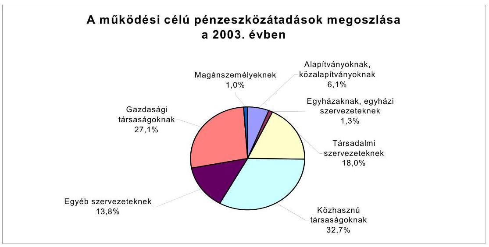
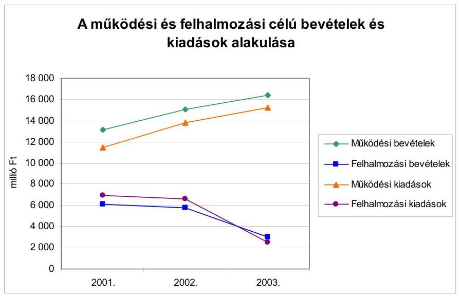
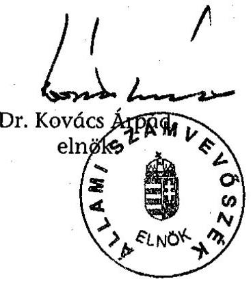
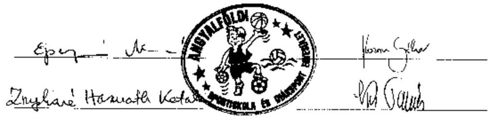

# JELENTÉS 

a Budapest Főváros XIII. kerület Önkormányzata gazdálkodásának átfogó ellenőrzéséről

---

3. Önkormányzati és Területi Ellenőrzési Igazgatóság
3.3 Átfogó Ellenőrzések Főcsoport

Iktatószám: V-1002-4/24/16/2004.
Témaszám: 692
Vizsgálat-azonosító szám: V0173

# Az ellenőrzést felügyelte: 

Dr. Lóránt Zoltán
főigazgató
Az ellenőrzés végrehajtásáért felelős:
Dr. Sepsey Tamás
főigazgató-helyettes
Az ellenőrzést vezette:
Csecserits Imréné
főcsoportfőnök-helyettes

## Az ellenőrzést végezték:

## Bauer Lajosné

főtanácsadó

## Kozma Gábor

számvevő
Nagy Istvánné dr.
számvevő tanácsos

## A témához kapcsolódó - az elmúlt négy évben készített számvevőszéki jelentések:

## címe

Jelentés a helyi önkormányzatok és helyi kisebbségi önkormányzatok pénzügyi-gazdasági tevékenységének 1999. évi ellenőrzési tapasztalatairól
Jelentés a helyi önkormányzatok 2000. évi normatív állami 0128
hozzájárulás igénylésének és elszámolásának vizsgálatáról
Jelentés a helyi önkormányzatok egyes pénzügyi befektetésekkel 0318
történő gazdálkodásának ellenőrzéséről
Jelentés a helyi önkormányzatoknak bérlakásépítésre és 0349
korszerűsítésre jutatott pénzügyi támogatások ellenőrzéséről

---

# TARTALOMJEGYZÉK 

BEVEZETÉS ..... 7
I. ÖSSZEGZŐ MEGÁLLAPÍTÁSOK, KÖVETKEZTETÉSEK, JAVASLATOK ..... 9
II. RÉSZLETES MEGÁLLAPÍTÁSOK ..... 21
1.A költségvetés tervezésének, végrehajtásának, az Önkormányzat vagyongazdálkodásának és a zárszámadás elkészítésének szabályszerűsége ..... 21
1.1.A költségvetési rendelet jóváhagyásának, módosításának, az előirányzatok nyilvántartásának és betartásának szabályszerűsége ..... 21
1.2.A gazdálkodás szabályozottsága, a bizonylati rend és fegyelem szabályszerűsége ..... 27
1.3.A pénzügyi-számviteli feladatok ellátásának informatikai támogatottsága ..... 35
1.4.Az önkormányzati vagyon nyilvántartása, számbavétele ..... 37
1.5.A vagyonnal való gazdálkodás szabályszerűsége, célszerűsége, nyilvánossága ..... 38
1.6.A céljelleggel nyújtott támogatások szabályszerűsége ..... 45
1.7.A közbeszerzési eljárások szabályszerűsége ..... 49
1.8.A zárszámadási kötelezettség teljesítésének szabályszerűsége ..... 52
1.9.A Polgármesteri hivatal helyi kisebbségi önkormányzatok gazdálkodását segítő tevékenysége ..... 53
2.Az önkormányzati feladatok és a rendelkezésre álló források összhangja ..... 55
2.1.A feladatok meghatározása és szervezeti keretei ..... 55
2.2.A költségvetés egyensúlyának helyzete ..... 57
2.3.A feladatok finanszírozása ..... 61
3.A belső irányítási, ellenőrzési rendszer múködésének értékelése ..... 66
3.1.Az ellenőrzési rendszer kialakítása, múködése ..... 66
3.2.A könyvvizsgálati kötelezettség teljesítése ..... 69
3.3.A korábbi számvevőszéki ellenőrzések javaslatainak hasznosulása ..... 70

---

# MELLÉKLETEK 

1. számú Az önkormányzati vagyon nagyságának alakulása (1 oldal)
2. számú Az Önkormányzat 2003. évi bevételeinek és kiadásainak alakulása (1 oldal)
3. számú Az Önkormányzat gazdálkodását meghatározó adatok, mutatószámok (1 oldal)
4. számú Egyes önkormányzati feladatok finanszírozása (1 oldal)
5. számú Kimutatás a jelentősebb önként vállalt feladatok költségvetési súlyáról (1 oldal)
6. számú Helyszíni ellenőrzési jegyzőkönyv (4 oldal)
7. számú Dr. Tóth József polgármester úr észrevétele (1 oldal)

---

# RÖVIDÍTÉSEK JEGYZÉKE 

Ötv.
Áht.
Ámr.
Kbt. 1
Kbt. 2
Htv.

Hatv.
Nek. tv.
Számv. tv.
Ktv.
Kszt. tv.
Fot.
Vhr.

Ber.
ÁSZ
MÁK
Önkormányzat
Képviselő-testület
polgármester
jegyző
Polgármesteri hivatal
Polgármesteri iroda
Belső ellenőrzési csoport

Jegyzői iroda
Építésügyi osztály
Művelődési, ifjúsági és sport osztály
a helyi önkormányzatokról szóló 1990. évi LXV. törvény az államháztartásról szóló1992. évi XXXVIII. törvény az államháztartás múködési rendjéről szóló 217/1998. (XII. 30.) Korm. rendelet
1995. évi XL. törvény a közbeszerzésekről
2003. évi CXXIX. törvény a közbeszerzésekről
a helyi önkormányzatok és szerveik, a köztársasági megbízottak, valamint egyes centrális alárendeltségű szervek feladat- és hatásköreiről szóló 1991. évi XX. törvény
a helyi adókról szóló 1990. évi C. törvény
a nemzeti és etnikai kisebbségek jogairól szóló 1993. évi LXXVII. törvény
a számvitelről szóló 2000. évi C. törvény
a köztisztviselők jogállásáról szóló 1992. évi XXIII. törvény
a közhasznú szervezetekről szóló 1997. évi CLVI. törvény
a fogyatékos személyek jogairól és esélyegyenlőségük biztosításáról szóló 1998. évi XXVI. törvény
az államháztartás szervezetei beszámolási és könyvvezetési kötelezettségének sajátosságairól szóló 249/2000. (XII. 24.) Korm. rendelet
a költségvetési szervek belső ellenőrzéséről szóló 193/2003. (XI. 26.) Korm. rendelet

Állami Számvevőszék
Magyar Államkincstár
Budapest Főváros XIII. kerület Önkormányzata
Budapest Főváros XIII. kerület Önkormányzatának Képvi-selő-testülete
Budapest Főváros XIII. kerület Önkormányzatának Polgármestere
Budapest Főváros XIII. kerület Önkormányzatának Jegyzője
Budapest Főváros XIII. kerület Önkormányzat Polgármesteri Hivatala
Budapest Főváros XIII. kerület Önkormányzat Polgármesteri Hivatalának Polgármesteri Irodája
Budapest Főváros XIII. kerület Önkormányzat Polgármesteri Hivatala Polgármesteri Irodájának Belső Ellenőrzési Csoportja
Budapest Főváros XIII. kerület Önkormányzat Polgármesteri Hivatalának Jegyzői Irodája
Budapest Főváros XIII. kerület Önkormányzat Polgármesteri Hivatalának Építésügyi Osztálya
Budapest Főváros XIII. kerület Önkormányzat Polgármesteri Hivatalának Múvelődési, Ifjúsági és Sport Osztálya

---

Pénzügyi osztály
Ellenőrzési csoport
Szervezési osztály
Szociális osztály
Gondnokság
GAMESZ
SzMSz

Polgármesteri hivatal SzMSz-e
2003. évi költségvetési rendelet
2004. évi költségvetési rendelet
vagyongazdálkodási rendelet
közbeszerzési rendelet
Önkormányzat helyi kisebbségekkel kapcsolatos rendelete
építményadó rendelet
telekadó rendelet
sportrendelet

Pénzügyi bizottság
OKSB
Tulajdonosi bizottság
Szociális bizottság

Budapest Főváros XIII. kerület Önkormányzat Polgármesteri Hivatalának Pénzügyi Osztálya
Budapest Főváros XIII. kerület Önkormányzat Polgármesteri Hivatala Pénzügyi Osztályának Ellenőrzési Csoportja
Budapest Főváros XIII. kerület Önkormányzat Polgármesteri Hivatalának Szervezési Osztálya
Budapest Főváros XIII. kerület Önkormányzat Polgármesteri Hivatalának Szociális Osztálya
Budapest Főváros XIII. kerület Önkormányzat Polgármesteri Hivatalának Gondnoksága
Budapest Főváros XIII. kerület Önkormányzat Gazdasági és Müszaki Ellátó Szervezete
Budapest Főváros XIII. kerület Önkormányzatának Szervezeti és Múködési Szabályzatáról szóló 3/1995. (II. 17.) számú rendelete
Budapest Főváros XIII. kerület Önkormányzat Polgármesteri Hivatalának Szervezeti és Múködési Szabályzata
Budapest Főváros XIII. kerület Önkormányzatának 7/2003. (II. 17.) számú rendelete a 2003. évi költségvetésről
Budapest Főváros XIII. kerület Önkormányzatának 5/2004. (II. 25.) számú rendelete a 2004. évi költségvetésről
Budapest Főváros XIII. kerület Önkormányzatának 9/2003. (III. 17.) számú rendelete az Önkormányzat vagyonáról és a vagyongazdálkodás szabályairól
Budapest Főváros XIII. kerület Önkormányzatának 41/1999. (XII. 27.) számú rendelete a közbeszerzési eljárás egyes kérdéseiről
Budapest Főváros XIII. kerület Önkormányzatának 32/1995. (VII. 7.) számú rendelete a helyi kisebbségi önkormányzatokat megillető jogokról
Budapest Főváros XIII. kerület Önkormányzatának 34/2000. (XI. 15.) számú rendelete az építményadóról
Budapest Főváros XIII. kerület Önkormányzatának 35/2000. (XI. 15.) számú rendelete a telekadóról
Budapest Főváros XIII. kerület Önkormányzatának 28/2001. (VII. 9.) számú rendelete a kerületi sportmozgalom fejlesztéséről és támogatásáról
Budapest Főváros XIII. kerület Önkormányzata Képviselőtestületének Pénzügyi Bizottsága
Budapest Főváros XIII. kerület Önkormányzata Képviselőtestületének Oktatási, Kulturális és Sport Bizottsága
Budapest Főváros XIII. kerület Önkormányzata Képviselőtestületének Tulajdonosi Bizottsága
Budapest Főváros XIII. kerület Önkormányzata Képviselőtestületének Szociális Bizottsága

---

| Lehel csarnok | Lehel Csarnok Élelmiszerkereskedelmi Központ Üzemeltető |
| :-- | :-- |
|  | Kft. által múködtetett vásárcsarnok |
| Vagyonkezelő Rt. | Angyalföld - Újlipótváros - Vizafogó Vagyonkezelő Rt. |
| OEP | Országos Egészségbiztosítási Pénztár |

---

# 6

---

# JELENTÉS 

## a Budapest Főváros XIII. kerület Önkormányzata gazdálkodásának átfogó ellenőrzéséről

## BEVEZETÉS

Az Ötv. 92. § (1) bekezdése, az Állami Számvevőszékről szóló 1989. évi XXXVIII. törvény 2. § (3) bekezdése, valamint az Áht. 120/A. § (1) bekezdése alapján az önkormányzatok gazdálkodását az Állami Számvevőszék ellenőrzi. Az ellenőrzés elvégzése az Országgyűlés illetékes bizottságai részére is átadott, országosan egységes ellenőrzési program alapján történt.

## Az ellenőrzés célja annak értékelése volt, hogy:

- az önkormányzati gazdálkodás törvényességét ${ }^{1}$, szabályszerűségét biztosítot-ták-e a tervezés, a költségvetés végrehajtása, a vagyongazdálkodás és a zárszámadás során;
- az Önkormányzat által ellátott feladatok és az azokhoz rendelkezésre álló források összhangja biztosított volt-e, különös tekintettel egyes kiemelt feladatokra;
- a gazdálkodás szabályszerűségét biztosító kontrollok ${ }^{2}$ megfelelően segitettéke a végrehajtást;

Az ellenőrzött időszak: a 2003. év és a 2004. év első féléve, az 1.5; 2.1-2.3 és 3.3 ellenőrzési programpontok esetében a 2001-2003. évek.

Budapest főváros XIII. kerületét három városrész - Angyalföld, Újlipótváros, Vizafogó - alkotja. A kerület lakosainak száma 2003. január 1-jén 106373 fő volt.

Az Önkormányzat 33 tagú Képviselő-testületének munkáját 10 állandó bizottság segítette. A polgármester személye az 1994. évtől, a jegyző személye az 1995. évtől nem változott.

Az Önkormányzat feladatainak végrehajtása érdekében 53 költségvetési szervet múködtet, amelyekből 16 önállóan gazdálkodik. A feladatok ellátásában részt

[^0]
[^0]:    ${ }^{1}$ A törvényi előírások betartásának elmulasztásakor egységesen a törvénysértés megjelölést alkalmazzuk, mivel az ÁSZ nem tehet különbséget a törvényi előírások között.
    ${ }^{2}$ A gazdálkodás szabályszerűségét biztosító kontroll alatt értjük a kiépített és működő belső irányítási és szabályozási rendszert, valamint a belső ellenőrzési funkciók ellátását.

---

vesz két közhasznú társaság és hat közalapítvány, továbbá négy gazdasági társaság. A feladatok ellátására az Önkormányzat költségvetési szerveinél a 2003. év végén foglalkoztatott közalkalmazottak száma 2743 fő, a köztisztviselők száma 201 fő. Az Önkormányzat a 2003. évben 23 378,0 millió Ft bevételt ért el és 21281,6 millió Ft kiadást teljesített, könyvviteli mérlege szerint 51 472,3 millió Ft értékű saját vagyonnal rendelkezett. Az Önkormányzat gazdálkodását meghatározó adatokat, mutatószámokat az 1-3. számú mellékletek tartalmazzák.

A kerületben a 2002. évi önkormányzati választásokig $9^{3}$, a 2002. évi választásokat követően $11^{4}$ a megválasztott és múködtetett kisebbségi önkormányzatok száma.
${ }^{3}$ Cigány, görög, horvát, lengyel, német, örmény, román, szerb, szlovák kisebbségi önkormányzat.
${ }^{4}$ Bolgár, cigány, görög, horvát, lengyel, német, örmény, román, ruszin, szerb, szlovák kisebbségi önkormányzat.

---

# I. ÖSSZEGZŐ MEGÁLLAPÍTÁSOK, KÖVETKEZTETÉSEK, JAVASLATOK 

Az Önkormányzat több évre szóló - tartalma szerint gazdasági programnak megfelelő - kerületfejlesztési koncepcióval rendelkezett, ezzel eleget tettek az Ötv. előírásának. A polgármester a 2003. és a 2004. évi költségvetési koncepciót, illetve költségvetési rendelettervezetet határidőben terjesztette a Képvi-selő-testület elé. Az Ámr-ben előírtak ellenére azonban a költségvetési koncepcióhoz nem csatolták a bizottságok - köztük a Pénzügyi bizottság - és a kisebbségi önkormányzatok koncepcióról alkotott véleményét, a 2005. évi költségvetési koncepció előterjesztéséhez már csatolták ezeket véleményeket. A polgármester a költségvetési rendelettervezetekkel együtt, illetve azt megelőzően a Képviselő-testület elé terjesztette azokat a rendelettervezeteket, amelyek a tervezett előirányzatokat megalapozták. A költségvetési rendelettervezet előterjesztéséhez az Ámr-ben előírtak ellenére nem csatolták egyik évben sem a Pénzügyi bizottság véleményét, a Pénzügyi bizottság elnöke a költségvetési rendelettervezetet tárgyaló képviselő-testületi ülésen szóban ismertette a bizottság véleményét. A Képviselő-testület az Áht-ban előírtakat megsértve rendeletben nem határozta meg az Önkormányzat költségvetésének előterjesztésekor a Képviselőtestület részére tájékoztatásul bemutatandó mérlegek, kimutatások, valamint szöveges indokolások tartalmi követelményeit. A Képviselő-testület tájékoztatása céljából a rendeleti szabályozás hiányossága ellenére a költségvetési rendelettervezetek előterjesztése mindkét évben tartalmazta az Áht-ban előírt összevont mérlegeket önkormányzatra és elkülönítetten a helyi kisebbségi önkormányzatokra, a kimutatásokat a többéves kihatással járó döntések számszerúsítéséről évenkénti bontásban, összesítve és szöveges indokolással, valamint a közvetett támogatásokról szöveges indokolással.

A 2003. évi költségvetési rendeletben a tervezett költségvetési bevételek nem fedezték a költségvetési kiadásokat, a hiányzó összeget finanszírozási célú műveletekkel biztosította a Képviselő-testület, azonban a hiány finanszírozásának módjáról az Áht-ban előírtakat megsértve a költségvetési rendelet normaszövegében nem rendelkezett. A 2003. és a 2004. évi költségvetési rendeletben finanszírozási célú pénzügyi műveleteket költségvetési hiányt, illetve költségvetési többletet módosító költségvetési bevételként, illetve költségvetési kiadásként vettek figyelembe, ezzel megsértették az Áht-ban előírtakat. A 2003. és a 2004. évi költségvetési rendeletben a Képviselő-testület meghatározta a költségvetés végrehajtásának a szabályait, továbbá az Áht-ban előírtaknak megfelelően az éves költségvetések címrendjét. A címrend felépítési elveit azonban nem tartották be, az ágazati csoportosítás nemcsak intézményi bontást, hanem feladatok szerinti bontást is tartalmazott, és nem lehetett megállapítani a feladatok intézményi hovatartozását. A Polgármesteri hivatal költségvetésén belül különböző feladatok támogatását alap elnevezéssel határozták meg, a költségvetésen belül elkülönített pénzügyi keretösszegek alapként történő elnevezése az Áhtban meghatározott feltételeknek, a Környezetvédelmi alap kivételével, nem felelnek meg, a kifejezés félreérthető. A 2003. és a 2004. évi költségvetési rendeletben az Ámr-ben előírtak ellenére egy intézmény vonatkozásában elmaradt a múködési, fenntartási előirányzatoknak kiemelt előirányzatonkénti részletezés

---

szerinti bemutatása, továbbá az önkormányzati intézmények részére jóváhagyott felhalmozási kiadási előirányzatnak a feladatonkénti bemutatása, valamint a 2003. és 2004. évi költségvetési rendelet nem tartalmazta elkülönítetten a helyi kisebbségi önkormányzatok költségvetését, továbbá az év várható bevételi és kiadási előirányzatainak teljesüléséről az előirányzat-felhasználási ütemtervet. A 2003. és a 2004. évi költségvetési rendeletben az Ámr-ben a céltartalékok elkülönített bemutatására vonatkozó előírást nem tartották be, mert az elkülönítetten bemutatott céltartalék előirányzatokon felül további 44 költségvetési cím is céltartaléknak felelt meg. Az alap elnevezésű és más keret jellegű, céltartaléknak minősülő előirányzatok feletti rendelkezésre a bizottságok kaptak hatáskört a Képviselő-testülettől annak ellenére, hogy a 2003. és a 2004. évi költségvetési rendeletek az Áht-ban foglaltakat megsértve ezekre az előirányzatokra nem tartalmaztak a tartalékkal való rendelkezésre vonatkozó szabályokat. A költségvetési rendeletmódosításokra előírt határidőket betartották. A 2003. és a 2004. évi költségvetési rendelettel jóváhagyott előirányzatokról és az azokban bekövetkezett változásokról önkormányzat szinten és költségvetési szervenkénti bontásban teljes körű nyilvántartást vezettek, részletezettsége megfelelt az Önkormányzat eredeti költségvetési rendelete szerinti tartalmi és szerkezeti rendnek. A 2003. évben önkormányzati szinten a Képviselő-testület által jóváhagyott előirányzatokon belül gazdálkodtak, azonban költségvetési szerv szintjén és kiemelt előirányzatokban 0,2\%-47,6\%-kal, az Áht. előírását megsértve túllépték azokat. Az előirányzat túllépések okait nem vizsgálták, felelősségre vonás nem történt.

A Pénzügyi osztály ügyrendje a pénzügyi-gazdasági feladatok ellátásáért felelős vezetők közül az osztályvezetőre vonatkozóan rögzítette a feladat-, hatás- és jogköröket, az Ámr-ben előírtak ellenére hiányzott a csoportvezetők és más dolgozók esetében a jogkörök meghatározása. A Polgármesteri hivatalban polgármesteri, jegyzői együttes utasításban a jogszabályi előírások és a helyi sajátosságok figyelembevételével szabályozták az operatív gazdálkodással és a munkafolyamatba épített ellenőrzéssel összefüggő jogkörök gyakorlásának rendjét. A gazdálkodási jogkörök gyakorlására felhatalmazottakat nem számoltatták be, a beszámoltatás módját és formáját nem szabályozták.

A számviteli politika keretében, a Vhr-ben előírtaknak megfelelően elkészítették a leltározási és leltárkészítési, az önköltség-számítási, a pénzkezelési, valamint az értékelési szabályzatot. A leltározási és a leltárkészítési szabályzatban meghatározták az egyeztetéssel végrehajtandó leltározásra a leltározás időszakát és fordulónapját, nem jelölték ki a mennyiségi felvétellel történő leltározás időszakát és fordulónapját. A leltározási szabályzatban nem mennyiségi felvétellel történő, hanem egyeztetéses leltározást írtak elő az ingatlanokra, amely ellentétes a Vhr-ben foglaltakkal. Az önköltség-számítási szabályzatban nem szabályozták az önköltségszámítás dokumentálásának rendjét, az önköltségszámítás során figyelembe vett adatok főkönyvi számlákkal, analitikus nyilvántartásokkal és a beszámolóval való kapcsolatát. A pénzkezelési szabályzatban nem rendelkeztek az Ámr-ben foglaltak ellenére a letéti számlán történő letéti pénzkezelés tartalmáról, a kapcsolódó analitikus nyilvántartás részletezettségéről, valamint az éves költségvetési beszámolás részeként a beszámolás módjáról. A letéti számlán kezelték az ingatlan értékesítések adásvételi szerződései alapján az eladási ár második részletét, az elővásárlási jog lemondásával összefüggő nyilatkozat megérkezéséig. A selejtezési szabályzatban

---

nem rendelkeztek a megsemmisítés szabályairól, dokumentálásáról, valamint nem határozták meg a döntéshozatalra jogosultak körét.

A Polgármesteri hivatal számlarendje a Számv. tv-ben előírtaknak megfelelően, valamint a Vhr-ben foglaltak figyelembevételével tartalmazta az alkalmazott főkönyvi számlák megnevezését, tartalmát, a főkönyvi számlát érintő gazdasági események szerinti értékváltozások jogcímeit, alapbizonylatait. A számlarendben nem rögzítették az analitikus nyilvántartások formáját, tartalmát, vezetési módját, a vevőkkel, a munkavállalókkal szembeni követelésekre, valamint a szállítói kötelezettségekre vonatkozóan. A Vhr. előírása ellenére nem rendelkeztek a követelések és a kötelezettségek analitikus nyilvántartásából készített összesítő bizonylatok elkészítésének határidejéről. A zárlati feladatok keretében meghatározták az éves zárlati feladatokat, azonban nem rögzítették a havi, negyedéves és féléves zárlati teendőket. A számlarendben előírták a főkönyvi számlák és az analitikus nyilvántartások egyeztetésének gyakoriságát, de nem szabályozták az egyeztetés igazolásának módját.

A Polgármesteri hivatalban a pénzügyi-számviteli feladatok elvégzésének folyamatát az ügyrendben szabályozták, de abban nem határozták meg a munkafolyamatba épített ellenőrzésre vonatkozón a dokumentálás módját, és az eltérés esetén követendő eljárást. Az egyes szabályzatok, valamint az ügyrend előírásai összhangban álltak. A szabályzatok és a munkaköri leírások ellenőrzésre, egyeztetésre vonatkozó előírásai összhangban voltak. A Polgármesteri hivatalban a Számv. tv-ben foglaltaknak megfelelően alakították ki a számvitel logikailag zárt rendszerét. A gazdasági eseményeket magukba foglaló bizonylatok $97,0 \%$-a felelt meg a Számv. tv-ben előírt alaki és tartalmi követelményeknek. Az egyéb gazdasági múveletekkel összefüggő bizonylatok 3\%-át a bizonylatot kiállító nem írta alá. A kötelezettségvállalás ellenjegyzésénél a bizonylatok $1,1 \%$-ánál nem tartották be a gazdálkodási jogkörökre vonatkozó polgármesteri, jegyzői együttes utasításban foglaltakat, mivel a kötelezettségvállalás ellenjegyzési jogkört a felhatalmazással nem rendelkező személyek gyakorolták. A Polgármesteri hivatal gazdálkodási jogkörökre vonatkozó szabályzatában előírtak ellenére a bizonylatok 2,2\%-ánál kizárólag jogtanácsos jegyezte ellen a kötelezettségvállalást. A szabályozás szerint a jogtanácsos ellenjegyzése jogi ellenjegyzésnek minősült és mellette szükséges az Ámr-ben előírt ellenjegyzési feladatok elvégzése is. A munkafolyamatokba épített ellenőrzési feladatoknak eleget tettek a teljesítésigazolók, az érvényesítők és az utalványok ellenjegyzői. A pénztárellenőrök mind a központi házipénztárnál, mind a Szociális osztályra kihelyezett házipénztárnál naponta ellenőrizték a készpénzforgalmat. A Szociális osztályra kihelyezett házipénztár pénztárellenőre a pénzkezelési szabályzatban előírtak ellenére a bevételi és a kiadási pénztárbizonylatokon nem igazolta az ellenőrzést.

A Polgármesteri hivatal rendelkezett az informatikai rendszer múködésének feltételeit meghatározó szabályzatokkal, azok együttesen teljes körűen tartalmazták a biztonságos és hatékony üzemeltetés feltételeit. A Képviselőtestület a fejlesztési feladatokat és tervezett költségkereteket tartalmazó informatikai stratégiát határozattal fogadta el. Az adatvédelmi szabályzatot a katasztrófa elhárítási tervvel együtt, egységes szerkezetben jegyzői intézkedéssel szabályozták. A pénzügyi-számviteli informatikai rendszert alkalmazók rendelkeztek a számítógépes feladat ellátásához szükséges informatikai képzett-

---

séggel, azonban a felhasználók munkaköri leírása a pénzügyi, számviteli munkakörök 77\%-ánál az informatikai rendszer használatát, az általuk végzendő feladat leírását nem tartalmazta.

Az Önkormányzat vagyona a 2001. és 2003. közötti időszakban 14\%-kal növekedett. A korábban érték nélkül nyilvántartott ingatlanok vonatkozásában a 2002. évben végrehajtott érték megállapításokat figyelmen kívül hagyva a vagyon növekedése 2001. és 2003. között 6,1\%-os volt.

Az Önkormányzat a vagyongazdálkodás kérdéseit rendeletben szabályozta. A vagyongazdálkodási rendelet hatálya a teljes önkormányzati vagyonra kiterjedt. A vagyongazdálkodási rendelet tartalmazta a vagyoni helyzet alakulásáról a Képviselő-testület részére történő beszámolás rendjét. A vagyonnal való rendelkezési, döntési hatásköröket célszerűen alakították ki. Az ingatlanokat a Vhr-ben előírtaktól eltérően nem mennyiségi felvétellel, hanem egyeztetéssel leltározták. Az értékvesztés elszámolás szükségességét vizsgálták, az értékvesztés elszámolása megfelelt a Számv. tv. előírásainak. A 2001. és 2003. évek közötti időszakban, az év közben átmenetileg szabad pénzeszközök egy évnél rövidebb időtartamú befektetéséről a polgármester hozott döntést átruházott hatáskörben. Az éven belüli értékpapír befektetési döntések előkészítésének, a döntés dokumentálásának, a befektetési szolgáltatóknál vezetett értékpapír számlák ellenőrzésének eljárási rendjét nem szabályozták. Az értékpapíroknak a befektetési szolgáltatóval közös rendelkezésű zárolt számlán történő elhelyezési kötelezettségét indokolatlanul korlátozták az egy hónapnál hosszabb futamidejű befektetésekre. Az értékpapír ügyletekkel elért hozamok meghaladták a számlavezető banknál a nap végi záró egyenleg lekötéséből származó kamatbevétel mértékét, illetve megfeleltek az értékpapírpiacon ismert referenciahozamnak.

A nyilvános pályáztatással, illetve a versenyeztetéssel kapcsolatos rendeleti szabályozás megalkotásával az Önkormányzat eleget tett az Áht. előírásainak. A vagyongazdálkodási rendeletben a nyilvános pályázat útján értékesíthető vagyon értékhatárát 1999. február 12-től kezdődően 50 millió Ft-ban állapították meg, a 2003. március 17-i módosítással 500 millió Ft-ra emelték ezt az értékhatárt, valamint lehetővé tették, hogy a Képviselő-testület 100 millió 500 millió Ft közötti érték esetén a versenyeztetés mellőzéséről döntsön. A versenyeztetéssel kapcsolatos értékhatár emeléssel indokolatlanul magas összeget határoztak meg, valamint az 500 millió Ft alatti érték esetében a versenyeztetés mellőzésének lehetővé tételével nem segítették a közvagyonnal való gazdálkodás nyilvánosságát, átláthatóságát. A 2003. év folyamán a vagyongazdálkodási rendelet előírásaival ellentétben, négy esetben, az értékesítési döntést megelőzően nem folytatták le a nyilvános pályáztatást, illetve versenyeztetési eljárást. További két - 100 millió - 500 millió Ft érték közötti - ingatlan értékesítése esetében a vagyongazdálkodási rendeletben foglalt felhatalmazás alapján a Képviselő-testület hozzájárult a versenyeztetési eljárás mellőzéséhez. A határozatok, illetve a döntéshez tartozó előterjesztések nem tartalmazták a versenyeztetés mellőzésének indokait.

Az ingatlanértékesítések lebonyolítása során a döntéshozatal hatásköri szabályait betartották. A döntések előkészítése során elemezték az ingatlan értékesítésével összefüggő, az Önkormányzatot terhelő kiadásokat. A nem lakás-

---

célú helyiség értékesítése során csatolták az előterjesztéshez az ingatlanszakértő által készített forgalmi értékbecslést. Telek ingatlanok értékesítése esetében az árat a szanálási költségek figyelembe vételével határozták meg, a vagyongazdálkodási rendelet előírása ellenére nem készíttettek értékbecslést. Az ingatlan adásvételi és a bérleti szerződésekben szerepeltek az önkormányzat érdekeit védő garanciális elemek.

Az Önkormányzat gazdasági társaságoknak, közhasznú társaságoknak, társadalmi szervezeteknek, közalapítványoknak és alapítványoknak, egyházaknak, egyéb szervezeteknek és magánszemélyeknek adott céljellegú támogatást a 2003. évben. Az Önkormányzatnál a céljellegú támogatások esetében meghatározták a támogatás célját és rögzítették a támogatás összegét, azonban a Kszt. tv. és az Áht. előírását megsértve nem írták elő a közhasznú szervezetek $60 \%$-ánál a támogatással való elszámolás kötelezettségét, annak feltételeit és módját. A társadalmi szervezetek részére nyújtott támogatások 2\%-ánál, illetve az egyházak részére nyújtott támogatások $4 \%$-ánál nem írták elő a számadási kötelezettséget, ezzel megsértették az Áht. előírásait. A Polgármesteri hivatalban elvégezték a számadások tartalmi és formai ellenőrzését. A támogatások rendeltetésszerú felhasználását a támogatott szervezetnél lefolytatott helyszíni vizsgálat keretében nem ellenőrizték. A közalapítványok, illetve alapítványok támogatásáról nem a Képviselő-testület hozott döntést, ezzel megsértették az Ötv. előírásait, mely szerint az alapítványi forrás átadása a Képviselő-testület kizárólagos döntési hatáskörébe tartozik. A speciális célú támogatásoknál a számadások ellenőrzése során három társadalmi szervezet elszámolásával kapcsolatosan a pályázatban meghatározott céllal ellentétes felhasználást állapítottak meg, ezért intézkedtek a támogatások visszafizettetéséről, és a szervezetek további támogatásának felfüggesztéséről.

Az Önkormányzat a közbeszerzési törvény hatálya alá tartozó beszerzéseinek eljárási rendjét rendeletben szabályozta. A közbeszerzési rendelet alanyi hatályát szabálytalanul kiterjesztették az Önkormányzatra. A Polgármesteri hivatalnál egy szolgáltatás megrendelésére, a Vagyonkezelő Rt-nél három szolgáltatás beszerzésére a Kbt. ${ }_{1}$-ben előírtakat megsértve nem folytattak le közbeszerzési eljárást. Az eredményhirdetés helye eltért az ajánlati felhívásban szereplő helyszíntől. A közbeszerzési eljárás alapján megkötött szerződést egy alkalommal a Kbt. ${ }_{1}$ előírását megsértve, a teljesítési határidő meghosszabbításával módosították. A Közbeszerzések Tanácsa Közbeszerzési Döntőbizottsága az Önkormányzatot a 2003. évben nem marasztalta el.

A polgármester a 2003. évi zárszámadási rendelettervezetet az Áht-ban előírt határidőn belül terjesztette a Képviselő-testület elé. A zárszámadási rendelet az Áht-ban előírtakat megsértve nem tartalmazták a költségvetési rendelettel való összehasonlíthatósági követelmény ellenére a tényleges létszámnak az engedélyezett létszámkerethez képesti bemutatását. A zárszámadás előterjesztésekor a Képviselő-testület részére bemutatták az Áht. szerinti összevont mérlegeket önkormányzatra és elkülönítetten a helyi kisebbségi önkormányzatokra, illetve a közvetett támogatásokra vonatkozó kimutatást szöveges indokolással, viszont az Áht-ban foglaltakat megsértve nem mutatták be a többéves kihatással járó döntésekre vonatkozó kimutatást, számszerúsítve évenkénti bontásban, valamint összesítve szöveges indokolással együtt. A 2003. évi zárszámadási rendeletben az Ámr-ben előírtaknak megfelelően a Képviselő-testület költségve-

---

tési szervenkénti részletezésben jóváhagyta az intézmények, illetve a Polgármesteri hivatal, valamint a helyi kisebbségi önkormányzatok 2003. évi felülvizsgált költségvetési pénzmaradványát. A Polgármesteri hivatal pénzmaradványának bemutatásakor nem jártak el szabályszerűen, a Vhr-ben előírtak ellenére a tárgyévi pénzmaradvány összege előző évekből származó tartalékot tartalmazott. A határidőben elkészített és az államháztartás információs rendszere keretében továbbított költségvetési szervenkénti költségvetési beszámolók, illetve a zárszámadási rendelet számszaki adatai - a kiemelt előirányzatok, az eredeti előirányzatok, a módosított előirányzatok s a teljesítési adatok vonatkozásában - egymással megegyeztek.

A 2002. évi önkormányzati választásokat követően a helyi kisebbségi önkormányzatok száma tizenegyre emelkedett. Az Önkormányzat helyi kisebbségekkel kapcsolatos rendelete az együttmúködési megállapodás felülvizsgálatát és szükség szerinti módosítását a zárszámadás elfogadásának időpontját követő időre ütemezte, az időrendi ütemezés ellentétes az Ámr-ben előírt határidővel. Az Önkormányzat valamennyi helyi kisebbségi önkormányzattal megkötötte az együttműködési megállapodást. Rendelkeztek a helyi kisebbségi önkormányzatok előirányzatainak határozat alapján történő módosításáról, nem jelölték ki azonban a határozatok Önkormányzat részére történő átadásának határidejét. Az Ámr-ben előírtak ellenére nem rögzítették a szakmai teljesítés igazolás módját és nem jelölték ki az azt végző személyt. Az együttműködési megállapodásban nem szabályozták az előzetes, írásbeli kötelezettségvállalás nélküli, 50 ezer Ft-ot el nem érő kifizetésekhez kapcsolódóan a kisebbségi önkormányzatokra és a Polgármesteri hivatalra háruló feladatokat. A Polgármesteri hivatal a helyiséghasználatot a vagyonkezelő szervezetén keresztül biztosította. A számviteli nyilvántartás alapján négy helyi kisebbségi önkormányzat (társasházi) közös költséget és közüzemi költséget térített, hét kisebbségi önkormányzat bérleti díjat fizetett, amely nem felelt meg az Ámr-ben a Polgármesteri hivatal számára előírt, a kisebbségi önkormányzatok testületi múködésének rendjéhez igazodó helyiséghasználat biztosítási kötelezettségnek. A helyi kisebbségi önkormányzatok testületi múködésének további tárgyi feltételeiről gondoskodtak.

Az Önkormányzat feladatai ellátását elsősorban saját fenntartású intézményeivel oldotta meg, emellett közhasznú társaságai, és gazdasági társaságai is részt vettek a feladatellátásban. Az önkormányzati kötelező és önként vállalt feladatok támogatására közalapítványokat hozott létre. A 2001-2003. évek között a Képviselő-testület döntött négy óvoda és két általános iskola összevonásáról, valamint két közhasznú társaság és egy gazdasági társaság alapításáról.

Az Önkormányzat költségvetési beszámolói szerint a teljesített költségvetési bevételek mind a három évben fedezték a teljesített költségvetési kiadásokat, a gazdálkodás egyensúlya biztosított volt. Az elért múködési célú bevételek fedezték a múködési célú kiadásokat. A felhalmozási célú bevételek a 20012002. évben $87,9 \%$-ban, illetve $86,7 \%$-ban, a 2003. évben teljesen fedezték a felhalmozási célú kiadásokat. A 2001-2002. évben a felhalmozási célú kiadásokhoz hiányzó fedezetet a múködési célú bevételek biztosították. A 2001-2003. évek között a múködési bevételek évről évre emelkedtek, míg a felhalmozási célú bevételek évről évre csökkentek. A felhalmozási források változásával összhangban változott a felhalmozási célokra fordított kiadások összege, az összes

---

kiadáshoz viszonyítva a felhalmozási kiadások részaránya a 2001. évi 37,7\%os részarányról a 2003. évre $14,1 \%$-ra csökkent.

Az Önkormányzat a kötelező feladatai mellett önként vállalt feladatokat is ellátott. A jelentősebb, az összkiadás $1 \%$-át meghaladó önként vállalt feladatok megvalósítása a 2001-2003. években a teljesített éves költségvetési kiadásokhoz viszonyítva $24,4 \%, 11,0 \%$ és $13,0 \%$-os részarányt képviselt. Ide sorolt feladatként vették figyelembe a középfokú oktatást és a járóbeteg szakorvosi ellátást, a kerületi épület-rehabilitációval és lakásgazdálkodással, bérlakás építési program megvalósításával, illetve a 2001. évben a Lehel csarnok építésével kapcsolatos kiadásokat. Az önként vállalt feladatok ellátása a 2001-2003. évek közötti időszakban nem veszélyeztette az előírt kötelező feladatok ellátását. A kiadások fedezetét a központi költségvetéstől, az OEP-től, illetve más szervektől meghatározott célra, pályázati úton elnyert átvett pénzeszközök, továbbá az Önkormányzat saját bevételei biztosították. Az Önkormányzatnál múködtetett kincstári típusú finanszírozással koncentrált a pénzkezelés, napi rendszerességgel figyelték a pénzállomány alakulását. A költségvetési folyamatok alakulásának évközi ütemezéséhez, megfigyeléséhez a jegyző az Ámr-ben előírtaknak megfelelően likviditási tervet készített a pénzállomány alakulásáról. A likviditási tervben reálisan vették számításba a havonta várható bevételeket és kiadásokat. Az Önkormányzat 2003. évi és 2004. I. félévi gazdálkodása során a pénzügyi egyensúly biztosított volt.

A Polgármesteri hivatalban a kötelezettségvállalások analitikus nyilvántartási rendszerét jegyzői intézkedés szabályozta. A kötelezettségvállalások analitikus nyilvántartási rendszere magában foglalta a címrenden belül kiemelt előirányzatként nyilvántartott szerződéseket, valamint az 50 ezer Ft alatti szerződés (megrendelés) nélküli számlákat is.

Az Önkormányzat a középületei vonatkozásában az akadály-mentesítési feladatokat és költségvonzatát felmérte. A Képviselő-testület az éves költségvetési rendeletekben akadály-mentesítési feladatokra külön előirányzatot nem állapított meg. A középületek felújítása, rekonstrukciója során gondoskodtak az akadálymentes megközelíthetőség kialakításáról. A felmérés és az évente teljesített kiadások alapján a törvényben meghatározott határidőre a közintézmények akadálymentes megközelíthetőségét nem tudja megoldani az Önkormányzat.

Az Önkormányzat a feladatkörébe utalt belső ellenőrzési feladatok végrehajtásához szükséges szervezeti kereteket kialakította. A Polgármesteri irodához tartozó Belső ellenőrzési csoport szervezeti besorolásával megsértették a Htv., illetve az Áht. előírását, amely szerint a költségvetési szerv vezetője felelős a belső ellenőrzés megszervezéséért és hatékony működésért. A belső ellenőrzés eljárásának és végrehajtásának helyi rendjét a Polgármesteri hivatal SzMSz-ének mellékleteként kiadott polgármesteri és jegyzői együttes utasításban rögzítették. A belső ellenőrzési szabályzat hatálya kiterjedt a Polgármesteri hivatalban és az Önkormányzat intézményeiben végzett ellenőrzésekre. A belső ellenőrök funkcionális függetlensége az Áht-ban foglaltaknak megfelelően érvényesült az ellenőrzési program elkészítése és végrehajtása, a belső ellenőrök szervezeti alárendeltsége, az irányítási és végrehajtási tevékenységtől való egyértelmú elkülönítése tekintetében. A belső ellenőri vizsgálatok végrehajtása és dokumentálása megfelelt az ellenőrzési szabályzat követelményeinek. A jegyző tájékoztat-

---

ta a Képviselő-testületet az intézmények és a Polgármesteri hivatal ellenőrzésének tapasztalatairól.

Az előírt könyvvizsgálati kötelezettségnek az Önkormányzatnál eleget tettek, a könyvvizsgáló kiválasztásánál és megbízásánál betartották az Ötv-ben a szakmai követelményekre és összeférhetetlenségre vonatkozó előírásokat. A könyvvizsgáló a Polgármesteri hivatal és az önkormányzati intézmények adatait összevontan tartalmazó 2003. évi egyszerűsített költségvetési beszámolót hitelesítő záradékkal látta el, auditálási eltérést nem állapított meg.

Az előző négy évben végzett ÁSZ ellenőrzések során feltárt hiányosságok megszüntetésére megtették a szükséges intézkedéseket. A javaslatok hasznosulása 95,5\%-os mértékig megtörtént, ennek eredményeként javult az ellenőrzéssel érintett önkormányzati feladatok ellátásának a törvényessége, szabályozottsága.

A helyszíni ellenőrzés megállapításainak hasznosítása mellett javasoljuk:

# a polgármesternek 

a jogszabályi előírások maradéktalan betartása érdekében
1. a költségvetési gazdálkodás jogszabályszerű kereteinek kialakítása érdekében
a) csatolja az Ámr. 29. § (9) bekezdése szerint a költségvetési rendelettervezet előterjesztéséhez a Pénzügyi bizottság rendelettervezetről alkotott véleményét;
b) kezdeményezze a Képviselő-testületnél, hogy határozza meg az Áht. 118. §-a alapján rendeletben az Áht. 116. §-ának 6., 8., 9. és 10. pontja szerinti mérlegek, kimutatások tartalmát;
c) intézkedjen az Áht. 93. § (1) bekezdésében, illetve az Áht. 12/A. § (1) bekezdésében előírtak betartása érdekében, hogy az önkormányzati költségvetési szervek a jóváhagyott előirányzatokon, illetve a Képviselő-testület által meghatározott kiemelt kiadási előirányzatokon belül gazdálkodjanak, előirányzat túllépések esetén kezdeményezzen vizsgálatot, illetve felelősségre vonást;
2. biztosítsa, hogy az Ötv. 10. § (1) bekezdése d) pontjában foglaltaknak megfelelően a Képviselő-testület döntsön az alapítványi források átadásáról;
3. intézkedjen annak érdekében, hogy a Kbt. 2. §-ában foglalt előírás alapján a Vagyonkezelő Rt. közbeszerzési értékhatárt elérő szolgáltatásai megrendeléseinél folytassák le a közbeszerzési eljárásokat;
4. kezdeményezze a Képviselő-testületnél az Önkormányzat helyi kisebbségekkel kapcsolatos rendelete 8. § (2) bekezdésében a kisebbségi önkormányzatokkal kötendő együttműködési megállapodás felülvizsgálati időpontjának a módosítását, hogy a módosítás időpontjának az ütemezése legyen összhangban az Ámr. 29. § (11) bekezdésében foglaltakkal, és gondoskodjon az előírtak betartásáról;

---

5. intézkedjen az Áht. 121/A. § (3) bekezdésében előírtaknak megfelelően a Polgármesteri hivatal SzMSz-ének módosításáról annak érdekében, hogy a belső ellenőrzést végző szervezetek (Belső ellenőrzési csoport, Ellenőrzési csoport) jogállásuk alapján a költségvetési szerv vezetőjének közvetlen alárendeltségébe kerüljenek;
a munka színvonalának javítása érdekében
6. gondoskodjon a kötelezettségvállalásra és az utalványozásra felhatalmazottak beszámoltatásáról, valamint a beszámoltatás módjának és formájának szabályozásáról;
7. kezdeményezze a Képviselő-testületnél a vagyongazdálkodási rendeletben a versenyeztetéssel kapcsolatos értékhatár csökkentését, valamint a 100 millió 500 millió Ft érték közötti értékesítés esetén a versenyeztetés mellőzési lehetőség megszüntetését;
8. kezdeményezze a Képviselő-testület 183/2000. (XII. 14.) számú határozata a) pontja ac) pontjának módosítását az év közben átmenetileg szabad rendelkezésű pénzeszközökből vásárolt, egy hónapnál rövidebb futamidejű értékpapírok közös rendelkezésű értékpapír számlán történő zárolása tekintetében;
9. kezdeményezze a helyi kisebbségi önkormányzattal kötött együttműködési megállapodás kiegészítését, a jegyző által előkészített tartalommal;
10. kísérje figyelemmel a középületek akadálymentessé tételét, tekintettel a Fot. 29. § (6) bekezdésében meghatározott 2005. január 1-i teljesítési határidőre;
11. kezdeményezze a számvevőszéki ellenőrzés tapasztalatainak képviselő-testületi megtárgyalását, és a feltárt hiányosságok megszüntetése érdekében készíttessen intézkedési tervet;

# a jegyzőnek 

a jogszabályi előírások maradéktalan betartása érdekében

1. gondoskodjon a költségvetési rendelettervezet előkészítésekor
a) az Áht. 8/A. § (7) bekezdésében előírtak betartásáról, költségvetési hiányt, illetve költségvetési többletet módosító költségvetési bevételként, illetve költségvetési kiadásként ne számoljanak el finanszírozási célú pénzügyi műveleteket;
b) az Ámr. 29. § (1) bekezdése b) pontjában előírtak betartása érdekében a működési, fenntartási előirányzatokat kiemelt előirányzatonként a GAMESZ, mint önállóan gazdálkodó költségvetési szerv vonatkozásában is mutassák be;
c) az Ámr. 29. § (1) bekezdése d), e), i) és j) pontja szerinti előírások betartása érdekében mutassák be feladatonként az intézményi felhalmozási kiadásokat, külön tételben a céltartalék előirányzatait, elkülönítetten a helyi kisebbségi önkormányzatok költségvetését és az év várható bevételi és kiadási előirányzatainak teljesüléséről az előirányzat-felhasználási ütemtervet.

---

2. intézkedjen, hogy a Vhr. 37. § (3) bekezdésében foglaltakkal összhangban mennyiségi felvétellel történő módon rögzítsék a leltározási és leltárkészítési szabályzatban az ingatlanok leltározási módját;
3. gondoskodjon, hogy a számlarend kiegészítésre kerüljön
a) a Vhr. 49. § (2) bekezdésében foglaltak alapján a vevőkkel szembeni követelések, a munkavállalókkal szembeni követelések, valamint a szállítói kötelezettségek analitikus nyilvántartási formájának, tartalmának, vezetési módjának szabályozásával;
b) a Vhr. 49. § (4) bekezdésében előírtak alapján a követelések és a kötelezettségek analitikus nyilvántartási adataiból készített összesítő bizonylatok elkészítésének határidejével;
4. intézkedjen az Ámr. 17. § (5) bekezdésében előírtak alapján a Pénzügyi osztály ügyrendjének kiegészítéséről a csoportvezetők és más dolgozók feladat-, hatás- és jogkörére vonatkozóan;
5. gondoskodjon, hogy a kötelezettségvállalás ellenjegyzésénél;
a) a polgármesteri, jegyzői IV/1/6/2002. (XI. 18.) számú együttes utasításban felhatalmazott személyek gyakorolják a kötelezettségvállalás ellenjegyzési jogkörét;
b) az Ámr. 134. § (7) bekezdésében előírt ellenjegyzői feladatok is elvégzésre kerüljenek a jogtanácsosi ellenjegyzés mellett;
6. intézkedjen a pénzkezelési szabályzat 3.2. pontjában előírtak alapján, hogy a Szociális osztályra kihelyezett pénztár pénztárellenőre a bevételi és a kiadási pénztárbizonylatokon igazolja az ellenőrzés elvégzését;
7. intézkedjen, hogy a Számv. tv. 165. § (2) bekezdésében a szabályszerű bizonylat kiállítására előírt követelményt érvényesítsék azáltal, hogy a könyvviteli elszámolást közvetlenül alátámasztó egyéb gazdasági múveletekre vonatkozó bizonylatokat a bizonylatok kiállítói írják alá;
8. gondoskodjon a Vhr. 37. § (3) bekezdésében foglaltaknak megfelelően az ingatlanok mennyiségi felvétellel történő leltározásáról;
9. készítsen elő rendelettervezetet az Áht. 108. § (2) bekezdésében előírtak betartása érdekében a követelésekről történő lemondás eseteinek és módjának meghatározására;
10. biztosítsa, hogy a vagyongazdálkodási rendelet 15. § (2) bekezdése a) pontjának megfelelően az ingatlanok értékesítése esetében csatolják az előterjesztéshez a három hónapnál nem régebben megállapított forgalmi értéket tartalmazó ingatlanszakértői véleményt;
11. gondoskodjon a Kszt. tv. 14. § (2) bekezdésében, valamint az Áht. 13/A. § (2) bekezdésében előírtak betartása érdekében arról, hogy a közhasznú szervezeteknél a támogatási szerződésekben írják elő az elszámolás kötelezettségét, annak feltételeit és módját;

---

12. gondoskodjon az Áht. 13/A. § (2) bekezdésében előírtak betartása érdekében arról, hogy a társadalmi szervezetek, illetve az egyházak részére nyújtott támogatások esetében írják elő a számadási kötelezettséget;
13. a közbeszerzési szabályok betartása érdekében
a) gondoskodjon a Kbt. ${ }_{2}$ 2.§-ában előírtak alapján a közbeszerzési értékhatárt elérő takarítási szolgáltatás vonatkozásában a közbeszerzési eljárás lefolytatásáról;
b) tartsa be a Kbt. ${ }_{2}$ 246. § (2) bekezdésében foglaltak alapján az ajánlati felhívásban meghatározottakat az eljárás eredményének kihirdetésekor;
c) gondoskodjon a Kbt. ${ }_{2}$ 303. §-ában előírtak betartásáról a közbeszerzési eljárás alapján megkötött szerződések módosítása során;
14. gondoskodjon a zárszámadási rendelettervezet előkészítésekor;
a) az Áht. 18. §-ában előírt követelmény betartásáról, ennek érdekében az elfogadott költségvetéssel összehasonlítható módon készítsék elő a zárszámadást;
b) az Áht. 116. § 9. pontja szerinti többéves kihatással járó döntések kihatását mutassák be számszerúsítve évenkénti bontásban és összesítve, valamint a 118. § alapján szöveges indokolással;
c) a Vhr. 39. § (4) bekezdésének betartása érdekében a Polgármesteri hivatal tárgyévi pénzmaradványának megállapításakor az előző évből/évekből származó tartalék összegét vonják le;
15. készítse elő az Áht. 66. §, valamint az Áht. 68. § (3) bekezdése alapján a helyi kisebbségi önkormányzatokkal kötött együttműködési megállapodás kiegészítését az alábbi területeken:
a) az Ámr. 57. § (6) bekezdésében foglaltak szerinti helyiséghasználat biztosítási kötelezettségnek egységes feltételekkel történő meghatározását;
b) az Ámr. 134. § (11) bekezdésében és a 135. § (3) bekezdésében előírtak figyelembevételével a szakmai teljesítés igazolás módjának szabályozásával és az azt végző személy meghatározásával;
c) a költségvetési előirányzatokat módosító határozatok Önkormányzat részére történő átadási határidejének kijelölésével;
d) az előzetes, írásbeli kötelezettségvállalás nélküli, 50 ezer Ft-ot el nem érő kifizetések rendjével és nyilvántartásával összefüggő feladatokkal;
a munka színvonalának javítása érdekében
16. kezdeményezze a költségvetési rendelettervezet előkészítése során a félreérthető önkormányzati pénzalapok elnevezésének a megváltoztatását;
17. gondoskodjon az éves költségvetési rendelettervezetek előkészítése során a Képvise-lő-testület által meghatározott címrend felépítési elv betartásáról, intézményi cím-

---

szám alatt ne szerepeltessenek feladatot, illetve a költségvetés áttekinthetősége és a végrehajtási szabályok egyszerűsítése érdekében tegyen javaslatot a kialakított címrend felülvizsgálatára;
18. gondoskodjon a kötelezettségvállalás és az utalványozás ellenjegyzésére felhatalmazottak beszámoltatásáról, valamint a beszámoltatás módjának és formájának szabályozásáról;
19. gondoskodjon az alábbi szabályzatok kiegészítéséről
a) a leltározási és leltárkészítési szabályzatnál a mennyiségi felvétellel történő leltározás időszakának és fordulónapjának kijelölésével;
b) az önköltség-számítási szabályzatnál az önköltség-számítás dokumentálásának rendjére, az önköltség-számítás adatainak a főkönyvi számlákkal, az analitikus nyilvántartásokkal és a beszámolóval való kapcsolatára vonatkozóan;
c) a pénzkezelési szabályzatnál a Polgármesteri hivatal letéti számláján történő pénzkezelés szabályozására vonatkozóan;
d) a selejtezési szabályzatnál a döntéshozatalra jogosultak körének kijelölésével, valamint a megsemmisítés szabályainak és dokumentálásának meghatározásával;
20. egészítesse ki a Pénzügyi osztály ügyrendjét a munkafolyamatba épített ellenőrzésre vonatkozóan a dokumentálás módjának és az eltérés esetén követendő eljárásnak a meghatározásával;
21. intézkedjen, hogy a számlarend tartalmazza
a) a havi, negyedéves és féléves zárlati feladatokat,
b) a főkönyvi számlák és az analitikus nyilvántartások egyeztetésére vonatkozó dokumentálási rendet;
22. gondoskodjon a pénzügyi-számviteli informatikai rendszereket felhasználók munkaköri leírásainak kiegészítéséről a használt informatikai rendszerek vonatkozásában, illetve az informatikai rendszerekkel támogatott feladatoknak a munkaköri leírásokban történő rögzítéséről;
23. biztosítsa, hogy amennyiben a vagyonelemek értékesítése során a vagyongazdálkodási rendelet alapján a versenyeztetés mellőzését tartják indokoltnak, ennek részletes okait és indokait mutassák be az értékesítési döntéshez kapcsolódó előterjesztésben;
24. gondoskodjon az éven belüli értékpapír befektetési döntések előkészítésének, a döntés dokumentálásának, a befektetési szolgáltatónál vezetett értékpapír számlák ellenőrzésének szabályozásáról;
25. intézkedjen a speciális célú támogatások rendeltetésszerű felhasználása helyszíni ellenőrzésének kialakításáról és megszervezéséről.

---

# II. RÉSZLETES MEGÁLLAPÍTÁSOK 

## 1. A KÖLTSÉGVEtÉs TERVEZÉSÉNEK, VÉGREHAJTÁsÁNAK, AZ ÖNKORMÁNYZAT VAGYONGAZDÁLKODÁSÁNAK ÉS A ZÁRSZÁMADÁS ELKÉSZÍTÉSÉNEK SZABÁLYSZERŰSÉGE

### 1.1. A költségvetési rendelet jóváhagyásának, módosításának, az előirányzatok nyilvántartásának és betartásának szabályszerűsége

A Képviselő-testület a 143/1999. (VI. 24.), illetve a 124/2003. (VI. 26.) számú határozatai szerint több évre szóló kerületfejlesztési koncepcióval ${ }^{5}$ rendelkezik, ezzel az Önkormányzatnál eleget tettek az Ötv. 91. § (1) bekezdésében előírt gazdasági programkészítési kötelezettségnek.

A több évre szóló fejlesztési koncepció a terület-felhasználás, településrendezés, szabályozás, az infrastruktúra, a társadalom, kommunikáció, szociálpolitika, a gazdaság csoportosításában bemutatta és értékelte az Önkormányzat gazdálkodása vonatkozásában kialakult helyzetet, meghatározta az egyes területekre az elérendő stratégiai célokat, a lehetséges intézkedéseket, akciókat.

A 2003. és a 2004. évi költségvetési koncepciót az Ámr. 28. § (1) bekezdésében foglaltaknak megfelelően a helyben képződő bevételek és az ismert kötelezettségek figyelembe vételével állították össze. A kiadások meghatározásánál számba vették a jogszabályok és a központi előírások változásából eredő, illetve az Önkormányzat által vállalt kötelezettségeket.

Az Önkormányzat bizottságai a 2003. és a 2004. évi költségvetési koncepcióról véleményeiket, javaslataikat határozatokban rögzítették. A költségvetési koncepció helyi kisebbségi önkormányzatokra vonatkozó részeiről a helyi kisebbségi önkormányzatok elnökei tájékoztatást kaptak. A helyi kisebbségi önkormányzatok a koncepcióról „Emlékeztető" feljegyzést készítettek. Az Ámr. 28. § (3) bekezdésében előírtak ellenére a költségvetési koncepcióhoz nem csatolták a bizottságok - köztük a Pénzügyi bizottság - és a kisebbségi önkormányzatok koncepcióról alkotott véleményét, azokról a Képviselőtestület a költségvetési koncepciót tárgyaló képviselő-testületi ülésen szóbeli tájékoztatást kapott ${ }^{6}$.

[^0]
[^0]:    ${ }^{5}$ A következő elnevezésekkel: Budapest Főváros XIII. kerületi Önkormányzatának középtávú célkitűzései és főbb feladatai, illetve Budapest Főváros XIII. kerület településfejlesztési koncepciója.
    ${ }^{6}$ A polgármester a 2005. évre szóló költségvetési koncepció előterjesztéséhez csatolta a bizottságok, köztük a Pénzügyi bizottság és a helyi kisebbségi önkormányzatok koncepcióról alkotott véleményét. A Képviselő-testület a 164/2004. (XI. 11.) számú határozatában rögzítette a költségvetési koncepcióval kapcsolatos döntését.

---

A polgármester a 2003. évre, illetve a 2004. évre szóló költségvetési koncepciót az Áht. 70. §-ában előírt határidőn belül ${ }^{7}$ - 2002. november 21-én, illetve 2003. november 6-án - nyújtotta be a Képviselő-testület részére. A Képviselőtestület a 2003. évi koncepcióról a 168/2002. (XI. 28.) számú, a 2004. évi koncepcióról a 162/2003. (XI. 13.) számú határozattal döntött. A határozatokban az Ámr. 28. § (4) bekezdésében előírtakra figyelemmel rendelkezett a költségvetés-készítés további munkálatairól, annak szabályozására felkérte a polgármestert. Az Ámr. 28. § (6) bekezdésében előírtaknak megfelelően a koncepciónak a helyi kisebbségi önkormányzatokra vonatkozó részéről a helyi kisebbségi önkormányzatok elnökeit tájékoztatták.

A költségvetési rendelettervezetben az Ámr. 26. § (2) és (6) bekezdésében előírtaknak megfelelően vezették le az alap-előirányzatot a tervévet megelőző év eredeti előirányzatának szerkezeti változásokkal és szintre hozásokkal módosított összegeként, a kiadási és bevételi többleteket a költségvetési évben jelentkező feladatváltozások alapján határozták meg. Az Ámr. 29. § (4) bekezdésében előírtakkal összhangban a 2003. és 2004. évi költségvetési rendelettervezeteket egyeztették a költségvetési szervek vezetőivel, az egyeztetéseket ágazatonkénti jegyzőkönyvekben rögzítették. A rendelettervezeteket az SzMSz előírásainak megfelelően az Önkormányzat állandó bizottságai megtárgyalták, véleményeiket bizottsági határozatba foglalták.

Az Áht. 71. § (2) bekezdésében előírtaknak megfelelően a polgármester a költségvetési rendelettervezetekkel együtt, illetve azt megelőzően a Képviselőtestület elé terjesztette azokat a rendelettervezeteket, amelyek a tervezett előirányzatokat megalapozták ${ }^{8}$. Bemutatta továbbá a többéves elkötelezettséggel járó kiadási tételek későbbi évekre vonatkozó kihatásait, illetve az Áht. 71. § (3) bekezdésében előírtakkal összhangban a költségvetési évet követő két év várható előirányzatait.

A polgármester a 2003. évi költségvetési rendelettervezetet 2003. február 6-án, a 2004. évit 2004. február 11-én - az Áht. 71. § (1) bekezdésében meghatározott határidőn belül ${ }^{9}$ - terjesztette a Képviselő-testület elé, és az Ámr. 29. § (9) bekezdésében előírtakat betartva csatolta a könyvvizsgáló írásos jelentését. A költségvetési rendelettervezetet az Önkormányzat bizottságai - köztük a Pénzügyi bizottság is - megtárgyalták. Az Ámr. 29. § (9) bekezdésében előírtak ellenére a rendelettervezet előterjesztéséhez egyik évben sem csatolták a Pénzügyi bizottság véleményét, a Pénzügyi bizottság elnöke a költségvetési rendelettervezetet tárgyaló képviselő-testületi ülésen szóban ismertette a bizottság véleményét.

[^0]
[^0]:    ${ }^{7}$ Az Áht. 70. §-a szerint általános határidő a költségvetési koncepció benyújtására november 30-a, kivéve a helyi önkormányzati választások éve, amikor december 15-e.
    ${ }^{8}$ A Képviselő-testület meghatározta az élelmezést nyújtó önkormányzati intézményekben alkalmazandó nyersanyagnormát, az intézményi térítési díjak és tandíjak mértékét, az önkormányzati tulajdonú lakások bérleti díját, módosította az építményadóra és a telekadóra vonatkozó helyi adórendeleteit.
    ${ }^{9}$ Az Áht. 71. § (1) bekezdése szerinti határidő a tárgyév február 15-e.

---

A Képviselő-testület az Áht. 118. §-ában előírtakat megsértve önkormányzati rendeletben nem határozta meg az Önkormányzat költségvetésének előterjesztésekor a Képviselő-testület részére tájékoztatásul bemutatandó mérlegek, kimutatások, valamint szöveges indokolások tartalmi követelményeit.

A 2003. évi, illetve a 2004. évi költségvetési rendeletekben Képviselő-testület a költségvetés bevételi és kiadási főösszegét 20939,3 millió Ft, illetve 25 185,9 millió Ft összegben határozta meg. A finanszírozási célú pénzügyi műveletek értéke nélkül a 2003. évben a tervezett költségvetési bevételek nem fedezték a költségvetési kiadásokat. A hiányzó összeget, 500,0 millió Ft-ot finanszírozási célú művelettel, értékpapírok értékesítéséből származó bevétellel tervezte biztosítani a Képviselő-testület, azonban a hiány finanszírozásának módjáról az Áht. 8/A. § (1) bekezdésében előírtakat megsértve a költségvetési rendelet normaszövegében nem rendelkezett.

Az Áht. 8/A. § (4) bekezdésének előírását megsértve a 2003. és a 2004. évi költségvetésben a költségvetési bevételekben és kiadásokban finanszírozási célú pénzügyi műveletek ${ }^{10}$ bevételeit és kiadásait is szerepeltették ${ }^{11}$. A 2004. évi költségvetés elfogadásakor megsértették az Áht. 8/A. § (7) bekezdésébe foglalt, 2004. január 1-től hatályos előírást, melynek alapján a költségvetésben nem lehet az Áht. 8/A. § (3)-(6) bekezdésében foglaltak szerinti pénzügyi múveleteket költségvetési hiányt, illetve költségvetési többletet módosító költségvetési bevételként, illetve költségvetési kiadásként elszámolni.

A költségvetési rendeletekben az Áht. 67. § (3) bekezdésében előírtaknak megfelelően a Képviselő-testület meghatározta az éves költségvetések címrendjét. A címrend felépítési elvei szerint az önkormányzati intézmények külön címet alkotnak, melyeket ágazati csoportosításban kell a költségvetési rendeletben szerepeltetni. Az ágazati csoportosításban az intézményi címeken túl hat feladatot ${ }^{12}$ külön címeken mutattak be, amely ellentétes a 2003. és 2004. évi költségvetési rendelet 1. § (3) bekezdésében előírtakkal, továbbá nem mutatták be, hogy a külön címeken szerepeltetett feladatok ellátását melyik intézményhez rendelték ${ }^{13}$.

A Polgármesteri hivatal költségvetésén belül, külön költségvetési címeken különböző feladatok támogatását alap elnevezéssel határozták meg. A költségvetésben elkülönített pénzügyi keretösszegek alapként történő elnevezése megtévesztő, ugyanis az Áht. az elkülönített állami pénzalapokra használja

[^0]
[^0]:    ${ }^{10}$ Rövid lejáratú értékpapírok értékesítése, illetve éven belüli forgatása.
    ${ }^{11}$ Pénzügyi befektetés forgalma jogcímen a 2003. évi költségvetés 3000,0 millió Ft bevételi és 2500,0 millió Ft kiadási, a 2004. évi költségvetés 3000,0 millió Ft bevételi és 3000,0 millió Ft kiadási előirányzatot tartalmazott.
    ${ }^{12}$ A költségvetési feladatot jelölő címek a következők: Diákolimpia, Tábori megbízási díjak, Oktatási ágazat központi keret, Szociális étkeztetés, Szociális központi keret, Szociális boltok.
    ${ }^{13}$ Az államháztartás rendszerében előírt költségvetési adatszolgáltatás szerint a felsorolt címeken lévő előirányzatokat a GAMESZ költségvetése tartalmazta.

---

röviden az alap kifejezést, amelyekre az Áht. meghatározza azok létrehozásának, gazdálkodásának feltételeit. Az Áht. 54. §-ában meghatározott feltételeknek az Önkormányzat által létrehozott alapok - a Környezetvédelmi alap ${ }^{14}$ kivételével - nem felelnek meg, a kifejezés félreérthető. Az államháztartás rendszerében a meghatározott feltételekhez kötött fogalomnak eltérő tartalmú alkalmazása bizonytalanságot, az egyértelműség hiányát okozza.

A 2003. és a 2004. évi költségvetési rendelet az Önkormányzat bevételeit forrásonként - az Ámr. 29. § (1) bekezdés a) pontjában előírtaknak megfelelően főbb jogcím-csoportonkénti részletezettséggel mutatta be. Az Áht. 69. § (1) bekezdésében és az Ámr. 29. § (1) bekezdésében előírtakra figyelemmel tartalmazta az Önkormányzat múködési és felhalmozási célú bevételeit és kiadásait. A költségvetési rendeletekben az Ámr. 29. § (1) bekezdése b) pontjában, illetve d) pontjában előírtak ellenére egy intézmény, a GAMESZ vonatkozásában ${ }^{15}$ nem mutatták be kiemelt előirányzatonkénti részletezésben a múködési, fenntartási előirányzatokat, illetve feladatonként az önkormányzati intézmények részére jóváhagyott felhalmozási kiadást.

Az Ámr. 29. § (1) bekezdésének i) és j) pontjaiban előírtak ellenére a 2003. és 2004. évi költségvetési rendelet nem tartalmazta elkülönítetten a helyi kisebbségi önkormányzatok költségvetését, továbbá az év várható bevételi és kiadási előirányzatainak teljesüléséről az előirányzat-felhasználási ütemtervet, miközben azokat a polgármester a költségvetési rendelettervezet benyújtásakor az előterjesztés mellékleteként tájékoztatásul ${ }^{16}$ a Képviselőtestület elé terjesztette.

A 2003. és a 2004. évi költségvetési rendeletben elkülönítetten, külön címeken mutatták be az Önkormányzat általános és céltartalék előirányzatait. A céltartalék előirányzat elkülönítés nem teljes körű, mert további költségvetési címeken, év közbeni felhasználási céllal különítettek el előirányzatokat, ezzel megsértették az Áht. 73. § (1) bekezdésében, illetve az Ámr. 29. § (1) bekezdésének e) pontjában a céltartalékok elkülönített bemutatására vonatkozó előirást.

A 2003. évi költségvetési rendeletben szerepeltetett címek közül céltartalék, de nem azok között szerepeltett címek a következők: az Oktatási központi keret, a Szociális központi keret, a Szociális pályázati alap, a Szociális ágazat minőségbiztosítási program, a Bursa Hungarica ösztöndíj pályázat előirányzatai. Céltartaléknak minősülő előirányzatokat terveztek a 8101-8136 címeken, mint a Közművelődési pályázati alap, a Sportcélok és feladatok, a Diákolimpia, az Oktatási, Kulturális és Sport alap, a Nemzetiségi nevelés, oktatás, az Ifjúsági alap, a Hátrányos helyzetű gyermekek támogatása alap, a DÖK képzés, a Sport és Szabadidő feladatok támogatása előirányzatait. Céltartaléknak minősülnek az Alapít-

[^0]
[^0]:    ${ }^{14}$ Amelynek létrehozására az önkormányzatok felhatalmazást kaptak a környezet védelmének általános szabályairól szóló 1995. évi LIII. törvény 58. § (1) bekezdése alapján.
    ${ }^{15}$ A hiányosság a Képviselő-testület által meghatározott címrend felépítési elv be nem tartására vezethető vissza.
    ${ }^{16}$ Mindkét évben I., illetve V. számú tájékoztató mellékletként.

---

ványi támogatások, az Egyéb (civil szervezetek) támogatása, a Humán egészségügyi szervezetek támogatása címeken tervezett előirányzatok.

A költségvetési rendeletekben a Képviselő-testület meghatározta a költségvetés végrehajtási szabályait:

- az Áht. 74. § (2) bekezdése alapján az önkormányzati szintű előirányzatok évközi megváltoztatásával kapcsolatosan meghatározott keretek között átcsoportosítási jogot biztosított a bizottságok ${ }^{17}$, illetve értékhatárhoz ${ }^{18}$ kötötten a polgármester részére;
- az önállóan gazdálkodó költségvetési szervei részére előírta az Ámr. 53. § (4) bekezdése szerinti előirányzat módosítási jogkör gyakorlásának a feltételeit;
- az alap elnevezésű és más keret jellegű ${ }^{19}$ előirányzatokkal való rendelkezésre jogot biztosított a bizottságok részére, meghatározta költségvetési címenként a rendelkezésre jogosult bizottságot;
- az Áht. 93. § (4) bekezdésében és az Ámr. 53. § (4) bekezdésében foglaltaknak megfelelően rögzítette az intézményi hatáskörben felhasználható többletbevételek körét, mértékét, meghatározta az intézményi költségvetési főöszszeg, illetve kiemelt előirányzatok módosításának feltételeit;
- meghatározott mérték és feltételek előírásával az Áht. 75. §-ában foglaltak alapján likviditási hitel felvételéhez döntési jogot biztosított a polgármester részére;
- az Ámr. 66. §. (4) és (6) bekezdésében előírtaknak megfelelően rögzítette az intézményi pénzmaradvány elszámolás és felhasználás szabályait;
- szabályozta az intézményei, a helyi kisebbségi önkormányzatok, a nem önkormányzati támogatott szervek, magánszemélyek pénzellátásának, finanszírozásának rendjét;
- előírta az átruházott hatáskörben engedélyezett, illetve intézményi saját hatáskörben végrehajtott előirányzat módosításokkal összefüggésben a költségvetési rendelet módosítás szabályait;
- az Áht. 98. § (6) bekezdésében előírtak betartása érdekében rendeletben ${ }^{20}$ meghatározták a költségvetési szervek tartozásállományának azt a mértékét és időtartamát, amelynek elérése esetén a Képviselő-testület önkormányzati biztost jelöl ki.

A Képviselő-testület nem élt az Áht. 73. § (3) bekezdésében lehetővé tett tartalék előirányzatok feletti rendelkezési jog átruházással, a költségvetésben jóváhagyott általános és céltartalék előirányzatok feletti rendelkezés jogot magánál tartotta.

A Képviselő-testület tájékoztatása céljából - az Áht. 118. §-ában előírt rendeleti szabályozás hiányossága ellenére - a költségvetési rendelet-tervezetek

[^0]
[^0]:    ${ }^{17}$ Ágazaton belül és intézményen belül a kiemelt előirányzatok között az ágazatilag illetékes bizottságoknak, ágazatok között a Költségvetési bizottságnak.
    ${ }^{18}$ Évente összesen 25 millió Ft értékhatárig.
    ${ }^{19}$ Amelyek tartalmuk szerint céltartalékok.
    ${ }^{20}$ Az Önkormányzat 10/1997. (IV. 1.) számú rendelete az önkormányzati biztos kirendelésének és tevékenységének rendjéről.

---

előterjesztése mindkét évben tartalmazta az Áht. 116. § 6. pontja szerinti összevont mérlegeket önkormányzatra és elkülönítetten a helyi kisebbségi önkormányzatokra, a 9. pontja szerinti kimutatást a több éves kihatással járó döntések számszerűsítéséről évenkénti bontásban, összesítve és szöveges indokolással, a 10. pontja szerinti kimutatást a közvetett támogatásokról szöveges indokolással.

A Képviselő-testület a 2003. évi költségvetési rendeletet négy, a 2004. évit két alkalommal módosította ${ }^{21}$. A módosítás során megsértették az Áht. 69. $\S$-ában, illetve az Ámr. 29. § (1) bekezdésében előírt tartalmi és szerkezeti követelményeket, mivel a módosított költségvetési rendeletek alkalmanként az előirányzatokban bekövetkező változást mutatták, az előirányzat változtatás eredményeként jóváhagyott, érvényes módosított előirányzatokat nem ${ }^{22}$. Az előirányzat-változtatások hitelt érdemlően dokumentáltak.

A polgármester az Ámr. 53. § (2) bekezdésében foglaltaknak megfelelően tájékoztatta a Képviselő-testületet az év közben az Országgyűlés, a Kormány, a költségvetési fejezet által az Önkormányzat részére biztosított pótelőirányzatokról. A központi költségvetési kapcsolatokban biztosított pótelőirányzatok szerepeltek a költségvetési rendeletmódosításokban.

A Képviselő-testület a 2003. és 2004. évi költségvetési rendeletében szabályozta az intézmények saját hatáskörű előirányzat módosításaira vonatkozó tájékoztatási és rendeletmódosítási rendet. Az előírást betartották, a rendeletmódosításra előírt időpontokban - betartva az Ámr. 53. § (6) bekezdésében előírt 30 napon belüli határidőt - a Polgármester tájékoztatta a Képviselő-testületet az önállóan gazdálkodó költségvetési szervek által saját hatáskörben végrehajtott előirányzat módosításokról.

Az Önkormányzatnál a költségvetési rendeletmódosításokra előírt határidőket betartották. A központi költségvetési kapcsolatokban biztosított pótelőirányzatokkal ${ }^{23}$ az Ámr. 53. § (2) bekezdésében előírtakat betartva negyedévente módosították a költségvetési rendeletet. A helyi kisebbségi önkormányzatok költségvetést módosító határozatait átvezették a költségvetési rendelet módosításai során. A Képviselő-testület a 2003. évi költségvetési rendeletét december 31-i hatállyal utolsó módosításként az Ámr. 53. § (2) és (6) bekezdésében előírt határidőben ${ }^{24}$, a 2004. február 19-i ülésén módosította, amelyet a 4/2004. (II. 25.) számú rendeletével tett közzé.
${ }^{21}$ Az Önkormányzat 17/2003. (IV. 28.), 31/2003. (VII. 2.), 42/2003. (X. 15.) és 4/2004. (II. 25.) számú rendeleteivel.
${ }^{22}$ A helyszíni ellenőrzés ideje alatt elfogadott 2004. évi módosított költségvetési rendelet már tartalmazta a változtatásnak megfelelő módosított előirányzatokat.
${ }^{23}$ A 2003. és a 2004 év első negyedévében központi költségvetési kapcsolatból pótelőirányzata nem volt az Önkormányzatnak, ugyanis a tervezhető jogcímeken eredeti előirányzatként szerepeltették a költségvetési rendeletekben.
${ }^{24}$ A költségvetési beszámoló felügyeleti szervhez történő megküldésének külön jogszabályban meghatározott határidejéig, amely a Vhr. 10. § (1) bekezdése alapján február 28-a.

---

A 2003. és a 2004. évi költségvetési rendelettel jóváhagyott előirányzatokról és az azokban bekövetkezett változásokról önkormányzat szinten és költségvetési szervenkénti bontásban teljes körú nyilvántartást vezettek, részletezettsége megfelelt az Önkormányzat eredeti költségvetési rendelete szerinti tartalmi és szerkezeti rendnek. A Polgármesteri hivatal költségvetési előirányzatairól az Áht. 103. § (1) és (2) bekezdéseiben előírt tartalomnak megfelelő nyilvántartást vezettek.

A 2003. évben önkormányzati szinten a Képviselő-testület által jóváhagyott előirányzatokon belül gazdálkodtak, azonban költségvetési szerv szintjén és kiemelt előirányzatokban túllépték azokat.

Egy intézmény, a Sport és Szabadidő Központ túllépte az intézményi szintű előirányzatát, két intézmény, a Berzsenyi Dániel Gimnázium és a Szabó Ervin Gimnázium pedig három kiemelt előirányzatát. Az intézményi előirányzat túllépések a módosított előirányzathoz viszonyítva $0,2 \%-8,9 \%$ között szóródtak. A Polgármesteri hivatal vonatkozásában 12 feladatnál összesen 15 kiemelt előirányzatot nem tartottak be. A 12 feladat közül hatnál a feladatra jóváhagyott módosított előirányzatot is túllépték. A módosított előirányzathoz viszonyítva a túllépések $0,3 \%-47,6 \%$ között szóródtak, legjelentősebb a túllépés a Lehel csarnok költségvetési cím esetében (az előirányzat nélkül teljesített kiadás 90,5 millió Ft volt).

Az előirányzat túllépésekkel megsértették az Áht. 93. § (1) bekezdésében foglaltakat, mely szerint a költségvetési szerv a jóváhagyott előirányzatokon belül köteles gazdálkodni. Megsértették az Áht. 12/A. § (1) bekezdésének előírását, mely szerint tárgyévi fizetési kötelezettség a jóváhagyott kiadási előirányzatok mértékéig vállalható. A túllépések okait nem vizsgálták, felelősségre vonás nem történt.

# 1.2. A gazdálkodás szabályozottsága, a bizonylati rend és fegyelem szabályszerúsége 

A Polgármesteri hivatal SzMSz-e - az Ámr. 10. § (4) és (5) bekezdéseiben foglaltaknak megfelelően - tartalmazta a Polgármesteri hivatal szervezeti felépítését, múködésének rendszerét, a szervezeti egységek, ezek között a gazdasági szervezet megnevezését, a feladatellátás feltétel- és követelményrendszerét, valamint folyamatát. A Pénzügyi osztály ügyrendjében az Ámr. 17. § (1) bekezdésével összhangban rögzítették a Pénzügyi osztály csoportjai (pénzügyi, számviteli, ellenőrzési) által ellátandó feladatokat. Az ügyrend a pénzügyi-gazdasági feladatok ellátásáért felelős vezetők közül a feladat-, hatás- és jogköröket az osztályvezetőre vonatkozóan tartalmazta, az Ámr. 17. § (5) bekezdésében előírtak ellenére elmaradt a Pénzügyi osztály csoportvezetői és más dolgozói esetében a jogkörök meghatározása.

A Polgármesteri hivatalban az operatív gazdálkodással és a munkafolyamatba épített ellenőrzéssel összefüggő jogkörök gyakorlásának rendjét polgármesteri, jegyzői együttes utasításban ${ }^{25}$ szabályozták, amelyet

[^0]
[^0]:    ${ }^{25}$ A 2002. év november 18-án hatályba léptetett, a polgármester és a jegyző IV/1/6/2002. (XI. 28.) számú együttes utasításában határozták meg az operatív gazdálkodással kapcsolatos döntési hatásköröket és felelősségi köröket.

---

két alkalommal módosítottak ${ }^{26}$. (a megrendelésekre, az előzetes, írásbeli kötelezettségvállalás nélküli 50 ezer Ft-ot el nem érő kifizetésekre, a kötelezettségvállalás ellenjegyzésére, valamint az utalványozás formájára vonatkozóan).

A szabályozás szerint az Önkormányzat nevében kötelezettséget a polgármester vállalhatott. A polgármester az Ámr. 134. § (3) bekezdése alapján kötelezettségvállalásra hatalmazta fel

- az alpolgármestereket,
- a Képviselő-testület bizottságainak elnökeit a meghatározott költségvetési előirányzatok mértékéig (a bizottsági költségvetési előirányzati keret, az SzMSz-ben átruházott feladat- és hatáskörök gyakorlásához kapcsolódó költségvetési előirányzatok, valamint az Önkormányzat költségvetési rendeletében a bizottságok hatáskörébe utalt címek előirányzatának szintjéig),
- a Pénzügyi osztály vezetőjét a rövid lejáratú értékpapír befektetések adásvételi szerződéseinél,
- a jegyzőt az államigazgatási ügyek döntésre való előkészítésével és végrehajtásával kapcsolatos feladatok ellátása során felhasználandó pénzeszközöknél.

A polgármester az utalványozási jogkör gyakorlására hatalmazta fel az Ámr. 136. § (2) bekezdésében foglaltak alapján

- az alpolgármestereket,
- a képviselő-testületi bizottságok elnökeit azon előirányzati keretekre és feladatokra, amelyeknél kötelezettségvállalási jogkörrel rendelkeztek,
- a jegyzőt, az aljegyzőt,
- a Pénzügyi osztály osztályvezetőjét és csoportvezetőit,
- a szakmai osztályvezetőket és csoportvezetőket a szakmai feladatok vonatkozásában (fejlesztési, felújítási, kommunális feladatok, lakásgazdálkodás, szociális kiadások, gyámügyi feladatok, oktatási, kulturális és sporttevékenység).

A kötelezettségvállalás, valamint az utalványozás ellenjegyzésére - az Ámr. 134. § (3) bekezdésében, illetve az Ámr. 137. § (2) bekezdésében foglaltaknak megfelelően - a jegyző felhatalmazta

- az aljegyzőt,
- a Pénzügyi osztály vezetőjét, a pénzügyi és számviteli csoportvezetőket,
- a szakmai osztályvezetőket,

[^0]
[^0]:    ${ }^{26}$ A polgármester és a jegyző a IV/1/6/2003. (VIII. 28.) számú, majd a IV/1/1/2004. (IV. 29.) számú együttes utasításban egészítették ki az operatív gazdálkodási jogkörök szabályozását.

---

- illetve az utalványozás ellenjegyzésénél a szakmai osztály csoportvezetőit.

A szakmai osztályvezetők részére a kötelezettségvállalás ellenjegyzési jogkörének gyakorlásához szükséges információkat (a kötelezettségvállalás fedezete biztosított-e) az integrált pénzügyi rendszer által nyújtott adatszolgáltatás biztosította.

A szakmai teljesítés igazolásának módjáról, valamint az azt végzők kijelöléséről gondoskodtak. A szakmai teljesítés igazolására a kötelezettségvállalókat és a Polgármesteri hivatal szervezeti egységeinek vezetőit jelölték ki.

A jegyző az érvényesítési feladatok ellátásával a Pénzügyi osztály egyes dolgozóit, valamint három szakmai osztály (Szociális osztály, Művelődési, ifjúsági és sport osztály, valamint az Építésügyi osztály) kijelölt munkatársait (öt fő) bízta meg. A szakmai osztályok kérelmére a polgármester - az Ámr. 168. §-a alapján - az érvényesítési jogkör két gyakorlójának felmentést adott az Ámr. 135. § (2) bekezdésében meghatározott iskolai végzettség és képesítési előírás alól.

A szabályozás keretében az összeférhetetlenség kizárását biztosították

- az érvényesítő és a szakmai teljesítést igazoló között, betartva az Ámr. 135. § (5) bekezdésének előírását,
- a kötelezettségvállaló és az ellenjegyző, valamint az utalványozó és az ellenjegyző vonatkozásában, az Ámr. 138. § (1) bekezdése szerint, valamint
- az érvényesítő és a kötelezettségvállaló, valamint az utalványozó személyéhez kötődően az Ámr. 138. § (2) bekezdésében foglaltaknak megfelelően.

A gazdálkodási és ellenőrzési jogkörök gyakorlására felhatalmazottak beszámoltatásának módját, formáját nem szabályozták, és nem számoltatták be a jogkörök gyakorlóit.

A jegyző a Htv. 140. § (1) bekezdés c) pontjában előírtak alapján kialakította a Polgármesteri hivatal és az intézmények számviteli rendjét. A Polgármesteri hivatal számviteli politikáját ${ }^{27}$ jegyzői intézkedés léptette hatályba, 2000. január 15-én. A számviteli politikát a jogi szabályozás és a belső körülmények változásának hatására évenként módosították ${ }^{28}$ a Számv. tv. 14. § (8) bekezdésében előírt határidőn ${ }^{29}$ belül. A számviteli politikában rögzítették a mérlegkészítés időpontját, meghatározták, hogy a számviteli elszámolás szempontjából mit tekintenek lényegesnek, illetve nem lényegesnek. Rögzítették a figyelembe veendő szempontokat a megbízható és a valós összkép kialakítását befolyásoló lényeges információk tekintetében, a kis értékű tárgyi eszközök, vagyoni értékű

[^0]
[^0]:    ${ }^{27}$ A Polgármesteri hivatal számviteli politikáját a jegyző IV/4/22/1999. (XII. 29.) számú intézkedése léptette hatályba.
    ${ }^{28}$ A számviteli politika módosításának időpontjai: 2001. március 28., 2002. március 30., 2003. március 23., 2004. március 31., és 2004. május 13.
    ${ }^{29}$ A Számv. tv. 14. § (8) bekezdésében előírtak szerint törvénymódosítás esetén a változásokat annak hatálybalépését követő 90 napon belül kell a számviteli politikán keresztülvezetni.

---

jogok és szellemi termékek minősítésénél, a terven felüli értékcsökkenés elszámolásánál. Az értékpapírok forgóeszközzé, vagy befektetett eszközzé minősítésénél figyelembe veendő szempontokat, a megfelelő besorolást a Képviselőtestület 183/2000. (XII. 14.) számú rövid lejáratú értékpapír vásárlásokra vonatkozó határozata alapján végezték el. A számviteli politika keretében, a Vhr. 8. § (4) bekezdésében előírtaknak megfelelően elkészítették az eszközök és források leltározási és leltárkészítési, valamint értékelési szabályzatát, az önköltségszámítás rendjére vonatkozó szabályzatot és a pénzkezelési szabályzatot.

A leltározási és a leltárkészítési szabályzat tartalmazta a leltárutasítás, a leltározási ütemterv kötelező tartalmi elemeit, meghatározta a leltározás személyi feltételeit (leltározásért felelős személy, leltárellenőr, leltározási bizottság), tárgyi körülményeit (leltározás bizonylatai). A szabályzatban rögzítették a Vhr. 37. § (4) bekezdésében biztosított a leltározás elvégzését igazoló a leltárt helyettesítő összesítő kimutatás készítését, de elmaradt a kimutatás tartalmának, formájának és kellékeinek szabályozása. Az egyeztetéssel végrehajtandó leltározásra meghatározták a leltározás időszakát és fordulónapját, nem jelölték ki a mennyiségi felvétellel történő leltározás időszakát és fordulónapját. A leltározási szabályzat 2004. január 1-től hatályos előírásai között (3. pont) egyeztetéses leltározást írtak elő az ingatlanokra, amely ellentétes a Vhr. 37. § (3) bekezdésében foglaltakkal.

Az értékelési szabályzat tartalmazta az eszközök és források értékelésének eszközcsoportonkénti előírásait, a Vhr. 32-36. §-okban foglaltak alapján. A szabályzat módosítása ${ }^{30}$ során kiegészítették a követelések értékelésének elveit a minősítés szempontjaival. A terven felüli értékcsökkenés elszámolásának, valamint az értékvesztés és az értékvesztés visszaírásának rendjét a számlarendben szabályozták. A piaci értékelés alkalmazásának elutasításáról az értékhelyesbítés kezeléséhez kötődően a számviteli politikában rendelkeztek.

A Polgármesteri hivatal önköltség-számítási szabályzata az önköltségszámítás tárgyát szolgáltatás fajtánként (telepengedélyezés, közérdekú adatszolgáltatás, nyomtatvány-előállítás) határozta meg. Rögzítették a szolgáltatásért fizetendő díj megállapításának alapját (közérdekú adatszolgáltatásnál tételszám, nyomtatvány-előállításnál méret), nem szabályozták azonban az önköltségszámítás dokumentálásának rendjét, az önköltségszámítás során figyelembe vett adatok főkönyvi számlákkal, analitikus nyilvántartásokkal és a beszámolóval való kapcsolatát.

A pénzkezelési szabályzatban meghatározták a készpénzfelvétel rendjét, a házipénztár átadásának szabályait, az előlegek és az utólagos elszámolásra átadott összegek nyilvántartásának és elszámolásának rendjét, a házipénztári keret összegét, a pénztárellenőrzéssel kapcsolatos teendőket, valamint a szigorú számadás alá vont nyomtatványok, nyilvántartások kezelésének feladatait. Az Ámr. 103. § (6) és (7) bekezdései alapján megnyitható bankszámlák körét és rendeltetését a számviteli politikában rögzítették, míg az értékpapírok nyilvántartásának, őrzésének rendjét polgármesteri, jegyzői együttes utasítás szabályozta. A pénzkezelési szabályzatban nem rendelkeztek - az Ámr. 108. § (1), (6)

[^0]
[^0]:    ${ }^{30}$ Az eszközök és források értékelési szabályzatát 2004. március 31-én módosították.

---

és (7) bekezdéseiben foglaltak figyelembevételével - a letéti számlán történő letéti pénzkezelés tartalmáról, a kapcsolódó analitikus nyilvántartás részletezettségéről, valamint az éves költségvetési beszámolás részeként a beszámolás módjáról. A letéti számlán kezelték az ingatlan értékesítések adásvételi szerződései alapján az eladási ár második részletét, az elővásárlási jog lemondásával összefüggő nyilatkozat megérkezéséig. A letéti számla 2003. december 31-i záró állománya 257,1 millió Ft volt.

A Polgármesteri hivatalban a Vhr. 37. § (5) bekezdésének megfelelően elkészítették a selejtezési szabályzatot ${ }^{31}$. A szabályzatban meghatározták a feleslegessé válás ismérveit, a felesleges vagyontárgyak feltárásának rendjét, a selejtezési eljárás lefolytatásának szabályait. Kijelölték a selejtezési bizottság tagjait, rögzítették a feladataikat és a bizonylatolási kötelezettségüket. Nem rendelkeztek a megsemmisítés szabályairól, dokumentálásáról, valamint nem határozták meg a döntéshozatalra jogosultak körét.

A Polgármesteri hivatal számlarendje a Számv. tv. 161. § (2) bekezdésében előírtaknak megfelelően, valamint a Vhr. 49. § (1) bekezdésében foglaltak figyelembevételével tartalmazta az alkalmazott főkönyvi számlák megnevezését, tartalmát, a főkönyvi számlát érintő gazdasági események szerinti értékváltozások jogcímeit, alapbizonylatait, valamint azok más számlákkal való kapcsolatát. A számlarendben a Vhr. 49. § (2) bekezdése alapján rögzítették az analitikus nyilvántartások formáját, tartalmát, vezetési módját, de nem rendelkeztek a vevőkkel, a munkavállalókkal szembeni követelések, valamint a szállítói kötelezettségek részletező nyilvántartásáról. Az analitikus nyilvántartások adataiból készült összesítő bizonylatok elkészítésének határidejét a vagyon egyes elemei (befektetett eszközök) tekintetében polgármesteri, jegyzői együttes utasítás ${ }^{32}$ szabályozta. A Vhr. 49. § (4) bekezdésében előírtak ellenére nem rendelkeztek a követelések és a kötelezettségek analitikus nyilvántartásából készítendő összesítő bizonylatok elkészítésének a határidejéről. A zárlati feladatok keretében meghatározták az éves zárlati feladatokat, de nem rögzítették a havi, negyedéves és féléves zárlati teendőket. A számlarendben előírták a főkönyvi számlák és az analitikus nyilvántartások egyeztetésének gyakoriságát (havi, negyedéves), nem szabályozták azonban az egyeztetés dokumentálásának módját. A vagyon egyes elemeire vonatkozó egyeztetési feladatok felelőseit és határidejét polgármesteri, jegyzői utasításban rögzítették.

Az egyes szabályzatok, valamint az ügyrend előírásai összhangban álltak.

A Polgármesteri hivatalban a pénzügyi-számviteli feladatok elvégzésének folyamatát az ügyrendben szabályozták. A szabályozás során előírták az egymást követő munkafázisok elvégzésének ellenőrzését, kijelölték az ellenőrzési

[^0]
[^0]:    ${ }^{31}$ A Polgármesteri hivatal selejtezési szabályzatát a jegyző IV/4/2/1998. (III. 2.) számú intézkedése léptette hatályba 1998. március 2-án.
    ${ }^{32}$ A polgármester és a jegyző IV/1/4/2003. (VI. 23.) számú együttes utasítása tartalmazta a vagyonnyilvántartás és egyeztetés folyamatának szabályozását, amelynek keretében rendelkeztek egyes összesítő bizonylatok feladásának határidejéről.

---

pontokat és az ellenőrzési feladatot, de nem határozták meg az ellenőrzés dokumentálásának módját, és az eltérés esetén követendő eljárást. A Pénzügyi osztály dolgozóinak munkaköri leírásában a Ktv. 1. § (7) bekezdésével összhangban rögzítették az ellátandó feladatokat, az egyeztetési és ellenőrzési kötelezettséget, valamint a dolgozó felelősségét.

A szabályzatok és a munkaköri leírások ellenőrzésre, egyeztetésre vonatkozó előírásai összhangban voltak.

A Polgármesteri hivatalban - megfelelve a Számv. tv. 159. §-ában foglaltaknak - kialakították a számvitel logikailag zárt rendszerét. Biztosították a gazdasági események bizonylatai, az analitikus nyilvántartások és a főkönyvi könyvelés adatai közötti egyeztetés és ellenőrzés lehetőségét, összhangban a Számv. tv. 165. § (4) bekezdésében előírtakkal.

A Polgármesteri hivatalban a főkönyvi számlákhoz - a vevőkkel szembeni követelések kivételével - vezettek analitikus nyilvántartást ${ }^{33}$. A Vhr. 9. számú mellékletének a számlaosztályok tartalmára vonatkozó előírások 2. c) pontjában előírtak ellenére a 2003. évre nem készítették el, és nem vezették a vevôkkel szembeni követelések analitikáját. A 2004. évben a vevőkkel szembeni követelések analitikus nyilvántartását elkészítették, és folyamatosan vezették.

Az üzemeltetésre átadott eszközök közül a lakás és a nem lakás céljára szolgáló helyiségek analitikus nyilvántartását az üzemeltető vezette. A Gondnokság feladata volt az üzemeltetésre átadott szellemi termékek, épületek (nem lakások), gépek, berendezések és felszerelések, ügyviteli és számítástechnikai eszközök, valamint járművek analitikus nyilvántartásának vezetése. Az eszközök analitikus nyilvántartásának vezetését számítógépes program segítségével végezték. A program alapján az üzemeltetésre átadott eszközöket külön nyilvántartási szám azonosította és leltárhelyként az üzemeltető megnevezését tüntették fel. Az egyedi nyilvántartó lap tartalmazta a számlarendben meghatározott adatokat, az azonosításhoz szükséges adatokon túl az értékadatokat és az azokban bekövetkezett változást.

A tartós hitelviszonyt megtestesítő, valamint a rövid lejáratú értékpapírok nyilvántartását a IV/1/4/2003. (VI. 23.) számú polgármesteri, jegyzői együttes utasításban előírtak alapján, a Pénzügyi osztályon, számítógépen vezették. Az analitikus nyilvántartás tartalma megfelelt a polgármesteri, jegyzői együttes utasításban foglaltaknak, valamint a Vhr. 9. számú mellékletében a számlaosztályok tartalmára vonatkozó előírások 1. h) és 2. d) pontjában rögzített követelményeknek. Az értékpapír típusonként vezetett analitikus nyilvántartásokból megállapíthatóak voltak az egyedi értékeléshez szükséges adatok, továbbá a hozamok.

A munkavállalókkal kapcsolatos követelések (ellenőrzés időszaka alatt elkészített) analitikus nyilvántartása tartalmazta az azonosító adatokat, az állományi adatokat és azok alakulását, valamint időrendben a követelés végrehajtására tett intézkedéseket (fizetési meghagyás).

[^0]
[^0]:    ${ }^{33}$ A munkavállalókkal szembeni követelés analitikus nyilvántartását (két főre vonatkozóan 412 ezer Ft összegű követelés) az ellenőrzés időszaka alatt készítették el.

---

A rövid lejáratú kötelezettségek, ezen belül a szerződésekből, megrendelésekből származó kötelezettségek analitikus nyilvántartását az integrált pénzügyi rendszer keretében a Pénzügyi osztályon vezették. A kötelezettségek analitikus nyilvántartása tartalmazta a szállító azonosító adatait, a címrenden belül kiemelt előirányzatonként a szerződött összeget, a kifizetett összeget és a még fennálló kötelezettséget. A nyilvántartási rendszer biztosította a negyedéves mérlegjelentés és az éves költségvetési beszámoló információigényét.

A főkönyvi számlák, az analitikus nyilvántartások és a bizonylatok adatai között az egyeztetést, az ellenőrzést az azonosító adatként alkalmazott költségvetési címszám és kód biztosította.

A gazdasági eseményeket tartalmuk alapján költségvetési címhez rendelték, a címrend szerinti számot feljegyezték a bizonylatra. A gazdasági esemény által érintett analitikus nyilvántartáson szintén rögzítették a címrend szerinti számot, ezáltal közvetlen egyeztetést biztosítottak a bizonylat és az analitika között. A főkönyvi könyvelésben a címrend szerinti szám mellé (könyvelést segítő) kódot rendeltek, és ezen keresztül biztosították a kapcsolatot a bizonylat, az analitika és a főkönyv között.

A főkönyvi számlák és az analitikus nyilvántartások egyeztetése a számlarendben meghatározott gyakorisággal történt:

- az üzemeltetésre, kezelésre átadott eszközök gazdasági eseményeit rögzítő főkönyvi könyvelés és analitikus nyilvántartás adatainak egyeztetését negyedévente végezték el. Az analitikus nyilvántartást vezető összesítő feladást készített és kísérő levéllel átadta a főkönyvi könyvelőnek. A főkönyvi könyvelő igazolta az átvételt, de az egyeztetés tényét és eredményét nem dokumentálta.
- A tartós hitelviszonyt megtestesítő értékpapírok negyedéves egyeztetését elvégezték. Az egyeztetés végrehajtását dokumentálták az analitikus nyilvántartásban.
- A munkavállalókra vonatkozó követeléseknél (az analitika hiánya miatt) a bizonylatok és a főkönyvi könyvelés között a végrehajtási intézkedések hatására bekövetkezett változások esetén egyeztettek.
- A rövid lejáratú kötelezettségeknél a szerződésekből, megrendelésekből származó kötelezettségekre havi egyeztetést végeztek. Az egyeztetést a pénzügyi informatikai rendszeren belüli feladással hajtották végre, az analitika, az előirányzat-nyilvántartás és a főkönyvi nyilvántartás között.

A Vhr. 50. § (1) bekezdésében foglaltakat betartva a könyvviteli zárlat keretében a beszámoló összeállítását megelőzően elkészítették a könyvviteli mérleg és a pénzforgalmi jelentés bizonylati alátámasztásaként a Vhr. 17. számú melléklete szerinti fókönyvi kivonatot.

A Polgármesteri hivatalban a Számv. tv. 165. § (1) bekezdésében előírtaknak megfelelően az eszközök, illetve az eszközök forrásainak állományát, összetételét megváltoztató gazdasági eseményekről kiállították a bizonylatokat. A könyvviteli elszámolást közvetlenül alátámasztó bizonylatot kiállították a házipénztári bevételekre és a pénztárból kifizetett előlegekre.

---

A gazdasági eseményeket magukba foglaló bizonylatok 97,0\%-a felelt meg a Számt. tv. 167. § (1) bekezdésében előírt alaki és tartalmi követelményeknek. Az egyéb gazdasági múveletekkel összefüggő bizonylatok 3\%-át a bizonylatot kiállító nem írta alá, megsértve ezzel a Számv. tv. 165. § (2) bekezdésében a szabályszerű bizonylat kiállítására vonatkozó követelményt. A költségvetés pénzforgalmát érintő gazdasági események bizonylatainak adatait a Vhr. 51. § a) pontjában foglaltaknak megfelelően, késedelem nélkül rögzítették a könyvekben.

A készpénzforgalom gazdasági eseményeit, ezen belül a házipénztári bevételeket és a pénztárból kifizetett előlegeket a pénzmozgással egyidejúleg könyvelték. A bankszámlát érintő gazdasági eseményeket a pénzintézeti értesítés (bankszámla kivonat) megérkezésekor rögzítették a könyvekben. Az egyéb gazdasági múveletek bizonylatainak, valamint az analitikus nyilvántartásokból készített összesítő feladásoknak az adatait a tárgynegyedévet követő hónap 15. napját megelőzően rögzítették a főkönyvi számlákon.

A Polgármesteri hivatalban a pénztári és a pénzintézeti pénzmozgások bizonylatain, valamint az utalványrendeleteken a gazdálkodási jogkörök szabályzata szerint jogosultak, illetve a jogosultak által felhatalmazottak írták alá a kötelezettségvállalást, a teljesítésigazolást, az érvényesítést, az utalványozást és az utalványozás ellenjegyzését. A kötelezettségvállalás ellenjegyzésénél eseti jelleggel (három esetben, a bizonylatok 1,1\%-ánál) fordult elő, hogy nem tartották be a gazdálkodási jogkörökre vonatkozó polgármesteri és jegyzői IV/1/6/2002. (XI. 18.) számú együttes utasításban foglaltakat, mivel a kötelezettségvállalás ellenjegyzési jogkörét felhatalmazással nem rendelkező személyek gyakorolták. Az utalvány-rendeleteken, a szerződéseken és a megrendeléseken alapuló kötelezettségvállalások esetében a nyilvántartásba vétel sorszámát feltüntették. Hiányzott az Ámr. 136. § (4) bekezdés h) pontjában foglaltak ellenére a szociális határozatokon alapuló kifizetések utalványrendeletein, a kötelezettségvállalás-nyilvántartásba vételi sorszámának a feltüntetése ${ }^{34}$.

A gazdálkodási jogkörök gyakorlása során az Ámr. 135. § (5), valamint a 138. § (1)-(3) bekezdéseiben előírt összeférhetetlenség kizárásának követelményeit betartották.

A munkafolyamatokba épített ellenőrzési feladatoknak eleget tettek a teljesítésigazolók, az érvényesítők és az utalványok ellenjegyzői. A Polgármesteri hivatal gazdálkodási jogkörökre vonatkozó szabályzatában előírtak ellenére a bizonylatok 2,2\%-ánál (hat esetben) kizárólag jogtanácsos jegyezte ellen a kötelezettségvállalást. A gazdálkodási jogkörökre vonatkozó szabályozás szerint a jogtanácsos ellenjegyzése jogi ellenjegyzésnek minősült és mellette szükséges az Ámr. 134. § (7) bekezdése által kijelölt ellenjegyzési feladatok elvégzése is. A pénzügyi ellenjegyzés hiánya miatt a gazdasági események 2,2\%-

[^0]
[^0]:    ${ }^{34}$ A számvevői ellenőrzés időszaka alatt a nyilvántartó programot kiegészítették, így 2004. szeptember 23-tól a szociális határozatokon alapuló kifizetések utalványrendeletein feltüntetik a kötelezettségvállalás-nyilvántartásba vételi sorszámát.

---

ánál nem érvényesültek a kötelezettségvállalás ellenjegyzésének munkafolyamatba épített ellenőrzési feladatai.

A pénztárellenőrök mind a központi házipénztárnál, mind a Szociális osztályra kihelyezett házipénztárnál naponta ellenőrizték a készpénzforgalmat. A központi házipénztár pénztárellenőre ellenőrizte a bevételi és a kiadási pénztárbizonylatokat, a pénztárjelentést, a meglévő pénzkészletet és a házipénztári keret betartását. A Szociális osztályra kihelyezett házipénztár pénztárellenőre a bevételi és a kiadási pénztárbizonylatokon nem igazolta az ellenőrzést, a pénzkezelési szabályzat 3. 2. pontjában előírtak ellenére.

A Polgármesteri hivatal költségvetésének kiadási és bevételi előirányzatait, valamint az ezek teljesítésével összefüggő gazdasági eseményeket közgazdasági és funkcionális osztályozás szerint is feljegyezték a főkönyvi könyvelésben.

A könyvviteli nyilvántartásokban, a Vhr. 9. számú mellékletének a számlake-ret-tükör szerinti főkönyvi számláin a működési és a felhalmozási célú pénzeszközátadások és pénzeszköz átvételek, valamint az előző évi pénzmaradvány igénybevételek gazdasági eseményeit a számviteli bizonylatokon kijelölt számlaösszefüggések szerint rögzítették. A felújítások elhatárolása a karbantartástól és a kisjavítástól megfelelt a Számv. tv. 3. § (4) bekezdés 8) és 9) pontjaiban rögzített tartalmi meghatározásoknak.

# 1.3. A pénzügyi-számviteli feladatok ellátásának informatikai támogatottsága 

Az analitikus nyilvántartások vezetésének számítógéppel történő támogatását a Polgármesteri hivatalban - két analitika kivételével - biztosították. A hosszú lejáratú kötelezettségek analitikáját és a munkavállalókkal szembeni követelések analitikáját kézzel vezették.

A főkönyvi könyvelés és a költségvetési beszámoló készítés számítógépes támogatással történt a Polgármesteri hivatalban. A főkönyvi könyvelést és az analitikus nyilvántartásokat nem integrálták egységes számítástechnikai rendszerben, az integráció részlegesen megvalósult egy folyamatos fejlesztés alatt álló pénzügyi nyilvántartási rendszerben.

A főkönyvi könyvelést és a költségvetési beszámoló készítést a MÁK-tól átvett és folyamatosan frissített program biztosította. A banki átutalások bonyolítására és nyilvántartására a számlavezető hitelintézet által díj ellenében átadott szoftvert alkalmazták. A szállítói és vevő analitikát, az előirányzat nyilvántartást egy - folyamatosan továbbfejlesztett és bővíteni tervezett - pénzügyi nyilvántartó rendszer keretében alakították ki, a vevő modult adatokkal nem töltötték fel. További célokra (közterületi díjak nyilvántartása, helyiségeladás nyilvántartás, segélyezés, munkaügyi rendszer, letéti számla analitika, bírságok nyilvántartása) elkülönített, a pénzügyi rendszerbe nem integrált számítógépes programokat használtak.

A negyedéves jelentések elkészítésére, illetve a főkönyvi könyvelési adatok feldolgozására két további programot alkalmaztak. Ezek a programok egységes rendszerben múködtek és támogatták a pénzügyi információs rendszer keretében a

---

MÁK részére történő tájékoztató elkészítését, illetve a Képviselő-testület részére a beszámolók (éves, féléves, háromnegyed éves) elkészítését.

A helyi szabályzatok módosításával egyidejúleg - azokkal összhangban - aktualizálták a pénzügyi-számviteli feladatok ellátását támogató számítógépes programokat.

A Polgármesteri hivatal rendelkezett az informatikai rendszer múködésének feltételeit megalapozó szabályzatokkal, azok együttesen teljes körűen tartalmazzák a biztonságos és hatékony üzemeltetés feltételeit.

A Képviselő-testület a 2002-2004. évek közötti időszakra vonatkozó informatikai fejlesztési koncepció végrehajtásáról szóló beszámolót, illetve a további fejlesztési feladatokat és tervezett költségkereteket tartalmazó a 2005-2007. évekre szóló informatikai stratégiát határozattal ${ }^{35}$ fogadta el. Az adatvédelmi szabályzatot a katasztrófa elhárítási tervvel együtt, egységes szerkezetben jegyzői intézkedés ${ }^{36}$ keretében, a Polgármesteri hivatal SzMSz-e mellékleteként adták ki. Az adatbiztonsági intézkedésekhez a fejlesztett és vásárolt rendszerekhez kapcsolódó, az adatok menedzselésére vonatkozó részletes dokumentációk kapcsolódtak. Az adatvédelmi szabályzat alapján munkakörökre és személyekre lebontott hozzáférési jogosultsági rendszert alakítottak ki.

A gazdálkodási és számviteli feladatok ellátásához használt szoftverek mindegyikéhez a rendszer leírás rendelkezésre állt, a programok múködési leírása, üzemeltetési dokumentációja és felhasználói kézikönyve a programok harmadánál nem állt rendelkezésre a Polgármesteri hivatalban. A hiányzó programdokumentációk az informatikai stratégiában a fejlesztés alatt álló pénzügyi rendszerben integrálni tervezett számítástechnikai programokhoz kapcsolódtak.

A pénzügyi-számviteli informatikai rendszert alkalmazók rendelkeztek a számítógépes feladat ellátásához szükséges alapfokú informatikai képzettséggel. A felhasználók munkaköri leírása a pénzügyi, számviteli munkakörök 77\%-ánál az informatikai rendszer használatát, az általuk végzendő feladat leírását nem tartalmazta.

A Polgármesteri hivatalban a 2003. évben összesen 52,3 millió Ft értékben hajtottak végre informatikai fejlesztéseket.

Ügyviteli és számítástechnikai eszközökre 36,5 millió Ft-ot, különböző szoftverek, kiegészítő programok fejlesztésére és vásárlására 15,8 millió Ft-ot fordítottak.

A megvalósult informatikai fejlesztések a költségvetési gazdálkodásra, illetve a számviteli munkára közvetlen hatással voltak, a fejlesztési forrásokból összesen 100 új munkaállomást alakítottak ki. Az informatikai fejlesztési koncepcióval összhangban végrehajtott fejlesztések következtében jelentősen javult a szoftver és hardver eszközök minőségi összetétele, és folytatódott a pénzügyi nyilvántartási rendszer bővítése.

[^0]
[^0]:    ${ }^{35}$ A Képviselő-testület 117/2004. (IX. 9.) számú határozata.
    ${ }^{36}$ A jegyző IV/4/11/2002. (XI. 4.) számú intézkedése.

---

# 1.4. Az önkormányzati vagyon nyilvántartása, számbavétele 

Az önkormányzati vagyont a Polgármesteri hivatal Pénzügyi osztálya forgalomképesség szerint elkülönítve tartotta nyilván, ezzel eleget tettek a Vhr. 9. számú a számlaosztályok tartalmára vonatkozó melléklet 1. k) pontjában foglalt előírásnak. A forgalomképesség szerint részletezett főkönyvi számlákhoz kapcsolódóan elkülönített analitikus nyilvántartásokat vezettek. Elkülönítetten mutatták ki a forgalomképtelen helyi közutakat, köztereket és parkokat. Az intézmények ingatlanvagyonát és a közműveket korlátozottan forgalomképes vagyonként tartották nyilván. Forgalomképes vagyonként mutatták ki az önkormányzati telkeket, a forgalomképesnek minősített épületeket és építményeket.

Az Önkormányzat által üzemeltetésre átadott ingatlanvagyont szintén forgalomképesség szerinti bontásban tartották nyilván. Forgalomképtelennek minősülő vagyont nem adtak át, a korlátozottan forgalomképes vagyonelemek közül sportlétesítmények földterületei, épületei és építményei kerültek üzemeltetési céllal átadásra. A forgalomképes vagyonból a teljes önkormányzati lakás- és a lakáscélt nem szolgáló helyiségek állományát, továbbá az önkormányzati tulajdonú piac területét, épületét, építményeit és helyiségeit adták át üzemeltetésre.

Az Polgármesteri hivatal könyvvitelében kimutatott vagyon további része (immateriális javak, gépek, berendezések, részesedések, készletek, követelések, értékpapírok és pénzeszközök) forgalomképesnek minősült, ebből gépeket és berendezéseket, gépjárműveket, továbbá egyéb eszközöket és felszereléseket adtak át üzemeltetésre.

Az ingatlanok, részesedések, értékpapírok, üzemeltetésre, kezelésére átadott eszközök, rövid és hosszú lejáratú ${ }^{37}$ követelések, kötelezettségek, pénzeszközök főkönyvi számláihoz kapcsolódó analitikus nyilvántartások értékadatai egymással megegyeztek. A rövid lejáratú követelések között vevőállomány nem szerepelt a Polgármesteri hivatal könyveiben.

Az ingatlanok értékét befolyásoló gazdasági eseményeket folyamatosan rögzítették a számviteli nyilvántartásokban.

A 2001. és a 2003. évek közötti időszakban a beszerzés, létesítés miatti bruttó érték növekedés összesen 9666,9 millió Ft volt, a felújítás áfa nélkül számított értéke összesen 1509,3 millió Ft. Az utak, parkok, illetve a forgalomképes önkormányzati ingatlanok érték nélkül nyilvántartott állományának értékét ingatlanszakértői vélemény alapján állapították meg. A 2001. és a 2003. évek közötti időszakban az értékelés miatti növekedés a 2002. évben 2826,3 millió Ft értékű volt. A 2001. és a 2003. évek közötti időszakban 1272,3 millió Ft értékben értékesítettek ingatlanokat. A vizsgált időszakban összesen 6243,8 millió Ft terv szerinti értékcsökkenést számoltak el, terven felüli értékcsökkenést nem számoltak el.

[^0]
[^0]:    ${ }^{37}$ A rövid lejáratú követelések között nyilvántartott munkavállalói tartozások analitikáját a számvevőszéki vizsgálat alatt pótolták.

---

Az üzemeltetésre átadott eszközök értéke az Önkormányzat mérlegében szerepelt a Vhr. 20. § (1) bekezdésének megfelelően. Más önkormányzattal közös tulajdonban lévő üzemeltetésre, kezelésre átadott eszközzel nem rendelkeztek, önkormányzati forrásból vízi-közmű fejlesztést nem valósítottak meg.

A Polgármesteri hivatal könyvviteli mérlegében szereplő értékadatokat a részesedések, értékpapírok, pénzeszközök esetében leltárral, az ingatlanok és az üzemeltetésre, kezelésre átadott eszközök esetében a leltár felvételét helyettesítő összesítő kimutatással támasztották alá a 2003. évben. A rövid lejáratú és hoszszú lejáratú követelések, kötelezettségek esetében a 2003. évi leltározást a tartozások elismertetésével és a főkönyvi és az analitikus nyilvántartások egyeztetésével végezték el. A leltározás fentiek szerinti végrehajtásával a Polgármesteri hivatalban részben tettek eleget a Vhr. 37. § (1) bekezdésében alapján fennálló, a mérlegtételek leltárral történő alátámasztásával összefüggő kötelezettségüknek. Az összesítő kimutatás alkalmazására vonatkozó helyi szabályok, illetve az összesítő kimutatásra vonatkozó felügyeleti engedély hiányában az ingatlanok körében végrehajtott egyeztetés ellentétes volt a Vhr. 37. § (1) bekezdésében foglaltakkal.

A leltár kiértékelése és a főkönyv/analitika eltéréseinek számviteli rendezése megtörtént. Jelentős összegű hiány, illetve a kártérítési felelősség megállapításnak szükségessége nem merült fel.

A részesedések, követelések és értékpapírok értékvesztés elszámolása szükségességének Polgármesteri hivatal általi vizsgálata, illetve az értékvesztés elszámolása megfelelt a Számv. tv. 54. § (1)-(5) bekezdésében foglalt előírásoknak.

A részesedések, követelések és értékpapírok értékeléséhez szükséges információk rendelkezésre álltak. A részesedések esetében a saját tőke/jegyzett tőke arányának számításához a társaságok beszámolói rendelkezésre álltak, a mérlegek elemzését feljegyzésben csatolták a leltári dokumentációhoz. A tartósan adott kölcsönök hátralékaival kapcsolatos információk, az adóhátralékok, az egyéb követelésekben keletkezett hátralékok minősítése alapján értékvesztés elszámolása nem volt indokolt. Az értékpapír állományokról (kárpótlási jegy, államkötvény) részletes és naprakész piaci információval rendelkeztek. Értékvesztés elszámolása a kárpótlási jegy esetében volt indokolt ${ }^{38}$. A részesedések esetében a saját tőke/ jegyzett tőke arányának alakulása, a követelések esetében a hátralékok jellege és összetétele miatt az önkormányzat értékvesztés elszámolását nem tartotta indokoltnak.

# 1.5. A vagyonnal való gazdálkodás szabályszerűsége, célszerúsége, nyilvánossága 

Az Önkormányzat a vagyongazdálkodás kérdéseit rendeletben szabályozta a Htv. 138. § (1) bekezdés j) pontjában adott felhatalmazás alapján. A vagyongazdálkodási rendelet hatálya a teljes önkormányzati vagyonra

[^0]
[^0]:    ${ }^{38}$ A 2003. évben elszámolt értékvesztés 32 ezer Ft volt.

---

kiterjedt, a szabályozásban az Önkormányzat törzsvagyonához (forgalomképtelen és korlátozottan forgalomképes vagyonelemek) és forgalomképes vagyonához tartozó eszközök köréről részletesen rendelkeztek.

A vagyongazdálkodási rendelet tartalmazta a vagyoni helyzet alakulásáról a Képviselő-testület részére történő beszámolás rendjét. A vagyonkimutatás alapadatait tartalmazó vagyonnyilvántartás vezetésének és egyeztetésének rendjét utasításban ${ }^{39}$ szabályozták, ebben minden vagyonelemre kiterjedően meghatározták a nyilvántartási feladatokat és a feladatok végrehajtásáért felelős szervezeti egységeket.

A vagyonnal való rendelkezési, döntési hatásköröket célszerúen alakították ki. A vagyongazdálkodási rendelet és a 2003. évi költségvetési rendelet alapján a döntési jogkört a Képviselő-testület magánál tartotta

- a forgalomképesség szerinti besorolás megváltoztatása tekintetében,
- a korlátozottan forgalomképes vagyon elidegenítésével, megterhelésével, gazdasági társaságba vagy közalapítványba történő bevitelével, koncesszióba adásával összefüggésben,
- a térítésmentes átadásra vonatkozóan,
- a forgalomképes vagyonra vonatkozó döntések tekintetében 100 millió Ft értékhatár felett.

A Tulajdonosi bizottság kapott hatáskört (az illetékes szakbizottság véleményének kikérésével

- a forgalomképes vagyonra vonatkozó döntések tekintetében 100 millió Ft értékhatárig.

# A polgármesternek volt hatásköre 

- a törzsvagyonnal kapcsolatos, a vagyon tulajdonjogát nem érintő kérdésekben (a vagyontárgy múködtetése, használata, fenntartása, bérbe-, haszonbérbe adása),
- az államilag garantált, hitelviszonyt megtestesítő értékpapírok megszerzésére, elidegenítésére, megterhelésére vonatkozóan.

Az önkormányzati fenntartású intézmények vezetői hoztak döntést

- az alapító okiratban meghatározott körben a vagyoni értékű jogok és ingó vagyontárgyak megszerzésével, elidegenítésével, megterhelésével, egyéb módon történő hasznosításával, ingatlan-, ingatlanrész legfeljebb egy évi időtartamra történő bérbeadásával összefüggésben.

A vagyongazdálkodási rendelet a vagyon térítésmentes átadását a következő esetekben biztosította

- közérdekű kötelezettségvállalás, közalapítvány javára,
- köztestület, társadalmi szervezet részére,

[^0]
[^0]:    ${ }^{39}$ A jegyző IV/4/1/2000. (I. 3.) számú utasításában.

---

- egyházak részére (a volt egyházi ingatlanok tulajdoni helyzetének rendezéséről szóló 1991. évi XXXII. törvény végrehajtása érdekében),
- más önkormányzat részére a feladat és hatáskör átadása esetén,
- az éves költségvetési rendeletben meghatározott célra létrehozott alapokból pályázatok keretében,
- a helyi rendvédelmi és katasztrófavédelmi feladatokat ellátó közhatalmi szervek részére.

A vagyongazdálkodási rendelet előírása szerint az önkormányzati vagyont térítésmentesen átadni a Képviselő-testület minősített többséggel meghozott határozata alapján lehetett.

A behajthatatlan követelések mérséklése, illetve elengedése tekintetében a 2003. évi költségvetési rendeletben meghatározott összeghatárok szerint 500 ezer Ft egyedi értékhatár felett a Képviselő-testület, 500 ezer Ft egyedi értékhatár alatt 80 ezer Ft értékhatárig a polgármester, 80 ezer Ft egyedi értékhatár alatt az önkormányzati fenntartású intézmények vezetői hoztak döntést. Az Önkormányzatnál rendeletben nem határozták meg a követelésekről történő lemondás eseteit és módját, ezzel megsértették az Áht. 108. § (2) bekezdésében foglaltakat.

Az Önkormányzat az általa nyújtott, céljellegű támogatásokat, illetve az 5 millió Ft feletti nettó értékű, árubeszerzéssel, szolgáltatásvásárlással, beruházással és vagyongazdálkodással összefüggően megkötött szerződéseket honlapján közzétette 2004. január 1-től kezdődően, az Áht. 15/A. § és 15/B. § előírásainak megfelelően részletezett tartalommal.

A nyilvános pályáztatással, illetve a versenyeztetéssel kapcsolatos rendeleti szabályozás megalkotásával az Önkormányzat eleget tett az Áht. 108. § (1) bekezdésében foglalt rendeletalkotási kötelezettségének.

A vagyongazdálkodási rendelet előírása alapján ingatlanvagyon értékesítése, más módon történő hasznosítása esetében a három hónapnál nem régebben megállapított forgalmi értéket kellett figyelembe venni.

A vagyongazdálkodási rendeletben a nyilvános pályázat útján értékesíthető, kezelésbe adható vagyon értékhatárát 1999. február 12-től kezdődően ${ }^{40}$ 50 millió Ft-ban állapították meg. A vagyongazdálkodási rendelet 2003. március 17-i módosítása szerint 500 millió Ft értékhatár felett versenyeztetési eljárás ${ }^{41}$ keretében lehetett az önkormányzati vagyont értékesíteni, kezelésbe adni, a használat jogát átadni. A 100 millió Ft és 500 millió Ft értékhatárok közötti értékesítés, illetve hasznosítás esetében a Képviselő-testület dönthetett a versenyeztetési eljárás alkalmazásáról vagy annak mellőzéséről. A versenyeztetéssel kapcsolatos értékhatár 50 millió Ft-ról 500 millió Ft-ra történő emelése indokolatlanul korlátozta a vagyonelemek tervezett ér-

[^0]
[^0]:    ${ }^{40}$ Az Önkormányzat 7/1999. (II. 12.) számú rendelete.
    ${ }^{41}$ A versenyeztetés eljárási szabályait a vagyongazdálkodási rendelet melléklete tartalmazta.

---

tékesítésével, illetve kezelésbe történő átadásával kapcsolatos adatok, információk nyilvánosságra hozatalát, a korlátozás nem segítette a köztulajdonnal történő gazdálkodás nyilvánosságát, átláthatóságát, követhetőségét.

A Képviselő-testület a 150/2003. (X. 9.) számú határozatában két ingatlan (a Budapest, XIII., Mohács u. 18. a. és b.) összesen 530 millió Ft-ért történő eladásáról döntött. Az ingatlanokat együttesen értékesítették, az adásvételről egy vevővel egy előszerződést kötöttek. Az értékesítési döntést megelőzően nem folytatták le a versenyeztetési eljárást, ez ellentétes volt a 2003. március 17-én módosított vagyongazdálkodási rendelet 15. § (4) bekezdésének előírásával, amely szerint a szerződés tárgyaként megjelölt vagyontárgyak együttes értéke irányadó a vagyongazdálkodási rendelet értékhatárra vonatkozó rendelkezéseinek alkalmazásakor. A szerződésben foglalt ingatlanok együttes értéke meghaladta a vagyongazdálkodási rendelet 14. § (1) bekezdésében a versenyeztetési eljárásra vonatkozó 500 millió Ft-os értékhatárt, ebben az esetben a versenyeztetési eljárás nem mellőzhető, azt kötelező lett volna lefolytatni.

A vagyongazdálkodási rendelet előírásaitól eltérve nem pályáztatták meg az értékesítendő Budapest, XIII., Csángó u. 4/B és a Budapest, XIII., Petneházy u. 56. a. és b. és a Budapest, XIII., Váci út 19. szám alatti ingatlanokat.

A Tulajdonosi bizottság 151/2002. (XII. 3.) számú határozatához kapcsolódóan nem írtak ki pályázatot a Budapest, XIII., Csángó u. 4/B ingatlan 72 millió Ft-ért történő értékesítésekor. Nem írtak ki pályázatot a Képviselő testület 24/2003. (II. 13.) számú határozatához kapcsolódóan a Budapest, XIII., Petneházy u. 56. a. és b. szám alatti ingatlanok 90 millió Ft-ért történő együttes értékesítésekor. A vagyongazdálkodási rendelet 2003. március 17-i módosítását megelőzően a pályázat kiírásának értékhatára 50 millió Ft volt. Az adásvételi szerződést a Csángó utcai ingatlan esetében 2003. február 11-én, a Petneházy utcai ingatlan esetében 2003. március 14-én kötötték meg. Az ingatlanok forgalmi értékére vonatkozó értékbecslést nem készíttettek.

A Képviselő-testület 23/2003. (II. 13.) számú határozatához kapcsolódóan nem írtak ki pályázatot a Budapest, XIII., Váci út 19. szám alatti ingatlan 380 millió Ftért történő értékesítésére vonatkozóan. A határozatban kizárólagosan az ingatlan értékesítéséről döntöttek, a pályázat meghirdetéséről nem határoztak. A vagyongazdálkodási rendelet 2003. március 17-i módosítását követően a 100 millió és 500 millió Ft értékhatár közötti vagyonértékesítés esetében a versenyeztetés mellőzéséről a Képviselő-testület dönthetett. Az adásvételi szerződést 2003. május 30-án kötötték meg, a szerződés megkötése és a vagyongazdálkodási rendelet módosítása közötti időszakban a versenyeztetés mellőzéséről a Képviselő-testület nem hozott határozatot. Az ingatlan forgalmi értékére vonatkozó értékbecslést nem készíttettek.

A Képviselő-testület további két értékesítésre a versenyeztetés mellőzésével hozott határozatot ${ }^{42}$, ez megfelelt a 2003. március 17-én módosított vagyongaz-

[^0]
[^0]:    ${ }^{42}$ A Képviselő-testület a 62/2003. (IV. 24.) számú határozatában a Budapest, XIII., Katona József u. 6/A. és a Budapest, XIII., Hegedűs Gyula u. 11. szám alatti ingatlanok összesen 130 millió Ft ellenértékért történő eladásáról, illetve a 63/2003. (IV. 24.) számú határozatában a Budapest, XIII., Babér u. 7. szám alatti ingatlanok összesen 350 millió Ft-ért történő eladásáról döntött a versenyeztetés mellőzésével.

---

dálkodási rendelet szerinti szabályozásnak. A határozatok, illetve a döntéshez tartozó előterjesztések nem tartalmazták a versenyeztetés mellőzésének indokait.

Az Önkormányzat vagyona a 2001. és 2003. évek közötti időszakban 14\%-kal növekedett, a 2002. évben végrehajtott ingatlan-értékelésekkel korrigálva a vagyon növekedése a 2001. és 2003. évek között 6,1\%-os. A vagyon növekedésére a 2002-ben befejeződő beruházások hatottak kedvezően ${ }^{43}$.

Kiemelkedő nagyságú beruházás zárult le a 2002. évben átadott Lehel csarnokkal (az aktivált érték 6557 millió Ft volt), illetve a Polgármesteri hivatal új épületszárnyának átadásával (értéke 2073 millió Ft). Az aktiválások következtében az ingatlanok nyilvántartási értéke a 2001. évről a 2002. évre 13\%-kal növekedett. A Lehel csarnok üzemeltetésre történő átadása miatt az üzemeltetésre átadott eszközök mérlegsorának értéke több mint háromszorosára (334\%-kal) nőtt.

Az üzemeltetésre átadott eszközök értékét a 2003. évben a Sport és Szabadidő Kht. részére üzemeltetésre átadott ingatlan vagyon növelte meg 2432 millió Fttal. A befektetett eszközök állományának növekedése a 2001. évről a 2003. évre összesen $22 \%$-os volt.

Az önkormányzat nem apportált vagyonelemeket gazdasági társaságba, térítésmentesen nem adott át eszközöket az Önkormányzat gazdálkodási körén kívülre.

Az ingatlanértékesítések lebonyolítása során a döntéshozatal hatásköri szabályait betartották. A döntések előkészítése során részletesen elemezték az ingatlan értékesítésével összefüggő, az Önkormányzatot terhelő kiadásokat (telek ingatlan esetében a szanálás költségeit, cserelakás biztosításának többlet kiadásait, helyiség értékesítése esetében a további bérbeadással összefüggő, az önkormányzatot terhelő felújítási kiadásokat és az elmaradó bérleti díjbevételt).

A nem lakáscélú helyiség értékesítése során csatolták az előterjesztéshez az ingatlanszakértő által készített forgalmi értékbecslést.

A Budapest, XIII., Váci út 34. szám alatti nem lakás céljára szolgáló üzlethelyiség bérlő részére történő értékesítéséhez az értékbecslés alapján megállapított 136,8 millió Ft-os áron járult hozzá a Képviselő-testület.

A Budapest, XIII., Csángó u. 4/b., Budapest, XIII., Babér u. 7., Budapest, XIII., Katona József u. 6/a. és a Budapest, XIII., Hegedűs Gyula u. 11., illetve a Budapest, XIII., Petneházy u. 70. és a Budapest, XIII., Petneházy u. 72. szám alatti telek ingatlanok értékesítése esetében az árat a szanálási költségek figyelembevételével határozták meg, az előterjesztéshez nem csatolták a forgalmi értékre vonatkozó ingatlanszakértői véleményt. Ez ellentétes volt a vagyongazdálkodási rendelet 15. § (2) bekezdésének a) pontjában előír-

[^0]
[^0]:    ${ }^{43}$ A vagyon a 2001. és 2003. évek közötti változásait a jelentéshez csatolt 1. számú melléklet részletesen mutatja be.

---

takkal, mely szerint önkormányzati vagyontárgy értékesítése során a három hónapnál nem régebben megállapított forgalmi értéket kell figyelembe venni.

Az ingatlan adásvételi és a bérleti szerződésekben szerepeltek az Önkormányzat érdekeit védő garanciális elemek, rögzítették az elállás feltételeit, a földhivatali bejegyzés feltételeit, foglaló befizetését. A késedelmes fizetés szankciójaként kötbér fizetését kötötték ki, minden késedelmes naptári napra a vételár 0,1 ezrelékét. A bérleti szerződésekben a bérleti díjat negyedéves, illetve féléves előre fizetéssel határozták meg, a késedelmes fizetés esetére a jegybanki alapkamat kétszeresének megfizettetését kötötték ki, a bérlemény jogcím nélküli használatának idejére a bérleti díj ötszörös összegének megfelelő használati díj megfizetéséről döntöttek.

Az övezeti besorolásnál kedvezőbb bérleti díj mellett biztosítottak helyiségeket a kerületben működő pártszervezetek részére a 2001. és 2003. évek közötti időszakban. A kedvezményes díjak mértékét az övezeti besorolás 4\%-ában és 5\%ában állapították meg, előfordult az övezeti besorolás 1\%-ának, illetve az övezeti besorolás 13\%-ának és 22\%-ának megfelelő díjmérték. Az Önkormányzatnak a vagyonával való gazdálkodása - a vagyon hasznosítása során nyújtott kedvezmények és támogatások tekintetében is - az önkormányzati feladatellátással kapcsolatos célokhoz kell kapcsolódnia. A pártok támogatása nem tartozott a helyi közügyek körébe, a díjkedvezményen keresztül számukra nyújtott közvetett támogatás az önkormányzati feladatellátással kapcsolatos célokat nem szolgálta ${ }^{44}$. Ennek érdekében 2004. január 1-től kezdődően a Képvise-lő-testület 194/2003. (XII. 11.) számú határozata alapján a kerületben múködő pártszervezetek részére kiadott helyiségek bérleti díját piaci értéken, az övezeti besorolásnak megfelelően, a tényleges használathoz igazodóan állapították meg. A 2004. évre a pártszervezetek részére kiadott helyiségek bérleti díjai az övezeti besorolás alapján, a tényleges használati idő arányában a piaci értéknek megfeleltek, bérleti díjkedvezményt nem tartalmaztak.

A felesleges vagyontárgyak feltárását, szakértői véleményeztetését követően a 2003. év októberében számítástechnikai eszközök és ügyviteli gépek, berendezések selejtezését végezték el, a nyilvántartásból történő kivezetésről és az eszközök hasznosításáról szabályszerűen gondoskodtak.

A 2001. és a 2003. évek közötti időszakban a helyi adóztatási tevékenység keretében, az Art. 82. § (1) bekezdése, illetve az építményadó rendelet alapján követeléseket engedtek el. Az adótartozás elengedéséről magánszemélyek esetében a szociális szempontok figyelembevételével, gazdálkodó szervezet adókövetelése tekintetében a gazdálkodó pénzügyi helyzete alapján a jegyző hozott határozatot. Az adóelengedéseknek az Önkormányzat január 1-jén fennálló összes követeléséhez viszonyított aránya fokozatosan csökkent a 2001. éves 8,9\%-ról a 2002. évben 3,3\%-ra, a 2003. évben 1,1\%-os mértékre.

[^0]
[^0]:    ${ }^{44}$ Az ÁSZ által a 2000. évben végzett vizsgálat javaslatai között szerepelt a pártok részére nyújtott támogatási gyakorlat megszüntetésének szükségessége.

---

A 2001. és a 2003. évek közötti időszakban az átmenetileg szabaddá váló pénzeszközök egy évnél rövidebb időtartamú befektetéséről a polgármester hozott döntést - átruházott hatáskörben - a vagyongazdálkodási rendelet 12. § (2) bekezdésében foglaltaknak megfelelően.

Az éven belüli értékpapír befektetési döntések előkészítésének, a döntés dokumentálásának, a befektetési szolgáltatók ellenőrzésének eljárási rendjét nem rögzítették a Polgármesteri hivatal Pénzügyi osztályára vonatkozó szabályzatban.

A befektetési döntést három ajánlat bekérésével támasztottak alá, az ajánlatokat az ajánlott hozamok, illetve az ügylettel kapcsolatos kiadások figyelembevételével értékelték. A polgármester döntését az értékelési dokumentum elfogadásával és aláírásával hozta meg. Az adásvételi szerződést a kötelezettségvállalás szabályainak betartásával a Pénzügyi osztály vezetője vállalt kötelezettséget. A befektetési szolgáltató a megvásárolt értékpapíroknak az Önkormányzat ügyfélszámlájára történő helyezését követően letéti igazolást küldött, amelyet a szerződés dokumentációjában őriztek meg. Amennyiben az értékpapír ügylethez zárolási kivonat ${ }^{45}$ tartozott, azt a szerződéses dokumentációhoz csatolták. Az ügyfélszámlák ellenőrzését a befektetési szolgáltatók negyedéves értesítései ${ }^{46}$ alapján végezték el.

Az éven belüli értékpapír befektetéseket célszerűen hajtották végre, kizárólag állampapírokra (Magyar Államkötvény, Diszkont kincstárjegy) kötöttek adásvételi megállapodásokat, a pénzügyi befektetéseket hézagmentesen (folyamatos befektetés mellett), időbeni megszakítások nélkül bonyolították le a befektetési szolgáltatóknál vezetett ügyfélszámlákon. Az értékpapír befektetésből felszabaduló pénzösszeget tárgynapon a költségvetési elszámolási számlára visszavezették.

Az értékpapír ügyletekkel elért hozamok meghaladták a számlavezető banknál a nap végi záró egyenleg lekötéséből származó kamatbevétel mértékét, illetve megfeleltek az értékpapírpiacon ismert referenciahozamnak.

Az éven belüli értékpapír befektetések bonyolítása során a befektetési szolgáltatókkal kapcsolatos kockázatokat nem vették figyelembe, nem rögzítették a kiválasztás szempontjait. Az egy hónap alatti futamidejű értékpapír vásárlások esetében nem mérsékelték a befektetési szolgáltatókkal kapcsolatos kockázatokat az értékpapírok közös rendelkezésű zárolt számlán történő elhelyezésével. A Képviselő-testület az értékpapír befektetéseket szabályozó határozatában ${ }^{47}$ indokolatlanul korlátozták az értékpapír befektetések zárolási kötelezettségét az egy hónapnál hosszabb futamidejű befektetésekre.

[^0]
[^0]:    ${ }^{45}$ A Központi Értéktár és Elszámolóház Rt. értesítése az értékpapír állomány elkülönítéséről és zárolásáról.
    ${ }^{46}$ Készletkimutatás az ügyfélszámlán fennálló értékpapír állományokról.
    ${ }^{47}$ A Képviselő-testület 183/2000. (XII. 14.) számú határozata az Önkormányzat szabad rendelkezésű pénzeszközeinek kihelyezéséről, illetve ennek a) pontjának ac) alpontja az egy hónapnál hosszabb futamidejű pénzkihelyezések esetén a megvásárolt értékpapíroknak a befektetési szolgáltatóval közös rendelkezésű zárolt alszámlán történő elhelyezéséről.

---

# 1.6. A céljelleggel nyújtott támogatások szabályszerűsége 

A speciális célú támogatásokat a 2003. évi költségvetési rendeletnek a Polgármesteri hivatal feladatait bemutató 4. számú melléklete tartalmazta támogatott szervezetenként vagy keret előirányzatként összevont összegben.

A speciális támogatásokat tartalmazó költségvetési címek 46\%-a felett a Képviselő-testület rendelkezett. Hat támogatott szervezet esetében ${ }^{48}$ az érintett szervezet részére kialakított költségvetési cím pénzeszközátadás rovatában határozta meg a speciális célú támogatás eredeti előirányzatát. Egy támogatott szervezet esetében a sportrendelet alapján önálló címen irányozta elő a speciális célú támogatást ${ }^{49}$. További három költségvetési cím esetében ${ }^{50}$ a Képviselő testület eseti jelleggel, határozattal döntött speciális célú támogatások nyújtásáról. Egy költségvetési cím esetében a támogatást a Képviselő testület keret jelleggel irányozta elő ${ }^{51}$.

A Képviselő-testület bizottságai döntöttek a speciális támogatásokat tartalmazó költségvetési címek 50\%-áról. A támogatási keret felosztásához kapcsolódó jogkört a Képviselő-testület az OKSB-re ruházta át hat költségvetési cím esetében ${ }^{52}$, ezek felosztásáról az OKSB a 34/2003. (III. 4.) számú és a 69/2003. (IV. 15.) számú határozataiban döntött. Az OKSB eseti jelleggel hozott határozatokat további öt költségvetési címről ${ }^{53}$ nyújtott támogatásokról. A Szociális bizottság a 4616/2003. (V. 27.) számú határozatával döntött a bizottsági keretéből speciális célra adható támogatásról.

Egy költségvetési cím esetében - amely a speciális támogatásokat tartalmazó költségvetési címek 4\%-a - a polgármester által vezetett eseti bizottság döntött a támogatásokra elkülönített előirányzat felosztásáról ${ }^{54}$.

Az Önkormányzat a 2003. évben céljellegű (nem szociális ellátásként nyújtott) támogatást adott gazdasági társaságoknak, közhasznú társaságoknak, társadalmi szervezeteknek, közalapítványoknak és alapítványoknak, egyházaknak, egyéb szervezeteknek és magánszemélyeknek adott, a következő táblázat sze-

[^0]
[^0]:    ${ }^{48}$ Az Angyalföldi Szociális Egyesület, Frangepán utcai Egyházközség, Közterület Felügyelet, Szabó Ervin Könyvtár, Láng Művelődési Központ, MTESZ- Multicenter megnevezésű költségvetési címek esetében.
    ${ }^{49}$ Az Angyalföldi Sportiskola és Diáksport Egyesület támogatása költségvetési címen.
    ${ }^{50}$ A Fejlesztési célú támogatás, Anyaoltalmazóház, S.O.S. Krízis Alapítvány, Vöröskereszt, Fehér Kereszt Gyermekvédő Alapítvány, Egyéb támogatás költségvetési címeken.
    ${ }^{51}$ Az Alapítványi támogatások költségvetési címen.
    ${ }^{52}$ A Kerületi rendezvények, ünnepségek, Közművelődési pályázati alap, Oktatási, kulturális és sport alap, Ifjúsági Alap, Hátrányos helyzetű gyermekek támogatási alapja, Sportegyesületek utánpótlás nevelésének támogatása, OKSB kerete költségvetési címeken.
    ${ }^{53}$ Az Emléktáblák, kiadványok, Sportcélok és feladatok, Nem önkormányzati intézmények támogatása, Kerületi napok, OKSB bizottsági keret költségvetési címeken.
    ${ }^{54}$ Az Egyéb (civil) szervezetek támogatása költségvetési címen.

---

rinti összegekben, illetve a múködési célú támogatásokat szemlélteti a következő diagram:

| Megnevezés | millió Ft |
| :-- | --: |
| Múködési célú pénzeszközátadások ${ }^{55}$ | $\mathbf{5 0 9 , 1}$ |
| Alapítványoknak, közalapítványoknak | 30,9 |
| Egyházaknak, egyházi szervezeteknek | 6,4 |
| Társadalmi szervezeteknek | 91,7 |
| Közhasznú társaságoknak | 166,6 |
| Egyéb szervezeteknek | 70,5 |
| Gazdasági társaságoknak | 138,0 |
| Magánszemélyeknek | 5,0 |
| Felhalmozási célú pénzeszközátadások ${ }^{56}$ | $\mathbf{2 , 1}$ |
| Egyházaknak | 0,6 |
| Önkormányzatoknak | 1,5 |

Az Önkormányzatnál a céljellegú támogatások alapdokumentumaiban meghatározták a támogatás célját és rögzítették a támogatás összegét, azonban nem írták elő:
${ }^{55}$ A múködési célú pénzeszközátadások nem tartalmazzák a kisebbségi önkormányzatok és az intézmények finanszírozását.
${ }^{56}$ A felhalmozási célú pénzeszközátadások nem tartalmazzák a Fővárosi Önkormányzat részére átadott lakás elidegenítési bevételek 50\%-át, 50,3 millió Ft-ot, a vagyonkezelő szervezet részére átadott felhalmozási célú 69,0 millió Ft pénzeszközt, az önkormányzati lakások visszaadásához kapcsolódó 61,7 millió Ft térítést és a kisebbségi önkormányzatok részére felhalmozási céllal átadott 2,4 millió Ft pénzeszközt.

---

- szerződésben a közhasznú társaságok (ideértve a közalapítványokat is) 60\%-ánál a támogatással való elszámolás kötelezettségét, annak feltételeit és módját, ezzel megsértették a Kszt. tv. 14. § (2) bekezdését, és az Áht. 13/A. § (2) bekezdésének előírásait a számadási kötelezettség előírása tekintetében,
- a társadalmi szervezetek részére nyújtott támogatások 2\%-ánál, illetve az egyházak részére nyújtott támogatások 4\%-ánál a számadási kötelezettséget, ezzel megsértették az Áht. 13/A. § (2) bekezdésének előírásait.

Egy gazdasági társaság esetében a szerződés szolgáltatásvásárlást tartalmazott. A szolgáltatást a Polgármesteri hivatal beszámolójában és nyilvántartásaiban támogatásként mutatták ki, ezzel a Polgármesteri hivatalnál megsértették a Számv. tv. 16. § (3) bekezdésében előírt - a tartalom elsődlegessége a formával szemben - alapelvet.

A gazdasági társaság esetében 0,6 millió Ft értékben a XIII. kerületről szóló műsor elkészítését támogatták, a támogatásról megállapodást kötöttek. A gazdasági társaság a szolgáltatás ellenértékéről számlát bocsátott ki, az önkormányzat ténylegesen szolgáltatást vett igénybe, amelyet a Polgármesteri hivatal könyvvitelében és beszámolójában támogatásként mutatott ki.

A Polgármesteri hivatalban elvégezték a számadások tartalmi és formai ellenőrzését. A számadások tartalmi követelményeiről, illetve az elvégzendő ellenőrzések tartalmáról és dokumentálásáról nem adtak ki egységes szabályozást. A számadások ellenőrzésével kapcsolatos feladatokat több szervezeti egység látta el, az egyes elszámolások tartalma, az ellenőrzéssel kapcsolatos dokumentumok (elszámolási lapok) kialakítása szervezeti egységenként eltérő volt.

A számadások ellenőrzése során két társadalmi szervezet elszámolásával kapcsolatban megállapították, hogy a támogatás elszámolása nem a pályázatban meghatározott célra történt és intézkedtek a támogatások visszafizettetéséről. A Polgármesteri hivatal intézkedése az ÁSZ vizsgálatának időpontjáig nem járt eredménnyel.

A két társadalmi szervezet pályázaton nyert 50-50 ezer Ft összegű támogatást rendezvényeik megtartására, a támogatás folyósítását megelőzően az Önkormányzattal szerződést kötöttek. A szerződés tartalmazta a számadási kötelezettséget. Az egyik esetben a benyújtott számadás alapján a Polgármesteri hivatal céltól eltérő felhasználást állapított meg és erről a szervezetet értesítette. Többszöri egyeztetést követően sem nyújtott be a szervezet a rendezvény megtartásával kapcsolatos kiadást megfelelően alátámasztó számadást. A másik esetben a számadást a társadalmi szervezet többszöri felszólításra sem nyújtotta be, illetve a felszólító levél kiküldését megelőzően telefonon bejelentette, hogy telephelyét megváltoztatja. Az eddigiekben kezdeményezett visszafizettetések - felszólítások nem jártak eredménnyel, további támogatást az érintett társadalmi szervezetek részére nem folyósítottak.

További egy esetben, az OKSB az utánpótlás-nevelő tevékenység segítésére kialakított keretéből az Angyalföldi Sportiskola és Diáksport Egyesület részére nyújtott támogatás visszafizetéséről döntött, és kezdeményezte a támogatás

---

visszafizettetését. Az érintett sportegyesület a támogatás visszafizetését részletekben kezdte meg, a számvevőszéki vizsgálat időpontjában 44 ezer Ft fennmaradó tartozással rendelkezett.

Az Állami Számvevőszék helyszíni vizsgálat keretében ellenőrizte az Angyalföldi Sportiskola és Diáksport Egyesület részére, a 6-14 éves korú sportolók versenyeztetésére folyósított 1,0 millió Ft önkormányzati támogatás felhasználását ${ }^{57}$. Az Önkormányzat a speciális célú támogatást a versenyzők nevezési díjának, utazási költségeinek, felszerelés vásárlásának, edzőtábori részvételének, illetve a kapcsolódó játékvezetői díjaknak a finanszírozására nyújtotta, az egyesület a támogatást a megállapodásban foglalt céloknak megfelelően használta fel.

Az egyesület a megállapodásban meghatározott célokhoz kapcsolódóan hat további, összesen 1,8 millió Ft támogatásban részesült, a támogatási szerződésekben foglalt elszámolási kötelezettségüket öt támogatásra vonatkozóan teljesítették.

Az Önkormányzat által az utánpótlás-nevelő tevékenység segítésére nyújtott további 0,5 millió Ft támogatást az egyesület nem használta fel, ezért az OKSB a támogatás visszafizettetéséről döntött, erről a 2004. január 21-i levélben tájékoztatták az egyesületet. A támogatás visszafizetésére 15 napos határidőt adtak meg. A támogatási összeg visszafizetését az egyesület 2004. február 6-án részletekben kezdte meg, a vizsgálat időpontjáig négy részletet teljesítettek ${ }^{58}$.

A számadási kötelezettség elmulasztása miatt az Áht. 13/A. § (2) bekezdésében foglaltaknak megfelelően a Polgármesteri hivatalban a további támogatást felfüggesztették.

A támogatások rendeltetésszerű felhasználását a Polgármesteri hivatal a támogatott szervezeteknél helyszíni vizsgálat keretében nem ellenőrizték, az ellenőrzést a támogatásra vonatkozó számadások bekérésével folytatták le.

Az Önkormányzat hat közalapítványt hozott létre, amelyekből négy közalapítványt kiemelten közhasznú szervezetként jegyeztettek be ${ }^{59}$. A közalapítványokkal nem kötöttek támogatási szerződéseket, ezzel a gyakorlattal a kiemelten közhasznú szervezetnek minősített közalapítványok támogatása esetében megsértették a Kszt. tv. 14. § (2) bekezdését, amely szerint a közhasznú szervezet írásbeli szerződés alapján részesíthető támogatásban.

A közalapítványok támogatását a 2003. évi költségvetési rendelet címrendjében összevontan, egy összegben határozták meg. A 22 millió Ft eredeti előirányzat felosztásáról a Képviselő-testület nem döntött a rendelet normaszövegében vagy határozat formájában. Az Angyalföldi Média Közalapítványt további két esetben 50-50 ezer Ft támogatásban részesítették az OKSB határozata alapján az Oktatási, kulturális és sport alapból, a támoga-

[^0]
[^0]:    ${ }^{57}$ A helyszíni ellenőrzési jegyzőkönyvet a jelentés 6. számú melléklete tartalmazza.
    ${ }^{58}$ Összesen 456 ezer Ft értékben.
    ${ }^{59}$ Közművelődésért Közalapítvány, a XIII. Kerület Gyermekeiért Közalapítvány, XIII. Kerület Közbiztonsági Közalapítvány, Angyalföld Fejlesztéséért Közalapítvány

---

tás odaítéléséről a Képviselő-testület nem hozott határozatot. Négy alapítvány ${ }^{60}$ támogatásáról nem a Képviselő-testület döntött, a támogatásokat a bizottsági keretből az illetékes szakbizottság döntése alapján nyújtották. A fentiekben felsorolt esetekben megsértették az Ötv. 10. § (1) bekezdésének d) pontjában foglaltakat, mely szerint alapítványi forrás átadása a Képviselő-testület kizárólagos döntési hatáskörébe tartozik.

A társadalmi szervezeteket - külön rendeletben ${ }^{61}$ meghatározott eljárás alapján részesítették céljellegú támogatásban. Az Önkormányzat intézményei társadalmi szervezeteket nem részesítettek céljellegú támogatásban.

A speciális célú támogatások felhasználásakor betartották a 2003. évi költségvetési rendeletben meghatározott előirányzatokat.

# 1.7. A közbeszerzési eljárások szabályszerűsége 

Az Önkormányzat a Kbt., 96. § (2) bekezdésének felhatalmazása alapján megalkotta rendeletét a közbeszerzési eljárások helyi szabályairól, miután az évenként előforduló közbeszerzések száma és értéke ezt indokolta. A Képviselőtestület a közbeszerzési rendeletet egy alkalommal módosította. Az EU jogharmonizációs előírásaiból fakadó törvényi változással összhangban a közbeszerzési rendeletet 2004. május 1-vel hatályon kívül helyezték.

A közbeszerzési rendelet 1. § a) pontja szerint a rendelet alanyi hatálya kiterjedt az Önkormányzat közbeszerzéseire is. A közbeszerzési rendelet alanyi hatályának az Önkormányzatra történő kiterjesztésével megsértették a Kbt., 96. § (2) bekezdésében foglaltakat, amely arra hatalmazta fel a helyi önkormányzatokat, hogy az általuk alapított önkormányzati költségvetési szervek vonatkozásában szabályozzák a közbeszerzési eljárás egyes kérdéseit. A Kbt., 10. § b) pontja meghatározta az önkormányzati költségvetési szerveket, miszerint a helyi önkormányzatok nem tartoztak ide.

A közbeszerzési rendelet tartalmazta a rendelet alanyi és tárgyi hatályának kijelölését, rögzítette az ajánlatkérő nevében eljáró személyek (polgármester, költségvetési szerv vezetője) és a közbeszerzési eljárásban részt vevők körét (Polgármesteri hivatal szervezeti egysége, Közbeszerzési Előkészítő Bizottság), valamint felsorolta az eljárási szabályokat. A közbeszerzési rendeletben foglaltak végrehajtásának részletes szabályait, az eljárás belső felelősségi rendjét a IV/1/2/2000. (I. 7.) számú polgármesteri utasítás határozta meg.

A közbeszerzési rendelet előírása szerint a Közbeszerzési Előkészítő Bizottság tagjait a közbeszerzésben megfelelő szakértelemmel és tapasztalattal rendelkező személyek köréből kérték fel. Meghatározták az eljárást lezáró döntésre jogo-

[^0]
[^0]:    ${ }^{60}$ Mici-Mackó Alapítvány, Szabad Evangéliumi Alapítvány, Kóka Ferenc Alapítvány, Csángó-Gidófalvy Alapítvány.
    ${ }^{61}$ Az Önkormányzat 12/1999. (III. 18.) számú rendelete a lakosság önszerveződő közösségei, valamint a kerületi lakosok közösségi célú igényeinek teljesítését vállaló más szervezetek támogatásáról.

---

sult személyt (polgármester), amely szabályozás megfelelt a Kbt. ${ }_{1}$ 31. § (3) bekezdésében foglaltaknak.

Az Önkormányzat a közbeszerzési eljárások centrális (Polgármesteri hivatal, intézmények) megvalósításának lehetőségét megvizsgálta, és célszerűségi okból a Polgármesteri hivatal és az intézmények közbeszerzéseit centrálisan bonyolították le.

A közbeszerzési értékhatárt el nem érő beszerzések eljárási rendjét a Képviselőtestület önkormányzati rendeletben szabályozta ${ }^{62}$, élve a Kbt. ${ }_{1}$ 96. § (2) bekezdés b) pontja szerinti felhatalmazással.

Az Önkormányzat a Kbt. ${ }_{1}$ által előírt határidőben, 2003. február 24-én megküldte a Közbeszerzések Tanácsa részére a Kbt. ${ }_{1} 61 . \S$ (9) bekezdése által előírt éves összegzést. A 2003. évi éves összegzés nyolc lezárult közbeszerzési eljárást tartalmazott, amelynek összértéke 322,0 millió Ft volt. A nyolc eljárásból hat alkalommal nyílt eljárást alkalmaztak, két alkalommal országos központosított közbeszerzéshez csatlakoztak.

Az egyes beszerzésekhez a Kbt. ${ }_{1}$ 7-9. §-aiban rögzített értelmező rendelkezésekben előírt értékhatárokat figyelembe vették.

A Polgármesteri hivatal értékhatár feletti beszerzései közül nem folytatták le a közbeszerzési eljárást a szolgáltatás körébe tartozó takarítási feladatokra, melynek egy évre számított összege meghaladta a közbeszerzési értékhatárt ${ }^{63}$, ezzel megsértették a Kbt. ${ }_{1} 2 . \S$ (1) bekezdésében és a 4. § (5) bekezdésében előírtakat.

A Polgármesteri hivatal 2001. július 1-től határozatlan időre szóló szerződést kötött egy gazdasági társasággal a takarítási feladatok ellátására havi 766 ezer Ft + áfa átalányáron. A szolgáltatás egy évre számított ellenértékének 9,2 millió Ft-os összege meghaladta a 2001. évre előírt közbeszerzési értékhatárt. A takarítási feladatokra a 2002. évben sem folytattak le közbeszerzési eljárást, 2002. év augusztus 1-től viszont módosították a 2001. évben megkötött szerződést. A szerződés szerint a takarítandó alapterület növekedése miatt a vállalkozási díj összege 1,4 millió Ft/hó értékre változott, amelynek éves összege 16,8 millió Ft + áfa.

Az Önkormányzat és a Vagyonkezelő Rt. között, 1998. december 30-án létrejött megbízási szerződés V. 2. pontja alapján az Önkormányzat tulajdonát képező épületek, lakások beruházási (bontási, felújítási) feladataihoz kapcsolódó közbeszerzési eljárásokat a vagyonkezelő bonyolítja le. A kivitelező vállalkozó által elvégzett munkálatok vállalkozási díját a Vagyonkezelő Rt. tovább számlázta az Önkormányzat felé. A Vagyonkezelő Rt. három alkalommal nem folytatott le közbeszerzési eljárást, megsértve ezzel a Kbt. ${ }_{1} 2$. § (1) bekezdésében és 5. §-ában előírtakat.

[^0]
[^0]:    ${ }^{62}$ Az Önkormányzat 42/1999. (XII. 27.) számú rendelete.
    ${ }^{63}$ A Magyar Köztársaság 2001. és 2002. évi költségvetéséről szóló 2000. évi CXXXIII. törvény 59. § (1) bekezdés c) pontja szerint 2002. december 31-ig a közbeszerzési értékhatár szolgáltatás megrendelése esetén 9 millió Ft volt.

---

A Budapest, XIII., József Attila tér 6. szám alatti épület lakásainak, helyiségeinek 67,7 millió Ft bruttó összegű felújítására, átalakítására a Vagyonkezelő Rt. nem írt ki közbeszerzési eljárást. A lakások, helyiségek felújítását ugyanazon évben, egyenként végeztették el.

A Vagyonkezelő Rt. a Budapest, XIII., Hun u. 4/a szám alatti épület 20,8 millió Ft bruttó értékű - födém megerősítési, felújítási munkálataira nem írt ki közbeszerzési eljárást.

A Budapest, XIII., Hajdú u. 18-24. szám alatti iskolaépület bérlője jelezte, hogy szükséges a vezetékrendszer felújítása, és a munkálatok elvégzésére egy Kft-t ajánlott. Az Önkormányzat és a Vagyonkezelő Rt. a Kft. 16,5 millió Ft-os ajánlatát elfogadta, és nem írt ki közbeszerzési eljárást.

A közbeszerzési eljárások szabályszerűségének ellenőrzését a Budapest XIII., Gyöngyösi sétány 7. szám alatti Számítástechnikai Általános Iskola belső felújítására és a Hírnök című lap kiadására kiírt közbeszerzések lebonyolításának vizsgálatával végeztük el.

Az eljárási fajta kiválasztása a Kbt., előírásainak figyelembe vételével, szabályosan történt. Az ajánlatok felbontása és elbírálása során érvényesültek a Kbt., 51-60. §-aiban foglalt szabályok.

A Számítástechnikai Általános Iskola felújítására kiírt közbeszerzési eljárásra hat ajánlat érkezett. A Közbeszerzési Előkészítő Bizottság négy ajánlatot érvénytelennek nyilvánított a Kbt., 52. § (2) bekezdés d) pontja alapján. Az értékelés során a legmagasabb pontszámot elért nyertes ajánlattevő tette a legkedvezőbb árajánlatot a kivitelezési munkák elvégzésére, illetve a 64,9 millió Ft-os ár megfelelt a 2003. évi költségvetésben e feladatra jóváhagyott 65,0 millió Ft-os előirányzatnak.

A Hírnök című lap kiadására egy ajánlat érkezett. A Közbeszerzési Előkészítő Bizottság az ajánlatot az ajánlati felhívás és a dokumentációban foglaltak alapján formai és tartalmi szempontból érvényesnek fogadta el, a polgármester az ajánlattevővel megkötötte a szerződést.

A közbeszerzési eljárásban résztvevők rendelkeztek megfelelő szakértelemmel, az összeférhetetlenségi követelményeket betartották. Az eljárást lezáró határozatot meghozó személy döntését a Közbeszerzési Előkészítő Bizottság segítette és készítette elő.

A Számítástechnikai Általános Iskola felújítására kiírt eljárásban az ajánlati felhívás 7. b) és 15. a) pontja szerint az eredményhirdetés helye a IV. 411. számú helyiség (Tárgyaló), az eredményhirdetés az I. emelet 24. számú helyiségében zajlott le, amellyel megsértették a Kbt., 26. § (2) bekezdésében foglalt szabályokat, miszerint az ajánlatkérő az ajánlati felhívásban meghatározott feltételekhez kötve van.

A Számítástechnikai Általános Iskola felújítására és a Hírnök címú lap kiadására megkötött szerződések az ajánlati felhívások, dokumentációk és az ajánlatok tartalmának megfeleltek. A Számítástechnikai Általános Iskola felújítására megkötött szerződést egy alkalommal a teljesítési határidő meghosszabbításával módosították, amellyel megsértették a Kbt., 73. § (1) bekezdésében előírtakat.

---

Az Önkormányzat pótmunkákat rendelt a vállalkozótól, aki a munkálatok elvégzését a teljesítési határidő módosításával vállalta. Az elvégzett pótmunkák (lépcső javítása, ajtórács elkészítése, burkolóelem pótlása és bútor elszállítása) a szerződés megkötésekor előre láthatóak voltak, de azokat az ajánlati felhívás nem tartalmazta.

A Közbeszerzések Tanácsa Közbeszerzési Döntőbizottsága az ellenőrzött időszakban nem marasztalta el az Önkormányzatot.

# 1.8. A zárszámadási kötelezettség teljesítésének szabályszerűsége 

A polgármester az Önkormányzat 2003. évi zárszámadási rendelettervezetét - a könyvvizsgálói záradékkal ellátott egyszerűsített költségvetési beszámolóval együtt - az Áht. 82. §-ában előírt határidőn ${ }^{64}$ belül, 2004. április 7-én terjesztette a Képviselő-testület elé. Az Önkormányzat 2003. évi zárszámadását a 10/2004. (IV. 19.) számú rendelete tartalmazta.

A zárszámadási rendelettervezet előkészítésekor elmaradt a tényleges létszám és az engedélyezett létszámkeret összehasonlítása, ezzel megsértették az Áht. 18. §-ában előírt követelményt, mely szerint a zárszámadást az Önkormányzat költségvetési rendeletével összehasonlítható módon kell összeállítani. A zárszámadási rendelettervezetben viszont megismételték a költségvetési rendelet hiányosságait: egy intézmény, a GAMESZ vonatkozásában nem mutatták be az Ámr. 29. § (1) bekezdése b) pontja szerint kiemelt előirányzatonkénti részletezésben a múködési, fenntartási előirányzatok teljesítését, az Ámr. 29. § (1) bekezdése d) pontja szerint az önkormányzati intézmények részére jóváhagyott felhalmozási kiadások feladatonkénti teljesítését, valamint az Ámr. 29. § (1) bekezdésének i) pontja szerint elkülönítetten a helyi kisebbségi önkormányzatok költségvetésének a teljesítését. A zárszámadás előterjesztésekor a Képviselő-testület részére bemutatták az Áht. 116. § 6. pontja szerinti összevont mérlegeket önkormányzatra és elkülönítetten a helyi kisebbségi önkormányzatokra, illetve a 10. pontja szerinti kimutatást a közvetett támogatásokról szöveges indokolással. Az Áht. 118. §-ában foglaltakat megsértve nem mutatták be az Áht. 116. §-ában meghatározott - az önkormányzatok számára a 118. §-ban előírt - kimutatások közül a 9. pont szerinti kimutatást a többéves kihatással járó döntésekről, számszerúsítve évenkénti bontásban, valamint összesítve szöveges indokolással együtt.

A 2003. évi zárszámadási rendelet 2. § (1) bekezdésében a Képviselő-testület jóváhagyta az önállóan gazdálkodó intézmények, a Polgármesteri hivatal és a helyi kisebbségi önkormányzatok 2003. évi felülvizsgált költségvetési pénzmaradványát 2499,1 millió Ft összegben. A 2003. évre jóváhagyott pénzmaradvány összege azonban pontatlan, mert a Polgármesteri hivatal esetében a Vhr. 39. § (4) bekezdésében előírtak ellenére a tárgyévi pénzmaradvány kimutatásakor az előző évekből származó tartalék összegét, 308,6 millió Ft-ot nem vonták le az év végén fennálló tartalék/ pénzmaradvány összegéből.

[^0]
[^0]:    ${ }^{64}$ A költségvetési évet követő négy hónapon belül.

---

A zárszámadási rendeletben a Képviselő-testület az Ámr. 66. § (4) bekezdésében előírtaknak megfelelően költségvetési szervenkénti részletezésben hagyta jóvá a pénzmaradványt. A Képviselő-testület az önkormányzati intézmények pénzmaradványának megállapításakor az Ámr. 66. § (6) bekezdés g) pontjában biztosított jogköre alapján pénzmaradványt vont el 112,4 millió Ft összegben, ami a 2003. évi intézményi pénzmaradványnak a 32,2\%-a. Az Önkormányzat vállalkozási tevékenységet nem folytat, így költségvetési szerveinek eredmény-kimutatást nem kellett készíteniük.

A Polgármesteri hivatal Pénzügyi osztálya az intézmények 2003. évi költségvetési beszámolóit az Önkormányzat által meghatározott rendben és tartalommal az Ámr. 149. § (3) bekezdésében előírt határidőn belül felülvizsgálta. Az intézményeket a költségvetési beszámolóik elfogadásáról, illetve az intézményi felhasználásra jóváhagyott pénzmaradvány összegéről az Ámr. 149. § (5) bekezdésében előírtaknak megfelelően értesítették.

A Vhr. 10. § (1) és (5) bekezdése szerinti határidőben elkészített és az államháztartás információs rendszere keretében továbbított költségvetési szervenkénti költségvetési beszámolók, illetve a zárszámadási rendelet számszaki adatai - a kiemelt előirányzatok, az eredeti előirányzatok, a módosított előirányzatok és a teljesítési adatok vonatkozásában - egymással megegyeztek.

# 1.9. A Polgármesteri hivatal helyi kisebbségi önkormányzatok gazdálkodását segítő tevékenysége 

A Nek. tv. 28. §-ában foglaltakat betartva a Polgármesteri hivatal SzMSz-ében a szervezeti egységekhez rendelten rögzítették azokat a módokat, amelyekkel a helyi kisebbségi önkormányzatok munkáját segítették. A helyi kisebbségi önkormányzatok nem kezdeményezték az Ötv. 102/B. § (4) bekezdés által lehetővé tett önkormányzati rendeleti szabályozást. Az Önkormányzat - a Nek. tv. 27. § (1) bekezdésében előírtak alapján - rendeletben határozta meg a helyi kisebbségi önkormányzatokat megillető jogok érvényesülésének biztosítását és az érvényesülés módját. Az Önkormányzat helyi kisebbségekkel kapcsolatos rendelete 8. § (2) bekezdésében az együttmüködési megállapodás felülvizsgálatát és szükség szerinti módosítását a zárszámadás elfogadásának időpontját követő időre ütemezték, az idő́rendi ütemezés nem volt összhangban az Ámr. 29. § (11) bekezdésében előírt - január 15-i - határidővel.

Az Önkormányzat a helyi kisebbségi önkormányzatokkal az Áht. 68. § (3) bekezdésében előírtaknak megfelelően és az Ámr. 29. § (11) bekezdésében meghatározott határidőig megkötötte az együttmúködési megállapodásokat. Az együttmüködési megállapodásokat a 2004. évre módosították 2004. június 11-én, ez a módosítási időpont azonban ellentétes az Ámr. 29. § (11) bekezdésében előírt, január 15-i határidővel. Az együttműködési megállapodásokat megtárgyalta és határozattal fogadta el a helyi kisebbségi önkormányzatok képviselő-testülete. Az Önkormányzat részéről az együttmúködési megállapodást a polgármester kötötte meg a helyi kisebbségi rendelet 8. §-ának (3) bekezdésében foglaltak alapján. Az együttműködési megállapodás magában foglalta az Áht. 66. §-a alapján a Polgármesteri hivatal felkérését a helyi

---

kisebbségi önkormányzati gazdálkodás végrehajtására, valamint az Ámr. 29. § (3) bekezdése szerint a jegyző felkérését a költségvetési (zárszámadási) határozattervezet előkészítésére. A költségvetési és a zárszámadási határozatok benyújtási határidejét nem az együttmúködési megállapodásban rögzítették, hanem a Pénzügyi osztály évenként kiadott körlevele tartalmazta. Az együttmúködési megállapodásban meghatározták a költségvetési határozat tartalmát, a zárszámadási határozat elkészítéséhez az előirányzatok felhasználásának részletezését tartalmazó könyvelési anyag biztosítását írták elő. Rendelkeztek a helyi kisebbségi önkormányzatok előirányzatainak határozat alapján történő módosításáról, nem jelölték ki azonban a határozatok Önkormányzat részére történő átadásának határidejét.

Az együttműködési megállapodásokban az Áht. 74/A. § (3) bekezdése alapján az ellenjegyzésnek a helyi kisebbségi önkormányzat testületi tagja általi végzéséről rendelkeztek. Az Ámr. 134. § (11) bekezdése alapján a 135. § (3) bekezdésében foglaltak ellenére nem rögzítették a szakmai teljesítés igazolás módját és nem jelölték ki az azt végző személyt. A helyi kisebbségi önkormányzatok pénzforgalmának bonyolítására - betartva az Ámr. 103. §-ában foglaltakat - a Polgármesteri hivatal költségvetési elszámolási számláját vezető pénzintézetnél alszámla megnyitását írták elő. Az alszámlák feletti rendelkezési jogosultságot megfelelően szabályozták, a kisebbségek meghatározó szerepét érvényesítették. Az együttmúködési megállapodásokban a házipénztár helyi kisebbségi önkormányzatok általi önálló kezelését, nyilvántartás vezetését rögzítették. Az együttmúködési megállapodásban nem szabályozták az előzetes, írásbeli kötelezettségvállalás nélküli, 50 ezer Ft-ot el nem érő kifizetésekhez kapcsolódóan a kisebbségi önkormányzatokra és a Polgármesteri hivatalra háruló feladatokat.

A Polgármesteri hivatal számviteli szabályozása keretében a helyi kisebbségi önkormányzatok gazdálkodásával összefüggésben megnevezték az alszámláikat, kijelölték a számlakapcsolataikat, és meghatározták az Önkormányzat információs és beszámolási rendszeréhez való kapcsolódásukat. A helyi kisebbségi önkormányzatok által használt eszközök leltározására és selejtezésére vonatkozó előírásokat az éves költségvetési beszámoláshoz kiadott tájékoztatóban rögzítették. Az Ámr. 135. § (2) bekezdésében előírtak alapján írásban adtak megbízást az érvényesítési feladatok elvégzésére.

A Polgármesteri hivatal a Nek. tv. 28. §-a alapján segítette a helyi kisebbségi önkormányzatok testületének munkáját. A Polgármesteri hivatal a helyiséghasználatot a vagyonkezelő szervezetén keresztül biztosította. A számviteli nyilvántartás alapján négy helyi kisebbségi önkormányzat (társasházi) közös költséget és közüzemi költséget térített, hét kisebbségi önkormányzat bérleti díjat fizetett, amely nem felelt meg az Ámr. 57. § (6) bekezdésében a Polgármesteri hivatal számára előírt, a kisebbségi önkormányzatok testületi múködésének rendjéhez igazodó helyiséghasználat biztosítási kötelezettségnek. A helyi kisebbségi önkormányzatok testületi múködésének további tárgyi feltételeiről (postai, kézbesítési, sokszorosítási feladatok) gondoskodtak.

A Polgármesteri hivatalban betartották a kisebbségi önkormányzatok költségvetésének, gazdálkodásának, vagyonjuttatásának egyes kérdéseiről szóló

---

20/1995. (III. 3.) számú Korm. rendelet 15. § (1) bekezdésében előírtakat. Kisebbségenként külön-külön szakfeladaton számolták el a kisebbségi önkormányzatok bevételeit és kiadásait, valamint kisebbségenként tartották nyilván a jóváhagyott költségvetési előirányzatokat és kötelezettségvállalásokat. A Gondnokság az Önkormányzat által használatra átadott eszközökről (számítógép, nyomtató, fénymásoló gép) kisebbségi önkormányzatonként elkülönített analitikus nyilvántartást vezetett.

# 2. AZ ÖNKORMÁNYZATI FELADATOK ÉS A RENDELKEZÉSRE Álló FORRÁSOK ÖSSZHANGJA 

### 2.1. A feladatok meghatározása és szervezeti keretei

Az Önkormányzat az Ötv-ben ${ }^{65}$ előírt kötelező és önként vállalt feladatait az általa alapított költségvetési szervekkel, gazdasági társaságokkal, közhasznú szervezetekkel és egyéb szervezetekkel kötött ellátási szerződésekkel biztosította. A kötelező és önként vállalt önkormányzati feladatokat az SzMSz-ben, ágazati koncepciókban ${ }^{66}$, a gazdasági társaságok és közhasznú szervezetek alapítására vonatkozó egyedi alapító okiratokban rögzítették.

Az Önkormányzat feladatainak ellátásában - 2001. január 1-jei állapot szerint - meghatározó szerepe volt az általa alapított 18 önálló és 38 részben önálló gazdálkodási jogkörrel rendelkező költségvetési szervnek. A GAMESZ és a hozzá tartozó részben önállóan gazdálkodó költségvetési szervek között az Ámr. 14. § (5) bekezdésében foglaltaknak megfelelően létrejött a munkamegosztás és a felelősségvállalás rendjét rögzítő megállapodás.

Az Önkormányzat szociális alap- és szakosított ellátást, valamint gyermekjóléti szolgáltatást nyolc, részben önállóan gazdálkodó intézmény keretei között látta el. A négy Gondozási Központ gondoskodott az étkeztetésről, házi segítségnyújtásról, valamint speciális alapellátási feladatokról. A gyermekjóléti szolgáltatás feladatait a Híd Családsegítő és Gyermekjóléti Szolgálat útján látta el az Önkormányzat. A szakosított szociális ellátások körében az Önkormányzat idősek átmeneti ellátását, fogyatékosok napközi ellátását, hajléktalanok nappali melegedőjét biztosította. Az Önkormányzat négy civil és egy egyházi szervezettel kötött szerződést gyermekjóléti szolgáltatás, családsegítés, helyettes szülői szolgáltatás, utcai szociális munka, családok átmeneti otthona ellátására. Az Önkormányzat által alapított, XIII. kerület Gyermekeiért Közalapítvány feladata volt a kerületi gyermek és ifjúságvédelem, valamint gyermekjóléti szolgáltatások támogatása. A megváltozott, csökkent munkaképességű munkanélküliek foglalkoztatását a Szociális Foglalkoztató biztosította.

A bölcsődei ellátást az egyesített bölcsődék (négy telephellyel) részben önállóan gazdálkodó költségvetési szervével oldották meg. Az egészségügyi alap-

[^0]
[^0]:    ${ }^{65}$ Az Ötv. 8. § (1), (4), 63. § (1), (2) bekezdései és a 63/A. § n) pontja.
    ${ }^{66}$ A Képviselő-testület 66/2003. (IV. 24.) számú határozata a Közoktatási Koncepcióról, a Képviselő-testület 77/1999. (IV. 08.) számú határozata a Szociális Koncepcióról.

---

és szakellátást az Önkormányzat önállóan gazdálkodó költségvetési szerve (Egészségügyi Szolgálat) biztosította vállalkozó háziorvosok bevonásával.

Az Önkormányzat nevelési és alapfokú oktatási feladatok ellátása érdekében 16 részben önállóan gazdálkodó óvodát és 15 általános iskolát (10 részben önállóan, öt önálló gazdálkodó intézmény) tartott fenn. Az oktatási intézmények tevékenységét egy nevelési tanácsadó segítette. A Pedagógiai Szolgáltató Központ és a Központi műhely költségvetési szervek támogató pedagógiai szakszolgáltatásokat láttak el. A középfokú oktatást öt önállóan gazdálkodó költségvetési szerve - gimnáziumok - biztosították. A zeneművészeti oktatást önkormányzati zeneiskola fenntartásával látták el.

A sport feladatokról a Sport és Szabadidő Központ költségvetési szerv gondoskodott, majd 2003. január 1-től az Önkormányzat megalapította a Budapest Főváros XIII. kerületi Önkormányzat Sport és Szabadidő Kht-t. A közhasznú társaság múködtette a sport célú létesítményeket, valamint sportrendezvényeket szervezett és bonyolított le. Az Önkormányzat által alapított, XIII. kerület Testneveléséért és Sportjáért Közalapítvány támogatta a testnevelő és sportmozgalmakat - különös tekintettel a gyermek és ifjúsági korosztályra - és a helyi szabadidősport fejlesztését.

A közmúvelődési feladatok ellátásáról az Önkormányzat egy részben önállóan gazdálkodó és három önállóan gazdálkodó költségvetési szerve gondoskodott. Az Önkormányzat a XIII. kerület Közművelődésért Közalapítványt hozott létre, amely kulturális, közművelődési feladatokat támogatott, kulturális rendezvényeket szervezett. Az Önkormányzat által alapított Angyalföld Média Közalapítvány nevelési, oktatási, képességfejlesztési és ismeretfejlesztési feladatokat támogatott. A kerület kulturális örökségének megóvására, településrendezési feladatok megóvására alapította az Önkormányzat az Angyalföld fejlesztéséért Közalapítványt.

A kommunális feladatok közül az ivóvíz szolgáltatást, szennyvíztisztítást és a szemétszállítást Budapest Főváros Önkormányzata gazdasági társaságai biztosították.

A saját kezelésben lévő helyi közutak fenntartásáról és felügyeletéről az Önkormányzat saját alapítású gazdasági társasága (Sima Út és Közműépítő Kft.) által gondoskodott. A közterületek tisztántartására, parkok, fák, sövények gondozására alapította az Önkormányzat, a Fővárosi Közterületfenntartó Rt. és a Fővárosi Kertészeti Rt. a XIII. kerületi Környezetgazdálkodási Kht-t. A közterületi parkolóhelyek üzemeltetésére társulási megállapodást írtak alá a Budapest Főváros Önkormányzatával és a Budapest Főváros IX. kerület Önkormányzatával. Az alapítók az 1999. évben a parkolóhelyek üzemeltetésére létrehozták a Budapest Önkormányzati Parkolási Kft-t.

Az önkormányzati tulajdonú ingatlanok kezelését az Önkormányzat kizárólagos tulajdonában lévő gazdasági társaság (Vagyonkezelő Rt.) látta el. A Képviselő-testület 38/1999. (III. 11.) számú határozata alapján az Önkormányzat megalapította a Lehel Beruházó Kft-t, amely társaság a Lehel csarnok építését bonyolította le. A piacok, a Lehel csarnok és a Tomori piac múködtetésére az Önkormányzat megalapította a Lehel Csarnok Élelmiszerkereskedelmi

---

Központ Üzemeltető Kft-t, amely gazdasági társaság az Önkormányzattal megkötött üzemeltetési szerződés alapján látja el a csarnok működtetését, karbantartását. Az Önkormányzat a XIII. kerület Közbiztonságáért Közalapítványt hozott létre, amely szervezet a kerület közrendjét, közbiztonságát segitő tevékenységeket támogatta.

A gyermeklétszám csökkenésére és az intézményhálózat gyermeklétszámhoz igazodó korszerűsítésére tekintettel, a szakmai színvonal megtartása és a hatékonyság növelése, a kapacitás jobb kihasználása érdekében a 2001. és a 2003. évek közötti időszakban a Képviselő-testület négy önkormányzati óvoda és két általános iskola összevonásáról döntött. A döntés eredményeként egy általános iskola 2003. július 1-től megszűnt, két óvoda 2005. július 1-től szünteti be tevékenységét. Az óvodák összevonása előtt, az önkormányzati döntést megelőzően a nevelőtestület és a szülői szervezet véleményét, az általános iskolák összevonása előtt a nevelőtestület, az iskolaszék, a diákönkormányzat, az igazgatói kollégium és a pedagógus szakszervezet véleményét kikérték.

A Képviselő-testület a 2001 - 2003. évig terjedő időszakban két közhasznú társaság, és egy gazdasági társaság alapításáról döntött. A környezetvédelmi feladatok koordinálása, jobb minőségű ellátása és a jogszabályban biztosított kedvezmények igénybevételére az Önkormányzat a 2001. évben létrehozta a Környezetgazdálkodási Kht-t. A 2002. január 1-től december 31-ig költségvetési szervként múködő Sport és Szabadidő Központot az Önkormányzat megszüntette, feladatait a 2003. január 1-től múködő Sport és Szabadidő Kht. vette át. A Képviselő-testület a 2003. évi szervezeti változtatástól a hatékonyabb gazdálkodást és a sportlétesítmények racionálisabb hasznosításából származó bevételek növekedését várta. A szervezeti megoldás hatékonyságát, a bevételek növekedését a Képviselő-testület még nem értékelte. A megépített Lehel csarnok üzemeltetésére 2003-ban az Önkormányzat a Lehel Csarnok Élelmiszerkereskedelmi Központ Üzemeltető Kft-t alapította meg.

# 2.2. A költségvetés egyensúlyának helyzete 

Az Önkormányzatnak a 2001-2003. évekre jóváhagyott éves költségvetéseiben az eredeti előirányzatok alapján számított költségvetési bevétele nem nyújtottak fedezetet a költségvetési kiadásokra ${ }^{67}$. A 2001. évben a hiányzó forrás 2861,1 millió Ft volt, amelynek 1,2\%-a a múködési célú kiadásokhoz, 98,8\%-a felhalmozási célú kiadásokhoz hiányzó forrást jelentette. A 2002. és a 2003. évben a felhalmozási célú kiadásokhoz nem volt elegendő a tervezett felhalmozási célú bevétel, a felhalmozási hiány 621,9 millió Ft, illetve 643,4 millió Ft volt. A hiányzó forrást finanszírozási célú pénzügyi műveletek útján - értékpapír értékesítésével - biztosította a Képviselő-testület, illetve a 2002. és a 2003. évben a múködési célú bevételek többletével, ami 121,9 millió Ft-ot, illetve 143,3 millió Ft-ot tett ki. A költségvetési hiány összege a költségvetési főösszeg 19,0\%, 3,3\%, illetve 2,7\%-ának felelt meg a 2001-2003. években. A 2004. évi

[^0]
[^0]:    ${ }^{67}$ A 2001., 2002., illetve a 2003. évben költségvetési bevételeinek összege 12 198,1 millió Ft, 14 464,0 millió Ft, illetve 17 939,3 millió Ft, költségvetési kiadásainak összege 15 059,2 millió Ft, 14 964,0 millió Ft, illetve 18 439,3 millió Ft volt.

---

költségvetésben a költségvetési bevételek és kiadások egyensúlyban voltak, öszszegük 22 185,9 millió Ft.

Az Önkormányzatnál a 2001-2003. évi költségvetésekben tervezett múködési célú bevételek részaránya az összes költségvetési bevételhez képest 86,3\%, $84,3 \%, 84,7 \%$-ot tett ki, míg a múködési célú kiadások részaránya az összes költségvetési kiadáshoz viszonyítva $70,1 \%, 80,7 \%$, illetve $81,6 \%$ volt. A 2004. évi költségvetésben ugyanezen arányok 78,3\%-ot, illetve 74,0\%-ot képviseltek.

Az Önkormányzat költségvetési beszámolói szerint a teljesített költségvetési bevételek mind a három évben fedezték a teljesített költségvetési kiadásokat. A ténylegesen teljesített múködési és felhalmozási célú bevételek és kiadások alakulását az Önkormányzat 2001-2003. évekre vonatkozó költségvetési beszámolója alapján mutatja be ${ }^{68}$ a következő táblázat:

Adatok: millió Ft-ban

| Megnevezés | 2001. év   tény | 2002. év   tény | 2003. év   tény |
| :-- | :--: | :--: | :--: |
| Múködési bevételek | 13139,1 | 15038,5 | 16443,8 |
| Felhalmozási bevételek | 6104,7 | 5736,3 | 2985,5 |
| Összes költségvetési bevétel | $\mathbf{1 9 2 4 3 , 8}$ | $\mathbf{2 0 7 7 4 , 8}$ | $\mathbf{1 9 4 2 9 , 3}$ |
| Múködési bevétel az összes bevétel   \%-ában | 68,3 | 72,4 | 84,6 |
| Felhalmozási bevétel az összes bevétel   \%-ában | 31,7 | 27,6 | 15,4 |
| Múködési kiadások | 11462,2 | 13832,8 | 15217,0 |
| Felhalmozási kiadások | 6943,7 | 6616,8 | 2502,4 |
| Összes költségvetési kiadás | $\mathbf{1 8 4 0 5 , 9}$ | $\mathbf{2 0 4 4 9 , 6}$ | $\mathbf{1 7 7 1 9 , 4}$ |
| Múködési kiadás az összes kiadás   \%-ában | 62,3 | 67,6 | 85,9 |
| Felhalmozási kiadás az összes kiadás   \%-ban | 37,7 | 32,4 | 14,1 |

A 2003. évben a 2001. évhez viszonyítva az összes költségvetési bevétel 1\%-kal emelkedett, miközben a múködési célú bevételek 25,2\%-kal növekedtek, a felhalmozási célú bevételek 51,1\%-kal csökkentek. Az összes költségvetési kiadás 3,7\%-kal csökkent, ezen belül a múködési célú kiadások növekedtek 32,8\%-kal, a felhalmozási célú kiadások csökkentek 64,0\%-kal. A 2001. évhez viszonyítva a 2003. évben a múködési célú kiadások növekedése 7,6 százalékponttal magasabb, mint a múködési célú bevételek növekedése. A ténylegesen elért múködési célú bevételek mind a három évben fedezték a múködési célú kiadásokat, a felhalmozási célú bevételek a 2003. évben fedezték a felhalmozási célú kiadásokat. A teljesített felhalmozási célú bevételek

[^0]
[^0]:    ${ }^{68}$ A bevételek és kiadások értékadata nem tartalmazza a finanszírozási célú pénzügyi múveletek - hitelekkel, értékpapírokkal, egyéb finanszírozással kapcsolatos múveletek - adatait.

---

a 2001-2002. évben 87,9\%-ban, illetve 86,7\%-ban nyújtottak fedezetet a felhalmozási célú kiadásokhoz, a hiányzó fedezetet a múködési célú bevételek biztosították. A múködési és felhalmozási célú bevételek és kiadások alakulását szemlélteti a következő diagram.

A 2001-2003. évek között a múködési célú bevételek évről évre emelkedtek, a megelőző évhez viszonyítva a 2002. évben 14,5\%-kal, a 2003. évben 9,3\%-kal. A felhalmozási célú bevételek évről évre csökkentek, a megelőző évhez viszonyítva a 2002. évben 6\%-ot, a 2003. évben 48\%-ot jelentett a csökkenés értéke. A múködési célú bevételek a 2001. évi 13 139,1 millió Ft-ról 16443,8 millió Ft-ra növekedtek, miközben a felhalmozási célú bevételek 6104,7 millió Ft-ról 2985,5 millió Ft-ra csökkentek. A felhalmozási célú bevételek részaránya az összes bevételen belül 31,7\%-ról 15,4\%-ra mérséklődött. A felhalmozási források változásával összhangban változott a felhalmozási célokra fordított kiadások összege, az összes kiadáshoz viszonyítva a felhalmozási célú kiadások részaránya a 2001. évi $\mathbf{3 7 , 7 \%}$-os részarányról $\mathbf{1 4 , 1 \%}$-ra csökkent.

A biztonságos, kiegyensúlyozott gazdálkodás biztosítása érdekében a Képviselőtestület a nevelési-oktatási feladatokat ellátó intézmények vonatkozásában az önkormányzati feladatellátás hatékonyságát, az egyes intézmények kapacitás kihasználtságát - közoktatási intézményhálózat gyermeklétszámhoz igazodó korszerűsítése címén - rendszeresen vizsgálta. A hozott döntések kihatását az intézményi költségvetések tervezésekor, illetve a tervezett előirányzatokat alátámasztó számítások felülvizsgálatánál figyelembe vették. Az intézményi feladatellátáshoz szükséges létszámkeretet az éves költségvetések készítésekor felülvizsgálták ${ }^{69}$. Az Önkormányzat rendelkezésére álló forrásokat fokozott adóbehajtással növelték, a 2003. évben ennek eredményeként 287,8 millió Ft többlet adóbevételt értek el, míg a megelőző két évben ennek nagysága 16,0 millió Ft volt. A feladatellátás finanszírozására az Ön-

[^0]
[^0]:    ${ }^{69}$ Az oktatási-nevelési, közmúvelődési ágazatban a megelőző évhez képest a 2003. évben 45,5 álláshely, a 2004. évben 46 álláshely csökkentéssel számoltak.

---

kormányzat a 2001-2003. évek között külső forrásokat is igénybe tudott venni.

A 2001. és a 2003. évek közötti időszakban az államháztartáson belülről a Fővárosi Önkormányzat Stratégiai Alapjából és a központi költségvetésből (Okmányirodák működtetési támogatása, a Széchenyi Terv turizmusfejlesztési és bérlakás építési programja, a Belügyminisztérium pénzeszközátadása a népszavazással összefüggő költségekhez) részesült átvett pénzeszközben az Önkormányzat. Az államháztartáson kívülről az Önkormányzat a legjelentősebb pénzeszközöket az Országos Foglalkoztatási Közalapítványtól, illetve a Lehel csarnok beruházással összefüggésben vette át. Az Önkormányzat által átvett összes forráshoz viszonyítva az államháztartáson belülről átvett források aránya a 2001. évi 54,7\%-ról a 2003. évre $92,8 \%$-ra növekedett, illetve a Lehel csarnok beruházással összefüggésben, az átvett pénzeszközök csökkenésével mérséklődött az államháztartáson kívülről átvett források aránya.

Az átvett források az egyes feladatok megvalósításának finanszírozásában a bérlakás program esetében 38,5\%-os arányt, a turizmusfejlesztés esetében 45,9\%-os arányt, a Lehel csarnok beruházás esetében 22,6\%-os arányt képviseltek.

A pályázati rendszerben elnyert, valamint az államháztartáson kívülről kapott források és fenntartási hozzájárulások az Önkormányzat összes bevételének a 2001. évben 3,4\%-át, a 2002. évben 4,3\%-át, a 2003. évben 1,4\%-át tették ki.

Az Önkormányzat a pályázatok személyi, szakmai és szervezeti feltételeit a Polgármesteri hivatal Szervezési osztályán pályázati referens munkakör (egy fő) létrehozásával biztosította. Az Önkormányzat pályázati tevékenysége, egyéb külső forrást biztosító munkája elősegítette a gazdasági programban és az éves költségvetésekben megfogalmazott célkitűzések megvalósítását. A felhalmozási célú pályázati döntéseknél a központi és önkormányzati szabályozásban foglalt hatásköri előírásokat betartották.

A Képviselő-testület a Hatv. szerint valamennyi adónem bevezetésének indokoltságát, célszerűségét értékelte és ezt, a saját bevételek vonatkozásában, gazdasági programjában megfogalmazta. Az egyes adónemek bevezetésénél megvizsgálták a kerületi adottságokat és a lakosság teherbíró képességét. Az Önkormányzat az 1995. évben vagyoni típusú adókat vezetett be (építményadó és telekadó). A főváros illetékességi területén - a Hatv. 1. § (2), (3) bekezdése, illetve a 7. § d) pontja alapján - az iparűzési, illetve az idegenforgalmi adót Budapest Főváros Önkormányzata vezette be.

A helyi adóbevételek szerepe az összes bevételen belül fokozatosan növekedett a 2001-2003. évek közötti időszakban, a 2001. évben az összes önkormányzati bevétel $4,6 \%-a$, a 2002. évben $5,3 \%-a$, a 2003. évben $6,2 \%$-a származott az építményadó és a telekadó bevételekből.

A bevezetett vagyoni típusú adók mértéke a törvényben rögzített adó mértékek felső határához képest $100 \%$-os (az építményadó esetében $900 \mathrm{Ft} / \mathrm{m}^{2} / \mathrm{év}$, a telekadó esetében $200 \mathrm{Ft} / \mathrm{m}^{2} / \mathrm{év}$ ) volt.

---

Az adózók részére a Hatv-ben rögzítetteken túlmenően adómentességeket és kedvezményeket biztosítottak. Az építményadóban biztosított mentességeket, kedvezményeket a jogharmonizáció keretében fokozatosan 2004. december 31-ig - megszüntették.

Az építményadó esetében - a jogszabály szerinti mentességeken felül - alanyi adómentességet élveznek azok a 65 évesnél idősebb magánszemélyek, akik a tulajdonukban lévő építmény után nem jutnak hasznosítási bevételhez. Tárgyi adómentességet biztosítottak a lakásokra, a kizárólag tömegsport céljára szolgáló építményekre és a garázsokra.

Adómentességet biztosítottak az építményadó alól a munkahelyteremtő beruházásokra, azonban ezeket a kedvezményeket fokozatosan megszüntették. Az adómentesség időtartamát fokozatosan három évről egy évre csökkentették, illetve a mentesség megszüntetését rendelte el a Képviselő-testület 2005. január 1. napjától kezdődően ${ }^{70}$.

Adókedvezményt biztosítottak a városképjavító beruházásokra, a felújításra fordított összeg 30\%-a (társasházak esetében 50\%-a) az építményadóból levonható volt, ezeket az adókedvezményeket 2005. január 1. napjától kezdődően megszüntették.

Adókedvezményt biztosítottak a környezetvédelmi beruházásokra, illetve mozgáskorlátozottak részére végzett felújításokra, ezek az adókedvezmények 2003. december 31-ig voltak hatályban.

A telekadó esetében a mentességet a beépített, az építményadó hatálya alá eső telkekre terjesztették ki, a telekadó kivetése a beépítés ösztönzését szolgálta.

A 2001 - 2003. évi zárszámadási rendeletek előterjesztése szerint az adókedvezmények, mentességek és adóelengedések összege 138,4 millió Ft, 44,1 millió Ft, illetve 27,4 millió Ft volt.

# 2.3. A feladatok finanszírozása 

Az Önkormányzatnál az egyes kiemelt feladatok fajlagos bevételeinek, kiadásainak alakulásáról, a kiadások fedezeti összegének szerkezetéről részletes számításokat, ágazati elemzéseket készítettek, amelyeket az illetékes szakbizottságok megtárgyaltak és a szükséges intézkedésekről - intézmények átszervezése és összevonása - a Képviselő-testület határozatokban rendelkezett.

A források és kiadások alakulását döntően befolyásolták a központi bérintézkedések, a minimálbér-változások, illetve a közalkalmazottak bérének 2002. évi növelése. A 2001. és 2003. év összehasonlításában a személyi juttatások és a kapcsolódó járulékok 63,9\%-kal emelkedtek az oktatási ágazatban, illetve $56,8 \%$-kal a szociális ágazatban. A dologi kiadások az intézményi átszervezésnek eredményeként $18,4 \%$-kal csökkentek a szociális ágazatban, az oktatási ágazatban a kötelező eszköz- és felszerelési jegyzék alapján történő beszerzések következtében 66,9\%-os volt a növekedés. A feladatonkénti fajlagos ráfordítások nagyságrendjét emellett a kapacitáskihasználtság alakulása határozta

[^0]
[^0]:    ${ }^{70}$ Az építményadó rendelet 2. §-a szerint.

---

meg. A finanszírozás szerkezete a bérintézkedések miatt jelentősen átalakult, az önkormányzat és a központi költségvetés szerepe (feladatonként eltérő mértékben) növekedett, azonban az intézmények saját finanszírozásának aránya jelentősen lecsökkent.

A bölcsődék férőhelyeinek számát a 2001-2003. évek közötti időszakban az intézmények átszervezése miatt 20 férőhellyel csökkentették (460-ról 440-re), az ellátott gyermekek száma ugyanakkor 321-ről 370 főre növekedett. A bölcsődei ellátásra a kerületben jelentős igény mutatkozott, a kapacitáskihasználtsági mutató a 2001. évi $70 \%$-ról 2003. évben $84 \%$-ra javult. Az átszervezések és a jobb kihasználtság ellenére, a személyi és dologi kiadások folyamatos növekedése miatt az egy bölcsődei ellátottra jutó fajlagos kiadás 2001. évről 2002. évre $8 \%$-kal, 2002. évről 2003. évre $14 \%$-kal emelkedett ${ }^{71}$. Az önkormányzat a kiadások finanszírozásából a meghatározó részt viselte, a 2001-2003. évek közötti időszakban fokozatosan csökkenő részarányban (2001. évben $71,6 \%, 2003$. évben $65,6 \%$ ). A központi állami hozzájárulás aránya fokozatosan növekedett ( $18,1 \%$-ról $29,8 \%$-ra), az intézményi saját bevételek aránya azonban jelentősen lecsökkent ( $10,3 \%$-ról $4,6 \%$-ra).

Az óvodák engedélyezett férőhelyeinek számát a 2001-2003. évek közötti időszakban az intézmények átszervezése miatt 137 férőhellyel csökkentették (2822ről 2685-re), a nevelésben résztvevő gyermekek száma ezzel párhuzamosan 2552-ről 2297 főre csökkent. Az óvodai nevelésre a gyermekszám általános és folyamatos csökkenése miatt a kerületben egyre csökkenő igény mutatkozott, a kapacitás-kihasználtsági mutató az intézményekben végrehajtott átszervezések ellenére a 2001. évi $90 \%$-ról a 2003. évben $84 \%$-ra csökkent. A romló kihasználtság mellett, a személyi és dologi kiadások folyamatos növekedése miatt az egy óvodai nevelésben résztvevő gyermekre jutó fajlagos kiadás a 2001. évről a 2002. évre $31 \%$-kal, a 2002. évről a 2003. évre - az intézményi átszervezések miatt csökkenő ütemben - 21\%-kal emelkedett. Az Önkormányzat a kiadások finanszírozásából a 2001-2003. évek közötti időszakban fokozatosan növekvő részarányban (a 2001. évben 57,0\%, a 2003. évben 61,7\%) vett részt. A központi állami hozzájárulás aránya fokozatosan csökkent ( $38,7 \%$-ról $35,8 \%$-ra), valamint az intézményi saját bevételek aránya is jelentősen lecsökkent $(4,3 \%$-ról $2,6 \%$-ra).

Az általános iskolák tanulócsoportjainak számát a 2001-2003. évek közötti időszakban az intézmények átszervezése miatt kilenc csoporttal csökkentették (305-ről 296-ra), az általános iskolai oktatásban résztvevő gyermekek száma ezzel párhuzamosan 6902-ről 6394 főre csökkent. Az általános iskolai oktatásra a gyermekszám általános és folyamatos csökkenése miatt a kerületben egyre csökkenő igény mutatkozott, a kapacitás-kihasználtsági mutató (egy tanulócsoportra jutó gyermekek száma) az oktatási intézményekben végrehajtott átszervezések következtében a 2001. évi 22,6 fő/tanulócsoportról a 2003. évben 21,6 fő/tanulócsoportra változott. A fokozatosan csökkenő kihasználtság mellett, a személyi és dologi kiadások folyamatos növekedése miatt az egy általános iskolai tanulóra jutó fajlagos kiadás a 2001. évről a 2002. évre

[^0]
[^0]:    ${ }^{71}$ A bölcsődei ellátás, illetve a továbbiakban ismertetett önkormányzati feladatok finanszírozási adatait a jelentés 4 . számú melléklete részletesen mutatja be.

---

28\%-kal, a 2002. évről a 2003. évre 27\%-kal emelkedett. A kiadások finanszírozását a központi költségvetés a 2001-2003. évek közötti időszakban fokozatosan csökkenő részarányban (a 2001. évben 51,7\%, a 2003. évben 48,8\%) biztosította. Az önkormányzati finanszírozás aránya fokozatosan növekedett (42,6\%-ról 45,3\%-ra), az intézményi saját bevételek aránya lényegében változatlan maradt (a 2001. évben 5,7\%, a 2003. évben 5,9\%).

A középiskolák tanulócsoportjainak számát a 2001-2003. évek közötti időszakban két csoporttal bővítették (58-ról 60-ra), a középiskolai oktatásban résztvevő tanulók száma ezzel párhuzamosan 2067-ről 2152 főre növekedett. A középiskolai oktatásra a kerületben növekvő igény mutatkozott, a kapaci-tás-kihasználtsági mutató (egy tanulócsoportra jutó gyermekek száma) lényegében változatlan volt (a 2001. évi 35,6 fő/tanulócsoportról a 2003. évben 35,9 fő/tanulócsoportra változott). A személyi és dologi kiadások folyamatos növekedése miatt az egy középiskolai tanulóra jutó fajlagos kiadás a 2001. évtől a 2002. évre $24 \%$-kal, a 2002. évtől a 2003. évre $32 \%$-kal emelkedett. A kiadások finanszírozását a központi költségvetés a 2001-2003. évek közötti időszakban fokozatosan csökkenő részarányban (a 2001. évben 73,7\%, a 2003. évben 72,2\%) segítette. Az önkormányzati finanszírozás aránya fokozatosan növekedett (20,5\%-ról 22,9\%-ra), az intézményi saját bevételek aránya fokozatosan csökkent (a 2001. évben 5,7\%, a 2003. évben 4,9\%)

A nappali szociális intézményi ellátás engedélyezett férőhelyeinek számát a 2001-2003. évek közötti időszakban jelentősen, 200 férőhellyel bővítették, az ellátottak száma ezzel párhuzamosan 774-ről 840 főre növekedett. A kapaci-tás-kihasználtsági mutató fokozatosan csökkent a 2001. évi 116\%-ról - az engedélyezett férőhelyek számának növekedése miatt - a 2003. évi 97\%-ra. A személyi és dologi kiadások folyamatos növekedése miatt az egy ellátottra jutó fajlagos kiadás a 2001. évtől a 2002. évre $25 \%$-kal, a 2002. évtől a 2003. évre 5\%-kal emelkedett. A kiadások finanszírozását a központi költségvetés a 20012003. évek közötti időszakban fokozatosan növekvő részarányban (a 2001. évben 58,8\%, a 2003. évben 66,3\%) támogatta. Az önkormányzati finanszírozás aránya fokozatosan növekedett (14,4\%-ról 23,8\%-ra), az intézményi saját bevételek aránya lényegesen csökkent (a 2001. évben 26,8\%, a 2003. évben 9,9\%).

A bentlakásos szociális intézményi ellátás engedélyezett férőhelyeinek számát a 2001-2003. évek közötti időszakban 20 férőhellyel bővítették, az ellátottak száma ezzel párhuzamosan 43 -ról 61 főre növekedett. A kapacitáskihasználtsági mutató lényegében változatlan volt (86-87\%). A személyi és dologi kiadások folyamatos növekedése miatt az egy ellátottra jutó fajlagos kiadás a 2001. évtől a 2002. évre $2 \%$-kal, a 2002. évtől a 2003. évre jelentős mértékben, $30 \%$-kal emelkedett. A kiadások finanszírozását a központi költségvetés a 2001-2003. évek közötti időszakban fokozatosan növekvő részarányban (a 2001. évben 37,4\%, a 2003. évben 44,5\%) támogatta. Az önkormányzati finanszírozás aránya fokozatosan növekedett (20,1\%-ról 29,1\%-ra), az intézményi saját bevételek aránya lényegesen csökkent (a 2001. évben 42,4\%, a 2003. évben 26,5\%).

---

Az Önkormányzat a kötelező feladatai mellett önként vállalt feladatokat is ellátott. A jelentősebb, az összkiadás $1 \%$-át meghaladó, önként vállalt feladatok ${ }^{72}$ kiadása a 2001-2003. években a teljesített éves költségvetési kiadásokhoz viszonyítva $\mathbf{2 4 , 4 \%}, \mathbf{1 1 , 0 \%}$ és $\mathbf{1 3 , 0 \%}$-os részarányt képviselt, összege a 2001. évi 4483,1 millió Ft-ról a 2002. évben 2254,9 millió Ft-ra, illetve a 2003. évben 2302,7 millió Ft-ra csökkent.

A jelentősebb önként vállalt feladatok múködési kiadásainak részaránya az éves költségvetési kiadáshoz képest $4,1 \%, 5,0 \%$, illetve $8,7 \%$-ot jelentett. Ide sorolt feladatként vették figyelembe a középfokú oktatást és a járóbeteg szakorvosi ellátást. A jelentősebb önként vállalt feladatok felhalmozási kiadásainak részaránya csökkenő tendenciát mutat, a 2001. évi 20,3\%-ról a 2002. évben $6,0 \%$-ra, a 2003. évben 4,3\%-ra csökkent. A felhalmozási kiadások közül meghatározó nagyságrendet képviseltek mindhárom évben a kerületi épületrehabilitációval és lakásgazdálkodással, bérlakás építési program megvalósításával, illetve a 2001. évben a Lehel csarnok építésével kapcsolatos kiadások.

Az önként vállalt feladatok ellátása a 2001-2003. évek közötti időszakban nem veszélyeztette az elöírt kötelező feladatok ellátását. A kiadások fedezetét a központi költségvetéstől, az OEP-től, illetve más szervektől meghatározott célra átvett, illetve pályázati úton elnyert átvett pénzeszközök, továbbá az Önkormányzat saját bevételei biztosították.

Az Önkormányzatnál múködtetett kincstári típusú finanszírozással koncentrált a pénzkezelés, napi rendszerességgel figyelték a pénzállomány alakulását. Az Önkormányzat a 2003. évi költségvetés előterjesztése részeként az év várható bevételi és kiadási előirányzatainak teljesüléséről előirányzat-felhasználási ütemtervet készített. A költségvetési folyamatok alakulásának évközi ütemezéséhez, megfigyeléséhez a jegyző az Ámr. 139. §-ában előírtaknak megfelelően likviditási tervet készített a pénzállomány alakulásáról. A likviditási tervben reálisan vették számításba a havonta várható bevételeket és kiadásokat.

Az Önkormányzatnál havonkénti gyakorisággal készítettek likviditási tervet. A likviditási tervben két hónap, a tárgyhó és a következő hó várható bevételeivel és kiadásaival számoltak, figyelembe vették a nyitó, illetve záró napvégi pénzállomány összegét. A kialakított technikával rendszeresen aktualizálták a likviditási tervet. A költségvetési rendeletek ${ }^{73}$ szerint a Polgármesteri hivatal „...az intézményi támogatásokat napi finanszírozási terv alapján számla-limit formájában biztosítja. A tényleges pénzforgalomhoz igazodó fedezetet a Polgármesteri Hivatal költségvetési elszámolási számlájáról kell biztosítani."

Az Önkormányzat 2003. évi és 2004. I. félévi gazdálkodása során a pénzügyi egyensúly biztosított volt, hitelt nem vett fel.

Az átmenetileg szabad pénzeszközöket kamatbevétel elérési céllal hasznosították. Az Önkormányzat kamatbevétele évről évre csökkent, a 2001. évi 861,9 millió Ft-ról a 2002. évben 234,4 millió Ft-ra, illetve a 2003. évben

[^0]
[^0]:    ${ }^{72}$ Részletezését a jelentés 5. számú melléklete mutatja be.
    ${ }^{73}$ A 2003. és a 2004. évi költségvetési rendelet 10. § (1) bekezdése.

---

125,4 millió Ft-ra csökkent. A kamatbevételt a forgatási célú értékpapírok vásárlásával és eladásával, illetve a Polgármesteri hivatal pénzintézeti elszámolási számláján, a napvégén maradó egyenleg betéti lekötésével érték el.

A Polgármesteri hivatalban a kötelezettségvállalások analitikus nyilvántartási rendszere megfelelt az Ámr. 134. § (6) bekezdésében előírtaknak, magában foglalta a címrenden belül kiemelt előirányzatonként nyilvántartott szerződéseket, valamint az 50 ezer Ft alatti szerződés (megrendelés) nélküli számlákat is. A nyilvántartott szerződésekhez tartozó szállítói számlák ellenőrzését - a címrenden belüli szabad keret vizsgálatát - követően, adataikat rögzítették a rendszerben. Az analitikus nyilvántartó rendszer alkalmas volt a kötelezettségvállalások évenkénti követésére. Az analitikus nyilvántartó rendszer adatai beépültek a címenként és azon belül kiemelt előirányzatonként vezetett előirányzat-kezelő rendszerbe. A rendszer adatait havonta egyeztették a főkönyvi könyvelés adataival. A 2004. évben a kötelezettségvállalások főkönyvi nyilvántartását (a 4. és a 0 . számlaosztályokban) a Vhr. 9. számú mellékletének 15. pontjában előírtakat is betartva alakították ki. A kötelezettségvállalások nyilvántartása folyamatos vezetésének eredményeként a Polgármesteri hivatal által kezelt címek (172 cím) 93,1\%-ánál a kötelezettségvállalást és az utalványozást a jóváhagyott kiadási előirányzatok mértékéig teljesítettek.

Az Önkormányzat a 2003. évben és 2004. I. félévében az Ötv. 88. § (2) bekezdés szerinti adósságot keletkeztető kötelezettség-vállalásról döntést nem hozott ${ }^{74}$, kötvényt nem bocsátott ki, lízing-, illetve hitelszerződést nem kötött, garancia-, illetve kezességvállalási nyilatkozatot nem tett.

A Fot. 29. § (6) bekezdésében foglaltak végrehajtása érdekében az Önkormányzat az 1999. évben felmérette a középületei akadály-mentesítésének feladatait. A Képviselő-testület a 215/1999. (XI. 16.) számú határozatában fogadta el az önkormányzati intézmények akadálymentessé tételének programját. A polgármester évente tájékoztatta a Képviselő-testületet a program végrehajtásáról és javaslatokat tett a következő évi feladatokra.

A Képviselő-testület az éves költségvetésekben akadály-mentesítési feladatokra külön előirányzatokat nem határozott meg. A középületeinek felújítása, rekonstrukciója során az akadálymentes megközelíthetőség kialakításáról gondoskodtak. A középületek akadálymentesítésére a 2001. évben 32,1 millió Ft, a 2002. évben 41,1 millió Ft, a 2003. évben 7,0 millió Ft kiadást teljesítettek. Az Önkormányzat pályázati úton és társadalmi szervezettel kötött megállapodás útján biztosított forrásokat az intézmények akadály-mentesítésének megvalósítására.

A középületek akadálymentes megközelítését az elkészített felmérés szerint 105 középületnél szükséges megoldani. Az elvégzett munkálatok eredményeként a Polgármesteri hivatal épületében, 10 orvosi rendelőben, 4 szociális intézményben, a Budapest, XIII. kerület Nővér utcai tanuszodában biztosították az aka-

[^0]
[^0]:    ${ }^{74}$ Az Önkormányzatnak egy kezességvállalásra vonatkozó döntése van hatályban, amelyet a Képviselő-testület a 88/2001. (V. 24.) számú határozatában vállalt a „SIMA ÚT" Kft. javára határozatlan időre, 40,0 millió Ft erejéig, és kizárólag a jóteljesítési kötelezettségek biztosítására.

---

dálymentes bejutást és használhatóságot. A Láng Sporttelepen megvalósították az akadálymentes bejutást és a Budapest, XIII. kerület Lomb u. 20. szám alatti épületben kiépítették az akadálymentes mosdót. A műszaki adottságok miatt 3 intézményben csak részlegesen teljesültek az akadálymentesség feltételei. A feladatok teljes megvalósításának további becsült költségigénye 830,0 millió Ft.

A felmérés és az évente teljesített kiadások alapján a 2005. január 1-jei határidőre az Önkormányzat nem tudja megoldani a középületek akadálymentes megközelíthetőségére a Fot. 29. § (6) bekezdésében előírtakat.

# 3. A BELSŐ IRÁNYÍTÁSI, ELLENŐRZÉSI RENDSZER MŰKÖDÉSÉNEK ÉRTÉKELÉSE 

### 3.1. Az ellenőrzési rendszer kialakítása, múködése

Az Önkormányzat kialakította a feladatkörébe utalt ellenőrzési feladatok végrehajtásához szükséges szervezeti kereteket az Ötv. 92. § (2) bekezdésének megfelelően. A Polgármesteri hivatal gazdálkodásának belső ellenőrzését a Polgármesteri irodához tartozó Belső ellenőrzési csoport két fő felsőfokú, illetve felsőfokú szakmai végzettséggel rendelkező belső ellenőre végezte el. A belső ellenőrök funkcionális függetlensége az Áht. 121/B. § (6) bekezdésének megfelelően érvényesült az ellenőrzési program elkészítése és végrehajtása, a belső ellenőrök szervezeti alárendeltsége, az irányítási és végrehajtási tevékenységtől való egyértelmű elkülönítése, az ellenőri jelentések önálló, befolyásolástól mentes kialakítása tekintetében a 2003. január 1-től 2003. november 27-ig tartó időszakban.

A belső ellenőrök feladatköri függetlenségét a 2003. november 27-ét követően az éves ellenőrzési terv kidolgozása, az ellenőrzési program elkészítése és végrehajtása, az ellenőrzési módszerek kiválasztása, a következtetések és ajánlások kidolgozása, az ellenőrzési jelentés elkészítése, az ellenőrzési tevékenység más tevékenységektől való elkülönítése tekintetében az Áht. 121/A. § (4) bekezdése előírásainak megfelelően biztosították.

A 2003. január 1-től 2003. november 27-ig tartó időszakban a Belső ellenőrzési csoport a Polgármesteri irodához tartozott, amely szervezeti besorolással megsértették a Htv. 140. § (1) bekezdés e) pontjának előírását, amely szerint a pénzügyi, gazdasági ellenőrzés ellátása a jegyző hatáskörébe tartozott, illetve az Áht. 97. § (1) bekezdésének előírását, amely szerint a költségvetési szerv vezetője felelős a belső ellenőrzés megszervezéséért és hatékony működésért. A Belső ellenőrzési csoport szervezeti besorolását nem változtatták meg, ezzel megsértették a 2003. november 27-től hatályos Áht. 121/A. § (3) bekezdésében előírtakat.

Az intézmények gazdálkodásának rendszeres ellenőrzését a Pénzügyi osztály Ellenőrzési csoportja végezte el. Az Ellenőrzési csoportban foglalkoztatott négy fő belső ellenőr képesítése megfelelt a Ber. 11. § (1) bekezdésében előírt szakmai, képzettségi követelményeknek (két fő felsőfokú szakirányú képzettséggel, két fő felsőfokú szakmai képzettséggel rendelkezett). Az intézmények gazdálkodásával összefüggő belső ellenőrzések során a belső ellenőrök vizsgálati feladataikat

---

nem a jegyző közvetlen alárendeltségében hajtották végre, az Ellenőrzési csoportnak a Pénzügyi osztályhoz történő szervezeti besorolásával megsértették a 2003. január 1-től 2003. november 27-ig tartó időszakban az Áht. 121/B. § (6) bekezdés b) pontjának, a 2003. november 27-ét követően az Áht. 121/A. § (3) és (4) bekezdésének, illetve a Ber. 6. § (2) bekezdésének előírását.

A Polgármesteri hivatal, illetve az intézmények belső ellenőrzésének megállapításairól a Belső ellenőrzési csoport, illetve az Ellenőrzési csoport jelentésekben tájékoztatta a polgármestert és a jegyzőt, figyelemmel a 2003. november 26 -ig hatályos Áht. 121/B. § (1) bekezdésében, illetve a 2003. november 27-étől hatályos Áht. 121/A. (3) bekezdésében előírtakra. A Ber. 36. §ban foglaltak alapján a Képviselő-testület az intézményi gazdálkodás belső ellenőrzésének közös megszervezéséről határozatban ${ }^{75}$ döntött. A döntés értelmében az intézmények belső ellenőrzését továbbra is a Polgármesteri hivatal látta el, a 2004. évben - a korábbi időszakban kialakított feladatmegosztás szerint - az Ellenőrzési csoport végezte el az intézmények pénzügyigazdasági ellenőrzését.

A Polgármesteri hivatal SzMSz-ében rögzítették a Belső ellenőrzési csoportra és az Ellenőrzési csoportra vonatkozóan a belső ellenőrzési tevékenységek szervezeti kereteit, az ellenőrzési csoportok feladatait. A belső ellenőrzés eljárásának és végrehajtásának helyi rendjét a Polgármesteri hivatal SzMSz-ének mellékleteként kiadott utasításban ${ }^{76}$ rögzítették. A belső ellenőrzési szabályzat hatálya kiterjedt a Polgármesteri hivatalban és az önkormányzat intézményeiben végzett ellenőrzésekre.

A Polgármesteri hivatalban a 2003. és a 2004. évben a Belső ellenőrzési csoport, illetve az Ellenőrzési csoport ellenőrzési munkatervet készített. A Belső ellenőrzési csoport éves munkatervét a polgármester és a jegyző együttesen, az Ellenőrzési csoport éves munkatervét a polgármester hagyta jóvá. Az Önkormányzat által alapított és fenntartott költségvetési szervek pénzügyigazdasági ellenőrzésére feladat- és hatáskörrel a jegyző rendelkezett, ezért az Ellenőrzési csoport munkatervének polgármester általi jóváhagyása nem felelt meg a Ber. 12. § b) pontjának. Mindkét ellenőrzési csoport tevékenysége során az ellenőrzések szabályszerűsége érdekében ellenőrzési programot készített. A helyszíni ellenőrzést végző belső ellenőröket megbízólevéllel látták el, az elvégzett ellenőrzéseket összehangoltan, az éves ütemezésnek megfelelően hajtották végre.

Az intézmények pénzügyi-gazdasági ellenőrzéséről a 2003. évben készített jelentéseket az egyes intézményekre kialakított ellenőrzési programoknak megfelelő, összehasonlítható, áttekinthető szerkezetben készítették el. (Az intézmények ellenőrzési programjainak mintáit az intézmények gazdálkodási jogköre és gazdálkodásának sajátosságai alapján állították össze.)

[^0]
[^0]:    ${ }^{75}$ A Képviselő-testület 46/2004. (IV. 15.) számú határozata.
    ${ }^{76}$ A polgármester és a jegyző IV/1/7/1997. (X. 16.) számú együttes utasításában.

---

Az intézmények ellenőrzése kiterjedt az önállóan, illetve a részben önállóan gazdálkodó intézmények szervezeti felépítésének, belső szabályozottságának, költségvetési tervezésük megalapozottságának, pénz- és értékkezelésének, a pénzkezeléshez kapcsolódó nyilvántartások szabályszerűségének, a vagyongazdálkodás rendjének, a költségvetés végrehajtásának átfogó vizsgálatára. Az intézmények ellenőrzése során büntető-, kártérítési, illetve fegyelmi eljárás megindítására okot adó cselekményt nem tártak fel.
Az intézmények ellenőrzéséről a 2003. évben készített 43 jelentés minden esetben tartalmazott javaslatokat, amelyekre az ellenőrzött intézmények 14 esetben intézkedési tervet készítettek. Az ellenőrzött intézmény egy esetben tett észrevételt a 2003. évben megtartott ellenőrzések lezárását követően. Az intézkedési terv készítésétől kisebb súlyú hibák felmerülése esetében eltekintettek. Az intézkedési tervek végrehajtását utó-, illetve a munkaterv szerint következő vizsgálatok keretében ellenőrizték, a 2003. évben 5 utóvizsgálatot tartottak. A 2003. évi ellenőrzések megállapításait az intézmények realizálták.

A Belső ellenőrzési csoport a 2003. évben kilenc terv szerinti és öt terven felüli feladatot látott el. A 2003. évben a belső ellenőri vizsgálatok végrehajtása és dokumentálása megfelelt az ellenőrzési szabályzatban lefektetett követelményeknek. A belső ellenőrzést végzők az ellenőrzések során büntető-, kártérítési, illetve fegyelmi eljárás megindítására okot adó cselekményt nem tártak fel.

A 2003. éves ellenőrzési munkaterv szerinti feladatok az ingatlanok nyilvántartásának, a vagyonkataszteri nyilvántartásnak, illetve a vagyonnyilvántartás és egyeztetés folyamatának ellenőrzésére, a pénzügyi befektetésekkel való gazdálkodás vizsgálatára, a közbeszerzési szabályok betartásának ellenőrzésére, a helyi adóztatás vizsgálatára, az informatikai feladatok és az adatszolgáltatási kötelezettségek teljesítésének ellenőrzésére terjedtek ki. A terv szerinti feladatok mellett terven felüli vizsgálatokat végeztek a bérlakások építésére és korszerűsítésére juttatott támogatások, a kötött felhasználású támogatások, illetve a gyermekvédelemmel kapcsolatos személyes gondoskodást nyújtó támogatások felhasználásával összefüggésben, illetve szakvéleményt készítettek a Polgármesteri hivatal szabályozásaival és a minőségbiztosítási rendszer múködésével kapcsolatos kérdésekben.

A Belső ellenőrzési csoport és az Ellenőrzési csoport a 2004. évben, a korábbi időszakban kialakított rendszerben, az időközben megváltozott jogszabályi követelményekkel nem módosított belső ellenőrzési szabályzat alapján hajtotta végre és dokumentálta vizsgálatait. A vizsgált időszakban a jegyző beszámolt a Képviselő-testületnek az Ellenőrzési csoport, illetve a Belső ellenőrzési csoport által az intézményeknél, illetve a Polgármesteri hivatalnál végzett ellenőrzések tapasztalatairól. A Képviselő-testület a beszámolót áttekintette, és érdemben megvitatta ${ }^{77}$.

[^0]
[^0]:    ${ }^{77}$ A 2003. év intézményi ellenőrzéseinek tapasztalatairól szóló beszámolót a Képviselőtestület 46/2004.(IV.15.) számú határozatában fogadta el. A Képviselő-testület a Belső ellenőrzési csoport ellenőrzési tapasztalatait a Polgármesteri hivatal éves munkájáról (a 2003. október hótól 2004. október hóig terjedő időszakot felölő) szóló beszámoló keretében tekintette át, amely beszámolót a Képviselő-testület a 146/2004. (X. 7.) számú határozatával fogadott el.

---

# 3.2. A könyvvizsgálati kötelezettség teljesítése 

A Képviselő-testület az Ötv. 92/A. § (1) bekezdésében előírtaknak eleget téve könyvvizsgálót bízott meg folyamatos könyvvizsgálói feladattal, ezen belül az egyszerúsített tartalmú - a helyi önkormányzat és intézményei adatait összevontan tartalmazó - éves pénzforgalmi jelentés, könyvviteli mérleg, pénzma-radvány- és eredmény-kimutatás ${ }^{78}$ felülvizsgálatával. A könyvvizsgáló kiválasztásánál és megbízásánál betartották az Ötv. 92/B. §-a szerinti, a szakmai követelményekre és összeférhetetlenségre vonatkozó előírásokat.

A könyvvizsgálattal, az egyszerúsített költségvetési beszámoló felülvizsgálatával megbízott könyvvizsgáló megfelel az Ötv. 92/B. § (1) bekezdésében előírtaknak, szerepel a Magyar Könyvvizsgálói Kamara által vezetett könyvvizsgálói névjegyzékben, továbbá rendelkezik az előírt „költségvetési" minősítéssel. A Képviselőtestület a könyvvizsgáló kiválasztásánál vizsgálta az összeférhetetlenséget, betartotta az Ötv. 92/B. § (2) bekezdésében előírtakat. Az Önkormányzatnál 1995. december 1-től ugyanaz a könyvvizsgáló látja el a könyvvizsgálói feladatot. A Kép-viselő-testület a könyvvizsgáló társaság kiválasztására az 1995., az 1998. és a 2003. évben pályázatot írt ki. A 2003. évi pályáztatás alapján a Képviselő-testület négy évre, 2007. december 31-ig adott megbízást ${ }^{79}$ a választott könyvvizsgáló társaságnak, illetve a társaság által kijelölt könyvvizsgálónak.

A könyvvizsgáló a Polgármesteri hivatal és az önkormányzati intézmények adatait összevontan tartalmazó 2003. évi egyszerúsített költségvetési beszámolót hitelesítő záradékkal látta el, auditálási eltérést nem állapított meg. A könyvvizsgáló jelentésében összefoglalta véleményét az Önkormányzat éves, illetve egyszerúsített költségvetési beszámolójáról, elemezte a pénzügyi helyzet alakulását.

A könyvvizsgáló megállapítása szerint az Önkormányzat egyszerúsített éves költségvetési beszámoló mérlegében kimutatott eszközök értékadatai 2003. december 31-én megegyeztek az önkormányzati ingatlankataszter nyilvántartásban, valamint a zárszámadáshoz készített vagyonkimutatásban szereplő értékadatok$\mathrm{kal}^{80}$, a jogilag rendezetlen tételek ${ }^{81}$ egy része tisztázódott.

A könyvvizsgáló véleményezte az éves költségvetések készítésével kapcsolatos előterjesztéseket, költségvetési rendelettervezeteket. Év közben írásos jelentést nem készített, megállapításait szóban, egyeztető megbeszéléseken közölte, javaslatait hasznosították.

[^0]
[^0]:    ${ }^{78}$ Röviden: egyszerúsített költségvetési beszámoló.
    ${ }^{79}$ A Képviselő-testület 144/2003. (X. 9.) számú határozata szerint.
    ${ }^{80}$ A Vhr.46. § (2) bekezdésében előírt egyezőség vizsgálatát először a 2004. évről készített éves költségvetési beszámolóra kell alkalmazni, pozitívum, hogy ezt a könyvvizsgálati feladatot már a 2003. évre vonatkozóan is elvégezte az Önkormányzat könyvvizsgálója.
    ${ }^{81}$ A jogilag rendezetlen tételek száma 51, amelyből a rendezés alatt álló forgalomképtelen közterületek száma 16, korlátozottan forgalomképes ingatlanok száma 16 és egyéb ingatlanok szám 19.

---

# 3.3. A korábbi számvevőszéki ellenőrzések javaslatainak hasznosulása 

A 2000-től 2004-ig terjedő időszakban az ÁSZ négy alkalommal ellenőrizte az Önkormányzat gazdálkodását.

A 2000. évben az ÁSZ pénzügyi-gazdasági ellenőrzést végzett az Önkormányzatnál. A gazdálkodás átfogó ellenőrzése során kilenc szabályszerűségi és egy célszerűségi javaslatot fogalmaztak meg a számvevők. A javaslatok hasznosítására intézkedési tervet készítettek, felelősök és határidő megjelölésével. A számvevői javaslatok $95 \%$-a realizálódott, egy szabályszerűségi javaslatot részben valósítottak meg.

Részben valósították meg azt a szabályszerűségi javaslatot, amely a többéves kihatással járó döntések kimutatásának csatolását írta elő a költségvetési és a zárszámadási rendelethez, mivel a 2003. évi zárszámadási rendelethez nem csatolták az előírt kimutatást.

A 2001. évben a helyi önkormányzatok 2000. évi normatív állami hozzájárulás igénylése és elszámolása ellenőrzésének eredményeként a törvényes múködés érdekében három javaslatot tettek a számvevők. A javaslatok realizálására intézkedési tervet készítettek. Az intézkedési tervben foglaltak maradéktalan végrehajtásával gondoskodtak a javaslatok hasznosulásáról. A közoktatási intézményeknél a normatív állami hozzájárulások mutatószámai tervezéséhez és elszámolásához előírt teljes körű helyszíni ellenőrzést az intézkedési tervben rögzített határidőn túl képesek az ellenőrök végrehajtani, az intézmények magas száma miatt.

Az ÁSZ a 2002. évben a pénzügyi befektetésekkel történő gazdálkodást ellenőrizte az Önkormányzatnál. A számvevői jelentés négy javaslatának mindegyikét végrehajtották. A 2003. évben a számvevőszéki ellenőrzés a bérlakásépítésre és korszerúsítésre juttatott pénzügyi támogatások ellenőrzésére irányult. Az öt számvevői javaslatból négy hasznosult, egyet részben realizáltak.

Nem pontosították a Vagyonkezelő Rt-vel kötött megbízási szerződésben az üzemeltetésre átadott eszközök értékcsökkenésének elszámolására vonatkozó szabályozást.

Budapest, 2005. február "22 "

---

Budapest Főváros XIII. kerület Önkormányzata

Az önkormányzati vagyon nagyságának alakulása

|  Mérlegsor megnevezése | 2001. év (ezer Ft) | 2002. év (ezer Ft) | 2003. év (ezer Ft) | Változás \%-a |  |   |
| --- | --- | --- | --- | --- | --- | --- |
|   |  |  |  | 2002/2001. | 2003/2002. | 2003/2001.  |
|  Immateriális javak | 50715 | 72771 | 69739 | 143,5 | 95,8 | 137,5  |
|  Tárgyi eszközök | 34440377 | 33557912 | 31689821 | 97,4 | 94,4 | 92,0  |
|  ebből: ingatlanok | 28499366 | 32279206 | 30503714 | 113,3 | 94,5 | 107,0  |
|  beruházások | 5366570 | 506811 | 408742 | 9,4 | 80,6 | 7,6  |
|  Befektetett pénzügyi eszközök | 1463177 | 2068525 | 2163868 | 141,4 | 104,6 | 147,9  |
|  Üzemeltetésre átadott eszközök | 3485533 | 11629522 | 14241250 | 333,7 | 122,5 | 408,6  |
|  Befektetett eszközök összesen | 39439802 | 47328730 | 48164678 | 120,0 | 101,8 | 122,1  |
|  Forgóeszközök összesen | 6591923 | 3610469 | 4379713 | 54,8 | 121,3 | 66,4  |
|  ebből: követelések | 1501933 | 1108980 | 990404 | 73,8 | 89,3 | 65,9  |
|  pénzeszközök | 3300423 | 1116661 | 2567065 | 33,8 | 229,9 | 77,8  |
|  Eszközök összesen | 46031725 | 50939199 | 52544391 | 110,7 | 103,2 | 114,1  |
|  Saját tőke összesen | 40599958 | 48866109 | 48973224 | 120,4 | 100,2 | 120,6  |
|  Tartalék összesen | 3476701 | 1075268 | 2499092 | 30,9 | 232,4 | 71,9  |
|  Kötelezettségek összesen | 1955066 | 997822 | 1072075 | 51,0 | 107,4 | 54,8  |
|  ebből: rövid lejáratú kötelezettségek | 1593545 | 273897 | 319649 | 17,2 | 116,7 | 20,1  |
|  hosszú lejáratú kötelezettségek | 52612 | 32729 | 17434 | 62,2 | 53,3 | 62,2  |
|  Források összesen: | 46031725 | 50939199 | 52544391 | 110,7 | 103,2 | 114,1  |

---

# Az Önkormányzat 2003. évi bevételeinek és kiadásainak alakulása

Adatok: ezer Ft-ban

|  Mérlegsor megnevezése | Eredeti | Módosított | Teljesítés  |
| --- | --- | --- | --- |
|   | elöirányzat |  |   |
|  Bevételek |  |  |   |
|  Intézményi müködési bevételek | 1443843 | 1857508 | 1885370  |
|  Kamatbevételek | 300500 | 300573 | 125366  |
|  Gépjármüadó | 270000 | 270000 | 351672  |
|  Helyi adók és kapcsolódó pótlékok, bírságok | 5315000 | 5435119 | 5427816  |
|  Illetékek | 0 | 0 | 0  |
|  Személyi jövedelemadó | 1579387 | 1579092 | 1579092  |
|  Egyéb átengedett adók, adójellegü bevételek | 0 | 0 | 0  |
|  Önkorm. megillető bírságok és egyéb sajátos bevételek | 1753021 | 1753021 | 1736244  |
|  Müködési célra átvett pénzeszközök | 1162519 | 1328366 | 1325348  |
|  Költségvetési kiegészitések, visszatérülések | 0 | 82475 | 82475  |
|  Felhalmozási és tőkejellegü bevételek | 1188000 | 1486730 | 2152294  |
|  ebböl: |  |  |   |
|  Tárgyi eszköz, immateriális javak értékesítése | 900000 | 1187185 | 1594385  |
|  Önkorm. lakások, egyéb helyiségek ért., cseréje | 238000 | 238000 | 465281  |
|  Részesedések értékesítése | 0 | 0 | 0  |
|  Felhalmozási célra átvett pénzeszközök | 1498095 | 250363 | 283749  |
|  Kölcsönök visszatérülése, igénybevétele | 65500 | 69490 | 87243  |
|  Saját bevételek összesen | 14575865 | 14412737 | 15036669  |
|  Önkormányzat költségvetési támogatása | 3363445 | 3540243 | 3540243  |
|  Előző évi pénzmaradvány igénybevétele | 0 | 1075268 | 852415  |
|  Hitelek bevételei | 0 | 0 | 0  |
|  Értékpapírok bevételei | 3000000 | 4062215 | 4129055  |
|  Egyéb finanszírozás bevételei |  |  | $-180416$  |
|  BEVÉTELEK MINDÖSSZESEN | 20939310 | 23090463 | 23377966  |
|  Kiadások |  |  |   |
|  Személyi juttatások | 5959895 | 6317245 | 6117601  |
|  Munkaadókat terhelő járulékok | 1996116 | 2102216 | 2025915  |
|  Dologi kiadások | 5120293 | 5760408 | 5541344  |
|  Egyéb folyó kiadások | 67533 | 256393 | 293291  |
|  Ellátottak pénzbeli juttatása | 15088 | 60040 | 45905  |
|  Müködési célú pénzeszköz átadás | 709648 | 566693 | 521733  |
|  Társadalom- és szociálpolitikai juttatások | 646555 | 741111 | 694045  |
|  Tervezett maradvány, eredmény, tartalék | 656185 | 22326 | 0  |
|  Felújítás | 598700 | 820563 | 657193  |
|  Intézményi beruházási kiadások | 2554914 | 2323449 | 1370384  |
|  Egyéb felhalmozási kiadások | 0 | 0 | 0  |
|  Részesedések vásárlása | 0 | 170000 | 170000  |
|  Felhalmozási célú pénzeszköz átadások | 91000 | 257051 | 185469  |
|  Kölcsönök törlesztése, nyújtása | 22810 | 130180 | 96475  |
|  Hitelek törlesztése | 573 | 573 | 573  |
|  Értékpapírok kiadásai | 2500000 | 3562215 | 3562215  |
|  Egyéb finanszírozás kiadásai |  |  | $-574$  |
|  KIADÁSOK MINDÖSSZESEN | 20939310 | 23090463 | 21281569  |

---

Budapest Főváros XIII. kerület Önkormányzata

# Az Önkormányzat gazdálkodását meghatározó adatok, mutatószámok 

| Megnevezés | 2003. év |
| :--: | :--: |
| Budapest főváros XIII. kerület állandó lakosainak száma (fő) 2003. év január 1-jén | 106373 |
| A Képviselő-testület tagjainak a száma (fő) | 33 |
| A Képviselő-testület munkáját segítő állandó bizottságok száma (db) | 10 |
| A Polgármesteri hivatalban foglalkoztatott köztisztviselők száma (fő) | 201 |
| Az összes nettó vagyon értéke, a 2003. december 31-i számviteli mérleg szerint (millió Ft) | 51472 |
| Az adósságállomány értéke 2003. december 31-én (millió Ft) | 17 |
| Az egy lakosra jutó adósságállomány (Ft) | 160 |
| Az összes bevétel az egyéb finanszírozási bevételek nélkül (millió Ft) | 23558 |
| Ebből: saját bevétel (millió Ft), melyből | 15037 |
| helyi adóbevétel (millió Ft) | 5428 |
| Az egy lakosra jutó összes bevétel (Ft) | 221466 |
| Az egy lakosra jutó saját bevétel (Ft) | 141361 |
| Az egy lakosra jutó helyi adóbevétel (Ft) | 51028 |
| Saját bevétel/Összes bevétel (\%) | 64 |
| Helyi adó bevétel/Összes bevétel (\%) | 23 |
| Az összes teljesített kiadás az egyéb finanszírozási kiadások nélkül (millió Ft) | 21282 |
| Ebből: felhalmozási célú kiadás (millió Ft) | 6042 |
| Az összes kiadásból a felhalmozási kiadás részaránya (\%) | 28 |
| Az egy lakosra jutó kiadás (Ft) | 200070 |
| Az egy lakosra jutó felhalmozási kiadás (Ft) | 56800 |
| Az Önkormányzat által fenntartott költségvetési intézmények száma (db) | 52 |
| Ebből: részben önállóan gazdálkodó (db) | 37 |
| Az Önkormányzat által fenntartott költségvetési intézményekben foglalkoztatott közalkalmazottak száma (fő) | 2743 |

---

# Egyes önkormányzati feladatok finanszírozása

|  Megnevezés | 2001. év | 2002. év | 2003. év | A finanszírozási források megoszlásának változása (+/- százalékpont) |   |
| --- | --- | --- | --- | --- | --- |
|   |  |  |  | 2002-2001. év | 2003-2002. év  |
|  Bölcsődei ellátás: egy ellátottra jutó kiadás (Ft/fö) | 990246 | 1068006 | 1212351 |  |   |
|  Egy ellátottra jutó kiadás változása (előző év = 100\%) |  | 108\% | 114\% |  |   |
|  A kiadások forrásának megoszlása (\%) |  |  |  |  |   |
|  - állami hozzájárulás, támogatás | 18\% | 26\% | 30\% | 8\% | 4\%  |
|  - önkormányzati támogatás | 72\% | 67\% | 66\% | $-4 \%$ | $-2 \%$  |
|  - intézményi saját bevétel | 10\% | 7\% | 4\% | $-4 \%$ | $-3 \%$  |
|  Óvodai nevelés: egy ellátottra jutó kiadás (Ft/fö) | 331060 | 434791 | 527009 |  |   |
|  Egy ellátottra jutó kiadás változása (előző év = 100\%) |  | 131\% | 121\% |  |   |
|  A kiadások forrásának megoszlása (\%) |  |  |  |  |   |
|  - állami hozzájárulás, támogatás | 39\% | 39\% | 36\% | 0\% | $-3 \%$  |
|  - önkormányzati támogatás | 57\% | 55\% | 62\% | $-2 \%$ | 7\%  |
|  - intézményi saját bevétel | 4\% | 6\% | 2\% | 2\% | $-4 \%$  |
|  Általános Iskolai oktatás: egy ellátottra jutó kiadás (Ft/fö) | 259484 | 332638 | 422742 |  |   |
|  Egy ellátottra jutó kiadás változása (előző év = 100\%) |  | 128\% | 127\% |  |   |
|  A kiadások forrásának megoszlása (\%) |  |  |  |  |   |
|  - állami hozzájárulás, támogatás | 52\% | 52\% | 49\% | 0\% | $-3 \%$  |
|  - önkormányzati támogatás | 42\% | 42\% | 45\% | 0\% | 3\%  |
|  - intézményi saját bevétel | 6\% | 6\% | 6\% | 1\% | 0\%  |
|  Középiskolai oktatás: egy ellátottra jutó kiadás (Ft/fö) | 209784 | 260707 | 343636 |  |   |
|  Egy ellátottra jutó kiadás változása (előző év = 100\%) |  | 124\% | 132\% |  |   |
|  A kiadások forrásának megoszlása (\%) |  |  |  |  |   |
|  - állami hozzájárulás, támogatás | 74\% | 76\% | 72\% | 2\% | $-4 \%$  |
|  - önkormányzati támogatás | 6\% | 5\% | 5\% | $-1 \%$ | 0\%  |
|  - intézményi saját bevétel | 20\% | 19\% | 23\% | $-1 \%$ | 4\%  |
|  Nappali szociális intézményi ellátás: egy ellátottra jutó kiadás (Ft/fö) | 203395 | 253923 | 265826 |  |   |
|  Egy ellátottra jutó kiadás változása (előző év = 100\%) |  | 125\% | 105\% |  |   |
|  A kiadások forrásának megoszlása (\%) |  |  |  |  |   |
|  - állami hozzájárulás, támogatás | 59\% | 62\% | 66\% | 3\% | 5\%  |
|  - önkormányzati támogatás | 14\% | 28\% | 24\% | 14\% | $-4 \%$  |
|  - intézményi saját bevétel | 27\% | 10\% | 10\% | $-17 \%$ | 0\%  |
|  Bentlakásos szociális intézményi ellátás: egy ellátottra jutó kiadás (Ft/fö) | 1225535 | 1254750 | 1630279 |  |   |
|  Egy ellátottra jutó kiadás változása (előző év = 100\%) |  | 102\% | 130\% |  |   |
|  A kiadások forrásának megoszlása (\%) |  |  |  |  |   |
|  - állami hozzájárulás, támogatás | 37\% | 51\% | 45\% | 13\% | $-6 \%$  |
|  - önkormányzati támogatás | 20\% | 14\% | 29\% | $-6 \%$ | 15\%  |
|  - intézményi saját bevétel | 43\% | 35\% | 26\% | $-8 \%$ | $-9 \%$  |

---

# 5. számú melléklet

a V-1002-4/24/2004. számú jelentéshez

## Kimutatás a jelentősebb önként vállalt feladatok költségvetési súlyáról

|  Megnevezés | 2001. évi teljesítés |  | 2002. évi teljesítés |  | 2003. évi teljesítés |   |
| --- | --- | --- | --- | --- | --- | --- |
|   | összege (ezer Ft) | arány (%) | összege (ezer Ft) | arány (%) | összege (ezer Ft) | arány (%)  |
|  1. Összes költségvetési kiadás összesen: | 18 405 896 | 100,00 | 20 449 611 | 100,00 | 17 719 355 | 100,00  |
|  2. Ebből: |  |  |  |  |  |   |
|  a) az éves teljesített összes (nettó) költségvetési kiadás 1%-át el nem érő összegű önként vállalt feladatok kiadásai összesen: | 1 674 276 | 9,10 | 1 696 669 | 8,30 | 1 528 683 | 8,63  |
|  b) az éves teljesített összes (nettó) költségvetési kiadás 1%-át elérő és azt meghaladó összegű önként vállalt feladatok kiadásai összesen: | 4 483 095 | 24,36 | 2 254 890 | 11,03 | 2 302 690 | 13,00  |
|  a) intézményi feladatok költségvetési kiadásai: | 4 483 095 | 24,36 | 2 238 510 | 10,95 | 2 252 640 | 12,71  |
|  - Ady Endre gimnázium | 0 | 0,00 | 0 | 0,00 | 207 056 | 1,17  |
|  - Berzsenyi D. Gimnázium | 0 | 0,00 | 0 | 0,00 | 195 470 | 1,10  |
|  - piacok | 3 714 554 | 20,18 | 394 592 | 1,93 | 280 775 | 1,58  |
|  - járóbeteg szakorvosi ellátás | 501 754 | 2,73 | 684 732 | 3,35 | 860 210 | 4,85  |
|  - épületfenntartás, korszerűsítés | 266 787 | 0,00 | 475 925 | 2,33 | 437 655 | 2,47  |
|  - bérlakás építési program |  | 1,45 | 484 672 | 2,37 | 0 | 0,00  |
|  - ingatlanvásárlás, szanálás |  | 0,00 | 198 589 | 0,97 | 271 474 | 1,53  |
|  b) nem kötelező feladathoz kapcsolódó működési célú pénzeszköz-átadás államháztartáson kívülre: | 0 |  | 0 |  | 0 |   |
|  c) nem kötelező feladathoz kapcsolódó felhalmozási célú pénzeszköz-átadás államháztartáson kívülre: | 0 | 0,00 | 16 380 | 0,08 | 50 050 | 0,28  |
|  - ingatlanvásárlás, szanálás |  | 0,00 | 11 000 | 0,05 | 50 050 | 0,28  |
|  - bérlakás építési program |  | 0,00 | 5 380 | 0,03 |  | 0,00  |
|  A jelentősebb önként vállalt feladatok: | 4 483 095 | 24,36 | 2 254 890 | 11,03 | 2 302 690 | 13,00  |
|  3. - működési kiadásai összesen | 744 964 | 4,05 | 1 017 538 | 4,98 | 1 532 983 | 8,65  |
|  4. - felhalmozási kiadásai összesen | 3 738 131 | 20,31 | 1 237 352 | 6,05 | 769 707 | 4,34  |

---

Helyszini ellenôrzési jegyzőkönyv

Budapest Főváros
XIII., Kerületi Önkormányzat

# Helyszini ellenőrzési jegyzőkönyv 

## Készült:

Az Angyalföldi Sportiskola és Diáksport Egyesület (továbbiakban Fgycsület) hivatalos helyiségében (Budapest, XIII.,Roxsnyai u. 4.) 2004. október 22-én

## Jelen vannak:

| Eperjesiné Muts Éva | ügyvezctő elnök | Egyesület részéről |
| :-- | :-- | :-- |
| Zrupkóné Harmath Katalin | könyvelő | Egycsület részéről |
| Kis Tamás | sport ügyintéző | Önkormányzat részéről |
| Kozma Gábor | Számvevő | Állami Számvevőszék |
|  |  | részéről |

## Tárgy:

Az Egycsület részére a VI-4/164/2003. számú megállapodás alapján, a 6-14 éves korú sportolók versenyeztetésére folyósitott 1000000 .- Ft önkormányzati támogatás felhasználásának ellenőrzése az államháztartásról szóló 1992. évi XXXVIII. törvény 13/A. §ban elöírtak szcrint

## Megállapitások:

1. Budapest Főváros XIII., kerületi Önkormányzat Képviselő-testületének a testnevelési és sport feladatokról, a kerületi sportmożgalom fejlesztéséről és támogatásáról alkotott 28/2001.(VII.9.) számú rendelete (továbbiakban a kerületi sport feladatokról szóló rendelet) 5. § (2) bekezdése alapján az Önkormányzat az. Egyesület támogatását a mindenkori anyagi lehetőségek figyelembevételével az éves költségvetésben irányozta elő. A kerületi sport feladatokról szóló rendelet alapján a 2003. évi költségvetésről alkotott 7/2003.(II.17.) számú rendelet 4. számú mellékletében a Képviselő-testület a 8127 Angyalföldi Sportiskola és Diáksport Eyycsület címen 1000000 .- Ft vissza nem térítendő, speciális célú támogatás clőirányzatot hagyott jóvá az Egyssület részére.

---

Ilclyszini ellenörzési jegyzőkönyv
2. Az clöirányzat terhére 2003. március 24-én az Önkormányzat alpolgármestere és az. Egyesület ügyvezető elnöke megállapodást kötött a támogatás folyósitásáról. A kerületi sport fcladatokról szóló rendelet céljával és alapelvcivel összhangban, a Föpolgármesteri Hivatal pályázati rendszerében meghatározott célok figyelembevételével az Önkormányzat a speciális célú támogatást az Egycsület utánpótlás-nevelö tevékenységének elösegitésére, a 6-14 éves korú versenyzök nevezési dijának, utazási köitségeinek, felszerelés vásárlásának, edzötábori részvételének, illetve a kapcsolódó játékvezetői dijaknak a finanszírozására nyújtotta.
3. A támogatás folyósitását az Önkormányzat egy összegben, 2003. március 31.-i határidővel vállalta. Az. Egyesület kötelezettséget vállalt, hogy a támogatást csak a megállapodásban felsorolt célokra fordítja és 2003. december 15-ig elszámol és írásos beszámolót készít a támogatott tevékenységről. A számadási kötelezetiség teljesitésének módját, a számadás konkrét tartalmi követelményeit (hitelesített és érvénytelenített számlamásolatok, illetve a kapcsolódó megbízási /vállalkozási /bérleti szerződések bemutatása) a megállapodásban nem írták elő. Az Egycsület a megállapodás alapján a támogatási összeget köteles volt egyéb pénzeszközeitöl elkülönítetten kezelni és a felhasználást elkülönítetten nyilvántartani.
4. Az Önkormányzat a megállapodás alapján tetszőleges idöpontban ellenörizhette a támogatás felhasználását, adatokat és bizonylatokat kérhetett be, illetve elöre egyeztetett idöpontban helyszíni vizsgálatot végezhetett.
5. Az Önkormányzat a megállapodásban foglaltak teljesitését helyszini vizsgálat keretében nem ellenörizte.
6. Az Egycsület az írásos beszámolót és az elszámolást 2003. november 26-án benyújtotta az Önkormányzat részére. Az elszámolás a felhasználási kiadásokat részletezö jegyzéket, az egyes kiadásokat igazoló, fénymásolt és hitelesített bizonylatokat és a fénymásolt és hitelesített számlákat tartalmazta. Az elszámolást az Önkormányzat részéről a Polgármesteri Hivatal Müvelődési, Ifjúsági és Sport Osztályának (továbbiakban MIS Osztály) köztisztviselői ellenőrizték, az ellenőrzésről 2003. december 16-án feljegyzést készítettek, amelyet a MIS Osztály vezetője aláírásával jóváhagyott.

---

Helyszini ellenörzési jegyzőkönyv
7. Az. Egysstület az Állami Számvevőszék átfogó vizsgálatának keretében helyszíni ellenörzést végzök részére rendelkezésre bocsátotta a támogatás felhasználásának igazolása céljából a bankszámla credeti kivonatait, a készpénzben teljesitett kifizetések eredeti pénztári bizonylatait, a fénymásolatban az Önkormányzat részére eljuttatott elszámolás eredeti bizonylatait és beérkező számláit.
8. Az. Egyesület a megállapodásban rögzitett célok teljesitése érdekében 530936 .- Ft összegủ kiadást banki átutalással egyenlített ki (nevezési díjak, tagdíjak, bérleti dij, személyszállitási költség) a 2003. március 20 -tól 2003. augusztus 21-ig terjedő időszakban, összesen 6 esetben. Az. útiköltség térítések, a busz bérleti díjak, a játékvezetői díjak kifizetésére az Egyesület pénztárából került sor összesen 478 117.- Ft értékben a 2003. január 15-től 2003. május 11-ig terjedő időszakban. Összesen 69 a pénztári kifizetést teljesitettek. Az. Egyesület bankszámlájára a támogatás összege 2003. április 4én érkezett banki jóváirás alapján került könyvelésre. A támogatás felhasználási céljának megfelelő kiadásokat az Egyesület saját pénzeszközei terhére megelőlegezte a 2003. január 15. és 2003. április 4. közötti időszakban.
9. Az. Egyesület a támogatást a megállapodásban foglalt céloknak megfelelően használta fel, a felhasználásról a megállapodásnak megfelelő, elkülönített nyilvántartást vezetett.
10. Az. Egyesület a megállapodásban meghatározott célokhoz kapcsolódóan hat további támogatásban (ezek összértéke 1796 ezer Ft) részesült, a támogatásokat

- a Fővárosi Önkormányzat (500 ezer Ft, a Fövárosi Közgyűlés 998/2003.(V.29.) számú határozata alapján),
- a Sportcgyesületek Budapesti Szövetsége ( 300 ezer Ft, a Fövárosi Önkormányzat Ifjúsági és Sport Bizottsága 165/2003. (VI.20.) számú határozata alapján),
- a Wesselényi Miklós Sport Közalapitvány ( 300 ezer Ft, a Kuratórium H-81-2003 számú határozata alapján megkötött támogatási szerzödés),
- Iharos Sándor Sport Közalapitvány (100 ezer Ft, 2003. november 13-i , megállapodás alapján),
- a XIII. Kerület Testnevelésért és Sportjáért Közalapítvány (96 ezer Ft, VIII-8/70/2003 ikt. sz. szerződés alapján),

---

- Budapest löváros XIII. Kerületi Önkormányzat (500 ezer It, 8121. címröl a VI$4 / 230 / 2003$. támogatási megállapodás alapján) nyújtotta.

A támogatási szerződésben foglalt elszámolási kötelezettségét az Egyesület a felsorolt támogatások esetében teljesitctte. A Budapest löváros XIII. Kerületi Önkormányzata által a vizsgált támogatással párhuzamosan az utánpótlás-nevelö tevékenység segitésére nyújtott 500 czer Ft összegủ VI-4/230/2003. számú támogatást az Egyesület nem használta fel, ezért a XIII. Kerületi Önkormányzat Oktatási, Kulturális és Sport Bizottsága a támogatás visszafizettctéséröl döntött, erröl az Önkormányzat részéről a 2004. január 21-i levélben tájékoztatták az Egyesületet. A támogatás visszafizetésére 15 napos határidőt adtak meg. A támogatási összeg visszafizetését az Egyesület 2004. február 6-án részletekben kezdte meg, a vizsgálat idöpontjáig négy részlet teljesitésére került sor összesen 456 czer Ft értékben, a fennmaradó, vissza nem fizetett támogatás összege 44 ezer Ft .

A jelenlévők a jegyơökönyvben rögzített megállapításokat egyeztették, cgyctértésüket aláírásukkal igazolták.
k.m.f.

Angyaföldi Sportiskola és
Diáksport Egyssiület
1139 Bp.. Rozenysi u. 4.
Adószám: 16100992-1-41
Bez.: 10404089-40818062

---

# BUDAPEST FÖVÁROS XIII. KERÜLET POLGÁRMESTERE

ÁLLAMI SZÁMVEVŐSZÉK

A 7H-0546/2005 Érkezeti: 2005. IAN 7. 7.

Iktatószám: ..................................................................................................................................................................................................................................................................................................................................................................................................................................................................................................................................................................................................................................................................................................................................................................................................................................................................................................................................................................................................................................................................................................................................................................................................................................................................................................................................................................................................................................................................................................................................................................................................................................................................................................................................................................................................................................................................................................................................................................................................................................................................................................................................................................................................................................................................................................................................................................................................................................................................................................................................................................................................................................................................................................................................................................................................................................................................................................................................................................................................................................................................................................................................................................................................................................................................................................................................................................