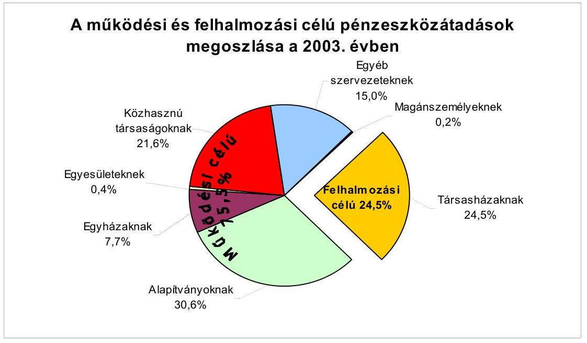
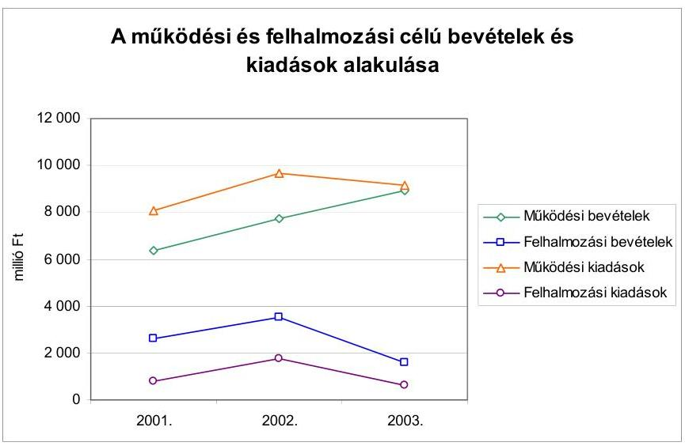
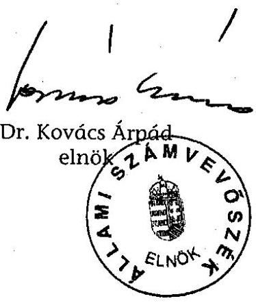
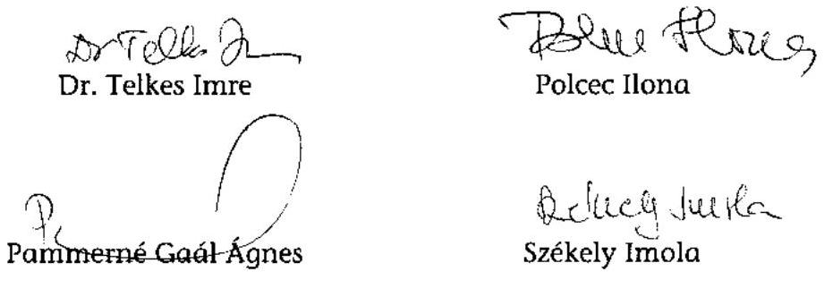
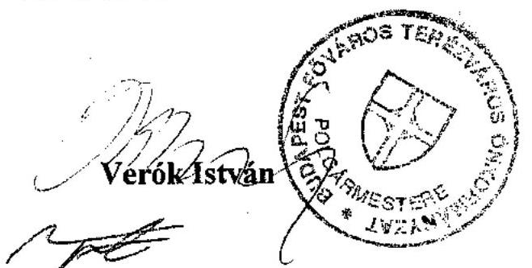

# JELENTÉS 

a Budapest Főváros VI. kerület Terézváros Önkormányzata gazdálkodásának átfogó ellenőrzéséről

---

# 3. Önkormányzati és Területi Ellenőrzési Igazgatóság 

3.3 Átfogó Ellenőrzések Főcsoport

Iktatószám: V-1002-4/22/16/2004.
Témaszám: 692
Vizsgálat-azonosító szám: V0171

## Az ellenőrzést felügyelte:

Dr. Lóránt Zoltán
főigazgató
Az ellenőrzés végrehajtásáért felelős:
Dr. Sepsey Tamás
főigazgató-helyettes
Az ellenőrzést vezette:
Csecserits Imréné
főcsoportfőnök-helyettes

## Az ellenőrzést végezték:

Gyüre Lajosné számvevő Nagy Ervin Barnabás számvevő

Dr. Karáné Kőszegi Zsuzsanna
számvevő tanácsos
Dr. Telkes Imre
számvevő tanácsos

A témához kapcsolódó - az elmúlt négy évben készített számvevőszéki jelentések:
címe
sorszáma
Jelentés a helyi és a helyi kisebbségi önkormányzatok átfogó 0113 ellenőrzéséről
Jelentés a helyi önkormányzatok 2000. évi normatív állami 0128
hozzájárulás igénylésének és elszámolásának vizsgálatáról
Jelentés a helyi önkormányzatoknak a bérlakásépítésre és 0349
korszerűsítésre jutatott pénzügyi támogatások ellenőrzéséről

---

# TARTALOMJEGYZÉK 

BEVEZETÉS ..... 7
I. ÖSSZEGZŐ MEGÁLLAPÍTÁSOK, KÖVETKEZTETÉSEK, JAVASLATOK ..... 9
II. RÉSZLETES MEGÁLLAPÍTÁSOK ..... 21
1.A költségvetés tervezésének, végrehajtásának, az Önkormányzat vagyongazdálkodásának és a zárszámadás elkészítésének szabályszerűsége ..... 21
1.1.A költségvetési rendelet jóváhagyásának, módosításának, az előírányzatok nyilvántartásának és betartásának szabályszerűsége ..... 21
1.2.A gazdálkodás szabályozottsága, a bizonylati rend és fegyelem szabályszerűsége ..... 27
1.3.A pénzügyi-számviteli feladatok ellátásának informatikai támogatottsága ..... 35
1.4.Az önkormányzati vagyon nyilvántartása, számbavétele ..... 36
1.5.A vagyonnal való gazdálkodás szabályszerűsége, célszerűsége, nyilvánossága ..... 39
1.6.A céljelleggel nyújtott támogatások szabályszerűsége ..... 44
1.7.A közbeszerzési eljárások szabályszerűsége ..... 49
1.8.A zárszámadási kötelezettség teljesítésének szabályszerűsége ..... 53
1.9.A Polgármesteri hivatal helyi kisebbségi önkormányzatok gazdálkodását segítő tevékenysége ..... 54
2.Az önkormányzati feladatok és a rendelkezésre álló források összhangja ..... 57
2.1.A feladatok meghatározása és szervezeti keretei ..... 57
2.2.A költségvetés egyensúlyának helyzete ..... 59
2.3.A feladatok finanszírozása ..... 63
3.A belső irányítási, ellenőrzési rendszer működésének értékelése ..... 67
3.1.Az ellenőrzési rendszer kialakítása működése ..... 67
3.2.A könyvvizsgálati kötelezettség teljesítése ..... 68
3.3.A korábbi számvevőszéki ellenőrzések javaslatainak hasznosulása ..... 69

---

# MELLÉKLETEK 

1. számú Az önkormányzati vagyon nagyságának alakulása (1 oldal)
2. számú Az Önkormányzat 2003. évi bevételeinek és kiadásainak alakulása (1 oldal)
3. számú Az Önkormányzat gazdálkodását meghatározó adatok, mutatószámok (1 oldal)
4. számú Egyes feladatok és kiadásainak finanszírozása (1 oldal)
5. számú Helyszíni ellenőrzési jegyzőkönyv (2 oldal)
6. számú Verók István polgármester úr észrevétele (1 oldal)

## FÜGGELÉKEK

Az Önkormányzat vagyongazdálkodási döntéseinek szabályszerűségéről és célszerűségéről (12 oldal)

---

# RÖVIDÍTÉSEK JEGYZÉKE 

Ötv.
Áht.
Ámr.
$\mathrm{Kbt} ._{1}$
$\mathrm{Kbt}_{.2}$
Htv.

Ksztv.
Nek tv.

Számv. tv.
Vhr.

Ber.
2003. évi költségvetési rendelet
2004. évi költségvetési rendelet
2003. évi zárszámadási rendelet
vagyongazdálkodási rendelet ${ }_{1}$
vagyongazdálkodási rendelet ${ }_{2}$
vagyongazdálkodási rendelet ${ }_{3}$
bérbeadási rendelet
a helyi önkormányzatokról szóló 1990. évi LXV. törvény az államháztartásról szóló 1992. évi XXXVIII. törvény az államháztartás működési rendjéről szóló 217/1998. (XII. 30.) Korm. rendelet
a közbeszerzésekről szóló 1995. évi XL. törvény
a közbeszerzésekről szóló 2003. évi CXXIX törvény
a helyi önkormányzatok és szerveik, a köztársasági megbízottak, valamint egyes centrális alárendeltségű szervek feladat- és hatásköreiről szóló 1991. évi XX. törvény
a közhasznú szervezetekről szóló 1997. évi CLVI. törvény
a nemzeti és etnikai kisebbségek jogairól szóló 1993. évi LXXVII. törvény
a számvitelről szóló 2000. évi C. törvény
az államháztartás szervezetei beszámolási és könyvvezetési kötelezettségének sajátosságairól szóló 249/2000. (XII. 24.) Korm. rendelet
a költségvetési szervek belső ellenőrzéséről szóló 193/2003. (XI. 26.) Korm. rendelet

Budapest Főváros VI. kerület Terézváros Önkormányzat 2/2003. (II. 17.) számú rendelete a 2003. évi költségvetéséről
Budapest Főváros VI. kerület Terézváros Önkormányzat 5/2004. (II. 16.) számú rendelete a 2004. évi költségvetéséről
Budapest Főváros VI. kerület Terézváros Önkormányzat 15/2004. (IV. 30.) számú rendelete a 2003. évi zárszámadásáról
Budapest Főváros VI. kerület Terézváros Önkormányzat 30/2000. (XI. 24.) számú rendelete, az Önkormányzat tulajdonában lévő vagyonnal való gazdálkodás és rendelkezés szabályairól
Budapest Főváros VI. kerület Terézváros Önkormányzat 28/2002. (VII. 1.) számú rendelete, az Önkormányzat tulajdonában lévő vagyonnal való gazdálkodás és rendelkezés szabályairól
Budapest Főváros VI. kerület Terézváros Önkormányzat 25/2004. (V. 25.) számú rendelete, az Önkormányzat tulajdonában lévő vagyonnal való gazdálkodás és rendelkezés szabályairól
Budapest Főváros VI. kerület Terézváros Önkormányzat 31/2000. (XI. 24.) számú rendelete az Önkormányzat tulajdonában álló lakások és nem lakás céljára szolgáló helyiségek bérbeadásának feltételeiről

---

| elidegenítési rendelet | Budapest Főváros VI. kerület Terézváros Önkormányzat 38/2000. (XII. 12.) számú rendelete az Önkormányzat tulajdonában lévő lakások és nem lakás céljára szolgáló helyiségek elidegenítésének feltételeiről |
| :--: | :--: |
| közbeszerzési rendelet | Budapest Főváros VI. kerület Terézváros Önkormányzat 2/1997. (I. 29.) számú rendelete, a közbeszerzés egyes kérdéseiről |
| beruházási rendelet | Budapest Főváros VI. kerület Terézváros Önkormányzat 24/2000. (IX. 14.) számú rendelete, az Önkormányzati épületekkel, építményekkel, vonalas létesítményekkel kapcsolatos beruházások és felújítások rendjéről |
| ÁSZ | Állami Számvevőszék |
| MÁK | Magyar Államkincstár Fővárosi Területi Igazgatósága |
| OMVH | Országos Múemlékvédelmi Hivatal |
| Önkormányzat | Budapest Főváros VI. kerület Terézváros Önkormányzata |
| Képviselő-testület | Budapest Főváros VI. kerület Terézváros Önkormányzat Képviselő-testülete |
| polgármester | Budapest Főváros VI. kerület Terézváros Önkormányzat Polgármestere |
| SzMSz | Budapest Főváros VI. kerület Terézváros Önkormányzat 33/2002. (XI. 13.) számú rendelete a Szervezeti és Működési Szabályzatáról |
| Pénzügyi bizottság | Budapest Főváros VI. kerület Terézváros Önkormányzat Képviselő-testületének Pénzügyi Bizottsága |
| Tulajdonosi bizottság | Budapest Főváros VI. kerület Terézváros Önkormányzat Képviselő-testületének Tulajdonosi Bizottsága |
| Humán bizottság | Budapest Főváros VI. kerület Terézváros Önkormányzat Képviselő-testületének Humán Bizottsága |
| Polgármesteri hivatal | Budapest Főváros VI. kerület Terézváros Önkormányzat Polgármesteri Hivatala |
| jegyző | Budapest Főváros VI. kerület Terézváros Önkormányzat Jegyzője |
| Pénzügyi főosztály | Budapest Főváros VI. kerület Terézváros Önkormányzat Polgármesteri Hivatal Pénzügyi és Költségvetési Igazgatósága, 2003. augusztus 1-től Pénzügyi és Költségvetési Főosztálya |
| Szociális és Gyámügyi   főosztály | Budapest Főváros VI. kerület Terézváros Önkormányzat Polgármesteri Hivatal Szociális és Gyámügyi Főosztálya |
| Szociális iroda | Budapest Főváros VI. kerület Terézváros Önkormányzat Polgármesteri Hivatal Szociális Irodája |
| Vagyon-felügyeleti   főosztály | Budapest Főváros VI. kerület Terézváros Önkormányzat Polgármesteri Hivatal Vagyon-felügyeleti és Koordinációs Főosztálya |
| Gondnokság | Budapest Főváros VI. kerület Terézváros Önkormányzat Polgármesteri Hivatal Gondnoksága |
| Informatikai osztály | Budapest Főváros VI. kerület Terézváros Önkormányzat Polgármesteri Hivatal Informatikai Osztálya |

---

| ügyrend $_{1}$ | Budapest Főváros VI. kerület Terézváros Önkormányzat polgármestere és jegyzője által 2001. október 8-án kiadott Ügyrendi szabályzata |
| :--: | :--: |
| ügyrend $_{2}$ | Budapest Főváros VI. kerület Terézváros Önkormányzat polgármestere és jegyzője által 2003. július 31-én kiadott Polgármesteri Hivatal ügyrendje |
| ügyrend $_{3}$ | Budapest Főváros VI. kerület Terézváros Önkormányzat jegyzője által jóváhagyott Pénzügyi főosztály ügyrendje |
| kötelezettségvállalás, ellenjegyzés, érvényesítés és utalványozás rendjének szabályzata | Budapest Főváros VI. kerület Terézváros Önkormányzat polgármestere és jegyzője által 2003. május 23-án kiadott közös utasítás a kötelezettségvállalás, ellenjegyzés, érvényesítés és utalványozás rendjének szabályozásáról |
| TERMA | Terézvárosi Művelődési Közalapítvány |
| TISSZA | Terézvárosi Ifjúsági, Sport- és Szabadidő Közalapítvány |
| TEKA | Terézváros Közrendjéért és Közbiztonságáért Közalapítvány |
| TESZ | Terézvárosi Egészségügyi Szolgálat |
| Vagyonkezelő Rt. | Terézvárosi Vagyonkezelő Rt. |

---

.

---

# JELENTÉS 

## a Budapest Főváros VI. kerület Terézváros Önkormányzata gazdálkodásának átfogó ellenőrzéséről

## BEVEZETÉS

Az Ötv. 92. § (1) bekezdése, az Állami Számvevőszékről szóló 1989. évi XXXVIII. törvény 2. § (3) bekezdése, valamint az Áht. 120/A. § (1) bekezdése szerint az Önkormányzatok gazdálkodását az Állami Számvevőszék ellenőrzi. Az ellenőrzés elvégzése az Országgyűlés illetékes bizottságai részére is átadott, országosan egységes ellenőrzési program alapján történt.

## Az ellenőrzés célja annak értékelése volt, hogy

- az önkormányzati gazdálkodás törvényességét ${ }^{1}$, szabályszerűségét biztosították-e a tervezés, a költségvetés végrehajtása, a vagyongazdálkodás és a zárszámadás során;
- az Önkormányzat által ellátott feladatok és az azokhoz rendelkezésre álló pénzforrások összhangja biztosított volt-e, különös tekintettel egyes kiemelt feladatokra;
- a gazdálkodás szabályszerűségét biztosító kontrollok ${ }^{2}$ megfelelően segítették-e a végrehajtást;

Az ellenőrzött időszak: a 2003. év, valamint a 2004. I. negyedév, az 1.5; 2.1-2.3. és 3.3. ellenőrzési programpontok esetében a 2001-2003. évek.

Budapest Főváros VI. kerületét két településrész - belső Terézváros és a külső Terézváros - alkotja. A kerület lakosainak száma 2003. január 1-jén 43246 fő volt.

Az Önkormányzat 26 tagú Képviselő-testületének munkáját négy önálló bizottság segítette. A 2002. évi helyhatósági választások során a polgármester személye változott. A jegyző személye a 2001-2004. évek alatt kétszer, 2003. január 24-én és 2004. július 1-jén változott.

[^0]
[^0]:    ${ }^{1}$ A törvényi előírások betartásának elmulasztásakor egységesen a törvénysértés megjelölést alkalmazzuk, mivel az ÁSZ nem tehet különbséget a törvényi előírások között.
    ${ }^{2}$ A gazdálkodás szabályszerűségét biztosító kontroll alatt értjük a kiépített és működő belső irányítási és szabályozási rendszert, valamint a belső ellenőrzési funkciók ellátását.

---

Az Önkormányzat feladatainak végrehajtása érdekében 15 önállóan gazdálkodó és 11 részben önállóan gazdálkodó költségvetési intézményt működtetett, valamint két gazdasági társasága, egy közhasznú társasága és három közalapítványa is részt vesz a feladatok végrehajtásában. Az Önkormányzat által fenntartott költségvetési intézményekben foglalkoztatott közalkalmazottak száma a 2003. évben 1284 fő volt, a Polgármesteri hivatalban 204 fő köztisztviselő dolgozott.

Az Önkormányzat a 2003. évben 10504,4 millió Ft költségvetési bevételt, 9781,8 millió Ft költségvetési kiadást teljesített és a 2003. év végén 25495 millió Ft értékű könyvviteli mérleg szerinti vagyonnal rendelkezett. Az Önkormányzat gazdálkodását meghatározó adatokat, mutatószámokat a jelentés 3. számú mellékletében mutattuk be. A kerületben a 2002. évi választásokig öt helyi kisebbségi önkormányzat, a 2002. évi választásokat követően pedig tíz helyi kisebbségi önkormányzat ${ }^{3}$ működött. Az Önkormányzat gazdálkodását meghatározó adatokat és mutatószámokat a 3. számú melléklet tartalmazza.
${ }^{3}$ bolgár, cigány, görög, horvát, német, örmény, román, ruszin, szerb és szlovák

---

# I. ÖSSZEGZŐ MEGÁLLAPÍTÁSOK, KÖVETKEZTETÉSEK, JAVASLATOK 

A Képviselő-testület az ágazati koncepciók 2003. évi felülvizsgálatát követően a 2004. évben határozta meg gazdasági programját.

A polgármester a 2003. és a 2004. évre vonatkozó éves költségvetési koncepciókat határidőben terjesztette a Képviselő-testület elé. Az Ámr. előírása ellenére a polgármester a bizottságok véleményét nem csatolta a koncepcióhoz. Az Önkormányzat költségvetési koncepciójának a helyi kisebbségi önkormányzatra vonatkozó részéről nem tájékoztatták a helyi kisebbségi önkormányzatok elnökeit. A költségvetési koncepciókban az Ámr. előírásainak megfelelően figyelembe vették a központi költségvetésből származó és a helyben képződő bevételeket, valamint az ismert kötelezettségeket. A Képviselő-testület határozatban döntött a koncepciók elfogadásáról. Az Önkormányzat a 2004. évi költségvetés elfogadását követően határozta meg rendeletben a költségvetési és zárszámadási rendeletek előterjesztéskor bemutatandó mérlegek és kimutatások tartalmi követelményeit.

A polgármester határidőben a Képviselő-testület elé terjesztette a bizottságok által megtárgyalt, a Pénzügyi bizottság által véleményezett, a könyvvizsgáló írásos véleményét tartalmazó 2003. és a 2004. évi költségvetési rendelettervezetet. Az Önkormányzat költségvetési rendelettervezeteibe a jegyző nem építette be az Áht-t megsértve elkülönítetten, és az Ámr. előírása ellenére változatlan formában a helyi kisebbségi önkormányzatok költségvetéséről hozott határozatokat. Az Áht-t megsértve a Képviselő-testület részére tájékoztatásul egyik évben sem mutatták be a közvetett támogatásokat tartalmazó kimutatást és szöveges indokolását, továbbá a 2003. és a 2004. évi költségvetésekben a tervezett bevételek és kiadások különbözetét nem mutatták ki hiányként, valamint a hitelfelvételt költségvetési
 bevételként és a hiteltörlesztést költségvetési kiadásként vették figyelembe. A költségvetési rendeletekben az Ámr. előírása ellenére a bevételeket, a működési, fenntartási előirányzatokat és az éves létszámkeretet nem mutatták be a részben önállóan gazdálkodó szervekre vonatkozóan. A költségvetési rendeletben az „Alap" elnevezésű költségvetési előirányzatok - a Környezetvédelmi Alap kivételével - nem feleltek meg az Áhtban az „Alap"-okra vonatkozó előírásnak, ezért az „Alap" kifejezés használata félreérthető, alkalmazása bizonytalanságot, az egyértelműség hiányát okozza. A költségvetési rendeletben a Képviselő-testület az Ötv-t megsértve alpolgármesterekre is átruházott céltartalék előirányzat feletti rendelkezési jogot.

A Képviselő-testület nyolc alkalommal módosította a költségvetési rendeletében jóváhagyott előirányzatokat. A Képviselő-testület a 2003. évi költségvetés előirányzatait utolsó alkalommal az Ámr-ben előírt határidőn túl módosította. Az Önkormányzat a 2003. évi költségvetés kiadási és bevételi módosított előirányzatai főösszegén belül gazdálkodott. A költségvetési szervek közül a Polgármesteri hivatal előirányzattal nem rendelkező felújítási célra teljesített kifizetéssel megsértette az Áht. előírásait. A meghatározott célra jóváhagyott előirányzat nélkül megvalósított felújítás okainak megállapítására nem indult

---

vizsgálat. Az előirányzaton belüli gazdálkodásra vonatkozó kötelezettség megszegése miatt felelősségre vonást nem kezdeményeztek.

A Polgármesteri hivatal a Képviselő-testület által jóváhagyott SzMSz-szel nem rendelkezett, felépítését, működésének rendszerét, a szervezeti egységek megnevezését, a gazdasági szervezet felépítését, feladatait az ügyrendben ${ }_{1}$ határozták meg. Az ügyrend ${ }_{1}$ tartalma megfelelt az Ámr-ben előírtaknak. A gazdasági szervezet és szervezeti egységei feladatait, a vezetők és a dolgozók feladat, hatás és jogkörét az ügyrend ${ }_{3}$ nem az Ámr-ben foglaltaknak megfelelő részletezésben tartalmazta.

A Polgármesteri hivatalban az operatív gazdálkodással és ellenőrzéssel kapcsolatos jogköröket a kötelezettségvállalás, ellenjegyzés, érvényesítés és utalványozás rendjének szabályzatában határozták meg. A polgármester kötelezettségvállalási joggal a személyi juttatások előirányzataira értékhatár nélkül felhatalmazta a jegyzőt, a jegyző távollétében az aljegyzőt. A polgármester távolléte esetére kötelezettségvállalási és utalványozási jog gyakorlására a személyi juttatások előirányzatai kivételével az alpolgármesternek adott felhatalmazást. A szakmai teljesítés igazolásának feladataival a kötelezettségvállalási jogkörrel rendelkező személyeket bízta meg a jegyző. A gazdálkodási és ellenőrzési jogkörök felhatalmazottainak kijelölésénél az Ámr-ben foglalt összeférhetetlenségi követelményeket betartották. A gazdálkodási jogkörök gyakorlásáról a felhatalmazottakat nem számoltatták be, a beszámoltatás módját és formáját nem szabályozták. Az 50 ezer Ft-ot el nem érő kifizetések esetén a kötelezettségvállalások rendjét és nyilvántartási formáját nem határozták meg.

A Polgármesteri hivatal számviteli politikáját kialakították, annak részeként elkészítették a leltározási, az értékelési, a pénzkezelési és a selejtezési szabályzatot. A jegyző a Htv-t megsértve nem alakította ki az önkormányzati intézmények egységes számviteli rendjét. A számviteli politikában meghatározták az elszámolásra és az értékelésre vonatkozó lényeges szempontokat, jelentős összegű hiba nagyságát indokolatlanul magas összegben, a könyvviteli mérleg 1%-ában határozták meg, mely összeg meghaladja a Vhr-ben előírt, 2004. január 1-től alkalmazandó maximális értéket. A leltározási szabályzatban nem határozták meg a leltározás elvégzését igazoló leltárt helyettesítő összesítő kimutatás készítésének tartalmát, formáját és kellékeit, a leltár helyettesítéséhez Képviselő-testületi egyetértéssel nem rendelkeztek. A szabályzat a Vhr. erre vonatkozó 2004. évi változásait nem tartalmazta. A pénzkezelési szabályzatban rögzített házipénztári keret maximális összege 2 millió Ft volt. A szabályzat nem tartalmazta a pénztár ellenőrzésének gyakoriságát. A selejtezési szabályzatban rögzítették a felesleges vagyontárgyak feltárásának, selejtezésének és hasznosításának rendjét. A számlarendben a Vhr-ben előírtak ellenére nem határozták meg az analitikus nyilvántartások adataiból készített összesítő kimutatások elkészítésének határidejét. A számlarendben foglaltak alátámasztását szolgáló bizonylati rendet a Számv. tv-t megsértve nem készítették el.

A pénzügyi-számviteli területen dolgozók munkaköri leírásai tartalmazták a munkaköri feladatokat, a helyettesítések rendjét, a dolgozók hatáskörét, felelősségét, a gazdálkodással összefüggő jogköröket, a munkafolyamatba épített ellenőrzési feladatokat, az egyeztetési kötelezettségeket, azok gyakoriságát. A

---

Pénzügyi főosztályon a részletező nyilvántartásokat a gazdasági eseményekről a számlarendben foglaltaknak megfelelően vezették.

A házipénztári tételek 39,5%-át a Számv. tv-t megsértve nem a pénzmozgás napján rögzítették a könyvvitelben. A pénztáros nem tartotta be a pénzkezelési szabályzat előírását, mely szerint a pénztári napok befejezésével pénztárzárást kell készíteni. Az operatív gazdálkodás végrehajtása során a gazdálkodási jogkörök gyakorlásakor az Ámr-ben előírt összeférhetetlenségi követelményeket betartották. A pénzügyi érvényesítési feladatokat nem látták el a költségvetési bevételeknél. A kötelezettségvállalás ellenjegyzése a kiadási tételek 16,7%-ánál hiányzott, elmaradt a megbízási szerződéseknél és a gondnokságvezető által aláírt megrendeléseknél. A kötelezettségvállalás ellenjegyzésének elmaradása miatt nem teljesült a kiadási előirányzat által biztosított fedezet meglétének, a kötelezettségvállalás jogszerűségének munkafolyamatba épített ellenőrzése. Kötelezettségvállalás nélküli kifizetések eseti jelleggel, a kiadási bizonylatok 1,7%-ánál fordultak elő. A megrendelések a kiadási bizonylatok 4%-ánál a Számv. tv. megsértve nem tartalmazták a megrendelési értékadatait. Elmaradt az utalványozás és az utalvány ellenjegyzése a bizonylatok 10,3%-ánál, a bevételek azon körénél, amelyek nem termékértékesítésből, szolgáltatásnyújtásból származtak. A házipénztárban a pénztárellenőr nem kifogásolta a - pénzkezelési szabályzatban előírt - napi pénztárzárás hiányát. A heti két alkalommal elvégzett pénztárzárást, a pénztárjelentést, a pénzkészletet, a házipénztári keret betartását a pénztárellenőr ellenőrizte. A pénzkezelési szabályzatban meghatározott házipénztári keret 2 millió Ft összegét a pénztárzárás nélküli napok 33,3%-ánál túllépték.

Az Önkormányzat informatikai stratégiával nem rendelkezett, a hosszabb távra szóló informatikai koncepcióját a 2004. évben készítette el. Az Önkormányzat nem készített informatikai katasztrófa elhárítási tervet. A számítástechnikai adatvédelmi szabályzaton belül a mentések, az adatvédelem szabályozása megtörtént. Az adatvédelmi feladatok ellátásának kötelezettségét előírták. Az informatikai eszközökről vezették a számviteli nyilvántartásokat.

A számviteli rendszer keretében gondoskodtak az önkormányzati vagyon teljes körű analitikus nyilvántartásáról. A korábban érték nélkül nyilvántartott ingatlanvagyon értékelését az előírt határidőn belül a 2002. évben elvégezték. Ennek során a számviteli nyilvántartásokban az Önkormányzat üzemeltetésre átadott ingatlanvagyonának, elsősorban földterületeknek, valamint lakások és nem lakás céljára szolgáló helyiségeknél a számviteli nyilvántartás szerinti értéke 16083 millió Ft-tal emelkedett.

A Polgármesteri hivatal leltározási kötelezettségének eleget tett. A Vhr. előírása alapján a mérleget mennyiségi felvétellel járó leltározással, leltárt helyettesítő összesítő kimutatással és egyeztetéssel támasztották alá, annak ellenére, hogy a leltárt helyettesítő összesítő kimutatás elkészítéséhez a Vhr-ben előírtak szerinti képviselő-testületi egyetértéssel nem rendelkeztek.

A követelések, részesedések és értékpapírok értékelését a 2003. évben elvégezték. A részesedések mérlegsoron a 2003. évben összesen 7,3 millió Ft értékvesztést számoltak el. A 2003. évben egy gazdasági társaság esetében nem megalapozottan számoltak el értékvesztést, mert az arra vonatkozó hiteles in-

---

formációval nem rendelkeztek, megsértették ezzel a Számv. tv. vonatkozó előírását.

A vagyongazdálkodási rendeletben ${ }_{1,2,3}$ a Képviselő-testület a forgalomképesség szerinti besorolás megváltoztatását saját hatáskörében tartotta. A vagyonnal való rendelkezési, döntési hatásköröket értékhatárhoz kötötték, megjelölték a döntéshozókat. A szerződések közzétételével kapcsolatos Áht-ban foglalt követelménynek a helyben szokásos módon eleget tettek. Rendeletben meghatározta a Képviselő-testület az ingyenes vagy kedvezményes vagyonátadás, valamint a követelésről lemondás eseteit, módját. Vagyongazdálkodási rendeletben ${ }_{1,2}$ egyedi vagyon esetén 200 millió Ft, illetve 2004. május 25-től együttes vagyontömeg esetén 300 millió Ft-ban rögzítették azt az értékhatárt, amely felett a versenyeztetési eljárás kötelező. Az értékhatár indokolatlanul magas, nem segíti a köztulajdonnal való gazdálkodás nyilvánosságát, átláthatóságát. A vagyongazdálkodási rendeletben ${ }_{1,2,3}$ meghatározott esetben a versenyeztetési eljárástól a Képviselő-testület minősített többséggel elfogadott határozatával eltérhetett. Ez az előírás sértette az Áht. előírását, mivel az Áht. ilyen eltérést nem tett lehetővé. A Képviselő-testület a 2004. I. negyedében az Áht. előírását megsértve engedélyezte két, versenyeztetésre meghatározott értékhatár feletti (280, illetve 445 millió Ft-os) ingatlan versenytárgyalás nélküli értékesítését. Az Önkormányzat következetlen volt a versenyeztetést illetően, mert olyankor is elrendelt pályáztatást, amikor a vagyongazdálkodási rendelete ${ }_{1,2}$ alapján az nem lett volna kötelező. Nem járt el elég körültekintően, amikor a licitálásos pályáztatás során nem kötött ki bánatpénz fizetési kötelezettséget, ily módon az ajánlattevők minden következmény nélkül visszaléphettek a szerződéskötéstől. Nem tartották szem előtt az Önkormányzat érdekeit, amikor a „Szépkorúak Háza" létrehozásával kapcsolatban nem határozták meg az Önkormányzat által kért ingatlanrész műszaki követelményeit, illetve nem készítettek értékbecslést az eladott ingatlan értékére vonatkozóan. Ezen jogügylet kapcsán a beérkezett pályázatok értékelésekor olyan szempontokat is figyelembe vettek, amelyek nem szerepeltek a pályázati kiírásban. A vagyongazdálkodási döntések során a hatásköri előírásokat betartották. Az Önkormányzat a kerületben működő pártok részére díjmentesen helyiséget biztosított, ezzel megsértette az Ötv-t, valamint nem biztosította az alkotmányos jogegyenlőséget és a pártokat az ingyenességen keresztül közvetett anyagi támogatásban részesítette.

Az Önkormányzat 2003. évi költségvetéséből 302 szervezet részére nyújtott célhoz kötött támogatást. Az Önkormányzat 18 alapítványt támogatott. A támogatottak 28%-a részére nem írta elő a támogató a számadás módját és határidejét. A 43 támogatott civil szervezet közül 16 közhasznú volt. Ezekkel az Önkormányzat nem kötött írásos szerződést, ezzel megsértették a Ksztv. erre vonatkozó előírását. Az öt egyházi szervezet, 13 egyesület, egy kht., 39 egyéb szervezet, 190 társasház és 34 diák részére nyújtott támogatások során meghatározták a támogatás célját, összegét, folyósításának ütemezését, határidejét, a számadási kötelezettséget és a számadás módját. Egy támogatottnál nem írták elő a számadási kötelezettséget, valamint a számadás elmulasztása ellenére nem intézkedtek a támogatás visszautalása érdekében. A 2003. évben az Önkormányzat által a civil és önszerveződő közösségek részére kiírt pályázatokra 45 pályázat érkezett. Egy pályázót ezért zártak ki, mert nem számolt el egy korábbi, az Önkormányzattól kapott támogatás felhasználásáról. A kizáráson kívül egyéb szankcionálásra, így a korábbi támogatás vissza-

---

követelésére nem került sor. A 302 támogatott szervezet közül 300 elszámolt, egy támogatásnál még nem járt le az elszámolási határidő. Egy támogatott az Áht. előírását megsértve nem számolt el a 2003. évi támogatással, annak visszautalása érdekében nem intézkedtek és a 2004. évi költségvetési rendeletben újból támogatást irányoztak elő részére. Az elszámolások során a társasházaknak nyújtott felújítási és zöldfelület fejlesztési támogatásokat felülvizsgálták, a 23 zöldfelület fejlesztési cél megvalósulását a helyszínen is ellenőrizték. A számlák alaki és tartalmi felülvizsgálatával történt elszámolásokat a helyszínen nem ellenőrizték. A 302 támogatás 92%-ában elmaradt a támogatás felhasználásának helyszíni ellenőrzése. Az Önkormányzat 2004. I. félévében pályázatot írt ki a kerületben működő alapítványok, egyesületek és társadalmi szervezetek támogatása céljából. A beérkezett pályázatokat a Humán bizottság értékelte, döntése alapján nyolc alapítványt összesen 1,4 millió Ft támogatásban részesített. Ezzel megsértették az Ötv. előírását, amely szerint az alapítványok, közalapítványok támogatásáról való döntés a Képviselő-testület kizárólagos hatáskörébe tartozik.

Az Önkormányzatnál nem vizsgálták a közbeszerzés centrális lebonyolításának célszerűségét. A Polgármesteri hivatalban a 2003. évben az irodaszer, nyomtatvány beszerzés esetében a Kbt. ${ }_{1}$-t megsértve nem folytatták le a közbeszerzési eljárást, valamint az önkormányzati tulajdonú épületek felújításának lebonyolítói feladatát ellátó Vagyonkezelő Rt. kettő esetben nem közbeszerzés alapján kötött szerződést a fűtés korszerűsítési munkák elvégzésére. Ezt a hiányosságot a Vagyonkezelő Rt. Felügyelő bizottsága megtárgyalta, amelyről a polgármestert tájékoztatta. A Képviselő-testület a közbeszerzésekről szóló, 2004. május
 1-től hatályos törvény rendelkezésére figyelemmel hatályon kívül helyezte a közbeszerzésekről szóló rendeletét, meghatározta az ajánlatkérő jogait gyakorló személyeket.

A Polgármester a 2003. évi zárszámadási rendelettervezetet határidőn belül beterjesztette a Képviselő-testületnek. A zárszámadási rendelet mellékletei az Áht-t megsértve a költségvetési rendeletben foglaltakkal - az eltérő adattartalmú megnevezések miatt - nem hasonlíthatók össze. A zárszámadási rendeletben az Ámr. előírása ellenére nem mutatták be a részben önállóan gazdálkodó költségvetési szervekre vonatkozóan a bevételi és a kiadási előirányzatok teljesítését, valamint a tényleges létszámot. A zárszámadási rendelettervezet előterjesztésekor nem mutatták be a Képviselő-testületnek tájékoztatásul az Áht-t megsértve a vagyonkimutatást, valamint a közvetett támogatásokat tartalmazó kimutatás szöveges indokolását. Az önkormányzati szintű pénzmaradványt a jogszabályi előírásoknak megfelelően határozták meg. Az intézmények vezetőit - az Ámr. előírásait betartva - írásban értesítették az éves beszámolójuk elfogadásáról.

A kerületben a 2002. évi választásokig öt helyi kisebbségi önkormányzat működött. Ezt követően öt új kisebbségi önkormányzat alakult. Az Önkormányzat nem kötött az Áht-t megsértve az új helyi kisebbségi önkormányzatokkal együttműködési megállapodásokat. A korábban alakult és működő kisebbségi önkormányzatokkal a 2001. évben megkötött megállapodásokban szabályozták az együttműködésük rendjét, a költségvetési tervezés, a végrehajtás és a beszámolás területén. A 2001. évben megkötött megállapodások nem tartalmazták az operatív gazdálkodáshoz kapcsolódóan az Ámr-ben előírt összeférhetetlenségi követelményeket, a kisebbségi önkormányzatok elnökeivel az Önkormányzat részéről egyeztetéseket folytató személy kijelölését, valamint a kisebbségi önkormányzatok esetében a szakmai teljesítés igazolásának szabályait. A Polgármesteri hivatal a kisebbségi önkormányzati gazdálkodásra vonatkozó sajátos feladatokat számviteli politikájában, számlarendjében nem szabályozta. A megállapodásokban és a jogszabályokban előírtakat az önkormányzatok együttműködésük során - a kisebbségi önkormányzatok költségvetésének tartalmát és elfogadási rendjét kivéve - betartották.

Az Önkormányzat 2001-2003. évi költségvetésében a főösszeg egyensúlya biztosított volt. A 2002. évben a gazdálkodás során 187,8 millió Ft hiány keletkezett, melyet felhalmozási célú hitel igénybevételével pótoltak. Az Önkormányzat 2003. évi eredeti költségvetése - a költségvetés főösszegének egyensúlya mellett - működési forráshiányt mutatott, a működési kiadásokra a hiányzó összeget a felhalmozási bevételekből biztosították. A működési kiadások aránya a költségvetésben 93,9%-ot képviselt, míg a működési bevételek 84,9%-ot tették ki az összes bevételből. A felhalmozási bevételeket túltervezték, a 2003. évben az eredeti előirányzathoz képest 58,4%-kal maradt el a teljesítés. Az Önkormányzat a bevételeinek növelése érdekében élt a helyi adók megállapításának lehetőségével, a helyi adók - építményadó, telekadó - mértékét a törvényi maximális mértékben állapították meg. Az Önkormányzat feladatainak finanszírozásához pályázatok útján külső pénzügyi forrásokat is igénybevett.

A vizsgált időszakban az Önkormányzat költségvetési intézményrendszere nem változott lényegesen. A Fővárosi Önkormányzattól a Tüdőgondozó került saját fenntartásba, egy óvodát az Apor Vilmos Katolikus Főiskolának adtak át működtetésre. A naturális mutatókkal mérhető feladatok esetében a fajlagos ráfordítások emelkedtek, az ellátottak számának csökkenése, a rendelkezésre álló kapacitások részleges kihasználatlansága következtében. A kiadások növekedésében meghatározó szerepe volt a központi és helyi intézkedések nyomán végrehajtott közalkalmazotti béremeléseknek. Az Önkormányzat a kötelező és önként vállalt feladatait az általa alapított költségvetési szervei, gazdasági társaságai, közhasznú szervezetei és vásárolt szolgáltatások útján biztosította. Az önként vállalt feladatok elhatárolása az egyes ágazatfejlesztési koncepciók részeként történt meg. Az önként vállalt feladatok ellátására fordított kiadások részaránya az Önkormányzat költségvetésében 2,0%-kal emelkedett és 2003. év végére 8,2%-ot ért el. Az önként vállalt feladatok kiadásai nem veszélyeztették a kötelező feladatok ellátását, de hozzájárultak az Önkormányzat likviditási gondjaihoz.

A jegyző a pénzállomány várható alakulásáról, a tervezett feladatok folyamatos finanszírozása érdekében likviditási tervet készített, amelyet évközben aktualizáltak. Az ellenőrzött évek gazdálkodását finanszírozási gondok jellemezték, amelyet likviditási hitel igénybevételével oldottak meg. Az Önkormányzat a 2003. évben nem döntött adósságot keletkeztető kötelezettségvállalásról. Ennek ellenére a költségvetés készítése során vizsgálták és kimutatták a lehetséges felső korlátot. A Polgármesteri hivatalban a kötelezettségvállalásokról a megfelelő analitikus nyilvántartást vezették, amely összhangban volt az előirányzat nyilvántartással.

Az Önkormányzat a középületek akadálymentesítésére vonatkozó felmérést készített és a 2002-2004. években erre előirányzatot is jóváhagyott, amelyből 4,5 millió Ft értékben végzett akadálymentesítést. A feladatok költségigénye (21-28 millió Ft) és az eddigi kiadások miatt nem biztosított, hogy a törvényben előírt határidőig az akadálymentesítési feladatok a fogyatékos személyek mozgásának segítése érdekében megvalósuljanak.

Az Önkormányzat a belső ellenőrzés szervezeti kereteit a Polgármesteri hivatal ügyrendjében szabályozta. Érvényesült a belső ellenőr funkcionális és szervezeti függetlensége. A Polgármesteri hivatal a 2004. évben elkészítette a belső ellenőrzési kézikönyvet. A belső ellenőrök számát a Ber. előírása ellenére nem kapacitás felmérés alapján határozták meg. A Képviselő-testület a Htv-t megsértve nem tekintette át rendszeresen az ellenőrzések tapasztalatairól szóló beszámolót.

Az Önkormányzat a 2003. évben a törvényben előírt könyvvizsgálati kötelezettségét költségvetési minősítésű könyvvizsgálóval - az összeférhetetlenségi követelmények figyelembevételével - teljesítette. A könyvvizsgáló auditálási eltéréseket nem állapított meg. Korlátozás nélküli hitelesítő záradékkal látta el a Polgármesteri hivatal és az intézmények összevont adatait tartalmazó, egyszerűsített tartalmú költségvetési beszámolót.

A korábbi számvevőszéki jelentésekben szereplő javaslatok az előző átfogó vizsgálat vonatkozásában 60%-os, a normatív támogatások ellenőrzése esetében 100%-os és a bérlakás-építési támogatások felhasználásának vizsgálatát illetően 80%-os mértékben hasznosultak.

A helyszíni ellenőrzés megállapításainak hasznosítása mellett javasoljuk:

# a polgármesternek 

a jogszabályok maradéktalan betartása érdekében

1. csatolja a költségvetési koncepcióhoz az Ámr. 28. § (3) bekezdésének megfelelően az Önkormányzatnál működő bizottságok koncepció tervezetről alkotott véleményét;
2. kezdeményezze, hogy a Képviselő-testület hagyja jóvá a Polgármesteri hivatal SzMSz-ét az Ámr. 10. § (4) bekezdésében foglalt előírásoknak megfelelő tartalommal;
3. kezdeményezze, hogy a Képviselő-testület a Htv. 138. § (1) g) pontjában foglaltak betartása érdekében rendszeresen tekintse át a belső ellenőrzések tapasztalatairól készített beszámolót;
4. gondoskodjon, hogy az alapítványoknak nyújtott támogatások odaítélése az Ötv. 10. § (1) bekezdésének d) pontja alapján a Képviselő-testület kizárólagos döntési hatáskörében történjen;
5. gondoskodjon arról, hogy a pártok részére biztosított helyiségek használatának díja összhangba kerüljön a Képviselő-testület 548/2000. (XI. 28.) számú határozatával és hogy érvényesüljön az Alkotmány 70/A. §-ok szabályozott jogegyenlőség követelménye;
6. intézkedjen, hogy mindegyik helyi kisebbségi önkormányzattal kössön az Önkormányzat együttműködési megállapodást a gazdálkodási feladatok végrehajtása érdekében, eleget téve az Áht. 66. §-a, illetve 68. § (3) bekezdése előírásainak;
7. gondoskodjon a vagyongazdálkodási rendelet módosításáról annak érdekében, hogy az ne tartalmazzon az Áht. 108.§ (1) bekezdésében foglalt előírást sértő, a verseny szabályai alól felmentést adó, helyi szabályozást;
8. gondoskodjon a középületek akadálymentesítésének tervezése és annak végrehajtása során a fogyatékos személyek jogairól és esélyegyenlőségük biztosításáról szóló 1998. évi XXVI. törvény 29. § (6) bekezdésében foglaltak végrehajtásáról;
a munka színvonalának javítása érdekében
9. gondoskodjon a kötelezettségvállalásra és az utalványozásra felhatalmazottak beszámoltatásáról, a beszámoltatás szabályozásáról;
10. kezdeményezze a számvevőszéki ellenőrzés tapasztalatainak képviselő-testületi megtárgyalását, a feltárt hiányosságok megszüntetésére készíttessen intézkedési tervet;
11. kezdeményezze, hogy a licitálásos pályáztatással történő vagyon elidegenítése során az ajánlattétel csak bánatpénz befizetésével legyen lehetséges;
12. kezdeményezze, hogy a pályázati eljárás során hozott döntéseknél a kiíró tartsa be a pályázati kiírásban foglalt szempontokat;
13. biztosítsa, hogy az ingatlanok értékesítésére vonatkozó döntési javaslat előterjesztésekor az ellenértékként figyelembe vett szolgáltatások, felújítások, beruházások mennyiségi-minőségi műszaki követelményei, elkészítési határideje és értéke meghatározásra kerüljön az ingatlan értékbecslés szerinti értékének feltüntetése mellett;

# a jegyzőnek 

a jogszabályok maradéktalan betartása érdekében

1. tájékoztassa az Önkormányzat költségvetési koncepciójának helyi kisebbségi önkormányzatokra vonatkozó részéről a helyi kisebbségi önkormányzatok elnökeit az Ámr. 28. § (6) bekezdése alapján;
2. a költségvetési rendelettervezet előkészítésekor
a) építse be az Önkormányzat költségvetési rendelettervezetébe az Áht. 65. § (3) bekezdése szerint elkülönítetten és az Ámr. 32. §-ának megfelelően változatlan formában a helyi kisebbségi önkormányzatok költségvetésről hozott határozatait;
b) gondoskodjon arról, hogy a költségvetési rendelet előterjesztésekor tájékoztatásul bemutatásra kerüljön a Képviselő-testület részére az Áht. 118. §-a alapján az Áht. 116. § 10. pontja szerint a közvetett támogatásokról szóló kimutatás és szöveges indokolása.
c) mutassa be a költségvetési rendelettervezetben hiányként a tervezett hitelt az Áht. 8. § (1) bekezdése alapján és az Áht. 8/A. § (7) bekezdésének megfelelően ne vegye figyelembe a hitelfelvételt költségvetési bevételként, a hiteltörlesztést költségvetési kiadásként;
d) gondoskodjon arról, hogy a költségvetési rendelettervezetben a részben önállóan gazdálkodó költségvetési szervekre is bemutatásra kerüljenek az Ámr. 29. § (1) bekezdés a) pontja alapján a bevételek, b) pontja alapján a működési, fenntartási előirányzatok és f) pontja szerint az éves létszámkeret;
e) kezdeményezze, hogy a Képviselő-testület ne ruházzon át hatáskört az alpolgármesterekre az Ötv. 9. § (3) bekezdésében, illetve az Áht. 73. § (3) bekezdésében előírtak betartása érdekében;
3. a költségvetési rendelet módosításakor
a) vegye figyelembe az utolsó rendeletmódosítás előterjesztésének elkészítésénél az Ámr. 53. § (2) bekezdésében foglalt határidőt;
b) gondoskodjon arról, hogy a Polgármesteri hivatal az Áht. 93. § (1) bekezdése alapján a Képviselő-testület által felújítási célonként jóváhagyott előirányzatokon belül gazdálkodjon és az Áht. 12/A. § (1) bekezdése szerint a felújítási célonként jóváhagyott előirányzat összeghatáráig rendeljen el kifizetést, az előirányzat túllépés okait vizsgáltassa ki, indokolt esetben kezdeményezzen felelősségre vonást;
4. gondoskodjon az ügyrend³ tartalmi kiegészítéséről a gazdasági szervezet és szervezeti egységei részletes feladatainak meghatározásáról az Ámr. 17. § (5) bekezdéseiben foglalt előírások figyelembevételével;
5. intézkedjen a Htv. 140. § (1) bekezdés c) pontjának előírása alapján a költségvetési intézményekre vonatkozó egységes számviteli rend kialakításáról;
6. biztosítsa a számviteli politikában a jelentős összegű hiba nagyságrendjének olyan meghatározását, amely megfelel a Vhr. 5. § 8. pontjában 2004. január 1-től előírt értéknek;
7. módosítsa a leltározási szabályzatban a leltározás módjának és gyakoriságának előírásait figyelembe véve a Vhr. 37. § (1) bekezdésében foglaltakat;
8. határozza meg a Számv. tv. 161. § (2) bekezdés d) pontjában foglaltak alapján, a számlarendben foglaltakat alátámasztó bizonylati rendet;
9. gondoskodjon a számlarend kiegészítéséről a Vhr. 49. § (4) bekezdésének előírása alapján az analitikus nyilvántartások adataiból készített összesítő bizonylatok elkészítési határidejének meghatározásáról;
10. intézkedjen, hogy a Számv. tv. 167. § (1) bekezdés e) pontjában foglaltak alapján az írásbeli kötelezettségvállalás bizonylatai tartalmazzák a megrendelt termék, szolgáltatás értékadatait;

11. tartsa be a pénzkezelési szabályzat 5. pontja szerinti napi pénztárzárási kötelezettséget, valamint a napi házipénztári keretet;
12. gondoskodjon a költségvetési bevételeknek az Ámr 135. § (1) bekezdése szerinti érvényesítésének elvégzéséről, valamint az Ámr. 137. § (3) bekezdésében foglaltak alapján a nem termékértékesítésből és szolgáltatásnyújtásból származó bevételek utalványozásáról és az arra vonatkozó utalvány ellenjegyzéséről;
13. biztosítsa a számviteli bizonylatok feldolgozási rendjének kialakításakor a Számv. tv. 165. § (3) bekezdés a) pontjában foglaltaknak megfelelően, hogy a házipénztári gazdasági műveletek bizonylatainak adatait a pénzmozgással egyidejűleg rögzítsék a könyvekben;
14. biztosítsa a folyamatba épített ellenőrzési feladatok elvégeztetésével az Ámr. 134. § (7) bekezdése alapján a kötelezettségvállalás ellenjegyzésére vonatkozó előírások betartását;
15. biztosítsa a folyamatba épített ellenőrzési feladatok elvégeztetésével az Ámr. 134. § (1) és (2) bekezdésében
 foglalt írásbeli kötelezettségvállalásra vonatkozó előírások betartását;
16. gondoskodjon a Számv. tv. 165. § (1) bekezdésében előírtak maradéktalan betartásáról, értékvesztést csak hiteles bizonylatok alapján számoljanak el;
17. gondoskodjon az Önkormányzat portfoliójának értékesítése esetén a vagyongazdálkodási rendelet 22. és 23. § előírásainak betartásával arról, hogy az értékpapír értékesítéseket, vételeket megelőzően legalább három tőzsdei kereskedési joggal rendelkező befektetési vállalkozás ajánlatát kérjék be;
18. biztosítsa, hogy a Ksztv. 14. § (2) bekezdésében foglaltak betartása érdekében az Önkormányzat által közhasznú szervezetek részére céljelleggel megállapított támogatások folyósítására minden esetben írásbeli szerződés alapján történjen;
19. intézkedjen az Áht. 13/A. § (2) bekezdésének betartása érdekében arról, hogy az Önkormányzat által juttatott céljellegű támogatásoknál számadási kötelezettséget írjanak elő, a céljellegű támogatások felhasználásának ellenőrzése megtörténjen, a céltól eltérő jogsértő felhasználás esetén a támogatás összegének visszafizetése érdekében tegye meg a szükséges intézkedéseket;
20. gondoskodjon a közbeszerzési értékhatárt elérő árubeszerzéseknél, építési beruházásoknál és szolgáltatások megrendelésénél a közbeszerzési eljárás lefolytatásáról, a Kbt. 22. §-ban előírtak alapján;
21. a zárszámadási rendelettervezet előkészítésekor
a) gondoskodjon arról, hogy a rendelettervezet mellékletei a költségvetési rendelet mellékleteivel az adattartalom és megnevezések szempontjából összehasonlíthatóak legyenek az Áht. 18. §-ának előírásának megfelelően;
b) gondoskodjon arról, hogy a rendelettervezetben a részben önállóan gazdálkodó költségvetési szervekre is bemutatásra kerüljenek az Ámr. 29. § (1) bekezdés a) pontja alapján a bevételi, b) pontja alapján a működési, fenntartási előirányzatok teljesítési adatai és f) pontja szerint a tényleges létszámkeretek;
c) gondoskodjon arról, hogy a rendelet előterjesztésekor tájékoztatásul bemutatásra kerüljön a Képviselő-testület részére az Áht. 118. §-a alapján az Áht. 116. § 8. pontja szerinti vagyonkimutatás, valamint a közvetett támogatásokat tartalmazó kimutatás szöveges indokolással;
22. készítse elő a helyi kisebbségi önkormányzatokkal megkötött együttműködési megállapodások módosítását annak érdekében, hogy azok
a) tartalmazzák a kisebbségi önkormányzatok költségvetési és zárszámadási határozatainak az Önkormányzat részére történő átadási határidejét az Ámr. 29. § (10) bekezdése szerint;
b) tartalmazzák a kötelezettségvállalás, az utalványozás és ezek ellenjegyzésének szabályozására vonatkozóan az összeférhetetlenségi követelményeknek az Ámr. 138. §-a szerinti biztosítását;
c) tartalmazzák annak a személynek a kijelölését, aki az Önkormányzat részéről egyeztetést folytat a helyi kisebbségi önkormányzatok elnökeivel a költségvetési rendelettervezet előkészítése során, amint azt az Ámr. 28. § (7) bekezdése előírja;
23. biztosítsa, hogy a Polgármesteri hivatal számlarendje, számviteli politikája a kisebbségi önkormányzati gazdálkodással összefüggő sajátos feladatokat a Vhr. 8. § (3) és 49. § (1) bekezdésének megfelelően szabályozza;
24. rendelkezzen belső szabályzatban, a helyi kisebbségi önkormányzatok gazdálkodása tekintetében szakmai teljesítés igazolásának módjáról és az azt végző személyek kijelöléséről, az Ámr. 135. § (3) bekezdésében előírtak alapján;
25. gondoskodjon arról, hogy a Ber. 4. § (6) bekezdésének előírása szerint határozzák meg a belső ellenőrök számát;
a munka színvonalának javítása érdekében
26. kezdeményezze a költségvetési rendelettervezet előkészítése során, hogy a tartalmuk alapján bizottsági felhasználású előirányzatok esetében a félreérthető és az Áht-ban foglaltakkal nem összhangban lévő „Alap” elnevezést változtassák meg;
27. szabályozza az 50 ezer Ft-ot el nem érő kifizetések esetén a kötelezettségvállalások rendjét és nyilvántartási formáját, az Ámr. 134. § (4) bekezdésében foglaltak figyelembevételével;
28. gondoskodjon az ellenjegyzéssel felhatalmazott személyek beszámoltatásáról, a beszámoltatás szabályozásáról;
29. gondoskodjon a pénzkezelési szabályzat kiegészítéséről, a pénztárellenőrzés gyakoriságának meghatározásáról, az előírt 2 millió Ft összegű házipénztári keret nagyságrendje indokoltságának felülvizsgálatáról;

30. gondoskodjon a selejtezési szabályzat kiegészítéséről a selejtezési tevékenység kapcsán a bizottság tagjainak kijelöléséről, a tevékenység ellenőrzésével megbízott személyek jogainak, kötelezettségeinek meghatározásáról;
31. készítse el a Polgármesteri hivatal számítástechnikai rendszerének folyamatos, zavartalan és biztonságos működése érdekében szükséges informatikai katasztrófa elhárítási tervet;
32. gondoskodjon arról, hogy a feladatellátás szervezetének megválasztásánál minden esetben végezzenek gazdaságossági elemzést és arról tájékoztassák a Képviselőtestületet;
33. intézkedjen a helyi adórendeletben biztosított adómentességek összegének teljes körű bemutatása érdekében a zárszámadási rendelet mellékletének tartalmára vonatkozó szabályozás kiegészítéséről;
34. gondoskodjon arról, hogy az önkormányzati vagyon elidegenítése esetén a szerződés az Önkormányzat érdekeit védő garanciális elemet tartalmazzon.

# II. RÉSZLETES MEGÁLLAPÍTÁSOK 

## 1. A KÖLTSÉGVETÉS TERVEZÉSÉNEK, VÉGREHAJTÁSÁNAK, AZ ÖNKORMÁNYZAT VAGYONGAZDÁLKODÁSÁNAK ÉS A ZÁRSZÁMADÁS ELKÉSZÍTÉSÉNEK SZABÁLYSZERŰSÉGE

### 1.1. A költségvetési rendelet jóváhagyásának, módosításának, az előirányzatok nyilvántartásának és betartásának szabályszerűsége

A Képviselő-testület a 2002. évi választásokat követően a több évre szóló vagyongazdálkodási, kerületfejlesztési és oktatáspolitikai koncepciókban foglaltak figyelembevételével döntött a 2003. évi gazdálkodásról. Az ágazati koncepciók felülvizsgálatát, illetve a hiányzó szociális, egészségügyi, kulturális és közművelődési koncepciókat a 2003. évben készítették el ${ }^{4}$, melyek figyelembevételével az Önkormányzat a 2004. évben határozta meg gazdasági programját ${ }^{5}$.

A polgármester a 2003. évi és a 2004. évi költségvetési koncepciót az Áht. 70. §-ában előírt határidőn ${ }^{6}$ belül, 2002. november 28-án, illetve 2003. november 13-án terjesztette a Képviselő-testület elé. Az előterjesztést megelőzően az Önkormányzat bizottságai tájékoztatást kaptak a költségvetési koncepcióról. A polgármester a bizottságok, köztük a Pénzügyi bizottság véleményét ${ }^{7}$, valamint a helyi kisebbségi önkormányzatnak a koncepció tervezetről alkotott véleményét az Ámr. 28. § (3) bekezdésének előírásával ellentétben nem csatolta a koncepcióhoz. Az Önkormányzat költségvetési koncepciójának a helyi kisebbségi önkormányzatokra vonatkozó részéről az Ámr. 28. § (6) bekezdésében

[^0]
[^0]:    ${ }^{4}$ A Képviselő-testület a 2003-2006. évekre vonatkozó szociális koncepciót a 465/2003. (XI. 20.) számú, a 301/2000. (VI. 27.) számú határozattal elfogadott oktatáspolitikai koncepció felülvizsgálatát a 24/2004. (I. 22.) számú, a 2004-2008. évekre vonatkozó egészségügyi koncepciót a 25/2004. (I. 22.) számú, a 2004-2006. évekre vonatkozó kulturális, közművelődési koncepciót a 118/2004. (III. 25.) számú határozatával fogadta el.
    ${ }^{5}$ A Képviselő-testület által jóváhagyott koncepciók alapján elkészített gazdasági programot a polgármester 2004. május 26-án terjesztette a Képviselő-testület elé, melyet az a 243/2004. (VI.17.) számú határozattal fogadott el.
    ${ }^{6}$ Az Áht. 70. §-a alapján a jegyző által elkészített költségvetési koncepciót a polgármester a helyi önkormányzati képviselő-testület tagjai általános választásának évében 2003. évre vonatkozóan - legkésőbb december 15-ig, a 2004. évre vonatkozóan november 30-ig benyújtja a Képviselő-testületnek.
    ${ }^{7}$ A Pénzügyi bizottság elfogadásra javasolta az 53/2002. (XII. 03.) számú határozatában a 2003. évi, a 93/2003. (XI. 18.) számú határozatában a 2004. évi költségvetési koncepcióban foglaltakat a Képviselő-testületnek.

foglaltak ellenére nem tájékoztatták a helyi kisebbségi önkormányzatok elnökeit.

A költségvetési koncepcióban figyelembe vették a központi költségvetésből, illetve a fővárosi forrásmegosztásból várható bevételi irányszámokat, kiegészítő bevételi forrásként a pályázati lehetőségeket, valamint az ismert kötelezettségeket. A Képviselő-testület az Ámr. 28. § (4) bekezdése alapján a 2003. évi költségvetési koncepciót a 414/2002. (XII. 12.) számú, a 2004. évi költségvetési koncepciót a 464/2003. (XI. 20.) számú határozattal fogadta el, melyekben döntött a költségvetés készítés további munkálatairól. Fő célkitűzésként határozta meg a gazdálkodás konszolidálását, a folyószámlahitel csökkentését, a felhalmozási bevételekből a hitelek visszafizetését, a feladat finanszírozás megvalósítását.

A 2003. és a 2004. évi költségvetési rendelettervezet beterjesztését megelőzően, illetve azzal egy időben a polgármester az Áht. 71. § (2) bekezdésének megfelelően benyújtotta, és a Képviselő-testület elfogadta a tervezett előirányzatokat megalapozó, az intézményi térítési díjak emelését tartalmazó rendeleteket. ${ }^{8}$

Az Önkormányzat az Áht. 118. §-ában előírtakat megsértve, rendeletben nem határozta meg a 2003. és a 2004. évi költségvetési rendeletek és a 2003. évi zárszámadási rendelet előterjesztésekor tájékoztatásul bemutatandó mérlegek és kimutatások tartalmi követelményeit ${ }^{9}$.

A 2003. és a 2004. évi költségvetési rendelettervezet elkészítésekor figyelembe vették a költségvetési koncepcióban megfogalmazottakat. A költségvetési rendelettervezetekben az Ámr. 26. § (2) és (6) bekezdésében előírt alap-előirányzatot a tervévet megelőző év eredeti előirányzatának szerkezeti változásokkal és szintre hozásokkal módosított összegeként vezették le, a kiadási és bevételi többleteket a költségvetési évben jelentkező feladatváltozások alapján határozták meg. A 2003. és a 2004. évi költségvetési rendelettervezetet a jegyző az intézményvezetőkkel 2003. február 12-én, illetve 2004. február 5-én egyeztette. A polgármester a Képviselő-testület bizottságai elé terjesztette az egyeztetésről készített jegyzőkönyvet az Ámr. 29. § (4) bekezdésének megfelelően. A polgármester a Képviselő-testület elé terjesztette a bizottságok által meg-

[^0]
[^0]:    ${ }^{8}$ Az Önkormányzat 11/2002. (III. 21.), illetve 29/2003. (XII. 15.) számú rendelete a személyes gondoskodás keretében szociális ellátást nyújtó nevelési-, oktatási és szociális intézmények, továbbá a gyermekjóléti alapellátást biztosító intézmények intézményi térítési díjának megállapításáról szóló 39/1997. (XII. 19.) számú rendelet módosításáról. Az Önkormányzat 40/2002. (XII. 16.), illetve 31/2003. (XII. 15.) számú rendelete a fenntartásában lévő gyermeküdülőkben fizetendő térítési díjak megállapításáról szóló 20/1997. (VII. 08.) számú rendelet módosításáról.
    ${ }^{9}$ A Képviselő-testület a 27/2004. (VI. 21.) számú rendeletében döntött a költségvetés és a zárszámadás előterjesztésekor tájékoztatásul bemutatandó mérlegek és kimutatások tartalmának elfogadásáról.

tárgyalt, a Pénzügyi bizottság által véleményezett ${ }^{10}$ a könyvvizsgáló írásos jelentését csatoltan tartalmazó költségvetési rendelettervezetet.

A helyi kisebbségi önkormányzatok költségvetésére vonatkozó adatokat az Ámr. 28. § (7) bekezdésének alapján a polgármester a 2003. évi költségvetésre vonatkozóan 2002. december 10-én, a jegyző a 2004. évi költségvetés tekintetében utolsó alkalommal 2004. február 9-én egyeztette a helyi kisebbségi önkormányzatok elnökeivel, amelyekről jegyzőkönyv készült.

Az Önkormányzat a 2003. évben nem tervezett támogatást a helyi kisebbségi önkormányzatok részére. A helyi kisebbségi önkormányzatok a kapott tájékoztatás ellenére, valamint az Áht. 8/A. § (1) és (2) bekezdésének ${ }^{11}$ figyelmen kívül hagyásával a 2002. november és 2003. február közötti időszakban a 2003. évi költségvetésről hozott határozataikban 4-11 millió Ft önkormányzati támogatást terveztek. A 2004. évben kisebbségi önkormányzatonként 286 ezer Ft támogatás nyújtását tervezte az önkormányzat a helyi kisebbségi önkormányzatoknak, amelyek ebben az évben is 2,5-13,4 millió Ft önkormányzati támogatást vettek figyelembe a 2004. évi költségvetésről hozott határozatukban. Budapest Főváros Közigazgatási Hivatal vezetője mindkét évben törvényességi észrevételt tett a helyi kisebbségi önkormányzatok költségvetési határozataira. A helyi kisebbségi önkormányzatok a tényleges bevételek alapján készült költségvetési határozataikat mindkét évben az Önkormányzat költségvetési rendeletének elfogadását követően hozták meg.

Az Önkormányzat 2003. és a 2004. évi költségvetési rendelettervezetébe a helyi kisebbségi önkormányzatok költségvetésről hozott határozatait a bevételek között feltüntetett megalapozatlan önkormányzati támogatási összegek és a forrás nélkül tervezett kiadások miatt az Áht. 65. § (3) bekezdését ${ }^{12}$ megsértve elkülönítetten és az Ámr. 32. §-ában ${ }^{13}$ foglaltak ellenére változatlan formában a jegyző nem építette be ${ }^{14}$.
${ }^{10}$ A Pénzügyi bizottság elfogadásra javasolta a Képviselő-testületnek a 2003, illetve a 2004. évi költségvetésről szóló rendelettervezetet az 5/2003. (II.11.), illetve a 23/2004. (II.11.) számú határozatával.
${ }^{11}$ Az Áht. 8/A. § (1) bekezdése előírja, hogy a költségvetés megállapításakor rendelkezni kell a költségvetési hiány finanszírozásának módjáról, a (2) bekezdés alapján finanszírozási célú műveletek útján.
${ }^{12}$ Az Áht. 65. § (3) bekezdése szerint a helyi

 kisebbségi önkormányzat költségvetése a helyi kisebbségi önkormányzat költségvetési határozata alapján elkülönítetten épül be.
${ }^{13}$ Ámr. 32. § szerint a helyi önkormányzat Képviselő-testülete költségvetési rendeletébe változatlan formában beépíti a helyi kisebbségi önkormányzat költségvetési határozatát.
${ }^{14}$ Nem vette figyelembe az Áht. 65. § (4) bekezdését, miszerint az önkormányzat nem tartozik felelősséggel a helyi kisebbségi önkormányzat költségvetési határozata törvényességéért, bevételi és kiadási előirányzatainak megállapításáért és teljesítéséért.

---

A polgármester a 2003. évi és a 2004. évi költségvetési rendelettervezetet az Áht. 71. § (1) bekezdésében előírt határidőt ${ }^{15}$ betartva 2003. február 3-án, illetve 2004. február 2-án nyújtotta be a Képviselő-testületnek. A költségvetési rendelettervezetek előterjesztésekor tájékoztatásul nem mutatták be a Képviselő-testület részére az Áht. 118. §-át megsértve az Áht. 116. § 10. pontja szerint a közvetett támogatásokat tartalmazó kimutatást és szöveges indokolását. Bemutatták az előző évekről áthúzódó, a több éves kihatással járó döntések számszerúsítését évenkénti bontásban, valamint összesítve az Áht. 116. § 9. pontjában előírtaknak megfelelően.

Az Önkormányzat a 2003. évi költségvetést a 2/2003. (II. 17.) számú rendelettel fogadta el, 12975 millió Ft bevételt és kiadást irányzott elő (2. számú melléklet). A bevételi és a kiadási előirányzatok között 658 millió Ft, a gazdálkodás folyamatosságát biztosító likvidhitel összeget állapított meg. A Képviselő-testület a 2004. évi költségvetést az 5/2004. (II. 16.) számú rendelettel fogadta el 13712 millió Ft bevételi és kiadási főösszeggel. A gazdálkodás egyensúlyát biztosító hitel összegét 610,6 millió Ft-ban határozta meg, melyből a likvidhitel összege 600 millió Ft. A költségvetési hiány finanszírozásának módját a 2004. évi költségvetési rendeletben meghatározták, azonban a bevételek és a kiadások különbözetét nem mutatták be hiányként, ezzel megsértették az Áht. 8. § (1) bekezdésében foglaltakat. Megsértették a 2003. és a 2004. években az Áht. 8/A. §. (7) bekezdésének előírását, mivel a finanszírozási célú pénzügyi műveleteket - a hitelfelvételt, illetve hiteltörlesztést - költségvetési bevételként és költségvetési kiadásként tervezték.

A 2003. és a 2004. évi költségvetési rendeletekben - az Áht. 67. § (3) bekezdésében előírtakat betartva - meghatározták a címrendet. A költségvetési rendeletek az Áht. 69. § (1) bekezdésének megfelelően kiemelt előirányzatonként tartalmazták a működési és felhalmozási célú bevételeket és kiadásokat az Önkormányzatra és önállóan gazdálkodó költségvetési szerveire, valamint a helyi kisebbségi önkormányzatokra elkülönítetten és összesítve. A költségvetési rendeletekben az Ámr. 29. § (1) bekezdés előírása ellenére nem mutatták be a részben önállóan gazdálkodó szervekre vonatkozóan az a) pontja alapján a bevételeket forrásonként főbb jogcím-csoportonkénti részletezettségben, a b) pontja alapján a működési, fenntartási előirányzatokat kiemelt előirányzatonként részletezve, valamint az f) pontja szerint az éves létszámkeretet. Az Ámr. 29. § (1) bekezdésében meghatározott további, a költségvetés szerkezetére vonatkozó előírásokat figyelembe vették.

A költségvetésekben elkülönítetten szerepeltek az Áht. 73. § (1) bekezdése alapján az általános és a céltartalék előirányzatok.

A 2003. és a 2004. évi költségvetési rendeletben az „Alap" elnevezésű előirányzatok ${ }^{16}$ közül egyedül a Környezetvédelmi Alap létrehozása alapult törvényi

[^0]
[^0]:    ${ }^{15}$ Az Áht. 71. § (1) bekezdése szerint a jegyző által elkészített költségvetési rendelettervezetet a polgármester a tárgyév február 15-ig nyújtja be a Képviselő-testületnek.
    ${ }^{16}$ Környezetvédelmi Alap, a céltartalékok között feltüntetett Egészségügyi és Szociális Alap, Terézvárosi Közoktatási Alap, Multikulturális Alap.

---

felhatalmazáson. ${ }^{17}$ Az Áht. 54. §-ában meghatározott feltételekhez kötött „Alap" fogalomnak eltérő tartalmú alkalmazása bizonytalanságot, az egyértelműség hiányát okozza.

Az „Alap" elnevezéssel azokat a kizárólag önkormányzati forrásból finanszírozott kiadásokat mutatták be, amelyek felhasználásáról a költségvetési rendeletben, illetve külön rendeletben szabályozottak szerint a Képviselő-testület által felhatalmazott bizottságok rendelkezhettek. Ezen előirányzatok tartalmuk alapján bizottsági felhasználású célelőirányzatok.

A 2003. és a 2004. évi költségvetési rendeletek tartalmazták a végrehajtásukkal kapcsolatos szabályokat.

A Képviselő-testület a céltartalék feletti rendelkezési jogot átruházta a bizottságaira, illetve a polgármesterre az Áht. 73. § (3) bekezdése alapján. A 2003. és a 2004. évi költségvetési rendeletben a Képviselő-testület a működési célú céltartalék előirányzatok közötti „alpolgármesteri keretek" esetében a rendelkezési jogot az alpolgármesterekre ruházta át, ezáltal megsértette az Ötv. 9. § (3), illetve az Áht. 73. § (3) bekezdésében ${ }^{18}$ foglalt előírást, miszerint a Képviselő-testület egyes hatásköreit a polgármesterre és a bizottságaira ruházhatja át.

A Képviselő-testület az Áht. 74. § (2) bekezdése alapján a jóváhagyott előirányzatok közötti átcsoportosítás jogát a költségvetési rendeletekben meghatározott esetekben átruházta a pénzügyi bizottságra és a polgármesterre. Az önállóan gazdálkodó költségvetési szervek előirányzat módosítási jogkörét az Ámr. 53. § (4) és (5) bekezdése alapján határozták meg a költségvetési rendeletekben.

Az Önkormányzat a 2003. és a 2004. évi költségvetési rendeleteiben meghatározta az Áht. 108. § (2) bekezdése alapján a követelésről való lemondás módját és eseteit, miszerint meghatározott értékhatárig az intézmény vezetője, a polgármester a Pénzügyi bizottság egyetértésével, illetve 200 ezer Ft egyedi értékhatárt meghaladó ügyben a Képviselő-testület jogosult a követelés mérséklésére vagy elengedésére.

A költségvetési rendeletekben az Áht. 75. §-a alapján meghatározták a tervezett hiány finanszírozásával összefüggő hitelműveletekkel kapcsolatos hatásköröket. A Képviselő-testület a hitelfelvétel jogát 100 millió Ft összeghatárig a polgármesterre ruházta át, 100 millió Ft felett a hatáskört megtartotta.

[^0]
[^0]:    ${ }^{17}$ A környezet védelmének általános szabályairól szóló 1995. évi LIII. törvény 58. § (1) bekezdése szerint a települési önkormányzat önkormányzati rendelettel önkormányzati környezetvédelmi alapot hozhat létre. Az 58. § (2) bekezdése szerint a környezetvédelmi alap bevételei között a települési önkormányzat bevételeinek környezetvédelmi célokra elkülönített összegén túlmenően államháztartáson kívülről származó bevételek is szerepelnek az Áht. 54. §-ában meghatározott feltételeknek megfelelően.
    ${ }^{18}$ Az Ötv. 9. § (3) bekezdése szerint a Képviselő-testület egyes hatásköreit a polgármesterre, a bizottságaira ruházhatja. Az átruházott hatáskör tovább nem ruházható. Az Áht. 73. § (3) bekezdése szerint a tartalékkal való rendelkezés jogát a Képviselő-testület, az általa meghatározott keretek között bizottságaira és a polgármesterre átruházhatja.

---

Az Áht. 74. § (1) bekezdésében előírtak alapján a Képviselő-testület nyolc alkalommal módosította a 2003. évi költségvetési rendeletében jóváhagyott előirányzatokat, összesen 619,5 millió Ft-tal, melyekről rendeleteket alkotott. ${ }^{19}$ A főösszeget érintő módosítások az eredeti előirányzat 4,8%-át tették ki, ezen kívül végrehajtottak 464,4 millió Ft főösszeget nem érintő előirányzatok közötti átcsoportosítást, amely az eredeti előirányzatok összegének 3,6%-át jelentette. A költségvetési rendelet módosítására előterjesztett rendelettervezetek részletezettsége azonos volt az eredeti előirányzatokat tartalmazó költségvetési rendelet szerkezetével. A Képviselő-testület az év közben központi költségvetésből biztosított pótelőirányzatoknak megfelelő költségvetési rendeletmódosításokról negyedévenként döntött az Ámr. 53. § (2) bekezdésének megfelelően. Az Önkormányzatnál nem tartották be az Ámr. 53. § (6) bekezdésének előírását, mert az önállóan gazdálkodó költségvetési szervek saját hatáskörében végrehajtott előirányzat változtatásáról a 2003. január-szeptember közötti időszakban a jegyzői előkészítés hiányában a polgármester nem tájékoztatta 30 napon belül a Képviselő-testületet.

A helyi kisebbségi önkormányzatok 2003. évi előirányzatait az általuk hozott határozatok alapján módosították és vezették át az Önkormányzat költségvetési rendeletében az Áht. 74. § (3) bekezdésében előírtaknak megfelelően.

A Képviselő-testület a 2003. évi költségvetésének előirányzatait utolsó alkalommal a MÁK Fővárosi Területi Igazgatósága Államháztartási Iroda 2004. február 5-i, a mozgáskorlátozottak támogatására beérkezett 2,9 millió Ft támogatásról szóló értesítése és a helyi kisebbségi önkormányzatok előirányzat módosításról szóló határozatai alapján a 2004. március 11-i ülésén, a 11/2004. (III. 16.) számú rendelettel módosította, az abban elfogadott előirányzatokat szerepeltették a zárszámadásban. ${ }^{20}$ Az utolsó rendeletmódosítás esetében nem tartották be az Ámr. 53. § (2) bekezdésében előírt határidőt. ${ }^{21}$

Az előirányzat módosításokat dokumentumokkal alátámasztották. A költségvetési módosító rendeletek megalapozását tartalmazó iratokat rendezetten, áttekinthetően gyűjtötték. A Polgármesteri hivatalban a költségvetési rendeletben jóváhagyott előirányzatokról, azok változásairól az Áht. 103. § (1) bekezdésében előírt követelményeknek megfelelő nyilvántartást vezettek. A nyilvántartás alkalmas volt az Áht. 103. § (2) bekezdésében előírt kötelezettségvállalások és a bevételi előirányzatok teljesítését előrejelző - a teljesülés vár-

[^0]
[^0]:    ${ }^{19}$ Az Önkormányzat 11/2003. (IV. 22.), 16/2003. (VI. 23.), 17/2003. (IX. 22.), 18/2003. (X. 13.), 20/2003. (XI. 24.), 28/2003. (XII. 15.), 6/2004. (II. 16.) és 11/2004. (III. 16.) számú rendeletei.
    ${ }^{20}$ Az Önkormányzat 15/2004. (IV. 30.) számú rendelete a 2003. évi zárszámadásról.
    ${ }^{21}$ Az Ámr. 53. § (2) és (6) bekezdése értelmében a Képviselő-testület legkésőbb a költségvetési szerv számára a költségvetési beszámoló felügyeleti szervhez történő megküldésének külön jogszabályban meghatározott határidejéig dönt a költségvetési rendelet módosításáról. A Vhr. 10. § (1) bekezdése értelmében az éves költségvetési beszámolót legkésőbb a következő költségvetési év február 28-ig kell a felügyeleti szervnek megküldeni.

---

ható időpontja szerint rögzített - adatok kimutatására. Az eredeti előirányzatok változásait, módosításait önkormányzati szinten, azon belül költségvetési szervenként, illetve a Polgármesteri hivatal vonatkozásában feladatonként, a költségvetés kiemelt előirányzatai bontásában tartották nyilván. Az előirányzatok változását folyamatosan nyomon követő, a változtatást megalapozó dokumentum, a döntési hatáskört és azonosító adatait tartalmazó nyilvántartás segítette a kötelezettségvállalásra jogosultat döntésének meghozatalában.

A 2003. évi költségvetési beszámoló alapján a költségvetési rendelet módosított előirányzatait a teljesítési adatok - az év közben felvett hitelek halmozódásának kivételével - nem haladták meg, az Önkormányzat a módosított költségvetési kiadási és bevételi előirányzat főösszegén ${ }^{22}$ belül gazdálkodott.

A költségvetési szervek közül a Polgármesteri hivatal a kiemelt előirányzatok közé tartozó felújítások célonként jóváhagyott előirányzatainak összegén belül, de a Képviselő-testület által jóvá nem hagyott célra teljesített kifizetést a Székely M. utca 4-6. számú épület négy lakásának helyreállításához, megsértve az Áht. 93. § (1) bekezdésében foglalt, a jóváhagyott előirányzatokon belüli gazdálkodásra vonatkozó kötelezettséget, valamint az Áht. 12/A. § (1) bekezdésének előírását, mely szerint tárgyévi fizetési kötelezettség a jóváhagyott kiadási előirányzatok mértékéig vállalható és kifizetés is ezen összeghatárig rendelhető el. A cél szerinti előirányzat nélkül megvalósított felújítás okainak megállapítására nem indult vizsgálat, a kiemelt előirányzaton belüli gazdálkodásra vonatkozó kötelezettség megszegése miatt felelősségre vonást nem kezdeményeztek.

# 1.2. A gazdálkodás szabályozottsága, a bizonylati rend és fegyelem szabályszerűsége 

A Polgármesteri hivatal szervezeti felépítését, működésének rendszerét, a szervezeti egységek megnevezését, a gazdasági szervezet felépítését, feladatait az ügyrendben ${ }_{1}$ határozták meg. A Polgármesteri hivatal a Képviselő-testület által jóváhagyott SzMSz-szel az Ámr. 10. § (4) bekezdésének előírása ellenére nem rendelkezett. Az ügyrend ${ }_{1}$ tartalma megfelelt az Ámr. 10. § (4) bekezdés a)-j) pontjaiban foglalt - SzMSz tartalmára vonatkozó - előírásoknak, tartalmazta a Polgármesteri hivatal szervezeti felépítését, működésének rendszerét, alaptevékenységét és annak forrásait, a feladatmutatók megszervezését, körét, a költségvetés tervezésével és végrehajtásával kapcsolatos előírásokat.

A Pénzügyi főosztály általános feladatait, kötelezettségeit, működésének szabályait az ügyrendben ${ }_{3}$ rögzítették. A gazdasági szervezet ügyrendje
 }_{2}$ nem az Ámr. 17. § (5) ${ }^{23}$ bekezdésében foglaltaknak megfelelő részletezésben tartalmazta a

[^0]
[^0]:    ${ }^{22}$ A 2. számú mellékletben a hitelek törlesztésének teljesítés adatai tartalmazzák a likviditási hitel bevételeinek és kiadásainak halmozott adatait, amely miatt a teljesítés a módosított előirányzathoz viszonyítva előirányzat-túllépést mutat.
    ${ }^{23}$ A számozás 2002. január 1. - 2003. december 31. között (4) bekezdés volt, 2004. január 1-től (5) bekezdés.

---

Pénzügyi főosztály tervezéssel, előirányzat-felhasználással, előirányzat-módosítással, üzemeltetéssel, fenntartással, működtetéssel, beruházással, munkaerő-gazdálkodással, készpénzkezeléssel, könyvvezetéssel kapcsolatos feladatait, a vezetők és más dolgozók feladat-, hatás- és jogkörét.

A Polgármesteri hivatalban az operatív gazdálkodással és ellenőrzéssel kapcsolatos hatás- és jogköröket a kötelezettségvállalás, ellenjegyzés, érvényesítés és utalványozás rendjének szabályzatában határozták meg, melyben az Ámr. 134-137. §-aiban foglaltakkal összhangban rögzítették a kötelezettségvállalás, az utalványozás, érvényesítés valamint az ellenjegyzés rendjét. A Polgármesteri hivatalban az 50 ezer Ft-ot el nem érő kifizetések ${ }^{24}$ esetén a kötelezettségvállalások rendjét és nyilvántartási formáját az Ámr. 134. § (4) bekezdésében foglalt előírás ellenére nem határozták meg.

A kötelezettségvállalás, ellenjegyzés, érvényesítés és utalványozás rendjének szabályzata szerint a polgármester az Ámr. 134. § (3) bekezdése alapján felhatalmazta a Polgármesteri hivatal költségvetésében megtervezett előirányzatok feletti kötelezettségvállalási joggal

- a személyi juttatások előirányzataira értékhatár nélkül a jegyzőt, a jegyző távolléte esetében az aljegyzőt;
- az irodai felszerelések, nyomtatványok, irodaszerek beszerzéseire 0,5 millió Ft értékhatárig a Gondnokság vezetőjét és helyettesét;
- a szociális juttatások előirányzataira értékhatár nélkül a Szociális és Gyámügyi főosztály vezetőjét és a Szociális iroda vezetőjét;
- a beruházási és felújítási feladatok szerződéseire 1 millió Ft értékhatárig a Vagyon-felügyeleti főosztály vezetőjét;
- a szabályozási tervek előirányzataira 2 millió Ft értékhatárig a főépítészt;
- távolléte esetére a személyi juttatások előirányzatai kivételével az alpolgármestert.

A polgármester az utalványozási jog gyakorlására, távolléte esetére az alpolgármesternek adott felhatalmazást.

A jegyző az Ámr. 134. § (3) és a 137. § (2) bekezdése alapján a kötelezettségvállalás és az utalványozás ellenjegyzésének jogával 10 millió Ft összeghatárig a Pénzügyi főosztály vezetőjét, távolléte, valamint a hatáskörébe tartozó kötelezettségvállalások esetére az aljegyzőt hatalmazta fel.

A szakmai teljesítés igazolásának rendjét a jegyző szabályozta, a szakmai teljesítés igazolásának feladataival a kötelezettségvállalási jogkörrel rendelkező személyeket bízta meg a konkrét feladatok megjelölésével.

[^0]
[^0]:    ${ }^{24}$ A kiadási bizonylatok 1,7\%-a 50 ezer Ft alatti kifizetés volt.

---

Az érvényesítők írásos megbízása megtörtént, a kijelölésük során betartották az Ámr. 135. § (2) bekezdésének iskolai és szakmai végzettségre vonatkozó előírásait.

A gazdálkodási és ellenőrzési jogkörök felhatalmazottainak kijelölésénél az Ámr. 135. § (5) és a 138. § (1)-(4) bekezdéseiben foglalt összeférhetetlenségi követelményeket érvényesítették.

A gazdálkodási és ellenőrzési jogkörök gyakorlásáról a felhatalmazottakat nem számoltatták be, a beszámoltatás módját és formáját nem szabályozták.

A Polgármesteri hivatal számviteli politikájában ${ }^{25}$ a Vhr. 8. § (5) bekezdésében előírtak alapján rögzítették a számviteli elszámolásra és az értékelésre vonatkozó lényeges szempontokat, meghatározták a számviteli elszámolás és az értékelés szempontjából a jelentős összeget. A jelentős összegű hiba nagyságát a mérleg főösszeg 1\%-ában jelölték meg, amely a Polgármesteri hivatal 2003. évi költségvetési mérlegének főösszege figyelembevételével 255 millió Ft. A jelentős összegű hiba nagyságrendje - figyelembe véve a közpénzekkel történő gazdálkodással szembeni fokozott és szigorú elszámolási igényt - indokolatlanul magas, valamint meghaladja a Vhr. 5. § 8. pontjában előírt, 2004. január 1-től alkalmazandó maximálisan 100 millió Ft-os értéket. Szabályozták a kis értékű tárgyi eszközök, vagyoni értékű jogok és a szellemi termékek minősítésénél figyelembe veendő szempontokat. Az immateriális javak és a tárgyi eszközök értékcsökkenésének elszámolási szabályait a Vhr. 30. § (2) bekezdésében foglaltaknak megfelelően írták elő. A Vhr. 8. § (5) bekezdésének g) pontjában előírtak figyelembevételével szabályozták a terven felüli értékcsökkenés elszámolásánál figyelembe veendő szempontokat. Nem jelölték ki - a Vhr. 8. § (8) bekezdésében előírtak ellenére - a mérlegkészítés időpontját. A jegyző nem alakította ki az önkormányzati intézmények egységes számviteli rendjét, ezzel megsértette a Htv. 140. § (1) bekezdés c) pontjának előírását.

A leltározási szabályzatban ${ }^{26}$ előírták az eszközök és források leltározása során elvégzendő feladatokat, a leltározási egységek kijelölését, a leltározás módját és az értékelés szabályait. Meghatározták a leltározás értékelési feladatait, a leltárkülönbözetek rendezésének módját. A szabályzatban az épületek, építmények leltározását négyévenkénti, az üzemeltetésre, kezelésre átadott eszközök leltározását kétévenkénti, a gépek, berendezések, felszerelések leltározását évenkénti gyakorisággal, mennyiségi felvétellel írták elő. A szabályzatban a Vhr. - 2003. december 31-ig hatályos - 37. § (4) bekezdésében előírtak ellenére nem határozták meg a leltározás elvégzését igazoló leltárt helyettesítő összesítő kimutatás készítésének tartalmát, formáját és kellékeit, valamint a leltár helyettesítéséhez a Képviselő-testület egyetértésével nem rendelkeztek. A szabály-

[^0]
[^0]:    ${ }^{25}$ A polgármester és a jegyző a számviteli politikát 2002. januárban adta ki, a 2004. gazdasági évre vonatkozó számviteli politikát 2004. februárban hagyta jóvá.
    ${ }^{26}$ A polgármester és a jegyző 2001. március 18-án hagyta jóvá az eszközök és források leltározására vonatkozó leltározási szabályzatot.

---

zat a Vhr. 37. § (4) bekezdésének hatályon kívül helyezésével kapcsolatos 2004. évi változásokat nem tartalmazta.

Az eszközök és források értékelési szabályzatában - a számviteli politika részeként - eszközcsoportonkénti részletezésben rögzítették az eszközök bekerülési értékébe beszámítandó kifizetések, ráfordítások konkrét tételeit, megnevezését. Kialakították a terven felüli értékcsökkenés elszámolásának rendjét, valamint az elszámolt értékvesztés visszaírásának szabályait. Nem éltek a piaci értékelés lehetőségével.

A Polgármesteri hivatal saját kivitelezésben beruházást, rendszeres termékértékesítést és szolgáltatásnyújtást nem végzett, ezért önköltség-számítási szabályzattal nem rendelkezett.

A pénzkezelési szabályzatot ${ }^{27}$ a Vhr. 8. § (4) bekezdés d) pontjának előírása alapján elkészítették. A szabályzat tartalmazta a megnyitandó bankszámlák körét, rendeltetését, az azok feletti rendelkezési jogosultságokat. Rögzítették a szabályzatban a készpénz felvételének rendjét, a pénz szállításának, őrzésének szabályait. Meghatározták a pénztárellenőr feladatait, a pénztáros helyettesítésének rendjét, a pénztár átadásának-átvételének szabályait. A szabályzatban rögzített házipénztári keret maximális összege (2 millió Ft) a házipénztár átlagos napi pénzforgalma (0,7 millió Ft) figyelembevételével indokolatlanul magas volt. A szabályzat nem tartalmazta a pénztár ellenőrzésének gyakoriságát.

A Polgármesteri hivatal selejtezési szabályzata tartalmazta a felesleges vagyontárgyak feltárásának rendjét, a feleslegessé válás ismérveit, a hasznosítás során követendő eljárási rendet, az ármegállapítás szabályait. A szabályzatban rögzítették a selejtezés bizonylati rendjét, a kiselejtezett eszközökkel, illetve a nyilvántartásokkal kapcsolatos feladatokat. Nem határozták meg a szabályzatban a selejtezési tevékenység kapcsán a selejtezési bizottság tagjainak kijelölését, feladatukat, a tevékenység ellenőrzésével megbízott személyek jogait, kötelezettségeit, mindezt a jegyző az évente kiadott leltározási utasításban írta elő.

A számlarendben rögzítették a főkönyvi számlák számát, megnevezését és tartalmát, az analitikus nyilvántartásokkal való kapcsolatukat, valamint a Vhr. 49. § (2) bekezdésében foglaltak alapján az analitikus nyilvántartások tartalmát, a főkönyvi könyveléssel való egyeztetés módját. Előírták az egyes főkönyvi számlákhoz tartozó gazdasági események összefüggéseit. Meghatározták a havi, negyedéves és éves zárlati munkák keretében elvégzendő egyeztetési feladatokat, a havi zárlati feladatok keretében előírták a részletező nyilvántartások és a főkönyvi könyvelés adatainak egyeztetését a tárgyhót követő 15 napon belül. A Vhr. 49. § (4) bekezdésében foglaltak ellenére nem írták elő az analitikus nyilvántartások adataiból készített összesítő kimutatások elkészítésének határidejét. A számlarendben foglaltak alátámasztását szolgáló

[^0]
[^0]:    ${ }^{27}$ A polgármester és a jegyző 2001. március 18-án hagyta jóvá.

---

bizonylati rendet nem készítették el, ezzel megsértették a Számv. tv. 161. § (2) bekezdés d) pontjában foglalt előírást.

A Polgármesteri hivatalban a pénzügyi gazdálkodás rendjét meghatározó szabályzatok megalkotása során a helyi sajátosságokat figyelembe vették, ezen szabályzatok előírásai egymással összhangban álltak, a gazdasági szervezet ügyrendjével azonban nem, mivel azt nem az Ámr. 17. § (5) bekezdésében foglaltaknak megfelelő részletességgel készítették el. A szabályzatokban - a bizonylati rend kivételével - megtörtént a feladat, a hatás és a jogkörök meghatározása.

A pénzügyi-számviteli területen dolgozók rendelkeztek a munkaköri feladataikat meghatározó munkaköri leírással, amelyek tartalmazták a helyettesítések rendjét, a dolgozók hatáskörét, felelősségét, a gazdálkodással összefüggő jogköröket. Az ellátandó feladatok között a kiadott szabályzatokkal összhangban, részletesen meghatározták - a Ktv. 11. § (6) bekezdésében foglaltaknak megfelelően - a munkafolyamatba épített ellenőrzési feladatokat, az egyeztetési kötelezettségeket, azok gyakoriságát.

A főkönyvi számlák további tagolásával, illetve a könyvviteli számlákhoz kapcsolódó analitikus nyilvántartások vezetésével biztosították az időközi mérlegjelentések és a beszámoló megfelelő alátámasztását.

A Pénzügyi főosztályon a részletező nyilvántartásokat a gazdasági eseményekről a Vhr. 9. számú mellékletében, valamint a számlarendben foglaltaknak megfelelően vezették.

- Az üzemeltetésre, kezelésre átadott eszközökről vezetett nyilvántartás eszközönként tartalmazta az üzemeltetésre átadott utak, földterületek, lakások és nem lakás céljára szolgáló épületek helyrajzi számát, a kataszteri lap megnevezését, a bruttó értéket, az elszámolt értékcsökkenést, valamint a nettó értéket.
- A tartós hitelviszonyt megtestesítő értékpapírokról a pénztáros által vezetett részletező nyilvántartás tartalmazta a kárpótlási jegyek sorozat- és sorszámát, címletértékét, átvételkori névértékét és darabszámát, a kötvények megnevezését, darabszámát.
- A követeléseket adósok, vevők, munkavállalókkal szembeni és egyéb követelések tagolásban mutatták ki. A munkavállalókkal szembeni követelésekről - munkabér előlegek, visszafizetendő tandíjak - vezetett analitikus nyilvántartás tartalmazta a munkavállalók megnevezését, címét, a követelés jogcímét, a követelés előírásának időpontját, a követelés összegét, a befizetéseket, a részletfizetések idejét, összegét és az aktuális egyenleget.
- A belföldi szállítói kötelezettségekről vezetett analitikus nyilvántartásban kimutatták a szállító megnevezését, címét, bankszámla számát, adószámát, a számla keltét, számát, összegét - áfa alap és áfa bontásban -, a jogcímet, a teljesítés időpontját, a fizetési határidőt, a kifizetés időpontját és összegét.

A főkönyvi könyvelés, az analitikus nyilvántartások és a bizonylatok adatai közötti egyeztetés és ellenőrzés biztosított volt a Számv. tv. 165. § (4) bekezdésé-

---

ben foglaltaknak megfelelően. Az egyeztetési pontokat a számlarend szabályai szerint kialakították.

Az üzemeltetésre átadott eszközök, a tartós hitelviszonyt megtestesítő értékpapírok, a munkavállalókkal szembeni követelések és a belföldi szállítói kötelezettségek gazdasági műveleteit rögzítő főkönyvi könyvelésből azonosítható az összesítő bizonylat és az analitikus nyilvántartási tétel.

A főkönyvi és az analitikus nyilvántartások egyeztetését a számlarendben a pénztárszámla és a bankszámlák esetén havonta, az egyéb gazdasági eseményeknél negyedévente írták elő, melynek megfelelően az egyeztetéseket elvégezték.

Az üzemeltetésre átadott eszközök, a tartós hitelviszonyt megtestesítő értékpapírok, a követelések és a kötelezettségek főkönyvi és analitikus nyilvántartásainak egyeztetését a számlarendben meghatározott időpontokban negyedévente elvégezték, az egyeztetéseket dokumentálták.

Az éves beszámoló összeállítását megelőzően a könyvviteli mérleget és a pénzforgalmi kimutatást a Vhr. 17. számú melléklete szerinti főkönyvi kivonattal alátámasztották.

A könyvviteli nyilvántartásokban elszámolt gazdasági eseményekről a bizonylatokat kiállították.

A Polgármesteri hivatalban a kiadási bizonylatok 4\%-ánál a kötelezettségvállalási jogkörrel rendelkező gondnokságvezető megrendelései kizárólag a megrendelt termék, szolgáltatás mennyiségi adatait tartalmazták a rendelési érték (összeg) meghatározása nélkül.
 A megrendelt termék, szolgáltatás értékének feltüntetése nélküli kötelezettségvállalással

- megsértették a Számv. tv. 167. § (1) bekezdés e) pontjában foglaltakat, amelyben előírtak szerint a gazdasági eseményeket magukba foglaló bizonylatoknak tartalmazniuk kell a gazdasági művelet okozta változások értékbeni adatait is;
- megsértették az Áht. 93. § (1) bekezdésében rögzítetteket, mivel a megrendeléssel összefüggő kiadási jogcímeknél nem ellenőrizték, hogy a Polgármesteri hivatal a jóváhagyott előirányzatokon belül gazdálkodott-e;
- nem tartották be az Ámr. 134. § (7) bekezdésében foglaltakat, mivel a kötelezettségvállalás ellenjegyzése során nem vizsgálták, hogy a kötelezettségvállalás tárgyával összefüggő kiadási előirányzat biztosította-e a fedezetet, valamint a polgármester és a jegyző 3/2000. számú közös utasításának 8. pontjában foglaltakat, mivel a megrendelés értékének ismerete hiányában nem állapították meg a jogkör gyakorlójának illetékességét.

A kötelezettségvállalás nyilvántartásba vételének sorszámát a kiadási tételek 27,2%-ánál - a 2003. évi pénztári kifizetéseknél - nem tüntették fel az utalványrendeleteken, ezzel nem tettek eleget az Ámr. 136. § (4) bekezdés h) pontjában foglaltaknak. Az alkalmazott pénzügyi rendszer keretében a módosítás eredményeként a kötelezettségvállalások nyilvántartásba vételi sorszá-

---

mának feltüntetése az utalványrendeleten 2004. január 1-től mind a banki átutalások, mind a pénztári kifizetések tekintetében biztosított volt.

A házipénztári bevételeket, kifizetett előlegeket és a bankszámláról szerződés alapján történt kifizetéseket rögzítő bizonylatokat szabályszerűen állították ki. A követelések és a kötelezettségek gazdasági műveleteinek részletező nyilvántartásaiból negyedévente az összesítő bizonylatokat elkészítették, azok tartalmazták a főkönyvi számlák jelölését, a könyvelendő összegeket, az analitikus nyilvántartás hivatkozását, az elszámolási időszakot, a keltezést és az aláírásokat.

A költségvetési pénzforgalmat érintő gazdasági események bizonylatainak adatait a banki tételeknél a pénzintézeti értesítés megérkezésekor rögzítették a főkönyvi könyvelésben. Nem tartották be a pénzkezelési szabályzat előírását, mely szerint a pénztári nap befejeztével pénztárzárást kell készíteni. A pénztáros csak heti két alkalommal - a pénztári napok 40%-ánál - készített pénztárjelentést, amely tartalmazta az előző napok tételeit is. A pénztárjelentéssel le nem zárt pénztári napok tételeit nem a pénzmozgás napján rögzítették a könyvvitelben, ezzel a házipénztári tételek 39,5%-ánál megsértették a Számv. tv. 165. § (3) bekezdés a) pontjában foglaltakat és nem tettek eleget a Vhr. 51. § a) pontjában foglalt előírásnak. A házipénztár gazdasági műveleteinek késedelmes rögzítése következtében a házipénztár bizonylatainak adatairól a könyvvitel nem mutatott pontos képet az adatok egyeztetése és visszakeresése során.

Az egyéb gazdasági műveletek bizonylatainak adatait, valamint az analitikus nyilvántartásból készített összesítő feladások tételeit a számlarend szerinti határidőben, a tárgynegyedévet követő hónap 15. napját megelőzően rögzítették a főkönyvi számlákon.

A bizonylatokon, illetve az utalványrendeleten a kötelezettségvállalást, a kötelezettségvállalás ellenjegyzését, a szakmai teljesítés igazolását, az érvényesítést, az utalvány ellenjegyzését és az utalványozást az arra jogosultak, illetve felhatalmazottak írták alá.

Az operatív gazdálkodás végrehajtása során a gazdálkodási jogkörök gyakorlásakor az Ámr. 138. § (1)-(3) bekezdéseiben rögzített összeférhetetlenségi követelményeket betartották. Kötelezettségvállalás és utalvány ellenjegyzése utasításra nem történt.

A szakmai teljesítés igazolását a feladat ellátásával megbízott dolgozók az eredeti számlákon elvégezték.

A költségvetési bevételeknél az érvényesítésre kijelöltek nem látták el a pénzügyi érvényesítési feladatokat az Ámr. 135. § (1) bekezdésében foglalt előírások ellenére. Nem ellenőrizték a költségvetési bevételek jogosságát és az összegszerűségét, valamint az előírt alaki követelmények betartását. A gazdasági eseményeket magukba foglaló bizonylatok a számlarendben előírtaknak megfelelően tartalmazták a Számv. tv. 167. § (1) bekezdés h) pontjában előírt hivatkozást a könyvviteli számlákra. Az érvényesítési feladatok keretében a

---

számlarendben foglaltak szerint végezték el a gazdasági események szakfeladati besorolását.

A Polgármesteri hivatalnál a költségvetés végrehajtása során a munkafolyamatba épített ellenőrzési feladatok közül a kötelezettségvállalás ellenjegyzése a kiadási tételek 16,7%-ánál hiányzott, így nem teljesítették az Ámr. 134. § (7) bekezdésében előírtakat. A kötelezettségvállalás ellenjegyzése a megbízási szerződéseknél, és a gondnokságvezető által aláírt megrendeléseknél maradt el. A kötelezettségvállalás ellenjegyzésének elmaradása miatt nem teljesült a kiadási előirányzat által biztosított fedezet meglétének, a kötelezettségvállalás jogszerűségének munkafolyamatba épített ellenőrzése.

A kiadási bizonylatok 1,7%-ánál hiányzott az írásbeli kötelezettségvállalás, amely kifizetések egy bútorbeszerzés kivételével 50 ezer Ft-ot el nem érő kifizetések voltak, ezzel nem teljesítették az Ámr. 134. § (1) és (2) bekezdésében előírtakat.

Elmaradt az utalványozás és az utalványozás ellenjegyzése a bizonylatok 10,3%-ánál, a bevételek azon körénél, amelyek nem termékértékesítésből, szolgáltatásnyújtásból származtak, ezzel nem teljesítették az Ámr. 137. § (3) bekezdésében előírtakat.

A házipénztárban a pénztárellenőr ellenőrizte a bevételi és kiadási pénztárbizonylatokat, a pénztárellenőrzés dokumentumaiban nem kifogásolta a napi pénztárzárás hiányát. Nem teljesült naponta a bevételek és kiadások végösszegének, a házipénztár készpénzegyenlegének és a házipénztári keret betartásának ellenőrzése. A napi pénztárzárás és ellenőrzés elmaradása miatt nem volt biztosított a készpénzforgalom és a bizonylatok adatainak folyamatos ellenőrzése, egyeztetése, az esetleges eltérések és azok okainak azonnali feltárása, javítása. A pénzkezelési szabályzatban meghatározott házipénztári keret 2 millió Ft összegét a pénztárzárás nélküli napok 33,3%-ánál (99 ezer Ft-537 ezer Ft) túllépték. A heti két alkalommal elvégzett pénztárzárást, a pénztárjelentést, a pénzkészletet, a házipénztári keret betartását a pénztárellenőr ellenőrizte, az adatok egyezőségét a pénztáros és a pénztárellenőr aláírásukkal igazolták.

A Polgármesteri hivatalnál az elszámolásra kiadott összegek folyósításának engedélyezésére, jogcímének meghatározására, az elszámolás határidejének feltüntetésére, a határidőben történő elszámolására, valamint az analitikus nyilvántartás vezetésére vonatkozóan a pénzkezelési szabályzatban meghatározott előírásokat betartották.

A folyamatba épített ellenőrzési feladatok elvégzése az érvényesítés és az utalvány ellenjegyzése kivételével rendszeres volt, az érvényesítés és az utalvány ellenjegyzése rendszeresen elmaradt a házipénztári és a banki bevételeknél.

A teljesített bevételek és kiadások főkönyvi számlán való elszámolása a Vhr. 9. számú melléklete szerint a költségvetés szerkezeti rendjének megfelelően történt. A kiadások és bevételek előirányzatait, azok teljesítését, a főkönyvi könyvelésben közgazdasági osztályozás szerint és tevékenységi kódokra alábontva szakfeladatonként mutatták ki. A teljesített bevételek és kiadások, en-

---

nek keretében a működési és felhalmozási célú pénzeszköz átvételek, pénzeszköz átadások, az előző évi pénzmaradvány igénybevételek elszámolása a főkönyvi számlákon a Vhr. 9. számú melléklete szerint a költségvetés szerkezeti rendjének megfelelően történt. A felújításokat a karbantartásoktól és a kisjavításoktól a Számv. tv. 3. § (4) bekezdés 8. és 9. pontjaiban foglaltaknak megfelelően határolták el.

# 1.3. A pénzügyi-számviteli feladatok ellátásának informatikai támogatottsága 

A Polgármesteri hivatalban a főkönyvi könyvelés, az analitikus nyilvántartások vezetése számítógépen történt. Az analitikus és a főkönyvi nyilvántartások programjai egymással konzisztensek, a költségvetési beszámoló készítésének számítógépes támogatottsága biztosított volt.

A központi jogszabály-változásokkal érintett szabályzatok szükség szerinti módosításával egyidejűleg aktualizálták a pénzügyi-számviteli feladatok ellátását elősegítő számítógépes programokat.

Az Önkormányzat a 2003. évben nem rendelkezett hosszú távú célkitűzéseket tartalmazó informatikai stratégiával, az éves költségvetések előkészítése során határozták meg az adott évi informatikai fejlesztési elképzeléseket. A Polgármesteri hivatalban az Önkormányzat több évre vonatkozó informatikai, stratégiai célkitűzéseket tartalmazó fejlesztési koncepcióját a 2004. évben elkészítették.

A Polgármesteri hivatalban a legfontosabb informatikai adatvédelmi eljárásokat szabályozták, de a folyamatos és biztonságos munkavégzéshez szükséges informatikai katasztrófa elhárítási tervet nem készítették el.

A Polgármesteri hivatal számítástechnikai adatvédelmi szabályzatát 1999-ben készítették el, azóta többször - utoljára a 2004. évben - módosították. A 8/1999. (VIII. 26.) számú jegyzői utasítással kiadott adatvédelmi szabályzat tartalmazta az alapvető adatvédelmi követelményeket, az adatok mentésének és archiválásának rendjét, a vírusvédelemre vonatkozó kötelezettségeket. A szabályzatban az általános és a kiemelt adatbiztonsági előírásokat, a számítógépes környezettel kapcsolatos biztonsági és védelmi intézkedéseket, valamint az adathozzáférési jogosultságokat és a számítógépes rendszer üzemeltetési rendjét rögzítették.

Az informatikai eszközökről a számviteli rendszeren belül, a főkönyvi számlákhoz kapcsolódóan vezettek analitikus nyilvántartást. A részletes, technikai adatokat is tartalmazó nyilvántartással a Polgármesteri hivatal Informatikai osztálya rendelkezik. A Polgármesteri hivatal informatikai hardver és szoftver eszközeit az Informatikai osztály szakmai szempontok és fizikai elhelyezkedés szerint teljes körűen nyilvántartja. Az Informatikai osztályon és a számviteli nyilvántartásban szereplő eszközök mennyiségi egyeztetése és egyezősége biztosított volt.

A Polgármesteri hivatalban a számítógépek hálózatba kapcsoltan működtek. A programokhoz való jogosultságokat és hozzáféréseket az adott prog-

---

ramban egységesen, központilag rögzítették, megállapítható, hogy mely dolgozónak mihez és milyen szintű jogosultsága van. A Polgármesteri hivatal rendelkezik az informatikai rendszer működésének feltételeit, a hozzáférési jogosultsági rendszert, az adatbiztonsági eljárásokat és az üzemeltetési leírásokat meghatározó szabályzatokkal.

A Pénzügyi főosztályon használt számítógépes programokhoz a rendszerleírást, az üzemeltetési-leírást, a működési-leírást és a felhasználói leírást a dokumentációk tartalmazták. A Pénzügyi főosztályon használt informatikai programokkal kapcsolatos engedélyezési jogosultságokról, a felhasználók kijelöléséről és a rendszerben lévő adatokért felelős személyek köréről dokumentációt vezettek. A pénzügyi-számviteli rendszerben előállított bizonylatokat és adatokat a számítógépekben, illetve a kimutatásokat, adatsorokat nyomtatott formában is tárolták. A számítógépen előállított analitikus nyilvántartásokat, számviteli bizonylatokat naponta mentették, havonta megtörtént a teljes adatállomány biztonsági mentése és adathordozón való tárolása. Az informatikai adatmentés rendszeres elvégzése biztosította a Számv. tv. 169. § (5) bekezdésében előírt, a bizonylatok elektronikus formában történő megőrzésére vonatkozó követelmények betartását.

A pénzügyi és számviteli területen dolgozók munkaköri leírása a program nevének feltüntetésével tartalmazta az informatikai rendszer használatát. A Pénzügyi főosztály dolgozói a használt programokra vonatkozóan megfelelő gyakorlati ismeretekkel rendelkeznek, a pénzügyi-számviteli feladatellátás során alkalmazott számítástechnikai programok használatát a bevezetéskor felhasználói céltanfolyamokon sajátították el. Az új dolgozók az adott feladat ellátásához gyakorlati oktatásban, képzésben részesültek.

A Polgármesteri hivatalban a pénzügyi-számviteli feladatokat érintően minden évben sor került informatikai fejlesztésekre. A megvalósult informatikai fejlesztések a költségvetési gazdálkodási, illetve a pénzügyi-számviteli munka terén számszerűsíthető eredményekkel, megtakarítással nem jártak.

A Polgármesteri hivatalban 2004. évben hatályba lépett a 4/2004. számú jegyzői utasítás a Polgármesteri hivatal Internet-szolgáltatás igénybevételi szabályzatáról és a 6/2004. számú jegyzői utasítás a Polgármesteri hivatal informatikai rendszerének üzemeltetési rendjéről.

# 1.4. Az önkormányzati vagyon nyilvántartása, számbavétele 

Az Önkormányzatnál a vagyonnyilvántartás feladatait az analitikus nyilvántartások és főkönyvi számlák vezetésével oldották meg. Az ingatlanvagyon esetében a kataszteri nyilvántartást vezették ${ }^{28}$. Az ingatlanvagyon kataszterben, valamint a számviteli nyilvántartásokban szereplő ingatlanok bruttó értékadatai megegyeztek.

[^0]
[^0]:    ${ }^{28}$ A nyilvántartás vezetését az önkormányzatok tulajdonában lévő ingatlanvagyon nyilvántartási és adatszolgáltatási rendjéről szóló 147/1992. (XI. 6.) számú Korm. rendelet írta elő.

---

A Polgármesteri hivatalban a korábban érték nélkül nyilvántartott ingatlanok érték megállapítása során a 2002. évben 16083 millió Ft bruttó értékkel a számviteli és az ingatlanvagyon kataszteri nyilvántartást módosították. Az ingatlanvagyon értékének növekedését a forgalomképtelen építmény (utak) 1918 millió Ft, a korlátozottan forgalomképes telek 1095 millió Ft, a korlátozottan forgalomképes lakóházak (műemlék) 379 millió Ft, a forgalomképes telek 12691 millió Ft összegei határozták meg.

A vagyon számviteli nyilvántartása során a főkönyvi könyvelésben a főkönyvi számlák alábontásával gondoskodtak a törzsvagyon elkülönítéséről, betartva ez által a Vhr. 9. számú melléklet 1/k pontjában előírtakat.

Az ingatlanok, részesedések, értékpapírok, üzemeltetésre, kezelésre átadott eszközök, rövid- és hosszú lejáratú követelések, kötelezettségek, pénzeszközök főkönyvi számláihoz analitikus nyilvántartások kapcsolódtak. Az analitikus nyilvántartások és
 a főkönyvi számlák értékadatai 2003. év végén megegyeztek.

Az ingatlanok esetében a vagyon értékét befolyásoló gazdasági eseményeket rögzítették. Ennek során figyelembe vették a növekedést és csökkenést okozó tényezőket. Az Önkormányzat költségvetési szervei által üzemeltetett ingatlanok és a kapcsolódó vagyonértékű jogok nettó értéke a 2002. évi 5746,8 millió Ft-ról 27,5 millió Ft-tal csökkent és 2003. év végére 5719,3 millió Ft-ot tett ki. A fél százalékos csökkenést az ingatlanok értékesítése és az értékcsökkenési leírás eredményezte.

Az üzemeltetésre, kezelésre átadott eszközök a Vhr. 20. § (1) bekezdésének előírása alapján szerepeltek a számviteli nyilvántartásokban. A 2003. évi könyvviteli mérlegben az összes érték 15 621,7 millió Ft, ebből: a földterületek 14 036,6 millió Ft, a lakások 827,5 millió Ft és a nem lakás céljára szolgáló helyiségek 757,6 millió Ft értéket képviseltek. Ezen eszközöket az Önkormányzat 100%-os tulajdonában lévő gazdasági társasága, a Vagyonkezelő Rt. üzemeltette, kezelte.

Az Önkormányzatnál a könyvviteli mérlegben szereplő értékadatokat a Vhr. 37. §-ában foglalt előírásoknak megfelelően a 2003. évi beszámoló készítése során leltárral alátámasztották. Az immateriális javak, a gépek, a berendezések és felszerelések, a részesedések, az értékpapírok és a készpénz esetében elvégezték a mennyiségi felvétellel járó leltározást. Az épületek, építmények, üzemeltetésre átadott eszközök esetében a leltárt helyettesítő összesítő kimutatást alkalmazták annak ellenére, hogy a leltárt helyettesítő összesítő kimutatás elkészítéséhez a Vhr. 37.§ (4) bekezdésében előírtak szerinti képviselő-testületi egyetértéssel nem rendelkeztek. Egyeztetéssel hajtották végre a leltározást a követeléseknél, a kötelezettségeknél és a bankszámláknál. A leltározás során mennyiségi és értékbeli eltérések nem fordultak elő, a kiértékelés megtörtént.

A mérlegtételek évenkénti értékeléséhez szükséges analitikus egyedi nyilvántartások rendelkezésre álltak. A vevő követelésekből adódó hátralékkal rendelkezők tartozás egyenlegét a mérlegkészítés időszakában egyenlegközlő levélben egyeztették, amelynek alapján az értékelést elvégezték, értékvesztést nem kellett elszámolni. A további tételeket az adósok állománya, a rövid lejáratú kölcsönök és az egyéb követelések képezték. Az adóhátralék az adózárási összesítő adataival megegyezett. A helyi adón kívül a hátralékosokkal a tartozást egyenlegközlő levéllel egyeztették, amelynek alapján az értékelést elvégezték. Az értékelés során a tartozást behajthatónak minősítették, ezért értékvesztést nem kellett elszámolni.

Az Önkormányzat 2003. évi könyvviteli mérlegében a részesedések értéke hét gazdasági társaságban 307,9 millió Ft volt, ez az összeg a könyvviteli mérleg főösszeg 1,2%-át tette ki. A 2003. évi beszámolás során foglalkoztak az értékvesztés vizsgálatával.

A Börker Ipari és Kereskedelmi Rt. 13700 ezer Ft névértékű részvényeit a Polgármesteri hivatal a társaság kérésére alaptőke leszállítása és új részvények kibocsátása miatt 1998. augusztus 13-án letétbe helyezte. Azóta a Polgármesteri hivatal többszöri megkeresésére a társaság nem reagált. A Polgármesteri hivatalban a felszámoló értesítése alapján a 2003. évi beszámoló készítése során a korábban már 50%-kal leértékelt 6850 ezer Ft értékű részvényeket értékvesztés címén a számviteli nyilvántartásból kivezették.

Az OMKER Rt. részvényeivel az Önkormányzat 1997. óta 470 ezer Ft értékben rendelkezett. A társaság működéséről a Polgármesteri hivatal 2000. évig tájékoztatást kapott. Az Önkormányzat 2001. és a 2002. évi megkereséseire a részvénytársaság nem reagált. A társaság a hirdetményi lapjában 2000. május 2-án felszólította részvényeseit, hogy alaptőke leszállítás miatti felülbélyegzéses részvénycsere céljából 2000. június 2. - június 23-ig terjedő időszakban részvényeiket nyújtsák be. Az OMKER Rt. 12/2001. sz. igazgatósági határozatával a felülbélyegzésre be nem nyújtott részvényeket érvénytelennek nyilvánította. Az Önkormányzat a szóban forgó információhoz a 2003. évi mérlegkészítés során hivatalos levelezés útján jutott. Az Önkormányzat részéről a részvények benyújtása, felülbélyegzése elmaradt, ezért azok érvénytelenek. Az alaptőke leszállítása után a részvények értéke 53,4%-kal csökkent. A felülbélyegzés elmulasztása miatt az Önkormányzatot 219 ezer Ft értékű vagyonvesztés érte.

A Király Plaza Kft-ben 260 ezer Ft értékű üzletrésszel rendelkezett az Önkormányzat, amely 6,5%-os tulajdoni hányadot jelentett. A 2003. évi beszámoló készítése során a 260 ezer Ft üzletrészt kivezették a mérlegből, mivel többszöri hivatalos úton történt megkeresésükre a társasági beszámoló adatairól információt nem kaptak. Az értékvesztés elszámolása nem volt megalapozott, mert a Polgármesteri hivatal az erre vonatkozó hiteles információval nem rendelkezett.

A három gazdasági társaság esetében a 2003. évi beszámoló készítése során 7,3 millió Ft értékvesztést számoltak el oly módon, hogy ezek közül egy gazdasági társaság esetében olyan gazdasági eseményt rögzítettek a könyvviteli nyilvántartásokban, amelyeknél bizonylattal nem rendelkeztek, ezzel megsértették a Számv. tv.165. § (1) bekezdésének előírását.

Az Önkormányzat 2003. évi mérlegében 115 ezer Ft címletértékű kárpótlási jeggyel rendelkezett. Ez az összeg az Önkormányzati lakások értékesítése során befolyt kárpótlási jegyekből maradt meg. A korábbi jelentős tételt az Önkormányzat 2003. február 3-án 16218 ezer Ft értékben tőzsdei árfolyamon értékesítette.

A 2003. évi mérlegkészítés időszakában a 465 ezer Ft összegű kötvények értékelését elvégezték, azt a nyilvántartásokból kivezették. Az Önkormányzat hét fajta - állam által nem garantált - kötvényhez még 1998. évben, mint örökös a lakosságtól hagyatékátadó végzések alapján jutott. A kötvények már átvételkor érvénytelenek, lejártak voltak, így már akkor indokolatlanul kerültek az Önkormányzat számviteli nyilvántartásába.

# 1.5. A vagyonnal való gazdálkodás szabályszerűsége, célszerűsége, nyilvánossága 

Az Önkormányzat a Htv. 138. § (1) bekezdés j) pontjában előírt kötelezettségét betartva megalkotta vagyongazdálkodási rendeletét, amely az Önkormányzat tulajdonában lévő vagyonnal való gazdálkodás és rendelkezés szabályairól szólt. A 2001-2004. években három vagyongazdálkodási rendelet$_{1,2,3}$ volt hatályos.

A vagyongazdálkodási rendelet$_{1,2,3}$ hatálya kiterjedt a teljes vagyoni körre. A vagyonelemeket felosztották törzsvagyonra és törzsvagyon körébe nem tartozókra. A vagyongazdálkodási rendelet$_{1,2,3}$ meghatározta a törzsvagyon forgalomképtelen és korlátozottan forgalomképes, valamint a törzsvagyon körébe nem tartozó forgalomképes vagyon elemeit. Az Önkormányzati vagyon nevesítése összhangban van az Ötv. 79. § (2) b) pontjában foglalt előírásokkal. A lakások és nem lakások céljára szolgáló helyiségek bérbeadásának és elidegenítésének feltételeit az Önkormányzat a bérbeadási és az elidegenítési rendeletében szabályozta. A Képviselő-testület a forgalomképesség szerinti besorolás megváltoztatásának módját saját hatáskörében tartotta.

A vagyonnal való rendelkezési jogokat a Képviselő-testület, a Tulajdonosi bizottság és a polgármester között célszerűen megosztották a vagyonelemek szerint és értékhatárok figyelembevételével. A vagyonnal való rendelkezés vagyonelemtől függően kiterjedt a bérbe-, vagy használatba adásra, az elidegenítésre, a megterhelésre, a biztosítékul adásra.

A vagyon feletti rendelkezési jog gyakorlását a forgalomképtelen törzsvagyon esetében a Képviselő-testülethez rendelték. A korlátozottan forgalomképes vagyon elidegenítéséről 30 millió Ft-ig a szakmailag illetékes bizottság$^{29}$ véleményét figyelembe véve a Tulajdonosi bizottság$^{30}$, 30 millió Ft értékhatár felett a Képviselő-testület jogosult a döntésre. Hasznosítás esetén az éves nettó bevételre tekintettel: 5 millió Ft-ig a polgármester, 5 milliótól 30 millió Ft-ig a Tulajdonosi Bizottság, 30 millió Ft értékhatár felett a Képviselőtestület kapott döntési jogot.

A forgalomképes önkormányzati vagyon elidegenítéséről a döntés 6 millió Ft-ig, lakás esetén 2 millió Ft értékhatárig a polgármester, 6 millió Ft-tól, a lakás esetén 2 millió Ft-tól 30 millió Ft értékhatárig a Tulajdonosi bizottság, 30 millió Ft felett a Képviselő-testület hatásköre. Portfolió vagyon (értékpapírok, részesedések) esetén 30 millió Ft értékhatárig a Tulajdonosi bizottság, 30 millió Ft összeg felett a Képviselő-testület jogosult dönteni. A vagyongazdálkodási rendelet$_{1}$ 24. §-ának előírása szerint az értékpapírok értékesítésében közreműködő befektetési vállalkozásoktól legalább három ajánlatot kell bekérni. Az értékesítőt a Képviselő-testület jelöli ki, meghatározva az értékesítés árfolyamát és feltételeit. A szerződés aláírására a polgármester jogosult.

Az Önkormányzat az Áht. 15/A. § és 15/B. § hatálya alá tartozó szerződések közzétételével kapcsolatos szabályozását vagyongazdálkodási rendelete$_{2,3}$ 10. §-ában a törvényi előírásokkal összhangban alakította ki. Ennek megfelelően a gyakorlatban a közzétételt a helyben szokásos módon, a Polgármesteri hivatal hirdetőtábláján valósították meg a jogszabályban előírt 60 napon belül. Az Önkormányzatnak 2004. első negyedévében az Áht. 15/A. § hatálya alá tartozóan három, az Áht. 15/B. § hatálya alá tartozóan 24 közzétételi kötelezettsége merült fel, amelyet az előírt módon teljesítettek.

Az ingyenes vagy kedvezményes vagyon átadást az Önkormányzat vagyongazdálkodási rendeletében$_{1,2,3}$ az Áht. 108. § (2) bekezdésének alapján szabályozták, rögzítették a kedvezményezettek körét (közalapítvány, egyházi és társadalmi szervezetek), a döntés jogát a Képviselő-testület magánál tartotta, és minősített többségű határozathozatalhoz kötötte. Az önkormányzati vagyon ingyenes, vagy kedvezményes átengedésének eseteit a közérdekű kötelezettségvállalás, közalapítvány részére vagyoni hozzájárulás, más önkormányzat részére feladat és hatáskör átadásával és átvételével, valamint ingatlanok tulajdoni helyzetének rendezésével összefüggésben határozták meg.

Az Önkormányzat 2001. július 1-jén óvodai feladatok ellátására vonatkozó megállapodást írt alá az Apor Vilmos Katolikus Főiskolával, mely szerint a feladatellátásért ingyenes, határozatlan idejű használatot biztosított az óvodai intézmény ingó- és ingatlanvagyonára. Az ingyenes használatba adásról a Képviselőtestület, az óvoda fenntartó váltásáról szóló 296/2000. (VI. 27.) számú határozatában vagyongazdálkodási rendelete$_{1}$ 9. § (1) bekezdését betartva minősített többséggel döntött.

A követelésekről való lemondás eseteit a vagyongazdálkodási rendelet$_{3}$ 36. §-ában meghatározták. A Képviselő-testület 3 millió Ft feletti értéknél, a Tulajdonosi Bizottság 0,5 millió Ft-tól 3 millió Ft értékhatárig, a polgármester 0,5 millió Ft-ig jogosult a döntésre. Az Önkormányzat a 2003. évi zárszámadási rendeletében behajthatatlanság címén 5,5 millió Ft adóelengedésről döntött. Ez az összeg az előző évi követelésállomány 0,5%-át tette ki. Az adóelengedésből 4,9 millió Ft az adózás rendjéről szóló, az akkor hatályos 1990. évi XCI. törvény 82. § (1) bekezdése alapján méltányosságból, míg 0,6 millió Ft ugyanezen törvény 94/J. § (1) bekezdés b) pontja alapján behajthatatlanság címén történt.

A vagyongazdálkodási rendeletben$_{1,2}$ az Áht. 108. § (1) bekezdése alapján meghatározták azt az értékhatárt, amely felett vagyont elidegeníteni, hasznosítani csak versenytárgyalás útján, a legjobb ajánlatot tevő részére lehet. Az értékhatárt vagyontárgy, vagyonrész egyedi elidegenítése esetén 200 millió Ft-ban, 2004. május 25-től a vagyongazdálkodási rendelet$_{3}$ hatálybalépésétől a vagyon tömeg együttes elidegenítése esetén 300 millió Ft-ban határozták meg$^{31}$. Az ellenőrzött időszakban két olyan ingatlanértékesítés történt, amelyre a versenyeztetés szabályai vonatkoztak, ezért az értékhatár nagyságrendje indokolatlanul magas, nem segíti a köztulajdonnal való gazdálkodás nyilvánosságát, átláthatóságát. A vagyongazdálkodási rendeletek szerint a versenyeztetési eljárástól az Önkormányzat érdekében a Képviselő-testület - minősített többséggel elfogadott határozatával - eltekinthet, „ha olyan kérdésben is meg kell állapodni, amelyeknek feltételei a kiírásban nem határozhatók meg, vagy amelyeknek egyoldalú meghatározása az elidegenítést, hasznosítást meghiusítaná”.$^{32}$ A rendeleti szabályozás nélküli, képviselő-testületi határozatban hozott döntéssel történő eltérést az Áht. 108. § (1) bekezdése nem teszi lehetővé, az eltéréssel a törvényi szabályozást megsértették.

A vagyongazdálkodás során a Képviselő-testület 2004. év I. negyedévében két olyan döntést hozott,
 amelyben nem tartották be a vagyongazdálkodási rendelet ${ }_{2}$ által meghatározott versenyeztetési szabályokat. Az Önkormányzat vagyongazdálkodási gyakorlata nem egységes, melyet 12 vagyongazdálkodási ügyletének részletes ellenőrzési tapasztalata igazol. (A részletes megállapításokat a függelék tartalmazza.) Összefoglaló jelleggel a következő megállapításokat tesszük:

- a MOL részvények elidegenítése során 2001. évben betartották a vagyongazdálkodási rendelet ${ }_{1} 24. §$ (1) bekezdésének versenyeztetési szabályait.
- Az Önkormányzat kárpótlási jegyeit a 2003. évben értékesítette. Ennek során nem tartották be a vagyongazdálkodási rendelet ${ }_{2} 24. §$ (1) bekezdésben foglaltakat, mivel az előírás ellenére nem kértek be legalább három ajánlatot, csak egy alapján döntöttek.
- Az Andrássy út 83-85. szám alatti épület részleges felújítását, tetőterének és III. emeletének hasznosítását a Király u. 20. ALFA1 Kft-vel kötött csereszerződés keretében kívánta megoldani. A szerződő felek között 2000. áprilisában létrejött ügyletet szabályozó alap-megállapodásra sem a vonatkozó Képviselő-testületi előterjesztésben, sem a hozott határozatban nem határozták meg az adott és a kapott szolgáltatások értékét. A teljesítési határidőket olyan események bekövetkezéséhez kötötték, amelyek nem voltak előre meghatározottak és nem a felektől függtek (jogerős építési engedély, tulajdonjog változás bejegyzése), valamint a ház lakóinak érdekvédelmét sem biztosították. Az ügylet elhúzódása és a teljesítések elmaradása miatt a Képviselő-testület a 397/2004. (X. 11.) számú határozatában az alapmegállapodás hiányosságainak kiküszöbölését és új alapokra helyezését kezdeményezte, az alapmegállapodás 2004. december 31-ig történő felülvizsgálatával és szükség szerinti módosításával. Az egyeztetések 2004. december 31-ig nem fejeződtek be.

[^0]
[^0]:    ${ }^{31}$ A vagyongazdálkodási rendelet ${ }_{1,2}$ nem foglalkozott az együttes vagyontömeg kategóriával.
    ${ }^{32}$ A vagyongazdálkodási rendelet ${ }_{1,2}$ esetében a 17. § (3) bekezdés, a vagyongazdálkodási rendelet ${ }_{3}$ esetében a 16.§ (4) bekezdés tartalmazta ezt az előírást.

---

- A Király u. 84. szám alatti műhely és a Király u. 86. szám alatti üzlethelyiség értékesítésénél betartották a vagyongazdálkodási rendelet ${ }_{2} 16. §$-ban előírt döntési hatáskört, és érvényesült az elidegenítési rendelet 5. § (1) bekezdésében előírt elővásárlási jog, valamint az eladási ár megfelelt a 25. § (1) bekezdésében foglaltak alapján a bérlő által fizetendő összegnek.
- Az Önkormányzat nevében a polgármester az egyes ingatlanoknak tulajdon és bérlőkijelölési jogát érintő korábbi, több éves peres úton vitatott ügyek lezárásaként 2002. évben megállapodást írt alá a CD Hungary Rt-vel. A döntések során betartották a vagyongazdálkodási rendelet ${ }_{2} 16. §$ (1) és a bérbeadási rendelet 2. § (1) bekezdésében foglalt hatásköri előírásokat.
- A Szinyei Merse Pál u. 13., a Szondi u. 53. és a Szondi u. 51. szám alatti ingatlancsoportot az Önkormányzat nyílt licites pályázat útján értékesítette, az értékhatár alapján azonban a versenyeztetés nem volt kötelező. Az eljárás során betartották a vagyongazdálkodási rendelet ${ }_{2}$ döntési hatásköre vonatkozó előírásait, a forgalmi értéket jelentő induló licitárat azonban a vagyongazdálkodási rendeletben előírtak ellenére nem értékbecslés alapján állapította meg a Képviselő-testület.
- A Rózsa u. 99/b. és a Rózsa u. 101. szám alatti telekingatlanok értékesítésére a Képviselő-testület a vagyongazdálkodási rendelet hatásköri előírását betartva, nyílt licites pályázatot írt ki. Az induló licitárat a Vagyonkezelő Rt. értékbecslése alapján határozták meg és a pályázaton való részvételt nem kötötték bánatpénz megfizetéséhez, emiatt a licitálás következmények nélkül történt. A licit 74,4 millió Ft-ról indult és a nyertes pályázó 125,4 millió Ft-os vételár ajánlatával zárult. A nyertes pályázó következmények nélkül visszalépett a szerződéskötéstől, így az eljárás eredménytelenül zárult. Az Önkormányzat a meghiúsulás után a pályázat kiírása előtt vételi ajánlattal jelentkező korábbi pályázó részére értékesítette 93 millió Ft-ért a telekingatlanokat.
- A Király u. 40. és a Vasvári Pál u. 4. szám alatti ingatlanokon megvalósuló fejlesztés és „Szépkorúak Házának" létrehozása érdekében a Képviselő-testület pályázat útján kívánta értékesíteni a felsorolt ingatlanokat és az újonnan megvalósuló felépítményben az idősek elhelyezésére ingatlanrésznek a tulajdonjogát megvásárolni, amelyben a „Szépkorúak Házát" tervezte működtetni. A pályázati kiírásban meghirdették az értékelési szempontokat. Az ajánlati felhívásra öt pályázat érkezett. A Képviselő-testület a nyertest nem kizárólag a pályázat értékelési szempontjai alapján jelölte ki, hanem figyelembe vett többletvállalásokat is, így eltért a pályázatban meghirdetett értékelési szempontoktól. A nyertes pályázóval kötött előszerződésben az adott és a kapott szolgáltatásokat részletes költségvetés, illetve műszaki követelmények meghatározása, továbbá értékbecslés nélkül egyenértékűnek tekintették, az ügylet lebonyolítását pénzmozgás nélkül tervezték megvalósítani. Az Önkormányzat tulajdonába kerülő ingatlanrész műszaki paramétereit nem határozták meg.
- Az Önkormányzat a 2003. évben ingatlan csereszerződést kötött a K.Z.M. Kereskedelmi Kft-vel. Az ingatlanügyletbe lakás és nem lakáscélú helyiségeket vontak be. A cserét pénzmozgás nélküli egyenértékű csereügyletként bonyolították le annak ellenére, hogy az értékbecslések és a K.Z.M. Kereskedelmi

---

Kft. által vállalt kötelezettségek (ingatlan felújítás), valamint a csere előtt érvényesített bérleti díjak közötti különbözet nem egyenértékű cserére utaltak. A K.Z.M. Kereskedelmi Kft. által a cserébe vont ingatlanok becsült forgalmi értéke az igazságügyi szakértővel végeztetett ellenőrző értékbecslés figyelembevételével 2 millió Ft-tal meghaladta az Önkormányzatét és a helyiségek bérbeadásából származó bérleti díjak is a Kft. részéről magasabb bevételt jelentettek az előzetes számítások szerint. A Képviselő-testület felhatalmazása alapján a polgármester csereszerződést annak ellenére aláírta, hogy akkor még nem rendelkeztek a harmadik félnek (Kulturális Örökségvédelmi Hivatal) a szerződés érvényességét jelentő hozzájárulásával, később megkapták a cseréhez a hozzájárulást. A megállapodás során betartották a vagyongazdálkodási rendeletben előírt döntési hatásköri előírást, valamint a bérbeadási rendeletben a bérbeadói jogok gyakorlására vonatkozó előírásokat.

A vizsgált két bérbeadás (Teréz körút 47. és Aradi út 6. szám alatti) esetén a döntés és az eljárás megfelelt az érvényben lévő jogszabályoknak és a díjmegállapítás is összhangban volt az Önkormányzat saját tulajdonában álló nem lakás céljára szolgáló helyiségek bérleti díját megállapító m²-enkénti övezeti besorolás bérleti díjtételével.

Az Önkormányzat vagyona a 2001. évről a 2003. évre 7924 millió Ft-ról 25495 millió Ft-ra emelkedett, amely 322%-os növekedésnek felelt meg. Az Önkormányzat teljes vagyonának növekedése a korábban érték nélkül nyilvántartott ingatlanok érték megállapításának eredményeként jött létre.

Az Önkormányzat vagyonának alakulását - a 2001-2003. években - az 1. számú melléklet adatai szemléltetik.

- A befektetett eszközök a 2001. évhez viszonyított 406%-os növekedését a korábban értékkel nem nyilvántartott ingatlanok érték megállapítása és a beruházások, felújítások eredményezték. Az ingatlanok bruttó értéke az érték megállapítás miatt a költségvetési szervek által üzemeltetett ingatlanok esetében 3692 millió Ft-tal, a gazdasági társaságnak üzemeltetésre átadott eszközök esetében 13814 millió Ft-tal, a beruházások és felújítások következtében 32 millió Ft-tal növekedett.
- Az Önkormányzat vagyonának forrásaiban a saját tőke 92%-os részarányt képviselt. A kötelezettségek állománya 3 év alatt 85 millió Ft-tal csökkent és a 2003. év végén 1443 millió Ft-ot tett ki.

Az Önkormányzatnak az ingatlanok értékesítéséből a 2001. évben 2460 millió Ft, a 2002. évben 3287 millió Ft, a 2003. évben 1395 millió Ft bevétele keletkezett, bérbeadásból 2001. évben 932,4 millió Ft, 2002. évben 884,8 millió Ft, 2003. évben 899,6 millió Ft bevételt ért el.

A 2001-2003. években a felesleges vagyontárgyak feltárását követően nulláig leírt számítástechnikai eszközöket és fénymásolót selejteztek, melynek során a döntési hatásköri előírásokat betartották, a vagyonnyilvántartásból történő kivezetésről szabályszerűen gondoskodtak.

---

A Polgármesteri hivatal három pártszervezet ${ }^{33}$ részére biztosított különböző alapterületű helyiségeket működésükhöz. Az Önkormányzat tulajdonában lévő bérleményekre a szerződéseket az Önkormányzat megbízása alapján a Vagyonkezelő Rt. kötötte. A pártszervezetek az általuk használt helyiségekért nem fizettek bérleti díjat. A Képviselő-testület a saját tulajdonban álló nem lakás céljára szolgáló helyiségek bérleti díját övezetenként és négyzetméterenként határozta ${ }^{34}$ meg. A szabályozás szerint a három bérlemény használatáért - áfa nélkül - az Önkormányzat évente 7609200 Ft bérleti díjbevételt nem realizált. Az Ötv. 1. § (1) bekezdése alapján az Önkormányzat feladat és határkörébe tartozó helyi érdekű közügyekben önállóan jár el. A pártok, szervezetek támogatása nem tartozik a helyi közügyek körébe. Az ingyenes helyiséghasználaton keresztül számukra nyújtott közvetett támogatás nem tekinthető olyannak, amely az Önkormányzati feladatellátással kapcsolatos célokat szolgált. Ezért e szervezetek és más - e kedvezményben nem részesülő - helyiségbérlők közötti megkülönböztetésnek elfogadható indoka nincs. Az Alkotmány 70/A. §-ában, illetve az Ötv. 1. § (2) bekezdésében és a 78. §-ának (1) bekezdésében foglaltakba ütközik az Önkormányzat részéről adott támogatás. Az Alkotmánybíróság 47/2002. (X. 11.) számú határozat indokolásának III. fejezete is ezt támasztja alá.

# 1.6. A céljelleggel nyújtott támogatások szabályszerűsége 

Az Önkormányzat 2003. évi költségvetési rendelete a céljellegű támogatásokat összevontan, működési célú és felhalmozási célú pénzeszköz átadásként tartalmazta.

A célhoz kötött önkormányzati támogatásokat a 2003. évben a következő kiadási jogcímeken és összegekben ${ }^{35}$ biztosították:

[^0]
[^0]:    ${ }^{33}$ A Magyar Szocialista Párt részére az Andrássy u. 79. szám alatt $135 \mathrm{~m}^{2}$ alapterületet, a Szabad Demokraták Szövetsége részére az Andrássy u. 45. szám alatt $217 \mathrm{~m}^{2}$ alapterületet és a Magyar Igazság és Élet Párt részére a Kmetthy u. 2. szám alatt $55 \mathrm{~m}^{2}$ alapterületet.
    ${ }^{34}$ A Képviselő-testület 548/2000. (XI. 28.) számú határozata.
    ${ }^{35}$ A táblázatban szereplő adatok eltérnek a költségvetési beszámolóban szereplőktől, mivel abban a működési célú pénzeszközök között mutatták ki a helyi kisebbségi önkormányzatok részére nyújtott 1,2 millió Ft támogatást és egy szociálisan rászoruló beteg gyermek gyógyításához adott 0,2 millió Ft összeget, valamint felhalmozási célú pénzeszközként mutatták ki a fiatalok részére első lakáshoz jutáshoz nyújtott szociális támogatást 0,4 millió Ft összegben.

---

| Megnevezés | millió Ft |
| :-- | --: |
| Működési célú pénzátadások összesen | 290,5 |
| Alapítványoknak, közalapítványoknak | 117,9 |
| Egyházaknak, egyházi szervezeteknek | 29,7 |
| Egyesületeknek | 1,6 |
| Közhasznú társaságoknak | 83,1 |
| Egyéb szervezeteknek (gazdasági társaság, kórház, lakóközösségek) | 57,5 |
| Magánszemélyeknek | 0,7 |
| Felhalmozási célú pénzeszközátadások összesen | 94,1 |
| Társasházaknak | 94,1 |
| Mindösszesen | 384,6 |

A célhoz kötött, 302 szervezetet érintő önkormányzati támogatásokról szóló döntéseket a 2003. évben a támogatási összeg 74,8%-a esetében a Képviselő-testület, 25,1%-ában az éves költségvetési rendeletben hatáskörrel felhatalmazott bizottságok és 0,1%-a esetében a polgármester hozta.

Az Önkormányzat 2003. évben egy gazdasági társaságnak - a 100%-ban saját tulajdonú a Terézvárosi Közbiztonsági Kft-nek - 48,8 millió Ft támogatást nyújtott. A támogatás feltételeit szolgáltatási szerződésben és együttműködési megállapodásban írták elő. Meghatározták a támogatás célját, folyósításának ütemezését, a számadási kötelezettséget. A gazdasági társaság beszámolójának készítéséhez kapcsolódóan a Polgármesteri hivatal részére átadott elszámolást, melyben kimutatta azokat a tevékenységeit, amelyekre a támogatást fordította. A támogatások részösszegeit a Polgármesteri hivatal a szakmai teljesítés igazolását tartalmazó számlák
 alapján átutalta. A támogatás felhasználását a helyszínen nem ellenőrizték.

Az Önkormányzat a saját tulajdonú Terézvárosi Foglalkoztatást Elősegítő Kht-nak a 2003. évben 83,1 millió Ft támogatást adott. A tevékenység támogatásának feltételeit közszolgáltatási szerződésben határozták meg. Ebben részletezték a támogatás célját, és meghatározták az Áht. 13/A. § (2) bekezdésben előírt számadási kötelezettséget. A Képviselő-testület megtárgyalta és elfogadta a Kht. 2003. évi közhasznúsági jelentését és beszámolóját. A beszámolót a Kht. a Számv. tv. 4. § (1) bekezdésében előírt kötelezettség alapján készítette, az nem felelt meg a támogatásról nyújtott számadási kötelezettség teljesítésének. A felhasználást, megsértve az Áht. 13/A. § (2) bekezdésében előírtakat, a támogató nem ellenőrizte.

A kerületben 18 alapítvány a 2003. évben az Önkormányzattól összesen 117,8 millió Ft támogatásban részesült. Az Önkormányzat által létrehozott közalapítványok összesen 106,2 millió Ft támogatást kaptak. (TERMA 55,4 millió Ft, TISSZA 37,3 millió Ft és a TEKA 13,5 millió Ft.) Az Önkormányzat három közalapítványa támogatásának feltételeit együttműködési megállap.

---

podásban nevesítették. Ebben részletezték a támogatás célját, az összeg megállapításának módját (éves költségvetés, az összeg az előző évinél nem lehet kevesebb), folyósításának ütemezését, határidejét. A számadási kötelezettséget előírták, azonban annak módját és határidejét nem írták elő. A három közalapítvány közhasznúsági jelentését és beszámolóját a Képviselő-testület elfogadta. A számlamásolatok alaki és tartalmi ellenőrzése nem történt meg.

Az Önkormányzat a gyermekek átmeneti gondozási feladatainak egy részét (helyettes szülői ellátás) a Fehér Kereszt Gyermekvédő Alapítvánnyal kötött ellátási szerződés keretében valósította meg. Az Alapítvány 2003. évben 0,7 millió Ft támogatást kapott. A támogatási feltételeket és az elszámolás rendszerét az együttműködő felek az Áht. 13/A. § (2) bekezdésében foglaltaknak megfelelően kialakították. A támogatásról elszámoltak, az abban foglaltak helyszíni ellenőrzésében az Önkormányzat Gyermekjóléti Szolgálatának családgondozója részt vett.

Az Önkormányzat a 2003. évben az „Alapítvány a Barokk Kálváriákért" szervezetet 8 millió Ft támogatásban részesítette. A támogatás feltételeit, a számadási kötelezettséget a megállapodásban rögzítették, meghatározták a támogatás célját, összegét. Nem írták elő azonban a folyósítás ütemezését, határidejét és a számadás módját. A megállapodás szerint a támogatott a támogatás felhasználásáról 2004. december 31-ig tájékoztatja az Önkormányzatot. A Polgármesteri hivatal 8 millió Ft-ot az alapítvány számlájára 2003. szeptember 17-én átutalta.

Az Apor Vilmos Katolikus Főiskola önkormányzati feladat ellátás (óvoda működtetése) céljából 29,2 millió Ft támogatást kapott. Az óvodai intézmény fenntartói változtatásáról a megállapodást 2001. július 1-jén írták alá. Ezzel egyidejűleg megkötötték a közoktatási feladatellátási szerződést, amelyben meghatározták a támogatással kapcsolatos feladatokat és az elszámolás részleteit.

A Képviselő-testület az Apor Vilmos Katolikus Főiskolával kötött közoktatási megállapodásban vállalta kiegészítő támogatás nyújtását, amely az óvoda által kapott normatív állami hozzájárulás és a tényleges kerületi átlagos oktatási intézményi működtetési költség közötti különbözet biztosítását jelentette.

A támogatásról az elszámolás megtörtént, ez azonban nem terjedt ki számlák tartalmi és formai vizsgálatára és a helyszíni ellenőrzésre.

A Képviselő-testület a 2003. évi költségvetési rendeletében 6 millió Ft támogatási keretet hagyott jóvá a kerületben működő önszerveződő közösségek (alapítványok, egyházi szervezetek, egyesületek és egyéb szervezetek) támogatására. A pályázat kiírása az Önkormányzat lapjában (Terézvárosi újság) 2003 márciusában történt. A 6 millió Ft-os keretet két félévre osztották fel. A benyújtási határidő április 15-e, illetve szeptember 15-e volt. A pályázati felhívás tartalmazta a pályázat célját, részletes feltételeit, a nyertesek számadási kötelezettségét, a számadás rendjét. A pályázókat a 2003. évben az illetékes alpolgármester előterjesztése alapján a Humán Bizottság javaslatára a Képviselő-testület döntésével részesítették támogatásban. A pályázókat a döntés meghozatalától számított 15 napon belül értesítették. A pályázat nyerteseinek név-

---

sorát a Terézvárosi helyi lapban közzé tették. A 6 millió Ft-os keretből ténylegesen 5780 ezer Ft-ot osztottak fel. Ebből 12 alapítvány összesen 2560 ezer Ft, öt egyházi szervezet 470 ezer Ft, 13 egyesület 1620 ezer Ft és 13 egyéb szervezet 1130 ezer Ft támogatásban részesült. A támogatott szervezetek száma 43. A legkisebb támogatási összeg 30 ezer Ft, a legnagyobb 380 ezer Ft, a leggyakoribbak 100 és 200 ezer Ft értékűek. A kiírásra 45 pályázat érkezett, 43 érvényes volt és pozitív elbírálásban részesült. Két pályázatot érvénytelennek minősítettek. Az egyik pályázó a hiánypótlási kérelemnek nem tett eleget, a másik nem számolt el a korábbi támogatással, ezért pályázatát nem fogadták el. A 43 támogatott szervezet közül 16 közhasznú szervezettel az Önkormányzat nem kötött írásos szerződést, ezzel megsértették a Ksztv. 14. § (2) bekezdésében foglalt - szerződéskötési kötelezettségre vonatkozó - előírást.

A Képviselő-testület 526/2003. (XII. 11.) számú határozatával módosította a korábbi önszerveződő közösségek támogatásának elveiről szóló koncepcióját. Ennek keretében a pályázatok elbírálásának jogkörét a Humán Bizottságra ruházták át. Ez a hatáskör átadás az alapítványok esetében megsértette az Ötv. 10. § (1) bekezdése d) pontjának előírását, amely szerint az alapítványok, közalapítványok támogatásáról való döntés a Képviselő-testület kizárólagos, át nem ruházható hatáskörébe tartozik.

A Képviselő-testület 301/2002. (X. 1.) határozata alapján a Schöpf-Mérei Ágost Kórház számára a műtő felújításához 2 millió Ft-ot biztosított az általános tartalék terhére, azonban nem írta elő a támogatás folyósításának ütemezését, határidejét, a felhasználásról való számadási kötelezettség teljesítésének módját, formáját, határidejét; az Áht. 13/A. § (2) bekezdésében foglaltakat megsértve a számadási kötelezettséget. A 2 millió Ft-ot a 2003. évben a kórháznak átutalták, a számadás nem történt meg. A támogatás célszerű felhasználását nem ellenőrizték, a számadás elmulasztása ellenére annak visszautalása érdekében nem intézkedtek, a következő évben a további támogatást nem függesztették fel; az Áht. 13/A. § (2) bekezdésében foglalt előírást megsértve.

Az Önkormányzat a Magyar Máltai Szeretetszolgálat részére a 2003. évben 2,6 millió Ft támogatást biztosított. A támogatás feltételeit ellátási szerződésben rögzítették. Ebben meghatározták a támogatás célját, összegét, folyósításának ütemezését, határidejét, a számadási kötelezettséget, a számadás módját, határidejét. A támogatott szervezet a támogatás összegről számadást készített. A Polgármesteri hivatal az Áht. 13/A. § (2) bekezdésében előírtakat megsértve a számadás (számlamásolatok) tartalmi és formai ellenőrzését nem végezte el és a felhasználásokat a helyszínen nem ellenőrizte.

Az Önkormányzat 28/2001. (VI. 29.) számú rendelete az Önkormányzat által biztosított diákösztöndíjakról és diákjóléti támogatásokról szól. A rendeletben elfogadott esélyegyenlőségi program célja az, hogy társadalmi és szociális helyzettől függetlenül minden terézvárosi középiskolás diák számára elérhetővé tegye azokat a képzéseket, amelyek a továbbtanulás vagy a munkaerő piaci elhelyezkedés során az egyén versenyképességét javítják. A program támogatást adott a legalább középfokú nyelvvizsga bizonyítvány, az ECDL számítógép kezelői vizsga és a B kategóriás vezetői jogosítvány megszerzéséhez.

---

A program kedvezményezettjei a kerület területén lakóhellyel rendelkező, érettségi vizsgával záruló középfokú oktatásban résztvevő tanulók voltak. Az Önkormányzat a 2003. évben 34 diákot támogatott, összesen 693 ezer Ft értékben az esélyegyenlőségi program keretében. Ebből három diák ECDL vizsgadíj térítésben, összesen 28,5 ezer Ft, öt diák jogosítvány megszerzésének támogatásában 250 ezer Ft és 26 diák összesen 414,5 ezer Ft nyelvvizsgadíj támogatásban részesült. A támogatási feltételeket az Önkormányzat rendeletében, illetve a Terézváros c. helyi lapban több alkalommal közzé tették. A célszerű felhasználást igazoló számlák, nyelvvizsga és ECDL bizonyítványok, illetve az Önkormányzattal szerződéses viszonyban álló Autós iskolák által kiállított számlák alapján a támogatás alanyi jogon járt. A „B" kategóriás gépjárművezetői engedély megszerzéséért egységesen 50 ezer Ft támogatást adtak.

Pályázat útján nyújtottak támogatást a társasházak részére a belső udvarok zöld felületeinek fejlesztésére és virágosítására. A pályáztatást az Önkormányzat többször módosított 2/1999. (II. 2.) számú rendelete a társasházaknak nyújtható felújítási támogatásokról tette lehetővé. A rendelet 3. § (16) bekezdése rögzítette a zöld felületi fejlesztési pályáztatás feltételeit és rendszerét. Ennek során pályázni lehetett kamatmentes hitelre és vissza nem térítendő támogatásra. A támogatás mértéke a tervkészítés költségének és a támogatásban részesült beruházás együttes költségének maximum 50%-a. Ennek fele kamatmentes hitel, másik fele vissza nem térítendő támogatás. A pályázati kiírás a zöld felületfejlesztéssel, a lebonyolítással és az elszámoltatással kapcsolatos minden részletkérdést tartalmazott. A támogatást a munkák teljes körű elvégzése és jegyzőkönyvi átvétele után, utólagosan, a benyújtott számlák alapján utalták a társasház számlájára. A zöldfelület-fejlesztési pályázati támogatásban 2003. évben 23 társasház részesült összesen 2414 ezer Ft értékben. A nyertes pályázókkal az Önkormányzat támogatási szerződést kötött. A munkák elvégzését a Polgármesteri hivatal számlák alapján és helyszíni szemlékkel minden esetben ellenőrizte.

A felhalmozási célú pénzeszközátadások között 2003. évben a társasházak felújítására juttatott támogatás összege 94,4 millió Ft volt, ebből 190 társasház részesült. Az Önkormányzat többször módosított 2/1999. (II. 2.) sz. rendeletében szabályozta a társasházaknak nyújtható felújítási támogatások rendjét. A társasházak felújítási pályázatát Képviselő-testületi felhatalmazás alapján a Tulajdonosi bizottság írta ki. Célja a lakóházak, épületek felújítása, állagmegóvása, javítása, valamint az építésügyi és egyéb hatósági jogkörrel rendelkező szervek által hozott határozattal elrendelt felújítási munkákhoz támogatás nyújtása. A kiírás tartalmazta a pályázat benyújtásának feltételeit, a támogatás jellegét és mértékét (maximum az összköltség 50%-a lehet, 6 millió Ft felső határral), az elbírálás szempontjait, folyósításának és elszámolásának szabályait, a számadási kötelezettséget. A támogatások odaítéléséről a költségvetésben jóváhagyott előirányzatok terhére a Tulajdonosi bizottság döntött. A nyertes pályázókkal az Önkormányzat támogatási szerződést kötött. A támogatások folyósítása teljesítményarányosan és utólagosan történt, az elvégzett munkákról kiállított és a támogatott által benyújtott számlák alapján. A benyújtott számlák megalapozottságát a Polgármesteri hivatal szakembere, az építési napló és a munkák átadás-átvételéről készített jegyzőkönyvek alapján felülvizsgálta. A Polgármesteri hivatal a támogatások felhasználását a helyszínen nem ellenőrizte. A Budapest, VI. kerület Andrássy út

---

74. szám alatti társasháznak nyújtott önkormányzati támogatást és annak felhasználását az ÁSZ vizsgálat külön helyszíni ellenőrzés keretében is áttekintette. Az erről készített jegyzőkönyvet az 5. számú melléklet tartalmazza. A 2004. július 2-i helyszíni ellenőrzés során a számviteli nyilvántartások és a pályázat dokumentumai alapján megállapítottuk, hogy a támogatás felhasználása a szerződésben meghatározott célra történt. A támogatás összegét és az ehhez kapcsolódó kiadásokat a társasház könyveiben rögzítették.

A működési célú és a felhalmozási célú pénzeszköz átadások 2003. évi alakulása:

A Polgármesteri hivatalban a Pénzügyi főosztályon a céljellegű támogatások összegeit a Képviselő-testület döntései, a költségvetési rendeletben biztosított hatáskörben hozott bizottsági döntések és a polgármester döntései alapján a kötelezettségvállalások nyilvántartásában szervezetenként rögzítették. A támogatások felhasználásakor az éves költségvetésben meghatározott előirányzatokat betartották. A finanszírozó az ellenőrzött támogatások esetében céltól eltérő felhasználást nem állapított meg, visszafizetési kötelezettséget nem írt elő.

A vizsgált támogatások során két esetben nem számoltak el az előző évi támogatással. Az önszerveződő közösségek részére kiírt pályáztatás során az egyik szervezet pályázatát azzal utasították el, hogy egy korábbi pályázaton kapott támogatással nem számolt el.

# 1.7. A közbeszerzési eljárások szabályszerűsége 

Az Önkormányzat az 1997. évben a Kbt. 96. § (2)
 bekezdésének felhatalmazása alapján megalkotta közbeszerzési rendeletét. A Kbt. 2002. évig történt

---

módosításaival összefüggő szabályozásokkal, kiegészítésekkel ${ }^{36}$ a közbeszerzési rendeletet nem módosították. A közbeszerzési rendelet alanyi hatályát kiterjesztették az Önkormányzatra, amellyel megsértették a Kbt. ${ }_{1}$ 96. § (2) bekezdésében foglaltakat, miszerint az Önkormányzat az általa alapított költségvetési szervek közbeszerzési eljárásának rendeleti szabályozására kapott felhatalmazást. Az Önkormányzat a Kbt. ${ }_{1}$ 10. § b) pontja szerint nem tartozik az önkormányzati költségvetési szervek körébe. A közbeszerzési rendeletben az ajánlatok elbírálására vonatkozó szabályozás megsértette a $\mathrm{Kbt}_{1}$ 31. § (3) bekezdésében előírtakat, mivel az ajánlatok elbírálását a bíráló bizottság hatáskörébe utalta és nem rendelkezett a közbeszerzési eljárást határozattal lezáró személy kijelöléséről. A közbeszerzési rendelet a $\mathrm{Kbt}_{1}$ 31. § (2) és (4) bekezdésére történő hivatkozással tartalmazta az ajánlatkérő nevében eljáró személyekkel kapcsolatos szabályokat. Akinek a személyére nézve az eljárás során összeférhetetlenségi ok keletkezett, a továbbiakban kizárta az eljárásból. A közbeszerzési rendelet az eljárás kiírásával és elbírálásával kapcsolatos tevékenységre és az abban eljáró személyekre vonatkozóan meghatározta az ajánlatkérő nevében eljáró személyeket, a megbízás előtti összeférhetetlenségi nyilatkozat adását, az ajánlati biztosíték mértékét, az ajánlattevők műszaki alkalmasságának igazolása feltételeit, az ajánlatok felbontásáról, az eredményhirdetésről készített jegyzőkönyvet, valamint a bíráló bizottság által készített szakvélemény tartalmát. Mindezen szabályok a $\mathrm{Kbt}_{1}$ előírásaival összhangban a helyi sajátosságokat tartalmazták.

A beruházási rendelet szabályozta a Kbt. ${ }_{1}$ által meghatározott értékhatárt el nem érő beruházások, felújítások eljárási rendjét.

A Képviselő-testület a 2004. május 1-től hatályba lépett $\mathrm{Kbt}_{2}$ rendelkezésére figyelemmel a 2004. május 20-i ülésén a vagyongazdálkodási rendeletben hatályon kívül helyezte a közbeszerzési és a beruházási rendeleteket, egyidejűleg értékhatárhoz kötötten meghatározta az ajánlatkérő jogait gyakorló személyeket. A Képviselő-testület 201/2004. (V. 20.) számú határozatával elfogadta a közbeszerzési szabályzatot. A Kbt. 18. §-ában foglalt határidőben 2004. május 12-én ajánlatkérőként értesítették a Közbeszerzések Tanácsát a törvény hatálya alá tartozásukról.

Az Önkormányzatnál nem vizsgálták a Polgármesteri hivatal és az intézmények beszerzéseire közösen kiírt közbeszerzési eljárás megvalósításának lehetőségét, a közbeszerzés centrális lebonyolításának célszerűségét.

A Polgármesteri hivatalnál a közbeszerzési eljárás fajtájának kiválasztása a $\mathrm{Kbt}_{1}$ 7-9. §-aiban előírtaknak megfelelően történt. Az Önkormányzat nem jelentetett meg a közbeszerzési rendelet 2. § (1) bekezdése szerinti előzetes, összesített tájékoztatót a 2003. évi költségvetési rendeletében szereplő, közbeszerzés hatálya alá tartozó kiadásairól, mert a költségvetési rendelet előterjesztése szerint a felhalmozási bevételek függvényében tervezték a felhalmozási kiadások teljesítését. A Közbeszerzések Tanácsa részére a Kbt. ${ }_{1}$ 61. § (9) bekezdését meg-

[^0]
[^0]:    ${ }^{36}$ A Kbt. 1999. évi LX. törvénnyel hatályba léptetett módosítása rendelkezett az összeférhetetlenség kizárásáról, az írásbeli összegzés készítésének kötelezettségéről, a 2001. évi LXXIV. törvény rögzítette a közbeszerzési eljárás belső felelősségi rendjének meghatározási kötelezettségét, valamint az éves összegzés készítésének feladatát.

---

sértve nem készítették el és nem küldték meg a 2003. évi közbeszerzésekről az éves összegzést.

Az Önkormányzat 2003. évi közbeszerzési eljárásainak szabályszerűségét a következő árubeszerzéseknél és szolgáltatások igénybevételénél végeztük el.

A Polgármesteri hivatalban a dologi kiadási előirányzatok nyilvántartása alapján nem folytatták le a közbeszerzési eljárást az árubeszerzés körébe tartozó irodaszer, nyomtatvány beszerzés esetében, melynek eredeti előirányzata és a 21,5 millió Ft teljesítés is meghaladta a közbeszerzési értékhatárt ${ }^{37}$, ezáltal megsértették a Kbt. 7. § (1) bekezdésében az árubeszerzésre és a Kbt. ${ }_{1}$ 2. § (3) bekezdésében az értékhatárra vonatkozó előírást.

A 2003. évi orvosi gép- és műszerbeszerzés esetében kettő berendezés értéke haladta meg a közbeszerzési értékhatárt, melyeknél a közbeszerzés lebonyolítására jogosult TESZ 2002. évben kezdte meg és szabályszerűen ${ }^{38}$ lefolytatta a közbeszerzési eljárásokat. A szerződéseket a felhívás, a dokumentáció és az ajánlat tartalmának megfelelően a 2003. évben kötötték meg, szerződésmódosítás nem történt.

A kardiológiai ultrahang készülék esetében a meglévő cseréjére vonatkozó közbeszerzési eljárás előkészítése alatt - a készülék javíthatatlanná válása miatt - a nyílt eljárás helyett a Kbt. 70. § (1) bekezdés c) pontja alapján tárgyalásos gyorsított eljárást bonyolítottak le. Az eljárással kapcsolatban kifogás nem merült fel.

A kémiai laborautomata berendezésre lefolytatott nyílt közbeszerzési eljárás ellen az érvénytelennek nyilvánított ajánlatot benyújtó ajánlattevő jogorvoslati kérelmet terjesztett be. A Közbeszerzési Döntőbizottság határozatában ${ }^{39}$ a jogorvoslati kérelmet elutasította.

Az országos központosított közbeszerzési eljárás keretében a 2003. évben nem történt az Önkormányzatnál árubeszerzés, szolgáltatás megrendelés.

Az Önkormányzat 2003. évi költségvetési rendeletében tervezett felújítások közül kettő esetben haladta meg a felújítás tervezett nettó értéke a közbeszerzési értékhatárt, a 10 millió Ft-ot ${ }^{40}$. A Szinyei M. Pál Gimnázium és a Bajza utcai

[^0]
[^0]:    ${ }^{37}$ A Magyar Köztársaság 2003. évi költségvetéséről szóló 2002. évi LXII. törvény 55. § (1) bekezdés a) pontja szerint 2003. december 31-ig a közbeszerzési értékhatár árubeszerzés esetén 20 millió Ft volt.
    ${ }^{38}$ Az eljárási fajtákat kellő indokkal a Kbt. ${ }_{1}$ 26. §-a alapján választották ki, az eljárásban résztvevők esetében igazoltan vizsgálták az eljárásba bevont személyek megfelelő szakértelmét, az ajánlatok felbontása során és az elbírálásnál betartották a Kbt. ${ }_{1}$ 51-60. $\S$-ában foglaltakat, az eredmény kihirdetése és közzététele a Kbt. 61. §-a szerint történt.
    ${ }^{39}$ A Közbeszerzési Döntőbizottság D.77/14/2003. számú határozat.
    ${ }^{40}$ A Magyar Köztársaság 2003. évi költségvetéséről szóló 2002. évi LXII. törvény 55. § (1) bekezdés c) pontja szerint 2003. december 31-ig a közbeszerzési értékhatár szolgáltatások igénybevétele esetén 10 millió Ft volt.

---

Ének-Zene Tagozatos Általános Iskola fűtés korszerűsítésénél (eredeti előirányzatuk 20, illetve 22 millió Ft) a Vagyonkezelő Rt. nem folytatta le a közbeszerzési eljárást, megsértve ezáltal a Kbt. ${ }_{1}$ 2. § (1) bekezdésének a közbeszerzés szabályainak kötelező alkalmazására vonatkozó előírást.

A Vagyonkezelő Rt. Felügyelő Bizottsága 2004. január 19-i ülésén megállapította a közbeszerzési törvény és a Terézvárosi Vagyonkezelő Rt. SzMSz-ének megsértését. Az erről szóló határozatot a Felügyelő Bizottság elnöke tájékoztatásul megküldte a polgármester részére. Felelősségre vonást nem kezdeményezett, mert a felelős vezérigazgató határozott időre szóló megbízása megszűnt. A Vagyonkezelő Rt-nél 2003. augusztusában befejezett vizsgálatról készített jelentés tárgyalásakor a Képviselő-testület 324/2003. (VIII. 28.) számú határozatában utasította az Igazgatóságot a Képviselő-testület döntéseinek maradéktalan végrehajtására.

A 2003. évi zárszámadási rendelet 5. számú melléklete szerint felújításra 10,4 millió Ft teljesítés történt a Székely M. u. 4-6. számú épületben, négy lakás helyreállítási munkáira. A kivitelezésre vonatkozóan a közbeszerzési eljárást lefolytatták. A nyílt eljárásra az ajánlati felhívás 591/2003. számon jelent meg a Közbeszerzési Értesítőben. Az ajánlatok bontásáról, értékeléséről, az eljárás eredményhirdetéséről jegyzőkönyvet készítettek. Az eljárásban a Kbt. ${ }_{1}$ 31. § (3) bekezdése szerinti közbeszerzési eljárást lezáró határozatot hozó személy döntéséről, valamint a közbeszerzési eljárásban résztvevő személyek Kbt. 31. § (2), (4) és (5) bekezdése szerinti összeférhetetlenségre vonatkozó írásbeli nyilatkozatáról nem volt dokumentum. A nyertes ajánlattevővel a vezérigazgató az ajánlatban feltüntetett összegben kötötte meg a vállalkozási szerződést, melyet nem módosítottak. A kivitelező késedelmes teljesítése miatt éltek a szankcionálás lehetőségével, érvényesítették a szerződésben foglalt kötbérfizetési kötelezettséget.

A Polgármesteri hivatal a közbeszerzési eljárás megindítására vonatkozó döntés alapjául szolgáló becsült érték megállapítását szabályozó Kbt. 5. § (2) bekezdése alapján évente nyílt közbeszerzési eljárás lefolytatását követően kötött szerződést út, járda karbantartására a 2002. és 2003. évben. Az őrző-védő tevékenység ellátására 1999. évben folytatott le közbeszerzési eljárást, a határozatlan időre szóló szerződést nem módosították a 2003. és a 2004. évben.

A 2004. évben az egyszerű közbeszerzési eljárás megindításához szükséges ajánlattételi felhívást a Kbt. 299. § (2) bekezdése szerinti tartalommal állították össze a Lövölde téri játszótér Európai Uniós szabványoknak megfelelő átalakítási munkáinak elvégzésére. Az árubeszerzéssel vegyes szolgáltatás megrendelés becsült beszerzési értéke nettó kilenc millió forint volt. Az eljáráshoz szükséges fedezet a Főváros Környezetvédelmi Bizottsága ${ }^{41}$ által jóváhagyott négy mil-

[^0]
[^0]:    ${ }^{41}$ A Főváros Környezetvédelmi Bizottsága 76/2004. (III. 10.) számú határozata alapján.

---

lió forint támogatásból, valamint a Polgármesteri hivatal 2004. évi költségvetésében szereplő öt millió forintból rendelkezésre állt ${ }^{42}$.

# 1.8. A zárszámadási kötelezettség teljesítésének szabályszerűsége 

A polgármester az Áht. 82. §-ának megfelelően határidőn ${ }^{43}$ belül, a 2004. április 19-én beterjesztette a 2003. évi zárszámadási rendelet-tervezetet és annak mellékleteként bemutatta az egyszerűsített tartalmú éves pénzforgalmi jelentést, a könyvviteli mérleget, a pénzmaradvány kimutatást és a záradékkal ellátott könyvvizsgálói jelentést.

Az Önkormányzat a 15/2004. (IV. 30.) számú rendeletével elfogadta a 2003. évi költségvetésének végrehajtásáról szóló zárszámadást és az egyszerűsített beszámolót. A 2003. évi költségvetés teljesítése a módosított előirányzathoz képest a bevételeknél 139%-os teljesítést, a kiadásoknál 136%-os teljesítést mutatott (2. számú melléklet), amely halmozottan tartalmazta a likvidhitel könyvelését. A tényleges bevételek az eredeti előirányzathoz képest 85,3%-ban, a kiadások 79,4%-ban teljesültek.

A 2003. évi költségvetés végrehajtásáról szóló zárszámadási rendelet mellékletei az elfogadott 2003. évi költségvetési rendelet mellékleteivel az eltérő adattartalmú megnevezések miatt nem hasonlíthatóak össze, ezáltal megsértették az Áht. 18. §-ának előírását.

A 2003. évben a költségvetésben a pénzügyi befektetések bevételei előirányzat összege a zárszámadásban részvények, részesedések értékesítéseként; a költségvetésben a működési célra átvett pénzeszköz előirányzata a zárszámadásban idegenforgalmi adóként nevesítették. Hasonló típusú eltéréseket tartalmaztak a bevételeket és a kiadásokat, a címrendet, a működési, fejlesztési kiadásokat és bevételeket mérlegszerűen bemutató mellékletek. A zárszámadási rendelet nem tartalmazta a költségvetési rendeletben bemutatott hitel felvételből származó kötelezettséget, valamint az Önkormányzat által nyújtott hitelek állományát lejárat szerinti bontásban.

A zárszámadási rendelettervezet az Áht. 69. § (1) bekezdésének megfelelően kiemelt előirányzatonként tartalmazta a működési és felhalmozási célú bevételek és kiadások teljesítését az Önkormányzatra és költségvetési szerveire, valamint a helyi kisebbségi önkormányzatokra elkülönítetten és összesítve.

[^0]
[^0]:    ${ }^{42}$ Az ajánlattételi felhívást a Kbt. 299. § (1) bekezdés b) pontja alapján a Tulajdonosi bizottság 223/2004. (VI.16.) határozatában meghatározott három ajánlattevőnek küldték meg. A polgármester 2004. június 21-én kijelölte a bíráló bizottság tagjait a közbeszerzés tárgya szerinti, a pénzügyi és a közbeszerzési szakértelemmel rendelkező öt személyre vonatkozóan. Az összeférhetetlenségi nyilatkozatok beszerzése megtörtént.
    ${ }^{43}$ Az Áht. 82. §-a alapján a polgármester a zárszámadási rendelettervezetet a költségvetési évet követő négy hónapon belül terjeszti a Képviselő-testület elé.
    ${ }^{44}$ Az Áht. 18. §-a szerint a költségvetés végrehajtásáról szóló zárszámadást az elfogadott költségvetéssel összehasonlítható módon kell elkészíteni.

---

A zárszámadási rendelettervezetben - a költségvetési rendelethez hasonlóan - a részben önállóan gazdálkodó költségvetési szervekre vonatkozóan nem mutatták be az Ámr. 29. § (1) bekezdés előírása ellenére az a) pontja alapján a bevételi, b) pontja alapján a működési, fenntartási előirányzatok teljesítését,

 valamint az f) pontja alapján a tényleges létszámot. Az Ámr. 29. § (1) bekezdésében meghatározott további előírásokat figyelembe vették.

A zárszámadási rendelettervezet előterjesztésekor bemutatták a Képviselőtestület részére tájékoztatásul a helyi önkormányzat összes bevételét és kiadását, finanszírozását és pénzeszközeinek változását az Áht. 118. §-a alapján. Tájékoztatásul nem mutatták be az Áht. 118. §-át megsértve, az Áht. 116. § 8. pontja szerint a vagyonkimutatást. Az Áht. 116. § 10. pontja szerinti közvetett támogatásokat tartalmazó kimutatást mellékelték, azonban az Áht. 118. §-át megsértve a szöveges indokolás elmaradt.

A Képviselő-testület az önkormányzati szintű költségvetési pénzmaradványt - 459,4 millió Ft - a zárszámadási rendeletben hagyta jóvá a Vhr. 3839. §-aiban és az Ámr. 65-67. §-aiban foglaltaknak megfelelően. A zárszámadási rendelet a pénzmaradványt költségvetési szervenként határozta meg az Ámr. 66. § (4) bekezdésének megfelelően, annak felhasználását előirányzat-módosításként engedélyezte.

A Polgármesteri hivatal zárszámadásában kimutatott, helyesbített pénzmaradvány esetében a főkönyvi könyvelésben a tárgyévi költségvetési tartalék záróegyenlege megegyezett a beszámoló szerinti pénzmaradvánnyal, valamint a mérlegben szereplő összeggel.

A Polgármesteri hivatal vállalkozási tevékenységet nem végzett, így eredménykimutatást nem kellett készítenie.

A Polgármesteri hivatalban az intézményi beszámolókat az Ámr. 149. § (3) bekezdésében foglaltak figyelembevételével számszaki szempontból az előírt határidőben ${ }^{45}$ felülvizsgálták. Az Ámr. 149. § (5) bekezdésében előírtakat teljesítették, mivel az intézmények vezetőit írásban tájékoztatták a 2003. évi pénzmaradványuk jóváhagyott összegéről és felhasználási jogcímeiről.

Az Önkormányzat a Vhr. 10. §-ban foglalt határidőre elkészítette költségvetési beszámolóját, a 2003. évi egyszerűsített mérleget, egyszerűsített pénzforgalmi jelentést és az egyszerűsített pénzmaradvány-kimutatását. A zárszámadás és a költségvetési beszámoló adatainak egyezőségét biztosították.

# 1.9. A Polgármesteri hivatal helyi kisebbségi önkormányzatok gazdálkodását segítő tevékenysége 

A kerületben a 2003. évben tíz helyi kisebbségi önkormányzat működött.

[^0]
[^0]:    ${ }^{45}$ Az Ámr. 149. § (3) bekezdése alapján a költségvetési szerv beszámolóját a tárgyévet követően április 30-ig kell felülvizsgálni.

---

Az SzMSz-ben - a Nek. tv. 28. §-ának megfelelően - meghatározták, hogy az Önkormányzat milyen módon segíti a helyi kisebbségi önkormányzatok munkáját. Ezen túlmenően a kisebbségi önkormányzatok nem kezdeményezték az Ötv. 102/B. § (4) bekezdésben lehetővé tett önkormányzati rendeleti szabályozást.

A 2002. évi képviselőválasztás előtti időszakban is működő kisebbségi önkormányzatokkal (cigány, német, örmény, román és szlovák) a 2001. évben kötötték meg az Áht. 66. §-ában és 68. § (3) bekezdésében előírt együttműködési megállapodásokat. Ezeket az Önkormányzat és a kisebbségi önkormányzatok testületei egyaránt határozattal jóváhagyták. A megállapodások tartalmazták a költségvetés tervezésével, jóváhagyásával, a gazdálkodással kapcsolatos feladatok végrehajtásával, a pénzkezeléssel, továbbá a zárszámadás összeállításával kapcsolatos - az Önkormányzat és a kisebbségi önkormányzatok együttműködésére vonatkozó - szabályokat és eljárási rendet. Tartalmazták a Polgármesteri hivatal felkérését a kisebbségi önkormányzati gazdálkodás végrehajtására az Áht. 66. §-a szerint, valamint a jegyző felkérését a költségvetési, előirányzat-módosítási és zárszámadási határozat-tervezetek előkészítésére az Ámr. 29. § (3) bekezdése alapján. A megállapodásokban a költségvetési, előirányzat-módosítási és a zárszámadási határozatok elfogadási rendjén belül nem rögzítették az ezekről szóló kisebbségi önkormányzati határozatoknak az Önkormányzat részére történő átadási határidejét.

Az Önkormányzat és a kisebbségi önkormányzatok által a 2001. évben megkötött megállapodásokban, az operatív gazdálkodáshoz kapcsolódóan, a kötelezettségvállalás, az utalványozás és az ellenjegyzés szabályozása keretében nem tértek ki az Ámr. 138. § (3) bekezdésében előírt összeférhetetlenségi követelmények betartására. Nem történt meg - figyelmen kívül hagyva az Ámr. 28. § (7) bekezdését - annak a személynek a kijelölése, aki egyeztetéseket folytat a kisebbségi önkormányzatok elnökeivel az Önkormányzat költségvetési rendelettervezetének előkészítése során, a költségvetési részletes információk megismerését követően és ennek keretében az önkormányzati adatokat rendelkezésükre bocsátja.

A 2002. évi önkormányzati választásokat követően nem történt meg ezen megállapodások felülvizsgálata és módosítása. Elmaradt az újonnan alakult kisebbségi önkormányzatokkal (bolgár, görög, horvát, ruszin és szerb) a megállapodások megkötése, ezzel megsértették az Áht. 66. §-ának előírásait, valamint nem tartották be az Ámr. 29. § (11) bekezdésében foglaltakat.

A Polgármesteri hivatal a megállapodásoknak megfelelően a helyi kisebbségi önkormányzatoknak adatot szolgáltatott az évközi és az év végi gazdálkodásukról szóló beszámolók elkészítéséhez.

Az Önkormányzat a kisebbségi önkormányzatok gazdálkodási önállóságát biztosította. Az együttműködési megállapodások hiányában, a kisebbségi önkormányzatok gazdálkodására, pénzforgalmuk bonyolítására és a számviteli nyilvántartások vezetésére vonatkozó feladatokat a belső szabályzatokban meghatározott keretek között, illetve a korábban kötött megállapodások szerint végezték. A gazdálkodási jogkörök gyakorlására a kisebbségi önkormányzatok szervezeti és működési szabályzatai is tartalmaztak alapvető előírásokat. A Pol-

---

gármesteri hivatal számviteli politikája, számlarendje nem tért ki a kisebbségi önkormányzati gazdálkodással összefüggő feladatokra, nem tartották be a Vhr. 8. § (3) és 49. § (1) bekezdésében foglaltakat. A pénzgazdálkodási jogköröket kötelezettségvállalás, utalványozás, illetve ezek ellenjegyzése - a kisebbségi önkormányzatok elnökei, elnökhelyettesei, illetve a kisebbségi önkormányzati testületek ezzel megbízott tagjai gyakorolták.

Az érvényesítés feladatát a Polgármesteri hivatal ezzel - az Ámr. 135. § (2) bekezdése szerint - írásban megbízott, az előírt képesítéssel rendelkező dolgozói látták el. A Polgármesteri hivatal belső szabályzataiban nem rendelkeztek a kisebbségi önkormányzatok esetében - az Ámr. 135. § (3) bekezdésében foglaltak ellenére - a szakmai teljesítés igazolásának módjáról, nem jelölték ki a szakmai teljesítés igazolását végző személyeket. A gyakorlatban a teljesítések igazolását a kisebbségi önkormányzatok elnökei az érvényesítést megelőzően elvégezték.

A Polgármesteri hivatal nem nyitott meg a kisebbségi önkormányzatok számára a költségvetési számlájához tartozó külön alszámlákat, ezáltal nem éltek az Ámr. 103. § (6) bekezdés c) pontjában adott lehetőséggel. Valamennyi kisebbségi önkormányzat esetében az Önkormányzat költségvetési számláján keresztül bonyolították a kisebbségi önkormányzatok banki pénzforgalmát. A kisebbségi önkormányzatok készpénzforgalmát - elkülönített nyilvántartás mellett - a Polgármesteri hivatal házipénztárán keresztül, kisebbségenként külön-külön pénztárkönyv vezetésével bonyolították.

A Polgármesteri hivatalban a helyi kisebbségi önkormányzatok számviteli és pénzügyi nyilvántartásait elkülönítetten vezették. Ez megfelelt a kisebbségi önkormányzatok költségvetésének, gazdálkodásának, vagyonjuttatásainak egyes kérdéseiről szóló 20/1995. (III. 3.) Korm. rendelet 15. §-ában, valamint az Ámr. 57. § (5) bekezdésében foglaltaknak. Külön nyilvántartást vezettek kisebbségi önkormányzatonként a kisebbségi önkormányzatok használatában lévő kis értékű tárgyi eszközökről, a kötelezettségvállalásokról, valamint az elszámolt bevételekről és kiadásokról.

A Nek. törvény 28. §-ának alapján a helyi kisebbségi önkormányzatok részére igény szerint - a testületi ülések megtartására a Polgármesteri hivatal épületében biztosítottak helyiséget, a szükséges technikai és adminisztratív feltételekkel együtt. A kisebbségi önkormányzatok testületi működésének feltételeit az Ámr. 57. § (6) bekezdésében foglaltaknak megfelelően biztosították.

A kisebbségi önkormányzatok működését a 2003. évben az Önkormányzat nem támogatta. Az Önkormányzat 2004. évi költségvetése kisebbségi önkormányzatonként 286 ezer Ft támogatást tartalmaz a kisebbségi önkormányzatok számára.

---

# 2. AZ ÖNKORMÁNYZATI FELADATOK ÉS A RENDELKEZÉSRE ÁLLÓ FORRÁSOK ÖSSZHANGJA 

### 2.1. A feladatok meghatározása és szervezeti keretei

Az Önkormányzat az Ötv. 63. § (1) bekezdésében előírt kötelező és az önként vállalt feladatait az általa alapított 26 költségvetési szerve, kettő gazdasági társasága, közhasznú szervezetei és vásárolt szolgáltatások útján biztosította. Az Önkormányzat oktatási, kulturális, közművelődési, szociális és egészségügyi koncepciói a 2004. évtől elkülönítetten tartalmazzák a kötelező és önként vállalt feladatokat, valamint a feladatellátás módját.

A szociális alap- és szakosított ellátás, valamint a gyermekjóléti szolgáltatás körében az időskorúak nappali ellátásának, a fogyatékosok nappali szakosított ellátásának, a családsegítésnek, a gyermekjóléti szolgálatnak, a gyermekek napközbeni ellátásának feladatát öt intézményével látta el. A nappali melegedő hajléktalan-ellátást, a helyettes szülői ellátást és a különélő szülő-gyermek kapcsolattartását egyesülettel, illetve egy-egy közalapítvánnyal kötött szerződés útján látta el.

Az egészségügyi alap- és szakellátást a TESZ intézménye biztosította, vállalkozó háziorvosok bevonásával. A fogorvosi alapellátás és a védőnői hálózat működtetése közalkalmazottak foglalkoztatásával történt. A TESZ gondoskodott az iskola egészségügyi ellátásáról, valamint működtette a Budapest Főváros Önkormányzatától a 2001. év folyamán átvett bőr-, onkológia-, ideggondozó szakellátást és a foglalkozás-egészségügyi ellátást. A Képviselő-testület 86/2003. (III. 6.) számú határozatában döntött a Budapest Főváros Önkormányzatától előzetes megállapodás alapján átvett tüdőgondozó és tüdőszűrő ellátás saját fenntartásba vételéről. Az egészségügyi gondozók saját fenntartásba vételét megelőzően a Képviselő-testület vizsgálta az átvétel egyes kiemelt szakmai, gazdasági, szervezési indokait.

A közoktatási feladatokat 18 önkormányzati intézmény útján biztosította.
A 2001. év júliusában egy óvodát megszüntettek, mert egyházi fenntartásba adták, ezt követően az óvodai nevelésről nyolc saját fenntartású óvodában gondoskodtak. Az Önkormányzat a vallásos világnézetet közvetítő intézmény iránti igény figyelembevételével döntött az óvoda fenntartásának átadásáról az Apor Vilmos Katolikus Főiskola részére.

Az általános iskolai oktatást és nevelést hét iskolában folytatták, közöttük kettőben gimnáziumi képzés is történt.

A középfokú oktatás feladatait három ${ }^{46}$ gimnáziumban látták el, melyek közül egyben esti és levelező tagozat működött. Az olasz és német nyelvű óvodai neveléséről egy-egy óvodában, német nemzetiségi osztályt egy általános iskolában, az

[^0]
[^0]:    ${ }^{46}$ A Képviselő-testület a 282/2003. (VI. 19.) számú határozatában döntött arról, hogy 2004. július 1-el Budapest Főváros Önkormányzatának fenntartásába adja egyik gimnáziumát.

---

olasz nyelvi oktatást a két tannyelvű tagozattal rendelkező általános iskolában biztosították. A Két Tannyelvű Általános Iskola és Gimnáziumban angol és német tagozatos általános iskolai és középiskolai tagozatos oktatást folytattak.

Az oktatási intézmények tevékenységét a nevelési tanácsadó és a pedagógiai szolgáltató intézet segítette.

A közművelődési kötelező feladatokról a TERMA önkormányzati közalapítvánnyal kötött közművelődési megállapodás alapján gondoskodtak. A kulturális műsorok helyiségbiztosítására, kiállítások szervezésére művészeti közhasznú alapítvánnyal, a kerületi lakosság számára hangversenyek tartására közhasznú egyesülettel kötöttek szerződést.

Az ifjúsági, sport, szabadidő programok szervezését, lebonyolítását, finanszírozását a TISSZA önkormányzati közalapítvány látta el együttműködési megállapodás alapján.

A településüzemeltetési feladatok közül az ivóvíz-szolgáltatást, szennyvízszolgáltatást, szennyvíztisztítást és szemétszállítást a Budapest Főváros Önkormányzat gazdasági társaságai útján biztosították.

Az Önkormányzat tulajdonában lévő lakóépületek, ingatlanok kezelését, felújítását az Önkormányzat kizárólagos tulajdonában lévő Vagyonkezelő Rt. látta el szerződés alapján.

A közrend és közlekedésbiztonság védelmi tevékenységet az Önkormányzat által alapított TEKA közalapítvány végezte.

A térfigyelő rendszer üzemeltetésére 2001. novemberében az Önkormányzat megalapította a Terézvárosi Közbiztonsági Kft-t. A térfigyelő rendszer működtetését végző gazdasági társasági forma megválasztásánál gazdaságossági elemzést nem végeztek. A kft. szervezeti formát választották, mert abból könnyebb átalakulni kht-vá, ha a működés első időszakát követő értékelés ezt indokolja. Az alapítás óta a választott szervezeti forma gazdaságosságát nem vizsgálták.

Az Önkormányzat a közterület rendjének hatékonyabb ellátása céljából a Budapest Főváros Önkormányzatától átvette a közterület-felügyeleti alközpont működtetését 2001. évben.

A közhasznú munkavégzés megszervezését a munkanélküliek munkaviszony keretében történő foglalkoztatását, a Terézvárosi Foglalkoztatást Elősegítő Kht. végezte, amely a közterületek tisztántartásáról is gondoskodott.

Az Önkormányzat 1998. óta alapító tagja a Budapesti Önkormányzati Parkolási Társulásnak.

Az Önkormányzat egyéb közszolgáltatási feladatait (közparkok gondozása, roncsautó-, állati tetemek elszállítása, önkormányzati utak fenntartása) szolgáltatási szerződés alapján vállalkozók megbízásával látta el.

---

# 2.2. A költségvetés egyensúlyának helyzete 

Az Önkormányzat a 2003. évi költségvetésben forráshiányt nem tervezett, a bevételek fedezték a kiadásokat. Az
 átmeneti likviditási problémák kezelésére folyószámlahitel igénybevételt terveztek, a 658 millió Ft-ot mind a bevételek, mind a kiadások között - hitelek igénybevétele, kölcsönök törlesztése sorokon - szerepeltették a költségvetésben.

A 2003. évi működési bevételek tervezett előirányzatát az eredeti előirányzathoz képest 4,9%-kal 416,7 millió Ft-tal túlteljesítették.

A helyi adóbevételekből az eredeti tervhez viszonyítva 92,2%-os volt a teljesítés, összesen 3009,3 millió Ft adóbevételt realizáltak. A gépjárműadó bevételeket a tervezetthez viszonyítva túlteljesítették 30,8 millió Ft-tal (37,6%-kal), a működési célú átvett pénzeszközök bevételeit 201,6 millió Ft-tal (31,1%-kal), az Önkormányzat költségvetési támogatásának bevételeit 127 millió Ft-tal (7,8%-kal)..

A 2003. évi felhalmozási bevételeket túltervezték, az eredeti előirányzathoz képest 2229,3 millió Ft-tal, 58,4%-kal maradt el a teljesítés. A lakások és egyéb helyiségek értékesítéséből tervezett bevétel 54,5%-át érték el, a felhalmozási célra átvett pénzeszközök teljesítése 89,7%-os volt a tervezetthez viszonyítva.

A 2003. évi költségvetés teljesítésekor a kiadások 20,6%-kal 2535,1 millió Ft-tal elmaradtak az eredeti előirányzattól.

A személyi juttatásokra előirányzott összegek 95,2%-át, a járulékok előirányzatának 91,4%-át, a dologi kiadások 76,9%-át használták fel. A dologi kiadások előirányzatának maradványához elsődlegesen a Polgármesteri hivatal karbantartási, kisjavítási és egyéb üzemeltetési, fenntartási munkáinak elmaradása, kiadásainak 73%-os teljesítése, valamint az intézmények dologi kiadásainak 12%-os elmaradása járult hozzá. A felhalmozási kiadások előirányzatának 39,6%-os teljesítésének oka a tervezett felújítási kiadások 80%-os elmaradása volt.

A 2001-2003. évek költségvetéseiben a költségvetési főösszeg egyensúlya biztosított volt. Az Önkormányzat saját bevételei az eredeti előirányzathoz képest a 2001. évben 89,3%-ra, a 2002. évben 82,4%-ra, a 2003. évben 78,6%-ra teljesültek. A saját bevételek elmaradásának legfőbb oka a felhalmozási és tőkejellegű bevételek tervezett előirányzatának a 2001. évben 67,0%-os, a 2002. évben 52,0%-os, a 2003. évben 39,7%-os teljesülése volt.

A működési kiadások az eredetileg tervezett előirányzathoz viszonyítva alulteljesültek a 2001. évben 1149,4 millió Ft-tal (12,5%-kal), a 2002. évben 879,4 millió Ft-tal (8,3%-kal), a 2003. évben 1620,0 millió Ft-tal (15,0%-kal). A felhalmozási kiadások teljesítése a 2001. évben 901,9 millió Ft-tal (53,0%-kal), a 2002. évben 630,2 millió Ft-tal (26,5%-kal), a 2003. évben 915,1 millió Ft-tal (60,4%-kal) maradt el a tervezetthez képest.

---

Az Önkormányzat 2001-2003. évekre szóló költségvetéseinek teljesítési adatai alapján a működési és felhalmozási célú bevételek, valamint kiadások alakulását a következő táblázat szemlélteti ${ }^{47}$ :

Adatok: millió Ft-ban

| Megnevezés | 2001. év   tény | 2002. év   tény | 2003. év   tény | 2003/2002.   év |
| :-- | :--: | :--: | :--: | :--: |
| Működési bevételek | 6378,4 | 7714,3 | 8913,7 | 115,5 |
| Felhalmozási bevételek | 2628,9 | 3502,9 | 1590,7 | 45,4 |
| Összes költségvetési bevétel | $\mathbf{9 007,3}$ | $\mathbf{11 217,2}$ | $\mathbf{10 504,4}$ | $\mathbf{93,6}$ |
| Működési bevétel az összes   költségvetési bevétel %-ában | 70,8 | 68,8 | 84,9 |  |
| Felhalmozási bevétel az összes   költségvetési bevétel %-ában | 29,2 | 31,2 | 15,1 |  |
| Működési kiadások | 8063,5 | 9660,6 | 9182,2 | 95,0 |
| Felhalmozási kiadások | 798,6 | 1744,4 | 599,6 | 34,4 |
| Összes költségvetési kiadás | $\mathbf{8 862,1}$ | $\mathbf{11 405,0}$ | $\mathbf{9 781,8}$ | $\mathbf{85,8}$ |
| Működési kiadás az összes költs-   ségvetési kiadás %-ában | 91,0 | 84,7 | 93,9 |  |
| Felhalmozási kiadás az összes   költségvetési kiadás %-ban | 9,0 | 15,3 | 6,1 |  |

A költségvetési főösszeg egyensúlya a 2001. és a 2003. években biztosított volt, míg a 2002. évben - az egyensúlyban lévő eredeti költségvetés ellenére - 187,8 millió Ft összegű hiány keletkezett, melyet felhalmozási célú hitel igénybevételével pótoltak.

A 2002. évben megkötött hitelszerződések keretösszege 602,9 millió Ft volt, melyből a 2002. évben 427 millió Ft-ot, a 2003. évben 64,8 millió Ft-ot vett igénybe az Önkormányzat bérlakások építéséhez, térfigyelő rendszer kialakításához, valamint lakóházak felújításához.

Az Önkormányzat bevételeinek és kiadásainak alakulását a következő ábra szemlélteti:

[^0]
[^0]:    ${ }^{47}$ Hitelek, értékpapírok, egyéb finanszírozási műveletek bevételei és kiadásai, valamint a folyószámlahitelek halmozódásai nélkül.

---

Az Önkormányzat működési bevételei a működési kiadásokat a 2001., a 2002. és a 2003. években nem fedezték, a működési forráshiányt felhalmozási bevételek bevonásával finanszírozták. A működési bevételek a működési kiadásokra a 2001. évben 79,7%-ban, a 2002. években 79,8%-ban, a 2003. évben 97,1%-ban biztosítottak fedezetet.

A működési bevételek összes költségvetési bevételen belüli részaránya a 2003. évben volt a legmagasabb (84,9%). A 2003. évi működési célú bevételek a 2001. évhez képest 39,7%-kal növekedtek, miközben a működési kiadások növekedése 13,9%-os volt. A működési kiadások összes költségvetési kiadáson belüli részaránya a 2001. évről a 2003. évre 2,9 százalékponttal, a működési célú bevételeknek az összes költségvetési bevételhez viszonyított részaránya 14,1 százalékponttal emelkedett.

A felhalmozási bevételek a 2003. évben a 2001. évhez képest 39,5%-kal csökkentek. A felhalmozási kiadások összege a 2003. évben a 2001. évhez viszonyítva 24,9%-kal csökkent, így 6,1%-os részarányt képviselt az összes költségvetési kiadáson belül. A felhalmozási bevételekből a 2001. évben 69,6%-ot, a 2002. évben 50,2%-ot, a 2003. évben 62,3%-ot fordítottak a működési kiadások finanszírozására.

Az Önkormányzat költségvetési bevételei a 2001. évről 2003. évre 16,6%-kal 1497,1 millió Ft-tal, míg a költségvetési kiadások 10,4%-kal 919,7 millió Ft-tal növekedtek.

A saját bevételek összege a 2001. évről a 2003. évre 8,7%-kal növekedett, melyhez a helyi adóbevételek 73,4%-os növekedése és a felhalmozási és tőkejellegű bevételek 44,3%-os csökkenése járult hozzá. A saját bevételek részaránya a költségvetésben a 2001. évben 85,9%-ot, a 2002. évben 85,2%-ot, a 2003. évben 80,0%-ot képviselt. Az egy lakosra jutó saját bevételek összege a 2001. évben 163534 Ft, a 2002. évben 212268 Ft és a 2003. évben 194376 Ft volt.

---

A költségvetés egyensúlyának javítása érdekében önkormányzati feladatellátás hatékonyságát, az egyes intézmények kapacitáskihasználtságát 2003. évben készített ágazati koncepciók keretében vizsgálták.

A Képviselő-testület által az oktatáspolitikai koncepció keretében jóváhagyott feladat- és ütemtervben részletesen előírták azokat a feladatokat - feladatfinanszírozás bevezetése, iskolai pedagógiai programok módosítása, óvodai nevelési tervek átdolgozása, többletórakeretek felosztása, intézményszerkezet átalakítása -, amelyek végrehajtása az intézményhálózat működtetési, feladatellátási és fejlesztési elképzeléseinek, a koncepció célkitűzéseinek megvalósítását alapozta meg.

Az Önkormányzat bevételei között az államháztartáson belülről átvett források a működési feladatok megvalósításának finanszírozásához a 2001. évben 7,7%-kal, a 2002. évben 7,6%-kal, a 2003. évben 10,9%-kal, a felhalmozási feladatok megvalósításához a 2002. évben 8,1%-kal, a 2003. évben 2,5%-kal járultak hozzá. Az Önkormányzat a 2003. évben működési, illetve felhalmozási célú pénzeszközöket 1015,7 millió Ft összegben vett át. A működési célú államháztartáson belüli pénzeszköz átvétel 999 millió Ft volt, melyből az OEP-től 719,8 millió Ft származott.

Az Önkormányzat a bevételek növelése érdekében a pályázati munka személyi, szakmai és szervezeti feltételeit kialakította, a pályázatok előkészítésével kapcsolatos feladatokat a 2001. és a 2002. években három köztisztviselő - egy oktatási, egy informatikai, egy építési szakember - látta el. A 2003. évben a pályázati munkával foglalkozó szakemberek számát növelték egy köztisztviselővel - polgármesteri kabinet munkatársa - és két fő külső szakember megbízásával. A pályázatfigyeléssel kapcsolatos feladatokat a polgármesteri kabinet szakmai referense látta el. A pályázati tevékenység összhangban volt az éves költségvetések célkitűzéseivel. A pályázatok eredményeként elnyert pénzösszegek a 2001-2003. években összesen 258 millió Ft-tal növelték az Önkormányzat bevételeit. Az Önkormányzat a 2002. és a 2003. években a Széchenyi program keretében 22 db költségalapú bérlakás építésének megvalósításához összesen 127 millió Ft támogatásban részesült. Az önkormányzati intézmények a 2001-2003. években költségvetési bevételi forrásaikat pályázati úton összesen 100,6 millió Ft-tal bővítették. A pályázatok benyújtásához kapcsolódó döntések meghozatalakor, a külső források igénybevételekor, a központi és a helyi szabályozás szerinti hatásköri előírásokat betartották.

A Képviselő-testület az Önkormányzat bevételeinek növelése érdekében a helyi adókról szóló 1990. évi C. törvény 1. §-ában biztosított felhatalmazás alapján az 1996. évtől építményadót és telekadót vezetett be. A helyi adóbevételek címén realizált összegek - az átengedett iparűzési adót is figyelembe véve - a 2001. évről a 2002. évre 32,6%-kal, a 2002. évről a 2003. évre 30,8%-kal emelkedtek. Az egy lakosra jutó helyi adóbevételek a 2001. évhez viszonyítva a 2002. évben 40,9%-kal, a 2003. évben 89,6%-kal növekedtek. A helyi adókból származó bevételek az Önkormányzat összes bevételéből 19,3-28,4% közötti részarányt képviseltek, melyek nélkülözhetetlen forrást biztosítottak az Önkormányzat feladatainak finanszírozásában.

Az összes helyi adóbevétel a 2001. évben 1735,3 millió Ft-ot, a 2002. évben 2300,3 millió Ft-ot, a 2003. évben 3009,3 millió Ft-ot tett ki az Önkormányzat költségvetésében. A helyi adóbevételeken belül legnagyobb részarányt a 2003.

---

évben - 81%-ot - a fővárosi forrásmegosztás keretében kapott iparűzési adó képviselt. A telekadóból származó bevételek 0,6%-ot, az építményadó bevételek 18,4%-ot tettek ki az összes helyi adóbevételeken belül.

Az építményadót a törvény szerinti maximális mértékben - az építmény hasznos alapterülete után - 900 Ft/m²-ben állapították meg. A telekadó évi mértékét - a telek m²-ben számított alapterülete után - a törvényi maximumban, 200 Ft/m²-ben határozták meg. A Képviselő-testület a törvényben meghatározott adómentességeken túl is biztosított mentességeket az építmény- és a telekadónál.

Az építményadó rendeletben adómentességet állapítottak meg valamennyi lakás céljára szolgáló ingatlanra, kivéve, ha a tulajdonos gazdasági tevékenység vagy egyéb jövedelemszerző tevékenység céljára használja, illetve bérbe adja. Mentes volt az adó alól a Terézváros közterületén létesített önálló mélygarázs a használatbavételi engedély kiadását követő év első napjától számított három évig. Mentességet állapítottak meg az alapítvány, a köztestület, a közhasznú társaság, az önkéntes kölcsönös biztosító pénztár, valamint a magánnyugdíj pénztár tulajdonában álló építményre, kivéve a vállalkozó üzleti célt szolgáló épületére, épületrészére.

A telekadó rendeletben adómentességet állapítottak meg a társadalmi szervezetek, a köztestületek, a közhasznú társaságok, az önkéntes biztosító pénztárak, a magánnyugdíj pénztárak és a költségvetési szervek részére. Az adómentesség arra az adóévre vonatkozott, amelyet megelőző adóévben folytatott vállalkozási tevékenységéből származó jövedelme (nyeresége) után társasági adófizetési kötelezettsége, illetve - költségvetési szerv esetében - eredménye után a központi költségvetésbe befizetési kötelezettsége nem keletkezett az adóalanynak. Kivételt képeztek az adómentesség megállapításánál a vállalkozók üzleti célt szolgáló telkei.

A 2003. évi zárszámadási rendelet mellékletében bemutatták a
 helyi adóelengedések 4,9 millió Ft összegét. A zárszámadási rendelet előterjesztése nem tartalmazta a közvetett támogatások között, a helyi adórendeletekben biztosított adómentességek összegét, ezért a közvetett támogatások bemutatása nem volt teljes körű.

# 2.3. A feladatok finanszírozása 

Az ellenőrzés során a feladatok közül a bölcsődei ellátás, az óvodai nevelés, az általános iskolai oktatás, a középfokú oktatás, a nappali, illetve a bentlakásos szociális ellátási feladatok működési kiadásainak, illetve azok finanszírozási forrásainak ${ }^{48}$ elemzése történt meg a 2001-2003. évekre vonatkozóan ${ }^{49}$.

A működési kiadások jelentős hányada, 76-85%-a a személyi juttatásokhoz és járulékaihoz kapcsolódott. A kiadások növekedésében - ebből adódóan - meg-

[^0]
[^0]:    ${ }^{48}$ Állami hozzájárulás, önkormányzati támogatás, intézményi saját bevétel.
    ${ }^{49}$ Az egyes önkormányzati feladatok finanszírozásának alakulását a 4. számú melléklet részletesen bemutatja.

---

határozó szerepe volt a végrehajtott közalkalmazotti béremeléseknek, ezen belül az alapilletmények növelésének, az illetménypótlék változásoknak, valamint a kapcsolódó járulékok emelkedésének.

A bölcsődei ellátásnál az egy bölcsődei ellátottra a 2001. évben 1037225 Ft/fő ráfordítás jutott, mely a 2003. évre 20,4%-kal emelkedett. Ez a működési kiadás 52,9%-os, valamint az ellátotti létszám 26,9%-os növekedésének együttes hatását mutatja. A feladat finanszírozásában a források megoszlása változott, az önkormányzati támogatás részaránya a 2001. évi 82,6%-ról a 2003. évre 70,7%-ra csökkent, míg az állami támogatás részesedése 17,1%-ról 28,9%-ra emelkedett. Az intézményi saját bevételek nem emelkedtek, részarányuk továbbra is a legkisebb a kiadások finanszírozásában. A férőhelyi kapacitások kihasználtsága a bölcsődei ellátásban kedvezően változott, a 2001. évi 49%-ról a 2003. évre 63%-ra emelkedett.

Az óvodai nevelésnél az egy ellátottra jutó kiadás összege a 2003. évben 783276 Ft/fő volt, ez 89,8%-kal volt magasabb a 2001. évi 412656 Ft/fő fajlagos mutatónál. A fajlagos kiadás növekedését az összes működési kiadás 27,8%-os növekedése és az ellátottak számának 32,7%-os csökkenése okozta. Az ellátottak létszáma a demográfiai folyamatok miatt csökkent, de ehhez még hozzájárult, hogy a 2001. évben egy óvodát egyházi fenntartásba adtak át. Ezen önkormányzati feladat finanszírozásának kétharmad részét az önkormányzati támogatás és az intézményi bevétel biztosította. A fennmaradó részt az állami hozzájárulás tette ki. Az óvodai férőhelyek kapacitásának kihasználtsága a 2001. évi 99%-ról a 2003. évre 75%-ra csökkent, amely az egy főre jutó kiadások emelkedését eredményezte.

Az általános iskolai oktatásban az egy tanulóra jutó kiadás 2003. évi összege 461953 Ft/fő volt, 65,3%-kal magasabb a 2001. évi fajlagos értéknél. A fajlagos kiadások emelkedéséhez az összes működési kiadás 44,2%-os növekedése, valamint a tanulólétszám 12,8%-os (431 fő) csökkenése járult hozzá. A működési kiadások finanszírozásában az állami hozzájárulás aránya a 2001. évi 55,7%-ról a 2003. évre 51,9%-ra csökkent, míg az önkormányzati támogatás aránya 43,7%-ról 47,5%-ra nőtt. Az intézményi saját bevételek aránya 1% alatt maradt. A 2001-2003. év között az általános iskolák esetében az egy tanulócsoportra jutó tanulók száma jelzi a férőhelyek kihasználtságát, amely nem változott, 2001-ben és 2003-ban egyaránt 22 fő volt.

A középiskolai oktatásban az egy tanulóra jutó kiadás 2003. évi összege 358130 Ft/fő volt, 69,9%-kal magasabb a 2001. évi 210775 Ft/fő fajlagos mutatónál. A fajlagos kiadás növekedését az összes működési kiadás 61,2%-os és az ellátottak számának 5,1%-os (104 fő) növekedése okozta. A feladat finanszírozásban résztvevő állami hozzájárulás a 2001. évi 77,7%-ról, a 2003. évre 75,8%-ra csökkent súlyát tekintve azonban továbbra is meghatározó a kiadások háromnegyed részét tette ki. A férőhelyek kihasználtságát jelző átlagos osztálylétszám a középiskolai oktatás esetében a 2001-2003. év között 37 főről 33 főre csökkent.

A nappali szociális intézményi ellátás teljes működési kiadása 30%-kal nőtt, az ellátottak száma öt fővel csökkent a 2001. évről 2003. évre. Ezek együttes hatásaként a fajlagos kiadások a 2001. évi 473956 Ft/főről 590445 Ft/főre,

---

24,5%-kal emelkedtek a 2003. évre. A feladat finanszírozásában 75,2%-kal nőtt az állami hozzájárulás összege, ez 2001. évben 25,0%-át, a 2003. évben 35,1%-át fedezte a működési kiadásoknak. Az önkormányzati támogatás részesedése 62,7%-ról 50,1%-ra csökkent a 2001-2003. év között. A nappali szociális ellátás kapacitása a 2001. évben 90%-os, a 2003. évben 94%-os mértékben volt kihasználva.

A bentlakásos szociális intézményi ellátás keretében a fajlagos kiadások összege a 2001. évi 559657 Ft/főről a 2003. évre 728825 Ft/főre 30,2%-kal emelkedett. Ezt az összes működési kiadás 48,8%-os, illetve az ellátotti létszám 14,3%-os emelkedésének együttes hatását tükrözi. A feladat finanszírozásában az önkormányzati támogatás közel azonos mértékű (76,6% és 77,2%), míg az állami hozzájárulás részaránya (20,2% és 20,3%) sem mutatott elmozdulást a 2001-2003. év között.

Az Önkormányzat az Ötv. 8. § (2) bekezdésében előírt kötelező feladatai mellett olyan feladatokat is ellátott, amelyek a jogszabályi előírások szerint nem voltak kötelezőek.

Az Önkormányzat önként vállalt feladatainak egy részét saját intézményekkel, (gimnáziumok, zeneiskola, egészségügyi szolgálat, közterület-felügyelet) más részét pénzeszköz átadás útján (feladatellátási megállapodás) és támogatás formájában (társadalmi szervezetek, egyházak) oldotta meg. A jelentősebb önként vállalt feladatok a költségvetési kiadáson belüli részaránya a 2001. évi 6,3%-ról a 2003. évre 8,2%-ra 2%-kal emelkedett és volumenében elérte az 1514 millió Ft-ot.

Az önként vállalt feladatok ellátása a 2001-2003. év között nem veszélyeztette az Önkormányzat kötelező feladatainak teljesítését, ugyanakkor azonban hozzájárult az Önkormányzat átmeneti likviditási nehézségeihez.

A jegyző eleget tett az Ámr 139. §-ában előírt kötelezettségének és az Önkormányzat pénzállományának várható alakulásáról likviditási tervet készített. A likviditási tervben reálisan vették figyelembe a bevételeket és a kiadásokat. Figyelemmel voltak arra, hogy a helyi adókból származó bevételek zöme márciusban és szeptemberben érkezik az Önkormányzathoz, és hogy az iparűzési adó átutalásában is egyenetlenség jelentkezik.

A kiadások tervezése során számoltak a hitelfelvételekből származó adósságszolgálat teljesítésével, valamint azzal, hogy a felújítási és felhalmozási kiadások esetenként eltérő ütemben merülnek fel, mint ahogy a bevételek rendelkezésre állnak, ezért 658 millió Ft likviditási hitelkeret felhasználását tervezték. A likviditási tervet az év során folyamatosan aktualizálták.

Az Önkormányzat finanszírozási gondjainak megoldására a 2003. évben likvid hitel felvételére kényszerült. A 2003. év végén 270,4 millió Ft nem törlesztett likviditási hitel visszafizetési kötelezettsége volt az Önkormányzatnak, amely a mérlegében a rövidtávú kötelezettségek között jelent meg. A likviditási hitel igénybevétel a 2003. évben 211 napon történt. Az igénybevett hitel legkisebb napi összege 62,9 millió Ft, a legnagyobb 658 millió Ft volt. Az át-

---

lagos napi hitel összege 312,5 millió Ft-ot tett ki, a havi átlagos állomány 10,2 és 602,7 millió Ft között szóródott.

A 2003. évben 200 millió Ft pénzeszköz két hétre történő lekötéséből az önkormányzatnak 430 ezer Ft bevétele keletkezett. A 2001. és 2002. év alatt az önkormányzatnak ilyen jellegű bevétele nem képződött.

A Polgármesteri hivatalban a kötelezettségvállalásokról nyilvántartást vezettek az Áht. 103. § (1) és (2) bekezdésében előírtaknak megfelelően, amely alapján megállapítható volt a költségvetési évet terhelő kötelezettségvállalások összege az Ámr. 134. § (6) bekezdésében foglaltak szerint.

Az Önkormányzat a 2003. évben nem döntött az Ötv. 88. § (2) bekezdése szerinti adósságot keletkeztető kötelezettségvállalásról. A 602,9 millió Ft felhalmozási célú hitel igénybevételéről a döntés 2002. évben történt, az igénybevétel húzódott át 2003. évre. Annak ellenére, hogy a 2003. évi költségvetés készítése során adósságot keletkeztető kötelezettségvállalással nem számoltak, vizsgálták a döntés felső korlátját és ezt költségvetési rendeletük mellékleteként bemutatták. A számítások szerint a korrigált saját folyó bevétel 2853,6 millió Ft-ot tett ki. Ennek 70%-a 1997,5 millió Ft, amely az igénybe vehető hitel felső korlátját jelentette.

A fogyatékos személyek jogairól és esélyegyenlőségük biztosításáról szóló 1998. évi XXVI. törvényben foglaltak végrehajtására több intézkedés történt. A feladatok teljesítése érdekében az Önkormányzat a 2003. évben felmérést végzett. Az Önkormányzat a végrehajtás érdekében a felhalmozási előirányzatok között a 2000-2003. évben 16,2 millió Ft előirányzatot tervezett, amelyből kialakították a Polgármesteri hivatal Eötvös utcai épületének megközelítéséhez szükséges rámpákat, illetve fedezték a tanulmányterv költségét összesen 1,2 millió Ft értékben. A Terézvárosi Gondozóház Király utca 38. szám alatti épületében a 2003. évben rámpákat alakítottak ki és a mosdóhelyiség megközelítését biztosították (1,8 millió Ft kiadással). A TESZ Csengeri u. 25. szám alatti épületében két emeleten kialakították a mosdóhelyiségek akadálymentes megközelítését (1,5 millió Ft ráfordítással). Az Önkormányzat költségvetési intézményeinél megoldásra vár még nyolc intézményben, összesen 14 épület akadálymentesítése.

Az Önkormányzat 2004 májusában a közútkezelési feladataira is figyelemmel, az utcai kereszteződéseknél lévő járdaszegélyek lesüllyesztésére, akadálymentesítésére közbeszerzési pályázatot írt ki. Erre a célra a költségvetésben 10 millió Ft-ot biztosítottak. Az eddigi ráfordítások és az időarányos teljesítések mellett a fogyatékos személyek jogairól és esélyegyenlőségük biztosításáról szóló 1998. évi XXVI. törvény 29. § (6) bekezdésében meghatározott 2005. január 1-i határidőre a közintézmények akadálymentes megközelíthetőségét az Önkormányzat nem tudta megoldani.

---

# 3. A BELSŐ IRÁNYÍTÁSI, ELLENŐRZÉSI RENDSZER MŰKÖDÉSÉNEK ÉRTÉKELÉSE 

### 3.1. Az ellenőrzési rendszer kialakítása működése

Az Önkormányzat a belső ellenőrzés szervezeti kereteit az Ügyrendben szabályozta. A belső ellenőri feladatokat a 2003. évben egy fő köztisztviselő közvetlenül a jegyzőnek alárendelve végezte, jelentéseit a jegyzőnek adta át. Egy személyben látta el az önkormányzati intézmények pénzügyi, valamint a Polgármesteri hivatal belső ellenőrzését. Az éves ellenőrzési terv elkészítésekor a belső ellenőr figyelembe vette, hogy lehetőség szerint a téma, cél, illetve pénzügyi-gazdasági ellenőrzés keretében minden intézmény ellenőrzésre kerüljön. A 2001. április 2-tól hatályos belső ellenőrzési szabályzat az intézmények pénzügyi ellenőrzését két-három évi gyakorisággal írta elő. A szabályzat tartalmazta a belső ellenőr feladatait, jogait, kötelezettségeit, illetve az ellenőrzött jogait és kötelezettségeit.

Az Áht. - 2003. november 27-ig hatályos - 121/B. § (6) bekezdésének megfelelően érvényesült a belső ellenőr funkcionális függetlensége a kinevezés, felmentés és szervezeti alárendeltség, az irányítási és végrehajtási tevékenységtől való egyértelmű elkülönítés tekintetében, az ellenőrzési program elkészítése és végrehajtása, valamint a jelentések önálló, befolyástól mentes kialakítása terén.

Az Áht. - 2003. november 27-e után hatályos - 121/A. § (3) bekezdésének megfelelően a belső ellenőr a Polgármesteri hivatalban kialakított szervezetben elfoglalt helye alapján a költségvetési szerv vezetőjének volt közvetlenül alárendelve, ezáltal érvényesült a szervezeti függetlensége. Az Áht. 121/A. § (4) bekezdése szerint a belső ellenőr részére biztosítandó funkcionális függetlenség érvényesült az éves ellenőrzés terv kidolgozása, az ellenőrzési program elkészítése és végrehajtása, az ellenőrzési módszerek kiválasztása, valamint az ellenőrzési jelentés elkészítése terén.

A 2003. november 27-től hatályos Ber. 4. § (2) bekezdésében foglalt előírások ellenére nem a Polgármesteri hivatal SzMSz-ében, hanem az annak megfelelő tartalmú ügyrendben ${ }_{2}$ rögzítették a belső ellenőrzési kötelezettséget, az ellenőrzést végző személy, jogállását, feladatait.

A
 felsőfokú költségvetési és adótanácsadói szakvizsgával rendelkező belső ellenőr munkáját a jegyző által kiadott megbízólevél és ellenőrzési program alapján végezte.

A jegyző által jóváhagyott 2003. és 2004. évi ellenőrzési munkatervek évente kettő önállóan gazdálkodó intézmény pénzügyi-gazdasági ellenőrzését és utóellenőrzését, nyolc, illetve négy intézmény célellenőrzését, valamint nyolc, illetve tíz intézmény témaellenőrzését tartalmazták. A célellenőrzések témája az intézmények költségének, létszámkihasználtságának, a befektetett eszközök nyilvántartásának, a témaellenőrzéseké az étkezési kedvezmények miatti bevételkiesés, a kötelezettségvállalás, ellenjegyzés rendjének ellenőrzése volt. A Polgármesteri hivatalban a leltározás, selejtezés és a házipénztár ellenőrzését tervezték. Az önállóan gazdálkodó intézményekhez tartozó részben

---

önállóan gazdálkodó intézmények cél- és témaellenőrzését is a belső ellenőr látta el.

A feltárt hiányosságok mértékétől függően utóvizsgálatot terveztek, egyéb esetekben a háromévenkénti ellenőrzések alkalmával győződtek meg az intézkedési tervekben megfogalmazott javaslatok megvalósításáról.

A 2003. és 2004. évben a tervezett vizsgálatok megtörténtek; a 26 intézményből egyet nem érintett az ellenőrzés, 11 intézményben történt kettő, illetve három ellenőrzés. Az elvégzett ellenőrzések az ütemezésnek megfelelően valósultak meg. Az elvégzett ellenőrzésekről írásbeli jelentés készült, melyekkel kapcsolatban négy esetben írásban tájékoztatta az intézmény vezetője a megtett intézkedésekről. A két utóellenőrzés megállapította, hogy a hiányosságok pótlása, javítása megtörtént. A belső ellenőrzés a 2003-2004. I. negyedévben az ellenőrzések során nem tárt fel olyan súlyú szabálytalanságot, amely személyi felelősségre vonással járt volna.

A 2004. évben a Ber. előírásának megfelelően a jegyző gondoskodott a belső ellenőrzés működtetéséhez szükséges forrás biztosításáról a Polgármesteri hivatal éves költségvetésében. A belső ellenőrök számát a Ber. 4. § (6) bekezdésének előírása ellenére nem kapacitásfelmérés alapján, a szervezet által ellátott feladatokkal, a kezelt eszközök nagyságával arányosan határozták meg. A Polgármesteri hivatal rendelkezett belső ellenőrzési kézikönyvvel, amely tartalmazta a stratégiai, a középtávú ellenőrzési és az éves ellenőrzési terv elkészítésére vonatkozó szempontokat.

A polgármester a 2003. évi belső és intézményi ellenőrzések tapasztalatairól készített beszámolót beterjesztette a Képviselő-testület 2004. május 20-ai ülésére. A Képviselő-testület nem vette napirendjére annak megtárgyalását, ezáltal - a Htv. 138. § (1) bekezdés g) pontjában előírtakat megsértve - nem teljesítette az ellenőrzések tapasztalatainak rendszeres áttekintésére vonatkozó kötelezettségét.

# 3.2. A könyvvizsgálati kötelezettség teljesítése 

Az Önkormányzat folyamatos könyvvizsgálatra kötelezett, amely feladatot 1999. év júliusa óta ugyanaz a Magyar Könyvvizsgálói Kamara által vezetett könyvvizsgálói névjegyzékben szereplő könyvvizsgáló társaság látta el. A Képviselő-testület döntése ${ }^{50}$ alapján a polgármester a 2003. évben újabb határozott idejű megbízási szerződést kötött az állandó könyvvizsgálati feladatokat ellátó gazdasági társasággal. Az Önkormányzat eleget tett az Ötv. 92/A. § (1) bekezdésében foglalt kötelezettségének.

A megbízási szerződésben megnevezték a könyvvizsgálatot ellátó természetes személyt, ezzel teljesült az Ötv. 92/B. § (3) bekezdésében foglalt előírás. A könyvvizsgáló rendelkezett a Magyar Könyvvizsgálói Kamara „költségvetési” minősítésével, ezért az Önkormányzatnál érvényesült az Ötv. 92/B. (1) bekez-

[^0]
[^0]:    ${ }^{50}$ A Képviselő-testület 289/2003. (VI. 19.) számú határozata.

---

désében foglalt jogszabályi előírás. A könyvvizsgálati feladatot végző nyilatkozott arról, hogy az Ötv. 92/B. § (2) bekezdése szerinti összeférhetetlenségek nem állnak fenn.

A könyvvizsgáló a 2003-2004. évi költségvetési koncepciót, valamint a költségvetési és zárszámadási rendelettervezeteket az Ötv. 92/C. § (4) bekezdésének megfelelően írásban véleményezte.

Felülvizsgálta a költségvetés végrehajtásáról szóló előterjesztést és zárszámadási rendelettervezetet, valamint az Önkormányzat egyszerűsített tartalmú költségvetési beszámolóját. A könyvvizsgáló megállapításairól a folyamatos kapcsolattartás keretében tájékoztatta az Önkormányzatot, melyet figyelembe vettek. A könyvvizsgáló az Önkormányzat költségvetési szervei adatait összevontan tartalmazó 2003. évi egyszerűsített mérleg, egyszerűsített pénzforgalmi jelentés és egyszerűsített pénzmaradvány kimutatás, valamint a zárszámadási előterjesztés felülvizsgálatáról részletes jelentésben számolt be.

A könyvvizsgáló az egyszerűsített mérleget, az egyszerűsített pénzmaradványkimutatást érintően auditálási eltérést nem állapított meg. A könyvvizsgálói jelentés a 2003. évi összevont egyszerűsített éves beszámolókat közzétételre és testületi előterjesztésre alkalmasnak minősítette. A könyvvizsgáló az Önkormányzat költségvetési beszámolóját korlátozás nélküli hitelesítő záradékkal látta el.

# 3.3. A korábbi számvevőszéki ellenőrzések javaslatainak hasznosulása 

Az Állami Számvevőszék az Önkormányzat gazdálkodását utolsó alkalommal a 2000. évben ellenőrizte átfogó jelleggel, amelynek során 16 törvényességi és hat célszerűségi javaslatot tettek az ellenőrzést végzők.

Az Önkormányzat a javaslatokat elfogadta, de a hiányosságok felszámolása érdekében nem készítettek intézkedési tervet. A számvevői javaslatok négy javaslat kivételével megvalósításra kerültek, de kilenc javaslat realizálása csak részben történt meg.

Nem történt meg a következő javaslatok realizálása:

- aktualizálják és vizsgálják felül az önkormányzat átfogó vagyongazdálkodási koncepcióját;
- szüntessék meg a pártok részére, a helyiségek térítésmentes bérbeadása révén adott vagyoni hozzájárulást;
- az ellenőrzési rendszer hatékonyabb működésének személyi feltételeit teremtsék meg;
- gondoskodjanak az önálló intézmények rendszeres pénzügyi-gazdasági ellenőrzéséről.

---

Az ÁSZ a 2001. évben, a V-1008-5/2001. számú ellenőrzési program (Témaszám: 565) alapján az Önkormányzatnál a 2000. évi normatív állami hozzájárulás igénylésének és elszámolásának ellenőrzését végezte.

A jelentés három törvényességi és a munka hatékonyságának javítását szolgáló két célszerűségi javaslatot tartalmazott.

A javaslatok arra irányultak, hogy

- gondoskodjanak a normatív állami hozzájárulások elszámolásának helyszíni ellenőrzéséről;
- biztosítsák, hogy a normatív állami hozzájárulások elszámolása a jogszabályi előírások szerint történjen;
- a felzárkóztató oktatáshoz igényelhető normatív hozzájárulás törvényes feltételeit biztosítsák;
- szabályozzák a normatív állami hozzájárulások elszámolásával kapcsolatos feladat- és hatásköröket;
- a normatívák elszámolása terén alakítsák ki és működtessék az ellenőrzés rendszerét.

A javaslatokat az Önkormányzat elfogadta, a Képviselő-testület megtárgyalta a jelentésben foglaltakat és intézkedési terv készítését írta elő. A normatív állami hozzájárulás ellenőrzése során az ÁSZ által tett javaslatok hasznosultak, a hiányosságokat megszüntették.

A 2003. évben, a V-1004-4/2003. számú ellenőrzési program (Témaszám: 651) alapján elvégzett számvevőszéki ellenőrzés az Önkormányzatnál a bérlakásépítésre és korszerűsítésre juttatott támogatások ellenőrzésére irányult.

A jelentésben az eljáró számvevő egy szabályszerűségi és négy célszerűségi javaslatot fogalmazott meg.

A számvevő javaslatként rögzítette, hogy

- gondoskodjanak a lakásértékesítési bevételek 50%-ának befizetéséről a Fővárosi Önkormányzat részére;
- az önkormányzati vagyonkezelési szerződésben foglaltak szerint a tulajdonosi jogokat következetesen érvényesítsék;
- törekedjenek arra, hogy a bérlakások működését az önkormányzati lakbér bevételek lehetőség szerint finanszírozzák;
- a lakásértékesítések költségvetési elszámolásához a szükséges részletező nyilvántartást alakítsák ki;
- ellenőrizzék az állami támogatással elkészült bérlakások esetében a támogatási szerződésben foglaltak érvényesülését.

---

A számvevőszéki ellenőrzés javaslatai - a lakásértékesítési bevételek felének a Fővárosi Önkormányzat részére való átadása kivételével - hasznosultak.

Budapest, 2005. február " 24 "

| Melléklet: | 6 db | 7 lap |
| :-- | :-- | :-- |
| Függelék: | 1 db | 12 lap |

---

Budapest Főváros VI. kerület Terézváros Önkormányzata

Az önkormányzati vagyon nagyságának alakulása

|  Mérlegsor megnevezése | 2001.év
(ezer Ft) | 2002. év
(ezer Ft) | 2003. év
(ezer Ft) | Változás %-a |  |   |
| --- | --- | --- | --- | --- | --- | --- |
|   |  |  |  | 2002/2001. | 2003/2002. | 2003/2001.  |
|  Immateriális javak | 13845 | 14594 | 16174 | 105,41 | 110,83 | 116,82  |
|  Tárgyi eszközök | 2295322 | 6561096 | 6190428 | 285,85 | 94,35 | 269,70  |
|  ebből: ingatlanok | 2027726 | 5746805 | 5719270 | 283,41 | 99,52 | 282,05  |
|  beruházások | 69372 | 576550 | 101084 | 831,10 | 17,53 | 145,71  |
|  Befektetett pénzügyi eszközök | 1656761 | 1668294 | 1607335 | 100,70 | 96,35 | 97,02  |
|  Üzemeltetésre átadott eszközök | 1807564 | 16324854 | 15621732 | 903,14 | 95,69 | 864,24  |
|  Befektetett eszközök összesen | 5773492 | 24568838 | 23435669 | 425,55 | 95,39 | 405,92  |
|  Forgóeszközök összesen | 2150619 | 1799762 | 2059352 | 83,69 | 114,42 | 95,76  |
|  ebből: követelések | 1656356 | 1162863 | 1281228 | 70,21 | 110,18 | 77,35  |
|  pénzeszközök | 334315 | 291905 | 412465 | 87,31 | 141,30 | 123,38  |
|  Eszközök összesen | 7924111 | 26368600 | 25495021 | 332,76 | 96,69 | 321,74  |
|  Saját tőke összesen | 6243990 | 24192388 | 23563605 | 387,45 | 97,40 | 377,38  |
|  Tartalék összesen | 151876 | 349398 | 488019 | 230,05 | 139,67 | 321,33  |
|  Kötelezettségek összesen | 1528245 | 1826814 | 1443397 | 119,54 | 79,01 | 94,45  |
|  ebből: rövid lejáratú kötelezettségek | 983808 | 1205037 | 627347 | 122,49 | 52,06 | 63,77  |
|  hosszú lejáratú kötelezettségek | 208000 | 342421 | 528372 | 164,63 | 154,30 | 254,03  |
|  Források összesen: | 7924111 | 26368600 | 25495021 | 332,76 | 96,69 | 321,74  |

---

Budapest Főváros VI. kerület Terézváros Önkormányzata

# Az Önkormányzat 2003. évi bevételeinek és kiadásainak alakulása 

Adatok: ezer Ft-ban

| Mérlegsor megnevezése | Eredeti | Módosított | Teljesítés |
| :--: | :--: | :--: | :--: |
|  | előirányzat |  |  |
| Bevételek |  |  |  |
| Intézményi működési bevételek | 1256598 | 1280463 | 731026 |
| Kamatbevételek | 20000 | 23025 | 20568 |
| Gépjárműadó | 82000 | 82000 | 112830 |
| Helyi adók és kapcsolódó pótlékok, bírságok | 3127810 | 3127810 | 3009304 |
| Illetékek | - | - | - |
| Személyi jövedelemadó | 790261 | 790053 | 790053 |
| Egyéb átengedett adók, adójellegű bevételek | - | - | - |
| Önkorm. megillető bírságok és egyéb sajátos bevételek | 950000 | 950000 | 1190318 |
| Működési célra átvett pénzeszközök | 648550 | 763408 | 850177 |
| Költségvetési kiegészítések, visszatérülések | - | - | 148779 |
| Felhalmozási és tőkejellegű bevételek | 3596000 | 3576950 | 1426457 |
| ebből: |  |  |  |
| Tárgyi eszköz, immateriális javak értékesítése | - | 950 | 2950 |
| Önkorm. lakások, egyéb helyiségek ért., cseréje | 2560000 | 3576000 | 1396385 |
| Részesedések értékesítése | 20000 | - | - |
| Felhalmozási célra átvett pénzeszközök | 162000 | 162650 | 16733 |
| Kölcsönök visszatérülése, igénybevétele | 62000 | 62000 | 110004 |
| Saját bevételek összesen | 10695219 | 10818359 | 8406249 |
| Önkormányzat költségvetési támogatása | 1621714 | 1748705 | 1748705 |
| Előző évi pénzmaradvány igénybevétele | - | 349397 | 349397 |
| Hitelek bevételei | 658000 | 658000 | 8426547 |
| Értékpapírok bevételei | - | 20000 | 16218 |
| Egyéb finanszírozás bevételei | - | - | 2116 |
| BEVÉTELEK MINDÖSSZESEN | 12974933 | 13594461 | 18949232 |
| Kiadások |  |  |

  |
| Személyi juttatások | 3704964 | 3826358 | 3528416 |
| Munkaadókat terhelő járulékok | 1260672 | 1289612 | 1152318 |
| Dologi kiadások | 4412585 | 4420167 | 3393286 |
| Egyéb folyó kiadások | 141559 | 480485 | 422894 |
| Ellátottak pénzbeli juttatása | 36198 | 68209 | 57570 |
| Működési célú pénzeszköz átadás | 316276 | 317698 | 291863 |
| Társadalom- és szociálpolitikai juttatások | 314512 | 417438 | 335971 |
| Tervezett maradvány, eredmény, tartalék | 685272 | 512791 | - |
| Felújítás | 797135 | 736250 | 159765 |
| Intézményi beruházási kiadások | 107772 | 257265 | 217198 |
| Egyéb felhalmozási kiadások | - | 200 | - |
| Részesedések vásárlása | - | - | - |
| Felhalmozási célú pénzeszköz átadások | 42000 | 97000 | 94540 |
| Kölcsönök törlesztése, nyújtása | 88000 | 107000 | 128025 |
| Hitelek törlesztése | 1067988 | 1063988 | 8698403 |
| Értékpapírok kiadásai | - | - | 115 |
| Egyéb finanszírozás kiadásai | - | - | 22478 |
| KIADÁSOK MINDÖSSZESEN | 12974933 | 13594461 | 18502842 |

---

Budapest Főváros VI. kerület Terézváros Önkormányzata

# Az Önkormányzat gazdálkodását meghatározó adatok, mutatószámok 

| Megnevezés | 2003. év |
| :--: | :--: |
| A kerület állandó lakosainak száma (fő) 2003. év január 1-jén | 43246 |
| A Képviselő-testület tagjainak a száma (fő) | 26 |
| A Képviselő-testület munkáját segítő állandó bizottságok száma (db) | 4 |
| A Polgármesteri hivatalban foglalkoztatott köztisztviselők száma (fő) | 204 |
| Az összes vagyon értéke, a 2003. december 31-i számviteli mérleg szerint (millió Ft) | 25 495,0 |
| Az adósságállomány értéke 2003. december 31-én (millió Ft) | 1 156,0 |
| Az egy lakosra jutó adósságállomány ( Ft ) | 26370,0 |
| Az összes költségvetési bevétel (millió Ft) | 10 504,4 |
| Ebből: saját bevétel (millió Ft), melyből | 8 406,0 |
| helyi adóbevétel (millió Ft) | 3 009,0 |
| Az egy lakosra jutó összes költségvetési bevétel (Ft) | 242 899,0 |
| Az egy lakosra jutó saját bevétel (Ft) | 194 376,0 |
| Az egy lakosra jutó helyi adóbevétel (Ft) | 69 579,0 |
| Saját bevétel/Összes költségvetési bevétel (\%) | 80,0 |
| Helyi adó bevétel/Összes költségvetési bevétel (\%) | 28,6 |
| Az összes teljesített költségvetési kiadás (millió Ft) | 9 781,8 |
| Ebből: felhalmozási célú kiadás (millió Ft) | 600 |
| Az összes költségvetési kiadásból a felhalmozási kiadás részaránya (\%) | 6,1 |
| Az egy lakosra jutó költségvetési kiadás (Ft) | 226 190 |
| Az egy lakosra jutó felhalmozási kiadás (Ft) | 13874 |
| Az Önkormányzat által fenntartott költségvetési intézmények száma (db) | 15 |
| Ebből: részben önállóan gazdálkodó (db) | 11 |
| Az Önkormányzat által fenntartott költségvetési intézményekben foglalkoztatott közalkalmazottak száma (fő) | 1284 |

---

# Egyes önkormányzati feladatok finanszírozása 

| Megnevezés | 2001. év | 2002. év | 2003. év | A finanszírozási források megoszlásának változása (+/- százalékpont) |  |
| :--: | :--: | :--: | :--: | :--: | :--: |
|  |  |  |  | 2002-2001. év | 2003-2002. év |
| Bölcsődei ellátás: egy ellátottra jutó kiadás (Ft/fő) | 1037225 | 1032121 | 1249097 |  |  |
| Egy ellátottra jutó kiadás változása (előző év = 100\%) |  | 99,5 | 121,0 |  |  |
| A kiadások forrásának megoszlása (\%) |  |  |  |  |  |
| - állami hozzájárulás, támogatás | 17,1 | 25,9 | 28,9 | 8,8 | 3,0 |
| - önkormányzati támogatás | 82,6 | 73,5 | 70,7 | 9,1 | 2,8 |
| - intézményi saját bevétel | 0,3 | 0,6 | 0,4 | 0,3 | 0,2 |
| Óvodai nevelés: egy ellátottra jutó kiadás (Ft/fő) | 412656 | 556554 | 783276 |  |  |
| Egy ellátottra jutó kiadás változása (előző év = 100\%) |  | 134,9 | 140,7 |  |  |
| A kiadások forrásának megoszlása (\%) |  |  |  |  |  |
| - állami hozzájárulás, támogatás | 34,9 | 37,6 | 28,4 | 2,7 | 9,2 |
| - önkormányzati támogatás | 55,7 | 53,1 | 63,6 | 2,6 | 10,5 |
| - intézményi saját bevétel | 9,4 | 9,3 | 8,0 | 0,1 | 1,3 |
| Általános Iskolai oktatás: egy ellátottra jutó kiadás (Ft/fő) | 279333 | 373672 | 461953 |  |  |
| Egy ellátottra jutó kiadás változása (előző év = 100\%) |  | 133,8 | 123,6 |  |  |
| A kiadások forrásának megoszlása (\%) |  |  |  |  |  |
| - állami hozzájárulás, támogatás | 55,7 | 58,6 | 51,9 | 2,9 | 6,7 |
| - önkormányzati támogatás | 43,7 | 40,4 | 47,5 | 3,3 | 7,1 |
| - intézményi saját bevétel | 0,6 | 1,0 | 0,6 | 0,4 | 0,4 |
| Nappali szociális intézményi ellátás: egy ellátottra jutó kiadás (Ft/fő) | 473956 | 477075 | 590445 |  |  |
| Egy ellátottra jutó kiadás változása (előző év = 100\%) |  | 100,7 | 123,8 |  |  |
| A kiadások forrásának megoszlása (\%) |  |  |  |  |  |
| - állami hozzájárulás, támogatás | 25,0 | 44,4 | 35,1 | 19,4 | 9,3 |
| - önkormányzati támogatás | 62,7 | 43,5 | 50,1 | 19,2 | 6,6 |
| - intézményi saját bevétel | 12,3 | 12,1 | 14,8 | 0,2 | 2,7 |
| Bentlakásos szociális intézményi ellátás: egy ellátottra jutó kiadás (Ft/fő) | 559657 | 603650 | 728825 |  |  |
| Egy ellátottra jutó kiadás változása (előző év = 100\%) |  | 107,8 | 120,7 |  |  |
| A kiadások forrásának megoszlása (\%) |  |  |  |  |  |
| - állami hozzájárulás, támogatás | 81,4 | 114,6 | 99,5 | 33,2 | 15,1 |
| - önkormányzati támogatás | 18,5 | 15,1 | 0,4 | 33,6 | 15,5 |
| - intézményi saját bevétel | 0,1 | 0,5 | 0,1 | 0,4 | 0,4 |

---

# Helyszíni ellenőrzési jegyzőkönyv 

Készült: Budapest Főváros VI. kerület Terézvárosi Önkormányzat Polgármesteri Hivatal Tulajdonosi Főosztályán, a VI. kerület Andrássy út 74. sz. alatti társasháznál történt helyszíni szemle után, 2004. július 2-án.

## Jelen vannak:

Dr. Telkes Imre vizsgálatvezető, Állami Számvevőszék 3. Önkormányzati és Területi Ellenőrzési Igazgatóság részéről
Polcec Ilona főkönyvelő, Budapest Főváros VI. kerületi Önkormányzat Polgármesteri Hivatal Pénzügyi és Költségvetési Főosztály részéről
Pammerné Gaál Ágnes főosztályvezető, Budapest Főváros VI. kerületi Önkormányzat Polgármesteri Hivatal Tulajdonosi Főosztály részéről
Székely Imola társasházi referens, Budapest Főváros VI. kerületi Önkormányzat Polgármesteri Hivatal Tulajdonosi Főosztály részéről
Szabó Erika közös képviselő, a társasház részéről
Tárgy: Budapest VI. kerület Andrássy út 74. sz. alatti társasház részére a 2003. évben nyújtott önkormányzati felújítási pályázati támogatás felhasználásának ellenőrzése az államháztartásról szóló 1992. évi XXXVIII. törvény 13/A. §-ban előírtak szerint.

## MEGÁLLAPÍTÁSOK

1. Az Önkormányzat a 2003. évi költségvetési rendeletében biztosított előirányzatból a Tulajdonosi bizottság 2003. május 28-án 144/2003. számú határozata alapján a társasház részére 2617 ezer Ft visszatérítendő és ugyancsak 2617 ezer Ft vissza nem térítendő támogatásról hozott döntést.
2. A Polgármesteri hivatal és a társasház a tető- és kéményfelújítás támogatás folyósításának feltételeiről 2003. június 30-án szerződésben megállapodtak.
3. A támogatott vállalta, hogy a felújítási munkákat egy éven belül elvégzi és a munka befejezése után számadási kötelezettségének eleget tesz.
4. A társasház a felújítási munkákat a vállalt határidőn belül elvégezte, a számlákat és annak mellékleteit 2003. november 5-én a Polgármesteri hivatalban benyújtotta.
5. A számlák és az építési napló ellenőrzése felülvizsgálata során a Polgármesteri hivatalban megállapították, hogy a teljes kivitelezés bruttó 10239,9 ezer Ft-ba került. A költségek felét a társasház önrész formájában a

---

pályázatban vállalta. A kiadások másik felét az önkormányzati támogatás biztosította. Mivel a felújítás a tervezettnél kevesebb összegből valósult meg, az Önkormányzatnak vissza nem térítendő támogatásként csak 2560 ezer Ft-ot kellett a társasháznak 2003. december 30-án átutalnia.
6. A helyszínen az eredeti bizonylatok alapján elvégzett ellenőrzés során megállapítottuk, hogy a támogatást a megvalósult tető- és kéményfelújításra fordították. A kifizetések a támogatási szerződésben foglalt céloknak megfeleltek. A kiadási bizonylatokat a Számv. tv-ben foglalt előírásoknak megfelelően állították ki.
7. A támogatott számviteli nyilvántartásából megállapítottuk, hogy a támogatás összegét két tétel alatt bevételként és annak felhasználását egy tételként a jogszabályi előírásoknak megfelelően rögzítették.

A jelenlévők a jegyzőkönyvben rögzített megállapításokat egyeztették, egyetértésüket aláírásukkal igazolták.

Budapest, 2004. július 2.

Szabó Erika

---

# TÁJÉKOZTATÓ 

## az Önkormányzat vagyongazdálkodási döntéseinek szabályszerűségéről és célszerűségéről

Budapest Főváros VI. Kerület Terézváros Önkormányzatának vagyongazdálkodását az elidegenítések és hasznosítások kapcsán az alábbi ügyletek vizsgálata alapján minősítettük.

- Mol részvények értékesítése. A Képviselő-testület 104/2001. (IV. 10.) számú határozatában döntött 16860 ezer Ft névértékű MOL részvényeinek tőzsdei értékesítéséről. Ennek során a vagyongazdálkodási rendelet 24. § (1) bekezdése a) pontja alapján meghatározták, hogy legalább három tőzsdei kereskedési joggal rendelkező befektetési vállalkozástól ajánlatokat kérnek be. Eldöntötték, hogy az értékesítés minimum 500%-os névértéken történjen és felhatalmazták a polgármestert arra, hogy a legelőnyösebb ajánlat alapján az értékpapírok elidegenítéséről kössön szerződést. Az eladás idejéről, a megbízás időtartamáról nem történt döntés. A beérkezett három ajánlat csak a jutalék mértékben tért el. Ezért azzal a tőzsdei kereskedési joggal rendelkező befektetési vállalkozással kötöttek 2001. június 14-én bizományosi szerződést, amelyik bizományosi díjként a legalacsonyabb jutalékot (teljesítési érték 0,15%) számolta fel. A megbízás időtartama 2001. december 31-ig szólt. Az értékesítés 2001. november 18-án 84300 ezer Ft teljesítési értéken történt, ekkor érte el a napi átlagárfolyam az Önkormányzat megbízásában kitűzött 500%-os értéket. A megbízott befektetési vállalkozás a 126450 Ft jutalék levonása után fennmaradó összeget 84173550 Ft-ot 2001. november 23-án az Önkormányzat bankszámlájára utalta. Az értékesítés során betartották a vagyongazdálkodási rendelet 16. § (1) bekezdésének előírását, mivel az értékhatárra tekintettel a Képviselő-testület döntött és a polgármester a három ajánlat közül a legelőnyösebb befektetési vállalkozással kötött szerződést.
- Kárpótlási jegyek értékesítése. A Képviselő-testület 23/2003. (I. 23.) számú határozatában döntött arról, hogy a 16,4 millió Ft címletértékű kárpótlási jegyét {
 }^{1}$ a tőzsdei jegyzett napi vételi árfolyamon értékesíti egy már kiválasztott tőzsdei kereskedési joggal rendelkező befektetési vállalkozásnak. A megbízási szerződést a Képviselő-testület döntésének megfelelően kötötte meg a polgármester. Az értékesítés a tőzsdei jegyzett 100%-os napi vételi árfolyamon 2003. február 3-án történt. Az Önkormányzat számlájára az 1% értékesítési jutalék levonása után 16218180 Ft február 13-án átutalásra került. Az értékesítési eljárás során nem tartották be a vagyongazdálkodási rendelet 24. § (1) bekezdésében foglalt előírást, mivel nem kértek be legalább három tőzsdei kereskedési joggal rendelkező befektetési vállalkozástól értékesítési ajánlatot, csupán egy ajánlat alapján döntöttek az értékesítésről.

[^0]
[^0]:    ${ }^{1}$ Ennek kamattal növelt névértéke 28,6 millió Ft.

---

A Képviselő-testület 869/1999. (XII. 12.) számú határozatával felkérte a polgármestert, hogy a Budapest VI. kerület Andrássy út 83-85. szám alatti épület részleges felújítására, tetőterének hasznosítására a Király utca 20. ALFA 1 Kft-vel kötendő előszerződést terjessze a Képviselőtestület elé. A határozat szerint előszerződésben rögzíteni kell az alábbi két egymással összefüggésben lévő ingatlanügyletre vonatkozóan az értékesítési, felújítási és beruházási célkitűzéseket:
- az Andrássy út 83-85. szám alatti ingatlanon a padlástér (becsült értéke 33,3 millió Ft) és a III. emelet (becsült értéke 305 millió Ft) tulajdonjoga átadásának ellenértékeként a Király utca 20. ALFA 1. Kft. elvégzi az épület teljes zárófödém cseréjét és a komplett tetőfelújítást.
- Az Önkormányzat által biztosított telken, Rózsa utca 91-93. szám alatt (becsült értéke 51,5 millió Ft) a Király utca 20. ALFA 1 Kft. lakóházat épít a tanulmánytervnek megfelelően, amelyből 23 db lakást a III. emeleti bérlők kihelyezésére biztosít alternatív lehetőségként.

A határozatban foglaltak szerint a Király utca 20. ALFA 1. Kft. 1999. évi ajánlatában vállalta, hogy ha a Képviselő-testület a szükséges döntéseket meghozza, akkor 2000. január végéig benyújtják a Rózsa utca 91-93. szám alatti lakóház terveit, és ha 2000. március közepéig az építési engedélyt megkapják, akkor május elején megindulhat az építkezés. Számításai szerint a 2001. évben elkészülhet az Andrássy út 83-85. szám alatti épület III. emeletének és tetőterének belső kiépítése. Rögzítették a határozatban, hogy a Képviselő-testület döntéséről, az Önkormányzat szándékáról a ház bérlői azonnal kapjanak teljes körű tájékoztatást.

A határozatban sem az elvégzendő zárófödém cseréjének, tetőfelújításának értékét, sem a III. emeleti bérlők kihelyezésére lehetőséget biztosító lakóház építés bekerülési értékét nem rögzítették.

A Képviselő-testület 2000. április 4-én megtárgyalta az alap-megállapodás tervezetét és felhatalmazta a polgármestert annak aláírására.

A Budapest VI. kerület Andrássy út 83-85. szám alatti ház ingatlan részleges felújítását és ahhoz kapcsolódóan a Rózsa utca 91-93. szám alatti telek beépítését tartalmazó alap-megállapodás az érdekelt felek között 2000. április 21-én jött létre.

# Az alap-megállapodás hiányosságai voltak:

- Az Önkormányzat által felajánlott szolgáltatások (tetőtér, III. emeleti lakások) értéke nem szerepelt az alap-megállapodásban. (A tetőtér és a III. emeleti lakások értékeként a Képviselő-testület előszerződés előkészítését engedélyező 869/1999. (XII. 12.) számú határozata 338,3 millió Ft-ot tartalmazott, a Rózsa u. 91-93. szám alatti telek értékét 51,5 millió Ft-ban állapították meg.)
- A Király utca 20 ALFA 1 Kft. által nyújtandó szolgáltatások (zárófödém és fedélszék csere, a díszudvar felőli aládúcolt függőfolyosó felújítása, a tetőkonstrukció és a lakásépítések) értéke ugyancsak nem szerepelt az alapmegállapodásban.

- A felek a szolgáltatásaik elszámolását úgy határozták meg, hogy azt nettó módon azonos értékűnek tekintik. Szándékuk ellenére a csere egyenértékűségét az alap-megállapodás nem tükrözte.
- Az épület III. emeletén lévő lakások kiürítésének és a bérlőkkel történő megállapodások megkötésének határidejét olyan eseményekhez kötötték (jogerős és végrehajtható építési engedély rendelkezésre állása, tulajdonjog változás bejegyzésének megtörténte), amelyek nem voltak konkrétan meghatározottak.
- Az alap-megállapodásról hiányzott a jegyzőnek a kötelezettségvállalás ellenjegyzését dokumentáló aláírása.

Az alap-megállapodást a szerződő felek 2002. október 10-én módosították.

Rögzítették, hogy a Budapest, VI. kerület Andrássy u. 83-85. szám alatti épület III. emeletéből a bérlőkihelyezéseket 2003. január 31-ig pénzbeni térítés, cserelakás vagy a Rózsa utca 91-93. szám alatt megépülő házban lakásfelajánlással rendezik. Megállapodtak, hogy az Önkormányzat minden olyan III. emeleti lakást a Király utca 20. ALFA 1 Kft. tulajdonába ad - legkésőbb 2003. június 30-ig - amelyek kiürítési költségeit a Király utca 20. ALFA 1. Kft. fedezte. Az alapmegállapodás módosításakor kikötötték, ha a vállalt szolgáltatások együttesen vagy külön-külön 2004. június 30-ig nem teljesülnek az Önkormányzat részéről lehetőség nyílik az elállásra, a Rózsa utcai telekre történő az előszerződés B) pontjában szereplő telekbeépítési jogosultság érintetlenül hagyásával. Ebben az esetben az Önkormányzatot a telek értékének megfelelő lakásszám illeti meg.

A Király utca 20. ALFA 1. Kft. 2004. október 21-ig hét bérlő kiköltözésének költségeit biztosította összesen 91,3 millió Ft összegben.

A kiköltöztetés révén megüresedett lakásokra a tulajdoni lapokon keretbiztosítéki jelzálogot jegyeztek be a Király utca 20. ALFA 1 Kft. javára.

Az alap-megállapodásban kitűzött feladatok teljesítésében jelentős elmaradásokat tapasztaltak, ezért az Önkormányzat 2004. október 21-i képviselő-testületi ülésén megtárgyalta a Budapest VI. kerület Andrássy út 83-85. szám alatti ház ingatlanról 2000. április 21. napján megkötött „alapmegállapodás" felülvizsgálatát. A Képviselő-testület 397/2004. (X. 21.) számú határozatában arról döntött, hogy amennyiben 2004. december 31-ig nem jön létre a korábbi alap-megállapodásnak egy olyan módosítása, amely az eddig nyújtott és teljesített szolgáltatások elszámolásán alapul és a vállalt, de eddig nem teljesített kötelezettségeket határidőkhöz köti, akkor a polgármester éljen az alap-megállapodásban meghatározott Önkormányzatot megillető elállás jogával. A felek között az egyeztetések 2004. december 31-ig folyamatban voltak, még nem fejeződtek be.

- A Király utca 84. szám (29472/0/A/13 hrsz.) alatti $58 \mathbf{m}^{2}$ alapterületű műhely és a Király utca 86. szám (29473/0/A/17. hrsz.) alatti $66 \mathbf{m}^{2}$ alapterületű üzlethelyiség értékesítését a helyiségek bérlője kezdeményezte. Az Önkormányzat Vagyongazdálkodási bizottsága a vagyongazdálkodási rendelet 16. §-ában kapott felhatalmazása alapján 67/2001. (IV. 4.) számú határozatával hozzájárult ahhoz, hogy a műhelyt 7,1 millió Ft + áfa, az üzlethelyiséget 11,1 millió Ft + áfa eladási áron értékesítsék. Az értékesítés a bérlő részére történt, a Vagyonkezelő Rt. által készített értékbecslés alapján. Az adásvételi szerződést 2001. június 21-én a vételár egyidejű befizetésével megkötötték. A tulajdonjog változást 2002. január 30-án az ingatlan nyilvántartásba bejegyezték.

- Az Önkormányzat és a CD Hungary Rt. egyes ingatlanok tulajdon- és bérlőkijelölési jogát érintő korábbi vitás ügyek lezárásaként 2002. október 17-én megállapodást írt alá. A megállapodás aláírására a polgármestert a Képviselő-testület a 304/2002. (X. 1.) számú határozata hatalmazta fel. A megállapodásban rögzítették, hogy a kialakult helyzet szerint CD Hungary Rt. rendelkezett a Benczúr u. 29. szám alatti hat albetét bérlőkijelölési jogával, míg a tulajdonjog az Önkormányzaté volt. Megegyeztek abban, hogy az Önkormányzat eladja, a CD Hungary Rt. megvásárolja a Benczúr utca 29. szám alatti épületből hat albetétet. Az Önkormányzat az eladással az albetétek per-, teher- és igénymentes tulajdonjogát ruházta át a CD Hungary Rt-re. A felek a hat albetét beköltözhető forgalmi értékét igazságügyi ingatlanforgalmi értékbecslés alapján - 216 millió Ft-ban határozták meg. Figyelembe vették azonban, hogy a CD Hungary Rt. a bérlők javára korábban értéknövelő beruházásokat végzett. Ennek értékét 91 millió Ft összegben számolták el, ezért a CD Hungary Rt. által a Benczúr utca 29. szám alatti hat albetétért fizetendő vételárat 115 millió Ft-ban állapították meg. A pénzügyi teljesítés a szerződés szerint 2003. január 15-én megtörtént.

Rendezték a CD Hungary Rt. kizárólagos tulajdonában álló Andrássy út 20. szám alatti $239 \mathrm{~m}^{2}$ alapterületű ingatlan helyzetét. A CD Hungary Rt. vállalta, hogy 63,7 millió Ft forgalmi értékre a fennálló bérleti jogviszony rendezése érdekében az Önkormányzattól a bérlőkijelölési jogot megvásárolja. A CD Hungary Rt. a szerződésben foglaltak szerint a 63,7 millió Ft-ot 2003. január 15-én az Önkormányzat bankszámlájára átutalta.

A megállapodás keretében ugyancsak rendezték az Önkormányzat tulajdonában lévő és a CD Hungary Rt. által bérbe adott három helyiség bérlőkijelölési jogát. A megegyezés szerint a CD Hungary Rt. hozzájárult ahhoz, hogy az Önkormányzat tulajdonában álló, felsorolt ingatlanokon fennálló bérlőkijelölési joga az Önkormányzat 56,4 millió Ft térítése ellenében megszűnjön. A megállapodás a bérlők összetételében nem jelentett változást. Az Önkormányzat az 56,4 millió Ft-ot 2003. január 15-én a CD Hungary Rt. bankszámlájára átutalta.

A megállapodásban foglaltak végrehajtásával a Képviselő-testület 304/2002. (X. 1.) számú határozatában kijelölt tulajdon- és bérlőkijelölési jogviszonyok mindkét fél szándékai szerint rendeződtek. Az ügylet kapcsán betartották a vagyongazdálkodási rendeletben a forgalomképes vagyon feletti rendelkezési jog gyakorlására vonatkozó 16. § (1) bekezdésének, valamint a bérbeadási rendelet 2. § (1) bekezdésének a bérbeadói jogok gyakorlására vonatkozó előírásait.

- A Budapest, VI. Kerület Szinyei Merse Pál u. 13. (28448 hrsz.), Szondi u. 53. (28441 hrsz.) és a Szondi u. 51. (28440 hrsz.) ingatlancsoport együttes értékesítése. A Képviselő-testület 91/2003. (III. 6.) számú határozatában úgy döntött, hogy nyílt licites pályázat útján értékesíti az ingatlanokat. A határozatban megjelölték az értékesítés feltételeit és a pályázat tartalmát. Az ingatlancsoport induló licit árát 250 millió Ft-ban határozták meg. Forgalmi értékbecslés nem készült, ezzel megsértették a vagyongazdálkodási rendelet 7. § (2) bekezdésének előírását. A pályázat nyertesének vállalnia kellett a Szondi u. 51. szám alatti épületből a bérlők kihelyezését, kártalanítását és az épület bontásának költségeit is. A vételárat a szerződés aláírásával egyidejűleg kell megfizetni és meghatározták még a beépítési kötelezettséget. Ha az építési engedély megszerzése, a kivitelezés és a használatbavételi engedély megkérése nem az Önkormányzattal kötött megállapodás szerint teljesül, az Önkormányzat jogosult az ingatlancsoportot eredeti vételáron visszavásárolni. A szerződés meghiúsulása esetén a Szondi u. 51. szám alatti épület bontásának költségviselésére a pályázat nem tért ki.

Az ajánlati felhívás 2003. március 11-én jelent meg egy országos napilapban. A Képviselő-testület a licit lebonyolításával a Vagyonkezelő Rt.-t bízta meg. A vagyongazdálkodási rendelet 17. § (1) bekezdése szerint az Önkormányzat nem volt köteles az elidegenítést versenytárgyalás útján lebonyolítani, mivel az csak akkor indokolt, ha az ingatlanok értéke egyenként meghaladja a 200 millió Ft összeghatárt.

A licitálás 2003. március 21-én megtörtént, amelyre hat pályázó regisztráltatta magát. A licitár 250 millió Ft-ról indult, amelyet mindegyik pályázó tartott. A nyertes 252 millió Ft-ot megajánló pályázó lett, a szerződéskötés azonban a kiírás szerinti licitet követő öt napon belül nem történt meg. Az Önkormányzat 2003. június 30-án a sorrendben következő legnagyobb összeget (251 millió Ft-ot) ajánló pályázóval szerződött 251 millió Ft eladási áron. A vevő a vételárat szerződés szerint az aláírástól számított 30 napon belül kiegyenlítette. Az ingatlancsoport elidegenítése során az Önkormányzat a vagyongazdálkodási rendelet 16. § (1) bekezdésében foglalt előírást betartotta, mivel a döntést a Képviselő-testület hozta meg. A szabályozás
 nem írt elő kötelezően versenyeztetést. Az elidegenítés nyílt licites pályáztatással történt. A forgalmi értéket jelentő licit árat azonban nem támasztotta alá értékbecslés.

- A Budapest VI. Kerület Rózsa u. 99/b. (28576 hrsz. 583m²) és Rózsa u. 101. sz. (28575 hrsz. $347 \mathrm{~m}^{2}$) alatti telekingatlanok értékesítése. A Képviselő-testület a vagyongazdálkodási rendelet ${ }_{2}$ 16. § (1) bekezdésének a) pontja alapján 92/2003. (III. 6.) számú határozatában döntött az együttesen $930 \mathrm{~m}^{2}$ területű ingatlancsoport nyílt licites értékesítéséről. A felhívást egy országos és egy budapesti napilapban tették közzé. Az ingatlancsoport induló verseny árát a Vagyonkezelő Rt. értékbecslése alapján 74,4 millió Ft-ban határozták meg. A pályázat nyertesének a teljes vételárat a szerződés megkötésével egyidőben kell megfizetni. Ettől számítva 12 hónapon belül építési engedély iránti kérelmet kell benyújtani. A jogerős építési engedély kézhezvételétől számított 18 hónapon belül be kell fejezni az építkezést, ezt követően az épület használatbavételi engedélyét kell kérni. Amennyiben a pályázati felhívásban rögzített határidők betartása nem történne meg, az Önkormányzat jogosult az ingatlancsoportot az eredeti eladási áron visszavásárolni.

---

A licitálás idejét 2003. március 21-ére tűzték ki. A licitálást 74,4 millió Ft-os bevezető áron kezdték, melyet mind a nyolc pályázó tartott. A pályázat nyertese a jegyzőkönyv szerint 125,4 millió Ft-os árat kínált. A nyertes a kitűzött határidőn - a licitet követő öt napon - belül nem kötött szerződést az Önkormányzattal. A nyílt licites eljárással lefolytatott ingatlanértékesítés meghiúsult, mivel szerződéskötésre egyetlen ajánlattevő sem jelentkezett.

Az Önkormányzat nem járt el kellő gondossággal a pályázat kiírásánál, mivel bánatpénz kikötése nélkül lehetővé tette a pályázati részvételt. A licitálók minden következmény nélkül visszaléphettek a szerződéskötéstől.

Az ingatlanok értékesítésére nem volt új versenytárgyalás. A Képviselőtestület 257/2003. (V. 29.) számú határozatában úgy döntött, hogy a vételi ajánlattal jelentkező korábbi pályázó részére az általa megajánlott 93 millió Ft eladási áron eladja a Budapest VI. kerület Rózsa utca 99/b és a Rózsa utca 101. szám alatti telekingatlanokat. A szerződést 2003. június 13-án 93 millió Ft-os eladási áron megkötötték. A vételárat a vevő 30 napon belül az Önkormányzat számlájára átutalta. A tulajdonjog változását 2004. március 11-én az ingatlan nyilvántartásba bejegyezték.

- A Képviselő-testület 97/2003. (III. 6.) számú határozatában a Budapest, VI. kerület Király u. 40. és Vasvári Pál u. 4. szám alatti ingatlanokon megvalósuló fejlesztésről és ennek keretében a „Szépkorúak Szolgáltatóházának" létrehozásáról hozott döntést.

# A határozat szerint: 

1. „Budapest Főváros Terézváros Önkormányzatának Képviselő-testülete úgy dönt, hogy a Vasvári Pál u. 4. szám alatti ingatlant forgalomképes vagyonná nyilvánítja.
2. A Képviselő-testület az alábbiakban részletezett, valamint a keretszerződésben felsorolt kritériumokkal pályázatot ír ki a „Szépkorúak Háza" létrehozására. A pályázat szövege egy országos és egy budapesti napilapban jelenik meg.
3. 

a) Az adásvételi szerződés alapján az Önkormányzat értékesíti a Király u. 40. szám (hrsz. 29314) alatti $1886 m^{2}$-es össz alapterületű ingatlant, valamint a Vasvári Pál u. 4. szám (hrsz. 29315) alatti $582 m^{2}$ össz alapterületű ingatlant a pályázó részére 275 millió Ft vételárért, melyből a telkek ellenértéke 275 millió Ft, a felépítmények értéke 0 Ft.
b) Az adásvételi szerződés biztosítékaként a vevő 275 millió Ft-os visszavonhatatlan bankgaranciát nyújt.
c) A vevő vállalja, hogy biztosítja a használatbavételi engedély jogerős megszerzését követő ésszerű költözési határidőig a nyugdíjas klub közelben történő elhelyezését, annak legalább a jelenlegi színvonalon történő működése mellett.
d) A vevő vállalja a Király u. 40. szám alatt lakó 10 bérlő ideiglenes elhelyezését legkésőbb a használatbavételi engedély megadását követő hat hónapig, erre az Önkormányzat szempontjából maximum 90 millió Ft-os lakás-keretet biztosít.

---

e) Az adásvételi előszerződés alapján 275 millió Ft-os vételáron az Önkormányzat részére elidegeníti az új ingatlan Vasvári Pál u. 4. szám helyén az alsó szinteken létrehozott $1000 \mathrm{~m}^{2}$ össz alapterületű külön albetétet, amely $650 \mathrm{~m}^{2}$ lakóterületből, és $350 \mathrm{~m}^{2}$ közösségi területből áll. A vételárból 40 millió Ft a telekérték, és 188 millió Ft + 47 millió Ft ÁFA a felépítmény értéke.
f) A meghatározott helyiségek kialakításával, kivitelezésével kapcsolatosan a felek a megvalósítás alatt folyamatosan együttműködnek, célként az igényes szint elérését tűzik ki. Az önkormányzat feltételül szabja, hogy a megépítendő ingatlan működése a Szépkorúak otthona lakóinak mindennapi életét nem zavarhatja.
g) Az ingatlanfejlesztés megvalósításának üteme

- vázlatterv elkészítése a szerződéskötéstől számított 5 hét
- engedélyezési terv beadása a vázlatterv elfogadásától számított 14 hét
- használatbavételi engedély kérelem beadása a jogerős építési engedélytől számított 20 hónap
h) A használatbavételi engedély beadásának határidejére vonatkozó kötelezettség önhibából történő elmulasztása esetén az ajánlattevővel szemben napi 100 ezer Ft kötbért érvényesít."

A pályázati felhívás egy országos napilap 2003. március 17-i számában jelent meg, amely tartalmában megegyezett a Képviselő-testület 97/2003. (III. 6.) számú határozatában foglaltakkal. A pályázat benyújtására a kiírás a hirdetés megjelenésének napjától tíz napot határozott meg. A rövid határidő mellett öt érvényes pályázat érkezett. Az ajánlatok tartalma elbírálásának előkészítésére a Képviselő-testület 2003. március 27-i ülésén 138/2003. (III. 27.) számú határozatával munkacsoport létrehozásáról döntött. A munkacsoportot a polgármester és a Képviselő-testület négy frakciója által delegált egy-egy tag alkotta. A Képviselő-testület határozatában felhatalmazta a polgármestert, hogy a munkacsoport javaslata alapján döntsön a pályázat nyerteséről és a győztes pályázóval kössön szerződést. A munkacsoport 2003. április 4-i ülésén történt szavazás eredményeként javaslatot tett a pályázat nyertesére. Ezt a javaslatot a polgármester nem támogatta a munkacsoport ülésén, bejelentette, hogy a pályázat győztese eldöntésének ügyét a Képviselő-testület elé terjeszti.

A képviselő-testületi tárgyalás előtt a pályázat elbírálását megtárgyalta a Tulajdonosi bizottság. Javasolta, hogy az elbírálás szempontjait a pályázatban kiírt feltételeken túl egészítsék ki az ajánlattevők által beadott pályázatban szereplő többletvállalásokkal. Ezzel az értékelés során a pályázatban kiírt feltételeken túl egyéb szempontokat is figyelembe vettek, eltértek így a pályázatban kiírt értékelési szempontoktól.

---

Az Önkormányzatnak a pályáztatás idején nem volt versenyeztetési szabályzata $^{2}$, ezért a pályázati eljárás során követendő értékelés szabályait mindig egyedileg a konkrét pályázati kiírásban határozták meg. A Tulajdonosi bizottság javaslata alapján a Képviselő-testület a 158/2003. (IV. 17.) számú határozatában döntött a pályázat új győzteséről és felkérte a polgármestert a nyertes pályázó által beadott pályázatban szereplő feltételekkel a szerződés megkötésére. Ugyanezen határozatában visszavonta korábbi 138/2003. (III. 27.) számú határozatát, amelyben munkacsoportot hozott létre a pályázatok alapján történő döntés előkészítésére.

A pályáztatás keretében az Önkormányzat két jogügyletet kívánt megvalósítani. Értékesítésre felkínálta a Király u. 40. és a Vasvári Pál u. 4. szám alatti szomszédos telkeket, amelynek értékét 275 millió Ft-ban határozta meg. A telkeken meglévő felépítményeket 0 Ft-ra értékelte, mivel azok bontásra érettek. Az ajánlati felhívásban nem tértek ki a bontásra és annak költségviselésére, ezt később a nyertes pályázóval kötött előszerződésben az Önkormányzat magára vállalta. A Király u. 40. szám alatt lakó 10 bérlő ideiglenes, majd végleges elhelyezését az Önkormányzat 90 millió Ft-os keret elkülönítésével vállalta.

A másik adásvételi szerződésben az Önkormányzat kérte 275 millió Ft-os vételáron részére elidegeníteni az új ingatlan Vasvári Pál u. 4. szám helyén az alsó szinteken létrehozandó $1000 \mathrm{~m}^{2}$ összalapterületű külön albetétet, amely $650 \mathrm{~m}^{2}$ lakóterületből és $350 \mathrm{~m}^{2}$ közösségi területből áll. A vételárból 40 millió Ft a telekérték, 188 millió Ft + 47 millió Ft ÁFA a felépítmény értéke. A vevőnek vállalnia kellett a kiköltözés idejére a nyugdíjasklub közelben történő elhelyezését és annak legalább a jelenlegi színvonalon történő működtetését. A vevőnek az Önkormányzat felhatalmazása alapján közre kellett működni a lakók ideiglenes, majd végleges elhelyezésében.

A felek megállapodtak abban, hogy az ingatlanok tulajdonjogának átruházása a végleges adásvételi szerződés megkötésével történik. Ez akkor valósulhat meg, amikor a felépítmények elbontásra kerültek és az Önkormányzat írásban dokumentálta, hogy az ingatlanok az illetékekről szóló 1990. évi XCIII. törvény értelmében lakóház építésére alkalmas telektulajdonnak minősülnek. Az írásbeli értesítés felhívásának kézhezvételétől számított 30 napon belül megkötik a végleges szerződést az előszerződés szerinti tartalommal. A felek az előszerződésben kijelentették, hogy a jogügylet ellenérték megfizetése tényleges pénzmozgást nem igényel. Az ügylettel kapcsolatos számlakibocsátás a vonatkozó jogszabályok szerint történik.

Az ügylet kapcsán az érték és ellenérték egyenértékűségét számszerűen nem mutatták be. Az Önkormányzat nem vette számításba az általa vállalt bontási költséget. Nem határozták meg, hogy az ingatlanfejlesztés kapcsán megvalósuló objektumon belül a „Szépkorúak Háza" milyen minőségi és színvonalú lakótérből és közösségi helyiségekből fog állni. Pályázati célként csupán az igényes

[^0]
[^0]:    ${ }^{2}$ A versenyeztetési Szabályzatot a Képviselő-testület a vagyongazdálkodási rendelet ${ }_{3}$ mellékleteként 2004. május 25-én fogadta el.

---

szint elérését tűzték ki. Az így általánosságban megfogalmazott célkitűzés megvalósítása kedvezőtlen alkupozíciót jelentett az Önkormányzat számára.

Az Önkormányzat és a nyertes pályázó az előszerződést 2003. augusztus 15-én kötötték meg a nyertes által vállalt feltételek alapján. A megállapodás 6.2. pontjában rögzítették az ingatlanon álló építményeket az Önkormányzat legkésőbb 2004. február 29-ig elbontja és az ezzel járó költségeket fedezi. (Az ajánlati felhívás a bontásról és annak költségviseléséről nem rendelkezett.) Az Önkormányzat kijelentette, hogy a bérlők végleges elhelyezésére vagy kártérítésére szolgáló 80 millió Ft-os keretet erre a célra elkülönítette. Ez a keret 10 millió Ft-tal kevesebb a pályázatban szereplő összegnél, mivel a nyertes pályázó vállalta, hogy a feladatot 80 millió Ft-ból megoldja.

Az Önkormányzat az előszerződés 6.3.2. pontjában vállalta, hogy a bérlők kiköltöztetése vagy kártérítése a saját kötelezettsége, de meghatalmazást adott a vevőnek, hogy a bérlők elhelyezése érdekében eljárjon. Kikötötték továbbá, hogy amennyiben a 80 millió Ft-os keretösszegből az összes bérlő végleges elhelyezése vagy kártérítése 2004. augusztus 31. napjáig nem megoldható az Önkormányzat kötelezettséget vállal arra, hogy 2005. február 28. napjáig közvetlenül jár el a kiürítés érdekében. Amennyiben ezen kötelezettséget a kitűzött határidőig nem teljesíti, úgy a vevő jogosult az önkormányzatnak minden egyes nap tekintetében 5000 Ft késedelmi kötbért felszámítani. A kötbérfizetés felvállalása a szerződés 6.3.2. pontjára tekintettel - az Önkormányzat meghatalmazta a vevőt, hogy képviseletében a bérlők elhelyezése érdekében eljárjon - kockázatos volt, mivel rajta kívül álló ok miatt meghiúsulhatott az ingatlan kiürítése.

A pályázatban ismertetett ingatlanfejlesztés a „Szépkorúak Házának" elhelyezéseként nem fogalmazott meg egyéb üzleti szempontokat, csak annyit, hogy a megépítendő ingatlan működése nem zavarhatja az otthon lakóinak mindennapi életét. Ehhez képest az aláírt előszerződés igen sokrétű objektum megépítését teszi lehetővé. A 6.4.3. pont szerint a vevő saját belátása szerint a projektet két társasházként is megvalósíthatja, mélygarázs kialakítására is lehetősége van. Az előszerződés 7.2. pontja szerint az ingatlanon kereskedelmi, vendég (hotel) szobai és irodai célú ingatlanfejlesztés is lehetséges. Az ingatlanon $1594 \mathrm{~m}^{2}$ alapterületű társasházat lehet építeni az előbbiekben részletezett széles tevékenységskála alapján. Az alapterület
 nagysága megegyezik a Király u. 40. $\left(737 \mathrm{~m}^{2}\right)$ és a Vasvári Pál u. 4. szám $\left(857 \mathrm{~m}^{2}\right)$ alatti ingatlanokon elbontandó alapterületekkel. A vizsgált ingatlanértékesítési ügyletek kapcsán a szerződéses feltételekből az Önkormányzat érdekeinek garanciális védelme hiányzott.

- A Képviselő-testület 154/2003. (IV. 17.) számú határozatában foglaltak alapján a polgármester ingatlan csereszerződést kötött a K.Z.M. Kereskedelmi Kft.-vel. A csere tárgyát az Önkormányzat részéről a tulajdonában lévő Andrássy út 20. szám alatti ingatlanának kilenc albetéte (lakások és nem lakáscélú helyiségek) képezte, összesen $1103 \mathrm{~m}^{2}$ alapterülettel. A K.Z.M. Kereskedelmi Kft. a Budapest, V. kerület Kossuth L. u. 14-16. szám alatti házban lévő saját tulajdonában lévő négy albetétet (üzlethelyiségek és raktárak) vont be a cserébe, összesen $290 \mathrm{~m}^{2}$ alapterülettel.

---

A szerződést 2003. május 5-én írták alá. A szerződéskötést megelőzően a K.Z.M. Kereskedelmi Kft. mindkét ingatlancsoportra értékbecslést készíttetett. Az értékbecslések a Kossuth Lajos utca 14-16. szám alatti albetéteket 154800 ezer Ft-ban (532 ezer $\mathrm{Ft} / \mathrm{m}^{2}$), míg az Andrássy út 20. szám alatti albetéteket 150583 ezer Ft-ban (137 ezer $\mathrm{Ft} / \mathrm{m}^{2}$) határozták meg. Az értékbecslések alapján a cserébe vont ingatlanok közül a K.Z.M. Kereskedelmi Kft. ingatlanai 4217 ezer Ft-tal többet értek. Az Önkormányzat igazságügyi szakértővel ellenőrző értékbecslést készíttetett, ennek alapján a különbség 2 millió Ft többletet mutatott a Kossuth Lajos utca 14-16. szám alatti albetétek javára.

A csereügylet kapcsán a szerződésben a K.Z.M. Kereskedelmi Kft. egyéb nem forintosított kötelezettségeket is vállalt. Vállalta a VI. kerület Andrássy út 20. szám alatti épület Dalszínház utcai és Andrássy úti homlokzatát és kapualját az OMVH előírásainak megfelelően 2005. május 31-ig felújítja. Elvégzi a ház kéményrendszerének teljes körű felújítását a Fővárosi Kéményseprő Vállalattól beszerzett engedélyek alapján. A szerződő felek kijelentették, úgy cserélik el, ruházzák át egymás részére a szerződésben megjelölt ingatlanokat, hogy nem fizetnek értékkülönbözetet.

A szerződésben foglalt forgalmi értékek adatai szerint a cserében érintett ingatlanok nem voltak egyenértékűek, mivel a K.Z.M. Kereskedelmi Kft. csereingatlanai 4217 ezer Ft-tal értékesebbek voltak. Emellett az Önkormányzat cserepartnere a szerződésben értékben ki nem mutatott felújítási munkák elvégzésére is kötelezettséget vállalt, amely ugyancsak a csere értékaránytalanságára utalt. A felújítási munkálatok elvégzése az OMVH értékesítéshez történő hozzájárulásának feltétele volt. Ennek megvalósulása esetén a hatóság hozzájárul ahhoz is, hogy az Önkormányzat a bérlakásokat a lakók részére értékesítse.

A felek 2004. október 4-én (17 hónappal a szerződés aláírása után) az eredeti szerződést kiegészítették. Ekkor a szerződés kiegészítésben a csereingatlanok értékazonosságát úgy teremtették meg, hogy pontatlanságra hivatkozva a K.Z.M. Kereskedelmi Kft. cserébe vont ingatlanainak értékét az ingatlanforgalmi értékbecslő szervezet által megállapított 154800 ezer Ft-ról leszállították 150583 ezer Ft-ra. Az értékkorrekciót nem indokolták. A csere értékaránytalansága a szerződésből nyerhető információk alapján továbbra is fennmaradt, mivel a K.Z.M. Kereskedelmi Kft. továbbra is fenntartotta az épület felújításával kapcsolatos többletvállalásait.

A csereügylet kapcsán a tulajdonosi döntést a Képviselő-testület hozta meg 154/2003. (IV. 14.) számú határozatával, a vagyongazdálkodási rendelet 16. § (1) bekezdésében biztosított jogkörében. Az ingatlancsere indokát a Képviselőtestület ülésére benyújtott előterjesztés közvetlenül nem tartalmazta, arról az előterjesztő alpolgármester szóbeli tájékoztatása és a határozati javaslat a-c) pontjaiból lehetett következtetni.

Az ingatlancserét előterjesztő alpolgármester a csere előnyeként az alábbiakat ismertette:

- az Andrássy út 20. szám alatti épületben lévő lakásbérlők csak az OMVH által előírt felújítás után vehetik meg lakásaikat, ennek lehetőségét biztosítja a csere azáltal, hogy a cseréhez kapcsolódóan az új tulajdonos elvégzi az épület OMVH előírásainak megfelelő felújítását;

---

ja a csere azáltal, hogy a cseréhez kapcsolódóan az új tulajdonos elvégzi az épület OMVH előírásainak megfelelő felújítását;

- a csereként felajánlott helyiségcsoport (Kossuth Lajos utca 14-16. szám) bérbeadásából a K.Z.M. Kereskedelmi Kft. évente 10250 ezer Ft bérleti díjbevételhez jutott, amely közel kétszerese az Andrássy út 20. szám alatti cserealbetétek éves bérleti díjának (5325 ezer Ft).
- a K.Z.M. Kereskedelmi Kft. csereingatlanainak értékére szavatosságot vállalt. Ezért a szerződésben garanciaként vállalta, hogy amennyiben az értékmeghatározás nem valós, az Önkormányzat egy éven belül a szerződésben meghatározott áron visszaveheti saját ingatlanait (az egy év eltelt, visszavásárlásra nem került sor).

A vagyongazdálkodási rendelet 17. § (1) bekezdése szerinti 200000 ezer Ft-os értékhatárra tekintettel a versenyeztetés nem volt kötelező. A pályáztatási eljárás mellőzésével lebonyolított értékesítés, csere gyakorlata azonban nem biztosítja a köztulajdonnal történő gazdálkodás nyilvánosságát, átláthatóságát. A vagyon forgalmi értékét a vagyongazdálkodási rendelet 7. § (2) bekezdés a) pontja alapján hat hónapnál nem régebbi értékbecslés alapján határozták meg. A cserébe vont ingatlanok forgalmi értéke azonban nem volt azonos. A K.Z.M. Kereskedelmi Kft. által átadott ingatlanok értékesebbek voltak az önkormányzati ingatlannál, továbbá az éves bérleti díj összege közel kétszerese volt az Önkormányzatot illető bérleti díjnál, valamint a K.Z.M. Kereskedelmi Kft. az épület homlokzatának és kéményrendszerének felújítását is vállalta.

Az Önkormányzat a Budapest, VI. kerület Andrássy út 20. szám alatti ingatlan tulajdonjogát a Fővárosi Vagyonátadó bizottság I-356/93. VI. 29. számú határozata alapján szerezte meg. A határozat szerint az ingatlan korlátozottan forgalomképes és elidegenítéséhez az egyes állami tulajdonban lévő vagyontárgyak önkormányzatok tulajdonába adásáról szóló 1991. évi XXXIII. törvény 3. § (4) bekezdése értelmében az OMVH hozzájárulása szükséges. Az előbbi törvényt módosító a kulturális örökség védelméről szóló 2001. évi LXIV. törvény 44. § 1/b. pontjának előírása, mely szerint műemlékingatlan elidegenítéséhez a Kulturális Örökségvédelmi Hivatal hozzájárulása szükséges, ezt a feltételt a csereszerződés tartalmazta. A Kulturális Örökségvédelmi Hivatal hozzájárulását a csereügylethez utólag 2003. november 30-án megadta.

- A Budapest VI. Teréz körút 47. szám alatti helyiség bérbeadása. A társasház 2. és 3. albetétszámán nyilvántartott 141 m² és 39 m² alapterületű pinceszinten elhelyezkedő helyiségek bérbeadása a 2003. november 4-én kelt szerződés alapján határozatlan időre történt. Az ügylet a bérbeadási rendelet 31. § (1) bekezdés g) pontján alapult, amely arra utalt, hogy a bérbeadás jogcímét az illetékes Tulajdonosi bizottság egyedi határozata jelentette és a 36. § (1) bekezdése alapján a bérlet határozatlan időre szólt. A bérbeadást a Tulajdonosi bizottság 302/2003. (X. 29.) számú határozatával hagyta jóvá. A helyiségekért a bérbe vevő kft. a 141 m² alapterület után 423 ezer Ft/év ($3000 \mathrm{Ft} / \mathrm{m}^{2}$), a 39 m² alapterület után 227 ezer Ft/év ($5820 \mathrm{Ft} / \mathrm{m}^{2}$) bérleti díjat fizetett.
- A Budapest VI., Aradi u. 62. szám alatti helyiség bérbeadása. Egy szervezet 2003. június 30-ig használati szerződéssel rendelkezett a földszinti

---

bejáratú $62 \mathrm{~m}^{2}$ alapterületű helyiségre. A határidő lejárta után, kérelmükre 2003. július 18-án a jogviszonyt közös megegyezéssel bérletire változtatták 5 év határozott időtartammal. Az ügylet a bérbeadási rendelet 40. § (1) és (4) bekezdésén alapult, amely a helyiséget használó számára előbérleti jogot biztosított. A bérbeadást a Tulajdonosi bizottság 178/2003. (VI. 18.) számú határozatával hagyta jóvá. A helyiség bérleti díja $401676 \mathrm{Ft} /$ év ($6479 \mathrm{Ft} / \mathrm{m}^{2}$).

A vizsgált két bérbeadás esetén a döntés és az eljárás megfelelt az érvényben lévő jogszabályoknak és a díjmegállapítás is összhangban volt az Önkormányzat saját tulajdonában álló nem lakás céljára szolgáló helyiségek bérleti díját megállapító $\mathrm{m}^{2}$-enkénti övezeti besorolás bérleti díjtételével.

---

# BUDAPEST FŐVÁROS TERÉZVÁROS POLGÁRMESTERE 26-528/2005-K 

Állami Számvevőszék Dr. Kovács Árpád Tárgy: Számvevői jelentésre Elnök Úr részére Észrevétel

Budapest V. ker.
Apáczai Csere János u. 10.
1052

## Tisztelt Elnök Úr!

Tájékoztatom, hogy a V-1002-4/22/3/2004. számú Állami Számvevőszék jelentésének megállapításaival, javaslataival részben egyetértek, észrevételt nem kívánok tenni.

Budapest, 2005. február 08.

Tisztelettel:

