# JELENTÉS 

## az irányított betegellátási modellkísérlet ellenőrzéséről

---

2. Államháztartás Központi Szintjét Ellenőrző Igazgatóság
2.1 Teljesítmény Ellenőrzési FőcsoportIktatószám: V-20-110/2004-2005.Témaszám: 727
Vizsgálat-azonosító szám: V0177
Az ellenőrzést felügyelte:
Bihary Zsigmond
főigazgató
Az ellenőrzés végrehajtásáért felelős:
Kemény Emil
főcsoportfőnök
Az ellenőrzést vezette:
dr. Beregi Anna
osztályvezető főtanácsos
Az ellenőrzést végezték:

| Kispálné Wiedemann | Zachár Péterné | Federics Adrienn |
| :-- | :-- | :-- |
| Györgyi | számvevő tanácsos | számvevő |
| számvevő tanácsos |  |  |
| Szihalminé Kovács | Kisgergely István | dr. Székely Edit |
| Zsuzsanna | számvevő gyakornok | számvevő gyakornok |
| számvevő |  |  |
| Dr. Girinyi Margit | Skriba Zoltánné |  |
| külső munkatárs | szakértő |  |

# A témához kapcsolódó eddig készített számvevőszéki jelentések: 

címe
sorszáma
Jelentés a társadalombiztosítás pénzügyi alapjai 1998. évi
0928
költségvetése végrehajtásának ellenőrzéséről, 1999. augusztus
Jelentés a társadalombiztosítás pénzügyi alapjai 1999. évi
0025
költségvetése végrehajtásának ellenőrzéséről, 2000. augusztus
Vélemény a társadalombiztosítás pénzügyi alapjai 2000. évi
9933
költségvetéséről, 1999. október
Jelentés az Állami Számvevőszék 2000. évi tevékenységéről,
0104
2001. augusztus
Jelentés a társadalombiztosítás pénzügyi alapjai 2000. évi
0127
költségvetése végrehajtásának ellenőrzéséről, 2001. augusztus
Vélemény a Magyar Köztársaság 2001. és 2002. évi költségvetési
0034
törvényjavaslatáról, 2000. szeptember
Jelentés az Egészségügyi Minisztérium fejezet működésének
0222
ellenőrzéséről, 2002. június

Jelentéseink az Országgyűlés számítógépes hálózatán és az Interneten a www.asz.hu címen is olvashatók.

---

Jelentés a Magyar Köztársaság 2001. évi költségvetése ..... 0232
végrehajtásának ellenőrzéséről, 2002. augusztus
Jelentés az Állami Számvevőszék 2002. évi tevékenységéről, ..... 0306
2003. március
Jelentés a Magyar Köztársaság 2002. évi költségvetése ..... 0329
végrehajtásának ellenőrzéséről, 2003. augusztus
Vélemény a Magyar Köztársaság 2003. évi költségvetési ..... 0241
törvényjavaslatáról, 2002. november

---

## Eierlikör (1)

Menge: 1 Drink

2 Zentiliter Zitronensaft
2 Zentiliter Zuckersirup
1 Zentiliter Zuckersirup
1 Zentiliter Zuckersirup
etwas Zitronensaft
etwas Zuckersirup
etwas Zuckersirup
etwas Zuckersirup
etwas Zuckersirup
etwas Zuckersirup
etwas Zuckersirup
etwas Zuckersirup
etwas Zuckersirup
etwas Zuckersirup
etwas Zuckersirup
etwas Zuckersirup
etwas Zuckersirup
etwas Zuckersirup
etwas Zuckersirup
etwas Zuckersirup
etwas Zuckersirup
etwas Zuckersirup
etwas Zuckersirup
etwas Zuckersirup
etwas Zuckersirup
etwas Zuckersirup
etwas Zuckersirup
etwas Zuckersirup
etwas Zuckersirup
etwas Zuckersirup
etwas Zuckersirup
etwas Zuckersirup
etwas Zuckersirup
etwas Zuckersirup
etwas Zuckersirup
et

---

# TARTALOMJEGYZÉK 

BEVEZETÉS ..... 7
I. ÖSSZEGZŐ MEGÁLLAPÍTÁSOK, KÖVETKEZTETÉSEK, JAVASLATOK ..... 11
II. RÉSZLETES MEGÁLLAPÍTÁSOK ..... 20

1. Az irányított betegellátási modellkísérlet célja, működése tapasztalatainak hasznosítása az egészségügyi reformfolyamatban ..... 20
1.1. A Modellkísérlet elindításának előkészítettsége, szabályozottságának alakulása ..... 20
1.2. A pályáztatási rendszer ..... 22
1.3. A Modellkísérlet tapasztalatainak hasznosulása ..... 23
1.3.1. A jogszabályban előírt ellenőrzési, értékelési mechanizmusok működése ..... 23
1.3.2. A betegellátás minőségének változásairól, tendenciáiról készített elemzések és értékelések hasznosulása ..... 25
1.3.3. Az értékelési rendszer működése, tapasztalatainak hasznosulása a döntés-előkészítésben és az egészségügyi reformfolyamatban ..... 25
2. A Modellkísérlet pénzügyi átláthatósága, szabályszerűsége ..... 26
2.1. Az OEP pénzügyi, nyilvántartási és finanszírozási feladatainak teljesülése ..... 26
2.2. A Modellkísérlet elszámolásainak átláthatósága ..... 28
2.2.1. Az elvi folyószámla szabályozottsága ..... 28
2.2.2. Az elvi folyószámla bevételi oldala ..... 28
2.2.3. Az elvi folyószámla kiadási oldala ..... 29
2.2.4. Az elvi folyószámla egyenlege ..... 30
2.3. A szervezési és prevenciós díj ..... 30
2.4. A Modellkísérlet működésének hatása az E. Alap gyógyító-megelőző és gyógyszerkasszáinak kiadásaira ..... 31
2.4.1. A Modellkísérlet működésének hatása az E. Alap gyógyító- megelőző kasszáinak kiadásaira ..... 31
2.4.2. A Modellkísérlet működésének hatása az E. Alap gyógyszerkasszáinak kiadásaira ..... 32
3. Az érdekeltségi rendszer és a megtakarítás felhasználása ..... 33
3.1. Az érdekeltségi rendszerre vonatkozó szabályozás ..... 33
3.1.1. A szervezők részesedése ..... 33
3.1.2. A háziorvosok részesedése ..... 34

---

3.1.3. Az informatikai szolgáltató részesedése ..... 35
3.1.4. A szervező által nem nyújtott ellátásokra kötött szerződések, az intézmények részesedése ..... 36
3.1.5. Megtakarításból fizetett royalty (szabadalmi díj) ..... 37
3.2. A megtakarítások felhasználása ..... 37
3.2.1. A megtakarítás felhasználására vonatkozó jogi szabályozás ..... 37
3.2.2. A Szervezők működési formája és a megtakarítás felhasználása közötti összhang ..... 38
3.2.3. A háziorvosoknak kifizetett megtakarítások hasznosulása ..... 39
3.2.4. A szolgáltatóknak kifizetett megtakarítás hasznosulása ..... 39
4. A szervezői tevékenység ..... 40
4.1. A Modellkísérletben ellátott betegek definitív ellátási szintjének változása ..... 40
4.2. Minőségbiztosítás a Modellkísérletben ..... 41
4.3. Az ellátás minőségét mérő indikátorok ..... 43
5. A Modellkísérletben végzett prevenciós tevékenység ..... 43
5.1. A prevenciós tevékenység szabályozottsága ..... 43
5.2. A Szervezők által folytatott prevenciós tevékenység ..... 44
5.2.1. Az egészségnevelés, egészségfejlesztés formája ..... 44
5.2.2. A szervezők szűrési tevékenysége ..... 45
5.2.3. A szervezők gondozási tevékenysége ..... 47
6. A Modellkísérlettel kapcsolatban tett ÁSZ javaslatok megvalósulása ..... 48
MELLÉKLETEK

1. sz. melléklet: Észrevétel és az arra adott válasz
2. sz. melléklet: Teljesítménykritériumok az irányított betegellátási modellkísérlet ellenőrzéséhez
3. sz. melléklet: Strukturált kérdésfa
4. sz. melléklet: Egészségügyi Minisztérium miniszteri levele
5. sz. melléklet: ESzCsM főcsoportfőnöki levele
6. sz. melléklet: Minőségi mutatók
7. sz. melléklet: Az irányított betegellátási rendszerben résztvevő modellek történeti áttekintése
8. sz. melléklet: Táblázatok jegyzéke

# FÜGGELÉK 

1. sz. függelék: Az Irányított Betegellátási Modellkísérlet ellenőrzéséhez, a Szervezőknek eljuttatott kérdőívekre érkezett válaszok értékelése

---

# RÖVIDÍTÉSEK JEGYZÉKE 

| Áht. | Az Államháztartásról szóló 1992. évi XXXVIII. törvény |
| :-- | :-- |
| ÁSZ | Állami Számvevőszék |
| ÁNTSZ | Állami Népegészségügyi és Tisztiorvosi Szolgálat |
| E. Alap | Egészségbiztosítási Alap |
| Ebtv. | Kötelező egészségbiztosítás ellátásairól szóló 1997. évi |
|  | LXXXIII. törvény |
| ESzCsM | Egészségügyi, Szociális és Családügyi Minisztérium |
| EU | Európai Unió |
| EüM | Egészségügyi Minisztérium |
| Eütv. | Az egészségügyről szóló 1997. évi CLIV. törvény |
| KSH | Központi Statisztikai Hivatal |
| MEP | Megyei (fővárosi) Egészségbiztosítási Pénztár |
| OEP | Országos Egészségbiztosítási Pénztár |
| OGY | Országgyűlés |
| PM | Pénzügyminisztérium |

---

# ÉRTELMEZÉSEK 

Betegút:

Definitív ellátás:

Disease management:

Ellátásszervezés:

Ellátásszervező:

Elvi folyószámla:

Érintett lakosság:

Fejkvóta:

Generikum:

Kassza:

Adott beteg részére nyújtott egészségügyi szolgáltatások összessége az ellátási szintek figyelembevételével.

Befejezett ellátás, amely az adott betegségre vonatkozó valamennyi lehetséges diagnosztikus (betegségmeghatározó, betegségfelismerő) és terápiás (gyógyszeres kezelés, műtéti beavatkozás, rehabilitációs utókezelés) eljárás alkalmazását jelenti.

Betegség kezelő rendszer - egy betegség vagy betegségcsoport ellátásának módja.

Az érintett lakosok betegellátási útjának irányítása, az ellátások megszervezése.

Az az egészségügyi szolgáltató, aki az Irányított Betegellátási Modellkísérletbe nyílt pályázat útján, az Országos Egészségbiztosítási Pénztárral kötött szerződés alapján az érintett lakosságnak a kötelező egészségbiztosítási rendszerben térítésmentesen, illetve támogatás ellenében igénybe vehető egészségügyi ellátását, illetve az általa nem nyújtott szolgáltatások tekintetében az ellátások megszervezését végzi.

Az ellátásszervező részére vezetett virtuális folyószámla, amelyen a bevételek és a szervező érdekkörébe tartozó ellátásokért az E. Alap által finanszírozott kiadási összegek nyilvántartását vezeti az OEP.

Az a biztosított, aki a szervezővel az irányított betegellátási modellkísérletben való részvételre megállapodást kötött háziorvosi szolgálat orvosához TAJ szám alapján bejelentkezett.

Az ország lakosságának nem és kor szerinti összetétele alapján, korosztályonként - az előző év azonos időszakának teljesítménydija alapján - szakfeladatonként (kaszszánként) egy főre megállapított összeg.

A szabadalommal már nem védett hatóanyagot tartalmazó, az originális termékkel egyenértékűnek elismert gyógyszer.

Az egészségbiztosítás költségvetésében a természetbeni ellátások finanszírozására szolgáló előirányzati kereten belül egy-egy szakfeladathoz (ellátási formához) rendelt előirányzat.

---

Kasszarendszer (zárt): Az egyes kasszákban keletkező túlköltések fedezetét a más kasszákban jelentkező megtakarítás nem biztosítja.

Kasszák közötti átjárás: Az egyes kasszákon keletkező túlköltések fedezetét a más kasszákon jelentkező megtakarítás biztosítja.

Legjobb gyakorlat (best practice):

Magyarázó tényező:

Minőségi indikátorok:

Modellév:

Morbiditás:

Mortalitás:

Prevenció:

Primer prevenció:

Protokoll:

Secunder prevenció:

Valamely tevékenység gyakorlása során kialakult legjobb eljárás.

A fejkvóta alapú finanszírozási rendszerben a rendelkezésre álló finanszírozási keret arányos szétosztását segítő tényezők, például: nem, kor, megbetegedési arány, halálozási arány, munkanélküliségi ráta.

Az egészségügyi ellátás során előforduló események mennyiségi mérőszáma, amely felhasználható az ellátás minősége, a lakosság egészségi állapota és az egészségügyi ellátó rendszer mérésére, értékelésére és javítására.

Az Irányított Betegellátási Modellkísérlet finanszírozási éve, ami adott év október 1-jétől a következő év szeptember 30-ig tart.

A megbetegedés arányszáma az összlakosság számához viszonyítva: azt fejezi ki, hogy egy bizonyos területen bizonyos idő alatt (egy év) 100000 lakosból hány betegedett meg.

Valamilyen betegségben bekövetkezett halálozások arányszáma az összlakossághoz viszonyítva (egy év alatt 100000 lakosból hányan haltak meg egy bizonyos betegségben).

Azon tevékenységek összessége, melyek a betegségek kialakulásának megelőzését, korai felismerését, gyógyítását, szövődményeinek, a későbbi károsodások bekövetkezésének elkerülését szolgálják.

A betegségek kialakulásának megelőzésére, az egészség fenntartására, menedzselésére irányuló tevékenységek. Eszközei: egészségkárosító hatások minimalizálása, egészségnevelés, egészségfejlesztés.

Szakmai szabályok, a beteg ellátásához szükséges tevékenységek rendszerezett listája.

Secunder prevenció: A betegségek korai fázisban történő felismerésére irányuló tevékenység, amikor még visszafordíthatatlan változások nem következtek be. Eszközei: szűrővizsgálatok, gyógyító beavatkozások.

---

Szervezési díj: Az irányított betegellátás koordinálásával és szervezésével, a modell-menedzsment működésével kapcsolatban felmerült kiadásokhoz való hozzájárulás.

Tercier prevenció: A betegség szövődményeinek és későbbi károsodások megelőzésére irányuló tevékenység. Eszközei: gondozás, életmód oktatás, rehabilitáció.

Természetbeni ellátások: Azok a természetben nyújtott szolgáltatások és támogatások, amelyeket az E. Alap terhére vesz igénybe a biztosított.

---

# JELENTÉS   az irányított betegellátási modellkísérlet ellenőrzéséről 

## BEVEZETÉS

Az Irányított Betegellátási Modellkísérlet (a továbbiakban: Modellkísérlet, vagy Modell) amerikai és angol minták adaptálásából született. Az amerikai minta az ellátásszervezés (managed care), ami a gyógyítás folyamatában a beteg irányítását, szabad orvos- és intézményválasztásának - szakmai és gazdasági indokok alapján történő - korlátozását jelenti. Célja a kiadások racionalizálása, az egészségügyi ellátás igénybevételének optimalizálása, a betegellátás színvonalának javítása mellett.

A hazai Modellkísérlet - az Országos Egészségbiztosítási Pénztár (OEP) pályázati kiírásai és a működés eredményeit bemutató dokumentumai szerint - a rendelkezésre álló erőforrások költség-hatékony felhasználását tűzte ki célul azzal, hogy az érintett lakosság a korábbival azonos vagy annál magasabb szintű egészségügyi ellátásban részesüljön. Az ellátás szervezőjét (Szervező) pedig abban kívánta érdekeltté tenni, hogy a hozzá tartozó lakosság a költségvetési keretek hatékony felhasználása mellett részesüljön definitív egészségügyi ellátásban. A Modellkísérletben nem kívánták korlátozni a betegeknek az egészségügyi törvényben ${ }^{1}$ rögzített szabad orvos- és intézményválasztási jogát.

A Modell finanszírozása fejkvótán alapul és az angol fundholding ${ }^{2}$ rendszerre hasonlít. A Modellbe bevont természetbeni egészségügyi ellátások finanszírozására biztosított előirányzatot az OEP az érintett lakosságszám - nem, kor és egyéb szempontok - alapján kiszámított fejkvóta szerint osztja fel a Szervezők között. A lakosság ténylegesen igénybe vett egészségügyi ellátásainak elszámolása után keletkező megtakarítást a Szervezők a maguk által kialakított belső érdekeltségi rendszerük szerint használják fel. A Szervező a hozzá tartozó lakosságszám alapján prevenciós díjban részesül és működési költségeihez szervezési díjat kap.

A Modellkísérlet 1999-ben indult el, a társadalombiztosítás pénzügyi alapjainak 1999. évi költségvetéséről szóló 1998. évi XCI. törvény rendelkezései szerint.

[^0]
[^0]:    ${ }^{1}$ 1997. évi CLIV. törvény az egészségügyről, 8. §
    ${ }^{2}$ Az angol funholding rendszer az állami egészségügyi szolgálat keretein belül jött létre, egyik meghatározó eleme a fejkvóta alapján történő forrásallokáció.

---

A Modellkísérletet bevezetése óta élénk szakmai vita kíséri. Támogatói szerint előnye, hogy érdekeltté teszi az alapellátás orvosait a betegek definitív ellátásában, csökkentve az ellátórendszer magasabb szintjeinek (járó- és fekvőbetegszakellátás) igénybevételét; javítja a források felhasználásának hatékonyságát, lehetővé téve az egyes ellátások finanszírozására szolgáló zárt költségvetési előirányzatok közötti átjárást; a Modellben résztvevő orvos - hosszabb távon - érdekelt a betegségek megelőzésében vagy korai felismerésében.

A Modellkísérlet ellenzői szerint a rövid és a hosszú távú érdekeltség nem szükségszerűen esik egybe. Nincsenek megfelelő garanciák arra, hogy a megtakarítások nem a betegellátás színvonalának csökkentéséből
 keletkeznek.

1999-ben 9 szervezőn keresztül 104 háziorvosi praxis és az ellátási körzetébe tartozó 158984 lakos kapcsolódott a Modellkísérletbe. A bevont lakosság számának folyamatos bővítésével 2004. szeptember 1-jétől a Szervezők száma 18-ra, a lakosságszám 1939864 főre, az érintett háziorvosi praxisok száma 1270-re emelkedett. Az E. Alap kiadási főösszege 1999-2003 között 701,1 Mrd Ft-ról 1336 Mrd Ft-ra nőtt, ezen belül a Modellkísérletre eső kiadás 1,7 Mrd Ft-ról 41 Mrd Ft-ra nőtt. A Modellkísérletnek az E. Alap kiadási főösszegében képviselt aránya a vizsgált időszakban $0,2 \%$-ról $3 \%$-ra nőtt.

A Magyar Köztársaság 2005. évi költségvetéséről szóló törvényjavaslat 5 millió főben tervezte meghatározni a Modellkísérletbe bevonható lakosságszámot, ami a 2004. szeptemberi ténylegesen bevont közel 2 millió főhöz képest több, mint 3 millió fős növekedést takart. Az elfogadott költségvetési törvény ${ }^{3}$ - a Modellkísérleten kívüli területek számára forrás-átcsoportosítást célzó országgyűlési képviselői módosító indítvány eredményeként - csak 500 ezer fővel emelte meg a bevonható lakosság számát úgy, hogy a 2004. évben érvényes szerződéssel rendelkező Szervezők az ellátott lakosságszámot pályázatok nélkül bővíthetik, elsősorban a kimaradt háziorvosi praxisok bevonásával, annak érdekében, hogy zárt kistérségek alkossák területüket.

A kiterjesztés előkészítésére vonatkozó dokumentumot a helyszíni vizsgálat nem talált és "költségvetési előirányzatként pénzügyi adat a törvényjavaslatban ezúttal sem szerepel", ahogy erre az ÁSZ véleménye utal ${ }^{4}$, és az elfogadott törvényben sem nevesítik a Modellkísérletet a természetbeni ellátásoknál.

Az E. Alap természetbeni ellátások előirányzatából a lezárt öt modellév alatt a megtakarítás címén kifizetett összeg: 5,5 Mrd Ft, az egészség-megőrzési célelőirányzatból a szervezési és prevenciós díj összege 1,2 Mrd Ft volt.

A 2003. évben a Kormány határozatban ${ }^{5}$ írta elő a regionális egészségügyi ellátásszervezés és fejlesztéspolitika szervezeti kereteinek, döntéshozatali és műkö-

[^0]
[^0]:    ${ }^{3}$ 2004. évi CXXV. törvény a Magyar Köztársaság 2005. évi költségvetéséről
    ${ }^{4}$ Vélemény a Magyar Köztársaság 2005. évi költségvetéséről.
    ${ }^{5}$ Az egészségügyi rendszer korszerűsítésének soron következő feladatairól szóló 1085/2003. (VIII. 19.) Korm. határozat

---

dési rendjének kialakítását, valamint az irányított betegellátási modell működésének és gazdálkodásának értékelése alapján a továbbfejlesztés irányainak a kidolgozását.

Az ÁSZ a Modellkísérlet működését indulásától figyelemmel kísérte a társadalombiztosítás pénzügyi alapjai zárszámadásakor, költségvetéseinek véleményezésekor, illetve témavizsgálatai során. Az ÁSZ - többek között - felhívta a figyelmet arra, hogy a Modellkísérlet részletei kidolgozatlanok; a kiterjesztést megalapozó, egészségnevelésre, gazdaságosságra vonatkozó tapasztalatok értékelése, a Modellkísérlet tapasztalatainak gyakorlattá tétele rendre elmarad; továbbá javasolta, hogy a Modellkísérlet kiterjesztését célszerű összekapcsolni az egészségügy átalakításának koncepcionális kérdéseivel.

A jelenlegi ellenőrzés célja annak értékelése volt, hogy az 1999 óta működtetett Modellkísérlet

- hozott-e változásokat a hazai betegellátás rendszerében és elősegítette-e a lakosság egészségügyi ellátási színvonalának javulását;
- eredményezett-e kiadáscsökkenést a hagyományos finanszírozási rendszerhez mérten, elszámolási rendszere megfelelően szabályozott és ellenőrzött-e;
- tapasztalatai megalapozták-e a feltételrendszerében eddig bekövetkezett változásokat, azokat figyelembe vették-e az egészségügyi reformfolyamatban?

Az ellenőrzési célok megvalósításánál támaszkodtunk az angol számvevőszék hasonló témakörű vizsgálati tapasztalataira. Az ellenőrzést teljesítményellenőrzési módszerrel hajtottuk végre. Az ellenőrzés szempontjainak megalapozását képező kritériumokat és kérdésfát a 2. és 3. sz. melléklet tartalmazza.

Az ellenőrzés alapvetően az 1999-2003 közötti időszakra irányult, de az egyeztetési folyamat lezárásáig figyelemmel kísértük a változásokat.

A helyszíni ellenőrzés az Egészségügyi, Szociális és Családügyi Minisztériumra, illetve jogelődjére és jogutódjára, az Országos Egészségbiztosítási Pénztárra, továbbá 7 Szervezőre (Misszió Egészségügyi Központ Kht., Margit Kórház Csorna, Veszprém megyei Csolnoky Ferenc Kórház, Béke téri Háziorvosi Kft., Fejér megyei Szent György Kórház, Dombóvári Szent Lukács Egészségügyi Kht., DentálMed. Co. Bt. Sátoraljaújhely) terjedt ki.

A Szervezők véleményének megismerése céljából kérdőívet dolgoztunk ki, amelyet valamennyi működő és a korábban kizárt/kilépett Szervező részére megküldtünk. (A kérdőívekre érkezett válaszok összesítését az 1. sz. függelék tartalmazza.)

A vizsgálat tapasztalatait és megállapításait tartalmazó első jelentés-tervezetet megküldtük a vizsgált időszak szakminisztereinek és OEP főigazgatóinak. Két volt miniszter és egy volt OEP főigazgató válaszolt. Észrevételeik is alátámasztották azon véleményünket, hogy miután az Országgyűlés döntött a Modellkísérlet elindításáról, majd kiterjesztéséről, értékelése és további sorsának meghatározása is az Országgyűlés feladata.

---

Az ellenőrzés végrehajtására az Állami Számvevőszékről szóló 1989. évi XXXVIII. törvény 2. §-ának (1), (3) és (5) bekezdéseiben, valamint 21. §-a (3) bekezdésében foglaltak adnak jogszabályi felhatalmazást.

A jelentés-tervezetet észrevételezésre megküldtük az egészségügyi miniszternek. Válaszlevelét és az arra adott reagálásunk másolatát az 1. számú mellékletek tartalmazzák.

---

# I. ÖSSZEGZŐ MEGÁLLAPÍTÁSOK, KÖVETKEZTETÉSEK, JAVASLATOK 

A Modellkísérletet a társadalombiztosítás 1999. évi költségvetése ${ }^{6}$ képviselői módosító indítványra fogadta be. Az indítvány a Modellkísérlet útjára indításának indokaként a nemzetközi példák hazai lehetséges megvalósításának modellezését jelölte meg. Ebből következően azt szakmapolitikai döntések nem alapozták meg ${ }^{7}$.

A Modellkísérlet célját sem törvényi, sem kormányrendeleti szinten nem határozták meg. Az egyértelmű jogszabályalkotói szándék hiányában nem tudható, hogy a Modellkísérlet az egészségügyi ellátás átalakítása vagy biztosítási reform modellezésére szolgál. ${ }^{8}$ A szakmai követelmények, minőségi indikátorok hiánya akadályozza a tartalmi értékelést és a gyakorlatban előforduló lehetséges problémák kiküszöbölését (a külföldi tapasztalatok szerinti alulkezelés, a költséges betegek kiléptetése a Modellből). A szakmai elvárások pontos körülhatárolásának elmaradását nem magyarázza, hogy a magyar egészségügyi rendszer egészéből hiányoznak a teljesítmények mérését szolgáló minőségi mutatók, a szakmai elvárások és azok számonkérésének rendszere.

A Modellkísérlet működésének stratégiai megalapozását az 1998-2002. Kormányprogram nem tartalmazta, célként a kétszintű biztosítási rendszer kiépítését határozta meg ${ }^{9}$. A 2002-2006. évi Kormányprogram a Modellkísérlet támogatását és bővítését a biztosítási reform lehetséges változata modellezéseként jelölte meg ${ }^{10}$, a gyakorlatban az egészségügyi reform hivatkozási alapjául

[^0]
[^0]:    ${ }^{6}$ 1998. évi XCI. törvény a társadalombiztosítás pénzügyi alapjainak 1999. évi költségvetéséről. Az éves költségvetési törvények véleményezése keretében az ÁSZ minden évben felhívta a figyelmet a TB alapok előirányzatai teljesíthetőségének magas kockázatára, amit tovább növelt, hogy a tervezési rendszer a minden megalapozottságot nélkülöző előirányzatok befogadását is lehetővé tette.
    ${ }^{7}$ Nem tekinthető megvalósíthatósági tanulmánynak az OEP 1999 januárjában elkészített „Koncepció a globális finanszírozás modelljének megvalósításához" címủ dokumentuma, mivel az csupán a Modellkísérlet szervezésével, működésével, irányításával és ellenőrzésével kapcsolatos alapelveket tartalmazta és azt a költségvetési törvény elfogadását követően alkották meg.
    ${ }^{8}$ A Modell céljának rögzítését az OEP pályázati kiírása tartalmazta először. E szerint a cél új strukturális és finanszírozási forma kialakítása racionálisan működő ellátási-finanszírozási rendszermodell megteremtésével, teljes körű, hatékonyabb, minőségi, definitív egészségügyi ellátás biztosítása a lakosság egészségi állapotának javítása érdekében, az egészségügyi rendszer átfogó, egységes továbbfejlesztését célzó törekvések gyakorlati megvalósításának elősegítésével. A Modell prioritása: érdekeltség az adott lakosság egészségének megőrzésében.
    ${ }^{9}$ Az új évezred küszöbén. Kormányprogram a polgári Magyarországért. - 37. oldal
    ${ }^{10}$ Cselekedni, most és mindenkiért! A nemzeti közép, a demokratikus koalíció Kormányának programja. Magyarország 2002-2006. - 40. oldal

---

szolgált. A 2004-2006. évi Kormányprogram a Modellkísérletről nem tesz említést ${ }^{11}$.

A Modell jogszabályi megalapozását a társadalombiztosítási alapok 1999. évi költségvetése teremtette meg, a részletes szabályok megalkotását kormányrendelet (a továbbiakban: finanszírozási kormányrendelet ${ }^{12}$ ) hatáskörébe utalva. A finanszírozási kormányrendelet 1999. évi szabályai a legszükségesebb feltételeket és követelményeket határozták meg. A működés során szerzett tapasztalatok alapján - a finanszírozás és a jelentési kötelezettség részleteit kivéve - azok módosítása, kiegészítése csak részben történt meg. A kiegyenlítő kasza létrehozása (2003) és a szervezők feladatainak meghatározása (2004) tekinthető érdemi változásnak.

A Modellkísérlet szakmai és pénzügyi megalapozása hiányos. Nem határozták meg a Modellkísérlet bevezetésétől várt eredményeket és az eredmények értékeléséhez szükséges hazai módszereket, valamint a kiterjesztés feltételeit, lehetőségeit. Nem született döntés arról, hogy az ellátottak mekkora létszámáig lehet és kell kísérletről beszélni. A szakmai célkitűzések meghatározása, a szakmai irányítás és ellenőrzés rendjének kidolgozása, a minőségi betegellátás számonkéréséhez szükséges indikátorok rögzítése elmaradt. Hiányzik a szabályozás a megtakarításból létrehozott új egészségügyi kapacitások sorsát illetően is. A Magyar Köztársaság 2003. évi költségvetésének végrehajtásáról szóló 2004. évi C. törvény 28. §-ának (16) bekezdése felhatalmazta az egészségügyi minisztert, hogy rendeletben határozza meg a Modellkísérlet értékelésének módját és szakmai szempontjait.

Az egészségügyi miniszter 2000. júniusában ${ }^{13}$ a Modellkísérlet szakmai tartalmáért a felelősséget elhárította magáról, mert az OEP a pályázati kiírásban nem vette figyelembe szakmai elvárásait, amelyeket egyetértési jogát gyakorolva tett. (A miniszter levelét a 4. sz. melléklet tartalmazza.) A Minisztérium ${ }^{14}$ távolságtartással kezelte a Modellkísérletet, amely óvatos magatartás folyamatosan fennáll, bár az egészségbiztosítás irányítása időközben változott. ${ }^{15}$ A Mi-

[^0]
[^0]:    ${ }^{11}$ Lendületben az ország! A Köztársaság kormányának programja a szabad és igazságos Magyarországért. 2004-2006-39-40. oldal
    ${ }^{12}$ 43/1999. (III. 3.) Korm. rendelet az egészségügyi szolgáltatások Egészségbiztosítási Alapból történő finanszírozásának részletes szabályairól.
    ${ }^{13}$ Az egészségügyi miniszter 3016/2000. iktatószámú levele. 2000. június 15.
    ${ }^{14}$ A vizsgált időszakban a szakminisztérium Egészségügyi Minisztériumként, Egészségügyi, Szociális és Családügyi Minisztériumként, majd ismét Egészségügyi Minisztériumként működött/működik. A Jelentésben Minisztériumként jelöljük az Egészségügyi Minisztériumot és jogelődeit.
    ${ }^{15}$ A társadalombiztosítás igazgatási szerveinek irányításával kapcsolatos feladat- és hatáskörökről szóló 131/1998. (VII. 23.) Korm. rendelet a társadalombiztosítás központi hivatali szerveinek irányításával a Miniszterelnöki Hivatal politikai államtitkárát bízta meg. Az irányítási feladatokat 1999. június 21 -étől a pénzügyminiszter látta el, 2001. január 1-jétől az egészségbiztosítás területét az egészségügyi miniszter, 2002. június 8 -ától az egészségbiztosítás és a nyugdíjbiztosítás területét az egészségügyi, szociális és családügyi miniszter irányította. 2004. október 29. napjától az egészségügyi minisz-

---

nisztérium saját előterjesztést, anyagot nem készített, a helyszíni vizsgálat során mindössze egy - aláírás nélküli - dokumentumot adott át, az ellátásszervezésről szóló törvényjavaslat társadalmi vitájához készült háttéranyagot (A Minisztérium levelét az 5. sz. melléklet tartalmazza).

A helyszíni vizsgálat befejezéséig jogszabályban nem rendezett a fejkváta részletes számítási módja; a kasszák közötti átjárás szabályai; a megtakarítás felhasználása, ellenőrzése, nyilvántartása, a kilépő szolgáltatók esetében a pénzmaradvány, valamint a megtakarításból megvalósult épület- és eszközberuházások további tulajdonviszonyára vonatkozó szabályok. A vizsgálat során nem állt rendelkezésére olyan dokumentum, amely a Modellkísérlet bevezetése előtt vagy alatt elvégzett pénzügyi hatásvizsgálatokat tartalmazna, ugyanakkor a 2003. évben bevezetett kiegyenlítő kassza szinte pontosan fedezte a veszteségeket. A kiegyenlítő kassza működéséről tapasztalatok még nincsenek. Jogszabály nem rendelkezik arra az esetre, ha a degresszálással létrejövő kiegyenlítő kassza nem elegendő a veszteségek fedezésére. ${ }^{16}$

A Modellkísérlet tapasztalatainak értékelését végző - törvényben ${ }^{17}$ előírt szakértői csoportot az egészségügyi miniszter nem hozta létre. A szakértői csoport lett volna hivatott a Modellkísérlet működésének, tapasztalatainak értékelésére, a kiterjesztés
 megalapozására. ${ }^{18}$ A Minisztérium elhárító magatartása következtében a hatáskörébe tartozó - a Modellkísérlet bevezetésével és kiterjesztésével kapcsolatos - irányítási és jogszabály-előkészítési feladatokat szinte kizárólag az OEP látta el. Az OEP főigazgatója által 2003-ban létrehozott Stratégiai Bizottság 2004. januárjában rögzített feladattervében fektette le egy érdemi értékelés alapjait. Vizsgálni kívánta - többek között - az egészségpolitikai célok teljesülését, az állampolgári jogok érvényesülését, a fejkvóta számítás finomítását, az ellátásszervező helyét, funkcióit, a kockázatközösség nagyságát a nyújtandó szolgáltatásokkal összefüggésben. A feladatterv végrehajtása megállt az előkészítésnél. ${ }^{19}$

[^0]
[^0]:    ter irányítja az OEP-et. [288/2004. (X. 28.) Korm. rendelet az egészségügyi miniszter feladat- és hatásköréről. - 5. §]
    ${ }^{16}$ Az Egészségügyi Minisztérium közigazgatási államtitkárának 2005. januári tájékoztatása szerint a finanszírozási kormányrendelet módosításának tervezetében „szerepel az a szabályozás, mely az aktuális év végén képződött kiegyenlítő alapnak a szervezők részére történő felosztásáról rendelkezik".
    ${ }^{17}$ 1998. évi XCI. törvény 16. § (9) bekezdés; 1999. évi CIX. törvény 8. § (9) bekezdés; 2002. évi LXII. törvény 68. § (7) bekezdés
    ${ }^{18}$ Az Egészségügyi Minisztérium közigazgatási államtitkárának 2005. januári tájékoztatása szerint már működik a Modellkísérlet tapasztalatainak értékelésére - a miniszter által - létrehozott szakértői munkacsoport.
    ${ }^{19}$ Megjegyezzük, hogy ha a feladattervet végrehajtják, a Szakértői Bizottság értékelése akkor sem helyettesíthette volna a mindenkori egészségügyi miniszter feladatainak teljesítését, azaz a szakmai célok megvalósulásának értékelését, a Modellkísérlet további sorsára vonatkozó érdemi következtetések levonását, illetve azok szakmapolitikai megalapozását.

---

A Modellkísérlet céljának rögzítése, működésének tartalmi értékelése, sorsának meghatározása tehát a vizsgált időszakban nem történt meg. ${ }^{20}$ Ezek hiányában az ellenőrzés rendelkezésére bocsátott dokumentumok alapján azt sem lehet megítélni, hogy a Modellkísérletben kifizetett közel 50 Mrd Ft, valamint a Modellkísérletre fordított pluszkiadások (szervezési díj, prevenciós díj, működési költségek) hoztak-e, illetve távlatilag hozhatnak-e az egészségügyi ellátás fejlesztésében, átalakításában eredményeket.

A Modellkísérlet finanszírozásában a Szervező a természetbeni ellátások meghatározott kasszánkénti előirányzatának az érintett lakosság nem és korösszetételére figyelemmel - az országos kockázatközösség átlagával - számított fejkvótára jogosult. Az OEP minden Szervező részére elvi folyószámlát vezet, amelynek bevételi oldalán a fejkvóta szerinti összeg, kiadási oldalán az érintett lakosság által ténylegesen igénybe vett egészségügyi szolgáltatásokra az általános szabályok szerint - kifizetett finanszírozási összeg szerepel. Az évközi előirányzat növekedésének megfelelően a fejkvótát korrigálják, a különbözettel a bevételi oldalt megemelik. A bevételi többletet az OEP a modellév zárását követően a Szervezőnek kifizeti. Az egyes Szervezőknél mutatkozó negatív eredménynek nincs következménye, a negatívumok és a pozitívumok kiegyenlítését az egyes kasszák közötti átjárással biztosítják (forrásallokáció). A modellkörben keletkező veszteség visszapótlását az E. Alapba a kiegyenlítő kassza biztosítja. A Modellkísérlet finanszírozása a fejkvóta alapján számított bevételben, a kasszák közötti átjárás lehetőségében, a Szervező elvi folyószámláján keletkező megtakarítás szabad felhasználásában különbözik az egészségügy általános finanszírozási gyakorlatától.

A Modellkísérlet az E. Alap szintjén kiadáscsökkenést nem eredményezett, a szervezési és prevenciós díj pluszkiadásként jelentkezik. A Modellkísérlettel kapcsolatos működési költségeket sem az OEP-nél, sem a Szervezőknél nem tartják nyilván, így a működésre fordított összeg nagyságrendje nem értékelhető sem a Modellkísérleten belül, sem az általánosan felhasznált működési költséggel összehasonlításban. Az OEP a 2005. évi költségvetési javaslatának elkészítése során - tekintettel a szándékolt 5 millió fős kiterjesztésre - először alakított ki a Modellkísérlet működési költségeire elkülönített előirányzatot.

A vizsgált időszak jelentős részében az elvi folyószámlával és az elszámolásokkal kapcsolatos belső szabályozás nem volt, erre csak 2004-ben került sor a 10/2004. számú OEP főigazgatói utasítás kiadásával. Az utasítás rendelkezéseit az OEP 2003. október 15. napjától alkalmazza. Az adatáramlás, az adatok, iratok OEP-en belüli dokumentálása elmaradt.

A Modellkísérletben kezdetben nem voltak kidolgozottak az ellenőrzési szempontok, így menet közben vált szükségessé a pontosítás. Fejlesztették az érdekeltségi rendszert, változott a prevenciós és szervezési díj összege, kifizetésének

[^0]
[^0]:    ${ }^{20}$ A vizsgálat lezárása után többen jelezték, hogy a Reform Kormánybiztosság irányításával szakértőitárcaközi bizottságokban értékelő, elemző munka folyt. Az anyagokat nem bocsátották a rendelkezésünkre, a vizsgálatot végzők előtt azok a jelentés összeállításakor nem voltak ismertek.

---

módja. 2003-tól a kiegyenlítő kassza létrehozásával degresszálják a megtakarítást is.

A finanszírozási kormányrendeletben az OEP részére nevesített ellenőrzési feladatok közül a prevenciós tevékenység féléves ellenőrzési kötelezettsége 2003-tól kibővült a prevenciós és szervezési díj felhasználásának számonkérésével, amelynek ki kell terjednie az ellátási utak monitorozására és a minőségi rendszerek működésére. Az ezekkel foglalkozó ellenőrzési anyagok nem követnek sem témájukban, sem időrendjükben semmiféle rendszert. A vizsgálati anyagok megállapításaira tett intézkedések nem követhetők.

A finanszírozás alapját képező fejkvóta számításának a finanszírozási kormányrendeletben meghatározott szabályai - a művese ellátás figyelembevételén kívül - a vizsgált időszakban nem változtak. Számításánál az ellátások igénybevételét befolyásoló tényezők (pl. területi elhelyezkedés, táppénzes állomány alakulása) figyelembevétele pontosítja az egy főre jutó átlagköltség meghatározását. A Modellkísérlet finanszírozásának továbbfejlesztése a fejkvóta finomítását, új magyarázó tényezők használatát és/vagy differenciálását igényli.

A Szervezők számára a fejkvóta számítás és az elvi folyószámla vezetése nem átlátható. A forrásallokáció menetéről információval nem rendelkeznek. A számítási metodika 1999. októberétől működik, jogszabályilag és az OEP belső szabályzatában nem rendezett. ${ }^{21}$

A Modellkísérletbe bevonható lakosság számának folyamatos kiterjesztését megalapozó előzetes elemzéseket nem bocsátottak a vizsgálat rendelkezésére, a költségvetési törvények indokolása sem tartalmazott erre vonatkozóan eligazítást.

A gyógyító-megelőző kasszákban a Modellkísérlet működése eredményességének tendenciái értékelhető módon nem jelentkeztek. A megtakarítások döntő része a fekvő- és járóbeteg kasszában keletkezett. 2001-től mind a háziorvosi ellátás, mind a fogorvosi ellátás kasszája veszteségessé vált.

A megtakarítást - az év végi forrásallokáció elvégzése és a kiegyenlítő kassza létrehozása után - a Szervező szabadon használja fel, az OEP megkötésként csak az egészségügyben történő hasznosítást írja elő. Az 1999-2003 között megtakarítás címén kifizetett 5,5 Mrd Ft-ból 1,9 Mrd Ft felhasználásáról talált adatot az ellenőrzés a Szervezőknél. A háziorvosoknak kifizetett megtakarítás hasznosulását 11-ből 3 Szervező kísérte figyelemmel.

[^0]
[^0]:    ${ }^{21}$ Az Egészségügyi Minisztérium közigazgatási államtitkárának 2005. januári tájékoztatása szerint az OEP főigazgatója ez év január 1-jével módosította a 10/2004. (Eb.K.3.) sz. főigazgatói utasítást, amelynek alapján a fejkvóta számítás és a forrásallokáció menete átláthatóbbá válik a Szervezők számára is. Ugyancsak január 1-jei hatállyal az OEP főigazgatója döntött az irányított betegellátási modellkísérlet monitoring rendszerének kialakításáról és az első modulok működésének elindításáról, határidővel ütemezetten és a költségek biztosításával.

---

A megtakarítások keletkezésének okait az OEP nem vizsgálta. A költséghatékony felhasználásra tett egyes szervezői intézkedések hatása nem mérhető. Nem mutatható ki, hogy a protokollok használata, a prevenció folytatása, a definitív ellátásra való törekvés milyen mértékben járult hozzá az egyes Szervezők elért megtakarításához.

A megtakarítást a Szervező által meghatározott érdekeltségi rendszerben használták fel. 2003. január 1-jétől a finanszírozási kormányrendelet előírja, hogy az érdekeltségi rendszernek ki kell terjednie a háziorvosokon túl azokra az egészségügyi szolgáltatókra is, akik az érintett lakosság egészségügyi ellátásában részt vesznek, valamint a Szervezőnek vállalnia kell a bevételi többlet érdekeltségi rendszere szerinti szétosztását. A Szervezők nem, vagy részben vonták be a szolgáltatókat az érdekeltségi rendszerükbe, részesedési arányuk és az azt megalapozó szempontok eltérőek, a rendszeren belül nem tisztázott az egészségügyi intézmények és az informatikai szolgáltatók ösztönzésének célja. Az öt év alatt a megtakarításból a Szervezők átlagos részesedése 55%, a háziorvosoké 32%, a bevont egészségügyi szolgáltatóké 0-3%, az informatikai szolgáltatóké 6% volt.

A fejkvóta alapú finanszírozás magában rejti annak a lehetőségét, hogy a Szervezők az egészségügyi ellátás minőségének rontásával fokozzák megtakarításuk mértékét. Az OEP ezért 1999-től előírja a Modellkísérletben a minőség monitorozására és biztosítására a betegutak követését, betegellátási protokollok fejlesztését és azok betartásának monitorozását, minőségi indikátorok képzését és figyelemmel kísérését.

A Szervezők által használt betegút-követő rendszerek lényege, hogy az adott beteg részére nyújtott szolgáltatásokat minden ellátási szint és bevont kassza figyelembevételével, informatikai úton elemzik. Az igénybevételi adatok TAJ szerinti csoportosítása és a betegút-követő rendszer lehetővé teszi olyan ellátási anomáliák kiszűrését, amelyeket az OEP informatikai ellenőrzési rendszere egyébként átenged. A Szervezők a betegút-követés elemzéséből származó információt használják fel a betegutak racionális tervezésénél, a párhuzamos és indokolatlan ellátások kiszűrésénél, a betegek rendszerben tartásánál, a protokollok kialakításánál, azok alkalmazásának ellenőrzésénél.

A párhuzamos ellátásokat a programok rutinszerűen keresik az egyidejű járó- és fekvőbeteg-ellátás; fekvőbeteg-ellátás és gyógyszerkiváltás; háziorvosi ellátás és fekvőbeteg-ellátás adatainak feltárásával ${ }^{22}$. Az indokolatlan ellátások kiszűrését a beteg személyének és TAJ történetének egyidejű ismeretében a háziorvos tudja elvégezni, az adatvédelmi szabályok betartásával. Az egészségügyi szolgáltatás igénybevétele és az azt rögzítő adatok rendelkezésre állása közötti három vagy több hónapos csúszás jelentősen csökkentette a betegút elemzésből nyerhető információ értékét.

[^0]
[^0]:    ${ }^{22}$ Például a rendszer képes kimutatni egyazon beteg TAJ-számára kiváltott gyógyszert a kórházi bennfekvése ideje alatt.

---

A betegút-követő rendszer használatával az egészségügyi ellátások igénybevétele és a háziorvosi szolgálatok tevékenysége átláthatóvá vált. A rendszer alkalmazása és a levonható tapasztalatok az adott szervezői körön belül a szakemberek közötti folyamatos konzultáció megerősödését eredményezte, az ellátási szintek között is.

A betegút-követő rendszer működtetéséhez, a kötelező jelentések továbbításához és fogadásához kiépített informatikai rendszerek mind a szervezői körön belül, mind az OEP-nél az érintett lakosságra vonatkozóan megteremtette a TAJ-szintű adatkezelés lehetőségét.

A Szervezőknek minőségbiztosítási előírásokat, protokollokat, kellett készíteniük. Protokollokat a leggyakoribb, népegészségügyi szempontból jelentős betegségek kezelésére és szűrésére fejlesztettek ki. A protokollok a háziorvosi szervezőknél az alapellátás eljárási rendjét szabályozzák, a kórházi szervezőknél valamennyi ellátási szintre kiterjedő kivizsgálási és kezelési eljárásrendek. A protokollok a vizsgálat idején nem voltak egységesek. A Szervezők - az Egészségügyi Menedzserképző Központ támogatásával - 2002 óta foglalkoznak a protokolljaik lehetséges egységesítésével, hogy az egészségügyi ellátást a Modellkörön belül összemérhetővé tegyék.

A Modellkísérlet indulásakor sem jogszabályilag, sem a pályázatok során nem határozták meg az eredményessége megítélése alapjául szolgáló indikátorokat. A Szervezők a maguk által meghatározott rend szerint mérik saját eredményességüket. (A veresegyházi szervező egyes eredményességet mérő mutatóit az 6. sz. melléklet tartalmazza.) Az így képzett adatok nem összehasonlíthatók sem a Szervezők között, sem a Modellkörön kívüli lakosság adataival. A nem standardizált adatgyűjtés és feldolgozás sem teszi lehetővé az összehasonlítást.

2003-ig a Szervezők maguk választhatták meg prevenciós tevékenységük irányát, célcsoportját, a megvalósítás módját, aminek következtében prevenciós tevékenységük szerteágazó volt és maradt 2003-tól is annak ellenére, hogy a pályázati kiírás először tartalmazott a prevenciós programokkal kapcsolatos tartalmi megkötést. A választható programok összhangban vannak a népegészségügyi programmal ${ }^{23}$ (a továbbiakban: Nemzeti Program). A Nemzeti Program eredményességének feltétele az
 alapellátás bevonása a prevenciós programok megvalósításába. A Szervezők meg tudják teremteni - a háziorvosok érdekeltségi rendszerén keresztül - a háziorvosok szűrési-gondozási tevékenységben való aktív részvételét és ezzel a Szervező prevenciós tervében - a Nemzeti Programmal összhangban választott - célkitűzések megvalósítása az alapellátás szintjén megteremtődik.

A Szervezők, mint egészségügyi szolgáltatók az egészségügyi törvény ${ }^{24}$ rendelkezése szerint működtetnek minőségbiztosítási rendszereket. A vizsgált Szervezőknél ennek része a betegelégedettség vizsgálata, a saját intézményükben ellátott betegekre vonatkozóan. Ezen felül a bevont lakosság egészének elége-

[^0]
[^0]:    ${ }^{23}$ 46/2003. (IV. 16.) OGY határozat az Egészség Évtizedének Johan Béla Nemzeti Programjáról
    ${ }^{24}$ 1997. évi CLIV. törvény 121. §-a

---

dettségét a csornai és sátoraljaújhelyi szervező saját elhatározásából vizsgálta rendszeresen, kérdőíves formában, mintavételezéssel. A Modellkísérletről a háziorvosi rendelőben elhelyezett táblán, illetve a helyi médián keresztül adtak tájékoztatást.

A Modellkísérlet útjára indításának előkészítetlensége, koncepcionális rendezetlensége, a szaktárca részéről a Modell működése iránt tanúsított érdektelenség, az OEP belső szabályainak hiánya ellenére mind a Szervezőknél, mind az OEP-nél olyan folyamatok indultak el, gyakorlatok alakultak ki, amelyek értékelése és hasznosítása fontos az egészségügyi ellátás egészét érintően, és felhasználhatók a másfél évtized óta halogatott átalakítási koncepcióhoz. Az Országgyűlés azonban a 60/1991. (X. 29.) OGY határozata ${ }^{25}$ óta e kérdéskörrel nem foglalkozott. A 2004. évben a lakosság 20\%-át érintő Modellkísérlet célját, tapasztalatainak érdemi értékelését sem az Országgyűlés, sem a Kormány, sem az Egészségügyi Minisztérium és jogelődei nem végezték el. A jelen vizsgálat tapasztalatai szerint az érdemi értékelés és a Modellkísérlet sorsáról a döntés elodázhatatlan.

A helyszíni ellenőrzés megállapításainak hasznosítása mellett javasoljuk:

# a Kormánynak: 

Számoltassa be az egészségügyi minisztert - az Irányított Betegellátási Modellkísérlet további sorsát illető bármely lépést megelőzően - a szakmai és pénzügyi tapasztalatok, hatások érdemi értékeléséről, a kiterjesztést megalapozó elemzésekről és az azzal kapcsolatos jogszabályi kötelezettségei teljesítéséről, és mindezek alapján készítsen elő országgyűlési határozati javaslatot a Modellkísérlet értékeléséről, különös tekintettel annak céljára, szerepére és eredményeire az egészségügyi ellátásban, valamint további sorsára.

## az egészségügyi miniszternek:

1. Határozza meg - addig is, amíg az Országgyűlés nem határoz az Irányított Betegellátási Modellkísérlet további sorsáról - az abban alkalmazandó protokollokat, a betegellátás javítását értékelő minőségi indikátorokat, illetve a kötelezően alkalmazandó prevenciós tevékenység tartalmát a népegészségügyi prioritással összhangban.
2. Gondoskodjon az Irányított Betegellátási Modellkísérlet egyes területein alkalmazott „legjobb gyakorlat" kötelező alkalmazásáról valamennyi Szervezőnél, és kedvező tapasztalatainak hasznosításáról vagy továbbviteléről az egészségügyi ellátás egészében.
3. Kérje fel az Országos Egészségbiztosítási Pénztár főigazgatóját, hogy - addig is, amíg az Országgyűlés nem határoz az Irányított Betegellátási Modellkísérlet további sorsáról - haladéktalanul
[^0]
[^0]:    ${ }^{25}$ 60/1991 (X. 29.) OGY határozat a társadalombiztosítási rendszer megújításának koncepciójáról és a rövid távú feladatokról

---

a) készítse el a Modellkísérlettel kapcsolatos belső szabályokat és gondoskodjon azok folyamatos karbantartásáról és betartásuk rendszeres ellenőrzéséről;
b) biztosítsa az Irányított Betegellátási Modellkísérlettel kapcsolatos elszámolások, dokumentumok, folyamatos átláthatóságát és követhetőségét;
c) gondoskodjon arról, hogy az Irányított Betegellátási Modellkísérlet személyi, dologi és fejlesztési kiadásait az E. Alap működési költségvetésében elkülönítetten tartsák nyilván;
d) dolgozza ki az Irányított Betegellátási Modellkísérlet jelenlegi működéséhez szükséges szervezeti, technikai követelményeket mind az OEP, mind az ellátásszervezők részére.

---

# II. RÉSZLETES MEGÁLLAPÍTÁSOK 

## 1. AZ IRÁNYÍTOTT BETEGELLÁTÁSI MODELLKÍSÉRLET CÉLJA, MŰKÖDÉSE TAPASZTALATAINAK HASZNOSÍTÁSA AZ EGÉSZSÉGÜGYI REFORMFOLYAMATBAN

### 1.1. A Modellkísérlet elindításának előkészítettsége, szabályozottságának alakulása

A társadalombiztosítás 1999. évi költségvetésébe ${ }^{26}$ képviselői módosító indítvány eredményeként épült be a Modellkísérlet. A képviselői indítvány a Modellkísérlet elindításának indokaként a nemzetközi példák hazai lehetséges megvalósításának modellezését jelölte meg.

A Modellkísérlet törvénybe iktatását megelőzően készült, a szakmai elvárásokat, a bevezetéstől várt eredményeket és az ezek értékeléséhez szükséges módszereket, indikátorokat meghatározó előkészítő anyagokat sem a Minisztériumban, sem az OEP-nél nem bocsátottak a vizsgálat rendelkezésére.

A Modellkísérletet megalapozó tanulmány(ok) a Misszió Egészségügyi Központ Kht. keretében készültek. A Modell elméleti megalapozása négy dokumentumon alapul: Megvalósíthatósági tanulmány (1995), Új típusú integrált betegellátó egység megvalósíthatósági terve (1997, 1998), A Misszió Egészségügyi Központ betegirányítási modellkísérlet pályázata (1999). ${ }^{27}$

Az OEP 1999 januárjában elkészített koncepciója megvalósíthatósági tanulmánynak ${ }^{28}$ nem tekinthető, az a Modellkísérlet szervezésével, működésével, irányításával és ellenőrzésével kapcsolatos alapelveket tartalmazza. Ellenőrzési mutatóként a hozzáférhetőséget (beutalási rend), a minőségi feltételeket (ellátási protokollok), a progresszivitás elemeit (prevenció, gondozás, rehabilitáció) határozta meg.

A Modellkísérlet célját az OEP - az elindítását elrendelő törvényi felhatalmazás után - az 1999. évi pályázati kiírásban fogalmazta meg. E szerint az OEP új strukturális és finanszírozási forma kialakítását tervezte, a következő célkitűzésekkel:

- Racionálisan működő ellátási - finanszírozási rendszermodell megteremtése.

[^0]
[^0]:    ${ }^{26}$ 1998. évi XCI. törvény a társadalombiztosítás pénzügyi alapjainak 1999. évi költségvetéséről
    ${ }^{27}$ Ahol jó gyógyulni és gyógyítani. A veresegyházi modellkísérlet III. MTA Szociológiai Kutatóintézet 2001. 26. oldal
    ${ }^{28}$ OEP koncepció a globális finanszírozás modelljének megvalósításához, 1999. január

---

- Teljes körű, hatékonyabb, minőségi, definitív egészségügyi ellátás, a lakosság egészségi állapotának javítása érdekében.
- Az egészségügyi rendszer átfogó, egységes továbbfejlesztését célzó törekvések eredményes, gyakorlati megvalósításának elősegítése.
- Prioritás: érdekeltség az adott lakosság egészségének megőrzésében.

Az 1998-2002. évi Kormányprogram nem tartalmazott elképzelést a külföldön már alkalmazott egészségügyi ellátás-szervezési gyakorlat modellezésének vagy átvételének lehetőségére. A 2002-2006. évi Kormányprogram a biztosítási reform lehetséges változatainak modellezését tekintette „az irányított betegellátási kísérletek" céljának. Az Irányított betegellátási rendszer működésének értékelése ${ }^{29}$ (a továbbiakban: OEP Értékelés) szerint a Modellkísérlet célja a valós ellátási szükséglet meghatározása, a rendelkezésre álló erőforrások hatékonyabb felhasználása mellett az érintett lakosság egészségügyi ellátásának legalább a korábbival azonos szintű - vagy a jelenleginél jobb - biztosítása, a prevenciós programok révén pedig a lakosság egészségi állapotának javítása. ${ }^{30}$

A 2004-2006. évi Kormányprogram nem szól a Modellkísérletről, bár a meghatározott feladatok egy része - pl. járóbeteg-szakellátás minőségének javítása, lakosság közeli ellátás új érdekeltségi rendszerének elősegítése, átláthatóbb és tervezhetőbb egészségügyi finanszírozás megteremtése - azzal összefüggésbe hozható.

A Modellkísérletre vonatkozó jogi szabályozás a társadalombiztosítási alapok éves költségvetéseiben és a finanszírozási kormányrendeletben található. Az 1999. évre vonatkozó szabályok a legszükségesebb feltételeket és követelményeket határozták meg. A Modell bővülésével a szabályozás is változott, elsősorban az érintett lakosság száma bővült és számos új eljárási szabály született. Érdemi változás a 2003. és a 2004. évi szabályozásban található, mint a kiegyenlítő kassza létrehozása és a szervezők feladatainak meghatározása.

Az OEP feladatait és annak folyamatos bővülését utólag követte a kiszolgáló szervezet megteremtése és a működéshez szükséges belső szabályozás kialakítása. A feladatellátás szervezeti kerete három alkalommal változott. A Modellkísérlet kezdeti időszakában a Gyógyító Megelőző Ellátási Főosztály látta el a pályáztatási, szerződéskötési, finanszírozási, adatfeldolgozási és ellenőrzési feladatokat. A 2002. évtől a Főosztály keretében önálló osztályt, majd 2003. decemberétől önálló főosztályt hoztak létre. Az OEP-en belül több szervezeti egység is ellát a Modellkísérlettel kapcsolatos adatkezelési, elemzési feladatot. A fejkvóta számításban közreműködnek egyes szakfőosztályok, a finanszírozási adatokat az illetékes szakfőosztály bocsátja rendelkezésre. A szervezeti változásokat az SZMSZ nem minden esetben követte maradéktalanul.

[^0]
[^0]:    ${ }^{29}$ Az Irányított Betegellátási Rendszer működésének értékelése 1999-2003. Országos Egészségbiztosítási Pénztár Budapest, 2004. március
    ${ }^{30}$ OEP Értékelés 13. oldal

---

A Modellkísérlettel kapcsolatos belső szabályozásra az OEP-nél 2004-ig nem fordítottak figyelmet. Az adatszolgáltatási, adatfeldolgozási, elszámolási, elemzési és ellenőrzési követelményekre vonatkozó komplex eljárási rend nem volt. A 2004-ben megszületett főigazgatói utasítás ${ }^{31}$ nem terjed ki a kasszák közötti átjárhatósággal összefüggő év végi korrekció menetére, a kiegyenlítő kassza létrehozásának folyamatára. Az ellenőrzés általános tapasztalata, hogy az adatáramlás, az adatok, a dokumentumok szervezeten belüli mozgásának rögzítése elmaradt. A munkafolyamatokat a napi rutin szerint látták el. A dokumentáltság hiánya akadályozza a múltbéli folyamatok átláthatóságát, utólagos ellenőrizhetőségét.

Az OEP Belső Ellenőrzési Önálló Osztálya a fenti problémával szembesült a Modellkísérletben alkalmazott folyószámla-egyenleg vezetésének és elszámolásának 2004. évi ellenőrzésekor. A hiányzó szabályozás és részleges dokumentáltság, az adatok manuális előállítása nehezítette a korábbi elszámolások, folyamatok átláthatóságát. Ezt megelőzően az elvi folyószámla elszámolásra vonatkozó ellenőrzés az OEP-en belül nem volt.

# 1.2. A pályáztatási rendszer 

A Modellkísérletben való részvételre az az egészségügyi szolgáltató jogosult, aki megfelel a pályázati feltételeknek és nyílt pályázat keretében, az ESzCsM, a PM és az OEP képviselőiből álló Bíráló Bizottság javaslatára az OEP főigazgatójának döntése alapján pályázatot nyer.

A pályázatok felbontása az OEP székházban a Bontási Bizottság és a Bíráló Bizottság elnökei, továbbá a Bontási Bizottság tagjai, valamint a pályázók jelenlétében történik. A Bontási Bizottság vizsgálja, hogy a pályázatok mindenben megfelelnek-e a kiírási feltételeknek. A pályázatok felbontásáról, ismertetéséről, az érvénytelenített pályázatokról - az OEP jogi képviselőjének jelenlétében - a Bizottság jegyzőkönyvet készít, melyhez csatolja a jelenlévők által aláírt jelenléti ívet.

A pályázó kizárására kerül sor, ha csőd, illetve felszámolási eljárás alatt nyújtotta be pályázatát, ha valótlan, illetve hamis adatot szolgáltatott, ha 30 napot meghaladó köztartozása, 60 napot meghaladó szállítói tartozása van, vagy a megelőző 5 évben az OEP súlyos szabálytalanságot tárt fel, illetve finanszírozási összeg visszavonására került sor. A pályázat érvénytelen, ha az ellátandó biztosítotti létszám kevesebb a jogszabályokban előírtnál.

A pályázat értékelése a Pályázati Felhívásban foglalt részletes szakmai célkitűzéseknek megfelelően, meghatározott súlyszámok alapján történik. A nyertes pályázókkal az eredményhirdetést követő 30 napon belül az OEP határozott időre szerződést köt.

A pályáztatással kapcsolatos eljárások folyamatosan fejlődtek. Az OEP által kiírt első pályázat - az idő rövidsége miatt - a követelményeket csak általánosságban fogalmazta meg, viszont olyan elvárásokat is támasztottak a pályá-

[^0]
[^0]:    ${ }^{31}$ Az Országos Egészségbiztosítási Pénztár főigazgatójának 10/2004. (Eb.K.3) számú utasítása az irányított betegellátási modellkísérlethez kapcsolódó adatfeldolgozásról, az elvi folyószámla nyilvántartásáról és elszámolásáról

---

zókkal szemben, amelyeknek a rendelkezésre álló két hónap alatt nem tudtak maradéktalanul megfelelni.

Például: a pályázónak a szerződés megkötéséig elő kellett készítenie „az ellátandó lakosság demográfiai, morbiditási, mortalitási adatainak nyilvántartását lehetővé tevő szakmai-informatikai megoldás javaslatát". Ilyen ma is a bevont lakosság előzetes tájékoztatásának követelménye.

A 2000. évi költségvetési törvény szerint az OEP az egészségügyi miniszter egyetértésével hirdethetett pályázatot. Az egyetértés hiányában a miniszter a Modellkísérlet szakmai tartalmáért elhárította magáról a felelősséget.

A Minisztérium tapasztalata, hogy az egészségügyi szolgáltatók érdeklődése jelentősen meghaladja a befogadható pályázatok számát, amit a prevenciós és szervezési díjnak, a többletbevételnek és ösztönzési rendszernek tulajdonít. A jelenséget érdemben a Minisztérium nem vizsgálta.

# 1.3. A Modellkísérlet tapasztalatainak hasznosulása 

### 1.3.1. A jogszabályban előírt ellenőrzési, értékelési mechanizmusok működése

A finanszírozási kormányrendelet határozza meg az OEP számára a Modellkísérlethez rendelt folyamatos és eseti ellenőrzések követelményeit. Az OEP Szervezeti és
 Működési Szabályzata a feladatokat nem nevesíti az Elemzési és Szakmai Ellenőrzési - a korábban Ellenőrzési - Főosztály feladat- és hatáskörei között.

Az OEP köteles a prevenciós feladatok végrehajtását félévente ellenőrizni. 2003-tól e feladata kibővült a prevenciós és szervezési díj felhasználásának ellenőrzésével. Az ellenőrzés - többek között - kiterjed az ellátási utak monitorozására, a minőségi rendszerek működésére. Még ebben az évben az OEP Főigazgatója Útmutatót dolgoztatott ki az ellenőrzés egységes végrehajtása érdekében.

Az OEP illetékes főosztálya a prevenciós tevékenység értékelését a Megyei Egészségbiztosítási Pénztárak (MEP) helyszíni vizsgálatairól készült jelentések és a Szervezők negyedéves prevenciós jelentéseiből állította össze. Ez nem felel meg a finanszírozási kormányrendeletben előírt kötelezettség végrehajtásának, amely szerint az OEP legalább félévente ellenőrzi a prevenciós programok megvalósítását.

A Szervezők által szolgáltatott statisztikai adatok ma még szinte kizárólag mennyiségi mutatókat tartalmaznak, de a prevenciós terv teljesítéséről küldött jelentések legtöbbje a Modellkísérleten belüli vagy országos adatokkal való összehasonlítást is tartalmaz. Az egészségügyi ellátó rendszer továbbfejlesztéséhez, egy hatékony, szakmailag színvonalas, a betegek megelégedettségét szolgáló struktúra kialakításához és működtetéséhez ilyen jellegű összehasonlítások szükségesek.

Az OEP, illetve a MEP-ek által elvégzett ellenőrzésekről készített jelentések és az azokra tett intézkedések - dokumentumok hiányában - a

---

vizsgálat számára részlegesen álltak rendelkezésre. Az OEP-ben nincs egy áttekinthető felsorolás arról, hogy 1999-től a Modellkísérlettel kapcsolatban mikor, mit, ki és hol ellenőrzött, illetve tettek-e arra intézkedéseket. Az átadott ellenőrzési anyagok nem követnek sem témájukban, sem időrendjükben semmiféle rendszert.

Az OEP Gyógyító-Megelőző Főosztálya - a 2001. I. negyedévére vonatkozóan, több szolgáltatónál végzett ellenőrzés tapasztalatai alapján - javasolta a Szervezők gazdálkodási rendjének szabályozását, a prevenciós díj és a szervezési díj külön kezelését, az érdekeltségi rendszer keretszabályainak kidolgozását. Javasolta továbbá, hogy a helyszíni ellenőrzéseket az orvosszakmai és a pénzügyi ellenőr együtt végezze. A vizsgálat egyes javaslatai folyamatosan beépültek a finanszírozási kormányrendeletbe.

A vizsgálati anyagok megállapításaira tett intézkedések nem követhetőek.
Pl. az Elemzési és Szakmai Ellenőrzési Főosztály 2003. október 1-jén indított vizsgálatának anyagában, a Veres-Med Orvos szövetkezet esetében a vizsgálat megállapította, hogy „a bekért bevétel-kiadás táblázatok kitöltöttsége, számlákkal történt alátámasztottsága teljes mértékben elfogadhatatlan volt". A bizonylatokkal alá nem támasztott tételeket az ellenőrzés összesítette, és három orvos esetében, 7908271 Ft, 9297803 Ft, 7386847 Ft visszavonására tett javaslatot. A visszavonás végrehajtásáról nincs intézkedés és az illetékes főosztály sem kapott róla tájékoztatást.

Ugyanezen ellenőrzési anyag megállapítása, hogy a Modellkísérlet keretében folyósított elvi folyószámla megtakarítások pénzeszközei felhasználásának szabályozását pontosítani szükséges, a pénzmaradványok felhasználása és kezelése nem kellően szabályozott, sok a háziorvosoknál az elköltetlen pénzmaradvány. A rendezés annyiban történt meg, hogy a 2004. január 1-jétől érvényes, a szerződés mellékletét képező Útmutatóban ${ }^{32}$ (a továbbiakban: OEP Útmutató), hangsúlyozták, hogy „a bevételi többlet összege csak a rendszeren belül használható fel, az egészségügyi ellátás folyamatos, zavartalan, színvonalas működése érdekében ${ }^{3}$.

A kilépő szolgáltatók esetében a pénzmaradvány, illetve a megtakarítás címén kifizetett összegből megvalósult épület- és eszközberuházások további tulajdonviszonyára vonatkozóan nincs rendelkezés.

A Modellkísérlet szakmai ellenőrzése nem megoldott, jóllehet az ellátás szakmai színvonalának növelése, a definitív ellátás egységes számon kérése - a Minisztérium véleménye szerint is - nem nélkülözheti a szakmai ellenőrzést.

A Magyar Köztársaság 2003. évi költségvetéséről szóló 2002. évi LXII. törvény 68. §-ának (6) bekezdésében előírt kormányrendelet a bevételi többlet kiutalásának, felhasználásának, ellenőrzésének és visszavonásának szabályairól, valamint az egészségügyi, szociális és családügyi miniszter rendelete a Modellkísérlet értékelése szakmai szempontjainak meghatározásáról - nem született

[^0]
[^0]:    ${ }^{32}$ Útmutató az irányított betegellátási modellkísérlet szerződéséhez.

---

meg ${ }^{33}$. A Magyar Köztársaság 2003. évi költségvetésének végrehajtásáról szóló 2004. évi C. törvény 28. §-ának (16) bekezdése felhatalmazta az egészségügyi minisztert, hogy rendeletben határozza meg a Modellkísérlet értékelésének módját és szakmai szempontjait.

# 1.3.2. A betegellátás minőségének változásairól, tendenciáiról készített elemzések és értékelések hasznosulása 

A Modellkísérlet valamennyi évében az OEP a szerződés mellékletét képező Útmutatóban határozta meg a Szervezők számára a minőségbiztosítással, minőségfejlesztéssel, valamint a szűrő, gondozási tevékenységgel kapcsolatos adatszolgáltatási kötelezettségét. E statisztikákban nem szerepelnek minőségi mutatók, mint pl. egészséges életévek számának növekedése, a munkaképes kor kitolódása, a betegségek szövődményeinek csökkenése.

Az OEP statisztikában jelenleg egy betegség ilyen jellegű adatai szerepelnek. Az adatok az agyvérzéses betegek számának csökkenését mutatják az orvosilag karban tartott magas vérnyomásos betegség esetén. Napjainkban a cukorbetegség és szövődményeinek kialakulásával, megfelelő ellátásával kapcsolatos adatgyűjtés előkészítő munkáit végzik. Az OEP illetékeseinek véleménye szerint a betegellátás minőségének mérésére, illetve azok tendenciáinak értékelésére alkalmas adatok a Modellkísérlet 10-15 éves működése után várhatóak.

A betegellátás minőségi mutatóinak kidolgozását, a megfelelő informatikai, monitoring rendszer kialakítását a Minisztérium is elsődlegesnek tartja, mely következtetések levonására alkalmas adatokkal csak több éves működés után szolgálhat. Ezek kidolgozásának előkészítése az Egészségügyi Stratégiai Kutató Intézetben megkezdődött.

### 1.3.3. Az értékelési rendszer működése, tapasztalatainak hasznosulása a döntés-előkészítésben és az egészségügyi reformfolyamatban

A társadalombiztosítás pénzügyi alapjainak 1999. évi költségvetéséről szóló 1998. évi XCI. törvény az egészségügyi miniszter, a társadalombiztosítás pénzügyi alapjainak 2000. évi költségvetéséről szóló 1999. évi CIX. törvény az Egészségügyi Minisztérium, a Pénzügyminisztérium és az Országos Egészségbiztosítási Pénztár feladatává tette a Modellkísérlet értékelését, elemzését végző szakértői csoport létrehozását. A szakértői csoport létrehozására nem került sor, mint ahogy elmaradt a Modellkísérlet és a tapasztalatok, valamint a kiterjesztés lehetőségének érdemi értékelése is.

Az OEP évente számot ad a Modellkísérlet eredményeiről, a működésről, a finanszírozás tapasztalatairól. Az eredmények felmutatásán túl azonban a továbbfejlesztésnél hasznosítható érdemi következtetéseket a beszámolók nem tartalmaznak. Az OEP-nek ez nem feladata.

[^0]
[^0]:    ${ }^{33}$ A rendelkezést az adózás rendjéről szóló 2003. évi CXII. törvény 180. §-ának (2) bekezdése 2004. január 1-jétől hatályon kívül helyezte

---

Az OEP főigazgatója által létrehozott Stratégiai Bizottság, amelynek tagjai az OEP munkatársai és külső szakértők, feladattervében egy érdemi értékelés alapjait fektette le 2004. januárjában. Vizsgálni kívánta - többek között - az egészségpolitikai célok teljesülését, az állampolgári jogok érvényesülését, a fejkvóta számítás finomítását, az ellátásszervező helyét, funkcióit, a kockázatközösség nagyságát a nyújtandó szolgáltatásokkal összefüggésben.

Az OEP jelentéseit minden esetben megküldte az egészségügyi és a pénzügyminiszternek és több más érdekelt szervezetnek. A Minisztérium ezeket műhelymunkába nem vette, de eseti megjegyzéseket, észrevételeket tett az OEP részére.

Így például: a mortalitás és morbiditás mennyiségi adatai nem alkalmasak a szakmai eredményesség, a betegellátás minőségének értékelésére és következtetések levonására, a rendszer nem ösztönöz az egészségügyi ellátás területi integrációjára, a szolgáltatók önkéntes csatlakozása eltérő feltételeket teremt a prevenciós feladatok megvalósításához.

Az egészségügyi rendszer korszerűsítésének feladatairól szóló 1085/2003. (VIII. 19.) Korm. határozat az egészségügyi, szociális és családügyi miniszter feladatává tette a járóbeteg-szakellátás szakmai és területi struktúrájának korszerűsítését, valamint a Modellkísérlet működésének és gazdálkodásának értékelése alapján a továbbfejlesztés irányainak és a 2004. évi szabályozásának kidolgozását, az informatikai rendszer fejlesztését, a betegtájékoztatás korszerűsítését, az intézményi finanszírozási rendszer átalakítását.

A Kormányhatározatban előírtak végrehajtására az egészségügyi reformprogram végrehajtásáért felelős kormánybiztos, a Minisztériummal együttműködve ${ }^{34}$, - az egészségügyi reformfolyamat egyik elemeként - az egészségügyi ellátás-szervezés továbbfejlesztéséről törvénytervezetet készített, amelynek széleskörű szakmai vitája, illetve egyeztetése a társadalmi és érdekképviseleti szervezetekkel megtörtént. A 2004-2006. évi Kormányprogram az ellátásszervezésről, illetve a Modellkísérletről nem szól.

Az OEP Értékelés megszületése ellenére a Modellkísérlet tartalmi értékelése elmaradt, mert célja, helyének meghatározása az egészségügyi reformfolyamatban, a szakmai és pénzügyi tapasztalatok elemzése, összevetése a külföldi tapasztalatokkal nem történt meg.

# 2. A MODELLKÍSÉRLET PÉNZÜGYI ÁTLÁTHATÓSÁGA, SZABÁLYSZERŰSÉGE 

### 2.1. Az OEP pénzügyi, nyilvántartási és finanszírozási feladatainak teljesülése

A törvényi felhatalmazásnak megfelelően, az 1999. év második félévétől kezdte meg működését a Modellkísérlet 9 Szervező részvételével. Ekkor a Modellbe tartozó lakosság átlaglétszáma 158984 fő volt. A Szervezők számának 2000. évi 5-re csökkenését követően a Szervezők száma 7-re, majd 11-re nőtt. 2004. szeptember 1-jétől további 7 új Szervező kapcsolódott a Modellkísérletbe. A lakosságszám így 1939864 fő, ami az össznépesség 19,13%-a, az érintett háziorvosi praxisok száma 1270.
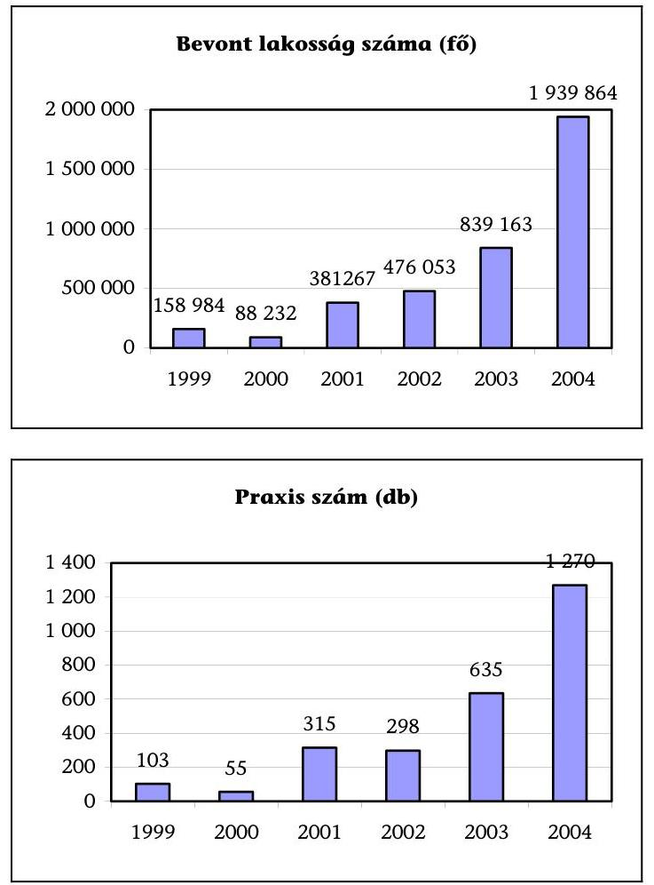

A folyamatos fejlesztés alapját a költségvetési törvények teremtették meg azzal, hogy a Modellkísérletbe vonható lakosságszámot 200 ezer főben, 500 ezer főben, 1, majd 2 millió főben határozták meg. A 2005. évi költségvetési törvényjavaslat a bevonható lakosságszámot 5 millió főben jelölte meg. A Magyar Köztársaság 2005. évi költségvetéséről szóló 2004. évi CXXXV. törvény 78. §-ának (1) bekezdése a kiterjesztést 2,5 millió főben határozta meg.

# A Modell folyamatos kiterjesztését nem előzték meg a hatásosságát igazoló értékelések. 

Az OEP-en belüli feladatellátás szervezeti kereteit alapvetően meghatározta a vizsgált időszakban a Modellkísérlet kiterjesztésével járó, folyamatosan bővülő, jogszabályban meghatározott feladatok ellátása. Az átalakulásokról nem készültek a feladat átadását, átvételét igazoló dokumentumok. Az irattári anyagok megosztása, az adatállományok egymás közötti, és a finanszírozási adatok társ főosztályok közötti átadása, átvétele szintén nem kísérhető figyelemmel.

---

2004-ig az OEP a Modellkísérlet adatszolgáltatási, adatfeldolgozási, elszámolási, elemzési és ellenőrzési követelményeit a részfeladatok tekintetében fogalmazta meg, komplex eljárási rend nem volt. A részletes szabályozásra a 10/2004. (Eb.K.3.) főigazgatói utasítással került sor, amelynek rendelkezéseit 2003. október 15. napjától alkalmazzák.

# 2.2. A Modellkísérlet elszámolásainak átláthatósága 

### 2.2.1. Az elvi folyószámla szabályozottsága

Az elvi folyószámla az egyes Szervezők fejkvóta alapján számított bevételét és az érintett lakosság ténylegesen igénybe vett egészségügyi szolgáltatásainak költségeit tartalmazza.

Az elvi folyószámla vezetésének részletes szabályait a finanszírozási kormányrendelet nem határozta meg, a fejkvóta számításának szabályai - a művese kassza kivételével - a vizsgált időszakban nem változtak.

A 10/2004. (Eb.K.3.) főigazgatói utasítás kiadásáig a Modellkísérlet elszámolásaihoz kapcsolódó munkafolyamatok, így a fejkvóta számítása, a szervezők elvi folyószámlájának vezetése, a szervezők tájékoztatása a kialakult szokások szerint bonyolódott. A szabályozás meghatározza az Modellkísérlet adatfeldolgozási, adatszolgáltatási, elszámolási követelményrendszerét. Mellékletei kiterjednek az illetékes főosztályok által végzett munkafolyamatokra, az informatikai fejlesztésével összhangban.

A szabályozás nem tartalmazza az év végi forrásallokáció menetét, így az a szokásos rutin szerint történik. Ez a számítási metodika 1999 októberétől működött a szervezői veszteségek kezelésére, mivel a Modell működésének első három hónapja után a pozitív folyószámla-egyenlegek kifizetését követően az E. Alapnak 30 M Ft-os vesztesége keletkezett.

A kiegyenlítő kassza képzése szintén nem került megfogalmazásra a főigazgatói utasításban.

### 2.2.2. Az elvi folyószámla bevételi oldala

Az elvi folyószámlán képződő - fejkvóta szerinti - virtuális bevétel számításához az ország lakosságának korcsoportos létszámmegoszlási adatait a KSH bocsátja az OEP rendelkezésre.

A havi bevétel összegét az ország lakosságának nem és kor szerinti összetétele alapján, korosztályonként az előző év azonos időszakának teljesítménydíja alapján megállapított fejkvóta és a Szervezőhöz tartozó biztosítottak korosztályonkénti, nemek szerinti létszámának figyelembevételével
 kell meghatározni. A fejkvóta számítás során a tárgyévi egyes kasszákra vonatkozó költségvetési előirányzatoknak megfelelő indexálást hajtanak végre. Az elvi folyószámla bevételi oldalát havonta határozzák meg a Szervezőkhöz tartozó tényleges lakosság összetételének figyelembevételével, a háziorvosi jelentések alapján követve a korcsoportváltozást.

---

Az átlagos egy főre jutó éves fejkvóta 1999 és 2003 között 47168 Ft-ról 69166 Ft-ra, 46,6%-kal növekedett, 2004-ben további 8,6%-os fejkvóta növekedéssel számoltak. A fejkvóta nem tartalmazza a külön keretes gyógyszer, a nagy értékű, országosan még nem elterjedt eljárások, beavatkozások és a fix díjas, TAJ-ra nem bontható ellátások költségeit.
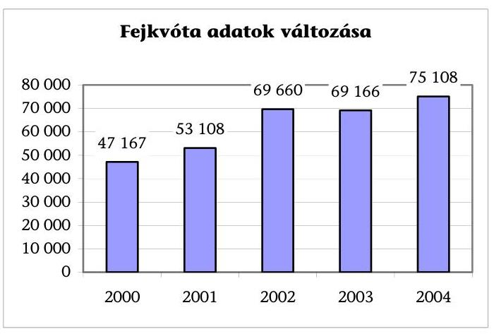

A vizsgált években az egyes kasszák átlagos fejkvótában való részesedési aránya az aktív fekvőbeteg-szakellátásnál 38 és 53% közötti, a gyógyszertámogatásnál 31,6 és 33% közötti, a járóbeteg-szakellátás esetében 11%, a háziorvosi ellátásnál 7%, míg a többi kassza ennél kisebb arányban szerepel. A legkisebb a házi szakápolásra fordított egy főre eső 0,3%-os részesedés.

A vizsgált időszakban a fejkvóta számításának finomítása a művese ellátás akut és krónikus formájának szétválasztásával történt.

# 2.2.3. Az elvi folyószámla kiadási oldala 

Az elvi folyószámla kiadási oldalának meghatározását a ténylegesen igénybevett - szervezői körbe tartozó TAJ alapú - szolgáltatások alapján végzi el az Irányított Betegellátási Főosztály és az Informatikai Alkalmazást Üzemeltető Főosztály. (Jelenleg az OEP-en belüli adatátadás automatikus, ez korábban nem volt megoldott.)

A Modellkísérlet gyakorlatában a bevont ellátások körét befolyásolja, hogy mely ellátások teljesítményjelentése TAJ-szintű, mivel ez alapfeltétele a bevételi oldal meghatározásának is. Tehát a további fejlesztésben kiemelt szempont a bevont és kizárt ellátások monitorozása.

A Modellkísérletben teljesült kiadások 65%-át a gyógyító-megelőző, 30%-át a gyógyszertámogatás, a további 5%-ot a gyógyászati segédeszköz és gyógyfürdő ellátás adja.

---

# 2.2.4. Az elvi folyószámla egyenlege 

Az elvi folyószámla egyenlege a megtakarítás. 1999-2003 között ezen a címen 5,5 Mrd Ft-ot fizettek ki. Az elvi folyószámla egyenlegeként kifizetett megtakarítás 1999-ben 92,6 M Ft, 2000-ben 457,7 M Ft, 2001-ben 1109 M Ft, 2002-ben 2711 M Ft, 2003-ban 1171 M Ft volt.

1999-ben a 63,1 M Ft tényleges megtakarítással szemben a kifizetés 92,6 M Ft volt, mert csak a pozitív egyenlegeket vették figyelembe, így az OEP vesztesége az elszámolt 3 hónapra közel 30 M Ft volt.

A 2002-es modellévben elért szervezői megtakarítás a fejkvóta minimális emelkedése és a lakosságszám viszonylag kismértékű (25%-os) növekedése mellett a megelőző évit 144%-kal haladta meg.

A 2003. évi visszaesést az OEP a további létszámbővítéssel és a visszamenőleges halott korrekcióval magyarázza. Az OEP átfogó ellenőrzésben tárta fel a halottakkal kapcsolatos elszámolási rendszer hibát. A halottakkal kapcsolatos korrekció 3458 db TAJ számot érintett és 399,4 M Ft folyószámla-egyenleg csökkenést eredményezett a szervezőknél. Ez évben a kiegyenlítő kasszába 295,4 M Ft-ot tartottak vissza, amiből 293,2 M Ft a veszteségek kiegyenlítését szolgálta.

A 2004. év I. félévi előzetes adatai mindössze 143,5 M Ft megtakarítást mutatnak. A tényleges megtakarítások várhatóan ennél jóval magasabb összegben realizálódnak, a gyógyszer kassza módosítása miatt. A 2004. évi fejkvóta indexek a 2003. évi tényleges kifizetések alapján és a 2004. évi előirányzatok figyelembevételével kerültek meghatározásra. Az index 1 alatti, a CT-MR kassza (0,9799), az aktív fekvőbeteg kassza (0,994) és a gyógyszertámogatás esetében (0,9127). A tervszám az előző év tényleges felhasználását nem éri el. A többi kassza növekménye 0,01% és 0,4% közötti. A legmagasabb index növekmény a legkisebb kasszánál, a házi szakápolásnál jelenik meg.

Az adatok hullámzása azt mutatja, hogy a megtakarítás alakulására több tényező van hatással, mint pl. létszám mozgása, a teljesítményadatok korrekt figyelembevétele.

### 2.3. A szervezési és prevenciós díj

A Szervezőnek juttatott szervezési díj hozzájárulás a működési kiadásaihoz, a prevenciós díj pedig az egészségmegőrző, betegség megelőző, egészségfejlesztő feladatok ellátására szolgál. Kezdetben együttes mértékük 1000 Ft/fő/év volt, majd a szervezési díjat a működés első évében 500 Ft/fő/év, a második évtől kezdődően 200 Ft/fő/év összegben, a prevenciós díjat 500 Ft/fő/évben határozták meg. $^{35}$

1999-2003 között a tervezett kifizetés 2,4 Mrd Ft, a tényleges teljesítés 1,2 Mrd Ft volt, amit az alábbi táblázat mutat be.

[^0]
[^0]:    $^{35}$ A Magyar Köztársaság 2005. évi költségvetéséről szóló CXXXV. törvény 78. §-a (10) bekezdésének a. pontja a prevenciós díjat 600 Ft/főben határozta meg.

---

|  |  |  |  |  |  | E Ft |
| :-- | :--: | :--: | :--: | :--: | :--: | :--: |
|  | 1999* | 2000* | 2001 | 2002 | 2003 | Összesen |
| Prevenciós díj |  |  | 222443 | 227695 | 279733 | 729871 |
| Szervezési díj | 72454 | 73259 | 121780 | 101307 | 64174 | 432975 |
| Összesen | 72454 | 73259 | 344223 | 329002 | 343908 | **1162846** |

* a szervezési és prevenciós díj összevontan 1000 Ft/fő/év.

A prevenciós és a szervezési díj felhasználása ellenőrzésénél gondot okozott, hogy 2003 előtt a prevenciós terv nem projekt szinten határozta meg a felhasználandó forrásokat. Így a szervezők prevenciós tervei nem voltak összehasonlíthatóak a teljesítési adatokkal. A 2003-ban lefolytatott OEP vizsgálat több problémát vetett fel.

- Az OEP szerint a szabályozás hiánya miatt nem egyértelmű a maradványok kezelése a rendszerben, így nem ellenőrizhető a prevenciós díjból 30%-ban limitált személyi jellegű kifizetés sem.
- Az OEP a prevenciós tevékenység ellenőrzésével kapcsolatban megállapította, hogy a szervező és a háziorvos között e tárgykörre nincs szerződés, így közvetlenül nem ellenőrizhető az elvégzett feladat.

A Szervezők a prevenciós díj terhére vállalnak fizetési kötelezettségeket, pl. informatikai szolgáltatónak fizetett fix díj és a know-how bevezetéséhez kapcsolódó tanácsadási díj. A prevencióhoz nem kapcsolódó tevékenységek finanszírozását azért vállalta a Szervező, mert a prevenciós díj olyan fix bevételi forrás, amely alkalmas kötelezettségek vállalására.

A vizsgálatba bevont szervezőknél a prevenciós és szervezési díjat elkülönítetten tartják nyilván, 2004. január 1-jétől, a jogszabály előírása szerint.

# 2.4. A Modellkísérlet működésének hatása az E. Alap gyógyító-megelőző és gyógyszer kasszáinak kiadásaira 

### 2.4.1. A Modellkísérlet működésének hatása az E. Alap gyógyító-megelőző kasszáinak kiadásaira

## A Modellkísérlet működése nem eredményez tényleges megtakarítást az E. Alapban.

1999-2003 között az E. Alap kiadási főösszege 90,5%-kal nőtt, a Modellkísérletben teljesült kiadás pedig 24-szeresére, a bevont lakosság folyamatos bővülésének megfelelően. Abszolút összegét tekintve az E. Alap kiadásainak 3%-át teszi ki 2003-ban.

A Modellkísérlet részesedése a természetbeni ellátásokban 0,3%-ról 4,5%-ra emelkedett 1999 és 2003 között. (1. sz. tábla)

---

A Modellkísérlet 2003. évi elszámolása szerint a 26074 M Ft gyógyító-megelőző ellátások kiadásából a legnagyobb arányt a fekvőbeteg-ellátás képviseli (56%), ezt követi a járóbeteg-ellátás (17%), a háziorvosi ellátás (13%), a művese ellátás (5%). A legkisebb kiadást a házi szakápolásra fordítják a Szervezők, az összkiadásnak mindössze 0,5%-át. Az arányok a többi modellévben is hasonlóan alakultak. (2. sz. tábla)

A fenti kasszákat érintő megtakarítások a vizsgált években eltérően alakultak (3. sz. tábla).

A vizsgált időszakban az 1999-2003 közötti Modellévekben a Szervezők által elért megtakarításokban a fekvő- és járóbeteg-szakellátásnak volt meghatározó részesedése. Az itt képződött 4,4 Mrd Ft pozitív előjelű kasszaegyenlegből a 2003. évi halottkorrekció és degresszálás után az OEP által megtakarításként kifizetett összeg 3,7 Mrd Ft volt.

# 2.4.2. A Modellkísérlet működésének hatása az E. Alap gyógyszerkasszáinak kiadásaira 

A vizsgált időszakban az E. Alap gyógyszer támogatási kiadásainak 0,38, 0,79, 2,76, 4, illetve 5,17%-a az ellátásszervezőkhöz tartozó TAJ körben került vény alapú felhasználásra. Az arány a szervezői körben ellátott lakosságszám ötszörösére növekedése és a gyógyszerárak ugrásszerű emelkedése mellett alakult ki. A gyógyszerkassza tényleges kiadása 80,5%-kal nőtt a vizsgált időszakban (4. sz. tábla).

A szervezői körben teljesült gyógyszerkiadás 533 M Ft-ról 13034 M Ft-ra nőtt. Az elvi folyószámla megtakarítása 1999-2003 között a gyógyszertámogatásban 1319 M Ft, amivel második a kasszák között.

1999-ben a gyógyszertámogatásban 8 M Ft veszteséget okozott a Modellkísérlet beindulása, ezért az ezt követő évektől alkalmazott forrásallokáció kiegyenlítette a veszteségeket. 2000-ben 135 M Ft, 2001-ben 67 M Ft, 2002-ben 568 M Ft, 2003-ban 365,6 M Ft-ot utaltak a gyógyszerkassza terhére a Szervezőknek.

A gyógyszertámogatás kiáramlásának visszafogására nincsenek egységes intézkedések az egyes Szervezők szintjén.

A gyógyszerkasszában elért tényleges megtakarítás és a kifizetés nem azonos, a kimutatott szervezői veszteségnek a kasszára nincs hatása. A számított megtakarítást kifizeti az OEP, a forrásallokáció végrehajtása után.

Az egyes Szervezők különböző mértékű megtakarítást tudtak elérni a gyógyszerkiadásokban. A Béke téri háziorvosi szövetkezet a vizsgált időszakban negatív egyenleget mutatott ki. A veresegyházi Szervező gyógyszer megtakarítása elérte a 265 M Ft-ot. Sátoraljaújhely, Nyíregyháza, Dombóvár szintén pozitív egyenleget tudott elérni. A 2003. évben a Béke téri Szervező egy bevont TAJ-ra eső negatív gyógyszer egyenlege 1124 Ft, a veresegyházi Szervezőnél ugyanez az adat 1512 Ft pozitív előjellel.

---

A gyógyszer megtakarítások alakulásában kiemelkedő szerepet töltenek be a háziorvosok. Gyógyszerrendelési szokásaik racionalizálására pozitív irányban hatnak az együttműködésen alapuló protokoll meghatározások, amelyek képesek kihasználni a generikumok adta árelőnyöket. A gyógyszermegtakarításokra viszont ellentétes hatást gyakorol a prevenciós tevékenység, amely felhasználást indukál.

A Szervezők a közgyógyellátás keretében felhasznált gyógyszerek esetében tudták visszaszorítani a kiadásokat. A 2001. október és 2002. szeptember közötti időszakban az országos 1150 Ft/vény közgyógy-listás felhasználás a Szervezőknél 540 Ft/vény volt, amely szintet 2002. szeptembere és 2003. márciusa között is tartani tudták.

A Modellkísérletben teljesült gyógyszerkiadás elemzése az egyes években nem egységes tartalommal készült, így nem alkalmas az egyes modellévek tapasztalatainak összehasonlítására. A Gyógyszerügyi Főosztály a vényszintű ellátásokról nem készített elemzést a Modellkísérletre vonatkozóan 2003 márciusa óta.

A Modellben az 1999-es induló évben az egy főre jutó éves gyógyszertámogatás 3352 Ft, 2000-ben 13612 Ft, 2001-ben 13011 Ft, 2002-ben 17571 Ft, 2003-ban 15532 Ft volt.

# 3. Az érdekeltségi rendszer és a megtakarítás felhasználása 

### 3.1. Az érdekeltségi rendszerre vonatkozó szabályozás

A Szervezők saját maguk határozzák meg érdekeltségi rendszerüket. 2003 előtt a pályázathoz a Szervező által nem nyújtott szolgáltatások ellátására a más egészségügyi szolgáltatókkal kötött szerződéseket mellékelni kellett, ami nem feltétlenül jelentette az egészségügyi szolgáltató érdekeltségi rendszerbe való bevonását.

Az érdekeltségi rendszer 2003. január 1-jétől kiterjed a háziorvosokon kívül azokra az egészségügyi szolgáltatókra is, akik a bevont lakosság egészségügyi ellátásában - a Szervezővel kötött szerződés alapján - részt vesznek. Az érdekeltségi rendszer leírását mellékelni kell a pályázathoz, valamint a szerződésben a Szervezőnek kötelezettséget kell vállalnia arra, hogy a bevételi többletet az érdekeltségi rendszer alapján osztja fel.
 Az érdekeltségi rendszernek ösztönöznie kell az egységes szakmai protokollok, a betegút követését biztosító monitoring rendszer alkalmazását, valamint a képzési-továbbképzési rendszerben való részvételt.

### 3.1.1. A szervezők részesedése

A Szervezők érdekeltségi rendszereikben eltérő szempontokat érvényesítettek. A kórházként működő szervezők az általuk nyújtott ellátás miatt más szolgáltatót korlátozottan, vagy nem vontak be szolgáltatóként (pl. székesfehérvári, dombóvári Szervező). A veszprémi és veresegyházi Szervező a teljes kockázatközösség-

---

gét lefedve járó- és fekvőbeteg-ellátásra szerződött más intézményekkel, a saját maguk által nyújtott ellátások figyelembevételével. A szervezők másik csoportja (kft. vagy bt. formában) háziorvosi ellátást nyújt, a járó- és fekvőbeteg-ellátó intézményeket korlátozottan (pl. sátoraljaújhelyi szervező 1 fekvő és 1 járóbeteg szolgáltatót) vagy nem vonja be érdekeltségi rendszerébe (pl. a Nyírpromed és a Béke téri Szervező). A szervező-szolgáltatók részesedése rendkívül nagy szórást mutat [30\% (Misszió Kht.) - 88\% (Dombóvári Eü. Kht.)].

A Szervezők érdekeltségi szabályzata nem tartalmazza a bevételi többlet felosztására egyértelmű, világos, mindenki által átlátható és követhető számítási módot. Az egyes részesedések kiszámítása leírás alapján nem, csak szóbeli pontosítással volt követhető.

A jogi szabályozás nem terjed ki arra, hogy a Szervezők a Modellkísérletben végzett munkájukért, illetve szolgáltatóként milyen arányban részesedjenek a megtakarításból. A kérdéskör nem választható el az egyéb egészségügyi szolgáltatók bevonásának szabályozatlanságától. Így fordulhat elő, hogy egyes szervezők törekednek a területen működő ellátó intézmények bevonására, míg mások nem.

# 3.1.2. A háziorvosok részesedése 

A Modellkísérlet a háziorvosokra épül, önkéntes csatlakozásuk alapozza meg a Modellben való részvételt. Az érdekeltségi rendszerben a háziorvosok részesedése nem mutat nagy szórást (30-40\%).

A háziorvosi ösztönzés lényege, hogy a Szervező hasson a háziorvos működésére, racionálisabb ellátásra sarkallja. A háziorvosi ösztönzési rendszernek a finanszírozási kormányrendeletben előírt elemei a szakmai protokollok, betegútkövetés, képzési rendszerben való részvétel. A háziorvosok értékelésében e szempontok valamilyen formában mindegyik Szervezőnél megjelennek. A szempontrendszerek rendkívül eltérőek. A megtakarítások képződése szempontjából a fontos értékelési szempont a háziorvosi praxis elvi folyószámla-egyenlegének figyelembevétele.

A Szervezők közül 7 érvényesíti a fenti szempontot. Három szervező 35-30\%-os súllyal, négy 15-20\%-os súllyal. A csornai szervező a praxis-létszámot 20\%-os súllyal szerepelteti. A dombóvári szervező egyenlő arányban osztja szét a háziorvosok között a megtakarítást. A veresegyházi és veszprémi szervező az elvi folyószámla-egyenleget veszi figyelembe más szempontok mellett, a praxis-létszámot nem.

Az elvi folyószámla-egyenleget figyelembe vevő szempontrendszer képes megteremteni a háziorvos érdekeltségét az indokolatlan ellátások kiküszöbölésében és az árérzékeny gyógyszerrendelésben. A Szervező (veresegyházi és veszprémi) ehhez gyógyszer protokoll listákat dolgozott ki és monitorozza, hogy a háziorvos milyen arányban alkalmazza a listán szereplő gyógyszereket. A háziorvos érdekeltségének megteremtése mintaértékű.

---

Az alulkezelés elkerülésére a veresegyházi szervező „féket" épített a rendszerbe. A háziorvos egyenlegéből a 20\% feletti megtakarítást nem fizeti ki. A sátoraljaújhelyi szervező 2004. évi érdekeltségi rendszere szerint a háziorvosoknál a 20\% fölötti megtakarítások 20\% fölötti részét a praxis megtakarításába nem számítja be.

Azok az érdekeltségi rendszerek, amelyek a háziorvos elvi folyószámlaegyenlegét nem figyelik, nem tudnak közvetlen kapcsolatot teremteni a keletkező megtakarítás és az orvos teljesítménye között. A gyakorlatban ilyen típusú szervező lehet jó és rossz megtakarító is. A megtakarítás nagysága a hozzá tartozó lakosság adottságaitól (az E. Alapból történő lehívás az átlaghoz képest) függ és nem a tudatos megtakarításra törekvésből.

A vizsgálat a háziorvosi érdekeltségi rendszer szempontjainak és azok érvényesítésének „legjobb gyakorlatát" a veresegyházi Szervezőnél, valamint a 2003-ban belépett veszprémi Szervezőnél tapasztalta.

# 3.1.3. Az informatikai szolgáltató részesedése 

A 11 Szervezőből 6 az informatikai szolgáltatót érdekeltségi rendszerébe bevonja. A szolgáltatás ellenértéke általában a Szervező megtakarításának 10-12\%-a, a prevenciós díj terhére történő fix finanszírozáson felül.

Az informatikai cégek által nyújtott szolgáltatások a következő területekre terjednek ki:

1. A prevenciós tevékenységgel kapcsolatos jelentési kötelezettség teljesítése az OEP-nek;
2. Az OEP-től visszaérkező adatállományok összefuttatása, standard és eseti szempontok szerinti rendezése;
3. A rendezett adatokból a háziorvosok és a szervező részére történő standard lekérdezések és célvizsgálat lefuttatása, adatok rendelkezésre bocsátása.

A fenti szolgáltatások a megtakarítástól függetlenül is elvégzendők. Az informatikai szolgáltatók által elvégzett munka és a Szervező megtakarítása között nincs összefüggés. A megtakarítás nem az informatikai szolgáltató munkájának függvényében keletkezik. Az informatikai szolgáltatás a szervezői munka anyagi és személyi feltételrendszerének ugyanolyan része, mint a megfelelő számítógépek biztosítása. A kialakult gyakorlat magában hordozza az aránytalanul magas részesedés veszélyét.

Az informatikai szolgáltatók által végzett feladatok egy része központilag, az OEP által költség-hatékonyabban valósulna meg (pl. párhuzamos ellátások kiszűrése). Megfelelően nem szabályozottak a Szervező informatikai megoldást igénylő feladatai (jelentési kötelezettség, háziorvosok és a Szervező modell adatbázisának létrehozása), fix költségeinek meghatározása, személyi és anyagi működési feltételeinek részletei.

---

A finanszírozási kormányrendelet 2004. január 1-jétől írja elő, hogy a Szervezőknek önálló szervezeti egységet kell létrehozniuk, személyi és tárgyi feltételek biztosításával, de nem határoz meg szervezeti kritériumokat, illetve az informatikai rendszerek minimumfeltételeit sem. (A Szervezők személyi ellátottságát az 1. sz. függelék 3. sz. táblázata tartalmazza.)

A helyszíni vizsgálat tapasztalatai szerint a veszprémi szervezőnél létrehozott szervezet a „legjobb gyakorlat". Szervezetileg, pénzügyileg és elhelyezkedésben elkülönül a kórház szervezetétől, önálló gazdálkodási rend szabályozza működését. A szervezet külön szakfeladaton, elkülönítetten finanszírozott egység, önálló alszámlával.

# 3.1.4. A szervező által nem nyújtott ellátásokra kötött szerződések, az intézmények részesedése 

A nem kórházi Szervezők a szerződéseiket járó- vagy fekvőbeteg-ellátás nyújtására kötötték. A szerződésből nem állapítható meg, hogy a szerződő intézmény a Modellkísérletbe vont ellátásokból melyeket tud nyújtani és mekkora lakosságot fed le a Szervező kockázatközösségéből. A kórházi Szervezők általában saját maguk nyújtották a gyógyító-megelőző ellátásokat. Házi szakápolásra és CT/MR ellátásra egyedül a csornai szervező kötött szerződést.

Nincs előírás arra, hogy a Szervezőknek

- Modellkísérletbe vont 12 ellátás (korábban 10) mindegyikére kell-e kötnie szerződést; néhány esetben nincs ráhatása a megtakarítások képződésére, pl. fogászati ellátás, CT/MR, betegszállítás;
- a járó- és fekvőbeteg-ellátások biztosításánál milyen progresszivitási szintig kell bevonni más intézményeket;
- ha a területen ellátást végző intézmény nem kíván együttműködni, vagy felmondja a szerződést, milyen eljárást kell követni.

Az intézmények érdekeltségi rendszerbe történő bevonásának ösztönzési célja nincs rögzítve. Az ösztönzésnek két iránya mutatkozik a Szervezőknél:

1. A Modellkísérletből származó bevétel kompenzálja a teljesítmény-kiesésüket. A jelenlegi érdekeltségi rendszerekben erre a típusú ösztönzésre lehet következtetni (Járóbeteg-ellátás 15\%, fekvőbeteg-ellátás 30\%).
2. A Szervező körébe tartozó lakosság járó- és fekvőbeteg-ellátásból való intézményi részesedés arányának megfelelő a megtakarításból részesedés. Az ilyen típusú ösztönzésnél nem az elmaradt ellátások miatti bevételkiesést, hanem az ellátásban való részesedést honorálják. Ez csírájában jelenleg is fellelhető néhány Szervező érdekeltségi rendszerében, amikor a járó- és fekvőbeteg-ellátáson keletkező megtakarítást a teljesítés arányában osztja fel.

Nem készültek számítások arra vonatkozóan, hogy valóban kimutatható-e összefüggés a Modell működéséből fakadó racionálisabb ellátás és az intézmények bevételeinek alakulása között. A Modellben a Szervezőnek nincs eszköze a bevont intézmények működésének befolyásolására. A bevont intéz-

---

mények szerepe, ösztönzésük célja nem meghatározott. Az intézményeknek fizetett megtakarítás nem ösztönöz a Modell céljainak megvalósulására. A bevételkiesés kompenzációja csak akkor indokolt, ha ellátásaik szükséges kapacitáson alapulnak.

# 3.1.5. Megtakarításból fizetett royalty (szabadalmi díj) 

A veszprémi Szervező 2003-ban lépett a Modellbe. Szervezési tevékenysége beindítására know-how-t vásárolt az E-Modell Kft.-től. A Misszió Kht. megállapodás keretében felhatalmazta az E-Modell Kft.-t a Modell bevezetése, megszervezése és működtetése során keletkezett és felhalmozott vagyoni értékű szakmai, gazdasági, szervezési és szellemi ismeretek (Know-how), valamint szoftverek és informatikai megoldások hasznosítási jogával.

A veszprémi szervező a szakértői tanácsadásért a prevenciós díj egy részét fizette az E-Modell Kft.-nek és vállalta a Know-how-ért járó royalty fizetését a megtakarítás terhére.

Az OEP nem foglalt állást abban, hogy a prevenciós díj, illetve a megtakarítás terhére ilyen kötelezettség vállalható-e.

A Know-how részben azokat a modellműködtetési és szervezési technikákat tartalmazza, amelyek a Missziónál felhalmozódtak. A Modell 5 éves működése során nem került sor a szervezők által alkalmazott technikák közül a „legjobb gyakorlat" kiválasztására, bemutatására, szabályozásba való átültetésére és általános gyakorlatként való alkalmazására. Az alapvető szervezői feladatok módszertanát nem ismerhették meg a Szervezők, a szervezéshez elengedhetetlen ismereteket számukra nem írtak elő. Így a Szervezők saját elképzelések szerint, know-how és informatikai szolgáltató bevonásával alakították ki saját módszereiket.

### 3.2. A megtakarítások felhasználása

### 3.2.1. A megtakarítás felhasználására vonatkozó jogi szabályozás

A kötelező egészségbiztosítás ellátásairól szóló 1997. évi LXXXIII. törvény 34. §-ának (1) bekezdése az egészségügyi szolgáltatások finanszírozási formái között felsorolja a fejkváta alapú finanszírozást. A törvény nem nevesíti az e finanszírozási forma következtében keletkező megtakarítást.

A finanszírozási kormányrendelet 50/C. § d) ${ }^{36}$ pontja a szervező feladataiként felsorolja a kapott pénzeszközök kezelését és felhasználását, valamint a vállalt ösztönzés és érdekeltségi rendszer működtetését. A megtakarítás címén kifizetett összeg felhasználásáról a finanszírozási kormányrendelet az érdekeltségi rend-

[^0]
[^0]:    ${ }^{36}$ Az egészségügyi szolgáltatások Egészségbiztosítási Alapból történő finanszírozásának részletes szabályairól szóló 43/1999. (III. 3.) Korm. rendelet módosításáról rendelkező 264/2003. (XII. 24.) Korm. rendelet 24. §-a iktatta be, hatályos 2004. január 1-jétől.

---

szer szerinti felosztáson túl nem rendelkezik, így például annak ellenőrzéséről és nyilvántartásáról.

# 3.2.2. A Szervezők működési formája és a megtakarítás felhasználása közötti összhang 

A Modellkísérletben 1999-2003 között 5,5 Mrd Ft megtakarítás keletkezett, amelyből a Szervezőknek 4,7 Mrd Ft-ot 2003. december 31-ig, a fennmaradó 0,8 Mrd Ft-ot 2004-ben fizette ki az OEP. A Szervezők 1,9 Mrd Ft-ot használtak fel, 2,2 Mrd Ft-ot továbbutaltak az érdekeltségi rendszer résztvevőinek, amely összegből 700 M Ft felhasználásáról áll a vizsgálat által gyűjtött adat rendelkezésre (5. sz. tábla).

A Modellkísérlet működésének 5 éve alatt - nem tekintve a 2004-2005 modellév 7 új Szervezőjét - befogadásra került 15 Szervező, akik közül 4 1999-ben kilépett, vagy kizárásra került. A működő 11 szervező közül 4 önkormányzati költségvetési szerv, egy központi költségvetési szerv, egy kht. formában működő, önkormányzati tulajdonú kórház, egy vegyes tulajdonú kht. formában működő egészségügyi központ, egy betéti társaság formában működő háziorvosi szervező, 3 kft. formában működő háziorvosi szervező (7. sz. melléklet).

A veresegyházi és a sátoraljaújhelyi szervezők korábban kiépült vagy a megtakarításból újonnan kiépülő egészségügyi intézményeket finanszíroztak vagy hoztak létre a megtakarítás címén kifizetett összegből, az OEP Útmutatóban szereplő előírásnak megfelelően. Az intézmények utólagosan kerültek az OEP által befogadásra.

A Misszió Kht. által felépített egészségügyi központ 1999. januártól működik, OEP általi befogadására 1999 folyamán, visszamenőleges hatállyal 1999. februártól került sor „kapacitáson felüli befogadásként". A Veresegyházán üzemeltetett egészségügyi központ hatóköre körülbelül 30 ezer lakosra terjed ki, járóbetegszakellátás, nappali kórház és rehabilitációs osztály formájában. 2002-től kezdődően szervezésből származó bevételei fedezték az egészségügyi központ veszteségeit. Ettől az időponttól 152 ezer, majd 2003-tól 240 ezer ember tartozott a kockázatközösségéhez. A nagy kockázatközösség ellátásának szervezéséből származó szervezői bevétel biztosítja Veresegyháza és környéke színvonalas, kapacitáson felüli szakellátásának
 jelentős részét. 2002 előtt az önkormányzatnak kellett fedezetet nyújtania a működésre.

A Sátoraljaújhelyi Dental-Med Co. Bt. az OEP Útmutatónak megfelelően az egészségügyön belül költötte el a keletkező megtakarítását. Ennek keretében 2001. júniusi belépésétől kezdődően egy egészségügyi központot épít 2004. októberi műszaki átadással, 225 M Ft tervezett bekerülési értékkel. A beruházás forrása a címén kifizetett összegen felül 20 M Ft hitel és 4,3 M Ft értékű pályázat.

A Nyírpromed Kft. 2004-ben az OEP felé benyújtotta a szervezői megtakarítás felhasználásra vonatkozó elképzeléseit. Ennek keretében videólejátszó és televízió, videókamera, digitális fényképezőgép, diktafon, kül- és belföldi továbbképzések, nyelvtanulás, személygépkocsi a „betegút-követésre" került a listára, amelyet az OEP levélben elutasított.

---

A kórházi szervezők megtakarításaikat beforgatták a kórház költségvetésébe, működésre, informatikai fejlesztésre, gép-műszer vásárlásra vagy premizálásra fordították (6. sz. tábla).

A vizsgálat tapasztalatai szerint a megtakarítások ott hasznosulnak, ahol az előírásnak megfelelően azt az egészségügyön belül költik el és meglévő kapacitásokat finanszíroznak. További kapacitások kiépítése hosszabb távon megtakarítás helyett az E. Alap hiányát növeli. A helyszíni vizsgálat tapasztalata, hogy a megtakarítás a kórházaknál hasznosul a legjobban, mert már működő egészségügyi intézmények, kórházak műszaki-technikai-informatikai ellátottságát növeli, a betegellátás minőségi javulását eredményezi.

Ha a Szervező által menedzselt lakosságszám a kórház ellátási körzetével azonos nagyságrendű, akkor elmondható, hogy a megtakarításból megvalósuló ellátási színvonal növekedés az egész kockázatközösség számára érezhető javulást okozott.

# 3.2.3. A háziorvosoknak kifizetett megtakarítások hasznosulása 

A Szervezők között nem alakult ki egységes gyakorlat a megtakarítások kifizetésének formájára. Egyes szervezők számla ellenében utalják a megtakarítást. A megtakarítás felhasználására vonatkozóan a Szervező ajánlást ad a háziorvosnak. A megtakarítás felhasználását nem ellenőrzi, illetve nem tartja nyilván. A másik gyakorlat szerint a Szervező a megtakarítást támogatásként fizeti ki.

Az OEP 2003-ban országos ellenőrzést végzett az elvi folyószámla megtakarításainak felhasználásáról. A vizsgálat megállapította, hogy a pénzeszközök felhasználásának szabályozását, a maradványok kezelését pontosítani szükséges. A háziorvosok a pénzek jelentős részét nem költik el, a maradványokat görgetik maguk előtt. Nem volt szabályozott a rendszerből kilépő háziorvosok maradványainak kezelése sem.

1999 és 2003 között a Szervezők a háziorvosok részére 1,6 Mrd Ft-ot fizettek ki a megtakarításból. A Szervezők (2003-ban belépettek kivételével), illetve a Misszió Kht. 2003-as adatszolgáltatását kivéve nem tartanak nyilván adatokat.

Az OEP megállapította, hogy a megtakarításból juttatott pénzeszközök nyilvántartása nem megfelelően elkülöníthető, elosztása nem megfelelő hatékonyságú és szükséges az elszámolások egységes szabályozása.

### 3.2.4. A szolgáltatóknak kifizetett megtakarítás hasznosulása

A vizsgált időszakban a szervezők által az intézményeknek összesen kifizetett összeg 323,4 M Ft volt. Ebből a veresegyházi szervező teljesítése 301,5 M Ft. A háziorvosi szervezők képződő megtakarításaik ellenére sem vonták be a területükön működő, a lakosság ellátásában résztvevő intézményeket a megtakarításokból való részesedésbe. A kórházi szervezők általában maguk látják el a Modellben hozzájuk tartozó lakosságot, minimálisan vontak be más szolgáltatót.

---

Adatok a háziorvosi szervezők megtakarításainak és a területükön működő egészségügyi szolgáltatóknak kifizetett részesedéséről 2002-2003-ban, E Ft-ban.

E Ft

|  | Megtakarí-   tás   2002 | Megtakarí-   tás   2003 | Eü. szolg.   részesedése   2002 | Eü. szolg.   részesedése   2003 | Részese-   dés   \%-ban |
| :-- | :--: | :--: | :--: | :--: | :--: |
| Béke téri Eü. Szolg. Kft. | 227214 | 103 | 0 | 0 | $0 \%$ |
| Nyír-Promed Kft. | 164472 | 99543 | 0 | 0 | $0 \%$ |
| Dental-Med Co. Bt. | 303070 | 88265 | 1216 | 1586 | $1 \%$ |
| Meditres Kft. | 78025 | 60362 | 0 | 11166 | $8 \%$ |

A veresegyházi szervező által 2003-ban az egészségügyi szolgáltatóknak kifizetett megtakarítások 60%-a informatikai fejlesztést valósított meg, 27,5%-a orvosi műszer vásárlását vagy lízingelését tette lehetővé, a maradék bér kifizetést vagy rendelő felújítást, fejlesztést biztosított.

# 4. A SZERVEZŐI TEVÉKENYSÉG 

### 4.1. A Modellkísérletben ellátott betegek definitív ellátási szintjének változása

A Modellkísérletben valamennyi egészségügyi szolgáltatóval szemben alapelvárás, hogy kompetencia szintjének megfelelően lássa el a betegeit, a befejezett ellátásra törekedve. A Szervező érdekelt a felesleges és párhuzamos ellátások kiküszöbölésében. Az együttműködési szerződések alapján a járó- és fekvőbeteg-ellátókra is kiterjed a befejezett ellátások nyújtásának követelménye, bár ennek érvényesítésére a Szervező jogosítványokkal nem rendelkezik, ezért az együttműködés esetleges.

A definitív ellátás méréséhez közvetett eszközök állnak rendelkezésre. Az elemzéshez szükséges indikátorok alkalmazását nehezíti, hogy csak a Modellkísérletben résztvevő háziorvosokra terjed ki a tételes jelentési kötelezettség 2002 óta, amely tartalmazza a továbbküldési adatokat. A járó- és fekvőbeteg teljesítmény-jelentésekben nem szerepel a beküldő, így a definitív ellátás csak részlegesen értékelhető, a beutalási adatok hiányossága miatt nem egyeztethető a háziorvosi jelentésekkel.

Az adatok elemzéséből látható, hogy a járóbeteg pontszám a Modellben a 2001-2002. években alacsonyabban alakult a Modellkörön kívülinél. A krónikus ellátás költségeinél az egy krónikus fekvő esetre jutó finanszírozás a Modellen belüli ellátásnál a Modellen kívülinek 90, 66, 58, 59%-a. A fekvőbetegellátásban az aktív és krónikus ellátást is beleértve az egy esetre jutó finanszí-

---

rozás összege alacsonyabb a Modellen kívülinél, annak átlaga 77%-a. (7. sz. tábla)

# 4.2. Minőségbiztosítás a Modellkísérletben 

A fejkvóta alapú finanszírozás magában rejti annak a lehetőségét, hogy az ellátók az egészségügyi ellátás minőségének rontásával fokozzák megtakarításuk mértékét. Az OEP különféle technikákat alkalmaz a minőség monitorozására és biztosítására: a betegutak-követését, betegellátási protokollok fejlesztését és azok követésének monitorozását, valamint minőségi indikátorok képzését és követését írja elő monitoring rendszer keretében a Szervezők számára.

A monitoring rendszer célja - az 1999-es OEP Útmutató alapján: „a Modellkísérletben résztvevők folyamatos figyelemmel kísérése az ellátottaknak nyújtott egészségügyi szolgáltatások, beavatkozások, gyógyszer, gyógyászati segédeszköz, gyógyfürdő rendelkezések valamint a magasabb szintű ellátás továbbküldése tekintetében. Ennek keretében összehasonlító adatok, elemző táblák készítése az országos adatok, a Modellkísérletben nem, illetve résztvevők ellátása során."

A szervezők által használt betegút-követő rendszerek lényege, hogy az adott beteg részére nyújtott szolgáltatások összességét minden ellátási szint figyelembevételével informatikai szoftver segítségével elemzi. A betegutak követésének elemzését a Szervezők a betegutak racionális tervezésénél, az ellátási anomáliák ${ }^{37}$ kiszűrésénél, a betegek rendszerben tartásánál, a protokollok kialakításánál, azok alkalmazásának ellenőrzésénél és az érdekeltségi rendszerükben használják fel.

11 Szervezőből a betegút követését 9 külső informatikai szolgáltató nyújtotta szoftverrel, 2 saját fejlesztésű rendszerrel látja el (8. sz. tábla).

A szoftverek segítségével a Szervezők és a háziorvosok többféle témában és többféle mélységben kérdezhetik le a bevont lakosság egészségügyi szolgáltatás igénybevételét. Az adatokat a Szervező - aggregáltan és részletesen - TAJ történetenként, területenként, praxisfajtánként, időszakonként, kasszánként, különböző kódonként (BNO, HBCS, TTT, ATC, szolgáltató kód, orvos kód), korcsoportonként és nemre bontva képes elemezni. A háziorvos a hozzá bejelentkezett lakosok valamennyi adatára vonatkozó értékelést végezhet.

A három vagy több hónapos csúszás az egészségügyi igénybevétel és az adatokhoz való hozzáférés között jelentősen csökkenti a betegút elemzésből nyerhető információ értékét. Minden részletre kitérő elemzést a háziorvos tud végezni, aki az ellátásról 3-8 hónappal később érkező információt nem tartja relevánsnak.

Az adatok TAJ szerinti csoportosítása és a szervezők rendelkezésére álló betegút-követő szoftver lehetővé teszi, hogy a Szervezők olyan ellátási anomáliákat szúrjenek ki, amelyet az OEP informatikai el-

[^0]
[^0]:    ${ }^{37}$ Ellátási anomália - pl.: párhuzamos, indokolatlan ellátás igénybevétele

---

lenőrző rendszere átenged. A párhuzamos ellátások kiszűrésére a programok rutinszerűen keresik az egyidejű: járó- és fekvőbeteg-ellátás; a fekvőbeteg-ellátás és gyógyszerkiváltás; a háziorvosi ellátás és fekvőbeteg-ellátás adatait. Az indokolatlan ellátást (szakmai szempontú megközelítés) a beteg történetének ismeretében a háziorvos egyedi, személyhez kapcsolt elemzéssel tudja azonosítani.

A Modellkísérletben résztvevő háziorvosok jelentési kötelezettsége és a betegeikkel kapcsolatos információja szélesebb körű, mint a Modellkísérleten kívüli kollegáiké. Az egészségügyi ellátások igénybevételének és a háziorvosi szolgálatok tevékenységének átláthatóvá tétele a Modellkísérlet feltétlen eredménye. A betegút-követő rendszer előnye a finanszírozott TAJ számok valódisága. Az OEP a modellkörön kívüli biztosítottakról nem rendelkezik valós TAJ adatbázissal.

A betegút elemzés során nyert információk töredéke jut vissza az OEP-hez. A párhuzamos és indokolatlan ellátások esetében a Szervezők, amennyiben az anomáliát a saját intézményében, vagy szerződött partnernél észleli és nem súlyos, akkor elsősorban az informális csatornát (esetmegbeszélés, egyeztetés) használják. Negyedéves jelentéseikben folyamatosan tájékoztatják az OEP-et a hibák feltárását, javítását elősegítő módszerekről és a betegutak elemzésének tapasztalatairól, azonban ezek hasznosításáról nem érkezik visszajelzés.

Az ellátásokban fellelhető anomáliák „kiküszöbölésére" a háziorvos Szervező kisebb szakmai eszköztárral rendelkezik, mint egy kórház. A kórház képes szakmai iránymutatást adni a felvevő területén dolgozó háziorvosnak, fordított gyakorlatra nincs példa. A Szervezők mindegyike a Modellkísérlet pozitívumaként említi meg a szakmai kommunikáció folyamatosságát az orvosok és az ellátási szintek között (1. sz. függelék 1. sz. táblázat).

A betegút követését biztosító esetkezelő rendszer használata a háziorvosi érdekeltségi rendszer egyik eleme. 11 szervezőből 6 szerepelteti érdekeltségi rendszerében a háziorvosi kifizetések súlyozó tényezőjeként (1. sz. függelék 7. sz. táblázat). A megtakarítás kifizetésén és a háziorvosok tevékenységének átláthatóvá tételén keresztül a betegút-követő rendszer pozitív hatást gyakorol a bevont háziorvosok által nyújtott egészségügyi ellátás minőségére, hatékonyságára.

A Szervezőnek minőségbiztosítási előírásokat, protokollokat kell elkészítenie. A Szervezők a leggyakoribb, népegészségügyi szempontból jelentős betegségek kezelésére fejlesztettek ki protokollokat (9. sz. tábla).

Protokollokat a szervezők diagnosztikai, terápiás, a prevenciós tevékenység végrehajtása és működési leírása céljából készítenek. A Szervezők a protokollok kifejlesztése során a szakmai, eredményességi, költséghatékonysági, a helyi lehetőségek és szokások, tapasztalatok és a betegek preferenciáinak szempontjait helyezik előtérbe. A protokollok háziorvosi Szervezők esetében az alapellátás eljárási rendjét szabályozzák, míg kórházi Szervezők esetében protokolljaik valamennyi ellátási szintre kiterjedő, háziorvosi fókuszú, de a járóbetegszakrendelés és a fekvőbeteg-szakellátás gyakorlatára is vonatkozó kivizsgálási és kezelési eljárásrendek.

---

Az egységes szakmai protokollok készítése és alkalmazása a háziorvosi érdekeltségi rendszer egyik eleme. A protokollok 11 vizsgált Szervezőből 2 Szervezőnél súlyozzák a háziorvosi kifizetést (1. sz. függelék 7. sz. táblázat). A protokollok betartásának ellenőrzésére a Szervezők (Misszió) a terápiás protokollok gyógyszer ajánlásainak és a bevont háziorvosok betegei gyógyszerkiváltási adatainak elemzését vagy a háziorvosok kérdőíves megkeresését (Csorna) alkalmazzák. Amennyiben a Szervező a protokollok használatát nem tudja ellenőrizni, a háziorvosokat nem tudja érdekeltté tenni azok használatában (11ből 8 szervezőnél), akkor a protokollok által elért hatás esetleges.

A protokollok készítésének egyik célja, hogy az egészségügyi ellátást összemérhetővé tegyék, például területenként, ezért fontos szempont, hogy országszerte azonos elveken alapuló protokollokat alkalmazzanak. A Szervezők 2002. óta az Egészségügyi Menedzserképző Központ támogatásával foglalkoznak protokolljaik egységesítésével. Jelenleg a protokollok nem egységesek.

# 4.3. Az ellátás minőségét mérő indikátorok 

Az OEP és a Minisztérium a Modellkísérlet indulásakor nem határozta meg, hogy milyen adatokra, indikátorokra alapozza az eredményesség megítélését,
 ezért a Szervezők a saját maguk által fejlesztett indikátorok szerint mérik saját eredményességüket. A megvalósulást mérő indikátorrendszer kidolgozása 2003-tól a pályázó feladata. Az így képzett adatok nem összehasonlíthatóak sem más szervezők adataival, sem a Modellkörön kívüli populáció adataival. A nem standardizált adatgyűjtés és feldolgozás is akadályozza az összehasonlítást.

Nem gyakorlat a „legjobb gyakorlat" szervezők közötti hasznosítása, jogszabályban kötelezővé tett eljáráskénti alkalmazása.

## 5. A MODELLKÍSÉRLETBEN VÉGZETT PREVENCIÓS TEVÉKENYSÉG

### 5.1. A prevenciós tevékenység szabályozottsága

A finanszírozási kormányrendelet évente egyre bővülő tartalommal határozta meg a prevenciós tevékenységhez kapcsolódó pályázati, szerződésbeli, végrehajtási, beszámolási előírásokat. A Szervezőnek a pályázathoz mellékelnie kellett 2002. december 31-ig a prevenciós programtervet, 2003-tól a Nemzeti Programmal összhangban álló prevenciós programtervet, amely tartalmazza a prevenciós célkitűzéseket, a várható eredményeket és a megvalósítási tervet.

A pályázati kiírás 2003-ig nem adott a finanszírozási kormányrendeletnél bővebb iránymutatást a prevenciós tervek tartalmi elemeivel kapcsolatban.

A pályázati kiírás a választható tevékenységet 2001-ben először szűkítette (betegségről krónikus betegségekre), majd 2003-ban a választandó tevékenységet bővítette a tercier prevenciós tevékenység előírásával.

---

2003-ban határoz meg először a pályázati kiírás a prevenciós programokkal kapcsolatos tartalmi megkötést, előírja a monitoring rendszer keretén belül választható prevenciós programokat a gyermek és felnőtt lakosság körében. A választható prevenciós programokat a Nemzeti Programmal összhangban írták ki a pályázatban. A pályázati kiírás alapján a pályázók a gyermekek esetében 9, a felnőtt lakosság esetében 12 program közül választhattak, így 2003-tól a pályázók prevenciós terve összhangban van a Nemzeti Programmal.

2003-ig a Szervezők maguk választhatták meg prevenciós tevékenységük irányát, célcsoportját, a várható eredményeket és a megvalósítás módját, ennek következtében a prevenciós tevékenység szerteágazó, tartalomban, megközelítésben, célcsoportban. A prevenciós tervek sokfélesége a Nemzeti Programba való beilleszkedést követően is fennmaradt.

A szerződés kötelező tartalmi elemeit 2003. január 1-jétől rögzítette a finanszírozási kormányrendelet. Ekkor vált kötelező mellékletté a Szervezők prevenciós terve. 2003-ig prevenciós tervet a jogszabály értelmében a pályázathoz kellett mellékelni, ezért a nem bővülő (azaz nem pályázó) Szervezők nem készítettek évről-évre prevenciós tervet.

A jogszabály nem rögzíti a prevenciós terv menet közbeni módosításának a kérdését, így Szervezőnként eltérő a változtatásra/aktualizálásra alkalmazott módszer.

2003-tól az Útmutató rögzíti, hogy a prevenciós terv módosítására - az OEP Gyógyító-megelőző Ellátási Főosztály előzetes írásbeli tájékoztatását követően - csak abban az esetben kerülhet sor, ha az adott feladat szervezői körön belüli szolgáltatókkal nem, vagy kevésbé szakszerűen és költség-hatékonyan hajthatók végre. A módosítás szükségszerűségét szakmailag és pénzügyileg egyaránt indokolni kell. Az Útmutató nem tér ki arra az esetre, amikor a prevenciós terv módosítására szervezőkörön belül, vagy szakmai okból kerül sor.

Az elfogadott prevenciós programot először a 2003. évi szerződés tartalmazta. A prevenciós terv elfogadásáról, bírálatáról a Szervezők az OEP-től nem értesültek, a pályázat elnyerésével a prevenciós tervet is elfogadottnak tekintették. A prevenciós tevékenység 2003-ig a pályázati dokumentációhoz csatolt prevenciós tervek végrehajtása alapján ítélhető meg.

# 5.2. A Szervezők által folytatott prevenciós tevékenység 

### 5.2.1. Az egészségnevelés, egészségfejlesztés formája

2003. január 1-jétől primer prevenciós tevékenységként az egészségügyi szolgáltató magas kockázatú betegcsoportok, illetve személyek számára életvitel-tanácsadást végezhet. A megelőző tevékenységek: egészségnevelés, egészségfejlesztés, életvitel tanácsadás sok esetben az életmódbeli rizikófaktorok csökkentésével éppen a magas kockázatúvá válást akadályozzák meg. Az életvitel-tanácsadásba való bevonás esetén a magas kockázatú előfeltétel szűkíti a választható tevékenységek körét és nem áll összhangban a Nemzeti Programmal.

---

A Nemzeti Program - az elkerülhető halálozások, megbetegedések, fogyatékosság megelőzése programban - a következőt tartalmazza: „Egészen a közelmúltig a betegségmegelőzés a magas kockázati csoportokra irányult, és a közepes vagy alacsony kockázati csoportok jórészt kívül estek a figyelem fókuszából. Ugyanakkor tény, hogy bár a magasabb kockázati szint nagyobb valószínűséggel jár megbetegedéssel, halálozással, az összmegbetegedés és halálozás nagyobb része a közepes és alacsony kockázatúakból kerül ki. ... Nem elégséges az a megelőzés, amely csak az aktívan jelentkező páciensekre irányul. A megelőzési tevékenységnek integráltan kell megjelenni az ellátási rendszerben, egyszerre odafigyelve a magas kockázatú, hátrányos helyzetű csoportokra és csökkentve a kockázatot a lakosság egészében.".

A primer prevenciós tevékenység a Szervezőknél irányában igen sokféle. A „legjobb gyakorlat" a belső pályázati rendszer, amely lehetővé teszi a helyi igényeknek megfelelő, de a Szervező prevenciós programjával összhangban álló programok támogatását.

A helyszíni vizsgálatba bevont Szervezők által a prevenciós tervben szerepeltetett primer prevenciós programokat a 10. sz. tábla szemlélteti.

A Szervezők által végzett primer prevenciós tevékenység eredményességének mérésére indikátor nem áll rendelkezésre, az összehasonlítást lehetetlenné teszi a tevékenységek sokfélesége és a prevenciós tervek eltérő szakmai részletezettsége.

# 5.2.2. A szervezők szűrési tevékenysége 

A finanszírozási kormányrendelet értelmében a prevenciós tevékenység végzője az egészségügyi szolgáltató. Nem nevesíti az ellátásszervezőt erre a feladatra, így a szűrési tevékenység végzésére két egymástól különböző gyakorlat alakult ki a Szervezők között. Egyik esetben a szűrési tevékenységet közvetlenül a Szervező, másik esetben a bevont háziorvos valósítja meg, akik a szűréshez eltérő eszköztárral rendelkeznek. A szűrési tevékenység két típusa következtében a Szervezők közt létrejövő eltéréseket a táblázat szemlélteti (11. sz. tábla).

A finanszírozási kormányrendelet értelmében: „Az egészségügyi szolgáltató prevenciós tevékenységként ...szűrővizsgálatok keretében olyan vizsgálatot végezhet, amelyet más jogszabály kötelezően nem ír elő." A finanszírozási kormányrendelet nem nevesíti, hogy kinek a számára (egyén, háziorvos) ír elő bármely jogszabály kötelező szűrővizsgálatot (12. sz. tábla).

A szűrési tevékenység leírására, az 51/1997. (XII. 18.) NM rendeletben került sor. A rendelet célja, hogy meghatározza az egyes életkorokban a biztosítottak által térítésmentesen igénybe vehető, az életkori sajátosságokhoz igazodó betegségek megelőzését és korai felismerését célzó szűrővizsgálatokat. I. fejezete tartalmazza a kötelező szűrővizsgálatokat 6 hónapos korig, II. fejezetében felsorolt szűrővizsgálatokat az adott korcsoportba tartozó személyek önkéntesen vehetik igénybe, III. fejezete tartalmazza népegészségügyi célú, célzott szűrővizsgálatokat.

Nem egyértelmű, hogy az 51/1997 (XII. 18.) NM rendeletben meghatározott szűrővizsgálatok - amelyek kötelezőek a háziorvosra, de nem kötelezőek az egyénre - kizártak-e a Szervezők prevenciós tevékenységéből. A háziorvosi szűrővizsgálatra építő Szervezők a prevenciós tervek összeállításánál ebben a te-

---

kintetben nem egységesek. Az OEP az eltérő gyakorlatot a prevenciós tervekben jóváhagyta.

1. Egyes Szervezők az 51/1997. (XII. 18.) NM rendeletben foglalt szűrővizsgálatokat nem tekintik jogszabályban kötelezően előírtnak és szűrési tevékenységüket ezekre a vizsgálatokra alapozzák. Mivel ezen szűrővizsgálatok elvégzése a háziorvosoknak kötelező és a kártyapénzből finanszírozandó feladat, a Szervező által a háziorvosoknak hasonló céllal továbbutalt pénz és eszköztámogatás magában rejti a szűrővizsgálatok kettős finanszírozását (pl. Sátoraljaújhely), amelyet a vizsgálat - adatok hiányában - feltárni nem tudott. A rendeletben rögzített szűrővizsgálatok a népegészségügyi szempontból jelentős betegségek szűrését szolgálják, így szakmailag indokolt a jogszabályok harmonizálása.
2. Egyes Szervezők (pl. Csorna) a rendeletben foglalt szűrővizsgálatokat jogszabályban kötelezően előírt szűrési tevékenységnek tekintik, prevenciós tervüket a háziorvosok által ezeken a szűrővizsgálatokon felül vállalt szűrésekkel egészítik ki. Mivel a rendeletben rögzített szűrővizsgálatok a népegészségügyi szempontból jelentős betegségek szűrését szolgálják, az ezen felül vállalt szűrések prevenciós díjból történő finanszírozása, annak népegészségügyi szempontú hasznosulását megkérdőjelezi. Ezen háziorvosok esetében az NM rendeletben szabályozott szűrési tevékenység kibővül/kibővülhet a prevenciós programban vállalt és jóváhagyott kiemelten kezelt szűrésekkel. Ezek dokumentálásához az OEP folyamatosan bővítette a szűrések jelentésére szolgáló kódlistát az Útmutatóban.

A Modellkísérleten kívüli háziorvosoknak nincs a szűréssel kapcsolatos jelentési kötelezettségük, így nem állapítható meg, hogy a Modelles háziorvosok szűrési tevékenysége aktivabb-e, mint a Modellkísérletbe nem vont társaiké.

A Modellkísérletben résztvevő háziorvosi szolgálatok a szűrővizsgálati tevékenységet nem csak dokumentálják, hanem havi, illetve negyedévi rendszerességgel, minden - az OEP Útmutatóban rögzített - szűrés vonatkozásában a Szervezőn keresztül jelentést tesznek az OEP-nek (abban az esetben is, ha a Szervező a háziorvosoktól független szűrési tevékenységet folytat).

A felnőtt és gyermek tételes szűrési jelentésből megállapítható háziorvosra bonthatóan, hogy adott szűrésből a háziorvos a vizsgált időszakban mennyit végzett el, a bejelentkezettek hány százalékát szűrte le, szűrte ki. A korcsoportos átszűrtség vizsgálatát adatvédelmi jogszabályok a Szervező számára nem, csak az OEP számára teszik lehetővé ${ }^{38}$.

A Modellkísérletben résztvevő háziorvosok szűrési aktivitásának, illetve növekedésének megítélésére csak a prevenciós tervben kiemelt szűrési tevékenységek esetében van relevanciája, mivel a többi szűrés végrehajtását a Szervező nem

[^0]
[^0]:    ${ }^{38}$ A TAJ-számhoz kapcsolt szűrési jelentésben a szűrésben résztvevők neme és kora nem szerepel. A Szervező az érvényes adatvédelmi szabályok értelmében a TAJ-számhoz kapcsolódó személyes adatokat, köztük a nemet és a kort nem ismerheti meg.

---

motiválja, így arra várhatóan hatása sincs. A helyszíni vizsgálatba vont Szervezők szűrési tevékenységéről készült kódlistájából nem ítélhető meg, hogy melyek az adott Szervezők kiemelt szűrési tevékenységei.

A szűrési tevékenység végzésének eltérő típusa, a prevenciós tervbe vont kiemelt szűrések eltérő típusa és a Szervezők által kiemelten kezelt szűrések azonosíthatóságának hiánya nem teszik lehetővé a Szervezők szűrési tevékenységének összehasonlítását.

A szűrési tevékenység mérésének lehetőségét és az adatok Szervezők közti összehasonlíthatóvá tételét a szűrési tevékenység és az arról gyűjtött adatok standardizálása teremtené meg.

2004-től a kérdőíves rizikófaktor szűrés a Szervezők egyetlen „közös" szűrési tevékenysége, ami egyben a „legjobb gyakorlatnak" is tekinthető, de mivel

- nem egységes a rizikószűrésre használt kérdőív,
- nem egységes a kiértékelésre szolgáló rizikóbesoroló algoritmus,
- eltérő, hogy milyen betegség(ek) rizikószűrésére használják a kérdőívet,
ezért nem várható, hogy az adatszolgáltatás összehasonlítható lesz több Szervező vonatkozásában.

A szűrővizsgálatok végzésének és a kiszűrtek gondozásba vételének szakmailag egységes tartalmát az 51/1997. (XII. 18.) NM rendeletben szereplő szűrővizsgálatok esetén NM közlemények ${ }^{39}$ biztosítják gyermekek és felnőttek esetében. A jelentési kötelezettségben szereplő mellékleten kívüli szűrések és a rizikófaktor szűrés esetében nem egységes a szűrővizsgálatok mögötti szakmai tartalom. Az új szűrési kódokat az OEP a Szervezők szűrési tevékenységének dokumentálása érdekében hozta létre, a mögöttes eljárásrendet az OEP nem standardizálta, így a Szervezők maguk határozzák meg annak tartalmát, az így nyert adatok nem összehasonlíthatók.

# 5.2.3. A szervezők gondozási tevékenysége 

A Modellkísérletben résztvevő háziorvosoknak nem csak gondozási, hanem a gondozottakról jelentési kötelezettségük is van.

A gondozási tevékenység jelentését az OEP Útmutató gondozási kódlista alapján kéri. A gondozási státusz és gondozásváltozási jelentésből megállapítható a gondozásba vettek aránya praxisonként, gondozási kódonként.

A Szervezők gondozásba vételi adatai jelentősen eltérnek egymástól. A gondozásba vételi és gondozási gyakorlatnak a Szervezők közötti egységesítése az összehasonlítható adatok legfontosabb követelménye. (13. sz. tábla)

[^0]
[^0]:    ${ }^{39}$ NM közlemények (1997/8.): Az egyes felnőttkori krónikus betegségben szenvedők gondozására a háziorvosi gyakorlatban, és az egyes gyermekkorban előforduló krónikus betegségek szűrésére és a kiszűrt betegek gondozására a háziorvosi gyakorlatban

---

A gondozásba vételi gyakorlat megítélésénél a Szervező prevenciós tervében szereplő szűrővizsgálattal érintett és kiszűrt újonnan gondozásba vett betegek számának növekedése minősítené a Szervező szűrési-gondozási gyakorlatát. A kiszűrt esetek alapján gondozásba vetteket a Szervezők nem tartották
 külön nyilván 2003-ig. Ez 2004-től vált vizsgálhatóvá, mivel a gondozásba kerülés oka új elemként megjelent a jelentési rendszerben.

A Nemzeti Program eredményességének feltétele az alapellátás bevonása a programok megvalósításában. A Szervezők meg tudják teremteni - a háziorvosok érdekeltségi rendszerén keresztül - a háziorvosok szűrési-gondozási tevékenységben való aktív részvételét és ezzel a Szervezők prevenciós tervében a Nemzeti Programmal összhangban választott célkitűzések megvalósítása az alapellátás szintjén megteremtődik.

# 6. A Modellkísérlettel kapcsolatban tett ÁSZ javaslatok MEGVALÓSULÁSA 

Az 1999., a 2000., a 2001. és a 2002. évi költségvetések végrehajtásának ellenőrzésekor az ÁSZ az egészségügyi, illetve később egészségügyi, szociális és családügyi miniszter számára fogalmazott meg javaslatot a Modellkísérlettel összefüggésben. 1998-ban a javaslat a Modell egészségügyi reform folyamatban elfoglalt szerepének egyértelmű megfogalmazását, szabályozását kezdeményezte.

A tapasztalatok értékelésének szükségességét 2000-ben, 2001-ben és 2002-ben is javasolta az ÁSZ a zárszámadási jelentésekben. A 2002. évi javaslat kitér arra: gondoskodjék a miniszter, hogy a Modellkísérlet pénzügyi adatai a költségvetés tervezési és végrehajtási szakaszában követhetők legyenek. A javaslatokra miniszteri intézkedési tervek nem készültek.

Budapest, 2005. március 1.

| Melléklet: | 8 db | 20 lap |
| :-- | :-- | :-- |
| Függelék: | 1 db | 10 lap |

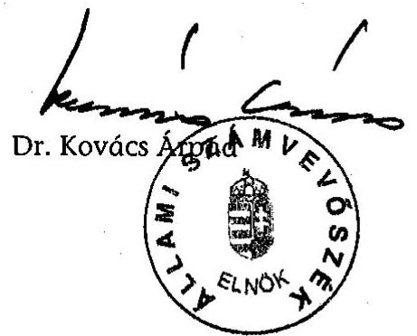

---

# MELLÉKLETEK

---

# Dr. Kovács Árpád úrnak   elnök 

Állami Számvevőszék

## Budapest

## Tisztelt Elnök Úr!

Az Állami Számvevőszék által az irányított betegellátási modellkísérlet ellenőrzéséről készített jelentést köszönettel megkaptam és munkatársaimmal áttanulmányoztuk. A jelentésben foglalt, a Kormánynak és az egészségügyi miniszternek szóló javaslatok végrehajtásával kapcsolatos intézkedéseimről az alábbiak szerint tájékoztatom Főigazgató Urat.

Az egészségügyi miniszter által a kormány számára készítendő értékelés összeállítására szakmai bizottságot kértem fel. A bizottság által elkészített jelentést szíves tájékoztatásul csatoltan megküldöm. Ezen jelentés az Állami Számvevőszék által felvetett kérdésekre is választ ad.

Az egészségügyi miniszternek címzett ÁSZ javaslatok kapcsán a következőkről tájékoztatom. Az irányított betegellátási rendszerben alkalmazandó protokollok és az ellátás minőségét értékelő indikátorok kialakítása folyamatban van. A „legjobb gyakorlat" kialakítása nem elsősorban közvetlen jogszabályalkotási tevékenység, hanem orvosszakmai és rendszerszervezési kérdés. Vagyis a „legjobb gyakorlat" az orvosok gyógyító, megelőző és kutatási tevékenységének eredőjeként kialakuló és dinamikusan változó rendszer, melynek elterjedését közvetett módon (szakmai irányelvek kiadása, folyamatos továbbképzés, személyi és tárgyi minimumfeltételek meghatározása, stb.) tudjuk formálni.

---

Az Országos Egészségbiztosítási Pénztár főigazgatójának javasolt teendőkkel kapcsolatban az alábbiakról tájékoztatom:
a) A modellkísérlettel kapcsolatos belső szabályok elkészítése és karbantartása 2004. januárjától már elkezdődött, illetve folyamatban van.
b) A 2004. évi elszámolás már az új informatikai rendszer segítségével történik. Az átláthatóság fokozása érdekében folyamatban van a fejkvóta számítás mechanizmusának közzététele az OEP honlapon.
c) A modellkísérlet személyi, dologi és fejlesztési kiadásainak elkülönített nyilvántartása 2005-től megvalósul.
d) A szervezeti és technikai követelmények ellátásszervezőkre történő kidolgozását és alkalmazását jelenleg jogszabály nem írja elő, így kidolgozásukat követően az alkalmazás véghezviteléhez nem látjuk a jogi lehetőséget. A jogszabályi háttér kialakítása az Egészségügyi Minisztérium hatáskörébe tartozik.

Kérem, hogy a hivatkozott jelentés kapcsán tett intézkedéseimről szóló tájékoztatást elfogadni szíveskedjék.

Budapest, 2005. február „ „

Tisztelettel:
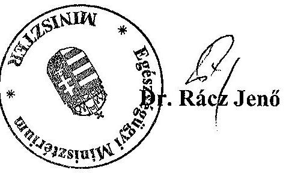

Melléklet: 1 db átfogó értékelés

---

# Dr. Rácz Jenő úr 

miniszter
Egészségügyi Minisztérium

## Budapest

## Tisztelt Miniszter Úr!

Az irányított betegellátási modellkísérlet ellenőrzéséről készített jelentésünkkel kapcsolatos tájékoztatását, valamint a mellékletként szereplő „Az irányított betegellátási rendszer értékelő anyagainak átfogó értékelése" című dokumentumot köszönettel kézhez vettem.

A levelét és a mellékletben foglaltakat áttekintve az a véleményem, hogy azokban nem merül fel véleménykülönbség jelentésünkkel kapcsolatban, és inkább a jelentés utóéletéhez kapcsolható megtett, vagy jövőben várható teendőkről ad tájékoztatást, amit ezúton is köszönök.

Tájékoztatom Miniszter urat, hogy az ellenőrzésről készült jelentést - kialakult gyakorlatunk szerint - az Ön észrevételeivel és az azokra adott válaszommal együtt küldöm meg az Országgyűlés elnökének, az illetékes bizottságai elnökeinek és a Miniszterelnöknek.

Budapest, 2005. február 28.

Tisztelettel:
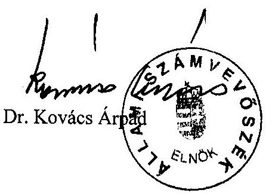

---

# TELJESÍTMÉNYKRITÉRIUMOK az irányított betegellátási modellkísérlet ellenőrzéséhez

I. Főbb ellenőrzési területek: A Modell céljainak és azok megvalósulásának, a jogszabályi feltételrendszernek, az elszámolások átláthatóságának és szabályszerűségének, a modellkísérlet betegellátásra gyakorolt hatásának, az eddigi kiterjesztés megalapozottságának ellenőrzése.

|  Kritériumcsoport (1-től 3-ig) | Követelmény | Eredményes-
ségi szint |   |
| --- | --- | --- | --- |
|  3/1. A Modell céljai, mű-
ködtetés feltételrendszere,
szerzett tapasztalatok
hasznosítása, eddigi kiter-
jesztések megalapozottsága | A Modell célrendszerének összhangja a mindenkori kor-
mányzati célkitűzésekkel. | teljesítés | nem teljesült  |
|   | A Modell célrendszerének összhangja a népegészségügyi
programokkal. | teljesítés | teljesült  |
|   | A pénzügyi feltételek biztosítottak voltak az elindításkor és
folyamatosan a működés során. | teljesítés | teljesült  |
|   | A Modell működési tapasztalatait folyamatosan értékelte
az ágazati minisztérium és az OEP. | teljesítés | nem teljesült  |
|   | Átlátható, követhető és nyilvános a pályáztatási rendszer. | teljesítés |   |
|   | A szerződések összhangban vannak a pályázati kiírások-
kal. | teljesítés |   |
|   | A Modell működésének folyamatos ellenőrzése során szer-
zett szakmai és pénzügyi tapasztalatok, és ezek hasznosí-
tása megalapozta az eddigi kiterjesztést. | teljesítés | nem teljesült  |
|  3/2. A Modell elszámolása-
inak átláthatósága, sza-
bályszerűsége, a szervezési
és prevenciós díj felhaszná-
lása | A fejkvóta számításának és változásának egyértelmű
meghatározottsága. | teljesítés | teljesült  |
|   | A kasszák közötti „átjárás" tendenciáit elemzik, értékelik
az OEP-nél. | teljesítés | nem teljesült  |
|   | A kasszákon keletkező veszteségek és megtakarítások visz-
szatükrözik a Modell céljait. | teljesítés | nem kimutatható  |
|   | A prevenciós és szervezési dí követi a biztosítottak lét-
számváltozását. | teljesítés | teljesült  |
|   | A szervezői bevételek tervezhetőek-e. | teljesítés | nem teljesült  |

---

|   | Az érdekeltségi rendszerben felhasznált pénzeszközök javítják a szolgáltatók gép-műszer ellátottságát. | teljesítés | részben teljesült
A megtakarítás egy részét fejlesztésre fordítják.  |
| --- | --- | --- | --- |
|   | A szervező kezelje elkülönítve a pénzeszközeit (2004. jan. 1. óta). | teljesítés | teljesült  |
|  3/3. A Modell szervezői és prevenciós tevékenysége | A Modell céljainak megfelelően változzon az ellátások igénybevételi aránya a Szervezőknél. | teljesítés | nem teljesült  |
|   | Csökkenjen a gyógyszertámogatás felhasználásának nagyságrendje egy főre vetítve a Modellen belül. | teljesítés | részben teljesült
A közgyógyellátásban teljesült.  |
|   | Csökkenjen a gyógyszertámogatás kiáramlásának növekedési üteme a Modellen belül. | teljesítés | nem kimutatható  |
|   | Az ellátás minőségét mérő indikátorokat dolgoznak ki és azokat fejlesztik (OEP, Szervezők). | teljesítés | részben teljesült
Indikátorok elkészültek, de nem egységesek.  |
|   | A betegút követő rendszer alkalmazása segítse a párhuzamos és/vagy indokolatlan ellátások kiszűrését. | teljesítés | teljesült  |
|   | A szervezők ellenőrizzék a terápiás, gyógyszer és szűrési protokollok alkalmazását. | teljesítés | részben teljesült
Három szervező beépítette az érdekeltségi rendszerébe a protokoll fejlesztést és használatot.  |
|   | A szervezők rendszeresen mérjék a betegelégedettséget. | teljesítés | részben teljesült
A szervező, mint szolgáltató a saját intézményében méri a betegelégedettséget.  |
|   | A betegelégedettség mérése során mérjék a szabad orvos és intézményválasztás hatását a betegelégedettségre. | teljesítés | nem teljesült  |
|   | A bevont háziorvosok tegyenek eleget a betegtájékoztatás kötelezettségének, különös tekintettel a Modellben való részvételre vonatkozóan. | teljesítés | részben teljesült
A rendelőben elhelyezett táblával és helyi médián keresztül.  |
|   | A prevenció során a lakosság elérési aránya legyen magas, és alkalmazzák a páciensek rizikóbesorolását. | teljesítés | nem teljesült  |
|   | A kiszűrt betegeket vegyék gondozásba. | teljesítés | nem teljesült  |

---

# II. A teljesítményellenőrzés során alkalmazandó módszerek: 

- az ÁSZ teljesítmény-ellenőrzési útmutatójának áttekintése;
- jogszabályok, belső szabályzatok, egyéb dokumentumok értékelése, összehasonlító elemzése, egyéb információs források tanulmányozása (pl. Internet, intranet), nemzetközi szakirodalom áttekintése;
- korábbi, kapcsolódó ÁSZ anyagok áttekintése (előtanulmányok, számvevői jelentések, ÁSZ jelentések és tanulmányok);
- strukturált interjúk (az előkészítés és a helyszíni ellenőrzés szakaszában egyaránt) a vizsgálandó szervezetek tárgyban érintett munkatársaival;
- kérdőíves felmérés helyszínen nem ellenőrzött válaszadóknál, tanúsítványok elemzése és értékelése, benchmarking;
- helyszíni ellenőrzés keretében dokumentumok, adatállományok statisztikai kimutatások, indikátorok áttekintése, elemzése és értékelése, a vizsgálati programban foglaltak és a strukturált kérdésfa szerint;
- helyszíni vizsgálatot lezáró csoportos megbeszélés (fókusz) az ellenőrzött szervezetek érintett munkatársainak részvételével.

---

# STRUKTURÁLT KÉRDÉSFA 

## az irányított betegellátási modellkísérlet ellenőrzéséhez

| Az ellenőrzés fő kérdése: | Eredményesen működik-e az irányított betegellátási rendszer? |
| :--: | :--: |
| Az ellenőrzés 3 alkérdése: | 1. Meghatározottak voltak-e az IBR bevezetésének céljai, működésének feltételei, hasznosultak-e a működés során szerzett tapasztalatok, és megalapozott volt-e a modell bővítése?   2. Átláthatóak voltak-e az IBR elszámolásai a finanszírozónál és a szervezőknél?   3. Követik, elemzik és ellenőrzik-e a szervezők szervezői és prevenciós tevékenységét? |

Főkérdés: Eredményesen működik-e az irányított betegellátási rendszer?

1. Meghatározottak voltak-e az IBR bevezetésének céljai, kidolgozottak voltak-e a működtetés feltételei, hasznosultak-e a működés során szerzett tapasztalatok, megalapozott volt-e a modell folyamatos bővítése?
1.1. Az IBR bevezetése összhangban volt-e az egészségpolitikai célokkal, és a népegészségügyi programokkal?
1.1.1. Meghatározták-e induláskor az IBR célrendszerét? Ezek összhangban álltak-e a kormányzati célkitűzésekkel és a népegészségügyi programokkal?
1.1.2. Előkészített volt-e az IBR bevezetése az ágazat irányító EüM részéről, és a finanszírozó OEP részéről? Együttműködött-e a két szervezet az IBR bevezetésében?

---
 megtörténik-e a prevenciós jelentések értékelése?
2.2 Hatással van-e a modellkísérlet az E. Alap gyógyító megelőző kasszáira és a gyógyszertámogatás kiáramlására?
2.2.1. Elemzik-e rendszeresen, hogy a modellkísérlet eredményez-e megtakarítást a gyógyító megelőző kasszákban, illetve a gyógyszertámogatásban?
2.2.2. Vizsgálják-e a modellen belüli gyógyszerfelhasználások tendenciáit az országoshoz viszonyítva?
2.2.3. Szabályozott-e az elvi folyószámla vezetése és a kasszák közötti átjárhatóság?
2.2.4. Figyelemmel kísérik-e a biztosítottak modellből való ki-, be-, átjelentkezését?

---

2.3 Meghatározottak-e a szervezők feladatai, és ezeket megfelelően ellátja-e? Rendelkezésre áll-e minden eszköz feladataik megfelelő ellátásához?
2.3.1. Tervezhetők és átláthatók-e a szervezők bevételei?
2.3.2. Biztosított-e a szervezési és prevenciós díj elkülönített nyilvántartása? Összhangban van-e a szervezési díj a működési költségekkel, illetve a prevenciós díj a prevenciós tevékenységgel? Megfelelően ellenőrzött-e a prevenciós díj felhasználása?
2.3.3. Megfelelően hasznosulnak-e a megtakarítások a szervezőknél, a háziorvosoknál és az egyéb egészségügyi szolgáltatóknál?
2.3.4. Rendszeresen elemzik-e a bevételek alakulását, és a kasszák és megtakarítások egymáshoz mért arányát? Rendelkezésre állnak-e eszközök a szervezőknél az ellátások racionalizálása, a bevételek maximalizálása érdekében?
2.3.5. Megfelelő-e az együttműködés az OEP és a szervezők között a tájékoztatásban, adatcserében?
2.4. Van-e összefüggés a szervezők érdekeltségi rendszere és működésük eredményessége között?
2.4.1. Kidolgozott-e, a szervezők érdekeltségi rendszerén belül a bevételi többlet szétosztása?
2.4.2. Szabályozott-e a megtakarítás felhasználása?
2.4.3. Elemzik-e a szervezők a pozitív, illetve negatív előjelű megtakarítás okait?
3. Követik, elemzik és ellenőrzik-e a szervezők szervezői és prevenciós tevékenységét?
3.1. Elemzik-e a modellben az ellátottak definitív ellátását és a gyógyszer-támogatás felhasználását?
3.1.1. Követik-e az ellátások igénybevételét, a betegforgalmi adatokat, készülnek-e összehasonlító elemzések a modellben, és a modellen kívüli ellátások költségigényéről?
3.1.2. Vannak-e a modellen belüli betegellátás minőségét mérő minőségi indikátorok, illetve azok folyamatos fejlesztése megtörtént-e? Eredményes-e a modellen belüli prevenciós tevékenység?
3.2. A szervezőknél elősegíti-e betegút követés, a gondozás és a protokollok kidolgozása és alkalmazása a modell céljainak megvalósulását?
3.2.1. Megvalósul-e a betegút követés? Rendszeresen elemzik-e ezt? Hogyan követik a gondozási tevékenységet? Az informatikai rendszerek megfelelően segítik-e ezt?
3.2.2. Készítenek-e a szervezők terápiás, gyógyszer és szűrési protokollokat, illetve követik-e azok alkalmazását?

---

3.3. Megvalósul-e a szervezők által készített prevenciós terv?
3.3.1. Illeszkedik-e a szervezők prevenciós terve és gyakorlata a népegészségügyi programokhoz? Összhangban van-e a prevenciós terv megvalósítása a szerződésben foglaltakkal?
3.3.2. Megvalósul-e az egészségnevelés, egészségfejlesztés? Mely betegségcsoportokra alkalmaznak szűrést? Milyen a lakosság elérési és részvételi aránya? Milyen módszereket alkalmaznak a lakosság elérésére? Mekkora az átszűrtségi arány betegségcsoportonként?
3.4. Végeznek-e rendszeresen betegelégedettségi vizsgálatot?

---

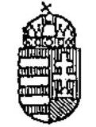

# EGÉSZSÉGÜGYI MINISZTÉRIUM MINISZTER 

$3016 / 2000$
Dr. Lampé Zsolt úrnak főigazgató

Országos Egészségbiztosítási Pénztár

Budapest

## Igen Tisztelt Főigazgató Úr!

Az OEP által irányított betegellátási modellkísérlethez kapcsolódó pályázati felhívás tervezetéhez az Egészségügyi Minisztérium részéről kritikai észrevételeinket a felhívás megjelenése előtt a rendelkezésére bocsátottuk. Megjegyezni kívánom, hogy a pályázati felhívást nem alapozta meg az 1999. évi modellkísérlet tapasztalatainak egyeztetése, értékelése az Egészségügyi Minisztériummal.

Az 1999. évi modellkísérletről szóló jelentés tervezet a pályázati felhívás után készült el. Az Egészségügyi Minisztérium részéről többek között kifogásként merült fel a pályázat céljának pontatlansága. A felhívásból nem derült ki, hogy a modellkísérlet konkrétan mire irányul, milyen eredményekre alapoz.

Sajnálattal állapítottam meg, hogy a pályázati felhívással kapcsolatos észrevételeink nem kerültek realizálásra, ezért a modellkísérlet szakmai tartalmáért nem tudom vállalni a felelősséget.

A Kormány részére készített jelentéstervezethez készített állásfoglalásunkban leszögeztük, hogy miután a betegutak elemzése nem történt meg a modellkísérlet során - amelynek a modellkísérlet központi elemének kellene lenni - így az sem tudható meg, hogy valóban történt-e elmozdulás a definitív ellátás felé.

Egyéb kifogásunkat nem ismételnénk, de a jelentésből kiderült, hogy többek között az OEP informatikai rendszerének hiányossága miatt az értékelhetőség erősen megkérdőjelezhető.

---

Felhívom főigazgató úr szíves figyelmét, hogy a pályázati felhívásban a „Szervező ellátási területe az irányított betegellátásban résztvevő háziorvosi szolgálatok ellátási kötelezettségének felel meg”. Így nem tudom értelmezni a Vasútegészségügyi Kht. nyertesként való szerepeltetését, miután a VTI-vel területi ellátási kötelezettség nélküli orvosok szerződtek.

Az 1998. évi XXXIX. tv. 8.§-a a VTI-t önálló jogi személynek deklarálja, ebben az esetben nem azonos az OEP-pel. Miután a pályázati felhívás kizárólag az OEP-pel való finanszírozási szerződést nevesíti és nem nevesíti a VTI-vel való szerződést, így a pályázati feltételben megfogalmazottaknak a Vasútegészségügyi Kht. nem felel meg, mivel a Kht. a VTI-vel és nem az OEP-pel áll szerződéses kapcsolatban.

Tudomásom szerint az ÁSZ az 1999. évi OEP zárszámadás során vizsgálta az irányított betegellátási modellkísérletet. A vizsgálat lezárása a közeljövőben várható, így sem azért, sem a fentiek alapján nem javaslom a pályázati nyertesek kihirdetését.

Tanácsolom, hogy az ÁSZ véleményét szíveskedjék figyelembe venni, amikor a modellkísérlet folytatásáról születik döntés.

Budapest, 2000. június 15.
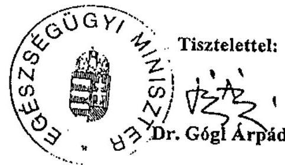

---

# EGÉSZSÉGÜGYI, SZOCIÁLIS ÉS CSALÁDÜGYI MINISZTÉRIUM   III. EGÉSZSÉGPOLITIKAI FŐOSZTÁLY 

1051 Budapest, Arany János u. 6-8.
Telefon: $\quad 301-7937$
Telefax: $\quad 331-9993$
e-mail: egpolv@eszcsm.hu
Iktatószám: 33689-1/2004-0003EGP

Előadó:
Hiv.szám:
Melléklet:
Tárgy:
Válasz esetén kérjük levelünk számára és ügyintézőnkre hivatkozni.

Dr. Girinyi Margit asszonynak
külső szakértő
Állami Számvevőszék
Budapest
Apáczai Csere J. u. 10.
1051

## Tisztelt Szakértő Asszony!

Az IBR szervezéssel kapcsolatos kérdéseire az alábbi tájékoztatást adom.

- Az IBR működésének ellenőrzését az OEP végezte.
- Az IBR működésének, ellenőrzési tapasztalatainak összegzésére létrejött bizottságot ugyancsak az OEP koordinálta.
A bizottságba felkért szakértők, OEP, minisztérium munkatársai vettek részt.
Az Irányított betegellátási rendszer működésének éves és négyéves értékeléséről szóló anyagot az OEP készítette, melyet a felsővezetők számára eljuttatták.
- Az egészségügyi reform koncepciójának kialakítását a Reform titkárság koordinálta. A május 18-ai kormányhatározat alapján önálló IBR munkacsoport működött, melynek feladata volt az eddigi tapasztalatok és a reform összehangolása. Vezetője Dr. Horváth Ágnes főosztályvezető (OEP) volt.
- A tárca részéről saját előterjesztés, anyag nem készült, ezen feladatokat a tárca számára is az OEP végezte el.

Budapest, 2004. szeptember 22.
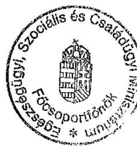

Üdvözlettel:
Dr. Kereszti Éva
főosztályvezető

---

# Eredmények - Megfelelőség 

## 3 különböző gyári nevű, de azonos hatóanyagot tartalmazó gyógyszert kiváltó betegek száma

(szív-érrendszerre ható gyógyszerek)
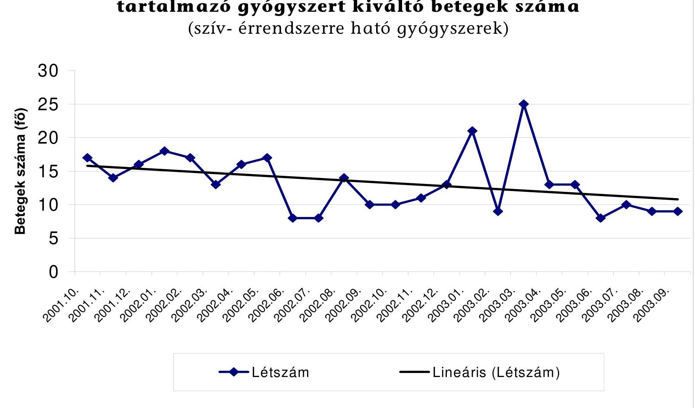

---

# Eredmények - Hozzáférés 

## Drága gyógyszerköltségű betegek száma és összköltsége

Gyógyszer ktg: > 100,000 Ft per hónap
Vizsgált populáció: 2001 júniusától a rendszerben lévő 85
háziorvos
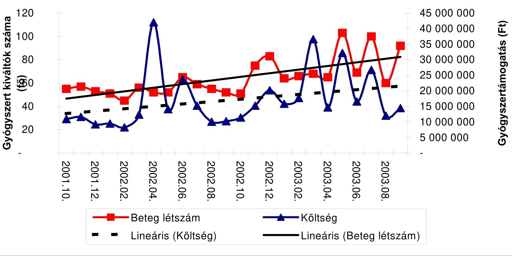

---

# Eredmények - Költséghatékonyság 

Párhuzamos ellátások
Vizsgált populáció: 2001 júniusától a rendszerben lévő 85 háziorvos
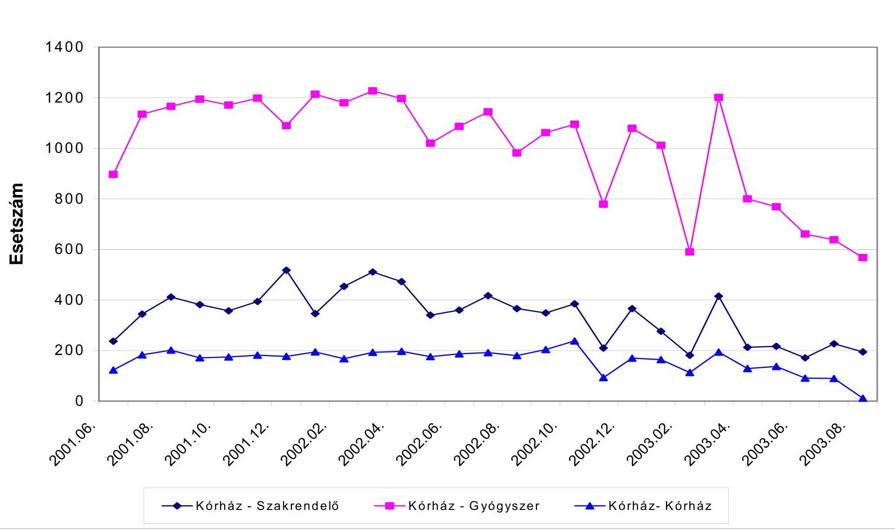

---

7. sz. melléklet

Az irányított betegellátási rendszerben résztvevő modellek történeti áttekintése

|  S.
sz. | Szervezők | Székhely | Cégforma | Átlag létszám (fő) (2002.X.- 2003.IX. között) | A működés időtartama |  |  |  |  |   |
| --- | --- | --- | --- | --- | --- | --- | --- | --- | --- | --- |
|   |  |  |  |  | 1999. év | 2000. év | 2001. év | 2002. év | 2003. év | 2004. év  |
|  1. | Béke téri Háziorvosi Szövetkezet | Budapest | Szövetkezet | 60024 | VI.- |  |  |  |  |   |
|  2. | Misszió Egészségügyi Központ | Veresegyháza | Kht. | 175906 | VI.- |  |  |  |  |   |
|  3. | Margit Kórház | Csorna | Önk-i Kv.i szerv. | 52981 | VI.- |  |  |  |  |   |
|  4. | Meditres Egészségügyi Szolgáltató Kft. | Kecskemét | Kft. | 59151 | VI.- |  |  |  |  |   |
|  5. | Szent Lukács Egészségügyi és Szolgáltató Kft. | Dombóvár | Kft. | 50459 | VI.- |  |  |  |  |   |
|  6. | Nyír-Pro-Med Egészségügyi Szolgáltató Kft. | Nyíregyháza | Kft. | 52904 |  |  | VI.- |  |  |   |
|  7. | Dental-Med Co. Bt. | Sátoraljaújhely | Bt. | 55563 |  |  | VI.- |  |  |   |
|  8. | Budai MÁV Kórház | Budapest | Kp-i kv-i szerv. | 111925 |  |  |  |  |  | VII.-  |
|  9. | Szt. György Kórház | Székesfehérvár | Önk-i kv-i szerv. | 79378 |  |  |  |  |  | VII.-  |
|  10. | Csolnoki Ferenc Kórház | Veszprém | Önk-i kv-i szerv. | 82712 |  |  |  |  |  | VII.-  |
|  11. | Erzsébet Kórház | Hódmezővásárhely | Önk-i kv-i szerv. | 58160 |  |  |  |  |  | VII.-  |
|  12. | Magyar Imre Kórház | Ajka | Önk-i kv-i szerv. |  | VI.-X. |  |  |  |  |   |
|  13. | Szent Pantaleon Kórház | Dunaújváros | Önk-i kv-i szerv. |  | VI. - | I. |  |  |  |   |
|  14. | Pándy Kálmán Kórház | Gyula | Önk-i kv-i szerv. |  | VI. - | I. |  |  |  |   |
|  15. | Univerzmed Egészségügyi Szolgáltató Kft. | Budapest | Kft. |  | VI. - | I. |  |  |  |   |
|  Összesen: |  |  |  | 839163 |  |  |  |  |  |   |

Forrás: Az irányított betegellátási rendszer működésének értékelése - 1999-2003. - OEP 2004. március

---

# TÁBLÁZATOK JEGYZÉKE 

| 1. sz. tábla | Tájékoztató adatok a modellkísérletről |
| :--: | :--: |
| 2. sz. tábla | Az egyes kasszák aránya a Modellkísérlet gyógyító megelőző kiadásában %-ban (1999-2004) |
| 3. sz. tábla | Gyógyító megelőző kasszákban képződött folyószámla egyenlegek (1999-2003) |
| 4. sz. tábla | Gyógyszerkiadások teljesülése a modell körben |
| 5. sz. tábla | A háziorvosoknak és egyéb egészségügyi szolgáltatóknak kifizetett megtakarítások felhasználása |
| 6. sz. tábla | A megtakarítások felhasználása |
| 7. sz. tábla | Az egészségügyi ellátásszervezők teljesítményadatai |
| 8. sz. tábla | Betegút követő szoftverek a Modellben |
| 9. sz. tábla | Szervezői protokollok listája |
| 10. sz. tábla | Primer prevenciós tevékenység a szervezőknél |
| 11. sz. tábla | Szűrések típusai |
| 12. sz. tábla | Kötelező és nem kötelező szűrővizsgálatok |
| 13/a. sz. tábla | Felnőttgondozási prevalencia gondozási csoportonként, 2003. szeptember |
| 13/b. sz. tábla | Gyermekgondozási prevalencia gondozási csoportonként, 2003. szeptember |

---

# Tájékoztató adatok a modellkísérletről

|  Megnevezés | 1999 | 2000 | 2001 | 2002 | 2003 |

  |
| --- | --- | --- | --- | --- | --- |
|  E. Alap összes kiadása (M Ft) | 701202 | 797723 | 914967 | 1111232 | 1335958  |
|  Ebből természetbeni ellátás (M Ft) | 504069 | 556016 | 623358 | 750326 | 920331  |
|  Modell összes kiadás (M Ft) | 1711 | 3944 | 15852 | 28332 | 41061  |
|  Modell összes bevétel (M Ft) | 1774 | 4402 | 16691 | 31043 | 42513  |
|  Átlag létszám (fő) | 158994 | 88451 | 381267 | 476053 | 839163  |
|  Modell megtakarítás (E Ft) | 92581 | 457662 | 1109442 | 2710926 | 1170996  |
|  1/főre bevétel (Ft)* | 11158 | 50000 | 43800 | 65000 | 51000  |
|  1/főre kiadás (Ft)* | 10761 | 45000 | 41600 | 59000 | 49000  |
|  1/főre megtakarítás (Ft)* | 582 | 5174 | 2909 | 5694 | 1395  |
|  Modell részesedése E. Alap (\%) | 0,2 | 0,5 | 1,7 | 2,5 | 3,06  |
|  Modell részesedése természetbeni (\%) | 0,3 | 0,7 | 2,5 | 3,7 | 4,5  |

- Az egy főre jutó tényleges megtakarítás nem egyenlő az egy főre jutó bevétel és egy főre jutó kiadás különbségével, mivel a megtakarítás kifizetése a korrekciók után történik.

---

# Az egyes kasszák aránya a Modellkísérlet gyógyító megelőző kiadásában %-ban (1999-2004)

|  Kassza | 1999 | 2000 | 2001 | 2002 | 2003 | 2004. I. félév  |
| --- | --- | --- | --- | --- | --- | --- |
|  Háziorvosi ellátás | 10,0 | 11,0 | 11,4 | 10,6 | 12,5 | 10,8  |
|  Fogászati ellátás | 3,0 | 3,0 | 2,0 | 4,2 | 3,0 | 2,9  |
|  Járóbeteg szakellátás | 18,0 | 17,2 | 17,5 | 16,6 | 16,6 | 16,8  |
|  Aktív/krónikus fekvőbeteg-szakellátás | 61,0 | 56,5 | 57,0 | 57,8 | 56,1 | 56,0  |
|  Müvese kezelés | 3,0 | 7,0 | 6,2 | 5,3 | 5,2 | 5,4  |
|  CT/MRI diagnosztika | 3,0 | 3,6 | 2,2 | 1,8 | 2,2 | 3,3  |
|  Házi szakápolás | 0,4 | 0,3 | 0,4 | 0,3 | 0,5 | 0,5  |
|  Betegszállítás |  |  |  |  |  | 1,2  |
|  Gondozóintézeti gondozás |  |  |  |  |  | 0,3  |

---

# Gyógyító megelőző kasszákban képződött folyószámla egyenlegek (1999-2003)

|  Kassza | 1999 | 2000 | 2001 | 2002 | 2003 (1) | 2003 (2) | 2003 (3)  |
| --- | --- | --- | --- | --- | --- | --- | --- |
|  Háziorvosi ellátás | 5854,1 | 11597,8 | $-9759,6$ | $-89069,6$ | $-111594,5$ | $-110331,9$ | 11686,8  |
|  Fogorvosi ellátás | 0,0 | 55758,8 | 7982,1 | $-38176,8$ | $-219799,7$ | $-219576,7$ | 0,0  |
|  Járóbeteg-szakellátás | $-27946,8$ | 6756,1 | 134808,2 | 304292,8 | 225838,0 | 223923,8 | 198510,2  |
|  Fekvőbeteg-szakellátás | 99138,3 | 225173,2 | 704982,0 | 1655057,0 | 1079373,3 | 806818,5 | 427660,6  |
|  Múvesekezelés | $-647,5$ | $-2175,6$ | 34017,7 | 15157,6 | 14155,3 | 11279,6 | 4866,9  |
|  CT/MRI diagnosztika | $-4981,3$ | 3000,7 | 12584,6 | 53348,9 | 32420,7 | 32083,3 | 28033,3  |
|  Házi szakápolás | 453,6 | 1303,5 | 3717,4 | 736,5 | $-11595,7$ | $-12526,0$ | 1359,4  |

## Megjegyzés:

2003 (1) elszámolás az elvi folyószámla egyenlegét mutatja halottkorrekció és degresszió nélkül 2003 (2) elszámolás az elvi folyószámla egyenlegét mutatja a halottkorrekció beszámítását követően 2003 (3) elszámolás az elvi folyószámla egyenlegét mutatja az elszámolás degresszálását követően

---

# Gyógyszerkiadások teljesülése a modell körben

|  Megnevezés | 1999 | 2000 | 2001 | 2002 | 2003  |
| --- | --- | --- | --- | --- | --- |
|  E. Alap gyógyszer kiadása (M Ft) | 139461 | 150753 | 179465 | 209033 | 251818  |
|  Modell gyógyszer kiadása (M Ft) (külön keret nélkül) | 533 | 1204 | 4961 | 8365 | 13034  |
|  Modell létszáma (fő) | 158984 | 88451 | 381267 | 476053 | 839163  |
|  Háziorvos TAJ (db) | - | - | - | - | 9804257  |
|  Modell gyógyszerkiadása (Ft/fő) | 3352 | 13612 | 13011 | 17571 | 15532  |
|  Háziorvosi TAJ-ra jutó gyógyszer E. Alapból (Ft) | - | - | - | - | 25684  |

---

# A háziorvosoknak és egyéb egészségügyi szolgáltatoknak kifizetett megtakarítások felhasználása*

|   |  |  |  |  | E Ft-ban  |
| --- | --- | --- | --- | --- | --- |
|   | Háziorvosoknak fizetett megtakarítás felhasználása | 1999 | 2000 | 2001 | 2002  |
|  1 | bér és járulékai |  |  | 1566 | 80983  |
|  2 | Informatika |  |  | 4068 | 39952  |
|  3 | orvosi műszer vásárlás, lízing |  |  | 661 | 67816  |
|  4 | rendelő építés, felújítás, fejlesztés |  |  | 1825 | 88033  |
|  5 | gépkocsi vásárlás, lízing |  |  | 20954 | 222595  |
|  6 | praxis megvétele |  |  | 0 | 23310  |
|  7 | továbbképzés, szakkönyv stb. |  |  | 1418 | 16914  |
|  8 | tartalék |  |  | $-18980$ | 19843  |
|  9 | adó |  |  | 16 | 6330  |
|  10 | Összesen (1+2+3+4+5+6+7+8+9): | 0 | 0 | 11528 | 565776  |
|  11 | Egyéb egészségügyi szolgáltatóknak fizetett megtakarítás felhasználása |  |  |  |   |
|  12 | bér és járulékai |  |  |  | 8900  |
|  13 | Informatika |  |  |  | 61326  |
|  14 | orvosi műszer vásárlás, lízing |  |  |  | 28246  |
|  15 | rendelő építés, felújítás, fejlesztés |  |  |  | 3831  |
|  16 | gépkocsi vásárlás, lízing |  |  |  |   |
|  17 | továbbképzés, szakkönyv stb. |  |  |  |   |
|  18 | tartalék |  |  |  |   |
|  19 | egyéb |  |  |  |   |
|  20 | Összesen (12+13+14+15+16+17+18+19): | 0 | 0 | 0 | 102303  |
|   | Összesen (10+20): | 0 | 0 | 11528 | 668079  |

- 2001-re a Béke téri Eü. Szolg. Kft. és a Nyír-Pro-Med Kft. szolgáltatott adatot, 2002-re az előbbi két szervezőn kívül a Misszió Kht.

---

# A megtakarítások felhasználása*

|  Megnevezés | 1999 | 2000 | 2001 | 2002 | 2003 | Összesen  |
| --- | --- | --- | --- | --- | --- | --- |
|  Megtakarítás felhasználása | - | - | - | - | - | -  |
|  A szervezőnél maradó rész | - | - | - | - | - | -  |
|  személyi kiadások és járulékai | 368 | 7356 | 2394 | 64945 | 39234 | 114297  |
|  vállalkozóként számla ellenében foglalkoztatottak | 400 | 8706 | 5821 | 43403 | 77881 | 136211  |
|  informatikus foglalkoztatása (megbízási szakértői díjak) | - | 6269 | 2779 | 15400 | 15085 | 39533  |
|  informatika (hardware+software) | 2918 | 12042 | 13299 | 63107 | 29332 | 120698  |
|  orvosi műszer vásárlás, lízing | 46 | 22441 | 44211 | 126053 | 61100 | 253850  |
|  gépjárművásárlás, lízing | - | 6743 | 2353 | 8697 | 11380 | 29173  |
|  közüzemi díj, karbantartás, bérleti díj | 12481 | 57974 | 139665 | 289393 | 127074 | 626587  |
|  továbbképzés, szakirodalom | - | 116 | 673 | 1665 | 1090 | 3544  |
|  egyéb: | 560 | 27775 | 88556 | 151175 | 112066 | 380132  |
|   | - | 19276 | 2166 | 90240 | 96961 | 208643  |
|   | - | 240 | - | 7648 | 31756 | 39644  |
|  maradvány | - | - | - | - | - | -  |
|  1 A szervezőnél maradó rész összesen : | 16773 | 168938 | 301917 | 861726 | 602958 | 1952311  |
|  2 Informatikai szolgáltatónak fizetett rész | 2785 | 8720 | 27911 | 142645 | 103309 | 285370  |
|  3 Háziorvosoknak kifizetett rész | 4482 | 70752 | 144093 | 675251 | 714110 | 1608688  |
|  4 Egyéb eü-i szolgáltatóknak fizetett rész összesen | - | 8300 | 9563 | 52916 | 252613 | 323392  |

- 2003. XII. 31-ig kifizetett megtakarítások a szervezők adatszolgáltatása alapján.

---

# Az egészségügyi ellátásszervezők teljesítményadatai

|   |  | 1999 | 2000 | 2001 | 2002 | 2003  |
| --- | --- | --- | --- | --- | --- | --- |
|  1 | egy járóbeteg-ellátási esetre jutó beavatkozások (kívül) | 5,70 | 6,50 | 5,40 | 5,60 | 4,60
 |
|  2 | egy járóbeteg-ellátási esetre jutó beavatkozások (belül) | - | - | - | - | -  |
|  3 | egy járóbeteg-ellátási esetre jutó pont (kívül) | 1013,60 | 1061,30 | 1123,80 | 1155,00 | 1263,20  |
|  4 | egy járóbeteg-ellátási esetre jutó pont (belül) | - | 1065,57 | 1071,07 | 1147,57 | 1277,85  |
|  5 | egy lakosra jutó ellátási esetek (kívül) | 5,60 | 5,80 | 6,00 | 6,30 | 6,40  |
|  6 | egy lakosra jutó ellátási esetek (belül) | - | 6,21 | 5,86 | 5,48 | 6,02  |
|  7 | egy lakosra jutó átlagos pont (kívül) | 5681,10 | 6174,30 | 6783,80 | 7598,70 | 8455,50  |
|  8 | egy lakosra jutó átlagos pont (belül) | - | 6612,75 | 6277,12 | 6290,92 | 7692,01  |
|  9 | egy főre jutó gyógyszerköltség kívül (Ft/fő) (különkeretes nélkül) | 17664 | 19303 | 22428 | 26502 | 31639  |
|  10 | egy főre jutó gyógyszerköltség belül (Ft/fő) | - | 13915 | 15826 | 17581 | 21610  |
|  11 | egy közgyógyellátottra jutó támogatás kívül (Ft/fő) | 19822 | 20854 | 20345 | 24671 | 27393  |
|  12 | egy közgyógyellátottra jutó támogatás belül (Ft/fő) | - | 10392 | 12109 | 22244 | 17931  |
|  13 | egy aktív fekvő esetre jutó finanszírozási összeg kívül (Ft/fő) | 81886 | 84405 | 92558 | 105172 | 109018  |
|  14 | egy aktív fekvő esetre jutó finanszírozási összeg belül (Ft/fő) | - | 72438 | 75701 | 88985 | 91907  |
|  15 | egy krónikus fekvő esetre jutó finanszírozási összeg kívül (Ft/fő) | 58070 | 62296 | 67299 | 72086 | 72601  |
|  16 | egy krónikus fekvő esetre jutó finanszírozási összeg belül (Ft/fő) | - | 56280 | 44349 | 41563 | 42793  |

---

# Betegút követő szoftverek a Modellben 

| Szervezők | Szoftver | Mire |
| :--: | :--: | :--: |
| Béke téri Háziorvosi Szövetkezet,   Meditres Kft - Kecskemét,   Nyírpromed Kft - Nyíregyháza | TAJFUN | elvi folyószámla kiadások feldolgozása, be-   tegút-követés, monitorozás |
| Misszió Kht | fürCASE   Saját   fejlesztés | esetkezelés, betegút-követés |
| Veszprém Megyei Önkormányzat   Csolnoky Ferenc Kórház-   Rendelőintézet | fürCASE |  |
| Margit Kórház - Csorna: H,R,M,O   Dombóvári Szent Lukács Egészség-   ügyi Kht:H,O   Dental-Med Co.Bt - Sátoraljaújhely   H,R,M,O   Fejér Megyei Szent György Kórház -   Székesfehérvár H,M,O | Hermes-H   Hermes-R   Hermes-M   Hermes-O | háziorvosi betegút-követés és elszámolás követés   regionális betegút-követés és elszámolás követés |
|  |  |  |
|  |  |  |
| Budai MÁV Kórház | Saját fejlesztés |  |
| Hódmezővásárhely Erzsébet Kórház   - Rendelőintézet | Prodirect | betegút-követés |

---

# Szervezői protokollok listája 

| Protokoll | Misszió | Veszprém | Csorna | Dombóvár | Béke tér | Fejér megye | Sátoraljaújhely |
| :--: | :--: | :--: | :--: | :--: | :--: | :--: | :--: |
| Diagnosztikus és terápiás protokollok |  |  |  |  |  |  |  |
| magas vérnyomás betegség | $+$ | $+$ | $+$ | $+$ | $+$ |  | $+$ |
| cukorbetegség II. | $+$ | $+$ | $+$ | $+$ | $+$ | $+$ | $+$ |
| derékfájás (és hátfájás) | $+$ | $+$ |  | $+$ |  |  |  |
| osteoporosis | $+$ |  |  | $+$ |  |  |  |
| ischaemiás szívbetegség | $+$ |  |  | $+$ |  |  | $+$ |
| mellkasi fájdalom / akut koronária szindróma |  | $+$ | $+$ | $+$ |  |  |  |
| thrombosis /vénás tromboembóliák antitrombotikus terápiája | $+$ |  | $+$ |  |  |  |  |
| zsír anyagcsere zavarok | $+$ |  |  |  | $+$ | $+$ | $+$ |
| stroke/ cerebrovaszkuláris betegek akut ellátása | $+$ |  | $+$ | $+$ |  |  |  |
| ritmuszavarok |  |  |  | $+$ |  |  |  |
| akut és krónikus szívelégtelenség |  |  |  | $+$ |  |  |  |
| fejfájás | $+$ |  |  |  |  |  |  |
| sebkezelés | $+$ |  |  |  |  |  |  |
| gyermekkori sürgősségi állapotok | $+$ |  |  |  |  |  |  |
| fájdalomcsillapítás | $+$ |  |  |  |  |  |  |
| mozgásszervi betegségek degeneratív ízületi bántalmak |  |  |  | $+$ | $+$ |  |  |
| felső légúti hurut | $+$ | $+$ |  |  |  |  |  |
| tüdőgyulladás |  |  | $+$ | $+$ |  |  |  |
| asztma |  |  | $+$ | $+$ |  |  | $+$ |
| allergiás rhinitis (szénanátha) |  |  | $+$ |  |  |  |  |
| COPD | $+$ |  |  |  |  |  |  |
| húgyúti infekciók | $+$ | $+$ |  |  |  |  |  |
| fekélybetegség | $+$ |  | $+$ |  | $+$ |  |  |

---

| GERD kezelése (nyelőcső   regurgitáció) |  |  |  | + | + |  |  |
| :-- | :-- | :-- | :-- | :-- | :-- | :-- | :-- |
| akut középfülgyulladás |  |  | + |  |  |  |  |
| fejsérültek akut ellátása |  |  | + |  |  |  |  |
| krónikus mandulagyulladás |  |  | + |  |  |  |  |

Megelőzési, szürési, gondozási protokollok

| mammográfiás szűrés |  |  | + |  |  |  |  |
| :-- | :-- | :-- | :-- | :-- | :-- | :-- | :-- |
| kardiovaszkuláris betegségek   prevenciója | + |  | + |  |  |  |  |
| agyi érbetegségek szűrése |  |  |  |  |  |  | + |
| allergiás szűrés |  |  | + |  |  |  |  |
| kolorektális szűrés | + |  | + |  |  |  | + |
| prosztatarák szűrés |  |  | + |  |  |  | + |
| húgyúti infekciók szűrése |  |  | + |  |  |  |  |
| szájüregi daganatok szűrése |  |  |  |  |  |  | + |
| beteg láb szűrés, gondozás/ lábszárfekély/ visszérbetegségek |  |  | + |  | + |  |  |
| újszülöttkori objektív hallásszűrés |  |  | + |  |  |  |  |
| vashiányos anaemia |  |  | + |  |  |  |  |
| gyermekkori magasvérnyomás |  |  | + |  |  |  |  |
| gyermekkori elhízás |  |  |  |  |  |  | + |
| középiskolai életmódszűrés |  |  |  |  |  |  | + |
| középiskola fogászati szűrés |  |  |  |  |  |  | + |
| II. típusú cukorbetegség gyermekkorban |  |  | + |  |  |  |  |
| bölcsőhalál megelőzése |  |  | + |  |  |  |  |
| szívinfarktuson átesett betegek   rehabilitációja és másodlagos   prevenciója |  |  |  | + |  |  |  |
| csípőtáji törések megelőzése |  |  |  | + |  |  |  |
| Egyéb protokollok |  |  |  |  |  |  |  |
| működési protokoll háziorvosi és   gyermekorvosi szolgáltatások   részére |  |  | + |  |  |  |  |

---

# Primer prevenciós tevékenység a szervezőknél 

| Csorna | Dohányzás visszaszorítása (általános és középiskolai programok) | Egészséges táplálkozás elterjesztése (csoportos és egyéni felvilágosítás), egészséges mozgáskultúra | Egészségfejlesztés egészségvédelmi napok | Lakosság   tájékoztatása, lakosság egészségi állapotát segítő programok további támogatása | Bölcsőhalál megelőzése (apnoe alarm készülék- gyermekorvosi praxisoknak) | Hirtelen szívhalál megelőzése (defibrillátor felnőtt praxisoknak) |
| :--: | :--: | :--: | :--: | :--: | :--: | :--: |
| Sátoraljaújhely | Ellátási terület iskolái számára kiírt pályázat (rendezvények támogatása) |  |  |  |  |  |
| Dombóvár | Dohányzásról leszoktató program | Drog prevenciós program |  |  |  |  |
| Székesfehérvár | Felkészítés a szülésre | Táplálkozási tanácsadás (serdülő és felnőtt), anyatejes táplálás | Gyerekek mozgásszükségletének biztosítása | Mozgásterápia   kardiovaszkuláris betegeknek | Fogászati prevenciós program (gyermek) | Dohányzásról leszoktató program |
| Béke tér | Kardiovaszkuláris rizikócsökkentés | 

 |  |  |  |  |
| Veszprém | Iskolai egészségfejlesztő program | Belső pályázati rendszer (érintett települések primer és tercier prevenciós programjainak támogatása) |  |  |  |  |
| Misszió | Iskolai egészségfejlesztő program | Belső pályázati rendszer (érintett települések primer és tercier prevenciós programjainak támogatása) |  |  |  |  |

---

# Szürések típusai 

|  | I. típus | II. típus |
| :--: | :--: | :--: |
| A szürést végzi | Szervező | Háziorvos |
| Ellátásszervező például | Misszió, Veszprém, | Csorna, Sátoraljaújhely |
| Szürés módszere | Kérdőíves rizikófaktor szürés | Kormányrendelet szerinti és vállalt szürések |
| Szürt betegségek/állapotok száma | 1 vagy 2-féle rizikófaktor egy kérdőíven | Szerteágazó szürési tevékenység |
| Célcsoport | A vizsgált rizikófaktor szerint veszélyeztetett populáció (45-60 év között általában) | Adott szürési tevékenység szerint a kormányrendeletben rögzített életkor, és gyakoriság szerint |
| Szervező szürési tevékenysége | Előszűr | - |
| Háziorvos tevékenysége | Előszűrés alapján magas rizikójúak protokoll szerinti szűrése | Szűr (csak bizonyos betegségek esetén áll rendelkezésre helyi protokoll) |
| Szervező-háziorvos tevékenységének összefüggése | A háziorvos a kormányrendeletben rögzített szürések tekintetében független a szervezőtől | A szervező „saját" szürési tevékenysége az általa bevont háziorvosok kormányrendeletben meghatározott és azon felül vállalt szürési tevékenységének összessége |
| Szürésbe bevontak | Aktívan keresi a célcsoportba tartozókat, nem csak a háziorvosnál megjelenők | Háziorvosnál megjelenők |
| Rizikóbesorolást elvégzi | Szervező | Háziorvos (háziorvosi szoftver) |
| Gondozásba vétel | A szervező által kiszűrt, és a háziorvosnál szűrési protokoll alapján verifikált eseteket a háziorvos gondozásba veszi | A szűrővizsgálat alapján a háziorvos (vagy a háziorvosi szoftver) gondozási állományba vesz. |
| Szürések száma lakosonként | egy lakos/egy szürés   (a szürések száma maximum a célpopuláció száma) | egy lakos/több szürés   (a szürések száma lehet több, mint a célpopuláció) |
| Átszürtség | Egyetlen adat a célpopulációra | Szűrővizsgálati kódonként eltérő |
| Szoftver | Önálló szoftver a szervezőnél (kérdőív kiértékelés, rizikóbesorolás) | Háziorvosi szoftver eleme |
| Prevenciós díj | Szervező használja fel | Háziorvosoknak továbbutal, vagy eszköztámogatást nyújt a vállalt szürések lebonyolítására |

---

# Kötelező és nem kötelező szűrő vizsgálatok 

|  | Egyén (igénybevevő) | Háziorvos (nyújtó) |
| :--: | :--: | :--: |
| Kötelező | A 18/1998. (VI. 3.) NM rendelet meghatározza a kötelező a járványügyi érdekből elvégzendő kötelező szűrővizsgálatokat. A közoktatásról szóló 1993. évi LXXIX. Törvény szerint a nevelési oktatási intézménynek gondoskodnia kell a rábízott gyermekek, tanulók...rendszeres egészségügyi vizsgálatának megszervezéséről, ennek keretében különösen, hogy az óvodába járó gyermek, valamint a tankötelezettség végéig az általános iskolába, középiskolába, szakiskolába járó tanuló évenként legalább egyszer fogászati, szemészeti és belgyógyászati vizsgálaton vegyen részt, továbbá az általános iskolában, középiskolában és szakiskolában évente két alkalommal a tanulók fizikai állapotának méréséről. Az 51/1997. (XII. 18.) NM rendelet mellékletének I. fejezete tartalmazza az egészségbiztosítás keretében igénybe vehető kötelező szűrővizsgálatokat. Ebben a fejezetben a 0-8 napos korban és az 1, 3 és 6 hónapos korban elvégzendő kötelező szűrővizsgálatok szerepelnek. | 43/1999. (III. 3.) Korm. Rendelet: A háziorvosi szolgálat díjazás ellenében köteles a jogszabályokban előírt feladatokat ellátni, így különösen a dokumentált és havonta összesített gyógyítási munkát, gondozási feladatokat, megelőzési és szűrési tevékenységet.   51/1997. (XII. 18.) NM rendelet mellékletének II. fejezete tartalmazza az egészségbiztosítás keretében igénybe vehető szűrővizsgálatokat. Az egészségügyi szolgáltatás igénybevétele során a háziorvos és a házi gyermekorvos és a védőnő a melléklet II. fejezetében foglalt, az adott korcsoport számára ajánlott valamennyi, a szakellátás orvosa pedig a kompetenciájába tartozó szűrővizsgálatok igénybevételének lehetőségére köteles felhívni az általa ellátott biztosított figyelmét. ..Az életkorhoz kötött szűrővizsgálatok közül a háziorvosi szolgálat feladatkörébe tartozik minden olyan szűrővizsgálat elvégzése, amelyre a rendelet nem jelöl ki más egészségügyi szolgálatot. |
| $\begin{aligned} & \text { Nem } \\ & \text { kötelező/ } \\ & \text { önkéntes } \end{aligned}$ | Az 1997. évi LXXXIII. törvény alapján „a biztosított a betegségek megelőzését és korai felismerését szolgáló egészségügyi szolgáltatások keretében jogosult...az életkornak és nemnek megfelelő rizikófaktorok által indukált betegségek tekintetében az egészségügyi és családügyi miniszter rendeletében nevesített szűrővizsgálatokra az ott meghatározott gyakorisággal." Az 51/1997. (XII. 18.) NM rendelet mellékletének II. fejezete tartalmazza az egészségbiztosítás keretében igénybe vehető szűrővizsgálatokat. Ezeket a szűrővizsgálatokat az adott korcsoportba tartozó személyek önkéntesen vehetik igénybe. | 51/1997. (XII. 18.) NM rendelet értelmében: A szűrővizsgálat elvégzése csak akkor tagadható meg, ha a) az érintett személy egészségi állapota a vizsgálat elvégzését, vagy annak eredményességét kizárja, b) az egészségügyi szolgáltató által vezetett, vagy az e célra rendszeresített dokumentációból megállapítható, hogy a szűrővizsgálatot már elvégezték, c) annak elvégzésére az a személy, akinél az érintett a vizsgálatot kezdeményezte nem jogosult. |

---

# Felnőtt-gondozási prevalencia gondozási csoportonként

## 2003. szeptember

### Szervezőkénti összesítés

|  Sorszám |  |  |  |  |  |  |  |  |  | Indikátorok |  |  |  |   |
| --- | --- | --- | --- | --- | --- | --- | --- | --- | --- | --- | --- | --- | --- | --- |
|   | Össze |  |  |  |  |  |  |  |  |  |  |  |  |   |
|   | Össze |  |  |  |  |  |  |  |  |  |  |  |  |   |
|  Bika tért HKE Budapest | 41 307 |  | 12 440 |  | 16 413 | 9 915 | 2 215 | 2 854 | 1 449 | 27,46 | 21,9 | 4,9 | 6,3 | 3,3  |
|  Minzitő KHT Vérzsegyhöz | 198 338 |  | 49 975 |  | 66 040 | 42 180 | 11 440 | 9 338 | 3 082 | 25,20 | 21,3 | 3,8 | 4,7 | 1,6  |
|  Margit kb. Csorna | 38 382 |  | 9 478 |  | 13 265 | 7 607 | 1 482 | 2 413 | 761 | 24,69 | 19,8 | 3,9 | 6,3 | 2,0  |
|  Meditívs Kb. Szolg. Keesésmét | 41 293 |  | 8 266 |  | 9 843 | 6 589 | 1 035 | 1 378 | 841 | 30,02 | 16,0 | 2,5 | 3,2 | 2,6  |
|  Dombóvári ELKHT Dombóvár | 41 990 |  | 13 360 |  | 18 051 | 11 374 | 3 243 | 2 606 | 834 | 31,82 | 27,1 | 7,7 | 6,2 | 3,0  |
|  Nyírpremed Kft Nyírsgyházz | 42 912 |  | 10 216 |  | 13 365 | 8 614 | 1 941 | 1 730 | 1 080 | 23,81 | 20,1 | 4,5 | 4,0 | 2,5  |
|  Dental-Med Bt Sátoraljaújhely | 43 512 |  | 13 963 |  | 19 073 | 12 105 | 3 038 | 2 397 | 1 533 | 32,09 | 27,8 | 7,0 | 5,5 | 3,5  |
|  Budai MÁV Kérház | 100 018 |  | 13 058 |  | 16 873 | 10 924 | 2 878 | 2 241 | 830 | 13,06 | 10,9 | 2,9 | 2,2 | 0,8  |
|  Szf. György kb. Székesfehérvár | 65 254 |  | 18 311 |  | 25 019 | 16 028 | 4 160 | 3 851 | 980 | 28,06 | 24,6 | 6,4 | 5,9 | 1,3  |
|  Csehnek F.Kb. Veszprém | 110 297 |  | 13 967 |  | 16 131 | 10 677 | 2 240 | 2 279 | 935 | 11,76 | 9,7 | 2,0 | 2,1 | 0,8  |
|  Krzeshet Kb. Módszvásárhely | 46 510 |  | 10 437 |  | 12 676 | 8 699 | 1 727 | 1 771 | 479 | 22,44 | 18,7 | 3,7 | 3,8 | 1,0  |
|  |   |   |   |   |   |   |   |   |   |   |   |   |   |   |
|  Össze |  |  |  |  |  |  |  |  |  |  |  |  |  |   |
|  |   |   |   |   |   |   |   |   |   |   |   |   |   |   |
|  |   |   |   |   |   |   |   |   |   |   |   |   |   |   |
|  |   |   |   |   |   |   |   |   |   |   |   |   |   |   |
|  |   |   |   |   |   |   |   |   |   |   |   |   |   |   |

 |   |   |   |   |   |   |   |
|  |   |   |   |   |   |   |   |   |   |   |   |   |   |   |
|  |   |   |   |   |   |   |   |   |   |   |   |   |   |   |
|  |   |   |   |   |   |   |   |   |   |   |   |   |   |   |
|  |   |   |   |   |   |   |   |   |   |   |   |   |   |   |
|  |   |   |   |   |   |   |   |   |   |   |   |   |   |   |
|  |   |   |   |   |   |   |   |   |   |   |   |   |   |   |
|  |   |   |   |   |   |   |   |   |   |   |   |   |   |   |
|  |   |   |   |   |   |   |   |   |   |   |   |   |   |   |
|  |   |   |   |   |   |   |   |   |   |   |   |   |   |   |
|  |   |   |   |   |   |   |   |   |   |   |   |   |   |   |
|  |   |   |   |   |   |   |   |   |   |   |   |   |   |   |
|  |   |   |   |   |   |   |   |   |   |   |   |   |   |   |
|  |   |   |   |   |   |   |   |   |   |   |   |   |   |   |
|  |   |   |   |   |   |   |   |   |   |   |   |   |   |   |
|  |   |   |   |   |   |   |   |   |   |   |   |   |   |   |
|  |   |   |   |   |   |   |   |   |   |   |   |   |   |   |
|  |   |   |   |   |   |   |   |   |   |   |   |   |   |   |
|  |   |   |   |   |   |   |   |   |   |   |   |   |   |   |
|  |   |   |   |   |   |   |   |   |   |   |   |   |   |   |
|  |   |   |   |   |   |   |   |   |   |   |   |   |   |   |
|  |   |   |   |   |   |   |   |   |   |   |   |   |   |   |
|  |   |   |   |   |   |   |   |   |   |   |   |   |   |   |
|  |   |   |   |   |   |   |   |   |   |   |   |   |   |   |
|  |   |   |   |   |   |   |   |   |   |   |   |   |   |   |
|  |   |   |   |   |   |   |   |   |   |   |   |   |   |   |

---

Gyermek-gondozási prevalencia gondozási csoportonként 2003. szeptember

Szervezőkénti összesítés

|  Szervező |  Össz. pontjá | Össz. pontjá |  |  |  |  |  |  |  |  |  |  |   |
|---|---|---|---|---|---|---|---|---|---|---|---|---|---|---|
|   |  |  |  |  |  |  |  |  |  |  |  |  |   |
|  Béké tért 2002. Budapest | 14 871 | 134 |  |  |  |  |  |  |  |  |  |  |   |
|  Misztró KHT Veresegyház | 44 900 | 2 276 |  |  |  |  |  |  |  |  |  |  |   |
|  Margit kb. Csorna | 14 461 | 806 |  |  |  |  |  |  |  |  |  |  |   |
|  Meditres Külsőszeg-Kecskemét | 16 546 | 551 |  |  |  |  |  |  |  |  |  |  |   |
|  Dembévári ELKHT Dembévár | 11 161 | 700 |  |  |  |  |  |  |  |  |  |  |   |
|  Nyírpromed Kft. Nyíregyháza | 15 533 | 213 |  |  |  |  |  |  |  |  |  |  |   |
|  Dantai-Med Bt. Bátoraljaújhely | 9 523 | 680 |  |  |  |  |  |  |  |  |  |  |   |
|  Biztal MÁV Kérház | 7 352 | 1 445 |  |  |  |  |  |  |  |  |  |  |   |
|  Bzt. György kb. Szekszárd | 17 413 | 1 609 |  |  |  |  |  |  |  |  |  |  |   |
|  Családsegítő P. Kb. Veszprém | 16 368 | 291 |  |  |  |  |  |  |  |  |  |  |   |
|  Erzsébet Kb.

 Bádorváckhely | 11 610 | 661 |  |  |  |  |  |  |  |  |  |  |   |
|  Huszon gyermek | 179 079 | 9 390 |  |  |  |  |  |  |  |  |  |  |   |

Gyermek-gondozási prevalencia gondozási csoportonként (%) 2003. szeptember

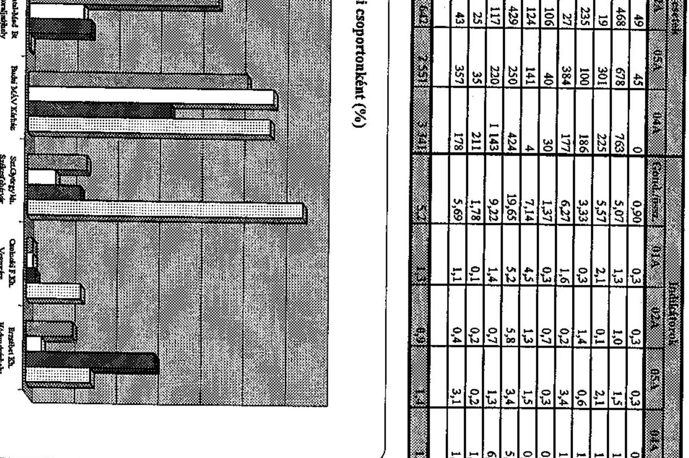

GEP IBF

---

# FÜGGELÉK

---

# Az Irányított Betegellátási Modellkísérlet ellenőrzéséhez, a Szervezőknek eljuttatott kérdőívekre érkezett válaszok értékelése 

A kérdőíveket az ÁSZ a vizsgálat előkészítésekor 11 aktív és 4 kizárt, illetve kilépett szervezőnek küldte meg. 11 aktív és 2 kizárt/kilépett szervező juttatta el válaszát a helyszíni vizsgálat befejezéséig.

A válaszadó aktív szervezők:

- Misszió Egészségügyi Központ Kht.
- Margit Kórház, Csorna
- Meditres Egészségügyi Szolgáltató Kft.
- Nyír-Pro-Med Egészségügyi Szolgáltató Kft. Nyíregyháza
- Budai MÁV Kórház
- Fejér Megyei Szent György Kórház
- Erzsébet Kórház-Rendelőintézet Hódmezővásárhely
- Béke téri Háziorvosi Szövetkezet
- Dentál-Med Co. Bt. Sátoraljaújhely
- Integrált Egészségügyi és Szolgáltató Kft. Dombóvár
- Veszprém Megyei Önkormányzat Csolnoky Ferenc Kórház-Rendelőintézet

A válaszadó kizárt/kilépett szervezők:

- Magyar Imre Kórház, Ajka
- Szent Pantaleon Kórház, Dunaújváros

A kérdésekre adott válaszok összesítését, értékelését az alábbiakban foglaljuk össze:

## 1-2. Eredményesnek tartják-e részvételüket az IBR-ben? Kérjük, jelöljék meg, hogy mely területeken.

A kérdőívet visszaküldő valamennyi Szervező a Modellkísérletben való részvételét eredményesnek ítéli.

A megadott szempontok közül mindannyian eredményes területnek tartják a betegellátás színvonalának, 10 Szervező pedig a háziorvosokkal való együttműködésnek a javulását is. A megtakarításokat 6 szervező ítélte eredményesnek, 2 pedig részben eredményesnek. Közülük a MEDITRES Egészségügyi Szolgáltató Kft., aki valamennyi évben megtakarítást ért el, ezt éppen csak ahhoz tartotta elégségesnek, hogy folytatni tudják a Modellkísérletet. A Béke téri Egészségügyi Szolgáltató Kft. úgy értékeli, hogy a megtakarítások ingadozása nem a szervező munkájának, hanem a törvényi szabályozás és az OEP adatszolgáltatás csúszásának következménye.

---

# 3. Mely indokok alapján döntöttek az IBR-be lépés mellett? 

A Szervezők a Modellkísérletbe való részvételüket változatosan indokolják. Mindössze 3 szervező nevesíti azt, hogy

- megtakarításokat is el akar érni (Misszió Kht.),
- intézménye forráshiányát akarja megszüntetni (Margit Kórház, Csorna),
- a háziorvosok finanszírozásán akar javítani (Vasútegészségügyi Szolgáltató Kht.).

Határozottabban fogalmaz a Magyar Imre és a Szent Pantaleon Kórház, akik 1999-ben a háziorvosok nyomására, illetve az akkori kizárási szabályozások miatt kerültek ki a Modellkísérletből. A Magyar Imre Kórház a „lehetséges gazdasági előnyök kiaknázására, és az ellátó rendszer átláthatóságának javítása érdekében", a Szent Pantaleon Kórház a területén meglévő - az országos átlag alatti kapacitása és felhasznált OEP finanszírozása és a fejkvóta közötti különbözetből adódó forrásbővülés, valamint a pácienseik OEP finanszírozású ellátásairól készülő adatok szakmai felhasználása miatt lépett a Modellkísérletbe.

A válaszokból arra lehet következtetni, hogy a szervezőnek jelentkezők nem mindegyike rendelkezett a pályázat beadásakor részletes információkkal a Modellkísérlet céljáról és működéséről. Jelzésértékű, hogy a szakmai együttműködés javítása meghatározó módon szerepel az indokok között. (6 szervező)

A Szervezők által megfogalmazott indokokat az 1. sz. táblázatban mutatjuk be.

## 4. A felsorolt indokok a Modellben eddig eltöltött idő tapasztalatai alapján várakozásaik beigazolódtak-e?

A Szervezők 83%-ban előzetes várakozásait igazoltnak ítélte, egy Szervező részleges sikert regisztrált, egy kevesellte az értékeléshez a Modellkísérletben eltöltött időt. Négy Szervező a tapasztalatok alapján további - eredetileg nem várt - pozitív eredményeket rögzített, így például azt, hogy a Modellkísérletben való részvétel:

- többlet forrást jelent a résztvevőknek,
- lehetőséget ad arra, hogy a Szervező - a morbiditási adatok alapján - jobban tudjon igazodni a valós ellátási igényekhez,
- átláthatóbbá vált a modellhez csatlakozott ellátási terület, a betegforgalmi adatok, a mennyiségi és minőségi mutatók,
- lehetőséget ad az egészségügyi rendszer szerkezetének megismerésére annak teljes vertikumában, illetve a térség egészségügyi sajátosságainak feltérképezésére,
- bebizonyította, hogy a „nagy és sikeres kórház" árnyékában is sikerült gazdaságilag talpon maradni,

---

- lehetőséget adott arra, hogy a prevenciót a Szervező és az ellátást nyújtók napi tevékenysége részévé tegye,
- következtében a betegek többsége örül a nagyobb odafigyelésnek, egyre többen fogadják meg a háziorvos javaslatát az intézményválasztással kapcsolatban is.

Hat Szervező határozott javulást észlelt a szakmai együttműködésben, amely az ellátási szintek közötti kommunikációt is magában foglalja.

Két Szervező kritikát fogalmazott meg az információáramlással kapcsolatban.

# 5-6. A szervezőknek az induláskori szervezési feladatok ellátására, illetve az informatikai rendszerük kialakítására választott módszere. 

A beérkezett válaszok alapján megállapítható, hogy a Szervezők a szervezési feladataik megoldását 80%-ban saját elképzelések alapján kialakított szervezettel látták el, mindössze 3 Szervező vásárolt know-howt. Az informatikai rendszer kialakításában vegyesebb a kép, mert 50-50%-ban saját fejlesztést alkalmaztak, illetve a Modellre kifejlesztett szoftvert vásároltak. 5 Szervező mind a két lehetőséggel élt informatikai háttere létrehozásában.

A válaszok összesítését a 2. sz. táblázat tartalmazza.
7. A Modellben tevékenykedő munkatársak milyen területeket látnak el, a teljes és részmunkaidős munkatársak számának megjelölésével.

A válaszadó Szervezők jellemzően részmunkaidőben dolgozó munkatársakkal látják el a feladatokat, két szervező pedig kizárólag ezen a módon. Egyes szóbeli jelzések szerint a háziorvosok a megnövekedett adminisztrációs feladataikat önmaguk végzik.

A munkatársak és az ellátott területek összesítését a 3. sz. táblázat mutatja be.

## 8. Állítsák fontossági sorrendbe (1-7-ig) a megtakarítás maximalizálása érdekében rendelkezésre álló eszközeiket.

A válaszok igen nagy mértékben szórnak, és részben ellentmondanak az előzetes várakozásnak. Így például a megtakarítás maximalizálásához szükséges eszközök közül az irányítást, koordinációt és szervezést 4 szervező sorolta az 1-3 helyre, míg négy szervezőnél a 6. helyre szorult. A prevenció pedig, amely csak hosszabb távon lehet pozitív hatással a megtakarításra 2-2 második és harmadik helyezést „ért el".

A válaszok összesítését a 4. sz. táblázat mutatja be.

---

# 9. Jelöljék meg (1-7-ig) a pénzügyi eredményességet befolyásoló külső tényezőket. 

A Szervezők egységesek abban, hogy eredményességüket - külső tényezőként legkevésbé a kiegyenlítő kassza átláthatósága befolyásolja, 9 Szervező a 6. helyre rangsorolta. A költségvetési tervezés kiszámíthatóságának és az OEP teljesítmény-visszaigazolás átláthatóságának befolyását közel azonos súlyúnak ítélik. Meglepő viszont, hogy csak 50-50%-ban tartják lényeges tényezőnek a fejkvóta számítás átláthatóságát és a jogi szabályozottságot.

A válaszok összesítését az 5. sz. táblázat tartalmazza.

## 10. Sorolják fel a működésüket jelentősen akadályozó külső tényezőket.

A Szervezők az OEP adatszolgáltatások késedelmességét, pontatlanságát és tartalmi hiányosságait említik a működésüket akadályozó külső tényezők közül elsőként, ezt követi a Modellkísérlet bizonytalan sorsa. A pénzügyi eredményességüket befolyásoló külső tényezők közül az 1-3. helyen az OEP teljesítmény-visszaigazolásának átláthatóságát jelölte meg 9 Szervező, a működésüket jelentősen akadályozó tényezőként ugyancsak 9 Szervező az OEP késedelmes, pontatlan adatszolgáltatását említi. Mindez arra enged következtetni, hogy az OEP - erőfeszítései ellenére - nem volt képes a Modellkísérletben a számára előírt adatszolgáltatási feladatainak maradéktalanul eleget tenni. Az utófinanszírozást, a tervezhetőség hiányát, a pénzügyi átláthatóságot a közepesnél kisebb mértékű akadályként jelölik meg a Szervezők. Érdekes módon szakmai kérdések, mint a valós idejű esetkezelés hiánya, vagy a prevenciós és egyéb szakmai tevékenységek koordinációjának hiánya csak egy-egy Szervezőnél jelenik meg, egy sorban az egyedinek tekinthető problémákkal, mint pl.: „ellenérdekeltségű személyek rendszerromboló munkája".

A válaszok összesítését a 6. sz. táblázat mutatja be.

## 11. A háziorvosok értékelési szempontjainak változása.

A kérdést 11 Szervezőből 7 válaszolta meg. 2 Szervezőnél az eredmény nem értékelhető, mert a megadott súlyszámok nem adnak ki 100%-ot. Az értékelés során látható, hogy a háziorvosi érdekeltségi rendszer szempontjai 1999-2003. között jelentősen bővültek és differenciálódtak. Leggyakoribb súlyozó tényezők: folyószámla egyenleg, esetkezelés, továbbképzés, jelentési kötelezettség. A felsorolt egyéb tényezők között a rendszerben tartás és a praxis kártya szám fordul elő 2003-ban 3, illetve 2 Szervező érdekeltségi rendszerében.

A válaszok összesítését a 7. sz. táblázat tartalmazza.

---

# 12. Milyen módszertant választottak a lakosság szűrési eléréséhez. 

Egy Szervező a kérdésre nem adott választ. A válaszadó Szervezők mindegyike a lakosság szűrési eléréséhez jellemzően a háziorvosi rendelőben megforduló biztosítottakat éri el, egy szervező ehhez a helyi médiát is igénybe veszi. Közel 50%-ban a lakosság eléréséhez a postai út igénybevétele is megtörténik.

A válaszok összesítését a 8. sz. táblázat tartalmazza.

## 13. Mennyire ítélik eredményesnek a saját szerzésű prevenciós tevékenységüket egy ötfokozatú skálán.

Egy Szervező a kérdésre nem adott választ. Négy Szervező több prevenciós programját értékelte, itt átlagot számoltunk. Hat Szervező a saját prevenciós tevékenységét jóra (4), négy pedig közepesre (3) osztályozta.

A Modellkísérletben már részt nem vevő Szervezők közül a Magyar Imre Kórház (Ajka) és a Szent Pantaleon Kórház (Dunaújváros) válaszolt. Tekintettel arra, hogy mindkét válaszoló 4 év után is keresi annak lehetőségét, hogy a Modellkísérletben ismételten részt vegyen, levelüket teljes terjedelemben mellékeljük.

---

# A Szervezők Modellkísérletbe lépésének indokai 

| Szakmai szempontok | Gazdasági szempontok | Együttműködési szempontok | Egyéb szempontok |
| :--: | :--: | :--: | :--: |
| - az egyén egészségének gazdája a   háziorvos legyen,   - az egészségügyi szolgáltatások   igénybevétele a valós szükségletek   alapján történjen,   - prevenciós szemlélet érvényesül-   jön,   - evidencián alapuló hatékony   gyógymódok szerepe erősödjön,   - a betegellátás, az ellátott biztosít-   tottak egészségi szintje javuljon,   - a biztosítottak hozzáférési esélyei   javuljanak,   - a definitív ellátás érdekében az   alap és járóbeteg szakellátás bő-   vüljön,   - ésszerű, betegközpontú beteg-   utak alakuljanak ki,   - az alap és járóbeteg ellátás fejlőd-   jön, legyen lehetőség a beteg otthoni kivizsgálására. | - megtakarítások elérése a feles-   leges egészségügyi kiadások ki-   szűrésével,   - ösztönző rendszer kialakítása   a megtakarításokból,   - forráshiány megszüntetése,   - érdekeltségi rendszerben az   ellátottak és az ellátók elége-   dettségének javítása,   - a háziorvosok finanszírozásá-   nak javítása,   - a rendelkezésre álló közkiadá-   sokból több és jobb minőségi   egészség vásárlása és több   egészségnyereség elérése,   - prevenciós tevékenységhez   anyagi forrás biztosítása,   - a gazdasági társaság kiszá-   mithatóbb jövőjének biztosítá-   sa. | - háziorvosokkal való együttműkö-   dés javítása,   - részletes, elemezhető információk   elérése,   - az ellátási szintek közötti kom-   munikáció javítása, a kórház és   az alapellátás kapcsolatának javí-   tása,   - a többlet információk felhaszná-   lásából adódó racionalizálás lehe-   tősége,   - kollegiális kapcsolatok javítása,   - információátadás megszervezésé-   vel minőségi javulás érhető el   - az egészségügyben dolgozók   szakmai együttműködése javul-   jon. | - a lehetséges több biztosítós   egészségügyre történő felkészül-   lés,   - új beruházásként elkészült szak-   rendelő OEP befogadásának el-   érése,   - izgalmas kihívás és öröm a
 Mo-   dellkísérletben részt venni,   - hozzájárulás az egészségügyi   reformhoz,   - fenntartó önkormányzat javas-   lata,   - részvétel az egészségügyi re-   formfolyamatban, a szükséges   tudás megszerzése   - technikai feltételek javításával,   állandó oktatással minőségi   változás érhető el. |

---

# A Szervezők működésük elindításához használt módszerek

|  Szervező neve | 5. Induláskor a szervezési feladatok ellátására |  | 6. Az informatikai rendszert |   |
| --- | --- | --- | --- | --- |
|   | a. Saját elképzelések alapján hozták létre a szervezetüket | b. Know-how-t vásároltak | a. Saját fejlesztéssel hozták létre | b. A modellre kifejlesztett szoftvert vásároltak  |
|  Misszió Egészségügyi Központ Kht. | x |  | x |   |
|  Margit Kórház, Csorna |  | x |  | x  |
|  MEDITRES Eü-i Szolgáltató Kft. | x |  | x | x  |
|  NyírProMed Eü-i Szolgáltató Kft. | x |  |  | x  |
|  Budai MÁV Kórház | x |  | x |   |
|  Fejér Megyei Szent György Kórház | x |  | x* | x*  |
|  Erzsébet Kórház-Rendelőintézet, Hódmezővásárhely |  | x |  | x  |
|  Béke téri Háziorvosi Szövetkezet | x |  | x |   |
|  Dental Med Co. Bt. | x |  | x | x  |
|  Veszprém Megyei Önk. Csolnoky Ferenc Kórház-Rendelőintézet |  | x | x | x  |
|  Integrált Eü-i Szolgáltató Kht. | x |  | x | x  |

[^0] [^0]: * Részben külső informatikai szolgáltatóval látják el.

---

# Modellben foglalkoztatottak megoszlása (teljes és részmunkaidős)

|  Szervező neve | Koordináció, irányítás |  | Adminisztráció |  | Informatika |  | Értékelés |  | Esetkezelés |  | Prevenció |  | Egyéb |  | Mindösszesen |   |
| --- | --- | --- | --- | --- | --- | --- | --- | --- | --- | --- | --- | --- | --- | --- | --- | --- |
|   | T* | R** | T* | R** | T* | R** | T* | R** | T* | R** | T* | R** | T* | R** | T* | R**  |
|  Misszió Eü. Közp. | 2 | 1 | 3 | 1 | 3 | 2 | - | 1 | 1 | 2 | 3 | - | 2 | 20 | 14 | 27  |
|  Margit Kórház | - | 5 | 1 | 1 | 1 | 1 | - | 2 | - | 2 | - | 1 | - | 3 | 2 | 15  |
|  MEDITRES | - | 1 | 2 | - | 1 | 2 | - | 1 | - | 1 | - | 1 | - | 4 | 3 | 10  |
|  Vasút-Eü. | 1 | - | 1 | - | - | 2 | - | 1 | - | 8 | - | 1 | - | - | 2 | 12  |
|  Szt.György Kórh. | 1 | - | - | 1 | 1 | - | - | - | 1 | - | 1 | - | - | - | 4 | 1  |
|  Erzsébet Kórh.-Ri. | - | 2 | - | 2 | - | 2 | - | 0,5*** | - | 0,5*** | - | 1 | - | 3 | - | 11  |
|  Béke téri Eü. Kft. | 2 | - | 1 | - | 2 | - | - | 1 | - | 1 | 3 | 8 | 1 | 1 | 9 | 11  |
|  Dental-Med.Co. | - | 4 | 1 | - | * |  | - | 3 | - | 2 | 1 | - | - | - | 2 | 9  |
|  Szt.Lukács Kht. | - | 1 | - | 2 | - | 1 | - | 1 | - | 1 | - | 2 | - | 2 | - | 10  |
|  Veszprém M. Önk. Csolnoky. F. K-R. | 1 | 2 | 1 | 1 |  | 3 |  | 1 |  | 2 | 1 | 1 |  |  | 3 | 10  |
|  Összesen: | 7 | 16 | 10 | 8 | 8 | 13 |  | 11,5 | 2 | 19,5 | 9 | 15 | 3 | 33 | 39 | 116  |

$\mathbf{T}^{*}=$ teljes munkaidőben foglalkoztatott munkatársak $\mathbf{R}^{**}=$ részmunkaidőben foglalkoztatott munkatársak *** = az értékelést és esetkezelést 1 fő részmunkaidőben foglalkoztatott munkatárs végzi * = a feladatot alvállalkozó végzi

---

# A Szervezőknél a megtakarítás maximalizálására használt eszközök

|  Eszközök | 1. helyen
kiemelt | 2. helyen
kiemelt | 3. helyen
kiemelt | 4. helyen
kiemelt | 5. helyen
kiemelt | 6. helyen
kiemelt | 7. helyen
kiemelt | Összesen  |
| --- | --- | --- | --- | --- | --- | --- | --- | --- |
|  Háziorvosok képzése | 2 | 4 | 2 | 1 | 2 |  |  | 11  |
|  Betegút követés | 2 | 2 |  | 2 | 2 | 3 |  | 11  |
|  Prevenció, szürés |  | 2 | 2 |  | 2 | 3 | 2 | 11  |
|  Protokollok használata | 2 | 2 | 3 | 3 | 1 |  |  | 11  |
|  Elemzések, kontrolling,
informatika | 2 | 1 | 2 | 3 | 3 |  |  | 11  |
|  Irányítás, koordináció,
szervezés | 2 | 1 | 1 | 2 | 1 | 4 |  | 11  |
|  Egyéb:
- Érdekeltségi rendszer
- Ellátási szintek együtt-
működése
- Együttműködés a szol-
gáltatóval
- Informatikai összekötte-
tés a kórház és az alap-
ellátás között | 1 |  |  |  |  | 1
1
1 | 4 |   |

---

# A Szervezők pénzügyi eredményességét befolyásoló külső tényezők 

| Külső tényezők   megnevezése | 1. he-   lyen   kiemelt | 2. he-   lyen   kiemelt | 3. he-   lyen   kiemelt | 4. he-   lyen   kiemelt | 5. he-   lyen   kiemelt | 6. he-   lyen   kiemelt | 7. he-   lyen   kiemelt | Összesen |
| :--: | :--: | :--: | :--: | :--: | :--: | :--: | :--: | :--: |
| Jogi szabályozottság | 5 |  |  | 3 | 2 | 1 |  | 11 |
| Költségvetési tervezés   kiszámíthatósága | 2 | 3 | 2 | 2 | 2 |  |  | 11 |
| A fejkvóta számítás   átláthatósága | 1 | 5 | 2 | 2 | 1 |  |  | 11 |
| Az OEP teljesítmény   visszaigazolás átlá-   hatósága | 3 | 2 | 4 | 1 | 1 |  |  | 11 |
| Az elvi folyószámla   alakulásának átlá-   hatósága |  | 1 | 3 | 1 | 4 | 1 | 1 | 11 |
| A kiegyenlítő kassza   működésének átlá-   hatósága |  |  | 1 |  |  | 9 | 1 | 11 |
| Egyéb   - Évente „egyszeri   pü-i elszámolás   - Az IBR és az eü.   szolgáltatók   anyagi érdekei-   nek koordinálása   - Lakosság szociá-   lis körülményei |  |  |  | 1 |  |  | 1 | 3 |

---

# A Szervezők működését akadályozó külső tényezők 

| Külső tényezők megnevezése | Jelölés gyakorisága |
| :-- | :--: |
| OEP adatszolgáltatás késése, adatok pontossága, tartalma | 9 |
| Modellkísérlet sorsa bizonytalan | 7 |
| Utófinanszírozás, pénzügyi tervezhetőség hiánya; pénzügyi el-   számolás, fejkvóta számítás nem átlátható | 5 |
| Hosszú távú törvényi szabályozottság hiánya; a jogi környezet   pontatlanságai | 3 |
| Együttműködő szolgáltató befolyásolásának szűk lehetősége;   anyagi érdekellentét a szolgáltatók között | 3 |
| Adatvédelmi problémák | 2 |
| Egyéb | 11 |

---

# A háziorvosok értékelési szempontjai 

| Értékelési szempontok | 1999. év (\%) |  |  |  |  |  | 2003. év (\%) |  |  |  |  |  |  |
| :--: | :--: | :--: | :--: | :--: | :--: | :--: | :--: | :--: | :--: | :--: | :--: | :--: | :--: |
|  | Szervező |  |  |  |  |  | Szervező |  |  |  |  |  |  |
|  | 1 | 2 | 5 | 7 | 8 | 9 | 1 | 2 | 5* | 7 | 8 | 9* | 11 |
| Folyószámla egyenleg | 100 | - | - | - | 30 | 20 | 35 | 15 | 15 | 20 | 15 | 30 | 33 |
| Esetkezelés | - | - | - | - | 15 | - | 20 | 20 | 15 | 25 | 15 | - | 16 |
| Továbbképzés | - | - | - | - | 10 | 20 | 15 | 15 | 5 | 15 |

 | 15 | - | 20 |
| Jelentési kötelezettség | - | - | - | - | 5 |  | 15 | 15 | 10 | 15 | 5 | - | 17 |
| Szakmai protokollok készítése | - | - | - | - | 20 | 10 | - | - | - | - | 20 | 10 | - |
| Szűrési tevékenység | - | - | - | - | 5 | - | - | - | - | - | 5 | - | - |
| Egyéb:   Rendszerben tartás | - | - | - | - | 15 |  | 15 | - | - | 25 | 25 |  | 14 |
| Praxis Kártya szám | - | 50 | - | - | - | 20 | - | 20 | - | - | - | 10 | - |
| Elvándorlás aránya | - | - | - | - | - | - | - | 15 | - | - | - | - | - |
| Definitív ellátás aránya | - | - | - | - | - | - | - | - | 5 | - | - | - | - |
| Praxisok közt egyenlő mértékben szétosztva | - | 50 | - | - | - | - | - | - | - | - | - | - | - |

* A kérdőív alapján a súlyok nem adnak ki 100%-ot

1. Misszió Egészségügyi Központ Kht.
2. Margit Kórház, Csorna
3. Meditres Egészségügyi Szolgáltató Kft.
4. Nyír-Pro-Med Egészségügyi Szolgáltató Kft., Nyíregyháza
5. Budai MÁV Kórház
6. Fejér Megyei Szent György Kórház
7. Erzsébet Kórház-Rendelőintézet, Hódmezővásárhely
8. Béke téri Háziorvosi Szövetkezet
9. Dentál-Med Co. Bt., Sátoraljaújhely
10. Integrált Egészségügyi és Szolgáltató Kft., Dombóvár
11. Veszprém Megyei Önkormányzat Csolnoky Ferenc Kórház-Rendelőintézet

---

# A lakosság szűrési eléréséhez választott szervezői módszerek 

| Módszer megnevezése | Alkalmazás száma |
| :-- | :--: |
| Háziorvosi rendelő | 10 |
| Postai út | 5 |
| Egyéb eü. intézményen keresztül | 4 |
| Tömegrendezvény | 3 |
| Egyéb - rádió, tv | 2 |

---

# Szent Pantaleon Kórház 

## Orvos-igazgató

2400 Dunaújváros, Korányi S. u. 4-6. Tel.: (25) 550-300 Telefax: (25) 413-640

Söveges Erika
osztályvezető főtanácsos

## Állami Számvevőszék

Budapest
Apáczai Csere János utca 10.
1052

## Tisztelt Osztályvezető Asszony!

A V-20-5/2004. iktatószámú levelükben az Irányított Betegellátási Modellkísérletben szerzett tapasztalatainkról kértek véleményt. Ezt az alábbiakban foglaljuk össze:

1. „Mely várakozások alapján pályáztak a modellbe való belépésre?" Városunkban 1998-ban megalakult a Dunaferr Önkéntes Regionális Egészségpénztár, melynek megszervezésében több szakemberünk is közreműködött. Koncepcionálisan perspektívát láttunk a modellkísérletben is felvázolt regionális ellátási felelősség és az ehhez kapcsolódó fejkvótás finanszírozás rendszerében. Kezdeti elképzelésünk az volt, hogy az ellátás szervezője értelemszerűen az egészségpénztár lenne, hiszen céljai, szervezete és a szolgáltatásai között kötelezően igénybe veendő egészségügyi szűrővizsgálat erre mindenképpen alkalmassá tette. A pályázati kiírás azonban csak egészségügyi szolgáltatók jelentkezését tette lehetővé, így azt szervezőként a Szent Pantaleon Kórház nyújtotta be.
A rendelkezésünkre álló morbiditási, ellátási és finanszírozási statisztikák egyértelműen azt mutatták, hogy régiónk morbiditási mutatói a magyarországi átlagtól nem térnek el, ugyanakkor a gyógyító kapacitások, mind járó-, mind fekvőbeteg ellátás vonatkozásában az országban a legalacsonyabbak, és ezzel párhuzamosan területünk állampolgárai által felhasznált OEP finanszírozás is az országos átlag alatt van. Következtetésünk az volt, hogy az országos átlag és a finanszírozás alapján kiszámolt fejkvóta már önmagában is források bővülését jelentené pácienseink számára, amit a szervezési intézkedések még hatékonyabbá tehetnének. Járulékos hasznot reméltünk attól, hogy részletes adatszolgáltatást kapnánk a pácienseink OEP finanszírozott ellátásairól, követni tudnánk a betegutakat és ellenőrizni - főleg a más intézetekben elszámolt - terápiákat.
2. „A modellben eltöltött idő igazolta-e a várakozásaikat?"

Mivel a kísérlet kezdeti időszakában vettünk részt a munkában, jószerivel csak a nehézségekkel, gyermekbetegségekkel szembesültünk. Az adatkérések kiterjedt volta, gyakori változtatása, nehéz áttekinthetősége aránytalanul meghaladta azt a hasznot, amit az OEP-től visszakapott nehezen kezelhető és bizonytalan adatokból nyertünk. Az adott időszakban fölöslegesnek és formálisnak éreztük a protokollok kidolgozását. A gyógyítás szabályait a szakirodalom pontosan

---

tartalmazza, ettől való helyi eltérést a törvény által előírt „legnagyobb gondosság elve" - különösen formálisan szabályzatba öntve - nem engedhet meg.
A kórház, mint szervező számára a családorvosokkal való szorosabb együttműködés anyagilag nem kifejezhető haszonnal járt, a szűrési díjakból adódó többletbevétel a praxisok számára érzékelhető forrásbővülés volt. A betegellátásban véleményem szerint érdemi változás nem történt.
3. „Mely indokok vezettek a kilépéshez/kizáráshoz?"

A modellkísérlet idején kórházunkban alapvető stratégiai váltás zajlott le (függetlenül a kísérlettől). A korábbi jelentős eladósodás miatt az intézménynek minden kapacitását maximálisan kihasználva kellett működni. Számos intézkedés együtt hatásaként a stratégiánk eredményesnek bizonyult, amelynek következtében a szakellátási kassza igénybevétele meghaladta a fejkvóta szerint elérhető összeget. A modellkísérlet részvételi szabályai szerint ez kizárással jár. Ez a szabály természetesen nonszensz, hiszen a kísérlet által vizsgálandó feltételezést cáfoló kísérleti mintákat rövid úton kizárva a vizsgálatból nyilvánvaló, hogy csak pozitív eredmények születhetnek a kísérlet lezárásakor.
4. „Ha módjuk lenne pályáznának-e újra?"

Igen, hiszen a regionális fejkvótás finanszírozást alapvetően jó megoldásnak tartjuk. A családorvosok, a szakellátás, illetve az egészségügy többi szereplőjének azonos irányba ható közös érdekeltségét tudja közvetíteni, minden partner számára, és így kiküszöböli a jelenlegi legsúlyosabb (és legtöbb pénzbe kerülő) finanszírozási ellentmondást: családorvosok kártyaszerinti bázisfinanszírozását szemben a szakellátás teljesítménydíjazásával.
5. „Amennyiben a témában további kiegészítéseket kíván tenni, kérjük, röviden fejtsék ki véleményüket!"
Véleményem szerint a modellkísérlet súlypontjának eltolása a managed care megoldás felé számos problémát vet fel. Óhatatlanul növeli a szükséges adminisztrációt, a jelenlegihez képest szűkíti a gyógyítás, illetve az orvos/kezelés megválasztásának szabadságát. Az eredményeket nem az ilyen adminisztratív megoldások biztosíthatják, hanem olyan automatizmust kell felépíteni, ami „bolondbiztos" rendszerként megteremti az összhangot a források és igények között. A cél egy adott terület, összességében az ország valamennyi lakosa számára az egészségügyi állapot javítása. Ennek mérési módszerét kell megtalálni, a finanszírozást ehhez kötni, és ennek az eredménynek az elérésében tenni érdekelté valamennyi résztvevőt, beleértve magát az állampolgárt is. Ezen az úton az OEP által finanszírozott ellátásokat is nyújtó, a páciensek számára nyilvántartott magánszámlát vezető, a prevencióban érdekelt regionális biztosító létrehozása eredményesebbnek látszik. A modellkísérletnek ezt az elemét tartom továbbfejlesztésre érdemesnek.
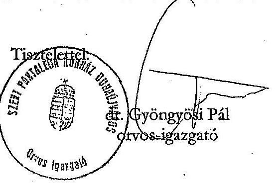

---

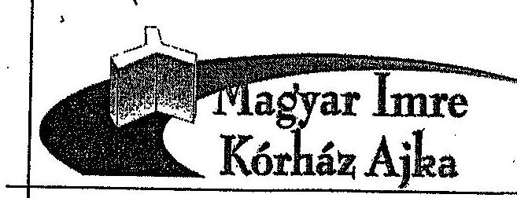

8400 AJKA Korányi F. u. 1. Pf. 139
Tel.: 88/521-800 Fax: 88/521-847

Tel.: 88/521-824
E-mail: korhazig@korhazajka.hu

Ikt.szám: 10975-4/2004

Állami Számvevőszék
Süveges Erika
Osztályvezető főtanácsos

Budapest
Apáczai Csere János u. 10.

1052

Tisztelt Főtanácsos Asszony!

Tárgy: IBR felülvizsgálat
Hiv.sz: V20-5/2004.
Ügyintéző: Dr. Pásztélyi Zs./Cané.

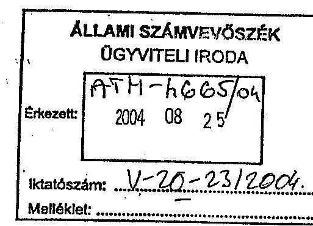

Az Állami Számvevőszéknek az Irányított Betegellátási Modellkísérlet vizsgálatára indult ellenőrzése kapcsán feltett kérdéseire az alábbiak szerint válaszolunk:

## 1. Mely várakozások alapján pályáztak a modellbe való belépésre?

A kórház akkori vezetése az ajkai háziorvosok támogatására, a lehetséges gazdasági előnyök kiaknázására, és az ellátó rendszer átláthatóságának javítása érdekében lépett be 1999-ben az IBR-be. A kórház úgy érezte, hogy a befektetett többlet munka (igénybevétel ellenőrzése, racionalizálás a hatékonyabb betegutakon keresztül) a későbbiekben hozzájárul egy hatékonyabb ellátó rendszer kialakításához. Ebben eleinte a háziorvosok is partnernek bizonyultak.

## 2. A modellben eltöltött idő igazolta-e várakozásaikat?

Az eredmények bemutatásakor nyilvánvalóvá vált, milyen anomáliák terhelik a térségi ellátást (túlzott gyógyszerfogyasztás, az egyes konziliumok túlzott felhasználása). Ez a résztvevőknek kiadott elemzésekben, illetve azok prezentációjakor egyértelművé is vált. Ilyen szempontból eredményesnek tartjuk a modellkísérletben eltöltött fél évet, várakozásainkat az eltöltött idő igazolta.

## 3. Mely indokok vezettek a kilépéshez/kizáráshoz?

A kilépést nem a kórház kezdeményezte, az a háziorvosok nyomására történt, annak ellenére, hogy az ajkai modell (gazdaságilag) eredményes volt 1999-ben. A háziorvosok megijedtek, hogy a tevékenységük átláthatóvá válik, egyes összehasonlító vizsgálatok kimutatják a felsorolt anomáliákat, illetve többlet adminisztratív munkát jelent majd számukra. A kórház a kilépést nem kezdeményezte.

---

# 4. Ha módjuk lenne, pályáznának-e újra? 

2004-ben ismételten pályáztunk, azonban a pályázatot a kiíró OEP érvénytelenítette. 2004. júliusában rövid határidővel (15 nap) ismét kiírt pályázatról a szabadságok miatt késve értesültünk, és lekéstünk. Nem egyértelmű, hogy ez hátrányos lesz-e számunkra, hiszen a térségi egészség szervező szolgálatról szóló törvény megjelenése, az azzal kapcsolatos váltás, illetve az átmenet kezelése kérdésessé teszi a korábbi IBR létjogosultságát 2005-ben, és 2004-ben bizonytalanságot kelt az újonnan belépők számára (az ellátást szervező team megszervezése 4 hónapos időtartamra a befektetendő munka és eszközök miatt nem biztos, hogy megéri). Az ellátásszervezési funkciót önmagában az ellátás hatékonyságának növelésére azonban mindenképpen nagyon fontosnak tartjuk.
5. Amennyiben a témában további kiegészítéseket kívánnak tenni, kérjük röviden fejtsék ki véleményüket!

Továbbra is keressük a lehetőségét annak, miképpen csatlakozhatunk egy ellátás szervezői rendszerhez.

Ajka, 2004. augusztus 16.

Tisztelettel:
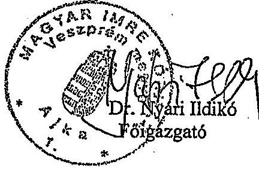

## Kapis:

1) Címzett
2) Irattár

Budapest, 2005. március

