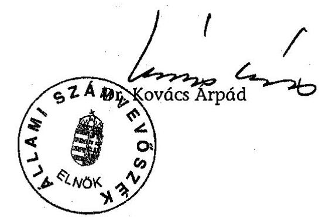
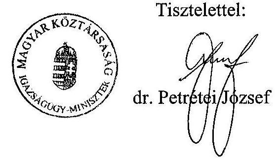
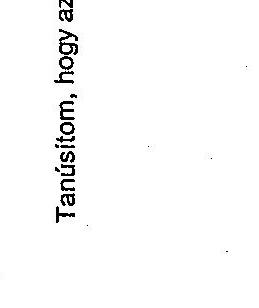

# JELENTÉS 

## a Központi Nukleáris Pénzügyi Alap múködésének ellenőrzéséről

---

2. Államháztartás Központi Szintjét Ellenőrző Igazgatóság
2.3. Átfogó Ellenőrzési Főcsoport
V-21-041/2004-2005.
Témaszám: 728
Vizsgálat-azonosító szám: V 0176

# Az ellenőrzést felügyelte: 

Bihary Zsigmond
föigazgató

Az ellenőrzés végrehajtásáért felelős:
Hegedűsné dr. Müllern Veronika
főcsoportfőnök

Az ellenőrzést vezette:
Papp Sándor
számvevő főtanácsos

Az ellenőrzést végezték:

Dr. Ligeti Miklós
számvevő tanácsos,
tanácsadó

Murányi Sándor
számvevő gyakornok

Zakar László
számvevő

A témához kapcsolódó eddig készített számvevőszéki jelentések:

## Központi Nukleáris Pénzügyi Alap múködésének ellenőrzése

---

# TARTALOMJEGYZÉK 

BEVEZETÉS ..... 7
I. ÖSSZEGZŐ MEGÁLLAPÍTÁSOK, KÖVETKEZTETÉSEK, JAVASLATOK ..... 9
II. RÉSZLETES MEGÁLLAPÍTÁSOK ..... 17

1. Az Alap kezelésének jogi és szervezeti háttere ..... 17
1.1. Jogi háttér ..... 17
1.2. Az Alap feletti felügyeleti és rendelkezési jog változása ..... 17
1.3. Az Alap kezelésének és felhasználásának szervezeti háttere, együttműködésük, a költségvetési és ellenőrzési feladatok ellátása ..... 19
1.4. Nemzetközi egyezmények teljesítése ..... 20
2. Az Alap pénzeszközeivel való gazdálkodás ..... 22
2.1. Az Alap számviteli és bizonylati rendjének szabályozottsága ..... 22
2.2. Az RHK Kht. gazdálkodásának szabályozottsága ..... 23
2.3. A bevételek tervezése, teljesülése, a források és feladatok összhangja ..... 24
2.4. A kiadások tervezése, megalapozottsága, teljesülése ..... 27
2.5. Az előirányzat-módosítások indokoltsága, szabályszerűsége ..... 33
2.6. Kincstári vagyon nyilvántartása ..... 34
2.7. A információs és ellenőrzési célú támogatás felhasználása, indokoltsága, szabályszerűsége ..... 34
2.8. A tájékoztató tevékenység értékelése ..... 40
3. A radioaktív hulladékok elhelyezésének biztosítása ..... 41
3.1. A radioaktív hulladékok elhelyezésének stratégiai céljai ..... 41
3.2. A stratégiai célok és fejlesztések összhangja, a kapacitás igények biztosítása ..... 44
3.3. A beruházások megvalósítása ..... 45
3.4. A végleges tárolók és az átmeneti tárolók szabad kapacitásának helyzete ..... 46
3.5. A közbeszerzési szabályok betartása ..... 48
3.6. Az előírt sugár-, környezet-, vagyonvédelmi és biztonsági állapot ellenőrzésének értékelése ..... 48
3.7. Nemzetközi biztonsági követelmények teljesítése ..... 50
4. Korábbi ÁSZ javaslatok hasznosulása ..... 51
Mellékletek
5. számú Az Igazságügyminisztérium közigazgatási államtitkárának észrevétele és az arra adott válasz
6. számú Tanúsítványok
7. számú A Központi Nukleáris Pénzügyi Alap szabad pénzeszközeinek alakulása
8. számú Korábbi ÁSZ javaslatok teljesülése

---

# 2

---

# RÖVIDÍTÉSEK JEGYZÉKE 

| AKT | Atomenergia Koordinációs Tanács |
| :--: | :--: |
| ÁSZ | Állami Számvevőszék |
| Atv | Az atomenergiáról szóló 1996. évi CXVI. törvény |
| ANTSz | Állami Népegészségügyi és Tisztiorvosi Szolgálat |
| BM | Belügyminisztérium |
| ESzCsM | Egészségügyi Szociális és Családügyi Minisztérium |
| GKM | Gazdasági és Közlekedési Minisztérium |
| GM | Gazdasági Minisztérium |
| IIT | Izotóp Információs Társulás |
| INES | International Nuclear Event Scale (Nemzetközi Nukleáris Esemény Skála) |
| KKÁT | Kiégett Kazetták Átmeneti Tárolója |
| KNPA | Központi Nukleáris Pénzügyi Alap |
| KVI | Kincstári Vagyoni Igazgatóság |
| MGSz | Magyar Geológiai Szolgálat |
| Mt | Munka Törvénykönyve |
| NAÜ | Nemzetközi Atomenergia Ügynökség |
| NBSz | Nukleáris biztonsági szabályzatok |
| NymTT | Nyugat-mecseki Társadalmi Információs Társulás |
| OAB | Országos Atomenergia Bizottság |
| OAH | Országos Atomenergia Hivatal |
| OAH NBI | Országos Atomenergia Hivatal Nukleáris Biztonsági Igazgatósága |
| PA Rt. | Paksi Atomerőmú Rt. |
| RHFT | Radioaktív Hulladék Feldolgozó és Tároló |
| RHK Kht. | Radioaktív Hulladékokat Kezelő Közhasznú Társaság |
| SzMSz | Szervezeti és Múködési Szabályzat |
| TEIT | Társadalmi Ellenőrző és Információs Társulás |
| TETT | Társadalmi Ellenőrző, Tájékoztató Társulás |
| WATRP | Waste Assessment and Technical Review Programme (Hulladékkezelés-értékelési és Múszaki Felülvizsgálati Program) |

---

.

---

# ÉRTELMEZŐ SZÓTÁR 

reprocesszálás újrafeldolgozás
$\mu \mathrm{Sv} \quad$ mikro Sievert (sugárdózis mértékegysége)

---

.

---

# JELENTÉS 

## BEVEZETÉS

Magyarországon az atomenergia alkalmazását az atomenergiáról szóló 1996. évi CXVI. törvény (Atv) szabályozza. A törvény célja biztosítani a jogszabályi kereteket ahhoz, hogy az atomenergia alkalmazása során a lakosság egészségét, biztonságát semmilyen károsodás ne érje, érvényesüljenek a környezetvédelmi előírások, tartsák be és hasznosítsák a tudomány legújabb igazolt eredményeit, a nemzetközi elvárásokat és tapasztalatokat. Az atomenergia hasznosítása során keletkező radioaktív hulladékok, valamint az atomerőmúből származó kiégett üzemanyag kazetták átmeneti tárolásának és végleges elhelyezésének finanszírozása - ezeknek az anyagoknak fizikai sajátosságukból következően - hosszú időn keresztül jelentős forrásokat igényel, ezért a törvény rendelkezett a Központi Nukleáris Pénzügyi Alap (KNPA) létrehozásáról, ezzel biztosítva, hogy ezeknek a feladatoknak a finanszírozása ne terhelje az elfogadhatónál súlyosabb mértékben a jövő generációt.
Az Atv. az atomenergia biztonságos alkalmazásának irányítását és felügyeletét a Kormány feladatává tette. A feladatok végrehajtásáról - az érintett miniszterek útján - az Országos Atomenergia Hivatal (OAH), valamint 2003-ig az Országos Atomenergia Bizottság (OAB), gondoskodott. Az OAB megszüntetését követően a nukleáris biztonsággal kapcsolatos feladatok összehangolása a Kormány által létrehozott Atomenergia Koordinációs Tanács feladata lett.

Az Alap kezelője az OAH, rendelkezési joga az OAH felett felügyeleti jogot gyakorló miniszternek van, ezt a feladatot 2003. augusztus 1-jétől a belügyminiszter, korábban, 2002-2003 között a gazdasági és közlekedési miniszter, 2002-ig a gazdasági miniszter látta el. A radioaktív hulladékok és kiégett fútőelemek kezelését, valamint a nukleáris létesítmények leszerelését az OAH által 1998-ban létrehozott, 100\%-ban állami tulajdonú, Radioaktív Hulladékokat Kezelő Közhasznú Társaság (RHK Kht.) végezte.

Az Alap bevételeinek - céljával egyezően - fedezetet kell nyújtania a keletkezett radioaktív hulladékok végleges elhelyezésére, az atomreaktorokban kiégett üzemanyag kazetták átmeneti és végleges elhelyezésére szolgáló tárolók létesítésére, üzemeltetésére, illetve a nukleáris létesítmények leszerelésének finanszírozására. Az Alap 2000-2004. években 93,8 milliárd Ft-tal gazdálkodott, kiadásait az atomenergia alkalmazóinak - elsősorban a paksi atomerőmú - befizetése fedezte, értékállóságát a 2001-2002. évek kivételével - az Atv. rendelkezése alapján - központi költségvetési támogatás biztosította.

---

Az ellenőrzés célja annak értékelése volt, hogy:

- az Alap, valamint a kezelését végző szervezet irányítása, múködése, szabályozottsága, ellenőrzési tevékenysége az Alap törvényes és célszerű felhasználását biztosította-e;
- a radioaktív hulladékok végleges elhelyezését, valamint a kiégett üzemanyagok átmeneti és végleges elhelyezését szolgáló tárolók létesítését és üzemeltetését, illetve a nukleáris létesítmények leszerelésének finanszírozását, továbbá a lakosság tájékoztatását az Alapból felhasznált pénzeszközök célszerűen szolgálták-e;
- a korábbi ÁSZ ellenőrzések során tett megállapítások, javaslatok megfelelően hasznosultak-e.

Átfogó ellenőrzés keretében vizsgáltuk, hogy az Alap kezelésében, felhasználásában részt vevő szervezetek irányítása, szabályozottsága, ellenőrzési rendszere mennyiben biztosította az elkülönített pénzek szabályszerű, hatékony és a céloknak megfelelő felhasználását. Teljesítmény szempontú ellenőrzés keretében értékeltük a felhalmozási célú felhasználások, valamint - a tárolók által érintett települések lakosságának informálását célzó - négy információs társulásnak, illetve a társulásokba tömörült önkormányzatoknak juttatott pénzek hasznosulását.

Az ellenőrzés a 2000-2004. I. félév közötti időszakra terjedt ki, de érintette a 2004. II. félévének pénzügyi adatait is. Az Alap létesítése (1998) óta ez a vizsgálat volt a második átfogó ellenőrzés, korábban az Alapot kezelő szervezet múködését, és a pénzeszközök hasznosulását az ÁSZ ugyancsak átfogó vizsgálat keretében 2000-ben ellenőrizte. Ezen kívül évente az állami költségvetés zárszámadása keretében vizsgálta a költségvetésben biztosított előirányzat felhasználását.

A jelentést az Állami Számvevőszékről szóló 1989. évi XXXVIII törvény 25. § (1) bekezdésének megfelelően észrevételezésre megküldtük az Alap felett rendelkezési jogot gyakorló Dr. Petrétei József igazságügy miniszternek, aki a jelentésben foglaltakat elfogadta, észrevételt nem tett.

---

# I. ÖSSZEGZŐ MEGÁLLAPÍTÁSOK, KÖVETKEZTETÉSEK, JAVASLATOK 

A Központi Nukleáris Pénzügyi Alap (Alap) fő rendeltetése, hogy az országban keletkezett radioaktív hulladékok elhelyezéséhez minden időben kellő mértékű tárolókapacitás álljon rendelkezésre. Az ellenőrzés tapasztalatai alapján öszszefoglalóan megállapítható, hogy a vizsgált időszakban végrehajtott fejlesztések eredményeként a radioaktív hulladékok átmeneti elhelyezése rövidtávon biztosított. Ugyanakkor megállapítottuk azt is, hogy a végleges elhelyezést célzó beruházások előkészítése, valamint az Alap forrásai és kiadásai nem a közép-, illetve hosszú távú tervekben foglalt ütemezés szerint alakultak, az Alap felhasználására vonatkozó jogszabályi előírások hiányosak voltak, az Alap bevételeit és kiadásait kormányzati intézkedések korlátozták. Mindezek következtében a beruházások teljesülése csúszik, és ennek következtében magasabb ill. nem tervezett kiadásokkal járhatnak. Az Alap pénzeszközei felhasználásánál olyan, egyes települések infrastruktúráját fejlesztő kiadások valósultak meg, amelyek az érintett lakosság bizalmának elnyerését célozták, de ilyen célú támogatási lehetőséget sem az Atv. sem az Alap felhasználását szabályozó rendeletek nem említenek. A vizsgálatunk által felvetett kifogások részben már korábban is megállapított - jogszabályi hiányosságok rendezésének elmaradása miatt következtek be. Megállapításaink alapján több, a korábbi ellenőrzés során is felvetett javaslatunkat meg kellett ismételnünk.

Az OAH feletti felügyeleti jog, és ezzel az Alap feletti rendelkezési jog 2003 közepétől, a gazdasági minisztertől a belügyminiszter hatáskörébe került, ez megfelelt az EU Nukleáris Kérdések Munkacsoportja 2001. évi - a hatósági szinten felelős feladatokat ellátók felügyeletének szétválasztására tett - javaslatának. Ezzel egyidőben az Atv. módosításával az OAB megszűnt, ezt követően az OAH feladat és jogköre bővült, az Atomenergia Koordinációs Tanács (AKT) pedig a koordinációs feladatokat látott el. Újabb változásként az Alap feletti rendelkezési jog 2004 novemberétől az igazságügy-miniszter hatáskörébe került. ${ }^{1}$

A radioaktív hulladékok és kiégett fútőelemek biztonságos elhelyezését szolgáló tároló kapacitás építési ütemét az atomerőmú múködési idejéhez és a hulladékok évente keletkező mennyiségéhez kell igazítani. Ennek ütemes végrehajtása érdekében, a feladatot ellátó RHK Kht. elkészítette 2108-ig szóló, az ellátandó feladatokat és azok forrás szükségleteit éves bontásban rögzítő közép-, és hoszszú távú tervet, ezt a teljesítésekhez igazítottan évente aktualizálta. ${ }^{2}$ A 2004. évre szóló terv költségbecslése szerint a 2108 -ig finanszírozandó beruházások, tevékenységek összességében 827,5 milliárd Ft-ot fognak felemészteni. (ennek

[^0]
[^0]:    ${ }^{1}$ Ennek indokoltságát, hatását a helyszíni ellenőrzés befejeződése miatt nem értékelhettük.
    ${ }^{2}$ A terv nem tartalmazza az atomerőmú esetleges - még nem eldöntött - meghosszabbításából fakadó feladatokat és azok forrás szükségletét

---

összege 2004. évre diszkontálva 296,1 milliárd Ft. ${ }^{3}$ Az Alap jövőbeni feladatait fedező szabad pénzeszköze 2004 végén 65,1 milliárd Ft-ot volt.

A vizsgált időszakban megvalósított beruházások a tervekhez illeszkedtek, a végrehajtott fejlesztések biztosították a keletkezett hulladékok elhelyezését. Az atomerőművi radioaktív hulladékok és a kiégett fútőelemek jelenlegi tárolása ugyanakkor átmeneti megoldás. Az Alap stratégiai céljaiban rögzített végleges tárolók létesítését megelőző előkészítés a vizsgált időszakban megkezdődött, a végrehajtást kedvezőtlen pénzügyi döntések (pl. kiadások korlátozása), ill. késlekedések (kutatások) jellemezték. A kis és közepes aktivitású radioaktív hulladékok végleges tárolójának (Bátaapáti) építését előkészítő négyéves kutatási program 2004-ben lezárult, év végére az építéshez szükséges szakvélemények és engedélyek rendelkezésre álltak, és folyamatban volt az engedélyezési eljárás megindításához szükséges előzetes környezeti hatástanulmány előkészítése. A létesítés előkészítésének megkezdéséhez az Atv. előírása szerint az Országgyűlés előzetes elvi hozzájárulása szükséges, ugyanakkor bizonytalansági tényező, hogy az Atv. az előkészítő tevékenység fogalmát nem határozta meg pontosan. ${ }^{4}$ Az átmeneti tárolóban (Paks) rendelkezésre álló szabad kapacitás (3 év) elvileg elegendő időt ad az építés végrehajtásához, de a létesítmény üzembe helyezésének tervezett dátuma miatt - 2008 - a megvalósításhoz szükséges elvi hozzájárulás megkérése sürgető feladat, de az előterjesztéshez szükséges dokumentumokat az OAH még nem nyújtotta be a Kormánynak.

A nagy aktivitású radioaktív hulladékok és a kiégett fútőelemek végleges elhelyezéséül szolgáló térséget (Boda) előzetes kutatások alapján kiválasztották, itt a felszíni geológiai kutatások 2003-ban megindultak, a tervek szerint a tárolónak 2047-re kell elkészülnie. Az előkészítés során, a volt uránbánya járataiban végzett kutatómunkát 1999-ben - a felszíni kutatás kisebb ráfordításával indokolva - a gazdasági miniszter leállította, ezt követően az uránbánya bezárása befejeződött. A döntés pénzügyi szempontból célszerűtlen volt, mert a korábbi kutatás leállítása miatt 89 millió Ft ráfordítást kellett kiselejtezni, ugyanakkor (az RHK Kht. szerint) 500 méter mélységű kutatások elvégzésére lesz szükség.

A meglevő tárolók szabad kapacitásainak bővítését szolgáló beruházásokra és a tervezett végleges tárolók létesítését célzó kutatásokra a vizsgált időszakban 30,6 milliárd Ft-ot irányoztak elő, ez évente - az engedélyezési, ill. közbeszerzési eljárások, valamint a kis és közepes radioaktivitású hulladéktároló (Bátaapáti) kutatási programjában mutatkozó elhúzódások miatt - rendszeresen alacsonyabb összegben teljesült. A befejezetlen beruházások 2004. évi állománya magas volt ( 13,2 milliárd Ft), ennek oka, hogy a kutatási ráfordításokat a tárolók üzembe helyezésekor aktiválják.

[^0]
[^0]:    ${ }^{3}$ A hosszú távú tervezés két kockázati eleme miatt ennek összege bizonytalan, az egyik a diszkontálásnál alkalmazott reálkamatláb (3\%), a másik, hogy a jövőbeni kiadásokat - hazai tapasztalatok hiányában - nemzetközi fajlagos költségek alapján tervezték.
    ${ }^{4}$ Az OAH főigazgatója ennek tisztázására 2000-ben a hozzájárulás megszerzését megalapozó tanulmányt küldött a GM helyettes államtitkárának, de választ nem kapott.

---

Az Alap költségvetésének tervezése során a feladatok és a források összhangja biztosított volt, az előirányzatokat az évente aktualizált közép-, és hoszszú távú tervekben rögzített célkitúzésekhez és feladatokhoz igazítva tervezték. Az Alap bevételeinek tervezését alapvetően az Atv.-ben megfogalmazott alapelv határozta meg: az, hogy a keletkező radioaktív hulladék és a kiégett üzemanyag biztonságos elhelyezésének megoldása a jövő generációkat ne terhelje anyagi áldozattal. Ezzel az alapelvvel valamint az OECD irányelvekkel és nemzetközi kötelezettségekkel is ellentétes a radioaktív hulladékok elhelyezésének pénzügyi forrásainak felhasználását szabályozó kormányrendelet, e szerint a nukleáris költségvetési intézményeknek, az ott keletkező kiégett fútőelemek valamint a létesítmény leszerelésének költségeit annak felmerülésekor kell megfizetniük. ${ }^{5}$

Az Alap forrásai a jogi háttér változásai, ill. hiányosságai miatt nem az eredeti célok szerint alakultak. A bevétel több mint $90 \%$-át kitevő -az atomerőmú üzemideje alatt és azt követően (2017) elvégzendő feladatokat fedező - Paksi Atomerőmű Rt. befizetései teljesültek. ${ }^{6}$ Az Alap értékállóságát biztosító, költségvetési támogatás folyósításáról rendelkező Atv. előírást, a 2001-2002. évi költségvetésről szóló törvény hatályon kívül helyezte. A rendelkezés 2003-től kezdődő fizetési kötelezettséggel, a villamos energiáról szóló törvény módosításával került vissza az Atv.-be, de az elmaradt - mintegy 4,6 milliárd Ft-ot kitevő elmaradt támogatás pótlásáról a törvény nem rendelkezett, az elmaradt támogatást a PA Rt. fogja 2017-ig időarányosan megfizetni. A vizsgált időszakban folyósított költségvetési támogatást az alapkezelő által tervezett szintnél a Magyar Államkincstár az alapkezelőtől eltérő számítási mód miatt - 850,7 millió Ft-tal magasabb összegben teljesítette. A módszerek eltérésének oka, hogy sem az Atv., sem más vonatkozó jogszabály nem határozta meg a vetítési alap időtartamát, vagy fordulónapját. ${ }^{7}$

Az Alap céljai az állami költségvetés tervezési folyamatában háttérbe szorultak. A beruházási előirányzat tervezetét a költségvetés tervezésének folyamatában a Pénzügyminisztérium - különösen 2004-től - alacsonyabb öszszegben hagyta jóvá. Ez a vizsgált időszakban összesen 19,9 milliárd Ft-ot, ezen belül a 2004-2005. években 14,1 milliárd Ft-ot tett ki. A korlátozás növelte az Alap pénzeszköz állományát, , az ugyanakkor - mivel az értékállóság vetítési alapja az előző évi átlagos pénzállomány -megnövelte a költségvetési támogatás összegét, és nem mellékesen hozzájárult az államháztartási hiány kedvezőbb megítéléséhez. A kiadások korlátozása a Bátaapátiba tervezett létesítés megkezdését - annak már említett elhúzódása miatt -, csak részben érintette, de a végleges tárolók előkészítési, ill. kutatási munkálatainak egy részét át kellett ütemezni, ez a késedelem várhatóan magasabb bekerülési kiadással fog járni. A végleges tárolók létesítésének ütemét alapvetően az atomerőmú üzemideje alatt keletkező hulladék és fútőelem mennyisége határozza meg, ezért a

[^0]
[^0]:    ${ }^{5}$ A rendelet megváltoztatására az ÁSZ 2001. évi átfogó jelentése is javaslatot tett
    ${ }^{6}$ A PA Rt. minden befizetését a villamos energia árában a fogyasztókra terheli.
    ${ }^{7}$ Az Alapkezelő napi kimutatás alapján tervezte meg a támogatás összegét, a Kincstár az Alap átlagos havi egyenlegével számolt, az Atv. szerint a vetítés alapja az előző évi átlagos pénzállomány.

---

beruházások elhúzódása miatt az átmeneti tárolók szabad kapacitása betelhet, bővítésük nem tervezett kiadásokkal járhat.

A működő, ill. a tervezett tárolók környezetében élő lakosság joggal várhatja el a radioaktív anyagok elhelyezésével kapcsolatos rendszeres tájékoztatást. Az Atv. rendelkezett információs társulások létrehozásának elősegítéséről és arról, hogy tevékenységükhöz támogatás adható. A tájékoztató tevékenység körét az Atv. nem határozta meg, az erre a célra nyújtható támogatás összegéről, vagy arányáról nem rendelkezett, ezeket az Alap felhasználására vonatkozó rendeletek sem szabályozták. ${ }^{8}$ Nem volt lefektetett feltétel-, ill. szempontrendszere az önkormányzatoknak a társulásokhoz való csatlakozásának (geológiai, környezetvédelmi viszonyok, tárolótól való távolság) sem.

A működő, ill. tervezett tárolók környékén, 2004. végén 37 csatlakozott önkormányzattal négy társulás múködött, tevékenységük fedezetét az Alap önkormányzatok támogatása cím biztosította. A cím megnevezése nem igazodik az Atv. rendelkezéseihez, mivel az a társulások tevékenységének támogatását jelöli meg.

Az RHK Kht. a társulások tevékenységére - megállapodások alapján - a vizsgált időszakban (2000-2004. első félév között) 2 111,2 millió Ft-ot adott át, ebből a társulások 533,8 millió Ft-ot használtak fel, a fennmaradó 1577,4 millió Ft-ot - évente kötött szerződés alapján - az önkormányzatoknak adták át. A szerződéseket az alapkezelő ellenjegyezte. Szabályozás hiányában az egyes társulások támogatásának összegét eltérő alapon számították. ${ }^{9}$ A társulások a támogatás mintegy felét fejlesztésekre, ill. külföldi szakmai tanulmányutakra, ${ }^{10}$ az önkormányzatok a kapott összeg mintegy $66 \%$-át infrastrukturális célra használták. ${ }^{11}$ Egy régió igényét az Alapkezelő egy esetben kutatási célú előirányzatból történt átcsoportosítással fedezte. ${ }^{12}$ A fejlesztési célú támogatások közül voltak a tájékoztató tevékenység végzéséhez szükséges beszerzések is, de az ettől eltérő célú fejlesztések (csatornázás, ravatalozó előtti térkő, óvoda felújítása, látványtó, virágszoborpark) nem voltak szükséges és feltétlen kellékei a tájékoztatási tevékenységnek. Az önkormányzatok a fennmaradó összeget működési kiadásaik között (a bemutatott adatok szerint szemétszállítás, köz-

[^0]
[^0]:    ${ }^{8}$ Erre vonatkozó kifogásokat már az ÁSZ 2001. évi átfogó jelentése is megfogalmazott
    ${ }^{9}$ A finanszírozási gyakorlat a Paksi Atomerőmú korábbi megállapodásait átvéve alakult ki. Az eltérő szempontú támogatást az érintettek, a négy társulás eltérő helyzetével, eltérő feladattal, az eltérő létszámú lakosság informálásával indokolták.
    ${ }^{10}$ A kiadások között szerepelt, pl. gépkocsi vásárlás a terepen folyó munkák helyszíni ellenőrzésére ( $7,1 \mathrm{M} \mathrm{Ft}$ ), kábeltelevízió kiépítés a tájékoztatás elősegítésére ( 26 M Ft ). A négy társulás a vizsgált időszak alatt szakmai tájékozódás címén külföldi hulladéktárolókat is meglátogatott (pl. Kanada), ez 55,1 M Ft-os kiadással járt.
    ${ }^{11}$ Ilyen beruházás volt, pl. közterület fejlesztés (vízrendezés, járdaépítés, buszváró felújítás, út és támfaljavítás), önkormányzati épületek felújítása (iskola, sportpálya,), településrendezési terv, közmúhálózat fejlesztés (szennyvízberuházás, közvilágítás, ivóvízhálózat fejlesztés).
    ${ }^{12}$ A kis és közepes aktivitású hulladéktároló létesítésének előkészítés terhére átadott 90 millió Ft a szennyvízhálózat kialakítását és szennyvíztisztítóra csatlakozását fedezte.

---

múdíj, stb.) számolták el, a könyvelési adatokból, ill. az elszámolásokból az információs tevékenység kiadásait nem lehetett megállapítani.

Az Alapból, a települések infrastruktúráját célzó fejlesztésekre felhasznált támogatás lehetőségről sem az Atv., sem a végrehajtási jogszabályok nem rendelkeztek. A támogatást Alapkezelő azzal indokolta, hogy az érintett települések lakossága az információszolgáltatás nyújtásán túl anyagi előnyt is elvárt, mivel általuk országos érdek (radioaktív hulladéktárolás) valósul meg. Ezt az elvárást tükrözték a helyi közvélemény kutatások adatai is. A kifizetések alapjául az RHK Kht. és társulások között megkötött szerződések szolgáltak, ezekben az RHK Kht. a tájékoztató tevékenység ellátása mellett a lakossági bizalom erősítő ill. a rendezvények megtartásához szükséges infrastruktúra kialakítása, fenntartása finanszírozására vállalt kötelezettséget. Az infrastrukturális célú támogatás konkrétan nevesítve nem jelent meg, azt csak a szerződések mellékletei rögzítették összefoglaló címen (pl. közterület fejlesztés). A szerződéseket az OAH mint alapkezelő ellenjegyezte.

Az infrastrukturális célú támogatás nem szerepelt az Atv. előírásai között, ugyanakkor a tárolók megépítéséhez - a társulások véleménye szerint - szükséges a helyi lakosság általi elfogadottság, ennek fogadóképességét csak bizalomerősitő támogatással lehet elnyerni. A radioaktív hulladéktárolók elhelyezése kétségtelenül speciális probléma. Amennyiben a törvényalkotók települések ilyen irányú igényét jogosnak ítélik, akkor azt jogszabályi úton rendezni kell, vagyis - összegében ésszerű határok - között kell beépíteni az Alapból támogatható tevékenységek körébe. Nem rendezett, hogy az előkészítés (kutatás) mely szakaszaiban célszerű a lakosság véleményének kikérése, annak ellenére, hogy a kutatás egy előrehaladott szakaszában megtartott és elutasító helyi szavazás miatt jelentős ráfordítások mehetnek veszendőbe. ${ }^{13}$ Itt kap kiemelkedő szerepet a rendszeres tájékoztatás, ugyanis a lakosság idejekorán megfelelő információkkal kell rendelkezzen.

A tájékoztatási feladatot a társulások - az érintett lakosság körében készíttetett felmérések alapján - ellátták, de hatékonyságát egyes adatok alacsony mutatószáma (társulások létével, beruházásokkal kapcsolatos ismeretek hiánya, az elutasító vélemények aránya) miatt fokozni kell.

A személyi juttatások körén belül 2003-ban az OAH vezetője kifogásolható mértékű kifizetést vállalt, amikor az RHK Kht. ügyvezető igazgatójával a határozott idejű munkajogviszonyt közös megegyezéssel megszüntette, és 12 havi átlagkereset, valamint egyéb juttatások kifizetésében állapodtak meg, úgy, hogy a hatályos szerződésből mintegy három hónap volt hátra. ${ }^{14}$ A munkaviszony megszüntetése és a kötelezettségvállalás ténye megfelelt Munka Törvénykönyvében foglaltaknak, ugyanakkor a kifizetés mértéke kifogásolható -

[^0]
[^0]:    ${ }^{13}$ Erre vonatkozó javaslatot a 2001. évi átfogó jelentése is megfogalmazott.
    ${ }^{14}$ Az ügyvezető visszahívását, - nem nevesített hiányosságokra hivatkozva - az Alap felett akkor rendelkező gazdasági miniszter kezdeményezte. A jelen ellenőrzés részére bemutatott dokumentumok szerint az ügyvezető tevékenységével kapcsolatos hiányosságokat minisztériumi vizsgálat nem támasztotta alá, mivel ilyen nem indult.

---

annak ellenére, hogy ennek mértékét a törvény nem korlátozza. ${ }^{15}$ Az arányosnál magasabb kifizetésre a munkáltatót semmilyen körülmény nem kényszerítette, döntése célszerútlen volt, ugyanis a közérdek sérelme nélkül, csak a hatályos szerződésből még hátralevő időtartamra vonatkozó időarányos átlagkereset és juttatás kifizetése volt indokolt. ${ }^{16}$ A vezetőváltás pénzügyi fedezetére az OAH vezetője 39,4 millió Ft előirányzat emelést kért, a miniszter jóváhagyta azt.

Az RHK Kht. Budaörsön fenntartott 359 négyzetméteres irodáját állandó jelleggel 6 személy használta, emellett küldöttségek fogadását biztosította, a bérleti díj magas, - pl. 2003-ban 20,7 millió Ft - volt. A bérlemény további fenntartása - méretét és a bérleti díj mértékét tekintve - a szerződés lejártával felülvizsgálandó.

A radioaktív hulladékok elhelyezésének és kezelésének költsége részben a 2000-2003. időszakban a múködési költségek növekedése, részben az Atv. módosítása által előírt, az OAH felé a nukleáris biztonsági és biztosítéki hatósági felügyeleti feladatok ellátása fejében fizetendő díj miatt - drágult. A növekedés átlagosan évi $33,1 \%$-ot tett ki, ezen belül a már említett felügyeleti díj 2004-ben 260,0 millió Ft volt, ez a darabszám növekedése miatt a jövőben folyamatosan emelkedni fog. A múködési kiadásokon belül más szolgáltatókkal történt szerződéskötéssel mintegy 100 millió Ft megtakarítást értek el.

Az Alap és RHK Kht. múködése, gazdálkodása alapvetően szabályozott volt. Az Alap számviteli politikájának aktualizálására a törvényi rendelkezések ellenére - 90 nap helyett - két év késéssel - 2003-ban került sor, teljes körűségében hiányosságok mutatkoznak. Az Alap számlarendje a bizonylati rendet nem tartalmazza, a RHK Kht.-nál az elszámoltatás áttekinthetőségét biztosító nyilvántartás vezetéséről nem gondoskodtak. Az Alap éves beszámolóit független könyvvizsgáló hitelesnek minősítette, de jelentéseiben több, elsősorban elkülönített költségelszámolásra, valamint a tervezési rendszer átalakítására vonatkozó javaslatokat tett, ezekre az alapkezelő a szükséges intézkedéseket megtette. Az OAH felügyeleti szervének 2003. évi változásakor - a jogszabályi előírásokkal ellentétben - költségvetési beszámolót nem készítettek, és nem történt meg a minisztériumok között átadás átvétel sem. A beszerzési tevékenység során a közbeszerzési előírásokat betartották. A 2000-2003 közötti

[^0]
[^0]:    ${ }^{15}$ Erre vonatkozó tiltás az eset után megjelent 2173/2003. (VII. 29.) Korm. határozat II. részének 1. pont a) alpontjában szerepel az állami szervek többségi tulajdonában álló gazdálkodó szervezetek vonatkozásában.
    ${ }^{16}$ Az IM közigazgatási államtitkára - 2005. január 26-án kelt levele szerint - széleskörűen tájékozódott a konkrét ügyről, és arra a következtetésre jutott, hogy az OAH főigazgatója által alkalmazott megoldás sem a fegyelmi, sem a kártérítési eljárás megindítását nem alapozta meg. Ugyanakkor felhívta a főigazgató figyelmét arra, hogy a jogszerúségen túl fokozottan legyen tekintettel a célszerúségi szempontok mérlegelésére is. Ugyanakkor azt is megállapították, hogy a döntésekért viselt felelősségi, ill. felügyeleti jogköröket szabályozó jogszabályok felülvizsgálatot igényelnek.

---

időszakban indított 85 közbeszerzési eljárásból a Közbeszerzési Döntőbizottság előtt négy eljárást támadtak meg, elmarasztalás egyik esetben sem született.

Az Alap és az RHK Kht. - mint közhasznú szervezet - gazdálkodási jellege és emiatt számviteli rendszere eltérő. A költségvetési törvények az Alap kiadásait telephelyenként, vagyis az RHK Kht. a tárolók, ill. a tárolók előirányzataként rögzítik, ugyanakkor az RHK Kht. költségnemenkénti elszámolását költséghelyekre nem bontja meg, ezáltal nem illeszkedik a költségvetési törvények tagolásához. A költséghelyekre történő könyvelés segítené a kiadásoknak és a költségvetési törvény megfelelő előirányzatainak összevetését. Ennek hiányában költséghelyenkénti elemzést nem végezhettünk, és ennek következtében az állami feladat költségvetési szervezetek körén kívüli ellátásának gazdaságosságát - kiemelten a személyi és egyéb juttatások körében - értékelni nem tudtuk.

A sugár-, környezet-, vagyonvédelmi és biztonsági állapot a vizsgált időszakban, a sugár-, környezetvédelmi és biztonsági állapot ellenőrzésének szabályozottsága, a kialakított őrzés-védelem, valamint a jogszabályokban kijelölt közegészségügyi és környezetvédelmi szervezetek ellenőrzése, ill. felügyeleti feladatok végrehajtása révén biztosított volt. A sugárvédelmi vizsgálatok és a környezetellenőrzési eredmények szerint a sugárterhelési értékek a megengedett alatt voltak. A kiégett fútőelemek és a radioaktív hulladékok kezelése terén Magyarország megfelelt a nemzetközi elvárásoknak. A KKÁT-t a NAÜ ellenőrei évente átlagosan hatszor ellenőrzik, az üzemi területen kamerák rögzítik a tevékenységeket, a nemzetközi ellenőrzés rendszeréhez kapcsolódva negyedévente jelentést, évente leltárt készít a betárolt kiégett fútőelemekről.

A helyszíni ellenőrzés megállapításainak hasznosítása mellett javasoljuk:

# a Kormánynak 

1. kísérje figyelemmel és intézkedjen a Bátaapátiba tervezett tároló kialakításának előkészületeinek felgyorsításáról és terjessze be a tároló létesítését előkészítő tevékenység megkezdéséhez előírt, az Országgyűlési elvi hozzájárulásához szükséges dokumentumokat;
2. kezdeményezze az Atv. módosítását, a tároló létesítés fogalmának pontos meghatározása érdekében;
3. gondoskodjon az értékállóságot biztosító költségvetési támogatás számítási alapjának, a társulásoknak nyújtható információs támogatás számítási alapjának kormányrendeletben történő szabályozásáról;
4. kérjen részletes beszámolót az Alapból az önkormányzatoknak juttatott támogatások felhasználása köréről; kezdeményezzen széles körű egyeztetést, az Alapot terhelő, és az érintett települések lakosság bizalmának elnyerését célzó, infrastrukturális fejlesztések támogatásának indokoltságáról, elfogadottsága esetén kezdeményezze annak

---

törvényi rögzítését és gondoskodjon a támogatás mértékének, valamint elosztásának szabályozásáról;
5. intézkedjen a költségvetési intézmények befizetési kötelezettségére vonatkozó kormányrendeletnek az Atv. rendelkezéseihez és a nemzetközi kötelezettségekhez illeszkedő szabályozásáról.

# az igazságügy-miniszternek 

1. kezdeményezze az egyes vezetői döntésekért viselt vezetői felelősség és az ezekkel kapcsolatos miniszteri felügyeleti jogkör megfelelő szabályozása érdekében az atomenergiáról szóló törvény, illetve az Országos Atomenergia Hivatal feladatáról, hatásköréről és bírságolási jogköréről szóló kormányrendelet felülvizsgálatát;
2. fokozottan kísérje figyelemmel a társulásoknak és az önkormányzatoknak nyújtott támogatások Atv. rendelkezéseinek megfelelő célú felhasználását;
3. kezdeményezze az Országos Atomenergia Hivatal főigazgatójánál, hogy:
a) gyorsítsa fel a Bátaapáti térségébe tervezett kutatások lefolytatását és terjessze a Kormány elé az Országgyűlés elvi hozzájárulásának megszerzéséhez szükséges dokumentumokat;
b) kezdeményezze az RHK Kht.-nál a működési kiadások elemzését biztosító költséghely szerinti elszámolás kialakítását, és a társulások, ill. az önkormányzatok által végzett információs tevékenység elszámolását biztosító rend kialakítását;
c) alakítsa ki a társulásokhoz történő csatlakozás szakmai paraméterek szerinti szempontrendszerét;
d) vizsgálja felül az RHK Kht. budaörsi telephelye fenntartásának indokoltságát;
e) intézkedjen a számviteli szabályok területén tapasztalt hiányosságok megszüntetéséről;
f) gondoskodjon az éves költségvetési javaslatokhoz készülő előterjesztésekben az információs célú támogatás Atv.-nek megfelelő pontosításáról.

---

# II. RÉSZLETES MEGÁLLAPÍTÁSOK 

## 1. Az Alap kezelésének jogi és szErVEZeti háttere

### 1.1. Jogi háttér

Az Országgyúlés által 1996. évben elfogadott, az atomenergiáról szóló CXVI. törvény (Atv.) rendelkezett a Központi Nukleáris Pénzügyi Alap létrehozásáról azzal a céllal, hogy ebből kell finanszírozni a radioaktív hulladékok végleges elhelyezését, valamint a kiégett üzemanyag átmeneti és végleges elhelyezésére szolgáló tárolók létesítését és üzemeltetését, illetve a nukleáris létesítmények leszerelését, lebontását. Az Alap pénzeszköze kizárólag erre a célra szolgál, másra nem fordítható, elkülönített állami pénzalap.

Az Atv. rendelkezett a radioaktív hulladékok és kiégett fútőelemek elhelyezésének feladatait ellátó, valamint az Alap pénzeszközeivel gazdálkodó intézmények köréről és tevékenységük felügyeletéről.

A felhasználás részletes szabályait a radioaktív hulladékok és a kiégett üzemanyag elhelyezésére, valamint a nukleáris létesítmények leszerelésére kijelölt szerv létrehozásáról és tevékenységének pénzügyi forrásáról szóló 240/1997. (XII. 18.) Korm. rendelet rögzítette. A rendelet előirása szerint a költségvetési intézményekben keletkező radioaktív hulladékok elhelyezésének költségeit a keletkezésük időpontjában kell megfizetni. Ez ellentétes az Atv. előírásaival és a nemzetközi kötelezettségekkel, amelyek szerint ezek várható költségeit a felhasználó generációnak kell viselni. A hiányosságra már az ÁSZ 2001. évi az Alap átfogó ellenőrzéséről szóló jelentése is felhívta a figyelmet, és javaslatot tett ennek megszüntetésére. A kormányrendelet előírása nem változott, vagyis a javaslat nem teljesült.

Az OECD irányelvei és a 2001. évi LXXVI. törvénnyel kihirdetett nemzetközi egyezmény szerint a keletkező radioaktív hulladékok elhelyezésének költségeit a nukleáris energiát igénybevevő generációnak kell viselnie.

A rendelet 5. § (2) szerint „A költségvetési intézmények által müködtetett nukleáris létesítmények engedélyesei az Alapba való befizetési kötelezettségeik közül:
b) a kiégett üzemanyag átmeneti és végleges elhelyezését szolgáló tárolók létesítésével, üzemeltetésével, illetve a nukleáris létesítmény leszerelésével (lebontásával) és annak következtében keletkező radioaktív hulladék végleges elhelyezésével kapcsolatosakat azok felmerülésekor teljesitik."

### 1.2. Az Alap feletti felügyeleti és rendelkezési jog változása

Az Alap feletti rendelkezési jogot az Országos Atomenergia Bizottság (OAB) elnöke gyakorolta 2003-ig, akit a Kormány tagjai közül a miniszterelnök nevezett ki, illetve mentett fel. Az ellenőrzött időszakban 2002-ig a gazdasági tárcát vezető miniszter, majd 2003-ig a gazdasági és kereskedelmi miniszter töltötte be ezt a tisztséget. A felügyeleti jog gyakorlását 2003-tól a 81/2003 (VII. 29.) ME

---

határozat alapján a belügyminiszter, majd 2004-től újabb változásként, az Országos Atomenergia Hivatal felügyeletét ellátó miniszter kijelöléséről szóló 76/2004. (XI. 10.) ME határozat a feladatot az igazságügy-miniszter hatáskörébe helyezte.

Az OAB az atomenergia alkalmazása területén döntés-előkészítő, koordinatív, külön jogszabályban meghatározott ügyekben döntéshozó, valamint ellenőrző feladatokat ellátó bizottság volt.

A Nemzetközi Atomenergia Ügynökség (NAÜ), - amelynek Magyarország is tagja -, az Európai Unió az ország csatlakozása előtti időszakban rendszeresen vizsgálta, hogy az atomenergia biztonságos alkalmazásának előfeltételei közül a jogszabályi háttér, a hatósági felhatalmazások, a pénzügyi források és a feladat ellátáshoz szükséges szakember gárda biztosított volt-e. Az ÁSZ előző ellenőrzésének időpontjában (2001-ben) ezeknek a feltételeknek való megfelelőségünket korszerűnek és magas színvonalúnak minősítették.

Az Európai Unió Tanácsa mellett működő Nukleáris Kérdések Munkacsoportja a csatlakozási tárgyalásokra való felkészülés keretében újból megvizsgálta a jelentkező országokban a nukleáris biztonság helyzetét. A 2001. május 27 -én kelt 9181/01. sz. kiadott jelentése a következő javaslatot tette: „A Hatóság függetlensége tekintetében be kell fejezni a megkezdett jogi folyamatot, amely erősíti a hatóság (OAH) függetlenségét azon személyektől, testületektől és szervezetektől, akik kapcsolatban állnak az atomenergia alkalmazásának elősegítésével, illetve a nukleáris létesítmények üzemeltetésével."

Az EU Tanácsának javaslatát figyelembe véve az OAH kezdeményezte az atomtörvény módosítását és az OAH feletti felügyelet megváltoztatását. Az OAH vezetője javasolta a Miniszterelnöki Hivatal miniszterének írt levelében, hogy az OAH függetlenségének biztosítása és a kérdés jelentőségének megfelelően az OAH feletti felügyeletet a Miniszterelnöki Hivatalt vezető miniszter lássa el.

Az Atv. módosítása 2003-ban az energiáról szóló 1996. évi CXVI törvény módosításával megtörtént. A törvény módosítás következtében az OAB működése megszűnt, a helyette létrehozott Atomenergia Koordinációs Tanács (AKT) feladata a végrehajtó szervezetek munkájának összehangolása. Az OAH feladat és jogköre bővült, oly módon, hogy az atomenergia biztonságos alkalmazásának irányítása és felügyelete a Kormány feladata maradt, de a feladatok végrehajtásáról az OAH, és az érintett minisztériumok útján gondoskodik.

Az OAH és az AKT tevékenységéről kiadott 114/2003. (VII. 29.) Korm. rendelet egyértelműen szűkítette az AKT jogkörét (rendelet 20. és 21. §), ahhoz képest, amivel korábban az OAB rendelkezett.

Az OAH feletti felügyeleti jog és az Alap feletti rendelkezési jog a belügyminiszter hatás és feladatkörébe került 2003. VIII. 1-jétől, ezzel az EU javaslatának megfelelően elvált az atomenergia használatában, hasznosításában érdekelt gazdasági szereplők (gazdasági és közlekedési miniszter) és a biztonságos múködésért hatósági szinten felelős feladatokat ellátó szereplők (belügyminiszter) felügyelete.

---

Az OAB megszüntetését követően a koordinációs feladatok ellátásáról az Országos Atomenergia Hivatal feladatáról, hatásköréről és bírságolási jogköréről, valamint az Atomenergia Koordinációs Tanács tevékenységéről az erről szóló 114/2003. (VII. 29.) Korm. rendelet intézkedett. Az OAB korábbi feladatait, elemező, koordinációs feladatok ellátására szűkítve - az ugyanezen rendelettel létrehozott Atomenergia Koordinációs Tanács vette át.

A belügyminiszter a Központi Nukleáris Pénzügyi Alap múködéséről és eljárásrendjéről szóló 41/2004. (VII. 7.) BM rendelettel (a 114/2003 (VII. 29. Kormányrendelet 22. § (4) alapján) létrehozta a KNPA Szakbizottságot. A KNPA Szakbizottság tagjait delegáló szervezetek megegyeztek az előd OAB Szakbizottság tagjait delegálókkal. Feladata, hogy értékel, és előzetes állásfoglalást alakít ki a miniszteri döntésekhez, ezen belül véleményezi:

- az Alap tevékenységével összefüggő költségbecsléseket,
- a befizetési kötelezettségekre kialakított javaslatokat,
- a közép- és hosszú távú tervek, az éves munkaprogramok tervezetét,
- az Alap múködésével és felhasználásával kapcsolatos, a közhasznú társaság által készített javaslatokat, tervezeteket, beszámolókat.

# 1.3. Az Alap kezelésének és felhasználásának szervezeti háttere, együttmúködésük, a költségvetési és ellenőrzési feladatok ellátása 

Az atomenergiáról szóló törvény az Alap feletti rendelkezési jogot az OAH feletti felügyeletet ellátó Kormány tagjára ruházta (2003. július 31-ig a gazdasági és közlekedési miniszter, augusztus 1-től a belügyminiszter), az Alap kezelője folyamatosan az OAH volt. Az Atv. alapján a Kormány megbízta az OAH-t, hogy az Alappal kapcsolatos feladatok ellátására alapítsa meg a Radioaktív Hulladékokat Kezelő Közhasznú társaságot (RHK Kht.) - 240/1997. (XII. 18.) Korm. rendelet -, egyben meghatározta az RHK Kht. és az OAH feladatait. A két szervezet közötti együttműködést az alapítói jogviszonyon kívül, az Alapra vonatkozó múködési és eljárásrendekre kiadott minisztériumi rendeletek fektették le. A rendeletek maximális ellenőrzési és beavatkozási lehetőséget biztosítanak az OAH-nak, így az OAH felelősségének mértéke az Alap kezelésében lényegesen nagyobb, mint az RHK Kht.-é.

Az OAH az atomenergia békés célú alkalmazása területén a Kormány irányításával működő, önálló feladattal és hatósági jogkörrel rendelkező központi közigazgatási szerv. Szervezete az atomenergia alkalmazásában elkülönül a felügyelő miniszter minisztériumától, azzal csak költségvetési - tervezési ill. beszámolási kapcsolatban van.

A kormányrendelet rögzíti, hogy a radioaktív hulladékok végleges elhelyezését, az atomreaktorok kiégett üzemanyagának átmeneti és végleges elhelyezésére szolgáló tárolók létesítését, üzemeltetését, illetve a nukleáris létesítmények leszerelését az RHK Kht. végzi.

---

Az OAH-on belül főigazgató-helyettes irányítása alatt működik az Általános Nukleáris Igazgatóság, ezen belül a KNPA Kezelő Szakiroda, amelynek feladata az Alappal kapcsolatos szakmai feladatok ellátása. A gazdálkodással kapcsolatos feladatok az OAH főigazgatójának alárendelt Gazdasági Főosztály hatáskörébe tartoznak.

A Gazdasági Főosztály felel az Alap költségvetési tervének, továbbá negyedéves, féléves és éves költségvetési beszámolóinak elkészítéséért, a jóváhagyott előirányzatokkal való gazdálkodásért. (Az Alap előirányzatából biztosítva az RHK Kht. részére a felhalmozási és múködési pénzeszközöket, amelyek felhasználásáról a társaságot el kell számoltatnia.) A Főosztály feladata kiterjed az OAH, ill. az Alap vagyonkezelésében álló kincstári vagyon kezelésére, a közbeszerzések és egyéb beszerzések lebonyolítására, a kapcsolódó pénzügyi kifizetések teljesítésére, felelős az OAH házipénztárának múködtetéséért, a törvényi előírásoknak megfelelő főkönyvi és analitikus nyilvántartások vezetéséért és az ezekkel összefüggő adatszolgáltatási teendők elvégzéséért.

Az Alappal kapcsolatos eljárásrend pontosítja és részletezi az Alap Kezelő Szakiroda felépítését és múködésének szabályait.

Az RHK Kht. a kormányrendelet szerint megalapított szervezet, Alapító Okirata szerint egyszemélyes közhasznú társaság - amelynek tevékenysége teljes egészében állami feladat ellátására irányul - így a költségvetési szervezetek körén kívül került, gazdálkodására a gazdasági társaságokra és a közhasznú társaságokra vonatkozó törvények és jogszabályok vonatkoznak. Ez - elsősorban az üzemelés vonatkozásában, így bér és egyéb juttatások (gépkocsi- telefonhasználat, költségtérítés, stb.) megállapításakor - egy költségvetési szervezetnél szabadabb gazdálkodást biztosított az RHK Kht.nak. (kapcsolódó megállapítások a 2.4. pontban)

Az OAH a Központi Nukleáris Pénzügyi Alap múködéséről és eljárásrendjéről szóló 67/1997. (XII. 18.) IKIM rendelet ill. az ezt hatályon kívül helyező 41/2004. (VII. 7.) BM rendelet alapján közhasznúságú szerződésben és támogatási keretszerződésben bízta meg az RHK Kht.-t, az Alap által ellátandó feladatok technikai lebonyolításával. Az OAH felügyeleti és ellenőrzési kötelezettségek ellátására kijelölt szervezeti egységek feladatuknak az SzMSz-ben és az eljárásrendben meghatározott módon eleget tettek.

A támogatási keretszerződés szoros szakmai és pénzügyi ellenőrzés mellett teszi lehetővé az Alapból történő kifizetéseket. Az OAH és az RHK Kht. múködését, gazdálkodását meghatározó belső szabályzataikat kidolgozták, a jogszabályváltozásokat követően a saját szabályzatokban azokat átvezették. Az Alap és az RHK Kht. beszámolóját könyvvizsgálók auditálták, a szabályozással kapcsolatosan lényeges kifogást nem emeltek, a beszámolókat és az évi múködést szabályosnak minősítették.

# 1.4. Nemzetközi egyezmények teljesítése 

A vizsgált időszakban Magyarország eleget tett a nemzetközi szerződésekben vállalt és a NAÚ tagságából eredő kötelezettségeinek.

Az Európai Unióhoz való csatlakozásunkat megelőző csatlakozási folyamat során az Európai Tanács mellett múködő Nukleáris Kérdések Munkacsoportjának

---

jelentése javasolta Magyarországnak, hogy az OAH, mint a biztonsággal összefüggő hatósági jogkört gyakorló szervezet függetlenségét tovább erősítené, ha a felette felügyeletet gyakorló miniszter személyében is független lenne az atomenergia alkalmazásának elősegítésében, illetve a nukleáris létesítmények üzemeltetésében érdekelt személyektől, testületektől és szervezetektől. Az EU Tanácsának javaslata teljesült, mert az Országgyűlés 2003-ban módosította az atomenergiáról szóló törvényt, a 81/2003. (VII. 29.) ME határozata pedig a belügyminisztert jelölte ki az OAH feletti felügyelet ellátására.

A 2001. május 27 -én kelt 9181/01. sz. kiadott jelentés a következő javaslatot tette: „A Hatóság függetlensége tekintetében be kell fejezni a megkezdett jogi folyamatot, amely erősíti a hatóság (OAH) függetlenségét azon személyektől, testületektől és szervezetektől, akik kapcsolatban állnak az atomenergia alkalmazásának elősegítésével, illetve a nukleáris létesítmények üzemeltetésével."

Az Alap céljaival kapcsolatban van jelentősége a Magyar Köztársaság Kormánya és az Oroszországi Föderáció Kormánya között a Paksi Atomerőmű orosz gyártmányú besugárzott üzemanyag kazettáinak az Orosz Föderációba történő visszaszállítása feltételeiről aláírt jegyzőkönyvnek, amelyet az erről szóló 244/2004. (VIII. 25.) Korm. rendelet hirdetett ki.

A jegyzőkönyvben foglaltak lehetőséget adnak arra, hogy a Paksi Atomerőmúből a kiégett üzemanyag kazettákat ideiglenes technológiai tárolásra és reprocesszálásra (újrafeldolgozásra) Oroszországba szállítsák. A jegyzőkönyvben foglalt visszaszállítási lehetőséget a végrehajtás érdekében a Felek által felhatalmazott szervezetek által a jövőben megkötendő magánjogi szerződésekkel lehet kihasználni, illetve teljesíteni.

A jegyzőkönyv 4. cikkelye szerint a visszaszállítás és feldolgozás sem jelenti, hogy ezek az anyagok véglegesen Oroszországban maradnak, mert erről is meg kell állapodni az említett magánjogi szerződésekben. Ha nem jön létre ilyen megállapodás, akkor Magyarországnak egy idő után újból gondoskodnia kell a visszahozott nagy aktivitású hulladékok, a nukleáris és a radioaktív anyagok elhelyezéséről, amelynek költségei az Alapot fogják terhelni és vélhetően a szállítási és feldolgozási költségeket is a magyar félnek kell viselnie.

Magyarország a 90-es évek közepén szembesült azzal a helyzettel, hogy a Paksi Atomerőműben felhasznált kiégett üzemanyag kazettákat Oroszország, - mint a Szovjetunió jogutóda, amely a Paksi Atomerőmű kivitelezője és üzemanyag ellátója volt a korábbi években - nem fogadta vissza. Ekkor született döntés arról, hogy a kiégett üzemanyag kazetták átmeneti tárolására alkalmas objektumot kell építeni. Ez a tároló jelenleg is múködik, a benne alkalmazott technológia (szállítás, tárolás, hűtés) kidolgozott és jelentős összegű tárgyi eszköz értéket jelent. A reprocesszálásra történő kiszállítás után Magyarországra visszaszállított anyagok tárolásához a jelenleg működő technológia már nem lesz alkalmas, erre új szállítási és tárolási rendszert kellene majd kialakítani, az RHK Kht. szakértői szerint a módszer várhatóan drágább lehet, a reprocesszálás nélküli végleges elhelyezésnél, ezért a végleges döntést a várható következményeket feltáró alapos gazdasági számításoknak kell megelőznie.

A helyszíni ellenőrzés időszakában a kiégett kazetták kiszállítását célzó magánjogi szerződés előkészítése még nem volt folyamatban.

---

# 2. Az Alap pénzeszközeivel VALÓ GAZDÁlKODÁs 

### 2.1. Az Alap számviteli és bizonylati rendjének szabályozottsága

Az Alap számviteli politikája 2000-ben lépett hatályba, ebben megfelelően rögzítették - a számvitelről szóló 1991. évi XVIII. törvényben és a költségvetés alapján gazdálkodó szervek beszámolási és könyvvezetési kötelezettségéről szóló 54/1996. (IV. 12.) Korm. rendeletben foglalt - az Alapra jellemző sajátosságoknak megfelelő számviteli alapelveket, nem határozták meg ugyanakkor, hogy a számviteli elszámolás tekintetében mit tekintenek lényegesnek, ill. rendkívüli eseménynek.

Az Alap számviteli politikáját a számvitelről szóló, a 2000. évi C. törvénynyel módosított rendelkezésének ellenére csak 2003-ban aktualizálták. Az Alap múködés és eljárásrendjét a felügyeleti változás kapcsán 2004-ben új (BM) rendeletben szabályozták. Az Alap 2003-tól hatályos számlarendjének hiányossága, hogy a bizonylati rendet nem tartalmazza.

A 14. § (8) bek. szerint törvénymódosítás esetén a változásokat annak hatálybalépését követő 90 napon belül kell a számviteli politikán keresztülvezetni.

A vizsgált időszakban a kötelezettségvállalás, érvényesítés, utalványozás rendje megfelelt az államháztartás múködési rendjéről szóló a 217/1998. (XII. 30.) Korm. rendeletben foglaltaknak.
2000. július 14.-én lépett hatályba az Alapra vonatkozóan a kötelezettségvállalás, az érvényesítés és az utalványozás rendjéről szóló OAH főigazgatói utasítás.

Az Alap gazdálkodásában jogszerűen, de a feladathoz igazodva sajátosan valósul meg a kötelezettségvállalás, mivel felhasználása pénzeszközátadással valósul meg. Kötelezettséget az RHK Kht. vállal, amelyet az Alapkezelő ellenjegyez.

Az Alap beszámolási rendszere megfelelt az államháztartás szervezetei beszámolási és könyvvezetési kötelezettségének sajátosságairól szóló 249/2000. (XII. 24.) Korm. rendeletben foglaltaknak.

A vizsgált időszak alatt ugyanaz a független könyvvizsgáló végezte az Alap éves beszámolójának felülvizsgálatát. A beszámolót minden évben hitelesnek minősítette, kivéve a 2003. évet, ekkor a könyvvizsgáló a jelentésében megállapította, hogy a beszámoló hiteles, de hitelesítő záradékot nem készített. A könyvvizsgáló az éves jelentésekben, - esetenként ismétlődő - javaslatokat tett.

A 2000. évi könyvvizsgálói jelentés a kialakított szabályzatokat (számviteli politika, kötelezettségvállalás, ellenjegyzés és utalványozás rendje, számlarend) alkalmasnak ítélte arra, hogy megfelelő alapot és keretet biztosítson a gazdálkodáshoz. Javasolta, pl. a múködési kiadások között elsősorban a később nem aktiválható kutatási vizsgálati, adatgyűjtési stb. illetve az Alap múködtetési és az RHK Kht. igazgatásával kapcsolatos kiadások elkülönített kezelését.

---

2001-ben az Alapnál a szakmai és költségvetési tervezés összhangjának biztosítását, az RHK Kht.-nál a szerződések ellenőrizhető és konkretizáltabb műszaki tartalmának megkövetelését, valamint aktiválható érték elkülöníthetősége érdekében a szerződések értékének (pl.: kutatások esetén) bontását javasolta.

A 2002. évi beszámoló kapcsán javasolta a tárolók működtetésének és az RHK Kht. általános igazgatási költségeinek - a működési kiadásokon belüli - szétválasztását.
2003. évi beszámoló kapcsán javasolta a felhalmozási kiadások között elszámolt kutatási ráfordítások minősítésének elvi rendezését, a működési kiadásoknál a tárolók üzemeltetésével valamint az RHK Kht. telepi és központi igazgatásával összefüggő kiadások elkülönített tervezését és elszámolását, valamint az önkormányzati támogatások céljainak összetételét - elsősorban a konkrét fejlesztési célok javára - módosítani.

Az alapkezelő a könyvvizsgálói jelentésben foglalt javaslatokat felülvizsgálta, a szükséges intézkedéseket megtette. Ennek eredményeképpen a kommunikációs kiadások átcsoportosítása a működési kiadásokba megtörtént. Az önkormányzatok támogatásának pénzügyi elszámolása (kiadások jogcím szerinti elkülönítése, számlák csatolásának megkövetelése) fejlődött, az elszámoltatás megvalósult. Részletesebb bontásban készültek a felhasználások tervei és az éves munkaprogramok.

Az OAH felügyeletét ellátó és így az Alap felett rendelkező miniszter 2003. augusztus 1-jétől a 81/2003. (VII. 29.) ME határozat értelmében a belügyminiszter lett. Ennek kapcsán az Alap felügyeleti szerve a Gazdasági és Közlekedési Minisztériumtól a Belügyminisztériumhoz került. A váltáskor azonban a jogszabályi előirásokkal ellentétben költségvetési beszámolót nem készítettek, ennek oka, hogy az átadó GKM fordulónapot nem határozott meg, mivel a két minisztérium között az átadás átvétel nem történt meg.

A felügyeleti szerv változása kapcsán a 249/2000. (XII. 24.) Korm. rendelet 13/A. § (7) bekezdése alapján amennyiben az államháztartás szervezete nem szűnik meg, de év közben a felügyeleti szerve megváltozik, az államháztartás szervezetének az éves költségvetési beszámolót az átadó felügyeleti szerv által meghatározott fordulónappal (az átszervezés napjával) kell elkészíteni. Ebben az esetben az államháztartás szervezete bankszámlája nem szűnik meg, annak fordulónapi egyenlegét az átadó, illetve átvevő felügyeleti szervnek kell egymás között rendezni.

# 2.2. Az RHK Kht. gazdálkodásának szabályozottsága 

Az RHK Kht. számviteli politikáját a 2001. január 1-jétől hatályos, számvitelről szóló 2000. évi C. törvénynek megfelelően határidőre átalakította, és a változással összhangban elkészítette a gazdálkodás alapvető szabályzatait is. A számviteli politikát a Felügyelő Bizottság elfogadta. 2004. január 1-jétől az Aht. 18/C § (6) f. bek. alapján az RHK Kht. pénzeszközét a CIB Bank helyett a Magyar Államkincstár szekszárdi szervezeténél vezeti, ehhez igazodva az érintett szabályzatokat aktualizálni kell.

Az RHK Kht. az elszámolások során az 5-ös számlaosztályokat alkalmazza. Eredménykimutatását összköltség eljárással (A változatban) készíti.

---

A bizonylati szabályzatot a számviteli törvényben foglaltakkal összhangban alakították ki, meghatározták a szigorú számadási kötelezettség alá vont nyomtatványok körét, de az elszámoltatás áttekinthetőségét biztosító nyilvántartás vezetéséről nem gondoskodtak.

Az Alap, mint költségvetési szervezet és az RHK Kht. non profit gazdasági társaság, mint közhasznú - a számvitelről szóló 2000. évi c törvény 3. §. alapján egyéb - szervezet beszámolási és számviteli rendszere eltérő. Az Alap az RHK Kht. és a püspökszilágyi RHFT múködésére előirányzattal és külön a KKÁT múködtetésére előirányzattal rendelkezik. Az RHK Kht. költségeit költségnemenként vezeti, a kiadásokat költséghelyenként nem könyveli, vagyis könyvvezetése nem az Alapon belüli előirányzatoknak (KKÁT, RHFT és RHK Kht.) megfelelően tagozódik. Az átadott múködési pénzeszköz együttes összege, a beszámoló üzleti terv kiadási jogcímenkénti összesen összegével vethető össze. Az egyértelmú összevethetőséget szolgálná, ha az RHK Kht. múködési kiadásai a jövőben ennek megfelelően jelenjenek meg az Alap költségvetésében.

# 2.3. A bevételek tervezése, teljesülése, a források és feladatok összhangja 

Az Atv 63. § (2) kimondja, hogy a nukleáris létesítmények esetében a befizetés mértékét úgy kell megállapítani, hogy teljes mértékben fedezze a létesítmény teljes üzemideje alatt és annak leszerelésekor keletkező radioaktív hulladékok végleges elhelyezésével, valamint a kiégett fútőelemek átmeneti és végleges elhelyezésével felmerülő valamennyi költséget. Ezen sajátosság miatt az Alap bevételei évente eltérő mértékben meghaladták kiadásait. A bevételek forrásai döntően a PA Rt. befizetései és a költségvetési támogatások voltak.

Az Alap szabad pénzeszköze 2003. év végén 47,2 millárd Ft volt, ez 2004. év végére várhatóan eléri a 65,0 milliárd Ft-ot. (3. számú melléklet) A helyszíni vizsgálat idején aktuális közép és hosszú távú terv költségbecslése alapján az Alapból 2108-ig finanszírozott tevékenységekhez 2004. évi áron - diszkontálva - 296,1 milliárd Ft szükséges.

Az Alapba történő befizetési kötelezettségek meghatározásához szükséges számítások és költségbecslések elvégzése és rendszeres felülvizsgálata az RHK Kht. tervezési feladata közé tartozott. A tervezésre az Atv-ben megfogalmazott alapelv volt, az hogy a keletkező radioaktív hulladék és a kiégett üzemanyag biztonságos elhelyezésének finanszírozása a jövő generációkat ne terhelje anyagi áldozattal.

Az atomerőmú tervezett üzemideje 30 év, az erőmű utolsó blokkját várhatóan 2017-ben fogják leállítani. (2004 végén folyamatban volt az élettartam meghoszszabbításának a hatósági engedélyezése).

A tervezés során 2000-ben elkészült a „KNPA-ból finanszírozandó tevékenységek hosszú távú terveinek és a vonatkozó költségbecslés kialakításának szabályai" című dokumentum. A jövőbeni kiadások reális fedezetének biztosítása érdekében a dokumentumban rögzített szempontok szerint, évente felülvizsgálták az Alapból finanszírozandó tevékenységek és források közép- és hosszú távú tervét.

---

Az RHK Kht. tervezési mechanizmusában az ellátandó feladatok és források összhangja biztosított volt, mert a Paksi Atomerőmú éves befizetéseit az évente felülvizsgált közép- és hosszú távú tervben rögzített feladatoknak és célkitűzések, az Alapban felhalmozott vagyon, és a jövőben szükséges kiadások figyelembe vételével határozták meg.

A tevékenységek és bevételi források közép- és hosszú távú tervét az Alapkezelővel való egyeztetést követően 2003-ig az OAB e célra létrehozott szakbizottsága, 2003. augusztus 1.-jétől (OAB megszűnésétől) az Alap Szakbizottsága véleményezte. Az atomerőmű a befizetési kötelezettségét a villamos energia árába beépíti, ezért ennek tételét a Magyar Energia Hivatal is véleményezte.

Az Alap bevételeinek tervezésénél a kontrollok, és az éves felülvizsgálat mechanizmusa biztosította a bevételi tervek megalapozottságát, de két kockázatos elem miatt a jövőbeni bekerülési összegek tervezése bizonytalan. Az egyik kockázat a reálkamatláb megválasztásánál a diszkontálás az RHK Kht. által alkalmazott 3\%-os mértékének bizonytalansága. A másik, hogy hazai tapasztalatok hiányában a jövőbeni kiadási összegek meghatározása nemzetközi fajlagos költségek alapján történt.

Az Alap bevételei és kiadásai a törvényes előírások, és a közép-, ill. hosszú távú tervek következtében jól tervezhetőek, a bevételek a kiadásokat jelentősen meghaladják ezért - éves szinten - likviditási probléma a vizsgált időszakban nem merült fel.

A bevételek éves szinten 2000-ben 444,6\%-kal, 2001-ben 244,5\%-kal 2002-ben 153,0\%-kal,2003-ban 229,6\%-kal 2004 első félévben 441,1\%-kal haladták meg a kiadásokat. Egy esetben 2002. január hónapban haladta meg jelentősen (2083 MILLIÓ Ft-tal) a kiadás a bevételeket, akkor vásárolták meg az PA Rt.-től annak tulajdonát képező - az Alap létrehozása előtt épített - KKÁT-t (a fogadó épületet és az átrakó tecnológiát).

Az Alap a 2000-2004. években 93821,9 millió Ft bevételt ért el. Az Alap rendszeres bevételei három forrásból származtak, a Paksi Atomerőmű Rt. (PA Rt.) befizetéseiből, az eseti beszállításokból és a központi költségvetési támogatásból. A legnagyobb összegű bevételi forrás a PA Rt. befizetéséből származott, ez a vizsgált időszak alatt az Alap bevételeinek több mint $92 \%$-át tette ki. (1. sz. tanúsítvány)

A bevételek főbb jogcímenként a következők voltak (adatok millió Ft-ban):

|  | 2000. | 2001. | 2002. | 2003. | 2004. | Összesen | Arány   \%-ban |
| :-- | --: | --: | --: | --: | --: | --: | --: |
| PA Rt. befizetései | 9311,3 | 14877,1 | 17199,3 | 21081,5 | 23930,6 | 86399,8 | 92,09 |
| Engedélyesek   befizetései | 5,6 | 5,8 | 6,5 | 8,8 | 10,4 | 37,1 | 0,04 |
| Központi költ-   ségvetési táno-   gatás | 1132,1 | 0,0 | 0,0 | 2612,9 | 3585,1 | 7330,1 | 7,81 |
| Egyéb bevételek | 0,0 | 4,0 | 0,0 | 0,0 | 50,9 | 54,9 | 0,06 |
| Összes bevétel | 10449,0 | 14886,9 | 17205,8 | 23703,2 | 27577,0 | 93821,9 | 100,000 |

A keretszerződés alapján az RHK Kht. az éves beszámolójának elfogadását követő 30 napon belül köteles a költséggel nem ellentételezett támogatást az Alap szám-

---

lájára vissza fizetni. Ennek 50,9 millió Ft-os összegét fizette be az RHK Kht. 2004ben, mint kimutatott egyéb bevételt az ÁSZ javaslata alapján.

A hulladéktermelők az eseti elhelyezésért a radioaktív hulladékok végleges elhelyezésével kapcsolatos beszállítási díjtételekről szóló 27/1999. (VI. 4.) GM rendeletben meghatározott (fix) díjat fizetnek közvetlenül az Alap számlájára. A beszállításokból származó bevétel elenyésző, így az Alap likviditását érdemben nem befolyásolta.

A felhalmozott pénz értékállóságának biztosítására az Atv. - az Alap előző évi átlagos pénzállományára vetített, a jegybanki alapkamat előző évi átlagával számított összegű - központi költségvetési támogatást írt elő. Az Alap a vizsgált években - 2001-2002 kivételével - 7330,1 millió Ft költségvetési támogatást kapott. Ez a vizsgált időszakban az összes bevétel 9,0\%át adta. Ez mintegy 4,6 milliárd Ft-tal kevesebb a tervezettnél, mert a rendelkezést a 2001. és 2002. évi költségvetésről szóló 2000. évi CXXXIII. törvény hatályon kívül helyezte.

Az Alapkezelő az értékállóság biztosítása érdekében 2001-ben 1957,6 millió Ft, 2002-ben 2549,5 millió Ft központi költségvetési támogatást tervezett.

Az értékállóságát biztosító támogatás megszüntetését Országgyúlés Környezetvédelmi Bizottságának előterjesztése nyomán elfogadta a Parlament, annak ellenére, hogy ezt a költségvetési bizottság nem támogatta.

Az értékállóság biztosítása a villamos energiáról szóló 2001. évi CX. törvény 120. §-a útján került vissza az Atv. 64. §-ba, azzal, hogy 2003-tól kezdve kell - a korábbiaknak megfelelő feltételek szerint - folyósítani. Az elmaradt támogatás pótlásáról azonban a törvény nem rendelkezett, így azt az PA Rt. fogja megfizetni 2003-2017 között időarányosan, ezt a villamos energia árában felszámítva a fogyasztókra terheli. A PA Rt. magasabb öszszegű befizetései emelték az Alap pénzállományát, ez (az 1.4. pontban részletezett kiadások kormányzati csökkentése miatt) megnövelte az értékállóságot biztosító költségvetési támogatás vetítési alapját.

Az Alap bevételeinek harmadik forrása egyéb, nem atomerőművi radioaktív hulladékok elhelyezésére jogosult ún. engedélyesek (kutatóintézetek, egészségügyi intézmények) befizetéseiből származik. Ez a bevétel az összes bevétel $0,04 \%$-t tette ki.

A vizsgált időszakban a Magyar Államkincstár a költségvetési támogatásként az Alapkezelő által tervezettnél 850,7 millió Ft-tal magasabb összeget folyósított, mert az átlagos pénzállomány számításánál az Alapkezelőtől eltérő vetítési alapot használt. Ennek oka, hogy az Atv. nem határozza meg pontosan a vetítési alap fordulónapját.

Az Atv szerint a központi költségvetési támogatás összegét az előző évi átlagos pénzállományra vetített, a jegybanki alapkamat előző évi átlagával számítottan kell meghatározni. Az Alapkezelő a költségvetés tervezésekor a Kincstári kivonatból és jegybanki alapkamatból vezetett napi kimutatás alapján tervezte meg a támogatás összegét, a Kincstár az Alap napi egyenlege alapján számított havi átlaggal számolja ki a folyósítandó összeget.

---

# 2.4. A kiadások tervezése, megalapozottsága, teljesülése 

Az RHK Kht. tervezési feladata keretében elkészítette az Alapból finanszírozandó tevékenységek és a bevételi források közép- és hosszú távú terveit. Ezt évente felülvizsgálta és erre alapozva készítette el éves költségvetését. Elfogadását követően ez alapján alakította ki az Alapból finanszírozandó tevékenységek éves munkaprogramját. Az RHK Kht. múködési kiadásainak részletes bontását az évente elkészített üzleti tervek tartalmazták, a kiadásokat költségnemenként mutatták be, biztosítva az éves beszámolóval való összehasonlíthatóságot.

Az üzleti tervet az RHK Kht. felügyelő bizottsága vitatta meg, és az OAH főigazgatója hagyta jóvá.

A felhalmozási kiadások tervezete 2004-re részletessé vált, alkalmassá lett a tervek szakmai megítélésére, megfelelő alapot nyújtva az elszámoltatásra és az ellenőrzésre. A felhalmozási kiadások felhasználása kapcsán az RHK Kht. középtávú terveket is készített. Kutatási Program készült a kis és közepes aktivitású hulladéktároló létesítésének előkészítésére 2001-2004. évekre, valamint a nagy aktivitású radioaktív hulladékok elhelyezésének előkészítésére a 20032008 közötti időszakra. A püspökszilágyi Radioaktív Hulladék Feldolgozó és Tároló (RHFT) beruházására 2002-2005-ig szóló biztonságnövelő program készült.

Az Alapnak az OAH által benyújtott éves kiadási előirányzatát a Pénzügyminisztérium az állami költségvetés tervezésének menetében a vizsgált időszakban gyakorlatilag folyamatosan, 2001-től rendszeresen, 2004-től jelentősen nagy összegekkel - összességében 19,9 milliárd Ft-tal csökkentette. Az alacsonyabb szintű kiadási előirányzat a beruházások (Bátaapáti, Boda kutatás) csúszása miatt finanszírozási gondokat nem okozott, de a közép-, ill. hosszú távú tervekben előirányzott beruházásokat a következő évekre kellett átütemezni. Az elkészített javaslatokat az OAB e célra létrehozott bizottsága, 2003. augusztus 1-jétől a módosított 240/1997. (XII. 18.) Korm. rendelet alapján a KNPA Szakbizottság értékelte.

Az RHK Kht. által tervezett felhalmozási igény és jóváhagyott előirányzat:
(millió Ft)

| Év | Felhalmozási forrás-   igény a közép- és   hosszú távú terv alap-   ján | Az adott évre vonat-   kozó költségvetési   törvényben szereplő   elöirányzat | Különbözet |
| :--: | :--: | :--: | :--: |
| 2001 | 7315,1 | 4526,0 | 2789,1 |
| 2002 | 12074,6 | 9255,0 | 2819,6 |
| 2003 | 7209,2 | 7052,7 | 156,5 |
| 2004 | 13452,8 | 7113,0 | 6339,8 |
| 2005 | 15971,2 | 8176,6 | 7794,6 |
| Össz. | $\mathbf{5 6 0 2 2 , 9}$ | $\mathbf{3 6 1 2 3 , 3}$ | $\mathbf{1 9 8 9 9 , 6}$ |

Az Alap éves kiadási előirányzatának csökkentése egyrészről javította az KNPA GFS egyenlegét (ez 2003. év végén 47. 244,7 millió Ft volt), és egyben kedvezőbbé tette az államháztartási hiány mértékének megítélését.

---

Az előirányzat csökkentése (és a 2.3. pontban részletezett bevételek növekedése) megnövelte az Alap szabad pénzeszközeinek éves átlagos állományát, ennek következtében - mivel ez az értékállóság vetítési alapja - megnövelte a következő évi költségvetés támogatás összegét. (3. sz. melléklet) Ez a 2004-ben a 2003. évihez képest közel 1 milliárd Ft többlettámogatást jelentett. (A 2005. évre szóló állami költségvetési törvény tervezete szerint ez 2005-ben közel 5,8 milliárd Ft -ot fog kitenni.)

Az alap értékállóságának biztosítása érdekében az Atv. 64. § (2) bekezdése kötelezi a Kormányt, hogy a költségvetési törvény tervezése során a központi költségvetés az Alap előző évi átlagos állományára vetített, a jegybanki alapkamat előző évi átlagával számított összeget irányozzon elő. A nagyobb átlagos állomány után magasabb költségvetési támogatást kell biztosítani.

Az átlagos állomány 2002-ben 5966,4 millió Ft, 2003-ban 14519,7 millió Ft volt. Ennek következtében a költségvetési támogatás 2003-ban 2612,9 millió Ft, 2004ben 3585,1 millió Ft volt.

Az Alap az atomenergia alkalmazásával járó hulladékok elhelyezését szolgáló beruházások finanszírozásán túlmenően a hulladék elhelyezés és kezelés feladatait ellátó RHK Kht. működési kiadásait, a KKÁT üzemeltetését, valamint az OAH alapkezelői kiadásait is fedezte.

A radioaktív hulladékok és a kiégett üzemanyag elhelyezésére, valamint a nukleáris létesítmények leszerelésére kijelölt szerv létrehozásáról és tevékenységének pénzügyi forrásáról szóló 240/1997. (XII. 18.) Korm. rendelet 1. § alapján:
„A radioaktív hulladékok végleges elhelyezését, valamint az atomreaktorok kiégett üzemanyagának átmeneti és végleges elhelyezésére szolgáló tárolók létesitését, üzemeltetését, illetve a nukleáris létesítmények leszerelését (lebontását) Radioaktív Hulladékokat Kezelő Közhasznú Társaság végzi. A közhasznú társaság tevékenységének pénzügyi forrása az At. 62. §-ának (1) bekezdésében meghatározott Központi Nukleáris Pénzügyi Alap (a továbbiakban: Alap)."

A 2000-2004. időszakban a múködési költségek - részben feladatbővülés, részben infláció miatt - átlagosan évi $25 \%$-kal emelkedtek. A kiadások növekedése a KKÁT esetében volt kiugró, múködtetési költsége közel háromszorosára nőtt (átlagában évi $34 \%$ ), az RHK Kht. múködési kiadása közel duplájára (éves átlagban $15 \%$ ) nőtt, az OAH-nak átadott keret átlagos növekedési üteme évente $8 \%$ volt. (1. és 2. sz. tanúsítvány)

A módosított múködtetési előirányzatok alakulása (millió Ft-ban):

|  | 2000. | 2001. | 2002. | 2003. | 2004. | 2000-2004 közötti   változás (\%) |
| :-- | --: | --: | --: | --: | --: | --: |
| OAH | 39,6 | 44,4 | 48,6 | 51,0 | 54,0 | +36 |
| RHK Kht. | 577,2 | 698,9 | 713,8 | 1074,4 | 1022,6 | +77 |
| KKÁT | $* 230,0$ | $* 579,7$ | 656,6 | 683,0 | 740,6 | +222 |
| Felügyeleti díj | - | - | - | 226,2 | 260,0 | - |
| Összesen: | 846,8 | 1323,0 | 1419,0 | 2034,6 | 2077,2 | +145 |

Az OAH-nak átadott keret az alapkezelői feladatokat ellátó munkatársak személyi kifizetéseit és a kapcsolódó járulékokat, valamint dologi kiadásokat fedezte. A két kiadási jogcím aránya a vizsgált időszakban kb. 2:1 volt ezen belül egyes dologi kiadásokat becsült arányosítással számoltak el.

---

*Az ugrásszerű növekedés a Magyar Energia Hivatal újonnan bevezetett ármegállapítása miatt következett be, amely a KKÁT teljes (fix és változó) üzemeltetésikarbantartási összeget vette alapul.

Az Alap terhére 2003-tól további fizetési kötelezettséget jelentett az Atv. módosítása, a rendelkezés a KKÁT-ra is kiterjesztette a nukleáris biztonsági és biztosítéki hatósági felügyeleti feladatok pénzügyi ellentételezésének kötelezettségét. A OAH felé előírt fizetési kötelezettség folyamatosan - a kiégett kazetták darabszámának növekedése következtében - fog emelkedni. A felügyeleti díjfizetési kötelezettség 2003-ban az KNPA kiadását 226,2 millió Ft-tal, 2004-ben 260 millió Ft-tal növelte.

Az atomenergiáról szóló 1996. évi CXVI. törvény 19/A. § (1) szerint „A nukleáris létesítmények az OAH-nak felügyeleti díjat kötelesek fizetni."

A KKÁT-ra vonatkozó fizetési kötelezettséget a Magyar Köztársaság 2003. évi költségvetéséről szóló 2002. évi LXII. törvény 120. §-a építette be az Atv.-be. Számítási alapja a kiégett kazetták után $75000 \mathrm{Ft} / \mathrm{db}$.

Az RHK Kht. a féléves és - független könyvvizsgáló által hitelesítő záradékkal ellátott - éves beszámolóval számolt el a múködésre kapott támogatással. Az RHK Kht. megalakulása óta alkalmazott könyvelési gyakorlat (melyet a Felügyelő Bizottság által jóváhagyott számviteli politika rögzít) költségnemenkénti elszámolásra alapozott, de költséghelyre történő másodlagos elszámolást nem alkalmaznak, és ez nem teszi lehetővé költségek elemzését.

Pl. a vizsgálat számára átadott, a KKÁT üzemeltetési költségeinek kimutatása tartalmazta az RHK Kht. igazgatási épületének takarítási, ill. örzési költségeit is.

A KKÁT múködtetési költségei közül a telep takarításának és az őrzésének kiadásai növekedtek a legnagyobb mértékben, mert az RHK Kht. által üzemeltetett kiégett fűtőelem tároló kapacitását 3-ról 11 kamrára növelték, emellett a feladat az RHK Kht. beléptető és operatív irányító épületére is kiterjedt. Kiugróan magas volt a takarítás egy négyzetméterre jutó éves költsége, ez átlagosan $14,2 \%$-kal növekedett évente.

A takarítás 19,1 millió Ft-ról 36,5 millió Ft-ra, az őrzés a 2001. évi 24,5 millió Ftról 55,2 millió Ft-ra nőtt.

A KKÁT üzemeltetésén belül a legnagyobb tételeket jelentő PA Rt. karbantartási és üzemeltetési szerződéseinek együttes részaránya az összes KKÁT üzemeltetési költséghez viszonyítva 2001 és 2003 között 86,5\%-ról (501,2 millió Ft) 58,6 \%ra (400,1 millió Ft) csökkent. Ez annak eredménye volt, hogy több feladat a PA Rt-től más vállalkozókhoz került, így pl. legjelentősebb megtakarítást a tűzoltási szolgáltatásoknál érték el. (ez 78,9 millió Ft-ról 6,6 millió Ft-ra csökkent)

A gazdasági társaságokat a költségvetési szervekre, bérekre vonatkozó előírások nem kötik. Az RHK Kht.-nál bér és személyi jellegű kifizetések 2000. és 2003. között évente átlagosan $15 \%$-kal, ezen belül a bérek $10 \%$-kal emelkedtek.

Az átlagos növekedést tekintve legkisebb mértékben a szellemi kategóriába soroltak éves jövedelme nőtt: 2000 és 2002 között (eddig bontották meg kategórián-

---

ként a beszámolóban az adatokat, 2003-ban már nem) évi 4,2 \% (7 084 ezer Ftról 7694 ezer Ft-ra). Ugyanez az adat a fizikai dolgozókra évi 18,5 százalék (1 568 ezer Ft-ról 2203 ezer Ft-ra), míg az ügyvezetőnél évi 12,9 \% (itt rendelkezésre áll a 2003-as adat: 12696 ezer Ft-ról 18259 ezer Ft-ra.

A személyi jellegű kiadások körében 2003-ban az OAH vezetője, mint munkáltató, egy nem tervezett vezetőváltás kapcsán kifogásolható mértékű kifizetésre vállalt kötelezettséget. A munkáltató és az RHK Kht. ügyvezető igazgatója 2003. febr. 28-i hatállyal, közös megegyezéssel megszüntette az ügyvezető határozott idejű munkaviszonyát, ekkor egy 1998-ban aláírt, (2000-ben és 2002ben módosított) és 2003. jún. 1-ig hatályos szerződés volt érvényben. A megállapodásban a felek a hatályos, és egy újonnan, 2003. febr. 21-én (tehát egy héttel korábban) aláírt, és a munkaviszony megszüntetését követő napon hatályba lépő, 2005 végéig szóló szerződést is megszüntettek. A megállapodásban a munkáltató 12 havi átlagkereset és egyéb juttatások kifizetésére vállalt kötelezettséget. Ennek összege összesen 19143.539 forintot tett ki.

Az Alap kezelője, az Országos Atomenergia Hivatal (OAH). vezetője gyakorolja a munkáltatói jogokat az RHK Kht. mindenkori ügyvezetője esetében.

Az ügyvezető határozott idejű munkaszerződése 2003. június 1-jéig szólt. A szerződés lejárta előtt, az OAH elnöke és az ügyvezető 2003. február 21-én újabb, de csak 2003. márc. 1-jétől hatályba lépő, határozott idejű, 2005. december 31-ig szóló munkaszerződést írt alá.

Az újabb munkaszerződés hatályba lépését megelőző napi - febr. 28.- hatállyal, 2003. február 27-én, az ügyvezető és az OAH főigazgatója a határozott idejű munkajogviszonyának közös megegyezéssel történő megszüntetésében állapodott meg. Ebben 16256294 Ft átlagkereset, 1261616 Ft élet-, és balasetbiztosítás dijának kifizetésére, valamint a 12 havi átlagkereset $10 \%$-nak megfelelő összegű nyugdíj-előtakarékossági befizetést teljesítésére vállalt kötelezettséget.

A hatályos szerződés lejárta előtt megkötött új megállapodás arra utal, hogy a munkáltatónak nem állt szándékában megválni az ügyvezetőtől. A felmentésre hiányosságokkal indokolva, - de ezeket nem részletezve - az akkori gazdasági miniszter tett javaslatot, egyúttal megjelölte az új ügyvezető személyét is. A javaslat, az új szerződés megkötését követően, febr. 24-én keltezett, ebben a miniszter az ügyvezető visszahívását márc. 1-jei hatállyal kérte. A kifizetés (és az új ügyvezető magasabb juttatásának) fedezetét a munkáltató által kért és a miniszter által jóváhagyott 39,4 millió Ft előirányzat emelés fedezte. Az előterjesztés indoklása a nem tervezett vezető váltás volt, az emelés összegét részleteiben nem indokolta.

A 2003-ban hivatalban levő gazdasági miniszter 2003. február 24-i keltezéssel „az utóbbi időszakban tapasztalt hiányosságokra" hivatkozva javasolta az ügyvezető 2003. március 1-jei hatállyal történt visszahívását javasolta.

A kifizetés fedezetére, az RHK Kht. ügyvezetőjének személyében előre nem tervezett változásra hivatkozva, az OAH vezetője előirányzat emelést kért, az emelést a miniszter jóváhagyta.

A munkáltató több ponton nem kellő körültekintéssel járt el. A dokumentumok alapján feltűnő, és nem kellően magyarázható, hogy az új megállapodást már három hónappal a régi szerződés lejárata előtt megkötötték. A munkaviszonyt

---

- a miniszteri javaslat ellenére - a két fél nem márc. 1-jei, hanem egy nappal korábban febr. 28-i hatállyal szüntette meg.

A munkaviszony közös megegyezéssel történt megszüntetése nem ütközött a Munka Törvénykönyvéről szóló 1992. évi XXII. törvény (Mt.) rendelkezéseibe, mert az a 88. § (1) alapján a határozott idejű szerződések esetében is megengedi munkaviszony ezen a módon történő megszüntetését. A (2) bek. ettől eltérő megszüntetést is megenged, ekkor azonban a munkavállalót egyévi ill. időarányos átlagkereset illeti meg. Mivel a munkaviszonyt közös megegyezéssel szüntették meg, erre az esetre az Mt. 88. § (1) bek. semmilyen térítési kötelezettséget, vagy lehetőséget nem írt elő. Ugyanakkor az Mt. 13. § (3) bek. megengedi, hogy a felek a megállapodásban - a munkavállaló javára - a törvény rendelkezéseitől eltérhetnek. Az OAH vezetője a személyi felelősség megállapítását erre való hivatkozással nem fogadta el. Korlátozás hiányában a felek megállapodhattak átlagkereset és kapcsolódó juttatások kifizetésében, de ezek mértékénél - mivel az Mt. ilyen esetben erről nem rendelkezik - célszerűnek az tűnik, ha a 88. § (2) bekezdésben foglaltakhoz igazodnak.

A Mt. 88. § (1) szerint „A határozott időre szóló munkaviszony csak közös megegyezéssel vagy rendkívüli felmondással, illetőleg próbaidő kikötése esetén azonnali hatállyal szüntethető meg.
(2) Az (1) bekezdéstől eltérően is megszüntetheti a munkáltató a határozott időre alkalmazott munkavállaló munkaviszonyát, a munkavállalót azonban egyévi, ha a határozott időből még hátralévő idő egy évnél rövidebb, a hátralévő időre jutó átlagkeresete megilleti."

Az Mt. a 13. § (3) szerint „Kollektív szerződés, illetve a felek megállapodása e törvény harmadik részében meghatározott szabályoktól - ha e törvény másképp nem rendelkezik - eltérhet. Ennek feltétele, hogy a munkavállalóra kedvezőbb feltételt állapítson meg."

A 4. § (1) szerint „Az e törvényben meghatározott jogokat és kötelezettségeket rendeltetésüknek megfelelően kell gyakorolni, illetőleg teljesíteni,"

Az eset felhívja a figyelmet az Mt. hiányosságára, ugyanis korlátozás hiányában bármilyen összegű megegyezés születhet a felek között. Erre vonatkozó tiltás az eset után megjelent 2173/2003. (VII. 29.) Korm. határozat II. részének 1. pont a) alpontjában szerepel az állami szervek többségi tulajdonában álló gazdálkodó szervezetek vonatkozásában.

A Korm. határozat, a munkaszerződés alapján a vezető részére a munkaviszony megszüntetése esetén járó juttatásoknál előírja, hogy „határozott időtartamú munkaviszony esetén a Munka Törvénykönyvéről szóló 1992. évi XXII. törvény (a továbbiakban: Mt.) általános szabályai szerinti mértékben [88. § (2) bekezdés] illessék meg, ettől a rendelkezéstől a munkavállaló javára eltérni nem lehet;"

A munkáltató az Mt. rendelkezései alapján a munkavállaló számára kedvezően és jogszerűen döntött úgy, hogy a munkaviszony közös megegyezésének alapján történt megszüntetésekor bizonyos mértékű átlagkeresetet fizet. Ennek meghatározása során a munkáltató részéről az egyévi átlagkereset és egyéb juttatásokról történt döntése célszerűtlen volt, ugyanis - a közérdek sérelme nélkül - a hatályban levő szerződés lejártáig meglevő időtartam sze-

---

rint, kb. háromhavi átlagkereset és juttatás járhatott, és ennél magasabb összegú kifizetésre semmilyen körülmény nem kényszerítette. A rendeltetésszerű gazdálkodás az államháztartásról szóló 1992. évi XXXVIII. törvény (Áht) szerint a költségvetési szerv vezetője, ez esetben - a munkáltató - felelőssége volt, ezért az indokolatlan többlet kifizetés az ő személyes felelőssége, és az a körülmény, hogy a kifizetés közpénzből történt, a köztisztviselők jogállásáról szóló 1992. évi XXIII. törvény 57. § (1) alapján a vezető kártérítési kötelezettségét is felvetette.

Az IM közigazgatási államtitkárának 2005. január 26-án kelt levele szerint széles körben tájékozódtak a konkrét ügyben és arra a következtetésre jutottak, hogy az alkalmazott megoldás, sem a fegyelmi, sem a kártérítési eljárás megindítását nem alapozza meg. Ugyanakkor azt is megállapították, hogy az Atomenergiáról szóló Törvény, illetve az Országos Atomenergia Hivatal feladatáról, hatásköréről és bírságolási jogköréről szóló kormányrendelet nem írja kellően körül az egyes döntésekért viselt személyes felelősség, sem az ezekkel kapcsolatos miniszteri felügyeleti jogkör szabályait. A konkrét üggyel kapcsolatban felhívták az OAH föigazgatójának figyelmét, hogy a jogszerűségen túl legyen tekintettel a célszerűségi szempontok mérlegelésére is.

Az Áht 97. § (1) szerint „A költségvetési szerv vezetője felelős a feladatai ellátásához a költségvetési szerv vagyonkezelésébe, használatába adott vagyon rendeltetésszerü igénybevételéért, az alapító okiratban elöirt tevékenységek jogszabályban meghatározott követelményeknek megfelelő ellátásáért, a költségvetési szerv gazdálkodásában a szakmai hatékonyság és a gazdaságosság követelményeinek érvényesitéséért...."

A köztisztviselők jogállásáról szóló 1992. évi XXIII. törvény 57. § (1) szerint „A köztisztviselő a közszolgálati jogviszonyából eredő kötelezettség vétkes megszegésével okozott kárért kártérítési felelősséggel tartozik."

A vizsgálat során a rendelkezésre álló dokumentumok az eset teljes és valós hátterének feltárását, és emiatt a teljes felelősségi kör megállapítását nem tették lehetővé. Nem volt kellően indokolható az érvényes szerződés lejárta előtt három hónappal egy új szerződés megkötésére, és arra sem, hogy a miniszter javaslata ellenére nem márc. 1-től, hanem előtte való nappal került sor a munkaviszony megszüntetésére. (Ez esetben ugyanis hatályba lépett volna az új szerződés.) A miniszter a felmentésre vonatkozó javaslatában nem indokolta az ügyvezető felmentésének valós okait, másrészről az elői-rányzat-emelést - tételes részletezésének bekérése nélkül - az előterjesztő általános megfogalmazása alapján - hagyta jóvá. Az államháztartásról szóló 1992. évi XXXVIII. törvény a fejezet felügyeletét ellátó szerv vezetőjének feladatai között előírja:
49. §: „a felügyelete alá tartozó fejezetbe sorolt költségvetési szervek tevékenységében érvényesíti az állami feladatok ellátására szóló elöirányzatokkal, létszámokkal és a vagyonnal való szabályszerú és hatékony gazdálkodás követelményeit, és gondoskodik a hatáskörébe utalt alapok müködéséről, az elöirányzatok módosításáról, - ha törvény másként nem rendelkezik - dönt azok felhasználásáról."

Az RHK Kht. Budaörsön egy 359 négyzetméteres telephelyet - irodát bérel. A bérleményt 2003. december 30-i állapot szerint 6 személy (ügyvezető, titkárnő, gépkocsivezető, 2 főmunkatárs, 1 munkatárs) használta, emellett küldöttségek fogadását, ill. munkaértekezletek helyét biztosította. A bérleti díj 2000 és 2003

---

között évente átlagosan 9,4 \%-kal 15,8 millió Ft-ról 20,7 millió Ft-ra nőtt. A bérlemény további fenntartása - méretét és a bérleti dí mértékét tekintve - a szerződés lejártával felülvizsgálandó.

# 2.5. Az előirányzat-módosítások indokoltsága, szabályszerűsége 

Az OAH felügyeletét ellátó és így az Alap felett rendelkező miniszter 2003. augusztus 1-jétől a 81/2003. (VII. 29.) ME határozat értelmében a belügyminiszter lett, ezt követően Az Alap költségvetési támogatása előirányzat ennél a fejezetnél jelent meg.

Az Országos Atomenergia Hivatal felügyeletének változásához kötődő előirányzatok átcsoportosítás kapcsán a 2293/2003. (XI. 28.) Korm. határozattal az Alap költségvetési támogatásának előirányzata (2448,4 millió Ft) a Gazdasági és Közlekedési Minisztérium előirányzatáról átkerült a Belügyminisztériumhoz.

A vizsgált időszakban végrehajtott előirányzat módosítások, átcsoportosításokat az alapkezelő saját hatáskörben, miniszteri jóváhagyás mellett, a jogszabályi előirásoknak megfelelően hajtotta végre.

Az államháztartásról szóló 1992. évi XXXVIII törvény (Áht.) 49. §. i) pontja szerint a miniszter gondoskodik az előirányzatok módosításáról. Ennek megfelel az Átv-ben kapott felhatalmazás alapján megjelent 240/1997 (XII. 18) Korm. rendelet, amely 3. § (1) kimondja, hogy az OAH felügyeletét ellátó miniszter az Alap feletti rendelkezési jogkörében az OAH - mint az Alap kezelője - útján gondoskodik az Alap múködtetésével kapcsolatos irányítási feladatok ellátásáról.

A 2001.-2002. évi költségvetés tervezésekor az RHK Kht. a kommunikációs kiadásait (a korábbi gyakorlatnak megfelelően) a Kis- és Közepes aktivitású hulladéktároló létesítésének előkészítése jogcímen tervezte meg. Az ÁSZ korábbi átfogó ellenőrzése ezt a gyakorlatot kifogásolta, azzal hogy a kommunikációs tevékenységgel kapcsolatos költségeket a múködési költségek között kell szerepeltetni. Ennek rendezésére az alapkezelő saját hatáskörben a kis- és közepes aktivitású tároló létesítésének előkészítése előirányzatából 2001-2002-ben 182,9 millió Ft-ot átcsoportosított az RHK Kht. múködtetési költsége és a püspökszilágyi hulladéktároló üzemeltetése kiadásaihoz.

A kiégett fútőelemek átmeneti tárolója (KKÁT) bővítésének javára az egyre sürgetőbb bővítési igény miatt 2003-ban 150 millió Ft-os előirányzat - átcsoportosítás történt a kis és közepes aktivitású hulladéktároló létesítése előkészítésének terhére. Az előirányzottnál lényegesen kevesebb, mindössze 43,3 millió Ft kiadás realizálódott a KKÁT felújítására. Ennek oka, hogy az atomerőmúben történt üzemzavar miatt az atomerőmú a tervezettől eltérő ütemben szállított kiégett fútőelemeket a KKÁT-ba, ezért a felújítási munkák egy részét el kellett halasztani.

Az önkormányzatok támogatása előirányzat javára 2003-ban 90 M Ft-os előirányzat átcsoportosítást hajtottak végre, a kis és közepes aktivitású hulladéktároló létesítésének előkészítése terhére. A támogatást a Nyugat-mecseki Tájékoztatási és Információs Társulás kérte, amellyel a szennyvírhálózat kialakítását és a pécsi szennyvíztisztítóra való csatlakozást finanszírozták. A társulás elnökének indoklása szerint a támogatás nagymértékben elősegítené tájékoztatási és ellenőrzési tevékenységüket a lakosság körében. (a vizsgálat kapcsolódó véleménye részletesen a jelentés 2.7. pontjában)

---

# 2.6. Kincstári vagyon nyilvántartása 

A 40/1999. (VII. 16.) GM rendelettel módosított, a Központi Nukleáris Pénzügyi Alap működéséről és eljárásrendjéről szóló 67/1997. (XII. 18.) IKIM rendelet 3. § (1) szerint az Alapból létrehozott, vásárolt vagyontárgyak kincstári tulajdont képeznek. Az RHK Kht. mérlegében szereplő vagyon nyilvántartása szabályszerű, megfelel a számviteli törvény és a kincstári vagyon kezeléséről, nyilvántartásáról szóló 183/1996. (XII. 11.) Korm. rendelet előírásainak. A rendelet előírását a közhasznú tevékenység folytatásának feltételeiről szóló, az OAH és az RHK Kht. között létrejött szerződésbe is beépítették.

Az RHK Kht. a változásjelentéseket időben megküldte a Kincstári Vagyoni Igazgatóság (KVI) illetékes kirendeltsége részére. A KVI és az RHK Kht. között 2000. november 23 -án aláírt vagyonkezelési szerződést az évenkénti vagyonnövekedés értékével módosították. A módosításokban szereplő adatok egyeznek az eszköznyilvántartásokban szereplő adatokkal.

A kezelt kincstári vagyon értéke 2003. év végén 9064 millió Ft volt. Terven felüli értékcsökkenést 2001-ben számoltak el 568, 9 millió Ft értékben, mert a kommunikációs tevékenység költségeinek ( 479,3 millió Ft) a beruházások között történt elszámolása nem felelt meg a számviteli törvény 51. §-ában foglalt előírásoknak. (Ezt az ÁSZ az 2001. évi átfogó ellenőrzése alkalmával állapította meg) Továbbá a volt uránbánya bányamélységi szintű kutatási munkáit miniszteri döntés leállította, emiatt - terven felül - az addig ráfordított 89,6 millió Ft-ot értékcsökkenésként számolták el.

A kifogásolt elszámolási gyakorlat 2002-től megszűnt, a kommunikációs tevékenységek költségét az RHK Kht. múködési költségei között számolták el.

### 2.7. A információs és ellenőrzési célú támogatás felhasználása, indokoltsága, szabályszerűsége

Az Atv. 10. § (4) kimondja, hogy az atomerőmú, valamint a radioaktív hulladéktároló engedélyese a létesítmény környezetében lévő települések lakosságának rendszeres tájékoztatása érdekében elősegíti társadalmi ellenőrzési és információs társulás létrehozását, és ezek tevékenységéhez támogatást adhat. A törvény a támogatás mértékének megállapítására arányt, összeget, vetítési alapot nem határozott meg, és nem maximalizálta ennek összegét, vagy arányát sem.

A radioaktív hulladékok és a kiégett üzemanyag elhelyezésére, valamint a nukleáris létesítmények leszerelésére kijelölt szerv létrehozásáról és tevékenységének pénzügyi forrásáról szóló 240/1997. (XII. 18.) Korm. rendelet 8. § (1) bek. előírja, hogy az Alap a társadalmi ellenőrzés és információs tevékenység finanszírozására biztosítson forrást. Ennek pontos körére, összegére arányára vonatkozóan - az Atv.-hez hasonlóan - a rendelet sem tért ki.

A 8. § (1) szerint, „Az Alap javára történő befizetések mértékét úgy kell megállapítani, hogy az forrást biztosítson a meglévő és újonnan épülő radioaktív hulladéktárolók müködtetésével kapcsolatos társadalmi ellenőrzés és információs tevékenység finanszírozására is."

---

A tervezett, valamint a működő hulladéktárolók környezetében négy társulás jött létre, két társulás a már működő radioaktív hulladéktároló (KKÁT és RHFT) kapcsán két társulás a tervezett hulladéktárolók (Bátaapáti, Boda) környezetében alakult meg. A társulásokhoz csatlakozott önkormányzatok száma a vizsgált időszakban érintettség okán nőtt, de a csatlakozás feltételeinek szakmai szempontjait (geológiai, környezetvédelmi) sem az Atv. sem jogszabály sem az Alapkezelő nem határozta meg.

A KKÁT hulladéktároló környezetében múködik a Társadalmi Ellenőrzési és Információs Társulás (TEIT), amelyhez 13 önkormányzat csatlakozott. A társuláshoz az atomerőmú 12 km -es körzetében lévő települések tartoznak.

A Püspökszilágyon alakult a Radioaktív Hulladék Feldolgozó és Tároló (RHFT) múködésikörnyezetében az Izotóp Információs Társulás (IIT). A társuláshoz 7 település csatlakozott.

Bátaapáti térségében tervezik az atomerőmú kis és közepes aktivitású hulladékainak befogadását szolgáló tároló létesítését, amely kapcsán múködik a (Társadalmi Ellenőrzési, Tájékoztatási Társulás (TETT) 8 önkormányzattal. Csatlakozási lehetősége a tároló helyén lévő település (Bátaapáti) közigazgatási határával szomszédos kilenc önkormányzat számára lehetséges.

A nagy aktivitású és/vagy hosszú élettartamú radioaktív hulladékok és kiégett fútőelemek elhelyezésére szolgáló tároló kijelölésének kutatása kapcsán alakult a Nyugat-mecseki Társadalmi Információs Társulás (NymTIT), amelyet kilenc település alkot. Ebből 3 önkormányzat 2004-ben csatlakozott, mivel a kutatási terület kijelölése során érintetté váltak.

Az Alapból és a KKÁT előirányzatból a négy társulás és a 37 önkormányzat 2000-2004 első félév között összesen 2 111,2 millió Ft-ot támogatást kapott. Ez az Alap összes kiadásának a 6,6\%-át tette ki.

# A társulásoknak és önkormányzatoknak átadott pénzeszközök 

(millió Ft-ban)

|  | Elszámolt támogatási összeg |  |  |  |  |  |
| :-- | :--: | :--: | :--: | :--: | :--: | :--: |
| Megnevezés | $2000 .^{*}$ | 2001. | 2002. | 2003. | 2004.   első félév | Összesen |
| TETT+önkormányzatok | 63,700 | 70,070 | 197,000 | 170,950 | 100,450 | 602,170 |
| TEIT+önkormányzatok | 60,875 | 300,583 | 305,292 | 25,600 | 48,738 | 741,088 |
| IIT+önkormányzatok | 40,100 | 52,400 | 118,844 | 127,800 | 77,500 | 416,644 |
| NymTIT+önkormányzatok | 28,200 | 31,200 | 68,000 | 179,000 | 44,900 | 351,300 |
| Összesen | 192,875 | 454,253 | 689,136 | 503,350 | 271,588 | 2.111,202 |

*2000-ben a KKÁT felhalmozási előirányzatából finanszírozva
A 2004. évi tényleges adattal ez 2.212,4 millió Ft
A társulások támogatásának alapja eltérő volt, ehhez az alapkezelő számítási, viszonyítási alapot, ill. feltételrendszert (esetleges szennyezési kör, geológiai, természeti viszonyok stb.) nem fektetett le. A meglevő finanszírozási gyakorlat a PA Rt. korábbi - az Alap létrehozása előtt kötött - megállapodásait átvéve alakult ki. Az eltérő szempontú támogatási rendszert az érintettek azzal indokolták, hogy a négy társulás helyzete jelentősen eltér egymástól, eltérő feladatot kell ellátniuk, különböző taglétszámmal múködnek, eltérő

---

létszámú lakosságot kell informálniuk. A kialakult támogatási rendszer következtében a csatlakozott önkormányzatok száma a társulások támogatási főöszszegét nem befolyásolja.

A TEIT és hozzákapcsolódó települések (korábbi PA Rt. megállapodást átvéve) az Alapból finanszírozott KKÁT-hoz kapcsolódó beruházási összeg 10\%-ának megfelelő támogatásban részesül. A vizsgált időszak alatt a TEIT 148,4 millió Ft, a hozzá kapcsolódó önkormányzatok 592,7 millió Ft támogatásban részesültek. A felosztandó pénz 40,9\%-át Paks városa kapta (242,4 millió Ft) a fennmaradó összegen 12 település osztozott.

Az IIT esetében a támogatási összeg fix, amit minden évben infláció arányosan korrigálnak. A vizsgált időszak alatt az IIT 205,6 millió Ft, a hozzá kapcsolódó önkormányzatok összesen 211,0 millió Ft támogatásban részesültek. A támogatási összeg 50,1\%-át a tároló múködési helyét meghatározó területen lévő két település (Püspökszilágy, Kisnémedi) kapta, míg a fennmaradó részen a többi tagtelepülés osztozott.

A TETT az Alapból finanszírozott atomerőművi kis és közepes aktivitású radioaktív hulladékok elhelyezését szolgáló beruházások 5\%-ának megfelelő összegű támogatásban részesül. A vizsgált időszak alatt a TETT 52,8 millió Ft, a hozzá kapcsolódó önkormányzatok összesen 549, 3 millió Ft támogatást kaptak. Ebből 31,8\%-ban (174,9 millió Ft) Bátaapáti (kutatás helyszíne), 68,2\%-ban a társulás többi települése részesült.

A támogatási összeg tagtelepülések közötti megosztására szorzókat alakítottak ki. Növelő tényező a település létszáma, csökkentő tényező a tárolótól való távolság volt.

A NymTIT esetében a támogatás fix összeg. A vizsgált időszak alatt a NymTIT 127,0 M Ft, a hozzá kapcsolódó önkormányzatok összesen 224,3 millió Ft támogatásban részesültek, ebből az önkormányzatok. 2002-ig egyenlő arányban részesültek, 2003-2004-ben ettől eltértek, de meghatározták, hogy új felosztási elvet csak a tároló helyének kijelölésekor készítenek.

Az Alap költségvetésében az önkormányzatok támogatása külön előirányzatként jelenik meg, az éves tervet és ebben megjelenő támogatást az RHK Kht. tervezte meg, majd az Alapkezelővel való egyeztetést követően Szakbizottság értékelte és előzetes állásfoglalást alakított ki a miniszter döntéséhez.

A társulások és önkormányzatok 2000-ig (a támogatási szerződésnek megfelelően) az átadott támogatás felhasználásáról az Alapkezelő felé a teljesítést igazoló jegyzőkönyv formájában szakmai beszámolóval számoltak el. Ebben a támogatási szerződésben rögzített lakossági információs tevékenység végrehajtását ismertették, ahhoz pénzügyi elszámolást nem kellett csatolniuk. A 1998-2000 időszakot átfogó ÁSZ ellenőrzés ezt kifogásolta, ezért 2001-től az Alapkezelő a támogatási szerződésekben az információs tevékenység ellátása miatti kötelezettségen túl meghatározta a támogatási összeg felhasználásának célját és elszámolásának a módját.

A támogatási összeg felhasználásának módjáról az önkormányzatok és a társulások felhasználási tervet készítettek, ezt az Alapkezelő abból a szempontból vizsgálta, hogy milyen kiadás fogadható el az információs tevékenység ellátásának érdekében.

---

Az Alap felhasználását szabályozó rendeletek egyike sem szabályozta az információs célú támogatással finanszírozható tevékenység pontos körét, a támogatás felhasználásának célját, és elszámolásának módját az alapkezelő határozta meg támogatási szerződésekben.

Az információs feladatok ellátására 2002-ig az Alapkezelő egyenként szerződött a társulásokkal és az önkormányzatokkal. Ez nem felelt meg az Atv. rendelkezésének, amely a társulások tevékenységének támogatását teszi lehetővé, ezért az RHK Kht. 2003-tól - az alapkezelő ellenjegyezése mellett - a négy társulással kötött egyenként szerződést. A szerződésekben az RHK Kht. a tájékoztató tevékenység ellátása mellett a kutatások iránti lakossági bizalom erősítő ill. a rendezvények megtartásához szükséges infrastruktúra kialakításának, fenntartásának finanszírozására vállalt kötelezettséget. Az infrastrukturális célú támogatás konkrétan nevesítve nem jelent meg, azt csak a szerződések mellékletei rögzítették. A vizsgált időszak alatt a négy társulás 533,8 millió Ft támogatást kapott, ez az Alapból átadott támogatási összeg 25,9\%-a. A támogatásból fejlesztési célú kiadásokra 275,2 millió Ft-ot (51,6\%) fordítottak. (3. sz. tanúsítvány)

# A társulásoknak átadott összegek felhasználása főbb jogcímeként 

(adatok millió Ft-ban)

| Támogatási összeg felhasználása | TETT | TEIT | IIT | NymTIT | Összesen |
| :--: | :--: | :--: | :--: | :--: | :--: |
| I: múködési célú kiadások, ebből: | 41,749 | 131,717 | 45,280 | 33,136 | 251,882 |
| Személyi juttatás | 0,360 | 6,416 | 0,000 | 0,000 | 6,776 |
| Kommunikációs szolgáltatások | 2,110 | 11,797 | 0,974 | 2,435 | 17,316 |
| szolgáltatás | 4,730 | 55,459 | 6,509 | 0,000 | 66,698 |
| kiküldetés | 9.846 | 0,000 | 13,331 | 12,600 | 35,777 |
| reprezentáció | 2,127 | 0,334 | 0,479 | 0,000 | 2,940 |
| Reklám | 11,738 | 0,716 | 4,597 | 6,341 | 23,392 |
| 2000. évi tétel* | - | - | - | 5,400 | 5,400 |
| II. Fejlesztési kiadások | 10,721 | 10,305 | 160,279 | 93,864 | 275,169 |
| Összesen | 52,470 | 142,022 | 205,559 | 127,000 | 527,051 |

* 2000-ben a támogatással pénzügyileg elszámolni nem kellett

A fejlesztési kiadások között szerepelt, pl. gépkocsi vásárlás a helyszíni ellenőrzésekhez, ( 7,1 millió Ft), a tájékoztatás elősegítésére kábeltelevízió kiépítése ( 26 millió Ft), térségi regionális szennyvíz kialakításhoz közműfejlesztési hozzájárulás ( 90 millió Ft). A négy társulás a vizsgált időszak alatt szakmai tájékozódás címén külföldi hulladéktárolókat is meglátogatott (pl. Kanada), amely 55,1 millió Ft-os kiadással jártak.

Az önkormányzatoknak 1 577,4 millió Ft jutott, ebből 1 046,9 millió Ftot használtak fel infrastrukturális (közterület fejlesztés, felújítás) célú fejlesztésekre. (4. sz. tanúsítvány)

---

A szerződésekben támogatott feladatok szerepeltek, mint pl.: közterület fejlesztés (vízrendezés, járdaépítés, buszváró felújítás, út és támfaljavítás), önkormányzati épületek felújítása (iskola, sportpálya,), településrendezési terv, közmúhálózat fejlesztés (szennyvízberuházás, közvilágítás, ivóvízhálózat fejlesztés).

# A vizsgálat során feltárt a települések infrastrukturális célú fejlesztésének támogathatóságát sem az Atv. előírásai, sem az Alap felhasználását szabályozó rendeletek sem rögzítették. 

Az Atv.10. § (2) szerint „Az engedélyes ... - tevékenységi körében - köteles ... A környezeti sugárzási viszonyok ellenőrzésének eredményeiről rendszeresen - legalább havonta tájékoztatni kell a lakosságot.
(4) szerint, „Az atomerőmü, valamint a radioaktív hulladéktároló engedélyese a létesítmény környezetében lévő települések lakosságának rendszeres tájékoztatása érdekében elősegíti társadalmi ellenőrzési és információs társulás létrehozását, annak tevékenységéhez támogatást adhat.

Az Atv 63. § (2) szerint, „Nukleáris létesítmények esetében a befizetés mértékét úgy kell megállapítani, hogy az teljes mértékben fedezze a létesítmény teljes üzemideje alatt és a leszereléskor keletkező radioaktív hulladékok végleges elhelyezésével, valamint a kiégett fütőelemek átmeneti és végleges elhelyezésével, továbbá a nukleáris létesítmény leszerelésével felmerülő valamennyi költséget."

A radioaktív hulladékok és a kiégett üzemanyag elhelyezésére, valamint a nukleáris létesítmények leszerelésére kijelölt szerv létrehozásáról és tevékenységének pénzügyi forrásáról szóló 240/1997. (XII. 18.) Korm. rendelet szerint:
„8. § (1) Az Alap javára történő befizetések mértékét úgy kell megállapítani, hogy az forrást biztosítson a meglévő és újonnan épülő radioaktív hulladéktárolók müködtetésével kapcsolatos társadalmi ellenőrzés és információs tevékenység finanszírozására is.
(2) Az Alapba való befizetéseket úgy kell megállapítani, hogy azok fedezzék az Alap létrejöttét megelőző időszakban véglegesen elhelyezett radioaktív hulladékok tárolásával, valamint a jogszabályi rendelkezések alapján központilag, a kijelölt intézményeknél elhelyezett radioaktív hulladékok átmeneti és végleges elhelyezésével járó költségeket".

A települések az infrastrukturális célú fejlesztésekre a vizsgált időszakban összesen 1 322,1 millió Ft-ot fordítottak. Ezek közül egyes fejlesztések, beszerzések valamilyen formában kapcsolódtak a tájékoztató tevékenységre végzéséhez (pl. mikrobusz vásárlása, felújítások, hangosító és informatikai eszköz beszerzések, helyi újság múködtetése stb.) de ezek is csak a tájékoztatási feladatra való felhasználás arányában fogadhatóak el. Ugyanakkor más célú fejlesztések (csatornázás, ravatalozó előtti térkő, óvoda felújítása, látványtó, virágszoborpark) nem szükséges kellékei a tájékoztatási tevékenységnek, és ilyen célú támogatásokat a meglevő jogszabályi rendelkezések nem tartalmaztak. A társulások jelentéstervezetre küldött észrevételében a kiadásokat azzal indokolták, hogy „a pénzfelhasználást tájékoztatásra használták, oly módon, hogy minden fórumon bejelentették a fejlesztések kapcsán, hogy az nem valósulhatott volna meg, ha az országos feladat átvállalása miatt adódó támogatás nem állt volna rendelkezésre."

Az infrastrukturális célú fejlesztések a lakosság bizalmának elnyerését célzó, ill. a helyi közhangulat javítását szolgáló infrastrukturális beruházások voltak. Az infrastrukturális támogatást az Alapkezelő az önkormányzati

---

társulások egyöntetű megnyilvánulásaira támaszkodva azzal indokolta, hogy az érintett települések lakossága az információszolgáltatás nyújtásán túl anyagi előnyt is elvárt, mivel általuk országos érdek (radioaktív hulladéklerakás) valósul meg.

A társulások jelzése alapján a szomszédos Szlovéniában rendelet szabályozza ennek forrását. ${ }^{17}$

Szlovéniában 2004-től hatályos rendeletben szabályozták a nukleáris objektum kezelőjének pótdíj kiszabásának kritériumait. A lerakott radiokatív hulladékok és kiégett fútőanyagok után úgynevezett korlátozott területhasználati pótdíjat kell fizetni. A pótdíj mértéke függ a fenti felsorolásban szereplő nukleáris objektum típusától és az önkormányzat helyétől. Pótdíjra azok az önkormányzatok jogosultak, amelyek területén (részben vagy egészben) a nukleáris objektum található. A pótdíj alapját meghatározza:

- egy adott községnek a nukleáris objektum környezetvédelmi hozzájárulásában meghatározott korlátozott területhasználati területétől;
- a területen található községek számától;
- a helyi önkormányzat lakóinak számától;
- a nukleáris objektum átlagos távolságától egy adott helyi önkormányzat állandó lakói lakóhelyétől.

A helyi önkormányzatnak biztosítania kell, hogy a pótdíjból befolyt pénzeszközt a korlátozott területhasználat következményeinek felszámolására használják fel.

A fentiek alapján, ha a törvényalkotók az érintett települések ezirányú követelésének jogosságát elismerik, akkor az ilyen célú, az Alapot terhelő támogatás jogszabályi rendezése szükséges. Nem rendezett, pl. a kutatási körzetekben levő településeken a tároló előkészítésének mely szakaszában kell a lakosság véleményét kikérni, ugyanis ha ezek a települések nem engedik meg a tároló építését, akkor az addigi ráfordítások veszendőbe mennek. A támogatás jogosságának rendezése sürgető, mert a kutatási körzetekben levő települések is kaptak infrastrukturális támogatást, holott a tároló még nem múködik. (Így Boda környékére tervezett tároló megépítését 2047-re tervezik.) A támogatás mértékének rendezése azért is szükséges, mert a tervezett tárolók környékén levő települések a beruházás összegének meghatározott százalékét kapják, ennek következtében a beruházások megkezdésekor az Alapot jelentős összegű kifizetések fogják terhelni. (PI. Bátapáti esetében a beruházás összege három év alatt várhatóan 19 milliárd Ft-ot - fog kitenni, a jelenlegi gyakorlat szerint a társulás ill. a 8 település ennek $5 \%$-át kapja, ez közel 1 milliárd Ft lesz.)

[^0]
[^0]:    ${ }^{17}$ A RHK Kht. munkatársai a 2004 augusztus 20-25.-ei szlovéniai szakmai kirándulás alkalmával Krsko község polgármesterének előadásán említett rendelet lefordítását juttatták el a vizsgálat részére.

---

A kapott támogatásról az érintettek a támogatási szerződésben foglaltaknak megfelelően (szakmai beszámolóval, hiteles számla másolatokkal, számlát helyettesítő okmányokkal) számoltak be. Az RHK Kht. mint lebonyolító ellenőrizte a szerződésekben foglaltaknak a megfelelését. Jegyzőkönyvben igazolta az érintett információs társulás támogatási szerződésben vállalt kötelezettségeinek teljesítését. Az önkormányzati támogatások elszámolásából ugyanakkor nem lehetett megállapítani, hogy mennyit fordítottak közvetlenül az információs tevékenység ellátására, mivel ezek költségvonzatának jelentős része (a saját tevékenység) a múködési költségeik között szerepelt. A múködési költségek hozzájárulásáról számlát helyettesítő okmányokkal számoltak el.

Az elszámoláskor számlamásolatokat csatoltak, a múködési költségekhez nyújtott támogatásokról számlahelyettesítő bizonylatot készítettek. A támogatás az önkormányzatok költségvetésében múködési célú, ill. felhalmozási célú pénzeszköz átvételként jelentek meg (államháztartáson belülről).

A támogatott nem különíti el az információ ellátás érdekében felmerült olyan költségeit, mint pl. saját újság készítés és terjesztés, kábel tv üzemeltetés, információs iroda (helység) múködtetés, a különböző gyűlések, rendezvények szervezés költségeit a múködési költségeitől, amelyeken pl.: művelődési ház villamos energia, gáz, vízdíja, az önkormányzat telefondíj, Internet, postaköltség, karbantartási költség, reprezentáció kiadások jelentek meg.

# 2.8. A tájékoztató tevékenység értékelése 

A társulások információs tevékenységét az RHK Kht. segíti, összefogja, koordinálja. A szakmai beszámolók alapján az információs társulások, illetve azon keresztül az érintett önkormányzatok a hulladéktároló létesítésével és üzemeltetésével összefüggésben tájékoztatási feladataikat ellátták.

Lakossági fórumokat rendeztek, újságokban információs anyagokat jelentettek meg. Helyi kábel televíziót alakítottak ki és üzemeltetnek, melyen társulási híradót vetítenek. Információval, biztonsági mérések eredményeivel folyamatosan ellátják a lakosokat. Teleházat, látogató és tájékoztató irodát múködtetnek. Társadalmi ellenőrzéseket szerveznek (atomerőmű, működő tárolók, kutatási helyszínek). Felkérték a Magyar Tudományos Akadémiát, hogy független szakértőként véleményezzék a kutatásokat és a mérési eredményeket. A települési rendezvényeken előadásokat szerveznek az RHK Kht. segítségével. A társulás elnökei részt vesznek az RHK Kht. által minden hónapban szervezett lakossági tájékoztatás hatékonyságát elősegítő PR Meeting-en.

Az RHK Kht. a tájékoztatás hatékonyságának felmérésére az érintett lakosság körében felméréseket készíttetett egy közvélemény-kutató intézettel. A felmérés egyes adatai (társulások ismertsége, a beruházás ismerete) arra utalnak, hogy a kommunikáció hatékonyságát javítani kell. (PI. a Boda térségébe tervezett nagyaktivitású hulladéktároló létesítését a megkérdezettek 51,5 \% -a támogatja ill. megfelelő feltételek mellett támogatná. Ez az adat éppen átlépi az $50 \%$-ot, ugyanakkor figyelemre méltó, hogy a tárolót $48,5 \%$ nem támogatja, vagy támogatásáról kellő információ hiányában nem tud dönteni.) Figyelemre méltó, hogy a megkérdezett lakosok jelentős arányban a kapott ellenszolgáltatást tekintette a beruházás fő előnyének. A közvéleménykutatások eredményeit mindig bizonyos fenntartásokkal kell kezelni, mivel

---

annak konklúzióit több tényező befolyásolja, és ezért jelentős bizonytalanságokkal terhelt.

A TETT településein 2002-ben végzett 1000 fős közvélemény-kutatás eredményéből kiderült, hogy a rendszeres tájékoztatás ellenére sokan „nem mélyednek el" a körzetükben folyó kutatások megismerésében. A közvélemény-kutatásnak vannak nagyon pozitív eredményei is, pl. a radioaktív hulladékok tárolásával összefüggő ismeretek szintjét a megkérdezettek az ötös skálán az alábbiak szerint helyezik el: egyes: $16 \%$, kettes: $17 \%$, közepes: $34 \%$, jó: $18 \%$, naprakész, teljes: $14 \%$, azaz $66 \%$ kellően képben van. A döntő többség, 966 fő ( $96,6 \%$ ) értesült a beruházás tényéről, mindössze 36 fő ( $3,6 \%$ ) nem hallott a tervezett építkezésről. Pozitívumként értékelhető az is, hogy a megkérdezettek 69\%-a a térségi és helyi médiumokból informálódott, hitelesnek a szakembereket, a helyi sajtót és az önkormányzatot tartja. A beruházást előnyösnek tartók ( 647 fő) közül 252 fő ( $38,9 \%$ ) indokként az anyagi támogatást említette. 955 megkérdezettből 638 fő ( $66,8 \%$ ) a Bábaapátiba tervezett beruházás megkezdése előtt a helyi népszavazás megtartását tartja szükségesnek.

A NyMTIT (Boda) tagtelepülésein 2003-ban először készült közvélemény-kutatás. A megkérdezettek 71,5\%-a (429 fő) arra számít, hogy saját falujának előnye származik a tároló megépítéséből. A lakosság támogatásának elnyerésének feltételeként említett szempontok közül a biztonsági garancia, a munkahelyteremtés után a harmadik helyen az anyagi előnyt említették. A megkérdezettek 28,7\%-a a tervezett tároló helyszínét kategorikusan visszautasítja, 19,8\%-nak nincs elég információja, nem tud dönteni. Teljes mértékben 14,3\%, míg megfelelő vizsgálati eredmények mellett 37,2\% fogadja el. Ugyancsak 2003-ban az IIT tagtelepüléseinél is elvégezték az első közvélemény-kutatást. A tároló működéséből fakadó előnyöket csak a legnagyobb támogatási összeget kapó települések (Püspökszilágy és Kisnémedi) lakosai érzik (a lakosok 20 ill. 25\%-a). A tárolóval kapcsolatos információszolgáltatás 1-5 ig tartó skálán (5-ös az elégedett) 2,44-es átlagérték született. Az előbbi kérdésre válaszolók 51,1\%-a bővebb információt igényelne. A társulás a megkérdezett 699 főből 610 fő ( $87,4 \%$ ) előtt ismeretlen volt. A társulást ismerők közül 22,8\% említette, hogy tájékoztatási tevékenységet lát el a társulás.

# 3. A RADIOAKTÍV HULLADÉKOK ELHELVEZÉSÉNEK BIZTOSÍTÁSA 

### 3.1. A radioaktív hulladékok elhelyezésének stratégiai céljai

A radioaktív hulladék fogalmát az Atv, besorolását alacsonyabb szintű jogszabályok határozták meg. A besorolás megkülönböztet kis, közepes és nagy aktivitású radioaktív hulladékot. A kis és közepes aktivitásba sorolás kritériuma az aktivitáskoncentráció, míg a nagy aktivitású minősítés alapja a hőtermelő képesség.

A radioaktív hulladék további felhasználásra már nem kerülő olyan radioaktív anyag, amely sugárvédelmi jellemzők alapján nem kezelhető közönséges hulladékként. További besorolási szempont a kis és közepes aktivitású hulladékok esetében az élettartam hossza. Ha a hulladékban jelen lévő radionuklidok felezési ideje 30 év vagy annál rövidebb és/vagy koncentrációjuk nem éri el a meghatározott határértéket, akkor rövid élettartamú, ellenkező esetben hosszú élettartamú minősítést kap a radioaktív hulladék.

A radioaktív hulladékok és kiégett fűtőelemek elhelyezését és végleges tárolását Magyarországnak kell megoldani, ezért hosszútávú stratégiai cél a

---

végleges tárolók kialakítása és addig a felmerülő elhelyezési igények átmeneti tárolókban történő kielégítése.

Az Atv. 40. §-a szerint: „A radioaktív hulladék végleges elhelyezésével, valamint a kiégett üzemanyag átmeneti tárolásával és végleges elhelyezésével, továbbá a nukleáris létesítmény leszerelésével összefüggő feladatok megoldása országos érdek."

A kis és közepes aktivitású, nem atomerőmúvi eredetű hulladékok (Püspökszilágyi) tárolója (RHFT) csak ideiglenes engedéllyel üzemel, ezért a távlati cél a végleges engedély megszerzése. A rövid távú cél - a tárolt szilárd hulladékpréseléssel történt térfogatcsökkentése révén - a kapacitás felszabadítás.

A RHFT 90-es évekbeli bővítésekor az engedélyezési eljárás során az Állami Népegészségügyi és Tisztiorvosi Szolgálat (ÁNTSZ) a bővítményre csak ideiglenes üzemeltetési engedélyt adott ki. Ezt négyszer hosszabbították meg, az érvényes ideiglenes engedély 2004. december 31-ig szól.

Az RHFT a továbbiakban kizárólag a nem atomerőművi eredetű hulladékok elhelyezésére szolgál, ezért a hosszú élettartamú hulladékok itteni tárolása csak átmenetileg biztosított.

Az atomerőmúvi kis és közepes aktivitású hulladékok esetében a stratégiai célként fogalmazódott meg egy új létesítményben történő végleges elhelyezés. Az erre irányuló kutatások egy felszín alatti tároló lehetséges helyszínéül Magyarország délnyugati részén, Bátaapáti térségét jelölték ki. A kutatási eredményekre támaszkodó biztonsági magyar és nemzetközi elemzések alapján, ezen a területen megépített tároló biztonságosan üzemeltethető. A létesítmény üzembe helyezését 2008-ra tervezik $20.000 \mathrm{~m}^{2}$ kapacitással.

Az ÁSZ előző 2001. évi jelentése részletesen foglakozott a kialakítását célzó előkészítés eredményeinek nemzetközi megítéléséről.

Az Alappal 2001-ben rendelkező gazdasági miniszter aláírta a négyéves kutatási programot. 2002-ben a kutatási munkákhoz szükséges előkészítési munkákkal párhuzamosan indult a földtani kutatás. A kutatás 2003 végi zárójelentése szerint a telephely a rendeletben megfogalmazott valamennyi követelményt teljesíti, így ennek elhelyezésére földtanilag alkalmas. Ezt a véleményt az MGSZ is megerősítette.

Az új tároló építését az Atv. az Országgyúlés előzetes hozzájárulásához köti. Az erre vonatkozó előterjesztés benyújtásához szükséges engedélyezési eljárás lefolytatása, ill. az ezt megelőző környezetvédelmi hatástanulmány készítése szükséges. A hozzájárulás megkéréséhez szükséges dokumentumokat az OAH még nem nyújtotta be, ennek hiánya a hosszú távú tervben beütemezett, 2008ig történő kivitelezés végrehajthatóságát megkérdőjelezi. A hozzájárulás megkérésének helyét az előkészítés folyamatában az Atv. nem határozza meg, ezért ez bizonytalanná teszi, az ehhez szükséges dokumentumok benyújtásának időpontját. Az OAH vezetőjének erre irányuló kezdeményezésére, az OHA-t akkor felügyelő minisztérium nem reagált.

Az engedélyezési eljárás során az egyes specifikus szempontokat a törvény által kijelölt szakhatóságok vizsgálják, az engedélyezés során figyelembe kell vennie a szakhatóságok által előírt külön követelményeket és feltételeket is. Az építési, il-

---

letve leszerelési engedélykérelem benyújtásának előfeltétele a környezetvédelmi engedély megszerzése.

Az Atv. az „előkészítő tevékenység" tartalmát, értelmezési körét nem határozza meg pontosan. „Új nukleáris létesítmény és radioaktív hulladéktároló létesitését előkészitő tevékenység megkezdéséhez, illetőleg meglévő atomerőmú további atomreaktort tartalmazó egységgel való bővitéséhez az Országgyülés előzetes, elvi hozzájárulása szükséges."

Az OAH főigazgatója ennek tisztázására 2000. novemberében az előzetes elvi hozzájárulást megalapozó dokumentumot juttatott el a Gazdasági Minisztérium helyettes államtitkárának, de erre választ nem kapott. A bátapáti tároló kutatási programja lezárul 2004-ben és a tervek szerint az Előzetes Környezeti Hatástanulmány benyújtásához szükséges feltételeket teljesítik. Az előzetes elvi hozzájárulás megkérésére, a lakossági közmeghallgatás után, és a hatósági engedélyek birtokában kerülhet sor.

A nagy aktivitású radioaktív hulladékok és a kiégett fútőelemek végleges elhelyezése jelenleg nem megoldott, Oroszország a korábban kötött visszaszállításra vállalt kötelezettségét felmondta, ezért a végleges elhelyezésre új létesítményt kell létrehozni.

A kiégett üzemanyag kazetták esetében a paksi atomerőmú Műszaki Tervének elfogadáskor a Szovjetunió vállalta, hogy 3 év pihentetés után térítésmentesen visszafogadja azokat reprocesszálás céljából úgy, hogy az újrafeldolgozási folyamat minden végterméke ott marad. Az erőmú első blokkjának üzembe helyezését követően a visszaszállítási feltételeket (pihentetési idő, magasabb ár) a szovjet fél egyoldalúan módosította, ezért a PA Rt. a pihentető medencék tárolókapacitását megduplázta, a visszaszállítást pedig magánjogi szerződések keretében bonyolította. 1998-ig 2331 db kiégett üzemanyagköteg került vissza a Szovjetunióba ill. Oroszországba. A visszaszállítások lehetőségének megtartása mellett 1991-ben az Országos Atomenergia Bizottság (OAB) úgy határozott, hogy hazai alternatívaként a kiégett kazetták átmeneti tárolására alkalmas létesítmény előkészítő munkáit meg kell kezdeni. 1992. és 1996. között felépült a KKÁT első 3 modulja, amelyet 1999 végére feltöltöttek. Az OAB 1999 márciusában foglalkozott újra az üzemanyagciklus lezárásával. A ciklus lezárására vonatkozó elképzelés a kialakult helyzetet tükrözte: eszerint a kazetták 50 évre a KKÁT-ba kerülnek, így végső kezelésük tekintetében a döntés halasztható. A cikluszárási döntés megalapozását célzó munkaanyagot készítettek 2001-ben, és 2003-ban elkészült egy tanulmányterv, ami a szóba jöhető stratégiák értékeléséhez szükséges tevékenységeket határozta meg.

A kialakítandó tárolónak alkalmasnak kell lennie az atomerőmú üzemviteli és leszerelési nagy aktivitású hulladékainak, valamint a kiégett fútőelemek közvetlen elhelyezésére. Erre a már korábban végrehajtott kutatások jelentése (1998) szerint Boda község térsége alkalmas. A jelenlegi kutatások egy földalatti kutatólaboratórium létesítést készítik elő.

A tervek szerint 2047-re kell elkészülnie a tárolónak. A megfelelő földtani formációt az uránbányából folytatott kutatófúrásokkal találták meg és az uránbányából nyitott vágattal érték el. 1999-ben elkészült egy javaslat a további kutatási munkák folytatására, bányamélységú szinten. Ezt a javaslatot az akkori gazdasági miniszter elvetette, ami egyben az uránbánya bezárását jelentette. A nagy aktivitású hulladékok és a kiégett fútőelemek végleges elhelyezésének biztosításá-

---

ra új kutatási terv készült és ennek alapján 2003-ban megindultak a bodai agyagkőben a felszínről végzett geológiai kutatások.

# 3.2. A stratégiai célok és fejlesztések összhangja, a kapacitás igények biztosítása 

A tároló kapacitások megvalósulási ütemét alapvetően - nyilvánvalóan szoros összefüggésben az atomerőmű tervezett üzemidejével - az atomerőművi hulladékok és kiégett fűtőelemek keletkező mennyisége határozza meg. Ezért a kö-zép- és hosszú távú tervekben rögzített feladatok ütemezésének kiindulópontja az atomerőmű üzemelési ideje, amely jelenleg 2017-ig tart (a működés meghosszabbításának engedélyezése a vizsgálat idején volt folyamatban). A középés hosszú távú terv képezi az éves munkaprogramok, valamint a többéves kutatási programok kiinduló pontját.

A közép- és hosszú távú tervet az előző évi feladatok teljesülése alapján évente aktualizálták, és ez alapján határozták meg az Alap következő évi kiadási előirányzatait. (A tervben szereplő következő évi szükséges forrásigény az eredeti ütemezés melletti megvalósuláshoz igazodott.)

A javaslatokat az OAB e célra létrehozott bizottsága, 2003. augusztus 1-jétől a módosított 240/1997. (XII. 18.) Korm. rendelet alapján az Alap szakbizottsága értékelte és előzetes állásfoglalást adott ki a miniszteri döntéshez. A miniszteri jóváhagyást követően a költségvetési törvényekben kisebb összegek szerepeltek.

A tervben szereplő beruházási projektek megvalósításának tervezett ütemét a vizsgált időszakban pénzügyi okok miatt felül kellett vizsgálni, egyes beruházásokat át kellett ütemezni. (okok részletesen a 2.4. pontban)

Az előirányzat csökkentése elsősorban a kis és közepes aktivitású radioaktív hulladékok telephely munkáinál jelent problémát. A 2004. évi költségvetési csökkentés miatt 2005-ben és azt követően fokozott ütemű beruházási tevékenységre van szükség, azonban a 2005. évi költségvetési tervezete a jóváhagyott közép- és hoszszú távú tervben szereplő felhalmozási célú forrásigény 51 százalékát biztosítaná mindössze.

A Bátaapáti kis és közepes radioaktivitású hulladék tároló kutatási programjában 2004. folyamán az ütemtervhez képest elmaradás tapasztalható, ez elsősorban a mély-, és sekélyfúrási munkák, a szeizmikus vizsgálatok egy részét, valamint a piezométerek elhelyezését érinti.

A beruházási ütemtervben szereplő, ill. az állami költségvetés mechanizmusában biztosított források közötti növekvő különbség miatt a beruházások megvalósítása lelassult, ez azzal a veszéllyel járhat, hogy a rendelkezésre álló szabad kapacitás tartalékok által fedezett idôszakon belül nem valósulhatnak meg az elhelyezési igények átmeneti vagy végleges kielégítését biztosító beruházás. Ennek következtében további kiadásokat indukáló, további szabad kapacitások kialakítása válhat szükségessé.

---

Ez elsősorban a kis és közepes aktivitású radioaktív hulladékok telephely előkészítési munkáinál jelentkezhet. A 2004. évi költségvetési csökkentés miatt 2005-ben és azt követően fokozott ütemű beruházási tevékenységre van szükség, azonban a 2005. évi költségvetés tervezete a jóváhagyott közép- és hosszú távú tervben szereplő felhalmozási célú forrásigény $51 \%$-át biztosítaná.

# 3.3. A beruházások megvalósítása 

Az Alap-ból beruházásokra a vizsgált időszakban összességében 30 621,5 millió Ft-ot irányoztak elő. A KKÁT felújítása 2003-tól az Alap kiadásai között szerepelt külön soron.

Összességében a teljesülés 28628,8 millió Ft (93\%) volt a vizsgált időszakban. A teljesülés elmaradásának okai a feladatok tervezettnél kisebb költségen történő megvalósítása, a kis és közepes aktivitású hulladék tároló kutatási programjának kései jóváhagyása, engedélyezési ill. közbeszerzési eljárások elhúzódása.

A befejezetlen beruházások aránya 56,7\% (13 218 millió Ft) 2003. év végén. Ennek döntő oka, hogy a kis és közepes aktivitású hulladéktároló létesítésének előkészítése soron szereplő kutatások a tároló üzembe helyezéskor kerülnek aktiválásra. Az előirányzat teljesítésekor összesen 10097 millió Ft halmozódott fel befejezetlen beruházásként, ami az összes befejezetlen állomány 76\%-a. További jelentős tétel (1 983,4 millió Ft) a RHFT üzemi épületének beruházását érintette. Aktiválása várhatóan 2004. novemberében történik meg.

A Bátaapáti kis és közepes radioaktivitású hulladék tároló kutatási programjában 2004. folyamán az ütemtervhez képest elmaradás tapasztalható.

Az elmaradás érinti a mélyfúrási és sekélyfúrási munkák és a szeizmikus vizsgálatok egy részét.

A vizsgált időszakban megvalósított beruházások a stratégiai célok eléréséhez illeszkedtek. Megvalósult a nem atomerőművi kis és közepes aktivitású hulladéktároló (RHFT Püspökszilágyi) korszerűsítése, az atomerőművi kis és közepes aktivitású végleges hulladéktároló (Bátaapáti)telephelyének kutatása, a KKÁT (Paks) folyamatos bővítése és a nagy aktivitású radioaktív hulladékok (Boda) végleges elhelyezésének előkészítése.

A nem atomerőművi kis és közepes aktivitású hulladék vonatkozásában a beruházások az RHFT korszerűsítését és a biztonságnövelését célozták.

Az időszak főbb az RHFT-t érintő beruházásai: üzemi épület átalakítása (851,6 millió Ft), kerítésvédelmi és beléptető rendszer kiépítése (127,2 millió Ft), tricium szivárgás eredetének vizsgálatához a technikai feltételeinek biztosítása (44,8 millió Ft).

Az atomerőművi kis és közepes aktivitású hulladéktároló (Bátaapáti) létesítésének előkészítése keretében az előzetes környezeti hatástanulmány elfogadásáig terjedő kutatási programot hajtották végre. A nagy aktivitású radioaktív hulladékok elhelyezésének (Boda) előkészítése során a bodai agyagkő formáció felszíni kutatási programja zajlott (423,6 millió Ft).

---

Az összegükben legjelentősebb tételek: a kutatási program végrehajtása (7.640,3 millió Ft), minőségi felügyelete ( 169,9 millió Ft), korábbi kutatási eredmények átvétele a PA Rt.-től (790,1 millió Ft), monitorozás ( 89,8 millió Ft).

A KKÁT (Paks) folyamatos bővítése a vizsgált időszakban az első fázis 3. ütemének kivitelezését, valamint felújítási munkák elvégzését jelentette. A beruházások bonyolítását 2000-2002 között a PA Rt., majd utána - a többi beruházással kapcsolatos bonyolítói teendőkhöz hasonlóan - az RHK Kht. saját szakemberei - esetleges szakértők bevonásával - végezték. A beruházások műszaki ellenőrzése, a teljesítések igazolása megfelelően dokumentált.

A KKÁT I. ütem 3. fázisának építészeti és szakipari (1 086,4 millió Ft), a technológiai rendszer kivitelezési(2 982,5 M Ft) munkái, a beruházás bonyolítás (248,9 millió Ft), az őrzésvédelmi rendszer kialakítása (409,8 millió Ft), valamint az I. 1. fázisban épített objektum átvétele a PA Rt.-től (2 910,2 millió Ft) voltak a legjelentősebb tételek.

A beruházási szerződéseket, azok megkötése előtt az alapkezelő szakmai szempontból és az éves munkaprogramnak való megfelelése szerint értékelte. A teljesítéskor benyújtott számlák kiegyenlítése minden esetben csak az OAH jóváhagyásával történt meg. Az RHK Kht. Beruházási Igazgatósága a szerződések szerinti ütemben (általában havonta) igazolja a teljesítéseket. Az egyes szerződések teljesítése nyomon követhető, mert teljesítésigazolásokon feltüntetik a szerződés megfelelő pontjait.

A kis és közepes aktivitású radioaktív hulladéktároló létesítésének előkészítését célzó kutatási projektre vonatkozó minőségbiztosítási rendszer terveknek megfelelő működését az RHK Kht. ún. beszállítói auditok formájában ellenőrizte.

A projektben létrehozott műtárgyak, kutatási eredmények, jelentések, biztonsági elemzések stb. megfelelését részletes minőség-ellenőrzés biztosította. A teljes kutatási folyamat menetét külföldi, radioaktív hulladék tároló létesítésében és üzemeltetésében ismert és elismert cégek figyelték. Egy finn cég a projekt tevékenységeit, egy német cég pedig a helyszíni műszaki, ill. a minőségellenőrzést kísérte figyelemmel. A megfigyelésekről jelentéseket készítettek.

# 3.4. A végleges tárolók és az átmeneti tárolók szabad kapacitásának helyzete 

Az atomerőmúvi radioaktív hulladékok döntő részét a PA Rt. üzemviteli hulladékai képezik. Ezek tárolását jelenleg az atomerőmú területén átmeneti jelleggel biztosítják. Az atomerőműben keletkező kis és közepes aktivitású hulladékok átmeneti tárolását a jelenlegi szabad kapacitás - az atomerőmú telephelyén - rövid távra, kb. 3 évre fedezi.

A keletkező hulladékok kapacitás igénye

| Kis és közepes   aktivitású hull-   ladék | Keletkezési   ütem $\left(\mathrm{m}^{3} / \mathrm{év}\right)$ | Üzemidő végéig (2017-ig)   felhalmozódó mennyiség   $\left(\mathrm{m}^{3}\right)^{*}$ | Tárolási ka-   pacitás $\left(\mathrm{m}^{3}\right)$ |
| :--: | :--: | :--: | :--: |
| szilárd | 315,0 | $1859,6+13 * 315=5954,6$ | 2810,5 |
| folyékony | 270,0 | $5312+13 * 270=8822$ | 6120,0 |

---

* Az első szám a 2004. január 1-én tárolt mennyiségét jelenti, ehhez hozzáadódik a 2017-ig hátralévő 13 év során keletkező mennyiség; így alakul ki a tároló kapacitás szükséglet.

A folyékony kis és közepes aktivitású hulladékok tárolási kapacitása - szükség esetén - kiegészülhet további $1560 \mathrm{~m}^{3}$ tartállyal, de ebből $980 \mathrm{~m}^{3}$ használatára üzemzavar esetén kerül sor.

A folyékony kis és közepes aktivitású hulladékok véglegesen tárolásukhoz kondicionálni (szilárdítani) kell, ennek következtében a hulladék térfogata nő, ezért a jövőben elhelyezési igény a jelenleginél gyorsabb ütemben fog növekedni. A technológia üzembe helyezése a vizsgálat idején folyamatban volt.

# A nagy aktivitású hulladék elhelyezését az átmeneti tároló az üzemidő végéig biztosítja. 

A nagy aktivitású keletkező hulladékok kapacitás igénye

| Nagy aktivitású   hulladék | Keletkezési   ütem ( $\mathrm{m}^{3} / \mathrm{év}$ ) | Üzemidő végéig (2017) felhal-   mozódó mennyiség ) | Tárolási kapa-   citás $\left(\mathrm{m}^{3}\right)$ |
| :--: | :--: | :--: | :--: |
| szilárd | 5 | $97,55 \mathrm{~m}^{3}+13$ év X $5 \mathrm{~m}^{3}=$   $162,55 \mathrm{~m}^{3}$ | 222,8 |

A táblázatban nem szerepelnek az atomerőmú leszerelésekor keletkező kis és közepes, ill. nagy aktivitású radioaktív hulladékok, melyek további 17115 , ill. $247 \mathrm{~m}^{3}$ tároló kapacitást igényelnek majd. Így a leszerelési hulladékokkal együtt összesen $30.086 \mathrm{~m}^{3}$ kis és közepes aktivitású radioaktív hulladék végső tárolását kell megoldani.

A nem atomerőmúvi eredetű kis és közepes aktivitású hulladék végleges elhelyezését az ország egyetlen végleges tárolója, a püspökszilágyi RHFT biztosítja. A hulladékból évente 20-30 $\mathrm{m}^{3}$ keletkezik, a rendelkezésre álló szabad kapacitás 2004. január 1-én $37 \mathrm{~m}^{3}$ volt, vagyis kb. 1,5 évre elegendő szabad tároló kapacitás állt rendelkezésre.

Az üzemi épület átalakításával $800 \mathrm{~m}^{3}$-nyi kapacitást biztosítottak, a használatbavételi engedélyezés a helyszíni vizsgálat idején folyamatban volt. Ugyancsak itt épült meg a hosszú élettartamú, ill. nukleáris anyagot tartalmazó elhasznált sugárforrások és hulladékok számára egy $6 \mathrm{~m}^{3}$ kapacitású átmeneti tároló.

Kiégett nukleáris üzemanyag kazetta normál üzemvitel mellett évente átlagban 372 db keletkezik, ezek ideiglenes tárolására - a pihentető medencékben és a KKÁT-ban rendelkezésre álló - szabad kapacitás alapján kb. 4,5 évre elegendő. A KKÁT moduláris felépítésű. Eddig 3 fázisban 11 modul készült el, modulonként 450 kiégett kazetta tárolókapacitással.

A kiégett üzemanyag (kazetta) atomreaktorban hasznosított nukleáris üzemanyag, azonban atomreaktoron kívüli újrahasznosíthatósága miatt nem minősül hulladéknak. A PA Rt. pihentető medencéi 2600 darab fogadására képesek, ezekben a helyszíni vizsgálat végén 2272 darabot tároltak. A KKÁT-ban 3642 darabot tárolnak a 4950 férőhelyen. A vizsgált időszakban az energiatermelés so-

---

rán elhasználódott kazetták 5 évre ún. pihentető medencékbe, utána a Kiégett Kazetták Átmeneti Tárolójába (továbbiakban: KKÁT) kerültek 50 éves átmeneti tárolásra.

# 3.5. A közbeszerzési szabályok betartása 

Az RHK Kht. beszerzési tevékenysége megfelelt a közbeszerzésekről szóló 2003. évi CXXIX. törvényben és a többször módosított központi költségvetési szervek szabadkézi vétellel történő beszerzéseinek szabályairól szóló 126/1996. (VII. 24.) Korm. rendeletben foglaltaknak. A 2000-2003 közötti időszakban 85 közbeszerzési eljárást indítottak, és ebből 76 -ot zártak le. Az eljárások közül 71 a beruházásokhoz, 14 a múködtetéshez kapcsolódott, ezen belül 4 hirdetménnyel induló tárgyalásos, 7 meghívásos, 13 hirdetmény közzététele nélküli tárgyalásos eljárást folytattak le.

Az egyes eljárások bonyolítása, dokumentálása, nyilvántartása megfelelt az előírásoknak. A közbeszerzési és versenyeztetési szabályzat megfelelő részletességgel, a Kbt. előírásaival összhangban tartalmazza a közbeszerzésekkel ill. a versenyeztetéssel kapcsolatos teendők előírásait.

A közbeszerzési eljárás értékhatára alatti beszerzéseket a szabadkézi beszerzés szabályai szerint bonyolították le, a legalább 3 ajánlatkérésre vonatkozó előírást a versenyeztetés folyamán betartották.

A 85 eljárásból a vizsgált időszakban négyet (5\%) támadtak meg a Közbeszerzési Döntőbizottság előtt. Két eljárásnál a bizottság utasította el a kérelmet, két alkalommal a kérelem benyújtója visszavonta kérelmét és így a Döntőbizottság az eljárást megszüntette.

A tárgyalásos eljárás választásának indoklásakor 10 esetben a megelőző nyílt eljárás eredménytelenségére, 18 esetben a Kbt. 70. §-ának b) pontjára (kizárólag egy meghatározott személy képes teljesíteni) hivatkoztak.

Az eredménytelenül végződött nyílt eljárásokkal szemben kifogást nem emeltek a pályázók. Az eredménytelenség indoka 8 esetben az volt, hogy az ajánlattevők az ajánlatkérő rendelkezésére álló anyagi fedezetnél magasabb ajánlatot tettek, (Kbt. 60. § (1) d), 2 esetben pedig nem érkezett ajánlat (Kbt. 60. § (1) a).

A közbeszerzési eljárásokra vonatkozó éves összegzéseket minden évben elkészítették, ugyanakkor a 2001. és 2002. évi összegzés az adott évi érték helyett hibásan a 2001-2002 időszakra összegzett értéket tartalmazta.

### 3.6. Az elöírt sugár-, környezet-, vagyonvédelmi és biztonsági állapot ellenőrzésének értékelése

Az előírt sugár-, környezet-, vagyonvédelmi és biztonsági állapot a vizsgált időszakban biztosított volt, mivel ezek ellenőrzése jogszabályok, ill. belső előírások révén megfelelően szabályozott volt, a jogszabályokban kijelölt szervezetek az előírt ellenőrzéseket végrehajtották és az ezekhez kapcsolódó felügyeleti feladataikat ellátták. A sugárvédelmi vizsgálatok tapasztalatai szerint, a sugárterhelési értékek igen alacsonyak, a kibocsátásból eredő járulékos lakossági sugárterhelés 100 nSv/év nagyságrend alatti. A környezetvédelmi hatóság ellenőrzé-

---

sének eredményei szerint a RHFT környezetében nem mérhető a radioaktivitás növekedése.

A radioaktív hulladékok átmeneti tárolásának és végleges elhelyezésének egyes kérdéseiről, valamint az ipari tevékenységek során bedúsuló, a természetben előforduló radioaktív anyagok sugár-egészségügyi kérdéseiről szóló 47/2003. (VIII. 8.) ESzCsM rendelet szerint az elhelyezett hulladék hatásaitól eredően a lakosság sugárterhelése nem haladhatja meg a $100 \mu \mathrm{~Sv} /$ év effektív dózis értéket.

Az ÁNTSZ a radioaktív hulladékok átmeneti tárolásának és végleges elhelyezésének egyes kérdéseiről, valamint az ipari tevékenységek során bedúsuló, a természetben előforduló radioaktív anyagok sugár-egészségügyi kérdéseiről szóló 47/2003. (VIII. 8.) ESzCsM rendeletben foglalt engedélyezési ill. sugáregészségügyi feladatokat - jegyzőkönyv felvétele mellett rendszeresen elvégezte. A KKÁT-nál a sugárvédelmi ellenőrzés kiterjedt a létesítmény területére és a környezetre is. A KKÁT sugárvédelmi rendszerének részét képezte az üzemi monitorozás, víz mintavétel, majd a minták laboratóriumi kiértékelése, és a személyi dozimetriai ellenőrzés. A püspökszilágyi RHTF esetében is folyamatosan monitorozták a telephely sugárzási helyzetét, a telep külső környezetében nem volt mérhető radioaktivitás növekedés, de a telephely egyik mérési pontján a megengedett mértéket meg nem haladó növekedést észleltek. A szükséges vizsgálatot megindították.

A monitorozó tevékenység része az ellenőrző kutakból vett vízminták elemzése. Az egyik telephelyi megfigyelő kútban 1999 decemberében meg növekedett, kb. $300 \mathrm{~Bq} / \mathrm{l}$ trícium koncentrációt mértek. A növekedés okainak vizsgálatára külön kutatási programot indítottak, az első eredmények a trícium eredetéről, a hidrogeológiai viszonyokról 2004 végére várhatóak.

A környezetvédelmet (pl. a radioaktív anyagoknak a levegőbe és vízbe történő kibocsátását) célzó ellenőrzések végrehajtása megfelelt az Atv.-ben foglalt felhatalmazás alapján kiadott az atomenergia alkalmazása során a levegőbe és vízbe történő radioaktív kibocsátásokról és azok ellenőrzéséről szóló 15/2001. (VI. 6.) KöM rendelet előírásainak.

A radioaktív kibocsátások, valamint a levegő és a vízi környezet radioaktív szennyeződésének ellenőrzését - más ellenőrző és információs rendszerekkel együttműködve - a területileg illetékes Környezetvédelmi Felügyelőség végzi

A KKÁT és az atomerőmú területe egymással szomszédos, a KKÁT környezetvédelmi ellenőrző rendszerét integrálták az atomerőmú megfelelő rendszerébe. A KKÁT mintavevő állomásán gyűjtött mintákat az atomerőmú laboratóriumában dolgozták fel és értékelték. A környezetellenőrző rendszer a helyszíni vizsgálat időpontjáig nem mutatott ki dózisnövekedést a telephely környezetében.

A vagyonvédelem és őrzés ellenőrzésének szabályait az atomenergia alkalmazásával összefüggő rendőrségi feladatokról szóló 47/1997. (VIII. 26.) BM rendelet tartalmazza. A vizsgált időszakban a hatósági engedélyezéshez, ill. őrzéshez, biztonsághoz kapcsolódó feladatok ellenőrzését végrehajtották.

A KKÁT biztonsági állapotát érintő hatósági feladatokkal az OAH Nukleáris Biztonsági Igazgatósága (OAH NBI) foglalkozott. A tárolókra vonatkozó nukle-

---

áris biztonsági szabályzatot (NBSZ) tervezetét elkészítették. A hatósági munka egyrészt az engedélyezést, másrészt az ellenőrzést foglalta magában.

A nukleáris biztonsági állapot ellenőrzésének szabályozását az Atv. 17. § (2) és a nukleáris biztonsággal összefüggő hatósági ügyekben az OAH eljárásáról szóló 108/1997. (VI. 25.) Korm. rendelet és mellékletei írták elő.

A KKÁT biztonsági ellenőrzése négyféle ellenőrzést különböztet meg, háromévenkénti átfogó ellenőrzés, célirányos rendszeres és eseti ellenőrzések, valamint 10 évente esedékes időszakos biztonsági felülvizsgálat.

Átfogó ellenőrzés keretében meghatározott témaköröket vizsgálnak, erre legutóbb 2002-ben került sor. Az ellenőrzés alapján az NBI nem kívánt azonnali intézkedéseket elrendelni, intézkedési tervet készíttetett. Időszakos biztonsági felülvizsgálatot a KKÁT-nál 2007-ben fognak elvégezni.

A KKÁT biztonságát veszélyeztető esemény a vizsgált időszakban nem történt. Jelentésköteles rendkívüli esemény egy volt (2001-ben), azt kivizsgálták, a kivizsgálásról szóló jelentést az OAH NBI elfogadta. Az esemény - egy záródugó gyűrűjének szakadása - INES (International Nuclear Event Scale - Nemzetközi Nukleáris Esemény Skála) skála alatti besorolást kapott.

A radioaktív hulladéktároló (Püspökszilágy) kiemelt létesítménynek tekintendő, amelyet az illetékes hatóságnak évente teljes mértékben felül kell vizsgálnia. A tárolót az illetékes hatóság - az ÁNTSZ Pest Megyei Intézete -, az Országos Frédéric Joliot-Curie Sugárbiológiai és Sugáregészségügyi Kutató Intézet szaktanácsadói támogatása mellett és technikai segítségével - évente kétszer ellenőrizte.

# 3.7. Nemzetközi biztonsági követelmények teljesítése 

A kiégett fútőelemek és a radioaktív hulladékok kezelése terén Magyarország megfelel a nemzetközi elvárásoknak.

Magyarország, mint a NAÜ tagállama, részt vesz a biztonsági eseményekre vonatkozó információcsere nemzetközi rendszereiben. Az INES alkalmazása keretében a nemzeti INES koordinátor minden, az INES 1-nél magasabb szintű biztonsági eseményről jelentést készít a Nemzetközi Atomenergia Ügynökségnek.

A NAÜ nemzetközi biztosítéki ellenőrzési rendszeréhez kapcsolódóan negyedévente jelentést, évente leltárt kell készíteni a betárolt kiégett fútőelemekről, valamint a NAÜ ellenőrei évente átlagosan hatszor ellenőrzik a helyszínen a KKÁT-t. Ezen felül a KKÁT üzemi területén kamerák rögzítik a tevékenységeket. A felvételeket a NAÜ ellenőrei összevetik a nyilvántartásokkal és felhasználják ellenőrzéseikhez.

A NAÜ keretében a kiégett fútőelemek és a radioaktív hulladékok kezelésének biztonságáról létrehozott közös egyezmény kihirdetéséről a 2001. évi LXXVI. törvény gondoskodott. Az egyezmény célja, hogy a radioaktív hulladékok és a kiégett kazetták kezelésének biztonsága a nemzeti intézkedések és a nemzetközi együttműködés eredményeként világszerte magas színvonalú legyen. Az ennek érdekében vállalt kötelezettségekről háromévente rendezett felülvizsgálati érte-

---

kezleteken számolnak be. Az első felülvizsgálati értekezletre 2003 novemberében került sor. Előtte fél évvel be kellett nyújtani az egyezményben előírt nemzeti jelentést. Az értekezlet felkérte Magyarországot, hogy a következő felülvizsgálati értekezleten adjon tájékoztatást a Bátapáti térségében folyó telephelykiválasztási vizsgálatok eredményéről, a hosszú élettartamú zárt sugárforrások tárolására a RHFT-ban létesülő központi átmeneti tárolóról, az üzemanyagciklus lezárására vonatkozó stratégia kidolgozásának fejleményeiről, valamint a kiégett kazetták tárolásával kapcsolatos NBSZ alkalmazásáról.

# 4. KorÁbbi ÁSZ JAVASLATOK hASZNOSULÁSA 

A 2001-ben végrehajtott ellenőrzés során tett javaslatok közül a kormánynak, ill. az Országos Atomenergia Bizottság elnökének címzett az Atv. módosítására, ill. a 240/1997. (XII. 18.) Korm. rendelet módosítására tett javaslatok közül egy sem teljesült, ezekhez kapcsolható hiányosságokat a jelen ellenőrzés is megállapította, a javaslatokat ismételten meg tettük.

Az Országos Atomenergia Hivatal főigazgatójának címzett javaslatok teljesültek.
(Részletes megállapítások a jelentés 4. sz. mellékletében.)

Budapest, 2005. március " 24 "

Melléklet: $\quad 4 \mathrm{db} \quad 11$ lap

---

(0)26 a V-21-041/2004-2005.számú jelentéshez $A F=25510 C$ Bihoty 4
$\mathcal{A}$ Magyar Kizztársaság
Igazságügy-minisztere

Dr. Kovács Árpád úr
elnök
Állami Számvevőszék

Budapest

# Tisztelt Elnök Úr! 

A Központi Nukleáris Pénzügyi Alap ellenőrzéséről készített jelentéssel kapcsolatosan észrevételt tenni nem kívánok.

Tájékoztatom Elnök Urat, hogy az ellenőrzés alapján elrendelt intézkedéseimről 30 napon belül értesítem.

Budapest, 2005. március 3.

---

# Tanúsítványok jegyzéke 

| 1./a-c. számú tanúsítvány | A támogatási összeg felhasználása az információs társulásoknál |
| :--: | :--: |
| 2. számú tanúsítvány | A Radioaktív Hulladékokat Kezelő Kht. gazdálkodási adatai |
| 3./a-d. számú tanúsítvány | A támogatási összeg felhasználása az egyes információs társulásoknál.   Izotóp Információs Társulás (IIT)-   (Püspökszilágy térsége)   Társadalmi Ellenőrző Információs Társulás ( TEIT) -   (Paks térsége)   Nyugat - mecseki Társadalmi Információs Társulás (NymTIT)- (Boda térsége)   Társadalmi Ellenőrző és Tájékoztató Társulás (TETT) -   (Bátaapáti térsége) |
| 4/a-d. számú tanúsítvány | A KNPA-tól kapott támogatás   a IIT településein,   TEIT településein,   a NymTIT településein, és   a TETT településein |

---

# A Központi Nukleáris Pénzügyi Alap bevételeiről és kiadásairól

|  Megnevezés | 2000.év |  |  | adatok millió Ft-ban, egy tizedessel |  |   |
| --- | --- | --- | --- | --- | --- | --- |
|   | előirányzat | módosított előirányzat | teljesítés | előirányzat | módosított előirányzat | teljesítés  |
|  Kiadások | 3 027.6 | 3 027.6 | 2 094.1 | 6 322.5 | 6 322.5 | 6 084.0  |
|  Kis és közepes aktivitású hulladéktároló létesítésének előkészítése | 983.8 | 983.8 | 606.7 | 1 082.0 | 980.0 | 931.5  |
|  Nagy aktivitású hulladéktároló létesítésének előkészítése | 380.1 | 380.1 | 128.7 |  |  |   |
|  Kiégett fűtőelemek átmeneti tárolójának bővítése | 685.4 | 653.9 | 393.6 | 3 394.0 | 3 394.0 | 3 391.6  |
|  Paksi Atomerőmű leszerelésének előkészítése |  |  |  | 50.0 | 50.0 | 37.6  |
|  Kiégett kazatták átmeneti tárolójának működtetése | 230.0 | 230.0 | 230.0 | 579.7 | 579.7 | 579.7  |
|  RHK Kiv. működtetés Püspökszilágy hulladéktároló üzemeltetésével együtt | 545.7 | 577.2 | 563.4 | 596.9 | 698.9 | 645.1  |
|  Önkormányzatok támogatására | 163.0 | 163.0 | 132.1 | 575.5 | 575.5 | 454.2  |
|  Alapkezelőnek működési célra | 39.6 | 39.6 | 39.6 | 44.4 | 44.4 | 44.3  |
|  Bevételek | 10 078.5 | 10 078.5 | 10 449.0 | 14 883.6 | 14 883.6 | 14 886.9  |
|  nukleáris létesítmények befizetései | 9 311.3 | 9 311.3 | 9 311.3 | 14 877.1 | 14 877.1 | 14 877.1  |
|  radioaktív hulladékok végleges, eseti elhelyezése | 11.2 | 11.2 | 5.6 | 6.5 | 6.5 | 5.8  |
|  költségvetési támogatás | 756.0 | 756.0 | 1 132.1 |  |  |   |
|  egyéb bevételek |  |  |  |  |  | 4.0  |
|  Betétállomány változás | 7 050.9 | 7 050.9 | 8 354.9 | 8 561.1 | 8 561.1 | 8 802.9  |

Tanúsítom, hogy az adatok a nyilvántartással és a valósággal megegyeznek.

Budapest, 2004. augusztus 5.

---

|  A Központi Nukleáris Pénzügyi Alap kiadásairól |  |  |  |  |  |   |
| --- | --- | --- | --- | --- | --- | --- |
|   |  |  |  |  | 1/b sz. tanúsítvány adatok millió Ft-ban, egy tizedessel |   |
|  Megnevezés | 2002. év |  |  | 2003. év |  |   |
|   | előirányzat | módosított előirányzat | teljesítés | előirányzat | módosított előirányzat | teljesítés  |
|  Kiadások | 11 368.8 | 11 381.3 | 11 229.4 | 9 624.7 | 9 664.1 | 9 183.5  |
|  Kis és közepes aktivitású hulladéktároló létesítésének előkészítése * | 4 396.3 | 4 315.4 | 4 293.7 | 5 237.6 | 4 997.6 | 4 787.0  |
|  Püspökszilágyi RHFT beruházásai * |  |  |  | 1 060.5 | 1 060.5 | 1 015.0  |
|  Nagy aktivitású hulladéktároló létesítésének előkészítése |  |  |  | 498.6 | 498.6 | 465.8  |
|  Kiégett fűtőelemek átmeneti tárolójának bővítése | 4 858.7 | 4 858.7 | 4 858.5 | 256.0 | 406.0 | 405.4  |
|  Kiégett fűtőelemek átmeneti tárolójának felújítása |  |  |  | 156.5 | 156.5 | 43.3  |
|  Paksi Atomerőmű leszerelésének előkészítése |  | 12.5 | 12.5 |  |  |   |
|  Kiégett kazetták átmeneti tárolójának működtetése | 656.6 | 656.6 | 656.6 | 683.0 | 683.0 | 683.0  |
|  RHK Kht. működtetés Püspökszilágyi hulladéktároló üzemeltetésével együtt | 632.9 | 713.8 | 680.4 | 1 035.0 | 1 074.4 | 1 003.4  |
|  Felügyeleti díjfizetési kötelezettség |  |  |  | 233.0 | 233.0 | 226.2  |
|  Önkormányzatok támogatása | 775.7 | 775.7 | 689.1 | 413.5 | 503.5 | 503.4  |
|  Alapkezelőnek működési célra | 48.6 | 48.6 | 48.6 | 51.0 | 51.0 | 51.0  |
|  Bevételek | 17 205.8 | 17 218.3 | 17 205.8 | 23 536.4 | 23 575.8 | 23 703.2  |
|  nukleáris létesítmények befizetései | 17 199.3 | 17 199.3 | 17 199.3 | 21 081.5 | 21 081.5 | 21 081.5  |
|  radioaktív hulladékok végleges, eseti elhelyezése | 6.5 | 6.5 | 6.5 | 6.5 | 6.5 | 8.8  |
|  költségvetési támogatás |  |  |  | 2 448.4 | 2 487.8 | 2 612.9  |
|  előző évi pénzmaradvány igénybevét ** |  | 12.5 |  |  |  |   |
|  Betétállomány változás | 5 837.0 | 5 837.0 | 5 966.4 | 13 911.7 | 13 911.7 | 14 519.7  |

- A 2001-2002. évi tervezés során a *-ai jelölt sorok nem kerültek megbontásra.

* A **-ai jelölt sor nem szerepelt az eredeti tanúsítványban.

Tanúsítom, hogy az adatok a nyilvántartással és a valósággal megegyeznek.

Budapest, 2004. augusztus 5.

---

# A Központi Nukleáris Pénzügyi Alap bevételeiről és kiadásairól

|  Megnevezés | 2004. év |  |   |
| --- | --- | --- | --- |
|   | előirányzat | módosított előirányzat | teljesítés  |
|  Kiadások | 9 744.3 | 9 744.3 | 9 705.9  |
|  Kis és közepes aktivitású hulladéktároló létesítésének előkészítése | 2 577.0 | 2 797.9 | 2 782.1  |
|  Püspökszilágyi RHFT beruházásai | 924.0 | 924.0 | 923.4  |
|  Nagy aktivitású hulladéktároló létesítésének előkészítése | 2 577.0 | 2 559.0 | 2 557.5  |
|  Kiégett fűtőelemek átmeneti tárolójának bővítése | 987.2 | 918.2 | 910.6  |
|  Paksi Atomerőmű leszerelésének előkészítése | 47.8 | 16.1 | 16.1  |
|  Kiégett fűtőelemek átmeneti tárolójának felújítása | 181.2 | 79.0 | 66.2  |
|  Kiégett kazetták átmeneti tárolójának működtetése | 740.6 | 740.6 | 740.6  |
|  RHK Kht. működtetési költsége és a püspökszilágyi hulladéktároló üzemeltetése | 1 022.6 | 1 022.6 | 1 022.6  |
|  Felügyeleti díjtizetési kötelezettség | 260.0 | 260.0 | 260.0  |
|  Önkormányzatok támogatására | 372.9 | 372.9 | 372.8  |
|  Alapkezelőnek működési célra | 54.0 | 54.0 | 54.0  |
|  Bevételek | 27 212.1 | 27 212.1 | 27 577.0  |
|  nukleáris létesítmények befizetései | 23 930.6 | 23 930.6 | 23 930.6  |
|  radioaktív hulladékok végleges, eseti elhelyezése | 6.5 | 6.5 | 10.4  |
|  költségvetési támogatás | 3 275.0 | 3 275.0 | 3 585.1  |
|  egyéb bevétel ** |  |  | 50.9  |
|  Betétállomány változás | 17 467.8 | 17 467.8 | 17 871.1  |

**A **-el jelölt sor nem szerepelt az eredeti tanúsítványban.

Tanúsítom, hogy az adatok a nyilvántartással és a valósággal megegyeznek.

Budapest, 2005. január 31.

---

# A Radioaktív Hulladékokat Kezelő Kht. gazdálkodási adatai

|  Megnevezés | 2000.év | 2001.év | 2002.év | 2003. év | 2004 első félév  |
| --- | --- | --- | --- | --- | --- |
|  bérköltség | 221,5 | 254,1 | 301,1 | 378,7 | 197,9  |
|  személyi jellegű egyéb kifizetések | 39,3 | 45,2 | 56,5 | 61,7 | 43,2  |
|  átlagos záró létszám (fő) | 73 | 74 | 76 | 80 | 103  |
|  igénybe vett szolgáltatások | 306,3 | 772,0 | 740,9 | 949,9 | 380,2  |
|  ebből a buduóról íroda bérleti díja | 15,8 | 19,7 | 18,7 | 20,7 | 10,2  |
|  ebből KKÁT üzemeltetésre, karbantartásra | 204,5 | 559,9 | 478,9 | 608,5 | 197,8  |
|  ebből kommunikációs tevékenységre | - | 68,4 | 79,5 | 100,0 | 49,5  |
|  egyéb szolgáltatások | 3,5 | 4,2 | 9,6 | 237,0 | 138,1  |
|  aktivált saját teljesítmények értéke | 0,0 | 25,4 | 28,7 | 40,2 | 0,0  |
|  pénzügyi műveletek bevételei | 18,5 | 31,2 | 37,2 | 23,5 | 0,0  |
|  pénzügyi műveletek ráfordításai | 0,1 | 0,1 | 0,1 | 0,1 | 0,0  |
|  mérleg szerinti eredmény | 17,0 | 3,1 | 4,4 | 0,9 | 0,0  |
|  beruházás a Kis és közepes aktivitású hulladéktároló létesítésének előkészítésére | 599,8 | 933,6 | 4 293,7 | 5 802,1 | 373,7  |
|  beruházás a Nagy aktivitású hulladéktároló létesítésének előkészítésére | 128,7 | 0,0 | 0,0 | 465,8 | 287,3  |

Tanúsítom, hogy az adatok a nyilvántartással és a valósággal megegyeznek.

Budapest,

P.H.

atáírás

---

A támogatási összeg felhasználása az egyes információs társulásoknál. Izotóp Információs Társulás (IIT) - Pápókszáágy térsége

|  Megnevezés | Támogatási összeg felhasználása |  |  |  |   |
| --- | --- | --- | --- | --- | --- |
|   | 2000. év | 2001. év | 2002. év | 2003. év | 2004 első
felép  |
|  működési célú kiadásokra: | 1700 | 4844 | 10080 | 17891 | 11026  |
|  személyi juttatás |  |  |  |  |   |
|  személyi juttatás járulékai |  |  |  |  |   |
|  készletbeszerzés | 300 | 23 | 225 | 1302 | 625  |
|  kommunikációs szolgáltatások |  |  |  | 559 | 385  |
|  egyéb dologj kiadások | 1400 | 420 | 3744 | 4926 | 6224  |
|  szolgáltatási kiadások |  | 1500 | 179 | 4745 | 85  |
|  kikötatási kiadások |  | 47 | 5287 | 4997 | 3000  |
|  reprezentációs kiadások |  | 30 | 68 | 346 | 35  |
|  neklém kiadások |  | 2624 | 577 | 746 | 453  |
|  0. fejlesztési célú kiadásokra |  | 856 | 35764 | 70159 | 53500  |
|  Összesen | 1700 | 3700 | 45844 | 87810 | 64502  |

Tanúsítom, hogy az adatok a nyilvántartással és a valósággal megegyeznek.

---

A támogatási összeg felhasználása az egyes információs társulásoknál. Társadalmi Ellenőrző Információs Társulás (TEIT) - Paks térsége

Adatok ezer Ft-ban

|  Megnevezés | Támogatási összeg felhasználása |  |  |  |   |
| --- | --- | --- | --- | --- | --- |
|   | 2000. év | 2001. év | 2002.év | 2003. év | 2004. év  |
|  1 müködési célú kiadásokra: | 7041 | 66 | 45473 | 12600 | 7150  |
|  Személyi juttatás |  | 2934 | 2360 | 1122 |   |
|  Személyi juttatás járulékai |  |  |  | 355 |   |
|  Készletbezetszés |  |  |  | 263 | 783  |
|  Kommunikációs szolgáltatás |  | 296 | 1571 | 7930 | 2000  |
|  Szolgáltatási kiadások | 512 | 33263 | 15770 | 2824 | 3126  |
|  Kiktíldetési kiadások |  |  |  |  |   |
|  Reprezentációs kiadások |  |  |  |  | 334  |
|  Reklám kiadások | 610 |  |  | 106 |   |
|  Egyéb dologi kiadások | 5919 | 29375 | 25772 |  | 908  |
|  II.fejlesztési célú kiadásokra |  |  | 10305 |  |   |
|  Összesen | 7041 | 65867 | 55778 | 12600 | 7150  |

Tansisítom, hogy az adatok a nyilvántartással és a valósággal megegyeznek.

Kalocsa, 2004.09.18.

---

A támogatási összeg felhasználása az egyes információs társulásoknál. Nyugat - mecseki Társadalmi Információs Társulás (NymTIT) - Boda térsége

|  Megnevezés | Tárnogatási összeg felhasználása |  |  |  |   |
| --- | --- | --- | --- | --- | --- |
|   | 2000. év | 2001. év | 2002. év | 2003. év | 2004. év  |
|  1. működési célú kiadásokra: |  |  |  |  |   |
|  szociálti juttatás |  |  |  |  |   |
|  szociálti juttatás járulékai |  |  |  |  |   |
|  későnbeszerzés | 642 | 197 | 123 | 146 | 126  |
|  kommunikációs szolgáltatások | 283 | 421 |  | 50 | 50  |
|  egyéb dologi kiadások | 3 416 | 1 625 | 4 388 | 5 619 | 2 000  |
|  szolgáltatási kiadások | 80 | 3 695 | 2 780 | 5 047 |   |
|  kiküsvetési kiadások | 112 | 78 | 46 | 233 | 44  |
|  reprezentációs kiadások | 625 | 21 | 540 | 500 | 500  |
|  reklám kiadások | 242 | 27 | 122 | 5 | 140  |
|  2. fejlesztési célú kiadásokra |  | 130 |  | 93 000 | 734  |
|  Összesen | 8 402 | 6 000 | 8 002 | 104 000 | 2 602  |

Tanúsítom, hogy az adatok a nyilvántartással és a valósággal megegyeznek.

---

A támogatási összeg felhasználása az egyes információs társulásoknál. Társudalmi Ellenőrző és Töjékoztató Társulás (TETT) - Bátazpáti térsége adatok ezer Ft-ban

|  Megnevezés | Támogatási összeg felhasználása |  |  |  |   |
| --- | --- | --- | --- | --- | --- |
|   | 2000. év | 2001. év | 2002.év | 2003. év | 2004 első félév  |
|  I. müködési célú kiadásokra | 5.400 | 6.050 | 10.360 | 16.169 | 4.130  |
|  személyi juttatás | 360 | 0 | 0 | 0 | 0  |
|  személyi juttatás járulékai | 55 | 0 | 0 | 0 | 0  |
|  Készletbeszerzés | 18 | 0 | 264 | 744 | 26  |
|  kommunikációs szolgáltatások | 413 | 301 | 454 | 691 | 251  |
|  szolgáltatási kiadások | 1.071 | 0 | 26 | 2.806 | 827  |
|  kiktídetési kiadások | 89 | 4.692 | 995 | 3.688 | 382  |
|  reprezentáció kiadások | 159 | 0 | 0 | 1.942 | 26  |
|  reklám kiadások | 0 | 1.057 | 4.248 | 4.108 | 2.325  |
|  egyéb dologi kiadások | 3.235 | 0 | 4.373 | 2.190 | 295  |
|  II. fejlesztési kiadások | 100 | 0 | 7.140 | 3.481 | -  |
|  Összesen | 5.500 | 6.050 | 17.500 | 19.650 | 4.130  |

Tanúsítom, hogy az adatok a nyilvántartással és a valósággal megegyeznek. Bátazpáti, 2004. szeptember 20.

---

A KNPA-tól kapott támogatás a IIT településein.

|  Települések | Elszámolt támogatási összeg |  |  |  |   |
| --- | --- | --- | --- | --- | --- |
|   | 2000.év | 2001.év | 2002.év | 2003. év | 2004 elsö
tölév  |
|  Pöspökszikagy | 13600 | 16100 | 21000 | 3570 | 285  |
|  Kiznámadi | 12600 | 14600 | 21000 | 2570 | 285  |
|  Váskísújfalu | 8000 | 8000 | 9000 | 9570 | 285  |
|  Vásforrási | 4000 | 8000 | 9000 | 8570 | 285  |
|  Galiptanikoss |  |  | 4000 | 5570 | 3285  |
|  Váslegess |  |  | 5000 | 3570 | 3285  |
|  Örboltyárt |  |  | 5000 | 5570 | 5285  |
|  Összesen | 38400 | 46700 | 73000 | 39990 | 12995  |

támogattal összeg.

Temleltom, hogy az adatok a nyilvántartással és a valósággal megegyeznek.

---

A KNPA-tól kapott támogatás a TEIT településein.

|  Települések | Elszámolt támogatási összeg |  |  |  |   |
| --- | --- | --- | --- | --- | --- |
|   | 2000.év | 2001.év | 2002.év | 2003. év | 2004 elsó
felév  |
|  Bátya | 1252 | 5622 | 5968 | 312 | 1580  |
|  Dunaszentbenedek | 2584 | 11245 | 11977 | 624 | 1240  |
|  Dunaszentgyörgy | 3714 | 16615 | 17216 | 898 | 830  |
|  Fadó | 2261 | 9839 | 10479 | 546 | 440  |
|  Foltó | 1938 | 8434 | 8983 | 468 | 2520  |
|  Gédertak | 2422 | 10542 | 11228 | 554 | 3150  |
|  Gecjen | 1454 | 6325 | 6736 | 352 | 1890  |
|  Kalicsa | 9690 | 42168 | 44913 | 2340 | 758  |
|  Ondas | 808 | 3514 | 3743 | 194 | 0  |
|  Paks | 21534 | 93708 | 99806 | 5200 | 22000  |
|  Pusztafencse | 1292 | 5622 | 5988 | 312 | 1680  |
|  Tengelic | 2261 | 9839 | 10480 | 546 | 2040  |
|  Uszód | 2584 | 11245 | 11977 | 624 | 3360  |
|  Osszesen | 53834 | 234716 | 249514 | 13000 | 41598  |

*A Radioaktív Hulladékkezelő Közhasznú társaságon és az információs Társuláson keresztül kapott támogatási összeg.

Tanúsítom, hogy az adatok a nyilvántartással és a valósággal megegyeznek.

R.H. 2

alárás

---

A KNPA-tól kapott támogatás a NymTIT településein.

|  Települések | Elszámolt támogatási összeg |  |  |  |   |
| --- | --- | --- | --- | --- | --- |
|   | 2000.év | 2001.év | 2002.év | 2003. év | 2004 első
félév  |
|  Boda | 3600 | 4200 | 10000 | 13000 | 4600  |
|  Bakonya | 3600 | 4200 | 10000 | 12000 | 2000  |
|  Cserkút | 3600 | 4200 | 10000 | 12000 | 4600  |
|  Hetvehely | 3600 | 4200 | 10000 | 14000 | 12000  |
|  Kővágótöltős | 3600 | 4200 | 10000 | 12000 | 4600  |
|  Kővágószőlős | 3600 | 4200 | 10000 | 12000 | 1800  |
|  Csérdi |  |  |  |  | 3500  |
|  Bükkősd |  |  |  |  | 4600  |
|  Helesfa |  |  |  |  | 3600  |
|  Összesen | 22800 | 25200 | 60000 | 75000 | 41300  |

támogatási összeg.

Tanúsítom, hogy az adatok a nyilvántartással és a valósággal megegyeznek.

---

A KNPA-tól kapott támogatás a TETT településein.

|  Települések | Elszámolt támogatási összeg |  |  |  |   |
| --- | --- | --- | --- | --- | --- |
|   | 2000.év | 2001.év | 2002.év | 2003. év | 2004 elsô
félév  |
|  Bátaspáti | 19800 | 21780 | 53500 | 47800 | 32000  |
|  Mórágy | 8500 | 9350 | 27100 | 21800 | 17200  |
|  Mócsény | 3500 | 3850 | 16000 | 9500 | 6530  |
|  Feked | 3100 | 3410 | 13900 | 8800 | 6340  |
|  Bátaszék | 11400 | 12540 | 33000 | 28700 | 16000  |
|  Cikó | 3200 | 3520 | 15500 | 8700 | 6250  |
|  Udvari | 2200 | 2420 | 4000 | 3300 | 2000  |
|  Véménd | 8500 | 7150 | 16500 | 22700 | 9600  |
|  Összesen | 58200 | 64020 | 179500 | 151300 | 96320  |

tár-ogatási összeg.

Tanúsítom, hogy az adatok a nyilvántartással és a valóajzati megegyeznek.

---

A Központi Nukleáris Pénzügyi Alap szabad pénzeszközeinek alakulása

|   |  |  |  |  | adatok millió Ft-ban |   |
| --- | --- | --- | --- | --- | --- | --- |
|  Megnevezés | 2000. év | 2001. év | 2002. év | 2003. év | 2004 első
félév | Összesen  |
|  Felhalmozási kiadások összesen | 1129,0 | 4360,7 | 9164,7 | 6716,5 | 1399,6 | 22770,5  |
|  Felügyeleti díjfizetési kötelezettség | 0,0 | 0,0 | 0,0 | 226,2 | 130,0 | 356,2  |
|  Önkormányzatok támogatására | 132,1 | 454,2 | 689,1 | 503,4 | 282,5 | 2061,3  |
|  Alapkezelőnek müködési célra | 39,6 | 44,3 | 48,6 | 51,0 | 27,0 | 210,5  |
|  Müködési kiadások összesen | 171,7 | 498,5 | 737,7 | 780,6 | 439,5 | 2628,0  |
|  Összes kiadás | 2094,1 | 6084,0 | 11239,4 | 9183,5 | 2712,9 | 31313,9  |
|  Összes bevétel | 10449,0 | 14886,9 | 17205,8 | 23703,2 | 15605,5 | 81850,4  |
|  Betétállomány változás | 8354,9 | 8802,9 | 5966,2 | 14519,7 | 12892,6 |   |
|  Felhalmozott egyenleg | 17955,7 | 26758,6 | 32724,8 | 47244,5 | 60137,1 |   |

---

# A korábbi átfogó ellenőrzés javaslatai (2001) 

## a Kormánynak:

- Intézkedjen a kis- és közepes aktivitású radioaktív hulladéktároló létesítését szolgáló előkészitő munkálatok felgyorsitására, és a kivitelezés megkezdésére.

A javaslat nem teljesült, részletes megállapítások a jelentés 3.1 - 3.4. pontjaiban.

## az Országos Atomenergia Bizottság elnökének:

Kezdeményezze:

- az OECD irányelveivel összhangban a 240/1997. (XII. 18.) Korm. rendelet módosítását annak érdekében, hogy a költségvetési intézmények által üzemeltetett oktató és kutató atomreaktorokban keletkező kiégett üzemanyag kazetták végleges elhelyezését és a reaktorok lebontásának későbbi költségeit az üzemeltető generáció viselje;

Az ÁSZ a korábbi átfogó ellenőrzés alkalmával a radioaktív hulladékok és a kiégett üzemanyag elhelyezésére, valamint a nukleáris létesítmények leszerelésére kijelölt szerv létrehozásáról és tevékenységének pénzügyi forrásáról 240/1997. (XII. 18.) Korm. rendelet módosítását javasolta, azért hogy az OECD irányelveivel összhangban a költségvetési intézmények által üzemeltetett oktató és kutató reaktorokban képződő kiégett nukleáris üzemanyag kezelésének, illetve a létesítmények leszerelésének költségei az üzemeltető generációt terheljék. E módosítás a helyszíni vizsgálat befejezéséig nem történt meg. Részletes megállapítások a jelentés 1.1. pontjában

- az 1996. évi CXVI törvény 10. § (4) bekezdésének módosítását annak érdekében, hogy meghatározzák az információs társulásoknak adható támogatások felhasználási céljait, illetve jelöljék meg az ettől eltérő felhasználás esetén a támogatás visszavonásának lehetőségét;
- az 1996. évi CXVI. törvény módosítását annak érdekében, hogy határozzák meg a radioaktív hulladék tárolók létesítésénél - az érintett lakosság véleménynyilvánításának módját, arányát.

A javaslatok nem teljesültek, annak ellenére, hogy a RHK. Kht. az érintett területek lakossága körében végzett felméréseket. A közvélemény kutatásokról, azok rendszerességéről, a felteendő kérdésekről a vonatkozó jogszabályok nem rendelkeztek.

## az Országos Atomenergia Hivatal főigazgatójának:

- Szabályozza a KNPA-ból az önkormányzatoknak adott kommunikációs támogatások elszámolásának rendjét, részletezettségét annak érdekében, hogy az önkormányzatok a tényleges felhasználást tételesen, dokumentumokkal igazolják.

---

A 1998-2000 időszakot átfogó ÁSZ ellenőrzés hatására 2001-től az Alapkezelő a támogatási szerződésekben meghatározta a támogatási összeg elszámolásának a módját. Ennek eredményeképpen 2001-től megvalósult a támogatási összeg elszámolása. A felhasználásokról a szerződésben előírtak szerint elszámoltak a társulások és az önkormányzatok. A múködési költségekhez nyújtott támogatásokról számlahelyettesítő hitelesített bizonylattal, a többi esetben pedig számlamásolatokat csatoltak. 2004-től az Alapkezelő a múködéshez nyújtott támogatásoknál jogcím szerinti elszámolását alakította ki. Az elszámolásból ezek után a támogatott jogcím szerinti felhasználása és ezen kiadások tekintetében az összes kiadását is szerepeltetnie kell.

Hiányosság ugyankkor, hogy a kiadások közül nem különíthető el, ill. nem mutatható ki az információs célú tevékenység ráfordítása. Részletesen a jelentés 2.7. pontjában.

- Módosítsa az Alap számviteli politikájában a beruházások körében elszámolható járulékos kapcsolódó költségeket (a kommunikációs költségeket ne lehessen beruházásként aktiválni).

A beruházások aktiválásakor 2002. évtől nem számolnak el oda nem elszámolható költségeket, ez a Kht. múködési költségei között jelenik meg.