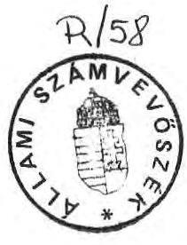
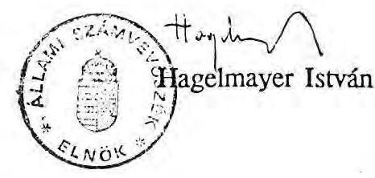

# 21lami Számvevőszék

## JELENTÉS

a Földművelésügyi Minisztérium fejezet pénzügyi-gazdasági ellenőrzéséről

---

Az ellenőrzést végezték:
Bakonyvári Róbertné tanácsos, dr. Benkő János számvevő, dr. Burján Margit számvevő, dr. Czunyi Lajos tanácsos, dr. Csapodi Pál számvevő, dr. Csemniczky Jánosné tanácsos, Csóry Györgyné tanácsos, Otto Tamás számvevő, Reich Lajos tanácsos, dr. Solymár Károlyné tanácsos, Szabó József számvevő, Szíjártó Károly számvevő, Tóth István számvevő.

Az ellenőrzésben közreműködtek:
Angyalosi Dániel számvevő, Bacskai János számvevő, dr. Boda Sándor számvevő, Buczkó András számvevő, Horváth János számvevő, Németh Péterné számvevő, Pankucsi János számvevő, Patai Tamás számvevő, dr. Szeli Tibor számvevő, dr. Takács András számvevő.

Az ellenőrzést vezette:
Rádfai Tibor főtanácsos

---

# JELENTÉS 

a Földművelésügyi Minisztérium fejezet pénzügyi-gazdasági ellenőrzéséről

A Földművelésügyi (1989. május 24-ig Mezőgazdasági és Élelmezésügyi) Minisztérium, valamint 50-70 önálló és 185-186 részben önálló intézménye az 1988-1990. években évente 16-20 milliárd Ft pénzforrással gazdálkodott, ezen felül legalább évi 60-70 milliárd Ft költségvetésből és alapokból juttatott mező- és erdőgazdasági támogatás elosztásában működött közre és hozzávetőlegesen 29-31 ezer főt foglalkoztatva közel 19-20 milliárd Ft értékű vagyont működtetett. Az ellenőrzés célja
—a fejezet gazdálkodásának, a feladatok és a rendelkezésre álló pénzeszközök összhangjának (ezen belül a tervezési, feladat- és szervezeti rendszer, a pénzellátás, a különféle befektetések és tőkekihelyezések, az állóeszköz-gazdálkodás és költségvetési ellenőrzés), továbbá
—a Minisztérium szervezete gazdálkodásának (ezen belül elsősorban a személyi és dologi költségek) értékelése, végül annak megítélése, hogy
—az ágazati feladatokhoz rendelkezésre bocsátott pénzforrások (ezek között elsősorban a $\mathrm{K}+\mathrm{F}$ célokra, a kedvezőtlen adottságú gazdaságok támogatására, a föld- és talajvédelemre és az erdő- és vadgazdálkodás támogatására rendelkezésre bocsátott költségvetési előirányzatok és elkülönített központi alapok)
felhasználásában mennyiben érvényesültek a törvényességi, célszerűségi és eredményességi követelmények. Ellenőrzésünk az 1986-1990. évek gazdálkodására irányult.

---

# I. 

## Következtetések és javaslatok

A fejezet és intézményei általában szabályszerűen és célszerűen gazdálkodtak, a tartalékok feltárására azonban még csak részleges intézkedéseket tettek. Sok tekintetben a központi intézkedésekre (szabályokra) vártak, más esetekben viszont "eredményesen" használták ki a központi szabályozási hézagokat. A takarékosabb és eredményesebb gazdálkodást segíthették volna a központi irányítás részéről a fejezetekkel (Minisztériummal), illetve a Minisztérium részéről az intézményekkel szemben támasztott határozottabb és következetesebb követelmények.

A költségvetési tervezés az előírásoknak megfelelően folyt, annak megalapozottsága azonban, az adott szabályozási keretek (gazdálkodási feltételek) között, nem javulhatott. A fejezet költségvetési támogatásainak összege és részaránya a vizsgált időszakban emelkedett. Ez az új feladatoknak, az automatizmusoknak, részben az intézményrendszer változásainak tulajdonítható. A bevételek óvatos tervezése is a költségvetési támogatások iránti igényt növelte, amihez a fejezetnél különösen nagy mértékben járult az hozzá, hogy központi forrásokból (pl. alapokból) származó bevételek tervezését a jogszabályok nem teszik lehetővé. A rendszeresen elért többletbevételek a fejezet intézményeinek a költségvetési megszorításokkal szembeni "szabadabb", de nem mindig célszerű és takarékos döntéseit tették lehetővé.

A kiadások növekedésében, a többletfeladatokon túl, többnyire az általánosan ható tényezők (inflációs terhek növekedése) játszottak szerepet. Az ésszerűbb, takarékosabb költséggazdálkodás érdekében számos, de a fejezet egésze szempontjából csak szerényebb kihatású intézkedést tettek. Eredmények az igazgatási költségeknél, a gazdasági szolgáltatás területein és az eredményérdekeltségű intézményeknél érzékelhetők.

Az állami feladatok és azok támogatási szükségletének felülvizsgálatára, egy korszerűbb intézményhálózat kialakítására tett részleges intézkedések hatása a fejezet egésze szempontjából még kevésbé, inkább csak néhány részterületen érzékelhető. A feladat- és szervezeti rendszer átalakításának, szelektálásának folyamata nem haladt kellően előre. Egyes esetekben a korábbi szervezések visszarendezése is megfigyelhető volt.

---

Az intézményi pénzellátás általában az előírásokhoz igazodott. Az átvett pénzeszközökkel, a jelentős többletbevételekkel és a különféle alapok pénzforrásaival, kihasználva a joghézagok lehetőségeit, nem egy területen költségvetésen kívüli gazdálkodást folytattak.

Az intézmények egy részénél likviditási gondok miatt hitelek igénybevételére volt szükség. Más intézményeknél és a fejezet szintjén a pénzeszközök befektetésekre, alapítványokban, új vállalkozásokban való részvételre is lehetőséget adtak. A tőkekihelyezések és befektetések több esetben szabálytalanok voltak. Azok kamat- és hozadékbevételeit esetenként a költségvetési gazdálkodáson kívül és nem mindig az eredeti előirányzatok céljával összhangban használták fel.

Az állóeszköz-gazdálkodást a beszűkült lehetőségek jellemezték, az állomány állaga romlott, a ráfordítások zöme a fenntartást szolgálta. Jellemző volt az állóeszközök túlhasználása és gyakori a gazdaságtalan javítás. Új beruházás kevés volt. Ezeket részben meg nem engedett ( $\mathrm{pl} . \mathrm{K}+\mathrm{F}$ ) pénzforrásokból finanszírozták. A legtöbb területen az elaprózott befektetések a selejtezett állományt is alig pótolták.

Több területen került sor a kincstári vagyon privatizálására. Az ellenőrzött területeken a jogszabályi ellentmondásokat, a pénzügyi szabályok sérelmét leginkább az alapítványok létrehozásánál, valamint a szolgálati és bérlakások értékesítésénél tapasztaltuk.

A Minisztérium szervezetének gazdálkodása egészében kiegyensúlyozott volt. 1989-ig jelentősebb létszámcsökkentést hajtottak végre. A Minisztérium és Gazdasági Hivatalának, valamint a vezetők és beosztottak kedvezőtlen létszámaránya azonban az 1990-től már letisztultabb szervezet keretei között is megmaradt.

A Gazdasági Miniszteri Jutalmazási Alap, de még inkább az ezt kiegészítő külső jutalmazási keret — összesen évi 6,2 millió Ft előirányzattal — egészében célját vesztette, felhasználása - csekély kivétellel — szükségtelen és szabálytalan volt.

A Minisztérium dologi költségei három év alatt 35%-kal növekedtek, de célszerűtlen, pazarló költekezést nem tapasztaltunk. A Minisztériumnál is jellemző az állóeszközállomány fokozatos romlása, bár a halasztható befektetések aránya kedvezőbb a fejezet egészénél. A költségek további mérséklésére épületek, más eszközök jobb kihasználásával, esetleges értékesítésével, a Minisztérium és Gazdasági Hivatala közötti gazdálkodási kapcsolatok további ésszerűsítésével nyílik lehetőség.

---

Az ágazati feladatokra rendelkezésre álló pénzforrások alakulását és felhasználását meghatározó támogatási rendszer bonyolult és ellentmondásos, azt a pénzforrások és jogcímek szinte koordinálhatatlan sokfélesége jellemezte. A termelési, fejlesztési támogatások négy alrendszerre tagozódva több, mint harminc jogcímen kerültek szétosztásra, 1989. évben pl. 30 milliárd Ft-ot meghaladó összegben. Ezekben az összegekben nem szerepelnek a mező- és élelmiszergazdaság körén kívül, illetve keretei között kezelt különféle ( $\mathrm{K}+\mathrm{F}$, kereskedelempolitikai, intervenciós, foglalkoztatáspolitikai, beruházási stb.) pénzforrások, továbbá az élelmiszeripar támogatásai, ahol pl. 1989. évben egyedül az exportra több, mint 35 milliárd Ft támogatást juttattak.

A sokrétű - egymással átfedésben lévő — pénzforrások és támogatási jogcímek szövevényében az eredeti célkitűzések elmosódtak és egy általános (pl. foglalkoztatási, életszínvonal-politikai) kiegyenlítő, stabilizáló funkciót töltöttek be. Napjainkra a mezőgazdaság támogatási rendszere elavult, ellentmondásai az utóbbi években a romló gazdasági helyzet következtében egyre nyilvánvalóbbá váltak. Továbbélését annak a gazdasági-társadalmi környezetnek a lassú változása tette csak lehetővé, amely ilyen formában eredetileg létrehozta.

A gazdálkodási feltételek (pl. földminőség, szakemberhiány) kiegyenlítése sohasem volt igazán elválasztható a gazdálkodási színvonalban tapasztalható jelentős eltérésektől (termelési szerkezet, beruházási hatékonyság stb.). E támogatások - a veszteségek kiegyenlítésével - a nagyüzemek jelentős hányadánál megmerevítették az adott struktúrákat, háttérbe szorítva a hatékonyság, a helyi adottságok, a piaci feltételek, az ésszerű termelési szerkezet és üzemnagyság stb. szempontjait. Ugyancsak a támogatási rendszer eredményes működése ellen hatottak a rendszer szektorsemlegességének hiánya, a jogszabályok, irányelvek általános és minden helyzetre alkalmazható megfogalmazásai, a népgazdasági és ágazatpolitikai szempontok érvényesítésének és számonkérésének gyengeségei. A támogatások alapvető célkitűzései és kondíciói az elmúlt években gyakorlatilag nem és néhány lényegesebb ponton csak 1991-től változtak.

A gazdaságokra pénzforrásonként, jogcímenként és területenként szétterített, elaprózott összegek nem is orientálhattak a kívánatos agrárpolitikai célok irányába. Egyes támogatási keretek felosztásánál nem volt érzékelhető egy bármilyen agrár-, vagy fejlesztéspolitikai koncepció, de egy középtávú pénzügyi tervezés érvényesítése sem.

---

A döntéseknél a többnyire helyes, de tágan értelmezhető és számon nem kért irányelvek mellett a helyi (vállalati, intézményi) szempontok és érdekek kerültek előtérbe. A jogszabályi keretek bizonytalansága mellett az alsóbb szervezetek (pl. tanácsok) sem kaptak a prioritások, a kizáró feltételek tekintetében megfelelő eligazítást (pl. kedvezőtlen adottságú gazdaságok támogatásai). A felsőbb szerveknél (PM, FM) inkább az egyeztetési nehézségek ütköztek ki.

A döntési, számonkérés és ellenőrzési rendszert széles körű jogi és hatásköri megosztottság jellemezte. A döntésekben és a lebonyolításban (ellenőrzésben) számos szervezet (PM, MÉM /FM/, tanácsok, APEH, földhivatalok, erdőfelügyelőségek stb.) volt érintett. E hatásköri megosztottság miatt a döntési rendszer többnyire nehézkesen működött és az ellenőrzések hatása is csak az APEH, a földhivatalok és erdőfelügyelőségek gyakorlatában volt elfogadható.

A döntések a támogatások nagy részénél egy zárt keretfelosztási mechanizmusra alapozódtak és nem voltak nyilvánosak. Nyilvános pályázati rend csak néhány támogatási formánál (kedvezőtlen adottságú gazdaságok, erdőtelepítési támogatások stb.) volt található, de ezeknél sem (pl. kedvezőtlen adottságú gazdaságok támogatásánál) terjedt el egységesen.

Mindez azt eredményezte, hogy az egyes támogatási jogcímek a szabályozásoktól függetlenül is fokozatosan megváltoztak, szélesedtek és az eredeti elképzelésektől eltérő irányba tolódtak. Határozott szabályok és a következetes alkalmazás hiányában egyre gyakrabbá vált a pénzforrások eredeti céloktól eltérő, vagy azokkal csak távolabbi kapcsolatban álló felhasználása. Egyes jogcímek előirányzatait mind nagyobb arányban a szabályozottól eltérő - bár az esetek többségében kétségtelenül szükséges - célokra is fordították.

A radikálisabb költségvetési korlátozások, különösen 1990-től, a támogatási források többségénél fordulatot hoztak. Az előirányzatok egyrészt szűkültek, másrészt az eredeti céloktól eltérő, "aktuális" feladatokra fordították nagy részüket. Egészében a pénzforrások szorosabb kezelése nem vált jellemzővé. Célszerűen nem hasznosítható előirányzatok továbbra is előfordultak. Ezek egyik jellemző példája az Erdőfenntartási Alapnak 1990-1992. évekre - a fapusztulások kapcsán - nyújtott évi 100 millió Ft-os költségvetési támogatás, amelynek felhasználása már az első évben is alig haladta meg az 50%-ot és kellő érdekeltség hiányában a későbbiekben sem várható nagyobb igény.

---

A támogatottak felelősségét, az állami költségvetést és az alapokat terhelő kiadások mérséklését egyaránt hangsúlyozó visszatérítési rendszer a gyakorlatban nem, vagy alig működött. A kötelezettségek előírása igen mérsékelt volt, ami az általános támogatási jelleg erősödésére is visszavezethető. (Esetenként vállalati termelő beruházások után sem kértek pl. KMÜFA visszatérítést.) Az esedékes visszatérítendő összegek behajtásáról sem gondoskodtak, azok java részét elengedték, vagy újabb támogatásként visszahagyták, prolongálták stb. (pl. kedvezőtlen adottságú gazdaságok, melioráció, KMÜFA). A behajtási munka elégtelensége magatartási okokon túl, a szankciók általános hiányára is visszavezethető ( $\mathrm{K}+\mathrm{F}$ pénzforrások, Földvédelmi-, Halászatfejlesztési Alap stb.).

A támogatási rendszer 1990. évben ugyan csak részleges, de kimutatható hatású változáson ment keresztül. Ezek a helyes irányú módosítások azonban még nem az elvek és főleg módszerek ésszerű átalakításából, inkább a költségvetési források szűkösségének kényszeréből fakadtak. A támogatási rendszer szerves részét képező elkülönített pénzalapok közül néhány önfenntartó képessége egyre bizonytalanabbá válik.

Tapasztalataink alapján javaslatainkat a következőkben foglaljuk össze:

# A Kormány 

- teljeskörűen tekintse át a KMÜFA, az OTKA, a TKA-k, a Felsőoktatási Fejlesztési Alap stb. működését és a piacgazdasághoz igazodva korszerűsítse a $\mathrm{K}+\mathrm{F}$ célok finanszírozási rendszerét. Ennek keretében gondoskodni kell a pénzforrások, támogatási elvek egységesítéséről; a támogatási jogcímek hatékonyabb rangsorolásáról, szelektálásáról; a koordináció és koncentráció pénzügyi és szervezeti feltételeiről; a támogatások felhasználásának konzekvens ellenőrzéséről és a szakmai eredmények számonkéréséről;
- dolgozza ki az új agrárpolitikai koncepcióhoz igazodó támogatási rendszert. Ennek keretében át kell alakítani a támogatások jogi és hatásköri rendszerét. A támogatásokat az
 eddigieknél koncentráltabban, normatívák alapján, körülhatárolható és számonkérhető jogcímeken, szektorsemlegesen, a nemzetgazdasági és az ágazatpolitikai célokat megfelelően harmonizálva kell folyósítani;
- vizsgálja meg annak lehetőségét, hogy az állami költségvetés, illetve különféle alapok fejlesztési támogatásából (-val) létrehozott termelőszövetkezeti vagyon esetében felszámolás, feloszlás, privatizáció, társasággá alakulás stb. esetében miként lehetne a kincstári érdekeket következetesen érvényesíteni.

---

# A Pénzügyminisztérium 

- kezdeményezze, hogy az éves költségvetés tervezésénél számba nem vett kiadási és bevételi tartalékok (kiadásként elszámolt, de fel nem használt összegek, elő nem írt, bár szerződés alapján behajtandó bevételek stb.) az állami költségvetés tartaléka javára kerüljenek befizetésre és az így befolyt összegekkel az Országgyűlés rendelkezzen;
- a Földművelésügyi Minisztériummal, illetve más tárcákkal együttműködve törölje a tárcáknál előirányzott gazdasági miniszteri alapok és külső jutalmazási keretek előirányzatait.

## A Földművelésügyi Minisztérium

1.) a fejezet költségvetési tervező munkájának javítása érdekében
a) fejezet szinten és az intézményeknél egyaránt biztosítsa a saját bevételek reálisabb megtervezését és előírását; ennek keretében a feladatok és pénzforrások jobb összhangjának megteremtéséhez gondoskodni kell a fejezet szervezeteinél feltárható tartalékok (ki nem használt bevételi lehetőségek, fel nem használt célelöirányzatok) mobilizálásáról;
b) az alapok kintlevőségeit, a különféle támogatási keretekből a megyéknél, gazdálkodó szerveknél lévő kintlevőségeket (visszatérítési kötelezettségeket, fel nem használt támogatási kereteket, el nem számolt felhasználásokat stb.) indokolt haladéktalanul jogcím, adós és lejárati idő szerint felmérni, elszámoltatni és a Pénzügyminisztériummal együtt dönteni arról, hogy a követelések mikor, hová kerüljenek visszatérítésre; befizetésre. Ezzel összefüggésben többek között gondoskodni kell
-a meliorációs beruházások támogatására visszafizetési kötelezettséggel folyósított mintegy 770 millió Ft kintlevőség felméréséről, szerződés szerinti visszatérítéséről, az államkincstár érdekeit sértő szabálytalan (pl. Békés megyében 34 millió Ft értékű) engedmények ellentételezéséről;
-az Állategészségügyi és Élelmiszerellenőrző Felügyeletnél elfekvő 40,9 millió Ft támogatási maradvány befizetéséről;

---

- a "Barátság" és a "Silvanus" vadásztársaságoknak folyósított és még vissza nem fizetett 5 millió Ft, továbbá egyes gazdaságoknak nyújtott hitelek egy részének és kamatainak (kb. 2 millió Ft) behajtásáról;
-a Tervgazdasági Bizottság 5018/1987. sz. határozata alapján létrehozott Árkiegyenlítő Alap megelőlegezésére 1988. októberében átutalt 130 millió Ft visszafizetéséről az állami költségvetésbe. Ehhez az Alap bevételeit a szőlő- és borforgalmazóktól pótlólag be kell szedni;
-a mezőgazdasági nagyüzemek szakember-ellátását segítő támogatások 1990. évi mintegy 62 millió Ft maradványából az 1991. évi kötelezettségek teljesítéséhez szükségtelen kb. 25-30 millió Ft elszámolásáról és befizetéséről;
-a központi intézmények által értékesített lakások állami költségvetést megillető és be nem fizetett bevételeinek felméréséről és befizettetéséről;
c) meg kell gyorsítani az államilag ellátott feladatok és az intézményrendszer felülvizsgálatát, a finanszírozott célokat csökkenteni indokolt. A feladatok, célok felmérésébe és értékelésébe célszerű bevonni a szakterületeket; az állami feladatok szelektálása során külön figyelmet indokolt fordítani a párhuzamos és a hatósági feladatok, szervezetek és a különféle kedvezményes díjtételek révén a vállalkozói szférának nyújtott rejtett költségvetési támogatások kiiktatására (vagy nyíltá tételére).
2.) A költségvetésen kívüli, illetve az érvényes előirányzat-, vagy pénzkezelési szabályokkal összhangban nem álló gazdálkodást meg kell szüntetni. Ennek keretében intézkedni kell
a) az eredményérdekeltségű intézményekre vonatkozó minisztériumi érdekeltségi és alapképzési szabályozás felülvizsgálatáról és az FM Központi Fejlesztési Alapjába elvont, innen átcsoportosított pénzeszközök szabálytalan felhasználásának megszüntetéséről;
b) az AGROBANK-nál vezetett ún. kamatszámla felszámolásáról és annak biztosításáról, hogy a szabályszerűen elért bevételek a megfelelő pénzforrás javára kerüljenek elszámolásra és az eredeti szabályok szerint használják azokat fel.

---

c) A különféle alapok, költségvetési előirányzatok pénzeszközeit minden esetben az előírt MNB számlákon kell kezelni és a költségvetési pénzforrások vállalkozási hitelként való kihelyezésének megakadályozása érdekében is lépéseket indokolt tenni.
d) Az alapítványok támogatását a 3457/1990. Korm. sz. határozat, illetve a 4/1991. (II.13.) PM sz. rendelet értelmében egészében be kell szüntetni;

- az eddig nem rendeltetésnek megfelelő pénzforrásokból, illetve szabálytalanul átutalt összegek esetében a döntésekért való felelősséget a Minisztérium állapítsa meg és kezdeményezzen felelősségre vonást;
-a Minisztérium gondoskodjon arról, hogy a Pro Rekreatione Alapítványba adózatlanul bevitt pénzeszközök után (9,5 millió Ft) a MÉM NAK jogutódai a nyereségadót fizessék meg;
-a Minisztérium a jövőben alaposabban és hatékonyabban lássa el az alapítványok kincstári eredetű tulajdonrészei alapján a kuratóriumi képviseletet.
e) A pénzügyi műveleteket és vagyonmozgásokat a fejezet mérlegében és az intézmények költségvetési nyilvántartásaiban szabályszerűen kell tükröztetni.

3.) A fejezetnél kezelt kincstári vagyon nemzetgazdasági szempontból előnyös, a 3457/1990. Korm. sz. határozattal összhangban álló privatizációja érdekében biztosítani kell az értékesítés, vállalkozásba vitel folyamatos és utólagos ellenőrzésének feltételeit.
4.) A Minisztérium felügyeleti jellegű költségvetési ellenőrző szervezetét a feladatokhoz és a színvonalas, hatékony ellenőrzési követelményekhez kell igazítani. Az újonnan létesülő megyei mezőgazdasági szakigazgatási hivatalok pénzügyi ellenőrzésének feltételeit is rendezni kell.
5.) A Minisztérium Gazdálkodó Szervezetének és ezzel összefüggésben a Gazdasági Hivatal szervezési és működési szabályzatainak korszerűsítését és elfogadását célszerű lenne meggyorsítani. Ezzel párhuzamosan
a) a Gazdasági Hivatal szervezetében és létszámában racionálisabb - a Minisztérium létszámával és a kapcsolatos feladatokkal arányosabb - megoldásokat

---

indokolt alkalmazni; a Gazdasági Hivatal és a Minisztérium által ellátandó feladatokat és létszámot határozottan és áttekinthetően kell elhatárolni;
b) a Gazdasági Hivatal által végzett tevékenységeket, nyújtott szolgáltatásokat szerződések (megrendelések) alapján indokolt számlázni és költségvetési támogatás helyett bevételként elszámolni.
6.) Folytatni indokolt a Minisztérium
a) szervezetének egyszerűsítését, a létszámarányok javítását;
b) a nemzetközi szervezeti tagságok 1989. évben kilátásba helyezett felülvizsgálatát;
c) költséggazdálkodásának, elsősorban a hivatali székház, az üdülők, pihenőházak kihasználtságának javítását és a személygépkocsi gazdálkodás racionalizálását.
7.) Haladéktalanul meg kell szüntetni azt a gyakorlatot, hogy a mezőgazdasági attasék részére külön valutaellátmányt helyeznek ki. A korábban kihelyezett összegekkel az attasékat pontosan el kell számoltatni.
8.) A Minisztérium letéti számláján folytatott gazdálkodást szabályszerűbb alapokra indokolt helyezni. Ennek során
a) elejét kell venni annak, hogy a letéti számlán gazdálkodás folyjon, onnan finanszírozást végezzenek és a számla a költségvetésen kívüli gazdálkodás eszköze legyen;
b) biztosítani indokolt, hogy év végével a letéti számlán egyenleg ne mutatkozzék, az összegek számlára utalt rendeltetési helyükre kerüljenek és ott bevételként, maradványként kerüljenek elszámolásra.
9.) Az ágazati kutatási-fejlesztési tevékenységek célszerűbb és hatékonyabb finanszírozása (támogatása) érdekében biztosítani szükséges, hogy
a) az eddig jelentős összegekkel támogatott agrár K+F információs rendszer mielőbb működjön, alkalmazható legyen a támogatások koordinálására, az

---

eredmények számbavételére. Ehhez tisztázni és egyeztetni kell a Minisztérium, a STAGEK és a MÜSZI szerepét, kiiktatva a vállalatgazdasági körre vonatkozó párhuzamos, esetenként mégis eltérő adatállományok ellentmondásait.
b) A K+F támogatások szerződéskötési, nyilvántartási és beszámoltatási rendszerének egységes kereteit ki kell alakítani, s új alapokon célszerű szabályozni. A rendszer működését ellenőriztetni szükséges, a hibás, pontatlan nyilvántartásokért és adatszolgáltatásokért a felelősséget határozottabban kell érvényesíteni.
10.) A szűk körre lehatárolható állandó jellegű K+F feladatok mellett a támogatások odaítélését egy nyílt, a jelenleginél szélesebb körben alkalmazott pályázati rendszer keretében, független szakértők elbírálására indokolt alapozni.
a) A K+F pénzforrások felhasználása során a jövőben a kutatóintézeti dominanciát mérsékelve a téma (feladat-)finanszírozás jellemzőit, követelményeit szükséges erősíteni.
b) A visszatérítési kötelezettségek eddiginél határozottabb érvényesítésére van szükség. A behajtást is következetesebbé kell tenni. Ezekhez differenciált irányelveket, a szankcionálás keretszabályait is célszerű kidolgozni.
c) A témák állását menet közben is (nem feltétlenül év végén és formálisan) ellenőrizni kell tudományos és gazdasági szempontokból. Az ellenőrzés következtetéseit a további támogatások odaítélésénél érvényesíteni kell.
d) A célszerűtlen, szabálytalan célok finanszírozását meg kell szüntetni. Különösen a beruházások és ezen belül is az építések, telepfejlesztések, termelési beruházások, vállalkozások, alapítványok stb. támogatásánál kell összehasonlíthatatlanul szigorúbban eljárni. A szabálytalan felhasználásért felelősökkel szemben, az előterjesztőket és a jóváhagyókat is ide sorolva, személyes felelősségre vonást kell alkalmazni. Meg kell gátolni - a sokszor szélsőséges - intézeti igények érvényesülését is.
11.) A mezőgazdasági üzemek részére költségvetési előirányzatokból és különféle alapokból nyújtott támogatások kapcsán a következő intézkedések javasolhatók:

---

a) A visszatérítések, egyéb követelések teljesítését a megyei mezőgazdasági hivatalok útján folyamatosan ellenőrizni kell. Ennek nyilvántartási feltételeit haladéktalanul meg kell teremteni. A hivatalok az önkormányzatoktól tételes átvizsgálással vegyék át a támogatásokkal kapcsolatos kimutatásokat és elszámolásokat. Ahol visszafizetési kötelezettség jogszabályellenes elengedése történt, ott tegyenek intézkedést a jogszerű állapot helyreállítására és a befizetési kötelezettség érvényesítésére.
b) Felül kell vizsgálni a Minisztérium kezelésébe tartozó egyes alapok szükségességét, önfenntartó képességét, nem utolsó sorban az azokból finanszírozott (támogatott) feladatok célszerűségét, a vállalati és költségvetési érdekek esetleges átfedéseit meg kell szüntetni.
12.) A Földvédelmi Alap konstrukciója a bekövetkezett gazdaságpolitikai (és társadalmi) változások következtében korszerűtlenné vált. Az Alap fenntartása indokolt lehet, de
a) a földtörvény módosítása során szükséges annak kezelését és felhasználási szabályait módosítani, az új követelményekhez igazítani, ezen belül az eddigi mennyiségi és kizárólag szántócentrikus támogatási rendszert a földminőség, a gazdaságosság, a piaci igények és a tulajdonviszonyok változásaihoz igazítani;
b) a jelenlegi csere-rekultivációs rendszert, elsősorban a fő célokkal ellentétes hatásai miatt, szükséges lenne megszüntetni. Ezzel egy egyszerűbb, racionálisabb felhasználási rendszer működtetésének feltételei is bővülnének;
c) az Alapból és más pénzforrásokból (pl. meliorációs előirányzatokból, Erdőfenntartási Alapból) finanszírozott feladatokat pontosan el kell határolni és a különféle alapok szabályozással ellentétes felhasználását meg kell szüntetni.
d) Gondoskodni kell arról, hogy a földhivatalokhoz befizetendő földvédelmi járulékok behajtása tovább javuljon és a járulékokat az Alapba haladéktalanul (esetleg havonta) fizessék be. A befizetések elkülönített kezeléséről (zárolt számla) haladéktalanul intézkedni kell.
13.) Az Erdőfenntartási Alapnál is egy olyan egységes, szektorsemleges bevételi és felhasználási rendszert lenne helyes kialakítani, amely jobban igazodna a

---

gazdálkodás sajátosságaihoz. Az erdőfenntartási járulék számítási módszerét felül kell vizsgálni.
a) Az Alap számláinak rendszerét egyszerűsíteni indokolt. Biztosítani kell a pontos adatszolgáltatások és elszámolások rendjét. Vizsgálják felül az erdőtelepítések és felújítások ellenőrzési rendszerét és gondoskodjanak annak javításáról.
b) Tegyenek hathatós intézkedéseket a meglévő befejezetlen erdőállomány csökkentésére. Intézkedjenek az Erdőrendezési Szolgálat helyzetének megoldásáról és kezdeményezzék az erdőrendezési tervek megfizettetésének törvényi szintű szabályozását.
c) Az Alap jogszabályellenes bírság elengedései, a céltól eltérő felhasználások esetében a Minisztérium alkalmazzon személyes felelősségre vonást és téríttessen vissza az Alapnak minden olyan összeget, amely azt jogosan megilleti:
- rendezzék az Országos Trófeabíráló Bizottság részére nyújtott és határidőig vissza nem fizetett kölcsön ügyét;
- téríttessék meg a négy állami erdőgazdaságnak adott kölcsönök elmaradt kamatát, valamint
-a Barátság és Silvanus vadásztársasággal a részükre jogtalanul kiutalt összegeket.
d) Szüntessék meg a Parkerdőgazdasági és Vadgazdálkodási költségvetési lebonyolítási számlákat.

---

# II. 

## Az ellenőrzés megállapításai

## A) A fejezet rendelkezésére álló pénzforrások alakulása és felhasználása

A Minisztérium és a fejezet intézményei rendelkezésére álló összes költségvetési pénzforrás az 1988-1990. években évi 16-20 milliárd Ft között alakult. (1. sz. táblázatok) Ezen felül a fejezet elkülönített állami pénzalapokból és egyéb forrásokból (átvett pénzeszközök, letéti számla, FM Központi Fejlesztési Alap stb.) további évi 2,3-2,6 milliárd Ft pénzeszköz felett is rendelkezett, nem számítva egyes ágazati feladatok támogatására szolgáló - több tíz milliárd Ft nagyságrendű speciális forrásokat.

## 1) A pénzforrások alakulása és a tervezési rendszer.   A feladat- és szervezeti rendszer átalakítása

A fejezet költségvetési támogatásai az elmúlt években növekedtek
 és 1990-ben 3,7 milliárd Ft-tal (81%-kal) haladták meg az 1987. évit, miközben a költségvetési kiadások mintegy 5,5-6,0 milliárd Ft-tal emelkedtek. A fejezet gazdálkodását az 1988-1989. években még 65-67%-ban fedezték a saját források, de ezek részaránya 1990-re már 53-55%-ra mérséklődött. Az eredményérdekeltség köre - ugyancsak az intézményrendszer átalakulása miatt — szűkült a fejezetnél.

A támogatások növekvő részarányát döntően olyan tényezők okozták, mint a földhivatali feladatok ellátásának 1990. évi átvétele (20 intézmény), a bér- és dologi automatizmusok, az oktatási, kutatási előirányzatok 16%-os bérfejlesztési többletei (1,7 milliárd Ft), valamint az intézményrendszerben bekövetkezett változások, főleg a vállalattá történő átminősítések számottevő bevételcsökkentő hatása (2,3 milliárd Ft).

Az 1988-1989. években a tényleges kiadások fejezet szinten mintegy 31%-kal haladták meg az eredeti előirányzatot. A működési kiadások 10-12%-kal voltak magasabbak. A növekedés pl. 1988-ban még 56%-ban, az 1989. évben már csak 20%-ban függött össze központi intézkedésekkel.

---

Az intézmények éves előirányzataik kialakításánál az előírásokat általában figyelembe vették. A reálisabb előirányzatok tervezését azonban - a törekvések elégtelensége mellett - a gazdálkodási szabályok gyakori módosulása és az intézmények szervezeti változásai nehezítették. A költségvetési előirányzatok kialakítását továbbra is az elsősorban bázisadatokra támaszkodó intézményfinanszírozás és a bevételekkel csak óvatosan számoló tervezés jellemezte. Az eredeti bevételi előirányzatok azonban nem csak a bázis szemléletű és laza tervezés, de az érvényes szabályok miatt sem tükrözhették a tényleges bevételi lehetőségeket.

Az 1988-1989. években pl. az intézmények ár- és díjbevételei 1,3-1,6 milliárd Ft-tal haladták meg az eredeti előirányzatot (szolgáltatások, hatósági díjtételek emelése, a pályázati és szerződéses kutatási tevékenység fokozása stb.).

A többletbevételek tették lehetővé, hogy a kiadási előirányzatokat kétharmad részben az intézmények saját hatáskörben módosították és a módosított előirányzatokat 95-99%-ra teljesítették. A fejezet éves pénzmaradványai sem voltak számottevők.

A fejlesztési kiadásokra pl. az intézmények az eredetileg tervezett évi 76-85 millió Ft-tal szemben mintegy 1800 millió Ft-ot fordítottak. Ezek mintegy harmadát fedezték költségvetési támogatások, a többire különféle elkülönített (elsősorban K+F) alapokból, a bevételi többletekből biztosítottak forrást. Az érdekeltségi alapok szerepe kisebb volt.

A feladatok és a reálértékben csökkenő pénzforrások feszültségeinek oldására számos esetben, de viszonylag szűk körben tettek intézkedéseket. A Minisztérium egyes főosztályai és az intézmények ugyan folyamatosan foglalkoztak e kérdésekkel, a feladatok érdemi felülvizsgálatára mégsem került sor. A szervezeti változások, korszerűsítések nem az államilag ellátandó feladatok meghatározására, szelektálására és a szükséges pénzforrások (pl. bevételek) megteremtésére irányultak.

A szervezeti változások eredményeként 1990. évben a fejezethez 14 önálló és egy részben önálló intézménnyel több tartozott. Néhány területen elvégezték az állami hatósági és a szolgáltatási feladatok elválasztását (pl. állat- és növényegészségügy, állattenyésztés és növénytermesztés intézményei). Más intézményeket (pl. megyei állatkórházak) vállalkozási formában működtetnek.

A megvalósított átszervezések rendszerint létszám- és bérmegtakarítással jártak, amit bérfejlesztésekre fel is használtak. Más esetekben a költségvetés jelentős veszteségektől mentesült.

---

Így pl. pozitív kezdeményezésnek számítanak az Állategészségügyi és Élelmiszerellenőrzési Felügyelet Költségvetési Iroda által tett lépések, amelyek a veszteségesen működő területeket vállalkozásba adással számolták fel.

Az állatkórházak 1988. évi vesztesége 34,1 millió Ft volt. Az 1989-1990. évektől 4-4 megyei állatkórházat vállalkozási (kft) formában működtetnek. E megoldással 200 fő létszámot is megtakarítottak.

Az állami feladatok szélesebb körű felülvizsgálásában és szelektálásában, vagy a vállalkozói szférába terelésében azonban a Minisztérium és az intézmények szakmai részlegei csak igen visszafogottan működtek közre. (Az érdekellentétek nyilvánvalóak.) A gazdasági-pénzügyi részlegek szakmai megalapozással és együttműködéssel bátrabban nyúlhattak volna az eddig ingyenes (vagy támogatott) feladatok díjtételessé alakításához, a díjak további felülvizsgálatához, vagy a nagyobb horderejű szervezeti lépésekhez.

A hatósági feladatok szűkítése, a feladatok vállalkozásba adása jónéhány rejtett költségvetési támogatást is megszüntetne (állatorvosi ellátás stb.) és segítené a feladatkoordinációt, a párhuzamosságok kiiktatását (pl. hatósági élelmiszervizsgálatok).

A fejezet intézményhálózatának korszerűsítését elsősorban összevonás jellemezte. Olykor mamutintézmények keletkeztek (pl. Agrártudományi Egyetem /Gödöllő/ 10 részben önálló szervezeti egységénél több mint 3500 főt foglalkoztatnak). Vállalattá nagy bevétellel rendelkező intézményeket szerveztek (pl. erdő- és vadgazdaságok, Repülőgépes Szolgálat).

Ezek az intézmények 1989-ben pl. minimális (87 millió Ft) támogatást kaptak, saját bevételük viszont meghaladta a 2,3 milliárd Ft-ot.

A szervezeti változásoknak azonban egy ellenkező irányú folyamata is érzékelhető. A korábbi években vállalattá, társasággá átminősített szervezeteket - életképtelenségük, vagy gazdasági nehézségeik esetén - újból költségvetési intézménnyé minősítettek (pl. a BIOTECH Állattenyésztő és Kutatási Fejlesztési Társaság Üllő-Dóra majori kísérleti telepe, a Dél-Dunántúli Szőlészeti és Borászati Kutató Intézet /Pécs/).

---

# 2) Pénzellátás, költségvetésen kívüli gazdálkodás 

A támogatásokat a pénzellátás központi előírásaihoz igazodva bocsátották rendelkezésre. A pótelőirányzatok is - konkrét feladathoz kapcsolódva többségükben igazodtak a várható teljesítésekhez.

Néhányszor ideiglenes jellegű zárolást és átcsoportosítást is eszközöltek, sőt a támogatást visszapótlási kötelezettséggel bocsátották az intézmény rendelkezésére, megelőlegezve egyéb forrásokat. A visszapótlást azonban több esetben nem a költségvetés, hanem valamilyen alap, vagy költségvetésen kívüli pénzforrás javára számolták el.

#### Abstract

A Mezőgazdasági Biotechnológiai Kutatóközpont fejlesztésére 1989-ben juttatott 60 millió Ft-ot, a Haltenyésztési Kutató Intézetnek az 1988-ban adott támogatás egy részét, a Kertészeti és Élelmiszeripari Egyetem Kecskeméti Szőlészeti, Borászati Intézetének nyújtott 1989. évi támogatásából 1990-1991. években együtt 4 millió Ft-ot, az Agrártudományi Egyetem (Debrecen) kísérleti telepe 2 millió Ft támogatását a Tárca Kutatási Alap javára kellett (illetve kell) visszafizetni.

A fejezetnél a költségvetésen kívüli gazdálkodás más formái is tapasztalhatók voltak. Az eredményérdekeltségű intézmények — a 33.316/1981. sz. és az ezt módosító 1986. október 1-i MÉM utasítás értelmében — adózott eredményük 30%-át egy Központi Fejlesztési Alapba voltak kötelesek befizetni. Az Alapot évekkel ezelőtt kísérletként hozták létre, de éveken át folyamatosan működtették. Az 1988-1989. években pl. összesen 426,3 millió Ft állt itt a tárca rendelkezésére. A számlán kezelt pénzeszközöket a fejezet költségvetési gazdálkodásának részeként nem mutatták ki, azok összegét az éves mérlegadatok sem tartalmazták.

Az Alap a költségvetésen kívüli gazdálkodás megvalósítása mellett vitatható szerepet töltött be a beruházások finanszírozásában és gyengítette az intézményi eredményérdekeltség szerepét is. A szabályozás értelmében a Központi Fejlesztési Alap pénzeszközeit a befizető intézmények fejlesztési forrásainak kiegészítésére használhatták fel. Ezzel szemben a vizsgált időszakban az Alap forrásainak mintegy egyharmada elhagyta az államháztartás körét és vállalatok beruházásaihoz járult hozzá.

[^0]
[^0]:    Évente mintegy 60 millió Ft vissza nem térítendő fejlesztési támogatást nyújtottak különböző célokra állami gazdaságoknak, termelőszövetkezeteknek, tanácsoknak (pl. sörpalackozó üzem, sertéstelep építése, baromfitelep, libaágazat fejlesztése).

---

A Magyar Lóverseny Vállalat részére 1988-ban 3,2 millió Ft-ot utaltak át pl. a Sportistálló (Tattersall) 1987. évi karbantartási költségeinek megtérítésére azzal összefüggésben, hogy a Vállalat az Állatorvostudományi Egyetemnek adta azt át.

Idegenforgalom fejlesztése címén a Balatonnagybereki Állami Gazdaság 43,5 millió Ft-ot kapott.

Innen rendeztek kutatóintézeti veszteségeket (pl. Agrárgazdasági és Kutató Intézet 1989. évi vesztesége), ebből támogattak alapítványokat, vállalkozásokat.

A Minisztérium az Alapból 1988-1990 között összesen 20,0 millió Ft-ot, mint saját forrást utalt át a Pro Rekreatione Alapítvány javára. További 2,0-2,0 millió Ft-ot pedig olyan címen folyósított az Alapból két intézményének (a MÉM Repülőgépes Szolgálat és a MÉM NAK részére), hogy azok kötelesek voltak ezen forrásokat az Alapítvány részére továbbítani.

Az Alap számláját az állami költségvetést és a szabályozott előirányzat-átcsoportosítási gyakorlatot kikerülő megoldásokra is felhasználták.

Így pl. a kistermelői szarvasmarha-tenyésztés támogatásának 1988. évi megszüntetését követően a támogatási előirányzat maradványát 1990. novemberében e számla közbeiktatásával használták fel más célra (156,1 millió Ft-ot így juttattak a földhivatalok költségvetéseinek egyébként indokolt kiegészítésére).

A Minisztérium 1989-től összevonta az addig több betétre kihelyezett, a Központi Műszaki Fejlesztési Alap (KMÜFA)-ból származó pénzforrásait és ezek kamatait egy ún. kamatszámlán gyűjtötte az AGROBANK-kal kötött 1989. februári szerződés alapján. E vagyonmozgásokat és vagyonrészeket számvitelében, mérlegeikben ugyancsak nem szerepeltették. (E pénzforrások felhasználásáról később még részletesebben szólunk.)

A költségvetésen kívüli, bár "államilag szabályozott" gazdálkodás tipikus példája volt a Minisztérium Vadgazdálkodási, valamint a Tanulmányi- és Parkerdőgazdasági lebonyolítási számlákon kezelt bevételek költségvetési elszámolásokat megkerülő felhasználása.

A két számlát az említett gazdaságok speciális feladatainak lebonyolítására nyitották meg. A hat intézmény közül négy vadgazdaság kormány szintű vadászati- és vadgazdálkodási teendőket látott el, két gazdaság a Budapest környéki parkerdő gondozását, illetve a soproni Erdészeti és Faipari Egyetem és a Technikum hallgatóinak gyakorlati oktatását biztosította.

A vadgazdaságok gazdálkodásukat az általános vállalati szabályozók szerint számolták el. (Működési feltételeiket utoljára a 4/B/1982. MÉM sz. utasítás

---

szabályozta.) A vállalatok által fizetendő közterheket a Minisztérium által kezelt lebonyolítási számlákra fizették be és az állami költségvetési rendszert kikerülve, a speciális feladatok címén használták fel.

#### Abstract

A vadgazdálkodási számlán keresztül biztosított évi 250-350 millió Ft támogatás a Kormány vadászati protokoll tevékenységével kapcsolatos feladatok ellátására, illetve a legfőbb állami és pártvezetőkből álló Egyetértés Vadásztársaság vadászati szükségleteinek kielégítésére szolgált. A Tanulmányi- és Parkerdőgazdasági számlán keresztül évi kb. 100 millió Ft-os nagyságrendű támogatás fedezte a speciális feladatot.

Az elszámolási rendszer előnyös volt a gazdaságok részére is (kamatmentes hitel, elszámolási előleg felvétele). A számlákon ugyanis csak a felszámított költségek és a befizetendő közterhek különbözete futott keresztül, tehát a pénzmozgás nettó jellegű volt.

Az elszámolási előlegeken túl pl. Gemenc és Gyulaj 10-10 millió Ft hitelt is kapott 10%-os kamatfizetési kötelezettséggel, de a kamatok megfizettetését "elfelejtette" a Minisztérium.

A gazdaságoknak visszajuttatott összegek gyakorlatilag azt a hiányt fedezték, amely az Egyetértés Vadásztársaság 40-50 tagjától befolyt minimális (5/B/1985. MÉM utasítás szerinti) térítések és vadászati bevételek, illetve vadászatokkal és a területek vadgazdálkodásával kapcsolatos költségek között mutatkozott.

Ráadásul maga a vadászat térítésmentes volt, vagyis az Egyetértés tagjai sem a lelövési díjat, sem a trófea ellenértékét nem fizették meg.

A TB-járulék mértékének 1989. évi egységesítése alapjaiban megrendítette a kialakított rendszert, hiszen a legjelentősebb bevételi forrás kiesett. Végeredményben azonban 1989-ben a politikai változások következtében szüntették meg a térítésmentes vadászatokat.

Megszűnt az Egyetértés Vadásztársaság is. A gazdaságok pedig 1989. április 1-től vállalati gazdálkodási rendszerben működnek.

A lebonyolítási számlákon lévő pénzeszközöket — az átmeneti időszakban még várható, illetve a különlegesen értékes vadállománnyal kapcsolatos költségek fedezetére - a jövőbeni feladatok támogatására szétosztották a befizető gazdaságok között. (Csak 10 millió Ft-ot tartottak vissza a Kormány 1989. évi protokoll vadásztatásainak fedezetéül.)

---

Az ilyen jellegű költségeken felül a számlán rendelkezésre álló pénzforrásokból 5 millió Ft-ot fordítottak az "Ember az erdőért" elnevezésű alapítvány javára. Ugyanakkor 1989. évi kifizetések között szerepel az Egyetértés feloszlatása után, annak tagjaiból alakított "Silvanus", illetve a már korábban is létezett - ugyancsak volt Egyetértés tagokból szerveződött - "Barátság" vadász- és horgászegyesület 3-3 millió Ft-os szabálytalan támogatása is (a beindítási nehézségek áthidalása címén). A "Silvanus" egy millió Ft-ot azóta visszautalt a számlára.

A Tanulmányi és Parkerdőgazdasági számlán lebonyolított, az állami költségvetést ugyancsak megkerülő évi 100 millió Ft kifizetése közcélokat szolgált, nem tekinthető indokolatlannak. Az
 elszámolási rend azonban ez esetben is szabálytalan volt és nem egy kifizetés el is tért a számlán lebonyolított forgalom céljától.

Így pl. a Budapesti Erdő- és Vadgazdaság egy korábbi 35,5 millió Ft-os hitelével kapcsolatos tőke- és kamattörlesztés, az elsősorban 1988-ban az erdőgazdaságok fejlesztési céljaira kifizetett tételek stb.

A Budapesti Erdő- és Vadgazdaságot 1989-ben a pilisi vette át. A lebonyolítási számláról átutalt 56 millió Ft támogatást a gazdaság - a Minisztérium engedélyével - vagyonalapjába helyezte és abból 48 millió Ft értékben olyan részvényt vásárolt, melynek egy részét bizonyosan csak névérték alatt lesz képes értékesíteni.

A költségvetésen kívüli gazdálkodás további eseteit jelezzük a Minisztérium letéti számlájával foglalkozó részeknél.
3) Befektetések, tőkekihelyezések, vállalkozásokban való részvétel. Alapítványok

A bevételi többletek, az átvett pénzeszközök új típusú vállalkozásokra, nagyobb összegek kihelyezésére is lehetőséget adtak. Ez a Minisztérium gyakorlatában sem volt ismeretlen.

Így pl. a Központi Fejlesztési Alap nagy záróegyenlegének elkerülése érdekében 1988-ban 60,0 millió Ft-ot az AGROBANK-nál hitellevélen helyeztek el. Ezt 1989. márciusában (kamatokkal együtt) kapták vissza.

Az AGROBANK-nál 1989. áprilisában 376,7 millió Ft-ért a kamatszámlán összegyült forrásokból vásároltak hitelleveleket, a kb. 400,0 millió Ft-nyi ilyen forrás a Minisztérium mérlegeiben elszámolásra is került.

A fejezet intézményei az 1989. év végén összesen 753,7 millió Ft kihelyezett vagyonnal rendelkeztek. Ebből vásárolt kötvényekben, kincstárjegyekben 187,5,

---

különböző befektetésekben 566,2 millió Ft értéket tartottak nyilván. (A könyv szerinti intézményi vagyon kb. 4%-át.)

Ennek 65%-át az eredményérdekeltségű szervezetek helyezték ki. Az összeg 16%-a olyan szervezetek tulajdona, melyek 1990. évtől már vállalati formában működnek (erdő- és vadgazdaságok, Repülőgépes Szolgálat).

A kihelyezett érték dinamikusan, 1989. folyamán 427,0 millió Ft-tal, 2-3-szorosára nőtt. Ennek ellenére a tőkekihelyezések az intézményeknek csak viszonylag szűk körére voltak jellemzők. Öt intézmény - közöttük elsősorban a Pilisi Állami Parkerdőgazdaság - helyezte ki a fenti összeg csaknem felét. A befektetések vizsgálata alapján megállapítható, hogy
-a tőkeallokáció felgyorsult, jóllehet az elmozdult tőkeérték még sem nagyságrendjét, sem arányait tekintve nem jelentős;
-a kihelyezett tőke nagyobb része pénzintézetekhez került, kincstárjegy, kötvény, de leginkább részvényvásárlás, vagy rövid távú lekötés formájában, a befektetések áramlásának iránya tehát egyértelműen nem határozható meg;

A Pilisi Állami Parkerdőgazdaság pl. 1990-ben 45-50 millió Ft hitel felvételére kényszerült 21%-os kamat mellett, amikor 55 millió Ft AGROBANK részvénye után 5%-os osztalékot kapott.
— több esetben nyújtottak vállalatok részére jelentős hiteleket (pl. Pilisi Állami Parkerdőgazdaságnál az ilyen rövid távú befektetések elérték a 20-40 millió Ft-ot is);
—a hosszabb távra szóló — nem a pénzügyi szférában eszközölt — befektetések nagyrészt az intézmények szakmai tevékenységéhez kapcsolódtak (pl. Gabonatermesztő Kutató Intézet, FM Műszaki Intézet). A szakmától távol eső, kifejezetten profitorientált befektetés viszonylag kevés volt (Pilisi Állami Parkerdőgazdaság);

A KMÜFA kihelyezésekkel elért kamatokból fordítottak 1989-ben 30,0 millió Ft-ot az Agromarketing Kft alaptőke-hozzájárulásának finanszírozására.
—a befektetések hozama még szerény volt. A különböző gazdasági társaságokba fektetett 32,0 millió Ft vagyoni betét kimutatott éves hozama pl. csak mintegy 3,5 millió Ft volt (új társaságok, második felévi, év végi belépés miatt).

---

- a tőkekihelyezések és befektetések, valamint ezek hozadékainak elszámolása a Minisztérium és az intézmények számvitelében, mérlegében még gyakran hiányos.

A Gödöllői Agrártudományi Egyetem 54,7 millió Ft értékű befektetésének értéke pl. nem a valós képet mutatja, mert a Mezőtúri Tanüzem a Műszaki Szolgáltató Kft-ben nem a kimutatott 48,1, hanem csak 12,9 millió Ft-tal vesz részt (a külső tagok által bevitt összeget is az Egyetem tulajdonaként, az egyetemi vagyont pedig kétszeresen szerepeltették a mérlegben).

A Központi Műszaki Fejlesztési Alap (KMÜFA) pénzeszközeit — a költségvetési ellátmányokkal egyező szabályok szerint - az előírt MNB számlán lenne kötelező kezelni. Ezzel szemben az Alap pénzeszközeinek jelentős része az alapcéloktól eltérően időlegesen "lefagyasztva" más bankok számláin feküdt el, vagy részvények, hitellevelek stb. formájában volt lekötve.

A KMÜFA úgynevezett "szabad pénzforrásként" való kihelyezése 1989-ben átlagosan meghaladta a 440, 1990-ben a 200 millió Ft-ot. A 10 különféle AGROBANK számlán, illetve betétben (hitellevelekben, részjegyben stb.) ugyanakkor összesen további 518,9 millió Ft záróegyenleg volt kimutatható.

Az 1990. év végén az AGROBANK-nál vezetett számlák, betétek 163,8 millió Ft egyenleggel zártak. A TKA ideiglenes kihelyezéseivel együtt a valóságos K+F maradvány több mint 462 millió Ft volt.

Néhány megjelölt cél a hitellevelekről: Agráralapítványra 100, Alapítvány II-re 50 millió Ft 6-7 hónapos lekötés mellett, rövid (1,5 hónapos) lejáratú kihelyezésként 200 millió Ft vállalkozótársi részjegyre 1989-ben stb.

A különböző tőkekihelyezések (betétek, részvények, hitellevelek stb.) kamatai, osztalékai és a részvények eladása együtt a KMÜFA bevételeket öt év alatt 334,6 millió Ft-tal (7%) növelték.

A Minisztérium 1989-1990. években hét alapítvány létrehozásához járult hozzá, 55 millió Ft összeggel. A vizsgált alapítványok vagyonának döntő hányada az állami költségvetés és különféle alapok (pl. Központi Fejlesztési Alap, KMÜFA, kamatszámla) esetenként szabálytalan támogatásából, különféle minisztériumok juttatásaiból származott. Az egyéb (vállalati, banki, magán stb.) hozzájárulások aránya differenciált, de alig 18% volt.

Így pl. a Pro Rekreatione Alapítványnak, illetve jogelődjének, a Velencei Szabadidő Központ és Ifjúsági Sporttábornak juttatott 1987. évi 2-2, 1988. évi 5, és az 1989-1990. évi összesen 15 millió Ft.

---

Az intézményi hozzájárulások is gyakran minisztériumi juttatásokból, vagy olyan forrásból eredtek, amelyre az állami költségvetési szervek gazdálkodásáról szóló 19/1980. (XI.27.) PM sz. rendelet nem adott lehetőséget.

Az alapítványtevők alapítványi befizetéseik után adókedvezményt kapnak. Előfordult, hogy az általuk létrehozott kft-k részére a törzstőkét, a vissza nem térítendő támogatást stb. az alapítványon keresztül biztosították. Más esetben a kft fizetett be alapítványi hozzájárulást, majd ennek több, mint kétszeresét kapta vissza az alapítványtól törzstőkeként.

A Pro Rekreatione Alapítvány átvett vagyonából 6,5 millió Ft értékű — a MÉM NAK 1985-1988 közötti hozzájárulása - olyan (adózatlan) forrásból keletkezett, amelyre a rendelet nem ad lehetőséget.

A hitelleveleken és a KMÜFA kamatszámlán lévő forrásokból is számos alapítványt támogattak. A kamatszámláról átutalt 33 millió Ft-ból 20 millió Ft-ot kapott pl. a Magyar Vállalkozásfejlesztési Alapítvány.

Szabálytalanul - az 1990. novemberi 3457/1990. Korm. sz. határozat előírásai ellenére - 1991. januárjában a miniszter előzetes szóbeli ígéretére hivatkozva utaltak át a "Tanya-alapítvány"-ra 10 millió Ft-ot.

A vizsgált alapítványok általában közérdekű célokat szolgáltak és többségük 1990-ben létesült (három még egyáltalán nem működik, pénzük kamatozó betétben fekszik). A már működő alapítványokból teljesített kiadások egyébként megfeleltek az alapítói okiratokban foglaltaknak. (Az azokban megjelölt célok azonban annyira sokrétűek és általánosak, hogy az ellenkezőjét bizonyítani alig lehetne.) A Minisztérium eddig nem kísérte kellően figyelemmel az érintett alapítványok gazdálkodását. (Egy felmérés ellenőrzésünk időszakában készült.)

# 4) A fejezet állóeszköz-gazdálkodásának egyes kérdései 

A fejezet 19-20 milliárd Ft bruttó értékű kincstári állóeszköz-állományának zöme (61%) ingatlanokból állt. Az eszközök használhatósági foka az 1987-1989. években fokozatosan romlott, 1989 végén 65%-os, mintegy 10%-ponttal rosszabb volt a kincstári átlagnál.

A nemzetgazdaságban évek óta erősödő folyamat a Minisztérium intézményeinél is érvényesült. A fenntartásra, felújításra fordított kiadások mindinkább közelítik a beruházási ráfordításokat. A költségvetési szabályozásra is visszavezethetően gyakori a "túlüzemeltetés" és a gazdaságtalan javítás (főként a gépeknél és járműveknél). A lassú romlás tendenciája az elaprózott beruházásoknál is

---

kimutatható volt. Az 1987-1989 között évente emelkedően összesen 4,8 milliárd Ft-ot fordítottak beruházásokra, több mint 40 intézményre elosztva. Ezek mintegy fele építés volt.

Az új beszerzések 1987-ben még 2,3-szer, 1989-ben már csak 2,0-szer haladták meg a selejtezés, eladás, átadás miatt bekövetkezett csökkenést.

Az intézmények összesen 12 féle forrásból finanszíroztak beruházást, s ezek közül pl. 1989-ben egyharmadot sem ért el az intézményi fejlesztési alapok aránya. Így számottevő szerephez jutottak a Minisztérium közreműködésével többszörösen újraelosztott, rendeltetésellenesen, vagy vitatható módon felhasznált pénzforrások (pl. KMÜFA, Központi Fejlesztési Alap, egyéb költségvetésen kívüli kezelés).

Az intézmények állóeszköz-állományában a beruházásoknál nagyobb változásokat okoztak az átszervezések. Ezek következtében 1987-1988. években összesen 600 millió Ft nagyságrendű állóeszköz-állomány került átcsoportosításra, s ez a folyamat 1989-re felgyorsulva elérte a 945 millió Ft-ot.

A továbbiakban az intézményi kezelésben lévő kincstári vagyon számottevő csökkenésével kell számolni. Egyrészt bizonyos intézmények teljes vagyonukkal vállalati körbe kerültek (pl. a Repülőgépes Szolgálat, erdő- és vadgazdaságok összesen 4,4 milliárd Ft vagyonnal), de elkerülhetetlen lesz, hogy az intézmények források hiányában egyes feladatokat leépítsenek és az állóeszközöket a vállalkozói szféra számára értékesítsék, vagy apportként fektessék be.

A fejezet intézményeinél eddig folyó privatizációs tevékenység - a kedvező példák ellenére is - bizonytalan helyzetre utal. A gyakorlat szabályszerű megoldások esetén is áron aluli értékesítéshez és erkölcsileg is vitatható megoldásokhoz vezetett. A kincstár ebből származó veszteségeit nem kompenzálja, hogy ezek az eszközök már további ráfordításokat nem igényelnek.

A kincstári vagyonnal és pénzeszközökkel való szabálytalan gazdálkodás és a pazarlás számos jegyét magán viselte pl. a MÉM STAGEK eszközátadása a MÜSZI Rt részére. Ezzel kapcsolatban megállapítható volt pl., hogy

[^0]
[^0]:    - egy R-46 tip. "árukapcsolással" beszereztetett számítógépre fordított 15 millió Ft teljesen felesleges volt. A STAGEK ugyanis számítástechnikai bázisának 1986-1987. évi fejlesztése során egy IBM számítógép és kapcsolódó eszközei beszerzéséhez a Számítástechnikai Tárcaközi Bizottságtól csak úgy kapott engedélyt, ha egy R-46 tip. számítógépet is átvesz. Ennek 15 millió Ft-os vételárából

---

14 millió Ft-ot a KSH fedezett. A STAGEK 1 millió Ft-os áldozattal átvette a gépet, amit azóta is ládában tárolnak.

- A STAGEK beruházásait - amelyekhez a Tárca Kutatási Alapból 40,0 millió Ft-ot kapott - 1989. év elején 35,6 millió Ft értékben aktiválta (az IBM 30,6, az R-46 5,0 millió Ft), majd a Mezőgazdasági Üzemszervezési Közös Vállalatnak (MÜSZI) a Minisztérium közreműködésével 20 millió Ft veszteséggel adta át (a mintegy 45 millió Ft nettó értékű vagyont 35,6 millió Ft-ra értékelve megállapodásos áron 25 millió Ft értékű részvényért). (Az R-46 tip. gépet ingyen adták.) A számítástechnikai eszközök vállalati kézbe adása az IBM gép cseréjének szükségességét megkérdőjelezte.

A Minisztérium intézményei kezelésében lévő szolgálati és bérlakások állománya 1986-1990. évek között - 1.568 db-ról 1.242 db-ra - folyamatosan csökkent. Az öt év alatt a lakásállomány 30%-a, elsősorban a bérlakás kategóriából, eladásra került. Évente 50-60 lakást, 1987. és 1990. években viszont már évi mintegy 130-170 lakást értékesítettek. Az eladások a megvásárlást szabályozó 32/1969. (IX.30.) Korm. sz. rendelet és a többször módosított 16/1969. (IX.30.) ÉVM-MÉM-PM sz. együttes rendelet alapján folyt. A Minisztérium már 1983-ban a kezelő szervek hatáskörébe adta a lakásingatlanok értékesítési jogát (XVI-52.247/1983. sz. leirat).

A lakások eladási ára a legtöbb esetben az egykori bruttó értéket sem érte el és messze elmarad a mai forgalmi értéktől. A fővárosi lakások eladása során több esetben lehetett volna alkalmazni a vételár kialakításánál a Vhr. 7. par. (9) bek. adta lehetőséget (árnövelés). Erre azonban
 nem került sor. Így pl.
a Fővárosi Növényegészségügyi és Talajvédelmi Állomás kezeléséből eladott Budapest, II., Pusztaszeri út 27/c., a XI., Nagyszalonta u. 29-31., az Állategészségügyi és Élelmiszervizsgáló Szolgálat II., Törökvész u. 23, vagy a Pilisi Állami Parkerdőgazdaság Visegrádon, Szentendrén eladott lakásai, az FM Erdőrendezési Szolgálat Budapest, II., Kuruclesi út 22-24-26. sz. házainál sem.

A Budapest, II., Törökvész út 23. (9 db 50, illetve $76 \mathrm{~m}^{2}$-es lakás + garázs) 1971-1973 között épült (bruttó értéke 6.487, nettó értéke 5.900 ezer Ft). Az 1990. évi becsértéke - néhány évvel ezelőtti teljes felújítás után - 19.930, eladási ára (lakottan) 9.284 ezer $\mathrm{Ft}(47 \%)$ volt.

A Budapest, XI., Nagyszalonta u. 29. (4 db $105 \mathrm{~m}^{2}$-es lakás +4 garázs) 1983-1985 között épült (bruttó értéke 9.375, nettó értéke 8.619 ezer Ft). Az 1990. évi becsértéke 19.800 ezer Ft volt. Mindössze 6.120 ezer Ft-ért (31 %) értékesítették (13-14 ezer $\mathrm{Ft} / \mathrm{m}^{2}$ ).

---

Az eladott lakások nettó értéke mintegy 80-82 millió Ft, becsértéke kb. 190-200 millió Ft, eladási ára (döntően lakottan) kb. 90-95 millió Ft (47-48 %) volt. A vételárból 1990. december 31-ig mintegy 28 millió Ft-ot fizettek ki az intézményeknek. A hátralék - a 35 évi részletfizetés folytán - 2020-ig fog befolyni. Amennyiben - főleg a fővárosban - a készpénzben befizetendő összeg számottevő volt, kamatmentes kölcsönnel támogatták meg az új tulajdonosokat.

A központi költségvetési szerveknek az eladott lakásokból származó bevételeket az állami költségvetésbe kellett befizetnie. Ennek, néhány intézmény kivételével 1988. év végéig egyetlen szerv sem tett eleget, saját lakásalapjukat növelték.

Néhány intézmény a befolyt vételárból újabb bérlakásokat vásárolt (Pannon Agrártudományi Egyetem, Gabonatermesztési Kutató Intézet).

Az intézmények tulajdonában, kezelésében lévő lakások az intézmény munkavállalóinak elhelyezésére szolgáltak. Félő, hogy ezek eladása után, főként vidéken, megfelelő szakembert várhatóan csak új lakások építésével lesz lehetséges alkalmazni.

# 5) Ellenőrzés 

A Minisztérium költségvetési ellenőrzési kötelezettségeinek számszerűen eleget tett. A színvonal és hatékonyság további növelését gátolja azonban a feladatok és a kapacitás közötti nagy feszültség. Ez a jövőben a megyei mezőgazdasági hivatal létrejöttével élesedni fog.

Jelenleg a Minisztérium csak három főállású ellenőrrel, emellett szakértők (3 létszámot pótló) foglalkoztatásával látja el feladatait.

A jelenlegi szervezeti felállásban a gazdálkodás, a finanszírozás és az ellenőrzés egy, a költségvetési intézmények főosztálya szervezetében bonyolódik le. Az ellenőrzés függetlensége így megkérdőjelezhető annak ellenére, hogy az ellenőrzési tevékenységet a Minisztérium vezetése figyelemmel kíséri (ellenőrzési tervek jóváhagyása, beszámoltatás a végzett ellenőrzésekről).

Az ágazati támogatásokkal kapcsolatos lebonyolítási rend formai előírásait általában betartották, az érdemi intézkedések alapjául szolgáló nyilvántartási,

---

elszámoltatási, beszámolási és ellenőrzési rendről azonban már vegyesebb kép festhető. A szakmai szervezetek (APEH, erdőfelügyelőségek, földhivatalok) ellenőrzéseinek folyamatossága, eredménye általában kedvezőbb volt. A volt tanácsok ellenőrzéseit csak a szövetkezetek szakember-támogatásainál találtuk kielégítőnek.

A fejezet pénzgazdálkodásának ellenőrzése során a Mezőgazdasági Minősítő Intézetnél 5,4 millió Ft 1989. évben esedékes adóbefizetés elmaradás volt megállapítható.
(A tartozást az ellenőrzés ideje alatt rendezték.)

# B) A Minisztérium szervezetének gazdálkodása 

A Minisztérium Gazdálkodó Szervezete az 1988-1990. években hat szakfeladaton - az állami céltartalékkal kapcsolatos keretek és bevételek nélkül - összesen évi 326,7-374,0 millió Ft költségvetési támogatással gazdálkodott. (2. sz. táblázat) A tényleges kiadások a módosított előirányzatokhoz képest minimális eltérést mutattak. A gazdálkodásban azonban a lehetségesnél lassabban javuló tendencia figyelhető meg, amit a többszöri vezetőváltással is összefüggésben, a döntési mechanizmus lelassulása, a döntési szintek felfelé csúszása kísér.

- A Minisztérium költségvetése tervezése, végrehajtása és ellenőrzése is alapvetően szokásokon alapul. A gazdálkodás belső rendje nélkülöz mindenfajta szabályozást. A jelenlegi Szervezeti és Működési Szabályzat elavult és a külső körülmények változásával túlhaladottá is vált.
- A Költségvetési intézmények főosztálya érdemi gazdálkodási feladatainak már csak létszáma miatt sem képes maradéktalanul eleget tenni. A Minisztérium gazdálkodásának belső ellenőrzése is megoldatlan.

A Minisztérium gazdálkodását érintő egy sor kérdésben, igaz csak 1991. év elején, már született döntés (bérleti díjak, jóléti intézmények, üzemorvosi ellátás, étkeztetés stb.). További szükséges intézkedések azonban még hátra vannak és az eddigiek sem tekinthetők kielégítőnek (gépkocsi-állomány, székház és jóléti intézmények kihasználtsága, hasznosítása, szervezeti rendszer, szabályozottság stb.).

---

# 1) Személyi jellegű kiadások 

a) Létszám- és bérgazdálkodás

A Minisztérium létszáma az 1988. évi 732 főről, az 1988. évi 140 fős (20 %-os) létszámcsökkentés eredményeként is, 1989. évre 538 főre csökkent. Ezt követően a létszámleépítés dinamikája lelassult. A jelenlegi létszám pedig — különösen a Gazdasági Hivatallal együtt mérlegelve - még jelentős tartalékokat rejt.

A Minisztérium és a Gazdasági Hivatal feladatmegoszlásában - a többszöri átcsoportosítások után is - sok az átfedés. A Minisztérium 538 fős átlaglétszámához képest a 360 fős Gazdasági Hivatal létszáma irreálisan magasnak ítélhető.

Az elmúlt években a Minisztérium szervezete is a "túlszervezettség" jeleit mutatja. Ez a vezetők, elsősorban a helyettesek feltűnően magas, közel 30 %-os arányából adódik.

Így pl. 1989-ben 16 főosztályvezetőhöz 30 főosztályvezető-helyettes és 22 osztályvezetőhöz 70 osztályvezető-helyettes, 1990-ben 12 főosztályvezetőhöz 28 főosztályvezető-helyettes és 21 osztályvezetőhöz 62 osztályvezető-helyettes tartozott. Az 1990. évi szervezeti változások eredményeképpen valamelyest egyszerűsödött a szervezet.

A Minisztériumnál az 1988-1990. években jelentős bérfejlesztéseket valósítottak meg. (Három év alatt a bérek közel 70 %-kal nőttek.) A béralapot terhelő tényleges kiadás (3. sz. táblázat) 1988-ban 140,9, 1990-ben 191,7 millió Ft volt. Béremelésre elsősorban létszámcsökkentésből volt lehetőség. (A korábbi évek magas induló létszáma más tárcákhoz képest nagyobb arányú bérmegtakarítást tett lehetővé.)

Az 1988. évben a bérfejlesztés egy részét az 1989. évi várható bérmegtakarításból is fedezték.

Az átlagbérek és átlagkeresetek növekedésében az alapbérek emelkedése volt a meghatározó. A jutalmak egy főre jutó összege, szabályszerű forrásokból, csak 10 %-kal nőtt. Az alapbérek növekedésében és szintjében azonban jelentős szóródások, aránytalanságok is tapasztalhatók (+17 és -10 % az önkéntes létszámcsökkentés bérfejlesztési lehetőségei folytán). Így a jutalom-

---

mazásra rendelkezésre álló összegek bérarányos szétosztása is főosztályok közötti feszültségforrást jelentett.
b) Gazdasági miniszteri alap és a külső jutalmazási keret

A Pénzügyminisztérium a Minisztérium részére a hagyományos Alap évi 3,8 millió Ft-os előirányzatán felül külső jutalmazási keretre további 2,4 millió Ft-os előirányzatot állapított meg céljelleggel.

Ennek fedezete a fejezet bértartaléka lehetett volna. Ezzel szemben nem ezt, hanem a mezőgazdasági és egyéb célfeladatok támogatási előirányzatát terhelték.

Az összevontan kezelt összesen 6,2 millió Ft-os keretből 1988-ban 3,3, 1989-ben 1,3 millió Ft-ot használtak fel. Az ún. külső jutalmazási keret jóváhagyása olyan időszakban, amikor már az Alap is elvesztette aktualitását, szükségtelen volt. (Az 1990. I. félévben külső jutalmazásra pl. mindössze 287 ezer Ft-ot fordítottak.) A keret terhére - amelynek felhasználását a nevében foglaltakon kívül semmi sem szabályozta - többek között egy sor vitatható célra fizettek jutalmat.

Így pl. FTC olimpikonok tárgyjutalma 268, nem a Minisztérium felügyelete alá tartozó szervek dolgozóinak jutalma 130, KISZ építőtábor 75, sajtónapi jutalom 50, minisztériumi nyugdíjasok segélye 300 ezer Ft.

A Gazdasági Miniszteri Jutalmazási Alapból évi 1,8-1,9 millió Ft-ot használtak fel ugyancsak rendeltetésétől eltérően, bérként. Az Alap terhére az 1988-1989. években eszközölt kifizetések többsége nem felelt meg az Alapra vonatkozó irányelveknek, miszerint az alap elsősorban a Minisztérium felügyelete alá tartozó vállalatoknál teljesítményükkel kitűnt dolgozók jutalmazására szolgál.

Különösen kifogásolhatók az olyan jutalmazási célok, mint tanácsi dolgozók prémiuma 505, Kiváló Áruk Fóruma részére átutalás 100, felügyelő bizottságok jutalma 37, "12 hónap az erdőn" c. film 36, tankönyv nívódíj 50, reprezentáció 50 ezer Ft.

E jutalmazásokkal kapcsolatos tapasztalataink megerősítik a Pénzügyminisztérium felé az Alap megszüntetésére irányuló korábbi javaslatunkat.

---

c) Külföldi kiküldetések és reprezentációs költségek

A nemzetközi kiadások (külföldi kiküldetés, reprezentáció, nemzetközi tagdíj, FAO) átlagos évi 36 millió Ft-os összege az 1988-1990. évek között mintegy 11 %-kal növekedett részben az utazási költségek, nemzetközi tagdíjak - a Ft többszöri leértékeléséből is eredő - emelkedése miatt. A kiadások azonban — az 1988. évi 8 %-os túllépés kivételével — a módosított előirányzatokon belül realizálódtak. A kelet-európai relációkban a vizsgált években jelentős megtakarítás mutatkozott, de a fejlett, illetve fejlődő relációjú utaknál sem volt jellemző a kerettúllépés.

Az 1989. augusztus 29-i államtitkári értekezlet feladatul jelölte a nemzetközi szervezeti tagság anyagi vonzatának felmérését (sorolását, a költségek átvállalásának kezdeményezését). Tekintettel az évi 5,0-5,7 millió Ft-os költségkihatásra, indokolt a feladat napirenden tartása.

A külföldi kiküldetések szabályozásának és gyakorlatának gyenge pontja, hogy - elsősorban a terven felüli utazások esetében - nem biztosított a kiutazások kellő koordináltsága, rangsorolása. Az útijelentések elkészültek, de célszerű lenne azokat a meghívásos utaknál is maradéktalanul megkövetelni.

A mezőgazdasági attasék rendelkezésére bocsátott, az évi mintegy 3-4 ezer USD felhasználását korábban - egy konkrét témához kapcsolva - vizsgáltuk és megállapítottuk, hogy
—az engedélyezés és elszámoltatás módját nem szabályozták,
—a későbbiek során a kereteket szinte teljes egészében napidíjak, szállás-költség-túllépés, szállodafoglalási előleg címén használták fel.

- Az elszámoltatást több osztály végezte és az okmányokat, számlákat nem egyeztették teljeskörűen. (Így fordulhatott elő a koppenhágai vizsgálat által feltárt 79 DKR-es hiány, amit azóta rendeztek.)

Az 1990. évtől az attaséknak kiküldött összegek elszámolási rendjét módosították és megszilárdították. Az utóbbi évek felhasználására tekintettel azonban a valutakihelyezések szükségtelenek.

A Minisztérium a vizsgált időszakban négy szakterületen évi mintegy 2.400 ezer Ft-os reprezentációs kerettel gazdálkodott. A tervezésre vonatkozó

---

pénzügyminiszteri rendeletet a személyi reprezentáció kivételével, ahol az 1987. évi 80 ezer Ft-os előirányzattal szemben 1988-1989. években 126-128 ezer Ft felhasználást terveztek és realizáltak, betartották.

Kifogásolható a magyar kísérők külföldiekkel közel azonos számú részvétele a különböző rendezvényeken. A delegációkat gyakran a vállalatok vendéglátására bízták.

Az ajándékozás általában szerény mértékű és jelképes volt. Feltűnő volt viszont a felső vezetők külföldi utazásai során kivitt ajándékok, élelmiszerek, italok magas költsége. Ez utazásonként a 10-17 ezer Ft-ot is elérte.

Itt említjük meg, hogy a társadalmi szerveknek (1988 előtt elsősorban a KISZ-nek) nyújtott támogatások a korábbi évekhez képest határozottan csökkentek. A vizsgált időszakban a Paraszt Szövetségnek utaltak át 2 millió Ft-ot.

# 2) Dologi költségek, eszközgazdálkodás 

A Minisztérium és Gazdasági Hivatalának évi 70-100 ezer Ft között alakuló dologi költségeit az elmúlt 1988-1990. években már egy erőteljesebb, 34-35 %-os növekedés jellemezte, évek közötti (10-30 %-os) ingadozással és a költségek belső összetételének változásával. A Minisztérium költséggazdálkodásával kapcsolatban érdemleges észrevételünk nem merült fel.

A Gazdálkodó Szervezet és a Gazdasági Hivatal kapcsolatrendszere azonban a dologi költségek és az állóeszköz-gazdálkodás szempontjából is rendezésre szorul. A Gazdasági Hivatal feladatai nagy részét nem felelősen gazdálkodó, hanem csak passzív végrehajtó szervezetként végzi. Célszerűnek látszik a gazdasági kapcsolatokat — az SZMSZ korszerűsítésén túl — szerződések formájában is rögzíteni.

A Minisztérium állóeszközeinek bruttó értéke 1990. június 30-án összesen 304 millió Ft, 63 %-ban épület volt. A Minisztérium fajlagos fenntartási költségeit növeli az elhelyezésére szolgáló épület gyenge kihasználtsága, ami az utóbbi években erőteljesebben romlott is. Az
 elhelyezendő létszám 1984 óta kb. 35%-kal, 1990-re 520-530 főre csökkent.

A hasznos alapterület 22-23%-ának (kb. 3.300-3.600 m²-nek) a bérbeadása a hasznosítás gondjait csak kis mértékben ellensúlyozta. A bérleti díjak felülvizsgálása egyébként aktuális feladat.

---

A Minisztérium épületének 44.821 m² alapterületéből csak 15.465 m² (34-35%) hasznosítható irodahelyiségként, de a bérbeadott területeket is figyelembe véve egy fő elhelyezésére 1990-ben így is átlagosan 22-23 m² iroda jutott (kb. 50%-kal több, mint 5-6 évvel ezelőtt) és 120 szoba - az általánosan jellemző egyszemélyes elhelyezés ellenére - is üresen állt.

A minisztériumi beruházásokra fordítható keretek 1986-1990. években csak mintegy 97 millió Ft-ot tettek ki. Ezek közel harmadát elsősorban a nagyjavítási keretből csoportosították ide. A pénzforrások 43%-át viszont jórészt a Postának adták tovább.

A kevés építés nagy része is a kiskunlacházai horgásztanya-üdülő 1988-ban befejezett létesítésével függött össze (kb. 7 millió Ft költséggel). A beruházás felesleges volt, az üdülő kihasználtsága rendkívül alacsony.

A minisztériumi üdülők és pihenőházak száma, kapacitása a szükségletekhez és a Minisztérium létszámához egyébként is túlméretezett és azok meglehetősen szolid (35-45%-os) kihasználtsággal működtek. A bevételek az évi 45-60 millió Ft kiadásnak csak kb. 20%-át fedezték.

A jól indult idegenforgalmi hasznosítást is korlátozzák az időközben életbe lépett rendelkezések. Célszerű lenne tehát a bérbeadáson túl, a szükséges gazdaságossági számítások elvégzésével, más lehetőségeket (pl. eladás) is megvizsgálni.

Az anyag- és fogyóeszköz-gazdálkodás megfelelt a célszerű takarékosság elveinek, túlzott igény szinteket kielégítő költekezést az ellenőrzés nem tapasztalt.

Egyes anyagcsoportoknál azonban a szükségletekhez képest túlzott tárolás is előfordult (pl. villanyszerelési, lakatosípari, vízszerelési anyagok, gépkocsialkatrészek).

A felesleges eszközöket évente rendszeresen feltárták, hasznosították, selejtezték. Az állóeszközök és készletek nyilvántartása, leltározása szabályszerűen történt.
3) A Minisztérium letéti számlájának forgalma

A Minisztérium letéti számláján az 1988-1990. években évi 200-240 millió Ft-os forgalmat bonyolítottak. E forgalom egy része indokolt volt (kiegészítő exportjutalmak, pályázati díjak, egyéb költségtérítések, díjak stb.). A számla

---

nagy forgalmát és alkalmanként magas záróegyenlegét azonban az okozta, hogy azon nagy értékű céljelleggel kapott pénzeszközöket is kezeltek költségvetésen kívül (mezőgazdasági nagyüzemek támogatására, fejlesztési alapok kiegészítésére stb.).

A számlát tehát a szokványostól eltérő módon finanszírozásra (támogatások elosztására) és gazdálkodásra is felhasználták. A számla más számlák (pl. Központi Fejlesztési Alap) mellett eszközévé vált a költségvetésen kívüli gazdálkodásnak, illetve a jóváhagyott állami költségvetést megkerülő elszámolásoknak.

#### Abstract

A Tervgazdasági Bizottság 5018/1988. sz. határozatával az importált szőlő-, bor- és boripari termékek hasznának lefölözésével létrehozott Árkiegyenlítő (Szerkezetátalakítási) Alap bevételeinek megelőlegezésére és a Minisztérium javaslatára a Pénzügyminisztériumnak a "Gazdálkodó szervezetek sertésállomány mentesítése és késedelmi kamata" célú költségvetési előirányzat terhére 1988. szeptemberben 100, majd további 30 millió Ft-ot utalt át a letéti számlára. Az összeget az érintett gazdaságoknak kiosztották, a szükséges bevételeket viszont nem szedték be és így az állami költségvetés "kölcsönét" sem fizették vissza.

A letéti számla év végi 3,5-37,4 millió Ft-os egyenlegében az ilyen ide utalt, de csak a következő évben felhasznált támogatási összegek is megjelentek.

A kifizetéseket az érintett, illetékes minisztériumi főosztályok diszpozíciói alapján rendben bonyolították le. A számlával kapcsolatos ügyvitel néhány szempontból tökéletesítésre szorul. A számlán könyvelt műveletek pl. gyakran alapbizonylat-hiányosak. Így nem mindig állapítható meg, hogy a pénz milyen célra érkezett (pl. az 1989. évi ár- és belvízkárok enyhítésére ide utalt 160 millió Ft).

# C) Ágazati feladatokra rendelkezésre álló egyes pénzforrások felhasználása 

Az agrárgazdasági célok realizálását az elmúlt évtizedekben egy sokrétű, bonyolult támogatási rendszer segítette, amelyet elsősorban az akkori gazdaságpolitikai, foglalkoztatási és életszínvonal-politikai gyakorlat határozott meg. Az eredeti célkitűzés, az eltérő termelési feltételek és természeti adottságok kiegyenlítésének elve, a különféle támogatások szövevényében mindinkább feloldódott. A termelés és az export ösztönzésére, a foglalkoztatás szintentartására hivatkozva, a hatékonyság, a szerkezetátalakítás, az üzemi és helyi lehetőségek kihasználása stb. háttérbe szorult.

Az ágazati célkitűzések alátámasztására szolgáló pénzforrások közül áttekintettük a K+F feladatok, a kedvezőtlen adottságú gazdaságok, a föld- és talajvédelem, az erdő- és vadgazdálkodás finanszírozására (támogatására) szolgáló költségvetési előirányzatok és alapok felhasználását.

# 1) A Minisztérium kutatási-fejlesztési pénzforrásainak felhasználása 

A távlati kutatási főirányok az agrárágazatot kiemelten kezelték. A tárca az országos K+F előirányzatokból összesen 10%-kal, a KMÜFA pénzforrásaiból 11-12%-kal részesedett.
a) A K+F pénzforrások alakulása, összetétele

A Minisztérium 1986-1990. években K+F célokra mintegy 9,5 milliárd Ft központi pénzforrást kezelt. Ebből a Központi Műszaki Fejlesztési Alapban (KMÜFA) 4,8 milliárd Ft (50%), a Tárca Kutatási Alapban (TKA) 1,8 milliárd Ft (19%), a két alapban összesen 6,6 milliárd Ft (69%) állt rendelkezésre. Az intézmények (6 egyetemi kutatóhely és 9 kutatóintézet) költségvetési előirányzataiból kutatás-fejlesztési célokra felhasznált források értéke megközelítőleg 2,9-3,0 milliárd Ft (31%) volt.

A költségvetési előirányzatok K+F célú felhasználása 1988-1990 között 30%-kal nőtt és öt év alatt durván megduplázódott. Az összes felhasználás 93%-a (8,8 milliárd Ft) központosított pénzforrásból eredt (4. sz. táblázat), amit a saját bevételek: a vissza(be)fizetések, kamatok, osztalékok 0,7 milliárd Ft-tal növeltek.

A Minisztérium rendelkezésére álló K+F pénzforrások és azok felhasználása még a központi alapok és előirányzatok tekintetében sem voltak pontosan meghatározhatók. Ez elsősorban a nyilvántartási rend hiányosságaival és ezzel összefüggésben az adatszolgáltatások pontatlanságával függött össze.

A K+F pénzforrások mozgatási irányait, a felhasználások átfedéseit tekintve egészében megkérdőjelezhető azok elkülönítésének szükségessége. A különféle alapok egymástól és a költségvetési támogatásoktól alig eltérő célokat szolgálnak. Elkülönítésük az elaprózódást, a felesleges adminisztrációt segíti, a koncentrációt és koordinációt nehezíti.

---

Ellenőrzésünkig a speciális célra régebben létrehozott "MÉM Sütőipari Vállalatok KMÜFA" elhanyagolható forgalma ellenére is elkülönült.

A Minisztérium KMÜFA-ját pl. 1990-ben törvény szerint a Felsőoktatási Fejlesztési Alapba és az OTKA-ba történt elkülönítés kb. 203 millió Ft-tal csökkentette, a TKA-ba való átcsoportosítás pedig évente átlagosan 250 millió Ft-ot tett ki (a TKA mintegy 1/4 részét). Ezt jórészt tipikus műszaki fejlesztési feladatokra használták fel (pl. elektronizálási, gépészeti, növényvédelmi témakörökben).

A TKA bevételeiben ugyanakkor rendszeresen megjelentek az OTKA-ból ide csoportosított összegek is (a Minisztériumnál átlag 60 millió Ft/év összegben). A felsőoktatási intézmények költségvetésének kiegészítésében az említett alapok mindegyike részt vesz, végső soron a működési előirányzatokat is pótolva.

Az agrár célú K+F feladatok finanszírozásában más irányítószervek (OMFB, Ipari és Kereskedelmi Minisztérium) forrásai is részt vettek (KMÜFA-ból az elmúlt öt évben pl. kb. 3 milliárd Ft).

OMFB, TPB stb. hozzájárulásokkal is találkozhatunk, elsősorban gép-műszer beruházások támogatásaként (pl. intézményi telepfejlesztések, a Gödöllői Mezőgazdasági Biotechnológiai Központ létesítése).

A KMÜFA pénzforrásainak 87%-át (4,2 milliárd Ft-ot) a központosított hányad biztosította. A KMÜFA kiegészítő forrásai közül a visszatérítések szerepe az indokoltnál és a máshol szokásosnál jóval kisebb, a kamat- és osztalékbevételeké viszont nagyobb volt. Az öt év alatt visszatérített 248,8 millió Ft a források alig 5%-a volt.

A visszatérítések alacsony szintje több tényezőre vezethető vissza. Így mindenekelőtt a KMÜFA felhasználást jelentősen (közel összesen 3,2 milliárd Ft-tal) terhelték olyan építésekkel összefüggő beruházási, vállalkozási, TKA célra elkülönített összegek, amelyekre visszatérítést nem írtak elő.

A Minisztérium K+F Tanácsa az 1988-1990. évekre, de csak a pályázatok alapján odaítélt támogatásokra, szükségesnek látta a visszatérítések átlag 30%-ra való emelését és a visszafizetések - eddig hiányos - ütemezését. Az enyhe követelményt a programtanácsok betartották, de volt ahol ütemezés nélkül (pl. G9/2 alprogram 29,1 millió Ft visszatérítés előírása). Az egyedi témák között még tipikus vállalati beruházások több millió Ft-os támogatása esetén sem írtak elő visszatérítési kötelezettséget (pl. Csányi, Hajdúszoboszlói ÁG).

A behajtást sem biztosították következetesen. A kötelezettségeket nem ritkán módosították, elengedték (pl. amikor a vállalatot költségvetési intézménybe olvasztották be), vagy leírták (pl. Debreceni Állattenyésztési Vállalat

---

10,3 millió Ft tartozása), vagy a követelésről "elfeledkeztek", illetve a még vissza sem folyt összegek terhére újabb támogatást nyújtottak (pl. Szerencsi Édesipari Vállalatnak 8,4 millió Ft).

Külön figyelmet érdemel a felszámolt, vagy ilyen eljárás alatt álló támogatottak köre. Az ilyen követelésekre vonatkozó információk a Minisztériumnál nincsenek, holott az érdekérvényesítésben ezekre szükség lenne.

A tőkekihelyezések a KMÜFA-nál likviditási problémát is okoztak. Az 1990. év májusában már alaphiánnyal számoltak. A beruházási (pl. gödöllői MBK) elkötelezettségek és pótlólagos igények miatt a programos kutatások szerződésállományának 50 millió Ft-os csökkentését, s az új pénzügyi kötelezettségvállalások leállítását tervezték.

Ezekre, továbbá a rendellenes felhasználások esedékes (120 millió Ft) részének leállítására végül nem került sor és az egyensúlyt az 1991. évi (OMFB felé jelentett) elkötelezettségekre hivatkozva többletigényekkel próbálták megteremteni.

Az 1991-re igényelt 829 millió Ft legalább 20% többletigényt takar. Pl. pályázatos kutatások maradványai (63,8 millió Ft), programos szerződések 119 millió Ft áthúzódási többlete.

A TKA forrásai 41%-át a KMÜFA-ból ide utalt 1.249,1 millió Ft, 30%-át (897,8 millió Ft) közvetlen költségvetési támogatás biztosította. (5. sz. táblázat)

Az OTKA és a TPB átutalások együtt a TKA-t további 470 millió Ft-tal (15%-kal) növelték. Az intézmények eredményérdekeltségű árbevételeinek előírt 9%-ából a befizetések alig 4%-a (116,7 millió Ft) származott.
b) A K+F pénzforrások felhasználása

A Minisztérium az 1986-1990. évekre korszerű K+F prioritásokat jelölt meg. A programba foglalt és egyedi témákra - az intézményi költségvetési és egyéb K+F pénzforrásokkal együtt - összesen mintegy 8,2 milliárd Ft felhasználását mutatták ki.

A KMÜFA MNB számlájáról különböző időben leemelt, vagy oda vissza nem utalt (felhasználtként kimutatott) összegek 1986-1990 között összesen 878,7 millió Ft-ot tettek ki. Ezeket valójában konkrét - de nem mindig közvetlen

---

K+F - célokra tartalékolták. Tartalékok a TKA-nál is rejlenek. Az elszámolt kiadások ott sem kerültek maradéktalanul felhasználásra (pl. 1990 végén 89 millió Ft függő kiadás, 1991. évtől visszafizetendő összeg).

A K+F pénzforrások felhasználásának szabályszerűségénél nem hagyható figyelmen kívül, hogy az eredendő célok teljesítése a központi szabályozások, a növekvő állami beavatkozások miatt is egyre nehezebben követhető nyomon. A jogszabályok és a pénzforrások átfedései mellett a rendeltetésellenes felhasználások finomabb és durvább esetei alig tűnnek ki.

A K+F pénzforrások így pl. a Minisztérium területén is egyre nagyobb szerepet töltöttek be az intézményi és vállalati beruházások finanszírozásában. Rendeltetésellenes építési, vállalkozási célokra különösen a KMÜFA-ból kerültek nagy tételek kifizetésre. Ezek között előfordultak több millió Ft-os tipikus vállalati (beruházási) támogatások is.

Vállalati beruházások támogatása a TKA-ból is folyt. Így pl. a TK-1 (elektronizálási) tárcaközi program 150 millió Ft-ból mintegy 100 millió Ft-ot vállalati számítógépvezérlésű gyártásirányítási feladatokra szántak.

A legnagyobb tételek között a KMÜFA-ból a Gödöllői Biotechnológiai Központhoz nyújtott 850 millió Ft és a fertődi Esterházy kastély vállalkozásba vitelének előkészítésével kapcsolatos 200 millió Ft említhetők. E ráfordítások ellenőrzésének tapasztalatait az 1. és 2. sz. mellékletben részletesen ismertetjük.

A gödöllői Biotechnológiai Központ tervezett 419 millió Ft-os beruházási ráfordítása helyett jelenleg 1,5 milliárd Ft-tal számolnak. Ennek 80-85%-át (FM+OMFB) KMÜFA-ból, illetve egyéb K+F
 pénzforrásból (pl. TKA) fedezték. E pénzforrásoknak egy korszerű technológia fogadása érdekében történő befektetése – számos rendeltetésellenes, vagy hatékonyságot nélkülöző más céllal szemben — kétségkívül „kézzelfogható” eredményeket hozott. Más kérdés, hogy a ráfordítások között szabálytalan célok is rejlettek és az egész beruházás a várhatónál jóval drágább lett. (Az építési költségvonzat az ÁTB jóváhagyás hatszorosa!) A többletköltségek főként a beruházás elhúzódásával, a megvalósítandó kapacitások és igényszint fokozatos bővítésével függtek össze.

Az eredetileg tervezett alapterület pl. $6.000 \mathrm{~m}^{2}$, a megvalósított $8.200 \mathrm{~m}^{2}$ volt. A módosított beruházás részeként épült 56 szolgálati lakás (140 millió Ft) nem szerepelt

---

sem az ÁTB jóváhagyásában, sem a tárca előterjesztésében, sem az eredeti beruházási alapokmányban.

A járulékos költségek a relatíve sok vizesblokk, a nem szerencsés műszaki megvalósítás miatt (gépészeti berendezések a tetőtérben) a garzonház megépítési költségei meghaladják a 60 ezer Ft/nettó $\mathrm{m}^{2}$ mutatót. Ez az összes lakás szintjén 43 ezer $\mathrm{Ft} / \mathrm{m}^{2}$. Az intézet egyik professzorának $190 \mathrm{~m}^{2}$-es családi házat vásároltak és újítottak fel 6,0 millió Ft költségkerettel és 4,7 millió Ft eddigi tényleges költséggel.

Eredetileg az egész létesítményt más kutatószervezetekhez integrálva kívánták megvalósítani, ezzel szemben új költségvetési szervet hoztak létre, melynél a 4 részleg drága eszközparkja az intézeten belül sem integrált. A (labor)bútorzat ezen kívül is a takarékosság súlyos hiányát mutatja és ezzel hozzájárult a költségek növekedéséhez.

A működés 1990. évi terhei mintegy kétszeresét tették ki az eredeti elképzelésnek. Az áremelkedések hatásán kívül ahhoz is hozzájárult, hogy
—az intézet kapacitása az ott dolgozók kétszeresét is kielégítené, a feltöltött 180 fős létszám pedig szintén jóval több a tervezettnél. (Korábban kb. 25%-ban meghívott kutatókkal számoltak.)

- A saját bevételek elenyészőek (2-4%), amit eddig egyebek mellett az okozott, hogy az 1989. év végi átadást követően kb. egy évig vártak a berendezésekre, felszerelésekre, azok késedelmes rendelése és érkezése miatt.

A fertődi Esterházy kastély vállalkozásba vitelének előkészítése keretében az egyes épületrészek kiürítésére és közel 40 ha terület megvételére eddig összesen 230 millió Ft-ot, ezen belül a KMÜFA-ból, kerülő úton 200 millió Ft-ot fordítottak. Az akciónak – helyeselhető célkitűzését nem vitatva – a K+F célokhoz semmi köze. (A privatizáció előkészítésének összefoglalt tapasztalatai a kincstári vagyon ilyen hasznosításának problémáit tükrözik.)
c) A K+F tevékenység irányítása, szerződéskötések és nyilvántartási rend

A tárca K+F tevékenysége irányításának rendszerét 1986 elején hagyták jóvá a programokba sorolt témákra. A programirodai tevékenységben 1988-tól volt előrelépés, de a pályázati, illetve az egyéb kifizetések továbbra is két kézben (AGROBANK, illetve FM Költségvetési Főosztály) oszlanak meg. A Minisz-

---

térium az 1990. év végén egyes negatív tapasztalatok alapján szakmai kollégiumi rendszert vezetett be.

Kedvezőtlen, hogy a programtanácsokat a Minisztérium szakmai képviselete mellett deklaráltan az érintett témák megvalósításában érdekelt személyek alkották. Így a kutatóhelyeknek az irányításban és esetenként ellenőrzésben meghatározó, sokszor szinte kizárólagos szerep jutott. A várható hasznosítók képviselete többnyire hiányzott. Néhány program szinte kizárólag egy-két minisztériumi kutatóhelyre épült. A szakági kollégiumok rendszerétől e tekintetben előrelépés várható.

A kutatóhelyi ellenérdekeltséggel függött össze, hogy a tudományos-műszaki ismeretek (licenc, know-how) megszerzésére irányuló közvetlen K+F támogatások pl. a gyakorlatban teljesen hiányoztak. Folytak az „örökzöld”, 10-15 éve eredménytelen témák (pl. faipari, egyes gépipari feladatok), sokszorosak a párhuzamosságok (egyes növényfajták nemesítésében).

A nyílt pályázatos szerződések az elmúlt öt évben jelentek meg. Az 1988-1990. években azonban továbbra is a zártkörű, meghívásos (nem nyílt) pályáztatás volt a jellemzőbb. A K+F források elsősorban a költségvetési kutatóhelyekre, a minisztériumi intézetekhez és egyetemekhez áramlottak.

A kutatóhelyi dominancia a feladatok és pénzforrások elaprózódásában is megnyilvánult, ami 1-2 program (pl. TK-1) kivételével a szerződéses kör egészére kiterjedt. Az 1986-1987. éveket lezáró felülvizsgálat során egyes témákat lezártak (különösen az állattenyésztési vonalon) és mintegy 130 millió Ft-ot átcsoportosítottak új, vagy más feladatokra. Nem csökkent viszont a programok széttagoltsága, s gyakorlatilag továbbra is a kutatóhelyi igények lefedése valósult meg.

Az alprogramok száma az országos-, tárca- és tárcaközi programokban meghaladta a 60-at. Ezen belül az AP-5 „Az agrártermelés, technikai eszközrendszere” című program pl. 12 alprogramra tagozódik. Jóval több, mint 100 felett volt a projektek száma.

Az 5 év alatt együttesen több, mint 4 ezer témát támogattak. Különösen a költségvetési és TKA finanszírozásoknál gyakori az évi 50-200 ezer Ft-os összegekkel támogatott – lényegében kutatói (rész) státust fedező – téma.

A kutatási átfedések megítélésénél nem a párhuzamosságot, hanem a versenyszellem kialakítását helyezték előtérbe.

---

A szerződések jobbára megfelelnek az előírt formai követelményeknek, jelentős hibájuk viszont, hogy a feladatok konkretizálását, a vállalást és a teljesítmény elbírálását elősegítő részletezést, az idő ütemezését nem rögzítették. Ezzel „kedvező” feltételeket teremtettek a szükségessé válható gazdasági, jogi szankciók teljes kizárásához. A pénzeszközök folyósításának feltételei sem függtek kielégítően a teljesítményektől.

A megbízás visszavonására csak el sem kezdett K+F munkáknál volt példa. Csökkentett (kb. 80%-os) kifizetést is csak 1-2 esetben tapasztaltunk. A szakértői megbízások alapján (programonként változó mértékben) csak a szakmai teljesítés került felülvizsgálatra, a költségráfordítás nem. A megbízottak nagyobbrészt a támogatott, érintett intézmények köréből kerültek ki.

A TKA-ból finanszírozott TK-5 közgazdasági tárcaközi program betétlapján téma- és szakmai eredményként az 1988-1990. években szó szerint azonosan, még 1990-ben is azt jelentették, hogy az MSZMP KB részére egy kereken 40 oldalas javaslat készült „Az alkalmazkodó mezőgazdasági politika” címmel. Az időközben elkészült általánosságokkal teletűzdelt újabb zárójelentések az eredményeknél már az MDF és a FKgP programjába való beépüléséről tesznek említést ahelyett, hogy az elkészült tanulmányok valódi összefoglalását adnák.

A Minisztériumnak a K+F pénzforrások összetételéről és felhasználásáról megbízható nyilvántartása nincs. A nyilvántartások nem képeznek áttekinthető, egységes és zárt rendszert, nem naprakészek. Ezt már az 1989. évi minisztériumi belső célellenőrzés is megállapította, az eltelt másfél év alatt lényegi változás nem történt. (A PM, OMFB, Országgyűlés részére küldött számszaki beszámolókban számos téves adat található.)

A Minisztérium nem rendelkezik az elmúlt 5 év AGROBANK-nál kezelt KMÜFA számlák teljes körű dokumentumaival sem. A banki elszámolások ellenőrzése és a szükség szerinti intézkedések megtétele elmaradt.

Az AGROBANK-nál vezetett visszatérítési elszámolások pl. 1989. II. negyedévi összes nyitóállományként 5,4 millió Ft-ot tükröznek, szemben a szerződések szerinti 8,8 millió Ft összeggel. A 3,3 millió Ft-os eltérés okait, a visszatérítések valós helyzetét nem vizsgálta a tárca.

A programos-kutatások operatív irányítási, ügyviteli költségei az elmúlt öt évben évi 10-28 millió Ft-ot, átlagosan 18,5 millió Ft-ot tettek ki. Ebből:

| Agrár K+F szolgálatra | 75,8 millió Ft-ot | (82%) |
| :-- | :--: | :--: |
| AGROBANK jutalékra | 15,7 millió Ft-ot | (17%) |
| Szakértői díjakra | 0,8 millió Ft-ot | (1%) |

---

költöttek. Megfelelő szervezés és ügyrendi-ügyviteli rend mellett a költségek csökkentésére mód nyílna. A különböző, a célokat tekintve is átfedő K+F források kezelésének, ügyvitelének és nyilvántartásának, továbbá a beszámolás egységes rendje mégsem alakult ki. A források kevesebb, mint felét kitevő programfinanszírozásnál történtek biztató lépések (számítógépes nyilvántartás).

Az információs infrastruktúra kifejlesztésére az elmúlt években a Minisztérium 105 millió Ft-ot fordított. Ezen belül az AGROINFORM 1988-1990. években 26,5 millió Ft támogatásban részesült. A feladatot csak részben teljesítették.

Ugyanakkor egy külön AGROINFORM megbízáson ismételten megjelent a feladat („Élelmiszer-termelő ágazatok tesaurusának kiépítése” címmel, 1988-1990 közötti teljesítésre 3 millió Ft ráfordítással). A tesaurus maximum 30-50% közötti kiépítettségű. Az objektív elbírálást feltehetően nem segítette, hogy a feladat ügyvezető titkára, s az Agrár K+F Szolgálat más dolgozója is közreműködött, s 35-65 ezer Ft megbízási díjban részesült.
2) A kedvezőtlen adottságú gazdaságok támogatásának 1986-1990. évi működése

A mezőgazdasági támogatási rendszer keretében egyik kiemelt feladat volt az ún. negatív földjáradék formájában a kedvezőtlen adottságú üzemek kezelése. Régebben a 14-17, 1985 óta a 19 ak/ha alatti szántóterületekkel rendelkező gazdaságok, kizárólag ebbe a körbe tartozó jogcímeken, évi 8-9 milliárd Ft-ot vehettek igénybe.

Az 1970 óta juttatott támogatások célja az átlagostól gyengébb természeti adottságokból eredő többletköltségek ellensúlyozása, a jövedelmek kiegészítése, a fejlesztések segítése volt. A támogatások fedezetéül a jobb adottságú gazdaságok „járadékának” elvonása (földadó) szolgált. Emellett a fejlesztéseket, a szakember-ellátást a költségvetés további forrásokkal támogatta az ún. „negatív járadék” kiegyenlítésére.

Az üzemek által fizetett földadó pl. 1976-ban 1.524, az ár-, fejlesztési- és jövedelemkiegészítések összege együtt 1.620 millió Ft volt. Ma azonban már a belső „jövedelemátcsoportosításról” nem beszélhetünk. Az 1982-1989. években egyedül az árkiegészítések 6.700 millió Ft-ra nőttek, miközben a földadó csak 1.800 millió Ft-ra emelkedett.

---

Ez a támogatási alrendszer, amely önmagában is több formát tartalmaz, különösen nem választható el az elmúlt évtizedek gazdaságpolitikai, foglalkoztatási és életszínvonal politikájában követett gyakorlattól. A támogatások sikeresen kompenzálták a gazdaságok bizonyos adottságokból származó hátrányait.

Az érintett gazdaságok 1990-ben a szántóterületek 40%-án 307 ezer aktív fővel gazdálkodtak és az ágazat alaptevékenységi árbevételének 36, teljes árbevételének 41%-át állították elő. A gazdaságok ide sorolt közel 50%-a nem szakadt le a gazdaságok másik felétől, azonban a kedvezőtlen adottság körülményeiből sem voltak képesek kiemelkedni.

A rendszer, lényegében szociális megfontolásokra alapozva, a hatékonysági követelményeket egészében háttérbe szorította. A támogatások hatása mérlegadatokkal nem volt mérhető, a gazdaságok eredményeiben csak áttételesen tükröződött. (A rendszerben voltak olyan – elsősorban a nyereségadóhoz kapcsolt – elemek is, amelyek kifejezetten csak rentábilis gazdálkodás esetén jelentettek preferenciát.)

A támogatási rendszer korszerűsítésére a Minisztériumnál 1988 óta készültek elgondolások, de lényeges változtatásra először 1991-ben, a közgazdasági feltételrendszer módosításakor és a költségvetési nehézségek hatására került sor (a támogatási filozófia új alapokra helyezése, szektor- és szervezetsemlegesség, a szűkebb csoportok vagyonát gyarapító fejlesztési támogatások megszüntetése, földhöz közvetlenül kapcsolódó támogatások szerepének növelése stb.).

Az ilyen gazdaságok – 1986-1990. évi összesen 36 milliárd Ft értékű támogatásának túlnyomó része (83%-a) árkiegészítés, illetve adóvisszatartás formájában bonyolódott. Ellenőrzésünk a fejlesztési célokra és szakember-támogatásra előirányzott évi 1,0-1,5 milliárd Ft (6. sz. táblázat) felhasználására koncentrálódott.
a) Fejlesztési támogatások

Fejlesztési támogatás címén az 1986-1990. években 5,9 milliárd Ft-ot folyósítottak. (7. sz. táblázat) Az e címen folyósított összeg 1986-1990 között mintegy 400 millió Ft-tal esett vissza. A valóságban azonban az e címen felhasznált összeg a kimutatottnál is kisebb, az 1986. évinek csak mintegy fele volt.

---

Az Országgyűlés és bizottságai elé terjesztett beszámolókból sem derült ki, hogy az eredeti céltól eltérő területekre, jogcímekre nagyobb összegek kerültek átcsoportosításra. Az előirányzatoknak évente 20-29, 1990-ben azonban már 44%-át csoportosították át. Ezek egy részét kormányhatározatok döntötték el.

Így pl. az ÁTB egy 1987. évi határozata alapján az eladósodott (és nem csak kedvezőtlen adottságú) gazdaságok részére 1987-1989. években 678 millió Ft, Mt határozat alapján pedig aszálykárok pénzügyi fedezésére 1990-ben 220 millió Ft került átcsoportosításra.

Máskor a Pénzügyminisztérium és a Minisztérium megegyezésére hivatkozva (amelyekről okmányokat teljeskörűen bemutatni többnyire nem tudtak) tértek
 el az eredeti céloktól.

Így pl. az 1986-1990. években összesen elemi károk enyhítésére 245, a Mezőgazdasági Kamarának 1990-ben 22, egyéb célokra 80 millió Ft (ebből 10 millió Ft PM keretre) került átcsoportosításra.

További 359 millió Ft (egyedi felülvizsgálati, illetve nyereségadóból törleszthető) 1986-1990. évi fejlesztési hozzájárulásról megbízhatóan (megfelelő analitikus részletezéssel) nem tudtak elszámolni (ami jórészt megosztott döntési kompetenciájuk következménye is).

Az évente rendelkezésre álló pénzforrásokat kiegészítették, illetve nagyobb mértékben is kiegészíthették volna a visszatérítési kötelezettségekből évente befolyt összegek. Az így befolyt összegeket a megyei tanács, illetve a Minisztérium alapszerűen kezelhette, abból újabb támogatásokat nyújthatott. Ez a rendszer azonban nem funkcionált. Az alapszerű kezelés egyéb feltételei (más célú felhasználások kizárása, a bevételek és maradványok elszámolása, nyilvántartása stb.) sem voltak rendezettek.

A kötelezettségek előírása megyénként igen eltérő, átlagosan igen mérsékelt (7 megye átlagában alig 10%) volt. Az esedékes összegek behajtásáról sem gondoskodtak. A tartozásokat prolongálták, újabb támogatással ellentételezték, vagy elengedték. Az ellenőrzött 7 megyében ilyen címen említésre érdemes összeg ez idáig nem folyt be. A nyilvántartások megbízhatatlanok voltak.

A Minisztérium az állami gazdaságoktól befolyó visszatérítéseket 1990 óta alapszerűen a letéti számlán kezeli. A megoldás - itt és az önkormányzatoknál egyaránt - mind a költségvetési gazdálkodás bruttó elszámolási elvének következetes alkalmazása, mind a letéti számlára vonatkozó kezelési elvek szempontjából felülvizsgálatra szorul.

---

Az állami gazdaságok visszafizetéseiből akkumulálódott keretből 1990-ben 37 millió Ft-ot decemberig kiosztottak, 26 millió Ft kiosztását előkészítették és 22 millió Ft-ot átutaltak a Mezőgazdasági Kamarához.

A támogatási rendszer elemeinek aktuális paramétereit évente a MÉM, PM és OT alakította ki. Az egyes paraméterek hatásmechanizmusának vizsgálata azonban esetleges volt, vagy megoldatlan. Az igények rendre meghaladták a támogatások összegét. Az "alkuk" következményeként a tervek általában "felfelé" teljesültek. A radikális költségvetési kiadáskorlátozás 1990-ben hozott fordulatot e vonatkozásban.

A támogatási keretek felosztását a döntési hatáskörök nagyfokú megosztása is jellemezte. A megosztott döntési kompetencia - mint láttuk - oda is vezetett, hogy a kiosztott támogatásokkal esetenként az érintett szervezetek egyike sem tudott megnyugtatóan elszámolni. A támogatási filozófia vitathatóságán túl a hatékonyságot a keretek nagymértékű elaprózása is akadályozta. A rendelkezésre álló keretek többnyire nem voltak elegendők ahhoz, hogy hatásosan orientáljanak a gazdaságpolitikai célok irányába.

A vizsgált megyékben 1989-ben (221 gazdálkodó 465 millió Ft-os támogatása alapján) az átlagos támogatási összeg csak 2 millió Ft. A tárca által megítélt összegek is alig érték el 1989-1990-ben a 2-2,5 millió Ft-ot.

A támogatások 10-20%-át a Minisztérium tartalékként kezelte az egyedi kérelmek fedezetéül. E tartalék 3/4 részét 4 megye kapta, ebből 3 (Szabolcs, BAZ, Somogy) a gazdaságilag elmaradt térségek felzárkóztatása címén. A tartalék 25%-át (évente 20-40 millió Ft-ot) a tárca egyedi megítéléssel 15-25 szövetkezetnek - a megyei tanácsokkal történt szóbeli konzultációt követően — ítélte oda.

A megyéknek a felhasználáshoz (az engedélyezésekhez) adott irányelvek túl általánosak voltak ahhoz, hogy érdemi eligazítást adjanak (irreális célok, prioritási sorrend hiánya stb.). Egészében a tanácsokra bízták az engedélyezés szakmai megítélését. Ebben a megyei érdekvédelmi szervek is közreműködtek. Az ágazati szempontok viszont csak igen áttételesen érvényesülhettek.

A pályázati megoldások alig nyertek tért. Ilyenre pozitív példa Somogy és Vas megyében volt található. A döntések nyilvánossága sem volt biztosítva. Gyakorlatilag "zárt, vagy kvázi zárt" felosztási mechanizmus működött. Csak 1990-tól írták elő, hogy e döntéseket az illetékes szervek tegyék közzé, a tanácsok azonban az ellenőrzött területeken ennek nem tettek eleget.

---

Az általános jogszabályok és a még általánosabban megjelölt célok mellett csak néhány esetben tapasztaltunk eredeti céltól eltérő, vagy célszerűtlen felhasználást. Összességében a szabályozás lehetővé tette az állami pénzek felhasználhatóságának "tágabb értelmezését".

A tárcához 1989-ben benyújtott 26 db kérelem közül pl. csak néhánysor szerepelt az ak/ha, illetve a nettó állóeszköz/ha érték. A várható jövedelmezőségre pl. még az átlagnál nagyobb támogatási összegeknél sem utaltak. Ilyen kötelezettséget a támogatottak sohasem vállaltak, még a 6-8 millió Ft-ot meghaladó állattartó telepeknél, ültetvénylétesítéseknél sem.

A hatékonysági, jövedelmezőségi követelmények az utóbbi években már megjelentek. Elsősorban abban a néhány megyében, ahol a támogatások pályázati rendszerben kerültek kiosztásra.

Hét megyében (elsősorban Zala és Csongrád megyékben) összesen 41,8 millió Ft támogatást juttattak nem kedvezőtlen adottságú gazdaságoknak. (Ez az összes ilyen felhasználás kevesebb, mint 3%-a volt.) A támogatások engedélyezésekor a tanácsok és a tárca az előírt fejlesztési terveket sem követelték meg.

A szövetkezetek a támogatás 50-80%-át gépbeszerzésre, alaptevékenységük fejlesztésére fordították. Kb. 10% körüli arányt képvisel az egyéb tevékenység fejlesztése. A fejlesztési támogatások egy része a pillanatnyi pénzügyigazdasági problémák áthidalását is szolgálta.

A megyei tanácsok a támogatások felhasználását nyilatkozataik szerint a helyszínen ellenőrizték. Erről azonban okmányt sehol sem találtunk. Mind a megyei tanácsok, mind az APEH elsősorban a pénzügyi eljárás szabályszerűségével foglalkoztak.
b) A szakember-ellátás támogatása

A mezőgazdasági nagyüzemek szakember-ellátásának támogatására 1986-1990. években 660 millió Ft-ot fordított a Minisztérium. (8. sz. táblázat) A többször módosított 33/1980. (XII.28.) MÉM sz. rendelet alapján fizetett támogatások a vizsgált években betöltötték rendeltetésüket, hozzájárultak felsőfokú végzettségű szakemberek letelepedéséhez.

A támogatások 96%-át 691 termelőszövetkezet, 4%-át 32 állami gazdaság túlnyomó részben szakembereinek fizetéskiegészítésére és a szolgálati lakásépítések elősegítésére fordította.

---

Az üzemek szakember-állománya többnyire stabilizálódott, ezért már nem azok megszerzése, hanem megtartása lett a cél. Az 1991. évtől új támogatást már nem is nyújt a Minisztérium, csak az élő szerződések alapján fennálló kötelezettségeket teljesítik az 1990. évi maradvány terhére. Az éves keretek elosztása során a Minisztérium az előző évi maradványokat nem vette számításba. Ez is hozzájárult ahhoz, hogy a fel nem használt keretek évről évre nőttek (4-5-ről 6-7 millió Ft-ra), de 1989-ben már ugrásszerűen 15,6, 1990 végére pedig 62,2 millió Ft-ra emelkedtek. Ebből az élő szerződések teljesítése kb. 30-35 millió Ft-ot igényel.

A támogatásokat általában szabályszerűen folyósították és kielégítően ellenőrizték. Az üzemi lakásépítések támogatásával az 1986-1990. években 332 db szolgálati lakás épült. Mivel legfeljebb a bekerülési költség 50%-áig lehetett támogatást nyújtani, e kedvezményt éppen a leggyengébb termelőszövetkezetek nem tudták igénybe venni.

Egyéni lakásépítési támogatásban öt év alatt 807 fő részesült, 60-90 ezer Ft/fő összegben. A támogatást - munkaviszony megszüntetése miatt — sok esetben vissza kellett fizettetni. A szolgálati lakásoknál előírt 25 éves elidegenítési tilalmat néhány lakás értékesítésének felderítése után a megyék telekkönyvileg bejegyeztették. A földhivatalok - kivéve a makói Városi Földhivatalt — ennek eleget tettek.

Tanulmányi szerződés alapján évente mintegy 346 fő részesült támogatásban. Ez a támogatási forma nem váltotta be maradéktalanul a hozzá fűzött reményeket. A gépkocsivásárlási kedvezmény pedig 1990-tól került megszüntetésre.
3) A meliorációs és öntözési beruházások támogatása

Az ilyen beruházások támogatására az 1986-1990. években évi mintegy 1,6-1,8 milliárd Ft került felosztásra a megyék között. (9. sz. táblázat) A támogatások eredetileg alapvetően térségi meliorációra, öntöző- és rizstelep létesítésre és a vízgazdálkodási társulat közcélú vízrendezési munkálataira irányulhattak, de azok keretét később mindinkább más célokra vették igénybe.

Így pl. 1988-tól a térség közcélú csatornahálózatainak támogatására, öntözőgépek árkiegészítése helyett, 1989. évtől egyre nagyobb mértékben a térségen kívüli meliorációra, 1987-től - jogszabályi lehetőség nélkül PM-MÉM egyeztetéssel genetikus talajtérképezési célra (évi 20-25 millió Ft).

---

A támogatások felhasználása az utóbbi évek aszálykárainak következtében az öntözés irányába tolódott el. Gyakorlatilag azonos keretből 1988-ban 301, 1990-ben több, mint 600 millió Ft-ot költöttek az öntözési célokra.

A szabályozások a támogatások céljai és mértékei tekintetében - kisebb-nagyobb mértékben - szinte évente változtak. Így egy-egy időszakban több szabály szerint kiadott határozattal is találkozhatunk. (Így 1990-ben pl. hasonló munkálatokra 5 részben különböző mértékű támogatási forma volt egyidejűleg érvényben.) A szabályok a meliorációs és a rekultivációs támogatási igények közötti átfedésre (pl. Földvédelmi Alap) és szabálytalan célok finanszírozására (pl. térségen kívüli melioráció, helyi csatornahálózat) is lehetőséget adtak, mert nem voltak egzakt meghatározások.

A reális keretek megyénkénti megállapítását több tényező is zavarta. Egyebek között a helyi és minisztériumi helyzetértékelés is gyakran eltért (pl. Békés és Komárom megyék). Így pl. az igények 17-38%-kal rendre meghaladták a kereteket; a megyei felhasználási és maradványadatok nem voltak ismertek. A szolgáltatott adatok pontatlanok voltak. Az előző évek döntésein alapuló determináció mértéke pedig 1988-1989. években pl. meghaladta a 60%-ot.

A rendelet ez esetben is lehetővé tette, hogy a megyék e visszatérítéseket "alapszerűen" kezeljék és újra kiosszák. A visszatérítendő összegek behajtása azonban itt sem volt kielégítő. Az esedékes visszatérítések (forráskiegészítések) összege (10. sz. táblázat) 1988-ig összesen 80,1, 1989-ben kb. 80, 1990-ben 54,2 millió Ft volt. E kiegészítő pénzügyi lehetőségek így is lehetővé tették, hogy 1988-ban 52, 1989-ben 54 millió Ft-tal túllépjék a költségvetésből biztosított keretösszeget.

A vizsgálattal érintett 4 megye elszámolásában (11. sz. táblázat) a kihelyezett támogatásokról és ezek 1986-1990 között esedékessé vált és tényleges visszafizetett összegeiről, valamint a kintlevőségekről a Minisztériumnak szolgáltatott adatok pontatlanok, hiányosak voltak. Végeredményben 4 megyében a visszatérítési kötelezettséggel összesen kihelyezett 287,4 millió Ft-ból 1990 végéig 108,7 millió Ft megtérítése lett volna esedékes. Ezzel szemben
— visszafizettek 60,2 millió Ft-ot,
—tehát hátralék 48,5 millió Ft,

---

amiből Békés megyében 34,0 millió Ft-os kötelezettséget pl. már jogszabályellenesen elengedtek. A Minisztériumnak szolgáltatott pontatlan adatokat alapul véve az 1990. év végén az 1981 óta halmozódó kintlevőség országosan meghaladja a 770 millió Ft-ot, ami pl. az 1990. évi támogatási keret 49%-a.

A támogatások hatékonysága (az APEH néhány megyében végzett ellenőrzésének tapasztalatai szerint) megfelelő volt. A támogatások felhasználásának szabályszerűségi ellenőrzését a helyszínen az APEH végzi. A Minisztérium (illetve szervezeti egységei) a megyei tanácsok tevékenységének szabályszerűségét nem ellenőrizte, a hozzá érkezett megalapozatlan, szabálytalan megyei igényeket azonban többnyire sikeresen szűrte ki.

# 4) A Földvédelmi Alap 

Az Alap az elsősorban mennyiségi (szántóterület növekedés) szemléleten alapuló agrárpolitikát bizonyos ideig jól szolgálta. A szántóterület csökkenése - az újrahasznosítások eredményeként is - 1984. évben megállt, sőt 1990. évre kissé (4.712 ezer ha-ra) emelkedett is. Az Alap és a támogatási rendszer azonban jelenlegi formájában már több okból sem szolgálja megfelelően a földvédelem céljait.

Nem ösztönöz kisebb területek és gyengébb minőségű földek beruházási célú igénybevételére, megegyezés tárgyává teszi a földvédelmi járulék teljesítésének módját, aránytalan és indokolatlan előnyökhöz juttatja a beruházókat és a mezőgazdasági üzemeket egyaránt.

Az Alap meghatározó bevételi forrása a termelésből kivont földek után fizetendő földvédelmi járulék, valamint bírság és - 1990-ig - a mezőgazdasági szövetkezetek tulajdonába kerülő állami földekért fizetett megváltás. (12. sz. táblázat) Az Alap bevételeit azonban a járulékkiegyenlítés (kompenzálási lehetősége) csökkentette. Az 1988-1989. években pl. évi 1.400-1.500 ha (az összes kivonás 41%-a) mentes is volt a járulékfizetés alól. (13. sz. táblázat) A járulékfizetési kötelezettségeknek pedig csak kb. egynegyede került befizetésre az Alapba, a többit
 cserékultivációval rótták le.

---

|  | 1988. |  |  | 1989. |  |  |
| :-- | --: | --: | --: | --: | --: | --: |
|  | ha | ezer forint | $\%$ | ha | ezer forint | $\%$ |
| Pénzbefizetés | 826 | 196.880 | 29 | 733 | 154.001 | 25 |
| Rekultiváció | 1.386 | 476.129 | 71 | 1.298 | 464.103 | 75 |
| Összes fizetési kötelezettség | - | 673.009 | 100 | - | 618.104 | 100 |
| 1 ha rekultivációja | - | 328,2 | - | - | 357,6 | - |

A cserékultivációval viszonylag kis számú, de nagy területigényű beruházó élt, akiknek magas lett volna a járulékfizetési kötelezettsége. A rekultiváció tényleges költségei ugyanis alacsonyabbak, mint a járulékként befizetendő összeg.

Az OVIBER-t 105,3 millió Ft járulékra kötelezték a vízlépcsőrendszer céljára igénybe vett földért. A vállalat 99,7 millió Ft-ot rekultivációval teljesített.

A cserékultiváció, a fizetési kötelezettség alóli mentesülés sem területi, sem gazdaságossági szempontból nem szolgálja kellően a földvédelmet, háttérbe szorul a földminőség. Az Alap célszerűségét és hatékonyságát megalapozó jogi eszközrendszer más ponton is ellentétes a hatékonysági követelményekkel. A támogatott rekultivációk a termőföld szántóföldi újrahasznosítását szolgálják. A föld minőségét illetően azonban sokszor olyan területeket is rekultiválnak, amelyek művelése nem célszerű.

Pl. a helyreállított terület 1990-ben nem lehetett 18 ak (régebben 10-11 ak) értéknél gyengébb. Ez alacsony követelmény, hiszen 19-20 átlagos ak-érték alatt a gazdaság már kedvezőtlen adottságúnak minősült. Ugyanakkor éppen ezek a gazdaságok az Alapból kivételes elbírálással 50%-nál magasabb támogatást is kaphattak.

Az Alap kezelését, felhasználását szabályozták, azonban az általános, a "termőföld védelmét szolgáló feladatok" meghatározással tág teret biztosítottak a felhasználási lehetőségekre és a közvetett (egyéb) célok finanszírozására. Kormányhatározatok alapján, bár jórészt indokoltan, de az Alapból nem finanszírozható célokra fordítottak jelentős összegeket.

Így pl. a földhivataloknak a minisztériumi fejezetbe történt átsorolása kapcsán, egyebek között innen vettek igénybe 107 millió Ft-ot. Az 1986-1990. években az Alapból összesen 100,3 millió Ft-ot használtak fel a termőföldek védelmét szolgáló feladatok körében az országos talajtérképezés és födértékelés céljaira stb.

Az odaítélés kritériumrendszere gazdaságossági követelményeket nem tartalmaz. A megyei támogatási kérelmek döntően helyi érdekeket tükröztek. Ezekhez a minisztériumi elbírálás is mechanikusan alkalmazkodott úgy, hogy a felosztható összegen belül lehetőleg minden megyének juttatott.

---

A járulékot a megyei földhivatalok állapítják meg és tartják nyilván. E döntési rendszerrel és a támogatások lebonyolításával kapcsolatban lényegesebb észrevétel nem merült fel, mindemellett célszerűségi és főleg hatékonysági szempontokból - az ellenőrzés tapasztalatai alapján - ez a rendszer is tovább fejleszthető.

Minden évben előfordultak - egyenként pár százezer Ft-tól pár millió Ft-ig terjedő - a szabályozottól eltérő juttatások, nem érvényesült kellő következetesség az adható támogatás mértékénél, az egy ha-ra eső rekultivációs költség figyelembevételénél és pályázat nélküli támogatás megadására is sor került.

A Thorez külszíni bánya pl. 105 ha területet fizikailag rekultivált. A terület biológiai rekultivációjához 3 mezőgazdasági üzemnek összesen 3,3 millió Ft támogatást adtak, holott a biológiai rekultiváció elvégzése is a bánya feladata lett volna.

A befizetések sok esetben elhúzódtak, nem teljesültek, bár a földhivatalok rendszeresen szorgalmazták. A Minisztérium a befizetéseket csak automatikusan fogadta, a földhivatalok hátralékait nem kísérte figyelemmel. Így konkrét példák is utalnak arra, hogy azok az összegyűlt járulékot nem, vagy csak késedelmesen utalták az Alap számlájára (és egy ideig kamatoztatták).

Az Alap működésének és felhasználásának ellenőrzését a Minisztérium a földhivatalok ötévenkénti komplex átfogó ellenőrzése keretében végzi. A támogatások felhasználásának szabályszerűségét, a pályázati céloknak és feltételeknek megfelelő felhasználást a földhivatalok kísérik figyelemmel, az üzemek részére ugyanis a támogatások csak a munkák teljesítését követően kerülnek átutalásra (szemlejegyzőkönyvek).
5) Az erdő- és vadgazdálkodás finanszírozása, támogatása

Bevezetésként megállapítható, hogy a faállomány fenntartására és növelésére szolgáló pénzforrások koncentrálásának, összehangolt szabályozásának hiánya e területen is nehezíti a kitűzött célok elérését és csökkenti a befektetett eszközök hatékonyságát. Ezért ma már egy korszerű, az erdőgazdálkodás kérdéseit komplex módon szabályozó rendszer kialakítása elengedhetetlen. A tulajdonviszonyok, az erdő- és vadgazdálkodás törvényi szabályozására, az új önkormányzati törvényhez igazítására van szükség.

---

# a) Erdőfenntartási Alap 

Magyarországon 1.673 ezer ha faállománnyal borított területen a fakivágások következtében évi 21-22 ezer ha felújítási kötelezettség keletkezik. Ennek fedezetét az 1-1,5 milliárd Ft nagyságú Erdőfenntartási Alap (14. sz. táblázat) biztosítja.

Az Alap önfenntartó képessége több okból megszűnőben van. Az erdőművelési munkák költségei növekednek. A termelés költségeit viszont óvakodnak ilyen mértékben növelni a kitermelt mennyiség után fizetendő erdőfenntartási járulék emelésével. A termelőszövetkezetek pedig érdekképviseleti szerveik közreműködésével eddig tiltakoztak a járulék emelése ellen.

Az Alapnál elkülönítetten kezelik az állami és a termelőszövetkezeti gazdaságok pénzforrásait. A kifizetések és a számlák összevetésének hiánya következtében az Alap pénzforrásairól a valósnál kedvezőbb kép alakult ki.

Az állami gazdaságoknál 1990 elején pl. 241,5 millió Ft pozitív, a szövetkezeteknél 130,3 millió Ft negatív egyenleg mutatkozott. Az összevont egyenleg 111,3 millió Ft volt. A termelőszövetkezetek hiányát az állami erdőgazdaságok számlája fedezte.

A kiszabott bírságok megfizettetésekor a Minisztérium esetenként a jogszabályoktól eltérően intézkedett.

A Minisztérium 1989. évi ellenőrzése állapította meg, hogy a Mecseki Erdő- és Fafeldolgozó Gazdaság évek óta nem fizetve 94,7 millió Ft járulékkal és ennek 54,3 millió Ft összegű kamatával tartozott az Alapnak. Az Erdészeti és Faipari Hivatal akkori vezetője a 149,0 millió Ft-ból csak a kamat egy részét, 31,4 millió Ft megfizetését írta elő és fizettette be.

A beruházások céljára termelésből kivont erdőterületekért fizetett kártalanítást az erdőgazdálkodók teljes összegben megkapták részint erdősítési munkákra, részint kieső termelési kapacitásuk pótlására. Ez az erdőgazdálkodókat jelentős és indokolatlan többletjövedelemhez juttatta, mivel a kártalanítás összegében a kivont földterület ellenértéke is megjelent, amit sok esetben nem földvásárlásra fordítottak.

Az Alap, központi forrásból, az 1990-1992. évekre évi 100 millió Ft rendkívüli támogatásban részesült a tölgypusztulással, a kiszállított száradékkal kapcsolatos költségek ellentételezésére. E keret felhasználása azonban vontatott. Az 1990. évben pl. a várható kifizetés csak némileg haladja meg

---

az 50 millió Ft-ot, miután a károsult faanyag eladhatatlan és ebből ellenérdekeltség következik.

Az Alapból az 1986-1989. években átlagosan évi 800 millió Ft-ot fizettek ki az erdőfenntartást és bővítést szolgáló munkákra. Az Alapot azonban esetenként - különösen 1988-ig — sajátos (és szabálytalan) tranzakciókra is felhasználták, abból céltól eltérő feladatokat is finanszíroztak.

Pályázatot hirdettek pl. az Alapból finanszírozott gépfejlesztésekre úgy, hogy a szükséges összeget a kedvezményezett gazdaság az Alapba előre befizette (majd visszakapta). Így a gazdaságok költségeik terhére és adómentesen jutottak fejlesztési forráshoz.

Az Erdészeti és Faipari Hivatal korábbi vezetője a Somogyi Erdő- és Fafeldolgozó Gazdaságnak jogtalanul 35 km vadvédelmi kerítés építését írta elő. Ezért a gazdaság 10,6 millió Ft befizetett bírság összeget igényelt vissza. Az Alapból viszont csak olyan hatóságilag elrendelt erdővédelmi munka fedezhető, amelyre a gazdálkodó szervezetnek fel nem róható okból volt szüksége. Az iratokból világosan kiderült, hogy a kár a gazdálkodó hibájából következett be és a hatósági előirásra csupán azért volt szükség, hogy a bírságot a gazdaság visszaigényelhesse.

A Minisztérium jelentős mértékben finanszírozott az Alapból a meghatározott céloktól eltérő feladatokat is. Számos kisebb (2-5 millió Ft-os) tétel között egy-két jelentősebb kifizetés:

Kutatási szerződésekre pl. 1990. novemberéig 31,7 millió Ft-ot fizettek ki és a több K+F pénzforrás ellenére 1990-től ezt jogszabályilag is lehetővé tették.

Az Erdőrendezési Szolgálat által készített hosszú távú tervek költségeihez, az erdővédelmi hálózat kiépítéséhez és működtetéséhez 1990 közepéig 35,3 millió Ft támogatást nyújtottak. Az Alap céljai között ilyen cél nem szerepel, de az 1989 előtti (ingyenes) juttatásra hivatkozva az erdőgazdaságok az erdőtervekért nem hajlandók a 40%-os térítési díjat sem megfizetni.

A jelentős összegű szabálytalan kifizetésekre is tekintettel még inkább kifogásolható, hogy 1990. év közepéig az Erdészeti és Faipari Hivatal, később az FM Erdészeti főosztályának vezetője egyszemélyben volt jogosult rendelkezni az Alapról.

Az Alap régebben alig áttekinthető nyilvántartási rendjét 1989-ben újra szervezték és szabályozták. Ma a képzés és felhasználás jól nyomon követhető. (Egyes rendszerek azonban, az egymástól független fejlesztések miatt, még ma is eltérőek.)

---

Az Alappal kapcsolatos minisztériumi ellenőrzéseket eltérő időpontban és különböző egységek végzik a szakmai, illetve a pénzügyi-gazdasági szempontból. Az ellenőrzések ilyen szervezése nem megfelelő és nem is eredményes.
b) Halászatfejlesztési és Vadgazdálkodási alapok

Mindkét alap kis összegű, forgalmuk nem haladja meg az évi 4-6 millió Ft-ot. (15. sz. táblázat) Az alapok bevételeire jellemző az igen alacsony összegű hozzájárulások késedelmes befizetése, amit szankcionálni nem tudnak. Az alapokból nyújtott támogatások odaítélése nem nyilvános pályázati rendszer keretében történik és a felhasználási célok jelentéktelenek (halpótlás, kutatás, oktatás, propaganda stb.) és igen tágan értelmezhetők.

A Vadgazdálkodási Alap bevételei nagymértékben visszaestek, mert a dereguláció során megszűnt a vadászati haszonbérleti dijkülönbözet befizetésének jogi alapja. Ezt a joghézagot a 3/1990. (VIII.17.) FM sz. rendelet orvosolta, de a késedelmes befizetések miatt az Alap idei forrása mintegy 600 ezer Ft-tal fog csökkenni. Nagyobb probléma azonban az 1990. évi önkormányzati törvény hatása, mely szerint a vadászati jog értékesítéséből származó bevétel az önkormányzatoké. Ezzel az Alap legjelentősebb forrása megszűnt.

Az Alap felhasználásáról a Vadászati és igazgatási osztály vezetője, hatáskörét túllépve, határozott. (Döntési jogkörét a miniszter nem adta le.) A kifizetési jogcímek a rendelet "rugalmas" értelmezését tükrözik.

Az Országos Trófeabiráló Bizottság munkáját elősegítendő, az Alapból 1989. I. félévében 380 ezer Ft-ot fizettek ki. Az összegre visszatérítési kötelezettséget és határidőt (1990. február 28.) írtak elő, de a visszafizetésre ez ideig nem került sor. A Minisztérium el is mulasztotta az adós írásbeli felszólítását.
c) Erdőtelepítési és erdőszerkezet-átalakítási állami, valamint erdőfeltárási beruházások

Az erdőtelepítések állami támogatásával éveken keresztül évi 13-15 ezer ha nagyságú területet fásítottak. Ennek köszönhetően az erdők részaránya a II. világháború utáni 12%-kal szemben ma már eléri a 17%-ot. Az 1970-es évektől drasztikusan csökkenve vizsgálatunk idejére a telepítés mélypontra jutott.

---

A vizsgált időszakban erdőtelepítésre évi 400-500 millió Ft állt rendelkezésre. (16. sz. táblázat) Az 1988. évben már csak 8.873, míg 1989-ben 7.717 ha telepítés történt. Az 1990. évben a fásított terület - az előzetes adatok szerint - épphogy elérte a 7.000 ha-t.

A keretösszegek megállapítása, a pályázati rendszer funkcionálása, a lebonyolítás és ellenőrzés kapcsán észrevételünk nem merült fel.

A jóváhagyott és a tényleges telepítések eltérései, a többletek és a hiányok alapján rendszeresen csoportosítottak át forrásokat. Ezen felül is jelentkezett maradvány, elsősorban a nem megfelelő telepítések miatti visszafizetési kötelezettségekből (pl. 1987-ben 17, 1989-ben 22 millió Ft). Ezeket a következő évben pótkeretként osztották ki.

Az 1988-1989. években pl. ez túlteljesítéseket is lehetővé tett. Az 1990. évi pénzforrások, az elszámoló árak
 átlagosan 25%-os emelése következtében, már csekélyebb területű erdősítésre elegendőek. A túlteljesítők megfinanszírozása is lehetetlenné vált. Az 1990. évi mintegy 41 millió Ft forráshiány az 1991. évi előirányzatokat fogja terhelni.

Az erdőfeltárást szolgáló létesítmények (utak, vasutak, rakodók) megvalósítására szolgáló beruházások támogatására az 1988-1990. évekre évi 90-110 millió Ft állt rendelkezésre. Az erdőfeltárás az erdőfenntartás szükséges velejárója, gazdálkodási érdek. Ezért a telepítés, feltárás, fenntartás és kitermelés egységes finanszírozására és kizárólag a társadalmi érdekeket mérlegelő támogatására lenne szükség.

Budapest, 1991. május

Mellékletek: 19 oldal
Táblázatok: 17 oldal

---

# A gödöllői Mezőgazdasági Biotechnológiai Kutatóközpont (MBK) létrehozásának ellenőrzési tapasztalatai 

A mezőgazdasági és élelmezésügyi tárca elmúlt időszakbeli legnagyobb K+F ráfordítását a nevezett oktató- és kutatóbázis létrehozása jelenti, melynek eredetileg jóváhagyott költsége 419 millió Ft, tényleges (várható) ráfordítása 1,5 milliárd Ft nagyságrendű, forrását döntően a Központi Műszaki Fejlesztési Alap képezi.

## A) A beruházás meghirdetett céljai

a) A biotechnológia lehetőségeiről 1982-től folyt felmérések szerint az "alapkutatás fontos területein" eredményeink vannak, a fejlesztés és alkalmazás azonban csak részleges, vagy teljesen hiányzik. (A témakör az OKKFT terv prioritásai és a hosszú távú főirányok közé került besorolásra.)

A MÉM Miniszteri Értekezlet előzetes határozatát követően az ÁTB 1984. novemberi ülésén határozott arról, hogy a meglévő oktatási és kutatási intézményekre alapozva a VII. ötéves tervidőszakban ki kell alakítani egy biotechnológiai kutatóbázist. A tárca 25.992/1985. (májusi), a TPB felé készített előterjesztése a mezőgazdasági alkalmazott biotechnológiai kutató és oktatóbázis kialakításával foglalkozott arra hivatkozva, hogy az élelmiszeripari alkalmazásra a Központi Élelmiszeripari Kutatóintézet (KÉKI) már kijelölésre került.
b) A bázis létrehozásához - a TPB 30.115/1985. sz. határozatával összhangban — az ÁTB 5039/1985. (IX.26.) sz. határozatában járult hozzá az előbb leírt (419 millió Ft) költséggel és 1986. évi kezdéssel a KMÜFA, illetve az ezt helyettesítő alapok terhére azzal, hogy nem rubel devizakeretét az integrált állattenyésztési, illetve növénytermesztés fejlesztési program megvalósítását szolgáló világbanki hitelből kell biztosítani.

---

A döntés időpontjában a Gödöllőn már meglévő biotechnológiai kutatási kapacitásra való ráépülést hangsúlyozta a tárca. Ezt meghaladó értékű volt továbbá még az egyéb hazai (MTA és a művelődési tárca alá tartozó) költségvetési kutatóhelyek vonatkozó kapacitása. Ezek közül is kiemelhető az MTA Szegedi Biológiai Központjának (SZBK) szellemi és gép-műszer potenciálja.
c) Az ÁTB 5020/1986. (VI.5.) sz. határozata az SZBK közvetlen közelében (a Biotechnika Rt Műszaki Fejlesztő Vállalat keretében, vállalkozás jelleggel) Szegeden egy Biotechnológiai Ipari Nagylaboratórium (kutató-fejlesztő park) létesítését is jóváhagyta kb. 1/3 terület- és létszámkapacitással, 193 millió Ft bekerülési összeggel - ugyancsak 1986-os kezdéssel. Ennek több mint fele (103 millió Ft) szintén a (OMFB, illetve IpM) KMÜFA-t, 1/4-e pedig az MTA központi fejlesztési forrásait terhelte. Előírásra került, hogy a szegedi és a gödöllői biotechnológiai bázisok működését a minisztereknek folyamatosan össze kell hangolniuk, s annak tapasztalatairól be kell számolni az ÁTB-nek. Az összehangolt működésről a Minisztérium hibáján kívül nem lehetett szó, mert a gödöllői MBK üzembe helyezéséig - az OMFB illetékeseitől szerzett információ szerint - a szegedi nagylabor, mint vállalkozás már csődbe jutott. Az OMFB (75 millió Ft) Rt-részesedéséről a Biogal Vállalat javára lemondott, végül az SZBK kezelésébe került, amely az ingatlan-gép-műszer objektum megfelelő hasznosítási lehetőségeit az OMFB illetékesei szerint jelenleg is keresi!
d) A bázis létesítésének céljaként elsősorban a bel- és külföldi eredmények gyors és hatékony adaptálási lehetősége került meghatározásra. Kiemelésre került, hogy Gödöllőn lévő 8 különféle (agrár)intézmény, a fővárosban 6-8 érdekelt szervezet szoros kooperációt tesz lehetővé (nem jönne létre új önálló intézmény); a bázisnak a meglévő intézményrendszerbe való illesztése jelentős beruházási megtakarítást tesz lehetővé (pl. GATE-nál kollégium, könyvtár, előadó- és szemináriumi termek, a GATE-nál és az ÁTK-nál különféle kísérleti területek). Ezek java része azonban megépült az MBK-nál is.

Az 1985. májusi előterjesztés az éves üzemeltetés-működés állami költségeit a tervezett teljes felfutástól (1988-tól) 65 millió Ft-ban becsülte azzal, hogy az ezen felüli költségeit saját bevételből kell kigazdálkodnia.

---

e) A bázis versenyképességének biztosítására 2 év (1986-1987.) alatti megvalósítást terveztek a következők szerint:
— beruházás (épület, gép, műszer, egyéb) 302 millió Ft

- nem beruházás jellegű fejlesztés
(tanulmányutak, első fogyóeszközök)
44 millió Ft
— tartalék
73 millió Ft

A becsült 419 millió Ft összes fejlesztési költség közel 60%-ban nyugati import műszereket tartalmazott. Az épület- és műszerarány azóta az előbbi javára módosult.

A fejlesztés tárca által előterjesztett forrásmegoszlása a központi MÚFA terhére (1986-1987. években):

OMFB 169 millió Ft
TPB 150 millió Ft
MÉM 100 millió Ft
B) A beruházás tényleges megvalósulása

Az ÁTB 1985-ben 419 millió Ft összegű beruházással, 1986-1987. évi és a meglévő intézményrendszer részeként való megvalósítással számolt. Ezzel szemben:
a) A miniszter 6071/18/1986. (III.1.) sz. határozatában, az ÁTB előterjesztéssel ellentétben, önálló költségvetési szervként alapította meg az MBK-t azzal az indokkal, hogy a bázisintézmény integrálása a meglévő intézmény kereteibe (bár potenciális előny az infrastruktúra részeinek közös kihasználása) problémát jelent, mivel az új intézmény bezárkózik a hagyományos (oktatási-kutatási) keretbe, a hazai intézmények közötti kooperáció pedig általánosságban véve nem kielégítő. Feledésbe merült, hogy:
—azért, mert a hazai intézmények nem kooperálnak kielégítően, nem szükséges feltétlen egy újabb költségvetési intézmény létrehozása, vagy ha igen, akkor a "bezárkózott" és több éve vegetáló állami intézmények (ÁTK stb.) felszámolásával;

---

- a hazánkhoz hasonló nagyságrendű Hollandiában pl. elsősorban az egyetemi alapkutatásokat és a (közös) vállalkozásorientált fejlesztéseket támogatják. Alkalmazásorientált, illetve alkalmazott kutatások esetén akkor nyújtanak támogatást, ha több kutatóhely, illetve egyetem és a vállalkozói szféra közös vállalat formájában működik együtt. Így jött létre pl. Hollandiában az elmúlt 5 évben 40 (!) új biotechnológiai vállalat, amiben a kormány lényegében az infrastruktúra kialakításában vállalt szerepet.
b) A beruházási alapokmányt egy év késéssel, (csak) 1987. január 30-án adták ki, amiben a központi laboratórium, az eredeti előterjesztésben nem szereplő állat- és növényház, valamint a kiszolgáló gazdasági, szociális és egyéb helyiségekre kiterjedő építési munkák befejezését 1988 végére, a teljes üzembeállítást 1989. szeptember 20-ra ütemezték.

Az egész fejlesztésre a TPB felé készített 25.992/1985. sz. (májusi) MÉM miniszteri "Előterjesztés" még csak 302 millió Ft-ot irányzott elő. Az 1987. évi Alapokmány a fejlesztés összes tervezett költségeit (1987. évi áron, az 1984. évi árszintet 1,33-mal felszorozva) 658,5 millió Ft-ban rögzítette. A számítás azonban félrevezető, ugyanis - azonos feladatra - 100 millió Ft értékű befektetést (tanulmányutak és főleg tartalék) nem vett számításba.

Nem beruházás jellegű fejlesztés címén az Előterjesztés 44 millió Ft-ot, benne 20 millió Ft tartós készletfeltöltést szerepeltetett. Az Alapokmány összesen csak 17 millió Ft-ot. Az Előterjesztésben (még) 73 millió Ft tartalékot állított be a tárca. Ezzel szemben az Alapokmányban és módosításaiban ilyennel már egyáltalán nem számoltak!

Az Alapokmányt a jelen vizsgálat idejéig négyszer módosította a Minisztérium, legutóbb 1989. februárjában. Eközben a jelentősebb változások a következők:
-A beruházás kezdete 5, teljes üzembeállítása 15 hónappal (az eredeti elképzeléshez képest mintegy 3 évvel) csúszott.

- A jóváhagyott ráfordítás 658,5 millió Ft-ról annak duplájára (az ÁTB által elfogadott 419 millió Ft közel háromszorosára!), 1.328,7 millió Ft-ra nőtt 2/3-részt KMÚFA-ból. A tárcaforrás az utolsó módosítás szerint 592,6 millió Ft, s ebből 512,6 millió Ft (86%) a KMÚFA. Az Alapokmány módosítása nélkül további igen jelentős beruházási, fejlesztési, a működés

---

beindításához rendelt előirányzatokkal együtt 1,5 milliárd Ft nagyságrendű fedezet biztosítására került sor.

Az Intézet 1990-ben az utolsó alapokmányi főösszegéhez mérten is további fedezetlen igénnyel lépett fel, ebben lakásokra 20 millió Ft többlettel. A tárca 1990. augusztus 6-i vezetői értekezlete határozata szerint "a kutatóközpont beruházásának befejezéséhez (további) 134 millió Ft biztosítása szükséges". Mindezt szabálytalanul, az Alapokmány módosítása nélkül a következők szerint biztosították:

- 80 millió Ft bankhitel és
- 30 millió Ft állami alapjuttatás felvételének a tárca KMÜFA terhére történő felvételének engedélyezésével,
- 400 ezer USD világbanki póthitel-keret Ft-fedezetének költségvetési terhei mellett.

Ezen belül a 80 millió Ft felvétele 1,8 millió Ft veszteséget jelentett a tárca KMÜFA terhére, ugyanis valójában 100 millió Ft KMÜFA-t (19%/év kamatra) fél évre lekötöttek garanciavállalás címén az Agrár Innovációs Bank RT-nél. A bank pedig 28%/év kamat mellett adta az említett hitelt az Intézetnek a visszafizetés tárca általi átvállalása mellett.

A 30 millió Ft állami alapjuttatás kedvezőbb (11%/év) kamat mellett 15 év alatt 3,3 millió Ft/év; összesen 49,5 millió Ft KMÜFA terhet jelent.

A költségnövekedés összetevői között a döntően nyugati relációjú építési és műszerköltségeket is befolyásoló többszöri Ft-leértékelés, a hazai árak növekedése, a 221,1 millió Ft nagyságrendű ÁFA-teher beállítása mellett a naturális mutatók emelkedésére, a túlzó műszer-gép és ingatlan igényekre vezethetők vissza. Az Intézet alapterülete az eredeti elképzelés bruttó 6.000 m²-ről végül 8.200 m² nagyságrendben realizálódott. Ezen belül kiemelhető
—a kutató részlegeknek — az okmányok szerint — 3.000 m²-ről 4.000 m²-re történő emelkedése,
—a kisállat + kísérleti üvegházként beütemezett (alap és kiegészítő) terület megkétszereződése.

A módosított beruházás részeként — 56 db — sem az ÁTB döntést megelőző tárca "Előterjesztés"-ben, sem az eredeti alapokmányban nem szereplő (szolgálati) lakásberuházásokat is megvalósítanak, illetve támogatnak (140 millió Ft nagyságrendben). E költségek döntő hányadát, 124 millió Ft-ot, szabálytalanul a KMÜFA-ra terhelték.

---

Az utóbbiak létesítését az 1989. februári módosítás során hagyta jóvá a tárca volt államtitkára (dr. Szabó Ferenc) a felügyelő miniszterhelyettes javaslatára, miszerint: "a lakások, a kutatói szállások és más kapcsolódó infrastruktúrális beruházás megvalósítása a színvonalas kutatómunkához nélkülözhetetlen." Az engedélyokmányt ezek miatt az említett 124 millió Ft összeggel emelték, de az összes lakásberuházási felhasználás mintegy 140 millió Ft-ot ér el, ami még nem tartalmazza a mobiliákat és egyes közműhozzájárulásokat, terv szerint mintegy 20 millió Ft-ot.

Ebből a már átadott, de még nem aktivált minigarzonház (fiatal kutatók elhelyezésére) 22 db 27 és 4 db 36 m²-es lakással (csapadékvíz elvezetés és parkoló nélkül) eddig 45 millió Ft-ba került.

A járulékos költségek, a relatíve sok vizesblokk és a nem szerencsés műszaki megvalósítás (a tetőtér nem lakás, hanem gépészeti berendezések céljaira való igénybevétele) miatt a garzonház bekerülése a 60 ezer Ft-ot meghaladja nettó lakás m²-ként!

Továbbá: 2 épületben együttesen 12 db 90-100 m²-es, külföldi kutatók családos elhelyezésére alkalmas "vendégkutatói lakás" és 3 épületben 18 db 56-70 m²-es "kutatói szolgálati lakás" van közvetlen befejezés előtti stádiumban az Intézet csoportvezetői szintű kutatóinak családos elhelyezésére. E két lakástípusra mintegy 80 millió Ft-ot költenek (34 ezer Ft/m²). Összesítve: az 56 db új (garázs nélküli) lakás átlag bekerülése 43 ezer Ft/m².

Előzetesen az Intézet egyik professzorának elhelyezésére 1 db 190 m²-es családi házat vásároltak és újítottak fel. (Az erre biztosított összeg 6-, az eddigi tényfelhasználás 4,7 millió Ft.)

További 10
 millió Ft támogatás szolgál saját erős lakásépítések támogatására, aminek az ellenőrzés idejéig mintegy 2/3-át használták fel.
c) Az alapokmány "minden egyes módosításakor előzetes megállapodás történt" az érintettek között, hogy "további forrásigénnyel a beruházó (az Intézet) nem lép fel és a módosított keretek a beruházás befejezéséhez elegendőek".

Az Intézet (volt) igazgatójának prémiumfeltétele volt a beruházás költségtakarékos megvalósítása az alapokmányban jóváhagyott kereteken belül, sőt erre külön megbízási szerződést is kapott. Beruházási célprémiumként és jutalomként 2,9 millió Ft-ot vettek fel az intézet dolgozói. Ebből az akkori igazgató és két helyettese 543-564 ezer Ft/fő összeget kapott 1987-1989. években a rendszeres jutalmakon felül.

---

A gyakorlatban azonban minisztériumi asszisztálással követték az Intézet egyre növekvő igényeit és az okmányok költségtartalmát tetszőlegesen igazították az újabb anyagi-műszaki összetétel szerinti költségelőirányzatokhoz.

Jellemző példa az első fogyóeszközök, tartós készletfeltöltés - új beruházásnál mindenképpen szükséges - fejlesztési költségigénye. Az eredeti "Előterjesztés"-ben, valamint a beruházási alapokmányban szerepel, majd az I. és II. módosításban nem, a III. módosítás 117,7 millió Ft-tal tünteti fel, majd a IV. visszatervezi 88,7 millió Ft-ra, végül (szabálytalanul) alapokmányon kívül kerül kiegészítésre (közte a lakások berendezési és felszerelési tárgyaira szolgáló 15 millió Ft kerettel).
d) Egyes, a Minisztériumon belüli beszámolók, tájékoztatók szó szerint átvették az Intézet által leírt olyan - a költségnövekedés indokául felhozott állításokat amelyek nem felelnek meg az alapokmány (és módosításai) szöveges és/vagy számszaki adatainak. Ezek között:

Több belső anyag hivatkozik pl. arra, hogy a kutatóközpont megvalósítását 3 ütemben tervezték (I. a központi épület, II. a növény- és állatház, III. a lakásberuházás). A valóságban az alapokmányok egyike sem említ ilyen beosztást.

A Szakoktatási és Kutatási Főosztály 5014/10/1990. sz., az 1990. augusztus 6-i Vezetői Értekezletre készült előterjesztése pl. 685,5 millió Ft-tal számolt az I. ütemre. Az eredeti alapokmány főösszege nem ez a többször említett 685,5, hanem 658,5 millió Ft.

Az ÁTB jóváhagyáshoz készült előterjesztéshez képest már az első (eredeti) alapokmány, a későbbi hivatkozásokkal ellentétben, tartalmaz 300-300 m² állat-, illetve növényház beruházást (a csatlakozó létesítménnyel együtt 27,9 millió Ft nagyságrendben).

Az más kérdés, hogy az állat- és növényház együtt a többször hivatkozott "költségkímélő" módon közel ötször (mintegy 110 millió Ft-tal) került többe az eredeti alapokmány mellékletében rögzítetteknél (NSZK márkában, aminek Ft-fedezetét biztosította a tárca).

A költségekkel való takarékosság elemi jelei sem mutatkoznak egyes laborés egyéb bútorok, mobiliák beszerzésében.

Az Intercorporation RT lebonyolításában nyugati cégek által teljesített laborbútor szolgáltatásra 1,5 millió DM ellenértékeként 50 millió Ft fedezet biztosítását hagyta jóvá és folyósította a Minisztérium az Intézet előterjesztése alapján 1988 végén. Ez a MEDICOR árajánlatának másfélszerese volt.

---

Lakásberuházás megvalósításáról viszont, mint már említettük, kétségkívül szó sem volt sem az ÁTB előterjesztésben, sem az okmányokban egészen az 1989. februári utolsó (IV.) módosításig.
e) Az alapításkor meghirdetett koncepció szerint az MBK-t, mint keretintézményt kívánták működtetni egy szűkebb szakmai és szervíz létszámmal, lehetőséget biztosítva (kb. 25%-ban) külső kutatóknak arra, hogy pályázat útján meghatározott ideig "vendégként" végezzenek kutatásokat az Intézet eszközei felhasználásával. Ezzel indokolták többek között a lakásberuházások (pótlólagos) megvalósítását is.

A valóságban viszont állandó jelleggel "az eredeti elképzeléseket messze meghaladó", jóváhagyott teljes (180 fős) munkajogi létszámra töltötték fel az Intézet létszámállományát. Ilymódon egyre nagyobb költségvetési terhet jelent a működési, illetve a kutatási költségeinek fedezése. A létszámszükséglet valóságos felülvizsgálatán alapuló intézkedés helyett jelenleg is csak a "lehetőség szerinti" (esetleg 10 fő kiszolgáló személyzet) leépítéséről van szó.
f) A beruházást jóváhagyó TPB határozat 4. pontja kimondta, hogy a tárca a kutatóbázis "működtetéséről tudományos-termelési társulás keretében gondoskodjon". Erre a tárca ellentmondásosan tett lépéseket. Egyrészt - a már leírtak szerint - a TPB előterjesztéssel ellentétesen önálló költségvetési szervként hozta létre az Intézetet, másrészt a vállalkozási sikerekben bízva 1989-re már csökkentett költségvetési támogatást tervezett. A valóságban viszont nem csökkenő, hanem egyre növekvő költségvetési terhet jelent a működtetés.

A beruházási alapokmányok — köztük a jelenleg érvényes is — 1988-ra 45-, 1989-re csak 39 millió Ft működési kiadással számoltak. A tényleges működési felhasználás (a beruházásra történő átcsoportosítás nélkül) 1989-ben 67, 1990-ben 95 millió Ft-ot meghaladó volt, amiből a saját bevétel alig 2-4 % között mozgott. Az 1991. évre előterjesztett intézeti előirányzat pedig több mint 50%-kal magasabb összeget tartalmaz, mint az 1990. évi!
g) Az intézet gép-műszer-helyiség (kutatóhelyi) kapacitása - belső szakmai vélemények szerint is - a jelenlegi kutatólétszám mintegy duplájának működési feltételeit is képes lenne biztosítani, nem kis mértékben a lényegében elkülönítetten működő 4 kutatóbázis (intézet) párhuzamos eszközparkja miatt (különös tekintettel a nagy értékű ultracentrifugákra).

---

Az épület átadás-átvétele 1989. novemberében megtörtént, de azt közel 1 évig rendeltetésszerűen nem tudták használni. A kutatók a régi, vagy kihelyezett munkahelyeken dolgoztak, illetve "idegtépő ácsorgás" folyt, ahogy a központ 1989. évi szöveges beszámolója említette. Az 1989 végén végzett felügyeleti jellegű költségvetési ellenőrzés megállapítása szerint: "a központ beruházási feladatába tartozó eszközök, anyagok késedelmes megrendelése hátrányosan befolyásolta a létesítmény üzemeltetését, a kutatások megkezdését." Saját tapasztalataink szerint a gép-műszer megrendelések zömében csak akkor indultak be, amikor az épületberuházás már befejeződött.

A — hazaiak helyett — német építési vállalkozóval (11 millió DM nagyságrendben) történő épületkiviteleztetésnek az átfutási idő lerövidítésében mérhető haszna nem érvényesülhetett.

# C) Pénzügyi elszámolások, számviteli nyilvántartások 

a) A beruházás lebonyolításával kapcsolatban az 1989. évi felügyeleti ellenőrzés (annak ellenére, hogy a finanszírozás kérdésével teljes részleteiben nem foglalkozott) több kifogást emelt:
-felhasználták (lekötötték) az engedélyezett keretet, a programot azonban maradéktalanul nem teljesítették (egy későbbi minisztériumi ad hoc bizottsági anyag 106+104=210 millió Ft további pénzeszköz szükségességét vetette fel),
—a költségek egy részét szabálytalanul a költségvetés terhére számolták el, —a főkönyvi kimutatás nem áttekinthető.

Bár néhány hiányosság megszüntetésére történt intézkedés, az épület aktiválás — számlahiányok és az Intézmény késedelmei miatt — pl. 1 évet késett.
b) A gép-műszer tételek aktiválása számlahiány miatt vámértéken történt, egyes számlákkal a fél-háromnegyed éve leszállított eszközök mellett sem rendel-

---

kezik az Intézet. Ilymódon az általa kimutatott értékek átmenetinek tekinthetők.

Az mindenesetre látható, hogy 1990 végéig az épület-ingatlan bekerülése - az 1985-ös ÁTB előterjesztés 100-, a beruházási indító okmány 277,2 millió Ft-jával szemben - a 634 millió Ft-ot is meghaladta, ami a lakásokkal együtt 775 millió Ft nagyságrendet jelent (ÁFA nélkül). Fajlagosan ez az eredeti előterjesztésnél (6.000 m²-re) 16,6 -, a jelen állapot szerint (8.200 m²-re) 94,0 ezer Ft/m²-t jelent a gép-műszerpark és az első fogyóeszközök, mobiliák nélkül.
c) A pénzügyi elszámolások — az Intézet által 1990. január végéig szolgáltatott kimutatások, valamint egyes mérlegadatok ellentmondásosságai miatt — nem voltak hitelesnek tekinthetők (pl. költségvetésből beruházásra átcsoportosított összegek eltérései, a beruházási és a fejlesztési /beruházási + egyéb/ költségek keveredése). Nem rendezett a beruházási-beszerzési, lebonyolítási, bizományosi díjak összege (egyes 1988-1990. évi intézeti előterjesztésekben együtt 22-24 millió Ft nagyságrenddel kerültek feltüntetésre). Az elszámolások nagyobb részét időközben rendezték. A világbanki műszerösszegek teljes lehívása nélkül 1.245 millió Ft átutalása és ennél 72 millió Ft-tal kisebb felhasználás történt 1990 végéig. További befejezetlen állomány 96 millió Ft.
d) A hiteles elszámolásokat vélelmezhetően hátráltatta, hogy az Intézet igazgatásában és gazdasági vezetésében az elmúlt évben bekövetkező váltás kapcsán, s az egyes munkakörök átadás-átvételekor a beruházással kapcsolatos pénzügyi elszámolásra teljes részletességgel nem került sor, továbbá hónapok óta nincs főkönyvelője az intézménynek.
e) A már hivatkozott felügyeleti revízió, a rendezetlen szakmai és pénzügyi kérdések miatt (1990. februárjában) "a beruházások műszaki bonyolítása tekintetében (független) speciális szakértői felülvizsgálatát" javasolta. Erre eddig nem került sor.
f) A főkönyvi nyilvántartásban szereplő szakszerűtlenségekért és pénzügyi szabálytalanságokért a volt igazgató 1990. márciusi - a felügyeleti revízió megállapításaira reagáló - felterjesztése arról számolt be, hogy a (volt) gazdasági igazgatóhelyettest fegyelmileg vonta felelősségre. Ennek konkrétumaival a jelen ellenőrzés nem találkozott.

---

A jó kivitelű, felszereltségében nyugat-európai színvonalú, kapacitásában jelentős mértékben kihasználatlan beruházás megfelelő hasznosítása megkívánná más állami kutatóhelyek szükségességének összehasonlító felülvizsgálatát már csak a további állami terheket jelentő párhuzamos fejlesztések leredukálása érdekében is. Az Intézettől pedig meg kellene követelni az alapító okmányban leírt — s már idézett — konkrét alkalmazott kutatások és fejlesztések vállalkozásszerű művelését, s a működési költségvetés állami terheinek csökkentését célzó tényleges személyi és szervezési-szervezeti lépések megtételét.

Budapest, 1991. május hó

---

# A fertődi Esterházy kastély vállalkozásba vitelére tett lépések 

A kastély a XIX. sz. során végig elhagyatva állt, 1920-1957 között úgyszintén. Az Esterházy család az 1940-es évek elején felajánlotta a magyar államnak, de a háborús időkben az átvételre nem került sor, végül 1947-ben államosították, majd a MÉM kezelésébe került. Váltakozva 4-8 különféle, az ágazathoz tartozó költségvetési, illetve vállalati szerv, illetve jogcím nélküli lakók vették igénybe. A kastély kezelésével a tárca 1983-tól, a komplexum egy részét elfoglaló múzeum gazdáját, a soproni Erdészeti és Faipari Egyetemet (EFE) bízta meg. A kastélyt nem fenyegeti a pusztulás közvetlen veszélye. A konyhaüzemi szárny kivételével végig acélgerendás, illetve vasbeton födémek épültek az elmúlt 30 év alatt. A tetőszék, a kőfaragó munka, a tetőfedés felújított, de legalább kiegészített. Homlokzatainak, nyilászáróinak karbantartása az EFE tanműhelyét is bevonva viszonylag kis költséggel megoldható. (A víz- csatorna rendszer felújítása viszont elmaradt.)
a) Az 1980-as évek közepén - a Gyümölcs- és Dísznövénykutató és Fejlesztő Vállalat kiköltözése után - felvetődött, hogy az üres helyiségeket nem az EFE céljaira, hanem külföldi tőke bevonásával kellene hasznosítani. Először 1986-ban folytak (sikertelen) tárgyalások nyugat-német partner bevonására.

Az eddigi - vegyes vállalat létrehozásáról - leginkább előrehaladott, de végül is abbamaradt tárgyalások a müncheni Contacts and Services iroda ügyvezető üzlettársával (az Esterházy család egyik rokonával), s a Bautreu RT lichtensteini cég bevonásával 1987 közepén indultak és mintegy 2 évig egyre kisebb megegyezési reménnyel folytak, végül 1989 közepén teljesen lezárultak. A meghiúsult vállalkozásba adást kísérő negatív jelenségek:
—Az 1987. évet megelőzően átlag 10 millió Ft évenkénti felújítási teher visszatérülése, illetve a további pénzügyi haszon, mint meghirdetett cél megvalósulása a tárca, illetve a magyar állam számára további évekkel csúszik, emellett

---

- eddig mintegy 230 millió Ft, s ebben rendeltetésellenesen 200 millió Ft MÜFA forrás felhasználása (akkor, amikor a tárca több helyen a K+F fedezet hiányára hivatkozik).
- Az átutalt tárca forrásból 30 millió Ft átmenetileg szabadnak ítélt pénzeszközt az EFE 1990-ben rövidebb-hosszabb ideig kihelyezett. Ebből 4 millió Ft 1 év óta sem folyt vissza egy kft-től, a befolyt kamatok pedig nem az átvett forrásokat, hanem az egyetem egyszámláját emelték.
- Az egyes felterjesztések többek között 10-40 millió Ft/év felújítási igény szükségességével indokolták a vállalkozásba adást. Az 1987 óta eltelt években viszont épületek nagyjavítási munkáira gyakorlatilag alig,
 vagy nem került sor. A tárgyalások beindulásakor a felújítás leállt azzal, hogy az új felhasználókra, beruházókra vár, de az az 1989-ben meghiúsult tárgyalások után sem folytatódott.
- A Minisztérium eüggyel megbízott főosztályvezetőjének 1989. évi halála után a kezdeményezések kicsúsztak a tárca kezéből. Erre utal pl. az is, hogy a Minisztérium nem rendelkezik a kastély hasznosítás komplett ügyiratanyagával.

A haszon eddig legfeljebb a Fertődi ÁG-nál és az EFE-nél (mint megnövekedett értéket kezelő intézménynél) jelentkezett.
b) Az ügy eseményei jól mutatják - a vállalati szféra mellett — a hazai kincstári vagyon privatizációs problémáit.
—Az EFE-vel tárgyaló külföldi cég 1987. július elején még azzal kecsegtette a kastélyban érdekelt szervezetek képviselőit, hogy őket különféle módon (pl. új iskolaépület) kártalanítja. E terhek viszont fokozatosan átcsúsztak a tárcára. Kijelentette továbbá, hogy a beruházáshoz 43 millió svájci frank tőkével rendelkezik, ami nem felelt meg a valóságnak. Végül ugyanilyen összegű hitelfelvételben bízott. Hosszabb tárgyalássorozat után végül mindezek miatt nem jött létre a megállapodás. (Ugyanakkor az újságokat azzal "bombázták", hogy a magyar fél akadályozza a szerződés létrejöttét.)

- A külföldi fél RT, vagy KFT létrehozására tett javaslatot, nem magyar, hanem osztrák építési (fő)vállalkozó bevonásával. Egyúttal megvalósítási terv-elképzeléseket mutatott be (5 és 3 csillagos szállodák, sportlétesítmények és zenei ünnepi játékok) a műemléki követelmények egyidejű kielégítésével. Magyar tőkehozzájárulásként csak a történelmi komplexumhoz tartozó (épület és föld) területek rendelkezésre bocsátását kérték.

- A külföldi fél javaslata szerint a tulajdonosi jogokat gyakorló vegyes vállalat alaptőkéje (csak) 50 millió Ft (!) lett volna, amiben a magyar fél a kastély 50 évre szóló bérleti jogának értékével és nem a tulajdon bevitelével, esetleg egyéb (a fizetendő ÁFA, vám) értékeknek megfelelő tőkével szállt volna be. A Minisztérium az állami költségvetésből az állagmegóvás érdekében történt sokéves ráfordítások megtérülését és többletforrások keletkezését várta a megállapodástól. (Az elgondolásokkal a Minisztérium felterjesztésére a miniszterelnök "alapvetően" egyetértett, támogatva, hogy a kastély idegenforgalmi célok érdekében felújításra kerüljön.)

Az adott konstrukciót az MNB (1988. március 16.) viszont alapvetően hibásnak ítélte, megállapítva:

- egy kb. 1,5 milliárd Ft értékű fejlesztés létrehozásához tervezett alaptőke a nemzetközi, s a hazai gyakorlatban elvárt aránytól nagyságrenddel elmarad,
- kérdéses, hogy egyáltalán biztosítható-e hitel, s ha igen, milyen kamatfeltételekkel,
- a kastély és a hozzá tartozó eszközök gyakorlatilag ingyen kerülnének a vegyes vállalat, s ezen belül nagyobbrészt a külföldi partner kezelésébe, ami a nemzeti vagyon elherdálását jelentené.

Egyúttal nemzetközi tender kiírását javasolta.
—Az 1987. év végén arra történt tárcautalás, hogy az RT alakítás akkor gyorsulhat fel, ha konkrét ajánlat és külföldi hitel lehetősége megnyílik, benépesedési (leterhelési) program áll rendelkezésre. Továbbá szemben egyes korábbi emlékeztetőkkel a hasznosítás előfeltételeként az épület és a környező terület természetbeni apportként üresen történő rendelkezésre bocsátását jelölték meg. Ide sorolva a szakközépiskola és a Fertődi ÁG által elfoglalt területeket is (amit már nem a külföldi partner fedezne, hanem a Minisztérium), hogy ne több (10), hanem csak 2-3 magyar partner (köztük az EFE és a Fertődi ÁG) álljon vele üzleti kapcsolatban.

Erre a tárca MÜFA-ból fedezett 230 millió Ft névértékű AGROBANK részvények értékesítésében és a tőke átcsoportosításában látott lehetőséget. Attól is tartott, hogy

a jövőben nem lehet részvényes és a Pénzügyminisztérium térítés nélkül átvéve, állami tulajdonosként kezelné azokat!

A szükséges kártalanításokat (valójában kezelői jog megváltásokat) régi (1986-os) áron mintegy 200 millió Ft-ban jelölték meg az érintettek, alátámasztás és felülvizsgálat nélkül.

- Az 1988. februárjában a hitelezésre és a bruttó bevétel előrebecslésére vonatkozóan a PM felé megküldött és a külföldi fél általi tájékoztatáson alapuló levélben már csak 37 millió DM beruházási (a költségekkel növelten 40 millió DM) hitel reménybeli rendelkezésre állásáról van szó. A törlesztendő és kamatterhek együttesét 63 millió DM-ben, 15 év lejárattal számolták, amelyet a közös RT az árbevételből fizet vissza 1991. végéig összesen 4,4-, utána évi 4,5 millió DM/év nagyságrendben.
c) A szálloda megnyitás tervezett idejeként 1990 közepét jelölték meg. Az 1991-1992. évi eredményt - törlesztés előtt - 5,5-7,5 millió DM-re becsülték. Ezekben a számokban már nem szerepelt a területátvételekhez szükségesnek ítélt, akkor már 350 millió Ft nagyságrendre becsült összeg, amelyet játékkaszinó licencdíj fejében véltek esetleg megszerezni.

A vegyes vállalat alapításával összefüggő koordináció és a szerződéses kötelezettségek és jogok tekintetében a tárca költségvetési főosztályvezetője és az EFE rektora együttesen kapott felhatalmazást, tekintettel az egyetem profiljától eltérő feladatra. A belföldi képviseletet az EFE-re ruházták.

- 1988-ban a Győr-Sopron megyei Tervező Vállalattól az egyetem megrendelte a magyar fél természetbeni apportját képezhető bérleti díj megállapításához szükséges épületérték meghatározást és a beruházás költségbecslését.

A bérleti díj megállapításához szükséges módszertani elveket előzőleg az ÉVM-től kérték, amely ettől azzal zárkózott el, hogy az eddigi gyakorlat szerint természetbeni apport értékét az a bank határozza meg, amely a vegyes vállalatban részt vesz. Ilyen viszont nem lévén, javasolta a győri vállalat felkérését, mint a kastély helyreállítás tervezőjét (amely kétségkívül leginkább ismerte az épületek állagát, de nem lehet teljesen független szakértőnek tekinteni).

- A szakértői becslés alapján az előzetes kiköltöztetési, kártalanítási kötelezettségeket az 1988. februári vezetői értekezlet a következők szerint fogadta el:

| A kastélyépülettel kapcsolatban összesen |  | 201,9 |
| :--: | :--: | :--: |
| Ebből: | Szakközépiskola és kollégiuma | 177,9 |
|  | Bentlakó családok | 4,0 |
|  | Fertődi ÁG konyha, klub | 20,0 |
| Egyebekre |  | 146,7 |
| Ebből: | Fertődi ÁG konzervüzem (volt lovarda) | 62,9 |
|  | GYÜDIKI | 83,8 |
| Összesen |  | 348,6 |
| Kerekítve |  | 349,0 |

A megmaradónak ítélt múzeumrész nélkül a teljes szóbajöhető objektumokat földterületek nélkül 1.031,3 millió Ft-ra értékelték 1987. évi áron. Kihangsúlyozták, hogy a kártalanítási szerződéseket természetesen csak akkor kötik meg, ha garancia van arra, hogy a közös vállalat megalakul. (Erre az iratanyag áttanulmányozása alapján megfelelő alapot nem találtunk, ugyanakkor eddig 260 millió Ft átutalása történt meg jórészt MÜFA forrás terhére.)
— Kiemelésre került, hogy a kártalanítás legalább 50%-át az Idegenforgalmi Alap terhére kellene biztosítani, továbbá esetleg hitel felvételével a szűkös tárcaforrást pótolni. Ezek bevonására - megfelelő garanciák nélkül - nem került sor. A kártalanításra jóváhagyott összeget viszont 1989-ben 210 millió Ft-ra csökkentette a Minisztérium vezetői értekezlete.
d) A kezelői jog átadások kapcsán esetenként a Minisztérium illetékese felhívta az EFE erre a célra függetlenített — majd másodállású — képviselőjét az egyetemi mellett az államkincstár érdekeinek szem előtt tartására. A kárigények elbírálásánál a mértéktartást, költségkímélést, gazdaságosságot hangsúlyozták alapszempontként. Ezzel szemben 40 millió Ft nagyságrendben több olyan kezelői jog átadás is történt az EFE javára, amelyek a 8. pontban említett vezetői értekezleten nem, csak később (1989. év folyamán) kerültek jóváhagyásra. Pl.:

| Fertődi ÁG (szántók, út, erdő, kerítés ...) | 30,0 |
| :-- | :--: |
| ÁFÉSZ (Gránátos ház) | 6,3 |
| Gabonaipari Vállalat kártalanítása | 1,2 |
| Pavilon-kártalanítás | 1,1 |

e) Az igények meredek emelkedését mutatja a szakközépiskola-kollégium példája. Az eredetileg első lépésként tervezett kiköltöztetést költségkímélő módon a Budapest Maglódi úti hasonló létesítmény tervei adaptálásával tervezték megvalósítani 50 millió Ft nagyságrendben. Az iskola kitelepítésére eddig nem került sor, a kollégium eddig 89 millió Ft-ba került, amiből a 63 millió Ft a tárca-, a többi önkormányzati forrás. Az iskola-területek kiváltására 105-177,9 millió Ft várható igény váltakozik a különféle tervezői és egyetemi költségösszesítésekben, mintegy 3.000 m² területszükséglet feltüntetésével. Ezzel szemben a jelenleg ténylegesen elfoglalt és a létszámhoz mérten túlzó iskola-terület (tantermek, irodák, tornaterem, kiegészítő területekkel együtt) az 1.800 m²-t sem éri el az egyeztetett műszaki dokumentáció szerint.

A fertődi polgármesterrel való megbeszélés és bejárás alapján megállapítható, hogy szükség esetén az iskola esetleges kiköltöztetése ma már - új beruházás nélkül - kisebb költséggel megvalósítható lenne. Ugyanis a volt szovjet laktanya 18 hektáros területén többek között 4 db legénységi épület (több ezer m²) áll statikailag igen jó állapotban, csatornázva, külön vizellátó rendszerrel. A laktanya étterem mintegy 800 m² területe + kiegészítő helyiségek többcélú (sport, kultúrális) igénybevételére is alkalmas, felújítás után. A laktanya-területek felhasználására a helyszíni információk szerint nincs különösebb (más irányú) érdeklődés. (Hasonlóan költségkímélő megoldást jelenthetne a volt MSZMP pártház igénybevétele is.)
f) A vegyes vállalat létrehozása céljából eddig átutalt tárca források 1988-1990-ben:

| ezer Ft |  |
| :-- | :--: |
| Költségvetésből (ütemezetlen   visszatérítési kötelezettséggel) | 60.745 |
| Részvényeladásból (KMÜFA forrásból)   (visszatérítési kötelezettség nélkül) | 200.035 |
| Összesen | 260.686 |
| Ebből zárolva   (Marad visszatérítendő előírva 33,91 millió Ft) | 26.686 |
| Rendelkezésre állt | 234.094 |
| Az EFE által kimutatott felhasználás   1988-1990-ben | 228.676 |
| Bevétel-kiadás egyenlege (1990.XII.31-ig) | 5.418 |
| + Átmenetileg kihelyezett szabad pénzeszközök   (30 millió Ft) kamatai | 1.345 |
| Összes számítható maradvány | 6.763 |

A valóságban az 1990. évi maradvány ettől 5.345 ezer Ft-tal kisebb, mivel a Stúdió Kft részére kihelyezett 5 millió Ft hitelből visszafizetésre csak 1 millió Ft került; a kamatbevétellel nem a Minisztérium által rendelkezésre bocsátott (átvett) pénzeszközt, hanem az EFE (saját) egyszámláját emelték. Ugyanakkor nem teljesített kötelezettségként a Fertődi ÁG részére 5 millió Ft-ot tüntet fel az Egyetem!
—Az 1988-1990. években teljesített kiadásokból a döntő hányad (225,9 millió Ft, 98,8%) a szolgáltatásokra jutott. Ebből a kezelői jog átvételek 217,2 millió Ft-ot tettek ki. Ebből:

| millió Ft |  |
| :-- | :--: |
| a Fertődi ÁG-nak   (a FÁG és a GÜDIKI kártalanítására) | 128,5 |
| a Fertődi önkormányzatnak | 70,0 |
| Fertőd és Vidéke ÁFÉSZ-nak | 6,3 |

A többi tervezési, telekhasználati, útjavítási, jogtanácsosi költség. (Utóbbi pl. 1990-ben 212,2 ezer Ft-ot ért el.) A bér és bérjellegű kiadások eddig 622 ezer Ft nagyságrendűek, amiből bér 359-, megbízási díj 106-, az EFE vezetők részére kimutatott jutalom 133 ezer Ft. Utóbbiban nem került

elszámolásra további 46 ezer Ft, jobbára a Fertődi ÁG vezetőknek kifizetett összeg.
—Újabban született egy — a tárca által még jóvá nem hagyott — EFE előterjesztés egy a szálloda beruházás gesztorálását végző, 1 millió Ft tőkéjű, 3 résztvevős Kft létrehozására.

Ennek alaptőkéjét a vállalkozásra átutalt pénzből kívánják megelőlegezni! Emellett egy angol társasággal (IMG) folynak tapogatódzó tárgyalások a külföldi fél óhaj szintű elképzelései figyelembevételével.

Megfelelő vállalkozó (partner) keresését, illetve gondos kiválasztását az épület állaga nem sürgeti.

Az egyetemnek a bérbeadott területek (elsősorban a szakközépiskola) után 2,3 millió Ft bevétele származott 1990-ben. A kastélyban működő múzeum és turistaszálló 9,2 millió Ft
 kiadás mellett 4,9 millió Ft bevételt, tehát 4,3 millió Ft veszteséget hozott tavaly.

Budapest, 1991. május hó

---

A Földművelésügyi Minisztérium 1988. évi előirányzatai és teljesítései

|   |  |  |  |  |  |  |  |  | ezer forintban |   |
| --- | --- | --- | --- | --- | --- | --- | --- | --- | --- | --- |
|   | Maradványérdekeltségű |  | Eredményérdekeltségű |  | Pénzellátás |  | Összesen |  | Alapok |   |
|   | 1051 szektor |  | 1052 szektor |  | 1091 szektor |  |  |  |  |   |
|   | Eredeti | Teljesítés | Eredeti | Teljesítés | Eredeti | Teljesítés | Eredeti | Teljesítés | Eredeti | Teljesítés  |
|  Kiadások |  |  |  |  |  |  |  |  |  |   |
|  Müködési | 3,361.363 | 4,191.757 | 7,013.258 | 7,937.728 | 695.756 | 136.886 | 11,070.377 | 12,266.371 | 1,050.060 | 926.721  |
|  ebből bér. | 1,310.687 | 1,401.221 | 2,152.174 | 2,188.813 | 132.702 | - | 3,595.563 | 3,590.034 | - | -  |
|  Fejlesztési | 24.744 | 813.546 | 51.402 | 716.456 | - | - | 76.146 | 1,530.002 | 642.450 | 693.040  |
|  ÁFA (27+28 sor) | - | 343.088 | - | 684.250 | - | - | - | 1,027.338 | - | -  |
|  Egyéb | - | 5.000 | - | 4.400 | - | - | - | 9.400 | - | -  |
|  Össz.kiadás: | 3,386.107 | 5,353.391 | 7,064.660 | 9,342.834 | 695.756 | 136.886 | 11,146.523 | 14,833.111 | 1,692.510 | 1,619.761  |
|  Bevételek |  |  |  |  |  |  |  |  |  |   |
|  Támogatás | 2,520.325 | 3,242.930 | 1,801.859 | 1,872.657 | 695.756 | - | 5,017.940 | 5,115.587 | 150.000 | 120.000  |
|  Müködési | 82.562 | 94.214 | 8.466 | 17.860 | - | - | 91.028 | 112.074 | - | -  |
|  Ár- és díjbevétel | 783.220 | 1,300.307 | 5,244.335 | 6,087.760 | - | - | 6,027.555 | 7,388.067 | - | -  |
|  Hitel müködési célú | - | 21.000 | - | 293.200 | - | - | - | 314.200 | - | -  |
|  Hitel fejl.esztési célú | - | - | - | 13.939 | - | - | - | 13.939 | - | -  |
|  ÁFA (57+58.sor) | - | 126.518 | - | 523.272 | - | - | - | 649.790 | - | -  |
|  Müködési célra átvett | - | 202.316 | 10.000 | 377.355 | - | - | 10.000 | 579.671 | 923.060 | 990.446  |
|  Fejlesztési célra átvett | - | 397.138 | - | 171.822 | - | - | - | 568.960 | 619.450 | 637.221  |
|  Pénzm. és érd.alap igényb. | - | 401.319 | - | 682.712 | - | 115.095 | - | 1,199.126 | - | 117.512  |
|  Költségvetési szervek befizetései | - | - | - | - | 61.301 | 143.754 | 61.301 | 143.754 | - | -  |
|  Megtérülések | - | 4.550 | - | 4.002 | - | - | - | 8.552 | - | -  |
|  Összes bevétel: | 3,386.107 | 5,790.292 | 7,064.660 | 10,044.579 | 757.057 | 258.849 | 11,207.824 | 16,093.720 | 1,692.510 | 1,865.179  |
|  Bevétel-kiadás különbsége: | - | 436.901 | - | 701.745 | 61.301 | 121.963 | 61.301 | 1,260.609 | - | 242.418  |

---

# A Földművelésügyi Minisztérium 1990. évi előirányzatai és teljesítései

|   |  |  |  |  |  |  |  |  | ezer forintban |   |
| --- | --- | --- | --- | --- | --- | --- | --- | --- | --- | --- |
|   | Maradványérdekeltségű |  | Eredményérdekeltségű |  | Pénzellátás |  | Összesen |  | Alapok |   |
|   | 1051 szektor |  | 1052 szektor |  | 1091 szektor |  |  |  |  |   |
|   | Eredeti | Teljesítés | Eredeti | Teljesítés | Eredeti | Teljesítés | Eredeti | Teljesítés | Eredeti | Teljesítés  |
|  Kiadások |  |  |  |  |  |  |  |  |  |   |
|  Müködési | 7,297.838 | 10,399.203 | 4,036.002 | 5,462.207 | 1,527.813 | 293.898 | 12,861.653 | 16,155.308 | 1,049.100 | 940.586  |
|  ebből bér. | 3,189.009 | 3,647.227 | 1,260.516 | 1,436.767 | 84.837 | - | 4,534.365 | 5,083.994 | - | -  |
|  Fejlesztési | 28.167 | 1,062.256 | 136.959 | 609.229 | - | - | 165.126 | 1,671.485 | 695.200 | 611.415  |
|  ÁFA(27+28 sor) | 342.853 | 902.920 | 381.092 | 572.290 | - | - | 723.945 | 1,475.210 | - | -  |
|  Egyéb | - | 1,088.042 | - | 414.620 | - | - | - | 1,502.662 | - | -  |
|  Össz.kiadás: | 7,668.858 | 13,452.421 | 4,554.053 | 7,058.346 | 1,527.813 | 293.898 | 13,750.724 | 20,804.665 | 1,744.300 | 1,552.001  |
|  Bevételek |  |  |  |  |  |  |  |  |  |   |
|  Támogatás | 5,290.843 | 6,797.325 | 1,153.844 | 1,358.462 | 1,527.813 | 156.852 | 7,972.500 | 8,312.639 | - | -  |
|  Müködési | 96.976 | 103.178 | 13.069 | 21.841 | - | - | 110.045 | 125.019 | - | -  |
|  Ár- és díjbev. | 2,040.312 | 3,513.437 | 3,002.754 | 3,935.937 | - | - | 5,043.066 | 7,449.374 | - | -  |
|  Hitel müködési célú | - | 164.929 | - | 345.806 | - | - | - | 510.735 | - | -  |
|  Hitel fejlesztési célú | - | 28.541 | - | - | - | - | - | 28.541 | - | -  |
|  ÁFA (57+58.sor) | 240.727 | 562.285 | 364.786 | 493.286 | - | - | 605.513 | 1,055.571 | - | -  |
|  Müködési célra átvett | - | 852.353 | 19.600 | 163.250 | - | 90.448 | 19.600 | 1,106.051 | 1,049.100 | 933.553  |
|  Fejlesztési célra átvett | - | 391.389 | - | 278.580 | - | - | - | 669.969 | 695.200 | 572.790  |
|  Pénzm.és érd.alap igényb. | - | 653.061 | - | 295.572 | - | 94.056 | - | 1,042.689 | - | 202.757  |
|  Költségvetési szervek befizetései | - | - | - | - | 61.301 | 31.902 | 61.301 | 31.902 | - | -  |
|  Megtérülések | - | 1,097.848 | - | 431.191 | - | - | - | 1,529.039 | - | 163.400  |
|  Össz. bevétel: | 7,668.858 | 14,164.346 | 4,554.053 | 7,323.925 | 1,589.114 | 373.258 | 13,812.025 | 21,861.529 | 1,744.300 | 1,872.500  |
|  Bevétel-Kiadás különbsége: | - | 711.925 | - | 265.579 | 61.301 | 79.360 | 61.301 | 1,056.864 | - | 320.499  |

---

# KIMUTATÁS

a Minisztérium Gazdálkodó szervezetének 1988-1990. évi költségvetési előirányzatairól és azok felhasználásáról

|  sor-
szám | megnevezés | 1988. évi |  |  | 1989. évi |  |  | 1990. évi |  |   |
| --- | --- | --- | --- | --- | --- | --- | --- | --- | --- | --- |
|   |  | módosított előirányzat | tényleges | kiadás |  | módosított előirányzat | tényleges | kiadás |  |   |
|   |  | milló | forint | $\%$ | milló | forint | $\%$ | milló | forint | $\%$  |
|  1. | Bér, jutalom, TB-járulék, jubileumi jutalom | 165.067 | 156.983 | 95,1 | 236.487 | 226.746 | 95,9 | 284.906 | 284.906 | 100,0  |
|   | Maradványból jutalomra | 4.901 | 4.901 | 100,0 | 9.771 | 9.771 | 100,0 | 9.854 | 9.854 | 100,0  |
|  2. | Külüföldi kiküld. repr. nemzetközi tagdíj FAO Római Kirend. ktg.-e FAO előleg elsz. | 34.095 | 36.814 | 108,0 | 36.904 | 34.277 | 92,9 | 38.000 | 38.000 | 100,0  |
|  3. | Világ Élelmezési Program | - | - | - | 17.000 | 16.493 | 97,0 | 6.763 | 6.763 | 100,0  |
|  4. | Egyéb Személyi kiad.törzsg. segély, tanfoly.díj, munkába járás ktg.-e | 1.200 | 1.310 | 109,2 | 1.210 | 806 | 66,6 | 1.889 | 1.889 | 100,0  |
|  5. | Étkezési hozzájárulás | 860 | 677 | 78,7 | 800 | 1.264 | 158,0 | 2.000 | 2.000 |
 100,0  |
|  6. | Lakásépítési támogatás | - | - | - | 2.500 | 2.880 | 115,2 | 2.500 | 2.500 | 100,0  |
|  7. | FM Székház fenntartása | - | 5.699 | - | 82 | 82 | 100,0 | 4.927 | 4.927 | 100,0  |
|  8. | Polgári védelmi feladatokra | 17.435 | 16.058 | 92,1 | 14.752 | 11.910 | 80,7 | 13.674 | 13.674 | 100,0  |
|  9. | Külső juttatásra Gazd.Min.Alapra | 6.200 | 3.326 | 53,6 | 3.600 | 1.966 | 54,6 | 1.300 | 1.300 | 100,0  |
|  10. | Közm.szk.feladatokra, laptámogatásra, fotó ktg.-re, szerződésekre | 17.804 | 18.659 | 104,8 | 5.172 | 11.297 | 218,4 | 4.172 | 4.172 | 100,0  |
|  11. | Mezőgazdasági célfeladatra szerz.-re tám. | 75.342 | 81.252 | 107,8 | 6.076 | 3.020 | 49,7 | 4.000 | 4.000 | 100,0  |
|  12. | Minisztériumi munkával összefüggő támogatásra | 3.239 | 2.765 | 85,4 | 7.168 | 1.032 | 144,0 | 3.792 | 3.792 | 100,0  |
|  13. | Járó-gépjárművek beszerzésére | - | - | - | - | - | - | 1.600 | 1.600 | 100,0  |
|  14. | Magyar Parasztszövetségnek | - | - | - | - | - | - | 2.000 | 2.000 | 100,0  |
|  15. | Módosított előirányzat | 326.143 | 328.444 | 100,7 | 341.522 | 321.544 | 94,2 | 381.377 | 381.377 | 100,0  |

---

# KIMUTATÁS

a Minisztérium béralapját terhelő 1988-1990. évi kiadásokról ezer forintban

|  megnevezés | 1988. |  |  | 1989. |  |  | 1990. |  |   |
| --- | --- | --- | --- | --- | --- | --- | --- | --- | --- |
|   | eredeti | módosított | tényleges | eredeti | módosított | tényleges | eredeti | módosított | tényleges  |
|   | előirányzat |  | kiadás | előirányzat |  | kiadás | előirányzat |  | kiadás  |
|  Teljes munkaidőben foglalkoztatottak bére: | 142.844 | 149.238 | 113.651 | 164.410 | 164.410 | 128.492 | 188.737 | 189.204 | 153.439  |
|  Másodállás, mellékfoglalkozás bére: | 1.454 | 1.454 | 402 | 1.454 | 1.454 | 240 | 1.454 | 1.454 | 180  |
|  Munkavégzésre egyéb jogviszony | - | - | 2.433 | - | - | 2.789 | - |  | 3.243  |
|  Ebből: |  |  |  |  |  |  |  |  |   |
|  Megbízási-tiszteletdíj, fordítás, tolmácsolás | - | - | 1.068 | - | - | 1.266 | - |  | 1.526  |
|  Felügyelőbizottsági tiszteletdíj | - | - | - | - | - | - | - |  |   |
|  Nyugdíjasok bére | - | - | 1.356 | - | - | 151 | - |  | 1.712  |
|  Alkalmi munkavállalók bére | - | - | 9 | - | - | 6 | - |  | 5  |
|  Jutalom | - | - | 24.435 | - | - | 24.489 | - | 14.000 | 34.837  |
|  Összesen : | 144.298 | 150.692 | 140.921 | 165.864 | 165.864 | 156.010 | 190.191 | 204.658 | 191.699  |
|  Bérmaradvány |  |  | 9.771 |  |  | 9.854 |  |  | 12.959  |

---

# KIMUTATÁS 

a Földművelődési Minisztérium kutatásokra, fejlesztésekre fordított pénzforrásairól
ezer forintban

|  | 1986. | 1987. | 1988. | 1989. | 1990. |
| :--: | :--: | :--: | :--: | :--: | :--: |
| a) Források: |  |  |  |  |  |
| Állami támogatás (intézményeknek TKA-ra) | 717.114 | 670.508 | 706.606 | 826.130 | 999.878 |
| TKA előző évi maradványa | 145.562 | 108.862 | 16.506 | 34.799 | 80.464 |
| OTKA | 22.450 | 59.370 | 65.266 | 104.123 | 47.637 |
| TPB | 82.630 | 25.300 | 66.335 | 305 | - |
| Intézményi befizetések (TKA-ra) | 28.521 | 29.692 | 16.002 | 16.057 | 26.525 |
| KMÜFA | 657.101 | 830.328 | 783.508 | 839.059 | 722.729 |
| Források összesen: | 1.653.378 | 1.724.060 | 1.654.223 | 1.820.473 | 1.877.233 |
| b) Felhasználások: |  |  |  |  |  |
| Állami megbízásokra | 740.123 | 794.847 | 879.489 | 1.023.55 | 1.124.276 |
| OTKA pályázatokra | 18.775 | 57.066 | 66.239 | 88.963 | 54.516 |
| TPB-alapkutatásra | 7.581 | 5.325 | 16.335 | 329 | - |
| Biotechnológia | - | 95.000 | 50.000 | - | - |
| Kutatás-fejlesztésre | 294.876 | 261.831 | 88.385 | 61.223 | 143.670 |
| Pályázatos MÜFA kutatás | 265.500 | 216.200 | 205.300 | 210.000 | 150.000 |
| Egyedi szerződésekre | 168.800 | 175.300 | 312.600 | 358.400 | 254.300 |
| Kiadások összesen: | 1.495.655 | 1.605.569 | 1.618.348 | 1.742.470 | 1.726.762 |
| TKA maradvány 1990. végén |  |  |  |  | 74.103 |

* Becsült adat, egyetemeknél a tervszámokat tartalmazza. A források és felhasználás közötti eltérés részben ebből, részben a MÜFA maradvány két alap (TKA, MÜFA) közötti megoszthatóságának nehézségeiből adódik.

---

# KIMUTATÁS 

## az FM Tárca Kutatási Alapjának forrásairól és felhasználásáról az 1986-1990. években

| a) Források: |  |
| :--: | :--: |
| Nyitó állomány | 145.562 |
| MTA-OTKA | 298.846 |
| Intézményi befiz. TKA-ra | 116.797 |
| MÜFA-ból | 1.249.133 |
| Alaptámogatás | 897.897 |
| TPB | 174.570 |
| Egyéb | 81.028 |
| PM elvonás, egyéb alapokból átvétel | 46.476 |
| Öszesen: | 3.010.309 |
| b) Felhasználások |  |
| OTKA | 285.559 |
| TPB kutatásra | 29.570 |
| biotechnológiára | 145.000 |
| Állami megbízások | 1.312.273 |
| Kut. fejlesztés | 849.318 |
| Alapelvonás | 65.486 |
| Függő kiadás* | 139.000 |
| Célbetét** | 110.000 |
| Záró állomány | 74.103 |
| Összesen: | 3.010.309 |

Megjegyzések:

* Függő kiad.:

139.000 ezer Ft, ebből 50.000 PATE beruházásra a költségvetési támogatás folyósításáig, 59.000 PATE részére visszafizetési kötelezettség mellett, 30.000 GKI beruházásra 1991. évtől visszafizetési kötelezettséggel

** Célbetét:

A minisztérium átmenetileg szabad pénzeszközének betétbe helyezése.

---

# KIMUTATÁS   a kedvezőtlen termőhelyi adottságú nagyüzemek támogatására fordított összegekről (költségvetési számbavétel alapján) 

|  |  |  |  |  |  | millió forintban |
| :--: | :--: | :--: | :--: | :--: | :--: | :--: |
| Megnevezés | 1986. | 1987. | 1988. | 1989. | 1990. | $\begin{aligned} & 1986-90 . \\ & \text { összesen } \end{aligned}$ |
| 1. Árkiegészítés | 5.203 | 5.428 | 5.971 | 6.650 | 4.000 | 27.252 |
| 2. Szakembertámogatás | 145 | 120 | 140 | 140 | 134 | 679 |
| 3. Adóvisszatartás (term.adó visszatart. 1988-tól NYA visszatart.) | 1.324 | 1.714 | 724 | 850 | - | 4.612 |
| 4. Fejlesztési támogatás jogcímen folyósított | 1.368 | 1.306 | 1.034 | 1.190 | 977 | 5.875 |
| 1-4 sor összesen: | 8.040 | 8.568 | 7.869 | 8.830 | 5.111 | 38.418 |

Forrás:

1) MÉM tanúsítványok 1990. XII., ill. 1991. I. hó
2) PM előterj. a mg. adózási és támog. rendszerről 1990. XI. hó

Megjegyzés: A PM és MÉM adatok nem mindenben egyezőek. Az ellenőrzéshez, PM analitika nem állt rendelkezésre.

---

# KIMUTATÁS 

a kedvezőtlen termőhelyi adottságú nagyüzemeknek nyújtott fejlesztési hozzájárulás címén elszámolt költségvetési juttatás struktúrájáról

|  Megnevezés | 1986. | 1987. | 1988. | 1989. | 1990.
várható | $\begin{gathered} 1986-90 . \ \text { összesen } \end{gathered}$  |
| --- | --- | --- | --- | --- | --- | --- |
|  1. Fejlesztési hozzájárulás összesen | 732 | 705 | 562 | 709 | 545 | 3.253  |
|  Ebből: |  |  |  |  |  |   |
|  MgTSz-nek (MÉM) | 624 | 585 | 490 | 637 | 482 | 2.818  |
|  állami gazdaságoknak (PM-MÉM) | 108 | 120 | 72 | 72 | 63 | 435  |
|  2. Termelési adóból (1988-tól NYA-ból) történő fejlesztési támogatás | 299 | 305 | 174 | 240 | - | 1.018  |
|  3. Gazdaságtalan üzemek PM-MÉM átfogó vizsg. (ÁTB hat. alapján) | 200 | 185 | 133 | 160 | - | 678  |
|  4. MÉM-en belüli átcsoportosítás az eredetitől eltérő célra (elemi kár stb.) | 24 | 12 | 78 | 21 | 212 | 347  |
|  5. PM átcsoportosítás eredetitől eltérő célra | 113 | 99 | 87 | 60 | 220 | 579  |
|  Összesen: | 1.368 | 1.306 | 1.034 | 1.190 | 977 | 5.875  |
|  Kizárólag kedvezőtlen adottság miatti fejlesztési támogatás összesen ( $1+2$ sor) | 1.031 | 1.010 | 736 | 949 | 545 | 4.271  |
|  E jogcímen folyósítva, de más célra felhasználva ( $3+4+5$ sor) érték: | 337 | 296 | 298 | 241 | 432 | 1.604  |
|  % | 24,6 | 22,7 | 28,8 | 20,3 | 44,1 | 27,3  |

Forrás: MÉM tanúsítványok 1990. XII. hó

---

# KIMUTATÁS

a szakember-támogatási keretek felhasználásáról az 1986-1990. években

|  év | megállapított keret | fizetéskiegészítés, prémium, jutalom |  | Jutalomra, lakásra zárolás | szolgálati lakásépítés támogatás |  | egyéni lakásépítési segély | 

 | tanulmányi ösztöndíj támog. |  | összes felhasználás | maradvány ${ }^{2}$  |
| --- | --- | --- | --- | --- | --- | --- | --- | --- | --- | --- | --- | --- |
|   | ezer forint | fó | ezer forint | ezer forint | db | ezer forint | fó | ezer forint | fó | ezer forint | ezer forint | ezer forint  |
|  1986. | 153.648 | 2.154 | 60.733 | 24.200 | 118 | 54.548 | 212 | 8.865 | 404 | 3.704 | 152.070 | 4.610  |
|  1987. | 117.500 | 2.368 | 64.197 | 6.261 | 108 | 43.493 | 178 | 8.575 | 362 | 4.187 | 126.713 | 7.144  |
|  1988. | 140.000 | 2.317 | 91.272 | 10.832 | 50 | 30.360 | 168 | 12.414 | 333 | 4.076 | 148.954 | 6.526  |
|  1989. | 140.000 | 2.355 | 100.515 | 5.054 | 41 | 27.092 | 151 | 11.200 | 345 | 3.839 | 147.700 | 15.616  |
|  1990. | 134.000 | 2.204 | 104.340 | - | 15 | 16.047 | 98 | 7.310 | 287 | 3.478 | 131.175 | 62.182  |
|  Összesen | 685.148 | 11.400 | 421.057 | 46.347 | 432 | 171.540 | 907 | 48.364 | 1631 | 19.284 | 660.245 | 62.182  |
|  Tényleges felhasználás: 660.245 ezer forint |  |  |  |  |  |  | Maradvány és visszafizetések: 62.182 ezer forint |  |  |  |  |   |

[^0] [^0]: * Tartalmazza a visszafizetett támogatási összegeket is.

---

# KIMUTATÁS

az 1988-1990. évi mellorációs és öntözésfejlesztési támogatási igényekről, azok odaítéléséről és a felhasználásról

|   | 1988 |  |  | 1989. |  |  | 1990. |  |   |
| --- | --- | --- | --- | --- | --- | --- | --- | --- | --- |
|   | támogatási igény | FM keret-felosztás | tényleges felhasználás | támogatási igény | FM keret-felosztás | tényleges felhasználás | támogatási igény | FM keret-felosztás | felhasználás V. 20-i állapot szerint  |
|  Baranya | 95.445 | 46.000 | 46.259 | 86.912 | 51.000 | 51.032 | 66.767 | 50.000 | 50.000  |
|  Bács-Kiskun | 227.136 | 143.000 | 145.232 | 166.422 | 145.000 | 148.498 | 197.324 | 153.000 | 151.370  |
|  Békés | 322.117 | 186.000 | 160.634 | 235.750 | 200.000 | 213.612 | 246.955 | 199.000 | 193.621  |
|  Borsod-Abaúj-Zemplén | 127.247 | 68.000 | 66.333 | 62.349 | 60.000 | 64.494 | 74.294 | 60.000 | 64.977  |
|  Csongrád | 209.700 | 134.000 | 176.776 | 228.783 | 135.000 | 169.288 | 137.010 | 135.000 | 140.900  |
|  Fejér | 72.198 | 44.000 | 50.922 | 34.429 | 42.000 | 42.000 | 51.400 | 36.000 | 36.000  |
|  Győr-Sopron | 49.471 | 30.000 | 33.137 | 42.101 | 32.000 | 32.167 | 68.031 | 54.000 | 58.685  |
|  Hajdú-Bihar | 205.199 | 151.000 | 151.197 | 195.209 | 150.000 | 151.230 | 167.337 | 154.000 | 153.579  |
|  Heves | 92.852 | 44.000 | 44.352 | 97.162 | 47.000 | 47.732 | 55.206 | 47.000 | 49.557  |
|  Komárom-Esztergom | 27.287 | 17.000 | 14.205 | 15.572 | 16.000 | 5.794 | 16.310 | 16.000 | 10.293  |
|  Nógrád | 40.785 | 29.000 | 29.350 | 44.307 | 27.000 | 27.560 | 32.716 | 27.000 | 27.561  |
|  Pest | 110.563 | 81.000 | 76.434 | 58.653 | 66.000 | 69.285 | 105.002 | 81.000 | 62.800  |
|  Somogy | 107.381 | 94.000 | 93.505 | 124.751 | 90.000 | 90.873 | 99.110 | 90.000 | 90.080  |
|  Szabolcs-Szatmár-Bereg | 231.010 | 143.000 | 145.836 | 151.588 | 127.000 | 127.096 | 78.345 | 76.000 | 73.774  |
|  Jász-Nagykun-Szolnok | 241.631 | 170.000 | 194.535 | 214.999 | 172.000 | 177.158 | 186.982 | 176.000 | 163.920  |
|  Tolna | 159.094 | 67.000 | 68.765 | 102.648 | 60.000 | 54.348 | 174.539 | 66.000 | 66.000  |
|  Vas | 70.176 | 30.000 | 29.658 | 41.399 | 27.000 | 29.060 | 41.505 | 35.000 | 34.959  |
|  Veszprém | 111.347 | 70.000 | 72.000 | 76.192 | 67.000 | 66.987 | 54.077 | 54.000 | 54.000  |
|  Zala | 97.621 | 61.000 | 70.974 | 84.119 | 67.000 | 67.045 | 80.075 | 66.000 | 66.000  |
|  Összesen: | 2.606.242 | 1.618.000 | 1.669.903 | 2.063.445 | 1.581.000 | 1.635.258 | 1.905.986 | 1.575.000 | 1.548.076  |

---

# KIMUTATÁS 

a meliorációs és öntözési beruházásokhoz nyújtott
forráskiegészítések visszafizetéséről
(1988-1990.)
ezer forintban

| megye | 1988.   XII. 31-ig   visszafizetett | 1989. évi   esedékes | 1990. évi   esedékes | összesen |
| :-- | :--: | :--: | :--: | :--: |
| Baranya | - | - | - | - |
| Bács-Kiskun | - | 106 | 322 | 428 |
| Békés | 7.250 | 13.560 | 1.630 | 22.440 |
| Borsod | - | - | - | - |
| Csongrád | 30.893 | 18.779 | 16.400 | 66.072 |
| Fejér | - | 2.825 | 1.885 | 4.710 |
| Győr-Sopron | 3.840 | 6.709 | 1.770 | 12.319 |
| Hajdú-Bihar | 1.000 | 1.100 | 2.100 | 4.200 |
| Heves | 2.699 | 4.155 | 3.613 | 10.467 |
| Komárom | - | 1.000 | - | 1.000 |
| Nógrád | 349 | 193 | 542 | 1.084 |
| Pest | 3.769 | 3.120 | 3.122 | 10.011 |
| Somogy | 195 | 1.247 | 2.803 | 4.245 |
| Szabolcs | - | 1.180 | 1.200 | 2.380 |
| Szolnok | 20.389 | 7.200 | 8.242 | 35.831 |
| Tolna | - | - | - | - |
| Vas | 9.428 | 3.400 | 4.600 | 17.428 |
| Veszprém | 1.000 | 3.450 | 3.627 | 8.077 |
| Zala | - | 12.052 | 2.342 | 14.394 |
| Összesen | 80.812 | 80.076 | 54.198 | 215.086 |

---

# KIMUTATÁS

Békés, Győr, Szolnok és Zala megyékben a meliorációs és öntözési beruházásokhoz visszterhesen nyújtott forráskiegészítésekről és azok visszafizetéséről (1986-1990.)

|  kihelyezés |  | Esedékes visszafizetés |  |  |  |  |  |  |  |  |  |  |   |
| --- | --- | --- | --- | --- | --- | --- | --- | --- | --- | --- | --- | --- | --- |
|   |  | 1986. |  | 1987. |  | 1988. |  | 1989. |  | 1990. |  | 1990 után |   |
|  éve | összege | eredeti | módosított | eredeti | módosított | eredeti | módosított | eredeti | módosított | eredeti | módosított | eredeti | módosított  |
|  1985.XII.31-ig összesen | 71.059 | 5.060 | - | 10.100 | - | 11.760 | - | 20.929 | 1.000 | 9.570 | - | 8.540 | 3.000  |
|  1986. | 63.439 | - | - | - | - | 12.213 | - | 17.856 | - | 4.700 | 3.918 | 28.670 | 5.342  |
|  1987. | 36.083 | - | - | - | - | 2.600 | - | - | - | 2.400 | - | 31.083 | -  |
|  1988. | 39.647 | - | - | - | - | - | - | - | - | 3.600 | - | 36.047 | 1.100  |
|  1989. | 34.888 | - | - | - | - | - | - | - | - | 2.762 | - | 32.126 | -  |
|  1990. | 42.254 | - | - | - | - | - | - | - | - | - | - | 42.254 | -  |
|  Összesen | 287.370 | 5.060 | - | 10.100 | - | 26.573 | - | 38.785 | 1.000 | 23.032 | 3.918 | 178.720 | 9.442  |
|  Ténylegesen befolyt | - | 3.600 | - | 6.343 | - | 11.585 | - | 21.398 | 1.000 | 12.172 | 3.918 | - | -  |
|  Eltérés | - | -1.460 | - | -3.757 | - | -14.988 | - | -17.387 | - | -10.860 | - | - | -  |

## Megjegyzés:

Békés megyében 34.299 ezer Ft-ot elengedtek. Az egyes adatok esetenként eltérnek a vizsgálat során, illetve korábban az FM-nek szolgáltatott adatoktól.

---

# KIMUTATÁS

a Földvédelmi Alap forgalmának alakulásáról az 1986-1990. években

|   | ezer Ft-ban |  |  |  |   |
| --- | --- | --- | --- | --- | --- |
|   | 1986. | 1987. | 1988. | 1989. | 1990.*  |
|  Nyitó | 79.907,1 | 63.733,8 | 114.857,6 | 72.227,6 | 89.329,6  |
|  Bevétel | 147.686,7 | 230.047,8 | 195.945,0 | 246.338,0 | 128.723,4  |
|  Ebből: |  |  |  |  |   |
|  Termelésből kivonás | 147.569,1 | 229.637,3 | 195.919,0 | 185.515,0 | -  |

 Megváltás | - | - | 20,2 | 89,0 | -  |
|  Birság | - | - | - | 6.958,0 | -  |
|  Egyéb | 117,6 | 410,5 | 2,0 | 53.776,0 | -  |
|  Kiadás | 163.860,0 | 178.924,0 | 238.571,0 | 229.236,0 | 200.185,7  |
|  Ebből: |  |  |  |  |   |
|  Térképezés, földm. | 2.420,0 | 3.918,0 | 19.075,0 | 49.982,0 | -  |
|  Újrahasznosítás | 148.940,0 | 168.233,0 | 168.795,0 | 171.173,0 | -  |
|  Egyéb | 12.500,0 | 6.773,0 | 50.701,0 | 8.081,0 | -  |
|  Záró | 63.733,8 | 114.857,6 | 72.227,6 | 89.329,6 | 17.867,3  |

- 1990. november 30-i állapotnak megfelelően. 1990. december 10-i állapotnak megfelelő állomány: 30.409 ezer Ft. Az Alapból 50 millió Ft az Agrobank RT-nél került elhelyezésre, 14%-os kamatlábbal.

---

# KIMUTATÁS

a mezőgazdasági termelésből véglegesen kivonni engedélyezett földek megoszlásáról (Országos adatok)

|   | 1986. |  | 1987. |  | 1988. |  | 1989. |   |
| --- | --- | --- | --- | --- | --- | --- | --- | --- |
|   | ha | % | ha | % | ha | % | ha | %  |
|  Ipar, bányászat | 779.0000 | 6 | 609.2695 | 3 | 655.7490 | 18 | 551.3986 | 16  |
|  Belterületbe vonás | - | - | - | - | 543.4897 | 15 | 778.5493 | 22  |
|  Erdőtelepítés* | 10448.000 | 74 | 20115.211 | 84 | - | - | - | -  |
|  Vízügyi létesítmény | 1223.0000 | 9 | 1019.1098 | 4 | 1002.3219 | 27 | 545.7294 | 16  |
|  Út- vasút építés | 500.0000 | 4 | 335.2123 | 1 | 346.9076 | 9 | 312.8207 | 9  |
|  Község és városfejlesztés | 562.0000 | 4 | 1261.7246 | 5 | 329.4857 | 9 | 634.8836 | 18  |
|  Fegyveres erők és testületek | 19.0000 | 0 | 11.7302 | 0 | 1.8875 | 0 | 40.1700 | 1  |
|  Egyéb | 548.0000 | 4 | 703.1539 | 3 | 849.8029 | 23 | 600.7225 | 17  |
|  Összesen | 14079.000 | 100 | 24055.411 | 100 | 3729.6443 | 100 | 3464.2741 | 100  |

A termelésből véglegesen kivont földek után fizetendő földvédelmi járulék megoszlása a kiegyenlítés módja szerint (ha)

|  Rekultiváció | 1.386 | 1.292  |
| --- | --- | --- |
|  Pénzbefizetés | 826 | 733  |
|  Mentes a járulék fizetése alól | 1.516 | 1.437  |

- Az erdőtelepítés 1987. év óta nem termelésből való kivonás, hanem művelési ág változás.

---

# KIMUTATÁS 

az Erdőfenntartási Alap összevont forgalmáról
ezer Ft-ban

| Év | Nyitó állomány   január 1-én | Jóváírások | Terhelések | Záró állomány   december 31-én |
| :--: | :--: | :--: | :--: | :--: |
| 1980. | 259.563 | 271.537 | 300.331 | 230.769 |
| 1981. | 230.769 | 272.571 | 336.731 | 166.609 |
| 1982. | 166.609 | 331.386 | 341.035 | 156.960 |
| 1983. | 156.960 | 483.506 | 550.021 | 90.445 |
| 1984. | 90.445 | 414.917 | 382.016 | 123.346 |
| 1985. | 123.346 | 476.690 | 397.374 | 202.662 |
| 1986. | 202.662 | 504.165 | 467.036 | 239.791 |
| 1987. | 239.791 | 745.880 | 697.019 | 288.652 |
| 1988. | 288.652 | 751.605 | 1.008.092 | 32.165 |
| 1989. | 32.165 | 1.282.585 | 1.203.489 | 111.261 |
| 1990. | 111.261 | . | . | . |

---

# KIMUTATÁS   a Halászatfejlesztési és a Vadgazdálkodási alapok 1988-1990. I. Félévi forgalmáról 

|  |  |  |  | ezer Ft-ban |
| :--: | :--: | :--: | :--: | :--: |
| Év | Nyitó állomány | Bevétel | Kiadás | Záró állomány |
| Halászatfejlesztési Alap |  |  |  |  |
| 1988. | 3.148 | 2.198 | 3.590 | 1.756 |
| 1989. | 1.756 | 4.540 | 5.930 | 366 |
| 1990. I. félév* | 366 | 91 | 20 | 437 |
| Vadgazdálkodási Alap |  |  |  |  |
| 1988. | 4.657 | 4.110 | 4.450 | 4.235 |
| 1989. | 4.235 | 3.483 | 5.062 | 2.656 |
| 1990. I. félév | 2.656 | 816 | 1.205 | 2.267 |

* A képzés forrása időben eltolódik az év végi befizetések áthúzódása miatt.

---

# KIMUTATÁS

## az erdőtelepítés és fásítás, erdőszerkezet-átalakítás célcsoportos állami beruházásról

|   |  |  |  | ezer Ft-ban  |
| --- | --- | --- | --- | --- |
|   | Alapelölr. | Pótkeret | Keret kiegy. | Mód. elölr.  |
|  1988. év |  |  |  |   |
|  MÉM (FM) Erdőg. | 179.500 | 1.000 | 2.835 | 183.335  |
|  MN | 4.000 | - | 101 | 4.101  |
|  Állami gazd. | 30.000 | 7.500 | -1.235 | 36.265  |
|  MGTSZ | 180.500 | 7.350 | -1.701 | 186.149  |
|  Egyéb közület | 35.000 | 2.000 | - | 37.000  |
|  Összesen: | 429.000 | 17.850 | - | 446.850  |
|  1989. év |  |  |  |   |
|  MÉM (FM) Erdőg. | 178.000 | 3.222 | 5.572 | 186.794  |
|  MN | 2.000 | - | 340 | 2.340  |
|  Állami gazd. | 40.000 | 5.200 | -3.357 | 41.843  |
|  MGTSZ | 200.000 | 11.817 | -3.511 | 208.306  |
|  Egyéb közület | 30.000 | 1.000 | -2.144 | 28.856  |
|  Összesen: | 450.000 | 21.239 | -3.100 | 468.139  |
|  1990. év |  |  |  |   |
|  MÉM (FM) Erdőg. | 163.300 | 6.451 | - | 169.751  |
|  MN | 1.700 | - | 5.014 | 6.714  |
|  Állami gazd. | 37.000 | - | -1.386 | 35.614  |
|  MGTSZ | 173.000 | 15.910 | -3.834 | 185.076  |
|  Egyéb közület | 25.000 | - | 206 | 25.206  |
|  Összesen: | 400.000 | 22.361 | - | 422.361  |

Budapest, 1991. május

