# JELENTÉS 

a Határon Túli Magyar Oktatásért Apáczai Közalapítvány gazdálkodásának ellenőrzéséről

---

3. Önkormányzati és Területi Ellenőrzési Igazgatóság
3.1. Szabályszerüségi Ellenőrzések Föcsoport
Iktatószám: V-1020-29/2004.
Témaszám: 736
Vizsgálat-azonosító szám: V0186

# Az ellenőrzést felügyelte: 

Dr. Lóránt Zoltán
föigazgató
Az ellenőrzés végrehajtásáért felelős:
Dr. Elek János
főigazgató-helyettes

Az ellenőrzést vezette:
Balázs Andrásné
főcsoportfőnök-helyettes
Solymár Ágnes,
mb. osztályvezető
Az összefoglaló jelentést készítette:
Sas Imréné
számvevő tanácsadó

Az ellenőrzésben részt vettek:
dr. Méri Sándorné
számvevő
dr. Nagy-Korsa Márta
számvevő tanácsos
Sas Imréné
számvevő tanácsadó

Az ÁSZ által a témában eddig készített jelentések: címe
sorszáma
Jelentés a Nemzeti Gyermek és Ifjúsági Alapítvány pénzügyigazdasági ellenőrzéséről (1992)

---

Jelentés a Magyar Vállalkozásfejlesztési Alapítvány részére PHARE ..... 220
forrásból juttatott pénzügyi támogatások felhasználásának vizsgálatáról (1994)
Jelentés a fejezetek és intézményeik által az alapítványoknak ..... 306
juttatott állami pénzek és vagyon felhasználásának, működtetésének ellenőrzéséről (1996)
Jelentés a Magyar Alkotómúvészeti Közalapítvány ..... 347
gazdálkodásának ellenőrzéséről (1997)
Jelentés a Gandhi Közalapítvány pénzügyi-gazdasági ..... 351
ellenőrzéséről (1997)
Jelentés a Magyarországi Cigányokért Közalapítvány pénzügyi- ..... 372
gazdasági ellenőrzéséről (1997)
Jelentés a Magyarországi Nemzeti és Etnikai Kisebbségekért ..... 373
Közalapítvány pénzügyi-gazdasági ellenőrzéséről (1997)
Jelentés a médiatörvény végrehajtásának pénzügyi - gazdasági ..... 396
ellenőrzéséről (1997)
Jelentés a Magyar Rádió Közalapítvány és - kapcsolódó ..... 9806
ellenőrzésként - a Magyar Rádió Részvénytársaság gazdálkodásának ellenőrzéséről
Jelentés a Magyar Televízió Közalapítvány és kapcsolódó ellenőrzés ..... 9812
keretében a Magyar Televízió Rt. múködésének és gazdálkodásának ellenőrzéséről
Jelentés a Nemzetközi Pető András Közalapítvány és - kapcsolódó ..... 9822
ellenőrzésként - a Mozgássérültek Pető András Nevelőképző és Nevelőintézet pénzügyi-gazdasági ellenőrzéséről
Jelentés a Magyar Nemzeti Üdülési Alapítványnak juttatott állami ..... 9906
eszközök felhasználásának és múködtetésének pénzügyi-gazdasági ellenőrzéséről
Jelentés a sportcélú közalapítványok múködésének pénzügyi- ..... 9907
gazdasági ellenőrzéséről
Jelentés a Fogyatékos Gyermekek, Tanulók Felzárkóztatásáért ..... 9915
Országos Közalapítvány múködésének pénzügyi-gazdasági ellenőrzéséről
Jelentés a Nemzeti Gyermek és Ifjúsági Közalapítvány ..... 0002
működésének pénzügyi-gazdasági ellenőrzéséről
Jelentés a Közoktatási Modernizációs Közalapítvány múködésének ..... 0011
ellenőrzéséről
Jelentés a Magyar Nemzeti Üdülési Alapítvány ..... 0101
vagyongazdálkodásának ellenőrzéséről
Jelentés az Országos Foglalkoztatási Közalapítvány ..... 0117

---

gazdálkodásának ellenőrzéséről
Jelentés az Új Kézfogás Közalapítvány gazdálkodásának 0136 ellenőrzéséről
Jelentés a közalapítványoknak és az alapítványoknak az 1998- 0228 2001. évek között juttatott nem normatív központi költségvetési támogatás felhasználásának ellenőrzéséről
Jelentés a Magyar Mozgókép Közalapítvány gazdálkodásának 0304 ellenőrzéséről
Jelentés a Magyar Alkotóművészeti Közalapítvány 0323 gazdálkodásának ellenőrzéséről
Jelentés az EU Kommunikációs Közalapítvány gazdálkodásának 0351 ellenőrzéséről
Jelentés a Magyarországi Zsidó Örökség Közalapítvány 0402 gazdálkodásának ellenőrzéséről
Jelentés a Magyarországi Cigányokért Közalapítvány 0427 gazdálkodásának ellenőrzéséről
Jelentés a Magyarországi Nemzeti és Etnikai Kisebbségekért 0437
Közalapítvány gazdálkodásnak ellenőrzéséről
Jelentés az Illyés Közalapítvány gazdálkodásnak ellenőrzéséről 0466

---

# TARTALOMJEGYZÉK 

BEVEZETÉS ..... 9
I. ÖSSZEGZŐ MEGÁLLAPÍTÁSOK, KÖVETKEZTETÉSEK, JAVASLATOK ..... 13
II. RÉSZLETES MEGÁLLAPÍTÁSOK ..... 21

1. A közalapítvány működésének jogi, szervezeti feltételei ..... 21
1.1. A közalapítvány létrehozása ..... 21
1.2. Az alapító okirat és az SZMSZ ..... 22
1.3. A képviseleti jog, a bank- és értékpapírszámla feletti rendelkezés ..... 22
1.4. A kuratórium múködése ..... 24
1.5. A felügyelő bizottság múködése ..... 25
1.6. A közalapítványi iroda múködése ..... 26
2. Az alapítót megillető jogkör gyakorlása ..... 26
3. A könyvvezetés és gazdálkodás szabályozottsága, szabályossága ..... 28
3.1. A gazdálkodási szabályzatok ..... 28
3.2. Az éves pénzügyi tervek ..... 29
3.3. A számviteli nyilvántartás rendszere és szabályossága ..... 30
3.4. Az éves beszámolók szabályossága, a beszámolási kötelezettség teljesítése ..... 31
3.5. A közalapítvány bevételei ..... 32
3.6. A közalapítvány költségei ..... 33
3.6.1. A tiszteletdíjak és költségtérítések ..... 34
4. A közalapítványnak nyújtott költségvetési támogatások ..... 35
4.1. Az MPA szakképzési alaprészéből kapott támogatások ..... 35
4.2. Az MPA foglalkoztatási alaprészből kapott támogatások ..... 36
4.3. A központi költségvetésből kapott támogatások ..... 37
5. A közalapítványnak nyújtott költségvetési támogatások szabályos és célszerű felhasználása ..... 37
5.1. A közalapítvány támogatási rendszere ..... 37
5.2. A közalapítvány által nyújtott támogatások ..... 39
6. A munkaerőpiaci alaptól kapott pénzeszközök felhasználása ..... 40
6.1. Az MPA szakképzési alaprészéből kapott pénzeszközök felhasználásának szabályossága ..... 40
6.1.1. A pályázati felhívások törvényessége ..... 41

---

6.1.2. A benyújtott pályázatok ..... 43
6.1.3. A pályázókkal megkötött szerződések és a támogatások folyósitása ..... 44
6.1.4. A támogatások felhasználása és a pályázók elszámoltatása ..... 45
6.1.5. A támogatások szabályossága ..... 46
6.2. Az MPA foglalkoztatási alaprészéből kapott pénzeszközök felhasználása ..... 47
7. A központi költségvetésből kapott pénzeszközök felhasználása ..... 48
MELLÉKLETEK

1. számú Az AKA eszközei és forrásai
2. számú Az AKA eredmény-kimutatása
3. számú Az AKA bevételei és kiadásai
4. számú Az AKA által kifizetett tiszteletdíjak és költségtérítések
5. számú Az AKA támogatásai 2001. évben
6. számú Az AKA támogatásai 2002. évben
7. számú Az AKA támogatásai 2003. évben
8. számú Az AKA támogatásai 2004. I. félévben
9. számú Az AKA által támogatott feladatok
10. számú Az AKA kuratóriumi elnökének észrevétele
11. számú Az ÁSZ elnökének válasza az észrevételre

# FÜGGELÉKEK 

1. számú Az MPA szakképzési alaprészéből 2001-2004. I. félévben támogatott programok

---

# RÖVIDÍTÉSEK JEGYZÉKE 

AKA
Áht.
Ámr.
ÁSZ törvény
FB
FKT
FMM
Flt.
HTMH
Kh. tv.
Kincstár
MEH
MTA
NKÖM
MPA
OFT
OM
OMAI
OSZT
Ptk.
Szht.

Szht. (új)

Szt.
SZMSZ
üvegzseb törvény

Határon Túli Magyar Oktatásért Apáczai Közalapítvány az államháztartásról szóló 1992. évi XXXVIII. törvény az államháztartás múködési rendjéről szóló 217/1998. (XII. 30.) Korm. rendelet
az Állami Számvevőszékről szóló 1989. évi XXXVIII. törvény
Felügyelő Bizottság
Fejlesztési és Képzési Tanács
Foglalkoztatáspolitikai és Munkaügyi Minisztérium
a foglalkoztatás elősegítéséről és a munkanélküliek ellátásáról szóló 1991. évi IV. törvény
Határon Túli Magyarok Hivatala
a közhasznú szervezetekről szóló 1997. évi CLVI. törvény
Magyar Államkincstár
Miniszterelnöki Hivatal
Magyar Tudományos Akadémia
Nemzeti Kulturális Örökség Minisztériuma
Munkaerő-piaci Alap
Országos Felnőttképzési Tanács
Oktatási Minisztérium
Oktatási Minisztérium Alapkezelő Igazgatósága
Országos Szakképzési Tanács
a Polgári Törvénykönyvről szóló 1959. évi IV. törvény
a szakképzési hozzájárulásról és a képzési rendszer fejlesztésének támogatásáról szóló 2001. évi LI. törvény (2004. január 1-jéig hatályos)
a szakképzési hozzájárulásról és a képzés fejlesztésének támogatásáról szóló 2003. évi LXXXVI. törvény (2004. január 1-jétől hatályos)
a számvitelről szóló 2000. évi C. törvény
Szervezeti és Múködési Szabályzat
a közpénzek felhasználásával, a köztulajdon használatának nyilvánosságával, átláthatóbbá tételével és ellenőrzésének bővítésével összefüggő egyes törvények módosításáról szóló 2003. évi XXIV. törvény

---

# 4

---

# ÉRTELMEZŐ SZÓTÁR 

Az alapítvány bevételei

Az alapítvány költségei (kiadásai)

Az alapítvány kezelő
szervének költségei (kia-
dásai)

Cél szerinti tevékenység

Felnőttképzés

Felsőokú szakképzés

Felsőoktatás

Induló vagyon

Iskolai rendszerú szakképzés

A vállalkozási tevékenység bevétele, valamint az alapítványi célú tevékenység bevételei (minden olyan bevétel, amely nem a vállalkozási tevékenységhez kapcsolódó befizetés, ideértve a céltámogatást is) [115/1992. (VII. 23.) Korm. rendelet 3. § (1) bekezdésének a)-b) pontja].
A vállalkozási tevékenység közvetlen költségei, az alapítványi célú tevékenység közvetlen költségei, az alapítvány kezelő szervének költségei (kiadásai) és az egyéb közvetett költségek (kiadások) [115/1992. (VII. 23.) Korm. rendelet 3. § (2) bekezdésének a)-b)-c) pontja].

Az alapítvány kezelő szervének üzemeltetési, fenntartási költségei (az alapító okiratok ezeket a költségeket tekintik a kuratórium és a munkaszervezet múködési költségeinek).
Minden olyan tevékenység, amely az alapító okiratban megjelölt célkitúzés elérését közvetlenül szolgálja [Kh. tv. 26. § b) pontja].

A rendszeresen végzett iskolarendszeren kívüli képzés, amely célja szerint lehet általános, nyelvi vagy szakmai képzés, továbbá a felnőttképzéshez kapcsolódó szolgáltatás \{a felnőttképzésről szóló 2001. évi CI. törvény 3. § (2)\}
A felsőoktatási intézmények által végzett, hallgatói jogviszonyt eredményező szakképzés, amely beépül a felsőoktatási intézmény főiskolai, egyetemi szintű képzésébe és egyben az Országos Képzési Jegyzékben szereplő felsőfokú szakmai képesítést ad \{a felsőoktatásról szóló 1993. évi LXXX. törvény 124/E. § b)\}.
A felsőoktatási intézményekben felsőfokú szakképzés, egyetemi és főiskolai szintű alapképzés, általános és szakirányú továbbképzés, valamint doktori képzés folyhat nappali tagozaton, illetőleg más formában (pl. esti, levelező, távoktatás) [a felsőoktatásról szóló 1993. évi LXXX. törvény 84. § (1)\}.
A közalapítvány javára a célja megvalósításához az alapító okiratban meghatározott vagyon [Ptk. 74/A. § (1) bekezdése, 74/B. § (1) bekezdése]. A közalapítvány rendelkezésére legalább olyan mértékű vagyont kell bocsátani, amely a múködése megkezdéséhez feltétlenül szükséges [Ptk. 74/B. § (4) bekezdése]. A közalapítványi vagyon pontos megjelölése nélkül a közalapítvány nem jöhet létre [BH2001. 303].
A közoktatás keretében a közoktatási és a szakképzési törvényben meghatározott szakképző iskolában, illetőleg a felsőoktatási törvényben meghatározott felsőoktatási intézményben folyó szakképzés. Résztvevői a szakképzést folytató intézménnyel tanulói, illetőleg hallgatói jogvi-

---

Kiemelkedően közhasznú közalapítvány

Közalapítvány

Közfeladat

Közhasznú egyszerűsített éves beszámoló

Közhasznú tevékenység

Közhasznúsági jelentés

Közoktatás
szonyban állnak [a szakképzésről szóló 1993. évi LXXVI. törvény 54/B. § 7. pontja].
A kiemelkedően közhasznú közalapítványnak a közhasznú közalapítványokra előírt követelmények teljesítésén túl közhasznú tevékenysége során olyan közfeladatot kell ellátnia, amelyről törvény vagy törvény felhatalmazása alapján más jogszabály rendelkezése szerint, valamely állami szervnek vagy a helyi önkormányzatnak kell gondoskodnia, az alapító okirata szerinti tevékenységének és gazdálkodásának legfontosabb adatait a helyi vagy országos sajtó útján is nyilvánosságra hozza, továbbá a közhasznú tevékenységet maga látja el [Kh. tv. 5. § és a BH2001. 451 alapján].
A közalapítvány olyan alapítvány, amelyet az Országgyúlés, a Kormány, valamint a helyi önkormányzat vagy kisebbségi önkormányzat képviselő-testülete közfeladat ellátásának folyamatos biztosítása céljából hoz létre [Ptk. 74/G. § (1) bekezdése].
Közfeladat az, az állami vagy helyi önkormányzati, kisebbségi önkormányzati feladat, amelynek ellátásáról jogszabály alapján - az államnak vagy az önkormányzatnak kell gondoskodnia [Ptk. 74/G. § (2) bekezdése].
A közhasznú nyilvántartásba vett közalapítványoknál mérlegből, közhasznú eredmény-kimutatásból és tájékoztató adatokból áll [224/2000. (XII. 19.) Korm. rendelet 6. § (8) bekezdése, illetve 4 . és 6 . számú melléklete].

A társadalom és az egyén közös érdekeinek kielégítésére irányuló, a közhasznú közalapítvány alapító okiratában szereplő cél szerinti tevékenység a törvényben meghatározott körben [Kh. tv. 26. § c) pontja].
Tartalmazza a számviteli beszámolót; a költségvetési támogatás felhasználását; a vagyon felhasználásával kapcsolatos kimutatást; a cél szerinti juttatások kimutatását; a központi költségvetési szervtől, az elkülönített állami pénzalaptól, a helyi önkormányzattól, a kisebbségi települési önkormányzattól, a települési önkormányzatok társulásától és mindezek szerveitől kapott támogatás mértékét; a közhasznú szervezet vezető tisztségviselőinek nyújtott juttatások értékét, illetve összegét; a közhasznú tevékenységről szóló rövid tartalmi beszámolót [Kh. tv. 19. § (3) bekezdése].

A közoktatás magában foglalja az óvodai nevelést, az iskolai nevelést és oktatást, valamint a kollégiumi nevelést. Az iskola a szakképzésről szóló törvényben foglalt feltételekkel vehet részt a szakképzés feladatainak megvalósításában. Az óvoda, az iskola és a kollégium az e törvényben meghatározottak szerint vehet részt a pedagógusképzésben és a pedagógus-továbbképzésben [a közoktatásról szóló 1993. évi LXXIX. törvény 2. § (1)]

---

Pályázat

Szórványmagyarság

Támogatás
Vezető tisztségviselő a
közalapítványoknál

Az a nyilvános vagy előre meghatározott körben közzétett felhívás, amely a pályázók összevetésére alkalmas feltételeket és a pályázattal elnyerhető cél szerinti juttatást, a pályázat értékelésének lényeges feltételeit (beleértve a benyújtási és értékelési határidőket, valamint a pályázat elbírálására hivatottak körét) megjelöli [Kh. tv. 26. § i) pontja].
A szórványmagyarság a határon túli magyarságnak azt a rétegét értjük, amely a többségi nemzetekhez képest településén $30 \%$-nál kisebb arányban él.
Pénzbeli és nem pénzbeli juttatás [Kh. tv. 26. § j) pontja].
A közalapítvány kuratóriumának és felügyelő bizottságának elnöke és tagja, a közalapítvánnyal munkaviszonyban vagy munkavégzésre irányuló egyéb jogviszonyban álló, az alapító okirat szerint egyszemélyi felelős vezető feladatot ellátó személy [Kh. tv. 26. § m) pontja].

---

BEVEZETÉS

---

# JELENTÉS 

## a Határon Túli Magyar Oktatásért Apáczai Közalapítvány gazdálkodásának ellenőrzéséről

## BEVEZETÉS

A nonprofit szervezetek között 1994. január 1-jétől jelentek meg a közalapítványok, melyek megalakítására és múködésére a Ptk. az alapítványok szabályozásán belül külön feltételeket és követelményeket határozott meg az alapítók körét, az ellátandó közfeladatokat, valamint a múködés és gazdálkodás feltételeit illetően. Közalapítványt csak az Országgyúlés, a Kormány, valamint a helyi önkormányzat vagy kisebbségi önkormányzat képviselő testülete hozhat létre közfeladat (állami, helyi önkormányzati vagy országos kisebbségi önkormányzati feladat) ellátásának folyamatos biztosítása céljából, de a közalapítvány létrehozása nem érinti az államnak, illetve az önkormányzatnak a feladat ellátására vonatkozó kötelezettségét.

A közpénzek törvényes, felelős és közhasznú felhasználása érdekében a Ptk. és a közhasznú szervezetekről szóló 1997. évi CLVI. törvény részletesen meghatározta a közalapítvány vagyonkezelő szervezete (kuratóriuma) múködésének, képviseletének, a tisztségviselők felelősségének és összeférhetetlenségének szabályait. A közalapítványok a nyilvánosság előtt tevékenykednek, ezért alapító okiratukat, gazdálkodásuk legfontosabb adatait nyilvánosságra kell hozni. A közalapítvány vagyonát kezelő szervezet (kuratórium) tagjai az alapítók bizalmából látják el feladatukat, de tőlük sem közvetlenül, sem közvetve nem függhetnek, az alapítók nem gyakorolhatnak meghatározó befolyást a közalapítvány vagyonának felhasználására.

A közalapítványok ellenőrzésére az alapítványoknál szigorúbb követelmények vonatkoznak, így az alapítóknak már az alapítással egy időben létre kell hozni a kuratórium ellenőrzésére jogosult ellenőrző szervet (ellenőrző vagy felügyelő bizottságot). Az Országgyúlés és a Kormány által alapított közalapítványoknál az Állami Számvevőszék nemcsak az állami támogatás felhasználását, hanem a gazdálkodás törvényességét és célszerűségét is jogosult ellenőrizni.

2004 végén - az ún. média közalapítványokkal együtt - 50 múködő, illetve 2 bejegyzés alatt álló, az Országgyúlés és a Kormány által alapított közalapítvány volt.

A Határon Túli Magyar Oktatásért Apáczai Közalapítványt a Magyar Köztársaság Kormánya alapította az 1162/1998. (XII. 17.) Korm. határozattal, az Alkotmány 6. §-ának (3) bekezdésében rögzített, valamint az oktatási miniszter feladat- és hatásköréről szóló 162/1998. (IX. 30.) Korm. rendelet 5. § c) pontjában és a 6. § (2) bekezdésének i) pontjában meghatározott állami közfeladat folyamatos ellátása érdekében, a határon túl élő magyar közösségek és a szór-

---

ványmagyarság felsőoktatásának, szakképzésének és pedagógus továbbképzésének elősegítése és támogatása céljából.

Az AKA-nak az alapító okirat feladatként jelölte meg, hogy múködjön együtt minden olyan intézménnyel és szervezettel, amely részt vesz a határon túli magyar közösségek és a szórványmagyarság önazonosságának megerősítésében, az ezt célzó kezdeményezések támogatásában, gyűjtse és gyarapítsa a közalapítványi célok megvalósításához szükséges forrásokat.

A Fővárosi Bíróság 1999. április 7-én - a nyilvántartásba vétellel együtt - kiemelkedően közhasznú szervezetté minősítette. Az AKA az alapító okiratban megjelölt céljainak elérése érdekében a Kh. tv.-ben meghatározott közhasznú tevékenységek közül a következőket folytatja: tudományos tevékenység és kutatás; nevelés és oktatás; a határon túli magyarsággal kapcsolatos tevékenység; az euroatlanti integráció elősegítése.

A határon túli magyarság szülőföldjén való megmaradásának elősegítése céljából nyújtott központi költségvetési támogatás alapvetően az e célra létrehozott közalapítványokon és alapítványokon (Illyés Közalapítvány, Új Kézfogás Közalapítvány, Apáczai Közalapítvány, Teleki László Alapítvány, Mocsáry Alapítvány, Segítő Jobb Alapítvány, Pro Hungaris Alapítvány) keresztül történik. Emellett az egyes szaktárcák (MEH, OM, NKÖM) és az MTA közvetlenül is folyósítanak pénzeszközöket a határon túli magyarok oktatási és kulturális támogatására, valamint a határon túli kutatás segítésére. A 2001-2003. évek között a központi költségvetés összesen 32,7 milliárd Ft-ot folyósított a határon túli magyarság támogatására, amelyen belül az AKA mindösszesen 0,3 milliárd Ft $(0,9 \%)$ felett rendelkezett. ${ }^{1}$

Az AKA a 2001-2004. évek között összesen 2,8 milliárd Ft költségvetési támogatásban részesült, ennek 82\%-a (2,3 milliárd Ft) a Munkaerő Piaci Alaptól, 18\%a ( 0,5 milliárd Ft) a központi költségvetésből származott.

Az Országgyűlés a 2005. évi költségvetési törvényben a közalapítvány részére közvetlenül névre címzett előirányzatot nem hagyott jóvá. Az MPA szakképzési alaprészéből 2005. évre az AKA 0,5 milliárd Ft-ot kapott 2004. december végén.

Az AKA 2002-ben ${ }^{2}$ - a témavizsgálat keretében ellenőrzött 193 (köz)alapítvány egyikeként - adatlapok kitöltésével számolt el a 2000-2001. években kapott központi költségvetési támogatás felhasználásáról, ezzel egyidejűleg a közalapítványt helyszínen is ellenőriztük. Az ellenőrzés a képviseleti jog szabályozása és tényleges gyakorlása, valamint a bankszámla feletti rendelkezésre vonatkozóan állapított meg hiányosságot. Az alapító okirat szerint a képviseleti jogot eltérően a Ptk. akkor hatályos rendelkezésétől - a kuratóriumon kívül más személy is gyakorolhatta és ténylegesen gyakorolta is, továbbá az alapító ok-

[^0]
[^0]:    ${ }^{1}$ Forrás: A HTMH 2004. évi beszámolója az OGY Külügyi bizottsága számára
    ${ }^{2}$ Lásd: Jelentés a közalapítványoknak és az alapítványoknak az 1998-2001. évek között juttatott nem normatív központi költségvetési támogatás felhasználásának ellenőrzéséről (2002. év, 0228.)

---

irattól eltérően a külső könyvelő cég alkalmazottai is jogosultak voltak a bankszámla felett rendelkezni.

Az Állami Számvevőszék az ÁSZ tv. 2. § (5) bekezdése alapján ellenőrzi a közalapítványoknál az állami költségvetésből nyújtott támogatás felhasználását, továbbá a Ptk. 74/G. § (8) bekezdése alapján a gazdálkodás törvényességét és célszerűségét.

Jelen ellenőrzés célja az volt, hogy törvényességi és célszerűségi szempontból értékelje, hogy az AKA

- múködése és gazdálkodása hogyan segítette elő az alapító okiratban meghatározott célok és feladatok megvalósítását;
- gazdálkodásának és könyvvezetésének szabályozottsága biztosította-e a gazdálkodás törvényességét;
- vagyonát, illetve a kapott állami támogatást rendeltetésszerúen és célszerúen használta-e fel az alapító okiratban meghatározott céljainak megvalósítása érdekében.

Az ellenőrzés a 2001. január 1-jétől a 2004. június 30-ig tartó időszakra terjedt ki, de a folyamatban lévő gazdasági folyamatokat 2004 végéig vizsgáltuk.

---

BEVEZETÉS

---

# I. ÖSSZEGZŐ MEGÁLLAPÍTÁSOK, KÖVETKEZTETÉSEK, JAVASLATOK 

A Határon Túli Magyar Oktatásért Apáczai Közalapítvány alapítása óta támogatja a határainkon túl élő magyar közösségek és a szórványmagyarság magyar nyelvű szakképzését, felsőoktatását, pedagógus továbbképzését, elsősorban a szülőföldön folytatandó tanulás lehetőségeinek megteremtése és megerősítése érdekében.

Az ellenőrzött időszakban a Kormány az AKA tekintetében az alapítót megillető jogkör gyakorlójának, az alapító nevében és képviseletében eljáró kormányzati felelősként az oktatási minisztert jelölte meg. A miniszter az AKA szakmai felügyeletét a nemzetközi helyettes államtitkár felügyeleti területéhez rendelte. A kuratóriumban az alapítót egy, az FB tagok között három fő képviselte. A kuratórium a közalapítvány múködéséről évente beszámolt az alapítói jogokat gyakorló oktatási miniszternek. Az OM éves beszámolóinak szöveges értékelése tartalmazta az AKA-nak nyújtott támogatás célját, összegét, azonban nem tartalmazta, hogy a közalapítvány részére nyújtott támogatás hogyan hatott az általa végzett tevékenység ellátására. Az OM a költségvetési támogatások átláthatóbbá tétele érdekében áttekintette az AKA tevékenységét és feladatait, múködésének forrásait, jövőbeni múködését illetően változtatásokra nem tett javaslatot.

Az AKA a 2001-2004. évek között összesen 2,9 milliárd Ft bevétellel rendelkezett, amelyből 2,8 milliárd Ft származott a költségvetésből, további 0,1 milliárd Ft kamatbevételt realizált szabad pénzeszközei hasznosításából, vállalkozási tevékenységet nem folytatott. Az ellenőrzött 2001-2004. I. félév között realizált bevétel 2,7 milliárd Ft volt. A 2004. évi központi költségvetési támogatást ( 0,2 milliárd Ft) utófinanszírozással 2004. év végén kapta meg a közalapítvány. Az ellenőrzött időszakban a kuratórium az alapító okirat szerinti célok megvalósítása érdekében 2,5 milliárd Ft támogatást ítélt oda, múködésre 0,2 milliárd Ftot használt fel.

Az OM a központi költségvetésből, az OM Alapkezelő Igazgatósága az MPA szakképzési, az FMM az MPA foglalkoztatási alaprészéből nyújtott támogatások cél szerinti felhasználásával kapcsolatos előírásokat, az elszámolások benyújtásának módját és határidejét, a felhasználás ellenőrzésének módját, a szerződésszegés jogkövetkezményeit szerződésben rögzítették. Az AKA a támogatási szerződésekben rögzített határidőben a támogatások felhasználásáról szakmai és pénzügyi elszámolásokat nyújtott be a támogatók részére.

A kuratórium a költségvetési támogatásból és kamatbevételeiből a közalapítvány céljával összhangban a határainkon túl élő magyar közösségek, és a szórványmagyarság felsőoktatását, szakképzését, valamint oktatási szakemberek továbbképzését támogatta rendszeresen. A támogatásokat elsősorban a határon túlra ítélte oda abból a célból, hogy a magyar fiatalok szülőföldjükön részesüljenek magyar nyelvű szakképzésben és felsőoktatásban. Bevételeit nagyobb programok - ingatlan-beruházások, fejlesztések - megvalósítására fordította, egyrészt a határon túli magyarok oktatásához kapcsolódó személyi és

---

infrastrukturális feltételek megteremtése és megerősítése érdekében, másrészt, hogy a rendelkezésre álló pénzeszköz ne aprózódjon el. Kizárólag pályázati úton, szabályozottan nyújtott támogatást, a pályáztatás, a pályázók elszámoltatásának, a támogatások felhasználásának és ellenőrzésének szabályait az alapító okirattal összhangban a pályázati, az elszámolási, valamint az ellenőrzési és értékelési szabályzatok tartalmazták. A pályázati felhívások (nyilvános és előre meghatározott körben közzétett) kiírásáról, feltételeiről a kuratórium döntött, és gondoskodott azok nyilvános meghirdetéséről. A felhívások a pályázati szabályzat előírásától eltérően, mintegy 50\%-ban nem tartalmazták az eredményhirdetés várható időpontját.

Az ellenőrzött időszakban az AKA-hoz 1270 db pályázat érkezett be, 8,3 milliárd Ft-os támogatási igénnyel. Az elfogadott pályázatok száma 692 db volt, 2,5 milliárd Ft támogatási összeggel. Ennek megfelelően a kuratórium a pályázatok $54,5 \%$-át támogatta, az igényelt összeg $30 \%$-át ítélte meg támogatásként: $41 \%$-át a határon túli magyar nyelvű felsőoktatási és szakképzési intézményrendszer bővítésére, $15 \%$-át az anyanyelvű oktatás fejlesztésére, $14 \%$-át ösztöndíj támogatásra, $13 \%$-át a határon túli magyar nyelvű szakképzés fejlesztésére, $11 \%$-át a szakképzésben részt vevő oktatók továbbképzésére és egyéb képzésre, $4 \%$-át a távoktatás kifejlesztésére a szakképzésben, $2 \%$-át az anyanyelv ápolására és tudományos kutatásra. A kuratórium az alapító okiratban nevesített cél szerinti feladatok közül a szakképzési és felsőoktatási tananyagok, oktatási segédanyagok, kutatási eredmények kiadására nem nyújtott támogatást az ellenőrzött időszak egyik évében sem.

A kuratórium a támogatások odaítéléséről minden esetben határozott, azonban az ellenőrzött pályázatoknál négy esetben (6\%) nem érvényesítette a döntéshozatali összeférhetetlenséget, mivel egy-egy kurátor annak ellenére részt vett a szavazásban, hogy a támogatott szervezetnél is tisztséget töltött be. Az érintett kurátorok támogató szavazata a szavazás eredményét érdemben nem befolyásolta. A döntéshozatali összeférhetetlenség érvényesítése azokban az esetekben sem valósult meg, amikor a kuratórium több támogatást összevont, és azokról egy határozatot hozott.

A kuratórium elnöke a támogatottakkal szerződést kötött, amely tartalmazta a támogatás célját, összegét, folyósításának és felhasználásának feltételeit, az elszámoltatás módját és határidejét, a célszerinti felhasználás ellenőrzésének módját, a szerződésszegés jogkövetkezményeit. A kuratórium a támogatottak pénzügyi elszámolásait nem a támogatási szerződés mellékleteként jóváhagyott költségvetés szerkezetében igényelte, így azok nem biztosították a támogatások szerződés és költségvetés szerinti felhasználásának ellenőrzését. A kuratórium - ingatlan beruházások esetén - a támogatási szerződésekben nem írta elő a pályázók rendszeres beszámoltatását az ingatlanok pályázati célnak megfelelő használatáról. A kuratórium sem az elszámolási szabályzatban, sem a támogatási szerződésben nem írta elő az elszámolásként benyújtott számlamásolatokon annak feltüntetését, hogy a teljesítés az AKA támogatása terhére történt, ezáltal nem zárta ki a költségszámlák más támogató szervezethez történő benyújtásának lehetőségét. A támogatások felhasználásának ellenőrzését a támogatottak által benyújtott pénzügyi és szakmai elszámolások alapján végezték és a támogatottaknak átlagosan 21\%át helyszínen is ellenőrizték.

---

A kuratórium a támogatások 80\%-át az MPA szakképzési alaprészéből kapott támogatás és kamatai, 10\%-át az MPA foglalkoztatási alaprészéből kapott támogatás terhére, 10\%-át a központi költségvetési támogatásból valósította meg.

Az MPA szakképzési alaprészéből a 2000. év végén és a 2001. évben kapott, és az ellenőrzött időszakban felhasznált támogatások céljai nem kötődtek teljes körűen a szakképzéshez, amelyet az ÁSZ a 2003. évi ellenőrzésében is megállapított ${ }^{3}$. Az alaprésztől kapott pénzeszközökből támogatható programokat és azok keretösszegét az OMAI-val megkötött támogatási szerződések minden esetben rögzítették, azok között azonban szerepeltek olyan programok is, amelyek közvetlenül nem kötődtek a szakképzéshez, de a közalapítvány céljával összhangban voltak. Ehhez hozzájárult egyrészt az, hogy a szakképzési hozzájárulásról szóló jogszabályok nem határozták meg a határon túli magyarok szakképzése és felsőoktatása támogatásában a támogatható feladatok, és a támogatásban részesíthetők körét, másrészt pedig az, hogy az AKA alapító okirat szerinti célja és feladata szélesebb körű, mint ami a szakképzési alaprészből finanszírozható. A 2003-ban nyújtott támogatás felhasználási céljai kapcsolódtak a szakképzéshez. A közalapítvány a 2004. évre az alaprészből nem részesült támogatásban.

A kuratórium az ellenőrzött időszakban az MPA szakképzési alaprészéből biztosított pénzeszközök terhére 2 milliárd Ft támogatást nyújtott, ennek 51\%-át tanári lakások és kollégiumok, illetve a határon túli szakképzést és felsőoktatást szolgáló ingatlan beruházásokra, 14\%-át szakképzésben és felsőoktatásban tanulók ösztöndíjára, illetve ösztöndíj kiegészítésekre, 12\%-át szakképzési helyek, közép- és felsőfokú intézmények eszközfejlesztésére, 7\%-át szakmai továbbképzésekre.

Az ellenőrzött időszakban az MPA szakképzési alaprészéből biztosított pénzeszközök terhére megítélt támogatások 42\%-a szolgálta közvetlenül a határon túli szakképzés és felsőoktatás tárgyi és képzési feltételeinek javítását, 58\%-a nem kapcsolódott közvetlenül az alaprészből megvalósítható fejlesztési és képzési célokhoz, de a közalapítványi céloknak megfelelően a határon túli oktatás személyi és tárgyi feltételeinek javítására irányult. A 2001-2004. években a kuratórium által meghirdetett pályázati programokból hét megfelelt, egy program részben felelt meg, tizenhárom program nem felelt meg a szakképzési és fejlesztési céloknak. A szakképzéshez közvetlenül nem kötődő programok kollégiumok és tanári lakások beruházási támogatására, közoktatási célokra, egyéb, nem szakképzési programokra, ösztöndíj kiegészítésre, irodahálózat múködtetésére, valamint kutatások támogatására irányultak.

[^0]
[^0]:    ${ }^{3}$ Lásd: A szakképzési struktúra szerepéről a munkaerő piaci igények kielégítésében, 2003. évi 0321. számú jelentés szerint: 1998-2001. évek között a szakképzési alaprész terhére olyan kifizetésekről döntött az oktatási miniszter, ahol a támogatás kedvezményezettje, vagy a támogatás célja, vagy egyik sem felelt meg a hatályos törvényi előírásoknak, illetve a szakképzési hozzájárulás céljának. A törvénysértő gyakorlat alapvetően a döntés előkészítés és a döntéshozatal folyamatára volt visszavezethető.

---

Az ellenőrzött támogatások közül a pályázók négy esetben nem tartották be a pályázati feltételeket, ugyanis egy pályázó nem nyújtott be kiviteli tervet és árajánlatot, két pályázatot nem a törvényes képviselő írt alá, egy pályázó jogi személyisége nem felelt meg a felhívásnak. A támogatások folyósításánál az AKA nem minden esetben érvényesítette a szerződés előírásait, mivel egy alkalommal a támogatást a jelzálogjog szerződés benyújtása nélkül folyósította, egy támogatottnál a fizetés módja és ütemezése eltért a szerződéstől, továbbá két készpénzes kifizetésnél hiányzott a pénz felvételével megbízott meghatalmazása, de a támogatottak a felvett összeggel elszámoltak. A közalapítvány nem igényelte a pályázati feladatok teljesítésének igazolását, két esetben pedig elfogadta a pénzügyi tervtől eltérő teljesítést. Az elszámoláshoz benyújtott számla másolatokat a határon túli pályázók nem hitelesítették.

Az MPA foglalkoztatási alaprészéből a kuratórium a törvényi előírásoknak megfelelően, a közalapítványi és pályázati célokkal összhangban 0,2 milliárd Ft-ot használt fel a határon túli magyar nyelvű felnőttképzési és kutatási programokra.

A központi költségvetésből biztosított pénzeszközök terhére a kuratórium a közalapítványi célokkal összhangban 0,3 milliárd Ft támogatást ítélt meg, $40 \%$-át felsőoktatási intézmények, képzési helyek múködtetésére, $27 \%$-át szórvány programokra, $25 \%$-át ösztöndíj kiegészítésre.

A kuratórium az MPA szakképzési alaprészéből és a központi költségvetésből származó pénzeszközei terhére nyújtott támogatásainál a határidőn túli elszámolások és a költségvetéstől eltérő teljesítések miatt - az ellenőrzött pályázóknál - nem érvényesített szankciót. A támogatások cél szerinti felhasználását, a pályázatokban megjelölt célok megvalósulását tizenhat támogatottnál ellenőriztette a helyszínen, az ellenőrzések szerint a támogatást a pályázati céllal összhangban használták fel.

A Kormány 2001-2004 között az alapító okiratot három alkalommal módosította, a módosított, egységes szerkezetbe foglalt alapító okiratokat a Fővárosi Bíróság nyilvántartásba vette. A helyszíni ellenőrzés 2004. decemberi befejezéséig - a Kormány feladat-megjelölése ellenére - az oktatási miniszter és a Miniszterelnöki Hivatalt vezető miniszter nem gondoskodott a módosított alapító okiratok Magyar Közlönyben történő közzétételéről. A kuratórium - az alapító okirat felhatalmazásával - elkészítette és jóváhagyta az SZMSZ-t, a szabályzat azonban a tanácsadó testület múködésének szabályozása tekintetében nem volt összhangban az alapító okirattal, mivel a testületi tagok véleményüket nem együttesen, testületként, hanem egyénenként is képviselhették.

A képviseleti jog gyakorlása, valamint a bankszámla és értékpapírszámla feletti rendelkezés szabályai tekintetében - amint azt az ÁSZ 2002. évi ellenőrzése is megállapította ${ }^{4}$ - az alapító okirat 2002 júniusáig nem felelt meg a törvényi előírásoknak, mivel a múködés körében a kurátorokon kívül más személyek

[^0]
[^0]:    ${ }^{4}$ Lásd: Jelentés a közalapítványoknak és az alapítványoknak az 1998-2001. évek között juttatott nem normatív központi költségvetési támogatás felhasználásának ellenőrzéséről (2002. év, 0228.)

---

részleges képviseleti jogát is megengedte. A bank- és értékpapír számla felett a kurátorokon kívül az iroda igazgatója és gazdasági vezetője, valamint a könyvelő cég alkalmazottai - a kuratórium vagyonkezelési jogát csorbítva - rendelkeztek a vagyon felett. A képviseleti jog, valamint a bankszámla és értékpapírszámla feletti rendelkezés szabályozása 2002-től, gyakorlása a folyószámla tekintetében 2003-tól, az értékpapírszámla tekintetében 2004-től felelt meg a törvényi előírásoknak.

A Ptk. és az alapító okirat előírásával összhangban a közalapítványnál FB múködött. Az FB tagok rendszeresen részt vettek a kuratórium ülésein, a bizottság munkájával, véleményével segítette a kuratóriumot, ellenőrizte a pályázati kiírásban meghatározott, és az alapító okiratban rögzített célok, valamint a pályázati kiírás és a támogatási szerződések közötti összhangot. Az alapító felé fennálló beszámolási kötelezettségének az ellenőrzött időszak minden évében eleget tett.

Az AKA az ellenőrzött időszakban rendelkezett a hatályos törvényekben előírt, a kuratórium által jóváhagyott és aktualizált gazdálkodási szabályzatokkal. A kuratórium a házipénztár kezelésével a könyvelő céget bízta meg, ugyanakkor a közalapítványi iroda a folyamatos múködési kiadásokra ún. ellátmányt is kezelt, amellyel rendszeresen elszámolt. A kuratórium sem a vagyon-, pénzkezelési és utalványozási, sem a pénztári szabályzatban nem határozta meg a házipénztár záró állományát és ellenőrzésének módját.

Az AKA az ellenőrzött években betartotta a múködési költségeknek az alapító okiratban meghatározott mértékét. Az alapító okiratok szerint a kuratórium és az FB tagjai tiszteletdijban és költségtérítésben részesülhettek, összegét és elszámolásának rendjét - az alapító képviseletében eljáró oktatási miniszter előzetes jóváhagyásával - szabályzatban határozták meg. A tiszteletdíj és költségtérítés mértéke és elszámolása megfelelt az alapító okirat és a szabályzat előírásának. A közalapítvány pénzügyi helyzete stabil volt, az átmenetileg szabad pénzeszközöket a Kincstár által forgalmazott értékpapírok vásárlásával hasznosították. Egy esetben a közalapítvány nem használta ki az alapító okirat és támogatási szerződés által biztosított befektetési lehetőséget azáltal, hogy nem gondoskodott szabad pénzeszközének újbóli befektetéséről, emiatt kamat bevételtől esett el.

A számviteli nyilvántartásokban - a vonatkozó jogszabály ellenére - nem különítették el teljes körűen a közalapítványi célú tevékenység közvetlen költségeit (pl. a cél szerinti tevékenységgel kapcsolatos szakértői díjat, hirdetési díjat, bankköltséget, helyszíni ellenőrzések költségét) a kuratórium és a munkaszervezet költségeitől. A költségvetésből kapott támogatásokra megkötött szerződések előírásától eltérően a működési célú felhasználások elkülönítését sem valósították meg, így a támogatások felhasználásáról készített elszámolásokat nem támasztották alá elkülönített nyilvántartással. Az AKA az ellenőrzött időszak minden évére elkészítette az éves beszámolót és közhasznúsági jelentést, gazdálkodásának legfontosabb adatait nyilvánosságra hozta.

---

A helyszíni ellenőrzés megállapításainak hasznosítása mellett javasoljuk:

# az oktatási miniszternek 

1. Gondoskodjék a közalapítvány hatályos alapító okiratának a Magyar Közlönyben való nyilvánosságra hozásáról.
2. Szabályozza a határon túli magyarok szakképzésének és felsőoktatásának támogatását, ennek keretében határozza meg az MPA képzési alaprészéből támogatható feladatokat, és a támogatásban részesíthetők körét.
3. Biztosítsa, hogy az OM éves beszámolóinak szöveges értékelése - az államháztartás működési rendjéről szóló 217/1998. (XII. 30.) Korm. rendelet 149. § (6) bekezdésében foglaltakkal összhangban - tartalmazza, hogy a közalapítvány múködése hogyan befolyásolta a szakfeladat támogatási szükségletét, a részére nyújtott támogatás hogyan hatott az általa végzett tevékenység ellátásának színvonalára.

## a Határon Túli Magyar Oktatásért Apáczai Közalapítvány kuratóriumának

1. Biztosítsa a szakképzési hozzájárulásról és a képzés fejlesztésének támogatásáról szóló 2003. évi LXXXVI. törvény rendelkezéseinek betartását az MPA képzési alaprészéből finanszírozott támogatások odaítélésénél.
2. Gondoskodjék arról, hogy a támogatások elbírálásában, a kuratóriumi határozatok előkészítésében és meghozatalában maradéktalanul érvényesüljenek az összeférhetetlenségre vonatkozó törvényi előírások.
3. Vizsgálja felül a támogatások odaítélésének, folyósításának és elszámoltatásának szabályait és gyakorlatát a következők figyelembevételével:
a) igényelje a támogatási szerződések szerinti költségvetések részletezésének megfelelő pénzügyi elszámolást;
b) írja elő az ingatlan beruházásokra megkötött támogatási szerződésekben a pályázók rendszeres beszámolási kötelezettségét az ingatlanok pályázati célnak megfelelő használatáról;
c) igényelje a támogatottak elszámolásához a pályázati feladatok teljesítésének igazolását;
d) gondoskodjék a pályázati felhívásban meghatározott valamennyi feltétel következetes betartatásáról;
e) biztosítsa a támogatási szerződésekben előírt finanszírozási előírások és elszámolási kötelezettségek betartásának maradéktalan ellenőrzését;
f) következetesen érvényesítse a határidőn túli elszámolókkal szemben a támogatási szerződésben meghatározott szankciót.

---

4. Teremtse meg az SZMSZ és az alapító okirat összhangját a tanácsadó testület múködése tekintetében.
5. Szabályozza a számviteli politikában a közalapítvány sajátosságait figyelembe véve a közalapítványi tevékenység közvetlen költségeibe (kiadásaiba), illetve a kuratórium, és a munkaszervezet költségeibe (kiadásaiba) tartozó költségeket (kiadásokat), a költségek elkülönítésének módját és gondoskodjék annak maradéktalan alkalmazásáról.
6. Határozza meg a pénzkezelési szabályzatban a házipénztár mindenkori záró állományát, ellenőrzésének módját és gondoskodjék annak betartásáról.
7. Vizsgálja meg annak lehetőségét, hogy a házipénztár kezelésével összefüggő feladatokat a közalapítvány alkalmazásában álló munkatárs lássa el.
8. Biztosítsa a költségvetésből a közalapítvány cél szerinti tevékenységére és múködési kiadásaira kapott támogatások és azok felhasználásának - támogatási szerződések szerinti - elkülönített nyilvántartását.

---

ÖSSZEGZŐ MEGÁLLAPÍTÁSOK, KÖVETKEZTETÉSEK, JAVASLATOK

---

# II. RÉSZLETES MEGÁLLAPÍTÁSOK 

## 1. A KÖZALAPÍTVÁNY MŰKÖDÉSÉNEK JOGI, SZERVEZETI FELTÉTELEI

### 1.1. A közalapítvány létrehozása

A Magyar Köztársaság Kormánya a Határon Túli Magyar Oktatásért Apáczai Közalapítványt az 1162/1998. (XII. 17.) Korm. határozattal alapította, az Alkotmány 6. §-ának 3. bekezdésében rögzített, valamint az oktatási miniszter fe-ladat- és hatásköréről szóló 162/1998. (IX. 30.) Korm. rendelet 5. §-ának c) pontjában és a 6. §-a (2) bekezdésének i) pontjában meghatározott állami közfeladat folyamatos ellátása érdekében, a határainkon túl élő magyar közösségek és a szórványmagyarság felsőoktatásának, szakképzésének és pedagógustovábbképzésének elősegítése és támogatása céljából.

A közalapítvány céljai megvalósítása érdekében különösen a határainkon túl élő magyar közösségek és a szórványmagyarság tekintetében támogatja:

- anyanyelvű oktatásuk fejlesztését és erősítését célzó kezdeményezéseket;
- a fenti közösségeket érintő tudományos kutatómunkát;
- anyanyelvük ápolását és kulturális rendezvényekre irányuló kezdeményezéseket;
- elsődlegesen a határon túli magyar nyelvű szakképzés fejlesztését biztosító programok kínálatának és képzési lehetőségeinek bővítését;
- a szakképzésben a távoktatási rendszer kifejlesztését, a képzés és a technológia korszerűsítését szolgáló informatikai és információs rendszerek felhasználását és fejlesztését;
- a határon túli magyar nyelvű oktatási és szakképzési intézményrendszer megteremtését és bővítését;
- a határon túli magyar nyelvű oktatásban és szakképzésben részt vevő oktatók és szakoktatók javadalmazását és továbbképzését;
- a határon túli magyar nyelvű oktatásban és szakképzésben résztvevő anyaországi oktatók és szakoktatók javadalmazását és továbbképzését;
- ösztöndíjak alapításával a hallgatók felsőfokú tanulmányait, szakképzését, valamint kollégiumi ellátásukat;
- szakképzési, illetve köz- és felsőoktatási tananyagok, oktatási segédanyagok, kutatási eredmények kiadását és terjesztését.

A közalapítványt a Fővárosi Bíróság 7743. sorszám alatt a 13. Pk. 61.205/1998. számú végzéssel, 1999. április 7-én kiemelkedően közhasznú szervezetként vette nyilvántartásba.

---

Az AKA az alapító okiratban megjelölt céljainak elérése érdekében, a Kh. tv.nyel összhangban az alábbi közhasznú tevékenységeket folytatja:

- tudományos tevékenység és kutatás;
- nevelés és oktatás;
- a határon túli magyarsággal kapcsolatos tevékenység;
- az euroatlanti integráció elősegítése.

# 1.2. Az alapító okirat és az SZMSZ 

Az alapító okiratot az ellenőrzött időszakban az alapító három alkalommal módosította, ennek során a közalapítvány célja bővült, mivel az alapító okirat a szakképzés támogatása mellett nemcsak a felsőoktatás, hanem az oktatás teljes körű támogatását rögzítette, változott továbbá a kuratórium személyi összetétele és taglétszáma.

Az ellenőrzött 2001-2004. évek között a kuratórium létszáma 14 fơről 23 főre emelkedett, a kuratóriumi elnök személye kétszer változott.

Az AKA alapító okiratai megfeleltek a Ptk-ban, valamint a Kh. tv.-ben előírt szabályozási követelményeknek.

Az alapító - az ún. üvegzseb törvény 38. § (1) bekezdésével és az Áht. 104/A. § (2) bekezdésével összhangban - módosította az AKA alapító okiratát azzal, hogy köteles pályázatot kiírni, ha az általa nyújtott cél szerinti juttatás az évi egymillió forintot meghaladja, kivéve, ha törvény vagy kormányrendelet a közalapítvány közfeladatára tekintettel más eljárási rendet állapít meg.

Az SZMSZ tartalmazta a kuratórium és a közalapítványi iroda múködésének szabályait. A szabályzatot a kuratórium 2001. októberében - az alapító okirat előírásának megfelelően - kétharmados szótöbbséggel fogadta el, és azt az ellenőrzött időszak alatt egyszer módosította.

Az SZMSZ a tanácsadó testület múködésének szabályozása tekintetében nem volt összhangban az alapító okirattal, mivel az SZMSZ alapján a testületi tagok „egyénenként is ajánlási joggal bírtak", a pályázatokról egyénenként írásos ajánlást készítettek a kuratórium részére. Az alapító okirat szerint a tanácsadó testület a kuratórium által felkért, a határon túli magyar oktatással foglalkozó szakemberekből és szakmai, illetve társadalmi szervezetek képviselőiből álló konzultatív, javaslattevő, véleményező szakértő testület. A testületi múködéssel ellentétes az olyan szabályozás, amelynek során a testületi tagok véleményüket nem együttesen, testületként, hanem egyénenként is képviselhetik és javaslattal élhetnek.

### 1.3. A képviseleti jog, a bank- és értékpapírszámla feletti rendelkezés

Az AKA képviseletének, jegyzésének jogosultsága, illetve a bank- és értékpapírszámla feletti rendelkezés tekintetében az alapító okirat 2002. júniusáig -

---

amint azt az ÁSZ 2002. évi ellenőrzésében ${ }^{5}$ is megállapította - nem volt összhangban a Ptk. 74/C. § (1) és (4) bekezdéseivel, mivel annak 10.7. pontja szerint: „a közalapítvány SZMSZ-e a müködés körében más személyek részleges képviseleti jogosultságáról is rendelkezhet"-ett, amelyet a Ptk. akkor hatályos előírása nem tett lehetővé.

A Ptk. 74/C. § (1) bekezdése alapján az alapító - az alapító okiratban - kijelölheti a kezelő szervet, illetőleg ilyen célra külön szervezetet is létrehozhat. A kezelő szerv (szervezet) az alapítvány képviselője. A (4) bekezdés alapján, ha az alapító az alapítvány kezelésére külön szervezetet hoz létre, az alapító okiratban rendelkeznie kell annak összetételéről és meg kell jelölnie az alapítvány képviseletére jogosult személyt, ha pedig a képviseletre többen jogosultak, úgy a képviseleti jog gyakorlásának módját, illetőleg terjedelmét is. Az alapító csak 2002. január 1jétől rendelkezhet az alapító okiratban úgy, hogy a kezelő szerv (szervezet) az alapítvány alkalmazottjának képviseleti jogot biztosíthat, megjelölve a képviseleti jog gyakorlásának módját, illetőleg terjedelmét.

Az alapító okiratok szerint az ellenőrzött időszakban képviseletre a kuratórium elnöke volt jogosult, akadályoztatása esetén két - az alapítóval függőségi jogviszonyban nem álló - kurátor láthatta el a közalapítvány képviseletét, illetve az alapító 2002. júniusig a múködés körében más személyek részleges képviseleti jogosultságát is engedélyezte. Az alapító 2002. júniusától a Ptk. vonatkozó módosításával összhangban - a múködés körében - az előzőeken túl az irodaigazgatónak is képviseleti jogosultságot biztosított.

A bankszámla feletti rendelkezéshez minden esetben két képviseletre jogosult személy együttes aláírása szükséges. A banki aláírás gyakorlása a kincstári folyószámlánál 2003. júliusig, az értékpapírszámlánál 2004. áprilisig nem felelt meg a Ptk. és az alapító okirat előírásának, mivel a képviseletre jogosult kurátorok mellett más személyek is rendelkeztek banki aláírási jogosultsággal. A kuratórium elnökének Kincstárhoz történt bejelentése alapján a folyószámla felett 2003. júliusig a kuratórium elnöke, titkára és két kurátor mellett a közalapítvány irodaigazgatója és gazdasági vezetője, valamint a könyvelő iroda négy munkatársa, az értékpapírszámla vonatkozásában 2004. áprilisig a kuratórium elnöke, titkára és két kurátor mellett a könyvelő iroda négy munkatársa voltak jogosultak rendelkezni. Következésképpen ez a banki aláírási mód lehetővé tette, hogy a könyvelő cégnél dolgozó személyek érdemben - a kuratórium nélkül - rendelkezzenek a bankszámla és értékpapírszámla, ezáltal a közalapítvány vagyona felett, ez a gyakorlat pedig ellentétes volt a Ptk. 74/C. § (1) bekezdésével.

A banki bizonylatokat (átutalásokat, értékpapír vásárlásokat) ténylegesen a könyvelő cég alkalmazottai írták alá.

[^0]
[^0]:    ${ }^{5}$ Lásd: Jelentés a közalapítványoknak és az alapítványoknak az 1998-2001. évek között juttatott nem normatív központi költségvetési támogatás felhasználásának ellenőrzéséről (2002. év, 0228.)

---

2003. július 14-étől a folyószámla, 2004. április 5-étől az értékpapírszámla feletti rendelkezés szabályozása és gyakorlása a Ptk. és a 2003. február 28-ától hatályos alapító okirat előírásainak megfelelte.

A helyszíni ellenőrzés befejezésekor a 2004. augusztustól hatályos alapító okirat alapján - összhangban a Ptk. előírásával - a kuratórium elnöke, két kurátor, az iroda igazgatója és gazdasági vezetője voltak jogosultak rendelkezni.

# 1.4. A kuratórium múködése 

A kuratórium létszáma 2001. január 1. és 2003. február 27. között 14 fő volt, azt követően - az alapító okirat módosításával - 22 főre, 2004. októberto̊l pedig 23 főre emelkedett, megbízatásuk 2005. május 31-jéig szól.

A kuratórium tagjait az alapító okiratnak megfelelően a szakképzés, felsőoktatás, és a határon túli oktatás szakembereiből kérték fel.

A kuratórium személyi összetétele - a kurátorok elfogadó nyilatkozata alapján - megfelelt a Ptk. 74/C. § (3) bekezdésében foglalt előírásoknak, mivel az alapító a kuratóriumban a vagyon felhasználására meghatározó befolyást nem gyakorolt. Az ellenőrzött időszakban hatályos alapító okiratok szerint a kuratóriumban az alapítót egy kurátor képviselte.

A kurátorok nyilatkoztak a kuratóriumi tagság elfogadásáról és az összeférhetetlenségi követelmények teljesítéséről.

A kuratórium az ellenőrzött időszak minden évében eleget tett az alapító okiratnak a kuratóriumi ülések minimális gyakoriságára - évente két alkalom vonatkozó előírásának, az ülések mindegyike határozatképes volt.

A kuratórium 2001-ben 10, 2002-ben 9, 2003-ban 6, 2004. július 8-ig bezárólag 4 alkalommal ülésezett. Az alapító okiratok szerint a kuratórium akkor volt határozatképes, ha tagjainak több mint fele jelen volt az ülésen, így a határozatképességéhez 2003-ig 8, azt követően 12 kurátor jelenlétére volt szükség.

A kuratórium üléseiről - az alapító okiratnak megfelelően - jegyzőkönyvet készítettek, azokat a kuratórium elnöke és egy tagja hitelesítették.

A jegyzőkönyvek az alapító okiratnak megfelelően tartalmazták - többek között - az ülések időpontját, résztvevőit, a kuratórium határozatait, a nem egyhangúlag elfogadott határozatok esetében a tartózkodó és nemmel szavazók személyét, mellékletben csatolták a résztvevők által aláírt jelenléti íveket.

A kuratóriumi határozatok azokban az esetekben, amikor a kuratórium több támogatásról egy határozatszámon, „csomagban" döntött, nem tartalmazták a támogatottak nevét és a támogatás összegét, azokat külön mellékletben sorolták fel, így ezeknél a határozatoknál a döntéshozatali összeférhetetlenség nem volt megállapítható.

Az alapító okirat a Kh. tv.-nek megfelelően tartalmazta a kurátorok határozathozatali összeférhetetlenségére vonatkozó előírást, amelyet azonban a határozat hozatalánál nem minden esetben érvényesítették. A magyarországi szervezetek részére hozott támogatási döntéseknél négy kurátor négy tá-

---

mogatott szervezetnél tisztséget töltött be, ennek ellenére részt vett a szavazásban.

A kuratórium 2001-ben az Ady Endre Akadémia Alapítványnak 3,3 millió Ft, a Debreceni Egyetemnek 2,5 millió Ft támogatást nyújtott határon túli szakemberek továbbképzésére. A határozatok meghozatalakor egy-egy kurátor annak ellenére szavazott, hogy a pályázó szervezeteknél tisztségviselő volt.

A kuratórium 2003-ban a Magyar Múvelődési Intézet részére 0,9 millió Ft, a Rákóczi Szövetség részére 1,5 millió Ft, az Ady Endre Akadémia Alapítvány részére 4,0 millió Ft támogatást nyújtott határon túli szakemberek továbbképzésére. A határozatok meghozatalakor három kurátor annak ellenére részt vett a szavazásban, hogy a támogatott szervezetnél tisztségviselő volt.

A Kh. tv. 8. § (1) bekezdése szerint a vezetőszerv határozathozatalában nem vehet részt az a személy, aki, vagy akinek közeli hozzátartozója, élettársa (a továbbiakban együtt: hozzátartozó) a határozat alapján kötelezettség vagy felelősség alól mentesül, vagy bármilyen más előnyben részesül, illetve a megkötendő jogügyletben egyébként érdekelt.

# 1.5. A felügyelő bizottság múködése 

Az alapító az AKA törvényes múködésének és a vagyon kezelésével kapcsolatos tevékenységének ellenőrzésére 2002. májusig hét, 2002. május és 2003. február között öt, azt követően ismét hét fős FB-t nevezett ki, múködését az alapító okirat a Ptk. és a Kh. tv. előírásaival összhangban szabályozta.

Az FB elnöke és tagjai a törvényes előírásnak megfelelően nyilatkoztak tisztségük elfogadásáról.

Az FB elkészítette, és évenként módosította ügyrendjét. Az FB ügyrendje a határozatképességet öt fő jelenlétéhez kötötte, azonban a határozatképességhez előírt öt FB tag az ülések 35\%-án nem volt jelen, amely üléseken az FB nem hozott határozatot.

Az FB 2001-2004. között évente öt alkalommal ülésezett, ebből összesen 7 alkalommal nem volt határozatképes.

Az FB minden alkalommal képviseltette magát a kuratórium ülésein, munkájával, véleményével segítette a kuratórium munkáját, feladatát a jogszabályok szerint végezte.

Egy esetben kezdeményezett rendkívüli kuratóriumi ülést, mivel a könyvvizsgálónak a kötelezettségek nyilvántartásával kapcsolatos téves jogszabály értelmezése miatt veszélyeztetve látta az éves beszámoló auditálását.

Az FB ellenőrizte a pályázati kiírásban meghatározott, és az alapító okiratban rögzített célok összhangját, valamint a pályázati kiírás és a támogatási szerződések közötti összhangot. A határon túli támogatásokra vonatkozóan indokoltnak tartotta az adott ország jogrendjének megfelelő támogatói gyakorlat kialakítását, erről az alapítót is tájékoztatta az éves beszámolójában.

---

Az FB minden évben eleget tett az alapító felé fennálló beszámolási kötelezettségének.

# 1.6. A közalapítványi iroda múködése 

Az alapító okirat alapján a közalapítványi iroda gondoskodik a kuratóriumi döntések végrehajtásáról, a kuratórium munkáját segítő technikai feladatok (ügyintézői, titkársági, szervezési, pénzügyi, gazdálkodási) ellátásáról.

Az irodai munkaszervezet tagjai az irodaigazgató, a gazdasági vezető, a szakreferensek és adminisztratív munkatárs voltak.

A munkáltatói jogot az irodaigazgató felett a kuratórium elnöke, az alkalmazottak tekintetében az irodaigazgató gyakorolta. A közalapítvány a helyszíni ellenőrzés befejezésekor két főt határozott, öt főt határozatlan időre kötött munkaszerződés keretében foglalkoztatott. A munkavállalók rendelkeztek munkaszerződéssel és munkaköri leírással.

A munkaügyi-, bérelszámolási, pénzügyi és könyvelési feladatokat külső cég végezte.

Az AKA cél szerinti tevékenységének ellátása érdekében rendszeresen alkalmazott külső munkavállalókat megbízási és vállalkozási szerződés alapján.

Így pl. adatrögzítőket, pályázati referenseket, titkársági alkalmazottakat, rendszergazdát, jogtanácsost, külső pénzügyi szakértőket foglalkoztatott szerződés keretében.

A belső ellenőrzési rendszer működtetésére sem az alapító okirat, sem az SZMSZ nem tartalmazott előírást. Az ellenőrzött időszakban a közalapítványnál megbízási jogviszony keretében alkalmaztak belső ellenőrt. A belső ellenőr minden évben készített ellenőrzési munkatervet. Ellenőrzési megállapításai nem tártak fel a kuratórium intézkedését igénylő hiányosságokat, megállapításairól közvetlenül az iroda igazgatóját tájékoztatta.

## 2. Az alAPítót megILETŐ JOGKÖR GYAKORLÁSA

A Kormány a közalapítvány tekintetében az alapítót megillető jogkör gyakorlójának - az 1162/1998. (XII. 17.) és az 1034/2003. (IV. 24.) Korm. határozatban - az oktatási minisztert jelölte ki.

Az alapító, valamint az alapító által delegált kurátorok és FB tagok közötti kapcsolattartás az ellenőrzött időszakban biztosított volt. A kuratóriumi tagokból az OM képviselője egy fő, az FB-ből pedig három fő volt. A kuratórium a közalapítvány működéséről, az FB a közalapítvány működését érintő tapasztalatiról évente beszámolt az alapítónak, illetve az alapítói jogokat gyakorló oktatási miniszternek.

Az OM hatályos SZMSZ-e a nemzetközi helyettes államtitkár felügyelete alá tartozó Határon Túli Magyarok Főosztályának feladatai között tartalmazta az

---

együttműködési kötelezettséget a határon túli magyarsággal foglalkozó közalapítványokkal.

A főosztály vezetője az ellenőrzést arról tájékoztatta, hogy évente egyeztettek - a párhuzamos támogatások elkerülése céljából - a kuratórium elnökével és a HTMH képviselőjével a célokról, a prioritásokról, a pályázati témákról.

Az oktatási miniszter - összhangban a Kormány által alapított közalapítványok és alapítványok kormányzati felelőseiről és egyes feladatokról szóló 1034/2003. (IV. 24.) Korm. határozat 3. d) pontjával - kijelölte az AKA-val kapcsolatos teendőkért felelős belső szervezeti egységet, a közalapítvány szakmai felügyeletét a nemzetközi helyettes államtitkár területéhez rendelte, szakmai, jogi és pénzügyi referenseket nevezett meg.

Az OM hatályos fejezeti kezelésű előirányzatok gazdálkodási, kötelezettségvállalási és utalványozási szabályzata az „Alapítványok és társadalmi szervezetek támogatása" cím alatt tartalmazta a közalapítványok támogatására vonatkozó szabályokat. Az OM AKA-val összefüggő támogatási gyakorlata összhangban volt szabályzatának az alapítványok támogatásáról szóló előírásával.

A szabályzat melléklete rögzítette a fejezeti kezelésű előirányzatokkal kapcsolatosan intézkedésre jogosultakat. Az AKA-val kapcsolatos előirányzat kötelezettségvállalóként a nemzetközi helyettes államtitkárt, javaslattevőként a Határon Túli Magyarok Főosztályát, egyeztetési kötelezettként a Politikai Államtitkár Hivatalát, szakterületi ellenjegyzőként a pénzügyi referenst, érvényesítőként a Költségvetési Főosztály egyik szakemberét jelölte meg.

Az AKA hatályos alapító okirata - a Kormány által alapított közalapítványok és alapítványok kormányzati felelőseiről és egyes feladatokról szóló 1034/2003. (IV. 24.) Korm. határozat 3. b) pontjának megfelelően tartalmazta, hogy a közalapítvány a támogatásban részesítettekkel a támogatás célját, az elszámolás tartalmát, határidejét és bizonylatait, az ellenőrzés módját és a szerződésszegés következményeit tartalmazó szerződést köteles kötni.

A 2001-2003. évek között az OM éves beszámolóinak szöveges értékelése tartalmazta az AKA-nak nyújtott támogatás célját, összegét, a finanszírozott pályázati programokat, a pályázók számát, a felhasználás megoszlását országonként. Hiányosan tartalmazták azonban az államháztartás múködési rendjéről szóló 217/1998. (XII. 30.) Korm rendelet 149. § (6) bekezdésében meghatározottakat, mert hiányzott a beszámoló szöveges értékeléséből az, hogy a közalapítvány részére nyújtott támogatás hogyan hatott az általa végzett tevékenység ellátására.

Az OM a közpénzek felhasználásával, a köztulajdon használatának nyilvánosságával, átláthatóbbá tételével és ellenőrzésének bővítésével összefüggésben egyes törvények módosításából származó feladatokról szóló 2396/2002. (XII. 27.) Korm. határozat 2. pontjával összhangban áttekintette az AKA feladatait, múködésének forrásait, változtatásokra nem tett javaslatot.

Az OM-nek a PM által összeállított kérdőívet kellett kitölteni, amely tartalmazta az AKA alapító okirat szerinti alapadatait, gazdálkodása legfontosabb adatait, a közhasznúságot érintő adatokat, és az alapító minősítését arra vonatkozóan, hogy a közalapítvány jövőbeni múködésére milyen elképzelései vannak: válto-

---

zatlan formában, átszervezett módon kívánja múködtetni, vagy a megszüntetést javasolja.

A Ptk. 74/G. § (6) bekezdése szerint a közalapítvány alapító okiratát hivatalos lapban közzé kell tenni. Az ellenőrzött időszakban - a 2001. évet kivéve - az alapító minden évben módosította az AKA alapító okiratát. A módosított, egységes szerkezetbe foglalt alapító okiratokat - a bírósági nyilvántartásba vételt követően - a kormányhatározatoktól eltérően nem tették közzé.

Az AKA alapító okiratainak módosításairól szóló 1048/2002. (V. 5.) Korm. határozat 2002. évre, az 1001/2003. (I. 8.) Korm. határozat 2003. évre, az 1074/2004. (VII. 19.) Korm. határozat 2004. évre vonatkozóan rendelkezett arról, hogy a bírósági nyilvántartásba vételt követően a Magyar Közlönyben közzé kell tenni a módosított alapító okiratot. Felelősként első helyen az oktatási minisztert, második helyen a Miniszterelnöki Hivatalt vezető minisztert jelölte meg.

Az OM tájékoztatása szerint a kormányhatározatokban szereplő kettős felelősség akként oszlott meg, hogy a módosításokról szóló bírósági végzések jogerőre emelkedése után az OM megküldte az alapító okiratokat és a végzések másolatát a MEH-be, és kérte azok Magyar Közlönyben történő közzétételét, amelynek többszöri kérés ellenére sem tett eleget a MEH.

# 3. A KÖNYVVEZETÉS ÉS GAZDÁLKODÁS SZABÁLYOZOTTSÁGA, SZABÁLYOSSÁGA 

### 3.1. A gazdálkodási szabályzatok

Az AKA az ellenőrzött 2001-2004. évek között rendelkezett az Szt. és a Kh. tv. által előírt gazdálkodási szabályzatokkal. A szabályzatokat a közalapítvány a jogszabályi és egyéb változásoknak megfelelően módosította, azokat a kuratórium az alapító okiratban rögzített kétharmados szótöbbséggel elfogadta.

Az Szt. 14. § (3-5) bekezdései szerint el kellett készíteni a számviteli politikát, a számviteli politikán belül az eszközök és a források leltárkészítési és leltározási, az eszközök és a források értékelési, és a pénzkezelési szabályzatokat, a 161. § szerint a számlarendet. A Kh. tv. 17. § szerint a befektetési tevékenységet folytató közhasznú szervezeteknek befektetési szabályzatot kellett készíteni.

A számviteli politika megfelelt az Szt. előírásainak, rögzítette, hogy a közalapítvány mit tekint a számviteli elszámolás, az értékelés szempontjából lényegesnek, jelentősnek, tartalmazta az amortizáció elszámolására, az időbeli elhatárolásra, az analitikus nyilvántartásokra, az éves beszámoló elkészítésére és közzétételére vonatkozó előírásokat.

A számlarend a közalapítvány sajátosságainak megfelelően tartalmazta az alkalmazott számlák számjelét, megnevezését és tartalmát, a számlákat érintő gazdasági eseményeket és azoknak más számlákkal való kapcsolatát, a főkönyvi számlák és az analitikus nyilvántartások kapcsolatát.

---

Az AKA külön értékelési szabályzattal nem rendelkezett, de a számviteli politika az alkalmazott értékelési eljárásokat - összhangban az Szt. előírásaival - minden eszközre és forrásra kiterjedően tartalmazta.

A leltározási szabályzat kiterjedt az éves beszámolóban szereplő valamenynyi mérlegtételre, tartalmazta a leltározás szabályait, módját, bizonylatait és felelőseit.

A vagyon-, pénzkezelési és utalványozási szabályzat az alapító okirattal összhangban rendelkezett a vagyon hasznosítása, illetőleg felhasználása szabályairól. A közalapítványi célok megvalósítása érdekében az induló vagyonon ( 30 millió Ft) felüli vagyon volt felhasználható, az előírást az AKA betartotta. A szabályzatban a kuratórium meghatározta az utalványozás módját és az utalványozásra jogosult személyeket. Utalványozásra 2001-ben - szabálytalanul a külső könyvelő cég alkalmazottai is jogosultak voltak, 2002-ben a kuratórium e személyek jogosultságát megszüntette. A helyszíni ellenőrzéskor hatályos szabályzat szerint - az alapító okirattal összhangban - utalványozásra a kuratórium elnöke, az alapító okiratban megnevezett két kurátor és az irodaigazgató voltak jogosultak. A szállítói számlák és pénztári kifizetések utalványozását a szabályzat szerint végezték.

A beérkezett számlák tételes, a pénztárbizonylatok 25\%-ának ellenőrzése alapján azt állapítottuk meg, hogy a számlákat és a pénztári kifizetések alapbizonylatait (jegyzék, készpénzes számla) - az utalványozási szabályzattal összhangban minden esetben az irodaigazgató utalványozta.

A kuratórium a házipénztár kezelésére külső céget bízott meg. A folyamatos működési kiadásokra a közalapítványi iroda ellátmányt kezelt, az ellátmányra felvett előleg elszámolásának szabályait a kuratórium pénztári szabályzatban határozta meg. A kuratórium azonban sem a vagyon-, pénzkezelési és utalványozási, sem a pénztári szabályzatban, sem pedig a külső céggel kötött megbízási szerződésben nem határozta meg a házipénztár mindenkori záró állományát és ellenőrzésének módját. Az ellátmányt kezelő rendszeresen elszámolt a felvett előleg felhasználásáról. Az ellenőrzött pénztárbizonylatoknál utalványozás nélküli kifizetéseket nem állapítottunk meg.

A gyakorlatban a pénztárbizonylatokat és a havi pénztárjelentéseket a megbízott külső cég alkalmazottja írta alá, pénztárellenőr aláírása azokon nem szerepelt. Az ellenőrzött kifizetéseknél a pénztárjelentést a kiállított pénztár bizonylatok és a kifizetések alapbizonylatai alátámasztották. A hó végi záró készpénz állománya egy esetben (2002. május) 2 millió Ft, egyéb esetekben hatvanezer forint alatt volt.

A befektetési szabályzat az ellenőrzött időszakban hatályos alapító okiratoknak megfelelően rögzítette, hogy a pályázati támogatás és múködési kiadás forrásának kiegészítése érdekében, az AKA átmenetileg szabad pénzeszközeit az állam által garantált értékpapírokba fekteti.

# 3.2. Az éves pénzügyi tervek 

A közalapítványi iroda az éves pénzügyi terveket a 2001-2004. években elkészítette, azokat a kuratórium minden évben megtárgyalta, és kétharmados

---

szótöbbséggel elfogadta. Az éves pénzügyi tervek tartalmazták a bevételek és kiadások tervszámait.

Tervezéskor a 2002. év kivételével, a bevételek között számba vették az előző évben megítélt, de ki nem fizetett, áthúzódó maradvány összeget. Az ellenőrzött időszak minden évében a tárgyévi bevételt támogatási forrásonként tervezték, az átmenetileg szabad pénzeszközök lekötéséből származó kamatbevételt prognosztizálták.

A kiadások között a tárgyévi cél szerinti támogatások összegét és a közalapítvány múködési kiadásait tervezték.

A kuratórium 2001-2004. években cél szerinti tevékenységére átlagosan az öszszes kiadás $91,2 \%$-át tervezte felhasználni. A pénzügyi tervek a támogatások tervezett összegét forrásonként tartalmazták, azokat az alapító okiratban rögzített célfeladatok szerint nem részletezték.

Az alapító okirat előírta, hogy a kuratórium a közalapítvány vagyoni helyzete és bevételei ismeretében évente keretszámokban dönt a közalapítvány célja között felsorolt feladatok végrehajtásához felhasználható pénzeszközök mértékéről, felosztásuk módjáról.

A kuratórium és a közalapítványi iroda éves működési költségét az alapító okiratban előírt költségkeret betartásával - az éves beszámolóval azonos kiadási jogcímek szerinti csoportosításban - tervezték, 2001-2004. években a tervezett múködési költség átlagosan $8,8 \%$-át tette ki a tervezett kiadásoknak.

Az alapító okirat szerint a közalapítvány múködési költsége nem haladhatta meg 2002. júniusig az éves összes kiadás, azt követően az éves tervezett költségvetés kiadásainak a $10 \%$-os mértékét.

# 3.3. A számviteli nyilvántartás rendszere és szabályossága 

Az AKA - összhangban a vonatkozó jogszabályokkal - a kettős könyvvitel rendszerében vezette nyilvántartásait, az ellenőrzött időszak minden évében közhasznú egyszerűsített éves beszámolót és közhasznúsági jelentést készített. A könyvvezetést megbízás alapján külső cég végezte, az éves beszámolót analitikus nyilvántartásokkal alátámasztott főkönyvi kivonat alapján állították össze.

A közalapítványok éves beszámoló készítésének és könyvvezetési kötelezettségének az Szt. általános előírásaitól eltérő sajátosságait 2001. január 1-jétől a 224/2000. (XII. 19.), gazdálkodási rendjét a 115/1992. (VII. 23.) Korm. rendeletek szabályozták. A Kh. tv. 19. § szerint a közhasznú közalapítvány köteles volt az éves beszámoló jóváhagyásával egyidejűleg közhasznúsági jelentést készíteni.

Az AKA könyvvezetésében - eltérően az alapítványok gazdálkodási rendjéről szóló 115/1992. (VII. 23.) Korm. rendelet 3-5. § előírásától - nem különítette el az alapítványi célú tevékenység közvetlen költségeit a kuratórium és a közalapítványi iroda egyéb költségeitől (így pl. a pályázatokkal kapcsolatos szakértői díjat, a pályázati felhívások hirdetési díját, a támogatások bankköltségét, a támogatott programokról készített adatbázis elkészítési és kezelési költségét, a pályázók helyszíni ellenőrzésének költségét).

---

A 115/1992. (VII. 23.) Korm. rendelet 3-5. § szerint az alapítvány költségeit (kiadásait) a vállalkozási tevékenység közvetlen költségei; az alapítványi célú tevékenység közvetlen költségei; az alapítvány kezelő szervének költségei (kiadásai) és az egyéb közvetett költségek (kiadások) szerinti részletezésben elkülönítetten, a számviteli előírások szerint kellett nyilvántartani.

Az alapító okirat szabályozta a kuratórium és az FB tevékenységével kapcsolatban felmerült költségek mértékét, elszámolásuk módját és feltételét, azonban az e jogcímeken elszámolt költségeket - a tiszteletdíjak kivételével - a főkönyvi könyvelésben nem különítették el az iroda múködési költségeitől (így pl. a kuratóriumi és FB tagok utazási és kiküldetési költségét, telefon költségét, reprezentációs költségét, saját gépkocsi használati díját).

A költségvetésből kapott támogatásokra megkötött szerződések az AKA részére előírták a támogatások elkülönített kezelését és nyilvántartását, amely előírást a közalapítvány részben teljesített, ugyanis a célszerinti kifizetéseket a 2002. évtől, a támogatások kamat bevételét a 2004. évtől különítették el a főkönyvi könyvelés keretében, a múködési célú felhasználások elkülönítését azonban nem valósították meg.

# 3.4. Az éves beszámolók szabályossága, a beszámolási kötelezettség teljesítése 

Az AKA az ellenőrzött időszak minden évére elkészítette a kettős könyvvitel szerinti könyvvezetéssel alátámasztott közhasznú egyszerűsített éves beszámolóit, azokat függetlenített könyvvizsgáló hitelesítő záradékkal látta el.

Az éves beszámolókat az 1. és 2. számú mellékletek mutatják be.
Az AKA elkészítette a Kh. tv. által előírt éves közhasznúsági jelentéseket, amelyekben a Kh. tv. 19. § (3) bekezdés b) pontjától eltérően a költségvetési támogatások felhasználása keretében csak a központi költségvetési támogatás felhasználását mutatták ki, az MPA - mint elkülönített állami pénzalap - támogatások felhasználását egyik évben sem.

Az FB a 2001-2003. évi beszámolókat és közhasznúsági jelentéseket véleményezte és elfogadásra javasolta a kuratóriumnak. A kuratórium az ellenőrzött időszak minden évében megtárgyalta, és az alapító okirat előírásával összhangban, kétharmados szótöbbséggel elfogadta azokat.

A kuratórium a Ptk. 74/G. § (8) bekezdése és a hatályos alapító okiratok előírásainak megfelelően beszámolt az alapítónak. Az éves beszámolókat és közhasznúsági jelentéseket az alapítónak minden évben megküldte, és a közalapítvány 2002. és 2003. évi múködéséről az alapító okirat szerint beszámolt.

Az alapító okirat szerint 2002. júniusig az alapítónak a kuratórium által elfogadott éves beszámolót kellett megküldeni, azt követően minden év február 28-ig a közalapítvány előző évi múködéséről, június 30 -ig a vagyoni helyzet és gazdálkodás legfontosabb adatairól kellett beszámolni.

A gazdálkodás legfontosabb adatainak a Ptk. és az alapító okirat által előírt nyilvánosságra hozatali kötelezettségét az AKA a 2001-2003. években rész-

---

ben teljesítette. Az éves közhasznú beszámolóinak főbb adatait országos sajtóban megjelentette, az éves közhasznú jelentéseit saját honlapján közzétette, azonban az Oktatási Közlönyben nem tette közzé, holott azt az alapító okirat előírta.

A Ptk. 74/G. § (8) bekezdése szerint a közalapítvány gazdálkodásának legfontosabb adatait nyilvánosságra kell hozni. A hatályos alapító okiratok szerint az éves beszámolókat és közhasznúsági jelentéseket az Oktatási Közlönyben, valamint sajtó útján is nyilvánosságra kellett hozni.

# 3.5. A közalapítvány bevételei 

Az AKA az ellenőrzött időszakban összesen 2749,8 millió Ft bevételt realizált, ennek 95,4\%-a származott a költségvetésböl, 4,5\%-át az átmenetileg szabad pénzeszközök lekötéséből származó kamatbevétel tette ki, és mindössze 0,1\% volt a költségvetésen kívülről származó egyéb bevétel aránya.

A bevételek alakulását a 3. számú melléklet mutatja be.
Az ellenőrzött időszakban kapott költségvetési támogatás (2623,5 millió Ft) alakulása:

- Az MPA-tól kapott támogatás összesen 2286 millió Ft, ezen belül a szakképzési, illetve fejlesztési és képzési alaprészből 2001-2003 között 2036 millió Ft, a foglalkoztatási alaprészből 2003-ban 250 millió Ft volt.

A szakképzési, illetve fejlesztési és képzési alaprészből kapott támogatás összege 2001-ben 686 millió Ft, 2002-ben 650 millió Ft, 2003-ban 700 millió Ft volt.

- Az OM összesen 330,9 millió Ft támogatást adott 2001-2004. I. félév között.

Az OM 2001-ben 155,9 millió Ft-ot, 2002-ben 100 millió Ft-ot, 2003-ban 50 millió Ft-ot biztosított szerződés alapján, a 2004. első félévben 25 millió Ft-ot folyósított.

- a MEH Informatikai Kormánybiztossága 2002-ben - pályázati úton - 6,6 millió Ft támogatást nyújtott.

Az ellenőrzött időszakban az AKA folyamatosan rendelkezett átmenetileg szabad pénzeszközökkel, azokat a Kincstár hálózatában értékesített, államilag garantált értékpapírok vásárlásával hasznosította, ebből összesen 122,4 millió Ft kamatbevételt realizált.

A pénzügyi műveletek bevétele 2001-ben 63,9 millió Ft, 2002-ben 38 millió Ft, 2003-ban 13,5 millió Ft, 2004. I. félévben 7 millió Ft volt.

Az értékpapír vásárlások ellenőrzése kapcsán megállapítottuk, hogy az alábbi esetben a közalapítvány nem használta ki az alapító okirat és támogatási szerződés által biztosított befektetési lehetőséget azáltal, hogy nem gondoskodott szabad pénzeszközének újbóli befektetéséről, emiatt kamatbevételtől esett el.

---

A D040414 jelű értékpapír futamideje 2004. április 14-én lejárt, az AKA a felszabadult 245,2 millió Ft-ot értékpapír számláján tartotta 2004. augusztus 27-éig, így a jelzett időpontok között kamatbevétel nem keletkezett.

# 3.6. A közalapítvány költségei 

Az AKA az ellenőrzött időszakban 259,5 millió Ft múködési költséget számolt el, a tárgyi eszköz beszerzések értéke 20,4 millió Ft volt.

A költségek (kiadások) alakulását a 3. számú melléklet mutatja be.
Az AKA az ellenőrzött években betartotta a működési költségeknek az alapító okiratban meghatározott mértékét.

Az alapító okirat a múködési költségek felső határát 2002. júniusig az éves összes kiadás, azt követően az éves tervezett költségvetési kiadás összegének 10\%-ában határozta meg. Az arányszám ténylegesen 2001-ben 8\%, 2002-ben 9,8\%, 2003ban $8 \%$ volt.

Az ellenőrzött 2001-2004. I. félévben elszámolt 259,5 millió Ft múködési költséget a közalapítvány célja szerinti feladatok, a határon túlra irányuló támogatások, ezen belül a felsőoktatási és szakképzési intézményrendszer fejlesztése érdekében nyújtott beruházási és fejlesztési támogatások (összes támogatás $41 \%$-a) alapján indokoltnak tartottuk.

A költségek 48,9\%-át a személyi jellegű ráfordítások, 41,8\%-át az anyagjellegú ráfordítások, $9,3 \%$-át a tárgyi eszközök után elszámolt értékcsökkenés és egyéb ráfordítások tették ki.

A személyi jellegú ráfordítás 127 millió Ft volt, ezen belül 85 millió Ft bérköltséget, a kifizetett bérek után 29,5 millió Ft bérjárulékot, valamint 12,5 millió Ft egyéb személyi jellegű költséget számoltak el.

A személyi jellegű ráfordítás 2001-ben 36,2 millió Ft, 2002-ben 35,1 millió Ft, 2003-ben 38,7 millió Ft, 2004 I. félévben 17 millió Ft volt.

A bérköltségen belül ( 85 millió Ft) a munkaszerződéssel foglalkoztatottak részére 58,7 millió Ft-ot, megbízási dí címen 15,8 millió Ft-ot számoltak el, a kuratórium, az FB és a tanácsadó testület tagjainak tiszteletdíja 10,5 millió Ft volt.

A munkaszerződéssel foglalkoztatottak átlagjövedelemének emelkedése 2002-ben 14,8\%-kal, 2003-ban 0,7\%-kal, 2004-ben 1\%-kal haladta meg az - KSH szerinti éves infláció mértékét. A havi bruttó átlagjövedelem négy év alatt összesen 39\%kal emelkedett, 2001-ben $200000 \mathrm{Ft} /$ fő, 2004-ben $278000 \mathrm{Ft} /$ fő volt. A bruttó jövedelem a rendszeres havi illetményen kívül a 13. havi illetményt és az esetenként fizetett prémium és jutalom összegét tartalmazta.

A megbízási díjat ( 15,8 millió Ft) állandó és eseti megbízások alapján fizették:

- a támogatások interneten elérhető adatbázisának elkészítésére 6,8 millió Ftot,
- a megbízott belső ellenőr részére 2001-2004-ben 3,2 millió Ft-ot,
- a megbízott gazdasági tanácsadó részére 2001-ben 1 millió Ft-ot,

---

- a pályázók helyszíni ellenőrzésért összesen 1,8 millió Ft-ot,
- egyéb címen (adminisztráció, irattár, kézbesítés, takarítás) 3 millió Ft-ot.

Az egyéb személyi jellegű költségeken (12,5 millió Ft) belül a kiküldetések költségét (4,1 millió Ft), az irodaigazgató részére a kuratórium által engedélyezett lakásbérleti hozzájárulást ( 1,6 millió Ft), a reprezentációs költséget ( 1,7 millió Ft), az alkalmazottak ruházati-, utazási-, étkezési költségtérítését ( 3,7 millió Ft), és egyéb kifizetéseket ( 1,4 millió Ft) számolták el.

Az anyagjellegú ráfordítások összege 108,4 millió Ft, az összes költség 41,8\%-a, átlagosan évi 31 millió Ft volt. Ezen belül legjelentősebb a szakértői és egyéb szolgáltatások díja (19,3 millió Ft), a posta és telefonköltség (14,8 millió Ft), a bérleti díj és rezsiköltség (13,3 millió Ft), a könyvelés és könyvvizsgálat díja (13,2 millió Ft) volt.

A szakértői és egyéb szolgáltatások díja összesen 19,3 millió Ft, ebből ügyvédi díj 6,4 millió Ft, ügyviteli szolgáltatás (kuratóriumi üléseken gyorsírás, szerződés alapján pályázatkezelés) 5,6 millió Ft, pályázók helyszíni ellenőrzése 2,2 millió Ft, informatikai karbantartás 2,1 millió Ft, egyéb szolgáltatás 3 millió Ft volt.

A posta és telefonköltség összesen 14,8 millió Ft, évenként átlag 4,2 millió Ft volt.
A bérleti díj és rezsiköltség összesen 13,3 millió Ft volt, átlag 3,8 millió Ft évente, összege a KSH szerinti infláció mértékének megfelelően emelkedett.

A könyvelési, könyvvizsgálati díj 13,2 millió Ft, évente átlag 3,8 millió Ft volt.

# 3.6.1. A tiszteletdíjak és költségtérítések 

Az alapító okirat szerint a kuratórium, az FB és a tanácsadó testület tagjai tiszteletdíjban és költségtérítésben részesülhettek, feltételeit, összegét és elszámolásának rendjét, valamint a szakértői díjazás feltételrendszerét - az alapító képviseletében eljáró oktatási miniszter előzetes jóváhagyásával - szabályzatban kellett meghatározni. A kuratórium a szabályzatot az OM közigazgatási államtitkára jóváhagyásával 2001-ben elkészítette, 2003-ban azt módosította, a módosítást az oktatási miniszter jóváhagyta. Az alapító okirat alapján 2003-tól legfeljebb a múködési költség 25\%-át lehetett e célra felhasználni.

A tiszteletdíj és költségtérítés mértéke és elszámolása megfelelte az alapító okirat és a belső szabályzat előírásának. Az ellenőrzött 2001-2004. I. félévben tiszteletdíj címen összesen 10,5 millió Ft-ot (a múködési költség 4\%-a) fizettek ki, ezen belül a kuratórium elnöke és tagjai részére 6,4 millió Ft-ot, az FB elnöke és tagjai részére 3,7 millió Ft-ot, a tanácsadó testületi tagok 0,4 millió Ftot vettek fel. A költségtérítés 1,6 millió Ft (a múködési költség 0,6\%-a) volt, ennek keretében 1,2 millió Ft kiküldetési költséget, valamint a kuratórium elnöke részére 0,4 millió Ft telefon költséget mutattak ki.

Szabályzat szerint a tiszteletdíj összege ülésenként a kuratórium és FB elnök részére 50000 Ft , a kuratórium és FB tagoké 25000 Ft , határozatképtelen ülés esetén 12500 Ft volt. A kuratórium és FB tagok külföldi kiküldetés esetén jogosultak voltak kiküldetési költségeik megtérítésére, a kuratórium elnöke igényelhette az elnöki teendők ellátásával kapcsolatban felmerült, számlával igazolt költségei

---

megtéritését. A tanácsadó testület tagjait évente 25000 Ft dijazás illette meg 2003. áprilisig, azt követően költségeik megtérítésére voltak jogosultak.

A kuratórium 2004. március 12-én lemondott a tiszteletdíjról (ezen az ülésen a közalapítvány pénzügyi helyzetét tárgyalta a kuratórium).

A tiszteletdíjak és költségtérítések alakulását a 4. számú melléklet mutatja be.

# 4. A KÖZALAPÍTVÁNYNAK NYÚJTOTT KÖLTSÉGVETÉSI TÁMOGATÁSOK 

### 4.1. Az MPA szakképzési alaprészéből kapott támogatások

Az AKA az ellenőrzött időszakban az MPA szakképzési, illetve képzési és fejlesztési alaprészéből összesen 2036 millió Ft támogatásban részesült, ebből 1883 millió Ft-ot $(92,5 \%)$ célfeladatai megvalósítására, 153 millió Ft-ot $(7,5 \%)$ múködési költségei fedezésére fordíthatott. A közalapítvány a támogatások elnyeréséhez négy pályázatot nyújtott be, a támogatásokról az OSZT (FKT) javaslatai alapján az oktatási miniszter döntött.

Az OM Szakképzési Főosztálya, 2001. októberiól az OMAI a támogatások felhasználására - a Kh. tv. 14. § (2) bekezdésével összhangban - szerződést kötöttek a közalapítvánnyal. A szerződések tartalmazták a támogatás célját, folyósításának módját, felhasználásának időtartamát, rögzítették a támogatható programcsoportokat, a támogatás felhasználásának feltételeit, az elszámolás módját és határidejét, a felhasználás ellenőrzésének módját, és a szerződésszegés jogkövetkezményeit.

A Kh. tv. 14. § (2) bekezdése szerint a közhasznú szervezet az államháztartás alrendszereitől - a normatív támogatás kivételével - csak írásbeli szerződés alapján részesülhet támogatásban. A szerződésben meg kell határozni a támogatással való elszámolás feltételeit és módját.

A támogatásokat - a szerződéskötést követően - utólagos elszámolási kötelezettséggel egy összegben folyósították a támogatók. A szerződések szerint a támogatási összeg hasznosításából származó kamatot a szerződés szerinti célokra lehetett felhasználni.

A közalapítvány - a 2003. évben megkötött szerződés kivételével - a támogatások felhasználásáról szakmai és pénzügyi elszámolást készített a szerződések szerinti határidőben. A szakmai beszámolók tartalmazták a támogatott programokat, ezen belül a program célját, a beérkezett és támogatott pályázatokat, a támogatás mértékét és összegét, a programok szakmai értékelését, a nyertes pályázók tételes listáját. A pénzügyi elszámolások a pályázati célú felhasználást pályázati felhívások, a múködési célú felhasználást költségnemek szerint tartalmazták. A támogatás felhasználásáról szóló elszámolásokat az AKA képviseletében a közalapítványi iroda igazgatója és gazdasági vezetője írták alá, azokat a kuratórium jóváhagyása nélkül küldték meg a támogató részére.

---

A támogatások felhasználásáról készített elszámolások szerint az AKA által nyújtott támogatások - két programpont kivételével - összhangban voltak a támogatási szerződésekben rögzített programcsoportokkal.

Az SZTF-KT-12/2000. szerződés 4.1. g) pontja szórványkollégiumok létrehozását jelölte meg, az elszámolás szerint a kuratórium a szórványban élők oktatását támogatta (tárgyi eszköz beszerzésekkel, múködési költségek kiegészítésével), így nem az eredeti támogatási cél valósult meg, az OM Szakoktatási és Szakképzési Főosztálya a szakmai teljesítést igazolta.

Az FKA-KT-12/2001. szerződés 4.1. e) pontja intézményi tankönyv és eszközfejlesztés támogatását jelölte meg, az elszámolás alapján a kuratórium ennek keretében a tankönyv és eszközfejlesztésen kívül támogatást nyújtott szakképzési intézmények számítástechnikai eszközfejlesztésére is, az OM Szakoktatási és Szakképzési Főosztálya a szakmai teljesítést igazolta.

Az ellenőrzött időszakban elszámolt támogatások felhasználásáról készített elszámolások alapján az OM Szakoktatási és Szakképzési Főosztálya a támogatási szerződések szerinti feladatok szakmai teljesítését igazolta. Az OMAI egy alkalommal végzett helyszíni ellenőrzést a közalapítványnál és öt pályázónál, ennek során a SZTF-KT-12/2000. szerződés alapján kapott támogatás ( 645 millió Ft) felhasználását ellenőrizte pénzügyi szempontból.

Az AKA az ellenőrzött időszakban az SZTF-KT-12/2000. szerződés szerinti 645 millió Ft, az FKA-KT-9/2001. szerződés szerinti 41 millió Ft, az FKA-KT-12/2001. szerződés szerinti 650 millió Ft támogatásokról nyújtott be teljes körű elszámolásokat.

Az FKA-KT-5/2003. szerződés szerinti 700 millió Ft támogatás felhasználásának végelszámolása a helyszíni ellenőrzés befejezésekor nem volt esedékes, arról a közalapítvány - a szerződésnek megfelelően - előzetes elszámolást nyújtott be.

Az MPA szakképzési alaprészéből kapott támogatások felhasználásáról készített beszámolók elfogadására a szerződések szerint az OSZT (FKT) állásfoglalása alapján az oktatási miniszter volt jogosult. A beszámolókat a helyszíni ellenőrzés bejezéséig az oktatási miniszter nem fogadta el, mivel azokat az OSZT nem tárgyalta, azokról állásfoglalást nem készített.

# 4.2. Az MPA foglalkoztatási alaprészböl kapott támogatások 

Az AKA az MPA foglalkoztatási alaprészéből az FCK-1/2003. szerződés alapján 250 millió Ft támogatásban részesült, ennek $95 \%$-át a határon túli magyar nyelvű felnőttképzési és kutatási programok támogatására 5\%-át múködési kiadásaira használhatta fel.

Az FMM a támogatás felhasználására - a Kh. tv. 14. § (2) bekezdésével összhangban - szerződést kötött a közalapítvánnyal. A szerződés tartalmazta a támogatás célját, folyósításának módját, felhasználásának időtartamát és feltételeit, az elszámolás módját és határidejét, a felhasználás ellenőrzését, a szerződésszegés jogkövetkezményeit.

A támogatás folyósítása utólagos elszámolási kötelezettség mellett, a szerződéskötést követően egy összegben történt. A szerződés előírta, hogy a támogatá-

---

si összeg hasznosításának kamatjövedelme a támogatást növeli, és a szerződésben rögzített célra használható fel.

Az AKA a támogatás felhasználásáról határidőben részelszámolást készített, a végelszámolás a helyszíni ellenőrzés befejezésekor nem volt esedékes.

# 4.3. A központi költségvetésből kapott támogatások 

Az OM 2001-2004. évekre összesen 475,9 millió Ft támogatást biztosított, 71,5\%-át az AKA célszerinti feladataira, 28,5\%-át működési költségei fedezéséhez.

A támogatás 2001-ben 155,9 millió Ft, 2002-ben 100 millió Ft, 2003-ban 50 millió Ft, 2004-ben 170 millió Ft, összesen 475,9 millió Ft volt, ebből 2004. első félévéig 330,9 millió Ft-ot, 2004. év végén 145 millió Ft-ot folyósított az OM.

Az OM - összhangban a Kh. tv. 14. § (2) bekezdésével - szerződésekben határozta meg az AKA-nak nyújtott központi költségvetési támogatás célszerinti felhasználásával kapcsolatos előírásokat, a támogatás felhasználásáról szóló elszámolások határidejét és módját, rögzítette a támogató ellenőrzési jogát, előírta a szerződésszegés jogkövetkezményeit.

Az AKA a 2001-2003. években határidőben elszámolt a kapott központi költségvetési támogatással. A szerződésekkel összhangban a támogatások felhasználásáról előzetes és végleges szakmai beszámolót, pénzügyi elszámolást, és könyvvizsgáló által hitelesített pénzügyi elszámolást készített.

Az elszámolások tartalmazták a támogatás célfeladatok szerinti felhasználását, a támogatott pályázókat, a támogatás célszerinti hasznosulását, valamint a közalapítvány múködéséhez felhasznált támogatást költségnemenként.

A támogatások felhasználásáról készített szakmai beszámolók és pénzügyi elszámolások alapján a közalapítvány a központi költségvetési támogatást az alapító okiratban megjelölt célfeladatok megvalósítására, a támogatási szerződésekkel összhangban használta fel. Az AKA a szerződés előírásától eltérően a 2003. évi támogatás maradványát ( 2,4 millió Ft) nem a 2004. május 31-i elszámolás benyújtásával egyidejúleg, hanem 2004. decemberében fizette vissza.

Az OM a támogatások felhasználásáról készített szakmai és pénzügyi beszámolókat elfogadta, a támogatások célszerinti felhasználását az AKA-nál helyszínen - nem ellenőrizte.

## 5. A köZALAPíTVÁNYNAK NYÚJTOTT KÖLTSÉGVETÉSI TÁMOGATÁSOK SZABÁLYOS ÉS CÉLSZERŰ FELHASZNÁLÁSA

### 5.1. A közalapítvány támogatási rendszere

A kuratórium a közalapítvány céljával összhangban kizárólag pályázati úton nyújtott támogatást, elsősorban a szülőföldön folytatott tanulás lehetőségeinek megteremtése és megerősítése érdekében. A támogatások odaítélése során az alábbi alapelveket érvényesítette:

---

- a támogatásokat nagyobb programok (pl. ingatlan beruházások, fejlesztések) megvalósítására fordította annak érdekében, hogy a rendelkezésre álló pénzeszköz ne aprózódjon el;
- a támogatások döntő részét (az összes támogatás $84 \%$-át) a határon túlra ítélte meg annak érdekében, hogy a magyar fiatalok szülőföldjükön részesüljenek magyar nyelvű szakképzésben és felsőoktatásban;
- a már meglévő, múködő kezdeményezéseket támogatta.

A pályáztatás, a pályázók elszámoltatásának, a támogatások felhasználásának és ellenőrzésének szabályait az alapító okirattal összhangban a pályázati, az elszámolási, valamint az ellenőrzési és értékelési szabályzatok tartalmazták.

A hatályos pályázati szabályzatok - az alapító okirattal összhangban - előírták, hogy a kuratórium nyilvánosan, vagy meghatározott körben közzétett pályázatok keretei között dönt a támogatások odaítéléséről. A pályázható témakörök meghatározásához figyelembe veheti a tanácsadó testület tagjainak véleményét, a döntés előkészítésébe és a támogatások rendeltetésszerú felhasználásának ellenőrzésébe külső, határon túli szakértőket is igénybe vehet. A szabályzat tartalmazta a pályázati felhívásra, annak közzétételére, a pályáztatás lebonyolítására, a pályázatok elbírálására, a szerződés megkötésére, tartalmára és módosítására vonatkozó szabályokat.

Az elszámolási szabályzat a pályázók elszámoltatásának szabályait rögzítette, az ellenőrzési és értékelési szabályzat a pályázatok, a támogatások felhasználásának, valamint a pályázati célok megvalósulásának ellenőrzésére terjedt ki.

Az ellenőrzött időszakban minden esetben a kuratórium döntött a pályázatok kiírásáról, feltételeiről, és gondoskodott a felhívások nyilvános meghirdetéséről (országos terjesztésű napilapban és internetes honlapon).

A kuratórium az alapító okiratban meghatározott célokkal összhangban 20012004. években összesen húsz pályázatot írt ki. A pályázati felhívások a pályázati szabályzatnak megfelelően tartalmazták a felhívás célját, a pályázható témaköröket, a pályázók körét, a támogatás elnyerésének feltételeit, felhasználásának időtartamát, az igényelhető és elnyerhető támogatás felső határát, a pályázat benyújtásának határidejét, módját és példányszámát. A felhívások a szabályzat előírásától eltérően, mintegy 50\%-ban nem tartalmazták az eredményhirdetés várható időpontját.

A támogatások odaítéléséről a kuratórium döntött, a döntésről a közalapítványi iroda minden pályázót levélben értesített. A kuratórium a támogatások odaítélésekor nem jelölte meg azok pénzügyi forrásait, így a támogatási szerződésekben előírt elkülönített kezelés a döntési szinten nem valósult meg, azt, hogy a támogatást mely pénzügyi forrás terhére kellett elszámolni az iroda igazgatója határozta meg a könyvelő cég felé.

A nyertes pályázókkal a kuratórium elnöke szerződést kötött. A szerződés tartalmazta a támogatás célját, összegét, folyósításának és felhasználásának feltételeit, az elszámolás módját és határidejét, a célszerinti felhasználás ellenőrzésének módját, a szerződésszegés jogkövetkezményeit.

---

A kuratórium a támogatottak pénzügyi elszámolásait nem a támogatási szerződés mellékleteként jóváhagyott költségvetés szerkezetében igényelte, így azok nem biztosították a támogatások szerződés és költségvetés szerinti felhasználásának ellenőrzését.

A közalapítványi iroda a pályázók pénzügyi elszámolása és szakmai beszámolója alapján ellenőrizte a támogatás felhasználását és a pályázati program megvalósulását. Az elszámoláshoz a pályázónak hitelesített számlamásolatot kellett csatolni, de nem kérték annak rögzítését, hogy a számla teljesítése az „AKA támogatása terhére történt", így nem zárta ki a költségszámlák más támogató szervezethez történő benyújtásának lehetőségét.

A kurátorok, az FB tagok és a közalapítványi iroda dolgozói helyszíni szemléken ellenőrizték a pályázati cél szakmai megvalósulását. A kuratórium a támogatások - elsősorban a 10 millió Ft feletti - pénzügyi és szakmai ellenőrzésére határon túli szakértőket (könyvvizsgálókat) is igénybevett.

A kuratórium 2001-ben a pályázók 24\%-ának, 2002-ben 22\%-ának, 2003-ban 18\%-ának a helyszíni ellenőrzéséről rendelkezett, amely a támogatások összértékének 2001-ben 35\%-át, 2002-ben 52\%-át, 2003-ban 49\%-át fedte le.

A támogatott pályázók elszámolásának elfogadásáról, a pályázatok lezárásáról - a helyszíni ellenőrzést követően - a kuratórium döntött, amelynek során mérlegelte a támogatási szerződésektől eltérő teljesítések miatti szankciók alkalmazását.

A kuratórium a 2001. évi pályázatok lezárása kapcsán 28 pályázónál az elszámolási határidő, 5 pályázónál a költségvetéstől való eltérés miatt a pályázók írásbeli figyelmeztetéséről határozott, 6 pályázót a hiányzó dokumentumok pótlólagos megküldésére szólította fel.

A 2002. évi pályázatok lezárása során 25 pályázónál az elszámolási határidő, 1 pályázónál a költségvetéstől való eltérés, 2 pályázónál a támogatás nyilvántartása, 6 pályázónál a dokumentumok hiánya miatt a pályázók írásbeli figyelmeztetéséről határozott.

# 5.2. A közalapítvány által nyújtott támogatások 

Az AKA az ellenőrzött időszakban - egy kivétellel - az alapító okiratában megfogalmazott valamennyi feladatára kiterjedő támogatási tevékenységet folytatott.

A szakképzési és felsőoktatási tananyagok, oktatási segédanyagok, kutatási eredmények kiadására nem nyújtott támogatást a kuratórium az ellenőrzött időszak egyik évében sem.

A kuratórium a támogatásokat a következő feladatokra nyújtotta: 41\%-át a határon túli magyar nyelvű felsőoktatási és szakképzési intézményrendszer bővítésére, $15 \%$-át az anyanyelvű oktatás fejlesztésére, $14 \%$-át ösztöndíj támogatásra, $13 \%$-át a határon túli magyar nyelvű szakképzés fejlesztésére, $11 \%$-át a szakképzésben résztvevő oktatók továbbképzésére és egyéb képzésre, $4 \%$-át távoktatás kifejlesztésére a szakképzésben, $2 \%$-át anyanyelv ápolására és tudományos kutatásra nyújtotta.

---

A kuratórium az ellenőrzött időszakban összesen 2482 millió Ft támogatás odaítéléséről döntött a határainkon túl élő magyar közösségek és a szórványmagyarság oktatásának, szakképzésének, oktatási szakemberek továbbképzésének támogatása céljából. Ezen belül az MPA szakképzési alaprészéből 1988,7 millió Ft, a MPA foglalkoztatási alaprészéből 237,5 millió Ft, a központi költségvetési támogatásból 253,8 millió Ft, egyéb bevételekből (jótékonysági est bevétele, SZJA 1\%) 2 millió Ft támogatást ítélt meg.

2001-ben 711,3 millió Ft, 2002-ben 786,6 millió Ft, 2003-ban 741,6 millió Ft, 2004. I. félévben 242,5 millió Ft volt a megítélt támogatás.

A támogatások alakulást támogatott programonként az 5-8. számú, célfeladatonként a 9. számú mellékletek mutatják be.

2001-2004. első féléve között az AKA-hoz összesen 1270 db pályázat érkezett, 8293,9 millió Ft-os támogatási igénnyel, a kuratórium a pályázatok 54,5\%-át támogatta. Az egy pályázatra eső igényelt összeg átlagosan 6,5 millió Ft, az odaítélt támogatás átlagosan 3,6 millió Ft volt. Az egy pályázóra eső támogatási összeg az ingatlan beruházásra adott támogatásoknál volt a legmagasabb, átlagosan 9,6 millió Ft (2001-ben 8,3 millió Ft, 2002-ben 7,4 millió Ft, 2003ban 11,7 millió Ft).

A kuratórium a támogatások 80\%-át az MPA szakképzési alaprészéből kapott támogatás és kamatai, 10\%-át az MPA foglalkoztatási alaprészéből kapott támogatás, 10\%-át a központi költségvetési támogatás terhére ítélte meg.

# 6. A munkaerőpiaci alaptól kapott pénzeszközök felhasZNÁLÁSA 

### 6.1. Az MPA szakképzési alaprészéből kapott pénzeszközök felhasználásának szabályossága

A közalapítvány az MPA szakképzési alaprészéből az ellenőrzött időszakban összesen 2036 millió Ft támogatáshoz jutott. Az alaprészből a 2000. év végén és 2001. évben nyújtott és az ellenőrzött időszakban felhasznált támogatások felhasználási céljai csak részben kötődtek a szakképzéshez, de az OMAI szerződésekben meghatározott támogatási programok a közalapítvány cél szerinti feladatai megvalósítását biztosították. A 2003. évben megkötött szerződés szerint támogatható programok kapcsolódtak a szakképzéshez.

Jelen ellenőrzésünk kapcsolódott az ÁSZ 2003. évi, a szakképzési struktúra szerepéről a munkaerő piaci igények kielégítésében címú ellenőrzéséhez, ${ }^{6}$ amelyben megállapítottuk, hogy 1998-2001. évek között a szakképzési alaprész terhére

[^0]
[^0]:    ${ }^{6}$ Lásd: A szakképzési struktúra szerepéről a munkaerő piaci igények kielégítésében 2003. év, 0321. számú jelentést, amelyben az ÁSZ javasolta az oktatási miniszternek, hogy tegyen javaslatot a szakképzési hozzájárulást szabályozó 2001. évi LI törvény módosítására, ennek keretében határozza meg többek között a határon túli oktatás esetében a szakképzés fogalmát.

---

olyan kifizetésekről döntött az oktatási miniszter, ahol a támogatás kedvezményezettje, vagy a támogatás célja, vagy egyik sem felelt meg a hatályos törvényi előírásoknak, illetve a szakképzési hozzájárulás céljának. „Az Apáczai Közalapítvány a szakképzési alaprészböl kapott támogatást - többek között - Magyarországon tanuló határon túli diákok ösztöndij támogatására, tanári lakások és kollégiumok fejlesztésére, ingatlan beruházásokra, szórványkollégiumok létrehozására használta fel, ezen feladatok megvalósitása a szakképzéshez nem kötődött."

Az MPA szakképzési alaprészéből kapott pénzeszközökből támogatható programokat és azok keretösszegét az OMAI-val megkötött szerződések minden esetben rögzítették. A szerződésekben meghatározott programok között 2003-ig - a hivatkozott ÁSZ jelentésben leírt gyakorlat folytatásaként - szerepeltek olyan, a közalapítvány céljával összhangban lévő programok is, amelyek közvetlenül nem kötődtek szakképzéshez. Ehhez hozzájárult egyrészt az, hogy a szakképzési hozzájárulásról szóló jogszabályok nem határozták meg a határon túli magyarok szakképzése és felsőoktatása támogatásában a támogatható feladatok, és a támogatásban részesíthetők körét, másrészt pedig az, hogy az AKA alapító okirat szerinti célja és feladata szélesebb körú, mint ami a szakképzési alaprészből finanszírozható.
2001. júliusig az alaprész szinte kizárólag a szakképzés és a felsőfokú szakképesítés megszerzéséhez szükséges gyakorlati képzések, a szakképzés érdekében végzett fejlesztő tevékenységek, az EU szakképzési programjaihoz való csatlakozás hazai pénzügyi forrásainak, valamint a határon túli magyarok szakképzésének támogatására volt felhasználható.
2001. júliustól támogathatóvá váltak a felsőoktatási intézményekben folytatott gyakorlati képzések, a felsőoktatás érdekében végzett fejlesztő tevékenység, a gyakorlati képzésben foglalkoztatott tanárok, szakoktatók, gyakorlati oktatók továbbképzései, a PHARE és az Európai Strukturális alapok társfinanszírozásával megvalósuló programok, a határon túli magyarok szakképzése és felsőoktatása.
2002. decembertől a gimnáziumokban folyó informatikai, számítástechnikai oktatás, az iskolarendszeren kívüli felnőttképzés, és a felnőttképzés érdekében végzett fejlesztő tevékenység vált támogathatóvá.
2004. január 1-jétől a szakképzési hozzájárulásról és a képzés fejlesztésének támogatásáról szóló 2003. évi LXXXVI. törvény azt rögzítette, hogy az alaprész pénzeszközelből támogatni kell a határon túli magyarok szakképzését és felsőoktatását, valamint a határon túli magyarok szakképzését támogató, a Kormány által létrehozott közalapítványt, figyelemmel a határon túli szakképzés sajátosságaira.

# 6.1.1. A pályázati felhívások törvényessége 

Az MPA szakképzési alaprészéből biztosított pénzeszközök terhére a kuratórium 1988,7 millió Ft támogatást ítélt oda, ennek $51 \%$-át tanári lakások és kollégiumok, illetve a határon túli szak és felsőoktatást szolgáló ingatlan beruházásokra, $14 \%$-át szak és felsőoktatásban tanulók ösztöndíjára, illetve ösztöndíj kiegészítésekre, $12 \%$-át szakképzési helyek, közép- és felsőfokú intézmények eszközfejlesztésére, $7 \%$-át szakmai továbbképzésekre.

A kuratórium a szakképzési alaprészből kapott pénzeszközök terhére az ellenőrzött időszakban 18 pályázati felhívást tett közzé 21 különböző programra.

---

Valamennyi pályázati felhívás megfelelt az alapító okiratban rögzített céloknak.

A támogatások elnyeréséhez benyújtott pályázatok alapján az AKA stratégiai célja a határon túli magyarok oktatásához kapcsolódó személyi és infrastrukturális feltételek megteremtése volt. E célokat szolgálta többek között a tanári lakások és kollégiumok építésének támogatása, szórványkollégiumok építése, egyetemi és főiskolai könyvtári állomány gyarapítása, szak- és tankönyv beszerzések, a szakképzés és felsőoktatás tárgyi feltételeit javító eszközbeszerzések, intézményfejlesztések valamint a szakmai továbbképzések programjai.

A kuratórium által kiírt pályázati program két esetben eltért az OMAI szerződésben meghatározott támogatható programoktól:

- az SZTF-KT-12/2000. szerződés 4.1. g) pontjában rögzített szórványkollégiumok létrehozása helyett a szórványban élők oktatásának támogatását hirdették meg;
- az FKA-KT-12/2001. szerződés nem tartalmazta a pályázati kiírás szerinti szakképzési intézmények számítástechnikai eszközfejlesztése programot.

Az ellenőrzött időszakban meghirdetett programokból hét megfelelt az Szht. szerint támogatható szakképzési és fejlesztési céloknak, ezekre a kuratórium 531,8 millió Ft támogatást nyújtott.

Az Szht. előírásának a következő programok feleltek meg: szakmai továbbképzések; művészeti szakképzés támogatása; középfokú szakképzési intézmények eszközfejlesztése; felsőfokú intézmények eszközfejlesztése; intézményfejlesztés, szakképzési helyek és intézmények eszközfejlesztése; számítástechnikai eszközfejlesztés. A programokat részletesen a Függelék I. pontja tartalmazza.

A pályázati felhívásokban közzétett programokból tizenhárom program nem felelt meg az Szht.-ben foglalt szakképzési és fejlesztési céloknak, a programokra a kuratórium 752,7 millió Ft támogatást nyújtott.

Az Szht. előírásának a következő programok nem feleltek meg: tanári lakások és kollégiumok beruházási támogatása; szülőföldön tanulók hallgatói ösztöndíjazása; Magyarországon tanuló határon túli fiatalok ösztöndíj kiegészítése; szórványban élők oktatási támogatása; beiskolázási támogatás; Magyarul Határok Nélkül anyanyelvi program; ifjúsági irodahálózat múködtetése; felvételi előkészítés támogatása; árvizes iskolák támogatása; diplomahonosítás; adatbázis fejlesztése; honismereti program; tehetséggondozás. A programokat részletesen a Függelék II. pontja tartalmazza.

Egy pályázati program - ingatlan beruházások támogatása - részben felelt meg az Szht. szerint támogatható szakképzési és fejlesztési céloknak, amennyiben szakképző és felsőoktatási intézmények tárgyi feltételeinek javítását célozták. A kuratórium a programra 2002. és 2003. évekre 704,2 millió Ft támogatást ítélt oda, ennek $44 \%$-a összhangban, $56 \%$-a nem volt összhangban a szakképzési célokkal, mivel az utóbbi részarány tanári lakások, kollégiumok, szórványkollégiumok építésének befejezéséhez és felújításához kapcsolódott.

A szakképzés céljaihoz kapcsolódó és nem kapcsolódó ingatlan beruházásokat a Függelék III. és IV. pontjai tartalmazzák.

---

Az ellenőrzött időszakban az MPA szakképzési alaprészéből biztosított pénzeszközök terhére megítélt támogatások (1998,7 millió Ft) 42\%-a szolgálta közvetlenül a határon túli szakképzés és felsőoktatás tárgyi és képzési feltételeinek javítását, $58 \%$-a nem kapcsolódott közvetlenül az alaprészből megvalósítható fejlesztési és képzési célokhoz, de a közalapítványi céloknak megfelelően a határon túli oktatás személyi és tárgyi feltételeinek javítására irányult.

# 6.1.2. A benyújtott pályázatok 

A benyújtott pályázatok szabályosságát, valamint a támogatások szabályos és célszerinti felhasználását mintavétellel ellenőriztük.

A minta tartalmazta a 15 millió Ft feletti támogatásokat teljes körúen, a 15 millió Ft alatti támogatásokat véletlenszerú kiválasztással. A szakképzési alaprészből kapott pénzeszközökből támogatott pályázatok 9,6\%-a ( 45 db ) került a mintába, amely a támogatások értékének $34,1 \%$-át fedte le.

Valamennyi ellenőrzött pályázat a pályázati felhívásban rögzített határidőig beérkezett. A pályázók pályázataikat az AKA által rendelkezésre bocsátott formanyomtatványokon nyújtották be.

Érvényes volt a pályázat a pályázati adatlap és mellékletei kitöltése, cégszerú aláírása, és a pályázati felhívásban előírt határidőig történő beérkezése esetén. Érvénytelen volt az a pályázat, amelyhez nem csatoltak az eredeti alapító okiratról hiteles másolatot, a bírósági végzés hitelesített magyar fordítását, a törvényes képviselő aláírási címpéldányát, vagy a pályázatot nem a pályázati felhívásban szereplő jogi személy nyújtotta be, és nem a pályázó törvényes képviselője írta alá.

A pályázati feltételeket az alábbi ellenőrzött pályázatoknál nem tartották be teljes körűen:

- egy pályázó hiányosan nyújtotta be a pályázatát, mivel eltérően a pályázati felhívástól, nem csatolt kiviteli tervet és árajánlatot, a támogatás elbírálása és folyósítása azok hiányában megtörtént;

Az ingatlan beruházások támogatásához mellékelni kellett az ingatlan egy hónapnál nem régebbi tulajdoni lapját, a támogatás folyósításának feltétele volt az árajánlatok, valamint a részletes tervdokumentáció, a kivitelezővel kötött előszerződés és hatósági engedély benyújtása is.

A Kallós Zoltán Alapítvány (Kolozsvár) 2003-ban a „Válaszúti szakoktatási és kulturális központ építése" címú pályázatához nem csatolt kiviteli tervet és árajánlatot, az elbírálás és folyósítás ezek hiányában történt. A pályázó a 38/03. kuratóriumi határozattal 25 millió Ft támogatást kapott az épület villamos, víz, gáz és fútési rendszerének kialakításához (B-278/03. számú pályázat).

- két pályázatot az AKA annak ellenére elfogadott, hogy azokat nem a pályázók törvényes képviselői írták alá;

A Balassi Bálint Intézet (Budapest) 2002-ben benyújtott pályázatát nem az alapító okirata szerint képviseletre jogosult főigazgató, hanem az intézmény gazdasági vezetője írta alá (1211/02 számú pályázat). Az Intézet ellátja többek között a

---

határon túli magyarok nyelvi oktatását és továbbképzését, a támogatást a kuratórium kollégium fejlesztésére nyújtotta.

A Magyar Kultúra Alapítvány (Budapest) 2003-ban benyújtott pályázatát nem a támogatott törvényes képviselője, hanem a programvezető írta alá (B-484/03. számú pályázat). A támogatást a tengeren túli magyar házak, klubok, vasárnapi iskolák és egyesületek oktatóinak képzésére nyújtotta.

- egy pályázat a pályázó jogi személyét illetően nem felelt meg a pályázati kiírásnak, mivel a pályázatot önkormányzat és annak egy intézménye nyújtotta be. A 2003. évi ingatlan beruházási pályázati felhívás egyházak, alapítványok, civil szervezetek pályázatának elfogadását tette lehetővé.

A pályázó Zenta község önkormányzata és annak egy intézménye volt, az önkormányzat tulajdonában lévő ingatlanon kollégium és tanári lakás építésére kértek támogatást, a kuratórium 30 millió Ft-tal támogatta (B-263/03. számú pályázat).

# 6.1.3. A pályázókkal megkötött szerződések és a támogatások folyósítása 

A támogatásokról minden ellenőrzött pályázat esetében a kuratórium határozott. A pályázókkal a közalapítvány szerződést kötött, a szerződési feltételeket a pályázati szabályzat tartalmazta.

Az ellenőrzött pályázókkal kötött támogatási szerződések a jelzálog kikötését ingatlanok esetében - Ukrajna kivételével - az Szht. előírásai szerint tartalmazták. A kuratórium Ukrajna eltérő joggyakorlata miatt eltekintett a jelzálog bejegyzésektől az ukrajnai szervezeteknek nyújtott támogatásoknál. Az ukrajnai pályázókkal ingatlan beruházások támogatására megkötött szerződések a jelzálog helyett egyéb biztosítékot nem tartalmaztak.

Az Szht. 16. §-a szerint az alaprészből kapott beruházási célú támogatásból vásárolt nagy értékű ingó(k)ra és a támogatással létrehozott ingatlanra jelzálogjogot kell bejegyezni a támogatást nyújtó szerv javára a támogatás mértékéig. A jelzálogjog megszűnésének feltételeiről a támogatási szerződésben kell rendelkezni.

Az ingatlan beruházásoknál a jelzálogszerződések megkötésére a kuratórium elnöke átadta a képviseleti jogot a határon túli/vagy magyarországi ügyvédeknek a gyorsabb ügyintézés érdekében. A képviseletre való felhatalmazást közjegyző hitelesítette.

A kuratórium - ingatlan beruházások esetén - a támogatási szerződésekben nem írta elő a pályázók rendszeres beszámolási kötelezettségét az ingatlanok pályázati célnak megfelelő használatáról.

A pályázókkal megkötöttt támogatási szerződések nem rendelkeztek a beruházási számlákban felszámított és visszaigényelhető Áfa összegének felhasználásáról. A szerződésekhez mellékelt pénzügyi tervek sem tartalmazták a tervezett munkák Áfa tartalmát.

---

Egy pályázó a pályázatában igényelt támogatási összeget alátámasztó pénzügyi tervét nem módosította a kuratórium által odaítélt támogatási összegnek megfelelően.

A támogatások folyósításának feltételeit a pályázati, a vagyon-, pénzkezelési és utalványozási szabályzat, valamint a támogatási szerződések tartalmazták.

A fentiek szerint támogatást csak érvényes szerződés alapján fizethettek. A kifizetés egyösszegű folyósítással, illetve a nagyobb összegű - 2001-ben 2 millió Ft, 2002-ben 5 millió Ft, 2003-ban 10 millió Ft - támogatásoknál több részletben történt azzal a megkötéssel, hogy az első részlet nem lehetett magasabb a támogatás $50 \%$-ánál, és a következő részlet kifizetése az előző részlettel való elszámolás benyújtása és annak elfogadása esetén vált lehetővé.

A vagyon-, pénzkezelési és utalványozási szabályzat szerint a közalapítvány az alapító okiratban meghatározott célok megvalósításakor előtérbe helyezi a készpénzkímélő eljárásokat. A készpénzes mozgások elsődlegesen a múködési feladatokhoz kapcsolódhatnak.

Az ellenőrzött pályázóknál a kifizetés ütemezésére vonatkozó előírásokat egy kivétellel betartották.

A Selye János Kollégium (Komárom) részére 2002-ben 4 millió Ft támogatást a szerződésben rögzített két részlet helyett egy összegben, és készpénzben fizették (642-9/02. számú pályázat).

A készpénzben történt kifizetések esetében két pályázónál a pénztárbizonylatok mellé nem csatolták a képviseletre jogosult személyeknek a pénz felvételével megbízottak részére szóló írásbeli meghatalmazását, a pályázók képviselői a készpénzben felvett támogatással elszámoltak.

Egy pályázatra 2001. július 31-én 829 ezer Ft támogatást két megbízott részére meghatalmazás nélkül fizettek ki (U/01/4/1. számú pályázat).

Egy pályázatra 2002. június 28 -án meghatalmazás nélkül fizettek 60 ezer Ft-ot (685/02. számú pályázat).

# 6.1.4. A támogatások felhasználása és a pályázók elszámoltatása 

A pályázók elszámolásainak ellenőrzését a közalapítványi iroda az elszámolási szabályzat alapján végezte.

A támogatások felhasználásáról készített elszámolások ellenőrzése során megállapítottuk:

- a határon túli pályázók az elszámoláshoz benyújtott számlamásolatokat eltérően az elszámolási szabályzattól - nem hitelesítették;

Az elszámolási szabályzat csak 2003. májustól írta elő a kifizetési dokumentumok hitelesítését.

- a közalapítványi iroda az elszámolásokhoz nem igényelte a pályázati feladatok megvalósításához kapcsolódó vállalkozási/megbízási szerződéseket, valamint a szakmai teljesítés igazolását a benyújtott számlamásolatokon;

---

A Márton Áron Szakkollégium 15 millió Ft támogatásának elszámolásához például a kutatási szerződéseket és azok szakmai teljesítésének dokumentumát nem kérték be (104/02. számú pályázat).

- nem kérték az elszámolások dokumentumainak magyar nyelvre való lefordítását, ezáltal nem teremtették meg az ellenőrzés feltételeit;
- az elszámoltatások során nem kifogásolták a szerződésben elfogadott pénzügyi tervtől eltérő teljesítést;

A Stúdium Alapítvány (Marosvásárhely) 18 millió Ft támogatásának elszámoltatásánál a pályázó az ügyvezetési költség (3\%) mértékét túllépte (304/02. számú pályázat).

A Márton Áron Szakkollégiumért Alapítvány elszámolásában 1,5 millió Ft értékben fogyóeszközök helyett tárgyi eszköz számlákat is elfogadtak (M/01/3/01. számú pályázat).

- A kuratórium sem a késedelmes, sem a szerződésben jóváhagyott költségvetéstől eltérő elszámolás miatt nem érvényesített szankciót.

A támogatási szerződések arról rendelkeztek, hogy a szerződésben rögzített bármely jogkövetkezmény alkalmazása a támogató mérlegelésén múlik, tényleges alkalmazásáról a kuratórium az eset összes körülményeinek figyelembe vételével dönt. A kuratórium a körülményeket mérlegelve 11 pályázót írásban figyelmeztetett az elszámolási határidős és a jóváhagyott költségvetés betartására.

- Az ellenőrzött pályázatok 27\%-át (12 db) ellenőrizték helyszínen. Az ingatlan beruházások helyszíni ellenőrzésébe műszaki ellenőrt nem vontak be.
- A Maradéki Református Egyházközség 2003. évben diákotthon létesítése céljából nyújtott 20 millió Ft-os támogatással hiányosan számolt el, ennek ellenére a támogatás második részletét részére kifizették.

A támogatás második részletét ( 10 millió Ft) a szerződéstől eltérően annak ellenére folyósították, hogy a pályázó nem küldte meg az ingatlanra vonatkozó elidegenítési és terhelési tilalom, valamint az AKA javára szóló jelzálogjog bejegyzésére vonatkozó dokumentumot. A jelzett dokumentumot a támogatott 2004. december 31-ig nem pótolta.

# 6.1.5. A támogatások szabályossága 

A támogatásokról minden ellenőrzött pályázónál a kuratórium határozott.
A beérkezett pályázatokat a tanácsadó testület tagjai és két kurátor előzetesen véleményezték, a javaslatok alapján a közalapítványi iroda a pályázatokról kivonatot készített a kuratórium részére.

Az ellenőrzött pályázatok ( 45 db ) közül 28 pályázat (62\%) nem kapcsolódott közvetlenül a 2004. január 1-jéig hatályos Szht. szakképzési céljaihoz. A kuratórium ezekre a pályázatokra összesen 552,1 millió Ft-ot ítélt oda.

- 15 támogatás (288,1 millió Ft) intézményfejlesztések, kollégiumok és tanári lakások beruházási támogatására irányult, amelyek az Szht. tá-

---

mogatási céljainak, a szakképzés érdekében folytatott gyakorlati képzés tárgyi feltételei javításának nem feleltek meg;

Ezek: Gaudeamus Alapítvány kollégium és tanári lakás; Nyitrai Református Keresztény Egyház szakkollégium; Teodidaktos Humanitárius Alapítvány szórvány kollégium; Téka Múvelődési Alapítvány szórvány kollégium, Nyitrai Református Keresztény Egyház szórvány kollégium; Ábrahám Pál Egyesület tanári lakások; Balassi Bálint Intézet kollégium felújítás; Kallós Zoltán Alapítvány kollégium építés; Iskola Alapítvány tanári lakás és konferenciaterem; Prospero Alapítvány kollégium; Nyitrai Református Keresztény Egyház szakkollégium; Zenta Község Önkormányzata kollégium és tanári lakás; Maradéki Református Egyházközség diákotthon; Erdélyi Református Egyházkerület kollégium és előadótermek; Stúdium Alapítvány szakkollégium építése.

- a kuratórium öt pályázónak közoktatási célokra nyújtott 70,9 millió Ft támogatást;

Ezek: Romániai Magyar Pedagógusok Szövetsége beiskolázási támogatás; Kárpátaljai Magyar Pedagógusok Szövetsége árvizes iskolák támogatása; Vajdasági Magyar Pedagógusok Egyesülete beiskolázási támogatás; Romániai Magyar Pedagógusok Szövetsége iskolatáska program; Jovan Jovanovic Zmaj Általános Iskola magyar nyelvi oktatási programja.

- négy pályázatra 8,1 millió Ft támogatást nem szakképzési és felsőoktatási intézmények fejlesztésére, hanem egyéb képzési programokra ítélt meg a kuratórium;

Ezek: Kaligram Alapítvány felvételi előkészítés; Scola Comaromiansis Alapítvány diplomahonosítás; Magyar Ausztrál Klub és Bod Péter Alapítvány Magyarul Határok Nélkül programok.

- a kuratórium egy pályázónak (Kőhalmi Református Egyházközség) nyújtott 5 millió Ft támogatást a szórványiskolák oktatási feltételei javítására, ez nem a szakképzés tárgyi feltételei javítását szolgálta;
- a Márton Áron Szakkollégium három pályázatára odaítélt 180 millió Ft támogatás - Magyarországon tanulók ösztöndíj kiegészítése, AGÓRA Kárpátmedencei irodahálózat múködésének támogatása, Kárpát-medence magyar oktatási kutatási program - sem felelt meg a szakképzés tárgyi feltételei fejlesztése célnak.

# 6.2. Az MPA foglalkoztatási alaprészéből kapott pénzeszközök felhasználása 

A közalapítvány az MPA foglalkoztatási alaprészéből - az OFT-hez benyújtott pályázatára - 2003-ban 250 millió Ft támogatáshoz jutott, ennek 95\%-át (237,5 millió Ft-ot) a határon túli magyar nyelvű felnőttképzési és kutatási támogatásokra fordíthatta.

A támogatás felhasználására az FMM-mel megkötött támogatási szerződés hét támogatási programot jelölt meg: gazdálkodók továbbképzése, vállalkozások munkavállalóinak továbbképzése, értelmiségiek továbbképzése, munkaválla-

---

lók munkába állásának elősegítése, felnőttképzés eszközparkja, felnőttképzés a médiában, felnőttképzéssel kapcsolatos kutatások.

A kuratórium által meghirdetett pályázati programok összhangban voltak a támogatási szerződésben és az alapító okiratban rögzített célokkal, a programok mindegyike megfelelt az Flt. 43. § (6) bekezdése előírásainak.

A kuratórium 162 pályázónak összesen 237,5 millió Ft-ot ítélt oda.
A foglalkoztatási alaprészből támogatott pályázatokból véletlenszerű mintavétellel tizenhárom pályázatot ( 33,3 millió Ft ) ellenőriztünk, ebből a helyszíni ellenőrzés 2004. év végi befejezéséig az AKA tizenegy pályázóval kötött szerződést, és 27,4 millió Ft támogatást folyósított. Két pályázóval a szerződés megkötése folyamatban volt.

Az ellenőrzésre kiválasztott pályázatok: kettő a gazdálkodók továbbképzése, hét az értelmiségiek továbbképzése, egy a felnőttképzés eszközparkjának bővítése, egy a felnőttképzés a médiában, egy a munkavállalók munkába állásának, egy a felnőttképzéssel kapcsolatos kutatási programok voltak.

A támogatások felhasználásának elszámolási határideje 2005. január 15. március 15. volt, így a pályázók elszámoltatása a helyszíni ellenőrzés befejezésekor nem volt esedékes.

# 7. A KÖZPONTI KÖLTSÉGVETÉSBŐL KAPOTT PÉNZESZKÖZÖK FELHASZNÁLÁSA 

A kuratórium az OM költségvetési fejezettől kapott pénzeszközökből a közalapítvány célja szerinti feladatokra, az alapító okiratban és a támogatási szerződésekben meghatározott célokkal összhangban, az ellenőrzött időszakban öszszesen 253,8 millió Ft-ot ítélt meg. Ennek keretében pályázati úton (nyílt és meghívásos) az alábbi programokra nyújtott támogatást a kuratórium:

- a határon túli magyar nyelvű nappali és levelező tagozatot múködtető felsőoktatási intézmények, képzési helyek múködési költségeit 101,9 millió Fttal egészítette ki a képzés folytatása, bővítése, minőségének emelése céljából;
- a határon túli magyar szórvány területek számítástechnikai eszköz fejlesztését 46,9 millió Ft-tal támogatta;
- a Magyarországon tanuló határon túli magyar fiatalok ösztöndíjának kiegészítésére 65,2 millió Ft támogatást nyújtott, a tanulmányaikat befejező pályakezdő fiatalok támogatása, hazatérésük elősegítése érdekében;
- a szórvány területeken múködő magyar nyelvű óvodák tárgyi feltételeinek javítására 20,8 millió Ft-ot fordított;
- a bentlakásos intézmények múködési költségeire 14,7 millió Ft támogatást nyújtott a hátrányos helyzetű kis településeken lakó fiatalok magyar nyelvű oktatásba történő bevonása céljából;

---

- a Magyarul Határok Nélkül programra 4,3 millió Ft-ot adott a nyugati magyar szórványközösségben élő magyarság anyanyelvi megmaradásának elősegítése céljából, nyelvtanárok kiküldésével és nyelvi táborok útján.

A kuratórium által adott támogatások szabályos és célszerű felhasználását mintavétellel ellenőriztük.

A minta tartalmazta a 15 millió Ft feletti támogatásokat tételesen, a 15 millió Ft alatti támogatásokat véletlenszerű kiválasztással. A nyertes pályázatok 23\%-a ( 14 db ) került a mintába, amely a támogatások $55 \%$-át fedte le.

A támogatások és elszámolások szabályosságára, cél szerinti felhasználására és elszámoltatására vonatkozóan az alábbiakat állapítottuk meg:

- a pályázati cél minden pályázónál megfelelt a közalapítványi és az OM szerződésekben megjelölt céloknak, a pályázók az oktatási intézményeket múködtető határon túli egyházi és nonprofit szervezetek voltak, illetve egy magyarországi költségvetési intézmény (utóbbi részére Magyarországon tanuló határon túliak ösztöndíj kiegészítését támogatta a kuratórium);
- minden pályázat tartalmazta a pályázati felhívásban előírt dokumentumokat: a pályázat tartalmi kifejtését, a pénzügyi tervét, és jogi dokumentációt;
- a támogatásokról a kijelölt kurátorok véleményének figyelembevételével minden esetben a kuratórium határozott;
- a nyertes pályázókkal a kuratórium elnöke szerződést kötött, amelyet két pályázónál (14\%) nem az elnök, hanem az alapítóval függőségi viszonyban nem álló kurátorok írták alá, a hatályos alapító okirat azt megengedte (1169/02. és 939/02. számú pályázatok);
- a pályázók átlagosan az igényelt támogatás $88 \%$-át kapták meg elöfinanszírozással, $64 \%$-ban egyösszegű folyósítással, $36 \%$-ban több részletben, a következő részlet folyósítását minden esetben az előző részlet elszámolásának elfogadása előzte meg;
- a támogatást egy pályázónak (7\%) nem pénzintézeten keresztül, hanem készpénzben fizették ki, amelyet a vagyon-, pénzkezelési és utalványozási szabályzat megengedett (B-373/03. számú pályázat);
- a szerződésben előírt elszámolási határidőt három pályázó (21\%) túllépte (R01/2/49; B-163/03; B-250/03. számú pályázatok), a késedelmes elszámolások miatt a kuratórium nem élt a szerződésben biztosított szankcionálási lehetőségével;

A támogatási szerződés határidőn túli elszámolás esetén kötbér felszámítását írta elő azzal, hogy annak alkalmazásáról - a körülmények figyelembe vételével - a kuratórium dönt. A kuratórium - a körülményeket mérlegelve - írásbeli figyelmeztetésről határozott egy pályázónál, két pályázat lezárásáról a helyszíni ellenőrzés befejezésekor még nem határozott.

- az elszámoltatás során egy pályázónál (7\%) elfogadták a személyi és dologi költségek szerződéstől eltérő arányú teljesítését ((R/01/2/49. számú pályázat);

---

- a szerződést egy pályázó (7\%) szegte meg azzal, hogy a kiküldött nyelvtanár részére nem biztosította a szerződésben vállalt feltételeket (elhelyezés, oktatási körülmények), emiatt a kuratórium 3 évre kizárta a pályázásból;
- a kuratórium a támogatások cél szerinti felhasználását négy (28\%) pályázónál ellenőriztette helyszínen, az ellenőrzésről készített jelentések szerint a támogatást a pályázati céllal összhangban használták fel.

Budapest, 2005. március 24.
Melléklet: $\quad 11 \mathrm{db} \quad 13$ oldal
Függelék: $\quad 1 \mathrm{db} \quad 2$ oldal
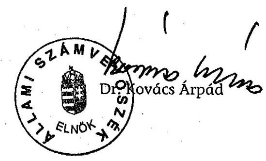

---

# AZ APÁCZAI KÖZALAPÍTVÁNY ESZKÖZEI ÉS FORRÁSAI

|   | Megnevezés | 2001. év | 2002. év | 2003. év | 2004. év  |
| --- | --- | --- | --- | --- | --- |
|  A. | Befektetett eszközök (I+B+III+IV) | 17,0 | 10,5 | 11,4 | 5,4  |
|  I. | Immateriális javak | 3,2 | 1,9 | 2,0 | 1,2  |
|  II. | Tárgyi eszközök | 13,8 | 8,6 | 9,4 | 5,2  |
|   | 1. Ingatlanok |  |  |  |   |
|   | 2. Műszaki és egyéb berendezések, gépek, járművek | 13,8 | 8,6 | 9,4 | 5,2  |
|   | 3. Beruházások, beruházásokra adott előlegek |  |  |  |   |
|  III. | Befektetett pénzügyi eszközök |  |  |  |   |
|   | 1. Résziesedések |  |  |  |   |
|   | 2. Értékpapírok |  |  |  |   |
|   | 3. Adott kölcsönök (1 éven től) |  |  |  |   |
|   | 4. Hosszú lejáratú bankbetétek (1 éven től) |  |  |  |   |
|  IV. | Befektetett eszközök értékhelyesbítése |  |  |  |   |
|  B. | Forgóeszközök (I+B+III+IV) | 1 092,9 | 354,4 | 556,4 | 405,6  |
|  I. | Készletek |  | 1,9 | 1,6 | 1,2  |
|  II. | Követelések | 1,6 | 0,7 | 0,4 | 2,1  |
|   | 1. Követelések áruszállításból és szolgáltatásokból |  | 0,2 |  | 0,1  |
|   | 2. Vállókövetelések |  |  |  |   |
|   | 3. Rövid lejáratú kölcsönök |  |  |  | 1,2  |
|   | 4. Egyéb követelések |  | 0,5 | 0,4 | 0,8  |
|  III. | Értékpapírok | 377,2 | 266,4 | 549,5 | 237,8  |
|   | 1. Eladásra vásárolt kötvények |  |  |  |   |
|   | 2. Saját és eladásra vásárolt részvények, üzletrészek |  |  |  |   |
|   | 3. Egyéb értékpapírok | 377,2 | 266,4 | 549,5 | 237,8  |
|  IV. | Pénzeszközök | 714,0 | 85,4 | 6,0 | 164,6  |
|  C. | Aktív időbeli elhatárolások | 9,1 | 9,6 | 9,5 |   |
|   | Eszközök összesen (A+B+C) | 1 115,9 | 274,6 | 576,3 | 415,0  |
|  D. | Saját tőke (I+B+III) | 44,6 | 63,2 | 75,8 | 88,8  |
|  I. | Induló tőke | 30,0 | 30,0 | 30,0 | 30,0  |
|  II. | Tőkeváltozás | 14,6 | 22,2 | 46,8 | 46,8  |
|   | ebből: tárgyévi eredmény | 4,9 | 7,5 | 24,7 | 12,0  |
|  III. | Értékelési tartalék |  |  |  |   |
|  E. | Céltartalék |  |  |  |   |
|  F. | Kötelezettségek (I+II) | 1 005,4 | 311,6 | 1,7 | 1,1  |
|  I. | Hosszú lejáratú kötelezettségek | 666,0 |  |  |   |
|   | 1. Beruházási és fejlesztési hitelek |  |  |  |   |
|   | 2. Egyéb hosszú lejáratú hitelek |  |  |  |   |
|   | 3. Hosszú lejáratra kapott kölcsönök |  |  |  |   |
|   | 4. Egyéb hosszú lejáratú kötelezettségek | 666,0 |  |  |   |
|  II. | Rövid lejáratú kötelezettségek | 339,4 | 311,6 | 1,7 | 1,1  |
|   | 1. Követelések áruszállításból és szolgáltatásokból |  | 5,7 | 1,5 | 0,9  |
|   | 2. Rövid lejáratú hitelek és kölcsönök |  |  |  |   |
|   | 3. Köztartozások (adó, járulék, vám, illeték, stb) |  | 2,3 | 0,1 | 0,4  |
|   | 3/a. Ebből: 60 napon túl lejárt esedékességű tartozás |  |  |  |   |
|   | 4. Egyéb rövid lejáratú kötelezettségek |  | 303,6 | 0,1 | 0,1  |
|  G. | Passzív időbeli elhatárolások | 65,9 | 10,7 | 497,7 | 326,1  |
|   | Források összesen (D+E+F+G) | 1 115,9 | 374,6 | 576,2 | 415,0  |

**Átalirott az Állami Számvevőszékről szóló 1989. évi XXXVIII. törvény 24. § c) pontja alapján aláírásommal kijelentem, hogy a feltüntetett adatok teljesek és a közalapítvány nyilvántartásával, okmányával mindenben egyeznek.**

Budapest, 2004. november hó 2 nap

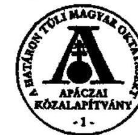

Képviseletre jogosult aláírása

---

### AZ APÁGZAI KÓZALAPÍTVÁNY EREDMÉNYKSMUTATÁSA

|   |  | Értékedatok: mítitő Ft-ban, együzelés ponjosággal |  |  |  |  |   |
| --- | --- | --- | --- | --- | --- | --- | --- |
|   |  |  |  |  |  | 2003. év | 2004. í. félév  |
|  Mégnevezés |  |  |  |  |  |  |   |
|  A. | Összes (közhasznú) tevékenység bevétala (1+2+3+4) |  |  |  |  |  |   |
|   | (Közhasznú) célra, működésre kapott támogatás |  |  |  |  |  |   |
|   | a) alapítótól |  |  |  |  |  |   |
|   | b) államháztartás elrendszeréből |  |  |  |  |  |   |
|   | c) más adományozótól |  |  |  |  |  |   |
|   | 2. | Pályázati úton elnyert támogatás |  |  |  |  |   |
|   | 3. | Céli szerinti (közhasznú) tevékenységből származó bevétel |  |  |  |  |   |
|   | 4. | Egyéb bevétel |  |  |  |  |   |
|  B. | Vállalkozási tevékenység bevétala |  |  |  |  |  |   |
|  C. | Összes bevétel (A+B) |  |  |  |  |  |   |
|  D. | Céli szerinti (közhasznú) tevékenység költségei és ráfordításai (1+2) |  |  |  |  |  |   |
|   | 1. | Céli szerinti tevékenység közvetlen költségei és ráfordításai |  |  |  |  |   |
|   | 2. | Működési költségek (kezelőszerv ktg-él és egyéb közvetelt ktg-ék) |  |  |  |  |   |
|  E. | Vállalkozási tevékenység költségei és ráfordításai |  |  |  |  |  |   |
|  F. | Összes tevékenység költségei és ráfordításai (D+E) |  |  |  |  |  |   |
|  G. | Adózás előtti eredmény |  |  |  |  |  |   |
|  H. | Adófizetési kötelezettség |  |  |  |  |  |   |
|  I. | Tárgyévi eredmény (C-F-H) |  |  |  |  |  |   |

Alulírott az Állami Számvevőszakról szóló 1989. évi XXXVIII. törvény 24. § c) pontja alapján aláírásommal kijelentem, hogy a feltüntetett adatok teljesek és a közalapítvány nyilvántartásával mindenben egyeznek.

Budapest, 2004. november hó 2 nap

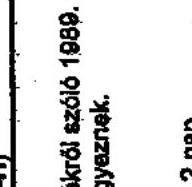

Képviseletre jogosult aláírása

---

### 3. számú melléklet a V-1020/2004. számú jelentéshez

### AZ APÁCZAI KÖZALAPÍTVÁNY BEVÉTELEI ÉS KIADÁSAI

|  Bor
szám | Megnevezés | 2001. | 2002. | 2003. | 2004. I. tékév | Összesen  |
| --- | --- | --- | --- | --- | --- | --- |
|  1. | Támogatás a központi költségvetésből | 100,0 | 100,0 | 99,0 | 20,0 | 330,0  |
|  2. | Támogatás MPA szakképzési alaprészéből | 600,0 | 600,0 | 700,0 |  | 2 600,0  |
|  3. | Támogatás MPA foglalkottatási alaprészéből | 0,0 | 0,0 | 300,0 |  | 200,0  |
|  4. | Egyéb támogatások |  | 0,0 |  |  | 0,0  |
|  5. | Egyéb bevételek | 2,0 | 0,3 | 0,6 | 0,6 | 3,0  |
|  6. | Panságot növelnést bevételni | 63,0 | 36,0 | 13,5 | 7,0 | 122,4  |
|  7. | Bevételnek összesen | 807,8 | 766,8 | 1 914,5 | 52,0 | 2 749,8  |
|  8. | Anyag költségek | 0,0 | 2,0 | 2,0 | 2,2 | 10,0  |
|   | nyomtatvány, inváncog | 1,4 | 0,8 | 1,3 | 0,7 | 4,3  |
|   | gözkövet üzemanyag költség | 0,7 | 1,1 | 1,0 | 0,5 | 3,3  |
|   | egyéb anyag tég | 0,6 | 0,1 | 0,1 | 0,7 | 1,7  |
|   | kis értékű tárgyi eszközök | 0,6 | 0,4 | 0,7 | 0,3 | 1,8  |
|  9. | Ipánybevett szolgáltatások | 24,3 | 29,6 | 25,4 | 10,6 | 80,1  |
|   | bérleti díjak | 1,0 | 2,5 | 3,1 | 1,6 | 9,3  |
|   | közüzemi költség | 0,9 | 1,2 | 1,1 | 0,6 | 5,6  |
|   | barhentartási költség | 0,6 | 1,0 | 1,7 | 0,7 | 6,0  |
|   | felállási költség | 4,0 |  |  |  | 4,0  |
|   | hirdetés, miközműködés | 1,3 | 0,9 | 0,9 | 0,4 | 3,0  |
|   | zosta, telefon | 4,4 | 4,7 | 4,8 | 1,7 | 14,8  |
|   | bet. és külföldi kőzékelés költsége | 0,3 | 0,7 | 1,5 | 0,3 | 2,7  |
|   | rendezvényok költsége |  | 2,4 | 2,9 |  | 5,3  |
|   | közszeklet díj | 2,1 | 2,4 | 2,8 | 1,7 | 9,0  |
|   | könyvvizsgálói díj | 1,0 | 1,1 | 0,9 | 0,6 | 4,2  |
|   | Személyi közszeklet | 1,7 | 1,8 | 1,7 | 1,1 | 6,5  |
|   | előszeklet díjak | 1,1 | 1,8 | 0,8 | 0,4 | 4,2  |
|   | távonásolás | 0,6 | 0,6 | 0,2 | 0,1 | 1,5  |
|   | egyébet szolgáltatás | 0,7 | 0,6 | 1,0 | 0,3 | 5,8  |
|   | szakértői díjak | 1,1 | 2,6 | 2,4 | 1,6 | 7,5  |
|   | egyéb külföldi szolgáltatások költsége | 1,2 | 0,9 | 0,5 | 0,2 | 2,6  |
|  10. | Egyéb szolgáltatások költsége | 2,7 | 2,3 | 1,6 | 0,8 | 7,0  |
|   | benéklétség | 1,4 | 1,3 | 0,5 | 0,1 | 3,3  |
|   | egyéb (bízkoolás, adó, hatósági díj) | 1,3 | 1,0 | 1,1 | 0,5 | 4,2  |
|  11. | Anyagböltségi ráfordítások (7+8+9) | 39,0 | 34,5 | 29,8 | 15,7 | 106,4  |
|  12. | Bérköltség | 22,8 | 23,9 | 20,5 | 12,0 | 90,8  |
|   | alkalmecintsek bérköltsége | 15,0 | 12,5 | 10,9 | 8,4 | 52,8  |
|   | alkalmecintsek próviums, jobkics | 1,7 | 2,6 | 1,4 |  | 5,5  |
|   | megbízási díjak | 4,1 | 5,0 | 4,0 | 2,7 | 15,6  |
|   | biztosítva |  |  |  |  |   |
|   | biztosítva (okszá) | 2,1 | 2,3 | 4,2 | 0,9 | 10,0  |
|  13. | Személyi johnjú egyéb költsédeik | 4,4 | 3,5 | 3,4 | 1,2 | 12,8  |
|   | nem díjak | 0,9 | 0,9 | 1,0 | 0,1 | 5,2  |
|   | felálláság tartása | 0,5 | 0,8 | 0,9 | 0,1 | 1,5  |
|   | gözkövet költségtérítés | 0,4 | 0,1 | 0,3 | 0,1 | 0,9  |
|   | nyilagárga | 0,4 | 0,3 | 0,4 | 0,2 | 1,3  |
|   | felvétel költségtérítés | 0,1 | 0,1 | 0,1 | 0,1 | 0,4  |
|   | felállási hozzáférzés | 0,2 | 0,1 | 0,1 | 0,1 | 0,5  |
|   | felállásvédő hozzáférzés | 1,4 | 0,2 |  |  | 1,0  |
|   | regisztrációk költség | 0,4 | 0,6 | 0,5 | 0,2 | 1,7  |
|   | egyéb | 0,4 | 0,4 | 0,4 | 0,2 | 1,4  |
|  14. | Bérlátotások | 8,0 | 8,0 | 8,0 | 8,0 | 29,0  |
|  15. | Személyi johnjú ráfordítások (11+12+13) | 36,0 | 36,1 | 35,7 | 17,6 | 127,0  |
|  16. | Tárgyi eszköz értékcsökkenése | 0,2 | 1,0 | 4,4 | 2,8 | 20,8  |
|  17. | 50. a sétét tárgyi eszközök értékcsökkenése | 0,0 | 0,0 | 0,2 |  | 1,7  |
|  18. | Egyéb ráfordítás | 0,1 | 0,3 | 1,1 | 0,1 | 1,0  |
|  19. | Köztelegek és ráfordítások (19+14+15+16) | 73,9 | 76,2 | 74,8 | 53,4 | 208,6  |
|  20. | Tárgyi eszköz beszerzésre | 12,7 | 1,6 | 5,5 | 0,6 | 20,4  |
|  21. | A közalapítvány által adott támogatások | 1 002,7 | 769,4 | 722,6 | 120,7 | 2 600,0  |

**Alulírott az Állami Számvesvöszékről szóló 1980. évi XXXVII. törvény 24. § c) pontja alapján aláírásommal kijelentem, hogy a feltüntetett adatok teljeset és a közalapítvány nyilvántartásairal mindenkén egyeznek.**

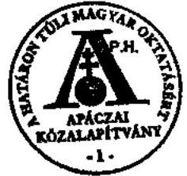

Budapest, 2004. november hó 2 nap

Alulírott az Állami Számvesvöszékről szóló 1980. évi XXXVII. törvény 24. § c) pontja alapján aláírásommal kijelentem, hogy a feltüntetett adatok teljeset és a közalapítvány nyilvántartásairal mindenkén egyeznek.

---

## 4. számú melléklet a V-1020/2004. számú jelentéshez

## AZ APÁCZAI KÖZALAPÍTVÁNY ÁLTAL KIFIZETETT TISZTELETTŐŲAK ÉS KÖLTSÉGTÉRÍTÉSEK

|  Megnevezés | 2001. |  | 2002. |  | 2003. |  | 2004. |  | 2005. |  | 2006. |  | 2007. |  | 2008. |  | 2009. |  | 2010. |  | 2011. |  | 2012. |  | 2013. |  | 2014. |  | 2015. |  | 2016. |  | 2017. |  | 2018. |  | 2019. |  | 2020.  |
| --- | --- | --- | --- | --- | --- | --- | --- | --- | --- | --- | --- | --- | --- | --- | --- | --- | --- | --- | --- | --- | --- | --- | --- | --- | --- | --- | --- | --- | --- | --- | --- | --- | --- | --- |
|   |  |  |  |  |  |  |  |  |  |  |  |  |  |  |  |  |  |  |  |  |  |  |  |  |  |  |  |  |  |  |  |  |  |   |
|  Megnevezés | fő | kifizetett
összeg | fő | kifizetett
összeg | fő | kifizetett
összeg | fő | kifizetett
összeg | fő | kifizetett
összeg | fő | kifizetett
összeg |  |  |  |  |  |  |  |  |  |  |  |  |  |  |  |  |  |  |  |  |  |   |
|  1. Kuratóriumi tagok tiszteletdíja | 13 | 1,1 | 13 | 2,1 | 23 | 2,7 | 15 | 0,5 | 16 | 6,4 |  |  |  |  |  |  |  |  |  |  |  |  |  |  |  |  |  |  |  |  |  |  |  |   |
|  2. Fő tagok tiszteletdíja | 7 | 1,0 | 6 | 1,2 | 6 | 1,1 | 6 | 0,4 | 7 | 3,7 |  |  |  |  |  |  |  |  |  |  |  |  |  |  |  |  |  |  |  |  |  |  |  |   |
|  3. Tanácsadó Testület tagjainak tiszteletdíja |  |  |  |  |  |  |  |  |  |  |  |  |  |  |  |  |  |  |  |  |  |  |  |  |  |  |  |  |  |  |  |  |   |
|  4. Szakértők tiszteletdíja |  |  |  |  |  |  |  |  |  |  |  |  |  |  |  |  |  |  |  |  |  |  |  |  |  |  |  |  |  |  |  |  |   |
|  5. Tiszteletdíjak összesen |  | 2,1 |  | 3,3 |  | 4,2 |  | 0,9 |  | 10,8 |  |  |  |  |  |  |  |  |  |  |  |  |  |  |  |  |  |  |  |  |  |  |  |   |
|  6. Kuratóriumi tagok költségtérítése |  |  |  |  |  |  |  |  |  |  |  |  |  |  |  |  |  |  |  |  |  |  |  |  |  |  |  |  |  |  |  |  |   |
|  7. Külteletési költségek (szállásdíj, útlag, napidíj) | 2 | 0,1 | 2 | 0,3 | 16 | 0,5 | 7 | 0,1 | 27 | 1,0 |  |  |  |  |  |  |  |  |  |  |  |  |  |  |  |  |  |  |  |  |  |  |  |   |
|  8. Személyegépkocsi-gasználat és utazási költség |  |  |  |  |  |  |  |  |  |  |  |  |  |  |  |  |  |  |  |  |  |  |  |  |  |  |  |  |  |  |  |  |   |
|  9. Telefonkültség megtérítése | 1 | 0,1 | 1 | 0,1 | 2 | 0,1 | 1 | 0,1 | 2 | 0,4 |  |  |  |  |  |  |  |  |  |  |  |  |  |  |  |  |  |  |  |  |  |  |  |   |
|  10. Fő tagok költségtérítése |  |  |  |  |  |  |  |  |  |  |  |  |  |  |  |  |  |  |  |  |  |  |  |  |  |  |  |  |  |  |  |  |   |
|  11. Külteletési költségek (szállásdíj, útlag, napidíj) |  |  |  |  |  |  |  |  |  |  |  |  |  |  |  |  |  |  |  |  |  |  |  |  |  |  |  |  |  |  |  |  |  |   |
|  12. Személyegépkocsi-gasználat és utazási költség |  |  |  |  |  |  |  |  |  |  |  |  |  |  |  |  |  |  |  |  |  |  |  |  |  |  |  |  |  |  |  |  |  |   |
|  13. Tanácsadó Testület tagjainak költségtérítése |  |  |  |  |  |  |  |  |  |  |  |  |  |  |  |  |  |  |  |  |  |  |  |  |  |  |  |  |  |  |  |  |  |   |
|  14. Szakértők költségtérítése |  |  |  |  |  |  |  |  |  |  |  |  |  |  |  |  |  |  |  |  |  |  |  |  |  |  |  |  |  |  |  |  |  |   |
|  15. Kültségtérítések összesen (5+6) |  | 0,2 |  | 0,4 |  | 0,7 |  | 0,3 |  | 1,8 |  |  |  |  |  |  |  |  |  |  |  |  |  |  |  |  |  |  |  |  |  |  |  |  |   |

Alulírott az Állami Számvevőszékről szóló 1989. évi XXXVIII. törvény 24. § c) pontja alapján aláírásommal kijelentem, hogy a feltüntetett adatok teljesek és a közalapítvány nyilvántartásával, okmányalva mindenben egyeznek.

Budapest, 2004. november hó 2 nap

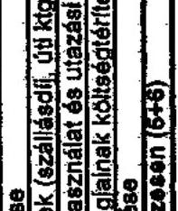

Közszentelu

Közszentelu

Közszentelu

Közszentelu

Közszentelu

Közszentelu

Közszentelu

Közszentelu

Közszentelu

Közszentelu

Közszentelu

Közszentelu

Közszentelu

Közszentelu

Közszentelu

Közszentelu

Közszentelu

Közszentelu

Közszentelu

Közszentelu

Közszentelu

Közszentelu

Közszentelu

Közszentelu

Közszentelu

Közszentelu

Közszentelu

Közszentelu

Közszentelu

Közszentelu

Közszentelu

---

# AZ APÁCZAI KÖZALAPÍTVÁNY TÁMOGATÁSAI 2001. ÉVBEN

|  Pályázati programok | Beérkezett pályázatok száma (db) | Igényelt támogatás | Nyertes pályázatok száma (db) | Megítélt támogatás | Szerződés száma | Összege  |
| --- | --- | --- | --- | --- | --- | --- |
|  Tanári lakások és kollégiumok | 60 | 1 129,6 | 23 | 190,0 | SZTF-KT-12/2000. | 190  |
|  Továbbképzések | 65 | 144,6 | 39 | 41,5 | SZTF-KT-12/2000. | 41,5  |
|  Összönál kiegészítések | 6 | 159,0 | 1 | 150,0 | SZTF-KT-12/2000. | 150  |
|  Felsőoktatási intézmények működésének támogatása I. | 24 | 279,0 | 10 | 42,1 | 12922/2001. | 42,1  |
|  Szörvényben élők oktatási támogatása | 11 | 42,8 | 11 | 39,8 | SZTF-KT-12/2000. | 39,8  |
|  Betakölésési támogatás | 4 | 48,7 | 2 | 42,5 | SZTF-KT-12/2000. | 42,5  |
|  Árvizes iskolák támogatása I. | 17 | 4,3 | 17 | 3,2 | FKA-KT-9/2001. | 3,2  |
|  Művészeti képzés támogatása | 9 | 15,1 | 8 | 13,2 | SZTF-KT-12/2000. | 13,2  |
|  Felvételi előkészítés támogatása | 8 | 12,0 | 7 | 6,4 | FKA-KT-9/2001. | 6,4  |
|  "Magyarul Határok Nélkül" | 5 | 2,3 | 5 | 2,3 | SZTF-KT-12/2000. | 2,3  |
|  * Apáczai Hallgatói Összöndíj | 4 | 293,1 | 4 | 100,0 | SZTF-KT-12/2000. | 100  |
|  Ifjúsági Irodahálózat | 4 | 33,3 | 1 | 15,0 | FKA-KT-9/2001. | 15  |
|  Honismereti könyv elkészítése | 1 | 1,9 | 0 | 0,0 |  |   |
|  Árvizes iskolák II. | 1 | 2,5 | 1 | 2,5 | FKA-KT-9/2001. | 0,8  |
|   |  |  |  |  | Jótékonysági Est | 1,7  |
|  Felsőoktatási intézmények működésének támogatása II. | 3 | 59,8 | 3 | 59,8 | 12922/2001. | 3,9  |
|   |  |  |  |  | 53424/2001. | 55,9  |
|  Diplomahavonítás | 1 | 3,5 | 1 | 3,0 | FKA-KT-9/2001. | 3  |
|  ** Összesen: | 223 | 2 231,5 | 133 | 711,3 |  |   |
|  Ebből: MPA forrásból |  |  |  |  | SZTF-KT-12/2000. | 579,3  |
|   | 195 | 1 889,1 | 120 | 607,7 | FKA-KT-9/2001. | 28,4  |
|  ** OM forrásból |  |  |  |  | 12922/2001. | 46,0  |
|   | 27 | 338,8 | 13 | 101,9 | 53424/2001. | 55,9  |
|  ** egyéb forrásból |  |  |  |  | Jótékonysági Est teljes bevétele | 1,7  |
|   | 2 | 3,6 | 1 | 1,7 |  |   |

Alulírott az Állami Számvevőszékről szóló 1989. évi XXXVIII. törvény 24. § c) pontja alapján aláírásommal kijelentem, hogy a feltüntett adatok teljesek és a közalapítvány nyilvántrásával, okmányolva mindenben egyeznek.

- Az Apáczai Hallgatói Összöndíj esetében az igényelt támogatás kalkulált összeg. Szakoktatás esetében 1 fő maximálisan 30.000,- Ft-ra, felsőoktatás esetében pedig 70.000,- Ft-ra nyújtott be pályázatot. Ennek megfelelően a szakképzés esetében az igényelt összeg 257.180.000,- Ft, a felsőoktatás esetében pedig 35.970.000,- Ft.
- Az "összesen" sorban az árvizes iskolák II. program darabszámát az MPA és a Jótékonysági Est támogatását egyaránt feltüntettük.

Budapest, 2004. november hó 2. nap

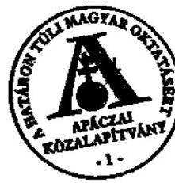

képviselőire jogosult aláírása

---

# 6. számú melléklet a V-1020/2004. számú jelentéshez

## AZ APÁCZAI KÖZALAPÍTVÁNY TÁMOGATÁSAI 2002. ÉVBEN

Értékadatok: millió Ft-ban, egytizedes pontossággal

|  Pályázati programok | Beérkezett pályázatok száma (db) | Igényelt támogatás | Nyertes pályázatok számolási | Megítélt támogatás | Szerződés száma | Összege  |
| --- | --- | --- | --- | --- | --- | --- |
|  Ingatlan beruházások | 95 | 1 627,2 | 27 | 200,0 | SZTF-KT-12/2000. | 55,0  |
|   |  |  |  |  | FKA-KT-12/2001. | 145,0  |
|  Továbbképzések | 59 | 148,8 | 40 | 33,0 | SZTF-KT-12/2000. | 3,4  |
|   |  |  |  |  | FKA-KT-12/2001. | 29,6  |
|  Adatbázis fejlesztés | 6 | 28,7 | 1 | 15,0 | FKA-KT-12/2001. | 15  |
|  * Magyarul Határok Néfkül | 4 | 2,3 | 2 | 3,0 | FKA-KT-12/2001. | 3  |
|  Diplomahonnolás | 2 | 6,8 | 2 | 5,0 | FKA-KT-12/2001. | 5  |
|  Művészeti képzés támogatása | 10 | 37,4 | 9 | 17,3 | FKA-KT-12/2001. | 17,3  |
|  Magyarul Határok Néfkül | 32 | 27,0 | 25 | 11,5 | FKA-KT-12/2001. | 11,5  |
|  Honismereti program | 5 | 3,9 | 5 | 3,0 | FKA-KT-12/2001. | 3  |
|  Középfokú intézmények eszközfejlesztése | 25 | 74,7 | 18 | 53,0 | FKA-KT-12/2001. | 53  |
|  Felsőfokú intézmények eszközfejlesztése | 14 | 62,6 | 13 | 39,2 | FKA-KT-12/2001. | 39,2  |
|  Szórványban élők oktatási támogatása I. | 16 | 53,6 | 14 | 48,6 | FKA-KT-12/2001. | 48,6  |
|  Ösztönclíj kiegészítések | 1 | 100,0 | 1 | 100,0 | 12922/2001. | 25,2  |
|   |  |  |  |  | SZTF-KT-12/2000. | 34,8  |
|   |  |  |  |  | 11989/2002. | ** 40,0  |
|  Ifjúsági Irodahálózat | 3 | 29,3 | 1 | 15,0 | FKA-KT-9/2001. | 9,7  |
|   |  |  |  |  | FKA-KT-12/2001. | 5,3  |
|  Szórványban élők oktatási támogatása II. | 2 | 6,0 | 2 | 5,8 | FKA-KT-12/2001. | 5,8  |
|  Tehetséggondozás | 2 | 20,0 | 2 | 20,0 | FKA-KT-12/2001. | 20  |
|  Iskolatáska | 3 | 38,3 | 3 | 38,1 | FKA-KT-12/2001. | 38,1  |
|  Szórványúvodák támogatása | 4 | 10,2 | 4 | 9,0 | 12922/2001. | 8,7  |
|   |  |  |  |  | 9,0 1% | 0,3  |
|  Intézmények fejlesztése | 33 | 213,1 | 25 | 117,1 | FKA-KT-12/2001. | 117,1  |
|  Szakképzési Intézmények számítástechnikai eszközfejlesztése | 32 | 150,9 | 19 | 53,0 | FKA-KT-12/2001. | 28,1  |
|   |  |  |  |  | FKA-KT-12/2001. kamata | 24,9  |
|  Összesen: | 348 | 2 640,8 | 213 | 786,6 |  |   |
|  Ebből: *** MPA forrásból | 332 | 2 540,3 | 201 | 687,4 | SZTF-KT-12/2000. | 93,2  |
|   |  |  |  |  | FKA-KT-12/2001. | 594,2  |
|  *** OM forrásból | 4 | 75,3 | 4 | 74,0 | 12922/2001. | 34,0  |
|   |  |  |  |  | 11989/2002. | 40,0  |
|  *** egyéb forrásból | 13 | 25,2 | 9 | 25,2 | SZJA 1% | 0,3  |
|   |  |  |  |  | FKA-KT-12/2001. kamata | 24,9  |

Alulírott az Állami Számverőszékről szóló 1989. évi XXXVIII. törvény 24. § c) pontja alapján aláírásommal kijelentem, hogy a feltüntett adatok teljesek és a közalapítvány nyilvántrásoival, akmányaival mindenben egyeznek.

- A Magyaruk Határok Néfkül pályázati program esetében az igényelt támogatás azért alacsonyabb, mint a megítélt, mert az ausztrál pályázó igénye "1 tanár" volt, s nem nevezett meg konkrét pénzösszeget.

* A Kuratórium az ösztönclíj kiegészítések program megvalósítására a 11989/2002. számú forrásból 40.000.000,- Ft-ot ítélt meg. Ebből a pályázó csak 6.338.090,- Ft-ot használt fel. A maradékot a Kuratórium elvonta.

*** Az ösztönclíj kiegészítés és a szórványúvodák programba tartozó pályázatoknak több forrása van, azonban nem lehet megnevezni egy konkrét pályázatot, amely csak egy forrásból finanszírozható. Ezért tűnik úgy, mintha több pályázat lenne darabszám tekintetében, mint az "összesen" sorban feltüntetett pályázatok száma. Fénzügyi tekintetben azonban a források világosan elválaszthatók, a részösszegek összeadása után az "összesen" sorban szereplő számot kapjuk.

Budapest, 2004. november hó 2. nap

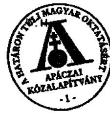

Képviseletre jogosult pólrása

---

# AZ APÁCZAI KÖZALAPÍTVÁNY TÁMOGATÁSAI 2003. ÉVBEN 

Értékadatok: millió Ft-ban, egytizedes pontossággal

| Pályázati programok | Beérkezett pályázatok száma (db) | Igényelt támogatás | Nyertes pályázatok száma(db) | Megitélt   támogatás | Szerződés száma | Összege |
| :--: | :--: | :--: | :--: | :--: | :--: | :--: |
| Ingatlanberuházások támogatása I. | 81 | 1257,7 | 20 | 265,8 | FKA-KT-12/2001.   FKA-KT-5/2003. | $\begin{gathered} 10,0 \\ 255,8 \end{gathered}$ |
| Továbbképzések I. | 56 | 110,9 | 21 | 29,4 | FKA-KT-5/2003. | 29,4 |
| Magyarul Határok Nélkül I. | 8 | 3,6 | 4 | 2,2 | OM10316/2003. | 2,2 |
| Szórványvidékek számtechnikai eszközfejlesztése | 17 | 67,6 | 17 | 46,9 | $\begin{aligned} & 11989 / 2002 . \text { - } \\ & 20681 / 2002 . \end{aligned}$ | $\begin{gathered} 6,9 \\ 40 \end{gathered}$ |
| Bentlakásos intézmények támogatása | 20 | 17,3 | 18 | 14,7 | 11989/2002. - * | 14,7 |
| Ovodák fejlesztése | 4 | 12,0 | 4 | 12,0 | 11989/2002. - * | 12 |
| Ingatlanberuházások támogatása II. | 53 | 782,2 | 15 | 140,1 | FKA-KT-5/2003. | 140,1 |
| Továbbképzések II. | 49 | 101,7 | 19 | 35,6 | FKA-KT-5/2003. | 35,6 |
| Szakképzési Intézmények eszközfejlesztése | 59 | 141,2 | 42 | 94,5 | FKA-KT-5/2003. | 94,5 |
| Ingatlan beruházások támogatása III. | 24 | 291,8 | 8 | 98,3 | FKA-KT-5/2003. | 98,3 |
| Magyarul Határok Nélkül II. | 1 | 2,1 | 1 | 2,1 | OM10316/2003. | 2,1 |
| Összesen: | 372 | 2788,1 | 169 | 741,6 |  |  |
| Ebből: MPA forrásból | 322 | 2685,5 | 125 | 663,7 | FKA-KT-12/2001.   FKA-KT-5/2003. | $\begin{gathered} 10,0 \\ 653,7 \end{gathered}$ |
| OM forrásból | 50 | 102,6 | 44 | 77,9 | $\begin{aligned} & \text { OM10316/2003. } \\ & 11989 / 2002 . \\ & 20681 / 2002 . \end{aligned}$ | $\begin{gathered} 4,3 \\ 33,6 \\ 40,0 \end{gathered}$ |
| egyéb forrásból | 0 | 0,0 | 0 | 0,0 |  | 0 |

Alulírott az Állami Számvevőszékzöl szóló 1989. évi XXXVIII. törvény 24. § c) pontja alapján aláírásammal kijelentem, hogy a feltüntett adatok teljesek és a közalapítvány nyilvántrásolval, akmányaival mindenben egyeznek.

* A Kuratórium a 2002-ben, az ösztöndíj kiegészitések program keretében fel nem használt, elvont támogatásból finanszírozta a programokat.

Budapest, 2004.november hó 2. nap
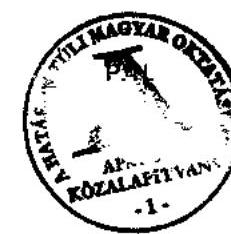
képviseletre jogosult aláírása

---

# AZ APÁCZAI KÖZALAPÍTVÁNY TÁMOGATÁSAI 2004. ELSŐ FÉLÉVBEN 

|  |   |   |   |   |   |   |
| --- | --- | --- | --- | --- | --- | --- |
|  Pályázati programok | Beérkezett pályázatok száma (db) | Igényelt támogatás | Nyertes pályázatok száma(db) | Megitélt   támogatás | Szerzádés száma | Öszzege  |
|  Gazdálkodók továbbképzése | 39 | 62,2 | 20 | 20,6 | FCK-1/2003. | 20,6  |
|  Vállalkozások munkavállalóinak továbbképzése | 13 | 16,8 | 6 | 5,3 | FCK-1/2003. | 5,3  |
|  Értelmiségiek továbbképzése | 107 | 197,8 | 60 | 72,2 | FCK-1/2003. | 72,2  |
|  Munkavállók munkábaállásának elósegítése | 37 | 63,6 | 24 | 24,1 | FCK-1/2003. | 24,1  |
|  Feinóttképzés eszközparkja | 81 | 183,9 | 44 | 95,6 | FCK-1/2003. | 95,6  |
|  Feinóttképzés a médiában | 6 | 57,2 | 1 | 6,5 | FCK-1/2003. | 6,5  |
|  Feinóttképzési rendszerhez kapcsolódó kutatások | 15 | 38,0 | 7 | 13,2 | FCK-1/2003. | 13,2  |
|  Szakmai tanulmányutak és konferenciák | 29 | 14,0 | 15 | 5,0 | FKA-KT-5/2003. | 5  |
|  Összesen: | 327 | 633,5 | 177 | 242,5 |  |   |
|  Ebből: MPA forrásból | 327 | 633,5 | 177 | 242,5 | FCK-1/2003. | 237,5  |
|  OM forrásból | 0 | 0,0 | 0 | 0,0 |  | 0  |
|  egyéb forrásból | 0 | 0,0 | 0 | 0,0 |  | 0  |

Alulírott az Állami Számvevőszékről szóló 1989. évi XXXVIII. törvény 24. § o) pontja alapján aláírásammal kijelentem, hogy a feltüntett adatok teljesek és a kázalapítvány nyilvánttásaival, okmányaival mindenben egyeznek.

Budapest, 2004. november hő 2. nap
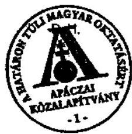
képviseletre jogosult aláirása

---

9. számú melléklet a V-1020/2004. számú jelentéshez

# AZ APÁCZAI KÖZALAPÍTVÁNY ÁLTAL TÁMOGATOTT FELADATOK

Értékadatok: millió Ft-ban, együzelés pontossággal

|  Támogatott feladat | 2001. |  | 2002. |  | 2003. |  | 2004. |  | 2005. |  | Összesen  |
| --- | --- | --- | --- | --- | --- | --- | --- | --- | --- | --- | --- |
|   | db | összeg | db | összeg | db | összeg | db | összeg | db | összeg |   |
|  1. Anyanyelvű oktatás fejlesztése és erősítése | 39 | 97,4 | 52 | 243,6 | 22 | 26,7 |  |  | 113 | 367,7 |   |
|  2. Tudományos kutatómunka |  |  | 1 | 15,0 |  |  | 7 | 13,2 | 8 | 28,2 |   |
|  3. Anyanyelv ápolása és kulturális rendezvények | 5 | 2,3 | 32 | 17,5 | 5 | 4,3 |  |  | 42 | 24,1 |   |
|  4. Határon túli magyar nyelvű szakképzés fejlesztése | 8 | 13,2 | 40 | 109,5 | 42 | 94,5 | 44 | 95,6 | 134 | 312,8 |   |
|  5. Távoktatás kifejlesztése a szakképzésben, informatikai és információs rendszerek fejlesztése |  |  | 19 | 53,0 | 17 | 46,9 |  |  | 36 | 99,9 |   |
|  6. A határon túli magyar nyelvű szakképzési és felsőoktatási intézményrendszer bővítése | 37 | 306,9 | 28 | 215,0 | 43 | 504,2 |  |  | 108 | 1026,1 |   |
|  7. Magyar nyelvű felsőoktatásban és szakképzésben résztvevő oktatók, szakoktatók továbbképzése, támogatása | 39 | 41,5 | 40 | 33,0 | 40 | 65,0 | 126 | 133,7 | 245 | 273,2 |   |
|  8. Ösztöndíjak | 5 | 250,0 | 1 | 100,0 |  |  |  |  | 6 | 350,0 |   |
|  9. Szakképzési és felsőoktatási tananyagok, oktatási segédanyagok, kutatási eredmények kiadása |  |  |  |  |  |  |  |  |  |  |   |
|  10. Összes támogatás | 133 | 711,3 | 213 | 786,6 | 169 | 741,6 | 177 | 242,5 | 692 | 2482,0 |   |

Alulírott az Állami Számvevőszékről szóló 1989. évi XXXVIII. törvény 24. § c) pontja alapján aláírásommal kijelentem, hogy a feltüntett adatok teljesek és a közalapítvány nyilvántartásaival, okmányaival mindenben egyeznek.

Megjegyzés:

2001-ben a támogatott pályázatok számát úgy adtak meg, hogy az Apáczai Hallgatói Ösztöndíj lebonyolítóival (Romániában, Szlovákiaában, Jugoszlóviában és Ukrajnában 1-1 szervezet) számoltunk. (Az ösztöndíjban részesültek száma Romániában 821 fő, Szlovákiaában 306 fő, Jugoszlóviában 289 fő, Ukrajnában 177 fő, Horvátországban 4 fő, Szlovéniában 8 fő.)

Budapest, 2004. november hó 2. nap

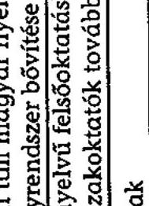

képviseletre jogosult aláírása

---

APÁCZAI KÖZALAPÍTVÁNY
Iroda: V., Budapest, Báthory u. 10.
Tel.: (36-1) 302-5303, 354-0714 Fax: (36-1) 302-6382
Honlap cím: www.apalap.hu E-posta: apalap@apalap.hu

# Kovács Árpád 

## Elnök úr részére

Állami Számvevőszék

Tisztelt Elnök Úr!
10. számú melléklet a V-1020/2004. számú jelentéshez ikt.sz.: 935/05. 03.17.
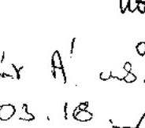

Megkaptam 2005. március 7 -én kelt levelét, mellyel megküldte az Állami Számvevőszék jelentését, az Apáczai Közalapítvány gazdálkodásának ellenőrzéséről.

Mellékelten megküldöm azt az intézkedési tervet, melyet mai napon a kuratórium jóváhagyott. Egyúttal a Jelentéshez - fenntartva és kiegészítve a 2005. február 14-én Dr. Lóránt Zoltánnak írott levelemben jelzett álláspontomat -, a felügyelő bizottság és a kuratórium egyetértésével az alábbi megjegyzést füzöm:

A Jelentés szerint az ellenőrzött időszakban 13 program nem felelt meg a 2004. január 1-jéig hatályos Szht. szerinti szakképzési és fejlesztési céloknak.

A kuratórium álláspontia szerint a Jelentésben foglalt fenti törvénvességi kifogás inkoherens és ellentmondásos indokokon alapul. A kuratórium álláspontja a következő:

1) Az ÁSZ olyan jogi szabályozás végrehajtását kéri számon az ellenőrzött időszakra, amelynek korabeli hiányát a Jelentés több helyen elismeri. A Jelentés szerint (41.o.) megállapítható, ,,a határon túli magyar szakképzés jogszabályi meghatározásának hiánya, mivel a szakképzési hozzájárulást szabályozó törvények nem határozták meg a határon túli magyarok szakképzése és felsőoktatási támogatásában a támogatható feladatok és a támogatásban részesíthetők körét." A határon túli intézményrendszerre adekvát jogi szabályozás hiánya a Jelentés szerint csupán „hozzájárult" (41.o.) a törvényességi problémákhoz. A kuratórium álláspontja szerint azonban az adekvát jogi szabályozás hiánya joglogikailag kizárja az ún. törvényességi problémákat.
A Jelentés alaptalanul vitatja a támogatási programok törvényességét, amikor javaslataiban utólag szólítja fel a szakminisztert ,,szabályozza a határon túli magyarok szakképzésének és felsőoktatásának támogatását és ennek keretében határozza meg a MPA képzési alaprészéből támogatható feladatokat" (17.o.).
A jogalkotó felelősségét az ellenőrzött időszak adekvát jogi szabályozásának hiányosságait a Közalapítványon számon kérni nem lehet.
2.) Az ellenőrzött időszakban hatályos Szht. (2001. évi LI. törvény) tárgyi, szervezet és személyi hatálya (1. § (1) bekezdés) a magyarországi intézményrendszerre terjedt ki. A Jelentés a Közalapítványon kéri számon a Szht. érvényesítését a Magyarországon kívüli képzési intézményrendszerre. A Jelentésben számon kért gyakorlat azonban az ellenőrzött időszakban ellentétes lett volna a Szht. hatályát rögzítő rendelkezésekkel. A Szht. a

---

Közalapítvány támogatási döntéseinél mint hézagpótló analogia juris volt használható. Ennek esetleges elmaradása nem értelmezhető törvényességi problémaként.
3.) A bírált támogatási programok céljainak törvényességét az Államháztartási törvény felelősségi rendszere szerint lehet számon kérni. A bírált támogatási programokról az MPA szakképzési alaprésze felett - az Áht. szerint - rendelkezni jogosult szervek döntöttek. A döntés szerinti támogató és a Közalapítvány (mint támogatott) közötti polgári jogi szerződések rögzítették a vitatott támogatási programokat. A Jelentés megállapítja, hogy a szerződésekben meghatározott egyes támogatási programok közvetlenül nem kötődtek a szakképzéshez. A szerződések törvényességi problémáinak a Közalapítvány tőrvénytelen pénzfelhasználásaként történő értelmezése nem felel meg az Államháztartási törvény felelősségi rendszerének.

A MPA szakképzési alaprésze felett rendelkezni iogosult szervek és a döntéselökészítésre kompetens szervek felelősségét a támogatott Közalapítványon számon kérni nem lehet. A Közalapítványon az MPA forrást biztosító szerződésnek megfelelő pénzfelhasználás kérhető számon, a pénzfelhasználás szerződésszerüségét a Jelentés elismeri. Ez a logika felelne meg a 2003. 0321. számú ÁSZ Jelentésnek is, amely a Közalapítványnál 1998-2001 között tapasztalt azonos problémákról arra következtetett, hogy a törvénysértő gyakorlat alapvetően a szakminisztériumi döntés-előkészités és a döntéshozatal folyamatára volt visszavezethető (Lásd Jelentés 3. lábjegyzet).

Tisztelt Elnök Úr!
Az általam leírtak vonatkozásában további szakértői egyeztetést javasolok illetve amennyiben arra már nem lenne lehetőség - kérem, hogy azt, mint a közalapítvány felügyelő bizottsága és kuratóriuma által jóváhagyott állásfoglalást csatolják a Jelentéshez.

Üdvözlettel:
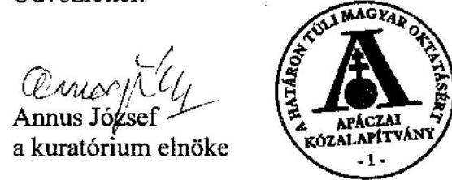

Budapest, 2005. március 17.

Melléklet: Intézkedési terv

---

# Állami Számvevőszék 

## Annus József úr

kuratóriumi elnök

## Határon Túli Magyar Oktatásért Apáczai Közalapítvány

## Budapest

Pf. 806.
1244

## Tisztelt Elnök Úr!

A Határon Túli Magyar Oktatásért Apáczai Közalapítvány gazdálkodásának ellenőrzéséről készült jelentéshez az Állami Számvevőszékről szóló 1989. évi XXXVIII. tv. III. fejezet 25. § (1) bekezdésének megfelelően tett észrevételét megkaptam.

Sajnálattal tapasztaltam, hogy a jelentéstervezet korábbi egyeztetései során a határon túli szakképzés támogatására vonatkozóan felvetett észrevételére a vezető munkatársaim által írásban adott, tényszerű indokolások nem késztették álláspontja felülvizsgálatára.

Jelentésünkben azt kifogásoltuk, hogy a 2000. és a 2001. években az OMAI az MPA szakképzési alaprész pénzeszközei felhasználására a közalapítvánnyal olyan szerződéseket kötött, amelyekben a támogatható programok egy része közvetlenül nem kötődött a szakképzéshez, ennek eredményeképpen az ellenőr- . zött időszakban az odaítélt támogatások $58 \%$-a nem kapcsolódott közvetlenül a szakképzési hozzájárulásról és a képzési rendszer fejlesztésének támogatásáról szóló 2001. évi LI. törvény (Szht.) szerint támogatható szakképzési és fejlesztési célokhoz.

A támogatások elnyeréséhez a közalapítvány által benyújtott pályázatok alapján a támogatás odaítéléséről az OSZT (FKT) javaslatai alapján az oktatási miniszter döntött, amelynek alapján az OMAI a támogatási szerződéseket megkötötte, azokban rögzítette a támogatható programok körét. Mint azt a jelentés is tartalmazza, a kuratórium a pályázati felhívásokat az OMAI-val megkötött szerződésekben rögzített programoknak megfelelően írta ki, és nyújtotta a támogatásait.

Jelentésünkben alapvetően nem a támogatás szerződéstől eltérő felhasználását kifogásoltuk, hanem azt, hogy a szerződésben meghatározott támogatható programok egy része nem felelt meg az Szht. szerint támogatható céloknak, amelyet Elnök úr sem vitatott észrevételében. Továbbra is fenntartjuk, hogy a jelentésben kifogásolt programok nem feleltek meg az Szht. szerinti szakképzési és fejlesztési céloknak, azok a szakképzéshez közvetlenül nem kötődő programok, mint pél-

---

dául kollégiumok és tanári lakások beruházási támogatása, közoktatási támogatás, ösztöndíj kiegészítés, irodahálózat müködtetés, kutatások támogatása, egyéb, nem szakképzési programok támogatása voltak.

Megállapításunk alapján az MPA képzési alaprészéből biztosított támogatások esetében az Szht. előírásainak betartása érdekében javasoltuk az oktatási miniszternek az alaprészbő́l támogatható feladatok és támogatásban részesíthetők körének meghatározását a határon túli magyarok szakképzését és felsőoktatását illetően, az Oktatási Minisztérium az egyeztetések során erre vonatkozóan nem tett észrevételt.

Tájékoztatom, hogy a nyilvánosságra hozott jelentéshez - az ÁSZ tv. III. fejezet 25. § (1) bekezdésének megfelelően 8 napos határidőn belül - tett észrevétele és jelen levelem másolatát csatolom.

Budapest, 2005. március 22 .
Melléklet: 1 pld. jelentés
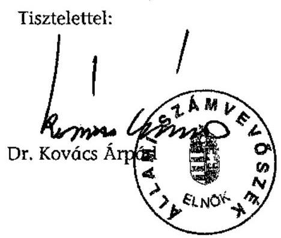

---

# Az MPA szakképzési alaprészéből 2001-2004. I. félévben támogatott programok

|  Sorszám | Pályázati program | Program célja | Támogatottak száma | Támogatás millió Ft  |
| --- | --- | --- | --- | --- |
|  I. | A szakképzési célokkal összhangban lévő programok |  | 268 | 531,8  |
|  1. | Szakmai továbbképzések | A határon túli oktatási intézmények magyar oktatóinak és más szakembereknek magyarországi és Kárpát medencei át-, illetve továbbképzésének támogatása. | 134 | 144,5  |
|  2. | Művészeti szakképzés | A határon túli magyar nyelvű rendszeres művészeti szakképzés támogatása vendégtanár és szakmai gyakorlat formájában. | 17 | 30,5  |
|  3. | Középfokú szakképzési intézmények eszközfejlesztése | A határon túli magyar nyelven szakképzést folytató intézményekben a szakmai gyakorlati képzéshez szükséges tárgyi feltételek javítása. | 18 | 53,0  |
|  4. | Felsőfokú intézmények eszközfejlesztése | A határon túli felsőfokú intézmények magyar nyelven oktató tanszékel, togozatai szakkönyv és eszközfejlesztése. | 13 | 39,2  |
|  5. | Intézményfejlesztés | A határon túli magyar kollégiumok infrastruktúrájának fejlesztése, berendezéseinek korszerűsítése. | 25 | 117,1  |
|  6. | Szakképzési helyek és intézmények eszközfejlesztése | A határon túl magyar nyelven (vagy magyar nyelven is) szakképzést folytató intézmények szakmai képzéséhez szükséges tárgyi feltételek javítása. | 42 | 94,5  |
|  7. | Számítástechnikai eszközfejlesztés | A határon túl magyar nyelven szakképzést folytató szak- és felsőoktatási intézmények szakmai képzéséhez kapcsolódó számítástechnikai feltételek javítása. | 19 | 53,0  |
|  II. | A szakképzési célokhoz közvetlenül nem kapcsolódó programok |  | 131 | 752,7  |
|  1. | Tanári lakások és kollégiumok beruházási támogatása | A határon túli felsőoktatás és szakoktatás személyi és tárgyi feltételeinek megalapozása, ennek érdekében a magasan kvalifikált szaktanárok és a diákok elhelyezését szolgáló ingatlan beruházások támogatása. | 23 | 190,0  |
|  2. | Szülőföldön tanulók hallgatói ösztöndíjazása | Szlovákia, Ukrajna, Románia, Jugoszlávia, Horvátország, Szlovénia területén élő magyar nemzetiségủ jó tanulmányi eredményt elérő diákok 2001/2002-es tanévben 10 hónapon át ösztöndíj támogatásban való részesítése ( 1605 diák részesült Apáczai ösztöndíjban). | 4 | 100,0  |
|  3. | Magyarországon tanuló határon túli fiatalok ösztöndíj kiegészítése | A szomszédos országokban élő magyar közösségek értelmiségi utánpótlásának támogatása (2001-ben 1680 fő, 2002-ben 1038 fő). | 2 | 184,7  |
|  4. | Szórványban élők oktatási támogatása | Egy-egy határon túli régió magyar nyelvű oktatási intézményeinek, kollégiumainak eszközfejlesztése, a pedagógusok továbbképzése, ösztöndíjazása, valamint diáktáborozás és tanulmányi kirándulások költségeinek támogatása. | 27 | 94,2  |
|  5. | Beiskolázási támogatás | Románia, Jugoszlávia és Ukrajna területén az alapfokú oktatást megkezdő magyar tanítási nyelvű osztályokban az első osztályosok taneszköz támogatása. | 5 | 80,6  |
|  6. | Magyarul Határok Nélkül | A nyugati magyar szórványközösségek anyanyelvi oktatásának támogatása nyelvtanárok kiküldése, nyelvkönyvek és szemléltető eszközök beszerzése. | 32 | 16,8  |

---

|  Sor-   szám | Pályázati program | Program célja | Támoga-   tottak   száma | Támoga-   tás millió   Ft  |
| --- | --- | --- | --- | --- |
|  7. | Ifiúsági irodahálózat   múködtetése | A határon túli tájékoztató irodák múködésének támogatása. | 2 | 30,0  |
|  8. | Felvételi előkészítés   támogatása | A szülöföldön maradó diákok részére helyi, nem magyar   tannyelvű felőoktatásba kerüléshez nyelvi előkészítő   kurzusok támogatása. | 7 | 6,4  |
|  9. | Árvizes iskolák támogatása | Az árvíz sújtotta kárpátaljai alapfokú iskolák taneszköz   ellátásának támogatása. | 18 | 4,0  |
|  10. | Diplomahonosítás | A Magyarországon diplomát szerzett és szülöföldjükre   visszatért magyar fiatalok diplomahonositási költségeinek   átvállalása. | 3 | 8,0  |
|  11. | Adatbázis fejlesztése | A határon túli magyar oktatási és tudományos   intézményrendszer áttekintését lehetővé tevő adatbázis   létrehozásának és múködtetésének támogatása. | 1 | 15,0  |
|  12. | Honismereti program | Honismereti témájú multimédiás alkotások létrehozásának,   valamint történeti honismereti kiállításoknak a támogatása. | 5 | 3,0  |
|  13. | Tehetséggondozás | A határon túli magyar nyelvű felsőoktatási tehetséggondozó   programokhoz múködési költség és ösztöndíj támogatás   nyújtása. | 2 | 20,0  |
|  III. | A szakképzési célokkal összhangban lévő ingatlan beruházási programok |  | 38 | 307,8  |
|  1. | Ingatlan beruházások   támogatása 2002. év | A határon túli magyar szak- és felsőoktatást szolgáló   ingatlanok, kutatóhelyek, könyvtárak, képzési helyek,   többfunkciós épületek megvásárlásának és kialakításának   támogatása. | 13 | 84,9  |
|  2. | Ingatlan beruházások   támogatása 2003. év | A határon túli magyar szak- és felsőoktatást szolgáló   ingatlanok, kutatóhelyek, könyvtárak, képzési helyek,   többfunkciós épületek megvásárlásának és kialakításának   támogatása. | 25 | 222,9  |
|  IV. | A szakképzési célokhoz   közzetlentil nem kapcsolódó ingatlan beruházási   programok |  | 32 | 396,4  |
|  1. | Ingatlan beruházások   támogatása 2002. év | A határon túli magyar oktatás célját szolgáló ingatlanok,   különösen diákok elhelyezésére szolgáló kollégiumok   létesítésének, bővítésének, illetve tanári lakások   megvásárlásának és kialakításának támogatása. | 14 | 115,1  |
|  2. | Ingatlan beruházások   támogatása 2003. év | A határon túli magyar oktatás célját szolgáló ingatlanok,   különösen diákok elhelyezésére szolgáló kollégiumok   létesítésének, bővítésének, illetve tanári lakások   megvásárlásának és kialakításának támogatása. | 18 | 281,3  |