# JELENTÉS 

## a Vám- és Pénzügyőrség múködésének ellenőrzéséről

---

2. Államháztartás Központi Szintjét Ellenőrző Igazgatóság
2.1. Teljesítmény Ellenőrzési Főcsoport
Iktatószám: V-13-70/2004-2005.
Témaszám: 717
Vizsgálat-azonosító szám: V0145
Az ellenőrzést felügyelte:
Bihary Zsigmond
főigazgató
Az ellenőrzés végrehajtásáért felelős:
Kemény Emil
főcsoportfőnök
Az ellenőrzést vezette:
Vörös Mária
osztályvezető főtanácsos
Az ellenőrzést végezték:
Dr. Földvári Gábor Józsa Ferencné Kapronczai Gabriella
számvevő számvevő számvevő tanácsos
Temesváry Miklós Uram Ferenc
számvevő tanácsos
A témához kapcsolódó eddig készített számvevőszéki jelentések:
címe
sorszáma
A Vám- és Pénzügyőrség működésének és gazdálkodásának 284
ellenőrzéséről (1995. október)
A központi költségvetés Vám- és egyes adóbevételei realizálásának 9914
pénzügyi-gazdasági ellenőrzése (1999. június)
A Magyar Köztársaság 2000. évi költségvetése végrehajtásának 0126
ellenőrzése (2001. augusztus)
A Magyar Köztársaság 2001. évi költségvetése végrehajtásának 0232
ellenőrzése (2002. augusztus)
A Magyar Köztársaság 2003. évi költségvetési törvényjavaslata 0241
(2002. november)
A központi költségvetést megillető 2001-2002. évi jövedéki 0357
adóbevételek realizálása hatékonyságának és eredményességének
ellenőrzése (2003. december)
A Magyar Köztársaság 2003. évi költségvetése végrehajtásának 0443
ellenőrzése (2004. augusztus)

---

# TARTALOMJEGYZÉK 

BEVEZETÉS ..... 7
I. ÖSSZEGZŐ MEGÁLLAPÍTÁSOK, KÖVETKEZTETÉSEK, JAVASLATOK ..... 11
II. RÉSZLETES MEGÁLLAPÍTÁSOK ..... 18

1. A VP szervezete ..... 18
1.1. A VP szervezeti struktúrája ..... 18
1.2. A VP feladatainak és szervezeti struktúrájának összhangja ..... 20
2. A VP létszáma ..... 21
3. A VP feladatellátást támogató gazdálkodása ..... 23
3.1. Kiadási előirányzatok tervezése és felhasználása ..... 23
3.2. A pénzügyi teljesítések szabályossága ..... 24
3.3. Eszközgazdálkodás ..... 26
3.3.1. Szerződések ..... 27
3.3.2. Ingatlangazdálkodás ..... 29
3.3.3. Informatikai eszközökkel való gazdálkodás ..... 33
3.3.3.1. Vám-informatikai rendszer ..... 35
3.3.3.2. Jövedéki informatikai rendszer ..... 37
3.3.3.3. Nyomozati informatikai rendszer ..... 38
3.3.3.4. Ügyviteli feladatok ellátását támogató informatikai rendszerek ..... 39
3.3.4. Járművekkel való gazdálkodás ..... 39
3.3.5. Készletekkel és egyéb eszközökkel való gazdálkodás ..... 42
3.4. Nyilvántartások, vagyonvédelem ..... 42
4. A VP működésének és gazdálkodásának ellenőrzése ..... 45
4.1. PM felügyeleti ellenőrzése ..... 45
4.2. A VP folyamatba épített és belső ellenőrzése ..... 47
MELLÉKLETEK
5. sz. melléklet Észrevételek
6. sz. melléklet Tanúsítványok
7. sz. melléklet Győr-Moson-Sopron Megyei Nyomozó Hivatal elhelyezésére szolgáló ingatlan beszerzése
8. sz. melléklet Dologi kiadások csökkentésére bevezetett takarékossági intézkedések és azok hatása a regionális parancsnokságokon és a vámhivataloknál

---

.

---

# RÖVIDÍTÉSEK JEGYZÉKE 

| AFIS | Csaláselleni Információs Rendszer |
| :-- | :-- |
| Áht. | 1992. évi XXXVIII. törvény az államháztartásról |
| ÁNTSz | Állami Népegészségügyi és Tisztiorvosi Szolgálat |
| ÁSZ | Állami Számvevőszék |
| CIS | Váminformációs Rendszer |
| HSzt | 1996. évi XLIII. törvény a fegyveres szervek hivatásos ál- |
|  | lományú tagjainak szolgálati viszonyáról |
| Kbt. | 1995. évi XL. törvény a közbeszerzésről |
| KEHI | Kormányzati Ellenőrzési Hivatal |
| KVI | Kincstári Vagyonkezelő Igazgatóság |
| MÁK | Magyar Államkincstár |
| NYOSZAD | Nyomozati Informatikai Rendszer |
| OLAF | Európai Csalásellenes Hivatal |
| PM | Pénzügyminisztérium |
| SZMSZ | Szervezeti és Múködési Szabályzat |
| Szja | 1995. évi CXVII. törvény a személyi jövedelemadóról |
| Sztv. | 2000. évi C. törvény a számvitelről |
| VP | Vám- és Pénzügyőrség |
| VPI | Vám- és Pénzügyőri Iskola |
| VPOP | Vám- és Pénzügyőrség Országos Parancsnoksága |
| VPPSZK | Vám- és Pénzügyőrség Pénzügyi- és Számviteli Központ |

---

.

---

# ÉRTELMEZŐ SZÓTÁR 

Előirányzat-
felhasználási terv

Felügyeleti szerv

Intézményi beruházás

Központi beruházás

Részjogkörú költségvetési egység

Tartósan üres álláshely

A költségvetési szerv, az előirányzatok várható bevételeinek (támogatás, saját bevétel, átvett pénzeszköz), valamint az időszak elején rendelkezésre álló forrásainak (készpénz és bankszámlaállomány együttes összege) figyelembevételével legalább havi ütemezéssel tartalmazza a teljesíthető kiadásokat (a korábbi időszakról áthúzódó fizetési kötelezettségekkel együtt).
A költségvetési fejezet meghatározott előirányzatainak tervezéséért, végrehajtásáért, a felhasználásról való elszámolásért, felügyeletéért, pénzellátásáért és ellenőrzéséért, illetve mindezek szabályozásáért felelős szerv.
Azok a beruházások és az azokhoz kapcsolódó egyéb felhalmozási kiadások (ideértve az immateriális javakkal kapcsolatos kiadásokat is) amelyek célját a költségvetési szerv vezetője határozza meg, a megvalósítás fedezetére szolgáló előirányzat a költségvetési szerv költségvetésében szerepel.
A központi beruházások előkészítésére és megvalósítására, valamint az azokhoz kapcsolódó egyéb felhalmozási kiadásokra (ideértve az immateriális javakkal kapcsolatos kiadásokat is) szolgáló, a központi költségvetésben a fejezeti kezelésű előirányzatok között Beruházás alcímen megtervezett előirányzat.
Az önállóan gazdálkodó költségvetési szervnek - a felügyeleti szerv által meghatározott - jogi személyiséggel nem rendelkező szervezeti egysége, amely egyes előirányzatok felett rendelkezési jogosultsággal bír.
Ha az engedélyezett költségvetési létszámkeret (álláshely) 4 hónapot meghaladóan betöltetlen.

---

.

---

# JELENTÉS   a Vám- és Pénzügyőrség múködésének ellenőrzéséről 

## BEVEZETÉS

A Vám- és Pénzügyőrség (továbbiakban: VP) alapfeladatait, szervezeti felépítését a vámjogról, a vámeljárásról, valamint a vámigazgatásról szóló 1995. évi C. törvény és a végrehajtását szabályozó 45/1996. (III. 5.) Korm. rendelet határozták meg a vizsgált időszakban. Az EU csatlakozás időpontjától a VP jogállását és feladatait a Vám- és Pénzügyőrségről szóló 2004. évi XIX. törvény és az annak végrehajtásáról szóló 24/2004. (IV. 23.) PM rendelet szabályozza.

A VP az előirányzatok feletti rendelkezési jogosultság szempontjából teljes jogkörú, önállóan gazdálkodó központi költségvetési szerv. A múködéséhez szükséges előirányzatokat a Magyar Köztársaság éves költségvetéséről szóló törvények a Pénzügyminisztérium (továbbiakban: PM) fejezetben önálló címként tartalmazzák, szakmai és gazdálkodási felügyeletét a PM látja el.

A VP a központi költségvetés bevételeinek 2002-ben a 49,6\%-át ( 2164 Mrd Ft), 2003-ban a $48 \%$-át ( 2383 Mrd Ft ) szedte be ${ }^{1}$. Ez 2004-ben 26,3\%-ra (1411,7 Mrd Ft-ra ${ }^{2}$ ) csökkent. Ennek legfőbb oka, hogy az EU csatlakozással az import forgalom jelentős része belföldivé vált, illetve az import utáni általános forgalmi adó (továbbiakban: áfa) beszedésével kapcsolatos feladatokat 2004. május 1-jét követően az APEH látja el.

A VP jóváhagyott múködési költségvetését 2002-ben 28,3 Mrd Ft-ban, 2003-ban 34,9 Mrd Ft-ban, 2004-ben pedig 33,0 Mrd Ft-ban határozták meg, engedélyezett létszáma 2002-re 7810 fő, 2003-ra 7850 fő, 2004 októberében 7043 fő volt. Az ÁSZ 1998-ban végzett utoljára átfogó ellenőrzést a VP-nél.

Hazánk EU csatlakozásával megváltoztak a VP feladatai. A hazai és az EU költségvetés vám- és adóbevételeinek folyamatos biztosítása mellett a VP-nek a feladatváltozással összhangban kellett megvalósítania szervezeti struktúrájának átalakítását, illetve az átszervezéssel egyidőben 808 fő leépítését.

[^0]
[^0]:    ${ }^{1}$ A bevételek alakulásával kapcsolatos megállapításokat az Állami Számvevőszék „A Magyar Köztársaság 2003. évi költségvetése végrehajtásának ellenőrzéséről (2004. augusztus)" készített jelentése tartalmazza. A feltüntetett adatok bruttó összegek, ezt csökkentik a vámés áfa visszatérítések összegei.
    ${ }^{2}$ Előzetes adat

---

Az ellenőrzés célja annak értékelése volt, hogy a VP rendelkezésére álló személyi, tárgyi és pénzügyi feltételek, valamint a szervezet felépítése és múködése összhangban álltak-e a jogszabályokban előírtakkal, különös tekintettel az EU csatlakozás követelményeire; feladatai ellátásában érvényesültek-e a törvényességi, célszerűségi és eredményességi követelmények, továbbá hogyan hasznosultak a korábbi ellenőrzések során tett ÁSZ javaslatok. Ennek során értékeltük, hogy a VP:

- szabályszerűen és az EU csatlakozás követelményeinek figyelembevételével hajtotta-e végre a szervezeti struktúra átalakítását, valamint a humán erőforrás átcsoportosítását, továbbá az átszervezést követően biztosított-e a szakmai feladatok eredményes végrehajtása;
- a pénzügyi, eszköz- és humán erőforrás elosztása, illetve felhasználása során figyelembe vette-e a feladat- és szervezeti változásokat, valamint hogyan érvényesítette a célszerűség, gazdaságosság és költségtakarékosság elveit;
- működése és gazdálkodása során betartotta-e a jogszabályok és a belső szabályzatok előírásait, illetve gazdálkodása során a pénzügyi-számviteli fegyelmet;
- a folyamatba épített és belső ellenőrzéseivel feltárta-e az esetleges hibákat és hiányosságokat, továbbá tett-e intézkedéseket azok megszüntetésére.

A VP múködése és gazdálkodása értékelésének alapját képező tanúsítványokat a 2. sz. melléklet tartalmazza.

A VP feladatellátásához kapcsolódóan vizsgáltuk az EU csatlakozásra való felkészülését és a szervezet-átalakítás folyamatát, továbbá a gazdálkodását abból a szempontból, hogy az mennyiben segíti a megváltozott szakmai (vámigazgatási, jövedéki, nyomozati) feladatok eredményes ellátását. Ennek keretében a pénzügyi-szabályszerúségi ellenőrzés módszerével vizsgáltuk a VP gazdálkodásának és elszámolási rendjének szabályozottságát, számviteli és bizonylati rendjét. A teljesítmény-ellenőrzés módszerével értékeltük a VP létszámgazdálkodását és eszközgazdálkodását, ezen belül az ingatlan- és készletgazdálkodást, a gépekkel, berendezésekkel, járművekkel, informatikai és adatátviteli (kommunikációs eszközök kivételével) eszközökkel való gazdálkodását, valamint belső ellenőrzési rendszerét.

Értékeltük, hogy a pénzügyminiszter eleget tett-e fejezeti felügyeleti jogköréből eredő feladatainak, ezen belül azt is, hogy ellenőrizte-e a VP gazdálkodását, illetve hogy vizsgálatai a VP múködésének és gazdálkodásának mely területeire terjedtek ki. Az ÁSZ 1995. évi, a VP múködésére és gazdálkodására irányuló átfogó ellenőrzése számos hiányosságot állapított meg. Az azóta eltelt időszakban a PM és a Kormányzati Ellenőrzési Hivatal (továbbiakban: KEHI) a VP gazdálkodását érintően átfogó ellenőrzést nem, csak az egyes részterületeire kiterjedő célellenőrzést végzett. Vizsgálataik számos szabálytalanságot ${ }^{3}$ tártak fel.

[^0]
[^0]:    ${ }^{3}$ A PM 2002-ben felügyeleti jellegű pénzügyi-gazdasági ellenőrzést végzett a VP-nél, amelynek során 10 pontban foglalta össze a feltárt szabálytalanságokat. A KEHI 2002-ben vizsgál-

---

Ezeket a konkrét eseteket nem vizsgáltuk, ugyanakkor - figyelembe véve, hogy a PM csak részben tett eleget felügyeleti jogköréből eredő ellenőrzési feladatának - indokolttá vált szabályszerűségi ellenőrzésünk kiterjesztése a VP feladatellátása eredményességét meghatározó eszközgazdálkodására. Az ÁSZ 1995. évet követő éves ellenőrzései a VP szakmai feladat ellátására, valamint az általa realizált költségvetési bevételek vizsgálatára irányultak. A PM a vizsgált időszakban nem auditálta a VP éves beszámolóját.

Értékeltük továbbá a korábbi számvevőszéki ellenőrzések megállapításainak, javaslatainak hasznosulását. Az ellenőrzés szempontrendszerét előtanulmánynyal alapoztuk meg.

Az ellenőrzésre az Állami Számvevőszékről szóló 1989. évi XXXVIII. törvény (továbbiakban ÁSZ tv.) 2. § (4) bekezdése alapján került sor. Az ellenőrzés a 2002. január 1 - 2003. december 31. közötti időszakot foglalta magában, figyelemmel kísérve az EU csatlakozás időpontjáig (2004. május 1.), illetve a helyszíni ellenőrzés lezárásáig (2004. III. negyedév) bekövetkezett változásokat.

A helyszíni ellenőrzésbe bevont szervezetek: PM, Vám- és Pénzügyőrség Országos Parancsnoksága (továbbiakban: VPOP), Pénzügyi és Számviteli Központja (továbbiakban VPPSZK), valamennyi regionális parancsnoksága ( 7 db ), Szociális, Kulturális és Sportközpont, Központi Bűnüldözési Parancsnokság, NyugatDunántúli Regionális Nyomozó Hivatal, Dél-Dunántúli Regionális Nyomozó Hivatal, Regionális Jövedéki Központ Eger, Fővámhivatal Kecskemét, Vámhivatal Drávaszabolcs, Eger, Esztergom, Gyöngyös, Komárom, Nyírábrány, Salgótarján, Székesfehérvár, Tompa.

A 2003. évi költségvetés végrehajtásának ellenőrzése keretében a pénzügyi ellenőrzés módszerével vizsgáltuk a vám- és adóbevételek, a VP által nyilvántartott kintlévőségi állomány alakulását, valamint az adó- és vámbeszedés végrehajtásának szabályszerűségét. A jelentés megállapítása szerint az adó-és vámbeszedés végrehajtásának törvényességét - a vámbiztosíték-elszámolás területét kivéve - a beépített kontrollok biztosították. Az általános forgalmi adóból, a fogyasztási és jövedéki adóból befolyt bevételek meghaladták a tervezettet, a vám- és importbefizetések elmaradtak az előirányzattól ${ }^{4}$. A 2005. évi költségvetés véleményezés során értékeltük a vám- és adóbevételi előirányzatok megalapozottságát. A jelentés a bevételek realizálását magas kockázatúnak ítéli ${ }^{5}$.

A helyszíni ellenőrzés során a vizsgálat a VP ingatlangazdálkodása terén jogsértő cselekmények elkövetését tárta fel. Ezek közül egy esetben az ÁSZ Jogi és
ta a VP közbeszerzési gyakorlatát. Az ellenőrzés során a VP ingatlan beszerzéseinél tárt fel törvénysértéseket, ezért bűncselekmény alapos gyanújával feljelentést tett.
${ }^{4}$ Az ellenőrzés részletes megállapításait „A Magyar Köztársaság 2003. évi költségvetése végrehajtásának ellenőrzéséről (2004. augusztus)" készített jelentés tartalmazza.
${ }^{5}$ Az ellenőrzés részletes megállapításait „Vélemény a Magyar Köztársaság 2005. évi költségvetési javaslatáról" című jelentés tartalmazza.

---

Igazgatási Osztálya ismeretlen tettes ellen büntető feljelentést tett. ${ }^{6}$
A jelentést megküldtük észrevételezésre a pénzügyminiszternek. Levelének másolatát az 1. sz. melléklet tartalmazza. Ugyancsak mellékeljük a jelentéstervezet utolsó körös egyeztetésével kapcsolatos, a VP országos parancsnokával történt, levélváltásunk másolatát.
${ }^{6}$ A Fővárosi Ügyészségi Nyomozó Hivatal Nyom. 1516/2004. szám alatt 2005. február 3-án kelt és február 8-án kézbesített határozatával a nyomozást megszüntette. Az Állami Számvevőszék Jogi és Igazgatási Osztálya a határozat ellen panasszal élt a Legfőbb Ügyészségnél.

---

# I. ÖSSZEGZŐ MEGÁLLAPÍTÁSOK, KÖVETKEZTETÉSEK, JAVASLATOK 

A Vám- és Pénzügyőrség múködésének feltételeiben az elmúlt években jelentős változások következtek be. Hazánk EU tagsága új törvényi környezetet jelentett a VP számára. Az Országgyúlés elfogadta a VP jogállására, a vámjogra, vámeljárásokra és vámigazgatásra, valamint a jövedéki adóra és jövedéki termékekre vonatkozó jogszabályokat, amelyek alapján a PM elkészítette a kapcsolódó végrehajtási rendeleteket.

A VP a vizsgált időszakban ellátta a jogszabályokban meghatározott feladatait, biztosította a költségvetés tervezett bevételeinek beszedését. Az EU csatlakozás követelményeinek figyelembevételével hajtotta végre szervezeti struktúrája átalakítását, valamint a humán erőforrás átcsoportosítását, ezáltal biztosította a szakmai feladatok eredményes végrehajtását.

A csatlakozást követően a vámellenőrzések súlypontja a nyugati és az északi határszakaszról a keletire és a délire helyeződött át, az EU belső határain és a belterületen lényegesen csökkentek a vámfeladatok. Ezzel összhangban - megtartva szervezeti szintjeinél a korábbi hármas tagozódást (felső, közép- és alsó fokú szervek) - a VP új szervezeti rendszert alakított ki (fővámhivatalok, regionális jövedéki központok, regionális nyomozó hivatalok), határ- és belterületi vámhivatalokat szüntetett meg, valamint új szervezeti egységeket hozott létre. A VP a megváltozott feladat- és hatáskörök, valamint az átalakított szervezeti struktúra figyelembevételével elkészítette a hatályos Szervezeti és Múködési Szabályzatának (továbbiakban: SZMSZ) módosítását, amelyet 2003. áprilisában benyújtott a PM-nek. A tervezetet a folyamatos egyeztetések ellenére a pénzügyminiszter a helyszíni vizsgálat befejezéséig nem hagyta jóvá. A VP nem szabályozta, hogy a jóváhagyásig az egyes szervezeti egységek hogyan múködjenek. A VP főigazgatói nem rendelkeznek munkaköri leírással, ezek elkészítése a fegyveres szervek hivatásos állományú tagjainak szolgálati viszonyáról szóló törvény (HSzt.) alapján a pénzügyminiszter feladata. Ez a vizsgálat lezárásáig nem történt meg.

A VP az egyes szakterületek létszámváltozását, továbbá a létszám területi megoszlását a jogszabályokban meghatározott feladatok arányváltozásának megfelelően alakította ki. A vámszakmai feladatok csökkenésével közel 24\%-os arányban csökkent a vámigazgatási szakterületen alkalmazottak száma, továbbá határátkelőhelyek megszủnése a határszolgálati feladatokat ellátók 25\%-os létszámcsökkenését eredményezte. A jövedéki szakterületen alkalmazottak közel 3\%-os létszámnövekedését a költségvetés jövedéki adóbevételeit biztosító ellenőrzések fokozásának szükségessége indokolja. A nem hatósági feladatokat ellátók létszáma 16\%-kal csökkent, a VP összlétszámához viszonyított arányuk nem változott.

---

A VP a szervezeti struktúrájának átalakításával egyidőben humán erőforrás átcsoportosítást, ezen belül - kormányhatározat alapján - 808 fős létszámleépítést hajtott végre. A megváltozott feladatok alapján elemzéseket készített a munkafolyamat egyes fázisaira, a végrehajtáshoz szükséges munkamennyiségre (technológiai rend), amely alapján elkészítette a szervezet állománytábláját és ennek alapján meghatározta az egyes szervezeti szintek, valamint az egyes szakterületek humánerőforrás szükségletét. A folyamatos átszervezés miatt a regionális parancsnokságok nem aktualizálták állománytábláikat. Az újonnan kialakított Inter-operabilitási Központot és a Nemzeti Jövedéki Központot amelyek országos hatáskörú feladatokat látnak el - nem a VPOP szintjén hozta létre. Ellentmondás van e két újonnan kialakított szervezeti egység esetében a struktúrában elfoglalt helyük, illetve a feladataik által meghatározott hatás- és felelősségi köreik között.

A VP az átszervezést, beleértve a létszámleépítést összesen 1543 fő távozásával és 304 fő felvételével valósította meg. A munkaerőmozgásnak e mértékét az is indokolta, hogy a szervezetnél az ország más területén volt szükség az átszervezés utáni munkaerőre és ilyen mértékű mobilitást a VP munkatársainak egy része nem vállalt. A létszámleépítés kimutatott költsége 1776,7 M Ft volt. Ebből 1217,7 M Ft a költségvetés céltartalékát, 558,9 M Ft pedig a VP költségvetését terhelte. További, közel 1900 M Ft-os kiadást jelent majd a VP számára az újonnan felvett, illetve az üres álláshelyekre (442 státusz) a jövőben felveendő munkatársak felszerelése és képzése.

A VP-től minden negyedik távozó, illetve minden harmadik elbocsátott (összesen 381 fő) korengedményes nyugdíjba ment, akik a nagy szakmai ismerettel és tapasztalattal rendelkező 40 . év feletti korosztályúak. A felvett munkatársak mintegy 10 hónapos képzést követően válhatnak alkalmassá szakmai feladat végzésére. A szakképzett munkaerőnek ez a minőségi változása magas kockázatot jelent a feladat-végrehajtás eredményessége terén.

A VP szakmai (vám, jövedéki, nyomozati), hatósági feladatainak ellátását az informatikai rendszerei támogatják és azok üzemeltetéséhez szükséges hálózati feltételek rendelkezésre állnak. A VP nem alakította ki az informatikai szakterületet átfogó, aktualizált fejlesztési stratégiáját, nem készített projektvezetési és minőségbiztosítási módszertant. Ez akadályozta az informatikai rendszerek tervezett minőségű, szerződéses költségkereten és határidőn belüli megvalósításának ellenőrzését. A VP nem tudta a fejlesztő cégekkel a szerződésekben meghatározott teljesítési határidőket betartatni.

Az EU csatlakozást megelőzően a VP a jogszabályoknak megfelelően aktualizálta a vám-adatfeldolgozási és információs rendszerét és kialakította az EU-s követelményeknek megfelelő új informatikai rendszerét. Az EU csatlakozástól kezdődően biztosított az EU közösségi bevételek és a magyar költségvetés bevételeinek elkülönítése, továbbá 2004 májusától a vámkezelések során kiszámított áfa összegek tételes listájának APEH részére történő átadása. Az informatikai rendszeren belül jelenleg nincs adatkapcsolat a vámregisztráció és a vámeljárást támogató rendszerek között, így nincs lehetőség a Vámkódexben előírt határidők (pl. átmeneti megőrzésre átvett vámáru vámkezelése) automatikus figyelésére. A vámkezelések számának növelését korlátozza, hogy a váminformatikai rendszer nem alkalmas elektronikus árunyilatkozat-adásra.

---

A jövedéki informatikai rendszer és az EU Bizottsága közötti adatkapcsolatot határidőre és az EU előírásainak megfelelően alakították ki. Nem valósult meg a jövedéki informatikai rendszerben végrehajtott műveletek teljes körű (történelmi) naplózása. Ennek következtében nem követhető nyomon, hogy az egyes adatokon ki és milyen módosítást hajtott végre, illetve ehhez rendelkezett-e a megfelelő jogosultsággal.

A személyi számítógépek műszaki színvonala 2004. végéig korszerűtlen és heterogén volt, a telepített operációs rendszerek nem voltak egységesek. Az egységesség hiánya az üzemeltetési költségek szempontjából előnytelen és informatikai biztonsági szempontból is nagyobb kockázati tényezőt jelent. A számítógéppark egységesítése és korszerűsítése érdekében a VP - a helyszíni vizsgálat befejezését követően - 2004. végén PHARE támogatásból 2000 db munkaállomást és 120 db szervert szerzett be, ezáltal lehetővé válik a hatósági feladatok ellátása során azonos eszközpark és szoftverállomány használata.

A VP, mint önállóan gazdálkodó költségvetési szerv a költségvetési törvényekben meghatározott éves előirányzatait figyelembe véve gazdálkodott, azokat a jogszabályok betartásával módosította. Gazdálkodása során a kiadásait havi ütemezésben teljesítette annak ellenére, hogy 2003-ra nem készített a kormányrendeletben előírt előirányzat-felhasználási ütemtervet.

Az előirányzatok elosztásánál a VPOP elsődleges szempontként vette figyelembe a felső fokú szerv igényeit, ennek alapján határozta meg a saját éves költségvetési keretszámait. A közép- és alsó fokú szervek a VPOP által hozott takarékossági és megszorító intézkedések figyelembevételével gazdálkodtak, pénzügyi és eszközgazdálkodásuk terén szabályszerűen jártak el. A végrehajtói szinten a rendelkezésre álló szűkös erőforrásokat elsősorban a jogszabályokban előírt, kötelezően elvégzendő vám- és jövedéki ellenőrzések végrehajtásához használták fel, a váratlan és célellenőrzések arányának növelésére nem nyílt lehetőség. Mindez jelentősen korlátozta a feladatellátás eredményességének növelését.

A VP kidolgozta a gazdálkodásához kapcsolódó belső szabályzatait. Két területen a szabályzatok (készpénzes kifizetések, reprezentációs kiadások elszámolása) nem felelnek meg a jogszabályoknak, ezenkívül a VP gazdálkodásának egészét érintően a pénzügyi főigazgató részére a költségvetési szerv vezetőjének jogaival azonos jogköröket biztosítanak.

A VP általában betartotta a jogszabályokban, illetve a belső szabályzataiban előírtakat. A vizsgálat során azonban - néhány, a részletes megállapítások között ismertetett esetben - a jogszabályok és a belső szabályzatok megsértését is feltártuk.

Megsértette a közbeszerzésekről szóló törvény (Kbt.) előírásait a Győr-MosonSopron Megyei Nyomozó Hivatal győri épületének megvásárlásakor, mivel egyrészt olyan ajánlatot fogadott el, amely nem felelt meg a pályázati kiírásban megfogalmazott feltételeknek, másrészt a felújítások elvégzését közbeszerzési eljárás megkerülésével az adásvételi szerződés keretében rendelte meg. Az épület beruházásával kapcsolatosan bűncselekmény alapos gyanúja miatt az ÁSZ feljelentést tett.

---

A VP a Kbt. előírásait figyelmen kívül hagyva újított fel és jogszabálysértő módon utalt ki egy budapesti ingatlant. A jogszabályok megsértésével kötött bérleti szerződést, majd ezt követően jogszabálysértő módon - de a PM engedélyével - értékesített egy budapesti lakást. Közbeszerzési eljárás lefolytatása nélkül kötött szerződést a Daewoo és Suzuki típusú gépjármúveinek múszaki kiszolgálására. A leselejtezett gépjármúvek értékesítését megelőző értékbecslés elkészíttetéséhez elmulasztotta a központi költségvetési szervek szabadkézi vétellel történő beszerzéseinek szabályairól szóló kormányrendelet szerinti három árajánlat bekérését, továbbá nem tett eleget e kormányrendeletben előírt referenciák alapján történő tájékozódási kötelezettségének, valamint a belső utasításban meghatározott szakmai és pénzügyi referenciák bekérésének.

Az átvizsgált eszközbeszerzési és informatikai fejlesztésre vonatkozó szerződések közül kilenc nem felel meg a szerződések alaki és tartalmi követelményeinek. A reprezentációs, az egyéb dologi, valamint a reklám és propaganda célú kiadások elszámolásakor a VP a vizsgált esetek 15\%-ában nem tartotta be a belső szabályzataiban foglaltakat, valamint a reprezentációs kiadások bizonylatainak 2002-ben 56,7\%-a, 2003-ban 35,6\%-a tartalmilag és/vagy formailag nem felelt meg a jogszabályoknak, illetve a belső utasításoknak. Esetenként a számvitelről szóló törvény (Sztv.) előírásainak nem megfelelő bizonylatok alapján teljesített a VP készpénzes kifizetéseket.

A VP nem rendelkezik hosszú, vagy középtávú eszköz-, illetve vagyongazdálkodási stratégiával, valamint a kormányrendeletben előírt részletezettségú vagyongazdálkodási tervvel és az előírásoktól eltérően nem készített a gépkocsiállomány korszerúsítésére éves tervet sem. Kidolgozott azonban rövidtávú és éves ingatlan-beruházási, -üzemeltetési és -felújítási koncepciókat. Nem határozta meg az egyes szakfeladatok, illetve a szervezeti szintek feladatainak ellátásához szükséges eszköz-normatívákat.

Normatíva hiányában nem megalapozott a VP gépjármúparkjának mennyiségi és minőségi szempontok szerinti összetételének, valamint elosztásának indokoltsága. A VP nem tudja objektív mutatókkal alátámasztani az optimális, vagy a minimális feladatellátáshoz szükséges gépjármú szükségletét, így nem megalapozott a felügyeleti szerv által a gépkocsik számának csökkentésére 2003. szeptemberében utasításban előírt 10\%-os mérték. A VP az előírt csökkentést mindhárom szervezeti szinttől arányos elvonással teljesítette.

A VP a gazdálkodása során - a szabályszerű múködés mellett - több esetben vagy figyelmen kívül hagyta a szakmai szempontokat, és/vagy nem érvényesítette a célszerűség, gazdaságosság és költségtakarékosság elvét.

A VP nem rendelkezik központi nyilvántartással az eszközgazdálkodásához kapcsolódó szerződéseiről, bár ezt számára jogszabály nem írja elő. A szerződések központi kezelésének hiánya nehezíti a VP érdekérvényesítését és annak központi ellenőrizhetőségét.

Ingatlan adásvételi szerződéseiben magára vállalta az ügyvédi és egyéb költségeket akár eladói, akár vevői pozícióban lépett fel, ezzel indokolatlan kifizetéseket is teljesített. A helyszíni ellenőrzésbe bevont szolgálati helyek negyedénél a felújításokra rendelkezésre álló pénzügyi forrásokat szakmai szempontból

---

nem célszerűen osztották meg a felújításra szoruló ingatlanok között. A fővárosi ingatlanokat a VPOP által megbízott külső cégek üzemeltették, a regionális parancsnokságok ezeket a feladatokat maguk látták el.

Az ügyviteli informatikai fejlesztésekre kötött szerződéseiben a megbízott feladatainak meghatározása nem volt egyértelmú, kellő részletezettségú, illetve pontos. Ezért vagy formális volt a szerződés teljesítésének elfogadása és igazolása, vagy a VP a mulasztás miatt nem kifogásolhatta a szolgáltatás teljesítését, illetve nem állt módjában a szolgáltatás ellenértékének kifizetését megtagadni. Az ügyviteli feladatok ellátását támogató informatikai rendszerek fejlesztéseibe nem vonták be az Informatikai Főosztályt, ezért a VPOP Pénzügyi Főigazgatósága által kötött szerződések a nem kellő informatikai megalapozottságuk miatt korlátozták a szakmai igények maradéktalan érvényesítését.

A VPOP Pénzügyi Főigazgatósága ugyanazon ügyvédi irodával 2001. decemberében - 9 napos különbséggel - két (egy eseti megbízási és egy átalánydíjas) szerződést kötött. A szerződésekben rögzített feladatok megfogalmazása nem egyértelmú, az eseti megbízási szerződésben nem írtak elő teljesítési határidőt. A megfogalmazás szerint a 2002. január 1-től hatályos átalánydíjas szerződés alapján az ügyvédi irodának az eseti megbízási szerződésben foglalt feladatokat is el kellett volna látnia.

A VP létszámgazdálkodásával összefüggő nyilvántartásai hiányosak és nem napra készek. A dokumentumokat hiányosan, illetve a kért kimutatásokat többször és mindig eltérő adattartalommal adták át a vizsgálat részére. A pontatlan és késedelmes adatszolgáltatások akadályozták az ellenőrzés végrehajtását.

A központilag beszerzett eszközöket az adott szervezeti egység nyilvántartásába átlagosan több éves késéssel vezetik át, így a leltár szervezeti egység szintjén nem ad pontos képet az eszközállományról, ami vagyonvédelmi szempontból aggályos. Az ingatlanok leltárkimutatása nem felel meg az államháztartás szervezetei beszámolási és könyvvezetési kötelezettségének sajátosságairól szóló kormányrendeletben és a VP Leltározási Szabályzatában foglaltaknak.

A gazdálkodás terén a VP-nél a folyamatba épített, illetve a vezetői ellenőrzés hiányosan múködött. Ezt támasztja alá, hogy a VP nem tárta fel azokat a hibákat és hiányosságokat, amelyeket az ÁSZ ellenőrzése megállapított. A belső ellenőrzés feladataira két szervezeti egységet hoztak létre. A Pénzügyi Főigazgatóság szervezetén belül múködő Pénzügyi Belső Ellenőrzési Osztály a gazdálkodás részterületein, de csak a középfokú szerveknél végzett ellenőrzéseket. Az országos parancsnok irányításával múködő Felügyeleti és Jogorvoslati Önálló Osztály feladata az SzMSz szerint a VP hatósági és egyéb tevékenységével összefüggő ellenőrzése végzése. Ennek következménye, hogy az ellenőrzések nem terjedtek ki a felső fokú szerv gazdálkodására. Az ellenőrzések eredményességének növelése érdekében mindkét szervezeti egységet 2003-ban megszüntették és kormányrendelet alapján 2004. június 1-jétől az országos parancsnok irányítása mellett Ellenőrzési Igazgatóság múködik.

A VP felügyeletét a pénzügyminiszter látja el, a vámszervezettel és vámigazgatással kapcsolatos jogait és kötelezettségeit a VP-ről szóló törvény, valamint

---

kormányrendelet határozza meg. Ennek keretében a PM figyelemmel kísérte a VP által beszedett vám- és adóbevételek alakulását, valamint az EU csatlakozásra történő felkészülését, továbbá a VP bevonásával eleget tett jogalkotási kötelezettségének. Felügyeleti ellenőrzési tevékenysége keretében évente vizsgálta a VP előirányzat-maradványát, mérlegbeszámolója sorainak alátámasztottságát, valamint 2002-ben egy átfogó ellenőrzést végzett néhány regionális parancsnokság gazdálkodásának egyes részterületein. Nem vizsgálta a VP eszközgazdálkodását, ezen belül az ingatlangazdálkodást és informatikai rendszereket annak ellenére, hogy az előbbi területen a KEHI 2002-ben bűncselekmények elkövetésének alapos gyanújával feljelentést tett, az utóbbi területen pedig az ÁSZ éves zárszámadási vizsgálatai ${ }^{7}$ tártak fel hiányosságokat.

A fejezeti előirányzat-maradvány jóváhagyásának hiányában a PM a VP elői-rányzat-maradványát is a kormányrendeletben előírt május 15-i határidőt követően, a vizsgált évek mindegyikében csak december hónapban hagyta jóvá.

A VP tulajdonában lévő feleslegessé vált szolgálati lakások értékesítésével kapcsolatos PM rendelet kedvezményeket biztosít a testületen kívüli tagok részére is az értékesített lakások eladási árának meghatározásakor.

Már az ÁSZ 1995. évi átfogó ellenőrzése is megállapította, hogy a VP eszközgazdálkodása szabályozatlan, koordináltsága nem megfelelő, az eszközök nyilvántartásai hiányosak. Az ezt követő időszakban a PM és a KEHI által végzett ellenőrzések is olyan jogsértéseket, hibákat és hiányosságokat tártak fel a VP gazdálkodása terén, amelyek szükségessé tették ellenőrzésünk kiterjesztését. A vizsgált időszakban a VP elkészítette az eszközgazdálkodással összefüggő szabályzatait, de azokat az országos parancsnokságon nem teljes körűen tartják be, az eszközök nyilvántartásai továbbra is hiányosak. A VP közép- és alsó fokú szervei a belső szabályzatok betartása mellett látják el hatósági feladataikat.

A helyszíni ellenőrzés megállapításainak hasznosítása mellett javasoljuk:

# a pénzügyminiszternek 

1. Adja ki - munkáltatói jogkörében eljárva - a VP főigazgatóinak - a jogszabályokban meghatározott kötelezettségeiket figyelembe vevő - munkaköri leírásait.
2. Módosítsa a 10/2001. (III. 1.) PM rendeletben az értékesítendő lakások eladási árának meghatározását annak érdekében, hogy az megegyezzen a piaci árral.
3. Intézkedjen vizsgálat lefolytatásáról a VP gazdálkodásában feltárt szabálytalanságok és hiányosságok (ugyanazon ügyvédi irodával azonos feladatra kötött két szerződés, formai és tartalmi szempontból nem megfelelő bizonylatok alapján történő kifizetések, alaki és tartalmi követelményeknek nem megfelelő szerződések, a Kbt. és egyéb
[^0]
[^0]:    ${ }^{7}$ „A Magyar Köztársaság 2001. évi költségvetése végrehajtásának ellenőrzése (2002. augusztus)", valamint „A Magyar Köztársaság 2003. évi költségvetése végrehajtásának ellenőrzése 2004. augusztus)"

---

jogszabályok előírásainak megsértése, nyilvántartások hiányosságai) okainak meghatározására és szükség esetén kezdeményezzen személyi felelősségre vonást;
4. Kérje fel a Vám- és Pénzügyőrség országos parancsnokát, hogy
a) alakítsa át a VP szervezeti struktúráját annak érdekében, hogy az újonnan kialakított szervezeti egységek struktúrában elfoglalt helye összhangban legyen a feladataik által meghatározott hatás- és felelősségi köreikkel, valamint a VP informatikai szervezeti besorolása feleljen meg a 1054/2004.(VI. 3.) Korm. határozat 2. pontjában meghatározottnak;
b) tegyen intézkedéseket a váminformatikai rendszer hiányosságainak megszüntetésére, az elektronikus árunyilatkozat-adás lehetőségének a megteremtésére, az eszközök nyilvántartási rendjének a vagyonvédelmi szempontoknak megfelelő kialakítására, valamint egy központosított jövedéki informatikai rendszer kialakítására, figyelembe véve a központi költségvetést megillető 2001-2002. évi jövedéki adóbevételek realizálása hatékonyságának és eredményessége ellenőrzéséről szóló 2003. évi ÁSZ jelentésben megfogalmazott javaslatokat;
c) szabályozza, hogy a hatósági tevékenységen kívüli feladatok informatikai támogatottságának kialakításához minden esetben vonják be az Informatikai Főosztály képviselőjét;
d) készíttessen közép- és hosszú távú stratégiát az eszközgazdálkodás főbb területeire, valamint az informatikai fejlesztésekre, továbbá e fejlesztéseket támogató egységes projektvezetési és minőségbiztosítási módszertant;
e) folyamatosan ellenőrizze a VP belső ellenőrzési rendszerének múködését.
5. Kísérje figyelemmel a VP országos parancsnoka számára megfogalmazott feladatok végrehajtását és erről rendszeresen számoltassa be.

---

# II. RÉSZLETES MEGÁLLAPÍTÁSOK 

## 1. A VP SZERVEZETE

A PM és a VP teljesítette hazánk jogharmonizációból adódó kötelezettségét mind a vám, mind a jövedéki szakterületen. Az Országgyúlés elfogadta a VP jogállására, a vámjogra, vámeljárásokra és vámigazgatásra, valamint a jövedéki adóra és jövedéki termékekre vonatkozó jogszabályokat, amelyek alapján a PM elkészítette a kapcsolódó végrehajtási rendeleteket.

A VP vámszakterületének alaptevékenységét és múködési rendjét az EU-hoz történő csatlakozásáig a vámjogról, a vámeljárásról, valamint a vámigazgatásról szóló 1995. évi C. törvény, a közösségi vámjog részletes végrehajtásáról szóló 2003. évi CXXVI., a Vám- és Pénzügyőrségről szóló 2004. évi XIX. törvény, valamint a vámtarifáról szóló 1995. évi CI. törvény és a hozzájuk kapcsolódó végrehajtási rendeletek szabályozták.

A jövedéki szakterületen az EU-hoz történő csatlakozásig a jogi szabályozást a jövedéki adóról és a jövedéki termékek forgalmazásának különös szabályairól szóló 1997. évi CIII. törvény írta elő. A jogalkotók a törvény preambulumában rögzítették az EU jogharmonizációs kötelezettséget és ennek megfelelően a közösségi jog több előirása már ekkor beépítésre került a jogszabályba. A csatlakozásból fakadó követelményekre tekintettel, az Országgyúlés megalkotta a jövedéki adóról és a jövedéki termékek forgalmazásának különös szabályairól szóló 2003. évi CXXVII. törvényt. A törvény rendelkezéseinek végrehajtásáról több kormány-, valamint miniszteri rendelet gondoskodik.

### 1.1. A VP szervezeti struktúrája

A VP az EU-hoz való csatlakozással összefüggő feladatváltozásaival összhangban új szervezeti struktúrát alakított ki, megtartva korábbi hármas tagozódását (felső-, közép- és alsó fokú szervek). A vámellenőrzések súlypontja nyugatról és északról keletre és délre helyeződött át, az EU belső határain és a belterületen lényegesen csökkentek a vámfeladatok. Az EU-val való együttműködés biztosítására új szervezeti egységeket hoztak létre. A megváltozott feladatok ellátása érdekében az Országgyúlés megalkotta a Vám- és Pénzügyőrségről szóló 2004. évi XIX. törvényt, amely szabályozza a VP jogállását, feladatait, szervezeti felépítését, a hivatásos állományú tagjainak intézkedési és szolgálati fellépési jogait és kötelezettségeit. Az új szervezeti egységek illetékességi és hatáskörét a törvény végrehajtásáról szóló 24/2004. (IV. 23.) PM rendelet határozza meg.

A szervezet átalakítása két szakaszban valósult meg. Először több vámhivatalt is megszüntettek - tekintettel arra, hogy az eddigi határszakaszok „belföldivé" váltak - a megmaradtakat csökkentették, illetve összevonták és megyeszékhelyi vámhivatalokat hoztak létre. Kialakították a hatósági jogkörrel rendelkező regionális, valamint az alsó fokú jövedéki központokat.

---

A VP az átszervezés részeként a vámkezelőhelyek (határvámhivatalok, szolgálati helyek, állandó felügyeletek) számát 300 -ról 122 -re, a vámudvarok számát pedig 126 -ról 56 -ra csökkentette.

A vámudvarok a vámhivatal hivatalos helyének minősülő, a vámigazgatási eljárások lefolytatására alkalmas létesítmények, amelyeket gazdálkodó szervezetek üzemeltetnek, a VP pedig szerződéses megállapodás alapján biztosítja az eljárások lefolytatásához szükséges humán-erőforrást.

A Közép-Magyarországi Regionális Parancsnokság kiemelt szerepet kapott azáltal, hogy a szervezetébe integrálták önálló osztályonként a Nemzeti Jövedéki Központot, valamint az Inter-operabilitási Központot. Felügyeleti jogkört gyakorol a regionális jövedéki központok jövedéki folyószámlákat érintő tevékenysége felett, valamint másodfokon eljár a regionális jövedéki központok elsőfokú határozatai ellen benyújtott jogorvoslatok tekintetében.

A szervezeti átalakításnak ezt a formáját a VP azért választotta, mert eleget kívánt tenni a PM azon elvárásának, hogy csökkenteni kell a középfokú szervek számát.

Létrejött a Jövedéki Kapcsolattartó és Kockázatelemzési Központ, amelynek feladata az EU által meghatározott adatkezelési kötelezettségek teljesítése, az EU tagállamaiban múködő adatkezelési és adattovábbítási, közvetett figyelőztetési rendszer nemzeti integrálása és az Unió adóügyi együttmúködési szabályainak jövedéki adóval kapcsolatos alkalmazása.

A szervezeti átalakítás második szakaszában a VP kialakította a fővámhivatali rendszert. A fővámhivatalok alsó fokú szervként működnek a megyeszékhelyeken és illetékességi területük az adott megyére terjed ki. Ugyanezen elv alapján hozta létre a regionális nyomozó hivatalokat is.
2004. május 1-től a PM-től a VP szervezetébe integrálódott az OLAF (Európai Csalásellenes Hivatal) Koordinációs Iroda, amely az országos parancsnok közvetlen alárendeltségében, de feladatkörében függetlenül múködik, sem hatósági jogkörrel, sem önálló jogi személyiséggel nem rendelkezik.

A VP a Vám- és Pénzügyőrségről szóló 2004. évi XIX. törvény 2. § (4) bekezdésének d) pontja szerint mobil ellenőrzési csoportokat alakított ki, amelyeknek feladata az EU külső és belső határai mentén ún. mélységi ellenőrzések végzése.

Az ellenőrzések jogszabályi felhatalmazását a Közösségi vámkódex és a hazai szabályozás együttesen teremtette meg. Ezek alapján a VP-nek lehetősége van a vámfelügyelet alatt lévő és egyéb árukat a Magyar Köztársaság területén bárhol ellenőrizni. Feladatai közé tartozik például: a kábítószerek és pszichotrop anyagok tiltott forgalmának megakadályozása, ellenőrzések foganatosítása; fegyver, lőszer legális és illegális forgalmának ellenőrzése, felderítése; jövedéki termékek legális és illegális forgalmával kapcsolatos ellenőrzési feladatok végrehajtása; nemzetközi személyforgalom lebonyolításához szükséges okmányok ellenőrzése.

A közösségi vámjog végrehajtásának részletes szabályairól szóló 15/2004 (IV. 5.) PM rendelet a csatlakozás időpontjához képest későn jelent meg, ami hátráltatta a VP EU csatlakozásra való felkészülését és gátolta a gazdálkodókat a vámárunyilatkozatok pontos kitöltésében, ezáltal többletmunkát jelentett szá-

---

mukra. Akadályozta továbbá a VP munkatársait a vámárunyilatkozatok feldolgozásában, ezáltal a vámáru felszabadításában.

A PM közigazgatási államtitkárának 2005. január 14-én kelt levele szerint nem helytálló a megállapításunk. Véleményének alátámasztásaként a részletes vámeljárási szabályokat tartalmazó 10/1996. (III. 25.) PM rendeletet módosító 44/2003. (XII. 29.) PM rendeletre hivatkozott, továbbá arra, hogy kérte a VP-től a közösségi vámjogi rendelkezések szakmailag lektorált és az IM által jóváhagyott magyar szövegének internetes közzétételét.

Az államtitkári levélben hivatkozott 44/2003. (XII. 29.) PM rendelet azonban nem fedi le a közösségi vámjog végrehajtásának rendelkezéseit, az csak a vámszabadterületek EU csatlakozásig fennálló jogviszonyát és az átmeneti intézkedéseket - ugyancsak az EU csatlakozásig - szabályozta. A közösségi vámjogi rendelkezések internetes közzétételét kérő 2004. március 18-i levél alapján a VP a kérésnek csak 2004. április 21-én tett eleget.

# 1.2. A VP feladatainak és szervezeti struktúrájának összhangja 

A VP átalakított szervezeti struktúrája és a helyszíni vizsgálat idején hatályos Szervezeti és Müködési Szabályzatában (továbbiakban: SZMSZ) rögzített feladat-, hatás- és felelősségi körök nincsenek összhangban. A VP hatályos SZMSZ-ét a pénzügyminiszter 2002. szeptember 24én hagyta jóvá. Az EU csatlakozással összefüggésben megváltozott feladatok ellátása érdekében és a jogharmonizációból eredő jogszabályváltozások miatt a VP új szervezeti struktúrát alakított ki, és ennek megfelelően többször módosította a 2003. áprilisában a PM felé benyújtott SZMSZ-ét. A pénzügyminiszter a módosított SZMSZ tervezetét - a folyamatos egyeztetések ellenére - a helyszíni vizsgálat befejezéséig nem hagyta jóvá. A módosított ügyrendek tervezet formájában már elkészültek, de azokat az országos parancsnok csak az új SZMSZ pénzügyminiszteri elfogadását követően hagyhatja jóvá. A VP nem szabályozta, hogy a jóváhagyásig az egyes szervezeti egységek hogyan múködjenek.

## Ellentmondás van az egyes újonnan kialakított szervezeti egységek esetében a struktúrában elfoglalt helyük, illetve a feladataik által meghatározott hatás- és felelősségi köreik között.

A Nemzeti Jövedéki Központ országos hatáskörrel rendelkezik, de egy középfokú szerv, a Közép-Magyarországi Regionális Parancsnokság szervezeti egységeként múködik. Az országos hatáskörú döntésekért a regionális parancsnok felelős.

Az EU csatlakozási követelményeknek megfelelő informatikai fejlesztésre létrehozott Inter-operabilitási Központ ugyancsak országos feladatkörrel rendelkező szervezet, amely szintén egy középfokú szerv (a Közép-Magyarországi Regionális Parancsnokság) szervezeti egységeként múködik, de a szakmai felügyeletét a VPOP Vámigazgatósága látja el. A 24/2004. (IV. 23.) PM rendelet 5. § (2) bekezdése ugyan előírja, hogy a Közép-Magyarországi Regionális Parancsnokság „végzi a vámigazgatási ügyekben az Európai Bizottsággal, valamint a tagállamok vámhatóságainal történő kapcsolattartást", de az SZMSZ hasonló feladatokat fogalmaz a VPOP Integrációs Hivatala részére is.

---

A VP informatikai szervezetének az újonnan kialakított szervezeti struktúrában elfoglalt helye továbbra sem felel meg a 1066/1999. (VI. 11.) Korm. határozat 2. pontjában meghatározottaknak (2004-től 1054/2004. (VI. 3.) Korm. határozat). A VP Informatikai Főosztályának felügyeletét - országos parancsnoki utasítás alapján - a Nemzetközi, Koordinációs és Kommunikációs Főosztály vezetője látja el. Az SZMSZ ezt a felügyeletet ugyanakkor a bevételi főigazgató hatáskörébe utalja. Az Informatikai Főosztály szervezeti besorolásával nem biztosított az informatikai fejlesztési feladatok VP-n belüli - a hivatkozott kormányhatározatnak megfelelő - kiemelt kezelése.

A kormányhatározat értelmében: „a fejezeti jogkörü, illetve más központi közigazgatási szerveknél a szerv kormányzati informatikai stratégiájának kidolgozásával, aktualizálásával, annak éves lebontásával és végrehajtásának felügyeletével a vezető közvetlen alárendeltségébe tartozó informatikai vezetőt kell megbizni, és biztosítani kell ezen feladatok ellátásához szükséges erőforrásokat".

A vizsgált időszakban hatályos SZMSZ szerint a beruházások megvalósítása központi szinten a Beruházási és Elhelyezési Hivatal, egyébként pedig az illetékes középfokú szervek feladata volt. A feladatnak ilyen megosztása célszerútlen, mivel a középfokú szervek nem rendelkeznek a beruházások lebonyolításához szükséges szakmai ismeretekkel, tapasztalatokkal. A VP Pénzügyi Főigazgatóságán belül a Közbeszerzési Osztály 2002. évi létrehozásával sem oldotta fel ezt az ellentmondást, mivel az osztály feladata a VP központi beszerzéseinek a lebonyolítása.

A Győr-Moson-Sopron Megyei Nyomozó Hivatal épületének megvásárlásáért VPOP utasítás alapján nem a Beruházási és Elhelyezési Hivatal, hanem a Központi Bűnüldözési Parancsnokság volt a felelős. Építészeti-műszaki, építés kivitelezési ismeretek hiányában az eljárás során szabálytalanságokat követtek el. Ennek részletes leírását a 3. sz. melléklet tartalmazza.

# 2. A VP LÉTSZÁMA 

Az EU-hoz történő csatlakozási folyamat feladataival összefüggésben a VP folyamatosan átalakította szervezeti struktúráját. A 2003ban elkészített „A VP átszervezése a tagállami múködés tükrében" című koncepciója alapján megkezdett átszervezéssel egyidöben humán erőforrás leépítést, illetve átcsoportosítást valósított meg.

A VP az átszervezést, beleértve a 1106/2003. (X. 31.) Korm. határozatban előírt 808 fő leépítését (megállapított létszám csökkentése) összesen 1543 fó távozásával, 304 fő felvételével valósította meg. Az üres álláshelyek száma a 2002. december 31-i 3 fơről 2004. augusztus 31-re 442 fơre növekedett. A VP betöltött létszáma a 2003. január 1-jei 7842 fôről 2004. augusztus 31-re 6603 fôre csökkent.

A létszámváltozásnak ezt a mértékét indokolja, hogy az átszervezés szervezeti egységek (belterületi és határvámhivatalok) megszüntetésével, illetve újak kialakításával járt együtt. Az új státuszokat a megerősített határszakaszokon és az újonnan kialakított szerveknél hozták létre. A létszámcsökkenésnek ez a

---

mértéke - bár indokolt - azzal járt együtt, hogy az átszervezéssel érintett középés alsó fokú szerveknél a szakmai feladatellátást csak a jogszabályban és a belső szabályzatokban előírt minimális szinten hajtották végre (kötelező ellenőrzések), ezzel együtt megnövekedett a vezénylések száma és átlagos ideje.

A vezénylések száma a 2002. évi 191 fơről 2004 júliusáig (félév) 247 főre emelkedett, átlagos ideje ugyanezen időszakban 1,8-2 hónapról 3,1 hónapra nőtt.

Az egyes szakterületeken a létszámváltozás összhangban van a jogszabályokban meghatározott feladatok arányváltozásaival. A megváltozott feladatok alapján elemzéseket készített a munkafolyamat egyes fázisaira, a végrehajtáshoz szükséges munkamennyiségre (technológiai rend), amely alapján elkészítette a szervezet állománytábláját és ennek alapján meghatározta az egyes szervezeti szintek, valamint az egyes szakterületek humánerőforrás szükségletét. A folyamatos árszervezés miatt a regionális parancsnokságok a helyszíni ellenőrzés lezárásáig nem aktualizálták állománytábláikat.

A vámszakmai feladatok csökkenésével közel 24\%-os arányban csökkent a vámigazgatási szakterületen alkalmazottak száma, továbbá határátkelőhelyek megszűnése a határszolgálati feladatokat ellátók $25 \%$-os létszámcsökkenését eredményezte.

A jövedéki szakterületen alkalmazottak közel 3\%-os létszámnövekedését a költségvetés jövedéki adóbevételeit biztosító ellenőrzések fokozásának szükségessége indokolja. A 30 fős létszámnövekedést a vámszakmai területről történő átcsoportosítással, valamint új munkatársak felvételével valósították meg.

A nem hatósági, valamint a funkcionális feladatokat ellátók létszáma 16\%-kal csökkent, a VP összlétszámához viszonyított arányuk nem változott, továbbra is megközelíti a $26 \%$-ot.

Az átszervezés során két országos hatáskörű szervet is (Inter-Operabilitási Központ, Nemzeti Jövedéki Központ) középfokú szerv vezetőjének irányítása alá soroltak be (lásd. 1.2 fejezet) éppen a kormányhatározatban a VPOP részére előírt létszámkorlát figyelembevétele miatt. Amennyiben a VP ezeket a szerveket indokoltan - a VPOP szintjére emelné, az ott alkalmazott létszám növelné a VPOP meglévő létszámát.

# A VP átszervezéssel és leépítéssel összefüggő létszámcsökkentésének 

költsége összesen 1776,7 M Ft-ot tett ki. Ebből a kormányhatározatban előírt 808 fő leépítésének költsége összesen 1562,6 M Ft volt, amelyből 1217,7 M Ft a céltartalékot, 344,9 M Ft a VP költségvetését terheli. A további 735 fő távozására a VP 214,1 M Ft-ot fordított.

Magas kockázatot jelent a feladat-végrehajtás eredményessége terén, hogy egyrészt a létszámleépítés során a VP-től minden negyedik távozó, illetve minden harmadik elbocsátott korengedményes nyugdíjba (összesen 381 fő) ment, ezek 70\%-a a nagy szakmai ismerettel és tapasztalattal rendelkező 41-50. év közötti korosztályú. Másrészt az átszervezés során újonnan felvett, illetve az üres álláshelyekre a jövőben felveendő munkatársak a mintegy 10 hónapos képzési időszakot követően válhatnak alkalmassá szakmai feladatellátásra. Ennek következtében - elsősorban az alsó fokú szerveknél - nőtt a távolléti idő és a vezénylések száma is.

---

Az átszervezéssel összefüggésben felmerült mintegy 1776,7 M Ft kiadást tehát tovább növeli az újonnan felvett, illetve az üres álláshelyekre a jövőben felveendő munkatársak (összesen 746 fő) felszerelésének és mintegy 10 hónapos képzésének költsége. Ez 2,5 M Ft/fő átlagos költségigényt figyelembe véve 1865 M Ft-tal terheli a VP költségvetését.

# 3. A VP feladATELLÁTÁST TÁMOGATÓ GAZDÁlKODÁSA 

A VP, mint önállóan gazdálkodó költségvetési szerv a költségvetési törvényekben meghatározott éves előirányzatait figyelembe véve gazdálkodott, azokat a jogszabályok betartásával módosította.

A VPOP a pénzügyi kötelezettségvállalásai során egyrészt országos hatáskörben jár el, másrészt irányítja és felügyeli a középfokú szervek pénzügyi gazdálkodását. Mind a hatályos SZMSZ, mind a módosított SZMSZ tervezete szerint a VP rendelkezésére álló pénzügyi és eszközforrások elosztásáról és felhasználásáról a döntés a pénzügyi főigazgató hatáskörébe tartozik. Az előirányzatok elosztásánál a VPOP elsődleges szempontként vette figyelembe a felső fokú szerv igényeit, ennek alapján határozta meg a saját éves költségvetési keretszámait. Ugyanakkor takarékossági és megszorító intézkedésekkel késztette a közép- és alsó fokú szerveket a rendelkezésükre álló források célszerű és gazdaságos felhasználására. A végrehajtói szinten a rendelkezésre álló szűkös erőforrásokat elsősorban a jogszabályokban előírt vám- és jövedéki ellenőrzések véghajtásához használták fel, a váratlan és célellenőrzések arányának növelésére nem nyílt lehetőség. Mindez korlátozta a feladatellátás eredményességének növelését.

A helyszíni ellenőrzésbe bevont egyik, tipikusnak tekinthető regionális parancsnokság által hozott takarékossági intézkedések és azok vámhivatalokra gyakorolt hatásának ismertetését a 4. sz. melléklet tartalmazza.

### 3.1. Kiadási előirányzatok tervezése és felhasználása

A VP 2003-ban nem készített a 306/2002. (XII. 27.) Korm. rendelet 2. §-ában előírt előirányzat felhasználási ütemtervet.

A felügyeleti, illetve intézményi hatáskörben végrehajtott előirány-zat-módosításokat a vizsgált időszakban a jogszabályoknak megfelelően hajtotta végre. Az előirányzat-maradványt a jogszabályi előírásoknak megfelelően állapította meg.

2002-ben a 33,9 Mrd Ft-os eredeti előirányzatot 48,8 Mrd Ft-ra, 2003-ban pedig 36 Mrd Ft-ról 46,6 Mrd Ft-ra módosították. Az előirányzat-módosítások 2002-ben $49 \%$-a felügyeleti, $41 \%$-a kormányzati és $10 \%$-a intézményi, 2003-ben pedig $63 \%$-a felügyeleti, $7 \%$-a kormányzati és $30 \%$-a intézményi hatáskörben valósultak meg.

A PM a vizsgált évek egyikében sem tett eleget az előirányzatmaradvány felhasználhatóságára vonatkozóan a 217/1998. (XII. 30.) Korm. rendelet 66. § (1) bek. és (2) bek. b) pontjában foglaltaknak. A fejezeti előirányzat-maradványok jóváhagyásának hiányában a

---

PM a VP előirányzat-maradványát is a vizsgált évek mindegyikében a május 15-i határidő helyett csak december hónapban hagyta jóvá. A késedelmes jóváhagyás negatívan befolyásolta a VP, ezen belül is elsősorban a regionális parancsnokságok szabad pénzeszközeinek célszerű és gazdaságos felhasználását.

A VP az átvett pénzeszközöket a szerződésekben foglaltak szerint használta fel, az elszámolások dokumentumokkal alátámasztottak.

2002-ben az összes átvett pénzeszköz 3086 M Ft. (Ebből a felhalmozási célú pénzeszközátvétel 96\% 2962 M Ft, a működési célú pénzeszközátvétel 4\% 124 M Ft) 2003-ban az átvett pénzeszközök összesen 3372 M Ft-ban realizálódtak. (A felhalmozási célú pénzeszköz átvételek aránya $98 \% 3315 \mathrm{M}$ Ft, a müködési célú átvételeké $2 \% 57 \mathrm{MFt}$.)

2002-ben a VP intézményi beruházásainak 5906 M Ft-os módosított előirányzatából 3919 M Ft-ot (66\%), a 2003. évi 1835 M Ft előirányzatából 1293 M Ft-ot (70\%) használt fel. A 2002. évi kiemelt összegű előirányzatot a VP elsősorban az EU csatlakozással összefüggő beruházásainak, fejlesztéseinek megvalósításához használta fel (új határátkelőhelyek megnyitása, meglévők felújítása, informatikai és egyéb fejlesztések, stb.).

Az intézményi ingatlan beruházások értéke 2002-ben 1006 M Ft, 2003-ban 211 M Ft, a központi ingatlan beruházások értéke 2002-ben 4628 M Ft, 2003-ban 3986 M Ft volt. A központi beruházások mintegy 90\%-át a PHARE támogatással megvalósult beruházások jelentették.

A gépek, berendezések módosított beruházási előirányzata 2002-ben 1641 M Ft, 2003-ban 788 M Ft volt, amelyből 2002-ben 1089 M Ft-ot, 2003-ben 519 M Ft-ot fordított a VP beszerzésekre. A VP a fel nem használt keretéből dologi kiadásokat fedezett.

A járműbeszerzésre tervezett 2002. évi 581 M Ft, a 2003. évi 204 M Ft előirányzatából 2002-ben 437 M Ft-ot (75\%), 2003-ban pedig 171 M Ft-ot (84\%) használta fel.

A VP az informatikai fejlesztéseire 2002-ben jóváhagyott 3013 M Ft-ból 2597,6 M Ft-ot (86\%), 2003-ban pedig a jóváhagyott 4049 M Ft-ból 1954,9 M Ftot (48\%) használt fel. A 2003. évi felhasználási mértéket az indokolja, hogy az EU vámkezelési előírások informatikai támogatottságának megteremtésére megkötött szerződés teljesítése a fejlesztési feladatok összetettsége és időigénye miatt részben 2004-re áthúzódott. A PM 2003-ban engedélyezte a fennmaradó keret átcsoportosítását 2004. évre.

A készletbeszerzésekre 2002-ben jóváhagyott 4129 M Ft előirányzatból 3866 M Ftot (94\%), 2003-ban a jóváhagyott 3647 M Ft-ból 3250 M Ft-ot (89\%) használtak fel.

# 3.2. A pénzügyi teljesítések szabályossága 

A VP gazdálkodásával összefüggésben elkészítette belső szabályzatait, amelyek két területet kivéve (készpénzben történő szállítói számlák kiegyenlítése, reprezentációs ajándéktárgyak átvétele) részletesen szabályozzák mind az eszközgazdálkodás végrehajtásának módját, mind a pénzügyi elszámolások rendjét.

---

# A VPOP a pénzügyi teljesítései során nem teljes körűen tartotta be a jogszabályokban, illetve a belső szabályzataiban foglaltakat. Az ellenőrzésbe bevont középfokú szervek - a vizsgálat számára bekért dokumentumok és a helyszíni ellenőrzés alapján - a jogszabályoknak megfelelő gyakorlatot alakították ki. 

A VPOP - a 217/1998. (XII. 30.) Korm. rendeletben előírtakkal ellentétben - a belső szabályzatában nem határozta meg a szállítói számlák, valamint a vásárlási előlegek készpénzes kiegyenlítésének felső határát, ennek következtében rendszeresen 500 E Ft feletti kifizetéseket is teljesített.

Pl. Egy vállalkozás részére a vizsgált években összes 54 db készpénzes kifizetést teljesítettek 13,9 M Ft összegben. A vásárlási előlegek esetében pl. a 2002/R10000780/000 sz. bizonylaton 300 E Ft , a 2002/R10-000774/000 sz. bizonylaton 400 E Ft, a 2003/R10-000674/000 sz. bizonylaton 900 E Ft előleget fizettek ki.

A helyszíni vizsgálat lezárását követően a VP a 146/2004. sz. VPOP utasítással módosította a pénzkezelési szabályzatát. A készpénz kifizetések összeghatárát 100 E Ft-ban határozta meg.

## A VPOP az Sztv. előírásainak formai és tartalmi szempontból nem megfelelő bizonylatok alapján is teljesített készpénzes kifizetéseket.

Ezek a szabálytalanságok a VPOP-én a munkafolyamatba épített és a vezetői ellenőrzés hiányosságaira utalnak. A középfokú és alsó fokú szerveknél ilyen szabálytalanságokat a vizsgálat nem tárt fel.

Vizsgálatunk mindhárom szervezeti szinten a bizonylatok 10\%-ára terjedt ki. A VPOP-én ezek $15 \%$-ánál a számlán nem volt kitöltve a teljesítés időpontja, a számla kelte, a fizetés határideje.

A reprezentációs, az egyéb dologi, valamint a reklám és propaganda célú kiadások (2002-ben 60,1 M Ft, 2003-ban 44,8 M Ft 2004. június 30-ig 18,5 M Ft) elszámolása a vizsgált esetek 15\%-ában nem felelt meg a VP szabályzataiban foglaltaknak, mivel könyvelésük nem a meghatározott költséghelyre történt.

Pl. A 2003. évi vámbál kiadásainak egy részét egyéb dologi kiadásként, egy másik részét reprezentációs költségként, míg egy további részét reklám és propagandacélú kiadásként könyvelte le.

A reprezentációs kiadások bizonylatainak 2002-ben (37,1 M Ft) 56,7\%-a, 2003ban ( 24 M Ft ) $35,6 \%-a$, 2004. I. félévében ( $7,8 \mathrm{MFt}$ ) $22,6 \%$-a tartalmilag és/vagy formailag nem felelt meg a törvényi előírásoknak és a belső utasításoknak. A bizonylatokon rendszeresen - különösen a 2002. évben - nem szerepel a felhasználás célja, emiatt nem állapítható meg, hogy azok milyen szakmai tevékenységhez kapcsolódtak. A VP olyan vásárlásokat is elszámolt reprezentáció címén, amit a személyi jövedelemadóról szóló 1995. évi CXVII. (Szja) törvény 69. §-a, az APEH 2003/128. sz iránymutatása, valamint a VP belső utasítása nem tesznek lehetővé. A reprezentációs ajándéktárgyak átadás-átvétele szabályozott, azonban a vizsgált esetek 74,2\%-ában a felhasználás hiányosan, illetve a belső szabályzatoknak nem megfelelően dokumentált.

Mintavételezéssel valamennyi évre a bizonylatok 15\%-át vizsgáltuk meg. Nem dokumentált a belső szabályzat szerint a felhasználás célja: pl. 25 db töltőtoll-

---

golyóstoll 761 E Ft értékben, 153 E Ft értékű Zsolnay porcelán ajándéktárgyak, különféle alkoholtermékek, valamint 160 E Ft értékben 20 db színházjegy beszerzése.

A VP a lakásbérleti szerződésekben a havonta fizetendő összeget a lakbér és a különszolgáltatások (pl. szemétszállítás, közös költség) díjának együttes összegében határozta meg. Az így befizetett szolgáltatási díjakat a VP számlarendje előírásaival ellentétesen a VP számvitelileg nem különíti el a lakáshasználatért fizetendő bérleti díjaktól. A különszolgáltatásokból származó bevételt a VP végleges bevételként tartja nyilván.

A VP a szabályzatai (számviteli politika a hozzá kapcsolódó szabályzatokkal) elkészítésekor figyelembe vette a 249/2000. (XII. 24.) Korm. rendeletben elöírtakat, azok azonban nem minden esetben felelnek meg az Áht.-ben és a 217/1998. (XII. 30.) korm. rendelet 18 §. (6) bekezdésében előírtaknak.

Az Áht. 97. § (1) bekezdésében előírtak szerint a VP költségvetési gazdálkodásáért a költségvetési szerv vezetője a felelős. E jogszabály nem teszi lehetővé, hogy az országos parancsnok ezt a felelősségi körét továbbadja a pénzügyi főigazgatónak. Ugyancsak nem teszi lehetővé a törvényi előírás, hogy a VPOP és a középfokú szervek előirányzatait az országos parancsnok helyett a pénzügyi főigazgató hagyja jóvá. Sérti az Áht. 121/A. § (3) bekezdését az a tény, hogy a SZMSZ szerint a belső ellenőrzési egység szintén a pénzügyi főigazgató hatáskörébe tartozik.

A kötelezettségvállalás, utalványozás, ellenjegyzés, valamint az érvényesítés rendjét a 217/1998. (XII. 30.) Korm. rendelet XII. fejezetében leírtak szerint szabályozták. Az önálló és részben önálló gazdálkodási jogkörrel rendelkező középfokú költségvetési egységek, valamint az alsó fokú költségvetési egységek között a feladatokat és jogköröket meghatározták.

# 3.3. Eszközgazdálkodás 

A VP nem rendelkezik hosszú, vagy középtávú eszköz-, illetve vagyongazdálkodási stratégiával, valamint a 217/1998. (XII. 30.) Korm. rendelet 63/A. §-ában előírt részletezettségú vagyongazdálkodási tervvel és nem készített a gépkocsiállomány korszerüsítésére éves tervet sem. Kidolgozott azonban rövidtávú és éves ingatlan-beruházási, -üzemeltetési és -felújítási koncepciókat. Nem határozta meg az egyes szakfeladatok, illetve a szervezeti szintek feladatainak ellátásához szükséges eszköznormatívákat. Vagyongazdálkodási terve a KVI által bekért ún. vagyongazdálkodási programra korlátozódik.

A kormányrendelet szerint a vagyongazdálkodási tervnek tartalmaznia kell többek közt a tárgyi eszközökkel kapcsolatos karbantartási és felújítási, tűz- és biztonságvédelmi tennivalókat és azok várható kiadását, beruházási teendőit, ütemezését, ezek várható kiadásait és azok forrásait, készletgazdálkodási intézkedési tervet, stb.

Az eszközbeszerzések tervezésének rendjét a VP részletesen szabályozta, a szabályozásokban foglalt tervezési előírásokat azonban nem teljes körüen vette figyelembe.

---

A VP a Gazdálkodási Szabályzat mellékleteként kiadott beruházási, felújítási és karbantartási szabályzatában részletesen szabályozta a tervezési dokumentumok tartalmát, az előkészítést megalapozó elemzések szempontjait, az elkészítésért felelős szervezeteket, határidőket. A szabályzat értelmében meghatározott tartalmú, tehát a tárgyi eszközöket is magába foglaló átfogó és éves beruházási, felújítási és karbantartási terveket kell készítenie. A felsorolt dokumentumok közül csak az ingatlanokra vonatkozóan készülnek éves tervezési dokumentumok.

A Pénzügyminisztérium Ellenőrzési Főosztálya már a 2002-ben tartott felügyeleti ellenőrzése során a tervezési dokumentumok hiányát mind országos szinten, mind regionális parancsnokságok szintjén megállapította azzal az értékeléssel, hogy a tervezés hiányosságai, a kialakított központosított finanszírozási rend nem biztosítja az állagmegóvási feladatok ütemezését, időbeni elvégzését (2286/2002. sz. vizsgálat).

# Az eszközbeszerzések végrehajtását a VP részletesen szabályozta, a szabályozásnak azonban nem minden esetben tett eleget. 

A hivatkozott kormányrendelet alapján a VP részletesen szabályozta a kötelezettségvállalás rendjét. A 2003. január 1-jétől hatályos jogszabály-módosításnak megfelelően SZMSZ-ében szabályozta a kötelezettségvállalás célszerűségét megalapozó eljárás tartalmát és az ehhez kapcsolódó dokumentumok tartalmi követelményeit. A 2003. évi eszközbeszerzések esetében a kiválasztott 89 tétel pénzügyi teljesítési dokumentációjának egyike sem tartalmazta a kormányrendeletben előírt célszerűségi elemzéseket, az utalványozás, ellenjegyzés és érvényesítés során azt az arra jogosultak ellenőrizni nem tudták.

A közpénzek felhasználásának átláthatósága, az ellenőrizhetőség megteremtése, a verseny tisztaságának biztosítása érdekében a Kbt. előírásait is figyelembe véve a 103/2002. (XII. 20.) sz. VPOP utasításban (korábban 167/2000. (XI. 23.) sz. VPOP utasításban) részletesen szabályozta a beszerzések rendjét. A vonatkozó szabályozást az EU csatlakozással összefüggésben megváltozott jogszabályoknak megfelelően, 2004. szeptember hónapban a 130/2004. (IX. 6.) sz. VPOP utasítás módosította.

Mintavételezéssel 25 közbeszerzési eljárást választottunk ki és vizsgáltunk meg. Ebből 4 esetben tártunk fel szabálytalanságot, 21 eljárás dokumentáltságával, illetve az eljárások lefolytatásának szabályszerűségével kapcsolatban kifogásunk nem merült fel.

### 3.3.1. Szerződések

A VPOP Pénzügyi Főigazgatósága ugyanazon ügyvédi irodával 2001. decemberében - 9 napos különbséggel - két (egy eseti megbízási és egy átalánydíjas) szerződést kötött. A szerződésekben megfogalmazott feladatok egy része nem különíthető el egyértelműen egymástól. A 2002. január 1-től hatályos átalánydíjas szerződés alapján az ügyvédi irodának az eseti megbízási szerződésben foglalt feladatokat is el kellett volna látnia.

A 2001. december 3-án kötött megbízási szerződés öt ingatlan értékesítésének teljes körű lebonyolítására, a 9 nappal később, 2001. december 12-én ugyanezen

---

ügyvédi irodával kötött átalánydíjas szerződés pedig általános jogi képviselet határozatlan idejű ellátására vonatkozott. Az átalánydíjas szerződés keretében az ügyvédi iroda a VPOP ingatlan beszerzéseinek és értékesítéseinek teljes körű lebonyolítására is megbízást kapott. Az átalánydíjas szerződés megkötésekor nem bontották fel a korábbi eseti szerződést annak ellenére, hogy az átalánydíjas szerződés keretében az ügyvédi irodának 2002-ben az öt ingatlan értékesítését is le kellett volna bonyolítania.

A VP az ingatlan adásvételi szerződéseiben magára vállalta az ügyvédi és egyéb költségeket (pl.: értékbecslés költsége, műszaki szakértői díj), akár eladói, akár vevői pozícióban lép fel, ezzel indokolatlan kifizetéseket is teljesített.

A mintavételként kiválasztott 15 db szerződés közül a VP 5-ben volt eladó, 10-ben pedig vevő, azonban mindegyikben a VP viselte a jogügylettel kapcsolatos költségeket.

Szabályozás hiányában a VPOP és a regionális parancsnokságok többsége az ingatlanokhoz kapcsolódó megbízási szerződések esetében eltérő gyakorlatot alakítottak ki és folytatnak. A VPOP-nál és két regionális parancsnokságnál megbízási díj ellenében ügyvédi iroda, 5 regionális parancsnokságon pedig a VP jogtanácsosai ellenjegyzik a szerződéseket.

A vizsgált időszakot megelőzően a VP a lakásbérleti szerződéseit határozatlan időre kötötte, így a bérlők a szolgálati viszonyuk megszűnése után is jogosultak voltak a szolgálati lakás használatára. A vizsgált időszakban módosították ugyan a lakásbérleti szerződések feltételeit (már határozott időre kötötték és állagmegőrzési kötelezettséget is előírtak a bérlő számára), de a szabályozás nem terjedt ki arra, hogy a szolgálati viszony megszűnésével együtt jár-e a lakásbérleti szerződés felmondása.

A VPOP egy volt vezetője a VP-től való távozását követően is $186 \mathrm{Ft} / \mathrm{m}^{2}$-es havi bérleti dijért $125 \mathrm{~m}^{2}$-es lakást, havi 4000 Ft-ért garázst bérel Budapesten, az Auróra utcában.

A kiskőrösi jövedéki központ elhelyezése nem megfelelő (épület felújításra szorul, irodák kicsik, az iratok és lefoglalt termékek tárolására nincs megfelelő helyiség), ugyanakkor az épület egy részében korábban kialakított szolgálati lakásban egy nyugállományba vonult pénzügyőr özvegye lakik határozatlan időre kötött szerződés alapján.

A VP nem rendelkezik központi nyilvántartással az eszközgazdálkodásához kapcsolódó szerződéseiről, bár ezt számára jogszabály nem írja elő. A szerződések központi kezelésének hiánya nehezíti a VP érdekérvényesítését és annak központi ellenőrizhetőségét.

Nem tudott a VP a vizsgálat részére átadni 3 db gépjárművekkel kapcsolatos szerződést, így ezekben az esetekben nem tett eleget az Sztv. 169. § (2) bek.-ben elöírtak szerint a szerződések 8 éves megőrzési és visszakereshetőségi kötelezettségének.

A vizsgálat számára nem tudták átadni a szolgálati gépkocsik javítására vonatkozó 2001. március 1-ig, valamint a leselejtezett szolgálati gépkocsik értékesítésé-

---

re kötött 2003. december 1-ig érvényben lévő szerződéseket, továbbá a sejtezéssel összefüggő értékbecslésre a szakértővel kötött szerződést, amely alapján még 2003-ban is teljesítettek kifizetéseket.

A VPOP által megkötött szerződések 9 esetben nem felelnek meg a szerződések alaki és tartalmi követelményeinek. Nem végezték el azokat az ellenőrzéseket sem, amelyekkel ezeket a hiányosságokat kiszűrhették volna.

A VP PR tevékenységének, valamint az ehhez kapcsolódó szolgáltatásoknak ellátására kiírt tárgyalásos közbeszerzési eljárás nyertesével megkötött szerződéseken nincs pontos dátum. A szerződés aláiróinak neve nincs kiírva, a VP részéről olvashatatlan aláírás szerepel.

A VPOP által (egy ügyvédi irodával, egy üzemeltetési feladatokra, egy lakás felújítására, valamint négy informatikai fejlesztésre) kötött szerződéseken nem szerepel olvasható aláírás. Az egyik informatikai szerződés esetében a szerződés kelte későbbi, mint az első részszállítási határidő.

Az ügyviteli informatikai fejlesztésekre kötött szerződéseiben a megbízott feladatainak meghatározása nem volt egyértelmú, kellő részletezettségú, illetve pontos. Ezért vagy formális volt a szerződés teljesítésének elfogadása és igazolása, vagy a VP a mulasztás miatt nem kifogásolhatta a szolgáltatás teljesítését, illetve nem állt módjában a szolgáltatás ellenértékének kifizetését megtagadni.

A pénzügyi rendszer platformváltására kötött szerződések (nettó $10+3,7 \mathrm{M}$ Ft) nem tartalmaztak pontos technikai specifikációt sem a műszaki paraméterek, sem a fejlesztési követelmények tekintetében. A hiányosságok miatt a szállító rosszul mérte fel a rendszer hardver igényét, ezért a VP-nek új hardvereket kellett beszereznie. Nem határozták meg továbbá az átadás-átvétel és az elfogadás rendjét, a szerződések felmondásának feltételeit és körülményeit. Ennek következtében a VP a késedelmes szállítás miatt keletkezett kötbérigényét nem tudta érvényesíteni. Ugyancsak nem tartalmazott pontos feladat-meghatározást a munka-ügyi-nyilvántartási informatikai rendszer kifejlesztésére kötött szerződés $(5,2 \mathrm{M} \mathrm{Ft})$.

# 3.3.2. Ingatlangazdálkodás 

VPOP utasítás alapján a regionális parancsnokságok az EU csatlakozást megelőzően felmérték ingatlanállományukat és javaslatot tettek a 2004. május 1jével feleslegessé váló ingatlanok hasznosítására. A javaslatok alapján azonban nem készült egységes hasznosítási koncepció.

Sem költségvetési érdeket, sem jogszabályt nem sért, de a VP költségvetését célszerútlenül terheli, hogy az EU belső határain feleslegessé vált ingatlanjainak egy részét a VP a vagyonkezelői jog megtartása mellett adta át üzemeltetésre a Határőrségnek. A Határőrségnek át nem adott, jelenleg nem használt határvámhivatalok épületeinek hasznosítási lehetőségeit munkabizottság elemzi.

A VP az EU belső határain lévő határátkelőhelyeken 16 vámhivatalt átadott a Hátőrségnek, 2 vámhivatalt megszüntetett, 4-et pedig tovább üzemeltet. A to-

---

vább üzemeltetett határvámhivatalok hatékonyságának elemzését a VP megkezdte.

A rajkai, 1997-ben felújított átkelőhely felhasználására több javaslatot készített a VP (pl. belterületi szolgálati helyek, logisztikai központ, oktatási-továbbképzési központ, irattárazás, raktározás), de a helyszíni ellenőrzés befejezéséig az ingatlant csak részben hasznosította.

A VP az EU csatlakozást követően létrehozott új szervezeti egységeit (regionális jövedéki központ, mobil ellenőrzési csoport) részben saját kezelésű ingatlanokban, részben bérleményekben helyezte el.

# A VP egy ingatlanbeszerzésnél és egy ingatlan-felújításnál megsértette a Kbt. elöírásait. 

Több pontjában megsértette a Kbt. előírásait a Győr-Moson-Sopron Megyei Nyomozó Hivatal győri épületének megvásárlásakor, mivel egyrészt olyan ajánlatot fogadott el, amely nem felelt meg a pályázati kiírásban megfogalmazott feltételeknek, másrészt a felújítások elvégzését közbeszerzési eljárás kikerülésével az adásvételi szerződés keretében rendelte meg. Az ÁSZ a beruházással kapcsolatosan bűncselekmény alapos gyanújával ismeretlen tettes ellen feljelentést tett.

A megvásárolt győri ingatlant közbeszerzési eljárással választották ki. A nyertes ajánlata azonban a felhívás feltételeinek több ponton nem felelt meg, ezért ennek elfogadása a Kbt. előírásaiba ütközött. A megkötött adásvételi szerződésben a piaci árnál lényegesen magasabb összegű vételár szerepelt, továbbá felújítási munkálatokat is magában foglalt, amely nem képezte a pályázati kiírás részét. Ezzel kikerülték, hogy a szükséges felújítások elvégzésére közbeszerzési eljárás lefolytatását követően kerülhessen sor. Ennek következtében a költségvetést legkevesebb 41,65 M Ft kár érte. (Az eset részletes leírását a 3. sz. melléklet tartalmazza.)

A Kbt. megsértésével újították fel a Budapest, I. ker. Attila u. 14. számú ingatlant, amelynél a közbeszerzési eljárást követően megkötött szerződést többletmunkák megrendelésével módosították és az eredeti szerződésben szereplő 2,7 M Ft összegnél 1,2 M Ft-tal (azaz 42\%-kal) többet, összesen 3,9 M Ft-ot fizettek ki. A többletmunkákra nem írtak ki új közbeszerzési eljárást annak ellenére, hogy a Kbt. 73. §-ának megsértésére a megbízott hivatalvezető felhívta a pénzügyi főigazgató figyelmét, kifogásolva, hogy a felmerült pótigények a „lakhatóságot nem növelték, a célszerúségen túlmutattak".

## A helyszíni ellenőrzésbe bevont szolgálati helyek esetében a felújításokra rendelkezésre álló pénzügyi források elosztásánál nem minden esetben vették figyelembe az ingatlanok használatára felmerült igényeket.

A nyírábrányi szolgálati lakások évek óta használhatatlan állapotban vannak, felújításukat nem végezték el annak ellenére, hogy igény merült fel a határátkelőhely működtetéséhez szükséges személyi állomány elhelyezésére.

Jelentős felújítást hajtottak végre a külső határszakasszal nem rendelkező ÉszakMagyarországi Regionális Parancsnokságon, míg a két külső határszakasszal

---

rendelkező Észak-alföldi Régió központjában a vizsgált időszakban felújítást nem végeztek, 2003-ban a régiónál felújítási célú pénzügyi keret nem is állt rendelkezésre. Nem újították fel a rossz állapotban lévő kiskőrösi jövedéki hivatalt annak ellenére, hogy az országban regisztrált jövedéki adóalanyok közel 50\%-a a hivatal illetékességi területén található. A Dél-Dunántúli Regionális Parancsnokság a vizsgált időszakban 5 épület felújítását tartotta szükségesnek, amit költségvetési fedezet hiányában nem tudott megvalósítani.

A VP az ellenőrzésbe bevont határátkelőhelyeken a jogszabályi előírásoknak megfelelően biztosította a külső szervek működéséhez szükséges feltételeket.

Az újonnan létesített, illetve felújított határátkelőhelyek mindegyikén biztosított az ÁNTSZ, az állat- és növény-egészségügyi szolgálat stb. múködéséhez szükséges elhelyezési lehetőség.

Az ingatlanok üzemeltetésére gazdaságossági szempontok figyelembevételével a fővárosi és a vidéki székhelyű szervezeti egységek eltérő gyakorlatot alakítottak ki. A fơvárosi ingatlanok üzemeltetésére a VPOP külső cégeket alkalmaz, a regionális parancsnokságokon az ingatlanok üzemeltetését saját humán erőforrásból valósítják meg. A helyszíni ellenőrzésbe bevont vidéki ingatlanok esetében az anyagi erőforrások szűkössége miatt az üzemeltetéssel összefüggő problémák nehezítik a szakfeladatok ellátását.

A fővárosi ingatlanok üzemeltetésére a VPOP vállalkozási szerződést kötött a két gazdasági társasággal a 2001. április 1-jétől 2003. december 31-ig terjedő időtartamra. A műszaki üzemeltetés, a gondnoki feladatok és az őrzés-védelem ellátásáért a két Rt.-nek a VPOP havonta összesen 40 M Ft-ot fizetett ki. A fenti szerződések lejárta előtt a VPOP a korábbi szerződésben meghatározott feladatot részfeladatokra bontva több közbeszerzési eljárást indított, amelynek eredményeként a korábbi szerződésekhez viszonyítva 2004-ben 100 M Ft-os megtakarítást ért el.

A miskolci fővámhivatal épületében nem üzemel a lift és a klímaberendezés, a folyosói világítás csak nagyon szükséges esetben használható. Az ÉszakMagyarországi Regionális Parancsnokságon a helyiségeket takarékossági okokból csak az igénybevétel idejéig, legfeljebb $21^{\circ} \mathrm{C}$ fokig fűtik. A kecskeméti fơvámhivatal épületében, gyakoriak a csőtörések, nem üzemel a lift, 2002 telén nem működött a fűtés. A gyöngyösi jövedéki hivatalban a belső szabályzatokban előírtakhoz képest is korlátozták a fűtés mértékét.

A nyírábrányi, felújított határátkelőhelyen a térvilágítást takarékossági okokból nem üzemeltetik, a győri nyomozó hivatal új épületében a szembesítő szobát sötétítő hiányában nem tudják rendeltetésszerűen használni.

A Pápa, Fő tér 29. szám alatti ingatlan feladatellátásra alkalmatlan, kihasználatlanul, üresen áll. Kihasználatlan továbbá Szobon a volt vámhivatal épülete és a hozzá tartozó 3 db lakás, Ócsán a volt vámhivatal épülete, Zalaegerszegen a Kossuth u. 35. sz. alatti irodaház.

A VP Dél-Dunántúli Nyomozó Hivatala és Regionális Jövedéki Központja (Pécs) olyan bérelt ingatlanokban múködik, amelyek nem felelnek meg maradéktalanul a feladatellátás követelményeinek (az ingatlan nem rendelkezik a tanúk, gyanúsítottak kihallgatásához szükséges helyiségekkel illetve egyéb feltételekkel, raktár hiányában a garázsban és az irattárban tárolják a lefoglalt termékeket).

---

A feladatellátást nehezíti és az üzemeltetési költségeket növeli, hogy a VPOP egyes szervezeti egységei a fővárosban egymástól távol levő ingatlanokban helyezkednek el. A helyszíni ellenőrzés ideje alatt a VP lépéseket tett, hogy egy épületben helyezze el a VPOP-t és a budapesti középfokú szerveket, ennek érdekében kincstári hasznosításra ajánlotta fel a jelenlegi fővárosi ingatlanjait. Az elhelyezésről folytatott tárgyalások most is folyamatban vannak.

A VP az ingatlan bérbeadásai, illetve bérbevételei során belső szabályozás hiányában a vizsgált esetekben nem a piaci viszonyoknak megfelelő és a bérlőknek nem egységes bérleti díjat határozott meg.

A VP Budapesten több üres lakásingatlannal rendelkezik, miközben a Vám- és Pénzügyőri Iskola (továbbiakban: VPI) havi 80000 Ft-ért egy $41 \mathrm{~m}^{2}$-es lakást bérel szolgálati férőhely céljára. A VPI az ingatlant 2002-ben közbeszerzési eljárás mellőzésével bérelte, 2003 óta a közbeszerzési eljárás lefolytatását követően bérli.

Budapesten, a VIII. ker. Auróra utcában a garázsokat 2002-ben havi 1000 Ft-os, 2003-ban havi 2000 Ft-os bérleti díj ellenében adták bérbe a VP dolgozói részére. Ez az összeg nem éri a piaci ár $50 \%$-át sem. A vizsgált időszakban hasonló adottságú garázst a környéken 8-20 E Ft közötti összegért lehetett bérelni a helyszíni ellenőrzés során megkérdezett ingatlanközvetítőktől.

A határátkelőhelyeken azonos feltételekkel kötött bérleti szerződésekben az egy $\mathrm{m}^{2}$-re jató bérleti díjak eltérése meghaladja az $50 \%$-ot, ami nem a valós piaci viszonyokat tükrözi. Pl. a nagylaki határátkelőhelyen 3 rt. $14 \mathrm{E} \mathrm{Ft} / \mathrm{m}^{2}$, egy negyedik $7 \mathrm{E} \mathrm{Ft} / \mathrm{m}^{2}$, egy kft. $5 \mathrm{E} \mathrm{Ft} / \mathrm{m}^{2}$, egy természetes személy pedig $3,5-4,2 \mathrm{E} \mathrm{Ft} / \mathrm{m}^{2}$. Gyulán egy kft. $24 \mathrm{E} \mathrm{Ft} / \mathrm{m}^{2}$, egy rt. $14 \mathrm{E} \mathrm{Ft} / \mathrm{m}^{2}$, egy természetes személy $4,2 \mathrm{E} \mathrm{Ft} / \mathrm{m}^{2}$ bérleti díjat fizetett 2003-ban.

# A vizsgált időszakban a VP - a rövidtávú ingatlan felújítási koncepciója szerint - nem kezelte prioritásként a szolgálati lakások állagának megőrzését. A regionális parancsnokságok és a középfokú szervek által kitöltött kérdőívek tanúsága szerint egyes szolgálati lakásokat azért nem tudnak hasznosítani, mert azok lakhatatlan állapotban vannak. 

Pl. a Közép-Magyarországi Régió területén 5 db , az Észak-Alföldi Régió területén 6 db , a Közép-Dunántúli Régió területén 3 db szolgálati lakás lakhatatlan állapotú.

A szolgálati lakások kiutalása a vizsgált esetekben egy kivételével megfelelt a 10/2001. (III. 1.) PM rendelet előírásainak. Jogszabálysértő módon utalták ki a Budapest, I. ker. Attila u. 14. szám alatti lakást a VPOP egyik vezető beosztású dolgozója részére. A kérelem elbírálásakor megállapították, hogy a fenti rendelet 3. §. (2) pontja értelmében a kérelmező szolgálati lakás igénybevételére nem jogosult, ezért vezetői döntéssel a szolgálati lakást szolgálati férőhellyé minősítették és ez alapján 3 évre szóló lakáshasználati megállapodást kötöttek. A megkötött lakáshasználati megállapodás valójában egy határozott időre szóló szolgálati lakásbérletet leplez. A lakáskiutalás módja (szolgálati lakás szolgálati férőhellyé nyilvánítása) is jogszabálysértő volt.

A VP eljárása ellentétes volt a 11/2001. (III. 1.) PM rendelet 22-23. §-ban foglaltakkal, amely szerint szolgálati férőhely a testületi tag ideiglenes jellegű, szolgálati érdekből történő elhelyezésére szolgál. A kifogásolt eset egyik feltételnek sem felelt meg, mivel a kérelmező korábbi - szintén budapesti - szolgálati lakását megvásárolta, majd azt értékesítette és ezzel indokolta lakáskérelmét.

---

A VP 2002-ben öt lakásingatlant értékesített gazdaságossági indokokra hivatkozással, ezek közül hármat Budapesten. Az öt ingatlan összesített vételára (12,9 M Ft) az értékbecslés alapján megállapított összeg ( $30,7 \mathrm{MFt}$ ) mindössze $42 \%$-át érte el. A budapesti lakások értékesítése a feladatellátás szempontjából indokolatlan és célszerútlen volt, egy esetben pedig jogszabálysértő módon valósult meg.

A VP jogszabálysértő módon értékesített egy budapesti lakást, amely a Központi Bűnüldözési Parancsnoksággal egy épületben található. A lakást - a PM engedélyével - a VP testületi tagjai számára előírt kedvező feltételek mellett értékesítették egy VP-én kívüli személy részére, akivel korábban a lakáshasználatra bérleti szerződést kötött annak ellenére, hogy a 11/2001. (III. 1.) PM rendelet 2. §-a a bérleti szerződés megkötését sem tette lehetővé. A lakáshoz tartozó garázst a gazdaságossági és célszerűségi szempontok ellenére is értékesítették.

A VP rendelkezésére álló lakásokkal, helyiségekkel való gazdálkodásról szóló 10/2001. (III. 1.) PM rendelet a nem testületi tagok részére értékesített lakások eladási árának meghatározására - a VP költségvetésére nézve - a piaci árhoz viszonyítva kedvezőtlen feltételeket ír elő, ezért indokolt annak felülvizsgálata.

A PM rendelet 21. §-a alapján az elidegenítésre kijelölt lakások és helyiségek forgalmi értékét hivatalos értékbecslés útján kell megállapítani. A lakás vételára a forgalmi érték $60 \%$-a, ha a lakás létesítésétől, teljes felújításától számított 15 év még nem telt el, 15 év eltelte után pedig $50 \%$-a. Készpénzfizetés esetén további $40 \%$ kedvezmény jár a vételárból. A VP előkészítette javaslatát a PM-nek a rendelet módosítására.

# 3.3.3. Informatikai eszközökkel való gazdálkodás 

A VP nem alakította ki az informatikai szakterületet átfogó, aktualizált stratégiáját. A VP rendelkezik az informatikai területre vonatkozó középtávú tervekkel, de ezek egyrészt elavultak (2002-ben elkészített IT fejlesztési Stratégia), másrészt nem fedik le a teljes informatikai területet (az EU csatlakozással kapcsolatos feladatokat tartalmazó Tevékenységi Stratégia). A VP nem készített az informatikai fejlesztésekre vonatkozóan projektvezetési és minőségbiztosítási módszertant sem. Nem biztosított a rendszerek tervezett minőségű, szerződéses költségkereten és határidőn belüli megvalósítása.

A Vám- és Pénzügyőrség szakmai (vám, jövedéki, nyomozati), hatósági feladatainak ellátását a már kialakított informatikai rendszerek támogatják. A számítógépes rendszerek feladat-ellátási és üzemeltetési szempontból mind hardver, mind szoftver oldalról további fejlesztéseket igényelnek ${ }^{8}$.

[^0]
[^0]:    ${ }^{8}$ Vizsgálatunk nem terjedt ki az informatikai biztonsági követelmények és környezeti körülmények ellenőrzésére. Az ezekre vonatkozó megállapításokat az Állami Számvevőszék „A Magyar Köztársaság 2003. évi költségvetése végrehajtásának ellenőrzéséről (2004. augusztus)" készített jelentése tartalmazza.

---

A VP informatikai eszközállománya biztosítja a szakmai feladatok végrehajtását, azonban ez 2004. végéig korszerütlen és heterogén volt. A személyi számítógépek múszaki színvonala a vizsgált időszakban jelentős eltéréseket mutatott, a telepített operációs rendszerek nem voltak egységesek. Az egységesség hiánya az üzemeltetési költségek szempontjából előnytelen és informatikai biztonsági szempontból is nagyobb kockázati tényezőt jelent. Az informatikai rendszerek üzemeltetéséhez szükséges hálózati feltételek rendelkezésre állnak. A hálózati eszközök műszaki állapota kielégítő, az EU csatlakozás következtében megváltozott hálózati kapacitás igényeket a VP külön szerződéssel biztosította.

A három évesnél idősebb személyi számítógépek aránya 2003-ban meghaladta a $65 \%$-ot. A VP személyi számítógépein 7 különböző operációs rendszer múködik. A számítógépek területi eloszlása nagy egyenetlenséget mutat mind a PC-k kora, mind a rajtuk futó operációs rendszerek tekintetében: egyes régiók korszerű informatikai eszközökkel rendelkeznek, míg másutt a három évesnél idősebb PC-k aránya meghaladja a $90 \%$-ot. A VP regionális parancsnokságain múködő szerverek $60-85 \%$-a 5 évnél idősebb.

A VP a hálózati feltételek javítása, a sávszélesség növelése, valamint az üzemeltetési költségek csökkentése érdekében 2004. decemberében csatlakozott az Egységes Kormányzati Gerinchálózathoz.

A számítógéppark egységesítése és korszerűsítése érdekében a VP - a helyszíni vizsgálat befejezését követően - 2004. végén PHARE támogatásból 2000 db munkaállomás és 120 db szerver szerzett be, ezzel azonos eszközparkon és szoftverállománnyal biztosítja a hatósági feladatok ellátását.

A VP nem teljes körűen határozta meg a fejlesztés során alkalmazandó kontroll eszközöket (pl. részletes szoftver és hardver követelmények meghatározása, átadás-átvételi jegyzőkönyvek, tesztelési dokumentumok, rendszerdokumentumok), ezért nem állt módjában a fejlesztő cégekkel a szerződésekben meghatározott teljesítési határidőket betartatni. A nem hatósági tevékenységek informatikai támogatására kötött szerződések ugyan tartalmazzák a késedelmes teljesítés esetén követendő eljárást, azonban a VP nem dokumentálta a késedelmek okát.

Késedelmes teljesítés fordult elő az ügyviteli rendszerhez kapcsolódó fejlesztések, a munkaügyi-személyzeti nyilvántartási rendszer továbbfejlesztése során.

A hatósági feladatok ellátását támogató informatikai rendszerek késedelmes szállítását a jogszabályi környezet és szakmai tartalom változása okozta, amelyet a VP szerződésmódosítással dokumentált. A jogszabályi környezet változása miatt a VP kötbérérvényesítési jogával nem tudott élni.

A 2003. közepén kinevezett új informatikai vezetés lépéseket tett az informatikai fejlesztési és üzemeltetési költségek racionalizálására. A VP egyrészt fokozatosan átvette és saját erőforrásokkal valósította meg az informatikai rendszerek üzemeltetési feladatait, másrészt intézkedéseket tett az adatátviteli hálózat gazdaságosabb üzemeltetése érdekében.

---

Az intézkedések következtében a vám és jövedéki informatikai rendszerek karbantartási és üzemeltetési feladataira kifizetett havi díj bruttó 56,25 M Ft-ról bruttó 10 M Ft-ra csökkent. Az informatikai rendszerekhez kapcsolódó integrációs és konzultációs szolgáltatásra fennálló üzemeltetési szerződést 2003. szeptemberében felmondta, amelynek eredményeként már ugyanebben az évben a 24 órás rendelkezésre állás, mint többletszolgáltatás mellett 51,6 M Ft bruttó költségmegtakarítást ért el. Az adatátviteli üzemeltetési költségek csökkentése érdekében 2004. decemberétől az Egységes Kormányzati Gerinchálózatra csatlakozott.

# 3.3.3.1. Vám-informatikai rendszer 

A VP a vám-adatfeldolgozási és információs rendszerének jogszabályi aktualizálását végrehajtotta, ezáltal biztosította a vámeljárás informatikai támogatottságát és a vámkezelések során keletkező adatok feldolgozását. Az informatikai fejlesztések során elsődleges szempontnak tekintette az EU csatlakozásra történő felkészülést, a vámeljárások EU elvárásoknak megfelelő számítógépes támogatottságának kialakítását.

A VP az EU vámkezelési előírások informatikai támogatottságának megvalósítását, valamint az EU Bizottsággal történő információcsere megteremtése előkészítését és lebonyolítását a DG TAXUD ${ }^{9}$ által ajánlott módszertan szerint hajtotta végre. E módszertan alkalmazásával - az egyértelműen meghatározott szerepkörök, gyakori visszacsatolások és beépített kontrollok révén - biztosította a szakmai igények megvalósulását, csökkentette a projekttapasztalatok hiányából eredő kockázatokat.

A VP nem teljes körűen biztosította a fejlesztés zökkenőmentes lebonyolításához szükséges személyi és tárgyi feltételeket, ezért mind a tervezési, mind a megvalósítási fázisban folyamatosan - humán és technikai jellegű - erőforrás problémákkal küzdött.

A projekt szervezet 2004. február végéig az Informatikai Főosztály Munkácsy utcai létesítményében szétszórtan, tárgyalókban és vendégszobákban dolgozott. A technikai ellátottság hiányosságai (telefonvonalak, szekrények) a napi munkavégzést is akadályozták. A csatlakozás előtti hónapokban a projektben résztvevők átlagosan havi 80 órai, a projekt kulcsszereplői 140 órát meghaladó túlmunkát végeztek.

Az informatikai rendszer határidőre történő elkészítését gátolta a PM általi engedélyeztetési folyamat elhúzódása, emiatt a közbeszerzési eljárást a VP késve tudta megkezdeni. A projekt indításától az EU csatlakozásig rendelkezésre állt 27 hónapból az engedélyeztetési és pályáztatási folyamat 2002-ben 8 hónapot, 2003-ben pedig további 6 hónapot vett igénybe. A PM a fejlesztési folyamatot két részre bontotta, emiatt az engedélyezési és pályáztatási eljárásokat mindkét szakaszban külön-külön kellett lefolytatni. A rendszerrel szemben támasztott követelmények alapját képező jogszabályok (EU Vámkódex és végrehajtási rendelete) időben késve jelentek

[^0]
[^0]:    ${ }^{9}$ DG TAXUD: Direction Générale de Taxation et Union Douanière (Adózási és Vámunió Főigazgatóság)

---

meg, ami folyamatos bizonytalanságot okozott a fejlesztés során. Az EU Vámkódex 2003. decemberében, a végrehajtási rendelet pedig csak 2004 áprilisában jelentek meg.

A VP nem tartotta be a fejlesztés megkezdésekor kitüzött határidőket, így nem végezte el az informatikai rendszer terheléses tesztelését. Ezért a 2004 áprilisától folyamatosan, modulonként átadott rendszerben még múködési zavarok voltak tapasztalhatóak. A telepítéskor fennálló hibák okozták elsősorban 2004 májusában a vámadatfeldolgozás lelassulását, ami a vámeljárások lefolytatásánál fennakadást okozott.

A terheléses tesztelés elmaradása miatt olyan hibák előzetes kiszűrése nem történt meg, amelyek a csúcsidőszakban a vámárunyilatkozatok feldolgozásában lassulást, és ezzel fennakadást okoztak. A programhiba kijavítását követően az országos parancsnok intézkedést tett ún. virtuális vámhivatalok felállításával és túlmunka elrendelésével a vámárunyilatkozat hátralékok feldolgozására. A terheléses tesztelés elmaradása okozta továbbá, hogy a 2004 júniusa és szeptembere között felmerült hibák száma meghaladta a 200-at, ezen belül a VP minősítése szerint súlyos és kritikus hibák száma 160 fölött volt.

Az EU-s csatlakozásra történő informatikai felkészülést az Országgyűlés Gazdasági Bizottsága által 2004. május 26-án létrehozott „Vám és kereskedelem az EU-ban" albizottsága vizsgálta. A 2004 júniusában készített állásfoglalás-tervezet értelmében „az EU-hoz történő csatlakozási folyamat első szakasza sikeres volt". A 2004 májusában tapasztalt hibákért a VP-ét nem marasztalja el, és megállapítja, hogy „az integrációval kapcsolatos vámintézkedések júniustól zökkenőmentesen történnek".

Az informatikai rendszer az EU csatlakozáskor még nem tartalmazta a vámeljárások informatikai támogatottságához szükséges valamennyi modult. Az utólagos vámeljárásokat kezelő modul telepítése 2004 júliusában megtörtént, ez a késedelem - jellegéből adódóan - a vámeljárások lefolytatását nem akadályozta. A kockázati profilokat kezelő modul tesztelése 2004 augusztusban kezdődött meg. A VP - informatikai támogatottság hiányában - utasításban szabályozta a kockázati tényezők kiválasztásának szempontjait. A rendszer nem teszi lehetővé az elektronikus árunyilatko-zat-adást, ami a gyors ügyintézés elengedhetetlen kelléke. Az elektronikus árunyilatkozat-adáshoz szükséges egy hatékony, naprakész, az EU kockázati felhívásait is tartalmazó kockázatelemzési modul megléte. Nincs adatkapcsolat a vámregisztráció és a vámeljárást támogató informatikai rendszer között, ami nem teszi lehetővé a Vámkódexben előírt határidők (pl. átmeneti megőrzésre átvett vámáru vámkezelése) automatikus figyelését.

Például: Átmeneti megőrzésre átvett vámáru esetében az EU Vámkódex a vámáru nyilvántartásba vételét követően maximum 20 napos határidőt határoz meg a vámkezelés végrehajtására. A vámregisztrációt támogató informatikai program nem figyelmezteti automatikusan a vámhivatalt a határidő lejártára, ami az előírt határidő elmulasztásához járulhat hozzá. A határidő betartásának ellenőrzését a vámhivatalok a pénzügyőr felelősségi körébe utalják.

A VP nem készítette fel minden részletre kiterjedően a rendszer használóit az új informatikai rendszerre való átállásra, annak biz-

---

tonságos használatára, valamint nem dolgozta ki az informatikai rendszer hosszabb idejű kiesése esetén követendő manuális eljárásokat. A VP nem alakította ki az informatikai rendszer beindításáig valamennyi eljárásra vonatkozó, rendszerhiba esetén alkalmazandó kézi eljárást. A 2004. január-augusztus között kidolgozott kézi eljárások csak a rendszer elemeinek átmeneti, rövid idejű (egy órát meg nem haladó) üzemzavaraira vonatkoznak. A VP nem aktualizálta az 1999-ben VPOP utasításban kiadott, majd 2002-ben átdolgozott vámeljárási technológiai rendet az EU csatlakozással bekövetkezett változásokkal.

A VP az EU csatlakozástól kezdődően biztosítja a folyószámlarendszerében az EU közösségi bevételek és a magyar költségvetés bevételeinek elkülönítését. A VP folyószámla-rendszere biztosítja a kötelezettségek és azok teljesítésének vezetését és figyelését ${ }^{10}$. A folyószámla-könyvelés meggyorsítása érdekében a VP 2004 júniusától csatlakozott a GIRO-mail rendszerhez és külön megállapodást kötött a Magyar Államkincstárral (továbbiakban: MÁK) a pénzforgalmi adatok napi háromszori adatcseréjére. Ezáltal megteremtette a lehetőségét, hogy a vámok megfizetéséről az információk a MÁKhoz történő beérkezésüket követő 3. napon a vámhivatalok rendelkezésére álljanak. Vámbiztosíték befizetése esetén a Garancia Ellenőrző Központ még a kincstári könyvelés napján teljesíteni tudja a vámgarancia lekötéseket, ezzel lehetővé téve a vámáru felszabadítását.

# A VP 2004 májusától tételesen átadja az APEH számára a vámkezelések általa kiszámított áfa-összeget. 

A VP az informatikai fejlesztések során nem minősítette egységesen a szállító részére adatkezelésre átadott adatokat és információkat. A VP először a 2002 júniusában „A Vám- és Pénzügyőrség Vezetői Információs Rendszerének átfogó megtervezése, elkészítése és meglévő informatikai rendszerbe történő integrálása" tárgyában kötött szerződésében minősítette állam-, illetve szolgálati titoknak a szállító részére adatkezelésre átadott adatokat. Az Inter-operabilitási projekt fejlesztésére kötött szerződés már nemcsak ezt a minősítést tartalmazza, hanem az adat- és információkezelés ellenőrzésének jogát is megteremti a VP számára.

### 3.3.3.2. Jövedéki informatikai rendszer

A VP 2003. és 2004. években a jogszabályi változásoknak megfelelően folyamatosan aktualizálta a jövedéki számítógépes rendszert, biztosítva a jövedéki ellenőrzéssel kapcsolatos feladatok informatikai támogatottságát ${ }^{11}$. A jövedéki számítógépes rendszernél - az erőforrások EU csatlakozásra történő felkészülés-

[^0]
[^0]:    ${ }^{10}$ A folyószámla-vezetéssel kapcsolatos megállapításokat a költségvetés végrehajtásának ellenőrzéséről készült éves jelentések tartalmazzák.
    ${ }^{11}$ Vizsgálatunk az ÁSZ 2003. évi „a központi költségvetést megillető 2001-2002. évi jövedéki adóbevételek realizálása hatékonyságának és eredményességének ellenőrzéséhez (2003. december)" készített jelentésének utóvizsgálatára, valamint az EU csatlakozásra történő felkészülésre terjedt ki.

---

re összpontosítása miatt - a jogszabálykövetésen felül csak a kockázatkezelési eljárás kialakítását tervezte. Az eljárás számítógépes kidolgozását 2004 folyamán kezdte meg, az informatikai rendszer kifejlesztése a helyszíni vizsgálat ideje alatt még nem fejeződött be. A VP elkészítette az alrendszerekre vonatkozóan a munkakörökhöz kiadható jogosultsági szinteket, de az utasítás kiadására a helyszíni vizsgálat befejezésig nem került sor. Nem valósult meg a jövedéki informatikai rendszerben végrehajtott múveletek teljes körü (történelmi) naplózása. Ennek következtében nem ellenőrizhető az egyes adatokhoz való hozzáférés és annak jogosultsága.

A jövedéki informatikai rendszer elavult technológiára épül, a rendszeres módosítások és továbbfejlesztések a rendszer technikai színvonalát nem javítják, gátolja a vezető információs rendszer kialakítását, valamint az adatbiztonság megőrzését és ellenőrzését támogató alkalmazások bevezetését.

# A VP határidőre és az EU előírásainak megfelelően kialakította a jövedéki informatikai rendszer és az EU Bizottsága közötti adatkapcsolatot. A VP az EU csatlakozás időpontjától kezdődően folyamatosan, hibajelzés nélkül küldi az adatállományokat az EU Bizottsága felé, illetve fogadja az onnan kapott adatokat. 

### 3.3.3.3. Nyomozati informatikai rendszer

Az Európai Bizottság Csalásellenes Hivatala (OLAF) által üzemeltetett Csaláselleni Információs Rendszerhez (AFIS), és az ezen keresztül elérthető Váminformációs Rendszerhez (CIS) történő csatlakozás a VP részéről nem igényelt informatikai fejlesztést, a VP kialakított az EU előírások alapján a rendszerhez való hozzáférés feltételeit.

A technikai feltételek biztosítása céljából 2002-ben 22 szerver és 570 munkaállomás beszerzésére került sor Phare pályázat keretében, 1222482 EUR értékben. A rendszer telepítését az Informatikai Főosztály 2004. április 30-ig elvégezte. A CIS felhasználóit ( 80 fő) a Bűnügyi Igazgatóság szakemberei oktatták 2004. április hónapban. A rendszer használatához kapcsolódó szabályozást a 2004. május hónapban elkészítette (76/2004. VPOP utasítás).

A VP nyomozati informatikai rendszere (NYOSZAD) nincs követően kapcsolatban CIS-szel, mivel a NYOSZAD rendszer a nyomozati-szabálysértési adatokat és az eljárási szakaszok adatait tartalmazza, a CIS rendszer számára pedig a figyelőztetési információkat kell megadni. A CIS rendszert az EU tagországok sem használják, múködésének egy éve alatt a tagországok mindössze 8 adatot vittek be.

A kevés számú adatbevitel oka személyiségi jogok védelmével függ össze. A tagországok egyrészt előnyben részesítik az információknak közvetlenül a felhasználókhoz (külföldi vámszervek, vámhivatalok) történő továbbítását, másrészt az adatok későbbi felhasználása így csak az OLAF-nál illetve az OLAF-on keresztül követhető nyomon. Az EU által kifejlesztett nyílt rendszerben a személyiségi jogok esetleges megsértését a CIS-be rögzítő vámszervek nem tudják ellenőrizni. Az OLAF - felismerve a problémákat - felkérte a tagállamokat egy közös akcióterv kidolgozására a rendszer használatának ösztönzése, valamint minél hatékonyabb kihasználása céljából. A VP elkészítette a nemzeti CIS-akciótervet, amelynek jóváhagyása a helyszíni vizsgálat időszakában folyamatban volt.

---

# 3.3.3.4. Ügyviteli feladatok ellátását támogató informatikai rendszerek 

Az Informatikai Főosztály a hatályos SZMSZ szerint csak a hatósági tevékenységhez kapcsolódó informatikai fejlesztések megvalósításáért felelős. Az egyéb fejlesztések végrehajtása az egyes szakfőosztályok feladatkörébe tartozik.

Az ügyviteli feladatok ellátását támogató informatikai rendszerek fejlesztésért a Pénzügyi Főigazgatóság volt a felelős.

## Az ügyviteli feladatok ellátását támogató informatikai rendszerek fejlesztésére a VPOP által kötött szerződések nem minden esetben biztosították a szakmai igények maradéktalan érvényesítését. Nem

tartalmazták részletesen és számon kérhető formában a szállító kötelezettségeit és a rendszerrel szemben támasztott követelményeket, valamint a VP által biztosítandó környezeti feltételeket. Ennek oka, hogy az informatikai fejlesztések lebonyolításához szükséges ismeretekkel nem rendelkező szakterületek - szabályozottság hiányában - nem vonták be a rendszerek kialakítási folyamatába az Informatikai Főosztályt, valamint nem tudták megoldani a rendszerfejlesztések minőségbiztosításával kapcsolatos feladatokat. A VPOP az általa megvalósított informatikai fejlesztéseket nem projektszemléletben bonyolította le, és nem alkalmazta azokat az eszközöket, amelyek biztosították volna a határidők betartását, valamint a felmerült problémák esetén a felelősség eldöntését.

Az ügyviteli feladatokat támogató informatikai rendszerek részét képezi a főkönyvi, eszköz-, ingatlan-, és készletnyilvántartás, vendég, kötelezettségvállalás, üzemanyag felhasználás figyelése.

Az informatikai minőségbiztosítás hiányából eredően pl. az eszköz-nyilvántartási rendszerben a lekérdezések esetenként több percet is igénybe vesznek, a készletnyilvántartási és főkönyvi rendszerek között nincs közvetlen, automatizált adatkapcsolat, az ingatlan-nyilvántartási rendszerből nem állapítható meg a vételár részletfizetés esetén, a Pénzügyi és Gazdasági Főosztály kezdeményezésére kifejlesztett személyzeti-munkuügyi rendszer - a Humánpolitikai Főosztály véleménye alapján - nem felel meg teljes mértékben a humánpolitikai szakmai igényeknek.

### 3.3.4. Jármúvekkel való gazdálkodás

A VP gépjármúállománya fejlesztési és pótlási tervének elkészítését a VP gépjármú szabályzata írja elő. Ez azonban nem határozza meg részletesen sem annak tartalmát, sem formáját.

Feljegyzésekben rögzítették az alább felsorolt adatokat, azonban a tervezés során egyik évben sem tértek ki arra, hogy mely gépjármúvek kerülnek pótlásra és mely gépjármúvek végleges elvonásra, továbbá nem tartalmazza az elbírált és célszerűnek vélt igényeket és azok kielégítésének rendjét, illetve nem számolt a már megrendelt és a következő évre áthúzódó beszerzésekkel. Nem készült olyan átfogó, több évre szóló terv sem, amely a meglévő gépjármúállomány várható elhasználódását figyelembe véve előre tervezhetővé teszi a pótlások végrehajtását.

Feljegyzésben rögzítették 2002-ben a várható gépkocsi-beszerzéseket típusonként és összeg szerint, valamint a selejtezésre szoruló gépjárműveket megjelölve a selejtezés okait és az üzemeltető szervet. 2003-ban feljegyzésben határozták meg a

---

selejtezésre javasolt gépjármúveket összevontan egyedi azonosítás és az üzemeltető szerv megjelölése nélkül. E dokumentum nem tartalmazott adatokat a beszerzésekre vonatkozóan.

A tervezés nem teljes körű megalapozottságát mutatja például, hogy 2002-ben a tervezett 73 gépkocsival szemben 134 gépkocsit szereztek be, a javasolt 54 db gépkocsi helyett pedig 94 db selejtezésére került sor. Mind a beszerzést, mind a leselejtezést a szakmai feladatok bővülése, valamint a gépkocsik műszaki állapota indokolta.

# A VP nem mérte fel és nem határozta meg az egyes szakfeladatok, illetve a szervezeti szintek feladatainak ellátásához szükséges gépjármú normatívákat. Normatíva hiányában nem megalapozott a VP gépjármúparkjának mennyiségi és minőségi szempontok szerinti összetételének, valamint elosztásának indokoltsága. A VP nem tudja objektív mutatókkal alátámasztani az optimális, vagy a minimális feladatellátáshoz szükséges gépjármú szükségletét. A szükségletek felmérésének és normák megállapításának elmaradását a VP azzal indokolta, hogy az elmúlt 5-8 évben folyamatos volt a testületen belül a szervezeti átalakítás.

Felmérés hiányában nem megalapozott a PM által a gépkocsik számának csökkentésére 2003. szeptemberében utasításban előírt 10\%-os mérték. Az előírt csökkentést mindhárom szervezeti szinttől arányos elvonással teljesítette.

Személygépjárműveinek száma 2003. szeptemberéig folyamatosan nőtt, 1999ben $745 \mathrm{db}, 2002$-ben $915 \mathrm{db}, 2003$-ban pedig 1017 db volt. A VP a gépjármúbeszerzései során a Kbt. előírásai szerint járt el. A célszerűség követelményét figyelmen kívül hagyva biztosít a felső- és középvezetők számára nagyértékú (4-6 M Ft beszerzési értékű) gépkocsikat személyi használatra. Ezt a belső szabályzata lehetővé teszi számára. 2002-ben 45 db , 2003-ben 38 db gépkocsit üzemeltettek így. A VPOP által hozott takarékossági intézkedések alapján az alsó fokú szervek - feladataik ellátása mellett - leszűkítették a gépkocsik igénybevételének lehetőségét. A gépkocsi-használat korlátozásának másik oka, hogy a pénzügyi fedezet hiányában számottevő a javításra szoruló, a múködésképtelen, illetve érvényes műszaki vizsga hiánya miatt álló gépkocsik száma.

Pl. a gyöngyösi vámhivatalnál a 3 gépjármúből kettő szervizre szorul, az egri fővámhivatal egyik autójának pénzügyi fedezet hiánya miatt 2004. május óta nincs múszaki vizsgája. A Központi Járőrszolgálat Parancsnokságnak a gépkocsi karbantartásra fordítható összege 2004-ben 50\%-al csökkent az előző évhez képest. A 66 szolgálati gépjármúből 22 db futásteljesítménye illetve évjárata miatt selejtezésre vár, 8 db gépjármú a szolgálatból kivonásra került, mert a pénzügyi fedezet hiánya miatt a szükséges javításokat nem tudták megrendelni.

A VPOP 2004. decemberében valamennyi középfokú szerv részére szolgálati gépkocsinként 80 E Ft pótkeretet biztosított a téli átállás költségeire és az esetleges fedezethiány miatt elmaradt karbantartások elvégzésére.

A VP a Daewoo és Suzuki típusú gépjárműveinek műszaki kiszolgálására közbeszerzési eljárás lefolytatása nélkül kötött szerződést.

---

A tényállás tisztázása és a szerződés jogkövetkezményének érvényesítése érdekében az ÁSZ a Kbt. 79. § (7) bek. alapján elévülés miatt a Közbeszerzési Döntőbizottság eljárását kezdeményezni már nem tudta.

A „műszaki kiszolgálási szerződést" aláíró pénzügyi és gazdasági főosztályvezető felelőssége megállapítható, mivel a kötelezettségvállalás során nem járt el kellő gondossággal a jogszabályok érvényesítésében (Kbt. és a 217/1998. (XII. 30.) Korm. rendelet 134. § (2) bek.), illetve a szerződést ellenjegyzés hiányában jutatta érvényre. Személyes felelősségének felvetésétől azért tekintettünk el, mert a főosztályvezető szolgálati viszonya VP-nél megszűnt.

A szabadkézi beszerzés alá tartozó termékek esetében a szabályozás szerinti 3 árajánlat bekérését a VP esetenként elmulasztotta. Nem tettek eleget a 126/1996. (VII. 24.) Korm. rendelet 3. § (4) bekezdésében előírt referenciák alapján történő tájékozódási kötelezettségnek, továbbá a VPOP utasításban előírt szakmai és pénzügyi referenciák bekérésének sem.

A VP nem kért árajánlatot a leselejtezett gépjármúvek értékesítését megelőző értékbecslésre, amelyre a vizsgált években mintegy 2 M Ft -ot fizetett ki egy vállalkozás részére. Sem a kiválasztást megelőzően, sem pedig azt követően a vállalkozástól nem kérte a VP utasítás szerinti szakmai, illetve pénzügyi referenciát.

A VP gépjármú állományának átlagéletkora a vizsgált időszakban nőtt, futásteljesítményük az egyes szervezeti szinteken eltérően alakult.

A járműállomány könyvszerinti értéke 1999 és 2003. közötti időszakban mindössze 3,5\%-kal emelkedett (1,02 Mrd Ft-ról 1,06 Mrd Ft-ra). Az állományban tartott 0 könyvszerinti értékkel rendelkező járműveknél az emelkedés mértéke 1999 és 2003. közötti időszakban 6,1-szeres volt ( 0,27 Mrd Ft-ról 1,66 Mrd Ft-ra emelkedett). 1999-ben a személygépkocsik ( 745 db ) 77\%-a 3 évesnél fiatalabb volt, 2003-ban ( 854 db ) ez az arány már csak $35 \%$. A gépjármúpark átlagéletkora a fenti időszak alatt 3,2 évről 5,2 évre növekedett. A vizsgált években a személygépkocsik átlagos éves futásteljesítménye $16,5 \mathrm{E} \mathrm{km}$ körül alakult, ami munkanapokra vetítve mintegy napi 70 km átlagos igénybevételt jelent. A gépkocsipark mintegy kétharmada átlag alatt, és mintegy $20 \%$-a az átlagos igénybevétel kétszeresét teljesített. Ez utóbbiakat az alsó fokú szervek üzemeltetik.

# A gépjármúvek múszaki állagának megőrzése és gazdaságos üzemeltetésének feltétele csak korlátozott mértékben biztosított. 

A gépjárművek műszaki állapotának vizsgálatát a kötelező szervizeken történő megjelenéssel biztosítják. A gépjárműszabályzat azonban nem fogalmaz meg kötelezettséget a napi vagy időszakonkénti (pl. téli-nyári üzemeltetésre átállás) karbantartási feladatok ellátására. Így az esetleges műszaki hibák, hiányosságok kiszűrésére megelőző karbantartással nem, csak a műszaki meghibásodás bekövetkeztét követően kerülhet sor.

A járműveket gyakran nem a gépjármú felelősök viszik a szervizbe, hanem a szolgálati elfoglaltságtól függően megbízott személyek. Esetenként a gépkocsi leadását és az átvételét más-más személy végezi, így a szolgáltatás minősége, illetve tényleges elvégzése vagy csak sematikusan, vagy egyáltalán nem ellenőrizhető.

---

A „sajáthibás" gépjármúbalesetek kapcsán a VP-nek 2002-ben 9,1 M Ft, 2003ban 7,1 M Ft kára keletkezett. A VP szervezetek a vonatkozó belső szabályozás ellenére nem minden esetben folytattak le kártérítési eljárást (pl. ha a gépkocsit a balesetet követően leselejtezték), illetve a kártérítési eljárást esetenként akkor is megszűntették, ha a kárt a vezető felróható magatartása okozta. 2002-ben 5, 2003-ban 3 esetben a vonatkozó 14/1997 (V.8.) PM rendelet alapján eltekintettek a kártérítéstől, mivel a kár teljes összegét a károkozók önként megtérítették.

2002-ben 42 „saját hibás" balesetből 34, 2003-ban 54 esetből 33 esetben folytattak le kártérítési eljárást. 2002-ban a kárösszegének 13\%-a, 2003-ban pedig 10\%a térült meg.

# 3.3.5. Készletekkel és egyéb eszközökkel való gazdálkodás 

A készletigények felmérését, beszerzését, raktározását, nyilvántartását a VPPSZK látja el. A középfokú szerv betartotta a jogszabályokban és belső szabályzatokban elöírtakat és biztosította a szakmai feladatok ellátásához szükséges készleteket mind mennyiségben, mind összetételben. A készletek nyilvántartásba vétele pontos, a raktározás során a vagyonvédelem biztosított. A mennyiségi és minőségi átvétel dokumentumokkal alátámasztott. A VP kialakította a szervezeti szintek készletigényeinek ellátási rendjét, továbbá a készletek kiadásánál is a jogszabályi előírásoknak megfelelően járt el. A készletbeszerzésekre fordított összeg 2003-ban 2002. évhez viszonyítva $15,9 \%$-al csökkent.

A gépek, berendezések, felszerelések esetében az egyes eszközökre (bútor, felszerelési eszközök, stb.) az 1998-ban megállapított normákat a VP biztosítja, de az eszközellátás mértékét, indokoltságát nem ellenőrzi. Normákat meghaladó mértékű, a szakmai feladatok ellátásához közvetlenül nem szükséges beszerzéseket a VPOP-én és a középfokú szerveknél valósítottak meg (pl. nagy értékű tárgyi eszközök, beépített bútorok, televízió, videó, hi-fi torony). A VPOP által hozott takarékossági intézkedések keretében az alsó fokú szervek csak a feladatellátásukhoz nélkülözhetetlen eszközök, berendezések beszerzésére kaptak engedélyt.

A helyszíni ellenőrzésbe bevont alsó fokú szervek a kérdőívekre adott válaszaikban a feladatellátást is esetenként veszélyeztető állapotú és műszaki színvonalú irodatechnikai, számítástechnikai berendezésekről, bútorokról adtak számot. Pl. székesfehérvári, tatabányai fővámhivatalok, Központi Járőrszolgálat parancsnokság.

### 3.4. Nyilvántartások, vagyonvédelem

A VP létszámgazdálkodással összefüggő nyilvántartásai hiányosak és nem napra készek. A dokumentumokat hiányosan, illetve a kért kimutatásokat többször és mindig eltérő adattartalommal adták át a vizsgálat részére. A pontatlan és késedelmes adatszolgáltatások akadályozták az ellenőrzés végrehajtását.

A kormányhatározattal elrendelt létszámcsökkentés végrehajtásával összefüggő létszámadatokra kért tanúsítványt a VPOP három alkalommal adta meg három eltérő adattartalommal.

---

# A központilag beszerzett eszközöket az adott szervezeti egység nyilvántartásába átlagosan több éves késéssel vezetik át, így a leltár szervezeti egység szintjén nem ad pontos képet az eszközállományról, ami vagyonvédelmi szempontból aggályos. 

#### Abstract

A nyilvántartásbavétel a bútorok esetében 2002-ben átlagosan 4 év, 2003-ban $3 / 4$ év, az informatikai eszközök számviteli nyilvántartásba vétele pedig 1-1,5 év késéssel történt. A problémát a központilag beszerzett eszközök belső szállítóleveleinek késedelmes kiállítása, illetve az EU forrásokból finanszírozott beruházások aktiválásának, részaktiválásának időbeni elhúzódása okozta. A számítógépekről és informatikai kiegészítő berendezésekről az Informatikai főosztály - a központi nyilvántartási rendszerrel kapcsolatban nem álló - naprakész műszaki szempontú nyilvántartást vezet.

A PM 2000-ben engedélyezte, hogy a VP csak minden második évben készítsen mennyiségi felvétellel alátámasztott leltárt. Ennek alapján a VP 2002-ben tényleges leltárfelvételt nem végzett, pedig a 2001. évi leltározás során feltárt, többségében átvezetések és kiértékelések elmaradása, illetve elhúzódása miatt keletkezett hiányosságok ezt indokolttá tették volna.

A VP a befektetett eszközök körében a 2001. év végi leltár alapján 31 M Ft leltárhiányt és 5,4 M Ft leltártöbbletet, a 2003. évi leltár alapján pedig $23,4 \mathrm{M}$ Ft leltárhiányt és 2 M Ft leltártöbbletet mutatott ki. A hiányosságok felszámolására a VP 2003-ban új leltározási szabályzatot adott ki és új nyilvántartási programot telepített, de az eltérések okainak feltárása (pl.: megőrzési felelősségre vonatkozó gyakorlat egységesítése) a helyszíni vizsgálat idejében még folyamatban volt.

Nem egyértelmú a megőrzési felelősségre vonatkozó belső szabályozás, ezért az eszközök átvételére a VP egyes szerveinél eltérő gyakorlatot alakítottak ki. Az irodai berendezési tárgyakat nem az eszközt ténylegesen használókkal, hanem az ún. leltárfelelősökkel vetetik át, ezért a megőrzési felelősség nem érvényesíthető. Leltárhiány miatt kártérítési felelősséget a vizsgált évek egyikében sem állapítottak meg, ami ellentétes a közalkalmazottak jogállásáról szóló 1992. évi XXXIII. tv., valamint a 14/1997. (V. 8.) PM rendelet előírásaival, továbbá a VP leltározási és leltárkészítési szabályzatában foglaltakkal.

A korábbi években felhalmozódott rendezetlen tételek (100-250) mintegy 70\%a 2002. évben rendezésre került. A 2002. év végi leltár alapján azonban még mindig számon tartanak korábbi években keletkezett rendezetlen tételeket is.

- A függő kiadások között többségében olyan közüzemi számlákat szerepeltettek, ahol a kifizetés időpontjában a költségviselő nem volt tisztázott. Az előző években itt tartották nyilván a függő beruházások kiadásait is. A 2002-es év 250213 E Ft összege a folyamatos egyeztetések következtében 2003-ra 29505 E Ft-ra csökkent.
- Az egyéb passzív pénzügyi elszámolásoknál nyilvántartott tételek között a függő bevételeknél a 1994-2003. között felmerült,- tételes leltárral alátámasztott - nem rendezett bevételek állománya jelenik meg. 2002-ben 101862 E Ft, 2003-ban pedig 98983 E Ft.

---

- A költségvetésen átfutó egyéb kiadások záró állományában (2002-ben 188103 E Ft, 2003-ban 2170 E Ft) lebonyolítás jellegű, a VP szervezetén belüli elszámolások, helyesbítések tételei jelennek meg.

Az ingatlanok leltárkimutatása nem felel meg a 249/2000. (XII. 24) Korm. rendelet 37. § (2) bekezdésében és a VP Leltározási Szabályzatában foglaltaknak. Az ingatlanok leltározásához nem a Leltározási Szabályzatban előírt nyomtatványokat használták, azokat hiányosan töltötték ki, a vizsgált 10 esetben nem tüntették fel rajta az ingatlan helyrajzi számát, a telekkönyvi számot. A használt nyomtatványok tartalmilag is hiányosak, ezért nem vethetők össze a mérleg alátámasztására szolgáló kimutatással.

A leltározási szabályzat épületek és építmények esetében az építés időpontja, a beépített hasznos terület ( $\mathrm{m}^{2}$-ben) és a bruttó érték feltüntetését is előírja a leltáríveken. Az alkalmazott nyomtatványok ilyen rovatokat nem tartalmaznak.

# A VP az ingatlanokról többféle, egymással nehezen összevethető, informatikailag egymással össze nem kapcsolt, illetve kapcsolható nyilvántartást vezet. 

A különböző nyilvántartásokban szereplő állományok darabszáma nem összevethető, mert egy helyrajzi számon több ingatlan is szerepelhet, illetve egy ingatlanhoz több helyrajzi szám is tartozhat (pl. határátkelőhelyek esetében), továbbá egy ingatlanban több szolgálati lakás is található. A nyilvántartások összevetését tovább nehezíti a VP kezelésében lévő ingatlanok magas száma: a helyszíni vizsgálat ideje alatt 631 db különböző helyrajzi számon tartottak nyilván ingatlanokat.

A VP azonosító adatként a cikkszámot és az „ingatlanvásárlás" kifejezést alkalmazza, így az ingatlanok azonosításához az eszköznyilvántartó lap is szükséges. A KVI részére készített kimutatáson feltüntetik az ingatlanok leltári számát, de az nem egyezik a leltárfelvételi íven szereplő leltári számmal. A szolgálati lakásokról készített nyilvántartás nem tartalmazza a helyrajzi számot, a leltári számot és a cikkszámot.

A VP a képzőmúvészeti alkotásokról nem rendelkezik megbízható analitikus nyilvántartással. Az egyes alkotásokat nem látják el leltári számmal, a nyilvántartás nem tartalmazza az alkotás témáját, szerzőjét, a méret megjelölését, ezáltal az alkotások azonosítása nem lehetséges. Ilyen alkotásokat az egyéb gépek, felszerelések állománycsoportban is nyilvántart (ezért ezek esetében értékcsökkenéssel is számolt) és a selejtezési jegyzőkönyvek tanúsága szerint ezekből selejtezett is.

Pl. 2 db „festmény" selejtezése 2002-ben a Dél-alföldi Regionális Parancsnokságnál, 1 db „rézkarc" selejtezése 2003-ban az Észak-alföldi Regionális Parancsnokságnál.

A VP a dolgozóknak adott lakásvásárlási, lakásépítési kölcsönöknél az analitikus nyilvántartás és a főkönyvi nyilvántartás között 2,9 M Ft eltérést mutatott ki, ami az előző évek eltéréseihez viszonyítva csökkenő tendenciát mutat (2002. dec. 31.-én 17,6 M Ft). A PM a 2002. évi ellenőrzése során e hiányosságot már feltárta. Az eltérés oka, hogy a nyilvántartási feladatok ellátásáért felelős szervnél (VPOP Beruházási Hivatal) - az

---

1993. évet megelőző időszak hiányosságai miatt - nem állnak rendelkezésre teljes körűen a szerződések, a nyilvántartás hiányos. A VP folyamatos személyenkénti egyeztetésekkel végzi a feltárt technikai jellegű eltérések tisztázását.

A készletek, valamint a „Mérleg űrlap" további sorai (vevők, különféle egyéb követelések, pénzügyi eszközök, előirányzat-felhasználási keretszámla, kötelezettségek, induló tőke, tőkeváltozásként elszámolt összegek stb.) a fókönyvi nyilvántartásban szereplő záró értékkel, leltárral, analitikával, számítással alátámasztottak.

A VPPSZK, mint a meghatározó tételek (irodaszer, nyomtatvány; szakmai anyagok; egyenruha; számítástechnikai és kommunikációs készlet) központi nyilvántartója és forgalmazója, pontos leltári listákkal rendelkezik. A PM felügyeleti vizsgálata során észrevételezte, hogy a „kábítószer kereső kutyák" értéke nem jelenik meg a beszámolóban. A számlarend módosításával a 2002. évi beszámolónál a VP eleget tett a hatályos számviteli tv. előírásainak és a készletek között, tételes leltárral alátámasztottan (2002-ben 5,2 M Ft, 2003-ban 5,5 M Ft) szerepeltette azt.

A selejtezési szabályzat kellő részletességgel tartalmazza a selejtezések lefolytatásának rendjét, valamint a feleslegessé vált eszközök hasznosításának eljárását. A tárgyi eszközök körében folyamatos, illetve összevont selejtezésekre került sor.

A 2002. és a 2003. évi selejtezési dokumentumok közül 8-10\%-ot választottunk ki: ezek alapján megállapítható, hogy a selejtezéseket a szabályzatoknak megfelelően hajtották végre.

# 4. A VP MŰKÖDÉSÉNEK ÉS GAZDÁLKODÁSÁNAK ELLENŐRZÉSE 

### 4.1. PM felügyeleti ellenőrzése

A Vám- és Pénzügyőrségről szóló 2004. évi XIX. törvény 1. §-ának (2) bekezdése, valamint a pénzügyminiszter feladat- és hatásköréről szóló 140/2002. (VI. 28.) Korm. rendelet 5. §-a határozza meg a pénzügyminiszter vámszervezettel és vámigazgatással kapcsolatos jogait és kötelezettségeit. Ezek közül bizonyos jogköröket átadott a szakmai főosztályok részére.

A Vám- és Pénzügyőrség szakmai felügyeletét a Pénzügyminisztérium szervezetében a Vám és jövedéki főosztály, gazdálkodásának felügyeletét, valamint az érdekeltségi jutalom kifizetésével kapcsolatos feladatokat pedig a Pénzügyi humánpolitikai és szakképzési fócsoport látja el.

A fenti kormányrendelet lehetőséget biztosít a pénzügyminiszternek, hogy a vámszervezet vezetőjének a törvények és más jogszabályok által a szervezet hatáskörébe utalt feladatok ellátása feltételeinek kialakítására és szakszerű végrehajtására irányelvet, tájékoztatót és utasítást adjon. A pénzügyminiszter ezzel a jogával az elmúlt években nem élt. A Vám- és Pénzügyőrség számára szakmai iránymutatást nem adott ki, a felmerült jogértelmezési problémákat vagy személyes egyeztetések útján, vagy jogszabály módosításokkal rendezték.

---

# A VP főigazgatói nem rendelkeznek munkaköri leírással. Ezek elkészítése a Hszt. 67. §-a alapján a pénzügyminiszter feladata. 

A Vám- és Pénzügyőrség főigazgatói felett a munkáltatói jogkört a pénzügyminiszter gyakorolja. A fegyveres szervek hivatásos állományú tagjainak szolgálati viszonyáról szóló 1996. évi XLIII. törvény 67. §-ának a) pontja szerint a szolgálati viszony keretében a munkáltatói jogkört gyakorló elöljáró köteles a hivatásos állomány tagja feladatait munkaköri leírásban rögzíteni, őt a szolgálati viszonyra vonatkozó szabályok, illetve az egyéb jogszabályok szerint foglalkoztatni, részére az egészséges és biztonságos szolgálatteljesítés feltételeit biztosítani.

## A PM a felügyeleti jogkörének gyakorlása keretében figyelemmel kísérte az EU csatlakozásra történő váminformatikai felkészülés folyamatát, valamint a VP által beszedett vám- és adóbevételek alakulását.

A PM a költségvetési törvényben meghatározott vám- és adóbevételi előirányzatok időarányos teljesítéséhez, valamint egyéb szakmai feladatok végrehajtásához köti a VP érdekeltségi jutalmának kifizetési feltételeit. A VP a vizsgált időszakban minden esetben teljesítette az előírt szakmai követelményeket, valamint a költségvetési bevételek is az előírtaknak megfelelően folytak be.

#### Abstract

A 2003. évben szakmai feltételként fogalmazták meg, hogy a VPOP által kezelt követelésállomány esetében a folyószámlák $98 \%$-ának biztosított legyen az egyeztetése; a VP által a korábbi években kiszabott és be nem szedett követelésállomány adott évet megelőző évi, október 31-i állapotához mért 10\%-os csökkentését; a mezőgazdaságban felhasznált gázolajjal kapcsolatban benyújtott visszaigénylések 10\%-ának kiutalás előtti helyszíni ellenőrzésének biztosítását; továbbá valamennyi szeszüzem esetében biztosított legyen a folyamatos jelenlét és a vizsgálattal gyakorolt hatósági felügyelet.

## A PM a vizsgált időszakban nem végzett átfogó vagy célellenőrzést a

VP gazdálkodásának egyes területein. Nem vizsgálta a VP ingatlangazdálkodását és informatikai rendszereit annak ellenére, hogy az előbbi területen a KEHI 2002-ben bűncselekmények elkövetésének alapos gyanújával feljelentést tett, az utóbbi területen pedig az ÁSZ vizsgálatai tártak fel komoly hiányosságokat.

A VP a KEHI vizsgálatot követően a felelős vezetők ellen személyi felelősségre vonást érvényesített, munkaviszonyukat megszüntette.

A PM 2002-ben a leltározással, 2003-ban egy informatikai szerződéskötési eljárással kapcsolatban végzett ellenőrzést.

Az ÁSZ az informatikai szakterületet minden évben a költségvetés végrehajtásának ellenőrzése során vizsgálja.

A PM a vizsgált évek egyikében sem tett eleget a 217/1998. (XII. 30.) Korm. rendelet 66. § (1) bek. és (2) bek. b) pontjában foglaltaknak. A fejezeti előirányzat-maradványok jóváhagyásának hiányában a VP előirány-zat-maradványát is a vizsgált évek mindegyikében csak december hónapban hagyta jóvá.

---

A PM-ben elhúzódott a VP váminformatikai rendszerének fejlesztésére vonatkozó engedély megadása, ezért a VP késve tudta megindítani a közbeszerzési eljárást, ami gátolta a rendszernek a csatlakozás időpontjára történő beüzemelését (részletesen lásd 3.4.2.1).

# 4.2. A VP folyamatba épített és belsö ellenőrzése 

A VP gazdálkodásának ellenőrzése során számos hibát és hiányosságot tártunk fel, amelyek alapján megállapítható, hogy a vizsgált időszakban a gazdálkodás terén a folyamatba épített, illetve a vezetői ellenőrzés hiányosan múködött. Ezt bizonyítja, hogy a VP nem tárta fel azokat a hibákat és hiányosságokat, amelyeket az ÁSZ ellenőrzése megállapított.

Ilyen hibák, hiányosságok pl.: a gazdálkodás során jogszabályt sértették meg, egyes belső szabályzatai is ellentétesek a jogszabályi előírásokkal, továbbá a gazdálkodásra vonatkozó alapvető szabályzatai közül 6 hiányos, nem mindenre kiterjedő. Ellenőrzéseivel nem tárta fel, hogy nyilvántartásai pontatlanok, minden 6-7. esetben az Sztv. előírásainak formai és tartalmi szempontból nem megfelelő bizonylatok alapján teljesített készpénzes kifizetéseket, a reprezentációs és egyéb dologi kiadások bizonylatainak 2002-ben több mint a fele, 2003-ban is több mint az egyharmada tartalmilag és/vagy formailag nem felelt meg a törvényi előírásoknak és a belső utasításoknak.

## A belső ellenőrzést a 2002. és 2003. években a VP-nél két szervezeti egység látta el.

Az egyik ilyen szervezet az országos parancsnok közvetlen felügyelete alá tartozó Felügyeleti és Jogorvoslati Önálló Osztály. A hatályos SzMSz szerint az osztály feladata a VP hatósági és egyéb tevékenységével összefüggő ellenőrzések végrehajtása a VP mindhárom szintjén, tehát feladatai nem terjedtek ki a gazdálkodás területeinek vizsgálatára. Az osztályt a 2003. év során megszüntették.

A 2001. október 15-ei hatállyal létrehozott Felügyeleti és Jogorvoslati Önálló Osztályt az 54/1999. (IV. 26.) VPOP utasítás alapján 2002. és 2003. években összesen 16 ellenőrzést végzett.

A másik a Pénzügyi Főigazgatóság szervezetén belül, a pénzügyi főigazgató irányítása alatt múködő Pénzügyi Belső Ellenőrzési Osztály volt. Az osztály a gazdálkodással összefüggésben átfogó, utó- és céle1lenőrzéseket végzett, de a három szint közül csak a középfokú szerveknél. A belső ellenőrzések eredményességét negatívan befolyásolta, hogy azok nem terjedtek ki a felső fokú szerv gazdálkodásának vizsgálatára. A szervezet besorolása ellentétes volt a 15/1999. (II. 5.) Korm. rendelet 2. § (3) bekezdésének előírásával, amely szerint a belső ellenőrzési szervezet felügyeletét, irányítását a költségvetési szerv vezetője - vagyis az országos parancsnok - köteles ellátni. 2003-ban ezt az osztályt is megszüntették.

Az osztály 2002-ben 6 db átfogó, 3 db utó- és 11 db célellenőrzést, 2003-ban 3 db átfogó, 6 db utó- és 22 db célellenőrzést végzett. Az ellenőrzések az előírásoknak

---

megfelelően történtek. Megbízólevél, vizsgálati program, a megállapításokat és javaslatokat tartalmazó jelentés készült.

A vizsgált időszakban a VP ingatlangazdálkodást érintő belső ellenőrzést nem végzett, az informatikai rendszereit átfogóan nem vizsgálta, csak egy szerződéses eljáráshoz, valamint konkrét feladatvégrehajtáshoz kapcsolódóan folytatott le célellenőrzéseket.

A szerződéses eljáráshoz kapcsolódó ellenőrzést a VP a PM ellenőrzés kiegészítéseként hajtotta végre, elmarasztaló megállapítás nem született. Egy feladatvégrehajtáshoz kapcsolódó vizsgálat fegyelmi eljárás lefolytatását javasolta, fegyelmi szabályszegést azonban nem állapítottak meg. Egy vizsgálat eredményeként bűntető feljelentés született és a vezetőt fegyelmileg felelősségre vonták, az érintett parancsnokságon a belső ügyviteli folyamatokat újraszervezték.

A Pénzügyi Belső Ellenőrzési Osztály egyik ellenőrzése során a Nemzetközi és Kommunikációs Főosztálynál a 2000. január 1 - 2002. december 17. közötti időszak reprezentációs kiadásainak és az e jogcímen történt elszámolásainak jogszerűségét vizsgálta. Az ellenőrzés azonban nem terjedt ki a reprezentációs kiadások esetében a pénzügyi, bizonylati fegyelem betartásának vizsgálatára. A feltárt hiányosságok megszüntetésére intézkedtek, amelynek hatására a nyilvántartások rendezettebbé váltak, de a reprezentációs ajándéktárgyak megajándékozottak részére történő átadás-átvétele továbbra sem dokumentált.

Az ellenőrzések eredményességének növelése érdekében a 193/2003. (XI. 26.) Korm. rendelet alapján az országos parancsnok 2004. június 1-jével elrendelte az Ellenőrzési Igazgatóság belső ellenőrzési egységgé alakítását. Az Igazgatóság közvetlenül az országos parancsnok felügyeletével múködik. Az Igazgatóság elkészítette a Vám- és Pénzügyőrség Belső Ellenőrzési Kézikönyvét, melyet az országos parancsnok jóváhagyott. A belső ellenőrzési tevékenység szabályairól az országos parancsnok a 127/2004. (IX. 14.) VPOP utasításban rendelkezett.

Budapest, 2005. április 5.

Melléklet: $\quad 4 \mathrm{db} \quad 20$ lap
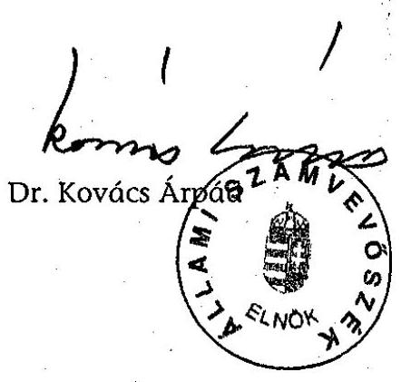

---

1/a. sz. melléklet a V-13-70/2004-2005. sz. jelentéshez

M-1031 BUDAPEST V., JÓZSEF NÁDOR TÉR 2-4. POSTACIM: 1269 BUDAPEST. POSTAFIÓK 481.
TELEFON: 327-2111 FAX: 318-0728
E-MAIL: tibor.dreakovic@pm.gov.hu
PÉNZÜGYMINISZTER

V-13-69/2004-2005.

Dr. Kovács Árpád úr
elnök

Ügyszám: 4131/2005.

Állami Számvevőszék

Budapest

Tisztelt Elnök Úr!

Az Állami Számvevőszék által a Vám- és Pénztigyőrség működéséről készített jelentését köszönettel megkaptuk. A jelentésben foglaltakkal összefüggésben elrendelt intézkedésekről 30 napon belül tájékoztatom Elnök urat.

Budapest, 2005. március 24.

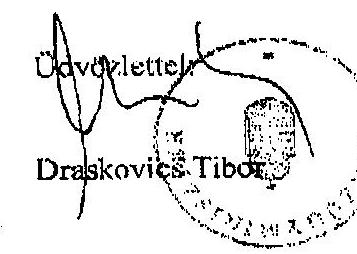

WWW.PENZUGYMINISZTERIUM.HU

---

# VÁM- ÉS PÉNZÜGYŐRSÉG ORSZÁGOS PARANCSNOKA 

Bihary Zsigmond föigazgató úr részére

Állami Számvevőszék Budapest

Tisztelt Föigazgató Úr!

A Vám- és Pénzügyőrség működésének átfogó ellenőrzése tárgyában 2005. február 14-én kelt, V-13-63/2004-2005. számú levelében foglaltakra az alábbiakról tájékoztatom.

A 2004. október 6-án megtartott szakértői egyeztetésen - a Győr-Moson-Sopron Megyei Nyomozó Hivatal elhelyezésére szolgáló ingatlan beszerzésével kapcsolatban elhangzottakkal összefüggésben, a résztvevők egyező álláspontja hiányában további észrevételt nem kívánok tenni.

Hivatkozott levelében írt, a jelentés-tervezet 7. oldalát érintő kiegészítésre reagálva tisztelettel kérem, hogy azt az alábbiak szerint módosítani szíveskedjék:
„A Fővárosi Ügyészségi Nyomozó Hivatal a győri ingatlan beszerzése kapcsán hűtlen kezelés büntette miatt az Állami Számvevőszék feljelentése alapján indult bűnügyben - mivel a cselekmény nem büncselekmény - a nyomozást megszüntette. A nyomozás során megállapítást nyert, hogy bár a VPOP KBP a közbeszerzésekről szóló 1995. évi XL. törvényt több alkalommal is megsértette, azonban e szabályszegések következtében a költségvetést vagyoni hátrány nem érte, hiszen a közbeszerzési eljárásban kiírt célnak megfelelő ingatlant sikerült beszerezni, az előirányzott költségvetési kereteken belül, forgalmi értéknek megfelelő áron. A központi költségvetést vagyoni hátrány nem érte, sem hütlen kezelés büntette, sem más büncselekmény nem valósult meg.

---

A nyomozóhatóság felhívta a VP országos parancsnokának figyelmét a bekövetkezett törvénysértésekre, valamint arra, hogy tegye meg a szükséges intézkedéseket annak érdekében, hogy a jövőben hasonló törvénysértések ne következhessenek be."

Kérem, hogy fentieket a jelentés-tervezet összeállítása során figyelembe venni szíveskedjék.

Budapest, 2005. február 17.

Tisztelettel és Köszönettel:
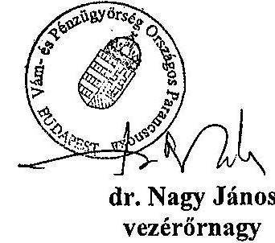

---

# Dr. Nagy János vezérőrnagy úr országos parancsnok 

## PM Vám- és Pénzügyőrség Országos Parancsnoksága

## Budapest

## Tisztelt Vezérőrnagy Úr!

A Vám- és Pénzügyőrség müködésének átfogó ellenőrzése tárgyában 2005. február 17én kelt levelében foglaltakkal kapcsolatban a következőkről tájékoztatom:

Időközben az Állami Számvevőszék Jogi és Igazgatási Osztálya is megkapta a Fővárosi Ügyészségi Nyomozó Hivatal nyomozást megszüntető határozatát, amely ellen panasszal élt a Legfőbb Ügyészségnél. A jelentés-tervezet Bevezetője szövegét ennek megfelelően módosítottuk.
„A Fővárosi Ügyészségi Nyomozó Hivatal Nyom. 1516/2004. szám alatt 2005. február 3-án kelt és február 8-án kézbesített határozatával a nyomozást megszüntette. Az Állami Számvevőszék Jogi és Igazgatási Osztálya a határozat ellen panasszal élt a Legfőbb Ügyészségnél."

Budapest, 2005. február 111
Tisztelettel:

Tisztelettel:

---

Szervezeti egység neve: Vám-és Pénzügyőrség

Tanúsítvány a V-13-70/2004-2005. sz. jelentéshez

1. sz. tanúsítvány a V-13-70/2004-2005. sz. jelentéshez

A Vám- és Pénzügyőrségnél az átlagos statisztikai állományi létszám alakulása (fő)

|  Megnevezés | 1999. év | 2000. év | 2001. év | 2002. év | 2003. év | 2004.03.31  |
| --- | --- | --- | --- | --- | --- | --- |
|  Felső vezetők | 5 | 5 | 5 | 5 | 5 | 5  |
|  Vezetők | 202 | 229 | 222 | 229 | 212 | 192  |
|  Érdemi ügyintézők | 6132 | 6122 | 6257 | 6177 | 6105 | 5600  |
|  Ügyviteli alkalmazottak | 766 | 776 | 803 | 778 | 776 | 701  |
|  Fizikai alkalmazottak | 573 | 558 | 535 | 489 | 461 | 390  |
|  Összesen: | 7678 | 7688 | 7622 | 7679 | 7559 | 6888  |

Nyilatkozat: A tanusítványban szereplő adatok a könyvviteli nyilvántartásokkal egyezőek, valódiságukat igazolom.

Kelt: Budapest, 2004. június 60.

Készítette: dr. Albert Éva fhdyg.

Aláírás

---

# Szervezeti egység neve: Vám- és Pénzügyőrség

## Tanúsítvány

### A szolgálati viszony megszüntetésének alakulása a Vám-és Pénzügyőrség hivatásos állományánál (fő)

|  Szolgálati viszony megszüntetésének jogcíme | Évek | 1999. | 2000. | 2001. | 2002. | 2003. | 2004.  |
| --- | --- | --- | --- | --- | --- | --- | --- |
|  Nyugdíjazás összesen | 1999. | 2000. | 2001. | 2002. | 2003. | 2004. | 2005.  |
|  felső korhatárral | 87 | 127 | 57 | 35 | 69 | 12 | 12  |
|  felső korhatár alatt | 3 | 0 | 6 | 4 | 11 | 0 | 0  |
|  Közös megegyezés | 84 | 127 | 51 | 31 | 58 | 12 | 12  |
|  Lemondás | 36 | 45 | 40 | 19 | 25 | 4 | 4  |
|  Fegyelmi okból | 167 | 146 | 122 | 46 | 53 | 18 | 18  |
|  Próbaidőn belül kérelemre | 17 | 9 | 3 | 11 | 3 | 2 | 2  |
|  Próbaidőn belül kérelemre | 39 | 56 | 55 | 16 | 4 | 0 | 0  |
|  Próbaidőn belül hivatalból | 17 | 13 | 17 | 5 | 95 | 0 | 0  |
|  Elhalálozás | 5 | 5 | 3 | 10 | 6 | 1 | 1  |
|  Felmentés | 0 | 7 | 15 | 1 | 45 | 3 | 3  |
|  Szolgálatra nem jelentkezett | 0 | 0 | 0 | 1 | 1 | 0 | 0  |
|  Egyéb | 9 | 11 | 21 | 10 | 6 | 8 | 8  |
|  Összesen | 377 | 419 | 333 | 154 | 307 | 48 | 48  |

## A közalkalmazotti jogviszony megszüntetésének alakulása a Vám- és Pénzügyőrségnél (fő)

|  Megszüntetés módja | Évek | 1999. | 2000. | 2001. | 2002. | 2003. | 2004.  |
| --- | --- | --- | --- | --- | --- | --- | --- |
|  Nyugdíjazás összesen |  |  |  |  |  |  |   |
|  korengedmény nélkül |  |  |  |  |  |  |   |
|  korengedménnyel |  |  |  |  |  |  |   |
|  Közös megegyezés | 93 | 104 | 95 | 90 | 48 | 17 | 17  |
|  Próbaidő alatt | 14 | 13 | 21 | 14 | 10 |  | 1  |
|  Elhalálozás | 3 | 1 | 3 | 1 | 1 |  | 1  |
|  Áthelyezés | 2 | 1 | 4 | 1 | 1 | 1 | 1  |
|  Elbocsátás |  | 1 |  | 4 |  |  |   |
|  Felmentés | 28 | 26 | 63 | 17 | 34 | 48 | 48  |
|  Lemondás | 3 | 3 | 2 |  | 2 |  |   |
|  Összesen | 143 | 149 | 188 | 127 | 96 | 66 | 66  |

Nyilatkozat: A tanúsítványban szereplő adatok a könyvviteli nyilvántartásokkal egyezőek, valódiságukat igazolom.

Kelt: Budapest, 2004. június 18.

Készítette: Boldogné

Szabó Zsolt alezredes főosztályvezető

---

|   |  |  |  |  |  |  |  |  |  |  |  |  |  |  |  |  |  |  |  |  |  |  |  |  |  |  |  |  |   |
| --- | --- | --- | --- | --- | --- | --- | --- | --- | --- | --- | --- | --- | --- | --- | --- | --- | --- | --- | --- | --- | --- | --- | --- | --- | --- | --- | --- | --- | --- |
|   |  |  |  |  |  |  |  |  |  |  |  |  |  |  |  |  |  |  |  |  |  |  |  |  |  |  |  |  |   |
|   |  |  |  |  |  |  |  |  |  |  |  |  |  |  |  |  |  |  |  |  |  |  |  |  |  |  |  |  |   |
|   |  |  |  |  |  |  |  |  |  |  |  |  |  |  |  |  |  |  |  |  |  |  |  |  |  |  |  |  |   |
|   |  |  |  |  |  |  |  |  |  |  |  |  |  |  |  |  |  |  |  |  |  |  |  |  |  |  |  |  |   |
|   |  |  |  |  |  |  |  |  |  |  |  |  |  |  |  |  |  |  |  |  |  |  |  |  |  |  |  |  |   |
|   |  |  |  |  |  |  |  |  |  |  |  |  |  |  |  |  |  |  |  |  |  |  |  |  |  |  |  |  |   |
|   |  |  |  |  |  |  |  |  |  |  |  |  |  |  |  |  |  |  |  |  |  |  |  |  |  |  |  |  |   |
|   |  |  |  |  |  |  |  |  |  |  |  |  |  |  |  |  |  |  |  |  |  |  |  |  |  |  |  |  |   |
|   |  |  |  |  |  |  |  |  |  |  |  |  |  |  |  |  |  |  |  |  |  |  |  |  |  |  |  |  |   |
|   |  |  |  |  |  |  |  |  |  |  |  |  |  |  |  |  |  |  |  |  |  |  |  |  |  |  |  |  |   |
|   |  |  |  |  |  |  |  |  |  |  |  |  |  |  |  |  |  |  |  |  |  |  |  |  |  |  |  |  |   |
|   |  |  |  |  |  |  |  |  |  |  |  |  |  |  |  |  |  |  |  |  |  |  |  |  |  |  |  |  |   |
|   |  |  |  |  |  |  |  |  |  |  |  |  |  |  |  |  |  |  |  |  |  |  |  |  |  |  |  |  |   |
|   |  |  |  |  |  |  |  |  |  |  |  |  |  |  |  |  |  |  |  |  |  |  |  |  |  |  |  |  |   |
|   |  |  |  |  |  |  |  |  |  |  |  |  |  |  |  |  |  |  |  |  |  |  |  |  |  |  |  |  |   |
|   |  |  |  |  |  |  |  |  |  |  |  |  |  |  |  |  |  |  |  |  |  |  |  |  |  |  |  |  |   |
|   |  |  |  |  |  |  |  |  |  |  |  |  |  |  |  |  |  |  |  |  |  |  |  |  |  |  |  |  |   |
|   |  |  |  |  |  |  |  |  |  |  |  |  |  |  |  |  |  |  |  |  |  |  |  |  |  |  |  |  |   |
|   |  |  |  |  |  |  |  |  |  |  |  |  |  |  |  |  |  |  |  |  |  |  |  |  |  |  |  |  |   |
|   |  |  |  |  |  |  |  |  |  |  |  |  |  |  |  |  |  |  |  |  |  |  |  |  |  |  |  |  |   |
|   |  |  |  |  |  |  |  |  |  |  |  |  |  |  |  |  |  |  |  |  |  |  |  |  |  |  |  |  |   |
|   |  |  |  |  |  |  |  |  |  |  |  |  |  |  |  |  |  |  |  |  |  |  |  |  |  |  |  |  |   |
|   |  |  |  |  |  |  |  |  |  |  |  |  |  |  |  |  |  |  |  |  |  |  |  |  |  |  |  |  |   |
|   |  |  |  |  |  |  |  |  |  |  |  |  |  |  |  |  |  |  |  |  |  |  |  |  |  |  |  |  |   |
|   |  |  |  |  |  |  |  |  |  |  |  |  |  |  |  |  |  |  |  |  |  |  |  |  |  |  |  |  |   |
|   |  |  |  |  |  |  |  |  |  |  |  |  |  |  |  |  |  |  |  |  |  |  |  |  |  |  |  |  |   |
|   |  |  |  |  |  |  |  |  |  |  |  |  |  |  |  |  |  |  |  |  |  |  |  |  |  |  |  |  |   |
|   |  |  |  |  |  |  |  |  |  |  |  |  |  |  |  |  |  |  |  |  |  |  |  |  |  |  |  |  |   |
|   |  |  |  |  |  |  |  |  |  |  |  |  |  |  |  |  |  |  |  |  |  |  |  |  |  |  |  |  |   |
|   |  |  |  |  |  |  |  |  |  |  |  |  |  |  |  |  |  |  |  |  |  |  |  |  |  |  |  |  |   |
|   |  |  |  |  |  |  |  |  |  |  |  |  |  |  |  |  |  |  |  |  |  |  |  |  |  |  |  |  |   |
|  

---

VP-hez felvettek száma területi megoszlás szerint

1. sz. tanúsítvány a V-13-70/2004-2005. sz. jelentéshez

|   |  |  |  |  |  |  |  |  |  |  |  |  |  |  |  |  |  |  |  |  |  |  |  |  |  |  |  |  |  |  |  |  |  |  |  |  |  |  |   |
| --- | --- | --- | --- | --- | --- | --- | --- | --- | --- | --- | --- | --- | --- | --- | --- | --- | --- | --- | --- | --- | --- | --- | --- | --- | --- | --- | --- | --- | --- | --- | --- | --- | --- | --- | --- | --- | --- | --- | --- | --- | --- | --- |
|   |  |  |  |  |  |  |  |  |  |  |  |  |  |  |  |  |  |  |  |  |  |  |  |  |  |  |  |  |  |  |  |  |  |  |  |  |  |  |  |  |   |
|   |  |  |  |  |  |  |  |  |  |  |  |  |  |  |  |  |  |  |  |  |  |  |  |  |  |  |  |  |  |  |  |  |  |  |  |  |  |  |  |  |   |
|   |  |  |  |  |  |  |  |  |  |  |  |  |  |  |  |  |  |  |  |  |  |  |  |  |  |  |  |  |  |  |  |  |  |  |  |  |  |  |  |  |   |
|   |  |  |  |  |  |  |  |  |  |  |  |  |  |  |  |  |  |  |  |  |  |  |  |  |  |  |  |  |  |  |  |  |  |  |  |  |  |  |  |  |   |
|   |  |  |  |  |  |  |  |  |  |  |  |  |  |  |  |  |  |  |  |  |  |  |  |  |  |  |  |  |  |  |  |  |  |  |  |  |  |  |  |  |   |
|   |  |  |  |  |  |  |  |  |  |  |  |  |  |  |  |  |  |  |  |  |  |  |  |  |  |  |  |  |  |  |  |  |  |  |  |  |  |  |  |  |   |
|   |  |  |  |  |  |  |  |  |  |  |  |  |  |  |  |  |  |  |  |  |  |  |  |  |  |  |  |  |  |  |  |  |  |  |  |  |  |  |  |  |   |
|   |  |  |  |  |  |  |  |  |  |  |  |  |  |  |  |  |  |  |  |  |  |  |  |  |  |  |  |  |  |  |  |  |  |  |  |  |  |  |  |  |   |
|   |  |  |  |  |  |  |  |  |  |  |  |  |  |  |  |  |  |  |  |  |  |  |  |  |  |  |  |  |  |  |  |  |  |  |  |  |  |  |  |  |   |
|   |  |  |  |  |  |  |  |  |  |  |  |  |  |  |  |  |  |  |  |  |  |  |  |  |  |  |  |  |  |  |  |  |  |  |  |  |  |  |  |  |   |
|   |  |  |  |  |  |  |  |  |  |  |  |  |  |  |  |  |  |  |  |  |  |  |  |  |  |  |  |  |  |  |  |  |  |  |  |  |  |  |  |  |   |
|   |  |  |  |  |  |  |  |  |  |  |  |  |  |  |  |  |  |  |  |  |  |  |  |  |  |  |  |  |  |  |  |  |  |  |  |  |  |  |  |  |   |
|   |  |  |  |  |  |  |  |  |  |  |  |  |  |  |  |  |  |  |  |  |  |  |  |  |  |  |  |  |  |  |  |  |  |  |  |  |  |  |  |  |   |
|   |  |  |  |  |  |  |  |  |  |  |  |  |  |  |  |  |  |  |  |  |  |  |  |  |  |  |  |  |  |  |  |  |  |  |  |  |  |  |  |  |  |   |
|   |  |  |  |  |  |  |  |  |  |  |  |  |  |  |  |  |  |  |  |  |  |  |  |  |  |  |  |  |  |  |  |  |  |  |  |  |  |  |  |  |  |   |
|   |  |  |  |  |  |  |  |  |  |  |  |  |  |  |  |  |  |  |  |  |  |  |  |  |  |  |  |  |  |  |  |  |  |  |  |  |  |  |  |  |  |   |
|   |  |  |  |  |  |  |  |  |  |  |  |  |  |  |  |  |  |  |  |  |  |  |  |  |  |  |  |  |  |  |  |  |  |  |  |  |  |  |  |  |  |   |
|   |  |  |  |  |  |  |  |  |  |  |  |  |  |  |  |  |  |  |  |  |  |  |  |  |  |  |  |  |  |  |  |  |  |  |  |  |  |  |  |  |  |   |
|   |  |  |  |  |  |  |  |  |  |  |  |  |  |  |  |  |  |  |  |  |  |  |  |  |  |  |  |  |  |  |  |  |  |  |  |  |  |  |  |  |  |   |
|   |  |  |  |  |  |  |  |  |  |  |  |  |  |  |  |  |  |  |  |  |  |  |  |  |  |  |  |  |  |  |  |  |  |  |  |  |  |  |  |  |  |   |
|   |  |  |  |  |  |  |  |  |  |  |  |  |  |  |  |  |  |  |  |  |  |  |  |  |  |  |  |  |  |  |  |  |  |  |  |  |  |  |  |  |  |   |
|   |  |  |  |  |  |  |  |  |  |  |  |  |  |  |  |  |  |  |  |  |  |  |  |  |  |  |  |  |  |  |  |  |  |  |  |  |  |  |  |  |  |   |
|   |  |  |  |  |  |  |  |  |  |  |  |  |  |  |  |  |  |  |  |  |  |  |  |  |  |  |  |  |  |  |  |  |  |  |  |  |  |  |  |  |  |   |
|   |  |  |  |  |  |  |  |  |  |  |  |  |  |  |  |  |  |  |  |  |  |  |  |  |  |  |  |  |  |  |  |  |  |  |  |  |  |  |  |  |  |  |   |
|   |  |  |  |  |  |  |  |  |  |  |  |  |  |  |  |  |  |  |  |  |  |  |  |  |  |  |  |  |  |  |  |  |  |  |  |  |  |  |  |  |  |  |   |
|   |  |  |  |  |  |  |  |  |  |  |  |  |  |  |  |  |  |  |  |  |  |  |  |  |  |  |  |  |  |  |  |  |  |  |  |  |  |  |  |  |  |  |   |
|   |  |  |  |  |  |  |  |  |  |  |  |  |  |  |  |  |  |  |  |  |  |  |  |  |  |  |  |  |  |  |  |  |  |  |  |  |  |  |  |  |  |  |   |
|   |  |  |  |  |  |  |  |  |  |  |  |  |  |  |  |  |  |  |  |  |  |  |  |  |  |  |  |  |  |  |  |  |  |  |  |  |  |  |  |  |  |  |   |
|   |  |  |  |  |  |  |  |  |  |  |  |  |  |  |  |  |  |  |  |  |  |  |  |  |  |  |  |  |  |  |  |  |  |  |  |  |  |  |  |  |  |  |   |
|   |  |  |  |  |  |  |  |  |  |  |  |  |  |  |  |  |  |  |  |  |  |  |  |  |  |  |  |  |  |  |  |  |  |  |  |  |  |  |  |  |  |  |   |
|   |  |  |  |  |  |  |  |  |  |  |  |  |  |  |  |  |  |  |  |  |  |  |  |  |  |  |  |  |  |  |  |  |  |  |  |  |  |  |  |  |  |  |   |
|   |  |  |  |  |  |  |  |  |  |  |  |  |  |  |  |  |  |  |  |  |  |  |  |  |  |  |  |  |  |  |  |  |  |  |  |  |  |  |  |  |  |  |   |
|   |  |  |  |  |  |  |  |  |  |  |  |  |  |  |  |  |  |  |  |  |  |  |  |  |  |  |  |  |  |  |  |  |  |  |  |  |  |  |  |  |  |  |   |
|   |  |  |  |  |  |  |  |  |  |  |  |  |  |  |  |  |  |  |  |  |  |  |  |  |  |  |  |  |  |  |  |  |  |  |  |  |  |  |  |  |  |  |   |
|   |  |  |  |  |  |  |  |  |  |  |  |  |  |  |  |  |  |  |  |  |  |  |  |  |  |  |  |  |  |  |  |  |  |  |  |  |  |  |  |  |  |  |   |
|   |  |  |  |  |  |  |  |  |  |  |  |  |  |  |  |  |  |  |  |  |  |  |  |  |  |  |  |  |  |  |  |  |  |  |  |  |  |  |  |  |  |  |   |
|   |  |  |  |  |  |  |  |  |  |  |  |  |  |  |  |  |  |  |  |  |  |  |  |  |  |  |  |  |  |  |  |  |  |  |  |  |  |  |  |  |  |  |   |
|   |  |  |  |  |  |  |  |  |  |  |  |  |  |  |  |  |  |  |  |  |  |  |  |  |  |  |  |  |  |  |  |  |  |  |  |  |  |  |  |  |  |  |   |
|   |  |  |  |  |  |  |  |  |  |  |  |  |  |  |  |  |  |  |  |  |  |  |  |  |  |  |  |  |  |  |  |  |  |  |  |  |  |  |  |  |  |  |   |
|   |  |  |  |  |  |  |  |  |  |  |  |  |  |  |  |  |  |  |  |  |  |  |  |  |  |  |  |  |  |  |  |  |  |  |  |  |  |  |  |  |  |  |   |
|   |  |  |  |  |  |  |  |  |  |  |  |  |  |  |  |  |  |  |  |  |  |  |  |  |  |  |  |  |  |  |  |  |  |  |  |  |  |  |  |  |  |  |   |
|   |  |  |  |  |  |  |  |  |  |  |  |  |  |  |  |  |  |  |  |  |  |  |  |  |  |  |  |  |  |  |  |  |  |  |  |  |  |  |  |  |  |  |   |
|   |  |  |  |  |  |  |  |  |  |  |  |  |  |  |  |  |  |  |  |  |  |  |  |  |  |  |  |  |  |  |  |  |  |  |  |  |  |  |  |  |  |  |   |
|   |  |  |  |  |  |  |  |  |  |  |  |  |  |  |  |  |  |  |  |  |  |  |  |  |  |  |  |  |  |  |  |  |  |  |  |  |  |  |  |  |  |  |   |
|   |  |  |  |  |  |  |  |  |  |  |  |  |  |  |  |  |  |  |  |  |  |  |  |  |  |  |  |  |  |  |  |  |  |  |  |  |  |  |  |  |  |  |  |   |
|   |  |  |  |  |  |  |  |  |  |  |  |  |  |  |  |  |  |  |  |  |  |  |  |  |  |  |  |  |  |  |  |  |  |  |  |  |  |  |  |  |  |  |  |   |
|   |  |  |  |  |  |  |  |  |  |  |  |  |  |  |  |  |  |  |  |  |  |  |  |  |  |  |  |  |  |  |  |  |  |  |  |  |  |  |  |  |  |  |  |   |
|   |  |  |  |  |  |  |  |  |  |  |  |  |  |  |  |  |  |  |  |  |  |  |  |  |  |  |  |  |  |  |  |  |  |  |  |  |  |  |  |  |  |  |  |   |
|   |  |  |  |  |  |  |  |  |  |  |  |  |  |  |  |  |  |  |  |  |  |  |  |  |  |  |  |  |  |  |  |  |  |  |  |  |  |  |  |  |  |  |  |   |
|   |  |  |  |  |  |  |  |  |  |  |  |  |  |  |  |  |  |  |  |  |  |  |  |  |  |  |  |  |  |  |  |  |  |  |  |  |  |  |  |  |  |  |  |   |
|   |  |  |  |  |  |  |  |  |  |  |  |  |  |  |  |  |  |  |  |  |  |  |  |  |  |  |  |  |  |  |  |  |  |  |  |  |  |  |  |  |  |  |  |   |
|   |  |  |  |  |  |  |  |  |  |  |  |  |  |  |  |  |  |  |  |  |  |  |  |  |  |  |  |  |  |  |  |  |  |  |  |  |  |  |  |  |  |  |  |   |
|   |  |  |  |  |  |  |  |  |  |  |  |  |  |  |  |  |  |  |  |  |  |  |  |  |  |  |  |  |  |  |  |  |  |  |  |  |  |  |  |  |  |  |  |   |
|   |  |  |  |  |  |  |  |  |  |  |  |  |  |  |  |  |  |  |  |  |  |  |  |  |  |  |  |  |  |  |  |  |  |  |  |  |  |  |  |  |  |  |  |   |
|   |  |  |  |  |  |  |  |  |  |  |  |  |  |  |  |  |  |  |  |  |  |  |  |  |  |  |  |  |  |  |  |  |  |  |  |  |  |  |  |  |  |  |  |  |   |
|   |  |  |  |  |  |  |  |  |  |  |  |  |  |  |  |  |  |  |  |  |  |  |  |  |  |  |  |  |  |  |  |  |  |  |  |  |  |  |  |  |  |  |  |  |   |
|   |  |  |  |  |  |  |  |  |  |  |  |  |  |  |  |  |  |  |  |  |  |  |  |  |  |  |  |  |  |  |  |  |  |  |  |  |  |  |  |  |  |  |  |  |   |
|   |  |  |  |  |  |  |  |  |  |  |  |  |  |  |  |  |  |  |  |  |  |  |  |  |  |  |  |  |  |  |  |  |  |  |  |  |  |  |  |  |  |  |  |  |  |   |
|   |  |  |  |  |  |  |  |  |  |  |  |  |  |  |  |  |  |  |  |  |  |  |  |  |  |  |  |  |  |  |  |  |  |  |  |  |  |  |  |  |  |  |  |  |  |   |
|   |  |  |  |  |  |  |  |  |  |  |  |  |  |  |  |  |  |  |  |  |  |  |  |  |  |  |  |  |  |  |  |  |  |  |  |  |  |  |  |  |  |  |  |  |  |   |
|   |  |  |  |  |  |  |  |  |  |  |  |  |  |  |  |  |  |  |  |  |  |  |  |  |  |  |  |  |  |  |  |  |  |  |  |  |  |  |  |  |  |  |  |  |  |   |
|   |  |  |  |  |  |  |  |  |  |  |  |  |  |  |  |  |  |  |  |  |  |  |  |  |  |  |  |  |  |  |  |  |  |  |  |  |  |  |  |  |  |  |  |  |  |   |
|   |  |  |  |  |  |  |  |  |  |  |  |  |  |  |  |  |  |  |  |  |  |  |  |  |  |  |  |  |  |  |  |  |  |  |  |  |  |  |  |  |  |  |  |  |  |   |
|   |  |  |  |  |  |  |  |  |  |  |  |  |  |  |  |  |  |  |  |  |  |  |  |  |  |  |  |  |  |  |  |  |  |  |  |  |  |  |  |  |  |  |  |  |  |   |
|   |  |  |  |  |  |  |  |  |  |  |  |  |  |  |  |  |  |  |  |  |  |  |  |  |  |  |  |  |  |  |  |  |  |  |  |  |  |  |  |  |  |  |  |  |  |   |
|   |  |  |  |  |  |  |  |  |  |  |  |  |  |  |  |  |  |  |  |  |  |  |  |  |  |  |  |  |  |  |  |  |  |  |  |  |  |  |  |  |  |  |  |  |  |   |
|   |  |  |  |  |  |  |  |  |  |  |  |  |  |  |  |  |  |  |  |  |  |  |  |  |  |  |  |  |  |  |  |  |  |  |  |  |  |  |  |  |  |  |  |  |  |   |
|   |  |  |  |  |  |  |  |  |  |  |  |  |  |  |  |  |  |  |  |  |  |  |  |  |  |  |  |  |  |  |  |  |  |  |  |  |  |  |  |  |  |  |  |  |  |  |   |
|   |  |  |  |  |  |  |  |  |  |  |  |  |  |  |  |  |  |  |  |  |  |  |  |  |  |  |  |  |  |  |  |  |  |  |  |  |  |  |  |  |  |  |  |  |  |  |   |
|   |  |  |  |  |  |  |  |  |  |  |  |  |  |  |  |  |  |  |  |  |  |  |  |  |  |  |  |  |  |  |  |  |  |  |  |  |  |  |  |  |  |  |  |  |  |  |  |   |
|   |  |  |  |  |  |  |  |  |  |  |  |  |  |  |  |  |  |  |  |  |  |  |  |  |  |  |  |  |  |  |  |  |  |  |  |  |  |  |  |  |  |  |  |  |  |  |  |   |
|   |  |  |  |  |  |  |  |  |  |  |  |  |  |  |  |  |  |  |  |  |  |  |  |  |  |  |  |  |  |  |  |  |  |  |  |  |  |  |  |  |  |  |  |  |  |  |  |   |
|   |  |  |  |  |  |  |  |  |  |  |  |  |  |  |  |  |  |  |  |  |  |  |  |  |  |  |  |  |  |  |  |  |  |  |  |  |  |  |  |  |  |  |  |  |  |  |  |   |
|   |  |  |  |  |  |  |  |  |  |  |  |  |  |  |  |  |  |  |  |  |  |  |  |  |  |  |  |  |  |  |  |  |  |  |  |  |  |  |  |  |  |  |  |  |  |  |  |  |   |
|   |  |  |  |  |  |  |  |  |  |  |  |  |  |  |  |  |  |  |  |  |  |  |  |  |  |  |  |  |  |  |  |  |  |  |  |  |  |  |  |  |  |  |  |  |  |  |  |  |  |   |
|   |  |  |  |  |  |  |  |  |  |  |  |  |  |  |  |  |  |  |  |  |  |  |  |  |  |  |  |  |  |  |  |  |  |  |  |  |  |  |  |  |  |  |  |  |  |  |  |  |  |  |  |   |
|   |  |  |  |  |  |  |  |  |  |  |  |  |  |  |  |  |  |  |  |  |  |  |  |  |  |  |  |  |  |  |  |  |  |  |  |  |  |  |  |  |  |  |  |  |  |  |  |  |  |  |  |   |
|   |  |  |  |  |  |  |  |  |  |  |  |  |  |  |  |  |  |  |  |  |  |  |  |  |  |  |  |  |  |  |  |  |  |  |  |  |  |  |  |  |  |  |  |  |  |  |  |  |  |  |  |  |   |
|   |  |  |  |  |  |  |  |  |  |  |  |  |  |  |  |  |  |  |  |  |  |  |  |  |  |  |  |  |  |  |  |  |  |  |  |  |  |  |  |  |  |  |  |  |  |  |  |  |  |  |  |  |  |   |
|   |  |  |  |  |  |  |  |  |  |  |  |  |  |  |  |  |  |  |  |  |  |  |  |  |  |  |  |  |  |  |  |  |  |  |  |  |  |  |  |  |  |  |  |  |  |  |  |  |  |  |  |  |  |  |   |
|   |  |  |  |  |  |  |  |  |  |  |  |  |  |  |  |  |  |  |  |  |  |  |  |  |  |  |  |  |  |  |  |  |  |  |  |  |  |  |  |  |  |  |  |  |  |  |  |  |  |  |  |  |  |  |  |  |  |  |   |
|   |  |  |  |  |  |  |  |  |  |  |  |  |  |  |  |  |  |  |  |  |  |  |  |  |  |  |  |  |  |  |  |  |  |  |  |  |  |  |  |  |  |  |  |  |  |  |  |  |  |  |  |  |  |  |  |  |  |  |  |  |  |   |
|   |  |  |  |  |  |  |  |  |  |  |  |  |  |  |  |  |  |  |  |  |  |  |  |  |  |  |  |  |  |  |  |  |  |  |  |  |  |  |  |  |  |  |  |  |  |  |  |  |  |  |  |  |  |  |  |  |  |  |  |  |  |  |  |  |   |
|   |  |  |  |  |  |  |  |  |  |  |  |  |  |  |  |  |  |  |  |  |  |  |  |  |  |  |  |  |  |  |  |  |  |  |  |  |  |  |  |  |  |  |  |  |  |  |  |  |  |  |  |  |  |  |  |  |  |  |  |  |  |  |  |  |  |  |  |  |  |  |  |  |  |  |  |  |  |  |  |  |  |  |  |  |  |  |  |  |  |  |  |  |  |  |  |  |  |  |  |  | 

---

5. sz. tanúsítvány a V-13-70/2004-2005. sz. jelentéshez

Tanúsítvány a Vám- és Pénzügyőrség költségvetési előirányzatainak teljesítéséről 1999-2004.

|  MEGHETTELEK | 200 | 200 | 200 | 200 | 200 | 200 | 200  |
| --- | --- | --- | --- | --- | --- | --- | --- |
|  ELADÁRIK | Eredvid
ellőségesen | Módayhase
ellőségesen | Teljesítés | Eredvid
ellőségesen | Módayhase
ellőségesen | Teljesítés | Eredvid
ellőségesen  |
|  Benyőző tervek | 19 009 898 | 19 009 898 | 11 209 707 | 19 609 700 | 10 605 700 | 11 203 006 | 11 789 000  |
|  Móadandékot nehető jóvalék | 3 644 300 | 3 775 100 | 3 962 450 | 3 834 000 | 3 854 000 | 4 050 400 | 4 076 000  |
|  Őrdegl lásdás | 7 925 100 | 7 528 660 | 7 509 525 | 7 632 340 | 8 627 212 | 8 819 454 | 10 315 295  |
|  Égyék lásdás | 208 697 | 261 000 | 290 690 | 759 052 | 656 141 | 434 200 | 767 700  |
|  Kizzenlészés | 0 | 0 | 0 | 0 | 0 | 0 | 0  |
|  Móbbédul lásdás összesen | 21 882 999 | 22 246 785 | 22 922 448 | 22 845 999 | 22 341 774 | 23 987 199 | 24 952 500  |
|  Indonésági levezkéde | 7 017 700 | 6 601 100 | 5 058 691 | 7 518 999 | 6 033 000 | 3 931 714 | 3 449 299  |
|  Indonés | 239 000 | 294 289 | 293 594 | 219 000 | 288 241 | 300 252 | 300 000  |
|  Mégemel levezkéde | 3 647 500 | 3 817 031 | 2 708 201 | 0 | 7 013 119 | 3 490 042 | 0  |
|  Labdarúgayék | 30 000 | 30 000 | 30 000 | 30 000 | 30 000 | 30 000 | 70 000  |
|  Labdalgépk | 130 000 | 133 119 | 148 922 | 150 000 | 151 078 | 149 000 | 200 000  |
|  Egyéb felkabomási lásdás | 10 000 | 10 000 | 8 072 | 10 000 | 23 000 | 9 687 | 16 000  |
|  Feltesítés | 0 | 0 | 0 | 0 | 0 | 0 | 0  |
|  Feltelvesszék összesen | 21 082 694 | 9 922 761 | 6 167 371 | 7 772 800 | 12 468 570 | 8 089 984 | 4 829 200  |
|  Rövid kájnak lezárgajunk lásdása | 0 | 0 | 678 | 0 | 0 | 0 | 0  |
|  Rövid kájnak műkövöszözözen | 22 967 990 | 22 192 452 | 29 191 295 | 26 628 999 | 28 602 204 | 22 648 001 | 26 061 200  |
|  BENYÉTELEK |  |  |  |  |  |  |   |
|  Móbbédul laseket | 2 429 500 | 2 657 549 | 2 113 575 | 2 879 100 | 3 203 107 | 2 142 000 | 2 936 100  |
|  Feltelvesszék laseket | 3 263 000 | 3 203 000 | 90 903 | 2 987 000 | 3 321 511 | 263 000 | 15 000  |
|  Móbbedul laseket |  |  |  |  |  |  |   |
|  Rövid kájnak lásdás |  |  |  |  |  |  |   |
|  Rövid kájnak műkövöszözözen | 22 967 990 | 22 192 452 | 29 191 295 | 26 628 999 | 28 602 204 | 22 648 001 | 26 061 200  |
|  BENYÉTELEK |  |  |  |  |  |  |   |
|  Móbbédul laseket | 2 429 500 | 2 657 549 | 2 113 575 | 2 879 100 | 3 203 107 | 2 142 000 | 2 936 100  |
|  Feltelvesszék laseket | 3 263 000 | 3 203 000 | 90 903 | 2 987 000 | 3 321 511 | 263 000 | 15 000  |
|  Móbbedul laseket |  |  |  |  |  |  |   |
|  Rövid kájnak lásdás |  |  |  |  |  |  |   |
|  Rövid kájnak műkövöszözözen | 22 967 990 | 22 192 452 | 29 191 295 | 26 628 999 | 28 602 204 | 22 648 001 | 26 061 200  |
|  BENYÉTELEK |  |  |  |  |  |  |   |
|  Móbbédul laseket | 2 429 500 | 2 657 549 | 2 113 575 | 2 879 100 | 3 203 107 | 2 142 000 | 2 936 100  |
|  Feltelvesszék laseket | 3 263 000 | 3 203 000 | 90 903 | 2 987 000 | 3 321 511 | 263 000 | 15 000  |
|  Móbbedul laseket |  |  |  |  |  |  |   |
|  Rövid kájnak lásdás |  |  |  |  |  |  |   |
|  Rövid kájnak műkövöszözözen | 22 967 990 | 22 192 452 | 29 191 295 | 26 628 999 | 28 602 204 | 22 648 001 | 26 061 200  |
|  BENYÉTELEK |  |  |  |  |  |  |   |
|  Móbbédul laseket | 2 429 500 | 2 657 549 | 2 113 575 | 2 879 100 | 3 203 107 | 2 142 000 | 2 936 100  |
|  Feltelvesszék laseket | 3 263 000 | 3 203 000 | 90 903 | 2 987 000 | 3 321 511 | 263 000 | 15 000  |
|  Móbbedul laseket |  |  |  |  |  |  |   |
|  Rövid kájnak lásdás |  |  |  |  |  |  |   |
|  Rövid kájnak műkövöszözözen | 22 967 990 | 22 192 452 | 29 191 295 | 26 628 999 | 28 602 204 | 22 648 001 | 26 061 200  |
|  BENYÉTELEK MÖKDÖSSZERZÉNY | 22 967 990 | 22 192 452 | 29 524 895 | 26 628 999 | 28 602 204 | 22 698 000 | 26 981 200  |
|  Hólyásos zó |  |  |  |  |  |  |   |
|  Hólyásos zó |  |  |  |  |  |  |   |

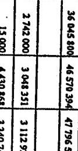

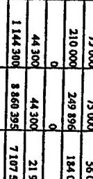

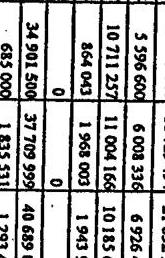

---

6. sz. tanúsítvány a V-13-70/2004-2005. sz. jelentéshez

# a Vám-és Pénzügyőrség hatáskör szerinti bevételi előirányzat módosításáról 1999-2004.III.31.ig

|  Megnevezés | 1999 | 2000 | 2001 | 2002 | 2003 | (adatok E Ft) 2004.III.31-ig  |
| --- | --- | --- | --- | --- | --- | --- |
|  |   |   |   |   |   |   |
|  Eredeti előirányzat | 32 967 900 | 30 620 900 | 30 981 200 | 33 933 200 | 36 045 800 | 33 897 100  |
|  |   |   |   |   |   |   |
|  Módosítások hatáskör szerint |  |  |  |  |  |   |
|  Országgyőlés | 0 | 0 | 0 | 0 | 0 | 0  |
|  Működési bevételek |  |  |  |  |  |   |
|  Felhalmozási bevételek |  |  |  |  |  |   |
|  Támogatás |  |  |  |  |  |   |
|  Pénzforg. nélek bevételek |  |  |  |  |  |   |
|  Pénzeszközátvétel |  |  |  |  |  |   |
|  Koronány | -1 781 900 | -634 000 | 2 120 390 | 6 211 859 | 777 838 | 0  |
|  Működési bevételek |  |  |  |  |  |   |
|  Felhalmozási bevételek |  |  |  |  |  |   |
|  Támogatás | -1 781 900 | -634 000 | 2 120 390 | 6 211 859 | 777 838 |   |
|  Pénzforg. nélek bevételek |  |  |  |  |  |   |
|  Pénzeszközátvétel |  |  |  |  |  |   |
|  Felügyeleti szervi | 895 046 | 4 411 913 | 7 366 307 | 7 297 056 | 6 699 723 | 2 087 378  |
|  Működési bevételek |  |  | 53 724 | 170 000 | 250 000 |   |
|  Felhalmozási bevételek |  |  |  |  |  |   |
|  Támogatás | 867 198 | 4 411 911 | 2 082 045 | 3 595 604 | 1 977 504 |   |
|  Pénzforg. nélek bevételek |  |  | -23 029 |  |  |   |
|  Pénzeszközátvétel | 27 848 | 2 | 5 253 567 | 3 531 452 | 4 472 219 | 2 087 378  |
|  Intézményi | 111 447 | 1 203 541 | 324 942 | 1 350 294 | 3 047 033 | 0  |
|  Működési bevételek |  | 324 005 |  |  |  |   |
|  Felhalmozási bevételek |  | 534 511 |  |  |  |   |
|  Támogatás |  |  |  |  |  |   |
|  Pénzforg. nélek bevételek | 111 447 | 345 025 | 324 942 | 1 350 294 | 3 047 033 |   |
|  Pénzeszközátvétel |  |  |  |  |  |   |
|  Bevétel módosítás összesen: | -775 407 | 4 981 454 | 9 811 639 | 14 859 209 | 10 524 594 | 2 087 378  |

Nyilatkozat: A tanúsítványban szereplő adatok a könyvviteli nyilvántartással egyezőek, valódiságokat igazolom.

Kelt: Budapest, 2004. június 10.

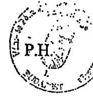

---

Tanúsítvány a Vám-és Pénzügyőrség előirányzat-maradványának alakulásáról 1999-2003.

|  Sorsz. | Megnevezés | 1999 | 2000 | előző évhez % | 2001 | előző évhez % | 2002 | előző évhez % | 2003 | (adatok E Ft-ban) előző évhez %  |
| --- | --- | --- | --- | --- | --- | --- | --- | --- | --- | --- |
|  1. | Kínálul előirányzat (+) | 32 192 493 | 35 602 354 | 110,59% | 40 792 859 | -114,58% | 48 792 409 | 119,61% | 46 570 394 | 95,45%  |
|  2. | Kínálul előirányzat teljesítése (-) | 29 191 398 | 32 048 093 | 109,79% | 41 321 687 | 128,94% | 49 205 695 | 119,08% | 47 796 590 | 97,14%  |
|  3. | Kiadásl megtakarítás (1-2) | 3 001 095 | 3 554 261 | 118,43% | -528 848 | -14,08% | -413 286 | 78,15% | -1 226 196 | 296,69%  |
|  4. | Bevételi előirányzat (-) | 32 192 493 | 35 602 354 | 110,59% | 40 792 859 | 114,58% | 48 792 409 | 119,61% | 46 570 394 | 95,45%  |
|  5. | Bevételi előirányzat teljesítése (+) | 29 524 895 | 32 350 006 | 109,57% | 42 495 734 | 131,36% | 52 252 728 | 122,96% | 49 313 964 | 94,38%  |
|  6. | Bevételi lemaradás (4-5) | -2 667 598 | -3 252 348 | 121,92% | 1 702 895 | -52,36% | 3 460 319 | 203,20% | 2 743 570 | 79,29%  |
|  7. | Kiadásl megtakarítás, bevételi lemaradás költsözsége(3+6 sor) (+,-) | 333 497 | 301 913 | 90,53% | 1 174 047 | 388,87% | 3 047 035 | 250,53% | 1 517 374 | 49,80%  |
|  8. | Alaptes előző év(ə)teli származó, törgyéves jóváhagyott előir. maradványa (+) | 11 528 |  | 0,00% | 176 247 |  |  | 0,00% | 43 485 |   |
|  9. | Vállalb. bev. eredményekről alaptes előirázásra felhaszn. öszzög (+) |  |  |  |  |  |  |  |  |   |
|  10. | Módosított kiadásl megtakarítás (7+8+9) | 345 025 | 301 913 | 87,50% | 1 350 294 | 447,25% | 3 047 035 | 225,66% | 1 560 859 | 51,23%  |
|  11. | Kösp. Költségvetés köspontosított bevételet köpcső öszzög (-) | 9 837 | 12 182 | 123,84% | 14 745 | 121,04% | 11 264 | 76,39% | 12 090 | 107,33%  |
|  12. | VP-t meg nem illesít öszzög (-) |  |  |  |  |  |  |  |  |   |
|  13. | Felhasználható előirányzat-maradvány (10-11-12) | 235 188 | 289 731 | 86,44% | 1 335 549 | 460,96% | 3 035 769 | 227,30% | 1 548 769 | 51,02%  |
|  14. | Kötelezettséggel terhelt előirányzat maradvány |  |  |  |  |  | 1 822 662 |  | 1 548 769 | 84,97%  |
|  15. | Szabad előirányzat maradvány |  |  |  |  |  | 1 213 107 |  |  | 0,00%  |

(a 14 - 15. pontot a 295/2001.(XII.27) Korm. rendelet 298(3) bekezdése iktatta be 2002. január 1-jai hatállyal. Rendelkezését elézetre a 2002. évről készített éves költségvetési beszámolóra kell alkalmazni.)

Nyilatkozat: A tanúsítványban szereplő adatok a könyvviteli nyilvántartással egyezőek, valódiságukat igazolom.

Kelt: Budapest, 2004. június 10.

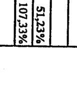

Alázás

---

Vám-és Pénzügyőrség Tanúsítvány a beruházási előirányzatok teljesítéséről a V-13-70/2004-2005. sz. jelentéshez 1999-2004. 8. sz. tanúsítvány a V-13-70/2004-2005. sz. jelentéshez

|  MEGNÉVEZÉS | 1999 | 2000 | 2001 | 2002 | 2003 | 2004  |
| --- | --- | --- | --- | --- | --- | --- |
|  KIADÁDOK | Ereded
álliránysan | Máshodent
álliránysan | Teljesítés | Ereded
álliránysan | Máshodent
álliránysan | Teljesítés  |
|  ÖVYEZMÉNYT
BÉRONÁSÁKOK | 7 817 700 | 6 682 100 | 3 058 650 | 7 302 800 | 4 033 000 | 3 831 714  |
|  monszodiós jová- vásidőes | 544 240 | 284 240 | 129 587 | 121 809 | 162 800 | 158 719  |
|  ingatlanok vásidőes/frissítés | 2 997 700 | 3 201 200 | 1 227 397 | 4 334 000 | 3 961 425 | 1 978 778  |
|  Módosítás vásidős | 0 | 11 343 | 11 343 | 0 | 12 681 | 12 681  |
|  grégbereszkedés vásidős | 1 909 520 | 1 561 918 | 817 189 | 1 265 200 | 818 957 | 737 203  |
|  javaslová vásidőes/frissítése | 201 600 | 285 564 | 277 802 | 181 400 | 221 212 | 218 781  |
|  ÁFA | 1 364 840 | 1 258 834 | 563 664 | 1 429 600 | 757 725 | 715 552  |
|  RŐSPÚNYSI BÉRONÁSÁKOK | 3 647 396 | 3 817 235 | 3 798 293 | 0 | 7 613 119 | 3 498 042  |
|  monszodiós jová- vásidőes | 0 | 19 637 | 15 523 | 0 | 276 948 | 218 614  |
|  ingatlanok vásidőes/frissítése | 2 564 840 | 1 789 931 | 1 837 020 | 0 | 4 368 485 | 1 726 695  |
|  Sódosztálat vásidős | 0 | 5 306 | 6 501 | 0 | 239 210 | 239 210  |
|  grégbereszkedés vásidős | 378 000 | 447 900 | 236 256 | 0 | 1 259 624 | 678 768  |
|  Javaslová vásidőes/frissítése | 0 | 4 648 | 12 956 | 0 | 52 369 | 54 089  |
|  ÁFA | 724 460 | 549 805 | 301 865 | 0 | 1 441 485 | 572 668  |
|  Lakdavárongatás | 50 000 | 50 000 | 50 000 | 50 000 | 50 000 | 70 000  |
|  Lakdvalyózás | 120 000 | 148 875 | 144 999 | 140 000 | 141 078 | 139 000  |
|  ÁFA | 30 000 | 4 246 | 5 022 | 10 000 | 10 000 | 10 000  |
|  MINDŐSEZEREN | 10 865 000 | 9 621 453 | 8 965 815 | 7 052 000 | 11 847 197 | 7 018 645  |

|  KISZSZTÁSZ | 2003 | 2003 | 2003 | 2003 | 2003 | 2003  |
| --- | --- | --- | --- | --- | --- | --- |
|  3 998 026 | 5 906 961 | 3 919 768 | 685 000 | 1 826 531 | 1 393 426 | 465 000  |
|  1 183 700 | 1 183 700 | 1 183 700 | 1 183 700 | 1 183 700 | 1 183 700 | 1 183 700  |
|  3 653 000 | 3 653 000 | 3 653 000 | 3 653 000 | 3 653 000 | 3 653 000 | 3 653 000  |
|  3 500 000 | 3 500 000 | 3 500 000 | 3 500 000 | 3 500 000 | 3 500 000 | 3 500 000  |
|  1 259 624 | 1 259 624 | 1 259 624 | 1 259 624 | 1 259 624 | 1 259 624 | 1 259 624  |
|  1 287 700 | 1 287 700 | 1 287 700 | 1 287 700 | 1 287 700 | 1 287 700 | 1 287 700  |
|  1 248 600 | 1 248 600 | 1 248 600 | 1 248 600 | 1 248 600 | 1 248 600 | 1 248 600  |
|  1 200 000 | 1 200 000 | 1 200 000 | 1 200 000 | 1 200 000 | 1 200 000 | 1 200 000  |
|  1 183 700 | 1 183 700 | 1 183 700 | 1 183 700 | 1 183 700 | 1 183 700 | 1 183 700  |
|  1 183 700 | 1 183 700 | 1 183 700 | 1 183 700 | 1 183 700 | 1 183 700 | 1 183 700  |
|  1 183 700 | 1 183 700 | 1 183 700 | 1 183 700 | 1 183 700 | 1 183 700 | 1 183 700  |
|  1 183 700 | 1 183 700 | 1 183 700 | 1 183 700 | 1 183 700 | 1 183 700 | 1 183 700  |
|  1 183 700 | 1 183 700 | 1 183 700 | 1 183 700 | 1 183 700 | 1 183 700 | 1 183 700  |
|  1 183 700 | 1 183 700 | 1 183 700 | 1 183 700 | 1 183 700 | 1 183 700 | 1 183 700  |
|  1 183 700 | 1 183 700 | 1 183 700 | 1 183 700 | 1 183 700 | 1 183 700 | 1 183 700  |
|  1 183 700 | 1 183 700 | 1 183 700 | 1 183 700 | 1 183 700 | 1 183 700 | 1 183 700  |
|  1 183 700 | 1 183 700 | 1 183 700 | 1 183 700 | 1 183 700 | 1 183 700 | 1 183 700  |
|  1 183 700 | 1 183 700 | 1 183 700 | 1 183 700 | 1 183 700 | 1 183 700 | 1 183 700  |
|  1 183 700 | 1 183 700 | 1 183 700 | 1 183 700 | 1 183 700 | 1 183 700 | 1 183 700  |
|  1 183 700 | 1 183 700 | 1 183 700 | 1 183 700 | 1 183 700 | 1 183 700 | 1 183 700  |
|  1 183 700 | 1 183 700 | 1 183 700 | 1 183 700 | 1 183 700 | 1 183 700 | 1 183 700  |
|  1 183 700 | 1 183 700 | 1 183 700 | 1 183 700 | 1 183 700 | 1 183 700 | 1 183 700  |
|  1 183 700 | 1 183 700 | 1 183 700 | 1 183 700 | 1 183 700 | 1 183 700 | 1 183 700  |
|  1 183 700 | 1 183 700 | 1 183 700 | 1 183 700 | 1 183 700 | 1 183 700 | 1 183 700  |
|  1 183 700 | 1 183 700 | 1 183 700 | 1 183 700 | 1 183 700 | 1 183 700 | 1 183 700  |
|  1 183 700 | 1 183 700 | 1 183 700 | 1 183 700 | 1 183 700 | 1 183 700 | 1 183 700  |
|  1 183 700 | 1 183 700 | 1 183 700 | 1 183 700 | 1 183 700 | 1 183 700 | 1 183 700  |
|  1 183 700 | 1 183 700 | 1 183 700 | 1 183 700 | 1 183 700 | 1 183 700 | 1 183 700  |
|  1 183 700 | 1 183 700 | 1 183 700 | 1 183 700 | 1 183 700 | 1 183 700 | 1 183 700  |
|  1 183 700 | 1 183 700 | 1 183 700 | 1 183 700 | 1 183 700 | 1 183 700 | 1 183 700  |
|  1 183 700 | 1 183 700 | 1 183 700 | 1 183 700 | 1 183 700 | 1 183 700 | 1 183 700  |
|  1 183 700 | 1 183 700 | 1 183 700 | 1 183 700 | 1 183 700 | 1 183 700 | 1 183 700  |
|  1 183 700 | 1 183 700 | 1 183 700 | 1 183 700 | 1 183 700 | 1 183 700 | 1 183 700  |
|  1 183 700 | 1 183 700 | 1 183 700 | 1 183 700 | 1 183 700 | 1 183 700 | 1 183 700  |
|  1 183 700 | 1 183 700 | 1 183 700 | 1 183 700 | 1 183 700 | 1 183 700 | 1 183 700  |
|  1 183 700 | 1 183 700 | 1 183 700 | 1 183 700 | 1 183 700 | 1 183 700 | 1 183 700  |
|  1 183 700 | 1 183 700 | 1 183 700 | 1 183 700 | 1 183 700 | 1 183 700 | 1 183 700  |
|  1 183 700 | 1 183 700 | 1 183 700 | 1 183 700 | 1 183 700 | 1 183 700 | 1 183 700  |
|  1 183 700 | 1 183 700 | 1 183 700 | 1 183 700 | 1 183 700 | 1 183 700 | 1 183 700  |

---

Tanúsítvány a Vám-és Pénzügyőrség dologi kiadásainak teljesítéséről 1999-2004.III.31-ig

|  Sorsz. | Megnevezés | 1999 | 2000 | változás %-a | 2001 | változás %-a | 2002 | változás %-a | 2003 | változás%-a | 2004.III.31-ig  |
| --- | --- | --- | --- | --- | --- | --- | --- | --- | --- | --- | --- |
|  1. | Készletbeszersés | 2 609 307 | 2 859 217 | 109,58% | 3 596 089 | 125,77% | 3 866 450 | 107,52% | 3 250 061 | 84,06% | 566 713  |
|  2. | Kommunikációs szolgáltatások | 1 401 766 | 1 501 441 | 107,11% | 1 512 523 | 100,74% | 1 586 386 | 104,88% | 1 522 840 | 95,99% | 359 371  |
|  3. | Szolgáltatási kiadások | 1 811 860 | 1 898 402 | 104,78% | 2 317 172 | 122,06% | 2 885 430 | 124,52% | 3 078 595 | 106,69% | 762 928  |
|  4. | Vásárolt közszolgáltatások | 291 | 192 | 65,98% | 271 | 141,15% | 180 | 66,42% | 115 | 63,89% | 46  |
|  5. | Általános forg. adó összesen | 1 402 817 | 1 512 542 | 107,82% | 1 804 017 | 119,27% | 2 015 267 | 111,71% | 1 961 146 | 97,31% | 417 634  |
|  6. | Egyéb dologi kiadások | 143 492 | 247 640 | 172,58% | 288 076 | 116,33% | 526 194 | 182,66% | 372 935 | 70,87% | 50 843  |
|  7. | Dologi kiadások | 7 369 533 | 8 019 434 | 108,82% | 9 518 148 | 118,69% | 10 879 907 | 114,31% | 10 185 692 | 93,62% | 2 157 535  |

Nyilatkozat: A tanúsítványban szereplő adatok a könyvviteli nyilvántartással egyezőek, valódiságukat igazolom.

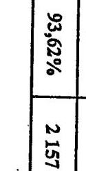

Kelt: Budapest, 2004. június 10.

---

# Tanúsítvány a Vám-és Pénzügyőrség készletbeszerzéseiről 1999-2004.III.31-ig

1. sz. tanúsítvány a V-13-70/2004-2005. sz. jelentéshez

|  Sorsz. | Megnevezés | 1999 | 2000 | az előző évhez változás %-a | 2001 | az előző évhez változás %-a | 2002 | az előző évhez a változás %-a | 2003 | az előző évhez a változás %-a | 2004. III. 31-ig  |
| --- | --- | --- | --- | --- | --- | --- | --- | --- | --- | --- | --- |
|  1. | Élelmiszerbeszerzés | 95 509 | 93 776 | 98,19% | 102 990 | 109,83% | 100 670 | 97,75% | 81 026 | 80,49% | 14 429  |
|  2. | Gyógyszor, vegyszor beszerzés | 11 987 | 6 578 | 54,88% | 5 561 | 84,54% | 9 078 | 163,24% | 11 740 | 129,32% | 1 573  |
|  3. | Irodaszor, nyomtatvány beszerzés | 261 339 | 314 771 | 120,45% | 347 763 | 110,48% | 300 282 | 86,35% | 259 476 | 86,41% | 57 917  |
|  4. | Könyv, folyótól, egyéb időbenévek | 144 679 | 166 301 | 114,94% | 179 988 | 108,23% | 176 739 | 98,19% | 214 803 | 121,54% | 43 580  |
|  5. | Tüzelőanyagok beszerzése | 47 039 | 38 780 | 82,44% | 36 184 | 93,31% | 29 104 | 80,43% | 7 988 | 27,45% | 7 398  |
|  6. | Hajtó és kerdonyag beszerzés | 215 447 | 277 622 | 128,86% | 289 593 | 104,31% | 270 951 | 93,56% | 267 366 | 98,68% | 57 749  |
|  7. | Szakmai anyagok beszerzése | 1 324 969 | 1 378 875 | 104,07% | 2 303 931 | 167,09% | 2 388 975 | 103,69% | 1 953 409 | 81,77% | 296 358  |
|  8. | Kis á tárgyi szek. szellemi term. | 91 735 | 92 726 | 101,08% | 84 651 | 91,29% | 170 927 | 201,92% | 99 805 | 58,39% | 24 680  |
|  9. | Munk. ruhs, vélők. format. agyenn. uba | 321 144 | 350 951 | 109,28% | 77 647 | 22,12% | 244 653 | 315,08% | 189 365 | 77,40% | 11 114  |
|  10. | Egyéb anyagbeszerzés | 95 459 | 138 837 | 145,44% | 167 781 | 120,85% | 175 071 | 104,34% | 165 083 | 94,29% | 51 915  |
|  11. | Köszketbeszerzés összesen | 2 609 307 | 2 859 217 | 109,58% | 3 596 089 | 125,77% | 3 866 450 | 107,52% | 3 250 061 | 84,06% | 566 713  |

Nyilatkozat: A tanúsítványban szereplő adatok a könyvviteli nyilvántartással egyezőek, valóságukat igazolom.

Kelt: Budapest, 2004. június 14.

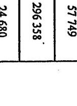

Aláírás

---

# Tanúsítvány

## az immateriális javak és tárgyi eszközök értékének alakulásáról

### 2002. év

|  Megnevezés | Immateriális javak | Ingatlanok | Gépok, berendezések és felmiretések | Járművek | Összesen  |
| --- | --- | --- | --- | --- | --- |
|  Előző évi záró állomány (tárgyévi nyitó állomány) | 1 448 422 | 33 422 020 | 8 920 703 | 2 918 233 | 46 709 378  |
|  Beszerzés, létesítés | 815 958 | 6 921 502 | 2 205 930 | 585 170 | 10 528 560  |
|  Felújítás | 0 | 134 148 | 0 | 0 | 134 148  |
|  Alaptevékenységhez térítésmentes átvétel | 0 | 0 | 1 559 | 399 | 1 958  |
|  Egyéb növekedés | 29 152 | 26 537 840 | 2 366 462 | 1 303 310 | 30 236 764  |
|  Összes növekedés | 845 110 | 33 593 490 | 4 573 951 | 1 888 879 | 40 901 430  |
|  Selejtezés, megsemmisülés | 0 | 51 561 | 161 009 | 142 182 | 354 761  |
|  Térítésmentes átadás | 2 328 | 0 | 324 | 0 | 2 652  |
|  Értékesítés | 113 | 2 625 | 305 | 0 | 3 043  |
|  Egyéb csökkenés | 27 196 | 32 803 650 | 2 739 926 | 1 304 585 | 36 875 357  |
|  Összes csökkenés | 29 646 | 32 857 836 | 2 901 564 | 1 446 767 | 37 235 813  |
|  Bruttó érték összesen | 2 263 886 | 34 157 674 | 10 593 090 | 3 360 345 | 50 374 995  |
|  Záróállomány (tárgyévi nyitó) | 1 210 029 | 2 541 958 | 6 229 253 | 2 031 743 | 12 012 983  |
|  Növekedés | 282 401 | 2 550 492 | 1 730 699 | 915 878 | 5 479 470  |
|  Csökkenés | 6 851 | 1 957 920 | 654 191 | 623 914 | 3 242 876  |
|  Értékcsökkenés összesen | 1 485 579 | 3 134 530 | 7 305 761 | 2 323 707 | 14 249 577  |
|  Eszközök nettó értéke | 778 307 | 31 023 144 | 3 287 329 | 1 036 638 | 36 125 418  |
|  Teljesen (0-ra) leírt eszközök bruttó értéke | 850 654 | 19 634 | 4 031 139 | 1 313 770 | 6 215 197  |

Nyilatkozat: A tanúsítványban szereplő adatok a könyvviteli nyilvántartással egyezőek, valódiságukat igazolom.

Kelt: 3 g.y. 2002. év 31.1.2002. hó 10. nap

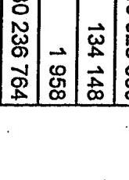

Készítette: Tálasz L.

---

1. sz. tanúsítvány a V-13-70/2004-2005. sz. jelentéshez az immateriális javak és tárgyi eszközök értékének alakulásáról 2003. év

|   | Megnevezés | Immateriális javak | Ingatlanok | Gépek, berendezések és felszerelések | Járművek | Összesen  |
| --- | --- | --- | --- | --- | --- | --- |
|  Előző évi záró állomány (tárgyévi nyitó állomány) |  | 2 263 886 | 34 157 674 | 10 593 090 | 3 360 345 | 50 374 995  |
|   |  | 354 028 | 5 126 142 | 1 056 409 | 271 398 | 6 807 977  |
|   |  | 0 | 220 874 | 615 | 148 | 221 637  |
|   |  | 0 | 34 786 | 511 | 0 | 35 297  |
|  Bruttó |  | 2 147 851 | 5 630 223 | 4 035 470 | 1 239 989 | 13 053 533  |
|   |  | 2 501 879 | 11 012 025 | 5 093 005 | 1 511 535 | 20 118 444  |
|   |  | 5 105 | 10 358 | 212 386 | 164 457 | 392 306  |
|   |  | 4 400 | 2 903 | 180 | 0 | 7 483  |
|   |  | 833 | 10 462 | 17 | 0 | 11 312  |
|   |  | 2 144 906 | 10 009 226 | 4 313 541 | 1 113 488 | 17 581 161  |
|   |  | 2 155 244 | 10 032 949 | 4 526 124 | 1 277 945 | 17 992 262  |
|   |  | 2 610 521 | 35 136 750 | 11 159 971 | 3 593 935 | 52 501 177  |
|   |  | 1 485 579 | 3 134 530 | 7 305 761 | 2 323 707 | 14 249 577  |
|  Értékcsökkenés |  | 1 786 290 | 1 024 478 | 2 984 820 | 711 564 | 6 507 152  |
|   |  | 1 448 574 | 372 812 | 2 062 778 | 501 957 | 4 386 121  |
|   |  | 1 823 295 | 3 766 196 | 8 227 803 | 2 533 314 | 16 370 608  |
|   |  | 787 226 | 31 350 554 | 2 932 168 | 1 060 621 | 36 130 569  |
|   |  | 1 324 763 | 19 773 | 5 212 822 | 1 663 767 | 8 221 125  |

Nyilatkozat: A tanúsítványban szereplő adatok a könyvviteli nyilvántartással egyezőek, valódiságukat igazolom.

Kelt: ..................................................................................................................................................................................................................................................................................................................................................................................................................................................................................................................................................................................................................................................................................................................................................................................................................................................................................................................................................................................................................................................................................................................................................................................................................................................................................................................................................................................................................................................................................................................................................................................................................................................................................................................................................................................................................................................................................................................................................................................................................................................................................................................................................................................................................................................................................................................................................................................................................................................................................................................................................................................................................................................................................................................................................................................................................................................................................................................................................................................................................................................................................................................................................................................................................................................................................................................................................................................

---

### Tanúsítvány a gépek, berendezések és felszerelések állományának változásáról 2002. év

|   | Megnevezés | Képzőművészeti
alkotások | Bútorok | Sokszorosítási
ecskősök | Ügyviteli gépek | Kommunikációs
ecskősök | Számítástechnikai
ecskősök | Egyéb gép,
berendezés,
felszerelés | Gépok,
berendezések,
felszerelések
összesen  |
| --- | --- | --- | --- | --- | --- | --- | --- | --- | --- |
|  Előző évi záró állomány (tárgyévi nyitó állomány) |  | 2 979 | 992 304 | 453 423 | 106 665 | 863 202 | 4 159 911 | 2 342 219 | 8 920 703  |
|   |  |  |  |  |  |  |  |  | 8 920 703  |
|   |  | Beszerzés, létesítés | 0 | 129 314 | 74 607 | 1 732 | 66 270 | 1 012 888 | 921 119  |
|   |  |  |  |  |  |  |  |  | 2 205 930  |
|   |  | Felújítás | 0 | 0 | 0 | 0 | 0 | 0 | 0  |
|   |  | Alaptevékenységhez térítésmentes átvétel | 0 | 0 | 0 | 0 | 1 559 | 0 | 0  |
|   |  | Egyéb növekedés | 0 | 293 832 | 14 074 | 15 487 | 177 914 | 908 364 | 956 791  |
|   |  | Összes növekedés | 0 | 423 146 | 88 681 | 17 219 | 245 743 | 1 921 252 | 1 877 910  |
|  Bruttó |  |  |  |  |  |  |  |  | 4 573 951  |
|   |  | Solajtenés, megsemmisülés | 1 | 6 920 | 11 539 | 4 166 | 32 327 | 101 898 | 4 158  |
|   |  | Térítésmentes átadás | 0 | 0 | 324 | 0 | 0 | 0 | 0  |
|   |  | Értékesítés | 0 | 0 | 0 | 0 | 0 | 0 | 305  |
|   |  | Egyéb csökkenés | 0 | 216 392 | 8 618 | 16 323 | 147 897 | 1 035 540 | 1 315 156  |
|   |  | Összes csökkenés | 1 | 223 312 | 20 481 | 20 489 | 180 224 | 1 137 438 | 1 319 619  |
|   |  | Bruttó érték összesen | 2 978 | 1 192 138 | 521 623 | 103 395 | 928 721 | 4 943 725 | 2 900 510  |
|   |  | Záróállomány (tárgyévi nyitó) | 0 | 550 521 | 422 290 | 98 374 | 558 304 | 3 431 244 | 1 168 520  |
|   |  | Növekedés | 0 | 214 350 | 37 995 | 19 779 | 131 017 | 831 993 | 495 565  |
|   |  | Csökkenés | 0 | 67 530 | 16 277 | 16 723 | 51 505 | 345 457 | 156 699  |
|   |  | Értékcsökkenés összesen | 0 | 697 341 | 444 008 | 101 430 | 637 816 | 3 917 780 | 1 507 386  |
|   |  | Eszközök nettó értéke | 2 978 | 494 797 | 77 615 | 1 965 | 290 905 | 1 025 945 | 1 393 124  |
|   |  | Teljesen (0-ca) leírt eszközök bruttó értéke | 0 | 206 789 | 376 975 | 82 087 | 156 408 | 2 864 698 | 344 182  |

Nyilatkozat: A tanúsítványban szereplő adatok a könyvviteli nyilvántartással egyennek, valódiságokat igazolom.

Kelt: 100%... év 100%... nap

Készítette: 100%... év 100%... nap

Aláírás

---

### Tanúsítvány a gépek, berendezések és felszerelések állományának változásáról 2003. év

|   | Megnevezés | Képsőművészeti alkotások | Bútorok | Sokszorosítási eszközök | Ügyvitteli gépek | Kommunikációs eszközök | Számításfezések eszközök | Egyéb gép, berendezések, felszerelések összesen  |
| --- | --- | --- | --- | --- | --- | --- | --- | --- |
|  Edítő évi záró állomány (tárgyévi nyitó állomány) |  | 2 978 | 1 192 138 | 521 623 | 103 395 | 928 721 | 4 943 725 | 2 900 510  |
|  Bontó |  |  |  |  |  |  |  |   |
|   |  | Beszerzés, létesítés | 0 | 87 621 | 94 823 | 3 547 | 106 910 | 536 270  |
|   |  | Feltöltés | 0 | 0 | 0 | 0 | 0 | 480  |
|   |  | Alaptevékenységhez térítésmentes átvétel | 0 | 0 | 0 | 0 | 170 | 0  |
|   |  | Egyéb növekedés | 423 | 225 331 | 256 021 | 27 119 | 269 111 | 1 709 743  |
|   |  | Összes növekedés | 423 | 312 952 | 350 844 | 30 666 | 396 191 | 2 246 493  |
|   |  |  |  |  |  |  |  | 1 755 436  |
|   |  |  |  |  |  |  |  | 5 093 005  |
|   |  |  |  |  |  |  |  | 1 180  |
|   |  |  |  |  |  |  |  | 180  |
|   |  |  |  |  |  |  |  | 17  |
|   |  |  |  |  |  |  |  | 17  |
|   |  |  |  |  |  |  |  | 4 313 541  |
|   |  |  |  |  |  |  |  | 4 526 124  |
|   |  |  |  |  |  |  |  | 11 159 971  |
|   |  |  |  |  |  |  |  | 7 305 761  |
|   |  |  |  |  |  |  |  | 2 984 820  |
|   |  |  |  |  |  |  |  | 2 062 778  |
|   |  |  |  |  |  |  |  | 8 227 803  |
|   |  |  |  |  |  |  |  | 2 932 166  |
|   |  |  |  |  |  |  |  | 5 212 822  |
|   |  |  |  |  |  |  |  | 5 212 822  |

Nyilatkozat: A tanúsítványban szereplő adatok a könyvviteli nyilvántartással egyezőek, valódiságukat igazolom.

Kelt: 2003. év 2004. év 2005. 10. 10. 2006. 2007. 2008. 2009. 2010. 2011. 2012. 2013. 2014. 2015. 2016. 2017. 2018. 2019. 2020. 2021. 2022. 2023. 2024. 2025. 2026. 2027. 2028. 2029. 2030. 2031. 2032. 2033. 2034. 2035. 2036. 2037. 2038. 2039. 2040. 2041. 2042. 2043. 2044. 2045. 2046. 2047. 2048. 2049. 2050. 2051. 2052. 2053. 2054. 2055. 2056. 2057. 2058. 2059. 2060. 2061. 2062. 2063. 2064. 2065. 2066. 2067. 2068. 2069. 2070. 2071. 2072. 2073. 2074. 2075. 2076. 2077. 2078. 2079. 2080. 2081. 2082. 2083. 2084. 2085. 2086. 2087. 2088. 2089. 2090. 2091. 2092. 2093. 2094. 2095. 2096. 2097. 2098. 2099. 2010. 2011. 2012. 2013. 2014. 2015. 2016. 2017. 2018. 2019. 2020. 2021. 2022. 2023. 2024. 2025. 2026. 2027. 2028. 2029. 2030. 2031. 2032. 2033. 2034. 2035. 2036. 2037. 2038. 2039. 2040. 2041. 2042. 2043. 2044. 2045. 2046. 2047. 2048. 2049. 2050. 2051. 2052. 2053. 2054. 2055. 2056. 2057. 2058. 2059. 2060. 2061. 2062. 2063. 2064. 2065. 2066. 2067. 2068. 2069. 2070. 2071. 2072. 2073. 2074. 2075. 2076. 2077. 2078. 2079. 2080. 2081. 2082. 2083. 2084. 2085. 2086. 2087. 2088. 2089. 2090. 2091. 2092. 2093. 2094. 2095. 2096. 2097. 2098. 2099. 2010. 2011. 2012. 2013. 2014. 2015. 2016. 2017. 2018. 2019. 2020. 2021. 2022. 2023. 2024. 2025. 2026. 2027. 2028. 2029. 2030. 2031. 2032. 2033. 2034. 2035. 2036. 2037. 2038. 2039. 2040. 2041. 2042. 2043. 2044. 2045. 2046. 2047. 2048. 2049. 2050. 2051. 2052. 2053. 2054. 2055. 2056. 2057. 2058. 2059. 2060. 2061. 2062. 2063. 2064. 2065. 2066. 2067. 2068. 2069. 2070. 2071. 2072. 2073. 2074. 2075. 2076. 2077. 2078. 2079. 2080. 2081. 2082. 2083. 2084. 2085. 2086. 2087. 2088. 2089. 2090. 2091. 2092. 2093. 2094. 2095. 2096. 2097. 2098. 2099. 2010. 2011. 2012. 2013. 2014. 2015. 2016. 2017. 2018. 2019. 2020. 2021. 2022. 2023. 2024. 2025. 2026. 2027. 2028. 2029. 2030. 2031. 2032. 2033. 2034. 2035. 2036. 2037. 2038. 2039. 2040. 2041. 2042. 2043. 2044. 2045. 2046. 2047. 2048. 2049. 2050. 2051. 2052. 2053. 2054. 2055. 2056. 2057. 2058. 2059. 2060. 2061. 2062. 2063. 2064. 2065. 2066. 2067. 2068. 2069. 2070. 2071. 2072. 2073. 2074. 2075. 2076. 2077. 2078. 2079. 2080. 2081. 2082. 2083. 2084. 2085. 2086. 2087. 2088. 2089. 2090. 2091. 2092. 2093. 2094. 2095. 2096. 2097. 2098. 2099. 2010. 2011. 2012. 2013. 2014. 2015. 2016. 2017. 2018. 2019. 2020. 2021. 2022. 2023. 2024. 2025. 2026. 2027. 2028. 2029. 2030. 2031. 2032. 2033. 2034. 2035. 2036. 2037. 2038. 2039. 2040. 2041. 2042. 2043. 2044. 2045. 2046. 2047. 2048. 2049. 2050. 2051. 2052. 2053. 2054. 2055. 2056. 2057. 2058. 2059. 2060. 2061. 2062. 2063. 2064. 2065. 2066. 2067. 2068. 2069. 2070. 2071. 2072. 2073. 2074. 2075. 2076. 2077. 2078. 2079. 2080. 2081. 2082. 2083. 2084. 2085. 2086. 2087. 2088. 2089. 2090. 2091. 2092. 2093. 2094. 2095. 2096. 2097. 2098. 2099. 2010. 2011. 2012. 2013. 2014. 2015. 2016. 2017. 2018. 2019. 2020. 2021. 2022. 2023. 2024. 2025. 2026. 2027. 2028. 2029. 2030. 2031. 2032. 2033. 2034. 2035. 2036. 2037. 2038. 2039. 2040. 2041. 2042. 2043. 2044. 2045. 2046. 2047. 2048. 2049. 2050. 2051. 2052. 2053. 2054. 2055. 2056. 2057. 2058. 2059. 2060. 2061. 2062. 2063. 2064. 2065. 2066. 2067. 2068. 2069. 2070. 2071. 2072. 2073. 2074. 2075. 2076. 2077. 2078. 2079. 2080. 2081. 2082. 2083. 2084. 2085. 2086. 2087. 2088. 2089. 2090. 2091. 2092. 2093. 2094. 2095. 2096. 2097. 2098. 2099. 2010. 2011. 2012. 2013. 2014. 2015. 2016. 2017. 2018. 2019. 2020. 2021. 2022. 2023. 2024. 2025. 2026. 2027. 2028. 2029. 2030. 2031. 2032. 2033. 2034. 2035. 2036. 2037. 2038. 2039. 2040. 2041. 2042. 2043. 2044. 2045. 2046. 2047. 2048. 2049. 2050. 2051. 2052. 2053. 2054. 2055. 2056. 2057. 2058. 2059. 2060. 2061. 2062. 2063. 2064. 2065. 2066. 2067. 2068. 2069. 2070. 2071. 2072. 2073. 2074. 2075. 2076. 2077. 2078. 2079. 2080. 2081. 2082. 2083. 2084. 2085. 2086. 2087. 2088. 2089. 2090. 2091. 2092. 2093. 2094. 2095. 2096. 2097. 2098. 2099. 2010. 2011. 2012. 2013. 2014. 2015. 2016. 2017. 2018. 2019. 2020. 2021. 2022. 2023. 2024. 2025. 2026. 2027. 2028. 2029. 2030. 2031. 2032. 2033. 2034. 2035. 2036. 2037. 2038. 2039. 2040. 2041. 2042. 2043. 2044. 2045. 2046. 2047. 2048. 2049. 2050. 2051. 2052. 2053. 2054. 2055. 2056. 2057. 2058. 2059. 2060. 2061. 2062. 2063. 2064. 2065. 2066. 2067. 2068. 2069. 2070. 2071. 2072. 2073. 2074. 2075. 2076. 2077. 2078. 2079. 2080. 2081. 2082. 2083. 2084. 2085. 2086. 2087. 2088. 2089. 2090. 2091. 2092. 2093. 2094. 2095. 2096. 2097. 2098. 2099. 2010. 2011. 2012. 2013. 2014. 2015. 2016. 2017. 2018. 2019. 2020. 2021. 2022. 2023. 2024. 2025. 2026. 2027. 2028. 2029. 2030. 2031. 2032. 2033. 2034. 2035. 2036. 2037. 2038. 2039. 2040. 2041. 2042. 2043. 2044. 2045. 2046. 2047. 2048. 2049. 2050. 2051. 2052. 2053. 2054. 2055. 2056. 2057. 2058. 2059. 2060. 2061. 2062. 2063. 2064. 2065. 2066. 2067. 2068. 2069. 2070. 2071. 2072. 2073. 2074. 2075. 2076. 2077. 2078. 2079. 2080. 2081. 2082. 2083. 2084. 2085. 2086. 2087. 2088. 2089. 2090. 2091. 2092. 2093. 2094. 2095. 2096. 2097. 2098. 2099. 2010. 2011. 2012. 2013. 2014. 2015. 2016. 2017. 2018. 2019. 2020. 2021. 2022. 2023. 2024. 2025. 2026. 2027. 2028. 2029. 2030. 2031. 2032. 2033. 2034. 2035. 2036. 2037. 2038. 2039. 2040. 2041. 2042. 2043. 2044. 2045. 2046. 2047. 2048. 2049. 2050. 2051. 2052. 2053. 2054. 2055. 2056. 2057. 2058. 2059. 2060. 2061. 2062. 2063. 2064. 2065. 2066. 2067. 2068. 2069. 2070. 2071. 2072. 2073. 2074. 2075. 2076. 2077. 2078. 2079. 2080. 2081. 2082. 2083. 2084. 2085. 2086. 2087. 2088. 2089. 2090. 2091. 2092. 2093. 2094. 2095. 2096. 2097. 2098. 2099. 2010. 2011. 2012. 2013. 2014. 2015. 2016. 2017. 2018. 2019. 2020. 2021. 2022. 2023. 2024. 2025. 2026. 2027. 2028. 2029. 2030. 2031. 2032. 2033. 2034. 2035. 2036. 2037. 2038. 2039. 2040. 2041. 2042. 2043. 2044. 2045. 2046. 2047. 2048. 2049. 2050. 2051. 2052. 2053. 2054. 2055. 2056. 2057. 2058. 2059. 2060. 2061. 2062. 2063. 2064. 2065. 2066. 2067. 2068. 2069. 2070. 2071. 2072. 2073. 2074. 2075. 2076. 2077. 2078. 2079. 2080. 2081. 2082. 2083. 2084. 2085. 2086. 2087. 2088. 2089. 2090. 2091. 2092. 2093. 2094. 2095. 2096. 2097. 2098. 2099. 2010. 2011. 2012. 2013. 2014. 2015. 2016. 2017. 2018. 2019. 2020. 2021. 2022. 2023. 2024. 2025. 2026. 2027. 2028. 2029. 2030. 2031. 2032. 2033. 2034. 2035. 2036. 2037. 2038. 2039. 2040. 2041. 2042. 2043. 2044. 2045. 2046. 2047. 2048. 2049. 2050. 2051. 2052. 2053. 2054. 2055. 2056. 2057. 2058. 2059. 2060. 2061. 2062. 2063. 2064. 2065. 2066. 2067. 2068. 2069. 2070. 2071. 2072. 2073. 2074. 2075. 2076. 2077. 2078. 2079. 2080. 2081. 2082. 2083. 2084. 2085. 2086. 2087. 2088. 2089. 2090. 2091. 2092. 2093. 2094. 2095. 2096. 2097. 2098. 2099. 2010. 2011. 2012. 2013. 2014. 2015. 2016. 2017. 2018. 2019. 2020. 2021. 2022. 2023. 2024. 2025. 2026. 2027. 2028. 2029. 2030. 2031. 2032. 2033. 2034. 2035. 2036. 2037. 2038. 2039. 2040. 2041. 2042. 2043. 2044. 2045. 2046. 2047. 2048. 2049. 2050. 2051. 2052. 2053. 2054. 2055. 2056. 2057. 2058. 2059. 2060. 2061. 2062. 2063. 2064. 2065. 2066. 2067. 2068. 2069. 2070. 2071. 2072. 2073. 2074. 2075. 2076. 2077. 2078. 2079. 2080. 2081. 2082. 2083. 2084. 2085. 2086. 2087. 2088. 2089. 2090. 2091. 2092. 2093. 2094. 2095. 2096. 2097. 2098. 2099. 2010. 2011. 2012. 2013. 2014. 2015. 2016. 2017. 2018. 2019. 2020. 2021. 2022. 2023. 2024. 2025. 2026. 2027. 2028. 2029. 2030. 2031. 2032. 2033. 2034. 2035. 2036. 2037. 2038. 2039. 2040. 2041. 2042. 2043. 2044. 2045. 2046. 2047. 2048. 2049. 2050. 2051. 2052. 2053. 2054. 2055. 2056. 2057. 2058. 2059. 2060. 2061. 2062. 2063. 2064. 2065. 2066. 2067. 2068. 2069. 2070. 2071. 2072. 2073. 2074. 2075. 2076. 2077. 2078. 2079. 2080. 2081. 2082. 2083. 2084. 2085. 2086. 2087. 2088. 2089. 2090. 2091. 2092. 2093. 2094. 2095. 2096. 2097. 2098. 2099. 2010. 2011. 2012. 2013. 2014. 2015. 2016. 2017. 2018. 2019. 2020. 2021. 2022. 2023. 2024. 2025. 2026. 2027. 2028. 2029. 2030. 2031. 2032. 2033. 2034. 2035. 2036. 2037. 2038. 2039. 2030. 2031. 2032. 2033. 2034. 2035. 2036. 2037. 2038. 2039. 2030. 2031. 2032. 2033. 2034. 2035. 2036. 2037. 2038. 2039. 2030. 2031. 2032. 2033. 2034. 2035. 2036. 2037. 2038. 2039. 2030. 2031. 2032. 2033. 2034. 2035. 2036. 2037. 2038. 2039. 2030. 2031. 2032. 2033. 2034. 2035. 2036. 2037. 2038. 2039. 2030. 2031. 2032. 2033. 2034. 2035. 2036. 2037. 2038. 2039. 2030. 2031. 2032. 2033. 2034. 2035. 2036. 2037. 2038. 2039. 2030. 2031. 2032. 2033. 2034. 2035. 2036. 2037. 2038. 2039. 2030. 2031. 2032. 2033. 2034. 2035. 2036. 2037. 2038. 2039. 2030. 2031. 2032. 2033. 2034. 2035. 2036. 2037. 2038. 2039. 2030. 2031. 2032. 2033. 2034. 2035. 2036. 2037. 2038. 2039. 2030. 2031. 2032. 2033. 2034. 2035. 2036. 2037. 2038. 2039. 2030. 2031. 2032. 2033. 2034. 2035. 2036. 2037. 2038. 2039. 2030. 2031. 2032. 2033. 2034. 2035. 2036. 2037. 2038. 2039. 2030. 2031. 2032. 2033. 2034. 2035. 2036. 2037. 2038. 2039. 2030. 2031. 2032. 2033. 2034. 2035. 2036. 2037. 2038. 2039. 2030. 2031. 2032. 2033. 2034. 2035. 2036. 2037. 2038. 2039. 2030. 2031. 2032. 2033. 2034. 2035. 2036. 2037. 2038. 2039. 2030. 2031. 2032. 2033. 2034. 2035. 2036. 2037. 2038. 2039. 2030. 2031. 2032. 2033. 2034. 2035. 2036. 2037. 2038. 2039. 2030. 2031. 2032. 2033. 2034. 2035. 2036. 2037. 2038. 2039. 2030. 2031. 2032. 2033. 2034. 2035. 2036. 2037. 2038. 2039. 2030. 2031. 2032. 2033. 2034. 2035. 2036. 2037. 2038. 2039. 2030. 2031. 2032. 2033. 2034. 2035. 2036. 2037. 2038. 2039. 2030. 2031. 2032. 2033. 2034. 2035. 2036. 2037. 2038. 2039. 2030. 2031. 2032. 2033. 2034. 2035. 2036. 2037. 2038. 2039. 2030. 2031. 2032. 2033. 2034. 2035. 2036. 2037. 2038. 2039. 2030. 2031. 2032. 2033. 2034. 2035. 2036. 2037. 2038. 2039. 2030. 2031. 2032. 2033. 2034. 2035. 2036. 2037. 2038. 2039. 2030. 2031. 2032. 2033. 2034. 2035. 2036. 2037. 2038. 2039. 2030. 2031. 2032. 2033. 2034. 2035. 2036. 2037. 2038. 2039. 2030. 2031. 2032. 2033. 2034. 2035. 2036. 2037. 2038. 2039. 2030. 2031. 2032. 2033. 2034. 2035. 2036. 2037. 2038. 2039. 2030. 2031. 2032. 2033. 2034. 2035. 2036. 2037. 2038. 2039. 2030. 2031. 2032. 2032. 2032. 2033. 2034. 2035. 2036. 2037. 2038. 2039. 2030. 2031. 2032. 2032. 2032. 2032. 2032. 2032. 2032. 2032. 2032. 2032. 2032. 2032. 2032. 2032. 2032. 2032. 2032. 2032. 2032. 2032. 2032. 2032. 2032. 2032. 2032. 2032. 2032. 2032. 2032. 2032. 2032. 2032. 2032. 2032. 2032. 2032. 2032. 2032. 2032. 2032. 2032. 2032. 2032. 2032. 2032. 2032. 2032. 2032. 2032. 2032. 2032. 2032. 2032. 2032. 2032. 2032. 2032. 2032. 2032. 2032. 2032. 2032. 2032. 2032. 2032. 2032. 2032. 2032. 2032. 2032. 2032. 2032. 2032. 2032. 2032. 2032. 2032. 2032. 2032. 2032. 2032. 2032. 2032. 2032. 2032. 2032. 2032. 2032. 2032. 2032. 2032. 2032. 2032. 2032. 2032. 2032. 2032. 2032. 2032. 2032. 2032. 2032. 2032. 2032. 2032. 2032. 2032. 2032. 2032. 2032. 2032. 2032. 2032. 2032. 2032. 2032. 2032. 2032. 2032. 2032. 2032. 2032. 2032. 2032. 2032. 2032. 2032. 2032. 2032. 2032. 2032. 2032. 2032. 2032. 2032. 2032. 2032. 2032. 2032. 2032. 2032. 2032. 2032. 2032. 2032. 2032. 2032. 2032. 2032. 2032. 2032. 2032. 2032. 2032. 2032. 2032. 2032. 2032. 2032. 2032. 2032. 2032. 2032. 2032. 2032. 2032. 2032. 2032. 2032. 2032. 2032. 2032. 2032. 2032. 2032. 2032. 2032. 2032. 2032. 2032. 2032. 2032. 2032. 2032. 2032. 2032. 2032. 2032. 2032. 2032. 2032. 2032. 2032. 2032. 2032. 2032. 2032. 2032. 2032. 2032. 2032. 2032. 2032. 2032. 2032. 2032. 2032. 2032. 2032. 2032. 2032. 2032. 2032. 2032. 2032. 2032. 2032. 2032. 2032. 2032. 2032. 2032. 2032. 2032. 2032. 2032. 2032. 2032. 2032. 2032. 2032. 2032. 2032. 2032. 2032. 2032. 2032. 2032. 2032. 2032. 2032. 2032. 2032. 2032. 2032. 2032. 2032. 2032. 2032. 2032. 2032. 2032. 2032. 2032. 2032. 2032. 2032. 2032. 2032. 2032. 2032. 2032. 2032. 2032. 2032. 2032. 2032. 2032. 2032. 2032. 2032. 2032. 2032. 2032. 2032. 2032. 2032. 2032. 2032. 2032. 2032. 2032. 2032. 2032. 2032. 2032. 2032. 2032. 2032. 2032. 2032. 2032. 2032. 2032. 2032. 2032. 2032. 2032. 2032. 2032. 2032. 2032. 2032. 2032. 2032. 2032. 2032. 2032. 2032. 2032. 2032. 2032. 2032. 2032. 2032. 2032. 2032. 2032. 2032. 2032. 2032. 2032. 2032. 2032. 2032. 2032. 2032. 2032. 2032. 2032. 2032. 2032. 2032. 2032. 2032. 2032. 2032. 2032. 2032. 2032. 2032. 2032. 2032. 2032. 2032. 2032. 2032. 2032. 2032. 2032. 2032. 2032. 2032. 2032. 2032. 2032. 2032. 2032. 2032. 2032. 2032. 2032. 2032. 2032. 2032. 2032. 2032. 2032. 2032. 2032. 2032. 2032. 2032. 2032. 2032. 2032. 2032. 2032. 2032. 2032. 2032. 2032. 2032. 2032. 2032. 2032. 2032. 2032. 2032. 2032. 2032. 2032. 2032. 2032. 2032. 2032. 2032. 2032. 2032. 2032. 2032. 2032. 2032. 2032. 2032. 2032. 2032. 2032. 2032. 2032. 2032. 2032. 2032. 2

---

1. sz. tanúsítvány a V-13-70/2004-2005. sz. jelentéshez

# Tanúsítvány járműállomány változásáról 2002. év

|  Megnevezés | Személypípkocok |  |  |  |  |  |  |  |  |  |  |   |
| --- | --- | --- | --- | --- | --- | --- | --- | --- | --- | --- | --- | --- |
|   |  |  |  |  |  |  |  |  |  |  |  |   |
|   |  |  |  |  |  |  |  |  |  |  |  |   |
|  Előző évi záró állomány (tárgyévi nyitó állomány) |  |  |  |  |  |  |  |  |  |  |  |   |
|   |  |  |  |  |  |  |  |  |  |  |  |   |
|  Növekedés |  |  |  |  |  |  |  |  |  |  |  |   |
|   | Beszerzés, létesítés |  |  |  |  |  |  |  |  |  |  |   |
|   | Feltöltés |  |  |  |  |  |  |  |  |  |  |   |
|   | Alaptevékenységhez térítémentes átvétel |  |  |  |  |  |  |  |  |  |  |   |
|   | Egyéb növekedés |  |  |  |  |  |  |  |  |  |  |   |
|   | Összes növekedés |  |  |  |  |  |  |  |  |  |  |   |
|  Bruttó |  |  |  |  |  |  |  |  |  |  |  |   |
|   | Szigészés, megsemmisülés |  |  |  |  |  |  |  |  |  |  |   |
|   | Térítémentes átadás |  |  |  |  |  |  |  |  |  |  |   |
|   | Értékesítés |  |  |  |  |  |  |  |  |  |  |   |
|   | Egyéb csökkenés |  |  |  |  |  |  |  |  |  |  |   |
|   | Összes csökkenés |  |  |  |  |  |  |  |  |  |  |   |
|   | Bruttó érték összesen |  |  |  |  |  |  |  |  |  |  |   |
|   | Záróállomány (tárgyévi nyitó) |  |  |  |  |  |  |  |  |  |  |   |
|  Értékcsökkenés | Növekedés |  |  |  |  |  |  |  |  |  |  |   |
|   | Csökkenés |  |  |  |  |  |  |  |  |  |  |   |
|   |  |  |  |  |  |  |  |  |  |  |  |   |
|   |  |  |  |  |  |  |  |  |  |  |  |   |
|   |  |  |  |  |  |  |  |  |  |  |  |   |
|   |  |  |  |  |  |  |  |  |  |  |  |   |
|   |  |  |  |  |  |  |  |  |  |  |  |   |
|   |  |  |  |  |  |  |  |  |  |  |  |   |
|   |  |  |  |  |  |  |  |  |  |  |  |   |
|   |  |  |  |  |  |  |  |  |  |  |  |   |
|   |  |  |  |  |  |  |  |  |  |  |  |   |
|   |  |  |  |  |  |  |  |  |  |  |  |   |
|   |  |  |  |  |  |  |  |  |  |  |  |   |
|   |  |  |  |  |  |  |  |  |  |  |  |   |
|   |  |  |  |  |  |  |  |  |  |  |  |   |
|   |  |  |  |  |  |  |  |  |  |  |  |   |
|   |  |  |  |  |  |  |  |  |  |  |  |   |
|   |  |  |  |  |  |  |  |  |  |  |  |   |
|   |  |  |  |  |  |  |  |  |  |  |  |   |
|   |  |  |  |  |  |  |  |  |  |  |  |   |
|   |  |  |  |  |  |  |  |  |  |  |  |   |
|   |  |  |  |  |  |  |  |  |  |  |  |   |
|   |  |  |  |  |  |  |  |  |  |  |  |   |
|   |  |  |  |  |  |  |  |  |  |  |  |   |
|   |  |  |  |  |  |  |  |  |  |  |  |   |
|   |  |  |  |  |  |  |  |  |  |  |  |   |
|   |  |  |  |  |  |  |  |  |  |  |  |   |
|   |  |  |  |  |  |  |  |  |  |  |  |   |
|   |  |  |  |  |  |  |  |  |  |  |  |   |
|   |  |  |  |  |  |  |  |  |  |  |  |   |
|   |  |  |  |  |  |  |  |  |  |  |  |   |
|   |  |  |  |  |  |  |  |  |  |  |  |   |
|   |  |  |  |  |  |  |  |  |  |  |  |   |
|   |

---

# Tanúsítvány járműállomány változásáról 2003. év

|  Megnevezés | Személygépkocsik |  |  |  |  |  |  |  |  |  |  |  |   |
| --- | --- | --- | --- | --- | --- | --- | --- | --- | --- | --- | --- | --- | --- |
|   |  |  |  |  |  |  |  |  |  |  |  |  |   |
|   |  |  |  |  |  |  |  |  |  |  |  |  |   |
|  Előző évt záró állomány (tárgyéví nyitó állomány) |  |  |  |  |  |  |  |  |  |  |  |  |   |
|   |  |  |  |  |  |  |  |  |  |  |  |  |   |
|  Bruttó |  |  |  |  |  |  |  |  |  |  |  |  |   |
|   |  |  |  |  |  |  |  |  |  |  |  |  |   |
|   |  |  |  |  |  |  |  |  |  |  |  |  |   |
|   |  |  |  |  |  |  |  |  |  |  |  |  |   |
|   |  |  |  |  |  |  |  |  |  |  |  |  |   |
|   |  |  |  |  |  |  |  |  |  |  |  |  |   |
|   |  |  |  |  |  |  |  |  |  |  |  |  |   |
|   |  |  |  |  |  |  |  |  |  |  |  |  |   |
|   |  |  |  |  |  |  |  |  |  |  |  |  |   |
|   |  |  |  |  |  |  |  |  |  |  |  |  |   |
|   |  |  |  |  |  |  |  |  |  |  |  |  |   |
|   |  |  |  |  |  |  |  |  |  |  |  |  |   |
|   |  |  |  |  |  |  |  |  |  |  |  |  |   |
|   |  |  |  |  |  |  |  |  |  |  |  |  |   |
|   |  |  |  |  |  |  |  |  |  |  |  |  |   |
|   |  |  |  |  |  |  |  |  |  |  |  |  |   |
|   |  |  |  |  |  |  |  |  |  |  |  |  |   |
|   |  |  |  |  |  |  |  |  |  |  |  |  |   |
|   |  |  |  |  |  |  |  |  |  |  |  |  |   |
|   |  |  |  |  |  |  |  |  |  |  |  |  |   |
|   |  |  |  |  |  |  |  |  |  |  |  |  |   |
|   |  |  |  |  |  |  |  |  |  |  |  |  |   |
|   |  |  |  |  |  |  |  |  |  |  |  |  |   |
|   |  |  |  |  |  |  |  |  |  |  |  |  |   |
|   |  |  |  |  |  |  |  |  |  |  |  |  |   |
|   |  |  |  |  |  |  |  |  |  |  |  |  |   |
|   |  |  |  |  |  |  |  |  |  |  |  |  |   |
|   |  |  |  |  |  |  |  |  |  |  |  |  |   |
|   |  |  |  |  |  |  |  |  |  |  |  |  |   |
|   |  |  |  |  |  |  |  |  |  |  |  |  |   |
|   |  |  |  |  |  |  |  |  |  |  |  |  |   |
|   |  |  |  |  |  |  |  |  |  |  |  |  |   |
|   |

---

Tanúsítvány a közúti gépjárművek futásteljesítményéről 2000-2003.

|   |  |  |  |  |  |  |  |  |  |  |  |  |  |  |  |  |  |  |  |  |  |  |  |  |  |   |
| --- | --- | --- | --- | --- | --- | --- | --- | --- | --- | --- | --- | --- | --- | --- | --- | --- | --- | --- | --- | --- | --- | --- | --- | --- | --- | --- |
|   |  |  |  |  |  |  |  |  |  |  |  |  |  |  |  |  |  |  |  |  |  |  |  |  |  |   |
|  Időnok |  |  |  |  |  |  |  |  |  |  |  |  |  |  |  |  |  |  |  |  |  |  |  |  |  |   |
|   |  |  |  |  |  |  |  |  |  |  |  |  |  |  |  |  |  |  |  |  |  |  |  |  |  |   |
|  Gépjárművek |  |  |  |  |  |  |  |  |  |  |  |  |  |  |  |  |  |  |  |  |  |  |  |  |  |   |
|  futásteljesítménya |  |  |  |  |  |  |  |  |  |  |  |  |  |  |  |  |  |  |  |  |  |  |  |  |  |   |
|  az adott évben |  |  |  |  |  |  |  |  |  |  |  |  |  |  |  |  |  |  |  |  |  |  |  |  |  |   |
|   |  |  |  |  |  |  |  |  |  |  |  |  |  |  |  |  |  |  |  |  |  |  |  |  |  |   |
|   |  |  |  |  |  |  |  |  |  |  |  |  |  |  |  |  |  |  |  |  |  |  |  |  |  |   |
|   |  |  |  |  |  |  |  |  |  |  |  |  |  |  |  |  |  |  |  |  |  |  |  |  |  |   |
|   |  |  |  |  |  |  |  |  |  |  |  |  |  |  |  |  |  |  |  |  |  |  |  |  |  |   |
|   |  |  |  |  |  |  |  |  |  |  |  |  |  |  |  |  |  |  |  |  |  |  |  |  |  |   |
|   |  |  |  |  |  |  |  |  |  |  |  |  |  |  |  |  |  |  |  |  |  |  |  |  |  |   |
|   |  |  |  |  |  |  |  |  |  |  |  |  |  |  |  |  |  |  |  |  |  |  |  |  |  |   |
|   |  |  |  |  |  |  |  |  |  |  |  |  |  |  |  |  |  |  |  |  |  |  |  |  |  |   |
|   |  |  |  |  |  |  |  |  |  |  |  |  |  |  |  |  |  |  |  |  |  |  |  |  |  |   |
|   |  |  |  |  |  |  |  |  |  |  |  |  |  |  |  |  |  |  |  |  |  |  |  |  |  |   |
|   |  |  |  |  |  |  |  |  |  |  |  |  |  |  |  |  |  |  |  |  |  |  |  |  |  |   |
|   |  |  |  |  |  |  |  |  |  |  |  |  |  |  |  |  |  |  |  |  |  |  |  |  |  |   |
|   |  |  |  |  |  |  |  |  |  |  |  |  |  |  |  |  |  |  |  |  |  |  |  |  |  |   |
|   |  |  |  |  |  |  |  |  |  |  |  |  |  |  |  |  |  |  |  |  |  |  |  |  |  |   |
|   |  |  |  |  |  |  |  |  |  |  |  |  |  |  |  |  |  |  |  |  |  |  |  |  |  |   |
|   |  |  |  |  |  |  |  |  |  |  |  |  |  |  |  |  |  |  |  |  |  |  |  |  |  |   |
|   |  |  |  |  |  |  |  |  |  |  |  |  |  |  |  |  |  |  |  |  |  |  |  |  |  |   |
|   |  |  |  |  |  |  |  |  |  |  |  |  |  |  |  |  |  |  |  |  |  |  |  |  |  |   |
|   |  |  |  |  |  |  |  |  |  |  |  |  |  |  |  |  |  |  |  |  |  |  |  |  |  |   |
|   |  |  |  |  |  |  |  |  |  |  |  |  |  |  |  |  |  |  |  |  |  |  |  |  |  |   |
|   |  |  |  |  |  |  |  |  |  |  |  |  |  |  |  |  |  |  |  |  |  |  |  |  |  |   |
|   |  |  |  |  |  |  |  |  |  |  |  |  |  |  |  |  |  |  |  |  |  |  |  |  |  |   |
|   |  |  |  |  |  |  |  |  |  |  |  |  |  |  |  |  |  |  |  |  |  |  |  |  |  |   |
|   |  |  |  |  |  |  |  |  |  |  |  |  |  |  |  |  |  |  |  |  |  |  |  |  |  |   |
|   |  |  |  |  |  |  |  |  |  |  |  |  |  |  |  |  |  |  |  |  |  |  |  |  |  |   |
|   |  |  |  |  |  |  |  |  |  |  |  |  |  |  |  |  |  |  |  |  |  |  |  |  |  |   |
|   |  |  |  |  |  |  |  |  |  |  |  |  |  |  |  |  |  |  |  |  |  |  |  |  |  |   |
|   |  |  |  |  |  |  |  |  |  |  |  |  |  |  |  |  |  |  |  |  |  |  |  |  |  |   |
|   |  |  |  |  |  |  |  |  |  |  |  |  |  |  |  |  |  |  |  |  |  |  |  |  |  |   |
|   |  |  |  |  |  |  |  |  |  |  |  |  |  |  |  |  |  |  |  |  |  |  |  |  |  |   |
|   |  |  |  |  |  |  |  |  |  |  |  |  |  |  |  |  |  |  |  |  |  |  |  |  |  |   |
|   |

---

Szervezeti egység neve: VPOP BEF

Tanúsítvány az ingatlan értékesítés alakulásáról rögök, középfokú szervek és VPOP szerint részletezve 2002-2003.

|  Sor
szá
m | Ingatlan címe | Helyrajzi
szám | Nettó érték
(E Ft) | Értékbecslés során becsült
érték (Ft) | Vételár (Ft) | Vevő neve | Szerződést
ellenjegyző neve | Értékesítés
VP-t terhelő
költségét
(Ft) | Értékesítés
indoka | Ajánlatkérés
módja  |
| --- | --- | --- | --- | --- | --- | --- | --- | --- | --- | --- |
|  1. | Bp. VIII. Auróra u. 22-31. B 8, VI21.+ garázs | 20001/0/0/92 |  | 8 000 000 Ft | 8 000 000 Ft | 3 871 798 Ft | Garami Zavit | dr. Szerdmiklósi Péter |  | zárítótól eljárás  |
|  2. | Bp. XIV. Lengyel u. 28. II/9. | 40031/10/A/9 |  | 11 700 000 Ft | 11 500 000 Ft | 5 750 000 Ft | Callosa Endre | dr. Szerdmiklósi Péter | egyült összesen
600 000 Ft | gazdaságosság
indokok alapján  |
|  3. | Bp. XI. Kérő u. 10/A II/12 | 853/23/C/12 |  | 7 600 000 Ft | 7 750 000 Ft | 2 228 640 Ft | Módiai Endréné | dr. Szerdmiklósi Péter |  |   |
|  4. | Drégelypalám, Horst u. 3. | 845 |  | 1 500 000 Ft | 1 500 000 Ft | 450 000 Ft | Bódí István | dr. Szerdmiklósi Péter |  |   |
|  5. | Drégelypalám, Horst u. 5. | 845 |  | 1 900 000 Ft | 1 900 000 Ft | 570 000 Ft | Által Attila | dr. Szerdmiklósi Péter |  |   |

- A vételár a 10/2001 (III.1.) Pfél rend 21.§-ában leírt kedvezmények figyelembevételével került megállapításra.

Nyilatkozat: A tanúsítványban szereplő adatok a könyvéeli nyilvántartással egyezdek, valódiságukat igazolom.

Kelt: Budapest, 2004. Jónkus 8.

---

# Győr-Moson-Sopron Megyei Nyomozó Hivatal elhelyezésére szolgáló ingatlan beszerzése 

#### Abstract

A VP Központi Bünüldözési Parancsnoksága (a továbbiakban: VPKBP) a Győr-Moson-Sopron Megyei Nyomozó Hivatal elhelyezésére szolgáló ingatlan beszerzése során több törvénysértést követett el, amelynek következtében a költségvetést legkevesebb 41,65 M Ft kár érte, ezért az Állami Számvevőszék büntető feljelentést tett. (A feljelentés alapját képező dokumentumok az Állami Számvevőszék Jogi és Igazgatási Osztályán rendelkezésre állnak.)

A VPOP úgy rendelkezett, hogy az ingatlanvásárlással kapcsolatos közbeszerzési eljárást a VPKBP folytassa le. A VPKBP az eljárás lefolytatásához szükséges szakértelem hiányára hivatkozva külső céget bízott meg az eljárás lebonyolításával.

A VPKBP 2001. októberben a közbeszerzési eljárás lebonyolítására a szabadkézi vétel szabályai szerint három cégtől kért ajánlatot, de a cégek kiválasztási szempontjait nem dokumentálták és a szerződésben formai hibákat követtek el.

A kiválasztott céggel kötött szerződésről hiányzik a megbízó és a megbízott olvasható neve, valamint a pénzügyi vezető ellenjegyzése.

Az ingatlan vásárlásra vonatkozó részvételi felhívás 2001. december 12-én jelent meg a Közbeszerzési Értesítőben. A VP nem adott magyarázatot arra, hogy az év elejétől rendelkezésére álló előirányzat felhasználásáról miért az év végén döntöttek.

A közbeszerzési felhívásra két pályázat érkezett, ezek közül a bírálóbizottság egy kft. ajánlatát fogadta el. A Kft. ajánlata a felhívás feltételeinek több ponton nem felelt meg, ezért ennek elfogadása a közbeszerzésekről szóló 1995. évi XL. tv (továbbiakban: Kbt.) elöírásaiba ütközött.

A részvételi felhívásban az ingatlan alapterületét $500 \mathrm{~m}^{2}$-ben határozták meg, amelytől - $20 \%+40 \%$ eltérést engedélyeztek. A megvásárolt épület alapterülete $375 \mathrm{~m}^{2}$, ami - $25 \%$-os eltérést jelentett. Az ingatlan hasznos területe $754 \mathrm{~m}^{2}$, ami $50 \%$-kal haladja meg a felhívásban meghatározott alapterületet.

Az ajánlatban 4 autó tárolására alkalmas garázs szerepelt, az előírt 6-8 autó részére biztosítandó parkolási lehetőség helyett.

Az épület nem felelt meg a felhívásban szereplő beköltözhető állapotnak, mert romos állapotban volt (hiányoztak a közfalak, nyílászárók).

A VP a nyertes ajánlattevővel 2002. május 16-án adásvételi előszerződést és ingatlan jelzálogszerződést kötött. Az ingatlan jelzálogszerződést úgy szövegezték, hogy a „zálogjogosult (a VP) vételár előleg címén átutalt a zálogkötelezett részére 65 M Ft-ot". Az előszerződés szövege szerinti átutalás pénzügyi ellenjegyzés hiányában azonban nem valósult meg. Az előszerződéssel kapcsolatban a

---

VP által megbízott ügyvédi iroda törvénysértésre vonatkozó hétpontos észrevételt tett.

Az adásvételi előszerződést 2002. július 1-jén felbontották és új adásvételi szerződést kötöttek, amely egy felújítási szerződést is leplezett, ezzel kikerülték, hogy a szükséges felújítások elvégzésére közbeszerzési eljárás lefolytatását követően kerülhessen sor.

Az új adásvételi szerződés megkötésénél az ügyvédi iroda észrevételeit részben figyelembe vették. Így pl. kihagyták a „felújítja", „felújított" kifejezéseket, ezzel leplezték, hogy a szerződés felújítást is tartalmaz.

Az adásvételi szerződés megkötésének 2002. július 1-jei időpontja ismételten törvénysértő volt, mivel a Kbt.-ben meghatározott határidő lejárta új közbeszerzési eljárás megindítását tette volna szükségessé.

A Kbt. 62. §. (2) szerint a szerződés megkötésének időpontját az ajánlati felhívásban kell megállapítani azzal, hogy az - a 71/B. § (3)-(4) bekezdése szerinti eset kivételével - nem határozható meg az eredményhirdetést követő naptól számított nyolcadik napnál korábbi és a harmincadik (építési beruházás esetén a hatvanadik) napnál későbbi időpontban.

A 2002. június 24-én készített ingatlanforgalmi értékbecslés megállapította, hogy az ingatlan nagymértékű felújítást igényel. A mellékletként becsatolt fényképek alapján megállapítható, hogy a teljes épület romos, a tervezett célokra alkalmatlan volt. Az épülethez földterület nem tartozik, önálló felépítményként telekkönyvezett, önkormányzati tulajdonban álló területen fennálló földhasználati jogosultsággal rendelkező műszaki úszóteleknek minősül.

A szerződésben megjelölt vételárat ( 138 M Ft ) az épület felújított állapotára határozták meg, ezen belül nem különítették el az elvégzendő felújítások értékét.

A Kft. az ingatlant 2001. áprilisában 23,5 M Ft-ért vásárolta, felújítási munkákat a VPKBP-vel kötött szerződés időpontjáig nem végzett. A VP által felkért szakértő az eredeti, romos állapotban lévő ingatlan forgalmi értékét 2002. júniusban a piaci ár többszörösére, 67,9 M Ft-ra, a szükséges felújítás értékét 60,3 M Ft-ra, a felújított ingatlan értékét összesen 128,18 M Ft-ra becsülte. A VP még a becsült értéknél is 10 M Ft-tal magasabb összeget fizetett ki.

A pályázati felhívásban meghatározott birtokba adási határidő 2002. szeptember 30. volt. Az adásvételi szerződésben ezt 2002. október 31-re módosították. A tényleges birtokbaadásra 2002. december 4-én került sor. A VP 2002. december 16-án fizette ki a vételárat. Az átadást követően számos problémát okozott a nem megfelelő műszaki teljesítés (az előtető leszakadt, a homlokzat vakolása rossz minőségű, a vízlevezető gödörből szennyvíz folyt ki stb.). A hibák kijavítására a többször módosított határidők lejártát követően, a helyszíni ellenőrzés időpontjáig nem került sor. A VP az adásvételi szerződésben megállapított kötbért nem érvényesítette, és egyéb jogorvoslattal sem élt a felmerült hiányosságok miatt, ezzel megsértette az Áht. 108 § (2) bekezdésében foglaltakat.

---

Az Áht. 108. § (2) bekezdése szerint az államháztartás alrendszereinek követeléseiről lemondani csak törvényben, a helyi önkormányzatnál, a helyi önkormányzat rendeletében meghatározott módon és esetekben lehet.

A költségvetést az ügylet következtében kétszeresen is kár érte, egyrészt, mert az ingatlant a piaci árnál magasabb összegért vásárolták, másrészt, mert a felújítást a közbeszerzési törvény megkerülésével, a verseny kizárásával végeztették el.

A VP vagyonkezelői kötelezettségének nem tett eleget, vagyoni hátrányt okozott, amely a Btk. 319. § szerint hűtlen kezelés alapos gyanúját veti fel.

Az ellenőrzés álláspontja szerint a költségvetésnek okozott kár az ingatlan felülértékelésének következtében kb. 40 M Ft , a kötbér érvényesítésének elmulasztásából 1,65 M Ft. További, az ellenőrzés által nem számszerűsített kárt okozott a verseny kizárásával végrehajtott felújítás.

---

# DOLOGI KIADÁSOK CSÖKKENTÉSÉRE BEVEZETETT TAKARÉKOSSÁGI INTÉZKEDÉSEK ÉS AZOK HATÁSA EGY TIPIKUSNAK TEKINTHETŐ REGIONÁLIS PARANCSNOKSÁGNÁL 

A VPOP a 2002. január 1 - 2004. szeptember 30-ig terjedő időszakot figyelembe véve folyamatosan minden évben takarékossági intézkedések sorozatának bevezetését rendelte el a közép- és alsófokú szervek számára.

Egy, tipikusnak tekinthető regionális parancsnokság - példaként kiemelve - a 2004. évi múködési költségeinek felhasználásához az alábbi utasítást adta ki:

- A hivatalok üzemanyag-felhasználása nem haladhatja meg a 2003. évi átlagos költség 70\%-át. A szolgálati gépjármú igénybevételének mértékét csökkenteni kell. Minden olyan feladat elvégzéséhez, amelynél ez megoldható tömegközlekedési eszközt kell igénybe venni.
- A postaköltségek nem haladhatják meg a 2003. évi átlagos költség $60 \%$-át. A hivatalok közelében lévő közintézmények részére történő kézbesítést futárszolgálat útján kell ellátni.
- A gázköltség nem haladhatja meg a 2003. évi átlagos költség 60\%-át. A költségkímélés keretében az igénybevett helyiségeket csak az igénybevétel idejéig szabad fúteni. A fütött helyiségek hőmérséklete nem haladhatja meg a $21^{\circ} \mathrm{C}$-ot.
- Az elektromos áram költsége nem haladhatja meg a 2003. évi átlagos költség 65\%-át. A határvámhivataloknál a térvilágitás mértékét a lehetőségekhez képest korlátozni kell. Az irodaépületekben található klímaberendezések használatát - a szerver helyiségekben üzemelő berendezések kivételével - mellózni kell.
- A telefonköltség nem haladhatja meg a 2003. évi átlagos költség 70\%-át. Minden hivatali célú beszélgetést rögzíteni kell, a magáncélú beszélgetéseket minden esetben be kell fizetni a regionális parancsnokság gazdálkodási számlájára.
- Vegyi árúk esetében csak a legalapvetőbb termékek kerülnek kiadásra.
- Az író- és irodaszerek, festékpatronok és kazetták mennyisége nem haladhatja meg a 2003. évben igénybevett mennyiség 75\%-át. Az igénylés írásos feljegyzés alapján történhet.

A szervezetek részére a takarékossági intézkedések bevezetésével egyidőben, a költségvetési keret jóváhagyása után a VPOP részben a jogszabályváltozásokra, részben egyéb okokra hivatkozva többletfeladatokat határozott meg a jövedéki, vám, szabálysértési és nyomozati szakterületeken, amelyek az alábbiak:

---

A VPOP a költségvetési keret jóváhagyása után az alábbi szakterületeken határozott meg többletfeladatokat:

Jövedéki szakterület:
2002. 50004/26-2002. VPOP II. Oldószer importálók jövedéki ellenőrzése 50933/2002. VPOP II. Extrakönnyű fűtőolaj kereskedők ellenőrzése 51031/5-2002. VPOP II. Teljesen denaturált alkoholok átfogó ellenőrzése

50754/2002. VPOP II. Alkohol termékek adófelfüggesztéssel történő szállításának ellenőrzése
2003. Extrakönnyű fűtőolaj importáló és forgalmazó jövedéki engedélyes kereskedők telephelyeinek ellenőrzése, vásárlók ellenőrzése

Bérfőzött pálinka főzetőknél történő utóellenőrzések.
Üzemanyagtöltő állomások készletfelvételének elvégzése éjszakai, vagy hétvégi ellenőrzés során
2004. Közösségi adó-felfüggesztési eljárásban történő ki- és betárolások helyszínen történő ellenőrzése.
Minősített utasításban meghatározott ellenőrzési esetszámok a kereskedelemben (min. 40 ellenőrzés/hó, illetve 60 ellenőrzés/hó).
Kiskereskedők által forgalmazott jövedéki termékek standolásához szükséges nyomtatványok hitelesítése érdekében meghosszabbított munkaidő és hétvégén is.

# Vám szakterület: 

2002. A vámhivataloknál működő technológiai rend ellenőrzésének negyedéves rendszeres vizsgálata és arról rendszeres negyedéves jelentési kötelezettséget előíró 79/2002. (VII. 23.) VPOP utasítás a "Melléklet a Vizsgálati Naplóhoz" nevű adatlap országos bevezetése.
A 118/2002. (X. 31.) a lábbeli és ruházati termékek vámellenőrzésének szigorítása érdekében megvalósítandó feladatokról szóló utasítás alapján a vámhivataloknak tárgykört érintő belföldi forgalom számára történő vámkezeléseket minden esetben be kellett jelenteni telefaxon a VP Járőrszolgálati Parancsnokságának és csak szigorított vámvizsgálat (szúrópróbaszerű vagy tételes) volt tartható. A vámérték vizsgálat lefolytatása mellett a jogszabályban foglalt a VP nyilvántartásában szereplő összehasonlító értéktől való eltérés (50\%-nál nagyobb) esetében a vámhivatalnak a vámérték kimunkálása.
A 10/2002. (II. 28.) VPOP utasítás az elfogadott exportőri engedély kérelmek elbírálásáról szóló utasítás alapján az adott regionális parancsnokság által kiadott engedélyekkel folytatott tevékenység évente egy alkalommal történő ellenőrzése.

---

2003. A lábbeli és ruházati termékek vámellenőrzésének szigorítására vonatkozó feladatokat a 12/2003. (I. 21.) VPOP utasítás kiterjesztette az árutovábbítási és a vámraktározási eljárásra is.
A lábbeli és ruházati termékek vámellenőrzésének szigorítására vonatkozó utasítással elrendelt feladatok újra szabályozásra kerültek a 100/2003. (IX. 1.) VPOP utasítással, amely a vámkezelésekre vonatkozó vámhivatali bejelentési kötelezettséget áthelyezte vidéken a regionális parancsnokságokhoz, egyúttal a regionális parancsnokságok részére feladatként határozta meg a vámvizsgálatok egy részénél való jelenlétet 2-3 fős mobil csoportok felállításával.
A 109/2003. (VII. 29.) VPOP utasítás az Egységes Árutovábbítási Eljárásról szóló Egyezmény, valamint az Áruforgalom Formalitásának Egyszerűsítéséről szóló Egyezmények végrehajtásáról meghatározza, hogy az adott regionális parancsnokság által kiadott összkezesség vállalási engedélyek, az engedélyezett feladó/címzetti engedélyekkel folytatott tevékenységet évente egy alkalommal ellenőrizni kell az engedélyesnél.
A korábbi évek gyakorlatához hasonlóan a 136/2003. (XI. 6.) VPOP utasítás a vámteher visszatérítések/visszautalások felülvizsgálata tárgyában havi ellenőrzési kötelezettséget írt elő a regionális parancsnokságok részére az alábbiak szerint:

- 1000 000,- Ft-ot meghaladó vámvisszatérítések 10\%-ának,
- 3000 000,- Ft-ot meghaladó vámvisszatérítések esetében az összes visszatérítésnek az ellenőrzése.
A csatlakozás kialakításának zökkenőmentes lebonyolítása érdekében Integrációs tiszti hálózat, amelynek fő feladata az átvételre kerülő jogszabályok gyakorlati alkalmazásának előkészítése és a végrehajtó állomány továbbképzése az új jogszabályok elsajátítása terén.

2004. A lábbeli és ruházati termékek vámellenőrzésének szigorítására vonatkozó utasítások a 8/2004. (02. 13.) számú VPOP utasítással hatályon kívül helyezésre kerültek és a megváltozott jogszabályi környezetnek megfelelően közel azonos tartalommal ugyanazon feladatok kerültek meghatározásra mint korábban.

A regisztrációs adó törvény által Vám- és Pénzügyőrség adóhatósági jogkörét érintő feladatok ellátása során - személygépjármúvek forgalomba helyezése kapcsán -, hatáskörrel rendelkező hatóságok együttműködésénél felmerült feladatok:

- okmányirodák részére igazolás kiadása,
- Közlekedés Felügyeletnek segítségnyújtás a jármúvek áruosztályozásban (1 fő vezénylése a fővámhivataloktól a felügyeletekhez).
Az EU csatlakozás hatására a vámjogszabályok megváltozása miatt a vámjogról, a vámeljárásról valamint a vámigazgatásról szóló 1995. évi C. törvény hatálya alatt kiadott vámszabadterületi engedélyek a csatlakozás napjával hatályukat vesztették. Fentiek miatt a vámsza-

---

badterületeken tárolt termelőeszközök és alapanyagok vámjogi sorsának rendezése.
Új számítógépes rendszerek bevezetése: CDPS, ETR, GTR, TQS.
Szabálysértési szakterület:
2002. 645/2002. VPOP IV. Lábbeli termékek ellenőrzésének szigorítása

Pénzügyi szakterület:
2002. Közbeszerzési eljárások lefolytatása
2003. Elektromos-hálózatbővítés

Garanciális gépkocsik szervizköltsége
2004. Regionális Jövedéki Központ elhelyezése (közbeszerzési pályázat, ingatlan bérbevétele, bútor és eszköz beszerzés)
Drávaszabolcs: első készlet feltöltés 16 M Ft.
EU zászlók és közúti jelzőtáblák kihelyezése (EU és ország zászlók, táblák)

Jogi szakterület:
2004. Az EU csatlakozás kapcsán megszűnő vámhivatalok irattárának átköltöztetése a jogutód vámhivatalhoz.

Határügyi szakterület:
2002. Határfigyelőztetési rendszerek kerültek bevezetésre.

Fokozott ellenőrzés megvalósítása a terrorcselekmények kapcsán
2003. Termináljegy bevezetése

A többletfeladatokhoz a VPOP az anyagi és tárgyi feltételeket csak részben biztosította, a többletkiadások fedezetét a Regionális Parancsnokságoknak, Fővámhivataloknak, Jövedéki Igazgatóságoknak maguknak kellett kigazdálkodniuk.

A megszűnő hivatalok levonulásával kapcsolatos feladatok (iratanyagok, bútorzat jogutód hivatalok részére történő átszállítása, számítógépek leszerelése, selejtezések lebonyolítása, stb.) mindenhol jelentős többletkiadással jártak.

Volt olyan fővámhivatal, ahol 2002. év telén nem volt fűtés (Kecskemét). A felújításra szoruló vezetékek gyakran meghibásodnak, állandóak a csőtörések. Több fővámhivatalban nem üzemel a lift (pl. Eger, Kecskemét). A vámhivatalok többségében nincs anyagi fedezet karbantartási (pl. festés, mázolás, burkolatcsere stb.) munkák elvégeztetésére.

Budapest, 2005. április