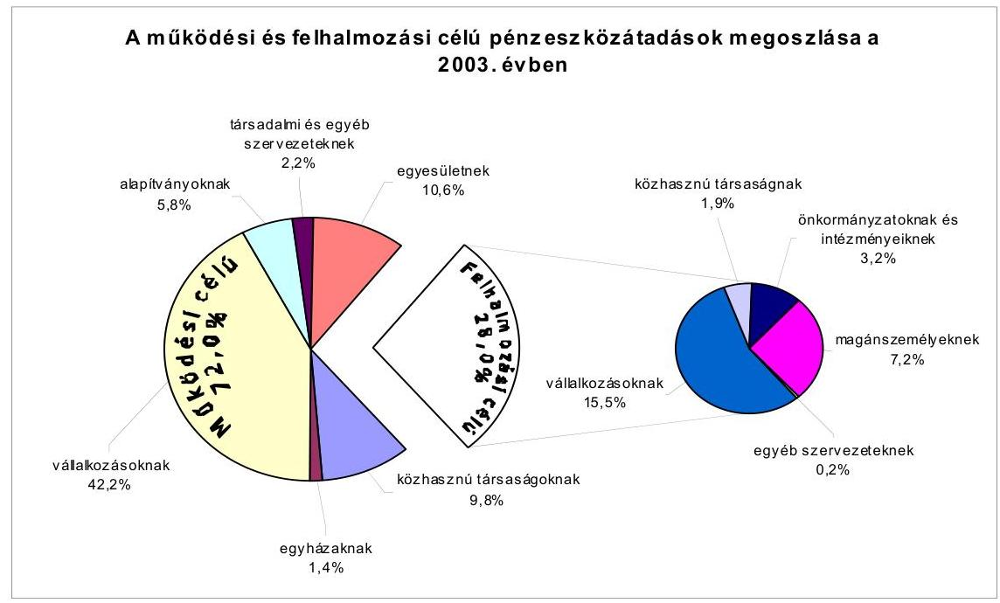
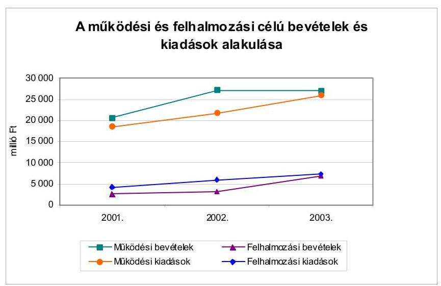
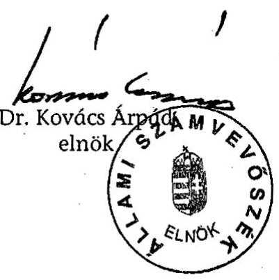
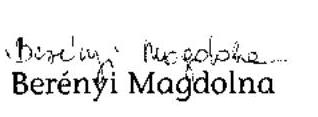
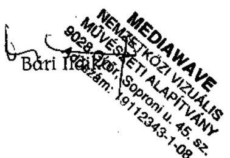
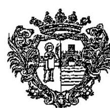
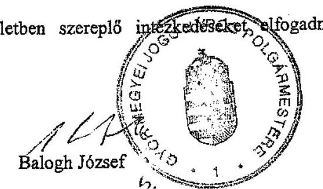
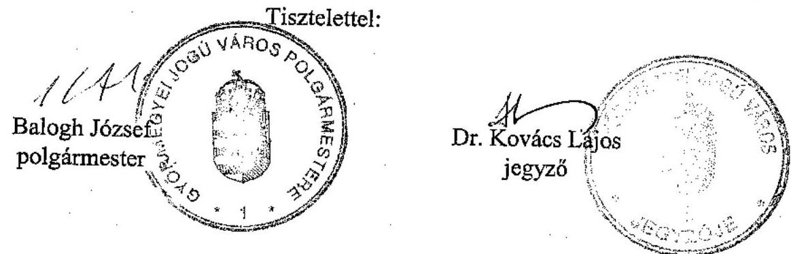
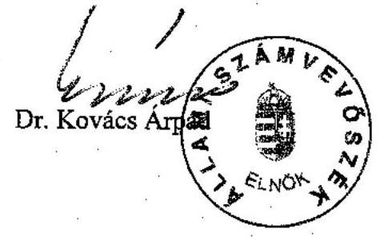

# JELENTÉS 

## Győr Megyei Jogú Város Önkormányzata gazdálkodásának átfogó ellenőrzéséről

---

3. Önkormányzati és Területi Ellenőrzési Igazgatóság
3.3 Átfogó Ellenőrzések Főcsoport
Iktatószám: V-1002-4/34/19/2004
Témaszám: 692
Vizsgálat-azonosító szám: V0167
Az ellenőrzést felügyelte:
Dr. Lóránt Zoltán
főigazgató
Az ellenőrzés végrehajtásáért felelős:
Dr. Sepsey Tamás
főigazgató-helyettes
Az ellenőrzést vezette:
Csecserits Imréné
főcsoportfőnök-helyettes
Az ellenőrzést végezték:
Vécsey László
főtanácsadó
Berényi Magdolna
főtanácsadó
Heller Ildikó
külső szakértő

# A témához kapcsolódó - az elmúlt négy évben készített számvevőszéki jelentések: 

címe
sorszáma
Jelentés a helyi és a helyi kisebbségi önkormányzatok átfogó 0113 ellenőrzéséről
Jelentés a Magyar Köztársaság 2000. évi költségvetése ..... 0126
végrehajtásának ellenőrzésérő
Jelentés a helyi önkormányzatok 2000. évi normatív állami ..... 0128
hozzájárulás igénylésének és elszámolásának vizsgálatáról
Jelentés a helyi önkormányzatok egyes pénzügyi befektetésekkel ..... 0318
történő gazdálkodásának ellenőrzéséről
Jelentés a mozgáskorlátozottak támogatására előirányzott ..... 0344
pénzeszközök hasznosulásának ellenőrzéséről
Jelentés a települési önkormányzatok szennyvízközmű fejlesztési és ..... 0416
működtetési feladatai ellátásának vizsgálatáról

---

# TARTALOMJEGYZÉK 

BEVEZETÉS ..... 5
I. ÖSSZEGZŐ MEGÁLLAPÍTÁSOK, KÖVETKEZTETÉSEK, JAVASLATOK ..... 7
II. RÉSZLETES MEGÁLLAPÍTÁSOK ..... 18

1. A költségvetés tervezésének, végrehajtásának, az Önkormányzat vagyongazdálkodásának és a zárszámadás elkészítésének szabályszerűsége ..... 18
1.1. A költségvetési rendelet jóváhagyásának, módosításának, az előirányzatok nyilvántartásának és betartásának szabályszerűsége ..... 18
1.2. A gazdálkodás szabályozottsága, a bizonylati rend és fegyelem szabályszerűsége ..... 25
1.3. A pénzügyi-számviteli feladatok ellátásának informatikai támogatottsága ..... 30
1.4. Az önkormányzati vagyon nyilvántartása, számbavétele ..... 32
1.5. A vagyonnal való gazdálkodás szabályszerűsége, nyilvánossága ..... 33
1.6. A céljelleggel nyújtott támogatások szabályszerűsége ..... 39
1.7. A közbeszerzési eljárások szabályszerűsége ..... 44
1.8. A zárszámadási kötelezettség teljesítésének szabályszerűsége ..... 48
1.9. A Polgármesteri hivatal helyi kisebbségi önkormányzatok gazdálkodását segítő tevékenysége ..... 50
2. Az önkormányzati feladatok és a rendelkezésre álló források összhangja ..... 52
2.1. A feladatok meghatározása és szervezeti keretei ..... 52
2.2. A költségvetés egyensúlyának helyzete ..... 54
2.3. A feladatok finanszírozása ..... 59
3. Belső irányítási, ellenőrzési rendszer működésének értékelése ..... 64
3.1. Az ellenőrzési rendszer kialakítása, működése ..... 64
3.2. A könyvvizsgálati kötelezettség teljesítése ..... 67
3.3. A korábbi számvevőszéki ellenőrzések javaslatainak hasznosulása ..... 67

---

# MELLÉKLETEK 

1. számú Az önkormányzati vagyon nagyságának alakulása (1 oldal)
2. számú Az Önkormányzat 2003. évi bevételeinek és kiadásainak alakulása (1 oldal)
3. számú Az Önkormányzat gazdálkodását meghatározó adatok, mutatószámok (1 oldal)
4. számú Egyes önkormányzati feladatok finanszírozása (1 oldal)
5. számú Helyszíni ellenőrzési jegyzőkönyv (2 oldal)
6. számú Balogh József úr, a Győr Megyei Jogú Város Önkormányzata polgármesterének észrevétele ( $1+7$ oldal)
7. számú Balogh József úr, a Győr Megyei Jogú Város Önkormányzata polgármesterének írt válaszlevél (1 oldal)

---

# RÖVIDÍTÉSEK JEGYZÉKE 

Ötv.
Áht.
Számv. tv.
Kbt. ${ }_{1}$
Kbt. ${ }_{2}$
Htv.

Vhr.

Ktv.

Nek. tv.
Ámr.
Ber.
ÁSZ
Önkormányzat
Közgyűlés
Polgármesteri hivatal
polgármester
jegyző
SzMSz
ügyrend
vagyongazdálkodási rendelet
közbeszerzési szabályzat
Pénzügyi bizottság
Tulajdonosi bizottság

A helyi önkormányzatokról szóló 1990. évi LXV. törvény az államháztartásról szóló 1992. évi XXXVIII. törvény a számvitelről szóló 2000. évi C. törvény
a közbeszerzésekről szóló 1995. évi XL. törvény
a közbeszerzésekről szóló 2003. évi CXXIX. törvény
a helyi önkormányzatok és szerveik, a köztársasági megbízottak, valamint egyes centrális alárendeltségú szervek feladat- és hatásköreiről szóló 1991. évi XX. törvény
az államháztartás szervezetei beszámolási és könyvvezetési kötelezettségének sajátosságairól szóló 249/2000. (XII. 24.) Korm. rendelet
a köztisztviselők jogállásáról szóló 1992. évi XXIII. törvény
a nemzeti és etnikai kisebbségek jogairól szóló 1993. évi LXXVII. Törvény
az államháztartás múködési rendjéről szóló 217/1998. (XII. 30.) Korm. rendelet
a költségvetési szervek belső ellenőrzéséről szóló 193/2003. (XI. 26.) Korm. rendelet
Állami Számvevőszék
Győr Megyei Jogú Város Önkormányzata
Győr Megyei Jogú Város Önkormányzatának Közgyűlése
Győr Megyei Jogú Város Önkormányzatának Polgármesteri Hivatala
Győr Megyei Jogú Város Önkormányzatának polgármestere
Győr Megyei Jogú Város Önkormányzatának jegyzője
Győr Megyei Jogú Város Önkormányzatának az önkormányzat és szervei Szervezeti és Múködési Szabályzatáról szóló 12/2003. (IV. 4.) számú rendelete
a polgármester és a jegyző által 1/2003. (IX. 1.) szám alatt jóváhagyott, Győr Megyei Jogú Város Önkormányzata Polgármesteri Hivatalának Ügyrendje
Győr Megyei Jogú Város Önkormányzatának 16/2001. (IV. 10.) számú rendelete a vagyon meghatározásáról, a vagyon feletti tulajdonosi jogok gyakorlásának és a vagyon kezelésének szabályozásáról
Győr Megyei Jogú Város Polgármesteri Hivatal Közbeszerzési Szabályzata
Győr Megyei Jogú Város Önkormányzatának Pénzügyi Bizottsága
Győr Megyei Jogú Város Önkormányzatának Tulajdonosi Bizottsága

---

| Gazdasági bizottság | Győr Megyei Jogú Város Önkormányzatának Gazdasági Bizottsága |
| :--: | :--: |
| Pénzügyi iroda | Győr Megyei Jogú Város Önkormányzata Polgármesteri Hivatalának Pénzügyi Irodája |
| Városépítési iroda | Győr Megyei Jogú Város Önkormányzata Polgármesteri Hivatalának Városépítési Irodája |
| Ellenőrzési iroda | Győr Megyei Jogú Város Önkormányzata Polgármesteri Hivatalának Ellenőrzési Irodája |
| ESZI | Győr Megyei Jogú Város Önkormányzatának Egyesített Szociális Intézménye |
| Gazdasági Ellátó Központ | Győr Megyei Jogú Város Önkormányzatának Gazdasági Ellátó Központja |
| ÖKÖ | Győr Megyei Jogú Város Örmény Kisebbségi Önkormányzata |
| elnök | Kisebbségi önkormányzatok elnöke |
| FEUVE | folyamatba épített, előzetes és utólagos vezetői ellenőrzés |
| ISPA | Instrument for Structural Policies for Pre-Accession - környezetvédelmi és közlekedési infrastruktúra fejlesztését támogató előcsatlakozási alap |
| KOMSZOL Kft. | Kommunális Szolgáltató Korlátolt Felelősségű Társaság |
| INSZOL Rt. | Győri Önkormányzati Ingatlanközvetítő és Szolgáltató Részvénytársaság |
| JÓSZÍV Kft. | JÓSZÍV Temetkezési, Szolgáltató és Kereskedelmi Korlátolt Felelősségű Társaság |
| GYŐRHŐ Kft. | Győri Hőszolgáltató Korlátolt Felelősségű Társaság |

---

# JELENTÉS 

## Győr Megyei Jogú Város Önkormányzata gazdálkodásának átfogó ellenőrzéséről

## BEVEZETÉS

Az Ötv. 92. § (1) bekezdése, az Állami Számvevőszékről szóló 1989. évi XXXVIII. törvény 2. § (3) bekezdése, valamint az Áht. 120/A. § (1) bekezdése szerint az önkormányzatok gazdálkodását az Állami Számvevőszék ellenőrzi. Az ellenőrzésre az Országgyűlés illetékes bizottságai részére is átadott, országosan egységes ellenőrzési program alapján került sor.

## Az ellenőrzés célja annak értékelése volt, hogy

- az önkormányzati gazdálkodás törvényességét ${ }^{1}$, szabályszerűségét biztosították-e a tervezés, a költségvetés végrehajtása, a vagyongazdálkodás és a zárszámadás során;
- az Önkormányzat által ellátott feladatok és az azokhoz rendelkezésre álló források összhangja biztosított volt-e, különös tekintettel egyes kiemelt feladatokra;
- a gazdálkodás szabályszerűségét biztosító kontrollok ${ }^{2}$ megfelelően segitettéke a végrehajtást.

Az ellenőrzött időszak: a 2003. év, valamint a 2004. év I. félév, az 1.5, 2.12.3 és 3.3 ellenőrzési programpontok esetében a 2001-2002. évek is.

Győr megyei jogú város Győr-Moson-Sopron megye székhelye. A város lakosainak száma 2003. január 1-jén 127422 fő, 2004. január 1-jén 126458 fő volt.

A Közgyűlés tagjainak száma 36 fő, munkáját 12 állandó bizottság támogatja. A polgármestert - aki a harmadik általános képviselő-választási ciklusban áll a város élén - két főállású és két társadalmi megbízatású alpolgármester segíti feladatai ellátásában. A jegyző 1989. óta vezeti a Polgármesteri hivatalt.

[^0]
[^0]:    ${ }^{1}$ A törvényi előírások betartásának elmulasztásakor egységesen a törvénysértés megjelölést alkalmazzuk, mivel az ÁSZ nem tehet különbséget a törvényi előírások között.
    ${ }^{2}$ A gazdálkodás szabályszerűségét biztosító kontroll alatt értjük a kiépített és működő belső irányítási és szabályozási rendszert, valamint a belső ellenőrzési funkciók ellátását.

---

A városban négy kisebbségi ${ }^{3}$ és hét településrészi ${ }^{4}$ önkormányzat múködik.
Az Önkormányzat a 2003. évben 34021 millió Ft, a 2004. évben 33115 millió Ft költségvetési bevételből gazdálkodott. Könyvviteli mérlegében kimutatott vagyonának értéke a 2003. évben 113776 millió Ft-ot tett ki, ami a 2004. évben 130947 millió Ft. A kiadások 78\%-át múködési, 22\%-át felhalmozási célra fordították a 2003. évben, ami a 2004. évben 85\%-ra, illetve 15\%-ra módosult.

A városban és a vonzáskörzetében élőknek nyújtott közszolgáltatásokhoz összesen 88 intézményt (ebből 42 részben önálló gazdálkodási jogkörrel rendelkezőt) tartottak fenn a 2003. évben, ami a 2004. évben egy részben önálló intézménynyel csökkent. Ezen kívül öt olyan gazdasági társaságban van 100\%-os, kettőben többségi, illetve meghatározó részesedése az Önkormányzatnak, amelyek közreműködnek a különböző közszolgáltatások ellátásában.

A Polgármesteri hivatalban foglalkoztatott köztisztviselők száma 2003-ban 365 fő volt, az intézményekben 5352 fő közalkalmazott látta el a különböző közszolgáltatásokat, az azokhoz kapcsolódó gazdálkodói teendőket. A 2004. évben a köztisztviselők száma 381 főre, míg a közalkalmazottaké 5324 főre módosult. (Az Önkormányzat gazdálkodását meghatározó adatokat, mutatószámokat a jelentés 3. számú melléklete tartalmazza.)
${ }^{3}$ lengyel, német, örmény, roma
${ }^{4}$ Bácsa, Gyirmót, Kismegyer, Likócs, Ménfőcsanak, Pinnyéd, Szentiván

---

# I. ÖSSZEGZŐ MEGÁLLAPÍTÁSOK, KÖVETKEZTETÉSEK, JAVASLATOK 

A Közgyűlés az Ötv. előírásainak megfelelve a 2003. évben elfogadta a választási ciklus idejére vonatkozó Várospolitikai és Gazdasági Programját, ami alkalmas volt az éves tervezőmunkák megalapozásához. A polgármester az Áhtban előírt határidőket betartva terjesztette a Közgyűlés elé a 2003. és a 2004. évi költségvetési koncepciókat, valamint költségvetési rendelettervezeteket. Az Ámr. előírásai ellenére a polgármester nem csatolta a költségvetési koncepció előterjesztéséhez a Pénzügyi bizottság és a helyi kisebbségi önkormányzatok véleményét, valamint nem csatolta a költségvetési rendelettervezetekhez a Pénzügyi bizottság és a könyvvizsgáló véleményét, hanem azok a Közgyűlésen kerültek kiosztásra. A költségvetési koncepciók az Ámr-ben előírtaknak megfelelő tartalommal készültek és az elfogadáskor a Közgyűlés döntött a részletes költségvetés kimunkálásával kapcsolatos elvárásokról.

A jegyző a költségvetési rendelettervezetet beterjesztése előtt a költségvetési szervek vezetőivel az Ámr-ben foglaltaknak megfelelően egyeztette. A Közgyűlés a költségvetés benyújtását megelőzően jóváhagyta azokat az adózással kapcsolatos rendelettervezeteket, melyek a költségvetés megalapozását biztosították. Az Áht-ban foglaltakat megsértve a 2003. és a 2004. évi költségvetési rendeletekben a bevételeket és a kiadásokat egyensúlyban, a 2003. évben 30293,2 millió Ft, míg a 2004. évben 30983,9 millió Ft összegben, a hiány bemutatása nélkül hagyta jóvá a Közgyűlés annak következtében, hogy finanszírozási célú pénzügyi műveleteket vettek figyelembe költségvetési bevételként, illetve kiadásként. Az Áht. előírásait megsértve, előterjesztés hiányában a Közgyűlés nem határozta meg a költségvetés és a zárszámadás előterjesztésekor tájékoztatásul bemutatandó mérlegek és kimutatások tartalmi követelményeit, valamint az Önkormányzat összes múködési és felhalmozási célú bevételét és kiadását, továbbá a közvetett támogatásokat. A Polgármesteri hivatal és az intézmények bevételi-kiadási előirányzatait az Ámr. előírásainak megfelelően mutatták be. A felújítási és felhalmozási előirányzatokat célonként és feladatonként határozták meg, s az Ámr. előírásai szerint mutatták be a Közgyűlésnek az EU-s támogatásokkal megvalósuló projektek tervezett pénzügyi teljesítését. Bemutatták a helyi kisebbségi önkormányzatok költségvetését határozataik szerinti, változatlan tartalommal. Az Ámr-ben előírtaknak megfelelően csatolták a költségvetésekhez az előirányzatok várható felhasználási ütemét bemutató tájékoztatást is.
A 2003. és a 2004. évi költségvetésekben az Ámr-ben előírtak ellenére az általános és céltartalék mellett a Polgármesteri hivatal előirányzatai között további tartalékösszegeket is képeztek. A tervezési hibák ellensúlyozására, az előre nem tervezhető beszerzési szükségletekre, felújítási-karbantartási igényekre, az árváltozások ellensúlyozására is képeztek „tervezési" tartalékot amellett, hogy a tisztségviselői, képviselői, bizottsági keretek, az alapok, valamint a településrészi önkormányzatok kiadásaihoz képzett keretek is meghatározott feltételek mellett, év közben történő döntés alapján felhasználható keretösszegek voltak. A költségvetési rendelettervezet előterjesztése alapján a Közgyűlés az alpolgár-

---

mestereknek és a képviselőknek történő keret-meghatározással és annak felhasználásáról történő döntési jog biztosításával megsértette az Ötv-t, valamint a kötelezettség-vállalásra történő felhatalmazással és a szakmai teljesítésigazolási jogosultság biztosításával nem az Ámr-ben foglaltaknak megfelelően rendelkezett. A költségvetésben idegenforgalmi céllal elkülönített összeg alapként történő megjelölése félreérthető, mivel nem felel meg az Áht. követelményeinek. A 2003. és a 2004. évi költségvetésekben részletesen meghatározták a végrehajtására vonatkozó szabályokat.
A Közgyűlés a költségvetési rendelet végrehajtási szabályai között, az elkészített előterjesztés alapján, az Ámr-ben előírtaktól eltérően nem negyedévenkénti gyakoriságot írt elő a kapott központi pótelőirányzatok miatt kötelező költségvetési rendeletmódosításokra. Az évközi módosításoknál - az év közben két alkalommal történő módosítási gyakoriság miatt -, továbbá az előírt határidő utáni költségvetési rendeletmódosítással a Közgyűlés eltért az Ámrben előírtaktól. Önkormányzati szinten a módosított kiemelt előirányzatokat betartották a teljesítés során, azonban az intézmények $31,8 \%$-a a kiemelt költségvetési előirányzatait átlagosan $0,3 \%$-kal (összesen 58,6 millió Ft-tal) túllépte, megsértve ezzel az Áht-ban foglalt előírásokat. A túllépések okait nem vizsgálták, felelősségre vonás nem történt. A költségvetési előirányzatokról, azok változásáról folyamatosan vezették a nyilvántartást, de az Áht-t megsértve nem tartották nyilván folyamatosan a kiadási előirányzatokat terhelő kötelezettségvállalásokat és a bevételi előirányzatok teljesítését előre jelző - a teljesítés várható időpontja szerint rögzített - bevételi előírásokat. Ennek hiányában a nyilvántartás nem biztosított információt a szabad, felhasználatlan előirányzatokról.

A Polgármesteri hivatal az Ámr-ben előírt szervezeti és működési szabályzattal nem rendelkezett, hanem ügyrendben határozták meg a Polgármesteri hivatal szervezeti felépítését és működési rendszerét, szervezeti egységeinek megnevezését. A Polgármesteri hivatal alapító okiratában foglaltakat az Ámr-ben előírtak ellenére szabályzatban nem részletezték. A gazdasági szervezetben a pénzügyigazdasági feladatok ellátásáért felelős személyek feladatait, a vezetők és más dolgozók feladat-, hatás- és jogkörét az Ámr-ben előírtak ellenére ügyrendben nem határozták meg. A gazdálkodási és ellenőrzési jogkörök gyakorlásának szabályait polgármesteri-jegyzői együttes szabályzatban rögzítették. A gazdálkodási és ellenőrzési jogkörrel történő felhatalmazásoknál, megbízásoknál az összeférhetetlenségi követelményeket betartották, s az érvényesítési feladatok kijelöltjeinél az iskolai végzettségre vonatkozó követelmények betartása biztosított volt.

A Htv. előírásait megsértve a jegyző nem tett eleget azon kötelezettségének, hogy szabályozza az Önkormányzatra és intézményeire vonatkozó számviteli rendet. A kisebbségi önkormányzatokkal kapcsolatos sajátos szakmai feladatokra a Vhr-ben előírtak ellenére a Polgármesteri hivatal számviteli politikája nem tartalmazott előírásokat. A Polgármesteri hivatal valamennyi, a számviteli elszámolásokhoz kapcsolódó szabályzattal rendelkezett. A számviteli politikában a Vhr-ben előírtak ellenére nem szabályozták a megbízható, valós összképet befolyásoló lényeges és nem lényeges információk tartalmát, s a vagyoni értékű jogok minősítésénél figyelembe veendő szempontokat, a beszerzett, illetve előállított immateriális jószág, tárgyi eszköz üzembe helyezésének, dokumentálásának szabályait. A leltározási szabályzat öt éves gyakoriságot írt elő

---

egyes eszközök (ingatlanok, gépek, üzemeltetésre átadott eszközök) leltározására, ami nem felelt meg a Vhr-ben foglaltaknak. A pénzkezelési szabályzat, indokoltsága ellenére, nem tartalmazta az ÖKÖ bankszámlájának számát, valamint a bankszámlák felett rendelkezni jogosultak nevét, aláírását. A selejtezési szabályzat összhangban volt a vagyongazdálkodási rendelet szabályozásával. A számlarendben, a Számv. tv-t megsértve nem rögzítették a főkönyvi számlák megnevezését, tartalmát, az értékváltozások jogcímét, a Vhr. előírásai ellenére a kapcsolódó analitikus nyilvántartások formáját, tartalmát, vezetésének módját, az összesítő bizonylatok elkészítésének határidejét. A munkaköri leírásokban az elvégzendő tevékenységet megelőző folyamat ellenőrzési kötelezettségét, felelősségi körét nem rögzítették. Nem tértek ki az ellenőrzések elvégzési határidejére, az egyeztetések gyakoriságára, az eltérések dokumentálásának módjára. A főkönyvi számlákhoz analitikus nyilvántartást vezettek. A főkönyvi könyvelés és az analitikus nyilvántartások egyeztetését elvégezték. A könyvviteli mérleget és a pénzforgalmi elszámolásokat főkönyvi kivonattal alátámasztották.

A gazdálkodási jogkörök gyakorlásánál betartották az összeférhetetlenségi szabályokat. Az Ámr-ben előírtak ellenére a szakmai teljesítés igazolása a bizonylatok $71 \%$-ánál nem történt meg, s az érvényesítő nem ellenőrizte annak meglétét. Az utalványok $84 \%$-át felhatalmazással nem rendelkező irodavezető helyettes ellenjegyezte, az utalványozandó bevételek ellenjegyzését a jegyző helyett a Pénzügyi irodavezető végezte, felhatalmazás nélkül. A felhatalmazottak beszámoltatása nem történt meg. A gazdasági események rögzítése a Vhr. előírásainak megfelelő időpontban történt. A gazdasági eseményeket közgazdasági és funkcionális osztályozás szerint elszámolták és a pénzeszköz átadások kivételével a tartalmuknak megfelelően rögzítették a könyvviteli nyilvántartásokban. A szolgáltatás elvégzését tartalmazó számlák szerinti összegeket három szervezet esetében pénzeszközátadásként könyvelték, megsértve ezzel a Számv. tv-t.

A pénzügyi, gazdálkodási és számviteli feladatokat a Pénzügyi irodán több elemből álló informatikai, ügyviteli rendszer segítségével látták el. A rendszer elemei azonos törzsadatokat használtak, de a programok között a közvetlen adatátvitel nem volt megoldott. Az analitikus nyilvántartásokat számítógépen, valamint manuálisan vezették. A beszámoló készítés számítógépes megalapozottsága biztosított volt. A felhasználói programokhoz az üzemeltetési dokumentációk rendelkezésre álltak. A Polgármesteri hivatal rendelkezett informatikai stratégiával. A biztonságos munkavégzés folyamatos feltételét biztosító katasztrófa-elhárítási tervet nem készítettek. A Pénzügyi iroda munkatársainak munkaköri leírása nem tartalmazta az informatikai rendszer működtetéséhez szükséges munkaköri feladatokat. A Pénzügyi iroda számítástechnikai eszközökkel való ellátottsága a 2003. évi új beszerzések következtében az integrált nyilvántartási rendszer bevezetéséhez szükséges feltételeknek megfelelt.

Az önkormányzati vagyon nyilvántartását, a törzsvagyon (ezen belül a forgalomképtelen és korlátozottan forgalomképes), valamint az egyéb vagyon elkülönítését a főkönyvi könyvelésben biztosították. Az ingatlanok és az üzemeltetésre átadott eszközök 2003. évi könyvviteli mérlegben szereplő értékét összesítő kimutatással támasztották alá, annak ellenére, hogy az ilyen módon történő leltározáshoz nem rendelkeztek a Vhr-ben előírt közgyűlési egyetértés-

---

sel. Az egyéb követelések és kötelezettségek egyeztetéssel történő leltározását, egyedenkénti értékelését elmulasztották, megsértve ezzel a Számv. tv-t. Az egyéb tartós részesedések esetében az év végi egyeztetéshez, értékeléshez szükséges adatok rendelkezésre álltak. Az értékelési szabályzatban foglaltak alapján elvégezték az értékpapírok (részesedések) értékelési feladatait, az értékvesztések elszámolását, és megvizsgálták az értékvesztés visszaírásának lehetőségét is, de az nem volt indokolt. A több éve fennálló követeléseket nem értékelték, az értékelési szabályzatban és a 2004. évi költségvetési rendeletben foglalt előírás ellenére értékvesztést nem számoltak el.

Az Önkormányzat vagyonával kapcsolatos gazdálkodási feladatokat, hatásköröket - valamennyi vagyonelemre vonatkozóan - vagyongazdálkodási rendeletben rögzítették. A vagyonnal való gazdálkodási jogosultságokat célszerűen szabályozták. Értékhatártól függetlenül, fő szabályként valamennyi vagyon értékesítésére nyilvános versenytárgyalási (pályáztatás és licit kötelezettséget) írtak elő, azonban lehetőséget biztosítottak a Közgyűlés számára a versenyeztetés mellőzésére. A versenyeztetési eljárás mellőzésének szabályozásban foglalt lehetősége nem biztosította a köztulajdonnal való gazdálkodás nyilvánosságát és sértette az Áht előírását. A közpénzek felhasználására, a köztulajdon használatának nyilvánosságára, átláthatóbbá tételére, ellenőrzésére és közzétételére vonatkozó, az Áht-ban foglalt előírásoknak eleget tettek, mivel a Közgyűlés az Áht. rendelkezéseit szigorítva, összeghatártól és céltól függetlenül, valamennyi támogatásra és szerződésre kötelezővé tette és biztosította annak nyilvánosságra hozatalát. Az ingatlan értékesítések, vásárlások, bérleti szerződések garanciális elemeket tartalmaztak. A törzstőke emelések, a Polgármesteri hivatalban lefolytatott selejtezési eljárások, a forgatási céllal vásárolt értékpapírok vásárlása és eladása esetében betartották a vagyongazdálkodási rendeletben, a selejtezési szabályzatban, illetve az éves költségvetési rendeletben foglalt hatásköri szabályokat. Az egy évnél régebben fennálló követelések esetében a hátralékosok felszólítására intézkedtek, azonban az Önkormányzat költségvetési rendeletében foglalt eljárási szabályok ellenére nem készítettek előterjesztést a be nem hajtható követelések rendezésére.

Az Önkormányzat külső szervek részére a 2003. évben 1546,7 millió Ft, a 2004. évben 1439,1 millió Ft célhoz kötött támogatást nyújtott. A támogatásokról egységes analitikus nyilvántartást nem vezettek, így nem biztosították annak lehetőségét, hogy ugyanazon szervezet részére a különböző alcímeken elkülönített keretekből az eltérő döntési jogkörrel rendelkezők előzetes egyeztetés, rangsorolás után nyújtsanak támogatást. Az alapítványoknak nyújtott támogatásokról minden esetben a Közgyűlés határozott. A céljelleggel nyújtott támogatásoknál előírták a támogatás célját, összegét, a folyósítás ütemét, a felhasználásról való számadási kötelezettség teljesítésének módját, formáját, határidejét. A támogatásban részesültek számadásainak tartalmi és formai ellenőrzését a hitelesített számlamásolatok alapján elvégezték, de a támogatás felhasználását - a feladat-ellátási megállapodáson alapulók kivételével - az Áht-t megsértve nem ellenőrizték. A számadási kötelezettséget nem teljesítő szervezetek, az Önkormányzat kht-ja kivételével, a 2004. I. félévben nem kaptak támogatást. Megsértették az Áht-ban foglaltakat, mivel ezen kht. esetében nem függesztették fel a további támogatást, továbbá a számadási kötelezettséget nem teljesítő szervezetek felé nem intézkedtek a visszafizetés iránt. A Polgármesteri hivatal mellett a költségvetési intézmények is támogattak külső szerve-

---

ket, melynek során a költségvetési rendeletben előírtak ellenére hat közoktatási intézmény és a Sportigazgatóság vezetője közgyűlési felhatalmazás nélkül nyújtott támogatást. A támogatásokkal kapcsolatos számadási kötelezettséget előírták, de a támogatások felhasználását az Áht. előírását megsértve az intézmények és a Sportigazgatóság nem ellenőrizték.

A Közgyűlés a 2004. május 1-ig hatályban volt közbeszerzési rendeletében szabályozta a Polgármesteri hivatal és az intézmények közbeszerzéseinek rendjét. A rendeletben a Közbeszerzések Tanácsa ajánlását nem megfelelően értelmezve valamennyi részben önálló intézményt a Kbt., önálló alanyává minősítették, melynek hatására az intézmények közös beszerzése, s közbeszerzés lefolytatása nem vált kötelezővé. A Polgármesteri hivatalban indokoltsága ellenére nem jelölték ki a közbeszerzési eljárásokat irányító, koordináló, felügyelő szervezeti egységet. Egy intézményi közbeszerzési eljárásban azzal sértették meg a Kbt., előírásait, hogy az eljárásról nem jelentették meg az éves összegzést a következő év március 31-ig.

A költségvetéssel összehasonlítható módon összeállított zárszámadási rendelettervezetet a polgármester az előírt határidőn belül terjesztette a Közgyűlés elé, mely arról rendeletet alkotott. Az előterjesztés megfelelt a működésifenntartási előirányzatok zárszámadásban történő részletezésére vonatkozó, az Áht-ban és az Ámr-ben foglalt előírásoknak. Az Áht-ban foglaltakat megsértve nem mutatták be ugyanakkor a többéves kihatással járó döntések számszerűsítését éves bontásban, valamint összesítve, szöveges indoklással, és a közvetett támogatásokat szöveges indoklással együtt. A zárszámadás az Áht. előírásait betartva tartalmazta - változtatás nélkül - a helyi kisebbségi önkormányzatok mérlegeit. A Polgármesteri hivatal pénzmaradványának megállapítása, valamint az intézményi pénzmaradványok felülvizsgálata, jóváhagyása megfelelt a Vhr. és az Ámr. előírásainak. Az Ámr-ben előírtakkal ellentétben az intézményeket éves számszaki beszámolójuk és működésük elbírálásáról, jóváhagyásáról írásban nem értesítették.

A településen a 2003. évben négy kisebbségi önkormányzat működött, melyekkel együttmúködési megállapodásokat kötöttek. A megállapodásokban rögzítették a kisebbségi önkormányzatok koncepciója, költségvetése, zárszámadása elkészítésére és elfogadására vonatkozó szabályokat, az előirányzatok módosításának rendjét azonban nem szabályozták. Nem határozták meg a szakmai teljesítés igazolásának módját. A kötelezettségvállalás és utalványozás ellenjegyzését a Pénzügyi iroda vezetője az Ámr. előírása ellenére felhatalmazás nélkül végezte. Az Áht. előírását megsértve a kisebbségi önkormányzatokra vonatkozóan kötelezettségvállalási nyilvántartást nem vezettek. Az Önkormányzat a kisebbségi önkormányzatok múködését segítette. Testületi múködésükhöz támogatást, önálló elhelyezést, tárgyi eszközöket biztosított.

A feladatok ellátását alapvetően az Önkormányzat által alapított 88 intézmény útján biztosítják, de közszolgáltatásokat nyújt hét olyan gazdasági társaság is, melyekben az Önkormányzatnak 25-100\%-os tulajdonosi részesedése van. A legnagyobb volumenú feladatot a közoktatás, közművelődés jelenti. A 2003. évben jelentős változást okoztak az e területen végrehajtott racionalizálási intézkedések, melyek két iskola és egy óvoda megszüntetését, s a felszabaduló épületek eladását, illetve funkciójuk megváltoztatását eredményezték.

---

A Közgyűlés döntött egy szakközépiskola 2006. július 1-gyel történő megszüntetéséről is. Az intézkedések a gyermeklétszám csökkenése miatt indokoltak voltak. A szociális, a gyermekjóléti és gyermekvédelmi szakellátások, valamint az egészségügyi alapellátás szervezett megoldásában változás nem következett be az elmúlt három évben. Egy-egy alapítvány és civil szervezet, s az egészségügyi szolgáltatások terén 106 egyéni és két társas vállalkozás segíti a közszolgáltatások megoldását. A szervezeti feltételek adottak ahhoz, hogy a közoktatás, közművelődés és a szociális ellátások tekintetében is önként vállalt közszolgáltatásokat tudjon nyújtani az Önkormányzat. A szociális igazgatásról és ellátásokról szóló törvény előírását megsértették azzal, hogy nem biztosították 2004. január 1-től a kötelező szociális feladatok közül a szenvedélybetegek és pszichiátriai betegek nappali ellátását, illetve ugyanezen betegek átmeneti gondozóházban történő elhelyezésének, valamint a fogyatékos személyek átmeneti gondozóházban történő elhelyezésének feltételeit.

Az Önkormányzat gazdálkodásának pénzügyi egyensúlyát az elmúlt három évben biztosította. Az évente megalapozatlanul tervezett hitel igénybevételére, az átmeneti likviditási hitelek kivételével, nem került sor, s a 2003. év végén nem volt több évre kiterjedő hiteltartozása az Önkormányzatnak. A 2003. évben megvalósult nagy értékű fejlesztések céljára igénybe vették a korábban képződött tartalékokat és a működési célú bevételekből is átcsoportosítottak felhalmozási célú kiadásokra. Ez az év volt hosszú idő óta az első, amikor a fizetőképesség átmeneti zavarainak áthidalásához folyószámlahitelt vettek fel. A felhalmozási kiadások összes költségvetési kiadáson belüli részaránya a 2003. évben elérte a $22 \%$-ot, amelynek finanszírozásához a helyi adók és az átvett pénzeszközök is szükségesek voltak. A helyi adók a költségvetési bevétel 19,2\%át biztosították. A megállapított adómérték az iparűzési és az idegenforgalmi adónál az alkalmazható mérték maximuma, az építményadónál 77,8\%-a volt. A helyi adóról szóló törvényben meghatározottakon túlmenően is megállapítottak kedvezményeket, mentességeket.

A feladatok finanszírozását befolyásolta, hogy egyes naturális mutatókkal mérhető kötelező feladatok esetében a fajlagos kiadások, az ellátottak számának csökkenése következtében a 2003. évben jelentősen (óvodai nevelésnél $32,8 \%$-kal, általános iskolai oktatásnál $25,8 \%$-kal) emelkedtek az előző évhez viszonyítva. Az intézményátszervezések hatására a kapacitás kihasználtság a bölcsődei ellátás, az óvodai nevelés és a középfokú oktatás esetében javult, melynek hatására és az ellátottak számának növekedése miatt a bölcsődei ellátásnál és a középfokú oktatásnál a 2001-2003. évek között a működési kiadások növekedésénél ( $26,8 \% ; 64,6 \%$ ) kisebb mértékben ( $16,0 \% ; 56,9 \%$ ) emelkedtek az egy főre jutó kiadások. Az óvodai nevelésnél a neveltek száma a 20012003. évek között folyamatosan csökkent, emiatt az egy főre jutó kiadások növekedése meghaladta az összes múködési kiadás emelkedését. A Közgyűlés az ellátandó kötelező és önként vállalt feladatokat és azok ellátásának módját az Ötv. előírásait megsértve nem rögzítette. Az önként vállalt feladatok finanszírozására az éves költségvetések növekvő ( $10,7 \% ; 13,0 \% ; 15,7 \%$ ) hányadát fordították, de ez nem veszélyeztette a kötelező feladatok ellátását. Az önként vállalt feladatok kiadásai elsősorban kulturális intézmények fenntartását, valamint fejlesztéseket (fürdőközpont, egyetemi csarnok, repülőtér) szolgáltak.
A pénzállomány várható alakulásáról a jegyző az Ámr. előírásai ellenére nem készített likviditási tervet. A Közgyűlés a 2003. évben adósságot keletkeztető kö-

---

telezettségvállalásról nem döntött. A Polgármesteri hivatalnál az Ámr. előírásai ellenére nem vezettek analitikus nyilvántartást a kötelezettségvállalásokról, nem biztosították annak feltételeit, hogy kötelezettségvállalásra és utalványozásra csak a jóváhagyott kiadási előirányzatok mértékéig kerüljön sor.

Az Önkormányzat a fogyatékos személyek mozgásának segítése érdekében a középületek akadálymentesítésére a 2004. évben felmérést készíttetett. A költségvetésében a 2003. évben e feladatra elkülönített előirányzatot nem alakított ki. A 2004. évi költségvetésben 20 millió Ft-ot irányoztak elő a városháza akadálymentesítésére. A 2004. áprilisában a középületek 13,4\%-a felelt meg az akadálymentes megközelíthetőség követelményének. A fennmaradó 187 épületre vonatkozóan, a fogyatékos személyek jogairól és esélyegyenlőségük biztosításáról szóló törvényben előírtakat megsértve, a meghatározott 2005. január 1-i határidőre a feladatok elvégzését nem biztosították.

Az ügyrendben és az ellenőrzési szabályzatban határozták meg az intézmények és a Polgármesteri hivatal belső ellenőrzési feladatait, melyet hét fő látott el. A Ber. előírása ellenére 2003. november 27 -ét követően az SzMSz-ben nem írták elő a belső ellenőrzési kötelezettséget, az ellenőrzést végző szervezet jogállását, feladatait. Az ellenőrök a 2003-2004. évi feladatokat ellenőrzési munkaterv alapján végezték. A 2004. évi ellenőrzési munkatervet a Ber. előírásától eltérően nem a jegyző, hanem a Pénzügyi bizottság hagyta jóvá. Az ellenőrzési jelentésekben javaslatokat fogalmaztak meg. Az ellenőrzött szervezetek a hiányosságok kijavítására intézkedési tervet készítettek, melynek megvalósulását utóellenőrzés keretében vizsgálták. A Közgyűlés az ellenőrzésekről szóló beszámolót megtárgyalta, eleget téve a Htv. előírásának. Az ellenőrzés funkcionális függetlenségét a 2004. évtől nem biztosították, mivel az ellenőrzési tevékenységen kívül más munkával - a közbeszerzési eljárások folyamatosan történő ellenőrzésével - is megbízták a belső ellenőröket, megsértve az Áht-ban foglaltakat. A jegyző a 2004. évben az ellenőrzési kézikönyvet elkészítette, az ellenőrzési nyomvonalat meghatározta.

Az Önkormányzat a 2003. évben a törvényben előírt könyvvizsgálati kötelezettségét költségvetési minősítésű könyvvizsgálóval - az összeférhetetlenségi követelmények figyelembevételével - teljesítette. A könyvvizsgáló auditálási eltéréseket nem állapított meg. Korlátozás nélküli hitelesítő záradékkal látta el a Polgármesteri hivatal és intézményei összevont adatait tartalmazó 2002. és 2003. évi egyszerűsített költségvetési beszámolókat.

Az Önkormányzatnál az előző négy évben végzett számvevőszéki ellenőrzések szabályszerűségi és célszerűségi javaslatainak 45\%-át teljes mértékben, 20\%-át részben végrehajtották, amelyek eredményeként javult a feladatellátás törvényessége és szabályozottsága.
A javaslatokat figyelembe véve elvégezték a főkönyvi számlákhoz kapcsolódó analitikus nyilvántartások főkönyvi könyveléssel történő egyeztetését; önkormányzati bevételként illetve kiadásként számolták el az önkormányzati lakások és lakáscélú bérlemények hasznosításával összefüggő bevételeket és kiadásokat; a közoktatás-közművelődés intézményeit átszervezték; intézményeket integráltak; három intézmény oktatási funkcióját megszüntették; a normatív állami hozzájárulások jogszerű elszámolásának feltételeit javították; az intézmények pontosabb adatszolgáltatása érdekében intézkedtek; az osztalékbevétele-

---

ket a 2002. évi beszámolóban a követelések között bemutatták; az értékelési szabályzatot módosították; a szennyvízcsatornára való rákötések növelése érdekében megalkották a talajterhelési díjról szóló 26/2004. (V. 26.) számú rendeletet. A javasolt intézkedések részben valósultak meg az önkormányzati szabályzatok jogszabályi előírásoknak megfelelő módosítására, a könyvviteli mérleg elkészítésénél az értékelési szabályzatban foglalt előírások betartására; a költségvetési és zárszámadási rendelet elkészítésénél a jogszabályi előírások betartására; a helyi kisebbségi önkormányzatokkal kötött együttműködési megállapodásokban és gazdálkodásukban a jogszabályi előírások betartására vonatkozóan. Nem valósult még meg a kötelezettségvállalásokról az analitikus nyilvántartás vezetésére; a költségvetés tervezésekor a bevételek és a kiadások reális szintjének felmérésére; a normatív állami támogatások és elszámolások felülvizsgálatának dokumentálására; az alapfokú művészetoktatás mutatószámának tervezéséhez részletesebb adatlap összeállítására; az osztalékbevételek pontosabb tervezésére és a Közgyűlés részére a könyvviteli mérlegben szereplő részesedésekről részletező információ bemutatására vonatkozó javaslat.

A helyszíni ellenőrzés megállapításainak hasznosítása mellett javasoljuk:

# a polgármesternek 

a jogszabályi előírások maradéktalan betartása érdekében

1. terjessze a költségvetési gazdálkodás jogszerű kereteinek kialakítása céljából - a jegyző által készített előterjesztés alapján - a Közgyűlés elé az Áht. 118. §-ában előírt mérlegek, kimutatások tartalmának meghatározásáról szóló rendelettervezetet;
2. intézkedjen az Áht. 13/A. § (2) bekezdése alapján, hogy a támogatott szervezetek eleget tegyenek a részükre meghatározott számadási kötelezettségnek, a számadási kötelezettséget nem teljesítők esetében intézkedjen a támogatás összegének visszafizetésére, valamint a további támogatást függessze fel, s az intézmények vezetőinek figyelmét hívja fel, hogy csak a Közgyűlés felhatalmazása alapján nyújtsanak támogatást, valamint írják elő a támogatásoknál a számadási kötelezettséget, ellenőrizzék a felhasználást;
3. intézkedjen, hogy a költségvetési intézmények a közbeszerzési értékhatárt elérő árubeszerzések, szolgáltatások, építési beruházások esetében a Kbt. 2 1. § (2) bekezdésében előírtak alapján folytassák le a közbeszerzési eljárásokat;
4. kezdeményezze, hogy a Közgyűlés gondoskodjon a szociális igazgatásról és a szociális ellátásokról szóló 1993. évi III. törvény 90. § (2) bekezdésében előírt kötelező szociális feladatok teljesítéséről a szenvedély és pszichiátriai betegek nappali, illetve átmeneti gondozóházban történő ellátásának, valamint a fogyatékos személyek átmeneti gondozóházban biztosított ellátásának megszervezésével;

---

5. kezdeményezze, hogy a Közgyűlés az Ötv. 8. § (2) bekezdésében foglaltak alapján rögzítse az Önkormányzat kötelező és önként vállalt feladatait és azok ellátásának módját;
6. gondoskodjon a középületek akadálymentessé tételéről, tekintettel a fogyatékos személyek jogairól és esélyegyenlőségük biztosításáról szóló 1998. évi XXVI. törvény 29. § (6) bekezdésében előírtakra;
a munka színvonalának javítása érdekében
7. terjessze a számvevőszéki jelentést a Közgyűlés elé, a feltárt hiányosságok megszüntetése érdekében készíttessen intézkedési tervet határidők és a felelősök megjelölésével;
8. számoltassa be a felhatalmazottakat a kötelezettségvállalási jogkörök gyakorlásáról;

# a jegyzőnek 

a jogszabályi előírások maradéktalan betartása érdekében

1. a gazdálkodási és pénzügyi- számviteli feladatok szabályozása tekintetében
a) kezdeményezze a Polgármesteri hivatal SzMSz-ének az Ámr. 10. § (4) bekezdés a), b), d), e), g), i), j) pontjai szerinti kiegészítését az alapító okirat keltével, számával; az alap és kiegészítő tevékenységek körével, forrásaival; a feladatmutatók megnevezésével, körével; a költségvetés végrehajtására szolgáló számlaszámmal; a költségvetés tervezésével és végrehajtásával kapcsolatos különleges előírásokkal, feltételekkel; a szervezeti egységek vezetőjének azon jogosítványaival, amelyek körében a Polgármesteri hivatal képviselőjeként járhat el;
b) intézkedjen a Polgármesteri hivatal gazdasági szervezetének az Ámr. 17. § (5) bekezdésében foglaltak szerinti ügyrendjének elkészítésére;
c) tegyen eleget a Htv. 140. § (1) bekezdés c) pontjában foglalt, az Önkormányzatra és intézményeire vonatkozó számviteli rend kialakítása kötelezettségének;
d) egészítse ki a Polgármesteri hivatal számviteli politikáját és biztosítsa, hogy az szabályozza a megbízható, valós összképet befolyásoló lényeges és nem lényeges információk tartalmát a Vhr. 8. § (5) bekezdésének a) és b) pontja szerint, valamint a Vhr. 8. § (7) bekezdésében foglaltak alapján a beszerzett, illetve előállított immateriális jószág, tárgyi eszköz üzembe helyezésének, dokumentálásának szabályait, továbbá a kisebbségi önkormányzatokra vonatkozóan a Vhr. 8. § (3) bekezdése szerinti szakmai feladatokat és sajátosságokat;
e) gondoskodjon arról, hogy a Polgármesteri hivatal leltározási szabályzata a Vhr. 37. § (1) bekezdése alapján előírja a mérlegben kimutatott eszközök és források Vhr. 37. § (3) bekezdésében előírt módon történő leltározását, és szerezzen érvényt a szabályzatban foglaltak betartásának;

---

f) egészítse ki a Polgármesteri hivatal számlarendjét a Számv. tv. 161. § (2) bekezdésének a)-b) pontjában előírtak alapján a főkönyvi számlák megnevezésével, tartalmával, növekedésének és csökkenésének jogcímeivel, valamint a Vhr. 49. § (2)-(4) bekezdése alapján az analitikus nyilvántartások formájára, tartalmára, azok vezetésének módjára, elkészítési határidejére vonatkozó előírásokkal;
2. szerezzen érvényt az Ámr. 137. § (2) bekezdése alapján annak, hogy az utalványok ellenjegyzési feladatait csak az arra felhatalmazott gyakorolja;
3. szerezzen érvényt annak, hogy az érvényesítő az Ámr. 135. § (1) bekezdése szerint a szakmai teljesítés megtörténtének ellenőrzése után érvényesítse a bizonylatokat;
4. biztosítsa, hogy a szolgáltatás igénybevételével összefüggő kiadások pénzeszközátadás helyett dologi kiadásként kerüljenek számbavételre a Számv. tv. 16. § (3) bekezdésében foglalt alapelv betartása érdekében;
5. az Önkormányzat 2004. évi költségvetéséről szóló 3/2004. (II. 20.) számú rendeletében foglaltak alapján, az éves költségvetési beszámolóhoz kapcsolódóan készítse el a be nem hajtható követelések rendezésére vonatkozó gazdasági bizottsági, illetve közgyűlési előterjesztés tervezetét;
6. intézkedjen az Áht. 13/A. § (2) bekezdésének betartása érdekében arról, hogy az Önkormányzat által juttatott céljellegű támogatások felhasználásáról benyújtott számadások és a támogatások rendeltetésszerű felhasználásának ellenőrzése megtörténjen;
7. intézkedjen, hogy a zárszámadási rendelethez az Áht. 118. § alapján tájékoztatásul bemutatandó mérlegek és kimutatások közül mellékeljék a többéves kihatással járó döntések hatásainak számszerűsítését éves bontásban, valamint összesítve, szöveges indoklással és a közvetett támogatásokat tartalmazó kimutatást szöveges indoklással;
8. intézkedjen annak érdekében, hogy az intézmények az Ámr. 149. § (5) bekezdésében előírtaknak megfelelően, éves számszaki beszámolóik és müködésük elbírálásáról, jóváhagyásáról írásban értesítést kapjanak;
9. készítse elő és kezdeményezze a kisebbségi önkormányzatokkal kötött együttműködési megállapodások Ámr. 29. § (11) bekezdésében foglalt határidőn belüli módosítását annak érdekében, hogy abban az Ámr. 135. § (3) bekezdésében előírtak alapján a szakmai teljesítés igazolására jogosult kijelölésre kerüljön;
10. készítse el - az Ámr. 139. § alapján - az Önkormányzat pénzállományának alakulásáról a likviditási tervet és gondoskodjon annak szükség szerinti aktualizálásáról;
11. biztosítsa a belső ellenőrzés funkcionális - feladatköri - függetlenségét, figyelemmel az Áht. 121/A. § (4) bekezdés e) pontjában és a Ber. 6. § (3) bekezdésében foglaltakra;

---

a munka színvonalának javítása érdekében
12. számoltassa be a felhatalmazottakat az ellenjegyzési jogkörök gyakorlásáról;
13. gondoskodjon a Polgármesteri hivatal informatikai rendszerének folyamatos és zavartalan múködése érdekében katasztrófa-elhárítási terv elkészítéséről;
14. egészítse ki a Pénzügyi irodán dolgozó köztisztviselők munkaköri leírását az informatikai rendszerek használatához kapcsolódó feladatokkal;
15. vizsgálja felül a Pénzügyi iroda dolgozóinak munkaköri leírásait és gondoskodjon arról, hogy azokban szerepeljen az elvégzendő ellenőrzési feladat, annak határideje, gyakorisága, az eltérés dokumentálásának módja;
16. egészítse ki a Polgármesteri hivatal pénzkezelési szabályzatát az ÖKÖ bankszámlájának számával és a bankszámlák felett rendelkezni jogosultak nevével, aláírásával.

---

# II. RÉSZLETES MEGÁLLAPÍTÁSOK 

## 1. A KÖLTSÉGVETÉS TERVEZÉSÉNEK, VÉGREHAJTÁSÁNAK, AZ ÖNKORMÁNYZAT VAGYONGAZDÁLKODÁSÁNAK ÉS A ZÁRSZÁMADÁS ELKÉSZÍTÉSÉNEK SZABÁLYSZERŰSÉGE

### 1.1. A költségvetési rendelet jóváhagyásának, módosításának, az előirányzatok nyilvántartásának és betartásának szabályszerűsége

A Közgyűlés az Ötv. 91. § (1) bekezdésében foglalt kötelezettségének megfelelve a 2003. évben elfogadta a polgármester előterjesztése alapján az Önkormányzat Várospolitikai és Gazdasági Programját. A gazdasági programban megfogalmazták a választási ciklusban megvalósítani kívánt főbb stratégiai célokat, amelyek az Önkormányzat elfogadott szakmai programjai (lakásgazdálkodási, környezetvédelmi, oktatási, idegenforgalmi) alapján, azokkal összehangoltan kerültek rögzítésre. A gazdasági program alkalmas volt arra, hogy alapját képezze az egyes évek gazdálkodását megalapozó költségvetési tervező munkának.

A gazdasági program tartalmazta az oktatás, kultúra, városüzemeltetés, közlekedés, vagyongazdálkodás, lakásgazdálkodás, idegenforgalom, sport, önkormányzati szolgáltató társaságok, egészségügy, szociális ellátások, környezetvédelem, városrendezés, EU-s integrációra való felkészülés, a város régióban betöltött szerepének erősítése, a gazdaságfejlesztés, valamint külön a feladatellátás szervezeti struktúrája felülvizsgálata érdekében szükséges teendőket, azok fő irányait és céljait.

A polgármester az Áht. 70. §-ában előírt határidőket ${ }^{5}$ betartva 2002. december 12-én, illetve 2003. november 13-án nyújtotta be a Közgyűlésnek a jegyző által elkészített 2003. és 2004. évi költségvetési koncepciót. A koncepció összeállítása előtt a jegyző az Ámr. 28. § (2) bekezdésében foglaltak szerint tájékoztatta a kisebbségi önkormányzatok elnökeit a koncepció őket érintő részéről.
A költségvetési koncepciók tervezetét a bizottságok - köztük a Pénzügyi bizottság - és a helyi kisebbségi önkormányzatok előzetesen megismerték, arról írásban véleményt nyilvánítottak, melyeket az Ámr. 28. § (3) bekezdésében foglal-

[^0]
[^0]:    ${ }^{5}$ Az Áht. 70. §-a szerint a következő évre vonatkozó költségvetési koncepciót november 30-ig, a helyi önkormányzati képviselőtestület tagjai általános választásának évében legkésőbb december 15-ig kell a Közgyűlésnek benyújtani.

---

tak ellenére a polgármester nem csatolt az előterjesztésekhez, hanem azok a Közgyűlésen kerültek kiosztásra ${ }^{6}$.

A költségvetési koncepciókat a helyben képződő bevételek és az ismert kötelezettségek figyelembevételével állították össze az Ámr. 28. § (1) bekezdésében foglaltaknak megfelelően, azokat a Közgyűlés elfogadta és döntött a költségve-tés-készítés további munkálatairól.

A költségvetési koncepciókról szóló előterjesztésekben részletesen bemutatták a várható működési és felhalmozási bevételek-kiadások alakulását, melynek alapján azt állapították meg, hogy a költségvetés nem lesz egyensúlyban, szükség lesz külső forrás (hitel) igénybevételére.

A Közgyűlés az ésszerűsítéssel, racionalizálással, takarékossággal kapcsolatosan konkrét elvárásokat fogalmazott meg a költségvetés készítéséhez, a költségvetési egyensúly javítása, a külső források (hitel) minél alacsonyabb szintre történő visszaszorítása céljából.

A polgármester a költségvetési rendelettervezeteket az Áht. 71. § (1) bekezdésében előírt határidőt ${ }^{7}$ betartva 2003. február 13-án, illetve 2004. február 12-én nyújtotta be jóváhagyásra a Közgyűlésnek, amely azokat elfogadva alkotta meg 5/2003. (II. 21.) számú, illetve 3/2004. (II. 20.) számú rendeletét a 2003. és a 2004. évi költségvetésekről.

A jegyző a 2003. és a 2004. évi költségvetési rendelettervezeteket az Ámr. 29. § (4) bekezdésében foglaltaknak megfelelően egyeztette a költségvetési szervek vezetőivel, melynek eredményét intézményenként írásba foglalták. Az Ámr. 29. § (9) bekezdésében foglalt kötelezettség ellenére a polgármester a Pénzügyi bizottság és a könyvvizsgáló írásos véleményét a költségvetési rendelettervezetek előterjesztéséhez nem csatolta. Az ülésekről készített jegyzőkönyv tanúsága szerint a képviselőknek egy héttel korábban kiküldött előterjesztésekhez nem csatolták az említett dokumentumokat, hanem azok a Közgyűlést közvetlenül megelőzően kerültek átadásra. ${ }^{8}$

Az Önkormányzat bevételeit és kiadásait a 2003. évi költségvetési rendeletben 30 293,2 millió Ft-ban, a 2004. évi költségvetési rendeletben 30 983,9 millió Ftban hagyta jóvá a Közgyűlés. Az Áht. 8. § (1) bekezdésében foglaltakat meg-

[^0]
[^0]:    ${ }^{6}$ A közbenső egyeztetés során a polgármester és a jegyző által közösen aláírt észrevétel szerint: „a közgyűlés részére 2004. november 25-én benyújtott 2005. évi költségvetési koncepcióhoz annak szerves részeként csatolásra került a Pénzügyi bizottság és a helyi kisebbségi önkormányzatok koncepció tervezetről alkotott véleménye".
    ${ }^{7}$ Az Áht. 71. § (1) bekezdése szerint a határidő a tárgyév február 15-e.
    ${ }^{8}$ A polgármester és a jegyző mellékelt tájékoztatása szerint: „Pénzügyi Bizottság és a könyvvizsgáló véleményének az Ámr. 29. § (9) bekezdésében előírtak szerinti csatolása a város (3/2005. (II. 25.) Ök. sz. rendeletével elfogadott) 2005. évi költségvetési rendelettervezetéhez megtörtént."

---

sértve egyik évben sem mutattak be költségvetési hiányt ${ }^{9}$ annak ellenére, hogy a tervezett kiadások mindkét évben meghaladták a tervezett bevételeket. Finanszírozási célú pénzügyi műveleteket (hitelfelvételt, illetve hiteltörlesztést) vettek figyelembe bevételeik és kiadásaik megtervezésénél, megsértve az Áht. 8/A. § (7) bekezdésében foglaltakat.

A 2003. és a 2004. évi költségvetésekben az Önkormányzat és az intézmények bevételeit - a pénzügyminiszter elemi költségvetés összeállítására vonatkozó tájékoztatójában rögzített - főbb jogcím-csoportonkénti részletezettségben, a mű-ködési-fenntartási előirányzatokat önállóan és részben önállóan gazdálkodó költségvetési szervenként, azon belül kiemelt előirányzatonként részletezve bemutatták, megfelelve ezzel az Ámr. 29. § (1) bekezdés a) és b) pontjaiban előírtaknak. Az Ámr. 29. § (1) bekezdése c) és d) pontjában előírtak szerint részletezték a felújítási és felhalmozási előirányzatokat célonként, illetve feladatonként. Az Ámr. 29. § (1) bekezdésének e)-k) pontjainak megfelelően mutatták be:

- a Polgármesteri hivatal költségvetését feladatonként, valamint külön tételben az általános és céltartalékot,
- az éves létszámkeretet önállóan és részben önállóan gazdálkodó költségvetési szervenként,
- a többéves kihatással járó kiadási tételek későbbi évekre vonatkozó kihatásait, ezen belül az Áht. 71. § (3) bekezdésében előírtaknak megfelelően a költségvetési évet követő két év várható előirányzatait éves bontásban,
- a múködési és felhalmozási célú bevételi-kiadási előirányzatokat mérlegszerűen,
- elkülönítetten a helyi kisebbségi önkormányzatok költségvetését,
- az előirányzat-felhasználási ütemtervet, valamint az EU-s támogatással megvalósuló projektek bevételeit-kiadásait.

A polgármester előterjesztésének hiányában a Közgyűlés a 2003. és a 2004. években nem határozta meg a költségvetés és zárszámadás előterjesztésekor tájékoztatásul bemutatandó mérlegek és kimutatások tartalmi követelményeit, amivel megsértették az Áht. 118. §-ában előírt kötelezettséget.
Az Áht. 69. § (1) bekezdésében foglalt előírásokat megsértve mindkét évben elmulasztották bemutatni az Önkormányzat összes múködési és felhalmozási célú bevételeit és kiadásait, s az Áht. 116. § 10. pontjában fog-

[^0]
[^0]:    ${ }^{9}$ A polgármester és a jegyző mellékelt tájékoztatása szerint: „a költségvetési bevételek és kiadások különbségeként a tervezett hánynak a bemutatása (az Áht. 8. §-ában foglalt előírásokra figyelemmel) a 2005. évi költségvetési rendelet előterjesztésekor - külön mérlegszerű mellékletben, s a rendelet szövegében is - megtörtént."

---

laltak szerinti közvetett támogatásokat (adóelengedéseket, kedvezményeket). ${ }^{10}$

A Polgármesteri hivatal és az intézmények kiadási és bevételi előirányzatait az Ámr. 26. § (2) bekezdését betartva, az előző évi eredeti előirányzatból kiindulva, a szerkezeti változások, szintre hozások és előirányzati többletek kimunkálásával határozták meg.

A Közgyűlés a polgármester költségvetési rendeletekre vonatkozó előterjesztéseivel egyidejűleg tárgyalta meg és fogadta el a költségvetés végrehajtásával összefüggő szabályokat:

- a Közgyűlés az előirányzatok megváltoztatásának, módosításának jogát magának tartotta fenn, amely alól az SzMSz-ben foglaltak szerint engedélyezett kivételt. Felhatalmazta a Pénzügyi bizottságot a jóváhagyott költségvetésen belül a 2-5 millió Ft közötti, illetve a polgármestert a 2 millió Ft értékhatár alatti átcsoportosítások jogával, melyről azok a következő Közgyűlésen beszámolni voltak kötelesek;
- a 2003. évi és a 2004. évi költségvetésben a jóváhagyott előirányzatok módosítása gyakoriságának szabályozása során az Ámr. 53. § (2) bekezdésében foglaltakkal ellentétben az évközi pótelőirányzatok esetében nem a negyedévenkénti, hanem a féléves, háromnegyed éves, illetve éves beszámolóval egyidejűleg történő utólagos tájékoztatást írták elő. A hivatkozott jogszabály szerint az ilyen jellegű pótelőirányzatokról a polgármesternek tájékoztatnia kell a Közgyűlést, amelynek negyedévenként, de legkésőbb a költségvetési beszámoló felügyeleti szervhez történő megküldésének külön jogszabályban meghatározott határidejéig, december 31-i hatállyal kell döntenie költségvetési rendeletének ennek megfelelő módosításáról;
- az Ámr. 53. § (6) bekezdésében foglaltak ellenére előterjesztés hiányában a Közgyűlés nem döntött arról, hogy év közben milyen időközönként módosítja a költségvetést az intézmények saját hatáskörben végrehajtott előirány-zat-módosításai miatt, így azt legkésőbb a költségvetési szervek számára a költségvetési beszámoló felügyeleti szervhez történő megküldésének külön

[^0]
[^0]:    ${ }^{10}$ A polgármester és a jegyző mellékelt tájékoztatása szerint: „a város (3/2005. (II. 25.) Ök. sz. rendeletével elfogadott) 2005. évi költségvetési előterjesztése az Áht. 118. §-ában előírtakkal összhangban, a költségvetési rendelettervezetben meghatározottak szerint tartalmazta

    - az önkormányzat összes bevételét, kiadását, összevont mérlegét,
    - a helyi kisebbségi önkormányzatok bevételeit és kiadásait mérlegszerűen,
    - a többéves kihatással járó döntések számszerúsítését,
    - a közvetett támogatásokat tartalmazó kimutatást.

    A költségvetési rendelettervezet elkészítésekor
    a) a múködési és felhalmozási célú bevételek és kiadások önkormányzati szintre összesítése és bemutatása a 2005. évi költségvetési rendelet előterjesztésekor megtörtént;
    b) az Áht. előírásai szerint az önkormányzat által nyújtott közvetett támogatások (adóelengedések, adókedvezmények) külön mellékletben történő bemutatása a 2005. évi költségvetési rendelet előterjesztésekor megtörtént."

---

jogszabályban meghatározott határidejéig, december 31-i hatállyal kellett végrehajtani;

- rögzítették a tartalék előirányzatok igénybevételének rendjét, amely szerint az általános tartalék kizárólag a Közgyűlés döntésével volt igénybe vehető. Az Önkormányzat a 2003. évi és a 2004. évi költségvetésében a Polgármesteri hivatal előirányzatai között az általános és céltartalék mellett további tartalékot is képzett tervezési tartalék címén, az előre nem látható kiadások fedezetére, ellentétben az Ámr. 29. § (1) bekezdés e) pontja előírásával, mely szerint a Polgármesteri hivatal kiadásainak feladatonkénti részletezése mellett külön tételben általános és céltartalék képezhető. A Polgármesteri hivatal költségvetésében az intézményirányítással összefüggő kiadások között további központi (beszerzési) tartalékot, az intézmény-felújításra szolgáló kiadások között egészségügyi és oktatási ágazati tartalékokat is terveztek. Mindezeken felül a tisztségviselői, a képviselői és a bizottsági keretek, az alapok, és a településrészi önkormányzatok támogatására előirányzott összegek meghatározott feltételek mellett, évközbeni döntés alapján felhasználható keretösszegek voltak, ami azt jelentette, hogy az előzőekkel együtt a 2003. évben 226,9 millió Ft-tal, a 2004. évben 237,7 millió Ft-tal magasabb volt az Önkormányzat tényleges tartaléka a költségvetésben kimutatottnál. A 2003. évi és a 2004. évi költségvetésben tartalékként kimutatott 515,4 millió Ft, illetve 850,7 millió Ft helyett a tartalékjellegú keretösszeg 742,3 millió Ft, illetve 1088,4 millió Ft volt;
- a költségvetésen belül alapként különítettek el keretösszegeket, melyek közül az Idegenforgalmi alap elnevezés nincs összhangban az Áht-ban foglaltakkal, mert az elkülönített állami pénzalapokra, mint az államháztartási rendszer egyik alrendszerének elemére az Áht. szóhasználatával röviden az „alap" kifejezést használja, melyekre az Áht. 54. §-a meghatározza azok létrehozásának, gazdálkodásának feltételeit is. Ezen feltételeknek az Önkormányzat által létrehozott Idegenforgalmi alap nem felel meg, ezért a kifejezés félreérthető. Az államháztartás rendszerében a meghatározott feltételekhez kötött fogalmaknak eltérő tartalmú alkalmazása bizonytalanságot, az egyértelműség hiányát okozza; ${ }^{11}$
- az alpolgármestereknek és a képviselőknek a költségvetési rendelettervezet előterjesztésében foglaltak alapján a Közgyűlés az Ötv. 9. § (3) bekezdését megsértve ${ }^{12}$ keretösszeget állapított meg, döntési jogot biztosított a költségvetés egy része felett számukra, egyúttal az Ámr. 134. § (3) bekezdésében és az Ámr. 135. § (3) bekezdésében foglalt felhatalmazási, kijelölési hatáskört el-

[^0]
[^0]:    ${ }^{11}$ A polgármester és a jegyző mellékelt tájékoztatása szerint: „A 2005. évi költségvetési rendelet előterjesztésekor a korábbi, az Áht-ban foglaltakkal összhangban nem lévő idegenforgalmi alap kifejezés használatának mellőzése megtörtént."
    ${ }^{12}$ Az Ötv. 9. § (3) bekezdése szerint a Közgyűlés egyes hatásköreit a polgármesterre, a bizottságaira, a részönkormányzat testületére, a helyi kisebbségi önkormányzat testületére ruházhatja. Az átruházott hatáskör tovább nem ruházható.

---

vonva felhatalmazta őket az egyéni keret erejéig a kötelezettségvállalási és szakmai teljesítés igazolási jog gyakorlására is; ${ }^{13}$

- meghatározták a hitelfelvétel rendjét, amire csak a Közgyűlés külön döntésével kerülhetett sor;
- az átmenetileg szabad (likvid) pénzeszközök hasznosítására a polgármestert hatalmazta fel a Közgyűlés, utólagos tájékoztatási kötelezettséget előírva;
- rögzítésre kerültek a pénzellátás szabályai, mely szerint a Polgármesteri hivatal és az intézmények havonta, a tárgyhót megelőző hónap 25 -ig pénzellátási (finanszírozási) tervet voltak kötelesek készíteni;
- meghatározták a költségvetés címrendjét, mely szerint a Polgármesteri hivatal és az intézmények külön címeket alkottak, melynek részletezését a költségvetési rendelet melléklete tartalmazta.

A költségvetési rendelet megalkotását megelőzően a polgármester a 2002-2003. évben előterjesztette azokat az adózással kapcsolatos rendelettervezeteket, amelyek a javasolt előirányzatokat megalapozták ${ }^{14}$. A különböző térítési díjakat, élelmezési nyersanyagnormákat a költségvetés összeállításakor érvényes mértékekkel vették figyelembe, s a módosításokat év közben hajtották végre.

Az előirányzatokat saját fejlesztésű számítógépes program segítségével tartották nyilván, ami alkalmas az azokban bekövetkezett változások folyamatos nyomon követésére, a különböző információs igények kielégítésére.
Az Áht. 103. § (2) bekezdésében előírtakat megsértve az Önkormányzat nem rendelkezett olyan nyilvántartással, ami a 2003. június 30 -tól érvényes módosult előírásoknak megfelelve tartalmazná a kiadási előirányzatokat terhelő kötelezettségvállalásokat és a bevételi előirányzatok teljesítését előre jelző - a tel-

[^0]
[^0]:    ${ }^{13}$ A polgármester és a jegyző mellékelt tájékoztatása szerint: „annak érdekében, hogy a Közgyűlés forrásai feletti döntési jogkörrel csak az Ötv. 9. § (3) bekezdésében meghatározottak rendelkezhessenek, az önkormányzat Szervezeti és Müködési Szabályzatának módosítása - benne a képviselői és alpolgármesteri keretre vonatkozó szabályozás hatályon kívül helyezése - 2005. február 25 -ével megtörtént.
    d) a számvevői jelentésben felsorolt kiadási jogcímek (pl.: tervezési tartalék, beszerzési tartalék, árváltozások ellentételezése, tisztségviselői, bizottsági keretek, településrészi önkormányzatok kiadásai) Áht. 29. §-ában foglaltakkal összhangban céltartalékkénti tervezése a 2005. évi költségvetési rendelet előterjesztésekor megtörtént;
    e) annak érdekében, hogy a Közgyűlés költségvetési forrásai feletti döntési jogkörrel csak az Ötv. 9.§ (3) bekezdésében meghatározottak rendelkezhessenek,

    - az önkormányzat Szervezeti és Működési Szabályzatának módosítása - benne a képviselői és alpolgármesteri keretre vonatkozó szabályozás hatályon kívül helyezése 2005. február 25 -ével megtörtént;
    - a 2005. évi költségvetésben alpolgármesteri, képviselői keret tervezésének mellőzése megtörtént;".
    ${ }^{14}$ Az Önkormányzat 45/2002. (XII. 20.) és 64/2003. (XII. 19.) számú rendeletei a helyi iparűzési adóról, a 46/2002. (XII. 20.) számú és 28/2003. (VII. 10.) számú rendelete az építményadóról, valamint 47/2002. (XII. 20.) és 18/2003. (V. 20.) számú rendelete a helyi idegenforgalmi adóról.

---

jesülés várható időpontja szerint rögzített - bevételi előírások folyamatos nyilvántartását. Ennek hiányában a nyilvántartás a döntést hozók (kötelezettségvállalók és ellenjegyzők) számára nem adott pontos információt a ténylegesen szabad, felhasználatlan pénzügyi előirányzatokról. ${ }^{15}$

Az Önkormányzat három alkalommal módosította a 2003. évben költségvetését, a költségvetés időarányos teljesítéséről szóló féléves, háromnegyed éves beszámolóval egyidejűleg, illetve a tárgyévet követően március 25 -én ${ }^{16}$.
A végrehajtott módosítások következtében az Önkormányzat költségvetése be-vételi-kiadási főösszege a 2003. évben 10 932,2 millió Ft-tal, 36,1\%-kal nőtt.

A rendeletmódosítások időpontját illetően nem tartották be az előírásokat, mivel a Közgyűlés nem negyedévenként döntött a költségvetés központi intézkedések miatti módosításáról, hanem csak három alkalommal.

- A 2003. évben szeptember 19-én végrehajtott első módosítás során nem tartották be az Ámr. 53. § (2) bekezdésében foglalt negyedévenkénti módosítási előírást, annak ellenére, hogy az első negyedévben 149,3 millió Ft, míg a második negyedévben 536,0 millió Ft központi pótelőirányzatot kapott az Önkormányzat;
- rendeletmódosításra az utolsó (harmadik) alkalommal az Ámr. 53. § (2) bekezdésében előírtak ellenére nem a költségvetési beszámoló megküldésének a Vhr. 10. § (2) bekezdésében előírt időpontjáig (február 28-ig), hanem azt követően, a Közgyűlés március 25-i ülésén került sor. ${ }^{17}$

A rendeletmódosítások a költségvetéssel azonos szerkezetben, azzal összehasonlítható módon kerültek előterjesztésre, illetve jóváhagyásra.

Az Önkormányzat költségvetési rendeletébe beépült kisebbségi önkormányzati előirányzatok módosítását a kisebbségi önkormányzatok határozatai alapján vezették át az Önkormányzat bevételi-kiadási előirányzatain, az Áht. 74. § (3) bekezdésében előírtaknak megfelelően.

Önkormányzati szinten a módosított kiadási előirányzatokat betartották a teljesítés során. A Polgármesteri hivatalban a jóváhagyott előirányzatokon belül gazdálkodtak, azonban a 2003. évben az intézmények 31,8\%-a (az összes önálló intézmény 18,8\%-a, míg a részben önálló intézmények 44,2\%-a) az Áht. 93. § (1), valamint az Áht. 12/A. § (1) bekezdésében foglaltakat meg-

[^0]
[^0]:    ${ }^{15}$ A polgármester és a jegyző mellékelt tájékoztatása szerint: „A Polgármesteri Hivatalban - IHM pályázati támogatás segítségével - bevezetésre került integrált pénzügyi gazdasági rendszer lehetővé teszi az Áht. 103. § (2) bekezdésében foglaltak betartását."
    ${ }^{16}$ A 33/2003. (IX. 19.) számú, az 57/2003. (XI. 25.) számú és a 12/2004. (III. 26.) számú rendelettel.
    ${ }^{17}$ A polgármester és a jegyző mellékelt tájékoztatása szerint:
    "f) az önkormányzat előirányzat-módosítási időpontjainak az Ámr. 53. § (2) bekezdésének előírásaival történő összhangba hozása a 2005. évi költségvetési rendelet előterjesztésekor megtörtént."

---

sértve, túllépte módosított kiadási előirányzatát. Az intézményi előirányzat túllépések átlagosan $0,3 \%$-kal haladták meg a jóváhagyott előirányzatokat. Az összességében 58,6 millió Ft-os túllépés okát nem vizsgálták, felelősségre vonás nem történt ${ }^{18}$.

# 1.2. A gazdálkodás szabályozottsága, a bizonylati rend és fegyelem szabályszerúsége 

A Közgyúlés a 2003. évben fogadta el hatályos SzMSz-ét, mely az Önkormányzat feladatainak, a Közgyűlés, valamint a bizottságok működésének, a polgármester és alpolgármesterek feladatainak meghatározásán kívül rögzítette a Polgármesteri hivatal szervezeti egységeit. A Közgyűlés a Polgármesteri hivatal alapító okiratában foglaltakat szervezeti és működési szabályzatban az Ámr. 10. § (4) bekezdésében előírtak ellenére nem részletezte, az ügyrendben határozták meg a Polgármesteri hivatal szervezeti felépítését és működési rendszerét, a szervezeti egységek megnevezését.

Az ügyrend azonban nem tartalmazta az Ámr. 10. § (4) bekezdés a), b), d), e), g), i), j) pontjaiban foglaltakat:

- az alapító okirat keltét, számát;
- az állami feladatként ellátott alaptevékenység, benne elhatároltan a kisegítő, kiegészítő tevékenységek, valamint az azokat meghatározó jogszabály(ok) megjelölését, a feladatok, tevékenységek forrásait;
- a feladatmutatók megnevezését, körét;
- a költségvetési szerv költségvetésének végrehajtására vonatkozó számlaszámot;
- a költségvetés tervezésével, végrehajtásával kapcsolatos különleges előírásokat, feltételeket;
- a szervezeti egységek vezetőinek azon jogosítványait, amelyek körében a költségvetési szerv képviselőjeként járhatnak el.

A Polgármesteri hivatal gazdasági szervezetében (a Pénzügyi irodán) a pénz-ügyi-gazdasági feladatok ellátásáért felelős személyek feladatait, a vezetők és más dolgozók feladat-, hatás- és jogkörét az Ámr-17. § (5) bekezdésében előírtak ellenére ügyrendben nem határozták meg.

A kötelezettségvállalás, utalványozás és érvényesítés rendjét a polgármester és a jegyző együttes szabályzatban (kötelezettségvállalási szabályzatban) írta elő ${ }^{19}$, amelyben rögzítették a gazdálkodási és ellenőrzési jog-

[^0]
[^0]:    ${ }^{18}$ A közbenső egyeztetés során a polgármester és a jegyző által közösen aláírt észrevétel szerint: „2005-től az önkormányzati és intézményi ellenőrzési programok részét képezi az esetleges előirányzat-túllépések vizsgálata. Amennyiben ilyenre sor kerül, az érintettekkel szemben a szükséges intézkedések megtételét kezdeményezni fogjuk."
    ${ }^{19}$ A polgármester és a jegyző 3/2003. (IX. 1.) számú együttes szabályzata.

---

körök tartalmát és az egyes jogkörök gyakorlására vonatkozó felhatalmazásokat. A kötelezettségvállalások nyilvántartásának szabályozása nem tartalmazott előírást a gazdasági eseményenként 50 ezer Ft-ot el nem érő kifizetésekre vonatkozó kötelezettségvállalások nyilvántartására.

A kötelezettségvállalási szabályzatban:

- a költségvetés szerkezetének megfelelő tagolásban, jogcímek szerint határozták meg, hogy mely jogcímeknél vállal kötelezettséget, illetve utalványoz a polgármester, s mely jogcímeknél hatalmazta fel az illetékes szakiroda vezetőjét kötelezettségvállalásra vagy utalványozásra;
- a kiadási jogcímek szerinti tagolásban hatalmazta fel a jegyző a kötelezettségvállalás és az utalványozás ellenjegyzésének jogával a Munkaügyi-, Pénzügyi- és Gondnoksági iroda vezetőjét;
- a jegyző kijelölte a szakmai teljesítés igazolására jogosult irodavezetőket, az igazolás módját is meghatározva.

Az érvényesítési feladatok elvégzésére a jegyző és a Pénzügyi iroda vezetője által aláírt munkaköri leírásban bízták meg az arra jogosultakat. Az érvényesítésre történő megbízásoknál betartották az Ámr. 135. § (2) bekezdésének az iskolai és szakmai végzettségre, képesítésre, valamint az Ámr. 135. § (5) bekezdésének az összeférhetetlenségre vonatkozó előírásait.

A felhatalmazásoknál biztosították az összeférhetetlenségi követelmények betartását az Ámr. 138. § (1)-(4) bekezdésében foglaltaknak megfelelően.

A jegyző a Polgármesteri hivatalra vonatkozóan eleget tett a számviteli szabályzatok elkészítésére és hatályba helyezésére ${ }^{20}$ vonatkozó kötelezettségének. Nem történt meg az Önkormányzatra és intézményeire érvényes egységes számviteli rend - jegyző általi - kialakítása, megsértve ezzel a Htv. 140. § (1) bekezdésének c) pontjában foglaltakat.

A Polgármesteri hivatal számviteli politikáját a számviteli szabályzat és számviteli rend határozta meg. A Vhr. 8. § (5) bekezdése a) és b) pontjában foglaltak ellenére nem határozták meg a számviteli politikában, hogy mit tekintenek lényegesnek, illetve nem lényegesnek a megbízható, valós összkép kialakítását befolyásoló lényeges információk tekintetében és mit kell figyelembe venni a vagyoni értékű jogok minősítésénél. A számviteli politika részeként, a Vhr. 8. § (7) bekezdésében foglaltak ellenére nem szabályozták a beszerzett, illetve előállított immateriális jószág, tárgyi eszköz üzembe helyezésének, dokumentálásának szabályait.

[^0]
[^0]:    ${ }^{20}$ A 2001. évben helyezték hatályba a pénzkezelési szabályzatot, az eszközök hasznosítási és selejtezési szabályzatát, a 2002. évben a számviteli szabályzatot és számviteli rendet, a számviteli politikát, a 2003. évben a leltározási és leltárkészítési szabályzatot, a 2004. évben az értékelési szabályzatot és az önköltség-számítási szabályzatot.

---

A Polgármesteri hivatal leltározási és leltárkészítési szabályzata rögzítette a leltározás fogalmát, célját, alaki és tartalmi követelményeit, a leltározás megszervezésének és előkészítésének feladatait és a leltározási körzeteket is. Tartalmazott előírást a leltárak kiértékelésére, a hiányok és többletek megállapítására és rendezésére, a felelősség megállapítására, és a leltári bizonylatok megőrzésére is. A Polgármesteri hivatal leltározási szabályzata a Vhr. 37 § (1) bekezdése szerinti előírás ${ }^{21}$ ellenére egyes vagyonelemek leltározására (ingatlanok, gépek, üzemeltetésre átadott eszközök) ötéves gyakoriságot írt elő. A 2003. évi leltározási ütemterv tartalmazta azt az előírást, hogy amennyiben a tulajdon védelme megfelelően biztosított és ellenőrzött, valamint az eszközökről és azok állományában bekövetkezett változásokról folyamatosan részletező nyilvántartást vezetnek mennyiségben és értékben, akkor a leltározás elvégzését igazoló leltárt helyettesítheti a részletező nyilvántartások alapján készített összesítő kimutatás. A Vhr. 37. § (4) bekezdésének - 2003. december 31-ig hatályban volt - rendelkezése szerint a fenti módon történő leltározás elvégzésére a felügyeleti szerv - a Közgyűlés - egyetértésére volt szükség, amellyel azonban nem rendelkeztek. Az összesítő kimutatások tartalmát, formáját nem szabályozták a leltározási szabályzatban a Vhr. 37. § (4) bekezdésében előírtak ellenére.

Az értékelési szabályzat tartalmazta az eszközök bekerülési értékének és mérleg szerinti értékének meghatározását. A követelések értékelésének szabályait úgy határozták meg, hogy az egy évnél régebbi követeléseknél az éves infláció mértékével azonos értékű értékvesztést kell elszámolni. Az Önkormányzat vagyonának értékelésénél nem alkalmazták a piaci értékelés szabályait.

A Polgármesteri hivatal önköltség-számítási szabályzata három tevékenységre vonatkozóan szabályozta az önköltségszámítást, de az annak során figyelembe vett adatok dokumentálásának rendjét, az adatok főkönyvi számlákkal, analitikus nyilvántartásokkal és az éves költségvetési beszámolóval való kapcsolatát a Vhr. 8. § (14) bekezdésében foglaltak ellenére nem tartalmazta.

A pénzkezelési szabályzatban előírták a bank- és készpénzforgalom, a készpénzszállítás, megőrzés és tárolás szabályait, a házipénztárban zárás után tárolható házipénztári keret összegét, a pénztáros és helyettese, a pénztárellenőr feladatait, valamint az elszámolásra kiadott összegek nyilvántartásának, elszámolásának és az értékpapírok nyilvántartásának, őrzésének szabályait. A szabályzat az indokoltság ellenére nem tartalmazta az ÖKÖ bankszámlájának számát, valamint a bankszámlák felett rendelkezni jogosultak nevét, aláírását.

A Vhr. 37. § (5) bekezdése alapján elkészítették a felesleges vagyontárgyak hasznosításának és selejtezésének szabályzatát, ami összhangban van a vagyongazdálkodási rendeletben előírtakkal. A selejtezéshez - a selejtezési bizottság javaslata alapján - 0,1 millió Ft nettó értékig a Gondnoksági irodavezető, 0,3 millió Ft-ig a polgármester, ezen felüli értéknél a Pénzügyi bizottság előzetes hozzájárulása volt szükséges.

[^0]
[^0]:    ${ }^{21}$ A Vhr. 37. § (1) bekezdése szerint a mérlegben kimutatott eszközöket és forrásokat ideértve az aktív és passzív elszámolásokat is - minden évben leltározni kell.

---

A Polgármesteri hivatal számlarendjében - megsértve a Számv. tv. 161. § (2) bekezdésének a)-b) pontjában foglaltakat - nem rögzítették a főkönyvi számlák megnevezését, tartalmát, növekedésének és csökkenésének jogcímeit. A Vhr. 49. § (2) és (4) bekezdésében előírtak ellenére a számlarend nem tartalmazta az analitikus nyilvántartások - ideértve az egyéb kiegészítő és részletező számviteli nyilvántartásokat is - formáját, tartalmát, azok vezetésének módját, az összesítő bizonylatok elkészítésének határidejét.

A kisebbségi önkormányzatok költségvetésének és gazdálkodásának, valamint vagyonjuttatásának egyes kérdéseiről szóló 20/1995. (III. 3.) Korm. rendelet 15. $\S$-ában előírtak és a Vhr. 8. § (3) bekezdésében foglaltak ellenére a számviteli politika nem tartalmazta a kisebbségi önkormányzatokkal összefüggő sajátos feladatokat. Szabályozást a kisebbségi önkormányzatok pénzkezelésére vonatkozóan készítettek.

A pénztárellenőrzéssel megbízott dolgozó munkaköri leírása a pénzkezelési szabályzatban meghatározottakkal összhangban volt, s a vagyongazdálkodási rendeletben megfogalmazott selejtezési hatáskörök is megfeleltek a selejtezési szabályzatban foglaltaknak.

A munkaköri leírásokban az elvégzendő tevékenységet megelőző folyamat ellenőrzési kötelezettségét, felelősségi körét nem rögzítették. Nem tértek ki azok elvégzési határidejére, az egyeztetések gyakoriságára, az eltérések dokumentálásának módjára.

A Pénzügyi irodán vezették a részletező nyilvántartásokat a Vhr. 9. számú mellékletében szereplő főkönyvi számlákhoz

- az üzemeltetésre, kezelésre átadott eszközökről manuálisan vezetett analitikus nyilvántartás tartalmazta a főkönyvi számla számát, az eszközök bruttó értékét, növekedését és csökkenését jogcímenként, valamint az értékcsökkenés adatait;
- a tartós hitelviszonyt megtestesítő értékpapírokról, azok értékesítéséig vezetett analitikus nyilvántartás minden szükséges információt tartalmazott: az értékpapírok típusát, kibocsátóját, sorozatát, címletét, árfolyamát, névértékét és az elért hozamot (kamatot);
- a követeléseket adósok, vevők, munkavállalókkal szembeni követelések és egyéb követelések tagolásban mutatták ki;
- a belföldi szállító követelések analitikus nyilvántartását számítógépes program segítségével biztosították.

Üzemeltetésre átadott eszközként a közmúveket és összevont értékben az önkormányzati lakásokat tartottak nyilván. A lakások egyedi nyilvántartását az INSZOL Rt. vezette, amely negyedévenként tájékoztatta a Polgármesteri hivatalt a bekövetkezett változásokról. Az üzemeltetésre átadott eszközöket a közmű beruházás befejezése után, az üzemeltetővel kötött szerződés alapján készített részletes kimutatás alapján (üzembehelyezési dokumentáció) vezették át a beruházások közül az üzemeltetésre átadott eszközök közé. A fő-

---

könyvi könyvelés és analitikus nyilvántartás közötti egyeztetést az üzemeltetésre átadott eszközökre vonatkozóan negyedévenként elvégezték.

Az Önkormányzat a 2002. évi záró mérlege szerint 5,4 millió Ft névértékű kárpótlási jeggyel rendelkezett, melyet a 2003. év első félév során értékesítettek. Az értékpapírokat az értékesítésig analitikusan nyilvántartották. Negyedévente elvégezték az egyeztetést az analitikus és a főkönyvi nyilvántartás között.

A követelések és a kötelezettségek közül a vevők és szállítók nyilvántartását naprakészen, folyamatosan vezették. Egyeztetése negyedévenként megtörtént, a vevők és a szállítók állományában bekövetkezett változásokat a főkönyvi könyvelésben rögzítették, azokat a negyedéves mérlegjelentés tartalmazta.

A 2003. évi beszámoló összeállítását megelőzően a könyvviteli mérleget és a pénzforgalmi jelentést a Vhr. 17. számú melléklete szerinti - a főkönyvi könyvelésből előállított - fókönyvi kivonattal alátámasztották.

A gazdasági eseményekről az előírt számviteli bizonylatokat, valamint a negyedéves és év végi feladások összesítő bizonylatait kiállították. A bizonylatok megfeleltek a Számv. tv. 167. § (1) bekezdésében és a számlarendben előírt alaki és tartalmi követelményeknek.

A Vhr. 51. § (1) bekezdésében előírtaknak megfelelően a költségvetési pénzforgalmat érintő gazdasági események bizonylatait a pénzmozgással egyidöben a számviteli nyilvántartásban rögzítették, a bankszámlák esetében a bankkivonat megérkezésekor. Az egyéb gazdasági események könyvelése legkésőbb a tárgynegyedévet követő hónap 15. napjáig megtörtént. A házipénztári bevételek könyvelése bizonylat alapján, a kifizetéssel egyidőben történt. A házipénztárban az utólagos elszámolásra kiadott előlegek bizonylatait kiállították és azokat nyilvántartásba vették, azokról az érintettek határidőben elszámoltak.

Az Áht. 98. § (2) bekezdésében foglaltaknak megfelelően megtörténtek a kötelezettségvállalások és azok ellenjegyzése.

A bevételek beszedésénél és a kiadások teljesítésénél

- a bevételek esetében az utalvány ellenjegyzésére a jegyző volt jogosult, de azt az erre felhatalmazással nem rendelkező Pénzügyi iroda vezetője végezte;
- a szakmai teljesítés igazolása az Ámr. 135. § (1) bekezdésében előírtak ellenére a bizonylatok $71 \%$-ánál nem történt meg;
- az érvényesítő az Ámr. 135. § (1) bekezdésében előírtak ellenére nem ellenőrizte a szakmai teljesítés igazolása meglétét;
- az utalványok 84\%-át az Ámr. 137. § (2) bekezdésében előírtak ellenére nem az erre felhatalmazással rendelkező Pénzügyi irodavezető ellenjegyezte, hanem felhatalmazással nem rendelkező helyettese.

---

A gazdálkodási jogkörök gyakorlása során betartották az Ámr. 138. § (1)-(3) és az Ámr. 135. § (5) bekezdésében rögzített összeférhetetlenségi szabályokat.

A gazdálkodási és ellenőrzési jogkörök gyakorlására hatáskörrel felhatalmazottakat nem számoltatták be tevékenységükről.

Utasításra történt ellenjegyzésre egy esetben került sor a 2003-2004. I. félév közötti időszakban.

A Közgyűlés kétmillió Ft-tal támogatta a Szent Ignác Bencés Templom felújítását. Az átadásra vonatkozóan a polgármester által a 2004. évben aláírt megállapodás egyösszegű pénzeszköz átadásról szólt. Az egyösszegű átadás ellentétes volt az Önkormányzat 2004. évi költségvetéséről szóló 3/2004. (II. 20.) számú rendelet 22. § (7) bekezdésében foglaltakkal, mely szerint ha a támogatás összege meghaladja az egy millió Ft-ot, akkor annak fele a támogatási szerződés aláírásakor folyósítható, a második részlet folyósítására pedig szeptember 15-én kerülhet sor. Az átutalás teljesítésére vonatkozó utalványt a Pénzügyi iroda vezetője „az utalványozás ellenjegyzése utasításra történt" záradékkal látta el és bejelentette a Közgyűlésnek, amely 161/2004. (IV. 15.) számú határozatával a bejelentést tudomásul vette.

A teljesített múködési és felhalmozási kiadásokat és bevételeket a főkönyvi könyvelésben a közgazdasági és funkcionális osztályozási mód szerint elszámolták, amit a költségvetés szerkezeti rendjében meghatározottak figyelembevételével és a Polgármesteri hivatalon belüli szervezeti kód szerint alábontott főkönyvi számlákon könyveltek. A könyvelés a számviteli alapbizonylatok adatainak tartalmával megegyezően történt. A karbantartásokat dologi kiadásként számolták el, a felújításként elszámolt kiadások tartalma megfelelt a Számv. tv. 3. § (4) bekezdésének 8. pontjában meghatározottaknak.

A Polgármesteri hivatal a költségvetés szerkezeti rendjének megfelelően könyvelte a működési célú pénzeszköz átvételeket és a pénzmaradványt. A működési és felhalmozási célú pénzmaradvány igénybevételének könyvelése megfelelt az előírásoknak. Három szervezet esetében a benyújtott szolgáltatás elvégzéséről szóló számlákat nem dologi kiadásként könyvelték, hanem helytelenül pénzeszkózátadásként, megsértve ezzel a Számv. tv. 16. § (3) bekezdésében foglalt - a tartalomnak a formával szembeni elsődlegességére vonatkozó - számviteli alapelvet.

A KOMSZOL Kft. városüzemeltetési feladatokra 540 millió Ft támogatásban részesült, melynek elszámolásához havonta számlát bocsátott ki.
Az INSZOL Rt. 3,4 millió Ft támogatást kapott katasztrófavédelmi óvóhelyek állagmegóvási munkáira, melynek elszámolására három számlát nyújtott be.
A Szentlélek Templom és Otthonfenntartó Alapítvány a nyugdíjasok házában ügyeleti ellátást biztosított, melyről számlát állított ki.

# 1.3. A pénzügyi-számviteli feladatok ellátásának informatikai támogatottsága 

A Polgármesteri hivatal informatikai rendszere biztosította az adatfeldolgozási feladatok ellátásának technikai feltételeit. A pénzügyi és

---

számviteli feladatok ellátáshoz külső fejlesztésű ügyviteli rendszert alkalmaznak, mely az alábbiakból állt:

- főkönyvi könyvelés,
- nagy értékű tárgyi eszközök analitikus nyilvántartása,
- készletnyilvántartás,
- folyószámla nyilvántartás,
- vevő-szállító nyilvántartás.

A nagy értékű tárgyi eszközök, a készletek analitikája, a vevő-szállító, a folyószámla nyilvántartások és a főkönyvi könyvelés programja azonos törzsadatokat használtak, de a programok között a közvetlen adatátadás nem volt biztosított.

Manuálisan vezették az ingatlanok, üzemeltetésre átadott vagyon, részesedések, értékpapírok, előlegek, dolgozói kártérítések, visszafizetési kötelezettségek, beruházások, lakásalap nyilvántartásokat. A vásárolt szoftverek mellett az előirányzatok nyilvántartására saját fejlesztésű programot alkalmaztak. A beszámoló készítés számítógépes megalapozottsága biztosított volt.

A számviteli nyilvántartások szoftvereit a központi jogszabály-változásoknak megfelelően módosították. A számviteli politika, számlarend és az analitikus nyilvántartás követelményeinek változásait a számviteli folyamatokat támogató informatikai rendszerek követték.

A Polgármesteri hivatal rendelkezik 2005-ig érvényes informatikai stratégiával.
A biztonságos munkavégzés folyamatos feltételeit biztosító katasztrófaelhárítási tervet nem készítettek. A Polgármesteri hivatal adatvédelmi és informatikai szabályzata az 1999. évben készült. Ebben az általános, fokozott és kiemelt adatbiztonsági előírásokat, a számítógépes környezettel kapcsolatos biztonsági intézkedéseket, valamint a szoftver környezettel kapcsolatos védelmi előírásokat és adathozzáférési jogosultság meghatározását szabályozták.

Az alrendszerek hozzáférési jogosultságainak meghatározása az adatvédelmi és informatikai szabályzat szerint az irodavezetők hatáskörébe tartozik. Az egyes programokhoz tartozó jogosultságok lekérdezhetők, de egységes, összesített, hivatali szintű nyilvántartás a jogosultságokról nincs.

A Polgármesteri hivatalban az informatikai rendszerről önálló, átfogó üzemeltetési leírást nem készítettek. A működtetett valamennyi vásárolt programhoz rendelkeztek rendszer-, működési- és felhasználói leírással, valamint üzemeltetési dokumentációval.

A Pénzügyi irodán dolgozók 64\%-ának van számítástechnikai képzettsége.
Két fő informatikai felsőfokú szakképesítéssel, nyolc fő ECDL 7 modul, két fő ECDL OKJ és egy fő informatikai alapfokú számítástechnikai ismeretekkel rendelkezik. Három fő főiskolát végzett, akik tanulmányaik során számítástechnikai ismeretekre is szert tettek.

---

A pénzügyi-számviteli területen dolgozók munkaköri leírása nem tartalmazta a munkakörhöz szükséges informatikai rendszer használatát és az informatikai rendszerrel kapcsolatos feladatokat.

A költségvetési gazdálkodás feladatait támogató informatikai feltételeket fejlesztették. A Pénzügyi irodához tartozó 25 számítógép - 6,1 millió Ft értékben 2003. évi beszerzés. A géppark korszerűsítése az integrált nyilvántartási rendszer 2004. évi bevezetésének feltétele volt ${ }^{22}$.

# 1.4. Az önkormányzati vagyon nyilvántartása, számbavétele 

Az Önkormányzat számviteli szabályzata és számviteli rendje határozta meg a vagyon nyilvántartásának módját. A főkönyvi könyvelésben, megfelelve a Vhr. 9. számú melléklet (1) bekezdés k) pontjában előírtaknak, az ingatlanvagyont - a főkönyvi számlák tovább-bontásával - forgalomképesség szerinti csoportosításban tartották nyilván. Az analitikus nyilvántartást eszközcsoportonként vezették. Az ingatlanvagyon értékét befolyásoló események (vásárlás, létesítés, értékesítés, értékcsökkenés) adatait mind a főkönyvi, mind az analitikus nyilvántartásokban rögzítették. A részesedések és értékpapírok esetében a Polgármesteri hivatal rendelkezett analitikus nyilvántartással, melyek értékadatai a 2003. évi könyvviteli mérleg készítésekor és a 2004. első negyedévi záráskor egyeztek a főkönyvi nyilvántartással.

Az Önkormányzat teljes, illetve résztulajdonában lévő gazdasági társaságai részére adott át üzemeltetésre vagyontárgyakat, melyek 2003. december 31-i nettó értéke 26 541,2 millió Ft volt, mely egyezett az analitikus nyilvántartásokkal. Önkormányzati forrásból a 2002. és a 2003. évben egy víziközmű-fejlesztés fejeződött be (egy emelt nyomású vízellátást biztosító víztorony), melyet a Polgármesteri hivatal analitikus és főkönyvi nyilvántartásában az üzemeltetésre átadott eszközök között vettek nyilvántartásba.

Az adott kölcsönökről vezetett nyilvántartások alapjául a pénzintézeti nyilvántartások szolgáltak. A pénzeszközökről, valamint a rövid- és hosszú lejáratú követelésekről és kötelezettségekről vezetett analitikus nyilvántartások a főkönyvi könyveléssel egyezőek voltak.

A Polgármesteri hivatalra vonatkozó leltározási ütemterv a leltár fordulónapjaként 2003. december 30-át határozta meg, kijelölve a felelősöket, a leltározásra kerülő vagyontárgyakat, valamint az egyeztetéssel leltározandó tételeket. A leltározást megelőzően került sor a selejtezésre, ami megfelelt a vagyongazdálkodási rendeletben foglaltaknak.

Az ingatlanok és az üzemeltetésre átadott eszközök 2003. évi könyvviteli mérlegben szereplő értékét összesítő kimutatással támasztották alá,

[^0]
[^0]:    ${ }^{22}$ A pénzügyi, számviteli, könyvvezetési tevékenység minden területét (analitikus nyilvántartások, pénzügyi és gazdasági események) magába foglaló teljes körű integrált rendszert vezettek be (év végéig a meglévő nyilvántartásokkal párhuzamosan) 2004. július 1-től.

---

annak ellenére, hogy az ilyen módon történő leltározáshoz nem rendelkeztek a Vhr. 37. § (4) bekezdésében előírt közgyúlési egyetértéssel. A banki letétben lévő részvények leltározását a letéti igazolások alapján, egyeztetéssel hajtották végre. A 2003. év végén értékpapír állománnyal nem rendelkeztek. A hosszú és rövid lejáratú követelések és kötelezettségek közül az adósok, vevők, szállítók, hitelek leltározását egyeztetéssel elvégezték. Az egyéb követelések és kötelezettségek a 2003. év végén összesítő kimutatás, feladás alapján kerültek nyilvántartásba vételre a főkönyvi könyvelésben. Az egyéb követelések és kötelezettségek egyeztetéssel történő ellenőrzését, egyedenkénti értékelését elmulasztották, megsértve ezzel a Számv. tv. 46. § (3) bekezdésében foglaltakat $^{23}$.

Az egyeztetés elmaradása miatt nem tárták fel, hogy az egyéb követelések között 100 millió Ft intézményi túlfinanszírozásból és intézményi pénzmaradvány elvonásból származó követelést tartalmaz a főkönyvi és vele egyezően az analitikus nyilvántartás. Előzőek követelésként nem számolhatók el, mert tartalmuk nem azonos a Vhr. 22. § (1) bekezdése szerint kimutatandó követelésekkel.

A Polgármesteri hivatal a 2003. évi könyvviteli mérlegében éven túli követeléseket mutatott ki, melyek együttes értéke meghaladta a 36 millió Ft-ot. Az értékelési szabályzatban, valamint az Önkormányzat 2003. évi költségvetéséről szóló 5/2003. (II. 21.) számú rendeletében előírtak ellenére az inflációval azonos mértékű értékvesztés elszámolására nem került sor.

Az egyéb tartós részesedések között a Polgármesteri hivatal 2003. évi könyvviteli mérlegében kimutatott részvények értéke 5458 millió Ft. A Pénzügyi iroda az évi értékelési feladatok elvégzése érdekében a társasági beszámolókat rendszeresen bekérte, az értékelési feladatok elvégzéséhez szükséges adatok rendelkezésre álltak. A 2003. évben három gazdasági társaság részvényeinél 58 millió Ft értékvesztés elszámolására került sor, melyeknél betartották a számviteli politikában a jelentős összegre vonatkozó előírásokat ${ }^{24}$. Az elszámolt értékvesztést az analitikus és a főkönyvi nyilvántartásban az előírásoknak megfelelően rögzítették. Az értékvesztések elszámolásával egy időben vizsgálták és dokumentálták a már elszámolt értékvesztés visszaírásának lehetőségét, ami a részvényekre nem volt indokolt.

# 1.5. A vagyonnal való gazdálkodás szabályszerűsége, nyilvánossága 

Az Önkormányzat vagyonával kapcsolatos feladatokat a vagyongazdálkodási rendeletben szabályozták, a Htv. 138. § (1) bekezdés j) pontjában foglal-

[^0]
[^0]:    ${ }^{23}$ A közbenső egyeztetés során a polgármester és a jegyző által közösen aláírt észrevétel szerint: „Az értékelésre vonatkozó belső hivatali utasítás elkészült, az a jegyző által kiadásra került. Előírásai már a 2004. évi mérleg összeállítása során érvényesítésre kerülnek."
    ${ }^{24}$ A számviteli politikában előírtak szerint a részvények esetében csak akkor kell értékvesztést elszámolni, ha az értékvesztés összege meghaladja az előző évi záró érték 10\%át, vagy 50 ezer Ft-ot.

---

tak alapján. A vagyongazdálkodási rendelet hatályának és az Önkormányzat vagyonának részletezésekor kitértek az ingatlanokon túlmenően az ingóságok körébe tartozó vagyonelemekre is. Rendelkeztek a forgalomképesség szerinti besorolás - Közgyűlés általi - megváltoztatásának lehetőségéről, illetve kimondták, hogy az ingatlan forgalomképtelensége megszűnik, amennyiben a külön jogszabály alapján lefolytatott telekrendezési eljárásban a közterület rendeltetését megszüntetik. Korlátozottan forgalomképes és forgalomképes vagyon tulajdonjoga ingyenesen nem ruházható át, kivéve a Magyar Állam részére, közszolgáltatási feladat végzésére a Közgyűlés döntése alapján. A tulajdonosi jogokat megosztották a Közgyűlés, az SzMSz-ben meghatározott bizottságok és a polgármester között.

A Közgyűlés kizárólagos hatáskörébe tartoztak:

- az ingatlanvagyon ingyenes átadása, kizárólag a Magyar Állam részére és közszolgáltatási célból;
- a gazdasági társaság, közhasznú társaság, közalapítvány alapítása és vagyonrész ezen szervezetekbe történő társaságokba apportálása, illetve alapítvány részére átadása;
- a korlátozottan forgalomképes vagyontárgyak elidegenítése, vagy egyéb módon történő hasznosítása 15 millió Ft nettó vagyonérték felett;
- az egyéb vagyon elidegenítése, hasznosítása 50 millió Ft feletti nettó értéktől;
- a gazdasági társaságokban lévő vagyonrészek, hosszú lejáratú értékpapírok elidegenítése 50 millió Ft névérték felett;
- a közérdekű célú kötelezettségvállalás;
- a 0,5 millió Ft feletti behajthatatlan követelés leírásának engedélyezése.

A Gazdasági bizottság (a törzsvagyonon kívüli egyéb vagyon esetében a Pénzügyi bizottsággal kiegészítve) hatáskörébe tartozott:

- a korlátozottan forgalomképes vagyontárgyak elidegenítése vagy egyéb módon történő hasznosítása 5 millió Ft-tól 15 millió Ft nettó értékig;
- az egyéb vagyon elidegenítése, hasznosítása 10 millió Ft-tól 50 millió Ft nettó értékig;
- a gazdasági társaságokban lévő vagyonrészek, hosszú lejáratú értékpapírok elidegenítése 10 millió Ft-tól 50 millió Ft névértékig;
- 0,1 millió Ft-tól, 0,5 millió Ft-ig terjedő követelés elengedése.

A polgármester hatáskörébe tartozott:

- a korlátozottan forgalomképes törzsvagyon elidegenítése, egyéb módon történő hasznosítása 5 millió Ft nettó értékig;
- az egyéb vagyon elidegenítése, egyéb módon történő hasznosítása 10 millió Ft nettó értékig;

---

- a gazdasági társaságokban lévő vagyonrészesedések, valamint hosszú lejáratú értékpapírok elidegenítése, megterhelések 10 millió Ft névértékig;
- a 0,1 millió Ft alatti behajthatatlan követelés elengedése;
- a kisebbségi ( $25 \%$ alatti) és 100 millió Ft névértéket meg nem haladó önkormányzati gazdasági és közhasznú társaságokban a tulajdonosi jogok gyakorlása.

A vagyonnal kapcsolatos döntési jogköröket a vagyongazdálkodási rendeletben célszerűen osztották meg a Közgyűlés, a bizottságok és a polgármester között. Meghatározták, hogy törzsvagyon tulajdonjoga nem ruházható át, ingyenes használatba adása pedig kizárólag a Közgyűlés döntése alapján történhet. Elidegenítés, használatba adás, megterhelés, ingatlancsere esetében előírták a hat hónapnál nem régebbi értékbecslés, illetve két évnél nem régebbi értékbecslés esetén annak korrigált változata elkészítésének kötelezettségét.

A kizárólagosan önkormányzati tulajdonban lévő gazdasági, illetve közhasznú társaságban az Önkormányzat alapítói jogait a Közgyűlés, átruházott jogkörben a Tulajdonosi bizottság gyakorolta.

A jegyző az önkormányzatra vonatkozóan az Áht. 15/A. § és 15/B. §-ának megfelelően szabályozta a köztulajdon használatának nyilvánosságát, átláthatóbbá tételét, ellenőrzését és a közzététel módját, idejét ${ }^{25}$. Az Önkormányzat a 2004. évi költségvetéséről szóló rendeletével valamennyi támogatásra és szerződésre vonatkozóan, céljától függetlenül, értékhatár nélkül kötelezővé tette a Polgármesteri hivatal honlapján folyamatosan, az ügyfélszolgálat hirdetőtábláján egy hónapon keresztül történő megjelenítését. A 2004. év első felében 172 esetben került sor támogatás nyújtására és annak nyilvánosságra hozatalára, melyek nemcsak fejlesztési, hanem múködési támogatásokat is tartalmaztak, valamint 27 db , különböző feladatra kötött szerződés megjelentetését biztosították.

A vagyongazdálkodási rendeletben értéktől függetlenül, fő szabályként valamennyi üzemeltetésre és kezelésbe adásra, ingatlan elidegenítésére, használatba adására kiterjesztették a versenyeztetés szabályait. Meghatározták azonban azokat az eseteket, amikor nem kell versenyeztetési (pályáztatási, licitálási) eljárást lefolytatni:

- határozatlan idejű bérleti szerződés esetében, vagy 10 éves bérleti jogviszony után a bérlemények bérlői, valamint a termőföld és a kert haszonbérlői részére történő értékesítésnél;
- másodszor is azonos feltételekkel meghirdetett, de ismételten eredménytelen pályázat, vagy licit útján történő bérbeadásnál, a második meghirdetéstől számított 6 hónapon belül;

[^0]
[^0]:    ${ }^{25}$ A jegyző 37/2003. (XII. 11.) számú utasítása.

---

- bérleti idő maximum 5 év együttes időre történő meghosszabbításánál, ingatlan kiegészítésénél vagy idegen tulajdonú felépítmény alatti földterület bérbeadásánál;
- állami feladatot ellátó szerv elhelyezésére szolgáló ingatlan, ingatlanrész biztosításánál;
- építési tilalom miatti kisajátítás során csereingatlan biztosításánál;
- önkormányzati lakásépítés céljára telek biztosításánál;
- alkalmi rendezvények céljára történő bérbeadásnál;
- osztatlan közös tulajdonú ingatlanrészek önkormányzati részének elidegenítésénél közérdekből, 10 millió Ft-ig a Gazdasági bizottság, 50 millió Ft felett a Közgyűlés döntése alapján.

A vagyongazdálkodási rendelet alkalmazásában közérdek:
a) az önkormányzat kötelező vagy vállalt feladatai közé tartozó tevékenység (ideértve a feladatellátás feltételeinek biztosítását is), amelyet más személy, szerv vagy szervezet közremúködésével, illetve annak elfogadásával kíván vagy tud ellátni;
b) az önkormányzat kötelező vagy vállalt feladatai ellátásához kapcsolódó, Győr megyei jogú városra is kiterjedő, nem haszonszerzés céljából végzett egészségügyi, szociális, kulturális, oktatási, környezetvédelmi tevékenység.

A vagyongazdálkodási rendeletben a Közgyűlés számára a versenyeztetés nélküli értékesítés értékhatártól függetlenül történt biztosításával megsértették az Áht. 108. § (1) bekezdésében foglalt előírásokat. A versenyeztetés vagyongazdálkodási rendeletben foglalt előírásait betartották, azonban a fő szabályként előírtaktól eltérő módon, a versenyeztetési eljárás mellőzésével lebonyolított értékesítés lehetősége nem biztosította a köztulajdonnal történő gazdálkodás nyilvánosságát.

A részletesen megvizsgált, vagyonváltozást eredményező döntéseknél betartották a vagyongazdálkodási rendeletben előírt hatásköri szabályokat.

A Közgyűlés 119/2003. (IV. 24.) számú határozata alapján árverésen értékesítették a lovassági laktanyát és a vele szomszédos 8 db építési telket. Induló licit árként a Közgyűlés 682 millió Ft-ot határozott meg a hat hónapnál nem régebbi értékbecslés szerinti 622 millió Ft-tal szemben. Az ingatlan megvásárlására egyetlen gazdasági társaság tett ajánlatot, így azt az induló licit áron értékesítették.

A Közgyűlés 175/2003. (VI. 5.) számú határozatával döntött egy volt bölcsőde épületének értékesítéséről. Az ingatlan hat hónapnál nem régebbi értékbecslés szerinti értéke 95 millió Ft volt, induló licit ára 95,4 millió Ft, melyre szintén csak egyetlen ajánlattevő jelentkezett és vásárolta meg az induló licit áron az ingatlant.

Egy szakközépiskola - intézményracionalizálás kapcsán felszabadult - épülete az Önkormányzat, valamint egy egyházi rend tulajdonában volt. A Közgyűlés

---

140/2003. (V. 15.) számú és 185/2003. (VI. 5.) számú határozatával döntött arról, hogy az épületet az egyház részére értékesíti azzal a feltétellel, hogy az vállalta az épület 10 éven keresztül oktatási célra történő hasznosítását. Ez esetben az osztatlan közös tulajdon megszüntetése és a közérdekből történt értékesítés miatt, összhangban a vagyongazdálkodási rendeletben foglaltakkal nem volt versenyeztetés. Az ingatlan hat hónapnál nem régebbi értékbecslés szerinti értéke 432,8 millió Ft volt, amit az egyház 434 millió Ft-ért vásárolt meg.

A Közgyűlés 126/2004. (IV. 15.) számú határozatával - versenyeztetés mellőzésével - döntött egy otthonfenntartó alapítvány részére beépítetlen földterület értékesítéséről a hat hónapnál nem régebbi értékbecslés szerinti 42,7 millió Ft vételárért azzal a feltétellel, hogy az ingatlanon a vevőnek a szakmai követelményektől függően 80-100 fő elhelyezésére szolgáló gondozóotthont kell létesítenie, melyben a férőhelyek 10\%-ára - a lakhatási engedély megszerzésétől számított 5 éves időtartamra - bérlőkijelölési jogot biztosít az Önkormányzat részére. Az idősekről való gondoskodás, megfelelő elhelyezésük elősegítése a kötelező önkormányzati feladatok közé tartozott, ezért az értékesítést közérdeknek minősítették. Az ingatlan versenyeztetés nélküli értékesítése összhangban volt a vagyongazdálkodási rendeletben előírtakkal.

A 2003. évben összesen 121 db ingatlant értékesítettek. Az említetteken kívül 72 db építési telket értékesítettek licitálással Ménfőcsanakon és Sáráspusztán, valamint 13 db telek-kiegészítés és 6 db ingyenes földhasználat miatti értékesítésre került sor. Közös tulajdon megszüntetése miatt 10 db szerződést kötöttek. Az ingatlanvásárlások ( 55 db ) egy közpark létesítéséhez, valamint az utak szélesítéséhez, rendezéséhez szükséges területvásárlásokhoz kapcsolódtak. A 2004. évben 19 esetben került sor ingatlan tulajdonjogának átadására, melyből kettő térítésmentes átadáshoz kapcsolódott, 6 db szerződés építési telkek eladására vonatkozott.

Az Önkormányzat által a 2003. és a 2004. évben kötött valamennyi bérleti szerződés a már meglévő szerződések megújításaként jött létre.

Vagyonértékesítés, bérbeadás esetén a megkötött szerződések tartalmazták a fizetési határidőket, annak nem teljesítése esetén a követendő eljárást. Amenynyiben a vételár kiegyenlítése részletekben történt, a teljes vételár kiegyenlítéséig a tulajdonjog fenntartásra került.

Pártoknak nem adtak bérbe ingatlant a piaci árnál alacsonyabb díjért vagy ingyenesen, és nem nyújtott részükre az Önkormányzat közvetett támogatást sem.

Az Önkormányzat két gazdasági társaság esetében hajtott végre eszközök apportálásával tőkeemelést.

A 2003. évben a Közgyűlés 320/2003. (IX. 18.) számú határozata alapján törzstőke emelést hajtott végre a GYŐRHŐ Kft-nél 130 millió Ft értékben, mely teljes egészében tárgyi apport és tulajdoni rendezéshez kapcsolódott a hőfogadók és szerelőszintek tulajdonba adásával.

Győr város játszótereinek, valamint játékoszközeinek állapota a megváltozott szabványok miatt nem volt megfelelő, ezért a Közgyűlés 124/2003. (IV. 24.) számú határozatával 10 millió Ft-tal, valamint 29 négyzetméter alapterületű, 290 ezer Ft értékű földingatlannak a társaság tulajdonába adásával a KOMSZOL Kft. törzstőkéjét megemelte. A Közgyűlés 188/2004. (V. 6.) számú határozatával, a

---

JÓSZÍV Kft. üzletrészének a KOMSZOL Kft. részére történt tulajdonba adásával, 10 millió Ft, majd 316/2004. (VII. 8.) számú határozatával újabb 71,8 millió Ft törzstőke emelést hajtott végre. A KOMSZOL Kft. törzstőkéjének emelése a gazdasági társaság részére újabb feladatok meghatározásával járt együtt. Új feladatként írták elő részére a temetkezési szolgáltatás jobb koordinálását, a játszóterek EU komform átépítését, valamint a hulladékgazdálkodási projekttel kapcsolatos engedélyezési tervek elkészítését.

A Közgyűlési döntéssel elfogadott törzstőke emeléseknél a hatásköri előírásokat betartották, azok megfeleltek a vagyongazdálkodási rendeletben foglaltaknak.

A 2003. év során a Polgármesteri hivatalon belül feleslegessé vált 0,1 millió Ft érték alatti eszközöket, függönyöket vontak selejtezési eljárás alá. A Gondnoksági iroda vezetője a selejtezési szabályzatban biztosított hatáskörében döntött a Polgármesteri hivatalban feleslegessé vált függönyök hajléktalan szálló részére történt átadásról.

A Polgármesteri hivatal a 2003. és a 2004. évben - a néhány napos kamatveszteséget elkerülve - a számlavezető pénzintézetétől vásárolt értékpapírt (államkötvény) forgatási céllal. Az értékpapír vásárlások az éves költségvetési rendeletben foglalt hatásköri előírásnak megfelelően, a Pénzügyi iroda vezetőjének javaslatára, polgármesteri döntéssel, a gazdálkodási, ellenőrzési jogkörök betartásával történtek.
Az értékpapír vásárlások előtt a Pénzügyi iroda legalább három bank ajánlatát kérte be, s köztük, valamint a számlavezető pénzintézet ajánlata közül választották ki a legkedvezőbbet.
A forgatási célú értékpapírok vételét-eladását - előre meghatározott időre - határidős értékpapír ügyletként bonyolították, az értékpapírokat a számlavezető pénzintézet kezelte. Minden egyes ügylethez elkülönített értékpapír számla kapcsolódott, mely felett a Polgármesteri hivatal - aláírási címpéldányon bejelentett - aláírói rendelkeztek.

Az értékpapírok napi átlagos állománya a 2003. évben 388 millió Ft, míg a 2004. év első felében 223 millió Ft volt.

Az Önkormányzat könyvviteli mérlegében szereplő összes vagyona a jelentés 1. számú melléklete szerint a 2001. évről a 2002. évre 2771 millió Ft-tal, a 2002. évről a 2003. évre további 59906 millió Ft-tal növekedett. A két év alatti vagyonérték növekedés 62677 millió Ft, mely 122,7\%-os növekedésnek felelt meg.

A növekedésből 48394 millió Ft-ot, 94,7\%-ot tett ki a korábban érték nélkül nyilvántartott vagyontárgyak értékének megállapítása, ezen felül a 2002. és a 2003. évben 14284 millió Ft, a 2001. évi könyvviteli mérleg szerinti értékhez viszonyítva $28 \%$-os vagyonnövekedés következett be.
Az Önkormányzat 2001-2003. év között az eszközök összetételében szerkezeti változás történt. A 2003. év végére 3505 millió Ft-tal, 40,6\%-kal csökkent a forgóeszközök állománya, melyen belül a pénzeszközök 88,7\%-kal, 3711 millió Fttal csökkentek.

---

Az Önkormányzat vagyongazdálkodási rendeletében meghatározta, hogy önkormányzati követelést, vagy annak egy részét akkor lehet elengedni, ha csőd, felszámolási vagy adósságrendezési eljárásban egyezségi megállapodást kötöttek, vagy ha a felszámolási eljárás alatt, a felszámoló írásbeli nyilatkozata alapján arra nincs fedezet. A követelést el lehet engedni, ha a követelés veszteséggel, vagy aránytalanul nagy költségráfordítással lenne érvényesíthető, ha az adós felkutatása nem járt eredménnyel, vagy bírói egyezség keretében megállapodás jött létre. A követelés elengedéséről 0,1 millió Ft alatt a polgármester, 0,1-0,5 millió Ft között a Gazdasági bizottság, 0,5 millió Ft felett a Közgyűlés dönthetett.

A 2003. évi zárást megelőzően egyetlen kis összegű, több éve fennálló, 0,064 millió Ft bérleti dí tartozás esetében került sor követelés elengedésére, mert a bérlő hosszan tartó súlyos betegsége miatt a bérleményt használni sem tudta. Az eljárás során betartották az Önkormányzat 2003. évi költségvetéséről szóló 5/2003 (II. 21.) számú rendeletében foglalt szabályokat, mely szerint az egyenként 0,08 millió Ft-ot meg nem haladó, egy évnél régebben fennálló, köztartozás módjára be nem hajtható követeléseket a hátralékos felszólítását követő nem teljesítés esetén a Polgármesteri hivatal kivezetheti nyilvántartásából.

# A be nem hajtható követelések rendezésének módját az Önkormányzat éves költségvetési rendeletei szabályozták, mely szerint 

- az egyenként 0,08 millió Ft-ot meghaladó, egy évnél régebben fennálló, köztartozás módjára behajtható követeléseket - a hátralékos címe szerint területileg illetékes adóhatósághoz behajtásra történt eredménytelen megküldést követően - nyilvántartásaikból kivezethetik;
- az egy évnél régebben fennálló, köztartozás módjára be nem hajtható követelések 0,08-0,5 millió Ft-ig a Gazdasági bizottság esetenkénti döntését követően, 0,5 millió Ft felett a Közgyűlés egyedi engedélye alapján írhatók le.

A 2003. évben követelésről való lemondásra nem került sor. A hátralékosok felszólítását követően nem intézkedtek az éves költségvetési rendeletben foglaltak ellenére a be nem hajtható követelések rendezésére.

Az Önkormányzat vagyongazdálkodási rendeletének szabályozása szerint ingatlan tulajdonjoga ingyenesen kizárólag a Magyar Állam részére és közszolgáltatási feladat végzésének céljára, a Közgyülés döntése alapján ruházható át. A 2004. évben két esetben került sor ingyenes tulajdonjog átadásra, a győri ítélőtábla és fellebbviteli ügyészség épületegyüttesének megvalósítása érdekében. A telkek értékbecslés szerinti értéke 113,2 millió Ft volt. A Közgyűlés a telkek Magyar Állam részére történő átadásáról a 347/2003. (X. 9.) számú határozatával döntött, mely eljárás megfelelt a vagyongazdálkodási rendeletben foglaltaknak.

### 1.6. A céljelleggel nyújtott támogatások szabályszerűsége

Az Önkormányzat 2003. évi költségvetési rendelete az Áht. 69. § (1) bekezdésének előírása szerint elkülönítetten tartalmazta a speciális (nem szociális) célú támogatások összegeit, melyeket a következő jogcímeken és összegben biztosítottak:

---

Adatok: millió Ft-ban

| Megnevezés | 2003. évi   tény |
| :-- | --: |
| Müködési célú pénzeszköz átadások | $\mathbf{1 1 1 3 , 1}$ |
| közhasznú társaságoknak | 151,7 |
| egyházaknak | 21,9 |
| vállalkozásoknak | 652,7 |
| alapítványoknak | 88,6 |
| társadalmi és egyéb szervezeteknek (klub, rendőrség, polgárőrség, | 33,8 |
| külföldi egyéb szervezet, magánszemély) | 164,4 |
| egyesületeknek | $\mathbf{4 3 3 , 6}$ |
| Felhalmozási célú pénzeszközátadások | 240,4 |
| vállalkozásoknak | 28,8 |
| közhasznú társaságnak | 0,5 |
| alapítványoknak | 2,4 |
| egyéb szervezeteknek (társasházak) | 111,9 |
| magánszemélyeknek | 49,6 |
| önkormányzatoknak és intézményeiknek |  |

A múködési és a felhalmozási célú pénzeszközátadások 2004. évi teljesítése önkormányzati szinten 1439,1 millió Ft, melyből 1149,0 millió Ft a müködési célú pénzeszközátadás.

A múködési és felhalmozási célú pénzeszköz-átadások összetételét a 2003. évben a következő ábra szemlélteti:

---

A támogatások 92,1\%-a a Polgármesteri hivatal költségvetéséből történt, melyek 69,9\%-a múködési célokat szolgált. Az Önkormányzat a Polgármesteri hivatal költségvetése terhére - nem szociális ellátásként - államháztartáson kívüli szervezetek részére a 2003. évben 1424,8 millió Ft támogatást nyújtott, melyből 995,8 millió Ft múködési célokat szolgált.

A múködési célú támogatások 66,5\%-át (652,7 millió Ft) vállalkozások kapták, melynek nagy része ( $91,9 \%$ ) két $100 \%$-os önkormányzati tulajdonú gazdasági társasághoz ${ }^{26}$ került. Közhasznú társaságok (9) összesen 151,7 millió Ft múködési célú támogatásban részesültek, melyből két 100\%-os önkormányzati tulajdonú kht-nak 113,7 millió Ft-ot juttattak. A nonprofit szervezetek között szerepelt támogatottként 45 alapítvány, 76 egyesület, 79 egyéb (polgárőrség, rendőrség, társadalmi szervezet, egyesület, klub, irodalmi társaság, nyugdíjas kör és egy magánszemély) szervezet. Az egyházak, illetve intézményeik a múködési célú támogatások 2,2\%-át - 21,9 millió Ft - kapták.

A Közgyűlés azon nem önkormányzati - alapítványi és egyházi - intézmények részére, melyekkel az Önkormányzat feladat-ellátási megállapodást kötött, a 2003. és a 2004. évi költségvetésben intézményenként nevesített összegű támogatási előirányzatot hagyott jóvá.

A Szent Cirill és Metód Alapítvány gyermekek átmeneti otthonát és családok átmeneti otthonát tart fenn győri lakosok számára a 2000. évben kötött ellátási szerződésben foglaltak alapján. Az Önkormányzat a 2003. évben 21 millió Ft támogatást adott az alapítványnak.
A Magyar Máltai Szeretetszolgálat Mozgássérültek napközi otthonát múködtet Győrben, amelynek múködéséhez a 2003. évben 11,1 millió Ft támogatásban részesült a megkötött feladatellátási megállapodás alapján.
A Harmónia Művészeti Központ Kht-nak a 2003. évben 40,8 millió Ft múködési célú támogatást adtak át a feladatellátási megállapodásban foglaltak alapján.

A 2003. évben a Közgyűlés határozata alapján sportszervezeteknek 15,0 millió Ft támogatást nyújtottak az iparűzési adóbevételből és a vállalkozásoktól átvett ( 8,5 millió Ft) pénzeszközökből.

A felhalmozási célú pénzeszköz átadások a 2003. évben a Polgármesteri hivatalban a támogatások $30,1 \%$-át tették ki, melynek $56,0 \%$-át vállalkozások kapták. Az INSZOL Rt-nek lakóház-felújításra, rendelkezési jogról való lemondásra összesen 92,4 millió Ft-ot, a Xantus János Állatkert Kht-nak majomház építésére 28,8 millió Ft-ot biztosítottak.

Az Önkormányzat az idegenforgalmi és egyéb kisvállalkozások fejlesztési és felújítási támogatásáról szóló 29/2003. (VII. 7.) számú rendelete értelmében támogatta azon idegenforgalmi és egyéb kisvállalkozások fejlesztéseit, amelyeknek építményadó fizetési kötelezettsége keletkezett a 2003. évi adóemelés óta. A támogatást az építményadó növekmény arányában állapították meg a pályázó vállalkozók számára.

Hét társas vállalkozás és egy magánszemély vállalkozásának fejlesztésére összesen 2,8 millió Ft támogatásban részesült.

[^0]
[^0]:    ${ }^{26}$ KOMSZOL Kft, INSZOL Rt.

---

A társasházak nyílászáróinak cseréjéhez és az építési telkek közmú előkészítéséhez 2,4 millió Ft támogatást nyújtottak.
Fejlesztési célú támogatásban, szobor állításához, egy alapítvány részesült 0,5 millió Ft összegben. Magánszemélyek támogatásaként számolták el a lakásleadások térítési diját ${ }^{27}$, árvízkárok enyhítését, valamint a közmúfejlesztési hozzájárulást, melyek együttes összege a fejlesztési támogatások 29,2\%-a volt.

Önkormányzatoknak és intézményeiknek a 2003. évben 45 millió Ft fejlesztési támogatást biztosítottak. Ebből 25 millió Ft-ot a Petz Aladár Megyei Kórház kapott gép-műszer beszerzéshez, 20 millió Ft-ot a dunai árvízkárokra adtak más önkormányzatoknak.

A támogatásokat a Polgármesteri hivatalban az Áht. 69. § (1) bekezdése alapján speciális célú támogatásként, központilag kezelt kiadások jogcímen tervezték és számolták el. Ezen belül az egyes alcímek ismétlődtek, az azonos típusú szervezetek támogatása több helyen előfordult.

Alapítványok támogatására a 14-es kiadási alcímen - alapítványok részére pénzeszközátadás, támogatás - 15,9 millió Ft-ot, és a 8-as kiadási alcímen - fela-dat-ellátási megállapodáson alapuló támogatás, pénzeszközátadás - 34 millió Ftot számoltak el. Az alapítványi támogatások további részét ( 39,1 millió Ft) a különböző keretek - 3-as, 4-es kiadási alcímek - előirányzataiból nyújtották.

A Polgármesteri hivatal a támogatott szervezetekkel és magánszeméllyel minden esetben finanszírozási megállapodást kötött, abban előírták a támogatás célját, összegét, a folyósítás ütemezését, a felhasználásról való számadási kötelezettség teljesítésének formáját és határidejét. A támogatások előkészítése, a finanszírozási megállapodás megkötése és a számadások ellenőrzése a Polgármesteri hivatal jogcím szerint illetékes szakirodájának a feladata volt.

A kérelmezők a bizottságokhoz, tisztségviselőkhöz és képviselőkhöz is nyújtottak be egyidejúleg igényeket, amit azok előzetesen egymással nem egyeztettek, nem rangsoroltak.

A Győri Nők Független Szervezetének nyolc, az Esély a Gyógyulásra Egyesületnek nyolc alkalommal utaltak különböző szintű döntések alapján támogatást a 2003. év folyamán.

A támogatásokról egységes analitikus nyilvántartást nem vezettek, csak résznyilvántartások (polgármesteri, alpolgármesteri, képviselői, részön-

[^0]
[^0]:    ${ }^{27}$ Az önkormányzati tulajdonú lakások bérletéről, valamint a lakásvásárlás és építés támogatásáról szóló 17/2000. (IV. 15.) számú rendelet alapján megállapított összeg. A térítési díjat a határozatlan idejű lakásbérlet bérlő részéről történő megszüntetése esetén, a lakás leadásáért fizeti az Önkormányzat.

---

kormányzati keretekről, és egyes szakirodák által előkészített támogatásokról) készültek. ${ }^{28}$

Elszámolásként a felhasználást igazoló bizonylatok hitelesített másolatainak benyújtását írták elő a finanszírozási megállapodásban, ennek hiányában a támogatás visszafizetendő. A számviteli nyilvántartásból készített kimutatás szerint a 2003. évi támogatásról 11 támogatott nem készített számadást és 9 késve tett eleget ezen kötelezettségének. Az Önkormányzat nem intézkedett a támogatás összegének visszafizetésére, azokban az esetekben, amikor a megállapodásban foglaltak ellenére számadást nem készítettek, ezáltal megsértették az Áht. 13/A. § (2) bekezdésében foglaltakat. A számadási kötelezettséget nem teljesítő szervezetek listáját a döntésre jogosultak tájékoztatásul megkapták és a 2004. első félévében nem részesültek támogatásban. A kimutatásban a Xantus János Kht. nem szerepelt, annak ellenére, hogy az előírt határidőig - 2004. január 5-ig - nem tett eleget számadási kötelezettségének. Az Önkormányzat nem ellenőrizte a felhasználást, a számadást és nem függesztette fel a további támogatást, amivel megsértette az Áht. 13/A. § (2) bekezdésének előírását. ${ }^{29}$

A szakirodák a számadások számszerú és tartalmi ellenőrzését - a számla másolatok alapján - elvégezték, de a felhasználást - a feladat-ellátási megállapodáson alapulók kivételével - az Áht. 13/A. § (2) bekezdését megsértve nem ellenőrizték.

A szociális feladatokat ellátó szervezetek a finanszírozási megállapodásban előírt elszámolási kötelezettségük mellett éves értékelést készítettek munkájukról, melyet a Szociális bizottság megtárgyalt. A tárgyalást megelőzően a szakiroda munkatársa az intézményben ellenőrizte a vállalt kötelezettségek teljesítését, melyről feljegyzést készített.
${ }^{28}$ A polgármester és a jegyző mellékelt tájékoztatása szerint: „A céljelleggel nyújtott támogatások egységes analitikus nyilvántartásának elkészítésére az előzőekben már említett belső szabályozás módosításával, ill. a végrehajtás nyomatékosabb figyelemmel kísérésével kívánunk intézkedni. A jelenleg hatályos jogszabályi rendelkezésekkel nem ellentétes, hogy ugyanaz a szervezet több forrásból is részesüljön támogatásban, de az átláthatóság érdekében hatékonyabb koordinációval és belső munkaátszervezéssel segíteni fogjuk a megalapozottabb döntések meghozatalát. Az eredményes végrehajtáshoz a szükséges vezetői utasításokat már kiadtuk."
A visszafizetés utólagos kezdeményezésére valamint a kimutatásban nem szereplő társaság esetében a további támogatás felfüggesztésére a tájékoztatás nem tért ki, ezért a kapcsolódó javaslat fenntartása indokot.
${ }^{29}$ A polgármester és a jegyző mellékelt tájékoztatása szerint: „A támogatott szervezetekre vonatkozó belső szabályozás módosítása már folyamatban van. Az utasítás végrehajtása során nyomatékosan figyeltünk a számadási kötelezettségüket nem teljesítő szervezeteket érintő jogkövetkezmények (további támogatások felfüggesztése, a támogatási összeg visszafizettetése, stb.) betartására, ill. az ellenőrzési kötelezettség teljesítésére."

---

A 100\%-os saját tulajdonú kht-k és az önkormányzati feladatot ellátók éves tevékenységéről készült számszaki beszámolókat a Tulajdonosi bizottság, illetve a szakbizottságok megtárgyalták.

Az ÁSZ vizsgálathoz kapcsolódó helyszíni ellenőrzésre a MEDIWAVE Nemzetközi Vizuális Művészeti Alapítványnál került sor ${ }^{30}$.

Az alapítvány a MEDIAWAVE fesztivál megrendezéséhez kapott támogatásról számla másolatokkal határidőre elszámolt. A támogatás felhasználása a megállapodásban meghatározott célra történt.

Az alapítványoknak minden esetben a Közgyűlés döntése alapján, a szabályozásnak megfelelően nyújtottak támogatást.

A speciális célú támogatások során betartották az Áht. 12/A. § (1) és az Áht 93. § (1) bekezdésében előírtaknak megfelelően az éves költségvetésben meghatározott előirányzatokat.

Az Önkormányzat intézményei a 2003. évi költségvetési rendeletben foglaltak szerint csak a Közgyűlés engedélyével támogathattak külső szerveket. A költségvetésben hat iskola, egy közoktatási központ és a Sportigazgatóság előirányzatai között hagyott jóvá a Közgyűlés összesen 121,3 millió Ft-ot pénzeszköz átadás címén. Az intézmények (12 iskola, egy közoktatási központ és a Sportigazgatóság) a 2003. évben összesen 117,3 millió Ft működési célú támogatást nyújtottak külső szervek részére.

Hat közoktatási intézmény - a 2003. évi költségvetési rendeletben előírtaktól eltérve - a Közgyűlés felhatalmazása nélkül támogatott külső szerveket - diáksportköröket - 5,6 millió Ft összeggel, melynek során nem tartották be a költségvetési rendeletben foglaltakat.

A Sportigazgatóság költségvetésében a Közgyűlés 120,7 millió Ft-ot hagyott jóvá pénzeszköz átadás, támogatás címén, melyből ténylegesen 110,7 millió Ft-ot fizettek ki. A támogatások 98,3\%-a közgyűlési határozat alapján finanszírozási megállapodás megkötésével került kifizetésre, míg 1,9 millió Ft-ról a Sportigazgatóság vezetője felhatalmazás nélkül döntött. A támogatásokkal kapcsolatos számadási kötelezettséget előírták, de a felhasználás számszaki és szakmai ellenőrzését nem biztosították, megsértve az Áht. 13/A. § (2) bekezdésében foglaltakat.

# 1.7. A közbeszerzési eljárások szabályszerűsége 

Az Önkormányzat - élve Kbt., 96. § (2) bekezdésében foglalt felhatalmazással 6/1996. (I. 22.) számú rendeletében szabályozta a közbeszerzések rendjét ${ }^{31}$. Hatálya a Polgármesteri hivatalra és az Önkormányzat által alapított költségvetési szervekre terjedt ki. A helyi szabályozás szükségességéről szóló döntés indokolt volt, mivel az intézmények száma, gazdálkodásuk (beszerzéseik) nagyság-

[^0]
[^0]:    ${ }^{30}$ Az ellenőrzésről készült jegyzőkönyvet a jelentés 5. számú melléklete tartalmazza.

---

rendje, ${ }^{32}$ valamint a lefolytatott közbeszerzések száma ${ }^{33}$ szükségszerúvé tette a közbeszerzések kiírásával és elbírálásával kapcsolatos tevékenységekre és az abban eljáró személyekre vonatkozó - a Kbt-ben nem szabályozott - előírások rögzítését.

A közbeszerzési rendeletben ajánlatkérőként a Polgármesteri hivatal beszerzései tekintetében a polgármestert, míg az intézmények tekintetében a szerv vezetőjét jelölték meg. A részben önállóan gazdálkodó, részjogkörrel rendelkező intézményeket a Kbt, önálló alanyának minősítették a közbeszerzési rendelet 1998. május 1-től hatályos módosítása során, amennyiben a beszerzésre kijelölt költségvetési előirányzattal önállóan rendelkeznek. Ezt a Közbeszerzések Tanácsa 5/1996. (KÉ-41.) számú ajánlása ${ }^{34}$ alapján hajtották végre, melynek következtében az intézmények mindegyike - mivel az előirányzatokkal önállóan gazdálkodhattak - önállóan, s nem összevontan vizsgálhatták az azonos típusú beszerzések értékhatárait, a közbeszerzési kötelezettség fennállását vagy hiányát. A közbeszerzési rendelet módosítása során azonban az ajánlás 1. pontjának csak azon részére voltak tekintettel, ami az önálló alanyiságúvá való minősítésre vonatkozott. Nem voltak figyelemmel az ajánlás második bekezdésében foglaltakra, mely szerint ha önállóan gazdálkodó költségvetési szerv valósítja meg a beszerzést a hozzá rendelt részben önálló szervek részére, akkor az értékhatárok az önállóan gazdálkodó költségvetési szerv által együttesen végzett tevékenységekre vonatkoznak, tehát azok összevonandók. Az ajánlás ezen részének figyelembevételét mellőző helyi szabályozás olyan gyakorlatot okozott és tett lehetővé, ami különösen a szolgáltatások és árubeszerzések esetében járt a közbeszerzések mellőzésével. Az intézményenkénti beszerzések értéke ugyanis - különösen az árubeszerzések, szolgáltatások (felújítások, karbantartások) tekintetében - alatta volt a mindenkori közbeszerzési értékhatároknak, e beszerzésekre az értékhatár alatti beszerzésekre vonatkozó, kevésbé szigorú követelmények alkalmazására nyílt lehetőség. A közbeszerzési rendelet ezen rendelkezése miatt az intézmények azonos típusú beszerzéseit nem vonták össze a közbeszerzésből származó előnyök kihasználása érdekében. Nem vizsgálták az önkormányzati költségvetési szervek összevont, centrális közbeszerzésének a lehetőségét.

A 88 önkormányzati intézmény közül 42 részben önálló, s olyan ellátó központot tartanak fenn, amihez a 2003. év végén 37 részben önálló intézmény tartozott, melyek dologi kiadásai együttesen 941 millió Ft-ot tettek ki.
${ }^{31}$ E szabályozást 2004. május 1-től felváltotta a közbeszerzésekről szóló új, 2003. évi CXXIX. törvény alapján megalkotott közbeszerzési szabályzat.
${ }^{32}$ A 2003. évi teljesített kiadások meghaladták a 21 milliárd Ft-ot.
${ }^{33}$ A 2003. évben a Polgármesteri hivatal 14, míg az intézmények 10 közbeszerzési eljárást indítottak.
${ }^{34}$ Az ajánlás 1. pont első bekezdése szerint: „Abban az esetben, ha a beszerzésre kijelölt előirányzattal önállóan rendelkezik, úgy ezt a beszerzést nem kell összevonni annak az önállóan gazdálkodó költségvetési szervnek azonos tárgyú beszerezésével, amelyhez a felügyeleti szerv hozzárendelte. Ekkor a részben önállóan gazdálkodó, részjogkörrel rendelkező költségvetési szerv tehát önálló alanya a Kbt-nek.".

---

A Polgármesteri hivatal és intézményei által a 2003. évben lefolytatott, összesen 24 közbeszerzési eljárás együttes értéke 931 millió Ft volt. Az eljárások két kivétellel beruházásokhoz, felújításokhoz kapcsolódtak. A 2003. évben az ESZI indított készletbeszerzésre (élelmezési nyersanyagok vásárlására) irányuló közbeszerzési eljárást. A Polgármesteri hivatal 2003. évi felhalmozási kiadásainak 95,2\%-át teljesítették - részben korábban indított - közbeszerzési eljárások útján. Az intézmények egy készletbeszerzésre irányuló 34,8 millió Ft-os közbeszerzési eljárásának alacsony nagyságrendjére utal, hogy a 2003. évi készletbeszerzési kiadásaiknak ez 3,8\%-át képviselte.

A közbeszerzési rendeletben meghatározták a közbeszerzési eljárást lezáró határozatot meghozó személyt, aki a Polgármesteri hivatal esetében a polgármester, intézmények esetében a szervezet vezetője.
A Polgármesteri hivatal esetében öt, míg az intézmények tekintetében háromtagú véleményező bizottság létrehozását rendelték el. Négy bizottsági elnökből, a közbeszerzés tárgya szerint illetékes bizottság elnökéből és egy alpolgármesterből álló javaslattevő bizottságot is létrehoztak.
Nem rögzítették előzetesen a közbeszerzési eljárás során az ajánlatkérő nevében eljáró személyek, illetve az eljárásba bevont személyek felelősségi körét, annak tartalmát, a közbeszerzési eljárás belső felelősségi rendjét, amit azonban a tételes vizsgálat alá vont három közbeszerzési eljárás esetében a Kbt., 31. § (6) bekezdésében foglaltak szerint teljesítettek.

Nem szabályozták a Polgármesteri hivatal és az intézmények értékhatár alatti beszerzéseinek általános érvényű és részletes helyi eljárási, felelősségi, beszámolási és ellenőrzési rendjét. A közbeszerzési értékhatár alatti beszerzésekre alkalmazott eljárások (árajánlat-kérés, pályáztatás, versenytárgyalás) száma a 2003. évben önkormányzati szinten 82 db , összesen 651 millió Ft értékű volt.

A Polgármesteri hivatalon belül nem jelölték ki a közbeszerzési eljárásokat irányító, koordináló, felügyelő szervezeti egységet. E sajátos jogi és szakmai ismereteket, gyakorlati jártasságot igénylő tevékenységre nem készült megfelelően szakszerű és részletes útmutató sem, ami biztosíthatta volna az egységes értelmezés és gyakorlat kialakulását ${ }^{35}$.

Az Önkormányzat 10 közoktatási-közművelődési feladatot ellátó intézményénél a költségvetési beszámolók adatai szerint a vásárolt élelmezésre, illetve élelmiszer-beszerzésre fordított 2003. évi kiadás intézményenként 20,8-47,1

[^0]
[^0]:    ${ }^{35}$ A közbenső egyeztetés során a polgármester és a jegyező által közösen aláírt észrevétel szerint: „Győr Megyei Jogú Város Önkormányzata 57/2004. (XII. 1.) Ök rendeletével módosított Szervezeti és Múködési Szabályzata 2004. december 1-től létrehozta a hivatalon belül a Közbeszerzési Csoportot, amely ellátja a közbeszerzési eljárások előkészítésével, lebonyolításával, a szerződéskötéssel járó feladatokat a hivatal és részben az intézmények vonatkozásában. Az intézményeknek segítséget nyújt a közbeszerzési törvénnyel kapcsolatos jogértelmezési kérdésekben is."

---

millió Ft közötti volt ${ }^{36}$., melyekre az éves közbeszerzésekről készített összesítés szerint az intézmények nem folytattak le közbeszerzési eljárást, megsértve ezzel a Kbt. ${ }_{1} 2$. § (1) bekezdésében foglalt, a törvény kötelező alkalmazására vonatkozó előírást.

A Polgármesteri hivatal által a 2003. évben indított összesen 14 közbeszerzés közül - melyből 11 volt nyílt, s három hirdetmény közzétételével induló tárgyalásos eljárás - kettő tételes vizsgálatára került sor, melyek mindegyike tárgyalásos eljárás volt. A helyszíni ellenőrzés emellett kiterjedt egy intézményi nyílt közbeszerzési eljárás vizsgálatára is.

Az ellenőrzés alá vont eljárások a következők voltak:

- az Önkormányzat és intézményei munkafolyamat alapú integrált gazdasá-gi-adminisztrációs rendszerének kiépítése;
- a város településszerkezeti és szabályozási tervének, valamint helyi építési szabályzatának felülvizsgálatához szükséges négy szakági munkarész (természeti adottságok, településtörténet, örökségvédelem, zöldterületi ellátottság) elkészítése;
- az ESZI két főzőkonyhája élelmiszerszükségletének biztosítása, összesen 679 fő napi ellátására.

Az eljárási fajta kiválasztásánál mindhárom esetben a Kbt. ${ }_{1}$ előírásai szerint jártak el. A két hirdetmény közzétételével indult tárgyalásos eljárás megválasztásakor betartották a Kbt. ${ }_{1} 70 . \S$ a) és e) pontjaiban foglaltakat. A két szakaszból álló eljárások részvételi szakaszában érvényesítették a Kbt. ${ }_{1} 63 . \S$ (8) bekezdésében a dokumentáció tartalmára és a tájékoztatásra, az ajánlatok tartalmára és az ajánlatok felbontására vonatkozó előírásokat.

Az eljárások megkezdése előtt megvizsgálták az eljárásokban résztvevők összeférhetetlenségét, létrehozták az ajánlatok elbírálását segítő háromtagú bizottságokat, s rögzítették az eljárásokban résztvevő személyek egyéni felelősségi körét is a Kbt. ${ }_{1}$ 31. §-ában foglaltak alapján. Mindhárom eljárásban megfelelő szakértelemmel rendelkező személyek, egy esetben külső vállalkozás múködött közre.

A közbeszerzési eljárásokat lezáró döntéseket a Polgármesteri hivatal esetében a polgármester, míg az ESZI esetében az intézményvezető hozta meg.

A pályázatok elbírálására az előre meghirdetett szempontok szerint került sor, s a döntéseket követően a közbeszerzési eljárások összegzése, eredményeinek közzététele megtörtént.

[^0]
[^0]:    ${ }^{36}$ A készletbeszerzések esetében a 2003. évben 20 millió Ft, míg szolgáltatások esetében 10 millió Ft felett volt kötelező közbeszerzési eljárás lefolytatására előírt értékhatár. A Kbt., jogtalan mellőzése miatt az ÁSZ-nak jogorvoslati eljárás kezdeményezésére nem volt lehetősége, mivel a Kbt. 2 323. § (2) bekezdésében szabályozott 90 napos jogvesztő határidő valamennyi beszerzés vonatkozásában letelt a Kbt . ${ }_{1}$ szabályait sértő események bekövetkezésétől számítva.

---

A Közbeszerzési Döntőbizottság nem, míg a közbeszerzési eljárásokban résztvevők két esetben éltek jogorvoslati kérelemmel egy eljárás ${ }^{37}$ ellen, melyeket a Közbeszerzési Döntőbizottság D.401/4/2003. számú határozatában elutasított. Megállapította, hogy - a kérelmekben előadottakkal szemben - az ajánlattevő döntése a részvételi eljárás eredményét illetően nem volt jogszabálysértó.

A nyertes ajánlattevőkkel a felhívások, a dokumentációk, illetve az elfogadott ajánlatok tartalmának megfelelően kötötték meg a szerződéseket, a Kbt., 62. §ában előírtakat betartva. A két sikeres eljárás közül egy esetben kötöttek határozatlan időtartamú szerződéseket, melyben öt szállító vállalta a kiírásnak megfelelő feltételek mellett élelmezési nyersanyagok szállítását.

Az öt szállítóval (2003. évben április 1-től) megkötött szerződésekben összesen 29 millió Ft értékű élelmiszer szállításában állapodtak meg, melynek éves szintre átszámított értéke 35 millió Ft volt. A közbeszerzési eljárás eredményességét mutatja, hogy az ESZI a közbeszerzés megindítása előtt még 44 millió Ft-ot tervezett a 2003. évi élelmiszer-beszerzésre.

A megrendelt tervfelülvizsgálathoz szükséges munkarészeket az eljárás két nyertese a véleményeztetési dokumentációk átadásával határidőben teljesítette. A pénzügyi teljesítés a részteljesítésekkel arányos volt.

A három ellenőrzött 2003. évi közbeszerzési eljárás közül egy közbeszerzésre vonatkozóan ${ }^{38}$ elmulasztották a Kbt., 61. § (9) bekezdésében foglalt előírásokat megsértve az éves összegzést a következő év március 31-ig megjelentetni.

# 1.8. A zárszámadási kötelezettség teljesítésének szabályszerűsége 

Az Önkormányzat éves gazdálkodásáról szóló zárszámadási rendelettervezetet, valamint egyszerűsített tartalmú pénzforgalmi jelentést, mérleget, pénzmaradvány és eredmény-kimutatást a polgármester határidőn belül ${ }^{39}$, 2004. április 8-án terjesztette a Közgyűlés elé. Az Önkormányzat április 15-i ülésén döntött a zárszámadás elfogadásáról 14/2004. (IV. 16.) számú rendeletével.

A zárszámadásról szóló rendelettervezetet, valamint az egyszerűsített éves beszámolót a könyvvizsgáló az Ötv. 92/A. § (1) bekezdés és 92/C. § (2) bekezdés-

[^0]
[^0]:    ${ }^{37}$ Az Önkormányzat és intézményei munkafolyamat alapú integrált gazdaságiadminisztrációs rendszerének megteremtésére irányuló eljárás ellen.
    ${ }^{38}$ Az ESZI konyhájának élelmiszer-beszerzéseire irányuló közbeszerzési eljárásban.
    ${ }^{39}$ Az Áht. 82. §-a alapján a költségvetési évet követő négy hónapon belül terjeszti a polgármester a Közgyűlés elé a zárszámadási rendelettervezetet, valamint a könyvvizsgálói záradékkal ellátott, az önkormányzat és intézményei adatait összevontan tartalmazó éves pénzforgalmi jelentést, könyvviteli mérleget, pénzmaradványt és eredménykimutatást.

---

ben előírtak alapján felülvizsgálta, melyről 2004. április 15-én kelt jelentésében adott számot, amit a polgármester a Közgyűlés elé terjesztett.

A zárszámadást az Áht. 18. §-ában foglaltak szerint, a költségvetési rendelettel összehasonlítható módon állították össze. Tartalma megfelelt az Áht. 69. § (1) bekezdésében, valamint az Ámr. 29. §-ában, a működési-fenntartási előirányzatok és teljesítésük részletezésére vonatkozó előírásoknak. A zárszámadás előterjesztésekor tájékoztatásul bemutatandó mérlegek és kimutatások közül az Áht. 118. §-át megsértve, szöveges indoklással ellátva nem mutatták be:

- az Áht. 116. § 9. pontjában előírt többéves kihatással járó döntések számszerúsítését éves bontásban, valamint összesítve;
- az Áht. 116. § 10. pontjában előírt, a közvetett támogatásokat tartalmazó kimutatást.

A zárszámadás az Önkormányzat összevont mérlegeitől elkülönítetten tartalmazta - változtatás nélkül - a helyi kisebbségi önkormányzatok mérlegeit, megfelelve az Áht. 116. § 6. pontjában foglaltaknak.

Az intézmények pénzmaradványát a Polgármesteri hivatal Pénzügyi irodája felülvizsgálta, melynek alapján a Közgyűlés az Ámr. 66. § (6) bekezdésében biztosított jogkörében eljárva abból feladatelmaradások miatt 91,0 millió Ft-ot elvont. Az önkormányzati szintű (intézményekkel együtt számba vett) pénzmaradvány 61,5 millió Ft volt, ami $96 \%$-os csökkenést jelentett a 2002. évhez viszonyítva.

Az intézmények 2003. évi pénzmaradványa - a 631,0 millió Ft-os pozitív és a 37,8 millió Ft-os negatív intézményi pénzmaradvány egyenlegeként - 593,2 millió Ft, míg a Polgármesteri hivatal pénzmaradványa -531,7 millió Ft volt.

A Polgármesteri hivatal pénzmaradványának megállapítása során betartották a Vhr. 38-39. §-aiban, valamint az Ámr. 65-67. §-aiban foglalt előírásokat és szabályszerűen állapították meg a 2003. évi módosított pénzmaradványt.

A Polgármesteri hivatal záró pénzkészlete a 2002. december 31-i 2481,2 millió Ftról 2003. december 31-re 299,8 millió Ft-ra, 12,1\%-ra esett vissza. Ez annak következménye, hogy a hitelfelvétel elkerülése érdekében felhasználták tartalékaikat, s bár ezzel a pénzügyi stabilitás a korábbi évekhez képest romlott, a 2004-es évet is hitel-visszafizetési kötelezettség nélkül tudták kezdeni.

Az intézmények módosított pénzmaradványának döntő része (91,5\%) kötelezettséggel terhelt maradvány volt, amit a Közgyűlés 577,4 millió Ft összegben fogadott el és hagyott jóvá a pozitív pénzmaradvánnyal záró intézményenként. Ugyanezen intézményeknek további 53,6 millió Ft került szabadon felhasználható pénzmaradványként jóváhagyásra. A negatív összegű pénzmaradványnyal záró intézmények kötelezettségei - a 37,8 millió Ft-os negatív összegű pénzmaradvány miatt - a pénzmaradvány-elszámolás során nem kerültek elismerésre, azok a 2004. évi költségvetést terhelték.
Az intézményeket a pénzmaradvány jóváhagyásáról írásban értesítették.

---

Az intézmények vállalkozási tevékenységének eredményét bemutató eredménykimutatást (a Polgármesteri hivatal nem folytat ilyen jellegű tevékenységet) 6,4 millió Ft tartalékba helyezhető összeg megállapításával hagyta jóvá a Közgyűlés.

A zárszámadás megbízhatóságának biztosítása céljából a Pénzügyi iroda - a Közgyűlés hatáskörében eljárva - a zárszámadási rendeletről szóló előterjesztés összeállítása előtt, az Ámr. 149. § (3) bekezdésében foglaltak alapján felülvizsgálta az intézmények költségvetési beszámolóit.

Az intézményeket éves számszaki beszámolóik és működésük elbírálásáról, jóváhagyásáról, az Ámr. 149. § (5) bekezdésében foglaltakkal ${ }^{40}$ ellentétben, írásban nem értesítették.

A zárszámadásról szóló rendeletben szereplő eredeti előirányzatok fő és részösszszegei megegyeztek a költségvetési rendelet eredeti és módosított adataival. A zárszámadás és az elemi beszámolók számszaki adatainak egyezőségét biztosították.

# 1.9. A Polgármesteri hivatal helyi kisebbségi önkormányzatok gazdálkodását segítő tevékenysége 

Győrött az 1995. év óta működik a német és a roma, az 1998. év óta a Lengyel Kisebbségi Önkormányzat. Az Örmény Kisebbségi Önkormányzat a 2002. évben alakult.

A kisebbségi önkormányzatok nem kezdeményezték az Ötv. 102/B. § (4) bekezdésében lehetővé tett, a Nek. tv. 27. § (1) bekezdésében rögzített önkormányzati rendeleti szabályozást.

Az SzMSz a Nek. tv. 28. §-ában foglaltaknak megfelelően meghatározta a Polgármesteri hivatal kötelezettségét a helyi kisebbségi önkormányzatok munkájának segítésére, valamint a kapcsolattartási, koordinálási feladatok módszerét és mélységét.

Valamennyi kisebbségi önkormányzattal sor került együttmüködési megállapodás megkötésére ${ }^{41}$. Az együttműködési megállapodások tartalmazták a költségvetési koncepció és a költségvetés elkészítésének, elfogadásá-

[^0]
[^0]:    ${ }^{40}$ Az Ámr. 149. § (3) bekezdésében előírtak szerint értékelni kell az alaptevékenységbe tartozó szakmai feladatok teljesítését, a pénzügyi teljesítés és a feladatmegvalósítás összhangját, az eredeti, módosított terv és tényadatok eltérését, a számszaki beszámoló belső, valamint a felügyeleti szerv által meghatározott adatszolgáltatással való összhangját.
    ${ }^{41}$ A Közgyűlés 6/2001. (II. 16.) számú rendelete felhatalmazta a polgármestert az együttműködési megállapodások megkötésére, melyet a Lengyel Kisebbségi Önkormányzat 78/2001. (II. 22.) számú, a Német Kisebbségi Önkormányzat a 7/2001. (III. 8.) számú, a Roma Kisebbségi Önkormányzat a 6/2001. (II. 22.) számú, az Örmény Kisebbségi Önkormányzat a 12/2003. (V. 12) számú határozatával hagyott jóvá.

---

nak rendjét, melyet az Önkormányzat a Pénzügyi iroda közremúködésével segít, felügyel. Az együttmúködési megállapodások az Áht. 68. § (3) bekezdésében és Ámr. 29. § (10) bekezdésében előírtakon alapultak, s alkalmasak voltak arra, hogy biztosítsák az együttmúködés zavartalanságát és azt, hogy a tervezéstől az információszolgáltatásig terjedő feladatoknak eleget tudjanak tenni a központi és helyi elvárásoknak megfelelően.
A megállapodásban rendelkeztek a költségvetési gazdálkodás lebonyolításának és a pénzügyi-számviteli információszolgáltatásnak a rendjéről. Rögzítették a kisebbségi önkormányzatok költségvetési koncepciójának, költségvetésének, féléves, illetve éves beszámolójának elkészítési kötelezettségét, valamint az ezek elfogadását dokumentáló határozatok leadásának határidejét annak érdekében, hogy az Önkormányzat rendeletébe beépíthető legyen. A költségvetés módosításának rendjét nem határozták meg.

Szabályozták a kötelezettségvállalás, utalványozás rendjét, mely szerint a kisebbségi önkormányzat nevében fizetési, vagy más kötelezettséget vállalni, illetve kiadás, vagy kiadás teljesítésének, bevétel beszedésének, elszámolásának elrendelésére (utalványozására) kizárólag az elnök, vagy az általa felhatalmazott kisebbségi képviselő jogosult.
A kötelezettségvállalás és utalványozás ellenjegyzésére a kisebbségi önkormányzatok képviselő testülete nem bízta meg egyik tagját sem. Ez esetben az ellenjegyzési jogkör gyakorlója a kisebbségi önkormányzat gazdálkodását végrehajtó szervezet vezetője, a jegyző. A megállapodásokban rögzítettek szerint a kötelezettségvállalás, illetve az utalvány ellenjegyzésére, annak érvényesítésére az Önkormányzat jegyzője által felhatalmazott, illetve megbízott két ügyintéző jogosult.

A kötelezettségvállalás, valamint az utalványozás ellenjegyzésére a jegyző nem hatalmazott fel senkit, így kizárólag ő volt jogosult ellenjegyzésre. Az ellenjegyzési feladatot a jegyző helyett azonban erre vonatkozó felhatalmazás nélkül a Pénzügyi iroda vezetője végezte az Ámr. 137. § (2) bekezdésében foglaltak ellenére.
Érvényesítésre történt megbízás a kisebbségi önkormányzatokkal kapcsolatosan a Pénzügyi iroda egyik koordinátora munkaköri leírásában szerepelt.
A szakmai teljesítést igazoló kijelölése, az Ámr. 135. § (3) bekezdésében foglaltak ellenére, a megállapodásban elmaradt.

Az Önkormányzat költségvetési javaslatában - annak képviselők részére történő kiküldésekor - a kisebbségekkel egyeztetett adatok szerepeltek, az Önkormányzat költségvetésének elfogadását megelőzően azonban már mindegyik kisebbségi önkormányzat költségvetést elfogadó határozatával rendelkeztek.

Az Önkormányzat a Nek. tv. 28. §-a szerint eleget tett a kisebbségi önkormányzatokat segítő munkának. Biztosította a kisebbségek testületi múködésének feltételeit (mindegyik rendelkezik önálló - csak általa használt helyiséggel és az Önkormányzat által rendelkezésre bocsátott eszközökkel). A helyiségek biztosítják a testületi múködés feltételeit, valamint - kisebb közösségi térként - lehetőséget biztosítanak a civil és kisebbségi kapcsolatok ápolására, a kisebbségek rendezvényeinek lebonyolítására is. A helyiségek közüzemi költségeit a kisebbségi önkormányzatok fizetik az Önkormányzat által biztosított támogatás terhére. Az adminisztratív teendők (gépelés, postázás stb.) ellátása

---

érdekében egy négyórás adminisztrátor foglalkoztatási költségének felét az Önkormányzat vállalta magára.

A kisebbségek rendelkezésére bocsátott eszközöket a főkönyvi és az analitikus nyilvántartásokban is elkülönítették. A kisebbségi önkormányzatok gazdálkodásával kapcsolatos operatív feladatokat, az előírt adatszolgáltatásokat a Pénzügyi iroda a kisebbségi önkormányzatok költségvetésének és gazdálkodásának, vagyonjuttatásának egyes kérdéseiről szóló 20/1995. (III. 3.) Korm. rendelet 15. §-ában előírtaknak megfelelően végezte. Az Áht. 103. § (2) bekezdésében előírtakat megsértve a kisebbségi önkormányzatokra vonatkozóan kötelezettségvállalási nyilvántartást nem vezettek a Pénzügyi irodán. Kisebbségi önkormányzatonkénti előirányzat-nyilvántartással rendelkeztek.

# 2. AZ ÖNKORMÁNYZATI FELADATOK ÉS A RENDELKEZÉSRE Álló FORRÁSOK ÖSSZHANGJA 

### 2.1. A feladatok meghatározása és szervezeti keretei

A feladatstruktúrával, annak ellátásának szervezeti feltételeit illető kérdésekkel az egyes feladatokra vonatkozó intézkedések kapcsán foglalkozott a Közgyűlés, melyek során meghatározták a feladatellátás szervezeti kereteit, helyi megoldásait az Otv. 8. § (2) bekezdésében foglaltak alapján.

Feladatellátásra vonatkozó döntéseket tartalmazott az Önkormányzatnak a közművelődési tevékenység helyi feladatairól és ellátásuk feltételeiről szóló 60/2003. (XI. 25.) számú rendelete, a Közgyűlésnek a város szociális feladatait részletező szolgáltatás-fejlesztési koncepcióról szóló 460/2003. (XII. 18.) számú határozata, s a város közoktatás-fejlesztési tervéről szóló 369/2001. (XI. 8.) számú határozata. A Közgyűlés elmúlt háromévi hasonló tárgyú döntéseit tartalmazta az egészségügyi alapellátásról szóló 446/2001. (XII. 20.) számú határozata, a város sportkoncepciójáról szóló 52/2002. (III. 7.) számú határozata, melyekben rögzítésre került a feladatok köre, terjedelme, ellátásuk módja, szervezeti megoldásai.

A legszélesebb terjedelmű feladatokat a közoktatás jelenti, így annak kielégítéséhez szükséges a legnagyobb számú intézmény fenntartása. A 2003. év végén összesen 60 intézmény - az összes 68,2\%-a - működött közre a közoktatási feladatok ellátásában. Ezen intézményekben biztosítottak óvodai, általános iskolai, középiskolai oktatást. Ez utóbbiak közül 10-hez integráltak kollégiumot és egy kollégium rendelkezett önálló gazdálkodási jogkörrel.

Az oktatás-nevelés mellett az oktatási intézmények közül négynek a feladatai között szerepelt a művelődési központ funkció is.

A közművelődést további 17 intézmény szolgálja, melyek közül a Nemzeti Színház, a Győri Balett, a Győri Filharmonikus Zenekar, a Városi Művészeti Múzeum, a Vaskakas Bábszínház olyan nem kötelező szolgáltatásokat látnak el, melyek a város és közvetlen környezetét meghaladó közművelődési igényt is kiszolgálnak.

---

A közoktatás-közművelődés együttesen 77 intézménye körében - ami az összes 87,5\%-át tette ki - ment végbe az elmúlt évek legmarkánsabb szervezeti változása, különösen a 2003. évben, amikor intézmények megszüntetésére, átszervezésére került sor.

A változtatásokra viszonylag hosszú folyamat eredményeképpen került sor, melynek elhúzódását az ÁSZ már a 2000. évi ellenőrzése során kifogásolta. Nem történt ugyanis döntés az oktatási intézmények szakértői átvilágítása alapján javasolt racionalizálási intézkedések végrehajtására, melyek szükségességével az ÁSZ egyetértett, azokat indokoltnak tartotta.

Először 10 intézmény (óvodák, iskolák) integrációja valósult meg, majd az Önkormányzat középtávú közoktatás-fejlesztési tervében foglaltak alapján a 2003. évre további racionalizálási intézkedésekről döntöttek. Ezek indoka a gyermeklétszám csökkenése miatt szükséges változások követése, az ebből adódó gazdaságilag kedvezőtlen következmények legalább részbeni csökkentése volt.
A Közgyűlés három éves előkészítést, egyeztetéseket követő, nem kevés lakossági ellenállást kiváltó döntése végül 2003. július 1-i hatállyal egy gimnázium és szakképző iskola, egy általános iskola, s egy összevont feladatokat ellátó nevelési, oktatási intézmény óvodai funkciója megszüntetését mondta ki, egyidejűleg döntött egy egészségügyi szakközépiskola 2006. július 1-i hatállyal történő megszüntetéséről is. Az átszervezés többirányú előnyt jelentett, mivel az igényeket a korábbinál kisebb számú intézményben, a szakmai szempontok sérelme nélkül tudták folyamatosan biztosítani úgy, hogy az átszervezés révén lehetőség nyílt egy műszakilag rossz körülmények között működő ipari szakközépiskola jobb feltételek között történő elhelyezésére, s az egyik iskola épületének egyház részére történő eladása révén 434 millió Ft bevétel is realizálódott. A vevő vállalta, hogy további 10 évig oktatási célokra használja az ingatlant.

A szociális ellátásokat három, a gyermekjóléti és gyermekvédelmi szakellátásokat szintén három, míg az egészségügyi alapellátást egy intézmény által biztosították. Egy-egy alapítvány és civil szervezet, s az egészségügyi szolgáltatások terén egyéni és társas vállalkozások is segítették e közszolgáltatásokat.

Az Önkormányzat a szociális igazgatásról és szociális ellátásokról szóló 1993. évi III. törvény 90. § (2) bekezdésében foglalt, 2004. január 1-től előírt kötelezettségét megsértve, pénzügyi forrás hiányában nem biztosította a szociális feladatok közül a szenvedélybetegek és pszichiátriai betegek nappali ellátását, illetve ugyanezen betegek átmeneti gondozóházban történő elhelyezését, valamint a fogyatékos személyek átmeneti gondozóházban történő elhelyezését.

Az átmeneti gondozóház létrehozására a 2004. évben két pályázatot nyújtottak be, melyekből az elsőn 11 millió Ft-ot nyertek, míg a második pályázatot a vizsgálat befejezéséig még nem bírálták el. A szociális feladatok megvalósítására a

---

Közgyűlés 2003-ban elfogadott ütemterve szerint 2006-ig kerül sor a szükséges forrás rendelkezésre állása esetén. ${ }^{42}$

A felmerült igények alapján idősek otthonát, hajléktalanok otthonát és hajléktalan személyek rehabilitációs intézményét tartanak fenn és működtetnek.
A szociális ellátásokban ellátási szerződés alapján részt vállalt a Máltai Szeretetszolgálat is.

A gyermekjóléti és gyermekvédelmi szolgáltatásokat ellátók köre a 2000. évtől bővült, mivel a Szent Cirill és Metód Alapítvánnyal kötött ellátási szerződés szerint e szervezet működteti a gyermekek és családok átmeneti otthonát.

Az egészségügyi szolgáltatások közül az alapellátást biztosítja az Önkormányzat, melynek keretében 52 felnőtt, 26 gyermek háziorvosi, valamint 28 fogorvosi körzetben végeznek vállalkozó orvosok szolgáltatást. Az Önkormányzat tulajdonában álló rendelőhálózat a város területét lefedi, s a vállalkozások biztosítják a kötelező egészségügyi feladat ellátását.
A 2004. év közepétől az egészségügyi ügyeleti ellátást ellátási szerződés keretében biztosítja egy orvosok által alapított közhasznú társaság.
A védőnői és iskola-egészségügyi közszolgáltatást intézményi keretek között látják el.
A nem kötelező egészségügyi szakellátások közül a fogszabályozást és a fogászati röntgen működését szervezték meg, melyeket szerződés alapján vállalkozások működtetnek.

A városüzemeltetési feladatokat összesen hét olyan gazdasági társaság végzi, melyekben az Önkormányzatnak 25-100\% közötti tulajdonosi részesedése van. Az ivóvíz, szennyvízelvezetés és -tisztítás, köztisztaság, közterületfenntartás, ingatlankezelés, hő- és melegvíz-szolgáltatás szervezeti megoldása a 2001-2003. években nem változott. Az útkezeléssel, közterület-felügyelettel kapcsolatos teendőket intézményi formában, a Városi Útkezelő Szervezet révén biztosítják.

A 2003. évben csatlakoztak a 49 önkormányzat által létrehozott Győri Agglomerációs Fejlesztési Társuláshoz, illetve a 2004. évben a 27 önkormányzat részvételével megvalósult Győr és Kistérsége Területfejlesztési Társuláshoz. Emellett ellátják az Önkormányzat jogszabályok alapján kötelező (okmányiroda, hatósági ügyek) körzeti feladatait is.

# 2.2. A költségvetés egyensúlyának helyzete 

Az Önkormányzat a 2003. évi költségvetésében 30293 millió Ft összegű bevételt és kiadást tervezett, ami 21,5\%-kal, 5364 millió Ft-tal haladta meg az előző

[^0]
[^0]:    ${ }^{42}$ A polgármester és a jegyző mellékelt tájékoztatása szerint: „A város 2003-ban elfogadott Szolgáltatásszervezési Koncepciója a szóban forgó ellátások megvalósítására természetesen a költségvetési lehetőségek és a folyamatban lévő pályázatok függvényében - a 2006. és 2007. éveket jelölte meg. Az önkormányzat ugyanakkor arra is nyitott, hogy ellátási szerződés keretében tegyen eleget törvényi kötelezettségének."

---

évit. A költségvetés egyensúlyát úgy biztosították, hogy 2848 millió Ft hitelfelvétellel számoltak.

A 2002. évben is hasonló nagyságú, 2958 millió Ft hitel-előirányzattal tartották a tervezett költségvetést egyensúlyban, míg a 2001. évben ugyanezt 1501 millió Fttal biztosították.

A 2003. évi tervezett hitel a költségvetés főösszegéhez viszonyítva 9,4\% volt, ami alacsonyabb volt az előző évi 11,9\%-os hiánynál. A tervezett hiány 77\%-át tette ki a felhalmozási, s $22 \%$-át a működési költségvetés hiánya.
A tervezett felhalmozási hiány az előirányzott fejlesztési célú kiadásokhoz viszonyítva $45,4 \%$ volt, míg ugyanez a működési kiadások tekintetében 2,8\%-ot tett ki.

A költségvetés belső struktúráját tekintve a működési bevételek az összes bevétel $75,2 \%$-át, míg a működési kiadások az összes kiadás $77,3 \%$-át tették ki. Ezzel szemben a felhalmozási mérleg egyensúlyhiányát mutatja, hogy ezen bevételek az összes bevétel $8,7 \%$-át, a kiadások az összes kiadás $16,0 \%$-át tették ki az elfogadott 2003. évi költségvetésben.

A lakásgazdálkodás bevételei-kiadásai egyensúlyban kerültek megtervezésre 2028 millió Ft összegben, ami 6,7\%-át jelentette a költségvetés főösszegének.

A 2004. évben folytatták a korábbi évek költségvetéseit jellemző tendenciát, mivel a megelőző két évivel közel azonos nagyságrendben tervezték a hiányát, melynek összege 2913 millió Ft-ot tett ki. A hiány finanszírozására tervezett hitel a költségvetési főösszeg 9,4\%-a volt, ami arányát tekintve megegyező volt a 2003. évivel. A tervezett hiány $61 \%$-át tette ki a működési, $39 \%$-át a felhalmozási költségvetés hiánya.

Az Önkormányzat költségvetését a 2001-2003. évek között nem megalapozottan tervezték meg, mivel a tervezett hiánnyal szemben mindhárom évben bevételi többletet értek el. A költségvetés-készítéskor nem számoltak a jelentős nagyságrendű, bár fokozatosan csökkenő pénzmaradvánnyal a 2001. és a 2003. években.

A pénzmaradvány igénybevétele miatt a működési bevételek, kiadások a 2001. évben a tervezett 4 millió Ft-os hiánnyal szemben ténylegesen 2020 millió Ft, a 2002. évben a tervezett 818 millió Ft hiánnyal szemben ténylegesen 1399 millió Ft, míg a 2003. évben tervezett 650 millió Ft hiánnyal szemben 887 millió Ft bevételi többletet mutattak.

A pénzügyi egyensúly biztosításához a tervezettel ellentétben nem volt szükség közép vagy hosszú lejáratú finanszírozási hitel felvételére a 2001-2003. években.
A 2003. évi zárszámadás szerint az Önkormányzatnak 9,4 millió Ft hosszú lejáratú hitele volt, ami a mérleg-főösszeg 0,01\%-át tette ki.

A hitelt a 2003. év végén rövid lejáratúvá minősítették át, mivel 2004. évben esedékes volt a visszafizetése.

Az Önkormányzat a tervezett hitelfelvételt bevételi többleteivel, illetve kiadási megtakarításaival kiváltotta, s ezzel a pénzügyi helyzetét saját eszközeivel

---

egyensúlyban tartotta. A 2003. év volt az első olyan év, amikor a rövid távú pénzügyi egyensúly biztosításához és a finanszírozási hitel elkerülésére az említett eszközök már nem voltak elegendőek. Igénybe vették tartalékok jelentős részét, melynek következtében az Önkormányzat és intézményei 2002. december 31-i összevont mérlege szerinti 1743 millió Ft-ról a 2003. év végére 182 millió Ft-ra ( $10,5 \%$-ra) csökkentek a tartalékok. (A 2001. évben még 3673 millió Ft tartalékkal rendelkeztek). Mindez összefüggésben volt azzal, hogy a felhalmozási kiadások a 2003. évben elérték a szintén növekvő összes költségvetési kiadás ( 33462 millió Ft) $22 \%$-át.

A 2003. évben folytatódott a győri szennyvíztisztító telep továbbépítése (II/B. ütem 1144 millió Ft); elkészült a Győri Fürdőközpont (2139 millió Ft), és a szabadhegyi Közoktatási Központ bővítése, felújítása (331 millió Ft). Út-híd felújításra 1191 millió Ft-ot, intézmény-felújításokra 384 millió Ft-ot, vízrendezési feladatokra 195 millió Ft-ot fordítottak.

A rövid távú pénzügyi egyensúly fenntartására likviditási hitelt is igénybe vettek.

A 2003. évben 56 napon át folyószámlahitel felvételével tettek eleget fizetési kötelezettségeiknek. Az igénybe vett hitel mértéke átlagosan 200-300 millió Ft között volt, de előfordult 700 millió Ft feletti hitelállomány is.

Az átmenetileg szabad pénzeszközök hasznosítására (forgatási céllal vásárolt értékpapírok vásárlására), s a likviditási hitel felvételére vonatkozó döntéseik közrejátszottak abban, hogy az Önkormányzat a 2003. évben 74,4 millió Ft kamatbevétel mellett 23,7 millió Ft kamatkiadást teljesített.

Az Önkormányzat teljesített költségvetési bevételei és kiadásai összességében egyensúlyban voltak a 2001. és a 2003. évek között, melyekben szerkezeti változás ment végbe a következőkben részletezettek szerint:

Adatok: millió Ft-ban

| Megnevezés | 2001. év   tény | 2002. év   tény | 2003. év   tény |
| :-- | :--: | :--: | :--: |
| Múködési bevételek | 20634 | 27102 | 26981 |
| Felhalmozási bevételek | 2530 | 3179 | 7040 |
| Összes költségvetési bevétel | $\mathbf{2 3 1 6 4}$ | $\mathbf{3 0 2 8 1}$ | $\mathbf{3 4 0 2 1}$ |
| Múködési bevétel az összes költségvetési bevétel \%-ában | 89,1 | 89,5 | 79,3 |
| Felhalmozási bevétel az összes   költségvetési bevétel \%-ában | 10,9 | 10,5 | 20,7 |
| Múködési kiadások | 18614 | 21814 | 26094 |
| Felhalmozási kiadások | 4170 | 6018 | 7368 |
| Összes költségvetési kiadás | $\mathbf{2 2 7 8 4}$ | $\mathbf{2 7 8 3 2}$ | $\mathbf{3 3 4 6 2}$ |
| Múködési kiadások az összes   költségvetési kiadás \%-ában | 81,7 | 78,4 | 78,0 |
| Felhalmozási kiadás az összes   költségvetési kiadás \%-ában | 18,3 | 21,6 | 22,0 |

---

Az összes költségvetési bevételen belül a múködési célú bevételek részaránya 9,8 százalékponttal csökkent a 2001-2003. évek között annak ellenére, hogy nagyságuk $30,8 \%$-kal nőtt ugyanezen időszakban. A múködési bevételek a 2001-2003. évek között 10,9\%-kal; 24,2\%-kal és 3,4\%-kal haladták meg az önkormányzat múködési kiadásait, ami hozzájárult a felhalmozási mérleg egyensúlyhiánya finanszírozásához.

A felhalmozási (lakásgazdálkodást is magába foglaló) kiadások mindhárom évben meghaladták a felhalmozási célú bevételeket, amelyhez szükséges forrást a múködési célú bevételek mellett a korábbi évekről felhalmozódott tartalékokból biztosították.

A felhalmozási célú kiadások a három év alatt 46,9\%-kal növekvő összes költségvetési kiadáson belül is növekvő részarányt jelentettek, s a 2003. évre már elérték a $22 \%$-ot. A felhalmozási célú bevételek 2003. évi 121,5\%-os előző évhez viszonyított növekedésében közrejátszott az, hogy a győri fürdőközpont fejlesztést a Kormány a Széchenyi Terv keretében elnyert pályázat útján 810 millió Fttal, a szennyvíztisztító építését az EU és a költségvetés 915 millió Ft-tal támogatta, s 175 millió Ft pályázati forráshoz jutottak a társasházak energiatakarékos felújításához.

A felhalmozási célú kiadások a három év alatt 46,9\%-kal növekvő összes költségvetési kiadáson belül is növekvő részarányt jelentettek, s a 2003. évre már elérték a $22 \%$-ot. A felhalmozási célú bevételek 2003. évi 121,5\%-os előző évhez viszonyított növekedésében közrejátszott az, hogy a győri fürdőközpont fejlesztést a Kormány a Széchenyi Terv keretében elnyert pályázat útján 810 millió Fttal, a szennyvíztisztító építését az EU és a költségvetés 915 millió Ft-tal támogatta, s 175 millió Ft pályázati forráshoz jutottak a társasházak energiatakarékos felújításához.

A 2004. évi várható adatok szerint az Önkormányzat összes költségvetési bevétele 33031 millió Ft lesz, ami nem éri el a 2003. évi szintet. A felhalmozási bevételek 3300 millió Ft-os visszaesése mellett azok arányában közel 10 százalékpontos csökkenés prognosztizálható, melynek következményeképpen a múködési bevételek részaránya megközelíti a $90 \%$-ot. A múködési kiadások várhatóan 2500 millió Ft-tal meghaladják a bevételeket, amivel ellensúlyozni tudják a felhalmozási mérleg 1500 millió Ft-ra tehető hiányát, egyensúlyban tartva ezáltal az Önkormányzat költségvetését.

A költségvetési mérleg belső struktúráját illetően végbement változások - melyeket a következő diagram szemléltet - nem jártak a pénzügyi egyensúly megbomlásával.

---

Az Önkormányzat adópolitikáját a gazdasági programjában rögzített fő célok ${ }^{43}$ alapján alakította ki, mely szerint három helyi adónem alkalmazására került sor a település adottságai, az adóalanyok teherbíró képessége és az Önkormányzat gazdasági érdekei egyidejú figyelembevételével.

Iparúzési adót 1991-től, építményadót 1992-től, idegenforgalmi adót 1996-tól vezettek be.

A 2003. évben 6542 millió Ft bevétel származott a helyi adókból, ami a költségvetési bevétel 19,2\%-át tette ki. A helyi adók közül az iparúzési adó biztosítja a legjelentősebb bevételt, mivel a 6542 millió Ft-ból 4897 millió Ft-ot (74,9\%ot) ezen adóból tudtak realizálni a 2003. évben. Az iparúzési adó mértéke 2\% volt, ami megfelelt az alkalmazható felső határnak.

Az adómentesség a 2003. év végéig 6 millió Ft, 2004. január 1-től 2,5 millió Ft adóalapig terjedt, megfelelve a helyi adókról szóló törvény ${ }^{44}$ előírásainak. Adómentességet biztosított az Önkormányzat ezen felül a Győri Ipari Park területén létesült vállalkozásoknak a tevékenységük megkezdésétől számított két évig, de legfeljebb 2007. december 31-ig.
Különböző (25-100\%-ig terjedő) nagyságrendű mentességet biztosítottak az új munkahelyeket létrehozó vállalkozások számára, a többlet munkahelyek száma arányában.

Az építményadóból származó bevétel 1553 millió Ft volt a 2003. évben, ami 23,7\%-át tette ki a helyi adóbevételeknek. Ezen adónem mértéke $700 \mathrm{Ft} / \mathrm{m}^{2}$, ami az alkalmazható felső határ ( $900 \mathrm{Ft} / \mathrm{m}^{2}$ ) $77,8 \%$-a.

Az Önkormányzat az említett adómértékből kedvezményt biztosított magánszemélyek részére hétvégi házak és gazdasági épületek ( $400 \mathrm{Ft} / \mathrm{m}^{2}$ ), valamint gará-

[^0]
[^0]:    ${ }^{43}$ a foglalkoztatás elősegítésének támogatása, a teherbíró képesség figyelembevétele,
    ${ }^{44}$ A helyi adókról szóló 1990. évi C. törvény 39/C. pont (2) bekezdése szerint az adómentesség 2,5 millió Ft adóalapig terjedhet 2004. január 1-től.

---

zsok ( $500 \mathrm{Ft} / \mathrm{m}^{2}$ ) után, amennyiben azokat nem üzleti célra használták. Mentes volt az építményadó alól a magánszemélyek tulajdonában, használatában lévő lakás, ha azt nem üzleti célra használták.

Az idegenforgalmi adóból elért bevétel a 2003. évben 28 millió Ft-ot tett ki, ami a helyi adóbevételek $0,4 \%$-át jelentette. Mértéke a kiszabható maximális mértéknek ( $300 \mathrm{Ft} /$ fő/vendégéjszaka) felelt meg. További 64 millió Ft bevételt jelentettek az adókkal kapcsolatban fizetett bírságok és pótlékok, amelyek mértéke az összes adóbevétel $1 \%$-a.

Az Önkormányzat közvetett támogatásai a helyi adókhoz kapcsolódó mentességek, kedvezmények révén jelentős nagyságúak, melyek az iparűzési adó esetében 4953 millió Ft-tal, az építményadó esetében 368 millió Ft-tal csökkentették a 2003. évi kivetett adóból elérhető bevételeket.

A közvetett támogatások azonban közrejátszottak abban, hogy a városban a munkanélküliség az 1998. évi 5\%-ról 2002-ig fokozatosan 3,7\%-ra csökkent. Az 1991-ben - az országban elsőként - létrehozott ipari park mára megtelt, ahol több multinacionális vállalkozás mellett számos kis- és középvállalkozás is letelepedett.

# 2.3. A feladatok finanszírozása 

Az Önkormányzat által ellátott egyes kötelező jellegű, naturális mutatókkal mérhető feladatok fajlagos kiadásai finanszírozásának elemzése a jelentés 4. számú mellékletében részletezett adatok alapján történt ${ }^{45}$.

A Közgyűlés a 2003. évben az intézményhálózat kapacitás kihasználtságát a feladatmutatók alakulásának értékelésével tekintette át. A 2003. évben elfogadott szolgáltatásfejlesztési koncepció az Önkormányzat szociális feladatait, a város szociális ellátásának általános stratégiai célrendszerét fogalmazta meg. A Közgyűlés a 2003. évben határozott a város közoktatási intézményhálózatának korszerűsítéséről is. A tervezett és megtett intézkedések a növekvő intézményi múködési kiadásokat érintették, melynek emelkedése a vizsgált feladatok vonatkozásában a 2001-2003. években $52,9 \%$ volt.

A bölcsődei ellátást szolgáló férőhelyek számát a demográfiai változásokra figyelemmel a 2003. évben - 690-ről 580-ra - csökkentették.

Két 50, illetve 60 férőhelyes bölcsődét 2003. augusztus 1-től bezártak, ezzel egyidejűleg 37,8 fővel csökkentették az engedélyezett álláshelyek számát is.

Az Egyesített Bölcsődei Intézményhálózat férőhely-kihasználtsága az intézkedés hatására a 2001. évről a 2003. évre 63,9\%-ról 83,1\%-ra nőtt. Az ellátottak

[^0]
[^0]:    ${ }^{45}$ A melléklet összeállítása során az általános iskolák kiadásai között számításba vették az alapfokú művészeti oktatási kiadásokat. Az integrált intézmények esetében az általános kiadások megosztása létszám alapján történt. A bentlakásos intézményi ellátások kiadásai az átmeneti és tartós bentlakást biztosító intézmények adatait tartalmazták.

---

számának folyamatos növekedése miatt a fajlagos kiadások kisebb mértékben (a 2002. évben 8,8\%-kal, a 2003. évben 6,6\%-kal) emelkedtek, mint a működési kiadások. A 2003. évi egy főre vetített 1094 ezer Ft/fős kiadás forrásai közül az állami hozzájárulás több mint kétszeresére (203,3\%) nőtt, miközben az önkormányzati támogatás 11,5\%-kal csökkent a 2001. évihez képest. Az önkormányzati támogatás aránya a 2001. évi 71,2\%-ról 2003-ra 54,3\%-ra csökkent, az intézményi saját bevétel alig ( 0,2 százalékponttal) változott.

Az óvodai nevelést biztosító férőhelyek számát a Közgyűlés a csökkenő gyermeklétszám és a hiányzó tornaszobák kialakítása miatt ${ }^{46}$ 2003-ban 303 fővel csökkentette. Így az intézmények átlagos kapacitáskihasználtsága a 2002. évi 89,8\%-ról, a 2003. évre 91,9\%-ra emelkedett. A gyermekcsoportok száma a 2003. évben a 2002. évi 179-ről 165-re csökkent, és a csoportonkénti gyermeklétszám 22,1 fơről 22,4 fơre változott. A gazdaságosabb múködés érdekében az intézmények önkéntes csatlakozása alapján a Közgyűlés integrált ${ }^{47}$ intézményeket hozott létre. A városban négy nem önkormányzati fenntartású ${ }^{48}$ óvoda is múködik. Ezen óvodák létszámcsökkentő hatását a bejáró gyermekek növekvő száma ellensúlyozta.

A nem önkormányzati fenntartású óvodákban 200 gyermeket láttak el, ugyanakkor a 2001-2003. években a bejáró gyermekek száma fokozatosan (240 fő, 312 fő, 332 fő) emelkedett.

Az egy ellátottra jutó kiadás növekménye - a 2003. évben 111 ezer Ft/fő 32,8\% volt. A fajlagos kiadás növekedését a neveltek számának csökkenése és a működési kiadás 26,3\%-os növekedése okozta. A Közgyűlés által engedélyezett munkavállalói létszám - 46 fős - 7,5\%-os csökkenése miatt a központi bérintézkedések hatása a kimutatott mértéknél nagyobb volt. A központi támogatások finanszírozási súlya a fajlagos kiadás forrásai között a 2003. évben 5,8 százalékponttal lett kevesebb. A források között a 2001-2003. években az önkormányzati támogatás aránya $47,2 \%, 44,8 \%$ és $54,2 \%$ volt.

Az általános iskolai oktatásban résztvevő tanulócsoportok számát a Közgyűlés, igazodva a 2001-2006. évekre szóló közoktatás-fejlesztési tervhez, a 2001. és a 2003. évek között 8,4\%-kal csökkentette, azonban az ellátotti létszám ennél nagyobb mértékben csökkent. A 2003. évi költségvetésről szóló rendelet meghatározta az egyes évfolyamokon a tanulócsoportok minimális és maximális létszámát. Az intézkedések eredménye, hogy a tanulócsoportok átlaglétszáma a 2001. évi 22,5-ről a 2003. évre 23,3-ra emelkedett. A iskolákban a győri tanulók mellett a más településekről bejárók aránya a 2001-2003. évben $11,5 \%, 12,8 \%, 14,3 \%$ volt. Az egy ellátottra jutó kiadás a 2003. évben

[^0]
[^0]:    ${ }^{46}$ A közoktatási intézmények elhelyezésének és kialakításának építészeti - műszaki követelményeiről szóló 19/2002. (V. 8.) OM számú rendelet írta elő a tornaszobák kialakítását.
    ${ }^{47}$ Az óvodák közül 11 többcélú intézmény óvodai egységeként múködik.
    ${ }^{48}$ Egy óvoda magánvállalkozásban múködik, egy alapítványi, kettő egyházi fenntartású.

---

301 ezer Ft/fő volt, 62 ezer Ft-tal, 25,8\%-kal több mint a 2002. évben. A fajlagos kiadás növekedését a tanulók létszámának 3,5\%-os csökkenése és a múködési kiadás $21,4 \%$-os növekedése eredményezte. A források összetételében a 2003. évben 2 százalékponttal mérséklődött az állami támogatás, melyhez az intézményi saját bevételek 3,1 százalékpontos csökkenése és az önkormányzati támogatás 5,1 százalékpontos növekedése társult. A források között a 2001-2003. évben az állami támogatás $69,8 \%, 71,4 \%$ és $69,4 \%$ arányú volt.

A középfokú oktatás múködési kiadása a 2001-2003. évek között 64,6\%-kal emelkedett. Az egy tanulóra vetített fajlagos kiadás ennél kisebb mértékben, 56,9\%-kal (109 ezer Ft-tal) nőtt, melyben közrejátszott, hogy az oktatottak száma a 2001. évi 9536 fơről a 2003. évre 10005 fơre emelkedett. Az intézményhálózatot érintő döntések múködési költségeket csökkentő hatása a 2003. év második félévétől jelentkezett. Az intézmény átszervezések 101 millió Ft fejlesztési kiadással járó átalakításokat is igényeltek. Az intézményhálózat átalakításának hatására nőtt a kapacitáskihasználtság, az egy csoportra jutó tanulók száma a 2001-2003. év között 8,4\%-kal emelkedett. Az Önkormányzat az egy fơre vetített múködési kiadás $11,5 \%$-át, $11,0 \%$-át és $8,1 \%$-át finanszírozta, az állami hozzájárulás aránya mindhárom évben közel azonos ( $83,3 \%, 86,6 \%$, $85,2 \%$ ) volt. Az intézményi saját bevételek finanszírozási súlya ezen időszak alatt 1,5 százalékponttal emelkedett.

Nappali szociális intézményi ellátást az idősek klubjaiban, Értelmi Fogyatékosok Napközi Otthonában és Nappali Melegedőben biztosított az Önkormányzat, összesen 455 férőhelyen.

Az idősek klubjai és az Értelmi Fogyatékosok Napközi Otthona a Területi Gondozószolgálat keretében múködtek, amely szervezetileg az ESZI-hez tartozott. A 60 férőhelyes nappali melegedőt a Hajléktalanokat Segítő Szolgálat tartotta fenn.

A nappali szociális ellátások egy ellátottra jutó kiadásai a 2002. évben 26,2\%kal, a 2003. évben 8,5\%-kal emelkedtek. Az engedélyezett álláshelyek száma két fővel növekedett. A fajlagos kiadásokra számított források megoszlásában a 2003. évben 10 százalékponttal növekedett az állami hozzájárulások aránya és 1,4 százalékponttal az intézményi saját bevételek aránya. A források között az önkormányzati támogatás aránya a 2001-2003. évek között csökkent, 23,3\%ot, $26,4 \%$-ot és $15,0 \%$-ot képviselt.

A bentlakásos szociális intézményi ellátást az időskorúak átmeneti otthona, hajléktalanok éjjeli menedékhelye és átmeneti szállása, hajléktalan személyek rehabilitációs otthona és idősek otthona fenntartásával biztosították.

Az idősek átmeneti és tartós bentlakását biztosító otthonok az ESZI keretén belül múködtek. Az idősek gondozóháza - 20 férőhelyen - fennállása óta 100\%-os kihasználtságú. Az idősek otthonai férőhelyeinek száma 2001. évben 210 volt, amely a 2002. augusztus 1-én átadott otthon 44 férőhelyével 254 férőhelyre nőtt. 2003. június 30 -val 20 férőhelyet átadtak a „Szentlélek" Templom és Otthonfenntartó Alapítvány részére. A Hajléktalan Szolgálathoz tartozó hajléktalanok átmeneti szállása 180 férőhelyen, a rehabilitációs otthon 50 férőhelyen, a hajléktalanok otthona 40 férőhelyen nyújtott ellátásokat.

---

Az egy ellátottra jutó fajlagos múködési kiadás a 2003. év végére a 2002. évhez viszonyítva $15,4 \%$-kal nőtt. Az ellátások fajlagos kiadásainak finanszírozásában a 2001-2003. évek között az önkormányzati támogatás 20,9\%-ról 20,0\%ra, a saját bevételek $35 \%$-ról $29,1 \%$-ra csökkentek, míg az állami támogatások aránya nőtt, a növekedés mértéke a 2003. évben 5,6 százalékpont volt.

A szociális intézmények egy ellátottra vetített kiadásainak növekedése a szakmai jogszabályokban megfogalmazott követelmények (személyi és tárgyi feltételek) valamint a központi bérintézkedések hatására következett be.

Az Önkormányzat az Ötv. 8. § (2) bekezdésében foglaltak figyelembevételével meghatározott kötelező feladatai mellett olyan feladatokat is ellátott, amelyek a hatályos jogszabályi előírások szerint számára nem voltak kötelezőek. A Közgyűlés az ellátandó kötelező és önként vállalt feladatokat és azok ellátásának módját nem rögzítette, megsértve ezzel az Ötv. 8. § (2) bekezdésében előírtakat. ${ }^{49}$ Az önként vállalt feladatok megvalósítására a 2001-2003. évek között az éves költségvetési kiadások 10,7\%-át, 13,0\%-át és 15,7\%-át fordították. Összegük folyamatosan emelkedett, a 2001. évi 4130,8 millió Ft-ról 5898,5 millió Ft-ra, majd 6586,3 millió Ft-ra.

Az önkormányzat a 2001-2003. években költségvetése 7,$4 ; 7,2 ; 9,8 \%$-át fordította önként vállalt feladatai múködési kiadásainak finanszírozására. Az önként vállalt feladatok múködési kiadásai emelkedtek, 13,5 és $25 \%$-kal haladták meg az előző évit. A kiadások 42,3; 44,7; 43,3\%-át kulturális feladatokra - színház, balett és zeneművészet - fordították. A múködési célú pénzeszköz átadásokkal az Önkormányzat alapítványokat, társadalmi szervezeteket, egyházakat, vállalkozásokat támogatott.

Az Önkormányzat a 2001-2003. évi költségvetési kiadásainak 3,2; 5,8; 5,9\%-át a 2003. évben 2471 millió Ft-ot - fordította önként vállalt feladataihoz kapcsolódó felhalmozási kiadásokra. A pénzeszközöket többek között a győri fürdőközpont fejlesztésére (a 2002. évben 432 millió Ft, a 2003. évben 2131 millió Ft), egyetemi sportcsarnok építésére (a 2002. évben 1401 millió Ft, a 2003. évben 11 millió Ft), a péri repülőtér fejlesztésére (a 2002. évben 50 millió Ft) fordították.

Az önként vállalt feladatok a 2001-2003. években nem veszélyeztették a kötelező feladatok megvalósítását.

Az önkormányzati feladatok folyamatos ellátása, a biztonságos gazdálkodás alátámasztása érdekében a pénzállomány alakulásáról az Ámr. 139. §-ában előírtak ellenére a jegyző́ évenként nem állította össze a likviditási tervet.

Az Önkormányzat kamatbevétele a 2003. évben 74 millió Ft volt, ami az előző évi $24,1 \%$-át tette ki. A kamatbevétel a számlaforgalom után járó kamatbevételből és az értékpapírok forgatásából származó kamatbevételből tevődött ösz-

[^0]
[^0]:    ${ }^{49}$ A polgármester és a jegyző mellékelt tájékoztatása szerint: „Az önkormányzat kötelező és önként vállalt feladatainak - Ötv. 8. § (2) bekezdésében foglaltak alapján történő - áttekintési, rögzítési határidejét 2005. évi költségvetési rendelete 26. § (3) bekezdésében 2005. szeptember 30-ban jelölte meg."

---

sze. Forgatási célú állampapírok utáni kamatbevétel a 2003. évben 31 millió Ft volt, a 2002. évi 16,6\%-a.

Az Önkormányzat tulajdoni részesedései után kapott osztalékhoz folyamatosan csökkenő mértékben jutott. A 2001. évben az osztalékbevétel 288 millió Ft, a 2002. évben 277 millió Ft, a 2003. évben 117 millió Ft volt.

A Polgármesteri hivatalban a kötelezettségvállalás nyilvántartási rendjét pol-gármesteri-jegyzői szabályzatban rögzítették. ${ }^{50}$ A szabályzat 2. számú melléklete szerinti analitikus nyilvántartást a kötelezettségvállalásokról a Polgármesteri hivatal valamennyi érintett szakirodájának vezetnie kellett, amit visszamenőleg 2002. január 1-től voltak kötelesek készíteni. Az Önkormányzatnál az Ámr. 134. § (6) bekezdésében előírtak és a helyi szabályozásban foglaltak ellenére nem vezették a kötelezettségvállalások olyan analitikus nyilvántartását, amelyből megállapítható lett volna az évenkénti kötelezettségvállalás összege. A kötelezettségvállalási nyilvántartás folyamatos vezetésének elmulasztásával nem biztosították annak feltételeit, hogy a költségvetés végrehajtása során kötelezettségvállalás és utalványozás csak a jóváhagyott kiadási előirányzatok mértékéig legyen teljesíthető ${ }^{51}$.

A 2003. évben kötvényt nem bocsátottak ki, lízingszerződést nem kötöttek, készfizetői kezességet, garanciát, egyéb adósságot keletkeztető kötelezettséget a 2003. évre vonatkozóan nem vállaltak. Az Önkormányzat fizetési kötelezettségének eleget tett. A korábban felvett hitelekből a 2003. év végén hosszú lejáratú kötelezettsége nem volt.

A Városépítési iroda 2004. áprilisában készített felmérést az épületek akadálymentesítésével kapcsolatban. Az Önkormányzat 216 épületéből 29 épületben (13,4\%) volt biztosított az akadálymentes közlekedés a felmérés időpontjában. Teljes körű műszaki felmérés és annak alapján - részletes tervdokumentáció nélküli - költségbecslés az egészségügyi és szociális, illetve az oktatási épületekre készült. A többi intézményt is figyelembe véve - tervezési költségekkel is számolva - a Közgyűlés részére készített tájékoztatás szerint minimálisan 420 millió Ft szükséges a középületek akadálymentesítésére.

Az Önkormányzat 2003. éves költségvetésében nem terveztek elkülönítetten akadálymentesítésre előirányzatot. Az akadálymentesítéssel összefüggő kiadások a felújítási, átalakítási munkák részét képezték.

[^0]
[^0]:    ${ }^{50}$ A polgármester és a jegyző 3/2003. (IX. 1.) számú szabályzata Győr Megyei Jogú Város Polgármesteri Hivatal kötelezettség-vállalási, utalványozási és érvényesítési rendjéről
    ${ }^{51}$ A közbenső egyeztetés során a polgármester és a jegyző által közösen aláírt észrevétel szerint: „Annak érdekében, hogy a kötelezettség-vállalásokról a hivatalra és a helyi kisebbségi önkormányzatokra vonatkozóan naprakész, folyamatosan karbantartott, a tényleges állapotokat tartalmazó nyilvántartás vezetése megtörténhessen, a hivatalban új, - az IHM által is támogatott - integrált pénzügyi gazdasági rendszer bevezetésére került sor, már a számvevői ellenőrzés ideje alatt."

---

A fogyatékos személyek jogairól és esélyegyenlőségük biztosításáról szóló 1998. évi XXVI. törvény megjelenése óta a Városépítési iroda által bonyolított beruházások esetén megvalósult az akadálymentesség, illetve a felújításoknál az akadálymentesítés. Állami támogatással a 2003. évben megvalósult az ifjúsági ház akadálymentesítése rámpa-építéssel és lift beépítésével. Az Útkezelő Szervezet folyamatosan végezte a járdák akadálymentes közlekedés érdekében szükséges átalakítását.

A 2004. évi költségvetésben 20 millió Ft-ot irányoztak elő a városháza akadálymentesítésére. A Polgármesteri hivatal Honvéd ligetben lévő épületében saját forrásból és kapott támogatásból a 2004. évben lépcsőllftet építettek be és az Árpád úti épületben lévő Okmányirodában a bejárati ajtókat szélesebbre cserélték ki.
A mozgáskorlátozottak érdekei érvényesülésének biztosítására a Közgyűlés arról határozott ${ }^{52}$, hogy a középületekre vonatkozó felújítások, átépítések során az építési engedélyek kiadását megelőzően konzultációs lehetőséget kell biztosítani a Mozgáskorlátozottak Győr-Moson-Sopron Megyei Egyesülete által kijelölt szakembernek a tervek áttekintésére, véleményezésére.
A fogyatékos személyek jogairól, és esélyegyenlőségük biztosításáról szóló 1998. évi XXVI. törvény 29. § (6) bekezdésében előírtakat megsértve, az akadálymentessé tételre meghatározott 2005. január 1-i határidőre 187 középület teljes akadálymentes megközelíthetőségét az Önkormányzat a forrásaiból nem biztosította.

# 3. BELSŐ IRÁNYÍTÁSI, ELLENŐRZÉSI RENDSZER MŰKÖDÉSÉNEK ÉRTÉKELÉSE 

### 3.1. Az ellenőrzési rendszer kialakítása, múködése

Az Önkormányzat az Ötv. 92. § (2) bekezdésében meghatározott belső ellenőrzési kötelezettsége teljesítéséhez szükséges személyi feltételeket kialakította. Az intézményi és a Polgármesteri hivatal belső ellenőrzési feladatait hét fős iroda látta el. A többször módosított, a polgármester és a jegyző együttes intézkedésével 1994. március l-től hatályos ellenőrzési szabályzat és az ügyrend tartalmazta az Ellenőrzési iroda jogállását, feladatait. A szervezeti felépítés szerint a jegyzőhöz tartozott, mint a Polgármesteri hivatal valamennyi önálló irodája. A foglalkoztatott ellenőrök az általános és szakmai képesítési követelményeknek megfeleltek, felsőfokú iskolai végzettséggel és szakképesítéssel, öt évet meghaladó szakmai gyakorlattal rendelkeztek.

Az ellenőrzési szabályzat szerint az intézmények pénzügyi-gazdasági ellenőrzését kétévenkénti gyakorisággal kellett elvégezni.

A jegyző gondoskodott az intézmények ellenőrzéséről, eleget téve a Htv. 140. § (1) bekezdés e) pontjában előírtaknak.

A vizsgálatokat éves munkaterv alapján végezték, melyet az SzMSz-ben rögzítettek alapján a 2003. évben a Pénzügyi bizottság hagyott jóvá. A munkaterv

[^0]
[^0]:    ${ }^{52}$ A Közgyűlés 168/2004. (V. 6.) számú határozatában.

---

az önállóan gazdálkodó önkormányzati költségvetési szervek pénzügyigazdasági ellenőrzése mellett hivatali belső ellenőri feladatokat is tartalmazott.

A 2003. évi munkatervben 31 intézményi ellenőrzést - melyből két intézménynél utóvizsgálatot és négy intézménynél előző évről áthúzódó vizsgálatot - terveztek. Témavizsgálatként a Gazdasági Ellátó Központ részben önálló intézményeinél a 2002. évben megkezdett személyi juttatások és besorolások ellenőrzését szerepeltették.
A Polgármesteri hivatalnál hat belső ellenőrzést - melyből három előző évről áthúzódó volt - terveztek.

Az intézményeknél kétévente végeztek ellenőrzést. A 2003. évi munkatervben előirányzott ellenőrzések közül - soron kívüli ellenőrzési feladatok miatt - elmaradt négy költségvetési intézmény ellenőrzése.

Soron kívüli feladatot jelentett a 2003. évi intézmény átszervezéskor végrehajtott selejtezési eljárások lebonyolításának ellenőrzése öt intézménynél.

Az intézményi ellenőrzéseket a jegyző által jóváhagyott ellenőrzési program alapján folytatták le, azok egységes elvek szerint valamennyi intézményben azonos feladatok végrehajtását írták elő. Az ellenőrzési jelentések, a feltárt hibák, hiányosságok megszüntetésére javaslatokat fogalmaztak meg. Az intézményekben folyó szakmai tevékenység értékelésében a szakmai irodák nem vettek részt. A jelentéseket az intézményvezetők számára dokumentáltan adták át. Az intézményvezetők a megállapított hibák kijavítására, hiányosságok felszámolására intézkedési tervet készítettek. Az ellenőrzési megállapítások hasznosulására, a hibák kijavítására tett intézkedések eredményességére vonatkozó utóvizsgálatokra minden évben sor került. Az Önkormányzat intézményeit és a Polgármesteri hivatalt érintő ellenőrzések tapasztalatait összegző beszámolót - a Pénzügyi bizottságot követően - a Közgyűlés megtárgyalta, ezzel eleget tett a Htv. 138. § (1) bekezdés g) pontjában előírtaknak. Az ülésen az érintett intézmények vezetői és gazdasági vezetői is részt vettek. Az éves beszámolót a Közgyűlés határozattal elfogadta. Az ellenőrző munka eredményességének javítása érdekében a Közgyűlés követelményeket, elvárásokat fogalmazott meg.

A 2002. évi ellenőrzési tapasztalatokról szóló beszámoló elfogadásával egyidejűleg felhívta az Ellenőrzési iroda figyelmét, hogy fokozottan kísérje figyelemmel az önkormányzati intézmények vállalkozásba adott munkáinak jogszerűségét és szakszerűségét. Közgyűlési határozat alapján került sor a 2003. évben a Gazdasági Ellátó Központ részben önálló intézményeiben a 2002. évben lebonyolított felújítási, karbantartási munkák szúrópróbaszerű ellenőrzésére. Felkérte továbbá a polgármestert, hogy vizsgálja meg az Ellenőrzési iroda létszámnövelésének lehetőségét.

A 2003. évben az intézményeknél a hiányosságok megállapítása alapján bün-tető-, kártérítési, illetve fegyelmi eljárás megindítására okot adó cselekményt nem tártak fel.

A Polgármesteri hivatal belső ellenőrzésére a 2003. évben külön szabályozás nem volt, azt az ellenőrzési szabályzat tartalmazta. A hivatali belső ellenőrzés az önálló Ellenőrzési iroda keretein belül múködött. Az Ellenőrzési iroda munkatársai közül 2003-ban két fő végzett hivatali belső ellenőrzést.

---

Az Áht. 121/B. § (6) bekezdésében foglaltakat megsértve és az ellenőrzési szabályzatban előírtak ellenére ellenőrzési programot a hivatali belsó ellenőrzéshez - 2003. december 31-ig - nem készítettek.
A Polgármesteri hivatal belső ellenőrzéséről készült jelentéseket megkapták a polgármester, a négy alpolgármester, a jegyző és az ellenőrzöttek.

A Polgármesteri hivatal ellenőrzött egységei a feltárt hiányosságok megszüntetésére intézkedési tervet készítettek. A hivatali belső ellenőrzési tapasztalatokról készült beszámoló a Közgyűlés részére az ellenőrzésekről készített beszámoló részét képezte.

A Polgármesteri hivatal tervezett belső ellenőrzési feladatai közül a 2003. évben, soron kívüli ellenőrzési feladatok miatt, elmaradt a banki és házipénztári pénzkezelés szabályosságának vizsgálata.

Az Ellenőrzési iroda vezetője által összeállított éves ellenőrzési munkaterv elfogadása a 2003. november 27-től hatályos Ber. 18. §-ában előírtakkal ellentétben, az SzMSz alapján nem a jegyző, hanem a Pénzügyi bizottság hatásköre volt. A Pénzügyi bizottság által elfogadott, valamint a Polgármesteri hivatal tekintetében a jegyző által ezt módosítva jóváhagyott 2004. évi ellenőrzési munkatervben a Polgármesteri hivatalnál a szennyvíztisztító beruházás, az önkormányzati tulajdonú társaságok részére átadott pénzeszközök felhasználása, elszámolása, a Gondnoksági iroda nyomtatvány, papír beszerzése szerepelt ellenőrzési feladatként. Emellett 26 intézményben terveztek ellenőrzést és négy intézményben utóvizsgálatot.
A számvevőszéki vizsgálat befejezéséig, 2004. október 29-ig megvalósult a Gondnoksági iroda nyomtatvány, papír beszerzésének, az előző évben elmaradt banki és házipénztári pénzkezelés szabályosságának ellenőrzése és soron kívüli vizsgálatként a Harmónia Kht-nak átadott céljellegú támogatás ellenőrzése. A tervezett 30 intézményi ellenőrzés közül 19 lezárult, melyből kettő utóvizsgálat volt.

A Ber. végrehajtása kapcsán az Ellenőrzési iroda belső szervezeti felépítése nem változott. A 2003. november 27-től hatályos Ber. 4. § (2) bekezdésében előírtak ellenére az SzMSz-t nem módosították, abban nem írták elő a belső ellenőrzési kötelezettséget, az ellenőrzést végző szervezet jogállását, feladatait. ${ }^{53}$

Az ellenőrzés funkcionális - feladatköri - függetlensége a 2004. évben nem volt biztosított, mivel az Ellenőrzési iroda az ellenőrzési tervet nem kockázatelemzési módszerek alapján és soron kívüli ellenőrzések figyelembe vételével dolgozhatta ki, hanem a Polgármesteri hivatal közbeszerzési szabályza-

[^0]
[^0]:    ${ }^{53}$ A polgármester és a jegyző mellékelt tájékoztatása szerint: „Az önkormányzat Szervezeti és Múködési Szabályzatának 2005. évi módosításakor rögzítésre kerül a Ber. 4. § (2) bek. megfelelően a belső ellenőrzési kötelezettség, és az Ellenőrzési Iroda, illetve az ellenőrzést végző személy jogállása és feladatai.
    A 2005. évi ellenőrzési tervnek az előírások szerinti, jegyző általi jóváhagyása megtörtént.
    (2004-ben a stratégiai-, a középtávú-, és a 2004. évi belső ellenőrzési terveket már a jegyző hagyta jóvá.)".

---

ta szerint meghatározott közbeszerzési eljárások lefolytatását folyamatosan elvégzendő feladatként köteles volt ellenőrizni. Ezáltal megsértették az Áht. 121/A. § (4) bekezdés e) pontjában és a Ber. 6. § (3) bekezdésében foglaltakat, melyek szerint a belső ellenőr az ellenőrzési tevékenységen kívül más tevékenység végrehajtásába nem vonható be.

Az Ellenőrzési iroda vezetője elkészítette az Ellenőrzési Kézikönyvet, melyet a jegyző 2004. július 20.-án hagyott jóvá. A Belső Ellenőrzési Kézikönyv jóváhagyását követően két szervezeti egységnél volt belső ellenőrzés, amit vizsgálati program alapján hajtottak végre. A megállapításokról jelentések készültek.

Az Ámr. 145/B. § és a Ber. II. fejezet 2. § p) pontja alapján a jegyző a Polgármesteri hivatal ellenőrzési nyomvonalát 2004. július 20-i hatállyal meghatározta.

# 3.2. A könyvvizsgálati kötelezettség teljesítése 

Az Önkormányzat folyamatos könyvvizsgálatra kötelezett, amit 1996. óta ugyanaz a könyvvizsgáló társaság lát el. A polgármester a könyvvizsgálói feladatra szóló megbízási szerződést a gazdasági társasággal határozatlan időre kötötte. A megbízási szerződésben az Ötv. 92/B. § (3) bekezdésében foglalt előírásnak megfelelően megnevezték a könyvvizsgálatot végző természetes személyt.

A könyvvizsgáló rendelkezik a Magyar Könyvvizsgálói Kamara „költségvetési" minősítésével, és nyilatkozatot tett arról, hogy az Ötv. 92/B. § (2) bekezdése szerinti összeférhetetlenség esetében nem áll fenn.

A könyvvizsgáló a 2002. és a 2003. évre vonatkozó költségvetési koncepciót, a költségvetési és a zárszámadási rendelettervezetet felülvizsgálta, a Közgyűlésnek elfogadásra javasolta. Elvégezte a megbízási szerződés alapján mindkét évben az Önkormányzat egyszerűsített éves beszámolójának felülvizsgálatát, a költségvetési zárszámadási rendelet véleményezését. A könyvvizsgáló a költségvetési szervek adatait összevontan tartalmazó egyszerűsített mérleg, egyszerűsített pénzforgalmi jelentés és egyszerűsített pénzmaradvány kimutatás, valamint a zárszámadási előterjesztés felülvizsgálatáról mindkét évben részletes jelentést készített.

Az egyszerűsített mérleget, az egyszerűsített pénzmaradvány-kimutatást érintően a 2002. és a 2003. évre vonatkozóan auditálási eltérést nem állapított meg. A 2002. és a 2003. évi összevont egyszerűsített éves beszámolót közgyűlési előterjesztésre és közzétételre alkalmasnak minősítette, korlátozás nélküli hitelesítő záradékkal látta el.

### 3.3. A korábbi számvevőszéki ellenőrzések javaslatainak hasznosulása

Az Állami Számvevőszék az Önkormányzat gazdálkodását a 2000. évben ellenőrizte átfogó jelleggel és különböző témákban az elmúlt három évben is tartott vizsgálatokat.

---

A gazdálkodás 2000. évi átfogó ellenőrzése során hét szabályszerűségi és kettő célszerúségi javaslatot tartalmazott a jelentés.

A javaslatok közül kettő megvalósult, négy részben valósult meg és egy nem teljesült.

Megvalósult javaslatok voltak:

- a főkönyvi számlákhoz kapcsolódó analitikus nyilvántartások főkönyvi könyveléssel történő egyeztetését elvégezték;
- az önkormányzati lakások és lakáscélú bérlemények hasznosításából származó bevételeket önkormányzati bevételként, a kiadásokat önkormányzati kiadásként elszámolták.

Részben teljesült javaslatok voltak:

- a kifogásolt szabályzatok módosítása többségében a jogszabályi előírásoknak megfelelően megtörtént, azonban a számlarendben a Vhr. 49. § (2)-(4) bekezdésében előírtak ellenére nem rögzítették a főkönyvi számlákhoz kapcsolódó analitikus nyilvántartások formáját, tartalmát, vezetésének módját. A Polgármesteri hivatal számviteli politikája a Vhr 8. § (3) bekezdésében és a kisebbségi önkormányzatok költségvetésének és gazdálkodásának, valamint vagyonjuttatásának egyes kérdéseiről szóló 20/1995. (III. 3.) Korm. rendelet 15. §-ában előírtak ellenére nem tartalmazta a kisebbségi önkormányzatokkal összefüggő sajátos feladatokat.
- Az értékelési szabályzatban foglaltak alapján elvégezték az értékpapírok (részesedések) értékelési feladatait, az értékvesztés elszámolását, de a Polgármesteri hivatal 2003. évi könyvviteli mérlegében több év óta húzódó követeléseket mutattak ki és az Önkormányzat 2003. évi költségvetéséről szóló 5/2003. (II. 21.) számú rendeletében és az értékelési szabályzatban előírtak ellenére a követelések értékvesztését nem számolták el, azonban ez nem befolyásolta a megbízható és valós összkép kialakítását.
- A költségvetési rendelet tartalmazta az Ámr. előírásainak megfelelően a Polgármesteri hivatal és az önálló, valamint a részben önálló intézmények bevételi előirányzatait az elemi költségvetés szerinti főbb jogcímcsoportonként és a működési és fenntartási előirányzatokat költségvetési szervenként, intézményen belül kiemelt előirányzatonként. Bemutatták a költségvetési évet követő két év előirányzatait éves bontásban. A költségvetési rendeletmódosítások a költségvetéssel azonos szerkezetben, azzal összehasonlítható módon készültek. A zárszámadási rendeletben rendelkeztek a részben önálló intézmények pénzmaradványáról is. Elmulasztották azonban bemutatni az Áht. 116. § 10. pontjában, valamint a 118. §-ban foglaltakat megsértve a költségvetés és a zárszámadás készítése során a közvetett támogatásokat (adóelengedéseket, kedvezményeket) számszerúsítve, szöveges indoklással.
- A helyi kisebbségi önkormányzatokkal kapcsolatos javaslat megvalósítása eredményeként az önkormányzat költségvetési és zárszámadási rendeletében bemutatták a helyi kisebbségi önkormányzatok költségvetését és zárszámadását határozataik szerinti változatlan tartalommal. A kisebbségi önkormányzatokkal kötött megállapodások rögzítették a kisebbségi önkormányzatok költségvetésének, féléves és éves beszámolójának elkészittési kötelezettségét, a határozatok leadásának határidejét. Meghatározták továbbá a költségvetési gazdálkodás lebonyolításának és az információszolgáltatásnak a rendjét. A költségvetés módosításának rendjét azonban nem határozták meg. Szabályozták a kötelezettségvállalás, utalványozás rendjét, elmaradt viszont a megálla-

---

podásban az Ámr. 135. § (3) bekezdésében foglaltak ellenére a szakmai teljesítést igazoló kijelölése.

A számvevőszéki ellenőrzés javaslata ellenére nem vezettek a Polgármesteri hivatalra és a kisebbségi önkormányzatokra vonatkozóan, az Ámr. 134. § (6) bekezdésében előírtaknak megfelelő, analitikus nyilvántartást a kötelezettségvállalásokról.

A célszerűségi javaslatok:

- az intézményhálózat felülvizsgálatával, átszervezésével kapcsolatos szakértői tanulmányok alapján a racionalizálás irányának és főbb feladatainak meghatározását;
- a költségvetés tervezésénél a bevételek és kiadások reális szintjének felmérését tartalmazták.

Az első javaslat megvalósult, a közoktatás-közművelődés intézményei körében markáns szervezeti változtatásokra került sor. Először 10 intézmény (óvodák, iskolák) integrációjára került sor, majd a gyermeklétszám csökkenése miatt szükséges változtatásokat hajtottak végre. A Közgyűlés a 2003. évben egy gimnázium és szakközépiskola, egy általános iskola és egy összevont feladatokat ellátó oktatási intézmény óvodai funkciójának megszüntetését mondta ki; egyidejűleg döntöttek egy egészségügyi szakközépiskola 2006. július 1-i hatállyal történő megszüntetéséről.

Nem valósult meg a költségvetés tervezésekor a bevételek és a kiadások reális szintjének felmérésére vonatkozó javaslat.

Az ÁSZ 2001-ben ellenőrizte a 2000. évi zárszámadás vizsgálata keretében a 2000. évi színházi támogatás elszámolását. A vizsgálat javaslatot nem fogalmazott meg.

A 2001. évben végzett ÁSZ ellenőrzés a 2000. évi normatív állami hozzájárulás igénylésére és elszámolására irányult és öt célszerűségi javaslatot fogalmazott meg.

A javaslatok alapján:

- a fogalmak, adatok egységes értelmezése érdekében a tervezéshez és az elszámoláshoz a Pénzügyi iroda az intézmények részére körleveleket adott ki. Az intézmények vezetői és gazdasági szakemberei számára tartott értekezleteken a támogatások és elszámolások hibáinak elkerülése érdekében szóbeli tájékoztatást adtak.
- Az Ellenőrzési iroda az intézmények ellenőrzése során a normatív állami hozzájárulások és elszámolások adatszolgáltatását a nyilvántartások alapján ellenőrizte. Az ÁSZ által megállapított jogosulatlanul igénybe vett állami hozzájárulás összegével az érintett intézmények előirányzatát csökkentették, ezzel is ösztönözve a pontosabb adatszolgáltatást.

A javaslatok közül nem valósult meg:

- az intézmények által szolgáltatott adatok felülvizsgálatának dokumentálása, mivel az Oktatási iroda nem készített feljegyzést az adatok felülvizsgálatáról;
- az alapfokú művészetoktatás mutatószámának tervezéséhez nem készült a korábbinál részletesebb adatlap;

---

- nem készült intézkedési javaslat és intézkedési terv készítése a hibák elkerülésére.

A pénzügyi befektetésekkel történő gazdálkodás ellenőrzéséről a 2002. évben készült jelentés egy szabályszerűségi javaslata a várható osztalékbevételek követelések keretében történő nyilvántartására irányult. A javaslatot végrehajtották, amelynek eredményeként a várható osztalékbevételt a 2002. évi beszámolóban a követelések között kimutatták.

A célszerűségi javaslatok közül egy valósult meg, mivel megtörtént az értékelési szabályzat felülvizsgálata és kiegészítése 2003. március 18-i hatállyal.

Nem valósult meg:

- az osztalék bevételek reálisabb tervezése, mivel a 2003. évi tervezett 5 millió Ft bevétellel szemben ténylegesen annak több mint húszszorosa, 117,3 millió Ft folyt be;
- nem mutatták be a Közgyűlés részére a könyvviteli mérlegben szereplő részesedésekről készült részletező információkat.

A 2003. évben ÁSZ vizsgálat keretében ellenőrzésre került a mozgáskorlátozottak támogatására előirányzott pénzeszközök hasznosulása. A tapasztalatok alapján az ellenőrzés hiányosságot nem állapított meg.

Az Önkormányzat szennyvízközmű fejlesztési és működtetési feladatainak ellátásáról készült 2003. évi vizsgálati jelentés két szabályszerűségi javaslatot fogalmazott meg, melyek megvalósulását az Önkormányzat talajterhelési díjról szóló 26/2004. (V. 26.) számú rendeletének megalkotása szolgálta.

Budapest, 2005. április „13,

Melléklet: $\quad 7 \mathrm{db} \quad 15$ lap

---

Győr Megyei Jogú Város Önkormányzata

# Az önkormányzati vagyon nagyságának alakulása

|  Mérlegsor megnevezése | 2001. év (ezer Ft) | 2002. év (ezer Ft) | 2003. év (ezer Ft) | Változás \%-a |  |   |
| --- | --- | --- | --- | --- | --- | --- |
|   |  |  |  | 2002/2001. | 2003/2002. | 2003/2001.  |
|  Immateriális javak | 118236 | 107558 | 88754 | 90,97 | 82,52 | 75,07  |
|  Tárgyi eszközök | 21381120 | 25786856 | 75543036 | 120,61 | 292,95 | 353,32  |
|  ebből: ingatlanok | 19014997 | 22914841 | 71865678 | 120,51 | 313,62 | 377,94  |
|  beruházások | 1044400 | 1419724 | 2332984 | 135,94 | 164,33 | 223,38  |
|  Befektetett pénzügyi eszközök | 6912033 | 6639782 | 6470861 | 96,06 | 97,46 | 93,62  |
|  Üzemeltetésre átadott eszközök | 14049493 | 14903290 | 26541153 | 106,08 | 178,09 | 188,91  |
|  Befektetett eszközök összesen | 42460882 | 47437486 | 108643804 | 111,72 | 229,03 | 255,87  |
|  Forgóeszközök összesen | 8637209 | 6431781 | 5131824 | 74,47 | 79,79 | 59,42  |
|  ebből: követelések | 3698120 | 3503716 | 3324477 | 94,74 | 94,88 | 89,90  |
|  pénzeszközök | 4183358 | 2552621 | 472366 | 61,02 | 18,51 | 11,29  |
|  Eszközök összesen | 51098091 | 53869267 | 113775628 | 105,42 | 211,21 | 222,66  |
|  Saját tőke összesen | 43860747 | 44657521 | 104483620 | 101,82 | 233,97 | 238,22  |
|  Tartalék összesen | 3672703 | 1742584 | 182356 | 47,45 | 10,46 | 4,97  |
|  Kötelezettségek összesen | 3564641 | 7469162 | 9109652 | 209,53 | 121,96 | 255,56  |
|  ebből: rövid lejáratú kötelezettségek | 2909021 | 6421309 | 7611522 | 220,74 | 118,54 | 261,65  |
|  hosszú lejáratú kötelezettségek | 57206 | 13557 | 2054 | 23,70 | 15,15 | 3,59  |
|  Források összesen: | 51098091 | 53869267 | 113775628 | 105,42 | 211,21 | 222,66  |

---

# Az Önkormányzat 2003. évi bevételeinek és kiadásainak alakulása 

Adatok: ezer Ft-ban

| Mérlegsor megnevezése | Eredeti | Módosított | Teljesítés |
| :--: | :--: | :--: | :--: |
|  | elöirányzat |  |  |
| Bevételek |  |  |  |
| Intézményi müködési bevételek | 3074442 | 4842157 | 4664518 |
| Kamatbevételek | 101919 | 102637 | 74425 |
| Gépjárműadó | 480000 | 480000 | 485787 |
| Helyi adók és kapcsolódó pótlékok, bírságok | 6472000 | 6488097 | 6542131 |
| Illetékek | 455000 | 455000 | 671198 |
| Személyi jövedelemadó | 3628046 | 3626332 | 3626332 |
| Egyéb átengedett adók, adójellegü bevételek | 2500 | 2500 | 3459 |
| Önkorm. megillető bírságok és egyéb sajátos bevételek | 4000 | 1389 | 19508 |
| Müködési célra átvett pénzeszközök | 477962 | 788996 | 806958 |
| Költségvetési kiegészítések, visszatérülések | - | - | 887404 |
| Felhalmozási és tőkejellegü bevételek | 1514870 | 1995953 | 2096013 |
| ebböl: |  |  |  |
| Tárgyi eszköz, immateriális javak értékesítése | 1301870 | 1685580 | 1448148 |
| Önkorm. lakások, egyéb helyiségek ért., cseréje | 200000 | 217398 | 278091 |
| Részesedések értékesítése | - | 67975 | 23279 |
| Felhalmozási célra átvett pénzeszközök | 2099465 | 2778717 | 2504788 |
| Kölcsönök visszatérülése, igénybevétele | 172353 | 188269 | 225739 |
| Saját bevételek összesen | 18482557 | 21750047 | 22608260 |
| Önkormányzat költségvetési támogatása | 8434701 | 9527769 | 9467677 |
| Előző évi pénzmaradvány igénybevétele | 358103 | 1729763 | 2583918 |
| Hitelek bevételei | 2847913 | 2847913 | 1840919 |
| Értékpapírok bevételei | 169890 | 5369890 | 5385408 |
| Egyéb finanszírozás bevételei | - | - | 349314 |
| BEVÉTELEK MINDÖSSZESEN | 30293164 | 41225382 | 42235496 |
| Kiadások |  |  |  |
| Személyi juttatások | 11457307 | 12444310 | 12131355 |
| Munkaadókat terhelő járulékok | 3895896 | 4146029 | 4026095 |
| Dologi kiadások | 4985976 | 8065145 | 7707701 |
| Egyéb folyó kiadások | 116950 | 171160 | 1070207 |
| Ellátottak pénzbeli juttatása | 11831 | 35100 | 28284 |
| Müködési célú pénzeszköz átadás | 2160555 | 1880453 | 1113087 |
| Társadalom- és szociálpolitikai juttatások | 561800 | 715933 | 715884 |
| Tervezett maradvány, eredmény, tartalék | 538396 | 246551 | 3632 |
| Felújítás | 1306495 | 1089483 | 658894 |
| Intézményi beruházási kiadások | 4820373 | 6415966 | 5577492 |
| Egyéb felhalmozási kiadások | - | - | - |
| Részesedések vásárlása | 10000 | 10000 | 10000 |
| Felhalmozási célú pénzeszköz átadások | 200085 | 449079 | 433658 |
| Kölcsönök törlesztése, nyújtása | 187500 | 314689 | 307192 |
| Hitelek törlesztése | 40000 | 41484 | 1882643 |
| Értékpapírok kiadásai | - | 5200000 | 5200000 |
| Egyéb finanszírozás kiadásai | - | - | 966066 |
| KIADÁSOK MINDÖSSZESEN | 30293164 | 41225382 | 41832190 |

---

# Az Önkormányzat gazdálkodását meghatározó adatok, mutatószámok

|  Megnevezés | 2003. év  |
| --- | --- |
|  A település állandó lakosainak száma (fő) 2003. év január 1-jén | 127422  |
|  A Közgyűlés tagjainak a száma (fő) | 36  |
|  A Közgyűlés munkáját segítő állandó bizottságok száma (db) | 12  |
|  A Polgármesteri hivatalban foglalkoztatott köztisztviselők száma (fő) | 365  |
|  Az összes vagyon értéke, a 2003. december 31-i számviteli mérleg szerint (millió Ft) | 113776  |
|  Az adósságállomány értéke 2003. december 31-én (millió Ft) | 7614  |
|  Az egy lakosra jutó adósságállomány (Ft) | 59754  |
|  Az összes költségvetési bevétel (millió Ft) | 34021  |
|  Ebből: saját bevétel (millió Ft), melyből | 22608  |
|  helyi adóbevétel (millió Ft) | 6542  |
|  Az egy lakosra jutó összes költségvetési bevétel (Ft) | 266995  |
|  Az egy lakosra jutó saját bevétel (Ft) | 177426  |
|  Az egy lakosra jutó helyi adóbevétel (Ft) | 51341  |
|  Saját bevétel/Összes költségvetési bevétel (\%) | 66,5  |
|  Helyi adó bevétel/Összes költségvetési bevétel (\%) | 19,2  |
|  Az összes teljesített költségvetési kiadás (millió Ft) | 33462  |
|  Ebből: felhalmozási célú kiadás (millió Ft) | 7368  |
|  Az összes költségvetési kiadásból a felhalmozási kiadás részaránya (\%) | 22,0  |
|  Az egy lakosra jutó költségvetési kiadás (Ft) | 262608  |
|  Az egy lakosra jutó felhalmozási kiadás (Ft) | 57824  |
|  Az Önkormányzat által fenntartott költségvetési intézmények száma (db) | 88  |
|  Ebből: részben önállóan gazdálkodó (db) | 42  |
|  Az Önkormányzat által fenntartott költségvetési intézményekben foglalkoztatott közalkalmazottak száma (fő) | 5352  |

---

# Egyes önkormányzati feladatok finanszírozása

|  Megnevezés | 2001. év | 2002. év | 2003. év | A finanszírozási források megoszlásának változása (+/- százalékpont) |   |
| --- | --- | --- | --- | --- | --- |
|   |  |  |  | 2002-2001. év | 2003-2002. év  |
|  Bölcsődei ellátás: egy ellátottra jutó kiadás (Ft/fö) | 942585 | 1025892 | 1093542 |  |   |
|  Egy ellátottra jutó kiadás változása (előző év = 100\%) |  | 108,8 | 106,6 |  |   |
|  A kiadások forrásának megoszlása (\%) |  |  |  |  |   |
|  - állami hozzájárulás, támogatás | 18,8 | 26,5 | 35,6 | 7,7 | 9,1  |
|  - önkormányzati támogatás | 71,3 | 63,6 | 54,3 | - 7,7 | - 9,3  |
|  - intézményi saját bevétel | 9,9 | 9,9 | 10,1 | - | 0,2  |
|  Övodai nevelés: egy ellátottra jutó kiadás (Ft/fö) | 269058 | 336911 | 447492 |  |   |
|  Egy ellátottra jutó kiadás változása (előző év = 100\%) |  | 125,2 | 132,8 |  |   |
|  A kiadások forrásának megoszlása (\%) |  |  |  |  |   |
|  - állami hozzájárulás, támogatás | 47,1 | 49,3 | 43,4 | 2,1 | - 5,8  |
|  - önkormányzati támogatás | 47,2 | 44,8 | 54,2 | - 2,4 | 9,4  |
|  - intézményi saját bevétel | 5,7 | 5,9 | 2,4 | 0,2 | - 3,5  |
|  Általános Iskolai oktatás: egy ellátottra jutó kiadás (Ft/fö) | 191507 | 238851 | 300535 |  |   |
|  Egy ellátottra jutó kiadás változása (előző év = 100\%) |  | 124,7 | 125,8 |  |   |
|  A kiadások forrásának megoszlása (\%) |  |  |  |  |   |
|  - állami hozzájárulás, támogatás | 69,8 | 71,4 | 69,4 | 1,6 | - 2,0  |
|  - önkormányzati támogatás | 18,3 | 17,6 | 22,7 | - 0,7 | 5,1  |
|  - intézményi saját bevétel | 11,9 | 11,0 | 7,9 | - 0,9 | - 3,1  |
|  Középiskolai oktatás: egy ellátottra jutó kiadás (Ft/fö) | 191507 | 238851 | 300535 |  |   |
|  Egy ellátottra jutó kiadás változása (előző év = 100\%) |  | 124,7 | 125,8 |  |   |
|  A kiadások forrásának megoszlása (\%) |  |  |  |  |   |
|  - állami hozzájárulás, támogatás | 83,3 | 86,6 | 85,2 | 3,3 | - 1,4  |
|  - önkormányzati támogatás | 11,5 | 11,0 | 8,1 | - 0,5 | - 3,0  |
|  - intézményi saját bevétel | 5,2 | 2,4 | 6,7 | - 2,8 | 4,3  |
|  Nappali szociális intézményi ellátás: egy ellátottra jutó kiadás (Ft/fö) | 205009 | 258726 | 280779 |  |   |
|  Egy ellátottra jutó kiadás változása (előző év = 100\%) |  | 126,2 | 108,5 |  |   |
|  A kiadások forrásának megoszlása (\%) |  |  |  |  |   |
|  - állami hozzájárulás, támogatás | 57,7 | 57,7 | 67,7 | - 0,0 | 10,0  |
|  - önkormányzati támogatás | 23,3 | 26,4 | 15,0 | 3,1 | - 11,4  |
|  - intézményi saját bevétel | 19,0 | 15,9 | 17,3 | - 3,1 | 1,4  |
|  Bentlakásos szociális intézményi ellátás: egy ellátottra jutó kiadás (Ft/fö) | 832253 | 1048547 | 1210476 |  |   |
|  Egy ellátottra jutó kiadás változása (előző év = 100\%) |  | 126,0 | 115,4 |  |   |
|  A kiadások forrásának megoszlása (\%) |  |  |  |  |   |
|  - állami hozzájárulás, támogatás | 44,1 | 45,3 | 50,9 | 1,2 | 5,6  |
|  - önkormányzati támogatás | 20,9 | 20,8 | 20,0 | - 0,1 | - 0,8  |
|  - intézményi saját bevétel | 35,0 | 33,9 | 29,1 | - 1,1 | - 4,8  |

---

# Helyszíni ellenőrzési jegyzőkönyv 

Készült: A MEDIAWAVE Nemzetközi Vizuális Múvészeti Alapítvány hivatalos helyiségében (Győr, Kazinczy u. 3-5.) 2004. október 20-án.

Jelen vannak: Berényi Magdolna számvevő-tanácsos Állami Számvevőszék Győr-Moson-Sopron Megyei Ellenőrzési Iroda részéről

Pálfy Józsefné Könyvelési csoportkordinátor Győr Megyei Jogú Városi Önkományzat, mint finanszírozó részéről

Ludván Ilona a Kulturális Iroda munkatársa Győr Megyei Jogú Városi Önkományzat, mint finanszírozó részéről

Bári Ildikó irodavezető a MEDIAWAVE Alapítvány részéről.
Tárgy: A MEDIAWAVE Nemzetközi Vizuális Művészeti Alapítvány részére a 2003. Fényírók Fesztiválja rendezéséhez nyújtott 2500 ezer Ft összegű önkormányzati támogatás felhasználásának ellenőrzése az államháztartásról szóló 1992. évi XXXVIII. törvény 13/A. §-ban előírtak szerint.

## MEGÁLLAPÍTÁSOK

1. A MEDIAWAVE Nemzetközi Vizuális Múvészeti Alapítvány képviselője és a polgármester által 2003. április 25 -én aláírt finanszírozási megállapodás értelmében az Önkormányzat 2500 ezer Ft összegű támogatást nyújtott a MEDIAWAVE fesztivál megrendezéséhez. A pénzeszköz átadás az Önkormányzat 2003. évi költségvetésében nevesítetten szerepel. Az összeg, melyet 2003. április 29-én utaltak át, a MEDIAWAVE Nemzetközi Vizuális Művészeti Alapítvány irodája bérleti díjára, a fesztiválon fellépő művészek díjazására, útiköltségére, anyagköltségre, közüzemi díjakra és étkezésre fordítható. A szerződésben a támogatás célját, összegét, folyósításának időpontját a támogatás felhasználásáról való számadási kötelezettség módját, határidejét a finanszírozó meghatározta. Az elszámolás ellenőrzésének módját nem rögzítették.
2. A támogatás felhasználásáról a támogatott a finanszírozási megállapodásban foglaltak szerint - számlamásolatokkal - elszámolt. Az elszámolás két részletben történt. Első alkalommal 69 db számlamásolatot 1874 ezer Ft öszszegről, ezt követően 5 db számlamásolatot 626 ezer Ft -ról küldték be. A második részlet elszámolása határidő módosítással 2003. december 12-én történt. Az alapítvány az iroda bérleti díjának számláit és a közüzemi számlákat nem tudta korábban benyújtani. A finanszírozó a támogatás felhaszná-

---

lását összegszerűen és - a beküldött számlamásolatok alapján - tartalmilag ellenőrizte.
3. A helyszínen az eredeti bizonylatok alapján elvégzett ellenőrzés során megállapítottuk, hogy a támogatást a meghatározott célnak megfelelően a fellépő művészek tiszteletdíjára, és dologi kiadásokra (bérleti díj, étkezés, közmúdíjak, anyagköltség) használták fel. A kiadási bizonylatokat a számviteli törvényben foglaltaknak megfelelően állították ki.
4. A támogatott számviteli nyilvántartásából megállapítottuk, hogy a támogatás összegét egy tétel alatt bevételként és annak felhasználását kiadásként a jogszabályi előirásoknak megfelelően rögzítették.
Az alapítvány elszámolásában a fesztivál kiadásait külön nem mutatták ki. Az alapítvány összes ráfordítása 2003. évben 64499 ezer Ft volt.
5. Az önkormányzat által nyújtott támogatáson kívül az alapítvány egyéb szervezetektől is részesült támogatásban 2003. évi múködéséhez illetve a 2003. április 25. és május 6. között megtartott Fényírók fesztiválja megrendezéséhez. A 2003. évben összesen 63689 ezer Ft támogatást számolt el. Az önkormányzat támogatásán kívül más szervektől, több szerződéssel

- a Nemzeti Kulturális Örökség Minisztériumától 16600 ezer Ft;
- a Magyar Mozgókép Közalapítványtól 28240 ezer Ft-ot,
- az Országos Rádió és Televízió Testülettől 10000 ezer Ft-ot,
- a Holland Nagykövetségtől 1452 ezer Ft összegű euro-t,
- egyéb szervezetektől 6090 ezer Ft-ot kapott.

Az eredeti számlákon az elszámolás tényét, a támogatás nevét, azonosító adatát (szerződés száma, támogató nevét) feltüntették. A szúrópróbaszerűen kiválasztott elszámolási összesítők és számlák alapján kettős elszámolás nem történt.

A jelenlevők a jegyzőkönyvben rögzített megállapításokat egyeztették, egyetértésüket aláírásukkal igazolták.
K.m.f.

Pálfy'józsefné

---

# GYÖR MEGYEI JOGÚ VÁROS POLGÁRMESTERÉTŐL 

Polgármesteri Hivatal
Városháza
Tel.: (96) 500-195
9021 Györ
Fax: (96) 500-219

ÁLLAMI SZÁMVEVÖSZÉK
12.450-C/ 1005.

## Elnöke

Dr. Kovács Árpád úr
(elnök) részére

## Budapest

## Tisztelt Elnök Úr!

Győr Megyei Jogú Város Önkormányzata gazdálkodásának átfogó ellenőrzéséről készített ("2005. márciusi keltezésű, tervezet" megjelölésű) jelentés-tervezetben foglaltakat megismertem.

A jelentés-tervezet azokra a területekre mutat rá, ahol intézkedést kellett/kell tenni, hogy a gazdálkodás megfeleljen a jelenleg érvényben lévő jogszabályi előírásoknak.

Kérem, engedje meg, hogy a jelentés-tervezet 12. oldalán lévő második bekezdésben foglaltakkal összefüggésben a következő javaslatot tegyem:

A bekezdés második mondatának szövegezése helyett a következő megfogalmazásra tennék javaslatot:
"A tervezéskori bizonytalansági kockázat miatt óvatossággal tervezték meg a bevételeket, a hiányt hitelfelvétellel pótolták, aminek felvételére ténylegesen nem került sor, s a 2003. év végén nem volt több évre kiterjedő hiteltartozása az Önkormányzatnak."
A bekezdés negyedik mondatának szövegezése helyett a következỏ megfogalmazásra tennék javaslatot:
"Ez az év volt hosszú idő óta az első, amikor a bevétel és kiadás időbeli eltolódásából adódó finanszírozási gondokat folyószámla-hitellel oldották meg."

A jelentés-tervezetben a polgármesternek és a jegyzőnek tett javaslatokkal összefüggésben a megtett, illetve megtenni tervezett intézkedéseket a mellékletben foglaltam össze, abban a reményben, hogy azokra a jelentés véglegezése során figyelemmel tudnak lenni.

Tájékoztatom, hogy az Önkormányzat által korábban tett, és az Önök által (V-1002-4/34/9/2004.sz. alatt) el nem fogadott észrevételeinket a továbbiakban nem tartjuk fenn.

Kérem Elnök Urat, hogy fentieket, illetve a mellékletben szereplő intezkedéseket, elfogadni szíveskedjék.

Győr, 2005. március 16.
Tisztelettel:

---

# GYÖR MEGYEI JOGÚ VÁROS POLGÁRMESTERÉTŐL ÉS JEGYZŐJÉTŐL 

Polgármesteri Hivatal
Városháza
Tel.: (96) 500-195
9021 Györ
Fax: (96) 500-219

## ÁLLAMI SZÁMVEVŐSZÉK

## Elnöke

Dr. Kovács Árpád úr
(elnök) részére

## Budapest

## Tisztelt Elnök Úr!

Hivatkozva V-1002-4/34/16/2004. számú levelére, a következőkről tájékoztatjuk:
A számvevői jelentésben foglaltakkal, a polgármesternek és a jegyzőnek tett javaslatokkal kapcsolatban az alábbi megjegyzéseket tesszük:

A helyszíni ellenőrzés megállapításainak hasznosítása érdekében tett javaslatokkal összefüggésben

## a polgármester

a jogszabályi elöírások maradéktalan betartása érdekében a következő intézkedés(eke)t tette - részben már az ellenőrzés során - illetve tervezi megtenni:

1. A költségvetési gazdálkodás jogszerủ kereteinek biztosítása céljából:
a./ Pénzügyi Bizottság és a könyvvizsgáló véleményének az Ámr. 29. § (9) bekezdésében előírtak szerinti csatolása a város (3/2005. (II. 25.) Ök.sz. rendeletével elfogadott) 2005. évi költségvetési rendelettervezetéhez megtörtént;
b./ a város (3/2005. (II. 25.) Ök.sz. rendeletével elfogadott) 2005. évi költségvetési előterjesztése az Áht. 118. §-ában előírtakkal összhangban, a költségvetési rendelettervezetben meghatározottak szerint tartalmazta
-- az önkormányzat összes bevételét, kiadását, összevont mérlegét,
-- a helyi kisebbségi önkormányzatok bevételeit és kiadásait mérlegszerűen,
-- a több éves kihatással járó döntések számszerűsítését,
-- a közvetett támogatásokat tartalmazó kimutatást

---

c./ annak érdekében, hogy a Közgyűlés költségvetési forrásai feletti döntési jogkörrel csak az Ötv. 9.§ (3) bekezdésében meghatározottak rendelkezhessenek, az önkormányzat Szervezeti és Müködési Szabályzatának módosítása - benne a képviselői és alpolgármesteri keretre vonatkozó szabályozás hatályon kívül helyezése - 2005. február 25 -ével megtörtént.
2./ A támogatott szervezetekre vonatkozó belső szabályozás módosítása már folyamatban van. Az utasítás végrehajtása során nyomatékosan figyelünk a számadási kötelezettségüket nem teljesítő szervezeteket érintő jogkövetkezmények (további támogatások felfüggesztése, a támogatási összeg visszafizettetése, stb.) betartására, ill. az ellenőrzési kötelezettség teljesítésére.
3./ 2005. február 1-jével létrejött a Polgármesteri Hivatalon belül a Közbeszerzési Csoport, amely a Polgármesteri Hivatal közbeszerzési eljárásait egységesen kezelve folytatja le, az önkormányzat többi intézménye vonatkozásában pedig a nemzeti, valamint közösségi értékhatárt elérő vagy meghaladó közbeszerzési eljárásokat lefolytatja az intézmények nevében, az egyszerű közbeszerzési eljárásaik lefolytatásához pedig segítséget nyújt. Az intézmények tájékoztatva lettek az új szervezeti egység létrehozásáról, valamint a Kbt-ben előírt kötelezettségek teljesítéséről (éves beszerzési terv, előzetes összesített tájékoztató, éves statisztikai összegzés elkészítése, bejelentkezés a törvény hatálya alá, ha korábban nem történt meg, közbeszerzési szabályzat alkotási kötelezettség.) Az intézmények részére a Kbt. gyakorlati alkalmazásához 2005. március végétől 4 alkalommal továbbképzés lefolytatására is sor kerül.
4./ A város 2003-ban elfogadott Szolgáltatásszervezési Koncepciója a szóban forgó ellátások megvalósítására - természetesen a költségvetési lehetőségek és a folyamatban lévő pályázatok függvényében - a 2006. és 2007. éveket jelölte meg. Az önkormányzat ugyanakkor arra is nyitott, hogy ellátási szerződés keretében tegyen eleget törvényi kötelezettségének.
5./ Az önkormányzat kötelező és önként vállalt feladatainak - Ötv. 8.§ (2) bekezdésében foglaltak alapján történő - áttekintési, rögzítési határidejét 2005. évi költségvetési rendelete $26 . \S$-a (3) bekezdésében 2005 . szeptember 30-ban jelölte meg.
6./ Az önkormányzat Szervezeti és Működési Szabályzatának 2005. évi módosításakor rögzítésre kerül a Ber. 4.§ (2) bek. megfelelően a belső ellenőrzési kötelezettség, és az Ellenőrzési Iroda, illetve az ellenőrzést végző személy jogállása és feladatai.
A 2005. évi ellenőrzési tervnek az előírások szerinti, jegyző általi jóváhagyása megtörtént.
(2004-ben a stratégiai-, a középtávú-, és a 2004. évi belső ellenőrzési terveket már a jegyző hagyta jóvá.)

---

7./ Az Önkormányzat illetékes szakirodája a középületek akadálymentesítésének biztosítása - a vonatkozó jogszabályi rendelkezések végrehajtása - érdekében a szükséges felmérést már elkészítette. A Közgyűlés a témát megtárgyalta, ennek megfelelően a munkálatok ütemezésre kerültek azzal, hogy a végrehajtáshoz szükséges fedezetet a költségvetésben folyamatosan biztosítani szükséges, de ez - forrás hiányában - nem volt eddig biztosítható. Tekintettel arra, hogy az akadálymentesítési feladatok maradéktalan végrehajtása országosan gondot okozott, sor került a vonatkozó jogszabályi rendelkezések, vagyis a határidők módosítására. Ennek figyelembe vételével végezzük el a további feladatokat.
a munka színvonalának javítása érdekében:
8./ Terveink szerint a végleges ÁSZ jelentés megállapításait annak megérkezését követő közgyűlés elé terjesztjük, a szükséges intézkedési tervvel, az intézkedések végrehajtási határidejének és felelősének megjelölésével együtt.
9./ A kötelezettségvállalási jogkör gyakorlásával összefüggő számonkérési, beszámoltatási előírás a köztisztviselők 2005. évi teljesítmény-célkitűzései közé beépülnek.

# a jegyzo 

a jogszabályi elöírások maradéktalan betartása érdekében a következő intézkedés(eke)t tette - részben már az ellenőrzés során - illetve tervezi megtenni:

1. A költségvetési rendelettervezet elkészítésekor:
a./ a működési és felhalmozási célú bevételek és kiadások önkormányzati szintre összesítése és bemutatása a 2005. évi költségvetési rendelet előterjesztésekor megtörtént;
b./ az Áht. előírásai szerint az önkormányzat által nyújtott közvetett támogatások (adóelengedések, adókedvezmények) külön mellékletben történő bemutatása a 2005. évi költségvetési rendelet előterjesztésekor megtörtént;
c./ a költségvetési bevételek és kiadások különbségeként a tervezett hiánynak a bemutatása (az Áht. 8.§-ában foglalt előírásokra figyelemmel) a 2005. évi költségvetési rendelet előterjesztésekor - külön mérlegszerű mellékletben, s a rendelet szövegében is - megtörtént;
d./ a számvevői jelentésben felsorolt kiadási jogcímek (pl.: tervezési tartalék, beszerzési tartalék, árváltozások ellentételezése, tisztségviselői, bizottsági keretek, településrészi önkormányzatok kiadásai) Áht. 29.§-ában foglaltakkal összhangban céltartalékkénti tervezése a 2005. évi költségvetési rendelet előterjesztésekor megtörtént;

---

e./ annak érdekében, hogy a Közgyülés költségvetési forrásai feletti döntési jogkörrel csak az Ötv. 9.§ (3) bekezdésében meghatározottak rendelkezhessenek,
-- az önkormányzat Szervezeti és Müködési Szabályzatának módosítása - benne a képviselői és alpolgármesteri keretre vonatkozó szabályozás hatályon kívül helyezése 2005. február 25 -ével megtörtént;
-- a 2005. évi költségvetésben alpolgármesteri, képviselői keret tervezésének mellőzése megtörtént;
f./ az önkormányzat előirányzat-módosítási időpontjainak az Ámr. 53.§ (2) bekezdésének előírásaival történő összhangba hozása a 2005. évi költségvetési rendelet előterjesztésekor megtörtént.
2. A Polgármesteri Hivatalban - IHM pályázati támogatás segítségével - bevezetésre került integrált pénzügyi gazdasági rendszer lehetővé teszi az Áht. 103.§ (2) bekezdésében foglaltak betartását.
3. a gazdálkodási és pénzügyi-számviteli feladatok szabályozása érdekében
a./ annak érdekében, hogy az Önkormányzat Szervezeti és Müködési Szabályzata, valamint a Polgármesteri Hivatalra vonatkozó rendelkezések megfeleljenek az Árm. rendelkezéseinek - a már folyamatba tett munkálatok befejezését követően - rövidesen a Közgyűlés elé terjesztjük a Polgármesteri Hivatal, mint költségvetési szerv önálló szervezeti és müködési szabályzatának elfogadását;
b./ a Polgármesteri Hivatal gazdasági szervezete (Pénzügyi Iroda) Ámr. 17.§ (5) bekezdésében foglaltak szerinti ügyrend elkészítésére 2005. június 30 -ig sor kerül;
c./ az önkormányzat intézményei és a Polgármesteri Hivatal is - mint önállóan gazdálkodó költségvetési szervek - rendelkeznek a számviteli törvény és a 249/2000. (XII. 24.) Korm.sz. rendelet alapján önállóan megalkotott számvitel politikával és számviteli renddel.
Annak érdekében, hogy a Htv. 140.§ (1) bekezdése c./ pontjában foglaltaknak eleget tegyünk - azaz legyen önkormányzati szintre kialakított számviteli rend - elkészítjük és kiadjuk az önkormányzati szintű számviteli keretszabályokat;
d./ és f./ a Polgármesteri Hivatal számviteli politikája elkészült, kiadása megtörtént, számviteli rendje, számlatükre az időközben bekövetkezett, 2005-től érvényes változások miatt átdolgozás alatt áll.
Természetes, hogy a kiadásra kerülő új szabályozás(ok) már tartalmazni fogják a számvevői jelentés által -- a Vhr. 8.§ (5), (7) és (3), a 49.§ (2) - (4) bekezdésével, a Számv.tv. 161.§ (2) bek. a - b./ pontjával összefüggésben -- észrevételezett hiányosságokat.

---

e./ a vagyonrendelet szabályait kiegészítettük a leltározásra vonatkozó -- a Vhr. 37.§ (1) bekezdésére alapuló -- rendelkezésekkel. A rendelet módosítását követően -- a jogszabályok előírásainak megfelelően -- kerül átdolgozásra a leltározási szabályzat.
4. és 5. A kötelezettségvállalásra, annak ellenjegyzésére, az utalványozásra, annak ellenjegyzésére, szakmai igazolására, érvényesítésére vonatkozó jegyzői utasítás átdolgozása - a korábbi múködési tapasztalatok beépítése, a bevezetett integrált pénzügyi-gazdasági rendszer alkalmazásával összhangba hozása - folyamatban van. A közeljövőben elfogadásra kerülő végleges szövegében érvényesítésre kerül a Ámr. 137.§ (2) bekezdése szerinti előírás.

Az integrált pénzügyi gazdasági rendszer bevezetésével kapcsolatosan alkalmazásra kerül(t)ő bizonylatkísérő /"kontír"/ lapon a teljesítés szakmai igazolása sorrendben megelőzi az érvényesítési teendőket.
6. A Számv. tv. 16.§ (3) bekezdésével összefüggő előírás betartásával kapcsolatos gyakorlat áttekintését, a tapasztalatok összegzését még a számvevői ellenőrzés ideje alatt megkezdtük, a kiértékelést követően a szükséges és lehetséges lépések, intézkedések megtételére sor kerül.
7. A be nem hajtható követelések rendezésére vonatkozó bizottsági, illetve közgyűlési előterjesztések a 3/2004. (II. 20.) Ök. rendeletben foglaltak értelmében elkészülnek, s a kivezetésről intézkedés történik.
8. lásd: polgármester intézkedési javaslata 2. pontjában leírtakat.
9. A 2004. évi zárszámadásról szóló rendelet 2005. áprilisi előterjesztésekor (majd ezt követően folyamatosan) sor kerül a - 2005. évi költségvetési rendelettervezetnél már alkalmazott - több éves kihatással járó döntések, valamint a közvetett támogatások bemutatására.
10. Az Ámr. 149.§ (5) bekezdésében foglalt előírás maradéktalan érvényesítésére már a 2004. évről szóló zárszámadással összhangban, legkésőbb 2005. április 30-ig sor kerül.
11. A 2005. évi költségvetés elfogadását követően azonnal megkezdtük a városban működő kisebbségi önkormányzatokkal kötött együttműködési megállapodások felülvizsgálatát. A módosítás során pótoljuk a szakmai teljesítés igazolására jogosult személy kijelölését.
12. Az integrált pénzügyi-gazdasági rendszer egyik modulja reményeink szerint lehetővé teszi a likviditás nyomon követését. Az informatikai modul 2005-ös kialakítása és alkalmazása a betanulást követően segítséget fog nyújtani az önkormányzat pénzállományának alakulását (be)mutató, az Ámr. 139.§ szerinti, szükség szerint aktualizált likviditási terv kialakításához.

---

a munka színvonalának javítása érdekében
14. lásd: polgármester intézkedési javaslata 9 . pontjában leírtakat
15. A Polgármesteri Hivatal informatikai rendszerének folyamatos és zavartalan müködéséhez javasolt katasztrófa-elhárítási terv elkészítésén már dolgozunk, amit rövidesen -szabályzat formájában - hatályba helyezünk.
16.és 17. A Pénzügyi Iroda dolgozói munkaköri leírásának aktualizálása - az iroda SZMSZ-ben is rögzített szervezeti átalakításának, valamint a munkaköri feladatok pontositásának eredményeként - folyamatban van; 2005. március végéig történő véglegezése során azokban érvényesítésre kerülnek az informatikai, valamint az ellenőrzési teendőkkel összefüggő előírások, elvárások is.
18. A pénzkezelési szabályzat átdolgozása, az új előírásként nyitandó bankszámlákkal, az ezek feletti rendelkezési jogosultságok rögzítésével már az ellenőrzés alatt megkezdődött, s rövidesen befejeződik.
19. A 2005. évi költségvetési rendelet előterjesztésekor a korábbi, az Áht-ban foglaltakkal összhangban nem lévő idegenforgalmi alap kifejezés használatának mellőzése megtörtént.
20. A céljelleggel nyújtott támogatások egységes analitikus nyilvántartásának elkészítésére az előzőekben már említett belső szabályozás módosításával, ill. a végrehajtás nyomatékosabb figyelemmel kísérésével kívánunk intézkedni. A jelenleg hatályos jogszabályi rendelkezésekkel nem ellentétes, hogy ugyanaz a szervezet több forrásból is részesüljön támogatásban, de az átláthatóság érdekében hatékonyabb koordinációval és belső munkaátszervezéssel segíteni fogjuk a megalapozottabb döntések meghozatalát. Az eredményes végrehajtáshoz a szükséges vezetői utasításokat már kiadtuk.

A jelentés-tervezet 10. oldal 1. bekezdéséhez:
A jelentés-tervezet megállapításai alapján Győr Megyei Jogú Város Önkormányzata vagyonának meghatározásáról, a vagyon feletti tulajdonosi jogok gyakorlásának és a vagyon kezelésének szabályozásáról szóló 16/2001. (IV.10.) Ök. rendelet vonatkozó jogszabályhelyét kiegészítettük az „értékhatárra való tekintet nélkül" mondatrésszel. A vagyonrendelet módosítása a 2005. április 14-i közgyűlésen kerül megtárgyalásra. A be nem hajtható követelések rendezésére vonatkozó biztossági, illetve közgyűlési előterjesztések elkészítéséről, a kivezetésről az Önkormányzat költségvetési rendeletében foglaltaknak megfelelően intézkedünk.

---

A jelentés-tervezet 11. oldal 2. bekezdéséhez:
A bekezdés utolsó mondatát javasoljuk (kérjük) a következők szerint pontosítani, javítani:

Egy intézményi közbeszerzési eljárásban azzal sértették meg a Kbt. előírásait, hogy az eljárásról nem jelentették meg az éves összegzést a következő év március 31 -ig.

Kérjük a fentiek szíves tudomásul vételét.

Győr, 2005. március 16.

---

# Állami Számvevőszék 

## Élnök

Hiv. szám: 12.450-6/2005.
Ikt.szám: V-1002-4/34/18/2004.

## Balogh József úr,   polgármester

Győr Megyei Jogú Város Önkormányzata

## Győr

Városháza
9021

## Tisztelt Polgármester Úr!

Köszönettel vettem a Győr Megyei Jogú Város Önkormányzata gazdálkodásának átfogó ellenőrzéséről készült jelentésre adott észrevételét.

Örömömre szolgált tájékoztatása, miszerint javaslataink közül már több feladatot végrehajtottak, ezeket a jelentésben az adott megállapításhoz kapcsolódó lábjegyzetben feltüntettük.

Köszönöm jelzését arról, hogy javaslataink közül többnek a végrehajtása, megvalósítása folyamatban van.

A javasolt két mondat módosítása közül az első a részletes megállapítások 2.2. pontjában leírtakkal nincs összhangban, ezért a megállapítást fenntartjuk. A második mondat módosításának kezdeményezése nem a megállapítás tartalmát érinti, ezért azt figyelembe vettük.

Budapest, 2005. április 5"

Tisztelettel:
