# JELENTÉS 

## a Nemzeti Kollégiumi Közalapítvány gazdálkodásának ellenőrzéséről

---

3. Önkormányzati és Területi Ellenőrzési Igazgatóság
3.1. Szabályszerüségi Ellenőrzések FőcsoportIktatószám: V-1021-35/2004.Témaszám: 737
Vizsgálat-azonosító szám: V0187
Az ellenőrzést felügyelte:
Dr. Lóránt Zoltán
főigazgató
Az ellenőrzés végrehajtásáért felelős:
Dr. Elek János
főigazgató-helyettes
Az ellenőrzést vezette:
Solymár Ágnes,mb. osztályvezető, számvevő tanácsos
Az összefoglaló jelentést készítette:
Pásztor Katalin
számvevő tanácsos
Az ellenőrzésben részt vettek:
dr. Nagy-Korsa Márta
számvevő tanácsos
Pásztor Katalinszámvevő tanácsos
Solymár Ágnes
mb. osztályvezető, számvevő tanácsos
Az ÁSZ által a témában eddig készített jelentések: címe
sorszáma
Jelentés a Nemzeti Gyermek és Ifjúsági Alapítvány pénzügyi- ..... 80
gazdasági ellenőrzéséről (1992)
Jelentés a Magyar Vállalkozásfejlesztési Alapítvány részére PHARE ..... 220
forrásból juttatott pénzügyi támogatások felhasználásának vizsgálatáról (1994)

---

Jelentés a fejezetek és intézményeik által az alapítványoknak ..... 306
juttatott állami pénzek és vagyon felhasználásának, működtetésének ellenőrzéséről (1996)
Jelentés a Magyar Alkotóművészeti Közalapítvány ..... 347
gazdálkodásának ellenőrzéséről (1997)
Jelentés a Gandhi Közalapítvány pénzügyi-gazdasági ..... 351
ellenőrzéséről (1997)
Jelentés a Magyarországi Cigányokért Közalapítvány pénzügyi- ..... 372
gazdasági ellenőrzéséről (1997)
Jelentés a Magyarországi Nemzeti és Etnikai Kisebbségekért ..... 373
Közalapítvány pénzügyi-gazdasági ellenőrzéséről (1997)
Jelentés a médiatörvény végrehajtásának pénzügyi - gazdasági ..... 396
ellenőrzéséről (1997)
Jelentés a Magyar Rádió Közalapítvány és - kapcsolódó ..... 9806
ellenőrzésként - a Magyar Rádió Részvénytársaság gazdálkodásának ellenőrzéséről
Jelentés a Magyar Televízió Közalapítvány és kapcsolódó ellenőrzés ..... 9812
keretében a Magyar Televízió Rt. múködésének és gazdálkodásának ellenőrzéséről
Jelentés a Nemzetközi Pető András Közalapítvány és - kapcsolódó ..... 9822
ellenőrzésként - a Mozgássérültek Pető András Nevelőképző és Nevelőintézet pénzügyi-gazdasági ellenőrzéséről
Jelentés a Magyar Nemzeti Üdülési Alapítványnak juttatott állami ..... 9906
eszközök felhasználásának és múködtetésének pénzügyi-gazdasági ellenőrzéséről
Jelentés a sportcélú közalapítványok múködésének pénzügyi- ..... 9907
gazdasági ellenőrzéséről
Jelentés a Fogyatékos Gyermekek, Tanulók Felzárkóztatásáért ..... 9915
Országos Közalapítvány múködésének pénzügyi-gazdasági ellenőrzéséről
Jelentés a Nemzeti Gyermek és Ifjúsági Közalapítvány ..... 0002
működésének pénzügyi-gazdasági ellenőrzéséről
Jelentés a Közoktatási Modernizációs Közalapítvány múködésének ..... 0011
ellenőrzéséről
Jelentés a Magyar Nemzeti Üdülési Alapítvány ..... 0101
vagyongazdálkodásának ellenőrzéséről
Jelentés az Országos Foglalkoztatási Közalapítvány ..... 0117
gazdálkodásának ellenőrzéséről
Jelentés az Új Kézfogás Közalapítvány gazdálkodásának ..... 0136
ellenőrzéséről

---

Jelentés a közalapítványoknak és az alapítványoknak az 1998- ..... 0228
2001. évek között juttatott nem normatív központi költségvetési támogatás felhasználásának ellenőrzéséről
Jelentés a Magyar Mozgókép Közalapítvány gazdálkodásának ..... 0304
ellenőrzéséről
Jelentés a Magyar Alkotóművészeti Közalapítvány ..... 0323
gazdálkodásának ellenőrzéséről
Jelentés az EU Kommunikációs Közalapítvány gazdálkodásának ..... 0351
ellenőrzéséről
Jelentés a Magyarországi Zsidó Örökség Közalapítvány ..... 0402
gazdálkodásának ellenőrzéséről
Jelentés a Magyarországi Cigányokért Közalapítvány ..... 0427
gazdálkodásának ellenőrzéséről
Jelentés a Magyarországi Nemzeti és Etnikai Kisebbségekért ..... 0437
Közalapítvány gazdálkodásnak ellenőrzéséről
Jelentés az Illyés Közalapítvány gazdálkodásnak ellenőrzéséről ..... 0466

---

# TARTALOMJEGYZÉK 

BEVEZETÉS ..... 9
I. ÖSSZEGZŐ MEGÁLLAPÍTÁSOK, KÖVETKEZTETÉSEK, JAVASLATOK ..... 13
II. RÉSZLETES MEGÁLLAPÍTÁSOK ..... 21

1. A közalapítvány működésének jogi, szervezeti feltételei ..... 21
1.1. A közalapítvány létrehozása és közhasznúsági bejegyzése ..... 21
1.2. Az alapító okirat és az SZMSZ ..... 22
1.3. A képviseleti jog, a bank- és értékpapírszámla feletti rendelkezés ..... 23
1.4. A kuratórium múködése ..... 23
1.5. A felügyelő bizottság múködése ..... 24
1.6. A közalapítványi iroda múködése ..... 25
2. Az alapítót megillető jogkör gyakorlása ..... 26
2.1. A közalapítvány felülvizsgálata ..... 26
3. A gazdálkodás és a könyvvezetés szabályozottsága, szabályossága ..... 27
3.1. A gazdálkodási szabályzatok ..... 27
3.2. Az éves pénzügyi tervek ..... 29
3.3. A számviteli kimutatások rendszere és szabályossága ..... 29
3.4. Az éves beszámolók, és a beszámolási kötelezettség teljesítése ..... 30
4. A bevételek és a kapott támogatások ..... 31
4.1. Bevételek ..... 31
4.2. A központi költségvetésből kapott támogatások ..... 32
4.3. Az MPA szakképzési alaprészéből kapott támogatások ..... 32
5. A költségek és a nyújtott támogatások ..... 36
5.1. Költségek ..... 36
5.1.1. A kuratórium és az FB tagok tiszteletdíja és költségtérítése ..... 37
5.2. A támogatási koncepció kialakítása ..... 38
5.3. A pályáztatási tevékenység ..... 39
5.4. A központi költségvetési forrásból nyújtott támogatások ..... 41
5.4.1. A Balassi Bálint Intézet támogatása ..... 43
5.5. Az MPA-tól kapott pénzeszközök terhére nyújtott támogatások ..... 45
5.5.1. Egyéb cél szerinti tevékenység ..... 46
6. A közbeszerzésről szóló törvény előírásainak betartása ..... 47
6.1. A törvény hatálya alá nem vont beszerzések ..... 47
6.2. A központosított közbeszerzési eljáráshoz történő csatlakozás ..... 48
6.3. Nyílt közbeszerzési eljárás ..... 48

---

# MELLÉKLETEK 

1. számú Az NKKA eszközei és forrásai
2. számú Az NKKA eredmény-kimutatása
3. számú Az NKKA kapott támogatásai, bevételei és kiadásai
4. számú Az NKKA kuratóriumi és Fb tagjainak tiszteletdíja és költségtérítése
5. számú Az NKKA által adott pályázati támogatások 2001. év
6. számú Az NKKA által adott pályázati támogatások 2002. év
7. számú Az NKKA által adott pályázati támogatások 2003. év
8. számú Az NKKA által adott pályázati támogatások 2004. év I. félév
9. számú Támogatási szerződés az OM-mel
10. számú 1. számú Szerződésmódosítás
11. számú Szerződésmódosítási kérelem
12. számú 2. számú Szerződésmódosítás
13. számú 3. számú Szerződésmódosítás
14. számú Támogatási szerződés a Balassi Intézettel
15. számú Megbízási szerződés BIDS Gazdasági Tanácsadó Kft.
16. számú Megbízási szerződés BETA GROUP Kft.

---

# RÖVIDÍTÉSEK JEGYZÉKE 

| Áht. | az államháztartásról szóló 1992. évi XXXVIII. törvény |
| :--: | :--: |
| Ámr. | az államháztartás múködési rendjéről szóló 217/1998. (XII. 30.) Korm. rendelet |
| ÁSZ törvény | az Állami Számvevőszékről szóló 1989. évi XXXVIII. törvény |
| FB | Felügyelő Bizottság |
| FKT | Fejlesztési és Képzési Tanács |
| Flt. | a foglalkoztatás elősegítéséről és a munkanélküliek ellátásáról szóló 1991. évi IV. törvény |
| IM | Igazságügyi Minisztérium |
| Kbt. | a közbeszerzésekről szóló 1995. évi XL. törvény |
| Kbt. (új) | A közbeszerzésről szóló 2003. évi CXXIX. törvény |
| Kh. tv. | a közhasznú szervezetekről szóló 1997. évi CLVI. törvény |
| Kincstár | Magyar Államkincstár |
| MEH | Miniszterelnöki Hivatal |
| MEH IKB | Miniszterelnöki Hivatal Informatikai Kormánybiztossága |
| MPA | Munkaerőpiaci Alap |
| NKKA | Nemzeti Kollégiumi Közalapítvány |
| OM | Oktatási Minisztérium |
| OMAI | Oktatási Minisztérium Alapkezelő Igazgatósága |
| OSZT | Országos Szakképzési Tanács |
| PM | Pénzügyminisztérium |
| Ptk. | a Polgári Törvénykönyvről szóló 1959. évi IV. törvény |
| Szht. | A szakképzési hozzájárulásról és a képzési rendszer fejlesztésének támogatásáról szóló 2001. évi LI törvény (hatályos 2003. december 31-ig) |
| Új Szht. | a szakképzési hozzájárulásról és a képzés fejlesztésének támogatásáról szóló 2003. évi LXXXVI. törvény |
| SZMSZ | Szervezeti és Múködési Szabályzat |
| Szt. | a számvitelről szóló 2000. évi C. törvény |
| Üvegzseb törvény | a közpénzek felhasználásával, a köztulajdon használatának nyilvánosságával, átláthatóbbá tételével és ellenőrzésének bővítésével összefüggő egyes törvények módosításáról szóló 2003. évi XXIV. törvény |

---

# 4

---

# ÉRTELMEZŐ SZÓTÁR 

Az alapítvány bevételei

Az alapítvány költségei (kiadásai)

Az alapítvány kezelő
szervének költségei (kiadásai)

Akkreditáció (minőséghitelesítés)

Cél szerinti tevékenység

Felsőfokú szakképzés

Felsőoktatás

Induló vagyon

Kiemelkedően közhasznú közalapítvány

A vállalkozási tevékenység bevétele, valamint az alapítványi célú tevékenység bevételei (minden olyan bevétel, amely nem a vállalkozási tevékenységhez kapcsolódó befizetés, ideértve a céltámogatást is) [115/1992. (VII. 23.) Korm. rendelet 3. § (1) bekezdésének a)-b) pontja].
A vállalkozási tevékenység közvetlen költségei, az alapítványi célú tevékenység közvetlen költségei, az alapítvány kezelő szervének költségei (kiadásai) és az egyéb közvetett költségek (kiadások) [115/1992. (VII. 23.) Korm. rendelet 3. § (2) bekezdésének a)-b)-c) pontja].

Az alapítvány kezelő szervének üzemeltetési, fenntartási költségei (az alapító okiratok ezeket a költségeket tekintik a kuratórium és a munkaszervezet múködési költségeinek).
Az intézmény szakmai és infrastrukturális színvonala, valamint az intézmény személyi és szervezeti feltételei megfelelnek-e a kidolgozott és nyilvánosságra hozott követelményeknek.
Minden olyan tevékenység, amely az alapító okiratban megjelölt célkitúzés elérését közvetlenül szolgálja [Kh. tv. 26. § b) pontja].

A felsőoktatási intézmények által végzett, hallgatói jogviszonyt eredményező szakképzés, amely beépül a felsőoktatási intézmény főiskolai, egyetemi szintű képzésébe és egyben az Országos Képzési Jegyzékben szereplő felsőfokú szakmai képesítést ad \{a felsőoktatásról szóló 1993. évi LXXX. törvény 124/E. § b)\}.
A felsőoktatási intézményekben felsőfokú szakképzés, egyetemi és főiskolai szintű alapképzés, általános és szakirányú továbbképzés, valamint doktori képzés folyhat nappali tagozaton, illetőleg más formában (pl. esti, levelező, távoktatás) [a felsőoktatásról szóló 1993. évi LXXX. törvény 84. § (1)\}.
A közalapítvány javára a célja megvalósításához az alapító okiratban meghatározott vagyon [Ptk. 74/A. § (1) bekezdése, 74/B. § (1) bekezdése]. A közalapítvány rendelkezésére legalább olyan mértékű vagyont kell bocsátani, amely a múködése megkezdéséhez feltétlenül szükséges [Ptk. 74/B. § (4) bekezdése]. A közalapítványi vagyon pontos megjelölése nélkül a közalapítvány nem jöhet létre [BH2001. 303].
A kiemelkedően közhasznú közalapítványnak a közhasznú közalapítványokra előírt követelmények teljesítésén túl közhasznú tevékenysége során olyan közfeladatot kell ellátnia, amelyről törvény vagy törvény felhatalmazása alapján más jogszabály rendelkezése szerint, valamely állami szervnek vagy a helyi önkormányzatnak kell gon-

---

Felsőoktatási kollégium (diákotthon, szakkollégium)

Közalapítvány

Közfeladat

Közhasznú egyszerúsített éves beszámoló

Közhasznú tevékenység

Közhasznúsági jelentés

Közoktatás
doskodnia, az alapító okirata szerinti tevékenységének és gazdálkodásának legfontosabb adatait a helyi vagy országos sajtó útján is nyilvánosságra hozza, továbbá a közhasznú tevékenységet maga látja el [Kh. tv. 5. § és a BH2001. 451 alapján].
A felsőoktatási intézmény vagy más fenntartó által létesített intézmény, amely hallgatók elhelyezésére, lakhatására szolgál. A diákotthonok részeként, vagy önállóan múködő szakkollégiumok az egyetemi, főiskolai tanulmányokhoz kapcsolódóan saját program kidolgozásával biztosítják a minőségi képzés, a tehetséggondozás, a kulturált életvitel, az egészséges életmód, a közéleti szerepvállalásra, az értelmiségi feladatokra történő felkészülés tárgyi és személyi feltételeit [A felsőoktatásról szóló 1993. évi LXXX. törvény 124/E. § n)]
A közalapítvány olyan alapítvány, amelyet az Országgyúlés, a Kormány, valamint a helyi önkormányzat vagy kisebbségi önkormányzat képviselő-testülete közfeladat ellátásának folyamatos biztosítása céljából hoz létre [Ptk. 74/G. § (1) bekezdése].
Közfeladat az, az állami vagy helyi önkormányzati, kisebbségi önkormányzati feladat, amelynek ellátásáról jogszabály alapján - az államnak vagy az önkormányzatnak kell gondoskodnia [Ptk. 74/G. § (2) bekezdése].
A közhasznú nyilvántartásba vett közalapítványoknál mérlegből, közhasznú eredmény-kimutatásból és tájékoztató adatokból áll [224/2000. (XII. 19.) Korm. rendelet 6. § (8) bekezdése, illetve 4 . és 6 . számú melléklete].

A társadalom és az egyén közös érdekeinek kielégítésére irányuló, a közhasznú közalapítvány alapító okiratában szereplő cél szerinti tevékenység a törvényben meghatározott körben [Kh. tv. 26. § c) pontja].
Tartalmazza a számviteli beszámolót; a költségvetési támogatás felhasználását; a vagyon felhasználásával kapcsolatos kimutatást; a cél szerinti juttatások kimutatását; a központi költségvetési szervtől, az elkülönített állami pénzalaptól, a helyi önkormányzattól, a kisebbségi települési önkormányzattól, a települési önkormányzatok társulásától és mindezek szerveitől kapott támogatás mértékét; a közhasznú szervezet vezető tisztségviselőinek nyújtott juttatások értékét, illetve összegét; a közhasznú tevékenységről szóló rövid tartalmi beszámolót [Kh. tv. 19. § (3) bekezdése].

A közoktatás magában foglalja az óvodai nevelést, az iskolai nevelést és oktatást, valamint a kollégiumi nevelést. Az iskola a szakképzésről szóló törvényben foglalt feltételekkel vehet részt a szakképzés feladatainak megvalósításában. Az óvoda, az iskola és a kollégium az e törvényben meghatározottak szerint vehet részt a pedagógusképzésben és a pedagógus-továbbképzésben [a közok-

---

Közoktatási kollégium

Pályázat

Iskolai rendszerú szakképzés

Támogatás
Vezető tisztségviselő a
közalapítványoknál
tatásról szóló 1993. évi LXXIX. törvény 2. § (1)]
A kollégium feladata megteremteni a feltételeket az iskolai tanulmányok folytatásához azoknak, akiknek a tanuláshoz, a szabad iskolaválasztáshoz való joguk érvényesítéséhez, nemzeti vagy etnikai kisebbségi nyelven, illetve gyógypedagógiai nevelési-oktatási intézményben való tanulásukhoz a lakóhelyükön nincs lehetőségük, illetve akiknek a tanuláshoz megfelelő feltételeket a szülő nem tudja biztosítani. A kollégiumban externátusi ellátás biztosítható annak a tanulónak, akinek férőhely hiányában nem lehet kollégiumi elhelyezést biztosítani. A kollégium feladata a tanuló humánus légkörben folyó nevelése, személyiségének fejlesztése, képességeinek és érdeklődésének megfelelően tehetségének kibontakoztatása, iskolai tanulmányainak segítése, sportolási, múvelődési és önképzési lehetőségének biztosítása, öntevékenységének, együttmúködési készségének fejlesztése, önállósságának, felelősségtudatának fejlesztése, pályaválasztásához, középiskolai kollégium esetén a tanuló önálló életkezdéséhez szükséges ismeretek, képességek megszerzésének elősegítése. A kollégium kapcsolatot tart a tanuló szülőjével, iskolájával. [a közoktatásról szóló 1993. évi LXXIX. törvény 32. § (1)-(4) bekezdések]
Az a nyilvános vagy előre meghatározott körben közzétett felhívás, amely a pályázók összevetésére alkalmas feltételeket és a pályázattal elnyerhető cél szerinti juttatást, a pályázat értékelésének lényeges feltételeit (beleértve a benyújtási és értékelési határidőket, valamint a pályázat elbírálására hivatottak körét) megjelöli [Kh. tv. 26. § i) pontja].
A közoktatás keretében a közoktatási és a szakképzési törvényben meghatározott szakképző iskolában, illetőleg a felsőoktatási törvényben meghatározott felsőoktatási intézményben folyó szakképzés. Résztvevői a szakképzést folytató intézménnyel tanulói, illetőleg hallgatói jogviszonyban állnak [a szakképzésről szóló 1993. évi LXXVI. törvény 54/B. § 7. pontja].
Pénzbeli és nem pénzbeli juttatás [Kh. tv. 26. § j) pontja].
A közalapítvány kuratóriumának és felügyelő bizottságának elnöke és tagja, a közalapítvánnyal munkaviszonyban vagy munkavégzésre irányuló egyéb jogviszonyban álló, az alapító okirat szerint egyszemélyi felelős vezető feladatot ellátó személy [Kh. tv. 26. § m) pontja].

---

BEVEZETÉS

---

# JELENTÉS 

## a Nemzeti Kollégiumi Közalapítvány gazdálkodásának ellenőrzéséről

## BEVEZETÉS

A non-profit szervezetek között 1994. január 1-jétől jelentek meg a közalapítványok, melyek megalakítására és múködésére a Ptk. az alapítványok szabályozásán belül külön feltételeket és követelményeket határozott meg az alapítók körét, az ellátandó közfeladatokat, valamint a múködés és gazdálkodás feltételeit illetően. Közalapítványt csak az Országgyúlés, a Kormány, valamint a helyi önkormányzat vagy kisebbségi önkormányzat képviselő-testülete hozhat létre állami közfeladat ellátásának folyamatos biztosítása céljából, de a közalapítvány létrehozása nem érinti az államnak, illetve az önkormányzatnak a feladat ellátására vonatkozó kötelezettségét. A közalapítványok a nyilvánosság előtt tevékenykednek, ezért alapító okiratukat, gazdálkodásuk legfontosabb adatait nyilvánosságra kell hozni. A közpénzek törvényes, felelős és közhasznú felhasználását elősegítendő a Ptk. és a közhasznú szervezetekről szóló 1997. évi CLVI. törvény (Kh. tv.) részletesen meghatározta a közalapítványok vagyonkezelő szervezete (kuratóriuma) múködésének, képviseletének, a tisztségviselők felelősségének és összeférhetetlenségének szabályait. A közalapítványok vagyonát kezelő szervezet tagjai az alapítók bizalmából látják el feladatukat, de tőlük sem közvetlenül, sem közvetve nem függhetnek, az alapítók nem gyakorolhatnak meghatározó befolyást a közalapítvány vagyonának felhasználására.

A közalapítványok ellenőrzésére az alapítványoknál szigorúbb követelmények vonatkoznak, így az alapítóknak már az alapítással egy időben létre kell hozni a kuratórium ellenőrzésére jogosult ellenőrző szervet (ellenőrző vagy felügyelő bizottságot). Az Országgyúlés és a Kormány által alapított közalapítványoknál az Állami Számvevőszék nemcsak az állami támogatás felhasználását, hanem a gazdálkodás törvényességét és célszerűségét is jogosult ellenőrizni.

2004 végén - az ún. média közalapítványokkal együtt - 50 múködő, illetve 2 bejegyzés alatt álló, az Országgyúlés és a Kormány által alapított közalapítvány volt.

A Magyar Köztársaság Kormánya a Nemzeti Kollégiumi Közalapítványt (NKKA) a kollégiumi nevelés továbbfejlesztése, modernizálása, kiterjesztése, új módszerek adaptálása, a tehetséggondozás fejlesztése, továbbá nevelőtanárok továbbképzése, mint állami közfeladat és megyei önkormányzati feladat ellátásának folyamatos biztosítása céljából alapította, a Fővárosi Bíróság 2000. december 11-én kelt, és 2000. december 30-án jogerőre emelt 16. Pk. 60.990/2000/2. számú végzésével kiemelkedően közhasznú közalapítványként nyilvántartásba vette. Az alapító okirat szerint a közalapítvány 192 millió Ft

---

induló vagyont, majd a helyszíni ellenőrzés 2004. december 16-i befejezéséig további 3,1 milliárd Ft támogatást kapott. Az Országgyűlés az NKKA részére a költségvetési törvényekben az ellenőrzött időszak egyik évében, és a 2005. évre sem biztosított névre címzett támogatási előirányzatot.

Az alapító okiratban megfogalmazott alapítói szándék szerint a Kormány a közalapítványt részben azzal a céllal hozta létre, hogy az önkormányzatok közoktatási kollégiumokra fordítható forrásait kiegészítse.

A közalapítványnak az alapító okiratban megjelölt céljai fontosságát támasztja alá a Kollégiumi Szakmai és Érdekvédelmi Szövetség 2002. évi tanulmánya, mely szerint a kollégiumi intézményrendszer fejlődését gátolja az épületek egy részének alkalmatlansága, az infrastruktúra alacsony színvonala, mivel az épületek $54 \%$-a nem kollégiumi célra épült, ezeknek közel $20 \%$-a csak teljes rekonstrukcióval tehető alkalmassá a feladatra. 2002-ben a közoktatási kollégiumok $82 \%$-a települési, illetve megyei önkormányzati tulajdonban, 3,2\%-a állami tulajdonban, $14,8 \%$-a egyéb tulajdonban (egyházi, alapítványi, stb.) volt. A közoktatási kollégiumokban a tanulói összetétel 2002-ben a következőképpen alakult: a kollégisták $24,4 \%$-a gimnáziumi, $48,4 \%$-a szakközépiskolai, 21,0\%-a szakmunkásképző, illetve szakiskolai, $4,1 \%$-a általános iskolai, $2,1 \%$-a érettségi utáni szakképzésben résztvevő és felsőfokú képzésben részesülő tanuló volt. ${ }^{1}$

A közalapítvány támogatási koncepciója kidolgozásakor szakmai hátteret biztosított a 2001. évben kiadott „Kollégiumi nevelés országos alapprogramja", mely a kollégiumok szerepét és feladatát a közoktatási törvénnyel összhangban fogalmazta meg. E szerint: a kollégiumok szerepe és feladata, hogy a tanulók számára biztosítsa a minőségi tudáshoz történő hozzáférést az esélyteremtés és a társadalmi mobilitás érdekében. Tevékenysége során kiegészíti a családi és iskolai nevelést, egyben szociális ellátást, biztonságot és érzelmi védettséget nyújt. ${ }^{2}$

Az NKKA-nak juttatott 2001. évi állami támogatás felhasználásának törvényességét és célszerűségét 2002. évben a közalapítványoknak és az alapítványoknak az 1998-2001. évek között juttatott nem normatív központi költségvetési támogatás felhasználásának ellenőrzése keretében a helyszínen ellenőriztük. ${ }^{3}$

# Az Állami Számvevőszék az ÁSZ tv. 2. § (5) bekezdése alapján ellenőrzi a közalapítványoknál az állami költségvetésből nyújtott tá- 

[^0]
[^0]:    ${ }^{1}$ Forrás: Jelentés a Kollégiumról (Tanulmány a „Jelentés a magyar közoktatásról 2003" c. kiadványhoz) 2002. Kollégiumi Szakmai és Érdekvédelmi Szövetség
    ${ }^{2}$ Lásd: 46/2001. (XII. 21.) OM rendelet a Kollégiumi nevelés országos alapprogramjának kiadásáról
    ${ }^{3}$ Lásd: Jelentés a közalapítványoknak és az alapítványoknak az 1998-2001. évek között juttatott nem normatív központi költségvetési támogatás felhasználásának ellenőrzéséről (2002. év, 0228.)

---

# mogatás felhasználását, továbbá a Ptk. 74/G. § (8) bekezdése alapján a gazdálkodás törvényességét és célszerűségét - a helyi önkormányzat és a kisebbségi önkormányzat képviselő testülete által alapított közalapítvány kivételével - az Állami Számvevőszék ellenőrzi. 

Jelen ellenőrzés célja volt, hogy törvényességi és célszerűségi szempontból értékelje

- az NKKA működése és gazdálkodása hogyan segítette elő az alapító okiratban meghatározott célok és feladatok megvalósítását;
- a gazdálkodás és a könyvvezetés szabályozottsága biztosította-e a gazdálkodás törvényességét;
- az NKKA a vagyonát, illetve a kapott állami támogatást rendeltetésszerűen használta-e fel az alapító okiratban meghatározott céljai megvalósítása érdekében.

Az Állami Számvevőszékről szóló 1989. évi XXXVIII. törvény 21. § (3) bekezdése alapján, ha egyes vizsgálati megállapítások kiegészítése válik szükségessé, és ehhez más szervnél is ellenőrzést kell végezni, az Állami Számvevőszék ellenőre jogosult az összefüggő tényeket ott vizsgálni. Kapcsolódó ellenőrzés keretében ellenőrzést végeztünk az Oktatási Minisztériumban az alapítót megillető jogkörnek a Kormány által alapított közalapítványok és alapítványok kormányzati felelőseiről és egyes feladatokról szóló 1034/2003.(IV.24.) korm. határozatban foglaltak gyakorlását illetően.

Az ellenőrzés a 2001. január 1-től a 2004. június 30-ig tartó időszakra terjedt ki, de a folyamatban lévő gazdasági eseményeket 2004 végéig értékeltük.

---

BEVEZETÉS

---

# I. ÖSSZEGZŐ MEGÁLLAPÍTÁSOK, KÖVETKEZTETÉSEK, JAVASLATOK 

A Magyar Köztársaság Kormánya a Nemzeti Kollégiumi Közalapítványt (NKKA) a közoktatásról, a helyi önkormányzatokról, a foglalkoztatás elősegítéséről és a munkanélküliek ellátásáról, valamint a felsőoktatásról szóló törvények alapján a kollégiumi nevelés továbbfejlesztése, modernizálása, kiterjesztése, új módszerek adaptálása, a tehetséggondozás fejlesztése, továbbá nevelőtanárok továbbképzése, mint állami közfeladat és megyei önkormányzati feladat ellátásának folyamatos biztosítása céljából alapította.

Az ellenőrzött időszakban a Kormány az NKKA-ra vonatkozóan az alapító nevében és képviseletében eljáró kormányzati felelősként az oktatási minisztert jelölte meg. A helyszíni ellenőrzés 2004. decemberi befejezéséig - a Kormány fe-ladat-megjelölése ellenére - az oktatási miniszter és a Miniszterelnöki Hivatalt vezető miniszter nem gondoskodott a módosított alapító okiratok Magyar Közlönyben történő közzétételéről.

Az NKKA létrehozásáról szóló határozatában a Kormány felhatalmazta az oktatási minisztert, hogy a 2000. évi költségvetésről szóló törvény XX. Oktatási Minisztérium fejezetében a közalapítvány támogatására betervezett 192 millió forintot induló vagyonként a közalapítvány rendelkezésére bocsássa. Az OM az induló vagyont támogatási szerződéssel adta át - és késedelmesen, 2001 májusában utalta át a közalapítvány számlájára - figyelmen kívül hagyva azt a tényt, hogy a 192 millió Ft induló vagyon.

Az NKKA feladatait, múködésének forrásait a közpénzek felhasználásával, a köztulajdon használatának nyilvánosságával, átláthatóbbá tételével és ellenőrzésének bővítésével összefüggésben egyes törvények módosításából származó feladatokról szóló kormányhatározattal összhangban az OM 2003-ban áttekintette. Ennek alapján változásokra nem tett javaslatot.

A Kormány 2004-ben az NKKA megszüntetéséről, és fejezeti kezelésű előirányzattá való átalakításról határozott, de az ezzel kapcsolatos bizonytalanságot támasztotta alá az a tény, hogy a kormányhatározatnak ez ideig nem szereztek érvényt. A kormányhatározat a végrehajtásért felelősként az oktatási minisztert jelölte meg, határidejeként pedig 2004. június 30 -át írta elő. Az OM a fejezeti kezelésű előirányzattá történő átalakítást nem tartotta járható útnak, a megadott határidőre nem szüntette meg, és nem alakította át fejezeti kezelésű előirányzattá a közalapítványt részben jogszabályi feltételek hiányára, részben forráshiányra hivatkozva. Az NKKA megszüntetéséről, és feladatainak - több közalapítvány egyesítésével létrehozandó - az Oktatásért Közalapítvány keretein belüli ellátásáról az OM 2004. július 21 -én előterjesztés tervezetet készített a Kormány részére. Az államigazgatási egyeztetés során az előterjesztést a PM

---

nem támogatta, mert véleménye szerint az abban megfogalmazott megvalósítandó cél ellentétes a kormányhatározat szándékával. ${ }^{4}$ Az előterjesztés tervezet nem került a Kormány elé, mivel azt a közigazgatási államtitkári értekezlet nem fogadta el. Az ellenőrzött időszakban az NKKA részére nyújtott költségvetési támogatás csökkenő tendenciát mutatott (a 2001. évben 2947 millió Ft, 2002-ben 90 millió Ft, 2003-ban 250 millió Ft volt, 2004-ben nem kapott költségvetési támogatást), a céljai megvalósítása érdekében költségvetésen kívüli forrásokat a közalapítványnak nem sikerült bevonnia. A 2005. évre az Országgyűlés a költségvetési törvényben a közalapítvány nevére címzett támogatást nem hagyott jóvá, az OM fejezetében kollégiumfejlesztési célú fejezeti kezelésű előirányzat sem szerepel. Így költségvetési források hiányában a közfeladat további ellátása ellehetetlenült, bár a közfeladat ellátása iránti igény továbbra is fennáll.

Az NKKA az ellenőrzött időszakban összesen 3,4 milliárd Ft bevéteIlel rendelkezett. A bevétel 20,4\%-a származott a központi költségvetésből (OM, MEH IKB), az MPA szakképzési alaprészéből pedig 75,8\%-a. Az átmenetileg szabad pénzeszközök lekötéséből származó kamatbevétel az összes bevétel 2,6\%-át, az önkormányzatok ösztöndíj célú befizetéseiből származó egyéb bevétel pedig $1,2 \%$-át tette ki.

Az NKKA az ellenőrzött időszakban az MPA szakképzési, képzési és fejlesztési alaprészéből összesen 2,6 milliárd Ft támogatásban részesült, amelyből a 2001ben kapott 2,4 milliárd Ft támogatás felhasználási céljai nem kötődtek közvetlenül a szakképzéshez, de a közalapítvány célfeladatai megvalósítását biztosították. A 2003. évi 0,2 milliárd Ft támogatás célja azonban már megfelelt a szakképzési hozzájárulásról szóló törvény előírásainak. Mindezekből következik, hogy az NKKA céljai megvalósítása érdekében a felhasznált bevételek háromnegyede mértékéig olyan forrást kapott a szakképzési alaprészből, melynek törvény szerinti rendeltetése a kollégiumi fejlesztési célok megvalósítását nem tette volna lehetővé5. A kollégiumok nem minősülnek szakképző intézménynek.

Az OM és a MEH IKB a központi költségvetési támogatás felhasználására, az OMAI pedig az MPA szakképzési, később fejlesztési és képzési alaprészéből

[^0]
[^0]:    ${ }^{4}$ Az államháztartás egyensúlyi helyzetének javításához szükséges rövid és hosszabb távú intézkedésekről szóló 2050/2004. (III. 11.) Korm. határozat 6. c) pontja feladatul határozta meg az OM számára az NKKA megszüntetésének kezdeményezését és átalakítását fejezeti kezelésű előirányzattá. A PM szerint az OM által a Kormány részére készített előterjesztés tervezet azért nem felelt meg a kormányzati szándéknak, mert a közalapítvány megszűntetését nem fejezti kezelésű előirányzattá való átalakítással, hanem egy újonnan létrehozandó közalapítvány feladatrendszerébe való beépítéssel tervezte megvalósítani.
    ${ }^{5}$ Jelen ellenőrzésünk kapcsolódott az Állami Számvevőszék (ÁSZ) 2003. évi ellenőrzéséhez, amely megállapította, hogy 1998-2001. évek között olyan kifizetésekről döntött az oktatási miniszter a szakképzési alaprész terhére, ahol a támogatás kedvezményezettje, vagy a támogatás célja, vagy egyik sem felelt meg a hatályos törvényi előírásoknak, illetve a szakképzési hozzájárulás céljának. Lásd: Jelentés a szakképzési struktúra szerepéről a munkaerő piaci igények kielégítésében, 2003 (0321).

---

nyújtott támogatások felhasználására - a vonatkozó törvényi előírásoknak megfelelően - szerződést kötött a közalapítvánnyal. A szerződések tartalmazták a támogatás célját, folyósításának módját, felhasználásának időtartamát, rögzítették a támogatható programcsoportokat, a támogatás felhasználásának feltételeit, az elszámolás módját és határidejét, a felhasználás ellenőrzésének módját, és a szerződésszegés jogkövetkezményeit.

A kuratórium csak pályázati úton, alapító okiratának és szabályzatainak megfelelően nyújtott támogatást, minden pályázat kiírásáról döntött, azokat nyilvánosan meghirdette, a felhívások megfeleltek a törvényi előírásoknak. A támogatások odaítéléséről, szakértői bírálatok figyelembevételével, kurátori előterjesztésre a kuratórium döntött. A pályázatok nyerteseit és a megítélt támogatások összegét, eszköztámogatások esetében az eszközök darab számát nyilvánosságra hozta a kuratórium. A pályázatok elszámolási hiányosságainak pótlására az irodaigazgató a támogatottakat felszólította, de a hiánypótlás elmaradása esetén a kuratórium a pályázati szabályzat szerinti szankciókat nem alkalmazta.

A közalapítványi célok teljesítése érdekében 24 pályázatot írt ki összesen 28 témakörben, 3 milliárd Ft támogatást ítélt meg kollégiumoknak. A támogatási döntések 53,4\%-a beruházási, 28,3\%-a informatikai fejlesztési, 12,6\%-a szakmai szervezetek és önszerveződések támogatása, 2,1\%-a ösztöndíjak, 2,1\%-a környezeti nevelési, 1,5\%-a Magyarországon tanuló határon túli diákokat elszállásoló kollégiumfejlesztés célra irányult. Az NKKA alapító okirata szerinti feladatai közül a kábítószer fogyasztás megelőzésével kapcsolatos programokat, valamint a kollégiumpedagógiai szakirodalom, a szakmai innováció eredményeinek rendszeres közreadását nem támogatta, ezekre forrás hiányra hivatkozva pályázatot nem írt ki.

Az NKKA az MPA szakképzési alaprészéből kapott támogatás 92,4\%-át cél szerinti tevékenységre fordította. A támogatás a XXI. Század kollégiuma fejlesztési program első harmadára (szak- és felsőoktatási kollégiumok vizesblokk felújítására, felsőoktatási kollégiumok bútor beszerzési pályázatára, szakoktatási kollégiumok részére hűtő beszerzésére, felsőoktatási tanulóközpontok informatikai fejlesztésére), a szakoktatással kapcsolatban lévő közoktatási kollégiumok környezeti nevelésére, informatikai fejlesztésére, diákköri munkát segítő eszközökre, szakkönyvtári felszerelésekre nyújtott fedezetet. A kuratórium azt a követelményt, hogy a pályázó kollégiumokban lakó diákok minimálisan 20\%-ban vegyenek részt a szakképzésben, csak a pályázati kiírásokban fogalmazta meg, de ennek igazolását a pályázóktól nem kérte be, döntési kritériumként nem vette figyelembe. A 2004. évi pályázati adatlapok már erre vonatkozó információt is tartalmaztak. A kuratórium a vizesblokk felújítási program esetében a támogatási összeg függvényében támogatási szerződésben írta elő a közbeszerzés lefolytatásának kötelezettségét. A közbeszerzési eljárásra kötelezett tizenkét támogatott közül egy megszegte szerződéses kötelezettségét, mivel nem folytatott le közbeszerzési eljárást. A kuratórium ennek ellenére elfogadta az elszámolást.

Az NKKA két alkalommal - 2001-ben és 2004-ben - csatlakozott pályázati támogatásra felhasználandó informatikai eszközök beszerzése céljából a központosított közbeszerzési eljáráshoz, és két alkalommal indított nyílt közbeszerzési

---

eljárást. A közbeszerzési eljárás lebonyolítása a törvényi előírásoknak megfelelően történt. A kuratórium megkerülte a közbeszerzési törvény előírását, mivel a vizesblokk felújításban érintett felsőoktatási és közoktatási kollégiumoknál monitoring vizsgálat elvégzésére és monitoring nyilvántartás kialakítására, az eljárás lefolytatása nélkül kötött szerződést. A feladatok elvégzésének földrajzi elosztása érdekében a kuratórium két gazdasági társaságot bízott meg. A monitoring vizsgálat elvégzésére és az ehhez kapcsolódó nyilvántartás kialakítására vonatkozó szolgáltatások értékét külön számították, pedig azok rendeltetése összefüggött, a megrendelt szolgáltatások összevont értéke ( 12,8 millió Ft + ÁFA) meghaladta a közbeszerzési értékhatárt.

Az NKKA az MPA szakképzési alaprészéből kapott 2,4 milliárd Ft támogatás felhasználásáról - a szerződésekben előírt tartalommal és határidőben - szakmai és pénzügyi elszámolást készített, amelyből 0,4 milliárd Ft támogatás felhasználását ellenőrizte az OMAI a közalapítványnál, az elszámolást az oktatási miniszter elfogadta. A XXI század kollégiuma programra nyújtott 2,0 milliárd Ft támogatás felhasználásának ellenőrzése folyamatban van. A 2003. évi 0,2 milliárd Ft támogatás elszámolása 2005. július 31-én esedékes.

Az OM és a MEH IKB összesen 0,7 milliárd Ft támogatást nyújtott egyedi döntéssel az NKKA-nak, a szerződéseknek megfelelően a kuratórium a támogatás $82,3 \%$-át cél szerinti tevékenységre, $17,7 \%$-át múködésre használta fel.

A kuratórium a központi költségvetési támogatást cél szerinti tevékenysége keretében a közoktatási és felsőoktatási kollégiumoknak hagyományőrzési, sport, szakkör, környezeti kultúra (zöld kollégium) pályázatokra, informatikai eszközökre, szakmai szervezetekre, ösztöndíjakra, valamint a Balassi Intézet támogatására ítélte meg.

Kifogásoltuk a Balassi Bálint Intézetnek (továbbiakban intézet) nyújtott támogatás odaítélésének folyamatát és a támogatás célját. Az OM és az NKKA között 2002 áprilisában megkötött támogatási szerződés az intézet kollégiumi fejlesztési programjának megvalósításához történő hozzájárulás céljára 40 millió Ft támogatást biztosított az NKKA részére. Az eredeti támogatási szerződést két alkalommal módosították, amely módosítások már az intézetet nem nevesítették, egyúttal az intézet kérésére a támogatás összegét is megemelték 45 millió Ft-ra. A támogatási szerződésben megfogalmazott végleges támogatási cél „a határon túli magyar felsőoktatási képzésben való részvételre felkészítő tanfolyamok résztvevőinek elhelyezésére szolgáló kollégiumok fejlesztési programjának megvalósításához való hozzájárulás" lett. Az NKKA 2002. október 21-én a módosított támogatási szerződéssel összhangban pályázatot írt ki. A kiírásra a megadott határidőig két pályázat érkezett be, a pályázat nyertese az intézet lett, a támogatás összege 45 millió Ft volt. Ezekből következik, hogy a kuratórium által kiírt pályázat eredménye előre eldöntött volt, így a vonatkozó törvényi előírásnak nem felelt meg. Az intézet 2002. évi támogatásával kapcsolatban hozott kuratóriumi határozat esetében a benyújtott pályázat a kiírt pályázati célnak nem felelt meg, mivel a pályázatot az NKKA kollégiumfejlesztési programra írta ki az intézet pedig múködési költségeinek (épület bérleti díja és építményadó) megtérítését kérte. A kuratórium annak ellenére, hogy a pályázó nem fejlesztési célú pályázatot nyújtott be, megítélt 45 millió Ft támogatást.

---

Az NKKA az ellenőrzött időszakban a kapott központi költségvetési támogatással a támogatási szerződésekben előírt határidőben számolt el. A támogatások felhasználásáról készített szakmai beszámolók és pénzügyi elszámolások szerint a közalapítvány a központi költségvetési támogatást az alapító okiratban megjelölt célfeladatok megvalósítására, a támogatási szerződésekkel összhangban használta fel. Az OM a támogatások felhasználásáról készített szakmai és pénzügyi beszámolókat elfogadta.

A közalapítvány múködésének legfontosabb szabályait az alapító okirata tartalmazta. A kuratórium személyi összetétele megfelelt a törvényes előírásoknak, mivel a Kormány, mint alapító, a kuratóriumban a vagyon felhasználására meghatározó befolyást nem szerzett, és nem is gyakorolt. A kuratórium létszámát az alapító az ellenőrzött időszakban 10 főről 24 főre emelte.

A kuratórium, mint testület működése a gazdálkodást érintő határozatokat érintően törvényes volt. A kuratóriumi ülésekről készített jegyzőkönyvek és az azok mellékletét képező jelenléti ívek tanúsága szerint, a jegyzőkönyvben jelenlévőként feltüntetett, és a jelenléti ívet aláíró kurátorok száma a 2002. évben a megtartott 16 ülés felénél ugyan eltért egymástól, de az ellenőrzött időszakban határozatképtelen ülés nem volt. A kuratóriumi ülésekről - az alapító okirat előírásának megfelelően - jegyzőkönyvet készítettek, amelyek - többek között tartalmazták a kuratóriumi ülések időpontját, a résztvevők számát, a határozatok szó szerinti szövegét, továbbá a határozatok tartalmazták a szavazás eredményét, a nem egyhangúlag elfogadott határozatok esetében feltüntették a tartózkodó és elutasító kurátorok számát.

A közalapítvány éves költségvetés alapján gazdálkodott. A kuratórium és a közalapítványi iroda éves működési költségét az alapító okiratban előírt költségkeret betartásával, az éves beszámolóval azonos kiadási jogcímek szerinti csoportosításban tervezték.

A közalapítvány képviseletének, a bank- és értékpapírszámla feletti rendelkezésnek a szabályozása az alapító okiratban, az SZMSZ-ben, valamint a vagyonkezelési és befektetési szabályzatban valósult meg, a vonatkozó törvényi előírásoknak megfelelően, a képviseleti jog gyakorlása megfelelt a szabályozásnak.

Az FB elvégezte az alapító okiratban meghatározott feladatait, így minden évben elkészítette, jóváhagyta a közalapítvány működéséről szóló jelentését, a közalapítvány szabályzatait elfogadásuk előtt véleményezte. Az ellenőrzött időszakban az FB legalább egy taggal képviseltette magát a kuratórium valamennyi ülésén. Üléseiről készített jegyzőkönyvek tanúsága szerint az FB minden évben megvizsgálta a közalapítvány pénzügyi tervét, éves beszámolóját, pályáztatási tevékenységét.

Az NKKA a jogszabályokban előírt szabályzatokat elkészítette, azokat a kuratórium minden esetben elfogadta. A pénzkezelési szabályzat előírásait azonban nem tartották be, mivel a pénztári kifizetési és bevételi bizonylatokat a kuratórium elnöke, mint utalványozó nem írta alá, de a kiadási pénztárbizonylatokhoz kapcsolódó számlák kifizethetőségét igazolta. A házipénztár záró állományának a pénzkezelési szabályzatban előírt ötvenezer Ft-os mértékét

---

2001-ben 52\%-ban, 2002-ben minden esetben, 2003-ban 67\%-ban, 2004-ben minden esetben meghaladta a záró pénzkészlet összege.

Az ellenőrzött időszakban az NKKA betartotta a múködési költségeknek a hatályos alapító okiratokban meghatározott, a tárgyévi tervezett közalapítványi költségvetés kiadásainak 10\%-os mértékét. Az ellenőrzött időszakban elszámolt múködési költség a közalapítvány cél szerinti feladatai ellátása érdekében nyújtott támogatások alapján indokolt volt. A költségek $45 \%$-át a személyi jellegű ráfordítások, $51 \%$-át az anyagjellegű ráfordítások, $4 \%$-át a tárgyi eszközök után elszámolt értékcsökkenés tette ki.

A könyvvezetésben a vonatkozó jogszabályi előírásoknak megfelelően a 2001. és a 2002. években elkülönítették az alapítványi célú tevékenység közvetlen költségeit a kuratórium és a közalapítványi iroda költségeitől, a 2003. évtől azonban az elkülönítés nem valósult meg, így pl. a pályázatokkal kapcsolatos szakértői díjak, a pályázati felhívások hirdetési díjai, a támogatottak helyszíni ellenőrzésének költségei nem váltak el a közalapítványi iroda költségeitől.

Az NKKA az ellenőrzött időszak minden évére elkészítette - a kettős könyvvitel szerinti könyvvezetéssel alátámasztott - közhasznú egyszerűsített éves beszámolóit, azokat a könyvvizsgáló hitelesítő záradékkal látta el. Az auditált éves beszámolók mérlegei az alapító okirattól eltérően az induló tőke összegét 192 millió Ft helyett 20 millió Ft összegben tartalmazták, emiatt téves a tőkeváltozás adatsora is. A saját tőke összege és a mérleg-főösszeg a valós értéket mutatták.

A helyszíni ellenőrzés megállapításainak hasznosítása mellett javasoljuk:

# a Kormánynak 

1. Mérlegelje, hogy szükség van-e a közalapítvány további fenntartására, és döntésének függvényében vagy biztosítson költségvetési forrást a közalapítvány feladatainak ellátásához, vagy szerezzen érvényt az államháztartás egyensúlyi helyzetének javításához szükséges rövid és hosszabb távú intézkedésekről szóló 2050/2004. (III. 11.) Korm. határozat 6. c) pontjában az NKKA-ra vonatkozó megszüntető határozatának, figyelemmel arra, hogy a közalapítvány feladatellátása a szükséges költségvetési források hiányában ellehetetlenült.
2. Vizsgálja felül az államháztartási jogszabályi előírásokat, vagy a közhasznú szervezetekről szóló 1997. évi CLVI. törvény vonatkozó rendelkezéseit és teremtse meg a szabálytalan pályázatok esetében a támogatás visszavonásának lehetőségét.

## Az oktatási miniszternek

1. Gondoskodjon a közalapítvány hatályos alapító okiratának a Magyar Közlönyben való nyilvánosságra hozásáról.

## A Nemzeti Kollégiumi Közalapítvány kuratóriumának

---

1. Intézkedjék, hogy a könyvvezetésben
a) különítsék el - a vonatkozó jogszabály előírásai szerint - a közalapítványi tevékenység közvetlen költségeit (kiadásait), illetve a közalapítvány kuratóriumának és munkaszervezetének költségeit (kiadásait) és az egyéb közvetett költségeket (kiadásokat), a költségek megbontásának elvét a számviteli politikában részletesen határozzák meg;
b) helyesbítsék az induló tőke összegét az alapító okiratnak megfelelően, az induló tőke és a tőkeváltozás között.
2. Érvényesítse a támogatások odaítélésénél, folyósításánál és az elszámoltatásnál a vonatkozó szabályzatok előírásait a következők figyelembevételével:
a) szankcionálja az elszámolásokat késedelmesen, vagy hiányosan benyújtó támogatottakat;
3. Vizsgálja meg, kit terhel a felelősség azért, hogy a kuratórium a közbeszerzési szabályok megsértésével adott 12,8 millió Ft összegű megbízást.
4. Gondoskodjék a pénzkezelési szabályzat előírásainak betartatásáról az alábbiak figyelembevételével:
a) biztosítsa, hogy a pénzkezelési szabályzatnak az utalványozásra vonatkozó rendelkezéseit a gyakorlatban is betartsák;
b) szerezzen érvényt annak, hogy a záró pénzkészlet nagysága ne haladja meg a pénzkezelési szabályzatban meghatározott mértéket.

---

J. ÖSSZEGZŐ MEGÁLLAPÍTÁSOK, KÖVETKEZTETÉSEK, JAVASLATOK

---

# II. RÉSZLETES MEGÁLLAPÍTÁSOK 

## 1. A KÖZALAPÍTVÁNY MŰKÖDÉSÉNEK JOGI, SZERVEZETI FELTÉTELEI

### 1.1. A közalapítvány létrehozása és közhasznúsági bejegyzése

A Magyar Köztársaság Kormánya a Nemzeti Kollégiumi Közalapítványt (NKKA) az 1043/2000. (V. 31.) Korm. határozattal, a Ptk 74/G. §-ának (1) bekezdésében, valamint a közoktatásról szóló 1993. évi LXXIX. törvény 95. §-a (1) bekezdésének a), d) és g) pontjaiban, továbbá a helyi önkormányzatokról szóló 1990. évi LXV. törvény 70. §-a (1) bekezdésének a) pontja, a foglalkoztatás elősegítéséről és a munkanélküliek ellátásáról szóló 1991. évi IV. törvény 39. §-a (2) bekezdésének d) pontja és (3) bekezdése, a felsőoktatásról szóló 1993. évi LXXX. törvény 72. §-ának a) pontja alapján a kollégiumi nevelés továbbfejlesztése, modernizálása, kiterjesztése, új módszerek adaptálása, a tehetséggondozás fejlesztése, továbbá nevelőtanárok továbbképzése, mint állami közfeladat és megyei önkormányzati feladat ellátásának folyamatos biztosítása céljából alapította.

A Fővárosi Bíróság 2000. december 11-én kelt, és 2000. december 30-án jogerőre emelt 16. Pk. 60.990/2000/2. számú végzésével az NKKA-t kiemelkedően közhasznú közalapítványként nyilvántartásba vette.

Az NKKA elsődleges célja a Magyarországon múködő kollégiumok támogatása annak érdekében, hogy olyan színvonalas nevelő-oktató intézményekké váljanak, amelyek képesek a tanulók és hallgatók esélyegyenlőtlenségeit csökkenteni, elősegítik a társadalmi mobilitást a hátrányos helyzetű tanulók, hallgatók felzárkóztatásával és a tehetséggondozással. E célok eléréséhez az NKKA a következő tevékenységet végzi:

- támogatást nyújt pályázat útján a kollégiumok, a kollégiumban élő tanulók, hallgatók, a kollégiumi diákkörök, szakkörök, önképzőkörök, szakkollégiumok részére;
- segítséget nyújt a kollégiumi minőségbiztosítási rendszer kialakításához, a kollégiumi helyi pedagógiai programok továbbfejlesztéséhez;
- a kollégiumi pedagógusok továbbképzése, a nevelőtanári tevékenység színvonalának folyamatos javítása érdekében támogatja a kollégiumpedagógiai továbbképzést;
- támogatást nyújt szakmai pályázatok útján a képzési rendszer - ideértve a szakképzési rendszert is - fejlesztéséhez és az ezzel kapcsolatos tudományos és kutatási tevékenység folytatásához;
- támogatja a kollégiumpedagógiai szakirodalom, a szakmai innováció eredményeinek rendszeres közreadását;

---

- támogatja a testi-lelki egészségmegőrzés és életvitel kialakítását, különös tekintettel a kábítószer-fogyasztás megelőzésével kapcsolatos programokat.

Az NKKA az alapító okiratban megjelölt céljainak elérése érdekében a Kh. tv.nyel összhangban közhasznú tevékenységként a következőket folytatja:

- tudományos tevékenység, kutatás;
- nevelés és oktatás, képességfejlesztés és ismeretterjesztés;
- kulturális tevékenység;
- gyermek- és ifjúságvédelem, gyermek- és ifjúsági érdekképviselet;
- hátrányos helyzetú csoportok társadalmi esélyegyenlőségének elősegítése.

# 1.2. Az alapító okirat és az SZMSZ 

Az alapító az ellenőrzött időszakban az alapító okiratot három alkalommal módosította.

Az 1111/2001. (X. 4.) Korm. határozat szerinti első módosításra a közalapítvány képviselője személyének változása miatt volt szükség. Az 1048/2002. (V. 5.) Korm. határozattal módosított alapító okirat szerint a kuratórium létszámát az alapító 10 föről 12 före emelte, valamint a Ptk. 74/C. § (4) bekezdésével összhangban az alapító okirat a közalapítvány képviseletét - a kuratórium által meghatározott döntések végrehajtása tekintetében - a közalapítványi iroda vezetőjére kiterjesztette. Az 1001/2003. (I. 8.) Korm. határozat értelmében módosított alapító okirat szerint az alapító a kuratórium létszámát 12 föről 24 főre, az FB létszámát 4 főről 7 főre változtatta.

Az NKKA ellenőrzött időszakban hatályos alapító okiratai megfeleltek a Ptkban, és a Kh. tv.-ben előírt szabályozási követelményeknek.

Az alapító a Fővárosi Bíróság által nyilvántartásba vett alapító okirat módosításait azonban a helyszíni ellenőrzés befejezéséig a Magyar Közlönyben - a Ptk. 74/G. § (6) bekezdése és az 1001/2003. (I. 8.) Korm. határozat 3. pontja előírásaival ellentétben - nem tette közzé, így az nyilvánosan nem hozzáférhető.

Az OM az alapító okiratokat és a végzések másolatait elküldte a Miniszterelnöki Hivatalba, és kérte azok Magyar Közlönyben történő közzétételét. Az OM többszöri kérése ellenére a Miniszterelnöki Hivatal a közzétételről nem intézkedett.

Az SZMSZ-t a kuratórium a 2001. december 14-i ülésén - az alapító okiratban foglaltakkal összhangban - minősített, kétharmados szótöbbséggel, a jelenlévő hét kurátor egybehangzó igen szavazatával fogadta el.

A kuratórium - az alapító okirat felhatalmazása alapján - az ellenőrzött időszak alatt két alkalommal, az alapító okirat változása miatt módosította az SZMSZ-t.

A szabályzat az alapító okirattal összhangban határozta meg a közalapítvány belső jogviszonyait, szervezeti és irányítási rendszerét.

---

Meghatározta a kuratórium feladat-, hatás- és jogkörét, múködési rendjét, rögzítette továbbá a közalapítványi iroda és az igazgató feladatait. Az SZMSZ az alapító okirattal összhangban szabályozta a kuratóriumi döntések - Kh. tv. előírása szerinti - megfelelő dokumentálását, meghatározta a kuratóriumi ülések jegyzőkönyvének formai és tartalmi előírásait.

# 1.3. A képviseleti jog, a bank- és értékpapírszámla feletti rendelkezés 

Az NKKA képviseletének, jegyzésének jogosultsága, illetve a bankszámla és értékpapírszámla feletti rendelkezés tekintetében az alapító okirat, az SZMSZ, valamint a vagyonkezelési és befektetési szabályzat összhangban volt a Ptk. 74/C. § (1) és (4) bekezdéseivel.

Az alapító okirat szerint a közalapítvány képviseletét a kuratórium elnöke önállóan, akadályoztatása esetén a képviseletet az általa írásban kijelölt, képviseleti joggal felruházott - az alapítóval függőségi jogviszonyban nem álló - kuratóriumi tag, vagy - a kuratórium által meghatározott döntések végrehajtása tekintetében - a közalapítványi iroda vezetője látja el. A közalapítvány bankszámlái feletti rendelkezésre az elnök és egy aláírásra jogosult tag, illetve két, a kuratórium által írásban meghatalmazott aláírásra jogosult - az alapítóval függőségi jogviszonyban nem álló - kuratóriumi tag együttesen jogosult.

A közalapítvány képviseletének, a bank- és értékpapírszámla feletti rendelkezésnek a gyakorlata az ellenőrzött időszakban megfelelt a szabályozásnak.

A cél szerinti tevékenység ellátásához kapcsolódó vállalkozási szerződéseket, a támogatottakkal kötött szerződéseket, az értékpapírszámla szerződést, valamint a múködéshez kapcsolódóan kötött szerződéseket minden alkalommal a kuratórium elnöke írta alá.

Az NKKA - az Áht. 18/C. § (6) bekezdés d) pontjának megfelelően - pénzforgalmi számláját a Magyar Államkincstárnál vezette. A számlához kapcsolódó banki aláírási kartonok szerint a kuratórium elnöke és négy kurátor voltak jogosultak aláírásra.

Az átmenetileg szabad pénzeszközeit az NKKA - összhangban az Áht. 18/C. § (6) bekezdés d) pontjának előírásával - a Magyar Államkincstár által forgalmazott, államilag garantált értékpapírba fektette.

### 1.4. A kuratórium múködése

A kuratórium létszáma az ellenőrzött időszak alatt - alapító okirat módosításai szerint - 10 főről 24 főre emelkedett. A kuratórium elnökének és tagjainak megbízatása 2005. május 31-ig szól.

A kuratórium személyi összetétele megfelelt a Ptk. 74/C. § (3) bekezdésében foglalt előírásoknak, mivel az alapító a kuratóriumban a vagyon felhasználására meghatározó befolyást nem gyakorolt.

A kurátorok nyilatkoztak a kuratóriumi tagság elfogadásáról és az összeférhetetlenségi követelmények teljesítéséről.

---

A kuratórium az ellenőrzött időszak minden évében eleget tett az alapító okirat kuratóriumi ülések gyakoriságára vonatkozó előírásának.

Az alapító okirat XIII. 1. pontja értelmében a kuratórium szükség szerint, de évente legalább négy alkalommal ülésezik. A kuratórium első ülését 2001. január 26-án tartotta, majd 2001-ben további 15 alkalommal ülésezett. 2002-ben öszszesen 16, 2003-ban 10, 2004. május 27-ig 3 ülést tartott.

A kuratóriumi ülésekről - megfelelően az alapító okirat XIII. fejezet 5. pontjának - jegyzőkönyvet készítettek. Az alapító okiratban előírtaknak megfelelően a jegyzőkönyvek tartalmazták - többek között - a kuratóriumi ülések időpontját, a résztvevők számát, a határozatok szó szerinti szövegét, továbbá a határozatok tartalmazták a szavazás eredményét, a nem egyhangúlag elfogadott határozatok esetében feltüntették a tartózkodó és elutasító kurátorok számát. A jegyzőkönyvek azonban 2002. április 26-i ülésig nem tartalmazták a határozatképesség megállapítását annak ellenére, hogy azt az SZMSZ 9. § 2. pontja azt előírta.

A kuratóriumi ülésekről készített jegyzőkönyvek és az azok mellékletét képező jelenléti ívek tanúsága szerint, a jegyzőkönyvben jelenlévőként feltüntetett, és a jelenléti ívet aláíró kurátorok száma 2002. évben nyolc esetben (a megtartott 16 ülés felénél) ugyan eltért egymástól, de az ellenőrzött időszakban határozatképtelen ülés nem volt.

Az NKKA hatályos alapító okiratai szerint a kuratórium akkor volt határozatképes, ha az ülésen tagjainak több mint fele jelen volt, vagyis 2003. február 13-ig 6 kurátor, azt követően 12 kurátor jelenléte volt szükséges a határozatképes ülés megtartásához.

# 1.5. A felügyelő bizottság múködése 

Az alapító az NKKA működése törvényességének és a közalapítvány vagyon kezelésével kapcsolatos tevékenységének ellenőrzésére négy, majd a 2003. február 13-tól hatályos alapító okirat szerint hét tagból álló FB-t nevezett ki, feladatait és múködését az alapító okirat XIV. pontja szabályozta részletesen.

Az alapító okirat XIV. fejezet 3. pontja értelmében az FB ellenőrzi a közalapítvány tevékenységét, múködését és gazdálkodását. Ennek keretében az FB feladatai közé tartozik a pénzügyi terv, beszámoló, utalványozási rend vizsgálata, a közalapítvány múködéséről éves jelentés készítése, amelyről tájékoztatja az alapítót és a kuratóriumot. Az alapító okirat meghatározta továbbá az FB határozatképességének feltételét, valamint azt, hogy évente két alkalommal köteles ülést tartani.

Az alapító okirat a Kh. tv. 8. § (2) bekezdésével összhangban teljes körűen tartalmazta az FB tagjaira vonatkozó összeférhetetlenségi szabályokat.

Az FB elnöke és tagjai a törvényes előírásnak megfelelően nyilatkoztak tisztségük elfogadásáról.

Az FB az ellenőrzött időszak minden évében eleget tett az alapító okiratnak az FB ülések gyakoriságra vonatkozó előírásának.

---

Az alapító okirat XIV. fejezet 4. pontja szerint az FB évente két alkalommal köteles ülést tartani. Az FB 2001-ben két, 2002-ben három, 2003-ban hét, 2004. I. félévéig öt alkalommal ülésezett.

Az FB elvégezte az alapító okiratban meghatározott feladatait, így minden évben elkészítette, jóváhagyta a közalapítvány múködéséről szóló jelentését, a közalapítvány szabályzatait elfogadásuk előtt véleményezte. Az ellenőrzött időszakban az FB legalább egy taggal képviseltette magát a kuratórium valamennyi ülésén. Az ülésekről készített jegyzőkönyvek tanúsága szerint az FB minden évben megvizsgálta a közalapítvány pénzügyi tervét, éves beszámolóját, pályáztatási tevékenységét.

# 1.6. A közalapítványi iroda múködése 

Az NKKA alapító okirata szerint a közalapítványi iroda a közalapítvány folyamatos múködését, a kuratórium döntéseit előkészítő, végrehajtó, adminisztratív, pénzügyi, gazdálkodási feladatokat ellátó szervezeti egység, amelyet a kuratórium által kinevezett irodavezető irányít.

A közalapítvány munkaszervezetének létszáma az ellenőrzött időszak alatt - a kuratórium által nyújtott célszerinti támogatások nagyságához igazodva - változott.

2001 második félévében, a munkaszervezet kialakításakor a létszám 3 fő volt, amely a feladatok bővülése miatt 2002 márciusától 8 főre emelkedett, majd 2003 második félévétől 3 főre, illetve a helyszíni ellenőrzés idejében 2 főre csökkent.

Az NKKA-t a bíróságok előtti képviseletre és a jogi ügyek ellátására megállapodás alapján ügyvédi iroda képviselte. A könyvelési, valamint a folyamatos könyvvizsgálói feladatokra a közalapítvány szerződést kötött.

Az alapító okirat és az SZMSZ előírásoknak megfelelően a munkaszervezet vezetője fölött a munkáltatói jogokat a kuratórium, az alkalmazottak felett az irodavezető gyakorolta.

Az ellenőrzött időszak alatt a közalapítványnál foglalkoztatott dolgozók szabályos munkaszerződéssel és részletes munkaköri leírással rendelkeztek.

A belső ellenőrzési rendszer kialakítására és múködtetésére vonatkozóan sem az alapító okirat, sem az SZMSZ előírást nem tartalmazott. A kuratórium a 2002. november 18-i ülésén egyhangúlag elfogadta a belső ellenőrzési szabályzatot. 2003 májusától a kuratórium - a 2003. április 11-i ülésén hozott határozata szerint - függetlenített belső ellenőrt bízott meg.

A belső ellenőr - a belső ellenőrzési szabályzat előírásának megfelelően - ellenőrzési tervet készített, melyet a kuratórium a 2003. november 18-i ülésén jóváhagyott. A munkatervben megjelölt feladatok teljesítéséről a belső ellenőr 2003. decemberben beszámolt az irodavezetőnek, a beszámoló alapján a kuratórium intézkedésére nem volt szükség.

---

# 2. Az alapítót megILETŐ JOGKÖR GYAKORLÁSA 

A Kormány a közalapítvány létrehozásáról szóló 1043/2000. (V. 31.) Korm. határozatban, valamint az 1034/2003. (IV. 24.) Korm. határozatban a közalapítvány tekintetében az alapítót megillető jogkör gyakorlójának az oktatási minisztert jelölte ki.

Az oktatási miniszter az 1034/2003. (IV. 24.) Korm. határozat 3. d) pontja szerint kijelölt egy, az NKKA-val kapcsolatos teendőkért felelős belső szervezeti egységet, amelyet a közoktatási helyettes államtitkár felügyelete alá helyezett.

Az NKKA hatályos alapító okiratának VII/4. pontja az 1034/2003. (IV. 24.) Korm. határozat 3. b) pontjának megfelelően tartalmazta azt a kiegészítést, hogy a közalapítvány a támogatásban részesítettekkel a támogatás célját, az elszámolás tartalmát, határidejét és bizonylatait, az ellenőrzés módját és a szerződésszegés következményeit tartalmazó szerződést köteles kötni.

Az OM hatályos fejezeti kezelésű előirányzatok gazdálkodási, kötelezettségvállalási és utalványozási szabályzata az „Alapítványok és társadalmi szervezetek támogatása" cím alatt tartalmazta a közalapítványokra vonatkozó szabályokat. Az OM NKKA-val összefüggő támogatási gyakorlata összhangban volt szabályzatának az alapítványok támogatásáról szóló fejezetével.

Az OM az alapító okiratnak megfelelően igényelte az NKKA beszámolóit. A közalapítvány az ellenőrzött időszak minden évében megküldte az OM részére az éves beszámolóját és a közhasznúsági jelentését.

Az OM-nek a 2001., a 2002. és a 2003. évi beszámolóihoz kapcsolódó szöveges értékelései tartalmazták az NKKA által kapott támogatás célját, összegét, forrásait a finanszírozott pályázati programokat. Hiányosan tartalmazták viszont az államháztartás múködési rendjéről szóló 217/1998. (XII. 30.) Korm. rendelet 149. § (6) bekezdésében meghatározottakat, mert hiányzott a beszámoló szöveges értékeléséből az, hogy a közalapítvány részére nyújtott támogatás hogyan hatott az általa végzett tevékenység ellátásának színvonalára.

### 2.1. A közalapítvány felülvizsgálata

Az OM a közpénzek felhasználásával, a köztulajdon használatának nyilvánosságával, átláthatóbbá tételével és ellenőrzésének bővítésével összefüggésben egyes törvények módosításából származó feladatokról szóló 2396/2002. (XII. 27.) Korm. határozat 2. pontjával összhangban áttekintette az NKKA feladatait, múködésének forrásait. Ennek alapján változásokra nem tett javaslatot.

Az államháztartás egyensúlyi helyzetének javításához szükséges rövid és hoszszabb távú intézkedésekről szóló 2050/2004. (III. 11.) Korm. határozat 6. c) pontja feladatul határozta meg az OM számára az NKKA megszüntetésének kezdeményezését és átalakítását fejezeti kezelésű előirányzattá. A végrehajtás határidejeként 2004. június 30 -át határozták meg. Az OM a megadott határidőre nem szüntette meg, és nem alakította át fejezeti kezelésú elöi-

---

rányzattá a közalapítványt részben jogszabályi feltételek hiányára, részben forráshiányra hivatkozva.

Az OM 2004. július 21-én előterjesztés tervezetet készített a Kormány részére az NKKA megszüntetéséről, és feladatainak - több közalapítvány egyesítésével létrehozandó - az Oktatásért Közalapítvány keretein belüli ellátásáról.

Az OM az előterjesztés szerint a fejezeti kezelésű előirányzattá történő átalakítást nem tartotta járható útnak. Az NKKA és más „,közalapitványok megszüntetése véleményük szerint a Ptk 74/G. §-ának (9) bekezdése szerint csak azon az alapon kezdeményezhető, ha a közfeladat iránti szükséglet megszünt, vagy a közfeladat ellátásának biztositása más módon, illetőleg más szervezeti keretben hatékonyabban megvalósitható.

A fejezeti kezelésű előirányzattá alakitás azzal járna, hogy az OM maga, vagy a fejezetébe tartozó szerveken keresztül köteles a jövőben ellátni ezen feladatokat. A jelenlegi infrastruktúra, a rendelkezésre álló erőforrások sem az OM-en, sem más, az OM háttérintézményeként müködő költségvetési szerv keretein belül nem teszik lehetővé a feladatok ellátásnak megvalósitását, különösen nem azok folytonosságát."

Az előterjesztés tervezetet hatáselemzés egészíti ki, melyben a bevételek tervezésénél az OM 2004. második félévére a költségvetési támogatások értékének 25\%os csökkenésével és az államháztartáson kívüli források mintegy ötszörös bővülésével számol. Az ÁSZ a kormányhatározatban nevesített OM közalapítványok ellenőrzése ${ }^{6}$ során megállapította, hogy a közalapítványoknál nem voltak, vagy csak elhanyagolható nagyságrendet képviseltek az államháztartáson kívülről származó források..

A PM az előterjesztést az államigazgatási egyeztetés során nem támogatta, mert véleménye szerint az abban megfogalmazott megvalósítandó cél ellentétes a kormányhatározat szándékával. A többi minisztérium által tett észrevétel alapján az előterjesztést módosították. Az előterjesztés tervezet nem került a Kormány elé, mivel azt a közigazgatási államtitkári értekezlet nem fogadta el sem 2004 augusztusában és novemberében, sem 2005 januárjában.

# 3. A GAZDÁLKODÁs ÉS A KÖNYVVEZETÉS SZABÁLYOZOTTSÁGA, SZABÁLYOSSÁGA 

### 3.1. A gazdálkodási szabályzatok

Az ellenőrzött időszak alatt az Szt. és a Kh. tv. rögzítette a könyvvezetéshez kötelezően szükséges gazdálkodási szabályzatok körét, amelyekkel a közhasznú szervezeteknek - így az NKKA-nak is - rendelkeznie kellett.

[^0]
[^0]:    ${ }^{6}$ Jelentés a Fogyatékos Gyermekek, Tanulók Felzárkóztatásáért Országos Közalapítvány működésének pénzügyi-gazdasági ellenőrzéséről (1999. év, 9915), Jelentés a Közoktatási Modernizációs Közalapítvány múködésének ellenőrzéséről (2000. év, 0011), Jelentés a közalapítványoknak és az alapítványoknak az 1998-2001. évek között juttatott nem normatív központi költségvetési támogatás felhasználásának ellenőrzéséről (2002. év, 0228).

---

A számvitelről szóló 2000. évi C. törvény (továbbiakban: Szt.) 14. § (3-5) bekezdései szerint el kellett készíteni a számviteli politikát, azon belül az eszközök és a források leltárkészítési és leltározási, az eszközök és a források értékelési szabályzatait, és a pénzkezelési szabályzatot, továbbá a 161. § szerinti számlarendet, és a Kh. tv. 17. §-a szerinti befektetési szabályzatot.

Az NKKA a fenti jogszabályokban előírt szabályzatokkal rendelkezett, azokat a kuratórium minden esetben elfogadta.

A számviteli politika megfelelt az Szt., és az Szt. szerinti egyes egyéb szervezetekre - ezen belül a közalapítványokra - vonatkozó 224/2000. (XII 19.) Korm. rendelet előírásainak. A számviteli politikában rögzítették, hogy a közalapítvány mit tekint a számviteli elszámolás, az értékelés szempontjából lényegesnek, jelentősnek, tartalmazta az amortizáció elszámolására, az időbeli elhatárolásra, az analitikus nyilvántartásokra, az éves beszámoló elkészítésére és közzétételére vonatkozó előírásokat.

A számlarend megfelelt a vonatkozó jogszabályok előírásainak, figyelembe vette a közalapítvány múködésének sajátosságait és jellemzőit. A számlarend tartalmazta az alkalmazott számlák számjelét, megnevezését és tartalmát, az egyes számlákat érintő gazdasági eseményeket, azoknak további számlákkal és az analitikus nyilvántartásokkal való kapcsolatát.

Az értékelési szabályzat - az Szt. előírásaival összhangban - minden eszközre és forrásra kiterjedően tartalmazta az alkalmazott értékelési eljárásokat.

A leltározási szabályzat kiterjedt az éves beszámolóban szereplő valamenynyi mérlegtételre, tartalmazta a leltározás szabályait, módját, bizonylatait és felelőseit.

A közalapítvány gazdálkodásának, vagyonkezelésének részletes szabályait - az alapító okirat előírásával összhangban - a kuratórium által 2001. december 14-én minősített többséggel elfogadott vagyonkezelési és befektetési szabályzat tartalmazta. A közalapítványi célok megvalósítása érdekében a törzsvagyonon ( 20 millió Ft) felüli vagyon volt felhasználható, amely előírást az NKKA betartotta.

Az NKKA bankszámláján és a házipénztárban folyó pénzkezelés szabályait tartalmazó pénzkezelési szabályzatot a kuratórium a 2001. december 14-i ülésén fogadta el. A szabályzat - az alapító okirat vonatkozó rendelkezésével összhangban - tartalmazta a bankszámla feletti rendelkezés, a házipénztár múködtetésének szabályait, a pénztáros és a pénztárellenőr feladatait és felelősségét, a pénztári utalványozásra jogosult személyeket, a pénztár nyilvántartások vezetésének, a pénztár zárásának szabályait.

A pénzkezelési szabályzat szerint pénztári utalványozási joggal a kuratórium elnöke rendelkezett, akadályoztatása esetére a banki aláírási jogosultsággal is rendelkező kuratóriumi tagra azt írásban átruházhatta. A pénztári kiadások és bevételek ellenjegyzésére a titkárságvezető volt jogosult. A szabályzat előírásával ellentétben a pénztári kifizetési és bevételi bizonylatokat a kuratórium elnöke - mint utalványozó - nem írta alá, ugyanakkor a kiadási pénztár bizonylatokhoz kapcsolódó bizonylatok kifizethetőségét igazolta.

---

A kuratórium a pénzkezelési szabályzatban a házipénztár napi záró állományának mértékét ötvenezer forintban határozta meg, ugyanakkor a pénztár zárására félhónaponkénti gyakoriságot írt elő.

A házipénztár napi záró egyenlege 2001. ellenőrzött negyedévében 52\%-ban meghaladta a pénzkezelési szabályzatban megjelölt ötvenezer Ft záró egyenleget. 2002. évtől a pénztárjelentések tanúsága szerint félhavonta volt pénztárzárás. A záró egyenlegek 2002-ben minden esetben, 2003-ban 67\%-ban, 2004-ben minden esetben meghaladták a szabályzatban előírt összeget.

# 3.2. Az éves pénzügyi tervek 

A közalapítványi iroda az alapító okiratban előírt éves pénzügyi terveket az a 2001-2004. években elkészítette, a kuratórium minden évben megtárgyalta és - az alapító okirat előírása szerinti - 2/3-os szótöbbséggel elfogadta.

Az éves pénzügyi tervek tartalmazták a bevételek és kiadások tervszámait.
Tervezéskor a bevételek között számba vették az előző évben megítélt, de ki nem fizetett - áthúzódó - maradványösszeget, a tárgyévi bevételt támogatási forrásonként, továbbá az átmenetileg szabad pénzeszközök lekötéséből származó kamatbevételt.

A kiadások között a tárgyévi cél szerinti támogatások összegét és a közalapítvány működési kiadásait tervezték, a bevételek és kiadások különbözete képezte a következő évre áthúzódó maradványt.

Az alapító okirat előírta, hogy a kuratórium a közalapítvány vagyoni helyzete és bevételei ismeretében évente keretszámokban dönt a közalapítvány céljaira felhasználható pénzeszközök felosztásának módjáról és arányairól. Ennek megfelelően a kuratórium a 2001-2004. években cél szerinti kifizetésekre az összes tervezett kiadás $\mathbf{9 2 \%}$-át, múködési költségekre 4,7\%-át tervezte felhasználni, a további 3,3\%-át a 2002. évi pénzügyi tervben tartalékként kezelte.

A kuratórium az éves pénzügyi tervek elkészítésekor minden évben figyelembe vette azt az alapító okirat szerinti előírást, hogy a törzsvagyon ( 20 millió Ft) semmilyen címen nem használható fel.

A kuratórium és a közalapítványi iroda éves múködési költségét az alapító okiratban előírt költségkeret betartásával, az éves beszámolóval azonos kiadási jogcímek szerinti csoportosításban tervezték.

Az alapító okirat szerint a közalapítvány múködési költsége a 2001. évben nem haladhatta meg az éves összes kiadás, azt követően az éves tervezett költségvetés kiadásainak a $10 \%$-os mértékét.

### 3.3. A számviteli kimutatások rendszere és szabályossága

Az NKKA - összhangban a vonatkozó jogszabályokkal - kettős könyvvitel rendszerében vezette könyveit, az ellenőrzött időszak minden évében közhasznú egyszerűsített éves beszámolót és közhasznúsági jelentést készített.

---

A közalapítványok éves beszámoló készítésének és könyvvezetési kötelezettségének a számviteli törvény általános előírásaitól eltérő sajátosságait 2001. január 1-jétől a 224/2000. (XII. 19.), gazdálkodási rendjét a 115/1992. (VII. 23.) Korm. rendeletek szabályozták. A Kh. tv. 19. §-a szerint a közhasznú közalapítvány köteles volt az éves beszámoló jóváhagyásával egyidejűleg közhasznúsági jelentést készíteni.

Az NKKA könyvvezetését külső cég végezte, az éves beszámolót analitikus nyilvántartásokkal alátámasztott főkönyvi kivonat alapján állították össze.

A kapott támogatások nyilvántartása megfelelt a számviteli törvény szerinti egyes egyéb szervezetek beszámoló készítési és könyvvezetési kötelezettségének sajátosságairól szóló 224/2000. (XII. 19.) Korm. rendelet előírásainak, mivel a 2001 és 2002. években, a továbbutalási céllal kapott támogatásokat kötelezettségként, a múködésre kapott támogatásokat pedig bevételként tartották nyilván. A 2003. évtől pedig a kapott támogatásokat egyéb bevételként, az adott támogatásokat egyéb ráfordításként számolták el.

Az NKKA a költségeit (kiadásait) az alapítványok gazdálkodási rendjéről szóló 115/1992. (VII. 23.) Korm. rendelet 3-5. § előírásával ellentétben csak 2001. és 2002. években különítették el a könyvvezetésben az alapítványi célú tevékenység közvetlen költségeit a kuratórium és a közalapítványi iroda költségeitől, 2003. évtől azonban az elkülönítés nem valósult meg, így pl. a pályázatokkal kapcsolatos szakértői díjak, a pályázati felhívások hirdetési díjai, a támogatottak helyszíni ellenőrzésének költségei nem váltak el a közalapítványi iroda költségeitől.

Az alapító okirat a múködési költségeken belül szabályozta a kuratórium és az FB tevékenységével kapcsolatban felmerült költségek elszámolását. E jogcímen elszámolt költségeket a könyvvezetésben 2001. és 2002. években elkülönítették, azonban 2003. évtől már - a tiszteletdíjak kivételével - nem különítették el az iroda múködési költségeitől (pl. a kuratóriumi és FB tagok utazási-, és kiküldetési, telefon, reprezentációs költségeit, az igénybevett ügyviteli szolgáltatást, stb.).

Az NKKA könyvvezetésében a 2001. év kivételével - a támogatási szerződések előírásának megfelelően - elkülönítette a költségvetésből kapott támogatást, illetve az annak terhére történt kifizetéseket.

# 3.4. Az éves beszámolók, és a beszámolási kötelezettség teljesítése 

Az NKKA az ellenőrzött időszak minden évére elkészítette - a kettős könyvvitel szerinti könyvvezetéssel alátámasztott - közhasznú egyszerűsített éves beszámolóit. A könyvvezetés folyamatos ellenőrzését független könyvvizsgáló végezte. A könyvvizsgáló az NKKA közhasznú egyszerűsített éves beszámolóiról szöveges jelentést készített és a beszámolókat hitelesítő záradékkal látta el.

Az NKKA éves beszámolói adatait az 1. és 2. számú mellékletek mutatják be.

---

Az NKKA az éves közhasznúsági jelentéseket az ellenőrzött időszak minden évére a Kh. tv. 19. §-ával, valamint az alapító okiratban foglaltakkal összhangban készítette el.

A kuratórium az éves beszámolókat és közhasznú jelentéseket az ellenőrzött időszak minden évében megtárgyalta, és az alapító okiratban előírt 2/3-os szótöbbséggel elfogadta.

Az auditált éves beszámolók mérlegei az alapító okirattól eltérően az induló tőke összegét 192 millió Ft helyett 20 millió Ft összegben tartalmazták. Az eltérés az induló tőke és tőkeváltozás mérlegsorokat érintette, a saját tőke összege és a mérleg-főösszeg a valós értéket mutatták.

Az alapító az alapító okiratban az NKKA induló vagyonát 192 millió Ft-ban jelölte meg, amelyből 20 millió Ft-ot törzsvagyonként határozott meg.

Az induló vagyon meglétét az OM a bírósági bejegyzés érdekében igazolta, majd ezt követően az egész összeg felhasználására az NKKA-val támogatási szerződést kötött annak ellenére, hogy a 192 millió Ft induló vagyon volt.

Az alapító okirat a Ptk-nál szigorúbb beszámolási követelményt írt elő a kuratóriumnak. A kuratórium nem az alapító okirat vonatkozó előírásának megfelelően, de a Ptk. 74/G. § (8) bekezdésében előírtak szerint számolt be az alapítónak. Az alapítónak való beszámolási kötelezettségét - az ellenőrzött időszak minden évében - az éves beszámoló és közhasznúsági jelentés megküldésével teljesítette, a február 28-ig beküldendő írásos beszámolási kötelezettségének azonban egyik évben sem tett eleget.

A gazdálkodás legfontosabb adatainak a Ptk. 74/G. § (8) és az alapító okirat által előírt nyilvánosságra hozatali kötelezettségét az NKKA a 2001-2003. évekre vonatkozóan teljesítette, éves közhasznú beszámolóinak főbb adatait országos sajtóban megjelentette, az éves közhasznú jelentéseit pedig saját honlapján közzétette.

# 4. A BEVÉTELEK ÉS A KAPOTT TÁMOGATÁSOK 

### 4.1. Bevételek

Az NKKA 2001-2004. I. félév között összesen 3417,1 millió Ft bevétellel rendelkezett. A bevételből 687 millió Ft származott a központi költségvetésből, 2600 millió Ft pedig az MPA-ból. Az átmenetileg szabad pénzeszközök lekötéséből származó pénzügyi bevétel az összes bevétel 2,6\%-át (88,3 millió Ft) tette ki és $1,2 \%$-át ( 41,8 millió Ft ) az önkormányzatok ösztöndíj célú befizetéseiből származó egyéb bevétel.

A bevételek alakulását a 3. számú melléklet mutatja be.
Az NKKA létrehozásáról szóló 1043/2000. (V. 31.) Korm. határozat 1. c) pontja szerint a Kormány felhatalmazta az oktatási minisztert, hogy a 2000. évi költségvetésről szóló törvény XX. Oktatási Minisztérium fejezetében a közalapítvány támogatására betervezett 192 millió forintot induló vagyonként a köz-

---

alapítvány rendelkezésére bocsássa. A közalapítvány az induló vagyont egy összegben, késedelmesen, 2001 májusában kapta meg.

# 4.2. A központi költségvetésből kapott támogatások 

Az ellenőrzött időszakra a költségvetési törvények az NKKA részére támogatási előirányzatot nem tartalmaztak. Az OM összesen 537 millió Ft-ot adott 20012004. I. félév között.

Az OM - összhangban a Kh. tv. 14 § (2) bekezdésével - szerződésben határozta meg az NKKA-nak nyújtott központi költségvetési támogatás célszerinti felhasználásával kapcsolatos előírásokat, a támogatás felhasználásáról szóló elszámolások határidejét és módját, rögzítette a támogató ellenőrzési jogát, előírta a szerződésszegés jogkövetkezményeit.

Az NKKA a 20 millió Ft-os törzsvagyonon felüli támogatás (517 millió Ft) 80\%át (412,6 millió Ft) célszerinti feladataira, 20\%-át (104,4 millió Ft) pedig a közalapítvány múködési költségeire fordíthatta.

A támogatás 2001-ben 377 millió Ft, 2002-ben 90 millió Ft, 2003-ban 50 millió Ft volt.

Az NKKA az OM-től kapott támogatás felhasználásáról a támogatási szerződésekben előírt határidőben elszámolt, a támogatások felhasználásáról szakmai beszámolót, pénzügyi elszámolást, valamint könyvvizsgáló által hitelesített pénzügyi elszámolást készített.

Az elszámolások tartalmazták a támogatás célfeladatok szerinti felhasználását, a kuratórium által támogatásban részesített pályázókat, a támogatás célszerinti hasznosulását, valamint a közalapítvány múködéséhez felhasznált támogatást költség nemenként. A szakmai beszámolókhoz mellékelték a pályázati felhívásokat, a támogatottak listáját és a pénzügyi elszámolást.

A támogatások felhasználásáról készített szakmai beszámolók és pénzügyi elszámolások szerint a közalapítvány a központi költségvetési támogatást az alapító okiratban megjelölt célfeladatok megvalósítására, a támogatási szerződésekkel összhangban használta fel.

Az OM a támogatások felhasználásáról készített szakmai és pénzügyi beszámolókat elfogadta, a támogatások célszerinti felhasználását a közalapítványnál nem ellenőrizte.

A Miniszterelnöki Hivatal Informatikai Kormánybiztossága 2001-ben - pályázati úton, szerződés alapján - 170 millió Ft támogatást nyújtott utófinanszírozással, mely összeg átutalására 2003-ban került sor. A támogatás 10\%-át fordíthatta a pályáztatás lebonyolítási költségeire.

### 4.3. Az MPA szakképzési alaprészéből kapott támogatások

Az NKKA az ellenőrzött időszakban az MPA szakképzési, képzési és fejlesztési alaprészből összesen 2600 millió Ft támogatásban részesült, 2530 millió Ft-ot

---

célfeladatai megvalósítására, 70 millió Ft-ot - átlagosan a támogatás 2,7\%-át működési költségei fedezetére fordíthatta.

A közalapítvány a támogatás elnyeréséhez négy pályázatot nyújtott be: a 2001. évben az Országos Szakképzési Tanácshoz (OSZT), valamint a Fejlesztési és Képzési Tanácshoz (FKT), 2002 évben a FKT-hoz, 2003. évben az OSZT-hez, a támogatásokról az OSZT, illetve FKT javaslatai alapján az oktatási miniszter döntött.

Az OMAI az MPA szakképzési, később fejlesztési és képzési alaprészéből nyújtott támogatások felhasználására - a Kh. tv. 14. § (2) bekezdésével összhangban szerződést kötöttek a közalapítvánnyal. A szerződések minden esetben tartalmazták a támogatás célját, folyósításának módját, felhasználásának időtartamát, rögzítették a támogatható programcsoportokat, a támogatás felhasználásának feltételeit, az elszámolás módját és határidejét, a felhasználás ellenőrzésének módját, és a szerződésszegés jogkövetkezményeit.

A támogató a támogatásokat előfinanszírozás keretében - utólagos elszámolási kötelezettség mellett - a szerződéskötést követően egy összegben folyósította, a 2600 millió Ft-ot kitevő támogatás döntő részének, 84,6\%-ának a felhasználásra egy éves, a 15,4\%-ának a felhasználására féléves időtartam állt a közalapítvány rendelkezésére. A szerződések előírták, hogy a támogatási összeg hasznosításának kamatjövedelme a támogatást növeli, és azt a szerződés szerinti célokra lehetett felhasználni.

Az NKKA az FKA-KT-6/2001. szerződés alapján 400 millió Ft, az FKA-KT-17-/2001. szerződés alapján 2000 millió Ft, az FKA-KT-16/2003. szerződés alapján 200 millió Ft támogatást kapott.

Az NKKA az ellenőrzött időszakban a támogatások felhasználásáról szakmai és pénzügyi végelszámolást készített. A szakmai beszámolók tartalmazták a támogatott programokat (a program célját, a pályázati felhívásokat, a beérkezett és támogatott pályázatokhoz kapcsolódó szakértői és kurátori javaslatokat, a támogatás mértékét és összegét), a programok szakmai értékelését, az elszámolások eredményét, valamint a helyszínen ellenőrzöttek listáját. A pénzügyi elszámolások tartalmazták a pályázati célú felhasználást támogatási programonkénti bontásban és összesítve, a működési célú kiadásokat költségnemenkénti bontatásban.

Az FKA-KT-6/2001. szerződés (400 millió Ft) szerint a támogatás célja a szakképzéshez kapcsolódó kollégiumokban, diákotthonokban az informatikai és idegen nyelvi oktatás fejlesztése, informatikai rendszerek telepítésének elősegítése, a szakképesítés oktatásához szükséges tárgyi feltételek kialakításának támogatása volt.

Az FKA-KT-17/2001. szerződés (2000 millió Ft) szerint támogatásra 1940 millió Ftot, múködésre 60 millió Ft-ot fordíthatott az NKKA, a végleges elszámolás szerint a közalapítvány támogatásra 1851,1 millió Ft-ot, múködésre 60 millió Ft-ot használt fel, a 88,9 millió Ft-os maradványt, valamint a támogatási összeg hasznosításából képződő kamatjövedelmet, 84,5 millió Ft-ot visszafizette az MPA-nak.

Az FKA-KT-16/2003. szerződés (200 millió) szerint támogatásra 190 millió Ft-ot, múködéshez 10 millió Ft-ot fordíthatott az NKKA, a szerződés értelmében az NKKA kötelezettséget vállalt arra, hogy a kapott támogatás felhasználásáról

---

2004. július 31-ig részelszámolást nyújt be, a végleges elszámolást 2005. július 31-ig köteles benyújtani az a támogatóhoz. A részelszámolás szerint a támogatásra és múködésre kapott teljes összeget felhasználta az NKKA.

Az NKKA az MPA szakképzési alaprészéből kapott 400 millió Ft támogatás felhasználásáról - a szerződésben foglaltaknak megfelelően - az első részelszámolást 2002. január 30-án, a második részelszámolást 2002. július 31-én benyújtotta az OMAI-nak.

A kuratórium elnöke a 2002. november 25-én kelt levelében - a kuratórium 2002. november 18-i ülésén hozott határozatának megfelelően - kérte a támogatással való végleges elszámolás határidejének 2002. december 31-ére történő módosítását, amelyet a támogató engedélyezett. Az NKKA - a módosított elszámolási határidőt betartva - 2002. december 23-án megküldte a végleges elszámolást az OMAI-nak, amelyet az OMAI kérésére többször kiegészítettek, így a közalapítvány a módosításokkal és kiegészítésekkel bővített teljes elszámolást 2003. július 2-án ismételten megküldte a támogatónak.

A beszámolót - a szerződésben előírtaknak megfelelően - a kuratórium által történt jóváhagyást követően az OSZT állásfoglalása alapján az oktatási miniszter elfogadta.

Az elszámolás jóváhagyásáról a kuratórium a 2003. április 11-i ülésén határozott.

Az OSZT 37/2003. 11. 07. számú állásfoglalása szerint a tanács megtárgyalta és két tartózkodás mellett elfogadásra javasolta az NKKA elszámolását az MPA fejlesztési és képzési alaprészböl az FKA-KT-6/2001. számú támogatási szerződéssel folyósított 400 millió Ft felhasználásról. Az OSZT állásfoglalását az oktatási miniszter 2003. november 25-én jóváhagyta.

Az OMAI a támogatás felhasználását pénzügyi szempontból helyszínen ellenőrizte a közalapítványnál. Az elszámolás szerint a közalapítvány támogatásra 405 millió Ft-ot használt fel, a 400 millió Ft támogatáson felüli részt a közalapítvány a saját forrásából fedezte.

Jelentésében megállapította, hogy a támogatást a szerződésben rögzített feladatok végrehajtására használta fel a közalapítvány, a támogatás elkülönített nyilvántartását megvalósították, igazolta továbbá a pénzügyi végelszámolás adatait.

Az NKKA az MPA fejlesztési és képzési alaprészből kapott 2000 millió Ft támogatás felhasználásáról - a szerződésben előírt tartalommal és határidőben beszámolt.

Az FKA-KT-17/2001. szerződés szerint az NKKA a kapott támogatás felhasználásáról 2002. december 31-ig szakmai beszámolót és pénzügyi részelszámolás, illetve 2004. február 28-ig teljes körű szakmai és teljességi nyilatkozattal ellátott pénzügyi végelszámolás benyújtására vállalt kötelezettséget.

A végleges elszámolás jóváhagyásáról a kuratórium a 2004. február 27-i ülésén határozott.

---

Az OMAI a támogatás felhasználását a helyszíni ellenőrzés befejezéséig még nem ellenőrizte, az NKKA által benyújtott elszámolást az OSZT nem tárgyalta, így az oktatási miniszter sem döntött annak elfogadásáról.

Jelen ellenőrzésünk kapcsolódott az Állami Számvevőszék (ÁSZ) 2003. évi ellenőrzéséhez, ${ }^{7}$ amelyben megállapítottuk, hogy 1998-2001. évek között olyan kifizetésekről döntött az oktatási miniszter, ahol a támogatás kedvezményezettje, vagy a támogatás célja, vagy egyik sem felelt meg a hatályos törvényi előírásoknak, illetve a szakképzési hozzájárulás céljának.
„ A Nemzeti Kollégiumi Közalapítvány a XXI. század kollégiumi rendszerének kialakítására 2001. évben 2000 millió Ft támogatásban részesült. A támogatási szerződésből és a felhasználásról készített szakmai beszámolóból megállapítható, hogy részben olyan fejlesztések valósultak meg, amelyek a szakképzéshez nem kapcsolódnak, részben pedig nem szakképző intézmények is részesültek a támogatásokból."

A Kormányzati Ellenőrzési Hivatal (KEHI) 2002. II. félévében célvizsgálatot folytatott az OM-nél és az OMAI-nál a Munkaerőpiaci Alap fejlesztési és képzési alaprész 2002. I. félévi kötelezettségvállalásának pénzügyi és szakmai megalapozottsága, törvényi előírásoknak való megfelelősége tárgyában. A vizsgálat közbeeső megállapítása szerint az NKKA részére 2000 millió Ft-os támogatást biztosító, 2001. november 30-án meghozott FKT-2001/5 számú miniszteri döntés jogszabályellenes, mivel a támogatni kívánt kollégium fejlesztési célok nem felelnek meg a szakképzési hozzájárulásról és a képzési rendszer fejlesztésének támogatásáról szóló 2001. évi LI törvény 10. §-ában meghatározott, az alaprészből támogatható céloknak. A KEHI jelentésében javasolta az oktatási miniszternek, hogy intézkedjen az NKKA részére a XXI. század kollégiuma címú projekt 2001. évi támogatásából a kötelezettségvállalással nem terhelt 88,9 millió Ft visszafizettetéséről, amely kötelezettségének az NKKA eleget tett.

Az oktatási miniszter 2002. október 30-án kelt levele értelmében a 2000 millió Ftos támogatásból a még fel nem használt, illetve kötelezettségvállalással még nem terhelt részt zárolta, továbbá fenntartotta a 2002. évre tervezett - 2002. április 15-i és 2002. május 15-i miniszteri döntéssel jóváhagyott - támogatás 920 millió Ft-os részének korábbi (2002. június 13-án kiadott miniszteri döntés szerinti) zárolását. A zárolás következményeként az OMAI és az NKKA a 2002. április 23án a 2002. április 15-i FKT-2002/6. számú miniszteri döntés alapján megkötött 320 millió Ft támogatásról szóló szerződést 2003. december 10-én közös megegyezéssel felbontotta. Tekintettel arra, hogy a 320 millió Ft-os támogatás folyósítására nem került sor, így ebből visszafizetési kötelezettsége sem származott a közalapítványnak.

A 2003. évben megkötött szerződés szerint támogatható programok jelen ellenőrzés megállapítása szerint kapcsolódtak a szakképzéshez.
2003. december 22-én megkötött támogatási szerződés az NKKA kuratóriuma által az OSZT 2003. december 12-i ülésére benyújtott pályázatában megfogalmazott feladatra biztosított 200 millió Ft támogatási összeget. A pályázat szerint a támogatás célja a magyarországi szakképző iskolák és felsőoktatási intézmények

[^0]
[^0]:    ${ }^{7}$ Lásd: Jelentés a szakképzési struktúra szerepéről a munkaerőpiaci-igények kielégítésében 2003. év, 0321.

---

kollégiumokban lebonyolítandó, szakképzéshez kapcsolódó programok támogatása céljából informatikai laboratóriumok, valamint tanulóközpontok számítástechnikai laborral történő felszerelése volt. Az OMAI és az NKKA a szerződést az OSZT 48/2003. 12. 12. számú állásfoglalása és az oktatási miniszter jóváhagyása alapján kötötte meg.

Az Szht. 10. §. (1) bekezdése értelmében az alaprész pénzeszközei többek között felhasználhatók a szakképző iskolában, felsőoktatási intézményben - szakképesítést, illetve szakképzettséget adó képzésben - folytatott gyakorlati képzés, továbbá a gimnáziumban folyó informatikai, számítástechnikai oktatás korszerű ellátásához szükséges tárgyi feltételeinek a fejlesztésére irányuló beruházások támogatására.

# 5. A KÖLTSÉGEK ÉS A NYÚJTOTT TÁMOGATÁSOK 

### 5.1. Költségek

Az ellenőrzött időszakban az NKKA összesen 2817,7 millió Ft támogatást fizetett ki, és ugyanezen időszak alatt 227,2 millió Ft múködési költséget számolt el, amely a kifizetett támogatások $8 \%$-a volt.

Az NKKA betartotta a múködési költségeknek az alapító okiratban meghatározott mértékét.

Az alapító okirat a működési költségek felső határát az éves tervezett költségvetés kiadásainak a 10\%-ában határozta meg, amennyiben a támogatási szerződés arról nem rendelkezik.

2001-ben a tervezett költségvetés kiadása ( 900 millió Ft) 4,5\%-a volt a működési költség, 2002-ben a tervezett költségvetési kiadás ( 4360 millió Ft) 2,5 \%-a volt a működési költség (107,5 millió Ft), 2003-ban ugyanez az arány 6,2\% (tervezett költségvetési kiadás 1050 millió Ft, múködési költség 65,7 millió Ft) volt.

A közalapítvány múködési költsége a kuratórium által elfogadott tervezett mértéket összességében nem haladta meg.

Az ellenőrzött időszakban elszámolt 227,2 millió Ft múködési költség a közalapítvány célszerinti feladatai ellátása érdekében nyújtott 2817,7 millió Ft-ot kitevő támogatások alapján indokolt volt. A múködési költségek 45\%-át a személyi jellegű ráfordítások, $51 \%$-át az anyagjellegú ráfordítások, $4 \%$-át a tárgyi eszközök után elszámolt értékcsökkenés tette ki.

A személyi jellegú ráfordítások 101,1 millió Ft-ot tettek ki, ezen belül 71,2 millió Ft bérköltséget, a kifizetett bérek után 23,0 millió Ft bérjárulékot, továbbá 6,9 millió Ft egyéb személyi jellegű költséget számoltak el.

A bérköltségen belül ( 71,2 millió Ft) a munkaszerződéssel foglalkoztatott alkalmazottak részére 34,9 millió Ft-ot, megbízási dí címen 9,1 millió Ft-ot számoltak el, a tisztségviselők (kuratóriumi és FB tagok) tiszteletdíja 27,2 millió Ft volt.

A havi bruttó átlagjövedelem a négy év alatt összesen 27\%-kal emelkedett, 2001ben $213.160 \mathrm{Ft} /$ fő, 2004-ben $270.155 \mathrm{Ft} /$ fő volt. A bruttó jövedelem a rendszeres

---

havi illetményen kívül tartalmazta a 13. havi illetményt, továbbá az esetenként fizetett prémium és jutalom összegét.

A megbízási díjat ( 9,1 millió Ft) állandó és eseti megbízások alapján - 2001-ben 2,2 millió Ft, 2002-ben 5,5 millió Ft, 2003-ban 1,3 millió Ft, 2004. I félévben 0,1 millió Ft - fizettek ki. A 2002-ben elszámolt megbízási díj $69 \%$-át ( 3,8 millió Ft-ot) az ún. akkreditációs bizottság részére fizettek ki, amelynek fedezetét - a támogatási szerződés szerint - az MPA fejlesztési és képzési alaprészéből kapott 2000 millió Ft összegű támogatás jelentette a felsőoktatás területén a kollégiumi minőségbiztosítási, akkreditációs rendszer kifejlesztése céljából, így az csak a nem megfelelően elkülönített nyilvántartás miatt szerepelt a múködési költségek között.

Az egyéb személyi jellegű költségek (6,9 millió Ft) között szerepeltek: a reprezentációs költség ( 3,7 millió Ft), az alkalmazottak utazási- és étkezési költségtérítése ( 2,3 millió Ft), és egyéb személyi jellegű kifizetések ( 0,9 millió Ft).

Az anyagjellegú ráfordítások összege 117,2 millió Ft, az összes költség 52\%-a (2001-ben 17,3 millió Ft, 2002-ben 59,5 millió Ft, 2003-ban 34,6 millió Ft, 2004. I. félévben 5,8 millió Ft) volt.

Jelentős (10 millió Ft-ot meghaladó) anyagjellegú ráfordítások:

- a szakértői és egyéb szolgáltatások díja összesen 44,8 millió Ft volt, amelyből 42,4 millió Ft ( $94,6 \%$ ) a 2002. és 2003. években merült fel. A szakértői díjak ( 32,8 millió Ft) az ellenőrzött időszakban 97\%-ban a közalapítvány célszerinti tevékenységéhez kapcsolódtak. A kifizetett szakértői díjak 59,5\%-a (19,5 millió Ft) az MPA fejlesztési és képzési alaprészből, a „A XXI. Század kollégiuma kollégiumfejlesztési program megvalósítása keretében a teljes körú kollégiumi információs rendszer és adatbázis létrehozása céljából, 28,7\%-a ( 9,4 millió Ft) az akkreditációs rendszer kifejlesztése céljából és $9,1 \%$-a a pályázatok elbírálása céljából merült fel.
- az anyagköltség 14,6 millió Ft-ot tett ki (nyomtatványköltség 6,4 millió Ft, energia költség 6,3 millió Ft, egyéb anyag költség 1,9 millió Ft),
- a könyvelési díj 14,5 millió Ft volt,
- hirdetés és reklám költség az időszak alatt összesen 13,2 millió Ft-ot tett ki, amely címen csak 2001 és 2002. években számoltak el költséget és elsősorban a pályázatok megjelentetésével kapcsolatosan.

# 5.1.1. A kuratórium és az FB tagok tiszteletdíja és költségtérítése 

Az alapító okirat szerint a kuratórium és az FB tagjai tiszteletdíjban és költségtérítésben is részesülhettek, amelynek feltételeit, összegét és elszámolásának rendjét - az alapító képviseletében eljáró oktatási miniszter előzetes jóváhagyásával - szabályzatban kellett meghatározni, 2003-tól legfeljebb a múködési költség 25\%-át lehetett e célra felhasználni.

A kuratórium a szabályzatot, amely a saját és az FB tagok tiszteletdíját volt hivatott meghatározni, az oktatási miniszter jóváhagyása nélkül fogadta el 2001-ben, illetve módosította 2003-ban.

Az NKKA megalakulását, múködési feltételeit és munkáját érintő tárgyalások az OM közigazgatási államtitkárának titkárságán zajlottak, amelynek az államtitkár is résztvevője volt. A tisztségviselők díjazásával kapcsolatos döntés az állam-

---

titkár tudtával született. A tiszteletdíjak mértékével kapcsolatosan - a kuratóriumi létszám megduplázódása után - az NKKA írásban kérte az OM állásfoglalását 2003. május 15 -én kelt levelében, azonban a miniszter nem adott hivatalos iránymutatást ebben a kérdésben.

A szabályzat szerint 2003. szeptember 18-ig a tiszteletdíj összege havonta a kuratóriumi elnök részére 100000 Ft , az FB elnök részére 50000 Ft , a kuratórium és FB tagoké 50000 Ft volt. A kuratórium és az FB tagok külföldi kiküldetés esetén jogosultak voltak kiküldetési költségeik megtérítésére, azon túl a kuratórium elnöke igényelhette az elnöki teendők ellátásával kapcsolatban felmerült, számlával igazolt költségei megtérítését. A tisztségviselők a konkrét közalapítványi cél megvalósítása érdekében végzett munkájuk során felmerült költségeikre belföldi és külföldi kiküldetés jogcímeken vehetnek igénybe költségtérítést. A 2003. szeptember 18-tól hatályos szabályzat a tiszteletdíjak mértékét úgy módosította, hogy a kuratóriumi és FB elnök tiszteletdíja 50000 Ft , a kuratóriumi és FB tagok tiszteletdíja 25000 Ft .

A tiszteletdíj és költségtérítés mértéke és elszámolása megfelelte az alapító okirat és a belső szabályzat előírásának. Az ellenőrzött 2001-2004. I. félévben tiszteletdíj címen összesen 27,2 millió Ft-ot (az összes múködési költség $12 \%$-át) fizettek ki.

A tisztségviselők 2004. évben sem tiszteletdíjban sem költségtérítésben nem részesültek.

Az NKKA költségtérítés címen csak 2003-ban fizetett saját gépkocsi használatot mindössze $\mathbf{0 , 1}$ millió Ft értékben.

A tiszteletdíjak és költségtérítések alakulását a 4. számú melléklet mutatja be.
Az ellenőrzött időszakban az NKKA rendelkezett átmenetileg szabad pénzeszközzel. Szabad pénzeszközeit a Kincstár hálózatában értékesített, államilag garantált értékpapírok vásárlásával hasznosította, ebből összesen 88,3 millió Ft kamatbevételt realizált.

A pénzügyi múveletek bevétele 2001-ben nem volt, 2002-ben 80,9 millió Ft, 2003ban 7,0 millió Ft, 2004. I. félévben 0,4 millió Ft volt.

# 5.2. A támogatási koncepció kialakítása 

Az NKKA elsődleges célja a Magyarországon múködő kollégiumok támogatása volt annak érdekében, hogy azok színvonalas nevelő-oktató intézményekké váljanak, amelyek képesek a tanulók és hallgatók esélyegyenlőtlenségeit csökkenteni, és elősegíteni a társadalmi mobilitást a hátrányos helyzetű tanulók, hallgatók felzárkóztatásával és tehetséggondozással.

A kuratórium a kollégiumok színvonalas nevelő-oktató intézményekké válása érdekében eszköz és beruházási támogatásokat nyújtott a kultúrált kollégiumi elhelyezés céljából, a tanulók és hallgatók esélyegyenlősége érdekében informatikai eszközökkel látott el kollégiumokat, támogatta a kollégiumi önszerveződések (diákkörök, szakkörök) és szakmai szervezetek programjait, az oktatónevelő munka fejlesztését, kidolgozta a kollégiumok akkreditációs rendszerét.

---

Az ellenőrzött időszakban a kuratórium 2978,6 millió Ft támogatást ítélt meg. A támogatási döntések 53,4\%-a beruházási, 28,3\%-a informatikai fejlesztési, 12,6\%-a szakmai szervezetek és önszerveződések támogatása, 2,1\%-a ösztöndíjak, $2,1 \%$-a környezeti nevelési, $1,5 \%$-a Magyarországon tanuló határon túli diákokat elszállásoló kollégiumfejlesztés célra irányult.

Az NKKA alapító okirata szerinti feladatai közül a kábítószer fogyasztás megelőzésével kapcsolatos programokat, valamint a kollégiumpedagógiai szakirodalom, a szakmai innováció eredményeinek rendszeres közreadását nem támogatta, ezekre forrás hiányában pályázatot nem írt ki.

A közalapítvány kuratóriuma a 2002. június 26-i ülésén mentálhigiénés tanácsadás támogatására szóló pályázati kiírást fogadott el. A pályázatot FKA-KT2/2002. számú 320 millió Ft MPA támogatásról szóló szerződés alapján döntötte el a kuratórium. A támogatást az OMAI zárolta az oktatási miniszter 2002. június 13-i 22102-20/2002. számú döntése alapján, a közalapítvány részére azt nem utalták át.

A KEHI 32-13/8/2003. számú ellenőrzési jelentése megállapításai, - miszerint az MPA szakképzési alaprészéből a közalapítványnak a kollégiumok részére meghirdetett pályázatai nem feleltek meg a szakképzési törvénynek - valamint az OM Szakképzési Helyettes Államtitkára javaslata alapján a támogatási szerződés felbontására 2003. december 10-én került sor.

# 5.3. A pályáztatási tevékenység 

Az ellenőrzött időszakban az NKKA-nál a támogatások nyújtásának, elszámoltatásának és ellenőrzésének folyamata szabályozott volt, a szabályzatok az alapító okirat előírásaival összhangban voltak.

A pályáztatási tevékenységre vonatkozó előírásokat a pályázati-, a pályázók elszámolásának, a támogatások felhasználásának és ellenőrzésének szabályait az elszámolási-, illetve az ellenőrzési szabályzatok tartalmazták.

A kuratórium minden NKKA pályázat kiírásáról döntött. A pályázati kiírásokban - a Kh. tv. előírásának megfelelően - meghatározták a felhívás célját, a pályázható témaköröket, a pályázók körét, a beadási és elbírálási határidőt, az egy pályázónak maximálisan nyújtható támogatást, a támogatás elnyerésének feltételeit, az eredményhirdetés várható időpontját. A pályázati felhívásokat nyilvánosan meghirdették. A pályázatok nyerteseit és megítélt támogatások Ft összegét, eszköztámogatások esetében az eszközök db számát ugyancsak nyilvánosságra hozta a kuratórium.

A kuratórium az ellenőrzött időszakban 24 pályázatot írt ki összesen 28 témakörben.

A kuratórium 2001-ben 10 pályázati felhívást 14 témában, 2002-ben 9 felhívást, 2003-ban 2 felhívást, 2004. elő félévében 3 felhívást, 2002-től pályázatonként egy-egy témakörben tett közzé.

A támogatások odaítéléséről a kuratórium döntött. A kuratóriumi döntés alapja a pályázatok formai és külső szakértő, valamint a kijelölt kurátor(ok) szakmai bírálatán alapuló kurátori előterjesztés volt.

---

A közalapítványi iroda mind a támogatott, mind az elutasított pályázókat levélben értesítette a kuratórium döntéséről. A támogatottakkal az NKKA szerződést kötött. A szerződést a képviseletre jogosult kuratóriumi elnök írta alá. A szerződés tartalmazta a kuratórium által meghozott döntést, a támogatás célját, összegét, folyósításának és felhasználásának feltételeit, a célszerinti felhasználás ellenőrzésének módját, a szerződésszegés jogkövetkezményeit.

Az elszámolás határideje nem volt szerződéses kötelem, a támogatási döntésről szóló kiértesítő levél tájékoztatta a támogatottat az elszámolás benyújtásának dátumáról.

Az NKKA a pályázók pénzügyi elszámolása és szakmai beszámolója alapján és kiválasztott minta alapján (átlagosan 10\%-os mintanagysággal), helyszínen is ellenőrizte a támogatás felhasználását és a pályázati program megvalósulását. A kuratórium az elszámolási követelményeket, azok formai és tartalmi benyújtására vonatkozó előírásait a támogatott programoknak megfelelően határozta meg, azonban a számlával történő elszámolás esetén nem írta elő, hogy a számlán a támogatottak rögzítsék, hogy azt az NKKA támogatása terhére számolták el. Így nem volt biztosított, hogy a számlát csak az NKKA által nyújtott támogatás elszámolásához nyújtották be.

A támogatott pályázók elszámolásának elfogadhatóságáról az iroda által elvégzett pénzügyi ellenőrzés és a kuratórium által kijelölt felelős kurátor(ok) szakmai véleményezése után, a felelős kurátor javaslata alapján a kuratórium döntött.

Azon pályázók elszámolásainak elfogadásáról, melyek az elszámolást hiányosan küldték be, a hiánypótlás után döntött a kuratórium. Ugyancsak a kuratórium döntött azoknak az elszámolásoknak az elfogadásáról, illetve elutasításáról, amelyekből az derült ki, hogy a támogatás felhasználása során a támogatott egyes részletekben eltért a támogatott programtól.

Az elszámolási határidő be nem tartása esetén a támogatottat a közalapítványi iroda felszólította az elszámolás haladéktalan benyújtására. Elszámolási határidő módosítást indokolt esetben a kuratórium engedélyezett. Támogatás visszatérítésére, illetve maradvány visszafizetésére a könyvelési adatok szerint csak 2002-ben került sor, 11 pályázati témakörben összesen 3,2 millió Ft visszatérítése történt meg.

2001-2004. I. féléve között a pályázati kiírásokra 5331 db pályázat érkezett. A benyújtott támogatási igény 10195,5 millió Ft volt, mely nem tartalmazta az eszközökre, berendezési tárgyakra kiírt pályázatokhoz benyújtott igényeket, mivel azok az eszközök db számát érték megjelölése nélkül tartalmazták. A kuratórium a pályázatok 71,6\%-át támogatta összesen 2978,6 millió Ft-tal.

Az adott támogatások alakulását a 5-8. számú mellékletek mutatják be.
Az egy pályázatra jutó támogatás összege átlagosan 0,8 millió Ft, a legmagasabb a 2004. év átlaga, 1,6 millió Ft volt. A támogatási programok közül az egy támogatottra jutó támogatás mértékét tekintve a legmagasabb összegű támogatást (a határon túli diákokat elszállásoló kollégiumi program támogatását leszámítva) a felsőoktatás részére kiírt bútor (10,6 millió Ft/pályázat) és

---

vizesblokk felújítási (10,2 millió Ft/pályázat) támogatási programokra nyújtották.

Az egy pályázónak megítélt legmagasabb pénzbeli támogatást, 56,8 millió Ft-ot a Miskolci Egyetem Bolyai Kollégiuma vizesblokk felújításra kapta. A támogatás mértéke indokolt volt.

A megítélt egy pályázatra jutó támogatás összege a csak közoktatási kollégiumok részére kiírt pályázatok estében volt a legalacsonyabb ( 0,3 millió Ft/pályázat), a szakoktatással kapcsolatban lévő közoktatási kollégiumok ennek átlagosan 6,7-szeresét, a felsőoktatási kollégiumok pedig 10,5-szeresét kapták. Az iskolatípusonkénti támogatási arány a közalapítvány forrásainak szerkezetét is mutatja egyben, mivel a törvény előírásainak megfelelően a közoktatási kollégiumok nem voltak támogathatóak, azokat az OM által nyújtott támogatásból kellett finanszírozni.

A csak közoktatási kollégiumok részére kiírt pályázatok alapján megítélt támogatás összege az ellenőrzött időszakban 229,6 millió Ft, a támogatott pályázatok száma 848 db volt. A csak szakoktatásban résztvevő közoktatási kollégiumok részére kiírt pályázatokra megítélt támogatás 787,1 millió Ft, a támogatott pályázatok száma 389 db volt. A csak a felsőoktatási kollégiumok részére kiírt pályázatok esetében a megítélt támogatás 1157,5 millió Ft a támogatott pályázatok száma 344 db volt. (Az adatok értelemszerúen nem tartalmazzák azokat a támogatásokat, amelyek nem kapcsolhatóak egyértelmúen intézmény típushoz: pl. „városi kollégium".)

A 2001-2004. I. félévben megítélt támogatások 87,6\%-át fizették ki a pályázóknak, az egyes évek között a támogatások kifizetése áthúzódó volt. A 2001. évi támogatások mindössze 13\%-át fizették ki a megítélés évében, a 2002-ben megítéltből már 89,4\%-ot, 2003-ban viszont már 96,3\%-ot.

A 2001. évben megítélt támogatások következő évre áthúzódó kifizetésének oka az volt, hogy a közalapítvány megalakulása után a támogatási koncepció kialakítása, ezáltal a pályázatok kiírása csak a közalapítvány részére nyújtott támogatások szerződéseinek aláírása, illetve a pénz utalása után történhetett csak meg. A közalapítvány a költségvetési támogatást május-szeptember között kapta meg, a szakképzési alaprészből a 400 millió Ft-ot augusztus hónapban utalták az NKKA számlájára.

# 5.4. A központi költségvetési forrásból nyújtott támogatások 

A kuratórium a központi költségvetési forrásból pályázati célú kifizetésekre 2001-2004. I. félévig összesen 565,5 millió Ft-ot ítélt meg. A kuratórium a támogatást az alapító okiratban megjelölt célszerinti feladatokra fordította, a támogatások odaítéléséről pályázati rendszer keretében döntött.

A támogatásokat az alapító okiratban rögzített alábbi feladatokra nyújtotta:

- a kollégiumok, a kollégiumban élő tanulók, hallgatók, a kollégiumi diákkörök, szakkörök, önképzőkörök pályázati támogatása;
- a képzési rendszer fejlesztésének, programok kidolgozásának pályázati támogatása;

---

- a testi-lelki egészségmegőrzés és életvitel kialakításának pályázati támogatása.

Az alapító okirat szerinti feladatokra az alábbi pályázatokat írta ki a kuratórium:

A 2001. évben megkezdett programok:

- Közoktatási kollégiumok szakkörei, sport tevékenysége, hátrányos helyzet enyhítése, hagyományőrző tevékenység, diákönkormányzatok támogatása. Az 5 témakörre összesen 135 millió Ft pályázati keretösszeget hirdettek meg, a megítélt támogatás 124,3 millió Ft, a nyertes pályázók száma 547 db volt;
- Felsőoktatás szakmai szervezetei és sport tevékenységének támogatása 150 millió Ft keretösszeggel, melyre a kuratórium 84,2 millió Ft támogatást ítélt meg összesen 88 db pályázatra;
- Országos szakmai szervezetek támogatása 30 millió Ft pályázati keretöszszeggel. A kuratórium a programra 20,4 millió Ft-ot ítélt meg 5 pályázónak;
- Nevelésfejlesztési programok támogatására a 15 millió Ft-os keretösszegből négy pályázónak 5,5 millió Ft-os támogatást ítélt meg a kuratórium;
- Arany János ösztöndíj program keretében 89 pályázó számára 19,3 millió Ft támogatást ítélt meg a kuratórium;

A 2002. évben indított programok:

- Felsőoktatási „zöldkollégium pályázatra a 65 millió Ft-os keretösszegből megítélt támogatás 35 kollégiumnak 40 millió Ft volt;
- Határon túli diákokat elszállásoló kollégiumok fejlesztése. A 45 millió Ft-os keretösszeget teljes egészében egy pályázatra ítélte meg a kuratórium;

A 2003. évben indított programok:

- Felső- és közoktatási kollégiumok szakmai és tehetséggondozási tevékenysége, valamint kulturális és sport programok támogatásának 30 millió Ft-os kertösszegét 310 pályázó intézmény részére ítélte meg a kuratórium.

A 2004. évben indított programok:

- Informatika labor közoktatási kollégiumok tanulóközpontok fejlesztésére 87,3 millió Ft-ot ítélt meg a kuratórium.

A pályázati keretösszegek maradványát, összesen 109,5 millió Ft-ot a kuratórium más programok (pl.: Sulinet program) finanszírozására csoportosította át.

A támogatások és elszámolások szabályosságára, azok cél szerinti felhasználására és elszámoltatására vonatkozóan az alábbiakat állapítottuk meg:

A kuratórium által adott támogatások szabályos és célszerű felhasználását mintavétellel ellenőriztük. A meghirdetett pályázati programokból öt program került kiválasztásra (felsőoktatás szakmai, sport; felsőoktatás zöldkollégium; határon túli diákok elszállásolását biztosító kollégiumok fejlesztése; felsőoktatás szakmai, Sulinet), a kiválasztott programokból a legnagyobb támogatási összegek és vélet-

---

lenszerűen kiválasztott alacsonyabb támogatási összegű pályázatok kerültek a mintába.

- A támogatások odaítélése pályázati úton történt, a pályázati cél minden pályázónál összhangban volt az alapító okiratban, és az OM szerződésekben megjelölt célokkal.
- A pályázók minden esetben becsatolták az előírt dokumentumokat, úgymint a pályázat tartalmi kifejtését, pénzügyi tervét, jogi dokumentációt (alapító okirat, aláírási címpéldány, befogadói nyilatkozat).

A kuratórium 2001. évi döntése szerint a formai hibás pályázatok is szakmai elbírálásra kerültek, a hiánypótlás után a kuratórium a hiánypótolt pályázatokat is elfogadta.

- A támogatások odaítéléséről a kuratórium döntött, a döntést megelőzően a pályázatokat a kuratórium által felkért szakértők és a kijelölt szakmai kurátor véleményezte.
- Az igényeltnél alacsonyabb támogatási összeg esetében a költségvetést a támogatás összegével összhangban, módosították.
- A kuratórium elnöke a pályázókkal szerződést kötött.
- A pénzbeli támogatás esetén a pályázati programokat előfinanszírozták, utólagos elszámolási kötelezettség mellett.
- A pályázatok elszámolási hiányosságainak pótlására a támogatottakat felszólították, de a hiánypótlás elmaradása esetén a pályázati szabályzat szerinti szankciókat nem alkalmazták.

A felsőoktatás szakmai, sport pályázatok esetében az előírt elszámolási határidőt az ellenőrzött támogatottak ( 12 db ) 50\%-a nem tartotta be.

Az elszámoltatás során egy pályázónál (476/P) a kuratórium elfogadta a szerződéstől eltérő felhasználást, a támogatás összegének visszafizetésére nem kötelezték, mert a pályázat szakmai célját a pályázó teljesítette ugyan, de a költségvetésben meghatározott eszközöktől eltérő beszerzéseket valósított meg.

A 90/P pályázat esetében az elszámolás szinte minden tételében eltért a pályázati költségvetéstől és 0,4 millió Ft felhasználását nem dokumentálta a pályázó, az elszámolást a közalapítvány mégis elfogadta.

# 5.4.1. A Balassi Bálint Intézet támogatása 

A Balassi Bálint Intézet (továbbiakban intézet) 2002. évi támogatására vonatkozóan kifogásoltuk a támogatás célját és az odaítélés folyamatát. Az intézet által benyújtott pályázat a kiírt pályázati célnak azért nem felelt meg, mert a pályázatot az NKKA kollégiumfejlesztési programra írta ki, ezzel szemben az intézet az általa benyújtott pályázatban a múködési költségeinek (épület bérleti díja és építményadó) megtérítését kérte, a támogatásból sem férőhelybővítést, sem minőségi fejlesztést nem tervezett. A kuratórium a pályázatra 45 millió Ft támogatást ítélt meg.

---

A kuratórium által 2002. októberben kiírt pályázat eredménye elôre eldöntött volt, emiatt nem felelt meg a Kh. tv. 15. § (1) bekezdésének.

A Kh.tv. 15. § (1) bekezdése szerint a közhasznú szervezet bármely cél szerinti juttatását - a létesítő okiratban meghatározott szabályok szerint - pályázathoz kötheti. Ebben az esetben a pályázat nem tartalmazhat olyan feltételeket, amelyekből - az eset összes körülményeinek mérlegelésével - megállapítható, hogy a pályázatnak előre meghatározott nyertese van (színlelt pályázat).

Az OM és az NKKA között 2002 áprilisában megkötött támogatási szerződés az intézet kollégiumi fejlesztési programjának megvalósításához történő hozzájárulás céljára 40 millió Ft támogatást biztosított az NKKA részére (9. számú melléklet).

Az intézetet a Kormány 2335/2001. (XI. 21.) határozatával az OM intézményeként 2002. január 1-i hatállyal hozta létre két intézmény jogutódjaként. Az intézet elhelyezését az OM az általa a VÁLTÓ-4 LIBRA Rt-től bérelt ingatlanban biztosította, melyért 52,5 millió Ft-ot számolt fel a 2001. december 3. és 2002. június 30. közötti időtartamra. A bérleti díjból az intézet saját költségvetéséből 12,5 millió Ft-ot kifizetett, a fennmaradó 40 millió Ft bérleti díj kifizetését költségvetéséből nem tudta megoldani, mely az OM felé tartozásként jelentkezett.

A 2002. májusi szerződésmódosítással (10. számú melléklet) az OM a támogatást 45 millió Ft-ra emelte, egyben a támogatás célját is megváltoztatta, mert azt „a határon túli tanulók elhelyezésére szolgáló közoktatási kollégiumok fejlesztési programjának megvalósításához történő hozzájárulás"-ban jelölte meg. Annak ellenére, hogy a szerződésben módosították a támogatás felhasználásának célját, és az intézetet már nem nevesítették, a támogatás eredeti célja - az 525-K/2002 iktatószámú levél alapján (11. számú melléklet) - valójában nem változott.

Az NKKA kuratóriumának elnöke és a Balassi Intézet gazdasági főigazgató helyettese az 525-K/2002 iktatószámú, 2002. szeptember 4-én kelt levelében az OM közigazgatási államtitkára részére jelezte, hogy a támogatási szerződés céljának megfelelő pályázat kiírása esetén a Balassi Bálint Intézet pályázati támogatása nem lehetséges, pedig az OM gazdasági helyettes államtitkársága kérésére a támogatási összeget sürgősen el kell juttatni az intézetnek.

Az OM és az NKKA közötti támogatási szerződés 2002. szeptemberi újbóli módosításával (12. számú melléklet) a támogatási cél „a határon túli magyar felsőoktatási képzésben való részvételre felkészítő tanfolyamok résztvevőinek elhelyezésére szolgáló kollégiumok fejlesztési programjának megvalósításához való hozzájárulás" lett. A támogatási szerződés újabb módosítása a támogatási célt nem érintette, az elszámolási határidőt hosszabbította meg. (13. számú melléklet)

Az NKKA 2002. október 21-én a módosított támogatási szerződéssel összhangban pályázatot írt ki 45 millió Ft-os keretösszegre. A kiírásra a megadott határidőig két pályázat érkezett a közalapítványhoz. A pályázat nyertese a Balassi Bálint Intézet lett, a támogatás összege 45 millió Ft volt. A másik beérkezett pályázatot formai hibára hivatkozva utasította el a kuratórium.

---

# 5.5. Az MPA-tól kapott pénzeszközök terhére nyújtott támogatások 

Az MPA szakképzési alaprészéből 2001-ben 2400 millió, 2003-ban 200 millió Ft támogatást ítéltek meg az NKKA részére egyedi döntés alapján. A támogatásból a XXI. Század kollégiuma fejlesztési programra 1862,6 millió, a szakoktatással kapcsolatban lévő közoktatási kollégiumok környezeti nevelés, informatika, diákkör, szakkönyvtár támogatására, az OMAI által átutalt 400 millió Ftnál 5,3 millió Ft-tal többet fordított. A 2003. évi 200 millió Ft-ból 2004-ben pályázati úton informatikai eszközök beszerzésének támogatására 138,9 millió Ftot fordított az NKKA pályázati úton. A 2,6 milliárd Ft támogatásból 70 millió Ft múködési költséget számolt el, és 88,9 millió Ft maradványt fizetett vissza a támogatónak. A közalapítvány a 2002-2003. években saját, cél szerinti tevékenységként (kollégiumi akkreditáció rendszerének kidolgozása, adatbázis létrehozása) végzett feladatokat, melyeknek forrását részben a múködési költség fedezte, részben pályázat útján (XXI. Század Kollégiuma) útján nyerték meg.

Az alaprészből 2001-ben nyújtott 2,4 milliárd Ft támogatás felhasználási céljai közvetlenül nem kötődtek szakképzéshez, de a közalapítvány célfeladatai megvalósítását biztosították.

A 2003. évben megkötött 200 millió Ft-os szerződés szerinti támogatható programok kapcsolódtak a szakképzéshez.

A 2001-2004. években az MPA támogatás terhére kiírt pályázatok a támogatási szerződésekben meghatározott célrendszernek és az alapító okiratban rögzített közalapítványi feladatoknak egyaránt megfeleltek.

A kuratórium által adott támogatások szabályos és célszerú felhasználását mintavétellel ellenőriztük. A meghirdetett pályázati programokból öt program került kiválasztásra (felsőoktatási és közoktatási vizesblokk felújítás, felsőoktatási bútor és tanulóközpont, szakoktatási környezeti nevelés, szakoktatási informatika), a kiválasztott programokból a legnagyobb támogatási összegek, eszköztámogatások esetén a legtöbb eszközt elnyert pályázatok kerültek a mintába.

A támogatások és elszámolások szabályosságára, azok célszerinti felhasználására és elszámoltatására vonatkozóan az alábbiakat állapítottuk meg:

- A támogatások odaítélése pályázati úton történt, a pályázati cél minden pályázatnál összhangban volt az alapító okiratban megfogalmazott célokkal.
- A pályázók minden esetben becsatolták az előírt dokumentumokat, úgymint a pályázati adatlapot, a pályázat tartalmi kifejtését, pénzügyi tervét, a jogi dokumentációt (alapító okirat, aláírási címpéldány, befogadói nyilatkozat).

A kuratórium 2001. évi döntése szerint a formai hibás pályázatok is szakmai elbírálásra kerültek, a hiánypótlás után a kuratórium a hiánypótolt pályázatokat is elfogadta. Ezt a gyakorlatot 2002-től a nagy db-számban beérkezett pályázatok miatt a döntési folyamat áttekinthetősége érdekében, megszüntette.

- A 2001-2002. évi pályázatokra vonatkozóan a pályázatok elbírálásánál nem volt szempont, hogy a pályázó intézményben milyen arányban vesznek részt a diákok a szakképzésben.

---

A kuratórium a pályázati kiírásban fogalmazta meg, hogy az intézmények, szervezetek mely köre vehet részt a pályázaton, de annak igazolását nem kérte be, hogy a kiírásnak valóban megfelel az intézmény, a diákok milyen arányban vettek részt a szakképzésben. A 2004. évi pályázati adatlapok már erre vonatkozó információt is tartalmaztak.

- A támogatások odaítéléséről a kuratórium döntött, a döntést megelőzően a pályázatokat a kuratórium által felkért szakértők és a kijelölt szakmai kurátor véleményezte.

A vizesblokk pályázatok esetében a kuratórium a pályázatok szakmai elbírálására, a program monitoring rendszerének kidolgozására, illetve a monitoring elvégzésére két külső vállalkozást bízott meg.

- A kuratórium elnöke a közalapítvány által támogatásban részesítettel a támogatás célját, a felhasználás rendjét, az elszámolás tartalmát, határidejét, bizonylatait - a közalapítvány folyamatos ellenőrzési jogát kikötve - az ellenőrzés módját és a szerződésszegés következményeit tartalmazó szerződést kötött.
- A támogatási szerződésben a vizesblokk pályázatok esetében a támogatási összeg függvényében előírták a közbeszerzés lefolytatásának kötelezettségét. Ennek a kötelezettségnek az ellenőrzött pályázatok esetében egy pályázó nem tett eleget, megszegte szerződéses kötelezettségét, ezért az NKKA a támogatási szerződés végrehajtását felfüggesztette, majd 2003-ban a monitoring bizottság javaslatát jóváhagyva a felfüggesztett támogatási szerződés végrehajtása mellett döntött.

A Széchenyi István Egyetem kollégiuma 23,4 millió Ft vizesblokk felújítási támogatásban részesült 2002-ben. A kollégium a támogatási szerződésben, annak aláírásával vállalta a közbeszerzési eljárás lefolytatásának kötelezettségét. Ennek ellenére a felújítást a kollégium építési beruházásnak tekintette, és nem folytatta le a közbeszerzési eljárást. (Építési beruházás esetén a közbeszerzési értékhatár 36 millió Ft volt.)

A Vizesblokk Monitoring Bizottság a támogatott álláspontját áttekintette „a Kbt. 8.§ (1) bekezdése és a számvitelről szóló 2000. évi C törvény értelmező rendelkezései és a vonatkozó ágazati-szakmai rendeletek, a döntőbizottsági és a bírói gyakorlat, valamint a beruházás dokumentumainak egybevetése alapján" és azt a véleményt fogalmazta meg, hogy a joghatályos felülbírálat a közbeszerzési döntőbizottság és a bíróságok kompetenciája, nem a kuratóriumé. Mindezekre tekintettel a felfüggesztett támogatási szerződés végrehajtásának folytatását javasolta. A kuratórium a közbeszerzési döntőbírósághoz nem fordult, a támogatási szerződés végrehajtását határozta el.

- A vizesblokk pályázatok esetében a pénzügyi teljesítés utófinanszírozással, részteljesítések után történt.
- Az eszköztámogatásoknál az elszámolás alapja az eszköz állományba vételének igazolása volt.

# 5.5.1. Egyéb cél szerinti tevékenység 

Az NKKA cél szerinti tevékenységként látta el azt az alapító okiratában megfogalmazott feladatot miszerint segítséget nyújt a kollégiumi minőségbiztosítási

---

rendszer kialakításához. Az akkreditációs bizottság múködésére a fedezetet az MPA fejlesztési és képzési alaprészéből kapott 2 milliárd Ft támogatás jelentette a felsőoktatás területén a kollégiumi minőségbiztosítási, akkreditációs rendszer kifejlesztése céljából.

A kuratórium által kinevezett akkreditációs bizottság kidolgozta a kollégiumok akkreditációs rendszerét, azt felhasználásra az OM rendelkezésére bocsátotta.

A kuratórium 2003. június 25 -én fogadta el a Felsőoktatási kollégiumok akkreditációjának végleges dokumentációját, melyet megküldött az OM felsőoktatási helyettes államtitkárának további felhasználásra.

Az akkreditációs bizottság, valamint az akkreditációs eljárás eszközrendszerének kialakításával kapcsolatos, a közalapítványt terhelő költségek 2003. júliusáig 16,7 millió Ft-ot tettek ki.

A teljes körú kollégiumi információs adatbázis létrehozása feladat fedezetét a 2001. évi 2 milliárd Ft MPA támogatás biztosította. Az adatbázis elemét képezte az akkreditáció kapcsán végzett felmérés adatainak, az NKKA saját pályázatai során bekért adatoknak az összegzése, és a monitoring rendszer keretében rögzített adatokból készített elektronikus adatbázis. Az adatbázis elemeit képező adatok a közalapítvány elektronikus nyilvántartásaiban megtalálhatóak, de ezeket az adatokat egységes adatbázissá nem kapcsolták össze.
A feladatra az NKKA az OMAI felé 13,1 millió Ft kötelezettségről számolt el, melyből az elszámolásig 5,5 millió Ft kifizetése valósult meg. Az adatbázis létrehozásával kapcsolatban a feladatra a könyveiben 22,2 millió Ft felhasználást könyvelt el a közalapítvány.

# 6. A KÖZBESZERZÉSRŐL SZÓLÓ TÖRVÉNY ELŐíRÁSAINAK BETARTÁSA 

### 6.1. A törvény hatálya alá nem vont beszerzések

A kuratórium megkerülte a a közbeszerzésekről szóló 1995. évi XL. törvény 5. § (2) bekezdés c) pontjának előírását, mivel a vizesblokk felújításban érintett felsőoktatási és közoktatási kollégiumoknál monitoring vizsgálat elvégzésére és monitoring nyilvántartás kialakítására, az eljárás lefolytatása nélkül kötött szerződést. A feladatok elvégzésének földrajzi elosztása érdekében a kuratórium két gazdasági társaságot bízott meg. A monitoring vizsgálat elvégzésére és az ehhez kapcsolódó nyilvántartás kialakítására vonatkozó szolgáltatások értékét külön számították, pedig azok rendeltetése összefüggött. A megrendelt szolgáltatások összevont értéke ( 12,8 millió Ft + ÁFA) meghaladta a költségvetési törvényben - a Magyar Köztársaság 2001. és 2002. évi költségvetéséről szóló 2000. évi CXXXIII. törvény 59. § (1) bekezdése c) pontjában - a szolgáltatások megrendelése esetére megállapított 9 millió Ft-os értékhatárt. Ennek következtében az érintett szolgáltatások megrendelését a közalapítvány kivonta a közbeszerzési törvény hatálya alól.

A szerződés tárgya mindkét szerződésnél (14-15. számú mellékletek) monitoring vizsgálat elvégzése és monitoring nyilvántartás kialakítása volt a vizesblokk felújításban érintett felsőoktatási és közoktatási kollégiumoknál. A két szerződés szerint a monitoring vizsgálat elvégzésével kapcsolatos munka díja maximum

---

8,4 millió Ft+ÁFA, a monitoring nyilvántartás kialakítására 4,4 millió Ft+ÁFA, tehát összesen 12,8 millió Ft+ÁFA volt. A szerződésben foglalt maximált összeget számlázta le mindkét társaság, összevontan üzletviteli illetve gazdasági tanácsadásként.

# 6.2. A központosított közbeszerzési eljáráshoz történő csatlakozás 

Az ellenőrzött időszakban az NKKA két alkalommal - 2001-ben és 2004-ben csatlakozott pályázati támogatásra felhasználandó informatikai eszközök beszerzése céljából a központosított közbeszerzési eljáráshoz. 2001. november 3án a Miniszterelnökség Közbeszerzési és Gazdasági Igazgatósága Közbeszerzési Igazgatósága, 2004. június 7 -én a Központi Szolgáltatási Főigazgatóság Közbeszerzési Igazgatósága visszaigazolta azt a tényt, hogy az NKKA csatlakozási kérelmének értékelése után az intézmény- a központosított közbeszerzés rendszeréhez történő csatlakozása - nyilvántartásba vétele megtörtént.

Az NKKA a fenti szervezetek által meghatározott keretszerződésekhez csatlakozott.

Az NKKA 2002. január 14-én a K-PCR/BSZ/2000. számú keretszerződés alapján kötött szállítási szerződést 552 millió Ft értékű Internet laboratórium szállítására.
2004. évben a K/MS/2003. számú, a K-PCR/20/2004. számú, a K-NYR/3/2004. számú keretszerződések alapján kötöttek szerződést számítástechnikai eszközökre, összesen 198,2 millió Ft értékben

### 6.3. Nyílt közbeszerzési eljárás

Az NKKA 2001. december 22-én megbízási szerződést kötött az OKFON Közbeszerzési és Szolgáltatási Rt.-vel a felsőfokú tanintézetek kollégiumai eszközbeszerzései és építés-beruházásai (felújításai) előkészítő feladatainak elvégzésére és a kollégiumok komfortfokozatát javító fejlesztései közbeszerzési eljárásainak teljes körű lebonyolítására.

Az NKKA által megbízott Rt. két alkalommal indított nyílt közbeszerzési eljárást. Mind az ajánlati felhívás, mind a bírálat és a kihirdetés a közbeszerzési törvény előírásainak megfelelően történt.

Az egyik esetben a beszerzés tárgya 1000 db 120 literes hűtőszekrény és 110 db rekeszes hűtőszekrény volt szállítással, elhelyezéssel, beüzemeléssel. A másik esetben a beszerzés tárgya 6900 db heverő, ugyanannyi szék és 2300 db asztal gyártása, szállítása, elhelyezése volt.

Az ajánlati felhívásban az NKKA megadta a dokumentáció rendelkezésre bocsátásának módját, határidejét, annak beszerzési helyét és pénzügyi feltételeit. Az ajánlati felhívás a közbeszerzés tárgyára vonatkozó műszaki leírást tartalmazott.Az ajánlatkérő az eljárásban való részvételt - egyezően a Kbt. által biztosított választási lehetőséggel - nem kötötte ajánlati biztosíték adásához. Az NKKA nem élt az előminősítési eljárás lefolytatására vonatkozó jogosultságával. A közalapítvány az ajánlattételi határidőt, mely azonos az ajánlatok felbontásának időpontjával az ajánlati felhívás közzététele napját követő első naptól számított 41. napban jelölte meg. Az NKKA az ajánlatokat az összességében legelőnyösebb

---

ajánlat szempontja alapján bírálta el, figyelembe véve a műszaki, minőségi, pénzügyi és gazdasági tényezőket. A bírálati szempontokhoz súlyszámokat határozott meg.

Az ajánlatok elbírálásának befejezésekor a Kbt. 5. számú mellékletében meghatározottak szerint elkészítették az írásbeli összegzést az ajánlatokról. A hűtőszekrények beszerzése tárgyú közbeszerzéseknél egy, a bútoroknál két érvényes pályázat volt. Az eljárás eredményét az írásbeli összegzés ismertetésével egyidejűleg kihirdették.

Budapest, 2005. április" 5 .

Melléklet: $\quad 16 \mathrm{db} \quad 28$ lap
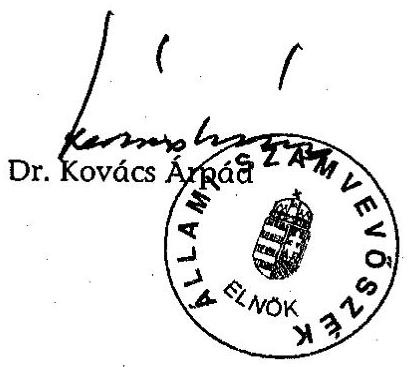

---

# A NEMZETI KOLLÉGIUMI KÖZALAPÍTVÁNY ESZKÖZEI ÉS FORRÁSAI

|   | Megnevezés | Értékadatok: millió Ft-ban, együzedes pontossággal |  |  |   |
| --- | --- | --- | --- | --- | --- |
|   |  | 2001. év | 2002. év | 2003. | 2004.1. félév  |
|  A. | Befektetett eszközök (I+II+III+IV) | 8,4 | 11,9 | 8,7 | 7,6  |
|  I. | Immateriális javak | 0,1 | 0,1 |  |   |
|  II. | Tárgyi eszközök | 8,3 | 11,8 | 8,7 | 7,63  |
|   | 1. Ingatlanok |  |  |  |   |
|   | 2. Műszaki és egyéb berendezések, gépek, járművek | 8,3 | 11,8 | 8,7 | 7,6  |
|   | 3. Beruházások, beruházásokra adott előlegek |  |  |  |   |
|  III. | Befektetett pénzügyi eszközök |  |  |  |   |
|   | 1. Részesedések |  |  |  |   |
|   | 2. Értékpapírok |  |  |  |   |
|   | 3. Adott kölcsönök (1 éven túl) |  |  |  |   |
|   | 4. Hosszú lejáratú bankbetétek (1 éven túl) |  |  |  |   |
|  IV. | Befektetett eszközök értékhelyesbítése |  |  |  |   |
|  B. | Forgóeszközök (I+II+III+IV) | 2643,4 | 335,8 | 351,1 | 332,7  |
|  I. | Készletek |  |  |  |   |
|  II. | Követelések |  | 0,1 |  |   |
|   | 1. Követelések áruszállításból és szolgáltatásokból |  | 0,1 |  |   |
|   | 2. Váltókövetelések |  |  |  |   |
|   | 3. Rövid lejáratú kölcsönök |  |  |  |   |
|   | 4. Egyéb követelések |  |  |  | 0,2  |
|  III. | Értékpapírok |  | 203 | 139,8 | 140,9  |
|   | 1. Eladásra vásárolt kötvények |  |  |  |   |
|   | 2. Saját és eladásra vásárolt részvények, üzletrészek |  |  |  |   |
|   | 3. Egyéb értékpapírok |  | 203 | 139,8 | 140,9  |
|  IV. | Pénzeszközök | 2643,4 | 132,7 | 221,3 | 191,6  |
|  C. | Aktív időbeli elhatárolások |  | 0,4 | 0,8 |   |
|   | Eszközök összesen (A+B+C) | 2651,8 | 348,1 | 370,6 | 342,3  |
|  D. | Saját tőke (I+II+III) | 20 | 116,6 | 36,3 | 187  |
|  I. | Induló tőke | 20 | 20 | 20 | 20  |
|  II. | Tőkeváltazás |  | 96,6 | 16,3 | 167  |
|   | ebből: tárgyéví eredmény |  | 96,6 | -68,7 | 139,2  |
|  III. | Értékelési tartalék |  |  |  |   |
|  E. | Cattartalék |  |  |  |   |
|  F. | Kötelezettségek (I+II) | 2559,2 | 231,5 | 132,4 | 153,3  |
|  I. | Hosszú lejáratú kötelezettségek |  |  |  |   |
|   | 1. Beruházási és fejlesztési hitelek |  |  |  |   |
|   | 2. Egyéb hosszú lejáratú hitelek |  |  |  |   |
|   | 3. Hosszú lejáratra kapott kölcsönök |  |  |  |   |
|   | 4. Egyéb hosszú lejáratú kötelezettségek |  |  |  |   |
|  II. | Rövid lejáratú kötelezettségek | 2559,2 | 231,5 | 120,8 | 153,3  |
|   | 1. Kötelezettségek áruszállitásból és szolgáltatásokból | 5,9 | 1 | 0,3 | 139,7  |
|   | 2. Rövid lejáratú hitelek és kölcsönök |  |  |  |   |
|   | 3. Köztartozások (adó, járulék, vám, illeték, stb) | 3 | 2 | 3 | 0,3  |
|   | 3/a. Ebből: 60 napon túl lejárt esedékességű tartozás |  |  |  |   |
|   | 4. Egyéb rövid lejáratú kötelezettségek | 2550,3 | 228,5 | 117,5 | 13,3  |
|  G. | Passzív időbeli elhatárolások | 72,6 |  | 201,9 |   |
|   | Források összesen (D+E+F+G) | 2651,8 | 348,1 | 370,6 | 340,3  |

Alulírott az Állami Számvevőszékről szóló 1989. évi XXXVIII. törvény 24. § c) pontja alapján aláírásommal kijelentem, hogy a feltüntetett adatok teljesek és a közalapítvány nyilvántartásaival, okmányalvaí mủetőbb egyeznek.

Budapest, 2004. ..........hó ..... nap

1055 Bp. P. Bóthori u. 10. Adószám: 18102224-1-41

---

### A NEMZETI KOLLÉGIUMI KÖZALAPÍTVÁNY EREDMÉNYKIMUTATÁSA

|  Megnevezés | 2001. év | 2002. év | 2003. év | 2004. í. félév  |
| --- | --- | --- | --- | --- |
|  Összes (közhasznú) tevékenység bevétele (1+2+3+4) | 59,6 | 235,8 | 112,0 | 290,0  |
|  1 (Közhasznú) célra, működésre kapott támogatás | 59,6 | 154,9 | 104,8 | 289,8  |
|  a) alapítótil | 0,0 | 0,0 | 0,0 | 0,0  |
|  b) államháztartás alrendszeréből | 54,3 | 133,4 | 101,0 | 289,8  |
|  c) más adományozótól | 4,3 | 21,5 | 3,2 | 0,0  |
|  2. Pályázati úton elnyert támogatás | 0,0 | 0,0 | 0,0 | 0,0  |
|  3. Cél szerinti (közhasznú) tevékenységből származó bevétel | 0,0 | 0,0 | 0,0 | 0,0  |
|  4. Egyéb bevétel | 0,0 | 80,9 | 7,2 | 0,4  |
|  5. Vállalkozási tevékenység bevétele | 0,0 | 0,0 | 0,0 | 0,0  |
|  Összes bevétel (A+B) | 58,6 | 235,8 | 112,0 | 290,0  |
|  6. Cél szerinti (közhasznú) tevékenység költségei és ráfordításai (1+2) | 58,6 | 135,2 | 180,8 | 150,8  |
|  1. Cél szerinti tevékenység közvetlen költségei és ráfordításai |  |  | 38,5 | 138,8  |
|  2. Működési költségek (kezelőszerv. köz-el és egyéb közvelett köz-ek) |  |  | 142,0 | 12,0  |
|  3. Vállalkozási tevékenység költségei és ráfordításai | 0,0 | 0,0 | 0,0 | 0,0  |
|  4. Összes tevékenység költségei és ráfordításai (D+E) | 58,6 | 135,2 | 180,8 | 150,8  |
|  5. Adózás előtti eredmény | 0,0 | 96,8 | -68,8 | 129,2  |
|  6. Adófizetési kötelezettség | 0,0 | 0,0 | 0,0 | 0,0  |
|  7. Tárgyévi eredmény (C-F-H) | 0,0 | 96,8 | -68,8 | 129,2  |

Alulírott az Állami Számvevőszékről szóló 1989. évi XXXVII. törvény 24. § c) pontja alapján aláírásommal kijelentem, hogy a feltüntetett adatok teljesek és a közalapítvány nyilvántartásaival mindenben egyeznek.

Budapest, 2004. .................. hó ... nap

Adózásra: 18102224-1-41

Képviseletre jogosult aláírása

---

# A NEMZETI KOLLÉGIUMI KÖZALAPÍTVÁNY KAPOTT TÁMOGATÁSAI BEVÉTELEI ÉS KIADÁSAI

|  Sor szám | Megnevezés | 2001. | 2002. | 2003. | 2004. I. félév | Összesen  |
| --- | --- | --- | --- | --- | --- | --- |
|  1. | Támogatás a központi költségvetésből | 377,0 | 99,0 | 220,0 | 0,0 | 697,0  |
|  2. | Támogatás MPA szakképzési alaprészéből | 2400,0 | 0,0 | 200,0 | 0,0 | 2600,0  |
|  3. | Egyéb támogatások | 16,9 | 21,5 | 3,2 | 0,0 | 41,0  |
|  4. | Egyéb bevételek | 0,0 | 0,0 | 0,2 | 0,0 | 0,2  |
|  5. | Pénzügyi műveletek bevételei | 0,0 | 60,9 | 7,0 | 0,4 | 99,3  |
|  1. | Kapott támogatás és bevételek összesen | 2793,9 | 192,4 | 430,4 | 0,4 | 3417,1  |
|  6. | Anyag költségek | 2,8 | 5,5 | 4,9 | 1,4 | 14,0  |
|   | nyomtatvány, irodaszor | 2,2 | 3,0 | 1,0 | 0,0 | 9,4  |
|   | energia költség | 0,3 | 1,0 | 3,9 | 1,2 | 6,3  |
|   | egyéb anyag költség | 0,3 | 1,5 | 0,1 | 0,0 | 1,5  |
|   | kis értékű tárgyi eszközök | 0,0 | 0,0 | 0,0 | 0,0 | 0,0  |
|  7. | Igénybevett szolgáltatások | 14,5 | 24,9 | 29,7 | 4,4 | 107,6  |
|   | bérleti díjak | 0,7 | 2,8 | 0,0 | 0,0 | 2,6  |
|   | karbantartási költség | 0,0 | 0,1 | 0,2 | 0,0 | 0,3  |
|   | hirtetés, reklám költség | 5,6 | 7,4 | 0,0 | 0,0 | 13,3  |
|   | posta, telefon | 1,2 | 3,7 | 2,9 | 0,8 | 7,0  |
|   | kiküldetés költsége | 0,0 | 0,6 | 0,1 | 0,0 | 0,7  |
|   | könyvelési díj | 2,6 | 5,0 | 6,2 | 1,7 | 14,0  |
|   | könyvvizsgálói díj | 0,3 | 1,5 | 2,6 | 0,5 | 4,8  |
|   | ügyvédi képviselet | 2,1 | 3,8 | 3,5 | 1,0 | 10,3  |
|   | szakértői díjak | 1,0 | 18,9 | 12,9 | 0,0 | 32,6  |
|   | egyéb szolgáltatás | 0,6 | 7,7 | 2,8 | 0,6 | 12,0  |
|   | munkasrő kölcsönzés díj | 0,0 | 2,7 | 0,0 | 0,0 | 2,7  |
|  8. | Anyagjellegü ráfordítások (6+7) | 17,9 | 29,0 | 34,8 | 5,8 | 117,5  |
|  9. | Bérköltség | 15,9 | 22,9 | 19,7 | 3,5 | 71,2  |
|   | alkalmazottak bérköltsége | 3,7 | 17,0 | 11,0 | 3,2 | 34,9  |
|   | megbízási díjak | 2,3 | 5,5 | 1,3 | 0,1 | 9,1  |
|   | tisztségviselők tiszteletölje | 0,4 | 10,4 | 7,4 | 0,0 | 27,2  |
|  10. | Személyi jellegü egyéb kifizetések | 0,7 | 3,5 | 2,0 | 0,7 | 6,9  |
|  11. | Bérjárulékok | 4,9 | 10,3 | 6,6 | 1,6 | 23,0  |
|  12. | Személyi jellegü ráfordítások (9+10+11) | 20,9 | 46,7 | 29,0 | 5,0 | 101,1  |
|  13. | Tárgyi eszközök értékcsökkenése | 1,1 | 4,8 | 2,6 | 1,3 | 8,9  |
|  14. | Egyéb ráfordítás | 19,5 | 29,6 | 115,1 | 138,6 | 302,2  |
|   | ebből ösztöndíj kifizetések | 16,3 | 29,0 |  |  | 45,3  |
|  II. | Költségek és ráfordítások (8+12+13+14) | 58,8 | 129,3 | 180,8 | 150,8 | 529,4  |
|  15. | A közalapítvány által adott támogatások | 137,7 | 2363,6 | 183,5 | 139,0 | 2817,7  |

Alulírott az Állami Számvevőszékről szóló 1969. évi XXXVIII. törvény 24. § c) pontja alapján aláírásommal kijelentem, hogy a feltüntetett adatok teljesok és a közalapítvány nyilvántartásaival mindenben egyeznek.

Budapest, 2004. ... hó ... nap

Barnesi 4. 10. 2021. 14:14:24 +02'00'

Képviseletre jogosult aláírása

---

4. sz. melléklet a V-1021/2004. számú jelentéshez

A NEMZETI KOLLÉGIUMI KÖZALAPÍTVÁNY KURATÓRIUMI ÉS FB TAGJAINAK TISZTELETDÍJA ÉS KÖLTSÉGTÉRÍTÉSE

|  Megnevezés | 2001. | 2002. | 2003. | 2004. 1. félév | Összesen  |
| --- | --- | --- | --- | --- | --- |
|   | fő | kifizetett
összeg | fő | kifizetett
összeg | fő  |
|  Kuratóriumi tagok tiszteletdíja |  |  |  | 20 | 6,4  |
|  FB tagok tiszteletdíja |  |  |  | 3 | 1  |
|  Tiszteletdíjak összesen |  | 9,4 | 10,4 |  | 7,4  |
|  Kuratóriumi tagok költségtérítése |  |  |  |  | 0  |
|  kiküldetési költségek (szállásdíj, útl ktg., napidíj) |  |  |  |  | 0  |
|  saját gépkocsi használat |  |  |  |  | 0,1  |
|  egyéb költségtérítés |  |  |  |  | 0  |
|  FB tagok költségtérítése |  | 0 | 0 |  | 0  |
|  kiküldetési költségek (szállásdíj, útl ktg., napidíj) |  |  |  |  | 0  |
|  saját gépkocsi használat |  |  |  |  | 0  |
|  egyéb költségtérítés |  |  |  |  | 0  |
|  Költségtérítések összesen |  | 0 | 0 |  | 0,1  |

Alulírott az Állami Számvevőszékről szóló 1989. évi XXXVIII. törvény 24. § c) pontja alapján aláírásommal kijelentem, hogy a feltüntetett adatok teljesek és a közalapítvány nyilvántartásaival, okmányaival mindenben egyeznek.

Budapest, 2004......... hó ..... nap

KÖTSÖZTÉSZÉRSZÉNY

Képviseletre jogosult aláírása

---

# A NEMZETI KOLLÉGIUMI KÖZALAPÍTVÁNY ÁLTAL ADOTT PÁLYÁZATI TÁMOGATÁSOK 2001. ÉV 

Értékadatok: millió Ft-ban, egytizedes pontossággal

| Sorszám | Pályázati programok | Beérkes   ett pályá   zatok   száma   (db) | Igényelt   összeg | Támogatott   pályázatok   száma (db) | Odaltét   összeg | Kifizetett   támogatás   összege | Visszatérítés   összege |
| :--: | :--: | :--: | :--: | :--: | :--: | :--: | :--: |
| 1. | Közoktatás-szakkör | 160 | 69,2 | 149 | 43,0 | 16,1 | 0,00 |
| 2. | Közoktatás-sport | 225 | 177,9 | 209 | 53,3 | 21,2 | 0,00 |
| 3. | Közoktatás-hátrányos h. | 48 | 52,5 | 14 | 6,8 | 2,7 | 0,00 |
| 4. | Közoktatás-hagyományőrz. | 104 | 19,9 | 93 | 14,4 | 6,9 | 0,00 |
| 5. | Közoktatás-diakónkorm. | 89 | 9,9 | 82 | 6,8 | 2,1 | 0,00 |
| 6. | Felsőoktatás-szakmal, sport | 104 | 174,9 | 88 | 84,2 | 3,5 | 0,00 |
| 7. | Szakmal szervezetek | 8 | 38,9 | 5 | 20,4 | 11,1 | 0,00 |
| 8. | Nevelésfejlesztés | 6 | 13,6 | 4 | 5,5 | 3,0 | 0,00 |
| 9. | Szakoktatás-diakkor | 56 | 91,9 | 47 | 50,6 | 16,1 | 0,00 |
| 10. | Szakoktatás-környezetnev. | 25 | 36,0 | 21 | 21,8 | 7,6 | 0,00 |
| 11. | Szakoktatás-informatika | 77 | 359,2 | 43 | 108,8 | 12,8 | 0,00 |
| 12. | Szakoktatás-könyvtár | 50 | 43,6 | 47 | 26,0 | 9,3 | 0,00 |
| 13. | Sulinet | 402 | 1585,0 | 140 | 552,0 | 0,0 | 0,00 |
| 14. | Arany János Ösztöndíj | 967 | 19,3 | 967 | 19,3 | 19,3 | 0,00 |
|  | Osszasen 2001. év | 2321 | 2691,8 | 1909 | 1012,9 | 131,7 | 0,00 |

Aktálott az Állami Számvevőszékői szóló 1989. évi XXXVII. törvény 24. § c pontja alapján aláírásommal kijelentem, hogy a futóintetett adatok teljeset és a köralapítvány nyilvántartásainai mindenben egyeznek.

Budapest, 2004.
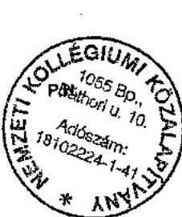
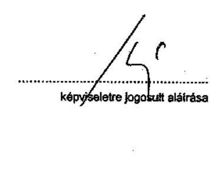

---

# A NEMZETI KOLLÉGIUMI KÖZALAPÍTVÁNY ÁLTAL ADOTT PÁLYÁZATI TÁMOGATÁSOK 2002. év 

|  |   |   |   |   |   |   |   |
| --- | --- | --- | --- | --- | --- | --- | --- |
|  Sor-
szám | Pályázati programok | Beerke zett pályázat tok száma | Igényelt összeg | Támogatott pályázatok száma (db) | Odalétlt összeg | Kifizetett támogatás összege | Visszatérítés összege  |
|  1. | Szakoktatás- vizesblokk | 238 | 4344,6 | 97 | 388,0 | 388,4 | 0,04  |
|  2. | Szakoktatás- hölő | 303 | 493,8 | 76 | 97,0 | 97,0 | 0,00  |
|  3. | Felsöoktatás- vizesblokk | 96 | 1529,8 | 38 | 388,6 | 270,1 | 0,70  |
|  4. | Felsöoktatás- bútor | 137 |  | 45 | 478,1 | 478,1 | 0,00  |
|  5. | Felsöoktatás- tanulókozp. | 126 | 266,3 | 63 | 155,2 | 155,2 | 1,10  |
|  6. | BéGé ösztöndíj I. | 52 | 26,0 | 50 | 25,0 | 9,7 | 0,00  |
|  7. | BéGé ösztöndíj II. | 36 | 18,0 | 35 | 17,5 | 0,0 | 0,00  |
|  8. | Felsöoktatás- Zöldkollégium | 92 | 214,2 | 35 | 40,0 | 39,7 | 0,00  |
|  9. | Határon túli d elsz koll Pály | 2 | 84,0 | 1 | 45,0 | 45,0 | 0,00  |
|   | Athúzódó kifizetések |  |  |  |  |  |   |
|  10. | Közoktatás-szakkör | 0,0 | 0,0 | 0,0 | 0,0 | 27,0 | 0,20  |
|  11. | Közoktatás-sport | 0,0 | 0,0 | 0,0 | 0,0 | 31,4 | 0,10  |
|  12. | Közoktatás-hátrányos h. | 0,0 | 0,0 | 0,0 | 0,0 | 4,1 | 0,00  |
|  13. | Közoktatás-hagyományőrr. | 0,0 | 0,0 | 0,0 | 0,0 | 7,5 | 0,20  |
|  14. | Közoktatás-diákönkorm. | 0,0 | 0,0 | 0,0 | 0,0 | 4,7 | 0,07  |
|  15. | Felsöoktatás-szakmai, sport | 0,0 | 0,0 | 0,0 | 0,0 | 80,1 | 0,70  |
|  16. | Szakmai szervezetek | 0,0 | 0,0 | 0,0 | 0,0 | 9,3 | 0,00  |
|  17. | Nevelésfejlesztés | 0,0 | 0,0 | 0,0 | 0,0 | 2,4 | 0,00  |
|  18. | Szakoktatás-diákkör | 0,0 | 0,0 | 0,0 | 0,0 | 34,5 | 0,04  |
|  19. | Szakoktatás-környezetnev. | 0,0 | 0,0 | 0,0 | 0,0 | 14,0 | 0,03  |
|  20. | Szakoktatás-informatika | 0,0 | 0,0 | 0,0 | 0,0 | 94,0 | 0,00  |
|  21. | Szakoktatás-könyvtár | 0,0 | 0,0 | 0,0 | 0,0 | 16,7 | 0,02  |
|  22. | Sulinet | 0,0 | 0,0 | 0,0 | 0,0 | 552,0 | 0,00  |
|  23. | Arany János Ösztöndíj | 965 | 24,3 | 965 | 24,3 | 24,3 | 0,00  |
|  24. | Müvészeti pályázat | 53 |  | 13 | 0,4 | 0,4 | 0,00  |
|   | Összesen 2002. év | 2102 | 7021,0 | 1418 | 1658,5 | 2363,6 | 3,20  |

Audított az Állami Számvevőszékői szóló 1989. évi XXXVII. törvény 24. § c pontja alapján aláírásommal kijelentem, hogy a feltüntetett adatok teljesek és a közalapítvány nyilvántartásainval mindenben egyeznek.

Budapest, 2004.
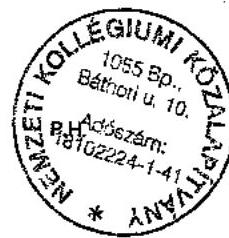
képviselotre jogosult aláírása

---

# A NEMZETI KOLLÉGIUMI KÖZALAPÍTVÁNY ÁLTAL ADOTT PÁLYÁZATI TÁMOGATÁSOK 2003. év 

|  |   |   |   |   |   |   |   |
| --- | --- | --- | --- | --- | --- | --- | --- |
|  Sorszám | Pályázati programok | Beérke   zett   pályázat   tok   száma   (db) | Igényelt   összeg | Támogatott   pályázatok   száma (db) | Odaltélt   összeg | Kifizetett   támogatás   összege | Visszatérítés   összege  |
|  1. | Felsőoktatás szakmai | 92 | 32,0 | 75 | 12,0 | 11,3 | 0,00  |
|  2. | Közoktatás szakmai | 298 | 57,0 | 235 | 18,0 | 17,6 | 0,00  |
|   | Áthúzódó kifizetések |  |  |  |  |  |   |
|  3. | Szakoktatás- vízesbíokk | 0 | 0 | 0 | 0 | 7,3 | 0,00  |
|  4. | Felsőoktatás- vízesbíokk | 0 | 0 | 0 | 0 | 116,7 | 0,00  |
|  5. | BéGé ösztöndíj I. | 0 | 0 | 0 | 0 | 14,4 | 0,00  |
|  6. | BéGé ösztöndíj II. | 0 | 0 | 0 | 0 | 16,2 | 0,00  |
|  7. | Felsőoktatás- Zöldkollégium | 0 | 0 | 0 | 0 | 0,0 | 0,00  |
|   | Összesen 2003. év | 390 | 89,0 | 310 | 30,0 | 183,5 | 0,00  |

Atulírott az Állami Számvevőszékól szóló 1989. évI XXXVIII. törvény 24. § c pontja alapján aláírásommal kijelentem, hogy a feltüntetett adatok toljesek és a közalapítvány nyilvántartáselvah mindenben egyeznek.

Budapest, 2004. $\qquad$ hó $\qquad$ nap $\qquad$

---

# A NEMZETI KOLLÉGIUMI KÖZALAPÍTVÁNY ÁLTAL ADOTT PÁLYÁZATI TÁMOGATÁSOK 2004. év, 1. félév 

|  |   |   |   |   |   |   |   |
| --- | --- | --- | --- | --- | --- | --- | --- |
|  Sorszám | Pályázati programok | Beérke   zett   pályázat   tok   száma   (db) | Igényelt   összeg | Támogatott   pályázatok   száma (db) | Odaltélt   összeg | Kifizetett   támogatás   összege | Visszatérítés   összege  |
|  1. | Informatika labor szakokt. | 259 | * | 58 | 94,9 | 50,5 | 0,00  |
|  2. | Informatika labor közokt. | 111 | * | 66 | 87,3 | 87,3 | 0,00  |
|  3. | Felsöoktatás tanulóközpont | 148 | 393,7 | 54 | 95,0 | 0,0 | 0,00  |
|  Áthúzódó kifizetések |  |  |  |  |  |  |   |
|  3. | Felsöoktatás szakmai | 0 | 0,0 | 0 | 0,0 | 0,7 | 0,00  |
|  4. | Közoktatás szakmai | 0 | 0,0 | 0 | 0,0 | 0,4 | 0,00  |
|   | Összesen 2004.1. félév | 518 | 393,7 | 178 | 277,2 | 138,9 | 0,00  |
|  |   |   |   |   |   |   |   |

- eszközökre pályáztak, összegezerü adat nem áll rendelkezésre

Aktiliratt az Állami Számvevőszékol szóló 1989. évl XXXVIII. törvény 24. § c pontja alapján aláírásommal kijelentem, hogy a feltüntetett adatok tájesek és a közalapítvány nyilvántartásaiual mindenben egyeznek.

Budapest, 2004.
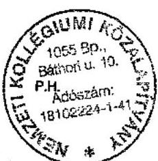

---

9. sz. melléklet 1. oldal
a V-1021/2004. számú jelentéshez

Ügyiratszám: 12.906/2002.

# Támogatási szerződés 

amelyet egyrészröl az elkiatási Minisztérium
székhely: 1055 Budapest, Szalay u. 10-14.
képviselő: dr. Gál András Levente államtitkár mint Támogató,
másrészröl név: Nemzeti Kollégiumi Közalapítvány
székhely:1054. Budapest Báthory u. 10.
képviselő: Vetési Iván kuratóriumi elnök
nyilvántartási szám: 16.PK. 60.990/2000/2
adószám: $18102224-1-41$
számlavezető bank neve: Magyar Államkincstár
bankszámla száma: 10032000 - 00284859 -
00000000
mint Kedvezményezett
kötöttek, a mai napon, az alábbi feltételekkel:

## 1. A támogatás nyújtásának előzményei, körülményei:

A felek rögzítik, hogy a Magyar Köztársaság 2001. és 2002. évi költségvetéséről szóló 2000. évi CXXXIII. törvény XX. fejezet 11. cím 10. alcím alapítványok. jogcímsor alapján a Támogató a jelen szerződésben meghatározott feltételek mellett anyagi támogatást nyújt a Kedvezményezett részére.

## 2. A támogatás célja:

A támogatás célja

- a Nemzeti Kollégiumi Közalapítvány alapító okiratában foglalt célok megvalósításához szükséges költségeklisz'történő hozzájárulás
- a Balassi-Bálint-Intézet kollégium fejlesztéti programjának megvalósításához történő hozzájárulás
$10.000 \mathrm{e} \mathrm{ft}$

---

# 3. A támogatás összege, forrása: 

3.1. A támogatás összege 90.000 .000 .- azaz kilencvenmillió Ft.

### 3.2. A támogatás forrása: $11 / 10$. Alapítványok támogatása

3.3. Kedvezményezett a jelen szerződés aláírásával nyilatkozik arról, hogy a támogatási szerződés 2. pontja szerinti cél tekintetében ÁFA-levonási jog nem illeti meg Ennek függvényében a termékek és szolgáltatások összegét bruttó összegben tartalmazza. Egyúttal kötelezi magát arra, hogy az e vonatkozásban bekövetkezett változásról haladéktalanul értesíti a Támogatót.

## 4. A támogatás folyósításának módja, ütemezése:

4.1. A Támogató a támogatás összegét a Magyar Államkincstárnál vezetett számlájáról - jelen szerződésben meghatározott ütemezés szerint - átutalja a Kedvezményezett bankszámlájára.
4.2. A Támogató a támogatás összegét a jelen szerződés aláírását követő 8 munkanapon belül utalja át a Kedvezményezett bankszámlájára.
4.3. A Kedvezményezett tudomásul veszi, hogy az általa megadott bankszámlára átutalt összegért feltétel nélkül és teljes mértékben objektív felelősséggel tartozik, függetlenül attól, hogy ki a számlatulajdonos.

## 5. A Támogatás felhasználásának szabályai:

5.1. A Kedvezményezett a tudomásul veszi, hogy a támogatást kizárólag a jelen szerződésben meghatározott célra használja fel.
5.2. A támogatás felhasználásának kezdő időpontja: 2002.01.01. végső határideje: 2002.12.31.
A Támogató a felhasználási határidőket különösen indokolt esetben legfeljebb egy alkalommal módosíthatja.
5.3. Amennyiben a Kedvezményezett a támogatás teljes összegét vagy annak egy részét tárgyi eszköz beszerzésre illetve egyéb beruházás megvalósítására fordítja köteles a támogatás segítségével beszerzett, illetve bővített tárgyi eszközöket az alapító okiratában és a szerződésben megjelölt céloknak megfelelően működtetni.
5.4. A Kedvezményezett a működtetési kötelezettsége körében a tárgyi eszközt saját költségén fenntartja, rendeltetésszerủen üzemelteti, és az adott tárgyi eszköz kezelésére vonatkozó szabályok szerint javíttatja, illetve folyamatos karbantartásáról gondoskodik.

---

5.5. A Kedvezményezett az előzőeken túlmenően is köteles a tárgyi eszköz állagmegóvásáról és vagyoni szempontú védelméről folyamatosan gondoskodni.

# 6. A támogatás felhasználásának ellenőrzése, beszámoltatási kötelezettség: 

6.1. A támogatás felhasználását a Támogató - a Kedvezményezett szükségtelen zavarása nélkül - bármikor, bárhol ellenőrizheti. A Támogató részéről ellenőrzésre jogosult Kojanitz László főosztályvezető, vagy az általa meghatalmazott személy.
6.2. A Kedvezményezett a a a a a a a a a a a a a a a a a a a a a a a a a a a a a a a a a a a a a a a a a a a a a a a a a a a a a a a a a a a a a a a a a a a a a a a a a a a a a a a a a a a a a a a a a a a a a a a a a a a a a a a a a a a a a a a a a a a a a a a a a a a a a a a a a a a a a a a a a a a a a a a a a a a a a a a a a a a a a a a a a a a a a a a a a a a a a a a a a a a a a a a a a a a a a a a a a a a a a a a a

---

7.2. Ha a Támogató a szerződéstől eláll vagy azt felmondja, a Kedvezményezett - a Támogató döntésétől függően - a támogatás egész összegét vagy annak arányos részét - kamatokkal növelten - köteles visszafizetni.
7.3. A Támogató elállásra vagy felmondásra okot adó körülmény felmerülése, továbbá a támogatás visszavonása esetén a Kedvezményezett az érintett előirányzatok támogatási rendszeréből 2 évig kizárható.
7.4. Amennyiben a támogatásból fel nem használt összeg maradt vissza, úgy azt a Kedvezményezett a beszámolási határidőtől számított 30 napon belül köteles visszafizetni a Támogatott részére.

# 8 Biztosítékok 

8.1. A Kedvezményezett tudomásul veszi, hogy a támogatás összegéből beszerzett tárgyi eszközöket legalább 2 évig a támogatás céljának megfelelően köteles használni, azokat 2 éven belül csak a Támogató előzetes, írásbeli engedélye alapján idegenítheti el, terhelheti meg, adhatja bérbe, lízingbe vagy apportba.
8.2. A Kedvezményezett a jelen szerződéshez III. sz. mellékletként csatolja a számlavezető pénzintézete által ellenjegyzett, a jelen szerződésben vállalt beszámolási véghatáridőt követő 60 . napig szóló, visszavonhatatlan azonnali beszedési megbízás benyújtására szóló felhatalmazást. Amennyiben Támogató a beszámolásra vonatkozó véghatáridőt meghosszabbítja, annyiban Kedvezményezett köteles az azonnali beszedési megbízásra vonatkozó felhatalmazást a beszámolásra vonatkozó véghatáridő tartamával meghosszabbítani. A Kedvezményezett kijelenti, hogy a bejelentetteken kívül további bankszámlája nincs; ezzel összefüggésben kötelezettséget vállal arra, amennyiben új bankszámlát nyit ezt haladéktalanul bejelenti Támogató részére és az új bankszámlájára vonatkozó azonnali beszedési megbízás benyújtására szóló felhatalmazást a bankszámlára vonatkozó bejelentés alkalmával csatolja.

## 9. Egyéb rendelkezések:

9.1. A Kedvezményezett a jelen szerződés aláírásával nyilatkozik arról, hogy az aláírás időpontjában nincs hatvan napon túli lejárt köztartozása.
9.2. A Kedvezményezett a jelen szerződés aláírásával az államháztartásról szóló 1992. évi XXXVIII. törvény (a továbbiakban: Áht.), valamint az államháztartás működési rendjéről szóló 217/1998. (XII. 30.) Kormányrendelet (a továbbiakban: Kormányrendelet) vonatkozó rendelkezései alapján hozzájárul az adatainak nyilvántartásához és az adóhatóságok részére történő továbbításához, és tudomásul veszi, hogy 60 napon túli meg nem fizetett köztartozása esetén a támogatás felfüggeszthető, visszavonható vagy visszakövetelhető.

---

9.3. A Kedvezményezett kötelezi magát, hogy a szerződés teljesítésével összefüggő lényeges körülményben -ilyen különösen az adatváltozás, valamint a Kedvezményezett ellen indult csőd-, felszámolási, vagy végelszámolási eljárásbekövetkezett minden változást 15 napon belül Támogatónak bejelent.
9.4. A Kedvezményezett tudomásul veszi, hogy a támogatás felhasználása során szükség szerint - megfelelően alkalmazni köteles a közbeszerzésekre vonatkozó jogszabályokat.
9.5. A Kedvezményezett a jelen szerződéssel támogatott tevékenységével kapcsolatos bárminemű tájékoztatásban köteles feltüntetni a támogatás tényét, valamint azt, hogy a támogatás az Oktatási Minisztériumtól származik, lehetőség szerint a Támogató logójának megjelenítésével.
9.6. A felek a jelen szerződésből eredő esetleges jogvitáikat elsősorban tárgyalásos úton kötelesek rendezni; ennek eredménytelensége esetére alávetik magukat hatáskörtől függően - a PKKB vagy a Fővárosi Bíróság kizárólagos illetékességének.
9.7. A jelen szerződésben nem vagy nem kellő részletességgel szabályozott kérdések tekintetében a magyar jog szabályai - elsősorban a Polgári Törvénykönyv, az Áht rendelkezései az irányadóak.

A felek a jelen, 5 oldalból álló szerződést elolvasták, megértették, majd, mint akaratukkal mindenben megegyezőt jóváhagyólag írták alá.

A szerződés 4.db eredeti, egymással teljes egészében megegyező példányban készült, amelyből 3 db a Támogatónál, 1 db a Kedvezményezettnél marad.

Budapest 2002. április ,, ,

Támogató
(ph.)
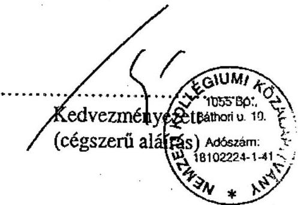

Mellékletek:
I. aláírási címpéldány vagy egyéb, az aláírási jogosultságot igazoló okirat vagy annak hiteles másolata a Támogató rendelkezésére áll
II. a Kedvezményezett létezését igazoló okirat vagy annak hiteles másolata Támogató rendelkezésére áll
III. inkasszó felhatalmazás

---

# 1. sz. Szerződés módosítás 

amely létrejött egyrészröl: Oktatási Minisztérium
székhely: 1055 Budapest, Szalay u. 10-14.
képviseli: Dr. Gál András Levente
közigazgatási államtitkár
másrészröl:
a Nemzeti Kollégiumi Közalapítvány
székhely: 1054 Budapest, Báthori u. 10.
képviseli: Vetési Iván kuratóriumi elnök
között a 12.906- /2002. ügyiratszámon szereplő és 2002. április -án a Felek által aláírt szerződésre vonatkozóan:

1. A Felek a szerződés 2.1. pontját az alábbiak szerint módosítják:

A támogatás célja

- a Nemzeti Kollégiumi Közalapítvány alapító okiratában foglalt célok megvalósításához szükséges költségekhez történő hozzájárulás 45.000 e Ft
- a határon túli tanulók elhelyezésére szolgáló közoktatási kollégiumok fejlesztési programjának megvalósításához történő hozzájárulás
45.000 e Ft

2. A szerződés további részei változatlanul hatályban maradnak.

A felek a jelen szerződésmódosítást elolvasták, megértették, majd, mint akaratukkal mindenben megegyezőt jóváhagyólag irták alá.
2002. május „ „
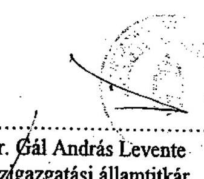

Dr. Gál András Levente közigazgatási államtitkár
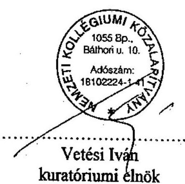

Vetési Iván
kuratóriumi elnök

---

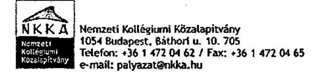

# Oktatási Minisztérium

Ikt.sz.: 525-K/2002.

Dr. Szüdi János
közigazgatási államtitkár úr részére
1055 Budapest,
Szalay u. 10-14.

Tárgy: Szerződés módosítási kérelem

Tisztelt Államtitkár Úr!

Alulírott Vetési Iván, mint a Nemzeti Kollégiumi Közalapítvány Kuratóriumának elnöke, a Kuratórium döntése alapján, valamint Kalmárné Székfi Mónika, mint a Balassi Bálint Intézet gazdasági főigazgató helyettese azzal a kéréssel fordulunk a Tisztelt Államtitkár Úrhoz, hogy az Oktatási Minisztérium és a Nemzeti Kollégiumi Közalapítvány között 12.906/2002. ügyiratszám alatt létrejött, kilencvenmillió forintról szóló támogatási szerződést módosítani szíveskedjen az alábbi megfogalmazással a következő indokok alapján.

Fent nevezett szerződésben a 1. pont második bekezdésben az eredetileg megfogalmazott támogatási cél:

- a határon túli tanulók elhelyezésére szolgáló közoktatási kollégiumok fejlesztési programjának megvalósításához történő hozzájárulás 45.000 e Ft.

Ezen támogatási összeg nagy részét a Közalapítványnak a gazdasági helyettes államtitkárság kérésének megfelelően sürgősséggel a Balassi Bálint Intézet részére pályázati úton történő támogatás formájában kell eljuttatnia.

A Közalapítvány ennek érdekében elkészítette pályázati kiírását a támogatási szerződéssel összhangban, azonban a kiírásnak nem felel meg a támogatni kívánó Balassi Bálint Intézet, mivel nem esik a közoktatási törvény hatálya alá, nem minősül közoktatási kollégiumnak.

Az ügy mielőbbi megoldása érdekében kérjük a Tisztelt Államtitkár Urat, hogy a szerződés fent említett szövegét a következő mondatra cserélni szíveskedjen, miszerint a támogatás célja:

- a határon túli, nem felsőoktatásban résztvevő tanulók elhelyezésére szolgáló kollégiumok fejlesztési programjának megvalósításához történő hozzájárulás 45.000 e Ft.

Budapest, 2002. szeptember 4.

Kérelmünk pozitív elbírálásában bízva, tisztelettel:

Vetési Iván
kuratóriumi elnök

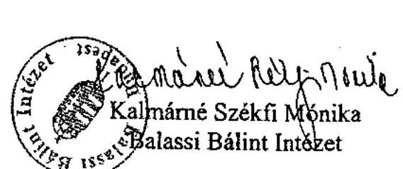

---

# 2. SZAMÚ SZERZŐDÉS MODOSÍTÁs 

amely létrejött egyrészröl:
másrészröl:

## Oktatási Minisztérium

székhely: 1055 Budapest, Szalay u. 10-14.
képviselő: dr. Stark Antal helyettes államtitkár, mint Támogató

## Nemzeti Kollégiumi Közalapítvány

székhely: 1054 Budapest, Báthori u. 10.
képviselő: Vetési Iván kuratóriumi elnök, nyilvántartási szám: 16.Pk.60.990/2000/2. adószám: 18102224-1-41
számlavezető bank neve: Magyar Államkincstár bankszámla száma: 10032000-00284859-00000000 mint Kedvezményezett
között a 12.906/2002. ügyiratszámon szereplő és 2002. április 18-án aláírt szerződést a Felek az alábbiak szerint módosítják:

1. A 2. pont az alábbiak szerint változik:

A támogatás célja

- a Nemzeti Kollégiumi Közalapítvány alapító okiratában foglalt célok megvalósításához szükséges költségekhez történő hozzájárulás
45.000 e Ft
- a határon túli magyarok magyar felsőoktatási képzésben való részvételére felkészítő tanfolyamok résztvevőinek elhelyezésére szolgáló kollégiumok fejlesztési programjának megvalósításához történő hozzájárulás
45.000 e Ft

2. A szerződés módosítással nem érintett rendelkezései változatlan tartalommal hatályban maradnak.

A felek a jelen, 1 oldalból álló szerződést elolvasták, megértették, majd, mint akaratukkal mindenben megegyezőt jóváhagyólag írtak alá.

A szerződés 4 db eredeti, egymással teljes egészében megegyező példányban készült, amelyből 3 db a Támogatónál, 1db a Kedvezményezettnél marad.

Budapest, 2002. szeptember „
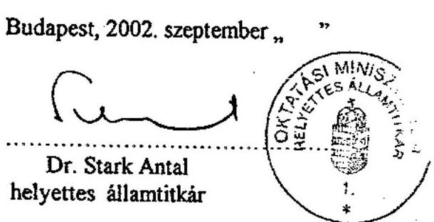
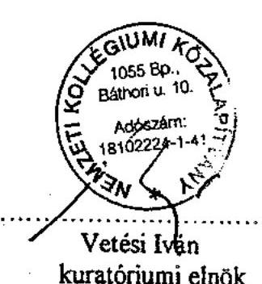

---

# 3. SZÁMÚ SZERZŐDÉSMÓDOSÍTÁs 

amely létrejött egyrészröl:
másrészröl:

Oktatási Minisztérium
székhely: 1055 Budapest, Szalay u. 10-14.
képviselő: dr. Stark Antal helyettes államtitkár, mint Támogató

Nemzeti Kollégiumi Közalapítvány
székhely: 1054 Budapest, Báthory u. 10..
képviselő: Vetési Iván kuratóriumi elnök
nyilvántartási szám: 16.Pk.60.990/2000/2
adószám: 18102224-1-41
számlavezető bank neve: Magyar Államkincstár
bankszámla száma: 10032000-00284859-00000000
mint Kedvezményezett
között, a mai napon, alábbi feltételekkel:
A Felek 12.906/2002. ügyiratszámon szereplő szerződést az alábbiak szerint módosítják:

1. A 6.4. pont második mondata az alábbiak szerint változik:

A Kedvezményezett a támogatás felhasználásáról 2003. március 31-ig köteles beszámolót és pénzügyi elszámolást készíteni és átadni a Támogató részére.
2. A szerződés módosítással nem érintett rendelkezései változatlan tartalommal hatályban maradnak.

A felek a jelen, 1 oldalból álló szerződést elolvasták, megértették, majd, mint akaratukkal mindenben megegyezőt jóváhagyólag írtak alá.

A szerződés 4 db eredeti, egymással teljes egészében megegyező példányban készült, amelyből 3 db a Támogatónál, 1db a Kedvezményezettnél marad.

Budapest, 2003. március „ "
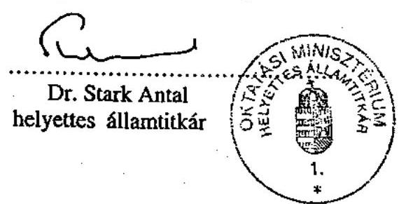
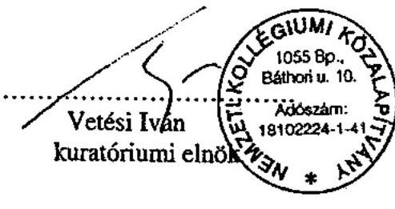

---

# TÁMOGATÁSI SZERZŐDÉS 

amely létrejött egyrészröl a

Nemzeti Kollégiumi Közalapítvány
Budapest, 1054 Báthori u. 10.
Képviseli: Vetési Iván
másrészröl a
név: Balassi Bálint Intézet
székhely: 1016 Budapest, Somlói út 51.
adószám: 15597023-2-41
bankszámlaszám: 10032000-00285379
mint Kedvezményezett/Befogadó intézmény)
intézmény (a továbbiakban:
Kedvezményezett/Befogadó intézmény) ${ }^{1}$
továbbá
név: BALASSI BÁLINT INTÉXET
székhely: 1016 budypest, somlai út 51
képviselö: KALNARNE SZÉKAI MONIKA
mint kedvezményezett (a továbbiakban: Kedvezményezett) ${ }^{2}$
között az alulírott napon és helyen, az alábbi feltételek mellett:

1. A szerződés tárgya a Támogató által „A határon túli magyarok magyarországi felsöoktatási képzésben való részvételre felkészitő tanfolyamok résztvevőinek elhelyezésére szolgáló kollégiumok fejlesztési programjának támogatására" témában kiírt program keretében a Kedvezményezett által benyújtott 1/HA/2002. számon nyilvántartott pályázati project (a továbbiakban: projekt) pénzügyi támogatása.
2. A szerződő felek rögzítik, hogy a Kedvezményezett szakmai leírást és költségvetést tartalmazó pályázati dokumentációt nyújtott be a szerződés tárgyát képező támogatás iránt. A pályázati dokumentáció tartalma teljes egészében jelen szerződés mellékletét képezi.
3. A pályázati dokumentáció értékelése alapján Támogató 45.000.000.-Ft, azaz negyvenötmillió forint vissza nem térítendő támogatás megítéléséről döntött a Kedvezményezett javára, amely összeg a támogatás felhasználása során felmerülő általános forgalmi adó összegét is tartalmazza.
[^0]
[^0]:    ${ }^{1}$ Amennyiben a Kedvezményezett ( a nyertes Pályázó ) nem jogi személy, úgy ebben a rovatban a Befogadó intézményt kell megjelölni.
    ${ }^{2}$ Amennyiben a szerződésben Befogadó intézmény szerepel, ebben az esetben a nyertes Pályázót mint Kedvezményezettet kell megjelölni.

---

4. A támogatás összegének, illetve részösszegének átutalására a pályázatban meghatározott ütemezésben kerül sor. (Amennyiben ütemezési tervet nem határozott meg a Kedvezményezett, abban az esetben egy összegben történik az átutalás.)
5. A jelen Szerződésben meghatározott kötelezettségek - amennyiben a Kedvezményezett nem jogi személy - a Befogadó intézményt terhelik.

A Kedvezményezett / befogadó intézmény vállalja, hogy
a) az átutalt támogatást kizárólag a projectnek a leírásban meghatározott szakmai tartalmú és színvonalú megvalósítására használja fel, és elszámolásra kizárólag az ilyen célú felhasználásnak megfelelő számlát nyújt be;
b) az átutalt összegek felhasználásáról elkülönített nyilvántartást vezet, s a project teljes költségvetéséről a pályázat lezárását követő harminc napon belül, de legkésőbb 2003. január 31-ig pénzügyi elszámolást készít a Támogató részére;
c) az átutalt összegek felhasználásáról az eredeti - támogatott - pályázatban meghatározott szakmai tartalomnak, valamint a megvalósulásnak megfelelően a pályázat lezárását követő harminc napon belül, de legkésőbb 2003.január 31ig szakmai beszámolót készít a Támogató részére,
d) biztosítja a feltételeit annak, hogy a Támogató a project ideje alatt és azt követően a támogatás felhasználásának szabályszerűségét - beleértve az e szerződésnek való megfelelőségét is - ellenőrizze;
e) a projecttel kapcsolatos minden szerződést, számlát, bizonylatot és más okiratot legalább öt évig megőriz, s lehetővé teszi, hogy a Támogató azokba betekintsen;
f) hozzájárul ahhoz, hogy a Támogató nyilvánosságra hozza a Kedvezményezett/Befogadó intézmény nevét, címét (székhelyét) és a támogatás mértékét, illetve tárgyát;
g) a projectnek a nyilvánosság előtt megjelenő eseményein - a Támogató megnevezésével és logojának feltüntetésével - a nyilvánosság tudomására hozza, hogy a project a Támogató támogatásával valósult meg.
6. A támogatás felhasználásának feltételeire, a támogatás megszüntetésére, visszafizetésére és az egyéb jogkövetkezményekre, a Kedvezményezett/Befogadó intézmény vagyoni jogainak korlátozására, a támogatás ütemezésére és folyósítására, a támogatás visszatartására, illetve felfüggesztésére, a támogatások felhasználásának és elszámolásának szabályaira és a támogatás felhasználásának ellenőrzésére, valamint a project lezárására vonatkozóan a Pályázati Szabályzat rendelkezéseit kell alkalmazni, amelyek jelen szerződés elválaszthatatlan részét képezik.

---

7. A jelen szerződésben nem szabályozott kérdésekben a Polgári Törvénykönyv rendelkezései, valamint az államháztartás müködéséről szóló jogszabályok az irányadóak.
8. A szerződő felek megállapodnak abban, hogy a szerződésből eredő esetleges jogvitáik elintézésére az általános hatásköri szabályok alapján kikötik a Pesti Központi Kerületi Bíróság, illetve Fővárosi Bíróság kizárólagos illetékességét.
9. A jelen szerződés egymással megegyező, három eredeti példányban készült. A szerződő felek a jelen szerződésben foglalt feltételekkel egyetértenek, azokat elfogadják, és a szerződést, mint akaratukkal mindenben megegyezőt, jóváhagyólag cégszerủen írják alá.

Budapest, 2002. november 25.
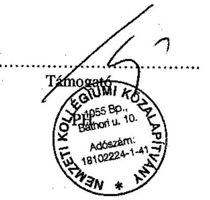

Kadvezményezett
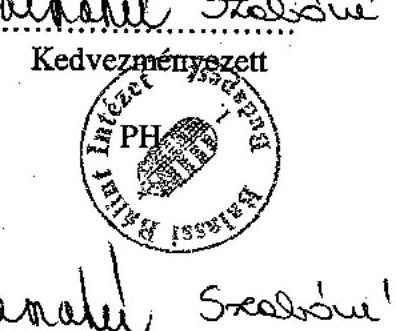

Befogadó intézmény
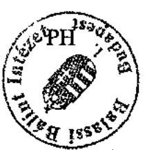

---

# MEGBÍZÁSI SZERZŐDÉS 

amely létrejött
egyrészröl:

Név: Nemzeti Kollégiumi Közalapítvány
Székhely: $\quad 1054$ Budapest, Báthori u. 10.
Adószám: $\quad 18102224-1-41$
Képviselö: Vetési Iván kuratóriumi elnök
mint megbízó - a továbbiakban Megbízó -
másrészröl:
Név:
BIDS Gazdasági Tanácsadó Kft.
Székhely: $\quad 1028$ Budapest, Kö u. 23.
Adószáma: $\quad 12593512-2-41$
Számlavezető bank: OTP Bank Rt.
Bankszámlaszám: $\quad 11712004-20239868$
mint megbízott - továbbiakban: Megbízott - között az alulírott napon és helyen az alábbi feltételek mellett:

1. A Megbízó megbízza a Megbízottat "A felsőoktatási hallgatók elhelyezésére szolgáló kollégiumok vizesblokk felújítására", illetve a „Szakképzésben résztvevő közoktatási kollégiumok vizesblokkjainak felújítására" vonatkozó programban támogatott, jelen szerződés 1. számú mellékletében felsorolt kollégiumokban monitoring vizsgálat elvégzésével és monitoring adatbázis kialakításával.
1.1 Megbízott a monitoring vizsgálatot jelen szerződés 2. számú mellékletében meghatározott Monitoring vizsgálati rendszerleírásnak megfelelően végzi.
1.2 Megbízott ellenőrzi, hogy a támogatott projekten belül megvalósult felújítások műszaki megoldásaikban korrektek, lehetőség szerint modern, a fokozott igénybe vételt hosszú távon kiszolgálni tudó alkalmazásokat takarjanak - a beadott és az NKKA által támogatásban részesített pályázati dokumentációnak megfelelően. Ezen felül ellenőrizni kell, hogy a projekt megvalósulása során a müszaki megvalósulások követik-e a projekt kifrásában szereplő specifikációkat.
A Megbízott elvégzi továbbá a támogatott beruházás helyszíni pénzügyi ellenőrzését, számlaalapú vizsgálatát. Vizsgálja, hogy a projekt során az elvégzett munkák, az azokról benyújtott számlák, illetve azok kiegyenlítése a Megbízó által elfogadott pályázatban szereplő tételeinek, valamint ütemezésnek megfelel-e.

---

1.3 A műszaki ellenőrzés körében a Megbízott feladata a helyszíni bejárás során a helyszínen bekérhető dokumentumok másolatainak begyűjtése (építési napló, garancia jegyek, stb.).
A pénzügyi ellenőrzés keretében a Megbízott feladata a helyszíni bejárás során a kivitelezői számlákat, építési napló másolatok begyűjtése.

Amennyiben a Megbízott a monitoring folyamán eltérést észlel a pályázati dokumentáció és a felújítás megvalósítása között (akár minőségi, akár mennyiségi, akár ütemezésbeli), azt az NKKA felé a vizsgálatot követő 72 órán belül kell jelezni.
1.4 Megbízott jelen szerződés 3. számú mellékletét képező NKKA ellenőrzési és elszámolási szabályzat keretei között járhat el a vizsgált kollégiumokban. Felek rögzítik, hogy a vizsgálat kereteit az NKKA által támogatott intézmény által szerződésben elfogadott NKKA szabályzati rendelkezések határozzák meg. Megbízott külön nyilatkozatban meghatalmazást ad Megbízottnak, hogy a monitoring vizsgálat tárgyát képező kollégiumokban, az NKKA képviseletében, az NKKA vonatkozó szabályzatában meghatározott jogokat gyakorolja.
1.5 Azon kollégiumok esetében, amelyeknél a Monitoring rendszerleírás szerint helyszíni ellenőrzés nem szükséges, vagy csak műszaki átvétel történik, ott a pénzügyi ellenőrzést az NKKA szabályzata szerint a bizonylatok összegyűjtésével az NKKA Irodája végzi.
2. A Megbízott az elvégzett monitoring vizsgálat eredményéről beszámolót készít. A beszámoló tartalmazza a jelen szerződés 2. számú mellékletét képező monitoring vizsgálati rendszerleírás kitöltött formanyomtatványait a vizsgált kollégiumonként, valamint egy, a monitoring teljes folyamatát felölelő összefoglalót. A beszámolót a Megbízó által kijelölt Bíráló Bizottság értékelése alapján a Kuratórium hagyja jóvá.
2.1 A beszámoló tartalmi kritériuma, hogy részletesen, intézményenként bemutassa a monitoring rendszerleírásban meghatározott vizsgálati szempontok érvényesülését, az érvényesülés esetleges hiányát és annak okait, a támogatott beruházás szabályszerűségével, eredményésségével kapcsolatos, a monitoring rendszerleírásban meghatározott feltételek teljesülését, illetve az ezzel kapcsolatos hiányosságokat. A monitoring rendszerleírás standardjai szerint végezze el az egyes intézményi beruházások értékelését.
2.2 A beszámoló formai kritériuma: elektronikus formátumban és papír alapon, magyar nyelven
3. A Megbízó a vizsgált kollégiumokról monitoring nyilvántartást és adatbázist készít, azt fejleszti és az NKKA rendelkezésére bocsátja. Az adatbázist elektronikus formában kell a Megbízó részére átadni.
4. A megbízás díja

- A monitoring vizsgálat elvégzésével kapcsolatos munkáért vizsgálatonként
105.000, - Ft + $25 \%$ ÁFA, azaz Százötezer forint $+25 \%$ ÁFA díj, de maximálisan 4.200.000, Ft $+25 \%$ ÁFA, azaz Négymillió-kétszázezer forint $+25 \%$ ÁFA összesen.
- A monitoring nyilvántartás kialakítása a vizsgált kollégiumokra vonatkozóan
2.200. 000, - Ft + 25\% ÁFA, azaz Kétmillió-kétszázezer forint +ÁFA díj
4.1 A megbízási díj a következő ütemezés szerint esedékes:

---

4.1.1 A Megbízott a monitoring vizsgálat $50 \%$-ának teljesítéséről és a vizsgálat részeredményéről részbeszámolót készít, amelyet 2002. november 30 -ig juttat el a Megbízóhoz. A megbízási díj $50 \%$-a esedékes a részbeszámolónak a Megbízó által történő elfogadása után jelen szerződés 4.3 pontja szerint történik. A monitoring nyilvántartás kialakításával kapcsolatos díjazás $50 \%$-a szintén e pont szerint, a részbeszámoló alapján esedékes.
4.1.2 A Megbízott a monitoring vizsgálat teljesítéséről és a vizsgálat eredményéről teljes beszámolót készít, amelyet 2003. február 20-ig juttat el a Megbízóhoz. A megbízási díj következỏ $50 \%$-a esedékes a teljes beszámolónak a Megbízó által történő elfogadása és a számla benyújtását követő 8 banki napon belül. A monitoring nyilvántartás kialakításával kapcsolatos díjazás fennmaradó $50 \%$-a az adatbázis átadása után, a jelen szerződés 3.3 pontja alapján történik.
4.2 Az elszámolt vizsgálatok száma maximálisan negyven (40) vizsgálatot foglalhat magába.
4.3 A megbízási díj kifizetése az elvégzett munkáról szóló teljesítésigazolás kiállítását követő 15 banki napon belül a Megbízott által benyújtott számla alapján a Megbízott számlájára átutalással történik.
4.4 Megbízott késedelmes teljesítése esetén a kötbér mértéke a jelen szerződés 4. pontjában foglalt bruttó összeg egy százaléka ( $1 \%$ ) naponta.
5. A Megbízott a megbízatást a Megbízó képviselőjének utasításai szerint, a megbízói érdekeknek megfelelően köteles teljesíteni. Attól csak akkor térhet el, ha azt a Megbízó érdeke feltétlenül megköveteli és annak elözetes értesítésére már nincsen mód; ez utóbbi esetben azonban a Megbízót utólag, haladéktalanul értesíteni köteles.
5.1 A megbízás teljesítése során a Megbízóról a Megbízott tudomására jutott adatokat, tényeket, a munka elvégzéséhez megszabott módszereket, üzleti titkokat és más bizalmas információkat Megbízott köteles megőrizni.
5.2 Az elvégzett munka és a beszámoló nyilvánosságra hozatala csak a Megbízó előzetes hozzájárulásával történhet.
6. A megbízás 2002. szeptember 16. napjával kezdődik és 2003. február 20-ig tart.
7. Jelen megbízási szerződés alapján az egyéb szükséges monitoring vizsgálatokat arányos kiegészítő díjazás fejében a Megbízó Megbízottól megrendelheti.
8. A létrejött jogviszony megszűnésével, továbbá a szerződés által nem érintett egyéb kérdésben a mindenkori jogszabályi rendelkezések, különösen a Polgári Törvénykönyv elöírásai az irányadóak.
9. A megbízó és a megbízott között e szerződés teljesítése során esetleg felmerülő́ viták eldöntése első fokon a Budapesti Központi Kerületi Bíróságra tartozik.
10. Felek kijelentik, hogy a jelen támogatási szerződésben írtakat elolvasták, megértették és mint szerződéses akaratuknak mindenben megfelelőt, jóváhagyólag - a képviselet szabályainak figyelembevételével - saját kezüleg írják alá.
11. E szerződés 3 példányban készült, amelynek egyik példányát a Megbízott kapja.

---

Kelt: Budapest, 2002. szeptember 12.
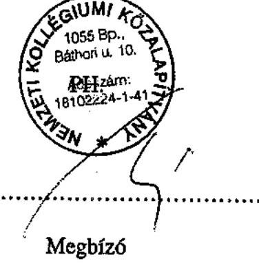

1. számú melléklet

A Megbízott által végzett monitoring vizsgálat tárgyát képező kollégiumok listája
2. számú melléklet

Monitoring rendszerleírás
3. számú melléklet

Az NKKA Pályázati Szabályzata, Pályázati Ellenőrzési Szabályzat, Pályázati Elszámolási Szabályzat
4. számú melléklet

Jelen szerződés 1. számú mellékletében szereplő kollégiumok pályázati dokumentációi, illetve egyéb kiegészítő iratai.

---

# MEGBÍZÁSI SZERZŐDÉS 

amely létrejött
egyrészröl:

Név: Nemzeti Kollégiumi Közalapítvány
Székhely: $\quad 1054$ Budapest, Báthori u. 10.
Adószám: $\quad 18102224-1-41$
Képviselö: Vetési Iván kuratóriumi elnök
mint megbízó - a továbbiakban Meghizó -
másrészröl:
Név:
BETA GROUP Kft.
Székhely: $\quad 3527$ Miskolc, Besenyöi u. 24.
Adószáma: $\quad 11445986-2-05$
Bankszámlaszám: 12046102-00309616-00100006
mint megbízott - továbbiakban: Megbízott - között az alulírott napon és helyen az alábbi feltételek mellett:

1. A Megbízó megbízza a Megbízottat "A felsőoktatási hallgatók elhelyezésére szolgáló kollégiumok vizesblokk felújítására", illetve a „Szakképzésben résztvevő közoktatási kollégiumok vizesblokkjainak felújítására" vonatkozó programban támogatott, jelen szerződés 1. számú mellékletében felsorolt kollégiumokban monitoring vizsgálat elvégzésével és monitoring adatbázis kialakításával.
1.1 Megbízott a monitoring vizsgálatot jelen szerződés 2. számú mellékletében meghatározott Monitoring vizsgálati rendszerleírásnak megfelelően végzi.
1.2 Megbízott ellenőrzi, hogy a támogatott projekten belül megvalósult felújítások műszaki megoldásaikban korrektek, lehetőség szerint modern, a fokozott igénybe vételt hosszú távon kiszolgálni tudó alkalmazásokat takarjanak - a beadott és az NKKA által támogatásban részesített pályázati dokumentációnak megfelelően. Ezen felül eilenőrizni kell, hogy a projekt megvalósulása során a műszaki megvalósulások követik-e a projekt kifrásában szereplő specifikációkat.
A Megbízott elvégzi továbbá a támogatott beruházás helyszíni pénzügyi ellenőrzését, számlaalapú vizsgálatát. Vizsgálja, hogy a projekt során az elvégzett munkák, az azokról benyújtott számlák, illetve azok kiegyenlítése a Megbízó által elfogadott pályázatban szereplő tételeinek, valamint ütemezésnek megfelel-e.

---

1.3 A műszaki ellenőrzés körében a Megbízott feladata a helyszíni bejárás során a helyszínen bekérhető dokumentumok másolatainak begyűjtése (építési napló, garancia jegyek, stb.).
A pénzügyi ellenőrzés keretében a Megbízott feladata a helyszíni bejárás során a kivitelezői számlákat, építési napló másolatok begyűjtése.

Amennyiben a Megbízott a monitoring folyamán eltérést észlel a pályázati dokumentáció és a felújítás megvalósítása között (akár minőségi, akár mennyiségi, akár ütemezésbeli), azt az NKKA felé a vizsgálatot követő 72 órán belül kell jelezni.
1.4 Megbízott jelen szerződés 3. számú mellékletét képező NKKA ellenőrzési és elszámolási szabályzat keretei között járhat el a vizsgált kollégiumokban. Felek rögzítik, hogy a vizsgálat kereteit az NKKA által támogatott intézmény által szerződésben elfogadott NKKA szabályzati rendelkezések határozzák meg. Megbízott külön nyilatkozatban meghatalmazást ad Megbízottnak, hogy a monitoring vizsgálat tárgyát képező kollégiumokban, az NKKA képviseletében, az NKKA vonatkozó szabályzatában meghatározott jogokat gyakorolja.
1.5 Azon kollégiumok esetében, amelyeknél a Monitoring rendszerleírás szerint helyszíni ellenőrzés nem szükséges, vagy csak múszaki átvétel történik, ott a pénzügyi ellenőrzést az NKKA szabályzata szerint a bizonylatok összegyűjtésével az NKKA Irodája végzi.
2. A Megbízott az elvégzett monitoring vizsgálat eredményéről beszámolót készít. A beszámoló tartalmazza a jelen szerződés 2. számú mellékletét képező monitoring vizsgálati rendszerleírás kitöltött formanyomtatványait a vizsgált kollégiumonként, valamint egy, a monitoring teljes folyamatát felölelő összefoglalót. A beszámolót a Megbízó által kijelölt Bíráló Bizottság értékelése alapján a Kuratórium hagyja jóvá.
2.1 A beszámoló tartalmi kritériuma, hogy részletesen, intézményenként bemutassa a monitoring rendszerleírásban meghatározott vizsgálati szempontok érvényesülését, az érvényesülés esetleges hiányát és annak okait, a támogatott beruházás szabályszerűségével, eredményességével kapcsolatos, a monitoring rendszerleírásban meghatározott feltételek teljesülését, illetve az ezzel kapcsolatos hiányosságokat. A monitoring rendszerleírás standardjai szerint végezze el az egyes intézményi beruházások értékelését.
2.2 A beszámoló formai kritériuma: elektronikus formátumban és papír alapon, magyar nyelven
3. A Megbízó a vizsgált kollégiumokról monitoring nyilvántartást és adatbázist készít, azt fejleszti és az NKKA rendelkezésére bocsátja. Az adatbázist elektronikus formában kell a Megbízó részére átadni.
4. A megbízás díja

- A monitoring vizsgálat elvégzésével kapcsolatos munkáért vizsgálatonként
105.000, - Ft + 25 \% ÁFA, azaz Százötezer forint + 25\% ÁFA díj, de maximálisan 4.200.000, $\mathrm{Ft}+25 \%$ ÁFA, azaz Négymillió-kétszázezer forint $+25 \%$ ÁFA összesen.
- A monitoring nyilvántartás kialakítása a vizsgált kollégiumokra vonatkozóan
2.200. 000, - Ft + 25\% ÁFA, azaz Kétmillió-kétszázezer forint +ÁFA díj

---

4.1 A megbízási díj a következő ütemezés szerint esedékes:
4.1.1 A Megbízott a monitoring vizsgálat $50 \%$-ának teljesítéséről és a vizsgálat részeredményéről részbeszámolót készít, amelyet 2002. november 30 -ig juttat el a Megbízóhoz. A megbízási díj $50 \%$-a esedékes a részbeszámolónak a Megbízó által történő elfogadása után jelen szerződés 4.3 pontja szerint történik. A monitoring nyilvántartás kialakításával kapcsolatos díjazás $50 \%$-a szintén e pont szerint, a részbeszámoló alapján esedékes.
4.1.2 A Megbízott a monitoring vizsgálat teljesítéséről és a vizsgálat eredményéről teljes beszámolót készít, amelyet 2003. február 20-ig juttat el a Megbízóhoz. A megbízási díj következő $50 \%$-a esedékes a teljes beszámolónak a Megbízó által történő elfogadása és a számla benyújtását követő 8 banki napon belül. A monitoring nyilvántartás kialakításával kapcsolatos díjazás fennmaradó $50 \%$-a az adatbázis átadása után, a jelen szerződés 3.3 pontja alapján történik.
4.2 Az elszámolt vizsgálatok száma maximálisan negyven (40) vizsgálatot foglalhat magába.
4.3 A megbízási díj kifizetése az elvégzett munkáról szóló teljesítésigazolás kiállítását követő 15 banki napon belül a Megbízott által benyújtott számla alapján a Megbízott számlájára átutalással történik.
4.4 Megbízott késedelmes teljesítése esetén a kötbér mértéke a jelen szerződés 4. pontjában foglalt bruttó összeg egy százaléka ( $1 \%$ ) naponta.
5. A Megbízott a megbízatást a Megbízó képviselőjének utasításai szerint, a megbízói érdekeknek megfelelően köteles teljesíteni. Attól csak akkor térhet el, ha azt a Megbízó érdeke feltétlenül megköveteli és annak előzetes értesítésére már nincsen mód; ez utóbbi esetben azonban a Megbízót utólag, haladéktalanul értesíteni köteles.
5.1 A megbízás teljesítése során a Megbízóról a Megbízott tudomására jutott adatokat, tényeket, a munka elvégzéséhez megszabott módszereket, üzleti titkokat és más bizalmas információkat Megbízott köteles megőrizni.
5.2 Az elvégzett munka és a beszámoló nyilvánosságra hozatala csak a Megbízó előzetes hozzájárulásával történhet.
6. A megbízás 2002. szeptember 16. napjával kezdődik és 2003. február 20-ig tart.
7. Jelen megbízási szerződés alapján az egyéb szükséges monitoring vizsgálatokat arányos kiegészítő díjazás fejében a Megbízó Megbízottól megrendelheti.
8. A létrejött jogviszony megszűnésével, továbbá a szerződés által nem érintett egyéb kérdésben a mindenkori jogszabályi rendelkezések, különösen a Polgári Törvénykönyv előírásai az irányadóak.
9. A megbízó és a megbízott között e szerződés teljesítése során esetleg felmerülő viták eldöntése első fokon a Budapesti Központi Kerületi Bíróságra tartozik.
10. Felek kijelentik, hogy a jelen támogatási szerződésben írtakat elolvasták, megértették és mint szerződéses akaratuknak mindenben megfelelőt, jóváhagyólag - a képviselet szabályainak figyelembevételével - saját kezűleg írják alá.
11. E szerződés 3 példányban készült, amelynek egyik példányát a Megbízott kapja.

---

Kelt: Budapest, 2002. szeptember 12.
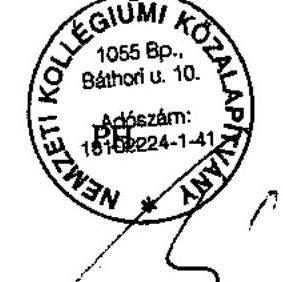

Megbízó
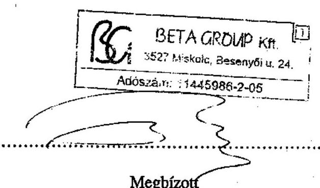

1. számú melléklet

A Megbízott által végzett monitoring vizsgálat tárgyát képező kollégiumok listája
2. számú melléklet

Monitoring rendszerleírás
3. számú melléklet

Az NKKA Pályázati Szabályzata, Pályázati Ellenőrzési Szabályzat, Pályázati Elszámolási Szabályzat
4. számú melléklet

Jelen szerződés 1. számú mellékletében szereplő kollégiumok pályázati dokumentációi, illetve egyéb kiegészítő iratai.