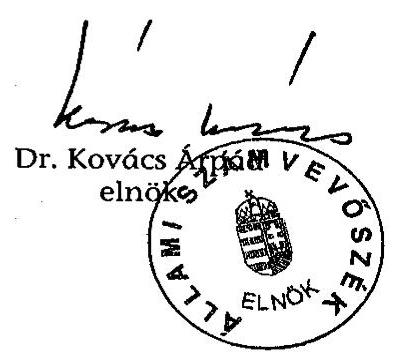
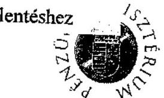
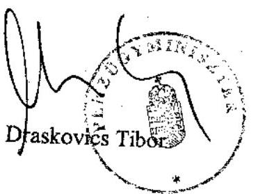
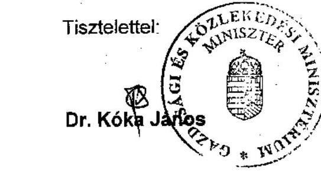
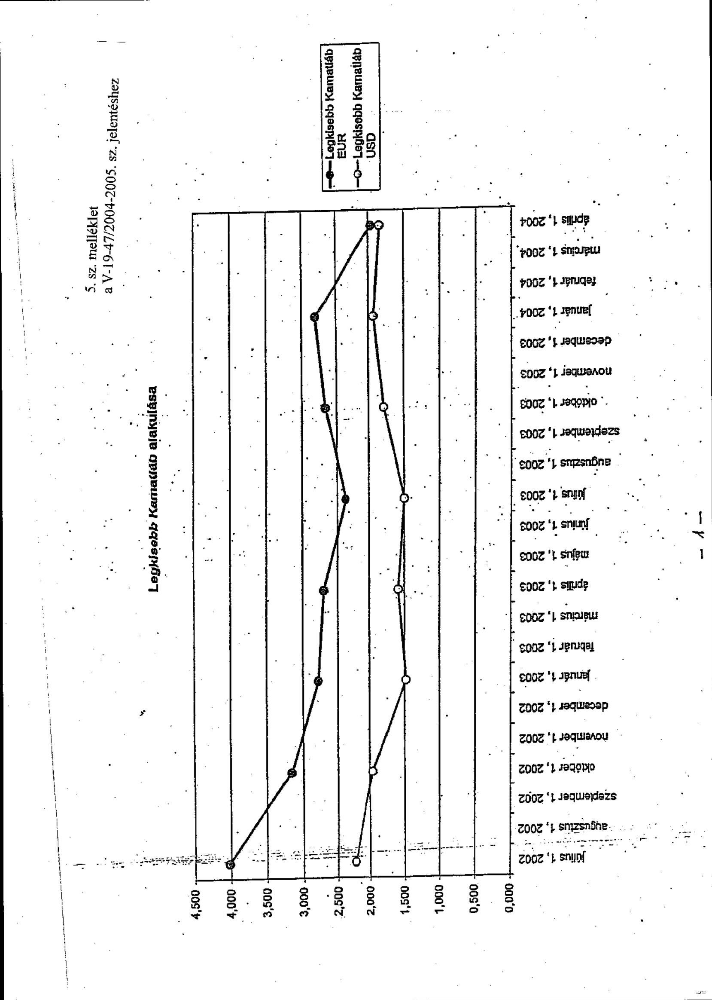
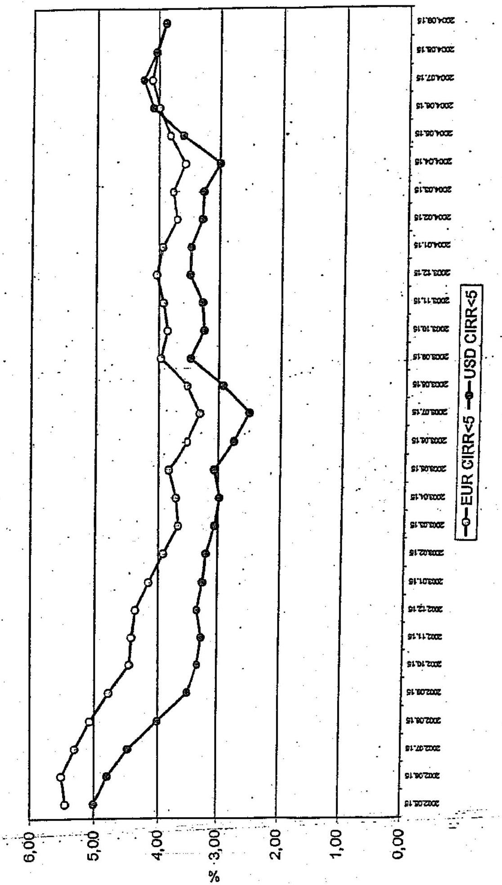

# JELENTÉS 

a Magyar Export-Import Bank Rt. működésének ellenőrzéséről

---

2. Államháztartás Központi Szintjét Ellenőrző Igazgatóság
2.1. Teljesítmény Ellenőrzési Főcsoport
V-19-47/2004-2005.
Témaszám: 726
Vizsgálat-azonosító szám: V0183
Az ellenőrzést felügyelte:
Bihary Zsigmond
főigazgató
Az ellenőrzés végrehajtásáért felelős:
Kemény Emil
főcsoportfőnök
Az ellenőrzést vezette:
Makkai Mária
főcsoportfőnökhelyettes
Az ellenőrzést végezték:
Hajagos Józsefné Massányi Tibor Németh Béláné
főtanácsadó
főtanácsadó
Tornai József
tanácsadó
A témához kapcsolódó eddig készített számvevőszéki jelentések:
címe
sorszáma
Jelentés a magyar áruk és szolgáltatások exportjának 0013.
ösztönzéséhez fűződő állami érdekek érvényesülése a Magyar Export-Import Bank Rt. és a Magyar Exporthitel biztosító Rt. tevékenységén keresztül
Vélemény a Magyar Köztársaság 2001. és 2002. évi költségvetési 0034
törvényjavaslatáról Összefoglaló, javaslatok, a dokumentum törvényességi és számszaki ellenőrzése (1. sz. füzet)

Vélemény a Magyar Köztársaság 2003. évi költségvetési 0241
törvényjavaslatáról
Vélemény a Magyar Köztársaság 2004. évi költségvetési 0338
javaslatáról
Jelentés a Magyar Köztársaság 2001. évi költségvetése 0232
végrehajtásának ellenőrzéséről
Jelentés a Magyar Köztársaság 2002. évi költségvetése 0329
végrehajtásának ellenőrzéséről

Jelentéseink az Országgyűlés számítógépes hálózatán és az Interneten a www.asz.hu címen is olvashatók.

---

# TARTALOMJEGYZÉK 

BEVEZETÉS ..... 5
I. ÖSSZEGZŐ MEGÁLLAPÍTÁSOK, KÖVETKEZTETÉSEK, JAVASLATOK ..... 9
II. RÉSZLETES MEGÁLLAPÍTÁSOK ..... 15

1. A Bank feladata, működésének szabályozottsága és szervezete ..... 15
1.1. A Bank feladata és működésének szabályozottsága ..... 15
1.2. A Bank szervezete ..... 16
2. A tulajdonosi irányítás ..... 17
3. A Bank üzleti tevékenysége ..... 21
3.1. Stratégia, üzletpolitika ..... 21
3.2. A hitelezési tevékenység ..... 25
3.2.1. A hitelezési folyamat szabályozása ..... 25
3.2.2. A hitelkihelyezések alakulása, az állomány változása ..... 31
3.2.3. A követelések kockázatkezelése, minősítése ..... 36
3.3. Garancianyújtási tevékenység ..... 38
3.3.1. Jogszabályi háttér, belső szabályozás ..... 38
3.3.2. A garanciavállalások alakulása ..... 40
3.4. A Bank forrásszerzési tevékenysége, eszköz-forrás gazdálkodása ..... 42
4. A Bank vagyoni helyzete, eredménye, gazdálkodása ..... 46
4.1. A Bank vagyoni helyzete ..... 46
4.2. A Bank eredményének és költséggazdálkodásának alakulása ..... 46
4.3. A Bank befektetési tevékenysége ..... 48
4.4. A Bank beszerzései és eszközgazdálkodása ..... 50

## MELLÉKLETEK

1. sz. A pénzügyminiszter észrevétele
2. sz. A gazdasági és közlekedési miniszter észrevétele
3. sz. A stratégiában kiemelt fő adatok alakulása
4. sz. Finanszírozott export viszonylati megoszlása 2003.
5. sz. Legkisebb kamatláb alakulása
6. sz. A hitelállomány alakulása 2000. december 31. és 2004. június 30. közötti időszakban

---

7. sz. Az ügyfélhitelek minőségének alakulása 2000. december 31. és 2004. június 30. között
8. sz. Export garancia állományi adatok az adott év végén
9. sz. Teljesítményellenőrzési kritériumok
10. sz. Struktúrált kérdések

# FÜGGELÉK 

A korábbi ÁSZ ellenőrzésben megfogalmazott ajánlások végrehajtása

---

# RÖVIDÍTÉSEK JEGYZÉKE 

| Áht. | az államháztartásról szóló 1992. évi XXXVIII. törvény |
| :--: | :--: |
| ÁKK Rt. | Államadósság Kezelő Központ Részvénytársaság |
| ÁPV Rt. | Állami Privatizációs és Vagyonkezelő Részvénytársaság |
| Bank | Magyar Export-Import Bank Részvénytársaság |
| Corvinus Rt. | Corvinus Nemzetközi Befektetési Részvénytársaság |
| EFB | Eszköz-Forrás Bizottság |
| Etv. | a Magyar Export-Import Bank Részvénytársaságról és a Magyar Exporthitel Biztosító Részvénytársaságról szóló 1994. évi XLII. törvény |
| EU | Európai Unió |
| EUR | euro |
| ÉB | Éven belüli futamidő |
| ÉT | Éven túli futamidő |
| FÁK | Független Államok Köztársasága |
| FB | Felügyelő Bizottság |
| FVM | Földművelési és Vidékfejlesztési Minisztérium |
| GATT | Általános Kereskedelmi és Vámtarifa Egyezmény |
| GFC | Gazdaságfejlesztési Célelőirányzat |
| GKM | Gazdasági és Közlekedési Minisztérium |
| GM | Gazdasági Minisztérium |
| Gt. | a gazdasági társaságokról szóló 1997. évi CXLIV. törvény |
| Hpt. | a hitelintézetekről és pénzügyi vállalkozásokról szóló 1996. évi CXII. törvény |
| ITDH | Magyar Befektetési és Kereskedelemfejlesztési Kht. |
| KEHI | Kormányzati Ellenőrzési Hivatal |
| KCB | Központi Cenzúra Bizottság |
| KK1-2 | Kamatkiegyenlítési rendszerű, 1-2 éves futamidejű hitel |
| KK2- | Kamatkiegyenlítési rendszerű, 2 éven túli futamidejű hitel |
| KKC | Kis- és Középvállalkozói Célelőirányzat |
| KKF | Kockázatkezelési Főosztály |
| KKV | Kis- és Középvállalkozások |
| KSH | Központi Statisztikai Hivatal |
| LIBOR | Londoni bankközi kamatláb |
| MEHIB | Magyar Exporthitel Biztosító Részvénytársaság |
| MFB | Magyar Fejlesztési Bank Részvénytársaság |
| MNB Rt. | Magyar Nemzeti Bank Részvénytársaság |
| OECD | Gazdasági Együttműködési és Fejlesztési Szervezet |
| Priv. tv. | az állam tulajdonában lévő vállalkozói vagyon értékesítéséről szóló 1995. évi XXXIX. törvény |
| PSZÁF | Pénzügyi Szervezetek Állami Felügyelete |
| SZMSZ | Szervezeti és Működési Szabályzat |

---

Társaság
Tulajdonos

Magyar Export-Import Bank Részvénytársaság
Állami Privatizációs és Vagyonkezelő Részvénytársaság

---

# JELENTÉS   a Magyar Export-Import Bank Rt. működésének ellenőrzéséről 

## BEVEZETÉS

A Magyar Export-Import Bank Rt.-t, (továbbiakban: Társaság vagy Bank) az 1994. évi XLII. törvény (továbbiakban: Etv.) hozta létre annak érdekében, hogy hatékonyan működjenek az exportfinanszírozás és a garancianyújtás rendszerei, amelyek alkalmasak az exportösztönzésre, támogatásra és egyben összhangban vannak a GATT és az OECD szabályaival.

Az Etv. és az azzal összhangban lévő alapító okirat szerint a Társaság tevékenységének célja, hogy a magyar áruk és szolgáltatások külpiaci megjelenését elősegítse hitelnyújtással, garanciavállalással és kockázatmegosztási lehetőségek biztosításával. Mindez azt szolgálja, hogy a hagyományos piaci eszközökkel nem finanszírozható export pénzügyi hátteret biztosítson és a finanszírozás szempontjából azonos versenyhelyzetet teremtsen a magyar vállalkozások számára a nemzetközi piacon.

A Bank tevékenységét a „Megállapodás a hivatalosan támogatott exporthitelekre" vonatkozó OECD előírás is szabályozza, amelyet az Európai Unió (továbbiakban: EU) irányelvként elfogadott. A megállapodás szerint a hivatalos (állami) támogatás formái lehetnek: exporthitel garancia, exporthitel biztosítás, közvetlen hitel/finanszírozás és refinanszírozás, és ezek bármilyen kombinációja. A megállapodás nem rögzíti, hogy a támogatásokat milyen szervezetek közvetítsék, azonban a magyar jogszabályi előírások értelmében, amennyiben az ország élni kíván az exportösztönzés e lehetőségeivel, azokat bankon és biztosítón keresztül tudja megvalósítani.

Az exporthitelezés állami támogatása nemzetközi gyakorlat. A föld minden részén, és az EU országaiban is találhatók exporthitelező intézmények, amelyek tevékenységét a velük szembeni kormányzati elvárások határozzák meg. Ezen intézményekkel szembeni elvárások különbözőek, az egyes országok belső adottságainak, a nemzetközi piacoknak és a szabályozási kereteknek a függvényei. Az EU tagállamok közül azokban az országokban működik széles termékskálával az exporthitelező intézmény, amelyekben a nemzeti termelés is erős, vagy jelentős. Ezekben az országokban az exporthitelező intézmények által támogatott export lefedettsége 7,8% körül alakult.

A 90-es évek közepén a magyar külkereskedelmi forgalomban struktúraváltás következett be. A szerkezet átalakulásban és az exportnövekedésben jelentős szerepet játszott a vámszabadterületi társaságok számának és az általuk lebonyolított exportnak az értéke. 1998 és 1999-ben a kivitel több mint 50%-a vám-

---

szabadterületekről és bérmunkából származott. Ez az arány változatlanul fennállt a későbbiekben is, 2000 és 2003 között a kivitelen belül ugyanennek a körnek a részesedése 55-57% között alakult. Magyarország exportjára jellemző, hogy 2000-2003 között a kivitel 35-39%-át 10 vállalat adta, amelyek többsége vámszabadterületen keresztül realizálta kivitelét. Ennek azért van jelentősége, mert a Bank tevékenységének célja szerint - a magyar áruk és szolgáltatások exportjának elősegítése - e területek nem tartoznak a támogatottak körébe.

A nemzetgazdasági exporton belül továbbra is meghatározó a gépek és gépi berendezések kivitele, amelynek részaránya az 1999. évi 45%-ról 61%-ra növekedett. A feldolgozóipar és élelmiszeripar (mezőgazdaság) részaránya 35, illetve 16%-ról 29, illetve 6%-ra esett vissza. A 2003. évi kivitel 80%-a fejlett országokba, 16%-a Közép- és Kelet-Európába és 4%-a a fejlődő országokba irányult.

A „hagyományos" (vámszabadterületi és bérmunka nélküli) export 5,1%-kal nőtt 2003-ban és részesedése a kivitelben megközelítette a 44%-ot. Ez az Állami Számvevőszék (továbbiakban: ÁSZ) által vizsgált 1998-1999. évekhez képest pozitív változás, mivel akkor e terület export növekedésének dinamikája csökkenő volt, sőt 1999-ben abszolút összegben is elmaradt az előző évitől.

Az állam az exportot különböző formákban ösztönzi, amelynek kereteit a mindenkori költségvetési törvényben határozzák meg. Egyrészt a Bank forrásszerzéseiből eredő kötelezettségek teljesítéséért a központi költségvetés készfizető kezességet vállal. Másrészt a Bank a Kormány megbízása alapján vállalt garanciaügyletei mögött az állam készfizető kezessége áll. Ezen túl kormányrendeletben meghatározott kedvező kamatozású hitel nyújtásához a Bank a költségvetésből ún. kamatkiegyenlítésben részesül. A hitelezés területén az állami támogatás fő formája a kamatkiegyenlítési rendszerben nyújtott hitel. A hitelek kamatlábainak mértékét a kormányrendelet szabályozza, az OECD megállapodással összhangban. A Bankot abban az esetben illeti meg a kamatkiegyenlítés, amikor az ebben a rendszerben nyújtott hitelekből származó kamatbevételei nem nyújtanak fedezetet a forrásszerzés és a kapcsolódó banküzemi költségekre, valamint a kockázati felárra. A készfizető kezességvállalások miatt a költségvetésnek fizetési kötelezettsége eddig nem keletkezett.

A Társaság szakosított hitelintézet, működését az Etv.-n kívül a hitelintézetekről és a pénzügyi vállalkozásokról szóló 1996. évi CXII. törvény (továbbiakban: Hpt.), a gazdasági társaságokról szóló 1997. évi CXLIV. törvény (továbbiakban: Gt.), és a mindenkori költségvetési törvények szabályozzák.

A Kormányzati Ellenőrzési Hivatal (továbbiakban: KEHI) a 181/1994. (XII. 28.) Korm. rendelet szerint a központi költségvetéssel történő elszámolásokat minden évben ellenőrzi. A Bank prudens működését a Pénzügyi Szervezetek Állami Felügyelete (továbbiakban: PSZÁF) átfogóan ellenőrzi. Ilyen ellenőrzést 2003-ban végzett utoljára, amelynek eredményeként felügyeleti intézkedés nem vált szükségessé.

A Társaság 2004. júniusáig - a törvény által deklaráltan - 100%-os közvetlen állami tulajdonban volt, a tulajdonosi jogokat 2000. január 18-tól az Állami Privatizációs és Vagyonkezelő Részvénytársaság (továbbiakban: ÁPV Rt., vagy Tulajdonos) gyakorolta. A 2004. júniusától hatályba lépő, a pénzügyi szolgáltatásokhoz kapcsolódó egyes törvények módosításáról szóló 2004. évi XLVIII. törvény értelmében az ÁPV Rt. köteles térítés ellenében a Magyar Fejlesztési Bank Részvénytársaság (továbbiakban: MFB) részére a 75%-os szavazatrészvénycsomagját értékesíteni. A tranzakció a vizsgálat lezárásakor még folyamatban volt. Az MFB a tulajdonosi jogait 2004. december 15-től gyakorolja.
2002. december 31-én a Társaság mérlegfőösszege 138,5 milliárd Ft, 2003. december 31-én 165,6 milliárd Ft és az előzetes adatok szerint 2004. december 31-én 171,6 milliárd Ft volt; jegyzett tőkéje 2002. és 2004. december 31-én egyaránt 10,1 milliárd Ft volt; mérlegszerinti nyeresége 2002. december 31-én 371 millió Ft volt, ami 2003. december 31-re 49 millió Ft-ra csökkent és 2004. december 31-én várhatóan 550 millió Ft lesz.

Az ÁSZ évente a zárszámadás keretében ellenőrzi a Bank tevékenységére vonatkozó költségvetési előírások betartását, és 1999-ben átfogóan vizsgálta a Társaság tevékenységét. A zárszámadás ellenőrzéséről készített jelentések főbb megállapításai voltak: a Bank minden évben betartotta a költségvetési törvényben számára megfogalmazott előírásokat; a 2001. évi zárszámadásról szóló jelentés szerint a költségvetési hátterű garanciák állományának egyezőségét az Államháztartási Hivatal (Kincstár) nyilvántartásával csak a Bank auditált beszámolója alapján készített ismételt adatszolgáltatás biztosította; a 2002. és 2003. évi zárszámadásban már az állományok egyezősége fennállt.

Az átfogó vizsgálat főbb megállapításai: az éves költségvetési törvényekben meghatározott kihelyezhető források kihasználtsága nem volt megfelelő, 25-65% között mozgott; a Bank a szabad források egy részét értékpapírokba fektette, ami 1999-ben az alaptőke közel másfélszerese volt; az államilag támogatott tevékenységen belül magas volt a koncentráció, és ezzel együtt a kockázat is; a tőkemegfelelési mutató 55,6%
 volt, ami az üzleti aktivitás további növelésére adott lehetőséget.

A jelenlegi ellenőrzés célja annak értékelése volt, hogy a Társaság:

- működése (forrásszerzése, hitelezési, garanciavállalási és kockázatmegosztási tevékenysége) megfelelt-e a törvényekben előírtaknak, az állam tulajdonosi elvárásainak;
- célszerűen és eredményesen segítette-e az exporthoz fűződő állami érdekek érvényesülését;
- szabályszerűen, célszerűen és eredményesen gazdálkodott-e;
- állami irányításában, belső működésében miként hasznosultak a korábbi számvevőszéki ellenőrzés megállapításai, javaslatai.

Az ellenőrzés a Társaság 2000-2004. I. félév közötti tevékenységére irányult, de figyelemmel kísérte és értékelte a helyszíni vizsgálat végéig terjedő időszak adatait is.

Az ÁSZ előző átfogó ellenőrzése során megfogalmazott ajánlások megvalósításával kapcsolatos megállapításokat a függelék tartalmazza.

---

Az ellenőrzés jogalapját az Állami Számvevőszékről szóló 1989. évi XXXVIII. tv. 2. § (6) bekezdése képezte.

A jelentést egyeztetésre megküldtük a pénzügyminiszternek és a gazdasági és közlekedési miniszternek. Válaszlevelük másolatát az 1-2. sz. mellékletek tartalmazzák.

---

# I. ÖSSZEGZŐ MEGÁLLAPÍTÁSOK, KÖVETKEZTETÉSEK, JAVASLATOK 

Az ellenőrzött időszakban (2000-2004. I. félév) a Bank megfelelően segítette a magyar áruk és szolgáltatások exportjának ösztönzését. Tevékenységével 2003-ban a teljes magyar export 1,59%-át, az államilag nem támogatandó vámszabadterületi társaságok exportja és a bérmunka nélküli kivitelnek pedig a 2,98%-át fedte le. A Bankon keresztül támogatott hagyományos export mintegy 500 termelést, illetve szolgáltatást végző társaságot érintett 2003. évben.

A Bank kihelyezhető forrásainak felső határát, így közvetve a támogatható export értékét is, a mindenkori költségvetési törvény behatárolja. A Társaság forrásainak együttes állománya 2000-ben a megengedett 75%-a és 2001-től minden évben 92%-a volt. Ez azt jelenti, hogy a Bank a hitelezésnél megközelítette a lehetséges aktivitásának felső határát. Mindez pozitív eredmény, szemben az előző számvevőszéki ellenőrzés során tapasztaltakkal, amikor az ÁSZ a Bank aktivitását kritizálta. ${ }^{1}$ Ez az eredmény azonban tovább javítható, mivel a garancianyújtásokra - amihez forrásra nincs szükség - a költségvetési törvényben meghatározott limit mintegy 50%-át használta ki 2000. és 2003. között a Bank. A lehetőségek további kihasználása azért is fontos, mert az EU-s csatlakozás után a hitelezési állomány visszaesése várható a támogatott termékek szűkülése miatt (csak a 2 éven túli futamidejű hitelek támogathatók). Mindez azt eredményezi, hogy a Bank forrás kihasználtsága - a meglévő 2 éven belüli futamidejű hitelek kifutásával - fokozatosan csökken.

Az Etv. nem írja elő a Kormány számára a Bank működéséhez irányelvek kiadását. Ugyanakkor a Kormány háromezres határozatokban az exporttámogatásra vonatkozó gazdaságpolitikai elvárásait a Bank számára előírta, amelyek 2003. december 31-ig voltak érvényben. A gazdaságpolitikai elvárások üzletágakra, üzletpolitikákra (forrásszerzés, hitelezés, garancianyújtás), relációs orientációra (pl.: szomszédos országok, fejlődő országok) megoszlási arányokat rögzítenek, a mindenkori mértéket az éves költségvetési törvényekben szereplő előirányzatok alapján a Bank az üzleti terveiben rögzítette. Az elvárások teljesítéséhez a határozat eszközrendszert nem fogalmazott meg és a teljesítés számonkérését sem írta elő. Az elvárások teljesülése a Bank egyedi döntéseinek függvénye volt, amely a Bank stratégiáján és üzletpolitikáján alapult. A Bank a 2000-2003 közötti években - a relációs elvárások kivételével - az állami célkitűzéseket teljesítette.

A Bank a hitelezés terén a kormányhatározatban megfogalmazott elvárásoknak folyamatosan eleget tett. Az év végi hitelállomány a 2000. és 2004. június 30. közötti időszakban 72 milliárd Ft-ról 174 milliárd Ft-ra növekedett úgy, hogy a költségvetési törvényekben meghatározott - maximálisan bevonható -

[^0]
[^0]:    ${ }^{1}$ 0013. sz. Jelentés a magyar áruk és szolgáltatások exportjának ösztönzéséhez fűződő állami érdekek érvényesülése a Magyar Export-Import Bank Rt. és a Magyar Exporthitel Biztosító Rt. tevékenységén keresztül. 8. oldal 1. bekezdés.

---

források 79-96%-át helyezte ki az export támogatására. A hitelállományon belül a kereskedelmi bankokon keresztül nyújtott refinanszírozási hitelek mindenkor meghaladták az elvárt 60%-ot, arányuk 75 és 85% között volt. Az éven túli kihelyezések a hitelállomány 88 és 95%-át tették ki. Ezzel teljesült az a kormányzati célkitűzés, hogy e hitelek aránya haladja meg a 70%-ot. A vezértermék a kamatkiegyenlítéses rendszerben nyújtott hitel volt - a teljes hitelállomány 78 és 87%-a -, amelyet kormányrendelet szabályoz. A Bank e hiteleket refinanszírozás keretében és saját kockázatára nyújtja. A kamatkiegyenlítéses hiteleknél, amennyiben a Bank kamatkövetelését meghaladja a forrásszerzési és a termékre jutó banküzemi költség együttes összege, a különbözetet a költségvetés megtéríti a Bank számára, az éves költségvetési törvényben meghatározott mértékig. Az e célra fordított költségvetési kiadás évente 1,5-2 milliárd Ft volt.

A hitel portfolió minőségének alakulása hatással van a Bank eredményére. A Bank csak a saját kockázatára kihelyezett hitelek után számol el értékvesztést, mivel a refinanszírozási hitelek kockázatát a kereskedelmi bankok viselik. A saját kockázatú hitelek egy része mögött MEHIB biztosítás áll, ahol a kockázatok 90-95%-át a biztosító vállalja. Ez is szerepet játszott abban, hogy a problémamentes és a külön figyelendő hitelek aránya magas, 94,3 és 80,9% között változott 2000. december 31. és 2004. június 30. között.

Az export támogatási hitelek nyújtásának feltétele az érvényes külkereskedelmi szerződés. A kedvezményes hitelek akkor illetik meg az ügyfeleket, ha a szerződés szerinti export megvalósul. Ennek ellenőrzéséhez a Bank a saját kockázatra vállalt hitelügyleteknél olyan adatszolgáltatási kötelezettséget írt elő, amely alkalmas a szerződés szerinti export monitoringjához. Ugyanakkor a refinanszírozási hiteleknél a külkereskedelmi szerződés teljesülésének ellenőrzése és arról a beszámolás a Bank részére a kereskedelmi bankok feladata. A kereskedelmi bankok jelentéseiből hiteltérdemlően nem állapíthatók meg a külkereskedelmi szerződések teljesítései, mivel a Bank csak az adatszolgáltatás tartalmát írta elő, azonban annak betartását nem követeli meg a kereskedelmi bankoktól. A banki beszámolók eltérő tartalmúak, így a Társaság informáltsága a külkereskedelmi szerződés teljesüléséről eseti és nem teljes körű. ${ }^{2}$ A Bank jogosult az ügyletet a kereskedelmi banknál, illetve az ügyfélnél ellenőrizni. Az ellenőrzés gyakoriságára, tartalmára a Bank szempontrendszerrel nem rendelkezik. 2000-2004. I. féléve között a Bank mindössze 7 kereskedelmi banknál végzett ellenőrzést, eseti jelleggel. Az ellenőrzések során a Bank nem vizsgálta - a hitelnyújtás feltételeként előírt - az érvényes külkereskedelmi szerződés megvalósulását termék és célország tekintetében, csak az export értékbeli teljesítését.

A gazdaságpolitikai elvárások a garanciákkal kapcsolatban rögzítették, hogy olyan esetekben nyújthat a Bank költségvetési hátterű garanciát, amikor az export megvalósulása nemzetgazdasági érdeket szolgál, valamint az ügylet kockázatát a garancia nagyságrendje miatt nem vállalhatja fel. Arra a kormányhatározat nem tért ki, hogy mi a nemzetgazdasági érdek és azt sem határozta meg, hogy mi az az érték, amely meghaladja a Bank kockázatviselő ké-

[^0]
[^0]:    ${ }^{2}$ A Bank 2004. december 16-án kelt levele szerint a hitelcél megvalósulásának ellenőrzéséhez megkezdte az eljárási rend kidolgozását.

---

pességét. Ennek hiányában a garancianyújtással kapcsolatban megfogalmazott elvárások teljesítése nem értékelhető. Az egyes években a garancia állomány több mint 93%-a költségvetésű hátterű volt. A Bank évente 10-11 milliárd Ft értékű új garanciát bocsátott ki, 2003. év végén az állomány 43,7 milliárd Ft-ot tett ki. A garancianyújtást koncentráció jellemzi, 2003-ban 2 társasághoz kapcsolódó garanciák összege meghaladta a teljes állomány 50%-át. A költségvetésnek a garancia ügyletekből nem származott vesztesége, mivel a 2000. évi 1,7 milliárd Ft beváltás 100%-ban megtérült, a többi évben beváltás nem volt.

A Társaság tevékenységét - a garanciavállalás kivételével - a jogszabályok és az azokkal összhangban lévő belső szabályzatok teljes körűen lefedik. A garanciavállalásokra vonatkozó előírásokat a hitelezésről szóló, a kamatkiegyenlítési rendszert szabályozó kormányrendeletbe építették be. A jogszabályi hivatkozásokat a belső szabályzatok nem tartalmazzák, ami nehezíti a garanciavállalás szakszerű ellátását. A hitelezési üzletág belső szabályozása értelmében megengedett az egyedi elbírálás (limit, fedezet) lehetősége. A tapasztaltak szerint a hitelbírálatok 70%-ánál egyedi döntés született, azzal az indokolással, hogy azok nemzetgazdasági érdekeket szolgálnak. A szabályzatok nem tartalmazzák, hogy mi a nemzetgazdasági érdek, így az egyes ügyletek szabályosságát nem lehet megítélni. A kintlevőségek, befektetések, mérlegen kívüli tételek és a fedezetek minősítésének és értékelésének szempontjairól szóló PM rendelet előírja, hogy az ügyfél minősítésénél az objektív és a szubjektív elemek ne haladják meg az 50-50%-ot, amelyet a Bank által készített szabályzat tartalmaz. Ugyanakkor a gyakorlati érvényesüléséhez szükséges szempontokat a szabályzat nem határozott meg. Ennek az a következménye, hogy bár a szabályzat alapján határozták meg az ügyfélminősítéseknél az objektív és szubjektív elemek pontjait, de az adott összes pontszámon belül a szubjektív pontok aránya meghaladta az 50%-ot, a hitelügyletek 70%-ánál. Mindez növeli a Bank kockázatát. ${ }^{3}$

A Bank 2001 és 2004 között változatlan szervezeti felállásban működött. A szervezet irányítása, a feladat és hatáskörök elkülönítése megfelelő volt. A Társaság záró létszáma a 2000. évi 100 főről 2003. évre 8 fővel csökkent. A tagolt szervezet miatt magas a vezetők száma, átlagosan 1 közép- és felső vezető irányítása alá 2,5 fő munkatárs jut. A belső ellenőrzés 2004-től 1 fő létszámmal főosztályként működik.

A kormányhatározat előírta a Bank számára, hogy gazdálkodása ne legyen veszteséges, bevételeiből fedezze és tartsa alacsony szinten a működési költségeit és ráfordításait. A Bank gazdálkodása során az elvárásoknak eleget tett, az egyes éveket pozitív eredménnyel zárta, a működési költségek növekedése az inflációs ráta alatt maradt. A Bank saját tőkéje 54,9%-kal nőtt a 2000-2004. I. félév közötti időszakban, amiben annak is szerepe volt, hogy az állam 2001-től osztalékot nem vont el. Az eredmény alakulására negatívan hatott az állampapírok után 2003. évben elszámolt 751 millió Ft értékvesztés, amelyet a jegybank kamatemelése miatti árfolyamesés tett szükségessé. A nyereségre negati-

[^0]
[^0]:    ${ }^{3}$ A Bank 2004. december 16-án kelt levele szerint a partner és ügyfélminősítési szabályzat pontrendszerét felülvizsgálja és a gyakorlati alkalmazásához szükséges szempontokat rögzíti.

---

van ható másik tényező a Corvinus Rt., mint befektetés után elszámolt értékvesztés volt, amely 2001-től folyamatosan rontotta a Bank eredményét. A befektetés után 2004. március 31-ig összesen 639 millió Ft értékvesztést számolt el a Bank. A Bank a Corvinus Rt.-ben a Kormány 2000. évi határozata alapján szerzett többségi tulajdont. A Corvinus Rt. gazdálkodása minden évben veszteséges volt, a Bank mindenre kiterjedő helyzetfelmérést 2002 nyarán végzett a befektetésnél. A Corvinus Rt. eredménytelen működéséhez hozzájárult a korábbi külföldi befektetései után - az Sztv. előírásai alapján - elszámolt értékvesztés, továbbá bevételeinek csökkenése. A Bank - bár közvetlen irányítást biztosító tulajdoni hányaddal rendelkezett - nem dönthetett a Corvinus Rt. vezetői testületeinek összetételéről, arról az ÁPV Rt. igazgatósága határozott. 2003-ban törvényi módosítással az MFB lett a Corvinus Rt. többségi tulajdonosa.

A Bank fizetőképességi (tőkemegfelelési) mutatója minden évben 25% felett volt. A mutató 1999. évi 55,6%-os értékéhez képest a csökkenés azt jelenti, hogy a Bank üzleti aktivitása - a gazdaságpolitikai elvárásokkal összhangban - jelentősen javult.
 ${ }^{4}$

A Bank a 2004-2006. évekre szóló stratégiáját úgy készítette el, hogy ahhoz a Kormány már nem fogalmazott meg gazdaságpolitikai elvárásokat, ami azt jelenti, hogy tudomásul vette az EU és az OECD előírások miatti állományleépülést és nem jelölte meg a Bank működésének jövőbeni irányait. A tulajdonos ÁPV Rt. a stratégiát elfogadta, azonban nem szereplője a külgazdaságnak és így nem áll/állhat rendelkezésére mindazon információ, amely a külgazdasági stratégiával való összhangot biztosítaná.

2004 júniusától a törvénymódosítások lehetővé tették, hogy az MFB 100%-os tulajdont szerezzen a Bankban. A törvénymódosítás indokolása szerint ezzel elősegítik a társaságok közötti szinergiák kihasználását, amelyeket azonban nem nevesítettek. A tulajdonosváltás a 2004. júliusi - a Bábolna Mezőgazdasági Termelő, Fejlesztő és Kereskedelmi Rt. privatizációjáról szóló - kormányhatározat szövege szerint összekapcsolódik a Bábolna Rt. MFB felé fennálló tartozásának kiváltásával és privatizálhatósága feltételeinek megteremtésével. Ez nem kapcsolódik a Bank tevékenységéhez. A Bank jövőbeni működésére hatástanulmányt nem készítettek, az új tulajdonosi struktúrával összefüggésben nem határozták meg a Bank tevékenységének stratégiai irányvonalát, azokat a prioritásokat (exportpiacok megtartásának, új piacok felé nyitásnak stb. elősegítése), amelyek megvalósításában a Bank közreműködik. Ennek hiányában a Bank működése és a kormányzati elvárások közötti összhang esetleges, miközben közvetetten 100%-os állami tulajdonban maradt a Bank. A tulajdonos változás megvalósulásával a tulajdonosi jogokat két társaság gyakorolja (ÁPV Rt. és MFB Rt.), amelyeket más-más miniszter felügyel, nem rendezték ugyanakkor, hogy az exportösztönzéshez kapcsolódó állami érdekeket hogyan közvetítsék a Bank felé. ${ }^{5}$ Mindebből az következik, hogy az exportösztönzés oldaláról a

[^0]
[^0]:    ${ }^{4}$ 0013. sz. Jelentés a magyar áruk és szolgáltatások exportjának ösztönzéséhez fűződő állami érdekek érvényesülése a Magyar Export-Import Bank Rt. és a Magyar Exporthitel Biztosító Rt. tevékenységén keresztül. 9. oldal 3. bekezdés
    ${ }^{5}$ Az MFB 2005. február 4-én kelt levele szerint a „...törvény módosítása megteremtette a lehetőséget az együttműködésből fakadó előnyök kiaknázására. A szinergikus hatások megtalálása és érvényesítése nem határozható meg felülről, azt az együttműködő intézményeknek közösen kell kialakítanunk. Az MFB már a tényleges tulajdonba kerülés előtt intenzív egyeztetéseket kezdeményezett a leendő csoporttagjaival, amelynek egyik eredményeként 2005. januárjában elfogadásra került a csoportszintű adatszolgáltatási- és kockázatvállalási szabályzat.

---

törvénymódosítások nem voltak megalapozva, és nem kapcsolódtak a Bank Etv. szerinti feladataihoz.

A korábbi számvevőszéki ellenőrzésben a Kormánynak megfogalmazott ajánlások egy kivitelével teljesültek. A szükséges törvénymódosításokat végrehajtották, azonban változatlanul nincs meghatározva az a szervezet (intézmény), amely a nemzetgazdasági érdekeket a Társaság felé közvetíti és annak végrehajtását ellenőrzi. A Bank ügyvezetésének tett ajánlások közül a refinanszírozási hitelek esetében a támogatott exportcélok teljesülésének ellenőrzésére foganatosított intézkedései nem elégségesek, ezért annak megoldása változatlanul feladat.

A részletes megállapítások hasznosításán túl javasoltuk:
a tulajdonos MFB-nek és az állam nevében a tulajdonosi jogokat gyakorló ÁPV Rt.-nek, hogy:

- kísérjék figyelemmel a Bank igazgatóságának tett ajánlások megvalósulását;
a Bank igazgatóságának, hogy:
- követelje meg a Bank menedzsmentjétől a garanciavállalásokkal kapcsolatos szabályzatok elkészítését úgy, hogy az tartalmazza a jogszabályi hivatkozásokat is;
- dolgoztasson ki eljárási rendet annak érdekében, hogy a refinanszírozási hitelek monitoringja alkalmas legyen a támogatott hitellel megvalósított kivitel ellenőrzésére;
- intézkedjen annak érdekében, hogy a Bank partner- és ügyfélminősítési szabályzata alapján készített minősítések megfeleljenek a vonatkozó PM rendelet azon előírásának, hogy a szubjektív elemek figyelembevétele ne haladja meg az 50%-ot;
- vizsgáltassa felül a Bank szervezeti tagoltságát annak érdekében, hogy javuljon az egy vezetőre jutó beosztottak aránya.

A helyszíni ellenőrzés megállapításainak hasznosítása mellett javasoljuk:

# a Kormánynak 

1. Határozza meg a külgazdasági stratégián belül a Bankkal szembeni jövőbeni elvárásokat, a Társaság szerepét az exportösztönzésben és rendeljen annak teljesítéséhez eszközrendszert. Ennek keretében vizsgálja meg az exportösztönzésben kialakult intézményi struktúra hosszabb távú fenntartásának célszerűségét.
[^0]
[^0]:    További egyeztetések vannak folyamatban a közös termékfejlesztés, akvizíció és marketingkommunikáció megteremtése érdekében.
    Az Állam a fiskális szempontokat az ÁPV Rt.-t tulajdonló Pénzügyminisztériumon keresztül, a 25%+1 szavazat birtokában tudja érvényesíteni, míg a többségi tulajdonost felügyelő GKM pedig az exportorientált gazdaságpolitika céljait tudja az MFB megbízásával - bankszerű keretek között - közvetíteni. Az MFB vezetésével kidolgozandó közös programokat pedig a két végső állami tulajdonos felett álló Kormány fogadja el, ezzel is biztosítva az összgazdasági érdekek érvényesülését."

---

2. Határozza meg az exportösztönzéshez kapcsolódó állami érdekek közvetítésének formáját, tekintettel arra, hogy a Bank tulajdonosainak felügyeletét két miniszter látja el.

# a gazdasági és közlekedési miniszternek, valamint a pénzügyminiszternek

Számoltassák be a tulajdonos MFB Rt.-t és az állam nevében a tulajdonosi jogokat gyakorló ÁPV Rt.-t a Bank igazgatóságának tett ajánlások megvalósításáról.

---

# II. RÉSZLETES MEGÁLLAPÍTÁSOK 

## 1. A BANK feladata, működésének szabályozottsága és szervezete

### 1.1. A Bank feladata és működésének szabályozottsága

Az Országgyűlés a magyar áruk és szolgáltatások exportjának ösztönzése, az exporthoz fűződő állami érdekek érvényesítése, a hagyományos piaci eszközökkel nem finanszírozható export pénzügyi hátterének megteremtése és az exportfinanszírozás rendszerének továbbfejlesztése érdekében 1994-ben a Bankról törvényt alkotott. A törvény meghatározta a Bank feladatait, amelyek közül a legfontosabbak: a magyar áruk és szolgáltatások exportjához, a külföldön megvalósuló magyar befektetésekhez, valamint az importhoz kapcsolódó hitel és kölcsön nyújtása, bankgarancia vállalása. A 2004. június 10-től hatályos törvény szövegében az exporthoz fűződő állami érdekek érvényesítése már nem szerepel a Bank feladatai között.

A Bank az Etv.-vel összhangban, tevékenységét versenytársak nélkül, szolgáltató bankként végzi. A kereskedelmi bankok részére közvetíti az exportösztönzéshez rendelt állami garanciális háttérrel a költségvetési erőforrásokat - 75-80%-ban - és a hitelkihelyezésekkel az exportot segíti elő.

A Bank tevékenységével kapcsolatos alapvető gazdaságpolitikai elvárásokat 2001-2003. évek között a Kormány 3060/2001. (IX. 4.) határozata tartalmazta. A Bank elkészítette az ugyanezen évekre szóló stratégiáját, amelyet a tulajdonosi jogokat gyakorló ÁPV Rt. elfogadott. A Bank 2004-2006 közötti stratégiájához a Kormány irányelveket nem adott, az ÁPV Rt. annak a felépítését útmutatóban határozta meg. Az az alapján elkészített stratégiát a Tulajdonos elfogadta, amely tartalmazza az EU-s csatlakozásra való felkészülést, valamint a csatlakozás utáni feladatokat is.

A Társaság a csatlakozás előkészítésekor bevezette a hivatalosan támogatott exporthitelek kamat- és díjszámítására vonatkozó OECD előírásait és harmonizálta belső szabályzatait az EU-s előírásokkal, valamint a környezetvédelmi és pénzmosás elleni nemzetközi szabályozással. 2003. évben a Bank felmérte az EU csatlakozás exportpiaci hatásait és kialakította a további tevékenységének kereteit, a kapcsolódó termékfejlesztést.

A csatlakozást követően életbe lépett az Európai Bizottság 2000. november 13-án kibocsátott CONF-H 51/00 sz. közös álláspontja, amely elfogadta a Bank kivételi listára helyezését, és ez a közösségi prudenciális előírások alóli felmentést jelenti. A kivételi listára való felkerülést az indokolta, hogy a Bank állami tulajdonban van, speciális és korlátozott tevékenységet végez, külön jogszabályok vonatkoznak rá és a versenyt nem torzítja, mivel nem piaci szereplő.

Az EU csatlakozás miatt a viszonylat átrendeződésről a Tulajdonos úgy rendelkezett, hogy az államilag támogatott finanszírozási tevékenységet az uniós belpiacon kívüli viszonylatokra, a szomszédos országokra, az újonnan csatlakozó

---

országokra, a Dél-kelet Európai és Dél-Amerika területére kell a Banknak koncentrálni.

A Bank működésének részletes szabályozásánál a Szervezeti és Működési Szabályzat (továbbiakban: SZMSZ) bír jelentőséggel, amely tartalmazza a Bank munkaszervezete felépítésének, tevékenységének meghatározását. Az utasítások az egyedi, eseti tárgyköröket, az ügyrendek a testületek, bizottságok feladat- és hatáskörét, eljárás- és döntési rendjét szabályozzák. (Cenzúra Bizottság, Eszköz-Forrás Bizottság).

A szervezet 2001 óta stabil rendben működik, a legutóbbi 2003. évi módosítás azért vált szükségessé, mert a Magyar Exporthitel Biztosító Részvénytársasággal (továbbiakban: MEHIB) való intézményi együttműködés szervezését, irányítását a Humánpolitikai és Marketing Igazgatóság feladatkörébe utalták.

A 3060/2001. (IX. 4.) Korm. határozat, többek között előírta a Bank és a MEHIB részére az együttes piaci megjelenést és ügyfélkezelést, az értékesítési hálózat kiépítését, a marketing tevékenység terén összehangolt, közös fellépést.

A Bank és a MEHIB 2003. augusztus 1-jével együttműködési megállapodást kötött a közös ún. kiszolgálói feladatok elvégzésére. Az együttműködés irányítását a Bank Humánpolitikai és Marketing Igazgatóság vezetője látja el. Az együttműködés kiterjed a marketing tevékenység összehangolására (ez már a korábbi években is megvolt), az üzemeltetési, utaztatási, információ szolgáltatási, banki és biztonsági feladatok ellátására, közös recepció kialakítására, bizonyos jogi és pénzügyi-számviteli tevékenységek összhangjának biztosítására.

A Bank irányítási rendje az egyszemélyes felelősség, valamint az egyeneságú alá- és fölérendeltségű viszonyokra épül, a szakterületi kapcsolatokat az SZMSZ határozza meg. A feladatok jól elhatároltak, a döntéshozatalért, a feladatok végrehajtásáért felelős szervezetek, vezetők között.

A vezérigazgató ad ki minden utasítást a felelős szakmai szervezeti egység előkészítése alapján, amely az áttekinthetőséget biztosítja. A vezérigazgatói utasítások a hatályos jogszabályoknak megfeleltek.

# 1.2. A Bank szervezete 

A Bank stratégiai tervében a 2000-2003. évek között változatlan létszámot (108 fő) tervezett az átlagos, éves 18%-os előirányzott mérlegfőösszeg növekedés mellett. Ugyanezen időszak alatt az átlagos állományi létszám 108 főről 100 főre (7,5%-kal) csökkent.

A 2003. december 31-ei zárólétszámot 92 fő teljes munkaidős és 3 fő részmunkaidős dolgozó alkotta. Ebből a munkáltatói jogokat gyakorló vezérigazgató, helyettese, ügyvezető igazgatók és főosztályvezető besorolásba 17 fő tartozott (18%).

A 17 felsővezetőhöz (4 igazgatóság, 13 főosztály) átlag 4,3 fő beosztott dolgozó tartozik, figyelembevéve az osztályvezetőket is, így átlagosan 1 közép- és felsővezetőre 2,5 munkatárs irányítása jut. A számok tükrében a vezetők aránya magas. A Bank 2004-2006. évi stratégiájában szerepel ezen arány javítása úgy, hogy fenntartsák a világos és egyértelmű felelősséget és hatásköröket.

---

A Bank üzleti feladatait (hitelezés és garancia nyújtás) ellátó Aktív Műveletek Igazgatóságának átlagos állományi létszáma a 2000. évi 27 főről (hitelező: 21 fő) 2004. I. félévére 24 főre (hitelező: 18 fő) csökkent. A döntési, ellenőrzési, illetve adminisztratív munkát ellátó dolgozók száma minden évben 6 volt. A refinanszírozási hitelkeret terhére a befogadásokat 1 fő intézi. Az egy dolgozóra jutó ügyletszám a 2000. évi 21-ről 2002-re 27-re, 2004. I. félévére 37-re emelkedett.

A szervezeti struktúra tagolt, a szervezet irányítása, működése koordinált, a feladat- és hatásköröket a belső szabályzatok megfelelően elkülönítik.

# 2. A TULAJDONOSI IRÁNYÍTÁS 

A Társaság egyszemélyes részvénytársaság, ahol közgyűlés nem működik, annak hatáskörébe tartozó kérdésekben a tulajdonos ÁPV Rt. dönt és gyakorolja a közgyűlés jogait.

A Tulajdonos a hatáskörébe tartozó ügyekben, alapítói határozat formájában, írásban dönt, 2000-2004. szeptember 2-ig 78 határozatot adott ki, amelyeket az ÁPV Rt. igazgatóságának határozata alapján hoztak meg. Ennek

- 45%-a a könyvvizsgáló megválasztása, visszahívása, díjazása, az igazgatóság és a Felügyelő Bizottság (továbbiakban: FB) tagjai díjazásának megállapítása;
- 14%-a a 10 millió USD-t meghaladó, egy exportőrrel kapcsolatos költségvetési hátterű garancia nyújtása;
- 11%-a a Társaság stratégiai tervének, üzleti tervének, valamint az igazgatóság és az FB ügyrendjének elfogadása;
- 10%-a az éves beszámolók elfogadása;
-

 7%-a az alapító okirat módosítása;
- 13%-a az egyéb (javadalmazás stb.) kérdésekről hozott határozat volt.

A pénzügyi szolgáltatásokhoz kapcsolódó egyes törvények módosításáról szóló 2004. évi XLVIII. tv. keretében többek között módosította az Etv.-t, az MFB-ről szóló 2001. évi XX. törvényt (továbbiakban: MFB tv.) és az állam tulajdonában lévő vállalkozási vagyon értékesítéséről szóló 1995. évi XXXIX. törvényt (továbbiakban: Priv. tv.), amelyek a tulajdonlást változtatták meg, azonban a Bank továbbra is 100%-os állami tulajdonban maradt.

Az MFB tv. módosítása szerint az MFB 100%-os tulajdonrészt szerezhet a Bankban és a MEHIB-ben.

A Priv. tv. megváltoztatásával a 100%-os tartós állami tulajdoni hányad a Bank és a MEHIB esetében 25%+1 szavazatra csökkent.

A 2004. évi XLVIII. tv. indokolása szerint, azzal, hogy az MFB 100%-os tulajdont szerezhet a Bankban, elősegítik a társaságok közötti szinergiák kihasználását. Az indokolás azonban a szinergiákat nem nevesíti.

---

A törvények módosításának hatálybalépését követően a Kormány a 2186/2004. (VII. 22.) határozatában rendelkezett a Bábolna Mezőgazdasági Termelő, Fejlesztő és Kereskedelmi Rt. tőkehelyzetének rendezéséről és privatizációjáról.

A 62/1996. (VII. 9.) OGY. határozat tartalmazza a nemzetgazdaság működőképessége szempontjából jelentős gazdasági társaságok körét, amelyet a Priv. tv. alapján határoztak meg. Ebben az MFB és a Bábolna Rt. is szerepel. A Priv. tv. 8. § (2) bekezdésében rögzíti, hogy a nemzetgazdaság működőképessége szempontjából jelentős társaságok privatizációs koncepciójáról a Kormány dönt.

A kormányhatározat szövege szerint a Bábolna Rt. privatizációs koncepciója összekapcsolódik a Bank és a MEHIB részvényeinek adás-vételével, valamint az MFB Bábolna Rt. felé fennálló követelésének eladásával. Ez azt jelenti, hogy a törvénymódosítások közvetlen célja a Bábolna Rt. hiteleinek kiváltása volt az MFB-től úgy, hogy a központi költségvetésnek ne kelljen helytállnia a hitelekhez kapcsolódó garanciális kötelezettségeiért.

A Kormány határozatában felkérte a pénzügyminisztert és a gazdasági és közlekedési minisztert arra, hogy a sikeres privatizációhoz szükséges feltételek megteremtése és a Bábolna Rt. tőkehelyzetének, a jogszabályokban foglalt követelményeknek történő megfelelése érdekében az ÁPV Rt. és az MFB felett a tulajdonosi jogokat gyakorló miniszterek intézkedjenek arról, hogy a Bank és a MEHIB 75%-1 szavazatot megtestesítő részvényeinek ellenértékeként az MFB az ÁPV Rt.-re engedményezze a Bábolna Rt. 14 980,1 millió Ft tőkeösszegű hitelkövetelését, 10301 millió Ft-ért (a követelés mögött álló biztosítékok fedezeti értékén).

A részvénycsomagok értéke 17903 millió Ft, ennek 75%-a 13427 millió Ft. Az MFB a különbözetet a 2004. december 31-ig fizeti meg az ÁPV Rt.-nek, ennek összege várhatóan 3126 millió Ft lesz. Az ÁPV Rt. a tulajdonába kerülő hitelkövetelést a Bábolna Rt. privatizációjának keretében a részvényekkel együtt értékesíti a decentralizált privatizáció keretében. Az ÁPV Rt. a kormányhatározatot végrehajtotta, 2004. szeptember 20-án az adásvételi szerződést megkötötte az MFB-vel. Az MFB a tulajdonosi jogait 2004. december 15-től gyakorolja, mivel ezen a napon írták jóvá az őt megillető részvényeket az értékpapír számláján és ekkor jegyezték be tulajdonosként a Bank részvénykönyvébe.

A privatizáció módszerét tartalmazó kormányhatározat előterjesztésében nincs indoklás arra vonatkozóan, hogy miért e két export ösztönzésében résztvevő céget vonták be a tranzakcióba, a tranzakció hogyan hat a Bank működésére, miként közvetítik az állami elvárásokat a Társaság felé. Ennek meghatározása azért fontos, mert más-más miniszter felügyelete alá tartozó társaság (ÁPV Rt., MFB) lesz a Bank tulajdonosa.

A Bankot érintő tulajdonosváltás hatása csak a tulajdonosi joggyakorlás megkezdése után értékelhető. A törvénymódosításokban és a kormányhatározatban előírtakból következően:

- az ÁPV Rt. és közvetetten a költségvetés 3126 millió Ft készpénzes bevételhez jut;
- a Bábolna Rt. hiteltartozása nem rendeződött, csak az MFB helyett az ÁPV Rt. tartja nyilván azt. Végső rendezése és megtérülésének mértéke a Bábolna Rt. privatizációjának függvénye;

---

- a Priv. tv. módosítása értelmében a Bank 75%-os tulajdoni hányada privatizálhatóvá vált, azonban a privatizáció lefolytatására a törvényileg felhatalmazott társaság tulajdonából kikerült.

A Társaságnál az Etv. szerint az FB elnököt és az igazgatóság elnökét, valamint a vezérigazgatót a miniszterelnök nevezi ki.

A vezető testületek működése a törvényekben előírtaknak megfelel.
Az igazgatóság, valamint az FB tagjait - a Miniszterelnöki Hivatalt vezető miniszter, a pénzügyminiszter, a gazdasági és közlekedési miniszter, valamint a földművelési és vidékfejlesztési miniszter véleményének figyelembevételével - a külügyminiszter jelöli ki. (Az FB tagok esetében a földművelésügyi miniszter nem ad véleményt. $^{6}$)

A Társaságnál az igazgatóság működését az alapító okirat és az igazgatóság ügyrendje szabályozza.

Az igazgatóság évente 50-70 határozatot hozott, amelyek 30-40%-a a Társaság által nyújtott hitelekkel, illetve garanciákkal, 20-25%-a a Bank tevékenységével (stratégia, üzleti terv, éves beszámolók), 20%-a a jogszabályi környezet változásával foglalkozott.

Az igazgatóság tagjai az igazgatósági ülések jegyzőkönyvei alapján aktívan vettek részt a témák megtárgyalásában. Az alapítói határozatokban előírt feladatok teljesítéséről szóló igazgatósági beszámolókat az ÁPV Rt. elfogadta, kifogással nem élt, így elismerte az állami feladatok teljesítését.

Az igazgatóság figyelemmel kíséri döntései végrehajtását úgy, hogy minden igazgatósági ülés napirendjén szerepeltek a két ülés közötti időszakról szóló tájékoztatások.

Az igazgatóság megvalósította a jelentéstételi, (üzletpolitika, vagyoni helyzet, éves beszámoló) és tájékoztatási kötelezettségét.

A Bank Vezetői Információs Rendszerét intranet technológiára alapozva alakították ki. Az információk bankon belüliek és kívüliek, ezeket naponta automatikusan töltik be a rendszerbe és bizonyos hányadát a költségvetési keretszámok teljesítéséhez is kötik. A mérlegfőösszeg, az árfolyamok és a kamatlábak is szerepelnek benne. A heti jelentések adnak információt az állományokról (egy időpontra vonatkozóan és nem átlagállományra) a garancia és hitelállomány változásáról, megbontva új vállalásokra és törlesztésekre. Havonta készültek elemzések az üzletági tevékenység alakulásáról, az előirányzatokhoz viszonyított eltérésekről, annak okairól. A kontrolling feladata a pénzügyi terv és a tervhez kapcsolódó elemzések elkészítése, a teljesítés elemzése és az eltérések okainak feltárása. A tervek teljesítéséről a menedzsment negyedévente beszá-

[^0]
[^0]:    $^{6}$ A miniszterek feladat- és hatáskörének változásával összefüggésben szükséges törvények módosításáról szóló 2004. évi CXX. törvény 2004. december 10-i hatállyal az Etv. vonatkozó részét úgy módosította, hogy a testületek tagjainak jelölési jogát a gazdasági és közlekedési miniszternek delegálta, az FB elnökére pedig az Állami Számvevőszék tesz javaslatot.

---

molt az igazgatóságnak, amelyeket az igazgatóság az üléseken elhangzott kiegészítésekkel elfogadott.

Az FB az alapító okiratban és saját ügyrendjében meghatározottak szerint 4 fővel működik, azonban 2003. június 20. és 2004. május 24. között a testületnek nem volt elnöke. Ezen időszak alatt a levezető elnöki funkciójával megválasztott FB tag levélben többször kérte a tulajdonosi jogok gyakorlóját arra, hogy történjen meg az FB elnök miniszterelnöki kinevezése. A tagok részt vettek az igazgatóság ülésein, így a Bank működéséről rendszeres információkkal rendelkeztek. (Az igazgatósági ülések előkészítő dokumentációit is megkapták.)

Az FB ellenőrzési tevékenységét éves munkaterv alapján végzi, amelyet a Tulajdonos jóváhagyott (2003. évben a jóváhagyás nem történt meg, bár ezt is megküldték a tulajdonosi jogok gyakorlójának).

Az FB a Tulajdonos részére minden évben beszámolt a munkaterv teljesítéséről. A munkatervben előírt témákat - amelyeket a határozatokkal, javaslatokkal együtt jegyzőkönyvben rögzítettek - a testület megtárgyalta.

Az FB 2001. évben 8 ülésen 39 témát, 2002. évben 11 ülésen 33 napirendi pontot, 2003. évben 6 alkalommal 24 témát tárgyalt meg és hozott rájuk határozatot. Az FB a Gt.-ben meghatározott feladatait teljesítette.

Az FB a függetlenített belső ellenőri szervezet irányítása keretében minden évben elfogadta az egység munkatervét és az annak teljesítéséről szóló éves beszámolót. A főosztályi keretben működő szervezetben a vizsgált időszakban 2 fő dolgozott, 2004. évben az FB egyetértésével ez lecsökkent 1 főre, de a főosztályi formát nem szüntették meg.

A belső ellenőri szervezetről vezérigazgatói utasítás rendelkezik, amelyet az FB jóváhagyott.

A függetlenített belső ellenőrzés 2001-2003. években 10-12 vizsgálatot végzett el, ebből 7 ellenőrzés állandó témákkal - a Bank üzleti tevékenységével - foglalkozott.
2002. év során két munkaterven kívüli jelentés készült (Bankszövetség mérlegének ellenőrzése és a Corvinus Rt. vizsgálata) és e vizsgálatok időigénye miatt 2 munkatervi feladatot 2003. évre ütemezték át.

A függetlenített belső ellenőrzés által lefolytatott vizsgálatok a szakosított hitelintézet tevékenységét átfogták, az ellenőrzés során a feltárt hiányosságok megszüntetése érdekében 2001-2003 között 17 javaslatot hagyott jóvá az FB, ez 10 vizsgálatot, az összes 31%-át érintette. A javaslatokat végrehajtották. Ennek ellenére a belső ellenőrzés szervezetéről szóló szabályzat az Ellenőrzési Főosztály feladatai között nem nevesíti azt, hogy az ellenőrzés által feltárt hiányosságok felszámolása érdekében javaslatot kell készíteni, majd az illetékes szervezeti egységtől intézkedési tervet kell kérni. A 2003. évben a PSZÁF által lefolytatott vizsgálat is kitért erre a problémára. A Bank a szabályzatot módosította, azt az FB már jóváhagyta, hatályba még nem lépett.

---

Az FB úgy ítélte meg, hogy a Bank jól szabályozott, jól menedzselt és jól ellenőrzött módon működik. Ezt erősíti, hogy a PSZÁF és a KEHI által végzett ellenőrzések sem tartalmaznak kedvezőtlen megállapításokat.

# 3. A BANK ÜZLETI TEVÉKENYSÉGE 

### 3.1. Stratégia, üzletpolitika

A Kormány 3060/2001. (IX. 4.) sz. határozatában részletezi a 2001-2003. évekre vonatkozó, bankkal szembeni elvárásait, összhangban az ország külgazdasági stratégiájával.

A Bank 2003. végéig szóló stratégiája 2001. november 27-én készült el, amely két évre fogalmazott meg célkitűzéseket.

A banki stratégiában foglalt fő célok, az üzletági üzletpolitikák, a relációs orientáció, a termékfejlesztés elemei stb. teljes mértékben összhangban voltak a kormányhatározattal. Az egyes, számszerűsített kormányzati követelményeket azonos módon építették be a középtávú tervbe. Pl. az éven belüli hitelek részaránya maximum 30% lehet, a banki közvetlen finanszírozás nem lépheti túl a 40%-os arányt, a garancia limit egy ügyfél felé a költségvetési éves keret 15%-áig terjedhet. Az üzleti célokat részben analízisekkel, részben az előző középtávú elképzelések megvalósításának tapasztalatai alapján határozták meg.

A stratégiai terv szerkezetében aránytalanságot jelent, hogy a konkrét üzleti célok mindössze két oldal terjedelműek a közel 60 oldalas anyagban, így a helyzetelemzés, a feltételrendszer túlzott súllyal szerepel. A stratégiában számszerűsített elvárások csak a fontosabb üzleti mutatókra, adatokra találhatók: mérlegfőösszeg, hitelállomány, a kamatkiegyenlítéses hitelek állománya, eximhitelek, garanciavállalás, az exportlefedettségi mutató elvárt mértéke.

A prognózisok olyan fontos célkitűzésekre, mint pl. a relációs orientáció, a termékfejlesztés, az ügyfélkör bővítése, az esetleges szerkezetmódosítás nem tartalmaznak konkrét adatokat, a célokat csak szövegesen írják elő (pl. „az exportfinanszírozási tevékenységet a közép-európai térségre, különös tekintettel a szomszédos országokra, egyes FÁK tagállamokra célszerű koncentrálni", vagy utalnak a Kis- és Középvállalkozói (továbbiakban: KKV) szektor fontosságára az export ösztönzésben, de nem konkretizálják, hogy a KKV-nak milyen súlya lesz a hitel-, vagy garancianyújtásban stb.)

A számszerűsített prognózisok nem voltak következetesek, hol %-os fejlődési mértékek, hol az adott évre elérendő abszolút számok szerepeltek tervadatként, ami nehezíti az egyértelmű összehasonlíthatóságot. A stratégiában a 2000. évi tényadatokhoz viszonyított éves fejlődési %-ok voltak, holott a középtávú terv kiinduló bázisa a 2001. évi várható adatok
 sora volt, a garanciaállomány prognózisát pedig nem tartalmazta.

A stratégiában a hitelállomány és a mérlegfőösszeg - teljes magyar export dinamikáját meghaladó mértékű - növekedését alapcélként irányozták elő. A mérlegfőösszeg 47%-kal lett nagyobb, a hitelállomány pedig 64%-kal bővült

---

2001-2003 között, míg a magyar export növekedésének mértéke ugyanebben az időszakban 8,9%-os volt.

A mérlegfőösszeg emelkedése és a hitelezési aktivitás dinamikája, valamint a költségvetési törvény előirányzatának növelése között szoros összefüggés van. Az állami kezességvállalás mellett megszerezhető források keretének kihasználtsága végig magas volt. A mutató jelzi, hogy a hitelkihelyezések további bővülésének korlátját is jelentette az állami garancia maximalizálása.

A Bank mérlegfőösszege 2003. december 31-én 165,6 milliárd Ft volt. A teljes üzleti aktivitás (hitel és garancia) 2003. december 31-i 194,4 milliárd Ft-os állománya több mint másfélszerese a 2001. évinek. Az üzleti állomány bővülése mögött két egymással ellentétes irányú hatás húzódott meg. 2002-ben az új hitelkihelyezések és garancianyújtások értéke ugrásszerűen megnőtt az előző évi szinthez képest. Az állomány 36,8%-kal volt magasabb a 2001. évinél. Ugyanakkor 2003-ban az előző évi 46,9 milliárd Ft-os új állományhoz viszonyítva 56,2%-kal mérséklődött az új állományok együttes összege úgy, hogy a hitelfolyósítások állománya mintegy 16%-kal emelkedett, a garancia-kibocsátásoké viszont 4%-kal csökkent. (Az adatok részletezését a 3., 6. és a 8. sz. melléklet tartalmazza.)

A banki tevékenység 2001-2003 közötti fejlődése az összevont, legfontosabb mutatók alakulása tükrében kedvező. A stratégiában rögzített fő előirányzatokat az üzleti területen túlteljesítették. Ez önmagában a banki aktivitást tekintve kedvező tény, a prognózisok megalapozottsága szempontjából azonban figyelmeztető jelzés. A tény és tervezett üzleti adatok közötti eltérés arra is utal, hogy az exportőrök részéről folyamatosan nagy igény volt ebben az időszakban a Bank által nyújtott kedvezményes finanszírozási szolgáltatásokra, és ezeket az igényeket, főként a növekedés mértékét, nem sikerült megfelelően felmérni, prognosztizálni.

A középtávú terv egyes fontos elemeit a 3060/2001. (IX. 4.) Korm. határozat tételesen meghatározta. A konkrét végrehajtás adatai a következők:

| MEGNEVEZÉS |  | 2001. | 2002.   dec. 31. | 2003. |
| :-- | :-- | :--: | :--: | :--: |
| Éven túli kihelyezés | Korm. határozat szerint | 70 | 70 | 70 |
| az összes kihelyezés %-ában | Tény | 92 | 89 | 89 |
| Kihelyezés a | Korm. határozat | 60 | 60 | 60 |
| hitelintézetekhez min. (%) | Tény | 81 | 75 | 76 |

A kormányhatározat előírásait a Bank betartotta, sőt a megvalósítás jóval a követelmények felett teljesült.

A 3060/2001. (IX. 4.) Korm. határozat a magyar kivitel viszonylati súlypontjait úgy írta elő, hogy az exportfinanszírozási (és exporthitel biztosítási) tevékenységet a közép-európai térségre, különös tekintettel a szomszédos országokra, egyes FÁK tagállamokra és a számottevő piaci potenciállal bíró fizetőképes fejlődő országokra célszerű koncentrálni. A Bank középtávú stratégiai céljai és az

---

éves üzletpolitikája a kormányhatározatnak megfelelt. A relációs üzletpolitikai célt 2002-ben igen, 2003-ban azonban nem tudták megvalósítani.

A finanszírozásban érintett összes export és a banki hitellel, garanciával együttesen elért finanszírozási érték megoszlása 2003-ban a következő volt:

Érték: M Ft-ban

| Megnevezés | Finanszírozott   export |  | Finanszírozási érték |  |  |
| :-- | :--: | :--: | :--: | :--: | :--: |
|  |  |  |  |  | 2002. évi   mego. % |
| EU tagállamok | 82,8 | 55 | 67,9 | 62 | 46 |
| CEFTA tagállamok | 20,3 | 13 | 13,8 | 13 | 17 |
| Egyéb kelet-közép európai orsz. | 20,6 | 14 | 13,7 | 13 | 16 |
| Egyéb Európán kívüli országok | 27,5 | 18 | 14,0 | 13 | 25 |
| EU-n kívül összesen | 68,4 | 45 | 41,5 | 38 | 54 |
| Összesen | 151,2 | 100 | 109,4 | 100 | 100 |

Megjegyzés: az adatok a vizsgálathoz kapott banki adatszolgáltatásból származnak és a hitel és garanciaszerződések országok szerinti értékein alapulnak.

A relációs eltérést az okozta, hogy a teljes aktivitáson belül a hiteleknél szerkezetátalakulás következett be. A 109,4 milliárd Ft teljes finanszírozási értékből 102,1 milliárd Ft-ot kitevő hitelfolyósítások (arány 93,3%) 65%-ban az EU-ba irányuló exportot finanszírozták. A hitelezésben bekövetkezett struktúra változás oka a Bank tapasztalata szerint az volt, hogy 2003-ban a hitelek iránti keresletet behatárolták az EU-s csatlakozás körüli bizonytalansági tényezők (export marad-e az unión belüli forgalom, alkalmazhatók-e a kamatkiegyenlítési rendszer kedvezményei, vagy megmarad-e az 1-2 év közötti fix kedvező kamatozás) és emiatt az EU térségben kereskedő vállalkozások, részben újra, a Bankhoz fordultak hiteligényeikkel. Ez az érvelés elfogadható. A garancianyújtások részesedése alacsony értékű volt (6,7%), de ott a viszonylati politika érvényesült.

Az export hitelezés piacán tapasztaltak arra irányítják a figyelmet, hogy a relációs kormányzati és az annak megfelelő stratégiai elvárások teljesítése akkor kérhető számon, ha ahhoz a tulajdonos (Kormány) eszközrendszert biztosít és kritériumokat ír elő, amely azonban nem történt meg. A tulajdonosi elvárásokat a Bank megjelenítette üzletpolitikájában, ugyanakkor a Bank üzleti érdeke alapján nem különbözteti meg az exportot viszonylati irányok szerint (a Tulajdonos nem is követeli meg), így a banki érdekeltség (az üzleti aktivitás növelése) és a tulajdonosi elvárás közötti összhang esetleges.

A Banknak a magyar export ösztönzésében betöltött szerepét, az üzleti tevékenység „exportgeneráló" hatását az ún. lefedettségi mutatóval lehet mérni.

---

A Bank stratégiájában 8-10%-os export lefedettséget tervezett 2003-ra, amely az EU-n kívüli magyar export finanszírozásban betöltött banki szerepvállalást jelenti. A kormányhatározat mutatószám követelményt nem írt elő az exportlefedettségre.

A Banknál alkalmazott mérőszámok a Központi Statisztikai Hivatal (továbbiakban: KSH) által nyilvánosságra hozott hivatalos külkereskedelmi statisztikai adatokra épülnek. A teljes magyar export értékéből elhagyják a vámszabad területen lebonyolított forgalmat és az így módosított országos export adathoz viszonyítják a Bank hitelkihelyezései és garancianyújtási tevékenysége által érintett exportszállítások értékét. A magyarországi multinacionális cégek exportjuk döntő hányadát vámszabad területen keresztül bonyolítják le, ezek azonban jelenleg sem, és potenciálisan a jövőben sem fognak a Bank ügyfélkörébe tartozni. A banki tevékenység minősítéséhez használt mutatószámnál indokolt az export ilyen megbontása, illetve korrekciója. A 2003. évi finanszírozott export viszonylati megoszlását, valamint a lefedettségi mutatókat a 4. sz. melléklet tartalmazza.

A lefedettségi mutatók a teljes aktivitás alapján a következők voltak:

| Megnevezés | $\mathbf{2002.}$   $\mathbf{\%}$ | $\mathbf{2003.}$   $\mathbf{\%}$ |
| :-- | --: | --: |
| Teljes korrigált export alapján | 4,30 | 2,98 |
| EU-n kívüli export alapján | 7,53 | 3,87 |

A 2002. évi 7,53%-os tényleges exportlefedettségi arány ezt az optimista előrejelzést részben visszaigazolta. A 2003. évi arányszám a 2002. évinek mintegy felére csökkent, amelyben meghatározó volt az új garanciavállalások 72%-os visszaesése.

A Bank által finanszírozott export értéke a teljes magyar exportra vetítve alacsonyabb arányszámot mutat. 2002-ben 2,31%, 2003-ban 1,59%-os részarányt tett ki a banki részvétel. (A Bank különböző beszámolóiban ezeket az adatokat szerepelteti.)

Az ellenőrzés rendelkezésére bocsátott dokumentumok alapján a Kormány nem foglalkozott a 2001. évi kormányhatározatban rögzített elvárások megvalósításával. Az igazgatóság megtárgyalta az ügyvezetés beszámolóját a kormányhatározat végrehajtásáról és úgy döntött, hogy azt terjessze az FB, majd a Tulajdonos elé jóváhagyásra. A későbbiekben úgy módosította álláspontját az igazgatóság, hogy a kormányhatározat titkos volta miatt nem célszerű az ÁPV Rt. igazgatósága elé beterjeszteni az anyagot. Az igazgatósági határozatot nem módosították, a Tulajdonos tehát nem kapott tájékoztatást a kormányzati elvárások teljesítéséről, de nem is kérte azt.

A 2004-2006. évekre szóló stratégiát az ÁPV Rt. 2004. március 25-én fogadta el. A középtávú terv már a Bank önálló elképzeléseit tükrözi, nem pedig kormányhatározatban megfogalmazott elvárásokra épül.

---

A Bank a középtávú prognózis elkészítése során figyelembe vette mindazon tényezőket (a 2004. évi EU csatlakozás hatásait, a hitel- és garanciaállomány lecserélődését és a piaci bizonytalanságokat), amelyek együttes hatásaként a tevékenység eléri a 2003. évi szintet.

Az üzleti terv fő adatokra vonatkozó prognózisai a 2004. és 2005. évekre visszaesést vetítenek előre. Ennek oka, hogy a csatlakozás után a Bank csak legalább két év futamidejű fix kamatozású hiteleket nyújthat a kamatkiegyenlítéses rendszerben, ezért a hitelállományának 50%-át kitevő 2 év alatti lejáratú refinanszírozási, export előfinanszírozási és vevőhitelei a csatlakozást követő legkésőbb két éven belül megszűnnek.

A terven belül:

- a mérlegfőösszeg 5-7%-kal (a két évben együtt csaknem 12%-kal) csökken, majd a 2006. évi terv az előző évhez képest 14%-os növekedést irányoz elő. Így a három év összevetésében, 2006-ra a 2003. évi mérlegfőösszeg újbóli elérését prognosztizálják;
- a hitelállománynál hasonló tendenciát jeleznek, a garanciák állománya évente 5-6%-kal fog csökkenni a terv szerint, majd 2005 és 2006 között 15%-kal megemelkedik. A végeredmény itt is a 2003-as hitelállományi szint elérése.

# 3.2. A hitelezési tevékenység 

### 3.2.1. A hitelezési folyamat szabályozása

A Bank a Hpt. előírásainak megfelelően a hitelezési tevékenységét átfogóan, a hitelezési szabályzatról szóló vezérigazgatói utasításban újraszabályozta.

A Bank döntési hatásköreit az alapító okirat, az SZMSZ, az igazgatóság ügyrendje valamint a cenzúra ügyek eljárási rendjéről szóló vezérigazgatói utasítás szabályozza. Az alapító okirat a Bank hitelezési tevékenységére vonatkozó döntési hatáskört nem delegál a Tulajdonos számára. A Hpt. 77. §-a értelmében a kockázatvállalásra vonatkozó belső szabályzatokat az igazgatóságnak kell jóváhagynia, amelynek az igazgatóság maradéktalanul eleget tett.

Az igazgatóság ügyrendje szerint a hitelügyletek legmagasabb döntési szintje az igazgatóság. Az igazgatóság dönt a nagyhitelekről (a szavatoló tőke 25%-át), valamint az 1,5 milliárd forintot meghaladó ügyletekről. A cenzúra ügyek eljárási rendjéről szóló utasítás változásával bővült az igazgatóság üzleti döntésekre vonatkozó hatásköre, amelyet az igazgatóság ügyrendjébe nem épített be a Bank.

2003 júniusától az egy ügyféllel (csoporttal) szemben fennálló, a nagyhitel értékhatárát meghaladó eximbanki és költségvetési kockázatvállalás esetén minden további 200 millió forintot meghaladó ügyletről az igazgatóság dönt, amelyet az ügyrend nem tartalmaz.

---

A cenzúra ügyek rendje az aktív ügyletekre értékhatárhoz kötötten még további döntési szintet határoz meg.

A Bank ügyfeleit az ügyfél- és partnerminősítési szabályzatában foglaltak szerint minősíti. A szabályzat a 14/2001. (III. 9.) PM rendelet előírásait alapelvi szinten tartalmazza. A szabályzat meghatározza az ügyfélminősítéssel kapcsolatos feladatokat és felelősségeket is. Ugyanakkor a szabályzat több ponton nem teljes körű, az értékelési módszerek, illetve az alapján az osztályba sorolás kritériumai pedig növelik a Bank kockázatait. Az adós osztályba sorolása alapján kell meghatározni az ügyféllimitet és a szükséges fedezettségi szintet, valamint az ügyletminősítést és az elszámolt értékvesztést. Jobb minősítésű adósnak nagyobb limitet és kisebb fedezettségi rátát lehet megállapítani.

A
 PM rendelet előírja, hogy az ügyfélminősítést objektív és szubjektív értékelés alapján kell meghatározni. Az utóbbira előírja, hogy figyelembe vételének aránya nem haladhatja meg az 50%-ot. A Bank az előírást beépítette szabályaiba, az ügyfél minősítésekor maximum 100 pontot érhet el, amelyből mind az objektív, mind a szubjektív értékelés 50%-ot tesz ki. A Bank ügyfeleire többnyire a likviditási hiány, a magas kötelezettségállomány a jellemző és így az objektív (pénzügyi) értékelés alapján kapott pontszámok alacsonyak. A 2004. júniusában – a társaságok 2003. évi auditált mérlegadatai alapján – készített adósminősítésben a II. osztályú hiteladósok is csak az adható 50 pontból mintegy felét érték el. A szubjektív pontszámok azonban mind meghaladták a 40-t. A III. osztályú hiteladósoknál a pénzügyi mutatókból számított pontszám átlagban csökkent, és nem érte el a 20-t. Ugyanakkor a szubjektív pontszám nem csökkent és átlagban 40 feletti volt. A IV. osztályú hiteladós (a még hitelezhető kategória) objektív pontjai 10 körül alakultak és a korábbi minősítéshez képest csökkentek. A szubjektív pontok ebben a kategóriában már 3-7 ponttal csökkentek, értékük 30 körül alakult. A szabályzat szerint II. osztályú adós az, aki összesen 70-84 pontot, III. osztályú aki 55-69 pontot, IV. osztályú pedig 40-54 pontot ér el. Az előbbiekből látható, hogy az adós osztályának meghatározásakor a szubjektív pontok a meghatározók.

A szabályozás nem egzakt, mivel azt írja elő, hogy a pénzügyi helyzetben bekövetkező jelentős negatív változás esetén az ügyfelet egy kategóriával lejjebb kell sorolni, de nincs meghatározva, hogy mi a jelentős negatív változás.

Az SZMSZ előírja, hogy a kétes és rosszminősítésű hitelek gondozása a KKF feladata. Az ügyfelekről információval is a KKF rendelkezik, így a minősítésük is az ő feladata. Erről azonban a szabályzat nem rendelkezik.

Az ügyféllimit megállapításánál az alacsony pénzügyi mutatók és az ügyfelek eladósodottsága éreztetik hatásukat. A közvetlenül kihelyezett hitelek ügyféllimitjének megállapításáról vezérigazgatói utasítás rendelkezik. Az ügyfél limit két allimitből áll, éven belüli és éven túliból. Mindkét limitet az ügyfél mérlegadatainak felhasználásával kell meghatározni. A Bank az ügyféllimit szabályzatot nem tartotta be maradéktalanul, mivel az éves mérlegadatok alapján, mind a hosszú lejáratú, mind a rövid lejáratú kötelezettségeket csak részben vette figyelembe, de azt sem egységes elv alapján.

A szabályzat rögzíti, hogy „nemzetgazdasági érdekhez kapcsolódó exportügylet esetén” a limit túllépésről illetve egyedi limit megállapításról a KCB dönt. A szabályzat azonban nem definiálja a nemzetgazdasági érdek fogalmát. A Bank limit megállapításában az egyedi limit a meghatározó. Az egy ügyfél-

---

re/csoportra megállapított egyedi limit felső határa a Bank szavatoló tőkéjének 35%-a. Ezt a Bank betartotta, azonban azt a gyakorlatot folytatja, hogy ahol az éves limit megállapításkor nem elégséges a limit az ügyfél fennálló tartozására, ott a tőketartozás és az egy kamatperiódusra eső kamat összegével azonos limitet határoz meg, amely többszöröse is lehet a szabályzatban foglaltak szerint megállapított limitnek.

A KCB 2004. június 30-i üléséről készített jegyzőkönyv tanúsága szerint 25 hitelügyfélre és kezeseikre illetve csoportra határozott meg limitet a 2003. évi mérleg adatok alapján, amelyből 18 volt az egyedi. Bankgaranciával 29 hitelügyfél rendelkezett.

A Hpt. 78. §-a rögzíti, hogy a kihelyezésről szóló döntés előtt meg kell győződni a szükséges fedezetek meglétéről, valós értékükről és érvényesíthetőségükről. A kockázatvállalás tartama alatt figyelemmel kell kísérni a szerződésben foglaltak teljesülését, a fedezetek meglétét fizikailag és értékben egyaránt. A Bank ezeket az előírásokat a közvetlenül kihelyezett hiteleknél alkalmazza. A 2000-2003 között, minden évben a belföldi ügyletek több mint 50%-ánál a bankgarancia volt a fedezet. A másik 50% fedezetét több – a vonatkozó szabályzatban részletezett – elfogadható biztosítéki elemek alkották. Ilyen az ingatlanon és az ingóságokon alapított jelzálog, a készfizető kezesség, az árbevétel engedményezés. Nagy összegű hitelek fedezetét több biztosítéki elem együttesen alkotja.

Az ingóságokra – gépek, berendezések, járművek – alapított zálogjog esetében a közép és hosszú lejáratú hiteleknél a szabályzat rögzíti, hogy a nettó könyvszerinti érték hány százaléka vehető figyelembe fedezetként. Az „A társaság” esetében bár a társaság adósminősítését az éves auditált mérlegbeszámoló adatai alapján ismét elvégezte a Bank, a fedezeti érték nem változott, holott a tárgyi eszköz nettó értéke csökkent. A hiteldossziéban arra nem volt dokumentum, hogy a biztosítékok meglétét a helyszínen ellenőrizte volna a Bank, bár a szabályzat ezt előírja. A fedezeti ráta nem érte el a szabályzatban rögzített minimumot. A szabályzat lehetőséget biztosít egyedi fedezettség elfogadására nemzetgazdasági érdek esetén. Jelen esetben az agrár kivitel (bortermelés) volt az indok. A hitel jóváhagyásához készült KCB előterjesztés rögzíti, hogy a pénzforgalmi terv alapján a társaság képes visszafizetni a kölcsönt. A pénzforgalmi tervből az ellenőrzés a társaság eladósodottságát állapította meg, kötelezettségeinek teljesítéséhez újabb hiteleket kell felvennie.

A szabályzat nem kezeli a külföldi ügyfeleknek nyújtott hitelek esetében az árfolyamváltozásból következő fedezettség szintjének csökkenését. A „B társaság” esetében már a hitel 2001. évi jóváhagyásakor sem érte el a fedezettség a szabályzatban az adós osztályának előírt értéket. Az akkori előterjesztés a szabályzat alóli felmentést azzal indokolta, hogy magyar cég külföldi befektetéséről van szó. ${ }^{7}$ A hitel összegét 2003-ban a Bank tovább emelte. A társaság kérésére a Bank a törlesztést 2003. év végén átütemezte, a fedezetek körét azonban nem bővítette, holott a fedezettségi ráta már korábban sem felelt meg a szabályzat előírásainak és a Corvinus Rt. is értékesítette befektetését. A KKF az előterjesztés véleményezése kapcsán javasolta felcserélni a magyar befektető Comfort Letter biztosítékát készfizető kezességgel. A társaság eladósodottsága folyamatosan nőtt, a kötelezettség

[^0]
[^0]:    7 A hitel kisebb fedezettségét a KCB azért fogadta el, mert az egyik magyar befektető a Bank saját befektetése (Corvinus Rt.) volt.

---

állománya 2003-ra elérte a mérlegfőösszegének 60%-át, a Bank a hiteltörlesztés átütemezésére kényszerült, mivel egyösszegű visszafizetésre – a KCB ülés emlékeztetője szerint – nem képes. Mindez indokolttá tette a biztosítéki kör bővítését, amivel a Bank nem élt. A Bank évente ellenőrzi a fedezetek meglétét.

A külföldi vállalkozásoknak nyújtott hitelügyletek fedezetei esetenként MEHIB biztosítással egészülnek ki. A MEHIB biztosítással a Bank kockázata csökkent, mivel az a hitelösszeg 90-100%-át fedezi. 2000-ben a Bank közvetlenül 5 külföldi ügyfélnek nyújtott hitelt, amelyek mindegyikéhez MEHIB biztosítás társult, így a 3,7 milliárd Ft hitelállomány 92%-át fedezte. 2001. évtől a Bank évről évre növelte azon ügyletei számát, amelyhez nem társult MEHIB biztosítás. Ennek következtében a külföldre kihelyezett hitelállomány biztosítás általi fedezettsége fokozatosan csökkent, 2003. évre 75%-ra.

A közvetlen kihelyezésű hitelek monitoring rendszerének elemeit a hitelezési valamint a hitelgondozásról és problémás kintlevőségek kezeléséről szóló szabályzatok részletezik. A monitoring célja az adós helyzetében bekövetkező változások korai felismerése, a követelés kétessé válásának elkerülése, továbbá a hitelcél megvalósulásának ellenőrzése. Az adatszolgáltatások körét, mélységét, rendszerességét a Bank a szabályzatnak megfelelően a hitelszerződésben írja elő. Az ügyfélnek többek között be kell számolni a hitel felhasználásáról, az export ügylet megvalósulásáról, csatolnia kell a minősítéshez szükséges – szerződésben részletezett – dokumentumokat, éves és időszakos beszámolókat, főkönyvi kivonatokat, a biztosítékok meglétére vonatkozó igazolásokat, a több részletben folyósított hiteleknél a folyósítás feltételeinek teljesülését. Mindezek elégségesek ahhoz, hogy a Bank megfelelő információval rendelkezzen az ügyfélről és az ügyletről.

A refinanszírozási hitelek esetében a Bank nem minősíti a származékos kölcsönszerződést aláiró adóst, nem határoz meg számára limitet, nem vizsgálja a fedezetet, tekintettel arra, hogy nem kerül vele jogviszonyba, a kockázatot a kereskedelmi bank viseli. A Bankkal üzleti kapcsolatban lévő magyarországi bankok az adósminősítés alapján, 2000 és 2004 között minden évben, 99%-ban I. és II. osztályú adós minősítést kaptak.

A hitelintézeteken keresztül folyósított hitelezés bonyolítási rendjét vezérigazgatói utasítás szabályozza. A Bank – kamatkiegyenlítési (továbbiakban: KK) típusú devizahitelezési ügyletek refinanszírozására – formaszerződéseket kötött a kereskedelmi bankokkal. 2002. februárjában a Bank új formaszerződéseket kötött, amelyet a KK rendszert szabályzó 85/1998. (V. 6.) Korm. rendelet módosítása tett szükségessé. A KK rendszerű hitelezési feltételek megváltoztatásával szűkül az export előfinanszírozás lehetősége, a magyar exportálók védettsége és a kamatok megváltoztatásával (legkisebb kamat helyett CIRR kamat) drágul a hitel. A legkisebb kamatláb 2004. április 1-én EUR alapon 1,951%, USD alapon 1,841%, a CIRR pedig 2004. április 15-én 3,54 illetve 3% volt. (A kamatlábak alakulását 2002 és 2004 közötti időszakra az 5. sz. melléklet részletezi.)

A megállapodás szabályozta a befogadás feltételeit, a hitel rendelkezésretartásának kezdő időpontját és a folyósítás határidejét, tartalmazta a vonatkozó kormányrendeletben előírt feltételeket és követelményeket, a jogszabályi változásokat lekövette. A folyósításra vonatkozó határidőt a kereskedelmi bankok nem tartották be maradéktalanul.

---

A megállapodás szerint a kereskedelmi bank 10 munkanapon belül köteles a hitelfelvevőnek továbbítani az igénybevett összeget. A mintavételezett ügyletek (hitelügyek 1/3) 15-33%-a esetében volt a folyósítási késedelem. Figyelembe véve a bankközi piac utalási gyakorlatát a kereskedelmi bankoknak a 10 nap által biztosított kedvező kamatozású forrás futamideje növekedett. A megállapodás a határidő túllépését úgy szabályozza, hogy az összeget a szerződésben meghatározott kamattal növelten vissza kell utalni az Eximbank részére. Az ellenőrzés erre vonatkozó gyakorlatot nem talált.

A refinanszírozási hitelezés bonyolítására vonatkozó, 2000-ben hatálybalépett vezérigazgatói utasítás az ügyletek ellenőrzését, monitoringozását, a finanszírozott hitel cél teljesülésének vizsgálatát nem szabályozza. A típus megállapodás a hitelcél megvalósulásának ellenőrzését a kereskedelmi bankokhoz delegálja és előírja számukra a tárgyévet követő éves jelentéstételi kötelezettséget, a hitelügylet lezárását követő kereskedelmi banki beszámoló elkészítését, a Bank által a futamidő alatti egyedi vizsgálatok lefolytatásának lehetőségét és az ügyletek kötelező elkülönült nyilvántartását.

Áttekintve a 2003. évi hitelügyletek 1/3-ának éves jelentését, megállapítható, hogy azok 80%-ban hitelt érdemlően nem dokumentálják a kereskedelmi szerződésben – a hitelnyújtás alap feltételében – meghatározott célok teljesülését, csak az exportteljesítést. Az éves jelentést a hitelintézet, mellékleteit (ügyfél nyilatkozat és vámáru nyilatkozat összesítő) az adós készíti. Az éves jelentésben előforduló leggyakoribb hibák:

- a jelentés mellékletében a hitel folyósítását megelőző exportot is teljesítésként számolják el,
- nincs csatolva a kiszállításról szóló melléklet,
- csak export számla összesítő van a jelentéshez csatolva, vámáru jegyzék és célország/importőr megjelölés nélkül,
- a vámáru nyilatkozat összesítőn nem szerepel a célország/importőr,
- nincs megjelölve a vámáru nyilatkozat összesítőn a teljesítési időpont,
- több hitelhez ugyanaz a jelentés a teljesítésről,
- nincs jelentés, illetve dokumentáció a hitel felhasználásáról, valamint az export teljesítéséről, csak szöveges értékelés.

A hitelintézetek az egyes ügylet lezárásáról, a refinanszírozásba bevont export megvalósulásáról – vizsgálaton alapuló – összefoglaló jelentést nem készítettek.

A megállapodás előírta, hogy amennyiben a hitelfelvevő exportja nem teljesül, azt a Bank felé jelezni és a kölcsön összegét előtörleszteni kell. A Bank adatszolgáltatása szerint két esetben nem
 valósult meg az export. A meghiúsult ügyleteket a kereskedelmi bankok jelezték a Társaságnak.

A Bank által - a refinanszírozó hitelintézeteknél - végzett vizsgálatok eseti jellegűek. 2000. és 2002. évek között a Bank összesen 4 ellenőri és 2004. szeptemberében 2 tárgyalási jelentést készített, továbbá arról adott tájékoztatást, hogy felkeresett 7 hitelintézetet a jövőbeli - a megbízható informáltság érdekében

---

szükséges - adatszolgáltatás kialakításának egyeztetése céljából. A 4 ellenőri jelentés a 7 hitelintézetnél tapasztaltakat összegezte. A nyilvántartási rendszert egy kivételével (ahol folyamatban volt az informatikai fejlesztés) minden helyszínen megfelelőnek ítélték a vizsgálatot végző banki munkatársak. Az export megvalósulásának ellenőrzésére folytatott gyakorlat hitelintézetenként eltérő volt. A külkereskedelmi szerződés szerinti hitelcél megvalósulását egyik ellenőri jelentés sem deklarálta, csak az export teljesítését. Így a kölcsön rendeltetésnek megfelelő felhasználását a jelentések hitelt érdemlően nem dokumentálták. 2003-ban a Bank nem végzett önálló ellenőrzést a refinanszírozást végző hitelintézeteknél. Tájékoztatásuk szerint ennek oka, hogy a KEHI éves ellenőrzése során vizsgálta a Bank hitelezési tevékenységét, ezen belül 14 refinanszírozási hitelt tekintett át. Az ellenőrzéshez a dokumentumokat a hitelintézetektől kérték be. ${ }^{8}$

Azzal, hogy nem volt, illetve nem megfelelően szabályozottak a kereskedelmi bankok által készített éves jelentések, az ügyletet lezáró beszámolók tartalma különböző, a Bank informáltsági szintje kereskedelmi bankonként eltérő, a monitoring működése eseti és nem teljes körű.

A hitelezési szabályzat - a 250/2000. (XII. 24.) Korm. rendeletnek megfelelően - előírja, hogy a kockázatvállalásokat negyedévente minősíteni kell és a kockázati céltartalékképzést illetve értékvesztés elszámolását az értékvesztési és céltartalékképzési szabályzatban foglaltak szerint kell elvégezni. A Bank a szabályzatoknak megfelelően a minősítéseket kellő időben elvégezte. Az év végi állományokhoz kapcsolódó minősítéseket és értékvesztési mértékeket, a jóváhagyást követően - módosító határozattal - egészen a mérleg aláírásáig többször módosította a Bank.

A Bank számviteli politikája rögzíti, hogy a mérlegkészítés időpontja január 31. és ez időszak alatti gazdasági események a tárgyévi mérlegben figyelembe vehetők. A Bank ennek megfelelően több évben is módosította a januári gazdasági események (törlesztések) alapján a jóváhagyott minősítéseket és értékvesztéseket. Ilyen volt a 2001. évi mérleg készítése is. A módosítási javaslatra vonatkozó előterjesztés (értékvesztés visszaírás) 2002. február 5-én készült. Ezen túlmenően volt még módosítás 2002. március 28-án is 2 társaság esetében is a következők szerint.

- A „C" Rt.-nek (IV. osztályú adós) 2002. március 28-án a 2001. december 31-re vonatkozó minősítését visszamenőleg átlag alattiból külön figyelendővé módosították és az utána elszámolandó értékvesztést csökkentették.
- „D" Rt.-nek (IV. osztályú adós) nyújtott hitelt 2002. január 21-én külön figyelendő kategóriába sorolta a bizottság és értékvesztés elszámolást nem tartott szükségesnek. 2002. március 28-i döntés értelmében a minősítés változatlanul hagyásával 5% értékvesztést számoltak el a hitelre.

A márciusi időpont és a mintegy 100 millió Ft értékvesztés visszaírás a mérleghez kapcsolódott.

[^0]
[^0]:    ${ }^{8}$ A KEHI megállapította, hogy a hitelcél teljesülése a dokumentumokból nem állapítható meg.

---

A 2002. évi hitelállomány után elszámolt értékvesztést jóváhagyó KCB és az Esz-köz-Forrás Bizottság (továbbiakban: EFB) együttes ülését követően a mérlegkészítés időpontjáig beérkező törlesztések alapján - a 2003. február 7-ei előterjesztésben foglaltak szerint - mintegy 7 millió Ft értékvesztés csökkentést hagyott jóvá a két bizottság.

# 3.2.2. A hitelkihelyezések alakulása, az állomány változása 

A Bank 2001-2003. évekre vonatkozó stratégiája a hitelezési aktivitás egyenletes növekedésével, évi 4,4%-kal számolt. Az ÁPV Rt. által jóváhagyott éves üzleti tervek szintén a hitelállomány növekedését irányozták elő, de a gazdasági környezet, a rendelkezésre álló források figyelembe vétele alapján a mérték módosult. A tervezett hitelállomány:

Érték: millió forint

| Termék megne-   vezése | $\mathbf{2 001. 12. 31.}$   tény | $\mathbf{2002. 12. 31.}$   terv | $\mathbf{2002. 12. 31.}$   tény | $\mathbf{2003. 12. 31.}$   terv | $\mathbf{2003. 12. 31.}$   tény | $\mathbf{2004. 12. 31.}$   terv |
| :-- | :--: | :--: | :--: | :--: | :--: | :--: |
| Hitelintézettel   szembeni követelés | 74136 | 81757 | 96640 | 104069 | 114893 | 79637 |
| Úgyfelekkel szem-   beni követelés | 17841 | 25538 | 32285 | 39654 | 36526 | 60855 |
| összesen | 91977 | 107295 | 128925 | 143723 | 151419 | 140492 |

A Bank 2002. évben a növekedési ütemet 16,7%-ra, 2003-ban 11,5%-ra tervezte, 2004. évre pedig 7,2%-os állománycsökkenéssel számolt. A tényadatok alakulásában meghatározó szerepe volt a forint árfolyamának, mivel a hitelek több mint 90%-át devizában (USD, EUR) nyújtotta. A deviza alapú hitelek aránya 2000-ben volt a legmagasabb (98%) és 2002-ben a legalacsonyabb (92%).

A Bank hitelállományának növekedése a meghatározó a mérleg eszközoldalának alakulásában. Az éves nettó hitelállomány az összes eszköz állományon belül a legkisebb 2001. december 31-én (80,7%) és a legnagyobb 2002. év végén (91,9%) volt.

Az év végi leltárral egyező hitelállományi adatokat a 6. sz. melléklet részletezi.
A Bank hitelportfoliójának bruttó értéke 2000. december 31. és 2004. június 30. között több mint kétszeresére, 72,5 milliárd Ft-ról 173,6 milliárd Ft-ra növekedett. Az éves növekedési ütem 2002. évben meghaladta a 40%-ot, más években 14,7 és 27% között mozgott.

A Bank a hitelezési tevékenységét közvetlen és közvetett kihelyezéssel végzi.
A kereskedelmi bankokon keresztül kihelyezett ügylet szám és állomány 2000. december 31. és 2004. I. félév vége közötti időszakban 268 db-ról 426 db-ra, illetve 60,5 milliárd Ft-ról 142 milliárd Ft-ra növekedett. A 4,5 év alatt az ügyletszámok növekedése 59%-os, az állomány növekedése 2,3-szeres volt. Az egy ügylethez nyújtott átlagos kölcsön - az éves átlagállományok alapján a Bank által számított adat - 244 millió Ft-ról 345 millió Ft-ra nőtt. A refinanszírozási hiteleket belföldi és külföldi hitelintézetek vették igénybe.

---

A refinanszírozási hitel export előfinanszírozásra, céghitelezésre vagy vevő hitelkeret nyújtására fordítható. A vevőhitel keret a külföldi vevő - az export teljesítéséhez kapcsolódó - fizetési kötelezettségéhez nyújt forrást.

A közvetett kihelyezések közül a kamatkiegyenlítéses rendszerben nyújtott hitel - ezen belül a belföldi kereskedelmi bankok általi finanszírozás - a meghatározó. A kamatkiegyenlítéses hitelállomány minden évben a refinanszírozási hitelállomány 98%-a volt.

A kamatkiegyenlítéses rendszert a 85/1998.(V. 6.) Korm. rendelet szabályozza. A Bank KK hiteleket belföldi székhelyű, belföldön termelést és szolgáltatást végző gazdálkodó szervezeteknek, ezek vevőinek, valamint belföldi és külföldi hitelintézeteknek nyújthat. Az EU csatlakozásig a hitelszerződés futamidejének legalább 1 évnek kell lennie, azt követően legalább 2 év. A rendelet a hitel futamidejének függvényében határozza meg a kamat feltételeket. Az 1-2 év közötti futamidejú hitelek kamatlábára az egyéves LIBOR az irányadó. Ennek alapján a Kamatkiegyenlítési Rendszer Szakértői Bizottság (összetétel: PM, MNB, GKM munkatársai) negyedévente - a piaci viszonyok figyelembevételével - meghatározza az alkalmazható legkisebb kamatlábat és a bázisköltséget. A két éven túli futamidejú hitelek esetében a legkisebb kamatláb az OECD titkárság által közzétett - a nemzetközi gyakorlatban szokásos, a hitelszerződés megkötésekor érvényes - CIRR kamatláb. Ezen felül felszámítható még max. évi 0,5% rendelkezésre tartási jutalék. A refinanszírozási hitelek legkisebb kamatlába belföldi hitelintézetek esetén a futamidő függvényében legalább az előbb részletezett kamatláb mínusz 2%. Mindkét futamidő alatt a kamatláb fix.

A kamatkiegyenlítés elszámolásának alapja a Bank tárgynegyedévre esedékes kamatkövetelése és a negyedévekre jóváhagyott bázisköltségek különbözzete. Amennyiben a bázisköltség nagyobb a kamatkövetelésnél, a különbözet a kiegyenlítési igény, amelyet a központi költségvetés megtérít, ellenkező esetben befizetési kötelezettség áll fenn.

A hitelszerződésenként megállapított kamat különbözeteket a tárgy negyedév végén a hivatalosan közzétett MNB árfolyam alkalmazásával a Bank forintra átszámítja, annak nagyságát befolyásolja a devizák árfolyamának változása is. Az állam ebben a konstrukcióban a kamathoz ad kedvezményt.

A bázisköltség (a Bank valós költségei) a Banknál a forrásszerzési költség (átlagos 6 havi LIBOR + felár), a banküzemi költség és a kockázati felár.

A banküzemi költség kamatkiegyenlítési rendszerre jutó hányada (banküzemi spread), egy %-os mutatószám, amely a banküzemi költségek, valamint az egyes ráfordítások és a költségviselő termékek átlagos állományának hányada.

A Bank kamatkiegyenlítés címén 2000-ben 1460 millió Ft-ot, 2001-ben 1741 millió Ft-ot, 2002-ben 1581 millió Ft-ot, 2003-ban 2063 millió Ft-ot kapott a központi költségvetéstől.

A kamatkiegyenlítési rendszer a költségvetés felé befizetést is jelentett, ez 2002. évben 96 millió és 2003. évben 325 millió Ft, 2004. I. félévére pedig 196 millió Ft volt.

---

A keret kihasználtsága 2001. évben 79%-os, 2002. évben 70%-os és 2003. évben 87%-os volt. (a keret kihasználtsága a pénzügyi rendezéshez viszonyítva értendő). A kiegyenlítéses hitelek állománya 2001. december 31. és 2003. december 31-e között 105%-kal, a kamatkiegyenlítésre fordított állami pénzeszközök pedig csak 19%-kal nőttek.

A forintban meghatározott keretek kihasználtságát befolyásolta az USD és EUR árfolyama, amely 27%, illetve 1%-kal csökkent 2003. év végére a 2000. évhez képest.

A futamidő alatt a hitelek kamatlábai változatlanok, míg a Bank forrásköltségét meghatározó irányadó kamatláb csökkent. (Az EUR LIBOR hathavi kamatlába 55%-kal az USD pedig 70%-kal volt kisebb, mint 2000. évben). Ez növekvő hitelállomány mellett kisebb kamatkiegyenlítéses igényt jelentett és befizetési kötelezettsége is keletkezett a Banknak.

A központi költségvetéssel történő elszámolásokat a KEHI évente ellenőrzi és azt állapította meg, hogy az elszámolásra vonatkozó követelményeket a Bank teljes körűen betartotta.

A központi költségvetés az export támogató hitelek kamataihoz átlagosan a vizsgált időszakban 2,5%-os kamattérítést (kamatkiegyenlítést) biztosított.

A belföldi hitelintézetek általi refinanszírozásnál a vezértermék a KK12 volt 2004. június végéig. A 2000. december 31-ei állomány közel megnégyszereződött 2004. június 30-ig. Az éves növekedési ütem 2002. és 2003. évben meghaladta az 50%-ot. Az EU csatlakozást követően a termék megszűnésével az állomány max. 2 év alatt leépül. A KK2- termék állomány a 2001. évi 21%-os növekedést követően stagnált, illetve 2003. évben 31%-os, 2004. I-III. negyedévben 4%-os volt a visszaesés. A KK2- termékek 60-70%-a nem a kereskedelmi bankokkal megkötött keret-megállapodás terhére nyújtott hitelek, hanem egyedi megállapodás alapján finanszírozott. Az egyedi ügyletek általában az exportőrök (olyan nagy vállalkozások, mint a Medicor, Ikarus, Transelektro) nagy összegű (10-50 millió USD) hitelezése konzorcium által vagy egy hitelintézet által kisebb összegben (1-7 millió USD), hosszú futamidővel (5-12 év), CIRR 2% vagy annál magasabb kamattal.

A Bank által közvetlenül az ügyfeleknek nyújtott hitelek állománya több mint háromszorosára, 12 milliárd Ft-ról 36,5 milliárd Ft-ra növekedett 2000. december
 31. és 2003. december 31. között. Ugyanezen időszak alatt az ügyletszám 63-ról 152-re bővült. Az állomány és az ügyletszám növekedési üteme 2002. évben volt a legdinamikusabb 81%, illetve 86%. 2004. I. félévében mind az állományi érték, mind az ügylet szám csökkent 13,5%-kal illetve 27-tel. A Bank a hiteleket belföldi és külföldi ügyfeleknek nyújtotta.

A belföldi ügyfeleknek nyújtott hitelek állományában az éven belüliek voltak a meghatározók 2000. évben. Az ÉB ügyletszám a további években is meghaladta az ÉT ügyletszámot, azonban arányuk fokozatosan (3,2, illetve 1,75) csökkent és 2004. június 30-án már az ÉT ügyletszám 31, az ÉB pedig 29 volt. Ennek részben oka, hogy az Agrár Eximhitel folyósításához a 2004. évi megállapodást a Bank és az FVM csak március végén kötötték meg. 2003. december 31-én az ÉB hitelek állománya több mint kétszeresére 14098 millió Ft-ra növekedett. Ugyanazon időszak alatt az ÉT hitelek állománya 1584 millió

---

Ft-ról 12065 millió Ft-ra változott. Az ügyletszámoknál az ügyfelek száma kevesebb, mivel egy ügyfél többféle hitelt is igénybe vehet. Az ügyfelek száma az ügyletek számának 80-90%-a körül alakult, a legkevesebb 2004 júniusában (81,7%) és a legtöbb 2001. december 31-én (90,7%) volt.

A Bank stratégiája rögzítette, hogy a KKV exportjának támogatására dolgozták ki az „Eximhitelt", amely meghatározott időre és értékben kamattámogatást jelent a hitelt igénybevevők számára.

Az Eximhitelhez kapcsolódó kedvezmények forrását részben a Bank saját jövedelmezősége terhére (2000. év), részben pedig a költségvetés - különböző csatornákon keresztül - biztosította.

A Magyar Köztársaság 2001. és 2002. évi költségvetéséről szóló 2000. évi CXXXIII. törvény a Gazdasági Minisztérium fejezetben Gazdaságfejlesztési Célellátmányokat határozott meg. Ezzel összefüggésben a gazdasági miniszter a vállalkozási célellátmányok felhasználását és kezelését az 1/2001. (I. 5.) GM rendeletben szabályozta. A rendelet rögzíti, hogy a Kis- és Középvállalkozói Célellátmány forrásainak terhére kamat és garanciadíj támogatás nyújtható a KKV szektor hitelhez jutásának bővítése érdekében. A szabályozás alapján a GM és a Bank 2001. április 23-án két évre szóló keretszerződést kötött. A szerződés célja a KKV versenyképes termeléséhez, forgalmazásához és üzletkötései előmozdításához szükséges forgóeszközök részbeni előfinanszírozását szolgáló hitel és garanciadíj támogatást a Bank közvetítse az ügyfelek felé. A hitel forintban és devizában nyújtható maximum 200 millió Ft összeghatárig. A futamidő legfeljebb 12 hónap, indokolt esetben 18 hó, a támogatott szakasz azonban csak 6 hónap. Ez időszak alatt az ügyfél a kamat 50%-át köteles megfizetni. A hitelcél teljesítésének ellenőrzése a Bank feladata. A Bank a támogatás felhasználásáról havi, féléves és éves időközökben köteles beszámolni a GM-nek, a hitelcél teljesítéséről azonban nem. Így a Bank ilyen beszámolót nem is készített. A szerződés nem rögzíti a finanszírozási hányad mértékét. A Bank az igényelhető hitelösszeg maximális mértékét az értékesítési szerződés értékének 75%-ában határozta meg.

A szerződésben meghatározott keret 2001. évben 300 millió Ft volt, a kihasználtság 65%. 2002. évben a keretszerződést kiegészítette a Bank és a GKM, miszerint a 2001. évben fel nem használt összeggel (107 millió Ft), valamint 100 millió Ft-tal megemelik a 2002. évben felhasználható keretösszeget, amely így 507 millió Ft lett. A keret kihasználtsága 443 millió Ft volt, amely 87%-osnak felelt meg. (A teljes elkötelezettségre vetítve.)

A keretszerződésnek megfelelően a KKC-ből kamattámogatásos hitelek lényegében 2001. és 2002. év termékei voltak. 2001-ben az ÉB hitelek vezérterméke (68,8%), 2002-ben - bár ügyletszámban növekedett - aránya 32,9%-ra visszaesett. A csökkenés oka a keretszerződésben előírt támogatási szerződés megkötésére vonatkozó határidő, a támogatás futamideje és az Agrár-Exim (FVM) hitel termék bevezetése. 2003-ban a konstrukció megszűnt, új szerződést a GKM nem kötött a Bankkal.

Az FVM hitelt 2002. évben vezették be, az állománya 2004. június 30-án az ÉB hitelek 82%-át tette ki.

A Magyar Köztársaság 2001. és 2002. évi költségvetéséről szóló 2000. évi CXXXIII. törvény alapján a földművelési és vidékfejlesztési miniszter a 102/2001. (XII. 16.) rendeletében szabályozta az agrárgazdasági célok 2002. évi költségveté-

---

si támogatását. A 129. §-ban rögzítetteknek megfelelően az FVM 2002. január 22-én keretszerződést kötött a Bankkal. A szerződés célja volt a mezőgazdasági termelés és feldolgozás versenyképességének javítása; a termelés és értékesítés előfinanszírozásához, a felvásárláshoz és raktározáshoz valamint a halasztott fizetésű konstrukciók elősegítéséhez nyújtott hitelekhez kapcsolódó kamat és kezességvállalási díjtérítés lebonyolítása. A szerződés szabályozta, hogy mely tevékenységhez nyújtható kedvezményes hitel. A kölcsön forintban és devizában nyújtható, összege minimum 10 millió és maximum 500 millió Ft, futamideje 18 hónap lehet, amelyből a kedvezményes szakasz maximum 1 év. Ezen időszak alatt a hitelfelvevő csak a kamat 50%-át köteles megfizetni. A Bank köteles az ügyféltől a teljesítésre vonatkozó nyilatkozatot beszerezni. A Bank a pályázatokról havonta, a felhasználásáról félévente jelentést készít a minisztériumnak. A Bank a jelentéseket elkészítette, az ügyfelek nyilatkozata alapján a hitelcél teljesüléséről nem készített tájékoztatót, mivel ezt a keretszerződés nem írta elő. A szerződés szintén nem határozza meg a finanszírozási hányadot. A Bank ezt az értékesítési szerződés értékének 75%-ában határozta meg.

A keretszerződést 2002. évben kétszer módosították, ezzel a keretösszeg 700 millió Ft-ra változott, a tényleges elkötelezettség 448 millió Ft lett, azaz a kihasználtság 64%-os volt. 2003. évben a keret 685 millió Ft-ja mellett a kihasználtság 597 millió Ft lett (87%). 2004. I. félévében a 900 millió Ft-os keretből az elkötelezettség 251 millió Ft volt.
2003. évben a kamattámogatás az év végi hitelek állományának %-ában 4,3% volt. Az összes ügylet db száma 54 volt, a támogatás 68%-át a KKV szektor vette igénybe. Az általuk bonyolított export 28 milliárd Ft volt.

Már az FVM hitel bevezetésekor 2002. év végén az éven belüli ügyletek 44%, az állománynak pedig 67%-a volt az Agrár-Exim hitel. 2003. december 31-én pedig a közvetlen finanszírozású ügyletek vezérterméke volt, az ügyleteken belüli aránya 85,7%-ra, állománya 82,9%-ra növekedett.

Az éven belüli nem támogatott export előfinanszírozási hitelek állománya 2000. december 31. és 2004. június 30. közötti időszakban sinusgörbe szerint változott, az ügyletek száma pedig 9-ről 2-re csökkent. 2002. évtől a hitelállomány 85-89%-ával 3 cég rendelkezik.

A Bank közvetlenül is folyósított kamatkiegyenlítési konstrukciójú hiteleket. A 2000. december 31. és 2003. december 31. közötti időszakban az ügyletszám 1-ről 17-re emelkedett, az állomány pedig több mint 7 szeresére, 854 millió Ft-ról 6303 millió Ft-ra növekedett. Minden évre jellemző, hogy a hitelek több mint felét 3-4 ügyfél számára folyósította a Bank.

A KK2- típusú hiteleket a Bank csak 2003. és 2004. években folyósított, összesen három ügyfélnek, mintegy 1 milliárd Ft összegben.

A külföldi vállalkozásoknak nyújtott hitelek 2000. december 31-i 3934 millió Ft-os állománya 2004. június 30-ra több mint 3 szorosára, 12258 millió Ft-ra növekedett, miközben az ügyletek száma 10-ről 65-re változott. Az ügyletszám növekedésben a 2003. év volt a kiemelkedő (44). Az éves növekedési ütem nem volt egyenletes, a legkisebb 2001. évben (5,5%), a legmagasabb 2002-ben (89,5%) volt. Az ügyfeleknek nyújtott hitelek közül az éven túliak a meghatározók, arányuk 87 és 100% között változott.

---

A külföldi vállalkozásoknak közvetlenül nyújtott hitelek a vevőhitelek. Legfőbb sajátossága, hogy a külföldi ügyfél a hitelfelvevő, de a Bank a magyar exportőrnek folyósít. A hitel folyósításának feltétele, hogy az igény haladja meg az 1 millió USD-t. A hitel maximum az export ügylet 85%-a lehet. A hitelt igénylő társaságok a FÁK országaiban, DK Európa államaiban működnek, de a Bank a Brazil Szövetségi Államnak is nyújtott hitelt. A Bank a külföldi vállalatoknak nyújtott hitelek között tartja nyilván a projektfinanszírozást, a magyar tőkeexporthoz folyósított egy forgóeszköz hitelt is. Ez utóbbira az Etv. 2. § (1) bekezdésére hivatkozva került sor, mi szerint külföldön megvalósuló magyar befektetéshez a Bank hitelt és pénzkölcsönt nyújthat, bár ebből közvetlen export árbevétel nem származik. A befektetés fogalmát a Hpt. 2. sz. melléklete meghatározza, a forgóeszköz hitelezés azonban nem befektetés, így a hitelügylet a jogszabályi előírásoknak (Hpt. és Etv.) nem felelt meg. A hitelt jóváhagyó KCB ülés emlékeztetője is rögzíti, hogy az ügylet nem befektetés, de azt is, hogy „a finanszírozás megteremtése egy kormányzati szándék". A hitelnyújtás feltételeit és kondícióit a Bank egyedileg határozta meg. Az éven belüli hitelügyletek között 2001. évtől ez („B társaság") a meghatározó. Bár éven belüli hitelként tartja nyilván a Bank, még 2004-ben is fennáll a tőketartozás, egyre nagyobb összegben. A Bank követelése 2004. június 30-ra közel megkétszereződött.

2001-ben indult az „E" Rt. moszkvai exportjának finanszírozása, amelyhez a Bank konzorciumban nyújtott KK2- rendszerű hitelt. A 2001. évben a külföldi vállalkozásoknak nyújtott összes hitelállomány mintegy 1/4 része e kihelyezésből származott. A hitel összege 2002-ben tovább növekedett, majd a többi években csökkent, de 2004. június 30-án aránya meghaladja a 6%-ot.

2002-ben 2 jelentős vevőhitelezés indult. Az egyik az „F" Rt. exportjához nyújtott KK2- rendszerű hitel volt. A 2002. december 31-i állomány 27,8%-a volt ez a hitel. A másik pedig egy projektfinanszírozás volt, piaci feltételekkel. A projekthez nyújtott kölcsön összege a 2002. év végi állomány 31,8%-át jelentette.

2003-ban a korábbi hitelek állománya a meghatározó (86%), egy nagyobb (8%-os részarányú) hitelügylet indult és 2 jelentősebb exportokmány leszámítolása növelte az állományt.

# 3.2.3. A követelések kockázatkezelése, minősítése 

A vállalkozásokkal és hitelintézetekkel szemben fennálló követelések minősítése alapján elszámolt értékvesztéseket a 7. sz. melléklet részletezi.

Az értékvesztés/hitelállomány aránya a vizsgálati időpontokban 0,49% és 1,57% között változott az összes hitelállományra vetítve. Az alacsony érték oka, hogy a hitelállományon belül a belföldi refinanszírozási hitel a meghatározó, amelyre a Bank értékvesztést nem számolt, tekintettel arra, hogy az ügyfelekkel szembeni kockázat a kereskedelmi bankokat terheli. A Bank kockázata a refinanszírozó bankok kockázata. Ezek minősítési kategóriája problémamentes illetve külön figyelendő volt.

---

Az elszámolt értékvesztések esetében ismétlődő gyakorlat, hogy magas értékvesztés elszámolás kapcsolódik az I. negyedévhez, miközben az előző év végére elszámolt értékvesztést csökkentette a Bank, amelyre az Sztv. lehetőséget adott és azt a könyvvizsgáló javaslatára az EFB döntését követően hajtott végre a Bank.

A Bank az értékvesztéseket a saját kockázatára vállalt kihelyezésekre számolta el. Az év végi állományoknál a vállalkozásokra elszámolt értékvesztés/hitelállomány aránya 2000. december 31. és 2002. december 31. közötti időben 8,4%-ról 4,8%-ra csökkent, a portfolió év végi állományának minősége javult. Ezt követően a hitelek minősége romlott, a fedezettségi mutató 2004. június 30-án meghaladta a 8%-ot.

A külföldi hitelintézeteknek nyújtott vevőhitel keret minősítése 2000. év végén 35%-ban külön figyelendő és 65%-ban rossz
 minősítésű volt. Az év végi portfolió évről évre javult. 2004. június 30-án már a problémamentes minősítésű állomány volt a meghatározó (71,8%).

A külföldi vállalkozásoknak nyújtott hitelek több mint 80%-a problémamentes, tekintettel arra, hogy MEHIB biztosítással fedezett az egyedi hitelek 90-95%-a. A belföldi vállalkozásoknál a problémamentes - problémás hitelek 2000. év végi 54:46%-os aránya 40:60%-ra változott 2004. június 30-ra. A problémamentes hitelek állománya 2002. december 31-én volt a legmagasabb. Ebben meghatározó volt a rövid lejáratú EXIM hitelek (GFC és FVM) aránya, amelyek fedezete bankgarancia volt.

A Bank FB-je többször foglalkozott a problémás követelések kezelésével. Az Ellenőrzési Főosztály jelentései értékelték a minősítések szabályozottságát, a szabályzatokban foglaltak betartását és tételesen a KKF-nek átadott ügyleteket a megtérülés szempontjából.

A jelentések szerint a problémás ügyletek kezelése során a hitelek mögötti fedezetek, amennyiben azok beváltására szükség volt, nem minden esetben elégségesek a követelés 100%-os megtérüléséhez. A 2003. évi jelentés 7 problémás ügyet tekintett át, amelyből 5 már lezárult és 2 folyamatban volt. Az ügyletekből származó veszteség meghaladta az 586 ezer EUR-t. A folyamatban lévő ügyletek kezelése eredményes volt, a céggel szembeni kintlévőség csökkent és a Bank számításai szerint a fedezetek várhatóan biztosítják a megtérülést.

A 2004. évi vizsgálat 9 céggel szembeni követelésre terjedt ki, amelyből 4 már a 2003. évi jelentésben is szerepelt. Az újonnan vizsgált 5 ügyletből 1 lezárult, az elszenvedett veszteség 1227 ezer EUR volt. A folyamatban lévő ügyletek esetében az adós ellen megindult a felszámolás, azonban a Bank követeléseinek mintegy 97%-a már megtérült. Két társaság esetében a különféle típusú hitelek összege meghaladta az 1-1 milliárd Ft-ot, amelyeket 2003-ban folyósítottak.

A két jelentésben vizsgált 12 ügylet fedezete gépekre és berendezésekre alapított jelzálogjog, készletek és ingóságok utáni zálogjog, árbevétel engedményezés, készfizető kezesség. Az Ellenőrzési Főosztály által vizsgált ügyletek fedezetei:

- nem likvidek, nehezen mobilizálhatók (3 esetben);
- beváltásuk esetén már nem volt az adós birtokában (1 esetben);
- az árbevétel engedményezés nem valósult meg (2 esetben);

---

- az ingatlanok állaga -, a területen lévő környezetszennyezés miatt az értékesítés során elérhető árbevétel csökken, illetve a környezetszennyezés megszüntetéséig nem is értékesíthetők (2 esetben);
- felszámolásba vitt vállalkozásoknál a bírósági végrehajtást fel kellett függeszteni, minden további intézkedés megtételére a felszámoló jogosult, ami az esetleges megtérülés időbeli elhúzódását jelenti (3 esetben);
- a hitelbírálat során nem a vonatkozó szabályzat szerint határozták meg a szükséges fedezettség mértékét, hanem annál kisebb mértékben (2 esetben);
- a fedezetek számbavételénél, illetve lekötésénél nem jártak el szakszerűen (2 esetben);
- olyan társaság készfizető kezességét fogadták el egy ügyfélnél, amely maga is hitelért folyamodott a Bankhoz (1 esetben).

Az 1 milliárd Ft-ot meghaladó 2 hitelkérelem elbírálásakor az Ellenőrzési Főosztály jelentése alapján az ÁSZ ellenőrzés szerint a Bank nem járt el gondosan - elsősorban a piaci környezet és a cég gazdálkodási adatainak megítélésében -, ami arra is visszavezethető, hogy a kérelmezők régi ügyfelek voltak és a korábbi ügyletek problémamentesen zárultak.

# 3.3. Garancianyújtási tevékenység 

### 3.3.1. Jogszabályi háttér, belső szabályozás

Az Etv. 6. § (1) bekezdése szerint az állam készfizető kezesként felel a Kormány határozata (Kormány megbízása) alapján vállalt garancia ügyletek esetleges beváltásából eredő fizetési kötelezettségekért.

A központi költségvetés terhére vállalt exportcélú garancia ügyletek állományára a költségvetési törvény minden évben 80 milliárd Ft limitet határozott meg, amely az év egyetlen napján sem léphető túl. A keret kihasználtsága az egyes évek végén 2000-2003. években 40%-41%-55%-51%-os volt és 2004. I. félév végén pedig 51% lett.

Az egy ügyfél felé vállalható költségvetési garanciák maximális összegére vonatkozó feltételnek (1 ügyfél felé vállalható garancia keret lehetősége a költségvetési keretszám 15%-a, amely 12 milliárd Ft volt) is megfelelt a Bank.

Az Etv. 7. § (2) bekezdése szerint az éves költségvetési előirányzatokban kell jóváhagyni az állam készfizető kezességvállalása mellett kibocsátott garanciákból eredő fizetési kötelezettséget.

A Magyar Államnak fizetési kötelezettsége 2000. évben volt utoljára 1715 millió Ft értékben, azaz a 3000 millió Ft-os keretet 57%-ban használták ki. A keret 2001-2002. évben 4000 millió Ft, majd 2003. évben 500 millió Ft és 2004. évben lecsökkent 200 millió Ft-ra.

A tervezés során elvként alkalmazzák, hogy 100%-os valószínűséggel ugyan egyetlen garanciánál sem terveznek beváltást, de a külön figyelendő minősítésű ügyleteknél 10-25% közötti bekövetkezési valószínűséget vetítenek a teljes állománycsoportra, és így kapnak egy beváltási prognózist. A tényhelyzet ezt a számítási módot ezekben az években nem igazolta vissza.

---

A garanciavállalásokkal kapcsolatos döntési szinteket a 3060/2001. (IX. 4.) Korm. határozat úgy szabályozta, hogy a 10 millió USD feletti költségvetési hátterű garanciákról a tulajdonosi joggyakorló, az alatt pedig a Bank igazgatósága dönt. A 2004. június 10-i hatállyal módosított Etv. ezen változtatott és előírta, hogy a költségvetési hátterű garanciák kibocsátása összeghatártól függetlenül kormányhatározattal történhet.

A 2004-ben október végéig összesen 8 új garanciakérelem érkezett a Bankhoz, amelyből 6 esetében született döntés a kormányhatározat előírásai szerint. Két olyan garanciavállalás volt, amelynél egyedi kormányhatározat vált szükségessé. Az egyik ügylet 1,7 millió USD hitelfedezeti garancia és 550 ezer USD jólteljesítési garancia egy projekt finanszírozásához. Az „átfutási" idő 4 és fél hónap volt. A másik kérelem 2004. július 13-án kelt, a kormánydöntés szintén október közepén született, 3 hónapos eljárás után (több mint 6,5 millió USD összegű hitelfedezeti, jólteljesítési garancia). A 2004. júniusi törvénymódosítás miatt a döntési mechanizmus lelassult. ${ }^{9}$

A Bank kamatkiegyenlítéséről szóló 85/1998. (V. 6.) Korm. rendelet is érinti a költségvetési hátterű garanciákat. Az exportügyletekhez biztosított garancia felső értékhatárát 2002. januárjáig nem szabályozta. 2002. január 5-től a garancia az exportirányú külkereskedelmi szerződés legalább 15%-os előleghányaddal csökkentett értékének, illetőleg a hitelszerződés összegének a 95%-áig terjedhet.

A rendelet 11/A §-ának 2002. január 5-től hatályos módosítása szerint a garanciáért felszámított díj nem lehet alacsonyabb az OECD (a támogatott exporthitelekről szóló) megállapodásban szereplő minimális díjszintnél.
A rendelet 6. §-a 1998. május 11. - 2002. január 4. közötti időszakra meghatározta, hogy a hitelszerződés (kamatkiegyenlítéses rendszerbe bevont hitelek) alapját képező értékesítési szerződés tárgyának 90%-ának magyar származású terméknek, vagy szolgáltatásnak kell lennie. Ez a szabály a garanciavállalásra ekkor nem vonatkozott. 2002. január 5. és 2002. március 31. között ez a paragrafus úgy módosult, hogy a szerződések magyar tartalmára nem, hanem az idegentartalmának kiszámítására írt elő követelményeket, és a garanciákra is érvényes volt. 2003. április 1. - 2004. április 30. között a rendelet 70%-os kötelező magyar tartalmat írt elő a külkereskedelmi szerződésekre és az a garanciavállalásra is vonatkozik. A garancianyújtás mértékére és a szállítási szerződések magyar tartalmára vonatkozó jogi szabályozás módosítását az EU jogharmonizáció indokolta, továbbá az utóbbi csökkentését a Bank kezdeményezte.

A jogszabályok és a kormányhatározat előírásait a Bank belső utasításai nem tartalmazzák. Az 5/2002. számú vezérigazgatói utasítás részletes előírásokat határoz meg az exportgarancia eljárási rendjére, de ez a technikai lebonyolítás utasítása.

Az eljárási ügyrend nem tér ki a garancia-keret szerződések megkötésének feltételeire és a keretszerződések részletes szabályaira, ugyanakkor az ellenőrzés tapasztalata az volt, hogy ezen termékeket rendszeresen alkalmazzák, a folyamat a gyakorlatban jól körülhatárolt.

[^0]
[^0]:    ${ }^{9}$ Az adókról, járulékokról és egyéb költségvetési befizetésekről szóló 2004. évi CI. törvénnyel módosították az Etv.-t, miszerint kormányrendelet szabályozza a költségvetési hátterű garanciákat.

---

A tendergarancia kiadásnak speciális eljárási lépései (pl. „befogadások" és azok feltételei) sem részei az utasításnak.

A garanciavállalásra - mint kockázatvállalási tevékenységre - több belső utasítás szabályai érvényesek.

A hitelezési szabályzat szerint a költségvetési hátterű garanciák kiadásának feltétele, hogy az a Bank kockázatviselő képességét meghaladó nagyságú kockázatú, valamint nemzetgazdasági jelentőségű legyen. A szabályozás megfelel a gazdaságpolitikai elvárásokban rögzített célkitűzéseknek. Ugyanakkor egyik sem határozza meg konkrétan, hogy mi minősül nemzetgazdasági érdeknek és magas kockázatvállalásnak. A Bank a nemzetgazdasági jelentőség meghatározásához az export nagyságrendjét, a beszállítói kört, a termék feldolgozottságának mértékét jelölte meg a döntéselőkészítés során vizsgálandó tényezőkként, amelyeket a tételes ellenőrzés tapasztalatai szerint betartott.

A fedezetértékelési utasítás a bankgaranciákra külön szabályokat szintén nem ír elő. Így arra sincsenek szempontok, vagy konkrét mértékek, hogy az exportügylethez kapcsolódó fedezetek, illetve biztosítékok milyen mértékét kell bekapcsolni a költségvetési hátterű garanciák fedezettségének növelésére, illetve milyen mértékben kell a költségvetés kárenyhítését elősegíteni egy esetleges beváltás esetére.

Az ügyletek ellenőrzése során a döntéselőkészítés szakaszában az előterjesztésekben a bevonható fedezetekre mindig utalnak és a költségvetési kárenyhítésre biztosítékokat kötnek ki, és azokat a garancia nyilatkozat kiadásának feltételei közé beveszik. Az egyes adósminősítési kategóriába besorolt ügyfeleknél, a gyengébb kategóriák felé haladva, 110, 120 és 140%-os fedezettségi mértékeket írnak elő (a kötelezettségvállalás %-ában), amiből az állami készfizető kezesség 100%-ot fed le. Így az a fölött kimutatható többlet az a kötelező minimum, ami az állami helytállást csökkentő fedezetként számításba jöhet.

Az ügyletminősítési és értékelési szabályzat megfelel a 16/1998. (V. 20.) PM rendeletben előírtaknak, miszerint a Kormány megbízásából vállalt garanciákat is folyamatosan minősíteni kell, a saját kockázatra vállalt ügyletekkel azonos szabályok szerint.

# 3.3.2. A garanciavállalások alakulása 

A garanciaállomány összetételét és változását a 8. sz. melléklet részletezi. A garanciaállomány az ún. garancia-keret szerződések le nem kötött hányadát is magában foglalja. Ezek összege a teljes érték 3-5%-a.

A vállalt garanciák száma 2000-2004. I. féléve között 79 és 68 között ingadozott, a 2000. év végi 33,6 milliárd Ft-os állomány 2004. június 30-ra 43,4 milliárd Ft-ra növekedett. A garancia állományon belül a saját kockázatú garanciák értéke 2000-2004. I. féléve között nem haladta meg a 6,5%-ot. Ugyanezen időszak alatt a darabszámuk 3,5-szeresére növekedett. Ez azt mutatja, hogy a saját kockázatú vállalásokat a kisebb értékek jellemzik.

---

A költségvetési hátterű garanciák értéke többszöröse a saját kockázatra vállaltakénak. 2003-ban 42 db ügyletre (55,1%) az állomány értékének a 93,8%-a jutott.

Az ügyfelek száma az utolsó két évben nőtt. 2002-ben 21 ügyfélhez 68 és 2003-ban 30 ügyfélhez 78 szerződés tartozott. 2003-ban az összes garancia 1/3-a 2 vállalat csoporthoz és egy török erőmű beruházáshoz kapcsolódott, a kettő értéke pedig az állomány több mint 50%-át tette ki.

A Bank kötelezettségvállalásain belül a hitelfedezeti garanciák a meghatározók, 2002-ben a záróállomány 88,7%-át, 2003-ban pedig 85,3%-át tették ki. A szabad garanciakeretek 3,2%-ot, illetve 4,8%-ot jelentettek.

A garanciaállományon belül az éven túli futamidejű szerződések a meghatározóak, az éven belüli kötelezettségek súlya csak 2-3%.

A saját kockázatra vállalt garanciák közül egy tétel esetében képeztek céltartalékot, amely 2003-ban vált szükségessé. Az összege 10,4 millió Ft volt, amit a külön figyelendő kategóriába sorolt ügylet után 10%-os beváltási valószínűség alapján számítottak ki. Az
 állománynak ez a hányada jó minőségű volt.

A költségvetési hátterű garanciákat a saját kockázatra vállalt garanciákkal azonos módon és szabályok szerint negyedévente a 16/1998. (V. 20.) PM rendelet 2. § (6) bekezdése szerint minősíteni, és ez alapján elvi céltartalékot kell képezni.

A Bank elvi céltartalék igényt a 2000-2001. évekre nem mutatott ki.
A költségvetési hátterű garanciák 2002-2003. évi állományának minősítése %-os megoszlásban:

| Minősítési kategória | 2002. év | 2003. év |
| :-- | --: | --: |
| Problémamentes | 1,1 | 4,1 |
| Külön figyelendő | 60,3 | 57,9 |
| Átlag alatti | 38,6 | 38,0 |
| Kétes | - | - |
| Rossz | - | - |
| Összesen | 100 | 100 |

2002-ben az elvi céltartalék szükséglet 4,1 milliárd Ft volt, a teljes állományra vetítve 9,4 %. Tényleges beváltás 2003-ban nem volt.
2003. év végén romlás nem következett be. Az elvi céltartalékképzési szükséglet a Bank szerint és a könyvvizsgáló által is jóváhagyva, 3,7 milliárd Ft volt, ami az állományra vetítve 9%-os mérték. A Banknak 2004. I. n. évében tényleges fizetési kötelezettsége nem volt.

---

A 2003. év végi záróállomány több mint 60%-át kitevő garanciaügyleteket tételesen ellenőriztük. A mintában előfinanszírozási-, termelési-, előleg-visszafizetési, hitelfedezeti-, jótállási és tendergaranciák egyaránt szerepeltek.

A garanciavállalások a döntési jogosultságot tekintve megfeleltek a jogszabályi, illetve a belső (cenzúra eljárási ügyrend) utasításokban szereplő előírásoknak. Az alapító-, igazgatósági határozatok az ügyletdossziékban megtalálhatók.

A garancianyújtás értékhatárára vonatkozó szabályokat a Bank betartotta. Az ügyletek között egy olyan tétel volt (12 milliárd Ft-os erőmű beruházás exportfinanszírozása), amelynél a hitelfedezeti garancia egy magyar bankkonzorcium által nyújtott hitel 100%-át elérte. Ezt egy 1996. évi pénzügyminiszteri döntés (alapítói határozat) tette lehetővé. Az állami hátterű garanciavállalás felső határára nem volt előírás, így az alapítóí döntés nem sértett jogszabályt, de az a banki gyakorlattól eltérő, egyedi mértékű kockázatvállalás volt. Ugyan ezen ügylethez kapcsolódóan a Bank a konzorcium részére a garanciával azonos összegű refinanszírozási hitelt is nyújtott. Az állami hátterű garancia és a refinanszírozás együttes alkalmazására vonatkozó korlátozó jogszabályi előírás nem volt a döntéshozatalkor, és jelenleg sincs. A két kockázatvállalás az ügylet más-más szakaszában jelentkezett és elkülönült egymástól. A kiválasztott ügyletek között hasonló finanszírozási kettősség nem fordult elő. A Bank garanciaállományában - a kapott tájékoztatás szerint - a legutóbbi időszakban 5-6 ilyen kötelezettségvállalás volt.

A garanciavállalási döntéseknél külön hangsúlyt kapott a fedezetek, biztosítékok értékelése és bevonása. Jellemző fedezet (biztosíték) az árbevétel engedményezés volt. Az adott export ügylethez közvetlenül kapcsolható biztosítékokat a - a kettős támogatás - kivitelével a finanszírozó bankokkal kockázatarányosan osztották meg. A Bank érintett ügyfeleinek közel 80%-a III. - IV. o. adós volt, az ingó és ingatlanvagyonuk, vevőköveteléseik stb. a banki hitelek magas állománya következtében leterheltek voltak. A fedezeti hányadra vonatkozó szabályzati előírásokat, egy kivételével mindig érvényesítették.

A garanciaügyletek bonyolítása során a folyamat szervezettsége megfelelő volt. A kockázatelemzés, a fedezetek bevonása azt szolgálta, hogy az esetleges állami készfizető kezesség esetére - az adott cégek pénzügyi helyzetéhez képest - a költségvetést terhelő kiadások mérséklődjenek. A garancia beváltásra a vizsgált időszakban nem került sor.

# 3.4. A Bank forrásszerzési tevékenysége, eszköz-forrás gazdálkodása 

Az Etv. 2. §. (1) bekezdés g) pontja szerint a Bank forrásait bel- és külföldi hitelintézetektől veszi fel betétgyűjtés keretében, lakossági és vállalati betéteket nem gyűjthet. Az állam a központi költségvetés terhére készfizető kezesként felel a Bank által forrásszerzés céljából felvett hitelekből, valamint kötvénykibocsátóból eredő fizetési kötelezettségek teljesítéséért. A mindenkori költségvetési törvény meghatározza a felvett hitelek és kibocsátott kötvények együttes állományának felső határát, amelynek értéke az év egyetlen napján sem léphető túl.

---

Az éves költségvetési törvényben meghatározott források felső határa 2000. évi 85 milliárd Ft-ról, 2001. évben 105 milliárd Ft-ra, majd 2002. évben 135 milliárd Ft-ra, 2003. évben 165 milliárd Ft-ra emelkedett. 2004. évre előirányzott állomány pedig 220 milliárd Ft lett.

Az állomány minden évben a limitelőírásoknak megfelelően alakult, kihasználtsága évenként 85 %, 96 %, 92 % és 2004. I. félév végén 79%-os volt. A limit betartása 2003. év végén okozott problémát a Banknak, amikor a további export megvalósulása érdekében 500 millió Ft államkötvény értékesítésére kényszerült 2003. december 3-án, mivel a deviza árfolyam növekedése miatt a Ft-ban kihelyezett állomány megközelítette a felső határát.

A forrásszerzés módját a Bank üzletszabályzatáról szóló vezérigazgatói utasítás tartalmazza.

A kihelyezésekhez szükséges - megfelelő lejáratú és kondíciójú - források bevonása a Treasury Főosztály feladata. A főosztály feladatait a Bank SZMSZ-e részletesen meghatározza. Eszerint a Treasury biztosítja a Bank üzleti tevékenységéhez szükséges forrásokat, gondoskodik az eszközök és források lejárati megfeleléséről, valamint figyelemmel kíséri a piaci kockázatoknak való kitettséget, deviza-, pénz- és tőkepiaci üzleteket köt.

A Bank a likviditási kockázat mérését, kezelését, a likviditás tervezését, a likviditási probléma fellépése esetén alkalmazandó intézkedések, valamint az eszközforrás gazdálkodás alapelveit és módszereit vezérigazgatói utasításokban szabályozta.

A Bank likviditásának felügyeletéről, illetve az eszközök és források lejárati összhangjának biztosításáról az EFB gondoskodik, amely az SZMSZ és az ügyrend előírásai szerint tevékenykedett. A forrásbevonásra értékhatárokat, limiteket sem az SZMSZ, sem az EFB ügyrendje nem határoz meg. A forrásbevonási ügyletekről a Treasury Főosztály előterjesztése alapján az EFB döntött, amelyről a Bank igazgatóságát tájékoztatta.

A Treasury által az EFB részére havonta készített jelentések elemzik az előző havi eszköz - forrás gazdálkodást, összefoglalják az állampapír-állományok és a deviza állományok alakulását, hozamait, bemutatják a lejárati összhang és a kamatkockázati kitettség alakulását.

A Bank forrásai: (a saját tőke szabadon felhasználható részén kívül) hosszú lejáratú szindikált és bilaterális hitelek, valamint rövid lejáratú források, amelyeket a pénzpiacon (MM, money market) szerez be.

A Kormány által előírt stratégiai célkitűzés szerint elvárás volt, hogy a Bank a költségvetési háttér kihasználásával, alapvetően nemzetközi piacokról vonjon be kedvező kondíciójú forrásokat.

A nemzetközi pénzpiacokon a Bank éven túli forrásszerzés céljából jelent meg, ahol az azonos időben felvett többi, állami kockázatot megtestesítő intézménynyel megegyező, bizonyos esetekben átlagosan 0,5 bázisponttal kedvezőbb kamatkondíciót ért el.

---

Éven túli forrásbevonások a következők voltak:

| Időszak | Futamidő/év | Hitel típus | Összeg |
| :-- | :--: | :--: | :--: |
| 2001. év | 3+2 | szindikált | 50 millió USD |
| 2001. év | 3+2 | szindikált | 100 millió USD |
| 2002. év | 2 | bilaterális megállapodás | 20 millió EUR |
| 2002. év | 2 | bilaterális megállapodás | 15 millió EUR |
| 2003. év | 2 | bilaterális hitelmegállapodás | 20 millió EUR |
| 2003. év | 2 | bilaterális hitelmegállapodás | 10 millió EUR |
| 2003. év | 3+2 | szindikált | 230 millió EUR |

A deviza nyitott pozícióra, kamatkockázatra és a lejárati összhangra vonatkozó - belső szabályzatokban meghatározott - limiteket, illetve előírásokat a Bank betartotta, a fedezettségi limit kivitelével.

A vizsgált időszak alatt a fedezettségi limittúllépés két esetben történt: 2001. szeptember 28-án (0-8 napos és 9-30 napos limitnél), valamint 2003. augusztus 30-án (9-30 napos limit esetében). Mindkét limittúllépés szindikált hitel szervezésével volt összefüggésben. A hitelek felvételét megelőzően a Bank százmillió dolláros, illetve eurós nagyságrendben a bankközi piacról vont be rövid lejáratú forrásokat, amelyek futamidejét a szindikált hitel felvételének időpontjához igazítja. A szindikált hitelek lehívását követően az összhang helyreállt, a Bank likviditási pozícióját az események nem befolyásolták.

A kötelező jegybanki tartalékot a Bank a vonatkozó MNB rendelkezéssel összhangban megképezte.

A Bank likvid eszközeit jegybankképes értékpapírban tartja, a likviditása problémamentes volt, a tartalék mindenkor meghaladta az előírt mértéket.

A Bank a bevont források utáni kamatfizetési kötelezettségét a hitelek átárazódásának megfelelően teljesítette (egy havi, három havi és hat havi LIBOR), a rövid források költsége az aktuális piaci pozíciók szerint alakult. A Bank átlagos forrásköltségét a rövid és hosszú lejáratú forrásainak tőkére súlyozott átlagos kamatlábával határozza meg, amely átlagos LIBOR-t és átlagos felárat tartalmaz. Az átlagos forrásköltség a 2000 és 2003 közötti időszakban megfelelően követte a dollár és az euró irányadó kamatláb (LIBOR) csökkenését.

A hat havi dollár LIBOR 2000. december 31-én 6,21% volt, a Bank dollár átlagos kamatlába 6,59%. 2003. december 31-én a hat havi dollár LIBOR 1,23% volt, a Bank éves átlagos dollár forrásköltsége 1,44%. A hat havi euró LIBOR 2000. január 1-jén 3,52% volt, amely december 31-re 4,84%-ra emelkedett, így az Eximbank átlagos forrásköltsége 4,21% lett. 2003. év végén az euró LIBOR 2,18 %, a Bank átlagos forrásköltsége 2,57 % volt.

A Bankról külföldi hitelminősítő nem végzett minősítést, mivel ez a szuverén kockázati státusz miatt nem volt szükséges; a nemzetközi pénzpiacon a Bank kockázatát azonosnak tekintik a Magyar Állam kockázatával, azaz a hitelminősítők az ország hosszú távú, devizában fennálló adósságának kockázati besorolását alkalmazzák a Bankra.

---

A 3060/2001. Korm. határozat arról rendelkezik, hogy a Banknak az új hitelek felvételének előkészítése során konzultálnia kell az Államadósság Kezelő Központtal, valamint a Magyar Nemzeti Bankkal. A szindikált források felvételénél a Bank eleget tett ennek az előírásnak (kamatkondíciók, a hitel összege, piacra lépés időpontja), azonban az összesen 65 millió euró bilaterális hitel megállapodások esetében csak utólag tájékoztatta a két intézményt.

A szindikált hitelek esetében a szerződő partnereket a Bank - helyesen - többfordulós pályáztatással választotta ki, ezt szabályzat nem írja elő. A szerződéseket az összértékelés alapján a legjobb kondíciókat kínáló pénzintézetekkel kötötték meg. A bilaterális hitelek esetében pályáztatás nem volt. Az összesen 65 millió EURO-t kitevő összeget 4 bank közel azonos kondíciókkal bocsátotta a Bank rendelkezésére.

A Bank a nagy egyedi betétekre vonatkozó limitet a 4/1992. (PK. 10.) BAF rendelkezésnek megfelelően határozta meg és azt folyamatosan betartotta.

A Bank mérlegen kívüli tételeinek mintegy 90%-át a központi költségvetés készfizető kezességével fedezett garanciák teszik ki, amelyek problémamentes besorolásúak. A mérlegen kívüli tételek pénzmozgás nélkül járó, szerződésben vállalt adott, vagy kapott kötelezettségvállalások.

A mérlegen kívüli tételek állománya 2000-ben 48460 millió Ft volt, amely 2001-re 58378 millió Ft-ra növekedett. 2002-re az állomány 56621 millió Ft-ra csökkent, amelynek oka a hitelkeretek állományának csökkenése volt. A mérlegen kívüli tételek állománya 2003-ban gyakorlatilag szinten maradt, 56972 millió Ft volt. Az állomány 100%-át 2000-ben az adott garanciák és hitelkeretek tették ki, 2001-ben ez az arány 99,8 %, a fennmaradó egyéb mérlegen kívüli állomány export akkreditívekből, valamint peres ügyletből eredő függő kötelezettség, továbbá függővé tett kamat és kamatjellegű jutalék volt.

Általános kockázati céltartalékot a Bank az állami készfizető kezességgel nem fedezett és a MEHIB által nem biztosított állomány után képez. Az elszámolt kockázati
 céltartalék állománya 2000-ről 2001-re 56 millió Ft-ról 118 millió Ft-ra emelkedett, ennek oka egyrészt az állomány növekedése, másrészt a hitelkeretek minősítési besorolás romlása és az egyéb mérlegen kívüli tételekre képzett többlet céltartalék igény volt. 2002-re az adott garanciákra megképzett céltartalékot felszabadították, év végi állománya 0 Ft volt, ugyanakkor a hitelkeretekre képzett céltartalék állomány 80 millió Ft-ról 48 millió Ft-ra csökkent, azaz a kockázati céltartalék állomány az év végén 48 millió Ft volt. 2003-ban a kockázati céltartalék állománya 50 millió Ft volt. 2004. I. félévére jelentősen romlott az adott garancia és hitelkeret állomány minősége. A garanciákra képzett céltartalék állománya 10 millió Ft-ról 107 millió Ft-ra, a hitelkeretekre képzett állomány 40 millió Ft-ról 160 millió Ft-ra emelkedett, ennek eredményeképpen a mérlegen kívüli tételekre képzett céltartalékok összege 50 millió Ft-ról 267 millió Ft-ra nőtt.

---

# 4. A BANK VAGYONI HELYZETE, EREDMÉNYE, GAZDÁLKODÁSA 

### 4.1. A Bank vagyoni helyzete

A Bank jegyzett tőkéje 2000. december 31-én 7100 millió Ft volt, amely a 2001. évi alaptőke emelés következtében 10100 millió Ft-ra növekedett és a továbbiakban változatlan maradt. A Bank tőketartaléka állandó volt (400 millió Ft).

A Társaság saját tőkéje és a szavatoló tőkéje az elmúlt négy év során folyamatosan emelkedett. A saját tőke 2000-ről 2004. I. félévére 54,9%-kal, a szavatoló tőke 49,5%-kal növekedett. (2000: saját tőke 7923 millió Ft, szavatoló tőke 7639 millió Ft, 2004. I. félév: saját tőke: 12276 millió Ft, szavatoló tőke 11424 millió Ft.) A tőkemegfelelési mutató (fizetőképességi mutató, illetve szolvenciaráta) minden évben 25% fölött volt, így a Bank a törvény által előírt 8%-os mutatót „többszörösen" teljesítette.

A 2000. évi mérlegfőösszeg 85 milliárd Ft volt, ez 2001-re 113 milliárd Ft-ra, 2002-re 138 milliárd Ft-ra, 2003-ra 166 milliárd Ft-ra emelkedett, három év alatt átlagosan 94,4%-kal.

A Bank saját tőkéje 2000-ben a mérlegfőösszeg 9,3%-át, 2001-ben 10%-át, 2002-ben 8,4%-át, 2003-ban 7%-át, 2004. június 30-án 6,5%-át tette ki, azaz a tőkehelyzet romlott.

A Tulajdonos által elfogadott stratégia alapján 2002-ben alaptőke emelést tervezett a Bank. A tőkeemelésre - a Bank tájékoztatása szerint forráshiány miatt - nem került sor. A tőkeemelés elmaradása a Bank üzleti tevékenységére nem volt negatív hatással.

A Bank minden évben megképezte az általános tartalékot. Osztalékot a Tulajdonos egy esetben, 2000. évben vont el (746 millió Ft-ot) a Banktól, így ebben az évben a Társaság mérleg szerinti eredménye nulla Ft volt. 2001. évtől a pozitív mérleg szerinti eredmény (2001-ben 286 millió Ft, 2002-ben 371 millió Ft, 2003-ban 49 millió Ft, 2004. június 30-án 349 millió Ft) a Bank eredménytartalékát, így belső tőkeképződéssel a saját tőkét növelte.

### 4.2. A Bank eredményének és költséggazdálkodásának alakulása

A 3060/2001. (IX. 4.) Korm. határozat a Bankkal szemben rövidtávon osztalékfizetési követelményt nem támasztott. Előírta, hogy a Banknak bevételeiből fedeznie kell működési költségeit és ráfordításait, valamint azt, hogy gazdálkodása ne legyen veszteséges. A Bank teljesítette ezt az elvárást, a kamat- és jutalékbevételek meghaladták a költségeket és ráfordításokat és pozitív mérlegszerinti eredménnyel zárta a vizsgált időszak minden évét.

A Bank eredményét alapvetően befolyásolta a kapott és fizetett kamatok különbsége (kamatmarzs). A kamatkülönbözet egyenletesen emelkedett, 2000. évi 1867 millió Ft-ról 2003-ra 3255 millió Ft-ra. Ennek oka a vállalati, elsősor-

---

ban hazai vállalati hitelezési tevékenység megduplázódása, ezen belül az Eximhitelek állományának megháromszorozódása és a forrásköltségek (nemzetközi kamatszint) csökkenése volt. A kapott kamatok és kamatjellegű bevételek a 2000. évi 5601 millió Ft-ról 2003. december 31-re 7461 millió Ft-ra, 33,2%-kal növekedett. A kapott kamatokból származó bevételeken belül a kamatkiegyenlítés címén a költségvetésből származó bevétel 2000-ben 31,6%-ot, 2002-ben 23,6%-ot, majd 2003-ban 32,6%-ot tett ki. A fizetett kamatok és kamatjellegű ráfordítások ezen időszak alatt összességében 12,6%-kal 3734 millió Ft-ról 4206 millió Ft-ra növekedtek.

A Bank eredményét a követelések után képzett értékvesztés és felhasználás egyenlege folyamatosan rontotta. 2000-ben még 401 millió Ft bevétele, 2002-ben már 832 millió Ft, majd 2003-ban 754 millió Ft vesztesége keletkezett. A Corvinus Nemzetközi Befektetési Rt. (továbbiakban: Corvinus Rt.) után elszámolt értékvesztés is hozzájárult a Bank eredményének romlásához, amely 2003. év végére elérte az 584 millió Ft-ot. 2003-ban jelentős veszteségtétel volt a forgatási célú értékpapírok után elszámolt 751 millió Ft értékvesztés, amelyre a Bank a jegybank kamatemelése miatti árfolyamesés következtében kényszerült.

A 3060/2001. Korm. határozat előírta, hogy a Bank feladata a működési, adminisztrációs és járulékos ráfordítások alacsony szinten tartása, a működési költségek biztonságos, banküzemet még nem zavaró minimalizálása, valamint a létszám- és bértakarékos gazdálkodás.

A Bank általános igazgatási költségei 2000. december 31-ről átlag 3,5%-kal 2003. december 31-re 1477 millió Ft-ra emelkedtek, a költségek emelkedése az inflációs ráta alatt maradt. Az igazgatási költségeken belül a legjelentősebb tétel a bérköltség, amely 2000. és 2004. első féléve között 40,9% és 43,4% között mozgott. A legmagasabb 2002-ben (648 millió Ft) és a legalacsonyabb 2000-ben (583 millió Ft) volt.

A bérköltség 2000-ről 2002-re 11,1%-kal emelkedett, 2002-ről 2003-ra a 10 fős létszámleépítés következtében 2,2%-kal csökkent. A bérköltségen belül a kifizetett prémium az egyes években mintegy 30% volt. A Bank premizálási és béremelési lehetőségeit meghatározza, hogy a Tulajdonos minden évben előírja az átlagbér fejlesztés százalékos mértékét, amelynek túllépése szankciókat von maga után. A Bank a keretet minden évben betartotta. A prémium kifizetése a Bank érdekeltségi rendszeréről szóló vezérigazgatói utasításnak megfelelt. Az éves KSH módszertan szerinti az 1 főre jutó havi átlagkereset a 2000. évi 418 937 Ft-ról 2003-ra 525 077 Ft-ra, 2004. első félévére 561 228 Ft-ra emelkedett.

A Bank egyéb igazgatási költségei a 2000. évi 531 millió Ft-ról 2001-re 557 millió Ft-ra növekedtek, ez 4,9%-os emelkedést jelentett. 2001-et követően minden vizsgált évben megtakarítás volt, a 2002. évi érték 538 millió Ft, amely 2003-ra 503 millió Ft-ra csökkent.

A Bank és a MEHIB közötti együttműködés is hozzájárult ahhoz, hogy az általános igazgatási költségek 2000. évhez viszonyítva, csupán 3,5%-kal nőttek, ezen belül a 2002. évi összköltség 1521 millió Ft-ról 1477 millió Ft-ra esett vissza 2003-ban.

---

A Bank az irodaépületet bérli. A bérleti szerződést 1997. július 14-én kötötték, amelynek megújításai során a négyzetméter/hó bérleti díjat 2000. évtől fokozatosan 35,00 DM-ről 2001. júniusában 33,50 DM-ra, 2002. februárjában 17,13 Euróra, majd 2003-ra 14,44 Euróra módosították. Az épület bérleti díja 2002-ben 202 millió Ft-ot, 2003-ban 167 millió Ft-ot tett ki, amely az egyéb igazgatási költségek 37,5%-a, illetve 33,2%-a volt. A marketing és piackutatási költségek 2002-ben az egyéb igazgatási költségek 10,2%-át tették ki (55 millió Ft), 2003-ban ez az érték 8,9% volt (45 millió Ft).

# 4.3. A Bank befektetési tevékenysége 

A Bank befektetési szabályzatáról rendelkező vezérigazgatói utasítás összhangban van a PM rendelettel, részletesen szabályozza a befektetésekre vonatkozó döntések előkészítési folyamatait és a befektetések kezelésének szabályait. A Bank egyetlen jelentős vállalati részesedése a Corvinus Rt.

#### Abstract

A részvénytársaságot 1 milliárd Ft-os alaptőkével 1997 júliusában hozta létre az MFB többségi tulajdonlása mellett a GM, az Országos Műszaki Fejlesztési Bizottság, a MEHIB és a Bank. A Corvinus Rt. létrehozásáról és az alapítók személyéről az 1045/1997. (IV. 29.) számú Korm. határozat rendelkezett. Az Rt. létrehozatalának célja a magyar kis- és középvállalkozók részvételének elősegítése a működő tőke exportba történő bekapcsolódásba, elsősorban a szomszédos országokban elindult privatizációs folyamatok keretében, tőkebefektetések megvalósításával, finanszírozásával, illetve egyéb eszközökkel (befektetési tanácsadással, információszolgáltatással). A Corvinus Rt. stratégiai célkitűzése a nemzetközi gazdasági kapcsolatok fejlesztésének keretében a szomszédos, Magyarországnál fejletlenebb országok, ezen belül elsősorban a magyarlakta területek gazdasági erősítése. A Corvinus Rt. által eszközölt befektetések átlagosan öt évre szólnak, minimum 15 millió Ft-ot, maximum 300 millió Ft-ot ruház be úgy, hogy az exit (kilépés) feltételeiről a partnerrel előre megállapodik.

A Bank 2000. év végén azzal a céllal kapott 3 milliárd Ft tőkeemelést, hogy kezdeti 1%-os részesedését a Corvinus Rt.-ben 85%-ra emelje. Az ÁPV Rt. 2000. december 19-én kelt 23/2000. számú alapítói határozattal arra utasította a Bankot, hogy összesen 2650 millió Ft-tal, 160%-on emelje meg a Corvinus Rt. tőkéjét, amelyből 1656 millió Ft a jegyzett tőkét, a 994 millió Ft ázsió a tőketartalékot érintette, továbbá 350 millió Ft összegben vegye meg az MFB tulajdonában álló 58%-os össznévértékű Corvinus Rt. részvénycsomagot. Az ÁPV Rt. döntése a 2296/2000. (XII. 7.) Korm. határozaton alapult.

A Bank a 2000. évi alapítói határozatot végrehajtotta, 2001. március 30-ától többségi tulajdonosa lett a Corvinus Rt.-nek. A Bank írásbeli tájékoztatása szerint a Gt. alapján közvetlen irányítású társaságában a testületek összetételéről az ÁPV Rt. igazgatósága döntött. Ennek értelmében az FB elnöki tisztjét a Bank munkatársa töltötte be a Corvinus Rt.-nél.

A Bank Ellenőrzési Főosztálya a Bank vezérigazgatójának megbízásából, a Corvinus Rt. FB-jének javaslatára 2002. május 6. és június 15. között ellenőrizte az Rt. működését. A vizsgálat megállapította, hogy az Rt.-nél nincs megfelelően kialakított szabályozási rend, alapvető szabályzatokat keltezés, aláírás és hatályba lépési időpont nélkül, hiányzó mellékletekkel adtak ki és a szabályzatokban foglaltakat nem tartották be maradéktalanul. A vizsgálati jelentés sze-

---

rint a Corvinus Rt. költséggazdálkodása pazarló, a készpénzes forgalom túlzott mértékű és a bizonylati fegyelem nem érvényesült következetesen. Ezenkívül a Corvinus Rt. egyik ügyvezető igazgatója olyan tevékenységet folytatott, amely nem volt összeegyeztethető a munkaszerződésében foglalt összeférhetetlenségi előírásokkal. A vizsgálat eredményéről a Bank igazgatósága és az FB-je tájékoztatást kapott. Az FB megállapította, hogy a Corvinus Rt. tulajdonlása nem illik a Bank struktúrájába, ezen kívül felkérte a Bank managementjét, hogy nagy gondossággal és következetesen járjanak el a feltárt ügyekben és amennyiben szükséges, a megfelelő jogi lépéseket és szankciókat tegyék meg. A Bank vezetése felszólította a Corvinus Rt.-t az összeférhetetlenség megszüntetésére. Az ügyvezető igazgató munkaszerződését 2002. július 1-jén módosították, 2003. március 1-jével munkaviszonya megszűnt. A Corvinus Rt. igazgatósága a vizsgálat megállapításai alapján a Bank szakértőinek közreműködésével készített működési, befektetési, fedezetértékelési és kockázatkezelési szabályzatokat fogadott el. A vizsgálat egyéb megállapításaira azonban a Bank ügyvezetése a továbbiakban nem tért vissza, ami a tulajdonosi ellenőrzés hiányosságait mutatja.

Az ÁPV Rt. 2002 decemberében alapítói határozattal felkérte a Bank igazgatóságát, hogy adjon tájékoztatást a Corvinus Rt. középtávú stratégiai tervéről, a hozzá rendelhető tulajdonosi összetételről és a felmerült forrásigény nagyságáról. A kért tájékoztatást a Bank az ÁPV Rt. számára megadta, részletesen elemezte a Corvinus Rt. feladatait, működésének kockázatait, az utána mint befektetés után elszámolt értékvesztést. A tájékoztatás kitért a Corvinus Rt. pénzügyi - jövedelmezőségi helyzetének
 folyamatos romlására és áttekintette azon lehetséges szervezeti kereteket, amelyeken belül a Corvinus Rt. tevékenysége kisebb kockázattal és hatékonyabban lenne végezhető. A szervezeti formák között szerepelt annak lehetősége, hogy a Bank többségi tulajdonos szerepét visszaveszi az ÁPV Rt.

A Corvinus Rt. üzleti tevékenységét átmenetileg megbénította a 2003. április 25-én hatályba lépett, a közpénzek felhasználásával, a köztulajdon használatának nyilvánosságával, átláthatóbbá tételével és ellenőrzésének bővítésével összefüggő egyes törvények módosításáról szóló 2003. évi XXIV. tv., amely központi költségvetési szerv által (rész)tulajdonolt gazdálkodó szervezetek számára megtiltotta további részesedések megszerzését, amely a Corvinus Rt. fő profilja. Miután 2004. év elején a GKM, valamint az Oktatási Minisztérium a tulajdonukban lévő Corvinus részvénycsomagokat értékesítette, ez a jogi megkötés megszűnt.

Az MFB tv. 2003. évi módosítása alapján a GKM alapítói döntése értelmében az MFB összesen 7,5 milliárd Ft-os tőkeemelést hajtott végre a Corvinus Rt.-ben, így annak 77,79%-os tulajdonosává vált, és a Bank tulajdoni részaránya 22,12%-ra csökkent. A tőkeemelés befizetése két egyenlő részletben történt: az első részletet az MFB 2003 áprilisában befizette, a fennmaradót pedig 2004 áprilisában. A 3006 millió Ft bekerülési értékű befektetés könyv szerinti értéke 2001. évtől 2003. december 31-re 2422 millió Ft-ra csökkent, összesen 584 millió Ft értékvesztés elszámolása mellett. A 2004. első negyedévében elszámolt 55 millió Ft új értékvesztésen felül félévkor újabb értékvesztés megképzésére nem került sor.

---

A Corvinus Rt. tevékenysége 2001. és 2003. évek között veszteséges volt, amely a Bank eredményességét és ezzel szavatoló tőkéjét folyamatosan csökkentette. A Corvinus Rt. veszteségét a külföldi befektetései után elszámolt értékvesztés, valamint bevételeinek csökkenése okozta. Az ÁPV Rt. tájékoztatása szerint a Banknak a Corvinus Rt. üzleti döntéseire nem volt ráhatása.

A Bank egyéb befektetési célú részvényeinek és részesedéseinek 2004. június 30-i záróállománya névértéken összesen 38 millió Ft, beszerzési áron 63 millió Ft volt. A részesedésekből a vizsgált időszak alatt osztalék egyedül a Nemzetközi Bankárképző Rt.-ből származott.

A Bank befektetési célú állampapírt annak lejáratáig történő megtartás szándékával vásárolt. Az állomány 2001-ben és 2002-ben 322 millió Ft volt, amelyből 307 millió Ft államkötvény, 15 millió Ft MNB kötvény volt. A befektetési célú államkötvények névértéke 2002. december 31-én 307 millió Ft, 2003. december 31-én 190 millió Ft-ot tett ki, a csökkenés oka az volt, hogy a 2004-ben lejáró befektetési célú államkötvényeket a forgatási célú államkötvények közé sorolták át.

# 4.4. A Bank beszerzései és eszközgazdálkodása 

Az immateriális javak és tárgyi eszközök 2002. évi bruttó állománya 1021 millió Ft-ról 2003-ban 1080 millió Ft-ra emelkedett. Az állomány 69,3%-át az informatikai eszközök tették ki. Az éves értékcsökkenés 155 millió Ft-ról 201 millió Ft-ra növekedett, amelynek 76,1%-a, illetve 85,6%-a az informatikai eszközök után elszámolt értékcsökkenés volt. Ez azt jelenti, hogy 5,8%-os bruttó állománynövekedést az elhasználódás (29,6%) meghaladta.

A vizsgált időszakban a számítástechnikai (elsősorban szoftver) beszerzések domináltak. A Bank számviteli politikájában meghatározott értékcsökkenési leírásnak megfelelően az informatikai eszközöket három év alatt írja le. A Bank 2001 februárjában és novemberében szerzett be számítógépeket (50-50 db-ot), a két beszerzésből minden dolgozó számítógépét lecserélték. Ezeken kívül rendelkezésre állnak az internet használatát, valamint az Információs Főosztály PSZÁF jelentési kötelezettségének ellenőrzését szolgáló számítógépek. A gépek átlagéletkora meghaladja a három évet. 2002 júniusában 50 db monitort szereztek be, a monitorok átlagéletkora is három év fölött van. A számítógépek cseréje során a legújabbak (leggyorsabbak) mindig a számítástechnikai háttérinformációkat és támogatottságot leginkább igénylő munkahelyekre kerültek. 2002. december 30-án a BOSS rendszer egyedi szoftver fejlesztése valósult meg, 21 millió Ft értékben. A szerzői jogok kizárólagos birtokosa az Online Rt., így a Bank a rendszerhez kapcsolódó beszerzéseknél más vállalkozókat nem versenyeztethet. A további két beszerzést versenyeztetéssel végezték.

A Bank a fénymásoló gépek beszerzése esetén minden esetben pályázott. A beszerzések során az utalványozási jogkör szabályozásáról szóló vezérigazgatói utasításban foglaltaknak eleget tettek.

2001-ben és 2002-ben 11 db szolgálati mobiltelefon volt a Bankban, 2003-ban és 2004-ben 13 db. Ezen túlmenően kettő db tartalék készülék áll rendelkezésre, szolgálati célra. A felső vezetők számára személyi használatba adott gépjárművek száma a vizsgált időszak alatt folyamatosan 7, és 2 pedig általános banki használatú volt, 3 év átlagos használati idővel.

A Bank 2004. május 1-jétől a közbeszerzési törvény hatálya alá tartozik. A közbeszerzési szabályzatról szóló vezérigazgatói utasítás 2004. július 6-án lépett hatályba.

Budapest, 2005. április 11.

| Melléklet: | 10 db | 11 lap |
| :-- | --: | --: |
| Függelék: | 1 db | 3 lap |

---

# 1. sz. melléklet 

H-1051 BUDAPEST V. JÓZSEF NÁDOR TÉR 2-4. POSTACIM: a V-19-47/2004-2005. sz. jelentéshez

TELEFON: 327-2111 FAX: 318-0738
F-MAIL: tibor.draskovics@pm.gov.hu

Kovács Árpád úr elnök

ÁLLAMI SZÁMVEVŐSZÉK
1364 Budapest
Pf. 54.

Iktatószám: 2662/8/2005. 04.01. 04.01.

Tárgy: A Magyar Export-Import Bank Rt. működésének ellenőrzéséről készült jelentés

Tisztelt Elnök Úr!
A Magyar Export-Import Bank Rt. működésének ellenőrzéséről készített jelentést köszönettel megkaptam, ahhoz észrevételt tenni nem kívánok.

Kérésének megfelelően tájékoztatni fogom az ellenőrzés alapján elrendelt intézkedéseimről.

Budapest, 2005. március 23.

---

II-6/18/14/2005.

Dr. Kovács Árpád úr elnök

Állami Számvevőszék

Budapest

Tisztelt Elnök Úr!

Köszönettel vettem a Magyar Export-Import Bank Rt. működésének ellenőrzéséről készített jelentést, melyben észrevételeinket hasznosították.

A jelentés tartalmával egyetértek, arra további észrevételt nem teszek.

Budapest, 2005. március 30.

---

# A stratégiában kiemelt fő adatok alakulása

|  Megnevezés | 2003. évi adatok |  |  | a teljesítés %-os adatai |  |  | 2003/2001 közötti változás %  |
| --- | --- | --- | --- | --- | --- | --- | --- |
|   | strat. tervben | 2003.
évi pénzügyi tervben | tény | tény a
strat. %-ában | 2003.évi pénzügyi terv a strat. %-ában | tény a pénzügyi terv %-ában | 2001=100%  |
|  hitelintézeti hitelek | 92,4 | 104,1 | 114,7 | 124,1 | 112,7 | 110,2 | 154,8*  |
|  vállalati hitelek | 25,6 | 39,6 | 36,0 | 140,6 | 154,7 | 90,9 | 202,2  |
|  hitelek összesen | 118,0 | 143,7 | 150,7 | 127,7 | 121,8 | 104,9 | 163,8  |
|  garanciaállomány | 50,2 | 48,4 | 43,7 | 87,3 | 96,4 | 91,7 | 128,0**  |
|  Teljes aktivitás | 168,2 | 192,1 | 194,4 | 116,5 | 114,2 | 102,0 | 153,9  |
|  mérlegfőösszeg | 132,2 | 161,0 | 165,6 | 125,3 | 121,8 | 102,9 | 146,9  |
|  mérleg szer.eredmény (M Ft) | 50 | 162 | 49 | 98,0 | 324,0 | 30,2 | 17,0  |
|  saját tőke | 13,1 | 12,0 | 11,7 | 92,4 | 92,4 | 89,3 | 104,5  |
|  általános igazg. kts-k | 1,6 | 1,61 | 1,48 | 92,5 | 100,0 | 91,9 | 97,4  |
|  átlaglétszám (fő) | 108 | 103 | 100 | 91,7 | 94,5 | 97,1 | 94,3  |

Megjegyzés: az üzleti állományszám adatok a 8. sz. tanúsítvány táblájából, a "stratégiai terv" előirányzatai a 2004. évtől érvényes stratégia előző ciklust értékelő részéből származnak.

- 7. sz. tanúsítványból a 2001. tényszám **8. sz. tanúsítványból a 2001. tényszámok**

---

## FINANSZÍROZOTT EXPORT VISZONYLATI MEGOSZLÁSA 2003

|  HITELEK: | összes
export | meg
oszlás | export vára
szabad nélkül | meg
oszlás | finansz
export | meg
oszlás | finanszíro
zási érték | meg
oszlás  |
| --- | --- | --- | --- | --- | --- | --- | --- | --- |
|   | Mrd Ft | % | Mrd Ft | % | Mrd Ft | % | Mrd Ft | %  |
|  EUTAGALLAMOK | 7,008,300.0 | 74% | 3,312,300.0 | 65% | 79,719.0 | 64% | 65,864.1 | 65%  |
|  CEFTA TAGALLAMOK | 959,100.0 | 10% | 749,900.0 | 15% | 14,884.6 | 12% | 12,301.3 | 12%  |
|  EGYEB KELET-KÖZEPEUROPAI ORSZÁGOK | 535,700.0 | 6% | 490,200.0 | 10% | 17,088.9 | 14% | 12,658.4 | 12%  |
|  EGYEB EUROPÁN KÍVÚLI ORSZÁGOK | 1,025,500.0 | 11% | 530,700.0 | 10% | 13,830.7 | 11% | 11,265.0 | 11%  |
|  EU-N KÍVÚL OSSZESEN | 2,520,300.0 | 26% | 1,770,800.0 | 35% | 45,604.1 | 35% | 30,224.8 | 35%  |
|  OSSZESEN | 9,528,600.0 | 100% | 5,083,100.0 | 100% | 125,323.9 | 100% | 102,108.9 | 100%  |
|  LEFEDETTSÉG OSSZESEN
LEFEDETTSÉG EU-N KÍVÚL | 1.32%
1.81% |  | 2.47%
2.58% |  |  |  |  |   |
|  GARANCIÁK |  |  |  |  |  |  |  |   |
|  EUTAGALLAMOK | 7,008,300.0 | 74% | 3,312,300.0 | 65% | 3,127.2 | 12% | 1,997.6 | 27%  |
|  CEFTA TAGALLAMOK | 959,100.0 | 10% | 749,900.0 | 15% | 5,409.9 | 21% | 1,510.3 | 21%  |
|  EGYEB KELET-KÖZEPEUROPAI ORSZÁGOK | 535,700.0 | 6% | 490,200.0 | 10% | 3,567.6 | 14% | 1,045.0 | 14%  |
|  EGYEB EUROPÁN KÍVÚLI ORSZÁGOK | 1,025,500.0 | 11% | 530,700.0 | 10% | 12,862.4 | 53% | 2,720.0 | 37%  |
|  EU-N KÍVÚL OSSZESEN | 2,520,300.0 | 26% | 1,770,800.0 | 35% | 22,538.9 | 88% | 8,281.3 | 72%  |
|  OSSZESEN | 9,528,600.0 | 100% | 5,083,100.0 | 100% | 25,907.0 | 100% | 7,278.9 | 100%  |
|  LEFEDETTSÉG OSSZESEN
LEFEDETTSÉG EU-N KÍVÚL | 0.27%
0.91% |  | 0.51%
1.29% |  |  |  |  |   |
|  HITELEK, GARANCIÁK EGYÜTT |  |  |  |  |  |  |  |   |
|  EUTAGALLAMOK | 7,008,300.0 | 74% | 3,312,300.0 | 65% | 82,047.0 | 55% | 67,891.8 | 62%  |
|  CEFTA TAGALLAMOK | 959,100.0 | 10% | 749,900.0 | 15% | 20,294.4 | 13% | 13,817.6 | 13%  |
|  EGYEB KELET-KÖZEPEUROPAI ORSZÁGOK | 535,700.0 | 6% | 490,200.0 | 10% | 20,656.4 | 14% | 13,703.4 | 13%  |
|  EGYEB EUROPÁN KÍVÚLI ORSZÁGOK | 1,025,500.0 | 11% | 530,700.0 | 10% | 27,493.1 | 18% | 13,985.0 | 13%  |
|  EU-N KÍVÚL OSSZESEN | 2,520,300.0 | 26% | 1,770,800.0 | 35% | 45,604.1 | 35% | 30,224.8 | 35%  |

 | 26% | 1,770,800.0 | 35% | 58,444.0 | 45% | 41,605.1 | 35%  |
|  ÖSSZESEN | 9,528,600.0 | 100% | 5,083,100.0 | 100% | 151,291.0 | 100% | 109,387.8 | 100%  |
|  LEFEDETTSÉG ÖSSZESEN LEFEDETTSÉG EU-N KÍVÜL | 1.59% 2.72% |  | 2.98% 3.87% |  |  |  |  |   |

---

# Legkisebb Kamattábla alakulása

|  Lámma | Kész | Személy | Hosszú  |
| --- | --- | --- | --- |
|  5,52 | 0,500 | 0,500 | 0,000  |
|  4,500 | 0,000 | 0,000 | 0,000  |
|  4,000 | 0,000 | 0,000 | 0,000  |
|  3,500 | 0,000 | 0,000 | 0,000  |
|  2,500 | 0,000 | 0,000 | 0,000  |
|  1,500 | 0,000 | 0,000 | 0,000  |
|  1,000 | 0,000 | 0,000 | 0,000  |
|  0,500 | 0,000 | 0,000 | 0,000  |
|  0,000 | 0,000 | 0,000 | 0,000  |
|  0,000 | 0,000 | 0,000 | 0,000  |
|  0,000 | 0,000 | 0,000 | 0,000  |
|  0,000 | 0,000 | 0,000 | 0,000  |
|  0,000 | 0,000 | 0,000 | 0,000  |
|  0,000 | 0,000 | 0,000 | 0,000  |
|  0,000 | 0,000 | 0,000 | 0,000  |
|  0,000 | 0,000 | 0,000 | 0,000  |
|  0,000 | 0,000 | 0,000 | 0,000  |
|  0,000 | 0,000 | 0,000 | 0,000  |
|  0,000 | 0,000 | 0,000 | 0,000  |
|  0,000 | 0,000 | 0,000 | 0,000  |
|  0,000 | 0,000 | 0,000 | 0,000  |
|  0,000 | 0,000 | 0,000 | 0,000  |
|  0,000 | 0,000 | 0,000 | 0,000  |
|  0,000 | 0,000 | 0,000 | 0,000  |
|  0,000 | 0,000 | 0,000 | 0,000  |
|  0,000 | 0,000 | 0,000 | 0,000  |
|  0,000 | 0,000 | 0,000 | 0,000  |
|  0,000 | 0,000 | 0,000 | 0,000  |
|  0,000 | 0,000 | 0,000 | 0,000  |
|  0,000 | 0,000 | 0,000 | 0,000  |
|  0,000 | 0,000 | 0,000 | 0,000  |
|  0,000 | 0,000 | 0,000 | 0,000  |
|  0,000 | 0,000 | 0,000 | 0,000  |
|  0,000 | 0,000 | 0,000 | 0,000  |
|  0,000 | 0,000 | 0,000 | 0,000  |
|  0,000 | 0,000 | 0,000 | 0,000  |
|  0,000 | 0,000 | 0,000 | 0,000  |
|  0,000 | 0,000 | 0,000 | 0,000  |
|  

---

5 éven belül EUR és USD CIRR alakulása

---

A hitelállomány alakulása 2000. december 31. és 2004. június 30. közötti időszakban

|  Termék megnevezés | 2000.december 31. |  |  | 2001.december 31. |  |  | 2002.december 31. |  |  | 2003.december 31. |  |  | 2004.június 30. |  |   |
| --- | --- | --- | --- | --- | --- | --- | --- | --- | --- | --- | --- | --- | --- | --- | --- |
|   | darab érték |  |  |  |  |  |  |  |  |  |  |  |  |  |   |
|  külföldi vállalkoz. | 10 | 3934 | 193 | 10 | 4153 | 128 | 20 | 7870 | 159 | 64 | 10353 | 226 | 65 | 12258 | 282  |
|  - EB | 0 | 0 | 0 | 3 | 508 | 58 | 7 | 493 | 82 | 19 | 1027 | 162 | 22 | 1038 | 154  |
|  - ET | 10 | 3934 | 193 | 7 | 3645 | 70 | 13 | 7377 | 77 | 45 | 9326 | 64 | 43 | 11220 | 128  |
|  belföldi vállalkoz | 63 | 8042 | 813 | 76 | 13671 | 740 | 140 | 24401 | 1387 | 88 | 26163 | 2037 | 60 | 19327 | 2271  |
|  - EB | 54 | 6458 | 335 | 58 | 6658 | 164 | 107 | 13251 | 31 | 56 | 14098 | 794 | 29 | 7001 | 707  |
|  - ET | 9 | 1584 | 478 | 18 | 7013 | 576 | 33 | 11150 | 1356 | 32 | 12065 | 1243 | 31 | 12326 | 1564  |
|  vállalkoz összes | 73 | 11976 | 1006 | 86 | 17824 | 868 | 160 | 32271 | 1546 | 152 | 36516 | 2263 | 125 | 31585 | 2553  |
|  belföldi hitelintéz | 247 | 60295 | 0 | 270 | 74127 | 0 | 301 | 95135 | 0 | 348 | 113843 | 0 | 405 | 139879 | 0  |
|  - EB | 0 | 0 | 0 | 0 | 0 | 0 | 0 | 0 | 0 | 0 | 0 | 0 | 0 | 0 | 0  |
|  - ET | 247 | 60295 | 0 | 270 | 74127 | 0 | 301 | 95135 | 0 | 348 | 113843 | 0 | 405 | 139879 | 0  |
|  külföldi hitelintéz | 21 | 209 | 134 | 3 | 8 | 0 | 13 | 1505 | 63 | 28 | 1050 | 20 | 21 | 2176 | 42  |
|  - EB | 20 | 73 | 7 | 3 | 8 | 0 | 12 | 1290 | 44 | 21 | 343 | 13 | 9 | 239 | 19  |
|  - ET | 1 | 136 | 127 | 0 | 0 | 0 | 1 | 215 | 19 | 7 | 707 | 7 | 12 | 1937 | 23  |
|  hitelintéz összes | 268 | 60504 | 134 | 273 | 74135 | 0 | 314 | 96640 | 63 | 376 | 114893 | 20 | 426 | 142055 | 42  |
|  Mindösszesen | 341 | 72480 | 1140 | 359 | 91959 | 868 | 474 | 128911 | 1609 | 528 | 151409 | 2283 | 551 | 173640 | 2595  |
|  értékvesztés a hitelállomány %-ában | 1,57 |  |  | 0,94 |  |  | 1,25 |  |  | 1,51 |  |  | 1,49 |  |   |

---

Az ügyfélhítelek minőségének alakulása 2000. december 31. és 2004. június 30. között

|  Minősítési kategória | 2000. december 31. |  |  | 2001. december 31. |  |  | 2002. december 31. |  |  | 2003. december 31. |  |  | 2004. június 30. |  |   |
| --- | --- | --- | --- | --- | --- | --- | --- | --- | --- | --- | --- | --- | --- | --- | --- |
|   | hitelállomány |  | céltartalék | hitelállomány |  | értékvesztés | hitelállomány |  | értékvesztés | hitelállomány |  | értékvesztés | hitelállomány |  | értékvesztés  |
|   | érték | megoszt(%) |  | érték | megoszt(%) |  | érték |  |  | érték |  |  | érték |  |   |
|  belföldi vállalkozások |  |  |  |  |  |  |  |  |  |  |  |  |  |  |   |
|  problémamentes | 4343 | 54,00 | 0 | 6166 | 45,11 | 0 | 16497 | 67,61 | 0 | 13036 | 49,83 | 0 | 7715 | 39,92 | 0  |
|  külön figyelendő | 2632 | 32,73 | 149 | 6952 | 50,86 | 335 | 4466 | 18,30 | 69 | 7708 | 29,46 | 255 | 6508 | 33,67 | 356  |
|  átlag alatti | 506 | 6,29 | 152 | 185 | 1,35 | 37 | 2987 | 12,24 | 896 | 3568 | 13,64 | 817 | 3487 | 18,04 | 797  |
|  kétes | 0 | 0,00 | 0 | 0 | 0,00 | 0 | 0 | 0,00 | 0 | 1316 | 5,03 | 530 | 1213 | 6,28 | 718  |
|  rossz | 561 | 6,98 | 513 | 367 | 2,68 | 367 | 450 | 1,85 | 421 | 535 | 2,04 | 435 | 404 | 2,09 | 400  |
|  összesen | 8042 | 100,00 | 814 | 13670 | 100,00 | 739 | 24400 | 100,00 | 1386 | 26163 | 100,00 | 2037 | 19327 | 100,00 | 2271  |
|  külföldi vállalkozások |  |  |  |  |  |  |  |  |  |  |  |  |  |  |   |

  |  |  |  |  |   |
|  problémamentes | 3 582 | 91,05 | 0 | 3 654 | 87,99 | 0 | 7 007 | 89,03 | 0 | 8 380 | 80,94 | 0 | 10 256 | 83,67 | 0  |
|  külön figyelendő | 85 | 2,16 | 28 | 40 | 0,96 | 1 | 259 | 3,29 | 20 | 1 127 | 10,89 | 35 | 1 081 | 8,82 | 71  |
|  átlag alatti | 0 | 0,00 | 0 | 378 | 9,10 | 84 | 574 | 7,30 | 121 | 804 | 7,76 | 161 | 858 | 7,00 | 175  |
|  kétes | 267 | 6,79 | 165 | 81 | 1,95 | 43 | 30 | 0,38 | 18 | 0 | 0,00 | 0 | 21 | 0,17 | 6  |
|  rossz | 0 | 0,00 | 0 | 0 | 0,00 | 0 | 0 | 0,00 | 0 | 42 | 0,41 | 30 | 42 | 0,34 | 30  |
|  összesen | 3 934 | 100,00 | 193 | 4 153 | 100,00 | 128 | 7 870 | 100,00 | 159 | 10 353 | 100,00 | 226 | 12 258 | 100,00 | 282  |
|  Vállalkozás összesen |  |  |  |  |  |  |  |  |  |  |  |  |  |  |   |
|  problémamentes | 7 925 | 66,17 | 0 | 9 820 | 55,10 | 0 | 23 504 | 72,84 | 0 | 21 416 | 58,65 | 0 | 17 971 | 56,90 | 0  |
|  külön figyelendő | 2 717 | 22,69 | 177 | 6 992 | 39,23 | 336 | 4 725 | 14,64 | 89 | 8 835 | 24,20 | 290 | 7 589 | 24,03 | 427  |
|  átlag alatti | 506 | 4,23 | 152 | 563 | 3,16 | 121 | 3 561 | 11,04 | 1 017 | 4 372 | 11,97 | 978 | 4 345 | 13,75 | 972  |
|  kétes | 267 | 2,23 | 165 | 81 | 0,45 | 43 | 30 | 0,09 | 18 | 1 316 | 3,60 | 530 | 1 234 | 3,91 | 724  |
|  rossz | 561 | 4,68 | 513 | 367 | 2,06 | 367 | 450 | 1,39 | 421 | 577 | 1,58 | 465 | 446 | 1,41 | 430  |
|  összesen | 11 976 | 100,00 | 1 007 | 17 823 | 100,00 | 867 | 32 270 | 100,00 | 1 545 | 36 516 | 100,00 | 2 263 | 31 585 | 100,00 | 2 553  |

---

8. sz. melléklet a V-19-47/2004-2005. sz. jelentéshez

# Export garancia állomány adatai az adott év végén

Érték: Mrd Ft-ban

|   | 2001/2002. | 2002/2001. | 2003/2002.  |
| --- | --- | --- | --- |
|  Megnevezés | érték | db | érték  |
|  Költségvetési hátterű garancia + keret | 31.9 | 68 | 33  |
|  Saját kockázatú garancia + keret | 1.7 | 9 | 2.3  |
|  Összesen: | 33.8 | 77 | 35.3  |

ÜGE: 284.73 EUR: 288.16

Érték: 246.33

Át: 225.16 EUR: 238.9

Át: 228.9

Érték: 257.92 EUR: 262.23

Át: 208.76 EUR: 253.23

Ft-es az adott év 12.31-i, 18. 2004.06.30-i MNB árfolyamon átváltandó

---

# Kritériumok a Magyar Export-Import Bank Rt. működését ellenőrző vizsgálathoz 

Szabályszerűségi kritériumok:

- A Magyar Export-Import Bank Részvénytársaságról és a Magyar Exporthitel Biztosító Részvénytársaságról szóló 1994. évi XLII. tv. előírásainak betartása a magyar exporthoz kapcsolódó pénzügyi szolgáltatások során.
- A mindenkori költségvetési törvényekben meghatározott és a Kormánynak a központi költségvetés terhére nyújtandó készfizető kezességét eredményező állományi limitek betartása (idegen források garancia ügyletek állományának felső határa), valamint a költségvetésben szereplő kiadási előirányzatok szabályszerű felhasználása (kamatkiegyenlítés, kamattámogatások, garanciabeváltásból eredő költségvetési kiadások).
- A kormányrendeletek, valamint PM rendeletek előírásainak érvényesítése (pl. kötött segélyhitelek feltételei, a kamatkiegyenlítési rendszer, a központi költségvetéssel történő elszámolás részletes szabályai).
- Kormányhatározatok, irányelvek elvárásainak érvényesítése a tevékenység végzése során.
- A kockázatvállalási folyamat belső szabályozottsága, az utasítások előírásainak betartása.

## Eredményességi kritériumok:

- A Társaság tevékenységével elért export és az ahhoz kapcsolódó állami kiadások alakulása.
- A Társaság mérlegfőösszegének, teljes kockázatvállalásának, garanciaállományának alakulása, figyelemmel a kormányzat gazdaságpolitikai céljaira.
- A veszteségek minimalizálása érdekében végzett kockázatkezelési, kockázatelemzési és a behajtási tevékenység minősítése.
- A költségvetési törvényben meghatározott előirányzatok betartása, (az állami készfizető kezességvállalással kapcsolatos éves keretek, a kamatkiegyenlítési rendszeren belül elszámolható összeg éves előirányzata).
- Az Export-Import Bank gazdálkodását (tőkeellátottság, likviditás, jövedelmezőség) jellemző mutatószámok alakulása.

## A kritériumok kialakításának alapjai:

- Az aktuális gazdaságpolitika eszközei, mint a hivatkozott jogszabályok Társaságra vonatkozó előírásai, korlátai.
- A Társaság belső szabályozási rendszere, a vizsgált időszakot érintő alapítói határozatok, az igazgatósági határozatok, negyedéves és éves beszámolók, stratégiák, üzleti tervek.
- A Társaság számviteli nyilvántartásai, értékvesztés és céltartalék elszámolási rendszere.

---

# Struktúrált kérdések 

a Magyar Export-Import Bank Rt. működésének teljesítmény-ellenőrzéséhez

Fő kérdés: a Társaság az exportösztönzésre rendelkezésre bocsátott állami források kezelésével, piacbővítő tevékenységével elősegítette-e a nemzetgazdasági export előirányzat teljesítését.

1. Milyen tendenciák érvényesültek az export előkészítése érdekében nyújtott hitelezési tevékenység során?
1.1. A hitelkérelmek elbírálása során az adósminősítés és fedezet biztosítás szabályzatainak előírásait érvényesítik-e?
1.2. A refinanszírozási és Exim-hitelek kockázatának elbírálásánál, érvényesítik-e a kereskedelmi banki szempontokat?
1.3. A Társaság hitelállományának alakulása (közvetlen- és közvetett kihelyezés, éven belüli, éven túli hitelek, ügyfélkategóriánként, bankonként) elérte-e az üzleti tervben kitűzött célokat. A Társaság milyen intézkedéseket tett ennek érdekében?
1.4. A banki hitelezési aktivitás hogyan változott, és ez mennyiben segítette elő az exportban tevékenykedő vállalkozások fejlődését?
1.5. A hitelintézetekkel és az ügyfelekkel szemben fennálló követelésekre elszámolt értékvesztés fedezte-e a veszteségeket?
1.6. Hogyan változott a vizsgált időszakban a hitelállomány nagysága és minősítés szerinti összetétele?
2. A társaság garanciavállalási tevékenysége milyen elvárásokon alapult, és eredményes volt-e?
2.1. Az exportgaranciák (tender-, előleg-visszafizetési- és jótteljesítési) hogyan befolyásolták az exportőrök külpiaci versenyképességének erősítését?
2.2. A kockázatok kereskedelmi bankokkal történő megosztásával és a költségvetési hátterű garanciákkal javították-e az ügyfelek hitelképességét?
2.3. A kis- és középvállalkozási szektor mennyiben részesült a költségvetési garanciakeretből?
2.4. A függő kötelezettségként kimutatott garanciaállomány minősítése megfelelő volt-e?
2.5. A Társaság árazási politikája megfelelt-e az elvárásnak, miszerint a bevételek fedezzék a hosszú távú ráfordításokat, költségeket.
2.6. A kamatkiegyenlítés (refinanszírozási konstrukciók, vevőhitelek), és a kamattámogatásos (Exim-hitel) hitelkonstrukciók, milyen állami kiadási tételeket eredményeztek, mennyi hitelhez kapcsolódtak és mekkora export volument jelentettek?

---

# FÜGGELÉK

---

.

---

# A korábbi ÁSZ ellenőrzésben megfogalmazott ajánlások végrehajtása 

## 1. A KORMÁNY RÉSZÉRE JAVASOLT AJÁNLÁSOK VÉGREHAJTÁSA

## Ajánlás

1. pont: kezdeményezze az Eximbank Rt.-ről szóló törvény módosítását, amelynek keretében határozza meg a társaság jogállását és tulajdonosát, valamint a szakmai irányítás érdekében azt a szervezetet (intézményt), amely a nemzetgazdasági érdekeket a két társaság felé közvetíti és annak megvalósítását ellenőrzi.

Az ajánlás részben teljesült. 2001. január 1-jétől az Etv. tartalmazta a Bank jogállását és tulajdonosát, miszerint egyszemélyes állami tulajdonú részvénytársaság.

A 2004. június 10-től hatályos törvénymódosítás szerint a Banknak ez a jogállása megszűnt, tekintettel arra, hogy az MFB a Társaság 100%-os tulajdonosa lehet.

A nemzetgazdasági érdekek közvetítésére az Etv. nem jelölt ki szervezetet. Az alapvető gazdaságpolitikai követelményeket - a korábbi ÁSZ ellenőrzéskor tapasztaltakkal azonos módon - a Kormány háromezres határozata tartalmazta, amely 2003. december 31-ig volt érvényben. 2004. január 1-jétől a Kormány nem határozta meg azokat a nemzetgazdasági érdekeket, amelyeket a Tulajdonosnak kell közvetíteni a Társaság felé.
2. pont: szüntesse meg az 1994. évi XLII. tv. és a „háromezres" kormányhatározat közti ellentmondást - figyelemmel az Áht. 42. §-ban foglaltakra - a költségvetés hátterű garanciavállalásokkal kapcsolatban.

Az ajánlást a 2004. június 10-ei törvénymódosítással teljesítették úgy, hogy a korábban a Kormány megbízása alapján vállalt garanciaügyletek megfogalmazás helyett beépítették az Áht. 42. §-val összhangban, a kormányhatározat szükségességét.

A Kormány általi döntéshozatal időigényessége miatt az Etv.-t 2004. november 15-ei hatállyal úgy módosították, hogy kormányrendeletben előírt feltételekkel nyújthat költségvetési hátterű garanciát a Bank.
3. pont: rendelje el a jelenlegi exporttámogató mechanizmus és teljesítmények kormányzati felülvizsgálatát. Határozza meg azokat a hosszú távú növekedésre képes ágazatokat és termékcsoportokat, ahová az exporttámogatásra felhasználható eszközöket koncentrálni szükséges.

Az ajánlás teljesült. A Kormány 2000-ben felülvizsgálta a Bank tevékenységét és ez alapján megfogalmazta jövőbeni elvárásait a Társasággal szemben.

---

Az exporttámogató mechanizmusok a vizsgált időszakban változatlanok voltak (kamatkiegyenlítéses hitelek, központi költségvetés terhére vállalt exportcélú garancia ügyletek, kamat és garanciadíj támogatás) az évesen felhasználható költségvetési keret függött az igénytől és a költségvetés teherbíró képességétől, ezeket minden évben felülvizsgálta a Bank és a költségvetési törvényben pedig meghatározták a keretösszeget. A Kormány meghatározta az ágazatokat, termékcsoportokat ahová az exportfinanszírozási tevékenységet koncentrálni szükséges a kivitel viszonylati súlypontjai és az árustruktúra fejezetrészben és ezt a Bank 2001-2003. évi stratégiájába beépítette. 2004. január 1-jétől ilyen elvárásokat a Kormány nem fogalmazott meg.
4. pont: vizsgáltassa meg a költségvetési garanciákkal biztosított ügyletek esetében az Eximbank Rt. finanszírozási részvételének lehetőségét, a nemzetgazdasági exportcélok teljesítésére fordított fajlagos költségvetési ráfordítások csökkentése érdekében.

A javaslat úgy teljesült, hogy a Kormány 3060/2001. határozatában rögzítette az üzleti alapú és a költségvetési hátterű garancianyújtással szembeni elvárásokat, amelyeket a Bank tevékenysége során betartott. A költségvetésnek a garanciabeváltások miatti fizetési kötelezettsége nem volt.
5. pont: biztosítsa a belföldi bankokkal működtetett kedvezményes, fix kamatozású refinanszírozási hiteleknél, hogy a kamatkiegyenlítések elszámolására szolgáló költségvetési eszközök megfelelően támogassák az export növekedését.

A költségvetési eszközök a megfelelő támogatottságot biztosították. A kamatkiegyenlítéses rendszerben finanszírozott hitelek december 31-ei állománya a 2000. évi 62 milliárd Ft-ról, 2001-re 82,4 milliárd Ft-ra, 2002. évben 105 milliárd Ft-ra, majd 2003. év végére 127,3 milliárd Ft-ra nőtt. 2003/2000. év index: $\mathbf{205\%}$. A központi költségvetés évről évre növekvő keretszámot biztosított a Bank ezirányú támogatási tevékenységéhez, 2000. évben 1460 millió Ft-ot, 2001. évben 2200 millió Ft-ot, 2002. évben 2250 millió Ft-ot, 2003. évben pedig 2373 millió Ft. Index: 2003/2000. év = 161,4\%. A kihasználás 2000. évben 100%-os, 2001. évben 79%, 2002. évben 66%, 2003. évben 73,0%-os volt.

A kamatkiegyenlítéses hitelek keretszáma

 behatárolja a támogatott export értékét, amely a külkereskedelmi szerződés szerinti árbevétel 85%-a lehet. A támogatott hitel és az exportvonzat arányosan változik.

# 2. A PÉNZÜGYMINISZTÉRNÉK TETT AJÁNLÁS

Már nem aktuális, mivel a tulajdonosi jogokat 2000. évtől az ÁPV Rt. gyakorolja.

## 3. Az Eximbank Rt. ÜGYVEZETÉSÉNEK TETT AJÁNLÁS

## Ajánlás

1. pont: egészítse ki a származékos kölcsönszerződések kezelésével és az adósok kezelésével és az adósok szúrópróbaszerű kontrolljával a támogatott export-

---

célok teljesülésének ellenőrzését, a belföldi bankokkal keretjelleggel működtetett refinanszírozási hitelek esetében.

A Bank a kereskedelmi bankokkal 2002. évben megkötött keretmegállapodásokat 2003. évben módosította és ebbe a módosításba építette be, hogy a hitelügylet lejáratát követően összefoglaló jelentést kell küldenie a refinanszírozó hitelintézetnek az export megvalósulásáról.

A kereskedelmi bankok által készített beszámolók egységesítése céljából a Bank 2004. évben kidolgozott egy jelentésformát. A formajelentés többek között előírja, hogy a kereskedelmi bank számoljon be az export megvalósulásának ellenőrzésekor a vizsgált dokumentumokról. A kereskedelmi bankok az egyedi jelentéseket nem készítették el, a formajelentés elemeit a kötelező éves ügyletenkénti jelentésben felhasználták, azonban a vizsgált dokumentumokra nem tértek ki. Az éves refinanszírozási hitelügylet szám miatt a Bank a beérkezett jelentéseket teljes körűen nem ellenőrzi.
2. pont: Gondoskodjon a GFC alapból történt támogatás megszűnése miatt a kis és középvállalkozókat támogató Eximhitel továbbműködtetésének feltételéről.

Az ajánlás teljesült.
2001. április 23-án a GM keretszerződést kötött a Bankkal a kis és középvállalkozások versenyképességének javításához a forgóeszközök részbeni előfinanszírozását szolgáló kamat és garanciadíj támogatásra. A kiterjesztett Eximhitelre vonatkozó szerződés tartalmazza a kamat és garanciadíj támogatásban részesíthetők körét, az igények limitjét az igénybevétel eljárásrendjét.
2001. évben a kiterjesztett Eximhitel 15,5 milliárd Ft, 2002. évben 10,3 milliárd Ft, 2003. évben pedig 28,8 milliárd Ft exporttámogatást segített elő.

Budapest, 2005. április
