# JELENTÉS 

a kincstári vagyon kezelésének és múködtetésének ellenőrzéséről

---

# 2. Államháztartás Központi Szintjét Ellenőrző Igazgatóság 

2.3. Átfogó Ellenőrzési Főcsoport

Iktatószám: V-16-57/2004-2005.
Témaszám: 722
Vizsgálat-azonosító szám: V0178

## Az ellenőrzést felügyelte:

Bihary Zsigmond
föigazgató
Az ellenőrzés végrehajtásáért felelős:
Hegedüsné dr. Müllern Veronika
főcsoportfőnök
Az ellenőrzést vezette:
Dr. Podonyi László
igazgatóhelyettes
Az ellenőrzést végezték:

| Dr. Bartos László számvevő | Bátory Béláné számvevő tanácsos, tanácsadó | Biró Endre számvevő tanácsos |
| :--: | :--: | :--: |
| György Mária számvevő | Dr. Kemenczei Rezső számvevő tanácsos | Koós Lászlóné számvevő tanácsos, tanácsadó |
| Dr. Németh Klára számvevő tanácsos | Rideg Margit számvevő tanácsos, főtanácsadó | Uglár László számvevő tanácsos, főtanácsadó |
| Vati László számvevő tanácsos | Önkormányzati és Területi Ellenőrzési Igazgatóságról |  |
| Dr. Boda Sándor számvevő tanácsos | Ébner Vilmosné számvevő tanácsos | Maczekó Károly számvevő tanácsos |
| Nagy Attila számvevő | Nyikon Zsigmondné számvevő | Szikszainé Király Mária számvevő tanácsos |

A témához kapcsolódó eddig készített számvevőszéki jelentések:

| Címe | Sorszáma |
| :-- | :-- |
| Jelentés a Pénzügyminisztérium fejezet múködésének ellenőrzéséről | 0431 |
| Jelentés a kizárólagos állami tulajdon nyilvántartása helyzetéről | 0003 |
| Jelentés az erdőgazdálkodás ellenőrzéséről | 0030 |
| Jelentés az állami tulajdonú földterületek nyilvántartásának | 0035 |
| ellenőrzéséről |  |
| Jelentés a Kincstári Vagyoni Igazgatóság vagyonkezelő és | 404 |
| hasznosító tevékenységének vizsgálatáról |  |

Jelentéseink az Országgyűlés számítógépes hálózatán és az Interneten a www.asz.hu címen is olvashatók.

---

# TARTALOMJEGYZÉK 

BEVEZETÉS ..... 5
I. ÖSSZEGZŐ MEGÁLLAPÍTÁSOK, KÖVETKEZTETÉSEK, JAVASLATOK ..... 8
II. RÉSZLETES MEGÁLLAPÍTÁSOK ..... 14

1. A kincstári vagyon működtetésére kialakított vagyonkezelői struktúra szabályozása ..... 14
1.1. Az állam tulajdonosi szerepével összefüggő szabályozás, a KVI helye a szabályozásban ..... 14
1.2. A kincstári vagyon fogalma, köre, elhatárolása a szabályozásban ..... 16
1.3. A KVI-t érintő állami feladatellátás szervezeti szabályozása, a KVI irányítása és feladatköre ..... 18
1.4. A KVI belső szabályozási rendszere ..... 21
2. A kincstári vagyon nyilvántartása ..... 21
2.1. A nyilvántartási rendszerrel szemben támasztott követelmények és a vagyon számbavétele ..... 22
2.1.1. A vagyonkataszteri rendszer tartalma, múködése, a nyilvántartás módja ..... 26
2.1.2. Az adatszolgáltatási kötelezettség rendszerének szabályozottsága ..... 34
2.2. A vagyonkezelők által kezelt kincstári vagyon nyilvántartásának valódisága, összehangoltsága ..... 35
2.3. A KVI intézményi vagyonának nyilvántartása ..... 36
3. A kincstári vagyon működtetésére kialakított vagyonkezelési módszerek, megoldások célszerűsége, eredményessége és garanciái ..... 38
3.1. A kincstári vagyon kezelése és kikerülése a vagyonból ..... 38
3.2. A vagyonkezelés módja és formája ..... 44
3.2.1. A vagyonkezelés és szerződéses formák ..... 45
3.2.2. A vagyonkezelési szerződések karbantartása és gondozása ..... 48
3.3. A KVI tulajdonosi ellenőrzésének eredményessége ..... 52
4. A Kincstári Vagyoni Igazgatóság intézményi múködése vagyonkezelése, a kiemelt központi költségvetési előirányzatainak megalapozottsága ..... 59
4.1. Az állami feladatellátás és a költségvetési források összhangja ..... 60
4.2. A saját bevételek alakulása ..... 64
4.3. A beruházási, felújítási célú előirányzatok felhasználása ..... 69
5. A KVI-nél korábban végzett számvevőszéki ellenőrzések megállapításainak, javaslatainak hasznosulása ..... 73

---

# MELLÉKLETEK 

1. sz. melléklet Észrevételek
2. sz. melléklet A kincstári vagyon teljes körű számbavételének a jogi szabályozásban fennálló korlátai
3. sz. melléklet Az informatikai rendszerfejlesztés költségei
4. sz. melléklet A nyilvántartott adatok bemutatása
5. sz. melléklet A vagyonelemek számviteli és vagyonkataszteri egyezősége
6. sz. melléklet A vagyonkezelési szerződések megyei szintű vizsgálatának terjedelme
7. sz. melléklet A kincstári vagyoni körből való kikerülés
8. sz. melléklet Az évenkénti előirányzat módosítások és a kezelt vagyonnal kapcsolatos előirányzat-maradvány évenkénti alakulása 1999-2004 között
9. sz. melléklet A kezelt vagyon jóváhagyott kiadási előirányzata összetételének alakulása
10. sz. melléklet A KVI alcímenkénti kiadásai, bevételei, támogatása eredeti költségvetési előirányzatai 1999-2004 között
11. sz. melléklet A KVI bevételi tervezését irányító belső dokumentumok 2003. évre
12. sz. melléklet A KIVING Kft. tevékenysége
13. sz. melléklet A KVI által kezelt kincstári vagyon hasznosítási bevételei 1999-2004 között
14. sz. melléklet A KVI által kezelt kincstári vagyon tervezett és tényleges bevételeinek alakulása 2002-2004. években
15. sz. melléklet Az éves feladatok meghatározása, kivitelezése
16. sz. melléklet A beruházási, felújítási és karbantartási feladatok 1999-2004 között
17. sz. melléklet Táblázatok
18. sz. melléklet Tanúsítványok

---

# RÖVIDÍTÉSEK JEGYZÉKE 

| ÁAK Rt. | Állami Autópálya Kezelő Részvénytársaság |
| :--: | :--: |
| áfa | általános forgalmi adó |
| Áht. | 1992. évi XXXVIII. törvény az államháztartásról |
| Ámr. | 217/1998. (XII. 30.) Korm. rendelet az államháztartás működési rendjéről |
| ÁNTSZ | Állami Népegészségügyi és Tisztiorvosi Szolgálat |
| ÁPV Rt. | Állami Privatizációs és Vagyonkezelő Részvénytársaság |
| ÁSZ | Állami Számvevőszék |
| BSZ | Beruházási Fenntartási és Karbantartási Szabályzat |
| EU | Európai Unió |
| FIFO | a legutolsó beszerzési áron történő készletek értékelésének módja |
| GKM | Gazdasági és Közlekedési Minisztérium |
| Gt. | 1997. évi CXLIV. Törvény a gazdasági társaságokról |
| HM | Honvédelmi Minisztérium |
| Kbt. | 2003. évi CXXIX. törvény a közbeszerzésről |
| KEHI | Kormányzati Ellenőrzési Hivatal |
| KIVING Kft. | KIVING Ingatlangazdálkodó és Beruházás-szervező Kft. |
| KÖH | Kulturális Örökségvédelmi Hivatal |
| KSH | Központi Statisztikai Hivatal |
| KVI | Kincstári Vagyoni Igazgatóság |
| KVÖO | Kincstári Vagyongazdálkodási Önálló Osztály |
| MÁV Rt. | Magyar Államvasutak Részvénytársaság |
| MeH | Miniszterelnöki Hivatal |
| MFB Rt. | Magyar Fejlesztési Bank Részvénytársaság |
| MTA | Magyar Tudományos Akadémia |
| NA Rt. | Nemzeti Autópálya Részvénytársaság |
| NFA | Nemzeti Földalap |
| NKÖM | Nemzeti Kulturális Örökség Minisztériuma |
| OmvH | Országos Múemlékvédelmi Hivatal |
| PM | Pénzügyminisztérium |
| Priv.tv. | az állam tulajdonában lévő vállalkozói vagyon értékesítéséről szóló, többször módosított 1995. évi XXXIX. Törvény |
| Ptk. | 1959. évi IV. törvény a Polgári Törvénykönyvről |
| SzMSz | Kincstári Vagyoni Igazgatóság Szervezeti és Müködési Szabályzata |
| Számv. tv. | 2000. évi C. törvény a számvitelről |
| VITUKI | Vízügyi Tudományos Kutató Intézet |

---

.

---

# JELENTÉS 

## a kincstári vagyon kezelésének és múködtetésének ellenőrzéséről

## BEVEZETÉS

A kincstári vagyon fogalma, összetétele sokrétű, széleskörű az e vagyoni kör múködtetésével, a vagyonkezeléssel összefüggő szabályozás.

A kincstári vagyonba tartozik az a vagyon, amelyet törvény kizárólagos állami tulajdonnak minősít, az a vagyon és vagyoni értékű jog, amelynek hasznosítására vonatkozóan külön törvény rendelkezései alapján koncessziós szerződést lehet kötni. Kincstári vagyon az állam közhatalmi, központi költségvetési szervei, illetve közhasznú szervezetei közérdekű feladatai, továbbá egyes gazdasági célú feladatai ellátásához szükséges ingatlanok, berendezések, felszerelések, járművek, készletek, egyéb anyagi, immateriális javak és követelések. Ide tartozik az állami tulajdonban lévő, közcélokat szolgáló vagy nemzeti kincsnek minősülő létesítmény, alkotás, védett természeti terület, illetve védett természeti érték, amely törvény alapján nem került a helyi és szakmai önkormányzatok, a köztestületek, az egyházak és felekezetek, a pártok, a társadalmi szervezetek tulajdonába, ezen kívül a védelmi és egyéb céllal létesített állami tartalékok.

A kincstári vagyoni körbe tartozik továbbá a termőföld - ha a törvény másként nem rendelkezik - erdő, történeti (régészeti) emlékek és földterületek, a be nem hajtható állami követelések (pl. adó, vám) ellenében elfogadott vagyon, illetve az állam tulajdonába egyéb jogcímen került vagyon. Kincstári vagyon az állami tulajdonban lévő társasági részesedés is, az ahhoz kapcsolódó jogokkal együtt, ami a központi költségvetésből vagy elkülönített állami pénzalapból származó pénzeszközök felhasználásával került, vagy kerül állami tulajdonba.

Az államháztartásról szóló 1992. évi XXXVIII. törvény 88. §-ának (1), valamint a 109/C. § (1) és a 109/D. § (1) bekezdésének felhatalmazása alapján a pénzügyminiszter 1996-ban önálló költségvetési szervet - Kincstári Vagyoni Igazgatóság (KVI) - alapított, amely a korábbi Kincstári Vagyonkezelő Szervezet általános és egyetemes jogutódja lett. A kincstári vagyonért felelős pénzügyminiszter a kincstári vagyon felett a Magyar Állam nevében őt megillető tulajdonosi jogok gyakorlását - vagyonkezelés, vagyongazdálkodással kapcsolatos feladatok, a kincstári vagyon nyilvántartása - a KVI útján látja el.

A KVI által kezelt vagyon: a vagyonkataszter 2005. februári nyilvántartása szerint összesen 13 E db (föld, épület, építmény, gép, eszköz stb.), bruttó értéke 201,5 Mrd Ft, számviteli értéke 206,9 Mrd Ft volt. A kincstári vagyont a KVI-n kívül más, törvényben kijelölt, illetve a KVI-vel szerződéses viszonyban álló vagyonkezelők ( 735 db ) működtetik. A KVI és a vagyonkezelők által együttesen

---

kezelt kincstári vagyon mennyisége 8482 ezer db, bruttó értéke 3636,5 Mrd Ft, számviteli értéke 3664 Mrd Ft.

A KVI 1996. január elseje óta múködik, az államháztartási törvény által ráruházott jogkörben. A kincstári vagyon tekintetében - törvényben meghatározott kivétellel - a tulajdonosi jogokat a kincstári vagyonért felelős miniszter gyakorolja, ebben az esetben a kincstári vagyonnal kapcsolatos polgári jogi jogviszonyokban az államot a KVI képviseli. Az intézmény országos hatáskörű, önállóan gazdálkodó központi költségvetési szerv. Alapvető feladatait az államháztartási törvény kincstári vagyonnal foglalkozó fejezete és az ezt részletező 183/1996. (XII. 11.) Korm. rendelet határozza meg. A KVI felügyeletét jelenleg a pénzügyminiszter, 1998-2002 között a Miniszterelnöki Hivatalt (MeH) vezető miniszter látta el. A felügyeletet ellátó pénzügyminiszter képviseletében működő szervezeti egység a PM Kincstári Vagyongazdálkodási Önálló Osztálya.

A KVI állami feladatként ellátott alaptevékenységének forrása a költségvetési törvényben meghatározott bevételi és támogatási előirányzat. A vállalkozási tevékenységgel kapcsolatos kiadások fedezete a vállalkozási tevékenységből származó bevétel volt. A kezelt vagyon költségvetésének finanszírozására a bevételek teljesítése 5135,8 M Ft, ebből a támogatások értéke 606,6 M Ft volt. Az Igazgatóság kezelt vagyonnal kapcsolatos 2004. évi módosított kiadási előirányzata, 7149,7 M Ft, a felhasználás 4943,2 M Ft (69\%) volt. A KVI intézményi kiadási előirányzatának teljesítése 2141,8 M Ft, bevételei előirányzatának teljesítése 2116,1 M Ft, a támogatások felhasználása 2170,2 M Ft volt. Az Igazgatóság létszáma 2004. december 31-én 316 fő volt.

Az Állami Számvevőszék (ÁSZ) 1997-ben átfogó vizsgálat keretében ellenőrizte a Kincstári Vagyoni Igazgatóság vagyonkezelő és hasznosító tevékenységét. Kincstári vagyoni kört érintették a kizárólagos állami tulajdon nyilvántartása helyzetéről, az erdőgazdálkodás ellenőrzéséről és az állami tulajdonú földterületek nyilvántartásának ellenőrzéséről 1999-ben és 2000-ben készült jelentések. Az ÁSZ 2004-ben vizsgálta a Pénzügyminisztérium fejezet ellenőrzése keretében a kincstári vagyon kezelését, felügyeletét és a vagyonnyilvántartást. A kincstári vagyon kezelésének és múködésének teljesítmény szempontú ellenőrzésére jelen vizsgálat keretében első ízben került sor.

Az ellenőrzés jogszabályi alapját az Állami Számvevőszékről szóló 1989. évi XXXVIII. törvény 2. § (1) (6) (9), a 17. § (3), továbbá az államháztartásról szóló 1992. évi XXXVIII. törvény (Áht.) 104. § (3) bek. előírásai határozzák meg. Ez utóbbi szerint a kincstári vagyonkezelés tevékenységének ellenőrzése az Állami Számvevőszék feladata.

Az ellenőrzés célja annak értékelése volt, hogy:

- a kincstári vagyon kezelésére kialakított szabályozás biztosította-e, az állami feladatellátás során, a kincstári vagyon állagának és értékének megőrzését, védelmét, értékének növelését; a létrehozott vagyonkezelői kapcsolatrendszer, a szervezeti struktúra, a szervezet belső szabályozása megvalósítot-ta-e a kincstári vagyon kezelésének optimális megoldását;

---

- az államháztartási reform keretében az 1996. január 1-től életbe léptetett jogszabályok, a kialakított szervezeti megoldások, belső szabályzatok, intézkedések, biztosították-e a kincstári vagyon teljes körű számbavételét, helyzetének folyamatos figyelemmel kísérését;
- célszerűek és eredményesek voltak-e a kincstári vagyon múködtetésére kialakított vagyonkezelési megoldások, megfelelő garanciát nyújtottak-e a kincstári vagyon megőrzésére, védelmére, értékének növelésére; megalapozottak voltak-e az intézményi múködéssel, a vagyonkezeléssel kapcsolatos központi költségvetési előirányzatok;
- hogyan hasznosultak az ÁSZ korábbi jelentéseiben megfogalmazott javaslatok, ajánlások.

Az ellenőrzés 1999-2004. I. félév időszakára terjedt ki, az előtanulmány keretében kimunkált teljesítményellenőrzési kérdéskörök és kritériumok figyelembe vételével, felhasználva a Kincstári Vagyoni Igazgatóságnál és a megyei szervezeteinél elkészített felmérések, értékelések tapasztalatait. A helyszíni tapasztalatok alapján az ellenőrzés befejezéséig terjedő időszak pénzügyi eseményeit is vizsgáltuk. A vizsgált időszakban ellenőriztük a KVI részére jogszabályokban és a pénzügyminiszter által elfogadott üzleti tervben meghatározott kötelezettségek, előirányzatok teljesítését, az értékesítési és a vagyon megőrzésével kapcsolatos tevékenységet, a múködés szabályozottságát, az intézményi gazdálkodást.

Az ellenőrzést a teljesítmény-ellenőrzés módszerével végeztük, a kérdésekhez rendelt kritériumok teljesítésének elemzésével. A vagyonkezelés végrehajtását eredményességi szempontok szerint értékeltük, mivel a vagyon múködtetésére kialakított megoldások teljesítménye alapvetően e szempontok szerint mérhető. Az eredményesség kritériuma az, hogy a szabályozás, a KVI múködése és vagyonkezelése biztosította-e az alapvető cél - az állami feladatellátás hatékony biztosítása, a kincstári vagyon állagának és értékének megőrzése, védelme, továbbá értékének növelése - teljesülését.

A jelentést egyeztettük a pénzügyminiszterrel, a jelentéstervezetet a MeH közigazgatási államtitkárával, valamint a KVI vezérigazgatójával. A kapott észrevételeket az 1. sz. melléklet tartalmazza.

---

# I. ÖSSZEGZŐ MEGÁLLAPÍTÁSOK, KÖVETKEZTETÉSEK, JAVASLATOK 

A kincstári vagyonnak nincs egyértelmú tartalmi és fogalmi meghatározása. A nyilvántartásokban szereplő adatok teljes körűsége és megbízhatósága nem biztosított. Az állami tulajdon nyilvántartása nem teszi lehetővé az állam tulajdonosi érdekeinek maradéktalan érvényesítését, nem biztosítja a vagyon teljes körű megőrzését és a vagyonkezeléssel összefüggő feladatok ellátását. A kincstári vagyon teljesítményelvű kezelését támogató feltételek hiányoznak. A hatályos szabályozás nem ad teret a hatékony és eredményes vagyonkezelés szerződéses feltételeinek kialakítására. Nincs elfogadott átfogó állami vagyonkezelési és egységes kincstári vagyongazdálkodási koncepció. Az ellenőrzés nem hatékony, a kincstári vagyonra vonatkozó ellenőrzések egymástól elkülönülten, koordináció nélkül folytak. A kezelt vagyonnál a gazdálkodás helyett elsősorban az elszámolói szemlélet volt a jellemző. A tervezett beruházásokhoz a szükséges forrás nem állt rendelkezésre. Az ÁSZ korábbi javaslatai, amelyek elsősorban az egységes kincstári vagyonnal való gazdálkodás koncepciójának kidolgozására vonatkoztak, nem teljesültek.

Az ÁPV Rt.-hez tartozó vállalkozói vagyont és a KVI-hez tartozó, az eredeti elképzelések szerint tartós állami tulajdonú vagyoni kört nem választották szét egyértelmű elvek alapján, mindkét szervezetnél találhatók ugyanolyan vagyonelemek. Mindkét vagyoni kör egyaránt állami tulajdonban van, amely felett a forgalomképtelen állami vagyon kivételével, a hasznosítással kapcsolatos döntési jogot - bizonyos esetekben - a törvények (Áht., Priv. tv.) a Kormány hatáskörébe helyezték.

Nincs megfelelően definiálva az állami vagyon részét képező kincstári vagyon. A tartalmi kérdések kidolgozatlansága miatt a KVI-hez tartozó kincstári vagyonon belül nem határozták meg a tulajdonnak azt a körét, amely közvetlenül az állami, illetve közfeladat ellátását szolgálja. Hiányzik az egységes vagyonkezelési követelményrendszer. A szabályozási keretek fenti hiánya miatt nem biztosítható az állami vagyon kezelésének számonkérhetősége.

Az állami feladatellátáshoz szükséges vagyont nem határozták meg tételesen és normatívan, nem született konszenzus az állami tulajdonban lévő vagyon rendezésére. Az irányultság állandó változása miatt ez veszteségeket okozott. A különféle törvények által meghatározott tulajdonosi joggyakorlás és a vagyon számbavétele nem volt összhangban és nem volt zárt. A KVI által kezelt kincstári vagyon hasznosítására irányelveket, a vagyonkezelés forrásainak hatékony felhasználását segítő prioritásokat a kincstári vagyonért felelős miniszter 1999-2004-ben nem fogalmazott meg, ezért a KVI-nek sem volt ezekben az években az általa kezelt kincstári vagyonra elfogadott vagyonhasznosítási stratégiája.

A tulajdonosi joggyakorlás eszközeit a jogszabályok figyelembevételével alkalmazták a vizsgált időszakban, azonban a PM és a KVI közötti koordináció

---

nem volt hatékony. A PM szakfőosztályai és a KVI közötti koordinációs problémák is közrehatottak abban, hogy a KVI Alapító Okirata a módosítás ellenére elavult. Az ellenőrzés befejezéséig nem került sor a KVI új SzMSz-ének jóváhagyására. A két szabályzó nincs összhangban egymással. Az KVI rendelkezik a törvényes működéséhez szükséges szabályzatokkal, azonban e szabályzatok folyamatos aktualizálása nem történt meg. A PM és a KVI közötti együttmúködés 2004. év második felétől javult. A 2005. évi költségvetési törvény, az Áht. 2005. január 1-től hatályba lépett módosításai ${ }^{1}$ megteremtették az érdemi változás lehetőségét a kincstári vagyon ellenőrzése és hasznosítása terén. Az Áht. módosult szabályrendszerével összhangban - a PM kezdeményezésére - előkészítés alatt áll a kincstári vagyonnal való gazdálkodásról szóló új kormányrendelet megalkotása.

Az állami tulajdon nyilvántartása sem naturáliában, sem összegben nem fedi a tényleges állapotokat. Az egyes vagyonelemek beillesztése a vagyonkatszterbe nem történt meg, részben a vagyonelemek beazonosíthatósági problémái, részben a nyilvántartási rendszer fejlesztésének késedelme miatt ${ }^{2}$. Hiányoznak a nyilvántartásból a föld méhének kincsei, a felszín alatti vizek és azok természetes víztartó képződményei, a folyóvíz elhagyott medre és a folyóvízben újonnan keletkezett sziget, az ország területe feletti légtér, a távközlésre használható frekvenciák, a hírközlő hálózatok múködéséhez, hírközlési szolgáltatások nyújtásához, illetőleg hírközlő hálózatok és szolgáltatások együttmúködéséhez szükséges azonosítók és ezek tartományai, a barlangok, valamint a koncesszióba adott kincstári vagyonelemek.

Az államháztartás szervezeteinél a számviteli analitikus nyilvántartás és a vagyonkataszteri nyilvántartás párhuzamos - kontrollálási lehetőséget is biztosító - nyilvántartást jelent, addig az egyéb gazdálkodó szervezetek körébe tartozó erdőgazdaságoknál a kincstári vagyon nyilvántartásának egyetlen módja a vagyonkataszteri nyilvántartás vezetése. Emiatt az egyeztetési lehetőség nem biztosított. Az egységes értékelési elvek hiánya más eszközök esetében sem biztosítja a vagyonmérlegben kimutatott értékadatok valódiságát. A csoportosan biztosítható adatszolgáltatásnál az eszközök egyedi beazonosítására csak a számvitelben vezetett analitika nyújt lehetőséget. A vizsgált időszakban nem volt megfelelő személyi és tárgyi kapacitás, ezért az aggregált naturáliák és értékadatok valódisága a vagyonkezelők pontos adatszolgáltatásán múlik.

A kincstári vagyon kezeléséről, értékesítéséről és az e vagyonnal kapcsolatos egyéb kötelezettségekről szóló kormányrendelet értelmében, a vagyonkataszterben „az értékben történő nyilvántartástól csak abban az esetben lehet eltekinteni, ha természeténél fogva nem lehet a vagyonhoz értéket rendelni". Ennek ellenére a földterületek, erdők esetében az értéken való nyilvántartás teljes körűen nem biztosított. Ezeknek a vagyoni elemeknek a többsége a vagyonkezelők

[^0]
[^0]:    ${ }^{1}$ 2004. évi CXXXV. Törvény 88. § (36). Hatályos: 2005. I. 1-től
    ${ }^{2}$ A KVI 2005. február 17-én megküldött levele alapján a KVI 2004. év végére befejezte a vagyonkataszterből még hiányzó kizárólagos kincstári vagyonelemek beillesztését a vagyonkataszter nyilvántartási rendszerébe. Eleget tett a 217/1998. (XII. 30.) Korm. rendelet 22. számú melléklete 40. pontja szerinti közzétételi kötelezettségének is, és az előírásoknak megfelelően 2005. január 31-én a „Kimutatás Magyar Állam kizárólagos kincstári vagyonáról" című táblázatot megjelenítette a KVI honlapján.

---

nyilvántartásában „0" bruttó értéken szerepel, holott ezeknek az eszközöknek az értéke meghatározható.

A vagyonkezelők mintegy 80\%-át kitevő központi költségvetési szervek körében, több évtizede nem történt meg a számviteli jogszabályok értelmében a kincstári vagyon egységes elvek szerinti - jogszabályi előírásokon alapuló - értékelése. A becsült értékadatok meghatározása érdekében a kincstári vagyoni körre egységesen vonatkozó értékelési alapelveket - az EU szabvány és módszertan szerinti irányelvek figyelembevételével - nem alakították ki. Nehezíti a valódiság biztosítását az is, hogy a nyilvántartáshoz alkalmazott szoftvert a vagyonkezelők - szakmai felkészültségük hiányosságai miatt nem megfelelően alkalmazzák. A teljes körű nyilvántartás megvalósítását nehezíti az a tény is, hogy a földhivatali nyilvántartásokban és a számvitelben az adatok rögzítésének kötelezettsége nem azonos szempontok figyelembevételével történik.

A kizárólagos állami tulajdonú vagyon nyilvántartását természetes mutatókban és könyvszerinti értéken egyrészt az ágazati jogszabályok alapján erre kötelezett szakmai szervezetek végzik, másrészt a KVI feladata az országos öszszesítésű aggregált nyilvántartó rendszer kialakítása. Ugyanakkor a nyilvántartások egyike sem teszi lehetővé a kizárólagos állami tulajdonú vagyon teljes körű bemutatását sem volumenében, sem értékben. A nyilvántartások kialakítása, felépítése nem összehangolt, így az adat-kommunikáció szakmaitechnikai korlátokba ütközik.

A KVI-nek az Áht.-ban megfogalmazott szerepe, amely szerint az Államnak, mint tulajdonosnak a megjelenítője, erősen korlátozott, csak részlegesen juthat érvényre. A szervezet csak részben lát el tényleges tulajdonosi funkciókat, az ÁPV Rt. hozzárendelt vagyonán felül a kizárólagos állami tulajdon nyilvántartója. Ez a konstrukció a KVI-n kívülre is helyezi az állami vagyonnal való gazdálkodás kereteit. A jelenlegi szabályozás mellett a KVI tulajdonosi jogosítványai regisztrációs tevékenységet jelentenek. Feladatköre és kompetenciája felemás, sem jogszabályokban, sem a KVI alapító okiratában nem tisztázott. Az állam tulajdonosi érdekeit a más, nagyobb érdekérvényesítő képességgel és önállósággal rendelkező szerveivel szemben ténylegesen nem gyakorolja.

A tulajdonosi joggyakorlás látszólagos. Az újonnan keletkezett vagyon döntő többsége már meglévő vagyontárgy felújítása és bővítése, ahol a vagyonkezelő adott. Az új állami beruházásoknál sincs a KVI döntésére szükség, a költségvetési szervek kijelölése formalitás. A vagyontárgyak vagyonkezelői általában eleve adottak, a beruházásokat költségvetési forrásból kapják az adott célra, tehát teljes körű jóváhagyással rendelkeznek. A beruházások állami feladatellátásukat szolgálják és ez determinálttá teszi vagyonkezelői jogukat, a KVI sem dönthet másképp, mint hogy a vagyonkezelői jogot nekik adja. A KVInek van érdemi beleszólása a költségvetési intézmények által kezelt vagyonelemek értékesítése és cseréje esetén. Az Áht. 2005. január 1-i hatályos módosítása ${ }^{3}$ szerint ezt a hatáskört tovább erősítette, megteremtve a jogszabályi lehetőségét annak, hogy a KVI elvonja az állami feladatot nem szolgáló vagyont.

[^0]
[^0]:    ${ }^{3}$ A 2004. évi CXXXV. törvény 88. § szerint. Hatályos: 2005. január 1-jétől.

---

A KVI a jogszabályokban rögzítetteknek megfelelően alakította ki a vagyonkezelés belső szabályozását és a vagyonkezelési szerződések feltételeit. A fennálló jogi szabályozás és jogi környezet azonban nem alkalmas a hatékony és eredményes vagyonkezelés támogatására. A vagyonkezelőknek a Kormány rendeletben szabályozott kijelölése a kincstári vagyon kezelésének egészét tekintve alapvetően formális eljárás. A KVI a kezelésbe adott vagyonnal való gazdálkodásba érdemben nem avatkozhat be. Az egyéb vagyonkezelők esetében sem a versenyeztetés útján való kiválasztás volt a meghatározó forma. Az önkormányzatok, közhasznú társaságok, vízmú részvénytársaságok kiválasztása eleve determinált volt.

A függőben lévő vagyonkezelési szerződések rendezetlensége, a szerződések módosításának, aktualizálásának elmaradása miatt jelentős értékű vagyonmozgás - vagyonváltozás - nincs regisztrálva. A helyszíni ellenőrzés eltérést tapasztalt az eszközök összetétele és a földterületek múvelési ág szerinti nyilvántartásában is. A kataszter és a szerződések között eltérést okoz az is, hogy a vagyonkezelők késlekednek a változásjelentések és a szerződésmódosítások végrehajtásában, miközben a KVI-nek nincs lehetősége a mulasztások szankcionálására. Ilyen körülmények mellett további gondot jelent a költségvetési szervek körében végrehajtott gyakori átalakítások, feladat átcsoportosítások, új szervezetek létrehozása, és a kincstári vagyon ezeknek megfelelő átcsoportosításának késedelmei. A KVI kirendeltségein lefolytatott ellenőrzés tapasztalatai azt mutatták, hogy a szerződések részben központi, részben kirendeltségi kezelése, azaz egy részfeladat - a szerződéskötési munka - elvonása nem előnyös a szerződések felelős kezelése szempontjából. A kirendeltségek nem múködtek közre a központilag kötött szerződések módosításában. A belső koordinációs problémák miatt a kirendeltségek nem szereztek tudomást a szerződéses feltételek megváltoztatásának okáról, esetenként a módosított feltételek teljesítéséről.

A vagyonkezelési szerződések többségükben formális kellékek és nem célszerű eszközök a kincstári vagyon kezelésének gyakorlatában. A központi költségvetési szervek vagyonkezelési joga a törvény erejénél fogva keletkezett, a KVI-nek a vagyonkezelési szerződések megkötésekor formai szerepe volt. Az állami feladat pontos, normatív meghatározásának hiánya ugyancsak korlátozza a gazdaságos és hatékony vagyongazdálkodást. A vagyonkezelői szerződések jobb híján az alapító okiratra utalva határozzák meg az ellátandó állami feladatot. Az alapító okiratok nem egységes tartalma és minősége azonban nem ad biztosítékot az adekvát meghatározáshoz.

Nincs meghatározva az ellenőrzési prioritás a tulajdonosi joggyakorlás területei között. Nem határozták meg a tulajdonosi ellenőrzési rendszer elemeit, a rendszer hierarchiáját, a rendszer szereplőinek feladat- és hatáskörét, a rendszer ellenőrző szervezetei múködésének összehangolását. Ezek hiányában a KVI tulajdonosi ellenőrzése fő céljait, területeit, módszereit a szervezet maga alakította ki és próbálta fejleszteni az éves ellenőrzések tapasztalatai alapján. Ennek következtében a KVI tulajdonosi ellenőrzése eredményességét a célok elérése szempontjából lehet megítélni. Nincs szabályozva a kincstári vagyonért felelős miniszter feladat- és hatásköre a kincstári vagyon tulajdonosi ellenőrzésében.

A kincstári vagyonkezelés és hasznosítás éves költségvetésének tervezése - az elvégzendő feladatok tételes felmérésének figyelembevételével - részletes

---

költségvetési javaslaton alapult, de az eredeti előirányzatok jóváhagyásnál a felügyeleti szerv álláspontjának, illetve a PM tervezési körlevelében foglaltaknak megfelelően a bázisszemlélet érvényesült.

A KVI saját forrásainak szűkössége miatt 1999-2004 között a kezelt vagyon kiadásainak finanszírozásához összesen 9654,3 M Ft címzett támogatásban részesült. Ezen túlmenően 9790 M Ft felhalmozási célú pénzeszközt vett át az államháztartáson belülről és kívülről. A műemlékingatlanok felújításhoz és karbantartáshoz 2004. évre összetételében és időben sem állt rendelkezésre elegendő forrás, annak ellenére, hogy a többlet-értékesítésből származó bevételek $50 \%$-át is felújításokra fordíthatták. Ennek egyik oka, hogy a KVI a jól eladható ingatlanokat a 2001-2002. év folyamán értékesítette, ezért 2004. évre önfinanszírozó képessége csökkent.

Az éves beszámolók a kezelt vagyont illetően inkább elszámolói, mint gazdálkodói szemléletűek. Egyetlen dokumentumban sem határozták meg, hogy mi tekinthető gazdaságos és eredményes hasznosításnak. Az értékesítésre, bérbeadásra, vagyonkezelésbe adásra előírásokat tartalmazó belső utasítások tartalmaznak ugyan szempontokat a döntésekhez, a kincstári vagyonra vonatkozó döntéseket ma sem hatékonysági vagy gazdaságossági szempontok határozzák meg, hanem a költségvetés aktuális helyzete. Az ellenőrzött években - a kezelt vagyonnal kapcsolatos döntésekhez - a KVI-nél nem készültek költséghatékonyságot elemző tanulmányok, beszámolók.

Az 1999-2004 közötti időszakban a tervezett beruházási, felújítási, karbantartási célok megvalósulásához rendelkezésre álló források felére csökkentek, és nem volt egyértelmű kormányzati rendelkezés arról, hogy a KVI feladatellátásaihoz biztosított költségvetési előirányzatokat milyen elvek alapján kell felhasználni. A KVI belső szabályzatai sem rendelkeztek arról, hogy a források felhasználását milyen metodika szerint kell rangsorolni, optimalizálni.

A kezelt ingatlanok műszaki állapota, mennyisége, összetétele, továbbá a csökkenő források nem tették lehetővé, hogy a KVI az értékesítés esélyeit növelő koncepcionális ingatlanfejlesztéseket hajtson végre. Nem a hasznosítási szempontok, hanem a helyreállítási, fenntartási munkák szükségszerűsége vezérli a döntéseket. Az ingatlanok 80-90\%-ban az átlagos műszaki állapotot sem érik el. Ide tartoznak a lerobbant ipari területek, elhagyott katonai bázisok, továbbá hosszú évek óta használaton kívüli, illetve méltatlan módon használt múemlékek, épületek. Az ellenőrzött időszakban az építési jellegű közbeszerzések eredményessége megfelelő volt.

Az Állami Számvevőszék több alkalommal tett javaslatot az állami, kincstári vagyonnal való gazdálkodás koncepciójának kidolgozására, amely a helyszíni ellenőrzés lezárásáig nem valósult meg.

A helyszíni ellenőrzés megállapításainak hasznosítása mellett javasoljuk:

# a Kormánynak 

1. készítse elő az állami vagyonkezelés kereteinek átfogó szabályozását;

---

2. határozza meg a kincstári vagyongazdálkodásra vonatkozó vagyonpolitikai irányelveket oly módon, hogy vegye figyelembe a kincstári vagyon egyes vagyoncsoportjainak sajátosságait.

# a pénzügyminiszternek 

1. intézkedjen a feltételek megteremtésével annak érdekében, hogy a KVI a kincstári vagyonkezelés tulajdonosi ellenőrzésével, nyilvántartásával kapcsolatos feladatait maradéktalanul és hatékonyan lássa el;
2. tegyen intézkedéseket a vagyonkataszter fejlesztése érdekében, kezdeményezze az egységes elvek szerinti vagyonértékelés szabályainak létrehozását, beleértve a termőföld művelési ágban nyilvántartott területek „0" értékben való nyilvántartásának megszüntetését;
3. intézkedjen a KVI Alapító Okirata és SzMSz-e módosításának jóváhagyására;
4. intézkedjen, hogy a KVI vezérigazgatója

- dolgozzon ki javaslatokat és intézkedési tervet a tulajdonosi ellenőrzés eredményességének javítása érdekében;
- készítsen módszertant a vagyonkataszter tulajdonosi ellenőrzését jelenleg is támogató és a fejlesztés során keletkező kimutatások felhasználására. Ezen keresztül kontrollálja az adatok valódiságát, megbízhatóságát, valamint a vagyonkezelők mérlegbeszámolóival történő egyezőséget. Egyeztesse a KVI által nyilvántartott adatokat egyéb nyilvántartások adataival (cégbírósági, földhivatali, államkincstári, stb. nyilvántartások);
- vizsgálja felül a vagyonkezelési szerződéseket, figyelemmel a vagyonkezelők és a vagyonelemek sajátosságaira. Tegye meg a szükséges intézkedéseket a függőben lévő vagyonkezelési szerződések megkötésére. Ingatlanra vonatkozó vagyonkezelői jog megszerzése esetén intézkedjen, hogy azokat az Áht. 109/G. § (2) értelmében az ingatlan-nyilvántartásba bejegyezzék;
- dolgozza ki a vagyonkezelők vagyongazdálkodási tevékenysége eredményességének norma rendszerét a tulajdonosi vagyonfelügyelet és a tulajdonosi ellenőrzés hatékonyságának növelése érdekében;
- intézkedjen, hogy az államháztartási szervezetekre vonatkozó, 249/2000. (XII. 24.) Korm. rendelet 2004. január 1-jétől hatályos módosított előírásai szerint aktualizálják a KVI hatályos számviteli politikáját ${ }^{4}$.

[^0]
[^0]:    ${ }^{4}$ A KVI 2005. február 17-én megküldött tájékoztatása szerint, a 249/2000. (XII. 24.) Korm. rendelet 2004. január 1-jétől hatályos módosított előírásai szerint aktualizálták a KVI hatályos számviteli politikáját.

---

# II. RÉSZLETES MEGÁLLAPÍTÁSOK 

## 1. A KINCSTÁRI VAGYON MŰKÖDTETÉSÉRE KIALAKÍTOTT VAGYONKEZELŐI STRUKTÚRA SZABÁLYOZÁSA

### 1.1. Az állam tulajdonosi szerepével összefüggő szabályozás, a KVI helye a szabályozásban

Az állam tulajdonosi jogait jelenleg egy sokszereplős rendszerben gyakorolja. A rendszer szereplőinek feladatköre, a hozzájuk rendelt vagyon feletti rendelkezési jog, az azzal járó kötelezettségek és a vagyon nyilvántartása nem pontosan szabályozott, a szabályozási előirások nincsenek összhangban. Az állam tulajdonának nyilvántartásával kapcsolatban jelenleg múködtetett rendszer nem zárt.

Az állami tulajdon kincstári vagyont képező része feletti tulajdonosi jogokat a hatályos jogszabályok szerint a pénzügyminiszter a KVI-n keresztül gyakorolja.

Az állami tulajdon tulajdonosi joggyakorlója még az Állami Privatizációs és Vagyonkezelő Rt. (ÁPV Rt.), amelynek hozzárendelt vagyona szintén közvetlen állami tulajdon. Az ÁPV Rt., mint társaság feletti tulajdonosi jogokat szintén a pénzügyminiszter gyakorolja, azon jogok kivételével, amelyeket a privatizációs törvény (Priv. tv.) az alapító Kormány hatáskörébe utal.

Az ÁPV Rt. a hozzárendelt vagyona tekintetében gyakorolja a tulajdonosi jogokat a Priv. tv. előírásai alapján. A KVI és az ÁPV Rt. joggyakorlása közötti különbséget elsősorban az adja, hogy az ÁPV Rt. gazdasági társaság a Gt.-ben biztosított jogokkal, míg a KVI költségvetési szerv. Az ÁPV Rt. állami vagyonnal való gazdálkodásának szabályait a Priv. tv., a KVI-re vonatkozó eljárási szabályokat az Áht. és az annak alapján meghozott kormányrendeletek írják elő. Az ÁPV Rt.-re vonatkozó szabályok a privatizációs társaságnak jóval nagyobb szabadságfokot engedélyeznek, mint az Áht. a KVI részére. Míg az előző 1 Mrd Ft egyedi értékhatárig hozhat önálló döntéseket, a KVI vezérigazgatója 100 M Ft-ig kapott önálló döntési jogot.

Tulajdonosi jogokat a szaktárcák miniszterei közvetlenül is gyakorolnak gazdasági társaságok felett. Ezeket a tulajdonosi jogokat a Priv. tv. melléklete rögzíti. Önálló állami tulajdonosi joggyakorló a Nemzeti Földalap a 2001. évi CXVI. törvény alapján. A tv. 1. § (1) szerint a Nemzeti Földalap a kincstári vagyon része, ennek ellenére - szakmai indokok alapján - a törvény a tulajdonosi jogokat nem a KVI részére biztosítja, hanem azokat a törvény 1. § (2) szerint a földművelésügyi és vidékfejlesztési miniszter gyakorolja.

A Magyar Tudományos Akadémiáról (MTA) szóló 1994. évi XL. törvény 5. § (1) szerint a törvény mellékletében szereplő, állami tulajdonban lévő ingatla-

---

nok, az azokban elhelyezett intézmények működéséhez szükséges tárgyi eszközök és egyéb vagyontárgyak tulajdonjogát az MTA a törvény hatálybalépésével egyidejűleg megszerzi (törzsvagyon). A hivatkozott törvény (3) bekezdése szerint az MTA-ra bízott ingatlanokat, tárgyi eszközöket és egyéb vagyontárgyakat elidegeníteni, megterhelni, alapítványba vagy gazdasági társaságba nem pénzbeli hozzájárulásként bevinni, másnak használatba adni csak a kincstári vagyonra vonatkozó szabályok szerint lehet. Előzőek alapján, bár a vagyonra a kincstári vagyonnal kapcsolatos eljárási szabályok vonatkoznak, törzsvagyona tekintetében az MTA szintén önálló tulajdonosi joggyakorló.

A tulajdonosi jogokat gyakorló szervezetek és személyek, a hozzájuk tartozó vagyon összetétele a vizsgált időszak alatt többször változtak. A KVI kezelésében lévő kincstári vagyon is a vizsgált időszakban mind mennyiségében, mind összetételében jelentős mértékben változott, a KVI feladatköre is bővült és differenciálódott. A különféle törvények által meghatározott tulajdonosi joggyakorlás és a vagyon számbavétele sem volt tökéletesen összehangolt.

Jogszabály a tulajdonosi joggyakorlás alapján múködtetett állami vagyon nyilvántartását csak joggyakorlóra nevesítve írja elő. Így pl. a privatizációs törvény foglalkozik azzal, hogy az ÁPV Rt. milyen módon köteles a hozzárendelt állami vagyont nyilvántartani. A KVI-nél lévő állami tulajdon szintén nyilvántartott az Áht. és vonatkozó kormányrendeletek alapján. Direkt szabályozással nem rendelkezik viszont egyetlen jogszabály sem arról, hogy egyéb tulajdonosi joggyakorlók kezelésében álló állami tulajdon hogyan kerüljön regisztrálásra. Ezekre a társaságokra vonatkoznak a Priv. tv. előírásai, de nem tartoznak az ÁPV Rt. hozzárendelt vagyonába, ott nem is kerülnek kimutatásra, még akkor sem, ha megbízásból az ÁPV Rt. vagyonkezeli azokat, mert nem az ÁPV Rt. gyakorolja felettük a tulajdonosi jogokat.

Az egyéb tulajdonosi joggyakorlók hatáskörében álló állami tulajdonú társaságok nem csak az ÁPV Rt. hozzárendelt vagyonában nem jelennek meg, hanem nem szerepelnek a KVI kataszterében sem sőt, esetenként a minisztériumok mérlegeiből is hiányoznak.

Az FM, a KVI-vel 1998-ban megkötött vagyonkezelői szerződésben - hivatkozással arra, hogy a Priv. tv. 1997. III. 13-ától hatályos módosítása szerint „Az e törvény hatálya alá tartozó vagyon nem tartozik az államháztartásról szóló 1992. évi XXXVIII. tv. 109/B §-ában meghatározott kincstári vagyon körébe" - rögzítette, hogy társasági részesedéseit a minisztérium mérlegében nem szerepelteti. Ezek az adatok a mérlegében csak 2002-ben jelentek meg.

A GKM még a 2003. évi mérlegében sem szerepelteti azokat a társaságait, amelyek felett a Priv. tv. melléklete szerint az állam tulajdonosi jogait gyakorolja. Ezek a társaságok így minden állami tulajdoni nyilvántartásból kimaradtak, ilyen pl. a MÁV Rt. ${ }^{5}$, a Győr-Sopron-Ebenfurti Vasút Rt. állami tulajdonú társasági részesedése és az MFB Rt. is.

[^0]
[^0]:    ${ }^{5}$ A MÁV Rt. vagyonkezelő a kizárólagos állami tulajdont képező vasúti pályát, amelyre a vagyonkezelési szerződést a KVI vele megkötötte. A pálya regisztrált a KVI kataszterében. Ami hiányzik, a MÁV Rt., mint 100\%-os állami tulajdonban álló társaság, a teljes saját vagyonával a GKM mérlegéből, illetve vagyonkezelési szerződéséből.

---

A Számv. tv. előírja, hogy a vagyonkezelők az állami vagyont az állammal szembeni hosszú lejáratú kötelezettségként tartsák nyilván. Tulajdonosként is egyértelmű a Számv. tv. alapján a nyilvántartás módja. Nem foglalkozik azonban a törvény a vagyonkezelők tulajdonosi jogai gyakorlásának helyzetéről. (Az ÁPV Rt.-re is a Priv. tv. által megfogalmazott eltérésekkel érvényes a Számv. tv.)

A miniszterek tulajdonosi joggyakorlása tágabb, de nem egyértelmúen definiált fogalom, mint a vagyonkezelői jog, amelynek alapján a vagyonkezelő a vagyon értékesítése és megterhelése kivételével gyakorolja a tulajdonos jogait. ${ }^{6}$ A tulajdonosi joggyakorlás a Priv. tv. fogalma, amely már az értékesítést és a megterhelést is magában foglalja, bizonyos korlátokkal, értékhatárhoz kötötten. Ezek a korlátok azonban nevesítve az ÁPV Rt.-hez kötődnek, a törvényben a miniszterek joggyakorlásának korlátai nem tisztázottak egyértelmúen.

Előzőek bemutatják, hogy a KVI-hez, illetve az ÁPV Rt.-hez rendelt vagyon az állami tulajdont sem naturáliában, sem összegében nem fedi. A tényleges állapotokat még a több tulajdonosi joggyakorló nyilvántartásainak összesítésével sem lehet egzakt módon meghatározni.

A KVI-nek korábban az Áht.-ban megfogalmazott szerepe, amely szerint az Államnak, mint tulajdonosnak a megjelenítője, erősen korlátozott volt csak részlegesen juthatott érvényre. Az Áht. 2005. január 1-jétől hatályos módosítása ${ }^{7}$ a KVI hatáskörét tovább erősítette, ötvözte az adminisztratív korlátozó és az ellenérdekeltséget teremtő elemeket a költségvetési szervek vagyongazdálkodásában.

Az Áht. módosult szabályrendszerével összhangban előkészítés alatt áll a Pénzügyminisztérium előterjesztése alapján a 183/1996 (XII. 11.) Korm. rendelet és az 1048/1997. (V. 13.) Korm. határozat módosítása, illetve egységes kormányrendeletbe való foglalása.

# 1.2. A kincstári vagyon fogalma, köre, elhatárolása a szabályozásban 

Az állami vagyon része a kincstári vagyon, amelynek pontos törvényi meghatározása nincsen. Alatta a KVI-hez rendelt állami tulajdont lehetett érteni, amely nem tartalmazza az állam vállalkozói vagyonát képező, az ÁPV Rt. kezelésében lévő vagyoni kört és az egyéb tulajdonosi joggyakorlók hatáskörébe tartozó vagyont. A Nemzeti Földalap (NFA) felállítása óta azonban ez sem szolgál - ha nem is elvi alapú, de egyértelmú - meghatározásként, mert az NFA-ról szóló törvény, tulajdonosi joggyakorlóként nem a KVI-t, hanem az NFA-t, illetve a földművelésügyi minisztert nevezi meg, annak ellenére, hogy a termőföldeket és a (KVI-től átcsoportosított) nem védett erdőket is kincstári vagyonnak minősíti.

[^0]
[^0]:    ${ }^{6}$ Az Áht. 109/G. § (1) szerint a vagyonkezelői jog jogosultját - ha jogszabály másként nem rendelkezik - megilletik a tulajdonos jogai, azzal, hogy a vagyont nem értékesítheti, illetve arra zálogjogot, illetve haszonélvezeti jogot nem alapíthat.
    ${ }^{7}$ A 2004. évi CXXXV. törvény 88. § szerint. Hatályos: 2005. január 1-jétől.

---

Az ÁPV Rt.-hez tartozó vállalkozói vagyont és a KVI-hez tartozó, az eredeti elképzelések szerint tartós állami tulajdonú vagyoni kört nem választották szét egyértelmű elvek alapján, mindkét szervezetnél találhatók ugyanolyan vagyonelemek. A KVI hatáskörében többségében olyan résztulajdonú társaságok vannak, amelyek nem állami feladatellátással foglalkoznak, és semmi nem indokolja hosszú távú megtartásukat.

A Ptk.-ban nincs meghatározva az állam jogi személyiségének teljes struktúrája, a köztulajdon, a kincstári tulajdon fogalma és köre, a vagyon, a vagyonértékű jogok fogalma, a vagyonkezelés fogalma és köre, a műszaki, tudományos és technikai szintnek megfelelően absztrahält és differenciált dologi jogi fogalom és használata.

A hiányosságok elsődleges hatása, hogy a KVI - eredetileg külön törvénnyel megvalósítani kívánt - jogrendszerbeli helye nincs biztosítva.

A szabályozási előzmény máig kihat a KVI jogállására, mivel képviseleti jogosultságának tartalma és terjedelme még mindig nyitott azáltal, hogy az állam kincstári és vállalkozói jogalanyisága nem képez egységes rendszert. Az ismertetett hiányosságok hatása, hogy a KVI feladatait a nem egységes jogfelfogásban szervezett és múködtetett állami tulajdonosi szerepében csak részleges hatékonysággal tudja ellátni. A kincstári vagyon teljes körű számbavételének a jogi szabályozásban fennálló korlátait az 2. sz. melléklet mutatja be.

A pontos törvényi meghatározottság hiányában a KVI-hez tartozó állami tulajdonon, a „kincstári vagyonon" belül sem került meghatározásra a tulajdonnak az a köre, amely közvetlenül az állami, illetve közfeladat ellátását szolgálja.

Az állami feladatellátáshoz szükséges vagyon, a közvagyon törvényi meghatározatlansága azt is jelenti, hogy nem született konszenzus az állami tulajdonban lévő vagyon hasznosítására (megtartására vagy értékesítésére).

Előzőeknek egy bizonyos értelmezésben ellentmond az Áht. 104. § (1) bekezdése, amely szerint a vagyonról az Országgyűlés törvények útján rendelkezik. Szükséges lenne a paragrafus pontos jelentéstartalmának meghatározása, majd ennek, és az Áht. 108. § (5) paragrafusának összevetése, jogi felülvizsgálata annak érekében, hogy nincsenek-e tartalmi ellentmondásban egymással, mert az egy törvényen belüli tartalmi ellentmondás alkotmányossági problémát jelent. (Alkotmánybíróság 21/1993. (IV. 2.) határozata.)

Nem tisztázott, hogy a törvények útján meghatározott rendelkezés mennyiben jelentheti azt, hogy a vagyon mozgásairól az Országgyűlés dönt és mennyiben a vagyonnal való bánásmódot, amely a tulajdonjogtól független, szakmai szabályozás is lehet.

Az ÁPV Rt. hozzárendelt vagyona és a KVI felügyelete alá tartozó vagyontömeg egyaránt állami tulajdonban van, amely felett a forgalomképtelen állami vagyon kivételével a rendelkezési jogot - bizonyos esetekben - a törvények (Áht., Priv. tv.) visszahelyezték a Kormány hatáskörébe.

Áht. 109/C. § (1) bek. "A kincstári vagyonért felelős miniszter a kincstári vagyon felett a Magyar Állam nevében őt megillető tulajdonosi jogok gyakorlását a KVI útján látja el...", Áht. (124. § (2) m). pontja: „A Kormány felhatalmazást kap arra, hogy rende-

---

letben állapítsa meg a kincstári vagyonra vonatkozóan a 104-109/K. §-okban foglaltak végrehajtásának részletes szabályait, ideértve a vagyon nyilvántartásának, értékesítésének, hasznosításának szabályait is".

Priv. tv. 8. § (2) bek. "A nemzetgazdaság müködőképessége szempontjából jelentős társaságok privatizációs koncepciójáról a Kormány dönt ...." 11. § (1) bek. "Az ÁPV Rt.-ben a részvényesi jogokat a privatizációért felelős miniszter .... gyakorolja azon jogok kivételével, amelyeket e törvény a Kormány, mint testület hatáskörébe utal."

A két vagyoni kör - tehát az ÁPV Rt.-hez rendelt, un. „vállalkozói" és a kincstári vagyon között átmozgatási lehetősége a Kormányoknak nem volt, az Áht. 1999. január 1-jéig nem szabályozta külön az Állam kincstári és vállalkozói vagyona közötti átjárhatóságot, de a Kormányok az előzőekben hivatkozott törvényhelyek adta lehetőséggel élve mindkét vagyoni kört érintően belátásuk szerint dönthettek a vagyon értékesítéséről, illetve megtartásáról.

Az Áht. 108. § (5) bekezdése szerint 1999. január 1-jétől a Kormány - 2000 M Ft bruttó éves értékhatárig - csak rendeletben intézkedhet a kincstári és a vállalkozói vagyon egymás közötti bármilyen jellegű visszapótlás nélküli átcsoportosításáról. A törvény hivatkozott paragrafusának 2003. január 1-jétől hatályos módosítása az Állam kincstári és vállalkozói vagyona közötti - értékhatár, bármilyen jellegű visszapótlás nélküli - átcsoportosítási lehetőséget biztosít a mindenkori Kormánynak. ${ }^{8}$ Ez a paragrafus direkt szabályozással feloldja az Állam kincstári és vállalkozói vagyona közötti korlátokat, és szabad átjárást biztosít a vagyoni körök között.

A vagyoni körök közötti különbségtétel eddig sem volt egzakt, az ahhoz szükséges további szabályozás az előzőekben részletezett módon nem született meg. Az Áht.-nak ez a módosítása azt is jelenti, hogy a kincstári és vállalkozói vagyon összetétele elvi alapon, törvényi szinten nem rögzített (a Priv. tv. melléklete is mindenkor csak egy aktuális állapotot rögzít), különbségek csak az Áht.ban és a Priv. tv.-ben meghatározott, a vagyoni köröket érintő gazdálkodási szabályozásban vannak.

Az Áht. 2003. január 1-i módosításával még a korábbiakban fennállt elkülönítés, illetve különbség tétel is megszűnt a kincstári és a vállalkozói vagyon között, megfontolandónak tartjuk - mivel a privatizáció lényegében lezajlott - a formálisan megmaradt különbségek lebontását és az állami vagyon kezelésére vonatkozó egységes szabályozás megalkotását egy egységesített szervezeti rendben.

# 1.3. A KVI-t érintő állami feladatellátás szervezeti szabályozása, a KVI irányítása és feladatköre 

Az államháztartás vagyonának egy, tömegében és értékében meghatározó részével foglakozik a Kincstári Vagyoni Igazgatóság, amely múködését 1996. január l-jével kezdte meg, a korábbi vagyonkezeléssel foglalkozó szervezetek jogutódjaként. Feladata elsődlegesen a hozzá tartozó állami tulajdonú vagyoni

[^0]
[^0]:    ${ }^{8}$ A mozgásteret egyedül az szűkíti, ha törvény a vagyont kizárólagos állami tulajdonná minősíti.

---

kör megőrzése, gyarapítása, vagyonkezelésének biztosítása vagyonkezelők révén, illetve vagyonkezelésbe adás meghiúsulása esetén a feladat saját hatáskörben történő ellátása és az állami feladatellátáshoz szükségtelen vagyon értékesítése.

A pénzügyminiszter kincstári vagyonnal összefüggő tulajdonosi jogok gyakorlását a miniszteri hatáskörben maradó jogok kivételével a KVI útján látja el.

A kincstári vagyonnal összefüggő tulajdonosi jogok gyakorlását a 2002. évi kormányzati struktúraváltozás következtében ismét a pénzügyminiszter látja el, egyidejúleg az állam képviseletében gyakorolja a felügyeleti jogokat. A kincstári vagyongazdálkodásért felelős szakterületet a Pénzügyminisztérium, a MeH-től vette át 2002. VII. 1-i hatállyal.

A pénzügyminiszternek a tulajdonosi jogkör gyakorlásával kapcsolatos feladatait a vizsgált időszakban hatályos, a pénzügyminiszter feladat- és hatásköréről szóló 140/2002. (VI. 28.) Korm. rendelet, továbbá az államháztartásról szóló 1992. évi XXXVIII. tv. határozta meg.

Az alapvető szervezeti, működési és gazdálkodási kérdéseket meghatározó dokumentumok módosítására csak 2003-ban került sor.

A KVI Alapító Okiratának módosítását 2003 júniusában fogadták el, amelyben a felügyeleti szerv változását, valamint a vezérigazgató-helyettesek feletti munkáltatói jog változását nevesítették.

A miniszter hatáskörében maradt a kincstári vagyon koncesszióba adása, illetőleg a koncessziós szerződések megkötésének jóváhagyása (Áht. 109/E. § (2)), a kincstári vagyonkörből történő 100 M Ft egyedi forgalmiérték-határ feletti, illetőleg a védett ingatlanok esetében ezen értékhatár alatti kikerülés jóváhagyása (Áht. 109/K. § (1), (2)), valamint a kincstári vagyon nem pénzbeli hozzájárulásként való szolgáltatásának, vagy egyéb módon történő társasági tulajdonba adásának előzetes jóváhagyása (Áht. 109/K. § (4)). Az értékhatár alatti vagyongazdálkodással kapcsolatos feladatokat, a kincstári vagyon tulajdonosi ellenőrzését, a kincstári vagyon nyilvántartását a KVI végzi.

A KVI a kincstári vagyoni körbe bekerülő vagyont a kincstári vagyonkörben tartás szempontjából minősíti, a minősítés alapján értékesíti, vagy vagyonkezelésbe adja, illetve saját maga ideiglenesen kezeli, továbbá kormányzati döntés alapján elhelyezési kötelezettségek teljesítésére használja fel.

A KVI az Áht. 109/K. § (2) bekezdés szerinti utólagos tájékoztatási kötelezettségét félévente teljesítette. (pl. 2003. I. félévében 256 értékhatár alatti értékesítés történt összesen 470 M Ft értékben, az értékesítés 75\%-t a KVI, 25\%-t külső vagyonkezelők végezték.

A KVÖO feladata többek között vagyonpolitikai, vagyonhasznosítási döntések, állásfoglalások előkészítése, valamint a KVI előterjesztése alapján döntések előkészítése a kincstári vagyon elidegenítése, apport szolgáltatása vonatkozásában.

A tulajdonosi joggyakorlás eszközeit a jogszabályok (Áht, 183/1996.(XII. 11.) Korm. rendelet, privatizációs törvény) figyelembevételével alkalmazták ugyan, de ez nem jelentett teljes garanciát a zökkenőmentes együttmúködésre. A vizs-

---

gált időszakban a PM és a KVI közötti koordináció nem működött elég hatékonyan.

A KVI Hasznosítási Tanácsa tesz döntési javaslatot többek között a KVI vagy külső vagyonkezelő 50-100 M Ft értékhatár közötti vagyonelem kincstári vagyoni körből történő kikerülésének engedélyezésére, a kincstári vagyon értékesítésére, valamint a vagyonkezelés adásba vonatkozó pályázatok elbírálásáról. Erről félévente részletes jelentést készít a KVÖO-nak.

A KVI-ben a kinevezési jogosítványok körében történt változás, 2003. júniusától a pénzügyminiszter nevezi ki és menti fel a KVI vezérigazgató helyetteseit is a vezérigazgató mellett, valamint gyakorolja felettük a munkáltatói jogokat.

A KVI vezérigazgatója és helyettesei vonatkozásában a vizsgált időszakban 2004ig a pénzügyminiszter nem élt kinevezési jogával.

A PM és a KVI közötti együttmúködési problémák miatt a KVI Alapító Okirata a korábbi módosítás ellenére elavult, az ellenőrzés befejezéséig nem került sor a KVI új SzMSz-ének jóváhagyására sem, így e két szabályzó dokumentum nincs összhangban.

A KVI Alapító Okiratban meghatározott tevékenységi köre nincs szinkronban az Áht. 109/C. §-ban meghatározott feladatokkal, a KVI tényleges gazdálkodási jogkörével, valamint nem teljes körűen tartalmazza az államháztartás múködési rendjéről szóló 217/1998. (XII. 30.) Korm. rendelet (Ámr.) 10. § (4.) bekezdésében előírt adattartalmat.

Az Alapító Okirat szerint a KVI alaptevékenysége a költségvetési szervek tervezésének, gazdálkodásának, beszámolásának rendszeréről szóló - 1999. I. 1-jétől hatályon kívül helyezett - 156/1995 (XII. 26.) Korm. rendelet 3. § e) és f) pontjában szereplő közigazgatási, ellenőrzési, információszolgáltatási tevékenység és vagyonkezelés. Az előirányzat feletti rendelkezési jogosultság szempontjából kvázi részjogkörrel rendelkező szervezeti egységek kerültek kialakításra. Az intézményi és a kezelt vagyonnal kapcsolatos költségvetés dologi, beruházási és felújítási előirányzatok felett a központ szervezeti egység vezetői és a kirendeltség vezetői (keretgazdák) rendelkeznek.

A KVI az SzMSz módosításának tervezetét 2003 májusában megküldte a felügyeletnek jóváhagyásra, melyre a helyszíni ellenőrzés időpontjáig nem kapott érdemi választ, így az SzMSz sincs teljes körűen összhangban a hatályos jogszabályokkal, valamint nem tartalmazza a KVI hatályos szervezeti rendjét. Az ellenőrzés idején már létezik egy újabb módosítás tervezet, amely lényegében a szervezeti rend változásait hivatott a valós helyzethez igazítani.

A PM és a KVI közötti együttmúködés 2004. év második felétől javult. A szervezeteknél megvalósított humánpolitikai intézkedések alapvető változást eredményeztek. A 2005. évi költségvetési törvény, az Áht. 2005. január 1-től hatályba lépett módosításai ${ }^{9}$ megteremtették az érdemi változás lehetőségét a kincstári vagyon ellenőrzése és hasznosítása terén. Az Áht. módosult szabályrendszerével összhangban - a PM kezdeményezésére - előkészítés alatt áll a kincstári vagyonnal való gazdálkodásról szóló új kormányrendelet megalkotá-

[^0]
[^0]:    ${ }^{9}$ 2004. évi CXXXV. törvény 88. § (36). Hatályos: 2005. I. 1-től.

---

sa, egyidejűleg a 183/1996. (XII. 11.) Korm. rendelet, valamint a kincstári vagyon értékesítésére vonatkozó versenyeztetési szabályzat jóváhagyásáról szóló 1048/1997. (V. 13.) Korm. határozat hatályon kívül helyezése.

# 1.4. A KVI belső szabályozási rendszere 

Az Igazgatóság rendelkezik a működéséhez szükséges szabályzatokkal, azonban ezek folyamatos aktualizálása, deregulációja a vizsgált időszakban nem volt megfelelő. Utoljára 1996-ban adtak ki vezérigazgatói utasítást az egyes szabályzatok, utasítások, körlevelek hatályban tartásáról illetőleg törléséről.

A kincstári vagyon kezeléséről, értékesítéséről és az e vagyonnal kapcsolatos egyéb kötelezettségekről szóló 183/1996. (XII. 11.) Korm. rendelet előírásai szerint kiadásra került a kincstári vagyon vagyonkezelési jogának megszerzésére vonatkozó versenyeztetési szabályzat (2/1993. Pályázati Eljárások Rendje), a kincstári vagyonnal történő gazdálkodás szabályzata (1/1994. Vagyonkezelési Szabályzat, 1/1999. Állami Öröklésű Javak Vagyonkezelési Szabályzata), a tulajdonosi ellenőrzéséről szóló szabályzat, valamint a kincstári vagyon nyilvántartási szabályzata.

A KVI rendelkezik a jogszabályoknak megfelelő, hatályos Számviteli politikával, Önköltségszámítási, Vagyonvédelmi, Üzemeltetési, Belső Ellenőrzési szabályzatokkal valamint az eszközök és források értékelési szabályzatával is.

A KVI múködését 230 db-ot meghaladó hatályos „belső szabályozó" segíti. A belső szabályozók nagyobb része vezérigazgatói utasítás, közel 50 db a hivatkozott jogszabályok alkalmazására készített szabályzat.

A KVI vezérigazgatói utasításokban szabályozta az Áht.-ban és a kincstári vagyon kezeléséről, értékesítéséről és az e vagyonnal kapcsolatos egyéb kötelezettségekről szóló 183/1996. (XII. 11.) Korm. rendeletben előírt feladatok belső rend szerinti végrehajtását.

A szabályzatokról naprakész számítógépes nyilvántartást vezetnek, azonban e nyilvántartásból csak azt lehet megtudni, hogy egy adott típusú belső szabályzó egyáltalán létezik, illetőleg hatályban van-e vagy sem. Az informatikai rendszer nem „felhasználóbarát", az előírásokat nem minden esetben lehet lekérdezni, ilyenkor több osztály segítségének igénybevételével tudták az adott iratanyagot biztosítani.
2004. év folyamán vezérigazgatói utasításra megkezdődött a korábbi időszakban készült - és még hatályban lévő - szabályzatok informatikai módszerekkel történő feldolgozása de a munka időigényessége, a létszám elégtelensége és leterheltsége, valamint a megfelelő technikai háttér hiányos volta miatt ez rendkívül lassan halad. A teljes feldolgozottság az ellenőrzés befejezéséig nem érte el a 30\%-ot sem.

## 2. A KINCSTÁRI VAGYON NYILVÁNTARTÁSA

Az államháztartásról szóló 1992. évi XXXVIII. törvény 109/A. §, a 109/B. §, és a 109/C. § (3) bekezdéseinek felhatalmazása, valamint a 183/1996. (XII. 11.) Korm. rendelet alapján a kincstári vagyonról, annak változásáról a KVI nyil-

---

vántartást vezet és múködtet a vagyonkezelők kötelező együttműködésével. A nyilvántartásra kötelezett vagyonkezelők számára előírt jogszabályi keretek (kivéve: a MÁV Rt., a Győr-Sopron-Ebenfurti Vasút Rt. állami tulajdonú társasági részesedése és az MFB Rt. esetében) rendezettek, a vagyonkezelő szervezetek rendelkeznek a jogszabályi előírásoknak megfelelő szabályzatokkal. Ezek meghatározzák a vagyonelemek nyilvántartásával kapcsolatos hatásköröket és feladatokat, eljárási rendet. A szabályozási előírások maradéktalan és következetes végrehajtása alapján lehetőség lenne a valóságot tükröző adattartalmú nyilvántartási rendszer működtetésére. A kialakított informatikai rendszer a megbízható és teljes körűen szolgáltatott adatok birtokában alkalmas a 183/1996. (XII. 11.) sz. Korm. rendelet 18-19. §-okban meghatározott feladatok megvalósítására.

A nyilvántartásokban szereplő adatok teljes körűsége és megbízhatósága nem biztosított a vagyonkezelők pontatlan adatszolgáltatására visszavezethetően, ezért az állami tulajdon nyilvántartása nem teszi lehetővé az állam tulajdonosi érdekeinek maradéktalan érvényesítését, nem biztosítja a vagyon teljes körű megőrzését és a vagyonkezeléssel összefüggő feladatok ellátását. A vagyonkezelői szerződések megkötésének, módosításának elhúzódása következtében a szerződések hatályba lépéséig a Vagyonkataszteri nyilvántartás adatai torzulást mutatnak. A nyilvántartásokban szereplő adatok teljes körűsége a kizárólagos állami vagyon vagyonkataszteri számbavételével a vizsgált időszakban nem valósult meg.

# 2.1. A nyilvántartási rendszerrel szemben támasztott követelmények és a vagyon számbavétele 

Az ÁSZ kincstári vagyonnal kapcsolatos korábbi ellenőrzései ${ }^{10}$ megállapították, hogy az állam kincstári vagyonának egészéről nem állnak rendelkezésre teljes körűen megbízható információk, nincs összevont nyilvántartás a kincstári vagyon műszaki állapotáról, valamint a tervezhető fenntartási, felújítási kiadásokról.

A kincstári vagyon KVI-nél kimutatott összegében a költségvetési szervek mérlegszerkezetének megfelelően szerepelnek a különféle „vagyonelemek" (lásd 7. sz. tanúsítvány).

A KVI nyilvántartja a követelések összegét is, amely válogatás nélkül mindent tartalmaz, benne foglaltak az állami követeléseken (adók, illetékek, vám stb.) kívül a vagyonkezelői kör tevékenységéből származó rövid lejáratú kötelezettségek is.

Például, ha az ÁNTSZ egy magánmegrendelésre végez egy laborvizsgálatot és a benyújtott számláját nem fizették ki a pénzügyi zárás időpontjáig, akkor az a KVI-nél a követelések állományát gyarapítja.

[^0]
[^0]:    ${ }^{10} 404$ sz. Jelentés a Kincstári Vagyoni Igazgatóság vagyonkezelő és hasznosító tevékenységének vizsgálatáról, 0003 sz . Jelentés a kizárólagos állami tulajdon nyilvántartása helyzetéről, 0035 sz . Jelentés az állami tulajdonú földterületek nyilvántartásának ellenőrzéséről.

---

KVI vagyonkataszterében az adott kölcsönöket is nyilvántartja. Ezek a költségvetési szerveknél az esetek zömében a költségvetési szerveknek a saját dolgozóik részére nyújtott lakásvásárlási hiteleit takarja. A KVI szervezetének nincs semmilyen ráhatása az adott kölcsönök, követelések és pénzeszközök, valamint kötelezettségek alakulására sem.

A tárgyi vagyonnal kapcsolatos jogok is formálisak. A koncesszióba adható kizárólagos állami tulajdonnál a KVI hozzájárul a koncesszióba adáshoz, de a szerződésekkel nem rendelkezik, azokba betekintési lehetősége sincs. A konceszszióról szóló tv. értelmében a döntés joga az illetékes miniszteré.

Szerepelnek a fent említetteken felül további olyan vagyoncsoportok is, amelyekre a KVI-nek semmilyen ráhatása nincs, mint például a beruházások. Ezeket a mindenkori állami költségvetés teszi a költségvetési szerveknek lehetővé, azok nagyságrendjét a KVI nem írhatja elő, azokkal nem gazdálkodik, tulajdonosi jogokat ténylegesen nem gyakorol. A felújításokat, beruházásokat utólagosan regisztrálja, összegében nyilvántartja a költségvetési szerv és egyes társasági vagyonkezelők (NA Rt., Közútkezelő Kht.-k stb.) jelentése alapján.

Az állami költségvetés az új beruházások előzetes számbavételeként, a bejelentések kontrolljaként nem vehető alapul, mert a fejezeti beruházások tételes felsorolását, azok befejezési időpontjait a költségvetés nem tartalmazza, az egyes költségvetési szervnél megjelenő beruházási keret műszaki tartalma is csak a háttéranyagok vizsgálatával lenne kideríthető. Így a KVI-nek nincs rálátása arra, hogy kontrollálja a költségvetésben megjelenő fejezeti beruházások, valamint az egyéb állami forrásokból megvalósult beruházások aktiválását.

Az autópálya beruházások korábbi, finanszírozási formát kifogásoló jelentéseink 2002. év végéig változatlanul, az NA Rt. társasági beruházásaként valósulnak meg és a NA Rt. folyamatos tőkepótlása mellett vezették ki azokat a társasági tulajdonból és adták át állami tulajdonba. Az államháztartás múködési rendjéről szóló 217/1998. (XII. 30.) Korm. rendelet 70. § (1) szerint „a feladatfinanszirozásra vonatkozó szabályokat kell alkalmazni: a) a központi beruházásokra". Ezek a szabályok részletesen előírják az előirányzat megtervezésének okmányait, módját, a beruházások lebonyolítási és elszámolási szabályait, de ez a szabályozás a társasági beruházásként végrehajtott beruházásra nem vonatkozik.

Nehezíti az állami beruházások nyomon követését (és drágítja a folyamatot) az a körülmény is, hogy esetenként, bár költségvetési szervek a finanszírozók, egyegy konkrét beruházás esetében több forrásból érkezik a fedezet. Ilyen például a Nemzeti Múzeum rekonstrukciója, amelynek beruházási forrásait a NKÖM oly módon biztosította, hogy egy részét közvetlenül a Nemzeti Múzeum kapta meg, más részét az OMVH, amelynek jogutódja a KÖH a KVI tulajdonosi ellenőrzésének jelentése szerint. (Nevezett forrásokon felül a Múzeum pályázatokon is indult.) A KVI a jelentésében megfogalmazta azt a javaslatot, hogy a forrásokat tervezhető módon, a költségvetési támogatásba beépülve kapja a Múzeum.

Hiányoznak - tételesen és értékben - a klasszikus vagyontárgyak köréböl az állami tulajdonú gyüjtemények. A közgyűjteményben elhelyezett tárgyak a hatályos számviteli előírások szerint értékkel nem rendelkeznek, azokat a vagyonkezelők a 0 -s számlaosztályban sem tartják nyilván, csak analitikus nyilvántartás készül. A kincstári vagyon nyilvántartásába a múzeumok

---

ma csak az általuk kezelt ingatlanokról, ingóságukról, azaz a mérlegükben megjelenő vagyonról számolnak be, a gyűjteményt, a műtárgyakról csak fajtánkénti darabszámot közölnek. Nincs egységes jogi szabályozás arra sem, hogy a múzeumok hogyan cserélhetnek, vásárolhatnak vagy helyezhetnek ki műtárgyakat. Ezt a múzeumok saját hatáskörben, belső szabályzatokkal szabályozzák, és általában a múzeum főigazgatója dönt az egyes kérdésekben.

Egyedül a Nemzeti Múzeum mintegy 2 millió db felbecsülhetetlen értéket képviselő műtárggyal rendelkezik.

A KVI feladata a kezelésébe utalt kizárólagos állami tulajdonú kincstári vagyonelemek, a koncesszióba adott vagyon, vagyoni értékű jogok vagyonkataszteri számbavétel módjának és vagyonkataszterbe illesztésének kidolgozása is, az országos hatáskörű szakmai szervezeteknél alkalmazott naturáliákban és értékben kifejezett nyilvántartásokkal összhangban. A vagyonkataszter feltöltését a 2002. december 31-ei állapotnak megfelelően a KVI-nek 2003. december 31-ig kellett volna teljesíteni ${ }^{11}$.

A feladat végrehajtása érdekében a KVI szakmai egyeztetéseket kezdeményezett a kizárólagos állami vagyonra vonatkozó adattartalmat biztosító szakmai szervekkel, azonban egyes vagyonelemek beillesztése a vagyonkataszterbe nem történt meg, részben a vagyonelemek beazonosíthatósági problémái, részben a nyilvántartási rendszer fejlesztésének csúszása miatt. Hiányoznak a nyilvántartásból a föld méhének kincsei, a felszín alatti vizek és azok természetes víztartó képződményei, a folyóvíz elhagyott medre és a folyóvízben újonnan keletkezett sziget, az ország területe feletti légtér, a távközlésre használható frekvenciák, a hírközlő hálózatok működéséhez, hírközlési szolgáltatások nyújtásához, illetőleg hírközlő hálózatok és szolgáltatások együttműködéséhez szükséges azonosítók és ezek tartományai, a barlangok, valamint a koncesszióba adott kincstári vagyonelemek.

A kizárólagos állami tulajdonú vagyonelemek vagyonkataszterbe történő beemelésére a KVI-n belül ideiglenes bizottságot hoztak léte. A tagok között felosztották a beillesztendő vagyonelemeket, a tagok feladata a nyilvántartásba bekerülő vagyoncsoportonkénti adattartalom egyeztetése az adattartalmat biztosító szervekkel, valamint a nyilvántartás adatokkal való feltöltésének koordinálása.

Egyes kizárólagos állami tulajdont képező vagyonelemek minősítése érdekében szükséges szakmai szervezetek nincsenek egyértelműen meghatározva ahhoz, hogy a speciális vagyonelemek a természetben beazonosíthatók legyenek. Pl. sem a Ptk. sem a vízgazdálkodásról szóló 1995. évi LVII. tv. nem határozza meg mikortól tekinthető a meder elhagyottnak, mikortól minősíthető egy sziget újonnan keletkezettnek. A barlangok esetén a természetes és épített barlangüregek szétválasztásának problémái hátráltatják a kizárólagos állami tulajdonban lévő barlangok beazonosítását, s így nyilvántartását.

[^0]
[^0]:    ${ }^{11}$ A KVI vezérigazgatója a kizárólagos állami tulajdon nyilvántartásának helyzetéről szóló jelentésünk javaslatai alapján intézkedési tervet dolgozott ki felelősökkel és határidőkkel, amely teljesítéséről a kincstári vagyonért felelős minisztert rendszeresen tájékoztatta. A miniszter a megfogalmazott igényeknek megfelelő rendszer kialakításának és ezzel együtt a kincstári vagyon teljes körű nyilvántartásának elérését 2003-ra tűzte ki célul.

---

A KVI nyilvántartásában a mérleg szerinti vagyoncsoportokon belüli részletezettség a KSH nyilvántartását követi, bár a két nyilvántartás független, a KVInek jogszabályon alapuló rendszeres adatszolgáltatási kötelezettsége nincs, így a KSH felé sem. A vizsgált időszakban a KSH, a felügyeletet ellátó minisztérium, a KEHI és az államigazgatási szervezetek eseti jelleggel kértek információt, elemzést a vagyonkataszteri adatokról.

Annak következtében, hogy a KVI vagyonkataszter a költségvetési szervek mérlegének megfelelő szerkezetben, illetve a KSH jelzőszámai szerint tartja nyilván a vagyont, nem a természetes előfordulásnak megfelelő csoportosításban, a kataszterből pl. egy adott helyrajzi számú ingatlan adatai, a telek és a rajta található felépítmények, az ingatlan „elő́lete", jelenlegi állapota, értékesítés esetén vevője, a szerződéses ár, befolyt összeg stb. nagy nehézségek árán gyűjthető össze.

A tízegynéhány féle múvelési ágban nyilvántartott telek, majd a mintegy ötszáz féle épület, építmény stb. naturáliái és értékei, a vevők és eladási árak más-más, nem összejárható nyilvántartási modulokban szerepelnek. Például a rendszerből a körmendi Batthyány kastély ezzel a megnevezéssel nem hívható elő, csak hét helyrajzi számon nyilvántartott 102 KSH csoportosítás szerinti vagyonelem több modulban nyilvántartott elemeiből szuperpolálható az, hogy miből is áll és mi történt (darabonként) vele.

A rendszer, pl. a KSH-nak megfelelően „lakóházat" tart nyilván, amelyből nem lehet tudni, hogy hány lakás is van benne.

A nyilvántartási rendszer rugalmatlanságára példa az is, hogy a kincstári vagyonkörből kikerült vagyonelemeket vevő szerinti csoportosításban megkérve derült fény arra, hogy a vevők egy másik modulban szerepelnek, mint az előzőekben részletezett módon több helyről összeszedegethető telek és (fel)építmények. Ha a vevőket kérjük, akkor nem tudják (vagy csak hosszú gyűjtögető munkával, amiről lemondtunk) kiadni, hogy mit vásároltak meg.

Fentiek alapján megállapítható, hogy a KVI nyilvántartása nem a vagyonhasznosítást szolgálja elsődleges célként, hanem a vagyon költségvetési szemléletű nyilvántartását. Teszi ezt annak ellenére, hogy a költségvetési szervek (itt vagyonkezelők) mérlegei az államháztartás mérlegének elkészítésekor egy másik rendszerben összesítésre kerülnek (Áht. 80. §, 114. § (2), 116. §). Ebben a rendszerben a vagyonnak a költségvetési szerveknél kezelt értéke (könyv szerinti, ahogyan azt a KVI is jelenleg nyilvántartja a vagyonkezelők mérlege alapján) különösebb nehézség nélkül megállapítható lenne.

A KVI költségvetési szemléletben készített mérleg alapú kimutatásai nem is egyeznek meg tökéletesen a költségvetési szervek mérlegeinek öszszegével, mert pl. nem tartalmazzák az egyéb aktív pénzügyi elszámolásokat, így az eszközök összesen sor nem is egyezhet meg a költségvetési szervek mérlegéből kimutatható eszközök összesen sorral. A KVI napi munkája során a mérlegkimutatás szerinti vagyonelemekkel a „készletek"-kel bezárólag foglalkozik, az alatta lévő sorok adatait csak az év lezárást követően kéri be egy összegben. Így a KVI költségvetési mérleg szemléletű kimutatásai nem jelentenek tényleges kontrollt az államháztartás nyilvántartási rendszerében.

---

A szervezet csak részben lát el tényleges tulajdonosi funkciókat, részben az ÁPV Rt. hozzárendelt vagyonán felüli állami tulajdon (beleértve immateriális javakat, a követelések minden fajtáját, pénzeszközöket, részvényeket stb. és vitatott módon ugyan, de a miniszterek által gyakorolt tulajdonosi jogok tárgyai tekintetében is) nyilvántartója.

A jelenlegi (és eddig hatályos) szabályozást érintő körülmények között a KVI „tulajdonosi" jogosítványai sok esetben csupán regisztrációs tevékenységet jelentenek valójában. Feladatköre és kompetenciája felemás, sem jogszabályokban, sem a KVI alapító okiratában nem kellően tisztázott. Az Áht.-ban és a kormányrendeletekben meghatározott jogköre és hatásköre nem elegendő ahhoz, hogy a közigazgatási szervezetekkel szemben ténylegesen gyakorolja a kincstári vagyonra vonatkozó tulajdonosi jogokat.

# 2.1.1. A vagyonkataszteri rendszer tartalma, múködése, a nyilvántartás módja 

A KVI a 183/1996. (XII. 11.) Korm. rendelet előírása szerint a kincstári vagyon nyilvántartását elkülönítette a költségvetését megalapozó nyilvántartástól, kincstári vagyon Nyilvántartási Szabályzatában meghatározta a vagyonkataszter összeállítása érdekében szolgáltatatásra kerülő adatok körét. A vagyonkezelők által szolgáltatott nyilvántartási és változási adatokat úgynevezett vagyonkataszterben tartják nyilván.
A vagyonkataszter a vagyon kezelőinél vezetett, szabályozott analitikus nyilvántartáson alapuló, a Kincstári Vagyon Nyilvántartási Szabályzat által meghatározott módon létrehozott és rendszeresen frissített aggregált nyilvántartás.

## A vagyonkataszter aktuális mérete *

| Vagyonkezelők száma | 735 |
| :-- | --: |
| Aktuális vagyon tételszáma (db) | 324130 |
| A vagyonelemek száma, amelyekre információt tartalmaz | 8482047 |
| Az élettörténet szerint letárolt vagyonelemek tételszáma | 4055649 |

*2005. február 15 .

A kincstári vagyonról vezetett nyilvántartás kétszintú:

- a vagyonkezelők főkönyvi könyvelése és analitikus nyilvántartása tartalmazza a vagyonkataszterben nyilvántartott vagyonelemek teljes körű és részletes adatait;
- a KVI központban ún. „aggregált" nyilvántartás került létrehozásra.

A vagyonkezelő köteles a szabályzatban meghatározott módon, időben és adattartalommal a központi aggregált nyilvántartás részére adatszolgáltatási kötelezettségének eleget tenni, számviteli politikáját és nyilvántartásait úgy kell

---

kialakítani, hogy azok biztosítsák az adatszolgáltatás pontosságát és ellenőrizhetőségét.

A nyilvántartás egységessége, pontossága és az adatellenőrzések biztosítása érdekében a vagyonkezelőket a KVI-vel együttműködési kötelezettség terheli.

A központi aggregált vagyonkataszter létrehozása, karbantartása a vagyonkezelők analitikus nyilvántartásaiból, a központilag biztosított adatgyűjtő szoftverrel, a KVI-nek floppy lemezen megküldött jelentéseik alapján történik. Az információk helyességét a megyei kirendeltségeknél használt ellenőrzési program (POSTABE), valamint a központban lévő SQL rendszer ellenőrzi.

A KVI intézményi költségvetését és a kezelt kincstári vagyont a FORRÁS-SQL Integrált Ügyviteli Programcsomag Befektetett eszközök (BEF) moduljában a gazdasági szervezet által, a vagyonkezelők által kezelt kincstári vagyont a Kincstári Vagyonkataszter (KVK) adatbázisában tartják nyilván. A nyilvántartásba bekerülő adatok rögzítése, a KVI által kezelt vagyon BEF modulban nyilvántartott adatai importálása, valamint a vagyonkataszter karbantartása a Kincstári Va-gyon-nyilvántartási Osztály feladata.

A vagyonkataszteri nyilvántartás a számviteli adatok mellett a vagyonkezelők helyi analitikus nyilvántartásához egyértelmű kapcsolatot biztosító azonosítókon (leltári-szám, település- helyrajzi szám, pontos címadatok, stb.) kívül a vagyonelem sajátosságnak megfelelően naturális mértékegységben is nyilvántartja a vagyonelemeket (erdő, nádas, szántó, gyümölcsös stb. hektárban, ingatlanok, épületek, lakások négyzetméterben, aszfaltozott út négyzetméterben, stb.). A rendszer vagyonelemenként tartja nyilván a jogi adatokat (korlátozásokat, terheléseket, védettséget) a Magyar Állam tulajdoni hányadát, a vagyonkezelők számát, a kezelt hányadot, a kezelt területet stb.

A vagyonkataszteri nyilvántartás informatikai rendszerét a közbeszerzési eljárás keretében kiválasztott szoftverfejlesztő társaság biztosítja. Az informatikai rendszerfejlesztésre a vizsgált időszakban 362 M Ft-ot használtak fel. (3. sz. melléklet) Az 1998. február 12-e óta többször módosított szerződésekben vállalt kötelezettségek (határidők, szolgáltatások tartalma) nem valósultak meg teljes körűen. Jelenleg a kizárólagos állami vagyon adatainak integrálása zajlik a vagyonkataszterbe, valamint a Magyar Államkincstár modulok tesztelése folyik. A feladatok módosított szerződés szerinti befejezésének határideje 2004. december 30-a.

A vagyonkezelők oktatása az induló rendszer telepítésénél (1997-ben), az új verziók kiadásakor (1998-ban), valamint a 2001. évi átálláskor megtörtént. A nyilvántartást segítő számítástechnikai szoftver legjelentősebb változtatása 2001. évben történt.

A program módosítását a számviteli szabályok, valamint a KSH épület- és építményjegyzékének változása indokolta. A programfejlesztés eredményeként a rendszer az új számviteli előírásoknak megfelelő, vagyonmérleg típusú kimutatás szolgáltatását is biztosítja 2001-től. A vagyonmérleg típusú kimutatás a kezdetektől lehetővé tette, hogy az államháztartás pénzügyi információs rendszerében készített beszámoló mérleg adatai, valamint a vagyonkataszterben rögzített számviteli nettó értékadatok összehasonlítása megtörténhessen. Erről a vagyonkezelőket a KVI a szervezett oktatások program bemutatóin tájékoztatta, valamint a

---

program felhasználói leírásában is rögzítették a listázási lehetőséget. A vagyonkataszterben szereplő eszközfajták szintetizált adatai így összevethetők a költségvetési beszámolóban kimutatott adatokkal, ami alól kivételt csak az aktív pénzügyi elszámolások miatti tételek képeznek.

Megállapítható, hogy több adat esetében párhuzamos nyilvántartás folyik, hiszen a számviteli mérleg egyes sorait (pl. a forgóeszközök körében kimutatott pénzeszközök, követelések, készletek, valamint a források körébe tartozó kötelezettségek) és ezek belső részletezését, technikailag úgy rögzítik, hogy az adatokat a vagyonkataszter benyújtási határidejéig (május 31.) elkészített vagyonkataszterbe átmásolják. Ez alól kivételt képeznek a nem költségvetési szervként működő vagyonkezelők (pl. erdőgazdálkodók), mivel a helyszíni ellenőrzés tapasztalatai szerint ők csak a befektetett eszközök körébe tartozó adatokat jelenítik meg, hiszen más mérlegadataik vállalkozói vagyonuk körébe tartozó eszközöknek minősülnek.

Míg az államháztartás szervezeteinél a számviteli analitikus nyilvántartás, valamint a vagyonkataszteri nyilvántartás párhuzamos - kontrolálási lehetőséget is biztosító - nyilvántartást jelent, addig az egyéb gazdálkodó szervezetek körébe tartozó erdőgazdaságoknál a kincstári vagyon nyilvántartása csak a vagyonkataszterben történik. Emiatt az egyeztetési lehetőség ezeknél a vagyonkezelőknél nem biztosított.

A Bakonyerdő Erdészeti és Faipari Rt. a vagyonkezelésében lévő erdő és földterületeket minden elemét „0" értéken tartja nyilván, annak ellenére, hogy 1993. évből rendelkezik értékadattal, mely alapját képezheti a kincstári vagyon értékelésének. Ezeket a kincstári vagyonelemeket az Rt. nem tartja nyilván számviteli elszámolásaiban, sem a számvitelhez kapcsolódó analitikus nyilvántartásban nem rögzít adatokat. A kincstári vagyon körébe tartozó vagyontárgyakról kizárólag a vagyonkataszterben találhatók adatok a vagyonkezelőnél.

Az államháztartás szervezeteire vonatkozó 249/2000. (XII. 24.) Korm. rendelet értelmében a költségvetési szerv maga határozza meg a számviteli politikáját, azon belül értékelési szabályzatát. Mivel a költségvetési szervnek lehetősége van választani a különböző értékelési módszerek között, az aggregált nyilvántartásban kimutatott eszközökre vonatkozó értékadatok egységes értékelési elvek alapján történő értékelése nem biztosított. Ezért a vagyonkataszterben megjelenő szintetizált számviteli nettó értékadatok értékelési elvei nem egységesek

A tenyészállatok esetében az értékcsökkenési leírás mértékének meghatározását, a jogszabályi előírások - kötelezően alkalmazandó leírási kulcsok hiányában teljes egészében a költségvetési szervek szabad döntésére bízzák. A helyszíni vizsgálat során azt tapasztaltuk, hogy a Balatonfelvidéki Nemzeti Park Igazgatóság és a Szombathelyi Határőr Igazgatóság számviteli politikájában az értékcsökkenési leírási kulcsot más-más értékben határozta meg.

A kincstári vagyon kezeléséről, értékesítéséről és az e vagyonnal kapcsolatos egyéb kötelezettségekről szóló 183/1996. (XII. 11.) Korm. rendelet 18. § (4) bekezdése értelmében, a vagyonkataszterben „az értékben történő nyilvántartástól csak abban az esetben lehet eltekinteni, ha természeténél fogva nem lehet a vagyonhoz értéket rendelni". Ennek ellenére a földterületek, erdők esetében az értéken való nyilvántartás teljes körűen nem biztosított. Ezeknek a vagyoni elemeknek

---

a többsége - a helyszíni ellenőrzés megállapításai alapján - a vagyonkezelők nyilvántartásában „0" bruttó értéken szerepel, holott ezeknek az eszközöknek az értéke meghatározható. Ellentmondás van az értéken való nyilvántartás során ott, ahol az eszköz az 1990-es éveket megelőzően került állami tulajdonba, azóta nem jelentkezett vele kapcsolatosan pénzforgalmi kiadás, ezért a számviteli nyilvántartásokban is „0" értékkel szerepel.

A központi költségvetési szervek körében, akik a vagyonkezelők mintegy $90 \%$-át képezik, több évtizede nem volt lehetőség - mivel az egységes értékelési elvek meghatározására nem született központi döntés - a számviteli jogszabályok értelmében a kincstári vagyon egységes elvek szerinti - jogszabályi előírásokon alapuló - értékelésére. A vagyonkataszterben „becsült érték" adat nem szerepel, ami lehetővé tenné a kincstári vagyon egységes elvek alapján történő értékelését. Az értékelési lehetőség megteremtése biztosítaná, hogy a hivatkozott jogszabályi kötelezettségének a KVI eleget tudjon tenni. Ugyanakkor hozzájárulna ahhoz is, hogy megvalósíthatóvá váljék az EU szabvány és módszertan szerinti statisztikai alapú vagyonértékelés. A becsült értékadatok meghatározhatósága érdekében a kincstári vagyoni körre egységesen vonatkozó értékelési alapelveket nem alakítottak ki.

A kincstári vagyon esetében az egységes értékelési elvek előírásának hiánya más eszközöknél is megkérdőjelezi a vagyonkezelők vagyonmérlegében kimutatott értékadatok valódiságát. A földterületek az erdészeti vagyonkezelőknél (Bakonyerdő Erdészeti és Faipari Rt.) „0" értékkel szerepelnek a vagyonkataszterben. A Balaton-felvidéki Nemzeti Park Igazgatóságánál azonban, az 1956-tól állami tulajdonban lévő földterület (nádas) értékkel szerepel annak ellenére, hogy a számviteli nyilvántartási adatok szerint aktiválható pénzforgalmi kiadás a vagyongazdálkodás során nem jelentkezett.

A helyszínen szerzett információk szerint a vagyonkezelő a vizsgált időszakot megelőzően könyvvizsgálóval - 1998. évet megelőzően - vagyonértékelést végeztetett, és ez alapján határozták meg az eszközök nyilvántartási értékét. A rendszerváltást követő számviteli jogszabályok a központi költségvetési szervek körében 2000. évtől tették lehetővé az érték nélkül szereplő telkek, földterületek értékelésének lehetőségét. Ehhez azonban szükséges lett volna a KVI-nek, mint a tulajdonosi jogokat gyakorló szervezetnek a hozzájárulására.

A vagyonkataszter egyedi adatlapjainak részletezettsége elegendő információt nyújt az adott kincstári vagyoni elem beazonosíthatóságához. Ez azonban csak azoknak az eszközöknek a körére vonatkozóan mondható el, ahol az egyedi, tételes nyilvántartás biztosított. Azoknál az eszközöknél, ahol csoportosan lehet az adatszolgáltatást teljesíteni, ott az eszköz egyedi beazonosítására csak a számviteli nyilvántartásban vezetett analitikus nyilvántartások nyújtanak lehetőséget. A 249/2000. (XII. 24.) Korm. rendelet értelmében azonban az analitikus nyilvántartások tartalmi és formai elemeinek meghatározását, azok vezetésének módját a költségvetési szerveknek számlarendjükben önállóan kell kialakítaniuk. Ez ugyancsak nem teszi lehetővé, hogy a kincstári vagyoni körbe tartozó vagyoni elemek esetében egységes azonosítási adatokkal rendelkező analitikus nyilvántartások álljanak rendelkezésre minden vagyonkezelőnél.

---

A tételesen és csoportosan nyilvántartott befektetett eszközöknél alkalmazott értékhatárok (pl. gépek, berendezések, járművek stb. 5000 E Ft, tenyészállatok esetében 50 E Ft) nem a számviteli szabályok figyelembevételével történt. Az értékhatárokat a Kincstári Vagyon Nyilvántartási Szabályzatában határozták meg. A befektetett eszközök körében az alkalmazott módszer nehezíti, bonyolítja a nyilvántartást, egyúttal a hibák elkövetésének egyik leggyakoribb okozója. A feltüntetett naturális (mennyiségi) adatok pontos meghatározását is nehezíti, hogy egyes befektetett eszközöket tételesen, míg a többit csoportosan lehet feltüntetni.

A vagyonkataszterben feltüntetett értékadatok valódiságát a KVI a helyszíni vizsgálatok, valamint az évente minden vagyonkezelőre kiterjedő számítógéppel segített mérlegegyeztetés szigorításával tudja ellenőrizni. Jelenleg a helyszíni ellenőrzéshez az intézmény - tekintettel a vagyonkezelők és vagyoni elemek számosságára - nem rendelkezik megfelelő személyi és tárgyi kapacitással. Az aggregált naturáliák és értékadatok valódisága a vagyonkezelők pontos adatszolgáltatásán múlik.

A reprezentatív mintavételezés során kiválasztott minták jelentős részénél megállapítható volt, hogy a vagyonkezelő számviteli nyilvántartásában kimutatott ér-ték- vagy mennyiségi adatok eltértek a vagyonkataszterben rögzítettől. (Komá-rom-Esztergom Megyei Földművelésügyi hivatal felszíni vízfolyásai, Szombathelyi Határőr Igazgatóság ingatlanok, járművek összevont mérlegadata, Balatonfelvidéki Nemzeti Park Igazgatóság szürke marhák mennyiségi adata, Veszprém Megyei Földhivatal összevont számviteli mérlegadatainak 2002-ben a duplája szerepel a vagyonkataszterben.)

Nehezíti a valódiság biztosítását az is, hogy a nyilvántartáshoz alkalmazott szoftvert a vagyonkezelők - szakmai felkészültségük hiányosságai miatt nem megfelelően alkalmazzák. Saját hibájuk észrevétele esetén nincsenek tisztában a javítás lehetőségeivel, valamint a hiba megszüntetése érdekében nem veszik fel időben a kapcsolatot a KVI-vel. A KVI-nél az informatikai szervezet (a rendelkezésre álló létszám kapacitásbeli problémái, valamint a késve érkező vagyonkezelői jelzések miatt) a javítási feladatokat csak hosszas késedelemmel tudja az adatbázison átvezetni.

A Komárom-Esztergom Megyei Földmúvelésügyi Hivatal helytelenül (nem E Ftban) rögzítette vagyonkataszterében a térítésmentes átadással vagyonkezelésbe került felszíni vízelvezető árkokat. A helytelen értéken való rögzítést 2003. évben a vízfolyások, helyrajzi szám szerinti alábontásakor, a korábbi évekre visszamenőlegesen is elkövette. A 2003. év végi adatok bevitele során hibáját javítani akarta, de saját hatáskörben csak a nettó érték javítását végezte el úgy, hogy a különbözetet értékcsökkenés növekedésként számolta el. A bruttó érték továbbra is helytelen maradt. 2002. évben számviteli nettó érték $56,4 \mathrm{M}$ Ft helyett, 56,4 Mrd Ft-tal szerepelt a vagyonkataszterben. 2003. évben sem volt biztosított a számviteli analitikus nyilvántartásban és a költségvetési beszámoló mérlegében ( $54,5 \mathrm{M} \mathrm{Ft}$ ), valamint a vagyonkataszterben ( $53,9 \mathrm{M} \mathrm{Ft}$ ) feltüntetett adat egyezősége.

Az adatgyűjtő szoftver felhasználói utasítása tartalmazza a program kezelésére vonatkozó információkat. A helyszíni ellenőrzés tapasztalatai azonban azt támasztották alá, hogy ezeket a felhasználói utasításokat a vizsgált vagyonkezelőknél a feladatot ellátók többnyire nem ismerik.

---

A KVI által szervezett képzéseket a vagyonkezelők ritkának tartják annak ellenére, hogy a KVI központjában 2000. év novemberétől igény szerint folytak oktatások, amelyeken mintegy 200 vagyonkezelő vett részt. További igény merül fel a részletesebb írásos információk és az előforduló típushibákról szóló tájékoztatók biztosítására. A vagyonkezelő szervezetek felé irányuló figyelemfelhívás sok hiba ismételt és többszöri elkövetését akadályozhatja meg.

Az éves beszámolók és a Magyar Államkincstár által szolgáltatott adatok egyezőségének ellenőrzése során megállapítható, hogy az intézményi beszámolók és a MÁK által szolgáltatott adatok között évenként változó mértékú és számú eltérés jelentkezik. Az eltérések általában a helytelen tranzakciós kód használatából és az előirányzat-változások átvezetésének elmaradásából származnak. Nagyságuk nem éri el a lényegességi küszöb értékét. Ezáltal az intézményi vagyon kimutatására gyakorolt hatása nem jelentős.

A Vagyonkataszter adathitelességének javítása érdekében fejlesztették ki és jelenleg tesztelés alatt áll a Magyar Államkincstárhoz a költségvetési szervek által leadott mérlegek, és az un. „38-as tábla" adataira és a vagyonkataszter adatbázisában tárolt évzáró jelentések tartalmilag egyeztethető soraira kiterjedő egyeztetéseket, elemzéseket végző programrendszert.

A vagyonkataszter lehetőséget ad a vagyonkezelők, vagyonkezelési szerződések, vagyonelemek valamennyi nyilvántartott adatának lekérdezésére. A programrendszer több mint száz fixen beépített elemző, értékelő kimutatást, képernyős megjelenítést biztosít a felhasználók számára.

A FORRÁS SQL általános lekérdező, felhasználóbarát módon támogatja az ad hoc lekérdezéseket, változatos formában, táblázatos és grafikus megjelenítésben teszi lehetővé a nyilvántartott adatok kiértékelését. (4. sz. melléklet)

A KVI vagyon-nyilvántartási szervezete az adathitelesség javítása, az adatkarbantartás optimalizálása érdekében folyamatosan fejleszti a rendszert, és oktatásokkal segíti annak alkalmazásba vételét. A programfejlesztések fő céljai:

- a vagyonkezelői adatszolgáltatásban jelentkező hibás tételek, adatok hatékonyabb kiszűrése;
- a hiba okok pontos meghatározása és kezelése;
- a vagyonkezelői adatok feldolgozásának gyorsítása, a feldolgozások egyes részfolyamatainak programozásbeli optimalizálása;
- a vállalatirányítási rendszer előkészítési folyamatának befejezése.

A vizsgált időszakban kialakított informatikai rendszer költségei (szoftver és hardver ráfordításai) meghaladták a 600 M Ft -ot. A vagyonelemek helyszíni vizsgálata alapján megállapítható, hogy a rendszer által szolgáltatott adatok teljes körüsége és megbízhatósága nem biztosított.

A költségvetési szervek kezelésében lévő befektetett eszköz vagyon esetében a teljes körűség - a jelentett darabszám, mint mennyiségi adat esetén - a be-

---

fektetett eszközök csoportos nyilvántartása lehetővé tételével sérül. Indokoltságát az támasztja alá, hogy a vagyonelemek számossága miatt az adatbázis nagyságában szükséges korlátokat szabni. A forgóeszközök és kötelezettségek nyilvántartása körében alkalmazott párhuzamos nyilvántartás vezetése indokolatlan, mivel ezek az adatok a vagyonkezelők államháztartási mérlegének konszolidált adatai között, a MÁK által készített összevont beszámolóban is rendelkezésre állnak.

A KVI az ÁSZ korábbi vizsgálati megállapításának realizálása, az állami vagyon elbirtoklásának megakadályozása érdekében 2001-ben és 2004-ben felhívta a vagyonkezelők figyelmét a nyilvántartott vagyon felülvizsgálatára, pontosítására. ${ }^{12}$ A leginkább veszélyeztetett vagyoni elemek ebben a tekintetben a földterületek.

A vizsgált vagyonkezelők közül a Bakonyerdő Erdészeti és Faipari Rt. a földhivatali nyilvántartások áttekintésével igyekezett felülvizsgálati feladatának eleget tenni, a földhivatal nem biztosította az ingyenes adatszolgáltatást ezért a felülvizsgálat a vagyonkezelőnél jelentős többletköltséget okozott.

2004-ben Fenyőfő település belterületén lévő földterület esetében úgy derült ki a Magyar Állam tulajdonjoga, hogy a földterület használója vételi szándékkal jelentkezett a vagyonkezeléssel megbízott részvénytársaság felé. Az állami tulajdon elbirtoklása ebben az esetben csak azért nem következett be, mert az elbirtoklás Ptk.-ban rögzített idejét 10 évről 15 évre emelték.

A KVI általános vagyonkezelési feladatain túl, hatáskörébe tartozott többek között a kincstári vagyon elbirtoklásának megakadályozása, valamint az ingyenesen használatba adott ingatlanok korszerűsítése. A saját vagyonkezelésében lévő kincstári vagyon vonatkozásában a megyei kirendeltségek és a KIVING Kft., a külső vagyonkezelők által kezelt vagyon vonatkozásában a vagyonkezelők - ezek többnyire önkormányzatok - a KVI koordinálásával látták el a kincstári vagyon elbirtoklásának megakadályozásával kapcsolatos feladatokat.

A kincstári vagyon elbirtoklásának megakadályozásával kapcsolatos feladatokat a KVI 2001 júniusában elvégezte, az állami tulajdonú kezelő nélküli ingatlanok $68 \%$-t vagyonkezelésbe adta a vagyonkezelésében lévő KIVING Kft.-nek, 30\%-t a kirendeltségek saját vagyonkezelésben tartották, 2\% forgalomképtelen - nem elbirtokolható - ingatlan volt.

A KIVING Kft. vagyonkezelésében levő ingatlanok száma 2003-ban meghaladta a 3000 db-ot. Az ingatlan-nyilvántartásban a KIVING Kft. vagyonkezelői joga került bejegyzésre azokra az állami tulajdonú ingatlanokra, melyeknek nem volt bejegyzett vagyonkezelője, illetve a bejegyzett vagyonkezelő jogutód nélkül megszűnt. A KIVING Kft. a vagyonkezelésükbe adott ingatlanok tekintetében értékesítési joggal nem rendelkezik.

A KVI tulajdonosi ellenőrző szervezete 2003-ban ellenőrizte az állami ingatlanok elbirtoklásának megakadályozásával kapcsolatban a KVI-re háruló feladatok végrehajtását, ami a KIVING Kft.-re nem terjedt ki. A vagyonkezelők - saját

[^0]
[^0]:    ${ }^{12} 0003$ sz. Jelentés a kizárólagos állami tulajdon nyilvántartása helyzetéről. 2000. év.

---

beszámolóik szerint - megtették az elbirtoklás megakadályozásához szükséges lépéseket.

A KVI vagyonkezelésébe került, elbirtoklással veszélyeztetett ingatlanok - a vagyonnal történő szakszerű vagyongazdálkodás érdekében - a KIVING Kft.-nek kerültek átadásra. A Kft., a KVI által jóváhagyott éves program szerint az ingatlanok jogi helyzetének tisztázását, műszaki felmérését, valamint a legkedvezőbb hasznosítási mód meghatározását végezte. A pénzügyminiszteri döntések szakmai megalapozottságának előkészítése a KVI-vel kapcsolatban a Kincstári Vagyongazdálkodási Önálló Osztály (KVÖO) feladata. Az osztály a vagyongazdálkodásért felelős helyettes államtitkár felügyelete alatt látta el feladatait.

A teljes körű nyilvántartás megvalósítását nehezíti az a tény is, hogy a földhivatali nyilvántartásokban és a számvitelben az adatok rögzítésének kötelezettsége nem azonos szempontok figyelembe vételével történik. A számviteli szabályok alapján a vagyont a pénzmozgással egyidejúleg, vagy térítésmentes átvétel esetén a birtokba adás napján kell nyilvántartásba venni. A földhivatalban azonban az átvezetés érdekében akkor lehet intézkedni, ha vagyonnövekedés esetén a vagyonkezelő kijelölése megtörténik, és a vagyonkezelői szerződést módosítják. A vagyonkezelői szerződések elhúzódó módosítása így akadályozza az állami tulajdon földhivatali bejegyzését.

A Balaton-felvidéki Nemzeti Park Igazgatóság rendelkezik olyan, a saját pénzeszközei felhasználásával vásárolt vagyontárggyal, amit 1999 óta nem tudott bejegyeztetni a vagyonkezelésre való kijelölés elhúzódása miatt. Ez a vagyoni elem a vagyonkataszterében és a számviteli nyilvántartásokban is szerepel, de a földhivatali nyilvántartásban való átvezetésére az ellenőrzés időpontjáig nem került sor.

A Szombathelyi Határőr Igazgatóságnál - részben önállóan gazdálkodó költségvetési szerv múködik - végzett számvevőszéki vizsgálat során megállapítást nyert, hogy a vagyonkataszterben rögzített adatok sem az ingatlanok, sem a járművek stb. esetében nem egyeznek meg a számviteli nyilvántartásokban (főkönyvi kivonat, leltárlista, mérleg) rögzített értékekkel. A helyszíni vizsgálat ugyancsak eltérést állapított meg a Komárom-Esztergom Megyei Földművelésügyi Hivatal, a Veszprém Megyei Földhivatal vagyonkataszteri és számviteli adatai között. A Ba-laton-felvidéki Nemzeti Park esetében pedig a mennyiségi adatok nem egyeztek meg a vagyonkataszterben és a számvitelben.

A helyszíni ellenőrzés során vizsgált 5 vagyongazdálkodóból négynél lehetett megállapítani, hogy nem biztosított a számviteli és vagyonkataszteri adatok egyezősége. Emiatt az ellenőrzés alapján egyértelműen megállapítható, hogy a közölt adatok nem megbízhatóak.

A megbízható adatszolgáltatás elsődleges akadálya az, hogy a vagyonkezelő költségvetési szervek folyamatos átszervezésében, átalakulásában vannak, gazdálkodási jogkörük, jogállásuk is gyakran változik. A vagyonkezelők kötelezettsége biztosítani a nyilvántartási dokumentumokban szereplő és tényleges használatok egyezőségét is. A Bakonyerdő Rt.-nél megállapítást nyert, hogy a gyümölcsösként szereplő kincstári vagyon már felhagyott gyümölcsös, kezeletlen terület. A használat megváltozásának átvezetését azonban a földhivatali nyilvántartásban nem kezdeményezték, a vagyonkataszterben sem módosították. Ennek a feladatnak a vagyonkezelő egyébként nem is tudott volna eleget tenni, mivel vagyonkezelői szerződése mind a mai napig csak ideiglenes.

---

Az adathitelességet szem előtt tartó központi informatikai intézkedések és a vagyonkezelőktől érkező, módosításra vonatkozó jelzések késedelmes teljesítése a szervezeti egységen belül jelentkező létszámhiány miatt - ugyancsak káros hatással van az aggregált nyilvántartásban szereplő adatok megbízhatóságára, és naprakészségére.

A KVI által megbízott ügyvédi iroda is - amelynek feladata a KVI kezelésében lévő, ingyenesen használatba adott ingatlanok műszaki és jogi állapotának felülvizsgálata volt - megállapította a KVI által rendelkezésére bocsátott, vagyonkataszterből lekérdezett listáról, hogy az nem tükrözi a naprakész állapotot, a vizsgálatot végzők több olyan ingyenes használattal terhelt ingatlant találtak, melyek nem szerepeltek az átadott listában, még több olyan ingatlannal, amelyek már kikerültek a KVI vagyonkezeléséből.

Az Informatikai Tárcaközi Bizottság döntése alapján a KVI megkapta a lehetőséget a kormányzati hálózat csatlakozásra és ezen keresztül az Internet biztonságosabb használatára. 2000. október 23-ától elérhető a KVI honlapja az Interneten. A tűzfallal védett Internet szerveréről a jogosultsági szinteknek megfelelően dinamikusan, felhasználóbarát módon, kaphatunk információt a vagyonkezelők, illetve a kincstári vagyonelemek adataiból speciálisan erre a célra kialakított adatbázisból.

# 2.1.2. Az adatszolgáltatási kötelezettség rendszerének szabályozottsága 

A 183/1996. (XII. 11.) Korm. rendelet 2. § (4) bekezdése értelmében a vagyonkezelés körébe tartozik a kincstári vagyonnal kapcsolatos nyilvántartási és adatszolgáltatási kötelezettség teljesítése. Ugyanezen rendelet 18-19. §-ai rögzítik a kincstári vagyon nyilvántartásának feladatait. A Kincstári Vagyon Nyilvántartási Szabályzata a pénzügyminiszter jóváhagyásával lépett hatályba 1997. november 11-én, amelyet napjainkig sem módosítottak annak ellenére, hogy az új számviteli törvény 2001. évi módosítása ezt több helyen indokolná.

A vagyonkataszterben lévő folyamatosan változó adatok felhasználása a hozzáférési jogosultságok biztosításával szabályozott. Az egyes adatszolgáltatások egyedi igényeken alapulnak.

Az adatszolgáltatási határidőket a 183/1996. (XII. 11.) Korm. rendelet előírásait figyelembe véve részletesen szabályozza a Kincstári Vagyon Nyilvántartási Szabályzatának 4.1 pontja. A szabályzatban rögzítettek maradéktalan betartása azonban a gyakorlatban nem biztosított, mivel a költségvetési szervek átszervezése igen gyakori, ilyenkor a vagyonkezelők kezelésében lévő vagyon nagy számosságban mozog.

Például: az egyetemek átszervezését követő három évben nem tudták átvezetni a vagyonkezelőknél lévő vagyont a valós állapotnak megfelelően, mivel a felügyeleti szerv egyetértésével nem történt meg a vagyonmegosztás és a vagyonkezelői szerződések módosítása.

---

# 2.2. A vagyonkezelők által kezelt kincstári vagyon nyilvántartásának valódisága, összehangoltsága 

A kizárólagos állami tulajdonú vagyon nyilvántartását természetes mutatókban és könyvszerinti értéken egyrészt az ágazati jogszabályok alapján erre kötelezett szakmai szervezetek (Erdészeti Szolgálat, VITUKI, Geológiai Szolgálat, Nemzetközi Hírközlési Hatóság stb.) végzik, másrészt a KVI feladata - a kincstári vagyon részeként - országos összesítésű aggregált nyilvántartó rendszer kialakítása. Ugyanakkor a nyilvántartások egyike sem teszi lehetővé az állami tulajdonú vagyon teljes körű bemutatását sem volumenében (naturális mutatókban), sem értékben. A nyilvántartások kialakítása, felépítése nem összehangolt, így az adat-kommunikáció szakmai-technikai korlátokba ütközik.

A véletlenszerű mintavétel alapján három megyére (Veszprém, Vas, KomáromEsztergom megyék) kiterjedően öt vagyonkezelőnél 14 kiválasztott vagyoni elem számviteli és vagyonkataszteri egyezőségének vizsgálata történt meg. Az egyes vagyonkezelőknél tett megállapításokat a (5. sz. melléklet) tartalmazza. A helyszíni ellenőrzés kitért arra is, hogy összevetésre kerüljenek a vagyonkezelők mérlegadatai, valamint a vagyonkataszter vagyonmérlegének adatai.

A helyszíni ellenőrzés során a vizsgált vagyonkezelőknél szerzett tapasztalatok azt támasztják alá, hogy az általuk kezelt kincstári vagyon nyilvántartása nem valós, nem a leltárral alátámasztott adatokat mutatja. A mérlegben és a vagyonkataszterben szerepeltetett adatok összhangja sem biztosított. A vagyonkezelők nem ismerték fel a két nyilvántartás egyezőségének kötelezettségét a számviteli nettó érték vonatkozásában. Erre, valamint az önellenőrzések elvégzésére a KVI többször felhívta a vagyonkezelők figyelmét. Körlevélben kérte, hogy 1997-1999. évekre továbbá 2000-2002. évekre vonatkozóan teljesítsenek a vagyonkezelők a mérleg és vagyonkataszteri adatokat összehasonlító adatszolgáltatást.

A nyilvántartás célszerűsége tekintetében a vizsgált vagyonkezelők indokolatlannak tartják a csoportos nyilvántartást, valamint a forgóeszközök és kötelezettségek év végi állományának rögzítését. Az egyeztetést nehezíti, hogy a befektetett eszközök egy részénél a KVI által meghatározott bruttó értékhatárok miatt az eszközök egy részét tételesen, másik részét pedig csoportosan lehet rögzíteni.

A vagyonkezelőnél levő adatbázis minden esetben megegyezett a KVI rendszeréből, vagyonkezelőre lekérdezett adatokkal. Mindez azt támasztja alá, hogy a megyei kirendeltségek adattovábbításakor nem sérülnek az adatok a POSTABE ellenőrző program alkalmazása során. A megyei kirendeltség a floppy-n lévő adatokhoz gyakorlatilag nem fér hozzá, csak a vírus ellenőrzés, hibavizsgálat, elfogadási nyilatkozatok kiadása tartozik a kirendeltség hatáskörébe. Teljes jogosultsággal rendelkeznek viszont az illetékességi körükbe tartozó vagyonkezelők és vagyonelemek nyilvántartási adatainak lekérdezésére a központi vagyonkataszteri adatbázisból.

Az adatbázis által szolgáltatott adatok megbízhatóságát befolyásolják a vagyonkezelők adatszolgáltatásának hiányosságai és hibái. A KVI 2004 márciusában 533 vagyonkezelő részére küldött önellenőrzési felhívást. A vagyonkezelők 38,6\%-a jelzett vissza, amelyek közül 161 vagyonkezelőnél ál-

---

lapított meg a KVI mérlegegyezőséget, 66 vagyonkezelőnél ingatlan nyilvántartási pontatlanság, vagy földhivatali bejegyzésből fakadó eltérés okozott problémát. Az önellenőrzési felhívásra 327 vagyonkezelő nem reagált.

A KVI tulajdonosi ellenőrzések tapasztalatait csak 1999-ben, majd azt követően 2004-ben ismertette körlevél formájában a vagyonkezelőkkel. Az önellenőrzések eredménye, hogy a vagyonkezelők által történő pontosítás, egyeztetés után az adatok megbízhatósága növekedni fog.

# 2.3. A KVI intézményi vagyonának nyilvántartása 

A KVI éves beszámolási rendszere a költségvetési intézmények mindenkori beszámolásával azonos. Az intézményi gazdálkodásával kapcsolatosan elkülönített beszámolót készített a kezelt vagyonnal kapcsolatos forgalomról, valamint 2000-től az állami feladatellátással összefüggő elhelyezési feladatokról. Az intézményi vagyonának nyilvántartását, forgalmát és azzal kapcsolatos gazdálkodásának könyvelését a számviteli politikában a mindenkori számviteli törvénynek, valamint az Áht. előírásainak megfelelően végezte.

A KVI számviteli politikájában rögzített előírások a számviteli törvénnyel és az államháztartás szervezeteire vonatkozó 249/2000. (XII. 24.) Korm. rendeletben meghatározott előírásokkal csak részben voltak összhangban, mivel a rendelet 2004. január 1-jétől előírt változásait a KVI hatályos számviteli politikáján nem teljes körűen vezette át. A KVI számviteli politikája egyébként egységesen szabályozza az éves költségvetési beszámolók alapjául szolgáló gazdasági események könyvelését. Egységes elvek alapján vezetik a nyilvántartásokat az évenkénti költségvetési törvényekben meghatározott alcímekre vonatkozóan. A KVI tulajdonában lévő vagyonról és a vagyoni és pénzügyi helyzetre kiható gazdasági eseményekről módosított teljesítés szemléletű kettős könyvvitelt vezetnek.

A fókönyvi könyvelés és az analitikus nyilvántartások vezetése integrált rendszerben történik. Minden gazdasági eseményt a rendszer moduljaiban rögzítenek. A rendszer felépítésnek alapelve, hogy a költségvetési beszámoló elkészítésén túl az adatállomány biztosítsa a gazdasági események adatainak többszintű, elemzésre és döntés-előkészítésre alkalmas információk lekérdezését. A főkönyvhöz az alábbi analitikus nyilvántartások kapcsolódnak: pénzügyi nyilvántartások; befektetett eszköznyilvántartások; készletek nyilvántartása; részesedések és értékpapírok nyilvántartása; illetményszámfejtés; előirányzatnyilvántartás.

A leltározási és leltárkészítési szabályzat nem tartalmaz pontos és részletes előírásokat az intézményi vagyon számbavételére vonatkozóan. A KVI leltározási szabályzatát 2002. év óta nem módosította annak ellenére, hogy a 249/2000. (XII. 24.) Korm. rendelet 37. § (4) bekezdése által lehetővé tett analitikus nyilvántartásokból készített leltározás elvégzését 2004. január 1-jétől megszüntette a jogszabály-módosítás. A hatályos számviteli szabályozás értelmében (a hivatkozott rendelet 37. § (1)-(3) bekezdései) az eszközöket kötelező évenként, mennyiségi felvétellel, illetve egyeztetéssel leltározni. A leltározási szabályzat aktualizálása a 2004. évi változásoknak megfelelően a helyszíni ellenőrzés időpontjáig nem történt meg.

---

Eszközök, források leltározása során a leltározási szabályzatnak megfelelően az éves mérlegek elkészítéséhez minden évben a mérleg fordulónapját követő 20 napon belül elvégezték a nyilvántartások egyeztetését. A tárgyi eszközök és készletek esetében a szabályzatban meghatározott időszakonként a leltározást mennyiségi felvétellel biztosították. A leltár felvétele és értékelése során a leltárszabályzatban foglaltakat vették figyelembe.

Immateriális javakat az analitikus nyilvántartások alapján a mérleg fordulónapja szerinti értéken szerepeltetik a leltárban. A leltárfelvétel során meggyőződnek a nyilvántartásokban szereplő értékadatok bizonylatokkal való alátámasztottságáról. A leltározás során egyeztetnek a könyvviteli nyilvántartásokkal, valamint a földhivatali kimutatásokkal, és a saját kataszteri nyilvántartásukkal. Gépek, berendezések 3 évenkénti leltározásával meggyőződnek azok tényleges állapotáról a tartozékaikkal együtt. Jármúvek felvételezését szintén 3 évenként végzik. A leltározás során egyeztetik a motor és alvázszámokat is. Beruházásokat évenként a nyilvántartásokkal összevetve leltározzák. Befektetett pénzügyi eszközök leltározását évenként egyeztetéssel végzik.

Az intézmény hatályos leltározási szabályzata a raktári új készletek leltározását 2 évente, mennyiségi felvétellel írja elő. Az intézmény raktárral nem rendelkezik, nem vezeti a raktári nyilvántartáshoz szükséges bizonylatokat sem. A mérlegben azonban a készletek között raktári, új készletként értékben nyilvántartják többek között a több éve felesleges, korábbi időszakból fennmaradt formaruhák értékét is. A Számviteli politika nem rendelkezik egyértelmúen a kis értékú immateriális javak és tárgyi eszközök elszámolásáról. Lehetőségként említi meg dologi kiadásként történő elszámolásukat. Ugyanakkor a Leltározási szabályzat a leltározás során előírja annak egyeztetését, hogy a tárgyi eszközök között nem szerepeltet-nek-e kis értékú tárgyi eszközöket. A gyakorlatban ezeket a kiadásokat dologi kiadásként számolják el.

Az Igazgatóság számviteli politikájában nem rögzítette a 2004. évi módosítás során a követelések minősítésének konkrét szabályait. Az ellenőrzött időszakban szabályozás hiányában a kisösszegú követelések teljes összegét szerepeltették a mérlegben, a követelések egyedi, év végi értékelése nem volt biztosított. A 03 számlacsoportban lévő nyilvántartási számlákat a minősített követelések nyilvántartására nem alkalmazzák. A KVI-nél jelenleg hatályban lévő „Eszközök és források értékelési Szabályzata" 2003. évben készült, és a követelések esetében a minősítés szabályait nem tartalmazza.

A szabályzat nem tartalmazza a behajthatatlan követeléssé nyilvánítás intézményi szabályait. A követelések értékvesztése elszámolására vonatkozóan a számviteli politika és az értékelési szabályzat sem tartalmaz előírásokat. Mindez összefüggésben van azzal, hogy a követelések évenkénti egyedi értékelése és minősítése a KVI-nél nem biztosított. A leltározási szabályzat szerint a követelések értékét a számlarendben foglaltak alapján állapítják meg a leltár kiértékelésekor. A számlarend azonban a követelések egyedi értékelésének részletes szempontjait nem tartalmazza.

---

# 3. A KINCSTÁRI VAGYON MŰKÖDTETÉSÉRE KIALAKÍTOTT VAGYONKEZELÉSI MÓDSZEREK, MEGOLDÁSOK CÉLSZERŰSÉGE, EREDMÉNYESSÉGE ÉS GARANCIÁI 

A kincstári vagyon teljesítményelvű kezelését támogató feltételek hiányoznak. A hatályos jogi szabályozás nem ad teret a hatékony és eredményes vagyonkezelés szerződéses feltételeinek kialakítására.

Az ÁSZ korábbi ellenőrzései során a kincstári vagyonnal összefüggő vizsgálatok keretében a pénzügyminiszter számára javaslatot tett egy átfogó vagyonhasznosítási koncepció kidolgozására, ma sincs elfogadott átfogó állami vagyonkezelési és egységes kincstári vagyongazdálkodási irányelv.

A kormányzati struktúra változását követően a PM kérésére a KVI átdolgozta a korábbi, a MeH által jóvá nem hagyott vagyonhasznosítási koncepciót. A koncepció ezúttal sem került elfogadásra, mivel az „nem volt összhangban a kormányzati elgondolásokkal".

A koncepció tervezetét a PM és a KVI illetékes szakértői személyes konzultáció keretében vitatták meg, melyen olyan állásfoglalás született, hogy a PM vezetésének megfelelő iránymutatást szükséges adni a KVI-nek a középtávú koncepció kimunkálásához.

A vagyonkezelés gazdaságosságának, hatékonyságának és eredményességének a tekintetében a 183/1996. (XII. 11.) Korm. rendelet 3. §-a ad iránymutatást. A kormányrendelet utal még a vagyonkezelési szerződések gazdaságossági és eredményességi követelményeire is, amikor a 10. § (1) bekezdésében megfogalmazza, hogy: „a KVI-nek a vagyonkezelési szerződések megkötésekor - a 3. §-ban jelölt célhoz igazodóan - törekednie kell arra, hogy a kincstári vagyon megőrzése, annak védelme a leghatékonyabb, múködtetése a leggazdaságosabb, a központi költségvetésre pedig a legkedvezőbb hatású legyen".

Az érvényben lévő szabályozás általános, nem határozza meg az állami feladatellátás és a vagyongazdálkodás rövid, közép- vagy hosszú távú céljait. Koncepció hiányában a vagyonkezelés ellátásának, megvalósítási formáinak és módozatainak gazdaságossága, célszerűsége, hatékonysága és eredményessége csak korlátozott értelemben vizsgálható.

### 3.1. A kincstári vagyon kezelése és kikerülése a vagyonból

A hatályos jogi szabályozás kötöttségei és korlátai - az egyéb vagyonkezelőkkel és ezen belül is a gazdasági társaságokkal kötött vagyonkezelési szerződéseken kívül - kevés teret adnak arra, hogy a KVI belső szabályozásában önállóan alakítsa ki a vagyonkezelés szerződéses feltételeit. A kötött szabályozás módot sem ad olyan szerződéses feltételek előírására, amelyek a központi költségvetési szervek esetében elősegítenék az eredményes vagyonkezelést és ezen keresztül a hatékonyabb vagyongazdálkodást.

A központi költségvetési szervekkel kötött szerződések gyakorlatilag nélkülözik mindazokat a garanciális elemeket, amelyek a polgári jog hatálya alá tartozó szerződéseknél a szerződésben foglaltak végrehajtását garantálják vagy kikényszerítik. A vagyonkezelési szerződés tartalmát szabályozó 183/1996. (XII. 11.)

---

Korm. rendelet 10. §-a (2) bekezdés h) pontja előírja a vagyonkezelési szerződés szükségszerú teljesítésének biztosítására szolgáló mellékkötelezettségek és egyéb biztosítékok alkalmazását, központi költségvetési szervekkel kötött szerződésekben azonban ezek az eszközök, mint foglaló, jótállás, bankgarancia stb. értelemszerúen nem alkalmazhatók.

A szerződésekben rögzített szankcionálási lehetőség kizárólag a szerződés különféle okok szerinti felmondása. A felmondási lehetőség szankcionális célból való érvényesítése azonban gyakorlatilag megvalósíthatatlan, mert ez esetben az állami feladat végrehajtását szolgáló kincstári vagyon kerülne elvonásra. A szankció érvényesítését az sem teszi lehetővé, hogy a KVI az Áht.-ban rögzítettek szerint nem államigazgatási szerv, és hatósági jogkörrel nem rendelkezik (Áht. 109/C. § (6) bekezdés).

# A szankcionálás hiánya a kataszterhez adott adatszolgáltatások és a szerződés módosításírások - időben és megbízható tartalommal történő végrehajtásának hatékonyságát sem támogatja. 

Az állami feladat pontatlan meghatározása ugyancsak korlátozza a gazdaságos és hatékony vagyongazdálkodást. A vagyonkezelői szerződések jobb híján a vagyonkezelők alapító okiratára utalva határozzák meg az ellátandó állami feladatot. Az alapító okiratok nem egységes tartalma és minősége azonban nem ad biztosítékot az adekvát meghatározáshoz. A KVI tulajdonosi ellenőrzése feltárta, hogy egyes esetekben az alapító okirat, pl. a vállalkozási tevékenységet is tartalmazta. A pontos feladat meghatározás hiányában a vagyonkezelő kezében lévő de az állami feladat ellátásához nem szükséges vagyon csak közvetett és egyedi módon, vizsgálatokkal deríthető fel, például a vagyonkezelői jogok átruházása, vagy a vagyon bérbe és használatba adása körülményeinek egyedi kivizsgálásával.

A központi költségvetési szervek jogszabályban biztosított lehetősége a vagyonkezelői jog átruházása más központi költségvetési szervezetre. A szerződés típusok mindegyike rendelkezik arról, hogy a vagyonkezelői jog átruházása esetén a KVI-t értesíteni kell. Az átruházás esetén a vonatkozó szerződést megszüntetni vagy módosítani kell, és az új vagyonkezelővel új szerződést kell kötni. Ez a szerződéses feltétel elvileg kizárja, hogy többszörös és követhetetlen vagyonkezelői láncolat jöjjön létre. A gyakorlat szerint azonban a központi költségvetési szervek a szankcionálás lehetősége miatt nem minden esetben járnak el szerződésszerűen. A gyakori szervezeti átalakítások miatti, nyomon követhetetlen vagyonkezelői lánc kialakulásának kockázatát a KVI szankcionálhatóság hiányában nem tudja hathatósan befolyásolni.

A kincstári vagyon összetétele, értéke, illetve a vagyonkezelőinek száma és összetétele folyamatosan változik. A vagyonkataszter 2005. februári nyilvántartása szerint a KVI vagyonkezelőinek száma 735, a vagyonkezelési szerződések száma 727, a nyilvántartott vagyonelemek száma 8482027 db volt. A vagyonkezelők vagyonkezelésében lévő vagyon számviteli értéke 3664 Mrd Ft, bruttó értéke 3636,5 Mrd Ft-ot volt. A KVI közvetlenül és az általa alapított KIVING Kft.-vel együttesen 201,5 Mrd Ft bruttó, 206,9 Mrd Ft számviteli értékű vagyont kezelt. A kincstári vagyon a bruttó könyvszerinti értéket tekintve meghatározó mértékben, 94\%-ban a KVI-vel szerződött vagyonkezelők kezelésében volt. A vagyonkezelőknél lévő vagyon 82\%-át a központi költségvetési szervek,

---

míg a kincstári vagyonnak 18\%-át az önkormányzatok, és az egyéb vagyonkezelők birtokolták és kezelték (1. sz. tábla). A vagyonkezelési szerződések megyei szintű vizsgálatának terjedelmét a 6. sz. melléklet mutatja be.

A KVI-hez tartozó vagyoni kör vagyonkezelői elsősorban központi költségvetési szervek, számukra a vagyonkezelői jogosultságot az Áht. 109/F. § (1) határozta meg, amely szerint a törvény hatálybalépésekor a központi költségvetési szervek által kezelt - a feladatellátáshoz az Áht.-ban meghatározott - kincstári vagyonra vonatkozó jogot az Áht. által meghatározott vagyonkezelői jognak kell tekinteni. Ez gyakorlatilag azt jelentette, hogy az Áht. hatálybalépésekor meglévő kincstári vagyon előzetes kontroll és válogatás nélkül került a vagyonkezelőkhöz. A megalapított KVI-nek nem volt sem törvényalapú, sem időbeli lehetősége arra, hogy a költségvetési szervek által használt vagyont felülvizsgálja abból a szempontból, hogy az állami feladatellátáshoz szükséges-e ${ }^{13}$.

Annak a vagyonnak, amelyet az Áht. által biztosított jogok alapján a költségvetési szervek vagyont kezelnek, egy része ma a feladatellátáshoz nem feltétlenül szükséges. A felesleges vagyonnal kapcsolatban a költségvetési szerveket felajánlási kötelezettség terheli, de a KVI-nek nincs joga felajánlás hiányában ezeket elvonni. A vagyonkezelők a vagyon számos elemét piaci körülmények között hasznosítják, illetve kihasználatlanul marad.
2001. január 1-je óta a központi költségvetési szerveket a Magyar Köztársaság 2001. és 2002. évi költségvetéséről szóló 2000. évi CXXXIII. tv. 9. § (5) előírásai szerint a vagyonkezelésükben lévő és múködésükhöz feleslegessé váló ingatlanok - a HM fejezetbe tartozók kivételével - tekintetében felajánlási kötelezettség terheli a KVI felé, más állami feladat ellátásának biztosítása érdekében. A költségvetési szervek nem tesznek eleget ez irányú kötelezettségüknek. Az Áht. 109/F. § (6) szerint a vagyonkezelői jogot, illetve a kijelölést különösen, ha az adott vagyontárgy más állami feladat ellátásához vagy azt biztosító források megteremtéséhez szükséges, a vagyonkezelő felügyeletét ellátó szerv vezetőjének véleményének előzetes kikérése mellett - a KVI visszavonhatja.

A KVI gazdálkodását könnyítő, előzőekben hivatkozott Áht. egyes paragrafusai a 2004. évi módosítást követően sincsenek összhangban, mivel az Áht. nem tiltja, hogy költségvetési szerv saját feladatellátáshoz nem szükséges vagyont is magánál tartson. A törvény 109/G. § (3) szerint a kincstári vagyont kezelő központi költségvetési szerv jogosult a kezelésében lévő kincstári vagyonnal vállalkozási tevékenységet folytatni. A költségvetési szervek így nem érdekeltek abban, hogy az állami feladatellátáshoz szükségtelen vagyonról lemondjanak.

Pl. 1999 áprilisa óta szerette volna egy evangélikus egyházközség és egy alapítvány a kemenessömjéni Radó kastélyt a Magyarországi Evangélikus Egyház javára és tulajdonába megvásárolni oktatási központ (népfőiskola) céljaira. Az ügyet egy Vas megyei képviselő és a NKÖM is támogatta. A levelezést ez ügyben, 1999-ben kezdték. A kastély a Vas Megyei Polgári Védelmi Parancsnokság va-

[^0]
[^0]:    ${ }^{13}$ Törvényi meghatározottság hiányában természetesen csak gyakorlati alapon, pl. egy épület üres-e vagy használják.

---

gyonkezelésében állt, amelynek a KVI 1999. augusztus 4-i levelében megírta, hogy a helyi önkormányzat által adott információ és helyszíni szemle alapján megállapította, hogy a vagyonkezelő az épületből kiköltözött, azt hosszabb ideje nem használja és kérte annak visszaadását hasznosítás céljából. A vagyonkezelő továbbította az ügyet a BM Műszaki Főosztályára. Ezt követően 2000-ben már a BM-től kérte a KVI az ingatlan visszaadását, ezt azzal is alátámasztva, hogy a műemlék épület állaga tovább romlott, kezelése nem áll összhangban a 183/1996. (XII. 11. ) Korm. rendelet 4. § előírásával.

A levelezések és a közben hatályba lépett törvényi kötelezettség ellenére az ingatlan helyszíni vizsgálatunk lezártáig nem került vissza a KVI-hez. Ennek lehet olyan következménye, hogy érdekmúlás következik be, és a vevő eláll vételi szándékától, ami nemcsak a bevétel kiesését jelenti, hanem azt is, hogy az ál-lagmegóvást-felújítást állami pénzeszközökből kell megoldani, vagy a múemlék az enyészeté lesz.

Az Áht. 109/G. § (1) szerint a vagyonkezelői jog jogosultját - ha jogszabály másként nem rendelkezik - megilletik a tulajdonos jogai, azzal, hogy a vagyont nem értékesítheti, illetve arra zálogjogot, illetve haszonélvezeti jogot nem alapíthat. Az előírás nem tiltja, hogy a vagyonkezelő szolgalmi jogot létesítsen (a KVI a vagyonkezelési szerződések 5.9 pontjában ugyan előírja, hogy csak engedélyével létesíthet a vagyonkezelő szolgalmi jogot, de törvényi előírás hiányában a földhivatalok bejegyezhetik), amely szintén csökkenti az ingatlan értékét és nem tiltja a ráépítést sem.

A Ptk. 97. § szerint ugyan az épület tulajdonjoga általában a földtulajdonost illeti meg, az építkezőt akkor, ha törvény vagy a földtulajdonossal kötött írásbeli megállapodás így rendelkezik. Kérdéses, hogy a földterületre megkötött vagyonkezelői szerződés minősül-e ilyen megállapodásnak, tekintettel arra is, hogy az Áht. szerint a külön kiemelt zálogjogot és haszonélvezeti jogot leszámítva a vagyonkezelő a tulajdonos jogait élvezi, amely tényt a vagyonkezelői szerződések is tartalmaznak. Gazdasági társaság vagy magánszemély vagyonkezelő esetén ez azt jelenti, hogy vegyes tulajdon keletkezik, (néhány példa már szerepelt erre ÁSZ-vizsgálatban ${ }^{14}$ ), az idegen tulajdonú felépítmény alatti állami tulajdonú földterület értékét veszti. (Az építési engedélyhez a földhivatalok gyakran kérik a tulajdonosi hozzájárulást a KVI-től, de az ellenkező gyakorlatra természetszerűleg náluk nincs példa.)

A költségvetési szervek, mint vagyonkezelők a vagyonnal való gazdálkodás szakmai követelményeit saját szervezetüktől kapják, illetve jogszabályok írják elő a feladatellátás kritériumait. Helyzetüknél fogva, tehát annak következtében, hogy a vagyonnal való gazdálkodás során az állami tulajdonjog nem sérülhet, mert mindenük állami tulajdon, saját tulajdonuk nincs, a vagyonkezelés előírásai könnyítettebbek a gazdasági társaságokkal kötöttekkel összehasonlítva. Egyes, általában állami feladatot is ellátó, nem költségvetési szerv vagyonkezelőknek a KVI a vagyonkezelési formaszerződéseket a vagyon sajátosságainak megfelelő előírásokkal egészíti ki. Pl. Közútkezelő Kht.-k, Vízmű Rt.-k.

[^0]
[^0]:    ${ }^{14} 9930$ sz. Jelentés az állami erdővagyon működtetésének ellenőrzéséről a „Gyulaj" Erdészeti és Vadászati Rt. és az „Ipoly" Erdő Rt. 1997-1998. évi gazdálkodása tükrében, 0030 sz. Jelentés az erdőgazdálkodás ellenőrzéséről.

---

Különleges pl. a Nemzetbiztonsági Hivatallal és a HM-mel kötött szerződés, amelynek tárgya - legalábbis részben - tételesen nem került meghatározásra.

A szerződésekben esetenként nem sikerült a vagyont érintő kérdésekben az állami feladatellátás hatékonyságát javító megállapodásokat kötni, illetve eljárási rendet előírni.

Ilyen például a Közútkezelő Kht.-k új beruházásainál (régóta halmozódó) a részterületek kérdése. Ezek úgy jönnek létre, hogy az útépítések részére kisajátított ingatlanokból esetenként az önálló ingatlan mértékét el sem érő területek megmaradnak, mert az épülő közút nem pontosan olyan alakú, mint az ingatlan volt, az ingatlan nem teljes területével válik a közút részévé. Ezeket az esetenként alig néhány négyzetméter mértékű területeket újbóli földhivatali rendezés után darabonként kell kivonni a kincstári vagyoni körből.

Az ingatlanokat - a kincstári vagyoni körből való kivonás eljárási szabályinak alkalmazása nélkül - közvetlenül, a Közútkezelő Kht.-k saját hatáskörben értékesíthetnék, esetleg azzal a kikötéssel, hogy az ellenértéket a kezelt vagyonra kell fordítani.

Ennek az Áht. 109/K. § (1) előírásai az akadálya, amely szerint kincstári vagyon értékesítésére kizárólag akkor van lehetőség, ha annak a kincstári vagyonkörből történő kikerülését a KVI javaslata alapján a kincstári vagyonért felelős miniszter jóváhagyja (amelyet értékhatártól függően leosztott jogkörben a KVI is gyakorol). A paragrafus szerint törvény vagy kormányrendelet ettől eltérően is rendelkezhet, de az érintett probléma megoldására Korm. rendelet még nem született.

Jelenleg az állami feladatellátást megkönnyítő maradék területértékesítést törvényi szabályozás hiányában - a kht.-k nem végezhetnek.

Ennek ellenére, pl. az M0 építéséhez felvonulási célokkal megvásárolt épületet (Budapest, XXII., hrsz. 229323/1, $875 \mathrm{~m}^{2}$ lakóház, udvar), az AAK Rt. saját hatáskörben értékesíthette benne lakó bérlő dolgozója számára. Adásvételi szerződés kelte: 2000. március 9., vételár: 474600 Ft. Ehhez a jogalapot a KVI által is elismerten a 7/1995. (V. 30.) KHVM és a jogutódlásokról szóló 15/1996. (V. 7.) KHVM rendelet szolgáltatta.

Az Áht. megalkotása óta a 108. § (1) pontban rendelkezik arról, hogy az államháztartás alrendszereihez kapcsolódó vagyont elidegeníteni, a használat, illetve hasznosítás jogát átengedni a legjobb ajánlatot tevő részére lehet. Az előírás - többszöri módosítása ellenére - minden időpontban világosan meghatározza, hogy a vagyonkezelői jog csak ellenérték fejében gyakorolható, tekintettel arra, hogy a vagyonkezelői jog még tágabb fogalom, mint a jogszabály születésekor meghatározott „használat", illetve „hasznosítás".

Az Áht. 2000. január 1-jétől a 108. § (2) pontban külön kiemelten szabályozza a vagyonkezelési jog továbbadásának - már az előzőekből is következő - feltételeit. E szerint az államháztartás alrendszereihez kapcsolódó vagyon vagyonkezelői jogát ingyenesen átruházni csak törvényben meghatározott módon és esetekben lehet.

Ezzel ellentétes az Áht. 109/G § (1) és a 183/1996. (XII. 11.) Korm. rendelet 11. § (1) előírása és az azon alapuló gyakorlat, amely szerint a vagyonkezelő,

---

amennyiben a KVI-vel a vagyonkezelési szerződésben megállapodott, vagyonkezelői jogát a kezelt vagyon részére vagy egészére vagyonkezelésre jogosult személyre átruházhatja a KVI-vel kötött megállapodásban foglalt feltételek szerint. „Az átruházás - kivéve a központi költségvetési szervek egymás közti jogügyletét - csak ellenérték fejében történhet."

A kormányrendelet nem rendelkezik arról, hogy ezt a - gazdálkodó szervezetek esetében felmerülő - díjat a KVI-nek kell átutalni. Így az előírás pontosan azt valósítja meg, amit az Áht. a fent hivatkozott paragrafusokban tilt, tehát akár a gazdasági szféra egyes szereplőihez úgy kerülhet vagyonkezelői jog, hogy abból az állami tulajdonos nem, csak a gazdasági társaság profitál.

Ilyen pl. az önkormányzati tulajdonú Zsombolyai Ingatlanhasznosító Kft., amellyel a Bp. XI. Zsombolyai u. 5. sz. alatti kollégium épületére kötöttek szerződést, 2023. december 31-ig. A vagyonkezelés ellenértéke $447,9 \mathrm{M} \mathrm{Ft}+$ áfa értékű beruházás. A vagyonkezelői jog átadásáért a korábbi vagyonkezelő Kft. 10 M Ftot fizetett Önkormányzatnak.

Az Áht. 1996. január 1-jei hatálybalépését követően keletkezett, és a költségvetési szervek által nem vagyonkezelt (KVI saját vagyonkezelésű) kincstári vagyon esetében érvényesül a KVI tulajdonosi szerepe. Ebben az esetben vagyonkezelői jogot az gyakorolhat, akit az érintett szerv felügyeletét ellátó szerv vezetőjének egyetértésével a KVI kijelöl és a vagyonkezelésre vonatkozóan vele megállapodást köt, továbbá bármely természetes és jogi személy és jogi személyiséggel nem rendelkező szervezet, akivel a KVI szerződésben megállapodik. Azonban ez a tulajdonosi joggyakorlás is részben látszólagos, tekintettel arra, hogy az újonnan keletkezett vagyon döntő többsége már meglévő vagyontárgy felújítása és bővítése, ahol a vagyonkezelő adott. Az új állami beruházásoknál sincs a KVI döntésére szükség, a költségvetési szervek kijelölése formalitás. A vagyontárgyak vagyonkezelői általában eleve adottak, a beruházások fedezetét költségvetési forrásból kapják. A beruházások az állami feladatellátást szolgálják, és ez determinálttá teszi a vagyonkezelői jogot, a KVI sem dönthet másképp, mint, hogy a vagyonkezelői jogot nekik adja.

A KVI-hez rendelt kincstári vagyon kizárólag akkor értékesíthető ${ }^{15}$, az Áht. 109/K. § (1) előírásai szerint, ha annak a kincstári vagyonkörből történő kikerülését a KVI javaslata alapján a kincstári vagyonért felelős miniszter jóváhagyja. Az értékesítés formáit szintén az Áht. szabja meg, amely szerint a kikerülés általában nyilvános formákkal történhet, zártkörű pályázatra illetve, pályázat nélküli zártkörű elhelyezésre különleges, meghatározott esetekben kerülhet sor. Mint a korábbiakban már említésre került, a kincstári vagyon értékesítésére vonatkozó versenyeztetési szabályzatot a Kormány hagyta jóvá. (1048/1997. (V. 13.) Korm. határozat)

Az Áht. 109/A. § (3) rendelkezik arról is, hogy, hogy a kincstári vagyon tulajdonjogának átruházásából származó bevételnek a költségvetési szerv köztartozásának és az értékesítés költségeinek levonása után maradó, a költségvetési szerv által megtartható mértéken felüli része a központi költségvetés központosított bevé-

[^0]
[^0]:    ${ }^{15}$ A NFA-hoz tartozó, szintén kincstári minősítésű (föld)vagyon értékesítésére törvényben meghatározott külön szabályok vonatkoznak.

---

telét képezi. A költségvetési szervek által megtartható rész a vizsgálattal érintett időszakban $50 \%$ volt, amelynek $20 \%$-ra csökkentése szerepel a 2005. évi költségvetési törvényben.

Az ellenőrzés során mintegy 80 ingatlan és egyéb vagyonelem zárt elhelyezésű, zárt körben pályáztatott, nyilvános pályázattal és árveréssel értékesített kikerülését vizsgáltuk. Az értékesítések a szabályoknak megfelelően történtek és a megfelelő engedéllyel rendelkeztek. A zártkörű elhelyezések a megfelelő indoklással rendelkeztek, pl. társtulajdonos javára, eltérő tulajdonú felépítmény tulajdonosának.

A kikerülések vizsgálatakor a folyamatok szabályossága mellett az állami vagyonkezelés hiányosságait is tapasztaltuk, a KVI és a Váltó 4 Libra Rt. közötti ingatlancserék során az egyes ingatlanok értékelésénél, a Ganz Híd- és Acélszerkezetgyártó Rt. és a Tabax Rt. részvénycsomagjai privatizációjánál az értékesítési ár meghatározásánál. A vizsgált esetek leírását tartalmazza a 7. sz. melléklet.

A KVI és a Váltó 4 Libra Rt. között ingatlancsere keretében 6 db kincstári ingatlant cseréltek 2 db Váltó 4 Rt . tulajdonú ingatlanra. A cserében a KVI által adott ingatlanok között szerepelt a Bp. VI. ker. Kmetty u. 27. számú ingatlan. Ez több tulajdonosváltást követően az ingatlan-nyilvántartás tanúsága szerint ismét állami tulajdonban van. A 2002. augusztusában 180 M Ft + áfá-ért megszerzett ingatlan 2001-ben, a kikerüléskor 112 M Ft + áfá-ért cserélt gazdát, ami azt mutatja, hogy a cserében alulértékelt ${ }^{16}$, mivel ilyen mértékű ingatlan árváltozás az eltelt időszak alatt nem volt.

A Ganz Híd- Daru- és Acélszerkezetgyártó Rt. részvénycsomagjának értékesítése egy társaság részére az ÁPV Rt. közreműködésével történt. Az értékesített 24,9\%os csomag $40 \%$-os diszkont ára az adott körülmények között valószínúleg a legmagasabb érvényesíthető ár volt. A dokumentáció vizsgálata közben kiderült, hogy a $75,05 \%$-os többségi tulajdoni hányad is állami tulajdon volt, amely az ÁPV Rt.-től került át az MFB Rt.-hez, majd onnan értékesítésre került, mégpedig $15 \%$-os, majd $19 \%$-os árszinten.

A Tabax Rt. részvénycsomag értékesítésének vizsgálata is mutat hibákat az állami vagyonnal történő gazdálkodásban. Itt ugyanis a társaság 1-2 évvel korábbi, mérlegben is megjelent állapotához képest alacsony áron történő értékesítést az eredményezte, hogy a Vértes Erőmú Rt. részvényeinek a számviteli törvénynek megfelelő értékelése a Tabaxnál elmaradt.

# 3.2. A vagyonkezelés módja és formája 

A vagyonkezelés módját és formáját, a vagyonkezelők kijelölését, kiválasztását, pályáztatását, a vagyonkezelési szerződés létrehozását, a szerződések feltételeit jogszabályok - az Áht. 108. § (1) bekezdése és a 109/F. §-a, valamint a 183/1996. (XII. 11.) Korm. rendelet - tételesen és nagy részletességgel rögzíti.

A vagyonkezelés feltételeit kedvezőtlenül befolyásolták a szerződések tartalmában és a szerződések gondozásában fennálló hiányosságok is.

[^0]
[^0]:    ${ }^{16}$ A KVI a vagyonértékelés értékkülönbözetére vonatkozóan szakértői anyaggal rendelkezik.

---

# 3.2.1. A vagyonkezelés és szerződéses formák 

## A vagyonkezelőknek a Kormány rendeletben szabályozott kijelölése a kincstári vagyon kezelésének egészét vizsgálva alapvetően formális eljárás.

A vagyon 82\%-ban a központi költségvetési szervek térítésmentes kezelésében van, és az állami feladatok ellátását szolgálja. A KVI az így kezelésbe adott vagyonnal való gazdálkodást tekintve érdemben nem avatkozhat be, és nem bírálhatja felül az intézményeknek a vagyon megszerzésére, vagy a vagyon intézményi körben kezdeményezett átcsoportosítási igényét. Az egyéb vagyonkezelők esetében sem a versenyeztetés útján való kiválasztás volt a meghatározó forma. Az önkormányzatok, közhasznú társaságok, vízmű részvénytársaságok kiválasztása eleve determinált volt.

A KVI a vagyonkezelővel - a kijelölését, pályáztatás útján vagy közvetlen módon történt kiválasztását követően - vagyonkezelési szerződést köt. A szerződés megkötése a vagyonkezelési jog gyakorlásának szükséges kelléke. A KVI belső szabályozásában a vagyonkezelők kijelölését és kiválasztását, a vagyonkezelési szerződések konkrét formáját és tartalmát a 7/2000. (I. 1.) számú vezérigazgatói utasítás ${ }^{17}$ és annak módosításai határozzák meg.

A vagyonkezelési szerződések formája, tartalma 1999 óta többször módosult. A módosításra részben a tapasztalt hiányosságok kiküszöbölése, részben a jogszabályi és szervezeti környezet változása miatt volt szükség. A 2000-2001. években folyamatosan alakították ki az újonnan megkötendő, illetve a már meg lévő és módosításra szoruló vagyonkezelési szerződésekkel kapcsolatos eljárások rendjét a jogszabályváltozások és a kezelt vagyonra vonatkozó speciális előírások figyelembevételével.

Az Áht. és végrehajtását szabályozó kormányrendelet előírásai szerint a KVI 2000. évtől három vagyonkezelési típusszerződést használ a szerződések megkötéséhez az alábbiak szerint:

- Vagyonkezelési szerződést módosító közös nyilatkozat - (központi költségvetési szervekkel). A nyilatkozat szolgálja a korábban kötött szerződések átalakítását az új 2000. évtől érvényes szerződéses feltételrendszer érvényesítésére.
- Vagyonkezelési szerződés - (központi költségvetési szervekkel). A belső szabályozás szerint ez a szerződés típust kell alkalmazni 2000. évtől megkötésre kerülő szerződéseknél.
- Kincstári vagyonkörbe tartozó ingatlanokra és ingóságokra vonatkozó Vagyonkezelési szerződés - (egyéb vagyonkezelővel).

Nem hatályos, szakmai egyeztetés alatt álló szerződésforma:

[^0]
[^0]:    ${ }^{17}$ 7/2000. (I. 1.) sz. Vezérigazgatói utasítás. Új vagyonkezelési szerződések megkötésének, a meglévő vagyonkezelési szerződések módosításának, a KVI szervezeti egységei közötti feladatmegosztásnak és információáramlásnak rendjéről a kincstári vagyon múködtetése érdekében.

---

- Vagyonkezelési szerződéstervezet, a Magyar Állam tulajdonában lévő erdővagyon vagyonkezelői jogának megszerzésére és gyakorlása feltételeinek rögzítésére egyrészről az NFA és a KVI, másrészről az adott erdőgazdasági részvénytársaság között.

A típusszerződésekhez ugyancsak típusmellékletek tartoznak, a kezelt vagyon azonosítására és a vagyon egyedi sajátosságainak megfelelő kezelési feltételek rögzítésére az erdők, a védett természeti területek, a múemlékek, múemléki területek és értékek, valamint az egyéb kulturális és történeti örökség vonatkozásában.

A fenti szerződések alaptípusain kívül érvényben lévő szerződéses formák még a 2000. évet megelőzően kötött és még nem módosított szerződések, valamint a nyilvántartásba vételt szolgáló ideiglenes szerződések.

A típusszerződésekben meghatározott alábbi feltételek pontatlanok, mert jelen formájukban - az általános szabályozási környezet miatt fennálló problémáktól függetlenül - nem alkalmasak a hatékony vagyonkezelés megvalósítására. Így a központi költségvetési szervekkel kötött szerződésekben a vagyonkezelők kötelezettsége a vagyon könyv szerinti nettó értékében bekövetkezett 5\%-os mértéket meghaladó csökkenés - pl. elemi kár - bejelentése. A fennálló hibás gyakorlatban egyes vagyonelemek - elsősorban az erdő és földterületek - nulla értéken vannak nyilvántartva, a kezelt vagyont értékében bekövetkezett csökkenés bejelentési kötelezettsége nem kérhető számom.

Az egyéb vagyonkezelők számára kidolgozott szerződés típus 5.5. pontja szerint „a vagyonkezelő a kincstári vagyon fejlesztésére a költségvetési forrásból kapott pénzeszközöket az őt terhelő fejlesztési kötelezettség teljesitésébe beszámíthatja." Ebből az következik, hogy a vagyonkezelő helyett a központi költségvetés finanszírozza azt a fejlesztést, amire a vagyonkezelő kötelezettséget vállalt, és amely vállalása következtében esetenként nem kellett a vagyonkezeléséért díjat fizetnie. Az egyéb vagyonkezelők többek között azért is kapnak vagyonkezelői jogot, hogy finanszírozóként közremúködjenek az állam tulajdonának fenntartásában, fejlesztésében.

A helyszíni ellenőrzés tapasztalatai azt mutatták, hogy a szerződések mellékletét képező tételes vagyonjegyzékek csaknem minden esetben elvesztették aktualitásukat. A vagyonkezelési szerződések módosításának, aktualizálásának elmaradása miatt jelentős értékű vagyonmozgás - vagyonváltozás - nincs regisztrálva.

Borsod-Abaúj-Zemplén Megyében a vagyonkezelői szerződés melléklete, amelyik tételesen felsorolta a kezelésbe adott állami vagyont, a folyamatos változások következtében valamennyi vizsgált esetben aktualitását vesztette. Hajdú-Bihar Megyében a vagyonkezelési szerződés melléklete az ellenőrzött szerződések közül egy vagyonkezelőnél - a Hortobágyi Nemzeti Park Igazgatóságánál - volt rendben a Hortobágyi Nemzeti Park Igazgatóság által 2003. decemberben felterjesztett szerződésmódosítást a KVI 2004. március 3-án írta alá.

A helyszíni ellenőrzés eltérést tapasztalt az eszközök összetétele és a földterületek múvelési ág szerinti nyilvántartása során a valós helyzet és a szerződés mellékleteiben rögzített adatok között.

---

Az Észak-Magyarországi Környezetvédelmi és Vízügyi Igazgatóságnál, az Aggteleki Nemzeti Parknál, Bakonyerdő Erdészeti és Faipari Rt.-nél a földterületek 2001. évben nyilvántartott művelési ága nem felelt meg a valós művelési állapotnak. A Borsod-Abaúj-Zemplén Megyei Rendőr Főkapitányságon a közúti járművek tételes és értékbeni 2001. évi záró nyilvántartásából hiányoztak a motorkerékpárok, tehergépkocsik, autóbuszok és a speciális járművek. A Hajdú-Bihar Megyei Rendőr-főkapitányság vagyonkezelői szerződésének mellékletét 2002. június 21. után már nem aktualizálták. A Kiskunsági Erdészeti és Faipari Rt. 0215/3/D Hrsz. lakás ingatlanként szereplő nyilvántartása a 2000-ben végrehajtott vagyonmegosztásig nem felelt meg a tényleges vegyes művelési ágú földhivatali bejegyzésnek. A vagyonmegosztást követően a lakás ingatlan apportként a társaság tulajdonába, majd értékesítésre került. A tulajdoni változáshoz kapcsolódó ügylethez a KVI hozzájárulását a társaság nem tudta igazolni. Somogy megyei Kirendeltség vagyonkezelői nyilvántartásában azonos helyrajzi számon szerepel a Balatoni Halgazdaság Bt. és a Somogyi Erdészeti és Faipari Bt. kaposvári földterülete.

A szerződés mellékletét képező vagyonjegyzék tartalmi megfelelőségének hiánya a vagyonkezelők hibás könyvvezetési gyakorlatának is felróható. A vagyonkezelők esetenként a számviteli törvény 26. § (1) bekezdésével ellentétesen az erdő és földingatlanokat érték nélkül, az értékpapírokat névértéken tartották nyilván.

Az Észak-Magyarországi Erdőgazdasági Rt., az Észak-Magyarországi Környezetvédelmi és Vízügyi Igazgatósága, a Kiskunsági Erdészeti és Faipari Rt. Bakonyerdő Erdészeti és Faipari Rt. a vizsgált földterületeket érték nélkül csak naturáliában tartotta nyilván. Az érték nélkül való nyilvántartás következtében ezek a vagyonkezelő könyvviteli mérlegében nem jeletek meg. Így a vagyonkezelési szerződés mellékletében és a vagyonkataszterben kimutatott értékük nulla. Aggteleki Nemzeti Park Igazgatóság 2001. december 31-éig ugyancsak érték nélkül, naturáliában tartotta nyilván a földterületeket. Borsod-Abaúj-Zemplén Megyei Tűzoltó Parancsnokság a birtokukban lévő értékpapírok számviteli értékeként a névértéket tüntették fel. Értékvesztést - a tőzsdei árfolyamot figyelembe véve - egyetlen évben sem számoltak el.

A megyei szintű ellenőrzés a vagyonkezelőnél tévesen nyilvántartott vagyonelemet is feltárt.

Békés Megyei Állami Közútkezelő Közhasznú Társasággal, mint a Békéscsabai Közúti Igazgatóság jogutódjával 1998. október 26-án kötött vagyonkezelési szerződés a vagyonkezelésbe adott ingatlanok között a jogszabályi előírásokkal ellentétben tartalmazza az üdülőszálló vagyonelemet. Az üdülőszálló a fölhivatali bejegyzés szerint 1996. január 1. időpontot megelőzően nem volt a jogelőd kezelésében. Így társaság az Áht. 109/F. § (1) bekezdése szerint a törvény hatálybalépésekor nem válhatott a kincstári vagyon kezelőjévé. A földhivatali bejegyzés szerint az üdülőszálló jogszerú vagyonkezelői a Miskolci-, Nyíregyházi Közúti Igazgatóság, az Autópálya Igazgatóság és a Csongrád Megyei Állami Közútkezelő Közhasznú Társaság volt.

A fennálló rendszerben a vagyon kataszterben rögzített és a vagyonkezelési szerződésekben dokumentált vagyon értékének és mértékének egyezősége nem áll fenn. Egyrészt a vagyonkezelési szerződések nem forrásai a vagyonkataszternek, a kincstári vagyonban bekövetkezett változások először a kataszterben jelennek meg. Másrészt a szerződések módosítása nem terjed ki valamennyi vagyonelem féleségre.

---

A szerződésmódosításokkal is rögzített vagyonváltozások csak az ingatlanokat és a részesedéseket érintik (ezek a földterületek, épületek, önálló épületrészek, lakások, helyiségek, építmények vagyonelemként jelennek meg a kataszterben). A módosítások nem terjednek ki olyan vagyonelemekre, mint az immateriális javak, eszközök, pénzeszközök készletek, beruházások, előlegek, kölcsönök, értékpapírok és követelések.

A kataszter és a szerződések között eltérést okoz az is, hogy a vagyonkezelők késlekednek a változásjelentések és a szerződésmódosítások végrehajtásában, miközben a KVI-nek nincs lehetősége a mulasztások szankcionálására. Ilyen körülmények mellett további gondot jelent a költségvetési szervek körében végrehajtott gyakori átalakítások, feladat átcsoportosítások, új szervezetek létrehozása, és a kincstári vagyon ezeknek megfelelő átcsoportosításának késedelmei.

A helyszíni ellenőrzés feltárta, hogy a felsőoktatás integrációja keretében létrehozott Debreceni Egyetem vagyonkezelési szerződésének megkötésére azért nem került sor, mert a jogelődök között az integrációt megelőzően bekövetkezett vagyonmegosztásokat 2000-ig nem rendezték. A vagyonmegosztást visszamenőlegesen helyesen tükröző kimutatást az érintett miniszterek csak 2004 májusában hagyták jóvá. A legújabb helyzetnek megfelelő vagyonkezelői szerződések megkötésére csak ezt követően kerülhetett sor, végrehajtásukra a helyszíni ellenőrzés lezárásáig nem került sor. Közép-Dunántúli Környezetvédelmi és Vízügyi Igazgatóságnál a földterületek NFA részére való átadáshoz az aktualizált a szerződés mellékletek összeállítása, az ingatlan nyilvántartás korábbi rendezetlensége miatt féléve késik.

A szerződések módosításának gyakorlata azt mutatta, hogy a vagyonkezelő többszöri felszólítása is szükséges a módosítás végrehajtására, esetenként eredmény nélkül. A vagyon kataszterből erre vonatkozóan kinyerhető adatok azt jelzik, hogy a vagyonkezelők együttmúködési készsége újabban javuló tendenciájú, de a jelentéstételi fegyelem, amely alapja a szerződésmódosítási fegyelemnek is, nem teljes.

A 2000. évi záró jelentést 82, a 2001. évi záró jelentést 219, a 2002. évi záró jelentést 138 vagyonkezelő esetében kellet felszólítani a tárgyévet követően május 31én esedékes benyújtási határidő elmulasztása miatt. A felszólításig eltelt késedelem mértéke 3-4 hónapot is kitett. A 2003. évi zárójelentések megküldését tekintve jelentős a javulás, a jelentéstételi határidőt követő 3 hónap után a mulasztók száma 24 volt.

# 3.2.2. A vagyonkezelési szerződések karbantartása és gondozása 

A KVI az Állami Számvevőszék javaslatait is figyelembe vette a szerződéskötés szabályozásának 2000. évi módosításakor. Az 1996-1999 közötti időszakban megkötött vagyonkezelési szerződések vizsgálata alapján az ÁSZ javasolta, hogy a KVI vizsgálja felül a vagyonkezelési szerződéseket, figyelemmel a vagyonkezelők és a vagyonelemek sajátosságaira. Tegye meg a szükséges intézkedéseket a vagyonkezelési szerződéseknek a felülvizsgálat eredményétől függő módosítására a jogszabályoknak megfelelő vagyonkezelési szerződések létreho-

---

zása érdekében. ${ }^{18}$ A szerződéskötések és módosítások végrehajtásának helyzetét a 2. sz. tábla tartalmazza.

A 700 vagyonkezelő közül a központi költségvetési szervekkel az új típusú szerződésformának megfelelően még 153 vagyonkezelési szerződés átalakítása nem történt meg 2004. év végéig, részben a vagyonkezelőt vagy a vagyonelemet érintő szabályozás változása, részben a vagyonkezelőket érintő átszervezések, kormány színtű szervezet átalakítások miatt. Ilyen formán a teljes szerződéses állomány $22 \%$-a érintett.

A folyamatban lévő szerződéskötések száma 69 db. Ebbe a csoportba nem csupán az újonnan vagyonkezelésbe került kincstári vagyonelemekre szóló szerződéskötések tartoznak. A kataszterben itt tartják nyilván azon szerződéseket is, amelyek megkötése vagy véglegesítése különféle okokból évek óta késik.

APEH vagyonkezelési szerződését az 1997. évi szerződéskötés óta nem módosították. A szerződés mellékletét képező ingatlanjegyzék mindösszesen 13 tételt tartalmaz. Az időközben az egyes APEH kirendeltségek területi elrendezésében bekövetkezett vagyonkezelői változások átvezetését - az illetékes KVI Budapesti, Pest megyei kirendeltség tájékoztatása szerint - az APEH most már nem tartja célszerűnek pótolni miközben a várható regionális szervezeti átalakítás miatt további változások várhatóak.

Gyorsforgalmi utak esetében a beruházások állami tulajdonként való földhivatali bejegyzése rendezett, de a kincstári vagyon vagyonkezelési szerződésbe való tételes befoglalása még folyamatban van. A KVI 2004. augusztusban átadta a szerződés tervezetét ÁAK Rt. részére, de a szerződés megkötéséhez szükséges, 2003. év végi érvényességű végleges helyrajzi számmal is azonosítható ingatlan jegyzék elkészítése még időt vesz igény be.

Az országos közutak vagyonkezelőjeként 2004. január 1-jétől a GKM a közútkezelő közhasznú társaságok helyett az UKIG-ot jelölte ki. Az utak vagyonkezelésének ennek megfelelő átadása, a szerződések megkötése még nem történt meg, a KVI, az UKIG és a közhasznú társaságok közötti megállapodás létrehozása folyamatban van.

Borsod-Abaúj-Zemplén megyében múködő öt vízügyi társulással még nem kötötték meg a vagyonkezelési szerződést.

A debreceni egyetem, a szegedi tudományegyetem vagyonkezelési szerződésének megkötése a felsőoktatási intézményhálózat átalakításáról szóló 1999. évi LII. törvényben megjelölt 2000. január l-jei határidő óta folyamatban van és a helyszíni vizsgálat lezárásáig nem valósult meg a vagyoni viszonyok korábbi ill. még fenn álló rendezetlensége miatt.

Az ideiglenes szerződések száma 19 db. Ennek oka, az hogy az erdőgazdasági részvénytársaságokkal a Nemzeti Földalapról szóló 2001. évi CXVI. törvény meghozatala előtt és a törvény meghozatalát követően sem kötötték még

[^0]
[^0]:    ${ }^{18} 0003$ sz. Jelentés a kizárólagos állami tulajdon nyilvántartásának ellenőrzéséről. 2000. év.

---

meg a vagyonkezelési szerződéseket.(ezért a társaságokkal csak ideiglenes szerződések vannak érvényben)

Az Észak-Magyarországi Erdőgazdasági Rt.-vel, a Kiskunsági Erdészeti és Faipari Rt.-vel, a Bakonyerdő Erdészeti és Faipari Rt.-vel, a VADEX Mezőföldi Erdő- és Vadgazdálkodási Rt.-vel kötött vagyonkezelési szerződések 1996 óta - ideiglenes szerződések.

Az ÁSZ már 2000-ben felszólította a KVI-t, hogy kösse meg az Áht.-nak megfelelő vagyonkezelési szerződéseket. ${ }^{19}$ A KVI előkészítette az állami erdészeti részvénytársaságokkal a vagyonkezelési szerződéseket. Aláírásukra azonban a Nemzeti Földalapról szóló törvény hatálybalépéség nem került sor. A törvény alapján az erdők - a természetvédelmi területek kivételével - a tulajdoni joggyakorlás tekintetében a NFA alá kerültek. Az NFA mint újabb vagyonkezelő bekapcsolása tovább késleltette a vagyonkezelési szerződések megkötését.

A mindkét vagyonkezelőt érintő vagyonkezelés szerződések létrehozására a KVI olyan vagyonkezelés szerződések megkötését javasolta 2004 márciusában, amelyekben háromoldalúan - KVI, NFA és a vagyonkezelő erdőgazdasági részvénytársaság - aláírt szerződésekben együtt jelenik meg, a KVI és az NFA joggyakorló körébe tartozó erdővagyon. A KVI elképzelés szerint az így kötött szerződés áttekinthetőbbé teszi az erdőtársaság kezelői területen fellelhető egymással összefüggő, esetenként egymás közé beékelődött természetvédelem alá vont, illetve védelmet nem élvező erdőket. A szakmai egyeztetések elhúzódása miatt a szerződéseket még nem kötötték meg.

Az erdőgazdasági vagyonkezelési szerződések feltételeit érintően az ÁSZ a vagyonkezelési díj mértékére vonatkozóan azt javasolta, hogy a hozamtermelőképességhez, a természetvédelmi és egyéb korlátozásokhoz jobban igazodó, differenciált vagyonkezelési díjat állapítsanak meg a vagyonkezelői szerződésekben.

A KVI álláspontja szerint a hozamtermelő képességhez igazodó differenciált vagyonkezelési díjak megállapítására az erdők értékének meghatározását követően kerülhet sor. A fafajták felmérésére és értékmeghatározására irányuló, a Nyugat-magyarországi Egyetem, Sopron koordinációjával folyó szekértői munka, amely szükséges a hozamtermelés becsléséhez még nem fejeződött be. A vagyonkezelési díjakat a szerződés tervezetekben ezért nem értékarányosan, hanem a becsült átlagos gazdálkodási eredmény figyelembevételével határozták meg.

Az ÁSZ helyszíni ellenőrzése több szabálytalan díjelszámolást tárt fel.
Az Észak-Magyarországi Erdőgazdasági Rt. a vagyonkezelői jog gyakorlásáért a szerződés szerint fizetendő ellenértéket 1996. évet követően évente külön megállapodásban határozzák meg. A megállapodástól eltérően a 2002. és 2003. évre díjat nem fizettek, a KVI számlát sem bocsátott ki. Az Észak-Magyarországi Regionális Vízmúvek Rt. estében - a szerződésben rögzítettekkel szemben - a KVI a kiszámlázott ellenértéket az infláció mértékével nem növelte. A KVI megyei kirendeltségét a vagyonkezelési szerződésektől való eltérések okáról külön nem tájékoztatták.

[^0]
[^0]:    ${ }^{19} 0030$ sz. Jelentés az erdőgazdálkodás ellenőrzéséről. 2000. év

---

A Kiskunsági Erdészeti és Faipari Rt. esetében a vagyonkezelési szerződés szerint az erdő használatért fizetendő éves díj teljesítésének feltételeit a szerződő felek az 1999. évet kivéve - kölcsönösen nem tartották be. A KVI 2001-ben az éves díjnak csak 2\%-át számlázta ki 100 E Ft értékben, 2002. és 2003. években pedig a nem bocsátott ki számlát. Így a társaság a szerződésben foglalt vagyonkezelési díjat nem fizette meg.

A VADEX Mezőföldi Erdő- és Vadgazdálkodási Rt. 1997. évtől 2001. évig teljesítette a vagyonkezelői díj fizetését. 2002. évtől sem számlát, sem fizetési felszólítást nem kapott, így a társaság 5 év alatt 5,2 M Ft-ot nem fizetett be a KVI részére.

A Nemzeti Földalapról szóló 2001. évi CXVI. tv. Hatálybalépésével (2002. január 1.) az erdőgazdaságok ingatlanjainak egy része a törvény erejénél fogva a Nemzeti Földalapkezelő szervezet (NFA) joggyakorlása alá került. A KVI és az NFA között a vagyonkezelésbe adott ingatlanok és a vagyonkezelői díj megosztása a vizsgálat időtartama alatt nem történt meg. A fenti vagyonkezelési díj kiszámlázások ezért vannak késedelemben.

A szerződések kezelését végző szervezeti és munkamegosztási rendben a vagyonkezelési szerződések kezelése decentralizált volt, a munkát a KVI területi kirendeltségei végezték. A 2001. évtől kezdődően a szerződések kezelésének rendszere nem egységes. A szerződések megkötésére és az élő szerződések gondozására, folyamatos módosítására kialakított munkamegosztás szerint a szerződések zömét továbbra is a KVI területi, újabban regionális egységei kötik és kezelik. A minisztériumokkal és a kiemelt vagyonkezelőkkel a szerződéseket a központ illetékes osztályai kötik és kezelik. Vannak olyan vagyonkezelők is, amelyekkel a központ szerződik, de a megkötött szerződések kezelése már a kirendeltségek feladata. Ezen vagyonkezelők köre esetleges, belső szabályozás külön nem rendelkezik róla. A szerződések kezelése szempontjából vagyonelemtől függő megkülönböztetés is van; a részesedések változásának követését és az ehhez kapcsolódó szerződésmódosításokat a központ erre szakosodott önálló osztálya végzi.

A KVI kirendeltségein lefolytatott ellenőrzés tapasztalatai azt mutatták, hogy a szerződések részben központi, részben kirendeltségi kezelése, azaz egy részfeladat - a szerződéskötési munka - elvonása nem előnyös a szerződések felelős kezelése szempontjából. A kirendeltségek nem múködtek közre a központilag kötött szerződések módosításában, nincs tudomásuk a szerződéses feltételek megváltoztatásának okáról, esetenként a módosított feltételek teljesítéséről.

Példaként említhető, hogy a BAZ megyei KVI kirendeltség nem tudott olyan szerződésmódosításokról sem, amelyek megváltoztatták a vagyonkezelési díj mértékét, elszámolásának módját, vagy hozzájárultak a díj elengedéséhez. A megyét érintő de a KVI központja által lebonyolított kikerülésekről a megyei kirendeltségek nem minden esetben kaptak tájékoztatást Veszprém megyében. A Kirendeltségnek nincs hivatalos információja arról, hogy az illetékességi területén lévő, érintett vagyonkezelőknél a termőföldek átadása a Nemzeti Földalapkezelő Szervezetnek milyen előkészítettségű, erre vonatkozó tájékoztatást sem a központtól, sem pedig a vagyonkezelőktől nem kaptak.

A területi kirendeltségek korlátozottan vannak felhatalmazva tulajdonosi ellenőrzés végzésére, miközben a vagyonkezeléshez képest más fe-

---

ladatok - a 12/2001. (I. 31.) Korm. rendelet szerint a lakáscélú támogatásokkal kapcsolatos feladatok - terhelték munkavégzési kapacitásukat.

# 3.3. A KVI tulajdonosi ellenőrzésének eredményessége 

A kincstári vagyon tulajdonosi ellenőrzésének fő céljai, kiemelt területei, legfontosabb feladatai, módszere és eszközrendszere nem szabályozott. A tulajdonosi ellenőrzés eredményességét kritériumok, elvárások hiányában a KVI saját ellenőrzési céljai elérése szempontjából lehet megítélni.

A szabályozás elégtelensége és elavultsága gátolja az ellenőrzés hatékony múködését, mert a tulajdonosi ellenőrzést KVI-n belül végző tulajdonosi ellenőrző szervezet, a felügyeleti és belső ellenőrző szervezetek számára nem határoztak meg prioritásokat, továbbá hogy a kincstári vagyonra vonatkozó ellenőrzések egymástól elkülönülten, koordináció nélkül folytak.

A kincstári vagyon tulajdonosi ellenőrzésével kapcsolatos, KVI-t megillető jogosítványok közvetlenül két jogszabályra vezethetők vissza. Az egyik az államháztartásról szóló többször módosított 1992. évi XXXVIII. törvény 109/C. § (1) bekezdése, amely szerint a kincstári vagyonért felelős miniszter, a kincstári vagyon felett a Magyar Állam nevében őt megillető tulajdonosi jogok gyakorlását a Kincstári Vagyoni Igazgatóság útján látja el. Ebben az esetben a kincstári vagyonnal kapcsolatos polgári jogi jogviszonyban az államot a KVI képviseli.

A másik jogszabály a kincstári vagyon kezeléséről, értékesítéséről és az e vagyonnal kapcsolatos egyéb kötelezettségekről szóló 183/1996. (XII. 11.) Korm. rendelet, amelynek 21. §-a a kincstári vagyonnal való gazdálkodással összefüggő tulajdonosi ellenőrzést szabályozza. A 21. § (1) bekezdés szerint a kincstári vagyonhoz kapcsolódó tulajdonosi jogok gyakorlását, annak szabályszerűségét, az ahhoz kapcsolt célok érvényesülését a kincstári vagyonért felelős miniszter a KVI útján ellenőrzi azzal, hogy ezt az ellenőrzési jogosítványt bármely ügyben, az ellenőrzés bármely szakában magához vonhatja a vagyonkezelési szerződésben foglaltak szerint. A KVI (1) bekezdésében jelölt tulajdonosi ellenőrzési rendszerének biztosítania kell a kincstári vagyonnal való gazdálkodás folyamatos figyelemmel kísérését, a kincstári vagyon számszerű, mérhető alakulásának naprakész állapotban tartását, a nem jogszerű, illetve a központi költségvetést súlyosan és károsan érintő eljárások, szerződések és folyamatok feltárását. A kormányrendelet (4) bekezdése szerint a KVI-nek el kell készítenie - az (1) bekezdésben foglaltak végrehajtása érdekében a rendelet hatálybalépését követő 90 naptári napon belül - a kincstári vagyon működése tulajdonosi ellenőrzéséről szóló szabályzatot, amelyet a kincstári vagyonért felelős miniszter hagy jóvá.

A kincstári vagyon tulajdonosi ellenőrzéséről szóló kormányrendelet megalkotásakor a jogalkotók nem mérték fel a 21. §-ban megfogalmazott ellenőrzési feladat nagyságrendjét, az ellenőrizendő terület nagyságát, a kincstári vagyont működtetők körét, a kincstári vagyon fogalmi meghatározásának pontatlanságát, a KVI státusát és hatáskörét. Nem vették figyelembe a kincstári vagyonelemek milliós, a kincstári vagyonkezelők közel ezres nagyságrendjét, a vagyonkezelők eltérő tulajdonosi viszonyait, a vagyonkezelés lehetséges láncolatait, amelyet a vagyonkezelői jog átruházása tesz lehetővé.

---

A jogszabályalkotók nem határoztak meg ellenőrzési prioritásokat a tulajdonosi joggyakorlás területei között (pl. a vagyonkezelésbe adás folyamata, a vagyonkezelési szerződés betartása, betarthatósága alapján, ágazati vagy egyéb szempontú prioritásokat az ellenőrizendő vagyonkezelési szerződések köréből). A KVI tulajdonosi ellenőrzése fő céljait, területeit, módszereit a szervezet kialakította és fejlesztette az éves ellenőrzések tapasztalatai alapján.

A kincstári vagyonhoz kapcsolódó tulajdonosi jogok gyakorlása, (tulajdonképpen a tulajdonosi ellenőrzés területei) az Alkotmány, a Ptk., az Áht., a 183/1996. (XII. 11.) Korm. rendelet vonatkozó rendelkezései figyelembevételével magában foglalja a vagyonkezelésbe adás jogát, az értékesítés jogát, a vagyonkezelés jogát, a nyilvántartási kötelezettséget és a tulajdonosi ellenőrzés kötelezettségét.

A kormányrendelet a tulajdonosi jogok gyakorlását, annak szabályszerűségét, az ahhoz kapcsolt célok érvényesülését biztosító ellenőrzési rendszert tételez fel, de nem határozza meg e rendszer elemeit, hierarchiáját, koordinációját, harmonizációját. Pl. kiegészíthető a rendszer a költségvetési szervek felügyeleti ellenőrzésével, a belső ellenőrzéssel, a KVI kirendeltségei szakmai ellenőrzésével abban az esetben, ha a vagyonkezelési szerződést nem ők kötötték.

A 183/1996. (XII. 11.) Korm. rendelet 21. §-a alapján a kincstári vagyonért felelős miniszter közvetlen feladat- és hatásköre két jogszabályi helyen is pontosított, ezekkel azonban az elmúlt nyolc évben nem élt.

A hivatkozott kormányrendelet 21. § (1) bekezdésben biztosított hatásköre érvényesítésének szabályozási, tárgyi és személyi feltételeit az illetékes, kincstári vagyonért felelős minisztériumokban nem alakították ki.

A 183/1996. (XII. 11.) Korm. rendelet 21. § (4) bekezdésében a KVI részére előírt Tulajdonosi Ellenőrzési Szabályzatot a pénzügyminiszter 1997. november 11-én írta alá és az a Pénzügyi Közlöny különszámában való megjelentetésével 1997. november 15 -én lépett hatályba. (A kormányrendeletben meghatározott 90 napos határidőt több, mint hét hónappal lépték túl.) A kincstári vagyonért felelős miniszternek e szabályzat tartalmi elemeinek meghatározásában, az ellenőrzés cél- és eszközrendszerének kialakításában, az ellenőrzési prioritások meghatározásában van feladat és hatásköre, amennyiben a jóváhagyást ezek meglétéhez köti.

A szabályzat 1997. november 15 -ei hatálybalépése után a KVI éves ellenőrzési munkatervei és beszámolói alapján, (az első beszámoló 1999-ről készült) ismertté vált az ellenőrzési feladat terjedelme, a kincstári vagyon múködtetésével összefüggő szabályok hiányosságai, a KVI-nél e célra kialakított szervezeti egység erőforrásai, alkalmassága az ellenőrzési feladat elvégzésére, a KVI tulajdonosi ellenőrzési feladatai meghatározásának szempontjai, az elvégzett ellenőrzések eredményessége. Az ellenőrzési tapasztalatok a szabályzat felülvizsgálatát és újraalkotását indokolták a kormányrendeletben megfogalmazott célok érvényesítése érdekében. A szabályzat módosítására nem került sor.

A szabályzat módosítására a KVI a 2003-ról készült ellenőrzési összefoglalójában javaslatot tett a Pénzügyminisztérium illetékes államtitkárának. Az ÁSZ korábbi ellenőrzési megállapításai (003 Jelentés a kizárólagos állami tulajdon nyilvántartása helyzetéről, 0216 Jelentés a Miniszterelnökség fejezet múködésének ellenőr-

---

zéséről, 0431 Jelentés a Pénzügyminisztérium fejezet működésének ellenőrzéséről) alapján javasolta a tulajdonosi ellenőrzés megerősítését.

A kincstári vagyonnal való gazdálkodás körében - a feladatot leegyszerűsítve a KVI kettős feladatot lát el. Egyfelől a tulajdonosi jogok gyakorlója, másfelől maga is vagyonkezelő. Ez feltételezi tulajdonosi jogai gyakorlásának ellenőrzését, saját vagyonkezelési gyakorlatának átfogó ellenőrzését is, pl. az általa kezelt portfólió esetében, vagyonkezelési szerződéskötési gyakorlatát, továbbá intézményi vagyongazdálkodását. A Tulajdonosi Vagyonfelügyeleti Főosztály ilyen tartalmú ellenőrzést nem tervezett és nem is végzett a vizsgált időszakban.

A közel 800 vagyonkezelő $80 \%$-a központi költségvetési szerv, akik a törvény erejénél fogva lettek vagyonkezelők, és mert a vagyonkezelői jog átruházható, a tulajdonosi jogok gyakorlásához kapcsolt célok érvényesülését a KVI tulajdonosi ellenőrzése biztosítani nem tudja. Ezen túlmenően a vagyon múködtetésének más formái is vannak, pl. ingyenes használat. A KVI-n kívül kincstári vagyont kezel és működtet, pl. a Nemzeti Földalap Kezelő, a Magyar Tudományos Akadémia. Ezek tulajdonosi ellenőrzési hatásköre nincs szabályozva.

A kincstári vagyon feletti ellenőrzést a KVI szervezetén belül elkülönített szervezeti egység - a KVI tulajdonosi ellenőrzö szervezete, a Tulajdonosi Vagyonfelügyeleti Főosztály - végzi, amelynek felügyeletét a vezérigazgató látja el. A Tulajdonosi Vagyonfelügyeleti Főosztály múködését a már említett jogszabályokon kívül a kincstári vagyonnal történő gazdálkodás tulajdonosi ellenőrzéséről készült szabályzat, a KVI vezérigazgatójának 10/1999. sz. utasítása a tulajdonosi ellenőrzés végrehajtásának szabályairól (hatályos 1999. július 8ától), illetve a KVI szervezeti és múködési szabályzata (hatályos 2000, január 1jétől) szabályozza. Ezek a szabályzatok a tulajdonosi ellenőrzés területeit pontosítva részben leszűkítették, részben kibővítették az ellenőrzés feladatait.

A Tulajdonosi Ellenőrzési Szabályzat az ellenőrzési célokban lényegében megismétli a kormányrendeletben foglaltakat. A szabályzat szerint a vagyonkezelőnél kizárólag a kincstári vagyonhoz kapcsolódó vagyongazdálkodás ellenőrizhető. A szabályzat hatálya nem terjed ki a KVI - mint központi költségvetési szerv - múködésének ellenőrzésére. Ez utóbbi az ellenőrzési területet szűkítette.

A Tulajdonosi Ellenőrzési Szabályzat II. fejezete 1. pontja szerint a KVI ellenőrzési feladata kiterjed az általa átmenetileg kezelt, értékesített, vagy vagyonkezelési szerződéssel ingyenesen vagy ellenérték ellenében vagyonkezelésbe adott kincstári vagyonra, az azzal való gazdálkodás jogszabályi feltételei betartásának, illetőleg a szerződéses kötelezettségvállalások teljesítésének az ellenőrzésére. A KVI vagyonkezelési tevékenysége ellenőrzésével az ellenőrzési feladat bővült. Vagyonkezelésen a 183/1996. (XII. 11.) Korm. rendelet 2. § (4) bekezdésének a)-j) pontjaiban felsoroltakat kell érteni.

A II. fejezet 8. pontja szerint az ellenőrzések megállapításai alapján, a KVI évente egyszer értékelő összefoglaló jelentést készít, amelyet megküld a pénzügyminiszter részére. A III. fejezet az ellenőrzés eljárási szabályait rögzíti.

A KVI belső szabályzatai (1/1999. sz. vezérigazgatói utasítás, SzMSz) az ellenőrzési feladatok további pontosításával újabb ellenőrzési területeket határoztak

---

meg. (pl. az értékesítés mellett a selejtezés ellenőrzése, a KVI mint a tulajdonosi jogok gyakorlójának tulajdonosi joggyakorlása módjának ellenőrzése.)

Az ÁSZ a kizárólagos állami tulajdon nyilvántartása helyzetéről készült 2000. évi jelentésében megállapította, hogy a KVI tulajdonosi ellenőrzési rendszere 1996-1998 első félévéig nem funkcionált.

Az ÁSZ jelentés szerint a tulajdonosi ellenőrzést ellátó szervezeti egység 1996-ban létrejött, de a személyi feltételek megteremtése csak részlegesen történt meg. A Tulajdonosi Ellenőrzési Osztály létszáma 2 fő (1 fő osztályvezető, 1 fő érdemi ügyintéző) volt. A Tulajdonosi Ellenőrzési Szabályzat - a kormányrendeletben megadott határidő több mint féléves túllépésével - 1997. november 11-én jelent meg.

Az 1996-tól 1998. első félévéig terjedő időszakban az eseti tulajdonosi ellenőrzési feladatokat vezérigazgatói megbízás alapján névtelen bejelentésre, és a PM kezdeményezésére a KVI Belső Ellenőrzési Osztálya látta el. 1999 márciusáig éves ellenőrzési tervek, illetve az elvégzett ellenőrzésekről beszámoló jelentések nem készültek.

A tulajdonosi ellenőrzési feladatokra - a kormányrendeletben és a Tulajdonosi Ellenőrzési Szabályzatban meghatározottak szerinti - munkaterv készítése, az ellenőrzési feladatok teljesítése, az ellenőrzésekről készített éves összefoglaló megküldése a kincstári vagyonért felelős minisztérium részére 1999-ben kezdődött el.

A Tulajdonosi Vagyonfelügyeleti Főosztály 2000-2004. szeptember 30-a között évenként a kincstári vagyonállomány (a KVI vagyonkataszterének adatai alapján) 1-3,9\%-át, a vagyonkezelők 0,9-3\%-át ellenőrizte. (3. sz. tábla)

Az éves tulajdonosi ellenőrzési beszámolókat az illetékes minisztériumokban véleményezték, általában elfogadták (előremutató, az összegzés jól mutatja a gazdálkodás jelenlegi helyzetét, az elvégzett tulajdonosi ellenőrzések fontos eredményt hoztak) az abban foglalt megállapításokat. Két alkalommal (2002ben, 2003-ban) fogalmaztak meg elvárást az ellenőrzés szankciórendszerének kidolgozására, illetve a vagyonkezelési szerződésekben biztosított szankciók (vagyonkezelési szerződés felmondása azonnali hatállyal, a szerződés módosítása, vagyonkezelői jog visszavonása) alkalmazására. Javasolták a vizsgálati szempontok, módszerek fejlesztését, a vagyongazdálkodás átfogóbb minősítését. 2003-ban igényelték több javaslat megfogalmazását a KVI szervezeti egységei és kirendeltségei számára. 2003-ban egyedi ellenőrzési anyagokat is bekértek, amelyek véleményezéséről dokumentum a helyszíni ellenőrzés befejezéséig nem állt rendelkezésre.

# A kincstári vagyonért felelős minisztériumok a tulajdonosi ellenőrzéssel kapcsolatos javaslataikat az általánosság szintjén fogalmazták meg. Egyrészt elvárták ellenőrzési szankciórendszer kidolgozását, másrészt véleményük szerint a szerződések maguk biztosítják a szankciókat. Nem pontosították, hogy mely vagyonkezelési szerződéseket kellett volna felmondani, vagy melyik vagyonkezelő vagyonkezelői jogát kellett volna visszavonni. A KVI vezérigazgatója a javaslatokra megfogalmazott válaszában azokat az indokokat sorolta fel, amelyek általában a vagyonkezelési szerződések felmondásának, a vagyonkezelői jog visszavonásának, a szerződések semmissége érvénye-

---

sítésének jogszabályi, illetve gyakorlati korlátai. A levelezésnek eredménye nem volt, az ellenőrzés szankciórendszerének kidolgozására nem került sor.

A Tulajdonosi Vagyonfelügyeleti Főosztályon kívül a KVI belső ellenőrzési szervezete, a KVI kirendeltségei is végeznek a tulajdonosi ellenőrzés körébe tartozó, illetve annak részterületeit érintő ellenőrzéseket. Az ellenőrzési szervezetek közötti együttmúködés és információcsere laza, részlegesen szabályozott, a KVI-n belül sem múködik rendszerszemléletű tulajdonosi ellenőrzés.

A KVI belső szabályzatai felülvizsgálatra szorulnak egyrészt összehangolási feladatok, másrészt a KVI szervezete, a Főosztály függelmi viszonyainak rendezetlensége miatt.

# Az ellenőrzésre kijelölt vagyonkezelők kiválasztására 1999-ig nem 

volt módszer. A KVI-ben 1999 márciusáig éves ellenőrzési tervek, illetve az elvégzett ellenőrzésekről beszámoló jelentések nem készültek. Ebben az időszakban az eseti tulajdonosi ellenőrzési feladatokat vezérigazgatói megbízás alapján névtelen bejelentésre, és a PM kezdeményezésére a KVI Belső Ellenőrzési Osztálya látta el.

1999-2004 között a KVI Tulajdonosi Vagyonfelügyeleti Főosztálya minden évben elkészítette éves ellenőrzési munkatervét, amelyet a kincstári vagyonért felelős minisztériumok részére megküldött. A minisztériumi javaslatokat a munkatervekbe beépítették. A munkatervekben a kiválasztott vagyonkezelők átfogó felülvizsgálatát, egyedi célvizsgálatot fogalmaztak meg. Munkaterven felüli vizsgálatokra is sor került a kincstári vagyonért felelős minisztériumok észrevételei alapján.

Az ellenőrzési munkatervek szempontrendszere minden évben ugyanazt a három legfontosabb elvárást fogalmazta meg az ellenőrzéssel szemben: a kincstári vagyon számszerú, mérhető alakulásának naprakész állapotban tartását, a kincstári vagyonnal történő gazdálkodás jogszerűségét, illetve a vagyonkezelési szerződésben foglaltak betartását. Az ellenőrzési tervek szempontrendszerében nem kapott kellő hangsúlyt az ellenőrzési megállapítások és javaslatok hasznosulásának helyszíni utóellenőrzési igénye. A megállapítások és javaslatok hasznosulását a beszámoltatás módszerével kísérték figyelemmel.

A vagyonkezelők kiválasztásában a minisztériumi észrevételeken kívül figyelembe vették a különböző helyekről beszerzett, ellenőrzésre okot adó információkat is. Szempont volt, hogy az ellenőrizettek között legyen központi költségvetési szerv (figyelemmel azok változásaira, pl. minisztériumi összevonás, megszüntetés) és egyéb vagyonkezelő is. Kisebb és nagyobb vagyonértéket kezelők közül, illetve, hogy az ország különböző területein múködő vagyonkezelők közül válasszák ki ezeket. Az ÁSZ 2004-ben megállapította, hogy a KVI az ellenőrizendő vagyonkezelők kiválasztásának rendjét célszerűen alakította ki. Az ellenőrzés által kiválasztott vizsgálati jelentések színvonalasak, jól dokumentáltak, az azokban megfogalmazott megállapítások és javaslatok megalapozottak voltak. ${ }^{20}$.

[^0]
[^0]:    ${ }^{20} 0431$ sz. Jelentés a Pénzügyminisztérium fejezet múködésének ellenőrzéséről.

---

A KVI évente átlagosan 10 vagyonkezelőt ellenőriz. Az ellenőrzések száma a több mint 700 vagyonkezelő esetében alacsony. Az ellenőrzéseket vagyoncsoportok, vagyonkezelők vagy ágazatok szerint lenne célszerű fókuszálni az erre a célra kialakított egységes ellenőrzési szempontrendszer és program szerint.

A KVI 2002 októberében elkészített - a tulajdonosi ellenőrzési funkciója megerősítése érdekében - egy fejlesztési koncepciót, amely szerint az ellenőrzésre fordított erőforrások növelésével, a módszerek folyamatos fejlesztésével, az ellenőrzést végző szervezetek munkájának összehangolásával, az általuk javasolt jogszabály módosítások elérésével kívánták az ellenőrzést hatékonyabbá tenni. A koncepciót a KVI vezérigazgatója 2002. október 30-án a Pénzügyminisztérium helyettes államtitkárának megküldte, támogatását kérve a koncepció megvalósítására. A fejlesztési koncepció a vizsgált időszakban nem valósult meg.

A fejlesztési koncepció kidolgozásának alapja az ÁSZ által a Miniszterelnökség fejezet 1998-2001. évek közötti múködésének pénzügyi-gazdasági átfogó ellenőrzéséről készített jelentésben foglalt javaslat végrehajtására kidolgozott intézkedési terv volt.

Az ellenőrzés mértéke, tartalma nem megfelelő a kincstári vagyon kezelésére kötött szerződések betartatásának szempontjából. A KVI tulajdonosi ellenőrzése 1999-2004. szeptember 30. között a kincstári vagyon számszerú, mérhető alakulásának naprakész állapotban tartását, a kincstári vagyonnal történő gazdálkodás jogszerűségét, illetve a vagyonkezelési szerződésben foglaltak betartását fogalmazta meg alapvető célként. A KVI kimutatása szerint ebben az időszakban 59 vagyonkezelő átfogó ellenőrzését végezte el. A vagyonkezelők száma 2004. szeptember 30-án 738 volt. Változatlan szempontrendszert, módszert és erőforrást feltételezve egy vagyonkezelő átfogó ellenőrzésére 75-80 évenként kerülhet sor. (0431 Jelentés a Pénzügyminisztérium fejezet múködésének ellenőrzéséről) Ezzel a módszerrel az összes vagyonkezelési szerződés ellenőrzése, betarttatása nem biztosítható.

A Tulajdonosi Vagyonfelügyeleti Főosztály állományi létszáma megalakulásakor 2 fő 2004. augusztus 31-én 8 fő (1 főosztályvezető, 1 adminisztrátor, 3 jogász, 3 közgazdász) volt. Nagyobb létszámú szervezet növelheti az ellenőrzés gyakoriságát, de folyamatos ellenőrzést biztosítani nem tud.

A központi költségvetési szervek által kezelt kincstári vagyon múködtetésének ellenőrzésében, a KVI tulajdonosi ellenőrzési és a költségvetési szervek felügyeleti ellenőrzési feladata, felelőssége, munkamegosztása nem szabályozott. A kincstári vagyonért felelős miniszterek nem kezdeményezték a tulajdonosi ellenőrzés és a felügyeleti ellenőrzés koordinálását, a szervezetek közötti feladat megosztását, az ellenőrzési feladatok öszszehangolását.

A KVI tényleges hatásköre az ún. egyéb vagyonkezelők esetében értelmezhető és érvényesíthető a vagyonkezelési szerződések betarttatása szempontjából. Ezek száma 2004. szeptember 30-án 115 volt. Az e körben végzett ellenőrzések szerződésmódosítást, egy esetben a szerződés kiegészítések felmondását eredményezték azok célszerútlensége miatt.

---

A KVI Tulajdonosi Vagyonfelügyeleti Főosztálya az egyedi átfogó vizsgálatok mellett végzett célellenőrzéseket és általános ellenőrzési feladatokat is. Az általános feladatok közül a legnagyobb volumenű az állami ingatlanok elbírtoklásának megakadályozásával és a kizárólagos kincstári vagyonelemek adatainak vagyonkataszterbe történő beépítésével kapcsolatban 2000-2003-ban végzett feladat, valamint az ingyenes használati joggal terhelt kincstári ingatlanok jogi és műszaki helyzetének tételes felmérése volt. Ez utóbbi feladatot a Főosztály 2002-2003-ban végezte. A Főosztály áttekintette még a költségvetési szervek vagyonkezelésében lévő portfólió állományt abból a szempontból, hogy a szervezetek analitikus nyilvántartása, a vagyonkataszter és a cégnyilvántartás adatai egymással megegyezők-e. A tulajdonosi ellenőrzés hatására a vagyonnyilvántartások pontosabbá váltak. A nyilvántartások felülvizsgálatának célja - figyelembe véve a 2001. évi XIX. törvénnyel módosított Ptk.-ban szabályozott elbírtoklási határidő hatályának meghosszabbítását - a kincstári vagyon elbírtoklásának megakadályozására való felkészülés volt.

Az állami ingatlanok elbírtoklásának megakadályozásával és a kizárólagos kincstári vagyonelemek adatainak vagyonkataszterbe történő beépítésével kapcsolatos feladatokra az ÁSZ (0003 Jelentés a kizárólagos állami tulajdon nyilvántartása helyzetéről) tett javaslatot.

A Tulajdonosi Vagyonfelügyeleti Főosztály átfogó, célellenőrzései valamint általános feladatai elvégzésének segítségével több olyan rendszerbeli hibára is felhívta a figyelmet, amelyek a kincstári vagyon múködtetésének és ellenőrzésének szabályozási hiányosságaiból származnak. Ezek egy része a szabályozás eszközeivel, más része kormányzati intézkedéssel megszüntethető.

A tulajdonosi ellenőrzés a szabályozás javításában részeredményeket ért el, de a szabályozás alapvető hiányosságai megmaradtak.

Eredmény volt az Akadémiai törvény módosítása, a testület kincstári vagyonát is a KVI tartja nyilván. Módosításra került az államháztartás múködéséről szóló Korm. rendelet, a Központi költségvetési szerv vagyonkezelők kötelesek a kincstári vagyonnal kapcsolatos vagyongazdálkodási tervet készíteni, és a KVI részére megküldeni.

A tulajdonosi ellenőrzésekről készített beszámolókban a KVI rendszeresen felhívja a figyelmet, azokra a megállapításokra, általánosan levonható következtetésekre, jogszabályok módosítására tett javaslatokra, amelyekben 1999 óta nem volt előrelépés.

Ezek közül a legfontosabbak: javaslat az Áht. módosításra abból a célból, hogy a tulajdonosi ellenőrzést törvényi szintre emeljék. Javaslat a 183/1996. (XII. 11.) Korm. rendelet módosítására több ponton. Javaslat a kincstári vagyonnal történő gazdálkodás tulajdonosi ellenőrzéséről szóló szabályzat teljes átdolgozására.

A tulajdonosi ellenőrzés feltárta, hogy több költségvetési szerv alapító okirata nem volt összhangban tevékenységével, így nem állapítható meg az állami feladat és az azokhoz ténylegesen szükséges kincstári vagyon mértéke sem

---

Az államháztartási törvény 2004. évi módosítása során törvényi szintre emelkedett a KVI tulajdonosi ellenőrzése és a vagyonkezelőknek az ellenőrzésben való közremúködési kötelezettsége ${ }^{21}$.

A KVI saját vagyonkezelési gyakorlatát átfogóan nem ellenőrizte. 2003-ban tervezte a KVI vagyonkezelésében lévő, ellenérték fejében hasznosított kincstári ingatlanokra vonatkozó szerződések jogi és gazdasági szempontból történő felülvizsgálatát külső szakértők bevonásával. A pályázók vállalási díjait a KVI nem tudta megfizetni, így az ellenőrzési feladat eddig nem teljesült. A KVI saját vagyonkezelési tevékenysége az egyes vagyonkezelők ellenőrzése alkalmával a már megkötött vagyonkezelési szerződések betartásának ellenőrzésekor kerül az ellenőrzés látókörébe. A Tulajdonosi Vagyonfelügyeleti Főosztály 2004. szeptember 30-ig egy kirendeltség kincstári vagyonnal történő gazdálkodásának ellenőrzését végezte munkaterven felül. Az ellenőrzés eredménye fegyelmi felelősségre vonás volt. Az eddig eltelt időszakban a Főosztály nem ellenőrizte saját tulajdonosi jogai gyakorlásának módját.

A KVI 2003-ban végzett tulajdonosi ellenőrzésekről készített összefoglaló jelentése szerint 2003 decemberében áttekintette a KVI mérlegében szereplő portfolió, a vagyonkezelők kezelésében lévő és a saját vagyonkezelésben lévő vagyonelemeket.

A KVI mérlegében szereplő portfolió (társasági részesedések, szövetkezeti üzletrészek,) névértékben 9,4 Mrd Ft volt, amelyből 17,4 M Ft állami öröklésből származott. A KVI tájékoztatása szerint 9 Mrd Ft névértékű portfolió egy részét (2,9 Mrd Ft) maga a KVI, más részét (6,4 Mrd Ft) az ÁPV Rt. kezeli.

A költségvetésre és a kincstári vagyonra nézve kárral, gazdasági és egyéb hátránnyal járó cselekményekről összesítés nem készült.

A KVI tulajdonosi ellenőrzési szerepe megerősítéséhez kormányzati intézkedésre, az állami feladatok tételes meghatározására, a feladatok elvégzéséhez szükséges kincstári vagyoni kör elemeinek meghatározására, a tulajdonosi ellenőrzés cél- és eszközrendszerének kidolgozására, a szabályzatok elkészítésére a tulajdonosi ellenőrzést végző szervezetek munkájának összehangolására, mindezekhez költségvetési források biztosítására van szükség.

# 4. A Kincstári Vagyoni IgazgatósÁg intézményi múködése VAGYONKEZELÉSE, A KIEMELT KÖZPONTI KÖLTSÉGVETÉSI ELŐIRÁNYZATAINAK MEGALAPOZOTTSÁGA 

A KVI Alapító Okirattal rendelkező, önállóan gazdálkodó költségvetési intézmény. Feladatainak ellátásával kapcsolatos kiemelt előirányzatok 1999-2004 között a „Kincstári Vagyoni Igazgatóság", a „Kincstári vagyonkezelés és hasznosítás" és az „Állami feladatellátással összefüggő elhelyezési feladatok" alcímen jelentek meg az elemi költségvetésben. A három alcím 1999-2002-ben a „X. Miniszterelnökség" fejezetben, 2003-2004-ben a „XXII. Pénzügyminisztérium" fejezetben szerepelt.

[^0]
[^0]:    ${ }^{21}$ 2004. évi CXXXV. törvény 88. § (36). Hatályos: 2005. I. 1-től.

---

# 4.1. Az állami feladatellátás és a költségvetési források összhangja 

A KVI kezelt vagyona elemi költségvetésének tervezésénél - bár az, az elvégzendő feladatok tételes felmérésének figyelembevételével, a felügyeleti szerv álláspontjának, illetve a PM tervezési Körlevelében foglaltaknak megfelelően részletes költségvetési javaslaton alapult - a bázisszemlélet érvényesült. A bázisszemléletű tervezés ugyanakkor nem biztosította az eredeti előirányzatoknak a feladatok nagyságával arányos növekedését, a költségvetés nem volt minden tekintetben alkalmas a feladatellátással összefüggő igények megalapozására.

A KVI a kincstári vagyon kezelését 19 kirendeltségen keresztül látja el. A tevékenység területi széttagoltsága a múködési kiadások bizonyos mértékű növekedésével járt együtt, annak ellenére, hogy az elemi költségvetés a központi főosztályok és a kirendeltségek által meghatározott és felülvizsgált területi igényeken alapult.

A tervezési munka során az előirányzatok nagyságának, indokoltságának jobb megalapozásra tervezési normatívákat nem alkalmaztak. A normatívák alkalmazása esetén ugyanis az ingatlan vagyon karbantartására, felújítására a vagyon értékének 1,5-2,5\%-át kellett volna fordítani, azonban, ekkora összeg KVI költségvetésébe történő beállításának - az adott kiemelt előirányzaton - jelenleg nincsen realitása.

A kezelt vagyonhoz tartozó egyes ingatlanok karbantartási és felújítási munkával kapcsolatos kiadások az ingyenes használót terhelik. Az ingyenes használók zömében kulturális és szociális intézmények, esetleg önkormányzatok. Mivel sok esetben nem tudtak eleget tenni karbantartási, felújítási kötelezettségüknek, ezért inkább lemondtak az ingyenes használati jogukról. Az ilyen ingatlanok karbantartási és felújítás kötelezettsége is a KVI-t terhelte. A felmerült munkák elvégzése rendkívüli többletforrásokat igényelt a dologi és felújítási előirányzatok körében, mivel az ilyen esetekre tervezéssel felkészülni nem tudtak.

A múemlékingatlanok komplex karbantartási és felújítási munkálataira nem készült középtávú és a megvalósítás éveire lebontott operatív terv. A tárgyévi jóváhagyott előirányzatok megalapozottak, mivel csak a legsürgősebb, tűzoltó jellegű feladatok elvégzésére biztosítottak fedezetet. A rövidtávú fenntartási koncepció alkalmazása miatt, a kiadási előirányzatok felhasználásával kapcsolatban a gazdaságossági, a hatékonysági és a célszerúségi szempontok háttérbe szorultak.

A műemlék épületek, ingatlanok esetében a felhasznált kiadási előirányzatok eredményessége, hasznosulása közvetlenül a bérbeadási tevékenységen keresztül, a befolyt bérleti díjból mérhető le. A bérbeadás útján történő hasznosítás feltétele viszont az épületek teljes körű rekonstrukciójának elvégzése. A vizsgált időszakban kismértékben került sor teljes körű rekonstrukcióra, ezért csak kevés számú épület esetében volt meg a bérbeadás útján történő hasznosítás lehetősége. A hasznosítás másik módja közvetlenül pénzben nem mérhető, mivel az érintett terület kulturális, turisztikai, művelődési tevékenysége fellendülésére van hatással.

---

Ezzel kapcsolatban azonban hatástanulmánnyal vagy elemzésekkel nem rendelkeznek.

A kezelt vagyon dologi kiadásainak növekedésével kapcsolatban a vállalkozóval végeztetett őrzésre, védelemre, valamint az egyéb jogcímen felmerült kiadásokra fordított előirányzatok 2001-2003 közötti emelkedése a jellemző. Amelynek oka az, hogy a KVI az ingatlanok őrzésével és a védelemmel kapcsolatos feladatokat kiszervezte. A feladat elvégzését a saját alapítású KIVING Kft. részére vállalkozásba adta. Az intézkedés az intézményi létszám és a személyi juttatások előirányzatának csökkenésével párhuzamosan a dologi kiadások növekedését idézte elő.

A kezelt vagyon kiadási előirányzatai között a nagyobb összegű perek esetében, amelyeknél a KVI a Magyar Államot képviselte, a pervesztességet értelemszerűen nem tervezték előre, annak fedezetét a felügyelet által juttatott keretből biztosították.

Az intézményi költségvetésben a személyi juttatások előirányzatát a Tervezési Körirat előírásainak betartásával alakították ki, biztosítva az évek óta betervezett kötelező létszámcsökkentés végrehajtásához szükséges fedezetet. A KVI létszáma a vizsgált időszakban a felügyeleti szerv előírásának megfelelően fokozatosan csökkent, ugyanakkor a többletfeladatok ellátásához szükséges létszámnövekedés bizonyos mértékű visszarendeződést mutat. Ezt támasztja alá, hogy a személyi juttatásokra fordított kiadások a vizsgált időszak alatt - a teljes munkaidős átlagkereset 132,3\%-os emelkedése mellett - 62,9\%-kal növekedtek meg.

A 2002. évre elrendelt 12\%-os mértékű létszámcsökkentés végrehajtásánál 45 fő elbocsátásával számoltak, azonban csak 23 fős csökkentés valósult meg. A további létszámleépítést év közben felfüggesztették. A leépítés fedezetére 84 M Ft -ot hagytak jóvá, amelyből 44,6 M Ft-ot használtak fel. A fel nem használt különbözet 37 M Ft és járulékai nem illették meg a KVI-t, ezért azt a 2003. évi maradvány felülvizsgálata során a felügyeleti szerv elvonta. A 1106/2003. (X. 31.) Korm. határozat alapján 2003-ban további 36 fős csökkentés elrendelésére került sor, amelynek végrehajtásához az egyszeri többletkiadások fedezetére 43,9 M Ft több-let-előirányzatot hagytak jóvá. A leépítés nem valósult meg maradéktalanul. A felhasznált előirányzat 5,9 M Ft volt. A különbözetet - mint az intézményt meg nem illető előirányzatot - a felügyelet szintén elvonta. A felügyeleti szerv által elrendelt létszámcsökkentés végrehajtása jellemzően az őrzéssel és védelemmel közalkalmazotti státuszban foglalkoztatott állományi dolgozókat és a nyugdíjasokat érintette.

A Kincstári vagyonkezelés és hasznosítás valamint az Állami feladatellátással összefüggő elhelyezési feladatok alcímek között nagy összegű és gyakori elői-rányzat-módosítások, illetve átcsoportosítások jellemezték a vizsgált időszakot. A módosítások hatására a kezelt vagyonnal kapcsolatos jóváhagyott elemi költségvetés szerkezete jelentős mértékben megváltozott. A módosítások összege elérte, meghaladta az eredeti előirányzat kétszeresét is. Az előirányzat módosítások következményeként - bár arra szabályszerűen felügyeleti, kormány, illetve a kötelezettségvállalással terhelt előirányzat-maradvány esetében saját hatáskörben került sor - az érintett előirányzatok felhasználásának és az azzal való gazdálkodás eredményességének, hatékonyságának mérése, ér-

---

tékelése ellehetetlenült. Az alcímről átcsoportosított előirányzatot döntően az elhelyezési és intézményi költségvetési előirányzat növelésére fordították.

A kiemelt előirányzatok gyakori módosításának, átcsoportosításának okaként a költségvetési források késedelmes biztosítását kell kiemelni. A KVI a befolyt bevételekből fedezi az alaptevékenységgel kapcsolatos kiadásait. A bevételi oldalon ugyanakkor nem állt megfelelő időben és összetételben rendelkezésre elegendő pénzforrás az adott alcím kiemelt előirányzatán, amely az elhelyezési és a kezelt vagyon alcímen is finanszírozási problémát okozott.

Az évenkénti előirányzat-módosítások nagyságát és magyarázatát, valamint a kezelt vagyonnal kapcsolatos előirányzat-maradvány évenkénti alakulását az (8. sz. melléklet) tartalmazza.

A KVI saját forrásainak szűkössége miatt 1999-2004 között a kezelt vagyon kiadásainak finanszírozásához összesen 9654,3 M Ft címzett támogatásban részesült. Ezen túlmenően 9790 M Ft felhalmozási célú pénzeszközt vett át az államháztartáson belülről és kívülről.

A műemlékingatlanok felújításhoz és karbantartáshoz 2004. évre sem összetételében, sem időben nem állt rendelkezésre elegendő forrás, annak ellenére, hogy a többlet-értékesítésből származó bevételek 50\%-át is felújításokra fordíthatták. Ennek egyik oka, hogy a KVI a jól eladható ingatlanokat 2001-2002. év folyamán értékesítette, ezért 2004. évre önfinanszírozó képessége csökkent.

Mivel az előző évben tervezett feladatok a költségvetési év folyamán jogszabályváltozásból, kormánydöntés alapján bővültek, ezért az állami követelés fejében átvett ingatlanok és múemlékek felújítását, karbantartását megfelelő központi fedezet hiányában maradéktalanul ellátni nem tudták. A költségvetési előirányzatokból a fix jellegű kiadásokon felül (üzemeltetési költségek) főleg a fenntartási munkák köréből az életveszély-elháritási és a tűzoltójellegű karbantartási és felújítási munkák elvégzésére volt lehetőség.

Az intézményi költségvetésen belül a dologi kiadásokat az előző évi szinten tervezték. A kirendeltségek igényét évente mintegy 10\%-kal csökkentett összegben vették figyelembe. A többletigényeket általában a kezelt vagyonnal kapcsolatos költségvetésből átcsoportosított összegből oldották meg. Az ellenőrzött időszak alatt több esetben előfordult, hogy az intézményi fejlesztéshez szükséges eszközök beszerzése a kezelt vagyonnal kapcsolatos kiadások terhére volt biztosítva, mivel az intézményi beruházásokra nem volt meg a kellő fedezet. Az előre nem látható kiadások fedezetére évente döntési tartalékot is képeztek.

Az előirányzati igények csökkentése elsősorban a számítógép hálózat karbantartására, a reprezentációra, a tanfolyami képzésre fordítható kereteket érintette.

Az intézményi beruházásokra tervezett és fordított összeg évről évre csökkenő szintet képviselt, amelynek következtében nem volt fedezet fénymásolók, digitális fényképezőgépek, bútorok beszerzésére, az üdülő céljára szolgáló apartmanok berendezésére.

Az állami elhelyezési feladatok költségvetését 2002-ben jelentősen érintette az egyes állami vezetők és a minisztériumok elhelyezésének megoldását elrendelő kormányhatározat miatt bekövetkező jelentős mértékű feladatbővülés.

---

Az elhelyezési többlet igényeket csak a kezelt vagyon előirányzatainak terhére történő forrásátcsoportosítással tudták megoldani.

A kezelt vagyon jóváhagyott kiadási előirányzatainak felhasználását részletesen a 9. sz. melléklet tartalmazza.

A költségvetési terv végrehajtását a kiadási előirányzatok teljesítését a rendelkezésre álló pénzforrások hiánya miatt kialakult likviditás fenntartása nagymértékben befolyásolta. A KVI feladatainak teljesítéséhez szükséges pénzforrásokat nem költségvetési támogatásból, hanem - az éves költségvetési törvényben meghatározottak szerint - a kincstári vagyon értékesítéséből a letéti számlára befolyt bevételek egy részének visszaforgatásából, az elért többletbevételek $50 \%$-nak felhasználásából, valamint címzett támogatásból, átvett pénzeszközökből és szerény mértékben saját forrásból (bérleti díjakból befolyt bevételből) biztosították. A finanszírozás kialakult gyakorlata szerint a KVI a letéti számlára befolyt kincstári vagyon értékesítéséből származó bevételt a kiadások finanszírozásához közvetlenül használta fel, azt a felügyelet nem vonta el. Ugyancsak nem vonta el a felügyelet a letéti számla év végi - a kiadások finanszírozásához felhasznált, „visszaforgatott" bevételen felüli - pénzmaradványának összegét sem.

A letéti számla év végi egyenlege a fel nem használt - a központi költségvetést megillető - pénzeszközök összegét, tehát a KVI befizetési kötelezettségét mutatja, ezért kifogásolható a letéti számlákon bonyolódó idegen pénzeszközökkel kapcsolatos elszámolás. A számlára befolyt, központi költségvetést megillető pénzeszközökről a KVI ugyan részletes analitikát vezet, ennek ellenére - különös tekintettel a központi költségvetést megillető maradvány sorsára - a letéti számla közbeiktatásával történő finanszírozás elszámolása részletes és pontosabb szabályozásra szorul.

A KVI saját forrásainak szűkössége miatt az alapfeladat ellátásához szükséges pénzforrások időben és megfelelő összetételben történő rendelkezésre állása nem biztosított. A KVI finanszírozásának ismertetett gyakorlata - mivel az a központi költségvetést megillető és a KVI által vezetett letéti számlára befolyt bevételeknek az intézmény által történő közvetlen felhasználásán keresztül történik - ellentétes az Áht. 102. § (1) (2) pontjaiban foglalt, valamint a 249/2000. (XII. 24.) Korm. rendelet 9. sz. mellékletében az idegen pénzeszközök nyilvántartásával kapcsolatos előírásaival. Ezen túlmenően a letéti számla év végi maradványának sorsáról, az összeg elvonásáról a jelenlegi gyakorlat szerint a felügyelet nem intézkedik.

A KVI költségvetésének jelenlegi szerkezete nem biztosítja a rendelkezésre álló források felhasználásának áttekinthetőségét, az előirányzatok átcsoportosításának, a módosítás indokoltságának és jogszerúségének megbízható ellenőrzését.

A KVI a vizsgált időszakban nem volt fizetésképtelen, de az elhelyezési költségvetésnél - különösen 2002. évben nagy volumenű elhelyezési faladat megoldása hárult az igazgatóságra - ezért napirenden voltak megoldásra váró likviditási problémák.

---

A likviditási problémák áthidalására a KVI engedélyt kapott arra, hogy a Budapest XII. kerület Béla király úti rezidencia értékesítéséből befolyt vételárrészletből 1,7 Mrd Ft-ot átmenetileg az Állami Elhelyezési feladatok alcím költségvetése likviditási hiányának megszüntetésére használjon fel.

A KVI 2002. február 19-én kötött adásvételi szerződést a Magyar Fejlesztési Bank Rt.-vel a Béla király u. 28. alatti ingatlan - 3787,8 M Ft vételár ellenében történő - értékesítésére. A vevő 2322,8 M Ft vételárrészletet fizetett ki. Az összeget a letéti számla helyett az elhelyezési feladatok alcím költségvetési előirányzat felhasználási keretszámláján írták jóvá. Mivel a költségvetési törvény szerint a kincstári vagyon értékesítésének bevétele a központi költségvetést illeti meg, a vételárat a KVI-nek a kezelt vagyon alcím letéti számláján kellett volna jóváírni.

Az engedély alapján az átmeneti finanszírozásra felhasznált összeget az V. kerület Vigadó utcai és az V. kerület Szende Pál utcai ingatlanok eladásából befolyt vételárból kellett volna visszapótolni. Tekintettel arra, hogy az értékesítésre mind a mai napig nem került sor a 2251/2002. (VIII. 29.) Korm. határozat alapján engedélyezték az összeg más célra történő fordítását.

A Budapest XII. kerület Béla király úti rezidencia értékesítésével kapcsolatos szerződés - az ingatlan megosztásával kapcsolatosan problémák és a birtokba adás hiányában - zárása nem történt meg. Egyes információk szerint felmerült az MFB Rt. részéről a szerződéstől való elállás lehetősége is, melynek bekövetkezése esetén a már kifizetett vételár előleget a KVI-nek vissza kell fizetni. A KVI nem rendelkezik a szükséges pénzforrással, ezért ez csak újabb költségvetési felügyeleti támogatásból biztosítható. A Béla király úti rezidencia eladásából származó vételárból az MFB Rt. által még ki nem egyenlített összeget a KVI követelésként nem mutatta ki.

# 4.2. A saját bevételek alakulása 

Az éves költségvetési előirányzatok szerint a KVI - mint intézmény - fenntartását (személyi, dologi, felhalmozási kiadásait) csaknem teljes egészében a központi költségvetés finanszírozta. A saját bevétel egyetlen évben sem érte el a 1,5\%-ot a kiadások finanszírozásában. A KVI által kezelt - de nem az intézményi múködéséhez szükséges - kincstári vagyonnal kapcsolatos dologi és felhalmozási kiadások 78-93\%-át a kincstári vagyon hasznosításából származó bevételekből volt köteles fedezni. A 2003. év ebből a szempontból kivételnek minősül, mert a 2002. évi LXII. törvény a korábbi évektől eltérően a beruházásokra jelentősen nagyobb kiadási előirányzatot hagyott jóvá (a szokásos 2-300 M Ft helyett 3700 M Ft -ot), és ennek fedezetét a támogatás előirányzatában biztosította. Az elhelyezési feladatok kiadásainak finanszírozásában a saját bevételek aránya az 1999-2002. évi 20\%-ról 2004-re 25,6\%-ra növekedett, de összegük 2001-től nem változott, és a kezelt vagyon bevételeihez képest egyetlen évben sem érte el a $10 \%$-ot.

A KVI saját bevételeinek eredeti előirányzataiból legnagyobb súlyú volt a „Kincstári vagyonkezelés és hasznosítás" területén elérendő bevétel. Az összes nem támogatásból származó - eredeti bevétel-előirányzat 92-96\%-át kellett elérni 1999-2004-ben ezen a címen.

---

A KVI alcímenkénti kiadásai, bevétele, támogatása eredeti költségvetési előirányzatainak alakulását a 10. sz. melléklet foglalja össze.

A költségvetési előirányzatok - köztük a saját bevételek - tervezésének menetét, feladatait és módját az ellenőrzött időszakban az államháztartás működési rendjéről szóló 217/1998. (XII. 30.) Korm. rendelet szabályozta. A költségvetési előirányzatok tervezésében a KVI az előírások szerint vett részt.

A KVI által kezelt kincstári vagyon hasznosítására irányelveket, a vagyonkezelés forrásainak hatékony felhasználását segítő prioritásokat a kincstári vagyonért felelős miniszter a vizsgált időszakban sem fogalmazott meg, ezért a KVI-nek sem volt ezekben az években az általa kezelt kincstári vagyonra formálisan elfogadott vagyonhasznosítási stratégiája. A KVI többször is kidolgozott hasznosítási koncepciót, amit a felügyeleti szervének megküldött. A KVI által kezelt vagyon elemi költségvetésében szereplő bevételek összetétele (értékesítésből, múködtetésből várható bevétel) a tervezésre jogosult szervezeti egységek - gyakorlati tapasztalat által vezérelt - megfontolásán alapult.

A vagyonhasznosítás egyes területeire is kialakultak belső koncepciók, de ezeket még intézményi szintű formális elfogadással nem hitelesítették. Ilyen például a részesedések hasznosításának a Portfólió-kezelési Önálló Osztály vezetője által 1999. februárban írásba foglalt koncepciója, vagy a 2003-ban közzé tett elképzelés arról is, hogy hogyan kellene az ingatlanértékesítés folyamatát optimalizálni. Ebben kívánalomként van megfogalmazva, hogy az éves marketingterv megalapozásához a KVI helyzetét és lehetőségeit meghatározó adatbázis létrehozására is szükség van, amely adatbázis sokoldalú információt nyújtana az értékesítés alá kerülő ingatlanok adatairól, jogi helyzetéről, az ingatlannal kapcsolatos eseményekről, az ingatlannal kapcsolatban felmerült költségekről stb. Az adatbázis kialakítható lenne a Vezetői Információs Rendszer (VIR) részeként, több szempontú lekérdező rendszerrel kiegészítve.

A KVI-nél a bevételek tervezését irányító belső dokumentumok koncepcionális iránymutatást nem tartalmaznak. A 2003. évi belső dokumentumokat a 11. sz. melléklet ismerteti.

A KVI Szervezeti és Működési Szabályzata (SzMSz) úgy fogalmaz, hogy alapvető feladata a vagyonkezelésében lévő, a múködéséhez és a feladatai ellátásához szükséges, továbbá az Áht. 109/F. § (3) bekezdés szerinti kincstári vagyontárgyaknak a vagyon sajátosságainak megfelelő gazdaságos és eredményes hasznosítása, múködtetése.

Az éves beszámolók a kezelt vagyont illetően inkább elszámolói, mint gazdálkodói szemléletűek. Egyetlen dokumentumban sem határozták meg, hogy mi tekinthető gazdaságos és eredményes hasznosításnak. Az értékesítésre, bérbeadásra, vagyonkezelésbe adásra előírásokat tartalmazó belső utasítások tartalmaznak ugyan szempontokat a döntésekhez, de a kincstári vagyonra vonatkozó döntéseket ma sem hatékonysági vagy gazdaságossági szempontok határozzák meg, hanem a költségvetés aktuális helyzete. Az ellenőrzött években - a kezelt vagyonnal kapcsolatos döntésekhez - a KVI-nél nem készültek költség-hatékonyságot elemző tanulmányok, beszámolók. Az

---

SZMSZ a 2000-től múködő Közgazdasági Főosztály szervezeti felépítésében egy tervező és egy elemző osztályt is feltüntet, de ilyen osztályok költségkeret-hiány miatt nem jöttek létre.

Az Állami Számvevőszék 1997-ben közzé tett 404. számú jelentésében a KVI vagyonkezelő és hasznosító tevékenységének vizsgálatáról a KVI által kezelt kincstári vagyon hasznosítása hatékonyságának növelése céljából javaslatként szerepelt, hogy a KVI „Dolgozza ki a kincstári vagyonhasznosítás elszámolási rendjét oly módon, hogy a nyilvántartott adatok a vagyonhasznosítás gazdaságosságának közgazdasági megítélésére és hatékonyságának elemzésére alkalmas legyen."

A KVI a neki címzett összesen hét javaslat hasznosítására intézkedési tervet dolgozott ki 1998 februárjában. Egy újabb intézkedési terv a vállalatirányítási rendszer (VIR) létrehozásában látta ezen ÁSZ-javaslat megvalósíthatóságát. Az intézkedési terv e pontjának végrehajtását a KVI Belső Ellenőrzési Osztálya folyamatosan figyelemmel kísérte, többször ellenőrizte, de sohasem volt vele megelégedve. A belső ellenőrzési osztály 2004. május 14-én kelt jelentésében az áll, hogy e feladat teljesítését 6 év alatt összesen 5 intézkedési tervben írták elő, mégsem teljesült, és ezt a KVI vezérigazgatója sem szankcionálta.

A VIR a jelenlegi helyszíni ellenőrzés idején sem működött, többek között azért, mert a vezetők konkrétan még nem fogalmazták meg igényeiket a rendszerrel kapcsolatban.

A PM Pénzügyi és gazdasági főosztálya 2003 októberében tájékoztatást kért az ÁSZ 1997. évi vizsgálati javaslatainak „végrehajtásáról". A tájékoztató szerint a fenti javaslat „végrehajtása" különösen sok gondot okozott az intézménynél, de a KVI informatikai rendszere már alkalmas a bevételek és a kiadások egy részének (a közvetlen költségeknek) vagyonelemenkénti nyilvántartására. A vagyonhasznosítás gazdaságossága, hatékonysága azonban továbbra sem mérhető, mert e fogalmak a maguk klasszikus értelmében a KVI-nél nehezen alkalmazhatók. Adott esetben a ráfordítások és a bevételek összevetéséből nem lehet következtetni az ügylet gazdaságosságára. Az értékesítéseknél fő cél a lehető legmagasabb bevétel elérése, hiszen a kincstári vagyonkezelés finanszírozása nagyobb részben a bevételből és nem a támogatásból történik.

A helyszíni ellenőrzés tapasztalatai szerint a gyakorlatban a számviteli információs rendszerből csak nagyon bonyolult módon lehetséges vagyonelemre, esetleg vagyoncsoportra vagy vagyonkezelőre a közvetlen kezelési költségek, bevételek kigyűjtése. Ha valamely vagyonelemmel kapcsolatosan már kötöttek szerződést (pl. ingatlanok esetében), akkor a megkötött szerződés száma azonosítóként szerepel, és annak nyomán gyűjthetők a szerződésenkénti költségek, bevételek. Vagy a kiemelt ügyeknek (pl. az állami öröklési ügyek) a főkönyvelő úgyszámot ad körlevélben, amelyre valamennyi gazdasági esemény kapcsán kötelező hivatkozni, tehát az úgyszám alapján is gyűjthetők adatok. Vannak azonban olyan vagyonelemek, amelyek semmilyen azonosítóval nem rendelkeznek. A Közgazdasági Főosztály saját használatra kidolgozott analitikus kódrendszere a kiadásokat, a bevételeket gyűjti összevont csoportokba. Az összevont csoportokat - amelyek megegyeznek az elemi költségvetésben szereplő csoportokkal - a tervezéshez, a tervteljesítés elemzéséhez használják. Ez a rend-

---

szer azonban nem hozza összefüggésbe az egyes bevételeket az elérésükhöz felmerült kiadásokkal.

A KVI által 2001 augusztusában létrehozott KIVING Ingatlangazdálkodó és Beruházásszervező Kft. (KIVING) - mint egyéb vagyonkezelő - vagyonkezelői tevékenysége hatékonyságának megítélése a vagyonkezelési szerződés és a hozzá kapcsolódó megállapodás, megbízási szerződés nehezen átlátható tartalma miatt, illetve az egymással összefüggő bevételek és kiadások adatainak gyors lekérési lehetősége híján a helyszíni ellenőrzés keretében nem volt lehetséges. A vagyonkataszterből, a KVI által szolgáltatott adatokból, a vagyonkezelési szerződésből nem vagy nehezen állapítható meg, hogy mi a Kft. vagyonkezelési feladata, vagyonkezelési stratégiája, mekkora a Kft. által kezelt kincstári vagyon mennyisége és értéke, a vagyonkezelés a megbízónak mekkora ráfordítással, bevétellel jár stb. A helyszíni ellenőrzés ezzel kapcsolatos tapasztalatait a 12. sz. melléklet tartalmazza.

A KVI az éves beszámolóinak szöveges indoklásában külön fejezetet szentelt az általa kezelt - nem múködési célú, nem elhelyezési feladatokkal összefüggő vagyon hasznosítási bevételek alakulásának bemutatására. A beszámolók e részének - az 1999. évit kivéve - címe hibás, mert a hasznosítási bevételeket nem teljes körűen mutatja be. A hasznosítási bevételek között ugyanis nem szerepeltették a bérleti dijbevételeket, a vagyonkezelési dijbevételeket, az osztalékbevételeket. További hiba, hogy a „Részvények, üzletrészek, kötvények értékesítéséből származó bevételek" beszámolókban szereplő adatai nem egyeznek meg az analitika adataival. Az analitika minden évben több bevételt mutat, mint a szöveges beszámoló. Az eltérés 2003-ban 17541 E Ft, 2002-ben 1236 E Ft, 2001ben 793 E Ft, 2000-ben 375 E Ft, 1999-ben 2723 E Ft volt. A bemutatást illusztráló ábrán pedig a „Részvényértékesitési és osztalék bevétel" csak az értékesítés adatát tartalmazza, az osztalékét nem.

A hasznosítási bevételek közül csak az állami öröklésből származó „Egyéb bevé-telek"-re jellemző a töretlen növekvő tendencia. Az ingatlanértékesítés bevétele és az összes bevétel is 2002-ig növekedett. 2002-ben jelentősen visszaesett, 2003ban pedig a 2002. évi szinten maradt. Az öt év alatt realizált összes bevétel $26,1 \%$-a állami öröklésből származott.

A kezelt vagyon értékesítéséből szerzett bevétel a mindenkori költségvetési törvények szerint a központi költségvetést illeti meg. A mindenkori költségvetési törvények azt is meghatározták, hogy az adott évben realizált értékesítési bevételből mennyit nem terhel befizetési kötelezettség, illetve az e fölötti bevételből mennyit kell befizetni a KVI-nek az államkasszába. 2002-2003-ban az értékesítésből szerzett bevétel még azt az összeget sem érte el, amelyet a költségvetési törvény szerint nem terhelt befizetési kötelezettség ( 1800 M Ft), amelyet a KVI törvényben meghatározott állami feladatainak ellátására fordíthatott volna. Az éves tervekben pedig ezt az összeget ( 1884 és 1945 M Ft-ot) tervezték elérni. A KVI a jól eladható ingatlanokat már korábban értékesítette, ezért 2002-2003ban a tervezett bevételeket nem tudta realizálni.

A KVI nemcsak a kezelt kincstári vagyon értékesítéséből juthat bevételhez, hanem múködtetéséből is. A jogszabályi előírások szerint a vagyonelemeket ideiglenesen kezelheti, bérbe adhatja, központi költségvetési szerveken kívüli - ún.

---

egyéb - vagyonkezelőknek kezelésbe adhatja. Ezekből a hasznosítási formákból 1999-2003-ban (öt év alatt összesen) 3,1 Mrd Ft osztalékot, bérleti díjat, vagyonkezelési díjat realizált. Az összes múködési bevétel átlagosan mintegy 1/3a az értékesítésből származó bevételnek, és az ellenőrzött időszakban jellemzően csökkenő tendenciájú összesen is és részleteiben is.

A KVI által kezelt kincstári vagyon hasznosítási bevételei alakulásának okairól a beszámolók nem szólnak. A beszámolókban csak az éves bevételi adatok szerepelnek, minden kommentár nélkül.

Az éves beszámolók szöveges indoklása nem foglalkozik a vevői követelésállomány alakulásának okaival. A jelenlegi rendszerből a követelésállomány jogcímenkénti bontásban (bérleti díjból, ingatlanértékesítésből fennálló követelés, átterhelt, de ki nem egyenlített közüzemi díjakból, ingóságértékesítésből be nem folyt követelés stb.) nem kérdezhető le. Csak időigényes munkával lehetne összeállítani a kimutatást a partnerenkénti tartozásállományból. Feltehetően a VIR működésével ilyen alapú elemzésre is lesz lehetőség. 2003. december 31-én a KVI-nél nyilvántartott vevői követelésállomány $1494,3 \mathrm{M} \mathrm{Ft}$ volt, amelyből $4,8 \mathrm{M}$ Ft az intézményi múködéssel, $1448,9 \mathrm{M}$ Ft a kezelt vagyonnal és $40,6 \mathrm{M}$ Ft az elhelyezési feladattal volt összefüggésben. Az összes követelésállomány $22 \%$-a 5 éven túli tartozás volt. Az öt éven belüli követelés között voltak a nagy összegű peresített követelések, az összesen 9 M Ft értékű kis összegű követelések, a pártok 153,7 M Ft-os tartozása. A per alatt lévő követelések összegéről a Pénzügyi osztálynak nincs információja. A kis összegű követeléseket eddig nem írta le az igazgatóság, a pártok tartozása pedig ugyan régi keletű, de a KVI egyenlegközlő és felszólító levelei következtében nem évül el. A KVI által kezelt vagyon hasznosítási bevételeinek alakulását a 13. sz. melléklet mutatja be.

A KVI az általa kezelt vagyon bevételi előirányzatait év közben folyamatosan, negyedévente módosítja. Emiatt az éves tényleges bevételek általában kisebb mértékben térnek el a módosított tervezett bevételektől, mint az eredeti tervszámoktól. A negyedévről negyedévre gördülő́ tervezés ellenére 1999-2003ban a tervezett értékesítési bevételek - ezen belül is a tervezett ingatlanértékesítési bevételek - elérése sikerült legkevésbé.

A bevételi előirányzatok módosítását az indokolja, hogy a kezelt vagyonnal kapcsolatos kiadásokra a ténylegesen várható bevétel szerint vállal kötelezettséget a KVI. A tervezettnél kevesebb tényleges saját bevétel realizálásának az a következménye, hogy nem minden tervezett feladatot végeznek el. A költségvetési törvényben eredetileg előirányzott - a saját bevételt kiegészítő - támogatás ugyanis a saját bevételek elmaradása miatt nem növekszik.

A KVI-nél nincsenek dokumentumok (utasítás, körlevél stb.) arról, hogy a tervező egységeket bárki is a minél nagyobb bevétel elérésére utasította, ösztönözte volna az ellenőrzött években. A tervezett bevételek elérésére bizonyos fokú kényszerítő erő az volt, hogy a KVI által kezelt vagyonnal kapcsolatos kiadások fedezetét a hasznosítási bevételek jelentették.

A KVI által kezelt vagyon tervezett és tényleges bevételeinek alakulását a 14. sz. melléklet mutatja be részletesen.

---

# 4.3. A beruházási, felújítási célú előirányzatok felhasználása 

Az állam kincstári ingatlan vagyonába tartozó vagyonelemek (épületek, építmények, lakások, helyiségek, földterületek) darabszáma 2005. február 15-ei kimutatás szerint 324130 volt. Ebből 2069 db volt a KVI által kezelt épületvagyonba tartozó vagyonelemek száma. Az épületek harmadrésze (32,8\%) múemlék. Az épületvagyonnal kapcsolatos feladatellátást az épített környezet átalakításáról és védelméről szóló 1997. évi LXXVIII. tv. írja elő, de a múemlékekről 2001. X. 7-ig az 1997. évi LIV. tv. külön is rendelkezett. A törvények a tulajdonos, illetve a vagyonkezelő kötelezettségeként határozzák meg, hogy az építmények állapotát, állékonyságát időszakonként felülvizsgálják, és a jó múszaki állapothoz szükséges munkálatokat elvégezzék. A KVI-nél az épületvagyon beruházási, felújítási, karbantartási feladatait a hatályos belső szabályzatokban előírtak szerint kell végezni.

A jelenleg is érvényben lévő - 1/2003. sz. szabályzattal módosított 5/2001. sz. Beruházási Fenntartási és Karbantartási Szabályzat (továbbiakban: BSZ) szerint az éves terv elkészítéséhez az igényeket a KVI kirendeltségei adják meg a Vagyongazdálkodási Főosztálynak ún. előzetes címjegyzékben összegezve, rangsorolva. A szigorú költségvetési korlátok és az előzetes címjegyzékben összegezett igények egymásnak való megfeleltetése érdekében a Vagyongazdálkodási Főosztály egyeztet és koordinál a kirendeltségekkel. Így alakítja ki azt a címjegyzéket, amelyet elfogadásra javasol a Fenntartási Bizottságnak. Az igények közül az éves tervbe azok kerülnek be, amelyeket a Fenntartási Bizottság elfogad.

A KVI saját kezelésében lévő épületvagyon beruházási, felújítási, karbantartási feladatainak tervezési munkafolyamatában megfelelőek az éves tervhez a címlisták összeállítására, az egyeztetési feladatokra vonatkozó előírások, a tagoltság szerint adottak a határidők is. Az igényfelmérés és a tervkészítés azonban nem teljes körűen szabályozott. Nincs meghatározva, hogy az igény milyen szintű előkészítést, műszaki felmérést követően kerülhet az előzetes címjegyzékbe. Azokat rangsorolni is a kirendeltségeknek kell, de ehhez nincs előzetesen meghatározott szempontrendszer. A beruházási, felújítási és karbantartási tevékenység alapjának, az épületek műszaki állapotának a felmérésére, meghatározására egyetlen belső szabályzat sem tartalmaz konkrét rendelkezéseket. Nincs a műszaki állapot felmérésének dokumentálására vonatkozó folyamatszabályozás. Nincs meghatározva, hogy mikor, milyen részletezettséggel kell, a műszaki tervet elkészíteni, aktualizálni. A kirendeltségek kezdeményezhetik az éves költségterv évközi módosításait. Az eljárásrend előír döntési határidőket és döntési szinteket, azonban a felszabaduló forrás felhasználására a jelentkező igények különböző szintű készültséggel állnak rendelkezésre, a többletforrást igénylő módosításokhoz pedig nincs előre meghatározva, hogy milyen feladatokra lehet tartalékkeretet felhasználni.

A munkafolyamatba illesztett és a vezetői ellenőrzés a BSZ-ben megfelelően tagolt, azonban a szabályzat nem határozza meg, hogy a következő munkafázis az ellenőrzés teljesítése nélkül nem kezdhető meg, továbbá nem rendelkezik a hiányosság észlelése esetén a teendőkről. Kivétel a költségkeretek felhasználásának munkafolyamatba illesztett és a vezetői ellenőrzése.

---

Az éves feladatok tervezésének és kivitelezésének folyamatát részletesen a 15. sz. melléklet ismerteti.

Az ellenőrzött időszakban a költségvetési támogatás a KVI beruházási, felújítási és karbantartási tevékenységénél csak bázis szemléletű tervezést tett lehetővé. A biztosított forrás a műszakilag szükséges mennyiségű feladatellátására csak részben nyújtott fedezetet. Így a KVI az elosztás módszerét alkalmazta. Ehhez azonban nem volt előzetes szempontrendszere, a prioritáshoz vagy a rendelkezésre álló források optimális felhasználásához irányelv. Az éves tervek előkészítéséhez tervváltozatok nem készültek. Az ellenőrzött időszakra középtávú terve a KVI-nek nem volt.

A Fenntartási Bizottság tevékenységének szabályozására érvényben lévő 6/2002. sz. vezérigazgatói utasítás már nem tartalmazza azt, hogy „A Bizottság a KVI felújítás és karbantartás jellegü feladataival kapcsolatos hosszú távú koncepciót, stratégiai irányelveket, középtávú fejlesztési programokat, valamint éves terveket dolgoz ki." A feladatkör a 6/1997. sz. vezérigazgatói utasításban még szerepel, de 1999 júliusában megszűnt. Egy régióra készült középtávú - három évre szóló - tervjavaslat. Ezt ingatlanfejlesztés/vagyongazdálkodás tárgykörben a KVI Nyugat-Dunántúli Regionális Igazgatósága készítette 2004 szeptemberében. A készítő szerint a több évre szóló tervezéssel az időbeni műszaki előkészítést, hatósági engedélyezés időbeni ütemezését lehet elérni a fenntartási terv (éves címjegyzék) készítéséhez. A középtávú tervjavaslat az elérendő célnak megfelelő tagoltságú és tartalmú, a kinyerhető tapasztalatokat KVI szintű középtávú tervkészítéshez is fel lehetne használni.

Az elvégzendő feladatok rangsorolását, a prioritások meghatározását a Vagyongazdálkodási Főosztály 2004. februári koncepciója szerint a szükségszerűségek határozzák meg, a „pillérelv" figyelembevételével. A koncepció hiányossága, hogy a működő épületek karbantartása és a környezeti károk elhárítása után következő „pillérekhez" csoportosított feladatok megvalósítási sorrendjére nincs előzetesen kialakított szempontrendszere. Így az év közben megnyíló források felhasználásához és a forrásátcsoportosításokhoz, valamint a következő éves terv összeállításához nem lehetséges egységes szemléletmód szerint felkészülni.

Az ellenőrzött időszakban az éves tervekbe foglalt kivitelezések tervezési szintű előkészítettsége nem azonos. A rendelkezésre álló műszaki dokumentációk többnyire nem az épületek valós állapotát rögzítik, és a meglévő adatok jelenlegi nyilvántartási, aktualizálási, megőrzési rendje nem teszi lehetővé az információk integrált felhasználást. A műszaki dokumentációk e hiányosságai egyrészről előnytelen módosításokat okozhatnak az éves tervben költség, határidő vonatkozásában, másrészről az év közben megnyíló források felhasználásának elhúzódását is eredményezhetik.

Az épületek állapotára vonatkozó műszaki tervezői felméréseket elsősorban az épületek állaga szempontjából meghatározó feladatokra (tető, födém, statika), végzik el. Ez egyúttal sürgősségi feladatellátást is jelent. A kirendeltségek - elsősorban a műemléképületeknél - egyéb jellegű műszaki állapotfelméréseket is elvégeznek, ha erre biztosított a forrás. A műszaki dokumentációk hiányosságainak pótlásával csak annyiban foglalkoznak, amennyiben a kivitelezés, il-

---

letve a különböző munkák engedélyezése miatt erre szükség van. A gyakorlat az, hogy a kirendeltségek az előzetes címlistára helyezés előtti évben előkészítő műszaki felméréseket készíttetnek, amelyek tartalmazzák a kivitelezés tervezői költségbecslését is. Az éves tervbe bekerült beruházási, felújítási feladatok végrehajtásához azonban ennél több szükséges. Kiviteli tervek, szakhatósági engedélyek, megfelelően előkészített pályáztatás. Az előkészítés elhúzódása pedig az éves tervben előírt ütemezések (megvalósítási, pénzügyi) teljesítését hátráltatja.

A beruházási és felújítási munkákra benyújtandó pályázatok és az azokon nyert pénzeszközök felhasználási rendjét a 2/2000. sz. gazdasági vezérigazgatóhelyettesi utasítás szabályozza. Ennek hiányossága, hogy nem rendelkezik a pályázati munkafolyamat tartalmáról (pl. a pályázható források felkutatása, koordináció önkormányzatokkal, felügyeleti szervvel és más intézményekkel). Nem jelöli ki a tevékenység megfelelő ellátásához szükséges döntési pontokat. Nem ír elő folyamatba illesztett és vezetői ellenőrzéseket. Nincs benne meghatározva, hogy hiba, hiányosság esetén mi a teendő, hogy a következő munkafázis nem kezdhető meg az előző ellenőrzése nélkül.

Az 1999-2004 közötti időszakban a tervezett beruházási, felújítási, karbantartási célok megvalósulásához a rendelkezésre álló források felére csökkentek (5. sz. tanúsítvány, és nem volt egyértelmű kormányzati rendelkezés arról, hogy a KVI feladatellátásaihoz biztosított költségvetési előirányzatokat milyen elvek alapján kell felhasználni. A KVI belső szabályzatai sem rendelkeztek arról, hogy a források felhasználását milyen metodika szerint kell rangsorolni, optimalizálni.

A rendelkezésre álló források felhasználása tervszerűségének értékelésnél figyelembe kell venni, hogy az év közben megnyíló források a jelenleg érvényes törvényi és belső szabályozottság keretei között nehezen tervezhetők.

A források felhasználásának teljesítésarányai - ami a beruházásoknál 54,2\%, felújításoknál $48,7 \%$, karbantartásnál $72,3 \%$ volt - azonban javíthatók. Az ellenőrzött időszak teljesítésértékei azt mutatják, hogy kevés volt az a forrás, amit a tervezésre fordítottak, beleértve ebbe az igényfelmérések részletesebben szabályozott, színvonalukban pedig összehasonlítható műszaki tartalommal történő elkészítését. Nem törekedtek a jelenlegi szűkös források optimalizált felhasználására (prioritások, gazdaságossági szempontok), számításba véve az eredményességet korlátozó tényezőket.

Az éves terv és a kirendeltségek által megadott igények nagymértékben eltértek egymástól. Ez - megfelelő előkészítettség esetén - alap az éves terv rugalmas változtatásához, a költség- és feladatátcsoportosításokhoz, az év közben megnyíló források hatékonyabb felhasználásához. Az éves terv elfogadásához, módosításához azonban nem eléggé gyors és rugalmas a döntési rendszer. A belső szabályzat nem rendelkezik arról, hogy a KVI által elérhető többletforrásokat (pályázati források, együttműködés önkormányzatokkal és más szervezetekkel) milyen módon lehet tervezni és felhasználni.

A beruházási, felújítási, karbantartási feladatok ellátásához KVI által igényelt összeg és az eredeti költségvetési támogatási előirányzat, valamint a módosított források és az elért teljesítések viszonyát a 16. sz. melléklet ismerteti.

---

A kezelt ingatlanok állapota, mennyisége, összetétele, továbbá a rendelkezésre álló források nem teszik lehetővé, hogy a KVI az értékesítés esélyeit növelő koncepcionális ingatlanfejlesztéseket hajtson végre. Nem az idegenforgalmi vagy egyéb hasznosítási szempontok, hanem a helyreállítási, fenntartási munkák szükségszerűsége határozza meg a döntéseket. Az ingatlanok 80-90\%-ban az átlagosként közismert műszaki állapotot sem érik el. Ide tartoznak a lerobbant ipari területek, elhagyott katonai bázisok, továbbá hosszú évek óta használaton kívüli, illetve méltatlan módon használt múemlékek, épületek.

A szűkös források miatt a KVI-nél az 1999-2003 közötti időszakban beruházás darabszámuk 98 - csak műemlékeken volt. Felújítás 291 ingatlanon történt, ebből $220(75,6 \%)$ volt műemlék. A megvalósítások alapja az 1997-ben készült - Műemlék 2000 elnevezésű - kiemelt jelentőségű beruházási célprogram volt. Az indításakor meghatározott koncepciót - a költségvetési és az elnyert pályázati források szűkössége ellenére - megfelelő következetességgel valósították meg. A célkitűzésekhez kapcsolt forrásigények meghatározása eltérő műszaki megalapozottsággal készült. Ezt az előterjesztők is felismerték, mert jelezték, hogy 1998. április 10-ig elkészül a döntés előkészítő tanulmány. Kidolgozott javaslat nem készült, mert a KVI által kezelt műemlékek állapotában a Műemlék 2000 célprogram feladatainak megvalósítása közben jelentős változások történtek. Így a KVI a helyszíni ellenőrzés időszakában is időszerűnek tartotta új beruházási célprogram elkészítését a nemzeti kulturális örökség részét képező kiemelt fontosságú műemlékekre.

A Műemlék 2000 célprogram az 1997-2003 közötti időszakra a tartósan állami tulajdonban tartandó műemlékek közül választva határozott meg elvégzendő feladatokat. Az 1997-2003 közötti időszakra 28 műemléken tervezett megvalósítani beruházásokat és felújításokat. A kivitelezés 2003. év végéig 21 műemléken befejeződött, kettőn a helyszíni ellenőrzés ideje alatt még folyamatban volt, 5 létesítményen pedig meg sem kezdődött.

A Műemlék 2000-t önálló költségvetési célprogramként nem fogadta el az akkori költségvetés, de központi beruházásként 1998. évtől kezdődően külön költségvetési soron műemléki beruházásokra, felújításokra kapott fedezetet a KVI. A program az igényeltnél jelenősen kisebb költségvetési forrással kezdődhetett, de a későbbi években olyan támogatásokkal folytatódhatott, mint a Széchenyi-terv, a PHARE-program, az R.O.P.1.1. EU-pályázatok, a KVI bevételek 50\%-ának a 2000. évtől engedélyezett visszaforgatása és a 2003-ban műemlékek felújítására biztosított költségvetési előirányzat. A Széchenyi Terv SZTU-4 „Várprogram" elnevezésű pályázat 12 vár tervezett munkáihoz biztosított megfelelő önerő felhasználása mellett 12,7 Mrd Ft támogatást. A műemlékek helyreállítására, állagmegóvására 2003-ban kapott 2,3 Mrd Ft költségvetési támogatás pedig 51 műemlék beruházási és fenntartási munkáira nyújtott fedezetet.

Az 1997. évi LIV. sz. műemlékvédelmi törvény 273 állami tulajdonból ki nem adható kiemelt műemléket sorolt fel. Ezek közül 90-nek ingyenes használója van, akiknek az egyes állami tulajdonban lévő vagyontárgyak önkormányzatok tulajdonába adásáról szóló 1991. évi XXXIII. tv. szerint kötelessége a karbantartás és a felújítás. Ugyanez vonatkozik a központi költségvetési szerveknél lévő 70 műemlékre és az ún. egyéb vagyonkezelőknek szerződések alapján átadott 46 létesítményre. A KVI vagyonkezelésében 67 ilyen típusú létesítmény van.

---

Az ellenőrzött időszakban az építési jellegű közbeszerzések eredményessége megfelelő volt. A KVI csak a lefolytatott eljárások 0,9\%-ában hibázott, alapjában véve betartotta a közbeszerzésekről szóló 1995. évi XL. törvény (továbbiakban: Kbt.) előírásait.

A jelenleg hatályos Közbeszerzési Szabályzat 2003. decembertől van érvényben. A mellékletei, segédletek, adatlapok, minta- és formanyomtatványok megfelelően segítik a gyakorlati munkavégzést. A szabályzat előírja, hogy a hirdetmények megjelenése előtt valamennyi dokumentációnak és engedélynek rendelkezésre kell állnia. Arról azonban nincs benne rendelkezés, hogy az előkészítési folyamatban a vezetői ellenőrzés milyen döntési pontokra terjedjen ki, és hogy a hiányosság kijavítása nélkül a következő munkafázis nem kezdhető meg. A szabályzatba foglalt eljárásrend garanciái a döntések előtti normakontrollkérési előírások. Így a pályázatok meghirdetésétől a nyertes kiválasztásáig tartó munkafolyamatban megfelelőek az ellenőrzési, döntési pontok, és arról is van rendelkezés, hogy a következő munkafázis mikor kezdhető meg. A pályázat alapján történő szerződéskötés rendje is a Kbt.-nek megfelelően szabályozott, ugyanez vonatkozik a közbeszerzési eljárások fajtáinak (előminősítéssel induló nyílt, meghívásos, tárgyalásos, gyorsított) megválasztási lehetőségeire.

Az ellenőrzött időszakban a KVI-nél építési jellegű közbeszerzésre összesen 214 pályáztatás volt. Közbeszerzési Döntőbizottsági eljárásra 8 esetben került sor, ebből 2 ügyben vesztett a KVI.

# 5. A KVI-NÉL KORÁBBAN VÉGZETT SZÁMVEVŐSZÉKi ELLENŐRZÉSEK MEGÁLLAPÍTÁSAINAK, JAVASLATAINAK HASZNOSULÁSA 

Az Állami Számvevőszék több alkalommal tett javaslatot az állami, kincstári vagyonnal való gazdálkodás koncepciójának kidolgozására. Ennek során: 1997-ben az ÁSZ javaslatot tett a Kormánynak, ${ }^{22}$ hogy dolgoztasson ki egységes vagyonkezelési elvek mentén, átfogó állami vagyonkezelési koncepciót továbbá a pénzügyminiszter, hogy dolgozza ki és terjessze az Országgyúlés elé a kincstári vagyonpolitikai irányelveket, a mindenkori költségvetési törvényjavaslat tárgyalásával egyidejűleg. A javaslatban határozza meg a KVI-hez utalt kincstári vagyon kezelésére és hasznosítására korlátozottan rendelkezésre álló források hatékony felhasználását segítő prioritásokat.

A kincstári vagyon kezelésének körében lefolytatott későbbi ellenőrzések tapasztalatai alapján az ÁSZ ismételten megfogalmazta javaslatait. Javasolta a Miniszterelnöki Hivatalt vezető miniszternek, ${ }^{23}$ hogy kezdeményezze a kincstári vagyonnal történő gazdálkodás egységes koncepciójának kidolgozását. Egyidejűleg felszólította a KVI-t, hogy készítsen a kincstári vagyon kezelésére vonatkozó továbbfejlesztési elképzeléseiről javaslatot a tulajdonosi jog gyakorlója, a Miniszterelnöki Hivatalt vezető miniszter részére. Ezt követően ugyancsak a miniszternek javasolta ${ }^{24}$ az állami vagyonkezelési koncepció elkészítését és a

[^0]
[^0]:    ${ }^{22} 404$ sz. Jelentés a Kincstári Vagyoni Igaz vagyonkezelő és hasznosító tevékenységének vizsgálatáról.
    ${ }^{23} 0003$ sz. Jelentés a kizárólagos állami tulajdon nyilvántartásának ellenőrzéséről.
    ${ }^{24} 0035$ sz. Jelentés az állami tulajdonú földterületek nyilvántartásának ellenőrzéséről.

---

Kormány elé terjesztését továbbá az egységes állami vagyon törvény szükségességének felülvizsgálatát. Az állami tulajdon egységes kezelési koncepciója elkészítésének felgyorsítására az ÁSZ a Kormány részére tett javaslatot. ${ }^{25}$

A KVI 2001-2004. években három középtávú vagyonhasznosítási koncepciót dolgozott ki és nyújtott be a MeH-be, majd a PM-be, amelyekben figyelembe vette az adott időben illetékes államtitkárok véleményét, észrevételeit és javaslatait. A koncepció tervezetek és vázlatok mellett jogszabály módosító javaslatokat tett a kincstári vagyont felügyelő miniszternek. Az eltelt több mint három éves időszakban sem a Kormányok, sem a kincstári vagyonkezelésért felelős miniszterei nem hagytak jóvá állami vagyongazdálkodási és kincstári vagyonkezelési koncepciót. A KVI utoljára 2004. áprilisában készített kiegészítő anyagot a megelőzően benyújtott koncepció vázlathoz, ennek egyeztetése a vizsgálat befejezéséig még nem lépett előre.

A korábbi javaslataink hasznosulását részletesen az adott fejezetek tartalmazzák.

Budapest, 2005. április 12.
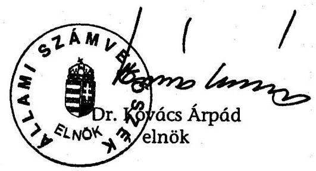

Melléklet: $\quad 18 \mathrm{db} \quad 40 \mathrm{lap}$

[^0]
[^0]:    ${ }^{25} 0030$ sz. Jelentés az erdőgazdálkodás ellenőrzéséről. 2000. év.

---

# Mellékletek jegyzéke 

a V-16-57/2004-2005. számú jelentéshez

| 1. sz. melléklet | Észrevételek |
| :--: | :--: |
| 2. sz. melléklet | A kincstári vagyon teljes körű számbavételének a jogi szabályozásban fennálló korlátai |
| 3. sz. melléklet | Az informatikai rendszerfejlesztés költségei |
| 4. sz. melléklet | A nyilvántartott adatok bemutatása |
| 5. sz. melléklet | A vagyonelemek számviteli és vagyonkataszteri egyezősége |
| 6. sz. melléklet | A vagyonkezelési szerződések megyei szintű vizsgálatának terjedelme |
| 7. sz. melléklet | A kincstári vagyoni körből való kikerülés |
| 8. sz. melléklet | Az évenkénti előirányzat módosítások és a kezelt vagyonnal kapcsolatos előirányzat-maradvány évenkénti alakulása 1999-2004 között |
| 9. sz. melléklet | A kezelt vagyon jóváhagyott kiadási előirányzata összetételének alakulása |
| 10. sz. melléklet | A KVI alcímenkénti kiadásai, bevételei, támogatása eredeti költségvetési előirányzatai 1999-2004 között |
| 11. sz. melléklet | A KVI bevételi tervezését irányító belső dokumentumok 2003. évre |
| 12. sz. melléklet | A KIVING Kft. tevékenysége |
| 13. sz. melléklet | A KVI által kezelt kincstári vagyon hasznosítási bevételei 1999-2004 között |
| 14. sz. melléklet | A KVI által kezelt kincstári vagyon tervezett és tényleges bevételeinek alakulása 2002-2004. években |
| 15. sz. melléklet | Az éves feladatok meghatározása, kivitelezése |
| 16. sz. melléklet | A beruházási, felújítási és karbantartási feladatok 1999-2004 között |
| 17. sz. melléklet | Táblázatok |
| 18. sz. melléklet | Tanúsítványok |

---

# 1. számú melléklet a V-16-57/2004-2005. számú jelentéshez 

H-1051 BUDAPEST V., JÓZSEF NÁDOR TÉR 2-4. POSTACIM: 1369 BUDAPEST, POSTAFIÓK 481.

TELEFON: 327-2111 FAX: 318-0738
PÉNZÜGYMINISZTER

Állami Számvevőszék
Dr. Kovács Árpád úr
Élnök

Budapest
Apáczai Csere János u. 10.

Tisztelt Elnök Úr!
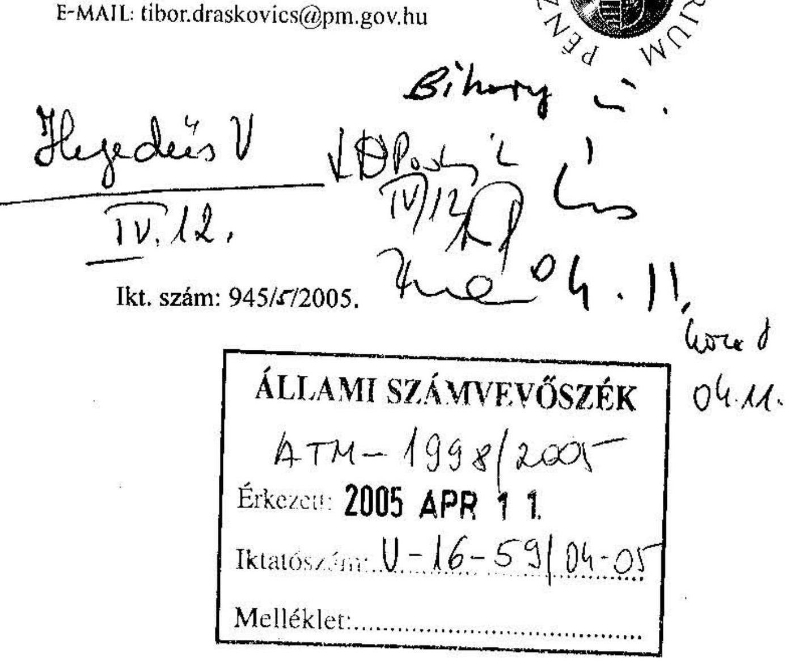

A kincstári vagyon kezelésének és müködésének ellenőrzéséről készített jelentésüket köszönettel megkaptam, arra észrevételt nem teszek.

A jelentés alapján a megtett intézkedésekről a jelzett határidőn belül a tájékoztatást megadom.

Budapest, 2005. április „II",

Tisztelettel:
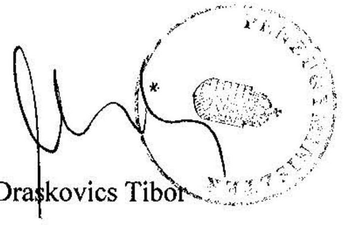

---

1. sz. melléklet a V-16-57/2004-2005. sz. jelentéshez
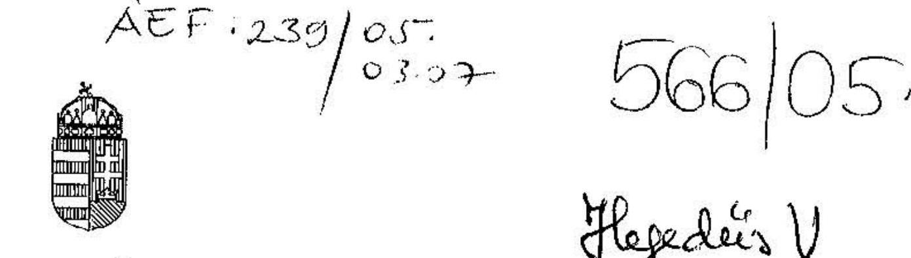

MINISZTERELNÖKI HIVATAL
KözIGAZGATÁsi ÁLLAMTITKÁr

Ikt.szám: I-2/624/6/2005 (1)
Hivatkozási szám: V-19-25/2004.
Ugyintéző: Végh Szabolcs
Tárgy: Kincstári vagyon ellenőrzése

Bihary Zsigmond úr részére
föigazgató
Állami Számvevőszék
Budapest

Tisztelt Föigazgató Úr!

ÁLLAMI SZÁMVEVŐSZÉK
ATM-1443/2001
Érkeze: 2005 MARC 07.
Iktatószám: $V-16-1410 k-05$
Melléklet:

Köszönettel megkaptam a kincstári vagyon kezelésének és működtetésének ellenőrzésénol készített jelentés-tervezetet. A tervezettel egyetértek, észrevételeket nem teszek.

Budapest, 2005. március 2.

Tisztelettel:
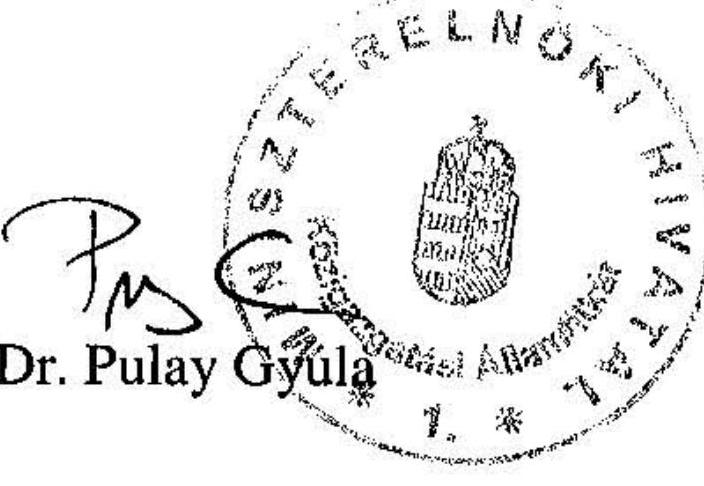

---

# Bihary Zsigmond úr 

föigazgató
Állami Számvevőszék

Budapest

Tisztelt Föigazgató Úr!
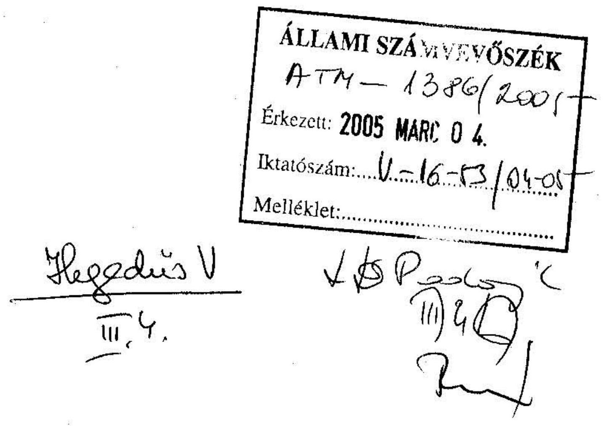

A kincstári vagyon kezelésének és működtetésének ellenőrzéséről készített - V-16-42/2004-2005. iktatószámú 722 témaszámú V0178 vizsgálat-azonosító számú - észrevételeinkkel kiegészített jelentésüket köszönettel megkaptam.

Budapest, 2005. március „2. „.
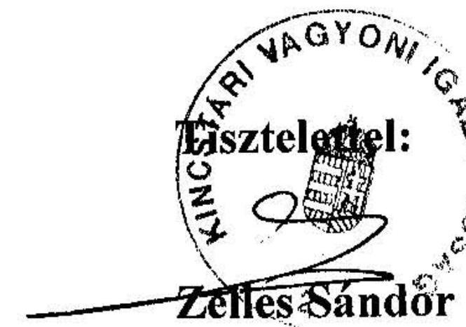

---

# A kincstári vagyon teljes körú számbavételének a jogi szabályozásban fennálló korlátai 

### 1.1. Az állam jogi személyisége és törvényes képviselete

A rendszerváltás előtt az állam jogalanyisága abszolút jogképességgel minden jogra és kötelezettségre kiterjedt, ami természeténél fogva nem csupán emberhez fűződött. A polgári jogállamisággal ez nem volt összeegyeztethető, ezért az 1991. évi XIV. törvény a Ptk. 28. §-át módosítva kimondta: „Az állam, mint a vagyoni viszonyok alanya - jogi személy." Az államot külön törvény alapján - a Kincstári Jogügyi Igazgatóság képviselte volna, de ilyen törvény nem lépett hatályba, ezért az állam különleges, kiemelt jogalanyisága 1996-ig fennállt. Az Áht. 1996-ban történt módosítása 109/A §-ban meghatározta a kincstári vagyon fogalmát és 109/C §-ban kimondta, hogy a pénzügyminiszter a Kincstári Vagyoni Igazgatóság utján látja el az államot megillető jogok gyakorlását a kincstári vagyon felett A gazdasági társaságokról szóló 1997. évi CXLIV törvény záró rendelkezései között a 303. §-ban szabályozták, hogy az állam - mint vagyoni viszonyok alanya - jogi személy. Ellenben törvényes képviseletéről csak az 1998. évi XL. törvény rendelkezett a Ptk. 28. §-nak kiegészítésével, melyben a pénzügyminisztert hatalmazta fel erre, azzal, hogy más állami szerv útján is gyakorolhatja az állam képviseletét. Az állam, mint vagyoni viszonyok alanya jogi személy kitétel az új Gt. hatályba lépésével 1998. június 16-án lépett hatályba. A pénzügyminiszter polgári jogi viszonyokban fennálló képviseleti jogosultsága pedig az 1998. évi XL. törvény hatályba lépésének napján 1998. október 1-jétől hatályosult, holott a pénzügyminiszter képviseleti jogosultsága, már korábban is szerepelt a Ptk.-ban.

Az ismertetett szabályozási előzmény máig kihat a KVI jogállására, mivel képviseleti jogosultságának tartalma és terjedelme még mindig nyitott azáltal, hogy az állam kincstári és vállalkozói jogalanyisága nem végleges.

Jelenlegi szabályozás szerint a pénzügyminiszter a 45/2002.(XII. 25.) PM rendelettel a KVI-re ruházta át az állam törvényes képviseletének jogát, a kincstári vagyont meghaladó körben is.

Az összetett tulajdonosi viszonyokban a KVI az alábbi szerepekben jelenik meg:

- közhatalmi jogosítványokkal, mint a kincstári vagyonért felelős miniszter tulajdonosi, vagyonkezelői jogainak gyakorlója,
- polgári jogi jogosítványokkal, mint főtulajdonos, aki a vagyonkezelésbe adás keretfeltételeit biztosítja a haszonvevő vagyonkezelőt illetően,
- valamennyi polgári jellegű jogviszonyban fellép, melyben az állam érintett, vagy érdekelt.

---

E három fő funkciójának ellátását a jogrendszer alábbi elvi, jogpolitikai és szabályozási hiányosságai korlátozzák:

# 1.2. Elvi jogpolitikai hiányosságok 

Megszűnt az osztatlan egységes állami tulajdon, de fogalomrendszerének egyes elemei visszamaradtak, és szemléletének megfelelő használata a joggyakorlatban és a szabályozásban fennmaradt. A keveredést mutató fogalomhasználat rendezetlen jogviszonyokat és jogalkalmazást teremtett. Különböző rendeltetésű jogalanyi kört, tulajdont, vagyoni elemet nem lehet osztatlan szemlélettel osztályozni és kezelni, állami feladatként nevesíteni olyan kötelezettségeket, ami, ha nem állami feladat volna, akkor is végrehajtható volna abban a jogviszonyban, amelyben megjelenik.

Az állami tulajdon kizárólagosságának akkor indokolt elvi jelentőséget tulajdonítani, ha az Alkotmány értelmében nemzeti vagyonként értendő. A kizárólagosság joghatása a teljes vagy részleges forgalomképtelenség alkalmazása állami felügyeleti rendszerrel, de civil szerveződés bevonásával is megvalósítható.

Az Áht.-ban elhelyezett pénzügyi-számviteli szabályozás a polgári tulajdonosi és a gazdasági hatalmi irányítottságú tulajdonosi viszonyoknak megfelelő fogalom meghatározásra kell, hogy ráépüljön, mert a természeténél fogva megelőzi és nem követi. Ha nem ez történik, a fogalmak keveredése miatt, az alanyi, tárgyi, tartalmi meghatározottsága az állam adott jogviszonyban való érdekérvényesítésének a viszony jellege szerint korlátozott vagy lehetetlenül. (A KVI követelés jogcímén is köteles eljárni, amely a kincstári vagyon számviteli fogalomrendszerben kezelt eleme, de polgári jogviszonyokban jelentése módosul, csak az adott jogviszonyon belül értelmezhető.)

### 1.3. A jogi szabályozás hiányosságai

Nincs meghatározva a Ptk.-ban az állam jogi személyiségének teljes struktúrája, a köztulajdon a kincstári tulajdon fogalma és köre, a vagyon, a vagyonértékű jogok fogalma, a vagyonkezelés fogalma és köre, a műszaki, tudományos és technikai szintnek megfelelően absztrahált és differenciált dologi jogi fogalom és használata.

A tényleges dologkapcsolatok feltárása megvalósítható volna a különböző szakmai alapon szervezett nyilvántartási rendszerek összevezethetőségének lehetővé tételével, ami azt jelenti, hogy az alapul vehető adatbázisok hozzáférhetőségének biztosításával az ügyintézés egyszerűsödne, megalapozottabbá válna. Jelenleg csak a Nemzeti Földalapról szóló törvény rendelkezik a vizsgálat tárgyköre szempontjából releváns földhöz kapcsolódó nyilvántartások összevezetéséről (pl. Erdők tekintetében). A költséges összevezethetőség helyett különböző hatóságok kötelező adatszolgáltatása is előírható egy már rendezett jogállású KVI részére. A feladat teljesítéséhez a jogágak gazdasági közjogi rendszerének kiterjedt ismerete szükséges, amely a jogalkotók feladata.

---

# 1.4. Az elvi, jogpolitikai és szabályozási ellentmondások hatása a KVI szervezetére és múködésére 

Az ismertetett hiányosságok elsődleges hatása, hogy a KVI az eredetileg külön törvénnyel megvalósítani kívánt jogrendszerbeli helye nincs biztosítva: más szervezetekhez hasonlóan nem nyerte vissza eredeti jogi, szervezeti és múködésbeli státusát az államigazgatás központi rendszerében. Feladatait a nem egységes jogfelfogásban szervezett és múködtetett állami tulajdonosi szerepében csak részleges hatékonysággal tudja ellátni. Ellentmondásmentes fogalomrendszer hiányában, folyamatosan változó kincstári vagyont és vállalkozói vagyont irányító miniszteri felelősség mellett az elsősorban aktuálisan felmerülő feladataira koncentrál. Csak olyan szinten szervezett adatbázist tud fenntartani és múködtetni, amelyre a költségvetés erre a célra juttat. Az államháztartáson és államigazgatáson belüli fontosságához és súlyához mérten érdekeinek érvényesítésére megfelelő gazdasági, hatalmi bázist a változó kormányok egyikénél sem tudott megnyerni céljainak, ezért fejlesztésére, végleges helyének kijelölésére az államháztartás és államigazgatás rendjében nem került sor. (Számos alkalommal benyújtott vagyonhasznosítási, jogszabály módosítási koncepcióját figyelmen kívül hagyták, vagy részben fogadták el.)

### 1.5. A vagyonkezelés szerződési feltételeit tartalmazó jogi szabályozás hiányának következményei

A jogrendszeren belül vagyonkezelői jog fogalma használatos, amelyen a vagyonkezelőt megillető jogok és kötelezettségek összességét értik, a vagyonkezelés, mint a megbízási jogviszony speciális esete nem szabályozott a Ptk.-ban.

Általánosan a kincstári vagyoni jog alanyait, tárgyát a Ptk. 175. §-a és az Áht. tartalmazza, míg a jog tartalmát a 186/1996. (XII. 11.) Korm. rendelet foglalja magába. A szabályozás alanyi központú, anélkül, hogy a vagyonkezelés fogalmát meghatározná, szabatosan elhatárolná a rokon jogintézményektől és elhelyezné különböző jogterületek viszonylataiban. Az Ász korábbi ellenőrzési tapasztalatain alapuló ajánlása, amely szerint kívánatos volna elhelyezni a vagyonkezelési szerződést a Ptk.-ban önmagában nem elégséges, mert nem tartalmaz teljes körű szabályozási igényt.

Ugyanakkor nem hagyható figyelmen kívül, hogy a gyakorlat sürgető követelményei - pénzügyi területen - speciális vagyonkezelési megállapodások kidolgozását teremtették meg különböző szektorokra érvényes törvények útján. A tőkepiacról szóló 2001. évi CXX. törvény a befektetési vállalkozásokkal összefüggésben szabályozza a befektetési alapkezelést. Vagyonkezelést szabályoz a kockázati tőkealap-kezelésről szóló 1998. évi XXXIV. törvény, a biztosító intézetekről és biztosítási tevékenységről szóló 1995. évi XCVI. törvény, továbbá a magánnyugdíjakról és magánnyugdíj pénztárakról szóló 1997. évi LXXXII. törvény és a hitelintézetekről és pénzügyi vállalkozásokról szóló 1996. évi CXII. törvény. Az említett törvények vagyonkezelésének pénzügyi szerződéses tapasztalatai jelenleg csak az új Ptk. koncepciójában szerepelnek (Magyar Közlöny 2002. január 31.). E vagyonkezelési szerződésfajták azonban törvényi szinten tartalmaznak olyan elemeket, amelyek a kincstári vagyon kezelésénél is figyelembe vehető egységes szabályozásra alkalmasak. A felsorolt szerződések meg-

---

bízási, vállalkozási és bizományosi elemeket foglalnak magukba, amelyeket a gyakorlat igényei szerint alakítottak ki. Jellegük szerint meghatározott eredmény, hozam, vagy nyereség elérésére irányulhatnak, kizárólag gondossági követelményt fogalmazhatnak meg a vagyonkezelés során, vagy a vagyonkezelés tárgyát illetően nem megőrzési kötelezettséget rónak a vagyonkezelőre, hanem bizományosi szerepben a vagyon értékállandóságának biztosítását várják el a vagyonkezelőtől.

Tekintettel arra, hogy a vagyonkezelés imént kiemelten vállalkozási elemeket is tartalmaz, a KVI jogalanyisága szervezeti megjelenési formáját és a pénzügyminiszter nevében teljesített állami tulajdonosi funkciót nem lehet kizárólag az államháztartás rendjébe illeszkedő költségvetési szerv feladataként felfogni és kialakítani, illetőleg képviselni. Mivel a kincstári vagyon és az állam más tulajdonosi funkciója gazdálkodást igényel, nem lehet alárendelni sem az aktuális költségvetési igényeknek, sem a piac versenyfeltételeinek, a KVI autonómiáját mindkét irányban biztosítani kell a gazdasági, hatalmi irányított tulajdonlási és a vagyonkezelés osztott tulajdonlási rendszerében.

A vagyonkezelés tárgya szerint lehet ingatlan, ingó, társaságbeli részesedés, értékpapír. Ebben az esetben és más szervezeti rendben is - a kincstári vagyon törvényi szabályozását - mind alanyi körét, tárgyát, tartalmát, biztosítékait, felelősségi és ellenőrzési rendszerét, pénzügyi-számviteli rendjét, költségvetési kapcsolatait és finanszírozási rendjét - kiterjedt hatásvizsgálat utján lehet megvalósítani. A jogi szabályozás előkészítésének említett módját és feltételeit az OECD követelményei szerint 2003-ban beterjesztett, de még nem tárgyalt, előreláthatólag 2005-ben hatályba lépő új a jogalkotásról szóló törvényjavaslat tartalmazza.

# 1.6. A KVI szerepe az állam képviseletében különböző jogviszonyokban 

A KVI mint költségvetési szerv a 2003. évi LV. törvény értelmében a 2003. július 19-e után keletkezett szerződéses és kártérítési és kártalanítási kötelezettségeiért költségvetési fedezet hiányában is köteles helytállni. Ezt a szabályt a Ptk. 37. §a korábban már tartalmazta, de az állam által kötött szerződésekben nem kötötték ki az állam teljesítési kötelezettségét, ami Legfelsőbb Bírósági ítélet alapján került az idézett törvénybe (Ptk. kommentár kincstári vagyonnal kapcsolatos rész). Az említett időpontot követően, tehát valamennyi KVI által kötött, vagy kötendő szerződést illetően ebben a szemléletben kell az állam teljesítési kötelezettségével számolni, a KVI egész szerződéskötési rendszerét át kellene tekintenie, és javaslatot kellene készítenie a pénzügyminiszter számára, ahol az állam teljesítési kötelezettsége a KVI-n kívül eső okból időszakosan, vagy tartósan fennáll, és a költségvetést jelentősen megterheli vagy megterhelheti.

Ez vonatkozik azokra az estekre is, amelyek során (pl. Lakáscélú támogatások) a költségvetést terhelő szerződést különböző pénzintézetekkel a PM köti meg, de a képviselet a KVI-t terheli. Az elsősorban jogi képviseletet igénylő ügyekben, nem átgondolt a támogatás folyósítása, az eljárást terhelő költségek biztosítása, a bankok szerepe, a támogatás perlése, végrehajtása jogtalan, vagy jogos, de más okból visszajáró támogatás esetén. A KVI nem alkalmazhat olyan jogi

---

megoldásokat, amelyek költségkímélők volnának akkor, ha az ilyen típusú ügyekben ügyvédi irodaként láthatna el képviseletet, az Áht. 108. § (2) bekezdése értelmében amennyiben a támogatás az államnak visszajár, de behajthatatlan, mint követelésről a KVI nem mondhat le akkor sem, ha szükségtelen költségek őt terhelik, melyek többnyire meghaladják a tényleges támogatás összegét.

Indokolt minden olyan ügyfajtát áttekinteni, amelynek kifutása több eljárást is érint, amelynek során, nem csak az ügy érték jelentős, hanem a jognyilatkozat tétel következményeinek anyagi hatása. Eljárásjogi lépések anyagi következményei pénzügyi- számviteli szemléletben nem modellezhetők, legfeljebb becsülhetők, ezért a hatásvizsgálat alkalmával az ügy jogi érvényesíthetőségét anyagi és eljárásjogi szempontból kell úgy szabályozásra előkészíteni, hogy felesleges, párhuzamos, halogató, vagy mulasztó magatartásra késztető, vagy kényszerítő elemeket ne tartalmazzon jóhiszemú gyakorlati alkalmazás során. Ami a lakáscélú támogatások eljárási rendjét illeti, a PM a KVI megbízása előtt megfelelő mélységig nem vizsgálta az építési folyamattól és eredményétől függetlenül nem kezelhető pénzügyi támogatás múszaki, jogi és intézményi hátterét az építőipari vállalkozások sajátos és az érintett lakossági kör szociális helyzete alapján.

---

|  Szerződés szám | Tárgy | Típus | Forrás SQL számla- hivatkozás | Kifizetett Bruttó Ft. | Kifizetett Nettó Ft. | Számla kelte | Teljesítés dátuma | Év  |
| --- | --- | --- | --- | --- | --- | --- | --- | --- |
|  13110-98-00331 | Kincstári vagyonkataszter adatgyűjtő modul | C/I | 01/004625/98* | 9 087 500 | 7 270 000 | 1998.06.11 | 1998.07.10 | 1998  |
|  13110-98-00331 | Proliant 3000 PII/300, NT 4.0 Cal 45+5 lic, Exchange 45+1 lic | C/II | 01/005059/98* | 10 634 688 | 8 507 750 | 1998.07.15 | 1998.08.04 | 1998  |
|  13110-98-00331 | Kincstári vagyonkataszter programjai I. ütem | C/I | 01/008502/98* | 17 525 000 | 14 020 000 | 1998.11.20 | 1998.12.03 | 1998  |
|  13110-98-00331 | Kincstári vagyonkataszter programjai II. ütem | C/I | 01/009443/98* | 11 137 500 | 8 910 000 | 1998.12.17 | 1998.12.22 | 1998  |
|  13110-98-00331 | Főkönyv,Pénzügy,Készlet,BEF,Költségvetés, Értékpapír | C/I | 01/009444/98* | 19 250 000 | 15 400 000 | 1998.12.17 | 1998.12.22 | 1998  |
|   |  |  |  |  | 54 107 750 |  |  | 1998 Össz.  |
|  13110-98-00331 | Hálózati aktív elemek | C/II | 01/000005/99* | 20 445 934 | 16 356 747 | 1998.12.18 | 1999.01.22 | 1999  |
|  13110-98-00331 | MS-SQL | C/I | 01/000006/99* | 2 625 000 | 2 100 000 | 1998.12.29 | 1999.01.22 | 1999  |
|  13110-98-00331 | Modulok I. ütem | C/I | 01/003759/99* | 21 125 000 | 16 900 000 | 1999.06.07 | 1999.07.08 | 1999  |
|  13110-98-00331 | Főkönyv,pénzügy II. ütem | C/I | 01/004439/99* | 6 125 000 | 4 900 000 | 1999.06.23 | 1999.07.08 | 1999  |
|   |  |  |  |  | 40 256 747 |  |  | 1999 Össz.  |
|  13110-98-00331 | BEF, Szerződés, Hasznosítás, Állami ő., Értékp. | C/I | SZA001-00101 | 18 000 000 | 14 400 000 | 1999.12.30 | 2000.01.21 | 2000  |
|  13110-98-00331 | Felújítás,karbantartás,beruházás,üzemeltetés | C/I | SZA001-02283 | 33 500 000 | 26 800 000 | 2000.06.29 | 2000.08.18 | 2000  |
|   |  |  |  |  | 41 200 000 |  |  | 2000 Össz.  |
|  13110-98-00331 | Költségvetés-tervezés | C/I | SZA101-00073 | 3 812 500 | 3 050 000 | 2000.12.21 | 2001.03.12 | 2001  |
|  13110-98-00331 | Ingatlan-nyilvántartás | C/I | SZA101-00077 | 9 375 000 | 7 500 000 | 2000.12.29 | 2001.03.12 | 2001  |
|  13110-98-00331 | Adatmodell és Törzskezelő program I. rész. | C/I | SZA101-01107 | 2 806 250 | 2 245 000 | 2001.05.02 | 2001.05.24 | 2001  |
|  13110-98-00331 | SQL adatmodell/2.1.pont, SQL KVK modul teszire | C/I | SZA101-01786 | 12 628 125 | 10 102 500 | 2001.08.07 | 2001.08.21 | 2001  |
|  13110-98-00331 | PC adatmodell és törzskezelő | C/I | SZA101-01914 | 9 821 875 | 7 857 500 | 2001.08.31 | 2001.09.17 | 2001  |
|  13110-98-00331 | Vagyonkezelői modulok | C/I | SZA101-02884 | 7 015 625 | 5 612 500 | 2001.12.19 | 2001.12.21 | 2001  |
|  13110-98-00331 | KVI kirendeltségei és központi modulok | C/I | SZA101-02884 | 8 418 750 | 6 735 000 | 2001.12.19 | 2001.12.21 | 2001  |
|  13110-98-00331 | KVK modul | C/I | SZA101-02884 | 8 419 375 | 6 735 500 | 2001.12.19 | 2001.12.21 | 2001  |
|  13110-98-00331 | BEF modul | C/I | SZA101-02884 | 2 806 250 | 2 245 000 | 2001.12.19 | 2001.12.21 | 2001  |
|  13110-98-00331 | Adatmodell átadása végleges dokumentációval | C/I | SZA101-02884 | 4 208 750 | 3 367 000 | 2001.12.19 | 2001.12.21 | 2001  |
|   |  |  |  |  | 55 450 000 |  |  | 2001 Össz.  |
|  13110-98-00331 Össz. |  |  |  |  | 191 014 498 |  |  |   |
|  21200-2001-00049 | Érték nélk. Készletek Nyilvántartási modul - Teszt 2002.01.30. | C/I | SZA201-00557 | 3 000 000 | 2 400 000 | 2002.02.25 | 2002.03.06 | 2002  |
|  21200-2001-00049 | Teljes Vagyongazdálkodási Modul - Teszt 2002.01.30. | C/I | SZA201-00557 | 150 000 | 120 000 | 2002.02.25 | 2002.03.06 | 2002  |
|  21200-2001-00049 | Szerződés nyilvántartási részmodul - Teszt 2002.01.30. | C/I | SZA201-00557 | 562 500 | 450 000 | 2002.02.25 | 2002.03.06 | 2002  |
|  21200-2001-00049 | Hasznosítási részmodul - Teszt 2002.01.30 | C/I | SZA201-00557 | 1 500 000 | 1 200 000 | 2002.02.25 | 2002.03.06 | 2002  |
|  21200-2001-00049 | Részesedés és Értékpapírok nyilv. Modul - Teszt 2002.01.30 | C/I | SZA201-00557 | 937 500 | 750 000 | 2002.02.25 | 2002.03.06 | 2002  |
|  21200-2001-00049 | Részesedés és Értékpapírok nyilv. Modul - Határidő 2002.02.15 | C/I | SZA201-00557 | 937 500 | 750 000 | 2002.02.25 | 2002.03.06 | 2002  |
|  21200-2001-00049 | Költségvetés tervezés modul módosítása - Teszt 2002.01.30 | C/I | SZA201-00557 | 2 250 000 | 1 800 000 | 2002.02.25 | 2002.03.06 | 2002  |
|  21200-2001-00049 | Költségvetés tervezés modul módosítása - Határidő 2002.02.15. | C/I | SZA201-00557 | 2 250 000 | 1 800 000 | 2002.02.25 | 2002.03.06 | 2002  |
|  21200-2001-00049 | Érték nélk. Készletek Nyilvántartási modul - Határidő 2002.02.15. | C/I | SZA201-00866 | 3 000 000 | 2 400 000 | 2002.04.05 | 2002.04.17 | 2002  |
|  21200-2001-00049 | Teljes Vagyongazdálkodási Modul - Határidő 2002.02.15 | C/I | SZA201-00866 | 150 000 | 120 000 | 2002.04.05 | 2002.04.17 | 2002  |
|  21200-2001-00049 | Szerződés nyilvántartási részmodul - Határidő 2002.02.15 | C/I | SZA201-00866 | 562 500 | 450 000 | 2002.04.05 | 2002.04.17 | 2002  |
|  21200-2001-00049 | Hasznosítási részmodul - Határidő 2002.02.15 | C/I | SZA201-00866 | 1 500 000 | 1 200 000 | 2002.04.05 | 2002.04.17 | 2002  |
|  21200-2001-00049 | VIR rendszerkoncepció - Teszt | C/I | SZA201-00866 | 3 125 000 | 2 500 000 | 2002.04.05 | 2002.04.17 | 2002  |

- VAX Pénzügyi alrendszer számlaszám

---

|  Szerződés szám | Tárgy | Típus | Forrás SQL számla- hivatkozás | Kifizetett Bruttó Ft. | Kifizetett Nettó Ft. | Számla kelte | Teljesítés dátuma | Év  |
| --- | --- | --- | --- | --- | --- | --- | --- | --- |
|  21200-2001-00049 | "Cognos szoftverek" Impromptu User | C/I | SZA201-01434 | 3375000 | 2700000 | 2002.06.26 | 2002.07.26 | 2002  |
|  21200-2001-00049 | "Cognos szoftverek" Impromptu Standard Support 1 év | C/I | SZA201-01434 | 812500 | 650000 | 2002.06.26 | 2002.07.26 | 2002  |
|  21200-2001-00049 | "Cognos szoftverek" Impromptu Administrator | C/I | SZA201-01434 | 2112500 | 1690000 | 2002.06.26 | 2002.07.26 | 2002  |
|  21200-2001-00049 | "Cognos szoftverek" Impromptu Administrator Standard Support 1 év | C/I | SZA201-01434 | 525000 | 420000 | 2002.06.26 | 2002.07.26 | 2002  |
|  21200-2001-00049 | "Cognos szoftverek" Powerplay User | C/I | SZA201-01434 | 1687500 | 1350000 | 2002.06.26 | 2002.07.26 | 2002  |
|  21200-2001-00049 | "Cognos szoftverek" Powerplay Standard Support 1 év | C/I | SZA201-01434 | 406250 | 325000 | 2002.06.26 | 2002.07.26 | 2002  |
|  21200-2001-00049 | BEF Módosítás - Teszt | C/I | SZA201-01609 | 3687500 | 2950000 | 2002.07.12 | 2002.07.23 | 2002  |
|  21200-2001-00049 | Műszaki modul módosítás - Teszt | C/I | SZA201-01609 | 2625000 | 2100000 | 2002.07.12 | 2002.07.23 | 2002  |
|  21200-2001-00049 | Müszaki modul módosítás - Határidő 2002.04.30 | C/I | SZA201-01609 | 2625000 | 2100000 | 2002.07.12 | 2002.07.23 | 2002  |
|  21200-2001-00049 | VIR rendszerkoncepció - Határidő 2002.03.30 | C/I | SZA201-01609 | 3125000 | 2500000 | 2002.07.12 | 2002.07.23 | 2002  |
|  21200-2001-00049 | VIR rendszerkoncepció bővítés - Tesztre | C/I | SZA201-01736 | 4687500 | 3750000 | 2002.08.07 | 2002.08.27 | 2002  |
|  21200-2001-00049 | VIR rendszerkoncepció bővítés - Végleges teljesítés | C/I | SZA201-01736 | 4687500 | 3750000 | 2002.08.07 | 2002.08.27 | 2002  |
|  21200-2001-00049 | VIR rendszerterv - Teszt | C/I | SZA201-02133 | 2500000 | 2000000 | 2002.10.02 | 2002.10.16 | 2002  |
|  21200-2001-00049 | VIR rendszerterv MÓDOSÍTÁS Teszt | C/I | SZA201-02133 | 3750000 | 3000000 | 2002.10.02 | 2002.10.16 | 2002  |
|  21200-2001-00049 | BEF Módosítás - Határidő 2002.03.30 | C/I | SZA201-02189 | 3687500 | 2950000 | 2002.10.10 | 2002.10.24 | 2002  |
|  21200-2001-00049 | "GriffData adatbetöltő alkalmazás" - Teszt | C/I | SZA201-02189 | 3062500 | 2450000 | 2002.10.10 | 2002.10.24 | 2002  |
|  21200-2001-00049 | "GriffData adatbetöltő alkalmazás" - Határidő 2002.03.30 | C/I | SZA201-02189 | 3062500 | 2450000 | 2002.10.10 | 2002.10.24 | 2002  |
|  21200-2001-00049 | Hasznosítási részmodul MÓDOSÍTÁS teszt | C/I | SZA201-02189 | 1625000 | 1300000 | 2002.10.10 | 2002.10.24 | 2002  |
|  21200-2001-00049 | VIR rendszerterv - Határidő 2002.04.30 | C/I | SZA201-02229 | 2500000 | 2000000 | 2002.10.18 | 2002.11.08 | 2002  |
|  21200-2001-00049 | VIR rendszerterv MÓDOSÍTÁS Végleges | C/I | SZA201-02229 | 3750000 | 3000000 | 2002.10.18 | 2002.11.08 | 2002  |
|  21200-2001-00049 | Érték nélk. Készletek Oktatás - Határidő 2002.02.15. | C/I | SZA201-02615 | 1137500 | 910000 | 2002.12.12 | 2002.12.23 | 2002  |
|  21200-2001-00049 | Érték nélk. Készletek vonalkódos leltár Teszt | C/I | SZA201-02615 | 1056250 | 845000 | 2002.12.12 | 2002.12.23 | 2002  |
|  21200-2001-00049 | Érték nélk. Készletek vonalkódos leltár - Határidő 2002.05.30. | C/I | SZA201-02615 | 1056250 | 845000 | 2002.12.12 | 2002.12.23 | 2002  |
|  21200-2001-00049 | "GriffData adatbetöltő alkalmazás" egyedi kibővítés /kereti- Teszt | C/I | SZA201-02615 | 3750000 | 3000000 | 2002.12.12 | 2002.12.23 | 2002  |
|  21200-2001-00049 | "GriffData adatbetöltő alkalmazás" egyedi kibővítés /kereti- Teszt 2002.06.30 | C/I | SZA201-02615 | 3750000 | 3000000 | 2002.12.12 | 2002.12.23 | 2002  |
|  21200-2001-00049 | "GriffData adatbetöltő alkalmazás" egyedi kibővítés /kereti- Teszt 2002.06.30 | C/I | SZA201-02615 | 11242500 | 8994000 | 2002.12.12 | 2002.12.23 | 2002  |
|  21200-2001-00049 | A Cognos Üzleti Inteligencia programokban egyedi fejlesztés - Teszt | C/I | SZA201-02615 | 11250000 | 9000000 | 2002.12.12 | 2002.12.23 | 2002  |
|  21200-2001-00049 | A Cognos Üzleti Inteligencia programokban egyedi fejlesztés - 2002.08.30 | C/I | SZA201-02615 | 11250000 | 9000000 | 2002.12.12 | 2002.12.23 | 2002  |
|  21200-2001-00049 | A Cognos Üzleti Inteligencia programokban egyedi fejlesztés | C/I | SZA201-02615 | 22500000 | 18000000 | 2002.12.12 | 2002.12.23 | 2002  |
|   |  |  |  |  | 112969000 |  |  | 2002 Össz.  |
|  21200-2001-00049 | Hasznosítási részmodul VÉGLEGES | C/I | SZA301-02336 | 1625000 | 1300000 | 2003.10.20 | 2003.12.08 | 2003  |
|   |  |  |  |  | 1300000 |  |  | 2003 Össz.  |
|  21200-2001-00049 | "Kizárólagos állami tulajdonú vagyonelemek" | C/I | SZA401-01390 | 23800000 | 19040000 | 2004.06.07 | 2004.07.02 | 2004  |
|   |  |  |  |  | 19040000 |  |  | 2004 Össz.  |
|  21200-2001-00049 Össz. |  |  |  |  | 133309000 |  |  |   |
|  21200-2003-00012 | KVK Modul fejlesztése | A/I | SZA301-01850 | 2500000 | 2000000 | 2003.08.22 | 2003.09.11 | 2003  |
|  21200-2003-00012 | KVI Műszaki részmodul fejlesztései | A/I | SZA301-01851 | 2562500 | 2050000 | 2003.08.22 | 2003.09.11 | 2003  |
|  21200-2003-00012 | KVK PC-s Programok fejlesztése | A/I | SZA301-01869 | 1562500 | 1250000 | 2003.08.29 | 2003.09.11 | 2003  |
|  21200-2003-00012 | Hasznosítási részmodul fejlesztései I. | A/I | SZA301-02334 | 843750 | 675000 | 2003.10.20 | 2003.11.05 | 2003  |

---

|  Szerződés szám | Tárgy | Típus | Forrás SQL számla- hivatkozás | Kifizetett Bruttó Ft. | Kifizetett Nettó Ft. | Számla kelte | Teljesítés dátuma | Év  |
| --- | --- | --- | --- | --- | --- | --- | --- | --- |
|  21200-2003-00012 | KVI PC-s programok fejlesztései végteljesítés | A/I | SZA301-02636 | 1 562 500 | 1 250 000 | 2003.11.28 | 2003.12.15 | 2003  |
|  21200-2003-00012 | KVI VIR Modul fejlesztései | A/I | SZA301-02832 | 1 312 500 | 1 050 000 | 2003.12.13 | 2003.12.29 | 2003  |
|   |  |  |  |  | 8 275 000 |  |  | 2003 Össz.  |
|  21200-2003-00012 Össz. |  |  |  |  | 8 275 000 |  |  |   |
|  21200-2003-00030 | Kizárólagos állami tulajdonú vagyonelemek - Közreműködői feladat | IV/2 | SZA301-02887 | 10 350 000 | 8 280 000 | 2003.12.13 | 2004.04.02 | 2004  |
|   |  |  |  |  | 8 280 000 |  |  | 2004 Össz.  |
|  21200-2003-00030 Össz. |  |  |  |  | 8 280 000 |  |  |   |
|  21200-99-03450 | UPS eszközök | C/II | SZA001-01174 | 2 198 250 | 1 758 600 | 2000.02.09 | 2000.03.22 | 2000  |
|  21200-99-03450 | Aktív eszközök | C/II | SZA001-00887 | 4 404 200 | 3 523 360 | 2000.02.09 | 2000.03.20 | 2000  |
|  21200-99-03450 | Végpontépítés, rack szekrény, patch panel | C/II | SZA001-00973 | 3 567 875 | 2 854 300 | 2000.02.18 | 2000.03.09 | 2000  |
|   |  |  |  |  | 8 136 260 |  |  | 2000 Össz.  |
|  21200-99-03450 | Vagyonkalaszter, adatbiztonsági rend., KVI belső inf. Védelmi rend. (I-III lépcső) | C/I | SZA001-03752 | 9 375 000 | 7 500 000 | 2000.12.13 | 2001.03.26 | 2001  |
|  21200-99-03450 | Vagyonkalaszter, adatbiztonsági rend., KVI belső inf. Védelmi rend. (IV-V lépcső) | C/I | SZA101-00860 | 5 625 000 | 4 500 000 | 2001.04.12 | 2001.04.23 | 2001  |
|  21200-99-03450 | Kincstári Vagyonkalaszter WEB publikációja | C/I | SZA101-01162 | 1 250 000 | 1 000 000 | 2001.05.14 | 2001.05.30 | 2001  |
|   |  |  |  |  | 13 000 000 |  |  | 2001 Össz.  |
|  21200-99-03450 Össz. |  |  |  |  | 21 136 260 |  |  |   |
|  Végösszeg |  |  |  |  | 362 014 758 |  |  |   |

---

# A nyilvántartott adatok bemutatása 

Vagyoncsoportok vagyonérték szerinti megoszlása 2004
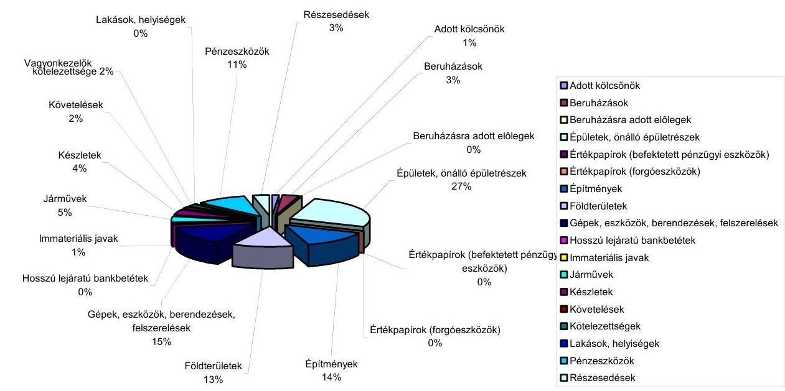

Vagyoncsoportok változása a vizsgált időszakban
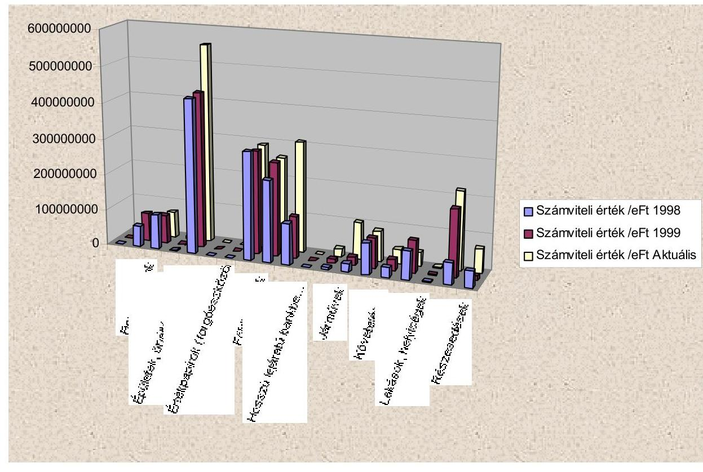

---

# Vagyonkezelők társasági forma szerint 2004 

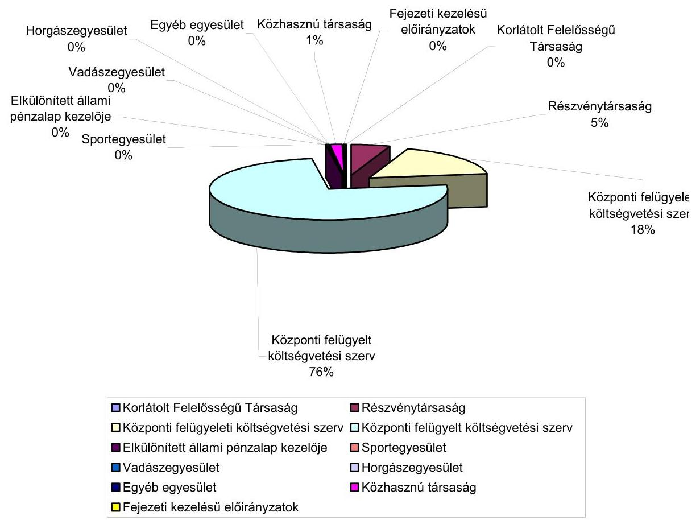

A kezelt kincstári vagyon megyei bontásban 2004
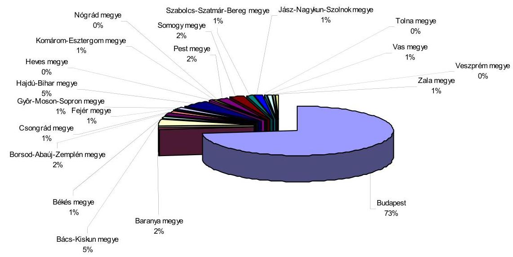

---

# A kezelt kincstári vagyon felügyeleti szervek szerinti bontásban 2004 

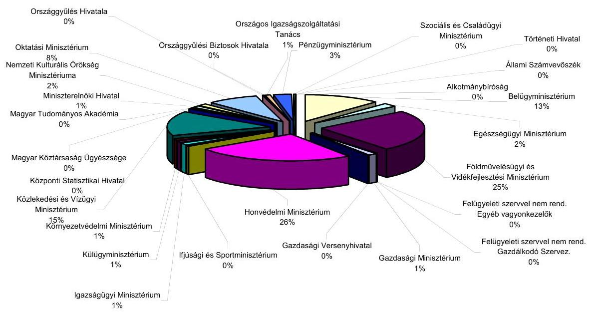

A KVI által kezelt termőföld művelési ág szerint 2004 (36 447 ha)
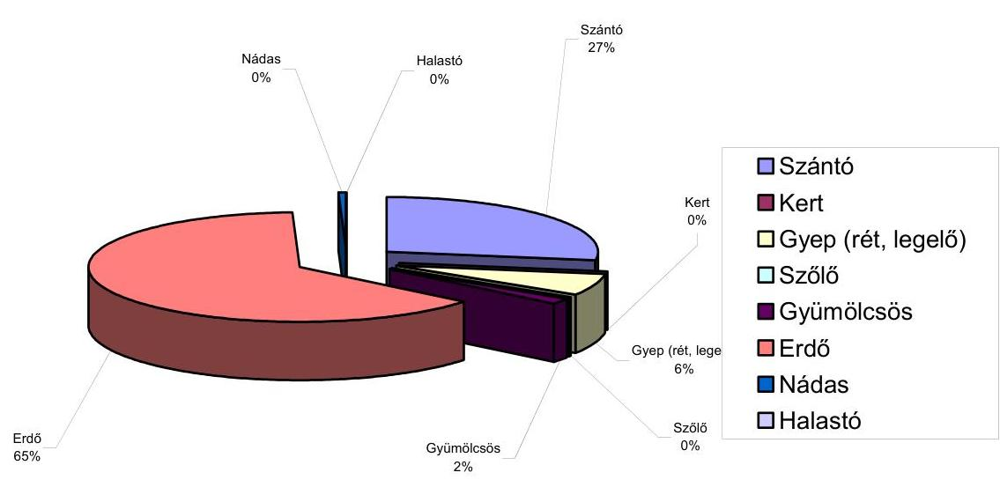

---

# Kezelt erdő megyei bontásban 2004 

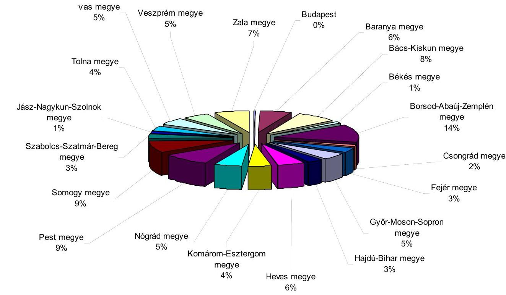

A kezelt erdőterület változása a vizsgált időszakban 1998-2004
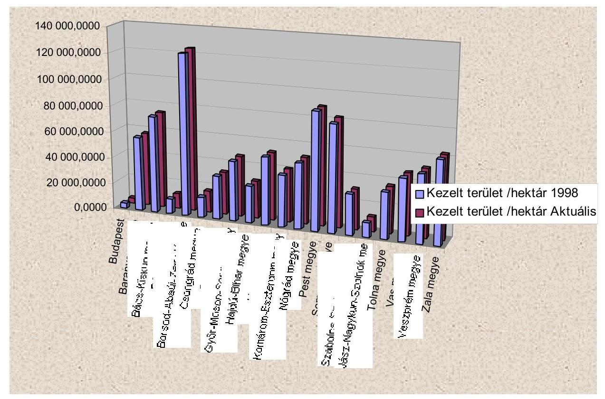

---

5. sz. melléklet a V-16-57/2004-2005. számú jelentéshez

# A vagyonelemek számviteli és vagyonkataszteri egyezősége 

## Veszprém Megyei Földhivatal

- A vagyonkataszter, valamint a számviteli mérlegadatok 2004. évi önellenőrzésének keretében a költségvetési szerv megállapította, hogy a 2002. évi vagyonkataszterben a számviteli mérleg adatai duplázódva jelentek meg.
- A kiválasztott (2001. december 31-i állapotnak megfelelő) 489 E Ft bruttó, 27 E Ft nettó értékű immateriális javak közé tartozó telefonvonal jog megvásárlása kapcsán keletkező tételnek a számviteli nyilvántartásban és a vagyonkataszterben rögzített bruttó és nettó értéke megegyezett.
- A vagyonkataszterben egyösszegben szerepeltetett eszközhöz hét analitikus nyilvántartó karton tartozott, mivel hét közmúfejlesztési hozzájárulás befizetése történt meg, különböző városokban található kirendeltségeknek. Az adatot a Kincstári Vagyon Nyilvántartási Szabályzatban rögzítetteknek megfelelően, összevontan szerepeltette a kataszterben a vagyonkezelő.

## Bakonyerdő Erdészeti és Faipari Rt.

- A vagyonkezelő esetében az állami vagyon tulajdonosi jogait három szervezet (KVI, NFA, ÁPV Rt.) gyakorolja.
- 1996. október 10-én ideiglenesen vagyonkezelési szerződést kötöttek, melynek véglegesítésére azóta sem került sor, 2001-ben és 2004-ben is készült új szerződéstervezet, de ezeket azóta sem véglegesítették.
- 2004. évben úgy leltek fel egy vagyonkataszteri nyilvántartásban nem szereplő belterületi ingatlant, hogy a használó vételi szándékkal kereste meg a vagyonkezelőt.
- A földhivataltól szerettek volna adatszolgáltatást kérni a kezelésükben kimutatott kincstári vagyonról, de ezt térítés nélkül a hivatal nem vállalta, ezért a vagyonkezelő e szándékától elállt.
- A részvénytársaság számviteli nyilvántartásában nem szerepelnek a KVI nyilvántartási körébe tartozó vagyonelemek. Azokat csak a kataszterben "0" értékkel tartják nyilván annak ellenére, hogy a vagyonkezelő rendelkezik egy 1993. évi vagyonértékeléssel, mely az értéken való nyilvántartás megteremtésének alapját képezhette volna. Az Erdőrendezési Szolgálat 1993. évi értékbecslése szerint az erdőtalaj és a faállomány (a kárpótlási területek figyelembe vételével számított) értéke 14461194 E Ft volt az akkori állapotnak megfelelően.

---

# Szombathelyi Határőr Igazgatóság 

- A vagyonkezelőnél a 2003. évi mérlegben szerepeltetett készletek értéke került kiválasztásra a véletlenszerű mintavétel során. A raktárban tárolt új készletek leltározott értéke a vagyonkataszterben szerepeltetett értékkel megegyezett, és a főkönyvi kivonattal egyezően a költségvetési szerv mérlegében is ugyanazon értékkel szerepelt.
- A vagyonkataszter és mérleg további összevetése során azonban a helyszíni ellenőrzés az alábbi eltéréseket tapasztalta a mérleg és a vagyonkataszter adatai között:

E Ft

| Eszközfajta neve | Mérleg | Vagyonkataszter | Eltérés |
| :-- | --: | --: | --: |
| Immateriális javak | 8532 | 160779 | +153247 |
| Ingatlanok + va-   gyoni értékú jogok | 1536332 | 1385635 | -150697 |
| Gépek, berendezé-   sek, felszerelések | 326704 | 525395 | +198691 |
| Jármúvek | 171248 | 138658 | -32590 |
| Tenyészállatok | 837 | 549 | -288 |
| Tárgyi eszközök   összesen | 2103803 | 2118919 | +15116 |
| Befektetett eszközök   összesen | 2120793 | 2289156 | +168363 |

- A vagyonkezelő vezetői és alkalmazottai nem rendelkeztek információval arról, hogy a KVI-től kapott lemezen megtalálható a program felhasználói leírása. Annak ellenére, hogy a dolgozók részt vettek oktatáson, nem ismerték a programlistázási funkciói közül a vagyonmérleg felépítésű kimeneti táblát. A mérleg és a vagyonkataszter egyezősége a vagyonkezelőnél nem volt biztosított. A befektetett eszközök számviteli nettó értékét 168363 E Ft-tal magasabb összeggel jelentették a vagyonkataszterben, mint ami a számviteli analitikus és főkönyvi nyilvántartásokkal egyezően a mérlegben szerepelt.

## Komárom-Esztergom Megyei Földmúvelésügyi Hivatal

- A mintavétel során kiválasztott 8 tétel 2 db vagyoni elem (Kenyérmezeipatak, Szendi-ér) 3 éves adatait mutatta.
- 2001 májusában az Észak-dunántúli Vízügyi Igazgatóság adott át a költségvetési szervnek három belvízelvezető csatornát, amit akkor helyes értékben tüntették fel az adatokat. 2003-ban, helyrajzi szám szerinti bontásban módosítani kellett a nyilvántartást, visszamenőlegesen is. Ekkor helytelenül nem E Ft-ra kerekített összegben tüntették fel a kataszterben az adatokat. A 2003. év végi jelentésnél észrevették az eltérést, akkor csak a nettó érték, és az értékcsökkenés adatokat módosították úgy, hogy a bruttó érték és a nettó érték különbözetét egyösszegű értékcsökkenésként számolták el.

---

- A 2004. évi önrevízió során megállapították, hogy 2001. évben, a vagyonkataszterben 4057 E Ft-tal, 2002. évben 2169 E Ft-tal kevesebb befektetett eszközértéket jelentettek, mint ami a mérlegben szerepelt.
- A helyszíni ellenőrzés során megállapítást nyert, hogy a 2003. évi mérlegben a befektetett eszközök nettó értéke 281703 E Ft-ban, ugyanakkor a vagyonkataszterben 281062 E Ft-ban, 640 E Ft eltéréssel szerepel. A KVI adatbázisában lévő 2002. év végi adat 56698640 E Ft , a mérlegben pedig ezzel szemben 241888 E Ft nettó értékadat szerepel. Ennek oka az, hogy a vagyonkataszterben a patakok értéke nem ezer forintra kerekítve került feltüntetésre.

# Balaton-felvidéki Nemzeti Park Igazgatóság 

- A kiválasztott vagyoni elemek közül a szarvasmarhák (szürkemarha) vagyonkataszterben és mérlegben szereplő értéke ugyan megegyezik, de az leltárral nincs alátámasztva. A vagyonkezelő 1997-ben KKA támogatásból 157 db szürkemarhát vásárolt, amit néhány földterülettel együtt azonnal haszonbérbe adtak. A földterületeket kellett volna a marhaállomány legeltetésével karbantartani. A megkötött haszonbérleti szerződés során nem tartotta be a vagyonkezelő a 183/1996. (XII. 11.) Korm. rendelet 4. §-ában rögzített „elvárható gondosság" gazdálkodási szabályait. A haszonbérleti szerződés a magyar államra nézve előnytelen.

1. a földterületet 5, a szürkemarha állományt 18 évre adták haszonbérbe, az első 5 évben téritésmentesen, akkortól 30 db állatszaporulatért.;
2. nem kötötték ki a szerződésben a vagyonkezelő és a KVI ellenőrzési jogosultságát, emiatt a bérbevevő még egyetlen évben sem nyilatkozott az idegen helyen tárolt állami tulajdon leltározott értékéről. Ugyanakkor magatartásával akadályozta a helyszíni vagyonkezelői ellenőrzést is.
3. 2001-ben a haszonbérlő már csak 96 db állat ENAR számát adta át a Nemzeti Parknak. Ezt követően a vagyonkezelő bírósági keresetet indított a haszonbérlő ellen, majd büntető feljelentést tett.

2004. március 19-én a KVVM Ellenőrzési Önálló Osztálya helyszíni szemle során megállapította, hogy a gulya létszáma 36 egyedre csökkent. Ennek ellenére a Nemzeti Park mérlegében is, és a vagyonkataszterben is a teljes állomány értéke szerepel, holott az leltárral nem támasztható alá.

Helytelenül közölte a vagyonkataszterben a vagyonkezelő a szürkemarhák mennyiségét is, amikor 363 tenyészállatot tüntetett fel. A számviteli adatok szerint a marhaállományból a tenyészállatok száma 134 volt 2003. XII. 31-én, ebből az idegen helyen tárolt - leltárral alá nem támasztott - 95 db . A többi saját kezelésben van, amit leltárral alá is támasztottak. A helytelen mennyiségi adat azért került a vagyonkataszterbe, mert tételesen egyetlen tenyészállatot sem rögzítettek. Minden tenyészállat csoportosan került felvitelre, de ott a program csak 50 E Ft alatti egyedi átlagértéket engedett meg. A számviteli nyilvántartásban szereplő bruttó értékadat szerint azonban 50 E Ft feletti átlagérték jelentkezett volna, ha a valós mennyiségi adatot szerepeltetik, ezért a gép nem engedte a rögzítést. A tételes felvitel elmulasztása, és a szoftver szűrési feltétele-

---

inek kiküszöbölése miatt a valóságtól eltérően tüntették fel a mennyiségi adatot.

# Mintavételezéssel kiválasztott Fejér és Győr-Moson-Sopron megyei székhelyú vagyonkezelők helyszíni ellenőrzésének tapasztalatai 

A vagyonkezelőknél tételes ellenőrzésre kiválasztott vagyoncsoportok földterületek (szántó, erdő, nádas), egyéb vízi építmények, igazságügyi irodaépületek és készletek voltak (összesen 18 db vagyonelem).

Az ellenőrzés 1999-2004. I. félév időszakára terjedt ki.
A vizsgálat célja annak megállapítása, hogy:

1. a kincstári vagyon kezelésére kialakított szabályozás biztositja-e az állami feladatellátás során a kincstári vagyon állagának és értékeinek megőrzését, védelmét, értékeinek növelését,
2. milyen megoldások születtek a kincstári vagyon müködtetésére,
3. a kincstári vagyon nyilvántartására kialakított rendszer használható-e, egyezősége biztositott-e a földhivatali nyilvántartási adatokkal.

Az Állami Számvevőszék a KVI kezelésében lévő vagyon működtetésének ellenőrzése során a Fejér Megyei Kirendeltségnél az ellenőrzési programnak meghatározott részét (a vizsgálati program 1. pontját) ellenőrizte, emiatt a Kirendeltség feladatainak ellátása egy szűkebb területen került vizsgálatra, nevezetesen a múködés szabályozottságára, a kezelt vagyon nyilvántartására és a vagyonkezelőkkel való kapcsolattartásra terjedt ki.

A KVI Megyei Kirendeltsége a vizsgált időszakban a kincstári vagyonnal összefüggő szabályok (törvények, kormányrendeletek, belső szabályzatok, körlevelek) előírásai alapján hivatali szervezete útján, a számára biztosított jogkörökben eljárva tett eleget a kincstári vagyonnal kapcsolatos kezelés feladatainak.

## A Kirendeltségnél a vagyon kezeléséhez szükséges szabályozás rendelkezésre állt közvetlenül vagy a központtól, számítógépes elérés útján.

A vizsgált években a jelentős fluktuáció ellenére a feladatellátás folyamatosan biztosított volt, hosszabb távon azonban nem megoldás a műszaki előadói munkakör betölthetetlensége, illetve a régió igazgatói munkakörhöz való kapcsolása. A régiók megszervezésével a többlet feladatokhoz szükséges munkaerőigény még nem ismert számukra.

A Kirendeltség a vizsgált időszakban a vagyonkezelőnél nem végzett a helyszínen tulajdonosi ellenőrzést és több - a jelentésben elmarasztalásként rögzített eset azt támasztja alá, hogy a Kirendeltségnek vagyonkezelők és a központ intézkedéseiről nem volt naprakész információja.

A Kirendeltségnek alapfeladata a vagyonkezelési szerződésben foglaltak folyamatos ellenőrzése, ennek tárgyi feltételei azonban nem biztosítottak. A hatályos szabályzat önállóan elvégzendő ellenőrzésekre nem is ad lehetőséget, bár

---

# ezt a Kirendeltség a központnál nem kezdeményezte, hogy önállóan végezhessen vizsgálatokat. 

A vagyonkezelők által megküldött, az általuk kezelt vagyonról készített adatszolgáltatást a Kirendeltség évente automatikusan továbbította a központ felé, nem élt azzal a lehetőséggel, hogy a vagyonkezelőktől a vagyonkezelési tevékenységükről a vagyonhasznosításról, a vagyoni adatok egyeztetéséhez szükséges információkról kérjen szöveges beszámolót vagy dokumentációk megküldését írja elő.

A saját kezelésű vagyon nyilvántartási és éves leltározási kötelezettségének a Kirendeltség eleget tett, nem volt azonban kellő figyelemmel a jelentős nagyságrendet képviselő földterületek hasznosításával kapcsolatos helyzet feltárására.

Mindazon hiányosságok, amelyek a közbenső jegyzőkönyvben rögzítettek alapján a Kirendeltség tevékenységének értékeléseként megfogalmazásra kerültek elsősorban a KVI belső szabályainak módosításával küszöbölhetők ki, ami öszszességében abban fogalmazható meg, hogy a vagyonkezelőkkel kapcsolatos tulajdoni ellenőrzési feladatokhoz, a vagyonnyilvántartások naprakészségének és egyezőségének biztosításához a Kirendeltségek a létszámfeltételek biztosítása mellett jogköröket is kapjanak.

---

# A vagyonkezelési szerződések megyei szintű vizsgálatának terjedelme 

## A vizsgálatban érintett vagyonkezelők és megyei megoszlásuk

Borsod-Abaúj-Zemplén Megye
Észak-Magyarországi Erdőgazdasági Részvénytársaság
Borsod-Abaúj-Zemplén Megyei Tűzoltó Parancsnokság
Aggteleki Nemzeti Park Igazgatóság
Észak-Magyarországi Regionális Vízmúvek Részvénytársaság
Borsod-Abaúj-Zemplén Megyei Rendőr Főkapitányság
Észak-Magyarországi Környezetvédelmi és Vízügyi Igazgatóság
Hajdú-Bihar Megye
Hajdú-Bihar Megyei Rendőr-főkapitányság
Debreceni Egyetem
Hajdú-Bihar Megyei Állami Közútkezelő Kht.
Hortobágyi Nemzeti Park Igazgatóság
Békés Megye
Békés Megyei Állami Közútkezelő Közhasznú Társaság
Bács-Kiskun Megye
Kiskunsági Erdészeti és Faipari Rt.
FVM Szőlészeti és Borászati Kutatóintézet
FVM Mezőgazdasági Szakképző Iskola és Kollégium
Csongrád Megye
Alsó-Tisza vidéki Környezetvédelmi Felügyelőség

---

Csongrád Megyei Rendőr Főkapitányság
Szegedi Tudományegyetem.
Baranya Megye
Dél-Dunántúli Vízügyi és Környezetvédelmi Igazgatóság
Siklós Város Önkormányzata
Pécsi Tudományegyetem
Baranya Megyei Közigazgatási Hivatal
Pécsi Megyei Jogú Város Vagyonkezelő és Vagyonhasznosító RT
Duna-Dráva Nemzeti Park Igazgatóság
Somogy Megye
Balatoni Halgazdaság Bt.
Somogyi Erdészeti és Faipari Bt.
Veszprém Megye
Veszprém Megyei Földhivatal
Bakonyerdő Erdészeti és Faipari Rt.
Szombathelyi Határőr Igazgatóság
Komárom-Esztergom Megyei Földmúvelésügyi hivatal
Balatonfelvidéki Nemzeti Park Igazgatóság
Fejér Megye
VADEX Mezőföldi Erdő- és Vadgazdálkodási Részvénytársaság.
Fejér Megyei Növény és Talajvédelmi Szolgálat
Közép-Dunántúli Környezetvédelmi és Vízügyi Igazgatóság
Győr-Moson-Sopron Megye
Fertő-Hanság Nemzeti Park
Győr-Moson-Sopron Megyei Bíróság

# A vizsgálattal érintett vagyoncsoport, vagyonelem fajták 

Földterületek - erdő, gyep, gyümölcsös, halastó, nádas, szántó

---

Gépek, eszközök, berendezések, felszerelések
Építmény - vezeték, csatorna
Épületek, önálló épület részek - üdülőszálló.
Lakások, helységek
Múemlék
Készletek
Tenyészállatok
Jármúvek - közúti és speciális jármúvek
Értékpapír - kárpótlási jegy
Immateriális javak - szoftver

# Az ÁSZ ellenőrzésében közremúködő megyei irodái 

Állami Számvevőszék Borsod-Abaúj-Zemplén Megyei Ellenőrzési Iroda, Miskolc

Állami Számvevőszék Hajdú-Bihar Megyei Ellenőrzési Iroda, Debrecen
Állami Számvevőszék Csongrád Megyei Ellenőrzési Iroda, Szeged
Állami Számvevőszék Baranya Megyei Ellenőrzési Iroda, Pécs
Állami Számvevőszék Veszprém Megyei Ellenőrzési Iroda, Veszprém
Állami Számvevőszék Fejér Megyei Ellenőrzési Iroda, Székesfehérvár

---

# A kincstári vagyoni körből való kikerülés 

Az ellenőrzés keretében véletlen kiválasztás és egyedi kijelölés módszerével az alábbi kikerülések vizsgálatára kerül sor az Állami Számvevőszék Megyei Ellenőrzési Irodáinak bevonásával.

Ingatlancsere a KVI és a Váltó 4 Libra Rt. között. A kincstári vagyonból kikerülést 2000. november 7 -én engedélyezték. Ennek keretében 6 db kincstári ingatlant cseréltek 2 db szentendrei Váltó 4 Rt . tulajdonú ingatlanra. Az ügyletben szereplő ingatlanok az alábbiak voltak:

| Megnevezés | Érték   M Ft | Áfa   M Ft | Összesen |
| :-- | --: | --: | --: |
| VÁLTÓ 4 Rt. | 661 | 129,75 |  |
| Szentendre, Ady Endre 5. hrsz. 4432, | 48 |  |  |
| Szentendre Ady Endre u. 54. hrsz. 4364 | 709 | 129,75 | 838,75 |
| Összesen |  |  |  |
| KVI | 104 |  |  |
| Bp. XII. Lidérc u. 32. | 110 | 22,75 |  |
| Bp. VII. Kertész u. 34. | 195 | 15 |  |
| Bp. VI. Délibáb u. 15, 17. | 112 | 17,25 |  |
| Bp. VI. Kmetty Gy. u. 27. | 189 | 13,75 |  |
| Bp. XIV. Erzsébet királyné útja 111-113. | $\mathbf{7 1 0}$ | $\mathbf{6 8 , 7 5}$ | $\mathbf{7 7 8 , 7 5}$ |
| Összesen |  |  |  |

A Szentendre, Ady E. u. 5, az ún. „Duna Club"a Váltó 4 Libra Rt.-hez a Postabanktól került és 1639372 E Ft volt a könyv szerinti értéke, amellyel szemben az 1999. június 28 -ai vagyonértékelés 648260 E Ft forgalmi értéket állapított meg. Így az ingatlan Postabanktól történt átvételével a Váltó 4 Rt . közel 1 Mrd Ft-os ( $991,112 \mathrm{M}$ Ft) veszteséget szenvedett el. Az egyezség kétoldali (KVI-Váltó 4) vagyonértékelés alapján egyeztetéseket és alkukat követően valósult meg, mintegy egyévi folyamatos egyeztetés után.

A csere első variációban tartalmazta volna a Hortobágy-mátai lovasklub ingatlanjait, amelyek úgyszintén a Postabanktól kerültek a Váltó Rt.-hez. Ezeken az ingatlanokon az 1999-ben elvégzett vagyonértékelés szerinti 1 Mrd Ft-tal szem-

---

ben a Váltó Rt.-nél nyilvántartott összesített könyvszerinti érték 2,11 Mrd Ft volt.

Az eredeti értékbecslés KVI vagyonra kimutatott 536,6 M Ft bruttó, Váltó Rt. vagyonra kimutatott 738,2 M Ft bruttó értékével, a KVI vagyonértékelőjének a KVI vagyonra kimutatott 792,5 M Ft bruttó, valamint Váltó Rt. vagyonára kimutatott 649 M Ft bruttó értéke állt szemben.

A cserében szereplő ingatlanok tulajdonjogának cserét követő változásai is szolgálnak tanulsággal. Például:

- A Bp. VI. ker. Kmetty u. 27. számú ingatlant 2001. január 3-án bejegyzett cserét követően a Váltó 4 Libra Rt. eladta (földhivatali bejegyzés dátuma: 2001. január 22.). Az ingalant egy társaság továbbadta 2002. március 7-én egy másik Kft.-nek, amelytől a földhivatali nyilvántartás szerint ismét a Magyar Állam tulajdonába került, vagyonkezelője a Magyar Képzőművészeti Egyetem. Az ingatlan ismét egy csere formájában cserélt gazdát és került vissza állami tulajdonba. A 2002. augusztus 23-án megkötött csereszerződésben az erre az ingatlanra figyelembe vett érték $180 \mathrm{M} \mathrm{Ft}+15 \mathrm{M}$ Ft áfa volt a kikerüléskor figyelembe vett $112 \mathrm{MFt}+17,25 \mathrm{M}$ Ft áfával szemben.
- A Bp. VII. Kertész u. 34. sz. ingatlant a Váltó 4 Libra Rt. tovább cserélte. Az új tulajdonos eladta az ingatlant egy másik Kft.-nek. A vétellel egyidejűleg, 2002. 05. 14-én bejegyzésre került a Konzumbank javára a jelzálogjog 160 M Ft erejéig. Ezt 2003-ban a CIB Bank javára szóló 660000 Európa mindenkori forintértékének és járulékainak erejéig szóló jelzálogjog és vételi jog váltotta fel. Az a körülmény, hogy két bank is hitelt nyújtott 160 M Ft nagyságrendben az ingatlan fedezetével, ismerve a bankok ingatlanértékelési gyakorlatát is, azt jelenti, hogy az ingatlan nyomott áron szerepelt a cserében.

A Csorna, 010/2 13 ha $8227 \mathrm{~m}^{2}$ kivett, Csorna 168 hrsz. $1615 \mathrm{~m}^{2}$ kivett, valamint a Csorna hrsz. 171/2 ingatlanok értékesítése.

Az ingatlanok a Győr-Sopron megyei határőrség vagyonkezelésében álltak és feladataik ellátásához szükségtelenné váltak. A laktanya 1997. decembere óta üresen állt.

A hrsz. 171 ingatlanra először egy külföldi társaság magyarországi vállalata jelentette be vételi szándékát, 2000. augusztus 16-án a KVI-hoz írott levelében. Ebben azt a tájékoztatást adta a kft., hogy a beruházásokat már 2000. év folyamán megkezdenék és ütemezés szerint 2001. december 31-ig 500 fő, 2002. december 31-re 800 fő, 2003. december 31-én 1100 fő munkahely létesítését szerződéses kötelezettségként vállalják.
A határőrség által összeállított adatlap szerint a hrsz. 171 (kiképzőbázis), összesen $53076 \mathrm{~m}^{2}$ területen $22 \mathrm{db} 10773 \mathrm{~m}^{2}$ hasznos alapterületű épület áll, amelynek nyilvántartási értéke bruttó 385697850 Ft nettó 311949150 Ft . Az aktuális forgalmi érték $244129000 \mathrm{Ft}+51744750 \mathrm{Ft}$ áfa, azaz összesen 295873750 Ft .

---

| hrsz. | terület   $\mathrm{m}^{2}$ | épület |  | nyilvántartási érték |  | forgalmi érték   áfával (E Ft) |
| :-- | :--: | :--: | :--: | :--: | :--: | :--: |
|  |  | db | $\mathrm{m}^{2}$ | bruttó (E Ft) | nettó (E Ft) |  |
| Csorna 171 | 53076 | 22 | 10773 | 385698 | 311949 | 295874 |
| Csorna 168 | 1615 | - | - | 950 | 950 | 969 |
| Csorna 010/2 | 138227 | - | - | n.a. | n.a. | 9400 |
| Összesen |  |  |  |  |  | 306243 |

A vevő, bár a szerződés tartalmával kapcsolatban kifogást nem emelt, azt 2001. januárjában sem írta alá, a KVI új jelentkezővel tárgyalt. Az aktualizált értékbecslés szerinti érték a három helyrajzi számon nyilvántartott létesítmény esetében ekkor $247689000+51744750 \mathrm{Ft}$ áfa, azaz összesen 310923750 Ft volt. A megkötött előszerződés az értékbecslés szerinti értéket irányárként tartalmazta.

A szerződést bruttó 122000 E Ft készpénzben történő vételár, 2002. december 31-ig 100 és 2004. december 31-ig további 100 új munkahely teremtése, 500 M Ft értékű ipari beruházás megvalósításának vállalása és 60 M Ft környezeti kárelhárítás (a terület illegális szemétlerakó volt) vállalása mellett kötötték meg.

Az ügylet az ingatlanok kincstári vagyoni körből kikerüléséhez a jogszabályban előírt engedélyekkel rendelkezik. A vevő vállalásait a KVI ellenőrzi, azok időarányosan teljesültek.

Előzőekben részletezett, két nagyobb ingatlancsoport kincstári vagyoni körből történt kikerülésén kívül a vizsgált időszak alatt összesen értékesített kb. 600 ingatlan közül mintegy 80 további ingatlan értékesítése lett megvizsgálva. Ezek között zárt elhelyezésú, zárt körben pályáztatott, nyilvános pályázattal és árveréssel értékesített is volt. Az értékesítések a szabályoknak megfelelően történtek és a megfelelő engedéllyel rendelkeztek. A zártkörű elhelyezések a megfelelő indoklással rendelkeztek, pl. társtulajdonos javára, eltérő tulajdonú felépítmény tulajdonosának, stb. Belekerültek a mintába olyan lakások, amelyeket különféle intézmények a bennlakó saját dolgozóiknak értékesítettek. Ezeket az értékesítéseket a költségvetési szervek saját hatáskörben végzik, a módot miniszteri rendeletek szabályozzák.

Pl. a mintába került - egyéb hasonló eset mellett - a Hévíz, Vörösmarty u. 57 sz. hrsz. 1460 ingatlan, amelyet a BM Központi Kórház szintén saját dolgozójának értékesített szolgálati lakást. Hivatkozás a 24/1996. (IX. 2.) sz. BM rendelet volt. Az értékesítésről adásvételi szerződést, hivatalos értékbecslést a KVI nem mutatott be. A Kórház által megküldött adatlap szerint az ingatlan bruttó nyilvántartási értéke 7550 E Ft, nettó értéke 6781 E Ft volt, forgalmi értékét 10100 E Ft-ban jelölték meg. Az eladási ár 1998. 11. 03-án 3030 E Ft volt, amelyből 2046 E Ft folyt be.

Tabax Rt. részvénycsomag értékesítése. A KVI az Áht. 109/J. § (1) alapján az államot megillető követelések fejében az állam tulajdonába került és értékesítésre szánt társasági részesedések értékesítésére és vagyonkezelésére a 2000. december 20-án megállapodást kötött az ÁPV Rt.-vel, amely 2002. április 2-án megbízta a Forrás Rt.-t az értékesítés kincstári vagyonnak megfelelő szabályok

---

szerinti lefolytatásával. A KVI kezelésű tulajdoni hányad 33,73\% volt, az ügylet a kincstári vagyonkörből kikerüléshez a szükséges engedéllyel rendelkezett.

A Forrás Rt. 2002. május 29-én - kisebbségi tulajdonrész miatt, mint azt a 2002. június 28-i ÁPV Rt. „A Tabax Holding Rt. 33,73\%-os részvénycsomagjának értékesítése" tárgyú „Előterjesztés"-ben ismertette - zártkörű pályázatot írt ki 2002. június 14-i határidővel a KVI portfoliójába tartozó 564800 E Ft névértékű részvénycsomag értékesítésére. A pályázatra benyújtott ajánlatokat az ÁPV Rt. nem fogadta el. Ezt követően a Forrás Rt. tárgyalásokat kezdeményezett az ajánlatot tevőkkel az árfolyam emelés érdekében.

Időközben a Tabax Holding Rt. értékesítette a vagyona jelentős részét kitevő 1,8 Mrd Ft névértékű Vértes Erőmű Rt.-t. A 15\%-on realizálódott üzlet miatt a Holdingnak több 100 M Ft-os veszteséget kellett elkönyvelnie a részvények korábbi magasabb árfolyamon történt nyilvántartása miatt. Ennek következtében szükségessé vált a társaság alaptőkéjének leszállítása, amelyet (a 2002. év végi 421976 E Ft saját tőke és 754254 E Ft mérleg szerinti veszteség mellett) 100 M Ft-ban határoztak meg. A Forrás Rt. felhívására a korábbi pályázatra ajánlatot benyújtók újabb ajánlatot tettek, amelyek közül egy magánszemély által benyújtott 55 M Ft-os volt a legmagasabb. A részvénycsomag 55 M Ft vételáron történő értékesítéséhez a KVI egyetértését adta. A szerződést 2003. január 6-án megkötötték, a vételár befolyt.

A Ganz Híd- Daru- és Acélszerkezetgyártó Rt. részvénycsomag értékesítése. Az értékesítést 1999. május 14-én zártkörű pályáztatással jóváhagyták (a Gt 178. § (2) alapján, amely szerint zártkörűen működő társaság részvényei nyilvános forgalomba hozatal útján nem értékesíthetők), azzal a feltétellel, hogy a vételár eléri legalább az értékbecslés szerinti becsérték alsó határát, a 137 M Ft-ot.

A vevő egy kereskedelmi kft. volt, amely a $24,9 \%$ tulajdoni hányadot megtestesítő 343 M Ft névértékű részvénycsomagot 137 M Ft-ért vette meg 1999. augusztus hóban, részletfizetéssel. A vevő ekkor 75,05\%-os tulajdonos volt. A KVI kisebbségi tulajdonrészéért a jóváhagyásban is szereplő alsó becsértéket, a 40\%os árfolyamot jelentő árat megfizette. Ez ahhoz képest magas volt, hogy az ÁPV Rt. 15\%-os, majd az új tulajdonos MFB Rt. 19\%-os áron értékesítette a korábbiakban a többségi tulajdoni hányadot.

A Ganz Híd- Daru- és Acélszerkezetgyártó Rt.-t a 130 éves múltra visszatekintő GANZ-MÁVAG (Ganz Acélszerkezeti Vállalat) általános jogutódjaként az ÁVÜ alapította, 100\%-ban állami tulajdonú részvénytársaságként. 1995-ben tulajdonosi szerkezete 1375 M Ft jegyzett tőke mellett ÁPV Rt. 75,05\%, ÁFI (Állami Fejlesztési Intézet) 24,95\% volt. A KVI az ÁFI részvénycsomagot „örökölte" meg, az ÁFI pedig az 56/1993. (V). 25.) OGY határozat alapján tőke-adósság konverzió keretében jutott részvénycsomaghoz.

Egy tanácsadó rt. ÁPV Rt. megrendelésre 1999. januárjában készített üzleti érték jelentése szerint a társaság saját tőkéje 1997. végén 1375 M Ft, jegyzett tőkéje 1375 M Ft volt, befektetett eszközeinek értéke 1993-1997 között 1250 -1360 M Ft között mozgott. A tanácsadó, mivel a zártkörűen működő társaság kisebbségi pakettjére csak többségi tulajdonos volt várható vevőként, valamint a társa-

---

ságnak jelentős jelzáloggal ellentételezett hiteltartozásai voltak, a csomag értékét 40-45\%-os áron, azaz 137-154 M Ft között határozta meg.

Ez az értékesítés ismét példa, egy korábbi ÁSZ jelentés megállapítására (Jelentés az Állami Privatizációs és Vagyonkezelő Rt. 2003. évi múködésének és a központi költségvetés végrehajtásához kapcsolódó tevékenységének ellenőrzéséről), amelyben kritikát fogalmazott meg az ÁSZ, az állami tulajdonú társaságok részekben történő privatizációjával szemben, mivel a kisebbségi tulajdonhányad csak diszkont áron értékesíthető.

Kozármisleny Község Önkormányzata 2000. május 9-én kéréssel fordult az ÁPV-Rt. kezelésében, de a Magyar Állam tulajdonát képező 0186/1, 0178, 0184/2 hrsz-ú külterületi erdők tulajdonba vétele vagy hosszú távú bérleménybe vétele ügyében. Az Önkormányzat indokai az alábbiak voltak:

- a falu körbeépült és az erdők ma a falu központját, illetve a közvetlen határát érintik;
- az erdő illegális szemétlerakó hellyé vált;
- az ide települt betegápoló apácarend által létrehozott öregek otthonának múködésére kedvezőtlen hatással van az elhanyagolt környezet.

Az Önkormányzat 3/1994.(VIII. 22.) Önkormányzati rendeletével elfogadott rendezési terve alapján az érintett tárgyi ingatlanok belterületbe vonásra kerülnek, és közparkként kerülnek hasznosításra a saját döntés alapján. A kezdeményezésre a KVI a kincstári vagyoni körből kikerülést jóváhagyta 2001. május 31-én, zártkörű elhelyezés útján történő értékesítéssel.

A Kincstári Vagyonigazgatóság és Önkormányzat között létrejött adás-vételi szerződések jellemző adatai a „közpark" minősítésű ingatlanokra:

| Hrsz. | terület $\left(\mathrm{m}^{2}\right)$ | Eladási ár $\left(8 \mathrm{Ft} / \mathrm{m}^{2}\right)$ |
| :-- | --: | --: |
| $0184 / 2$ | 18881 | 151048 |
| $0186 / 1$ | 7218 | 57744 |
| 0178 | 100410 | 803280 |
| Összesen: | 126509 | 1012072 |

Az ingatlanokon lévő erdő faértéke nem került értékelésre. A Pécsi Körzeti Földhivatal közpark minősítéssel 2002. 03. 12-én. az ingatlanok tulajdonjogát az Önkormányzat javára bejegyezte.

Az Önkormányzat a $126509 \mathrm{~m}^{2}$ teleknagyságot nem csak közpark céljára hasznosította, hanem abból $7341 \mathrm{~m}^{2}$-en telkesítést végzett, házhelyeket alakított ki és azokat üzleti alapon értékesítette. Közparkként 8 ha $3281 \mathrm{~m}^{2}$-t, út kialakítására 1 ha $3427 \mathrm{~m}^{2}$-t, és beépítetlen területként $3752 \mathrm{~m}^{2}$-es területet meghagyott önkormányzati saját célra.

---

A Kincstári Vagyonigazgatóság és Önkormányzat közötti adásvételi szerződés nem tartalmazott olyan korlátozó feltételt, amely szerint a közpark címén megvásárolt területet más jellegű célra nem lehet felhasználni, vagy arról a Kincstári Vagyonigazgatóságot értesíteni kell, beleegyezését kérve.

A fenti ingatlanok erdősítését a Pécsi Mezőgazdasági Rt. (korábban Pécsi Állami Gazdaság) végezte el. Az Rt. Bírósághoz fordult az erdő értékének kártalanítása céljából és a kárérték - 4000 E Ft és járulékai -megfizetésére indított pert a Kincstári Vagyonigazgatóság ellen. Felperes felvetette, hogy az államot képviselő Kincstári Vagyonigazgatóság miért ad el egy ingatlant 1012 E Ft vételárért, ha a rajta lévő ültetvény értéke 4000 E Ft-ot ér. A Bíróság az Rt. kárigényét elutasította. Az Önkormányzat újraerdősítés címén 228 E Ft-ot fizetett be a vonatkozó előírásoknak megfelelően.

Az tárgyi esetben a KVI nem járt el megfelelő körültekintéssel az ár megállapításánál, a terület átadásáért a rajta levő faérték figyelembe vétele a vételár alsó határaként indokolt lett volna.

Szekszárd külterületén 0154/7 hrsz.-on és a 0154/8 hrsz.-on, összesen 1 ha $1644 \mathrm{~m}^{2}$-es területen lévő Vendégház ( $786 \mathrm{~m}^{2}$ alapterületű) felépítményes ingatlan, a Magyar Állam tulajdonában a Kincstári Vagyonigazgatóság vagyonkezelésében volt. Az ingatlan hasznosítása a többszöri kezdeményezés ellenére nem sikerült, melynek egyik oka az, hogy az ingatlanhoz nem kapcsolódnak egyéb használati jogok, pl. vadászati terület. A Kincstári Vagyonigazgatóság az ingatlan vételi árát 2004. évben 67600 E Ft-ban jelölte meg. Szekszárd Megyei Jogú Város Önkormányzata az ingatlan önkormányzati tulajdonba vételét kezdeményezte a Kincstári Vagyonigazgatóságnál.

Az ingatlan állapotát az ellenőrzés során a helyszínen megtekintettük és megállapítottuk, hogy annak állagromlását az elmúlt 14 év alatt nem sikerült megállítani, teljes körű felújítást igényel. Az ingatlan őrzését megoldották, de annak kiadásai jelenleg elérik 3000 E Ft/év összeget. Az ügy elbírálása még folyamatban van.

A Bikal 297 hrsz. alatt felvett lakóház, udvar, gazdasági épület zártkörű elhelyezéssel került ki a kincstári vagyoni körből. A vevő az önkormányzat volt, kinyilatkoztatta abbéli szándékát, hogy az ingatlant védetté nyilvánítja, és azt faluházzá fogja alakítani. A felvállalt feladat szerepel az Önkormányzat 2004. évi költségvetési rendelet felhalmozási kiadásai között, melyhez központi forrásra is pályáztak.

A Kincstári Vagyonigazgatóság az Áht.-ról szóló 1992. évi XXXVIII. tv. 109/C § (1) bekezdése alapján kötötte meg a szerződést az Önkormányzattal a 26/2004. (III. 29.) képviselő-testületi határozat alapján. A 2183650 Ft-ban határozták meg. A kikerülés jó példa az államtól önkormányzathoz kerülő vagyon megfelelő hasznosítására.

Siklós Felszabadulás úti ingatlan lakásértékesítést tartalmazott. A lakást a vagyonkezelő PHI a 214/1996 (IX. 25.) BM. rendeletben foglaltaknak megfelelően zártkörűen értékesítették.

---

Pécs, Bor utcai ingatlan esetében a telek és felépítménye különböző tulajdonosok tulajdonában állt. A kiskereskedelem ÁFÉSZ vonalának megerősítésére valamikor a magyar állam telket bocsátott azon kereskedelmi szervek részére, akik a lakosság ellátási kötelezettségében részt vállaltak a tanácsi feladatok mellett. Így a felépítmény ÁFÉSZ tulajdonban állt. A telket a felépítmény tulajdonosa elővásárlási jogának figyelembe vételével értékesítették, az Áht. 109/K/1 pontjában foglaltakat érvényesítették a felek adásvételi szerződésben.

A Pécsi Blaha Lujza utcai ingatlan esetében szintén a telek és a felépítmény eltérő tulajdonjoga, a felépítmény tulajdonosának a Ptk. 97. § (3) bekezdése alapján fennálló elővásárlási joga miatt zártkörű elhelyezéssel történt az értékesítés.

Az APEH Megyei Hivatala közölte a KVI-vel, hogy két külön lévő helyen használt irodáját értékesíteni kívánja. egy helyen, de nagyobb alapterületű ingatlant venne igénybe térítés ellenében feladatainak központosítása céljából.

A KVI elfogadta az APEH igényét és felújítandó nagyobb alapterületű ingatlant ajánlott fel, a kisebbek értékesítése mellett. Az értékesítések szabályosan történtek. Az új ingatlan felújítását már az ellenőrző szerv igényei alapján végezték el.

Ózd-Sajóvárkony 026/2 hrsz.-on nyilvántartott 10 ha $2586 \mathrm{~m}^{2}$ Ózd külterületi ipartelep foglalkoztatás politikai célok megvalósítása érdekében került zártkörű elhelyezéssel értékesítésre Ózd Városi Önkormányzat részére. Az ipartelepet az Önkormányzat egy külföldi társaság letelepítésére vásárolta.

A független értékbecslő a forgalmi értéket 10250 E Ft-ban állapította meg és az adásvételi szerződést is ebben az értékben kötötték meg Budapesten 1998. szeptember 23-án. A vevő a vételárat határidőn belül megfizette. A Kirendeltségen csak a forgalmi értékre vonatkozó szakértői vélemény és az adásvételi szerződés található meg, az értékesítés engedélyezése nem.

Ózd 11001/1, /2, /3, /4, /5, /6, /7, /8, /9, /10, /11, /12, /13, /14, /15, /16, /17, /18, /19, /20 hrsz.-on elhelyezkedő ingatlanokra nyilvános pályázatot írtak ki. Az ingatlanokat 1998-ban egy tulajdonosnak kívánták eladni annak érdekében, hogy ipari park kerüljön kialakításra a területen. A Pénzügyminisztérium hozzájárulásában indokoltnak tartotta, hogy az ingatlanok együttesen kerüljenek meghirdetésre, és a pályázat elbírálása során előnyt élvezzen, azaz ajánlattevő, aki vállalja az ipari parkként történő hasznosítást, illetve ajánlata az összes ingatlan megvételére vonatkozik. A pályázatot a Pénzügyi Közlönyben, valamint újsághirdetésekben tették közzé. Az ingatlanok értékét független értékbecslő állapította meg.

Két érvényes pályázatot nyújtottak be, a pályázatok bontásáról közjegyzői okirat készült. Az egyik pályázó csak három darab ingatlanra nyújtott be árajánlatot a másik pályázó az összesre, a forgalmi érték 70\%-án.

A 11001/4, /6, /14 hrsz-on lévő ingatlanokon a felépítmény tulajdonosát elővásárlási jog illette meg. Ezekre a szerződést a kirendeltségen kötötték, a vevők a vételárat határidőre megfizették. A 11001/11 és /18 hrsz-ú ingatlanokra külön-

---

külön, az összes többi ingatlanra egy adásvételi szerződés készült. A vételár megfizetéséről a Kirendeltségen nem áll rendelkezésre adat.

Ózd (Tekerősvölgy) 0251/4, /14, /22, a 0252, 0254/1 hrsz.-ú és az Ó0025 címkódú földterületeket zártkörű értékesítéssel adta el 2000-ben a KVI. Ezek az ingatlanok felszámolás jogcímén kerültek állami tulajdonba. A zártkörű értékesítés oka, hogy a területeken különböző felépítmények találhatóak (ezek a hrsz.-ok sorrendjében: $46 \mathrm{~m}^{2}$ épület, $448 \mathrm{~m}^{2}$ épület, $1350 \mathrm{~m}^{2}$ saját használatú út, $2416 \mathrm{~m}^{2}$ víztároló, $1444 \mathrm{~m}^{2}$ saját használatú út). Az Ó0025 címkódú terület 58 db hrsz.-ot tartalmazó drótkötélpálya tartóoszlop alatti földterületet jelöl. A felépítmények tulajdonosa az értékesítésig bérelte a területeket a KVItől.

Az adásvételi szerződésben szereplő 16172150 Ft vételár megegyezik a független értékbecslő által közölt értékkel. Ez a szerződés tartalmazza a következő bekezdésben részletezett ingatlanok közül a zártkörű értékesítés keretében eladottakat is. Az engedélyt az értékesítésre a hasznosítási vezérigazgató-helyettes adta meg.

Ózd Center 02028/2, 036/43, 034/48, /62, /64, /65, /66, /67, /68, /72, /74 hrsz.-ú ingatlanok értékesítése az előzőekben leírt eljárás részeként valósult meg. A zártkörű értékesítés oka, hogy az ingatlanok az Ózdi Salakfeldolgozó Művek Kft. területén belül helyezkedtek el. Az ingatlanokat bérleti szerződés alapján birtokolta és használta, azokon üzemi tevékenységet végzett a későbbi vevő. Egy adásvételi szerződés készült a zártkörű értékesítésekről 16172150 Ft vételárral.

Az Ózdi Salakfeldolgozó Múvek Kft. területén kívül eső 032/1 hrsz.-ú, és a társaság területére eső 034/45 hrsz.-ú ingatlan értékesítése nyilvános pályázaton történt 2000-ben. A pályázat bontásáról közjegyzői okirat készült. Mindkét ingatlanra három árajánlat érkezett, nyertesként a legmagasabb ajánlatot tevőt - 5,5 M és 3 M Ft - hirdették ki. A szerződést a Kirendeltségen kötötték, a vevő a vételárat megfizette.

Az Ózdi törzsgyári ingóságok az Ózdi Ipari Park területén lévő különféle vagyonelemeket foglalt magába, például szennyvízcsatorna, csapadékvízcsatorna, kerítés, főútvilágítás, stb. E vagyontárgyakat nyilvános árverés keretében értékesítette a KVI 2000. szeptember 12-én a helyszínen. A nyilvános árverést a hasznosítási vezérigazgató-helyettes engedélyezte, megjelentetésére a hivatalos értesítőben és egy megyei napilapban került sor. Az értékbecslő által megállapított 651125 Ft volt a kikiáltási ár. Az árverésről közjegyzői okirat készült.

A nyilvános árverésen egy vásárló jelent meg, aki a kikiáltási ár 70\%-án vette meg az ingóságokat. Ez volt az a minimális ár, melyet az 1998. április 30-án

---

hatályba helyezett Árverési szabályzat II. 2. pontja ${ }^{1}$ megengedett. A vevő a vételárat megfizette.

Alsóvadászon 3101 és 3103 hrsz.-on nyilvántartott gyep, (rét) megnevezésű ingatlan 1/15-öd része a Magyar állam tulajdonát képezte, melyhez öröklés útján jutott 1998-ban. Az értékesítés a társtulajdonos - mindkét esetben ugyanaz a személy - részére történt, ez indokolta a zártkörű elhelyezést. Az ellenértéket a Kirendeltség által megbízott független értékbecslő állapította meg 1600, illetve 800 Ft-ban. Az engedélyt a hasznosítási vezérigazgató-helyettes adta, ezután 2000-ben megtörtént a szerződéskötés. A vevő az ellenértéket megfizette.
2001. január 1-jétől 10 M Ft alatt a Kirendeltség dolgozója végzi az értékbecslést nyilvános elhelyezésnél. A zártkörű elhelyezésnél független értékbecslőt alkalmaznak függetlenül az összeghatártól.

Baktakéken a 472, 489 és 511 hrsz. alatt nyilvántartott, az ingatlannyilvántartásba beépítetlen terület megnevezésű földterületek kerültek értékesítésre a Kirendeltség által egy eljárás során. A vevő mindhárom ingatlanban tulajdoni illetőséggel rendelkezett, állami arány 25/30, 1/2 és 5/10 volt. Az ingatlanok az állam és a vevő osztatlan közös tulajdonában álltak ez indokolta a zártkörű elhelyezéssel történő értékesítést.

Az engedélyt a hasznosítási vezérigazgató-helyettes adta. A független értékbecslő által megállapított áron, 24805 Ft -on történt az értékesítés 2003-ban. A vevő a vételárat megfizette.

A Hajdúszoboszló, Fogthüy tanya 051/4. hrsz. állami öröklésű ingatlan $1 / 2$ tulajdoni hányada 1997. december 2-án került a Magyar Állam tulajdonába. Ekkor az ingatlan társtulajdonosa $1 / 2$ részben az a kiskorú személy volt, akinek a családja az ingatlan egész területét állattartásra használta és vásárlási szándékát jelezte a KVI felé. A KVI az Áht. 109. § (1) bekezdés alapján javasolta a tanya ingatlan $1 / 2$ illetőségének kincstári vagyonkörből való kikerülését zártkörű elhelyezés útján. Az ingatlan forgalmi értékét független értékbecslő állapította meg, a vételárat a becsült összegben határozták meg. Az adásvételi szerződés 1998. július 16-án kelt.

Az FVM Mezőgazdasági Szakképző Iskola és Kollégiumnál tenyészállatok eladására és selejtezésére került sor. A vagyoni körből ily módon kikerült tenyészállatok eladása, illetve selejtezése indokolt és célszerű volt, mivel a gazdálkodási feltételeknek nem feleltek meg egészségkárosodás, illetve a hozamok elégtelensége miatt.

[^0]
[^0]:    ${ }^{1}$ „Az eladási ár azonban a forgalmi értékbecslés szerinti ár 70\%-ánál kisebb nem lehet." 2000. október 9-étől új Árverési szabályzat lépett hatályba, ebben is 70\%-ban határozták meg az értékesítési ár alsó határát.

---

# Az évenkénti előirányzat módosítások és a kezelt vagyonnal kapcsolatos előirányzat-maradvány évenkénti alakulása 1999-2004 között 

## A kezelt vagyonnal kapcsolatos kiadási előirányzatok módosítása és teljesítése

|  |  |  |  |  |  | M Ft |
| :-- | --: | --: | --: | --: | --: | --: |
|  | 1999 | 2000 | 2001 | 2002 | 2003 | 2004 |
| Eredeti előirányzat | 2273,5 | 1995,6 | 2799,9 | 2799,9 | 6168,5 | 4404,7 |
| Módosítás | 999,2 | 9252,9 | 5885,2 | 6589,1 | 1383,6 | 2745,1 |
| Módosított előirányzat | 3264,7 | 11248,6 | 8685,1 | 9389,0 | 7552,1 | 7149,8 |
| Teljesítés (M Ft) | 2022,4 | 9570,8 | 3874,2 | 8394,0 | 5687,3 | 4943,1 |
| Teljesítés/Módosított   előirányzat (\%) | 61,9 | 85,1 | 44,6 | 89,4 | 75,3 | 69,1 |

A 2000. évi kiadási előirányzat módosítása mögött a CW Bank székházának megvásárlásához az ÁPV Rt. által biztosított 6500 M Ft pénzforrás átvétele húzódik meg.

A 2001. évi módosítások összege 5885,2 M Ft-ot tett ki. A módosításra saját és felügyeleti hatáskörben került sor. A saját hatáskörű módosítás az előző évi elő-irányzat-maradvány 1721,9 M Ft igénybevételével, a felügyeleti hatáskörben történt módosítás pedig a zsebszerződések kikerülése érdekében termőföld vásárlása végett a KVI költségvetésébe juttatott 3000 M Ft egyösszegű támogatás igénybevételével függött össze.

A korábbi évekkel szemben 2002. évben jelentős összegű (6589,1 M Ft) kiadási előirányzat módosítására került sor, kisebb részben kormányzati, nagyobb részben pedig felügyeleti és intézményi hatáskörben. A saját hatáskörű módosítást az előző évben a zsebszerződések elkerülése végett termőföld vásárlására juttatott támogatásból fel nem használt 2993,4 M Ft FVM részére történő átadásával indokolták. Mivel a KVI a 2002. évi támogatás terhére csak 6,1 M Ft értékben vásárolt termőföldet, a fennmaradó összeget megállapodás keretében 2003-ban átadták az FVM-nek a kiadási előirányzatok módosítása mellett.

A 2003. évre eredeti előirányzatként 3700 M Ft-ot biztosított a felügyeleti szerv a kezelt vagyon intézményi beruházásainak támogatására, melyből a Guggenheim Múzeumnak a Divatcsarnok épületében történő kialakítására 1000 M Ft forintot terveztek felhasználni. A múzeum megvalósítása elmaradt, ezért az 1000 M Ft-ból 800 M Ft-ot az előirányzat csökkentésével párhuzamo-

---

san a felügyelet elvont, 200 M Ft -ot beruházásra, felújításra, tulajdonjog megváltásra csoportosították át. A támogatás további részét 2700 M Ft -ot - mivel a felhasználás jogcímét a felügyeleti szerv nem határozta meg - a KVI saját hatáskörú módosítás mellett egyéb saját döntésű beruházási célok megvalósítására (beruházásokra, felújításokra, tulajdonosi jog megváltására) csoportosította át.

Az állami elhelyezési feladatokra rendelkezésre álló kiadási elöirányzatok módosítása

|  |  |  |  |  |  | M Ft |
| :-- | --: | --: | --: | --: | --: | :--: |
| Kiadási elöi-   rányzatok | $\mathbf{1 9 9 9}$ | $\mathbf{2 0 0 0}$ | $\mathbf{2 0 0 1}$ | $\mathbf{2 0 0 2}$ | $\mathbf{2 0 0 3}$ | $\mathbf{2 0 0 4}$ |
| Eredeti | 708,8 | 708,8 | 630,0 | 630,0 | 560,0 | 492,6 |
| Módosítás | $-163,5$ | $-56,5$ | $11262,3$ | $5524,8$ | 313,4 | 161,0 |
| Módosított | 545,3 | 652,3 | $11892,3$ | $6154,8$ | 873,4 | 653,6 |

A kiadási előirányzatok 2001. évi módosításán belül 10 570,1 M Ft módosításra azért került sor, mert az összeget az alcím eredeti költségvetésében a Spenótház, a Bp. V. Nádor u. 36. és a Béla király u. 28. sz. alatti ingatlanok eladásából származó bevételt - a költségvetési törvény által biztosított lehetőséget felhasználva - az elhelyezési költségvetésben szereplő ingatlanok felújítására csoportosították át. A Divatcsarnok vásárlásának fedezete a felügyeleti szervtől kapott támogatás volt. A 2001. évre kiadásokra fordítható előirányzat az előzőek figyelembevételével felügyeleti hatáskörben 11 892,3 M Ft-ra módosult.

A 2002. évi 630,0 M Ft eredeti kiadási előirányzat 5524,8 M Ft-tal módosult felügyeleti és intézményi hatáskörben. A módosított kiadási előirányzat 6154,8 M Ft volt. A saját hatáskörben történt módosításra az előző évi kötelezettségvállalással terhelt 2546,8 M Ft előirányzat-maradvány igénybevétele miatt került sor.

# A kezelt vagyon kiadásaival kapcsolatos előirányzat-maradvány alakulása 

M Ft

| Megnevezés | $\mathbf{1 9 9 9}$ | $\mathbf{2 0 0 0}$ | $\mathbf{2 0 0 1}$ | $\mathbf{2 0 0 2}$ | $\mathbf{2 0 0 3}$ | $\mathbf{2 0 0 4}$ |
| :-- | :--: | :--: | :--: | :--: | :--: | :--: |
| Kiadási megtakarítás | 1242,3 | 1677,8 | 4810,9 | 995,0 | 1864,8 | 2026,7 |
| Felhasználható előirány-   zat-maradvány | 967,3 | 1686,4 | 4907,7 | 756,3 | 1655,8 | 1925,5 |

A kezelt vagyon alcímen felhasználható - kötelezettségvállalással alátámasztott - előirányzat-maradvány a vizsgált időszakban döntően kiadási megtakarításból keletkezett.

---

A 2002. évi kötelezettségvállalással terhelt előirányzat-maradványból fel nem használt részt elvonták, ezen felül ugyancsak elvonták a felajánlott részt is. Az előirányzat-maradvány felhasználását a PM késedelmesen - csak 2003. december 22.-én - engedélyezte. Ennek alapján a kötelezettségvállalással nem terhelt előirányzat-maradványon felül be kellett fizetni a kötelezettségvállalással terhelt előirányzat-maradványból elvonásra felajánlott részt is. A kötelezettségvállalással terhelt maradványból saját hatáskörben végrehajtott elői-rányzat-módosítást a MÁK nem fogadta el, ennek következtében a KVI 1. és 2. alcímén a MÁK által kimutatott előirányzatok nem tartalmazzák az év végi előirányzat-maradvány elvonásával kapcsolatos összegeket.

---

# A kezelt vagyon jóváhagyott kiadási előirányzata öszszetételének alakulása 

|  | 1999 | 2000 | 2001 | 2002 | 2003 | 2004 |
| :--: | :--: | :--: | :--: | :--: | :--: | :--: |
| Dologi kiadások | 1840,4 | 2576,8 | 2770,9 | 2779,5 | 3380,9 | 2881,6 |
| Egyéb múködési célú kiadások |  |  | 7,5 | 347,5 |  | 1,0 |
| Beruházási kiadások | 112,9 | 6803,6 | 3501,7 | 644,9 | 516,8 | 821,5 |
| Egyéb felhalmozási célú kiadások | 30,4 | 926,2 | 551,5 | 3340,1 | 423,8 | 374,5 |
| Felújítás | 465,6 | 694,8 | 1147,6 | 1191,3 | 1725,7 | 2200,5 |
| Egyéb központi beruházási kiadások | 815,4 |  | 637,1 | 662,9 | 840,6 | 513,5 |
| Egyéb ingatlanfejlesztés |  | 222,1* | 68,7 | 422,9 | 664,2 | 297,2 |
| Kölcsönnyújtás |  |  |  |  |  | 60,0 |
| Módosított előirányzat összesen | 3264,7 | 11248,5 | 8685,1 | 9389,0 | 7552,1 | 7149,8 |

A dologi kiadásokra fordított összegek 1999. évben még az előirányzatok közel felét tették ki, arányuk 2000-2002 között jelentősen zsugorodott. Az eredeti előirányzat 2003. évre csökkent, amelynek következtében a feladatellátás fedezetében hiány keletkezett, különösen 2003. II. félévre betervezett munkákat érintette a hiány.

A dologi kiadásokon belül a karbantartásra, valamint az egyéb kiadások tették ki a legjelentősebb összeget. Az egyéb kiadásokon belül 2003-ban a Badacsonytomaji Nagyközségi Önkormányzattal szemben elvesztett per miatt keletkezett 800 M Ft fizetési kötelezettséget kell kiemelni. Mivel az összeg kiadását eredetileg nem tervezték, a fedezetre a felügyeleti szerv biztosított többlet-előirányzatot.

A beruházási kiadásokra rendelkezésre álló előirányzatok körében 2000-2001. évben következett be jelentős emelkedés. 2001. évben a költségvetés általános tartaléka terhére 3000 M Ft előirányzat-emelésben részesültek a 2221/2001. (VIII. 30.) Korm. határozat alapján a zsebszerződések elkerülése végett a felajánlott termőföldek megvásárlásához. Az előirányzat-emelés terhére csak mintegy 6,1 M Ft-ot használtak fel, ezért a különbözetet - 2993,4 M Ft-ot megállapodás keretében átadták az FVM-nek.

---

A beruházási kiadások kiemelt előirányzaton 2003-ban a korábbi évekkel szemben nagyobb összeget hagytak jóvá. Az összegből a kulturális örökségvédelmi törvényből eredő kötelezettségeket és a műemlékvédelemmel kapcsolatos nagyobb volumenú munkákat finanszírozták. A beruházási kiadások teljesítése 2003-ban 41,3\% volt, az eredeti előirányzat jelentős ( 3700 M Ft ) módosítása miatt. Az előirányzatot felújításokra, központi beruházásokra, felhalmozási célú pénzeszköz átadásra csoportosították át.

A beruházások 2003. évi kiemelt előirányzatán jóváhagyott - az elemi költségvetést alátámasztó eredeti „beruházási címlistában" szereplő - program nem valósult meg. Ezért az elemi költségvetésben az intézményi beruházások kiemelt előirányzatán rendelkezésre álló tervezett összeget a KVI Felújítási Bizottságának döntése alapján más beruházások megvalósítására fordították. Az intézményi beruházásokra rendelkezésre álló keretet a felügyelet engedélyével átcsoportosították. A KVI csak minimális saját bevételi forrással (bérleti díj) rendelkezik, költségvetési támogatást nem kap, ezért a kiadási előirányzatok teljesítését a központi költségvetést megillető bevételek visszaforgatásából finanszírozza. Az előzőek alapján nem fogadható el, hogy a felügyelet a beruházásokra támogatás címén juttatott pénzforrások esetében a felhasználás konkrét jogcímét nem határozta meg.

Az ingatlanberuházás soron a 2002. és 2003. évben is megjelent a Klebersberg kastély megvásárlásához 500 M Ft előirányzat. A kastély megvásárlására 2003ban sem került sor. A forrást a KVI más célra használta fel, ezért a 2004. évi költségvetésben is betervezték a fedezetet.

A 2003. évi tervjavaslat az intézményi beruházásokra 3700 M Ft-tal több forrást tartalmazott, melyből 1000 M Ft a megvásárolt volt Divatcsarnok épületében a Guggenheim Múzeum létrehozásával kapcsolatos kiadások fedezete volt. A megvalósítás elmaradt, ezért az összegből 800 M Ft-ot elvontak, 2900 M Ft-ot pedig különféle egyéb az eredeti költségvetésben nem szereplő beruházási célok megvalósítására fordítottak. A kapcsolódó előirányzatot - mivel nem címzett támogatásként kapták - saját hatáskörben módosították. (Egyéb esetekben a kiemelt előirányzatok közötti átcsoportosítás a felügyeleti szerv engedélyével történt.)

A felújításokra évente növekvő előirányzat állt rendelkezése értékesítésből származó többletbevételből, amelyet a KVI kezelésében álló múemlékingatlanok felújítására használtak fel.

A felhalmozási kiadásokra felhasznált előirányzatok 2001-2002-ben növekedtek meg ugrásszerűen.

A központi beruházásokra 2000. évtől közel azonos nagyságrendű összeg állt rendelkezésre, amelyre eredetileg nem terveztek összeget, mivel azt a Miniszterelnökség, illetve a PM fejezeti kezelésű előirányzatai terhére szerepeltették. Itt mutatták ki a KVI igényeit kielégítő - a kincstári vagyonkataszter bővítését célzó - informatikai rendszerfejlesztéshez, valamint a műemléki beruházási program végrehajtásához szükséges fedezetet.

Az előirányzat terhére a Műemlék 2000 célprogram keretében a tartósan állami tulajdonban maradó műemlékek helyreállítását célzó beruházásokat valósították meg. A program célja a nemzeti és történelmi örökséget jelentő és turisztikai idegenforgalmi szempontból kiemelt jelentőségű ingatlanok folyamatos felújítása. A

---

program végrehajtásához szükséges pénzforrást az egyéb központi beruházási előirányzatok között mutatták ki, de nem hagyták jóvá, ezért csak jelentősen szűkített tartalommal hajtották végre. A rendelkezésre álló forrást bár a MEH fejezeti kezelésű előirányzatai között tervezték, de saját maradványból, illetve a többletbevétel 50\%-ának visszatartásából fedezték.

Az egyéb ingatlanfejlesztési feladatok között 2001-ben megjelent Széchenyi Terv várprogramjának önerős részét biztosították, melynek keretében összesen 1529 M Ft-ot fordítottak saját forrásaikból 12 vár felújítására, míg a programhoz 816,9 M Ft összegben a Széchenyi Tervből nyertek pénzt.

---

# A KVI alcímenkénti kiadásai, bevételei, támogatása eredeti költségvetési előirányzatai 1999-2004 között 

A KVI költségvetésének eredeti előirányzatai
M Ft

|  | 1999 | 2000 | 2001 | 2002 | 2003 | 2004 |
| :--: | :--: | :--: | :--: | :--: | :--: | :--: |
| 1. alcím |  |  |  |  |  |  |
| Kiadás | 1265,5 | 1441,4 | 1492,9 | 1520,8 | 2059,6 | 2015,8 |
| Bevétel | 10,0 | 10,0 | 20,0 | 22,0 | 28,0 | 28,3 |
| Támogatás | 1255,5 | 1431,4 | 1472,9 | 1498,8 | 2031,6 | 1987,5 |
| 2. alcím |  |  |  |  |  |  |
| Kiadás | 2273,5 | 1995,6 | 2799,9 | 2799,9 | 6168,5 | 4404,7 |
| Bevétel | 1778,2 | 1795,7 | 2600,0 | 2600, | 2300,0 | 3785,0 |
| Támogatás | 495,3 | 199,9 | 199,9 | 199,9 | 3868,5 | 619,7 |
| 3. alcím |  |  |  |  |  |  |
| Kiadás | 708,8 | 708,8 | 630,0 | 630,0 | 560,0 | 492,6 |
| Bevétel | 141,8 | 141,8 | 126,0 | 126,0 | 126,0 | 126,0 |
| Támogatás | 567,0 | 567,0 | 504,0 | 504,0 | 434,0 | 366,6 |
| 1-3. alcím összesen |  |  |  |  |  |  |
| Kiadás | 4247,8 | 4145,8 | 4922,8 | 4950,7 | 8782,1 | 6907,1 |
| Bevétel | 1930,0 | 1947,5 | 2746,0 | 2748,0 | 2448,0 | 3933,3 |
| Támogatás | 2317,8 | 2198,3 | 2176,8 | 2202,7 | 6334,1 | 2973,8 |

---

# A KVI bevételei tervezését irányító belső dokumentumok 2003. évre 

A KVI vezérigazgatójának a KVI által kezelt vagyon minősítésére kiadott 12/2000. sz. utasítása, amely utasítás az Áht. 109/C. § (4) bekezdésének a) pontja értelmében előírja a kincstári vagyoni körbe bekerült vagyonelemek folyamatos minősítésének szempontjait és szabályait a kincstári vagyoni körben tartás szempontjából.

Az Áht. 109/C. § (4) bekezdése szerint a KVI a kincstári vagyoni körbe bármely módon bekerülő, és törvény alapján más vagyonkezelésében (használatában) nem lévő vagyont:
a) kincstári vagyonkörben tartás szempontjából minősíti,
b) a minősités alapján értékesíti a védett természeti terület, illetve védett természeti érték kivételével, vagy
c) vagyonkezelésbe adja, illetve
d) saját maga ideiglenesen kezeli, ideértve a vagyon bérbe- és használatba adását is, továbbá
e) kormányzati döntés alapján elhelyezési kötelezettségek teljesitésére használja fel.

A vagyonminősítést először 2000-ben kellett elvégeznie a vagyonelemeket a nyilvántartási rendszerbe beléptető kirendeltségeknek és központi szervezeti egységeknek, minden KVI kezelésében lévő vagyonelemre. Azóta a vagyonelemet beléptető szervezeti egység köteles folyamatosan - tehát év közben is - elvégezni a belépő vagyonelemek eredeti (első) minősítését, illetve a körülmények változása esetén bármely vagyonelem átminősítését. A minősítés 2001-től a KVI által kezelt vagyonból elérhető éves bevétel megtervezésének alapja. Az utasítás szerint értékesítendő minden olyan vagyonelem, amelyet az illetékes szervezeti egység, kirendeltség forgalomképesnek ítél, és az összeállított éves vagyonhasznosítási tervben szerepel a vagyonértékesítésből várható bevétel. A többi vagyonelem egyéb módon hasznosítható. A vagyon hasznosítására ennél közvetlenebb előírást az utasítás nem tartalmaz.

A gazdasági vezérigazgató-helyettes utasítása a KVI tervezési irányelveiről és elemi költségvetésének összeállításáról, amely lényegében a tervezési folyamat részhatáridőit, felelőseit jelöli ki. A $7+5$ pontból álló utasításban a bevételekkel kapcsolatos tartalmi irányelv nincs.

A Közgazdasági Főosztály segédlete az elemi költségvetés tervezéséhez. Ebben a központi szervezeti egységek és a kirendeltségek a tervezési jogosultságának meghatározásán kívül az elemi költségvetés sorainak tartalmát határozták meg. Egyéb iránymutatást a segédlet nem tartalmaz.

---

# A KIVING Kör tevékenysége 

A 100\%-ban kincstári tulajdont képező kft. a helyszíni ellenőrzés idején is a KVI által kezelt kincstári vagyonban - a portfólió részeként - szerepelt, és egyben a jogelődjére is figyelemmel 2001. március 12-e óta - a KVI által megbízott egyéb vagyonkezelő volt.

A kft. 2001-2003. években eredményesen működött. A 2003. évi 553 M Ft nettó árbevételének $90 \%$-át vállalkozási szerződések alapján a KVI-től szerezte. Kezelt vagyonelemként először a 2003. gazdasági év után - az államháztartás egyensúlyi helyzetének javításához szükséges rövid és hosszabb távú intézkedésekről szóló 2050/2004. (III. 11.) Korm. határozat előírása miatt - fizetett 10\% (4,1 M Ft) osztalékot a KVI-nek.

Egyéb vagyonkezelőként a KVI megbízásából kezeli az elbirtoklással veszélyeztetett kincstári vagyonelemeket (kizárólag ingatlanokat: mezőgazdasági földeket, telkeket, épületeket, egyéb építményeket), valamint a szakszerű vagyongazdálkodás biztosítása érdekében olyan ingatlanokat is, amelyeket korábban a KVI saját maga kezelt. (Ez utóbbira az első vagyonkezelési szerződés második sorszámú módosítása utal, de ezen ingatlanok mennyiségét, értékét a vagyonkezelési szerződésekből nem lehet megállapítani. Már a második számú módosításból sem derül ki, hogy ezen a címen az oldalszámozás nélküli, kézjeggyel nem hitelesített 11 oldalnyi 2 . számú mellékletben felsorolt, sorszámozás nélküli kb. 480-500 tételről van-e szó.)

A különböző forrásokból vett - azonos időpontra vonatkozó - adatok eltérnek egymástól, ezért nem lehet tudni, hogy valójában mekkora kincstári vagyon vagyonkezelési feladata került határozatlan időre a KIVING-hez.

A KIVING a 2001 márciusa óta kezelt vagyonról - a kötelezettség szerződésbeni előírása ellenére - csak 2004 májusában teljesítette adatszolgáltatási kötelezettségét a KVI felé. A vagyonkataszterbe bejelentett adatok szerint 2003. december 31-én a kezelésében lévő összes eszköz számviteli értéke 6 Mrd Ft volt. A 2003-as gazdasági évről készített éves beszámolójának mérlegében viszont a kezelésében lévő eszközök értékeként 218 M Ft-ot mutatott ki az egyéb hosszú lejáratú kötelezettségekkel szemben.

Ugyancsak a beszámolóban az áll, hogy „Az értékesítések és a vagyonkezelői jog visszaadások következtében a vagyonkezelt ingatlanok száma az év végére 3170-ről 3099-re változott." A 3170 db kezelt ingatlan feltehetően a 2003. évi nyitó adat, amely egyben a 2002. évi záró, azaz 2002. december 31-ei adat is. A 2001. március 12-én kötött első szerződést („100-as") és annak 13 módosítását egységes szerkezetbe foglaló - 2003. február 4-én kelt - „120-as" szerződés a 2002. december 31-i állapot szerinti 3184 db ingatlan vagyonkezelői jogának átadásáról szól. (Az ezt alátámasztó mellékletben csak 3172 db ingatlan van felsorolva. A vagyonkezelési szerződés 1. számú mellékletének - a vagyonkezelésbe adott ingatlanok felsorolásának - módosítása több esetben is a tételek sorszámozása és az oldalak hitelesítése nélkül történt.)

---

A „120-as" vagyonkezelési szerződés megfogalmazása helyenként felületes (pl. jogszabályi hivatkozások, KVI belső utasítására hivatkozás), a vagyonkezelés feladatait, pénzügyi vonatkozásait a szerződés szétszórtan, nehezen követhetően tartalmazza, és számonkérésre alkalmatlan általánosságot is tartalmaz. A feladatok egy részét nem a vagyonkezelési szerződés, hanem külön megbízási szerződés rögzíti. A szerződés 2003. december 13.-i módosítása sokat javított a szövegezés érthetőségén.
„A vagyonkezelő köteles a kezelt kincstári vagyon műszaki állagának szinten tartását, megóvását folyamatos karbantartással és állagvédelemmel biztosítani úgy, ahogy az általában elvárható.", miközben vagyonkezelésbe adásukkor nem készültek műszaki állagukról jegyzőkönyvek.
„A vagyonkezelésbe adott vagyonelemek összesített lista és tulajdoni lap alapján kerülnek átadásra." A „100-as" szerződéshez képest azt is rögzíti, hogy „A tényleges átadás-átvételt a felek által felvett jegyzőkönyvben kell rögzíteni." Ilyen jegyzőkönyveket a KVI-nél nem tudtak mutatni.

A vagyonkezelési szerződés valamennyi változata határozatlan időre szól, és ezekben a szerződés célja, hogy „...a vagyonkezelő biztosítsa az általa kezelt kincstári vagyonnal történő szakszerü vagyongazdálkodást, a vagyon megőrzését, gyarapítását, az építményekre vonatkozó fenntartási követelmények teljesitését." A vagyonkezelési stratégia ilyen megfogalmazása nem célszerű. A vagyonkezelési szerződéshez kapcsolódó külön megbízási szerződésben - amely a vagyonkezelő feladatait, a vagyonkezelés ellenértékét taglalja - ugyanis az áll, hogy a nagyszámú, rendezetlen sorsú ingatlan kezeléséről van szó, amely speciális feladat. Az ingatlanállománynak csak kisebb része hasznosítható, és az is csak hoszszabb távon. A vagyonkezelő véleménye szerint „...elsősorban nem a minél hatékonyabb, gazdaságosabb üzemeltetés a stratégiai cél, hanem a nagyszámú, állami feladat ellátásához nem szükséges és nem alkalmas, gyakran önmagukban nem is használható ingatlanok visszajuttatása a nemzetgazdaság valamely nem állami tulajdonú szektorába, a hasonló funkciójú ingatlanok tulajdonjogának egyesítése érdekében, a más tulajdonformában történő jobb hasznosítás reményében. E tevékenység során cél a minél magasabb központi költségvetési bevételek elérése is." A szerződés célja nem ezt fogalmazta meg.

A feladatok elvégzésének olyan esetekben sincs határideje, amikor ésszerű lenne annak külön megállapítása.
2002. január 1-jétől az ingatlanok kezeléséért ingatlanonként havonta 1000 Ft + áfa vagyonkezelési díjat (ingatlanrendezési átalányt) fizet a KVI a vagyonkezelőnek. Ezért a kft. 2003. április 30-ig - az újabb megállapodásig - köteles volt végezni

- az ingatlanok vagyonkezelői jogának bejegyeztetését az ingatlannyilvántartásba,
- a nyilvántartási rendszer szerinti adatfeldolgozást,
- az ingatlanok helyszíni szemléjét,
- az ingatlanok helyzetének felmérését,
- az ingatlanok üzemeltetését,
- az ingatlanok minősítését, egyszerűsített vagyonértékelését,

---

- hasznosítási lehetőségeinek felmérését.

2003. április 30. után is gyakorlatilag a fentiekre köteles, kivéve az egyszerűsített vagyonértékelést. A vagyonkezelési díj összege nem változott.

A KIVING fizetési kötelezettsége: A vagyonkezelői jog megszerzéséért ingatlanonként egyszeri 10 Ft 2003. február 4-től. A vagyonkezelési jog gyakorlásáért a 2003. február 4-én kötött szerződés szerint egyszerűsített vagyonértékelést köteles készíteni az egyes ingatlanokról, a 2003. dec. 13-án kötött szerződés szerint pedig ezen felül évente 10 Ft -ot is köteles fizetni ingatlanonként.

Az éves beszámolója szerint a vagyonkezelés kapcsán 2003-ban 63 M Ft bevétele volt KIVING-nek. Ebből 15 M Ft volt az ingatlanértékesítés előkészítésének díja, 39 M Ft a vagyonkezelési díj (ingatlanrendezési átalány), és 9 M Ft bevétele volt a vagyonkezelt ingatlanok bérleti díjából. A vagyonkezelés költségeiről a kiegészítő mellékletből csak annyi tudható, hogy a 2003-ban elszámolt amortizáció 322 E Ft volt.

Arra vonatkozóan, hogy a KIVING által kezelt kincstári vagyon értékesítéséből a KVI-nek mennyi bevétele származott 2003-ban (illetve 2001-2002-ben), a KVI-nél nincsenek összegyűjtött adatok.

---

# A KVI által kezelt kincstári vagyon hasznosítási bevételei 1999-2004 között 

## A KVI által kezelt kincstári vagyonból realizált értékesítési bevételek alakulása

|  |  |  |  |  |  | M Ft |
| :--: | :--: | :--: | :--: | :--: | :--: | :--: |
| Megnevezés | 1999 | 2000 | 2001 | 2002 | 2003 | 2004 |
| Ingatlanértékesítési bevétel | 683 | 1413 | 2481 | 922 | 966 | 1564,2 |
| Ezen belül: állami öröklésből | 237 | 218 | 156 | 166 | 426 | 402,3 |
| Ingóságértékesítési bevétel | 51 | 16 | 23 | 14 | 14 | 34,0 |
| Ezen belül: állami öröklésből | 30 | 10 | 10 | 11 | 12 | 12,8 |
| Részvények, üzletrészek, kötvények értékesítési bevételei | 309 | 229 | 496 | 216 | 72 | 249,2 |
| Ezen belül: állami öröklésből | 1 | 0 | 5 | 15 | 17 | - |
| Egyéb bevételek | 201 | 250 | 352 | 308 | 419 | 402,4 |
| Ezen belül: állami öröklésből (készpénz, betétkönyv stb.) | 190 | 210 | 198 | 215 | 336 | 386,2 |
| Összesen | 1244 | 1908 | 3352 | 1460 | 1471 | 2249,8 |

A KVI által kezelt kincstári vagyon múködési bevételeinek alakulása

|  |  |  |  |  |  | M Ft |
| :--: | :--: | :--: | :--: | :--: | :--: | :--: |
| Megnevezés | 1999 | 2000 | 2001 | 2002 | 2003 | 2004 |
| Bérleti díj | 464 | 467 | 362 | 630 | 402 | 398,0 |
| Vagyonkezelési díj | 139 | 119 | 3 | 5 | 7 | 15,4 |
| Osztalék | 149 | 55 | 185 | 51 | 45 | 49,4 |
| Összesen | 752 | 641 | 550 | 686 | 454 | 462,8 |

---

1. sz. melléklet a V-16-57/2004-2005. számú jelentéshez

# A KVI által kezelt kincstári vagyon tervezett és tényleges bevételeinek alakulása 2002-2004. években

|  Megnevezés | 2002 |  |  | 2003 |  |  | 2004 |  |   |
| --- | --- | --- | --- | --- | --- | --- | --- | --- | --- |
|   | Eredeti
terv | Év végi módosított terv | Eredeti
terv | Év végi módosított terv | Tény | Tény | Eredeti
terv | Év végi módosított terv | Tény  |
|  Ingatlanértékesítési bevétel | 1482 | 1173 | 1780 | 973 | 966 | 922 | 2.500 | 2.622 | 1.564  |
|  Ingóságértékesítési bevétel | 12 | 14 | 10 | 14 | 14 | 14 | 23 | 29 | 34  |
|  Részvények, üzletrészek, kötvények értékesítési bevételei | 206 | 219 | 10 | 58 | 72 | 216 | 630 | 245 | 249  |
|  Egyéb bevételek | 184 | 252 | 145 | 333 | 419 | 308 | 177 | 246 | 402  |
|  Értékesítési bevételek összesen | 1884 | 1658 | 1945 | 1378 | 1471 | 1460 | 3330 | 3142 | 2250  |
|  Bérleti díj | 288 | 573 | 312 | 353 | 402 | 630 | 420 | 415 | 398  |
|  Vagyonkezelési díj | 14 | 10 | 4 | 8 | 7 | 5 | 8 | 13 | 15  |
|  Osztalék | 16 | 51 | 10 | 45 | 45 | 51 | 0 | 45 | 49  |
|  Egyéb múködési bevételek | 39 | 39 | 35 | 80 | 83 | 91 | 43 | 43 | 100  |
|  ÁFA-bevételek | 443 | 396 | 439 | 596 | 605 | 91 | 369 | 369 | 668  |
|  Múködési bevételek összesen | 800 | 1069 | 800 | 1082 | 1142 | 868 | 840 | 885 | 1230  |

---

# Az éves feladatok meghatározása, kivitelezése 

A jelenleg is érvényben lévő - 1/2003. sz. szabályzattal módosított 5/2001. sz. Beruházási Fenntartási és Karbantartási Szabályzat (továbbiakban: BSZ) szerint az éves terv elkészítéséhez az igényeket a KVI kirendeltségei adják meg a Vagyongazdálkodási Főosztálynak ún. előzetes címjegyzékben összegezve, rangsorolva. A szigorú költségvetési korlátok és az előzetes címjegyzékben összegezett igények egymásnak való megfeleltetése érdekében a Vagyongazdálkodási Főosztály egyeztet és koordinál a kirendeltségekkel. Így alakítja ki azt a címjegyzéket, amelyet elfogadásra javasol a Fenntartási Bizottságnak. Az igények közül az éves tervbe azok kerülnek be, amelyeket a Fenntartási Bizottság elfogad. A testület alapvető feladata a KVI nyilvántartásában szereplő épületek, építmények állományának értékmegőrzésére, értéknövelésére vonatkozó gazdasági vezérigazgató-helyettesei döntések szakmai megalapozását szolgáló javaslatok kidolgozása, döntések meghozatala. Az éves beruházási, felújítási, karbantartási tevékenységet jóváhagyó döntést a Fenntartási Bizottság hozza meg, a KVI mindenkori gazdasági vezérigazgató-helyettesének elnökletével. A beruházások, felújítások költségtervének évközi módosítása a gazdasági vezérigazgatóhelyettes hatásköre, a műszaki tervezések átütemezéséről azonban a Vagyongazdálkodási Főosztály vezetője dönthet.

A beruházási, felújítási és karbantartási tevékenység elvégzéséhez szükséges tervezésre, kivitelezésre a pályáztatást, annak előkészítését a kirendeltségek vagy a Vagyongazdálkodási Főosztály végzi a hatályos közbeszerzési (5/2000. sz.) vagy versenyeztetési szabályzat (1/2002. sz.) szerint. A nyertest a Bíráló Bizottság választja ki. A Bíráló Bizottság együttesen felel a döntésekért. A versenyeztetést követően a nyertessel vállalkozási szerződést kell kötni a pályázati feltételeknek megfelelően. A vállalkozási szerződéseket csak a vonatkozó beruházási, versenyeztetési szabályzatok mellékleteiben lévő szerződésminták szerint lehet megkötni. A szerződés aláírására a KVI kötelezettségvállalások rendjét szabályozó 3/1999. sz. vezérigazgatói utasítás előírása szerinti vezető jogosult. A kivitelezés műszaki teljesülését a KVI műszaki ellenőre igazolja, aki a teljes munkafolyamat alatt felelős a vállalkozási szerződésbe foglaltak megfelelő minőségű elvégeztetéséért, az építési és a felmérési naplóban szereplő mennyiségi adatok valódiságáért, valamint a korrekt elszámolásért. A kivitelezés befejezésekor átadás-átvételi jegyzőkönyvet kell készíteni, mely rögzíti a megkívánt garanciális és szavatossági igényeket. A számlázáshoz a műszaki teljesülést megbízott külső szakértő és/vagy a kirendeltség műszaki ellenőre igazolja. A pénzügyi keret rendelkezésre állását a kirendeltség-vezetőnek kell ellenőriznie, a kifizetés a kötelezettségvállalásra jogosult vezető aláírásával válik lehetővé. A kivitelezési munkákkal kapcsolatos dokumentumokat a kirendeltségek tárolják.

Az éves terv végrehajtása a kirendeltségeknél a Vagyongazdálkodási Főosztály irányítása, ellenőrzése mellett történik. Ez a tevékenység a területi referensek útján biztosított, akik a Beruházási és Fenntartási Osztály (BFO) vezetőjének

---

megítélése szerint vesznek részt az egész munkafolyamatban. A kontrolling ellenőrzést is a Vagyongazdálkodási Főosztály kijelölt munkatársa látja el, a számla tartalmának a FORRÁS SQL Integrált Úgyviteli Rendszerben rögzített adatokkal történő összevetésével. A rendszer zártságát az integráció biztosítja az előirányzati kód vezérlésével. Az előirányzati kód alapján összevethető a jóváhagyott előirányzat, a szerződött érték és a tényleges kifizetés. A pénzügyi elszámolásokra, valamint a KVI egyéb igényeire vonatkozóan (kötbér, tárgyi károkozás) a szerződés szerint kell eljárni. A garanciális, szavatossági jogosultság biztosítására megfelelő időben utó- és felülvizsgálatokat kell végeztetni.

---

# A beruházási, felújítási, karbantartási feladatok 1999-2004 között 

## Beruházás

Az időszakban az eredeti költségvetési támogatás az igényelthez viszonyítva 9,4\% volt. Az évközi módosításokkal viszont a rendelkezésre álló forrás átlaga az igényeltnek $41,1 \%$-ára emelkedett. Így az évközi növekedés átlaga $77 \%$ volt. A felhasználható forrás ilyen arányú változását az éves tervben előre meghatározott feladatok részbeni átszervezésével és bővítésekkel a KVI $54,2 \%$-os teljesítésátlaggal tudta követni.

## Felújítás

Az időszakban az eredeti költségvetési támogatás az igényelthez viszonyítva $89,4 \%$ volt. Az évközi módosításokkal azonban a rendelkezésre álló forrás átlaga az igényeltnek 2,1-szeresére emelkedett. Így az évközi növekedés átlaga $57,0 \%$ volt. A felhasználható összes forrás minden évben elérte vagy meghaladta az igényeltet, mérsékelt az évközi növekedés átlaga is. A változásokat a KVI mégis a beruházásokéhoz viszonyítva alacsonyabb - 48,7\%-os - teljesítésátlaggal tudta követni. Ez azt jelenti, hogy az éves tervben előre meghatározott feladatok részbeni átszervezése és bővítése akkor sem mutat a teljesítésnövekedés irányába, amikor az igényeltet elérő vagy meghaladó forrás áll rendelkezésre.

## Karbantartás

A karbantartási keretet a KVI éves költségtervének átcsoportosításai határozzák meg. Ezért az időszakban a felhasználható forrás évközi növekedésének átlaga a beruházásokhoz és a felújításokhoz viszonyítva mérsékeltebb, $34,2 \%$, a forrásfelhasználás is rugalmasabb volt. A változásokat az éves tervben előre meghatározott feladatok részbeni átszervezésével és bővítésekkel a KVI 72,3\%-os teljesítésátlaggal tudta követni.

## Intézményi felújítás

Az időszakban az eredeti költségvetési támogatás az igényelthez viszonyítva $21,6 \%$ volt. Az évközi módosításokkal azonban a rendelkezésre álló forrás átlaga az igényeltnek $78,9 \%$-ára emelkedett. Így az évközi növekedés átlaga $72,7 \%$. A forrás ilyen arányú változásait az éves tervben előre meghatározott feladatok részbeni átszervezésével és bővítésekkel a KVI 57,7\%-os teljesítésátlaggal tudta követni.

## Állami feladatellátással összefüggő felújítás

Az időszakban a felhasználható forrás évközi növekedésének átlaga 48,4\% volt. A forrásváltozást az éves tervben előre meghatározott feladatok átrendeződése indokolta, melyeket a KVI 73,8\%-os teljesítésátlaggal tudott követni.

---

17. sz. melléklet

V-16-57/2004-2005. számú jelentéshez

# Táblázatok 

1. sz. táblázat Vagyonkezelők és vagyonkezelési szerződések
2. sz. táblázat A szerződés módosítások végrehajtásának helyzete
3. sz. táblázat Vagyonkezelők által kezelt vagyon és az ellenőrzött vagyon

---

# Vagyonkezelők és vagyonkezelési szerződések 

|  | Vagyonkezelők   kezelésében | Részarány   (\%) |
| :-- | :--: | :--: |
| Vagyonkezelők és szerződések* (db) |  |  |
| Vagyonkezelők száma | 700 |  |
| Vagyonkezelési szerződések száma | 727 |  |
| Vagyonelemek száma (db) |  |  |
| Vagyonkezelők kezelésében | 8388027 | 99,73 |
| KVI saját kezelésében | 19484 | 0,23 |
| KIVING Kft. kezelésében | 3531 | 0,04 |
| Bruttó könyvszerinti érték (Mrd Ft) |  |  |
| Vagyonkezelők kezelésében | 3464,9 | 94,2 |
| KVI saját kezelésében | 206,9 | 5,6 |
| KIVING Kft. kezelésében | 6,1 | 0,2 |
| Nettó könyvszerinti érték (Mrd Ft) |  |  |
| Vagyonkezelők kezelésében | 2485,5 | 92,3 |
| KVI saját kezelésében | 200,3 | 7,4 |
| KIVING Kft. kezelésében | 6,0 | 0,2 |
| Vagyonkezelők szerzödés szerinti   megoszlása (db) |  |  |
| Központi költségvetési szervek | 597 | 82 |
| Önkormányzatok | 13 | 2 |
| Egyéb vagyonkezelők összesen | 117 |  |
| ebből: |  |  |
| gazdálkodó szervezetek | 75 | 10 |
| egyéb szervezetek | 42 | 6 |

Forrás: KVI vagyonkatasztere; 2004. 09. 22. állapot
Megjegyzés: * hatályos alap- és ideiglenes vagyonkezelési szerződések

---

# A szerződés módosítások végrehajtásának helyzete 

(Bázis=727; a vagyonkezelői szerződések teljes száma)

|  | (db) | Részarány \% |
| :-- | :--: | :--: |
| Ideiglenes szerződések száma | 19 | 3 |
| Új típusú szerződésformák szerint módosítandó va-   gyonkezelési szerződések száma * | 153 | 21 |
| Folyamatban lévő szerződéskötés | 69 | 9 |
| 2003. évi zárójelentést még nem adott vagyonkezelők   száma | 19 | 3 |

Forrás: KVI vagyonkatasztere; 2004. 09. 22. állapot
Megjegyzés: * a 2000. ill. 2001. évtől a központi költségvetési szervek részére bevezetett új típusú szerződésformáknak megfelelően még át nem alakított szerződések
3. sz. táblázat

## Vagyonkezelők által kezelt vagyon és az ellenőrzött vagyon

M Ft-ban

| Megnevezés | 1999 | 2000 | 2001 | 2002 | 2003 | 2004 |
| :--: | :--: | :--: | :--: | :--: | :--: | :--: |
| Vagyonkez. kezelésében lévő eszköz összesen | 2115892 | 2212820 | 2858684 | 3072033 | 3056659 | 3195041 |
| Ingatlanok | 1418702 | 1371416 | 1693470 | 1843125 | 1919300 | 1936932 |
| Gépek, berendezések | 124375 | 339213 | 391882 | 230577 | 219412 | 279358 |
| Jármúvek | 24138 | 24996 | 30541 | 45161 | 42360 | 53333 |
| Összes egyéb | 548677 | 477195 | 742791 | 953170 | 875587 | 925417 |
| Ellenőrzött vagyonkezelők kezel.lévő eszk.össz. | 407905 | 42654 | 59831 | 62823 | 119841 | 32522 |
| Ellenőrzött vagyonállomány aránya \% | 19,3 | 1,9 | 2,1 | 2,0 | 3,9 | 1,0 |
| Összes vagyonkezelő száma | 752 | 703 | 670 | 630 | 630 | 738 |
| Elvégzett ellenőrzések száma | 9 | 8 | 6 | 7 | 19 | 10 |
| Ellenőrzött vagyonkez. aránya \% | 1,2 | 1,1 | 0,9 | 1,1 | 3,0 | 1,4 |

Megjegyzés: 1999-ben a Honvédelmi Minisztérium ingatlanértékesítési gyakorlatának vizsgálata miatt az ellenőrzött vagyon értékét a HM által közölt adatok növelték. A KVI véleménye szerint a reális ellenőrzési eredményt az összes vagyonkezelők számának és az elvégzett ellenőrzések számának összevetése (ellenőrzött vagyonkezelők aránya) mutatja.

---

# Tanúsítványok jegyzéke 

1. KVI 2-es alcím mérlegei
2. A kincstári vagyon értékesítéséből származó bevételek elszámolásáról
3. A kincstári vagyonkezelés és hasznosítás alcímének finanszírozási struktúrája
4. A KVI kincstári vagyonkezelés és hasznosítás alcímének előirányzatai
5. A kincstári vagyonkezelés és hasznosítás alcímének főbb kiadási módosított előirányzatairól és azok teljesítéséről
6. Ingatlanok
7. Vagyonelemek megoszlása vagyoncsoportonként
8. A KVI záró állományi létszámának alakulása állománycsoportonként
9. A KVI teljes munkaidőben foglalkoztatott közalkalmazottainak létszáma besorolásonkénti bontásban
10. A KVI működésével kapcsolatos nem rendszeres személyi juttatás előirányzatonkénti felhasználása

---

# Tanúsítványok jegyzéke 

1. KVI 2-es alcím mérlegei
2. A kincstári vagyon értékesítéséből származó bevételek elszámolásáról
3. A kincstári vagyonkezelés és hasznosítás alcímének finanszírozási struktúrája
4. A KVI kincstári vagyonkezelés és hasznosítás alcímének előirányzatai
5. A kincstári vagyonkezelés és hasznosítás alcímének főbb kiadási módosított előirányzatairól és azok teljesítéséről
6. Ingatlanok
7. Vagyonelemek megoszlása vagyoncsoportonként
8. A KVI záró állományi létszámának alakulása állománycsoportonként
9. A KVI teljes munkaidőben foglalkoztatott közalkalmazottainak létszáma besorolásonkénti bontásban
10. A KVI múködésével kapcsolatos nem rendszeres személyi juttatás előirányzatonkénti felhasználása

---

1. sz. tanúsítvány a V-16-57 04-2005, sz. jelentéshez

# KINCSTÁRI VAGYONI IGAZGATÓSÁG

## TANÚSÍTVÁNY

2-es alvím Mérlegei

|  Megnevezés | 1999. év | 2000. év | 2001. év | 2002. év | 2003. év | 2004. év  |
| --- | --- | --- | --- | --- | --- | --- |
|  I. Immateriális javak | 497 | 353 | 134 | 1 | 4 | 62  |
|  II. Tárgyi eszközök összesen | 389962 | 396170 | 396325 | 398112 | 399651 | 184243  |
|  III. Befektetett pénzügyi eszközök | 9409 | 10973 | 14438 | 119364 | 8913 | 6002  |
|  A Befektetett eszközök összesen: | 399868 | 407496 | 410897 | 517477 | 408568 | 190307  |
|  I. Készletek összesen | 6 | 6 | 8 | 6 | 4 | 4  |
|  II. Követelések összesen | 3370 | 4146 | 2195 | 1721 | 1778 | 1539  |
|  III. Értékpapírok összesen | 30 | 35 | 39 | 46 | 52 | 52  |
|  IV. Pénzeszközök összesen | 1456 | 1968 | 5280 | 952 | 1914 | 2047  |
|  V. Egyéb aktív pénzügyi elszámolások összesen | 54 | 3 | 51 | 386 | 364 | 224  |
|  B Forgóeszközök összesen: | 4916 | 6158 | 7573 | 3111 | 4112 | 3866  |
|  ESZKÖZÖK ÖSSZESEN: | 404784 | 413654 | 418470 | 520588 | 412680 | 194173  |
|  D Saját tőke összesen | 403172 | 411422 | 412873 | 519146 | 410243 | 191761  |
|  I. Költségvetési tartalékok összesen | 967 | 1722 | 4909 | 756 | 1887 | 1748  |
|  E Tartalékok összesen: | 967 | 1722 | 4909 | 756 | 1887 | 1748  |
|  II. Rövid lejártú kötelezettség | 100 | 259 | 267 | 104 | 160 | 142  |
|  III. Egyéb passzív pénzügyi elszámolások összesen | 545 | 251 | 421 | 582 | 390 | 190  |
|  F Kötelezettségek összesen | 645 | 510 | 688 | 686 | 550 | 332  |
|  FORRÁSOK ÖSSZESEN: | 404784 | 413654 | 418470 | 520588 | 412680 | 194173  |

Budapest, 2005.02.23

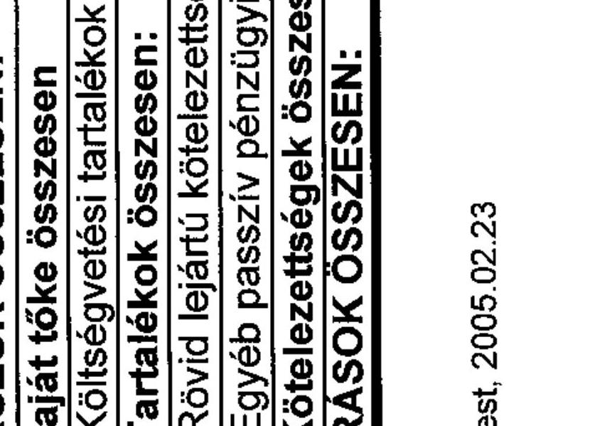

---

|  1999-2004. |  |  |  |  |  | a V-16-5 F/2004-2005. sz. jelentéshez  |
| --- | --- | --- | --- | --- | --- | --- |
|  |   |   |   |   |   |   |
|  Megnevezés | 1999 | 2000 | 2001 | 2002** | 2003** | 2004  |
|  Központi költségvetésnek elszámolt bevételek | 299,6 | 450,0 | 624,4 | 0,0 | 0,0 | 0,0  |
|  - átutalt készpénz | 235,0 | 450,0 | 624,4 | 0,0 | 0,0 | 0,0  |
|  - elszámolt kárpótlási jegy | 64,6 | 0,0 | 0,0 | 0,0 | 0,0 | 0,0  |
|  Önkormányzatoknak elszámolt bevételek | 172,2 | 1,5 | 51,0 | 57,3 | 53,4 | 33,1  |
|  - átutalt készpénz | 134,8 | 1,5 | 51,0 | 57,3 | 53,4 | 33,1  |
|  - elszámolt kárpótlási jegy | 37,4 | 0,0 | 0,0 | 0,0 | 0,0 | 0,0  |
|  Költségvetési törvény alapján visszaforgatott | 1 200,0 | 1 465,6 | 2 424,4 | 1 285,0 | 1 500,0 | 2 480,0  |
|  - törvényben meghatározott összeg | 1 200,0 | 1 200,0 | 1 800,0 | 1 285,0 | 1 500,0 | 2 480,0  |
|  - törvényben meghatározott összeg feletti bevétel 50 %-a | 0,0 | 265,6 | 624,4 | 0,0 | 0,0 | 0,0  |
|  Örökségi bevételekből a költségek fedezete* | 105,5 | 149,8 | 0,0 | 0,0 | 0,0 | 0,0  |
|  Elszámolás alatt | 424,2 | 275,5 | 342,5 | 459,7 | 362,3 | 73,1  |
|  Rendelkezésre álló bevétel összesen (nyitó állomány + tárgyévben befolyt összeg) | 2 201,5 | 2 342,4 | 3 442,3 | 1 802,0 | 1 915,7 | 2 586,2  |

- 2001-től az állami örökléssel kapcsolatos kiadások beépültek a Kincstári vagyonkezelés és hasznosítás alcím kiadási költségvetésébe. ** 2002-ben a költségvetési törvényben meghatározott visszaforgathatható értékesítési bevétel összege 1.800,0 millió Ft volt, de nem realizálódott. *** A 2004. évi adatok előzetes adatok.

Budapest, 2005. február 23.

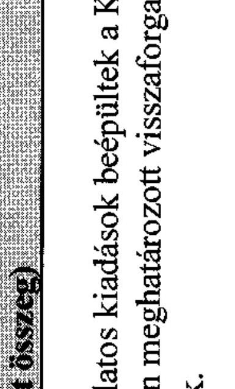

dr. Kotnyek Béla gazdasági vezérigazgató-helyettes

---

A kincstári vagyon értékesítéséből származó bevételek alakulásáról 1999-2004.

A kincstári vagyon értékesítéséből származó bevételek alakulásáról 1999-2004.

V-16-57/2004-2005. sz. jelentéshez

|  Megnevezés | 1999* | 2000 | 2001 | 2002 | 2003 | 2004  |
| --- | --- | --- | --- | --- | --- | --- |
|  Ingatlan értékesítési bevétel | 682,9 | 1 412,7 | 2 480,8 | 922,1 | 966,0 | 1 564,2  |
|  Ingóság értékesítési bevétel | 50,7 | 16,1 | 22,8 | 13,5 | 14,2 | 34,0  |
|  Részvény értékesítési és osztalék bevétel | 454,9 | 229,2 | 495,5 | 215,5 | 57,4 | 249,2  |
|  Egyéb bevétel | 201,4 | 250,3 | 351,9 | 308,5 | 418,4 | 402,4  |
|  Bérleti díj bevétel | 463,8 |  |  |  |  |   |
|  Vagyonkezelési díj bevétel | 139,4 |  |  |  |  |   |
|  Hasznosítási bevételek összesen | 1 993,1 | 1 908,3 | 3 351,0 | 1 459,6 | 1 456,0 | 2 249,8  |

- 1999-ben még a bérleti és vagyonkezelési díjak a központi költségvetés központosított bevételét képezték, 2000-től már csak az értékesítési bevételek tartoznak ide.

Budapest, 2005. február 23.

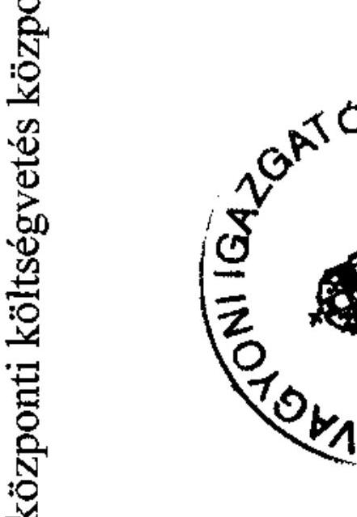

dr. Kotnyek Béla gazdasági vezérigazgató-helyettes

---

# A KVI Kincstári vagyonkezelés és hasznosítás

## 3. sz. tanúsítvány

### alcímének finanszírozási a V-16-57/2004-2005. sz. jelentéshez struktúrájáról 1999-2004.

|  Mengnevezés | Támogatás | Saját működési bevétel | Visszaforgatott értékesítési bevétel | Felhalmozási bevétel | Átvett pénzeszköz | Bevételi oldal összesen*  |
| --- | --- | --- | --- | --- | --- | --- |
|  1999.06.30. |  |  |  |  |  |   |
|  - módosított előirányzat | 724 200 | 578 200 | 1 200 000 | 0 | 19 481 | 2 521 881  |
|  - teljesítés | 151 978 | 184 692 | 0 | 0 | 32 232 | 368 902  |
|  1999.12.31. |  |  |  |  |  |   |
|  - módosított előirányzat | 756 700 | 578 200 | 1 200 000 | 0 | 41 498 | 2 576 398  |
|  - teljesítés | 756 700 | 281 934 | 1 200 000 | 0 | 62 703 | 2 301 337  |
|  2000.06.30. |  |  |  |  |  |   |
|  - módosított előirányzat | 233 358 | 600 700 | 1 200 000 | 0 | 0 | 2 034 058  |
|  - teljesítés | 135 781 | 636 563 | 0 | 0 | 11 830 | 784 174  |
|  2000.12.31. |  |  |  |  |  |   |
|  - módosított előirányzat | 1 035 037 | 1 047 100 | 1 465 550 | 0 | 6 733 596 | 10 281 283  |
|  - teljesítés | 1 035 037 | 1 086 115 | 1 465 550 | 0 | 6 738 784 | 10 325 486  |
|  2001.06.30. |  |  |  |  |  |   |
|  - módosított előirányzat | 134 400 | 800 000 | 1 800 000 | 0 | 256 563 | 2 990 963  |
|  - teljesítés | 117 358 | 515 377 | 1 800 000 | 0 | 122 776 | 2 555 511  |
|  2001.12.31. |  |  |  |  |  |   |
|  - módosított előirányzat | 3 201 617 | 971 925 | 2 424 438 | 184 891 | 180 231 | 6 963 102  |
|  - teljesítés | 3 201 617 | 991 834 | 2 424 438 | 184 875 | 259 022 | 7 061 786  |
|  2002.06.30. |  |  |  |  |  |   |
|  - módosított előirányzat | 436 800 | 806 000 | 1 800 000 | 0 | 425 981 | 3 468 781  |
|  - teljesítés | 116 758 | 692 261 | 0 | 0 | 112 017 | 921 036  |
|  2002.12.31. |  |  |  |  |  |   |
|  - módosított előirányzat | 692 857 | 806 000 | 1 800 000 | 49 680 | 1 126 617 | 4 475 154  |
|  - teljesítés | 692 857 | 1 105 915 | 1 285 000 | 51 931 | 1 104 987 | 4 240 690  |
|  2003.06.30. |  |  |  |  |  |   |
|  - módosított előirányzat | 2 778 500 | 800 000 | 1 500 000 | 0 | 628 015 | 5 706 515  |
|  - teljesítés | 1 945 197 | 736 762 | 700 000 | 0 | 282 732 | 3 664 691  |
|  2003.12.31. |  |  |  |  |  |   |
|  - módosított előirányzat | 3 361 440 | 1 082 115 | 1 500 000 | 45 015 | 807 243 | 6 795 813  |
|  - teljesítés | 3 361 440 | 1 106 231 | 1 500 000 | 45 015 | 805 917 | 6 818 603  |
|  2004.06.30. |  |  |  |  |  |   |
|  - módosított előirányzat | 619 700 | 840 000 | 2 945 000 | 0 | 874 632 | 5 279 332  |
|  - teljesítés | 356 205 | 718 951 | 650 000 | 10 047 | 164 214 | 1 899 417  |
|  2004.12.31.** |  |  |  |  |  |   |
|  - módosított előirányzat | 606 600 | 840 000 | 2 945 000 | 45 146 | 825 464 | 5 262 210  |
|  - teljesítés | 606 600 | 1 181 030 | 2 480 000 | 49 421 | 818 752 | 5 135 803  |

- A bevételi oldal az előző évi előirányzat-maradvány összegét nem tartalmazza.

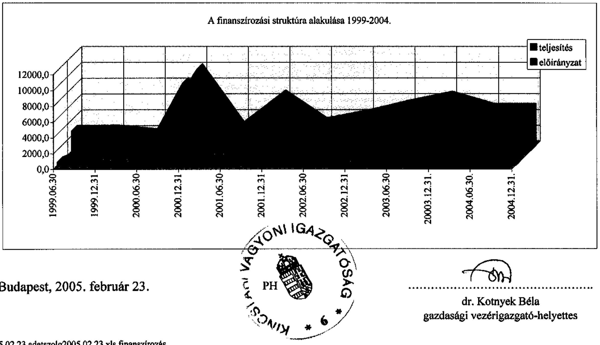

---

|  1999-2004. |   |
| --- | --- |
|  |   |

|  Megnevezés |  |  |  |  |  |  |  |  |  |  |  |  |  |  |  |  |  |  |  |  |  |  |  |  |  |  |  |  |  |  |  |  |  |  |  |  |  |   |
| --- | --- | --- | --- | --- | --- | --- | --- | --- | --- | --- | --- | --- | --- | --- | --- | --- | --- | --- | --- | --- | --- | --- | --- | --- | --- | --- | --- | --- | --- | --- | --- | --- | --- | --- | --- | --- |
|   |  |  |  |  |  |  |  |  |  |  |  |  |  |  |  |  |  |  |  |  |  |  |  |  |  |  |  |  |  |  |  |  |  |  |  |   |
|   |  |  |  |  |  |  |  |  |  |  |  |  |  |  |  |  |  |  |  |  |  |  |  |  |  |  |  |  |  |  |  |  |  |  |  |   |
|   |  |  |  |  |  |  |  |  |  |  |  |  |  |  |  |  |  |  |  |  |  |  |  |  |  |  |  |  |  |  |  |  |  |  |  |   |
|   |  |  |  |  |  |  |  |  |  |  |  |  |  |  |  |  |  |  |  |  |  |  |  |  |  |  |  |  |  |  |  |  |  |  |  |   |
|   |  |  |  |  |  |  |  |  |  |  |  |  |  |  |  |  |  |  |  |  |  |  |  |  |  |  |  |  |  |  |  |  |  |  |  |   |
|   |  |  |  |  |  |  |  |  |  |  |  |  |  |  |  |  |  |  |  |  |  |  |  |  |  |  |  |  |  |  |  |  |  |  |  |   |
|   |  |  |  |  |  |  |  |  |  |  |  |  |  |  |  |  |  |  |  |  |  |  |  |  |  |  |  |  |  |  |  |  |  |  |  |   |
|   |  |  |  |  |  |  |  |  |  |  |  |  |  |  |  |  |  |  |  |  |  |  |  |  |  |  |  |  |  |  |  |  |  |  |  |   |
|   |  |  |  |  |  |  |  |  |  |  |  |  |  |  |  |  |  |  |  |  |  |  |  |  |  |  |  |  |  |  |  |  |  |  |  |   |
|   |  |  |  |  |  |  |  |  |  |  |  |  |  |  |  |  |  |  |  |  |  |  |  |  |  |  |  |  |  |  |  |  |  |  |  |   |
|   |  |  |  |  |  |  |  |  |  |  |  |  |  |  |  |  |  |  |  |  |  |  |  |  |  |  |  |  |  |  |  |  |  |  |  |   |
|   |  |  |  |  |  |  |  |  |  |  |  |  |  |  |  |  |  |  |  |  |  |  |  |  |  |  |  |  |  |  |  |  |  |  |  |   |
|   |  |  |  |  |  |  |  |  |  |  |  |  |  |  |  |  |  |  |  |  |  |  |  |  |  |  |  |  |  |  |  |  |  |  |  |   |
|   |  |  |  |  |  |  |  |  |  |  |  |  |  |  |  |  |  |  |  |  |  |  |  |  |  |  |  |  |  |  |  |  |  |  |  |   |
|   |  |  |  |  |  |  |  |  |  |  |  |  |  |  |  |  |  |  |  |  |  |  |  |  |  |  |  |  |  |  |  |  |  |  |  |   |
|   |  |  |  |  |  |  |  |  |  |  |  |  |  |  |  |  |  |  |  |  |  |  |  |  |  |  |  |  |  |  |  |  |  |  |  |   |
|   |  |  |  |  |  |  |  |  |  |  |  |  |  |  |  |  |  |  |  |  |  |  |  |  |  |  |  |  |  |  |  |  |  |  |  |   |
|   |  |  |  |  |  |  |  |  |  |  |  |  |  |  |  |  |  |  |  |  |  |  |  |  |  |  |  |  |  |  |  |  |  |  |  |   |
|   |  |  |  |  |  |  |  |  |  |  |  |  |  |  |  |  |  |  |  |  |  |  |  |  |  |  |  |  |  |  |  |  |  |  |  |   |
|   |  |  |  |  |  |  |  |  |  |  |  |  |  |  |  |  |  |  |  |  |  |  |  |  |  |  |  |  |  |  |  |  |  |  |  |   |
|   |  |  |  |  |  |  |  |  |  |  |  |  |  |  |  |  |  |  |  |  |  |  |  |  |  |  |  |  |  |  |  |  |  |  |  |   |
|   |  |  |  |  |  |  |  |  |  |  |  |  |  |  |  |  |  |  |  |  |  |  |  |  |  |  |  |  |  |  |  |  |  |  |  |   |
|   |  |  |  |  |  |  |  |  |  |  |  |  |  |  |  |  |  |  |  |  |  |  |  |  |  |  |  |  |  |  |  |  |  |  |  |   |
|   |  |  |  |  |  |  |  |  |  |  |  |  |  |  |  |  |  |  |  |  |  |  |  |  |  |  |  |  |  |  |  |  |  |  |  |   |
|   |  |  |  |  |  |  |  |  |  |  |  |  |  |  |  |  |  |  |  |  |  |  |  |  |  |  |  |  |  |  |  |  |  |  |  |   |
|   |  |  |  |  |  |  |  |  |  |  |  |  |  |  |  |  |  |  |  |  |  |  |  |  |  |  |  |  |  |  |  |  |  |  |  |   |
|   |  |  |  |  |  |  |  |  |  |  |  |  |  |  |  |  |  |  |  |  |  |  |  |  |  |  |  |  |  |  |  |  |  |  |  |   |
|   |  |  |  |  |  |  |  |  |  |  |  |  |  |  |  |  |  |  |  |  |  |  |  |  |  |  |  |  |  |  |  |  |  |  |  |   |
|   |  |  |  |  |  |  |  |  |  |  |  |  |  |  |  |  |  |  |  |  |  |  |  |  |  |  |  |  |  |  |  |  |  |  |  |   |
|   |  |  |  |  |  |  |  |  |  |  |  |  |  |  |  |  |  |  |  |  |  |  |  |  |  |  |  |  |  |  |  |  |  |  |  |   |
|   |  |  |  |  |  |  |  |  |  |  |  |  |  |  |  |  |  |  |  |  |  |  |  |  |  |  |  |  |  |  |  |  |  |  |  |   |
|   |

---

|  1999-2004. |   |
| --- | --- |
|  |   |

|  5. sz. tanúsítvány a V-16-5F/2004-2005. sz. jelentőshez |   |
| --- | --- |
|  |   |

|  Megnevezés | 1999 | 2000 | 2001 | 2002 | 2003 | 2004  |
| --- | --- | --- | --- | --- | --- | --- |
|   | módosított előírásayzat | teljesítés | módosított előírásayzat | teljesítés | módosított előírásayzat | teljesítés  |
|  Dologi kiadások összesen | 1 840,4 | 1 197,9 | 2 576,8 | 2 156,6 | 2 770,9 | 2 157,5  |
|  - szemetlenési, kiszáratni díjak | 244,6 | 294,8 | 281,8 | 266,7 | 238,5 | 272,2  |
|  - karhastartási, fémfartási kiadások* | 666,7 | 459,0 | 756,9 | 577,9 | 732,3 | 469,7  |
|  - vállalkozóval végzett örítési, gondoszkát kiadások | 68,1 | 53,3 | 166,8 | 184,6 | 376,8 | 367,0  |
|  - értékbecslési, ingatlanaküszíntételek és egyéb szakértői díjak | 141,4 | 58,2 | 311,9 | 168,7 | 359,6 | 238,6  |
|  - pályántartási kiadások, reklám kiadások | 19,3 | 11,1 | 47,7 | 35,3 | 55,4 | 50,0  |
|  - vegyejebirtozási kiadások | 24,0 | 22,7 | 19,6 | 19,6 | 17,4 | 16,8  |
|  - egyebb díjak | 51,2 | 31,9 | 44,2 | 42,2 | 112,8 | 97,3  |
|  - egyéb kiadások | 238,0 | 83,8 | 541,8 | 565,9 | 142,5 | 127,7  |
|  - maradvány és egyéb beilazások | 0,3 | 13,0 | 0,0 | 7,6 | 180,4 | 167,3  |
|  - előterésen felerátozhat ála | 346,8 | 208,1 | 386,1 | 285,1 | 454,2 | 324,9  |
|  Egyéb működési kiadások | 0,0 | 0,0 | 0,0 | 0,0 | 7,5 | 0,0  |
|  Inteleményi beruházási kiadások | 112,9 | 1,5 | 6 803,6 | 6 161,8 | 3 501,7 | 348,9  |
|  Felújítás | 465,6 | 208,6 | 526,2 | 613,8 | 1 147,6 | 507,5  |
|  Egyéb felbafutozási kiadások | 30,4 | 35,8 | 25,1 | 19,9 | 551,5 | 407,2  |
|  Külszhefik |  |  |  |  |  |   |
|  Egyéb kárpesti beruházási kiadások | 815,4 | 578,6 | 916,8 | 618,7 | 705,9 | 453,1  |
|  - informatikai fejlesztés |  |  | 206,7 | 77,7 | 129,0 | 111,9  |
|  - műmikát beruházások | nincs adat |  | 488,0 | 318,9 | 508,2 | 272,5  |
|  - evig. beruházások / segségrés |  |  | 222,1 | 222,1 | 68,7 | 68,7  |
|  Kiadások összesen | 3 264,7 | 2 022,4 | 11 248,5 | 9 570,8 | 9 685,1 | 3 874,2  |

- karhastartás, veszélyfővrás elhárítás, környezeti károlhárítás, tűnzserészeti és vegyi mentesítés, műszaki tervezés, régészeti kutatások, gondolási munkák összesen

Budapest, 2005. február 23.

dr. Kotnyak Béla

---

|   |  |  |  |  |  |  |  |  |  |  |  |  |  |  |  |  |  |  |  |  |  |  |  |  |  |  |  |  |  |  |  |  |  |  |  |  |  |  |  |  |  |   |
| --- | --- | --- | --- | --- | --- | --- | --- | --- | --- | --- | --- | --- | --- | --- | --- | --- | --- | --- | --- | --- | --- | --- | --- | --- | --- | --- | --- | --- | --- | --- | --- | --- | --- | --- | --- | --- | --- | --- | --- | --- | --- | --- | --- | --- |
|   |  |  |  |  |  |  |  |  |  |  |  |  |  |  |  |  |  |  |  |  |  |  |  |  |  |  |  |  |  |  |  |  |  |  |  |  |  |  |  |  |  |  |   |
|   |  |  |  |  |  |  |  |  |  |  |  |  |  |  |  |  |  |  |  |  |  |  |  |  |  |  |  |  |  |  |  |  |  |  |  |  |  |  |  |  |  |  |  |   |
|   |  |  |  |  |  |  |  |  |  |  |  |  |  |  |  |  |  |  |  |  |  |  |  |  |  |  |  |  |  |  |  |  |  |  |  |  |  |  |  |  |  |  |  |   |
|   |  |  |  |  |  |  |  |  |  |  |  |  |  |  |  |  |  |  |  |  |  |  |  |  |  |  |  |  |  |  |  |  |  |  |  |  |  |  |  |  |  |  |  |   |
|   |  |  |  |  |  |  |  |  |  |  |  |  |  |  |  |  |  |  |  |  |  |  |  |  |  |  |  |  |  |  |  |  |  |  |  |  |  |  |  |  |  |  |  |  |   |
|   |  |  |  |  |  |  |  |  |  |  |  |  |  |  |  |  |  |  |  |  |  |  |  |  |  |  |  |  |  |  |  |  |  |  |  |  |  |  |  |  |  |  |  |  |   |
|   |  |  |  |  |  |  |  |  |  |  |  |  |  |  |  |  |  |  |  |  |  |  |  |  |  |  |  |  |  |  |  |  |  |  |  |  |  |  |  |  |  |  |  |  |   |
|   |  |  |  |  |  |  |  |  |  |  |  |  |  |  |  |  |  |  |  |  |  |  |  |  |  |  |  |  |  |  |  |  |  |  |  |  |  |  |  |  |  |  |  |  |  |   |
|   |  |  |  |  |  |  |  |  |  |  |  |  |  |  |  |  |  |  |  |  |  |  |  |  |  |  |  |  |  |  |  |  |  |  |  |  |  |  |  |  |  |  |  |  |  |   |
|   |  |  |  |  |  |  |  |  |  |  |  |  |  |  |  |  |  |  |  |  |  |  |  |  |  |  |  |  |  |  |  |  |  |  |  |  |  |  |  |  |  |  |  |  |  |   |
|   |  |  |  |  |  |  |  |  |  |  |  |  |  |  |  |  |  |  |  |  |  |  |  |  |  |  |  |  |  |  |  |  |  |  |  |  |  |  |  |  |  |  |  |  |  |   |
|   |  |  |  |  |  |  |  |  |  |  |  |  |  |  |  |  |  |  |  |  |  |  |  |  |  |  |  |  |  |  |  |  |  |  |  |  |  |  |  |  |  |  |  |  |  |  |   |
|   |  |  |  |  |  |  |  |  |  |  |  |  |  |  |  |  |  |  |  |  |  |  |  |  |  |  |  |  |  |  |  |  |  |  |  |  |  |  |  |  |  |  |  |  |  |  |   |
|   |  |  |  |  |  |  |  |  |  |  |  |  |  |  |  |  |  |  |  |  |  |  |  |  |  |  |  |  |  |  |  |  |  |  |  |  |  |  |  |  |  |  |  |  |  |  |   |
|   |  |  |  |  |  |  |  |  |  |  |  |  |  |  |  |  |  |  |  |  |  |  |  |  |  |  |  |  |  |  |  |  |  |  |  |  |  |  |  |  |  |  |  |  |  |  |   |
|   |  |  |  |  |  |  |  |  |  |  |  |  |  |  |  |  |  |  |  |  |  |  |  |  |  |  |  |  |  |  |  |  |  |  |  |  |  |  |  |  |  |  |  |  |  |  |   |
|   |  |  |  |  |  |  |  |  |  |  |  |  |  |  |  |  |  |  |  |  |  |  |  |  |  |  |  |  |  |  |  |  |  |  |  |  |  |  |  |  |  |  |  |  |  |  |   |
|   |  |  |  |  |  |  |  |  |  |  |  |  |  |  |  |  |  |  |  |  |  |  |  |  |  |  |  |  |  |  |  |  |  |  |  |  |  |  |  |  |  |  |  |  |  |  |   |
|   |  |  |  |  |  |  |  |  |  |  |  |  |  |  |  |  |  |  |  |  |  |  |  |  |  |  |  |  |  |  |  |  |  |  |  |  |  |  |  |  |  |  |  |  |  |  |   |
|   |  |  |  |  |  |  |  |  |  |  |  |  |  |  |  |  |  |  |  |  |  |  |  |  |  |  |  |  |  |  |  |  |  |  |  |  |  |  |  |  |  |  |  |  |  |  |   |
|   |  |  |  |  |  |  |  |  |  |  |  |  |  |  |  |  |  |  |  |  |  |  |  |  |  |  |  |  |  |  |  |  |  |  |  |  |  |  |  |  |  |  |  |  |  |  |  |   |
|   |  |  |  |  |  |  |  |  |  |  |  |  |  |  |  |  |  |  |  |  |  |  |  |  |  |  |  |  |  |  |  |  |  |  |  |  |  |  |  |  |  |  |  |  |  |  |  |   |
|   |  |  |  |  |  |  |  |  |  |  |  |  |  |  |  |  |  |  |  |  |  |  |  |  |  |  |  |  |  |  |  |  |  |  |  |  |  |  |  |  |  |  |  |  |  |  |  |   |
|   |  |  |  |  |  |  |  |  |  |  |  |  |  |  |  |  |  |  |  |  |  |  |  |  |  |  |  |  |  |  |  |  |  |  |  |  |  |  |  |  |  |  |  |  |  |  |  |   |
|   |  |  |  |  |  |  |  |  |  |  |  |  |  |  |  |  |  |  |  |  |  |  |  |  |  |  |  |  |  |  |  |  |  |  |  |  |  |  |  |  |  |  |  |  |  |  |  |   |
|   |  |  |  |  |  |  |  |  |  |  |  |  |  |  |  |  |  |  |  |  |  |  |  |  |  |  |  |  |  |  |  |  |  |  |  |  |  |  |  |  |  |  |  |  |  |  |  |   |
|   |  |  |  |  |  |  |  |  |  |  |  |  |  |  |  |  |  |  |  |  |  |  |  |  |  |  |  |  |  |  |  |  |  |  |  |  |  |  |  |  |  |  |  |  |  |  |  |   |
|   |  |  |  |  |  |  |  |  |  |  |  |  |  |  |  |  |  |  |  |  |  |  |  |  |  |  |  |  |  |  |  |  |  |  |  |  |  |  |  |  |  |  |  |  |  |  |  |  |   |
|   |  |  |  |  |  |  |  |  |  |  |  |  |  |  |  |  |  |  |  |  |  |  |  |  |  |  |  |  |  |  |  |  |  |  |  |  |  |  |  |  |  |  |  |  |  |  |  |  |   |
|   |  |  |  |  |  |  |  |  |  |  |  |  |  |  |  |  |  |  |  |  |  |  |  |  |  |  |  |  |  |  |  |  |  |  |  |  |  |  |  |  |  |  |  |  |  |  |  |  |   |
|   |  |  |  |  |  |  |  |  |  |  |  |  |  |  |  |  |  |  |  |  |  |  |  |  |  |  |  |  |  |  |  |  |  |  |  |  |  |  |  |  |  |  |  |  |  |  |  |  |   |
|   |  |  |  |  |  |  |  |  |  |  |  |  |  |  |  |  |  |  |  |  |  |  |  |  |  |  |  |  |  |  |  |  |  |  |  |  |  |  |  |  |  |  |  |  |  |  |  |  |   |
|   |  |  |  |  |  |  |  |  |  |  |  |  |  |  |  |  |  |  |  |  |  |  |  |  |  |  |  |  |  |  |  |  |  |  |  |  |  |  |  |  |  |  |  |  |  |  |  |  |   |
|   |  |  |  |  |  |  |  |  |  |  |  |  |  |  |  |  |  |  |  |  |  |  |  |  |  |  |  |  |  |  |  |  |  |  |  |  |  |  |  |  |  |  |  |  |  |  |  |  |  |   |
|   |  |  |  |  |  |  |  |  |  |  |  |  |  |  |  |  |  |  |  |  |  |  |  |  |  |  |  |  |  |  |  |  |  |  |  |  |  |  |  |  |  |  |  |  |  |  |  |  |  |   |
|   |  |  |  |  |  |  |  |  |  |  |  |  |  |  |  |  |  |  |  |  |  |  |  |  |  |  |  |  |  |  |  |  |  |  |  |  |  |  |  |  |  |  |  |  |  |  |  |  |  |   |
|   |  |  |  |  |  |  |  |  |  |  |  |  |  |  |  |  |  |  |  |  |  |  |  |  |  |  |  |  |  |  |  |  |  |  |  |  |  |  |  |  |  |  |  |  |  |  |  |  |  |   |
|   |  |  |  |  |  |  |  |  |  |  |  |  |  |  |  |  |  |  |  |  |  |  |  |  |  |  |  |  |  |  |  |  |  |  |  |  |  |  |  |  |  |  |  |  |  |  |  |  |  |   |
|   |  |  |  |  |  |  |  |  |  |  |  |  |  |  |  |  |  |  |  |  |  |  |  |  |  |  |  |  |  |  |  |  |  |  |  |  |  |  |  |  |  |  |  |  |  |  |  |  |  |   |
|   |  |  |  |  |  |  |  |  |  |  |  |  |  |  |  |  |  |  |  |  |  |  |  |  |  |  |  |  |  |  |  |  |  |  |  |  |  |  |  |  |  |  |  |  |  |  |  |  |  |   |
|   |  |  |  |  |  |  |  |  |  |  |  |  |  |  |  |  |  |  |  |  |  |  |  |  |  |  |  |  |  |  |  |  |  |  |  |  |  |  |  |  |  |  |  |  |  |  |  |  |  |   |
|   |  |  |  |  |  |  |  |  |  |  |  |  |  |  |  |  |  |  |  |  |  |  |  |  |  |  |  |  |  |  |  |  |  |  |  |  |  |  |  |  |  |  |  |  |  |  |  |  |  |   |
|   |  |  |  |  |  |  |  |  |  |  |  |  |  |  |  |  |  |  |  |  |  |  |  |  |  |  |  |  |  |  |  |  |  |  |  |  |  |  |  |  |  |  |  |  |  |  |  |  |  |   |
|   |  |  |  |  |  |  |  |  |  |  |  |  |  |  |  |  |  |  |  |  |  |  |  |  |  |  |  |  |  |  |  |  |  |  |  |  |  |  |  |  |  |  |  |  |  |  |  |  |  |   |
|   |  |  |  |  |  |  |  |  |  |  |  |  |  |  |  |  |  |  |  |  |  |  |  |  |  |  |  |  |  |  |  |  |  |  |  |  |  |  |  |  |  |  |  |  |  |  |  |  |  |   |
|   |  |  |  |  |  |  |  |  |  |  |  |  |  |  |  |  |  |  |  |  |  |  |  |  |  |  |  |  |  |  |  |  |  |  |  |  |  |  |  |  |  |  |  |  |  |  |  |  |  |  |   |
|   |  |  |  |  |  |  |  |  |  |  |  |  |  |  |  |  |  |  |  |  |  |  |  |  |  |  |  |  |  |  |  |  |  |  |  |  |  |  |  |  |  |  |  |  |  |  |  |  |  |  |   |
|   |  |  |  |  |  |  |  |  |  |  |  |  |  |  |  |  |  |  |  |  |  |  |  |  |  |  |  |  |  |  |  |  |  |  |  |  |  |  |  |  |  |  |  |  |  |  |  |  |  |  |   |
|   |  |  |  |  |  |  |  |  |  |  |  |  |  |  |  |  |  |  |  |  |  |  |  |  |  |  |  |  |  |  |  |  |  |  |  |  |  |  |  |  |  |  |  |  |  |  |  |  |  |  |   |
|   |  |  |  |  |  |  |  |  |  |  |  |  |  |  |  |  |  |  |  |  |  |  |  |  |  |  |  |  |  |  |  |  |  |  |  |  |  |  |  |  |  |  |  |  |  |  |  |  |  |  |   |
|   |  |  |  |  |  |  |  |  |  |  |  |  |  |  |  |  |  |  |  |  |  |  |  |  |  |  |  |  |  |  |  |  |  |  |  |  |  |  |  |  |  |  |  |  |  |  |  |  |  |  |  |   |
|   |  |  |  |  |  |  |  |  |  |  |  |  |  |  |  |  |  |  |  |  |  |  |  |  |  |  |  |  |  |  |  |  |  |  |  |  |  |  |  |  |  |  |  |  |  |  |  |  |  |  |  |   |
|   |  |  |  |  |  |  |  |  |  |  |  |  |  |  |  |  |  |  |  |  |  |  |  |  |  |  |  |  |  |  |  |  |  |  |  |  |  |  |  |  |  |  |  |  |  |  |  |  |  |  |  |   |
|   |  |  |  |  |  |  |  |  |  |  |  |  |  |  |  |  |  |  |  |  |  |  |  |  |  |  |  |  |  |  |  |  |  |  |  |  |  |  |  |  |  |  |  |  |  |  |  |  |  |  |  |   |
|   |  |  |  |  |  |  |  |  |  |  |  |  |  |  |  |  |  |  |  |  |  |  |  |  |  |  |  |  |  |  |  |  |  |  |  |  |  |  |  |  |  |  |  |  |  |  |  |  |  |  |  |   |
|   |  |  |  |  |  |  |  |  |  |  |  |  |  |  |  |  |  |  |  |  |  |  |  |  |  |  |  |  |  |  |  |  |  |  |  |  |  |  |  |  |  |  |  |  |  |  |  |  |  |  |  |   |
|   |  |  |  |  |  |  |  |  |  |  |  |  |  |  |  |  |  |  |  |  |  |  |  |  |  |  |  |  |  |  |  |  |  |  |  |  |  |  |  |  |  |  |  |  |  |  |  |  |  |  |   |
|   |  |  |  |  |  |  |  |  |  |  |  |  |  |  |  |  |  |  |  |  |  |  |  |  |  |  |  |  |  |  |  |  |  |  |  |  |  |  |  |  |  |  |  |  |  |  |  |  |  |  |   |
|   |  |  |  |  |  |  |  |  |  |  |  |  |  |  |  |  |  |  |  |  |  |  |  |  |  |  |  |  |  |  |  |  |  |  |  |  |  |  |  |  |  |  |  |  |  |  |  |  |  |  |   |
|   |  |  |  |  |  |  |  |  |  |  |  |  |  |  |  |  |  |  |  |  |  |  |  |  |  |  |  |  |  |  |  |  |  |  |  |  |  |  |  |  |  |  |  |  |  |  |  |  |  |  |   |
|   |  |  |  |  |  |  |  |  |  |  |  |  |  |  |  |  |  |  |  |  |  |  |  |  |  |  |  |  |  |  |  |  |  |  |  |  |  |  |  |  |  |  |  |  |  |  |  |  |  |  |   |
|   |  |  |  |  |  |  |  |  |  |  |  |  |  |  |  |  |  |  |  |  |  |  |  |  |  |  |  |  |  |  |  |  |  |  |  |  |  |  |  |  |  |  |  |  |  |  |  |  |  |  |  |   |
|   |  |  |  |  |  |  |  |  |  |  |  |  |  |  |  |  |  |  |  |  |  |  |  |  |  |  |  |  |  |  |  |  |  |  |  |  |  |  |  |  |  |  |  |  |  |  |  |  |  |  |  |   |
|   |  |  |  |  |  |  |  |  |  |  |  |  |  |  |  |  |  |  |  |  |  |  |  |  |  |  |  |  |  |  |  |  |  |  |  |  |  |  |  |  |  |  |  |  |  |  |  |  |  |  |  |   |
|   |  |  |  |  |  |  |  |  |  |  |  |  |  |  |  |  |  |  |  |  |  |  |  |  |  |  |  |  |  |  |  |  |  |  |  |  |  |  |  |  |  |  |  |  |  |  |  |  |  |  |  |   |
|   |  |  |  |  |  |  |  |  |  |  |  |  |  |  |  |  |  |  |  |  |  |  |  |  |  |  |  |  |  |  |  |  |  |  |  |  |  |  |  |  |  |  |  |  |  |  |  |  |  |  |  |   |
|   |  |  |  |  |  |  |  |  |  |  |  |  |  |  |  |  |  |  |  |  |  |  |  |  |  |  |  |  |  |  |  |  |  |  |  |  |  |  |  |  |  |  |  |  |  |  |  |  |  |  |  |  |   |
|   |  |  |  |  |  |  |  |  |  |  |  |  |  |  |  |  |  |  |  |  |  |  |  |  |  |  |  |  |  |  |  |  |  |  |  |  |  |  |  |  |  |  |  |  |  |  |  |  |  |  |  |  |  |   |
|   |  |  |  |  |  |  |  |  |  |  |  |  |  |  |  |  |  |  |  |  |  |  |  |  |  |  |  |  |  |  |  |  |  |  |  |  |  |  |  |  |  |  |  |  |  |  |  |  |  |  |  |  |  |  |   |
|   |  |  |  |  |  |  |  |  |  |  |  |  |  |  |  |  |  |  |  |  |  |  |  |  |  |  |  |  |  |  |  |  |  |  |  |  |  |  |  |  |  |  |  |  |  |  |  |  |  |  |  |  |  |  |  |   |
|   |  |  |  |  |  |  |  |  |  |  |  |  |  |  |  |  |  |  |  |  |  |  |  |  |  |  |  |  |  |  |  |  |  |  |  |  |  |  |  |  |  |  |  |  |  |  |  |  |  |  |  |  |  |  |  |   |
|   |  |  |  |  |  |  |  |  |  |  |  |  |  |  |  |  |  |  |  |  |  |  |  |  |  |  |  |  |  |  |  |  |  |  |  |  |  |  |  |  |  |  |  |  |  |  |  |  |  |  |  |  |  |  |  |  |   |
|   |  |  |  |  |  |  |  |  |  |  |  |  |  |  |  |  |  |  |  |  |  |  |  |  |  |  |  |  |  |  |  |  |  |  |  |  |  |  |  |  |  |  |  |  |  |  |  |  |  |  |  |  |  |  |  |  |  |  |   |
|   |  |  |  |  |  |  |  |  |  |  |  |  |  |  |  |  |  |  |  |  |  |  |  |  |  |  |  |  |  |  |  |  |  |  |  |  |  |  |  |  |  |  |  |  |  |  |  |  |  |  |  |  |  |  |  |  |  |  |  |  |   |
|   |  |  |  |  |  |  |  |  |  |  |  |  |  |  |  |  |  |  |  |  |  |  |  |  |  |  |  |  |  |  |  |  |  |  |  |  |  |  |  |  |  |  |  |  |  |  |  |  |  |  |  |  |  |  |  |  |  |  |  |  |  |  |   |
|   |  |  |  |  |  |  |  |  |  |  |  |  |  |  |  |  |  |  |  |  |  |  |  |  |  |  |  |  |  |  |  |  |  |  |  |  |  |  |  |  |  |  |  |  |  |  |  |  |  |  |  |  |  |  |  |  |  |  |  |  |  |  |  |   |
|   |  |  |  |  |  |  |  |  |  |  |  |  |  |  |  |  |  |  |  |  |  |  |  |  |  |  |  |  |  |  |  |  |  |  |  |  |  |  |  |  |  |  |  |  |  |  |  |  |  |  |  |  |  |  |  |  |  |  |  |  |  |  |  |  |  |   |
|   |  |  |  |  |  |  |  |  |  |  |  |  |  |  |  |  |  |  |  |  |  |  |  |  |  |  |  |  |  |  |  |  |  |  |  |  |  |  |  |  |  |  |  |  |  |  |  |  |  |  |  |  |  |  |  |  |  |  |  |  |  |  |  |  |  |  |   |
|   |  |  |  |  |  |  |  |  |  |  |  |  |  |  |  |  |  |  |  |  |  |  |  |  |  |  |  |  |  |  |  |  |  |  |  |  |  |  |  |  |  |  |  |  |  |  |  |  |  |  |  |  |  |  |  |  |  |  |  |  |  |  |  |  |  |  |  |  |   |
|   |  |  |  |  |  |  |  |  |  |  |  |  |  |  |  |  |  |  |  |  |  |  |  |  |  |  |  |  |  |  |  |  |  |  |  |  |  |  |  |  |  |  |  |  |  |  |  |  |  |  |  |  |  |  |  |  |  |  |  |  |  |  |  |  |  |  |  |  |  |   |
|   |  |  |  |  |  |  |  |  |  |  |  |  |  |  |  |  |  |  |  |  |  |  |  |  |  |  |  |  |  |  |  |  |  |  |  |  |  |  |  |  |  |  |  |  |  |  |  |  |  |  |  |  |  |  |  |  |  |  |  |  |  |  |  |  |  |  |  |  |  |  |  |  |  |  |   |
|   |  |  |  |  |  |  |  |  |  |  |  |  |  |  |  |  |  |  |  |  |  |  |  |  |  |  |  |  |  |  |  |  |  |  |  |  |  |  |  |  |  |  |  |  |  |  |  |  |  |  |  |  |  |  |  |  |  |  |  |  |  |  |  |  |  |  |  |  |  |  |  |  |  |  |  |  |  |  |  |  |  |   |
|   |  |  |  |  |  |  |  |  |  |  |  |  |  |  |  |  |  |  |  |  |  |  |  |  |  |  |  |  |  |  |  |  |  |  |  |  |  |  |  |  |  |  |  |  |  |  |  |  |  |  |  |  |  |  |  |  |  |  |  |  |  |  |  |  |  |  |  |  |  |  |  |  |  |  |  |  |  |  |  |  |  |  |  |  |  |  |  |   |
|   |  |  |  |  |  |  |  |  |  |  |  |  |  |  |  |  |  |  |  |  |  |  |  |  |  |  |  |  |  |  |  |  |  |  |  |  |  |  |  |  |  |  |  |  |  |  |  |  |  |  |  |  |  |  |  |  |  |  |  |  |  |  |  |  |  |  |  |  |  |  |  |  |  |  |  |  |  |  |  |  |  |  |  |  |  |  |  |  |  |  |  |  |  |  |  |  |  |  |  | 

---

# Vagyonelemek megoszlása vagyoncsoportonként 2005. február

|  Vagyoncsoport megnevezése | "Mennyiség
(db)" | "Bruttó érték
(m Ft)" | "Számviteli
érték (m Ft)"  |
| --- | --- | --- | --- |
|  Immateriális javak | 9 126 | 1 351 | 394  |
|  Ingatlanhoz kapcsolódó vagyonértékű jogok | 1 564 | 4 590 | 3 002  |
|  Immateriális javak /ing.-hoz kapcs.jog nélkül | 202 789 | 102 685 | 40 946  |
|  Földterületek | 157 515 | 599 268 | 597 800  |
|  Épületek, önálló épületrészek | 18 450 | 1 199 343 | 910 750  |
|  Lakások, helyiségek | 1 386 | 24 736 | 8 728  |
|  Építmények | 159 750 | 762 656 | 576 593  |
|  Gépek, eszközök, berendezések, felszerelések | 1 978 375 | 644 596 | 297 461  |
|  Járművek | 26 548 | 126 735 | 67 140  |
|  Beruházások | 332 919 | 169 664 | 169 501  |
|  Beruházásra adott előlegek | 223 | 0 | 6 682  |
|  Részesedések | 453 | 0 | 214 691  |
|  Értékpapírok (befektetett pénzügyi eszközök) | 156 | 0 | 19  |
|  Adott kölcsönök | 27 615 | 0 | 19 076  |
|  Készletek | 4 801 891 | 0 | 105 675  |
|  Tenyészállatok | 10 173 | 889 | 722  |
|  Követelések | 359 969 | 0 | 38 033  |
|  Értékpapírok (forgóeszközök) | 59 | 0 | 12 607  |
|  Pénzeszközök | 299 345 | 0 | 310 215  |
|  Kötelezettségek | 93 741 | 0 | 283 954  |
|  *Összesen:* | *8 482 047* | *3 636 513* | *3 663 989*  |

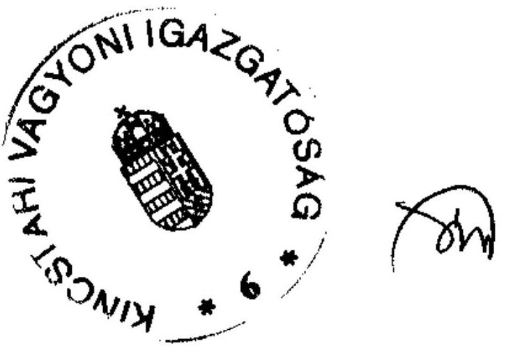

---

# 8. sz. Tanúsítvány

A KVI záró (dec.31-iki) állományi létszámának alakulása állománycsoportos bontásban 1997. - 2004. évek

|  MEGNEVEZÉS | 1997. | 1998. | 1999. | 2000. | 2001. | 2002. | 2003. | 2004.  |
| --- | --- | --- | --- | --- | --- | --- | --- | --- |
|  Teljes munkaidőben fogl. | 378 | 376 | 369 | 358 | 376 | 359 | 337 | 307  |
|  -fizikai | 88 | 80 | 62 | 39 | 18 | 6 | 5 | 3  |
|  -szellemi | 290 | 296 | 307 | 319 | 358 | 353 | 332 | 304  |
|  Részmunkaidőben fogl.* | 21 | 21 | 18 | 10 | 15 | 12 | 10 | 9  |
|  -fizikai | 18 | 18 | 15 | 5 | 3 | -- | -- | --  |
|  -szellemi | 3 | 3 | 3 | 5 | 12 | 12 | 10 | 9  |
|  KVI összesen | 399 | 397 | 387 | 368 | 391 | 371 | 347 | 316  |
|  -fizikai | 106 | 98 | 77 | 44 | 21 | 6 | 5 | 3  |
|  -szellemi | 293 | 299 | 310 | 324 | 370 | 365 | 342 | 313  |

- a részmunkaidőben foglalkoztatottak tényleges (tehát nem korrigált) létszámát jelentettük a táblázatban.

---

V-16-57/2004-2005. sz. jelentéshez

9. sz. Tanúsítvány

A KVI teljes munkaidőben foglalkoztatott közalkalmazottainak záró (XII.31.-iki) létszáma besorolásonkénti bontásban 1997. – 2004. év

|  MEGNEVEZÉS | 1997. | 1998. | 1999. | 2000. | 2001. | 2002. | 2003. | 2004. év  |
| --- | --- | --- | --- | --- | --- | --- | --- | --- |
|  Teljes munkaidőben fogl. | 378 | 376 | 369 | 358 | 376 | 359 | 337 | 307  |
|  - ebből vezérigazgató | 1 | 1 | 1 | 1 | 1 | 1 | 1 | 1  |
|  - ebből vezérig.hely. | 2 | 3 | 3 | 3 | 3 | 3 | 2 | 3  |
|  -ebből főosztályvezető | 6 | 7 | 6 | 7 | 6 | 8 | 7 | 9  |
|  -ebből osztályvezető | 22 | 22 | 21 | 18 | 18 | 18 | 17 | 17  |
|  - ebből egyéb vezető | 22 | 23 | 29 | 53 | 49 | 49 | 48 | 47  |
|  -ebből A fiz. oszt. | 36 | 29 | 16 | 6 | 3 | -- | -- | --  |
|  - ebből B fiz. oszt. | 47 | 44 | 39 | 29 | 20 | 10 | 10 | 6  |
|  - ebből C fiz. oszt. | 48 | 43 | 43 | 42 | 40 | 30 | 27 | 19  |
|  - ebből D fiz. oszt. | 90 | 94 | 97 | 95 | 104 | 106 | 95 | 77  |
|  - ebből E fiz. oszt. | 27 | 27 | 28 | 27 | 31 | 37 | 35 | 43  |
|  - ebből F fiz. oszt. | 36 | 40 | 41 | 31 | 42 | 41 | 42 | 37  |
|  - ebből G fiz. oszt. | 9 | 10 | 12 | 13 | 17 | 13 | 16 | 12  |
|  - ebből H fiz. oszt. | 21 | 22 | 24 | 27 | 33 | 33 | 28 | 25  |
|  - ebből I fiz. oszt. | 11 | 11 | 9 | 6 | 9 | 10 | 9 | 11  |

---

1. sz. tanúsítvány V-16- 57 /2004-2005. sz. jelentéshez

A KVI müködésével kapcsolatos nem rendszeres személyi juttatás előirányzatonkénti éves felhasználásának alakulása 1997. - 2004. év

|  Megnevezés | 1997. év | 1998. év | 1999. év | 2000. év | 2001. év | 2002. év | 2003. év | 2004. év  |
| --- | --- | --- | --- | --- | --- | --- | --- | --- |
|  Rendszeres személyi juttat, eFt | 330.849 | 417.439 | 454.491 | 503.547 | 604.180 | 712.266 | 903.273 | 867.361  |
|  Nem rendszeres " " eFt | 149.570 | 123.762 | 182.686 | 195.813 | 220.264 | 176.130 | 229.156 | 252.006  |
|  - ebből munkavégzéshez kapcsol.jutt. | 74.828 | 35.852 | 78.166 | 83.643 | 97.857 | 73.789 | 106.104 | 109.998  |
|  - ebből végkielégítés | 4.819 | 840 | 5.278 | 12.299 | 4.382 | 2.782 | 11.431 | 25.369  |
|  - ebből jubileumi jutalom | 10.923 | 9.776 | 10.001 | 15.555 | 20.040 | 13.097 | 19.938 | 24.987  |
|  - ebből napidíj | 556 | 526 | 492 | 1.339 | 2.569 | 1.926 | 3.268 | 2.421  |
|  - ebből betegszabadság | 5.600 | 6.676 | 13.647* | 10.807* | 13.832* | 11.573* | 12.405* | 14.244*  |
|  - ebből továbbtanulók támogatása | 2.935 | 2.654 |  |  |  |  |  |   |
|  - ebből biztosítási díjak | 9.025 | 10.732 | 19.123 | 18.776 | 18.400 | 19.214 | 17.319 | 10.553  |
|  - ebből ruházati költségtérítés | 1.258 | 11.348 | 20.490 | 19.103 | 23.654 | 22.796 | 21.403 | 19.529  |
|  - ebből üdülési hozzájárulás | 9.317 | 11.590 | -- | -- | -- | -- | -- | --  |
|  - ebből közlekedési ktg. | 8.274 | 8.855 | 11.554 | 5.277 | 24.700 | 15.062 | 13.884 | 19.088  |
|  - ebből étkezési hozzájárulás | 7.554 | 7.697 | 8.425 | 8.109 | 8.638 | 10.042 | 13.632 | 17.259  |
|  - ebből egyéb ktg. térítés, hozzájár. | 139 | 159** | 161 | 455 | 140 | 28 | 32 | 0  |
|  - ebből szociális jellegű juttatások | 624 | 1.432 | 2.130 | 2.594 | 2.438 | 3.213 | 2.790 | 3.590  |
|  - ebből részmunkaidőben foglalk.jutt. | 13.718 | 13.834 | 13.219 | 17.856 | 3.614 | 2.608 | 6.950 | 4.968  |
|  Külső személyi juttatás eFt | 92.979 | 92.863 | 89.467 | 69.261 | 33.271 | 13.775 | 51.757 | 60.371  |
|  SZEMÉLYI JUTTATÁS ÖSSZESEN eFt | 573.398 | 634.064 | 726.644 | 768.621 | 857.715 | 902.171 | 1.184.186 | 1.179.738  |
|  TB járulék eFt | 218.576 | 246.757 | 224.270 | 245.161. | 247.002 | 250.412 | 327.298 | 353.940  |
|  Munkaadói járulék eFt | 18.903 | 20.359 | 19.853 | 20.195 | 23.601 | 25.519 | 33.530 | 35.587  |
|  EHO eFt | 11.686 | 15.328 | 25.052 | 24.393 | 22.347 | 21.522 | 16.738 | 15.604  |
|  Táppénz munkált, terhelő része |  |  |  | 2.323 | 2.827 | 3.102 | 3.555 | 4.714  |
|  MUNKAADÓKAT TERHELŐ JÁRULÉKOK ÖSSZESEN eFt | 249.165 | 282.444 | 269.175 | 292.072 | 295.777 | 300.555 | 381.121 | 409.845  |

- tartalmazza a betegszabadság és a továbbtanulók támogatása céljára felhasznált összegeket is. ** 1998. évben egyéb sajátos juttatás + 1.791 eFt volt.